# 多 Agent 边界：按验证边界，而非岗位名称

首先我不认可多 Agent 工作流照着人类组织架构拆角色。

产品 Agent、前端 Agent、后端 Agent、测试 Agent、reviewer Agent。听起来各司其职，跑起来却经常牵丝攀藤。每个 Agent 都在推进自己那一段，最后人类 review 时因为负责验收的边界从来没有立起来从而如芒在背。

岗位名称来自人类团队。它背后有会议、长期记忆、隐性规则、责任归属和组织经验。Agent 没有这些默认背景。你告诉它“你是某个岗位”，它会根据训练语料补齐一套通用职责，却未必知道这次任务里哪些状态不能碰，哪些验收不能改，哪些输出必须先被另一个 Agent 消费。

角色数量只是表象，切分依据决定后面的协作能不能收敛。

我现在更倾向于把多 Agent 边界写成一个四元组：

$$
B_i=(O_i,C_i,V_i,R_i)
$$

其中：

$$
O_i=\mathrm{Ownership},\quad C_i=\mathrm{Contract},\quad V_i=\mathrm{Verifier},\quad R_i=\mathrm{Rollback}
$$

`Ownership` 定义谁拥有哪批文件、哪类状态、哪段输出；`Contract` 定义交接物长什么样；`Verifier` 定义谁用什么证据判定通过；`Rollback` 定义失败后能不能局部撤回。四个要素缺一个，岗位名再漂亮也站不住。

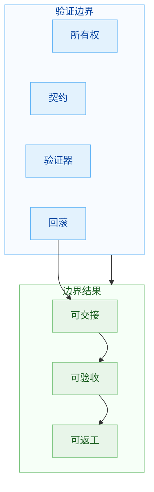

这篇文章讲的是：一块工作凭什么能交给一个 Agent，凭什么能交给另一个 Agent 验收，凭什么能在失败后局部返工。

## 岗位式拆分为什么容易失真

人类团队按岗位分工，是因为人类可以长期共享上下文。一个工程师知道某个接口虽然自己能改，但会影响另一个端；一个测试知道某个用例历史上挡过线上事故，不能随便跳过；一个架构负责人知道某块代码看起来老旧，却牵一发而动全身。

Agent 的上下文通常由一次任务临时加载出来。即使有 memory、AGENTS.md、CLAUDE.md，也很难完整继承团队里的隐性约束。岗位名称越抽象，Agent 越容易用通用印象补齐职责。

岗位式拆分有三个常见问题。

第一，边界会被身份感替代。Agent 知道自己“负责某类工作”，但不知道这类工作本轮的验收证据是什么。它会产出一段看起来完整的结果，然后用语言解释它为什么完整。

第二，交接物会退化成总结。Agent 做完一段，只留下一段“我完成了某部分”的说明。下一个 Agent 需要自己追上下文，读 diff，猜决策，补验证。

第三，整体可用性无人负责。每个 Agent 都可以解释自己的局部是合理的，用户路径、全链路状态、失败回滚却可能无人兜底。

多 Agent 的第一道设计题：每个角色的输出凭什么算完成。

## 验证边界是什么

验证边界指的是一块任务可以被独立检查的边界：

这块工作交付什么东西？交付物由谁消费？消费方用什么证据判断它可用？失败时能不能局部返工？

一个好的验证边界，让 Agent 的工作从“我觉得完成了”变成“这些证据显示它完成了”。

$$
\mathrm{ValidBoundary}(B_i)=
\mathrm{Observable}(V_i)\land
\mathrm{Explicit}(C_i)\land
\mathrm{Isolated}(O_i)\land
\mathrm{Recoverable}(R_i)
$$

其中 `Observable` 表示验证证据可观察，`Explicit` 表示契约显式，`Isolated` 表示所有权隔离，`Recoverable` 表示失败可恢复。只要其中一项不成立，这块任务就不适合贸然拆出去。

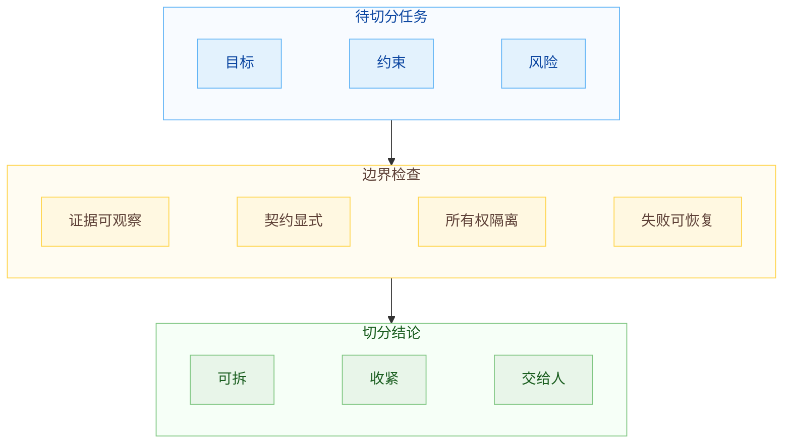

## 第一条边界：所有权

最朴素的边界是所有权。

多个 Agent 同时改同一个状态集合，冲突不只发生在 git merge。A Agent 为了一个目标改了某个状态，B Agent 为了另一个目标也改同一个状态，两边验证各自通过，合起来开始南辕北辙。

所有权示：

$$
O_i=\{f,s,a\}
$$

`f` 是文件或模块，`s` 是状态或数据，`a` 是外部动作。两个 Agent 是否能并行，先看它们的所有权集合是否相交：

$$
O_i\cap O_j=\varnothing
$$

如果交集为空，并行的风险较低。如果交集不为空，就要先引入共享契约：

$$
O_i\cap O_j\ne\varnothing \Rightarrow C_{ij}\ \mathrm{must\ exist}
$$

共享契约可以是接口、schema、状态机、事件格式、输出规范，也可以是明确的锁和审批。

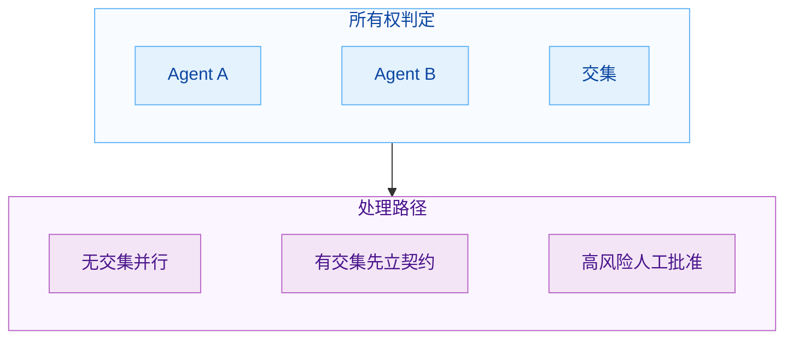

所有权边界不能一味切细。切得太碎，Agent 会为了一个小改动来回读别人的报告，沟通成本盖过执行收益。切得太粗，又会让一个 Agent 背上太多上下文。比较实用的判断是：一个 Agent 应该拥有一组能独立完成验收的对象，而非一组看起来属于同一岗位的对象。

## 第二条边界：契约

契约是多 Agent 并行的前置条件。

没有契约，多个 Agent 会用各自舒服的方式推进。最后很难归咎于某一边。

契约至少要回答五个问题：

输入是什么？输出是什么？错误怎么表达？谁消费这个输出？用什么证据验收？

$$
C_i=(I_i,O_i,E_i,U_i,A_i)
$$

`I_i` 是输入，`O_i` 是输出，`E_i` 是错误语义，`U_i` 是消费方，`A_i` 是验收条件。一个契约如果只写输入输出，不写错误和验收，就很容易在后半程出问题。Agent 会把 happy path 做得很顺，边界状态却挂一漏万。

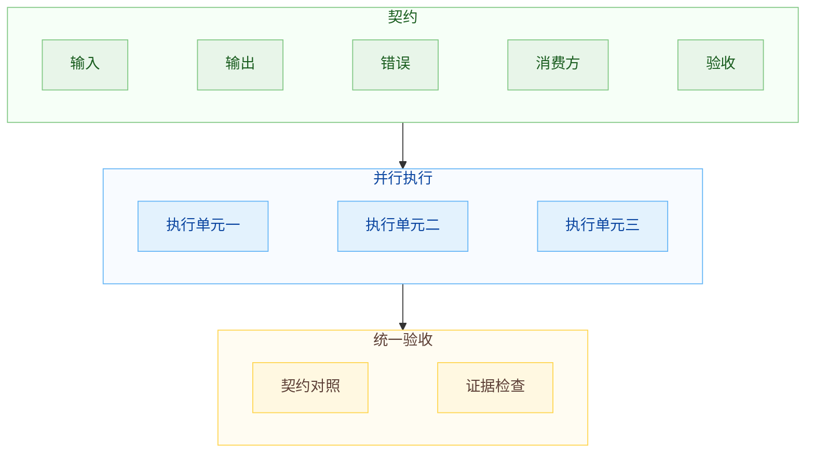

测试 Agent 的位置也会因此变化。它不能只扮演泛泛的测试岗位，它要成为契约的守门人。它检查的是消费方有没有遵守输入输出，生产方有没有遵守错误语义，验收证据有没有覆盖关键状态。

## 第三条边界：状态交接

一个 Agent 做完后，如果只在最后回答里写“我完成了这一段”，下一个 Agent 需要自己追上下文，读 diff，猜决策，补验证。这样系统会越跑越脏。

状态交接应该是一份结构化工件。它至少包含：

```md
## Scope
本轮处理的边界

## Contract
本轮遵守的契约

## Changed Objects
本轮修改的对象

## Verification
本轮验证证据

## Decisions
本轮确认的决策

## Open Risks
仍然存在的风险

## Next Step
下一轮进入点
```

把 Agent 的局部工作变成可读取、可审计、可续跑的状态。先读交接物，再读工作对象，比从聊天记录里追溯要稳得多。

状态交接能防止错误长期化。没有 `Open Risks`，后续 Agent 很容易把未完成事项当成已完成事实。没有 `Scope`，后续 reviewer 很难判断某个缺口是缺陷还是有意不做。没有 `Verification`，人只能重新猜它到底验过什么。

交接质量：

$$
H=\mathrm{Scope}+\mathrm{Contract}+\mathrm{Evidence}+\mathrm{Risk}+\mathrm{Next}
$$

如果 `H` 只剩一段自然语言总结，它就不是交接物，只是聊天记录。

## 第四条边界：失败权

只按岗位拆分时，reviewer Agent 经常变成建议生成器。它读完候选结果，写一堆合理建议，然后执行 Agent 挑一些修，剩下解释为后续优化。这种结构很难收敛。

B 卷必须有失败权。

失败权并不等于 B 卷可以摆架子、扩大需求。它的意思是：在约定验收标准下，B 卷可以明确判定当前候选结果不能进入下一阶段。

B 卷的输出最好固定成这样：

```md
Result: PASS / FAIL

Evidence:
- ...

Blocking Issues:
- ...

Non Blocking Issues:
- ...

Required Fixes:
- ...

Out of Scope:
- ...
```

`Blocking Issues` 是 B 卷输出里最有分量的部分。B 卷应该少写泛泛建议，多写阻断原因。阻断原因必须能回到 spec、contract、测试结果、截图、日志或 diff。找不到证据的意见，放进 `Non Blocking Issues`，不要影响当前合并。

这样 A 卷也会更轻松。它不需要面对一堆边界不清的审美评论，只要修 blocking issue。修完再交给 B 卷。B 卷继续看证据，不重新发明需求。

## 权力矩阵：谁能改，谁能拒，谁能合

角色边界如果只停在职责描述上，运行时还是会散。多 Agent 要收敛。

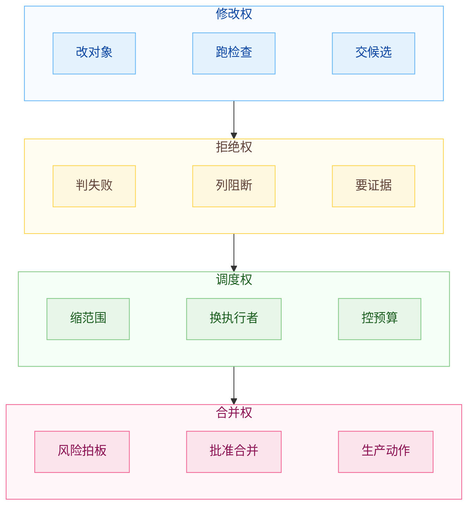

这四种权力最好不要混在一个 Agent 身上。一个 Agent 既写产物，又改验收标准，又判断自己通过，还自动进入合并层，这种闭环看起来顺滑，实则暗藏祸根。它会把所有压力都放在模型的临场自觉上。

规则：

```text
能执行的人不改验收。
能验收的人不直接合并。
能调度的人不替代责任人。
```

这个规则能挡住很多多 Agent 工作流里的偷梁换柱。

## 成本账：什么时候值得拆

多 Agent 有成本。每多一个 Agent，就多一次上下文加载、多一份提示、多一轮工具调用、多一段 trace，也多一个可能跑偏的执行体。把一个小任务拆成四五个 Agent，纯属杀鸡用牛刀。

判断方式：

$$
\mathrm{SplitValue}=
\mathrm{AvoidedRework}+
\mathrm{ParallelGain}+
\mathrm{RiskReduction}-
\mathrm{CoordinationCost}
$$

拆分收益为正，才值得拆：

$$
\mathrm{SplitValue}>0
$$

更细一点，可以把协调成本拆开：

$$
\mathrm{CoordinationCost}=C_{context}+C_{handoff}+C_{merge}+C_{verify}
$$

`C_context` 是上下文加载成本，`C_handoff` 是交接成本，`C_merge` 是合并成本，`C_verify` 是额外验证成本。很多多 Agent 工作流的问题，就出在只看 `ParallelGain`，没有把这四个成本算进去。

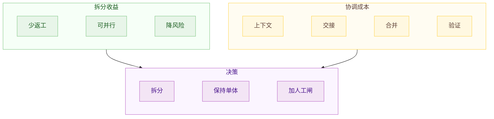

低风险、强机械验证的小任务，通常单 Agent 加机器检查就够了。中等复杂度、可以清楚验收的任务，适合 A/B 卷。跨层任务可以并行，但要先立 contract。高风险任务要少拆执行，多拆审查。探索性任务适合并行研究，最终结论要有人收敛。

## 三种抽象切分形态

工作流可以收敛成三种抽象形态。它们不绑定具体业务，只绑定验证方式。

第一种是单契约并行型。先有 contract，再让多个执行单元并行，最后统一验收。

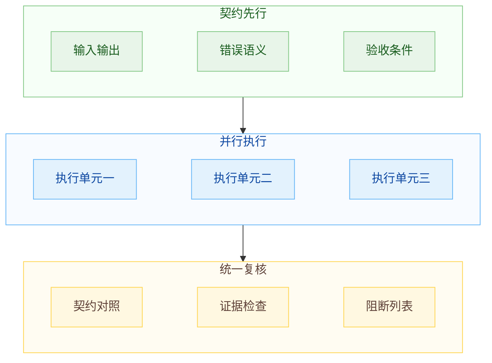

第二种是分诊路由型。先判断任务类型和风险，再把任务送到合适路径。它适合输入混杂、失败原因多、处理动作差异大的工作流。

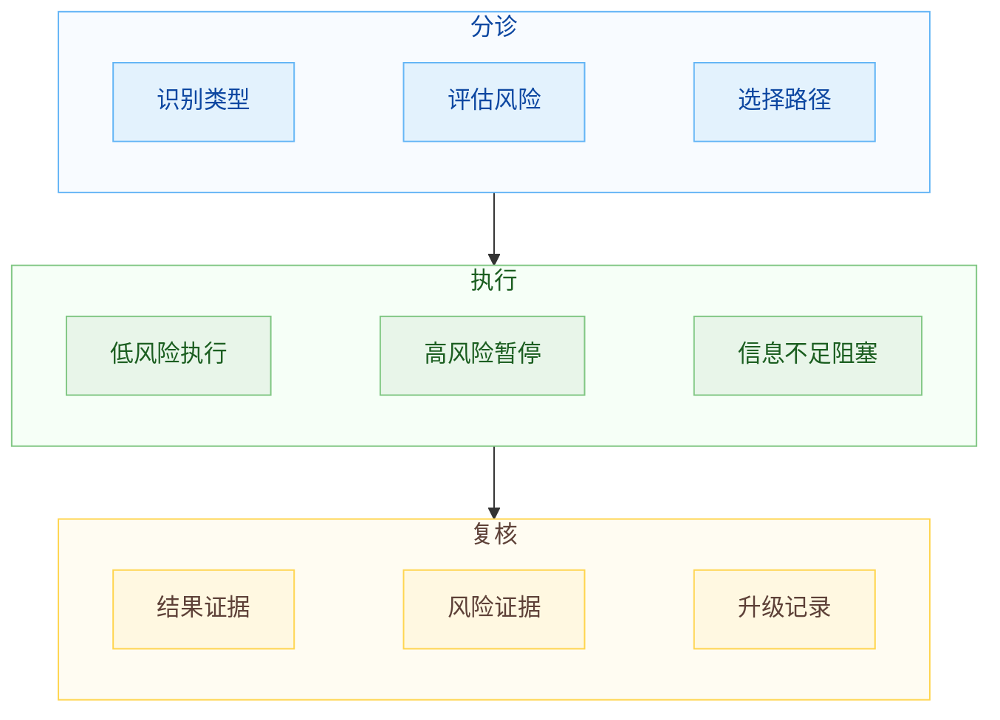

第三种是对抗复核型。多个 reviewer 从不同失败面审同一个候选结果，最后由 orchestrator 收敛。它适合误通过成本很高的任务。

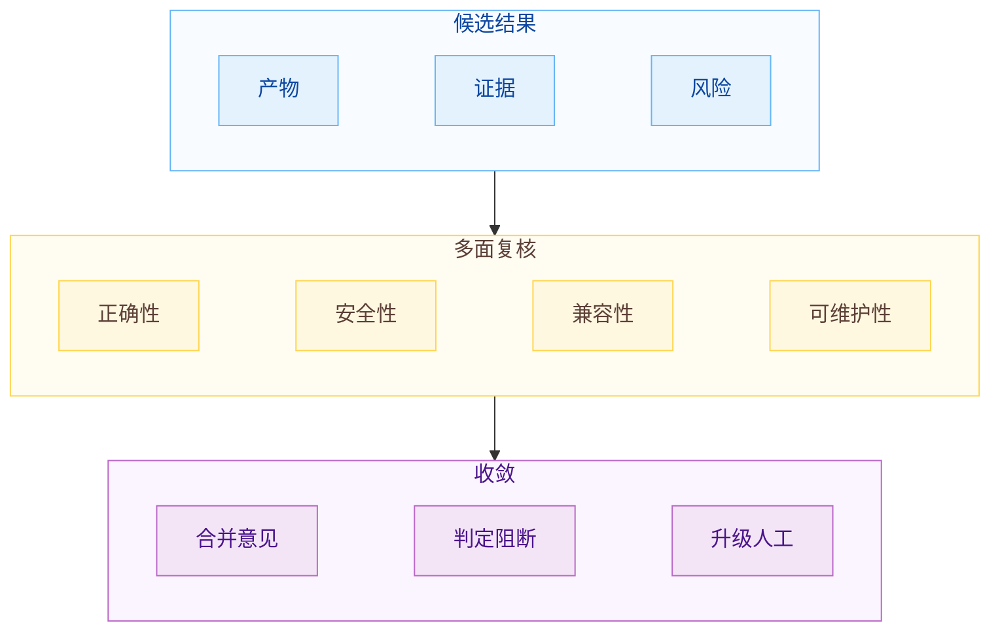

这三种形态的共同点是：先把可验证边界立住，再谈并行。边界没有立住时，多开 Agent 只是把混乱并行化。

## 速度账：可合并速度比生成速度更重要

多 Agent 最容易制造速度幻觉。

屏幕上几个 Agent 同时滚动，任务卡片不断变化，候选结果一个接一个出现，等到开始 review，速度突然慢下来。瓶颈落在合并判断上，生成只是前段工序。

速度应该看可合并结果的出现速度：

$$
T_{merge}=T_{generate}+T_{verify}+T_{review}+T_{rework}
$$

多 Agent 如果只降低 `T_generate`，却抬高了 `T_verify`、`T_review` 和 `T_rework`，总时间并不会变短。更糟的是，它还会制造理解债。

值得优化的是：

$$
\min T_{merge}
$$

不要只优化：

$$
\min T_{generate}
$$

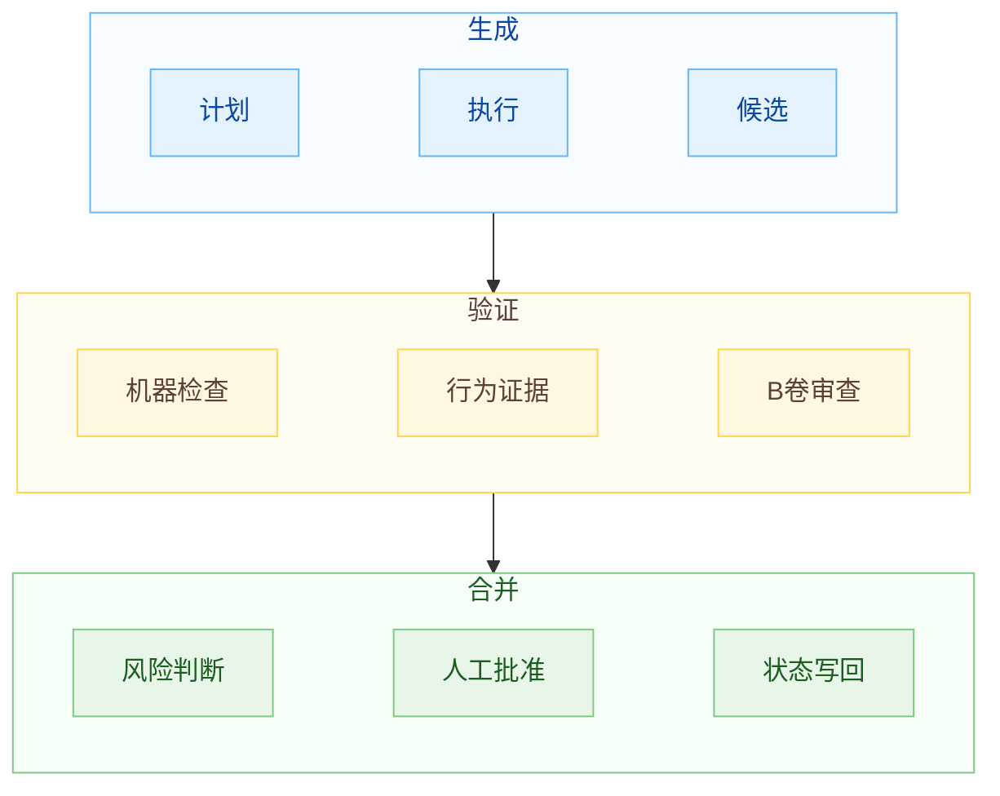

一份带 contract、测试结果、风险说明和 B 卷结论的候选结果，生成可能慢一点，但合并决策快得多。长期看，后者更省时间。

速度的另一面是 WIP 限制。Agent 数量应该按 review 能力定。你能认真审两个候选结果，就不要同时开六个会改状态的 Agent。超过 review 能力的并行，会把系统推向浅审查和理解债。

## 通过标准：保证证据，不承诺神谕

多 Agent 工作流不能承诺绝对正确。但应该：每一次通过都留下证据，每一次证据不足都不能伪装成完成。

我会把通过分成五层：

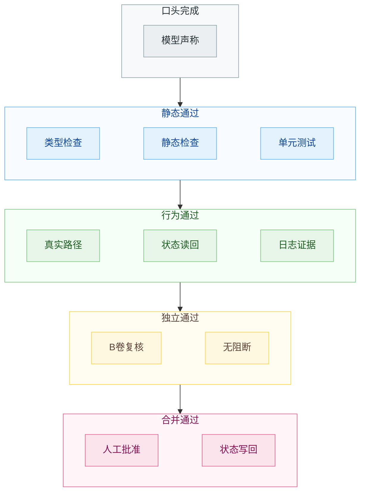

L0 基本没有工程价值。L1 是底线。L2 对产品功能很重要。L3 是多 Agent 的核心增量。L4 是责任边界。

很多工作流的问题，是把 L0 当 L3，把 L1 当 L4。Agent 写一句“已完成并通过验证”，人类没有时间细看，就默认它真的完整。几轮之后，系统里堆满了半可信状态。后续 Agent 再基于这些状态继续工作，就会越跑越偏。

所以 PASS 必须有证据。B 卷也不能只说“看起来可以”。它要列出自己看了什么、跑了什么、没覆盖什么。不能覆盖的地方，要进入风险说明或人工 gate。

一个合格的验收包可以抽象成：

```md
Result: PASS

Evidence:
- static checks
- behavior checks
- state readback
- trace or log

Known Gaps:
- uncovered boundary

Human Review:
- required gate
```

这份东西不能保证没有 bug，但它让风险可见。工程里很多可靠性来自这种可见性。看得见，才能判断；判断清楚，才能合并。

## 一套更稳的切分流程

如果要把“按验证边界切分”落成 routine，我会这样设计。

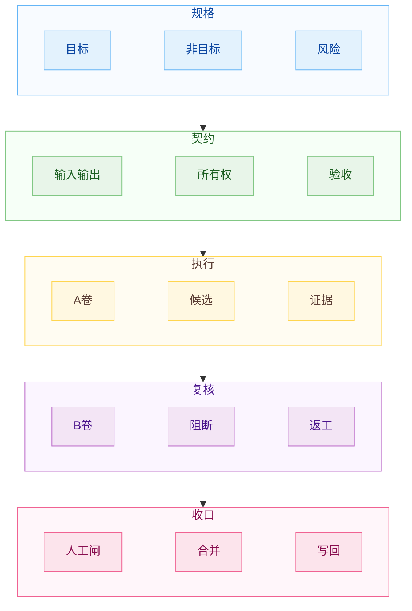

先写 spec。spec 不求长，必须包含目标、非目标、约束、验收、风险对象和人工 gate。没有 spec，后面所有 Agent 都会按自己的理解补题。

再定 contract。涉及跨 Agent 的地方，先写输入输出、所有权、状态交接格式。contract 没定，不要并行大规模执行。

然后分配 A 卷。A 卷拿到的是可执行任务，不是岗位称号。它要知道自己能改什么、不能改什么、要交什么证据。

接着让 B 卷看 plan。B 卷先审任务拆法和验收方式，避免 A 卷在错误方向上跑太远。

A 卷实现后，提交候选结果和 verification packet。不要只交总结。必须带命令、输出、日志、trace 或其他证据。

B 卷按 contract 验收。只写 blocking issue、non blocking issue 和 required fixes。超出 contract 的新想法，进入后续任务，不在当前验收里搅局。

连续失败后，orchestrator 介入。可能缩小 scope，可能换 Agent，可能升级给人。不要让 A/B 两卷无限循环。

最后由人类处理 L4。高风险、跨边界、产品取舍、架构方向、生产发布，仍然要人批准。多 Agent 可以把材料准备到位，让人少读废话，但责任不能凭空消失。

## 结尾

多 Agent 的价值不在模拟一个公司。

把一件复杂工作拆成几个能独立推进、独立验收、独立回滚的执行单元。拆得好，Agent 之间各司其职，人的 review 也有证据可看。拆得差，岗位名越多，协调越乱，最后只能靠人补上下文、补判断、补责任。

## 参考资料

1. jolestar, [Agent 是否需要分工以及角色划分？](https://x.com/jolestar/status/2061252445901337048), 2026-06-01.
2. Google Cloud, [ADK architecture: When to use sub-agents versus agents as tools](https://cloud.google.com/blog/topics/developers-practitioners/where-to-use-sub-agents-versus-agents-as-tools), 2025-11-07.
3. Anthropic, [How we built our multi-agent research system](https://www.anthropic.com/engineering/multi-agent-research-system), 2026.
4. Addy Osmani, [The Orchestration Tax](https://addyosmani.com/blog/orchestration-tax/), 2026-05-24.
5. Addy Osmani, [The Code Agent Orchestra](https://addyosmani.com/blog/code-agent-orchestra/), 2026-03-26.
6. Anthropic, [Harness design for long-running application development](https://www.anthropic.com/engineering/harness-design-long-running-apps), 2026-03-24.
