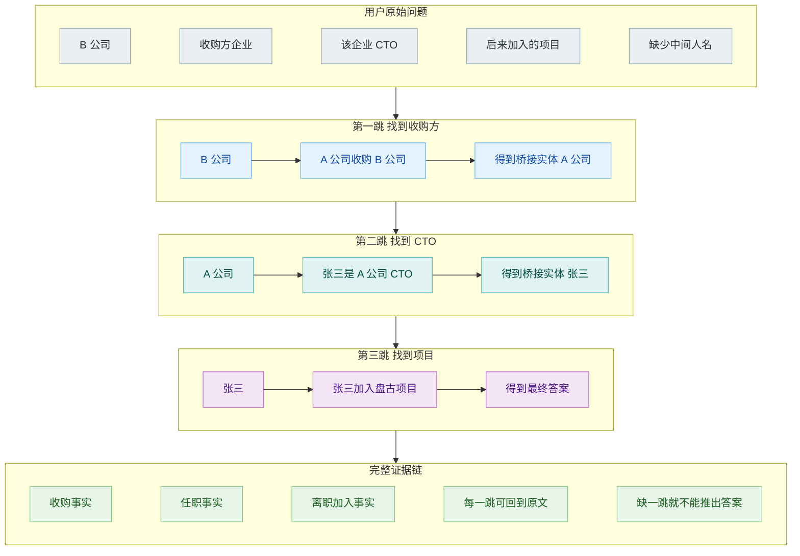
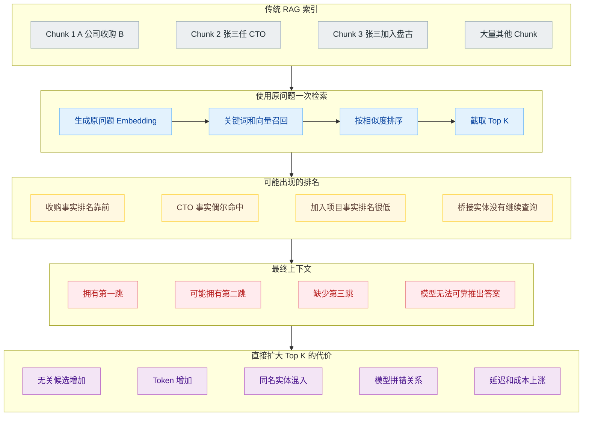
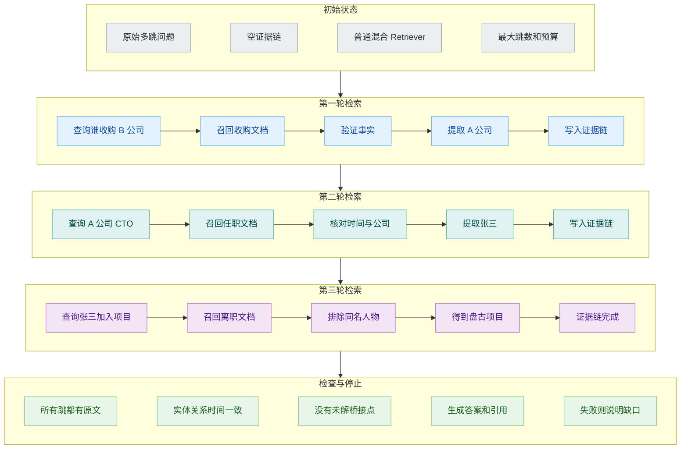
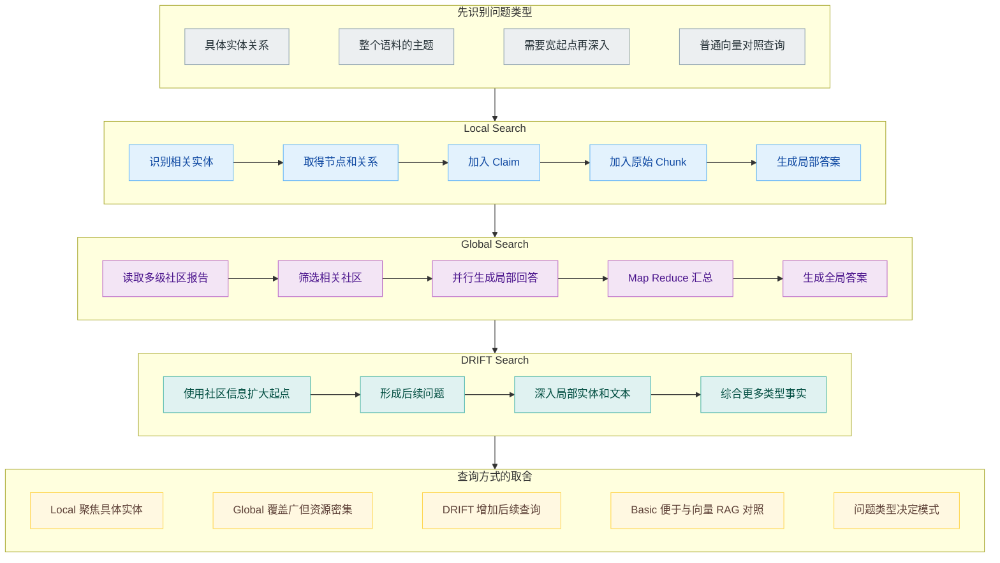
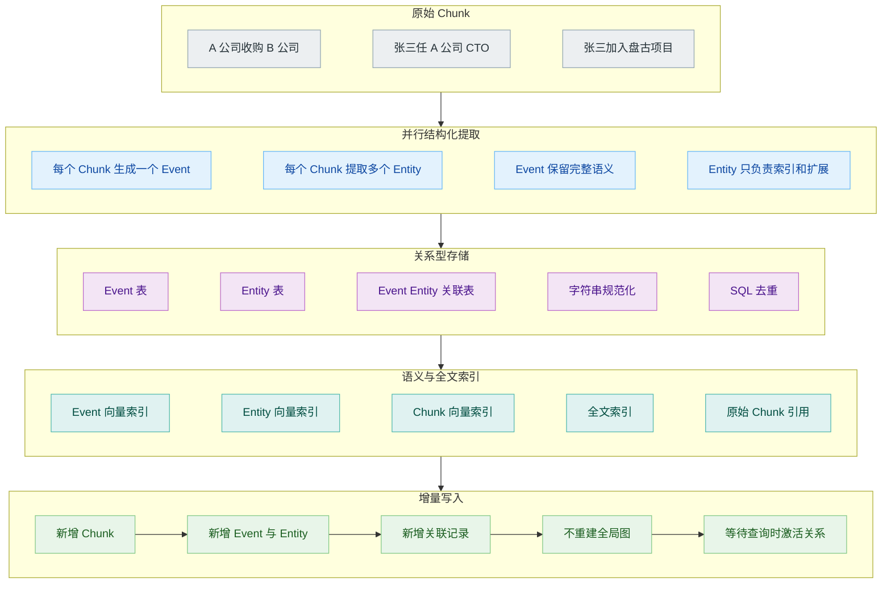
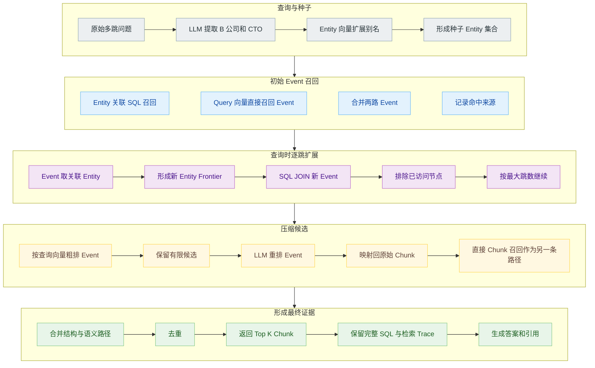
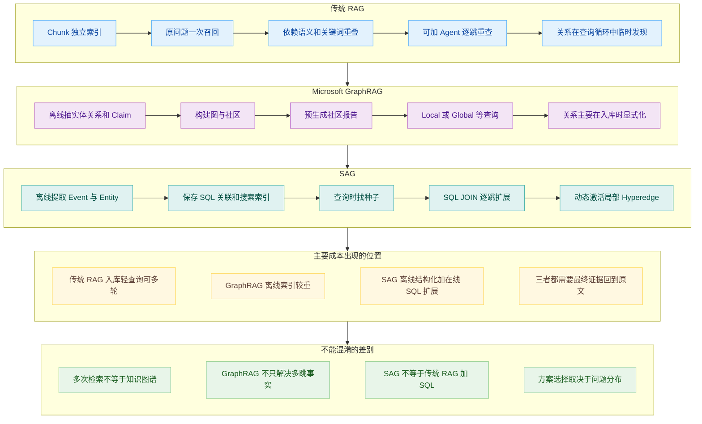
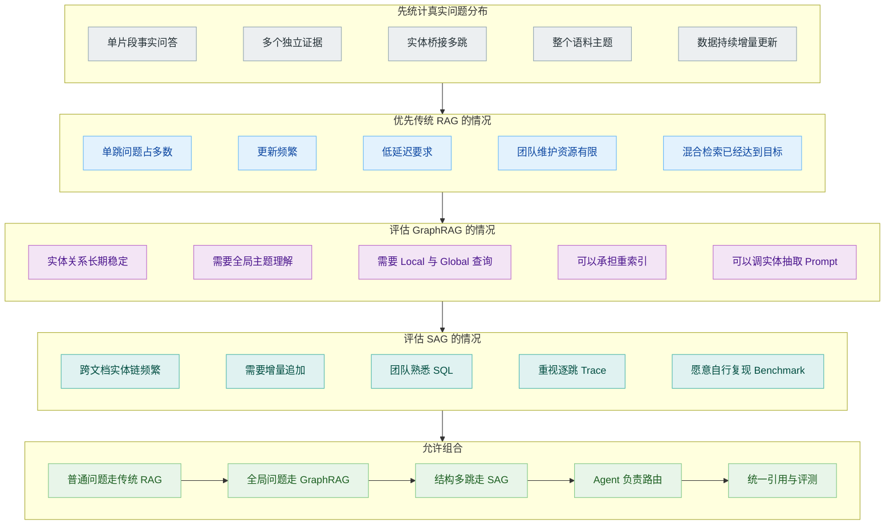

# 多跳检索：传统 RAG、GraphRAG 和 SAG 的区别

知识库里分散着三份互不相邻的材料：

> 2023 年，A 公司全资收购了 B 公司。

> 张三被任命为 A 公司的 CTO。

> 2024 年，张三离职并加入盘古大模型项目。

用户问：

> 收购 B 公司的企业，其 CTO 后来加入了哪个项目？

答案需要跨过三段关系。系统先根据 B 公司找到收购方 A 公司，再从 A 公司找到 CTO 张三，最后拿着张三继续查，才能得到盘古大模型项目。用户问题里没有出现“张三”，第三份材料也没有出现“B 公司”和“收购”。一次只比较原问题与每个 Chunk 的相似度，很容易在第二跳之后断掉。

这类任务通常被称为多跳检索。难点不只是从多份文档里取回内容，而是前一份证据会产生下一次检索需要的桥接实体。传统 RAG、GraphRAG 和 SAG 对关系的处理时间不同：传统 RAG 可以在查询过程中继续搜索，GraphRAG 主要在入库阶段建立图结构，SAG 则保存 Event-Entity 索引，在查询时通过 SQL 动态展开局部关系。

多跳检索也不能简单等同于“取回多个 Chunk”。用户问“比较北京和上海的住宿标准”，两份证据可以分别根据原问题召回，再做横向比较；上面的例子必须先发现 A 公司和张三，后续查询才能成立。真正的多跳依赖前序结果，检索路径会随着证据逐步展开。

## 传统 RAG 的 Chunk 之间没有显式关系

常见 RAG 会把文档切成 Chunk，建立关键词与向量索引。查询到来后，系统用原问题取回 Top K，再让模型从候选中回答。

第一份“ A 公司收购 B 公司”与原问题高度相关，很容易被召回。第二份包含 A 公司和 CTO，也可能因为关键词重叠进入候选。第三份只有张三和盘古项目，与原问题的表面词语和整体语义都相距较远。如果 Top K 有限，它很可能排在候选之外。

这不表示传统 RAG 绝对无法处理多跳问题。文档恰好在同一个 Chunk、查询与每一跳都有足够语义重叠，或者 Top K 开得很大时，几份证据可能同时进入上下文。问题在于这种成功依赖数据排列和相似度，并没有显式机制保证桥接实体被继续使用。

扩大 Top K 也不是长久之计。候选数量增加会带来更多无关张三、更多关于 A 公司的人事材料和其他盘古项目内容。模型要在越来越拥挤的上下文里自己拼接路径，成本与误连概率一起上升。

传统索引的优势同样明显。入库只需要解析、切块和建立搜索索引，新文件可以直接追加；查询路径短，工程成熟，普通单跳问答和多个独立事实汇总都能覆盖。是否需要引入更复杂结构，应该由多跳失败在真实问题中的比例决定。

## Agent 可以让传统 RAG 逐跳继续查

在传统 Retriever 外面增加 Agent，系统可以把每轮结果中的桥接实体拿出来，形成下一轮查询。

第一轮搜索“收购 B 公司的企业”，得到 A 公司。Agent 更新当前证据链，再搜索“A 公司 CTO”，得到张三。第三轮搜索“张三后来加入的项目”，找到盘古大模型项目。每一轮仍然可以使用普通关键词、向量与混合检索，变化发生在查询控制层。

这种做法与上一篇 Agentic RAG 的循环一致。Agent 需要判断当前证据是否只完成部分任务、提取可信桥接实体、生成下一跳查询，并在找到完整证据链后停止。它不要求提前为整个知识库建立实体关系图，适合开放知识源和更新频繁的数据。

代价在查询时出现。每一跳都要经过模型判断和 Retriever 调用，延迟随路径增长；第一跳提取错了实体，后续查询会沿错误方向继续。系统还要防止同名实体混淆，例如不同公司的张三，不能只凭名字把任职和项目经历连起来。

迭代传统 RAG 把关系发现留到查询时，而且主要由 LLM 完成。GraphRAG 的选择不同：它在用户提问之前，就从整个语料中提取实体和关系，形成可以查询与汇总的图结构。

## GraphRAG 在离线阶段建立知识图谱

GraphRAG 先把来源文档切成 Text Chunk，再让 LLM 从每块中提取实体、关系和 Claim，并生成相应描述。相同实体经过汇总后形成图节点，关系成为边。系统随后使用 Leiden 一类社区检测算法，把联系紧密的节点划成层级社区，再让 LLM 为各级社区生成 Community Report。

这条入库链比普通向量索引重得多。实体与关系抽取需要大量模型调用，实体合并和关系描述会积累错误，社区报告还要继续生成和存储。Microsoft 的仓库也明确提醒 GraphRAG Indexing 可能很昂贵，建议先用小数据集，并针对具体领域调整 Prompt。

得到的结构不只服务于“沿边找下一跳”。Community Report 会把一个局部子图中的主要实体、关系与主题压缩成可查询摘要，让系统回答“整个语料主要讨论了什么”“哪些主题之间存在联系”这类全局问题。这才是《From Local to Global》论文的主攻方向。

GraphRAG 不是所有“用了图数据库的 RAG”的统一名称。这里讨论的是 Microsoft 论文与开源项目给出的具体方法。其他图增强 RAG 可能直接遍历知识图谱、检索子图或让 Agent 在图上逐步行动，数据模型与查询过程并不相同。

## GraphRAG 要根据问题选择查询方式

当前 GraphRAG Query Engine 提供 Local Search、Global Search、DRIFT Search 和用于对比的 Basic Search。

Local Search 适合围绕具体实体提问。系统从查询中识别相关实体，组合知识图谱中的实体、关系、Claim 与原始 Text Chunk，再生成答案。上面的收购问题如果图中已经正确保存 A 公司、B 公司、张三和盘古项目之间的关系，Local Search 可以利用这张局部图取得证据。

Global Search 面向整个语料的主题与趋势。它遍历社区报告，为每份相关报告生成局部回答，再通过 Map-Reduce 汇合成全局答案。原论文评测的重点正是这类 Global Sensemaking 问题，而不是一般意义上的多跳事实问答。

DRIFT Search 在 Local Search 的基础上引入社区信息。它从较宽的社区洞察开始，把问题细化成后续查询，扩大局部搜索能够触达的事实范围。它更接近“先用全局结构找方向，再逐步深入局部证据”。

图结构能够把关系显式保存，也会把离线抽取质量变成上限。张三在两份文档中写法不同，实体合并失败，路径就会断；关系抽取把“曾任 CTO”误写成“现任 CTO”，图遍历会稳定地返回错误关系。图让错误更容易检查，不会自动消除错误。

## SAG 保存 Event-Entity 索引而不是全局图

SAG 不在离线阶段预先枚举一张完整知识图谱，而是把每个 Chunk 转成一个 Event 和若干 Entity。

Event 是对 Chunk 核心内容的完整表达。一个 Chunk 对应一个 Event，不再继续拆成多条彼此独立的主语、关系、宾语三元组。Entity 只作为索引点和扩展点，可以是人物、组织、地点、时间、产品、动作或指标。Event 与多个 Entity 之间形成多对多关联，存进关系数据库；Event、Entity 和原始 Chunk 同时建立向量与全文索引。

以“张三被任命为 A 公司 CTO”为例，Event 保留完整任职事实，Entity 可以包含张三、A 公司和 CTO。关系表记录这个 Event 与三个 Entity 的关联。论文把一个 Event 连接多个 Entity 看作潜在 Hyperedge，但不会在入库时把所有 Event 之间的超边完整构建出来。

这让新文档更容易增量追加。新 Chunk 只需要生成自己的 Event、Entity 和关联记录，不必重新执行全局社区检测。代价是查询时要从种子实体出发，用 SQL JOIN 动态找到共享实体的其他 Event。

SAG 仍然使用 LLM 和向量检索。它不是把传统 RAG 与 SQL 简单拼接，也不是完全用确定规则替代语义模型。论文中的职责分配是：LLM 负责 Event 与 Entity 提取、查询实体识别和最终候选重排；向量与全文索引负责语义和词项召回；SQL 负责确定的关联过滤与逐跳扩展。

## SAG 在查询时动态展开局部关系

查询阶段先执行 Seed Retrieval。第一条路径让 LLM 从问题中识别 B 公司、CTO 等种子实体，再通过 Entity 向量索引补充相近实体，随后用 SQL JOIN 找到与这些实体关联的 Event。第二条路径直接用原问题向量召回相关 Event。两路合并形成初始 Event 集合。

接着进入 Query-Time Expansion。系统从初始 Event 反向取出关联 Entity，形成新的 Entity Frontier，再通过这些实体查找尚未访问的 Event。B 公司带出“A 公司收购 B 公司”，其中的 A 公司成为新实体；A 公司带出“张三任 CTO”，张三再带出“张三加入盘古项目”。每一跳都是关系表上的 JOIN，不需要遍历一张提前构建的全局图。

扩展会产生较多候选。SAG 先根据查询向量做粗排，再让 LLM 从有限 Event 中选择相关项，映射回原始 Chunk。同时还有一条直接 Chunk 向量召回路径，两路结果合并、去重后交给生成模型。结构路径负责发现没有直接语义重叠的证据，直接路径保留普通语义检索的覆盖。

这种查询链留下了较细的可解释记录：问题提取了什么 Entity，Entity 扩展命中了什么别名，SQL JOIN 找到了哪些 Event，哪一跳没有产生新候选，哪些 Event 被粗排和 LLM 重排淘汰。传统向量检索通常只能看到一张相似度列表，SAG 可以进一步定位关系链在哪里断掉。

## 同一个问题在三种系统中怎样运行

传统单次 RAG 使用原问题一次召回，能否拿齐三份材料取决于相似度与 Top K。加上 Agent 后，它可以在查询阶段依次发现 A 公司和张三，每一跳都重新调用 Retriever。

GraphRAG 在入库时已经尝试把 A 公司、B 公司、张三和盘古项目整理成节点与关系。Local Search 可以围绕相关实体取得图数据和原始 Chunk；如果问题关注整个语料的趋势，则转向 Community Report 与 Global Search。它的关系恢复成本主要提前支付。

SAG 入库时没有构建全局社区图，而是保存三个 Event 及其 Entity 关联。查询到来后，种子 Entity 和 SQL JOIN 激活当前问题附近的局部 Hyperedge。关系扩展成本放在查询阶段，但连接动作由关系数据库执行，而不是让 Agent 每一跳都自由生成下一次工具调用。

三种方法都不能只看最后一张架构图。数据更新频率、典型问题、入库预算、查询延迟和团队维护能力，会改变选择。

## 没有一种方案覆盖所有知识库

普通客服、制度查询和产品手册问答，大多数答案集中在一个或几个可以独立召回的 Chunk。混合检索、Metadata Filter 和 Reranker 通常是更合算的起点。为了少量多跳问题直接建设整套知识图谱，容易把索引成本和维护工作放大。

如果业务经常围绕稳定实体关系提问，还需要回答整个语料的主题、群体与趋势，GraphRAG 的图社区和层级摘要更有价值。它的前提是团队能够承担 LLM 抽取、实体合并、Prompt Tuning、索引更新和社区报告成本。

如果资料持续增加，多跳关系主要通过共享实体连接，又希望检索路径可以落到 SQL 记录，SAG 提供了值得评测的结构。它仍然是一项较新的方法，现有结果主要来自作者论文与配套 Benchmark，不能因为一张性能表就跳过自己的业务测试。

Agentic RAG 则可以放在这些 Retriever 外面。Agent 根据问题类型选择普通向量库、GraphRAG Local Search、Global Search 或 SAG，并检查返回证据是否充分。多种检索器并存时，路由与评测反而比单个方法的宣传指标更重要。

选型前最好先构造一批可以区分方案的问题。只有单跳问题的测试集，GraphRAG 和 SAG 的结构优势不会出现；全部使用多跳 Benchmark，又会高估真实业务中复杂查询的比例。测试集应当包含单跳、比较、桥接多跳、全局主题、同名实体、时间变化和缺失关系。

## SAG 的实验结果与限制

SAG 论文在 HotpotQA、2WikiMultiHopQA 和 MuSiQue 上比较多跳召回。在统一的 Embedding 与 LLM 配置下，作者报告 SAG 在 9 项 Recall@1、Recall@2、Recall@5 指标中取得 8 项最佳结果。MuSiQue 的 Recall@5 为 `80.04%`，论文复现的 HippoRAG 2 为 `65.13%`。配套代码仓库提供 SAG-Benchmark 作为复现入口。

这些结果说明 Event-Entity 索引与查询时扩展值得继续研究，不能直接证明它在任意企业文档中都优于 GraphRAG。三个数据集都围绕多跳问答，指标主要检查支持段落有没有进入前几个结果；真实系统还要关心解析质量、权限、索引更新、答案忠实性、查询延迟和运维成本。

论文也列出当前限制。SAG 只使用字符串规范化与 SQL 去重处理 Entity，不同写法可能被当成不同实体，削弱跨文档连接。Entity Frontier 有固定剪枝预算，低频但关键的桥接实体可能在长链中被提前丢弃。现有 Event 索引适合追加，新事实覆盖旧偏好、状态变化和历史版本保留还没有完整解决。

GraphRAG 有另一组风险：实体与关系抽取错误会进入图，离线构图与社区摘要成本高，更新时可能需要重新处理较大范围数据。传统 Agentic RAG

多跳检索的核心并不是选择一个听起来更新的缩写，而是让系统保住证据之间的连接。传统 RAG 可以让 Agent 在查询时逐跳发现连接，GraphRAG 可以把实体关系与社区理解提前组织起来，SAG 则把完整 Event 和轻量 Entity 关联保存在关系表里，到查询发生时再激活局部结构。

## 参考资料

1. Darren Edge et al., [From Local to Global: A GraphRAG Approach to Query-Focused Summarization](https://arxiv.org/abs/2404.16130).
2. Microsoft, [GraphRAG](https://github.com/microsoft/graphrag).
3. Yuchao Wu et al., [SAG: SQL-Retrieval Augmented Generation with Query-Time Dynamic Hyperedges](https://arxiv.org/abs/2606.15971).
4. Patrick Lewis et al., [Retrieval-Augmented Generation for Knowledge-Intensive NLP Tasks](https://arxiv.org/abs/2005.11401).
