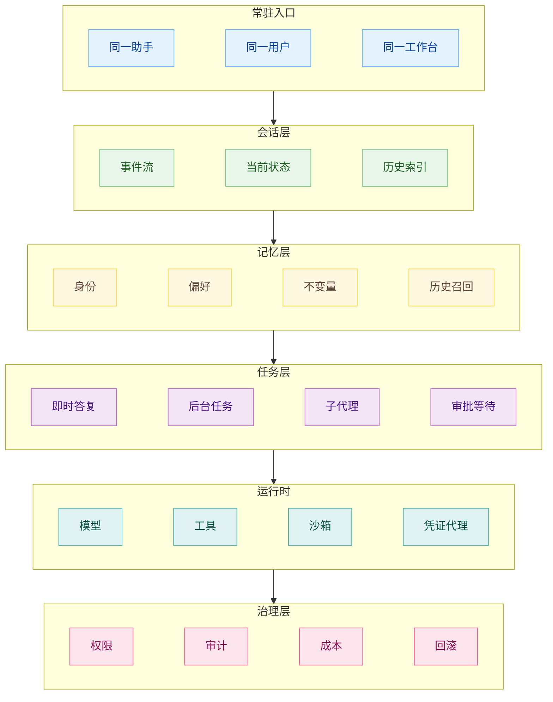
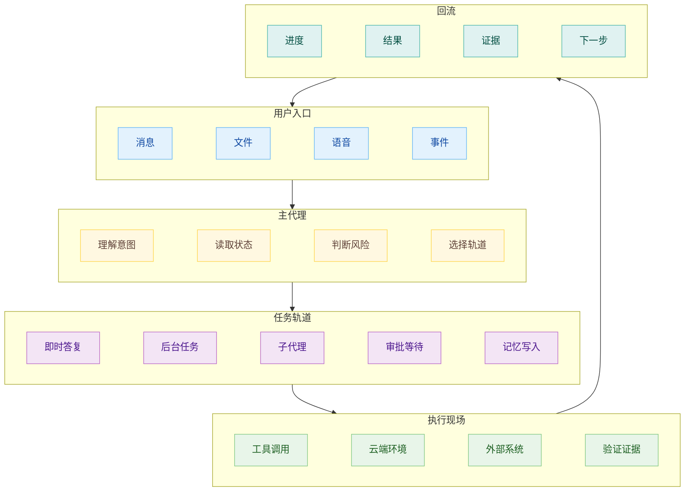

# 常驻代理：无需新开对话，Agent 系统要怎么设计

## 常驻的是身份

我们打开同一个入口，说上一句，过一会儿再说下一句，其中可以穿插临时问题、长任务、文件处理、网页操作和后台提醒。我们没有必要为每件事新开一个对话，也没有必要自己判断这件事该交给哪个 Agent。像豆包一样，如何设计一个长期可用的工作台？

工程上真正常驻的东西并非一个永远不关的进程：进程冷启动，容器销毁，sandbox 重新分配，worker 换机器。用户感知到的连续性，来自身份、会话、记忆、任务状态和权限边界的连续。一个 Agent 可以在本地环境处理文件，也可以在云端 sandbox 里跑任务，自行安排把任务拆给子 Agent，只要它能读回同一套身份和状态，在我们的感知中，就会把它当成同一个助手。

这和本地常驻 Agent 的直觉有点不同。早期自部署工具经常把“同一个 Agent”理解成“同一个 pod 一直活着”。这里有一个 OpenClaw 托管服务的成本问题：每个用户一个固定 pod，隔离性很好，资源成本也很高；迁到 FastClaw 之后，通过动态挂载 sandbox 提供服务，常驻体验还在，底层资源占用大幅下降。这个例子说明，常驻代理要守住的是可恢复的身份和状态，计算资源可以按需出现。

常驻代理的入口越稳定，底层越需要分层。入口负责承接用户意图，session 负责保存发生过什么，memory 负责沉淀长期有用的东西，任务层负责把工作分出去，运行时负责提供工具和环境，治理层负责兜住权限、成本和审计。如果把这些都压进一条聊天记录并不是有效的方法，因为一定会变成一团低密度上下文。

## 入口要能分流任务

无需新开对话之后，主 Agent 的职责会发生变化。除了回答当前这句话，它还要判断这句话该停留在主对话里，还是应该进入后台任务，或者拆给别的 Agent。我们说“帮我查一下这份材料”，可能只需要即时答复；我们说“把过去四年的文件整理成报告，发给律师”，就已经进入任务编排；我们说“以后每天帮我巡检这个指标”，这又变成定时触发和状态承诺。

这个时候入口更像调度台，负责接收用户输入，读当前上下文，识别任务类型，再决定任务的落点。即时答复留在对话里，长任务进入队列，明确可拆的工作分给子 Agent，高风险动作进入审批等待，稳定偏好和项目事实写入记忆。用户仍然只面对一个代理，但系统内部已经出现了多个工作单元。

一个 lead session 可以生成多个 teammate，每个 teammate 有自己的上下文窗口，通过共享任务列表和 inbox 协调。这个结构放在常驻代理里，lead 就是用户长期面对的入口，teammate 是临时派出去的工作单元。用户可以继续和入口说话，入口负责把结果收回来，判断下一步该交给谁。

这里要克制对并行的冲动。常驻代理如果遇到每件事都开子 Agent，很快会被协调成本拖垮。它需要判断任务是否足够独立，结果是否能合并，失败是否能隔离，回流是否能解释清楚。并行是一种执行方式，任务分流才是产品能力。一个入口能长期存在，靠的是它能把不同粒度的工作放到不同轨道上，避免主对话越拖越长。

豆包这类产品给我们的启发主要是：用户希望同一个助手持续承接自己，不希望每次重新解释背景。工程侧要补上的，是任务层和回流层。后台任务一旦开始，就需要状态、进度、暂停、通知和结果回流。

## Memory 决定它像不像同一个代理

Hermes 用 `MEMORY.md` 存 Agent 自己的高密度笔记，用 `USER.md` 存用户画像，这些内容在 session 启动时注入 system prompt，并且有长度限制。OpenClaw 则把 workspace 做成文件系统记忆，`MEMORY.md` 是精炼层，日常笔记和 DREAMS 承担历史和离线整理。

常驻画像要克制。身份、偏好、不变量值得每轮带着；某次任务的完整过程、临时猜测、过期 API 状态、一次失败日志，都不应该长期占住高优先级上下文。

历史召回承担另一种责任。它保存原始 session、tool call、文件、证据和因果链。原始 session 本来就有 messages、tool calls、tool results、files、subagents、workflows、parent chains，把这些关联直接保存成可查询数据库，很多时候比先压扁成 wiki 更稳。常驻代理需要的历史系统，应该能按任务、文件、时间、子 Agent、工具调用去查，单个语义相似片段撑不起长期工作。

Memory 还会带来治理问题。错误记忆会永久化，过期信息会继续影响决策，prompt injection 可能从单次污染变成长期污染。常驻代理越像一个长期同事，越需要知道哪些记忆来自事实，哪些只是推断，哪些已经过期，哪些只能服务某个项目，哪些需要人工确认后才能进入长期层。否则它会把一次临时妥协写成以后默认规则，越跑越偏，防不胜防。

## 回流界面和控制平面

常驻代理的后台任务完成以后，不能只回一段“已完成”。用户需要知道它做了什么，证据在哪，哪里卡住了，哪些动作需要确认，哪些结论已经写进 memory，哪些任务还在继续。

云端 Agent 会把问题从模型能力推到运行环境、耐久执行和编排上。云端 Agent 能在笔记本合上后继续跑，能并行，能执行小时级任务，也会遇到 pod 替换、推理服务波动、环境缺依赖、凭证受限、网络策略错误。Cursor 迁到 Temporal，是因为长任务需要重试、调度、持久化和恢复这些成熟的 durable execution 能力。常驻代理如果要把任务真正编排出去，也会遇到同样的问题。

这个方向叫 Agent Control Plane。它关心大量 Agent 怎么跨仓库、跨团队、跨工作流运行：调度、沙箱、审计、成本归因、权限策略、插件和技能分发。这个视角放到个人常驻代理里也成立，只是尺度缩小了。个人也需要知道哪些任务在跑，哪些工具被用过，花了多少成本，哪些文件被改了，哪些动作还能撤回。

常驻代理的控制平面可以很轻。个人产品里，它可能只是任务中心、通知、历史任务、授权记录、记忆管理和回滚入口。团队产品里，它会变成策略、审计、预算、环境版本、网络权限、密钥代理和组织级 workflow。尺度不同，结构相通。主入口负责和人对话，控制平面负责让后台工作可见、可管、可追责。

常驻代理的产品感来自稳定入口，工程稳定性来自入口背后的几层接口。session 保存事件，memory 保存身份和历史，task 层把工作编排出去，runtime 提供工具和环境，control plane 处理权限、成本、审计和回流。豆包式入口解决用户愿不愿意持续使用，OpenClaw 和 Hermes 这类工具解决 Agent 如何持续记住自己，Managed Agents、Cloud Agents 和 Control Plane 解决任务如何离开当前对话以后还能可靠运行。常驻代理的难点，正在这些层之间。
