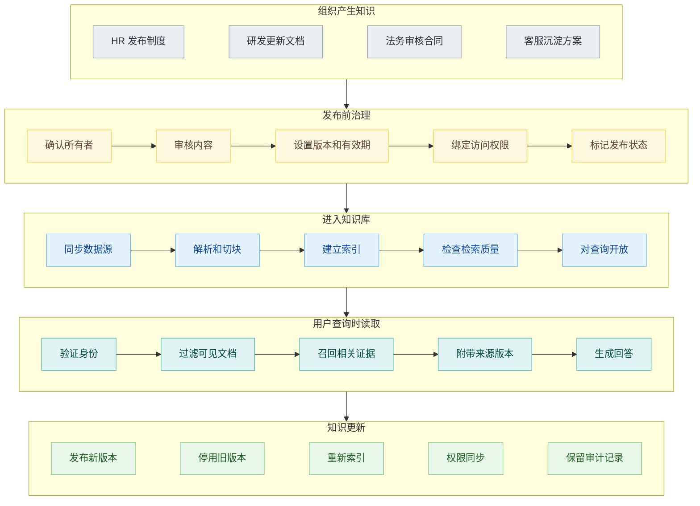
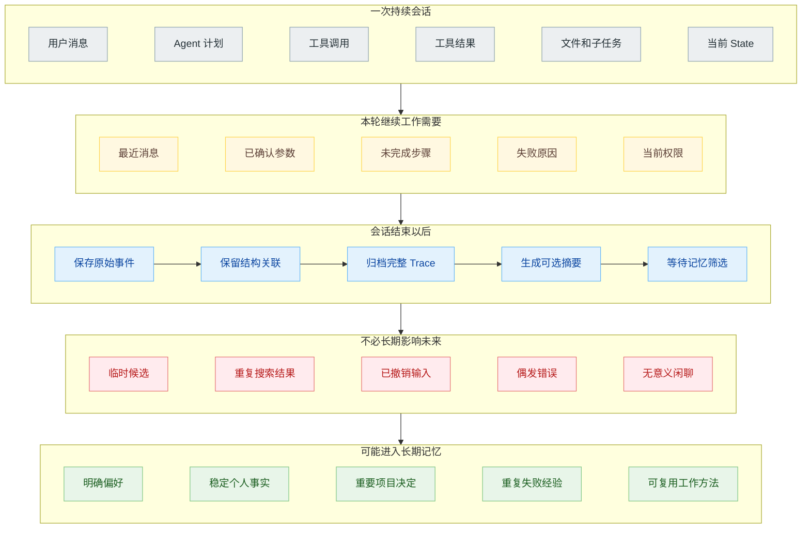
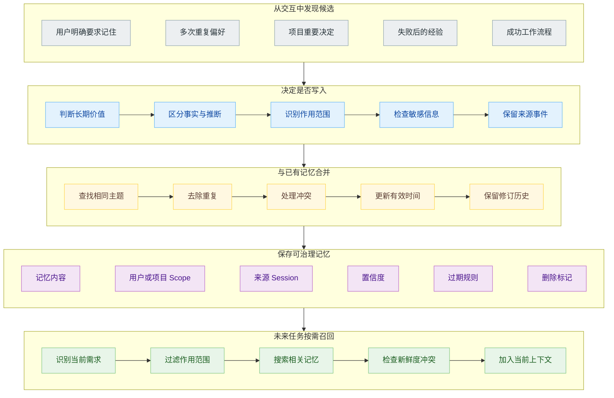
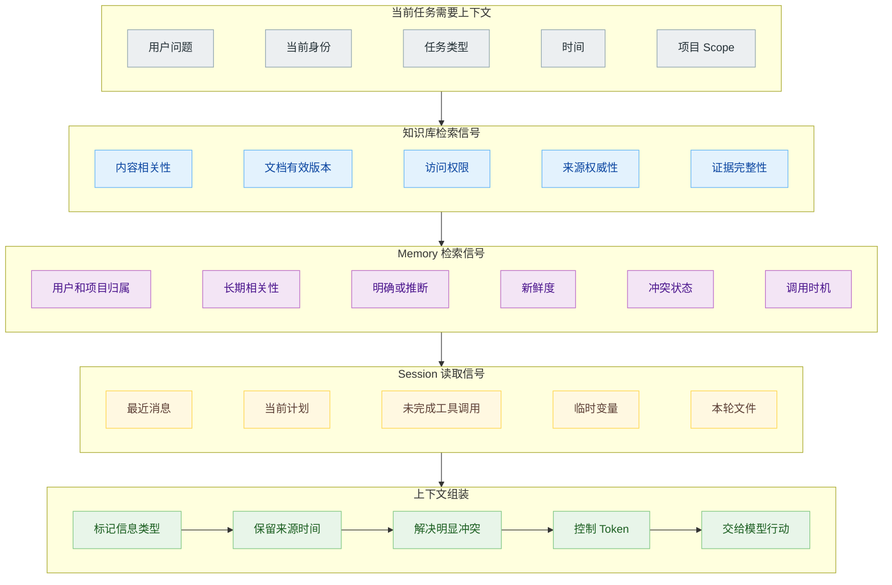
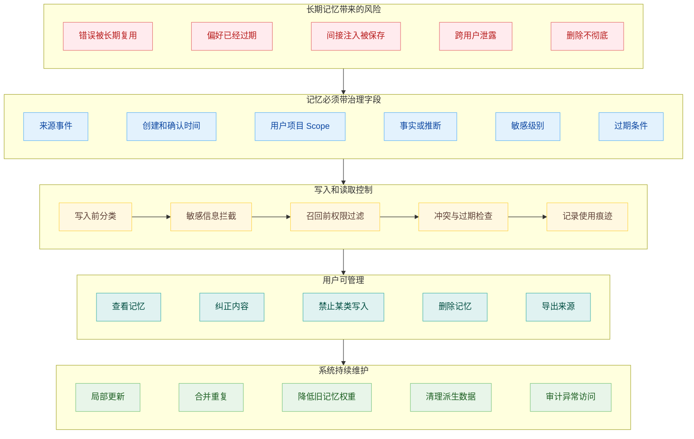

# 知识库和 Agent Memory 有什么区别：外部事实、会话状态与长期记忆

一个内部 Agent 正在帮助员工处理差旅申请。

公司制度规定，上海正式员工住宿上限是每晚 600 元。用户在这次对话里计划周三出发、周五返回，目前还没有确定酒店。几个月前的另一次对话中，他提过自己不坐红眼航班，并且希望行程尽量避开凌晨到达。

这几类信息都会影响 Agent 的回答，却不应该放在同一个地方。住宿上限是组织发布的共享事实，适合进入知识库；周三到周五是当前任务的临时状态，应该留在 Session；不坐红眼航班是跨会话仍可能有用的个人偏好，可以成为长期记忆。

知识库、会话状态和 Agent Memory 最后都可能以文本形式进入模型上下文，也都可能使用关键词或向量检索。底层技术相似，数据的来源、作用范围、写入条件和治理要求却明显不同。把它们混成一个向量库，早期 Demo 也许能跑，系统用久以后会同时遇到过期事实、错误记忆、权限混乱和无法删除的问题。

## 同样进入上下文，不代表承担同一种职责

知识库保存模型外部的业务事实。公司制度、产品文档、技术手册、合同、研究论文和工单解决方案，都可以通过解析、切块和索引进入知识库。它们通常由组织或明确的数据源维护，同一份内容可以服务很多用户。

Session 保存一次持续交互的过程。用户刚刚说了什么，Agent 调过哪些工具，表单已经填到哪一步，当前计划还有哪些待办，都属于这次任务的工作状态。Session 结束以后，大量过程信息不再需要继续影响下一次任务。

长期记忆来自过去的交互和行动。它可能记录用户偏好、已经确认的个人事实、项目中长期有效的决定、重复出现的失败经验，或者 Agent 从多次任务中提炼出的做法。这些信息需要跨 Session 保留，但写入之前必须判断是否值得长期存在。

实时数据还需要单独看待。员工剩余年假、订单当前状态、账户余额和库存价格会持续变化，从聊天记录或文档中召回一个历史快照并不可靠。它们应该通过受权限控制的 API 或数据库查询，在当前请求中临时进入上下文。

因此，模型前面可以同时出现四类材料：知识库提供规则，Session 提供当前任务，Memory 提供过去经验，业务系统提供实时状态。上下文组装层负责标明它们的来源与时间，避免模型把个人偏好说成公司制度，也避免把上个月的余额当成今天的数据。

## 知识库里的内容先存在，问题后来才出现

知识库的典型写入发生在用户提问之前。管理员连接数据源，系统同步文件，解析正文、表格与图片，生成 Chunk 和 Metadata，再建立关键词与向量索引。用户提出问题以后，Retriever 根据问题找到现有证据。

这里的写入权通常属于组织。员工手册由 HR 发布，产品说明由产品团队维护，技术规范由研发团队审核。Agent 可以读取这些材料，不应该因为某个用户在对话里说“住宿上限应该是 800 元”就直接修改共享知识库。

知识库还需要保留文档版本和生效状态。新制度发布以后替换旧制度，查询时要排除已停用版本；用户离开某个部门以后，权限过滤要阻止他继续检索该部门材料。这些要求更接近内容管理与搜索系统。

知识库回答的是“组织当前认为什么是真的，以及依据在哪里”。这决定了它优先保留原文、引用、版本和发布关系。即使系统额外生成摘要，原始文档仍然是最后的事实来源。

## Session 保存当前任务，不需要把一切都记到以后

用户说“把出发日期改到周四”，Agent 必须知道原来的计划、已经查过的航班和当前正在填写的申请表。Session 负责保存这条连续性。

一次 Agent Session 通常包含消息、工具调用、工具结果、临时 State、文件、子任务和执行事件。用户可以通过它翻看聊天记录，Agent 也需要根据这些结构知道哪些动作已经完成、哪些参数刚被修改、哪次工具调用失败。

Session 中的信息非常丰富，大部分却没有长期价值。航班搜索返回的二十个候选、一次超时错误、用户输入到一半又放弃的酒店名称，都不应该自动变成长期记忆。全部保存当然方便审计，但“原始历史被保存”和“以后每次都要召回”不能混为一谈。

把 Session 过早总结成一页 Markdown 也可能损失信息。消息、工具调用、文件和子任务原本有明确关联，总结后只剩一段二手叙述，后续很难还原某个结论来自哪个工具结果。原始 Session 更适合进入可查询的历史存储，摘要可以作为索引或阅读入口，不能取代原始事件。

Session 的默认作用范围是一次会话或一个正在进行的任务。长期任务可能持续几天，Session 也可以通过压缩、检查点和交接文件跨越多次模型调用。这里的“短期”说的是作用范围，不是固定的钟表时间。

## Memory 需要一条写入链路

知识库大多通过文档发布进入系统，Memory 则从交互中产生。用户说“以后订票不要选红眼航班”，这句话可能值得保存；用户说“今天先不要看凌晨的航班”，也可能只是本次行程的临时条件。模型必须结合措辞、上下文和产品规则决定是否写入。

Google ADK 的 MemoryService 把写入与查询分开：可以在会话结束后把 Session 加入 Memory，也可以增量加入事件或直接写入 MemoryEntry，之后再通过搜索工具召回。它还区分了两种实现思路：RAG Memory 保存原始对话并通过向量相似度检索，Memory Bank 会从会话中抽取有意义的信息，并与现有记忆合并。

这个差异非常关键。搜索历史记录是在过去的 Session 中找到相关原文，长期记忆则可能已经经过抽取、去重、合并和更新。例如用户先说“我喜欢靠窗”，半年后说“最近腿受伤，优先过道”，系统不能简单保存两条并在每次订票时随机召回。Memory 需要记录时间、适用条件和当前状态，必要时让新偏好覆盖或暂时压低旧偏好。

2026 年的论文《Are We Ready For An Agent-Native Memory System?》把 Agent Memory 拆成表示与存储、抽取、检索与路由、维护四个模块。这个拆法比“把聊天记录做 Embedding”更接近真实系统，因为长期记忆的难点常常出现在写入和维护，而不只在搜索。

Memory 的写入不能只由一次模型判断决定。明确的“请记住”和“请忘掉”可以作为强信号；敏感信息、支付信息、健康数据和第三方隐私需要更严格规则；从行为中推断出的偏好应该标记为推断，不能伪装成用户明确陈述。

## 检索技术相同，检索策略不同

知识库和 Memory 都可以使用向量、BM25、Metadata Filter 和 Reranker，这也是两者经常被混淆的原因。Google ADK 甚至提供基于 RAG 基础设施的 MemoryService，把完整对话放进 Knowledge Engine 进行向量检索。

区别主要体现在查询与排序信号上。知识库检索关注当前问题与文档事实是否相关，同时考虑文档版本、发布状态和用户权限。Memory 检索还要考虑这条记忆属于谁、是否过期、是明确事实还是模型推断、与当前任务是否冲突，以及最近有没有被用户修改。

“用户喜欢靠窗”与订票任务相关，与报销任务无关；“项目只能本地 Commit，不能 Push”对当前代码任务非常重要，即使它与用户问题的表面语义并不相似。部分记忆应该常驻为规则，部分记忆按需搜索，部分历史只在排查时读取。把所有内容都交给一个相似度 Top K，会让真正重要但措辞不同的约束被埋掉。

模型还需要知道材料的身份。知识库片段可以标成“公司现行差旅制度”，Memory 标成“用户在 2026 年 3 月明确表达的偏好”，Session State 标成“本次行程临时选择”。如果把三类文本直接拼成一段，模型很容易给予它们错误的权重。

## 冲突时，事实来源决定谁覆盖谁

用户 Memory 里记录“上海住宿上限 500 元”，知识库现行制度写 600 元，应该采用哪一条？如果前者只是用户在旧对话里提过的历史信息，组织发布的现行制度应当优先。Memory 可以帮助解释用户为什么仍然认为是 500 元，却不能覆盖权威知识源。

另一种冲突是偏好变化。用户过去喜欢靠窗，现在明确要求过道，新表达应该更新个人 Memory。这里没有组织文档可以裁决，时间、明确程度和适用场景更重要。

Session 与长期记忆也会冲突。用户长期偏好经济舱，但这次明确说“本次出差需要商务舱并且已经获得批准”，当前任务条件可以暂时覆盖长期默认，不能反过来把长期偏好永久改成商务舱。

系统需要把冲突规则写在应用层，不能期待模型每次临场发挥。组织事实优先回到权威知识源，实时状态优先调用业务系统，本轮明确要求可以覆盖个人默认，长期记忆的修改则需要满足单独的写入条件。

## Memory 比知识库更需要考虑遗忘

知识库当然也要删除内容，但删除对象通常是一份组织文档或一个数据源版本，责任主体相对清楚。Memory 可能从一段对话中抽取多条个人事实，又把多次经验合并成一个 Profile。用户删除原始会话以后，派生出来的偏好是否也被删除，系统必须给出答案。

长期存在会放大错误。一次误解被保存成 Memory，Agent 以后可能带着这条错误信息处理很多任务；网页中的恶意指令如果被误当成经验保存，单次 Prompt Injection 会变成跨会话污染；过期的项目状态继续常驻，又会让 Agent 很自信地执行已经废弃的流程。

每条 Memory 至少应该携带来源、创建时间、最近确认时间、作用范围、置信度、敏感级别和删除关系。用户要能查看重要记忆，纠正错误，撤销不希望保存的内容。系统做了合并，也要能追溯到参与合并的原始记录。

Memory 系统因此比普通检索多了一条维护链路。写进去以后还要更新、合并、降权、过期和删除。论文中的实验也显示，没有一种 Memory 架构在所有场景都占优，数据结构要与具体任务的瓶颈匹配，局部维护往往比全量重组更划算。

## 参考资料

1. Google Agent Development Kit, [Memory: Long-Term Knowledge with MemoryService](https://adk.dev/sessions/memory/).
2. Google Cloud, [Memory Bank overview](https://cloud.google.com/vertex-ai/generative-ai/docs/agent-engine/memory-bank/overview).
3. Wei Zhou et al., [Are We Ready For An Agent-Native Memory System?](https://arxiv.org/abs/2606.24775).
4. Google Cloud, [RAG Engine overview](https://cloud.google.com/vertex-ai/generative-ai/docs/rag-engine/rag-overview).
