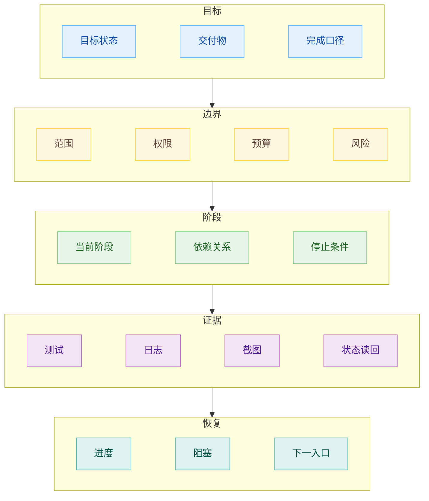
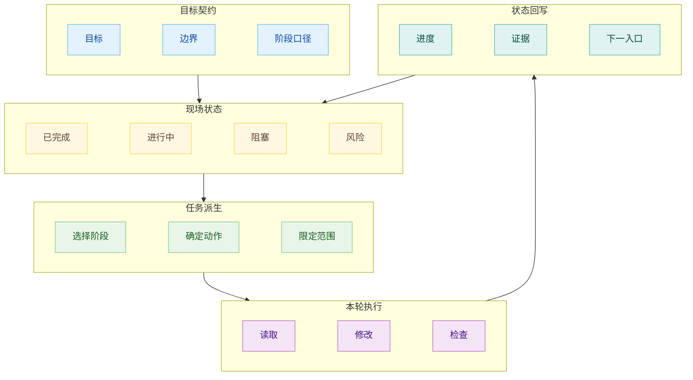
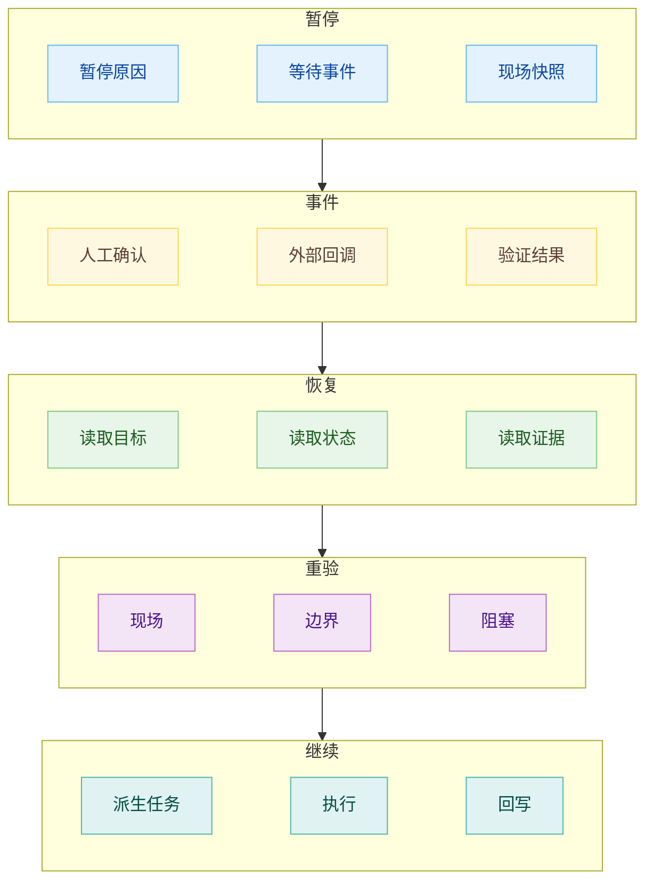

# 长程任务与目标模式

## 长程任务里的目标

长程任务指一类需要跨多轮执行、跨上下文窗口、跨暂停恢复继续推进的 Agent 工作。一次对话能交付的任务，通常只需要当前输入、当前材料和一次验证。长程任务会多出一个持续存在的现场：上一轮做过什么，哪些判断已经成立，哪些路径已经试过，哪些结果只能算半成品，下一轮从哪里接。这个现场如果只留在聊天记录里，任务越长，状态越容易变得模糊。

目标模式从这里开始。用户最初说出的目标，进入系统后要被整理成一份稳定的工作契约。它描述最终要到达的状态，也描述执行过程中不能越过的边界。目标状态给 Agent 一个方向，边界让它知道哪些看起来顺手的动作不能碰，阶段让它能把大目标拆成可推进的局部，证据让进度能被承认，恢复规则让下一轮 Agent 能接住现场。

这个契约的意义在于持续约束。长程任务跑到后半段时，Agent 往往会被当前文件、最新日志、刚刚失败的测试、临时补充的要求牵着走。局部任务会变得越来越显眼，原始目标的分量会下降。目标契约要反复回到执行链路里，让每一轮工作都能重新对齐：当前动作服务哪个阶段，留下什么证据，是否改变了边界，是否还能继续推进。

Anthropic 在长程应用开发的 harness 里使用 initializer agent、feature list、progress file 和 git history，本质上就是把这份契约从对话里拿出来，放进后续 session 能稳定读取的工件里。Google ADK 的长程 Agent 示例则把进度压进显式状态机，让 Agent 醒来时读取当前 step，再决定下一步。两套做法的表面形态不同，承担的工程责任接近：把目标、状态和恢复入口外化。

## 任务从目标里长出来

长程系统可以有计划，但计划不能被当成一次写完的脚本。执行过程中，代码会变，依赖会变，验证结果会改变优先级，用户也可能补充新的限制。计划如果写死，Agent 会在旧计划和新现场之间来回拉扯；计划如果全靠临场生成，前后几轮又容易各说各话。目标模式处理的是这两者之间的关系：目标保持相对稳定，任务根据当前现场派生。

每一轮 Agent 启动时，应该先读目标契约和现场状态，再决定这一轮做什么。当前任务只承担一小段可推进的动作。它可以是恢复一个坏掉的基础流程，可以是补齐一个阶段的验证证据，也可以是处理一个阻塞点。任务完成以后，结果回写到状态里，下一轮再从新的状态派生新的任务。这样做会牺牲一点一口气跑到底的速度感，但系统会更有章可循。

这里最容易混淆的是阶段和任务。阶段描述目标推进到什么位置，任务描述当前这轮要做什么动作。阶段应该有相对稳定的完成口径，任务则可以随着现场调整。一个阶段可能经历多轮任务才能完成；一个任务也可能因为验证失败而回到同一阶段继续修。只要阶段口径没有变，任务的调整就属于正常执行。阶段口径一旦变了，系统就进入目标变更，而不能把它当成普通进度更新。

任务派生还要处理注意力。长程任务里，Agent 不能每轮都背着全部材料工作。目标契约给它方向，现场状态告诉它已经发生了什么，当前任务把注意力压到一个能承载的范围，证据再把输出拉回现实。这个链路顺了，Agent 就不会在庞大的材料里顾此失彼，也不容易把局部完成包装成整体完成。

plan file 让阶段有出处，progress file 让现场能被读回，handoff 让下一轮知道该盯哪里。它们共同减少了 Agent 凭印象续跑的空间。印象一旦进入长程任务，就会层层叠加，逐渐变成难以追踪的偏差。

## 暂停、恢复和目标变更

暂停在长程任务里是一种正常状态。Agent 等人工确认、等外部事件、等 CI 结果、等审批窗口、等预算释放，都可能停下来。暂停前如果没有留下可恢复的现场，下一轮 Agent 只能根据摘要猜。摘要经常会保留结论，丢掉过程；保留做了什么，丢掉为什么这么做；保留成功路径，丢掉失败路径。这样的恢复看起来能接上，实际已经埋下偏差。

好的恢复方式是从持久状态启动。恢复时先读目标契约，再读当前状态，再读最近的证据和变更，随后重新验证关键现场。这个顺序能避免 Agent 把旧结论直接当成现实。长程任务的外部世界一直在动，代码库可能已经被人改过，依赖可能更新，接口可能变化，上一轮留下的判断到了这一轮也可能需要复核。恢复的关键动作，是重新获得一个可工作的现场。

目标变更和恢复有相似之处，都会打断线性执行。区别在于恢复保持原目标继续推进，目标变更会改变后续任务的判断口径。范围扩大、验收降低、权限放宽、预算突破，都属于目标层面的变化。Agent 可以发现这些变化的必要性，也可以提出修改建议，但不能把它们混进普通执行日志里。普通执行日志记录发生了什么，目标变更记录系统以后按什么口径继续跑。

这里需要防微杜渐。长程任务里的偷梁换柱很少以危险动作的样子出现，更多时候只是一次“先这样也行”的临时判断。测试不稳定，于是放松验收；某个功能赶不上，于是改成后续补；边界不清楚，于是顺手多改几处。每一次单独看都能解释，连起来就会让目标悄悄变形。目标模式要把这些变化拿到台面上，让系统知道自己还在执行原目标，还是已经进入新目标。

一个实用的落地方式是把目标、状态、进度、证据和变更拆成几个独立工件。`goal.md` 保存目标契约，`state.json` 保存机器可读的现场，`progress.md` 写给人看，`handoff.md` 交给下一轮 Agent，`change-log.md` 专门记录目标层面的变化。文件名可以按团队习惯调整，责任边界要保持清楚。混在一段聊天摘要里以后，Agent 会把声明当事实，把假设当结论，把临时妥协当新规则。拆开以后，任务才有机会进退有据。
