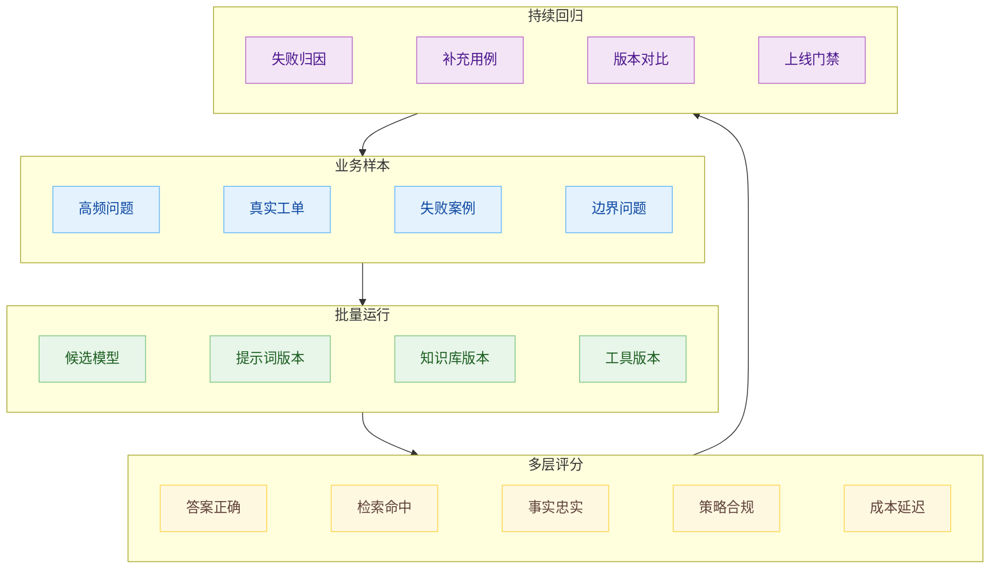

# 项目能力怎么证明：从 Ragas 到 Agent 评测体系

人很容易产生一种错觉：只要会说需求，项目就能做出来。

这个判断在 demo 阶段通常是成立。一个智能客服、一个知识库问答、一个后台管理页面、一个表单工作流，今天确实可以很快跑起来。以前需要几天搭出来的东西，现在可能几个小时就能看到雏形。门槛下降是真事，问题在于下降的是实现门槛，生产门槛和软件工程的复杂度没有跟着消失。

拿一个常见项目检验一下。公司要做智能客服系统，前期就要选模型：GPT、Gemini、DeepSeek、通义千问，或者再加上 Claude。怎么选？如果答案是看网上评测，或者自己问十几个问题感受一下，那这个项目后面大概率会如芒在背。真实业务选型看的是自己的任务分布、知识库质量、回复边界、成本、延迟、稳定性和回归能力。排行榜能提供参考，却不能替你证明某个模型适合你的客户、你的政策、你的预算和你的上线节奏。

模型选型更像一个工程目标函数：

$$
\mathrm{ModelChoice}=\arg\max_m\left(Q_m(D_{biz})-R_m-C_m-L_m\right)
$$

`D_biz` 是业务测试集，`Q` 是业务质量，`R` 是风险，`C` 是成本，`L` 是延迟。项目里要找的是这组变量下的合适解。模型能力越强，价格越高，延迟越大，策略边界越复杂，未必就更适合当前业务。模型迭代越快，今天的结论越需要被持续复测。工程能力开始从“我能不能做出来”，转向“我能不能证明它现在可用，并且下次改动以后仍然可用”。

## 验证是昂贵的

Agent 帮你开发的时候把大量实现细节藏进了 Agent 的工作过程。你看到的是项目跑起来了，实际里面已经发生了很多选择：怎么拆组件，怎么组织 API，怎么处理失败，哪些边界被忽略，哪些默认值被模型默认填上。

在传统开发里，很多选择会暴露在设计文档、代码评审、测试计划里。Agent 生成项目时，这些选择经常一口气落到代码和配置中，速度快，风险也被压缩到更短的时间里。项目越像真实业务，越不能只问“能不能跑”。智能客服的风险在于它能否在用户问退货、保修、隐私、价格、投诉、退款时稳定给出符合业务规则的答案。

人工批量测试可以作为早期感知。几个人想一些问题，分别问几个模型，看哪个回答顺眼，这能帮助团队建立直觉。它的问题也很清楚：样本太少，问题来源太主观，评分口径不稳定，无法回归，无法量化改动收益。今天觉得 Gemini 好，明天换一个同事可能觉得 GPT 好；今天 prompt 改了一句，三周后没人记得它到底改善了什么。

工程评测要把这种感觉拆成可运行、可复现、可追踪的系统。智能客服至少要回答几类问题：检索有没有找对材料，答案有没有忠实于材料，关键事实有没有漏，额外承诺有没有编，策略边界有没有守住，成本和延迟能不能接受。

## RAG 应用要分层评测

智能客服大多绕不开 RAG。用户提出问题，系统从知识库检索材料，再让模型基于材料回答。很多团队一开始只看最终答案，这会把问题混在一起。答案错了，可能是模型生成错，也可能是检索没找对，也可能是知识库原文过期，也可能是提示词没有要求引用依据。

Ragas 的价值在于它把 RAG 评测拆开。当前官方指标里有回答层面的 `response_relevancy`、`factual correctness`，也有依据层面的 `faithfulness`，还有检索层面的 `context_precision`、`context_recall`。Agent 和 tool use 也有单独指标，例如 `tool call accuracy`、`tool call F1`、`agent goal accuracy`。因此，Ragas 更适合被看成一组评测积木，单个打分函数只能覆盖其中一段。

这几层合在一起，才像一个生产系统里的 RAG 评分：

$$
\mathrm{RAGScore}=w_aS_{answer}+w_gS_{grounding}+w_rS_{retrieval}+w_sS_{safety}
$$

`S_answer` 看回答是否正确，`S_grounding` 看回答是否被检索材料支撑，`S_retrieval` 看材料是否找对，`S_safety` 看回答是否守住业务和安全边界。不同业务的权重应该不同。售后政策问答里，事实准确和边界合规应该比表达流畅更重；营销导购里，相关性和转化话术可能权重更高；内部知识库里，检索召回和引用依据会更关键。

早期 Ragas 文档里的 `AnswerCorrectness` 很适合解释自然语言答案为什么能被量化。它把参考答案和模型答案拆成事实点，再比较哪些命中、哪些编造、哪些遗漏。用信息抽取的说法，会得到三类集合：

$$
F1=\frac{2TP}{2TP+FP+FN}
$$

`TP` 是模型答案命中的事实，`FP` 是模型额外编出来的事实，`FN` 是参考答案里有、模型漏掉的事实。客服系统里，`FN` 和 `FP` 都很要命。漏掉“拆封后不支持退货”，用户会被误导；编出“赠送一年延保”，公司会承担本来没有承诺的责任。

这个答案正确性指标只覆盖答案和参考答案的相似关系。RAG 应用还要关心答案是否忠实于检索上下文。Ragas 的 `faithfulness` 关注回答中的声明有多少能被 retrieved context 支撑。这个指标能抓住一种常见问题：模型回答看起来像对的，甚至和参考答案相近，但它并没有从当前知识库材料中得到依据。对生产系统来说，这意味着知识链路已经断了，只是这次运气好。

检索层里面`context_precision` 关心检索结果里有多少材料真正有用，`context_recall` 关心该找的材料有没有找全。很多团队调客服系统时只改 prompt，结果问题出在切片、embedding、rerank、权限过滤或知识库版本。

## 从 Ragas 到 Agent 评测

RAG 问答的输入输出还算清楚。Agent 进入系统以后，评测对象会明显变复杂。一个客服 Agent 可能先判断用户意图，再检索政策，再查订单，再调用退款工具，再决定是否转人工。回复给用户的那句话只是表面结果，真正的风险藏在过程里。

Anthropic 在 Agent eval 的文章里把几个概念拆得很实用：`task` 是单个评测任务，`trial` 是一次运行，`grader` 是评分逻辑，`transcript` 或 `trace` 是完整过程记录，`outcome` 是环境最终状态，`evaluation harness` 负责跑评测和汇总结果，`agent harness` 负责让模型以 Agent 方式行动。评测 Agent 时，模型和 harness 绑在一起接受检验。换模型、换工具权限、换路由策略、换提示词，评测结果都可能变。

Agent 评测要把最终状态和执行过程放在同一个公式里：

$$
\mathrm{AgentEval}=\mathrm{Outcome}+\mathrm{Trajectory}+\mathrm{Policy}+\mathrm{Cost}
$$

`Outcome` 落在最终状态上，工单有没有创建，退款有没有提交，用户问题有没有解决。`Trajectory` 落在过程上，是否先验证身份，是否查了正确知识库，是否调用了正确工具，是否在失败后重试或降级。`Policy` 落在边界上，越权退款、隐私泄露、绕过人工审批都要被抓出来。`Cost` 落在代价上，轮次、token、工具调用、人工接管和延迟都要进入账本。

这些信号要同时出现。Outcome 太顺利，可能只是一次侥幸；Trajectory 很规整，也可能没有真正解决问题；Policy 抓得过死，Agent 会畏首畏尾；Cost 压得过低，质量会被挤到不可用。工程评测要把几种信号放到同一张表里，再按业务风险定权重。

可以先把 Agent workflow 的 trace 打全，用 traces dashboard 调试、可视化和监控运行过程；等团队知道什么叫好，再把样本沉淀成 dataset 和 eval run。没有 trace，分数只会告诉你“坏了”，不会告诉你坏在哪里。trace 里应该有模型输入输出、工具调用、检索结果、handoff、guardrail、环境 diff、错误、重试、耗时和成本。

## 评测集持续源于业务

很多评测体系失败在测试集。团队会先凭空写几十个问题，覆盖一下常见 FAQ，然后开始比较模型。这个阶段有价值，但很快会到天花板。真实用户不会按 FAQ 标题提问，他们会省略、误拼、带情绪、夹杂上下文、连续追问，也会问一些产品经理根本没想到的问题。

更稳的评测集应该分层构建。冷启动时，可以由业务专家给出高频问题和标准答案，形成初始 ground truth。上线以后，线上真实问题要进入样本池，尤其是失败样本、人工接管样本、投诉样本、低满意度样本、长轮次样本。每次线上出错，都要判断它是否应该变成回归用例。

评测系统里至少要有这几块：

$$
\mathrm{EvalSystem}=D+R+T+G+M
$$

`D` 是 dataset，承载业务样本和标准。`R` 是 runner，负责批量运行不同模型、提示词、知识库和工具版本。`T` 是 trace，记录过程证据。`G` 是 grader，执行自动评分、规则检查、LLM-as-judge 和人工标注。`M` 是 monitoring，负责线上采样、趋势观察、告警和回归。

只建 dataset、没有 trace，能比较分数，却很难定位失败原因。只看生产 trace、没有固定回归集，能看到线上问题，却无法稳定比较版本。工程体系要把两者接起来：trace 发现失败，失败进入 dataset，dataset 反过来约束下一次变更。

## 评分器需要被评测

用大模型当裁判很方便，也很危险。自然语言评分本来就有主观性，LLM-as-judge 只是把主观判断自动化。裁判模型会受提示词、样例、位置偏差、模型版本、语言风格影响。它可能偏爱更长答案，可能放过漂亮废话，可能对自己同厂模型更宽，也可能在复杂事实上判断失准。

所以评分器要分层。能用代码检查的，不交给裁判模型。数据库状态、API 响应、权限记录、文件 diff、订单状态、工单流转、工具调用顺序，都应该尽量用确定性逻辑检查。自然语言裁判适合评估表达质量、语义覆盖、复杂事实点匹配、风格合规。人工评审适合处理高风险样本、主观体验和评分器争议。

一个更稳的分数可以写成：

$$
\mathrm{Score}=w_oS_o+w_tS_t+w_pS_p+w_cS_c
$$

`S_o` 是结果分，`S_t` 是轨迹分，`S_p` 是策略分，`S_c` 是成本分。权重不应该固定。客服问答重视事实和策略，代码 Agent 重视测试和环境状态，销售导购重视相关性和转化边界，企业内部助手重视权限和审计。评分器一旦脱离业务权重，分数就会变成摆设。

评分器本身也要留 trace。Ragas 的事实拆解、LLM-as-judge 的判分理由、规则检查的断言、人工标注的标签，都应该能被回看。某个模型突然涨分，可能真有改善，也可能是裁判变宽了；某个版本突然掉分，可能是 Agent 退化，也可能是知识库更新导致标准答案过期。看到分数变化就改 Agent，容易南辕北辙。先查评测链路，再改执行链路，这个顺序不能乱。

## 项目能力靠评测体系证明

智能客服、报表后台、内容工作流、知识库问答、营销页面、内部工具，都会越来越容易从自然语言描述变成可运行项目。于是“我上我也行”的感觉会越来越强。这个感觉在起步阶段通常没有错，因为起步阶段看的是能不能跑起来。

进入持续迭代，差距就会出现。真实业务会问：模型为什么选这个，换另一个会怎样；知识库更新后有没有回归；用户问法变了能不能稳住；线上失败怎么进入测试集；新模型发布后该不该切；成本涨了能不能降级；工具权限收紧后会不会影响完成率；一个 prompt 改动有没有破坏旧能力。

这些问题无法靠描述需求解决。它们需要评测集、runner、trace、grader、monitoring、人工标注和上线门禁。代码实现会越来越便宜，评测体系会越来越值钱。

## 参考材料

- [RAGAS: Automated Evaluation of Retrieval Augmented Generation](https://arxiv.org/abs/2309.15217)
- [OpenAI Agents SDK Tracing](https://openai.github.io/openai-agents-python/tracing/)
- [OpenAI Evals API reference](https://platform.openai.com/docs/api-reference/evals)
