# Kotlin 协程挂起原理：从线程阻塞到用户态调度的范式跃迁

## 一、重新定义"挂起"——架构师视角

在传统 Java 并发模型中，"等待"意味着线程阻塞：一个 `Thread.sleep()` 或 `Object.wait()` 调用会让操作系统将当前线程从 CPU 运行队列中移除，直到条件满足后重新调度。这种模型的代价是昂贵的——每个线程约占用 1MB 栈内存，上下文切换需要陷入内核态，数千并发连接就能压垮一个服务。

**Kotlin 协程的"挂起"是一种编译器与运行时协作实现的"假暂停"**：当协程执行到 `suspend` 函数时，它并不阻塞底层线程，而是将"当前执行到哪一行、局部变量是什么"这些状态打包保存，然后**主动让出线程执行权**。底层线程可以立即去执行其他协程，而被挂起的协程则静静等待某个异步事件（IO 完成、延时到期）触发它的"恢复"。

这就是**用户态协程**的核心哲学：**调度决策从操作系统内核上移到用户空间的协程调度器**。一个线程可以承载成千上万个协程，因为"挂起"只是内存中的状态保存，而非系统级的线程阻塞。

从本质上看，Kotlin 协程挂起是三层机制的协同：

| 层级 | 核心机制 | 职责 |
|------|----------|------|
| **编译期** | CPS 变换 + 状态机生成 | 将 `suspend` 函数拆解为可中断、可恢复的代码片段 |
| **运行时** | `Continuation` 接口 | 封装"恢复点"，持有局部变量快照与恢复回调 |
| **调度层** | `CoroutineDispatcher` | 决定协程在哪个线程/线程池上恢复执行 |

## 二、核心考点透视：为什么大厂必问协程挂起？

协程挂起原理是 Kotlin 并发编程的"地基"，它直接决定了以下工程问题的答案：

**1. 性能归因能力**
当线上出现协程卡顿时，你需要判断：是挂起点过多导致状态机膨胀？是 Dispatcher 线程池饱和？还是 `Continuation` 对象的 GC 压力？不理解挂起原理，这些问题无从下手。

**2. 框架设计能力**
Retrofit 的 `suspend` 支持、Room 的协程适配、Flow 的冷流实现——这些库都深度依赖 `Continuation` 机制。理解挂起原理，才能设计出符合协程语义的 API。

**3. 疑难 Bug 定位**
协程取消时的 `CancellationException` 传播、`withContext` 切换时的异常丢失、`runBlocking` 死锁——这些经典陷阱的根因都在挂起机制中。

**4. 与 Java 互操作**
当 Kotlin 协程需要桥接 Java 的 `CompletableFuture` 或回调式 API 时，`suspendCoroutine` / `suspendCancellableCoroutine` 是必经之路，而它们直接暴露了 `Continuation` 的底层接口。

## 三、宏观架构图：协程挂起的全景视图

下图展示了一个 `suspend` 函数从源码到执行的完整链路，涵盖编译期变换、运行时状态流转、调度器交互三个维度：

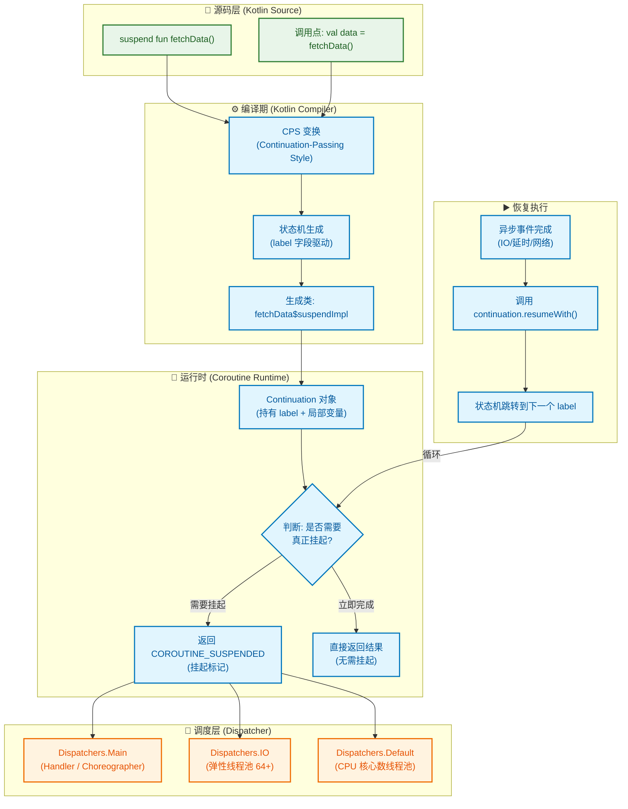

## 四、架构图深度解析

### 4.1 源码层到编译器：CPS 变换的本质

当 Kotlin 编译器遇到 `suspend` 关键字时，它执行的第一个关键操作是 **CPS 变换（Continuation-Passing Style）**。这不是一个简单的语法糖，而是对函数签名的根本性改造。

以一个简单的挂起函数为例：

```kotlin
// 你写的代码
suspend fun fetchUser(id: String): User {
    delay(1000)
    return User(id, "Name")
}
```

编译后，函数签名变为：

```java
// 编译器生成的等价 Java 代码（简化）
public final Object fetchUser(String id, Continuation<? super User> $completion) {
    // ...状态机实现
}
```

**关键变化**：
1. 返回类型从 `User` 变为 `Object`——因为函数可能返回真正的结果，也可能返回特殊标记 `COROUTINE_SUSPENDED`
2. 新增 `Continuation` 参数——这就是"续体"，它携带了恢复执行所需的全部上下文

这种变换的精妙之处在于：**它将"函数调用后做什么"这个隐式概念显式化为一个可传递的对象**。传统函数通过调用栈隐式管理返回地址，而 CPS 将返回逻辑封装进 `Continuation`，使得"暂停后恢复"成为可能。

### 4.2 状态机生成：label 字段的魔法

编译器的第二步是将函数体转换为**状态机**。每个挂起点（`suspend` 函数调用）对应一个状态，通过 `label` 字段驱动状态跳转。

```kotlin
// 源码
suspend fun process() {
    val a = step1()  // 挂起点 1
    val b = step2(a) // 挂起点 2
    return a + b
}
```

编译后的伪代码结构：

```kotlin
fun process(continuation: Continuation<Int>): Any? {
    // 状态机类（通常是匿名内部类）
    class ProcessContinuation : ContinuationImpl(continuation) {
        var label = 0      // 当前状态
        var result: Any? = null
        var a: Int = 0     // 局部变量提升为字段
        
        override fun invokeSuspend(result: Result<Any?>): Any? {
            this.result = result
            return process(this) // 递归调用，但携带状态
        }
    }
    
    val cont = continuation as? ProcessContinuation 
        ?: ProcessContinuation(continuation)
    
    when (cont.label) {
        0 -> {
            cont.label = 1
            val suspendResult = step1(cont)
            if (suspendResult == COROUTINE_SUSPENDED) return COROUTINE_SUSPENDED
            // 未挂起，直接继续
        }
        1 -> {
            cont.a = cont.result as Int
            cont.label = 2
            val suspendResult = step2(cont.a, cont)
            if (suspendResult == COROUTINE_SUSPENDED) return COROUTINE_SUSPENDED
        }
        2 -> {
            val b = cont.result as Int
            return cont.a + b
        }
    }
}
```

**状态机的设计智慧**：

1. **局部变量提升**：`val a` 被提升为 `Continuation` 对象的字段，这样挂起后再恢复时，变量值仍然存在
2. **label 驱动**：每次恢复时，根据 `label` 值跳转到对应的 `when` 分支，实现"从上次暂停处继续"
3. **COROUTINE_SUSPENDED 哨兵值**：这是一个特殊的单例对象，用于区分"真正挂起"和"同步完成"两种情况

### 4.3 调度层：Dispatcher 如何决定"在哪恢复"

当协程需要恢复执行时，`Continuation.resumeWith()` 并不会立即在当前线程执行后续代码，而是将恢复任务提交给 `CoroutineDispatcher`。

三大内置调度器的底层实现截然不同：

| Dispatcher | 底层实现 | 线程数 | 适用场景 |
|------------|----------|--------|----------|
| `Dispatchers.Main` | Android 主线程 `Handler` | 1 | UI 更新、轻量计算 |
| `Dispatchers.IO` | 共享弹性线程池 | 64 或 CPU×8 | 阻塞 IO、网络请求 |
| `Dispatchers.Default` | 共享固定线程池 | CPU 核心数 | CPU 密集计算 |

**关键细节**：`Dispatchers.IO` 和 `Dispatchers.Default` 实际上**共享同一个线程池实例**（`DefaultScheduler`），但通过不同的"视图"暴露。这意味着一个 IO 协程切换到 Default 时，可能根本不需要真正的线程切换——只是换了一个调度策略。

### 4.4 恢复执行：从异步事件到状态机跳转

当异步操作完成（如网络响应到达），底层框架会调用 `continuation.resumeWith(Result.success(data))`。这触发以下链路：

1. `resumeWith` 将结果存入 `Continuation` 的 `result` 字段
2. 调用 `Dispatcher.dispatch()` 将恢复任务投递到目标线程
3. 目标线程执行 `Continuation.invokeSuspend()`，状态机从当前 `label` 继续执行
4. 如果遇到下一个挂起点，重复上述过程；否则返回最终结果

这种"挂起-恢复"循环可以发生任意多次，直到函数执行完毕。整个过程中，**底层线程从未阻塞**——它只是在不同协程的状态机之间快速切换。

## 五、落地场景与工程陷阱：从源码到避坑指南

### 5.1 陷阱一：`suspend` 不等于"一定会挂起"

这是最常见的认知误区。很多开发者以为调用 `suspend` 函数就会触发线程切换，实际上 **`suspend` 只是"可能挂起"的声明，而非"必然挂起"的保证**。

```kotlin
// 这个 suspend 函数可能根本不会挂起！
suspend fun maybeNotSuspend(): Int {
    return 42  // 直接返回，无挂起点
}

// 调用处
launch {
    val result = maybeNotSuspend()  // 同步执行，label 不变
    println(result)
}
```

编译器生成的状态机会检查返回值：

```kotlin
// 伪代码：编译器生成的调用逻辑
val suspendResult = maybeNotSuspend(continuation)
if (suspendResult == COROUTINE_SUSPENDED) {
    return COROUTINE_SUSPENDED  // 真正挂起，退出状态机
}
// 未挂起，suspendResult 就是实际结果，继续执行
```

**工程影响**：这意味着你不能假设 `suspend` 函数调用后一定会有线程切换。如果你的逻辑依赖"挂起后再恢复"的时序，可能会出现竞态条件。

### 5.2 陷阱二：`runBlocking` 在主线程的死锁风险

`runBlocking` 的设计目的是**桥接阻塞世界与协程世界**，它会阻塞当前线程直到内部协程完成。当它在主线程执行，且内部协程需要切回主线程时，死锁就发生了：

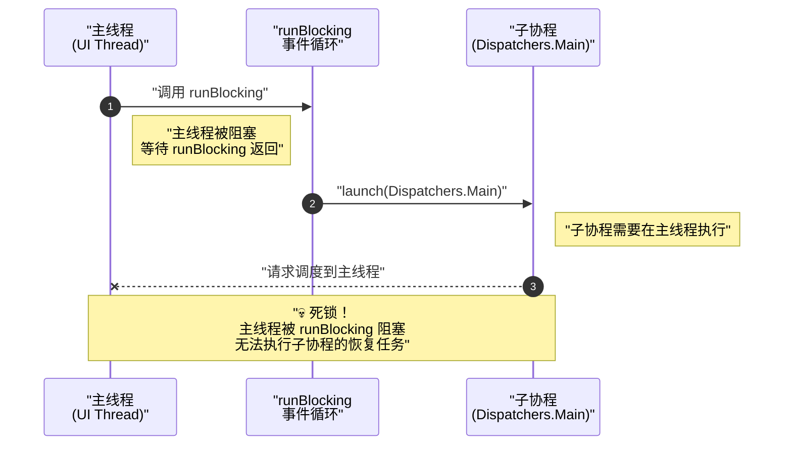

**死锁的根本原因**：

1. `runBlocking` 创建了一个**私有的事件循环**，它会阻塞当前线程并处理内部协程的调度
2. 但 `Dispatchers.Main` 是通过 Android 的 `Handler` 机制调度的，它需要主线程的 `Looper` 空闲才能执行
3. 主线程被 `runBlocking` 的事件循环阻塞，`Handler.post()` 的任务永远得不到执行

**正确做法对比**：

```kotlin
// ❌ 危险：主线程 + runBlocking + Dispatchers.Main
fun onButtonClick() {
    runBlocking {
        withContext(Dispatchers.Main) {  // 💀 死锁
            updateUI()
        }
    }
}

// ✅ 正确：使用 lifecycleScope（本身就在主线程）
fun onButtonClick() {
    lifecycleScope.launch {
        val data = withContext(Dispatchers.IO) { fetchData() }
        updateUI(data)  // 自动回到主线程
    }
}
```

### 5.3 陷阱三：`withContext` 不一定触发线程切换

当目标 Dispatcher 与当前执行线程一致时，`withContext` 会走"快速路径"，跳过调度直接执行：

```kotlin
// 当前已在 IO 线程
withContext(Dispatchers.IO) {
    // 不会触发线程切换！直接执行
    // 因为当前线程已经属于 IO 调度器的线程池
}
```

源码验证（`kotlinx.coroutines` 的 `DispatchedCoroutine.kt`）：

```kotlin
// Builders.common.kt - withContext 实现
public suspend fun <T> withContext(
    context: CoroutineContext,
    block: suspend CoroutineScope.() -> T
): T {
    // ...
    val newContext = newCoroutineContext(context)
    // 关键判断：如果不需要调度，直接执行
    if (newContext === oldContext) {
        // 相同上下文，直接调用
        return block()
    }
    // 检查是否需要真正调度
    if (newContext[ContinuationInterceptor] == oldContext[ContinuationInterceptor]) {
        // 同一个 Dispatcher，可能不需要切换
        // ...
    }
}
```

**工程影响**：如果你用 `withContext` 来"确保"线程切换（比如用于性能隔离），这种假设是不可靠的。应该使用 `yield()` 或显式检查当前线程。

### 5.4 陷阱四：协程取消与 `CancellationException` 的特殊语义

`CancellationException` 在协程中有特殊地位——**它是唯一不会导致父协程失败的异常**。这是结构化并发的核心设计，但也容易踩坑：

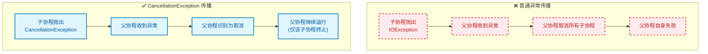

**常见陷阱代码**：

```kotlin
// ❌ 错误：吞掉了 CancellationException
suspend fun fetchData(): Data {
    return try {
        api.request()
    } catch (e: Exception) {  // 捕获了所有异常，包括 CancellationException
        defaultData  // 协程被取消时，不应该返回默认值！
    }
}

// ✅ 正确：重新抛出 CancellationException
suspend fun fetchData(): Data {
    return try {
        api.request()
    } catch (e: CancellationException) {
        throw e  // 必须重新抛出，让取消正常传播
    } catch (e: Exception) {
        defaultData
    }
}

// ✅ 更优雅：使用 runCatching 的变体
suspend fun fetchData(): Data {
    return runCatching { api.request() }
        .getOrElse { e ->
            if (e is CancellationException) throw e
            defaultData
        }
}
```

### 5.5 场景实战：Retrofit 的 `suspend` 函数是如何实现的？

Retrofit 2.6.0+ 原生支持 `suspend` 函数，其实现是理解协程桥接的绝佳案例：

```kotlin
// 你的 API 定义
interface ApiService {
    @GET("users/{id}")
    suspend fun getUser(@Path("id") id: String): User
}
```

Retrofit 内部使用 `suspendCancellableCoroutine` 将回调式 API 转换为挂起函数：

```kotlin
// Retrofit 内部实现简化版 (KotlinExtensions.kt)
suspend fun <T> Call<T>.await(): T {
    return suspendCancellableCoroutine { continuation ->
        // 注册取消监听：协程取消时，取消网络请求
        continuation.invokeOnCancellation {
            cancel()  // 取消 OkHttp 的 Call
        }
        
        // 发起异步请求
        enqueue(object : Callback<T> {
            override fun onResponse(call: Call<T>, response: Response<T>) {
                if (response.isSuccessful) {
                    // 恢复协程，传入结果
                    continuation.resume(response.body()!!)
                } else {
                    continuation.resumeWithException(
                        HttpException(response)
                    )
                }
            }
            
            override fun onFailure(call: Call<T>, t: Throwable) {
                // 恢复协程，传入异常
                continuation.resumeWithException(t)
            }
        })
    }
}
```

**关键设计点**：

1. **`suspendCancellableCoroutine`**：暴露了底层的 `Continuation` 对象，允许在回调中手动恢复协程
2. **`invokeOnCancellation`**：建立协程取消与网络请求取消的联动，这是结构化并发的体现
3. **线程切换透明**：OkHttp 的回调在其内部线程池执行，但 `resume` 会通过 Dispatcher 切回协程的调度上下文

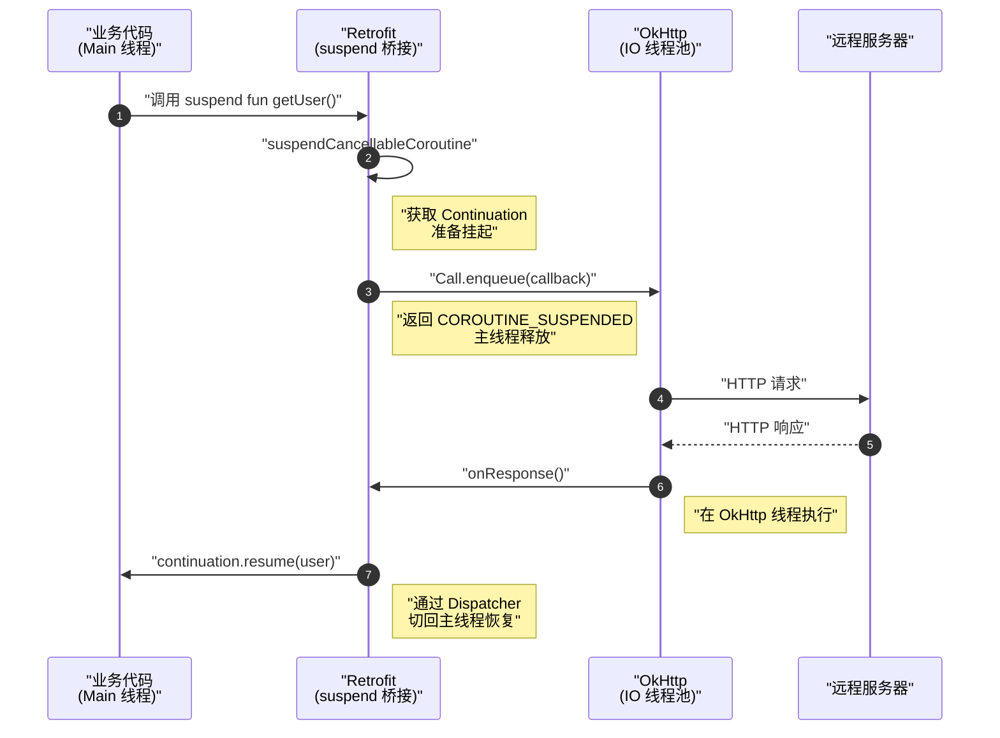

## 六、设计动机：为什么需要 CPS 变换？

### 6.1 传统线程模型的三重困境

在深入 CPS 变换的技术细节之前，我们需要理解 Kotlin 协程设计者面临的核心挑战。传统 Java 线程模型在高并发场景下存在三个根本性问题：

**困境一：内存开销不可接受**

每个 Java 线程默认分配约 1MB 的栈空间（可通过 `-Xss` 调整，但有下限）。这意味着：
- 1000 个并发连接 ≈ 1GB 内存仅用于线程栈
- 10000 个并发连接 ≈ 10GB 内存，已超出大多数移动设备和服务器的承受能力

**困境二：上下文切换代价高昂**

线程切换涉及内核态陷入，CPU 需要保存/恢复寄存器、刷新 TLB、切换页表。在高并发场景下，上下文切换本身消耗的 CPU 时间可能超过业务逻辑执行时间。

**困境三：回调地狱与代码可读性**

为了避免线程阻塞，开发者被迫使用回调式 API，导致"回调地狱"（Callback Hell）：

```java
// 传统回调式代码：可读性灾难
userApi.getUser(userId, new Callback<User>() {
    @Override
    public void onSuccess(User user) {
        orderApi.getOrders(user.getId(), new Callback<List<Order>>() {
            @Override
            public void onSuccess(List<Order> orders) {
                paymentApi.getPayments(orders, new Callback<List<Payment>>() {
                    @Override
                    public void onSuccess(List<Payment> payments) {
                        // 终于拿到数据了...
                        updateUI(user, orders, payments);
                    }
                    @Override
                    public void onError(Throwable t) { handleError(t); }
                });
            }
            @Override
            public void onError(Throwable t) { handleError(t); }
        });
    }
    @Override
    public void onError(Throwable t) { handleError(t); }
});
```

### 6.2 CPS 变换的核心洞察

Kotlin 协程的设计者（主要是 Roman Elizarov）借鉴了函数式编程中的 **CPS（Continuation-Passing Style，续体传递风格）** 思想，其核心洞察是：

> **"函数返回"本质上是一种特殊的"函数调用"——调用"接下来要执行的代码"。**

在传统函数调用中，"返回地址"由调用栈隐式管理。CPS 将这种隐式机制显式化：**每个函数不再"返回"结果，而是将结果"传递"给一个额外的参数——Continuation（续体）**。

```kotlin
// 直接风格（Direct Style）
fun add(a: Int, b: Int): Int = a + b
val result = add(1, 2)
println(result)

// CPS 风格（Continuation-Passing Style）
fun addCPS(a: Int, b: Int, cont: (Int) -> Unit) {
    cont(a + b)  // 不返回，而是调用续体
}
addCPS(1, 2) { result ->
    println(result)
}
```

**CPS 的革命性意义**：一旦"返回"变成了"调用续体"，我们就可以**自由决定何时、在哪个线程调用这个续体**。这正是协程挂起与恢复的理论基础。

### 6.3 从 CPS 到状态机：编译器的智慧

纯粹的 CPS 变换会导致严重的嵌套和性能问题（每次"返回"都是一次函数调用，调用栈会无限增长）。Kotlin 编译器的创新在于：**将 CPS 变换与状态机结合，用迭代替代递归**。

下图展示了编译器如何将多个挂起点转换为单一状态机：

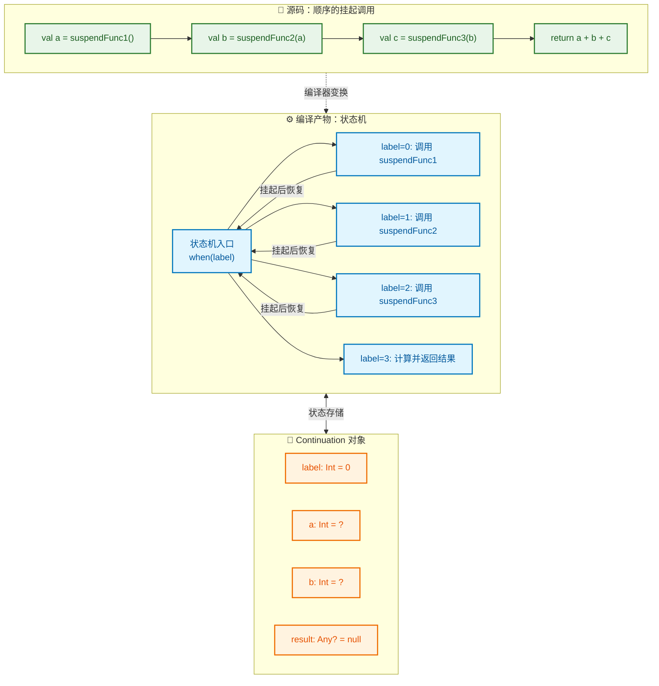

**状态机设计的三个核心优势**：

1. **内存效率**：无论有多少挂起点，只需要一个 `Continuation` 对象，其大小与局部变量数量成正比，而非与挂起点数量成正比

2. **避免栈溢出**：恢复执行时，状态机通过 `when` 跳转而非递归调用，不会增加调用栈深度

3. **调试友好**：状态机的 `label` 字段可以映射回源码行号，便于异常堆栈的可读性

## 七、Continuation 接口：协程的"灵魂"

### 7.1 接口定义与语义

`Continuation` 是整个协程机制的核心抽象，其定义极其简洁：

```kotlin
// kotlin.coroutines.Continuation.kt
public interface Continuation<in T> {
    /**
     * 协程的上下文，包含调度器、Job、异常处理器等
     */
    public val context: CoroutineContext
    
    /**
     * 恢复协程执行，传入结果或异常
     * 这是协程"恢复"的唯一入口
     */
    public fun resumeWith(result: Result<T>)
}

// 便捷扩展函数
public inline fun <T> Continuation<T>.resume(value: T) {
    resumeWith(Result.success(value))
}

public inline fun <T> Continuation<T>.resumeWithException(exception: Throwable) {
    resumeWith(Result.failure(exception))
}
```

**语义解读**：

- `Continuation<T>` 表示"一个等待 `T` 类型结果的后续计算"
- `resumeWith(Result<T>)` 是唯一的恢复入口，`Result` 封装了成功值或异常
- `context` 携带了恢复时需要的调度信息（在哪个线程恢复）

### 7.2 编译器生成的 Continuation 实现

当编译器处理 `suspend` 函数时，会生成一个继承自 `ContinuationImpl` 的匿名类。以下是真实字节码反编译后的结构（简化版）：

```kotlin
// 源码
suspend fun fetchAndProcess(): String {
    val data = fetchData()      // 挂起点 1
    val processed = process(data) // 挂起点 2
    return "Result: $processed"
}

// 编译器生成的等价代码
fun fetchAndProcess(completion: Continuation<String>): Any? {
    // 生成的 Continuation 实现类
    class FetchAndProcessContinuation(
        completion: Continuation<String>
    ) : ContinuationImpl(completion, /* intercepted context */) {
        
        // 状态标记
        var label: Int = 0
        
        // 提升的局部变量
        var data: String? = null
        var processed: Int? = null
        
        // 上一次挂起的结果
        var result: Any? = null
        
        override fun invokeSuspend(result: Result<Any?>): Any? {
            this.result = result.getOrThrow()
            // 递归调用原函数，但携带当前状态
            return fetchAndProcess(this)
        }
    }
    
    // 首次调用 vs 恢复调用的判断
    val continuation = completion as? FetchAndProcessContinuation
        ?: FetchAndProcessContinuation(completion)
    
    // 状态机主体
    when (continuation.label) {
        0 -> {
            // 初始状态：准备调用 fetchData()
            continuation.label = 1
            val suspendResult = fetchData(continuation)
            if (suspendResult === COROUTINE_SUSPENDED) {
                return COROUTINE_SUSPENDED
            }
            // fetchData 未挂起，直接使用结果
            continuation.result = suspendResult
        }
        1 -> {
            // 从 fetchData() 恢复
            continuation.data = continuation.result as String
        }
        // ... 后续状态省略
    }
    
    // label=1 之后的逻辑
    val data = continuation.data!!
    continuation.label = 2
    val suspendResult = process(data, continuation)
    if (suspendResult === COROUTINE_SUSPENDED) {
        return COROUTINE_SUSPENDED
    }
    continuation.result = suspendResult
    
    // label=2 之后的逻辑
    val processed = continuation.result as Int
    return "Result: $processed"
}
```

### 7.3 Continuation 对象的内存布局

理解 `Continuation` 的内存结构对于性能分析至关重要：

```
┌─────────────────────────────────────────────────────────────┐
│              Continuation 对象内存布局                        │
├─────────────────────────────────────────────────────────────┤
│  ┌─────────────────────────────────────────────────────┐   │
│  │  Object Header (Mark Word + Klass Pointer)          │   │
│  │  12-16 bytes (取决于是否压缩指针)                     │   │
│  └─────────────────────────────────────────────────────┘   │
│  ┌─────────────────────────────────────────────────────┐   │
│  │  completion: Continuation<T>                        │   │
│  │  指向调用者的 Continuation (链式结构)                  │   │
│  │  4-8 bytes                                          │   │
│  └─────────────────────────────────────────────────────┘   │
│  ┌─────────────────────────────────────────────────────┐   │
│  │  _context: CoroutineContext                         │   │
│  │  协程上下文引用                                       │   │
│  │  4-8 bytes                                          │   │
│  └─────────────────────────────────────────────────────┘   │
│  ┌─────────────────────────────────────────────────────┐   │
│  │  intercepted: Continuation<T>?                      │   │
│  │  被拦截器包装后的 Continuation (懒初始化)              │   │
│  │  4-8 bytes                                          │   │
│  └─────────────────────────────────────────────────────┘   │
│  ┌─────────────────────────────────────────────────────┐   │
│  │  label: Int                                         │   │
│  │  状态机当前状态                                       │   │
│  │  4 bytes                                            │   │
│  └─────────────────────────────────────────────────────┘   │
│  ┌─────────────────────────────────────────────────────┐   │
│  │  result: Any?                                       │   │
│  │  上一次挂起的返回结果                                  │   │
│  │  4-8 bytes                                          │   │
│  └─────────────────────────────────────────────────────┘   │
│  ┌─────────────────────────────────────────────────────┐   │
│  │  [局部变量字段]                                      │   │
│  │  var1, var2, var3...                                │   │
│  │  大小取决于挂起点跨越的局部变量数量和类型               │   │
│  └─────────────────────────────────────────────────────┘   │
├─────────────────────────────────────────────────────────────┤
│  典型大小：48-200 bytes（取决于局部变量）                    │
│  对比：Java Thread 栈 ≈ 1MB                                │
└─────────────────────────────────────────────────────────────┘
```

**内存效率对比**：

| 并发模型 | 单位内存开销 | 10000 并发内存 |
|---------|-------------|---------------|
| Java Thread | ~1 MB | ~10 GB |
| Kotlin Coroutine | ~100 bytes | ~1 MB |

这种 **10000 倍的内存效率提升** 是协程能够支撑百万级并发的根本原因。

## 八、CoroutineDispatcher 调度器：线程池的优雅抽象

### 8.1 调度器的核心职责

`CoroutineDispatcher` 是协程与线程世界的桥梁，它回答一个核心问题：**"恢复执行时，代码应该在哪个线程运行？"**

```kotlin
// CoroutineDispatcher.kt 核心抽象
public abstract class CoroutineDispatcher : AbstractCoroutineContextElement(ContinuationInterceptor) {
    
    /**
     * 判断是否需要调度（线程切换）
     * 如果当前已在目标线程，可以返回 false 跳过调度
     */
    public open fun isDispatchNeeded(context: CoroutineContext): Boolean = true
    
    /**
     * 核心方法：将可执行任务投递到目标线程
     * @param context 协程上下文
     * @param block 要执行的任务（封装了 continuation.resumeWith）
     */
    public abstract fun dispatch(context: CoroutineContext, block: Runnable)
}
```

调度器的工作流程可以概括为：**拦截 → 判断 → 投递**。

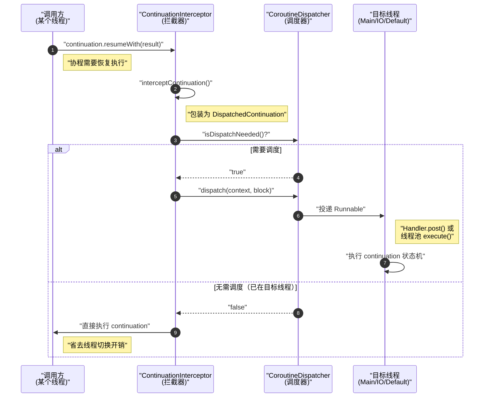

### 8.2 三大内置调度器的实现剖析

#### Dispatchers.Main：Android 主线程调度

`Dispatchers.Main` 在 Android 平台由 `HandlerDispatcher` 实现，本质是对 `Handler` 机制的封装：

```kotlin
// HandlerDispatcher.kt (kotlinx-coroutines-android)
internal class HandlerContext(
    private val handler: Handler,
    private val name: String? = null
) : HandlerDispatcher() {
    
    // 判断是否需要调度：检查当前线程是否是主线程
    override fun isDispatchNeeded(context: CoroutineContext): Boolean {
        return Looper.myLooper() != handler.looper
    }
    
    // 投递任务到主线程
    override fun dispatch(context: CoroutineContext, block: Runnable) {
        // 直接使用 Handler.post()
        if (!handler.post(block)) {
            // Handler 已被销毁（通常是 Activity 泄漏场景）
            cancelOnRejection(context, block)
        }
    }
    
    // 支持延时调度（用于 delay 函数）
    override fun scheduleResumeAfterDelay(
        timeMillis: Long,
        continuation: CancellableContinuation<Unit>
    ) {
        val block = Runnable { continuation.resume(Unit) }
        handler.postDelayed(block, timeMillis.coerceAtMost(MAX_DELAY))
        continuation.invokeOnCancellation { handler.removeCallbacks(block) }
    }
}
```

**关键设计点**：

1. **`isDispatchNeeded` 优化**：如果 `resumeWith` 调用已经发生在主线程，直接返回 `false`，避免不必要的 `Handler.post()` 开销

2. **`scheduleResumeAfterDelay`**：`delay()` 函数在 Main 调度器上的实现，本质是 `Handler.postDelayed()`

3. **取消联动**：通过 `invokeOnCancellation` 确保协程取消时移除 Handler 中的 pending 消息

#### Dispatchers.Default 与 Dispatchers.IO：共享调度器的双面

这两个调度器**共享同一个底层线程池**，但对外表现不同的调度策略：

```kotlin
// Dispatchers.kt
public actual object Dispatchers {
    
    @JvmStatic
    public actual val Default: CoroutineDispatcher = DefaultScheduler
    
    @JvmStatic
    public val IO: CoroutineDispatcher = DefaultIoScheduler
}

// DefaultScheduler 的核心实现
internal object DefaultScheduler : SchedulerCoroutineDispatcher(
    CORE_POOL_SIZE,      // CPU 核心数（至少 2）
    MAX_POOL_SIZE,       // 最大线程数（默认 CPU 核心数 * 128，但被 IO 限制）
    IDLE_WORKER_KEEP_ALIVE_NS,  // 空闲线程存活时间
    "DefaultDispatcher"
)

// IO 调度器：Default 的一个"视图"
internal object DefaultIoScheduler : CoroutineDispatcher() {
    
    // 最大并行度限制（默认 64 或 CPU 核心数，取较大值）
    private val default = UnlimitedIoScheduler.limitedParallelism(
        systemProp("kotlinx.coroutines.io.parallelism", 64.coerceAtLeast(AVAILABLE_PROCESSORS))
    )
    
    override fun dispatch(context: CoroutineContext, block: Runnable) {
        default.dispatch(context, block)
    }
}
```

**架构设计的深层逻辑**：

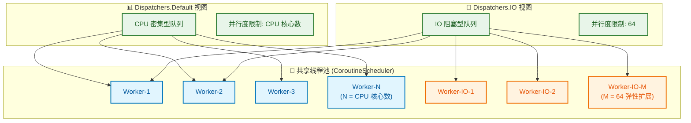

**为什么要共享线程池？**

1. **避免线程爆炸**：如果 Default 和 IO 各自维护线程池，在高并发场景下可能创建数百个线程

2. **提高线程利用率**：CPU 密集型任务完成后，线程可以立即被 IO 任务复用，无需等待新线程创建

3. **减少上下文切换**：`withContext(Dispatchers.IO)` 在某些情况下可能根本不触发线程切换——如果当前线程恰好属于共享池

**Default vs IO 的核心差异**：

| 维度 | Dispatchers.Default | Dispatchers.IO |
|------|---------------------|----------------|
| 设计目标 | CPU 密集型计算 | 阻塞式 IO 操作 |
| 并行度上限 | CPU 核心数 | 64（可配置） |
| 线程阻塞影响 | 严重（会饿死其他任务） | 较小（有弹性扩展） |
| 典型场景 | JSON 解析、图片处理、排序 | 文件读写、网络请求、数据库 |

### 8.3 `withContext` 线程切换的完整源码流程

`withContext` 是最常用的线程切换 API，其实现揭示了调度器的完整工作机制：

```kotlin
// Builders.common.kt
public suspend fun <T> withContext(
    context: CoroutineContext,
    block: suspend CoroutineScope.() -> T
): T {
    // 合并新旧上下文
    val oldContext = coroutineContext
    val newContext = oldContext.newCoroutineContext(context)
    
    // 快速路径：上下文完全相同，无需任何操作
    if (newContext === oldContext) {
        return block()
    }
    
    // 检查调度器是否变化
    val newDispatcher = newContext[ContinuationInterceptor]
    val oldDispatcher = oldContext[ContinuationInterceptor]
    
    if (newDispatcher === oldDispatcher) {
        // 调度器相同，但上下文有其他变化（如 Job）
        // 创建 UndispatchedCoroutine，不经过调度
        return UndispatchedCoroutine(newContext, block).startUndispatchedOrReturn()
    }
    
    // 需要调度：创建 DispatchedCoroutine
    return suspendCoroutineUninterceptedOrReturn { uCont ->
        val coroutine = DispatchedCoroutine(newContext, uCont)
        // 调度到新线程执行 block
        coroutine.initParentJob()
        block.startCoroutineCancellable(coroutine, coroutine)
        coroutine.getResult()  // 可能返回 COROUTINE_SUSPENDED
    }
}
```

**核心流程图解**：

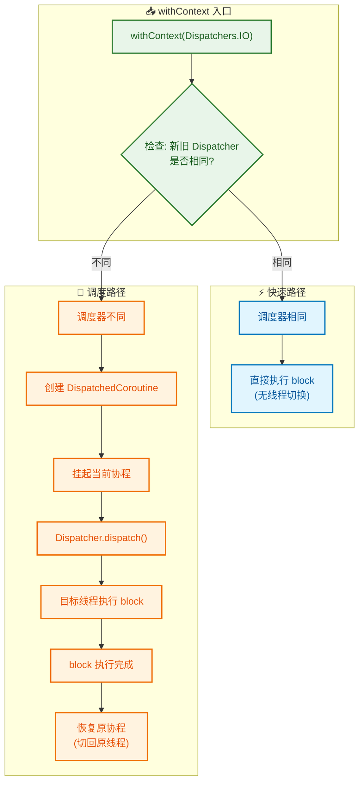

**关键细节解读**：

1. **双重恢复**：`withContext` 实际上涉及**两次**调度——进入新 Dispatcher 一次，返回原 Dispatcher 一次

2. **`getResult()` 的阻塞语义**：这里的"阻塞"是协程语义的阻塞（挂起），不是线程阻塞

3. **异常传播**：如果 `block` 抛出异常，会通过 `resumeWithException` 传回调用协程

## 九、runBlocking vs coroutineScope：两种"等待"的本质差异

### 9.1 表面相似，内核迥异

`runBlocking` 和 `coroutineScope` 在语法上极为相似——都会等待内部所有子协程完成后才返回。但它们的实现机制和适用场景截然不同：

```kotlin
// 语法上看起来几乎一样
fun main() = runBlocking {
    launch { delay(1000) }
    println("Done")
}

suspend fun doWork() = coroutineScope {
    launch { delay(1000) }
    println("Done")
}
```

**核心差异一览**：

| 维度 | `runBlocking` | `coroutineScope` |
|------|---------------|------------------|
| **函数签名** | `fun <T> runBlocking(block): T` | `suspend fun <T> coroutineScope(block): T` |
| **调用约束** | 任意位置（包括 `main`） | 只能在 `suspend` 函数内 |
| **等待机制** | **阻塞当前线程** | **挂起当前协程** |
| **线程占用** | 独占线程直到完成 | 释放线程，可执行其他协程 |
| **典型场景** | 测试代码、`main` 函数入口 | 结构化并发的作用域管理 |
| **性能影响** | 可能导致死锁/ANR | 无线程阻塞风险 |

### 9.2 runBlocking 的实现：私有事件循环

`runBlocking` 的核心是创建一个**私有的事件循环**，在当前线程上不断处理协程任务，直到 `block` 执行完毕：

```kotlin
// Builders.kt (kotlinx-coroutines-core)
public actual fun <T> runBlocking(
    context: CoroutineContext,
    block: suspend CoroutineScope.() -> T
): T {
    // 获取当前线程
    val currentThread = Thread.currentThread()
    
    // 创建 BlockingEventLoop（关键！）
    val eventLoop = if (contextInterceptor == null) {
        BlockingEventLoop(currentThread)
    } else null
    
    // 合并上下文
    val newContext = GlobalScope.newCoroutineContext(context + eventLoop)
    
    // 创建 BlockingCoroutine
    val coroutine = BlockingCoroutine<T>(newContext, currentThread, eventLoop)
    
    // 启动协程
    coroutine.start(CoroutineStart.DEFAULT, coroutine, block)
    
    // 🔥 关键：阻塞当前线程，运行事件循环
    return coroutine.joinBlocking()
}

// BlockingCoroutine.joinBlocking() 的核心逻辑
fun joinBlocking(): T {
    while (true) {
        // 处理事件循环中的任务
        val parkNanos = eventLoop?.processNextEvent() ?: Long.MAX_VALUE
        
        // 检查协程是否完成
        if (isCompleted) break
        
        // 没有任务时，阻塞等待（LockSupport.parkNanos）
        if (parkNanos > 0) {
            LockSupport.parkNanos(this, parkNanos)
        }
    }
    
    // 返回结果或抛出异常
    return (state as CompletedExceptionally)?.let { throw it.cause } 
        ?: state as T
}
```

**事件循环的工作原理**：

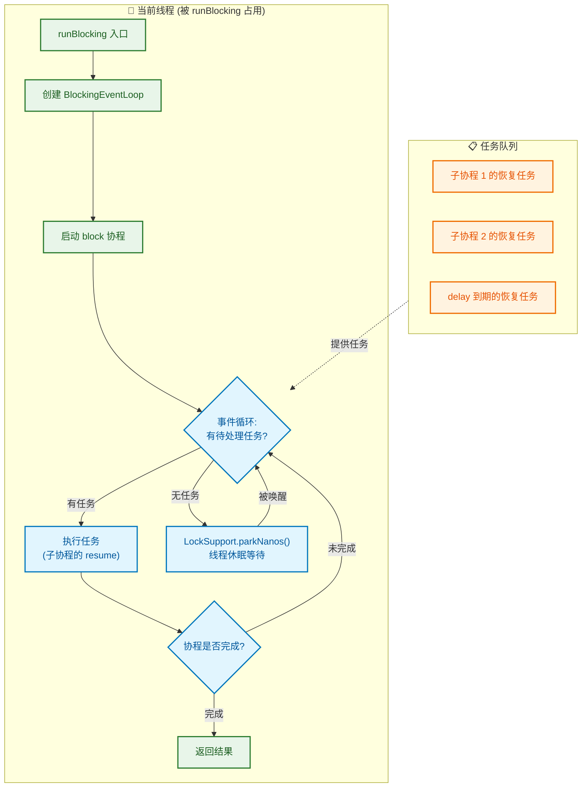

**为什么 `runBlocking` 会导致死锁？**

当 `runBlocking` 在主线程执行，且内部协程通过 `Dispatchers.Main` 调度时：

1. 主线程被 `runBlocking` 的事件循环占用
2. 子协程的恢复任务被 `Handler.post()` 投递到主线程的 `MessageQueue`
3. 但主线程正在执行 `runBlocking` 的循环，无法处理 `MessageQueue`
4. 死锁形成

### 9.3 coroutineScope 的实现：协程语义的等待

`coroutineScope` 本身是一个 `suspend` 函数，它通过**协程挂起**而非**线程阻塞**来等待子协程：

```kotlin
// Scopes.kt (kotlinx-coroutines-core)
public suspend fun <R> coroutineScope(
    block: suspend CoroutineScope.() -> R
): R {
    // 合并当前协程上下文
    val coroutine = ScopeCoroutine(coroutineContext, uCont)
    
    // 启动 block（可能立即执行，也可能调度）
    block.startCoroutineCancellable(coroutine, coroutine)
    
    // 🔥 关键：挂起当前协程，等待所有子协程完成
    return coroutine.getResult()
}

// ScopeCoroutine.getResult() 的核心
internal fun getResult(): T {
    if (trySuspend()) {
        // 返回 COROUTINE_SUSPENDED，挂起当前协程
        return COROUTINE_SUSPENDED as T
    }
    // 已完成，直接返回结果
    return getSuccessfulResult(state)
}
```

**关键差异的可视化**：

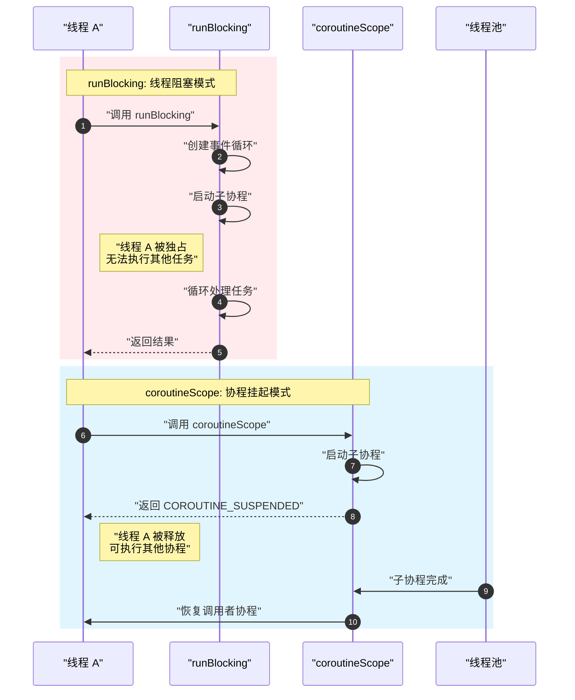

### 9.4 结构化并发的作用域层级

`coroutineScope` 的另一个关键作用是建立**父子协程的结构化关系**：

```kotlin
suspend fun processData() = coroutineScope {  // 作用域 A
    val deferred1 = async { fetchPart1() }     // 子协程 1
    val deferred2 = async { fetchPart2() }     // 子协程 2
    
    coroutineScope {                           // 作用域 B（嵌套）
        launch { validatePart1(deferred1.await()) }  // 孙协程 1
        launch { validatePart2(deferred2.await()) }  // 孙协程 2
    }
    
    // 只有作用域 B 的所有孙协程完成后，才会执行到这里
    combine(deferred1.await(), deferred2.await())
}
```

**作用域树结构**：

```
processData() 的协程
    │
    └── coroutineScope A
            │
            ├── async { fetchPart1() }     ─── 子协程 1
            │
            ├── async { fetchPart2() }     ─── 子协程 2
            │
            └── coroutineScope B
                    │
                    ├── launch { validate... } ─── 孙协程 1
                    │
                    └── launch { validate... } ─── 孙协程 2
```

**结构化并发的三大保证**：

1. **完成传播**：父作用域等待所有子协程完成
2. **取消传播**：父协程取消时，所有子协程自动取消
3. **异常传播**：子协程的未捕获异常会向上传播，取消兄弟协程

## 十、源码核心类图谱

### 10.1 类继承关系全景

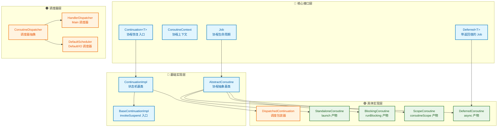

### 10.2 关键类职责详解

#### `ContinuationImpl`：状态机的骨架

```kotlin
// ContinuationImpl.kt (kotlin-stdlib)
internal abstract class ContinuationImpl(
    completion: Continuation<Any?>?,
    private val _context: CoroutineContext?
) : BaseContinuationImpl(completion) {
    
    // 拦截后的 Continuation（懒初始化）
    @Transient
    private var intercepted: Continuation<Any?>? = null
    
    // 获取被调度器包装后的 Continuation
    public fun intercepted(): Continuation<Any?> =
        intercepted ?: (context[ContinuationInterceptor]?.interceptContinuation(this) ?: this)
            .also { intercepted = it }
}

// BaseContinuationImpl.kt
internal abstract class BaseContinuationImpl(
    public val completion: Continuation<Any?>?
) : Continuation<Any?>, CoroutineStackFrame, Serializable {
    
    // 🔥 核心：恢复执行的入口
    public final override fun resumeWith(result: Result<Any?>) {
        var current = this
        var param = result
        
        while (true) {
            with(current) {
                val outcome: Result<Any?> =
                    try {
                        // 调用编译器生成的 invokeSuspend
                        val outcome = invokeSuspend(param)
                        if (outcome === COROUTINE_SUSPENDED) return
                        Result.success(outcome)
                    } catch (exception: Throwable) {
                        Result.failure(exception)
                    }
                
                releaseIntercepted()
                
                // 向调用链上层传递结果
                val completion = completion!!
                if (completion is BaseContinuationImpl) {
                    current = completion
                    param = outcome
                } else {
                    completion.resumeWith(outcome)
                    return
                }
            }
        }
    }
    
    // 由编译器生成的子类实现
    protected abstract fun invokeSuspend(result: Result<Any?>): Any?
}
```

#### `DispatchedContinuation`：调度的包装器

```kotlin
// DispatchedContinuation.kt
internal class DispatchedContinuation<in T>(
    @JvmField val dispatcher: CoroutineDispatcher,
    @JvmField val continuation: Continuation<T>
) : DispatchedTask<T>(...), Continuation<T> {
    
    override fun resumeWith(result: Result<T>) {
        val context = continuation.context
        val state = result.toState()
        
        // 判断是否需要调度
        if (dispatcher.isDispatchNeeded(context)) {
            _state = state
            resumeMode = MODE_ATOMIC
            // 投递到目标线程
            dispatcher.dispatch(context, this)
        } else {
            // 无需调度，直接执行
            executeUnconfined(state, MODE_ATOMIC) {
                withCoroutineContext(context, countOrElement) {
                    continuation.resumeWith(result)
                }
            }
        }
    }
}
```

#### `AbstractCoroutine`：协程生命周期管理

```kotlin
// AbstractCoroutine.kt
public abstract class AbstractCoroutine<in T>(
    parentContext: CoroutineContext,
    initParentJob: Boolean,
    active: Boolean
) : JobSupport(active), Job, Continuation<T>, CoroutineScope {
    
    // 协程完成时的回调（由状态机调用）
    public final override fun resumeWith(result: Result<T>) {
        val state = makeCompletingOnce(result.toState())
        if (state === COMPLETING_WAITING_CHILDREN) return
        afterResume(state)
    }
    
    // 启动协程
    public fun <R> start(start: CoroutineStart, receiver: R, block: suspend R.() -> T) {
        start(block, receiver, this)
    }
}
```

## 十一、性能与权衡：协程的代价量化分析

### 11.1 内存开销的精确测量

协程的内存优势是其核心卖点，但"100 字节 vs 1MB"的粗略对比过于简化。真实场景下，协程的内存开销取决于多个因素：

```kotlin
// 测量单个协程的内存占用
fun measureCoroutineMemory() {
    val runtime = Runtime.getRuntime()
    System.gc()
    val before = runtime.totalMemory() - runtime.freeMemory()
    
    val jobs = (1..10000).map {
        GlobalScope.launch(start = CoroutineStart.LAZY) {
            // 空协程体
        }
    }
    
    System.gc()
    val after = runtime.totalMemory() - runtime.freeMemory()
    
    println("每个协程约占用: ${(after - before) / 10000} bytes")
    // 典型输出: 每个协程约占用: 200-400 bytes
}
```

**内存组成分解**：

```
┌─────────────────────────────────────────────────────────────────┐
│                    协程内存开销分解                               │
├─────────────────────────────────────────────────────────────────┤
│                                                                 │
│  ┌─────────────────────────────────────┐                       │
│  │  1. Continuation 对象本身            │                       │
│  │  ├── Object Header: 12-16 bytes     │                       │
│  │  ├── label 字段: 4 bytes            │                       │
│  │  ├── result 字段: 4-8 bytes         │                       │
│  │  ├── completion 引用: 4-8 bytes     │                       │
│  │  └── context 引用: 4-8 bytes        │                       │
│  │  小计: ~40 bytes                     │                       │
│  └─────────────────────────────────────┘                       │
│                                                                 │
│  ┌─────────────────────────────────────┐                       │
│  │  2. 提升的局部变量                    │                       │
│  │  取决于挂起点跨越的变量数量            │                       │
│  │  每个引用: 4-8 bytes                 │                       │
│  │  每个基本类型: 1-8 bytes             │                       │
│  │  小计: 0 ~ 数百 bytes               │                       │
│  └─────────────────────────────────────┘                       │
│                                                                 │
│  ┌─────────────────────────────────────┐                       │
│  │  3. Job 对象                         │                       │
│  │  ├── 状态机: ~40 bytes              │                       │
│  │  ├── 子 Job 列表: ~48 bytes         │                       │
│  │  └── 取消回调链: 可变               │                       │
│  │  小计: ~100 bytes                   │                       │
│  └─────────────────────────────────────┘                       │
│                                                                 │
│  ┌─────────────────────────────────────┐                       │
│  │  4. CoroutineContext                 │                       │
│  │  通常在协程间共享，摊销成本低          │                       │
│  │  小计: ~10 bytes (摊销后)            │                       │
│  └─────────────────────────────────────┘                       │
│                                                                 │
│  ═══════════════════════════════════════                       │
│  典型空协程: 150-200 bytes                                      │
│  带业务逻辑协程: 200-500 bytes                                  │
│  复杂状态机协程: 500-2000 bytes                                 │
└─────────────────────────────────────────────────────────────────┘
```

**与线程的内存对比**：

| 并发单元 | 固定开销 | 可变开销 | 10000 并发 |
|---------|---------|---------|-----------|
| Java Thread | ~1MB 栈空间 | 线程对象 ~1KB | ~10 GB |
| Kotlin Coroutine | ~200 bytes | 局部变量提升 | ~2-5 MB |
| **差距倍数** | **~5000x** | **~5x** | **~2000-5000x** |

### 11.2 CPU 开销分析

协程的 CPU 开销主要来自三个方面：

**1. 状态机跳转开销**

```kotlin
// 编译后的 when 跳转
when (label) {
    0 -> { /* ... */ }
    1 -> { /* ... */ }
    2 -> { /* ... */ }
}
```

状态机跳转在 JVM 层面编译为 `tableswitch` 或 `lookupswitch` 字节码指令，时间复杂度 O(1)，开销极小（约 10-50 纳秒）。

**2. 调度开销**

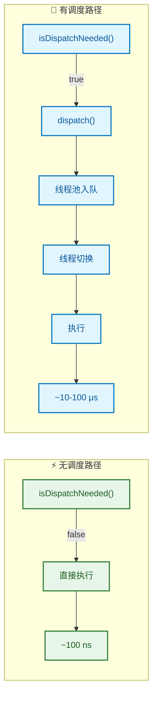

**3. 对象分配与 GC 压力**

每次协程启动会创建 `Continuation` 对象，高频创建协程会增加 GC 压力。优化策略：

```kotlin
// ❌ 反模式：高频创建协程
suspend fun processItems(items: List<Item>) {
    items.forEach { item ->
        launch { process(item) }  // 每个 item 一个协程
    }
}

// ✅ 优化：批处理 + 协程池
suspend fun processItems(items: List<Item>) = coroutineScope {
    items.chunked(100).map { chunk ->
        async {
            chunk.forEach { process(it) }
        }
    }.awaitAll()
}
```

### 11.3 与替代方案的对比

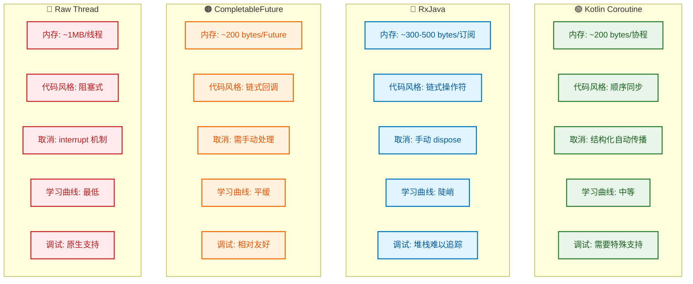

**选型决策矩阵**：

| 场景 | 推荐方案 | 理由 |
|------|---------|------|
| Android UI + 网络请求 | **Coroutine** | 与 Lifecycle 集成、主线程友好 |
| 复杂数据流转换 | RxJava / Flow | 操作符丰富 |
| Java 遗留代码改造 | CompletableFuture | 无需 Kotlin |
| CPU 密集型批处理 | Thread Pool + Coroutine | 混合使用 |
| 简单异步回调 | CompletableFuture | 轻量级 |

## 十二、安全视角：协程的逆向与防护

### 12.1 字节码特征识别

协程在字节码层面有明显的特征，这使得它容易被逆向工程识别：

```java
// 反编译后的典型特征

// 特征 1: Continuation 参数
public final Object fetchData(Continuation<? super User> $completion) {
    // ...
}

// 特征 2: 状态机类
final class FetchDataKt$fetchData$1 extends ContinuationImpl {
    int label;
    Object L$0;  // 提升的局部变量
    
    @Nullable
    public final Object invokeSuspend(@NotNull Object $result) {
        switch (this.label) {
            case 0: // ...
            case 1: // ...
        }
    }
}

// 特征 3: COROUTINE_SUSPENDED 常量
Object var10000 = IntrinsicsKt.getCOROUTINE_SUSPENDED();
```

### 12.2 Hook 协程的可行方案

攻击者（或调试工具）可以通过以下方式 Hook 协程：

**方案一：Hook `Continuation.resumeWith`**

```kotlin
// 使用 Xposed/Frida Hook
XposedHelpers.findAndHookMethod(
    "kotlin.coroutines.jvm.internal.BaseContinuationImpl",
    classLoader,
    "resumeWith",
    Object::class.java,  // Result 参数
    object : XC_MethodHook() {
        override fun beforeHookedMethod(param: MethodHookParam) {
            val result = param.args[0]
            Log.d("CoroutineHook", "resumeWith called: $result")
        }
    }
)
```

**方案二：Hook Dispatcher.dispatch**

```kotlin
// 拦截所有协程调度
XposedHelpers.findAndHookMethod(
    "kotlinx.coroutines.CoroutineDispatcher",
    classLoader,
    "dispatch",
    CoroutineContext::class.java,
    Runnable::class.java,
    object : XC_MethodHook() {
        override fun beforeHookedMethod(param: MethodHookParam) {
            val context = param.args[0] as CoroutineContext
            Log.d("DispatchHook", "Dispatching to: ${context[Job]}")
        }
    }
)
```

### 12.3 混淆对协程的影响

R8/ProGuard 混淆会对协程代码产生特殊影响：

```proguard
# 必须保留的规则（否则协程会崩溃）

# 保留 Continuation 接口
-keep class kotlin.coroutines.Continuation { *; }

# 保留状态机的 invokeSuspend 方法
-keepclassmembers class * extends kotlin.coroutines.jvm.internal.BaseContinuationImpl {
    void invokeSuspend(java.lang.Object);
}

# 保留 @JvmField 标注的 Dispatcher
-keepclassmembers class kotlinx.coroutines.** {
    @kotlin.jvm.JvmField <fields>;
}

# 保留协程的调试信息（可选，用于堆栈恢复）
-keepattributes SourceFile, LineNumberTable
-keepattributes RuntimeVisibleAnnotations
```

**混淆后的堆栈差异**：

```
// 未混淆
kotlinx.coroutines.flow.FlowKt__ErrorsKt$catchImpl$2.invokeSuspend(Errors.kt:154)
kotlin.coroutines.jvm.internal.BaseContinuationImpl.resumeWith(ContinuationImpl.kt:33)

// 混淆后（无 keep 规则）
a.b.c$d.a(Unknown Source:12)  // 完全无法追踪
kotlin.a.b.c.a(Unknown Source:33)
```

## 十三、极端场景：协程相关的 Crash 与 ANR 归因

### 13.1 协程异常的传播机制与致命陷阱

协程的异常处理遵循**结构化并发**的设计哲学，但这也带来了一些反直觉的行为：

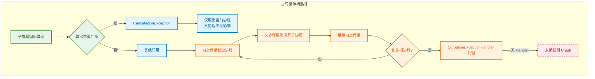

**致命陷阱：`launch` vs `async` 的异常行为差异**

```kotlin
// 场景 1: launch 的异常会立即传播
fun dangerousLaunch() {
    val scope = CoroutineScope(Job())
    
    scope.launch {
        throw RuntimeException("Boom!")  // 💥 立即向上传播，可能导致 Crash
    }
    
    // 即使这里 try-catch 也无法捕获上面的异常！
}

// 场景 2: async 的异常被封装在 Deferred 中
fun saferAsync() {
    val scope = CoroutineScope(Job())
    
    val deferred = scope.async {
        throw RuntimeException("Boom!")  // 异常被封装
    }
    
    // 异常在 await() 时才抛出
    scope.launch {
        try {
            deferred.await()  // 这里才会抛出异常
        } catch (e: Exception) {
            // 可以捕获
        }
    }
}
```

**关键区别的本质原因**：

| 构建器 | 返回类型 | 异常处理 | 设计意图 |
|--------|---------|---------|---------|
| `launch` | `Job` | 立即传播 | Fire-and-forget 任务 |
| `async` | `Deferred<T>` | 封装等待 | 需要结果的并行任务 |

### 13.2 协程导致 ANR 的典型场景

**场景一：主线程协程中的隐式阻塞**

```kotlin
// ❌ 危险：看起来是协程，实际会阻塞主线程
class MainActivity : AppCompatActivity() {
    override fun onCreate(savedInstanceState: Bundle?) {
        super.onCreate(savedInstanceState)
        
        lifecycleScope.launch {
            // 这里是主线程！
            val bitmap = BitmapFactory.decodeFile(hugePath)  // 💀 阻塞 IO
            imageView.setImageBitmap(bitmap)
        }
    }
}
```

这个代码的陷阱在于：`lifecycleScope.launch` 默认使用 `Dispatchers.Main.immediate`，整个 lambda 都在主线程执行。`BitmapFactory.decodeFile` 是阻塞式 IO，直接导致 ANR。

**正确写法**：

```kotlin
lifecycleScope.launch {
    val bitmap = withContext(Dispatchers.IO) {
        BitmapFactory.decodeFile(hugePath)
    }
    imageView.setImageBitmap(bitmap)
}
```

**场景二：Dispatcher 线程池耗尽**

```kotlin
// ❌ 危险：IO 调度器被阻塞式操作耗尽
suspend fun processAllFiles(files: List<File>) = coroutineScope {
    files.map { file ->
        async(Dispatchers.IO) {
            // 假设这是一个需要 10 秒的阻塞操作
            Thread.sleep(10_000)
            processFile(file)
        }
    }.awaitAll()
}
```

当 `files` 数量超过 64（IO 调度器的默认上限）时，后续协程会排队等待，如果此时有依赖 IO 调度器的关键路径（如网络请求），可能导致超时或 ANR。

**ANR 堆栈分析技巧**：

```
// ANR 堆栈中的协程特征
"main" prio=5 tid=1 Blocked
  | group="main" sCount=1 ucsCount=0 flags=1 obj=0x... self=0x...
  | held mutexes=
  at kotlinx.coroutines.EventLoopImplBase.processNextEvent(EventLoop.common.kt:274)
  at kotlinx.coroutines.BlockingCoroutine.joinBlocking(Builders.kt:85)
  at kotlinx.coroutines.BuildersKt__BuildersKt.runBlocking(Builders.kt:59)
  -- 这里说明 runBlocking 阻塞了主线程！
```

### 13.3 协程堆栈恢复：调试的救星

协程的异步特性使得堆栈追踪变得困难，但 `kotlinx-coroutines-debug` 提供了堆栈恢复能力：

```kotlin
// build.gradle
debugImplementation("org.jetbrains.kotlinx:kotlinx-coroutines-debug:1.7.3")

// Application.onCreate() 中启用
DebugProbes.install()
DebugProbes.sanitizeStackTraces = false  // 保留完整堆栈

// 打印所有协程状态
DebugProbes.dumpCoroutines()
```

**恢复前后的堆栈对比**：

```
// 未恢复的堆栈（只能看到恢复点）
Exception in thread "main" java.lang.IllegalStateException: Oops
    at MainKt$main$1$deferred$1.invokeSuspend(Main.kt:15)
    at kotlin.coroutines.jvm.internal.BaseContinuationImpl.resumeWith(Continuation.kt:33)
    at kotlinx.coroutines.DispatchedTask.run(DispatchedTask.kt:106)
    // ... 后面是线程池的堆栈，完全看不出调用链

// 恢复后的堆栈（完整调用链）
Exception in thread "main" java.lang.IllegalStateException: Oops
    at MainKt$main$1$deferred$1.invokeSuspend(Main.kt:15)
    (Coroutine boundary)  // 协程边界标记
    at MainKt$main$1.invokeSuspend(Main.kt:12)
    at MainKt.main(Main.kt:8)
    // 完整的协程调用链被恢复！
```

## 十四、字节码深度：真实编译产物分析

### 14.1 使用 `kotlinc` 和 `javap` 观察编译产物

```bash
# 编译 Kotlin 文件
kotlinc -include-runtime -d output.jar SuspendExample.kt

# 反编译查看字节码
javap -c -p -v SuspendExampleKt.class
```

### 14.2 真实 `suspend` 函数的字节码

```kotlin
// 源码
suspend fun simple(): Int {
    delay(1000)
    return 42
}
```

编译后的关键字节码（简化）：

```java
public final class SimpleKt {
    // 注意签名变化：返回 Object，新增 Continuation 参数
    public static final Object simple(Continuation<? super Integer> $completion) {
        // 创建或复用状态机
        Object $continuation;
        label20: {
            if ($completion instanceof SimpleKt$simple$1) {
                $continuation = (SimpleKt$simple$1)$completion;
                if ((((SimpleKt$simple$1)$continuation).label & Integer.MIN_VALUE) != 0) {
                    ((SimpleKt$simple$1)$continuation).label -= Integer.MIN_VALUE;
                    break label20;
                }
            }
            $continuation = new SimpleKt$simple$1($completion);
        }
        
        Object $result = ((<undefinedtype>)$continuation).result;
        Object var4 = IntrinsicsKt.getCOROUTINE_SUSPENDED();
        
        // 状态机 switch
        switch(((<undefinedtype>)$continuation).label) {
            case 0:
                ResultKt.throwOnFailure($result);
                ((<undefinedtype>)$continuation).label = 1;
                // 调用 delay，可能挂起
                if (DelayKt.delay(1000L, (Continuation)$continuation) == var4) {
                    return var4;  // 返回 COROUTINE_SUSPENDED
                }
                break;
            case 1:
                ResultKt.throwOnFailure($result);
                break;
            default:
                throw new IllegalStateException("call to 'resume' before 'invoke' with coroutine");
        }
        
        return Boxing.boxInt(42);
    }
}

// 生成的状态机类
final class SimpleKt$simple$1 extends ContinuationImpl {
    int label;  // 状态标记
    Object result;  // 上一次的结果
    
    SimpleKt$simple$1(Continuation<? super Integer> $completion) {
        super($completion);
    }
    
    @Nullable
    public final Object invokeSuspend(@NotNull Object $result) {
        this.result = $result;
        this.label |= Integer.MIN_VALUE;  // 防止重入的标记
        return SimpleKt.simple((Continuation)this);
    }
}
```

**字节码中的关键设计**：

1. **`label | Integer.MIN_VALUE`**：这是一个巧妙的防重入机制。当 `invokeSuspend` 被调用时，设置最高位为 1，防止状态机在恢复过程中被错误地重新初始化。

2. **`COROUTINE_SUSPENDED` 哨兵值**：这个特殊对象（`kotlin.coroutines.intrinsics.COROUTINE_SUSPENDED`）是单例，用于区分"挂起"和"直接返回"两种情况。

3. **`ResultKt.throwOnFailure`**：在每个状态入口处检查上一次恢复是否携带了异常，如果是则立即抛出。

## 十五、协程与 Kotlin/Native、Kotlin/JS 的统一

### 15.1 多平台协程的架构设计

Kotlin 协程的设计从一开始就考虑了跨平台，其分层架构如下：

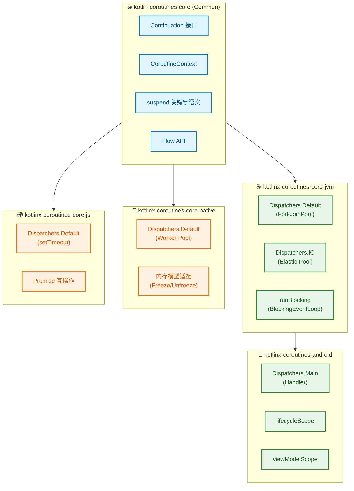

**跨平台的关键抽象**：

| 概念 | JVM 实现 | Native 实现 | JS 实现 |
|------|---------|-------------|---------|
| 线程 | `java.lang.Thread` | `Worker` | 单线程 Event Loop |
| 调度 | `Executor` | `Worker.execute` | `setTimeout` |
| 同步原语 | `ReentrantLock` | `AtomicReference` + Freeze | 不需要（单线程） |
| 异常处理 | `Thread.UncaughtExceptionHandler` | `terminateWithUnhandledException` | `window.onerror` |

### 15.2 协程与 Project Loom（虚拟线程）的对比

Java 21 引入的虚拟线程（Virtual Threads）与 Kotlin 协程有相似的目标，但实现路径不同：

```
┌─────────────────────────────────────────────────────────────────┐
│                    并发模型对比                                  │
├─────────────────────────────────────────────────────────────────┤
│                                                                 │
│  ┌───────────────────────┐    ┌───────────────────────┐        │
│  │   Kotlin Coroutine    │    │   Java Virtual Thread │        │
│  ├───────────────────────┤    ├───────────────────────┤        │
│  │ 实现层: 编译器 + 库    │    │ 实现层: JVM 原生支持   │        │
│  │ 挂起点: 显式 suspend   │    │ 挂起点: 隐式（阻塞 IO）│        │
│  │ 栈管理: 堆上状态机     │    │ 栈管理: 虚拟栈帧       │        │
│  │ 调度器: 可插拔         │    │ 调度器: 固定 FJP       │        │
│  │ 取消: 结构化并发       │    │ 取消: interrupt       │        │
│  │ 跨平台: ✅             │    │ 跨平台: ❌ (仅 JVM)    │        │
│  │ 与 Java 互操作: 需桥接  │    │ 与 Java 互操作: 无缝   │        │
│  └───────────────────────┘    └───────────────────────┘        │
│                                                                 │
│  适用场景:                                                       │
│  • Kotlin 协程: Android、多平台、需要细粒度控制                   │
│  • 虚拟线程: JVM 服务端、大量阻塞 IO、遗留代码迁移                 │
│                                                                 │
└─────────────────────────────────────────────────────────────────┘
```

**未来展望**：Kotlin 协程可以在 JVM 21+ 环境下使用虚拟线程作为底层载体（通过 `Dispatchers.IO.limitedParallelism(n)`），实现两者的优势互补——协程的结构化并发 + 虚拟线程的透明阻塞处理。