---

# CompletableFuture ⭐⭐

---

## CompletableFuture 概述

### 从 Future 说起：异步编程的起点与痛点

在 Java 5 中引入的 `Future<V>` 接口，为我们打开了异步编程的大门。通过将耗时任务提交给线程池，我们可以拿到一个 `Future` 对象，稍后再通过 `get()` 获取结果。然而，`Future` 存在几个**致命短板**，使得它在实际开发中捉襟见肘：

```java
// 传统 Future 的典型用法
ExecutorService executor = Executors.newFixedThreadPool(2);

// 提交一个耗时任务，返回 Future 对象
Future<String> future = executor.submit(() -> {
    Thread.sleep(2000); // 模拟耗时操作
    return "查询结果";
});

// ❌ 痛点1：get() 是阻塞的，调用线程只能干等
String result = future.get(); // 当前线程在此"卡住"，直到结果返回

// ❌ 痛点2：无法手动完成——如果想提前给 Future 赋值，做不到
// ❌ 痛点3：无法链式编排——"拿到结果后做 A，再做 B，再做 C" 写起来极为笨拙
// ❌ 痛点4：无法组合多个 Future——"等两个任务都完成后汇总" 需要手写循环轮询
// ❌ 痛点5：没有内建的异常处理机制——异常只有在 get() 时才会以 ExecutionException 抛出
```

这些痛点归结为一句话：**Future 是"拉"模型（pull），你必须主动去取结果；而现代异步编程需要"推"模型（push），任务完成后自动驱动下一步。**

### CompletableFuture 是什么

`CompletableFuture<T>` 是 Java 8 在 `java.util.concurrent` 包中引入的一个强大类，它同时实现了 `Future<T>` 和 `CompletionStage<T>` 两个接口。

```java
// CompletableFuture 的类签名
public class CompletableFuture<T> implements Future<T>, CompletionStage<T> {
    // ...
}
```

- **`Future<T>`**：保留了传统 `get()`、`isDone()` 等查询/获取结果的能力。
- **`CompletionStage<T>`**：这才是核心——它定义了**约 40 个方法**，支持链式转换（transform）、消费（consume）、组合（combine）、异常处理（exception handling）等声明式操作，每个操作返回一个新的 `CompletionStage`，从而构成**流水线式（pipeline）的异步编排**。

用一句话概括：**CompletableFuture = Future + CompletionStage，它是 Java 原生的异步编排引擎。**

### 核心设计理念：响应式流水线

`CompletableFuture` 的设计灵感来自于函数式编程中的 **Promise / Monad** 模式。它的核心理念可以用三个关键词概括：

1. **声明式（Declarative）**—— 你只需要描述"做什么"，而不需要关心"什么时候做、在哪个线程做"。
2. **链式（Chainable）**—— 每个操作返回新的 `CompletableFuture`，操作可以像流水线一样串联。
3. **非阻塞（Non-blocking）**—— 任务完成后自动触发下游操作，无需手动 `get()` 阻塞等待。

```java
// 一个典型的 CompletableFuture 流水线示例
CompletableFuture
    .supplyAsync(() -> queryDatabase())       // Step1: 异步查询数据库
    .thenApply(data -> parseData(data))       // Step2: 拿到结果后，同步解析数据
    .thenApplyAsync(parsed -> enrich(parsed)) // Step3: 异步地补充数据
    .thenAccept(result -> sendResponse(result))// Step4: 消费最终结果，发送响应
    .exceptionally(ex -> {                    // 异常兜底：流水线中任一环节出错都会走这里
        log.error("流水线执行失败", ex);
        return null;
    });
```

上面这段代码**没有任何阻塞调用**，四个步骤被编排成一条流水线——前一步完成后自动推动下一步执行，而异常会沿着链条传播并被 `exceptionally` 兜底。这就是 CompletableFuture 的魅力。

### 架构全景：CompletableFuture 的能力图谱

下面这张图展示了 `CompletableFuture` 的完整能力域，也是本章后续内容的学习路线图：


```mermaid
graph LR
    subgraph CREATE["🏗️ 创建"]
        direction TB
        C1["supplyAsync"]
        C2["runAsync"]
        C3["completedFuture"]
    end

    subgraph TRANSFORM["🔄 转换"]
        direction TB
        T1["thenApply"]
        T2["thenApplyAsync"]
        T3["thenCompose"]
    end

    subgraph CONSUME["📥 消费"]
        direction TB
        CS1["thenAccept"]
        CS2["thenRun"]
    end

    subgraph COMBINE["🔗 组合"]
        direction TB
        CB1["thenCombine"]
        CB2["applyToEither"]
        CB3["thenAcceptBoth"]
        CB4["runAfterBoth / Either"]
    end

    subgraph BATCH["📦 批量"]
        direction TB
        B1["allOf"]
        B2["anyOf"]
    end

    subgraph EXCEPTION["🛡️ 异常处理"]
        direction TB
        E1["exceptionally"]
        E2["handle"]
        E3["whenComplete"]
    end

    subgraph TIMEOUT["⏱️ 超时 Java9+"]
        direction TB
        TO1["orTimeout"]
        TO2["completeOnTimeout"]
    end

    CREATE --> TRANSFORM
    TRANSFORM --> CONSUME
    CONSUME --> COMBINE
    COMBINE --> BATCH
    BATCH --> EXCEPTION
    EXCEPTION --> TIMEOUT

    classDef greenNode fill:#C8E6C9,stroke:#388E3C,color:#1B5E20
    classDef blueNode fill:#BBDEFB,stroke:#1976D2,color:#0D47A1
    classDef tealNode fill:#B2DFDB,stroke:#00796B,color:#004D40
    classDef amberNode fill:#FFE0B2,stroke:#F57C00,color:#E65100
    classDef purpleNode fill:#E1BEE7,stroke:#7B1FA2,color:#4A148C
    classDef redNode fill:#FFCDD2,stroke:#D32F2F,color:#B71C1C
    classDef orangeNode fill:#FFCCBC,stroke:#E64A19,color:#BF360C

    class C1,C2,C3 greenNode
    class T1,T2,T3 blueNode
    class CS1,CS2 tealNode
    class CB1,CB2,CB3,CB4 amberNode
    class B1,B2 purpleNode
    class E1,E2,E3 redNode
    class TO1,TO2 orangeNode
```

### CompletableFuture 与 Future 的对比

为了更直观地感受 `CompletableFuture` 带来的质变，我们来做一个系统对比：

| 维度 | `Future` | `CompletableFuture` |
|---|---|---|
| **获取结果** | `get()` 阻塞 | `get()` 阻塞 + 非阻塞回调（`thenApply` 等） |
| **手动完成** | ❌ 不支持 | ✅ `complete(value)` / `completeExceptionally(ex)` |
| **链式操作** | ❌ 不支持 | ✅ 约 40 个链式方法 |
| **多任务组合** | ❌ 需手写轮询 | ✅ `thenCombine` / `allOf` / `anyOf` |
| **异常处理** | 仅在 `get()` 时抛出 | ✅ `exceptionally` / `handle` / `whenComplete` |
| **超时控制** | `get(timeout, unit)` 仅阻塞式 | ✅ `orTimeout` / `completeOnTimeout`（Java 9+） |
| **线程池控制** | 取决于提交方式 | 每个 `*Async` 方法均可指定自定义线程池 |

### 手动完成：complete 与 completeExceptionally

`CompletableFuture` 名字中的 "Completable" 意为"**可被外部完成的**"。这是它相比 `Future` 最基本的进化——你可以在任何地方、任何时候，手动给一个 `CompletableFuture` 赋值或抛异常：

```java
// 创建一个"空"的 CompletableFuture，此时没有结果
CompletableFuture<String> cf = new CompletableFuture<>();

// 在另一个线程中手动完成它（模拟某个外部事件触发）
new Thread(() -> {
    try {
        Thread.sleep(1000);           // 模拟耗时操作
        cf.complete("手动赋值的结果"); // ✅ 手动完成，所有等待者立即收到结果
    } catch (Exception e) {
        cf.completeExceptionally(e);  // ✅ 手动以异常完成
    }
}).start();

// 主线程可以通过回调非阻塞地消费结果
cf.thenAccept(result -> System.out.println("收到结果: " + result));
```

这个机制在很多场景下极为有用：**适配回调式 API**（如 Netty、Vert.x）、**实现 Cache 占位符模式**、**桥接事件驱动系统**等。

### 线程模型：谁来执行我的回调？

理解 `CompletableFuture` 的线程模型至关重要，否则极易踩坑。核心规则如下：

**规则一：不带 `Async` 后缀的方法（如 `thenApply`）**

- 如果前驱任务**已经完成**，回调在**调用线程**（即当前执行 `thenApply` 的线程）上同步执行。
- 如果前驱任务**尚未完成**，回调由**完成前驱任务的线程**执行。

**规则二：带 `Async` 后缀的方法（如 `thenApplyAsync`）**

- 回调**一定提交到线程池**异步执行。
- 无参版本使用 `ForkJoinPool.commonPool()`；带 `Executor` 参数的版本使用指定线程池。

```java
// 演示线程模型差异
ExecutorService myPool = Executors.newFixedThreadPool(4); // 自定义线程池

CompletableFuture
    .supplyAsync(() -> {
        // 在 ForkJoinPool.commonPool() 的某个线程中执行
        System.out.println("供给: " + Thread.currentThread().getName());
        return 42;
    })
    .thenApply(v -> {
        // 可能在 commonPool 线程中执行，也可能在主线程中执行（取决于前驱是否完成）
        System.out.println("同步转换: " + Thread.currentThread().getName());
        return v * 2;
    })
    .thenApplyAsync(v -> {
        // 一定在 myPool 的线程中执行（因为我们指定了自定义线程池）
        System.out.println("异步转换: " + Thread.currentThread().getName());
        return v + 1;
    }, myPool) // 👈 指定自定义线程池
    .thenAccept(v -> System.out.println("最终结果: " + v));
```

**⚠️ 生产环境最佳实践**：在生产代码中，**强烈建议始终使用 `*Async` 方法并传入自定义线程池**。原因有二：
1. `ForkJoinPool.commonPool()` 是整个 JVM 共享的，一旦某个任务阻塞，会影响所有使用它的组件（包括 parallel stream）。
2. 使用自定义线程池可以实现**线程隔离**（Thread Isolation），便于监控、限流和排查问题。

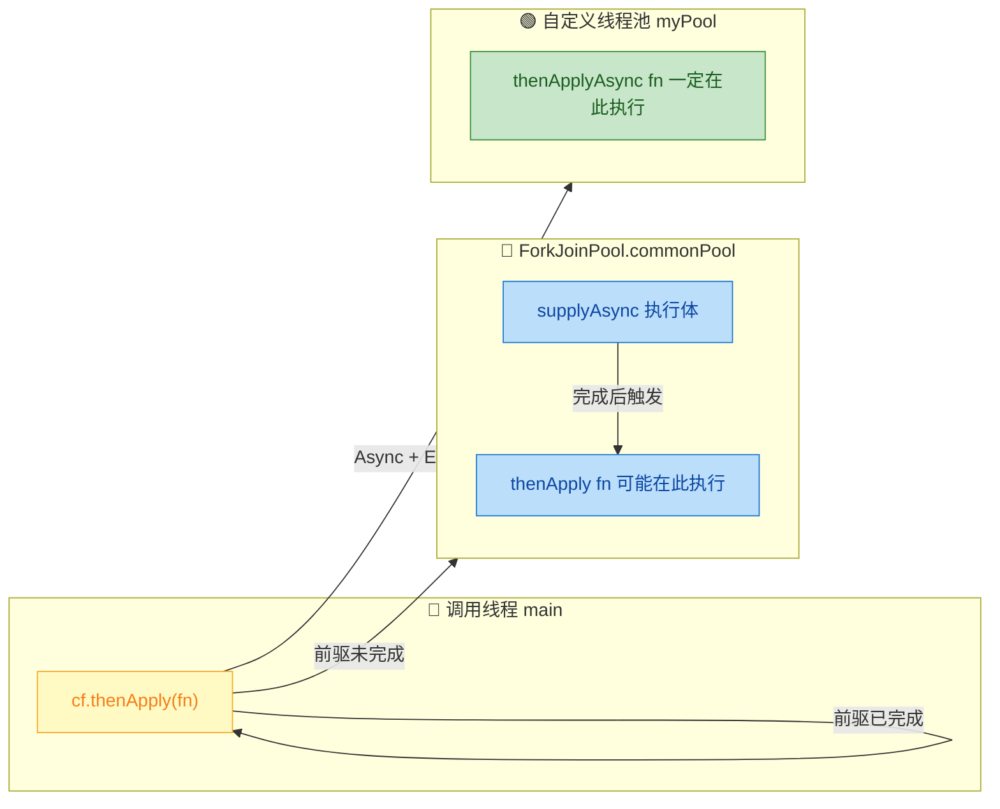
```mermaid
graph LR
    subgraph CALLER["📌 调用线程 main"]
        direction TB
        A1["cf.thenApply(fn)"]
    end

    subgraph COMMON["🔵 ForkJoinPool.commonPool"]
        direction TB
        B1["supplyAsync 执行体"]
        B2["thenApply fn 可能在此执行"]
    end

    subgraph CUSTOM["🟢 自定义线程池 myPool"]
        direction TB
        D1["thenApplyAsync fn 一定在此执行"]
    end

    A1 -->|前驱已完成| A1
    A1 -->|前驱未完成| COMMON
    B1 -->|完成后触发| B2
    A1 -->|Async + Executor| CUSTOM

    classDef callerStyle fill:#FFF9C4,stroke:#F9A825,color:#F57F17
    classDef commonStyle fill:#BBDEFB,stroke:#1976D2,color:#0D47A1
    classDef customStyle fill:#C8E6C9,stroke:#388E3C,color:#1B5E20

    class A1 callerStyle
    class B1,B2 commonStyle
    class D1 customStyle
```

### CompletableFuture 的内部原理概览

从实现层面看，`CompletableFuture` 内部维护了两个关键字段：

```java
// CompletableFuture 内部核心字段（简化示意）
volatile Object result;     // 存储结果值或异常（AltResult 包装）
volatile Completion stack;  // 依赖此 CF 的回调链（Treiber Stack，无锁栈）
```

- **`result`**：任务完成时，结果值（或包装后的异常 `AltResult`）存入此字段。使用 `volatile` 保证可见性，赋值通过 CAS（`compareAndSet`）保证线程安全。
- **`stack`**：一个**无锁链栈（Treiber Stack）**，存储所有依赖当前 `CompletableFuture` 的后续操作节点（`Completion`）。当 `result` 被赋值时，会遍历 `stack` 并逐一触发（`postComplete`）。

工作流程可以简化为：

1. **注册回调**：调用 `thenApply(fn)` 时，如果当前 CF 尚未完成，将 `fn` 封装成 `Completion` 节点，CAS 压入 `stack`。
2. **完成触发**：当上游任务完成（或手动 `complete`），CAS 写入 `result`，随后调用 `postComplete()` 遍历 `stack`，依次触发所有回调。
3. **传播结果**：每个回调执行完成后，将结果写入**自己**返回的 `CompletableFuture` 的 `result`，从而驱动更下游的回调——形成**链式反应（cascade）**。

```text
            ┌─────────────────────────────────────────────────────────┐
            │              CompletableFuture 内部结构                   │
            │                                                         │
            │   result: volatile Object ──► 存储最终值或异常            │
            │                                                         │
            │   stack:  volatile Completion (Treiber Stack)           │
            │            ┌──────────┐                                 │
            │            │ callback3│──► next ──► null                │
            │            ├──────────┤                                 │
            │            │ callback2│──► next ──► callback3           │
            │            ├──────────┤                                 │
            │   top ───► │ callback1│──► next ──► callback2           │
            │            └──────────┘                                 │
            │                                                         │
            │   complete(value):                                      │
            │     1. CAS 写入 result                                  │
            │     2. postComplete() 弹出栈中所有 Completion 并执行      │
            │     3. 每个 Completion 完成后驱动下游 CF                  │
            └─────────────────────────────────────────────────────────┘
```

这种 **CAS + Treiber Stack** 的设计使得 `CompletableFuture` 在高并发场景下无需加锁，性能优异。

### 使用场景总览

`CompletableFuture` 在现代 Java 后端开发中无处不在，以下是最常见的应用场景：

| 场景 | 说明 | 涉及 API |
|---|---|---|
| **并行调用多个微服务** | 同时请求用户服务、订单服务、库存服务，最后汇总 | `supplyAsync` + `allOf` + `thenCombine` |
| **带超时的远程调用** | 调用第三方 API，超时后返回降级结果 | `supplyAsync` + `completeOnTimeout` |
| **异步流水线处理** | 查询 → 转换 → 校验 → 存储 → 通知 | `thenApply` / `thenCompose` 链式调用 |
| **竞速策略** | 同时查 Redis 和 DB，谁先返回用谁的 | `supplyAsync` + `applyToEither` |
| **异步事件通知** | 操作完成后异步发邮件/推消息，不阻塞主流程 | `thenRunAsync` |
| **批量数据处理** | 将大批量任务拆分并行处理后汇总 | `List<CompletableFuture>` + `allOf` |

### 小结

`CompletableFuture` 是 Java 异步编程的**基石工具**。它将传统 `Future` 的"阻塞等待"模式升级为"**声明式流水线编排**"模式，通过丰富的 API 覆盖了创建、转换、消费、组合、批量、异常处理、超时控制等全部异步编程场景。其内部基于 CAS + Treiber Stack 的无锁设计保证了高并发下的性能表现。

理解了这些概念基础后，接下来我们将按照能力域逐一深入每个 API 的用法与细节。

---

**📝 练习题**

以下关于 `CompletableFuture` 的描述，哪一项是**错误**的？

A. `CompletableFuture` 同时实现了 `Future` 和 `CompletionStage` 两个接口

B. 调用 `thenApply(fn)` 时，`fn` 一定在 `ForkJoinPool.commonPool()` 中执行

C. 可以通过 `complete(value)` 方法从外部手动完成一个 `CompletableFuture`

D. `CompletableFuture` 内部使用 CAS 操作保证线程安全，而非传统的 `synchronized` 锁


**【答案】** B

**【解析】** `thenApply(fn)` 是**不带 `Async` 后缀**的方法，它的执行线程取决于前驱任务的完成状态：如果前驱已完成，`fn` 在当前调用线程上同步执行；如果前驱未完成，`fn` 由完成前驱任务的那个线程执行。**只有带 `Async` 后缀的方法**（如 `thenApplyAsync`）才会将回调提交到线程池。无参版本默认使用 `ForkJoinPool.commonPool()`，带 `Executor` 参数的版本使用指定线程池。因此 B 选项"一定在 `ForkJoinPool.commonPool()` 中执行"是错误的。A 是类签名的事实；C 是 `CompletableFuture` "可被手动完成"的核心特性；D 正确描述了其无锁实现机制。

---

## 创建方式

`CompletableFuture` 提供了多种工厂方法来创建异步任务，这是使用它的第一步。理解不同创建方式的区别，是掌握整个 `CompletableFuture` API 的基础。根据任务是否需要返回结果、是否需要异步执行，我们可以选择不同的创建方式。在深入每个方法之前，先通过一张全景图来了解它们之间的关系：

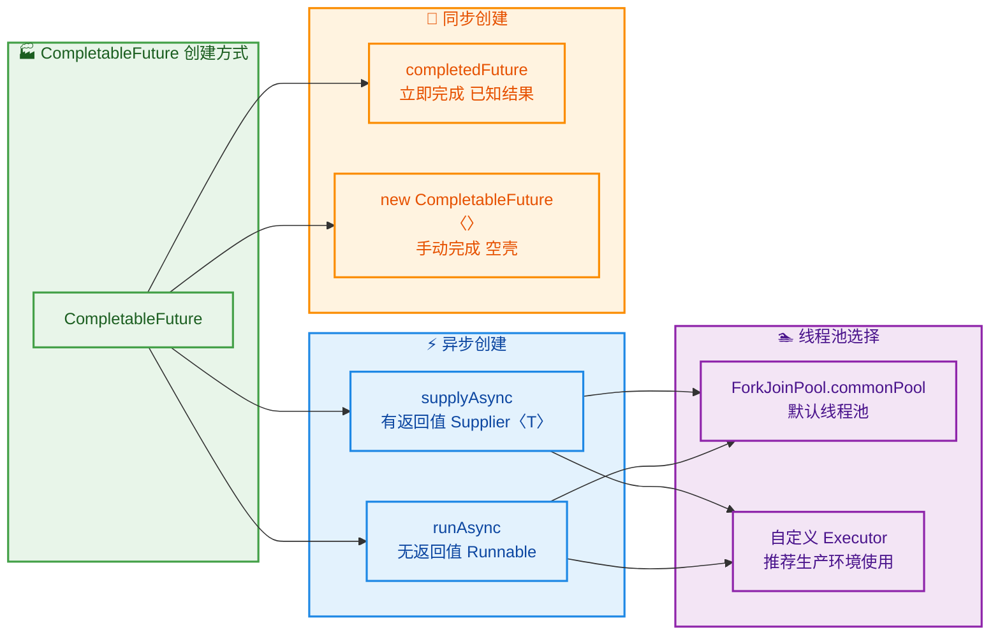
```mermaid
graph LR
    subgraph FACTORY["🏭 CompletableFuture 创建方式"]
        direction TB
        A["CompletableFuture"]
    end

    subgraph ASYNC["⚡ 异步创建"]
        direction TB
        B["supplyAsync\n有返回值 Supplier〈T〉"]
        C["runAsync\n无返回值 Runnable"]
    end

    subgraph SYNC["📌 同步创建"]
        direction TB
        D["completedFuture\n立即完成 已知结果"]
        E["new CompletableFuture〈〉\n手动完成 空壳"]
    end

    subgraph POOL["🏊 线程池选择"]
        direction TB
        F["ForkJoinPool.commonPool\n默认线程池"]
        G["自定义 Executor\n推荐生产环境使用"]
    end

    A --> B
    A --> C
    A --> D
    A --> E
    B --> F
    B --> G
    C --> F
    C --> G

    classDef factoryCls fill:#E8F5E9,stroke:#43A047,color:#1B5E20,stroke-width:2px
    classDef asyncCls fill:#E3F2FD,stroke:#1E88E5,color:#0D47A1,stroke-width:2px
    classDef syncCls fill:#FFF3E0,stroke:#FB8C00,color:#E65100,stroke-width:2px
    classDef poolCls fill:#F3E5F5,stroke:#8E24AA,color:#4A148C,stroke-width:2px

    class FACTORY factoryCls
    class ASYNC asyncCls
    class SYNC syncCls
    class POOL poolCls
    class A factoryCls
    class B,C asyncCls
    class D,E syncCls
    class F,G poolCls
```

可以看到，核心分歧在于两点：**是否需要返回值** 和 **是否需要异步执行**。下面逐一深入讲解。

---

### supplyAsync（有返回值）

`supplyAsync` 是最常用的创建方式。它接收一个 `Supplier<T>` 函数式接口，在异步线程中执行任务，并最终将结果填充到 `CompletableFuture<T>` 中。你可以把它理解为：**"帮我在后台算一个东西，算完了告诉我结果"**。

**方法签名：**

```java
// 使用默认的 ForkJoinPool.commonPool() 作为线程池
public static <U> CompletableFuture<U> supplyAsync(Supplier<U> supplier)

// 使用自定义的 Executor（推荐在生产环境中使用）
public static <U> CompletableFuture<U> supplyAsync(Supplier<U> supplier, Executor executor)
```

`Supplier<U>` 是一个无参有返回值的函数式接口，其核心方法为 `U get()`。这意味着你传入的 Lambda 表达式不需要任何输入参数，但必须返回一个值。这个返回值会成为 `CompletableFuture` 完成时持有的结果。

**基础用法：**

```java
import java.util.concurrent.CompletableFuture;

public class SupplyAsyncDemo {
    public static void main(String[] args) throws Exception {

        // 1. 使用 supplyAsync 创建一个异步任务
        //    Lambda 体内的代码将在 ForkJoinPool.commonPool() 的某个线程中执行
        CompletableFuture<String> future = CompletableFuture.supplyAsync(() -> {
            // 打印当前执行线程的名称，验证它确实在异步线程中运行
            System.out.println("异步任务执行线程: " + Thread.currentThread().getName());
            // 模拟一个耗时操作（如调用远程 API、查询数据库）
            try {
                Thread.sleep(1000); // 模拟耗时 1 秒
            } catch (InterruptedException e) {
                Thread.currentThread().interrupt(); // 恢复中断标志
            }
            // 返回计算结果，该结果将填充到 CompletableFuture 中
            return "Hello from async thread!";
        });

        // 2. 主线程可以继续做其他事情，不会被阻塞
        System.out.println("主线程继续执行: " + Thread.currentThread().getName());

        // 3. 当需要结果时，调用 get() 或 join() 获取
        //    get() 会抛出受检异常 (ExecutionException, InterruptedException)
        //    join() 会抛出非受检异常 (CompletionException)，在 Lambda 链式调用中更方便
        String result = future.join(); // 阻塞等待结果
        System.out.println("异步任务结果: " + result);
    }
}
```

**运行输出（线程名可能不同）：**

```
主线程继续执行: main
异步任务执行线程: ForkJoinPool.commonPool-worker-1
异步任务结果: Hello from async thread!
```

注意输出顺序：主线程的打印先于异步任务的打印，这证明了 `supplyAsync` 是真正的非阻塞调用——主线程提交任务后立刻返回，不会傻等。

**使用自定义线程池（生产环境推荐）：**

为什么生产环境不建议使用默认的 `ForkJoinPool.commonPool()`？原因有几个：

1. **共享风险**：`commonPool` 是 JVM 全局共享的。如果你的应用中有多个模块都使用它，一个模块的慢任务可能会"饿死"其他模块的任务。
2. **线程数有限**：默认线程数为 `Runtime.getRuntime().availableProcessors() - 1`，对于 I/O 密集型任务来说远远不够。
3. **难以监控**：使用自定义线程池可以设置有意义的线程名、队列大小、拒绝策略等，便于排查问题。

```java
import java.util.concurrent.*;

public class SupplyAsyncCustomPoolDemo {
    public static void main(String[] args) {

        // 1. 创建自定义线程池
        //    核心线程数 4，最大线程数 8，空闲线程存活 60 秒
        //    使用有界队列（容量 100）防止 OOM
        //    自定义线程工厂，给线程起一个有意义的名字
        ExecutorService executor = new ThreadPoolExecutor(
                4,                                   // corePoolSize: 核心线程数
                8,                                   // maximumPoolSize: 最大线程数
                60L,                                 // keepAliveTime: 空闲线程存活时间
                TimeUnit.SECONDS,                    // 时间单位
                new LinkedBlockingQueue<>(100),       // 工作队列，有界防止 OOM
                r -> {                                // ThreadFactory: 自定义线程命名
                    Thread t = new Thread(r);
                    t.setName("my-async-pool-" + t.getId()); // 设置线程名
                    t.setDaemon(true);                // 设置为守护线程，JVM 退出时自动销毁
                    return t;
                },
                new ThreadPoolExecutor.CallerRunsPolicy() // 拒绝策略：由提交线程自己执行
        );

        // 2. 将自定义线程池传入 supplyAsync 的第二个参数
        CompletableFuture<Double> priceFuture = CompletableFuture.supplyAsync(() -> {
            System.out.println("查询价格线程: " + Thread.currentThread().getName());
            // 模拟查询商品价格
            return 99.99;
        }, executor); // <-- 指定自定义 Executor

        // 3. 获取结果
        Double price = priceFuture.join();
        System.out.println("商品价格: " + price);

        // 4. 使用完毕后关闭线程池（重要！防止资源泄漏）
        executor.shutdown();
    }
}
```

**`get()` vs `join()` 的选择：**

| 特性 | `get()` | `join()` |
|---|---|---|
| 异常类型 | 受检异常 `ExecutionException` | 非受检异常 `CompletionException` |
| 是否需要 try-catch | **是**，必须显式处理 | **否**，可以不处理（但会抛出 RuntimeException） |
| 超时版本 | `get(long timeout, TimeUnit unit)` | 无（需结合 `orTimeout` 使用） |
| 推荐场景 | 需要精细异常处理时 | 链式调用、Lambda 表达式中 |

在实际开发中，`join()` 因为不需要处理受检异常，在链式调用和 Stream 操作中更加简洁优雅。

---

### runAsync（无返回值）

`runAsync` 与 `supplyAsync` 的唯一区别在于：**它不返回结果**。它接收一个 `Runnable`，返回 `CompletableFuture<Void>`。适用于那些"只需要执行，不需要结果"的场景，比如写日志、发通知、更新缓存等"fire-and-forget"类型的操作。

**方法签名：**

```java
// 使用默认的 ForkJoinPool.commonPool()
public static CompletableFuture<Void> runAsync(Runnable runnable)

// 使用自定义 Executor
public static CompletableFuture<Void> runAsync(Runnable runnable, Executor executor)
```

注意返回值类型是 `CompletableFuture<Void>` —— 泛型参数为 `Void`，表示没有实际结果。`Void` 是 Java 中 `void` 关键字的包装类型，其唯一合法值为 `null`。

**基础用法：**

```java
import java.util.concurrent.CompletableFuture;

public class RunAsyncDemo {
    public static void main(String[] args) {

        // 1. 使用 runAsync 创建一个无返回值的异步任务
        //    适用于 fire-and-forget（触发即忘）场景
        CompletableFuture<Void> future = CompletableFuture.runAsync(() -> {
            // 打印线程名，验证异步执行
            System.out.println("日志记录线程: " + Thread.currentThread().getName());
            // 模拟写入审计日志到数据库
            System.out.println("正在写入审计日志...");
            try {
                Thread.sleep(500); // 模拟 I/O 耗时
            } catch (InterruptedException e) {
                Thread.currentThread().interrupt();
            }
            System.out.println("审计日志写入完成");
            // 注意：这里没有 return 语句，因为 Runnable 不返回值
        });

        // 2. 主线程继续处理其他业务逻辑
        System.out.println("主线程: 继续处理核心业务...");

        // 3. 如果需要等待异步任务完成（但不需要结果）
        future.join(); // 阻塞直到任务完成，返回值为 null
        System.out.println("所有任务完成");
    }
}
```

**实战场景——异步发送通知：**

```java
import java.util.concurrent.CompletableFuture;
import java.util.concurrent.ExecutorService;
import java.util.concurrent.Executors;

public class AsyncNotificationDemo {
    public static void main(String[] args) {

        // 创建专用的通知线程池
        ExecutorService notifyPool = Executors.newFixedThreadPool(2);

        // 模拟：用户下单成功后，异步发送各种通知
        System.out.println("订单创建成功，开始异步通知...");

        // 异步发送短信通知（不需要返回值）
        CompletableFuture<Void> smsFuture = CompletableFuture.runAsync(() -> {
            System.out.println("[" + Thread.currentThread().getName() + "] 发送短信通知...");
            sleep(300); // 模拟短信网关调用
            System.out.println("[" + Thread.currentThread().getName() + "] 短信发送成功");
        }, notifyPool); // 使用专用线程池

        // 异步发送邮件通知（不需要返回值）
        CompletableFuture<Void> emailFuture = CompletableFuture.runAsync(() -> {
            System.out.println("[" + Thread.currentThread().getName() + "] 发送邮件通知...");
            sleep(500); // 模拟邮件服务调用
            System.out.println("[" + Thread.currentThread().getName() + "] 邮件发送成功");
        }, notifyPool); // 使用同一个专用线程池

        // 等待所有通知完成（allOf 后面章节会详细讲）
        CompletableFuture.allOf(smsFuture, emailFuture).join();
        System.out.println("所有通知发送完毕");

        // 关闭线程池
        notifyPool.shutdown();
    }

    // 工具方法：简化 sleep 操作
    private static void sleep(long millis) {
        try {
            Thread.sleep(millis);
        } catch (InterruptedException e) {
            Thread.currentThread().interrupt(); // 恢复中断标志
        }
    }
}
```

这个例子展示了 `runAsync` 最典型的应用：用户下单后，主线程不需要等通知发完就可以返回响应，短信和邮件在后台并行发送，大大提升了接口响应速度。

---

### completedFuture

`completedFuture` 是一个特殊的创建方式：它创建一个 **已经完成** 的 `CompletableFuture`，其结果就是你传入的值。**没有异步执行，没有线程切换，立刻就绪**。

**方法签名：**

```java
public static <U> CompletableFuture<U> completedFuture(U value)
```

乍看之下这似乎没什么用——"我都已经有结果了，为什么还要包一层 `CompletableFuture`？"。但在以下场景中它非常有价值：

**场景一：统一 API 返回类型**

当你的方法签名要求返回 `CompletableFuture<T>`，但某些分支不需要异步计算时：

```java
import java.util.concurrent.CompletableFuture;
import java.util.concurrent.ConcurrentHashMap;

public class CompletedFutureDemo {

    // 模拟一个本地缓存
    private static final ConcurrentHashMap<String, String> cache = new ConcurrentHashMap<>();

    static {
        cache.put("user:1001", "Alice"); // 预置缓存数据
    }

    /**
     * 查询用户名称。
     * 方法签名统一返回 CompletableFuture<String>，
     * 但内部根据缓存命中与否选择不同的实现路径。
     */
    public static CompletableFuture<String> getUserName(String userId) {
        // 1. 先查缓存
        String cached = cache.get(userId);

        if (cached != null) {
            // 缓存命中：直接用 completedFuture 包装已有结果
            // 不需要异步，不需要线程切换，零开销
            return CompletableFuture.completedFuture(cached);
        }

        // 2. 缓存未命中：异步查询数据库
        return CompletableFuture.supplyAsync(() -> {
            System.out.println("从数据库查询: " + userId);
            // 模拟数据库查询
            String name = "User-" + userId;
            // 查到后写入缓存
            cache.put(userId, name);
            return name;
        });
    }

    public static void main(String[] args) {
        // 调用者无需关心结果来自缓存还是数据库，API 完全一致
        String name1 = getUserName("user:1001").join(); // 走缓存，同步返回
        String name2 = getUserName("user:9999").join(); // 走数据库，异步查询

        System.out.println("name1 = " + name1); // Alice
        System.out.println("name2 = " + name2); // User-user:9999
    }
}
```

**场景二：作为链式调用的起点**

有时候你需要用已知的值来启动一条异步处理链：

```java
import java.util.concurrent.CompletableFuture;

public class CompletedFutureChainDemo {
    public static void main(String[] args) {

        // 用已知值作为起点，启动一条处理链
        String result = CompletableFuture
                .completedFuture(100)               // 起点：已知值 100
                .thenApply(n -> n * 2)               // 同步转换：100 -> 200
                .thenApply(n -> "结果是: " + n)       // 同步转换：200 -> "结果是: 200"
                .join();                              // 获取最终结果

        System.out.println(result); // 输出: 结果是: 200
    }
}
```

**场景三：单元测试中 Mock 异步方法**

在测试中，你不想真的发起异步调用，可以用 `completedFuture` 返回预设值：

```java
// 测试代码中 Mock 异步服务
public class UserServiceTest {

    // Mock 的异步方法：直接返回已完成的 Future，不涉及线程池
    CompletableFuture<String> mockGetUserName(String userId) {
        return CompletableFuture.completedFuture("MockUser"); // 直接返回预设值
    }

    // @Test
    public void testGetUserName() {
        // 测试时不需要等待异步线程，join() 立即返回
        String name = mockGetUserName("any-id").join();
        assert "MockUser".equals(name); // 断言通过
    }
}
```

**补充：`completedFuture` 的孪生方法**

Java 9 引入了 `failedFuture`，它创建一个 **已经失败** 的 `CompletableFuture`：

```java
// Java 9+
// 创建一个已经以异常完成的 CompletableFuture
CompletableFuture<String> failed = CompletableFuture.failedFuture(
        new RuntimeException("模拟失败")
);

// 尝试获取结果会立即抛出异常
// failed.join(); // 抛出 CompletionException
```

这在需要统一返回 `CompletableFuture` 但某些前置校验失败时非常有用（例如参数校验不通过，直接返回一个失败的 Future，而不需要 `new CompletableFuture<>()` 再手动 `completeExceptionally`）。

**补充：手动创建空壳 `new CompletableFuture<>()`**

除了上述工厂方法外，你还可以直接 `new` 一个 `CompletableFuture`，它此时处于 **未完成状态**，需要你在某个时刻手动调用 `complete(value)` 或 `completeExceptionally(ex)` 来完成它。这种方式常见于将回调风格的 API 桥接为 `CompletableFuture` 风格：

```java
import java.util.concurrent.CompletableFuture;
import java.util.concurrent.Executors;
import java.util.concurrent.ScheduledExecutorService;
import java.util.concurrent.TimeUnit;

public class ManualCompleteDemo {
    public static void main(String[] args) {

        // 1. 创建一个空壳 CompletableFuture，此时它处于"未完成"状态
        CompletableFuture<String> promise = new CompletableFuture<>();

        // 2. 模拟一个回调风格的异步 API（比如 Netty、Vert.x 等框架常见的模式）
        ScheduledExecutorService scheduler = Executors.newSingleThreadScheduledExecutor();
        scheduler.schedule(() -> {
            // 假设回调在 1 秒后触发，手动完成这个 Future
            promise.complete("来自回调的结果"); // <-- 手动填入结果
        }, 1, TimeUnit.SECONDS);

        // 3. 现在 promise 可以像普通 CompletableFuture 一样使用
        System.out.println("等待回调...");
        String result = promise.join(); // 阻塞直到 complete() 被调用
        System.out.println("收到: " + result);

        scheduler.shutdown();
    }
}
```

这种模式在适配老旧回调 API 时特别有用，它充当了 Callback 世界和 CompletableFuture 世界之间的**桥梁（Bridge）**。

---

最后，用一张对比表总结三种主要创建方式的核心差异：

| 特性 | `supplyAsync` | `runAsync` | `completedFuture` |
|---|---|---|---|
| **返回类型** | `CompletableFuture<T>` | `CompletableFuture<Void>` | `CompletableFuture<T>` |
| **函数式接口** | `Supplier<T>`（无参有返回） | `Runnable`（无参无返回） | 无（直接传值） |
| **是否异步执行** | ✅ 是 | ✅ 是 | ❌ 否（同步，立即完成） |
| **是否需要线程池** | 是（默认 / 自定义） | 是（默认 / 自定义） | 否 |
| **典型场景** | 异步计算、远程调用 | 日志、通知、缓存刷新 | 缓存命中、测试 Mock、链式起点 |

---

**📝 练习题**

以下代码的输出结果是什么？

```java
CompletableFuture<String> cf1 = CompletableFuture.completedFuture("Hello");
CompletableFuture<Void> cf2 = CompletableFuture.runAsync(() -> {
    try { Thread.sleep(100); } catch (InterruptedException e) {}
});

System.out.println("cf1 isDone: " + cf1.isDone());
System.out.println("cf2 isDone: " + cf2.isDone());
System.out.println("cf1 result: " + cf1.join());
```

A. `cf1 isDone: true`，`cf2 isDone: true`，`cf1 result: Hello`

B. `cf1 isDone: true`，`cf2 isDone: false`，`cf1 result: Hello`

C. `cf1 isDone: false`，`cf2 isDone: false`，`cf1 result: Hello`

D. `cf1 isDone: true`，`cf2 isDone: false`，`cf1 result: null`


**【答案】** B

**【解析】** `completedFuture("Hello")` 创建的是一个 **已经完成** 的 `CompletableFuture`，因此 `cf1.isDone()` 一定为 `true`，`cf1.join()` 立即返回 `"Hello"`。而 `cf2` 是通过 `runAsync` 创建的异步任务，内部 `Thread.sleep(100)` 需要休眠 100 毫秒。由于主线程在提交 `cf2` 后立即检查 `isDone()`，此时 100 毫秒大概率尚未过去，所以 `cf2.isDone()` 极大概率为 `false`（虽然理论上存在极端情况下为 `true` 的可能，但在面试/考试语境下选 B）。选项 D 错误是因为 `completedFuture` 传入的是 `"Hello"` 而非 `null`，`join()` 会返回构造时传入的值。

---

## 转换操作

在 `CompletableFuture` 的链式编程模型中，**转换操作（Transformation Operations）** 是最核心的一环。它的本质是：**当上一个异步阶段（Stage）完成后，将其结果作为输入，经过某种函数映射，产出一个新的结果**。这与 `Stream API` 中的 `map` / `flatMap` 在思维模型上高度一致——只不过 Stream 操作的是"数据流"，而 `CompletableFuture` 操作的是"时间线上的异步结果"。

Java 提供了三个关键的转换方法：

| 方法 | 签名（简化） | 核心语义 |
|---|---|---|
| `thenApply` | `CF<U> thenApply(Function<T, U>)` | 同步转换：在完成线程上直接执行映射 |
| `thenApplyAsync` | `CF<U> thenApplyAsync(Function<T, U>)` | 异步转换：将映射提交到线程池执行 |
| `thenCompose` | `CF<U> thenCompose(Function<T, CF<U>>)` | 扁平化：避免 `CF<CF<U>>` 的嵌套 |

在深入每个方法之前，先通过一张全景图建立直觉：

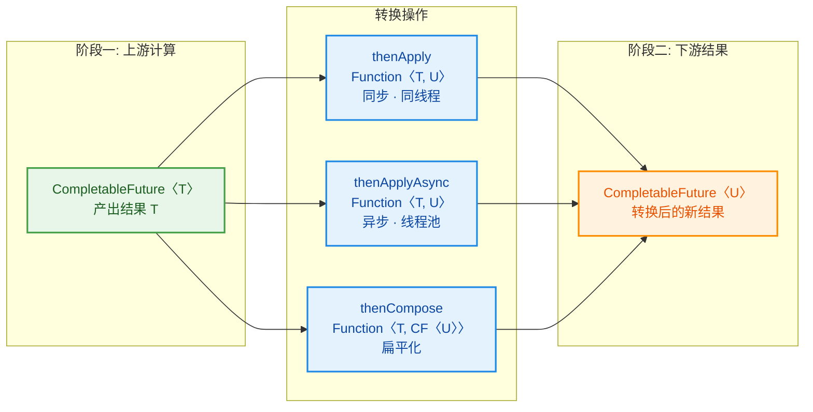
```mermaid
graph LR
    subgraph Stage1["阶段一: 上游计算"]
        direction TB
        A["CompletableFuture〈T〉<br/>产出结果 T"]
    end

    subgraph Transform["转换操作"]
        direction TB
        B["thenApply<br/>Function〈T, U〉<br/>同步 · 同线程"]
        C["thenApplyAsync<br/>Function〈T, U〉<br/>异步 · 线程池"]
        D["thenCompose<br/>Function〈T, CF〈U〉〉<br/>扁平化"]
    end

    subgraph Stage2["阶段二: 下游结果"]
        direction TB
        E["CompletableFuture〈U〉<br/>转换后的新结果"]
    end

    A --> B
    A --> C
    A --> D
    B --> E
    C --> E
    D --> E

    classDef stageStyle fill:#E8F5E9,stroke:#43A047,stroke-width:2px,color:#1B5E20
    classDef transformStyle fill:#E3F2FD,stroke:#1E88E5,stroke-width:2px,color:#0D47A1
    classDef resultStyle fill:#FFF3E0,stroke:#FB8C00,stroke-width:2px,color:#E65100

    class A stageStyle
    class B,C,D transformStyle
    class E resultStyle
```

---

### thenApply（同步转换）

#### 核心语义

`thenApply` 是最常用的转换方法。它接收一个 `Function<T, U>`，将上游 `CompletableFuture<T>` 的结果 `T` 映射为新类型 `U`，返回一个新的 `CompletableFuture<U>`。

**"同步"的含义**：这里的"同步"并不是说它会阻塞主线程，而是指 **映射函数的执行不会额外提交到线程池**。具体来说：

- 如果调用 `thenApply` 时上游 **已经完成**，映射函数将在 **当前调用线程**（通常是 main 线程）上立即执行。
- 如果调用 `thenApply` 时上游 **尚未完成**，映射函数将在 **完成上游任务的那个线程**（通常是 ForkJoinPool 的工作线程）上执行。

这个"谁完成谁执行"的行为，是理解 `thenApply` 与 `thenApplyAsync` 区别的关键。

#### 方法签名

```java
// CompletableFuture<T> 的实例方法
// 接收 Function<? super T, ? extends U>，返回 CompletableFuture<U>
public <U> CompletableFuture<U> thenApply(Function<? super T, ? extends U> fn)
```

#### 代码示例：基础用法

```java
import java.util.concurrent.CompletableFuture;

public class ThenApplyDemo {
    public static void main(String[] args) throws Exception {

        // 第一阶段：异步计算一个整数
        CompletableFuture<Integer> priceFuture = CompletableFuture.supplyAsync(() -> {
            System.out.println("查询价格线程: " + Thread.currentThread().getName()); // ForkJoinPool.commonPool-worker-x
            return 100; // 模拟查询到商品原价为 100
        });

        // 第二阶段：对价格进行转换（打八折）
        // thenApply 接收 Function<Integer, Double>，将 Integer 转换为 Double
        CompletableFuture<Double> discountFuture = priceFuture.thenApply(price -> {
            System.out.println("折扣计算线程: " + Thread.currentThread().getName()); // 可能是 main，也可能是 worker
            return price * 0.8; // 原价 × 0.8 = 折后价
        });

        // 第三阶段：继续转换 —— 格式化为字符串
        // 链式调用，将 Double 映射为 String
        CompletableFuture<String> resultFuture = discountFuture.thenApply(discounted -> {
            return String.format("折后价: ¥%.2f", discounted); // 格式化输出
        });

        // 获取最终结果（阻塞等待）
        System.out.println(resultFuture.get()); // 输出: 折后价: ¥80.00
    }
}
```

#### 代码示例：链式写法（推荐）

上面的三阶段可以用流式风格一行搞定，这也是实际开发中最常见的写法：

```java
import java.util.concurrent.CompletableFuture;

public class ThenApplyChainDemo {
    public static void main(String[] args) throws Exception {

        // 一条链完成：查询 → 打折 → 格式化
        String result = CompletableFuture
                .supplyAsync(() -> 100)                          // Stage 1: 异步查询原价
                .thenApply(price -> price * 0.8)                 // Stage 2: 同步转换 —— 计算折扣
                .thenApply(discounted -> String.format("¥%.2f", discounted)) // Stage 3: 同步转换 —— 格式化
                .get();                                          // 终端操作: 阻塞获取最终 String 结果

        System.out.println(result); // 输出: ¥80.00
    }
}
```

#### 执行线程的深入分析

这一点非常容易在面试中被考到。我们用一段代码来验证 `thenApply` 的线程归属行为：

```java
import java.util.concurrent.CompletableFuture;

public class ThenApplyThreadDemo {
    public static void main(String[] args) throws Exception {

        // === 情况一：上游任务耗时较长，thenApply 注册时上游尚未完成 ===
        CompletableFuture<String> case1 = CompletableFuture.supplyAsync(() -> {
            sleep(500); // 模拟耗时操作（500ms）
            System.out.println("[Case1 上游] " + Thread.currentThread().getName());
            return "data";
        }).thenApply(s -> {
            // 由于注册 thenApply 时上游还没完成，
            // 所以此函数会由 "完成上游的那个线程" 来执行
            System.out.println("[Case1 thenApply] " + Thread.currentThread().getName());
            return s.toUpperCase();
        });

        case1.get(); // 等待完成

        System.out.println("----------");

        // === 情况二：上游任务瞬间完成，thenApply 注册时上游已完成 ===
        CompletableFuture<String> alreadyDone = CompletableFuture.supplyAsync(() -> {
            System.out.println("[Case2 上游] " + Thread.currentThread().getName());
            return "data"; // 几乎无耗时，瞬间完成
        });

        sleep(200); // 主线程休眠 200ms，确保上游已经完成

        CompletableFuture<String> case2 = alreadyDone.thenApply(s -> {
            // 此时上游已完成，thenApply 在 **当前调用线程（main）** 上执行
            System.out.println("[Case2 thenApply] " + Thread.currentThread().getName());
            return s.toUpperCase();
        });

        case2.get();
    }

    // 辅助方法：安全休眠
    private static void sleep(long millis) {
        try { Thread.sleep(millis); } catch (InterruptedException ignored) {}
    }
}
```

**典型输出**（每次运行可能略有不同）：

```text
[Case1 上游] ForkJoinPool.commonPool-worker-1
[Case1 thenApply] ForkJoinPool.commonPool-worker-1    ← 同一线程执行
----------
[Case2 上游] ForkJoinPool.commonPool-worker-1
[Case2 thenApply] main                                ← 主线程执行！
```

可以看到，`thenApply` 的执行线程具有 **不确定性**。这在高并发场景下可能带来微妙的问题——如果你的映射函数本身比较耗时，它可能会意外"拖慢"某个工作线程，甚至阻塞 main 线程。这正是 `thenApplyAsync` 存在的意义。

---

### thenApplyAsync（异步转换）

#### 核心语义

`thenApplyAsync` 在功能上与 `thenApply` 完全相同——都是接收 `Function<T, U>` 并返回 `CompletableFuture<U>`。唯一的区别在于 **执行策略**：

> **`thenApplyAsync` 总是将映射函数提交到线程池中异步执行**，而不是在当前线程或完成线程上"就地"执行。

它有两个重载版本：

```java
// 版本 1：使用默认的 ForkJoinPool.commonPool()
public <U> CompletableFuture<U> thenApplyAsync(Function<? super T, ? extends U> fn)

// 版本 2：使用自定义的 Executor（推荐在生产环境中使用）
public <U> CompletableFuture<U> thenApplyAsync(Function<? super T, ? extends U> fn, Executor executor)
```

#### thenApply vs thenApplyAsync 对比

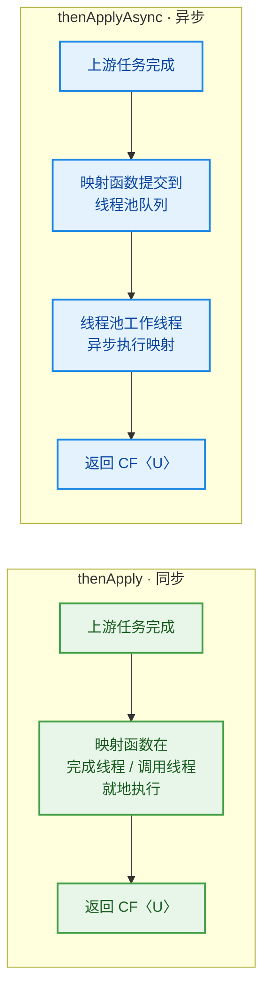
```mermaid
graph LR
    subgraph SYNC["thenApply · 同步"]
        direction TB
        S1["上游任务完成"] --> S2["映射函数在<br/>完成线程 / 调用线程<br/>就地执行"]
        S2 --> S3["返回 CF〈U〉"]
    end

    subgraph ASYNC["thenApplyAsync · 异步"]
        direction TB
        A1["上游任务完成"] --> A2["映射函数提交到<br/>线程池队列"]
        A2 --> A3["线程池工作线程<br/>异步执行映射"]
        A3 --> A4["返回 CF〈U〉"]
    end

    classDef syncStyle fill:#E8F5E9,stroke:#43A047,stroke-width:2px,color:#1B5E20
    classDef asyncStyle fill:#E3F2FD,stroke:#1E88E5,stroke-width:2px,color:#0D47A1
    classDef nodeStyle fill:#FAFAFA,stroke:#757575,stroke-width:1px,color:#212121

    class S1,S2,S3 syncStyle
    class A1,A2,A3,A4 asyncStyle
```

关键差异的总结表：

| 维度 | `thenApply` | `thenApplyAsync` |
|---|---|---|
| 执行线程 | 完成线程或调用线程（不确定） | 线程池工作线程（确定） |
| 线程切换 | 无额外切换开销 | 有一次任务提交 + 线程调度开销 |
| 适用场景 | 映射逻辑轻量（纯计算、类型转换） | 映射逻辑较重（涉及 I/O、远程调用） |
| 自定义线程池 | ❌ 不支持 | ✅ 支持（推荐生产使用） |

#### 代码示例：对比线程行为

```java
import java.util.concurrent.*;

public class ThenApplyAsyncDemo {
    public static void main(String[] args) throws Exception {

        // 创建自定义线程池（线程名前缀为 "my-pool"）
        ExecutorService myPool = Executors.newFixedThreadPool(2, r -> {
            Thread t = new Thread(r);                  // 创建新线程
            t.setName("my-pool-" + t.getId());         // 自定义线程名
            return t;
        });

        CompletableFuture<String> base = CompletableFuture.supplyAsync(() -> {
            System.out.println("[上游] " + Thread.currentThread().getName());
            return "hello";
        });

        // 方式一：thenApply —— 同步，线程不确定
        base.thenApply(s -> {
            System.out.println("[thenApply] " + Thread.currentThread().getName());
            return s.toUpperCase();
        }).get();

        // 方式二：thenApplyAsync —— 异步，使用默认 ForkJoinPool
        base.thenApplyAsync(s -> {
            System.out.println("[thenApplyAsync 默认池] " + Thread.currentThread().getName());
            return s.toUpperCase();
        }).get();

        // 方式三：thenApplyAsync + 自定义线程池（生产推荐）
        base.thenApplyAsync(s -> {
            System.out.println("[thenApplyAsync 自定义池] " + Thread.currentThread().getName());
            return s.toUpperCase();
        }, myPool).get(); // 传入 myPool 作为 Executor

        myPool.shutdown(); // 优雅关闭自定义线程池
    }
}
```

**典型输出**：

```text
[上游] ForkJoinPool.commonPool-worker-1
[thenApply] main
[thenApplyAsync 默认池] ForkJoinPool.commonPool-worker-1
[thenApplyAsync 自定义池] my-pool-23
```

#### 生产环境建议

在真实项目中，**强烈建议使用带自定义 `Executor` 的 `thenApplyAsync`**，原因如下：

1. **线程隔离**：`ForkJoinPool.commonPool()` 是 JVM 全局共享的，如果你的映射函数发生阻塞或异常，会影响同一 JVM 内所有使用 `commonPool` 的代码（包括并行 Stream）。
2. **可观测性**：自定义线程池可以命名线程（如 `order-service-pool-1`），在日志和堆栈追踪中一目了然。
3. **资源控制**：可以精确控制核心线程数、队列大小、拒绝策略等。

```java
// 生产级线程池配置示例
ExecutorService bizPool = new ThreadPoolExecutor(
        4,                                      // 核心线程数
        8,                                      // 最大线程数
        60L, TimeUnit.SECONDS,                  // 空闲线程存活时间
        new LinkedBlockingQueue<>(100),          // 有界队列，防止 OOM
        new ThreadFactoryBuilder()               // Guava 的线程工厂（需引入 guava 依赖）
                .setNameFormat("biz-async-%d")   // 线程命名模板
                .build(),
        new ThreadPoolExecutor.CallerRunsPolicy() // 拒绝策略：由调用者线程执行
);
```

---

### thenCompose（扁平化）

#### 问题引入：为什么需要 thenCompose？

假设我们有两个独立的异步方法：

```java
// 根据用户 ID 异步查询用户名
CompletableFuture<String> getUserName(Long userId) { ... }

// 根据用户名异步查询信用评分
CompletableFuture<Integer> getCreditScore(String userName) { ... }
```

现在要把它们串联起来：先查用户名，再用用户名查信用分。如果你用 `thenApply`：

```java
// ❌ 错误示范：thenApply 导致嵌套
CompletableFuture<CompletableFuture<Integer>> nested =
        getUserName(1001L)
                .thenApply(name -> getCreditScore(name)); // Function 返回的是 CF<Integer>
// 结果类型变成了 CF<CF<Integer>>，需要两次 get() 才能取到值——非常丑陋！
```

这就像 `Stream` 中的 `map` 返回 `Stream<Stream<T>>` 一样，需要 `flatMap` 来"拍平"。在 `CompletableFuture` 的世界里，**`thenCompose` 就是 `flatMap`**。

#### 核心语义

```java
// thenCompose 的签名
public <U> CompletableFuture<U> thenCompose(Function<? super T, ? extends CompletionStage<U>> fn)
```

关键区别：

| 方法 | Function 返回类型 | 最终 CompletableFuture 类型 |
|---|---|---|
| `thenApply` | `U`（普通值） | `CompletableFuture<U>` |
| `thenCompose` | `CompletionStage<U>`（另一个异步阶段） | `CompletableFuture<U>`（自动拍平） |

`thenCompose` 会 **自动"解包"** 内层的 `CompletableFuture`，使最终类型保持一层。

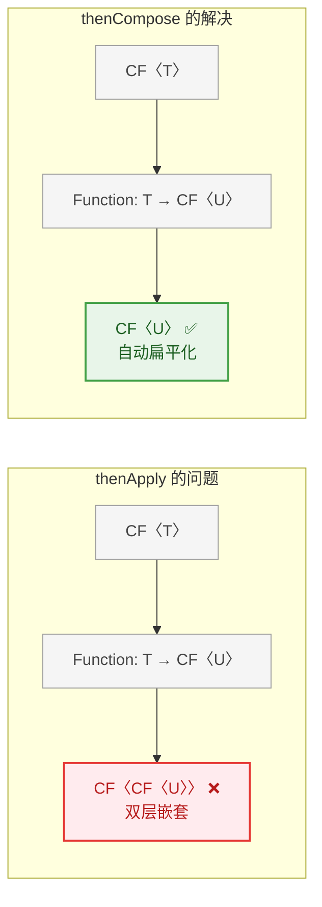
```mermaid
graph LR
    subgraph APPLY["thenApply 的问题"]
        direction TB
        A1["CF〈T〉"] --> A2["Function: T → CF〈U〉"]
        A2 --> A3["CF〈CF〈U〉〉 ❌<br/>双层嵌套"]
    end

    subgraph COMPOSE["thenCompose 的解决"]
        direction TB
        C1["CF〈T〉"] --> C2["Function: T → CF〈U〉"]
        C2 --> C3["CF〈U〉 ✅<br/>自动扁平化"]
    end

    classDef problemStyle fill:#FFEBEE,stroke:#E53935,stroke-width:2px,color:#B71C1C
    classDef solveStyle fill:#E8F5E9,stroke:#43A047,stroke-width:2px,color:#1B5E20
    classDef neutralStyle fill:#F5F5F5,stroke:#9E9E9E,stroke-width:1px,color:#424242

    class A1,A2 neutralStyle
    class A3 problemStyle
    class C1,C2 neutralStyle
    class C3 solveStyle
```

#### 代码示例：完整的串联场景

```java
import java.util.concurrent.CompletableFuture;

public class ThenComposeDemo {

    // 模拟：根据用户 ID 异步查询用户名
    static CompletableFuture<String> getUserName(Long userId) {
        return CompletableFuture.supplyAsync(() -> {
            System.out.println("查询用户名, userId=" + userId
                    + ", thread=" + Thread.currentThread().getName());
            return "Alice"; // 模拟返回用户名
        });
    }

    // 模拟：根据用户名异步查询信用评分
    static CompletableFuture<Integer> getCreditScore(String userName) {
        return CompletableFuture.supplyAsync(() -> {
            System.out.println("查询信用分, userName=" + userName
                    + ", thread=" + Thread.currentThread().getName());
            return 750; // 模拟返回信用分
        });
    }

    public static void main(String[] args) throws Exception {

        // ===== 方式一：thenApply —— 产生嵌套（不推荐） =====
        CompletableFuture<CompletableFuture<Integer>> nestedFuture =
                getUserName(1001L)
                        .thenApply(name -> getCreditScore(name)); // 返回 CF<CF<Integer>>

        // 需要两次 get() 才能拿到最终值
        Integer score1 = nestedFuture.get().get(); // 丑陋的双重解包
        System.out.println("嵌套方式得分: " + score1);

        System.out.println("----------");

        // ===== 方式二：thenCompose —— 自动扁平化（推荐） =====
        CompletableFuture<Integer> flatFuture =
                getUserName(1001L)
                        .thenCompose(name -> getCreditScore(name)); // 返回 CF<Integer>，自动解包

        // 只需要一次 get()
        Integer score2 = flatFuture.get(); // 清爽！
        System.out.println("扁平化方式得分: " + score2);
    }
}
```

**输出**：

```text
查询用户名, userId=1001, thread=ForkJoinPool.commonPool-worker-1
查询信用分, userName=Alice, thread=ForkJoinPool.commonPool-worker-1
嵌套方式得分: 750
----------
查询用户名, userId=1001, thread=ForkJoinPool.commonPool-worker-1
查询信用分, userName=Alice, thread=ForkJoinPool.commonPool-worker-2
扁平化方式得分: 750
```

#### 实战：多级异步调用链

在微服务架构中，`thenCompose` 非常常见——一个服务的返回值是下一个服务的入参：

```java
import java.util.concurrent.CompletableFuture;

public class MicroserviceChainDemo {

    // 模拟：调用订单服务，根据用户 ID 获取最近订单号
    static CompletableFuture<String> getLatestOrderId(Long userId) {
        return CompletableFuture.supplyAsync(() -> "ORD-20250224-" + userId);
    }

    // 模拟：调用物流服务，根据订单号获取物流状态
    static CompletableFuture<String> getShippingStatus(String orderId) {
        return CompletableFuture.supplyAsync(() -> orderId + " -> 已发货，预计明天送达");
    }

    // 模拟：调用通知服务，发送推送消息
    static CompletableFuture<Boolean> sendNotification(String message) {
        return CompletableFuture.supplyAsync(() -> {
            System.out.println("发送通知: " + message);
            return true; // 发送成功
        });
    }

    public static void main(String[] args) throws Exception {

        // 完整的异步链：用户ID → 订单号 → 物流状态 → 发送通知
        CompletableFuture<Boolean> pipeline =
                getLatestOrderId(1001L)                          // Stage 1: CF<String>   获取订单号
                        .thenCompose(orderId ->                  // 扁平化串联
                                getShippingStatus(orderId))      // Stage 2: CF<String>   获取物流状态
                        .thenCompose(status ->                   // 再次扁平化串联
                                sendNotification(status));       // Stage 3: CF<Boolean>  发送通知

        Boolean success = pipeline.get();                        // 阻塞获取最终结果
        System.out.println("通知发送结果: " + success);         // 输出: 通知发送结果: true
    }
}
```

#### thenCompose 也有 Async 版本

与 `thenApply` / `thenApplyAsync` 的关系一样，`thenCompose` 也有对应的异步版本：

```java
// 同步版本：Function 在完成线程或调用线程上执行
public <U> CompletableFuture<U> thenCompose(Function<T, ? extends CompletionStage<U>> fn)

// 异步版本：Function 提交到默认 ForkJoinPool 执行
public <U> CompletableFuture<U> thenComposeAsync(Function<T, ? extends CompletionStage<U>> fn)

// 异步版本 + 自定义线程池
public <U> CompletableFuture<U> thenComposeAsync(Function<T, ? extends CompletionStage<U>> fn, Executor executor)
```

> ⚠️ **注意**：这里的"同步/异步"指的是 **Function 本身的执行**在哪个线程上。Function 返回的 `CompletableFuture` 内部的任务仍然是异步的，不受此影响。

#### 类比总结：Stream vs CompletableFuture

这个类比能帮助你快速建立心智模型：

| Stream API | CompletableFuture | 语义 |
|---|---|---|
| `map(T → U)` | `thenApply(T → U)` | 值到值的映射 |
| `flatMap(T → Stream<U>)` | `thenCompose(T → CF<U>)` | 值到容器的映射 + 自动拍平 |

牢记这个对应关系，在需要串联两个返回 `CompletableFuture` 的异步方法时，条件反射地选择 `thenCompose`。

---

**📝 练习题**

以下代码的输出类型是什么？

```java
CompletableFuture<String> cf1 = CompletableFuture.supplyAsync(() -> 42);

// 使用 thenApply，Function 返回了一个 CompletableFuture<String>
var result = cf1.thenApply(num ->
        CompletableFuture.supplyAsync(() -> "Value: " + num));
```

A. `CompletableFuture<String>`

B. `CompletableFuture<CompletableFuture<String>>`

C. `CompletableFuture<Integer>`

D. 编译错误

**【答案】** B

**【解析】** `thenApply` 接收 `Function<T, U>`，它会将 Function 的 **返回值直接包装** 为 `CompletableFuture<U>`。这里 Function 的返回类型本身就是 `CompletableFuture<String>`，所以 `thenApply` 会将其再包一层，最终类型为 `CompletableFuture<CompletableFuture<String>>`——即产生了双层嵌套。这正是 `thenCompose` 要解决的问题。如果将 `thenApply` 改为 `thenCompose`，结果类型就会被扁平化为 `CompletableFuture<String>`。这道题的核心考点就是区分 **`thenApply`（map 语义）** 与 **`thenCompose`（flatMap 语义）** 的本质差异。

---

## 消费操作

在 `CompletableFuture` 的链式调用中，**转换操作**（如 `thenApply`）负责将上一步的结果变换为新的值并传递下去，而**消费操作**则扮演着另一种角色——它接收上游的结果，**执行某种动作（side-effect）**，但**不再产出新的值**。你可以把消费操作想象成流水线末端的"终端工人"：他拿到产品后做最终处理（打包、入库、打日志），但不会把产品再传给下一个人。

消费操作在 `CompletableFuture` 中主要有两个核心方法：

| 方法 | 是否接收上游结果 | 是否有返回值 | 返回类型 |
|:---|:---:|:---:|:---|
| `thenAccept(Consumer)` | ✅ | ❌ | `CompletableFuture<Void>` |
| `thenRun(Runnable)` | ❌ | ❌ | `CompletableFuture<Void>` |

两者的核心共同点是：返回值都是 `CompletableFuture<Void>`，即链条到此不再携带有效数据。区别在于 `thenAccept` 关心上游传来的数据，而 `thenRun` 完全不关心——它只关心"上游完成了"这件事本身。

下面用一张流程图来直观展示消费操作在整个 `CompletableFuture` 链中的位置和数据流向：

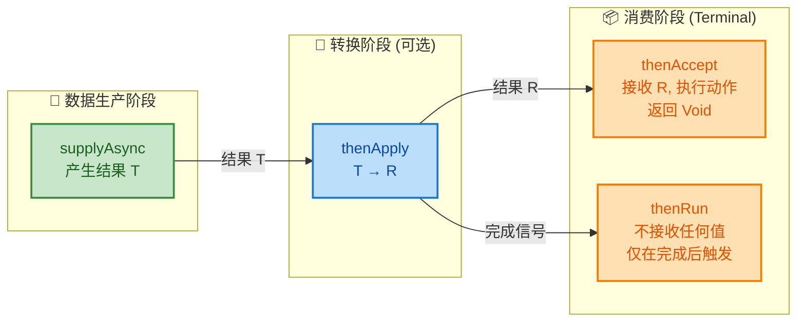
```mermaid
graph LR
    subgraph SRC["🔧 数据生产阶段"]
        direction TB
        A["supplyAsync\n产生结果 T"]
    end

    subgraph TRANSFORM["🔄 转换阶段 (可选)"]
        direction TB
        B["thenApply\n T → R"]
    end

    subgraph CONSUME["📦 消费阶段 (Terminal)"]
        direction TB
        C["thenAccept\n接收 R, 执行动作\n返回 Void"]
        D["thenRun\n不接收任何值\n仅在完成后触发"]
    end

    A -->|"结果 T"| B
    B -->|"结果 R"| C
    B -->|"完成信号"| D

    classDef srcStyle fill:#C8E6C9,stroke:#388E3C,color:#1B5E20,stroke-width:2px
    classDef transStyle fill:#BBDEFB,stroke:#1976D2,color:#0D47A1,stroke-width:2px
    classDef consumeStyle fill:#FFE0B2,stroke:#F57C00,color:#E65100,stroke-width:2px

    class A srcStyle
    class B transStyle
    class C,D consumeStyle
```

---

### thenAccept

`thenAccept` 是最常用的消费操作。它的签名如下：

```java
// 接受一个 Consumer<T> 函数式接口
// Consumer 的特征：接收一个参数，没有返回值 (void accept(T t))
public CompletableFuture<Void> thenAccept(Consumer<? super T> action)
```

当上游的 `CompletableFuture<T>` 正常完成时，`thenAccept` 会将结果 `T` 传入你提供的 `Consumer`，执行你定义的副作用逻辑。**它不会改变或传递任何值**，因此返回的是 `CompletableFuture<Void>`。

**典型使用场景**：
- 将异步查询的结果写入数据库
- 打印/记录日志
- 发送通知（邮件、消息推送）
- 更新 UI（在支持的框架中）

来看一个完整示例：

```java
import java.util.concurrent.CompletableFuture;

public class ThenAcceptDemo {
    public static void main(String[] args) throws Exception {

        // 1. supplyAsync: 模拟异步查询用户信息，返回用户名
        CompletableFuture<String> userFuture = CompletableFuture.supplyAsync(() -> {
            System.out.println("查询线程: " + Thread.currentThread().getName()); // 打印执行线程
            try {
                Thread.sleep(500); // 模拟耗时的数据库查询
            } catch (InterruptedException e) {
                Thread.currentThread().interrupt(); // 恢复中断状态
            }
            return "Alice"; // 返回查询结果
        });

        // 2. thenAccept: 拿到用户名后，执行消费动作（打印欢迎信息）
        //    注意：这里的 Lambda 参数 name 就是上游返回的 "Alice"
        CompletableFuture<Void> resultFuture = userFuture.thenAccept(name -> {
            // name 即为上游 supplyAsync 的返回值 "Alice"
            System.out.println("消费线程: " + Thread.currentThread().getName()); // 打印消费线程
            System.out.println("欢迎回来, " + name + "!");                      // 使用结果执行副作用
        });

        // 3. 阻塞等待整条链完成（生产代码中通常不这样做）
        resultFuture.get(); // get() 返回 null, 因为 thenAccept 返回 Void
        System.out.println("返回值: " + resultFuture.get()); // 输出: 返回值: null
    }
}
```

输出结果：

```
查询线程: ForkJoinPool.commonPool-worker-1
消费线程: main
欢迎回来, Alice!
返回值: null
```

**关键观察点**：

1. **线程归属**：`thenAccept`（非 Async 版本）的执行线程取决于上游任务是否已完成。如果调用 `thenAccept` 时上游已经完成，则 `Consumer` 在**当前调用线程**（这里是 `main`）中执行；如果上游尚未完成，则在**上游任务的线程**中执行。这是一个容易出错的细节。

2. **返回值为 Void**：`resultFuture.get()` 返回 `null`，因为消费操作不产生新值。

3. **链式延续**：虽然 `thenAccept` 返回 `CompletableFuture<Void>`，你仍然可以在其后继续链式调用（比如 `.thenRun()`），只不过后续节点拿不到任何有效数据了。

**与 `thenApply` 的对比**：

```java
// thenApply: T → R, 有输入有输出, 链条继续携带数据
CompletableFuture<Integer> lengthFuture = userFuture.thenApply(name -> {
    return name.length(); // "Alice" → 5, 数据继续向下流动
});

// thenAccept: T → void, 有输入无输出, 链条数据到此终止
CompletableFuture<Void> voidFuture = userFuture.thenAccept(name -> {
    System.out.println(name); // 仅消费, 不产出新值
});
```

用一张表格对照两者的函数式接口：

| 方法 | 函数式接口 | 抽象方法签名 | 语义 |
|:---|:---|:---|:---|
| `thenApply` | `Function<T, R>` | `R apply(T t)` | 转换：有入有出 |
| `thenAccept` | `Consumer<T>` | `void accept(T t)` | 消费：有入无出 |

**Async 变体**：与其他操作一样，`thenAccept` 也有异步变体：

```java
// 默认版本：可能在当前线程或上游线程执行
userFuture.thenAccept(name -> { /* ... */ });

// Async 版本：强制在 ForkJoinPool.commonPool 中执行
userFuture.thenAcceptAsync(name -> { /* ... */ });

// Async + 自定义线程池：强制在指定的 Executor 中执行
userFuture.thenAcceptAsync(name -> { /* ... */ }, myExecutor);
```

当你的 `Consumer` 逻辑本身比较耗时（例如写数据库、发网络请求），**务必使用 `thenAcceptAsync` 并传入专用线程池**，避免阻塞 `ForkJoinPool.commonPool` 导致其他异步任务饥饿。

---

### thenRun

`thenRun` 是消费操作中最"纯粹"的形式——它甚至**不接收上游的结果**。它的签名如下：

```java
// 接受一个 Runnable: 没有参数，没有返回值
public CompletableFuture<Void> thenRun(Runnable action)
```

`thenRun` 的语义可以概括为一句话：**"当上游完成后，执行这个动作，仅此而已。"** 它不关心上游成功后返回了什么值，只关心上游是否已经正常完成。

**典型使用场景**：
- 记录"任务已完成"的日志
- 更新状态标志位
- 释放资源 / 清理工作
- 触发下一个与当前结果无关的流程

```java
import java.util.concurrent.CompletableFuture;

public class ThenRunDemo {
    public static void main(String[] args) throws Exception {

        // 1. 模拟一个异步的文件上传任务
        CompletableFuture<String> uploadFuture = CompletableFuture.supplyAsync(() -> {
            System.out.println("[上传线程] " + Thread.currentThread().getName()); // 打印线程名
            try {
                Thread.sleep(800); // 模拟文件上传耗时
            } catch (InterruptedException e) {
                Thread.currentThread().interrupt(); // 恢复中断
            }
            return "file_2024_report.pdf"; // 返回上传后的文件名
        });

        // 2. thenAccept: 消费上传结果, 打印文件名
        CompletableFuture<Void> logFuture = uploadFuture.thenAccept(fileName -> {
            System.out.println("[消费] 文件已上传: " + fileName); // 需要用到上游的 fileName
        });

        // 3. thenRun: 在 thenAccept 之后执行, 但完全不关心之前的值
        //    注意: thenRun 的 Runnable 没有任何参数
        CompletableFuture<Void> cleanupFuture = logFuture.thenRun(() -> {
            // 这里拿不到任何上游的数据（fileName 在这里不可见）
            System.out.println("[清理] 临时缓存已清除");           // 做一些与结果无关的善后工作
            System.out.println("[清理线程] " + Thread.currentThread().getName()); // 打印线程
        });

        // 4. 等待整条链完成
        cleanupFuture.get();
    }
}
```

输出结果：

```
[上传线程] ForkJoinPool.commonPool-worker-1
[消费] 文件已上传: file_2024_report.pdf
[清理] 临时缓存已清除
[清理线程] main
```

**关键要点**：

1. **无参数**：`thenRun` 的 `Runnable` Lambda 没有任何参数（对比 `thenAccept` 的 `Consumer` 有一个参数）。这意味着即便上游有结果，你在 `thenRun` 中也无法直接访问。

2. **依赖关系是"完成"而非"数据"**：`thenRun` 建立的是时序依赖（happens-after），而非数据依赖。上游正常完成是前提条件，但上游的值与 `thenRun` 无关。

3. **异常传播**：如果上游以异常完成（而非正常完成），`thenRun` 中的 `Runnable` **不会执行**，异常会沿链条向下传播。这一点对 `thenAccept` 同样适用。

**三者对比的完整图景**：

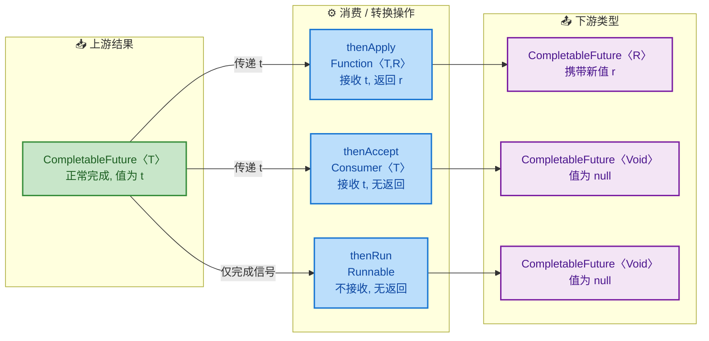
```mermaid
graph LR
    subgraph INPUT["📥 上游结果"]
        direction TB
        R["CompletableFuture〈T〉\n正常完成, 值为 t"]
    end

    subgraph OPS["⚙️ 消费 / 转换操作"]
        direction TB
        TA["thenApply\nFunction〈T,R〉\n接收 t, 返回 r"]
        TAC["thenAccept\nConsumer〈T〉\n接收 t, 无返回"]
        TR["thenRun\nRunnable\n不接收, 无返回"]
    end

    subgraph OUTPUT["📤 下游类型"]
        direction TB
        O1["CompletableFuture〈R〉\n携带新值 r"]
        O2["CompletableFuture〈Void〉\n值为 null"]
        O3["CompletableFuture〈Void〉\n值为 null"]
    end

    R -->|"传递 t"| TA
    R -->|"传递 t"| TAC
    R -->|"仅完成信号"| TR

    TA --> O1
    TAC --> O2
    TR --> O3

    classDef inputStyle fill:#C8E6C9,stroke:#388E3C,color:#1B5E20,stroke-width:2px
    classDef opsStyle fill:#BBDEFB,stroke:#1976D2,color:#0D47A1,stroke-width:2px
    classDef outputStyle fill:#F3E5F5,stroke:#7B1FA2,color:#4A148C,stroke-width:2px

    class R inputStyle
    class TA,TAC,TR opsStyle
    class O1,O2,O3 outputStyle
```

**一个综合实战例子** —— 模拟"下单 → 扣库存 → 发通知 → 记日志"的链条：

```java
import java.util.concurrent.CompletableFuture;
import java.util.concurrent.ExecutorService;
import java.util.concurrent.Executors;

public class ConsumeChainDemo {
    public static void main(String[] args) throws Exception {

        // 创建专用线程池, 避免污染公共池
        ExecutorService bizPool = Executors.newFixedThreadPool(4);

        CompletableFuture
            // Step 1: 异步下单, 返回订单号
            .supplyAsync(() -> {
                System.out.println("1. 创建订单 - " + Thread.currentThread().getName());
                return "ORD-20240101-0042"; // 模拟返回订单号
            }, bizPool)

            // Step 2: 拿到订单号, 转换为库存扣减结果 (thenApply: T → R)
            .thenApplyAsync(orderId -> {
                System.out.println("2. 扣减库存 - 订单: " + orderId);
                return orderId + " | 库存已扣减"; // 返回处理后的信息
            }, bizPool)

            // Step 3: 拿到扣减结果, 发送通知 (thenAccept: T → void)
            //         这是一个典型的"消费"场景: 用数据做事, 但不产出新数据
            .thenAcceptAsync(result -> {
                System.out.println("3. 发送通知 - " + result); // 消费 result, 发短信/推送
            }, bizPool)

            // Step 4: 通知发完了, 记一条日志 (thenRun: () → void)
            //         不关心之前的任何结果, 只要前面都完成了就行
            .thenRunAsync(() -> {
                System.out.println("4. 记录审计日志 - 流程全部完成");  // 纯善后动作
            }, bizPool)

            // 阻塞等待整条链执行完毕
            .get();

        bizPool.shutdown(); // 关闭线程池
    }
}
```

输出结果：

```
1. 创建订单 - pool-1-thread-1
2. 扣减库存 - 订单: ORD-20240101-0042
3. 发送通知 - ORD-20240101-0042 | 库存已扣减
4. 记录审计日志 - 流程全部完成
```

这个例子很好地展示了**转换 → 消费 → 触发**的渐进式链条：

```
supplyAsync (产出数据)
    ↓  传递 orderId
thenApplyAsync (转换数据)
    ↓  传递 result
thenAcceptAsync (消费数据, 不再传递)
    ↓  仅完成信号
thenRunAsync (纯触发, 善后)
```

**最后的注意事项**：

- **不要在 `thenRun` 中通过闭包(closure)偷偷访问上游值**。虽然 Java 允许你在 Lambda 中引用外部变量（effectively final），但这会让代码意图不清晰。如果你需要上游的值，请用 `thenAccept`。
- **异常处理**：`thenAccept` 和 `thenRun` 都**不处理异常**。如果上游抛出异常，消费动作会被跳过，异常会继续传播到下游。要处理异常，请搭配 `exceptionally` 或 `handle`（后续章节会详细讲解）。
- **线程安全**：如果多个 `thenAccept`/`thenRun` 注册在同一个 `CompletableFuture` 上，它们可能并发执行，需注意共享状态的线程安全问题。

---

**📝 练习题**

以下代码的输出中，`[B]` 打印的内容是什么？

```java
CompletableFuture<String> cf = CompletableFuture.supplyAsync(() -> "Hello");

CompletableFuture<Void> a = cf.thenAccept(s -> System.out.println("[A] " + s));

CompletableFuture<Void> b = a.thenRun(() -> System.out.println("[B] done"));

b.get();
```

A. `[B] Hello`

B. `[B] done`

C. `[B] null`

D. 编译错误，因为 `thenRun` 不能接在 `thenAccept` 后面

**【答案】** B

**【解析】** `thenAccept` 消费了上游的 `"Hello"` 字符串并打印 `[A] Hello`，其返回类型为 `CompletableFuture<Void>`。随后 `thenRun` 接在这个 `CompletableFuture<Void>` 上，`thenRun` 接受的是 `Runnable`，没有任何参数输入，它只在前驱完成后触发执行。因此 `[B]` 处只会打印 Lambda 中硬编码的字符串 `done`，即输出 `[B] done`。选项 A 错误是因为 `thenRun` 根本拿不到上游的值；选项 C 错误是因为 `thenRun` 内部没有任何途径获取 `null` 或其他值来拼接；选项 D 错误是因为 `thenRun` 完全可以链接在任何 `CompletableFuture`（包括 `CompletableFuture<Void>`）之后。

---

## 组合操作 ⭐

在真实的业务场景中，我们几乎不可能只依赖单个异步任务就完成所有工作。更常见的模式是：**发起多个并行任务，然后根据它们的完成情况进行下一步处理**。例如，一个电商页面需要同时请求"商品详情"和"库存信息"，等两者都返回后再合并渲染；又或者，我们向多个镜像源同时发起下载请求，谁先返回就用谁的结果。

`CompletableFuture` 为此提供了一整套**组合操作 API**，按照等待策略可以清晰地分为两大阵营：

- **Both 系列**（AND 语义）：等待**两个** `CompletableFuture` **都完成**后才触发。
- **Either 系列**（OR 语义）：**任意一个** `CompletableFuture` 完成后就立即触发。

而在每个阵营内部，又按照"对结果的处理方式"进一步细分为三种风格，与前面学过的 `thenApply` / `thenAccept` / `thenRun` 完美对称：

| 处理方式 | Both（两个都完成） | Either（任一完成） |
|:---:|:---:|:---:|
| **有入参 + 有返回** (Function) | `thenCombine` | `applyToEither` |
| **有入参 + 无返回** (Consumer) | `thenAcceptBoth` | `acceptEither` |
| **无入参 + 无返回** (Runnable) | `runAfterBoth` | `runAfterEither` |

理解了这张表，整个组合操作的 API 就已经掌握了 80%。下面我们逐一深入。

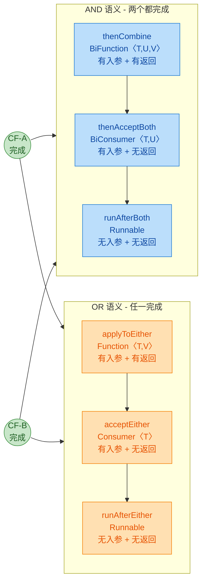
```mermaid
graph LR
    subgraph BOTH["AND 语义 - 两个都完成"]
        direction TB
        B1["thenCombine\nBiFunction〈T,U,V〉\n有入参 + 有返回"]
        B2["thenAcceptBoth\nBiConsumer〈T,U〉\n有入参 + 无返回"]
        B3["runAfterBoth\nRunnable\n无入参 + 无返回"]
        B1 --> B2 --> B3
    end

    subgraph EITHER["OR 语义 - 任一完成"]
        direction TB
        E1["applyToEither\nFunction〈T,V〉\n有入参 + 有返回"]
        E2["acceptEither\nConsumer〈T〉\n有入参 + 无返回"]
        E3["runAfterEither\nRunnable\n无入参 + 无返回"]
        E1 --> E2 --> E3
    end

    CF1(("CF-A\n完成")) --> BOTH
    CF2(("CF-B\n完成")) --> BOTH
    CF1 --> EITHER
    CF2 --> EITHER

    classDef nodeGreen fill:#C8E6C9,stroke:#388E3C,color:#1B5E20
    classDef nodePurple fill:#E1BEE7,stroke:#7B1FA2,color:#4A148C
    classDef nodeBlue fill:#BBDEFB,stroke:#1976D2,color:#0D47A1
    classDef nodeOrange fill:#FFE0B2,stroke:#F57C00,color:#E65100

    class CF1,CF2 nodeGreen
    class B1,B2,B3 nodeBlue
    class E1,E2,E3 nodeOrange
```

---

### thenCombine（两个都完成 — 有返回值）

`thenCombine` 是 Both 系列中功能最强大的一个。它等待**当前 CF** 和**另一个 CF** 都完成后，将两者的结果交给一个 `BiFunction<T, U, V>` 处理，并返回一个新的 `CompletableFuture<V>`。

**方法签名：**

```java
// stage: 另一个要等待的 CompletableFuture
// fn:    接收两个结果、返回新值的函数
public <U, V> CompletableFuture<V> thenCombine(
    CompletionStage<? extends U> other,
    BiFunction<? super T, ? super U, ? extends V> fn
)
```

其执行语义用一句话概括就是：**当 this 和 other 都完成时，执行 `fn.apply(thisResult, otherResult)`，将返回值包装为新的 CF**。

**经典场景：并行查询后合并结果。** 假设我们需要同时获取商品价格和折扣信息，最终计算出实付金额：

```java
public class ThenCombineDemo {
    public static void main(String[] args) throws Exception {

        // 异步任务1：模拟从价格服务获取原价（耗时 1 秒）
        CompletableFuture<Double> priceFuture = CompletableFuture.supplyAsync(() -> {
            sleep(1000); // 模拟网络延迟
            System.out.println("价格服务返回: 原价 299.0");
            return 299.0; // 原价
        });

        // 异步任务2：模拟从折扣服务获取折扣率（耗时 1.2 秒）
        CompletableFuture<Double> discountFuture = CompletableFuture.supplyAsync(() -> {
            sleep(1200); // 模拟网络延迟
            System.out.println("折扣服务返回: 折扣 0.85");
            return 0.85; // 八五折
        });

        // thenCombine: 等待两个任务都完成后，用 BiFunction 合并结果
        CompletableFuture<String> resultFuture = priceFuture.thenCombine(
            discountFuture,                          // other: 另一个要等待的 CF
            (price, discount) -> {                   // BiFunction: 接收两个结果
                double finalPrice = price * discount;// 计算实付价
                return String.format("原价: %.1f, 折扣: %.0f%%, 实付: %.1f",
                        price, discount * 100, finalPrice);
            }
        );

        // 阻塞获取最终结果（实际项目中应避免阻塞）
        System.out.println(resultFuture.get());
        // 输出: 原价: 299.0, 折扣: 85%, 实付: 254.2
    }

    // 辅助方法：线程睡眠
    private static void sleep(long millis) {
        try { Thread.sleep(millis); } catch (InterruptedException e) { /* ignore */ }
    }
}
```

**关键细节：**

1. **并行执行**：`priceFuture` 和 `discountFuture` 是同时启动的，两个任务并行执行。总耗时约 `max(1000, 1200) = 1.2 秒`，而非串行的 2.2 秒。
2. **执行线程**：`thenCombine`（无 Async 后缀）的 `BiFunction` 会在**最后一个完成的那个任务的线程**上执行，这里大概率是 `discountFuture` 所在线程（因为它更慢）。如果需要指定线程池，请使用 `thenCombineAsync`。
3. **链式扩展**：`thenCombine` 返回的仍然是 `CompletableFuture`，你可以继续 `.thenApply()`、`.thenCombine()` 无限链接下去。

**三个任务如何合并？** 如果有三个并行任务需要全部完成后合并，可以链式调用：

```java
// cf1, cf2, cf3 三个并行任务
CompletableFuture<String> merged = cf1
    .thenCombine(cf2, (r1, r2) -> r1 + "," + r2)  // 先合并前两个的结果
    .thenCombine(cf3, (r12, r3) -> r12 + "," + r3); // 再合并第三个
```

> 但当并行任务数量较多时（如 5 个以上），链式 `thenCombine` 会变得冗长，此时应该使用后面章节介绍的 `CompletableFuture.allOf()` 批量操作。

---

### thenAcceptBoth（两个都完成 — 无返回值）

`thenAcceptBoth` 与 `thenCombine` 几乎一样，唯一的区别在于：它接收的是 `BiConsumer<T, U>` 而非 `BiFunction<T, U, V>`，**只消费、不返回**。因此它返回的是 `CompletableFuture<Void>`。

**方法签名：**

```java
// 等两个都完成后，用 BiConsumer 消费两个结果，没有返回值
public <U> CompletableFuture<Void> thenAcceptBoth(
    CompletionStage<? extends U> other,
    BiConsumer<? super T, ? super U> action
)
```

**适用场景：** 当你不需要产生新结果，只需要利用两个任务的结果做一些"副作用"操作（如写日志、发通知、更新缓存）时使用。

```java
public class ThenAcceptBothDemo {
    public static void main(String[] args) throws Exception {

        // 异步查询用户名
        CompletableFuture<String> userFuture = CompletableFuture.supplyAsync(() -> {
            sleep(800);                              // 模拟查询延迟
            return "张三";                            // 返回用户名
        });

        // 异步查询订单号
        CompletableFuture<String> orderFuture = CompletableFuture.supplyAsync(() -> {
            sleep(600);                              // 模拟查询延迟
            return "ORD-20250224-0001";              // 返回订单号
        });

        // thenAcceptBoth: 两个都完成后，执行消费逻辑（发送通知）
        CompletableFuture<Void> notifyFuture = userFuture.thenAcceptBoth(
            orderFuture,                             // other: 另一个 CF
            (user, order) -> {                       // BiConsumer: 消费两个结果
                // 模拟发送短信通知，不需要返回值
                System.out.println("发送通知 -> 用户: " + user + ", 订单: " + order + " 已发货");
            }
        );

        // 等待完成
        notifyFuture.get();
        // 输出: 发送通知 -> 用户: 张三, 订单: ORD-20250224-0001 已发货
    }

    private static void sleep(long millis) {
        try { Thread.sleep(millis); } catch (InterruptedException e) { /* ignore */ }
    }
}
```

`thenAcceptBoth` 和 `thenCombine` 的选择非常直观：**需要返回值就用 `thenCombine`，不需要就用 `thenAcceptBoth`**。

---

### runAfterBoth（两个都完成 — 不关心结果）

`runAfterBoth` 是 Both 系列中最"轻量"的一个。它只关心两个任务**是否都完成了**，完全不关心它们返回了什么结果。

**方法签名：**

```java
// 两个都完成后，执行一个 Runnable，不接收参数也没有返回值
public CompletableFuture<Void> runAfterBoth(
    CompletionStage<?> other,
    Runnable action
)
```

注意参数 `other` 的类型是 `CompletionStage<?>`——通配符意味着它甚至不关心 `other` 的泛型类型是什么。

**适用场景：** 当两个前置任务都完成后，执行一些与它们结果完全无关的操作，比如记录一条"所有初始化完成"的日志、释放资源、触发下一阶段的信号等。

```java
public class RunAfterBothDemo {
    public static void main(String[] args) throws Exception {

        // 异步任务1：初始化数据库连接池
        CompletableFuture<Void> dbInit = CompletableFuture.runAsync(() -> {
            sleep(1000);                             // 模拟初始化耗时
            System.out.println("[DB] 数据库连接池初始化完成");
        });

        // 异步任务2：初始化缓存预热
        CompletableFuture<Void> cacheInit = CompletableFuture.runAsync(() -> {
            sleep(1500);                             // 模拟预热耗时
            System.out.println("[Cache] 缓存预热完成");
        });

        // runAfterBoth: 两个都完成后，打印就绪日志（不需要任何结果）
        CompletableFuture<Void> ready = dbInit.runAfterBoth(
            cacheInit,                               // other: 另一个 CF
            () -> {                                  // Runnable: 无入参无返回
                System.out.println("=============================");
                System.out.println("所有基础设施初始化完成，系统就绪！");
                System.out.println("=============================");
            }
        );

        // 等待就绪
        ready.get();
    }

    private static void sleep(long millis) {
        try { Thread.sleep(millis); } catch (InterruptedException e) { /* ignore */ }
    }
}
```

输出：

```
[DB] 数据库连接池初始化完成
[Cache] 缓存预热完成
=============================
所有基础设施初始化完成，系统就绪！
=============================
```

至此，Both 系列的三兄弟就全部介绍完毕了。让我们用一张图来清晰地对比它们的数据流向：

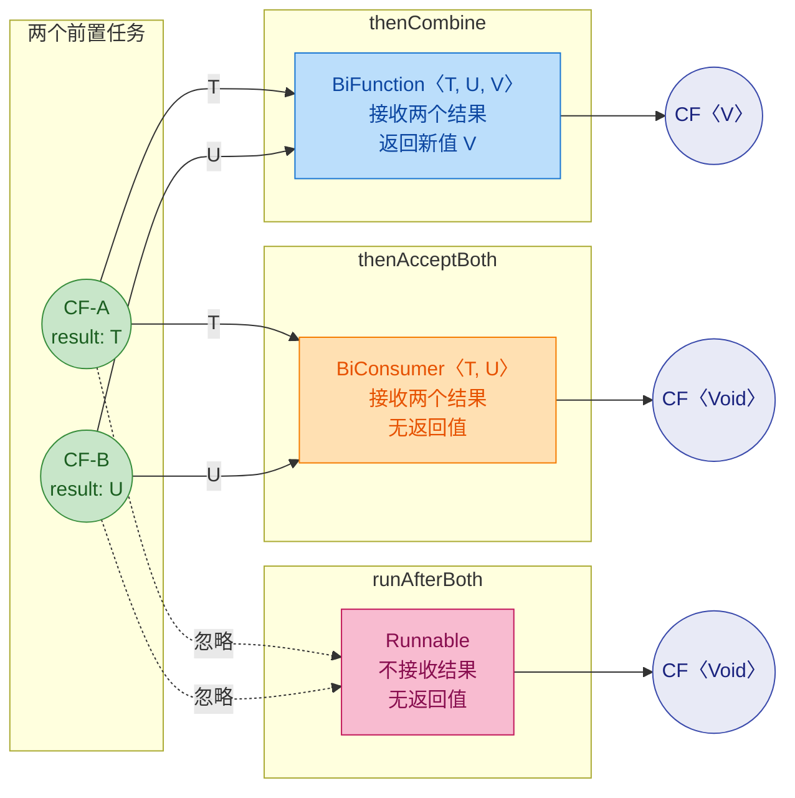
```mermaid
graph LR
    subgraph INPUT["两个前置任务"]
        direction TB
        CFA(("CF-A\nresult: T"))
        CFB(("CF-B\nresult: U"))
    end

    subgraph COMBINE["thenCombine"]
        direction TB
        FN["BiFunction〈T, U, V〉\n接收两个结果\n返回新值 V"]
    end

    subgraph ACCEPT["thenAcceptBoth"]
        direction TB
        CS["BiConsumer〈T, U〉\n接收两个结果\n无返回值"]
    end

    subgraph RUN["runAfterBoth"]
        direction TB
        RN["Runnable\n不接收结果\n无返回值"]
    end

    CFA -- "T" --> FN
    CFB -- "U" --> FN
    FN --> R1(("CF〈V〉"))

    CFA -- "T" --> CS
    CFB -- "U" --> CS
    CS --> R2(("CF〈Void〉"))

    CFA -. "忽略" .-> RN
    CFB -. "忽略" .-> RN
    RN --> R3(("CF〈Void〉"))

    classDef cfNode fill:#C8E6C9,stroke:#388E3C,color:#1B5E20
    classDef funcNode fill:#BBDEFB,stroke:#1976D2,color:#0D47A1
    classDef consNode fill:#FFE0B2,stroke:#F57C00,color:#E65100
    classDef runNode fill:#F8BBD0,stroke:#C2185B,color:#880E4F
    classDef resultNode fill:#E8EAF6,stroke:#3949AB,color:#1A237E

    class CFA,CFB cfNode
    class FN funcNode
    class CS consNode
    class RN runNode
    class R1,R2,R3 resultNode
```

---

### applyToEither（任一完成 — 有返回值）

从这里开始，我们进入 **Either 系列**（OR 语义）。与 Both 系列需要等待两个任务"同时到齐"不同，Either 系列的核心理念是：**谁先完成就用谁的结果，另一个的结果被直接忽略**。

`applyToEither` 是 Either 系列中功能最丰富的：它接收先完成者的结果，通过一个 `Function<T, V>` 转换后返回新的 `CompletableFuture<V>`。

**方法签名：**

```java
// 谁先完成，就把谁的结果交给 fn 处理并返回
public <U> CompletableFuture<U> applyToEither(
    CompletionStage<? extends T> other,   // 注意：other 的类型必须和 this 兼容
    Function<? super T, U> fn
)
```

**重要约束：** 注意 `other` 的泛型是 `? extends T`，这意味着两个 CF 的结果类型必须兼容（通常是相同类型），因为只用一个 `Function<T, U>` 来统一处理。这完全合理——既然我们不确定最终用的是谁的结果，那两个结果的类型当然得一致。

**经典场景：多源竞速。** 向两个镜像服务器同时请求同一份数据，谁先返回就用谁的：

```java
public class ApplyToEitherDemo {
    public static void main(String[] args) throws Exception {

        // 镜像源1：模拟较慢的服务器（2 秒）
        CompletableFuture<String> mirror1 = CompletableFuture.supplyAsync(() -> {
            sleep(2000);                             // 模拟较慢的网络
            System.out.println("[Mirror-1] 返回数据");
            return "data-from-mirror-1";             // 返回数据
        });

        // 镜像源2：模拟较快的服务器（800 毫秒）
        CompletableFuture<String> mirror2 = CompletableFuture.supplyAsync(() -> {
            sleep(800);                              // 模拟较快的网络
            System.out.println("[Mirror-2] 返回数据");
            return "data-from-mirror-2";             // 返回数据
        });

        // applyToEither: 谁先完成，就对谁的结果进行转换
        CompletableFuture<String> fastest = mirror1.applyToEither(
            mirror2,                                 // other: 另一个竞争者
            (data) -> {                              // Function: 对先到的结果做转换
                return "【已处理】" + data.toUpperCase(); // 转为大写并添加前缀
            }
        );

        // 获取结果 —— 总耗时约 800ms，而非 2000ms
        System.out.println(fastest.get());
        // 输出: 【已处理】DATA-FROM-MIRROR-2
    }

    private static void sleep(long millis) {
        try { Thread.sleep(millis); } catch (InterruptedException e) { /* ignore */ }
    }
}
```

**注意事项：**

1. **另一个任务不会被取消**：`mirror1` 虽然"输了比赛"，但它仍然会继续执行到结束。`applyToEither` 只是不再等它的结果了，并不代表它被中断了。如果你的慢任务占用昂贵资源（如数据库连接），你可能需要手动调用 `mirror1.cancel(true)` 来尝试中断它。
2. **异常传播**：如果先完成的那个任务是以异常完成的，那么这个异常会直接传播给 `fastest`。但如果慢的那个也异常了，由于它已经被忽略，这个异常就"沉默"了。

---

### acceptEither（任一完成 — 无返回值）

与 `applyToEither` 的关系，就如同 `thenAcceptBoth` 与 `thenCombine` 的关系——**把 Function 换成 Consumer**，从"转换"变为"消费"。

**方法签名：**

```java
// 谁先完成，就消费谁的结果，没有返回值
public CompletableFuture<Void> acceptEither(
    CompletionStage<? extends T> other,
    Consumer<? super T> action
)
```

**适用场景：** 当你只需要对先到的结果做一些副作用操作（如展示到 UI、写入缓存），而不需要产出新值时。

```java
public class AcceptEitherDemo {
    public static void main(String[] args) throws Exception {

        // 推送渠道1：邮件通知（慢）
        CompletableFuture<String> emailChannel = CompletableFuture.supplyAsync(() -> {
            sleep(3000);                             // 邮件服务较慢
            return "邮件渠道: 验证码 8842";           // 返回通知内容
        });

        // 推送渠道2：短信通知（快）
        CompletableFuture<String> smsChannel = CompletableFuture.supplyAsync(() -> {
            sleep(500);                              // 短信服务较快
            return "短信渠道: 验证码 8842";           // 返回通知内容
        });

        // acceptEither: 哪个渠道先送达，就显示哪个的结果
        CompletableFuture<Void> done = emailChannel.acceptEither(
            smsChannel,                              // other: 另一个竞争的渠道
            (msg) -> {                               // Consumer: 消费先到的结果
                System.out.println("用户收到通知 -> " + msg);
            }
        );

        done.get();
        // 输出: 用户收到通知 -> 短信渠道: 验证码 8842
    }

    private static void sleep(long millis) {
        try { Thread.sleep(millis); } catch (InterruptedException e) { /* ignore */ }
    }
}
```

---

### runAfterEither（任一完成 — 不关心结果）

Either 系列中最轻量的一个，与 `runAfterBoth` 对称。它只关心"是否有一个任务完成了"，完全不关心是哪个完成的，也不关心结果是什么。

**方法签名：**

```java
// 任一完成后，执行 Runnable，不接收结果也没有返回值
public CompletableFuture<Void> runAfterEither(
    CompletionStage<?> other,
    Runnable action
)
```

**适用场景：** 多个健康检查任务，只要有一个成功就认为服务可用：

```java
public class RunAfterEitherDemo {
    public static void main(String[] args) throws Exception {

        // 健康检查1：检测主数据库
        CompletableFuture<Void> checkPrimary = CompletableFuture.runAsync(() -> {
            sleep(2000);                             // 主库响应较慢
            System.out.println("[Primary DB] 健康检查通过");
        });

        // 健康检查2：检测从数据库
        CompletableFuture<Void> checkReplica = CompletableFuture.runAsync(() -> {
            sleep(300);                              // 从库响应很快
            System.out.println("[Replica DB] 健康检查通过");
        });

        // runAfterEither: 任一检查通过，就标记数据库服务可用
        CompletableFuture<Void> serviceReady = checkPrimary.runAfterEither(
            checkReplica,                            // other: 另一个健康检查
            () -> {                                  // Runnable: 无入参无返回
                System.out.println("✅ 数据库服务可用，系统启动！");
            }
        );

        serviceReady.get();
        // 输出:
        // [Replica DB] 健康检查通过
        // ✅ 数据库服务可用，系统启动！
    }

    private static void sleep(long millis) {
        try { Thread.sleep(millis); } catch (InterruptedException e) { /* ignore */ }
    }
}
```

---

最后，让我们用一张完整的对比图来总结 Either 系列的数据流：

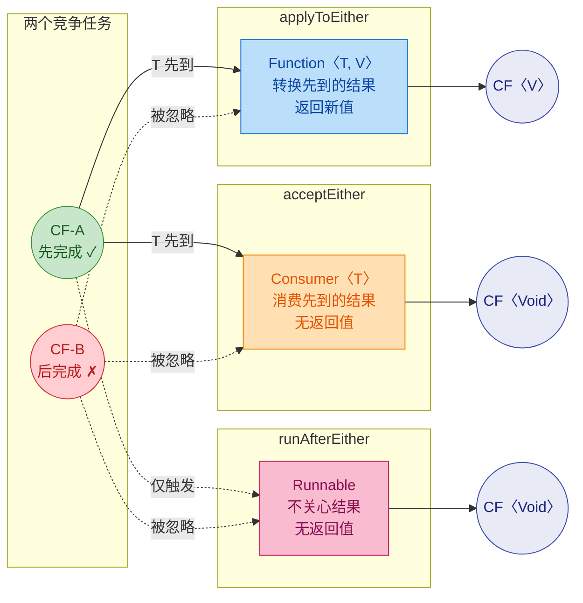
```mermaid
graph LR
    subgraph RACE["两个竞争任务"]
        direction TB
        FA(("CF-A\n先完成 ✓"))
        FB(("CF-B\n后完成 ✗"))
    end

    subgraph APPLY["applyToEither"]
        direction TB
        AFN["Function〈T, V〉\n转换先到的结果\n返回新值"]
    end

    subgraph ACCEPT_E["acceptEither"]
        direction TB
        ACS["Consumer〈T〉\n消费先到的结果\n无返回值"]
    end

    subgraph RUN_E["runAfterEither"]
        direction TB
        ARN["Runnable\n不关心结果\n无返回值"]
    end

    FA -- "T 先到" --> AFN
    FB -. "被忽略" .-> AFN
    AFN --> RA(("CF〈V〉"))

    FA -- "T 先到" --> ACS
    FB -. "被忽略" .-> ACS
    ACS --> RB(("CF〈Void〉"))

    FA -. "仅触发" .-> ARN
    FB -. "被忽略" .-> ARN
    ARN --> RC(("CF〈Void〉"))

    classDef winNode fill:#C8E6C9,stroke:#388E3C,color:#1B5E20
    classDef loseNode fill:#FFCDD2,stroke:#D32F2F,color:#B71C1C
    classDef funcNode fill:#BBDEFB,stroke:#1976D2,color:#0D47A1
    classDef consNode fill:#FFE0B2,stroke:#F57C00,color:#E65100
    classDef runNode fill:#F8BBD0,stroke:#C2185B,color:#880E4F
    classDef resultNode fill:#E8EAF6,stroke:#3949AB,color:#1A237E

    class FA winNode
    class FB loseNode
    class AFN funcNode
    class ACS consNode
    class ARN runNode
    class RA,RB,RC resultNode
```

---

> **Async 变体提醒**：本节介绍的所有六个方法，都有对应的 `Async` 版本——`thenCombineAsync`、`thenAcceptBothAsync`、`runAfterBothAsync`、`applyToEitherAsync`、`acceptEitherAsync`、`runAfterEitherAsync`。它们的唯一区别在于：回调函数会被提交到 `ForkJoinPool.commonPool()`（或你指定的 `Executor`）执行，而不是在完成任务的线程上就地执行。当回调逻辑本身是 CPU 密集型或耗时操作时，推荐使用 Async 变体以避免阻塞 IO 线程。

---

**📝 练习题**

以下代码的输出结果最可能是？

```java
CompletableFuture<String> cf1 = CompletableFuture.supplyAsync(() -> {
    try { Thread.sleep(100); } catch (Exception e) {}
    return "A";
});

CompletableFuture<String> cf2 = CompletableFuture.supplyAsync(() -> {
    try { Thread.sleep(2000); } catch (Exception e) {}
    return "B";
});

CompletableFuture<String> result = cf1.applyToEither(cf2, s -> s + "-WINS");
System.out.println(result.join());
```

A. `A-WINS`

B. `B-WINS`

C. `AB-WINS`

D. 编译错误，`applyToEither` 不能用于相同类型的 CF

**【答案】** A

**【解析】** `applyToEither` 采用 OR 语义——两个 `CompletableFuture` 中**谁先完成**，就将谁的结果传递给 `Function` 处理。`cf1` 休眠 100ms，`cf2` 休眠 2000ms，因此 `cf1` 几乎必然先完成，其结果 `"A"` 会被传入 `s -> s + "-WINS"`，最终输出 `"A-WINS"`。选项 C 的 `"AB-WINS"` 是对 `thenCombine` 场景的误解——`applyToEither` 的 `Function` 只接收**一个**参数（先完成者的结果），而非两个结果的拼接。选项 D 错误，`applyToEither` 要求两个 CF 的类型兼容，相同类型当然可以。

---

## 批量操作 ⭐

在真实的业务场景中，我们经常需要**同时发起多个异步任务**，然后根据它们的完成情况做后续处理。例如：一个电商商品详情页需要同时请求商品信息、库存信息、用户评价、推荐列表等多个微服务，最后将所有结果聚合渲染。如果逐个串行调用，延迟将是各服务耗时之和；如果并行调用并等待全部完成，总延迟仅取决于最慢的那个服务。

`CompletableFuture` 提供了两个核心的**静态工厂方法**来应对批量异步编排：

- **`allOf`**：等待**所有**任务完成（AND 语义）
- **`anyOf`**：等待**任意一个**任务完成（OR 语义）

它们都接收一个 `CompletableFuture<?>...` 可变参数，返回一个新的 `CompletableFuture`，代表这组任务的整体完成状态。

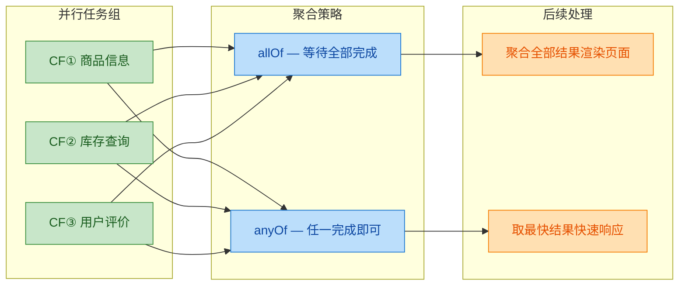
```mermaid
graph LR
    subgraph Parallel["并行任务组"]
        direction TB
        CF1["CF① 商品信息"]
        CF2["CF② 库存查询"]
        CF3["CF③ 用户评价"]
    end

    subgraph Strategy["聚合策略"]
        direction TB
        ALL["allOf — 等待全部完成"]
        ANY["anyOf — 任一完成即可"]
    end

    subgraph Result["后续处理"]
        direction TB
        R1["聚合全部结果渲染页面"]
        R2["取最快结果快速响应"]
    end

    CF1 --> ALL
    CF2 --> ALL
    CF3 --> ALL
    CF1 --> ANY
    CF2 --> ANY
    CF3 --> ANY
    ALL --> R1
    ANY --> R2

    classDef parallelStyle fill:#C8E6C9,stroke:#388E3C,color:#1B5E20
    classDef strategyStyle fill:#BBDEFB,stroke:#1976D2,color:#0D47A1
    classDef resultStyle fill:#FFE0B2,stroke:#F57C00,color:#E65100

    class CF1,CF2,CF3 parallelStyle
    class ALL,ANY strategyStyle
    class R1,R2 resultStyle
```

### allOf（所有完成）

#### 方法签名与语义

```java
// 接收可变参数，返回 CompletableFuture<Void>
// 当所有传入的 CF 都正常完成时，返回的 CF 才会完成
// 如果其中任何一个 CF 异常完成，返回的 CF 也会异常完成
public static CompletableFuture<Void> allOf(CompletableFuture<?>... cfs)
```

注意返回类型是 `CompletableFuture<Void>`——这是一个**关键的设计取舍**。`allOf` 本身**不携带任何结果值**，它只充当一个"屏障（barrier）"，告诉你"所有任务都做完了"。如果你需要获取各个任务的结果，需要在 `allOf` 完成后**回到各个原始 `CompletableFuture` 上取值**（调用 `.join()` 或 `.get()`，此时它们已经完成，不会阻塞）。

为什么设计为返回 `Void`？因为每个 `CompletableFuture` 的返回类型可能不同（`String`、`Integer`、`List<Order>` 等），Java 的类型系统无法用一个泛型统一表达"多种不同类型结果的元组"。

#### 基础用法

```java
import java.util.concurrent.CompletableFuture;
import java.util.concurrent.TimeUnit;

public class AllOfBasicDemo {
    public static void main(String[] args) {
        // 模拟三个独立的异步任务
        CompletableFuture<String> productCF = CompletableFuture.supplyAsync(() -> {
            sleep(800); // 模拟商品服务耗时 800ms
            return "iPhone 15 Pro";
        });

        CompletableFuture<Integer> stockCF = CompletableFuture.supplyAsync(() -> {
            sleep(500); // 模拟库存服务耗时 500ms
            return 128;
        });

        CompletableFuture<Double> priceCF = CompletableFuture.supplyAsync(() -> {
            sleep(600); // 模拟价格服务耗时 600ms
            return 7999.0;
        });

        // allOf 创建一个"屏障"，等待三个任务全部完成
        // 返回类型是 CompletableFuture<Void>，不直接持有结果
        CompletableFuture<Void> allDone = CompletableFuture.allOf(productCF, stockCF, priceCF);

        // 在屏障完成后，通过 thenRun 执行后续逻辑
        allDone.thenRun(() -> {
            // 此时三个 CF 都已完成，join() 不会阻塞，立即返回结果
            String product = productCF.join();   // "iPhone 15 Pro"
            int stock = stockCF.join();           // 128
            double price = priceCF.join();        // 7999.0

            // 聚合结果
            System.out.println("商品: " + product);
            System.out.println("库存: " + stock);
            System.out.println("价格: ¥" + price);
        }).join(); // 主线程等待整个流程结束

        // 总耗时 ≈ max(800, 500, 600) = 800ms，而非 800+500+600=1900ms
    }

    // 辅助方法：安全地休眠指定毫秒
    private static void sleep(long millis) {
        try {
            TimeUnit.MILLISECONDS.sleep(millis);
        } catch (InterruptedException e) {
            Thread.currentThread().interrupt(); // 恢复中断标志
        }
    }
}
```

#### 实战模式：收集异构结果

在实际项目中，任务数量往往是动态的，且返回类型各异。下面展示一个更贴近生产环境的模式——**批量请求 + 结果收集**：

```java
import java.util.Arrays;
import java.util.List;
import java.util.concurrent.CompletableFuture;
import java.util.concurrent.ExecutorService;
import java.util.concurrent.Executors;
import java.util.stream.Collectors;

public class AllOfCollectDemo {
    // 创建自定义线程池，控制并发度
    private static final ExecutorService pool = Executors.newFixedThreadPool(8);

    public static void main(String[] args) {
        // 模拟一组商品 ID
        List<Long> productIds = Arrays.asList(1001L, 1002L, 1003L, 1004L, 1005L);

        // 第一步：将每个 ID 映射为一个异步查询任务
        List<CompletableFuture<String>> futures = productIds.stream()
                .map(id -> CompletableFuture.supplyAsync(
                        () -> queryProduct(id),  // 每个 ID 独立异步查询
                        pool                      // 使用自定义线程池
                ))
                .collect(Collectors.toList());    // 收集为 List

        // 第二步：将 List<CF> 转为 CF[]，传入 allOf
        CompletableFuture<Void> allDone = CompletableFuture.allOf(
                futures.toArray(new CompletableFuture[0]) // List 转数组
        );

        // 第三步：allOf 完成后，遍历所有 CF 提取结果
        CompletableFuture<List<String>> allResults = allDone.thenApply(
                v -> futures.stream()           // v 是 Void，忽略
                        .map(CompletableFuture::join)  // 安全地取结果（已完成，不阻塞）
                        .collect(Collectors.toList())   // 聚合为 List<String>
        );

        // 第四步：消费最终聚合结果
        allResults.thenAccept(results -> {
            System.out.println("全部查询完成，共 " + results.size() + " 条:");
            results.forEach(r -> System.out.println("  → " + r));
        }).join(); // 主线程等待

        pool.shutdown(); // 关闭线程池
    }

    // 模拟根据 ID 查询商品（耗时操作）
    private static String queryProduct(Long id) {
        try {
            Thread.sleep((long) (Math.random() * 1000)); // 随机耗时 0~1000ms
        } catch (InterruptedException e) {
            Thread.currentThread().interrupt();
        }
        return "Product-" + id; // 返回商品名称
    }
}
```

上面这段代码是一个**非常经典的工程范式**，核心流程可以提炼为：

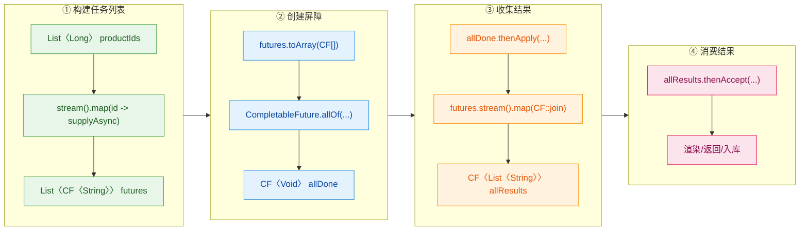
```mermaid
graph LR
    subgraph Step1["① 构建任务列表"]
        direction TB
        S1A["List〈Long〉 productIds"]
        S1B["stream().map(id -> supplyAsync)"]
        S1C["List〈CF〈String〉〉 futures"]
        S1A --> S1B --> S1C
    end

    subgraph Step2["② 创建屏障"]
        direction TB
        S2A["futures.toArray(CF[])"]
        S2B["CompletableFuture.allOf(...)"]
        S2C["CF〈Void〉 allDone"]
        S2A --> S2B --> S2C
    end

    subgraph Step3["③ 收集结果"]
        direction TB
        S3A["allDone.thenApply(...)"]
        S3B["futures.stream().map(CF::join)"]
        S3C["CF〈List〈String〉〉 allResults"]
        S3A --> S3B --> S3C
    end

    subgraph Step4["④ 消费结果"]
        direction TB
        S4A["allResults.thenAccept(...)"]
        S4B["渲染/返回/入库"]
        S4A --> S4B
    end

    Step1 --> Step2 --> Step3 --> Step4

    classDef step1Style fill:#E8F5E9,stroke:#43A047,color:#1B5E20
    classDef step2Style fill:#E3F2FD,stroke:#1E88E5,color:#0D47A1
    classDef step3Style fill:#FFF3E0,stroke:#FB8C00,color:#E65100
    classDef step4Style fill:#FCE4EC,stroke:#E91E63,color:#880E4F

    class S1A,S1B,S1C step1Style
    class S2A,S2B,S2C step2Style
    class S3A,S3B,S3C step3Style
    class S4A,S4B step4Style
```

#### allOf 的异常传播

`allOf` 的异常行为需要特别注意：

```java
public class AllOfExceptionDemo {
    public static void main(String[] args) {
        CompletableFuture<String> cf1 = CompletableFuture.supplyAsync(() -> {
            return "成功结果"; // 正常完成
        });

        CompletableFuture<String> cf2 = CompletableFuture.supplyAsync(() -> {
            throw new RuntimeException("cf2 炸了！"); // 异常完成
        });

        CompletableFuture<String> cf3 = CompletableFuture.supplyAsync(() -> {
            return "另一个成功结果"; // 正常完成
        });

        CompletableFuture.allOf(cf1, cf2, cf3)
                .thenRun(() -> {
                    // 如果所有 CF 都成功，才会执行到这里
                    System.out.println("全部成功！");
                })
                .exceptionally(ex -> {
                    // 任何一个 CF 异常，allOf 就会异常完成
                    // ex 是 CompletionException，通过 getCause() 拿到原始异常
                    System.out.println("有任务失败: " + ex.getCause().getMessage());
                    return null;
                })
                .join();

        // 输出: 有任务失败: cf2 炸了！

        // 重要：即使 allOf 异常了，cf1 和 cf3 仍然正常完成
        // 可以单独检查每个 CF 的状态
        System.out.println("cf1 完成? " + cf1.isDone());           // true
        System.out.println("cf1 异常? " + cf1.isCompletedExceptionally()); // false
        System.out.println("cf1 结果: " + cf1.join());             // 成功结果
    }
}
```

**关键要点**：当多个 CF 都异常时，`allOf` 返回的 CF 只会携带**其中一个**异常（不保证是哪个）。如果你需要知道所有失败任务的详情，应该在 `allOf` 完成后**逐个检查**每个原始 CF：

```java
// allOf 完成后（无论成功失败），逐个检查所有任务状态
CompletableFuture.allOf(cf1, cf2, cf3)
        .whenComplete((v, ex) -> {
            // 遍历所有原始 CF，逐一检查
            List<CompletableFuture<String>> all = Arrays.asList(cf1, cf2, cf3);
            for (int i = 0; i < all.size(); i++) {
                CompletableFuture<String> cf = all.get(i);
                if (cf.isCompletedExceptionally()) {
                    // 用 handle 提取异常信息（不会抛出）
                    cf.handle((result, error) -> {
                        System.out.println("任务失败: " + error.getMessage());
                        return null; // handle 必须有返回值
                    });
                } else {
                    System.out.println("任务成功: " + cf.join());
                }
            }
        }).join();
```

### anyOf（任一完成）

#### 方法签名与语义

```java
// 接收可变参数，返回 CompletableFuture<Object>
// 当任意一个传入的 CF 完成（无论成功还是异常），返回的 CF 就完成
// 结果值是第一个完成的 CF 的结果
public static CompletableFuture<Object> anyOf(CompletableFuture<?>... cfs)
```

与 `allOf` 的关键区别：

| 对比维度 | `allOf` | `anyOf` |
|---------|---------|---------|
| **语义** | AND — 全部完成 | OR — 任一完成 |
| **返回类型** | `CompletableFuture<Void>` | `CompletableFuture<Object>` |
| **完成时机** | 最慢的任务完成时 | 最快的任务完成时 |
| **异常传播** | 任一异常 → 整体异常 | 第一个完成的结果（可能是异常） |
| **典型场景** | 聚合多个服务结果 | 竞速、超时兜底、多源择优 |

注意 `anyOf` 的返回类型是 `CompletableFuture<Object>`——因为不确定哪个 CF 先完成，而各 CF 类型可能不同，所以只能用 `Object` 作为上界。使用时通常需要**强制类型转换**。

#### 基础用法：竞速模式

```java
import java.util.concurrent.CompletableFuture;
import java.util.concurrent.TimeUnit;

public class AnyOfBasicDemo {
    public static void main(String[] args) {
        // 模拟从三个镜像源下载文件，取最快的那个
        CompletableFuture<String> mirror1 = CompletableFuture.supplyAsync(() -> {
            sleep(300);  // 镜像1：300ms
            return "来自 CDN-北京 的数据";
        });

        CompletableFuture<String> mirror2 = CompletableFuture.supplyAsync(() -> {
            sleep(150);  // 镜像2：150ms（最快）
            return "来自 CDN-上海 的数据";
        });

        CompletableFuture<String> mirror3 = CompletableFuture.supplyAsync(() -> {
            sleep(500);  // 镜像3：500ms
            return "来自 CDN-广州 的数据";
        });

        // anyOf：谁先完成就用谁的结果
        CompletableFuture<Object> fastest = CompletableFuture.anyOf(mirror1, mirror2, mirror3);

        fastest.thenAccept(result -> {
            // result 类型是 Object，需要强转
            String data = (String) result;
            System.out.println("最快响应: " + data);
        }).join();

        // 输出: 最快响应: 来自 CDN-上海 的数据
        // 总耗时 ≈ 150ms
    }

    private static void sleep(long millis) {
        try {
            TimeUnit.MILLISECONDS.sleep(millis);
        } catch (InterruptedException e) {
            Thread.currentThread().interrupt();
        }
    }
}
```

#### 实战模式：超时兜底（Timeout Fallback）

在 Java 8 环境中（没有 `orTimeout`），`anyOf` 可以优雅地实现超时兜底：

```java
import java.util.concurrent.*;

public class AnyOfTimeoutDemo {
    // 自定义调度线程池，用于超时控制
    private static final ScheduledExecutorService scheduler =
            Executors.newScheduledThreadPool(1);

    public static void main(String[] args) {
        // 真实的业务任务（可能很慢）
        CompletableFuture<String> realTask = CompletableFuture.supplyAsync(() -> {
            sleep(3000); // 模拟耗时 3 秒
            return "真实查询结果";
        });

        // 构造一个超时兜底任务：1 秒后自动完成
        CompletableFuture<String> timeout = timeoutAfter(1, TimeUnit.SECONDS, "默认兜底值");

        // anyOf 竞速：业务任务 vs 超时任务，谁先完成用谁
        CompletableFuture<Object> result = CompletableFuture.anyOf(realTask, timeout);

        result.thenAccept(r -> {
            System.out.println("最终结果: " + r);
        }).join();

        // 输出: 最终结果: 默认兜底值（因为 1s < 3s，超时任务先完成）

        scheduler.shutdown();
    }

    /**
     * 工具方法：创建一个在指定延迟后自动完成的 CompletableFuture
     * 这是 Java 8 下模拟 completeOnTimeout 的经典手法
     */
    private static <T> CompletableFuture<T> timeoutAfter(
            long delay, TimeUnit unit, T fallbackValue) {
        CompletableFuture<T> cf = new CompletableFuture<>();
        // 利用 ScheduledExecutorService 延迟执行
        scheduler.schedule(
                () -> cf.complete(fallbackValue), // 延迟到期后，用兜底值完成
                delay,
                unit
        );
        return cf; // 返回这个"定时炸弹" CF
    }

    private static void sleep(long millis) {
        try {
            TimeUnit.MILLISECONDS.sleep(millis);
        } catch (InterruptedException e) {
            Thread.currentThread().interrupt();
        }
    }
}
```

#### anyOf 的异常行为

`anyOf` 的一个**常见陷阱**是：如果最先完成的那个 CF 是**异常完成**的，那么 `anyOf` 返回的 CF 也会异常完成——即使其他 CF 后来成功了也不会"修正"结果：

```java
public class AnyOfExceptionDemo {
    public static void main(String[] args) {
        // cf1 最快完成，但是异常完成
        CompletableFuture<String> cf1 = CompletableFuture.supplyAsync(() -> {
            sleep(100); // 100ms 后异常
            throw new RuntimeException("cf1 失败了");
        });

        // cf2 稍慢，但能成功
        CompletableFuture<String> cf2 = CompletableFuture.supplyAsync(() -> {
            sleep(500); // 500ms 后成功
            return "cf2 的正确结果";
        });

        CompletableFuture<Object> any = CompletableFuture.anyOf(cf1, cf2);

        any.thenAccept(r -> System.out.println("成功: " + r))
           .exceptionally(ex -> {
               // cf1 先完成且是异常 → anyOf 也异常
               System.out.println("失败: " + ex.getCause().getMessage());
               return null;
           })
           .join();

        // 输出: 失败: cf1 失败了
        // 尽管 cf2 后来会成功，但 anyOf 只看"第一个完成的"
    }

    private static void sleep(long ms) {
        try { Thread.sleep(ms); } catch (InterruptedException e) {
            Thread.currentThread().interrupt();
        }
    }
}
```

如果你需要"第一个**成功**完成"的语义（忽略异常的），需要自己包装逻辑。下面是一个实用的工具方法：

```java
import java.util.List;
import java.util.concurrent.CompletableFuture;
import java.util.concurrent.atomic.AtomicInteger;

public class AnyOfSuccessUtil {

    /**
     * 自定义 anyOfSuccess：返回第一个成功完成的结果
     * 只有当所有 CF 都异常时，才异常完成
     *
     * @param futures 一组异步任务
     * @param <T>     结果类型
     * @return 第一个成功结果的 CompletableFuture
     */
    public static <T> CompletableFuture<T> anyOfSuccess(List<CompletableFuture<T>> futures) {
        // 最终要返回的 CF，由我们手动控制完成
        CompletableFuture<T> result = new CompletableFuture<>();
        // 原子计数器：跟踪已失败的任务数
        AtomicInteger failCount = new AtomicInteger(0);
        int total = futures.size(); // 总任务数

        for (CompletableFuture<T> cf : futures) {
            cf.whenComplete((value, ex) -> {
                if (ex == null) {
                    // 成功完成 → 尝试用此结果完成 result
                    // complete 是幂等的，第一个调用生效，后续忽略
                    result.complete(value);
                } else {
                    // 异常完成 → 失败计数 +1
                    if (failCount.incrementAndGet() == total) {
                        // 所有任务都失败了 → 用最后一个异常完成 result
                        result.completeExceptionally(ex);
                    }
                    // 还有任务在跑 → 继续等待
                }
            });
        }

        return result; // 返回受控的 CF
    }
}
```

#### allOf vs anyOf 执行时序对比

下面用一张时序图直观地展示两者的差异：

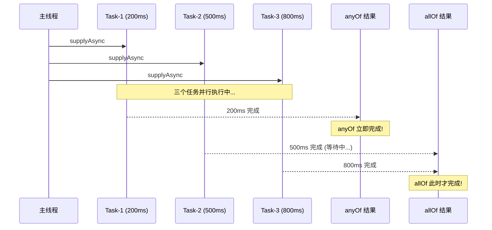
```mermaid
sequenceDiagram
    participant Main as 主线程
    participant T1 as Task-1 (200ms)
    participant T2 as Task-2 (500ms)
    participant T3 as Task-3 (800ms)
    participant AnyOf as anyOf 结果
    participant AllOf as allOf 结果

    Main->>T1: supplyAsync
    Main->>T2: supplyAsync
    Main->>T3: supplyAsync

    Note over T1,T3: 三个任务并行执行中...

    T1-->>AnyOf: 200ms 完成
    Note over AnyOf: anyOf 立即完成!

    T2-->>AllOf: 500ms 完成 (等待中...)
    T3-->>AllOf: 800ms 完成
    Note over AllOf: allOf 此时才完成!
```

#### 性能与最佳实践

在使用批量操作时，有几个工程实践要点需要牢记：

**1. 始终使用自定义线程池**

```java
// ❌ 不推荐：所有任务共享 ForkJoinPool.commonPool()
// 如果任务涉及 I/O 阻塞，会拖垮整个应用
CompletableFuture.supplyAsync(() -> blockingIO());

// ✅ 推荐：为 I/O 密集型任务创建独立线程池
ExecutorService ioPool = Executors.newFixedThreadPool(16);
CompletableFuture.supplyAsync(() -> blockingIO(), ioPool);
```

**2. allOf + Stream 的惯用写法（一行流式）**

```java
// 将 "ID 列表" 转换为 "结果列表" 的完整流水线
public CompletableFuture<List<Product>> batchQuery(List<Long> ids, ExecutorService pool) {
    // Step 1 & 2: 构建任务列表
    List<CompletableFuture<Product>> cfs = ids.stream()
            .map(id -> CompletableFuture.supplyAsync(() -> queryById(id), pool))
            .collect(Collectors.toList());

    // Step 3 & 4: allOf 屏障 + 收集结果
    return CompletableFuture.allOf(cfs.toArray(new CompletableFuture[0]))
            .thenApply(v -> cfs.stream()
                    .map(CompletableFuture::join) // 已完成，安全 join
                    .collect(Collectors.toList())
            );
}
```

**3. 注意 anyOf 的剩余任务**

`anyOf` 返回后，**其他未完成的任务仍然在运行**。如果你需要取消它们（节省资源），需要显式调用 `cancel()`：

```java
CompletableFuture<String>[] tasks = new CompletableFuture[]{cf1, cf2, cf3};
CompletableFuture<Object> winner = CompletableFuture.anyOf(tasks);

winner.thenAccept(result -> {
    // 拿到最快结果后，取消其余任务
    for (CompletableFuture<String> task : tasks) {
        if (!task.isDone()) {
            task.cancel(true); // 尝试取消（注意：cancel 对已提交的线程池任务效果有限）
        }
    }
    System.out.println("Winner: " + result);
}).join();
```

> ⚠️ **注意**：`CompletableFuture.cancel()` 并**不会真正中断底层线程**，它只是将 CF 标记为取消状态（`CancellationException`）。如果底层任务是阻塞 I/O，需要配合 `Future.cancel(true)` + 线程中断检测才能真正停止。

---

**📝 练习题**

以下代码的输出结果是什么？

```java
CompletableFuture<Integer> cf1 = CompletableFuture.supplyAsync(() -> { sleep(200); return 1; });
CompletableFuture<Integer> cf2 = CompletableFuture.supplyAsync(() -> { sleep(100); return 2; });
CompletableFuture<Integer> cf3 = CompletableFuture.supplyAsync(() -> { sleep(300); return 3; });

CompletableFuture.allOf(cf1, cf2, cf3)
    .thenRun(() -> System.out.print("A"))
    .join();
System.out.print("B");

Object r = CompletableFuture.anyOf(cf1, cf2, cf3).join();
System.out.print(r);
```

A. `AB1`


B. `AB2`


C. `BA2`


D. `A2B`


**【答案】** B

**【解析】** 分步分析执行过程：

1. `allOf(cf1, cf2, cf3)` 等待三个任务全部完成（最慢的 cf3 需要 300ms），然后执行 `thenRun` 打印 `A`。`.join()` 阻塞主线程直到 `thenRun` 结束。此时输出 `A`。
2. `.join()` 返回后，主线程继续执行 `System.out.print("B")`，输出 `B`。此时输出 `AB`。
3. 接下来执行 `anyOf(cf1, cf2, cf3).join()`。但此时三个 CF **早已全部完成**（在第 1 步 allOf 时就全部完成了），所以 `anyOf` 会立即返回。当所有 CF 都已完成时，`anyOf` 返回的是参数列表中**第一个完成**的 CF 的结果。cf2 最早完成（100ms），所以 `r = 2`。输出 `2`。
4. 最终输出：`AB2`。

---

## 异常处理 ⭐

在真实的异步编程场景中，任务并不总是一帆风顺地执行完毕。网络请求可能超时、数据库查询可能失败、JSON 解析可能遇到格式错误……这些异常如果不在异步链路中妥善处理，要么会被默默吞掉 (silently swallowed)，要么会在最终 `join()` / `get()` 时以 `CompletionException` 的形式炸到调用方脸上。

`CompletableFuture` 提供了三种粒度不同、用途各异的异常处理机制：

| 方法 | 能否访问正常结果 | 能否访问异常 | 能否"恢复"(返回替代值) | 返回类型 |
|------|:---:|:---:|:---:|------|
| `exceptionally` | ✗ | ✓ | ✓ | `CompletableFuture<T>` |
| `handle` | ✓ | ✓ | ✓ | `CompletableFuture<U>` |
| `whenComplete` | ✓ | ✓ | ✗ | `CompletableFuture<T>` |

理解它们的核心差异，关键在于两个维度：**是否能接触到正常结果**，以及**是否能改变最终传递的值/异常**。我们先建立一个全局的心智模型，再逐一深入。

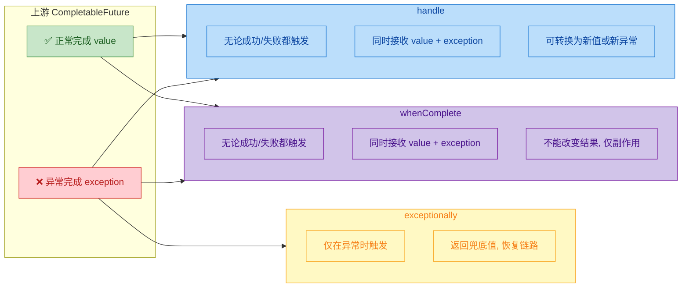
```mermaid
graph LR
    subgraph SRC["上游 CompletableFuture"]
        direction TB
        OK["✅ 正常完成 value"]
        ERR["❌ 异常完成 exception"]
    end

    subgraph EX["exceptionally"]
        direction TB
        EX1["仅在异常时触发"]
        EX2["返回兜底值, 恢复链路"]
    end

    subgraph HD["handle"]
        direction TB
        HD1["无论成功/失败都触发"]
        HD2["同时接收 value + exception"]
        HD3["可转换为新值或新异常"]
    end

    subgraph WC["whenComplete"]
        direction TB
        WC1["无论成功/失败都触发"]
        WC2["同时接收 value + exception"]
        WC3["不能改变结果, 仅副作用"]
    end

    OK --> HD
    OK --> WC
    ERR --> EX
    ERR --> HD
    ERR --> WC

    classDef srcOk fill:#C8E6C9,stroke:#388E3C,color:#1B5E20
    classDef srcErr fill:#FFCDD2,stroke:#D32F2F,color:#B71C1C
    classDef excep fill:#FFF9C4,stroke:#F9A825,color:#F57F17
    classDef handl fill:#BBDEFB,stroke:#1976D2,color:#0D47A1
    classDef whenC fill:#D1C4E9,stroke:#7B1FA2,color:#4A148C

    class OK srcOk
    class ERR srcErr
    class EX,EX1,EX2 excep
    class HD,HD1,HD2,HD3 handl
    class WC,WC1,WC2,WC3 whenC
```

在深入每个 API 之前，我们需要先理解 `CompletableFuture` 的异常传播机制。当链路中某一环节抛出异常时，后续所有 **正常路径** 的回调 (`thenApply`, `thenAccept`, `thenRun` 等) 都会被跳过 (short-circuit)，异常会像多米诺骨牌一样一路向下传递，直到被某个异常处理算子截获。这种行为类似于同步代码中的 `try-catch`：异常会 "穿透" 正常的业务代码，只在 catch 块中停下。

---

### exceptionally（异常时返回默认值）

`exceptionally` 是最直观、最轻量的异常恢复手段。它的语义等价于同步代码中的 `catch` 块——**只在上游发生异常时才被调用**，正常完成时则完全透明地传递结果。

**方法签名：**

```java
// 接收一个 Function：入参是 Throwable，返回值是 T（与上游同类型）
// 仅在上游异常时执行该 Function，正常完成时直接透传结果
public CompletableFuture<T> exceptionally(Function<Throwable, ? extends T> fn)
```

它的核心设计理念是：**提供一个兜底值 (fallback value)**，让异步链路能够从异常中 "恢复"(recover) 过来，继续向下执行。

**等价的同步心智模型：**

```java
// exceptionally 等价于以下同步代码：
try {
    return upstream.get();        // 上游正常 → 直接返回
} catch (Throwable ex) {
    return fallbackFunction(ex);  // 上游异常 → 返回兜底值
}
```

**完整示例：**

```java
import java.util.concurrent.CompletableFuture;

public class ExceptionallyDemo {
    public static void main(String[] args) {

        // 模拟一个会抛出异常的异步任务（比如查询用户服务挂了）
        CompletableFuture<String> future = CompletableFuture
                .supplyAsync(() -> {
                    // 模拟远程调用失败
                    if (true) {
                        throw new RuntimeException("UserService is down!");
                    }
                    return "Alice";  // 正常情况下返回用户名
                })
                // exceptionally: 仅在上游抛异常时进入此回调
                .exceptionally(ex -> {
                    // ex 是上游抛出的异常（被包装为 CompletionException）
                    System.out.println("捕获异常: " + ex.getMessage());
                    // 返回兜底值，让后续链路能继续工作
                    return "Unknown User";
                })
                // 此时链路已恢复，thenApply 能正常执行
                .thenApply(name -> {
                    // name 的值为 "Unknown User"（来自 exceptionally 的兜底）
                    return "Hello, " + name + "!";
                });

        // 输出: Hello, Unknown User!
        System.out.println(future.join());
    }
}
```

**关于异常包装 (Exception Wrapping) 的重要细节：**

在 `exceptionally` 中接收到的 `Throwable`，通常不是原始异常本身，而是被包裹了一层 `java.util.concurrent.CompletionException`。这是因为 `CompletableFuture` 在内部统一使用 `CompletionException` 来封装异步执行过程中抛出的所有异常。因此，如果你需要获取真实的业务异常，应当调用 `ex.getCause()` 来解包：

```java
.exceptionally(ex -> {
    // ex 本身是 CompletionException
    // ex.getCause() 才是你抛出的原始 RuntimeException
    Throwable realCause = ex.getCause();

    // 根据真实异常类型做不同的兜底策略
    if (realCause instanceof TimeoutException) {
        return "请求超时，请稍后重试";
    } else if (realCause instanceof IllegalArgumentException) {
        return "参数错误: " + realCause.getMessage();
    }
    // 通用兜底
    return "系统繁忙";
})
```

**链式恢复——异常被 "吃掉" 后链路回归正常：**

`exceptionally` 返回的 `CompletableFuture<T>` 是一个**全新的、正常完成的 Future**（除非你在 `exceptionally` 内部又抛了异常）。这意味着后续的 `thenApply`、`thenAccept` 等算子将正常执行，就好像上游从未出过错一样。

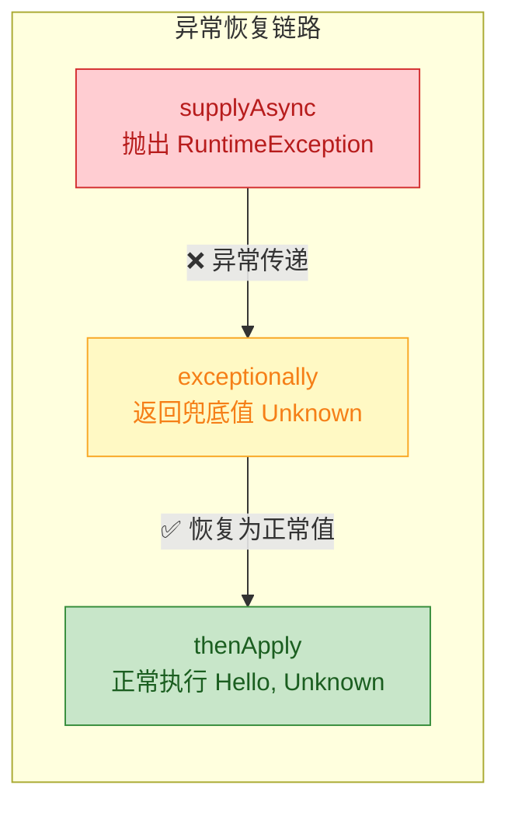
```mermaid
graph LR
    subgraph CHAIN["异常恢复链路"]
        direction TB
        A["supplyAsync<br/>抛出 RuntimeException"] 
        B["exceptionally<br/>返回兜底值 Unknown"]
        C["thenApply<br/>正常执行 Hello, Unknown"]
    end

    A -->|"❌ 异常传递"| B
    B -->|"✅ 恢复为正常值"| C

    classDef err fill:#FFCDD2,stroke:#D32F2F,color:#B71C1C
    classDef recover fill:#FFF9C4,stroke:#F9A825,color:#F57F17
    classDef ok fill:#C8E6C9,stroke:#388E3C,color:#1B5E20

    class A err
    class B recover
    class C ok
```

**如果 `exceptionally` 内部也抛出异常怎么办？**

如果你在 `exceptionally` 的 lambda 内部又抛出了异常（比如兜底逻辑本身也失败了），那么返回的 `CompletableFuture` 将以这个**新异常**完成，后续链路会继续走异常传播路径。这一点在做多层降级 (multi-level fallback) 时需要格外注意。

---

### handle（无论成功失败都处理）

`handle` 是三者中功能最强大、最灵活的一个。它**同时接收正常结果和异常**，无论上游是正常完成还是异常完成，`handle` 回调都会被执行。并且，它可以返回一个全新的值，从而**既能做转换 (transform)，又能做恢复 (recover)**。

**方法签名：**

```java
// BiFunction 接收两个参数：
//   value     — 上游正常完成时的结果（异常时为 null）
//   exception — 上游异常完成时的 Throwable（正常时为 null）
// 返回值类型 U 可以与上游的 T 不同 → 同时具备 thenApply + exceptionally 的能力
public <U> CompletableFuture<U> handle(BiFunction<? super T, Throwable, ? extends U> fn)
```

核心要点：`value` 和 `exception` 二者**有且仅有一个为 null**——要么正常完成（`value` 有值，`exception` 为 null），要么异常完成（`value` 为 null，`exception` 有值）。

**等价的同步心智模型：**

```java
// handle 等价于以下同步代码：
try {
    T value = upstream.get();
    return handleFunction(value, null);    // 正常 → exception 为 null
} catch (Throwable ex) {
    return handleFunction(null, ex);       // 异常 → value 为 null
}
```

你可以把 `handle` 理解为 `try-catch-finally` 的合体——它在一个回调里统一处理成功和失败两种情况，并且总能产出一个新结果。

**完整示例：**

```java
import java.util.concurrent.CompletableFuture;

public class HandleDemo {
    public static void main(String[] args) {

        // ============== 场景 1: 上游正常完成 ==============
        CompletableFuture<String> successCase = CompletableFuture
                .supplyAsync(() -> {
                    // 模拟正常返回查询结果
                    return 100;  // 查询到用户积分为 100
                })
                .handle((value, ex) -> {
                    // value = 100, ex = null（因为上游正常完成）
                    if (ex != null) {
                        // 异常分支：不会进入
                        System.out.println("查询失败: " + ex.getMessage());
                        return "积分查询失败，请重试";
                    }
                    // 正常分支：将 Integer 转换为 String（类型可以变化！）
                    return "您的积分: " + value;
                });

        // 输出: 您的积分: 100
        System.out.println(successCase.join());

        // ============== 场景 2: 上游异常完成 ==============
        CompletableFuture<String> failCase = CompletableFuture
                .<Integer>supplyAsync(() -> {
                    // 模拟数据库连接失败
                    throw new RuntimeException("DB connection refused");
                })
                .handle((value, ex) -> {
                    // value = null, ex = CompletionException（因为上游异常）
                    if (ex != null) {
                        // 异常分支：进入此处
                        System.out.println("查询失败: " + ex.getCause().getMessage());
                        return "积分查询失败，请重试";
                    }
                    return "您的积分: " + value;
                });

        // 输出: 积分查询失败，请重试
        System.out.println(failCase.join());
    }
}
```

**`handle` vs `exceptionally` —— 何时选谁？**

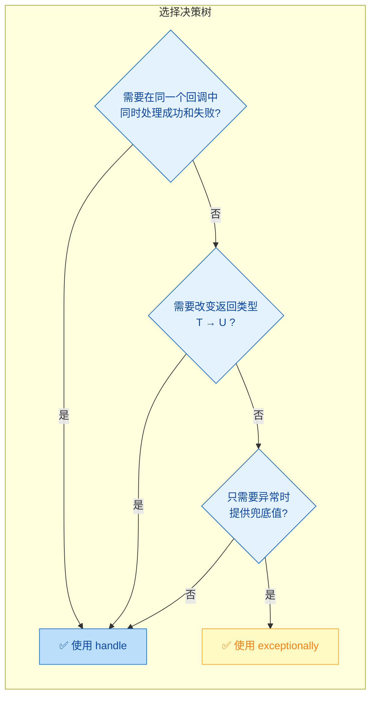
```mermaid
graph LR
    subgraph DECISION["选择决策树"]
        direction TB
        Q1{"需要在同一个回调中<br/>同时处理成功和失败?"}
        Q2{"需要改变返回类型<br/>T → U ?"}
        Q3{"只需要异常时<br/>提供兜底值?"}
        USE_HANDLE["✅ 使用 handle"]
        USE_EXCEPT["✅ 使用 exceptionally"]
    end

    Q1 -->|"是"| USE_HANDLE
    Q1 -->|"否"| Q2
    Q2 -->|"是"| USE_HANDLE
    Q2 -->|"否"| Q3
    Q3 -->|"是"| USE_EXCEPT
    Q3 -->|"否"| USE_HANDLE

    classDef question fill:#E3F2FD,stroke:#1565C0,color:#0D47A1
    classDef handle fill:#BBDEFB,stroke:#1976D2,color:#0D47A1
    classDef except fill:#FFF9C4,stroke:#F9A825,color:#F57F17

    class Q1,Q2,Q3 question
    class USE_HANDLE handle
    class USE_EXCEPT except
```

简而言之：
- **只关心异常恢复**，用 `exceptionally`——语义清晰，代码简洁。
- **成功失败都要统一处理**，或者需要**改变返回类型**，用 `handle`——功能全面，适合复杂场景。

**`handle` 还有异步版本 `handleAsync`：**

```java
// 回调在 ForkJoinPool.commonPool() 中执行
public <U> CompletableFuture<U> handleAsync(BiFunction<? super T, Throwable, ? extends U> fn)

// 回调在指定线程池中执行
public <U> CompletableFuture<U> handleAsync(BiFunction<? super T, Throwable, ? extends U> fn,
                                             Executor executor)
```

当 `handle` 的回调逻辑本身比较耗时（比如需要调用另一个服务做降级），可以使用 `handleAsync` 将其提交到异步线程池执行，避免阻塞上游任务的完成线程。

---

### whenComplete（完成时回调）

`whenComplete` 在语义上最接近 `finally` 块——**无论上游成功还是失败都会执行回调，但它不改变最终结果**。

这是它与 `handle` 最关键的区别：`handle` 可以返回一个新值（转换/恢复），而 `whenComplete` 只能做**副作用 (side-effect)** 操作（比如打日志、上报监控指标、释放资源等），它不会修改 Future 的最终值或异常。

**方法签名：**

```java
// BiConsumer（注意不是 BiFunction）→ 没有返回值 → 不能改变结果
// value     — 上游正常完成时的结果（异常时为 null）
// exception — 上游异常完成时的 Throwable（正常时为 null）
public CompletableFuture<T> whenComplete(BiConsumer<? super T, ? super Throwable> action)
```

注意返回类型是 `CompletableFuture<T>` 而非 `CompletableFuture<U>`——类型不变，值也不变。

**等价的同步心智模型：**

```java
// whenComplete 等价于以下同步代码：
T value = null;
Throwable exception = null;
try {
    value = upstream.get();
} catch (Throwable ex) {
    exception = ex;
} finally {
    // whenComplete 的回调在这里执行
    action(value, exception);  // 仅做副作用，不改变 value 或 exception
}
// 最终结果仍是原始的 value 或 exception，原封不动地传递下去
```

**完整示例：**

```java
import java.util.concurrent.CompletableFuture;

public class WhenCompleteDemo {
    public static void main(String[] args) {

        // ============== 场景 1: 上游正常完成 ==============
        CompletableFuture<String> successCase = CompletableFuture
                .supplyAsync(() -> "查询成功: 用户Alice")
                .whenComplete((value, ex) -> {
                    // 这里做副作用：打日志、上报指标
                    if (ex != null) {
                        // 记录异常日志
                        System.err.println("[Monitor] 任务失败: " + ex.getMessage());
                    } else {
                        // 记录成功日志
                        System.out.println("[Monitor] 任务成功, 结果: " + value);
                    }
                    // 注意：这里没有 return 语句（BiConsumer 没有返回值）
                });

        // 输出: 查询成功: 用户Alice（值没有被 whenComplete 改变）
        System.out.println(successCase.join());

        // ============== 场景 2: 上游异常完成 ==============
        CompletableFuture<String> failCase = CompletableFuture
                .<String>supplyAsync(() -> {
                    throw new RuntimeException("Network timeout");
                })
                .whenComplete((value, ex) -> {
                    // value = null, ex = CompletionException
                    System.err.println("[Monitor] 任务失败: " + ex.getCause().getMessage());
                    // 即便在这里处理了异常日志，异常仍然会继续传播！
                })
                // 如果想恢复，还需要配合 exceptionally
                .exceptionally(ex -> {
                    return "兜底结果: 默认用户";
                });

        // 输出: 兜底结果: 默认用户
        System.out.println(failCase.join());
    }
}
```

**`whenComplete` 的 "不改变结果" 到底意味着什么？**

这是初学者最容易踩的坑。来看一个对比：

```java
// ❌ 误区：以为 whenComplete 可以 "恢复" 异常
CompletableFuture<String> future = CompletableFuture
        .<String>supplyAsync(() -> {
            throw new RuntimeException("boom");
        })
        .whenComplete((value, ex) -> {
            // 你在这里看到了异常，但你什么也做不了来改变结果
            // 没有 return 语句可以写！
            System.out.println("我看到了异常，但无能为力...");
        });

// ❌ 这里调用 join() 仍然会抛出 CompletionException!
// 因为 whenComplete 没有恢复异常，原始异常继续传播
future.join();  // 💥 throws CompletionException
```

但是，有一个微妙的例外：**如果 `whenComplete` 的回调本身抛出了异常**，行为会因上游是否成功而不同：

```java
// 情况 A: 上游正常 + whenComplete 内部抛异常 → 最终异常完成
CompletableFuture<String> caseA = CompletableFuture
        .supplyAsync(() -> "OK")
        .whenComplete((v, ex) -> {
            // 回调自身抛出异常
            throw new RuntimeException("whenComplete内部崩了");
        });
// caseA 最终以 RuntimeException("whenComplete内部崩了") 异常完成
// 原始的 "OK" 值被丢弃

// 情况 B: 上游异常 + whenComplete 内部也抛异常 → 保留上游异常
CompletableFuture<String> caseB = CompletableFuture
        .<String>supplyAsync(() -> {
            throw new RuntimeException("原始异常");
        })
        .whenComplete((v, ex) -> {
            // 回调自身也抛出异常
            throw new RuntimeException("whenComplete内部也崩了");
        });
// caseB 最终以 RuntimeException("原始异常") 异常完成
// whenComplete 内部的异常被作为 suppressed exception 附加
```

**三者的完整对比图：**

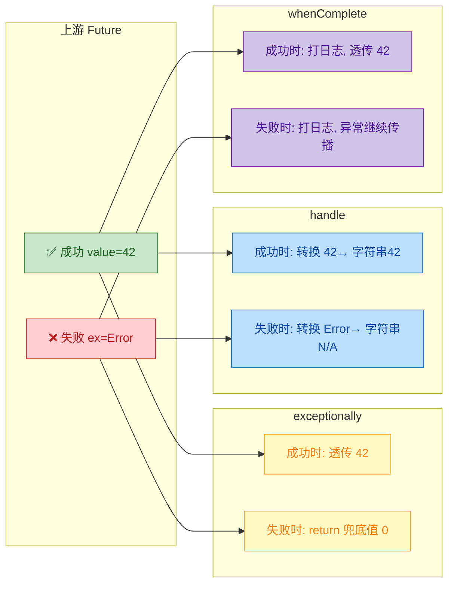
```mermaid
graph LR
    subgraph UP["上游 Future"]
        direction TB
        S["✅ 成功 value=42"]
        F["❌ 失败 ex=Error"]
    end

    subgraph EX["exceptionally"]
        direction TB
        EX_S["成功时: 透传 42"]
        EX_F["失败时: return 兜底值 0"]
    end

    subgraph HD["handle"]
        direction TB
        HD_S["成功时: 转换 42→ 字符串42"]
        HD_F["失败时: 转换 Error→ 字符串N/A"]
    end

    subgraph WC["whenComplete"]
        direction TB
        WC_S["成功时: 打日志, 透传 42"]
        WC_F["失败时: 打日志, 异常继续传播"]
    end

    S --> EX_S
    F --> EX_F
    S --> HD_S
    F --> HD_F
    S --> WC_S
    F --> WC_F

    classDef ok fill:#C8E6C9,stroke:#388E3C,color:#1B5E20
    classDef err fill:#FFCDD2,stroke:#D32F2F,color:#B71C1C
    classDef excep fill:#FFF9C4,stroke:#F9A825,color:#F57F17
    classDef handl fill:#BBDEFB,stroke:#1976D2,color:#0D47A1
    classDef whenC fill:#D1C4E9,stroke:#7B1FA2,color:#4A148C

    class S ok
    class F err
    class EX_S,EX_F excep
    class HD_S,HD_F handl
    class WC_S,WC_F whenC
```

**实战组合模式——`whenComplete` + `exceptionally` 的经典搭配：**

在真实项目中，最常见的做法是用 `whenComplete` 做监控/日志等"旁路"操作，再用 `exceptionally` 做异常恢复：

```java
CompletableFuture<String> result = queryUserService()
        // 第一层: whenComplete 做监控埋点（不改变结果）
        .whenComplete((value, ex) -> {
            // 上报接口调用指标到监控系统
            long cost = System.currentTimeMillis() - startTime;
            metrics.record("user_service", cost, ex == null);

            // 如果有异常，打印错误日志
            if (ex != null) {
                log.error("UserService 调用失败", ex.getCause());
            }
        })
        // 第二层: exceptionally 做异常恢复（改变结果）
        .exceptionally(ex -> {
            // 降级策略: 从本地缓存读取
            return localCache.getOrDefault("user", "Guest");
        })
        // 第三层: 正常业务转换
        .thenApply(userName -> buildGreeting(userName));
```

这种模式将 **观测 (Observability)** 和 **恢复 (Recovery)** 两个关注点清晰分离，是生产级代码中非常推荐的写法。

---

**📝 练习题**

以下代码的最终输出是什么？

```java
CompletableFuture<String> cf = CompletableFuture
    .supplyAsync(() -> {
        throw new RuntimeException("Oops");
    })
    .whenComplete((v, ex) -> {
        System.out.print("A");
    })
    .handle((v, ex) -> {
        System.out.print("B");
        return "Recovered";
    })
    .exceptionally(ex -> {
        System.out.print("C");
        return "Fallback";
    })
    .thenApply(s -> {
        System.out.print("D");
        return s;
    });

System.out.print(cf.join());
```

A. `ABCDFallback`

B. `ABDRecovered`

C. `ACDFallback`

D. `ABCDRecovered`


**【答案】** B

**【解析】**

执行流程逐步分析：

1. `supplyAsync` 抛出 `RuntimeException("Oops")`，Future 以异常完成。
2. `whenComplete`：无论成功失败都会执行，打印 **A**。由于 `whenComplete` 不改变结果，异常继续向下传播。
3. `handle`：无论成功失败都会执行，打印 **B**。`handle` 的回调中 `v = null, ex = CompletionException`。它返回了 `"Recovered"`，此时 Future **从异常恢复为正常完成**，值为 `"Recovered"`。
4. `exceptionally`：由于上一步 `handle` 已经将链路恢复为正常完成，`exceptionally` **不会触发**（它只在上游异常时才执行），直接透传 `"Recovered"`。所以 **C 不会打印**。
5. `thenApply`：上游正常完成，正常执行，打印 **D**，返回 `"Recovered"`。
6. `cf.join()` 返回 `"Recovered"`，打印 `Recovered`。

最终输出：`ABDRecovered`。

这道题的关键考点是：**`handle` 返回正常值后，后续的 `exceptionally` 不会触发**——因为从 `handle` 的视角来看，它已经产出了一个正常值，链路已经恢复。`exceptionally` 只对**它的直接上游**的异常状态做出反应。

---

## 超时控制（Java 9+）

在真实的分布式系统和微服务架构中，**超时（Timeout）** 是一个绝对不可忽视的防御性编程要素。一个没有超时保护的异步调用，就像一个没有安全阀的高压锅——一旦下游服务卡死或网络分区，调用线程（或后续链式回调）将无限期阻塞或悬挂，最终拖垮整个系统。

在 Java 8 时代，`CompletableFuture` 本身并不提供原生的超时机制。开发者需要借助外部手段来实现超时控制，例如：

- 手动创建一个 `ScheduledExecutorService`，在指定延迟后调用 `future.completeExceptionally(new TimeoutException())`。
- 借助第三方库（如 Guava 的 `Futures.withTimeout()`）。
- 用 `future.get(timeout, unit)` 进行阻塞式等待（但这违背了异步非阻塞的设计初衷）。

这些方式要么代码冗长，要么破坏了纯异步编程模型。因此，**Java 9 在 `CompletableFuture` 中正式引入了两个超时控制方法：`orTimeout` 和 `completeOnTimeout`**，让超时处理变得优雅而原生。

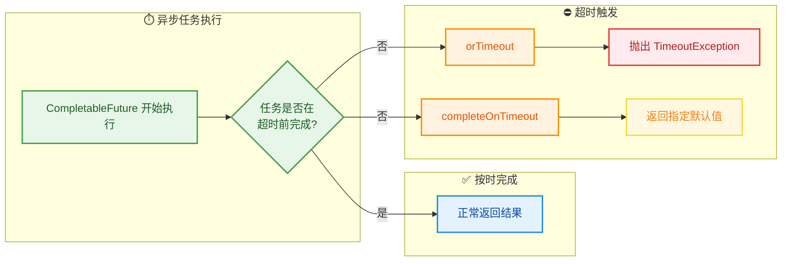
```mermaid
graph LR
    subgraph Async["⏱️ 异步任务执行"]
        direction TB
        A["CompletableFuture 开始执行"] --> B{"任务是否在<br/>超时前完成?"}
    end

    subgraph OnTime["✅ 按时完成"]
        direction TB
        C["正常返回结果"]
    end

    subgraph Timeout["⛔ 超时触发"]
        direction TB
        D["orTimeout"]
        E["completeOnTimeout"]
        D --> D1["抛出 TimeoutException"]
        E --> E1["返回指定默认值"]
    end

    B -- "是" --> C
    B -- "否" --> D
    B -- "否" --> E

    classDef asyncCls fill:#E8F5E9,stroke:#43A047,stroke-width:2px,color:#1B5E20
    classDef okCls fill:#E3F2FD,stroke:#1E88E5,stroke-width:2px,color:#0D47A1
    classDef toCls fill:#FFF3E0,stroke:#FB8C00,stroke-width:2px,color:#E65100
    classDef errCls fill:#FFEBEE,stroke:#E53935,stroke-width:2px,color:#B71C1C
    classDef defCls fill:#FFF8E1,stroke:#FDD835,stroke-width:2px,color:#F57F17

    class A,B asyncCls
    class C okCls
    class D,E toCls
    class D1 errCls
    class E1 defCls
```

### orTimeout

`orTimeout` 的语义非常明确：**如果这个 `CompletableFuture` 在指定的时间内没有完成（无论正常完成还是异常完成），就强制以 `TimeoutException` 将其异常完成（Exceptionally Complete）。**

**方法签名：**

```java
// 如果 this future 在给定时间内未完成，则以 TimeoutException 完成它
// 返回的仍是 this（同一个 CompletableFuture 实例）
public CompletableFuture<T> orTimeout(long timeout, TimeUnit unit)
```

关键要点：

- **破坏性超时**（Destructive Timeout）：超时后，原始 future 被标记为异常完成，后续所有依赖它的链式操作都会走异常路径（`exceptionally`、`handle` 等）。
- **返回 `this`**：它不创建新的 `CompletableFuture`，而是在原始对象上操作，这意味着所有已经注册在该 future 上的回调都会受到影响。
- **如果任务已经完成**，调用 `orTimeout` 不会产生任何影响，因为 `CompletableFuture` 的状态一旦确定就不可更改（immutable once resolved）。

**典型使用场景：** 调用一个关键的下游服务，如果它超时了，你认为这是一个 **不可恢复的错误**，必须让调用方知道并做异常处理。

```java
import java.util.concurrent.CompletableFuture;
import java.util.concurrent.TimeUnit;
import java.util.concurrent.TimeoutException;

public class OrTimeoutDemo {
    public static void main(String[] args) throws Exception {

        // 模拟一个耗时 5 秒的远程调用
        CompletableFuture<String> future = CompletableFuture.supplyAsync(() -> {
            try {
                Thread.sleep(5000); // 模拟长耗时操作（5秒）
            } catch (InterruptedException e) {
                Thread.currentThread().interrupt(); // 恢复中断状态
            }
            return "远程服务响应数据"; // 正常情况下应该返回的结果
        });

        // 设置 2 秒超时 —— 因为任务需要 5 秒，所以一定会超时
        future.orTimeout(2, TimeUnit.SECONDS);

        // 链式注册异常处理器
        // 当 orTimeout 触发后，future 以 TimeoutException 完成
        // 这里的 handle 可以捕获到该异常
        CompletableFuture<String> result = future.handle((value, throwable) -> {
            if (throwable != null) {
                // 判断根因是否为 TimeoutException
                // 注意：CompletableFuture 的异常通常被包装在 CompletionException 中
                Throwable cause = throwable.getCause(); // 解包获取真实异常
                if (cause instanceof TimeoutException) {
                    System.out.println("⏰ 请求超时！原因: " + cause.getMessage());
                    return "超时降级: 返回缓存数据"; // 降级策略
                }
                return "其他异常: " + cause.getMessage(); // 处理非超时异常
            }
            return value; // 正常返回
        });

        // 阻塞获取最终结果（此时 handle 已经处理了超时）
        System.out.println("最终结果: " + result.get());
        // 输出：
        // ⏰ 请求超时！原因: null
        // 最终结果: 超时降级: 返回缓存数据
    }
}
```

上面代码的执行时间线可以用下面的时序图来表示：

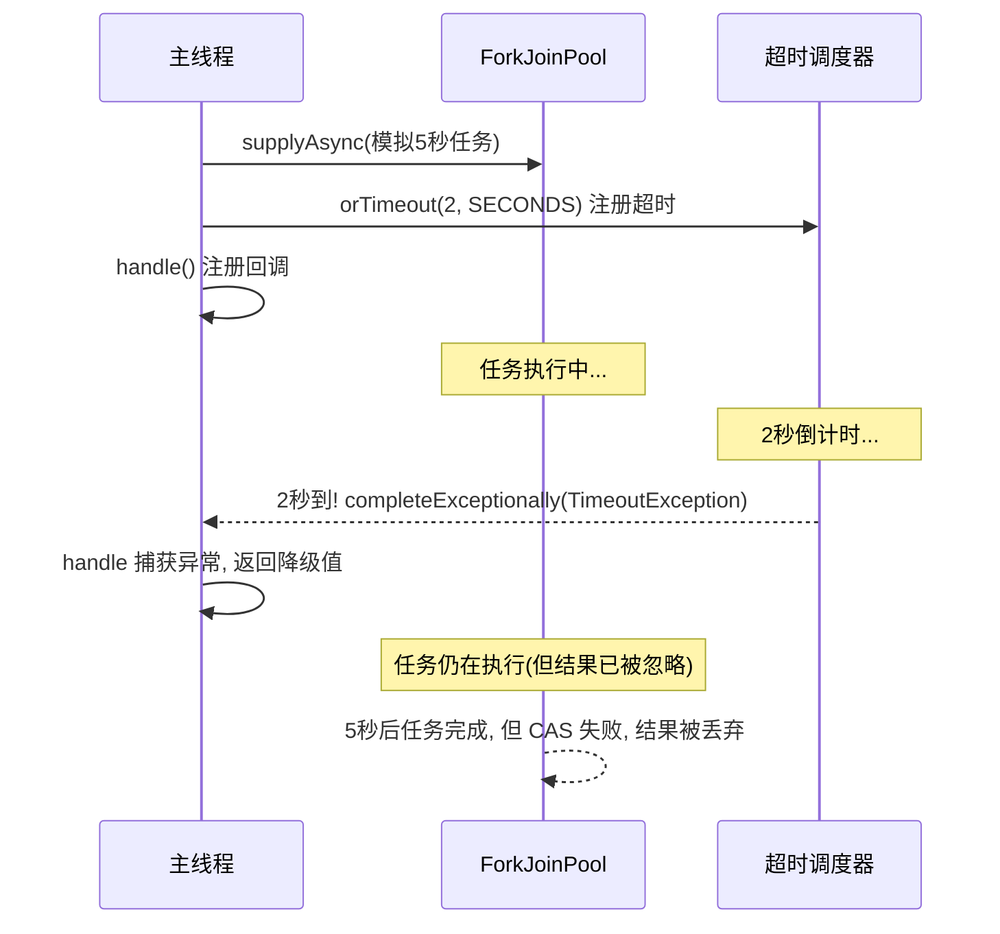
```mermaid
sequenceDiagram
    participant Main as 主线程
    participant Fork as ForkJoinPool
    participant Timer as 超时调度器

    Main->>Fork: supplyAsync(模拟5秒任务)
    Main->>Timer: orTimeout(2, SECONDS) 注册超时
    Main->>Main: handle() 注册回调

    Note over Fork: 任务执行中...
    Note over Timer: 2秒倒计时...

    Timer-->>Main: 2秒到! completeExceptionally(TimeoutException)
    Main->>Main: handle 捕获异常, 返回降级值

    Note over Fork: 任务仍在执行(但结果已被忽略)
    Fork-->>Fork: 5秒后任务完成, 但 CAS 失败, 结果被丢弃
```

这里有一个非常重要的细节需要深刻理解：**`orTimeout` 触发超时后，底层的异步任务并不会被自动取消或中断**。它只是把 `CompletableFuture` 的状态标记为异常完成。那个在 `ForkJoinPool` 中 sleep 5 秒的线程仍然会继续执行到结束——只是当它执行完毕尝试调用内部的 `complete(result)` 时，由于 future 已经被超时标记为完成状态，CAS（Compare-And-Swap）操作会失败，结果被静默丢弃。

如果你的任务持有昂贵的资源（数据库连接、网络 Socket 等），你可能需要额外的手段来真正取消底层操作，例如结合 `future.cancel(true)` 或者在任务内部检查中断标志。

### completeOnTimeout

`completeOnTimeout` 的语义与 `orTimeout` 形成鲜明对比：**如果这个 `CompletableFuture` 在指定的时间内没有完成，就用一个预设的默认值将其正常完成（Normally Complete），而不是抛出异常。**

**方法签名：**

```java
// 如果 this future 在给定时间内未完成，则以 defaultValue 正常完成它
// 返回的仍是 this（同一个 CompletableFuture 实例）
public CompletableFuture<T> completeOnTimeout(T value, long timeout, TimeUnit unit)
```

关键要点：

- **非破坏性超时**（Non-destructive / Graceful Timeout）：超时后，future 被正常完成，后续链式操作走的是 **正常路径**（`thenApply`、`thenAccept` 等），就好像任务本身返回了那个默认值一样。
- **同样返回 `this`**：与 `orTimeout` 一致。
- **适合「尽力而为 + 优雅降级」的场景**：比如获取用户个性化推荐，超时就返回热门推荐列表；查询实时汇率，超时就用上一次缓存的汇率。

**典型使用场景：** 调用一个 **非关键的增强型服务**（enrichment service），即使超时，也不应该影响主流程。

```java
import java.util.concurrent.CompletableFuture;
import java.util.concurrent.TimeUnit;

public class CompleteOnTimeoutDemo {
    public static void main(String[] args) throws Exception {

        // 模拟一个耗时 5 秒的"推荐服务"调用
        CompletableFuture<String> recommendFuture = CompletableFuture.supplyAsync(() -> {
            try {
                Thread.sleep(5000); // 推荐引擎响应很慢（5秒）
            } catch (InterruptedException e) {
                Thread.currentThread().interrupt(); // 恢复中断标志
            }
            return "个性化推荐: [Java并发编程实战, 深入理解JVM]"; // 理想情况下的推荐结果
        });

        // 设置 1 秒超时，超时后返回默认的热门推荐
        // 注意：这里传入的是一个 "降级默认值"
        recommendFuture.completeOnTimeout(
            "热门推荐(降级): [Effective Java, Clean Code]", // 默认值
            1,                                               // 超时时间
            TimeUnit.SECONDS                                 // 时间单位
        );

        // 后续的 thenApply 走的是正常路径，不需要异常处理！
        CompletableFuture<String> displayFuture = recommendFuture.thenApply(recommendation -> {
            // 无论是真实推荐还是降级推荐，这里的逻辑完全一致
            return "📚 为您推荐: " + recommendation; // 拼接展示文本
        });

        // 获取最终结果
        System.out.println(displayFuture.get());
        // 输出: 📚 为您推荐: 热门推荐(降级): [Effective Java, Clean Code]
    }
}
```

### orTimeout vs completeOnTimeout 对比

两者的核心区别可以用一张对比表清晰呈现：

| 维度 | `orTimeout` | `completeOnTimeout` |
|:---|:---|:---|
| **超时行为** | 以 `TimeoutException` 异常完成 | 以指定默认值正常完成 |
| **后续链路** | 走异常路径（`exceptionally` / `handle`） | 走正常路径（`thenApply` / `thenAccept`） |
| **语义** | "必须在时限内完成，否则就是错误" | "尽力而为，超时也能优雅降级" |
| **适用场景** | 关键服务调用（支付、扣款、鉴权） | 增强服务调用（推荐、日志上报、统计） |
| **返回值** | `CompletableFuture<T>`（this） | `CompletableFuture<T>`（this） |
| **引入版本** | Java 9 | Java 9 |

下面是一个在实际项目中非常常见的**组合使用模式**——主服务用 `orTimeout`（严格超时），辅助服务用 `completeOnTimeout`（柔性降级）：

```java
import java.util.concurrent.CompletableFuture;
import java.util.concurrent.TimeUnit;

public class CombinedTimeoutStrategy {

    public static void main(String[] args) throws Exception {

        // ======================== 主服务：查询订单（关键路径）========================
        CompletableFuture<String> orderFuture = CompletableFuture.supplyAsync(() -> {
            simulateDelay(800); // 模拟 800ms 响应时间
            return "订单#12345: MacBook Pro, ¥14999"; // 返回订单信息
        }).orTimeout(2, TimeUnit.SECONDS); // 严格 2 秒超时，超时即失败

        // ======================== 辅助服务：查询物流（非关键路径）========================
        CompletableFuture<String> logisticsFuture = CompletableFuture.supplyAsync(() -> {
            simulateDelay(5000); // 模拟物流服务很慢（5秒）
            return "物流: 已到达北京分拣中心"; // 理想情况的物流信息
        }).completeOnTimeout(
            "物流: 信息加载中，请稍后刷新", // 超时降级文案
            1, TimeUnit.SECONDS             // 柔性 1 秒超时
        );

        // ======================== 组合两个结果 ========================
        CompletableFuture<String> combinedFuture = orderFuture.thenCombine(
            logisticsFuture, // 等两个 future 都完成
            (order, logistics) -> {
                // 拼接最终页面展示信息
                return String.format("【订单详情页】\n%s\n%s", order, logistics);
            }
        );

        // 输出最终组合结果
        System.out.println(combinedFuture.get());
        // 输出:
        // 【订单详情页】
        // 订单#12345: MacBook Pro, ¥14999
        // 物流: 信息加载中，请稍后刷新    <-- 物流超时，走降级值
    }

    // 工具方法：模拟网络延迟
    private static void simulateDelay(long millis) {
        try {
            Thread.sleep(millis); // 让当前线程休眠指定毫秒数
        } catch (InterruptedException e) {
            Thread.currentThread().interrupt(); // 恢复中断状态
        }
    }
}
```

上面这个例子完美诠释了两种超时策略的协同工作：

```mermaid
graph LR
    subgraph Critical["🔴 关键路径 - 订单服务"]
        direction TB
        O1["supplyAsync<br/>查询订单"] --> O2["orTimeout 2s"]
        O2 --> O3{"800ms 内完成?"}
        O3 -- "是 ✅" --> O4["正常返回订单数据"]
        O3 -- "否 ❌" --> O5["TimeoutException!"]
    end

    subgraph Optional["🟢 非关键路径 - 物流服务"]
        direction TB
        L1["supplyAsync<br/>查询物流"] --> L2["completeOnTimeout 1s"]
        L2 --> L3{"1s 内完成?"}
        L3 -- "是 ✅" --> L4["返回真实物流信息"]
        L3 -- "否 ⏰" --> L5["返回降级文案"]
    end

    O4 --> Combine["thenCombine<br/>组合结果"]
    L4 --> Combine
    L5 --> Combine
    Combine --> Page["📄 订单详情页"]

    classDef criticalCls fill:#FFEBEE,stroke:#E53935,stroke-width:2px,color:#B71C1C
    classDef optionalCls fill:#E8F5E9,stroke:#43A047,stroke-width:2px,color:#1B5E20
    classDef okCls fill:#E3F2FD,stroke:#1E88E5,stroke-width:2px,color:#0D47A1
    classDef errCls fill:#FCE4EC,stroke:#C62828,stroke-width:2px,color:#B71C1C
    classDef degradeCls fill:#FFF8E1,stroke:#F9A825,stroke-width:2px,color:#F57F17
    classDef combineCls fill:#EDE7F6,stroke:#5E35B1,stroke-width:2px,color:#311B92
    classDef pageCls fill:#E0F7FA,stroke:#00ACC1,stroke-width:2px,color:#006064

    class O1,O2,O3 criticalCls
    class L1,L2,L3 optionalCls
    class O4,L4 okCls
    class O5 errCls
    class L5 degradeCls
    class Combine combineCls
    class Page pageCls
```

### 底层实现原理

理解 `orTimeout` 和 `completeOnTimeout` 的底层实现，有助于我们写出更高效的代码，也避免踩一些隐蔽的坑。

两个方法的底层都依赖于一个 **共享的、延迟调度线程**。在 JDK 9+ 的实现中，`CompletableFuture` 内部维护了一个静态的 `ScheduledThreadPoolExecutor`（通常称为 `Delayer`），它是一个 **daemon 线程**，专门负责处理超时调度：

```java
// JDK 源码中的简化逻辑（非完整源码，仅展示核心思路）

// CompletableFuture 内部的静态延迟调度器
static final class Delayer {
    // 单例的延迟调度线程池（守护线程，不阻止 JVM 退出）
    static final ScheduledThreadPoolExecutor delayer;
    static {
        delayer = new ScheduledThreadPoolExecutor(1,   // 仅 1 个核心线程
            new DaemonThreadFactory());                 // 创建守护线程
        delayer.setRemoveOnCancelPolicy(true);          // 取消时立即从队列移除，避免内存泄漏
    }
}

// orTimeout 的简化实现
public CompletableFuture<T> orTimeout(long timeout, TimeUnit unit) {
    if (unit == null) throw new NullPointerException();  // 参数校验
    if (!isDone()) {                                      // 如果尚未完成
        // 向延迟调度器提交一个定时任务
        // 到期后执行: completeExceptionally(new TimeoutException())
        ScheduledFuture<?> f = Delayer.delay(
            new Timeout(this),                            // Timeout 是一个 Runnable
            timeout, unit);
        // 如果 this future 正常完成了，就取消那个定时任务（避免资源浪费）
        whenComplete((result, ex) -> f.cancel(false));
    }
    return this;                                          // 返回自身以支持链式调用
}

// completeOnTimeout 的简化实现
public CompletableFuture<T> completeOnTimeout(T value, long timeout, TimeUnit unit) {
    if (unit == null) throw new NullPointerException();  // 参数校验
    if (!isDone()) {                                      // 如果尚未完成
        // 到期后执行: complete(value) —— 用默认值正常完成
        ScheduledFuture<?> f = Delayer.delay(
            new DelayedCompleter<>(this, value),          // DelayedCompleter 也是 Runnable
            timeout, unit);
        whenComplete((result, ex) -> f.cancel(false));   // 同样: 如果提前完成就取消定时器
    }
    return this;
}
```

从源码简化逻辑中可以看出几个关键设计：

1. **惰性检查**：如果调用 `orTimeout` / `completeOnTimeout` 时任务已经完成（`isDone()` 为 true），什么都不做，直接返回。
2. **自动清理**：通过 `whenComplete` 注册了一个回调——当 future 正常完成时，取消（cancel）那个延迟任务。这样不会浪费调度器资源。
3. **`setRemoveOnCancelPolicy(true)`**：这是一个非常重要的优化。默认情况下，`ScheduledThreadPoolExecutor` 取消一个任务后不会立即从内部队列中移除它（要等到执行时间到了才清理）。设置此策略后，取消即移除，**避免了大量短生命周期超时任务导致的内存泄漏问题**。
4. **守护线程**：`Delayer` 使用守护线程（daemon thread），不会阻止 JVM 关闭。

```mermaid
graph LR
    subgraph UserCode["🟢 用户代码"]
        direction TB
        A["future.orTimeout(2, SECONDS)"] --> B["future.completeOnTimeout<br/>val, 1, SECONDS"]
    end

    subgraph Delayer["🔵 Delayer 调度器"]
        direction TB
        C["ScheduledThreadPoolExecutor<br/>1 个守护线程"] --> D["延迟队列<br/>DelayedWorkQueue"]
        D --> E["Timeout 任务"]
        D --> F["DelayedCompleter 任务"]
    end

    subgraph CompletableFuture["🟠 CompletableFuture 状态机"]
        direction TB
        G["PENDING"] --> H{"超时先到?<br/>还是任务先完成?"}
        H -- "任务先完成" --> I["RESOLVED<br/>取消延迟任务"]
        H -- "超时先到" --> J["orTimeout: EXCEPTIONALLY<br/>TimeoutException"]
        H -- "超时先到" --> K["completeOnTimeout: RESOLVED<br/>默认值"]
    end

    A --> C
    B --> C
    E --> J
    F --> K

    classDef userCls fill:#E8F5E9,stroke:#43A047,stroke-width:2px,color:#1B5E20
    classDef delayerCls fill:#E3F2FD,stroke:#1E88E5,stroke-width:2px,color:#0D47A1
    classDef stateCls fill:#FFF3E0,stroke:#FB8C00,stroke-width:2px,color:#E65100
    classDef okState fill:#C8E6C9,stroke:#2E7D32,stroke-width:2px,color:#1B5E20
    classDef errState fill:#FFCDD2,stroke:#C62828,stroke-width:2px,color:#B71C1C
    classDef defState fill:#FFF9C4,stroke:#F9A825,stroke-width:2px,color:#F57F17

    class A,B userCls
    class C,D,E,F delayerCls
    class G,H stateCls
    class I okState
    class J errState
    class K defState
```

### 常见陷阱与最佳实践

**陷阱 1：超时不会中断底层线程**

这是最常被误解的一点。无论是 `orTimeout` 还是 `completeOnTimeout`，都 **只改变 `CompletableFuture` 的完成状态**，并不会中断（interrupt）正在执行任务的线程。如果你的任务持有数据库连接或正在做大量 I/O，即使 future 已经超时，底层资源依然被占用。

```java
// ❌ 错误认知：以为 orTimeout 会停止底层任务
CompletableFuture<String> future = CompletableFuture.supplyAsync(() -> {
    // 这个 HTTP 调用即使超时了也不会被中断！
    return httpClient.send(request); // 可能阻塞 30 秒
}).orTimeout(2, TimeUnit.SECONDS);

// ✅ 正确做法：配合可中断的 I/O 或设置 HTTP 客户端自身的超时
// 方案一：HttpClient 自带超时
HttpClient client = HttpClient.newBuilder()
    .connectTimeout(Duration.ofSeconds(2)) // 连接超时
    .build();                              // 客户端级别的超时控制

// 方案二：结合 cancel(true) 尝试中断
future.orTimeout(2, TimeUnit.SECONDS);
future.exceptionally(ex -> {
    future.cancel(true); // 尝试中断（但不保证成功）
    return "fallback";   // 返回降级值
});
```

**陷阱 2：在 `completeOnTimeout` 中传入可变对象**

```java
// ❌ 危险：多个超时的 future 共享同一个可变 List 作为默认值
List<String> defaultList = new ArrayList<>(); // 可变对象
defaultList.add("default_item");

CompletableFuture<List<String>> f1 = asyncCall1()
    .completeOnTimeout(defaultList, 1, TimeUnit.SECONDS); // 共享引用
CompletableFuture<List<String>> f2 = asyncCall2()
    .completeOnTimeout(defaultList, 1, TimeUnit.SECONDS); // 同一个引用！

// 如果后续代码修改了 f1.get()，f2.get() 也会受到影响！

// ✅ 安全做法：使用不可变对象或每次创建新实例
CompletableFuture<List<String>> f1Safe = asyncCall1()
    .completeOnTimeout(
        Collections.unmodifiableList(List.of("default_item")), // 不可变
        1, TimeUnit.SECONDS
    );
```

**陷阱 3：Java 8 项目中无法使用**

`orTimeout` 和 `completeOnTimeout` 是 Java 9 新增的 API。如果你的项目仍然运行在 Java 8 上，需要手动模拟：

```java
// Java 8 环境下手动实现 orTimeout 功能
public static <T> CompletableFuture<T> withTimeout(
        CompletableFuture<T> future,  // 原始 future
        long timeout,                  // 超时时间
        TimeUnit unit) {               // 时间单位

    // 创建一个专用的调度器（实际项目中应复用，不要每次 new）
    ScheduledExecutorService scheduler = Executors.newSingleThreadScheduledExecutor(r -> {
        Thread t = new Thread(r, "timeout-scheduler"); // 命名线程
        t.setDaemon(true);                              // 设为守护线程
        return t;
    });

    // 注册延迟任务：超时后用 TimeoutException 完成 future
    scheduler.schedule(() -> {
        if (!future.isDone()) { // 双重检查：仅在未完成时才触发
            future.completeExceptionally(new TimeoutException("超时: " + timeout + " " + unit));
        }
    }, timeout, unit);

    return future; // 返回原始 future
}
```

**最佳实践总结：**

| 实践 | 说明 |
|:---|:---|
| 对关键路径使用 `orTimeout` | 支付、鉴权等必须在时限内完成的操作 |
| 对非关键路径使用 `completeOnTimeout` | 推荐、统计等允许降级的辅助服务 |
| 配合 `handle` / `exceptionally` 处理超时异常 | `orTimeout` 抛出的 `TimeoutException` 需要被妥善捕获 |
| 底层 I/O 自身也要设超时 | 不要只依赖 `CompletableFuture` 的超时，HTTP/DB 连接也要设置 `connectTimeout` / `socketTimeout` |
| 默认值使用不可变对象 | `completeOnTimeout` 的默认值如果是集合或 DTO，务必使用不可变版本 |
| 合理设置超时阈值 | 太短导致频繁降级，太长失去保护意义。建议参考 P99 延迟 + 一定冗余 |

---

**📝 练习题**

以下代码的输出结果是什么？

```java
CompletableFuture<String> future = CompletableFuture.supplyAsync(() -> {
    try { Thread.sleep(3000); } catch (InterruptedException e) { }
    return "Hello";
}).completeOnTimeout("Timeout", 1, TimeUnit.SECONDS)
  .orTimeout(2, TimeUnit.SECONDS);

System.out.println(future.get());
```

A. `Hello`

B. `Timeout`

C. 抛出 `TimeoutException`

D. 抛出 `InterruptedException`


**【答案】** B

**【解析】** 任务需要 3 秒才能完成。`completeOnTimeout` 设置了 1 秒超时，`orTimeout` 设置了 2 秒超时。时间线如下：

- **0s**：任务开始执行。
- **1s**：`completeOnTimeout` 超时触发，将 future 以默认值 `"Timeout"` **正常完成**。此时 future 状态已确定（resolved），不可再更改。
- **2s**：`orTimeout` 的定时器到期，尝试以 `TimeoutException` 异常完成 future，但 future 已经在 1 秒时被正常完成了，CAS 失败，操作无效。
- **3s**：底层线程 sleep 结束，尝试 `complete("Hello")`，同样因为 future 已完成而失败。

因此，`future.get()` 返回的是 1 秒时由 `completeOnTimeout` 设置的默认值 `"Timeout"`。这道题的核心考点是：**`CompletableFuture` 一旦完成（无论正常还是异常），状态即不可更改，后续的 complete / completeExceptionally 调用都会静默失败。** 这也是为什么先注册的那个超时（1s < 2s）会"赢得"最终结果的控制权。

---

## 本章小结

`CompletableFuture` 是 Java 8 引入的异步编程核心组件，它实现了 `Future` 和 `CompletionStage` 两个接口，彻底改变了 Java 中编写异步、非阻塞代码的方式。相比传统的 `Future`（只能通过 `get()` 阻塞等待结果），`CompletableFuture` 提供了声明式的链式调用能力，让异步编程从"回调地狱"走向了"流水线编排"。

本章围绕 `CompletableFuture` 的完整 API 体系，从创建、转换、消费、组合、批量、异常处理到超时控制，构建了一套系统化的知识脉络。以下是对全章核心知识的浓缩回顾与横向对比。

---

### 全景 API 分类图

```mermaid
graph LR
    subgraph CREATE["🏗️ 创建"]
        direction TB
        C1["supplyAsync\n有返回值异步"]
        C2["runAsync\n无返回值异步"]
        C3["completedFuture\n已完成的CF"]
    end

    subgraph TRANSFORM["🔄 转换"]
        direction TB
        T1["thenApply\n同步 T→U"]
        T2["thenApplyAsync\n异步 T→U"]
        T3["thenCompose\n扁平化 T→CF〈U〉"]
    end

    subgraph CONSUME["📥 消费"]
        direction TB
        CO1["thenAccept\n消费结果 T→void"]
        CO2["thenRun\n无入参执行"]
    end

    subgraph COMBINE["🤝 组合"]
        direction TB
        CB1["thenCombine\n两者完成 合并结果"]
        CB2["thenAcceptBoth\n两者完成 消费结果"]
        CB3["runAfterBoth\n两者完成 执行动作"]
        CB4["applyToEither\n任一完成 转换结果"]
        CB5["acceptEither\n任一完成 消费结果"]
        CB6["runAfterEither\n任一完成 执行动作"]
    end

    subgraph BATCH["📦 批量"]
        direction TB
        B1["allOf\n全部完成"]
        B2["anyOf\n任一完成"]
    end

    subgraph ERROR["🛡️ 异常处理"]
        direction TB
        E1["exceptionally\n异常→默认值"]
        E2["handle\n成功/失败统一处理"]
        E3["whenComplete\n完成回调 不改变结果"]
    end

    subgraph TIMEOUT["⏱️ 超时 Java9+"]
        direction TB
        TM1["orTimeout\n超时抛异常"]
        TM2["completeOnTimeout\n超时给默认值"]
    end

    CREATE --> TRANSFORM --> CONSUME
    CONSUME --> COMBINE --> BATCH
    BATCH --> ERROR --> TIMEOUT

    classDef createStyle fill:#C8E6C9,stroke:#388E3C,color:#1B5E20
    classDef transformStyle fill:#BBDEFB,stroke:#1976D2,color:#0D47A1
    classDef consumeStyle fill:#D1C4E9,stroke:#7B1FA2,color:#4A148C
    classDef combineStyle fill:#FFE0B2,stroke:#F57C00,color:#E65100
    classDef batchStyle fill:#FFCCBC,stroke:#E64A19,color:#BF360C
    classDef errorStyle fill:#F8BBD0,stroke:#C2185B,color:#880E4F
    classDef timeoutStyle fill:#B2EBF2,stroke:#0097A7,color:#006064

    class C1,C2,C3 createStyle
    class T1,T2,T3 transformStyle
    class CO1,CO2 consumeStyle
    class CB1,CB2,CB3,CB4,CB5,CB6 combineStyle
    class B1,B2 batchStyle
    class E1,E2,E3 errorStyle
    class TM1,TM2 timeoutStyle
```

---

### 核心 API 速查对比表

下面这张表以 **"是否有入参 × 是否有返回值"** 两个维度，横向对比本章所有 API 的行为特征，帮助你在实战中快速选择正确的方法：

| 分类 | 方法 | 入参类型 | 返回类型 | 执行线程 | 典型场景 |
|------|------|----------|----------|----------|----------|
| **创建** | `supplyAsync` | 无 | `CF<T>` | ForkJoinPool / 自定义 | 异步获取数据 |
| | `runAsync` | 无 | `CF<Void>` | ForkJoinPool / 自定义 | 异步执行副作用 |
| | `completedFuture` | `T` | `CF<T>` | 当前线程 | 缓存命中 / 测试桩 |
| **转换** | `thenApply` | `T→U` | `CF<U>` | 上一阶段线程 | 同步数据映射 |
| | `thenApplyAsync` | `T→U` | `CF<U>` | ForkJoinPool / 自定义 | 异步数据映射 |
| | `thenCompose` | `T→CF<U>` | `CF<U>` | 上一阶段线程 | 链式异步调用(避免嵌套) |
| **消费** | `thenAccept` | `T→void` | `CF<Void>` | 上一阶段线程 | 消费结果(写日志/更新缓存) |
| | `thenRun` | 无 | `CF<Void>` | 上一阶段线程 | 不关心上游结果,执行通知 |
| **组合** | `thenCombine` | `(T, U)→V` | `CF<V>` | — | 合并两个独立结果 |
| | `thenAcceptBoth` | `(T, U)→void` | `CF<Void>` | — | 消费两个独立结果 |
| | `runAfterBoth` | 无 | `CF<Void>` | — | 两个都完成后触发动作 |
| | `applyToEither` | `T→U` | `CF<U>` | — | 竞速选快者 |
| | `acceptEither` | `T→void` | `CF<Void>` | — | 竞速消费 |
| | `runAfterEither` | 无 | `CF<Void>` | — | 任一完成触发动作 |
| **批量** | `allOf` | `CF<?>...` | `CF<Void>` | — | 并行聚合(fan-out/fan-in) |
| | `anyOf` | `CF<?>...` | `CF<Object>` | — | 最快响应 |
| **异常** | `exceptionally` | `Throwable→T` | `CF<T>` | — | 异常降级 |
| | `handle` | `(T, Throwable)→U` | `CF<U>` | — | 统一处理成功/失败 |
| | `whenComplete` | `(T, Throwable)→void` | `CF<T>` | — | 观察/日志(不变更结果) |
| **超时** | `orTimeout` | `long, TimeUnit` | `CF<T>` | — | 超时抛 `TimeoutException` |
| | `completeOnTimeout` | `T, long, TimeUnit` | `CF<T>` | — | 超时给默认值 |

---

### 方法选择决策流程

在实际编码时，面对一个异步任务场景，可以按照以下决策路径快速定位到最合适的方法：

```mermaid
graph LR
    subgraph STEP1["Step 1: 几个任务?"]
        direction TB
        Q1{"单个任务\n还是多个?"}
    end

    subgraph STEP2_SINGLE["Step 2a: 单任务行为"]
        direction TB
        Q2{"需要返回值?"}
        Q2Y["supplyAsync"]
        Q2N["runAsync"]
        Q2 -->|Yes| Q2Y
        Q2 -->|No| Q2N
    end

    subgraph STEP2_MULTI["Step 2b: 多任务关系"]
        direction TB
        Q3{"等全部还是任一?"}
        Q3ALL["allOf / thenCombine\n/ thenAcceptBoth"]
        Q3ANY["anyOf / applyToEither\n/ acceptEither"]
        Q3 -->|"全部完成"| Q3ALL
        Q3 -->|"任一完成"| Q3ANY
    end

    subgraph STEP3["Step 3: 后续处理"]
        direction TB
        Q4{"对结果做什么?"}
        Q4T["thenApply / thenCompose\n转换"]
        Q4C["thenAccept / thenRun\n消费"]
        Q4E["handle / exceptionally\n异常处理"]
        Q4 -->|"转换"| Q4T
        Q4 -->|"消费"| Q4C
        Q4 -->|"兜底"| Q4E
    end

    Q1 -->|"单个"| STEP2_SINGLE
    Q1 -->|"多个"| STEP2_MULTI
    STEP2_SINGLE --> STEP3
    STEP2_MULTI --> STEP3

    classDef stepStyle fill:#E8F5E9,stroke:#43A047,color:#1B5E20
    classDef decisionStyle fill:#E3F2FD,stroke:#1E88E5,color:#0D47A1
    classDef resultStyle fill:#FFF3E0,stroke:#FB8C00,color:#E65100
    classDef errorStyle fill:#FCE4EC,stroke:#D81B60,color:#880E4F

    class Q1,Q2,Q3,Q4 decisionStyle
    class Q2Y,Q2N stepStyle
    class Q3ALL,Q3ANY resultStyle
    class Q4T,Q4C stepStyle
    class Q4E errorStyle
```

---

### 异常处理三兄弟对比

异常处理是 `CompletableFuture` 中最容易混淆的部分，这里单独拉出做一个精准对比：

| 特性 | `exceptionally` | `handle` | `whenComplete` |
|------|:---:|:---:|:---:|
| 正常时执行 | ❌ | ✅ | ✅ |
| 异常时执行 | ✅ | ✅ | ✅ |
| 可以转换结果类型 | ❌ (只能返回 `T`) | ✅ (`T→U`) | ❌ |
| 会改变传播的结果 | ✅ (异常→正常值) | ✅ | ❌ (仅观察) |
| 类比 | `catch` 块 | `try-catch-finally` + 转换 | `finally` 观察者 |

> **记忆口诀**：`exceptionally` 只管异常、`handle` 全都管且能变、`whenComplete` 全都管但不能变。

---

### 六个实战黄金法则

经过本章的系统学习，这里提炼出在生产环境中使用 `CompletableFuture` 的六条黄金法则：

**法则一：永远指定自定义线程池**

```java
// ❌ 危险：使用公共 ForkJoinPool，可能被其他任务阻塞
CompletableFuture.supplyAsync(() -> queryDB());

// ✅ 推荐：使用业务专属线程池，实现资源隔离
ExecutorService dbPool = Executors.newFixedThreadPool(10);
CompletableFuture.supplyAsync(() -> queryDB(), dbPool);
```

默认的 `ForkJoinPool.commonPool()` 是全 JVM 共享的，线程数量等于 `CPU核数 - 1`。如果你的 IO 密集型任务（如数据库查询、HTTP 请求）占满了公共池，整个应用中所有使用 `parallelStream()` 和未指定线程池的 `CompletableFuture` 都会被拖慢。

**法则二：永远处理异常**

```java
// ❌ 异常被静默吞掉，排查问题时毫无头绪
CompletableFuture.supplyAsync(() -> riskyOperation());

// ✅ 至少 exceptionally 兜底，或用 handle 统一处理
CompletableFuture.supplyAsync(() -> riskyOperation())
    .exceptionally(ex -> {
        log.error("操作失败", ex);  // 至少记录日志
        return defaultValue;        // 返回降级值
    });
```

`CompletableFuture` 不会像线程的 `UncaughtExceptionHandler` 那样主动抛出异常。如果没有显式处理，异常会被静默包装在 `CompletionException` 中，直到你调用 `get()` 或 `join()` 才会暴露——但在纯异步链中你可能永远不会调用它们。

**法则三：区分 `thenApply` 和 `thenCompose`**

```java
// 如果转换函数返回的是普通值 → thenApply
cf.thenApply(id -> "User-" + id);  // CF<String>

// 如果转换函数返回的是另一个 CF → thenCompose
cf.thenCompose(id -> queryUserAsync(id));  // CF<User>，不是 CF<CF<User>>
```

这和 Stream API 中 `map` 与 `flatMap` 的关系完全一致。选错了会导致类型嵌套 `CF<CF<T>>`，后续链式调用将无法正常工作。

**法则四：`allOf` 配合手动收集结果**

```java
// allOf 返回 CF<Void>，不会自动收集子任务结果
// 必须持有每个子任务的引用，在 allOf 完成后手动 join
List<CompletableFuture<String>> futures = urls.stream()
    .map(url -> CompletableFuture.supplyAsync(() -> fetch(url), httpPool))
    .collect(Collectors.toList());

CompletableFuture.allOf(futures.toArray(new CompletableFuture[0]))
    .thenApply(v -> futures.stream()
        .map(CompletableFuture::join)  // 此时 join 不会阻塞，因为 allOf 已保证全部完成
        .collect(Collectors.toList()));
```

**法则五：超时控制不可缺少（Java 9+）**

```java
// 任何涉及外部调用的 CF 都必须有超时保护
CompletableFuture.supplyAsync(() -> callExternalService(), pool)
    .orTimeout(3, TimeUnit.SECONDS)          // 硬超时：3秒后抛 TimeoutException
    .exceptionally(ex -> fallbackValue);     // 降级处理
    
// 或者使用更柔和的方式
CompletableFuture.supplyAsync(() -> callExternalService(), pool)
    .completeOnTimeout(defaultValue, 3, TimeUnit.SECONDS);  // 软超时：3秒后给默认值
```

没有超时的异步调用就像一颗"定时炸弹"——一个慢响应可以让线程池资源耗尽，引发级联故障（Cascading Failure）。

**法则六：避免在异步链中使用 `get()`，优先使用 `join()`**

```java
// ❌ get() 抛 checked exception，在 lambda 中需要 try-catch，代码丑陋
cf.thenApply(v -> {
    try {
        return anotherCf.get();  // 编译器强制处理 InterruptedException
    } catch (Exception e) {
        throw new RuntimeException(e);
    }
});

// ✅ join() 抛 unchecked CompletionException，lambda 中更简洁
cf.thenApply(v -> anotherCf.join());
```

`join()` 和 `get()` 功能一致，但 `join()` 抛的是 `CompletionException`（unchecked），在链式 lambda 中不需要显式捕获，代码更清晰。

---

### 整体知识脉络回顾

```mermaid
graph LR
    subgraph FOUNDATION["🧱 基础"]
        direction TB
        F1["CompletableFuture 概述\nFuture + CompletionStage"]
        F2["创建方式\nsupplyAsync / runAsync\n/ completedFuture"]
    end

    subgraph PIPELINE["⚙️ 流水线操作"]
        direction TB
        P1["转换 Transform\nthenApply / thenCompose"]
        P2["消费 Consume\nthenAccept / thenRun"]
    end

    subgraph ORCHESTRATE["🎼 任务编排"]
        direction TB
        O1["组合 Combine\nthenCombine / Either系列"]
        O2["批量 Batch\nallOf / anyOf"]
    end

    subgraph RESILIENCE["🛡️ 容错与韧性"]
        direction TB
        R1["异常处理\nexceptionally / handle\n/ whenComplete"]
        R2["超时控制 Java9+\norTimeout\n/ completeOnTimeout"]
    end

    FOUNDATION -->|"任务创建后"| PIPELINE
    PIPELINE -->|"多任务协作"| ORCHESTRATE
    ORCHESTRATE -->|"保障稳定性"| RESILIENCE

    classDef foundStyle fill:#C8E6C9,stroke:#2E7D32,color:#1B5E20
    classDef pipeStyle fill:#BBDEFB,stroke:#1565C0,color:#0D47A1
    classDef orchStyle fill:#FFE0B2,stroke:#EF6C00,color:#E65100
    classDef resStyle fill:#F8BBD0,stroke:#AD1457,color:#880E4F

    class F1,F2 foundStyle
    class P1,P2 pipeStyle
    class O1,O2 orchStyle
    class R1,R2 resStyle
```

学习 `CompletableFuture` 的正确路径是：**先会创建，再会串联，然后会编排，最后会兜底**。这四个层次对应了从"能用"到"用好"到"用稳"的进阶过程。

---

### 与传统方案的终极对比

| 维度 | `Thread` + `Runnable` | `Future` + `Callable` | `CompletableFuture` |
|------|:---:|:---:|:---:|
| 异步执行 | ✅ | ✅ | ✅ |
| 获取返回值 | ❌ | ✅ (阻塞 `get()`) | ✅ (阻塞 + 回调) |
| 链式处理 | ❌ | ❌ | ✅ |
| 组合多任务 | 手动 `join` | 手动循环 | `allOf` / `thenCombine` |
| 异常处理 | `try-catch` | `ExecutionException` | `exceptionally` / `handle` |
| 超时控制 | `Thread.join(ms)` | `get(timeout)` | `orTimeout` / `completeOnTimeout` |
| 代码可读性 | ⭐ | ⭐⭐ | ⭐⭐⭐⭐ |
| 适合场景 | 简单后台任务 | 单个异步结果 | 复杂异步编排 |

`CompletableFuture` 不是银弹，但它是目前 Java 标准库中异步编程的最优解。对于更复杂的响应式流场景（如背压 Backpressure），则需要进一步学习 Project Reactor 或 RxJava，它们在 `CompletableFuture` 的理念基础上提供了更强大的流式处理能力。

---

**📝 练习题**

某电商系统需要并行查询"商品详情"、"用户评价"和"推荐列表"三个微服务，全部返回后组装成页面数据。若任一服务超过 2 秒未响应，则使用默认值降级。以下代码片段中，哪一种写法是**最佳实践**？

A.
```java
CompletableFuture<Detail> f1 = CompletableFuture.supplyAsync(() -> getDetail());
CompletableFuture<Review> f2 = CompletableFuture.supplyAsync(() -> getReview());
CompletableFuture<Recommend> f3 = CompletableFuture.supplyAsync(() -> getRecommend());
Detail d = f1.get(2, TimeUnit.SECONDS);
Review r = f2.get(2, TimeUnit.SECONDS);
Recommend rec = f3.get(2, TimeUnit.SECONDS);
return new PageData(d, r, rec);
```

B.
```java
ExecutorService pool = Executors.newFixedThreadPool(10);
CompletableFuture<Detail> f1 = CompletableFuture.supplyAsync(() -> getDetail(), pool)
    .completeOnTimeout(defaultDetail, 2, TimeUnit.SECONDS);
CompletableFuture<Review> f2 = CompletableFuture.supplyAsync(() -> getReview(), pool)
    .completeOnTimeout(defaultReview, 2, TimeUnit.SECONDS);
CompletableFuture<Recommend> f3 = CompletableFuture.supplyAsync(() -> getRecommend(), pool)
    .completeOnTimeout(defaultRecommend, 2, TimeUnit.SECONDS);
CompletableFuture.allOf(f1, f2, f3)
    .thenApply(v -> new PageData(f1.join(), f2.join(), f3.join()));
```

C.
```java
CompletableFuture<Detail> f1 = CompletableFuture.supplyAsync(() -> getDetail())
    .orTimeout(2, TimeUnit.SECONDS);
CompletableFuture<Review> f2 = CompletableFuture.supplyAsync(() -> getReview())
    .orTimeout(2, TimeUnit.SECONDS);
CompletableFuture<Recommend> f3 = CompletableFuture.supplyAsync(() -> getRecommend())
    .orTimeout(2, TimeUnit.SECONDS);
CompletableFuture.allOf(f1, f2, f3)
    .thenApply(v -> new PageData(f1.join(), f2.join(), f3.join()));
```

D.
```java
Detail d = CompletableFuture.supplyAsync(() -> getDetail()).join();
Review r = CompletableFuture.supplyAsync(() -> getReview()).join();
Recommend rec = CompletableFuture.supplyAsync(() -> getRecommend()).join();
return new PageData(d, r, rec);
```


**【答案】** B

**【解析】**

本题考查 `CompletableFuture` 在生产环境中的综合最佳实践，涉及四个关键维度：

1. **自定义线程池**：选项 A、C、D 都使用了默认的 `ForkJoinPool.commonPool()`，违反了"**法则一：永远指定自定义线程池**"。微服务调用属于 IO 密集型操作，使用公共池会影响整个 JVM 中其他并行任务。**只有 B 传入了自定义 `pool`**。

2. **超时降级策略**：题目明确要求"超时使用默认值降级"。选项 A 使用 `get(timeout)` 会在超时时抛出 `TimeoutException`，需要额外 try-catch 处理，且如果第一个 `get` 阻塞了 2 秒，后面的 `get` 的有效等待时间会被压缩——三个 `get` 是串行阻塞的，总超时可能达到 6 秒。选项 C 使用 `orTimeout` 超时后抛异常，但没有 `exceptionally` 兜底，`allOf` 会得到一个异常完成的 Future，无法组装页面。**只有 B 使用 `completeOnTimeout` 实现了柔性降级**，超时后自动填入默认值，后续 `allOf` + `join` 可以正常工作。

3. **真正的并行**：选项 D 使用了 `join()` 代替 `get()` 看似更好，但 `join()` 同样是阻塞调用。三个 `join()` 串行执行，第二个任务要等第一个 `join` 返回后才开始等待，本质上丧失了并行优势，总耗时为三个任务耗时之和。选项 B 先启动三个异步任务，再通过 `allOf` 统一等待，总耗时为三个任务中最慢的那一个。

4. **非阻塞链式处理**：选项 B 全程使用 `thenApply` 链式处理，不在主线程阻塞，符合异步编程的核心理念。`allOf` 保证三个 CF 都已完成后，`join()` 只是取值操作，不会实际阻塞。

综上，选项 B 在线程池隔离、柔性超时降级、真并行、非阻塞四个维度上都做到了最佳实践，是正确答案。

---

