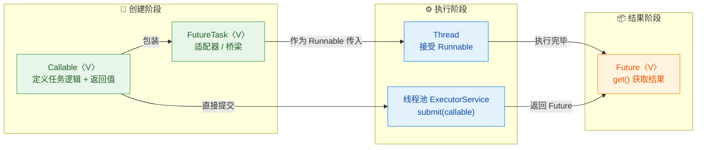
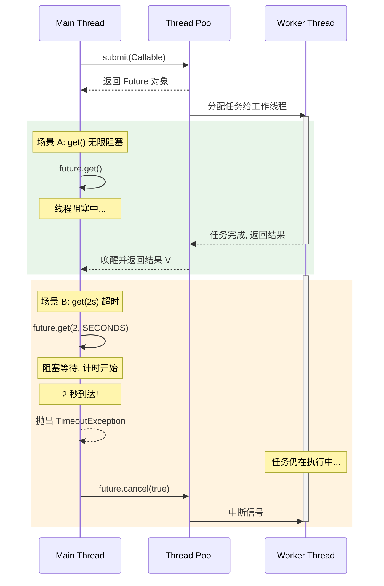
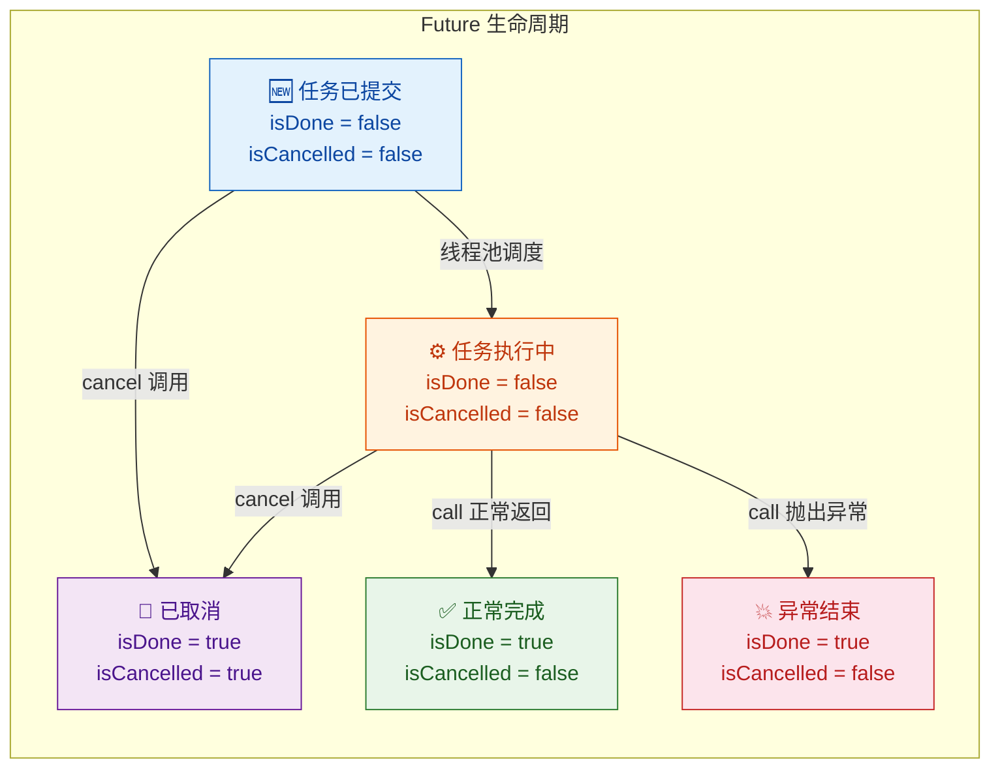
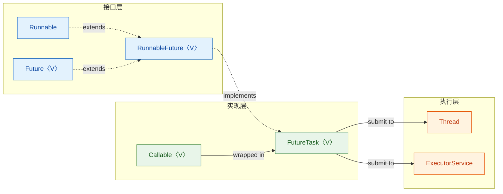
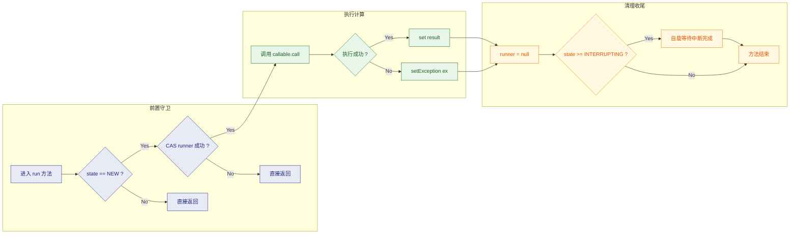
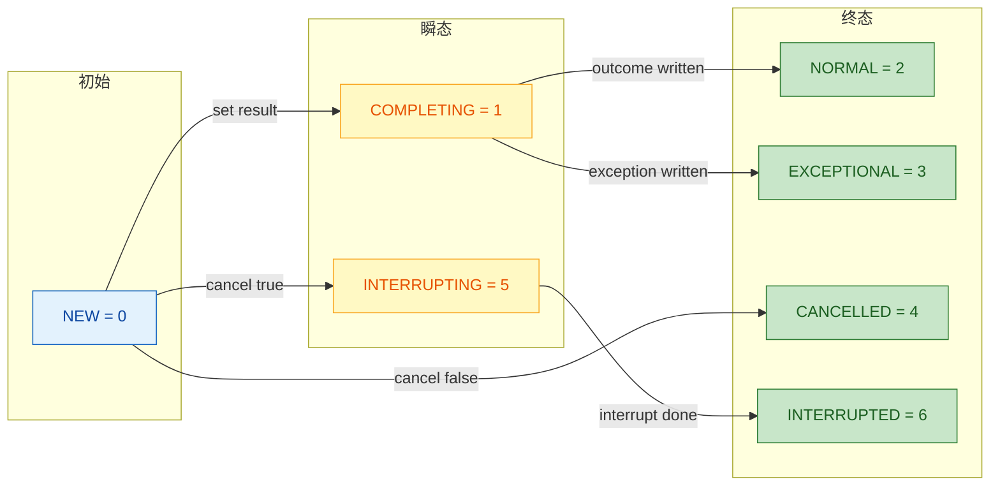
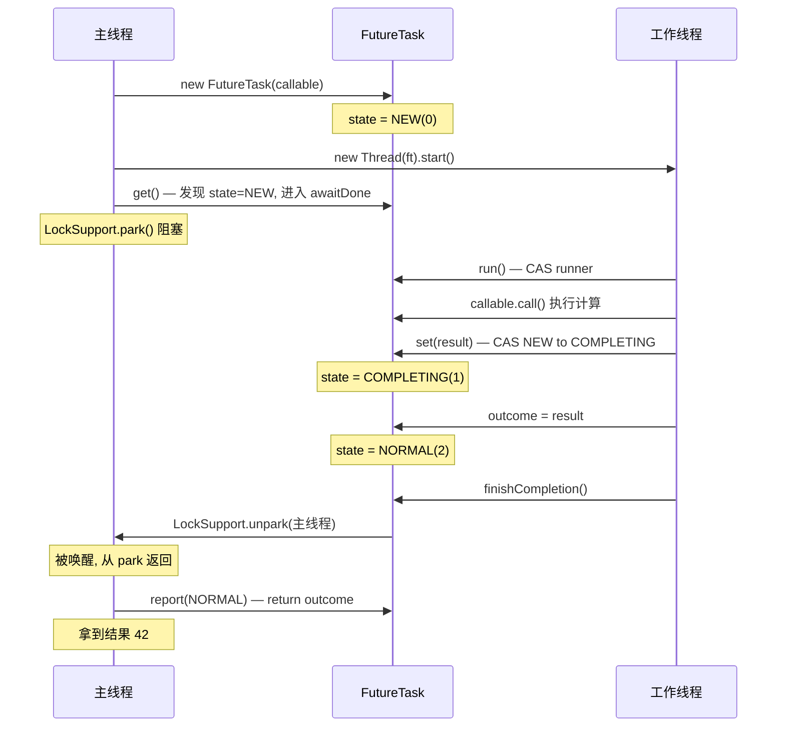
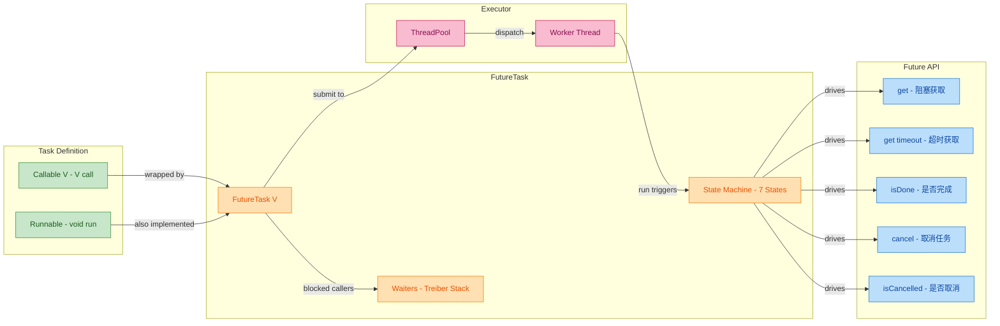

---

# Future机制 ⭐

---

## Callable 接口（有返回值）

### 从 Runnable 的缺陷说起

在 Java 并发编程的早期（JDK 1.0），我们只有 `Runnable` 接口可以用来定义线程任务。它的签名非常简单：

```java
@FunctionalInterface
public interface Runnable {
    void run(); // 返回值为 void，无法返回结果
}
```

这个设计存在 **两个致命缺陷**：

1. **无法返回执行结果**：`run()` 的返回类型是 `void`，线程执行完毕后，调用者无法直接拿到计算结果。开发者不得不借助共享变量（Shared Variable）+ 手动同步（Manual Synchronization）来传递结果，代码冗长且容易出错。
2. **无法抛出受检异常**（Checked Exception）：`run()` 方法签名中没有 `throws` 声明，这意味着任务内部如果发生了 `IOException`、`SQLException` 等受检异常，你必须在 `run()` 内部用 `try-catch` 吞掉它，无法将异常传播给调用者。

来看一个典型的"痛点"场景——你需要在子线程中计算一个结果并返回给主线程：

```java
public class RunnablePainPoint {
    // 被迫使用共享变量来"搬运"结果
    private static volatile int result = 0; // volatile 保证可见性

    public static void main(String[] args) throws InterruptedException {
        Thread t = new Thread(() -> {
            // 模拟耗时计算
            int sum = 0;                   // 局部变量，无法直接返回
            for (int i = 1; i <= 100; i++) {
                sum += i;                  // 累加 1 到 100
            }
            result = sum;                  // 只能写入共享变量
        });

        t.start();    // 启动子线程
        t.join();     // 主线程阻塞等待子线程执行完毕（手动同步）

        // 此时才能安全地读取 result
        System.out.println("计算结果: " + result); // 输出: 计算结果: 5050
    }
}
```

上述写法的问题显而易见：**共享变量 + `join()` 的组合**既不优雅也不安全（如果忘了 `join` 就读取 `result`，可能读到初始值 0）。这就是 `Callable` 诞生的背景。

---

### Callable 接口的定义与核心设计

JDK 1.5（Java 5）引入了 `java.util.concurrent.Callable<V>` 接口，它是 `Runnable` 的 **"升级版"**，专门为"有返回值、可抛异常"的任务场景而设计。源码如下：

```java
@FunctionalInterface                          // 函数式接口，可用 Lambda 表达式
public interface Callable<V> {                // V 是泛型参数，代表返回值类型
    V call() throws Exception;               // 核心方法：有返回值 V，可抛受检异常
}
```

我们来逐一拆解这段定义中的设计精髓：

| 设计要素 | Runnable | Callable\<V\> | 设计意图 |
|---------|----------|--------------|---------|
| 核心方法 | `run()` | `call()` | 语义区分：call 暗示"调用并获取结果" |
| 返回值 | `void` | `V`（泛型） | 允许任务产出结果 |
| 异常声明 | 无 | `throws Exception` | 允许向调用者传播受检异常 |
| 引入版本 | JDK 1.0 | JDK 1.5 | 并发框架升级的一部分 |
| 函数式接口 | ✅ | ✅ | 均可用 Lambda 表达式 |

**泛型参数 `V`** 的设计让 `Callable` 具有极强的灵活性——你可以返回 `String`、`Integer`、自定义对象，甚至 `List<Map<String, Object>>` 等复杂类型。编译器会在编译期帮你做类型检查（Type Safety），避免运行时强制转换。

---

### Callable 的基本使用

#### 最简示例：用 Callable 替代 Runnable

```java
import java.util.concurrent.Callable;
import java.util.concurrent.ExecutionException;
import java.util.concurrent.FutureTask;

public class CallableBasicDemo {
    public static void main(String[] args) throws ExecutionException, InterruptedException {

        // 1. 创建 Callable 实例（使用 Lambda，泛型指定返回 Integer）
        Callable<Integer> task = () -> {
            int sum = 0;                        // 定义局部累加变量
            for (int i = 1; i <= 100; i++) {
                sum += i;                       // 累加 1 到 100
            }
            return sum;                         // 直接返回结果，无需共享变量！
        };

        // 2. 用 FutureTask 包装 Callable（FutureTask 实现了 Runnable 接口）
        FutureTask<Integer> futureTask = new FutureTask<>(task);

        // 3. 将 FutureTask 交给 Thread 执行
        Thread thread = new Thread(futureTask); // FutureTask 是 Runnable，可以直接传入
        thread.start();                         // 启动线程

        // 4. 获取结果（阻塞直到任务完成）
        Integer result = futureTask.get();      // 类型安全，直接拿到 Integer
        System.out.println("计算结果: " + result); // 输出: 计算结果: 5050
    }
}
```

注意这里的"桥梁模式"：**`Thread` 构造器只接受 `Runnable`**，不直接接受 `Callable`。所以需要一个中间适配器——`FutureTask`，它同时实现了 `Runnable` 和 `Future` 接口，后续章节会详细展开。

整个调用链路可以用下图表示：



---

#### 配合线程池使用（推荐方式）

在实际生产环境中，我们几乎不会手动 `new Thread()`，而是通过 **线程池**（ExecutorService）来提交 `Callable` 任务。线程池的 `submit()` 方法原生支持 `Callable`，并直接返回一个 `Future` 对象：

```java
import java.util.concurrent.*;

public class CallableWithExecutorDemo {
    public static void main(String[] args) throws ExecutionException, InterruptedException {

        // 1. 创建固定大小的线程池（3 个核心线程）
        ExecutorService executor = Executors.newFixedThreadPool(3);

        // 2. 提交 Callable 任务，submit() 返回 Future<String>
        Future<String> future = executor.submit(() -> {
            Thread.sleep(2000);                       // 模拟耗时操作（2 秒）
            return "Hello from Callable!";            // 返回字符串结果
        });

        System.out.println("任务已提交，主线程继续做其他事...");

        // 3. 在需要结果时调用 get()（此处会阻塞直到任务完成）
        String result = future.get();                 // 阻塞等待结果
        System.out.println("获取结果: " + result);     // 输出: Hello from Callable!

        // 4. 关闭线程池（优雅关闭）
        executor.shutdown();                          // 不再接受新任务，等待已提交任务完成
    }
}
```

对比手动创建 `FutureTask` + `Thread`，线程池方式有以下优势：

- **资源复用**：线程可被重复利用，避免频繁创建/销毁的开销
- **统一管理**：线程池提供任务队列、拒绝策略、监控等企业级能力
- **API 简洁**：`submit(Callable)` 一步到位，无需手动包装 `FutureTask`

---

### Callable 的异常传播机制

`Callable` 的另一个核心优势是 **异常透传**（Exception Propagation）。当 `call()` 方法内部抛出异常时，异常不会丢失，而是被封装在 `Future` 内部，在调用 `get()` 时以 `ExecutionException` 的形式重新抛出：

```java
import java.util.concurrent.*;

public class CallableExceptionDemo {
    public static void main(String[] args) {

        ExecutorService executor = Executors.newSingleThreadExecutor();

        // 提交一个会抛出异常的 Callable 任务
        Future<String> future = executor.submit(() -> {
            if (true) {
                // 模拟业务异常（受检异常）
                throw new Exception("数据库连接失败！");
            }
            return "success";                         // 这行永远不会执行
        });

        try {
            String result = future.get();             // 调用 get() 时异常会被重新抛出
        } catch (ExecutionException e) {
            // ExecutionException 包装了原始异常
            Throwable cause = e.getCause();           // 获取原始异常
            System.out.println("原始异常类型: " + cause.getClass().getName());
            // 输出: 原始异常类型: java.lang.Exception
            System.out.println("原始异常信息: " + cause.getMessage());
            // 输出: 原始异常信息: 数据库连接失败！
        } catch (InterruptedException e) {
            Thread.currentThread().interrupt();        // 恢复中断状态（最佳实践）
        } finally {
            executor.shutdown();                       // 确保线程池被关闭
        }
    }
}
```

异常传播的完整链路如下：


这个机制的本质是：**异常被存储为任务结果的一部分**，`FutureTask` 内部用一个 `Object outcome` 字段同时承载正常结果和异常对象，通过状态机（State Machine）来区分二者。这个状态机的细节将在 `FutureTask` 章节深入讲解。

---

### Callable 与 Runnable 的互转

在某些场景下，你可能需要在两者之间做转换。JDK 提供了 `Executors` 工具类来完成这件事：

```java
import java.util.concurrent.*;

public class ConversionDemo {
    public static void main(String[] args) throws Exception {

        // ====== Runnable → Callable ======
        Runnable runnable = () -> System.out.println("I am Runnable");

        // 方式1：转换后返回 null（因为 Runnable 没有返回值）
        Callable<Object> callable1 = Executors.callable(runnable);
        Object result1 = callable1.call();             // result1 == null

        // 方式2：转换时指定一个预设的返回值
        Callable<String> callable2 = Executors.callable(runnable, "DONE");
        String result2 = callable2.call();             // result2 == "DONE"

        // ====== Callable → Runnable ======
        // JDK 没有直接提供，但可以通过 FutureTask 间接实现
        Callable<Integer> callable = () -> 42;         // 一个 Callable 任务
        FutureTask<Integer> futureTask = new FutureTask<>(callable);
        // futureTask 本身就是 Runnable，可以传给 Thread
        new Thread(futureTask).start();                // 作为 Runnable 使用
        System.out.println(futureTask.get());          // 同时作为 Future 获取结果: 42
    }
}
```

`Executors.callable(Runnable, T result)` 的底层实现非常简洁，它使用了一个名为 `RunnableAdapter` 的内部类：

```java
// JDK 源码简化版 —— Executors.RunnableAdapter
static final class RunnableAdapter<T> implements Callable<T> {
    final Runnable task;     // 持有原始 Runnable
    final T result;          // 预设的返回值

    RunnableAdapter(Runnable task, T result) {
        this.task = task;    // 保存 Runnable 引用
        this.result = result;// 保存预设返回值
    }

    public T call() {
        task.run();          // 委托给 Runnable 的 run() 方法执行
        return result;       // 执行完毕后返回预设值
    }
}
```

本质上是一个 **适配器模式**（Adapter Pattern）的经典应用——将 `Runnable` 的 `run()` 适配为 `Callable` 的 `call()`。

---

### 实战场景：多任务并行计算

`Callable` 最常见的使用场景是 **并行计算**（Parallel Computation）——将一个大任务拆分为多个子任务，提交到线程池并行执行，最后汇总结果：

```java
import java.util.*;
import java.util.concurrent.*;

public class ParallelComputeDemo {
    public static void main(String[] args) throws ExecutionException, InterruptedException {

        ExecutorService executor = Executors.newFixedThreadPool(4);  // 4 线程的线程池

        // 创建 4 个子任务，每个负责计算一段区间的累加和
        List<Future<Long>> futures = new ArrayList<>();              // 存放所有 Future

        int[][] ranges = {{1, 25}, {26, 50}, {51, 75}, {76, 100}};  // 4 个区间

        for (int[] range : ranges) {
            int start = range[0];                                    // 区间起点
            int end = range[1];                                      // 区间终点

            // 每个 Callable 负责计算一段区间的和
            Future<Long> future = executor.submit(() -> {
                long sum = 0;                                        // 局部累加器
                for (int i = start; i <= end; i++) {
                    sum += i;                                        // 累加区间内每个数
                }
                System.out.println(Thread.currentThread().getName()
                        + " 计算 [" + start + "," + end + "] = " + sum);
                return sum;                                          // 返回区间和
            });

            futures.add(future);                                     // 收集 Future
        }

        // 汇总所有子任务的结果
        long totalSum = 0;
        for (Future<Long> f : futures) {
            totalSum += f.get();          // 逐个获取结果（若未完成则阻塞等待）
        }

        System.out.println("最终结果: " + totalSum);  // 输出: 最终结果: 5050

        executor.shutdown();              // 关闭线程池
    }
}
```

运行输出类似：
```text
pool-1-thread-1 计算 [1,25] = 325
pool-1-thread-3 计算 [51,75] = 945
pool-1-thread-2 计算 [26,50] = 950
pool-1-thread-4 计算 [76,100] = 2830
最终结果: 5050
```

这个模式被称为 **Fork/Join 思想的手动实现**——先分（Fork）后合（Join），`Callable` + `Future` 是实现这一模式的基础设施。

---

### 关键注意事项

1. **Callable 不能直接交给 Thread**：`Thread(Runnable target)` 的构造器只接受 `Runnable`，你必须通过 `FutureTask` 做一次包装，或者使用线程池的 `submit()` 方法。

2. **泛型擦除**：`Callable<V>` 的泛型 `V` 在运行时会被擦除（Type Erasure），但在编译期提供了强类型检查，避免了手动 `cast` 的风险。

3. **Lambda 与 Callable 的歧义**：当方法同时重载了 `Runnable` 和 `Callable` 参数时，Lambda 表达式可能产生歧义。解决方式是显式声明类型：

```java
ExecutorService executor = Executors.newSingleThreadExecutor();

// 编译器可以正确推断：因为 Lambda 有 return 语句 → Callable
executor.submit(() -> {
    return "result";      // 有 return，编译器推断为 Callable<String>
});

// 如果 Lambda 没有 return，编译器默认推断为 Runnable
executor.submit(() -> {
    System.out.println("no return");  // 无 return，推断为 Runnable
});

// 若存在歧义，可显式强转
executor.submit((Callable<String>) () -> "explicit");  // 显式指定为 Callable

executor.shutdown();
```

4. **不要忽略 `Future.get()` 的异常**：如果你提交了 `Callable` 却从不调用 `get()`，那么任务中抛出的异常会被静默吞掉（Silently Swallowed），这是并发编程中常见的 bug 来源。

---

📝 **练习题**

以下关于 `Callable` 接口的描述，哪一项是 **错误的**？

A. `Callable` 的 `call()` 方法可以返回一个泛型类型的值，而 `Runnable` 的 `run()` 方法返回 `void`

B. `Callable` 的 `call()` 方法声明了 `throws Exception`，因此可以向调用方传播受检异常

C. `Callable` 可以直接作为参数传入 `Thread` 的构造方法来创建线程

D. `Callable` 是 JDK 1.5 引入的，属于 `java.util.concurrent` 包


【答案】C

【解析】`Thread` 的构造方法只接受 `Runnable` 类型的参数，**不接受 `Callable`**。如果想让 `Thread` 执行一个 `Callable` 任务，必须先将其包装为 `FutureTask`（因为 `FutureTask` 同时实现了 `Runnable` 和 `Future` 接口），然后再传入 `Thread` 构造方法。另一种更推荐的做法是使用线程池的 `ExecutorService.submit(Callable)` 方法，它原生支持 `Callable` 并返回 `Future` 对象。选项 A、B、D 均为正确描述。

---

## Future 接口

`Future<V>` 是 Java 并发包 `java.util.concurrent` 中最核心的异步结果抽象。当你把一个 `Callable` 任务提交给线程池（`ExecutorService`）后，线程池会立即返回一个 `Future` 对象——它就像一张 **"提货单"**：任务可能还在后台运行，但你手里已经握着一个凭证，可以在未来的任何时刻凭借它去获取结果、查询状态或取消任务。

从设计哲学上看，`Future` 将 **任务的提交** 与 **结果的获取** 彻底解耦（Decoupling submission from result retrieval）。调用者不必阻塞在任务执行过程中干等，而是可以继续做其他事情，等到真正需要结果时再回来 "兑现" 这张提货单。

先来看 `Future` 接口的完整签名：

```java
// java.util.concurrent.Future 接口定义
public interface Future<V> {

    // 尝试取消任务的执行
    boolean cancel(boolean mayInterruptIfRunning);

    // 判断任务是否已被取消
    boolean isCancelled();

    // 判断任务是否已完成（正常结束 / 异常 / 被取消 都算 "完成"）
    boolean isDone();

    // 阻塞等待，直到任务完成并返回结果
    V get() throws InterruptedException, ExecutionException;

    // 阻塞等待，但最多等待指定时长
    V get(long timeout, TimeUnit unit)
        throws InterruptedException, ExecutionException, TimeoutException;
}
```

接口一共只有 **5 个方法**，但它们之间的语义配合非常精密。下面按使用频率和重要程度逐一展开。

---

### get()——阻塞获取结果

`V get()` 是 `Future` 最常用、也最 "危险" 的方法。调用它后，当前线程会 **无限期阻塞（block indefinitely）**，直到以下三种情况之一发生：

| 情况 | `get()` 的行为 |
|---|---|
| 任务正常完成 | 返回 `Callable.call()` 的返回值 `V` |
| 任务抛出异常 | 抛出 `ExecutionException`，原始异常被包裹在 `cause` 中 |
| 当前线程被中断 | 抛出 `InterruptedException` |

一个关键细节：任务内部抛出的 **任何异常**（无论是 checked 还是 unchecked）都会被包装成 `ExecutionException`。因此获取原始异常必须调用 `e.getCause()`。

```java
// 演示 Future.get() 的基本用法
ExecutorService pool = Executors.newFixedThreadPool(2); // 创建一个拥有 2 个线程的线程池

// 提交一个 Callable 任务，返回 Future 凭证
Future<String> future = pool.submit(() -> {
    Thread.sleep(2000); // 模拟耗时计算（2 秒）
    return "Hello Future!"; // 返回计算结果
});

System.out.println("任务已提交，主线程继续做其他事..."); // 此处主线程不会阻塞

try {
    // ★ 调用 get()：主线程在此阻塞，直到任务完成
    String result = future.get(); // 最多等待约 2 秒
    System.out.println("获取到结果: " + result); // 输出: Hello Future!
} catch (InterruptedException e) {
    // 当前线程在等待过程中被别的线程中断
    Thread.currentThread().interrupt(); // 恢复中断标志（最佳实践）
} catch (ExecutionException e) {
    // 任务内部抛出了异常
    Throwable realCause = e.getCause(); // ★ 解包：获取真正的异常
    System.err.println("任务执行失败: " + realCause.getMessage());
} finally {
    pool.shutdown(); // 关闭线程池
}
```

**为什么说 `get()` 危险？** 因为如果任务永远不结束（比如死循环、死锁），调用 `get()` 的线程也会永远阻塞，且没有任何超时保护。这就是下一个方法存在的意义。

---

### get(timeout)——超时获取

`V get(long timeout, TimeUnit unit)` 是带 **超时保护** 的版本。它在 `get()` 的基础上增加了一个时间上限：如果在指定时间内任务仍未完成，方法会主动抛出 `TimeoutException`，让调用者有机会做降级处理（fallback）。

```java
ExecutorService pool = Executors.newSingleThreadExecutor(); // 单线程池

Future<Integer> future = pool.submit(() -> {
    Thread.sleep(5000); // 模拟一个耗时 5 秒的任务
    return 42;          // 返回结果
});

try {
    // ★ 最多等待 2 秒；任务需要 5 秒，必然超时
    Integer result = future.get(2, TimeUnit.SECONDS);
    System.out.println("结果: " + result);
} catch (TimeoutException e) {
    // ★ 超时！任务还没完成
    System.err.println("等待超时，执行降级策略...");
    future.cancel(true); // 通常超时后会取消任务，释放资源
} catch (InterruptedException e) {
    Thread.currentThread().interrupt(); // 恢复中断标志
} catch (ExecutionException e) {
    System.err.println("任务异常: " + e.getCause());
} finally {
    pool.shutdown();
}
```

> ⚠️ **重要提醒**：`TimeoutException` 只是表示 "等待超时了"，**任务本身并没有被取消**！它仍然在后台线程中运行。如果你不再需要这个结果，应当在 `catch` 块中显式调用 `future.cancel(true)` 来终止任务，否则会造成不必要的资源浪费。

在生产环境中，**几乎所有场景都应该使用带超时的 `get(timeout)` 而非无参 `get()`**。这是防御性编程（Defensive Programming）的基本原则——永远不要假设远程调用或耗时任务能在可接受的时间内完成。

下面的时序图展示了 `get()` 与 `get(timeout)` 两种场景下的线程交互过程：



---

### isDone()——是否完成

`boolean isDone()` 用于 **非阻塞地轮询**（polling）任务是否已经结束。它的语义非常宽泛——只要任务不再运行，无论是正常完成、抛出异常、还是被取消，`isDone()` 都返回 `true`。

```java
Future<String> future = pool.submit(() -> {
    Thread.sleep(3000); // 模拟 3 秒耗时任务
    return "Done!";
});

// ★ 轮询方式：每隔 500ms 检查一次任务是否完成
while (!future.isDone()) {                       // 非阻塞检查
    System.out.println("任务还在跑，先干点别的...");
    Thread.sleep(500);                            // 避免 CPU 空转（busy-wait）
}

// 到达此处时 isDone() == true，get() 会立即返回（不会阻塞）
String result = future.get(); // ★ 此时调用 get() 是安全的，不会等待
System.out.println("结果: " + result);
```

**轮询模式的缺点**：虽然 `isDone()` 本身不阻塞，但 `while + sleep` 轮询在实际项目中并不推荐。原因有二：

1. **响应延迟**：你只能在每次 `sleep` 醒来后才能发现任务已完成，存在最大 `sleep` 间隔的延迟。
2. **CPU 浪费**：如果 `sleep` 间隔太短则浪费 CPU，太长则延迟高——难以平衡。

这也是后来 Java 8 引入 `CompletableFuture` 的重要动机之一——它支持 **回调机制**（callback），任务完成后主动通知你，而不是你反复去问 "好了没？"。

> 💡 **`isDone()` 的典型使用场景**：批量提交任务后，想在不阻塞的情况下跳过未完成的任务，只处理已完成的。

```java
// 批量任务场景：只获取已完成的结果
List<Future<String>> futures = new ArrayList<>(); // 用于收集所有 Future

for (int i = 0; i < 10; i++) {
    final int taskId = i;                        // lambda 中使用的变量必须是 effectively final
    futures.add(pool.submit(() -> {
        Thread.sleep((long)(Math.random() * 3000)); // 每个任务耗时随机 0~3 秒
        return "Task-" + taskId + " 完成";
    }));
}

Thread.sleep(1500); // 主线程先等 1.5 秒

// ★ 遍历所有 Future，只取已完成的
for (Future<String> f : futures) {
    if (f.isDone()) {                            // 非阻塞判断
        System.out.println(f.get());             // isDone()==true 时 get() 立即返回
    } else {
        System.out.println("(跳过，尚未完成)");
    }
}
```

---

### cancel()——取消任务

`boolean cancel(boolean mayInterruptIfRunning)` 尝试取消任务的执行。注意用词是 **"尝试"**——取消不一定能成功。该方法的返回值和参数都值得深入理解：

**参数 `mayInterruptIfRunning` 的含义：**

| 值 | 任务尚未开始 | 任务正在运行 | 任务已完成 |
|---|---|---|---|
| `true` | ✅ 取消成功，任务不会被执行 | ⚠️ 向工作线程发送中断信号 (`Thread.interrupt()`) | ❌ 返回 `false`，无法取消 |
| `false` | ✅ 取消成功，任务不会被执行 | ❌ 不中断，让任务继续跑完 | ❌ 返回 `false`，无法取消 |

**返回值：**
- `true`：表示取消请求已被接受（任务状态已被标记为取消）。
- `false`：任务已经完成、已经被取消、或因其他原因无法取消。

```java
ExecutorService pool = Executors.newSingleThreadExecutor();

Future<String> future = pool.submit(() -> {
    try {
        for (int i = 1; i <= 10; i++) {
            System.out.println("工作中... 第 " + i + " 步");
            Thread.sleep(1000);                   // 每步耗时 1 秒（可响应中断）
        }
        return "全部完成";
    } catch (InterruptedException e) {
        // ★ 收到中断信号，进入此处
        System.out.println("任务被中断，执行清理...");
        return "被中断";                           // 可以返回一个降级值
    }
});

Thread.sleep(3000); // 主线程等 3 秒后决定取消

// ★ 传入 true：如果任务正在运行，则发送中断信号
boolean cancelled = future.cancel(true);
System.out.println("取消结果: " + cancelled);      // true（取消请求已接受）

try {
    future.get(); // ★ 对已取消的 Future 调用 get() 会抛出 CancellationException
} catch (CancellationException e) {
    System.out.println("捕获 CancellationException：任务已被取消");
}
```

> ⚠️ **`cancel(true)` 的本质是发送中断信号**，它并不能 "杀死" 线程。如果任务代码内部没有检查中断状态（比如没有调用 `Thread.sleep()`、`wait()`、`BlockingQueue.take()` 等可中断方法，也没有手动检查 `Thread.interrupted()`），那么中断信号会被忽略，任务照样跑到结束。

这意味着，要写出 **可取消的任务（Cancellable Task）**，你的 `Callable` / `Runnable` 内部必须配合中断机制：

```java
// ★ 良好实践：编写可取消的任务
Future<Long> future = pool.submit(() -> {
    long sum = 0;
    for (long i = 0; i < 1_000_000_000L; i++) {
        // ★ 定期检查中断标志——这是纯计算型任务响应取消的唯一方式
        if (Thread.currentThread().isInterrupted()) {
            System.out.println("检测到中断，提前退出");
            return sum; // 返回部分结果
        }
        sum += i;
    }
    return sum;
});
```

---

### isCancelled()——是否已取消

`boolean isCancelled()` 判断任务是否 **在完成之前被成功取消**。只有当 `cancel()` 返回 `true` 之后，`isCancelled()` 才会返回 `true`。

`isCancelled()` 与 `isDone()` 的关系可以用一句话概括：**如果 `isCancelled()` 返回 `true`，那么 `isDone()` 一定也返回 `true`**。因为 "被取消" 是 "已完成" 的一种特殊情况。反过来不成立——`isDone()` 为 `true` 时，任务可能是正常结束或异常结束，不一定是被取消。

```java
Future<String> future = pool.submit(() -> {
    Thread.sleep(10000); // 模拟一个很长的任务（10 秒）
    return "结果";
});

Thread.sleep(1000); // 等 1 秒后取消

future.cancel(true); // 发送取消请求

// ★ 状态判断
System.out.println("isCancelled: " + future.isCancelled()); // true —— 已被取消
System.out.println("isDone:      " + future.isDone());       // true —— 已完成（取消也是一种完成）
```

下面这张状态流转图清晰展示了 `Future` 的所有终态（Terminal States），以及 `isDone()` / `isCancelled()` 在各状态下的返回值：



### Future 五大方法的协作全景

最后，我们用一个综合示例把所有 5 个方法串联起来，展示它们在实际场景中的配合使用——一个带超时的异步调用模板：

```java
/**
 * ★ 生产级 Future 使用模板
 * 演示 get(timeout) + isDone + cancel + isCancelled 的完整配合
 */
public class FutureTemplate {
    public static void main(String[] args) {
        ExecutorService pool = Executors.newFixedThreadPool(4); // 4 线程的线程池

        // 1. 提交任务，获取 Future
        Future<String> future = pool.submit(() -> {
            Thread.sleep(5000);                   // 模拟耗时调用
            return "查询结果";
        });

        try {
            // 2. ★ 带超时地获取结果（防止无限阻塞）
            String result = future.get(3, TimeUnit.SECONDS);
            System.out.println("成功: " + result);

        } catch (TimeoutException e) {
            // 3. 超时处理
            System.err.println("超时! isDone=" + future.isDone()); // false —— 任务还没结束

            // 4. ★ 取消仍在运行的任务
            boolean ok = future.cancel(true);     // 发中断信号
            System.err.println("取消请求: " + ok); // true

            // 5. ★ 确认取消状态
            System.err.println("isCancelled=" + future.isCancelled()); // true
            System.err.println("isDone=" + future.isDone());           // true（取消后也算完成）

        } catch (InterruptedException e) {
            Thread.currentThread().interrupt();    // 恢复中断标志
        } catch (ExecutionException e) {
            // 6. 任务内部异常处理
            Throwable cause = e.getCause();        // 解包获取真实异常
            System.err.println("任务失败: " + cause);
        } finally {
            pool.shutdown();                       // 7. 关闭线程池
        }
    }
}
```

> 💡 **模板总结**：`submit` → `get(timeout)` → 超时则 `cancel(true)` → 通过 `isCancelled()` 和 `isDone()` 确认状态。这是 Java 并发编程中使用 `Future` 的 **黄金范式**。

---

**📝 练习题**

以下代码片段中，`future.get()` 最终会怎样？

```java
ExecutorService pool = Executors.newSingleThreadExecutor();
Future<String> future = pool.submit(() -> {
    throw new IllegalStateException("故意抛异常");
});
String result = future.get();
```

A. 返回 `null`


B. 抛出 `IllegalStateException`


C. 抛出 `ExecutionException`，其 `getCause()` 是 `IllegalStateException`


D. 抛出 `CancellationException`


**【答案】** C

**【解析】** `Future.get()` 的约定是：如果 `Callable.call()` 内部抛出异常，`get()` 会将该异常包装在 `ExecutionException` 中重新抛出，原始异常可以通过 `getCause()` 获取。这里 `call()` 抛出的是 `IllegalStateException`，所以 `get()` 抛出的是 `ExecutionException`，而非直接抛出原始异常。选项 B 是常见的误选项——`get()` **永远不会**直接抛出任务内部的异常，而是一律包装为 `ExecutionException`。选项 D 只有在任务被 `cancel()` 后调用 `get()` 才会出现。

---

## FutureTask

`FutureTask` 是 Java 并发包中一个极其重要的类，它是 **Future 机制落地的核心载体**。前面我们分别学习了 `Callable`（定义有返回值的任务）和 `Future`（定义异步结果的访问协议），但它们都是接口——真正把"任务执行"和"结果管理"融为一体的**实现类**，就是 `FutureTask`。

从设计哲学上讲，`FutureTask` 解决了一个关键的架构难题：`Thread` 和 `ExecutorService` 的核心执行单元是 `Runnable`，而 `Callable` 并不是 `Runnable`。那么如何让一个有返回值的 `Callable` 任务能被线程直接执行？答案就是用 `FutureTask` 做**适配器 (Adapter)**——它同时实现了 `Runnable` 和 `Future`，既能被线程执行，又能管理异步结果。

---

### 实现 Runnable + Future

#### 继承体系总览

`FutureTask` 的类签名如下：

```java
// FutureTask 同时实现了 RunnableFuture 接口
// 而 RunnableFuture 继承了 Runnable 和 Future 两个接口
public class FutureTask<V> implements RunnableFuture<V> { ... }
```

这里的 `RunnableFuture<V>` 是一个"组合接口"，它的定义非常简洁：

```java
// RunnableFuture 是 Runnable 与 Future 的合体
// 继承 Runnable：可以被 Thread 直接执行
// 继承 Future：可以获取异步计算结果
public interface RunnableFuture<V> extends Runnable, Future<V> {
    void run(); // 重新声明 run()，语义上表示"执行计算并设置结果"
}
```

我们用 Mermaid 类图来展示完整的继承关系：



这张图清楚展示了 `FutureTask` 的**双重身份**：

- **作为 Runnable**：可以传给 `new Thread(futureTask)` 直接启动，也可以提交给线程池。
- **作为 Future**：外部调用者可以通过 `get()`、`isDone()`、`cancel()` 等方法查询和控制任务。

#### 核心字段剖析

理解 `FutureTask` 的行为，先要理解它内部持有哪些关键字段：

```java
public class FutureTask<V> implements RunnableFuture<V> {

    // ① 任务的当前状态，使用 volatile 保证多线程可见性
    //    这是整个 FutureTask 状态机的核心驱动字段
    private volatile int state;

    // ② 被包装的 Callable 任务（真正的计算逻辑在这里）
    //    任务执行完毕后会被置为 null，帮助 GC 回收
    private Callable<V> callable;

    // ③ 计算结果 或 异常对象（复用同一个字段）
    //    正常完成时存放返回值，异常完成时存放 Throwable
    //    非 volatile，通过 state 的读写建立 happens-before 关系
    private Object outcome;

    // ④ 正在执行任务的线程引用
    //    用于 cancel(true) 时中断执行线程
    private volatile Thread runner;

    // ⑤ 等待结果的线程链表（Treiber Stack 无锁栈）
    //    所有调用 get() 而阻塞的线程都会被串在这个链表上
    private volatile WaitNode waiters;
}
```

特别值得注意的是 `outcome` 字段——它**不是 volatile** 的。这是一个精妙的性能优化：`FutureTask` 通过 `state` 字段的 volatile 写（`set()`/`setException()`）和 volatile 读（`get()`）来建立 **happens-before** 关系，从而保证 `outcome` 的可见性，省去了一次额外的 volatile 开销。

#### 构造方法

`FutureTask` 提供了两个构造方法，分别适配 `Callable` 和 `Runnable`：

```java
// 构造方法一：直接包装一个 Callable
// 这是最自然的用法，Callable 本身就有返回值
public FutureTask(Callable<V> callable) {
    if (callable == null)                // 空值校验
        throw new NullPointerException();
    this.callable = callable;            // 保存计算任务
    this.state = NEW;                    // 初始状态设为 NEW
}

// 构造方法二：包装一个 Runnable + 预设结果
// 内部使用 Executors.callable() 将 Runnable 适配为 Callable
public FutureTask(Runnable runnable, V result) {
    // 适配器模式：把 Runnable 包装成 Callable
    // 执行完 runnable.run() 后，返回预设的 result
    this.callable = Executors.callable(runnable, result);
    this.state = NEW;                    // 初始状态设为 NEW
}
```

第二个构造方法内部调用了 `Executors.callable(runnable, result)`，其本质是一个简单的适配器：

```java
// Executors 内部的适配器类
// 将 Runnable 适配为 Callable，执行后返回预设的 result
static final class RunnableAdapter<T> implements Callable<T> {
    final Runnable task;     // 被包装的 Runnable
    final T result;          // 预设的返回值

    RunnableAdapter(Runnable task, T result) {
        this.task = task;
        this.result = result;
    }

    public T call() {
        task.run();          // 执行原始的 Runnable
        return result;       // 返回预设值
    }
}
```

#### run() 方法——桥接执行与结果

`FutureTask` 作为 `Runnable` 的核心方法是 `run()`。当线程启动后执行的就是这个方法，它负责**调用 Callable.call()** 并**管理结果/异常**：

```java
public void run() {
    // ① 前置检查：状态必须是 NEW，且成功 CAS 设置 runner 为当前线程
    //    防止任务被多个线程同时执行（保证 at-most-once 语义）
    if (state != NEW ||
        !RUNNER.compareAndSet(this, null, Thread.currentThread()))
        return;                          // 不满足条件，直接返回

    try {
        Callable<V> c = callable;        // 取出被包装的 Callable
        if (c != null && state == NEW) { // 双重检查：callable 非空且状态仍为 NEW
            V result;                    // 存放计算结果
            boolean ran;                 // 标记是否成功执行完毕
            try {
                result = c.call();       // ② 【核心】执行真正的计算逻辑
                ran = true;              // 执行成功
            } catch (Throwable ex) {
                result = null;           // 发生异常，结果置空
                ran = false;             // 标记执行失败
                setException(ex);        // ③ 将异常存入 outcome，推进状态机
            }
            if (ran)
                set(result);             // ④ 将结果存入 outcome，推进状态机
        }
    } finally {
        runner = null;                   // ⑤ 清除 runner 引用
        int s = state;                   // 重读状态
        if (s >= INTERRUPTING)           // 如果正在被中断
            handlePossibleCancellationInterrupt(s); // 自旋等待中断完成
    }
}
```

整个 `run()` 方法的执行流程可以用下图概括：



**关键设计亮点**：

1. **CAS 保证单次执行**：通过 `RUNNER.compareAndSet(this, null, Thread.currentThread())`，确保即使多个线程同时调用 `run()`，也只有一个能成功执行任务。这就是所谓的 **at-most-once** 执行语义。

2. **中断处理的自旋等待**：在 `finally` 块中，如果发现 `state >= INTERRUPTING`，说明另一个线程正在 `cancel(true)` 中对 runner 进行中断。此时 `run()` 方法会自旋等待（`Thread.yield()`），直到中断操作完成（状态变为 `INTERRUPTED`），这避免了中断信号丢失。

#### set() 与 setException()

这两个方法负责将"计算完成"这一事实固化到 `FutureTask` 中：

```java
// 正常完成：存储结果并唤醒所有等待线程
protected void set(V v) {
    // CAS 将状态从 NEW 推进到 COMPLETING（瞬态）
    if (STATE.compareAndSet(this, NEW, COMPLETING)) {
        outcome = v;                     // 存储计算结果
        STATE.setRelease(this, NORMAL);  // 状态推进到 NORMAL（终态）
        finishCompletion();              // 唤醒所有在 waiters 链表上等待的线程
    }
}

// 异常完成：存储异常并唤醒所有等待线程
protected void setException(Throwable t) {
    // CAS 将状态从 NEW 推进到 COMPLETING（瞬态）
    if (STATE.compareAndSet(this, NEW, COMPLETING)) {
        outcome = t;                     // 存储异常对象（复用 outcome 字段）
        STATE.setRelease(this, EXCEPTIONAL); // 状态推进到 EXCEPTIONAL（终态）
        finishCompletion();              // 唤醒所有等待线程
    }
}
```

注意这里都使用了 CAS 操作，这意味着 `set()` 和 `setException()` 也是**幂等安全**的——如果状态已经不是 `NEW`（比如任务被取消了），这些方法什么也不会做。

#### 完整使用示例

```java
import java.util.concurrent.*;

public class FutureTaskDemo {
    public static void main(String[] args) throws Exception {

        // ① 创建 Callable 任务：模拟耗时计算
        Callable<Integer> computation = () -> {
            System.out.println("计算开始, 线程: " + Thread.currentThread().getName());
            Thread.sleep(2000);          // 模拟 2 秒耗时
            return 42;                   // 返回计算结果
        };

        // ② 用 FutureTask 包装 Callable
        FutureTask<Integer> futureTask = new FutureTask<>(computation);

        // ③ 方式一：直接交给 Thread 执行
        Thread thread = new Thread(futureTask, "Worker-1");
        thread.start();                  // 启动线程，内部调用 futureTask.run()

        // ④ 主线程做其他工作（异步的价值所在）
        System.out.println("主线程继续做其他事...");
        System.out.println("任务是否完成: " + futureTask.isDone()); // false

        // ⑤ 阻塞获取结果
        Integer result = futureTask.get(); // 阻塞等待计算完成
        System.out.println("计算结果: " + result);  // 输出 42
        System.out.println("任务是否完成: " + futureTask.isDone()); // true

        // ⑥ 方式二：提交给线程池（更常见的用法）
        ExecutorService pool = Executors.newFixedThreadPool(2);
        FutureTask<String> task2 = new FutureTask<>(() -> "Hello Future");
        pool.submit(task2);              // submit 内部也是调用 futureTask.run()
        System.out.println(task2.get()); // 输出 Hello Future
        pool.shutdown();                 // 关闭线程池
    }
}
```

---

### 状态机

`FutureTask` 内部维护了一套精巧的**有限状态机 (Finite State Machine, FSM)**，通过一个 `volatile int state` 字段驱动所有行为。理解这个状态机，就理解了 `FutureTask` 的全部生命周期。

#### 七种状态定义

```java
// FutureTask 的 7 种状态常量
private static final int NEW          = 0; // 初始状态：任务刚创建或正在执行
private static final int COMPLETING   = 1; // 瞬态：结果正在写入 outcome
private static final int NORMAL       = 2; // 终态：任务正常完成
private static final int EXCEPTIONAL  = 3; // 终态：任务抛出异常
private static final int CANCELLED    = 4; // 终态：任务被取消(不中断)
private static final int INTERRUPTING = 5; // 瞬态：正在中断执行线程
private static final int INTERRUPTED  = 6; // 终态：执行线程已被中断
```

这 7 个状态可以分为三类：

| 类别 | 状态 | 数值 | 说明 |
|------|------|------|------|
| **初始态** | `NEW` | 0 | 任务创建后的唯一起点 |
| **瞬态 (Transient)** | `COMPLETING` | 1 | 正在设置 outcome 值 |
| | `INTERRUPTING` | 5 | 正在中断 runner 线程 |
| **终态 (Terminal)** | `NORMAL` | 2 | 正常完成 |
| | `EXCEPTIONAL` | 3 | 异常完成 |
| | `CANCELLED` | 4 | 被取消 |
| | `INTERRUPTED` | 6 | 被中断取消 |

> **设计洞察**：终态的数值被精心安排——所有**终态都满足 `state >= CANCELLED`（即 ≥ 4）表示"被取消"，`state >= NORMAL`（即 ≥ 2）表示"已完成"**。这让状态判断可以用简单的数值比较完成，无需复杂的位运算。

#### 状态转换路径

从 `NEW` 状态出发，只有**四条合法的转换路径**：



**四条路径详解**：

**路径 ①：正常完成** `NEW → COMPLETING → NORMAL`
- 任务 `call()` 方法成功返回
- `set(v)` 中 CAS 将 `NEW → COMPLETING`，写入 outcome，再推进到 `NORMAL`

**路径 ②：异常完成** `NEW → COMPLETING → EXCEPTIONAL`
- 任务 `call()` 方法抛出异常
- `setException(ex)` 中 CAS 将 `NEW → COMPLETING`，写入异常对象，再推进到 `EXCEPTIONAL`

**路径 ③：普通取消** `NEW → CANCELLED`
- 外部调用 `cancel(false)`
- CAS 直接将 `NEW → CANCELLED`，不中断执行线程

**路径 ④：中断取消** `NEW → INTERRUPTING → INTERRUPTED`
- 外部调用 `cancel(true)`
- CAS 将 `NEW → INTERRUPTING`，对 runner 线程发出 `interrupt()`，再推进到 `INTERRUPTED`

> **为什么需要瞬态？** `COMPLETING` 和 `INTERRUPTING` 看似多余，实则是**保证线程安全的关键**。以 `COMPLETING` 为例——在 `set(v)` 中，先 CAS 到 `COMPLETING`（声明"我正在写结果"），然后写 `outcome`，最后推进到 `NORMAL`。如果没有这个瞬态，`outcome` 的写入和状态的更新之间就缺少同步保障。`INTERRUPTING` 同理——它确保 `cancel(true)` 中的 `runner.interrupt()` 操作完整完成后，`run()` 方法的 finally 块才会继续推进。

#### cancel() 方法的状态驱动

我们来看 `cancel()` 方法如何驱动状态机：

```java
public boolean cancel(boolean mayInterruptIfRunning) {
    // ① 前置条件：当前状态必须是 NEW
    //    如果已经不是 NEW（已完成/已取消），直接返回 false
    if (!(state == NEW &&
          STATE.compareAndSet(this, NEW,
              mayInterruptIfRunning ? INTERRUPTING : CANCELLED)))
        return false;                    // 取消失败

    try {
        // ② 如果要求中断执行线程
        if (mayInterruptIfRunning) {
            try {
                Thread t = runner;       // 获取正在执行任务的线程
                if (t != null)
                    t.interrupt();       // 发送中断信号
            } finally {
                // ③ 中断完成，推进到终态 INTERRUPTED
                STATE.setRelease(this, INTERRUPTED);
            }
        }
    } finally {
        // ④ 无论哪种取消方式，都要唤醒所有等待线程
        finishCompletion();
    }
    return true;                         // 取消成功
}
```

#### get() 方法的状态感知

`get()` 方法通过检查状态来决定是否阻塞：

```java
public V get() throws InterruptedException, ExecutionException {
    int s = state;                       // 读取当前状态
    if (s <= COMPLETING)                 // 如果尚未完成（NEW 或 COMPLETING）
        s = awaitDone(false, 0L);        // 进入等待（阻塞当前线程）
    return report(s);                    // 根据终态返回结果或抛出异常
}

// report 方法根据终态类型决定返回值
private V report(int s) throws ExecutionException {
    Object x = outcome;                  // 取出 outcome
    if (s == NORMAL)                     // 正常完成
        return (V) x;                   // 返回结果
    if (s >= CANCELLED)                  // 被取消（CANCELLED / INTERRUPTED）
        throw new CancellationException();
    // 剩下的就是 EXCEPTIONAL
    throw new ExecutionException((Throwable) x); // 包装异常抛出
}
```

注意 `report()` 中利用了前面提到的**数值设计技巧**——`s >= CANCELLED` 就能涵盖 `CANCELLED`(4)、`INTERRUPTING`(5)、`INTERRUPTED`(6) 三种取消相关状态。

#### awaitDone()——等待队列的无锁实现

当 `get()` 发现任务尚未完成时，会调用 `awaitDone()` 进入阻塞。这个方法使用了 **Treiber Stack（无锁栈）** 来管理等待线程：

```java
private int awaitDone(boolean timed, long nanos) throws InterruptedException {
    long startTime = 0L;                 // 用于超时计算
    WaitNode q = null;                   // 当前线程对应的等待节点
    boolean queued = false;              // 是否已入队

    for (;;) {                           // 自旋循环
        int s = state;                   // 每次循环都重新读取状态

        if (s > COMPLETING) {            // ① 已到达终态，直接返回
            if (q != null)
                q.thread = null;         // 清理节点引用，帮助 GC
            return s;
        }
        else if (s == COMPLETING)        // ② 正在写结果，差一点就完成
            Thread.yield();              // 让出 CPU，稍等片刻（不值得 park）
        else if (Thread.interrupted()) { // ③ 检测到中断，抛出异常
            removeWaiter(q);             // 从等待链表中移除
            throw new InterruptedException();
        }
        else if (q == null) {            // ④ 首次循环，创建等待节点
            if (timed && nanos <= 0L)
                return s;               // 超时时间已过，直接返回当前状态
            q = new WaitNode();          // 创建节点（内部保存当前线程引用）
        }
        else if (!queued) {              // ⑤ 节点尚未入队，CAS 入栈
            // 将新节点的 next 指向当前栈顶，然后 CAS 替换栈顶
            queued = WAITERS.weakCompareAndSet(this, q.next = waiters, q);
        }
        else if (timed) {               // ⑥ 带超时的阻塞
            final long parkNanos;
            if (startTime == 0L) {
                startTime = System.nanoTime();
                parkNanos = nanos;
            } else {
                long elapsed = System.nanoTime() - startTime;
                parkNanos = nanos - elapsed;
                if (parkNanos <= 0L) {   // 超时已过
                    removeWaiter(q);
                    return state;
                }
            }
            if (state < COMPLETING)      // 再次确认未完成
                LockSupport.parkNanos(this, parkNanos); // 限时阻塞
        }
        else                             // ⑦ 无限期阻塞
            LockSupport.park(this);      // 挂起线程，等待 finishCompletion 唤醒
    }
}
```

这个自旋循环的设计体现了**分层递进**的策略：先检查状态 → 再处理中断 → 再创建节点 → 再入队 → 最后 park。每一轮循环只做一步操作，保证了在高并发环境下的正确性。

#### finishCompletion()——唤醒所有等待者

当任务到达终态时，`finishCompletion()` 负责唤醒所有阻塞在 `get()` 上的线程：

```java
private void finishCompletion() {
    // 遍历 waiters 链表（Treiber Stack），逐个唤醒
    for (WaitNode q; (q = waiters) != null;) {
        // CAS 将 waiters 置为 null（防止重复唤醒）
        if (WAITERS.weakCompareAndSet(this, q, null)) {
            for (;;) {                   // 遍历链表中的每个节点
                Thread t = q.thread;
                if (t != null) {
                    q.thread = null;     // 清理引用
                    LockSupport.unpark(t); // 唤醒被阻塞的线程
                }
                WaitNode next = q.next;
                if (next == null)
                    break;               // 链表遍历完毕
                q.next = null;           // 断开引用，帮助 GC
                q = next;               // 移动到下一个节点
            }
            break;                       // 外层循环退出
        }
    }
    done();                              // 钩子方法，子类可覆写（默认空实现）
    callable = null;                     // 清理 callable 引用，帮助 GC
}
```

最后调用的 `done()` 是一个**模板方法 (Template Method)**，子类可以覆写它来实现任务完成后的回调逻辑。例如 `ExecutorCompletionService` 内部的 `QueueingFuture` 就是通过覆写 `done()` 方法将已完成的 Future 放入完成队列中。

#### 状态机全景——完整的生命周期

让我们用一张完整的时序图来展示一个 `FutureTask` 从创建到结果被消费的全过程：



---

**📝 练习题**

以下关于 `FutureTask` 状态机的描述，哪个是**错误**的？

A. `FutureTask` 有 7 种状态，其中 `COMPLETING` 和 `INTERRUPTING` 是瞬态（Transient State）


B. 状态转换路径有且仅有 4 条，都从 `NEW` 出发，且所有路径都不可逆


C. `outcome` 字段使用了 `volatile` 修饰，通过 volatile 语义保证多线程可见性


D. `cancel(true)` 会先 CAS 到 `INTERRUPTING` 状态，中断线程后再推进到 `INTERRUPTED`


**【答案】** C

**【解析】** `outcome` 字段**没有**使用 `volatile` 修饰。`FutureTask` 的设计利用了 `state` 字段的 volatile 写入（`set()`/`setException()` 中先写 outcome 再 volatile 写 state）和 volatile 读取（`get()` 中先 volatile 读 state 再读 outcome）之间的 **happens-before** 关系来保证 `outcome` 对其他线程的可见性。这是一种性能优化手段——避免了两个字段都声明为 volatile 带来的额外内存屏障开销。选项 A 正确描述了瞬态概念；选项 B 正确，四条路径分别是正常完成、异常完成、普通取消、中断取消，且状态只会单向递进；选项 D 正确描述了 `cancel(true)` 的两阶段推进过程。

---

**📝 练习题**

阅读以下代码，程序最终输出什么？

```java
FutureTask<String> task = new FutureTask<>(() -> {
    Thread.sleep(5000);
    return "Done";
});
new Thread(task).start();
Thread.sleep(100);
boolean b1 = task.cancel(false);
boolean b2 = task.cancel(true);
System.out.println(b1 + " " + b2);
try {
    task.get();
} catch (CancellationException e) {
    System.out.println("Cancelled");
} catch (ExecutionException e) {
    System.out.println("Exception");
}
```

A. `true true`，然后输出 `Cancelled`


B. `true false`，然后输出 `Cancelled`


C. `false false`，然后输出 `Done`


D. `true false`，然后输出 `Exception`


**【答案】** B

**【解析】** 第一次调用 `cancel(false)` 时，任务仍在 `sleep` 中，状态为 `NEW`，CAS 成功将状态推进到 `CANCELLED`（终态），返回 `true`。第二次调用 `cancel(true)` 时，状态已经是 `CANCELLED`（不再是 `NEW`），CAS 失败，返回 `false`。因此输出 `true false`。随后调用 `get()` 时，`report()` 方法检测到 `state >= CANCELLED`，抛出 `CancellationException`，被 catch 块捕获，输出 `Cancelled`。注意 `cancel(false)` 不会中断线程，工作线程仍在 sleep，但这不影响 `FutureTask` 的状态——它已经是 `CANCELLED` 终态了，`get()` 不会等待任务实际结束。

---

## 本章小结

本章围绕 Java 并发编程中的 **Future 机制**展开，从最基础的 `Callable` 接口出发，逐步深入到 `Future` 接口的五大核心方法，最终落脚于将两者融为一体的 `FutureTask` 实现类。下面我们对整章知识脉络进行一次系统性回顾与升华。

### 核心知识脉络回顾

**第一层：为什么需要 Future 机制？**

传统的 `Runnable` 接口只定义了 `void run()`，线程执行完毕后无法将结果返回给调用者，也无法抛出受检异常（checked exception）。在真实业务中，我们往往需要"提交一个任务，稍后拿到它的计算结果"——这正是 Future 机制要解决的核心痛点。Java 5 引入的 `java.util.concurrent` 包，通过 `Callable + Future` 的组合，优雅地弥补了这一缺陷。

**第二层：三大角色的职责划分**

| 角色 | 本质 | 核心职责 |
|:---|:---|:---|
| `Callable<V>` | 函数式接口 | 定义**有返回值、可抛异常**的任务逻辑 |
| `Future<V>` | 接口契约 | 提供对异步结果的**查询、获取、取消**能力 |
| `FutureTask<V>` | 桥梁实现类 | 同时实现 `Runnable` + `Future`，封装状态机驱动整个生命周期 |

三者的关系可以用一句话概括：**Callable 负责"做什么"，Future 负责"怎么拿"，FutureTask 负责"怎么串起来"。**

**第三层：Future 接口的五大方法**

- `get()` —— 阻塞式获取结果，任务未完成时当前线程会被 `LockSupport.park()` 挂起，直到结果就绪。
- `get(long timeout, TimeUnit unit)` —— 带超时的获取，超时未返回则抛出 `TimeoutException`，是生产环境中防止线程永久阻塞的关键手段。
- `isDone()` —— 非阻塞轮询，只要状态不再是 `NEW`（包括正常完成、异常完成、被取消），就返回 `true`。
- `cancel(boolean mayInterruptIfRunning)` —— 尝试取消任务，参数决定是否对正在执行的线程发送中断信号。
- `isCancelled()` —— 判断任务是否处于 `CANCELLED` 或 `INTERRUPTED` 状态。

**第四层：FutureTask 状态机**

`FutureTask` 内部维护了一个 `int state` 字段，通过 `Unsafe` 的 CAS 操作在 7 种状态之间流转。状态机是整个 Future 机制的**心脏**，所有外部 API 的行为（get 是否阻塞、cancel 是否成功）都取决于当前所处的状态。

```java
// FutureTask 七态速记：
// NEW(0)           → 初始态,任务刚创建
// COMPLETING(1)    → 瞬时态,结果正在写入
// NORMAL(2)        → 终态,正常完成
// EXCEPTIONAL(3)   → 终态,异常完成
// CANCELLED(4)     → 终态,被取消(未中断)
// INTERRUPTING(5)  → 瞬时态,正在发送中断
// INTERRUPTED(6)   → 终态,已中断
```

### 全景知识图谱



### 生产环境最佳实践总结

| 实践要点 | 说明 |
|:---|:---|
| **永远使用带超时的 `get()`** | 裸 `get()` 在任务永不完成时会导致线程永久挂起（thread starvation） |
| **捕获并解包 `ExecutionException`** | 真正的异常藏在 `e.getCause()` 中，直接打印 `ExecutionException` 会丢失根因 |
| **cancel 后仍需 get 确认** | `cancel()` 返回 `true` 仅表示状态 CAS 成功，任务逻辑可能仍在短暂运行 |
| **中断需要任务配合** | `cancel(true)` 只是设置中断标志，如果任务内部不检查 `Thread.interrupted()`，中断无效 |
| **优先使用线程池 submit** | 比手动 `new Thread(futureTask).start()` 更高效，线程可复用 |
| **批量任务考虑 CompletionService** | 当有多个 Future 时，`ExecutorCompletionService` 能按完成顺序获取结果，避免"慢任务阻塞快任务" |

### 从 Future 到 CompletableFuture 的演进思考

经典 Future 机制虽然解决了"异步获取结果"的问题，但它的 API 仍然是**拉模型（pull-based）**——调用者必须主动调用 `get()` 或轮询 `isDone()` 来获取结果。这带来了几个固有局限：

1. **无法注册回调**：不能说"任务完成后自动执行下一步"，只能阻塞等待。
2. **无法组合多个 Future**：比如"A 和 B 都完成后执行 C"这种编排逻辑，用经典 Future 写起来非常笨拙。
3. **无法手动完成**：一旦任务提交，外部无法主动"塞入"一个结果。

Java 8 引入的 `CompletableFuture` 正是为了解决这些痛点——它是**推模型（push-based）**的，支持链式回调（`thenApply`、`thenCompose`）、组合操作（`allOf`、`anyOf`）以及手动完成（`complete()`）。可以说，**理解经典 Future 是理解 CompletableFuture 的必要前提**，本章所学的状态机思想、阻塞与唤醒机制、取消语义，在 `CompletableFuture` 中都有延续和增强。

---

**📝 练习题 1**

以下关于 `FutureTask` 的描述，**错误** 的是：

A. `FutureTask` 同时实现了 `Runnable` 和 `Future` 接口，因此既可以交给 `Thread` 执行，也可以交给 `ExecutorService` 提交


B. `FutureTask` 的 `run()` 方法中，如果 `Callable.call()` 抛出异常，该异常会被捕获并存储，在调用 `get()` 时以 `ExecutionException` 的形式重新抛出


C. 对同一个 `FutureTask` 实例多次调用 `run()`，每次都会重新执行 `Callable.call()` 逻辑


D. `FutureTask` 内部使用 CAS 操作保证状态转换的线程安全性

**【答案】** C

**【解析】** `FutureTask.run()` 方法在开头会通过 CAS 检查当前状态是否为 `NEW`，并尝试将 `runner` 字段设置为当前线程。如果状态已经不是 `NEW`（说明任务已经被执行过、已完成或已取消），`run()` 会直接 `return`，**不会重复执行**。这是一个重要的安全保障——保证了一个 `FutureTask` 实例的 `call()` 逻辑**至多被执行一次**（run-at-most-once 语义）。如果需要可重复执行的 FutureTask，需要调用 `runAndReset()` 方法（该方法不设置结果，执行完后状态仍保持 `NEW`，用于周期性任务如 `ScheduledThreadPoolExecutor` 内部实现）。A 正确，`FutureTask` 实现了 `RunnableFuture` 接口，而 `RunnableFuture extends Runnable, Future`。B 正确，这是 Future 异常传播的标准机制。D 正确，`FutureTask` 使用 `Unsafe.compareAndSwapInt` 进行状态转换。

---

**📝 练习题 2**

在生产环境中，以下代码可能导致什么问题？

```java
ExecutorService pool = Executors.newFixedThreadPool(2);
Future<String> future = pool.submit(() -> {
    Thread.sleep(Long.MAX_VALUE); // 模拟超长任务
    return "done";
});
String result = future.get(); // 第 5 行
System.out.println(result);
```

A. 编译错误，`submit()` 不接受 Lambda 表达式


B. 运行时立即抛出 `TimeoutException`


C. 调用 `get()` 的主线程被永久阻塞，程序无法正常终止


D. 线程池会自动在 30 秒后取消该任务

**【答案】** C

**【解析】** 第 5 行使用的是**无超时版本**的 `get()`，它的语义是"无限等待直到结果就绪"。而任务内部 `Thread.sleep(Long.MAX_VALUE)` 会让工作线程沉睡极长时间（约 292 亿年），任务永远不会完成。因此主线程将在 `get()` 处被 `LockSupport.park()` 永久挂起，程序既无法输出结果也无法正常退出——这就是典型的**线程饥饿/死锁场景**。正确做法是使用 `get(long timeout, TimeUnit unit)` 并配合 `cancel(true)` 进行超时兜底。A 错误，Lambda 可以被推导为 `Callable<String>`；B 错误，无超时版 `get()` 不会抛出 `TimeoutException`；D 错误，Java 线程池没有自动取消任务的机制，必须由开发者显式处理。

---

