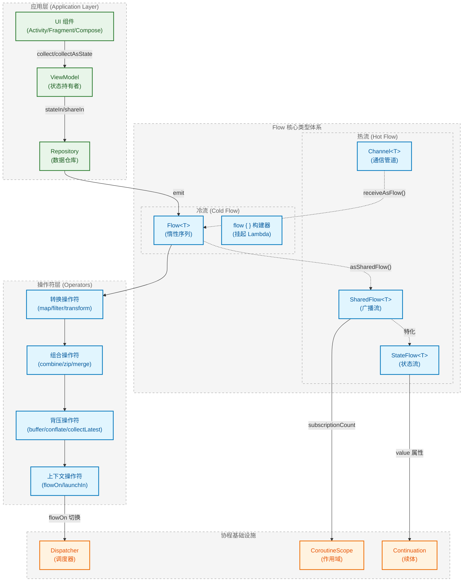
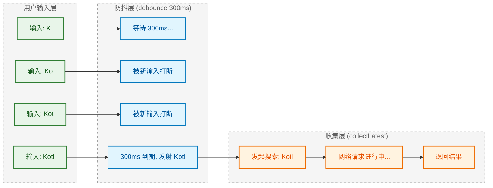
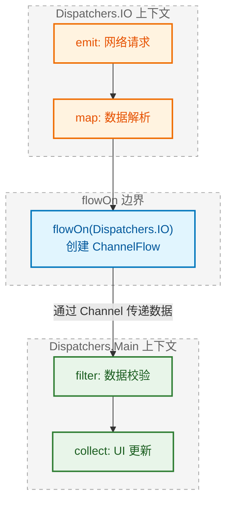

# Kotlin Flow 冷流与并发操作：从响应式范式到协程调度的深度解构

## 一、定义与本质：重新理解 Flow 的架构定位

在 Android 开发的演进历程中，响应式编程范式经历了从 RxJava 到 Kotlin Flow 的重大迁移。然而，多数开发者对 Flow 的认知仍停留在"RxJava 的 Kotlin 替代品"这一浅层理解。从架构师视角审视，**Flow 的本质是一个基于协程挂起机制的惰性求值序列生成器**，它与 RxJava 的根本差异不在于 API 风格，而在于底层执行模型的彻底重构。

RxJava 构建于 Java 线程池与回调机制之上，其 `Observable` 链式调用本质是嵌套回调的语法糖包装。而 Flow 则完全基于 Kotlin 协程的 **Continuation Passing Style (CPS)** 变换，每一个 `emit` 操作都是一次协程挂起点，每一个 `collect` 调用都会触发协程状态机的推进。这意味着 Flow 天然具备以下特性：

- **结构化并发 (Structured Concurrency)**：Flow 的生命周期与收集它的 CoroutineScope 绑定，避免了 RxJava 中 `Disposable` 泄漏的经典问题
- **挂起而非阻塞**：背压处理不再依赖复杂的 `Flowable` 策略配置，而是通过协程挂起自然实现
- **上下文保持 (Context Preservation)**：Flow 的执行上下文由收集端决定，`flowOn` 仅影响上游操作符

## 二、核心考点透视：Flow 在 Android Framework 中的战略地位

Kotlin Flow 在现代 Android 架构中占据着数据层与表现层之间的核心枢纽位置。从 Jetpack 组件的演进可以清晰看到这一趋势：

| 组件 | 传统方案 | Flow 方案 |
|------|----------|-----------|
| Room | `LiveData<List<T>>` | `Flow<List<T>>` |
| DataStore | SharedPreferences 回调 | `Flow<Preferences>` |
| Paging 3 | `LiveData<PagingData>` | `Flow<PagingData>` |
| WorkManager | `LiveData<WorkInfo>` | `Flow<WorkInfo>` |

Google 官方在 2021 年明确表态：**LiveData 将逐步退居 UI 层的最后一公里，而 Flow 将成为数据流动的主干道**。这一架构决策的深层原因在于：

1. **跨层一致性**：Repository、ViewModel、UI 三层可以使用统一的 Flow API，消除 `LiveData` 与 `Flow` 之间的转换开销
2. **测试友好性**：Flow 的纯函数特性使得单元测试无需依赖 Android 框架
3. **多平台支持**：Kotlin Multiplatform 项目中，Flow 是唯一可行的响应式方案

## 三、宏观架构图：Flow 生态系统全景



## 四、架构图深度解析

上图呈现了 Kotlin Flow 在 Android 应用中的完整生态位置，从应用层到协程基础设施形成了清晰的四层架构。理解这张图的关键在于把握**数据流动方向**与**控制流动方向**的分离。

### 4.1 应用层的职责边界

**UI 组件**作为数据的最终消费者，通过 `collect` 或 Compose 的 `collectAsState` 订阅上游数据流。这里存在一个关键的架构约束：**UI 层只能消费，不能生产**。任何试图在 UI 层直接 `emit` 数据的设计都是反模式，因为这会破坏单向数据流 (Unidirectional Data Flow) 的架构原则。

**ViewModel** 扮演着状态持有者的角色，它通过 `stateIn` 或 `shareIn` 操作符将冷流转换为热流。这一转换的本质是**将惰性求值转变为主动推送**，使得多个 UI 观察者可以共享同一份数据计算结果。`stateIn` 返回的 `StateFlow` 具有粘性特性（新订阅者立即收到最新值），而 `shareIn` 返回的 `SharedFlow` 则可配置重放缓存大小。

**Repository** 是数据的生产源头，它通过 `flow { }` 构建器创建冷流。Repository 层的 Flow 通常封装了以下数据源：
- Room 数据库的响应式查询
- Retrofit 网络请求的挂起调用
- DataStore 的偏好设置流
- 传感器数据的回调转换

### 4.2 冷流与热流的本质差异

架构图中将 Flow 类型体系分为冷流与热流两个子图，这一划分反映了响应式编程中最核心的概念对立。

**冷流 (Cold Flow)** 的特征是**惰性求值**与**单播**：
- 只有当 `collect` 被调用时，`flow { }` 块内的代码才会执行
- 每个收集者都会触发独立的执行流程，互不干扰
- 数据生产速率由消费者的处理能力决定（天然背压）

**热流 (Hot Flow)** 的特征是**主动推送**与**多播**：
- 无论是否有订阅者，数据都可能在生产
- 多个订阅者共享同一份数据流
- 需要显式配置背压策略（缓冲、丢弃、合并）

`Channel` 在图中被归类为热流，但它与 `SharedFlow` 存在本质区别：**Channel 是点对点通信原语，每个元素只能被一个接收者消费**；而 `SharedFlow` 是广播机制，每个元素会被所有订阅者接收。这一差异决定了它们的适用场景：

| 场景 | 推荐方案 |
|------|----------|
| 事件总线（多个 Fragment 监听同一事件） | SharedFlow |
| 工作队列（多个 Worker 竞争任务） | Channel |
| UI 状态持有 | StateFlow |
| 一次性事件（导航、Toast） | Channel 或 SharedFlow(replay=0) |

### 4.3 操作符层的流水线模型

操作符层是 Flow 的核心竞争力所在。与 RxJava 的操作符不同，Flow 操作符的实现完全基于协程挂起，不涉及任何线程切换或回调注册。

**转换操作符** (`map`/`filter`/`transform`) 是最基础的操作符类型，它们在当前协程上下文中同步执行，不引入额外的并发开销。`transform` 是最底层的转换原语，`map` 和 `filter` 都是基于它实现的语法糖。

**组合操作符** (`combine`/`zip`/`merge`) 用于处理多流合并场景。`combine` 在任一上游发射时触发组合，`zip` 要求所有上游一一配对，`merge` 则是简单的流合并。这三个操作符的选择直接影响下游的触发频率与数据完整性。

**背压操作符** (`buffer`/`conflate`/`collectLatest`) 是并发场景下的关键工具，它们决定了当生产速率超过消费速率时的处理策略。这部分将在后续章节深入剖析。

**上下文操作符** (`flowOn`/`launchIn`) 控制 Flow 的执行线程。`flowOn` 的设计哲学是**只影响上游**，这与 RxJava 的 `subscribeOn`/`observeOn` 模型存在根本差异。

### 4.4 协程基础设施的支撑作用

Flow 的所有能力最终都建立在协程基础设施之上：

- **Dispatcher** 决定代码在哪个线程池执行，`Dispatchers.IO` 用于阻塞 IO，`Dispatchers.Default` 用于 CPU 密集计算，`Dispatchers.Main` 用于 UI 更新
- **CoroutineScope** 定义了协程的生命周期边界，Flow 的收集必须在某个 Scope 内进行
- **Continuation** 是协程挂起与恢复的核心抽象，每次 `emit` 都会检查 Continuation 的状态以实现取消传播

图中虚线箭头表示的转换关系揭示了 Flow 类型之间的互操作性：
- `asSharedFlow()` 将 `MutableSharedFlow` 暴露为只读视图
- `receiveAsFlow()` 将 Channel 包装为 Flow 以便使用操作符
- `StateFlow` 是 `SharedFlow` 的特化版本，固定 `replay=1` 且要求初始值

## 五、落地场景与避坑指南：从理论到工程实践

理解了 Flow 的架构定位后，我们需要将视角转向实际工程场景。以下是大厂项目中最常见的 Flow 使用模式与对应的陷阱分析。

### 5.1 场景一：搜索框防抖与背压控制

搜索框实时搜索是 Flow 最经典的应用场景。用户每输入一个字符都可能触发网络请求，如果不加控制，将导致大量无效请求与资源浪费。

```kotlin
// ❌ 错误实现：每次输入都触发请求，造成请求风暴
editText.textChanges()
    .collect { query ->
        viewModel.search(query) // 每个字符都发起网络请求
    }

// ✅ 正确实现：使用 debounce + distinctUntilChanged + collectLatest
editText.textChanges()
    .debounce(300)                    // 300ms 内无新输入才发射
    .distinctUntilChanged()           // 过滤重复值
    .filter { it.isNotBlank() }       // 过滤空白输入
    .collectLatest { query ->         // 新值到来时取消旧的收集
        viewModel.search(query)
    }
```

这里的 `collectLatest` 是背压处理的关键：当新的搜索词到来时，如果上一次搜索尚未完成，`collectLatest` 会**取消**正在进行的收集协程，转而处理新值。这与 `collect` 的行为形成鲜明对比——`collect` 会等待当前处理完成后才处理下一个值。



### 5.2 场景二：StateFlow 的粘性事件陷阱

`StateFlow` 的粘性特性（新订阅者立即收到最新值）在状态管理场景下是优势，但在**一次性事件**场景下却是灾难。

```kotlin
// ❌ 错误实现：使用 StateFlow 发送导航事件
class ViewModel : ViewModel() {
    private val _navigationEvent = MutableStateFlow<NavigationEvent?>(null)
    val navigationEvent: StateFlow<NavigationEvent?> = _navigationEvent
    
    fun onButtonClick() {
        _navigationEvent.value = NavigationEvent.GoToDetail
    }
}

// Fragment 中收集
viewModel.navigationEvent.collect { event ->
    event?.let { navigate(it) }  // 屏幕旋转后会重复导航！
}
```

问题在于：当 Activity/Fragment 因配置变更重建时，新的收集者会立即收到 `StateFlow` 中缓存的最新值，导致导航事件被重复消费。

```kotlin
// ✅ 正确实现方案一：使用 Channel
class ViewModel : ViewModel() {
    private val _navigationEvent = Channel<NavigationEvent>(Channel.BUFFERED)
    val navigationEvent = _navigationEvent.receiveAsFlow()
    
    fun onButtonClick() {
        viewModelScope.launch {
            _navigationEvent.send(NavigationEvent.GoToDetail)
        }
    }
}

// ✅ 正确实现方案二：使用 SharedFlow(replay=0)
class ViewModel : ViewModel() {
    private val _navigationEvent = MutableSharedFlow<NavigationEvent>()
    val navigationEvent: SharedFlow<NavigationEvent> = _navigationEvent
    
    fun onButtonClick() {
        viewModelScope.launch {
            _navigationEvent.emit(NavigationEvent.GoToDetail)
        }
    }
}
```

两种方案的差异在于：
- **Channel**：点对点消费，事件只会被一个收集者处理，适合单一消费者场景
- **SharedFlow(replay=0)**：广播消费，所有活跃的收集者都会收到事件，但不会重放给新订阅者

### 5.3 场景三：flowOn 的上下文切换边界

`flowOn` 是 Flow 中最容易被误解的操作符。它的设计哲学是**只影响上游**，这与 RxJava 的 `observeOn` 完全不同。

```kotlin
flow {
    // 🔵 运行在 Dispatchers.IO
    emit(fetchFromNetwork())
}
.map { data ->
    // 🔵 运行在 Dispatchers.IO（被 flowOn 影响）
    parseData(data)
}
.flowOn(Dispatchers.IO)  // 👈 切换点：影响上方所有操作
.filter { it.isValid }
    // 🟢 运行在收集端的上下文（通常是 Main）
.collect { validData ->
    // 🟢 运行在收集端的上下文
    updateUI(validData)
}
```



`flowOn` 的实现原理是在切换点创建一个 `ChannelFlow`，上游在指定的 Dispatcher 中执行并将结果发送到 Channel，下游从 Channel 中接收数据。这意味着：

1. **多个 flowOn 会创建多个 Channel**：每个 `flowOn` 都会引入一次线程切换开销
2. **flowOn 不影响下游**：`collect` 始终运行在调用它的协程上下文中
3. **flowOn 可以叠加**：多个 `flowOn` 会形成分段的上下文切换

```kotlin
// 多个 flowOn 的叠加效果
flow { emit(1) }           // 运行在 Default
    .map { it * 2 }        // 运行在 Default
    .flowOn(Dispatchers.Default)
    .filter { it > 0 }     // 运行在 IO
    .flowOn(Dispatchers.IO)
    .collect { }           // 运行在 Main
```

### 5.4 场景四：SharedFlow 的 replay 与 extraBufferCapacity 配置

`SharedFlow` 的构造参数直接决定了它的行为特性，错误的配置会导致数据丢失或内存泄漏。

```kotlin
// SharedFlow 构造参数详解
MutableSharedFlow<T>(
    replay: Int = 0,              // 重放给新订阅者的元素数量
    extraBufferCapacity: Int = 0, // 额外的缓冲容量
    onBufferOverflow: BufferOverflow = BufferOverflow.SUSPEND // 缓冲溢出策略
)
```

```diff
+ replay = 0：新订阅者不会收到历史数据，适合一次性事件
+ replay = 1：新订阅者收到最新一条数据，类似 StateFlow
+ replay = N：新订阅者收到最近 N 条数据，适合消息历史场景

+ extraBufferCapacity = 0：emit 会在无订阅者时挂起
+ extraBufferCapacity > 0：允许在无订阅者时缓存数据

+ BufferOverflow.SUSPEND：缓冲满时挂起发射者（默认）
+ BufferOverflow.DROP_OLDEST：丢弃最旧的数据
+ BufferOverflow.DROP_LATEST：丢弃最新的数据
```

一个常见的陷阱是在 ViewModel 中使用默认配置的 `MutableSharedFlow`：

```kotlin
// ❌ 潜在问题：emit 可能永远挂起
class ViewModel : ViewModel() {
    private val _events = MutableSharedFlow<Event>() // replay=0, extraBufferCapacity=0
    
    fun sendEvent() {
        viewModelScope.launch {
            _events.emit(Event.Something) // 如果没有活跃订阅者，这里会永远挂起！
        }
    }
}

// ✅ 安全配置：允许在无订阅者时发射
class ViewModel : ViewModel() {
    private val _events = MutableSharedFlow<Event>(
        extraBufferCapacity = 1,
        onBufferOverflow = BufferOverflow.DROP_OLDEST
    )
    
    fun sendEvent() {
        viewModelScope.launch {
            _events.emit(Event.Something) // 即使没有订阅者也不会挂起
        }
    }
}
```

### 5.5 场景五：stateIn 与 shareIn 的启动策略

将冷流转换为热流时，`SharingStarted` 参数决定了上游何时开始执行：

```kotlin
val uiState: StateFlow<UiState> = repository.getDataFlow()
    .map { data -> UiState.Success(data) }
    .stateIn(
        scope = viewModelScope,
        started = SharingStarted.WhileSubscribed(5000), // 👈 关键参数
        initialValue = UiState.Loading
    )
```

| 启动策略 | 行为 | 适用场景 |
|----------|------|----------|
| `Eagerly` | 立即开始，永不停止 | 全局单例数据源 |
| `Lazily` | 首个订阅者出现时开始，永不停止 | ViewModel 级别的数据源 |
| `WhileSubscribed(timeout)` | 有订阅者时运行，无订阅者后延迟 timeout 停止 | 配置变更友好的 UI 数据 |

`WhileSubscribed(5000)` 是 Android 官方推荐的配置：当 Activity 进入后台时，5 秒后上游会停止执行以节省资源；当 Activity 回到前台时，上游会重新启动。5 秒的延迟是为了应对屏幕旋转等快速配置变更场景，避免不必要的重启。

