---

# Channel ⭐

---

## Channel 概述

在 Kotlin 协程的世界里，我们经常需要在**不同的协程之间安全地传递数据**。`Flow` 是一种 *冷流*（Cold Stream），它只在收集时才开始工作，且天然适合"单一生产者 → 单一消费者"的场景。但实际开发中，我们常常面对的需求是：**多个协程同时往一个管道里塞数据，又有多个协程同时从里面取数据**。这就是 `Channel` 大展身手的地方。

`Channel` 是 Kotlin 协程库（`kotlinx.coroutines`）提供的一种**协程间通信原语**（Inter-coroutine Communication Primitive）。你可以把它想象成一条**传送带**——一端有工人不断放上产品（send），另一端有工人不断取走产品（receive），传送带本身可以有一定容量的缓冲区。

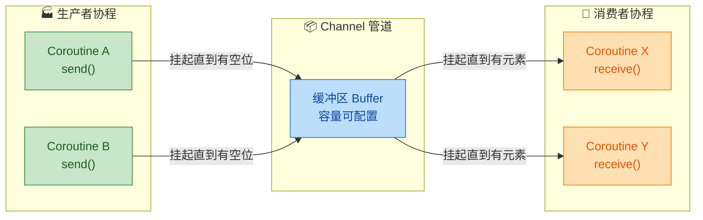
```mermaid
graph LR
    subgraph Producers["🏭 生产者协程"]
        direction TB
        P1["Coroutine A<br/>send()"]
        P2["Coroutine B<br/>send()"]
    end

    subgraph CH["📦 Channel 管道"]
        direction TB
        BUF["缓冲区 Buffer<br/>容量可配置"]
    end

    subgraph Consumers["🛒 消费者协程"]
        direction TB
        C1["Coroutine X<br/>receive()"]
        C2["Coroutine Y<br/>receive()"]
    end

    P1 -->|"挂起直到有空位"| BUF
    P2 -->|"挂起直到有空位"| BUF
    BUF -->|"挂起直到有元素"| C1
    BUF -->|"挂起直到有元素"| C2

    classDef producerStyle fill:#C8E6C9,stroke:#388E3C,color:#1B5E20
    classDef channelStyle fill:#BBDEFB,stroke:#1976D2,color:#0D47A1
    classDef consumerStyle fill:#FFE0B2,stroke:#F57C00,color:#E65100

    class P1,P2 producerStyle
    class BUF channelStyle
    class C1,C2 consumerStyle
```

接下来我们从三个核心维度来深入理解 Channel 的本质。

---

### 热流（Hot Stream）

理解 Channel 的第一步，是搞清楚它和 `Flow` 在**"冷 vs 热"**这件事上的根本区别。

**冷流（Cold Stream）** 的特点是"惰性"的：只有当有人开始收集（`collect`）时，上游代码才会执行。如果没有收集者，生产逻辑根本不会启动。每个收集者都会触发一次独立的上游执行。`Flow` 就是典型的冷流。

**热流（Hot Stream）** 则恰恰相反：**不管有没有消费者，数据都可能已经在产生了**。Channel 一旦被创建，生产者协程就可以立刻往里面 `send` 数据，即使此时没有任何消费者在 `receive`。数据会进入缓冲区排队等待（如果有缓冲区的话），或者让生产者挂起等待消费者到来。

来看一个直观的对比：

```kotlin
// ========== 冷流 Flow：collect 时才执行 ==========
val coldFlow = flow {
    println("Flow: 开始生产")       // 只有 collect 时才会打印
    emit(1)
    emit(2)
}
// 此时什么都不会发生，因为没有人 collect

coldFlow.collect { value ->          // 此刻才触发 "Flow: 开始生产"
    println("收到: $value")
}

// ========== 热流 Channel：创建后即可发送 ==========
val channel = Channel<Int>()         // Channel 一创建就"活着"了

launch {
    println("Channel: 开始生产")     // 这个协程会立刻启动
    channel.send(1)                  // 发送数据，不管有没有人接收
    channel.send(2)
    channel.close()                  // 手动关闭通道
}

// 即使消费者稍后才启动，数据也不会丢失（会挂起等待）
launch {
    for (value in channel) {         // 用 for-in 迭代接收
        println("收到: $value")
    }
}
```

用一张表格来总结两者的核心差异：

| 特性 | Flow（冷流） | Channel（热流） |
|------|-------------|-----------------|
| **何时开始生产** | `collect` 时才开始 | 生产者协程启动即开始 |
| **多消费者** | 每个 collector 独立触发一次完整流程 | 多个 receiver **竞争消费**同一份数据 |
| **数据生命周期** | 无状态，每次收集都是全新的 | 数据一旦被取走就消失了 |
| **背压（Backpressure）** | 通过挂起自然实现 | 通过缓冲区 + 挂起实现 |
| **需要手动关闭？** | 不需要 | 通常需要 `close()` |

> **关键理解**：Channel 是"热"的，意味着**生产者和消费者的生命周期是解耦的**。生产者不需要等消费者就绪才开始工作，反之亦然。这种解耦在并发编程中非常有价值。

"热流"还有一个非常重要的推论——**数据一旦被某个消费者取走，其他消费者就拿不到了**。这与 `SharedFlow`（广播式热流）不同，Channel 天然是**单播**（unicast）的。如果你有 3 个协程同时从同一个 Channel 里 `receive`，每条数据只会被其中一个协程消费到，这就是"Fan-out"（扇出）模式。

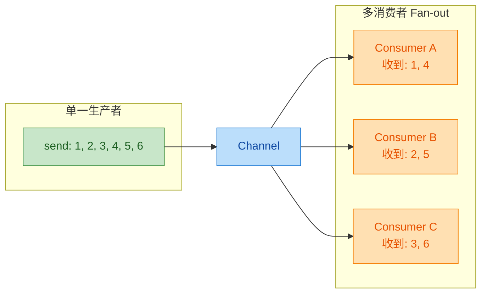
```mermaid
graph LR
    subgraph SRC["单一生产者"]
        direction TB
        P["send: 1, 2, 3, 4, 5, 6"]
    end

    CH["Channel"]

    subgraph FANS["多消费者 Fan-out"]
        direction TB
        C1["Consumer A<br/>收到: 1, 4"]
        C2["Consumer B<br/>收到: 2, 5"]
        C3["Consumer C<br/>收到: 3, 6"]
    end

    P --> CH
    CH --> C1
    CH --> C2
    CH --> C3

    classDef srcStyle fill:#C8E6C9,stroke:#388E3C,color:#1B5E20
    classDef chStyle fill:#BBDEFB,stroke:#1976D2,color:#0D47A1
    classDef fanStyle fill:#FFE0B2,stroke:#F57C00,color:#E65100

    class P srcStyle
    class CH chStyle
    class C1,C2,C3 fanStyle
```

---

### 生产者 - 消费者模式（Producer-Consumer Pattern）

Channel 的设计哲学直接映射到经典并发模式——**生产者-消费者模式**（Producer-Consumer Pattern）。这是一种在多线程/多协程编程中极其常见的协作范式：

- **生产者（Producer）**：负责生成数据，放入共享的中间容器。
- **消费者（Consumer）**：负责从容器中取出数据并处理。
- **中间容器（Buffer / Queue）**：解耦生产和消费的速率差异。

Channel 就是那个**中间容器**，而且它天生支持**协程级别的挂起**，不需要传统多线程中的锁、条件变量等复杂同步机制。

来看一个真实场景：**模拟一个图片下载管线（Pipeline）**。

```kotlin
import kotlinx.coroutines.*
import kotlinx.coroutines.channels.*

// 模拟图片 URL
data class ImageUrl(val url: String)
// 模拟下载后的图片数据
data class ImageData(val url: String, val bytes: ByteArray)

fun main() = runBlocking {

    // 创建一个容量为 5 的 Channel，作为"待下载队列"
    val downloadQueue = Channel<ImageUrl>(capacity = 5)

    // ========== 生产者：不断向队列投递下载任务 ==========
    launch {
        val urls = listOf(
            "https://example.com/img1.png",  // 模拟 URL 列表
            "https://example.com/img2.png",
            "https://example.com/img3.png",
            "https://example.com/img4.png",
            "https://example.com/img5.png",
        )
        for (url in urls) {
            println("📤 投递下载任务: $url")
            downloadQueue.send(ImageUrl(url))  // 如果缓冲区满了，生产者会挂起等待
        }
        downloadQueue.close()                  // 所有任务投递完毕，关闭 Channel
        println("📤 生产者：所有任务已投递，Channel 已关闭")
    }

    // ========== 消费者 1：下载协程 ==========
    launch {
        for (task in downloadQueue) {          // Channel 关闭且无数据时，循环自动结束
            println("⬇️  [Worker-1] 正在下载: ${task.url}")
            delay(300)                          // 模拟网络耗时
            println("✅  [Worker-1] 下载完成: ${task.url}")
        }
    }

    // ========== 消费者 2：另一个下载协程（Fan-out 并行消费）==========
    launch {
        for (task in downloadQueue) {          // 同一个 Channel，竞争获取任务
            println("⬇️  [Worker-2] 正在下载: ${task.url}")
            delay(500)                          // 模拟网络耗时（比 Worker-1 慢）
            println("✅  [Worker-2] 下载完成: ${task.url}")
        }
    }
}
```

运行这段代码，你会发现 5 个下载任务被两个 Worker **自动负载均衡**——Worker-1 速度更快，所以会多分到一些任务。这就是 Channel **Fan-out** 模式的威力：多个消费者从同一个 Channel 取数据，天然形成了工作窃取式（Work-Stealing-like）的负载分配。

这种模式在 Android 开发中有非常多的实际应用场景：

- **批量上传/下载**：用 Channel 控制并发数。
- **事件分发**：ViewModel 把 UI 事件通过 Channel 发送给不同的处理协程。
- **流水线处理**（Pipeline）：一个 Channel 的输出接到另一个 Channel 的输入，形成多级管道。

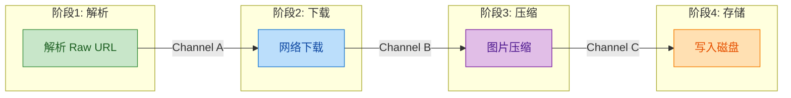
```mermaid
graph LR
    subgraph Stage1["阶段1: 解析"]
        direction TB
        S1["解析 Raw URL"]
    end

    subgraph Stage2["阶段2: 下载"]
        direction TB
        S2["网络下载"]
    end

    subgraph Stage3["阶段3: 压缩"]
        direction TB
        S3["图片压缩"]
    end

    subgraph Stage4["阶段4: 存储"]
        direction TB
        S4["写入磁盘"]
    end

    S1 -->|"Channel A"| S2
    S2 -->|"Channel B"| S3
    S3 -->|"Channel C"| S4

    classDef stage1Style fill:#C8E6C9,stroke:#388E3C,color:#1B5E20
    classDef stage2Style fill:#BBDEFB,stroke:#1976D2,color:#0D47A1
    classDef stage3Style fill:#E1BEE7,stroke:#7B1FA2,color:#4A148C
    classDef stage4Style fill:#FFE0B2,stroke:#F57C00,color:#E65100

    class S1 stage1Style
    class S2 stage2Style
    class S3 stage3Style
    class S4 stage4Style
```

每个阶段都是独立的协程，通过 Channel 串联成一条**处理流水线（Pipeline）**。各阶段的处理速度不同也没关系——Channel 的缓冲区和挂起机制会自动调节节奏，这就是天然的**背压（Backpressure）**处理。

---

### 类似 BlockingQueue

如果你有 Java 并发编程的经验，理解 Channel 最快的方式就是：**它本质上是一个协程版的 `BlockingQueue`**。

在 Java 中，`java.util.concurrent.BlockingQueue` 是线程间传递数据的经典工具：

- `put()` ——队列满时，**阻塞当前线程**直到有空位。
- `take()` ——队列空时，**阻塞当前线程**直到有新元素。

Channel 的 `send()` 和 `receive()` 在语义上完全对应：

- `send()` ——缓冲区满时，**挂起当前协程**直到有空位。
- `receive()` ——缓冲区空时，**挂起当前协程**直到有新元素。

**关键区别在于"挂起"vs"阻塞"**：

```java
// ======= Java BlockingQueue：阻塞线程 =======
// 线程被阻塞时，它什么也做不了，CPU 资源被白白占用
BlockingQueue<Integer> queue = new LinkedBlockingQueue<>(2);
queue.put(1);   // 如果队列满了 → 当前线程被阻塞（Thread.sleep 级别）
queue.take();   // 如果队列空了 → 当前线程被阻塞
```

```kotlin
// ======= Kotlin Channel：挂起协程 =======
// 协程被挂起时，底层线程被释放，可以去执行其他协程
val channel = Channel<Int>(capacity = 2)
channel.send(1)    // 如果缓冲区满了 → 当前协程挂起（线程被释放）
channel.receive()  // 如果缓冲区空了 → 当前协程挂起（线程被释放）
```

这个差异在高并发场景下至关重要。假设你有 10000 个生产者：

- 用 `BlockingQueue` + 线程：需要 10000 个线程，每个阻塞时都占用栈内存（默认约 1MB/线程），轻松吃掉 10GB 内存。
- 用 `Channel` + 协程：10000 个协程可能只在几个线程上调度，挂起时几乎零开销。

```kotlin
// 用 ASCII 图理解"挂起 vs 阻塞"的线程占用差异
```

```text
┌─────────────────── BlockingQueue（线程模型）───────────────────┐
│                                                                │
│  Thread-1: [put()...阻塞等待💤] ──────────────────────────>    │
│  Thread-2: [put()...阻塞等待💤] ──────────────────────────>    │
│  Thread-3: [take()..阻塞等待💤] ──────────────────────────>    │
│                                                                │
│  ❌ 3 个线程全部被占用，即使什么有效工作都没做                    │
└────────────────────────────────────────────────────────────────┘

┌─────────────────── Channel（协程模型）────────────────────────┐
│                                                                │
│  Thread-1: [coroutine-A send()挂起] → [切换到 coroutine-D] →  │
│  Thread-2: [coroutine-B send()挂起] → [切换到 coroutine-E] →  │
│                                                                │
│  ✅ 2 个线程，但同时服务了 A/B/D/E 等多个协程                   │
│  挂起的协程不占用线程，只保留一小块 Continuation 状态             │
└────────────────────────────────────────────────────────────────┘
```

下面是一张更完整的 API 对照表：

| 操作 | `BlockingQueue` (Java) | `Channel` (Kotlin) | 差异 |
|------|----------------------|--------------------|----|
| 发送（队列满时） | `put()` — 阻塞线程 | `send()` — 挂起协程 | 挂起不占线程 |
| 接收（队列空时） | `take()` — 阻塞线程 | `receive()` — 挂起协程 | 挂起不占线程 |
| 非阻塞尝试发送 | `offer()` → `boolean` | `trySend()` → `ChannelResult` | Channel 返回更丰富的结果 |
| 非阻塞尝试接收 | `poll()` → `T?` | `tryReceive()` → `ChannelResult` | Channel 返回更丰富的结果 |
| 关闭 | 无原生支持（需手动标记） | `close()` — 原生支持 | Channel 可优雅关闭 |
| 遍历 | 无原生 for-each 支持 | `for (item in channel)` | Channel 可直接迭代 |
| 容量 | 构造时指定 | `Channel(capacity)` 指定 | Channel 有更多类型策略 |

特别值得注意的是 **`close()`** 的设计。`BlockingQueue` 本身没有"关闭"的概念——你无法通知消费者"不会再有新数据了"。开发者通常需要自己约定一个"毒丸"（Poison Pill）对象放进队列来通知消费者退出。而 Channel 内建了 `close()` 机制：

```kotlin
val channel = Channel<Int>(capacity = 3)

launch {
    channel.send(1)                    // 正常发送
    channel.send(2)                    // 正常发送
    channel.close()                    // 关闭 Channel：通知消费者不会再有新数据了
    // channel.send(3)                 // ❌ 关闭后再 send 会抛出 ClosedSendChannelException
}

launch {
    for (value in channel) {           // close() 后，迭代会在取完剩余数据后自动结束
        println("收到: $value")         // 打印 1, 2 后，循环正常退出
    }
    println("Channel 已关闭，消费结束")  // 这行一定会执行到
}
```

`close()` 的语义是：**关闭发送端，但已在缓冲区中的数据仍然可以被接收**。这就像一个传送带——按下停止按钮后，传送带上已有的物品仍会送到终点，只是不再允许放新物品上去了。

> **总结**：Channel ≈ 协程版 BlockingQueue + 内建 close 机制 + 多种缓冲策略。如果你理解 BlockingQueue，那 Channel 就是它在协程世界的自然进化——用**挂起**替代**阻塞**，用**结构化并发**替代**手动线程管理**，用**原生关闭语义**替代**毒丸模式**。

---

**📝 练习题**

以下关于 Kotlin `Channel` 的说法，哪一项是**错误的**？

A. Channel 是热流（Hot Stream），即使没有消费者，生产者也可以发送数据（可能挂起等待缓冲区空位）

B. 多个协程同时从同一个 Channel `receive` 时，每条数据会被广播给所有消费者

C. Channel 的 `send()` 在缓冲区满时会挂起协程而非阻塞线程

D. Channel 调用 `close()` 后，缓冲区中已有的数据仍然可以被消费者接收


**【答案】** B

**【解析】** Channel 是**单播**（Unicast）的，不是广播（Broadcast）。当多个协程同时从同一个 Channel 接收数据时，每条数据**只会被其中一个消费者拿到**，这就是 Fan-out 模式。如果需要广播行为（每个消费者都收到每条数据），应该使用 `SharedFlow` 或已废弃的 `BroadcastChannel`。选项 A 正确描述了 Channel 的热流特性；选项 C 正确描述了挂起 vs 阻塞的核心区别；选项 D 正确描述了 `close()` 的语义——关闭发送端但不丢弃缓冲区中的剩余数据。

---

## Channel 类型

在上一节中我们了解了 Channel 的基本概念——它是协程间通信的"热流管道"。但一条管道的行为特征，很大程度上取决于它内部的 **缓冲策略（Buffer Policy）**。想象一下现实中的传送带：有的传送带很短，放一个东西就必须等人取走才能放下一个；有的传送带很长，可以堆积很多物品；还有的传送带只保留最新放上去的那一件。Kotlin 的 `Channel` 正是通过 **capacity（容量）** 参数来控制这种缓冲行为的。

`Channel()` 工厂函数的签名中，`capacity` 是最核心的参数。Kotlin 在 `Channel` 伴生对象中预定义了四个常量，分别对应四种经典的缓冲策略：

```kotlin
// Channel 伴生对象中的常量定义
public companion object Factory {
    const val RENDEZVOUS = 0        // 容量为 0，无缓冲
    const val BUFFERED = 64         // 默认缓冲大小（可通过系统属性覆盖）
    const val UNLIMITED = Int.MAX_VALUE // 无限缓冲
    const val CONFLATED = -1        // 合并，只保留最新值
}
```

选择不同的 capacity，Channel 的 `send` 和 `receive` 挂起行为会截然不同。下面我们用一张总览图来建立直觉，再逐一深入。

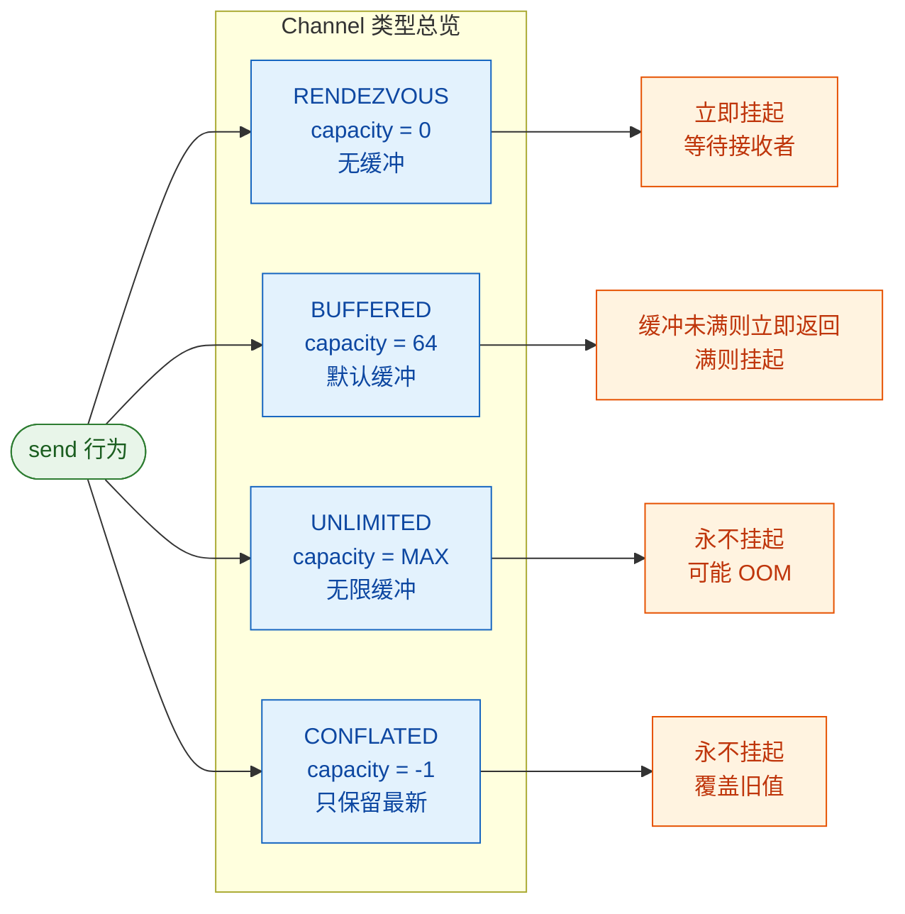
```mermaid
graph LR
    subgraph Overview["Channel 类型总览"]
        direction TB
        R["RENDEZVOUS\ncapacity = 0\n无缓冲"]
        B["BUFFERED\ncapacity = 64\n默认缓冲"]
        U["UNLIMITED\ncapacity = MAX\n无限缓冲"]
        C["CONFLATED\ncapacity = -1\n只保留最新"]
    end

    S(["send 行为"]) --> R
    S --> B
    S --> U
    S --> C

    R --> E1["立即挂起\n等待接收者"]
    B --> E2["缓冲未满则立即返回\n满则挂起"]
    U --> E3["永不挂起\n可能 OOM"]
    C --> E4["永不挂起\n覆盖旧值"]

    classDef overview fill:#E3F2FD,stroke:#1565C0,color:#0D47A1
    classDef send fill:#E8F5E9,stroke:#2E7D32,color:#1B5E20
    classDef effect fill:#FFF3E0,stroke:#E65100,color:#BF360C

    class R,B,U,C overview
    class S send
    class E1,E2,E3,E4 effect
```

---

### RENDEZVOUS（无缓冲）

RENDEZVOUS 是 Channel 的 **默认类型**（当你不传任何 capacity 参数时）。这个词源自法语，意为"约会、会合"——非常形象地描述了它的核心语义：**发送者和接收者必须"会合"（rendezvous）才能完成数据传递**。

#### 核心机制

RENDEZVOUS Channel 的内部缓冲区大小为 **0**。这意味着它根本不存储任何元素。数据的传递是一次**直接的"握手交接"（hand-off）**：

- 当生产者调用 `send(value)` 时，如果此刻没有消费者正在等待 `receive()`，生产者会 **立即挂起（suspend）**，直到有消费者来接收。
- 反过来，当消费者调用 `receive()` 时，如果此刻没有生产者正在等待 `send()`，消费者也会 **立即挂起**，直到有生产者来发送。
- 只有双方同时就绪，数据才会瞬间从发送者转移到接收者。

这种模式确保了 **强同步性（strong synchronization）**：每一次数据传递都意味着生产者和消费者之间发生了一次时间上的交汇。

```text
  ┌──────────────────── RENDEZVOUS Channel（capacity = 0） ────────────────────┐
  │                                                                            │
  │   Producer                    Channel(空管道)             Consumer          │
  │   ┌──────┐                    ┌──────────┐               ┌──────┐          │
  │   │send()│──── 挂起等待 ─────▶│ 无缓冲区 │◀── 挂起等待 ──│recv()│          │
  │   └──────┘                    └──────────┘               └──────┘          │
  │                                    │                                       │
  │              双方同时就绪时 ──▶ 直接交接（hand-off）                         │
  │                                                                            │
  └────────────────────────────────────────────────────────────────────────────┘
```

#### 代码示例

```kotlin
import kotlinx.coroutines.*
import kotlinx.coroutines.channels.*

fun main() = runBlocking {

    // 创建一个 RENDEZVOUS Channel，capacity 默认就是 0
    val channel = Channel<Int>() // 等价于 Channel<Int>(Channel.RENDEZVOUS)

    // 启动生产者协程
    launch {
        for (i in 1..5) {
            println("📤 准备发送: $i  (时间: ${System.currentTimeMillis() % 10000}ms)")
            channel.send(i) // 若无人接收，此处会挂起
            println("✅ 已发送: $i    (时间: ${System.currentTimeMillis() % 10000}ms)")
        }
        channel.close() // 发送完毕后关闭 Channel
    }

    // 启动消费者协程
    launch {
        for (value in channel) { // 迭代接收，Channel 关闭后循环自动结束
            println("📥 收到: $value       (时间: ${System.currentTimeMillis() % 10000}ms)")
            delay(1000) // 模拟消费者处理耗时 1 秒
        }
    }
}
```

运行这段代码你会观察到一个明显的现象：**每次 `send` 和 `receive` 几乎是成对出现的**。生产者发送完第 1 个值后，必须等消费者处理完（1 秒后）再来接收第 2 个值，生产者才能继续发送。整体表现为严格的 **"一来一回"节奏**，吞吐量完全受限于较慢的那一方。

#### 适用场景

| 场景 | 说明 |
|---|---|
| **严格的请求-响应模型** | 类似 CSP（Communicating Sequential Processes）风格的协程协作 |
| **需要背压控制（backpressure）** | 发送速度天然不会超过接收速度 |
| **协程间同步信号** | 用 Channel 传递信号而非数据时，无缓冲最合适 |
| **资源受限环境** | 零内存开销，不会有任何元素堆积 |

> ⚠️ **注意**：RENDEZVOUS 的强同步语义虽然安全，但也意味着如果生产者和消费者速率不匹配，慢的一方会成为整个管道的瓶颈。

---

### BUFFERED（默认缓冲）

BUFFERED 是介于"无缓冲"和"无限缓冲"之间的 **平衡方案**。它为 Channel 提供一个 **固定大小的缓冲区**，允许生产者在缓冲区未满时无需等待消费者就能继续发送，从而解耦生产和消费的节奏。

#### 核心机制

当 `capacity = Channel.BUFFERED`（默认值为 64）时，Channel 内部会分配一个大小为 64 的环形数组（或类似结构）作为缓冲区：

- **缓冲未满**时：`send()` 把元素放入缓冲区后 **立即返回**，不挂起。
- **缓冲已满**时：`send()` **挂起**，直到消费者取走至少一个元素腾出空间。
- `receive()` 从缓冲区头部取出元素；若缓冲区为空，则挂起等待。

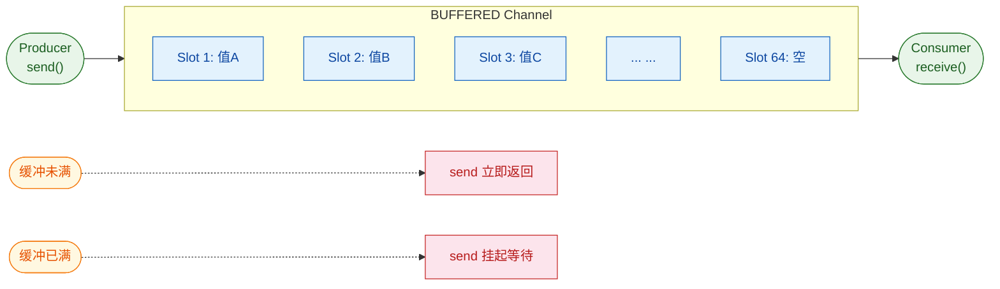
```mermaid
graph LR
    subgraph BufferedChannel["BUFFERED Channel"]
        direction TB
        slot1["Slot 1: 值A"]
        slot2["Slot 2: 值B"]
        slot3["Slot 3: 值C"]
        dots["... ..."]
        slot64["Slot 64: 空"]
    end

    P(["Producer\nsend()"]) --> BufferedChannel
    BufferedChannel --> C(["Consumer\nreceive()"])

    P2(["缓冲未满"]) -.-> R1["send 立即返回"]
    P3(["缓冲已满"]) -.-> R2["send 挂起等待"]

    classDef channel fill:#E3F2FD,stroke:#1565C0,color:#0D47A1
    classDef actor fill:#E8F5E9,stroke:#2E7D32,color:#1B5E20
    classDef state fill:#FFF8E1,stroke:#F57F17,color:#E65100
    classDef result fill:#FCE4EC,stroke:#C62828,color:#B71C1C

    class slot1,slot2,slot3,dots,slot64 channel
    class P,C actor
    class P2,P3 state
    class R1,R2 result
```

#### 默认值 64 的由来与修改

Kotlin 协程库将默认缓冲大小设为 **64**，但这个值可以通过 JVM 系统属性在启动时全局覆盖：

```kotlin
// 通过 JVM 参数修改全局默认缓冲大小
// -Dkotlinx.coroutines.channels.defaultBuffer=128

// 在代码中读取当前默认值（仅供了解，非公开 API）
// 内部实现: val CHANNEL_DEFAULT_CAPACITY = systemProp(
//     "kotlinx.coroutines.channels.defaultBuffer",
//     64,       // 默认值
//     1,        // 最小值
//     Int.MAX_VALUE - 1 // 最大值
// )
```

当然，你也可以在创建 Channel 时直接传入一个具体的数字，而非使用 `Channel.BUFFERED` 常量：

```kotlin
// 方式 1：使用预定义常量（容量 = 64，或被系统属性覆盖后的值）
val ch1 = Channel<Int>(Channel.BUFFERED)

// 方式 2：显式指定容量（不受系统属性影响）
val ch2 = Channel<Int>(capacity = 10) // 固定缓冲大小为 10
```

#### 代码示例

```kotlin
import kotlinx.coroutines.*
import kotlinx.coroutines.channels.*

fun main() = runBlocking {

    // 创建一个缓冲大小为 3 的 Channel（用小缓冲更容易观察效果）
    val channel = Channel<Int>(capacity = 3)

    // 生产者：快速发送 6 个元素
    launch {
        for (i in 1..6) {
            println("📤 准备发送: $i")
            channel.send(i) // 前 3 个不会挂起；第 4 个开始可能挂起
            println("✅ 已发送: $i")
        }
        channel.close()
    }

    // 消费者：慢速接收（每次间隔 1 秒）
    launch {
        delay(2000) // 故意延迟 2 秒再开始接收
        for (value in channel) {
            println("📥 收到: $value")
            delay(1000)
        }
    }
}
```

**预期输出分析**：

```text
📤 准备发送: 1
✅ 已发送: 1        ← 缓冲区: [1]，未满，立即返回
📤 准备发送: 2
✅ 已发送: 2        ← 缓冲区: [1, 2]，未满
📤 准备发送: 3
✅ 已发送: 3        ← 缓冲区: [1, 2, 3]，刚好满
📤 准备发送: 4      ← 缓冲区已满！send(4) 挂起......
                     ← （等待 2 秒后消费者启动，取走元素 1）
✅ 已发送: 4        ← 腾出空间，send(4) 恢复
📥 收到: 1
...（后续交替进行）
```

可以清楚地看到，**前 3 个元素被"吸收"到缓冲区中，生产者无需等待**。直到缓冲区满了，生产者才被迫挂起。这就是缓冲的价值——它在生产和消费之间提供了一个 **弹性层（elastic layer）**，允许短时间的速度波动而不立即阻塞。

#### 适用场景

| 场景 | 说明 |
|---|---|
| **生产消费速率有波动** | 缓冲吸收短期的速率差异，避免频繁挂起 |
| **吞吐量优先** | 生产者可以连续发送多个元素而不等待，提升管道总吞吐 |
| **异步任务分发** | 主协程快速分发一批任务到 Channel，多个 Worker 协程异步消费 |
| **可控的内存占用** | 缓冲区有上限，不会无限增长，OOM 风险可控 |

---

### UNLIMITED（无限缓冲）

UNLIMITED 是最"豪放"的模式——它拥有一个 **理论上无限大的缓冲区**（实际为 `Int.MAX_VALUE`），`send()` 操作 **永远不会挂起**。

#### 核心机制

`capacity = Channel.UNLIMITED`（即 `Int.MAX_VALUE`）时：

- `send()` 将元素放入一个无界队列（内部基于链表或可动态扩容的数组实现），然后 **立即返回**。无论消费者是否存在、是否跟得上，生产者都不会被阻塞。
- `receive()` 从队列头部取出元素。若队列为空，则挂起等待新元素到来。
- 这本质上类似于一个 **无界的 `LinkedBlockingQueue`**，只不过用 suspend 函数代替了线程阻塞。

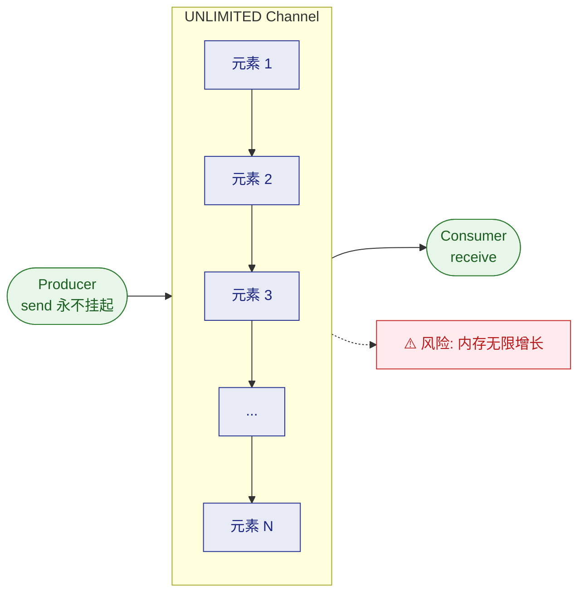
```mermaid
graph LR
    subgraph Unlimited["UNLIMITED Channel"]
        direction TB
        Q1["元素 1"] --> Q2["元素 2"] --> Q3["元素 3"] --> Q4["..."] --> QN["元素 N"]
    end

    P(["Producer\nsend 永不挂起"]) --> Unlimited
    Unlimited --> C(["Consumer\nreceive"])

    D["⚠️ 风险: 内存无限增长"]

    Unlimited -.-> D

    classDef queue fill:#E8EAF6,stroke:#283593,color:#1A237E
    classDef actor fill:#E8F5E9,stroke:#2E7D32,color:#1B5E20
    classDef warn fill:#FFEBEE,stroke:#C62828,color:#B71C1C

    class Q1,Q2,Q3,Q4,QN queue
    class P,C actor
    class D warn
```

#### 代码示例

```kotlin
import kotlinx.coroutines.*
import kotlinx.coroutines.channels.*

fun main() = runBlocking {

    // 创建一个无限缓冲的 Channel
    val channel = Channel<Int>(Channel.UNLIMITED)

    // 生产者：瞬间发送大量数据
    launch {
        for (i in 1..1_000_000) {
            channel.send(i) // 永远不会挂起，全部堆积在内存中
        }
        println("📤 已发送 1,000,000 个元素")
        channel.close()
    }

    // 消费者：慢速消费
    launch {
        var count = 0
        for (value in channel) {
            count++
            if (count % 200_000 == 0) {
                println("📥 已消费: $count 个元素")
            }
        }
    }
}
```

> ⚠️ **OOM 风险**：上面的代码如果把数量再加大，或每个元素是大对象，就可能触发 `OutOfMemoryError`。UNLIMITED Channel **没有任何背压机制（no backpressure）**，生产者完全"放飞自我"。

#### 适用场景与注意事项

| 场景 | 说明 |
|---|---|
| **生产者不能被阻塞** | 比如 UI 事件分发——你不希望用户的点击操作因 Channel 满而卡住 |
| **确定消费速度 ≥ 生产速度** | 数据量可控时，UNLIMITED 避免了不必要的挂起开销 |
| **日志收集管道** | 日志产生速度快但单条数据小，消费端批量写入磁盘 |

| ⚠️ 风险 | 说明 |
|---|---|
| **内存泄漏 / OOM** | 若消费者长时间跟不上，队列会无限膨胀 |
| **无背压** | 生产者感知不到消费者的压力，系统可能在沉默中崩溃 |
| **难以调试** | 问题往往在运行很久后才暴露，不像 BUFFERED 会早期挂起 |

---

### CONFLATED（只保留最新）

CONFLATED 是四种类型中最"激进"的一种——它的缓冲区 **永远只保留最新的一个值**。如果生产者在消费者取走旧值之前又发送了新值，旧值会被 **直接丢弃覆盖（conflate，合并/压缩）**。

#### 核心机制

`capacity = Channel.CONFLATED`（内部常量 `-1`）时：

- `send()` **永远不会挂起**。如果缓冲区已有一个未被消费的值，新值会直接覆盖旧值。
- `receive()` 取出当前最新的值。如果没有值可取，则挂起等待。
- **中间值可能永远不会被消费者看到**——这是设计意图，不是 bug。

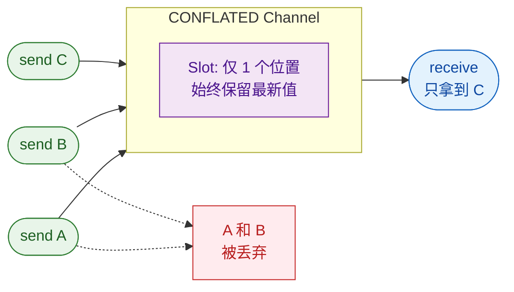
```mermaid
graph LR
    subgraph Conflated["CONFLATED Channel"]
        direction TB
        slot["Slot: 仅 1 个位置\n始终保留最新值"]
    end

    P1(["send A"]) --> Conflated
    P2(["send B"]) --> Conflated
    P3(["send C"]) --> Conflated

    Conflated --> C(["receive\n只拿到 C"])

    Lost["A 和 B\n被丢弃"]

    P1 -.-> Lost
    P2 -.-> Lost

    classDef ch fill:#F3E5F5,stroke:#6A1B9A,color:#4A148C
    classDef actor fill:#E8F5E9,stroke:#2E7D32,color:#1B5E20
    classDef recv fill:#E3F2FD,stroke:#1565C0,color:#0D47A1
    classDef lost fill:#FFEBEE,stroke:#C62828,color:#B71C1C

    class slot ch
    class P1,P2,P3 actor
    class C recv
    class Lost lost
```

#### 代码示例

```kotlin
import kotlinx.coroutines.*
import kotlinx.coroutines.channels.*

fun main() = runBlocking {

    // 创建一个 CONFLATED Channel
    val channel = Channel<String>(Channel.CONFLATED)

    // 生产者：连续快速发送传感器读数
    launch {
        val readings = listOf("温度: 20°C", "温度: 21°C", "温度: 22°C", "温度: 23°C", "温度: 24°C")
        for (reading in readings) {
            println("📤 发送: $reading")
            channel.send(reading) // 永远不挂起，新值覆盖旧值
        }
        channel.close()
    }

    // 消费者：故意延迟后接收
    launch {
        delay(100) // 等生产者全部发完
        for (value in channel) {
            println("📥 收到: $value") // 大概率只收到 "温度: 24°C"
        }
    }
}
```

**预期输出**：

```text
📤 发送: 温度: 20°C
📤 发送: 温度: 21°C
📤 发送: 温度: 22°C
📤 发送: 温度: 23°C
📤 发送: 温度: 24°C
📥 收到: 温度: 24°C      ← 只有最新的值被消费者看到！
```

20°C ~ 23°C 的读数全部被覆盖了。对于传感器数据来说，这完全合理——你只关心**最新的温度**，过去的历史值没有意义。

#### CONFLATED vs StateFlow

学习 Kotlin 协程时，CONFLATED Channel 和 `StateFlow` 经常被拿来比较，因为它们都有"只保留最新值"的特性。但它们有本质区别：

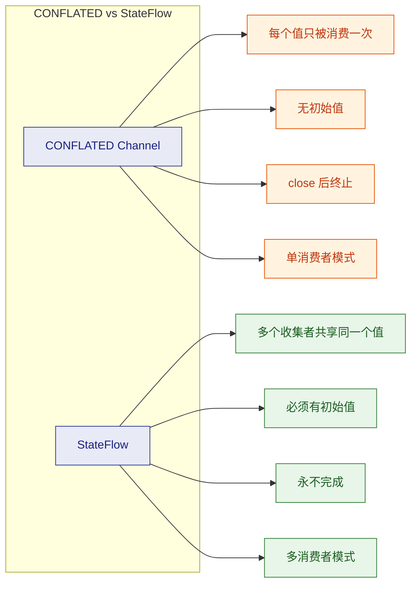
```mermaid
graph LR
    subgraph Compare["CONFLATED vs StateFlow"]
        direction TB
        CF["CONFLATED Channel"]
        SF["StateFlow"]
    end

    CF --> CF1["每个值只被消费一次"]
    CF --> CF2["无初始值"]
    CF --> CF3["close 后终止"]
    CF --> CF4["单消费者模式"]

    SF --> SF1["多个收集者共享同一个值"]
    SF --> SF2["必须有初始值"]
    SF --> SF3["永不完成"]
    SF --> SF4["多消费者模式"]

    classDef box fill:#E8EAF6,stroke:#283593,color:#1A237E
    classDef cfProp fill:#FFF3E0,stroke:#E65100,color:#BF360C
    classDef sfProp fill:#E8F5E9,stroke:#2E7D32,color:#1B5E20

    class CF,SF box
    class CF1,CF2,CF3,CF4 cfProp
    class SF1,SF2,SF3,SF4 sfProp
```

| 特性 | CONFLATED Channel | StateFlow |
|---|---|---|
| 消费模式 | **单消费者**（值被取走即消失） | **多观察者**（值可被多个 collector 读取） |
| 初始值 | 无初始值，`receive()` 时若无数据则挂起 | **必须提供初始值**，随时可读 `.value` |
| 生命周期 | 可以被 `close()` | **永不完成**（Never completes） |
| 重复值 | 重复值照常发送和接收 | 默认进行 **distinctUntilChanged**，相同值不通知 |
| 本质 | 通信管道（Communication Pipe） | 状态容器（State Holder） |

> 💡 **经验法则**：如果你需要的是"持有并广播最新状态"，用 `StateFlow`；如果你需要的是"协程间传递事件/信号，只关心最新那个"，用 `CONFLATED Channel`。

#### 适用场景

| 场景 | 说明 |
|---|---|
| **传感器/GPS 数据** | 只关心最新读数，历史中间值无意义 |
| **UI 状态快照** | 快速连续的状态变化，界面只需渲染最终态 |
| **进度百分比更新** | 从 0% 到 100%，跳过中间值对用户体验影响不大 |
| **频率降采样** | 高频生产 + 低频消费 = 天然的降采样效果 |

---

### 四种类型横向对比

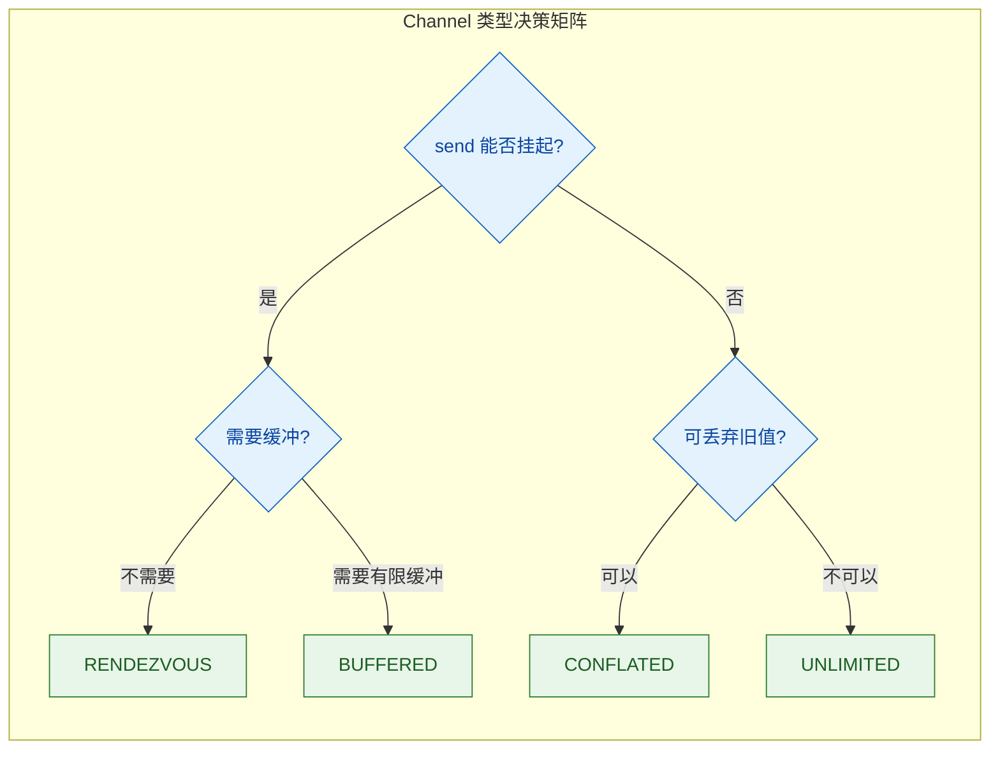
```mermaid
graph LR
    subgraph Matrix["Channel 类型决策矩阵"]
        direction TB
        Q1{"send 能否挂起?"}
        Q2{"需要缓冲?"}
        Q3{"可丢弃旧值?"}

        Q1 -->|"是"| Q2
        Q1 -->|"否"| Q3

        Q2 -->|"不需要"| A1["RENDEZVOUS"]
        Q2 -->|"需要有限缓冲"| A2["BUFFERED"]

        Q3 -->|"可以"| A3["CONFLATED"]
        Q3 -->|"不可以"| A4["UNLIMITED"]
    end

    classDef question fill:#E3F2FD,stroke:#1565C0,color:#0D47A1
    classDef answer fill:#E8F5E9,stroke:#2E7D32,color:#1B5E20

    class Q1,Q2,Q3 question
    class A1,A2,A3,A4 answer
```

| 维度 | RENDEZVOUS | BUFFERED | UNLIMITED | CONFLATED |
|---|---|---|---|---|
| **capacity** | `0` | `64`（默认） | `Int.MAX_VALUE` | `-1` |
| **send 挂起条件** | 无接收者时 | 缓冲满时 | **永不挂起** | **永不挂起** |
| **receive 挂起条件** | 无发送者时 | 缓冲空时 | 缓冲空时 | 无数据时 |
| **数据丢失风险** | 无 | 无 | 无 | **有**（旧值被覆盖） |
| **OOM 风险** | 无 | 极低 | **高** | 无 |
| **背压** | ✅ 最强 | ✅ 有 | ❌ 无 | ❌ 无 |
| **吞吐量** | 最低 | 中等 | 最高 | 取决于消费速率 |

```kotlin
import kotlinx.coroutines.channels.*

// 快速创建各类型 Channel 的惯用写法
fun main() {
    // 1. RENDEZVOUS：严格同步
    val rendezvous = Channel<Int>()                    // 默认即 RENDEZVOUS

    // 2. BUFFERED：平衡方案
    val buffered    = Channel<Int>(Channel.BUFFERED)   // 系统默认 64
    val buffered10  = Channel<Int>(10)                 // 自定义缓冲大小

    // 3. UNLIMITED：无限缓冲
    val unlimited   = Channel<Int>(Channel.UNLIMITED)  // 谨慎使用

    // 4. CONFLATED：只保留最新
    val conflated   = Channel<Int>(Channel.CONFLATED)  // 丢弃旧值
}
```

---

**📝 练习题**

以下 Kotlin 代码的输出中，消费者**最终一定**能收到哪些值？

```kotlin
fun main() = runBlocking {
    val ch = Channel<Int>(Channel.CONFLATED)
    launch {
        ch.send(1)
        ch.send(2)
        ch.send(3)
        ch.close()
    }
    delay(500)
    for (v in ch) { print("$v ") }
}
```

A. `1 2 3`


B. `3`


C. `1 3`


D. `2 3`


**【答案】** B

**【解析】** `Channel.CONFLATED` 的核心语义是 **只保留最新值**。生产者在 `launch` 中连续执行 `send(1)`、`send(2)`、`send(3)`，由于消费者此时处于 `delay(500)` 中尚未开始接收，三次 send 都不会挂起。每次 send 都会用新值覆盖缓冲区中的旧值：send(1) → 缓冲区 `[1]`；send(2) → 覆盖为 `[2]`；send(3) → 覆盖为 `[3]`。当消费者 500ms 后开始迭代时，缓冲区中只剩下 `3`，且 Channel 已 close，所以消费者只输出 `3`，然后迭代结束。值 `1` 和 `2` 被永久丢弃——这是 CONFLATED 的设计意图，不是 bug。

---

**📝 练习题**

关于 Kotlin Channel 的四种类型，以下哪个说法是**正确的**？

A. `Channel.RENDEZVOUS` 的 `receive()` 永远不会挂起，因为容量为 0 意味着数据直接传递。


B. `Channel.UNLIMITED` 的 `send()` 永远不会挂起，但可能导致 `OutOfMemoryError`。


C. `Channel.BUFFERED` 的默认缓冲大小是 128，且不可修改。


D. `Channel.CONFLATED` 会缓存所有历史值，消费者按照 LIFO（后进先出）顺序读取。


**【答案】** B

**【解析】** 逐项分析：**A 错误**——RENDEZVOUS 容量为 0 意味着没有缓冲区，当没有发送者等待时，`receive()` 会立即挂起。"直接传递"的前提是双方同时就绪。**B 正确**——UNLIMITED 的缓冲区大小为 `Int.MAX_VALUE`，send 永远不会挂起，所有未被消费的元素都堆积在内存中，如果消费者跟不上，内存会持续增长直到 OOM。**C 错误**——默认值是 64 而非 128，并且可以通过 JVM 系统属性 `kotlinx.coroutines.channels.defaultBuffer` 修改。**D 错误**——CONFLATED 只保留最新的一个值（覆盖旧值），不存在"缓存所有历史值"的行为，更不是 LIFO。

---

## 基本操作

Channel 的核心 API 极其精炼——发送、接收、关闭，三个动作就构成了协程间通信的完整生命周期。但简洁的接口背后，隐藏着丰富的挂起语义（suspend semantics）和状态机转换逻辑。深入理解这三个操作的行为边界，是正确使用 Channel、避免死锁和数据丢失的前提。

---

### send（发送）

`send` 是 `SendChannel<E>` 接口上定义的**挂起函数**（suspend function），其签名如下：

```kotlin
// SendChannel 接口中的核心方法
public suspend fun send(element: E)
```

调用 `send` 时，协程会尝试将元素放入 Channel 的内部缓冲区（如果有的话），或者直接移交给正在等待的接收方。关键在于：**当 Channel 已满（或无缓冲且无人接收）时，`send` 会挂起当前协程，直到有空间或有消费者准备好接收。** 这就是它与普通函数最本质的区别——它不会阻塞线程，而是释放线程去执行其他协程，等条件满足时再恢复（resume）。

我们可以用一个时序图来直观展示 `send` 在不同状态下的行为：

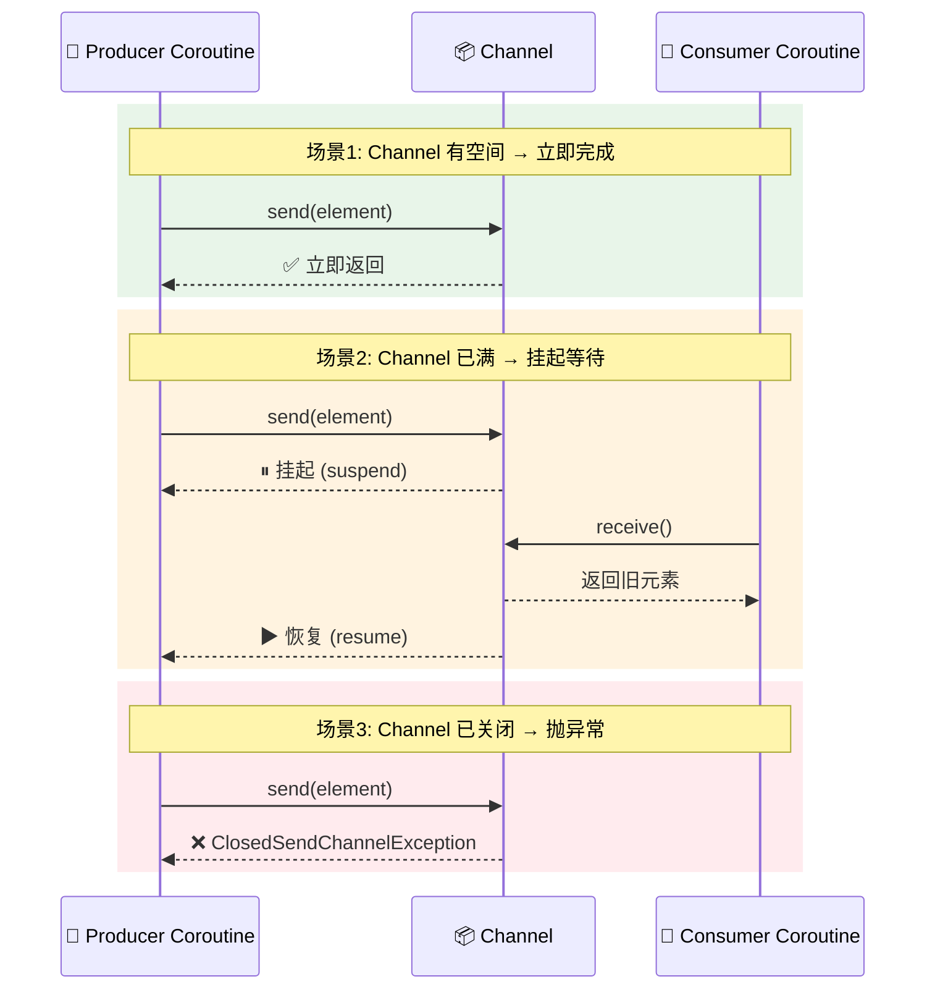
```mermaid
sequenceDiagram
    participant P as 🚀 Producer Coroutine
    participant CH as 📦 Channel
    participant C as 🎯 Consumer Coroutine

    rect rgb(232, 245, 233)
        Note over P,C: 场景1: Channel 有空间 → 立即完成
        P->>CH: send(element)
        CH-->>P: ✅ 立即返回
    end

    rect rgb(255, 243, 224)
        Note over P,C: 场景2: Channel 已满 → 挂起等待
        P->>CH: send(element)
        CH-->>P: ⏸ 挂起 (suspend)
        C->>CH: receive()
        CH-->>C: 返回旧元素
        CH-->>P: ▶ 恢复 (resume)
    end

    rect rgb(255, 235, 238)
        Note over P,C: 场景3: Channel 已关闭 → 抛异常
        P->>CH: send(element)
        CH-->>P: ❌ ClosedSendChannelException
    end
```

下面通过一段完整代码来体验 `send` 的挂起行为：

```kotlin
import kotlinx.coroutines.*
import kotlinx.coroutines.channels.*

fun main() = runBlocking {
    // 创建容量为 2 的缓冲 Channel
    val channel = Channel<Int>(capacity = 2)

    // 启动生产者协程
    val producer = launch {
        for (i in 1..5) {
            println("📤 准备发送: $i")
            // 当缓冲区已满时(已有2个元素)，send 会挂起
            channel.send(i)
            // 只有 send 成功返回后，才会执行这一行
            println("✅ 已发送: $i")
        }
        // 发送完毕后关闭 Channel，通知消费者不再有新数据
        channel.close()
    }

    // 模拟慢速消费者：每 500ms 消费一个
    launch {
        // 使用 for-in 迭代，Channel 关闭后自动退出循环
        for (value in channel) {
            println("📥 接收到: $value")
            // 故意延迟，让生产者体验到 send 挂起
            delay(500)
        }
        println("🏁 Channel 已关闭，消费结束")
    }
}
```

运行这段代码，你会观察到 `send(3)` 时生产者开始挂起，因为容量为 2 的缓冲区已被 `1` 和 `2` 占满。只有当消费者取走一个元素后，`send(3)` 才能恢复并成功写入。这就是 **背压机制**（backpressure）——Channel 天然地协调了生产者和消费者之间的速率差异。

#### trySend：非挂起的尝试性发送

有时你不希望协程被挂起，而是想"试一下，不行就算了"。Kotlin 提供了 `trySend` 方法：

```kotlin
// trySend 不是挂起函数，它返回一个 ChannelResult
// 表明发送操作的成功或失败
public fun trySend(element: E): ChannelResult<Unit>
```

```kotlin
import kotlinx.coroutines.*
import kotlinx.coroutines.channels.*

fun main() = runBlocking {
    // 创建一个容量仅为 1 的 Channel
    val channel = Channel<String>(capacity = 1)

    // 第一次 trySend：缓冲区为空，发送成功
    val result1 = channel.trySend("Hello")
    // isSuccess = true，元素已放入缓冲区
    println("第一次: isSuccess=${result1.isSuccess}")

    // 第二次 trySend：缓冲区已满，发送失败（不会挂起）
    val result2 = channel.trySend("World")
    // isSuccess = false，缓冲区没有空间
    println("第二次: isSuccess=${result2.isSuccess}")
    // isFailure = true，可以检查失败原因
    println("第二次: isFailure=${result2.isFailure}")

    // 取出一个元素后再试
    channel.receive()
    val result3 = channel.trySend("World")
    // 此时缓冲区重新有空间，发送成功
    println("第三次: isSuccess=${result3.isSuccess}")

    channel.close()

    // Channel 关闭后尝试发送
    val result4 = channel.trySend("!")
    // isClosed = true，表明 Channel 已关闭
    println("第四次: isClosed=${result4.isClosed}")
}
```

`trySend` 与 `send` 的核心区别在于它**永远不会挂起**：要么立即成功，要么立即返回失败。这在对延迟敏感的场景（如 UI 事件分发）中特别有用。

---

### receive（接收）

`receive` 是 `ReceiveChannel<E>` 接口上的挂起函数，语义与 `send` 对称：

```kotlin
// ReceiveChannel 接口中的核心方法
public suspend fun receive(): E
```

调用 `receive` 时，协程尝试从 Channel 中取出一个元素。**如果 Channel 为空（没有已缓冲的元素且没有挂起的发送者），`receive` 会挂起当前协程，直到有元素可用。** 如果 Channel 已关闭且缓冲区为空，则抛出 `ClosedReceiveChannelException`。

我们来看 `receive` 在不同状态下的完整行为矩阵：

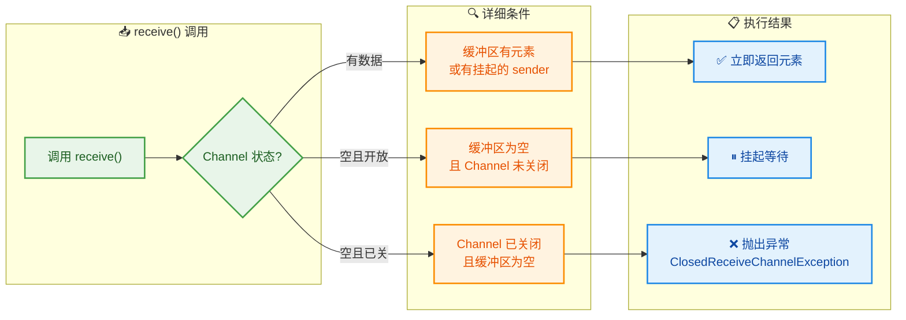
```mermaid
graph LR
    subgraph ReceiveCall["📥 receive() 调用"]
        direction TB
        A["调用 receive()"]
        B{"Channel 状态?"}
        A --> B
    end

    subgraph Results["📋 执行结果"]
        direction TB
        C["✅ 立即返回元素"]
        D["⏸ 挂起等待"]
        E["❌ 抛出异常<br/>ClosedReceiveChannelException"]
    end

    subgraph Conditions["🔍 详细条件"]
        direction TB
        F["缓冲区有元素<br/>或有挂起的 sender"]
        G["缓冲区为空<br/>且 Channel 未关闭"]
        H["Channel 已关闭<br/>且缓冲区为空"]
    end

    B -->|有数据| F
    B -->|空且开放| G
    B -->|空且已关| H

    F --> C
    G --> D
    H --> E

    classDef callStyle fill:#E8F5E9,stroke:#43A047,color:#1B5E20,stroke-width:2px
    classDef resultStyle fill:#E3F2FD,stroke:#1E88E5,color:#0D47A1,stroke-width:2px
    classDef condStyle fill:#FFF3E0,stroke:#FB8C00,color:#E65100,stroke-width:2px

    class A,B callStyle
    class C,D,E resultStyle
    class F,G,H condStyle
```

下面来看一个演示 `receive` 挂起行为的例子：

```kotlin
import kotlinx.coroutines.*
import kotlinx.coroutines.channels.*

fun main() = runBlocking {
    // 无缓冲 Channel（RENDEZVOUS），send 和 receive 必须"握手"
    val channel = Channel<Int>()

    // 消费者先启动，此时 Channel 为空，receive 会挂起
    val consumer = launch {
        println("👂 消费者: 等待第一个元素...")
        // 此处挂起，直到生产者调用 send
        val first = channel.receive()
        println("📥 消费者: 收到 $first")

        println("👂 消费者: 等待第二个元素...")
        val second = channel.receive()
        println("📥 消费者: 收到 $second")
    }

    // 延迟 1 秒后，生产者才开始发送
    launch {
        delay(1000)
        println("📤 生产者: 发送 42")
        // 消费者已在等待，send 和 receive 同时完成（rendezvous）
        channel.send(42)

        delay(1000)
        println("📤 生产者: 发送 99")
        channel.send(99)
    }
}
```

这个例子清晰地展示了在 RENDEZVOUS Channel 中，`receive` 先于 `send` 调用时，消费者协程会安静地挂起，而不是死循环或阻塞线程。

#### tryReceive：非挂起的尝试性接收

与 `trySend` 对应，`tryReceive` 提供非挂起的即时接收尝试：

```kotlin
// tryReceive 不会挂起，立即返回 ChannelResult
public fun tryReceive(): ChannelResult<E>
```

```kotlin
import kotlinx.coroutines.*
import kotlinx.coroutines.channels.*

fun main() = runBlocking {
    val channel = Channel<Int>(capacity = 3)

    // 先放入两个元素
    channel.send(10)
    channel.send(20)

    // tryReceive 立即成功，取出 10
    val r1 = channel.tryReceive()
    // getOrNull() 在成功时返回元素，失败时返回 null
    println("第一次: ${r1.getOrNull()}")   // 输出: 10

    // tryReceive 立即成功，取出 20
    val r2 = channel.tryReceive()
    println("第二次: ${r2.getOrNull()}")   // 输出: 20

    // 缓冲区为空，tryReceive 立即返回失败（不挂起）
    val r3 = channel.tryReceive()
    println("第三次: ${r3.getOrNull()}")   // 输出: null
    println("第三次 isSuccess: ${r3.isSuccess}")  // 输出: false

    channel.close()

    // Channel 关闭后 tryReceive
    val r4 = channel.tryReceive()
    // isClosed = true，且缓冲区已空
    println("第四次 isClosed: ${r4.isClosed}")  // 输出: true
}
```

#### receiveCatching：优雅处理关闭

直接调用 `receive()` 在 Channel 关闭时会抛出异常，这在实际开发中并不总是你想要的行为。`receiveCatching` 提供了一种更优雅的方式：

```kotlin
// 返回 ChannelResult<E> 而非直接返回 E
// 不会因 Channel 关闭而抛异常
public suspend fun receiveCatching(): ChannelResult<E>
```

```kotlin
import kotlinx.coroutines.*
import kotlinx.coroutines.channels.*

fun main() = runBlocking {
    val channel = Channel<String>(capacity = 2)

    // 放入两个元素后立刻关闭
    channel.send("Alpha")
    channel.send("Beta")
    channel.close()

    // 使用 while(true) + receiveCatching 循环消费
    while (true) {
        // receiveCatching 在 Channel 关闭且缓冲区为空时，
        // 不会抛异常，而是返回一个 closed 的 ChannelResult
        val result = channel.receiveCatching()

        // 检查是否已关闭且无数据
        if (result.isClosed) {
            println("🏁 Channel 关闭，退出循环")
            // 如果关闭时有异常原因，可以通过 exceptionOrNull() 获取
            println("关闭原因: ${result.exceptionOrNull()}")
            break
        }

        // 成功取出元素
        println("📥 收到: ${result.getOrNull()}")
    }
    // 输出:
    // 📥 收到: Alpha
    // 📥 收到: Beta
    // 🏁 Channel 关闭，退出循环
    // 关闭原因: null
}
```

实际上，在大多数场景中，**使用 `for` 循环迭代 Channel** 是最推荐的消费方式——它内部就是基于 `receiveCatching` 实现的，Channel 关闭后自动退出循环，代码最简洁：

```kotlin
// 推荐写法：for-in 迭代
for (element in channel) {
    // 处理元素
    // Channel 关闭后自动退出循环，无需手动检查
    process(element)
}
```

---

### close（关闭）

`close` 用于向 Channel 发出"不再有新数据"的信号。它是 `SendChannel` 接口上的**普通函数**（非挂起函数）：

```kotlin
// close 不是挂起函数，可以在任何地方调用
public fun close(cause: Throwable? = null): Boolean
```

调用 `close()` 后，Channel 进入**关闭状态**。这并不意味着数据会丢失——缓冲区中已有的元素仍然可以被接收。可以把它理解为一条管道的阀门：关闭阀门后，管道里还没流完的水（已缓冲的元素）依然会流到终点，但不能再往里面注入新水了。

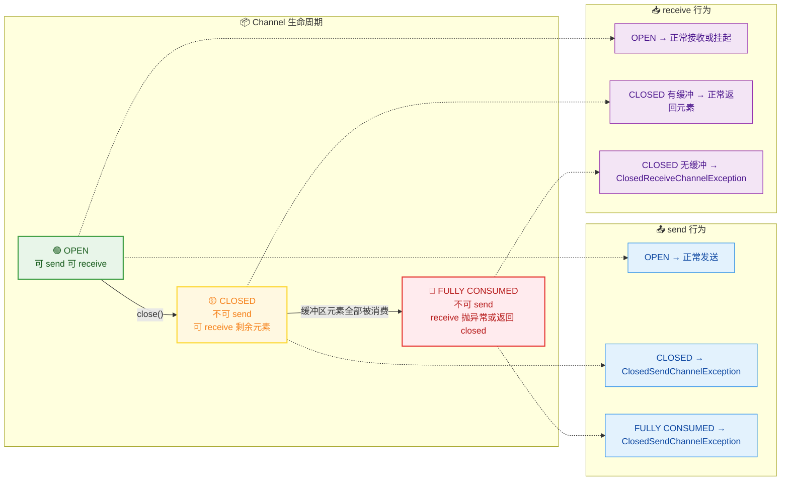
```mermaid
graph LR
    subgraph Lifecycle["📦 Channel 生命周期"]
        direction TB
        S1["🟢 OPEN<br/>可 send 可 receive"]
        S2["🟡 CLOSED<br/>不可 send<br/>可 receive 剩余元素"]
        S3["🔴 FULLY CONSUMED<br/>不可 send<br/>receive 抛异常或返回 closed"]
        S1 -->|"close()"| S2
        S2 -->|"缓冲区元素全部被消费"| S3
    end

    subgraph SendBehavior["📤 send 行为"]
        direction TB
        SA["OPEN → 正常发送"]
        SB["CLOSED → ClosedSendChannelException"]
        SC["FULLY CONSUMED → ClosedSendChannelException"]
    end

    subgraph RecvBehavior["📥 receive 行为"]
        direction TB
        RA["OPEN → 正常接收或挂起"]
        RB["CLOSED 有缓冲 → 正常返回元素"]
        RC["CLOSED 无缓冲 → ClosedReceiveChannelException"]
    end

    S1 -.-> SA
    S1 -.-> RA
    S2 -.-> SB
    S2 -.-> RB
    S3 -.-> SC
    S3 -.-> RC

    classDef openStyle fill:#E8F5E9,stroke:#43A047,color:#1B5E20,stroke-width:2px
    classDef closedStyle fill:#FFF8E1,stroke:#FDD835,color:#F57F17,stroke-width:2px
    classDef doneStyle fill:#FFEBEE,stroke:#E53935,color:#B71C1C,stroke-width:2px
    classDef sendStyle fill:#E3F2FD,stroke:#1E88E5,color:#0D47A1,stroke-width:1px
    classDef recvStyle fill:#F3E5F5,stroke:#8E24AA,color:#4A148C,stroke-width:1px

    class S1 openStyle
    class S2 closedStyle
    class S3 doneStyle
    class SA,SB,SC sendStyle
    class RA,RB,RC recvStyle
```

来看一段代码，完整演示 `close` 的各种行为细节：

```kotlin
import kotlinx.coroutines.*
import kotlinx.coroutines.channels.*

fun main() = runBlocking {
    val channel = Channel<Int>(capacity = 3)

    // 发送 3 个元素填满缓冲区
    channel.send(1)
    channel.send(2)
    channel.send(3)

    // 关闭 Channel，返回 true 表示是首次关闭
    val firstClose = channel.close()
    println("首次 close 返回: $firstClose")    // true

    // 重复关闭返回 false，不会抛异常
    val secondClose = channel.close()
    println("重复 close 返回: $secondClose")   // false

    // ====== 关闭后发送 ======
    try {
        // Channel 已关闭，send 会立即抛出 ClosedSendChannelException
        channel.send(4)
    } catch (e: ClosedSendChannelException) {
        println("❌ 发送失败: ${e::class.simpleName}")
    }

    // ====== 关闭后接收（缓冲区仍有数据）======
    // 缓冲区中的 1, 2, 3 仍然可以正常取出
    println("📥 ${channel.receive()}")  // 1
    println("📥 ${channel.receive()}")  // 2
    println("📥 ${channel.receive()}")  // 3

    // ====== 缓冲区清空后再接收 ======
    try {
        // 缓冲区已空且 Channel 已关闭 → 抛出异常
        channel.receive()
    } catch (e: ClosedReceiveChannelException) {
        println("❌ 接收失败: ${e::class.simpleName}")
    }
}
```

#### 带原因的关闭（Cause）

`close` 接受一个可选的 `Throwable` 参数作为关闭原因。如果提供了 cause，那么后续的 `receive` 在缓冲区清空后抛出的异常将携带这个原因，而非默认的 `ClosedReceiveChannelException`：

```kotlin
import kotlinx.coroutines.*
import kotlinx.coroutines.channels.*

fun main() = runBlocking {
    val channel = Channel<Int>(capacity = 2)

    channel.send(100)

    // 用自定义异常关闭 Channel，表示"出错了"
    channel.close(IllegalStateException("数据源异常，被迫关闭"))

    // 缓冲区中的元素仍然可以正常取出
    println("📥 ${channel.receive()}")  // 100

    // 缓冲区已空，再次接收时异常会携带 close 的 cause
    val result = channel.receiveCatching()
    println("isClosed: ${result.isClosed}")          // true
    // exceptionOrNull() 返回的就是 close 时传入的异常
    println("原因: ${result.exceptionOrNull()}")
    // 输出: 原因: java.lang.IllegalStateException: 数据源异常，被迫关闭
}
```

这种机制在错误传播（error propagation）中非常实用——生产者可以通过 `close(cause)` 告诉消费者"我出故障了"，消费者检查 cause 后可以做相应的错误处理，而不只是简单地"循环结束"。

#### isClosedForSend 与 isClosedForReceive

Channel 提供两个属性来查询关闭状态，它们的语义有微妙差别：

```kotlin
import kotlinx.coroutines.*
import kotlinx.coroutines.channels.*

fun main() = runBlocking {
    val channel = Channel<Int>(capacity = 2)

    channel.send(1)
    channel.send(2)

    // 此时 Channel 处于 OPEN 状态
    println("关闭前:")
    // isClosedForSend: 对发送者来说是否已关闭
    println("  isClosedForSend: ${channel.isClosedForSend}")       // false
    // isClosedForReceive: 对接收者来说是否已关闭
    println("  isClosedForReceive: ${channel.isClosedForReceive}") // false

    // 关闭 Channel
    channel.close()

    println("关闭后(缓冲区有数据):")
    // 对发送者来说，close() 后立即为 true
    println("  isClosedForSend: ${channel.isClosedForSend}")       // true
    // 对接收者来说，缓冲区仍有数据，所以还是 false！
    println("  isClosedForReceive: ${channel.isClosedForReceive}") // false

    // 取出所有剩余元素
    channel.receive() // 取出 1
    channel.receive() // 取出 2

    println("缓冲区清空后:")
    println("  isClosedForSend: ${channel.isClosedForSend}")       // true
    // 缓冲区已空，对接收者也关闭了
    println("  isClosedForReceive: ${channel.isClosedForReceive}") // true
}
```

用一张表格总结这两个属性的差异：

| 状态 | `isClosedForSend` | `isClosedForReceive` |
|------|:-:|:-:|
| **OPEN**（未关闭） | `false` | `false` |
| **CLOSED**（已关闭，缓冲区有数据） | `true` | `false` |
| **FULLY CONSUMED**（已关闭，缓冲区空） | `true` | `true` |

核心要点：`isClosedForReceive` 只有在 Channel 关闭 **且** 缓冲区完全清空后才为 `true`。这体现了 Channel 的设计哲学——**关闭是对发送端的立即约束，但对接收端是渐进式的，直到所有已有数据被消费完毕。**

#### cancel：强制取消

除了 `close()` 的优雅关闭，`ReceiveChannel` 还提供了 `cancel()` 方法进行**强制取消**：

```kotlin
import kotlinx.coroutines.*
import kotlinx.coroutines.channels.*

fun main() = runBlocking {
    val channel = Channel<Int>(capacity = 5)

    // 放入 5 个元素
    repeat(5) { channel.send(it) }

    // cancel 会立即丢弃缓冲区中所有未消费的元素
    channel.cancel()

    // 不同于 close()：cancel 后即使缓冲区有数据也无法接收
    val result = channel.receiveCatching()
    println("isClosed: ${result.isClosed}")  // true
    // 缓冲区的 0,1,2,3,4 全部丢失
}
```

`close()` vs `cancel()` 的区别可以总结为：

```text
close()  → "我说完了，你把剩下的听完。"（优雅关闭，保留缓冲数据）
cancel() → "我不要了，全部扔掉。"    （强制取消，丢弃缓冲数据）
```

---

**📝 练习题**

以下代码的输出结果是什么？

```kotlin
fun main() = runBlocking {
    val ch = Channel<Int>(capacity = 2)
    ch.send(10)
    ch.send(20)
    ch.close()
    
    println(ch.receiveCatching().getOrNull())
    println(ch.receiveCatching().getOrNull())
    println(ch.receiveCatching().getOrNull())
    println(ch.isClosedForReceive)
}
```

A. `10`、`20`、`ClosedReceiveChannelException`、`true`


B. `10`、`20`、`null`、`true`


C. `10`、`20`、`null`、`false`


D. `null`、`null`、`null`、`true`


**【答案】** B

**【解析】** Channel 关闭后，缓冲区中已有的元素仍然可以被正常消费。前两次 `receiveCatching()` 分别取出 `10` 和 `20`，`getOrNull()` 返回对应的值。第三次调用时，缓冲区已空且 Channel 已关闭，`receiveCatching()` 返回一个 `isClosed = true` 的 `ChannelResult`，此时 `getOrNull()` 返回 `null`（而非抛出异常，这正是 `receiveCatching` 相对于 `receive` 的优势）。最后查询 `isClosedForReceive`，由于 Channel 已关闭且缓冲区已完全清空，返回 `true`。选项 A 错误是因为 `receiveCatching` 不会抛异常；选项 C 错误是因为缓冲区在第三次调用前就已清空，此时 `isClosedForReceive` 一定为 `true`。

---

## produce 构建器

在前面的章节中，我们已经学会了如何通过 `Channel()` 工厂函数手动创建 Channel，然后在一个协程中 `send`、在另一个协程中 `receive`。这种写法虽然直观，但存在一个 **结构性隐患**——Channel 的生命周期管理完全依赖开发者手动调用 `close()`。一旦生产者协程因异常提前退出而忘记关闭 Channel，消费者就会 **永远挂起**（hang forever），造成协程泄漏。

Kotlin 协程库为此提供了一个更安全、更优雅的构建器：**`produce`**。它将 "启动一个协程" 和 "创建一个 Channel" 这两件事合二为一，并且 **自动管理 Channel 的关闭**，从根本上消除了上述隐患。

---

### produce 的核心思想

`produce` 的设计哲学可以用一句话概括：**让 Channel 的生命周期与生产者协程的生命周期绑定**。

- 协程正常结束 → Channel 自动 `close()`
- 协程异常终止 → Channel 自动 `cancel()`（带异常原因）
- 外部取消 Channel → 生产者协程也被取消

这种双向绑定的机制，在协程世界中被称为 **Structured Concurrency（结构化并发）** 的体现之一。我们来看一下 `produce` 在整个 Channel 生态中的位置：

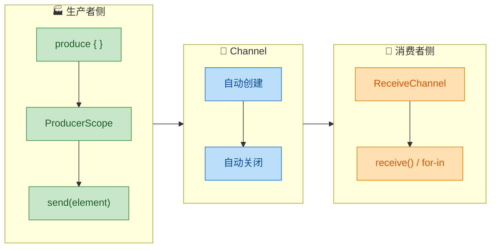
```mermaid
graph LR
    subgraph Producer["🏭 生产者侧"]
        direction TB
        A["produce { }"] --> B["ProducerScope"]
        B --> C["send(element)"]
    end

    subgraph Channel["📨 Channel"]
        direction TB
        D["自动创建"] --> E["自动关闭"]
    end

    subgraph Consumer["🛒 消费者侧"]
        direction TB
        F["ReceiveChannel"] --> G["receive() / for-in"]
    end

    Producer --> Channel --> Consumer

    classDef green fill:#C8E6C9,stroke:#388E3C,color:#1B5E20
    classDef blue fill:#BBDEFB,stroke:#1976D2,color:#0D47A1
    classDef orange fill:#FFE0B2,stroke:#F57C00,color:#E65100

    class A,B,C green
    class D,E blue
    class F,G orange
```

可以看到，`produce` 返回的并不是一个完整的 `Channel`（同时具备 send 和 receive 能力），而是一个 **`ReceiveChannel`**——消费者只能从中读取数据，无法反向写入。这体现了 **职责分离（Separation of Concerns）** 原则：生产逻辑封装在 `produce` 内部，外部只暴露消费接口。

---

### produce 的函数签名

我们来仔细拆解 `produce` 的完整签名：

```kotlin
// CoroutineScope 的扩展函数，返回 ReceiveChannel
public fun <E> CoroutineScope.produce(
    context: CoroutineContext = EmptyCoroutineContext,  // 可指定调度器等上下文
    capacity: Int = 0,                                  // Channel 缓冲容量，默认 RENDEZVOUS
    block: suspend ProducerScope<E>.() -> Unit           // 生产者逻辑，lambda 的 receiver 是 ProducerScope
): ReceiveChannel<E>
```

几个关键点：

1. **`CoroutineScope` 扩展函数**：`produce` 必须在一个协程作用域内调用，这保证了结构化并发——父协程取消时，`produce` 内部的协程也会被取消。

2. **`capacity` 参数**：默认值为 `0`，即 `Channel.RENDEZVOUS`（无缓冲）。你也可以传入 `Channel.BUFFERED`、`Channel.UNLIMITED`、`Channel.CONFLATED` 或任意正整数。

3. **`ProducerScope<E>`**：这是 `produce` lambda 的 receiver type。它同时继承了 `CoroutineScope` 和 `SendChannel<E>`，所以在 lambda 内部你既可以启动子协程，也可以直接调用 `send()`。

4. **返回 `ReceiveChannel<E>`**：外部拿到的是一个只读的接收端。

---

### 基本用法

下面是一个最基础的 `produce` 示例——生成一个整数序列：

```kotlin
import kotlinx.coroutines.*
import kotlinx.coroutines.channels.*

fun main() = runBlocking {
    // produce 启动一个新协程，并返回 ReceiveChannel<Int>
    val numbers: ReceiveChannel<Int> = produce {
        // 这里的 this 是 ProducerScope<Int>
        for (i in 1..5) {
            println("正在发送: $i")  // 打印发送日志
            send(i)                  // 向 Channel 发送数据
        }
        // lambda 执行完毕后，Channel 自动关闭
        println("生产者协程结束，Channel 已自动关闭")
    }

    // 消费者侧：通过 for-in 遍历 ReceiveChannel
    for (num in numbers) {            // 当 Channel 关闭后，for 循环自动退出
        println("接收到: $num")
    }

    println("消费完毕")
}
```

输出结果（由于默认 RENDEZVOUS，send 和 receive 交替执行）：

```text
正在发送: 1
接收到: 1
正在发送: 2
接收到: 2
正在发送: 3
接收到: 3
正在发送: 4
接收到: 4
正在发送: 5
接收到: 5
生产者协程结束，Channel 已自动关闭
消费完毕
```

对比一下如果 **不用 produce**，同样的功能需要这么写：

```kotlin
fun main() = runBlocking {
    val channel = Channel<Int>()      // 手动创建 Channel

    // 手动启动生产者协程
    launch {
        for (i in 1..5) {
            channel.send(i)           // 发送数据
        }
        channel.close()               // ⚠️ 必须手动关闭！忘记就会导致消费者永远挂起
    }

    for (num in channel) {
        println("接收到: $num")
    }
}
```

差异一目了然：手动方式需要你记得调用 `close()`，而 `produce` 把这个职责自动化了。

---

### 异常安全：produce 的核心优势

`produce` 最大的价值不在于省了一行 `close()`，而在于 **异常场景下的安全性**。考虑以下情况：

```kotlin
fun main() = runBlocking {
    val channel = Channel<Int>()

    launch {
        for (i in 1..5) {
            if (i == 3) throw RuntimeException("出错了！") // 第3次发送时崩溃
            channel.send(i)
        }
        channel.close() // ❌ 这行永远不会被执行！
    }

    // 消费者将在接收完 1, 2 后永远挂起
    for (num in channel) {
        println("接收到: $num")
    }
}
```

在上面的代码中，生产者在 `i == 3` 时抛出了异常，`close()` 永远不会被执行。消费者在接收完 `1` 和 `2` 之后，`for` 循环将 **永远挂起**，因为 Channel 既没有关闭也不会再有新数据。

当然，你可以用 `try-finally` 来修补：

```kotlin
launch {
    try {
        for (i in 1..5) {
            if (i == 3) throw RuntimeException("出错了！")
            channel.send(i)
        }
    } finally {
        channel.close() // 无论如何都关闭
    }
}
```

但这增加了样板代码（boilerplate），而且开发者必须 **每次** 都记得写。`produce` 则自动完成这一切：

```kotlin
fun main() = runBlocking {
    val numbers = produce {
        for (i in 1..5) {
            if (i == 3) throw RuntimeException("出错了！")
            send(i)
        }
        // 不需要 try-finally，produce 会自动用异常关闭 Channel
    }

    try {
        for (num in numbers) {         // 当异常传播时，这里会抛出异常
            println("接收到: $num")
        }
    } catch (e: Exception) {
        println("捕获异常: ${e.message}")
    }
}
```

```text
接收到: 1
接收到: 2
捕获异常: 出错了！
```

`produce` 内部的实现逻辑大致等价于：

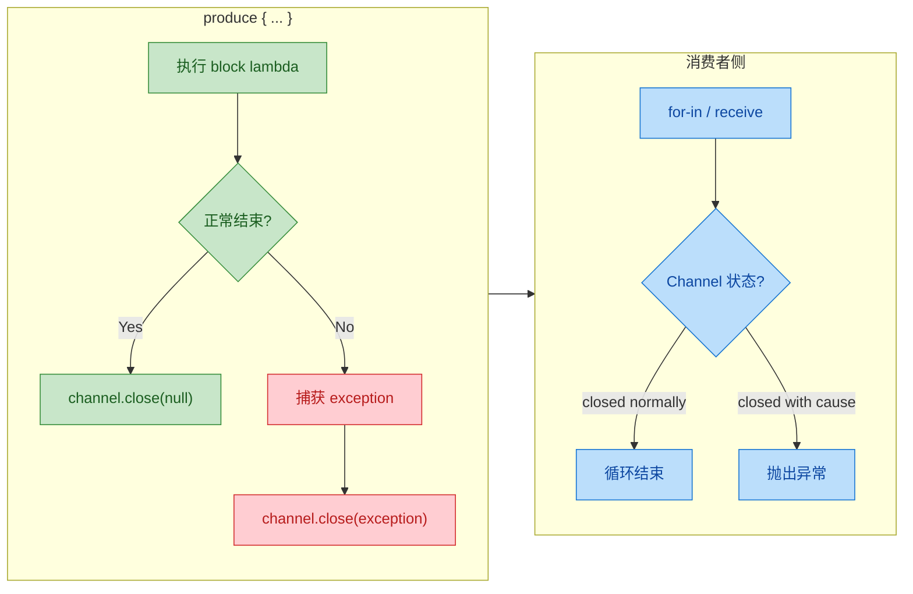
```mermaid
graph LR
    subgraph ProduceBlock["produce { ... }"]
        direction TB
        A["执行 block lambda"] --> B{"正常结束?"}
        B -- Yes --> C["channel.close(null)"]
        B -- No --> D["捕获 exception"]
        D --> E["channel.close(exception)"]
    end

    subgraph ConsumerSide["消费者侧"]
        direction TB
        F["for-in / receive"] --> G{"Channel 状态?"}
        G -- "closed normally" --> H["循环结束"]
        G -- "closed with cause" --> I["抛出异常"]
    end

    ProduceBlock --> ConsumerSide

    classDef green fill:#C8E6C9,stroke:#388E3C,color:#1B5E20
    classDef red fill:#FFCDD2,stroke:#D32F2F,color:#B71C1C
    classDef blue fill:#BBDEFB,stroke:#1976D2,color:#0D47A1

    class A,B,C green
    class D,E red
    class F,G,H,I blue
```

---

### produce 与 capacity 配合

`produce` 可以通过 `capacity` 参数指定缓冲策略，与 `Channel()` 工厂函数的参数完全一致：

```kotlin
fun main() = runBlocking {
    // 创建一个带 5 个缓冲位的 Channel
    val bufferedChannel = produce(capacity = 5) {
        for (i in 1..10) {
            println("[${System.currentTimeMillis()}] 发送: $i")
            send(i)   // 前 5 个不会挂起，因为缓冲区有空间
        }
    }

    delay(1000)  // 消费者延迟 1 秒后才开始消费

    for (num in bufferedChannel) {
        println("[${System.currentTimeMillis()}] 接收: $num")
    }
}
```

不同 capacity 策略的行为总结：

```kotlin
// RENDEZVOUS (默认, capacity = 0):
//   每次 send 必须等 receive 到来才能继续
produce(capacity = Channel.RENDEZVOUS) { /* ... */ }

// BUFFERED (capacity = Channel.BUFFERED, 默认64):
//   缓冲区满之前 send 不挂起
produce(capacity = Channel.BUFFERED) { /* ... */ }

// UNLIMITED (capacity = Channel.UNLIMITED):
//   send 永远不挂起，内存不够时 OOM
produce(capacity = Channel.UNLIMITED) { /* ... */ }

// CONFLATED (capacity = Channel.CONFLATED):
//   只保留最新值，旧值被覆盖
produce(capacity = Channel.CONFLATED) { /* ... */ }
```

---

### 实战：用 produce 构建管道（Pipeline）

`produce` 最经典的应用场景之一就是 **Pipeline（管道）** 模式。多个 `produce` 串联起来，前一个的输出作为后一个的输入，形成数据流水线。

下面我们实现一个经典示例：**生成自然数 → 筛选偶数 → 计算平方**。

```kotlin
import kotlinx.coroutines.*
import kotlinx.coroutines.channels.*

// 第一级管道：生成从 start 开始的自然数
fun CoroutineScope.produceNumbers(start: Int): ReceiveChannel<Int> = produce {
    var x = start                   // 从 start 开始
    while (true) {                  // 无限生成
        send(x++)                   // 发送当前值并递增
    }
}

// 第二级管道：过滤偶数
fun CoroutineScope.filterEven(source: ReceiveChannel<Int>): ReceiveChannel<Int> = produce {
    for (num in source) {           // 从上游 Channel 逐个接收
        if (num % 2 == 0) {        // 只保留偶数
            send(num)               // 转发到下游
        }
    }
}

// 第三级管道：计算平方
fun CoroutineScope.square(source: ReceiveChannel<Int>): ReceiveChannel<Int> = produce {
    for (num in source) {           // 从上游 Channel 逐个接收
        send(num * num)             // 发送平方值到下游
    }
}

fun main() = runBlocking {
    val numbers = produceNumbers(1)           // 1, 2, 3, 4, 5, ...
    val evens = filterEven(numbers)           // 2, 4, 6, 8, 10, ...
    val squares = square(evens)               // 4, 16, 36, 64, 100, ...

    // 只取前 5 个结果
    repeat(5) {
        println(squares.receive())            // 从最终管道接收数据
    }

    // 取消整个管道：cancel 最下游即可，取消会沿链路向上传播
    coroutineContext.cancelChildren()
}
```

输出：

```text
4
16
36
64
100
```

整条管道的数据流向如下：

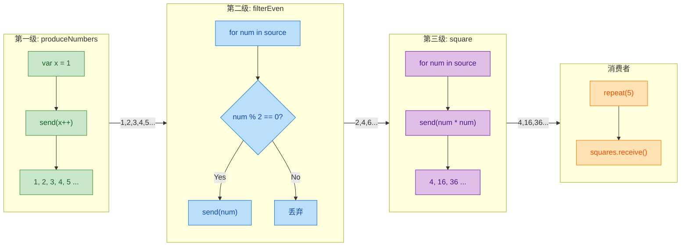
```mermaid
graph LR
    subgraph Stage1["第一级: produceNumbers"]
        direction TB
        A1["var x = 1"] --> A2["send(x++)"]
        A2 --> A3["1, 2, 3, 4, 5 ..."]
    end

    subgraph Stage2["第二级: filterEven"]
        direction TB
        B1["for num in source"] --> B2{"num % 2 == 0?"}
        B2 -- Yes --> B3["send(num)"]
        B2 -- No --> B4["丢弃"]
    end

    subgraph Stage3["第三级: square"]
        direction TB
        C1["for num in source"] --> C2["send(num * num)"]
        C2 --> C3["4, 16, 36 ..."]
    end

    subgraph Consumer["消费者"]
        direction TB
        D1["repeat(5)"] --> D2["squares.receive()"]
    end

    Stage1 -->|"1,2,3,4,5..."| Stage2
    Stage2 -->|"2,4,6..."| Stage3
    Stage3 -->|"4,16,36..."| Consumer

    classDef s1 fill:#C8E6C9,stroke:#388E3C,color:#1B5E20
    classDef s2 fill:#BBDEFB,stroke:#1976D2,color:#0D47A1
    classDef s3 fill:#E1BEE7,stroke:#7B1FA2,color:#4A148C
    classDef s4 fill:#FFE0B2,stroke:#F57C00,color:#E65100

    class A1,A2,A3 s1
    class B1,B2,B3,B4 s2
    class C1,C2,C3 s3
    class D1,D2 s4
```

Pipeline 模式的优势在于：
- **惰性求值（Lazy Evaluation）**：数据按需流动，不会一次性生成所有数据。上面的 `produceNumbers` 是一个无限序列，但因为消费者只取了 5 个结果，实际上只有极少量的数字被生成和传递。
- **关注点分离**：每一级只负责一种转换逻辑，代码清晰可组合。
- **背压（Backpressure）**：由于 Channel 的挂起特性，如果下游处理慢，上游会自然被挂起等待，不会造成数据堆积（RENDEZVOUS 模式下尤其明显）。

---

### produce 与取消传播

`produce` 返回的 `ReceiveChannel` 实际类型是 `ChannelCoroutine`，它同时实现了 `ReceiveChannel` 和 `Job` 接口。这意味着你可以直接 `cancel()` 这个返回值：

```kotlin
fun main() = runBlocking {
    val numbers = produce {
        var i = 0
        while (true) {
            send(i++)               // 不断发送
            delay(100)              // 每 100ms 发送一次
        }
    }

    delay(550)                       // 等待约 550ms
    numbers.cancel()                 // 直接取消 ReceiveChannel
    // 此时 produce 内部的协程也会被取消
    println("管道已取消")
}
```

取消传播的方向是 **双向** 的：

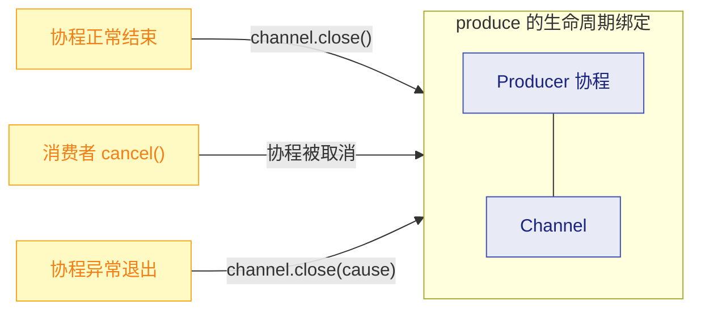
```mermaid
graph LR
    subgraph Bind["produce 的生命周期绑定"]
        direction TB
        P["Producer 协程"]
        CH["Channel"]
        P --- CH
    end

    L["协程正常结束"] -->|"channel.close()"| Bind
    R["消费者 cancel()"] -->|"协程被取消"| Bind
    EX["协程异常退出"] -->|"channel.close(cause)"| Bind

    classDef bind fill:#E8EAF6,stroke:#3F51B5,color:#1A237E
    classDef event fill:#FFF9C4,stroke:#F9A825,color:#F57F17

    class P,CH bind
    class L,R,EX event
```

这种双向绑定是 `produce` 相比手动 `launch` + `Channel()` 最大的结构性优势。在复杂的管道场景中，你只需要取消最下游的 Channel 或者取消父协程的 children，整条链路就会被干净地回收，不留任何悬空的协程或未关闭的 Channel。

---

### ProducerScope 详解

`produce` 的 lambda receiver 是 `ProducerScope<E>`，它的继承关系值得了解：

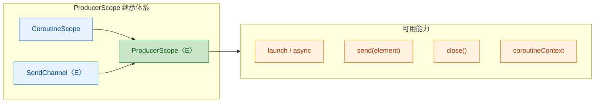
```mermaid
graph LR
    subgraph Hierarchy["ProducerScope 继承体系"]
        direction TB
        CS["CoroutineScope"] --> PS["ProducerScope〈E〉"]
        SC["SendChannel〈E〉"] --> PS
    end

    subgraph Capabilities["可用能力"]
        direction TB
        C1["launch / async"] 
        C2["send(element)"]
        C3["close()"]
        C4["coroutineContext"]
    end

    PS --> Capabilities

    classDef iface fill:#E3F2FD,stroke:#1565C0,color:#0D47A1
    classDef impl fill:#C8E6C9,stroke:#388E3C,color:#1B5E20
    classDef cap fill:#FFF3E0,stroke:#EF6C00,color:#BF360C

    class CS,SC iface
    class PS impl
    class C1,C2,C3,C4 cap
```

因为 `ProducerScope` 同时是 `CoroutineScope` 和 `SendChannel`，你可以在 `produce` 的 lambda 内部做以下事情：

```kotlin
val resultChannel = produce<String>(capacity = 10) {
    // 1. 直接调用 send()（来自 SendChannel）
    send("直接发送")

    // 2. 启动子协程来并发生产（来自 CoroutineScope）
    launch {
        send("来自子协程 A")
    }
    launch {
        send("来自子协程 B")
    }

    // 3. 访问 channel 属性（ProducerScope 自身提供）
    println("Channel 是否已关闭: ${channel.isClosedForSend}")
}
```

但需要注意：虽然你 **可以** 在 `ProducerScope` 内手动调用 `close()`，但通常 **不应该** 这么做。让 `produce` 在 lambda 结束时自动关闭是最佳实践。

---

### 常见误区与最佳实践

**误区 1：在 produce 外部尝试 send**

```kotlin
val ch = produce<Int> { send(1) }
// ch 的类型是 ReceiveChannel<Int>，没有 send 方法
// ch.send(2)  // ❌ 编译错误！
```

`produce` 返回 `ReceiveChannel`，这是 **by design** 的。它强制只有内部的生产者协程才能写入数据。

**误区 2：忘记消费导致生产者永远挂起**

```kotlin
val ch = produce {     // RENDEZVOUS 模式
    send(1)            // 如果没人 receive，这里将永远挂起
}
// 如果你忘记 receive，生产者就泄漏了
```

解决方案：确保消费者逻辑完善，或者在不需要时及时 `cancel()` 掉 ReceiveChannel。

**最佳实践总结**：

| 实践 | 说明 |
|---|---|
| 优先使用 `produce` 而非手动 Channel | 自动关闭，异常安全 |
| 将 `produce` 定义为 `CoroutineScope` 的扩展函数 | 遵循结构化并发 |
| Pipeline 中取消最下游或 `cancelChildren()` | 整条链路自动回收 |
| 不在 `produce` 内部手动 `close()` | 让框架管理生命周期 |
| 根据场景选择合适的 `capacity` | 避免不必要的挂起或内存浪费 |

---

**📝 练习题**

以下代码的输出结果是什么？

```kotlin
fun main() = runBlocking {
    val channel = produce {
        send(1)
        send(2)
        throw IllegalStateException("boom")
        send(3) // unreachable
    }

    try {
        for (value in channel) {
            println("Got $value")
        }
    } catch (e: Exception) {
        println("Error: ${e.message}")
    }
}
```

A. Got 1 → Got 2 → Got 3


B. Got 1 → Got 2 → Error: boom


C. Got 1 → Got 2 → 程序挂起，永不结束


D. 直接抛出异常，无任何输出


**【答案】** B

**【解析】** `produce` 构建器在内部协程异常退出时，会自动以该异常作为 `cause` 关闭 Channel（等价于 `channel.close(IllegalStateException("boom"))`）。消费者侧的 `for-in` 循环在接收到 `1` 和 `2` 之后，下一次尝试接收时发现 Channel 已带异常关闭，于是会重新抛出该异常。因此 `try-catch` 捕获到了 `IllegalStateException`，打印 `Error: boom`。`send(3)` 是不可达代码，永远不会执行。如果这段逻辑使用的是手动 `launch` + `Channel()` 且没有 `try-finally` 保护 `close()`，选项 C（程序永远挂起）就会成为现实——这正是 `produce` 要解决的核心问题。

---

## actor 构建器

### actor 的定位：消费者侧的协程构建器

在上一节中我们学习了 `produce` 构建器——它是一个 **生产者侧（Producer-side）** 的便捷封装，能自动创建一个协程并对外暴露一个 `ReceiveChannel` 供消费者读取。那么自然地，Kotlin 协程库也提供了一个与之 **对称** 的构建器：`actor`。

`actor` 是一个 **消费者侧（Consumer-side）** 的协程构建器。它启动一个协程来 **接收并处理消息**，同时对外暴露一个 `SendChannel`，让外部的生产者可以往里面发送数据。这种设计直接对应了经典并发模型中的 **Actor 模型（Actor Model）**。

> **核心思想**：Actor 模型的哲学是 **"Don't communicate by sharing memory; share memory by communicating."**（不要通过共享内存来通信，而要通过通信来共享内存。）每个 Actor 拥有自己的私有状态，外界只能通过发送消息来与之交互，从而天然地避免了竞态条件（Race Condition）。

简单来说：

| 构建器 | 启动的协程角色 | 对外暴露 | 数据流向 |
|---------|--------------|---------|---------|
| `produce` | 生产者 | `ReceiveChannel` | 协程 → 外部 |
| `actor` | 消费者 | `SendChannel` | 外部 → 协程 |

这种对称性非常优雅。`produce` 封装了"我来生产，你来消费"的模式，而 `actor` 封装了"你来生产，我来处理"的模式。两者都以 Channel 为核心通信管道，只是方向相反。

---

### actor 的函数签名与核心参数

我们先来看 `actor` 的函数签名（已简化非关键参数）：

```kotlin
// actor 构建器的函数签名
@ObsoleteCoroutinesApi // 注意：当前标记为实验性/过时 API
fun <E> CoroutineScope.actor(
    context: CoroutineContext = EmptyCoroutineContext,  // 协程上下文，可指定调度器等
    capacity: Int = 0,                                   // Channel 缓冲容量，默认为 RENDEZVOUS（无缓冲）
    start: CoroutineStart = CoroutineStart.DEFAULT,      // 启动模式，默认立即调度
    onCompletion: CompletionHandler? = null,              // 协程完成时的回调（可选）
    block: suspend ActorScope<E>.() -> Unit              // Actor 协程体，在 ActorScope 中执行
): SendChannel<E>  // 返回值：一个 SendChannel，外部通过它向 Actor 发送消息
```

几个关键点需要特别理解：

**第一，返回值是 `SendChannel<E>`**。这与 `produce` 返回 `ReceiveChannel<E>` 恰好相反。外部拿到这个 `SendChannel` 后，只能执行 `send()` 操作，将消息投递给 Actor 内部处理。

**第二，协程体运行在 `ActorScope<E>` 中**。`ActorScope` 继承自 `CoroutineScope`，同时实现了 `ReceiveChannel<E>` 接口。这意味着在协程体内部，你可以直接调用 `receive()`、使用 `for` 循环迭代消息，或者通过 `channel` 属性访问底层 Channel——与 `produce` 中的 `ProducerScope` 相对应。

**第三，`@ObsoleteCoroutinesApi` 注解**。这一点非常重要，后面会专门讨论。`actor` 构建器目前被标记为"过时的实验性 API"，官方计划在未来用更完善的 Actor 实现替代它。但它的 **设计思想和使用模式** 依然是面试高频考点和理解并发编程的重要基石。

---

### actor 的基本使用

下面通过一个完整的示例来展示 `actor` 的典型用法——用 Actor 来安全地管理计数器状态：

```kotlin
import kotlinx.coroutines.*
import kotlinx.coroutines.channels.*

// 定义消息类型：使用密封类来描述 Actor 能处理的所有消息
sealed class CounterMsg                             // 密封类作为消息协议的基类

object IncCounter : CounterMsg()                    // 消息1：递增计数器（无需携带数据）

class GetCounter(                                   // 消息2：获取当前计数值
    val response: CompletableDeferred<Int>           // 携带一个 Deferred，Actor 会把结果写入其中
) : CounterMsg()

// 创建一个 counterActor，它内部维护私有计数器状态
@OptIn(ObsoleteCoroutinesApi::class)                // 显式声明使用过时 API
fun CoroutineScope.counterActor() = actor<CounterMsg> {
    var counter = 0                                  // Actor 的私有状态，外界无法直接访问
    for (msg in channel) {                           // 持续从 channel 中接收消息（挂起式循环）
        when (msg) {                                 // 根据消息类型分发处理
            is IncCounter -> counter++               // 收到递增消息 → 计数器 +1
            is GetCounter -> msg.response.complete(counter) // 收到查询消息 → 将当前值写入 response
        }
    }
}

fun main() = runBlocking<Unit> {
    val counter = counterActor()                     // 启动 Actor，拿到 SendChannel<CounterMsg>

    // 模拟大量并发递增操作
    val jobs = List(100) {                           // 创建 100 个协程
        launch {
            repeat(1000) {                           // 每个协程发送 1000 次递增消息
                counter.send(IncCounter)             // 通过 SendChannel 向 Actor 发送消息
            }
        }
    }
    jobs.forEach { it.join() }                       // 等待所有协程完成

    // 查询最终计数值
    val response = CompletableDeferred<Int>()        // 创建一个空的 Deferred 容器
    counter.send(GetCounter(response))               // 发送查询消息，并附带 Deferred
    println("Counter = ${response.await()}")         // 挂起等待 Actor 回写结果 → 输出: Counter = 100000
    counter.close()                                  // 关闭 Actor 的 SendChannel，Actor 协程会自然结束
}
```

这段代码的核心亮点在于：`counter` 变量是 Actor 协程体内部的 **局部变量**，100 个并发协程同时向 Actor 发送消息，但所有消息都会 **排队进入 Channel**，Actor 协程 **串行地** 逐条处理。因此根本不需要 `Mutex`、`synchronized` 或 `AtomicInteger`——**并发安全由 Channel 的消息队列机制天然保证**。

---

### actor 的内部运行机制

让我们用一张 Mermaid 图来清晰展示 Actor 模型的消息流转过程：

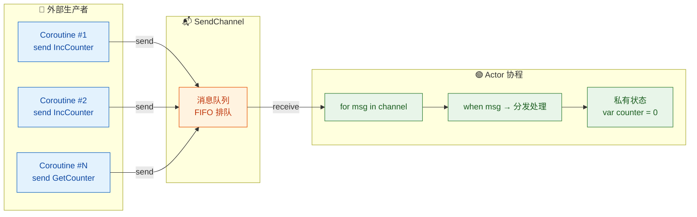
```mermaid
graph LR
    subgraph Producers["🔵 外部生产者"]
        direction TB
        P1["Coroutine #1<br/>send IncCounter"]
        P2["Coroutine #2<br/>send IncCounter"]
        P3["Coroutine #N<br/>send GetCounter"]
    end

    subgraph CH["📬 SendChannel"]
        direction TB
        Q["消息队列<br/>FIFO 排队"]
    end

    subgraph AC["🟢 Actor 协程"]
        direction TB
        RECV["for msg in channel"]
        STATE["私有状态<br/>var counter = 0"]
        WHEN["when msg → 分发处理"]
        RECV --> WHEN
        WHEN --> STATE
    end

    P1 -->|send| Q
    P2 -->|send| Q
    P3 -->|send| Q
    Q -->|receive| RECV

    classDef producerStyle fill:#E3F2FD,stroke:#1565C0,color:#0D47A1
    classDef channelStyle fill:#FFF3E0,stroke:#E65100,color:#BF360C
    classDef actorStyle fill:#E8F5E9,stroke:#2E7D32,color:#1B5E20

    class P1,P2,P3 producerStyle
    class Q channelStyle
    class RECV,STATE,WHEN actorStyle
```

整个流程可以归纳为三步：

1. **外部发送**：任意数量的协程通过 `SendChannel.send()` 投递消息。如果 Channel 缓冲已满（或无缓冲），发送方会 **挂起等待**，不会阻塞线程。
2. **队列缓冲**：消息在 Channel 内部按 FIFO（先进先出）顺序排队。
3. **Actor 串行处理**：Actor 协程从 Channel 中逐条取出消息，根据消息类型执行不同逻辑。由于只有一个协程在处理，所以对内部状态的读写天然是线程安全的。

---

### 消息协议设计模式

在 Actor 模型中，**消息协议（Message Protocol）** 的设计至关重要。Kotlin 的密封类（`sealed class`）是定义消息协议的最佳选择，因为 `when` 表达式可以确保穷举所有消息类型，编译器会帮你检查是否遗漏。

常见的消息设计模式有以下三种：

**模式一：纯命令型（Fire-and-Forget）**

```kotlin
// 只通知 Actor 做某事，不关心结果
sealed class Command                                 // 命令基类
object Increment : Command()                         // 递增
object Reset : Command()                             // 重置
```

这种消息发出后不需要等待任何返回值，适用于"通知即可"的场景。

**模式二：请求-响应型（Request-Response）**

```kotlin
// 需要 Actor 返回结果，通过 CompletableDeferred 回传
class GetValue(
    val response: CompletableDeferred<Int>           // 调用方传入一个 Deferred 作为"回信信封"
) : Command()

// 使用方式：
suspend fun getValue(actor: SendChannel<Command>): Int {
    val deferred = CompletableDeferred<Int>()        // 创建回信信封
    actor.send(GetValue(deferred))                   // 将信封随消息一起发给 Actor
    return deferred.await()                          // 挂起等待 Actor 写入结果
}
```

这是最经典的 Actor 通信模式。外部通过 `CompletableDeferred` 传入一个"回调信封"，Actor 处理完后调用 `complete()` 写入结果，外部通过 `await()` 拿到响应。

**模式三：携带数据型（Data Message）**

```kotlin
// 消息本身携带业务数据
data class AddItem(val item: String) : Command()     // 添加元素，携带具体的 item 数据
data class RemoveItem(val item: String) : Command()  // 移除元素
```

---

### actor vs produce：对称性深度对比

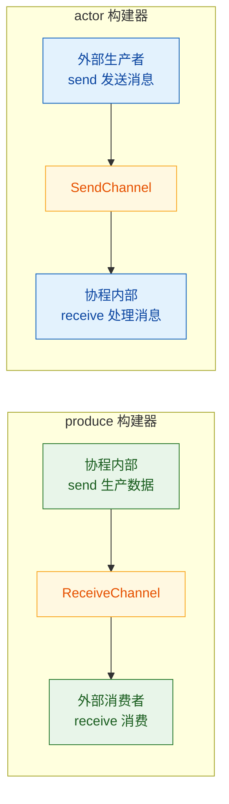
```mermaid
graph LR
    subgraph PD["produce 构建器"]
        direction TB
        PP["协程内部<br/>send 生产数据"]
        PC["ReceiveChannel"]
        PE["外部消费者<br/>receive 消费"]
        PP --> PC
        PC --> PE
    end

    subgraph AT["actor 构建器"]
        direction TB
        AP["外部生产者<br/>send 发送消息"]
        AC["SendChannel"]
        AE["协程内部<br/>receive 处理消息"]
        AP --> AC
        AC --> AE
    end

    classDef produceStyle fill:#E8F5E9,stroke:#2E7D32,color:#1B5E20
    classDef actorAtStyle fill:#E3F2FD,stroke:#1565C0,color:#0D47A1
    classDef channelNode fill:#FFF8E1,stroke:#F9A825,color:#E65100

    class PP,PE produceStyle
    class AP,AE actorAtStyle
    class PC,AC channelNode
```

| 维度 | `produce` | `actor` |
|------|-----------|---------|
| 协程角色 | 生产者（发数据） | 消费者（收消息） |
| 对外暴露 | `ReceiveChannel<E>` | `SendChannel<E>` |
| 内部 Scope | `ProducerScope`（可 `send`） | `ActorScope`（可 `receive`） |
| 数据方向 | 协程体 → 外部 | 外部 → 协程体 |
| 关闭语义 | 协程体结束 → Channel 自动关闭 | 外部调 `close()` 或协程体结束 |
| 典型场景 | 数据流生成、异步序列 | 状态管理、并发安全封装 |
| API 稳定性 | 正常可用 | `@ObsoleteCoroutinesApi` |

---

### actor 解决并发问题的原理

为什么 Actor 可以在不使用任何锁的情况下保证线程安全？让我们通过一个内存模型来直观理解：

```text
┌──────────────────────────────────────────────────────────────────┐
│                        共享内存模型（传统）                        │
│                                                                  │
│   Thread-1 ──┐                                                   │
│   Thread-2 ──┼──→  var counter = 0  ← 需要 synchronized/Mutex   │
│   Thread-3 ──┘     （共享可变状态）                                │
│                                                                  │
│   问题: 多线程直接竞争同一块内存，必须加锁                          │
├──────────────────────────────────────────────────────────────────┤
│                        Actor 消息模型                             │
│                                                                  │
│   Coroutine-1 ──┐                        ┌──────────────────┐   │
│   Coroutine-2 ──┼──→ [ SendChannel ] ──→ │ Actor 协程       │   │
│   Coroutine-3 ──┘    （消息队列 FIFO）    │ var counter = 0  │   │
│                                           │ （私有，单线程访问）│   │
│                                           └──────────────────┘   │
│   优势: 状态被 Actor 独占，消息串行处理，无需任何锁                  │
└──────────────────────────────────────────────────────────────────┘
```

传统并发模型中，多个线程直接访问共享的可变状态（Shared Mutable State），必须使用锁机制（`synchronized`、`Mutex`、`AtomicXxx`）来协调。而 Actor 模型将可变状态 **完全封装** 在单个协程内部，外界只能通过 Channel 发送消息间接操作。由于 Channel 保证了消息的 FIFO 顺序，Actor 内部本质上是 **单线程串行执行**，因此不存在任何竞态条件。

这就是所谓的 **"通过通信来共享内存"** 的具体体现。

---

### 关于 @ObsoleteCoroutinesApi 的说明

使用 `actor` 时，编译器会要求你添加 `@OptIn(ObsoleteCoroutinesApi::class)` 注解。这意味着该 API 被官方标记为 **"过时的实验性 API"**，将来可能被替换或移除。

**为什么被标记为 Obsolete？**

- 当前的 `actor` 实现功能较为基础，缺少 **监督（Supervision）**、**信箱溢出策略（Mailbox overflow policy）** 等生产级 Actor 框架的关键特性。
- 官方计划开发更完整的 Actor 库，提供类似 Akka（JVM 上著名的 Actor 框架）的能力。
- 但截至目前，新的 Actor API 尚未正式发布。

**那我还能用吗？**

- **学习和理解 Actor 模型**：完全可以，`actor` 构建器是最直观的入门方式。
- **生产环境**：建议谨慎使用。对于简单的并发状态管理，可以用 `Mutex` + 普通协程替代；对于复杂的 Actor 需求，可以自行基于 `Channel` 手动实现 Actor 模式，或引入第三方 Actor 库。

手动实现 Actor 模式的等价写法如下：

```kotlin
import kotlinx.coroutines.*
import kotlinx.coroutines.channels.*

fun CoroutineScope.counterActorManual(): SendChannel<CounterMsg> {
    val channel = Channel<CounterMsg>()              // 手动创建一个 Channel
    launch {                                         // 启动一个协程作为 Actor
        var counter = 0                              // Actor 的私有状态
        for (msg in channel) {                       // 从 channel 中持续接收消息
            when (msg) {
                is IncCounter -> counter++           // 处理递增
                is GetCounter -> msg.response.complete(counter) // 回写查询结果
            }
        }
    }
    return channel                                   // 对外返回 SendChannel
}
```

可以看到，`actor` 构建器本质上就是 **`Channel` + `launch`** 的语法糖。即使 `actor` API 将来被移除，你依然可以用这几行代码手动搭建同样的模式。理解底层原理远比记住某个 API 更重要。

---

### actor 的生命周期管理

Actor 的生命周期与 Channel 和协程的生命周期紧密绑定：

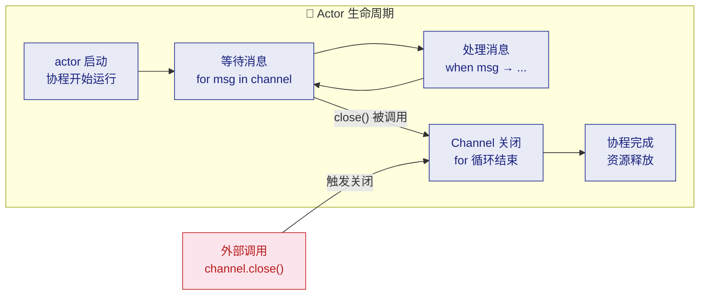
```mermaid
graph LR
    subgraph LC["🔵 Actor 生命周期"]
        direction TB
        S["actor 启动<br/>协程开始运行"]
        R["等待消息<br/>for msg in channel"]
        P["处理消息<br/>when msg → ..."]
        C["Channel 关闭<br/>for 循环结束"]
        D["协程完成<br/>资源释放"]
        S --> R
        R --> P
        P --> R
        R -->|"close() 被调用"| C
        C --> D
    end

    EXT["外部调用<br/>channel.close()"]
    EXT -->|触发关闭| C

    classDef lifecycle fill:#E8EAF6,stroke:#283593,color:#1A237E
    classDef external fill:#FCE4EC,stroke:#C62828,color:#B71C1C

    class S,R,P,C,D lifecycle
    class EXT external
```

关键的生命周期规则：

1. **正常关闭**：外部调用 `sendChannel.close()` 后，Channel 不再接受新消息，但已在队列中的消息仍会被 Actor 处理完毕。处理完最后一条消息后，`for` 循环自然结束，协程完成。
2. **异常终止**：如果 Actor 协程体内部抛出未捕获异常，协程会取消，Channel 随之关闭。此时外部再 `send()` 会抛出异常。
3. **父协程取消**：由于 `actor` 遵循结构化并发（Structured Concurrency），父协程取消时，Actor 协程也会被取消。
4. **向已关闭的 Channel 发送**：调用 `close()` 后再 `send()` 会抛出 `ClosedSendChannelException`。可以用 `trySend()` 来安全地尝试发送并检查结果。

---

**📝 练习题**

以下关于 `actor` 构建器的描述，哪一项是 **错误的**？

A. `actor` 对外暴露一个 `SendChannel`，外部只能向其发送消息，不能从中接收数据。


B. `actor` 协程体内部通过 `for (msg in channel)` 循环来串行处理消息，因此无需加锁即可安全修改内部状态。


C. `actor` 构建器目前标记为 `@ObsoleteCoroutinesApi`，这意味着该 API 的功能已完全被 `Flow` 取代，不应再学习其设计思想。


D. 在 Actor 模型中，可以通过在消息中携带 `CompletableDeferred` 来实现请求-响应模式，让外部获取 Actor 的处理结果。


**【答案】** C

**【解析】** 选项 C 的说法是错误的。`@ObsoleteCoroutinesApi` 表示该 API 的 **当前实现** 将来可能被更完善的 Actor API 替代，但这 **并不意味着** Actor 模型的设计思想被 `Flow` 取代了。`Flow` 是冷流（Cold Stream），主要解决异步数据流问题；而 Actor 模型解决的是 **并发状态管理** 问题——通过消息传递来封装可变状态，避免共享内存竞争。两者的适用场景截然不同。Actor 模型的思想在 Akka、Erlang/OTP 等系统中被广泛验证，是并发编程的重要范式，值得深入学习。选项 A 准确描述了 `actor` 的返回类型语义；选项 B 正确解释了 Actor 串行处理保证线程安全的核心原理；选项 D 正确描述了经典的请求-响应消息模式。

---

## 本章小结

本章围绕 Kotlin 协程中 **Channel** 这一核心通信原语，从概念模型、类型体系、基本操作到高级构建器，进行了体系化的梳理。下面以知识回顾的方式，将所有关键脉络串联起来。

---

### 核心概念回顾

Channel 的本质是一个 **协程间的热流通信管道（Hot Stream Communication Pipe）**。与 `Flow`（冷流）不同，Channel 一旦被创建，**数据的生产与消费就独立于收集者而存在**。这意味着即使没有消费者在监听，生产者依然可以（在缓冲允许的范围内）向 Channel 发送数据——数据不会因为"没人接收"而不被生产。

它的编程范式遵循经典的 **生产者-消费者模型（Producer-Consumer Pattern）**：一个或多个协程负责 `send` 数据，另一个或多个协程负责 `receive` 数据，Channel 自身充当两者之间 **线程安全的中介缓冲区**。这一点与 Java 并发包中的 `BlockingQueue` 非常相似，但最核心的区别在于：`BlockingQueue` 在队列满/空时 **阻塞线程（Thread Blocking）**，而 Channel 在队列满/空时 **挂起协程（Coroutine Suspending）**，不会浪费宝贵的线程资源。

---

### 四大 Channel 类型对比

Channel 的行为差异，**本质上取决于其内部缓冲区的容量策略**。下表是对四种类型的终极对比：

| 类型 | 容量 | `send` 挂起时机 | `receive` 挂起时机 | 数据丢失 | 典型场景 |
|:---|:---|:---|:---|:---|:---|
| **`RENDEZVOUS`** | `0` | 无消费者对接时立即挂起 | 无生产者对接时立即挂起 | ❌ 不丢失 | 严格同步的一对一交接 |
| **`BUFFERED`** | `64`（默认） | 缓冲区满时挂起 | 缓冲区空时挂起 | ❌ 不丢失 | 通用的生产-消费解耦 |
| **`UNLIMITED`** | `Int.MAX_VALUE` | **永不挂起**（OOM 风险） | 缓冲区空时挂起 | ❌ 不丢失 | 突发流量削峰（需谨慎） |
| **`CONFLATED`** | `1`（覆盖式） | **永不挂起** | 缓冲区空时挂起 | ✅ 旧值被覆盖 | 只关心最新状态（如 UI 刷新） |

```mermaid
graph LR
    subgraph Producer["🏭 Producer 生产端"]
        direction TB
        P1["send 元素 1"]
        P2["send 元素 2"]
        P3["send 元素 N"]
        P1 --> P2 --> P3
    end

    subgraph Types["📦 Channel 缓冲策略"]
        direction TB
        R["RENDEZVOUS\n容量 = 0\n必须握手"]
        B["BUFFERED\n容量 = 64\n通用缓冲"]
        U["UNLIMITED\n容量 = ∞\n无背压"]
        C["CONFLATED\n容量 = 1\n仅保留最新"]
    end

    subgraph Consumer["🛒 Consumer 消费端"]
        direction TB
        C1["receive 元素"]
        C2["遍历迭代"]
        C3["receiveCatching"]
        C1 --> C2 --> C3
    end

    Producer -- "send(e)" --> Types
    Types -- "receive()" --> Consumer

    classDef prodStyle fill:#C8E6C9,stroke:#388E3C,color:#1B5E20
    classDef chanStyle fill:#BBDEFB,stroke:#1976D2,color:#0D47A1
    classDef consStyle fill:#FFE0B2,stroke:#F57C00,color:#E65100

    class P1,P2,P3 prodStyle
    class R,B,U,C chanStyle
    class C1,C2,C3 consStyle
```

> **选型口诀**：同步交接用 Rendezvous，通用解耦用 Buffered，削峰兜底用 Unlimited（小心 OOM），只要最新用 Conflated。

---

### 基本操作三件套

Channel 的全部日常交互，归结为三个核心操作：

1.  **`send(element)`** —— 向管道投递一个元素。当缓冲区已满（或类型为 `RENDEZVOUS` 且无接收者就绪），当前协程 **挂起**，直到有空间可用。若 Channel 已关闭，抛出 `ClosedSendChannelException`。

2.  **`receive()`** —— 从管道取出一个元素。当缓冲区为空且无生产者正在发送，当前协程 **挂起**，直到有数据可用。若 Channel 已关闭且缓冲区已空，抛出 `ClosedReceiveChannelException`。更安全的替代方案是 `receiveCatching()`，它返回 `ChannelResult` 而非抛异常。

3.  **`close()`** —— 关闭 Channel 的发送端。**关闭不等于清空**：已经在缓冲区中的数据仍然可以被消费者全部取出。关闭后再 `send` 会抛异常，而 `receive` 会在取完剩余数据后收到关闭信号。配合 `for` 循环或 `consumeEach`，可以优雅地消费到最后一个元素后自动退出。

```kotlin
// 完整的生命周期演示
val channel = Channel<Int>(capacity = 3) // 创建一个容量为 3 的缓冲 Channel

// 生产者协程
launch {
    for (i in 1..5) {
        channel.send(i)                   // 逐个发送 1~5，缓冲满时挂起等待
        println("已发送: $i")
    }
    channel.close()                       // 发送完毕，关闭发送端（缓冲区数据不丢）
    println("Channel 已关闭")
}

// 消费者协程
launch {
    for (element in channel) {            // for-in 自动在 close 后退出循环
        println("已接收: $element")
        delay(200)                        // 模拟消费耗时
    }
    println("所有元素已消费完毕")           // Channel 关闭 + 缓冲区清空后到达此处
}
```

---

### 两大构建器总结

除了手动创建 `Channel()` 实例并分别在不同协程中操作外，Kotlin 提供了两个 **结构化封装** 的构建器，它们各自把 Channel 与一个协程的生命周期绑定在一起：

#### `produce` —— 生产者构建器

`produce` 启动一个新协程，并返回一个 `ReceiveChannel`。调用者 **只能接收**，发送逻辑被封装在 `produce` 的 lambda 内部。当 lambda 执行完毕或协程被取消时，Channel **自动关闭**，无需手动 `close()`。

```kotlin
// produce 将「创建 Channel + 启动生产协程 + 自动关闭」三合一
val numbers: ReceiveChannel<Int> = coroutineScope.produce {
    for (i in 1..10) {
        send(i)        // 在 ProducerScope 内部直接 send
    }
    // lambda 结束，Channel 自动 close
}
```

**核心价值**：杜绝忘记 `close()` 导致消费者永久挂起的 Bug，并让 Channel 的生命周期与协程作用域 **结构化绑定**。

#### `actor` —— 消费者构建器（已废弃但概念重要）

`actor` 是 `produce` 的镜像：它启动一个新协程，并返回一个 `SendChannel`。调用者 **只能发送**，消费逻辑被封装在 `actor` 的 lambda 内部。它天然形成一个 **单协程串行处理消息** 的模型，是实现 **无锁并发状态管理** 的利器。

```kotlin
// actor 将「创建 Channel + 启动消费协程」合二为一
val counterActor: SendChannel<CounterMsg> = coroutineScope.actor {
    var count = 0                     // 状态被单协程独占，无需加锁
    for (msg in channel) {            // 串行处理每条消息
        when (msg) {
            is Increment -> count++
            is GetCount  -> msg.response.complete(count)
        }
    }
}
```

**核心价值**：用 "消息传递" 替代 "共享内存 + 锁"，天然线程安全。虽然 `actor` API 已被标记为 `@ObsoleteCoroutinesApi`，但 **Actor 模式本身** 依然是协程并发设计的核心思想，可以用 `Channel` + 普通协程手动实现同等效果。

```mermaid
graph LR
    subgraph Produce["produce 构建器"]
        direction TB
        PB1["启动生产协程"]
        PB2["内部封装 send 逻辑"]
        PB3["返回 ReceiveChannel"]
        PB4["lambda 结束自动 close"]
        PB1 --> PB2 --> PB3 --> PB4
    end

    subgraph Actor["actor 构建器"]
        direction TB
        AB1["启动消费协程"]
        AB2["内部封装 receive 逻辑"]
        AB3["返回 SendChannel"]
        AB4["单协程串行 无需加锁"]
        AB1 --> AB2 --> AB3 --> AB4
    end

    Produce -- "镜像对称" --- Actor

    classDef pStyle fill:#C8E6C9,stroke:#43A047,color:#1B5E20
    classDef aStyle fill:#BBDEFB,stroke:#1E88E5,color:#0D47A1

    class PB1,PB2,PB3,PB4 pStyle
    class AB1,AB2,AB3,AB4 aStyle
```

---

### Channel vs Flow：何时选谁？

学完 Channel 后，一个自然的问题是：**什么时候用 Channel，什么时候用 Flow？** 这是面试高频问题，也是实际开发中的核心决策点。

| 维度 | **Channel** | **Flow** |
|:---|:---|:---|
| **冷热性** | 热流（Hot）：创建即可发送 | 冷流（Cold）：collect 才触发生产 |
| **消费模型** | 每个元素 **只被一个** 消费者收到（Fan-out） | 每个收集者都能 **独立获得全部** 数据 |
| **背压** | 通过缓冲区容量 + 挂起实现 | 天然挂起式背压（`emit` 等待 `collect`） |
| **生命周期** | 需要手动 `close()` 或用 `produce` | 自然完成（lambda 结束即完成） |
| **典型场景** | 协程间通信、任务分发、事件总线 | 数据流变换、响应式管道、UI 数据绑定 |

**一句话总结**：**Flow 是数据流（Data Stream），Channel 是通信管道（Communication Pipe）**。如果你需要"变换、组合、重放"数据流，选 Flow；如果你需要"在不同协程之间安全地传递消息或分发任务"，选 Channel。

---

### 知识脉络全景图

```mermaid
graph LR
    subgraph Overview["📖 Channel 概述"]
        direction TB
        O1["热流 Hot Stream"]
        O2["生产者-消费者模式"]
        O3["类似 BlockingQueue\n但挂起不阻塞"]
        O1 --> O2 --> O3
    end

    subgraph Types["📦 四大类型"]
        direction TB
        T1["RENDEZVOUS 容量=0"]
        T2["BUFFERED 容量=64"]
        T3["UNLIMITED 容量=∞"]
        T4["CONFLATED 仅最新"]
        T1 --> T2 --> T3 --> T4
    end

    subgraph Ops["⚙️ 基本操作"]
        direction TB
        OP1["send 发送"]
        OP2["receive 接收"]
        OP3["close 关闭"]
        OP1 --> OP2 --> OP3
    end

    subgraph Builders["🔧 构建器"]
        direction TB
        B1["produce\n返回 ReceiveChannel"]
        B2["actor\n返回 SendChannel"]
        B1 --> B2
    end

    Overview --> Types --> Ops --> Builders

    classDef overviewStyle fill:#E8F5E9,stroke:#43A047,color:#1B5E20
    classDef typeStyle fill:#E3F2FD,stroke:#1E88E5,color:#0D47A1
    classDef opsStyle fill:#FFF3E0,stroke:#FB8C00,color:#E65100
    classDef buildStyle fill:#F3E5F5,stroke:#8E24AA,color:#4A148C

    class O1,O2,O3 overviewStyle
    class T1,T2,T3,T4 typeStyle
    class OP1,OP2,OP3 opsStyle
    class B1,B2 buildStyle
```

---

**📝 练习题 1**

以下代码的输出结果是什么？

```kotlin
fun main() = runBlocking {
    val channel = Channel<Int>(capacity = Channel.CONFLATED)

    launch {
        channel.send(1)
        channel.send(2)
        channel.send(3)
    }

    delay(100) // 确保生产者先执行完

    val value = channel.receive()
    println(value)
}
```

A. `1`


B. `2`


C. `3`


D. 抛出 `ClosedReceiveChannelException`


**【答案】** C

**【解析】** `Channel.CONFLATED` 的缓冲区容量为 1，且采用 **覆盖写入（Conflation）** 策略。生产者连续发送 `1`、`2`、`3`，每次新值都会覆盖上一个未被消费的旧值。`delay(100)` 确保三个 `send` 全部执行完毕后消费者才开始 `receive`，此时缓冲区中仅保留最后一个值 `3`。因此输出为 `3`。Channel 并未被 `close()`，所以不会抛异常。

---

**📝 练习题 2**

关于 `produce` 构建器，以下说法 **错误** 的是？

A. `produce` 返回的是 `ReceiveChannel`，调用者只能从中接收数据


B. `produce` 内部的 lambda 执行完毕后，Channel 会自动关闭


C. `produce` 创建的是一个冷流，只有在 `receive` 时才开始执行 lambda


D. `produce` 将 Channel 的生命周期与协程的结构化并发绑定在一起


**【答案】** C

**【解析】** `produce` 创建的是一个 **热流（Hot Stream）**，它在被调用时就立即启动协程并开始执行 lambda 中的生产逻辑，而非等到第一次 `receive` 时才启动（这是冷流 `Flow` 的行为）。选项 A 正确：`produce` 返回 `ReceiveChannel`，外部只暴露接收能力。选项 B 正确：lambda 正常结束或协程被取消时，Channel 自动 `close()`。选项 D 正确：`produce` 是 `CoroutineScope` 的扩展函数，其生命周期受结构化并发管理。故选 C。

---