---

# Flow基础 ⭐⭐

---

## Flow 概述

在 Kotlin 协程的世界里，我们已经掌握了如何用 `suspend` 函数来异步地返回**单个值**。但现实开发中，大量场景需要异步地返回**多个值**——比如持续监听数据库变更、实时接收网络消息推送、逐行读取大文件等。Kotlin **Flow** 正是为此而生的核心组件：它是 `kotlinx.coroutines` 库提供的一种**异步数据流（Asynchronous Data Stream）**抽象，能够按顺序（sequentially）发射多个值，并且天然支持协程的挂起、取消与结构化并发。

在深入 API 之前，我们先建立三个关键的心智模型：**冷流特性**、**异步数据流本质**、以及**与 RxJava Observable 的对比**。理解它们，才能真正用好 Flow。

---

### 冷流（Cold Stream — 惰性求值）

#### 什么是"冷流"？

Flow 是一个典型的 **Cold Stream（冷流）**。所谓"冷"，指的是 **Flow 的代码块在没有终端操作符（Terminal Operator）收集它之前，不会执行任何逻辑**。这与"热流"（Hot Stream）形成鲜明对比——热流一旦被创建就开始产生数据，不管有没有订阅者在监听。

你可以把冷流想象成一份**蓝图/菜谱**：菜谱本身什么也不做，只有当你决定"开始做菜"（即调用 `collect`）时，步骤才会逐一执行。每一次 `collect`，都是一次独立的从头开始的执行。

```kotlin
import kotlinx.coroutines.*
import kotlinx.coroutines.flow.*

// 定义一个 Flow —— 此时不会执行任何代码，仅仅是"声明"
val myFlow: Flow<Int> = flow {
    println("🚀 Flow 开始执行")   // 只有 collect 时才会打印
    emit(1)                        // 发射第一个值
    delay(100)                     // 模拟异步延迟（挂起，不阻塞线程）
    emit(2)                        // 发射第二个值
    delay(100)
    emit(3)                        // 发射第三个值
    println("✅ Flow 执行完毕")
}

fun main() = runBlocking {
    println("--- 第一次收集 ---")
    myFlow.collect { value ->       // 第一次收集：从头执行 flow { } 块
        println("收到: $value")
    }

    println("--- 第二次收集 ---")
    myFlow.collect { value ->       // 第二次收集：再次从头执行，完全独立
        println("收到: $value")
    }
}
```

输出结果：

```text
--- 第一次收集 ---
🚀 Flow 开始执行
收到: 1
收到: 2
收到: 3
✅ Flow 执行完毕
--- 第二次收集 ---
🚀 Flow 开始执行
收到: 1
收到: 2
收到: 3
✅ Flow 执行完毕
```

关键观察：`flow { }` 块中的代码**执行了两次**，每次 `collect` 都触发了一次完整的、独立的执行。这就是冷流的核心语义——**惰性求值 + 可重复执行**。

#### 冷流 vs 热流 —— 直觉对比

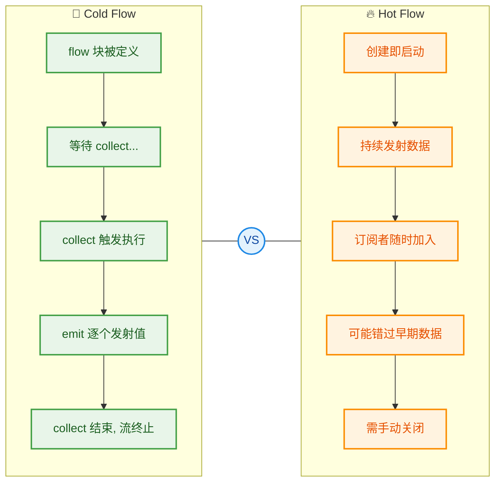
```mermaid
graph LR
    subgraph ColdFlow["🧊 Cold Flow"]
        direction TB
        C1["flow 块被定义"] --> C2["等待 collect..."]
        C2 --> C3["collect 触发执行"]
        C3 --> C4["emit 逐个发射值"]
        C4 --> C5["collect 结束, 流终止"]
    end

    subgraph HotFlow["🔥 Hot Flow"]
        direction TB
        H1["创建即启动"] --> H2["持续发射数据"]
        H2 --> H3["订阅者随时加入"]
        H3 --> H4["可能错过早期数据"]
        H4 --> H5["需手动关闭"]
    end

    ColdFlow --- VS((VS)) --- HotFlow

    classDef coldStyle fill:#E8F5E9,stroke:#43A047,color:#1B5E20,stroke-width:2px
    classDef hotStyle fill:#FFF3E0,stroke:#FB8C00,color:#E65100,stroke-width:2px
    classDef vsStyle fill:#E3F2FD,stroke:#1E88E5,color:#0D47A1,stroke-width:2px

    class C1,C2,C3,C4,C5 coldStyle
    class H1,H2,H3,H4,H5 hotStyle
    class VS vsStyle
```

| 特性 | Cold Flow | Hot Flow（如 `StateFlow`, `SharedFlow`） |
|---|---|---|
| **何时开始产生数据** | `collect` 被调用时 | 创建后立即（或配置后立即） |
| **多个收集者** | 每个收集者独立执行一遍 | 所有收集者共享同一数据源 |
| **数据遗漏** | 不会，每次从头开始 | 晚加入的收集者可能错过历史数据 |
| **生命周期** | 随 `collect` 协程结束而自然终止 | 通常需要显式管理作用域 |
| **类比** | 点播视频（VOD） | 直播（Live Broadcast） |

> 💡 **记忆口诀**：Cold Flow = "**不 collect，不执行；再 collect，从头来**"。

#### 为什么冷流更安全？

冷流天然具备两大优势：

1. **资源按需分配**：假设你的 Flow 打开了数据库连接或网络请求，那么只有真正需要数据时才会消耗资源。如果没有人 `collect`，什么也不会发生，不浪费任何 I/O。
2. **可预测性（Predictability）**：因为每次收集都从头执行，调用者可以确信自己拿到的是完整的、从初始状态开始的数据序列，不存在"我是中途加入，前面的数据去哪了"的疑惑。

---

### 异步数据流（Asynchronous Data Stream）

#### 为什么我们需要"异步 + 多值"？

让我们先回顾 Kotlin 中返回多值的几种方式，它们各有局限：

```kotlin
// ❶ 普通函数 —— 同步返回多个值（一次性）
fun getNumbers(): List<Int> {
    // 必须等所有值都准备好，才能一次性返回
    return listOf(1, 2, 3)
}

// ❷ Sequence —— 同步、惰性地逐个产生值
fun getSequence(): Sequence<Int> = sequence {
    yield(1)          // 逐个产生
    Thread.sleep(100) // ⚠️ 只能用阻塞方式等待，不能调用 suspend 函数！
    yield(2)
    yield(3)
}

// ❸ suspend 函数 —— 异步返回单个值
suspend fun getSingleValue(): Int {
    delay(100)        // 可以挂起，但只能返回一个值
    return 42
}

// ❹ Flow —— 异步 + 多值 ✅ 完美方案
fun getFlow(): Flow<Int> = flow {
    emit(1)           // 逐个发射
    delay(100)        // ✅ 可以挂起！不阻塞线程
    emit(2)
    emit(3)
}
```

这四种模式可以用一个 2×2 矩阵来理解：

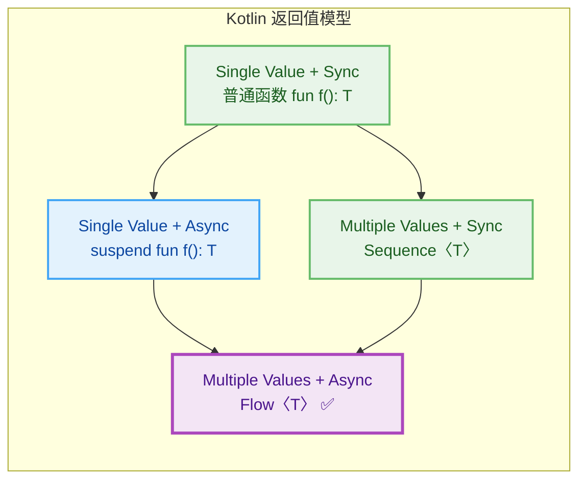
```mermaid
graph LR
    subgraph Matrix["Kotlin 返回值模型"]
        direction TB
        A["Single Value + Sync\n普通函数 fun f(): T"] --> B["Multiple Values + Sync\nSequence〈T〉"]
        A --> C["Single Value + Async\nsuspend fun f(): T"]
        C --> D["Multiple Values + Async\nFlow〈T〉 ✅"]
        B --> D
    end

    classDef syncStyle fill:#E8F5E9,stroke:#66BB6A,color:#1B5E20,stroke-width:2px
    classDef asyncStyle fill:#E3F2FD,stroke:#42A5F5,color:#0D47A1,stroke-width:2px
    classDef flowStyle fill:#F3E5F5,stroke:#AB47BC,color:#4A148C,stroke-width:3px

    class A syncStyle
    class B syncStyle
    class C asyncStyle
    class D flowStyle
```

| | **单值 (Single)** | **多值 (Multiple)** |
|---|---|---|
| **同步 (Synchronous)** | `fun f(): T` | `Sequence<T>` |
| **异步 (Asynchronous)** | `suspend fun f(): T` | **`Flow<T>`** ⭐ |

Flow 精准填补了 **"异步 + 多值"** 这个象限。它让你可以在不阻塞线程的前提下，**一个接一个** 地发射（emit）数据给下游消费者。

#### 数据流的三角色模型

任何数据流范式都包含三个核心角色。Flow 也不例外：

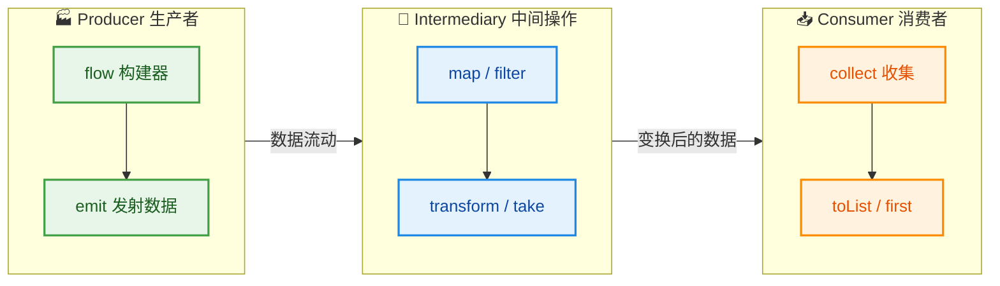
```mermaid
graph LR
    subgraph Producer["🏭 Producer 生产者"]
        direction TB
        P1["flow 构建器"] --> P2["emit 发射数据"]
    end

    subgraph Intermediary["🔧 Intermediary 中间操作"]
        direction TB
        I1["map / filter"] --> I2["transform / take"]
    end

    subgraph Consumer["📥 Consumer 消费者"]
        direction TB
        CO1["collect 收集"] --> CO2["toList / first"]
    end

    Producer -->|"数据流动"| Intermediary -->|"变换后的数据"| Consumer

    classDef prodStyle fill:#E8F5E9,stroke:#43A047,color:#1B5E20,stroke-width:2px
    classDef intStyle fill:#E3F2FD,stroke:#1E88E5,color:#0D47A1,stroke-width:2px
    classDef consStyle fill:#FFF3E0,stroke:#FB8C00,color:#E65100,stroke-width:2px

    class P1,P2 prodStyle
    class I1,I2 intStyle
    class CO1,CO2 consStyle
```

- **Producer（生产者）**：通过 `flow { }` 构建器创建，使用 `emit()` 将数据推入流中。生产者可以是异步的——它可以调用 `suspend` 函数（如网络请求、数据库查询）。
- **Intermediary（中间操作符）**：可选的变换层。例如 `map`、`filter`、`transform` 等，用来对流经的数据做映射、过滤、聚合等操作。中间操作符本身也是冷的——它们只是在原有 Flow 之上包装一层逻辑，不触发执行。
- **Consumer（消费者）**：终端操作符，如 `collect`、`toList`、`first` 等。**只有终端操作符才会真正启动整条流水线**。

下面用一个完整示例演示三角色协作：

```kotlin
import kotlinx.coroutines.*
import kotlinx.coroutines.flow.*

// ---------- Producer（生产者）----------
fun fetchUserIds(): Flow<Int> = flow {
    val ids = listOf(101, 102, 103, 104, 105) // 模拟从数据库分批读取用户 ID
    for (id in ids) {
        delay(50)      // 模拟异步 I/O 延迟（挂起，不阻塞线程）
        emit(id)       // 将每个 ID 逐一发射到下游
        println("  [Producer] 已发射: $id")
    }
}

fun main() = runBlocking {

    fetchUserIds()                          // ① 创建 Flow（此刻什么也没发生）
        // ---------- Intermediary（中间操作）----------
        .filter { id ->                     // ② 过滤：只保留奇数 ID
            id % 2 != 0
        }
        .map { id ->                        // ③ 变换：将 ID 映射为用户名字符串
            "User-$id"
        }
        // ---------- Consumer（消费者）----------
        .collect { userName ->              // ④ 终端操作：触发整条链路执行
            println("  [Consumer] 收到: $userName")
        }
}
```

输出结果：

```text
  [Producer] 已发射: 101
  [Consumer] 收到: User-101
  [Producer] 已发射: 102
  [Producer] 已发射: 103
  [Consumer] 收到: User-103
  [Producer] 已发射: 104
  [Producer] 已发射: 105
  [Consumer] 收到: User-105
```

注意输出的交替模式：**生产者发射一个值 → 中间操作处理 → 消费者接收**，这是逐个处理的流水线（而不是等所有值产生后再统一处理）。ID `102` 和 `104` 被 `filter` 过滤掉了，所以 Consumer 端不会收到它们。

#### Flow 的背压（Backpressure）天然被解决

在传统的响应式编程中（如 RxJava），"背压"是一个绕不开的难题：当生产者速度远快于消费者时，数据堆积怎么办？

Flow 的设计从根本上回避了这个问题——因为 **Flow 默认是顺序执行的**。`emit()` 是一个 `suspend` 函数，当消费者还没处理完上一个值时，`emit()` 会自动挂起，等待消费者就绪后再继续发射。这意味着生产者和消费者的速率天然同步，不存在缓冲区溢出的风险。

```kotlin
import kotlinx.coroutines.*
import kotlinx.coroutines.flow.*

fun main() = runBlocking {
    flow {
        for (i in 1..3) {
            println("[Producer] 准备发射 $i (${System.currentTimeMillis()})")
            emit(i)          // 如果消费者还在忙，这里会自动挂起等待
        }
    }.collect { value ->
        println("[Consumer] 开始处理 $value (${System.currentTimeMillis()})")
        delay(500)           // 模拟消费者处理较慢
        println("[Consumer] 处理完毕 $value")
    }
}
```

输出结果（注意时间戳的间隔）：

```text
[Producer] 准备发射 1 (1700000000000)
[Consumer] 开始处理 1 (1700000000001)
[Consumer] 处理完毕 1
[Producer] 准备发射 2 (1700000000502)    ← 等消费者处理完才发射下一个
[Consumer] 开始处理 2 (1700000000502)
[Consumer] 处理完毕 2
[Producer] 准备发射 3 (1700000001003)
[Consumer] 开始处理 3 (1700000001003)
[Consumer] 处理完毕 3
```

> ✅ **结论**：Flow 的 sequential 特性使得 backpressure 天然存在且零配置。如果你确实需要生产者与消费者并发运行（解耦速率），可以使用 `buffer()`、`conflate()` 等高级操作符，这属于进阶话题。

---

### 类似 RxJava Observable

#### Flow 与 RxJava 的渊源

如果你曾使用过 **RxJava**，你会发现 Kotlin Flow 的设计理念和 API 风格与 RxJava 有诸多相似之处。事实上，JetBrains 在设计 Flow 时明确参考了 Reactive Streams 规范。Flow 可以被视为 **Kotlin 协程生态中对 RxJava 的"原生替代"**，它保留了响应式编程的核心思想，同时借助协程大幅简化了 API 的复杂度。

#### 概念映射表

| RxJava 概念 | Kotlin Flow 对应 | 说明 |
|---|---|---|
| `Observable<T>` | `Flow<T>` | 冷数据流，订阅时才执行 |
| `Single<T>` | `suspend fun(): T` | 异步返回单个值 |
| `Completable` | `suspend fun(): Unit` | 异步执行无返回值 |
| `subscribe()` | `collect()` | 终端操作，触发流执行 |
| `onNext()` | `emit()` | 向下游发送一个数据项 |
| `map` / `filter` | `map` / `filter` | 中间操作符名称几乎一致 |
| `flatMap` | `flatMapConcat` / `flatMapMerge` / `flatMapLatest` | Flow 提供更精细的语义 |
| `subscribeOn()` | `flowOn()` | 切换上游执行的线程/调度器 |
| `observeOn()` | `launchIn(scope)` + 指定调度器 | 切换下游收集的线程 |
| `CompositeDisposable` | `CoroutineScope` + 结构化并发 | 生命周期自动管理 |
| `Subject` | `SharedFlow` / `StateFlow` | 热流 |
| `BehaviorSubject` | `StateFlow` | 始终持有最新值的热流 |
| `PublishSubject` | `MutableSharedFlow` | 无初始值的热流 |

#### 一段代码，两种写法

让我们用"从网络获取用户列表 → 过滤活跃用户 → 映射为用户名"这个经典场景做对比：

**RxJava 写法**：

```java
// RxJava —— 需要手动管理 Disposable 和线程调度
userApi.getUsers()                              // 返回 Observable<User>
    .subscribeOn(Schedulers.io())               // 上游在 IO 线程
    .observeOn(AndroidSchedulers.mainThread())  // 下游切到主线程
    .filter(user -> user.isActive())            // 过滤活跃用户
    .map(user -> user.getName())                // 映射为用户名
    .subscribe(                                 // 订阅
        name -> updateUI(name),                 // onNext：更新 UI
        error -> showError(error),              // onError：处理错误
        () -> Log.d("TAG", "Complete")          // onComplete：流结束
    );
// ⚠️ 别忘了在 onDestroy 中 dispose，否则内存泄漏！
```

**Kotlin Flow 写法**：

```kotlin
// Kotlin Flow —— 协程自动管理生命周期，代码更简洁
viewModelScope.launch {                         // 结构化并发：ViewModel 销毁时自动取消
    userApi.getUsers()                          // 返回 Flow<User>
        .flowOn(Dispatchers.IO)                 // 上游在 IO 调度器执行
        .filter { user -> user.isActive }       // 过滤活跃用户
        .map { user -> user.name }              // 映射为用户名
        .catch { error -> showError(error) }    // 捕获上游异常（替代 onError）
        .collect { name ->                      // 收集（替代 subscribe + onNext）
            updateUI(name)                      // collect 默认在 launch 所在的调度器执行
        }
}
// ✅ 无需手动 dispose！viewModelScope 会在 ViewModel 清除时自动取消协程
```

#### Flow 相比 RxJava 的核心优势

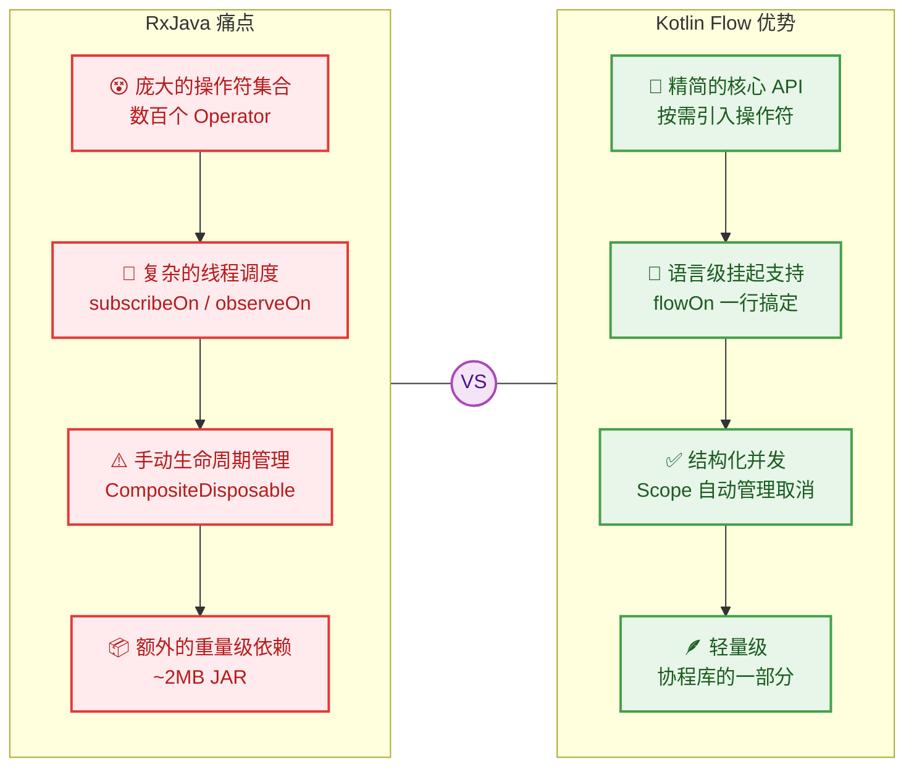
```mermaid
graph LR
    subgraph RxJava["RxJava 痛点"]
        direction TB
        R1["😵 庞大的操作符集合\n数百个 Operator"] --> R2["🔧 复杂的线程调度\nsubscribeOn / observeOn"]
        R2 --> R3["⚠️ 手动生命周期管理\nCompositeDisposable"]
        R3 --> R4["📦 额外的重量级依赖\n~2MB JAR"]
    end

    subgraph KotlinFlow["Kotlin Flow 优势"]
        direction TB
        F1["🎯 精简的核心 API\n按需引入操作符"] --> F2["🚀 语言级挂起支持\nflowOn 一行搞定"]
        F2 --> F3["✅ 结构化并发\nScope 自动管理取消"]
        F3 --> F4["🪶 轻量级\n协程库的一部分"]
    end

    RxJava --- VS((VS)) --- KotlinFlow

    classDef rxStyle fill:#FFEBEE,stroke:#E53935,color:#B71C1C,stroke-width:2px
    classDef flowStyle fill:#E8F5E9,stroke:#43A047,color:#1B5E20,stroke-width:2px
    classDef vsStyle fill:#F3E5F5,stroke:#AB47BC,color:#4A148C,stroke-width:2px

    class R1,R2,R3,R4 rxStyle
    class F1,F2,F3,F4 flowStyle
    class VS vsStyle
```

**① 语言级别的挂起支持**
RxJava 的异步模型基于回调和调度器，它是一个 Java 库，无法利用 Kotlin 协程的 `suspend` 机制。而 Flow 的 `emit()` 和 `collect()` 都是 `suspend` 函数，代码可以写成顺序式风格，阅读起来如同同步代码。

**② 结构化并发 → 自动取消**
RxJava 中你必须手动管理 `Disposable`（通常通过 `CompositeDisposable`），忘记 `dispose()` 就会内存泄漏。Flow 运行在协程中，而协程天然支持**结构化并发（Structured Concurrency）**——当父协程或 `CoroutineScope` 被取消时，所有子协程（包括正在 `collect` 的 Flow）会自动取消，无需手动管理。

**③ 更少的概念负担**
RxJava 有 `Observable`、`Flowable`、`Single`、`Maybe`、`Completable` 五种类型，初学者容易迷惑。Kotlin 协程世界中只需要：
- `suspend fun` → 异步单值
- `Flow<T>` → 异步多值（冷流）
- `StateFlow` / `SharedFlow` → 热流

概念大幅精简。

**④ 无额外依赖**
如果你的项目已经使用了 Kotlin 协程（绝大多数现代 Android/Kotlin 项目都是如此），那 Flow 就是现成可用的，不需要引入额外的第三方库。

#### 何时仍然需要 RxJava？

尽管 Flow 已经非常强大，但在某些场景下 RxJava 仍有价值：

- **纯 Java 项目**：Flow 依赖 Kotlin 协程，如果你的项目完全是 Java，RxJava 仍然是首选。
- **极其复杂的流组合**：RxJava 拥有数百个操作符，某些高级操作符（如 `window`、`groupBy` 的复杂变体）在 Flow 中可能没有直接对应。
- **已有大量 RxJava 代码的遗留项目**：强行迁移的成本可能大于收益。好消息是，`kotlinx-coroutines-rx3` 桥接库可以让 Flow 和 RxJava 互操作。

---

**📝 练习题**

以下关于 Kotlin Flow 的描述，**错误**的是哪一项？

A. Flow 是冷流（Cold Stream），只有调用终端操作符（如 `collect`）时，`flow { }` 块中的代码才会执行。


B. 每次对同一个 Flow 调用 `collect`，都会从头独立执行一遍 `flow { }` 构建器中的逻辑。


C. Flow 的 `emit()` 函数是普通函数（非 `suspend`），因此生产者不会因消费者处理缓慢而被挂起。


D. Flow 可以被视为 RxJava `Observable` 在 Kotlin 协程生态中的原生替代方案。


**【答案】** C

**【解析】** `emit()` 是一个 **`suspend` 函数**，这是 Flow 天然解决背压（Backpressure）问题的关键机制。当消费者（`collect` 端）还在处理上一个值时，`emit()` 会自动挂起生产者协程，等待消费者就绪后再继续发射下一个值。这使得生产者和消费者的速率天然同步，无需额外配置缓冲策略。选项 A、B 描述的是冷流的核心特性——惰性执行和可重复独立执行，完全正确。选项 D 也是正确的，Flow 在设计上参考了 Reactive Streams 规范，是 Kotlin 生态对 RxJava 的现代替代方案。

---

## Flow vs Sequence

在上一节中，我们了解了 Flow 是一种 **冷流（Cold Stream）** 和 **异步数据流（Asynchronous Data Stream）**。但如果你熟悉 Kotlin 标准库，你会发现 `Sequence`（序列）同样是"惰性求值"的——它也不会在创建时立即计算，而是等到终端操作（如 `toList()`、`forEach()`）被调用时才逐个产出元素。那么问题来了：**既然都是惰性的，为什么还需要 Flow？**

这个问题是理解 Flow 设计哲学的关键入口。简单来说，`Sequence` 是 **同步世界的惰性序列**，而 `Flow` 是 **协程世界的异步惰性序列**。二者的根本分水岭在于：**能否挂起（suspend）** 以及 **能否切换执行上下文（Context Switching）**。

我们先用一张全景图来建立整体认知，再逐一深入：

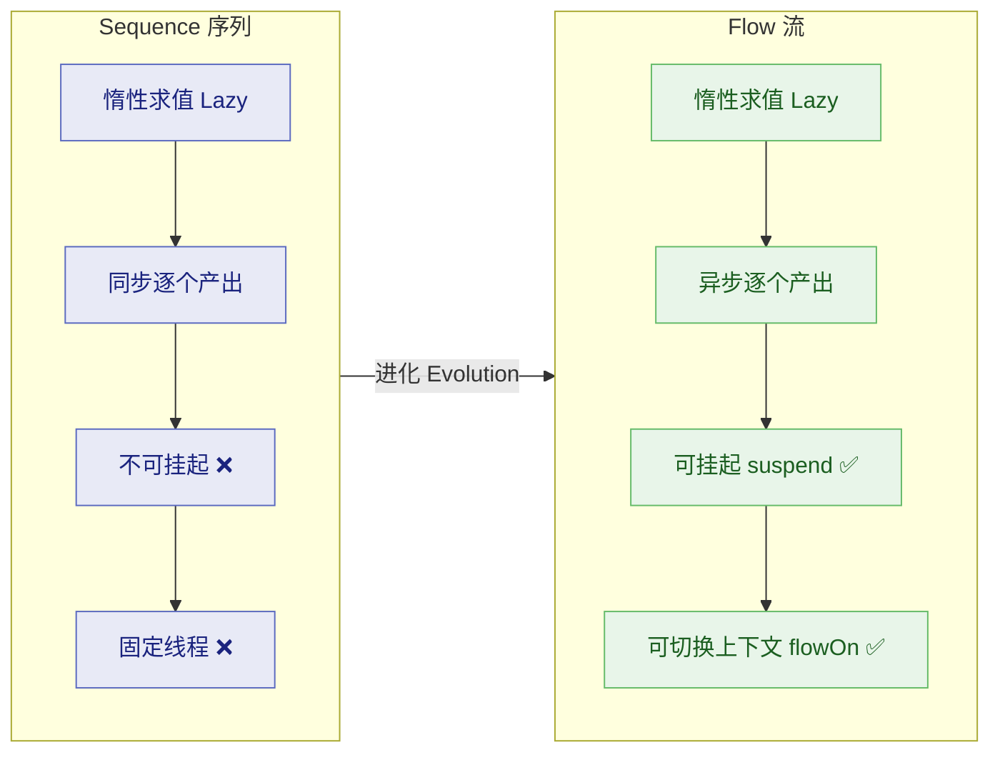
```mermaid
graph LR
    subgraph SEQ["Sequence 序列"]
        direction TB
        S1["惰性求值 Lazy"]
        S2["同步逐个产出"]
        S3["不可挂起 ❌"]
        S4["固定线程 ❌"]
        S1 --> S2 --> S3 --> S4
    end

    subgraph FLOW["Flow 流"]
        direction TB
        F1["惰性求值 Lazy"]
        F2["异步逐个产出"]
        F3["可挂起 suspend ✅"]
        F4["可切换上下文 flowOn ✅"]
        F1 --> F2 --> F3 --> F4
    end

    SEQ -- "进化 Evolution" --> FLOW

    classDef seqStyle fill:#E8EAF6,stroke:#5C6BC0,color:#1A237E,stroke-width:1px
    classDef flowStyle fill:#E8F5E9,stroke:#66BB6A,color:#1B5E20,stroke-width:1px
    class S1,S2,S3,S4 seqStyle
    class F1,F2,F3,F4 flowStyle
```

下面通过一段最简对比代码，直观感受二者在 **使用形态** 上的异同：

```kotlin
// ==================== Sequence（同步、不可挂起） ====================
val mySequence: Sequence<Int> = sequence {
    // yield() 不是 suspend 函数（它是 SequenceScope 的受限挂起）
    yield(1)            // 产出第一个元素
    Thread.sleep(1000)  // ⚠️ 只能用阻塞方式模拟"等待"
    yield(2)            // 产出第二个元素
}

// ==================== Flow（异步、可挂起） ==========================
val myFlow: Flow<Int> = flow {
    emit(1)             // 产出第一个元素
    delay(1000)         // ✅ 真正的非阻塞挂起，不占用线程
    emit(2)             // 产出第二个元素
}
```

虽然表面结构相似（都是在 builder lambda 中逐个"吐出"元素），但底层能力天壤之别。接下来我们分两个维度深入分析。

---

### Flow 支持挂起

#### 什么是"支持挂起"？

"支持挂起"意味着在产出元素的过程中，可以调用 **`suspend` 函数**——例如 `delay()`、网络请求 `fetchFromApi()`、数据库查询 `queryFromDb()` 等——而 **不阻塞当前线程**。线程被释放后可以去执行其他任务，等异步操作完成后再恢复（resume）继续产出下一个元素。

这是 `Sequence` 做不到的事。我们来仔细对比：

#### Sequence 的困境：受限挂起（Restricted Suspension）

你可能注意到 `sequence { }` 的 lambda 签名是：

```kotlin
// Kotlin 标准库源码（简化）
public fun <T> sequence(
    block: suspend SequenceScope<T>.() -> Unit  // 看起来也是 suspend？
): Sequence<T>
```

的确，`SequenceScope` 的 `yield()` 从语法上看也是 `suspend` 的，但它被标注了 `@RestrictsSuspension`：

```kotlin
@RestrictsSuspension                     // 🔑 关键注解
public abstract class SequenceScope<in T> internal constructor() {
    public abstract suspend fun yield(value: T)        // 挂起，但受限
    public abstract suspend fun yieldAll(iterator: Iterator<T>)
}
```

`@RestrictsSuspension` 的含义是：**在这个作用域内，你只能调用 `SequenceScope` 自身声明的 `suspend` 函数（即 `yield` / `yieldAll`），不能调用任何外部的 `suspend` 函数**。这是 Kotlin 编译器层面的硬性约束。

```kotlin
val brokenSequence = sequence {
    yield(1)
    delay(1000)   // ❌ 编译错误！Restricted suspending functions can only
                  //    invoke member or extension suspending functions on their
                  //    restricted coroutine scope
    yield(2)
}
```

为什么要做这个限制？因为 **Sequence 的设计哲学是同步迭代**。调用方通过 `iterator.next()` 拉取下一个值时，期望是立即（或经过纯计算后）得到结果。如果中途跑去做网络请求，整个调用线程就会被"悬挂"在那里，这破坏了 Sequence 的同步语义契约。

#### Flow 的自由：完整的挂起能力

反观 `flow { }` 的 builder：

```kotlin
// kotlinx.coroutines 源码（简化）
public fun <T> flow(
    block: suspend FlowCollector<T>.() -> Unit  // 完整的 suspend，无限制
): Flow<T>
```

`FlowCollector` **没有** `@RestrictsSuspension`，所以在 `flow { }` 内部，你可以自由调用任何 `suspend` 函数：

```kotlin
// 一个模拟"每秒从传感器读取温度"的 Flow
fun temperatureFlow(): Flow<Double> = flow {
    while (true) {                         // 无限循环，持续产出数据
        val temp = readSensorAsync()       // ✅ 调用 suspend 网络/硬件函数
        emit(temp)                         // 产出当前温度值
        delay(1000)                        // ✅ 非阻塞等待 1 秒
    }
}

// 模拟的挂起函数
suspend fun readSensorAsync(): Double {
    delay(200)                             // 模拟 I/O 耗时
    return Math.random() * 40             // 返回 0~40 之间的随机温度
}
```

#### 深入对比：同一场景的两种实现

假设需求是：**依次加载 3 个用户的数据，每次加载需要耗时操作**。

```kotlin
// ======================== Sequence 方案（阻塞） ========================
fun loadUsersSequence(): Sequence<User> = sequence {
    val ids = listOf(1, 2, 3)              // 要加载的用户 ID
    for (id in ids) {
        // Thread.sleep 会阻塞调用线程（如主线程），非常危险！
        Thread.sleep(1000)                 // ⚠️ 模拟耗时，但这会冻结 UI
        val user = User(id, "User_$id")   // 构建用户对象
        yield(user)                        // 产出用户
    }
}

// 调用方 —— 在主线程逐个迭代，每次都会卡顿 1 秒
fun main() {
    loadUsersSequence().forEach { user ->
        println(user)                      // 每隔 1 秒才打印一次
    }
}
```

```kotlin
// ======================== Flow 方案（非阻塞） =========================
fun loadUsersFlow(): Flow<User> = flow {
    val ids = listOf(1, 2, 3)              // 要加载的用户 ID
    for (id in ids) {
        delay(1000)                        // ✅ 非阻塞挂起，不占用线程
        val user = fetchUser(id)           // ✅ 可以调用真正的 suspend 网络请求
        emit(user)                         // 产出用户
    }
}

// 真正的挂起函数：模拟网络请求
suspend fun fetchUser(id: Int): User {
    delay(500)                             // 模拟网络延迟
    return User(id, "User_$id")
}

// 调用方 —— 必须在协程中 collect
fun main() = runBlocking {
    loadUsersFlow().collect { user ->
        println(user)                      // 每隔 1.5 秒打印一次（1s + 0.5s）
    }
}
```

核心差异一目了然：

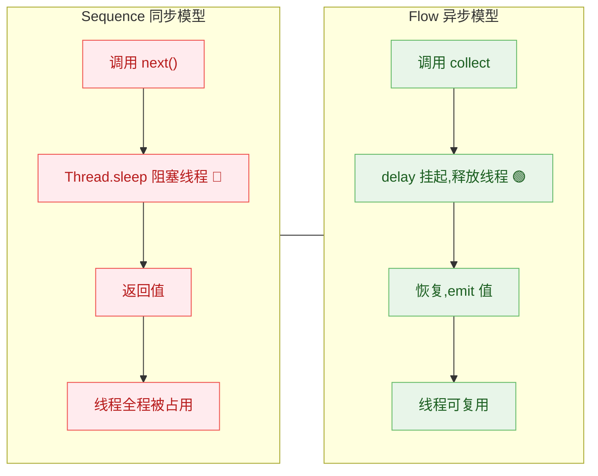
```mermaid
graph LR
    subgraph SYNC["Sequence 同步模型"]
        direction TB
        T1["调用 next()"] --> T2["Thread.sleep 阻塞线程 🔴"]
        T2 --> T3["返回值"]
        T3 --> T4["线程全程被占用"]
    end

    subgraph ASYNC["Flow 异步模型"]
        direction TB
        A1["调用 collect"] --> A2["delay 挂起,释放线程 🟢"]
        A2 --> A3["恢复,emit 值"]
        A3 --> A4["线程可复用"]
    end

    SYNC --- ASYNC

    classDef syncNode fill:#FFEBEE,stroke:#EF5350,color:#B71C1C,stroke-width:1px
    classDef asyncNode fill:#E8F5E9,stroke:#66BB6A,color:#1B5E20,stroke-width:1px
    class T1,T2,T3,T4 syncNode
    class A1,A2,A3,A4 asyncNode
```

#### 小结表格

| 维度 | `Sequence` | `Flow` |
|---|---|---|
| 挂起能力 | `@RestrictsSuspension`，仅限 `yield` | 完整 `suspend`，无限制 |
| 可调用 `delay()` | ❌ 编译错误 | ✅ |
| 可调用网络请求 | ❌ 编译错误 | ✅ |
| 阻塞风险 | 高（只能用 `Thread.sleep`） | 低（用 `delay` 非阻塞） |
| 适用场景 | 纯 CPU 计算的惰性序列 | 涉及 I/O、定时、异步的数据流 |

---

### Flow 支持上下文切换

#### 什么是"上下文切换"？

在协程的世界里，**上下文（CoroutineContext）** 决定了代码在哪个线程（或线程池）上执行。常见的调度器（Dispatcher）有：

- **`Dispatchers.Main`**：Android 主线程 / UI 线程
- **`Dispatchers.IO`**：I/O 密集型（网络、磁盘）
- **`Dispatchers.Default`**：CPU 密集型（排序、解析）

"上下文切换"指的是：**Flow 的生产端（emit）和消费端（collect）可以运行在不同的线程上**，并且通过 `flowOn` 操作符声明式地完成这一切，无需手动管理线程。

#### Sequence：你在哪调用，它就在哪跑

`Sequence` 没有任何线程调度能力。它的所有操作——包括产出 `yield()` 和消费 `forEach()`——全部在 **调用者所在的线程** 同步执行：

```kotlin
fun main() {
    // 这段代码在 main 线程执行
    val seq = sequence {
        println("产出线程: ${Thread.currentThread().name}")   // main
        yield(1)
        println("产出线程: ${Thread.currentThread().name}")   // main
        yield(2)
    }

    // forEach 也在 main 线程
    seq.forEach { value ->
        println("消费线程: ${Thread.currentThread().name}")   // main
        println("值: $value")
    }
}
```

输出：

```text
产出线程: main
消费线程: main
值: 1
产出线程: main
消费线程: main
值: 2
```

这意味着：如果 Sequence 中有耗时操作（例如 `Thread.sleep`），它会直接阻塞调用者线程。在 Android 中，如果调用者是主线程，**App 会直接卡死（ANR）**。

#### Flow：用 `flowOn` 声明式切换上游上下文

Flow 的杀手锏之一就是 **`flowOn`** 操作符。它允许你把 Flow **上游**（即 `flowOn` 之前的所有操作）切换到指定的调度器上执行，而 **下游**（`collect`）仍然留在收集者的协程上下文中。

```kotlin
fun userFlow(): Flow<User> = flow {
    // 这里的代码将由 flowOn 指定的调度器执行
    println("Emit 线程: ${Thread.currentThread().name}")   // DefaultDispatcher-worker-X
    val user = fetchUserFromNetwork()   // 耗时网络请求
    emit(user)                          // 产出用户数据
}
.flowOn(Dispatchers.IO)                 // 🔑 上游切换到 IO 线程池

// Android Activity 中的调用
lifecycleScope.launch {                 // 默认在 Main 线程
    userFlow().collect { user ->
        // collect 在 Main 线程执行，可以安全更新 UI
        println("Collect 线程: ${Thread.currentThread().name}")  // main
        textView.text = user.name
    }
}
```

整个流转过程如下图所示：

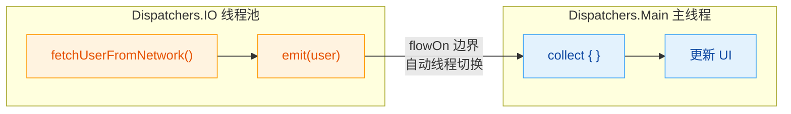
```mermaid
graph LR
    subgraph IO_POOL["Dispatchers.IO 线程池"]
        direction TB
        E1["fetchUserFromNetwork()"]
        E2["emit(user)"]
        E1 --> E2
    end

    subgraph MAIN["Dispatchers.Main 主线程"]
        direction TB
        C1["collect { }"]
        C2["更新 UI"]
        C1 --> C2
    end

    E2 -- "flowOn 边界<br/>自动线程切换" --> C1

    classDef ioStyle fill:#FFF3E0,stroke:#FF9800,color:#E65100,stroke-width:1px
    classDef mainStyle fill:#E3F2FD,stroke:#42A5F5,color:#0D47A1,stroke-width:1px
    class E1,E2 ioStyle
    class C1,C2 mainStyle
```

这里有几个关键原则需要牢记：

**原则一：`flowOn` 只影响上游，不影响下游**

```kotlin
flow {
    // ② 这里在 IO 线程执行
    emit(heavyComputation())
}
.map { value ->
    // ② 这里也在 IO 线程（在 flowOn 上游）
    transform(value)
}
.flowOn(Dispatchers.IO)        // 🔑 分界线：以上所有都切到 IO
.filter { value ->
    // ③ 这里在 collect 的上下文（如 Main）执行
    value > threshold
}
.collect { value ->
    // ③ 这里也在 collect 的上下文执行
    updateUI(value)
}
```

**原则二：多个 `flowOn` 各管各的上游区间**

```kotlin
flow {
    // ① 在 Default 线程（被最近的 flowOn 决定）
    emit(parseLargeJson())
}
.flowOn(Dispatchers.Default)    // 🔑 第一个分界线
.map { data ->
    // ② 在 IO 线程（被下面的 flowOn 决定）
    saveToDatabase(data)
    data
}
.flowOn(Dispatchers.IO)         // 🔑 第二个分界线
.collect { data ->
    // ③ 在 Main 线程（collect 的协程上下文）
    showData(data)
}
```

可以将多层 `flowOn` 理解为"**从下往上、就近匹配**"的规则——每个操作符找到离自己最近的下方 `flowOn`，就在那个调度器上执行。

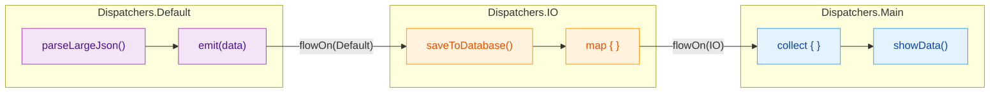
```mermaid
graph LR
    subgraph DEFAULT["Dispatchers.Default"]
        direction TB
        D1["parseLargeJson()"]
        D2["emit(data)"]
        D1 --> D2
    end

    subgraph IO["Dispatchers.IO"]
        direction TB
        I1["saveToDatabase()"]
        I2["map { }"]
        I1 --> I2
    end

    subgraph MAIN["Dispatchers.Main"]
        direction TB
        M1["collect { }"]
        M2["showData()"]
        M1 --> M2
    end

    D2 -- "flowOn(Default)" --> I1
    I2 -- "flowOn(IO)" --> M1

    classDef defStyle fill:#F3E5F5,stroke:#AB47BC,color:#4A148C,stroke-width:1px
    classDef ioStyle fill:#FFF3E0,stroke:#FF9800,color:#E65100,stroke-width:1px
    classDef mainStyle fill:#E3F2FD,stroke:#42A5F5,color:#0D47A1,stroke-width:1px
    class D1,D2 defStyle
    class I1,I2 ioStyle
    class M1,M2 mainStyle
```

**原则三：禁止在 `flow { }` 内部用 `withContext` 切换上下文**

Flow 有一条重要的设计约束——**Context Preservation（上下文保持）**。`flow { }` builder 内部的 `emit()` 必须和 `collect` 保持在同一个协程上下文中（或由 `flowOn` 统一管理）。如果你尝试手动 `withContext`：

```kotlin
// ❌ 错误用法！运行时会抛出 IllegalStateException
flow {
    withContext(Dispatchers.IO) {    // 🚫 禁止！
        emit(fetchData())
    }
}
```

正确做法永远是使用 `flowOn`：

```kotlin
// ✅ 正确用法
flow {
    emit(fetchData())               // 在 flow 内部正常 emit
}
.flowOn(Dispatchers.IO)             // 通过 flowOn 切换上下文
```

这个设计保证了 Flow 内部不会出现并发的 `emit` 调用，维护了 **Sequential Emission（顺序发射）** 的安全性。

#### Sequence vs Flow 上下文能力完整对比

| 维度 | `Sequence` | `Flow` |
|---|---|---|
| 线程控制 | 无（跟随调用者） | `flowOn` 声明式切换 |
| 生产/消费异线程 | ❌ 不可能 | ✅ 上游/下游可在不同线程 |
| 多段调度 | ❌ | ✅ 多个 `flowOn` 分段调度 |
| Android 主线程安全 | ❌ 容易 ANR | ✅ `flowOn(IO)` + Main collect |
| 上下文保持规则 | 无概念 | 强制 Context Preservation |

#### 综合实战：Android 典型场景

最后用一个贴近真实开发的完整示例，展示为什么在 Android 中 **Flow 完胜 Sequence**：

```kotlin
// ViewModel 中
class UserViewModel : ViewModel() {

    // 定义一个 Flow：从网络加载 → 存入数据库 → 返回结果
    val userData: Flow<UiState<User>> = flow {
        emit(UiState.Loading)                          // 先发射 Loading 状态

        val user = apiService.fetchUser()              // ✅ suspend 网络请求
        database.insertUser(user)                      // ✅ suspend 数据库操作

        emit(UiState.Success(user))                    // 发射 Success 状态
    }
    .catch { e ->                                      // 捕获上游异常
        emit(UiState.Error(e.message ?: "Unknown"))    // 发射 Error 状态
    }
    .flowOn(Dispatchers.IO)                            // 🔑 上游全部在 IO 线程执行

    // 如果用 Sequence？
    // ❌ 无法调用 suspend 函数（apiService.fetchUser 是 suspend 的）
    // ❌ 无法切换到 IO 线程（Sequence 没有 flowOn）
    // ❌ 在主线程执行网络请求 → 直接 Crash (NetworkOnMainThreadException)
}

// Activity / Fragment 中
lifecycleScope.launch {                                // 在 Main 线程启动
    viewModel.userData.collect { state ->              // collect 在 Main 线程
        when (state) {
            is UiState.Loading -> showProgress()       // 显示加载动画
            is UiState.Success -> showUser(state.data) // 显示用户数据
            is UiState.Error -> showError(state.msg)   // 显示错误信息
        }
    }
}
```

这段代码完美体现了 Flow 相比 Sequence 的两大核心优势：**suspend 挂起能力**让你可以无缝对接所有异步 API，**`flowOn` 上下文切换**让你安全地把耗时操作移出主线程。而 `Sequence` 在这种场景下完全无法胜任。

---

**📝 练习题**

以下代码的输出结果是什么？

```kotlin
fun main() = runBlocking {
    flow {
        println("A: ${Thread.currentThread().name}")
        emit(1)
    }
    .map {
        println("B: ${Thread.currentThread().name}")
        it * 10
    }
    .flowOn(Dispatchers.Default)
    .filter {
        println("C: ${Thread.currentThread().name}")
        it > 5
    }
    .collect {
        println("D: ${Thread.currentThread().name}")
    }
}
```

A. A 和 B 在 Default 线程，C 和 D 在 main 线程

B. A 在 Default 线程，B、C、D 在 main 线程

C. A、B、C 在 Default 线程，D 在 main 线程

D. A、B、C、D 全部在 main 线程


**【答案】** A

**【解析】** `flowOn(Dispatchers.Default)` 会将其 **上游** 的所有操作切换到指定调度器。在本题中，`flow { }` 和 `.map { }` 都位于 `flowOn` 的上游，因此 A 和 B 都运行在 `Dispatchers.Default` 的工作线程上。而 `.filter { }` 和 `.collect { }` 位于 `flowOn` 的下游，它们继承 `collect` 调用者的协程上下文——即 `runBlocking` 所在的 `main` 线程。这完美验证了"`flowOn` 只影响上游"这条核心原则。

---

## 创建 Flow

在前面的章节中，我们了解了 Flow 是一种 **冷流（Cold Stream）**——它在被收集（collect）之前不会执行任何逻辑。那么，如何构造一个 Flow 实例呢？Kotlin 协程库（`kotlinx.coroutines.flow`）为我们提供了三种主流的创建方式，它们各自适用于不同的场景，但底层殊途同归：**最终都产出一个 `Flow<T>` 对象，等待下游消费者触发执行**。

我们先通过一张全景图，快速建立三种创建方式的直觉认知：


```mermaid
graph LR
    subgraph SRC["📦 数据源 Data Source"]
        direction TB
        S1["逐个手动产出"]
        S2["已知的固定值"]
        S3["已有集合 / 区间"]
    end

    subgraph BUILD["🔧 构建器 Builder"]
        direction TB
        B1["flow { emit&#40;&#41; }"]
        B2["flowOf&#40;...&#41;"]
        B3[".asFlow&#40;&#41;"]
    end

    subgraph OUT["🌊 产物 Output"]
        direction TB
        O1["Flow〈T〉"]
    end

    S1 --> B1
    S2 --> B2
    S3 --> B3
    B1 --> O1
    B2 --> O1
    B3 --> O1

    classDef srcStyle fill:#E8F5E9,stroke:#66BB6A,stroke-width:2px,color:#1B5E20
    classDef buildStyle fill:#E3F2FD,stroke:#42A5F5,stroke-width:2px,color:#0D47A1
    classDef outStyle fill:#FFF3E0,stroke:#FFA726,stroke-width:2px,color:#E65100

    class SRC srcStyle
    class S1,S2,S3 srcStyle
    class BUILD buildStyle
    class B1,B2,B3 buildStyle
    class OUT outStyle
    class O1 outStyle
```

可以看到，**三条路径最终都汇聚到同一类型 `Flow<T>`**。选择哪条路径，完全取决于你的数据从哪里来、需要多灵活的控制。

---

### `flow { emit() }` — 最核心的构建器

`flow { ... }` 是 Kotlin Flow 最基础、最强大的构建方式，也是其他两种快捷方式的 **底层基石**。它接受一个 **挂起 Lambda（suspend block）**，你可以在这个 Lambda 内部执行任意异步逻辑，并通过 `emit()` 将值逐个推送给下游。

#### 基本语法与执行模型

```kotlin
// 导入 flow 构建器和相关函数
import kotlinx.coroutines.flow.Flow
import kotlinx.coroutines.flow.flow
import kotlinx.coroutines.delay

// 使用 flow 构建器创建一个 Flow<Int>
// 注意：此时 Lambda 内部的代码 **不会** 执行（冷流特性）
val numberFlow: Flow<Int> = flow {
    // --- 以下代码只有在 collect 时才会运行 ---
    println("Flow started")          // 当收集开始时，才打印这行
    emit(1)                          // 向下游发射第一个值
    delay(500)                       // 挂起 500ms，模拟异步耗时操作
    emit(2)                          // 发射第二个值
    delay(500)                       // 再次挂起
    emit(3)                          // 发射第三个值
    println("Flow completed")        // 所有值发射完毕
}
```

**关键洞察**：`flow { ... }` 内部的 Lambda 签名是 `suspend FlowCollector<T>.() -> Unit`。这意味着两件事：

1. **`suspend`**：你可以在里面调用任何挂起函数（`delay`、网络请求、数据库查询等）。
2. **`FlowCollector<T>.() -> Unit`**：`this` 就是 `FlowCollector`，所以你可以直接调用 `emit()` 而无需额外的接收者。

我们用一个更贴近真实场景的例子来深入理解：

```kotlin
import kotlinx.coroutines.flow.Flow
import kotlinx.coroutines.flow.flow
import kotlinx.coroutines.delay

// 模拟从分页 API 拉取数据的 Flow
// 每次请求一页，直到没有更多数据为止
fun fetchPages(): Flow<List<String>> = flow {
    var page = 1                     // 初始页码
    var hasMore = true               // 是否还有下一页

    while (hasMore) {                // 循环拉取，直到无更多数据
        val data = fakeApiCall(page) // 调用挂起函数，模拟网络请求
        emit(data.items)             // 将本页数据发射给下游
        hasMore = data.hasNextPage   // 更新分页标志
        page++                       // 页码自增
    }
    // 循环结束，Flow 自然完成（相当于 onComplete）
}

// 模拟 API 响应的数据类
data class PageResponse(
    val items: List<String>,         // 当前页的数据列表
    val hasNextPage: Boolean         // 是否存在下一页
)

// 模拟挂起的网络请求函数
suspend fun fakeApiCall(page: Int): PageResponse {
    delay(1000)                      // 模拟 1 秒网络延迟
    return when (page) {             // 根据页码返回不同的模拟数据
        1 -> PageResponse(listOf("A", "B", "C"), hasNextPage = true)
        2 -> PageResponse(listOf("D", "E", "F"), hasNextPage = true)
        3 -> PageResponse(listOf("G", "H"), hasNextPage = false)  // 最后一页
        else -> PageResponse(emptyList(), hasNextPage = false)
    }
}
```

这个例子展示了 `flow { }` 构建器真正的威力：**你可以在其中编写任意复杂的逻辑——循环、条件判断、try-catch、调用挂起函数——然后在合适的时机 `emit` 值**。这是 `flowOf` 和 `asFlow` 无法企及的灵活度。

#### 冷流验证：多次收集 = 多次执行

一个极其重要的特性是，**每次 `collect` 都会从头重新执行 `flow { }` 内部的 Lambda**。这和 RxJava 的 Cold Observable 行为一致：

```kotlin
import kotlinx.coroutines.flow.flow
import kotlinx.coroutines.runBlocking

val repeatable: kotlinx.coroutines.flow.Flow<Int> = flow {
    println(">>> Flow lambda 执行了一次")  // 每次 collect 都会打印
    emit(42)                                // 每次 collect 都会发射 42
}

fun main() = runBlocking {
    println("第一次收集:")
    repeatable.collect { value ->            // 第一次触发 flow lambda
        println("收到: $value")
    }

    println("\n第二次收集:")
    repeatable.collect { value ->            // 第二次触发 flow lambda（重新从头执行）
        println("收到: $value")
    }
}
// 输出:
// 第一次收集:
// >>> Flow lambda 执行了一次
// 收到: 42
//
// 第二次收集:
// >>> Flow lambda 执行了一次
// 收到: 42
```

> 每次 `collect` 都独立执行，互不干扰。这就是 **Cold Stream** 的本质。

#### emit 的约束：不允许并发发射

`emit()` 内部有一条重要的**安全约束（Flow Invariant）**：**同一个 Flow 不允许从多个协程并发调用 `emit()`**。如果你尝试这样做，运行时会抛出 `IllegalStateException`：

```kotlin
import kotlinx.coroutines.flow.flow
import kotlinx.coroutines.launch
import kotlinx.coroutines.coroutineScope

// ❌ 错误示范：在 flow 内部启动并发协程来 emit
val badFlow = flow {
    coroutineScope {
        launch { emit(1) }           // 协程 A 尝试 emit
        launch { emit(2) }           // 协程 B 同时 emit → 💥 IllegalStateException
    }
}

// ✅ 正确做法：顺序 emit
val goodFlow = flow {
    emit(1)                           // 先发射 1
    emit(2)                           // 再发射 2（顺序执行，安全）
}
```

如果确实需要合并多个并发源，应使用 `channelFlow { }` 或 `merge` 等高级 API（后续章节会涉及）。

---

### flowOf — 快速包装已知值

当你已经明确知道要发射哪些值时，`flowOf()` 是最简洁的选择。它就像 Flow 世界里的"字面量声明"。

#### 语法与用法

```kotlin
import kotlinx.coroutines.flow.flowOf
import kotlinx.coroutines.flow.Flow

// 创建一个包含三个 Int 值的 Flow
// 类似于 listOf(1, 2, 3) 之于 List
val simpleFlow: Flow<Int> = flowOf(1, 2, 3)

// 创建只有单个元素的 Flow
val singleFlow: Flow<String> = flowOf("Hello")

// 创建空 Flow（不发射任何值，直接完成）
// 等价于 emptyFlow<String>()
val emptyFlow: Flow<String> = flowOf()
```

#### flowOf 的本质：语法糖

`flowOf` 并没有什么魔法。如果你查看 Kotlin 协程库的源码，会发现它的实现极其简单：

```kotlin
// flowOf 的简化源码实现
// 它本质上就是对 flow { emit() } 的封装
public fun <T> flowOf(vararg elements: T): Flow<T> = flow {
    for (element in elements) {      // 遍历传入的所有参数
        emit(element)                // 逐个 emit 给下游
    }
}
```

所以 `flowOf(1, 2, 3)` 完全等价于：

```kotlin
flow {
    emit(1)                          // 发射 1
    emit(2)                          // 发射 2
    emit(3)                          // 发射 3
}
```

#### 典型应用场景

`flowOf` 最常见的使用场景有以下几类：

```kotlin
import kotlinx.coroutines.flow.flowOf
import kotlinx.coroutines.flow.Flow

// 场景 1：单元测试中构造 Mock 数据源
// 在测试 ViewModel 时，用 flowOf 替代真实的 Repository Flow
fun createMockUserFlow(): Flow<String> {
    return flowOf("Alice", "Bob", "Charlie") // 快速构造测试数据
}

// 场景 2：提供默认值 / 兜底数据
// 当缓存为空时返回一组默认配置
fun getDefaultConfig(): Flow<Map<String, String>> {
    return flowOf(                   // 包装一个固定的默认配置
        mapOf(
            "theme" to "light",      // 默认浅色主题
            "language" to "zh-CN"    // 默认中文
        )
    )
}

// 场景 3：与操作符组合，构造简单的管道
// flowOf 产出原始值 → map 做变换 → collect 消费
fun demo() {
    val transformed = flowOf(1, 2, 3, 4, 5)  // 创建源 Flow
        // .map { it * 10 }                   // 可链式调用操作符
    // transformed.collect { ... }            // 收集结果
}
```

---

### asFlow — 将已有集合/序列转为 Flow

`asFlow()` 是定义在 `Iterable`、`Sequence`、`Array`、以及函数类型（`() -> T` / `suspend () -> T`）上的 **扩展函数**。它的作用是将这些现有的数据结构 **无缝桥接** 为 Flow。

#### 基本用法

```kotlin
import kotlinx.coroutines.flow.asFlow
import kotlinx.coroutines.flow.Flow

// ① List → Flow
val listFlow: Flow<Int> = listOf(1, 2, 3).asFlow()

// ② IntRange → Flow（Range 实现了 Iterable 接口）
val rangeFlow: Flow<Int> = (1..10).asFlow()

// ③ Sequence → Flow
val seqFlow: Flow<Int> = sequenceOf(10, 20, 30).asFlow()

// ④ Array → Flow
val arrayFlow: Flow<String> = arrayOf("X", "Y", "Z").asFlow()

// ⑤ 普通函数 → Flow（发射该函数的返回值，仅一个元素）
val funcFlow: Flow<Long> = ::currentTimeMillis.asFlow()

// ⑥ 挂起函数 → Flow（发射挂起函数的返回值，仅一个元素）
val suspendFuncFlow: Flow<String> = (suspend { fetchUserName() }).asFlow()
```

#### 内部实现原理

和 `flowOf` 类似，`asFlow()` 也是 `flow { emit() }` 的封装。以 `Iterable.asFlow()` 为例：

```kotlin
// Iterable<T>.asFlow() 的简化源码
public fun <T> Iterable<T>.asFlow(): Flow<T> = flow {
    forEach { value ->               // 遍历 Iterable 的每个元素
        emit(value)                  // 逐个 emit
    }
}
```

而 `suspend () -> T` 的版本更为简洁：

```kotlin
// suspend () -> T 的 asFlow 简化源码
public fun <T> (suspend () -> T).asFlow(): Flow<T> = flow {
    emit(invoke())                   // 调用挂起函数，将返回值作为唯一元素 emit
}
```

#### asFlow 与 Sequence 的微妙对比

初看之下，`Sequence` 和 `Flow` 都是惰性逐元素处理的，为什么还需要 `asFlow()` 做转换？核心差异在于 **挂起能力** 和 **协程上下文**：

```kotlin
import kotlinx.coroutines.flow.asFlow
import kotlinx.coroutines.flow.map
import kotlinx.coroutines.delay
import kotlinx.coroutines.runBlocking

fun main() = runBlocking {
    // Sequence 版本：
    // map 内部不能调用 delay() 等挂起函数
    // Sequence 的操作符不是 suspend 的
    val seq = sequenceOf(1, 2, 3)
        .map { it * 2 }             // 普通 lambda，不支持 suspend

    // Flow 版本：
    // 通过 asFlow() 桥接后，进入 Flow 的世界
    // 所有中间操作符都支持挂起
    sequenceOf(1, 2, 3)
        .asFlow()                    // Sequence → Flow
        .map { value ->              // Flow 的 map 接受 suspend lambda
            delay(100)               // ✅ 可以挂起！Sequence 做不到
            value * 2                // 变换逻辑
        }
        .collect { result ->         // 终端操作符，触发整个流水线
            println(result)          // 输出: 2, 4, 6（每个间隔 100ms）
        }
}
```

#### 实战场景：数据库查询结果转 Flow

```kotlin
import kotlinx.coroutines.flow.asFlow
import kotlinx.coroutines.flow.map
import kotlinx.coroutines.flow.toList
import kotlinx.coroutines.runBlocking

// 假设从数据库拿到了一批用户 ID
val userIds: List<Int> = listOf(101, 102, 103, 104)

// 模拟挂起的数据库查询
suspend fun queryUserById(id: Int): String {
    // delay(50)                     // 实际场景中会有 IO 延迟
    return "User-$id"                // 返回模拟的用户名
}

fun main() = runBlocking {
    val userNames: List<String> = userIds
        .asFlow()                    // List<Int> → Flow<Int>
        .map { id ->                 // 对每个 ID 执行异步查询
            queryUserById(id)        // 调用挂起函数（Sequence 无法做到）
        }
        .toList()                    // 收集所有结果为 List

    println(userNames)               // 输出: [User-101, User-102, User-103, User-104]
}
```

---

### 三种方式对比总览

下面我们把三种创建方式放在一张对比表中，便于快速查阅：

| 维度 | `flow { emit() }` | `flowOf(...)` | `.asFlow()` |
|---|---|---|---|
| **灵活度** | ⭐⭐⭐ 最高，支持任意逻辑 | ⭐ 固定值，无额外逻辑 | ⭐⭐ 取决于源数据结构 |
| **适用场景** | 网络请求、复杂异步管道 | 测试 Mock、默认值、字面量 | 已有集合/序列的桥接转换 |
| **支持挂起** | ✅ 内部可调用任意 suspend | ❌ 无处写挂起逻辑 | ❌ 转换本身不涉及挂起 |
| **本质** | 原始构建器 | `flow { for(e in arr) emit(e) }` | `flow { forEach { emit(it) } }` |
| **值的数量** | 0 到 ∞（可无限流） | 有限（参数个数） | 取决于源集合大小 |
| **类比** | `Observable.create {}` | `Observable.just(...)` | `Observable.fromIterable(...)` |


```mermaid
graph LR
    subgraph DECIDE["🤔 如何选择?"]
        direction TB
        Q1{"数据从哪来?"}
        A1["需要异步计算 / 复杂逻辑"]
        A2["几个已知的固定值"]
        A3["现有集合 / 区间 / 序列"]
    end

    subgraph ANSWER["✅ 选择构建器"]
        direction TB
        R1["flow { emit&#40;&#41; }"]
        R2["flowOf&#40;...&#41;"]
        R3[".asFlow&#40;&#41;"]
    end

    Q1 --> A1
    Q1 --> A2
    Q1 --> A3
    A1 --> R1
    A2 --> R2
    A3 --> R3

    classDef decideStyle fill:#F3E5F5,stroke:#AB47BC,stroke-width:2px,color:#4A148C
    classDef answerStyle fill:#E8F5E9,stroke:#66BB6A,stroke-width:2px,color:#1B5E20

    class DECIDE decideStyle
    class Q1,A1,A2,A3 decideStyle
    class ANSWER answerStyle
    class R1,R2,R3 answerStyle
```

简单来说：**`flow {}` 是万能的，`flowOf` 和 `asFlow` 是快捷方式**。当你不确定用哪个时，用 `flow { emit() }` 准没错。当你发现自己在 `flow {}` 里只是遍历一个集合然后 emit 每个元素，那就该切换到 `asFlow()` 了；如果只是写死几个值，用 `flowOf` 更干净。

---

**📝 练习题**

以下代码的输出结果是什么？

```kotlin
import kotlinx.coroutines.flow.*
import kotlinx.coroutines.runBlocking

fun main() = runBlocking {
    val myFlow = flow {
        println("A")
        emit(1)
        println("B")
        emit(2)
        println("C")
    }

    println("Before first collect")
    myFlow.collect { print("$it ") }
    println()

    println("Before second collect")
    myFlow.collect { print("$it ") }
    println()
}
```

A. `Before first collect` → `A` → `1 B 2 C` → `Before second collect`（第二次不再执行 flow 体）


B. `Before first collect` → `A` → `1 ` → `B` → `2 ` → `C` → `Before second collect` → `A` → `1 ` → `B` → `2 ` → `C`


C. 编译错误，flow 体内不能混合 `println` 和 `emit`


D. `Before first collect` → `1 2 ` → `Before second collect` → `1 2 `（`println` 被 Flow 框架忽略）

**【答案】** B

**【解析】** 这道题考查 **Flow 冷流（Cold Stream）** 的核心特性。`flow { ... }` 构建器内的 Lambda 在 **每次 `collect` 时都会从头完整执行一遍**。因此第一次 `collect` 时，依次执行 `println("A")` → `emit(1)`（下游打印 `1 `）→ `println("B")` → `emit(2)`（下游打印 `2 `）→ `println("C")`。第二次 `collect` 重复同样的过程。Flow 体内的 `println` 是普通语句，不会被忽略也不会报错。选项 A 错在"第二次不执行"，选项 C 无此语法限制，选项 D 错在"忽略 println"。

---

## 收集 Flow

在前面的章节中，我们已经学习了如何通过 `flow { }` 、`flowOf()` 和 `asFlow()` 来**创建** Flow。但创建一个 Flow 本身并不会触发任何计算——这正是 Cold Flow（冷流）的核心语义。只有当我们在末端调用一个 **Terminal Operator（终端操作符）** 时，整条数据流水线才会真正"启动"。

可以用一个形象的比喻来理解：`flow { }` 建造的是一条尚未通电的传送带，而 **收集操作就是那个"启动开关"**。按下开关后，上游的 `emit()` 才会逐个被执行，数据才会沿着传送带一路流向下游的消费者。

终端操作符（Terminal Operator）都是 **suspend 函数**，这意味着它们必须在协程作用域（Coroutine Scope）或另一个挂起函数中被调用。Kotlin 标准库为我们提供了多种终端操作符，本节重点讲解最核心的三组：`collect`、`toList / toSet`、以及 `first / single`。

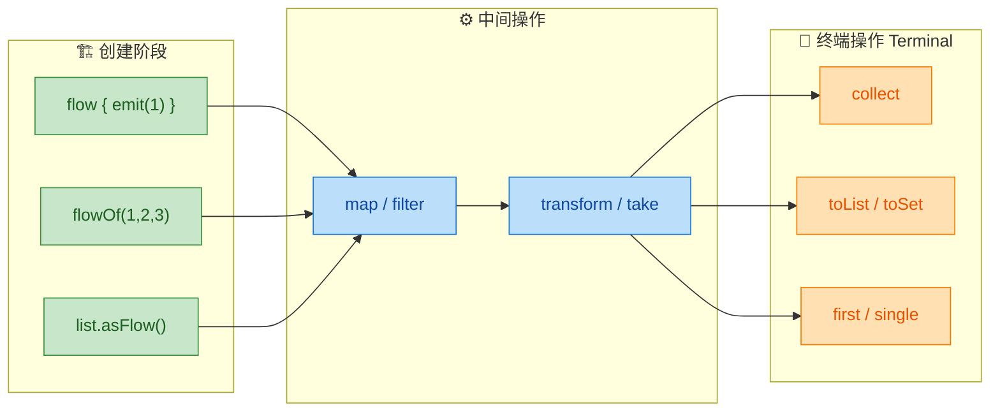
```mermaid
graph LR
    subgraph Creation["🏗️ 创建阶段"]
        direction TB
        A["flow { emit(1) }"]
        B["flowOf(1,2,3)"]
        C["list.asFlow()"]
    end

    subgraph Intermediate["⚙️ 中间操作"]
        direction TB
        D["map / filter"]
        E["transform / take"]
    end

    subgraph Terminal["🎯 终端操作 Terminal"]
        direction TB
        F["collect"]
        G["toList / toSet"]
        H["first / single"]
    end

    A --> D
    B --> D
    C --> D
    D --> E
    E --> F
    E --> G
    E --> H

    classDef creation fill:#C8E6C9,stroke:#388E3C,color:#1B5E20
    classDef intermediate fill:#BBDEFB,stroke:#1976D2,color:#0D47A1
    classDef terminal fill:#FFE0B2,stroke:#F57C00,color:#E65100

    class A,B,C creation
    class D,E intermediate
    class F,G,H terminal
```

上图清晰地展示了 Flow 的三段式生命周期：**创建 → 中间变换 → 终端收集**。只有最右侧的 Terminal 操作被调用时，左侧的整条链路才会开始执行。下面我们逐一深入。

---

### collect ⭐

`collect` 是 Flow 中 **最基础、最常用** 的终端操作符，没有之一。可以说，其他所有终端操作符（`toList`、`first` 等）在底层实现中几乎都依赖于 `collect`。它的签名非常简洁：

```kotlin
// Flow 接口中唯一的抽象方法
// collect 是 suspend 函数，必须在协程中调用
public suspend fun collect(collector: FlowCollector<T>)
```

实际上，`Flow` 接口本身只定义了这一个方法。这体现了 Flow 设计上的极简哲学——**整个 Flow 的行为就是"被收集"**。

#### 基本使用

```kotlin
import kotlinx.coroutines.*
import kotlinx.coroutines.flow.*

fun simpleFlow(): Flow<Int> = flow {
    // 模拟三次异步数据发射
    for (i in 1..3) {
        delay(100)        // 模拟异步耗时操作（如网络请求）
        emit(i)           // 向下游发射一个值
    }
}

fun main() = runBlocking {
    // collect 是 suspend 函数，必须在协程作用域中调用
    simpleFlow().collect { value ->   // lambda 即 FlowCollector.emit 的简写
        println("Received: $value")   // 每收到一个值就执行这里的逻辑
    }
    // 输出:
    // Received: 1
    // Received: 2
    // Received: 3
}
```

这段代码的执行时序值得深入理解。**`collect` 调用之后，协程会挂起（suspend）**，等待上游逐个 `emit` 值。每当上游 emit 一个值，`collect` 的 lambda 就会被回调一次。全部值发射完毕后，`collect` 才会 resume（恢复），继续执行后续代码。

我们用时序图来更直观地呈现这一过程：

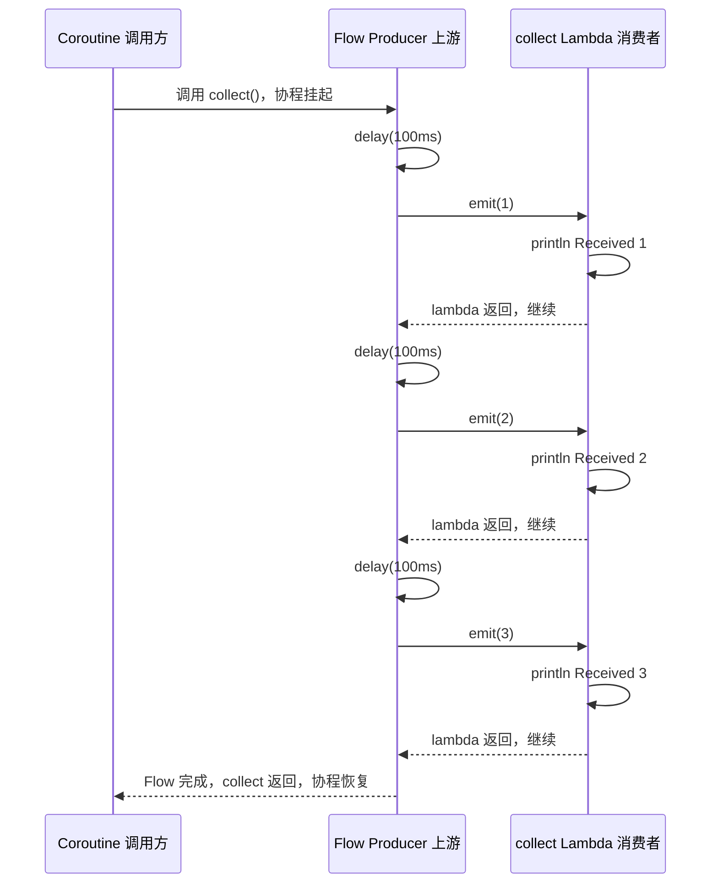
```mermaid
sequenceDiagram
    participant C as Coroutine 调用方
    participant F as Flow Producer 上游
    participant L as collect Lambda 消费者

    C->>F: 调用 collect()，协程挂起
    F->>F: delay(100ms)
    F->>L: emit(1)
    L->>L: println Received 1
    L-->>F: lambda 返回，继续
    F->>F: delay(100ms)
    F->>L: emit(2)
    L->>L: println Received 2
    L-->>F: lambda 返回，继续
    F->>F: delay(100ms)
    F->>L: emit(3)
    L->>L: println Received 3
    L-->>F: lambda 返回，继续
    F-->>C: Flow 完成，collect 返回，协程恢复
```

从时序图可以看出一个极其关键的特征：**emit 和 collect 是交替执行的，是顺序的（sequential）**。上游 `emit(1)` 后，必须等下游 `collect` lambda 处理完毕才会继续 `emit(2)`。这与 Channel 的行为类似，但 Flow 是完全基于挂起函数的协程模型，没有额外的并发原语开销。

#### collect 的本质：FlowCollector

很多初学者只把 `collect { }` 当作一个"forEach 回调"来用，但理解它的底层机制能帮助我们写出更好的代码。

```kotlin
// FlowCollector 是一个函数式接口（fun interface）
public fun interface FlowCollector<in T> {
    // 这个 emit 就是 collect lambda 里"接收值"的动作
    public suspend fun emit(value: T)
}
```

当我们写 `flow.collect { value -> ... }` 时，lambda 的内容实际上就是 `FlowCollector.emit()` 的实现体。也就是说：

```kotlin
// 这两种写法完全等价
// 写法 1: lambda 简写（推荐）
myFlow.collect { value ->
    println(value)          // lambda 体就是 FlowCollector.emit 的实现
}

// 写法 2: 显式实现 FlowCollector 接口
myFlow.collect(object : FlowCollector<Int> {
    override suspend fun emit(value: Int) {
        println(value)      // 与写法 1 完全等价
    }
})
```

理解这一点之后，你就能明白为什么 `collect` 的 lambda 中可以调用 `delay()` 等 suspend 函数——因为 `FlowCollector.emit` 本身就是 `suspend fun`。

```kotlin
fun main() = runBlocking {
    flowOf(1, 2, 3).collect { value ->
        delay(500)                     // 在 collect 中挂起是完全合法的
        println("Slow consume: $value") // 模拟慢消费者
    }
    // 每个值之间间隔 500ms 输出
}
```

#### collect 的重要行为特征

**1. 每次 collect 都会重新触发 Flow 执行（Cold Flow 语义）**

```kotlin
val countFlow = flow {
    println("Flow started!")   // 每次 collect 都会打印
    for (i in 1..3) {
        emit(i)                // 每次 collect 都会重新发射 1, 2, 3
    }
}

fun main() = runBlocking {
    println("=== 第一次收集 ===")
    countFlow.collect { println(it) }   // 打印 Flow started! 然后 1 2 3

    println("=== 第二次收集 ===")
    countFlow.collect { println(it) }   // 再次打印 Flow started! 然后 1 2 3
}
// 输出:
// === 第一次收集 ===
// Flow started!
// 1
// 2
// 3
// === 第二次收集 ===
// Flow started!
// 1
// 2
// 3
```

每次调用 `collect` 都相当于"重新播放"这段 flow builder。这就是 **Cold Flow（冷流）** 的本质——它类似一段录像带，按下播放键（collect）就从头播放。

**2. collect 是挂起函数，会阻塞当前协程的后续代码**

```kotlin
fun main() = runBlocking {
    val flow = flow {
        emit(1)
        delay(1000)          // 模拟耗时
        emit(2)
    }

    flow.collect { println(it) }    // 整个 collect 结束前，下面的代码不会执行
    println("Done!")                 // 在 emit(2) 被消费之后才打印
    // 输出:
    // 1
    // (等待 1 秒)
    // 2
    // Done!
}
```

如果你希望 Flow 的收集不阻塞后续逻辑，需要在一个单独的协程中 launch 它：

```kotlin
fun main() = runBlocking {
    val flow = flowOf(1, 2, 3)

    launch {                           // 在独立协程中收集
        flow.collect { println(it) }   // 不会阻塞外部 runBlocking 的后续代码
    }

    println("This prints immediately") // 可能先于 flow 的输出打印
}
```

**3. collect 遵循 Structured Concurrency（结构化并发）**

`collect` 可以响应协程取消（Cancellation）。如果外部协程被取消，collect 会在下一个挂起点自动抛出 `CancellationException`，停止收集。

```kotlin
fun main() = runBlocking {
    val infiniteFlow = flow {
        var i = 0
        while (true) {                // 无限流
            emit(i++)                 // 不断发射递增的整数
            delay(100)                // 每 100ms 发射一个
        }
    }

    // withTimeoutOrNull 在超时后会取消内部协程
    val result = withTimeoutOrNull(350) {
        infiniteFlow.collect { println(it) }  // 超时后 collect 自动取消
    }
    println("Result: $result")        // 超时返回 null
    // 输出:
    // 0
    // 1
    // 2
    // Result: null
}
```

---

### toList / toSet

`toList()` 和 `toSet()` 是两个非常实用的终端操作符，它们的作用是将整个 Flow 发射的所有值 **收集到一个集合中** 并返回。与 `collect` 的"逐个消费"模式不同，`toList/toSet` 是一种"全量收集"策略——等 Flow 发射完毕后，一次性返回完整结果。

```kotlin
// toList 的签名（简化版）
public suspend fun <T> Flow<T>.toList(): List<T>

// toSet 的签名（简化版）
public suspend fun <T> Flow<T>.toSet(): Set<T>
```

#### 基本使用

```kotlin
import kotlinx.coroutines.*
import kotlinx.coroutines.flow.*

fun main() = runBlocking {
    // 创建一个简单的 Flow
    val numberFlow: Flow<Int> = flowOf(1, 2, 3, 4, 5)

    // toList(): 将所有发射值收集到一个 List
    val list: List<Int> = numberFlow.toList()   // 挂起直到 Flow 完成
    println("List: $list")                       // List: [1, 2, 3, 4, 5]

    // toSet(): 将所有发射值收集到一个 Set（自动去重）
    val dupFlow = flowOf(1, 2, 2, 3, 3, 3)
    val set: Set<Int> = dupFlow.toSet()          // 重复元素会被去除
    println("Set: $set")                          // Set: [1, 2, 3]
}
```

#### 底层原理

`toList()` 在概念上等价于以下代码——使用 `collect` 将值逐一添加到一个可变列表中：

```kotlin
// toList 的等价手写实现（仅供理解，实际请直接用 toList）
suspend fun <T> Flow<T>.myToList(): List<T> {
    val result = mutableListOf<T>()   // 创建一个可变列表作为容器
    collect { value ->                 // 通过 collect 逐个收集值
        result.add(value)             // 每收到一个值就添加到列表中
    }
    return result                      // Flow 完成后返回完整列表
}
```

`toSet()` 逻辑完全一样，只是内部使用 `mutableSetOf()` 作为容器，天然去重。

#### 适用场景与注意事项

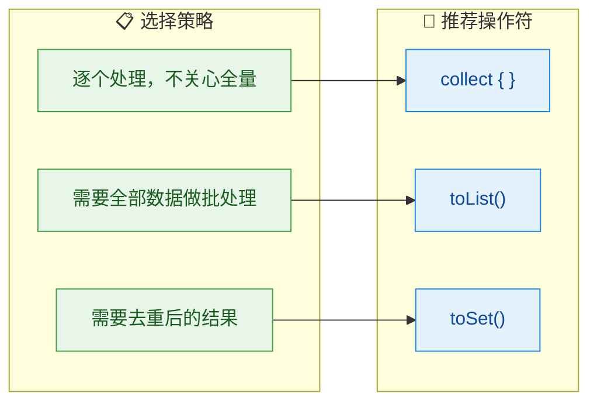
```mermaid
graph LR
    subgraph Scenario["📋 选择策略"]
        direction TB
        S1["逐个处理，不关心全量"]
        S2["需要全部数据做批处理"]
        S3["需要去重后的结果"]
    end

    subgraph Operator["🔧 推荐操作符"]
        direction TB
        O1["collect { }"]
        O2["toList()"]
        O3["toSet()"]
    end

    S1 --> O1
    S2 --> O2
    S3 --> O3

    classDef scene fill:#E8F5E9,stroke:#43A047,color:#1B5E20
    classDef op fill:#E3F2FD,stroke:#1E88E5,color:#0D47A1

    class S1,S2,S3 scene
    class O1,O2,O3 op
```

使用 `toList / toSet` 时需要特别注意一点：**它们会等待 Flow 完全结束后才返回结果**。这意味着如果 Flow 是一个长时间运行的甚至无限的数据流，`toList()` 将永远不会返回（或 OOM）。

```kotlin
fun main() = runBlocking {
    // ⚠️ 危险: 无限 Flow 调用 toList 永远不会返回！
    // val infiniteList = flow {
    //     var i = 0
    //     while (true) { emit(i++); delay(100) }
    // }.toList()   // 永远挂起，内存无限增长!

    // ✅ 正确做法: 先用 take 截取有限个元素
    val safeList = flow {
        var i = 0
        while (true) {                // 无限流
            emit(i++)                 // 持续发射
            delay(100)
        }
    }.take(5)                          // 只取前 5 个，之后自动取消上游
     .toList()                         // 安全: Flow 现在是有限的
    println("Safe list: $safeList")    // Safe list: [0, 1, 2, 3, 4]
}
```

#### toList 的高级用法：带初始列表

`toList()` 还有一个重载版本，可以传入一个已有的 `MutableList` 作为初始容器：

```kotlin
fun main() = runBlocking {
    val existing = mutableListOf(100, 200)     // 已有数据
    val flow = flowOf(1, 2, 3)

    // 将 Flow 的值追加到已有列表中
    val combined = flow.toList(existing)       // existing 会被修改并返回
    println(combined)                           // [100, 200, 1, 2, 3]
    println(existing === combined)              // true，是同一个对象
}
```

---

### first / single

`first()` 和 `single()` 用于从 Flow 中提取 **特定的一个值**。它们类似于 Kotlin 集合标准库中同名的扩展函数，但语义上针对异步数据流做了适配。

#### first()

`first()` 返回 Flow 发射的 **第一个值**，然后 **立即取消** 对后续值的收集。

```kotlin
// 两种重载形式
public suspend fun <T> Flow<T>.first(): T                          // 取第一个值
public suspend fun <T> Flow<T>.first(predicate: (T) -> Boolean): T // 取满足条件的第一个值
```

```kotlin
import kotlinx.coroutines.*
import kotlinx.coroutines.flow.*

fun main() = runBlocking {
    val flow = flowOf(10, 20, 30, 40)

    // 获取第一个元素
    val firstValue = flow.first()              // 拿到 10 后立刻停止收集
    println("First: $firstValue")              // First: 10

    // 获取满足条件的第一个元素
    val firstEven = flow.first { it > 15 }     // 跳过 10，拿到 20 后停止
    println("First > 15: $firstEven")          // First > 15: 20
}
```

**关键行为**：`first()` 拿到目标值后会**取消上游 Flow**。这对于性能敏感的场景非常重要——如果上游是一个耗时的网络请求流，`first()` 不会傻等所有请求完成。

```kotlin
fun main() = runBlocking {
    val heavyFlow = flow {
        println("Emitting 1")      // 会执行
        emit(1)
        println("Emitting 2")      // 不会执行！因为 first() 已经取消了 Flow
        emit(2)
        println("Emitting 3")      // 同样不会执行
        emit(3)
    }

    val result = heavyFlow.first()  // 收到 1 后取消 Flow
    println("Got: $result")
    // 输出:
    // Emitting 1
    // Got: 1
}
```

我们可以用内存模型来理解 `first()` 的取消机制：

```java
// first() 的取消执行流程（概念模型）

// 上游 Flow:     emit(1) ──→ emit(2) ──→ emit(3)
//                  │             ✗            ✗
//                  ▼
// first():      收到 1 ──→ 抛出 CancellationException 取消上游
//                  │
//                  ▼
// 返回值:        result = 1
```

**异常情况**：如果 Flow 为空（没有发射任何值），`first()` 会抛出 `NoSuchElementException`。如果你希望空 Flow 返回 `null` 而不是崩溃，可以使用 `firstOrNull()`：

```kotlin
fun main() = runBlocking {
    val emptyFlow = emptyFlow<Int>()           // 创建一个空 Flow

    // first() 对空 Flow 会抛异常
    // val value = emptyFlow.first()           // ❌ 抛出 NoSuchElementException

    // firstOrNull() 安全版本，空 Flow 返回 null
    val safeValue = emptyFlow.firstOrNull()    // ✅ 返回 null
    println("Safe: $safeValue")                // Safe: null

    // 带条件的 firstOrNull
    val flow = flowOf(1, 3, 5)
    val even = flow.firstOrNull { it % 2 == 0 }  // 没有偶数，返回 null
    println("Even: $even")                         // Even: null
}
```

#### single()

`single()` 比 `first()` 更加**严格**。它期望 Flow **恰好发射一个值**：

- 如果 Flow 发射 **0 个值** → 抛出 `NoSuchElementException`
- 如果 Flow 发射 **1 个值** → 正常返回该值 ✅
- 如果 Flow 发射 **2 个或更多值** → 抛出 `IllegalStateException`

```kotlin
// single 的签名
public suspend fun <T> Flow<T>.single(): T
```

```kotlin
fun main() = runBlocking {
    // ✅ 正好一个值 → 正常返回
    val one = flowOf(42).single()
    println("Single: $one")               // Single: 42

    // ❌ 空 Flow → NoSuchElementException
    try {
        emptyFlow<Int>().single()
    } catch (e: NoSuchElementException) {
        println("Empty: ${e.message}")    // Empty: Expected at least one element
    }

    // ❌ 多个值 → IllegalStateException
    try {
        flowOf(1, 2).single()
    } catch (e: IllegalStateException) {
        println("Too many: ${e.message}") // Too many: Expected only one element
    }
}
```

同样有安全版本 `singleOrNull()`，当 Flow 为空或有多个值时返回 `null`：

```kotlin
fun main() = runBlocking {
    // 空 Flow → null
    val a = emptyFlow<Int>().singleOrNull()
    println(a)  // null

    // 恰好一个值 → 返回值
    val b = flowOf(99).singleOrNull()
    println(b)  // 99

    // 多个值 → null
    val c = flowOf(1, 2).singleOrNull()
    println(c)  // null
}
```

#### first vs single 对比

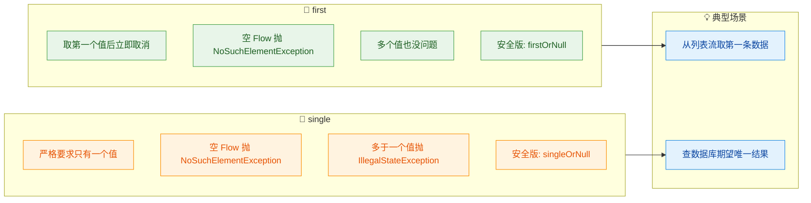
```mermaid
graph LR
    subgraph First["🥇 first"]
        direction TB
        F1["取第一个值后立即取消"]
        F2["空 Flow 抛 NoSuchElementException"]
        F3["多个值也没问题"]
        F4["安全版: firstOrNull"]
    end

    subgraph Single["🎯 single"]
        direction TB
        S1["严格要求只有一个值"]
        S2["空 Flow 抛 NoSuchElementException"]
        S3["多于一个值抛 IllegalStateException"]
        S4["安全版: singleOrNull"]
    end

    subgraph UseCase["💡 典型场景"]
        direction TB
        U1["从列表流取第一条数据"]
        U2["查数据库期望唯一结果"]
    end

    First --> U1
    Single --> U2

    classDef firstStyle fill:#E8F5E9,stroke:#43A047,color:#1B5E20
    classDef singleStyle fill:#FFF3E0,stroke:#FB8C00,color:#E65100
    classDef useStyle fill:#E3F2FD,stroke:#1E88E5,color:#0D47A1

    class F1,F2,F3,F4 firstStyle
    class S1,S2,S3,S4 singleStyle
    class U1,U2 useStyle
```

| 特性 | `first()` | `single()` |
|------|-----------|------------|
| 空 Flow | ❌ `NoSuchElementException` | ❌ `NoSuchElementException` |
| 1 个值 | ✅ 返回该值 | ✅ 返回该值 |
| 多个值 | ✅ 返回第一个，取消后续 | ❌ `IllegalStateException` |
| 安全版本 | `firstOrNull()` | `singleOrNull()` |
| 典型场景 | 取最新一条消息 / 首条搜索结果 | 按主键查唯一记录 / 配置项读取 |

一个实际的 Android 开发场景可以帮助理解何时选 `single()`：当你从 Room 数据库按主键查询用户，业务逻辑上**应该恰好只有一条记录**，这时 `single()` 既能获取结果，又能充当一道 assertion（断言），如果查出 0 条或多条说明数据出了问题，异常会帮你尽早发现 Bug。

```kotlin
// Room DAO 示例（伪代码）
@Query("SELECT * FROM user WHERE id = :userId")
fun getUserById(userId: String): Flow<User>     // Room 返回 Flow

// 在 ViewModel 中使用
suspend fun loadUser(id: String): User {
    return userDao.getUserById(id)
        .single()    // 业务断言: 按主键查应该恰好只有 1 条
}
```

---

**📝 练习题**

以下代码的输出是什么？

```kotlin
fun main() = runBlocking {
    val flow = flow {
        println("Start")
        emit(1)
        println("After 1")
        emit(2)
        println("After 2")
        emit(3)
        println("After 3")
    }

    val result = flow.first { it > 1 }
    println("Result: $result")
}
```

A. `Start` → `After 1` → `After 2` → `After 3` → `Result: 2`

B. `Start` → `After 1` → `Result: 2`

C. `Start` → `Result: 2`

D. `Start` → `After 1` → `After 2` → `Result: 2`


**【答案】** B

**【解析】** `first { it > 1 }` 会让 Flow 开始执行。首先打印 `"Start"`，接着 `emit(1)`——此时 `1 > 1` 为 `false`，不满足条件，继续执行，打印 `"After 1"`。然后 `emit(2)`，此时 `2 > 1` 为 `true`，满足条件，`first` 拿到值 `2` 后 **立刻取消 Flow 的后续执行**（通过内部抛出 `CancellationException`）。因此 `"After 2"` 和后面的代码都不会被执行，Flow 被取消后 `first` 返回 `2`，最终打印 `"Result: 2"`。

---

**📝 练习题**

关于 `toList()` 和 `collect`，以下说法**错误**的是？

A. `toList()` 底层依赖 `collect` 来逐个收集值

B. 对无限 Flow 调用 `toList()` 会导致程序永远挂起或 OOM

C. `collect { }` 会等所有值收集完毕后，一次性把值列表交给 lambda

D. `toList()` 是 suspend 函数，必须在协程中调用


**【答案】** C

**【解析】** 选项 C 描述的是 `toList()` 的行为而非 `collect` 的行为。`collect { }` 是**逐个回调**的——上游每 `emit` 一个值，lambda 就被调用一次，不存在"一次性交给 lambda 所有值"的概念。选项 A 正确，`toList` 内部就是创建 `mutableListOf` 再调用 `collect` 逐个 add。选项 B 正确，无限流没有终止点，`toList` 会无限等待并不断消耗内存。选项 D 正确，所有终端操作符都是 `suspend fun`。


---

## 中间操作符 ⭐

中间操作符（Intermediate Operators）是 Flow 编程模型中最核心的构建块之一。它们的本质是：**对上游 Flow 发射的每一个元素进行变换、过滤或重组，然后将结果传递给下游**，最终形成一条完整的数据处理管道（pipeline）。

理解中间操作符之前，需要先抓住一个关键概念——**惰性（Laziness）**。所有中间操作符都不会立即执行任何计算，它们只是在原有 Flow 的基础上"包装"了一层新的逻辑，真正的执行要等到 **终端操作符**（如 `collect`）被调用时才会触发。这与 Kotlin 标准库中 `Sequence` 的惰性求值思想一脉相承，也与 RxJava 中 Observable 的 "subscribe 之前什么都不会发生" 的理念完全一致。

我们可以用一张全局视图来直观地看清中间操作符在整条 Flow 管道中的位置与角色：

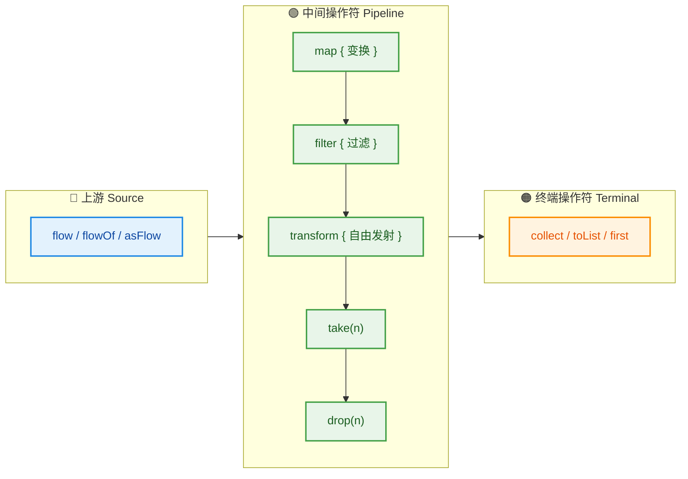
```mermaid
graph LR
    subgraph SRC["🔵 上游 Source"]
        direction TB
        A["flow / flowOf / asFlow"]
    end

    subgraph OPS["🟢 中间操作符 Pipeline"]
        direction TB
        B["map { 变换 }"]
        C["filter { 过滤 }"]
        D["transform { 自由发射 }"]
        E["take(n)"]
        F["drop(n)"]
        B --> C --> D --> E --> F
    end

    subgraph TERM["🟠 终端操作符 Terminal"]
        direction TB
        G["collect / toList / first"]
    end

    SRC --> OPS --> TERM

    classDef srcStyle fill:#E3F2FD,stroke:#1E88E5,color:#0D47A1,stroke-width:2px
    classDef opsStyle fill:#E8F5E9,stroke:#43A047,color:#1B5E20,stroke-width:2px
    classDef termStyle fill:#FFF3E0,stroke:#FB8C00,color:#E65100,stroke-width:2px

    class A srcStyle
    class B,C,D,E,F opsStyle
    class G termStyle
```

这张图清晰地展示了三段式结构：**Source → Intermediate Operators → Terminal Operator**。中间操作符可以任意串联，每一个操作符都返回一个新的 `Flow` 实例，因此天然支持链式调用（chaining）。

还有一个非常重要的特性需要提前强调：**中间操作符本身是 `Flow` 上的扩展函数，返回值仍然是 `Flow`**。这意味着你可以无限组合它们，编译器不会报任何错误；真正的数据流动只发生在终端收集阶段。以下我们逐一深入讲解五个最常用的中间操作符。

---

### map

`map` 是最基础也是使用频率最高的变换操作符。它的语义非常直白：**对上游发射的每一个元素应用一个转换函数（transform lambda），并将转换后的结果发射给下游**。

从签名上看：

```kotlin
// Flow<T> 经过 map 后变为 Flow<R>
// transform 是一个挂起函数（suspend），意味着你可以在 map 中调用其他挂起函数
public inline fun <T, R> Flow<T>.map(
    crossinline transform: suspend (value: T) -> R  // 接受 T，返回 R
): Flow<R>
```

这里有一个非常关键的细节：`transform` 参数被标记为 `suspend`。这意味着在 `map` 的 lambda 体内，你可以执行挂起操作，例如网络请求、数据库查询等。这是 Flow 相比 `Sequence.map` 的巨大优势——`Sequence` 的 `map` 不支持挂起函数。

来看一个基础示例：

```kotlin
import kotlinx.coroutines.*
import kotlinx.coroutines.flow.*

fun main() = runBlocking {
    // 创建一个发射 1, 2, 3 的简单 Flow
    val numbersFlow: Flow<Int> = flowOf(1, 2, 3)

    // 使用 map 将每个数字乘以 10
    numbersFlow
        .map { value ->          // value 的类型是 Int
            println("  map 正在处理: $value")  // 观察处理顺序
            value * 10           // 将每个元素乘以 10，返回新值
        }
        .collect { result ->     // result 的类型仍然是 Int（因为 Int * Int = Int）
            println("收集到: $result")
        }
}
```

输出结果：

```text
  map 正在处理: 1
收集到: 10
  map 正在处理: 2
收集到: 20
  map 正在处理: 3
收集到: 30
```

请注意输出顺序：**不是先把 1、2、3 全部 map 完再 collect，而是逐个元素走完整条管道**。这就是 Flow 的"逐元素顺序执行"特性，和 `Sequence` 的行为一致。

一个更贴近实战的例子——**在 map 中调用挂起函数**：

```kotlin
import kotlinx.coroutines.*
import kotlinx.coroutines.flow.*

// 模拟一个挂起的网络请求：根据用户 ID 获取用户名
suspend fun fetchUserName(userId: Int): String {
    delay(100)                              // 模拟 100ms 网络延迟
    return "User_$userId"                   // 返回模拟的用户名
}

fun main() = runBlocking {
    val userIds = listOf(101, 102, 103)     // 三个用户 ID

    userIds
        .asFlow()                           // List<Int> 转换为 Flow<Int>
        .map { id ->                        // 对每个 ID 进行异步转换
            fetchUserName(id)               // 调用挂起函数，Flow 会自动挂起等待结果
        }
        .collect { name ->                  // 收集转换后的用户名
            println("获取到用户名: $name")
        }
}
```

输出结果：

```text
获取到用户名: User_101
获取到用户名: User_102
获取到用户名: User_103
```

在这个例子中，`map` 内部调用了 `fetchUserName` 这一挂起函数。如果你用的是 `Sequence.map`，编译器会直接报错，因为 Sequence 的 lambda 不是 suspend 的。这正是 Flow 作为"异步数据流"相较于 Sequence 的核心差异。

`map` 操作符的数据流转过程可以用下面这张图来表示：

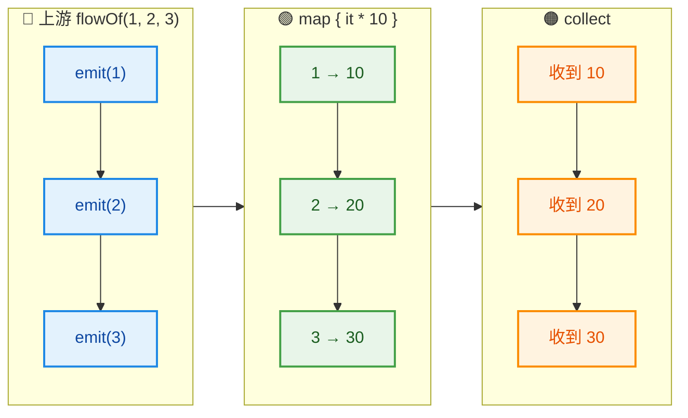
```mermaid
graph LR
    subgraph UP["🔵 上游 flowOf(1, 2, 3)"]
        direction TB
        E1["emit(1)"]
        E2["emit(2)"]
        E3["emit(3)"]
        E1 --> E2 --> E3
    end

    subgraph MAP["🟢 map { it * 10 }"]
        direction TB
        M1["1 → 10"]
        M2["2 → 20"]
        M3["3 → 30"]
        M1 --> M2 --> M3
    end

    subgraph DOWN["🟠 collect"]
        direction TB
        C1["收到 10"]
        C2["收到 20"]
        C3["收到 30"]
        C1 --> C2 --> C3
    end

    UP --> MAP --> DOWN

    classDef upStyle fill:#E3F2FD,stroke:#1E88E5,color:#0D47A1,stroke-width:2px
    classDef mapStyle fill:#E8F5E9,stroke:#43A047,color:#1B5E20,stroke-width:2px
    classDef downStyle fill:#FFF3E0,stroke:#FB8C00,color:#E65100,stroke-width:2px

    class E1,E2,E3 upStyle
    class M1,M2,M3 mapStyle
    class C1,C2,C3 downStyle
```

**核心记忆点**：`map` 是一对一（1:1）变换——上游发射一个元素，下游恰好收到一个元素，数量不变，类型可以改变。

---

### filter

`filter` 操作符的语义是：**对上游发射的每一个元素执行一个谓词函数（predicate），只有返回 `true` 的元素才会被传递给下游，返回 `false` 的元素被直接丢弃**。

签名如下：

```kotlin
// 输入 Flow<T>，输出仍然是 Flow<T>（类型不变，数量可能减少）
public inline fun <T> Flow<T>.filter(
    crossinline predicate: suspend (value: T) -> Boolean  // 同样是 suspend 函数
): Flow<T>
```

与 `map` 一样，`filter` 的 predicate 也是 `suspend` 的，所以你完全可以在过滤条件中执行异步判断逻辑（例如查询数据库来决定是否保留某个元素）。

基础示例：

```kotlin
import kotlinx.coroutines.*
import kotlinx.coroutines.flow.*

fun main() = runBlocking {
    // 创建一个发射 1 到 10 的 Flow
    val numbersFlow: Flow<Int> = (1..10).asFlow()

    // 只保留偶数
    numbersFlow
        .filter { value ->               // value 类型是 Int
            val isEven = value % 2 == 0  // 判断是否为偶数
            println("  filter 判断 $value → $isEven")
            isEven                       // 返回 true 则保留，false 则丢弃
        }
        .collect { result ->
            println("收集到: $result")
        }
}
```

输出结果（截取关键部分）：

```text
  filter 判断 1 → false
  filter 判断 2 → true
收集到: 2
  filter 判断 3 → false
  filter 判断 4 → true
收集到: 4
  filter 判断 5 → false
  filter 判断 6 → true
收集到: 6
  filter 判断 7 → false
  filter 判断 8 → true
收集到: 8
  filter 判断 9 → false
  filter 判断 10 → true
收集到: 10
```

同样可以观察到逐元素处理的特性：每个元素先经过 `filter` 判断，如果通过则立即进入 `collect`，不通过则直接跳过。

`map` + `filter` 组合是最常见的管道模式：

```kotlin
import kotlinx.coroutines.*
import kotlinx.coroutines.flow.*

data class Product(                       // 定义一个商品数据类
    val name: String,                     // 商品名称
    val price: Double,                    // 商品价格
    val inStock: Boolean                  // 是否有库存
)

fun main() = runBlocking {
    // 模拟商品列表数据源
    val products = listOf(
        Product("Keyboard", 79.99, true),
        Product("Mouse", 39.99, false),   // 无库存
        Product("Monitor", 299.99, true),
        Product("Webcam", 59.99, true),
        Product("Speaker", 149.99, false) // 无库存
    )

    products
        .asFlow()                         // List<Product> → Flow<Product>
        .filter { it.inStock }            // 第一步：只保留有库存的商品
        .filter { it.price < 100.0 }      // 第二步：只保留价格低于 100 的商品
        .map { it.name }                  // 第三步：提取商品名称
        .collect { name ->
            println("符合条件的商品: $name")
        }
}
```

输出结果：

```text
符合条件的商品: Keyboard
符合条件的商品: Webcam
```

这个示例展示了多个中间操作符的串联：两次 `filter` + 一次 `map`，形成了一条完整的数据筛选-转换管道。

**核心记忆点**：`filter` 是一对零或一（1:0/1）操作——上游发射一个元素，下游要么收到它（通过），要么收不到（被过滤掉）。数量可能减少，类型不变。

---

### transform

`transform` 是所有中间操作符中**最灵活、最强大**的一个。事实上，`map` 和 `filter` 在 kotlinx.coroutines 的源码中都是基于 `transform` 实现的。

它的核心能力在于：**你可以在 lambda 中自由地调用 `emit()` 任意次数**——可以 emit 0 次（相当于 filter 掉）、1 次（相当于 map）、多次（一对多展开），甚至可以在 emit 之间执行挂起操作。

签名如下：

```kotlin
// FlowCollector<R> 是接收者，提供了 emit(value: R) 函数
public inline fun <T, R> Flow<T>.transform(
    crossinline transform: suspend FlowCollector<R>.(value: T) -> Unit
): Flow<R>
```

注意 lambda 的接收者类型是 `FlowCollector<R>`，这意味着在 lambda 内部你可以直接调用 `emit()`，就像在 `flow { }` 构建器内部一样自由。

来看一个综合示例，展示 `transform` 如何同时实现过滤、变换和展开：

```kotlin
import kotlinx.coroutines.*
import kotlinx.coroutines.flow.*

fun main() = runBlocking {
    val numbersFlow: Flow<Int> = (1..5).asFlow()

    numbersFlow
        .transform { value ->             // this: FlowCollector<String>，value: Int
            if (value % 2 == 0) {         // 只处理偶数（过滤效果）
                emit("$value 是偶数")      // 第一次 emit：描述性字符串
                emit("$value × 2 = ${value * 2}")  // 第二次 emit：计算结果
            }
            // 奇数不调用 emit，相当于被过滤掉了
        }
        .collect { result ->
            println(result)
        }
}
```

输出结果：

```text
2 是偶数
2 × 2 = 4
4 是偶数
4 × 2 = 8
```

可以看到：奇数 1、3、5 被完全跳过；偶数 2、4 各自产生了两条输出。这就是 `transform` 的灵活性——**一个输入元素可以产生任意数量的输出元素**。

我们来对比 `map`、`filter` 和 `transform` 的关系，用一张图来说明它们之间的内在联系：

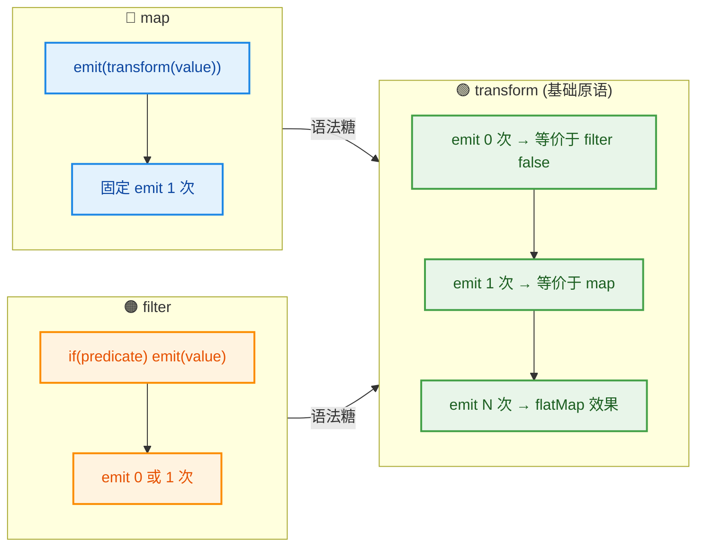
```mermaid
graph LR
    subgraph TRANSFORM["🟢 transform (基础原语)"]
        direction TB
        T1["emit 0 次 → 等价于 filter false"]
        T2["emit 1 次 → 等价于 map"]
        T3["emit N 次 → flatMap 效果"]
        T1 --> T2 --> T3
    end

    subgraph MAP["🔵 map"]
        direction TB
        MA["emit(transform(value))"]
        MB["固定 emit 1 次"]
        MA --> MB
    end

    subgraph FILTER["🟠 filter"]
        direction TB
        FA["if(predicate) emit(value)"]
        FB["emit 0 或 1 次"]
        FA --> FB
    end

    MAP -- 语法糖 --> TRANSFORM
    FILTER -- 语法糖 --> TRANSFORM

    classDef transStyle fill:#E8F5E9,stroke:#43A047,color:#1B5E20,stroke-width:2px
    classDef mapStyle fill:#E3F2FD,stroke:#1E88E5,color:#0D47A1,stroke-width:2px
    classDef filterStyle fill:#FFF3E0,stroke:#FB8C00,color:#E65100,stroke-width:2px

    class T1,T2,T3 transStyle
    class MA,MB mapStyle
    class FA,FB filterStyle
```

一个更实战化的例子——**在 transform 中执行异步操作并发射中间状态**：

```kotlin
import kotlinx.coroutines.*
import kotlinx.coroutines.flow.*

// 模拟发起网络请求
suspend fun performRequest(id: Int): String {
    delay(200)                                // 模拟网络延迟
    return "Response_$id"                     // 返回响应结果
}

fun main() = runBlocking {
    (1..3).asFlow()
        .transform { requestId ->
            emit("⏳ 正在请求 #$requestId...")    // 先发射一个"加载中"的状态
            val response = performRequest(requestId)  // 执行异步请求
            emit("✅ $response")               // 再发射请求结果
        }
        .collect { status ->
            println(status)
        }
}
```

输出结果：

```text
⏳ 正在请求 #1...
✅ Response_1
⏳ 正在请求 #2...
✅ Response_2
⏳ 正在请求 #3...
✅ Response_3
```

这个模式在 Android 开发中非常常见：ViewModel 使用 Flow 向 UI 层发射"Loading → Success"的状态序列，而 `transform` 天然支持这种"一个事件触发多次发射"的场景。

**核心记忆点**：`transform` 是最底层的中间操作符原语（primitive），它可以 emit 任意次数，`map` 和 `filter` 都是它的特化版本。当你发现 `map` 或 `filter` 满足不了需求时，直接用 `transform`。

---

### take

`take(n)` 操作符的语义非常简洁：**只取上游发射的前 n 个元素，之后直接取消 Flow 的执行**。

```kotlin
// 只有前 count 个元素会被传递给下游
public fun <T> Flow<T>.take(count: Int): Flow<T>
```

重点来了——`take` 在接收到第 n 个元素后会通过抛出一个特殊的内部异常 `AbortFlowException` 来取消上游 Flow 的执行。这是 kotlinx.coroutines 内部的实现细节，对开发者透明，但你需要知道 **`take` 会导致上游提前终止**。

基础示例：

```kotlin
import kotlinx.coroutines.*
import kotlinx.coroutines.flow.*

fun main() = runBlocking {
    // 创建一个"无限" Flow（实际上 1..100 足够演示）
    val numbersFlow: Flow<Int> = (1..100).asFlow()

    // 只取前 5 个元素
    numbersFlow
        .take(5)                          // 只允许前 5 个元素通过
        .collect { value ->
            println("收集到: $value")
        }

    println("--- Flow 已结束 ---")
}
```

输出结果：

```text
收集到: 1
收集到: 2
收集到: 3
收集到: 4
收集到: 5
--- Flow 已结束 ---
```

尽管上游有 100 个元素，但 `take(5)` 在接收到第 5 个后就终止了整条管道。

配合 `flow { }` 构建器时可以观察到取消行为：

```kotlin
import kotlinx.coroutines.*
import kotlinx.coroutines.flow.*

fun main() = runBlocking {
    flow {
        for (i in 1..10) {
            println("  准备发射 $i")       // 观察哪些元素实际被发射了
            emit(i)                       // 发射元素
            println("  已发射 $i")         // 观察发射后是否继续
        }
    }
    .take(3)                              // 只取前 3 个
    .collect { value ->
        println("收集到: $value")
    }
}
```

输出结果：

```text
  准备发射 1
  已发射 1
收集到: 1
  准备发射 2
  已发射 2
收集到: 2
  准备发射 3
  已发射 3
收集到: 3
```

可以看到：第 3 个元素发射并收集之后，Flow 立即终止，`i = 4` 的 "准备发射" 根本没有被打印。这证明了 **take 会真正取消上游 Flow 的执行**，不会浪费多余的计算。

如果你在 `flow { }` 中使用了 `try-finally` 块，`finally` 会在 `take` 取消时正确执行：

```kotlin
import kotlinx.coroutines.*
import kotlinx.coroutines.flow.*

fun main() = runBlocking {
    flow {
        try {
            for (i in 1..10) {
                emit(i)                   // 逐个发射
            }
        } finally {
            println("🧹 finally 块执行：资源清理")  // take 取消后会触发这里
        }
    }
    .take(2)                              // 只取前 2 个
    .collect { println("收集到: $it") }
}
```

输出结果：

```text
收集到: 1
收集到: 2
🧹 finally 块执行：资源清理
```

**核心记忆点**：`take(n)` 取前 n 个元素，**会取消上游 Flow**。常用于限制数据量、实现分页预加载等场景。

---

### drop

`drop(n)` 是 `take(n)` 的"镜像"操作符：**跳过上游发射的前 n 个元素，从第 n+1 个元素开始传递给下游**。

```kotlin
// 跳过前 count 个元素，其余全部传递
public fun <T> Flow<T>.drop(count: Int): Flow<T>
```

与 `take` 不同的是，`drop` **不会取消上游 Flow**。它只是默默地忽略前 n 个元素，之后让所有元素正常通过。

基础示例：

```kotlin
import kotlinx.coroutines.*
import kotlinx.coroutines.flow.*

fun main() = runBlocking {
    val numbersFlow: Flow<Int> = (1..8).asFlow()

    // 跳过前 3 个，收集剩余的
    numbersFlow
        .drop(3)                          // 丢弃 1, 2, 3
        .collect { value ->
            println("收集到: $value")       // 从 4 开始收集
        }
}
```

输出结果：

```text
收集到: 4
收集到: 5
收集到: 6
收集到: 7
收集到: 8
```

前 3 个元素（1、2、3）被静默跳过，第 4 个开始正常流过管道。

`take` + `drop` 组合可以实现**范围截取**的效果，类似于列表的 `subList`：

```kotlin
import kotlinx.coroutines.*
import kotlinx.coroutines.flow.*

fun main() = runBlocking {
    // 目标：取出第 4~6 个元素（索引 3, 4, 5）
    (1..10).asFlow()
        .drop(3)                          // 跳过前 3 个 → 剩余 4,5,6,7,8,9,10
        .take(3)                          // 从剩余中取前 3 个 → 4,5,6
        .collect { value ->
            println("收集到: $value")
        }
}
```

输出结果：

```text
收集到: 4
收集到: 5
收集到: 6
```

这个 `drop(3).take(3)` 的组合完美地实现了"分页"逻辑——跳过前 3 条，取接下来 3 条。

我们用一张对比图来直观地总结 `take` 和 `drop` 的行为差异：

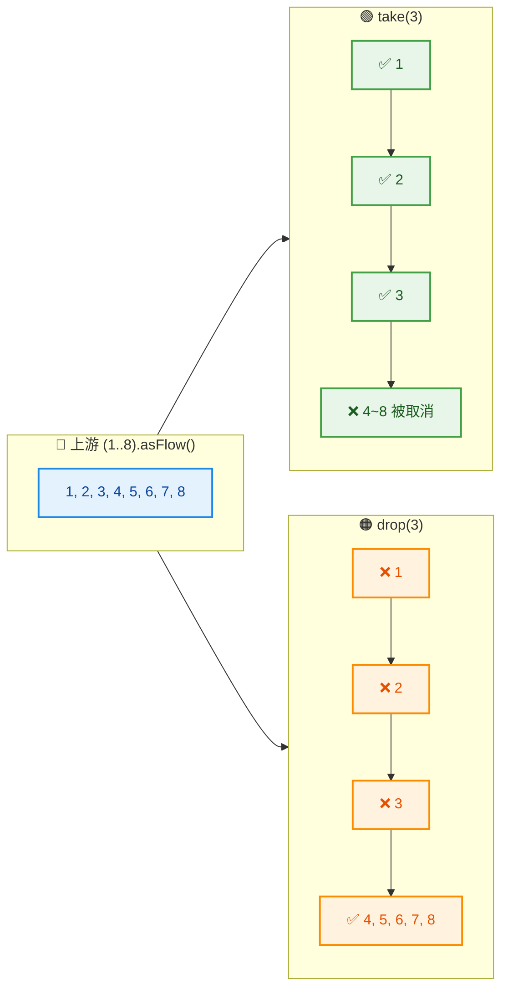
```mermaid
graph LR
    subgraph SRC["🔵 上游 (1..8).asFlow()"]
        direction TB
        S1["1, 2, 3, 4, 5, 6, 7, 8"]
    end

    subgraph TAKE["🟢 take(3)"]
        direction TB
        T1["✅ 1"]
        T2["✅ 2"]
        T3["✅ 3"]
        T4["❌ 4~8 被取消"]
        T1 --> T2 --> T3 --> T4
    end

    subgraph DROP["🟠 drop(3)"]
        direction TB
        D1["❌ 1"]
        D2["❌ 2"]
        D3["❌ 3"]
        D4["✅ 4, 5, 6, 7, 8"]
        D1 --> D2 --> D3 --> D4
    end

    SRC --> TAKE
    SRC --> DROP

    classDef srcStyle fill:#E3F2FD,stroke:#1E88E5,color:#0D47A1,stroke-width:2px
    classDef takeStyle fill:#E8F5E9,stroke:#43A047,color:#1B5E20,stroke-width:2px
    classDef dropStyle fill:#FFF3E0,stroke:#FB8C00,color:#E65100,stroke-width:2px

    class S1 srcStyle
    class T1,T2,T3,T4 takeStyle
    class D1,D2,D3,D4 dropStyle
```

最后，来看一个综合所有五个操作符的实战示例：

```kotlin
import kotlinx.coroutines.*
import kotlinx.coroutines.flow.*

data class LogEntry(                          // 日志条目数据类
    val level: String,                        // 日志级别: INFO, WARN, ERROR
    val message: String,                      // 日志消息
    val timestamp: Long                       // 时间戳
)

fun main() = runBlocking {
    // 模拟一批日志数据
    val logs = listOf(
        LogEntry("INFO", "App started", 1000),
        LogEntry("INFO", "User logged in", 1001),
        LogEntry("WARN", "Memory usage high", 1002),
        LogEntry("ERROR", "NullPointerException", 1003),
        LogEntry("INFO", "Data loaded", 1004),
        LogEntry("ERROR", "NetworkException", 1005),
        LogEntry("WARN", "Deprecated API call", 1006),
        LogEntry("INFO", "User clicked button", 1007),
        LogEntry("ERROR", "OutOfMemoryError", 1008),
        LogEntry("INFO", "App closed", 1009)
    )

    println("=== 提取第 2~3 条 ERROR 日志的格式化消息 ===")
    logs
        .asFlow()                             // List → Flow
        .filter { it.level == "ERROR" }       // 1. 只保留 ERROR 级别的日志
        .drop(1)                              // 2. 跳过第一条 ERROR（从第二条开始）
        .take(2)                              // 3. 只取接下来的 2 条 ERROR
        .transform { entry ->                 // 4. 自由变换：发射格式化后的多行信息
            emit("⚠️ [${entry.level}] ${entry.message}")
            emit("   ⏰ timestamp = ${entry.timestamp}")
        }
        .map { line ->                        // 5. 再做一次简单变换：加上行号前缀
            ">> $line"
        }
        .collect { finalLine ->               // 终端操作：打印最终结果
            println(finalLine)
        }
}
```

输出结果：

```text
=== 提取第 2~3 条 ERROR 日志的格式化消息 ===
>> ⚠️ [ERROR] NetworkException
>>    ⏰ timestamp = 1005
>> ⚠️ [ERROR] OutOfMemoryError
>>    ⏰ timestamp = 1008
```

这段代码完整展示了五个操作符的协作：`filter` 做条件筛选 → `drop` 跳过不需要的条目 → `take` 限制数量 → `transform` 展开为多行 → `map` 统一格式。它们组合在一起形成了一条清晰、声明式的数据处理管道。

---

下面用一张总结表来回顾五个中间操作符的核心特征：

| 操作符 | 输入:输出比 | 类型变换 | 会取消上游 | 典型用途 |
|:---:|:---:|:---:|:---:|:---|
| `map` | 1:1 | T → R | ❌ | 元素变换（类型转换、计算） |
| `filter` | 1:0/1 | T → T | ❌ | 条件过滤 |
| `transform` | 1:N | T → R | ❌ | 自由发射（展开、合并、跳过） |
| `take` | 取前 n 个 | T → T | ✅ | 限制数量、提前终止 |
| `drop` | 跳过前 n 个 | T → T | ❌ | 分页跳过、忽略初始值 |

---

**📝 练习题**

以下代码的输出结果是什么？

```kotlin
fun main() = runBlocking {
    (1..10).asFlow()
        .filter { it % 2 != 0 }
        .map { it * it }
        .drop(1)
        .take(2)
        .collect { println(it) }
}
```

A. `1` 和 `9`


B. `9` 和 `25`


C. `25` 和 `49`


D. `9` 和 `49`

**【答案】** B

**【解析】**

让我们逐步追踪数据的流动：

1. **上游**：`(1..10).asFlow()` 发射 `1, 2, 3, 4, 5, 6, 7, 8, 9, 10`
2. **`filter { it % 2 != 0 }`**：只保留奇数 → `1, 3, 5, 7, 9`
3. **`map { it * it }`**：每个奇数求平方 → `1, 9, 25, 49, 81`
4. **drop(1)**：跳过第一个元素 `1` → 剩余 `9, 25, 49, 81`
5. **take(2)**：只取前 2 个 → `9, 25`

因此最终 `collect` 打印的是 `9` 和 `25`，答案为 **B**。注意 `take(2)` 会在收到第 2 个元素后取消整条 Flow，所以 `49` 和 `81` 根本不会被计算。这也体现了 Flow 惰性求值的特性——未被需要的元素不会产生任何额外开销。

---

## 本章小结

本章系统地学习了 Kotlin Coroutines 中 **Flow** 的基础知识体系。Flow 是 Kotlin 协程生态中处理 **异步数据流 (Asynchronous Stream)** 的核心工具，它以"冷流 (Cold Stream)"的设计哲学，提供了一种声明式、可组合、且完全兼容结构化并发的响应式编程模型。下面我们从全局视角，对本章的知识脉络进行一次完整的回顾与串联。

---

### 知识全景图

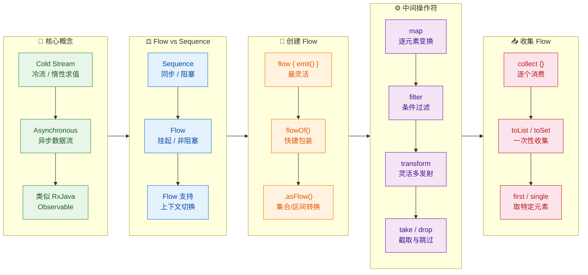
```mermaid
graph LR
    subgraph SG_CONCEPT["🧊 核心概念"]
        direction TB
        A1["Cold Stream\n冷流 / 惰性求值"]
        A2["Asynchronous\n异步数据流"]
        A3["类似 RxJava\nObservable"]
        A1 --> A2 --> A3
    end

    subgraph SG_VS["⚖️ Flow vs Sequence"]
        direction TB
        B1["Sequence\n同步 / 阻塞"]
        B2["Flow\n挂起 / 非阻塞"]
        B3["Flow 支持\n上下文切换"]
        B1 --> B2 --> B3
    end

    subgraph SG_CREATE["🔨 创建 Flow"]
        direction TB
        C1["flow { emit() }\n最灵活"]
        C2["flowOf()\n快捷包装"]
        C3[".asFlow()\n集合/区间转换"]
        C1 --> C2 --> C3
    end

    subgraph SG_COLLECT["📥 收集 Flow"]
        direction TB
        D1["collect {}\n逐个消费"]
        D2["toList / toSet\n一次性收集"]
        D3["first / single\n取特定元素"]
        D1 --> D2 --> D3
    end

    subgraph SG_OP["⚙️ 中间操作符"]
        direction TB
        E1["map\n逐元素变换"]
        E2["filter\n条件过滤"]
        E3["transform\n灵活多发射"]
        E4["take / drop\n截取与跳过"]
        E1 --> E2 --> E3 --> E4
    end

    SG_CONCEPT --> SG_VS
    SG_VS --> SG_CREATE
    SG_CREATE --> SG_OP
    SG_OP --> SG_COLLECT

    classDef conceptCls fill:#E8F5E9,stroke:#388E3C,color:#1B5E20,stroke-width:1px
    classDef vsCls fill:#E3F2FD,stroke:#1976D2,color:#0D47A1,stroke-width:1px
    classDef createCls fill:#FFF3E0,stroke:#F57C00,color:#E65100,stroke-width:1px
    classDef collectCls fill:#FCE4EC,stroke:#C62828,color:#B71C1C,stroke-width:1px
    classDef opCls fill:#F3E5F5,stroke:#7B1FA2,color:#4A148C,stroke-width:1px

    class A1,A2,A3 conceptCls
    class B1,B2,B3 vsCls
    class C1,C2,C3 createCls
    class D1,D2,D3 collectCls
    class E1,E2,E3,E4 opCls
```

---

### 核心概念回顾

本章的起点是理解 Flow 的**三大本质属性**：

1.  **冷流 (Cold Stream)**：Flow 的代码块（`flow { ... }` 中的 lambda）在没有 **终端操作符**（如 `collect`）调用时，**不会执行任何逻辑**。每一次 `collect` 都会触发一次完整的、独立的执行。这与 `Channel`（热流）形成鲜明对比——Channel 的发送端不需要等待接收端就能主动推送数据。冷流的设计使得 Flow 天然具备"**按需计算 (Lazy Evaluation)**"的能力，避免不必要的资源浪费。

2.  **异步数据流 (Asynchronous Data Stream)**：Flow 的每一次 `emit()` 和 `collect` 之间的交互都发生在 **挂起函数 (Suspend Function)** 的上下文中。这意味着数据的生产和消费可以是非阻塞的，可以自然地与 `delay()`、网络请求、数据库查询等异步操作协同工作，而无需回调地狱。

3.  **对标 RxJava Observable**：在功能定位上，Flow 可以替代 RxJava 中的 `Observable` / `Flowable`。但 Flow 更轻量，它不需要庞大的第三方库，完全基于 Kotlin 协程原语构建，并且与结构化并发 (Structured Concurrency) 深度集成，在取消、异常传播等方面表现更加一致和可预测。

---

### Flow vs Sequence：关键分水岭

我们深入对比了 `Sequence` 与 `Flow`，总结如下要点：

| 维度 | `Sequence<T>` | `Flow<T>` |
|---|---|---|
| **执行模型** | 同步、阻塞当前线程 | 异步、挂起不阻塞 |
| **迭代器函数** | `iterator` / `yield` (非 suspend) | `emit` (suspend) |
| **上下文切换** | ❌ 不支持 | ✅ `flowOn()` 切换上游协程上下文 |
| **适用场景** | CPU 密集的纯计算管道 | I/O、网络、异步事件流 |
| **取消支持** | 需手动检查 | 自动响应协程取消 |

核心结论：**当你的数据管道中涉及任何挂起操作（网络、数据库、延时等），请选择 Flow；当数据管道是纯粹的同步计算变换，Sequence 是更简单高效的选择。**

---

### 创建 Flow 的三种姿势

| 构建器 | 适用场景 | 核心特点 |
|---|---|---|
| `flow { emit() }` | 需要自定义复杂发射逻辑（循环、条件、异步调用） | 最灵活，可在 lambda 中执行任意挂起操作 |
| `flowOf(v1, v2, ...)` | 已知固定的少量元素 | 一行代码快速创建，类似 `listOf` |
| `collection.asFlow()` | 已有集合、数组或区间需要转为流 | 零成本桥接，从集合世界进入流世界 |

三种方式本质上都是在创建一个"**冷的、待激活的数据管道蓝图**"。在调用终端操作符之前，它们不产生任何副作用。

---

### 收集 Flow 的终端操作

终端操作符是 **触发 Flow 执行** 的开关：

-   **`collect { }`**：最基础也最常用的终端操作符。逐一接收上游 emit 的每个元素并执行 lambda 处理逻辑。它是一个 **挂起函数**，会挂起直到 Flow 完成或抛出异常。
-   **`toList()` / `toSet()`**：将 Flow 中所有元素一次性收集到一个集合中返回。适用于数据量有限且你需要完整数据集的场景。**注意：如果 Flow 是无限的，这会导致 OOM。**
-   **`first()` / `single()`**：`first()` 只取第一个元素后立即取消 Flow 的后续执行；`single()` 则验证 Flow 恰好只发射一个元素，否则抛异常。两者都适合"只关心特定元素"的场景。

---

### 中间操作符：数据管道的灵魂

中间操作符是 Flow 声明式编程的核心，它们 **不触发执行**，只是在原有 Flow 上"叠加"变换逻辑，返回一个新的 Flow：

```kotlin
// 一条典型的 Flow 数据管道
flowOf(1, 2, 3, 4, 5, 6, 7, 8, 9, 10)  // 创建：10 个整数
    .filter { it % 2 == 0 }              // 中间：保留偶数 → 2,4,6,8,10
    .map { it * it }                     // 中间：平方变换 → 4,16,36,64,100
    .take(3)                             // 中间：只取前3个 → 4,16,36
    .collect { println(it) }             // 终端：触发执行并打印
```

各操作符定位总结：

| 操作符 | 一句话描述 | 发射比 (输入:输出) |
|---|---|---|
| `map` | 对每个元素做 **1:1 变换** | 1 → 1 |
| `filter` | 按条件保留元素 | 1 → 0 或 1 |
| `transform` | 最灵活，可对每个元素做 **任意次 `emit`** | 1 → 0, 1, 或 N |
| `take(n)` | 取**前 n 个**元素后自动取消上游 | N → min(N, n) |
| `drop(n)` | 跳过**前 n 个**元素，发射剩余部分 | N → max(0, N-n) |

`transform` 是 `map` 和 `filter` 的超集——你可以用 `transform` 实现 `map`（每次 emit 一个变换后的值）、`filter`（条件满足才 emit）、甚至 `flatMap` 式的一对多发射。

---

### 数据流转生命周期

用一张时序图来呈现一次完整的 Flow 执行过程——从创建到收集完毕：

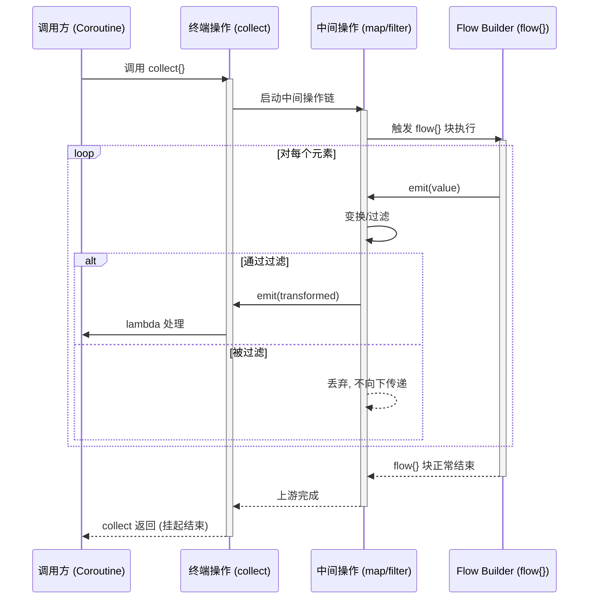
```mermaid
sequenceDiagram
    participant Caller as 调用方 (Coroutine)
    participant Terminal as 终端操作 (collect)
    participant Mid as 中间操作 (map/filter)
    participant Builder as Flow Builder (flow{})

    Caller->>Terminal: 调用 collect{}
    activate Terminal
    Terminal->>Mid: 启动中间操作链
    activate Mid
    Mid->>Builder: 触发 flow{} 块执行
    activate Builder

    loop 对每个元素
        Builder->>Mid: emit(value)
        Mid->>Mid: 变换/过滤
        alt 通过过滤
            Mid->>Terminal: emit(transformed)
            Terminal->>Caller: lambda 处理
        else 被过滤
            Mid-->>Mid: 丢弃, 不向下传递
        end
    end

    Builder-->>Mid: flow{} 块正常结束
    deactivate Builder
    Mid-->>Terminal: 上游完成
    deactivate Mid
    Terminal-->>Caller: collect 返回 (挂起结束)
    deactivate Terminal
```

关键理解：**整个 Flow 管道是"拉动式 (Pull-based)"执行的。** 不是 Builder 主动推送，而是 `collect` 驱动执行——每当下游准备好接收时，上游才继续生产下一个值。这种背压 (Backpressure) 机制是天然内置的，无需像 RxJava 那样额外配置 `BackpressureStrategy`。

---

### 核心心智模型

将本章浓缩为一个你可以随时调用的心智模型：

> **Flow = 冷启动 + 挂起友好 + 声明式管道 + 结构化并发**

-   **冷启动**：不 collect，不执行。
-   **挂起友好**：管道中每一步都可以调用挂起函数。
-   **声明式管道**：通过链式中间操作符描述"做什么"，而非"怎么做"。
-   **结构化并发**：Flow 的生命周期自动绑定到收集它的协程作用域。协程取消时，Flow 自动取消。

掌握了这些基础之后，后续章节将进入 **Flow 进阶**，包括 `flowOn` 上下文切换、异常处理 (`catch`)、完成回调 (`onCompletion`)、以及 `StateFlow` / `SharedFlow` 等热流话题。本章的基础是一切高级用法的根基。

---

**📝 练习题 1**

以下代码的输出结果是什么？

```kotlin
fun main() = runBlocking {
    val myFlow = flow {
        println("Flow started")
        emit(1)
        emit(2)
        emit(3)
    }

    println("Before collect")
    val result = myFlow.take(2).toList()
    println("Result: $result")
}
```

A. `Before collect` → `Flow started` → `Result: [1, 2, 3]`

B. `Flow started` → `Before collect` → `Result: [1, 2]`

C. `Before collect` → `Flow started` → `Result: [1, 2]`

D. `Before collect` → `Result: [1, 2]`


**【答案】** C

**【解析】** 本题考查两个核心知识点。**第一，Flow 是冷流。** `flow { ... }` 构建器中的代码在声明时不会执行，只有在终端操作符（这里是 `toList()`，其内部调用 `collect`）被调用时才会开始执行。因此 `"Before collect"` 一定先于 `"Flow started"` 打印，排除 B。**第二，`take(n)` 的截断行为。** `take(2)` 在接收到第 2 个元素后会通过抛出内部 `AbortFlowException` 来取消上游 Flow 的继续执行，因此第三个 `emit(3)` 永远不会被执行，`toList()` 返回的结果是 `[1, 2]`，排除 A。综合以上分析，答案为 C。

---

**📝 练习题 2**

关于 `transform` 操作符，以下说法 **错误** 的是：

A. `transform` 可以对每个上游元素发射零个值，从而实现类似 `filter` 的效果

B. `transform` 可以对每个上游元素发射多个值，从而实现"一对多"展开

C. `transform` 内部可以调用挂起函数（如 `delay`）

D. `transform` 是终端操作符，调用后会立即触发 Flow 执行


**【答案】** D

**【解析】** `transform` 是一个 **中间操作符 (Intermediate Operator)**，而非终端操作符。中间操作符的本质是返回一个新的 `Flow`，它只是在原有管道上"叠加"了一层变换逻辑，**不会触发执行**。只有 `collect`、`toList`、`first` 等终端操作符才会真正启动 Flow 的执行。选项 A 正确（不调用 `emit` 即可实现过滤）；选项 B 正确（多次调用 `emit` 即可实现一对多）；选项 C 正确（`transform` 的 lambda 是一个 `FlowCollector` 上的挂起扩展函数，天然支持调用其他挂起函数）。因此 D 是错误的说法。

---

