---

# Flow进阶 ⭐⭐

---

## 上下文切换

在 Kotlin 协程的 Flow 体系中，**上下文切换（Context Switching）** 是一个非常核心的进阶议题。当我们构建一个 Flow 时，数据的 **发射（emit）** 和 **收集（collect）** 可能需要运行在不同的协程调度器上。例如，上游负责从数据库或网络读取数据，应运行在 `Dispatchers.IO`；而下游负责更新 UI，必须运行在 `Dispatchers.Main`。Flow 对此有着严格的设计约束——它通过 **Context Preservation（上下文保留）** 原则来保证线程安全，并提供了唯一合法的切换手段：`flowOn`。

### flowOn ⭐（切换上游上下文）

#### 核心概念：Context Preservation

在深入 `flowOn` 之前，必须先理解 Flow 的一条铁律：**Flow 的 `emit` 和 `collect` 默认必须在同一个协程上下文中执行。** 这就是所谓的 **Context Preservation**（上下文保留）。

简单来说，当你在某个协程里调用 `flow.collect { ... }` 时，Flow 内部的 `emit()` 会自动继承 `collect` 所在的协程上下文。这保证了 Flow 不会在你毫不知情的情况下切换线程，从而避免了并发安全问题。

```kotlin
// 示例：默认情况下 emit 和 collect 运行在同一上下文
fun main() = runBlocking {
    // 这个 flow 的 emit 会继承 collect 所在的上下文（此处为 runBlocking 的主线程）
    val simpleFlow = flow {
        println("Flow 发射线程: ${Thread.currentThread().name}") // 主线程
        emit(1) // 在 collect 的上下文中发射
        emit(2)
    }

    // collect 运行在 runBlocking 的主线程上
    simpleFlow.collect { value ->
        println("收集到 $value, 线程: ${Thread.currentThread().name}") // 主线程
    }
}
// 输出：
// Flow 发射线程: main
// 收集到 1, 线程: main
// 收集到 2, 线程: main
```

这引出一个实际问题：**如果我希望上游在 IO 线程发射，下游在主线程收集，该怎么办？** 答案就是 `flowOn`。

#### flowOn 的工作原理

`flowOn` 操作符用于改变 **上游（upstream）** Flow 的执行上下文。它只影响调用它之前（即它上方）的所有操作符，而不影响它下方的操作符和最终的 `collect`。

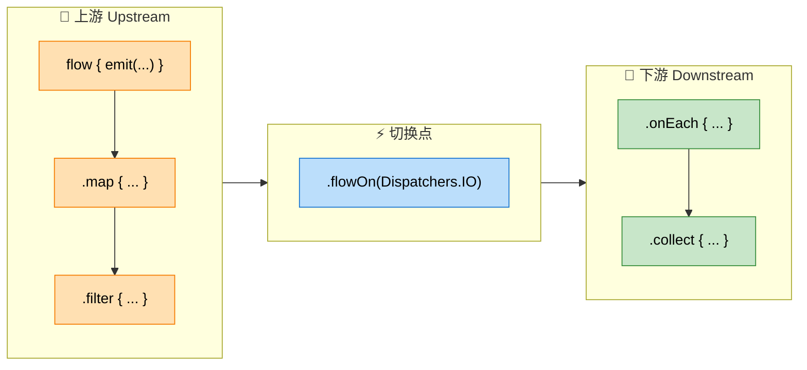

**关键语义**：`flowOn` 像一道分水岭，把 Flow 链分成上游和下游两个世界。上游跑在 `flowOn` 指定的调度器上，下游则保持 `collect` 所在的原始上下文不变。

来看一个经典的实战示例：

```kotlin
fun main() = runBlocking {
    flow {
        // ✅ 这里运行在 Dispatchers.IO（由下方 flowOn 指定）
        println("发射线程: ${Thread.currentThread().name}")
        emit(fetchDataFromNetwork()) // 模拟耗时网络请求
    }
    .map { data ->
        // ✅ 这里也运行在 Dispatchers.IO（处于 flowOn 上游）
        println("map 变换线程: ${Thread.currentThread().name}")
        parseData(data) // 解析数据
    }
    .flowOn(Dispatchers.IO) // 🔑 分水岭：以上所有操作切换到 IO 线程
    .collect { parsed ->
        // ✅ 这里运行在 runBlocking 的主线程（collect 的上下文）
        println("收集线程: ${Thread.currentThread().name}")
        updateUI(parsed) // 更新 UI
    }
}
// 输出（线程名因环境而异）：
// 发射线程: DefaultDispatcher-worker-1
// map 变换线程: DefaultDispatcher-worker-1
// 收集线程: main
```

#### 多个 flowOn 的叠加效果

当 Flow 链中存在多个 `flowOn` 时，每个 `flowOn` 只影响 **从自身到上一个 `flowOn`（或 flow 起点）之间** 的操作符。可以把它想象成"就近原则"——每个操作符受离它最近的下方 `flowOn` 影响。

```kotlin
fun main() = runBlocking {
    flow {
        // 🟠 运行在 Dispatchers.IO（受第一个 flowOn 控制）
        println("emit 线程: ${Thread.currentThread().name}")
        emit(1)
    }
    .flowOn(Dispatchers.IO) // 第一个 flowOn：控制 flow{} 构建块
    .map { value ->
        // 🔵 运行在 Dispatchers.Default（受第二个 flowOn 控制）
        println("map 线程: ${Thread.currentThread().name}")
        value * 10
    }
    .flowOn(Dispatchers.Default) // 第二个 flowOn：控制上方的 map
    .collect { value ->
        // 🟢 运行在主线程（collect 自身的上下文）
        println("collect 线程: ${Thread.currentThread().name}")
    }
}
```

其调度关系可以用下面这张图来理解：

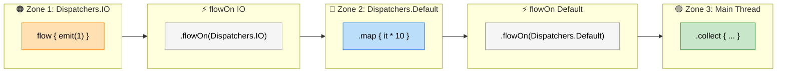

#### flowOn 的内部机制：Channel 缓冲

`flowOn` 并非简单地切换线程——它在内部引入了一个 **Channel** 来解耦上下游。上游在其指定的调度器上生产数据并发送到 Channel，下游在 `collect` 的调度器上从 Channel 消费数据。这意味着 `flowOn` 本身自带一层缓冲效果（默认 buffer 大小为 `BUFFERED`，通常是 64）。

```java
// 概念性内存模型（简化）
// ┌────────────────────┐          ┌───────────┐          ┌────────────────────┐
// │    上游协程          │          │  Channel   │          │    下游协程          │
// │  Dispatchers.IO     │ ──emit──▶│ (buffer=64)│ ──recv──▶│  Dispatchers.Main  │
// │  flow { emit(x) }  │          │            │          │  collect { ... }   │
// └────────────────────┘          └───────────┘          └────────────────────┘
```

这个设计有几个好处：

- **线程安全**：上下游运行在不同线程，通过 Channel 通信，不存在共享可变状态。
- **自带背压（Backpressure）**：如果下游处理慢，Channel 满了，上游会被挂起（suspend），自然形成背压。
- **性能优化**：上下游可以一定程度上并行执行（上游继续生产，下游同时消费）。

---

### 不能用 withContext 包裹 emit

#### 违规写法与异常

初学者常常会产生一个直觉想法："既然 `withContext` 可以切换协程上下文，那我直接在 `flow { }` 构建块里用 `withContext` 切换线程再 `emit` 不就行了？" **答案是不行。** Flow 会在运行时直接抛出 `IllegalStateException`。

```kotlin
// ❌ 错误写法：绝对不要这样做！
fun wrongFlow(): Flow<Int> = flow {
    // 尝试在 withContext 中切换到 IO 线程后发射
    withContext(Dispatchers.IO) {
        emit(1) // 💥 运行时抛出 IllegalStateException!
    }
}

fun main() = runBlocking {
    wrongFlow().collect { println(it) }
    // 异常信息：
    // Flow invariant is violated:
    //     Flow was collected in [BlockingCoroutine{Active}@xxx, BlockingEventLoop@xxx],
    //     but emission happened in [DispatchedCoroutine{Active}@xxx, Dispatchers.IO].
    //     Please refer to 'flow' documentation or use 'flowOn' instead.
}
```

#### 为什么 Flow 禁止这样做？

这个限制的根源在于 Flow 的 **Context Preservation 不变式（Flow Invariant）**。Flow 的设计哲学是：

1. **可预测性（Predictability）**：`collect` 的调用者应该能明确知道回调跑在哪个线程上。如果 `emit` 可以随意切换上下文，那 `collect` lambda 的执行线程就变得不可控。

2. **线程安全（Thread Safety）**：`FlowCollector` 的 `emit` 方法不是线程安全的。如果允许在 `withContext` 中 `emit`，就意味着可能从不同的线程并发调用 `emit`，破坏数据一致性。

3. **封装原则（Encapsulation）**：Flow 应该对调用者透明——收集者不需要关心上游用了什么线程。`flowOn` 提供了一种结构化的方式来实现这一点，而 `withContext` 是一种破坏封装的"逃逸"。

可以用一个直觉来理解：`withContext` 改变的是**当前协程**的上下文，而 `emit` 要求必须运行在 **collect 的协程上下文**中。两者产生了不可调和的冲突。

#### 正确的替代方案

**方案一：使用 `flowOn`（推荐）**

```kotlin
// ✅ 正确写法：用 flowOn 切换上游上下文
fun correctFlow(): Flow<Int> = flow {
    // 这里的代码由 flowOn 切换到 IO 线程执行
    val data = fetchFromNetwork() // 耗时操作
    emit(data)                    // 安全发射，flowOn 内部处理了上下文切换
}.flowOn(Dispatchers.IO)          // 整个 flow{} 块运行在 IO 线程
```

**方案二：在 `withContext` 中计算，在外部 emit**

如果你只想让某一部分计算跑在其他线程上，而不是整个 flow 块，可以把 `withContext` 仅用于计算部分，然后回到原上下文再 `emit`：

```kotlin
// ✅ 正确写法：withContext 只包裹计算逻辑，emit 在外部
fun partialSwitchFlow(): Flow<Int> = flow {
    // 在 IO 线程执行耗时计算，但不在 withContext 内 emit
    val result = withContext(Dispatchers.IO) {
        heavyComputation() // 只做计算，返回结果
    }
    // 回到原上下文后安全发射
    emit(result) // ✅ 这是合法的，因为 emit 在 flow{} 的原始上下文中
}
```

**方案三：使用 `channelFlow` 突破限制**

如果你确实需要在不同上下文中并发地发射数据，可以使用 `channelFlow`。它内部基于 Channel 实现，允许从任意上下文调用 `send`（等效于 `emit`）：

```kotlin
// ✅ 正确写法：channelFlow 允许在任意上下文中发送
fun concurrentFlow(): Flow<Int> = channelFlow {
    // 可以在不同协程/上下文中并发发送数据
    withContext(Dispatchers.IO) {
        send(fetchFromNetwork()) // ✅ channelFlow 中的 send 是线程安全的
    }
    launch(Dispatchers.Default) {
        send(computeLocally())   // ✅ 也可以从其他协程发送
    }
}
```

#### flow vs channelFlow 对比

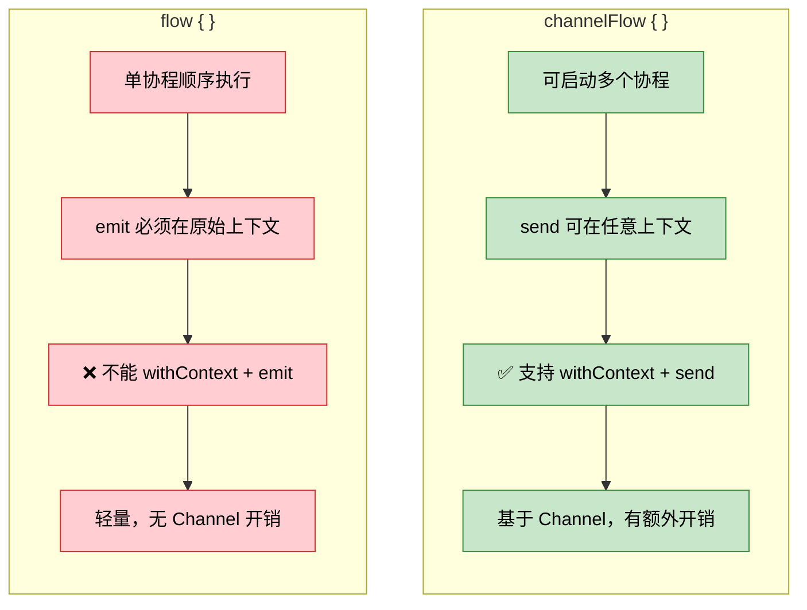

#### 常见误区总结

| 写法 | 是否合法 | 原因 |
|------|---------|------|
| `flow { emit(x) }` | ✅ | 默认在 collect 的上下文中，符合不变式 |
| `flow { emit(x) }.flowOn(IO)` | ✅ | `flowOn` 通过 Channel 合法切换上游上下文 |
| `flow { withContext(IO) { emit(x) } }` | ❌ | 违反 Context Preservation，运行时抛异常 |
| `flow { val r = withContext(IO) { calc() }; emit(r) }` | ✅ | `withContext` 只包裹计算，`emit` 在原上下文 |
| `channelFlow { withContext(IO) { send(x) } }` | ✅ | `channelFlow` 基于 Channel，`send` 线程安全 |

---

**📝 练习题**

以下代码运行后会发生什么？

```kotlin
fun main() = runBlocking {
    flow {
        withContext(Dispatchers.IO) {
            println("Fetching data...")
            emit(42)
        }
    }
    .flowOn(Dispatchers.Default)
    .collect { println("Got: $it") }
}
```

A. 打印 "Fetching data..." 然后打印 "Got: 42"

B. 打印 "Fetching data..." 后抛出 `IllegalStateException`

C. 编译错误，`emit` 不能在 `withContext` 内调用

D. 打印 "Got: 42"，`flowOn` 覆盖了 `withContext` 的上下文切换


**【答案】** B

**【解析】** `flowOn(Dispatchers.Default)` 会将 `flow { }` 构建块的执行上下文切换到 `Dispatchers.Default`，但 `flow { }` 内部的 `withContext(Dispatchers.IO)` 又尝试将上下文切换到 `Dispatchers.IO`，然后在这个新上下文中调用了 `emit(42)`。这违反了 Flow 的 **Context Preservation 不变式**——`emit` 必须在 `FlowCollector` 所在的协程上下文中执行。无论外层有没有 `flowOn`，`withContext` 包裹 `emit` 都是非法的。因此程序会先执行到 `println("Fetching data...")`（因为这句在 `emit` 之前），然后在执行 `emit(42)` 时抛出 `IllegalStateException`，并附带 "Flow invariant is violated" 的错误信息。选项 C 不正确，因为这不是编译期错误，Kotlin 编译器无法在编译时检测到这种上下文违规，它只会在运行时被 Flow 内部的检查机制捕获。

---

## 缓冲与合并

在实际开发中，Flow 的 **发射端（Emitter）** 和 **收集端（Collector）** 的处理速度往往不一致。一个典型场景是：上游每 100ms 产出一个值，但下游处理每个值需要 300ms。如果没有任何缓冲策略，整条流水线就会陷入 **"生产一个→等消费完→再生产下一个"** 的串行等待中，总耗时等于二者之和。

Kotlin 协程为此提供了三把利器：`buffer`、`conflate` 和 `collectLatest`，它们从不同角度解决 **"快生产、慢消费"（Backpressure）** 问题。要理解它们，首先需要建立一个关于"默认行为"的认知基线。

### 默认行为：顺序执行（Sequential）

在没有任何缓冲操作符的情况下，Flow 的 emit 和 collect 运行在 **同一个协程** 中。这意味着 collect 的 lambda 处理完毕之前，emit 会被 **挂起等待**（suspend）。我们先看一个基准示例：

```kotlin
import kotlinx.coroutines.*
import kotlinx.coroutines.flow.*
import kotlin.system.measureTimeMillis

fun simpleFlow(): Flow<Int> = flow {
    for (i in 1..3) {
        delay(100) // 模拟上游每 100ms 产出一个值
        emit(i)    // 发射值
        println("Emitted $i @ ${System.currentTimeMillis()}")
    }
}

fun main() = runBlocking {
    val time = measureTimeMillis {
        simpleFlow().collect { value ->
            delay(300) // 模拟下游处理耗时 300ms
            println("Collected $value @ ${System.currentTimeMillis()}")
        }
    }
    // 预期总耗时 ≈ 3 × (100 + 300) = 1200ms
    println("Total time: ${time}ms")
}
```

输出大约为：

```text
Emitted 1
Collected 1
Emitted 2
Collected 2
Emitted 3
Collected 3
Total time: ~1200ms
```

整个过程是严格串行的——**emit 和 collect 交替执行**，总耗时是每对 (emit + collect) 的简单累加。下面的时序图清晰展示了这一串行瓶颈：

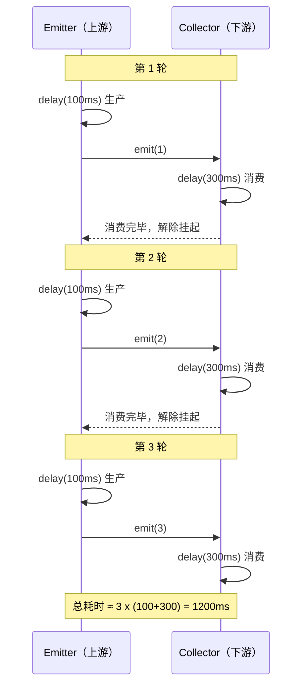

这就是我们要解决的问题：**如何让上游不必等下游处理完再发射下一个值？**

---

### buffer（缓冲）

`buffer()` 是最直觉的方案——它在 emit 和 collect 之间插入一个 **缓冲通道（Channel）**，使得上游和下游运行在 **不同的协程** 中，从而实现 **并发执行**（Concurrent execution）。

核心语义可以用一句话概括：**上游尽管发，发出的值先存入缓冲区；下游按自己的节奏从缓冲区中取值消费。** 两端互不阻塞（直到缓冲区满）。

```kotlin
fun main() = runBlocking {
    val time = measureTimeMillis {
        simpleFlow()
            .buffer() // 在 emit 和 collect 之间创建缓冲通道
            .collect { value ->
                delay(300) // 下游依然需要 300ms 处理
                println("Collected $value")
            }
    }
    // 预期总耗时 ≈ 100 + 3 × 300 = 1000ms
    // 第一个值需要 100ms 生产，之后下游连续消费 3 个值各 300ms
    println("Total time: ${time}ms")
}
```

为什么是约 **1000ms** 而不是 1200ms？因为在下游处理第 1 个值的 300ms 期间，上游不再等待，继续生产第 2、第 3 个值（各 100ms），这些值被存入 buffer。下游处理完第 1 个后，立即从 buffer 中取出第 2 个，无需再等上游生产。时间线如下：

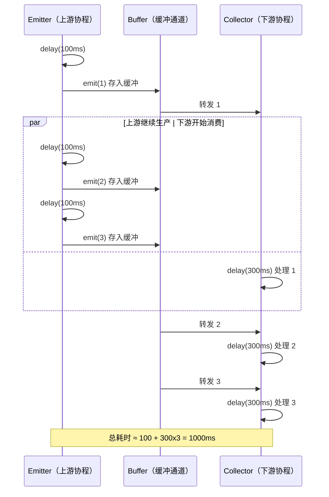

#### buffer 的参数详解

`buffer()` 接受两个可选参数，让你精确控制缓冲行为：

```kotlin
public fun <T> Flow<T>.buffer(
    capacity: Int = BUFFERED,           // 缓冲区容量
    onBufferOverflow: BufferOverflow = BufferOverflow.SUSPEND // 溢出策略
): Flow<T>
```

**capacity（容量）：**

| 常量 | 值 | 含义 |
|---|---|---|
| `Channel.BUFFERED` | 默认 (64) | 使用系统默认缓冲大小 |
| `Channel.RENDEZVOUS` | 0 | 无缓冲，退化为顺序执行 |
| `Channel.CONFLATED` | -1 | 仅保留最新值，等价于 `conflate()` |
| `Channel.UNLIMITED` | Int.MAX_VALUE | 无限缓冲，永远不会因为满而挂起 |
| 任意正整数 | N | 固定容量为 N |

**onBufferOverflow（溢出策略）：**

| 策略 | 含义 |
|---|---|
| `BufferOverflow.SUSPEND` | 缓冲满时挂起上游（**默认**） |
| `BufferOverflow.DROP_OLDEST` | 丢弃缓冲中最旧的值，腾出空间 |
| `BufferOverflow.DROP_LATEST` | 丢弃刚发射的最新值，缓冲不变 |

一个实际例子——限定缓冲容量为 1，溢出时丢弃最旧的值：

```kotlin
fun main() = runBlocking {
    flow {
        for (i in 1..5) {
            println("Emitting $i")
            emit(i)            // 发射值
            delay(100)         // 上游每 100ms 发射一个
        }
    }
    .buffer(
        capacity = 1,                           // 缓冲区只能存 1 个值
        onBufferOverflow = BufferOverflow.DROP_OLDEST // 满了就丢弃最旧的
    )
    .collect { value ->
        delay(300)             // 下游每 300ms 处理一个
        println("Collected $value")
    }
}
```

在这个配置下，当下游来不及消费时，缓冲区中旧的值会被新值 **覆盖**，因此部分中间值会被跳过。这种策略在 UI 场景中非常常见——比如传感器数据刷新，我们只关心最新读数，丢弃中间过渡值完全可以接受。

#### buffer 本质：Channel 并发模型

从实现角度来看，`buffer()` 内部会创建一个 `Channel`，上游在一个协程中向 Channel 发送（send），下游在另一个协程中从 Channel 接收（receive）。这就是为什么加了 `buffer()` 之后，上下游变成了真正的并发。

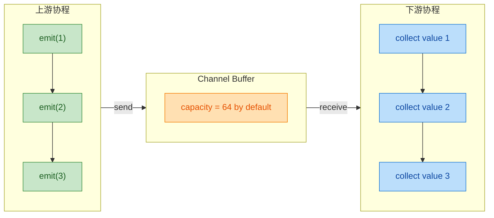

> **关键要点：** `buffer()` 不会丢弃任何值（在默认 `SUSPEND` 策略下），它只是让上下游并发运行以提高整体吞吐量。**每个值最终都会被 collect 处理。**

---

### conflate（合并、只保留最新）

`conflate()` 是一种 **"只关心最新值"** 的激进缓冲策略。当下游来不及处理时，它会 **丢弃所有中间未被消费的旧值**，只保留最新发射的那个。

从 API 实现上看，`conflate()` 本质上等价于：

```kotlin
// conflate() 的内部实现等价于：
buffer(capacity = Channel.CONFLATED)
// 也等价于：
buffer(capacity = 1, onBufferOverflow = BufferOverflow.DROP_OLDEST)
```

来看实际效果：

```kotlin
fun main() = runBlocking {
    val time = measureTimeMillis {
        simpleFlow()       // 上游：100ms 发射一个，共 3 个值
            .conflate()    // 合并：下游来不及就丢弃旧值
            .collect { value ->
                delay(300) // 下游处理需要 300ms
                println("Collected $value")
            }
    }
    println("Total time: ${time}ms")
}
```

**输出（典型情况）：**

```text
Collected 1
Collected 3
Total time: ~700ms
```

**值 2 去哪了？** 下游在处理值 1 的 300ms 内，上游先后发射了值 2 和值 3。由于 conflate 只保留最新值，值 2 被值 3 **覆盖**，下游处理完 1 后直接拿到 3，值 2 永远不会被收集。

下面的流程图展示了 conflate 的丢弃逻辑：

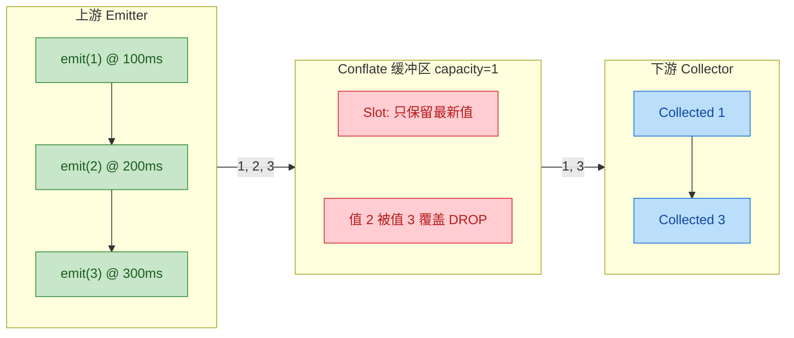

#### 适用场景

`conflate()` 非常适合以下场景：

- **UI 状态更新**：用户只需要看到最终的 UI 状态，中间帧可以跳过。
- **传感器数据**：GPS 位置、加速度计等高频数据流，只关心最新读数。
- **搜索建议**：用户快速输入时，只需要对最新输入文本发起搜索请求。

```kotlin
// Android 典型场景：搜索框输入
searchQueryFlow
    .conflate()        // 用户打字快于网络请求，丢弃中间状态
    .debounce(300)     // 再加防抖，等用户停止输入 300ms
    .collect { query ->
        // 只对最新的搜索词发起网络请求
        performSearch(query)
    }
```

> **与 buffer 的核心区别：** `buffer()` 默认策略下**不丢失任何值**，只是让上下游并发；`conflate()` **主动丢弃中间旧值**，牺牲完整性换取实时性。

---

### collectLatest（取消旧的收集）

`collectLatest` 提供了第三种思路：**不是在发射端丢值，而是在收集端取消旧的处理。** 每当上游发射一个新值时，如果下游还在处理前一个值，`collectLatest` 会 **取消（cancel）** 正在进行的处理协程，立即开始处理新值。

这个语义非常精妙——它保证下游 **总是在处理最新的值**，但给了每个值一个 **"被处理的机会"**（虽然可能被中途取消）。

```kotlin
fun main() = runBlocking {
    val time = measureTimeMillis {
        simpleFlow()            // 上游：100ms 发射一个，共 3 个值
            .collectLatest { value ->
                println("Start processing $value")
                delay(300)      // 模拟耗时处理（可被取消的挂起点）
                println("Done processing $value")
            }
    }
    println("Total time: ${time}ms")
}
```

**输出（典型情况）：**

```text
Start processing 1
Start processing 2
Start processing 3
Done processing 3
Total time: ~700ms
```

值 1 和值 2 都 **开始了处理**（"Start processing" 被打印），但在 `delay(300)` 这个挂起点被 **取消** 了，因此 "Done processing" 只属于最后一个值 3。

#### 取消的微观机制

`collectLatest` 内部为每个新值启动一个子协程来执行 collect lambda。当新值到来时，前一个子协程被 `cancel()` 掉。这依赖于 Kotlin 协程的 **结构化并发（Structured Concurrency）** 和 **协作式取消（Cooperative Cancellation）** 机制——取消只会在 **挂起点**（suspend point，如 `delay`、`emit`、`yield` 等）生效。

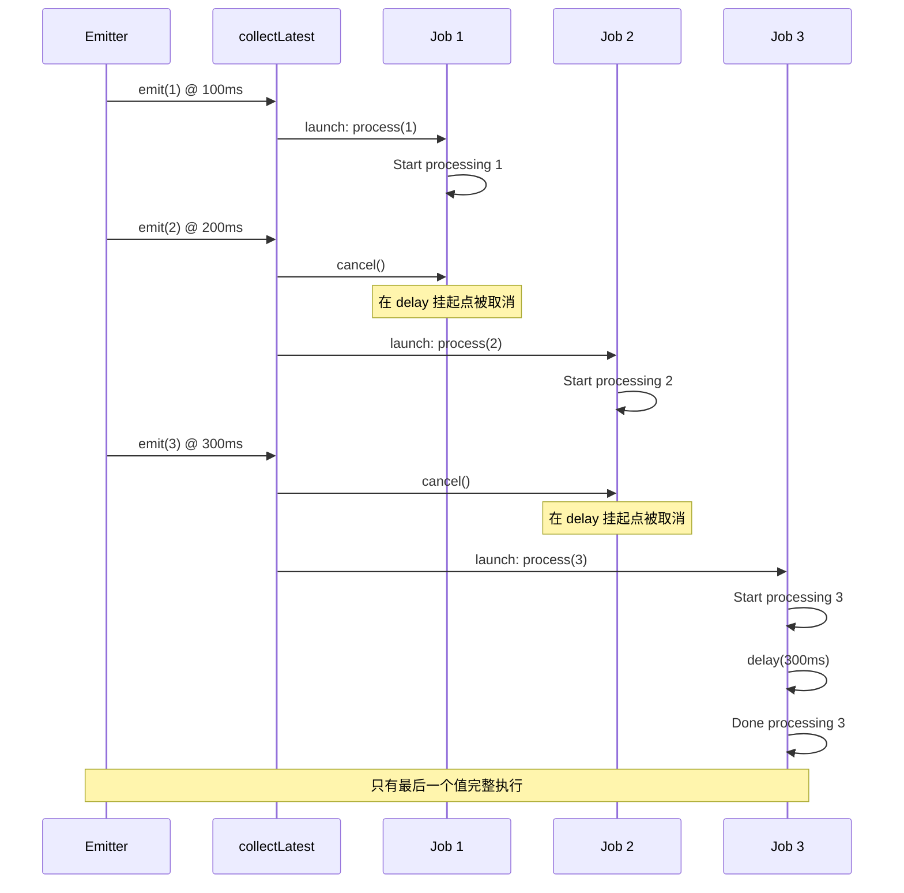

#### 重要注意：取消是协作式的

如果 collect lambda 内部执行的是 **非挂起的、CPU 密集型** 操作，取消不会立即生效。它只在遇到下一个挂起点时才会抛出 `CancellationException`：

```kotlin
flow {
    emit(1)
    delay(100)
    emit(2)
}.collectLatest { value ->
    // ⚠️ 这是一个非挂起的密集循环，cancel 无法中断它
    var sum = 0L
    for (i in 1..1_000_000_000) {
        sum += i  // 没有挂起点，取消不会生效
    }
    println("Done $value, sum=$sum")
}
```

如果需要在密集计算中支持取消，应手动检查 `currentCoroutineContext().ensureActive()` 或使用 `yield()`：

```kotlin
.collectLatest { value ->
    var sum = 0L
    for (i in 1..1_000_000_000) {
        sum += i
        if (i % 1_000_000 == 0L) {
            currentCoroutineContext().ensureActive() // 手动检查取消状态
        }
    }
    println("Done $value, sum=$sum")
}
```

#### 适用场景

`collectLatest` 是 Android 开发中使用频率最高的收集策略之一：

- **网络请求刷新**：用户连续下拉刷新时，取消上一次未完成的请求，只保留最新一次。
- **数据库查询**：Room 返回的 `Flow<List<T>>` 配合 `collectLatest`，当数据变更触发新查询时，取消旧查询的 UI 渲染。
- **动画/延迟操作**：用户快速切换 Tab 时，取消上一个 Tab 的加载动画。

```kotlin
// Android ViewModel 典型用法
viewModelScope.launch {
    repository.getItemsFlow()   // Room 返回 Flow<List<Item>>
        .collectLatest { items ->
            // 如果数据快速连续变更，旧的 UI 更新会被取消
            _uiState.value = UiState.Success(items)
        }
}
```

---

### 三种策略对比总览

下面是 `buffer`、`conflate`、`collectLatest` 的全方位对比：

| 维度 | `buffer()` | `conflate()` | `collectLatest` |
|---|---|---|---|
| **核心思想** | 并发缓冲，不丢值 | 只保留最新，丢弃旧值 | 取消旧处理，重新开始 |
| **值是否丢失** | ❌ 不丢失（默认策略） | ✅ 中间值被丢弃 | ✅ 旧值处理被取消 |
| **作用位置** | emit 与 collect 之间 | emit 端（覆盖缓冲区） | collect 端（取消协程） |
| **旧值处理状态** | 排队等待处理 | 直接被覆盖丢弃 | 处理过程被 cancel |
| **适用场景** | 批量数据处理、日志 | 传感器、UI 状态 | 网络请求、搜索 |
| **总耗时（示例）** | ~1000ms | ~700ms | ~700ms |

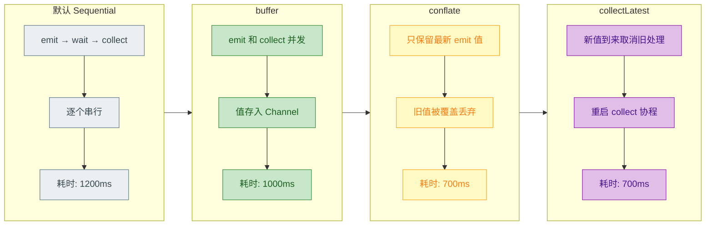

> **选择指南：**
> - 每个值都重要，不能丢 → `buffer()`
> - 只关心最新状态，中间值无意义 → `conflate()`
> - 每个值都要处理，但新值优先级更高 → `collectLatest`

---

**📝 练习题**

以下代码的输出中，`"Done"` 会打印几次？

```kotlin
fun main() = runBlocking {
    flow {
        emit(1)
        delay(50)
        emit(2)
        delay(50)
        emit(3)
    }.collectLatest { value ->
        delay(100)
        println("Done $value")
    }
}
```

A. 3 次（Done 1, Done 2, Done 3）


B. 2 次（Done 2, Done 3）


C. 1 次（Done 3）


D. 0 次（没有任何输出）


**【答案】** C

**【解析】** `collectLatest` 在每个新值到达时，会取消正在进行的上一次 collect lambda 协程。值 1 的处理需要 `delay(100)` 毫秒，但仅过 50ms 后值 2 就到达了，此时值 1 的处理在 `delay` 挂起点被取消（抛出 `CancellationException`）。同理，值 2 的处理也在 50ms 后因值 3 的到来而被取消。只有最后一个值 3，其后再无新值发射，因此 `delay(100)` 得以完整执行，最终只打印 `"Done 3"` 一次。这正体现了 `collectLatest` 的核心语义：**永远只让最新值的处理跑完（run to completion）**。

---

## 组合操作符 ⭐

在实际开发中，数据往往不是来自单一数据源。你可能需要同时监听网络请求和本地数据库、将用户输入与配置信息合并、或者将一个 Flow 的每个元素"展开"成另一个子 Flow。Kotlin Coroutines 为此提供了一系列强大的**组合操作符（Combining Operators）**，它们是构建响应式数据管道的核心工具。

本节将深入讲解五个核心操作符：`zip`、`combine`、`flatMapConcat`、`flatMapMerge` 和 `flatMapLatest`。理解它们的行为差异，是写出高效、正确的 Flow 代码的关键。

---

### zip（一对一组合）

`zip` 是最"严格"的组合操作符。它将两个 Flow 的元素**按顺序一对一配对**，就像拉链（zipper）一样，左边一个齿、右边一个齿，严丝合缝地咬合在一起。

**核心特征：**

- **一对一配对**：Flow A 的第 1 个元素与 Flow B 的第 1 个元素配对，第 2 个与第 2 个配对，以此类推。
- **等待机制**：如果一方发射快、另一方发射慢，快的一方会**挂起等待**慢的一方，直到双方都有新值可配对。
- **短板原则**：当任意一个 Flow 完成时（completed），整个 `zip` 就结束。最终元素数量等于**较短的那个 Flow 的元素数量**。

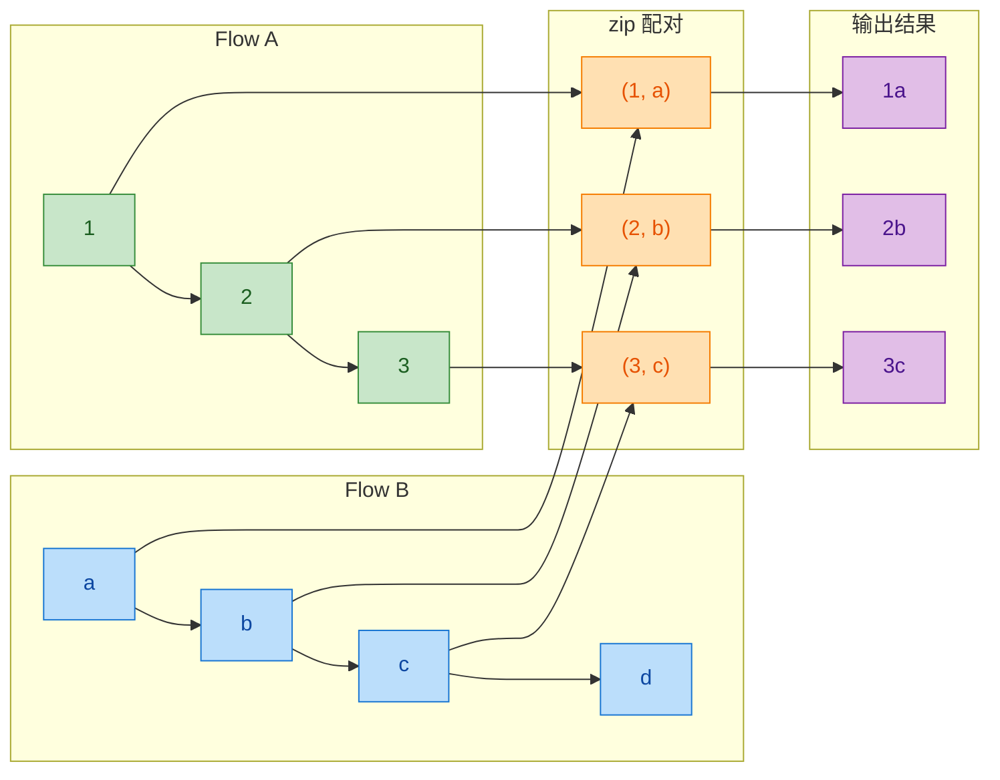

注意 Flow B 的第 4 个元素 `"d"` 被**丢弃**了，因为 Flow A 已经完成，没有对应的值与之配对。

**代码示例：**

```kotlin
import kotlinx.coroutines.*
import kotlinx.coroutines.flow.*

fun main() = runBlocking {
    // 定义第一个 Flow：发射数字 1, 2, 3
    val numbers: Flow<Int> = flow {
        for (i in 1..3) {
            delay(300L)          // 每 300ms 发射一个
            emit(i)              // 发射当前数字
            println("Numbers: 发射 $i")
        }
    }

    // 定义第二个 Flow：发射字符串 "a", "b", "c", "d"
    val letters: Flow<String> = flow {
        val items = listOf("a", "b", "c", "d")
        for (item in items) {
            delay(500L)          // 每 500ms 发射一个（比 numbers 慢）
            emit(item)           // 发射当前字母
            println("Letters: 发射 $item")
        }
    }

    // 使用 zip 将两个 Flow 按序配对
    numbers.zip(letters) { num, letter ->
        // 这个 lambda 接收配对好的两个值
        "$num -> $letter"        // 拼接成字符串作为输出
    }.collect { result ->
        println("Collect: $result")  // 收集并打印结果
    }
}
```

**输出结果：**

```
Numbers: 发射 1
Letters: 发射 a
Collect: 1 -> a
Numbers: 发射 2
Letters: 发射 b
Collect: 2 -> b
Numbers: 发射 3
Letters: 发射 c
Collect: 3 -> c
```

虽然 `letters` 有 4 个元素，但 `numbers` 只有 3 个，所以 `zip` 在配对完 3 对后就结束了，`"d"` 永远不会被发射。

**典型使用场景：**

- 将两个**等长度、有对应关系**的数据源合并。例如：一个接口返回用户 ID 列表，另一个接口返回对应的头像 URL 列表，用 `zip` 将它们一一对应。
- 模拟"请求-响应"模型：请求 Flow 和响应 Flow 一一匹配。

---

### combine（最新值组合）

`combine` 是一个更"灵活"的组合操作符。它不要求一对一配对，而是**只要任何一个 Flow 发射新值，就用双方各自的最新值进行组合**。

**核心特征：**

- **最新值组合**：任一 Flow 发射新值时，取对方**最近一次发射的值**与之组合。
- **不等待配对**：不像 `zip` 那样严格的一一对应，`combine` 关注的是"当前最新状态"。
- **持续到全部完成**：只有当**所有** Flow 都完成后，`combine` 才结束。
- **首次触发需等待**：两个 Flow 都必须**至少发射过一个值**后，才会开始产生组合结果。

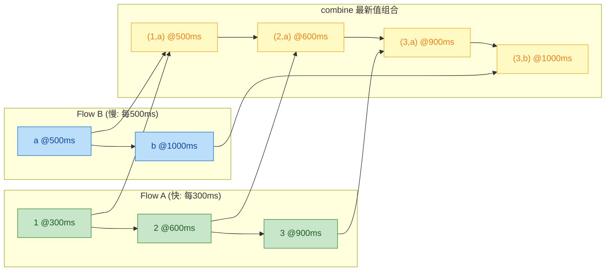

观察时间线上的行为：

1. `@300ms`：A 发射 `1`，但 B 还没有值 → **不产生输出**
2. `@500ms`：B 发射 `"a"`，此时 A 最新是 `1` → 输出 `(1, a)`
3. `@600ms`：A 发射 `2`，此时 B 最新是 `"a"` → 输出 `(2, a)`
4. `@900ms`：A 发射 `3`，此时 B 最新仍是 `"a"` → 输出 `(3, a)`
5. `@1000ms`：B 发射 `"b"`，此时 A 最新是 `3` → 输出 `(3, b)`

**代码示例：**

```kotlin
import kotlinx.coroutines.*
import kotlinx.coroutines.flow.*

fun main() = runBlocking {
    // Flow A：快速发射数字，每 300ms 一次
    val numbers: Flow<Int> = flow {
        for (i in 1..3) {
            delay(300L)              // 每 300ms
            emit(i)                  // 发射 i
            println("  [A] 发射: $i")
        }
    }

    // Flow B：慢速发射字母，每 500ms 一次
    val letters: Flow<String> = flow {
        listOf("a", "b").forEach { ch ->
            delay(500L)              // 每 500ms
            emit(ch)                 // 发射字母
            println("  [B] 发射: $ch")
        }
    }

    // combine：任意一方发射新值，都用双方最新值进行组合
    numbers.combine(letters) { num, letter ->
        "$num-$letter"               // 用最新值拼接
    }.collect { result ->
        println("Collect: $result")  // 打印组合结果
    }
}
```

**输出结果（近似）：**

```
  [A] 发射: 1
  [B] 发射: a
Collect: 1-a
  [A] 发射: 2
Collect: 2-a
  [A] 发射: 3
Collect: 3-a
  [B] 发射: b
Collect: 3-b
```

**`zip` vs `combine` 对比：**

| 特性 | `zip` | `combine` |
|---|---|---|
| 配对方式 | 严格一对一，按发射顺序 | 任一方发射，取双方最新值 |
| 等待行为 | 快方等慢方 | 不等待，有新值就组合 |
| 结束条件 | 任一 Flow 结束即终止 | 所有 Flow 都结束才终止 |
| 输出数量 | `min(sizeA, sizeB)` | 取决于发射频率与时序 |
| 典型用途 | 对应关系明确的数据 | UI 状态、多数据源监听 |

**典型使用场景：**

- **UI 状态合并**（最常见）：在 Android 开发中，将多个 `StateFlow`（如用户信息、网络状态、主题设置）用 `combine` 合并成一个统一的 UI State，任何一个数据源变化时都刷新 UI。
- **搜索 + 过滤**：将用户输入的搜索关键词 Flow 与筛选条件 Flow `combine`，得到最终的查询参数。

```kotlin
// 一个典型的 Android ViewModel 中的用法
val uiState: StateFlow<UiState> = combine(
    userRepo.getUserFlow(),         // 用户信息 Flow
    settingsRepo.getThemeFlow(),    // 主题设置 Flow
    networkMonitor.isOnline         // 网络状态 Flow
) { user, theme, isOnline ->
    // 任何一个源变化都会触发这里重新计算
    UiState(user = user, theme = theme, isOnline = isOnline)
}.stateIn(
    scope = viewModelScope,         // 在 ViewModel 作用域中共享
    started = SharingStarted.WhileSubscribed(5000),
    initialValue = UiState.Loading  // 初始状态
)
```

---

### flatMapConcat（串行展开）

从这里开始，我们进入 **flatMap 系列**操作符。flatMap 的核心思想是：对上游 Flow 发射的**每个元素**，将其变换为一个**新的子 Flow**，然后将这些子 Flow 的结果"展平（flatten）"到输出流中。

> **注意：** `flatMapConcat`、`flatMapMerge`、`flatMapLatest` 在 `kotlinx.coroutines` 中标记为 `@FlowPreview` 或 `@ExperimentalCoroutinesApi`，使用时需添加对应的 `@OptIn` 注解。

`flatMapConcat` 是最简单、最容易理解的 flatMap 变体。它**串行（sequentially）**地处理每个子 Flow：**等上一个子 Flow 完全完成后，才开始处理下一个**。

**核心特征：**

- **严格串行**：上游发射 A、B、C → 先完整收集 A 的子 Flow → 再完整收集 B 的子 Flow → 再完整收集 C 的子 Flow。
- **顺序保证**：输出结果的顺序严格遵循上游发射顺序 + 子 Flow 内部顺序。
- **无并发**：不存在多个子 Flow 同时运行的情况。

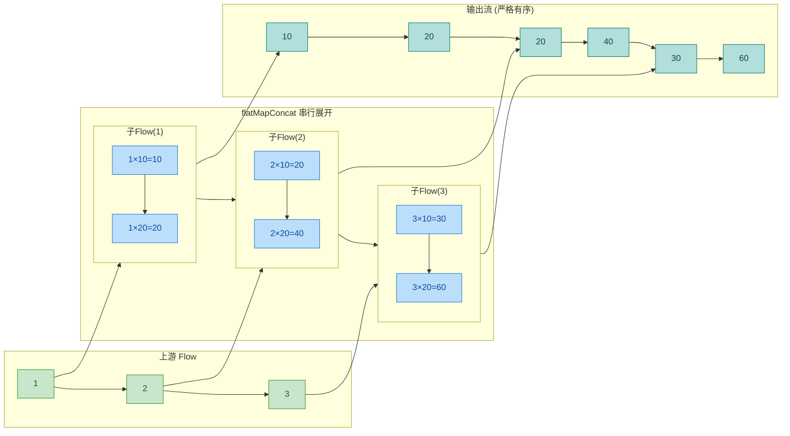

**代码示例：**

```kotlin
import kotlinx.coroutines.*
import kotlinx.coroutines.flow.*

// 模拟根据 ID 请求详情的函数，返回一个 Flow
fun requestDetail(id: Int): Flow<String> = flow {
    delay(300L)                              // 模拟网络延迟
    emit("$id: 基本信息")                     // 发射第一条结果
    delay(300L)                              // 继续加载
    emit("$id: 详细数据")                     // 发射第二条结果
}

@OptIn(FlowPreview::class)                  // flatMapConcat 需要 OptIn
fun main() = runBlocking {
    val startTime = System.currentTimeMillis()

    // 上游 Flow 发射 3 个 ID
    flowOf(1, 2, 3)
        .flatMapConcat { id ->               // 对每个 ID 串行展开为子 Flow
            println("[${elapsedTime(startTime)}] 开始处理 ID=$id")
            requestDetail(id)                // 返回该 ID 对应的子 Flow
        }
        .collect { value ->                  // 收集展平后的所有结果
            println("[${elapsedTime(startTime)}] 收到: $value")
        }
}

// 辅助函数：计算经过的毫秒数
fun elapsedTime(start: Long) = "${System.currentTimeMillis() - start}ms"
```

**输出结果（近似时间）：**

```
[0ms]   开始处理 ID=1
[300ms] 收到: 1: 基本信息
[600ms] 收到: 1: 详细数据
[600ms] 开始处理 ID=2       ← ID=1 完全结束后才开始 ID=2
[900ms] 收到: 2: 基本信息
[1200ms] 收到: 2: 详细数据
[1200ms] 开始处理 ID=3      ← ID=2 完全结束后才开始 ID=3
[1500ms] 收到: 3: 基本信息
[1800ms] 收到: 3: 详细数据
```

总耗时约 **1800ms**（3 个子 Flow × 600ms，严格串行）。

**典型使用场景：**

- **需要严格顺序**的链式操作：如分页加载，先加载第 1 页，完成后再加载第 2 页。
- **依赖关系**：后一个请求需要前一个请求的结果（虽然这种情况更常用 `flatMapConcat` 配合只发射单个值的子 Flow）。

---

### flatMapMerge（并行展开）

`flatMapMerge` 与 `flatMapConcat` 的"展开"思想一致，但最大的区别是：**所有子 Flow 可以并发执行**，不需要等前一个完成。

**核心特征：**

- **并发执行**：多个子 Flow 同时运行，极大提升吞吐量。
- **不保证顺序**：哪个子 Flow 先发射，哪个先出现在输出中。输出顺序取决于各子 Flow 的实际完成时间。
- **并发度可控**：通过 `concurrency` 参数限制同时运行的子 Flow 数量，默认值为 `DEFAULT_CONCURRENCY`（当前为 16）。

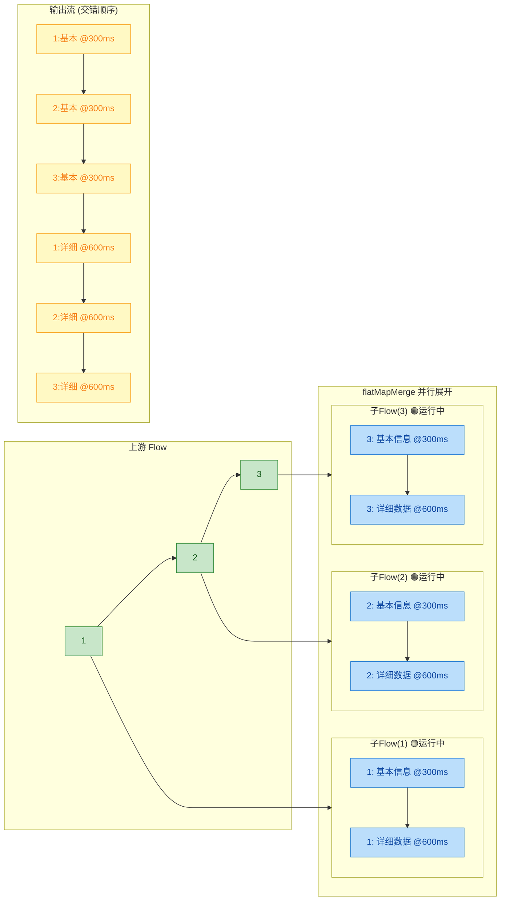

三个子 Flow **同时启动**，都在 `@300ms` 左右发射第一个值，在 `@600ms` 左右发射第二个值。

**代码示例：**

```kotlin
import kotlinx.coroutines.*
import kotlinx.coroutines.flow.*

fun requestDetail(id: Int): Flow<String> = flow {
    delay(300L)                                  // 模拟网络延迟
    emit("$id: 基本信息")                         // 第一条数据
    delay(300L)                                  // 继续加载
    emit("$id: 详细数据")                         // 第二条数据
}

@OptIn(FlowPreview::class)
fun main() = runBlocking {
    val startTime = System.currentTimeMillis()

    flowOf(1, 2, 3)
        .flatMapMerge(concurrency = 3) { id ->   // 最多 3 个子 Flow 并行
            println("[${elapsedTime(startTime)}] 开始处理 ID=$id")
            requestDetail(id)                     // 返回子 Flow（并发执行）
        }
        .collect { value ->
            println("[${elapsedTime(startTime)}] 收到: $value")
        }
}

fun elapsedTime(start: Long) = "${System.currentTimeMillis() - start}ms"
```

**输出结果（近似，顺序可能交错）：**

```
[0ms]   开始处理 ID=1
[0ms]   开始处理 ID=2
[0ms]   开始处理 ID=3
[300ms] 收到: 1: 基本信息
[300ms] 收到: 2: 基本信息
[300ms] 收到: 3: 基本信息
[600ms] 收到: 1: 详细数据
[600ms] 收到: 2: 详细数据
[600ms] 收到: 3: 详细数据
```

总耗时约 **600ms**！对比 `flatMapConcat` 的 1800ms，性能提升 3 倍。这就是并发的威力。

**并发度控制：**

```kotlin
// 限制最多 2 个子 Flow 同时运行
.flatMapMerge(concurrency = 2) { id ->
    requestDetail(id)
}
// 此时 ID=1 和 ID=2 并行，ID=3 等 ID=1 或 ID=2 完成后才开始
```

这在实际开发中非常重要——如果你有 100 个请求要发，不限制并发度会导致资源耗尽。`concurrency` 参数就像是一个**限流阀（throttle）**。

**典型使用场景：**

- **批量并发请求**：同时请求多个接口或加载多张图片，但需要控制并发上限。
- **不关心顺序的数据聚合**：从多个数据源获取数据，谁先返回谁先展示。

---

### flatMapLatest（最新展开）

`flatMapLatest` 是三个 flatMap 中最"激进"的——每当上游发射新值时，它会**立即取消**正在运行的前一个子 Flow，只保留最新的那个。

**核心特征：**

- **最新优先**：只有最后一个上游值对应的子 Flow 会被完整执行。
- **自动取消旧任务**：当新值到来时，之前的子 Flow 如果还在运行，会被 `cancel` 掉。
- **适合"只关心最新"的场景**：类似 `collectLatest` 的理念，但用在 flatMap 层面。

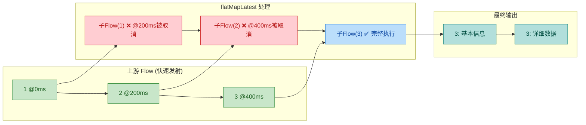

**代码示例：**

```kotlin
import kotlinx.coroutines.*
import kotlinx.coroutines.flow.*

fun requestDetail(id: Int): Flow<String> = flow {
    delay(300L)                                      // 模拟网络延迟
    emit("$id: 基本信息")                             // 发射第一条
    delay(300L)                                      // 继续加载
    emit("$id: 详细数据")                             // 发射第二条
}

@OptIn(ExperimentalCoroutinesApi::class)             // flatMapLatest 需要 OptIn
fun main() = runBlocking {
    val startTime = System.currentTimeMillis()

    flow {
        emit(1)                                      // 发射 1
        delay(200L)                                  // 200ms 后发射下一个
        emit(2)                                      // 发射 2 → 取消 1 的子 Flow
        delay(200L)                                  // 200ms 后发射下一个
        emit(3)                                      // 发射 3 → 取消 2 的子 Flow
    }
    .flatMapLatest { id ->                           // 每次新值到来，取消旧的子 Flow
        println("[${elapsedTime(startTime)}] 开始处理 ID=$id")
        requestDetail(id)                            // 返回子 Flow
    }
    .collect { value ->
        println("[${elapsedTime(startTime)}] 收到: $value")
    }
}

fun elapsedTime(start: Long) = "${System.currentTimeMillis() - start}ms"
```

**输出结果（近似）：**

```
[0ms]   开始处理 ID=1
[200ms] 开始处理 ID=2        ← 1 的子 Flow 被取消（还没来得及发射）
[400ms] 开始处理 ID=3        ← 2 的子 Flow 被取消（还没来得及发射）
[700ms] 收到: 3: 基本信息     ← 只有 3 的子 Flow 完整执行
[1000ms] 收到: 3: 详细数据
```

ID=1 的子 Flow 需要 300ms 才能发射第一个值，但在 200ms 时 ID=2 就来了，所以 ID=1 的子 Flow 被取消。ID=2 同理。最终**只有 ID=3 的子 Flow 完整运行**。

**典型使用场景：**

- **搜索建议（Search Suggestions）**：用户每次输入新字符时，取消之前的搜索请求，只保留最新输入对应的请求。这是最经典的 `flatMapLatest` 用例。
- **切换数据源**：用户切换了选中的分类/Tab，立即取消旧分类的数据加载，开始加载新分类。

```kotlin
// 搜索功能的经典写法
searchQueryFlow                              // 用户输入的搜索关键词 Flow
    .debounce(300L)                          // 防抖：300ms 内没有新输入才发射
    .distinctUntilChanged()                  // 去重：和上次一样的关键词不重复搜索
    .flatMapLatest { query ->               // 最新展开：只执行最新的搜索
        if (query.isEmpty()) {
            flowOf(emptyList())              // 空查询返回空列表
        } else {
            searchRepository.search(query)   // 执行真正的搜索请求
        }
    }
    .collect { results ->
        updateUI(results)                    // 更新 UI
    }
```

---

### flatMap 三兄弟全面对比

| 特性 | `flatMapConcat` | `flatMapMerge` | `flatMapLatest` |
|---|---|---|---|
| 执行方式 | 串行（一个接一个） | 并行（同时运行） | 最新（取消旧的） |
| 顺序保证 | ✅ 严格保序 | ❌ 不保序 | ❌ 不保序（旧的被取消） |
| 子 Flow 完整性 | ✅ 所有子 Flow 完整执行 | ✅ 所有子 Flow 完整执行 | ❌ 只有最新的保证完整 |
| 并发度 | 1 | 可配置（默认 16） | 1（新的取代旧的） |
| 性能 | 最慢 | 最快 | 取决于场景 |
| OptIn 注解 | `@FlowPreview` | `@FlowPreview` | `@ExperimentalCoroutinesApi` |
| 典型场景 | 分页加载、链式依赖 | 批量并发请求 | 搜索建议、切换数据源 |

用一个生活化的比喻来总结：

```text
假设你是一个餐厅经理，收到 3 桌客人的订单：

flatMapConcat → 做完第 1 桌的所有菜，再做第 2 桌，再做第 3 桌。（串行、安全、慢）
flatMapMerge  → 3 个厨师同时开工，谁先做好谁先上菜。（并行、快、顺序不定）
flatMapLatest → 每来一个新订单就把前一个扔掉，只做最新那桌的菜。（只关心最新）
```

---

**📝 练习题**

以下代码的输出结果是什么？

```kotlin
fun main() = runBlocking {
    val flowA = flowOf(1, 2, 3).onEach { delay(100) }
    val flowB = flowOf("X", "Y").onEach { delay(200) }

    flowA.zip(flowB) { a, b -> "$a$b" }
        .collect { println(it) }
}
```

A. `1X`、`2Y`、`3` 三行输出（`3` 没有配对所以单独输出）


B. `1X`、`2Y` 两行输出


C. `1X`、`2X`、`2Y`、`3Y` 四行输出


D. `1X`、`2Y`、`3Y` 三行输出


**【答案】** B

**【解析】** `zip` 操作符采用**严格一对一配对**的策略，且遵循**短板原则**——当任意一个 Flow 完成时，整个 `zip` 就结束。`flowA` 发射 3 个元素（1, 2, 3），`flowB` 只发射 2 个元素（"X", "Y"）。`zip` 会将 `1` 与 `"X"` 配对输出 `"1X"`，`2` 与 `"Y"` 配对输出 `"2Y"`。此时 `flowB` 已完成，`zip` 立即终止，`flowA` 的第 3 个元素 `3` 没有配对对象，被丢弃。选项 A 错误是因为 `zip` 不会对无法配对的元素做任何输出；选项 C 和 D 描述的是 `combine` 的行为模式（最新值组合），而非 `zip` 的行为。

---

**📝 练习题**

在 Android 应用中，用户在搜索框中快速输入"K"→"Ko"→"Kot"→"Kotl"→"Kotlin"。你希望只对最终停止输入后的关键词发起网络请求，且如果用户在前一次请求返回前又修改了关键词，应取消前一次请求。以下哪种组合最合适？

A. `flatMapConcat` + `distinctUntilChanged`


B. `flatMapMerge` + `debounce`


C. `flatMapLatest` + `debounce` + `distinctUntilChanged`


D. `zip` + `buffer`


**【答案】** C

**【解析】** 这是经典的搜索建议场景。`debounce` 负责**防抖**——用户快速输入时，只有停顿一段时间（如 300ms）后才发射最新的关键词，避免对中间状态（如"K"、"Ko"）发起无意义的请求。`distinctUntilChanged` 负责**去重**——如果用户输入后又删除回到了和上次一样的关键词，则不重复搜索。`flatMapLatest` 负责**取消旧请求**——如果"Kotl"的搜索请求还在进行中，用户又输入了"Kotlin"，则自动取消"Kotl"的请求，只执行"Kotlin"的请求。三者配合是业界公认的搜索最佳实践。选项 A 的 `flatMapConcat` 是串行的，会导致旧请求阻塞新请求；选项 B 的 `flatMapMerge` 会同时执行多个请求，浪费资源且可能导致旧结果覆盖新结果；选项 D 的 `zip` 和 `buffer` 完全不适用于此场景。

---

## 异常处理

在响应式的 Flow 数据流中，异常随时可能在上游（emission side）或下游（collection side）发生。与传统的 `try-catch` 不同，Flow 提供了**声明式**的异常处理操作符，使得错误处理逻辑可以像水管中的"过滤阀"一样优雅地嵌入到流的链条中。理解 `catch` 和 `onCompletion` 的精确语义——尤其是它们各自的**作用域边界**——是编写健壮 Flow 代码的关键。

在深入操作符之前，我们先建立一个重要的心智模型：Flow 的异常传播是**单向**的，即从上游向下游传播。整条 Flow 链可以看作一条水管线路，异常就像管道中涌出的"污水"，`catch` 操作符就是安装在管道某个节点上的"净化阀门"——它**只能拦截它上方（上游）流过来的脏水**，而对它下方（下游）发生的泄漏无能为力。

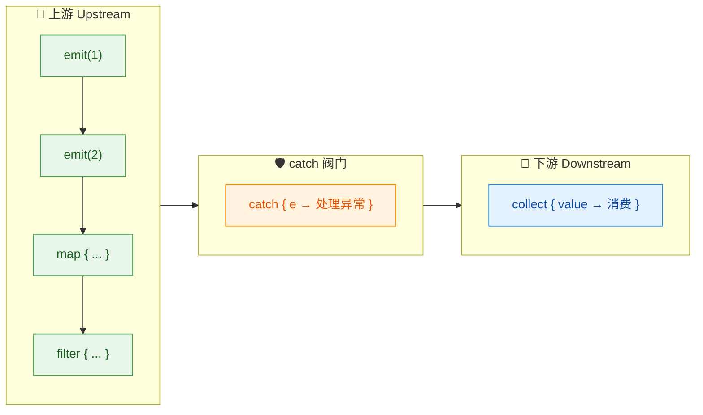

上图清晰展示了 `catch` 的位置语义：**它是上游和下游之间的分水岭**。左侧绿色区域的任何异常都会被橙色阀门捕获，而右侧蓝色区域的异常则不在其管辖范围。

---

### catch（捕获上游异常）

`catch` 是 Flow 中最核心的声明式异常处理操作符。它的函数签名如下：

```kotlin
// catch 是 Flow 的扩展函数（中间操作符）
// action lambda 的 receiver 是 FlowCollector<T>，意味着你可以在里面 emit 值
fun <T> Flow<T>.catch(
    action: suspend FlowCollector<T>.(cause: Throwable) -> Unit // 异常处理 lambda
): Flow<T>
```

#### 基本用法与上游限定规则

`catch` 最重要的特性可以用一句话概括：**它只捕获其上游（upstream）抛出的异常，对下游（downstream）的异常完全透明**。这被称为 **Upstream-only Catch Semantics**。

```kotlin
import kotlinx.coroutines.*
import kotlinx.coroutines.flow.*

fun simpleFlow(): Flow<Int> = flow {
    emit(1)                      // 正常发射第一个值
    emit(2)                      // 正常发射第二个值
    throw RuntimeException("上游爆炸了！") // 上游主动抛出异常
    emit(3)                      // 这行永远不会执行
}

suspend fun main() {
    simpleFlow()                 // 创建上游 Flow
        .catch { e ->            // catch 拦截上游的异常
            println("捕获到异常: ${e.message}") // 打印异常信息
        }
        .collect { value ->      // 下游收集器
            println("收到: $value")  // 消费收到的值
        }
}
```

输出：

```
收到: 1
收到: 2
捕获到异常: 上游爆炸了！
```

可以看到，值 `1` 和 `2` 正常被收集，当 `emit(3)` 之前抛出异常后，`catch` 拦截了它，Flow 正常终止，**不会崩溃**。

#### catch 无法捕获下游异常

这是最常见的误区之一。很多开发者以为 `catch` 能保护整条链路，但实际上**下游 `collect` 中的异常不在 `catch` 的管辖范围内**：

```kotlin
suspend fun main() {
    flow {
        emit(1)                          // 上游发射值 1
        emit(2)                          // 上游发射值 2
    }
    .catch { e ->                        // catch 安装在这里
        println("catch 捕获: ${e.message}") // 尝试捕获异常
    }
    .collect { value ->                  // 下游收集器
        check(value <= 1) {              // 当 value=2 时抛出 IllegalStateException
            "下游炸了！value=$value"       // 这个异常发生在 catch 的下游
        }
        println("收到: $value")
    }
}
```

输出：

```
收到: 1
Exception in thread "main" java.lang.IllegalStateException: 下游炸了！value=2
```

`catch` 完全没有拦截到下游的异常！程序直接崩溃。原理很简单：`catch` 在链中的位置在 `collect` **之前**，而 `collect` 中的代码属于 catch 的**下游**。

#### 解决方案：将下游逻辑上移到 catch 上游

如果你希望 `catch` 能兜住所有异常，一种经典技巧是使用 `onEach` 将消费逻辑从 `collect` 中移到 `catch` 的上游，然后用一个空的 `collect()` 来触发流：

```kotlin
suspend fun main() {
    flow {
        emit(1)                              // 上游发射值
        emit(2)
    }
    .onEach { value ->                       // 把消费逻辑移到 onEach（属于 catch 的上游）
        check(value <= 1) {                  // 这里抛出的异常现在在 catch 上游了
            "处理失败！value=$value"
        }
        println("收到: $value")
    }
    .catch { e ->                            // 现在 catch 能捕获 onEach 中的异常了
        println("catch 捕获: ${e.message}")
    }
    .collect()                               // 空 collect，仅用于触发 Flow 的收集
}
```

输出：

```
收到: 1
catch 捕获: 处理失败！value=2
```

这个模式非常实用，在 Android 开发中大量使用。其本质是**将原本在下游（collect）中的逻辑，通过 `onEach` 提升到 catch 的上游**。

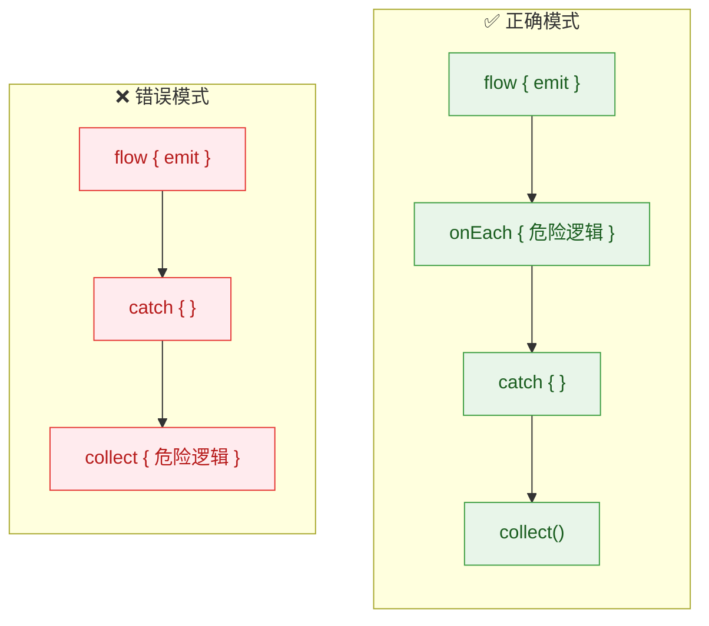

#### 在 catch 中发射恢复值（Emit Recovery Values）

由于 `catch` 的 lambda receiver 是 `FlowCollector<T>`，你可以在异常处理中**继续发射值**，为下游提供降级数据（fallback / recovery）。这在实际业务中极为常见，比如网络请求失败时返回缓存数据：

```kotlin
suspend fun main() {
    flow {
        emit("从网络加载数据...")             // 模拟网络请求
        throw IOException("网络超时")        // 模拟网络失败
    }
    .catch { e ->                           // 捕获上游网络异常
        println("网络异常: ${e.message}")
        emit("从本地缓存加载的降级数据")       // 发射降级数据给下游
    }
    .collect { data ->
        println("UI 显示: $data")           // 下游正常收到降级数据
    }
}
```

输出：

```
UI 显示: 从网络加载数据...
网络异常: 网络超时
UI 显示: 从本地缓存加载的降级数据
```

这个模式在 Android 的 Repository 层特别常见——配合 Room 数据库实现 **"网络优先，本地兜底"** 策略。

#### catch 的透明性（Transparency）与 CancellationException

`catch` 操作符遵循 Flow 的**异常透明性**原则（Exception Transparency）。这意味着：

1. **不应该吞掉异常然后假装没事继续发射**——这会破坏下游对流状态的预期
2. **`CancellationException` 不会被 `catch` 拦截**——取消是协程的正常机制，不是异常

```kotlin
suspend fun main() = coroutineScope {
    val job = launch {
        flow {
            emit(1)
            delay(1000)                     // 模拟耗时操作
            emit(2)                         // 协程被取消后不会执行到这里
        }
        .catch { e ->                       // CancellationException 不会进入这里
            println("catch: ${e.message}")
        }
        .collect {
            println("收到: $it")
        }
    }
    delay(100)                              // 100ms 后取消
    job.cancel()                            // 取消协程
    println("已取消")
}
```

输出：

```
收到: 1
已取消
```

`catch` 的 lambda 根本没有被调用——`CancellationException` 直接穿透了它。

#### 多个 catch 的链式使用

你可以在 Flow 链中放置**多个 `catch`**，每个只负责捕获它上方的异常。这允许你进行分层异常处理：

```kotlin
suspend fun main() {
    flow {
        emit(1)
        throw ArithmeticException("计算异常") // 第一层上游异常
    }
    .catch { e ->                             // 第一个 catch：捕获 flow{} 中的异常
        println("第一层 catch: ${e.message}")
        emit(-1)                              // 发射恢复值
        throw IllegalStateException("恢复失败") // 在 catch 内部又抛出新异常
    }
    .catch { e ->                             // 第二个 catch：捕获第一个 catch 中的异常
        println("第二层 catch: ${e.message}")
        emit(-999)                            // 最终恢复值
    }
    .collect { value ->
        println("收到: $value")
    }
}
```

输出：

```
第一层 catch: 计算异常
收到: -1
第二层 catch: 恢复失败
收到: -999
```

这说明每个 `catch` 既是上一段的"终结者"，又可能成为下一个 `catch` 的"上游"。异常像击鼓传花一样在链中向下传递。

---

### onCompletion（完成回调）

`onCompletion` 操作符在 Flow **完成时**被调用——无论是正常完成还是异常终止。它的定位类似于传统 `try-catch-finally` 中的 `finally` 块，用于执行清理、日志记录、UI 状态更新等收尾工作。

```kotlin
// onCompletion 签名
fun <T> Flow<T>.onCompletion(
    action: suspend FlowCollector<T>.(cause: Throwable?) -> Unit // cause 为 null 表示正常完成
): Flow<T>
```

关键点：`cause` 参数的值决定了完成的类型：
- **`cause == null`**：Flow 正常完成（所有值都发射完毕）
- **`cause != null`**：Flow 因异常而终止

#### 基本用法：正常完成与异常完成

```kotlin
suspend fun main() {
    // 场景1：正常完成
    println("=== 正常完成 ===")
    flowOf(1, 2, 3)                          // 创建一个有限 Flow
        .onCompletion { cause ->             // Flow 完成时触发
            if (cause == null) {             // cause 为 null → 正常完成
                println("✅ Flow 正常完成")
            }
        }
        .collect { println("收到: $it") }

    println()

    // 场景2：异常完成
    println("=== 异常完成 ===")
    flow {
        emit(1)
        throw RuntimeException("出错了")     // 上游抛出异常
    }
    .onCompletion { cause ->                 // Flow 完成时触发
        if (cause != null) {                 // cause 不为 null → 异常终止
            println("❌ Flow 异常终止: ${cause.message}")
        }
    }
    .catch { e ->                            // catch 处理异常，防止崩溃
        println("catch 兜底: ${e.message}")
    }
    .collect { println("收到: $it") }
}
```

输出：

```
=== 正常完成 ===
收到: 1
收到: 2
收到: 3
✅ Flow 正常完成
=== 异常完成 ===
收到: 1
❌ Flow 异常终止: 出错了
catch 兜底: 出错了
```

#### onCompletion 不吃异常——它只是"观察者"

这一点至关重要：**`onCompletion` 不消费异常**。它仅仅是"看到"了异常（通过 `cause` 参数），但异常会继续向下游传播。如果你不在下游放置 `catch`，程序依然会崩溃：

```kotlin
suspend fun main() {
    flow {
        emit(1)
        throw RuntimeException("爆炸")       // 上游异常
    }
    .onCompletion { cause ->                 // 能看到异常
        println("onCompletion 看到: ${cause?.message}") // 但不会拦截它
    }
    // 没有 catch！异常会直接传播到 collect，导致崩溃
    .collect { println("收到: $it") }
}
```

输出：

```
收到: 1
onCompletion 看到: 爆炸
Exception in thread "main" java.lang.RuntimeException: 爆炸
```

可以看到 `onCompletion` 确实执行了，但异常依然导致了崩溃。这就是与 `catch` 的本质区别：

| 特性 | `catch` | `onCompletion` |
|---|---|---|
| **是否消费异常** | ✅ 是，异常被吞掉（除非重新抛出） | ❌ 否，异常继续传播 |
| **能否发射值** | ✅ 可以 emit 恢复值 | ✅ 可以 emit 值（但需谨慎） |
| **作用范围** | 仅上游异常 | 上游 + 下游的异常都能看到 |
| **触发时机** | 仅在异常发生时触发 | 正常完成 + 异常完成都触发 |
| **类比** | `try-catch` 中的 `catch` | `try-catch` 中的 `finally` |

#### onCompletion 能"看到"下游异常

这是 `onCompletion` 与 `catch` 最大的区别之一。虽然 `catch` 只能捕获上游异常，但 `onCompletion` 作为一个"观察者"，连下游的异常也能感知到：

```kotlin
suspend fun main() {
    flowOf(1, 2, 3)
        .onCompletion { cause ->              // 安装在 collect 上游
            if (cause != null) {
                println("onCompletion 看到异常: ${cause.message}")
            } else {
                println("onCompletion: 正常完成")
            }
        }
        .collect { value ->                   // 下游抛出异常
            if (value == 2) {
                throw IllegalStateException("下游不接受2")
            }
            println("收到: $value")
        }
}
```

输出：

```
收到: 1
onCompletion 看到异常: 下游不接受2
Exception in thread "main" java.lang.IllegalStateException: 下游不接受2
```

注意！虽然 `onCompletion` 位于 `collect` 的**上游**，但它依然能"看到"下游 `collect` 中的异常。这是因为 `onCompletion` 的实现原理是在内部包装了一个 `try-finally`，finally 块天然能感知任何方向的异常。

#### onCompletion 中发射值

`onCompletion` 的 lambda receiver 也是 `FlowCollector<T>`，所以可以在里面 `emit` 值。但要注意：**只在正常完成时 emit 才是安全的**：

```kotlin
suspend fun main() {
    flowOf(1, 2, 3)
        .onCompletion { cause ->
            if (cause == null) {              // 仅在正常完成时发射
                emit(999)                     // 发射一个"结束标记"给下游
            }
        }
        .collect { println("收到: $it") }
}
```

输出：

```
收到: 1
收到: 2
收到: 3
收到: 999
```

这在某些场景下非常有用，比如在 Flow 结束时发射一个特殊的"完成信号"（sentinel value）。

#### onCompletion 与 catch 的经典组合

在实际项目中，`onCompletion` 和 `catch` 通常**配合使用**。它们的顺序很重要：

```kotlin
suspend fun main() {
    flow {
        emit("加载中...")
        throw IOException("网络错误")
    }
    .onCompletion { cause ->                 // 先经过 onCompletion
        println(
            if (cause == null) "✅ 加载完成"
            else "⚠️ 加载结束(异常: ${cause.message})"
        )
        // 实际项目中：隐藏 loading 动画、释放资源等
    }
    .catch { e ->                            // 再经过 catch 消费异常
        println("降级处理: ${e.message}")
        emit("缓存数据")                      // 发射降级数据
    }
    .collect { println("UI: $it") }
}
```

输出：

```
UI: 加载中...
⚠️ 加载结束(异常: 网络错误)
降级处理: 网络错误
UI: 缓存数据
```

执行顺序是：`onCompletion` 先"看到"异常并执行清理逻辑 → 异常继续传播到 `catch` → `catch` 消费异常并发射降级数据。

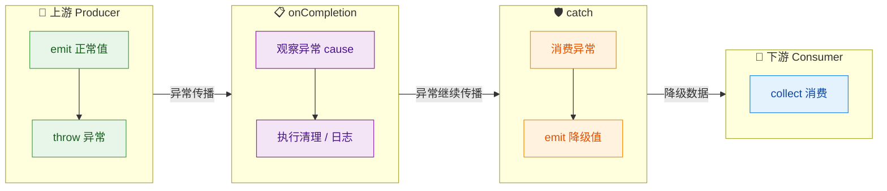

#### Android 实战中的典型模式

在 Android ViewModel 中，`onCompletion` + `catch` 的组合几乎是标配：

```kotlin
class UserViewModel(
    private val repo: UserRepository
) : ViewModel() {

    // UI 状态，使用 StateFlow 管理
    private val _uiState = MutableStateFlow<UiState>(UiState.Idle)
    val uiState: StateFlow<UiState> = _uiState.asStateFlow()

    fun loadUsers() {
        repo.getUsersFlow()                    // 返回 Flow<List<User>>
            .onStart {                         // Flow 开始收集时触发
                _uiState.value = UiState.Loading  // 显示 loading
            }
            .onEach { users ->                 // 处理每一个发射的值
                _uiState.value = UiState.Success(users) // 更新 UI
            }
            .onCompletion { cause ->           // Flow 完成（无论正常/异常）
                // 隐藏 loading、释放资源等
                println("数据流结束, cause=$cause")
            }
            .catch { e ->                      // 捕获上游所有异常
                _uiState.value = UiState.Error(e.message ?: "未知错误")
            }
            .launchIn(viewModelScope)          // 在 ViewModel 作用域中启动收集
    }
}
```

这段代码展示了一个完整的 Flow 异常处理 pipeline：`onStart`（开始）→ `onEach`（处理数据）→ `onCompletion`（清理）→ `catch`（兜底异常）→ `launchIn`（启动）。

#### 易错点总结

最后，我们把 `catch` 和 `onCompletion` 的常见陷阱汇总如下：

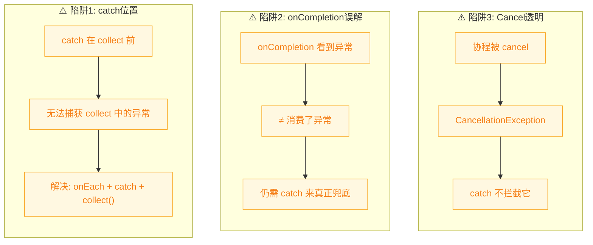

---

**📝 练习题**

以下代码的输出是什么？

```kotlin
flow {
    emit(1)
    throw RuntimeException("boom")
}
.onCompletion { cause ->
    println("A: ${cause?.message}")
    emit(2)
}
.catch { e ->
    println("B: ${e.message}")
    emit(3)
}
.collect {
    println("C: $it")
}
```

A. `C: 1` → `A: boom` → `C: 2` → `B: boom` → `C: 3`


B. `C: 1` → `B: boom` → `C: 3` → `A: null`


C. `C: 1` → `A: boom` → `B: boom` → `C: 2` → `C: 3`


D. `C: 1` → `A: boom` → `C: 2` → `B: boom`


**【答案】** A

**【解析】**

让我们逐步追踪执行流程：

1. `emit(1)` → 值 `1` 传递到下游 → `collect` 打印 **`C: 1`**
2. `throw RuntimeException("boom")` → 异常向下游传播
3. 首先经过 `onCompletion`：`cause` 不为 null → 打印 **`A: boom`** → 然后 `emit(2)` → 值 `2` 到达 `collect` → 打印 **`C: 2`**
4. 异常继续传播到 `catch`：打印 **`B: boom`** → `emit(3)` → 值 `3` 到达 `collect` → 打印 **`C: 3`**

核心要点：`onCompletion` 中 emit 的值 `2` 会在异常传播到 `catch` **之前**先传递给下游。`onCompletion` 不消费异常，所以异常在值 `2` 被消费后继续流向 `catch`。`catch` 消费了异常，然后 emit 的值 `3` 也正常到达下游。整个过程体现了 `onCompletion`（观察但不消费）和 `catch`（消费并可恢复）的协作关系。

---

## 本章小结

本章围绕 Kotlin Flow 的五大进阶主题展开，从上下文切换、缓冲策略、组合操作符到异常处理，构建了一套完整的 Flow 高级使用知识体系。下面我们用一张全景图和精炼的文字，将所有知识点串联回顾。

---

### 全景知识图谱

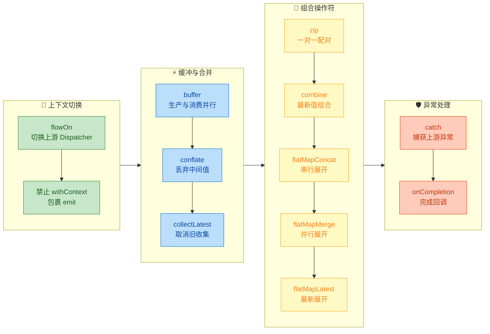

---

### 核心要点回顾

#### 一、上下文切换 —— Flow 的线程安全哲学

Flow 的设计遵循一个被称为 **Context Preservation（上下文保持）** 的核心原则：**emit 和 collect 必须处于同一个协程上下文中**。这是 Flow 区别于 RxJava 的一个显著设计特征。

- **`flowOn`** 是唯一合法的上游上下文切换方式。它的作用范围是"向上生效"，即只影响 `flowOn` 之前（上游）的所有操作符。多次调用 `flowOn` 时，每个 `flowOn` 只覆盖到上一个 `flowOn` 或 flow builder 为止，形成一条分段式的调度链。其底层原理是引入一个 **Channel** 作为上下游之间的通信桥梁，上游在指定 Dispatcher 上生产数据，通过 Channel 传递到下游所在的上下文中消费。
- **禁止 `withContext` 包裹 `emit`**。直接在 `flow { }` 内部使用 `withContext` 来切换线程后调用 `emit` 会抛出 `IllegalStateException`。这是 Kotlin 团队为了保证 Flow 的线程安全和可预测性而做的强制约束。如果你需要在不同 Dispatcher 上执行计算并发射结果，请使用 `flowOn` 或 `channelFlow`。

```kotlin
// ✅ 正确：用 flowOn 切换上游
flow {
    emit(heavyComputation()) // 在 Default 线程执行
}.flowOn(Dispatchers.Default)
 .collect { value ->        // 在调用者上下文收集
     updateUI(value)
 }

// ✅ 正确：用 channelFlow 实现多上下文发射
channelFlow {
    withContext(Dispatchers.IO) {
        send(fetchFromNetwork()) // channelFlow 允许跨上下文 send
    }
}

// ❌ 错误：withContext 包裹 emit
flow {
    withContext(Dispatchers.IO) {
        emit(data) // 💥 IllegalStateException
    }
}
```

#### 二、缓冲与合并 —— 处理生产-消费速度不匹配

当 Flow 的上游生产速度快于下游消费速度时，默认行为是 **背压挂起（suspend）**：上游在 emit 后会挂起，直到下游处理完毕。这种顺序执行是安全的，但可能导致总耗时 = 生产时间 + 消费时间的叠加。三个操作符提供了不同的解压策略：

| 操作符 | 策略 | 丢数据？ | 适用场景 |
|:---|:---|:---:|:---|
| `buffer()` | 上下游并行，用缓冲区暂存 | ❌ | 批量数据处理，不能丢失任何值 |
| `conflate()` | 只保留最新未处理的值 | ✅ | UI 状态更新，只关心最新状态 |
| `collectLatest()` | 新值到达时取消旧收集 | ✅ | 搜索联想，只要最终结果 |

**`buffer`** 的本质是在上下游之间插入一个 Channel（可配置容量），让两端各自独立运行。总耗时从串行叠加降低为 max(生产总时间, 消费总时间) 的水平。

**`conflate`** 可以理解为 `buffer(CONFLATED)`，即缓冲区大小为 1 且采用覆盖策略。当下游还在忙时，上游产生的中间值会被最新值覆盖。

**`collectLatest`** 的策略更激进：每当新值到来，它不仅丢弃缓冲值，还会 **取消** 正在执行的下游收集协程，然后用新值重新启动一个新的收集。这意味着只有最后一个值的收集逻辑能完整执行。

```kotlin
// buffer: 所有值都会被处理，但上下游并行
flow.buffer(capacity = 64).collect { process(it) }

// conflate: 下游忙时，中间值被最新值覆盖
flow.conflate().collect { renderUI(it) }

// collectLatest: 新值到来，旧的收集被 cancel
flow.collectLatest { query ->
    val result = searchAPI(query) // 如果期间有新 query，这里会被取消
    showResults(result)
}
```

#### 三、组合操作符 —— 多流协作的五种模式

组合操作符解决的是 **多个 Flow 之间如何协同工作** 的问题，这也是响应式编程的核心能力之一。

**`zip`**：严格的一对一配对，像拉链一样将两个 Flow 的元素按顺序配对。任一 Flow 结束，整个组合就结束。适合两个数据源有固定对应关系的场景（如：用户名 Flow 和头像 Flow 按 ID 一一对应）。

**`combine`**：最新值组合。任一 Flow 发射新值时，都会与另一个 Flow 的最近一次值组合产出结果。两个 Flow 独立运行，所以发射频率不同也没关系。这是 UI 层最常用的组合方式——比如将"搜索关键词"和"过滤条件"两个 StateFlow combine 后驱动列表刷新。

**`flatMapConcat`**：对上游每个值，串行地展开为一个新的内部 Flow，等前一个内部 Flow 完全收集完毕后，再处理下一个。严格保序，适合有依赖关系的链式请求。

**`flatMapMerge`**：对上游每个值，并发地展开为内部 Flow，多个内部 Flow 同时收集。可通过 `concurrency` 参数限制并发数。适合并行加载多个独立资源的场景。结果顺序不保证。

**`flatMapLatest`**：当上游发射新值时，**取消** 前一个内部 Flow 的收集，只保留最新值展开的 Flow。语义上类似于 `collectLatest` + `flatMap`，适合搜索联想等"只关心最新输入"的场景。

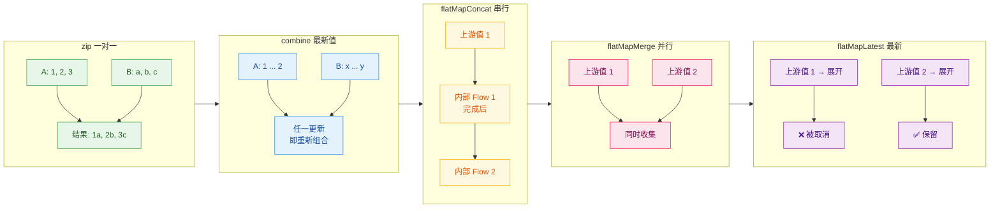

#### 四、异常处理 —— 声明式的安全保障

Flow 的异常处理延续了其 **声明式（declarative）** 的设计风格，避免用命令式的 try-catch 打断链式调用的优雅。

**`catch`** 只能捕获 **上游** 抛出的异常（包括 `map`、`filter`、`flowOn` 等中间操作符中的异常），对 `catch` 之后的下游操作（包括 `collect`）中的异常无能为力。`catch` 块内可以：
1. **`emit` 兜底值**：将异常转化为一个默认值继续下发。
2. **重新抛出**：对无法处理的异常 `throw` 出去。
3. **记录日志**：吞掉异常但做好监控。

**`onCompletion`** 类似于 `finally` 块，无论 Flow 是正常完成还是异常终止，都会被调用。它接收一个 nullable 的 `Throwable` 参数——如果为 `null`，说明正常完成；否则包含导致终止的异常。需要注意的是，`onCompletion` **不会消费异常**，异常仍会继续向下游传播。

二者的推荐搭配模式：

```kotlin
flow {
    emit(riskyOperation())       // 可能抛异常的上游
}
.onCompletion { cause ->         // 先注册完成回调
    if (cause != null) {
        log("Flow 异常终止: $cause")
    } else {
        log("Flow 正常完成")
    }
}
.catch { e ->                    // 再捕获上游异常（包括 onCompletion 之上的）
    emit(fallbackValue)          // 发射兜底值
}
.collect { value ->
    updateUI(value)
}
```

关键记忆点：**`catch` 向上看，`onCompletion` 全都看（但不拦截）**。

---

### 操作符速查表

| 类别 | 操作符 | 一句话描述 | 关键特性 |
|:---|:---|:---|:---|
| 上下文 | `flowOn` | 切换上游执行的 Dispatcher | 向上生效，底层用 Channel 桥接 |
| 缓冲 | `buffer` | 上下游并行，缓冲暂存 | 不丢数据，降低总耗时 |
| 缓冲 | `conflate` | 只保留最新未消费的值 | 丢弃中间值 |
| 缓冲 | `collectLatest` | 新值到来取消旧收集 | 只有最后一个值完整执行 |
| 组合 | `zip` | 一对一配对 | 短板效应，任一结束即结束 |
| 组合 | `combine` | 最新值组合 | 任一发射即触发重组 |
| 展开 | `flatMapConcat` | 串行展开内部 Flow | 严格保序 |
| 展开 | `flatMapMerge` | 并发展开内部 Flow | 可控并发数，不保序 |
| 展开 | `flatMapLatest` | 只保留最新的内部 Flow | 取消旧的内部 Flow |
| 异常 | `catch` | 捕获上游异常 | 只向上看，可 emit 兜底值 |
| 异常 | `onCompletion` | 完成/异常回调 | 不消费异常，类似 finally |

---

### 实战心法

1. **线程切换只认 `flowOn`**：永远不要尝试在 `flow { }` 内用 `withContext` 切换上下文。如果需要多上下文并发发射，使用 `channelFlow`。

2. **缓冲策略按业务选**：数据不能丢就用 `buffer`；只关心最新状态用 `conflate`；需要取消旧处理逻辑用 `collectLatest`。

3. **组合操作符按时序选**：两个流严格对齐用 `zip`；任一更新即响应用 `combine`；一个流的每个值触发子流就用 `flatMap` 系列——串行 `Concat`、并行 `Merge`、最新 `Latest`。

4. **异常处理要声明式**：优先使用 `catch` + `onCompletion`，而不是在 `collect` 内层层嵌套 try-catch。`catch` 放在链的越下方，能捕获的上游范围越广。

5. **操作符顺序即语义**：Flow 的操作符是 **位置敏感** 的。`flowOn` 影响它上面的，`catch` 捕获它上面的。理解"上下游"的概念是掌握 Flow 进阶的关键。

---

### 📝 练习题

**题目：** 以下代码的输出结果是什么？

```kotlin
fun main() = runBlocking {
    flow {
        emit(1)
        throw RuntimeException("Boom")
    }
    .onCompletion { cause ->
        if (cause != null) println("Completed with error")
        println("onCompletion done")
    }
    .catch { e ->
        println("Caught: ${e.message}")
        emit(-1)
    }
    .collect { println("Collect: $it") }
}
```

A. `Collect: 1` → `Caught: Boom` → `Collect: -1` → `Completed with error` → `onCompletion done`


B. `Collect: 1` → `Completed with error` → `onCompletion done` → `Caught: Boom` → `Collect: -1`


C. `Collect: 1` → `Caught: Boom` → `Completed with error` → `onCompletion done` → `Collect: -1`


D. `Collect: 1` → `Completed with error` → `onCompletion done` → `Collect: -1`


**【答案】** B

**【解析】**

Flow 操作符链的执行遵循 **位置顺序**，而异常传播遵循 **从上游到下游** 的方向。

1. `emit(1)` 正常发射，直接穿过 `onCompletion` 和 `catch`，到达 `collect`，打印 `Collect: 1`。
2. 随后 `throw RuntimeException("Boom")` 抛出异常。异常沿操作符链向下传播：
   - **先经过 `onCompletion`**：`cause` 不为 null，打印 `Completed with error`，接着执行 `println("onCompletion done")`。注意 `onCompletion` **不消费异常**，异常继续传播。
   - **再经过 `catch`**：异常被捕获，打印 `Caught: Boom`，然后 `emit(-1)` 发射兜底值。
3. `emit(-1)` 到达 `collect`（注意 `catch` 发射的值不会再经过 `catch` 自身上方的操作符），打印 `Collect: -1`。

选项 A 错在 `catch` 先于 `onCompletion` 执行；选项 C 错在 `Collect: -1` 的位置；选项 D 漏掉了 `Caught: Boom` 的输出。关键点在于：**`onCompletion` 在 `catch` 之前注册（位置更靠上），所以异常先经过 `onCompletion`，再被 `catch` 捕获**。

---

