---

# StateFlow与SharedFlow ⭐⭐

---

## StateFlow ⭐⭐

StateFlow 是 Kotlin 协程库中专门为 **状态管理** 设计的一种特殊 Flow。它脱胎于 `Flow` 家族，却与普通的冷流（Cold Flow）有着本质区别。如果你曾在 Android 开发中使用过 `LiveData`，那么 StateFlow 就是协程世界里更强大、更纯粹的替代品。它的核心哲学可以用一句话概括：**始终持有一个最新状态，并将该状态实时广播给所有订阅者。**

在深入每个知识点之前，先通过一张架构图来建立全局认知：

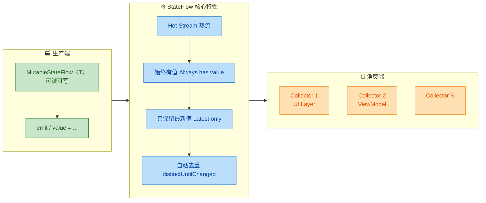

---

### 热流（Hot Stream）

要理解 StateFlow，首先必须搞清楚 **热流（Hot Stream）** 和 **冷流（Cold Stream）** 的本质差异，这是 Kotlin Flow 体系中最重要的概念分水岭之一。

**冷流（Cold Flow）** 是 "懒汉式" 的——只有当有人调用 `collect` 时，上游的代码块才会开始执行。每个收集者都会触发一次独立的、从头开始的执行过程。你可以把它想象成一个 **DVD 播放器**：每个观众按下播放键，电影都从第一秒开始。

**热流（Hot Flow）** 则是 "直播式" 的——无论有没有观众，数据源都在持续产生数据。当新的订阅者加入时，它只能看到 **加入之后** 的数据（对于 SharedFlow），或者 **当前最新的那一个数据**（对于 StateFlow）。就像打开电视看 **直播频道**：节目一直在播，你打开电视时看到的就是此刻正在播的内容。

```kotlin
import kotlinx.coroutines.*
import kotlinx.coroutines.flow.*

fun main() = runBlocking {

    // ============ 冷流示例 ============
    // flow{} 构建器创建的是冷流
    val coldFlow = flow {
        println("冷流：开始发射数据...")   // 每次 collect 都会打印
        emit(1)                            // 发射第一个值
        emit(2)                            // 发射第二个值
    }

    // 第一次收集 —— 触发上游从头执行
    println("--- 第一次 collect 冷流 ---")
    coldFlow.collect { value ->
        println("冷流收集到: $value")
    }

    // 第二次收集 —— 再次触发上游从头执行（完全独立的执行）
    println("--- 第二次 collect 冷流 ---")
    coldFlow.collect { value ->
        println("冷流收集到: $value")
    }

    // ============ 热流示例 ============
    // MutableStateFlow 是热流，创建时必须提供初始值
    val hotFlow = MutableStateFlow(0)      // 初始状态为 0

    // 启动一个协程持续收集热流
    val job = launch {
        hotFlow.collect { value ->         // 订阅者开始监听
            println("热流收集到: $value")  // 立即收到当前值 0
        }
    }

    delay(100)                             // 给收集者一点启动时间
    hotFlow.value = 1                      // 更新状态为 1（所有收集者立即收到）
    delay(100)
    hotFlow.value = 2                      // 更新状态为 2
    delay(100)
    job.cancel()                           // 取消收集
}
```

输出结果清晰地展示了两者的差异：

```
--- 第一次 collect 冷流 ---
冷流：开始发射数据...
冷流收集到: 1
冷流收集到: 2
--- 第二次 collect 冷流 ---
冷流：开始发射数据...
冷流收集到: 1
冷流收集到: 2
热流收集到: 0
热流收集到: 1
热流收集到: 2
```

冷流每次 collect 都 "重放" 了完整序列；而热流从创建那一刻起就 "活着"，收集者加入后立即获得当前最新值。

这种热流特性使 StateFlow 成为 UI 状态管理的天然选择：**UI 随时可能因为屏幕旋转而重建，重建后的 UI 订阅 StateFlow 就能立刻拿到最新状态，无需重新请求数据。**

---

### 状态容器（State Holder）

StateFlow 的设计意图不仅仅是一个数据流，更是一个 **状态容器（State Holder）**。所谓状态容器，是指它在任何时刻都持有一个确定的、不可为空（除非你显式声明类型为可空）的状态值。

这个理念直接借鉴了 **单一可信数据源（Single Source of Truth, SSOT）** 的架构原则。在典型的 MVVM 架构中，ViewModel 中的 StateFlow 就是 UI 状态的唯一权威来源：

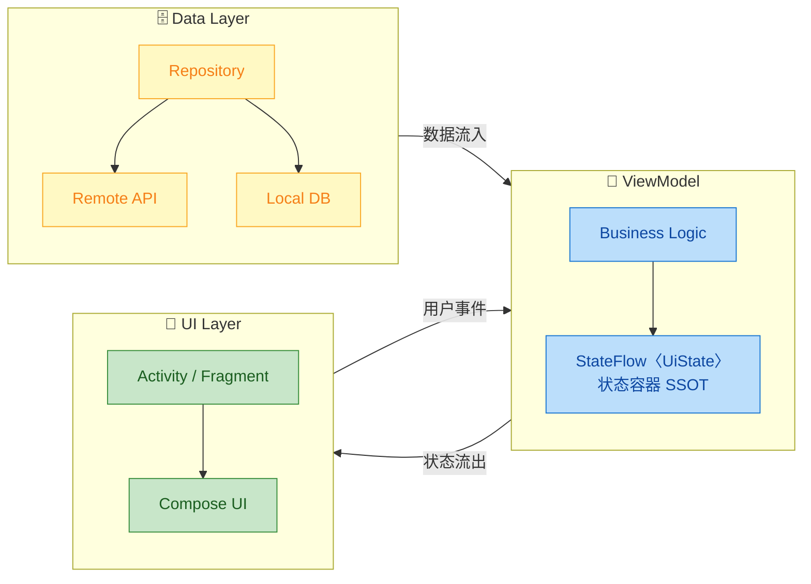

作为状态容器，StateFlow 通常搭配一个 **密封类（Sealed Class）** 或 **数据类（Data Class）** 来表达完整的 UI 状态：

```kotlin
// 定义 UI 状态的密封接口，穷举所有可能的状态
sealed interface UiState {
    // 加载中状态 —— 无额外数据
    data object Loading : UiState

    // 成功状态 —— 携带数据列表
    data class Success(val items: List<String>) : UiState

    // 错误状态 —— 携带错误信息
    data class Error(val message: String) : UiState
}

class MyViewModel : ViewModel() {

    // 私有的 MutableStateFlow，外部无法直接修改
    // 初始状态为 Loading
    private val _uiState = MutableStateFlow<UiState>(UiState.Loading)

    // 公开的只读 StateFlow，供 UI 层订阅
    val uiState: StateFlow<UiState> = _uiState.asStateFlow()

    fun loadData() {
        viewModelScope.launch {
            _uiState.value = UiState.Loading         // 切换到加载状态
            try {
                val data = repository.fetchItems()    // 从仓库获取数据
                _uiState.value = UiState.Success(data) // 成功：更新状态
            } catch (e: Exception) {
                _uiState.value = UiState.Error(e.message ?: "Unknown error") // 失败：更新状态
            }
        }
    }
}
```

请注意这里的核心模式：`_uiState` 是 **私有可变** 的（`MutableStateFlow`），而对外暴露的 `uiState` 是 **公开只读** 的（`StateFlow`）。这种 **封装模式（Backing Property Pattern）** 确保了只有 ViewModel 自己可以修改状态，UI 层只能被动地观察和响应。这与面向对象设计中的 "封装" 原则一脉相承。

---

### 始终有值（Always Has a Value）

与普通 Flow 或 `SharedFlow` 不同，StateFlow **在创建时就必须提供一个初始值**，之后的任何时刻都保证有值可读。你永远不需要担心 "拿到 null" 或 "还没有数据" 这种边界情况（除非你的类型参数本身就是可空的 `T?`）。

这个特性体现在它的 `value` 属性上——这是一个同步的、无需挂起就能读取的属性：

```kotlin
import kotlinx.coroutines.flow.MutableStateFlow

fun main() {
    // 创建时必须传入初始值（此处为 "Hello"）
    val stateFlow = MutableStateFlow("Hello")

    // 随时可以同步读取当前值，无需挂起、无需协程
    println(stateFlow.value)  // 输出: Hello

    // 更新值
    stateFlow.value = "World"

    // 再次读取，拿到的是最新值
    println(stateFlow.value)  // 输出: World
}
```

这种 "始终有值" 的保证在实际开发中带来了极大的便利。对比一下几种数据持有方式的差异：

| 特性 | StateFlow | SharedFlow | 普通 Flow | LiveData |
|---|---|---|---|---|
| 是否必须初始值 | ✅ 是 | ❌ 否 | ❌ 否 | ❌ 否（可为 null） |
| 同步读取当前值 | ✅ `.value` | ❌ 不支持 | ❌ 不支持 | ✅ `.value`（可空） |
| 是否有 null 风险 | 仅当 `T?` 时 | — | — | ✅ 始终可能为 null |
| 生命周期感知 | ❌ 需配合 | ❌ 需配合 | ❌ 需配合 | ✅ 原生支持 |

可以看到，StateFlow 在 "值的确定性" 上是最强的。`LiveData` 虽然也有 `.value`，但它的返回类型是 `T?`（始终可空），因为 LiveData 可以在没有设置过值的情况下被访问。而 StateFlow 由于强制要求初始值，所以它的 `.value` 返回的就是非空的 `T`（除非你显式声明为 `MutableStateFlow<T?>`）。

**为什么 "始终有值" 对 UI 如此重要？**

想象一下 Android 的屏幕旋转场景：Activity 被销毁重建，新的 Activity 需要立刻显示正确的 UI。如果状态持有者可能 "没有值"，UI 就不得不处理一个额外的 "空状态" 分支。而 StateFlow 保证了：**无论何时订阅，收集者都能立即获得一个有效状态**，UI 可以无条件地根据这个状态渲染界面。

---

### 只保留最新值（Conflation / Latest Value Only）

StateFlow 内部使用了一种叫做 **合并（Conflation）** 的策略：当新值到来时，旧值会被 **无条件覆盖**。StateFlow 不维护任何历史缓冲区，它的内部只有一个 "槽位"，永远只存放最新的那一个值。

这意味着：如果你快速连续更新多次状态，中间的值 **可能会被跳过**，慢速的收集者只会看到最新值。

```kotlin
import kotlinx.coroutines.*
import kotlinx.coroutines.flow.*

fun main() = runBlocking {
    val stateFlow = MutableStateFlow(0)    // 初始值为 0

    // 启动一个收集者，但人为加入延迟模拟"慢消费"
    val job = launch {
        stateFlow.collect { value ->
            println("收集到: $value")
            delay(200)                     // 模拟 UI 渲染耗时 200ms
        }
    }

    delay(50)                              // 确保收集者启动

    // 快速连续更新 1 → 2 → 3 → 4 → 5
    for (i in 1..5) {
        stateFlow.value = i                // 每次更新都覆盖前一个值
        println("发射: $i")
        delay(30)                          // 每 30ms 更新一次（远快于收集者的 200ms）
    }

    delay(1000)                            // 等待收集者处理完
    job.cancel()
}
```

可能的输出（具体取决于调度时序）：

```
收集到: 0
发射: 1
发射: 2
发射: 3
发射: 4
发射: 5
收集到: 5
```

注意：值 `1, 2, 3, 4` 被跳过了！收集者在处理完 `0` 之后（耗时 200ms），再来看时，StateFlow 中已经是 `5` 了。中间的值全部被合并掉了。

用一张图来说明这个 Conflation 过程：

```kotlin
// StateFlow 内部状态槽位的变化时间线

// 时间轴 ──────────────────────────────────────────►
// 
// 槽位状态:  [0]  →  [1]  →  [2]  →  [3]  →  [4]  →  [5]
//             ▲                                         ▲
//             │                                         │
//         收集者读取 0                              收集者读取 5
//         (开始处理, 耗时 200ms)                    (处理完毕回来读取)
//
//             ◄──── 1,2,3,4 被合并（丢弃）────────►
```

**这是 Bug 还是 Feature？** 绝对是 Feature！对于 UI 状态来说，这是完美的语义：如果用户的网络请求状态从 `Loading → 10% → 30% → 60% → 100% → Success` 快速变化，UI 没有必要逐帧渲染每个中间百分比。**用户只关心最新的状态**。这种 Conflation 策略既避免了不必要的 UI 重绘，又天然防止了背压（Backpressure）问题。

> ⚠️ **重要提示**：正因为 StateFlow 会丢弃中间值，所以它 **不适合用来传递 "事件"（one-time events）**。例如，一个 "显示 Toast" 的指令如果用 StateFlow 传递，可能会因为合并而丢失。事件场景应使用 `SharedFlow`（下一节会详细讲解）。

---

### MutableStateFlow

`MutableStateFlow` 是 StateFlow 的可变版本，提供了两种更新值的方式。理解它们的区别对于正确使用 StateFlow 至关重要。

**方式一：直接赋值 `value`**

```kotlin
val counter = MutableStateFlow(0)  // 创建可变状态流，初始值 0

counter.value = 1                  // 直接赋值，简单直接
counter.value = 2                  // 再次赋值，覆盖旧值
```

直接赋值是最常用的方式。它是 **线程安全** 的——StateFlow 内部使用了原子操作（atomic operations）来保证并发安全。但要注意：**赋值操作本身不是原子的 "读-改-写"**。比如 `counter.value = counter.value + 1` 在高并发场景下可能产生竞态条件（Race Condition）。

**方式二：`update {}` 原子更新**

为了解决 "读-改-写" 的竞态问题，MutableStateFlow 提供了 `update` 函数：

```kotlin
val counter = MutableStateFlow(0)

// update 接收一个 lambda，参数是当前值，返回值是新值
// 内部使用 CAS（Compare-And-Swap）循环保证原子性
counter.update { currentValue ->   // currentValue 是此刻的最新值
    currentValue + 1               // 返回值将成为新的状态
}
```

`update` 内部的实现机制基于 **CAS（Compare-And-Swap）** 循环：它会读取当前值，执行你的 lambda 计算出新值，然后尝试原子地将旧值替换为新值。如果在这个过程中有其他线程修改了值，CAS 会失败，`update` 会重新读取最新值并再次执行 lambda——直到成功为止。

```kotlin
import kotlinx.coroutines.*
import kotlinx.coroutines.flow.*

fun main() = runBlocking {
    val counter = MutableStateFlow(0)

    // 启动 100 个协程，每个协程递增 1000 次
    val jobs = List(100) {
        launch(Dispatchers.Default) {      // 在多线程调度器上执行
            repeat(1000) {
                // ❌ 错误方式：可能丢失更新
                // counter.value = counter.value + 1

                // ✅ 正确方式：原子更新
                counter.update { it + 1 }  // CAS 保证不丢失
            }
        }
    }

    jobs.forEach { it.join() }             // 等待所有协程完成

    // 使用 update：结果精确为 100000
    // 使用直接赋值：结果可能小于 100000（丢失更新）
    println("最终计数: ${counter.value}")   // 输出: 最终计数: 100000
}
```

**`emit()` 与 `value = ` 的关系**

MutableStateFlow 也实现了 `FlowCollector` 接口，因此它也有 `emit()` 方法。但实际上，`emit()` 内部就是调用了 `value = `，两者在 StateFlow 中完全等价。不过在 SharedFlow 中情况不同（emit 可能挂起），所以为了代码清晰和一致性，**在 StateFlow 中推荐直接使用 `value = ` 或 `update {}`**。

以下是完整的 MutableStateFlow API 概览：

```kotlin
import kotlinx.coroutines.*
import kotlinx.coroutines.flow.*

fun main() = runBlocking {
    // 1. 创建：必须提供初始值
    val mutableSF = MutableStateFlow("initial")

    // 2. 读取当前值（同步，非挂起）
    val current: String = mutableSF.value
    println("当前值: $current")                // 输出: 当前值: initial

    // 3. 直接赋值更新
    mutableSF.value = "updated"
    println("更新后: ${mutableSF.value}")      // 输出: 更新后: updated

    // 4. 原子更新
    mutableSF.update { old ->
        "$old + appended"                      // 基于旧值计算新值
    }
    println("原子更新后: ${mutableSF.value}")  // 输出: 原子更新后: updated + appended

    // 5. emit（等价于赋值，在 StateFlow 中永不挂起）
    mutableSF.emit("via emit")
    println("emit 后: ${mutableSF.value}")     // 输出: emit 后: via emit

    // 6. 转为只读 StateFlow（封装暴露）
    val readOnly: StateFlow<String> = mutableSF.asStateFlow()
    // readOnly.value = "xxx"  // ❌ 编译错误！只读，无法赋值
    println("只读访问: ${readOnly.value}")      // ✅ 可以读取
}
```

---

### 替代 LiveData

StateFlow 被 Google 官方推荐为 **LiveData 的现代替代品**。从 2021 年起，Google 的 Android 开发文档和 Codelab 逐步将 LiveData 替换为 StateFlow。这背后有深层的技术和架构原因。

**LiveData 的局限性：**

1. **绑定 Android 平台**：LiveData 位于 `androidx.lifecycle` 包中，它是纯 Android 组件，无法在 KMM（Kotlin Multiplatform Mobile）或后端项目中使用。
2. **转换能力弱**：LiveData 的操作符（`map`, `switchMap`）远不如 Flow 丰富。复杂的数据转换链通常需要借助 `MediatorLiveData`，代码冗长且难以维护。
3. **不支持协程操作符**：无法直接 `combine`, `flatMapLatest`, `debounce` 等，而这些在现代响应式编程中几乎是必需品。
4. **线程切换笨拙**：LiveData 的 `postValue` / `setValue` 有平台线程限制，而 StateFlow 在任何线程都可以安全操作。

**迁移对照表：**

| LiveData 写法 | StateFlow 写法 |
|---|---|
| `MutableLiveData<T>()` | `MutableStateFlow<T>(initialValue)` |
| `liveData.value` (可空) | `stateFlow.value` (非空) |
| `liveData.observe(owner) {}` | `stateFlow.collect {}` |
| `Transformations.map` | `.map {}` (Flow 操作符) |
| `MediatorLiveData` | `combine()` / `flatMapLatest()` |

下面是一个完整的迁移示例，展示同一个搜索功能在 LiveData 和 StateFlow 下的写法：

```kotlin
// ==================== LiveData 版本（旧） ====================

class SearchViewModel_Old : ViewModel() {
    // 搜索关键词
    private val _query = MutableLiveData<String>("")
    val query: LiveData<String> = _query

    // 搜索结果 —— 需要 switchMap 来响应 query 变化
    val results: LiveData<List<String>> = _query.switchMap { keyword ->
        // switchMap 内部需要返回 LiveData
        // 无法直接使用 suspend 函数，需要 liveData{} 构建器
        liveData {
            emit(repository.search(keyword))   // 发起搜索
        }
    }

    fun onQueryChanged(text: String) {
        _query.value = text                    // 更新关键词
    }
}

// UI 层（Activity/Fragment）
// viewModel.results.observe(viewLifecycleOwner) { list ->
//     adapter.submitList(list)
// }
```

```kotlin
// ==================== StateFlow 版本（新） ====================

class SearchViewModel_New : ViewModel() {
    // 搜索关键词 —— StateFlow 替代 LiveData
    private val _query = MutableStateFlow("")
    val query: StateFlow<String> = _query.asStateFlow()

    // 搜索结果 —— 使用 Flow 操作符链式处理
    val results: StateFlow<List<String>> = _query
        .debounce(300)                         // 防抖 300ms，避免频繁请求
        .distinctUntilChanged()                // 相同关键词不重复搜索
        .flatMapLatest { keyword ->            // 新关键词取消旧搜索
            flow {
                emit(repository.search(keyword)) // 发起搜索
            }
        }
        .stateIn(                              // 将 Flow 转为 StateFlow
            scope = viewModelScope,            // 绑定 ViewModel 生命周期
            started = SharingStarted.WhileSubscribed(5000), // 有订阅者时激活，无订阅者 5s 后停止
            initialValue = emptyList()         // 初始值为空列表
        )

    fun onQueryChanged(text: String) {
        _query.value = text                    // 更新关键词
    }
}

// UI 层（Compose）
// val results by viewModel.results.collectAsStateWithLifecycle()
// LazyColumn { items(results) { ... } }
```

StateFlow 版本的优势一目了然：`debounce`, `distinctUntilChanged`, `flatMapLatest` 三个操作符组成了一个优雅的搜索管道，这在 LiveData 中需要大量手工代码才能实现。

**`stateIn` —— 冷流转热流的桥梁**

上面代码中的 `stateIn` 是一个极其重要的操作符，它将一个普通的冷 Flow 转换成 StateFlow。它接受三个参数：

```kotlin
fun <T> Flow<T>.stateIn(
    scope: CoroutineScope,         // 协程作用域（控制生命周期）
    started: SharingStarted,       // 启动策略
    initialValue: T                // 初始值
): StateFlow<T>
```

其中 `SharingStarted` 有三种策略：

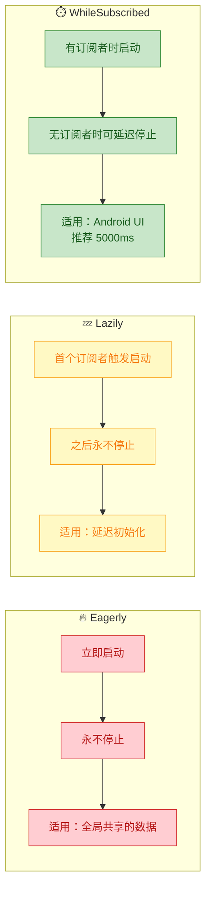

在 Android 开发中，`WhileSubscribed(5000)` 是最推荐的策略。参数 `5000` 表示：当最后一个订阅者取消后，等待 5 秒再停止上游 Flow。这 5 秒的缓冲时间正好覆盖了 **屏幕旋转时 Activity 重建** 的间隙——旧 Activity 销毁、新 Activity 创建并重新订阅，通常在几百毫秒内完成，远小于 5 秒。这样就避免了不必要的数据重新加载。

**在 UI 层安全收集 StateFlow**

在 Android 中收集 StateFlow 需要注意生命周期安全。以下是推荐的两种方式：

```kotlin
// ========== 方式一：Jetpack Compose（最推荐）==========
@Composable
fun SearchScreen(viewModel: SearchViewModel) {
    // collectAsStateWithLifecycle() 自动跟随组合的生命周期
    // 当 Composable 离开屏幕时自动停止收集
    val uiState by viewModel.uiState.collectAsStateWithLifecycle()

    when (uiState) {                           // 根据状态渲染 UI
        is UiState.Loading -> LoadingSpinner()
        is UiState.Success -> ItemList((uiState as UiState.Success).items)
        is UiState.Error -> ErrorMessage((uiState as UiState.Error).message)
    }
}

// ========== 方式二：传统 View 体系 ==========
class SearchFragment : Fragment() {
    override fun onViewCreated(view: View, savedInstanceState: Bundle?) {
        super.onViewCreated(view, savedInstanceState)

        // repeatOnLifecycle 确保只在 STARTED 及以上状态收集
        // 当 Fragment 进入 STOPPED 状态时自动取消收集协程
        viewLifecycleOwner.lifecycleScope.launch {
            viewLifecycleOwner.repeatOnLifecycle(Lifecycle.State.STARTED) {
                viewModel.uiState.collect { state ->
                    // 更新 UI
                    updateUi(state)
                }
            }
        }
    }
}
```

> ⚠️ **切勿使用 `lifecycleScope.launchWhenStarted`**（已弃用），因为它只是暂停收集但不取消上游 Flow，可能导致上游持续消耗资源。`repeatOnLifecycle` 会在生命周期降到阈值以下时 **取消** 整个收集协程，然后在恢复时 **重新启动**。

---

**📝 练习题**

以下代码的输出结果是什么？

```kotlin
fun main() = runBlocking {
    val stateFlow = MutableStateFlow(1)

    stateFlow.value = 2
    stateFlow.value = 2
    stateFlow.value = 3

    val job = launch {
        stateFlow.collect {
            println(it)
        }
    }

    delay(100)
    stateFlow.value = 3
    stateFlow.value = 4
    delay(100)
    job.cancel()
}
```

A. 输出 `1 2 3 4`


B. 输出 `3 4`


C. 输出 `2 3 4`


D. 输出 `3 3 4`


**【答案】** B

**【解析】** 这道题考察 StateFlow 的三个核心特性：

1. **只保留最新值**：在 `collect` 开始之前，`stateFlow.value` 经历了 `1 → 2 → 2 → 3` 的变化，但 StateFlow 只保留最新值 `3`。所以当收集者启动时，它首先收到的是 `3`。
2. **自动去重（`distinctUntilChanged`）**：`collect` 启动后接收到 `3`，随后 `stateFlow.value = 3` 再次赋值 `3`——由于值没有变化，StateFlow 内建的 `equals` 比较判定为相同值，**不会**重新通知收集者。
3. **新值通知**：接着 `stateFlow.value = 4`，`4 ≠ 3`，收集者收到 `4`。

因此最终输出为 `3` 和 `4`，选 B。

---

## SharedFlow ⭐

### 热流

在上一节中我们深入学习了 `StateFlow`，它是一种"始终持有最新状态"的热流。现在我们来认识 Kotlin Coroutines 中的另一种热流——**`SharedFlow`**。如果说 `StateFlow` 是一块"状态白板"（上面永远只写着最新的一行字），那么 `SharedFlow` 更像是一个**广播电台**：它向所有收听者（collectors）广播事件，而且你可以精细调控它的缓冲区大小、重放策略和背压行为。

`SharedFlow` 与 `StateFlow` 一样，都属于 **Hot Flow（热流）**。回顾热流的核心特征：

- **不依赖订阅者即可存在并持有数据源**：即使没有任何 collector，`SharedFlow` 的生产端仍然可以持续发射值。
- **多个订阅者共享同一个数据流**：所有 collector 都从同一个 `SharedFlow` 实例接收数据，而不是各自触发一条独立的上游链。
- **订阅者只能获取订阅之后的数据**（在默认配置下）：和现实中的广播一样——你打开收音机之后才能听到节目，之前播过的内容默认就错过了。

我们用一张图来对比冷流与 `SharedFlow` 的执行模型差异：

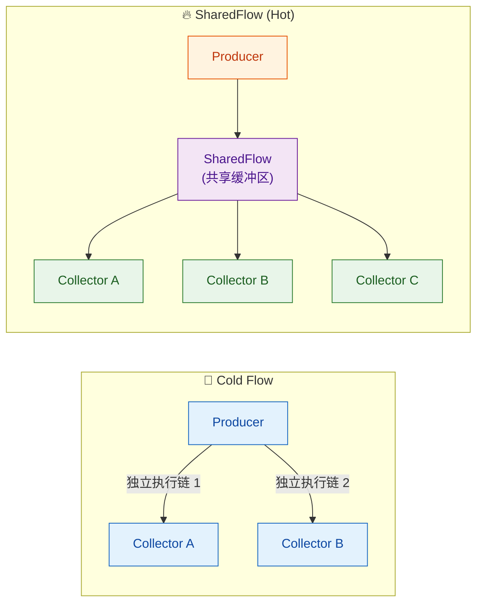

**关键差异总结：**

| 特性 | Cold Flow | SharedFlow (Hot) |
|---|---|---|
| 执行时机 | `collect` 时才启动 | 独立于 collector 运行 |
| 数据共享 | 每个 collector 触发独立的执行 | 所有 collector 共享同一个源 |
| 历史数据 | 从头执行 | 默认只接收订阅后的新数据（可配置 replay） |
| 实例关系 | 一对一 | 一对多（Fan-out broadcast） |

与 `StateFlow` 不同的是，`SharedFlow` **不强制只保留最新值**，也**不要求有初始值**。它的设计重心在于**事件广播**——非常适合"通知类"场景，如导航事件、一次性弹窗提示（Snackbar）、错误事件等。

---

### 可配置缓存

`SharedFlow` 最强大的特性之一，就是它拥有一个**高度可配置的缓冲区体系**。这个缓冲区决定了当生产速度超过消费速度时，数据如何暂存、如何丢弃。

`MutableSharedFlow` 的构造函数签名如下：

```kotlin
// MutableSharedFlow 的工厂函数签名
public fun <T> MutableSharedFlow(
    replay: Int = 0,                          // 重放缓冲区大小：新订阅者能收到多少个历史值
    extraBufferCapacity: Int = 0,             // 额外缓冲区容量：在 replay 基础上再加多少缓冲
    onBufferOverflow: BufferOverflow = BufferOverflow.SUSPEND  // 缓冲区溢出策略
): MutableSharedFlow<T>
```

**总缓冲区容量 = `replay` + `extraBufferCapacity`**。这两个参数共同决定了 `SharedFlow` 内部能暂存多少个尚未被所有 collector 消费的值。

我们用一张图来深入理解这个缓冲区结构：

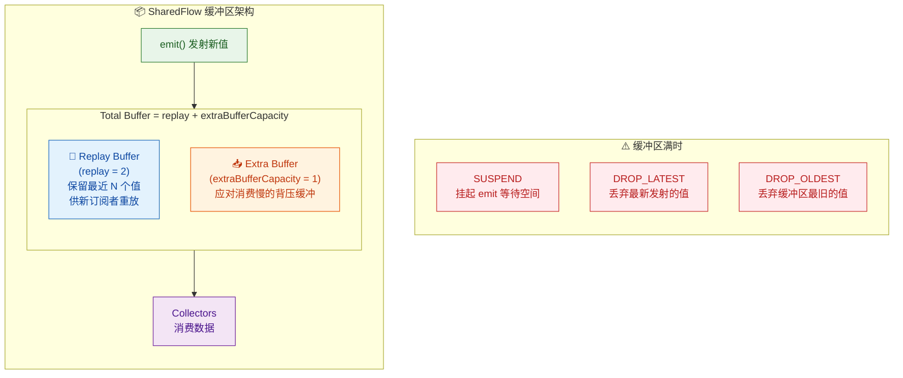

#### `onBufferOverflow` 三种策略详解

当缓冲区已满，新值通过 `emit()` 发射进来时，`SharedFlow` 的行为取决于 `onBufferOverflow` 参数：

| 策略 | 行为 | 典型场景 |
|---|---|---|
| `BufferOverflow.SUSPEND`（默认） | 挂起 `emit()` 调用，直到缓冲区有空间 | 不能丢失任何数据的场景 |
| `BufferOverflow.DROP_OLDEST` | 丢弃缓冲区中**最旧**的值，腾出空间放新值 | 只关心最新状态的场景（类似 StateFlow） |
| `BufferOverflow.DROP_LATEST` | 丢弃当前**正在尝试发射**的新值 | 限流 / 防抖场景 |

来看一个直观的代码示例，演示缓冲区配置的实际效果：

```kotlin
import kotlinx.coroutines.*
import kotlinx.coroutines.flow.*

fun main() = runBlocking {

    // 创建一个 SharedFlow：
    //   replay = 1        → 新订阅者能收到最近 1 个历史值
    //   extraBufferCapacity = 2  → 额外缓冲 2 个值
    //   总缓冲区 = 1 + 2 = 3
    //   溢出策略 = DROP_OLDEST → 缓冲区满时丢弃最旧的值
    val sharedFlow = MutableSharedFlow<Int>(
        replay = 1,                                    // 重放缓冲区大小
        extraBufferCapacity = 2,                       // 额外缓冲区容量
        onBufferOverflow = BufferOverflow.DROP_OLDEST  // 溢出时丢弃最旧的值
    )

    // 在没有任何订阅者的情况下快速发射 5 个值
    // 由于总缓冲区只有 3，且策略是 DROP_OLDEST
    // 最终缓冲区中只保留最新的 3 个值：3, 4, 5
    sharedFlow.emit(1)  // 进入缓冲区 → [1]
    sharedFlow.emit(2)  // 进入缓冲区 → [1, 2]
    sharedFlow.emit(3)  // 进入缓冲区 → [1, 2, 3]  ← 缓冲区已满
    sharedFlow.emit(4)  // DROP_OLDEST → 丢弃 1 → [2, 3, 4]
    sharedFlow.emit(5)  // DROP_OLDEST → 丢弃 2 → [3, 4, 5]

    // 此时才启动一个 collector
    // 由于 replay = 1，新订阅者只会收到缓冲区中最新的 1 个值
    val job = launch {
        sharedFlow.collect { value ->                  // 新订阅者开始收集
            println("Collector received: $value")      // 首先收到 replay 的值 5
        }
    }

    delay(100)  // 给 collector 一点时间处理 replay 值

    // 继续发射新值
    sharedFlow.emit(6)  // collector 实时收到 6
    sharedFlow.emit(7)  // collector 实时收到 7

    delay(100)  // 等待 collector 处理
    job.cancel() // 取消收集
}

// 输出：
// Collector received: 5   ← replay 重放的值（最近 1 个）
// Collector received: 6   ← 实时接收
// Collector received: 7   ← 实时接收
```

> ⚠️ **注意**：当 `replay = 0` 且 `extraBufferCapacity = 0`（即总缓冲区为 0）时，`onBufferOverflow` **只能**是 `SUSPEND`（默认值）。因为没有缓冲区就无所谓"丢弃最旧"或"丢弃最新"——如果设置了 `DROP_OLDEST` 或 `DROP_LATEST`，会在运行时抛出 `IllegalArgumentException`。

---

### 可配置重放

**Replay（重放）** 是 `SharedFlow` 区别于普通事件总线的核心能力之一。它解决了一个经典问题：**新订阅者错过历史事件**。

#### Replay 的工作原理

当你为 `SharedFlow` 设置 `replay = N` 时，它内部会维护一个固定大小为 N 的**环形缓冲区（Ring Buffer）**，专门存放最近发射的 N 个值。每当有新的 collector 开始 `collect`，`SharedFlow` 会立即将这 N 个值按顺序重放给它，然后才进入"实时接收"模式。

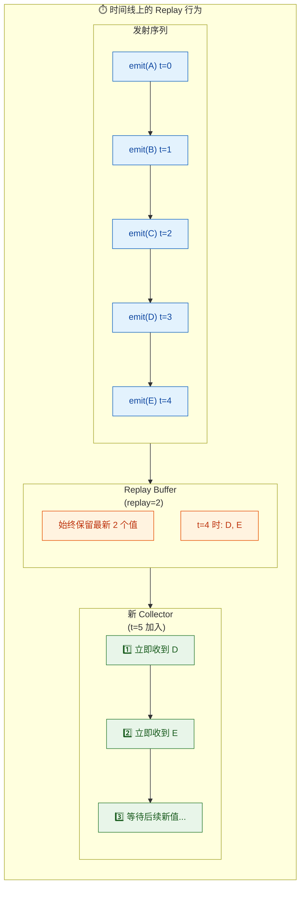

#### 不同 Replay 值的对比

```kotlin
import kotlinx.coroutines.*
import kotlinx.coroutines.flow.*

fun main() = runBlocking {

    // ========== replay = 0（默认值）==========
    // 新订阅者不会收到任何历史值
    val flow0 = MutableSharedFlow<String>(replay = 0)  // 不重放
    flow0.emit("历史消息A")                              // 没有订阅者，直接丢失
    flow0.emit("历史消息B")                              // 没有订阅者，直接丢失

    val job0 = launch {
        flow0.collect { println("[replay=0] $it") }     // 启动收集，但什么也收不到
    }
    delay(50)
    flow0.emit("新消息C")                                // 订阅后发射，能收到
    delay(50)
    job0.cancel()
    // 输出: [replay=0] 新消息C

    println("---")

    // ========== replay = 1 ==========
    // 新订阅者收到最近 1 个历史值
    val flow1 = MutableSharedFlow<String>(replay = 1)  // 重放 1 个
    flow1.emit("历史消息A")                              // 进入 replay buffer
    flow1.emit("历史消息B")                              // 覆盖 A，replay buffer = [B]

    val job1 = launch {
        flow1.collect { println("[replay=1] $it") }     // 立即收到 "历史消息B"
    }
    delay(50)
    flow1.emit("新消息C")                                // 实时收到
    delay(50)
    job1.cancel()
    // 输出:
    // [replay=1] 历史消息B
    // [replay=1] 新消息C

    println("---")

    // ========== replay = 3 ==========
    // 新订阅者收到最近 3 个历史值
    val flow3 = MutableSharedFlow<String>(replay = 3)  // 重放 3 个
    flow3.emit("消息1")                                  // replay buffer = [1]
    flow3.emit("消息2")                                  // replay buffer = [1, 2]
    flow3.emit("消息3")                                  // replay buffer = [1, 2, 3]
    flow3.emit("消息4")                                  // 溢出最旧 → buffer = [2, 3, 4]

    val job3 = launch {
        flow3.collect { println("[replay=3] $it") }     // 依次收到 2, 3, 4
    }
    delay(50)
    job3.cancel()
    // 输出:
    // [replay=3] 消息2
    // [replay=3] 消息3
    // [replay=3] 消息4
}
```

#### `resetReplayCache()` — 清空重放缓冲区

在某些场景下，你可能需要手动清空 replay 缓冲区，防止新订阅者收到过时的历史数据。`MutableSharedFlow` 提供了 `resetReplayCache()` 方法：

```kotlin
val sharedFlow = MutableSharedFlow<String>(replay = 2)  // 重放 2 个

sharedFlow.emit("事件A")                                  // replay cache = [A]
sharedFlow.emit("事件B")                                  // replay cache = [A, B]

println(sharedFlow.replayCache)                           // 输出: [事件A, 事件B]

// 清空 replay 缓冲区
sharedFlow.resetReplayCache()                             // replay cache 清空

println(sharedFlow.replayCache)                           // 输出: []
// 此时新订阅者不会收到任何历史值
```

> 💡 **使用 `resetReplayCache()` 的典型场景**：当用户退出登录时，清空与旧会话相关的缓存事件，避免新会话的 collector 收到旧数据。

---

### MutableSharedFlow

与 `StateFlow` / `MutableStateFlow` 的设计模式一致，`SharedFlow` 也遵循**只读接口 + 可变实现**的分离设计：

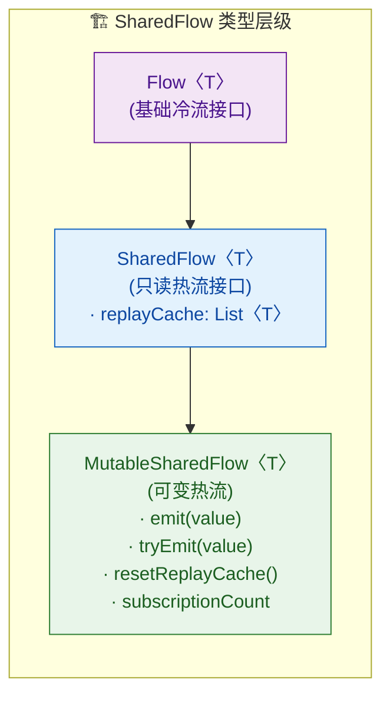

#### 核心 API 详解

**`emit(value: T)`** — 挂起函数，将值发射到 SharedFlow：

```kotlin
val sharedFlow = MutableSharedFlow<Int>()

// emit 是 suspend 函数，必须在协程中调用
// 当缓冲区满且策略为 SUSPEND 时，emit 会挂起等待
launch {
    sharedFlow.emit(42)  // 挂起发射
}
```

**`tryEmit(value: T): Boolean`** — 非挂起函数，尝试发射值：

```kotlin
val sharedFlow = MutableSharedFlow<Int>(
    replay = 0,
    extraBufferCapacity = 1  // 总缓冲区 = 1
)

// tryEmit 是普通函数，不会挂起
// 如果缓冲区有空间，发射成功返回 true
// 如果缓冲区满，发射失败返回 false（不会挂起等待）
val success = sharedFlow.tryEmit(42)  // true（缓冲区有空间）
println("第一次 tryEmit: $success")   // true

val failed = sharedFlow.tryEmit(43)   // false（缓冲区已满，没有订阅者消费）
println("第二次 tryEmit: $failed")    // false
```

> 🔑 **`emit` vs `tryEmit` 的选择**：
> - 在**协程内部**，优先使用 `emit()`，它能正确处理背压（挂起等待）。
> - 在**非协程环境**（如 Java 回调、View 的点击事件中没有协程作用域时），使用 `tryEmit()`。但此时必须确保缓冲区足够大，否则值会被丢弃。

**`subscriptionCount: StateFlow<Int>`** — 实时追踪订阅者数量：

```kotlin
val sharedFlow = MutableSharedFlow<String>()

// subscriptionCount 本身是一个 StateFlow<Int>
// 可以用来实现"至少有一个订阅者时才开始生产数据"的逻辑
launch {
    sharedFlow.subscriptionCount
        .map { count -> count > 0 }                // 映射为"是否有订阅者"的 Boolean
        .distinctUntilChanged()                     // 去重，只在变化时通知
        .collect { hasSubscribers ->
            if (hasSubscribers) {
                println("有订阅者了，开始生产数据")  // 可以在这里启动数据源
            } else {
                println("无订阅者，停止生产")        // 可以在这里释放资源
            }
        }
}
```

#### 封装暴露模式（与 StateFlow 一致）

在 ViewModel 或 Repository 中，应该**内部使用 `MutableSharedFlow`，对外暴露 `SharedFlow` 只读接口**：

```kotlin
class EventBusViewModel : ViewModel() {

    // 私有可变 SharedFlow — 仅内部可以发射
    private val _events = MutableSharedFlow<UiEvent>(
        replay = 0,                                    // 不重放（事件只消费一次）
        extraBufferCapacity = 1,                       // 额外缓冲 1 个，防止短暂无订阅者时丢失
        onBufferOverflow = BufferOverflow.DROP_OLDEST  // 溢出时丢最旧的
    )

    // 公开只读 SharedFlow — 外部只能 collect，不能 emit
    val events: SharedFlow<UiEvent> = _events.asSharedFlow()

    // 发送事件的方法
    fun showSnackbar(message: String) {
        viewModelScope.launch {
            _events.emit(UiEvent.ShowSnackbar(message))  // 内部发射事件
        }
    }
}

// 密封类定义 UI 事件
sealed class UiEvent {
    data class ShowSnackbar(val message: String) : UiEvent()  // Snackbar 事件
    data class Navigate(val route: String) : UiEvent()        // 导航事件
    object GoBack : UiEvent()                                 // 返回事件
}
```

---

### 事件总线场景

`SharedFlow` 最经典、最高频的应用场景就是**事件总线（Event Bus）**。在 Android 开发中，很多操作本质上是"一次性事件"而非"持久状态"。

#### 为什么事件不适合用 StateFlow？

先来理解一个核心问题。假如你用 `StateFlow` 来发送一个"显示 Snackbar"的事件：

```kotlin
// ❌ 错误示范：用 StateFlow 发送一次性事件
class BadViewModel : ViewModel() {
    private val _snackbar = MutableStateFlow<String?>(null) // 初始值 null
    val snackbar: StateFlow<String?> = _snackbar

    fun showError() {
        _snackbar.value = "网络错误"  // 设置事件
    }
}

// Activity 中观察
lifecycleScope.launch {
    viewModel.snackbar.collect { message ->
        // 问题 1: 屏幕旋转后，StateFlow 会重放最新值
        //         → Snackbar 会再次弹出（重复消费事件！）
        // 问题 2: StateFlow 的 distinctUntilChanged 特性
        //         → 连续两次发送相同的错误消息，第二次会被去重吞掉
        message?.let { showSnackbar(it) }
    }
}
```

这暴露了 `StateFlow` 的两个致命问题：

1. **重复消费**：StateFlow 始终保持最新值，配置变更（如屏幕旋转）后 collector 重新订阅，会再次收到已经处理过的事件。
2. **去重吞没**：`StateFlow` 内置 `distinctUntilChanged`，连续发射相同的值会被忽略。但事件场景中，两次相同的错误消息应该弹出两次 Snackbar。

#### 用 SharedFlow 构建事件总线

`SharedFlow` 天然适合解决上述问题。`replay = 0` 意味着不重放历史，新订阅者不会收到旧事件；`SharedFlow` 也不会去重，连续发射相同的值每次都能被收到：

```kotlin
// ✅ 正确方式：用 SharedFlow 发送一次性事件
class GoodViewModel : ViewModel() {

    // replay = 0 → 不重放，事件只消费一次
    // extraBufferCapacity = 1 → 防止短暂的订阅间隙丢失事件
    private val _uiEvents = MutableSharedFlow<UiEvent>(
        extraBufferCapacity = 1  // 关键：提供最小缓冲防丢失
    )
    val uiEvents: SharedFlow<UiEvent> = _uiEvents.asSharedFlow()

    fun triggerNetworkError() {
        viewModelScope.launch {
            _uiEvents.emit(UiEvent.ShowSnackbar("网络错误"))  // 第 1 次
            _uiEvents.emit(UiEvent.ShowSnackbar("网络错误"))  // 第 2 次 — 不会被去重！
        }
    }

    fun navigateToDetail(id: String) {
        viewModelScope.launch {
            _uiEvents.emit(UiEvent.Navigate("detail/$id"))   // 导航事件
        }
    }
}
```

在 Activity / Fragment 中安全地收集事件：

```kotlin
class MainActivity : AppCompatActivity() {

    private val viewModel: GoodViewModel by viewModels()

    override fun onCreate(savedInstanceState: Bundle?) {
        super.onCreate(savedInstanceState)

        // 使用 repeatOnLifecycle 安全收集（API: lifecycle-runtime-ktx）
        lifecycleScope.launch {
            repeatOnLifecycle(Lifecycle.State.STARTED) {
                // 只在 STARTED 及以上状态收集
                // 进入 STOPPED 时自动取消，重新进入 STARTED 时重新订阅
                viewModel.uiEvents.collect { event ->
                    when (event) {
                        is UiEvent.ShowSnackbar -> {
                            // 显示 Snackbar — 不会因旋转而重复
                            Snackbar.make(binding.root, event.message, Snackbar.LENGTH_SHORT).show()
                        }
                        is UiEvent.Navigate -> {
                            // 执行导航 — 不会因旋转而重复
                            findNavController().navigate(event.route)
                        }
                        is UiEvent.GoBack -> {
                            finish()
                        }
                    }
                }
            }
        }
    }
}
```

#### 完整的事件总线封装

在中大型项目中，可以将 `SharedFlow` 封装成一个全局的、类型安全的事件总线：

```kotlin
/**
 * 轻量级事件总线 — 基于 SharedFlow 实现
 * 替代 EventBus、RxBus 等第三方库
 */
object FlowEventBus {

    // 按事件类型存储对应的 SharedFlow
    // key: 事件的 Class 对象
    // value: 对应的 MutableSharedFlow 实例
    private val flows = ConcurrentHashMap<Class<*>, MutableSharedFlow<*>>()

    // 获取或创建指定类型的 SharedFlow
    // reified + inline 实现类型安全
    private inline fun <reified T : Any> getOrCreateFlow(): MutableSharedFlow<T> {
        return flows.getOrPut(T::class.java) {       // 如果不存在则创建
            MutableSharedFlow<T>(
                replay = 0,                           // 不重放 — 事件只消费一次
                extraBufferCapacity = 64,             // 较大的缓冲区防止丢失
                onBufferOverflow = BufferOverflow.DROP_OLDEST  // 溢出丢最旧
            )
        } as MutableSharedFlow<T>                     // 安全的类型转换
    }

    /**
     * 发送事件 — suspend 版本
     * 适合在协程中调用
     */
    suspend inline fun <reified T : Any> emit(event: T) {
        getOrCreateFlow<T>().emit(event)              // 发射事件到对应的 Flow
    }

    /**
     * 发送事件 — 非 suspend 版本
     * 适合在非协程环境中调用（如 Java 回调）
     */
    inline fun <reified T : Any> tryEmit(event: T): Boolean {
        return getOrCreateFlow<T>().tryEmit(event)    // 尝试发射，返回是否成功
    }

    /**
     * 订阅指定类型的事件流
     * 返回只读 SharedFlow 供外部 collect
     */
    inline fun <reified T : Any> on(): SharedFlow<T> {
        return getOrCreateFlow<T>().asSharedFlow()    // 返回只读视图
    }
}

// ========== 使用示例 ==========

// 定义事件
data class LoginSuccessEvent(val userId: String)   // 登录成功事件
data class LogoutEvent(val reason: String)         // 登出事件

// 发送端（在 ViewModel 或 Repository 中）
viewModelScope.launch {
    FlowEventBus.emit(LoginSuccessEvent("user_123"))  // 发送登录成功事件
}

// 接收端（在 Activity / Fragment 中）
lifecycleScope.launch {
    repeatOnLifecycle(Lifecycle.State.STARTED) {
        FlowEventBus.on<LoginSuccessEvent>().collect { event ->
            // 收到登录成功事件
            println("用户 ${event.userId} 登录成功")
            updateUI()
        }
    }
}
```

#### 事件总线场景的最佳实践速查表

| 实践要点 | 推荐做法 | 说明 |
|---|---|---|
| replay 值 | `0` | 事件不应被重复消费 |
| extraBufferCapacity | `≥ 1` | 防止短暂无订阅者时丢失 |
| 生命周期安全 | `repeatOnLifecycle` | 避免后台收集浪费资源 |
| 暴露类型 | `SharedFlow<T>`（只读） | 封装可变性 |
| 全局事件总线 | **谨慎使用** | 优先使用依赖注入传递 Flow，全局总线仅用于跨模块解耦 |
| 连续相同事件 | ✅ 天然支持 | SharedFlow 不去重 |

---

**📝 练习题**

以下代码的输出是什么？

```kotlin
fun main() = runBlocking {
    val shared = MutableSharedFlow<Int>(
        replay = 2,
        extraBufferCapacity = 1,
        onBufferOverflow = BufferOverflow.DROP_OLDEST
    )

    shared.emit(10)
    shared.emit(20)
    shared.emit(30)
    shared.emit(40)

    val result = mutableListOf<Int>()
    val job = launch {
        shared.take(2).collect { result.add(it) }
    }
    job.join()
    println(result)
}
```

A. `[10, 20]`


B. `[20, 30]`


C. `[30, 40]`


D. `[40]`

**【答案】** C

**【解析】** `MutableSharedFlow` 的总缓冲区 = `replay(2) + extraBufferCapacity(1) = 3`，溢出策略为 `DROP_OLDEST`。依次发射 10、20、30、40：发射 10 后缓冲区为 `[10]`，发射 20 后为 `[10, 20]`，发射 30 后为 `[10, 20, 30]`（满），发射 40 时触发 `DROP_OLDEST`，丢弃 10，缓冲区变为 `[20, 30, 40]`。新订阅者加入时，`replay = 2` 意味着只重放**最近的 2 个值**，即 `30` 和 `40`。`take(2)` 取前两个值，因此 `result = [30, 40]`，答案为 C。

---

**📝 练习题**

关于 `SharedFlow` 的 `tryEmit` 和 `emit`，以下说法**正确**的是：

A. `tryEmit` 是挂起函数，`emit` 是普通函数


B. 当 `replay = 0` 且 `extraBufferCapacity = 0` 时，`tryEmit` 永远返回 `true`


C. `tryEmit` 在缓冲区满时返回 `false` 而不会挂起；`emit` 在缓冲区满时会挂起等待


D. `tryEmit` 和 `emit` 在行为上完全相同，只是命名不同

**【答案】** C

**【解析】** `emit` 是一个 `suspend` 函数，当缓冲区已满且溢出策略为 `SUSPEND` 时，它会挂起协程等待缓冲区腾出空间。而 `tryEmit` 是一个**普通函数（非 suspend）**，它尝试将值放入缓冲区：如果成功返回 `true`，如果缓冲区满则直接返回 `false`，绝不会挂起。因此 A 说反了，B 恰恰相反（`replay = 0` + `extraBufferCapacity = 0` 意味着没有任何缓冲空间，`tryEmit` 在没有活跃的、正在挂起等待的 collector 时几乎总是返回 `false`），D 也不正确。正确答案是 C。

---

## StateFlow vs SharedFlow ⭐

在前面两节中，我们分别深入学习了 `StateFlow` 和 `SharedFlow`。它们同属 Kotlin Coroutines 中的**热流（Hot Flow）**家族，都继承自 `SharedFlow`（没错，`StateFlow` 是 `SharedFlow` 的一个特殊化子接口）。然而，它们在设计意图、行为特征和适用场景上有着本质的差异。本节将从多个维度进行系统性对比，帮助你在实际项目中做出精准的技术选型。

我们先用一张总览图来建立全局认知：

```mermaid
graph LR
    subgraph HOT_FLOW["🔥 Hot Flow 家族"]
        direction TB
        SF["SharedFlow\n基础热流\n事件广播"]
        STF["StateFlow\n状态容器\n始终有值"]
    end

    subgraph DIMENSION["📐 对比维度"]
        direction TB
        D1["初始值"]
        D2["去重策略"]
        D3["缓存配置"]
        D4["重放能力"]
        D5["适用场景"]
    end

    subgraph CHOOSE["🎯 选型决策"]
        direction TB
        C1["持有 UI 状态 → StateFlow"]
        C2["一次性事件 → SharedFlow"]
        C3["事件总线 → SharedFlow"]
        C4["配置中心 → StateFlow"]
    end

    HOT_FLOW --> DIMENSION
    DIMENSION --> CHOOSE

    classDef greenNode fill:#C8E6C9,stroke:#388E3C,color:#1B5E20
    classDef blueNode fill:#BBDEFB,stroke:#1976D2,color:#0D47A1
    classDef orangeNode fill:#FFE0B2,stroke:#F57C00,color:#E65100

    class SF,STF greenNode
    class D1,D2,D3,D4,D5 blueNode
    class C1,C2,C3,C4 orangeNode
```

---

### StateFlow 有初始值

这是 `StateFlow` 与 `SharedFlow` 之间**最直观、最根本**的区别之一。

**`StateFlow` 强制要求一个初始值（initial value）**，而 `SharedFlow` 则不需要。这个设计差异并非偶然，而是由它们各自的设计哲学决定的：

- **StateFlow 是状态容器（State Holder）**：状态（State）在任何时刻都应该是"有定义的"。一个 UI 界面在首次渲染时，就需要知道当前该显示什么——是加载中？是空列表？还是初始数据？因此，`StateFlow` 在创建的瞬间就必须持有一个合法的值。
- **SharedFlow 是事件通道（Event Channel）**：事件是"发生过"才存在的东西。在没有事件发生之前，收集者（collector）只需安静等待即可，不存在"当前事件是什么"的概念。

让我们从代码层面感受这个差异：

```kotlin
import kotlinx.coroutines.flow.*

fun main() {
    // ============ StateFlow：必须提供初始值 ============
    // 创建时传入初始值 0，value 属性立即可用
    val stateFlow = MutableStateFlow(0)

    // 无需任何 emit，直接就能读取当前值
    println("StateFlow 当前值: ${stateFlow.value}")  // 输出: 0

    // ============ SharedFlow：无需初始值 ============
    // 创建时不传入任何值，此刻"没有数据"
    val sharedFlow = MutableSharedFlow<Int>()

    // SharedFlow 没有 .value 属性！
    // 下面这行如果取消注释会编译错误：
    // println(sharedFlow.value)  // ❌ Unresolved reference: value
}
```

这个差异在接口定义层面就已经清晰体现了。我们来看 Kotlin 源码中两者的签名对比：

```kotlin
// StateFlow 接口 —— 注意 value 属性
public interface StateFlow<out T> : SharedFlow<T> {
    // 始终持有当前值，任何时刻都可同步读取
    public val value: T
}

// SharedFlow 接口 —— 没有 value 属性
public interface SharedFlow<out T> : Flow<T> {
    // 只暴露了 replayCache，即已重放的历史值列表
    public val replayCache: List<T>
}
```

```kotlin
// MutableStateFlow 工厂函数 —— 强制传入初始值
public fun <T> MutableStateFlow(value: T): MutableStateFlow<T>

// MutableSharedFlow 工厂函数 —— 无需初始值，参数全部有默认值
public fun <T> MutableSharedFlow(
    replay: Int = 0,           // 默认不重放
    extraBufferCapacity: Int = 0,
    onBufferOverflow: BufferOverflow = BufferOverflow.SUSPEND
): MutableSharedFlow<T>
```

**初始值带来的连锁效应**非常深远，我们用一个对比表来总结：

| 特性 | StateFlow | SharedFlow |
|---|---|---|
| 创建时是否需要值 | ✅ 必须提供 | ❌ 不需要 |
| `.value` 同步访问 | ✅ 支持，任何时刻可读 | ❌ 不支持（无此属性） |
| 新订阅者首次收集 | 立即收到当前最新值 | 取决于 `replay` 配置 |
| 是否可能"没有值" | ❌ 不可能，始终有值 | ✅ 可能，`replayCache` 可为空 |
| 语义含义 | "当前状态是什么" | "发生了什么事件" |

下面通过一个 Android ViewModel 的实战对比来加深理解：

```kotlin
class MyViewModel : ViewModel() {

    // ========== 用 StateFlow 管理 UI 状态 ==========
    // 屏幕状态必须有初始值：用户一打开页面就得看到"加载中"
    // 这里 UiState.Loading 就是那个"第零时刻"的状态
    data class UiState(
        val isLoading: Boolean = false,   // 是否正在加载
        val items: List<String> = emptyList(), // 数据列表
        val error: String? = null         // 错误信息
    )

    // 创建 MutableStateFlow，初始值为"加载中"状态
    private val _uiState = MutableStateFlow(UiState(isLoading = true))
    // 对外暴露不可变的 StateFlow
    val uiState: StateFlow<UiState> = _uiState.asStateFlow()

    // ========== 用 SharedFlow 管理一次性事件 ==========
    // 事件在发生之前不存在，所以不需要初始值
    // 比如"显示一个 Toast"——App 启动时没有 Toast 要显示
    sealed class UiEvent {
        data class ShowToast(val message: String) : UiEvent()
        data class Navigate(val route: String) : UiEvent()
    }

    // 创建 MutableSharedFlow，不传初始值
    private val _events = MutableSharedFlow<UiEvent>()
    // 对外暴露不可变的 SharedFlow
    val events: SharedFlow<UiEvent> = _events.asSharedFlow()

    fun loadData() {
        viewModelScope.launch {
            // 更新状态：开始加载
            _uiState.value = UiState(isLoading = true)
            try {
                val data = repository.fetchData()  // 网络请求
                // 更新状态：加载成功
                _uiState.value = UiState(items = data)
                // 发射事件：显示成功提示（一次性消费）
                _events.emit(UiEvent.ShowToast("加载成功！"))
            } catch (e: Exception) {
                // 更新状态：加载失败
                _uiState.value = UiState(error = e.message)
            }
        }
    }
}
```

> **核心洞察**：`StateFlow` 的初始值机制保证了**状态的连续性和完整性**——系统在任何时刻都处于一个可描述的状态。而 `SharedFlow` 的无初始值机制则尊重了**事件的离散性**——没发生的事件就是不存在的。

---

### StateFlow 去重 (distinctUntilChanged)

`StateFlow` 内置了一个极其重要的行为特征：**自动去重（structural equality-based deduplication）**。当你尝试向 `StateFlow` 设置一个与当前值"相等"（通过 `equals()` 判断）的新值时，这个赋值会被**静默忽略**，下游的 collector 不会收到任何通知。

这等价于在普通 `Flow` 上应用了 `distinctUntilChanged()` 操作符，但 `StateFlow` 将其**硬编码在内核逻辑中**，无法关闭。

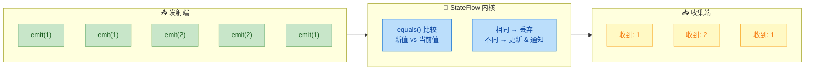

让我们用代码来精确验证这个行为：

```kotlin
import kotlinx.coroutines.*
import kotlinx.coroutines.flow.*

fun main() = runBlocking {
    // ============ StateFlow：自动去重 ============
    val stateFlow = MutableStateFlow(1)  // 初始值为 1

    // 启动一个收集者，打印每次收到的值
    val stateJob = launch {
        stateFlow.collect { value ->
            println("[StateFlow] 收到: $value")
        }
    }

    delay(100)  // 等收集者就绪

    stateFlow.value = 1  // 与当前值相同 → 静默丢弃，不通知
    delay(100)
    stateFlow.value = 2  // 不同 → 更新并通知
    delay(100)
    stateFlow.value = 2  // 又相同 → 再次丢弃
    delay(100)
    stateFlow.value = 3  // 不同 → 更新并通知
    delay(100)

    stateJob.cancel()

    // 输出：
    // [StateFlow] 收到: 1   ← 初始值
    // [StateFlow] 收到: 2   ← 值变了
    // [StateFlow] 收到: 3   ← 值又变了
    // 注意：两次重复的赋值 (1→1, 2→2) 完全没有触发通知！

    println("---分割线---")

    // ============ SharedFlow：默认不去重 ============
    val sharedFlow = MutableSharedFlow<Int>(replay = 0)

    val sharedJob = launch {
        sharedFlow.collect { value ->
            println("[SharedFlow] 收到: $value")
        }
    }

    delay(100)

    sharedFlow.emit(1)  // 通知
    delay(100)
    sharedFlow.emit(1)  // 再次通知！SharedFlow 不去重
    delay(100)
    sharedFlow.emit(2)  // 通知
    delay(100)
    sharedFlow.emit(2)  // 再次通知！
    delay(100)

    sharedJob.cancel()

    // 输出：
    // [SharedFlow] 收到: 1
    // [SharedFlow] 收到: 1   ← 重复值也会收到！
    // [SharedFlow] 收到: 2
    // [SharedFlow] 收到: 2   ← 重复值也会收到！
}
```

**去重机制的底层原理**：`StateFlow` 在内部维护一个 `_state` 原子引用。每次调用 `value = newValue` 时，它会先执行 `if (oldValue == newValue) return`。这里使用的是 **结构相等性（structural equality，即 `equals()`）**，而非引用相等性（referential equality，即 `===`）。

这意味着：

```kotlin
// data class 自动生成 equals()，基于所有属性比较
data class User(val name: String, val age: Int)

val flow = MutableStateFlow(User("Alice", 25))

// 创建一个全新的 User 对象，但属性值完全相同
val newUser = User("Alice", 25)

// 虽然 flow.value !== newUser（不同对象引用）
// 但 flow.value == newUser 为 true（structural equality）
// 所以这次赋值会被去重！collector 不会收到通知
flow.value = newUser
```

**去重的利与弊**：

**✅ 好处——性能优化与避免无效重绘**：

```kotlin
class SearchViewModel : ViewModel() {
    // 搜索结果状态
    private val _results = MutableStateFlow<List<String>>(emptyList())
    val results: StateFlow<List<String>> = _results.asStateFlow()

    fun search(query: String) {
        viewModelScope.launch {
            val newResults = repository.search(query)
            // 如果搜索结果和上次完全相同（比如用户重复点击搜索）
            // StateFlow 自动去重，UI 不会触发无意义的重新渲染
            _results.value = newResults
        }
    }
}
```

**⚠️ 潜在陷阱——当你需要"重复相同值"的通知时**：

```kotlin
// 场景：用户连续点击"刷新"按钮
// 你想每次点击都触发刷新，即使上一次结果相同

// ❌ 错误做法：用 StateFlow
val _refreshTrigger = MutableStateFlow(Unit)
fun refresh() {
    // Unit == Unit 永远为 true！
    // 第二次点击时 StateFlow 会去重，下游完全无反应！
    _refreshTrigger.value = Unit
}

// ✅ 正确做法 1：用 SharedFlow
val _refreshTrigger = MutableSharedFlow<Unit>()
suspend fun refresh() {
    _refreshTrigger.emit(Unit)  // 每次都会通知，不去重
}

// ✅ 正确做法 2：如果必须用 StateFlow，用自增计数器打破相等性
val _refreshTrigger = MutableStateFlow(0)
fun refresh() {
    _refreshTrigger.value++  // 每次值都不同，绕过去重
}
```

下面这个更完整的示例展示了去重在复杂 data class 场景下的表现：

```kotlin
import kotlinx.coroutines.*
import kotlinx.coroutines.flow.*

// 数据类，自动生成 equals() / hashCode()
data class FormState(
    val username: String = "",     // 用户名
    val email: String = "",        // 邮箱
    val isValid: Boolean = false   // 表单是否合法
)

fun main() = runBlocking {
    val formFlow = MutableStateFlow(FormState())  // 默认空表单

    var notificationCount = 0  // 记录收到通知的次数

    val job = launch {
        formFlow.collect {
            notificationCount++
            println("#$notificationCount 表单状态: $it")
        }
    }

    delay(100)

    // 第 1 次更新：修改用户名 → 新旧不同 → 通知 ✅
    formFlow.value = FormState(username = "Alice")
    delay(100)

    // 第 2 次更新：设置完全相同的值 → equals() 返回 true → 去重 ❌
    formFlow.value = FormState(username = "Alice")
    delay(100)

    // 第 3 次更新：增加 email → 新旧不同 → 通知 ✅
    formFlow.value = FormState(username = "Alice", email = "a@b.com")
    delay(100)

    // 第 4 次更新：又设置完全相同的组合 → 去重 ❌
    formFlow.value = FormState(username = "Alice", email = "a@b.com")
    delay(100)

    job.cancel()

    // 最终输出：
    // #1 表单状态: FormState(username=, email=, isValid=false)      ← 初始值
    // #2 表单状态: FormState(username=Alice, email=, isValid=false)  ← 第1次更新
    // #3 表单状态: FormState(username=Alice, email=a@b.com, isValid=false) ← 第3次更新
    // 总共只收到 3 次通知，而不是 5 次！
    println("总通知次数: $notificationCount")  // 输出: 3
}
```

> **核心准则**：`StateFlow` 天然适合表达**"状态"**——状态只关心"当前是什么"，而不关心"变了几次"。如果你的业务需要感知"连续相同值的重复发射"，那说明你需要的其实是 `SharedFlow`。

---

### SharedFlow 更灵活

如果说 `StateFlow` 是一个**"开箱即用、约定严格"**的专用工具，那么 `SharedFlow` 就是一个**"高度可配置、用途广泛"**的通用平台。事实上，从类型系统的角度看，`StateFlow` 就是 `SharedFlow` 的一个**受限子集**。

让我们先从接口继承关系说起：

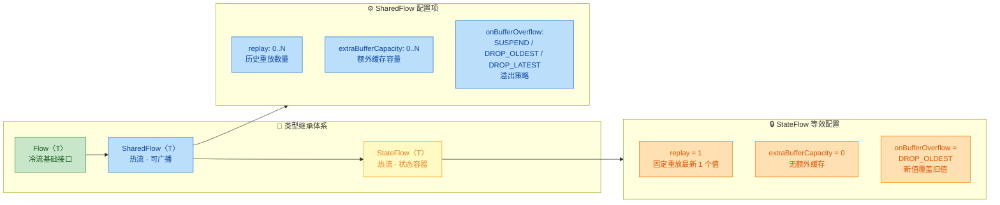

**关键洞察：StateFlow 本质上是一个"硬编码配置"的 SharedFlow**。可以这样理解：

```kotlin
// StateFlow 在概念上等价于以下 SharedFlow 配置：
val pseudoStateFlow = MutableSharedFlow<T>(
    replay = 1,                              // 始终重放最新 1 个值（新订阅者立刻收到）
    extraBufferCapacity = 0,                 // 没有额外缓存
    onBufferOverflow = BufferOverflow.DROP_OLDEST  // 新值直接覆盖旧值，永不挂起
)
// 外加：
// 1. 强制提供初始值
// 2. 内置 distinctUntilChanged() 去重
// 3. 提供 .value 属性进行同步读写
```

而 `SharedFlow` 的灵活性体现在这些配置全都是**可自由调整的**。

下面我们逐一展示 SharedFlow 独有的灵活能力：

**灵活性 1：可配置重放数量（replay）**

```kotlin
import kotlinx.coroutines.*
import kotlinx.coroutines.flow.*

fun main() = runBlocking {
    // 创建一个 replay = 3 的 SharedFlow
    // 新订阅者可以收到订阅前最近的 3 个值
    val chatHistory = MutableSharedFlow<String>(replay = 3)

    // 先发射 5 条消息（此时还没有任何收集者）
    chatHistory.emit("消息1: 大家好")
    chatHistory.emit("消息2: 今天天气不错")
    chatHistory.emit("消息3: 准备开会")
    chatHistory.emit("消息4: 会议开始")
    chatHistory.emit("消息5: 讨论第一个议题")

    // 现在才开始收集（模拟"迟到"的订阅者）
    val job = launch {
        chatHistory.collect { msg ->
            println("[新加入者收到] $msg")
        }
    }

    delay(200)
    job.cancel()

    // 输出（只收到最近 3 条，因为 replay = 3）：
    // [新加入者收到] 消息3: 准备开会
    // [新加入者收到] 消息4: 会议开始
    // [新加入者收到] 消息5: 讨论第一个议题

    // 对比：StateFlow 只能 replay = 1（永远只有最新的那一个值）
}
```

**灵活性 2：缓存容量与背压策略（extraBufferCapacity + onBufferOverflow）**

```kotlin
import kotlinx.coroutines.*
import kotlinx.coroutines.flow.*

fun main() = runBlocking {

    // ========== 策略 A：DROP_OLDEST（丢弃最旧的）==========
    val dropOldest = MutableSharedFlow<Int>(
        replay = 0,                // 不重放
        extraBufferCapacity = 2,   // 缓存 2 个值
        onBufferOverflow = BufferOverflow.DROP_OLDEST  // 溢出时丢弃最旧
    )

    // 慢速收集者
    val jobA = launch {
        dropOldest.collect {
            delay(500)  // 模拟处理很慢
            println("[DROP_OLDEST] 处理: $it")
        }
    }

    // 快速发射
    repeat(5) { i ->
        dropOldest.emit(i)       // 缓冲区满时会丢弃最旧的值
        println("[DROP_OLDEST] 发射: $i")
        delay(50)
    }

    delay(3000)
    jobA.cancel()

    println("---分割线---")

    // ========== 策略 B：DROP_LATEST（丢弃最新的）==========
    val dropLatest = MutableSharedFlow<Int>(
        replay = 0,
        extraBufferCapacity = 2,
        onBufferOverflow = BufferOverflow.DROP_LATEST  // 溢出时丢弃正在尝试发射的新值
    )

    val jobB = launch {
        dropLatest.collect {
            delay(500)
            println("[DROP_LATEST] 处理: $it")
        }
    }

    repeat(5) { i ->
        dropLatest.emit(i)
        println("[DROP_LATEST] 发射: $i")
        delay(50)
    }

    delay(3000)
    jobB.cancel()

    // 核心区别：
    // DROP_OLDEST：保证发射者不阻塞，牺牲旧数据
    // DROP_LATEST：保证发射者不阻塞，牺牲新数据
    // SUSPEND（默认）：发射者在缓冲区满时挂起等待，不丢失任何数据
}
```

**灵活性 3：不去重——感知每一次发射**

```kotlin
import kotlinx.coroutines.*
import kotlinx.coroutines.flow.*

// 模拟按钮点击事件
sealed class ClickEvent {
    object SingleClick : ClickEvent()   // 单击
    object DoubleClick : ClickEvent()   // 双击
}

fun main() = runBlocking {
    val clickEvents = MutableSharedFlow<ClickEvent>()

    val job = launch {
        clickEvents.collect { event ->
            when (event) {
                is ClickEvent.SingleClick -> println("处理单击事件")
                is ClickEvent.DoubleClick -> println("处理双击事件")
            }
        }
    }

    delay(100)

    // 用户连续点击 3 次——每次都是 SingleClick
    clickEvents.emit(ClickEvent.SingleClick)  // ✅ 通知
    clickEvents.emit(ClickEvent.SingleClick)  // ✅ 通知（SharedFlow 不去重！）
    clickEvents.emit(ClickEvent.SingleClick)  // ✅ 通知
    // 如果用 StateFlow：第 2、3 次会被去重，只触发 1 次！这在按钮点击场景下是 Bug！

    delay(200)
    job.cancel()

    // 输出：
    // 处理单击事件
    // 处理单击事件
    // 处理单击事件
}
```

**灵活性 4：多订阅者广播 + 可控的订阅者数量感知**

```kotlin
import kotlinx.coroutines.*
import kotlinx.coroutines.flow.*

fun main() = runBlocking {
    val eventBus = MutableSharedFlow<String>(
        replay = 0,              // 不重放历史
        extraBufferCapacity = 64 // 给足缓冲，避免 emit 挂起
    )

    // 订阅者 A：处理日志
    val jobA = launch {
        eventBus.collect { println("[Logger] $it") }
    }

    // 订阅者 B：处理统计
    val jobB = launch {
        eventBus.collect { println("[Analytics] $it") }
    }

    // 订阅者 C：处理 UI 更新
    val jobC = launch {
        eventBus.collect { println("[UI] $it") }
    }

    delay(100)

    // 查看当前有多少活跃订阅者
    // SharedFlow 提供 subscriptionCount 属性（StateFlow 也有）
    println("当前订阅者数量: ${eventBus.subscriptionCount.value}")  // 输出: 3

    // 发射一个事件，三个订阅者都会收到
    eventBus.emit("用户登录成功")

    delay(200)

    // 取消其中一个订阅者
    jobC.cancel()
    delay(100)
    println("取消一个后订阅者数量: ${eventBus.subscriptionCount.value}")  // 输出: 2

    listOf(jobA, jobB).forEach { it.cancel() }
}
```

最后，让我们用一张**终极对比表**做全面总结：

| 维度 | StateFlow | SharedFlow |
|---|---|---|
| **初始值** | ✅ 必须提供 | ❌ 不需要 |
| **`.value` 属性** | ✅ 可同步读写 | ❌ 不存在 |
| **去重** | ✅ 内置，无法关闭 | ❌ 默认不去重（可手动加） |
| **replay** | 固定 = 1 | 可配置 0 ~ N |
| **extraBufferCapacity** | 固定 = 0 | 可配置 0 ~ N |
| **onBufferOverflow** | 固定 DROP_OLDEST | 可配置 SUSPEND/DROP_OLDEST/DROP_LATEST |
| **语义模型** | 状态（State） | 事件（Event） |
| **经典场景** | UI 状态、配置信息、用户偏好 | Toast 提示、导航指令、点击事件、事件总线 |
| **Android 替代品** | 替代 `LiveData` | 替代 `EventBus` / `SingleLiveEvent` |
| **新订阅者行为** | 立即收到最新值 | 取决于 replay 配置 |
| **可否用 SharedFlow 模拟** | ✅ 可以（但需手动添加约束） | — |

> **一句话总结**：**选 `StateFlow` 还是 `SharedFlow`，归根结底是一个语义问题——你要表达的是"状态"还是"事件"？** 状态是持续存在的（"当前温度是 25°C"），事件是瞬时发生的（"温度刚刚超过了阈值"）。选对了语义载体，代码就自然而然地正确了。

---

**📝 练习题**

以下代码的输出结果是什么？

```kotlin
fun main() = runBlocking {
    val state = MutableStateFlow("A")
    val shared = MutableSharedFlow<String>(replay = 1)
    shared.emit("A")

    val results = mutableListOf<String>()

    val job1 = launch {
        state.collect { results.add("S:$it") }
    }
    val job2 = launch {
        shared.collect { results.add("H:$it") }
    }

    delay(100)

    state.value = "A"
    shared.emit("A")

    delay(100)

    state.value = "B"
    shared.emit("B")

    delay(100)

    job1.cancel()
    job2.cancel()

    println(results)
}
```

A. `[S:A, H:A, S:A, H:A, S:B, H:B]`


B. `[S:A, H:A, H:A, S:B, H:B]`


C. `[H:A, S:A, H:A, H:B, S:B]`


D. `[S:A, H:A, S:B, H:B]`


**【答案】** B

**【解析】** 这道题考查 `StateFlow` 去重与 `SharedFlow` 不去重的核心差异。逐步分析：

1. **初始收集阶段**（`delay(100)` 之前）：`job1` 启动后，`StateFlow` 立即将当前值 `"A"` 推送给收集者，产生 `S:A`。`job2` 启动后，`SharedFlow`（replay=1）将重放缓存中的 `"A"` 推送给收集者，产生 `H:A`。此时 `results = [S:A, H:A]`。

2. **第一轮赋值**（`state.value = "A"` 和 `shared.emit("A")`）：`StateFlow` 发现新值 `"A"` 与当前值 `"A"` 通过 `equals()` 比较相等，**去重生效，不通知**。`SharedFlow` 不去重，正常发射 `"A"`，产生 `H:A`。此时 `results = [S:A, H:A, H:A]`。

3. **第二轮赋值**（`state.value = "B"` 和 `shared.emit("B")`）：`StateFlow` 当前值 `"A"` != `"B"`，更新并通知，产生 `S:B`。`SharedFlow` 正常发射，产生 `H:B`。最终 `results = [S:A, H:A, H:A, S:B, H:B]`。

因此答案是 **B**。注意 `launch` 的调度顺序使得 `S:` 和 `H:` 的交错可能因协程调度而略有变化，但在 `runBlocking` + `delay` 的确定性环境下，结果是稳定的。核心考点在于 `state.value = "A"` 这一行被 StateFlow 的 `distinctUntilChanged` 机制静默吞掉了。

---

## 本章小结

本章系统学习了 Kotlin Coroutines 中两大核心热流（Hot Flow）—— **StateFlow** 与 **SharedFlow**。它们是构建现代 Android 响应式架构的基石，各自拥有鲜明的设计哲学与适用场景。下面从多个维度进行全面回顾与提炼。

---

### 核心概念回顾

**热流（Hot Flow）** 是贯穿本章的第一关键词。与冷流（Cold Flow）在每次 `collect` 时才启动生产不同，热流的数据生产独立于消费者存在。无论有没有人订阅，热流都可以持续发射数据。StateFlow 和 SharedFlow 都属于热流家族，但它们在 **"如何持有数据"** 和 **"如何分发数据"** 上走了两条不同的路线。

**StateFlow** 的设计哲学是 **"状态容器"（State Holder）**：

- 它 **始终持有一个值**（`value` 属性），任何时刻都可以同步读取当前状态，绝不会为 `null`（除非泛型类型本身允许）。
- 它 **只保留最新值**，旧状态被新状态覆盖后即丢弃，天然适合 UI 状态建模。
- 它内置 **`distinctUntilChanged`** 语义——连续发射相同值（基于 `equals`）时，收集器不会收到重复通知，避免无意义的 UI 重绘。
- `MutableStateFlow` 提供了可写入的 `value` 属性，是 ViewModel 层管理 UI State 的首选工具，被 Google 官方推荐作为 **LiveData 的替代方案**。

**SharedFlow** 的设计哲学是 **"事件广播器"（Event Broadcaster）**：

- 它 **没有初始值**，不强制你在创建时提供一个默认状态。
- 它拥有 **高度可配置的缓存策略**：`replay`（重放给新订阅者的历史事件数）、`extraBufferCapacity`（额外缓冲槽位）、`onBufferOverflow`（溢出策略）三大参数组合出极其灵活的行为。
- 它 **不做去重**——即使连续发射相同的值，每次都会通知所有收集器，这对于 "Toast 提示"、"导航事件" 等 **一次性事件（One-shot Event）** 至关重要。
- `MutableSharedFlow` 配合 `replay = 0` 可以构建轻量级的 **事件总线（Event Bus）**，在模块间解耦通信。

---

### 对比全景图

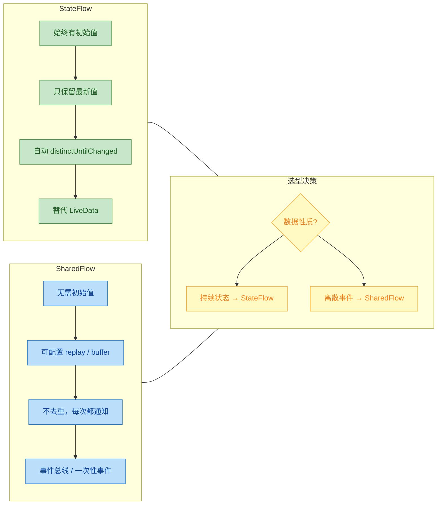

下表浓缩了两者的关键差异，供快速查阅：

| 维度 | **StateFlow** | **SharedFlow** |
|---|---|---|
| **初始值** | ✅ 必须提供 | ❌ 无需提供（`replay=0` 时新订阅者收不到任何历史） |
| **当前值访问** | `stateFlow.value` 同步读取 | 无 `value` 属性（除非 `replayCache` 非空） |
| **去重** | ✅ 内置 `distinctUntilChanged` | ❌ 不去重，相同值也会通知 |
| **缓存配置** | 固定：`replay = 1`，不可更改 | 自由配置 `replay` / `extraBufferCapacity` / `onBufferOverflow` |
| **典型场景** | UI State、屏幕状态、数据绑定 | Toast、SnackBar、导航事件、模块间事件总线 |
| **与 LiveData 关系** | 官方推荐的替代品 | 无直接对应，更接近 EventBus |
| **继承关系** | `StateFlow` 是 `SharedFlow` 的特化子接口 | 更通用的基础热流 |

> **本质关系**：`StateFlow` 在底层就是一个 `replay = 1` 且带 `distinctUntilChanged` 的 `SharedFlow`。理解这一点，就理解了两者的全部差异来源。

---

### 选型决策指南

在实际项目中做选择时，可以遵循一个简洁的心智模型：

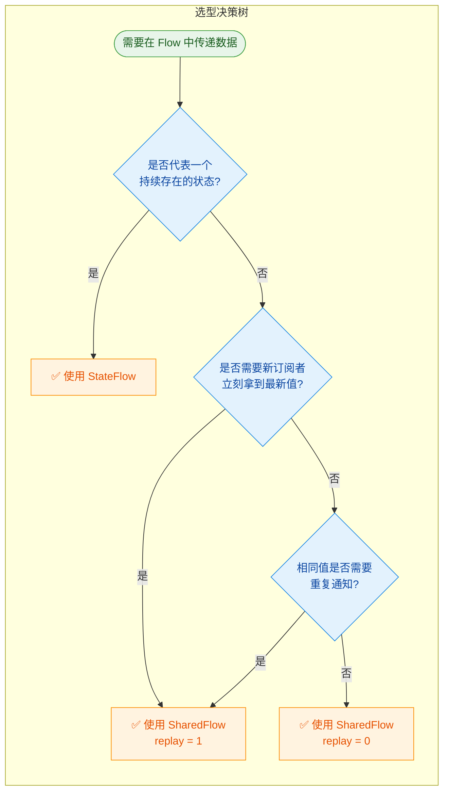

**三句话总结选型**：

1. **要表达"当前是什么状态"** → `StateFlow`。例如：加载中 / 加载成功 / 加载失败、用户信息、列表数据。
2. **要表达"刚刚发生了什么事"** → `SharedFlow`（`replay = 0`）。例如：弹 Toast、弹 SnackBar、跳转页面。
3. **要表达"刚刚发生了什么事，且迟到的订阅者也需要知道"** → `SharedFlow`（`replay ≥ 1`）。例如：全局配置变更广播。

---

### 常见陷阱与最佳实践

在使用过程中，有几个高频踩坑点值得再次强调：

**陷阱一：用 StateFlow 发送一次性事件。** 由于 `distinctUntilChanged` 的存在，连续两次发送相同的事件（如同一条错误消息）时，第二次会被吞掉。解决方案是改用 `SharedFlow`，或者将事件包装为唯一 ID 的包装类。

**陷阱二：SharedFlow 的 `replay = 0` 丢失事件。** 如果发射时没有活跃的收集器（例如 Activity 处于后台），事件会永久丢失。在 Android 中应配合 `Lifecycle.repeatOnLifecycle` 使用，或根据业务需求调大 `replay`。

**陷阱三：忘记暴露不可变类型。** ViewModel 内部使用 `MutableStateFlow` / `MutableSharedFlow`，但对外暴露时务必向上转型为 `StateFlow` / `SharedFlow`（只读接口），防止外部意外修改状态。

```kotlin
// ✅ 正确做法：内部可变，外部只读
class MyViewModel : ViewModel() {
    // 内部使用 MutableStateFlow，可以通过 value 属性写入
    private val _uiState = MutableStateFlow(UiState.Loading)
    // 对外暴露只读的 StateFlow 接口
    val uiState: StateFlow<UiState> = _uiState.asStateFlow()

    // 内部使用 MutableSharedFlow，可以通过 emit() 发送事件
    private val _events = MutableSharedFlow<UiEvent>()
    // 对外暴露只读的 SharedFlow 接口
    val events: SharedFlow<UiEvent> = _events.asSharedFlow()
}
```

**陷阱四：在 `stateIn` / `shareIn` 中误用 Scope。** 这两个操作符用于将普通冷流转为热流，其 `scope` 参数决定了数据生产的生命周期。在 ViewModel 中应使用 `viewModelScope`，在 Repository 中需谨慎选择更长生命周期的 Scope（如 Application Scope），否则会导致数据生产过早取消或内存泄漏。

---

### 知识图谱总览

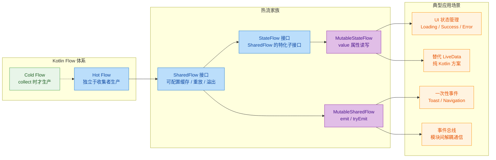

---

### 一句话带走

> **StateFlow 是"状态的快照"，SharedFlow 是"事件的流水"。** 前者告诉你"现在是什么样"，后者告诉你"刚刚发生了什么"。根据数据的语义本质做选择，而不是凭感觉——这就是本章最核心的设计直觉。

---

**📝 练习题**

在一个 ViewModel 中，你需要向 UI 层发送 "显示一条 SnackBar" 的事件。两次连续触发的 SnackBar 内容**完全相同**（例如都是 "网络错误"）。以下哪种实现方案**能保证两次事件都被 UI 层收到**？

A. `val event = MutableStateFlow("网络错误")`，UI 层 collect 该 StateFlow。


B. `val event = MutableSharedFlow<String>()`，UI 层 collect 该 SharedFlow，ViewModel 中两次调用 `event.emit("网络错误")`。


C. `val event = MutableStateFlow("")`，每次发送前先设为空字符串再设为目标值，UI 层 collect 该 StateFlow。


D. `val event = MutableSharedFlow<String>(replay = 1, onBufferOverflow = BufferOverflow.DROP_OLDEST)`，ViewModel 中两次调用 `event.emit("网络错误")`。


**【答案】** B

**【解析】**

- **选项 A 错误**：`StateFlow` 内置 `distinctUntilChanged` 语义。第一次将 `value` 设为 `"网络错误"` 后，第二次再设相同的值，`StateFlow` 会判定新旧值 `equals` 相同而 **不通知收集器**，导致第二次 SnackBar 丢失。这正是本章反复强调的 "用 StateFlow 发送一次性事件" 的经典陷阱。

- **选项 B 正确**：`MutableSharedFlow` 默认 `replay = 0`，**不做去重**。每次调用 `emit()` 都会将事件分发给所有活跃的收集器，即使连续两次发射完全相同的字符串 `"网络错误"`，收集器也会收到两次通知。这是处理一次性事件的标准方案。

- **选项 C 错误**：虽然 "先设为空再设为目标值" 是一种常见的 hack 手段（通过制造一个中间不同值来绕过去重），但这属于 **反模式（Anti-pattern）**。它会导致收集器额外收到一次空字符串事件，增加 UI 层的过滤逻辑复杂度，且时序上不可靠（在高频场景下中间值可能被合并跳过）。从设计角度讲，这本质上是在用错误的工具解决问题。

- **选项 D 错误方向但部分可行**：`replay = 1` 的 SharedFlow 确实也不做去重，两次 `emit` 都会通知活跃收集器。但 `replay = 1` 意味着新的迟到订阅者还会收到最后一条事件的 **重放**，对于 SnackBar 这种一次性事件来说是不合理的——用户重新进入页面时不应该再弹一次旧的错误提示。因此虽然 "能收到两次" 这个条件满足了，但在实际工程中 `replay = 0` 才是正确的配置。**题目问的是"能保证两次都收到"，B 和 D 都能做到，但 B 是最佳实践。**

---

