---

# 协程上下文与调度器 ⭐⭐⭐

---

## CoroutineContext ⭐

在 Kotlin 协程体系中，`CoroutineContext` 是一切协程行为的**元数据容器**（metadata container）。每一个协程在创建时都会携带一个 `CoroutineContext`，它决定了协程运行在哪个线程（Dispatcher）、使用哪个 Job 来管理生命周期、采用哪个 `CoroutineName` 进行调试追踪，以及如何处理未捕获异常（`CoroutineExceptionHandler`）等。可以说，**协程的一切"配置信息"都存储在 CoroutineContext 里**。

从数据结构的角度来看，`CoroutineContext` 本质上是一个 **以 `Key` 为索引的不可变集合**（an indexed set of `Element` instances）。它的设计非常精巧——既不是 `Map`，也不是 `List`，而是一种基于 **链表 + 折叠（fold）** 的函数式数据结构。每个"槽位"由唯一的 `Key` 标识，对应一个 `Element` 值。这种设计使得上下文的组合（composition）和查找（lookup）都非常高效且类型安全。

让我们先从宏观视角看看 `CoroutineContext` 的接口定义：

```kotlin
// CoroutineContext 是所有上下文元素的容器接口
public interface CoroutineContext {
    // 通过 Key 获取对应的 Element，找不到则返回 null
    public operator fun <E : Element> get(key: Key<E>): E?

    // 函数式折叠操作，类似于集合的 reduce/fold
    public fun <R> fold(initial: R, operation: (R, Element) -> R): R

    // 组合两个上下文，返回新的上下文
    public operator fun plus(context: CoroutineContext): CoroutineContext

    // 从当前上下文中移除指定 Key 对应的元素
    public fun minusKey(key: Key<*>): CoroutineContext

    // Key 接口：每种 Element 类型都必须有一个伴生 Key
    public interface Key<E : Element>

    // Element 接口：上下文中的单个元素
    public interface Element : CoroutineContext
}
```

这段接口定义中隐藏着一个非常优雅的设计：**`Element` 本身也实现了 `CoroutineContext`**。这意味着单个元素本身就是一个"只包含自己的上下文"，可以直接参与 `plus` 组合操作，无需额外包装。这是典型的 **Composite Pattern（组合模式）** 应用。

下面用一张 Mermaid 类图来展示整体继承关系：

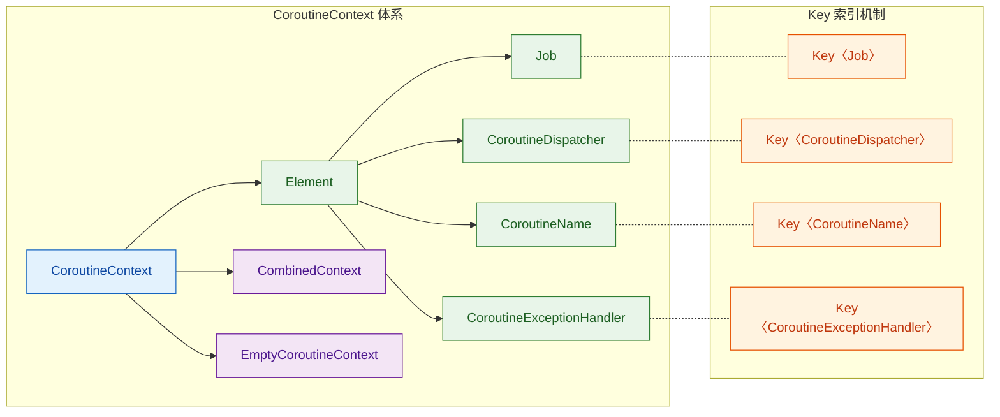

从图中可以看出：`Job`、`CoroutineDispatcher`、`CoroutineName`、`CoroutineExceptionHandler` 这四大常见组件都是 `Element` 的子类型，各自拥有对应的 `Key`。它们可以被自由组合进同一个 `CoroutineContext` 中。

---

### Element 接口

`Element` 是 `CoroutineContext` 中**最小的原子单位**。每一个 Element 代表协程上下文中的一项配置，比如"运行在哪个线程"、"属于哪个 Job"、"叫什么名字"等。

`Element` 接口的核心设计在于——它自身就实现了 `CoroutineContext`，并提供了默认的 `get`、`fold`、`minusKey` 实现：

```kotlin
public interface Element : CoroutineContext {
    // 每个 Element 必须持有一个 Key，用于在上下文中唯一标识自己
    public val key: Key<*>

    // 默认实现：如果传入的 key 与自身的 key 匹配，则返回自身，否则返回 null
    @Suppress("UNCHECKED_CAST")
    public override operator fun <E : Element> get(key: Key<E>): E? =
        if (this.key == key) this as E else null  // 类型安全的向下转型

    // 默认实现：对自身执行一次 operation
    public override fun <R> fold(initial: R, operation: (R, Element) -> R): R =
        operation(initial, this)  // 单元素的 fold 就是直接应用一次 operation

    // 默认实现：如果要移除的 key 是自己，返回空上下文；否则返回自身
    public override fun minusKey(key: Key<*>): CoroutineContext =
        if (this.key == key) EmptyCoroutineContext else this
}
```

这段代码揭示了一个关键理念：**一个 Element 就是一个"单元素上下文"**。当你对一个 `Element` 调用 `get(key)` 时，它只会检查"你要找的 key 是不是我自己"——是就返回自身，不是就返回 `null`。`fold` 也只折叠一次。这样的设计让 Element 可以无缝地与其他 Element 通过 `plus` 组合成更大的上下文。

让我们看一个具体的 Element 实现——`CoroutineName`：

```kotlin
// CoroutineName 是一个简单的 Element 实现，用于给协程命名
public data class CoroutineName(
    val name: String  // 协程的名字，用于调试日志
) : AbstractCoroutineContextElement(CoroutineName) {
    // 伴生对象同时充当 Key
    public companion object Key : CoroutineContext.Key<CoroutineName>

    // 友好的 toString 输出
    override fun toString(): String = "CoroutineName($name)"
}
```

注意这里的巧妙之处：`companion object Key` **既是伴生对象，又实现了 `CoroutineContext.Key<CoroutineName>` 接口**。这意味着你可以直接用类名 `CoroutineName` 作为 Key 来从上下文中检索对应的元素，非常符合 Kotlin 的简洁哲学。

实际使用起来，每个 Element 都是独立的配置项：

```kotlin
import kotlinx.coroutines.*

fun main() = runBlocking {
    // 创建几个独立的 Element
    val name = CoroutineName("worker")           // 协程名称元素
    val dispatcher = Dispatchers.IO               // 调度器元素（也是 Element）
    val job = Job()                               // Job 元素

    // 每个 Element 本身就是一个合法的 CoroutineContext
    val ctx: CoroutineContext = name              // 单个 Element 即可充当上下文
    println(ctx[CoroutineName])                   // 输出: CoroutineName(worker)
    println(ctx[Job])                             // 输出: null（当前上下文里没有 Job）
}
```

---

### Key 机制

`Key` 是 `CoroutineContext` 类型安全检索的核心。在传统的 `Map<String, Any>` 设计中，我们通过字符串 key 获取值后还需要手动强制转型，既不安全也不优雅。而 `CoroutineContext` 的 `Key<E>` 是一个**泛型接口**，它将 key 和 value 的类型在编译期就绑定在一起（compile-time type binding），实现了 **typesafe heterogeneous container**（类型安全的异构容器）模式。

```kotlin
// Key 接口的定义极其简洁
public interface Key<E : Element>
// 泛型参数 E 表示：这个 Key 对应的 Element 类型是 E
// 通过 get(key: Key<E>): E? 返回值自动推断为 E，无需手动转型
```

这个模式在 Joshua Bloch 的《Effective Java》中被称为 **Type-Safe Heterogeneous Container Pattern**。Kotlin 协程将其发挥到了极致——每种 `Element` 类型都在其伴生对象中定义唯一的 `Key`：

```kotlin
// ===== 各种 Element 的 Key 定义模式 =====

// Job 的 Key
public interface Job : CoroutineContext.Element {
    public companion object Key : CoroutineContext.Key<Job>  // 伴生对象即 Key
}

// CoroutineDispatcher 的 Key（注意继承链上的 Key 复用）
public abstract class CoroutineDispatcher :
    AbstractCoroutineContextElement(ContinuationInterceptor),  // 使用父级的 Key
    ContinuationInterceptor {
    // ContinuationInterceptor 拥有自己的 Key
}

// ContinuationInterceptor 的 Key
public interface ContinuationInterceptor : CoroutineContext.Element {
    public companion object Key : CoroutineContext.Key<ContinuationInterceptor>
}
```

这里有一个非常重要的细节：**`CoroutineDispatcher` 使用的 Key 是 `ContinuationInterceptor.Key`，而不是自己的 Key**。这意味着在同一个 `CoroutineContext` 中，无论你放入 `Dispatchers.IO` 还是 `Dispatchers.Default`，它们都占据 `ContinuationInterceptor` 这同一个槽位，后添加的会覆盖先添加的。

用一张图来理解 Key 与 Element 的对应关系：

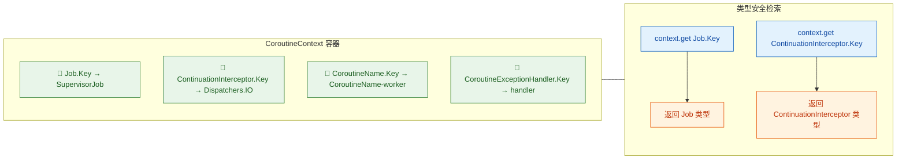

Key 机制的核心优势总结：

| 特性 | 传统 `Map〈String, Any〉` | `CoroutineContext` Key |
|------|--------------------------|------------------------|
| 类型安全 | ❌ 需要 `as` 强转 | ✅ 编译期自动推断 |
| 唯一性保证 | ❌ 字符串可能冲突 | ✅ 伴生对象天然唯一 |
| IDE 支持 | ❌ 无法自动补全 | ✅ 完整类型提示 |
| 扩展性 | ⚠️ 无约束 | ✅ 新 Element 只需定义新 Key |

---

### plus 操作符（组合上下文）

`plus` 操作符是 `CoroutineContext` 最常用的能力之一——它允许你将多个 Element **组合（combine）** 成一个复合上下文。在 Kotlin 中，`+` 操作符会被编译器映射到 `plus()` 函数，所以你可以非常自然地写出 `context1 + context2` 这样的表达式。

先看 `plus` 的核心源码实现：

```kotlin
// CoroutineContext 接口中的 plus 默认实现
public operator fun plus(context: CoroutineContext): CoroutineContext =
    // 情况1：如果对方是空上下文，直接返回自身（短路优化）
    if (context === EmptyCoroutineContext) this
    else
        // 情况2：通过 fold 遍历 context 中的每个元素，逐一合并
        context.fold(this) { acc, element ->
            // 先从累积上下文中移除与当前 element 同 Key 的旧元素
            val removed = acc.minusKey(element.key)
            // 如果移除后为空，说明旧上下文只有这一个同 Key 元素，直接用新 element
            if (removed === EmptyCoroutineContext) element
            else {
                // 检查是否需要特殊处理 ContinuationInterceptor
                val interceptor = removed[ContinuationInterceptor]
                if (interceptor == null)
                    // 没有拦截器，直接构造 CombinedContext
                    CombinedContext(removed, element)
                else {
                    // 有拦截器时，先移除它，再重新添加到最外层（确保拦截器始终在链尾）
                    val left = removed.minusKey(ContinuationInterceptor)
                    if (left === EmptyCoroutineContext)
                        CombinedContext(element, interceptor)
                    else
                        CombinedContext(CombinedContext(left, element), interceptor)
                }
            }
        }
```

这段代码看上去复杂，但核心逻辑可以归纳为三条规则：

1. **同 Key 覆盖**：右侧上下文中的 Element 会覆盖左侧同 Key 的元素（last-wins semantics）
2. **不同 Key 合并**：不同 Key 的元素会共存在新上下文中
3. **Interceptor 置尾优化**：`ContinuationInterceptor`（即调度器）会被特殊处理，始终放在链的最末端，这是一个性能优化——因为调度器是最频繁被查找的元素，放在尾部可以让 `get` 操作最快命中

来看实际的组合示例：

```kotlin
import kotlinx.coroutines.*

fun main() = runBlocking {
    // 定义若干独立的 Element
    val name = CoroutineName("data-loader")       // 协程名
    val dispatcher = Dispatchers.IO               // IO 调度器
    val handler = CoroutineExceptionHandler { _, e ->
        println("捕获异常: ${e.message}")          // 异常处理器
    }

    // 使用 plus(+) 操作符组合成复合上下文
    val combined = name + dispatcher + handler
    // 等价于: name.plus(dispatcher).plus(handler)

    // 验证组合结果：每个元素都可以通过各自的 Key 取出
    println(combined[CoroutineName])              // CoroutineName(data-loader)
    println(combined[ContinuationInterceptor])    // Dispatchers.IO
    println(combined[CoroutineExceptionHandler])  // 非 null

    // 同 Key 覆盖演示
    val updated = combined + CoroutineName("image-loader")
    println(updated[CoroutineName])               // CoroutineName(image-loader) ← 被覆盖了！
    println(updated[ContinuationInterceptor])     // Dispatchers.IO ← 其它元素不受影响
}
```

让我们用一张流程图展示 `plus` 操作的合并过程：

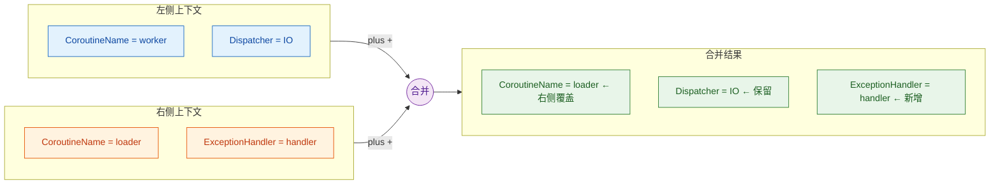

组合操作的底层数据结构是 `CombinedContext`，它是一个**左倾链表**（left-biased linked list）：

```kotlin
// CombinedContext 内部结构：左子树 + 最右元素
internal class CombinedContext(
    private val left: CoroutineContext,   // 左子树（可能也是 CombinedContext）
    private val element: Element          // 最右边的单个元素
) : CoroutineContext
```

用 ASCII 图展示三个元素组合后的内存结构：

```java
// name + dispatcher + handler 的内部链式结构：
//
//         CombinedContext
//        /              \
//   CombinedContext    handler (Element)
//   /            \
// name          dispatcher (Element)
// (Element)
//
// 查找时从右往左遍历：先检查 handler → 再检查 dispatcher → 最后检查 name
```

**不可变性（Immutability）** 是 `plus` 操作的另一个重要特征。每次 `plus` 都会返回一个**全新的** `CoroutineContext` 实例，原有的上下文不会被修改。这与 Kotlin 的 `String` 拼接或不可变集合的设计理念一脉相承，在并发环境下提供了天然的线程安全保障。

---

### 索引访问（context[Key]）

Kotlin 的 `operator fun get` 让我们可以像访问 Map 一样，通过 `context[Key]` 的语法从上下文中提取特定元素。这就是 **indexed access（索引访问）**。

```kotlin
import kotlinx.coroutines.*

fun main() = runBlocking {
    // 构建一个包含多个元素的上下文
    val ctx = CoroutineName("analyzer") + Dispatchers.Default + Job()

    // 使用 [] 操作符进行索引访问
    val name: CoroutineName? = ctx[CoroutineName]            // 传入伴生对象作为 Key
    val dispatcher = ctx[ContinuationInterceptor]            // 获取调度器
    val job: Job? = ctx[Job]                                 // 获取 Job

    println("Name: $name")          // CoroutineName(analyzer)
    println("Dispatcher: $dispatcher") // Dispatchers.Default
    println("Job: $job")            // JobImpl{Active}

    // 访问不存在的元素返回 null
    val handler = ctx[CoroutineExceptionHandler]
    println("Handler: $handler")    // null
}
```

索引访问的查找流程在底层会根据上下文的具体类型执行不同的逻辑：

- **`Element.get(key)`**：O(1)——直接比对自身的 key 是否匹配
- **`CombinedContext.get(key)`**：O(n)——沿链表从右向左逐一比对，直到找到匹配项或遍历完毕
- **`EmptyCoroutineContext.get(key)`**：O(1)——永远返回 null

```kotlin
// CombinedContext 的 get 实现
internal class CombinedContext(
    private val left: CoroutineContext,
    private val element: Element
) : CoroutineContext {

    override fun <E : Element> get(key: Key<E>): E? {
        var cur = this               // 从当前节点开始
        while (true) {
            // 先检查最右侧元素
            cur.element[key]?.let { return it }
            // 没找到，继续向左递归
            val next = cur.left
            if (next is CombinedContext) {
                cur = next           // 左子树是 CombinedContext，继续循环
            } else {
                return next[key]     // 左子树是单个 Element 或 Empty，直接查
            }
        }
    }
}
```

在实际的协程代码中，索引访问最常见的场景是 **在协程内部获取自己的上下文信息**。每个协程的 `coroutineContext` 属性（由 `CoroutineScope` 提供）可以随时被读取：

```kotlin
import kotlinx.coroutines.*

fun main() = runBlocking(CoroutineName("main-routine")) {
    // 在协程内部，coroutineContext 是一个隐式可用的属性
    val myName = coroutineContext[CoroutineName]?.name ?: "unnamed"
    println("当前协程名: $myName")   // 输出: 当前协程名: main-routine

    // 子协程会继承父上下文（但可以覆盖部分元素）
    launch(CoroutineName("child-routine")) {
        val childName = coroutineContext[CoroutineName]?.name
        val childJob = coroutineContext[Job]
        println("子协程名: $childName")           // child-routine
        println("子协程 Job: $childJob")           // StandaloneCoroutine{Active}
        println("是否继承父 Dispatcher: ${
            coroutineContext[ContinuationInterceptor]
        }")                                        // BlockingEventLoop（runBlocking 的调度器）
    }
}
```

最后，让我们用一张综合流程图来展示 `context[Key]` 的完整查找路径：

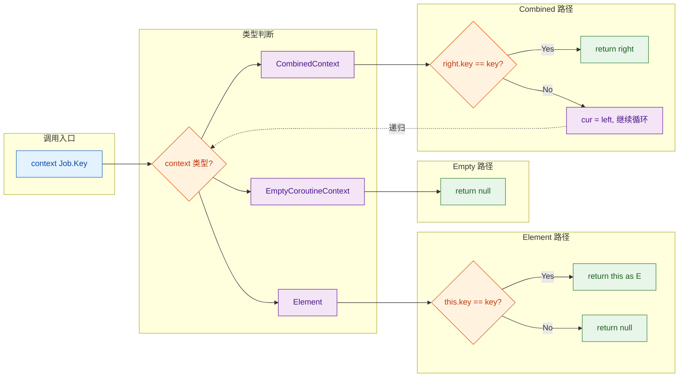

---

**📝 练习题**

以下代码的输出是什么？

```kotlin
val ctx = CoroutineName("A") + Dispatchers.IO + CoroutineName("B") + Job()
println(ctx[CoroutineName]?.name)
```

A. `A`


B. `B`


C. `null`


D. 编译错误

**【答案】** B

**【解析】** `plus` 操作符遵循 **同 Key 覆盖、右侧优先（last-wins）** 的语义。`CoroutineName("A")` 和 `CoroutineName("B")` 使用同一个 `Key`——`CoroutineName.Key`。组合过程中，先加入 `CoroutineName("A")`，后加入 `CoroutineName("B")`，后者会覆盖前者。因此 `ctx[CoroutineName]?.name` 返回 `"B"`。`Dispatchers.IO` 和 `Job()` 使用不同的 Key，不会与 `CoroutineName` 冲突，它们各自独立存在于上下文中。

---

## 调度器（Dispatcher）⭐⭐⭐

在上一节中我们了解了 `CoroutineContext` 的核心机制——它是一个由 `Element` 组成的 **indexed set**，可以通过 `Key` 索引访问、通过 `plus` 操作符组合。而在所有 `CoroutineContext.Element` 中，**调度器（Dispatcher）** 无疑是最关键、最高频使用的一个。

调度器的本质职责只有一个：**决定协程的代码体（coroutine body）在哪个线程或线程池上执行**。这就好比一个"交通调度员"——协程本身只是一段待执行的逻辑，而调度器负责把这段逻辑"派发"到正确的车道（线程）上去跑。

Kotlin 协程库在 `kotlinx.coroutines` 包中预定义了四种调度器，它们覆盖了日常开发中几乎所有的线程调度场景。在深入每种调度器之前，我们先用一张全景图建立整体认知：

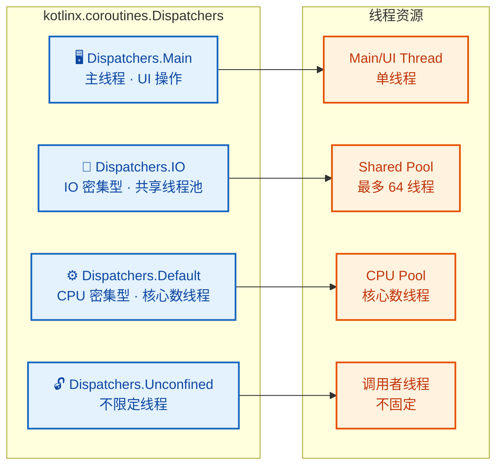

所有调度器都继承自 `CoroutineDispatcher`，而 `CoroutineDispatcher` 本身实现了 `ContinuationInterceptor` 接口（这也是一个 `CoroutineContext.Element`）。这意味着**调度器的本质是一个拦截器**——它拦截协程的 continuation 恢复操作，将其重新调度到目标线程上执行。

```kotlin
// CoroutineDispatcher 的继承关系（简化）
// CoroutineDispatcher 是 ContinuationInterceptor 的子类
// ContinuationInterceptor 是 CoroutineContext.Element 的子类
// 因此 Dispatcher 可以直接作为 CoroutineContext 使用
public abstract class CoroutineDispatcher :
    AbstractCoroutineContextElement(ContinuationInterceptor),  // 以 ContinuationInterceptor 为 Key
    ContinuationInterceptor {

    // 核心方法：将一个 Runnable 调度到目标线程执行
    public abstract fun dispatch(context: CoroutineContext, block: Runnable)
}
```

正因为所有调度器共享同一个 Key——`ContinuationInterceptor`，所以**一个协程上下文中只能存在一个调度器**。当你用 `plus` 组合两个调度器时，后者会覆盖前者：

```kotlin
// 演示：同一上下文只能有一个调度器
fun main() = runBlocking {
    // Default + IO，后者覆盖前者，最终使用 IO
    val ctx = Dispatchers.Default + Dispatchers.IO
    // 通过 ContinuationInterceptor Key 取出的就是 Dispatchers.IO
    println(ctx[ContinuationInterceptor]) // 输出: Dispatchers.IO
}
```

---

### Dispatchers.Main ⭐（主线程、UI 操作）

`Dispatchers.Main` 将协程调度到**平台的主线程（UI 线程）**上执行。在 Android 中它对应的就是大家熟知的 **Main Looper Thread**；在 JavaFX 中是 **JavaFX Application Thread**；在 Swing 中是 **EDT（Event Dispatch Thread）**。

#### 为什么需要 Main 调度器？

几乎所有 GUI 框架都遵循一个黄金法则：**UI 操作必须在主线程中执行**（UI toolkit is not thread-safe）。Android 中如果你在子线程直接调用 `textView.text = "Hello"` 就会抛出著名的 `CalledFromWrongThreadException`。因此，当一个协程需要更新 UI 时，必须确保它运行在主线程上——这正是 `Dispatchers.Main` 的用武之地。

#### 使用方式

```kotlin
// Android 中典型的 Main 调度器用法
class MyViewModel : ViewModel() {

    fun loadUserProfile() {
        // viewModelScope 默认使用 Dispatchers.Main.immediate
        viewModelScope.launch {
            // ① 这里运行在主线程——可以显示 loading
            _uiState.value = UiState.Loading

            // ② 切到 IO 线程去做网络请求
            val user = withContext(Dispatchers.IO) {
                userRepository.fetchUser()  // 网络请求，IO 密集
            }

            // ③ 自动切回主线程——可以更新 UI 状态
            _uiState.value = UiState.Success(user)
        }
    }
}
```

上面的代码展示了一个非常经典的模式：**主线程启动 → 切 IO → 切回主线程**。这种模式之所以优雅，是因为协程的调度器切换对开发者来说就像同步代码一样线性，而不需要嵌套回调。

#### Main vs Main.immediate

`Dispatchers.Main` 有一个变体 `Dispatchers.Main.immediate`，两者的区别在于：

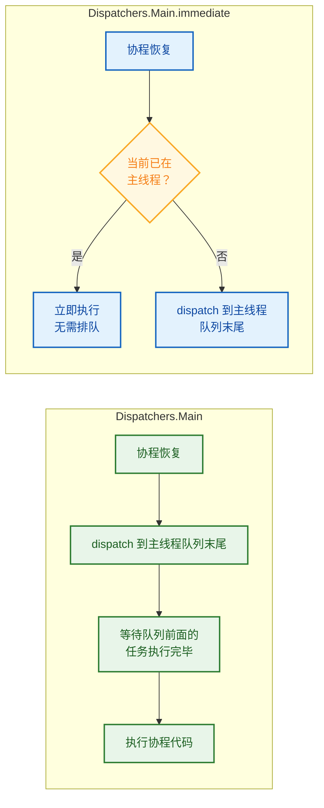

| 特性 | `Dispatchers.Main` | `Dispatchers.Main.immediate` |
|---|---|---|
| 已在主线程时 | 仍然 dispatch（入队） | **立即执行**，跳过入队 |
| 不在主线程时 | dispatch 到主线程队列 | dispatch 到主线程队列 |
| 延迟 | 始终有一帧调度延迟 | 可能零延迟 |
| 使用场景 | 通用 | 性能敏感的 UI 更新 |

`immediate` 的好处是减少不必要的重新调度开销。Android 的 `viewModelScope` 和 `lifecycleScope` 默认使用的就是 `Dispatchers.Main.immediate`。

#### 平台依赖

`Dispatchers.Main` 并不是 `kotlinx-coroutines-core` 自带的——它需要对应平台的模块支持：

```kotlin
// Android 项目中需要引入此依赖（通常已自动包含）
// implementation("org.jetbrains.kotlinx:kotlinx-coroutines-android:x.x.x")

// JavaFX 项目
// implementation("org.jetbrains.kotlinx:kotlinx-coroutines-javafx:x.x.x")

// Swing 项目
// implementation("org.jetbrains.kotlinx:kotlinx-coroutines-swing:x.x.x")
```

如果在没有 Main 调度器的环境中使用（例如纯后端项目），会抛出 `IllegalStateException: Module with the Main dispatcher is missing`。

---

### Dispatchers.IO ⭐（IO 密集型、共享线程池）

`Dispatchers.IO` 专为 **I/O 密集型任务** 设计，包括但不限于：网络请求、文件读写、数据库操作、SharedPreferences 读写等。这些操作的共同特点是**大部分时间在等待外部响应，CPU 几乎空闲**。

#### 线程池参数

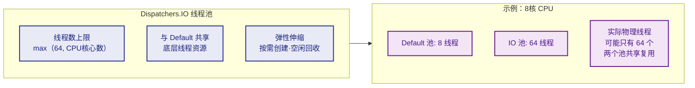

`Dispatchers.IO` 的默认线程上限是 **`max(64, CPU核心数)`**。这个数字远大于 `Default` 调度器的线程数，原因很简单：IO 操作中线程大部分时间处于 **阻塞等待（blocked）** 状态，并不消耗 CPU，所以可以同时容纳更多的并发任务。

你也可以通过系统属性自定义这个上限：

```kotlin
// 通过 JVM 系统属性调整 IO 线程池大小
// 需要在程序启动前设置
// -Dkotlinx.coroutines.io.parallelism=128

// 或者在代码中（注意必须尽早执行）
System.setProperty("kotlinx.coroutines.io.parallelism", "128")
```

#### IO 与 Default 共享线程

一个非常重要但经常被忽略的细节是：**`Dispatchers.IO` 和 `Dispatchers.Default` 共享同一个底层线程池**。这意味着从 `Default` 切换到 `IO`（或反过来）时，协程**可能继续在同一个物理线程上执行**，不会发生真正的线程切换（thread context switch），从而避免了昂贵的上下文切换开销。

```kotlin
fun main() = runBlocking {
    // 在 Default 调度器启动协程
    launch(Dispatchers.Default) {
        println("Default: ${Thread.currentThread().name}")
        // 输出类似: Default: DefaultDispatcher-worker-1

        withContext(Dispatchers.IO) {
            // 虽然调度器切换了，但物理线程可能不变！
            println("IO: ${Thread.currentThread().name}")
            // 输出可能: IO: DefaultDispatcher-worker-1  ← 同一个 worker！
        }
    }
    // 两个调度器共享 "DefaultDispatcher-worker-X" 线程池
}
```

这种共享设计在源码层面的实现是：`Dispatchers.IO` 内部使用了一个 `LimitingDispatcher`，它包装了 `Dispatchers.Default` 所使用的 `CoroutineScheduler`，仅在逻辑上限制了并发度（IO 上限 64，Default 上限为核心数），但底层的工作线程（worker threads）是同一批。

```java
// 内存模型示意（简化）
// ┌─────────────────────────────────────────────┐
// │         CoroutineScheduler (共享线程池)         │
// │   worker-1  worker-2  worker-3  ... worker-N  │
// ├─────────────────────────────────────────────┤
// │  Dispatchers.Default (逻辑视图)               │
// │  并发上限 = CPU 核心数 (如 8)                   │
// ├─────────────────────────────────────────────┤
// │  Dispatchers.IO (逻辑视图)                    │
// │  并发上限 = max(64, 核心数)                    │
// └─────────────────────────────────────────────┘
```

#### limitedParallelism —— 自定义 IO 子调度器

从 `kotlinx.coroutines 1.6` 开始，你可以通过 `limitedParallelism` 在 `Dispatchers.IO` 上创建独立的**子视图（view）**，用于对特定类型的 IO 操作进行并发隔离：

```kotlin
// 创建独立的子调度器，互不影响
// 数据库操作限制最多 4 个并发
val dbDispatcher = Dispatchers.IO.limitedParallelism(4)
// 网络操作限制最多 16 个并发
val networkDispatcher = Dispatchers.IO.limitedParallelism(16)

suspend fun readFromDb() = withContext(dbDispatcher) {
    // 最多只有 4 个协程能同时执行数据库操作
    // 不会被网络请求的大量并发影响
    database.query("SELECT * FROM users")
}

suspend fun fetchFromNetwork() = withContext(networkDispatcher) {
    // 最多 16 个并发网络请求
    httpClient.get("https://api.example.com/data")
}
```

这种模式在实际项目中非常有用——它能防止某一类 IO 操作（比如突发的大量网络请求）耗尽整个 IO 线程池，导致其他 IO 操作（如数据库查询）被饿死（starvation）。

---

### Dispatchers.Default ⭐（CPU 密集型、核心数线程）

`Dispatchers.Default` 是为 **CPU 密集型任务（CPU-bound tasks）** 设计的调度器。典型场景包括：大量数据的排序/过滤、JSON 解析、图像处理、复杂数学计算等。

#### 线程数策略

`Dispatchers.Default` 的并发线程数等于 **`max(2, Runtime.getRuntime().availableProcessors())`**——即至少 2 个线程，通常等于 CPU 核心数。

为什么是核心数？因为 CPU 密集型任务的特点是**线程几乎不会阻塞，一直在占用 CPU 计算**。在这种情况下，线程数 = 核心数就是最优解——如果线程数超过核心数，操作系统会频繁在多个线程间做时间片切换（context switch），反而降低吞吐量。

```kotlin
fun main() = runBlocking {
    // 打印 Default 调度器的线程数量上限
    println("CPU 核心数: ${Runtime.getRuntime().availableProcessors()}")
    // 假设 8 核 CPU，输出: CPU 核心数: 8

    // 启动大量 CPU 密集任务
    val jobs = (1..20).map { i ->
        launch(Dispatchers.Default) {
            // 模拟 CPU 密集计算
            var sum = 0L
            for (j in 1..100_000_000L) sum += j  // 纯计算，不阻塞
            println("Task $i done on ${Thread.currentThread().name}")
        }
    }
    jobs.forEach { it.join() }
    // 虽然启动了 20 个协程，但同一时刻最多只有 8 个在并行执行
    // 其余的会排队等待线程资源
}
```

#### Default vs IO 选择指南

这是面试和实际开发中最常被问到的问题之一。下面的对比能帮你快速做出判断：

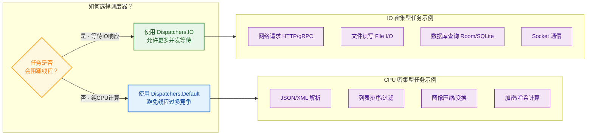

| 维度 | `Dispatchers.Default` | `Dispatchers.IO` |
|---|---|---|
| 适用任务 | CPU 密集型（计算、解析） | IO 密集型（网络、文件、DB） |
| 线程数上限 | CPU 核心数 | max(64, 核心数) |
| 线程是否阻塞 | 几乎不阻塞 | 大量阻塞等待 |
| 过多线程的代价 | 上下文切换开销大 | 可接受（线程在等待中） |
| 共享线程池 | ✅ 是 | ✅ 是（同一个 CoroutineScheduler） |

一个简单的记忆法：**线程会"卡住等着"就用 IO，线程会"一直算"就用 Default**。

#### limitedParallelism 在 Default 上的不同行为

值得注意的是，`Dispatchers.Default.limitedParallelism(n)` 和 `Dispatchers.IO.limitedParallelism(n)` 的行为有所不同：

```kotlin
// IO 上的 limitedParallelism：创建独立的子调度器
// 其并行度不受 IO 的 64 限制，是额外分配的
val ioChild = Dispatchers.IO.limitedParallelism(100) // 可以超过 64！

// Default 上的 limitedParallelism：在 Default 的线程池内部限制
// 不会创建额外线程，只是限制同时执行的协程数
val defaultChild = Dispatchers.Default.limitedParallelism(2)
// 即使 CPU 有 8 核，这个子调度器最多同时用 2 个线程
```

---

### Dispatchers.Unconfined（不切换线程）

`Dispatchers.Unconfined` 是四种调度器中最"特殊"的一个——它**不指定任何线程**。协程会在**当前调用者的线程**上直接开始执行，遇到第一个挂起点后，恢复时在**哪个线程恢复就在哪个线程继续执行**。

#### 行为分析

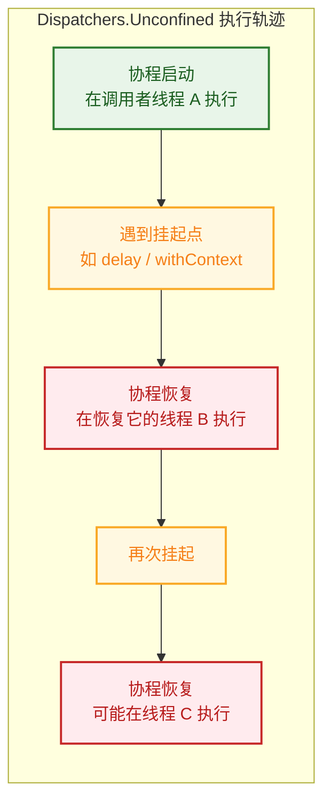

用代码来验证这一行为：

```kotlin
fun main() = runBlocking {
    // 在 runBlocking 的线程（main）上启动 Unconfined 协程
    launch(Dispatchers.Unconfined) {
        // ① 启动时：在调用者线程执行
        println("Start: ${Thread.currentThread().name}")
        // 输出: Start: main

        // ② 挂起点：delay 内部由 DefaultExecutor 线程恢复
        delay(100)

        // ③ 恢复后：在恢复协程的那个线程继续执行
        println("After delay: ${Thread.currentThread().name}")
        // 输出: After delay: kotlinx.coroutines.DefaultExecutor
        // ⚠️ 线程变了！不再是 main

        // ④ 再遇到 withContext 切换
        withContext(Dispatchers.IO) {
            println("In IO: ${Thread.currentThread().name}")
        }

        // ⑤ withContext 结束后，仍然不切回——留在 IO 的线程上
        println("After IO: ${Thread.currentThread().name}")
        // 输出: After IO: DefaultDispatcher-worker-1
        // ⚠️ 还是 IO 的线程，Unconfined 不会切回任何固定线程
    }
}
```

#### 为什么 Unconfined 很危险？

从上面的例子可以看出，使用 `Unconfined` 后协程可能在**任何线程**上运行，这会导致：

1. **线程安全问题**：你无法预测代码运行在哪个线程，如果涉及 UI 操作可能崩溃。
2. **难以调试**：每次挂起恢复后线程都可能变化，排查问题困难。
3. **违反结构化并发的可预测性原则**。

#### 合理使用场景

尽管 `Unconfined` 危险，但它在特定场景下仍有价值：

```kotlin
// ✅ 场景一：单元测试中，不关心线程调度，只关心逻辑正确性
@Test
fun testCalculation() = runBlocking(Dispatchers.Unconfined) {
    // 所有协程都在当前测试线程执行，无需额外调度
    val result = calculateAsync()  // 立即执行，不切线程
    assertEquals(42, result)
}

// ✅ 场景二：纯内存计算的协程，不涉及线程安全问题
//    且对性能要求极高，要避免任何调度开销
fun processEvent(event: Event) {
    scope.launch(Dispatchers.Unconfined) {
        // 不需要切线程，在事件触发的线程上直接处理
        eventBus.emit(event)  // 假设 emit 是挂起但不切线程的
    }
}
```

> **⚠️ 官方文档明确建议**：`Dispatchers.Unconfined` 不应在一般代码中使用（should not be normally used in code）。除非你非常清楚自己在做什么，否则请远离它。

#### 四种调度器终极对比

| 调度器 | 线程 | 线程数 | 适用场景 | 危险度 |
|---|---|---|---|---|
| `Main` | 主线程 | 1 | UI 更新、轻量操作 | 低 |
| `IO` | 共享线程池 | max(64, 核心数) | 网络、文件、数据库 | 低 |
| `Default` | 共享线程池 | CPU 核心数 | 排序、解析、计算 | 低 |
| `Unconfined` | 不固定 | — | 测试、性能极端优化 | ⚠️ 高 |

---

**📝 练习题**

以下代码的输出中，`Thread B` 最可能是什么？

```kotlin
fun main() = runBlocking {
    launch(Dispatchers.Unconfined) {
        println("Thread A: ${Thread.currentThread().name}")
        withContext(Dispatchers.Default) {
            println("Thread B: ${Thread.currentThread().name}")
        }
        println("Thread C: ${Thread.currentThread().name}")
    }
}
```

A. `main`

B. `DefaultDispatcher-worker-N`（Default 线程池中的工作线程）

C. `kotlinx.coroutines.DefaultExecutor`

D. 无法编译，`Unconfined` 不能与 `withContext` 配合使用


**【答案】** B

**【解析】** `withContext(Dispatchers.Default)` 会将协程的执行切换到 `Dispatchers.Default` 的线程池中，因此 `Thread B` 一定是 `DefaultDispatcher-worker-N` 格式的工作线程名。`withContext` 与任何调度器都可以配合使用，包括在 `Unconfined` 协程内部，所以 D 错误。而 `Thread A` 是 `main`（`Unconfined` 在调用者线程启动），`Thread C` 则最可能是 `DefaultDispatcher-worker-N`——因为 `Unconfined` 不会主动切回任何线程，`withContext` 结束后协程就留在了 `Default` 线程池的某个 worker 上继续执行。这道题也间接验证了 `Unconfined` 的"不可预测性"——`Thread C` 并非 `main`，而是取决于前一个挂起点恢复时所在的线程。

---

## 调度原理 ⭐⭐

在前面的章节中，我们已经了解了四大调度器（`Dispatchers.Main`、`Dispatchers.IO`、`Dispatchers.Default`、`Dispatchers.Unconfined`）各自的适用场景。但一个根本性的问题始终悬而未决：**协程到底是怎么被"扔"到某个线程上去执行的？** 这背后的核心引擎就是 `CoroutineDispatcher` 的 `dispatch` 机制。理解这一层，你才算真正看透了协程调度的本质——它并非黑魔法，而是一套精心设计的、基于 **Continuation + Runnable + 线程池** 的协作模型。

### CoroutineDispatcher.dispatch

#### 1. CoroutineDispatcher 在继承体系中的位置

`CoroutineDispatcher` 本身是 `CoroutineContext.Element` 的子类，同时也是 `ContinuationInterceptor` 的子类。这意味着调度器既是协程上下文的一个元素（可以用 `context[ContinuationInterceptor]` 取出），又承担了 **拦截 Continuation（续体）** 的核心职责。

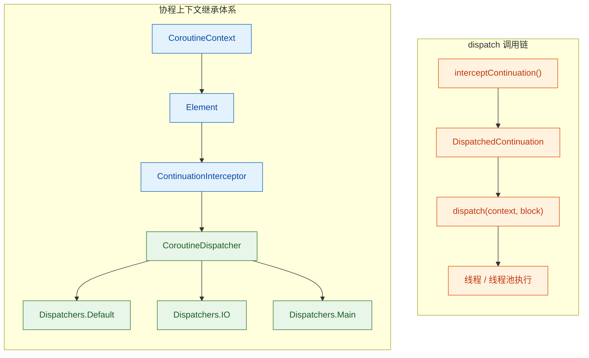

从图中可以清晰地看到：

- **左侧**是类继承链：`CoroutineContext` → `Element` → `ContinuationInterceptor` → `CoroutineDispatcher` → 具体调度器实现。
- **右侧**是运行时调用链：当协程恢复执行时，`interceptContinuation()` 将原始续体包装为 `DispatchedContinuation`，再调用 `dispatch(context, block)` 将任务提交到目标线程。

#### 2. 源码级解读：dispatch 方法签名

`CoroutineDispatcher` 是一个抽象类，其最核心的方法就是 `dispatch`：

```kotlin
// CoroutineDispatcher 抽象类（简化版源码）
public abstract class CoroutineDispatcher : 
    AbstractCoroutineContextElement(ContinuationInterceptor), // 以 ContinuationInterceptor 为 Key 注册到上下文
    ContinuationInterceptor {                                  // 实现续体拦截接口

    // ========== 核心方法：dispatch ==========
    // context: 当前协程的上下文（包含 Job、调度器等所有 Element）
    // block:   被封装成 Runnable 的协程续体代码
    public abstract fun dispatch(
        context: CoroutineContext, 
        block: Runnable
    )
    // 子类（如 Dispatchers.Default）必须实现此方法，
    // 将 block 投递到自己管理的线程或线程池中

    // ========== 可选方法：isDispatchNeeded ==========
    // 返回 true 表示需要调度（默认值）
    // 返回 false 表示直接在当前线程恢复，无需切换
    public open fun isDispatchNeeded(
        context: CoroutineContext
    ): Boolean = true
    // Dispatchers.Unconfined 重写此方法返回 false

    // ========== 拦截续体 ==========
    // 这是 ContinuationInterceptor 接口的方法
    // 将原始 Continuation 包装为 DispatchedContinuation
    public final override fun <T> interceptContinuation(
        continuation: Continuation<T>
    ): Continuation<T> =
        DispatchedContinuation(this, continuation)
        // this = 当前调度器实例
        // continuation = 原始续体（编译器生成的状态机）
}
```

几个关键要点：

- **`dispatch(context, block)`** 是唯一的 abstract 方法，每个具体调度器都必须实现它。它的职责非常单一：**把 `block`（一个 Runnable）提交到某个执行环境中**。
- **`isDispatchNeeded(context)`** 是一个"门卫"方法（guard method）。在每次续体恢复之前，协程框架会先问调度器："你需要调度吗？"。只有返回 `true` 时才会真正调用 `dispatch`。`Dispatchers.Unconfined` 正是通过返回 `false` 来实现"不切线程"的行为。
- **`interceptContinuation`** 被声明为 `final`，不可重写。它把原始续体（compiler-generated state machine）包装为 `DispatchedContinuation`，而 `DispatchedContinuation` 本身实现了 `Runnable` 接口——这就是 `block` 参数的真面目。

#### 3. DispatchedContinuation：连接续体与调度器的桥梁

`DispatchedContinuation` 是整个调度机制中最关键的"胶水类"。它同时实现了 `Continuation<T>` 和 `Runnable` 两个接口，将协程的 **挂起恢复语义** 与 Java 的 **线程执行模型** 无缝对接。

```kotlin
// DispatchedContinuation 核心结构（简化）
internal class DispatchedContinuation<T>(
    val dispatcher: CoroutineDispatcher,   // 持有调度器引用
    val continuation: Continuation<T>      // 持有原始续体引用
) : Continuation<T>, Runnable {            // 同时是 Continuation 又是 Runnable

    // ========== Continuation 接口实现 ==========
    override val context: CoroutineContext
        get() = continuation.context       // 上下文委托给原始续体

    // 当协程从挂起点恢复时，此方法被调用
    override fun resumeWith(result: Result<T>) {
        val ctx = continuation.context     // 获取上下文
        val needDispatch =
            dispatcher.isDispatchNeeded(ctx) // 询问调度器是否需要调度
        if (needDispatch) {
            // 需要调度 → 暂存 result，将自身作为 Runnable 投递
            _state = result                // 保存恢复结果到字段
            dispatcher.dispatch(ctx, this) // ★ 核心：调用 dispatch
        } else {
            // 不需要调度 → 直接在当前线程恢复
            continuation.resumeWith(result)
        }
    }

    // ========== Runnable 接口实现 ==========
    // 当 dispatch 将 this 提交到线程池后，线程池最终会调用 run()
    override fun run() {
        val result = _state as Result<T>   // 取出之前暂存的结果
        continuation.resumeWith(result)    // 在目标线程上恢复原始续体
    }
}
```

这段代码揭示了一个精妙的设计：

1. 外部调用 `resumeWith(result)` → 这是协程框架在某个挂起函数完成后的标准回调。
2. 内部先问 `isDispatchNeeded` → 如果需要线程切换，就把 result 暂存，然后把 **自己（this，一个 Runnable）** 扔给调度器。
3. 调度器的 `dispatch` 方法把这个 Runnable 提交到目标线程池。
4. 目标线程从线程池队列中取出这个 Runnable，调用 `run()`。
5. `run()` 内部取出暂存的 result，调用原始续体的 `resumeWith` → 状态机继续执行。

**整个过程没有任何阻塞**，这就是协程"轻量级"的根本原因——它只是在不同线程之间传递 Runnable 对象而已。

#### 4. 完整调度时序

下面用时序图展示一次典型的协程挂起→恢复→调度的全过程：

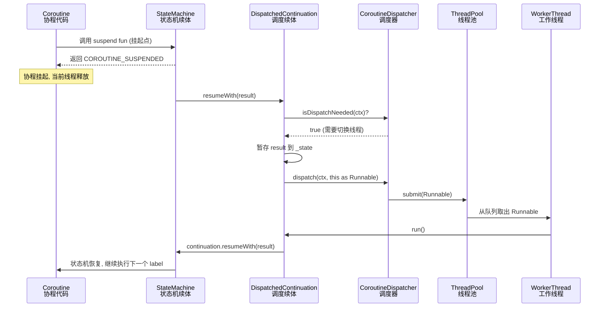

从这张时序图中可以提炼出调度的**三个阶段**：

| 阶段 | 动作 | 所在线程 |
|:---|:---|:---|
| **挂起阶段** | suspend fun 返回 `COROUTINE_SUSPENDED`，当前线程被释放 | 原线程 |
| **调度阶段** | `dispatch(ctx, runnable)` 将任务投递到目标线程池的任务队列 | 原线程（仅投递，不阻塞） |
| **恢复阶段** | 工作线程从队列取出 Runnable 并执行 `run()` → `resumeWith` | 目标线程 |

---

### 将 Runnable 提交到对应线程/线程池

理解了 `dispatch` 的抽象机制后，接下来看各个具体调度器是**如何实现** `dispatch` 方法的——也就是它们各自把 Runnable "扔"到了哪里。

#### 1. Dispatchers.Default 的实现

`Dispatchers.Default` 底层使用的是 `kotlinx.coroutines` 内部实现的 `CoroutineScheduler`——一个专门为协程优化的、基于 **work-stealing（工作窃取）** 算法的线程池。

```kotlin
// DefaultScheduler 简化源码
internal object DefaultScheduler : CoroutineDispatcher() {

    // 核心线程池实例
    private val coroutineScheduler = CoroutineScheduler(
        corePoolSize = CORE_POOL_SIZE,         // 默认 = CPU 核心数
        maxPoolSize = MAX_POOL_SIZE,           // 默认 = CPU 核心数（Default 模式下）
        schedulerName = "DefaultDispatcher"    // 线程名前缀
    )

    // ★ dispatch 实现：将 Runnable 提交到 CoroutineScheduler
    override fun dispatch(
        context: CoroutineContext, 
        block: Runnable
    ) {
        coroutineScheduler.dispatch(block, taskContext = TaskContext.NON_BLOCKING)
        // taskContext = NON_BLOCKING 表示这是 CPU 密集型任务
        // CoroutineScheduler 会将其放入本地队列，
        // 其他空闲线程可通过 work-stealing 窃取执行
    }
}
```

`CoroutineScheduler` 的内部结构如下所示：

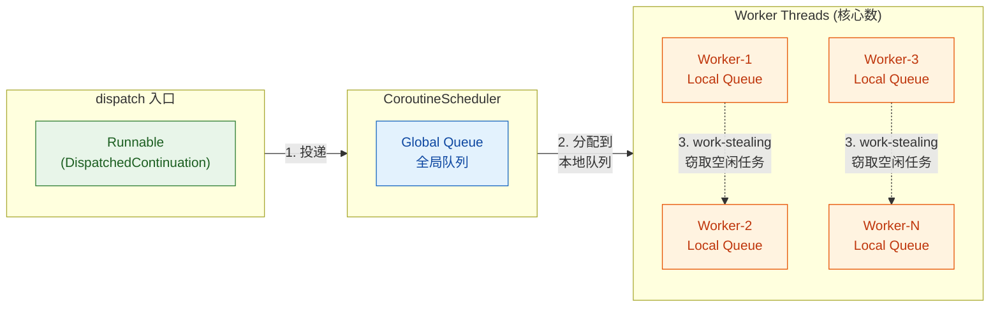

**Work-Stealing 的优势**：当某个 Worker 线程的本地队列空了，它不会闲着，而是去其他 Worker 的队列"偷"任务来执行。这种设计极大地提高了 CPU 利用率，避免了传统线程池中某些线程忙死、某些线程闲死的问题。

#### 2. Dispatchers.IO 的实现

`Dispatchers.IO` 与 `Dispatchers.Default` **共享同一个 `CoroutineScheduler` 实例**，但使用不同的 `taskContext` 标记：

```kotlin
// IO 调度器简化源码
internal object IOScheduler : CoroutineDispatcher() {

    // ★ dispatch 实现：同一个 scheduler，不同的 taskContext
    override fun dispatch(
        context: CoroutineContext, 
        block: Runnable
    ) {
        // 复用 DefaultScheduler 的 coroutineScheduler 实例
        DefaultScheduler.coroutineScheduler.dispatch(
            block, 
            taskContext = TaskContext.PROBABLY_BLOCKING  
            // PROBABLY_BLOCKING 标记：告诉调度器这是 IO/阻塞型任务
            // 调度器发现阻塞任务多时，会创建额外线程（最多 64 个或 CPU 核心数，取较大值）
        )
    }
}
```

**Default 与 IO 共享线程池**这个设计非常精妙，它带来了两个关键优势：

- **减少线程切换开销**：当你用 `withContext(Dispatchers.IO)` 从 Default 切到 IO 时，底层可能根本不需要切换线程，因为是同一个线程池里的同一个线程。
- **弹性伸缩**：IO 任务被标记为 `PROBABLY_BLOCKING`，调度器检测到阻塞任务积压时会创建新线程（最多可达 64 个），而 Default 模式下线程数始终等于 CPU 核心数。

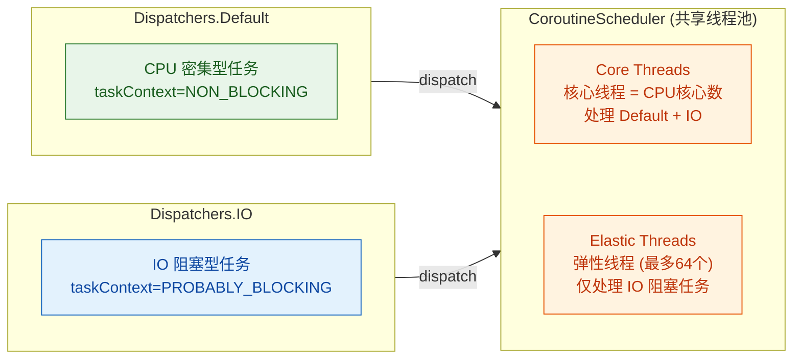

#### 3. Dispatchers.Main 的实现

`Dispatchers.Main` 的实现因平台而异。在 Android 平台上，它将 Runnable 投递到主线程的 `Handler`（基于 `Looper.getMainLooper()`）：

```kotlin
// Android 平台上的 Main 调度器（简化）
internal class HandlerDispatcher(
    private val handler: Handler  // 持有主线程 Handler 引用
) : CoroutineDispatcher() {

    // ★ dispatch 实现：通过 Handler.post 投递到主线程消息队列
    override fun dispatch(
        context: CoroutineContext, 
        block: Runnable
    ) {
        handler.post(block)
        // 等价于：handler.sendMessage(Message.obtain(handler, block))
        // block 被封装为 Message，放入主线程 Looper 的 MessageQueue
        // 主线程的 Looper.loop() 会取出 Message 并执行 block.run()
    }
}
```

这就是为什么在协程中使用 `Dispatchers.Main` 能更新 UI 的原因——底层就是经典的 `Handler.post()`，和你手动写 `runOnUiThread {}` 是同一条路径。

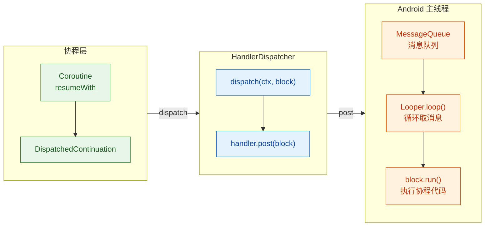

#### 4. Dispatchers.Unconfined 的"反模式"

`Dispatchers.Unconfined` 是唯一一个 `isDispatchNeeded` 返回 `false` 的调度器：

```kotlin
// Unconfined 调度器核心（简化）
internal object Unconfined : CoroutineDispatcher() {

    // ★ 关键：告诉框架"我不需要调度"
    override fun isDispatchNeeded(
        context: CoroutineContext
    ): Boolean = false
    // 返回 false → DispatchedContinuation.resumeWith 
    // 不会调用 dispatch，直接在当前线程执行 continuation.resumeWith

    // dispatch 方法仍需实现（用于 yield 等特殊场景）
    override fun dispatch(
        context: CoroutineContext, 
        block: Runnable
    ) {
        // yield() 时会调用到这里
        // 使用内部的事件循环来排队执行
        val eventLoop = ThreadLocalEventLoop.currentOrNull()
        eventLoop?.dispatch(block) ?: block.run()
    }
}
```

这意味着 Unconfined 协程在第一个挂起点之前运行在启动它的线程上，恢复后运行在**恢复它的那个线程**上（即哪个线程调用了 `resumeWith`，就在哪个线程继续）。这就是它"不受限"名称的由来——线程归属完全不可预测。

#### 5. 自定义调度器：把协程调度到任意地方

理解了 `dispatch` 的本质后，我们甚至可以轻松自定义调度器。例如创建一个单线程调度器：

```kotlin
// 基于 Java Executor 创建自定义单线程调度器
val singleThreadDispatcher: CoroutineDispatcher = 
    Executors.newSingleThreadExecutor { runnable ->
        // 自定义线程工厂，设置线程名便于调试
        Thread(runnable, "MyCustomThread").apply {
            isDaemon = true  // 设为守护线程，不阻止 JVM 退出
        }
    }.asCoroutineDispatcher()    // ★ 将 ExecutorService 转为 CoroutineDispatcher
// asCoroutineDispatcher() 扩展函数内部实现了 dispatch 方法：
// override fun dispatch(context, block) = executor.execute(block)

fun main() = runBlocking {
    // 在自定义调度器上启动协程
    launch(singleThreadDispatcher) {
        // 打印当前线程名 → "MyCustomThread"
        println("Running on: ${Thread.currentThread().name}")
    }

    // 用完后记得关闭，释放线程资源
    singleThreadDispatcher.close()
}
```

`asCoroutineDispatcher()` 是 `kotlinx.coroutines` 提供的扩展函数，它在内部创建了一个 `ExecutorCoroutineDispatcher`，其 `dispatch` 实现就是简单的 `executor.execute(block)`——将 Runnable 提交给 Java 的 `Executor`。这再次证明了协程调度的本质：**dispatch 就是 execute，协程续体就是 Runnable**。

#### 6. 全景总结：四大调度器的 dispatch 实现对比

| 调度器 | `isDispatchNeeded` | `dispatch` 目标 | 底层机制 | 线程数量 |
|:---|:---:|:---|:---|:---|
| `Dispatchers.Default` | `true` | `CoroutineScheduler` | Work-Stealing 线程池 | CPU 核心数 |
| `Dispatchers.IO` | `true` | `CoroutineScheduler`（共享） | 同上，但标记为 BLOCKING | 最多 max(64, CPU核心数) |
| `Dispatchers.Main` | `true` | `Handler (Android)` | `handler.post()` → MessageQueue | 1（主线程） |
| `Dispatchers.Unconfined` | `false` | 当前线程（不切换） | 直接调用 `resumeWith` | 不固定 |

用一句话总结调度原理的核心思想：

> **协程的调度 = 将续体（Continuation）包装成 Runnable，通过调度器（Dispatcher）的 `dispatch` 方法投递到目标线程的执行队列中。** 线程从队列取出 Runnable 并执行 `run()`，`run()` 内部恢复续体的状态机——这就是协程跨线程执行的全部秘密。

---

**📝 练习题**

以下关于 Kotlin 协程调度原理的描述，**正确**的是？

A. `Dispatchers.IO` 和 `Dispatchers.Default` 各自维护独立的线程池实例，彼此完全隔离


B. `Dispatchers.Unconfined` 的 `isDispatchNeeded()` 返回 `true`，但 `dispatch()` 内部什么都不做


C. `DispatchedContinuation` 同时实现了 `Continuation` 和 `Runnable` 接口，dispatch 方法接收的 `block` 参数实际上就是 `DispatchedContinuation` 自身


D. `Dispatchers.Main` 在 Android 上底层使用 `CoroutineScheduler` 的 work-stealing 算法来保证 UI 操作在主线程执行


**【答案】** C

**【解析】** 

- **A 错误**：`Dispatchers.IO` 和 `Dispatchers.Default` **共享同一个 `CoroutineScheduler` 实例**，只是通过不同的 `taskContext`（`NON_BLOCKING` vs `PROBABLY_BLOCKING`）来区分任务类型。这种共享设计减少了线程切换开销并支持弹性伸缩。

- **B 错误**：`Dispatchers.Unconfined` 的 `isDispatchNeeded()` 返回的是 **`false`**（而非 `true`），这意味着 `DispatchedContinuation.resumeWith` 会跳过 `dispatch` 调用，直接在当前线程恢复续体。`dispatch()` 方法仅在 `yield()` 等特殊场景下才被调用。

- **C 正确**：`DispatchedContinuation` 的设计核心就是"双重身份"——它既是 `Continuation<T>`（可以被 `resumeWith` 恢复），又是 `Runnable`（可以被线程池执行）。当调度器调用 `dispatch(context, block)` 时，这个 `block` 就是 `DispatchedContinuation` 实例本身（以 `this` 传入）。线程池执行 `block.run()` 时，内部会调用原始续体的 `resumeWith`，从而完成跨线程的协程恢复。

- **D 错误**：`Dispatchers.Main` 在 Android 上底层使用的是 **`Handler.post()`** 机制，将 Runnable 投递到主线程的 `MessageQueue`，由 `Looper.loop()` 取出执行。它与 `CoroutineScheduler` 和 work-stealing 算法无关。

---

## withContext ⭐⭐

`withContext` 是 Kotlin 协程中**最常用、最核心的上下文切换函数**之一。它的职责非常明确——将一段代码块"搬"到另一个 `CoroutineContext`（通常是另一个 Dispatcher）上去执行，执行完成后再自动切回原来的上下文。这种"去-回"的机制，让我们可以在一个协程内部，像写同步代码一样自由地在不同线程之间穿梭，而无需手动管理线程切换和回调。

先来看它的函数签名：

```kotlin
// withContext 是一个顶层挂起函数
// 泛型 T 表示代码块的返回值类型
public suspend fun <T> withContext(
    context: CoroutineContext,        // 要切换到的新上下文
    block: suspend CoroutineScope.() -> T // 在新上下文中执行的挂起代码块
): T                                  // 返回代码块的执行结果
```

它有两个关键特征值得我们首先明确：

1. **它是一个 `suspend` 函数**——只能在协程或另一个挂起函数中调用。
2. **它会返回代码块的结果**——这意味着你可以像普通函数调用那样拿到返回值，不需要回调。

---

### 切换上下文

`withContext` 最直观的作用就是**临时切换协程的执行上下文**。所谓"上下文切换"（Context Switching），并不是操作系统层面的线程上下文切换（Thread Context Switch），而是协程框架在逻辑层面将后续代码的执行环境从当前 Dispatcher 切换到目标 Dispatcher。

#### 为什么需要切换上下文？

在 Android 或桌面应用开发中，一个非常经典的场景是：**UI 线程发起网络请求，拿到数据后更新界面**。传统方式需要回调嵌套，而 `withContext` 让这一切变得扁平化：

```kotlin
// 假设这段代码运行在 Dispatchers.Main（主线程）
fun ViewModel.loadUserProfile(userId: String) {
    viewModelScope.launch {                         // 默认在 Dispatchers.Main 启动协程
        showLoading()                                // ① 主线程：显示加载动画

        // ② 切换到 IO 线程池执行网络请求
        val user = withContext(Dispatchers.IO) {
            apiService.fetchUser(userId)             // 在 IO 线程池中执行（阻塞式 IO 安全）
        }
        // ③ withContext 执行完毕后，自动回到 Dispatchers.Main
        
        // ④ 主线程：更新 UI
        displayUser(user)                            // 拿到 user 对象，直接更新界面
        hideLoading()                                // 隐藏加载动画
    }
}
```

注意这段代码的"视觉结构"——它完全是**顺序的、线性的**，没有任何回调。但在运行时，它却跨越了两个线程环境。这就是 `withContext` 的魅力。

#### 上下文合并规则

当你调用 `withContext(newContext)` 时，框架并不是简单地"替换"整个上下文，而是执行一次 **`plus` 操作符合并**：

```kotlin
// 伪代码展示合并逻辑
val mergedContext = currentCoroutineContext + newContext
```

这意味着如果你只传入了一个 `Dispatcher`，那么原上下文中的其他 Element（如 `Job`、`CoroutineName`、`CoroutineExceptionHandler`）会被**保留**，只有 Dispatcher 部分被覆盖：

```kotlin
launch(Dispatchers.Main + CoroutineName("ProfileLoader")) {
    // 当前上下文：Dispatcher=Main, Name=ProfileLoader, Job=parent's child

    withContext(Dispatchers.IO) {
        // 合并后的上下文：
        //   Dispatcher = IO        ← 被新传入的 Dispatcher 覆盖
        //   Name = ProfileLoader   ← 保留（newContext 中没有 Name 元素）
        //   Job = 新的子 Job       ← withContext 内部创建的（稍后详解）
        println(coroutineContext[CoroutineName])  // 输出: CoroutineName(ProfileLoader)
    }
}
```

下面用一张图来直观展示合并过程：

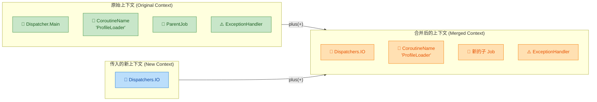

> **关键原则**：`withContext` 的上下文合并遵循 `CoroutineContext` 的 `plus` 语义——**相同 Key 的 Element 会被覆盖，不同 Key 的 Element 会被保留**。

#### 同 Dispatcher 的优化

一个值得注意的细节：如果 `withContext` 传入的 Dispatcher 与当前协程的 Dispatcher 相同，框架**不会真正进行线程切换**。它足够智能，会检测到"目标和当前一样"，从而跳过 `dispatch` 调用，直接在当前线程内执行代码块。这是一种重要的性能优化：

```kotlin
launch(Dispatchers.Default) {
    // 当前已在 Default 调度器上

    withContext(Dispatchers.Default) {
        // 框架检测到 Dispatcher 相同，不会触发线程切换
        // 直接在当前线程执行，避免不必要的调度开销
        heavyComputation()
    }
}
```

这种优化在源码中体现为 `DispatchedCoroutine` 的 `needsDispatch` 检查。即便不切换线程，`withContext` 仍然会创建一个新的子 `Job`，保证结构化并发（Structured Concurrency）的语义不被打破。

---

### 挂起当前协程

`withContext` 的第二个核心行为是**挂起（suspend）调用者协程**。这里的"挂起"含义非常精确——当前协程的执行在 `withContext` 调用点暂停，让出执行权，直到 `withContext` 内部的代码块在目标上下文中执行完毕。

#### 挂起 ≠ 阻塞

这是理解 `withContext` 的核心中的核心：

| 特性 | `withContext`（挂起） | `Thread.sleep` / 阻塞调用 |
|---|---|---|
| **线程占用** | 释放当前线程，线程可去做其他事 | 占住当前线程，线程空转等待 |
| **资源消耗** | 极低，仅保存协程状态（continuation） | 高，一个线程被白白占用 |
| **可扩展性** | 上千个协程可共享少量线程 | 每个阻塞任务占据一个线程 |
| **恢复方式** | 由协程调度器在合适时机恢复 | 等待时间到期或锁释放 |

用一个生活比喻来理解：**挂起就像你在餐厅点完菜后去逛街，等菜好了收到通知再回来**；阻塞则是你坐在桌前一动不动地等。

#### 挂起与恢复的完整时序

让我们用时序图来展示一个 `withContext` 调用的完整生命周期：

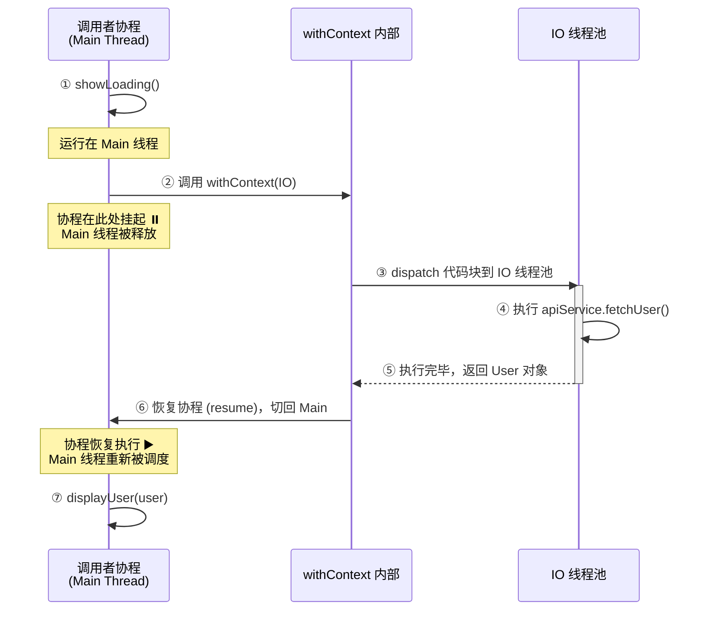

这个过程可以拆解为六个关键步骤：

1. **挂起点标记**：编译器在 `withContext` 调用处插入状态机切换点（state machine label）。
2. **保存 Continuation**：当前协程的执行状态（局部变量、执行位置等）被打包成一个 `Continuation` 对象。
3. **Dispatch 到目标线程**：通过目标 Dispatcher 的 `dispatch()` 方法，将代码块提交到目标线程/线程池。
4. **释放原线程**：原线程（如 Main Thread）被释放，可以去处理其他任务（如 UI 事件、其他协程）。
5. **目标线程执行**：代码块在目标线程中运行完成。
6. **恢复到原 Dispatcher**：框架调用 `continuation.resumeWith(result)`，通过原 Dispatcher 将协程恢复到原来的线程上继续执行。

#### 用代码验证挂起行为

```kotlin
fun main() = runBlocking {
    // runBlocking 创建一个绑定到当前线程的协程
    println("A - 线程: ${Thread.currentThread().name}")   // 主线程

    val result = withContext(Dispatchers.IO) {
        println("B - 线程: ${Thread.currentThread().name}") // IO 线程
        delay(1000)                                         // 模拟耗时操作（非阻塞）
        println("C - 线程: ${Thread.currentThread().name}") // IO 线程
        42                                                  // 返回值
    }
    // withContext 结束后，协程自动恢复到原来的上下文

    println("D - 线程: ${Thread.currentThread().name}")     // 回到主线程
    println("结果: $result")                                 // 输出: 结果: 42
}
```

**输出结果**（线程名可能略有不同）：
```text
A - 线程: main
B - 线程: DefaultDispatcher-worker-1
C - 线程: DefaultDispatcher-worker-1
D - 线程: main
结果: 42
```

从输出可以清楚看到：`A → D` 在同一线程（main），`B → C` 在 IO 工作线程。`withContext` 在 B 处接管了执行权，D 处归还了执行权。

#### withContext 内部的 Job 结构

`withContext` 在内部会创建一个 `UndispatchedCoroutine`（或 `DispatchedCoroutine`），它是当前协程 Job 的一个**子 Job**。这保证了结构化并发的几个核心语义：

- **取消传播**：如果父协程被取消，`withContext` 内部的代码也会被取消。
- **异常传播**：如果 `withContext` 内部抛出异常，异常会直接向上抛出给调用者（而不是像 `launch` 那样传播给父 Job 的 `CoroutineExceptionHandler`）。

```kotlin
launch {
    try {
        val data = withContext(Dispatchers.IO) {
            // 如果这里抛出异常...
            throw IOException("网络异常")
        }
    } catch (e: IOException) {
        // ...异常会直接在这里被 catch 到！
        // 这与 launch 的异常传播行为完全不同
        println("捕获异常: ${e.message}")
    }
}
```

> **对比 `launch`**：`launch` 中未捕获的异常会传播给父 Job，最终触发 `CoroutineExceptionHandler`；而 `withContext` 的异常行为更像普通的 `try-catch` 函数调用，异常直接抛给调用者。这是因为 `withContext` 本质上是一个 **`suspend` 函数**，而非协程构建器（coroutine builder）。

---

### 在指定调度器执行

`withContext` 的第三个核心能力是确保代码块在**指定的调度器**上执行。这看似简单，但理解其背后的机制和最佳实践，对于写出高性能、线程安全的协程代码至关重要。

#### 典型的调度器切换模式

在实际项目中，`withContext` 最常见的使用模式是在不同 Dispatcher 之间来回切换：

```kotlin
// ViewModel 中的典型用法
class UserViewModel(
    private val userRepo: UserRepository  // 仓库层
) : ViewModel() {

    fun loadAndProcess(userId: String) {
        viewModelScope.launch {  // ① 在 Main 启动
            
            // ② 切到 IO：执行网络/数据库操作
            val rawData = withContext(Dispatchers.IO) {
                userRepo.fetchFromNetwork(userId)      // 网络请求
            }

            // ③ 切到 Default：执行 CPU 密集型数据处理
            val processedData = withContext(Dispatchers.Default) {
                rawData.items
                    .filter { it.isValid }              // 过滤无效数据
                    .sortedByDescending { it.priority } // 按优先级排序
                    .map { it.toUiModel() }             // 转换为 UI 模型
            }

            // ④ 自动回到 Main：更新 UI
            _uiState.value = UiState.Success(processedData)
        }
    }
}
```

这里的 `withContext` 扮演了"交通指挥官"的角色，精确地将不同类型的工作分配到最合适的线程池上。

#### 调度器选择指南

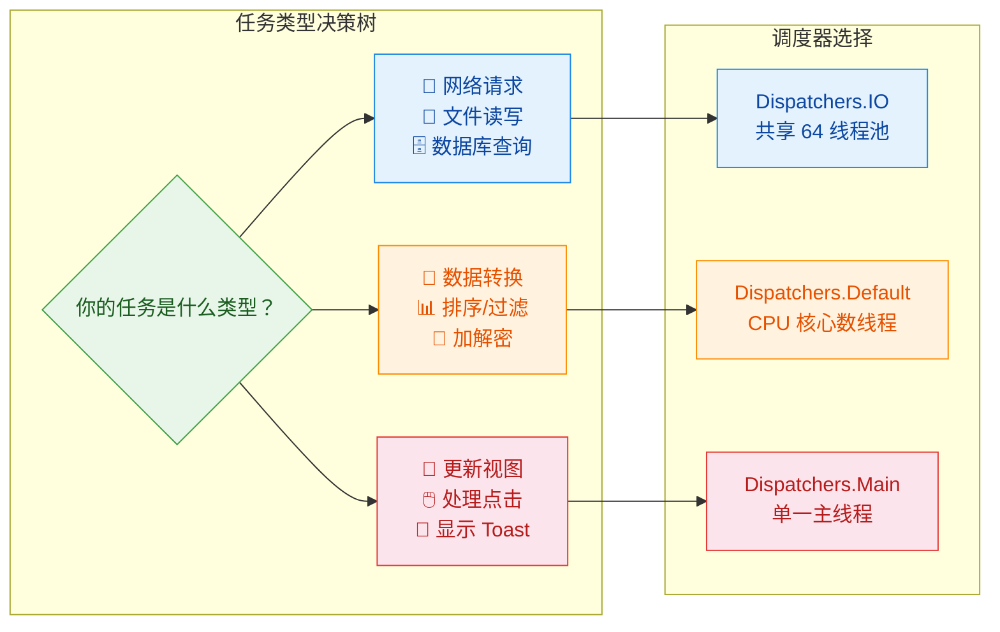

#### withContext vs async/await

初学者常常困惑：`withContext` 和 `async { ... }.await()` 看起来效果类似，它们有什么区别？

```kotlin
// 方式一：withContext（推荐用于顺序执行）
val user = withContext(Dispatchers.IO) {
    fetchUser(id)                // 切到 IO 执行，完成后返回结果
}

// 方式二：async + await（功能相同，但有额外开销）
val user = async(Dispatchers.IO) {
    fetchUser(id)                // 启动一个新协程
}.await()                        // 立即等待结果
```

虽然两者的最终效果一样——都是在 IO 线程执行并拿到结果——但**内部机制和开销差异明显**：

| 维度 | `withContext` | `async { }.await()` |
|---|---|---|
| **创建新协程** | ❌ 不创建新协程（只是切换上下文） | ✅ 创建一个新的 `Deferred` 协程 |
| **内存开销** | 较低 | 较高（额外的 Job + Deferred 对象） |
| **异常处理** | 异常直接抛出给调用者 | 异常可能传播到父 Job |
| **适用场景** | 顺序切换上下文 | 并发启动多个任务后聚合结果 |
| **语义清晰度** | 明确表达"切换上下文"意图 | 表达"并发任务"意图 |

**结论**：当你只需要顺序地切换上下文执行单个任务时，**永远优先使用 `withContext`**。`async` 的真正价值在于并发场景：

```kotlin
// ✅ async 的正确用法：并发执行多个独立任务
coroutineScope {
    val userDeferred = async(Dispatchers.IO) { fetchUser(id) }       // 并发任务 1
    val ordersDeferred = async(Dispatchers.IO) { fetchOrders(id) }   // 并发任务 2

    // 两个请求并行执行，总耗时 = max(任务1, 任务2)
    val user = userDeferred.await()
    val orders = ordersDeferred.await()
    
    display(user, orders)
}
```

#### withContext 的嵌套使用

`withContext` 可以自由嵌套，每一层都会切换到对应的 Dispatcher，退出时恢复到上一层的 Dispatcher：

```kotlin
launch(Dispatchers.Main) {
    println("层 0: ${Thread.currentThread().name}")    // Main

    withContext(Dispatchers.IO) {
        println("层 1: ${Thread.currentThread().name}") // IO worker

        withContext(Dispatchers.Default) {
            println("层 2: ${Thread.currentThread().name}") // Default worker
        }
        // 回到 IO
        println("层 1 恢复: ${Thread.currentThread().name}") // IO worker
    }
    // 回到 Main
    println("层 0 恢复: ${Thread.currentThread().name}")  // Main
}
```

执行流程如同一个"调用栈"：

```text
Main ──→ IO ──→ Default ──→ IO ──→ Main
         ↑                    ↑
      withContext          withContext
       进入 IO              退出 Default
```

每次 `withContext` 退出时，都会通过保存的 `Continuation` 恢复到进入前的 Dispatcher。

#### 线程安全保证

`withContext` 提供了一个非常重要的**隐式保证**：在 `withContext` 代码块内部，你可以安全地访问非线程安全的资源，前提是这些资源只在该 Dispatcher 上被访问。

```kotlin
// 假设我们有一个非线程安全的缓存
val cache = HashMap<String, User>()  // HashMap 不是线程安全的

// ✅ 安全：所有对 cache 的操作都在同一个单线程 Dispatcher 上
val singleThread = newSingleThreadContext("CacheThread")

suspend fun getUser(id: String): User = withContext(singleThread) {
    // 这里的代码保证运行在 "CacheThread" 这个单线程上
    // 因此对 cache 的读写是线程安全的
    cache.getOrPut(id) {
        fetchUserFromDb(id)       // 注意：这个函数也需要是线程安全的
    }
}
```

> ⚠️ **注意**：`Dispatchers.IO` 和 `Dispatchers.Default` 是多线程池，`withContext` 只保证代码块在该池中的某个线程上执行，不保证每次都是同一个线程。因此在这些 Dispatcher 上访问共享可变状态仍需额外的同步手段（如 `Mutex`、`AtomicReference` 等）。

#### withContext 的取消响应

由于 `withContext` 内部的代码运行在一个子 Job 中，它天然支持协程取消（Cancellation）：

```kotlin
val job = launch(Dispatchers.Main) {
    withContext(Dispatchers.IO) {
        repeat(1000) { i ->
            ensureActive()                         // 检查取消状态（最佳实践）
            println("处理第 $i 项...")
            Thread.sleep(100)                       // 模拟耗时操作
        }
    }
}

delay(500)
job.cancel()   // 取消父协程 → withContext 内部的子 Job 也会被取消
```

当父 Job 被取消时，`withContext` 内部会抛出 `CancellationException`，代码块中的挂起点（如 `ensureActive()`、`yield()`、`delay()` 等）会检测到取消状态并停止执行。

#### 实战：封装线程安全的 Repository

最后，让我们看一个实战中如何利用 `withContext` 封装线程安全 Repository 的完整示例：

```kotlin
class UserRepository(
    private val api: UserApi,             // Retrofit 网络接口
    private val dao: UserDao,             // Room 数据库 DAO
    private val ioDispatcher: CoroutineDispatcher = Dispatchers.IO  // 可注入的调度器（便于测试）
) {
    /**
     * 获取用户信息（带缓存策略）
     * 该函数对调用者来说是 main-safe（主线程安全）的，
     * 因为内部的所有阻塞操作都通过 withContext 切换到了 IO。
     */
    suspend fun getUser(userId: String): User {
        return withContext(ioDispatcher) {         // 切到 IO 线程池

            // 1. 先查本地缓存
            val cached = dao.findById(userId)      // 数据库查询（IO 操作）
            if (cached != null && !cached.isStale()) {
                return@withContext cached.toUser()  // 缓存命中，直接返回
            }

            // 2. 缓存未命中或已过期，发起网络请求
            val response = api.fetchUser(userId)    // 网络请求（IO 操作）

            // 3. 将网络数据写入本地缓存
            dao.insertOrUpdate(response.toEntity()) // 数据库写入（IO 操作）

            // 4. 返回最终数据
            response.toUser()                       // 返回转换后的领域模型
        }
    }
}

// 调用方（ViewModel）完全不需要关心线程切换
class UserViewModel(private val repo: UserRepository) : ViewModel() {
    fun load(userId: String) {
        viewModelScope.launch {                     // 在 Main 线程启动
            val user = repo.getUser(userId)          // 直接调用，无需 withContext
            _uiState.value = UiState.Success(user)   // 安全地更新 UI
        }
    }
}
```

这种模式叫做 **"main-safety"（主线程安全）**。Repository 层的每个 `suspend` 函数内部自行负责通过 `withContext` 切换到合适的 Dispatcher，调用方无论在哪个线程调用都是安全的。这是 Google 官方推荐的 Android 协程最佳实践。

---

**📝 练习题**

以下代码的输出顺序是什么？

```kotlin
fun main() = runBlocking(Dispatchers.Main) {
    println("1")
    
    val result = withContext(Dispatchers.IO) {
        println("2")
        delay(100)
        println("3")
        "Hello"
    }
    
    println("4 - $result")
    
    withContext(Dispatchers.Default) {
        println("5")
    }
    
    println("6")
}
```

A. 1, 2, 4, 3, 5, 6

B. 1, 2, 3, 4 - Hello, 5, 6

C. 1, 2, 3, 5, 4 - Hello, 6

D. 1, 4 - Hello, 2, 3, 5, 6


**【答案】** B

**【解析】** `withContext` 是一个挂起函数，它会**顺序执行**——调用者协程在 `withContext` 处挂起，等待代码块完全执行完毕后才恢复。因此：

- 首先打印 `1`（Main 线程）。
- 进入第一个 `withContext(IO)`，协程挂起，切换到 IO 线程打印 `2`。
- `delay(100)` 挂起 100ms 后恢复，打印 `3`，代码块返回 `"Hello"`。
- 协程恢复到 Main 线程，打印 `4 - Hello`。
- 进入第二个 `withContext(Default)`，协程再次挂起，切到 Default 线程打印 `5`。
- 协程恢复到 Main 线程，打印 `6`。

整个过程完全是**串行的**，`withContext` 不会并发执行。它的行为等同于一个"会切换线程的普通函数调用"，这也是与 `launch`/`async` 的关键区别——后两者会启动**并发**协程。

---

## 本章小结

本章围绕 **协程上下文与调度器（Coroutine Context & Dispatchers）** 这一核心主题，从数据结构、调度策略、底层原理到实战切换四个维度进行了系统性拆解。下面我们以"全景回顾 → 核心要点提炼 → 知识关联图 → 实战速查表 → 练习题"的顺序，将整章内容融会贯通。

---

### 全景回顾

协程之所以能做到"用同步的写法写异步的代码"，背后最关键的两块基石就是 **挂起恢复机制（Continuation）** 和 **上下文调度体系（CoroutineContext + Dispatcher）**。本章聚焦后者——它回答了两个根本问题：

1. **协程携带了哪些"元信息"？** —— 由 `CoroutineContext` 这个不可变集合承载，包括调度器、Job、异常处理器、协程名等。
2. **协程的代码块到底在哪个线程上执行？** —— 由 `CoroutineDispatcher`（调度器）决定，它是 `CoroutineContext` 中最具实战意义的一个 `Element`。

整章知识可以划分为 **四层**，由底向上依次为：

| 层级 | 内容 | 关键词 |
|------|------|--------|
| **数据结构层** | `CoroutineContext`、`Element`、`Key`、`plus` 操作符、索引访问 | 不可变集合、Key-Value、组合与覆盖 |
| **调度策略层** | `Dispatchers.Main / IO / Default / Unconfined` | 线程池选型、UI 安全、CPU vs IO |
| **调度原理层** | `CoroutineDispatcher.dispatch()`、`Runnable` 提交、`EventLoop` | 拦截 → 封装 → 投递 |
| **实战 API 层** | `withContext()`、上下文切换、挂起语义 | 线程切换零回调、结构化并发 |

---

### 核心要点提炼

**一、CoroutineContext —— 协程的"背包"**

- 它本质是一个以 `Key` 为索引的 **不可变集合**（类似 `Map<Key<*>, Element>`），但不是用 HashMap 实现，而是通过 **链表 + `plus` 运算符** 组合。
- 每个 `Element`（如 `Job`、`CoroutineDispatcher`、`CoroutineName`）都自带一个伴生对象 `Key`，用于在 Context 中唯一标识自己。
- `plus` 操作符的语义是 **右覆盖左**：当两个 Context 合并时，右侧的同 Key 元素会替换左侧的。
- 通过 `context[Key]` 即可 O(n) 地检索对应元素，这是类型安全的——返回值自动推断为该 Key 对应的 Element 子类型。

**二、Dispatchers —— "协程该去哪个线程"**

| 调度器 | 线程模型 | 适用场景 | 线程数 |
|--------|---------|---------|--------|
| `Dispatchers.Main` | 平台主线程（Android UI 线程） | UI 刷新、轻量操作 | 1 |
| `Dispatchers.IO` | 共享弹性线程池 | 网络请求、文件读写、数据库 | 默认最大 64（可配置） |
| `Dispatchers.Default` | 共享固定线程池 | CPU 密集型计算、排序、解析 | = CPU 核心数 |
| `Dispatchers.Unconfined` | 不指定线程（首次在调用者线程，恢复在恢复者线程） | 测试 / 极少数特殊场景 | N/A |

- `IO` 和 `Default` 底层**共享同一个线程池（`DefaultScheduler`）**，但通过 `LimitingDispatcher` 各自限制最大并发数，因此在两者之间 `withContext` 切换时，往往**不会触发真正的线程切换**，仅仅是修改并发许可（permit）。
- `Unconfined` 在生产环境中应谨慎使用——它不保证线程一致性，可能导致 UI 操作在后台线程恢复。

**三、调度原理 —— 从 `resumeWith` 到线程池**

整个调度流程可以用一句话概括：**Continuation 被拦截 → 封装成 `DispatchedTask`（本质是 Runnable）→ 通过 `dispatch()` 投递到目标线程池的工作队列**。

关键调用链路：

```kotlin
// 伪代码：协程恢复时的调度路径
continuation.resumeWith(result)
  → intercepted().resumeWith(result)           // 1. 拦截器包装
    → DispatchedContinuation.resumeWith(result) // 2. 判断是否需要 dispatch
      → dispatcher.dispatch(context, block)     // 3. 提交 Runnable
        → executor.execute(block)               // 4. 线程池执行
```

- `isDispatchNeeded()` 是一个优化钩子：`Unconfined` 返回 `false`，直接在当前线程恢复；其余调度器返回 `true`，走完整投递流程。
- 这个设计将"协程的挂起/恢复"与"线程调度"完美解耦——协程本身不知道自己在哪个线程，一切由 Dispatcher 决定。

**四、withContext —— 最常用的上下文切换 API**

- `withContext(dispatcher) { ... }` 是一个 **挂起函数**，它会挂起当前协程 → 在目标调度器上执行 lambda → 执行完毕后自动切回原调度器。
- 它 **不会** 创建新协程（不同于 `launch` / `async`），而是复用当前协程，只切换其 Context。
- 相比回调或手动 `post`，`withContext` 实现了 **零缩进、零回调** 的线程切换，是 Kotlin 协程消灭 Callback Hell 的核心武器。
- 在 `IO ↔ Default` 之间切换时，由于共享线程池，开销极低（fast-path 优化）。

---

### 知识关联全景图

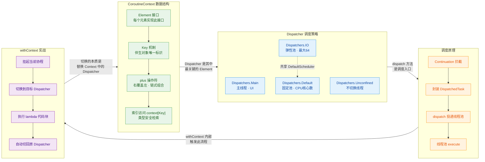

---

### 实战速查表

在日常 Android / Kotlin 后端开发中，以下是最高频的使用模式：

```kotlin
// ═══════════════════════════════════════════════════════
// 场景 1：ViewModel 中发起网络请求
// ═══════════════════════════════════════════════════════
viewModelScope.launch {                         // 默认 Dispatchers.Main
    val user = withContext(Dispatchers.IO) {     // 切到 IO 线程池做网络请求
        api.fetchUser(userId)                    // 挂起，不阻塞主线程
    }                                           // 自动切回 Main
    nameTextView.text = user.name               // 安全地更新 UI
}

// ═══════════════════════════════════════════════════════
// 场景 2：CPU 密集型计算
// ═══════════════════════════════════════════════════════
viewModelScope.launch {
    val sorted = withContext(Dispatchers.Default) {  // 切到 Default（CPU 线程池）
        hugeList.sortedByDescending { it.score }     // 大数据排序
    }
    adapter.submitList(sorted)                       // 切回 Main 更新列表
}

// ═══════════════════════════════════════════════════════
// 场景 3：组合自定义 Context
// ═══════════════════════════════════════════════════════
val myContext = Dispatchers.IO +                // 调度器
    CoroutineName("data-sync") +                // 协程名（调试用）
    SupervisorJob()                             // 独立的 Job（不受父协程取消影响）

CoroutineScope(myContext).launch {
    // 此协程运行在 IO 线程池，名称为 "data-sync"
    syncData()
}

// ═══════════════════════════════════════════════════════
// 场景 4：从 Context 中提取元素
// ═══════════════════════════════════════════════════════
suspend fun logCoroutineInfo() {
    val ctx = coroutineContext                          // 获取当前协程的 Context
    val dispatcher = ctx[ContinuationInterceptor]       // 取出调度器
    val name = ctx[CoroutineName]?.name ?: "unnamed"    // 取出名称，可能为 null
    val job = ctx[Job]                                  // 取出 Job
    println("[$name] dispatcher=$dispatcher, isActive=${job?.isActive}")
}
```

---

### 常见误区与最佳实践

| ❌ 误区 | ✅ 正确做法 |
|---------|-----------|
| 在 `Dispatchers.Main` 中做网络/文件 IO | 用 `withContext(Dispatchers.IO)` 包裹 IO 操作 |
| 在 `Dispatchers.IO` 中更新 UI | 用 `withContext(Dispatchers.Main)` 切回主线程 |
| 使用 `Dispatchers.Unconfined` 做业务逻辑 | 仅在测试或框架内部使用 Unconfined |
| 为每个协程创建独立线程池 | 优先使用标准 Dispatchers，只在特殊隔离需求时自建 |
| `launch(Dispatchers.IO)` 内部再嵌套 `withContext(IO)` | 已经在 IO 上，无需重复切换（虽然开销极低） |
| 认为 `withContext` 会创建新协程 | 它只是切换 Context，不创建新协程，不产生并发 |

---

### 一句话总结

> **CoroutineContext 是协程的灵魂容器，Dispatcher 决定了协程在哪里奔跑，`dispatch()` 是引擎的点火开关，而 `withContext()` 则是开发者手中最优雅的方向盘——轻轻一转，线程切换浑然天成。**

---

**📝 练习题 1**

以下代码的输出结果是什么？

```kotlin
fun main() = runBlocking {
    println("A: ${Thread.currentThread().name}")

    withContext(Dispatchers.Default) {
        println("B: ${Thread.currentThread().name}")

        withContext(Dispatchers.IO) {
            println("C: ${Thread.currentThread().name}")
        }

        println("D: ${Thread.currentThread().name}")
    }

    println("E: ${Thread.currentThread().name}")
}
```

A. A 在 main 线程，B 在 Default 线程，C 在 IO 线程，D 在 Default 线程，E 在 main 线程；且 B/C/D 可能打印出相同的底层 worker 线程名


B. A 在 main 线程，B/C/D 都在同一个 Default 线程，E 在 main 线程


C. A 在 main 线程，B 在 Default 线程，C 在 IO 线程，D 在 IO 线程（不会切回），E 在 main 线程


D. 编译错误，`withContext` 不能嵌套使用


**【答案】** A

**【解析】**

- **A** 打印 `main` 线程，因为 `runBlocking` 默认阻塞当前线程并在其上创建事件循环。
- **B** 切换到 `Dispatchers.Default`，运行在类似 `DefaultDispatcher-worker-1` 的线程上。
- **C** 切换到 `Dispatchers.IO`，但由于 `Default` 和 `IO` **共享底层 `DefaultScheduler` 线程池**，实际执行 C 的 worker 线程**可能和 B 是同一个**（fast-path 优化：仅切换并发许可，不一定切换物理线程）。
- **D** 从 IO 切回 Default，同理，可能与 B/C 在同一个 worker 线程上执行。
- **E** 切回 `runBlocking` 的拦截器，回到 `main` 线程。

因此选 A：所有切换都会发生，但由于共享线程池，B/C/D 的物理线程名可能相同。选项 B 错在"都在同一个 Default 线程"——语义上 C 确实在 IO 调度器下运行，只是物理线程可能复用。选项 C 错在 D "不会切回"——`withContext` 结束后一定会恢复到外层的 Dispatcher。选项 D 错在 `withContext` 完全支持嵌套。

---

**📝 练习题 2**

关于 `CoroutineContext` 的 `plus` 操作符，以下说法正确的是？

```kotlin
val ctx1 = CoroutineName("alpha") + Dispatchers.IO
val ctx2 = ctx1 + CoroutineName("beta") + Dispatchers.Default
```

A. `ctx2` 中的 `CoroutineName` 为 `"alpha"`，调度器为 `Dispatchers.IO`


B. `ctx2` 中的 `CoroutineName` 为 `"beta"`，调度器为 `Dispatchers.Default`


C. `ctx2` 中同时包含两个 `CoroutineName`：`"alpha"` 和 `"beta"`


D. 编译错误，`plus` 操作符不能连续使用


**【答案】** B

**【解析】**

`CoroutineContext` 的 `plus` 操作符遵循 **右覆盖左** 的规则：当合并两个 Context 时，如果右侧包含与左侧相同 `Key` 的 Element，右侧会替换左侧。

- `ctx1` = `CoroutineName("alpha") + Dispatchers.IO`，此时有两个元素：Name=alpha, Dispatcher=IO。
- `ctx2` = `ctx1 + CoroutineName("beta") + Dispatchers.Default`：
  - 先 `ctx1 + CoroutineName("beta")`：`CoroutineName` 的 Key 相同，右侧 `"beta"` **覆盖** 左侧 `"alpha"`。
  - 再 `+ Dispatchers.Default`：`ContinuationInterceptor` 的 Key 相同，右侧 `Default` **覆盖** 左侧 `IO`。

最终 `ctx2` 中 Name=`"beta"`，Dispatcher=`Default`。每个 Key 在 Context 中**有且仅有一个** Element，不可能同时存在两个 `CoroutineName`，因此 C 错误。`plus` 操作符是标准的 operator fun，完全支持链式调用，D 也错误。

---