---

# 协程作用域与Job ⭐⭐⭐

---

## CoroutineScope ⭐⭐

在 Kotlin 协程体系中，**CoroutineScope（协程作用域）** 是一个极其核心的概念。它并不直接执行代码，而是充当一个 **"管理容器"**——定义了协程的生存边界。你可以把它想象成一个项目经理：它自己不写代码，但决定了团队（协程）何时开始、何时结束、出了问题怎么处理。

理解 CoroutineScope，是掌握结构化并发（Structured Concurrency）的第一步，也是写出健壮、无泄漏协程代码的关键前提。

---

### 协程作用域

#### 什么是协程作用域？

从最朴素的定义来说，**协程作用域就是协程能够运行的一个"围栏"**。在这个围栏内启动的所有协程，都受到该作用域的管辖。当围栏被拆除（作用域取消），围栏内的所有协程也随之终止。

我们先看 `CoroutineScope` 的源码定义，它简洁得令人意外：

```kotlin
// CoroutineScope 是一个接口，只有一个属性
public interface CoroutineScope {
    // 该作用域关联的协程上下文
    public val coroutineContext: CoroutineContext
}
```

没错，**整个接口只有一个属性** `coroutineContext`。它不包含任何 `launch`、`async` 方法——这些都是定义在 `CoroutineScope` 上的 **扩展函数**。这一设计哲学体现了 Kotlin "约定优于配置" 的思想：接口最小化，功能通过扩展实现。

#### 为什么需要协程作用域？

假设没有作用域机制，代码可能是这样的：

```kotlin
// ❌ 假想：无作用域的世界
fun loadData() {
    // 启动协程，但没人管它
    launchGlobal {
        val data = fetchFromNetwork()  // 如果 Activity 已销毁，这里还在跑
        updateUI(data)                 // 崩溃！UI 已不存在
    }
}
```

这种 "Fire and Forget"（发射后不管）的模式会带来两个严重问题：

1. **内存泄漏**：协程持有外部引用（如 Activity），导致无法 GC
2. **非法状态访问**：协程执行完毕后，操作已销毁的组件

**CoroutineScope 的核心使命就是解决这两个问题。** 它通过 Structured Concurrency（结构化并发）确保：

> 每个协程都有一个明确的"主人"（Scope），主人消亡时，所有附属协程自动取消。

我们用一张 Mermaid 图来直观理解「无作用域」与「有作用域」两种模型的区别：

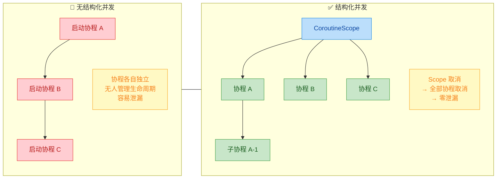

#### 如何创建协程作用域？

创建 CoroutineScope 主要有三种方式：

**方式一：使用工厂函数 `CoroutineScope()`**

```kotlin
// 使用 CoroutineScope() 工厂函数创建
// 注意：这里的 CoroutineScope() 是函数，不是构造函数（首字母大写的函数）
val myScope = CoroutineScope(Dispatchers.Default + Job())
//                           ^^^^^^^^^^^^^^^^^^^^^^^^^^^
//                           传入一个 CoroutineContext
//                           = 调度器 + Job 组合而成

// 在该作用域中启动协程
myScope.launch {
    println("运行在 myScope 管理下")
}
```

**方式二：使用 `coroutineScope` 挂起函数（小写 c）**

```kotlin
// 注意是小写 coroutineScope —— 这是一个挂起函数
// 它会创建一个新的作用域，并等待内部所有协程完成后才返回
suspend fun loadData() = coroutineScope {
    // 在这个 block 内启动的协程，都属于这个临时作用域
    val deferred1 = async { fetchUserProfile() }   // 子协程 1
    val deferred2 = async { fetchUserOrders() }     // 子协程 2
    // coroutineScope 会等 deferred1 和 deferred2 都完成
    // 然后才返回——这就是结构化并发的体现
    ProcessResult(deferred1.await(), deferred2.await())
}
```

> ⚠️ **命名陷阱**：`CoroutineScope`（大写 C）是接口/工厂函数，用于创建独立作用域；`coroutineScope`（小写 c）是挂起函数，用于在挂起函数中创建子作用域。二者用途完全不同，面试中经常出现。

**方式三：实现 `CoroutineScope` 接口**

```kotlin
// 让一个类实现 CoroutineScope 接口
// 常用于 Presenter、ViewModel 等有明确生命周期的组件
class MyPresenter : CoroutineScope {

    // 创建一个独立的 Job，用于控制该作用域的生命周期
    private val job = Job()

    // 实现接口唯一的属性：组合 Job + 调度器
    override val coroutineContext: CoroutineContext
        get() = Dispatchers.Main + job

    fun loadData() {
        // 因为 MyPresenter 本身就是 CoroutineScope
        // 所以可以直接调用 launch，无需 scope.launch
        launch {
            val data = fetchFromNetwork()
            updateUI(data)
        }
    }

    fun destroy() {
        // Presenter 销毁时，取消 Job → 取消所有子协程
        job.cancel()
    }
}
```

三种方式的对比总结：

| 方式 | 类型 | 使用场景 | 自动等待子协程？ |
|------|------|----------|:---:|
| `CoroutineScope()` 工厂函数 | 创建独立作用域 | 自定义组件的生命周期管理 | ❌（需手动 cancel） |
| `coroutineScope {}` 挂起函数 | 创建临时子作用域 | 在 suspend 函数内并行分解任务 | ✅ |
| 实现 `CoroutineScope` 接口 | 类本身成为作用域 | Presenter / Controller 等组件 | ❌（需手动 cancel） |

---

### 管理协程生命周期

CoroutineScope 管理生命周期的秘密武器是 **Job**。每一个 CoroutineScope 内部的 `coroutineContext` 中都必须包含一个 `Job` 对象（如果你没显式提供，`CoroutineScope()` 工厂函数会自动创建一个）。正是这个 Job，构成了协程的生命线。

#### Scope 与 Job 的关系

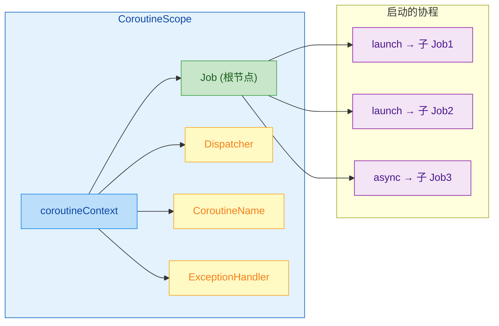

当你在一个 Scope 中 `launch` 或 `async` 时，新协程的 Job 会自动成为 Scope 中 Job 的 **子节点（child）**。这构成了一棵 Job 树。这是理解后续"父子协程关系"章节的基础。

#### 生命周期管控的三种核心操作

**1. 启动（Launch/Async）**

```kotlin
val scope = CoroutineScope(Dispatchers.IO + Job())

// 启动协程 —— Job 树新增一个子节点
val job1 = scope.launch {
    // 协程体：开始执行具体业务逻辑
    delay(1000L)
    println("Job1 完成")
}

// 再启动一个 —— Job 树再新增一个子节点
val job2 = scope.launch {
    delay(2000L)
    println("Job2 完成")
}
```

**2. 取消（Cancel）**

```kotlin
// 取消单个协程
job1.cancel()    // 仅取消 job1，job2 不受影响

// ⚡ 取消整个作用域 —— 核弹级操作
scope.cancel()   // scope 内所有协程（job1, job2 ...）全部取消
                 // 且该 scope 不可再用于启动新协程！
```

> 🔑 **关键区别**：`scope.cancel()` 会将 Scope 内部的 Job 置为 **Cancelled** 状态。一旦 Job 被取消，该 Scope 就"废了"——你无法再通过它启动新的协程。如果你需要可重复使用的取消机制，应该使用 `SupervisorJob`（后续章节介绍）。

**3. 等待完成（Join）**

```kotlin
fun main() = runBlocking {
    val scope = CoroutineScope(Dispatchers.Default + Job())

    val job = scope.launch {
        delay(1000L)
        println("工作完成")
    }

    // join() 是挂起函数 —— 暂停当前协程，直到 job 执行完毕
    job.join()
    println("继续执行后续逻辑")
}
// 输出：
// 工作完成
// 继续执行后续逻辑
```

#### Scope 取消后的不可复用性

这是一个初学者非常容易踩的坑，值得单独强调：

```kotlin
val scope = CoroutineScope(Dispatchers.Default + Job())

// 第一次：正常启动
scope.launch { println("第一次启动 ✅") }

// 取消作用域
scope.cancel()

// 第二次：尝试再次启动 —— 静默失败！不会执行，也不会报错！
scope.launch { println("第二次启动 ❓ 永远不会打印") }
```

为什么会这样？因为 `scope.cancel()` 实际上取消的是 `coroutineContext` 中的 Job。一个 Job 一旦到达终态（Completed 或 Cancelled），就不可能回退到 Active 状态。这符合 Job 的状态机设计——**状态转换是单向的、不可逆的**。

如果你需要一个"可重置"的 Scope，解决方案是 **重新创建**：

```kotlin
class MyManager {
    // 使用 var 而非 val，以便重新赋值
    private var scope = createScope()

    private fun createScope() = CoroutineScope(Dispatchers.Default + Job())

    fun doWork() {
        scope.launch { /* ... */ }
    }

    fun stop() {
        scope.cancel()         // 取消当前 scope
    }

    fun restart() {
        scope.cancel()         // 先确保旧的已取消
        scope = createScope()  // 创建全新 scope
    }
}
```

#### `coroutineScope` vs `supervisorScope`（小写函数版本）

前面提到了小写的 `coroutineScope {}` 挂起函数，这里必须提及它的"兄弟" `supervisorScope {}`。两者都创建临时子作用域，但异常传播策略截然不同：

```kotlin
suspend fun demonstrateScopes() {
    // coroutineScope：一个子协程失败 → 其他兄弟协程也被取消
    try {
        coroutineScope {
            launch { delay(Long.MAX_VALUE) }  // 子协程 A：一直等待
            launch { throw RuntimeException("Boom!") }  // 子协程 B：抛异常
            // → 子协程 A 也会被取消，因为 B 的异常会向上传播取消整个 scope
        }
    } catch (e: RuntimeException) {
        println("coroutineScope 捕获到异常: ${e.message}")
    }

    // supervisorScope：一个子协程失败 → 其他兄弟协程不受影响
    supervisorScope {
        launch { delay(1000); println("子协程 A 正常完成 ✅") }  // 不会被取消
        launch { throw RuntimeException("Boom!") }               // 独自失败
        // → 子协程 A 继续运行，不受 B 影响
    }
}
```

用一句话概括：**`coroutineScope` 同生共死，`supervisorScope` 各管各的。**

---

### coroutineContext 属性

`coroutineContext` 是 CoroutineScope 接口中 **唯一的属性**，也是整个协程系统最核心的数据结构之一。理解它，就相当于理解了协程运行环境的全部配置。

#### CoroutineContext 的本质

`CoroutineContext` 是一个 **不可变的索引集合（indexed set）**，其中每个元素都有一个唯一的 `Key`。你可以把它想象成一个 **类型安全的 Map**：

```kotlin
// 概念上等价于（实际实现更精巧）
// Map<Key<*>, Element>

// 常见的 Key-Element 对：
// Job.Key         → Job 实例（控制生命周期）
// ContinuationInterceptor.Key → Dispatcher 实例（决定线程调度）
// CoroutineName.Key → CoroutineName 实例（调试用名称）
// CoroutineExceptionHandler.Key → 异常处理器实例
```

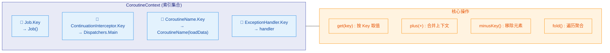

#### 核心操作详解

**1. `get(key)` —— 按 Key 取出元素**

```kotlin
val scope = CoroutineScope(Dispatchers.IO + CoroutineName("myCoroutine") + Job())

// 通过 Key 获取对应元素（类型安全，不需要强制转换）
val job: Job? = scope.coroutineContext[Job]
//                                     ^^^ 这是 Job.Key 的简写（companion object 实现了 Key 接口）

val name: CoroutineName? = scope.coroutineContext[CoroutineName]
println(name)  // CoroutineName(myCoroutine)

val dispatcher = scope.coroutineContext[ContinuationInterceptor]
println(dispatcher)  // Dispatchers.IO
```

**2. `plus(+)` —— 合并两个上下文**

`+` 操作符是 CoroutineContext 最常用的操作。它将两个上下文合并为一个，**右侧元素覆盖左侧同 Key 元素**：

```kotlin
// 基础上下文
val base = Dispatchers.Default + CoroutineName("base")

// 合并新元素 —— 右侧覆盖左侧同 Key 的值
val merged = base + Dispatchers.IO
// 结果：CoroutineName("base") + Dispatchers.IO
// Dispatchers.Default 被 Dispatchers.IO 覆盖了（同属 ContinuationInterceptor.Key）

// 多元素组合（实际开发中最常见的写法）
val fullContext = Job() +                             // 生命周期控制
                 Dispatchers.Main +                   // 线程调度
                 CoroutineName("fetchUser") +         // 调试名称
                 CoroutineExceptionHandler { _, e ->  // 异常处理
                     println("捕获异常: $e")
                 }
```

> 💡 **`+` 的结合律**：`(a + b) + c == a + (b + c)`，你可以自由组合不用担心顺序——唯一需要注意的是同 Key 覆盖规则（后面覆盖前面）。

**3. `minusKey()` —— 移除指定元素**

```kotlin
val ctx = Dispatchers.IO + CoroutineName("test") + Job()

// 移除 CoroutineName 元素
val reduced = ctx.minusKey(CoroutineName)
// 结果只剩 Dispatchers.IO + Job()
```

**4. `fold()` —— 遍历所有元素**

```kotlin
val ctx = Dispatchers.IO + CoroutineName("demo") + Job()

// fold 类似于集合的 fold，遍历上下文中的每个元素
val description = ctx.fold("Context 内容: ") { acc, element ->
    "$acc\n  - $element"
}
println(description)
// Context 内容:
//   - JobImpl{Active}
//   - CoroutineName(demo)
//   - Dispatchers.IO
```

#### 在协程内部访问 coroutineContext

在任何挂起函数或协程体中，你都可以通过顶层属性 `coroutineContext` 访问当前协程的上下文：

```kotlin
val scope = CoroutineScope(Dispatchers.IO + CoroutineName("worker"))

scope.launch {
    // 在协程体内部，coroutineContext 是一个自动可用的属性
    println("名称: ${coroutineContext[CoroutineName]}")
    // 输出: 名称: CoroutineName(worker)

    println("调度器: ${coroutineContext[ContinuationInterceptor]}")
    // 输出: 调度器: Dispatchers.IO

    println("Job: ${coroutineContext[Job]}")
    // 输出: Job: StandaloneCoroutine{Active}@xxxx
    // 注意：这里的 Job 是 launch 创建的新子 Job，不是 scope 的根 Job
}
```

> 🧠 **细节**：`coroutineContext` 在编译层面是一个 **intrinsic 属性**（编译器内建支持）。它不是通过普通的变量传递实现的，而是由编译器在 CPS 变换时自动注入到 `Continuation` 参数中。每个挂起函数的 Continuation 都携带了自己的 coroutineContext。

#### 上下文继承与覆盖

当你在一个 Scope 中启动新协程时，子协程的上下文 = **父上下文 + 自己指定的覆盖元素 + 新的 Job**。这个公式非常关键：

```kotlin
// 子协程上下文 = 父 coroutineContext + 子协程参数中的覆盖 + 新 Job()
```

```kotlin
val scope = CoroutineScope(
    Dispatchers.IO +                    // 父级调度器
    CoroutineName("parent") +           // 父级名称
    Job()                               // 父级 Job
)

scope.launch(Dispatchers.Main + CoroutineName("child")) {
    // 最终上下文：
    // Dispatcher  → Dispatchers.Main     (被子协程参数覆盖)
    // Name        → CoroutineName(child) (被子协程参数覆盖)
    // Job         → 新的子 Job           (每次 launch 都会创建新 Job)
    //               └── parent: scope 的根 Job

    println(coroutineContext[ContinuationInterceptor]) // Dispatchers.Main
    println(coroutineContext[CoroutineName])            // CoroutineName(child)
    println(coroutineContext[Job])                      // StandaloneCoroutine{Active}
}
```

用一个公式图来展示整个继承过程：

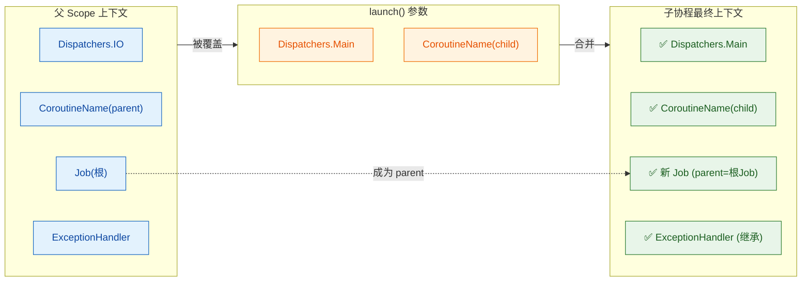

请特别注意 **Job 的继承行为与其他元素不同**：即使你在 `launch` 参数中传入了自定义 Job，Kotlin 协程也会创建一个 **新的子 Job**，并将你传入的 Job 或父 Scope 的 Job 设为 parent。这是结构化并发的核心保障——**子协程的 Job 必须挂载到父 Job 树上**，否则取消传播和异常传播都将失效。

```kotlin
// ❌ 错误理解：我传入 Job 就能脱离父 Scope 管控？
val myJob = Job()
scope.launch(myJob) {
    // 实际上：新创建的协程 Job 的 parent = myJob
    // myJob 与 scope 的根 Job 无关 → 断开了结构化并发链条！
    // 这是一个常见的反模式，会导致无法正常取消
}
```

> ⚠️ **反模式警告**：不要向 `launch`/`async` 传入独立的 `Job()`。这会打破父子关系，使该协程脱离 Scope 的生命周期管理。

---

**📝 练习题**

以下代码执行后，控制台最终会输出什么？

```kotlin
fun main() = runBlocking {
    val scope = CoroutineScope(Dispatchers.Default + CoroutineName("root"))
    
    scope.launch(CoroutineName("child")) {
        println("A: ${coroutineContext[CoroutineName]}")
    }
    
    scope.cancel()
    
    scope.launch {
        println("B: ${coroutineContext[CoroutineName]}")
    }
    
    delay(1000L)
}
```

A. 输出 A 和 B 两行

B. 仅输出 `A: CoroutineName(child)`

C. 仅输出 `B: CoroutineName(root)`

D. 可能输出 A，也可能什么都不输出，但一定不会输出 B


**【答案】** D

**【解析】** 这道题考查两个知识点：**上下文的 CoroutineName 覆盖规则** 和 **Scope 取消后的不可复用性**。

首先，第一个 `launch` 使用 `CoroutineName("child")` 覆盖了父 Scope 的 `CoroutineName("root")`，因此如果它执行的话，会输出 `A: CoroutineName(child)`。

然而，`scope.launch` 是在 `Dispatchers.Default` 上异步调度的，而 `scope.cancel()` 紧随其后执行。由于调度时机的不确定性，第一个 `launch` **可能** 在 cancel 之前已经开始执行（输出 A），也 **可能** 还未开始就被取消了（什么都不输出）。

第二个 `launch` 在 `scope.cancel()` 之后调用。此时 Scope 内部的 Job 已处于 `Cancelled` 终态，任何新的 `launch` 调用都会静默失败——协程体不会执行。因此 B **一定不会** 被输出。

---

## 常用作用域

在上一节中，我们深入理解了 `CoroutineScope` 的本质——它是协程的"管理容器"，通过持有 `CoroutineContext` 来决定协程的运行规则。那么在实际开发中，我们并不需要每次都从零开始手动构建作用域。Kotlin 协程库和 Android Jetpack 为我们提供了几种**开箱即用的作用域实现**，它们各自面向不同的生命周期场景，做出了不同的设计取舍。

理解它们的差异，是写出**不泄漏、不崩溃**的协程代码的关键。

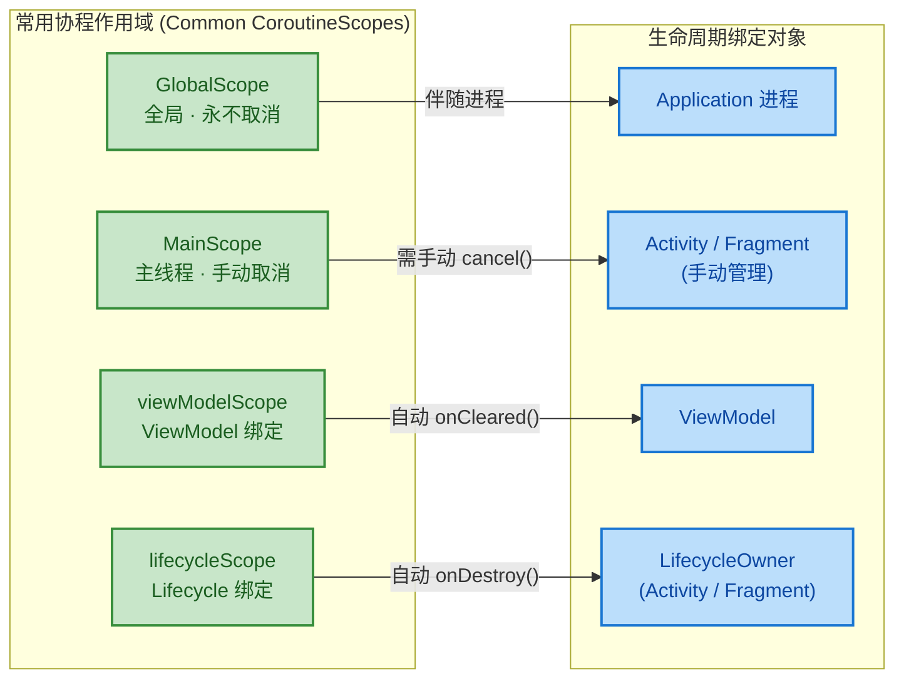

---

### GlobalScope（全局作用域，不推荐）

`GlobalScope` 是 Kotlin 协程库中最"简单粗暴"的一个作用域。它是一个**顶层单例对象 (top-level singleton object)**，其生命周期与**整个应用进程**等长——从 App 启动到进程被杀死，它始终存活。

#### 源码本质

`GlobalScope` 的实现极其简洁：

```kotlin
// kotlinx.coroutines 库中的定义
public object GlobalScope : CoroutineScope {
    // 它的上下文是空的 EmptyCoroutineContext
    // 这意味着：没有默认的 Job 父节点，没有指定调度器
    override val coroutineContext: CoroutineContext
        get() = EmptyCoroutineContext
}
```

核心要点：

- 它是一个 `object` 单例，全局唯一。
- 其 `coroutineContext` 返回 `EmptyCoroutineContext`，意味着**没有父 Job**。
- 没有父 Job → 在 `GlobalScope` 中启动的协程都是**顶级协程 (top-level coroutine)**，彼此之间没有父子关系。

#### 使用方式

```kotlin
import kotlinx.coroutines.*

fun main() {
    // 在 GlobalScope 中启动一个协程
    // 返回的 Job 是一个"孤儿"，没有父 Job 管理它
    val job = GlobalScope.launch {
        delay(1000L)                    // 非阻塞挂起 1 秒
        println("GlobalScope 协程执行完毕") // 1 秒后打印
    }

    // 因为 GlobalScope 协程是守护性质的，
    // 如果主线程结束了，协程也会随之消亡
    Thread.sleep(2000L) // 阻塞主线程 2 秒以等待协程完成
}
```

#### 为什么不推荐？

`GlobalScope` 虽然用起来方便，但在实际项目中几乎**总是错误的选择**，原因可以归结为三点：

**1. 无法统一取消（Unmanaged Lifecycle）**

```kotlin
class MyActivity : AppCompatActivity() {

    fun fetchData() {
        // 在 GlobalScope 中启动的协程，与 Activity 无任何绑定
        GlobalScope.launch {
            val data = apiService.getData()  // 网络请求
            // ⚠️ 如果此时 Activity 已经被销毁(onDestroy)
            // 这行代码仍然会执行，尝试更新一个已销毁的 UI
            textView.text = data.toString()  // 💥 可能崩溃或内存泄漏
        }
    }

    // 即使在 onDestroy 中，你也无法轻松取消所有 GlobalScope 协程
    // 因为它们不属于任何可管理的 scope
}
```

当 Activity 销毁时，`GlobalScope` 里的协程**完全不知道**，它会继续运行，持有 Activity 的引用导致**内存泄漏 (Memory Leak)**，或者访问已销毁的 View 导致**崩溃**。

**2. 没有结构化并发（Breaks Structured Concurrency）**

Kotlin 协程的核心设计哲学是**结构化并发 (Structured Concurrency)**——每个协程都应该属于一个明确的作用域，形成树形的父子关系。`GlobalScope` 打破了这一原则：

```kotlin
// ❌ 反模式：GlobalScope 产生的协程是"孤儿"
GlobalScope.launch {
    // 这个协程没有父亲，不受任何 scope 管控
    // 出了异常也不会传播给任何"上级"
}

// ✅ 正确做法：在一个有明确生命周期的 scope 中启动
viewModelScope.launch {
    // 这个协程属于 ViewModel 的作用域
    // ViewModel 被清除时，协程自动取消
}
```

**3. 异常不会自动传播**

由于没有父 Job，`GlobalScope` 中协程的异常不会向上传播，可能导致错误被**静默吞掉 (silently swallowed)**。

#### 极少数适用场景

`GlobalScope` 并非完全没有用武之地，但适用场景极其有限：

```kotlin
// 场景：应用级别的、需要伴随整个进程生命周期的后台任务
// 例如：全局的日志上报、应用级别的缓存预热
// 即使如此，更推荐自定义一个带 SupervisorJob 的 Application 级 scope
val appScope = CoroutineScope(SupervisorJob() + Dispatchers.Default)
```

> **经验法则 (Rule of Thumb)**：如果你在代码中写下了 `GlobalScope`，先停下来想一想——99% 的情况下，有更好的替代方案。

---

### MainScope（主线程作用域）

`MainScope` 是协程库提供的一个**工厂函数**，专门为需要在**主线程（UI 线程）**上执行操作的场景设计。它在 Android 开发中常被用于 Activity / Fragment 中手动管理协程。

#### 源码本质

```kotlin
// kotlinx.coroutines 库中的定义
public fun MainScope(): CoroutineScope =
    // SupervisorJob：子协程失败不会牵连其他兄弟协程
    // Dispatchers.Main：所有协程默认在主线程上调度
    CoroutineScope(SupervisorJob() + Dispatchers.Main)
```

关键设计：

| 组成部分 | 作用 |
|---|---|
| `SupervisorJob()` | 作为父 Job，提供**监督策略**——某个子协程失败不会导致其他子协程被取消 |
| `Dispatchers.Main` | 默认调度器为主线程，适合 UI 操作 |

#### 使用方式与生命周期管理

`MainScope` 需要开发者**手动管理其生命周期**，在合适的时机调用 `cancel()` 释放资源：

```kotlin
class MyActivity : AppCompatActivity() {

    // 创建一个与 Activity 关联的主线程作用域
    private val scope = MainScope()

    override fun onCreate(savedInstanceState: Bundle?) {
        super.onCreate(savedInstanceState)
        setContentView(R.layout.activity_main)

        // 在 MainScope 中启动协程
        scope.launch {
            // 默认运行在 Dispatchers.Main（主线程）
            val data = withContext(Dispatchers.IO) {
                // 切到 IO 线程执行网络请求
                apiService.fetchData()
            }
            // 自动回到主线程更新 UI
            textView.text = data.toString()
        }

        // 可以同时启动多个协程，它们都受同一个 scope 管理
        scope.launch {
            delay(5000L)
            showToast("5秒提醒")
        }
    }

    override fun onDestroy() {
        super.onDestroy()
        // ⚡ 关键：手动取消作用域，所有子协程一并取消
        // 如果忘记这一步 → 内存泄漏！
        scope.cancel()
    }
}
```

#### 为什么使用 SupervisorJob？

这是 `MainScope` 的一个精妙设计。想象一个场景：

```kotlin
scope.launch { loadUserProfile() }   // 协程 A：加载用户资料
scope.launch { loadRecommendation() } // 协程 B：加载推荐内容
scope.launch { loadNotifications() }  // 协程 C：加载通知
```

如果使用普通的 `Job()`，协程 B 抛异常会导致**协程 A 和 C 也被取消**——这在 UI 场景中是不合理的。用户资料加载成功了，不应该因为推荐模块挂了就全部作废。

`SupervisorJob` 确保：**一个子协程的失败是隔离的**，不影响兄弟协程。

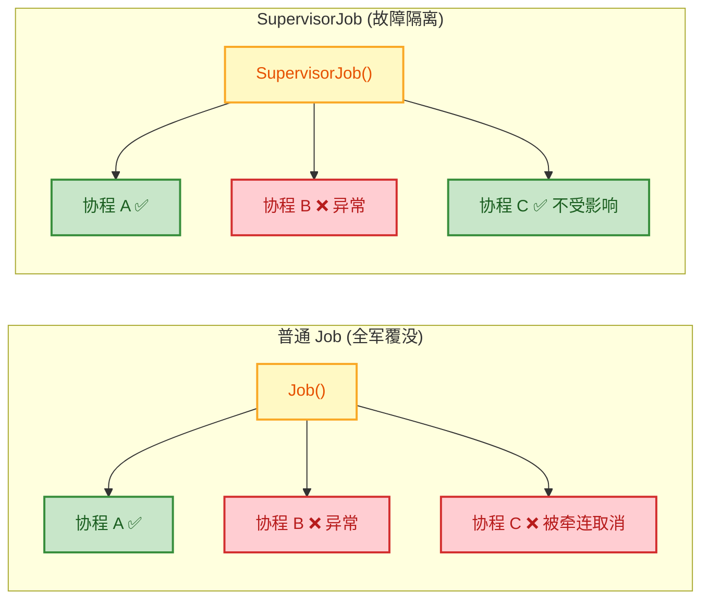

#### MainScope 的局限

虽然 `MainScope` 比 `GlobalScope` 好得多，但它仍然有一个明显缺点：**需要手动 `cancel()`**。开发者一旦忘记，就会造成泄漏。这正是后面 `viewModelScope` 和 `lifecycleScope` 要解决的痛点。

---

### viewModelScope（ViewModel 绑定作用域）

`viewModelScope` 是 **Android Jetpack** 中 `androidx.lifecycle:lifecycle-viewmodel-ktx` 库提供的扩展属性，它将协程的生命周期与 `ViewModel` 紧密绑定。当 ViewModel 被清除（`onCleared()` 被调用）时，`viewModelScope` 会**自动取消**所有尚在运行的协程。

#### 依赖引入

```kotlin
// build.gradle.kts
dependencies {
    // viewModelScope 所在的库
    implementation("androidx.lifecycle:lifecycle-viewmodel-ktx:2.8.7")
}
```

#### 源码剖析

```kotlin
// androidx.lifecycle.ViewModel 的扩展属性
public val ViewModel.viewModelScope: CoroutineScope
    get() {
        // 先尝试从缓存中获取
        val scope: CoroutineScope? = this.getTag(JOB_KEY)
        if (scope != null) {
            return scope  // 如果已创建，直接复用
        }
        // 首次访问时创建：SupervisorJob + Dispatchers.Main.immediate
        return setTagIfAbsent(
            JOB_KEY,
            CloseableCoroutineScope(
                SupervisorJob() + Dispatchers.Main.immediate
            )
        )
    }
```

核心设计要素：

| 组成 | 说明 |
|---|---|
| `SupervisorJob()` | 与 `MainScope` 相同，子协程互不牵连 |
| `Dispatchers.Main.immediate` | 比 `Dispatchers.Main` 更优化——如果当前已在主线程，则**立即执行**而不重新调度 |
| 自动取消 | 在 `ViewModel.onCleared()` 中自动调用 `scope.cancel()` |

> **`Dispatchers.Main` vs `Dispatchers.Main.immediate`**：前者总是将任务 post 到主线程消息队列（即使当前已在主线程）；后者如果发现当前已在主线程，会**跳过 dispatch 直接执行**，减少一次不必要的消息排队，降低延迟。

#### 典型使用

```kotlin
class UserViewModel(
    private val userRepository: UserRepository
) : ViewModel() {

    // LiveData 暴露给 UI 层
    private val _user = MutableLiveData<User>()
    val user: LiveData<User> = _user

    private val _error = MutableLiveData<String>()
    val error: LiveData<String> = _error

    fun loadUser(userId: String) {
        // 使用 viewModelScope 启动协程
        // 当 ViewModel 被回收时，这个协程会自动取消
        viewModelScope.launch {
            try {
                // withContext 切换到 IO 调度器执行耗时操作
                val result = withContext(Dispatchers.IO) {
                    userRepository.fetchUser(userId) // 网络/数据库请求
                }
                // 自动回到 Main 线程，安全更新 LiveData
                _user.value = result
            } catch (e: CancellationException) {
                // 协程取消异常需要重新抛出，不能吞掉！
                // 这是 Kotlin 协程的重要约定
                throw e
            } catch (e: Exception) {
                // 业务异常处理
                _error.value = "加载失败: ${e.message}"
            }
        }
    }

    // ❌ 不需要手动重写 onCleared() 来取消协程
    // viewModelScope 已经帮你处理好了！
}
```

#### 自动取消的生命周期流程

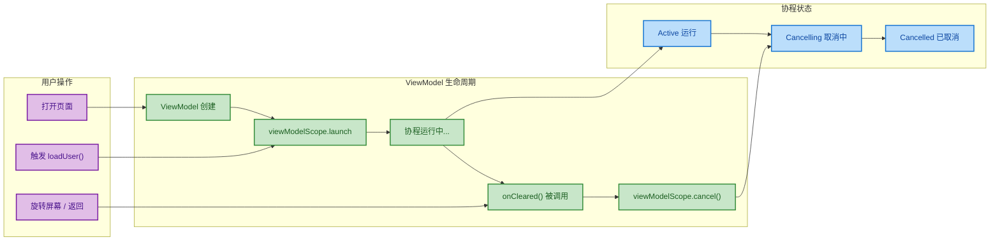

#### 为什么 viewModelScope 是 Android 开发的首选？

1. **自动取消**：告别手动 `cancel()` 的心智负担
2. **配合 MVVM 架构**：ViewModel 天然是业务逻辑层的载体，在这里发起协程最合理
3. **屏幕旋转安全**：Activity/Fragment 重建时 ViewModel 存活，协程不中断；只在 ViewModel 真正被销毁时才取消
4. **SupervisorJob 隔离**：多个并发请求互不干扰

---

### lifecycleScope（Lifecycle 绑定作用域）⭐

`lifecycleScope` 是 **Android Jetpack** 中 `androidx.lifecycle:lifecycle-runtime-ktx` 库提供的扩展属性，它将协程绑定到 **`LifecycleOwner`（通常是 Activity 或 Fragment）** 的生命周期。当 Lifecycle 进入 `DESTROYED` 状态时，协程自动取消。

这是 Android UI 层使用协程的**最佳实践**，也是面试高频考察点。

#### 依赖引入

```kotlin
// build.gradle.kts
dependencies {
    implementation("androidx.lifecycle:lifecycle-runtime-ktx:2.8.7")
}
```

#### 源码本质

```kotlin
// LifecycleOwner 的扩展属性
public val LifecycleOwner.lifecycleScope: LifecycleCoroutineScope
    get() = lifecycle.coroutineScope

// Lifecycle 的扩展属性
public val Lifecycle.coroutineScope: LifecycleCoroutineScope
    get() {
        // ... 缓存逻辑省略 ...
        // 核心：SupervisorJob() + Dispatchers.Main.immediate
        // 并注册 LifecycleObserver，在 ON_DESTROY 时自动 cancel
        val newScope = LifecycleCoroutineScope(this,
            SupervisorJob() + Dispatchers.Main.immediate
        )
        return newScope
    }
```

与 `viewModelScope` 的上下文配方完全一致（`SupervisorJob() + Dispatchers.Main.immediate`），区别在于**绑定的对象不同**。

#### 基本使用

```kotlin
class MyFragment : Fragment() {

    override fun onViewCreated(view: View, savedInstanceState: Bundle?) {
        super.onViewCreated(view, savedInstanceState)

        // lifecycleScope 绑定到 Fragment 的生命周期
        // Fragment onDestroy 时自动取消
        lifecycleScope.launch {
            val data = withContext(Dispatchers.IO) {
                repository.loadData() // IO 线程加载数据
            }
            // 回到主线程更新 UI
            binding.textView.text = data
        }
    }
}
```

#### 核心特色：lifecycle-aware 启动 API ⭐

`lifecycleScope` 最强大的特性不仅仅是自动取消，而是提供了**生命周期感知的启动方法**，能在**特定的生命周期状态**下才执行协程代码：

```kotlin
// 只在 Lifecycle 至少处于 STARTED 状态时执行
// 当 Lifecycle 降到 STARTED 以下（如进入后台），协程自动挂起
// 当 Lifecycle 回到 STARTED 以上（如回到前台），协程自动恢复
lifecycleScope.launch {
    // repeatOnLifecycle 是最推荐的 API
    repeatOnLifecycle(Lifecycle.State.STARTED) {
        // 这个 block 在每次进入 STARTED 时启动
        // 在每次降到 STARTED 以下时取消
        viewModel.uiState.collect { state ->
            // 安全地更新 UI，保证只在可见时执行
            updateUI(state)
        }
    }
}
```

`repeatOnLifecycle` 的行为可以用下面这张时序图来理解：

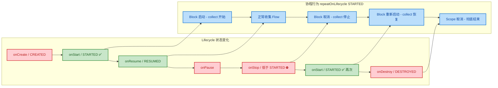

**为什么 `repeatOnLifecycle` 如此重要？**

在 Android 中，当 Activity/Fragment 进入后台（低于 `STARTED`），UI 是不可见的。如果此时仍在收集 Flow 并更新 UI：
- 浪费资源（CPU、网络、电池）
- 可能触发不必要的 UI 操作（如弹 Toast、导航跳转）

`repeatOnLifecycle` 确保：**只在 UI 可见时才执行收集**，完美匹配 Android 的生命周期模型。

#### launchWhenX 系列（已废弃但需了解）

在 `repeatOnLifecycle` 出现之前，`lifecycleScope` 提供了一组 `launchWhenX` API：

```kotlin
// ⚠️ 已标记为 @Deprecated，不推荐使用
lifecycleScope.launchWhenStarted {
    // 当 lifecycle 低于 STARTED 时，协程只是 "挂起"(suspend)
    // 但并没有取消！上游 Flow 仍在产生数据，只是没人消费
    viewModel.uiState.collect { state ->
        updateUI(state)
    }
}
```

`launchWhenStarted` 与 `repeatOnLifecycle(STARTED)` 的关键区别：

| 特性 | `launchWhenStarted` (废弃) | `repeatOnLifecycle(STARTED)` (推荐) |
|---|---|---|
| 低于目标状态时 | **挂起**（暂停消费，上游仍活跃） | **取消**（整个 block 取消，上游停止） |
| 回到目标状态时 | 从挂起点恢复 | 重新启动整个 block |
| 资源消耗 | 上游 Flow 持续运行，浪费资源 | 上游 Flow 也被取消，节省资源 |
| 推荐程度 | ❌ Deprecated | ✅ 官方推荐 |

#### viewModelScope vs lifecycleScope：如何选择？

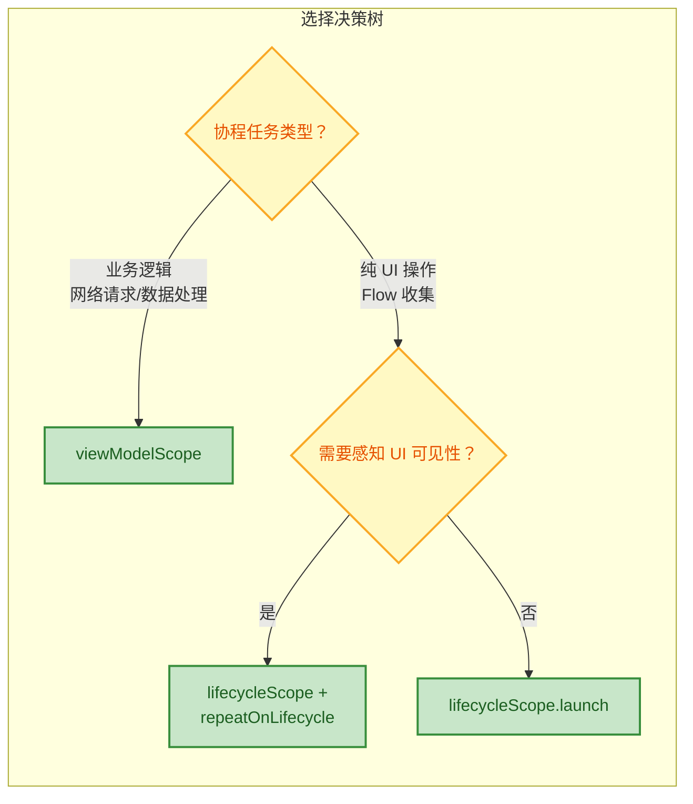

**总结原则**：

- **业务逻辑（网络请求、数据库操作、数据变换）** → `viewModelScope`。因为 ViewModel 在屏幕旋转时不销毁，协程可以存活跨配置变更。
- **UI 层收集 Flow / StateFlow** → `lifecycleScope` + `repeatOnLifecycle`。确保只在 UI 可见时消费数据。
- **一次性 UI 操作（如动画、导航）** → `lifecycleScope.launch` 即可，无需 repeat。

#### 完整实战示例

```kotlin
// ViewModel 层：用 viewModelScope 处理业务
class WeatherViewModel(
    private val weatherRepo: WeatherRepository
) : ViewModel() {

    // StateFlow 持有 UI 状态
    private val _uiState = MutableStateFlow<WeatherUiState>(WeatherUiState.Loading)
    val uiState: StateFlow<WeatherUiState> = _uiState.asStateFlow()

    init {
        // viewModelScope：屏幕旋转时协程不中断
        viewModelScope.launch {
            try {
                val weather = withContext(Dispatchers.IO) {
                    weatherRepo.getCurrentWeather()  // 网络请求
                }
                _uiState.value = WeatherUiState.Success(weather) // 更新状态
            } catch (e: Exception) {
                _uiState.value = WeatherUiState.Error(e.message ?: "Unknown")
            }
        }
    }
}

// UI 层（Fragment）：用 lifecycleScope 收集状态
class WeatherFragment : Fragment() {

    private val viewModel: WeatherViewModel by viewModels()

    override fun onViewCreated(view: View, savedInstanceState: Bundle?) {
        super.onViewCreated(view, savedInstanceState)

        // viewLifecycleOwner.lifecycleScope：绑定到 Fragment View 的生命周期
        // 比 this.lifecycleScope 更精确，避免 View 销毁后仍更新 UI
        viewLifecycleOwner.lifecycleScope.launch {
            // repeatOnLifecycle 确保只在 STARTED 以上状态收集
            viewLifecycleOwner.repeatOnLifecycle(Lifecycle.State.STARTED) {
                viewModel.uiState.collect { state ->
                    // 根据状态更新 UI
                    when (state) {
                        is WeatherUiState.Loading -> showLoading()   // 显示加载
                        is WeatherUiState.Success -> showWeather(state.data) // 显示数据
                        is WeatherUiState.Error -> showError(state.msg)  // 显示错误
                    }
                }
            }
        }
    }
}
```

> **Fragment 中的细节**：在 `onViewCreated` 中应使用 `viewLifecycleOwner.lifecycleScope` 而非 `lifecycleScope`（即 `this.lifecycleScope`）。因为 Fragment 的 View 可能比 Fragment 本身更早销毁（如 Fragment 进入回退栈），使用 `viewLifecycleOwner` 能更精准地与 View 生命周期对齐。

---

### 四种作用域横向对比

| 特性 | `GlobalScope` | `MainScope` | `viewModelScope` | `lifecycleScope` |
|---|---|---|---|---|
| **来源** | kotlinx.coroutines | kotlinx.coroutines | Jetpack lifecycle-viewmodel-ktx | Jetpack lifecycle-runtime-ktx |
| **Job 类型** | 无父 Job | `SupervisorJob` | `SupervisorJob` | `SupervisorJob` |
| **默认调度器** | 无（默认 `Dispatchers.Default`） | `Dispatchers.Main` | `Dispatchers.Main.immediate` | `Dispatchers.Main.immediate` |
| **生命周期绑定** | 无（伴随进程） | 手动 `cancel()` | 自动（ViewModel `onCleared`） | 自动（Lifecycle `DESTROYED`） |
| **结构化并发** | ❌ 破坏 | ✅ 支持 | ✅ 支持 | ✅ 支持 |
| **推荐程度** | ⛔ 几乎不用 | ⚠️ 可用但有更好选择 | ✅ 业务逻辑首选 | ✅ UI 层首选 |

---

**📝 练习题**

在一个 Android Fragment 中，你需要收集 ViewModel 暴露的 `StateFlow` 来更新 UI。以下哪种写法是**官方推荐的最佳实践**？

A. `GlobalScope.launch { viewModel.uiState.collect { updateUI(it) } }`


B. `lifecycleScope.launchWhenStarted { viewModel.uiState.collect { updateUI(it) } }`


C. `viewLifecycleOwner.lifecycleScope.launch { viewLifecycleOwner.repeatOnLifecycle(Lifecycle.State.STARTED) { viewModel.uiState.collect { updateUI(it) } } }`


D. `viewModelScope.launch { viewModel.uiState.collect { updateUI(it) } }`


**【答案】** C

**【解析】**

- **A 错误**：`GlobalScope` 没有生命周期管理，Fragment 销毁后协程仍在运行，会导致内存泄漏和潜在崩溃，严重违反结构化并发原则。
- **B 错误**：`launchWhenStarted` 已被标记为 `@Deprecated`。虽然它能在 `STARTED` 以下挂起协程，但**上游 Flow 仍保持活跃**，持续产生数据却无人消费，浪费系统资源。
- **C 正确**：使用 `viewLifecycleOwner.lifecycleScope`（精确绑定 Fragment View 的生命周期）+ `repeatOnLifecycle(STARTED)`（在低于 STARTED 时**取消**整个收集 block，上游 Flow 也随之停止）。这是 Google 官方文档明确推荐的 StateFlow 收集方式。
- **D 错误**：`viewModelScope` 的生命周期与 ViewModel 绑定，不感知 UI 的可见性。即使 Fragment 进入后台不可见，collect 仍在运行并尝试更新 UI，既浪费资源又可能导致意外行为。在 ViewModel 内部使用 `viewModelScope` 是正确的，但在 Fragment 中收集 Flow 不应该用它。

---

## Job ⭐⭐

在 Kotlin 协程体系中，**Job** 是一个极其核心的概念。如果说 `CoroutineScope` 是协程的"管理者"，那么 **Job 就是每一个协程的"身份证"与"遥控器"**。每当你启动一个协程（通过 `launch` 或 `async`），都会返回一个 `Job` 对象，你可以通过它来追踪协程的状态、取消协程、或者等待协程执行完毕。

从本质上讲，`Job` 是 `kotlinx.coroutines` 库中定义的一个**接口**（interface），它继承自 `CoroutineContext.Element`，这意味着 Job 本身就是协程上下文的一部分。你可以通过 `coroutineContext[Job]` 随时在协程内部取到当前协程对应的 Job。

```kotlin
// Job 接口的核心签名（简化版）
public interface Job : CoroutineContext.Element {
    // 伴生对象作为 CoroutineContext.Key，用于从上下文中检索 Job
    public companion object Key : CoroutineContext.Key<Job>

    // 三个核心状态查询属性
    public val isActive: Boolean       // 是否处于活跃状态
    public val isCompleted: Boolean    // 是否已完成（成功或失败）
    public val isCancelled: Boolean    // 是否已取消

    // 核心操作方法
    public fun cancel(cause: CancellationException? = null)  // 取消协程
    public suspend fun join()                                  // 挂起等待完成
    public val children: Sequence<Job>                         // 所有子 Job
    public fun start(): Boolean                                // 手动启动（用于懒启动）
}
```

理解 Job 的关键在于：**它并不持有协程体内的代码逻辑，它是一个轻量级的控制句柄（Handle）**，专门用于生命周期管理。这种"控制与执行分离"的设计，使得协程可以像管理操作系统进程一样，被外部精细地监控和操控。

---

### 协程句柄

"句柄"（Handle）是一个经典的计算机术语，意思是"对某个资源的间接引用"。你无法直接触碰到协程内部正在运行的代码，但通过 Job 这个句柄，你可以间接地对协程施加控制——取消它、等待它、查询它的状态。

**每一次 `launch` 调用，返回的就是一个 Job：**

```kotlin
import kotlinx.coroutines.*

fun main() = runBlocking {
    // launch 返回一个 Job 对象，它就是这个协程的"句柄"
    val job: Job = launch {
        // 协程体：具体的业务逻辑
        println("协程正在执行...")
        delay(1000L)
        println("协程执行完毕")
    }

    // 通过句柄，我们可以：
    println("Job 是否活跃: ${job.isActive}")       // 查询状态
    job.join()                                       // 等待完成
    println("Job 是否已完成: ${job.isCompleted}")    // 再次查询
}
```

**从协程内部获取自己的 Job：**

```kotlin
import kotlinx.coroutines.*

fun main() = runBlocking {
    launch {
        // 在协程内部，通过 coroutineContext[Job] 获取自身的 Job 引用
        val myJob = coroutineContext[Job]
        println("我自己的 Job: $myJob")
        println("我是否活跃: ${myJob?.isActive}")  // true，因为正在执行中
    }
}
```

这个设计模式非常优雅——**外部通过 `launch` 的返回值持有句柄，内部通过上下文也能访问同一个 Job**，二者指向同一个对象。

**Job 与 CoroutineScope 的关系：**

前面章节提到过，每个 `CoroutineScope` 的上下文中都包含一个 Job。当你在某个 Scope 内 `launch` 一个新协程时，新协程的 Job 会自动成为 Scope 中 Job 的**子 Job**，从而形成一棵 Job 树。这棵树就是结构化并发（Structured Concurrency）的骨架。

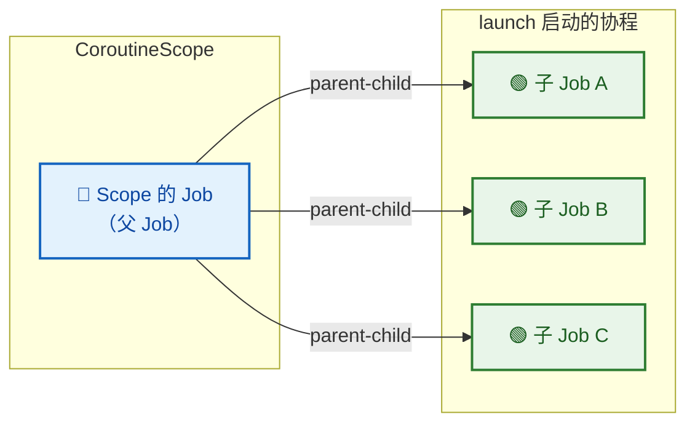

每个通过 `launch` 创建出的协程 Job 都自动挂载到父 Job 下面，这使得取消父 Job 时可以级联取消所有子 Job——这正是结构化并发的核心保障。

---

### 生命周期状态

Job 的生命周期是理解协程行为的关键。一个 Job 从创建到最终终结，会经历若干精确定义的状态。Kotlin 协程官方定义了 **6 种状态**：

| 状态 | 含义 | isActive | isCompleted | isCancelled |
|:---|:---|:---:|:---:|:---:|
| **New** | 刚创建，尚未启动（仅 `LAZY` 模式） | `false` | `false` | `false` |
| **Active** | 正在执行中（默认启动后立刻进入） | `true` | `false` | `false` |
| **Completing** | 协程体已执行完，等待子协程完成 | `true` | `false` | `false` |
| **Completed** | 所有工作（含子协程）已完成 | `false` | `true` | `false` |
| **Cancelling** | 正在取消中，执行清理工作 | `false` | `false` | `true` |
| **Cancelled** | 取消完毕，最终态 | `false` | `true` | `true` |

> 💡 注意：**Completing** 和 **Cancelling** 是**内部状态**（internal states），你无法通过 `isActive`/`isCompleted`/`isCancelled` 三个属性直接区分它们与相邻状态——比如 Completing 时 `isActive` 仍然为 `true`，与 Active 状态的三个属性值完全一致。这些中间态主要是协程框架内部调度使用的。

**完整的状态流转图：**

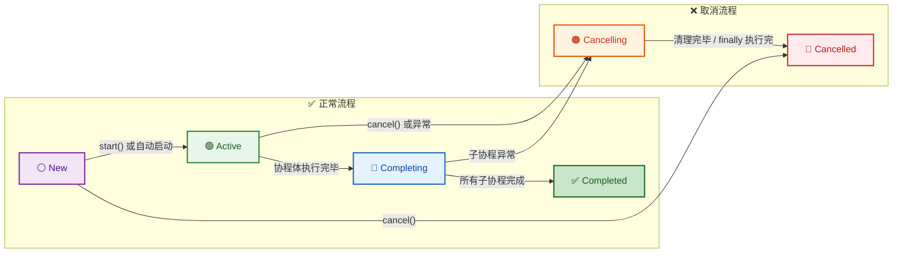

让我们逐一剖析每个状态：

**① New（新建态）**

只有当你使用 `CoroutineStart.LAZY` 参数启动协程时，Job 才会停留在 New 状态。默认情况下，协程创建后会立即进入 Active。

```kotlin
import kotlinx.coroutines.*

fun main() = runBlocking {
    // 使用 LAZY 模式创建协程，不会自动启动
    val lazyJob = launch(start = CoroutineStart.LAZY) {
        println("我被启动了！")
    }

    // 此时 Job 处于 New 状态
    println("isActive: ${lazyJob.isActive}")       // false
    println("isCompleted: ${lazyJob.isCompleted}")  // false
    println("isCancelled: ${lazyJob.isCancelled}")  // false

    // 手动启动
    lazyJob.start()   // New → Active
    lazyJob.join()     // 等待完成
}
```

LAZY 启动在某些场景非常实用——比如你想准备好一系列协程任务，然后在某个时机统一触发执行。

**② Active（活跃态）**

这是协程最常见的运行状态。协程体中的代码正在执行（或正在挂起等待恢复）。默认的 `CoroutineStart.DEFAULT` 会让协程创建后立刻进入 Active 状态。

```kotlin
import kotlinx.coroutines.*

fun main() = runBlocking {
    val job = launch {
        // 进入 Active 状态
        println("isActive 内部: ${coroutineContext[Job]?.isActive}")  // true
        delay(500L)  // 挂起期间仍然是 Active
        println("delay 后仍然 Active")
    }

    println("isActive 外部: ${job.isActive}")  // true
    job.join()
}
```

> ⚠️ 注意：**挂起（suspended）不代表不活跃**。即使协程因为 `delay` 或 `withContext` 暂时让出了线程，它的 Job 仍然处于 Active 状态。Active 表示的是"逻辑上仍在执行中"，而非"物理上正在占用 CPU"。

**③ Completing（完成中）**

当协程体自身的代码执行完毕，但它还有子协程在运行时，Job 进入 Completing 状态。父协程必须等待所有子协程完成后才能进入 Completed。

```kotlin
import kotlinx.coroutines.*

fun main() = runBlocking {
    val parentJob = launch {
        // 启动一个子协程
        launch {
            delay(2000L)  // 子协程需要 2 秒
            println("子协程完成")
        }
        // 父协程体本身很快就执行完了
        println("父协程体代码执行完毕")
        // ➡️ 此时 parentJob 进入 Completing 状态
        // 但 isActive 仍然是 true（外部无法区分 Active 和 Completing）
    }

    delay(500L)  // 等 500ms，此时父协程体已执行完，但子协程还在跑
    println("parentJob.isActive: ${parentJob.isActive}")       // true (Completing)
    println("parentJob.isCompleted: ${parentJob.isCompleted}") // false

    parentJob.join()  // 等待全部结束
    println("parentJob.isCompleted: ${parentJob.isCompleted}") // true
}
```

Completing 是一个**透明的中间态**，对外呈现与 Active 一致。它的存在是为了让框架内部知道"协程体本身已经结束，现在在等子协程"。

**④ Completed（已完成）**

最终的成功终态。协程体执行完毕 + 所有子协程都完成 = Completed。

**⑤ Cancelling（取消中）**

当调用 `job.cancel()` 或者协程内部抛出异常时，Job 进入 Cancelling 状态。在这个阶段：
- 协程有机会执行 `finally` 块中的清理代码
- 所有子协程也会收到取消信号
- 协程内部的 `isActive` 变为 `false`

```kotlin
import kotlinx.coroutines.*

fun main() = runBlocking {
    val job = launch {
        try {
            println("开始工作...")
            delay(5000L)  // 模拟长时间任务
            println("工作完成")  // 不会执行到这里
        } finally {
            // Cancelling 状态期间，finally 块会被执行
            println("进入 finally 清理资源")
            println("isCancelled: ${coroutineContext[Job]?.isCancelled}")  // true
            // ⚠️ 在 Cancelling 状态下，普通的挂起函数会直接抛出 CancellationException
            // 如需在 finally 中执行挂起操作，需使用 withContext(NonCancellable)
        }
    }

    delay(500L)         // 等协程启动并运行一会儿
    job.cancel()        // Active → Cancelling
    println("取消后 isCancelled: ${job.isCancelled}")  // true
    job.join()          // 等待 Cancelling → Cancelled
    println("最终 isCompleted: ${job.isCompleted}")     // true（Cancelled 也算 Completed）
}
```

> 🔑 重要细节：**Cancelled 是 Completed 的一种特殊形式**。当 Job 进入 Cancelled 状态后，`isCompleted` 也会变为 `true`。因此判断一个 Job 是"正常完成"还是"被取消"，需要同时检查 `isCompleted` 和 `isCancelled`。

**⑥ Cancelled（已取消）**

最终的取消终态。`finally` 块执行完毕后，Job 从 Cancelling 变为 Cancelled。

**用一段代码完整演示所有可观测的状态变化：**

```kotlin
import kotlinx.coroutines.*

fun main() = runBlocking {
    // ============= 场景 1: 正常完成的生命周期 =============
    println("===== 正常完成 =====")
    val normalJob = launch(start = CoroutineStart.LAZY) {
        delay(100L)  // 模拟简短任务
    }

    // New 状态
    printJobState("New", normalJob)          // isActive=false, isCompleted=false, isCancelled=false

    normalJob.start()  // New → Active
    printJobState("Active", normalJob)       // isActive=true, isCompleted=false, isCancelled=false

    normalJob.join()   // Active → Completing → Completed
    printJobState("Completed", normalJob)    // isActive=false, isCompleted=true, isCancelled=false

    // ============= 场景 2: 取消的生命周期 =============
    println("\n===== 取消流程 =====")
    val cancelJob = launch {
        delay(10000L)  // 长时间任务
    }

    delay(50L)  // 确保进入 Active
    printJobState("Active", cancelJob)       // isActive=true, isCompleted=false, isCancelled=false

    cancelJob.cancel()  // Active → Cancelling → Cancelled
    printJobState("Cancelled", cancelJob)    // isActive=false, isCompleted=false, isCancelled=true

    cancelJob.join()    // 等待彻底完成
    printJobState("Final", cancelJob)        // isActive=false, isCompleted=true, isCancelled=true
}

// 辅助函数：打印 Job 的三个核心状态属性
fun printJobState(label: String, job: Job) {
    println("[$label] isActive=${job.isActive}, isCompleted=${job.isCompleted}, isCancelled=${job.isCancelled}")
}
```

---

### cancel（取消）

`cancel()` 是 Job 提供的最重要的操控方法之一。调用它会触发**协作式取消**（Cooperative Cancellation）——这是 Kotlin 协程取消机制的核心设计哲学。

**什么是"协作式取消"？**

与线程的 `Thread.stop()`（已废弃的暴力中止）不同，Kotlin 协程的取消是**协作式**的。调用 `cancel()` 后，协程并不会立刻停下来，而是：

1. Job 的状态标记为 Cancelling
2. 协程内部在下一个**取消检查点**（cancellation check point）才会真正响应取消
3. **取消检查点**通常就是那些 `kotlinx.coroutines` 提供的挂起函数：`delay()`、`yield()`、`withContext()` 等

这意味着：**如果你的协程在执行一段纯 CPU 密集型计算、没有调用任何挂起函数，那么它不会自动响应取消！**

```kotlin
import kotlinx.coroutines.*

fun main() = runBlocking {
    val job = launch(Dispatchers.Default) {
        var count = 0L
        // ❌ 纯计算循环，没有挂起点 → 无法自动响应取消
        while (count < 1_000_000_000L) {
            count++
        }
        println("循环结束，count = $count")  // 即使被取消，仍会执行到这里
    }

    delay(100L)
    println("准备取消...")
    job.cancel()   // 发出取消信号
    job.join()     // 等待（但协程根本不理会取消）
    println("结束")
}
```

**如何让密集计算协程响应取消？**

有两种经典方式：

```kotlin
import kotlinx.coroutines.*

fun main() = runBlocking {
    // ===== 方式 1: 手动检查 isActive =====
    val job1 = launch(Dispatchers.Default) {
        var count = 0L
        // 在循环条件中检查 isActive（CoroutineScope 的扩展属性）
        while (isActive && count < 1_000_000_000L) {
            count++
        }
        println("方式1: count = $count, isActive = $isActive")
    }

    // ===== 方式 2: 使用 ensureActive() 或 yield() =====
    val job2 = launch(Dispatchers.Default) {
        var count = 0L
        while (count < 1_000_000_000L) {
            count++
            if (count % 100_000 == 0L) {
                ensureActive()  // 如果已取消，直接抛出 CancellationException
                // 或者使用 yield()，还能让出线程给其他协程
            }
        }
    }

    delay(100L)
    job1.cancel()
    job2.cancel()
    job1.join()
    job2.join()
    println("两个协程都已取消")
}
```

**cancel() 的参数 —— CancellationException：**

`cancel()` 接收一个可选的 `CancellationException` 参数，用于提供取消的原因信息：

```kotlin
import kotlinx.coroutines.*

fun main() = runBlocking {
    val job = launch {
        try {
            delay(5000L)
        } catch (e: CancellationException) {
            // 取消时，挂起函数会抛出 CancellationException
            println("被取消了，原因: ${e.message}")
        }
    }

    delay(200L)
    // 可以传入自定义的取消原因
    job.cancel(CancellationException("用户手动取消了操作"))
    job.join()
}
```

> 🔑 关键知识点：`CancellationException` 在协程框架中被**特殊对待**——它被视为"正常取消"而非"异常失败"。因此：
> - 子协程抛出 `CancellationException` **不会**导致父协程取消
> - 它不会被 `CoroutineExceptionHandler` 捕获
> - 这与其他异常（如 `IOException`）的行为完全不同（后者会向上传播导致父协程也被取消）

**cancel() + join() 的惯用组合 → cancelAndJoin()：**

实际开发中，`cancel()` 之后几乎总是需要 `join()` 来确保协程真正结束。为此，协程库提供了便捷的组合函数：

```kotlin
import kotlinx.coroutines.*

fun main() = runBlocking {
    val job = launch {
        try {
            repeat(1000) { i ->
                println("工作中: $i")
                delay(100L)
            }
        } finally {
            println("清理资源...")
            // 如果需要在 finally 中调用挂起函数
            withContext(NonCancellable) {
                delay(200L)  // 在 NonCancellable 上下文中，挂起函数不会因取消而失败
                println("清理完成！")
            }
        }
    }

    delay(350L)
    println("准备取消...")
    // cancelAndJoin() = cancel() + join()，是推荐的惯用写法
    job.cancelAndJoin()
    println("协程已彻底结束")
}
```

> ⚠️ **finally 中的挂起操作陷阱**：在 Cancelling 状态的协程中，调用普通的挂起函数（如 `delay`）会**立即抛出 `CancellationException`**。如果确实需要在 `finally` 中执行挂起操作（比如关闭数据库连接、发送日志等），必须包裹在 `withContext(NonCancellable) { ... }` 中。

---

### join（等待完成）

`join()` 是一个**挂起函数**（suspend function），它会挂起当前协程，直到目标 Job 进入 Completed 或 Cancelled 终态。

```kotlin
import kotlinx.coroutines.*

fun main() = runBlocking {
    val job = launch {
        println("Step 1: 开始下载...")
        delay(1000L)  // 模拟网络下载
        println("Step 2: 下载完成")
    }

    println("主协程：等待下载完成...")
    job.join()  // ← 挂起，直到 job 完成
    // join() 返回后，可以确保 job 已经结束
    println("主协程：下载已完成，继续处理...")
}
// 输出顺序：
// 主协程：等待下载完成...
// Step 1: 开始下载...
// Step 2: 下载完成
// 主协程：下载已完成，继续处理...
```

**join() 的核心特性：**

1. **非阻塞挂起**：`join()` 不会阻塞线程，它只是挂起当前协程。底层线程被释放出来可以执行其他任务。
2. **幂等性**：对已经完成的 Job 调用 `join()` 会立即返回，不会挂起。
3. **取消安全**：如果调用 `join()` 的协程自身被取消，`join()` 会抛出 `CancellationException`。

**多个 Job 的顺序等待：**

```kotlin
import kotlinx.coroutines.*

fun main() = runBlocking {
    val job1 = launch {
        delay(1000L)
        println("任务1完成")
    }

    val job2 = launch {
        delay(2000L)
        println("任务2完成")
    }

    val job3 = launch {
        delay(1500L)
        println("任务3完成")
    }

    // 按顺序等待每个 Job
    // 注意：三个协程是并发执行的，join 只是等待点
    job1.join()
    println("--- job1 已确认完成 ---")
    job2.join()
    println("--- job2 已确认完成 ---")
    job3.join()
    println("--- job3 已确认完成 ---")
}
// 输出：
// 任务1完成（~1s）
// --- job1 已确认完成 ---
// 任务3完成（~1.5s）
// 任务2完成（~2s）
// --- job2 已确认完成 ---
// --- job3 已确认完成 ---   ← job3 其实在 job2 之前就完成了
```

注意上面的执行顺序——三个协程是并发启动的，所以它们的完成顺序取决于各自的 `delay` 时间。`join()` 只是一个等待点，如果对应的 Job 已经完成，它会立即返回。

**join() 与 cancel() 的配合时序：**

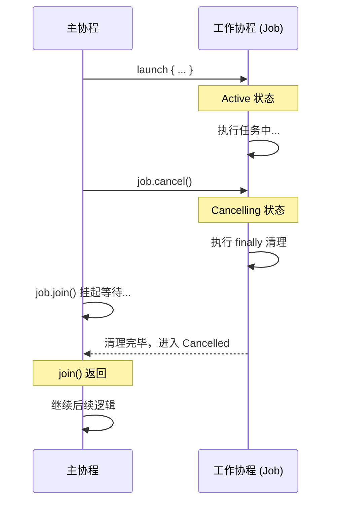

这个时序图清晰展示了为什么 `cancel()` 后还需要 `join()`：因为 `cancel()` 只是发出信号，协程可能还在执行 `finally` 中的清理代码，只有 `join()` 返回后才能保证协程真正结束。

---

### isActive / isCompleted / isCancelled

这三个布尔属性是 Job 对外暴露状态的主要手段。虽然 Job 内部有 6 种状态，但对外只通过这三个属性的组合来表达：

```kotlin
// 伪代码：三个属性与六种状态的映射关系
// State        | isActive | isCompleted | isCancelled
// -------------|----------|-------------|------------
// New          |  false   |   false     |   false
// Active       |  true    |   false     |   false
// Completing   |  true    |   false     |   false    ← 与 Active 无法区分
// Completed    |  false   |   true      |   false
// Cancelling   |  false   |   false     |   true
// Cancelled    |  false   |   true      |   true     ← isCompleted 也为 true！
```

**实用判断模式：**

```kotlin
import kotlinx.coroutines.*

// 封装一个状态判断辅助函数
fun diagnoseJob(job: Job): String = when {
    job.isActive                          -> "运行中 (Active/Completing)"
    job.isCancelled && job.isCompleted    -> "已取消 (Cancelled)"
    job.isCancelled && !job.isCompleted   -> "取消中 (Cancelling)"
    job.isCompleted                       -> "已完成 (Completed)"
    else                                  -> "新建未启动 (New)"
}

fun main() = runBlocking {
    // New 状态
    val lazyJob = launch(start = CoroutineStart.LAZY) { delay(100L) }
    println(diagnoseJob(lazyJob))  // 新建未启动 (New)

    // Active 状态
    val activeJob = launch { delay(5000L) }
    delay(50L)
    println(diagnoseJob(activeJob))  // 运行中 (Active/Completing)

    // Completed 状态
    val doneJob = launch { delay(50L) }
    doneJob.join()
    println(diagnoseJob(doneJob))  // 已完成 (Completed)

    // Cancelled 状态
    activeJob.cancelAndJoin()
    println(diagnoseJob(activeJob))  // 已取消 (Cancelled)

    lazyJob.cancelAndJoin()  // 清理
}
```

**在协程内部使用 isActive 控制循环：**

这是实际开发中最常见的模式之一——在长时间运行的循环中检查 `isActive`，以实现对取消的及时响应：

```kotlin
import kotlinx.coroutines.*

fun main() = runBlocking {
    val processingJob = launch(Dispatchers.Default) {
        var processedItems = 0

        // isActive 是 CoroutineScope 的扩展属性
        // 本质上等价于 coroutineContext[Job]?.isActive == true
        while (isActive) {
            // 模拟处理数据
            processedItems++

            // 每处理 1000 条打印一次进度
            if (processedItems % 1000 == 0) {
                println("已处理 $processedItems 条数据")
            }

            // 这里没有挂起点，所以 isActive 检查是唯一的取消响应机制
        }

        // while 循环因 isActive == false 退出后，可以做清理
        println("循环结束，共处理 $processedItems 条")
    }

    delay(50L)             // 让协程运行一会儿
    processingJob.cancelAndJoin()  // 取消并等待
    println("处理任务已取消")
}
```

**isActive vs ensureActive() vs yield() 对比：**

| 特性 | `isActive` | `ensureActive()` | `yield()` |
|:---|:---|:---|:---|
| **类型** | 属性（Boolean） | 挂起函数 | 挂起函数 |
| **取消时行为** | 返回 `false` | 抛出 `CancellationException` | 抛出 `CancellationException` |
| **让出线程** | ❌ 不让出 | ❌ 不让出 | ✅ 让出线程 |
| **适用场景** | while 循环条件 | 快速检查 + 立即中止 | 需要公平调度时 |
| **代码风格** | 温和退出循环 | 立即抛异常中止 | 协作式让步 |

```kotlin
import kotlinx.coroutines.*

fun main() = runBlocking {
    // 风格 1: isActive —— 温和退出
    launch(Dispatchers.Default) {
        while (isActive) { /* work */ }
        println("温和退出，可以在这里做善后")
    }

    // 风格 2: ensureActive —— 直接抛异常
    launch(Dispatchers.Default) {
        while (true) {
            ensureActive()  // 取消时直接抛 CancellationException，跳到 catch/finally
            /* work */
        }
    }

    // 风格 3: yield —— 让出线程 + 取消检查
    launch(Dispatchers.Default) {
        while (true) {
            yield()  // 让其他协程有机会执行，同时检查取消
            /* work */
        }
    }

    delay(50L)
    coroutineContext.cancelChildren()  // 取消所有子协程
}
```

选择哪种方式取决于你的需求：如果需要在循环结束后做清理，用 `isActive`；如果希望立即中止并通过异常机制统一处理，用 `ensureActive()`；如果在密集计算中还想保持公平调度（不独占线程），用 `yield()`。

---

**📝 练习题**

以下代码的输出结果是什么？

```kotlin
import kotlinx.coroutines.*

fun main() = runBlocking {
    val job = launch {
        try {
            println("A")
            delay(1000L)
            println("B")
        } finally {
            println("C")
            delay(500L)
            println("D")
        }
    }
    delay(100L)
    job.cancelAndJoin()
    println("E")
}
```

A. A → B → C → D → E


B. A → C → E


C. A → C → D → E


D. A → E


**【答案】** B

**【解析】**

1. 协程启动后打印 `"A"`，然后在 `delay(1000L)` 处挂起。
2. 主协程等待 100ms 后调用 `cancelAndJoin()`，此时工作协程正挂起在 `delay(1000L)` 上。
3. `cancel()` 使 Job 进入 Cancelling 状态，`delay(1000L)` 检测到取消，抛出 `CancellationException`，`"B"` 不会打印。
4. 异常被 `try` 捕获，进入 `finally` 块，打印 `"C"`。
5. **关键点**：在 Cancelling 状态下，`finally` 中的 `delay(500L)` 会**立即抛出 `CancellationException`**（因为协程已处于取消中，所有挂起函数会立刻失败）。因此 `"D"` 不会打印。如果希望 `"D"` 也被打印，需要用 `withContext(NonCancellable) { delay(500L) }` 包裹。
6. 协程彻底结束，`cancelAndJoin()` 返回，主协程打印 `"E"`。

最终输出顺序：**A → C → E**。这道题考察的核心知识点是：**Cancelling 状态下 finally 块中的挂起函数会立即失败**，必须使用 `NonCancellable` 上下文才能在取消清理阶段执行挂起操作。

---

## 父子协程关系 ⭐⭐⭐

父子协程关系（Parent-Child Coroutine Relationship）是 Kotlin 协程体系中**最核心的结构化并发（Structured Concurrency）机制**。理解它，就等于理解了协程为何能安全、可靠地管理并发任务的生命周期。

在传统线程模型中，你启动一个线程后，它就像一个"脱缰野马"——没有人自动帮你追踪它是否完成、是否出错。而 Kotlin 协程通过**父子层级结构**，在语言层面强制建立了一套"家族契约"：父协程对子协程的生命周期负责，子协程的异常也会向上传播。这就是 Roman Elizarov（Kotlin 协程设计者）所倡导的 **Structured Concurrency** 的精髓。

我们先用一张全局视图来理解父子协程之间的四大核心规则：

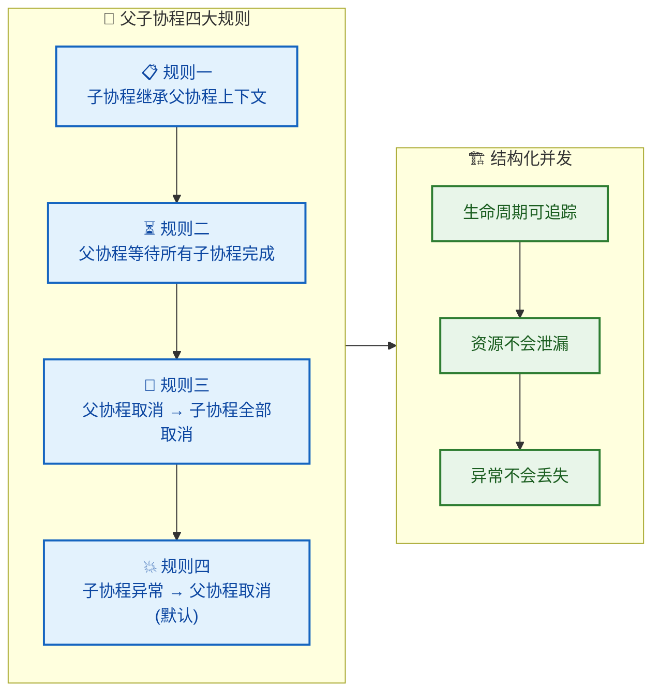

在深入每条规则之前，先明确一个关键前提：**父子关系是如何建立的？**

当你在一个协程的 `CoroutineScope` 内部调用 `launch` 或 `async` 时，新协程的 `Job` 会自动成为外层协程 `Job` 的**子 Job**。这个"自动挂靠"的过程发生在协程构建器内部——它会从当前 `coroutineContext` 中取出 `Job`，然后把新建的 `Job` 设为其 child。

```kotlin
// 演示父子 Job 关系的建立
fun main() = runBlocking {
    // runBlocking 创建了一个顶层协程，拥有自己的 Job
    val parentJob = coroutineContext[Job]  // 获取当前协程（父）的 Job
    println("父 Job: $parentJob")

    val childJob = launch {
        // 这个 launch 在 runBlocking 的 scope 内启动
        // 所以它的 Job 自动成为 parentJob 的子 Job
        println("子 Job: ${coroutineContext[Job]}")
        delay(1000)
    }

    // 验证父子关系
    println("childJob 的父亲是 parentJob? ${childJob.parent == parentJob}")  // true
    println("parentJob 的 children 包含 childJob? ${parentJob?.children?.toList()?.contains(childJob)}")  // true
}
```

这段代码揭示了一个重要事实：**`launch` 并不是在"真空"中创建协程，而是在当前作用域的 Job 树上"嫁接"一个新节点。** 整个应用中所有通过结构化并发启动的协程，最终会形成一棵 **Job 树**（Job Tree）。

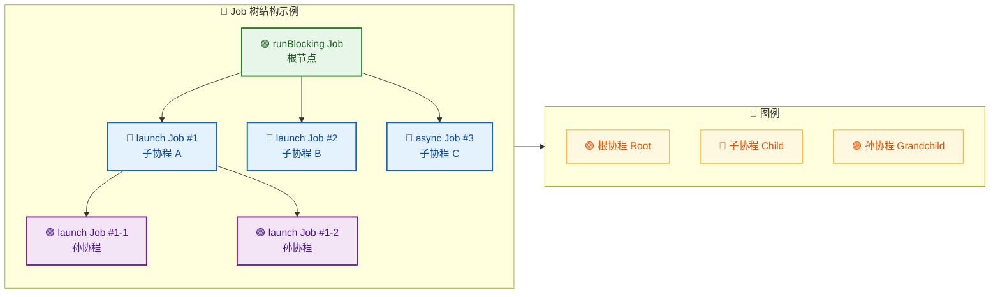

---

### 子协程继承父协程上下文

这是父子关系的**第一条规则**，也是一切的起点。当你在一个协程作用域内启动新协程时，子协程会**继承**父协程的 `CoroutineContext`，但这个继承并非简单的复制——它遵循一套精确的**合并公式**：

> **子协程最终上下文 = 父协程上下文 + 子协程构建器参数覆盖 + 新生成的子 Job**

用伪公式来表达就是：

```
childContext = parentContext + overriddenElements + newChildJob
```

这里的优先级从左到右递增——子协程构建器中显式传入的元素会**覆盖**父协程对应的元素，而 `Job` 一定是新生成的（每个协程都有自己独立的 Job）。

```kotlin
// 演示上下文继承与覆盖
fun main() = runBlocking(CoroutineName("父协程")) {
    // 父协程上下文包含: Job(runBlocking 的) + CoroutineName("父协程") + BlockingEventLoop(调度器)

    println("父协程上下文: $coroutineContext")
    println("父协程名称: ${coroutineContext[CoroutineName]}")        // CoroutineName("父协程")
    println("父协程调度器: ${coroutineContext[ContinuationInterceptor]}")  // BlockingEventLoop

    // 子协程 A：不传任何参数 → 完全继承父上下文（除了 Job）
    launch {
        println("\n子协程 A 名称: ${coroutineContext[CoroutineName]}")        // CoroutineName("父协程") ← 继承
        println("子协程 A 调度器: ${coroutineContext[ContinuationInterceptor]}")  // BlockingEventLoop ← 继承
        println("子协程 A 的 Job 与父相同? ${coroutineContext[Job] == this@runBlocking.coroutineContext[Job]}")  // false ← 新 Job
    }

    // 子协程 B：显式传入 CoroutineName → 覆盖父协程的 CoroutineName
    launch(CoroutineName("子协程B") + Dispatchers.IO) {
        println("\n子协程 B 名称: ${coroutineContext[CoroutineName]}")        // CoroutineName("子协程B") ← 覆盖
        println("子协程 B 调度器: ${coroutineContext[ContinuationInterceptor]}")  // Dispatchers.IO ← 覆盖
    }
}
```

我们用一张图更直观地呈现继承与覆盖的流程：

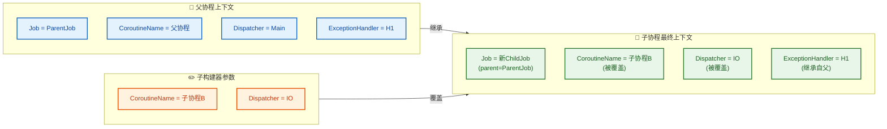

**几个关键细节：**

1. **Job 永远不会被继承复用**。即使你在子协程构建器中不传 `Job` 参数，协程框架也会自动生成一个新的子 Job，并将其 `parent` 指向父 Job。如果你强行传入一个外部 Job，会**打破父子关系**，这是一个常见的陷阱：

```kotlin
// ⚠️ 危险示例：手动传入 Job 打破父子关系
fun main() = runBlocking {
    val externalJob = Job()  // 一个独立的、无父的 Job

    // 虽然在 runBlocking 的 scope 内启动，但传入了外部 Job
    // 这会导致新协程的 parent 变成 externalJob，而非 runBlocking 的 Job
    launch(externalJob) {
        println("我的 parent 是 externalJob，而非 runBlocking 的 Job")
        println("parent: ${coroutineContext[Job]?.parent}")  // 指向 externalJob
        delay(5000)
        println("这行可能永远不会执行")
    }

    delay(100)
    println("runBlocking 即将结束，但上面的子协程不受其管控了！")
    // runBlocking 结束时不会等待那个协程，因为父子关系被打破了
    // 同时 externalJob 永远不会 complete（没人调用 externalJob.complete()），可能导致泄漏
}
```

2. **CoroutineExceptionHandler 只在根协程生效**。虽然子协程会继承它，但真正"处理"未捕获异常的，是 Job 树的根节点上的 Handler。这与后面的异常传播规则密切相关。

3. **Dispatcher 的继承最为常见**。当子协程不指定调度器时，它会运行在与父协程相同的线程/线程池上。这在 Android 开发中尤其重要——在 `lifecycleScope`（默认 `Dispatchers.Main`）内启动的子协程，默认也跑在主线程上。

---

### 父协程等待所有子协程完成

这是结构化并发最直观的表现：**一个父协程不会在自己的代码体执行完毕后立刻结束，它会自动挂起等待所有子协程完成后才进入 `Completed` 状态。**

这一机制确保了**不会有孤儿协程（Orphan Coroutine）被遗忘**。在传统线程中，主线程结束后守护线程直接被杀死，非守护线程则可能导致进程无法退出。而协程的父子等待机制从根本上消除了这类问题。

```kotlin
// 演示父协程等待子协程完成
fun main() = runBlocking {
    println("[${currentTime()}] 父协程开始")

    launch {
        println("[${currentTime()}] 子协程 A 开始")
        delay(1000)  // 模拟耗时 1 秒
        println("[${currentTime()}] 子协程 A 结束")
    }

    launch {
        println("[${currentTime()}] 子协程 B 开始")
        delay(2000)  // 模拟耗时 2 秒
        println("[${currentTime()}] 子协程 B 结束")
    }

    println("[${currentTime()}] 父协程自身代码执行完毕，但还不会结束...")
    // 父协程会自动等待子协程 A 和 B 都完成后才 Completed
}

// 辅助函数：获取相对时间
private val startTime = System.currentTimeMillis()
fun currentTime() = "${System.currentTimeMillis() - startTime}ms"
```

输出结果：

```
[0ms] 父协程开始
[2ms] 父协程自身代码执行完毕，但还不会结束...
[3ms] 子协程 A 开始
[4ms] 子协程 B 开始
[1005ms] 子协程 A 结束
[2006ms] 子协程 B 结束
```

注意看——"父协程自身代码执行完毕"这条日志最先打印（因为 `launch` 是异步的），但 `runBlocking` 直到 2 秒后子协程 B 完成才真正退出。

**底层原理**：当父协程的代码体执行完毕时，它的 Job 进入 **Completing** 状态（而非直接 Completed）。在 Completing 状态下，Job 会检查是否还有活跃的子 Job。如果有，就挂起等待。只有当所有子 Job 都到达终态（Completed 或 Cancelled），父 Job 才会进入 Completed 状态。

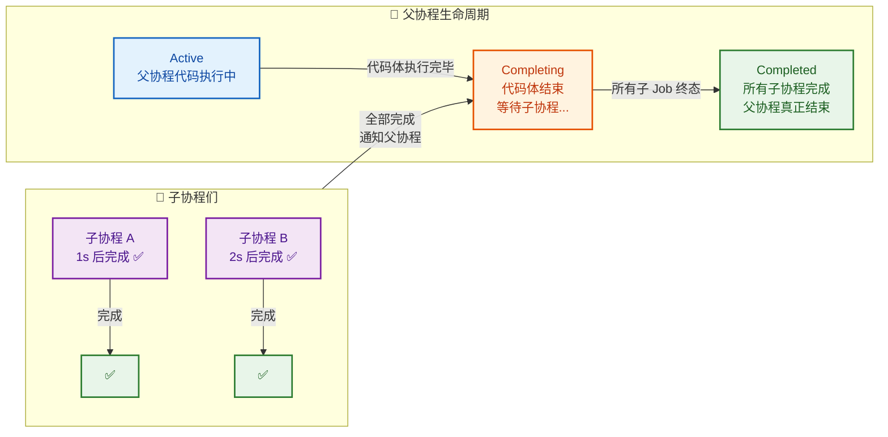

**一个实际的 Android 场景**：

```kotlin
// 在 ViewModel 中使用 viewModelScope
class MyViewModel : ViewModel() {

    fun loadDashboard() {
        viewModelScope.launch {
            // 父协程：加载仪表盘

            // 子协程 1：加载用户信息
            val userDeferred = async { userRepository.getUser() }

            // 子协程 2：加载订单列表
            val ordersDeferred = async { orderRepository.getOrders() }

            // 子协程 3：加载推荐内容
            val recommendDeferred = async { recommendRepository.getRecommendations() }

            // 父协程等待所有子协程完成后，才组装最终数据
            val dashboard = Dashboard(
                user = userDeferred.await(),
                orders = ordersDeferred.await(),
                recommendations = recommendDeferred.await()
            )

            _uiState.value = UiState.Success(dashboard)
        }
        // 当 ViewModel 被清除时，viewModelScope 取消
        // → 父协程取消 → 三个 async 子协程全部取消
        // 没有任何网络请求会被遗忘！
    }
}
```

这段代码体现了结构化并发的优雅之处：三个并行请求作为子协程，父协程自然地等待它们全部完成。不需要 `CountDownLatch`，不需要回调嵌套，一切自动协调。

---

### 父协程取消 → 所有子协程取消

第三条规则是**取消的向下传播（Downward Cancellation Propagation）**。当一个父协程被取消时，它的所有子协程、孙协程……都会被递归取消。这一机制确保了**资源不会泄漏**。

```kotlin
// 演示取消的向下传播
fun main() = runBlocking {
    val parentJob = launch {
        println("父协程启动")

        // 子协程 A
        val childA = launch {
            try {
                println("  子协程 A 启动")
                delay(5000)  // 模拟长时间任务
                println("  子协程 A 完成")  // 永远不会执行
            } catch (e: CancellationException) {
                println("  子协程 A 被取消: ${e.message}")
            } finally {
                println("  子协程 A 清理资源")
            }
        }

        // 子协程 B，它内部还有孙协程
        val childB = launch {
            println("  子协程 B 启动")

            // 孙协程
            launch {
                try {
                    println("    孙协程启动")
                    delay(5000)
                    println("    孙协程完成")  // 永远不会执行
                } catch (e: CancellationException) {
                    println("    孙协程被取消: ${e.message}")
                }
            }

            delay(5000)
            println("  子协程 B 完成")  // 永远不会执行
        }

        delay(5000)
        println("父协程完成")  // 永远不会执行
    }

    delay(500)  // 等 500ms 让所有协程都启动
    println("\n--- 取消父协程 ---\n")
    parentJob.cancel(CancellationException("用户关闭了页面"))  // 取消父协程

    parentJob.join()  // 等待取消完成
    println("\n所有协程已取消")
}
```

输出：

```
父协程启动
  子协程 A 启动
  子协程 B 启动
    孙协程启动

--- 取消父协程 ---

    孙协程被取消: 用户关闭了页面
  子协程 A 被取消: 用户关闭了页面
  子协程 A 清理资源
  子协程 B 被取消（内部 delay 抛出 CancellationException）

所有协程已取消
```

注意关键点：**取消是递归的**。父 → 子A、子B → 孙协程，整棵子树全部被取消。

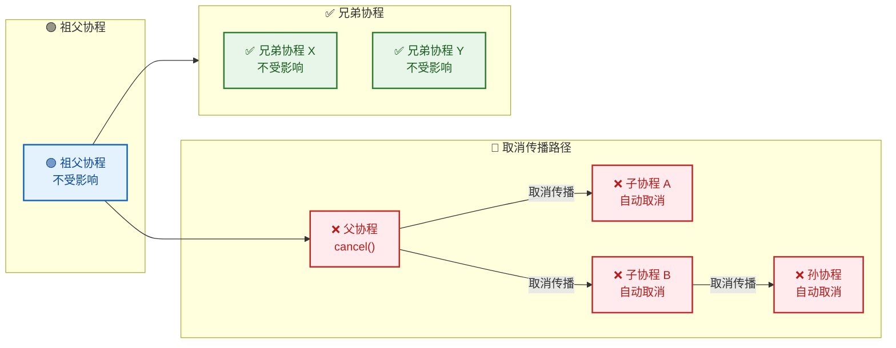

图中特别标注了一个重要事实：**取消只向下传播，不向上传播**。父协程取消时，兄弟协程和祖父协程完全不受影响。`CancellationException` 是一种特殊异常，协程框架会将其识别为"正常取消"而非"异常失败"，因此不会触发异常向上传播机制。

**与 Android 生命周期的结合**：

```kotlin
class MyActivity : AppCompatActivity() {

    override fun onCreate(savedInstanceState: Bundle?) {
        super.onCreate(savedInstanceState)

        // lifecycleScope 绑定到 Activity 的 Lifecycle
        lifecycleScope.launch {
            // 父协程

            launch {
                // 子协程：持续轮询数据
                while (isActive) {  // 协作式检查取消
                    val data = api.poll()
                    updateUI(data)
                    delay(5000)
                }
            }

            launch {
                // 子协程：监听 WebSocket
                webSocket.connect()
                try {
                    webSocket.receiveMessages()  // 挂起直到连接关闭或取消
                } finally {
                    webSocket.disconnect()  // 取消时清理连接
                }
            }
        }
        // 当 Activity onDestroy 时:
        // lifecycleScope 取消 → 父协程取消 → 两个子协程全部取消
        // 轮询停止，WebSocket 断开连接。零泄漏！
    }
}
```

---

### 子协程异常 → 父协程取消（默认）

这是四条规则中**最复杂、最容易让人困惑**的一条。默认情况下，当一个子协程因为**非 `CancellationException` 的异常**失败时，异常会**向上传播**到父协程，父协程随即取消自身和所有其他子协程。

这一行为的设计哲学是：**如果一个子任务失败了，那么整个父任务的语义完整性已经被破坏，继续执行其他子任务没有意义。**

```kotlin
// 演示异常的向上传播
fun main() = runBlocking {
    try {
        coroutineScope {
            // 使用 coroutineScope 而非直接在 runBlocking 中演示
            // 因为 coroutineScope 会重新抛出子协程异常

            // 子协程 A：正常工作
            launch {
                try {
                    println("子协程 A: 开始执行长任务")
                    delay(5000)  // 模拟耗时任务
                    println("子协程 A: 完成")  // 永远不会执行
                } catch (e: CancellationException) {
                    println("子协程 A: 被取消了！（因为兄弟 B 出了异常）")
                }
            }

            // 子协程 B：500ms 后抛出异常
            launch {
                delay(500)
                println("子协程 B: 即将抛出异常！")
                throw RuntimeException("子协程 B 发生了网络错误")
                // 异常传播路径：子B → 父 coroutineScope → 取消子A → 向上抛出
            }

            // 子协程 C：也会被连带取消
            launch {
                try {
                    delay(5000)
                } catch (e: CancellationException) {
                    println("子协程 C: 被取消了！（同样因为兄弟 B）")
                }
            }
        }
    } catch (e: RuntimeException) {
        println("\n捕获到从 coroutineScope 传播出的异常: ${e.message}")
    }
}
```

输出：

```
子协程 A: 开始执行长任务
子协程 B: 即将抛出异常！
子协程 A: 被取消了！（因为兄弟 B 出了异常）
子协程 C: 被取消了！（同样因为兄弟 B）

捕获到从 coroutineScope 传播出的异常: 子协程 B 发生了网络错误
```

让我们用时序图完整展示这个传播过程：

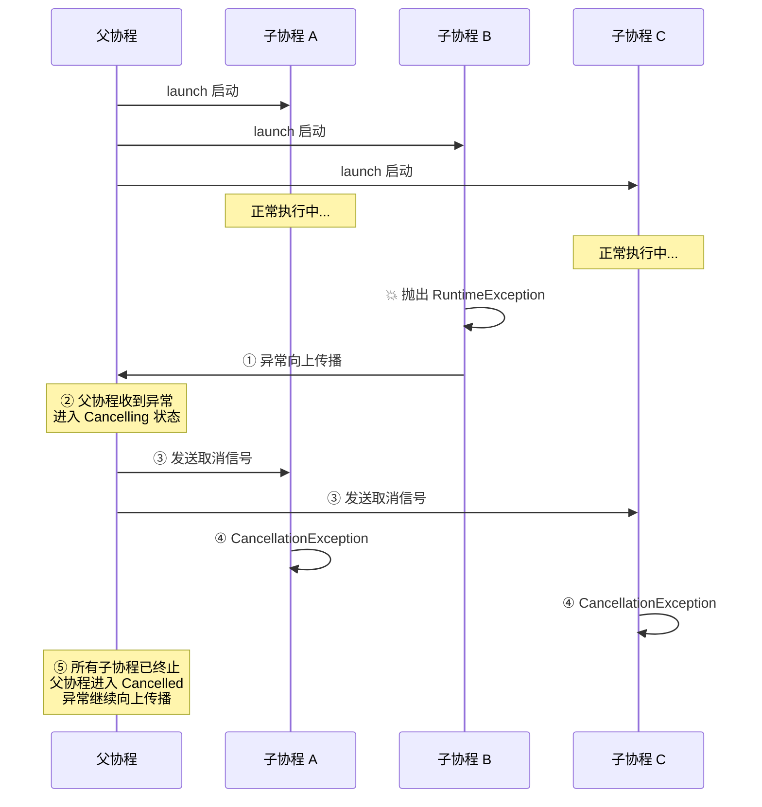

**异常传播的完整流程（5步）**：

1. **子协程 B 抛出异常** → 子B的Job变为 Cancelled
2. **异常传播到父协程** → 父协程的 Job 收到 `childCancelled()` 通知，进入 Cancelling 状态
3. **父协程取消所有其他子协程** → 向子A、子C发送取消信号
4. **其他子协程被取消** → 子A、子C在各自的挂起点收到 `CancellationException`
5. **父协程进入最终状态** → 所有子协程都已终止后，父协程进入 Cancelled，并将原始异常继续向上传播

**CancellationException 的特殊性**：

这里必须强调一个极其重要的区别：

| 异常类型 | 向上传播？ | 取消兄弟？ | 语义 |
|---------|-----------|-----------|------|
| `CancellationException` | ❌ 不传播 | ❌ 不取消 | "我自己主动退出了，不关别人的事" |
| 其他任何异常（`RuntimeException` 等）| ✅ 传播 | ✅ 取消 | "出了严重问题，整个任务应该中止" |

```kotlin
// CancellationException vs 普通异常的区别
fun main() = runBlocking {
    val parent = launch {
        val childA = launch {
            delay(3000)
            println("子协程 A 完成")  // 是否执行取决于 B 抛的异常类型
        }

        val childB = launch {
            delay(500)
            // 场景一：抛 CancellationException → 只有 B 自己取消，A 不受影响
            // throw CancellationException("B 自行退出")

            // 场景二：抛普通异常 → B 失败，A 也被取消，父也取消
            throw RuntimeException("B 出了 bug")
        }
    }
    parent.join()
}
```

**如何阻止异常向上传播？使用 SupervisorJob**

在某些场景下，你不希望一个子协程的失败影响其他子协程。例如：一个列表页面同时加载多个卡片，某个卡片加载失败不应该导致整个页面崩溃。这时就需要 `SupervisorJob` 或 `supervisorScope`：

```kotlin
// 使用 supervisorScope 隔离子协程异常
fun main() = runBlocking {
    supervisorScope {
        // 在 supervisorScope 内，子协程的异常不会传播给父协程

        val childA = launch {
            delay(3000)
            println("子协程 A 完成 ✅")  // 会执行！不受 B 影响
        }

        val childB = launch {
            delay(500)
            throw RuntimeException("子协程 B 失败")
            // 异常不会传播给 supervisorScope
            // 但需要通过 CoroutineExceptionHandler 处理，否则会崩溃
        }

        val childC = launch {
            delay(2000)
            println("子协程 C 完成 ✅")  // 也会执行！
        }
    }
}
```

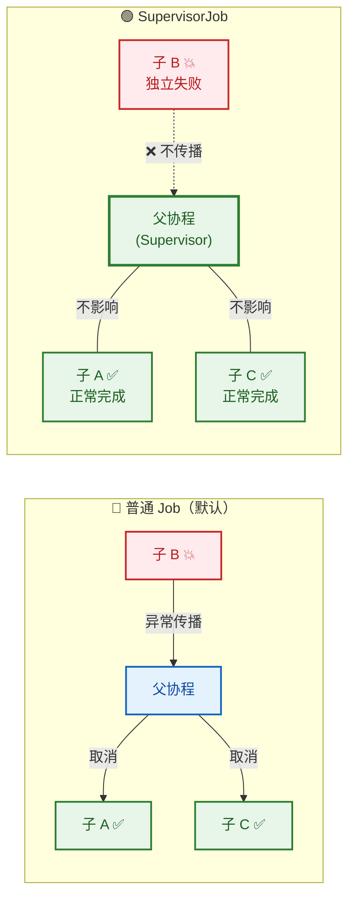

最后，把四条规则整合成一张总览图：

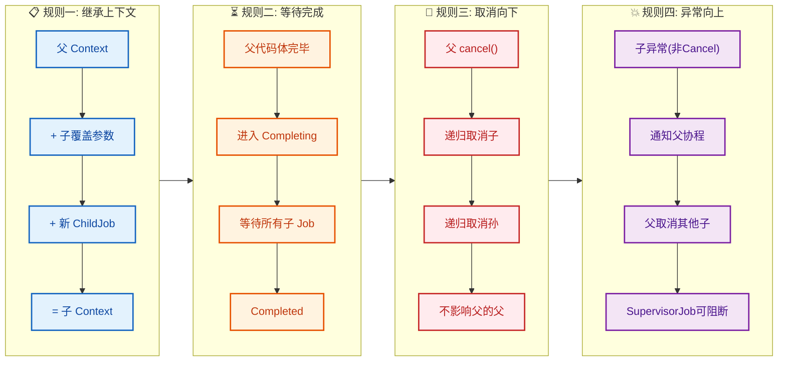

---

**📝 练习题**

以下代码的输出结果是什么？

```kotlin
fun main() = runBlocking {
    val scope = CoroutineScope(Job() + Dispatchers.Default)

    val parent = scope.launch {
        launch {
            delay(1000)
            println("A")
        }
        launch {
            delay(500)
            throw RuntimeException("Boom")
        }
        launch {
            delay(1500)
            println("C")
        }
    }

    delay(2000)
    println("isActive=${parent.isActive}, isCancelled=${parent.isCancelled}, isCompleted=${parent.isCompleted}")
}
```

A. 输出 A、C，然后 `isActive=false, isCancelled=false, isCompleted=true`

B. 仅输出 `isActive=false, isCancelled=true, isCompleted=true`，A 和 C 均不输出

C. 输出 A，不输出 C，然后 `isActive=false, isCancelled=true, isCompleted=true`

D. 程序崩溃，抛出 `RuntimeException: Boom`


**【答案】** B

**【解析】**

这道题考查的是**子协程异常向上传播**的默认行为（规则四）。

1. `scope` 使用的是普通 `Job()`（非 SupervisorJob），所以子协程异常会向上传播。
2. `parent` 协程启动后，内部有 3 个子协程。
3. 500ms 时，第二个子协程抛出 `RuntimeException("Boom")`。由于不是 `CancellationException`，异常**向上传播**到 `parent`。
4. `parent` 收到异常后进入 `Cancelling` 状态，立即取消所有其他子协程——子协程 A（还在 delay 中，还没到 1000ms）和子协程 C（还在 delay 中，还没到 1500ms）都被取消。因此 **A 和 C 都不会输出**。
5. `parent` 最终进入 `Cancelled` 状态（`isCancelled=true, isCompleted=true, isActive=false`）。
6. 程序**不会崩溃**，因为异常传播到了 `scope` 的 `Job()` 就停止了。`scope` 没有设置 `CoroutineExceptionHandler`，但在 JVM 上未捕获的协程异常会交给线程的 `UncaughtExceptionHandler` 处理（默认只是打印堆栈），**不会导致 `runBlocking` 崩溃**，因为 `scope` 是独立的 `CoroutineScope`，与 `runBlocking` 没有父子关系。

排除 A：A 和 C 在异常传播时尚未完成，会被取消。排除 C：子协程 A 的 delay(1000) 大于异常发生的时间 500ms，也会被取消。排除 D：异常发生在独立的 `scope` 中，不影响 `runBlocking`。

---

## Deferred

在前面的章节中，我们已经深入理解了 `Job` 作为协程句柄的核心角色——它管理协程的生命周期，支持取消与等待。但 `Job` 有一个显著的局限：**它只关心协程"做没做完"，却不关心协程"算出了什么"**。换句话说，`Job` 是一个 **没有返回值** 的协程句柄。

在实际开发中，我们经常需要协程计算一个结果并返回给调用方。例如：并发请求两个 API，然后合并结果；或者在后台线程计算一个复杂值，再在主线程使用。这就是 `Deferred` 的用武之地。

`Deferred<T>` 是 Kotlin 协程库中对 **"可携带返回值的 Job"** 的抽象。它的设计灵感来源于并发编程中经典的 **Future / Promise** 模式——你启动一个异步任务，获得一个"承诺"（promise），将来某个时刻可以从中取出结果。在 Kotlin 协程的语境下，`Deferred` 就是这个"承诺"。

---

### async 返回值

`Deferred` 的实例通常由协程构建器 `async` 创建。我们来对比 `launch` 和 `async` 这两个最常用的协程构建器，就能清楚地看到 `Deferred` 的定位：

| 特性 | `launch` | `async` |
|---|---|---|
| 返回类型 | `Job` | `Deferred<T>` |
| 是否有返回值 | ❌ 无（fire-and-forget） | ✅ 有（携带计算结果） |
| 获取结果方式 | 无 | `await()` 挂起函数 |
| 典型场景 | 执行副作用（如写日志、更新 UI） | 并发计算、并行请求 |

看一段最基础的代码：

```kotlin
import kotlinx.coroutines.*

fun main() = runBlocking {
    // launch 返回 Job，不携带结果
    val job: Job = launch {
        delay(100L)
        println("launch 完成，但没有返回值")
    }

    // async 返回 Deferred<Int>，携带一个 Int 类型的结果
    val deferred: Deferred<Int> = async {
        delay(200L)       // 模拟耗时计算
        42                // lambda 最后一行就是返回值
    }

    job.join()            // 等待 launch 完成，无法获取结果
    val result: Int = deferred.await()  // 挂起等待 async 完成，并取出结果
    println("async 的结果: $result")     // 输出: async 的结果: 42
}
```

`async` 的 lambda 体（block）的最后一个表达式就是返回值，这与 Kotlin 中 lambda 的一般规则一致。`async` 的类型签名简化来看是这样的：

```kotlin
// CoroutineScope 的扩展函数
// block 的返回值类型 T 决定了 Deferred<T> 的泛型参数
public fun <T> CoroutineScope.async(
    context: CoroutineContext = EmptyCoroutineContext,  // 可选的上下文覆盖
    start: CoroutineStart = CoroutineStart.DEFAULT,     // 启动模式，默认立即调度
    block: suspend CoroutineScope.() -> T               // 协程体，返回值类型为 T
): Deferred<T>
```

这里有个关键细节：`async` 和 `launch` 一样，**在调用时就立即开始调度执行协程体**（默认 `CoroutineStart.DEFAULT`）。`async` 并不会"等你调用 `await()` 才开始执行"。这意味着你可以同时启动多个 `async`，让它们 **并发执行**，最后再逐一 `await` 收集结果：

```kotlin
import kotlinx.coroutines.*
import kotlin.system.measureTimeMillis

fun main() = runBlocking {
    val time = measureTimeMillis {
        // 两个 async 同时启动，并发执行
        val deferredA: Deferred<String> = async {
            delay(1000L)          // 模拟网络请求 A，耗时 1 秒
            "Response A"          // 返回结果
        }
        val deferredB: Deferred<String> = async {
            delay(1500L)          // 模拟网络请求 B，耗时 1.5 秒
            "Response B"          // 返回结果
        }

        // 两个 await 依次挂起等待，但因为协程已经在并发执行
        // 所以总耗时约 1.5 秒（取决于最慢的那个），而非 2.5 秒
        val resultA = deferredA.await()
        val resultB = deferredB.await()
        println("$resultA + $resultB")  // 输出: Response A + Response B
    }
    println("总耗时: ${time}ms")         // 输出: 总耗时: ~1500ms（而非 2500ms）
}
```

如果你错误地写成 **串行** 风格，就失去了并发的意义：

```kotlin
// ❌ 反模式：串行 await，总耗时 2.5 秒
val resultA = async { delay(1000L); "A" }.await()  // 先等 A 完成
val resultB = async { delay(1500L); "B" }.await()  // 再等 B 完成
```

这段代码虽然用了 `async`，但因为每次都是"创建后立刻 `await`"，第二个 `async` 要等第一个完全结束后才开始，完全退化成了串行。正确做法是 **先全部启动，再全部 await**。

下面这张流程图展示了并发 vs 串行的时间线对比：

```mermaid
graph LR
    subgraph Concurrent["✅ 并发模式 ≈ 1.5s"]
        direction TB
        C1["async A 启动"] --> C2["async B 启动"]
        C2 --> C3["await A<br/>（A 已在运行）"]
        C3 --> C4["await B<br/>（B 已在运行）"]
        C4 --> C5["合并结果"]
    end

    subgraph Sequential["❌ 串行模式 ≈ 2.5s"]
        direction TB
        S1["async A 启动"] --> S2["await A<br/>阻塞等待 1s"]
        S2 --> S3["async B 启动"] 
        S3 --> S4["await B<br/>阻塞等待 1.5s"]
        S4 --> S5["合并结果"]
    end

    classDef green fill:#C8E6C9,stroke:#2E7D32,color:#1B5E20
    classDef red fill:#FFCDD2,stroke:#C62828,color:#B71C1C

    class C1,C2,C3,C4,C5 green
    class S1,S2,S3,S4,S5 red
```

#### 惰性启动：CoroutineStart.LAZY

有时你不希望 `async` 立即开始执行，而是想手动控制启动时机。此时可以传入 `start = CoroutineStart.LAZY`：

```kotlin
import kotlinx.coroutines.*

fun main() = runBlocking {
    // LAZY 模式：创建后不会立即执行
    val lazyDeferred: Deferred<Int> = async(start = CoroutineStart.LAZY) {
        println("开始计算...")  // 只有在 start() 或 await() 后才会打印
        delay(500L)
        100
    }

    println("Deferred 已创建，但尚未开始执行")
    delay(1000L)                       // 即使等了 1 秒，协程体也没有执行

    // 方式一：显式调用 start() 启动，但不等待结果
    lazyDeferred.start()

    // 方式二：调用 await() 也会自动触发启动（如果还没 start 的话）
    val result = lazyDeferred.await()  // 挂起等待结果
    println("结果: $result")            // 输出: 结果: 100
}
```

`LAZY` 模式在需要 **精确控制并发时序** 或 **按需计算** 时非常有用。需要注意：如果你对两个 `LAZY` 的 `Deferred` 直接依次 `await`（而没有先分别 `start()`），它们也会退化成串行执行，因为第一个 `await` 触发启动第一个协程，完成后才轮到第二个 `await` 触发第二个协程。

---

### 继承 Job

`Deferred` 并不是一个全新的概念，它是 `Job` 的 **直接子接口**。从类型层级来看：

```mermaid
graph LR
    subgraph Hierarchy["Deferred 类型层级"]
        direction TB
        A["Job<br/>协程句柄 · 无返回值"] --> B["Deferred〈T〉<br/>可携带返回值的 Job"]
        B --> C["CompletableDeferred〈T〉<br/>可从外部手动完成"]
    end

    subgraph JobCapabilities["继承自 Job 的能力"]
        direction TB
        D["cancel · 取消协程"]
        E["join · 等待完成"]
        F["isActive / isCompleted / isCancelled"]
        G["父子关系 · 结构化并发"]
    end

    subgraph DeferredExtra["Deferred 新增能力"]
        direction TB
        H["await · 挂起并获取结果 T"]
        I["getCompleted · 非挂起获取结果"]
        J["getCompletionExceptionOrNull"]
    end

    Hierarchy --- JobCapabilities
    Hierarchy --- DeferredExtra

    classDef blue fill:#BBDEFB,stroke:#1565C0,color:#0D47A1
    classDef green fill:#C8E6C9,stroke:#2E7D32,color:#1B5E20
    classDef orange fill:#FFE0B2,stroke:#E65100,color:#BF360C

    class A,B,C blue
    class D,E,F,G green
    class H,I,J orange
```

**这意味着你对 `Job` 掌握的一切知识，对 `Deferred` 同样适用**，包括：

- **生命周期状态**：`New → Active → Completing → Completed`（或 `Cancelling → Cancelled`）。`Deferred` 遵循完全相同的状态机。
- **取消机制**：你可以调用 `deferred.cancel()` 取消一个 `async` 协程，行为与取消 `launch` 完全一致。
- **join 等待**：`deferred.join()` 只等待完成，不获取结果。`deferred.await()` 则是"join + 获取结果"的组合。
- **结构化并发**：`async` 在某个 `CoroutineScope` 内启动时，返回的 `Deferred` 自动成为该作用域 Job 的子 Job。父协程取消时，所有 `async` 子协程也会被取消；某个 `async` 子协程抛出异常时，也会按照结构化并发的规则传播给父协程。

让我们用代码验证这种继承关系和父子协程行为：

```kotlin
import kotlinx.coroutines.*

fun main() = runBlocking {
    // 验证类型关系：Deferred 是 Job 的子类型
    val deferred: Deferred<String> = async {
        delay(100L)
        "Hello"
    }

    // Deferred 可以赋值给 Job 类型变量（向上转型）
    val job: Job = deferred    // ✅ 合法，因为 Deferred 继承 Job
    println("deferred is Job: ${deferred is Job}")    // 输出: true

    // Job 拥有的属性和方法，Deferred 全都有
    println("isActive: ${deferred.isActive}")          // 输出: true（正在执行）
    println("isCompleted: ${deferred.isCompleted}")    // 输出: false（尚未完成）
    println("isCancelled: ${deferred.isCancelled}")    // 输出: false（未被取消）

    val result = deferred.await()                      // 挂起等待并获取结果
    println("isCompleted: ${deferred.isCompleted}")    // 输出: true（已完成）
    println("结果: $result")                            // 输出: 结果: Hello
}
```

再看一个 **父协程取消导致 async 子协程被取消** 的示例：

```kotlin
import kotlinx.coroutines.*

fun main() = runBlocking {
    val parentJob = launch {
        // 在父协程内部启动 async 子协程
        val deferred = async {
            repeat(100) { i ->
                println("async 子协程: 计算第 $i 步")
                delay(200L)      // 每 200ms 执行一步
            }
            "最终结果"             // 这行永远不会执行到
        }

        // 父协程自己也在做事
        delay(500L)
        println("父协程即将完成 launch 块")
    }

    delay(300L)                  // 让协程运行 300ms
    parentJob.cancel()           // 取消父协程
    parentJob.join()             // 等待取消完成

    // 此时 async 子协程也已被取消
    println("父协程和所有子协程均已取消")
}
// 输出:
// async 子协程: 计算第 0 步
// async 子协程: 计算第 1 步
// 父协程和所有子协程均已取消
```

#### CompletableDeferred：手动完成的 Deferred

`CompletableDeferred<T>` 是 `Deferred<T>` 的一个实现，它允许你从 **协程外部** 手动设置结果或异常，非常适合桥接回调 API：

```kotlin
import kotlinx.coroutines.*

fun main() = runBlocking {
    // 创建一个空的 CompletableDeferred，此时还没有结果
    val completable = CompletableDeferred<String>()

    launch {
        delay(1000L)                           // 模拟异步操作
        completable.complete("手动设置的结果")    // 从外部手动完成
        // 也可以调用 completable.completeExceptionally(exception) 设置异常
    }

    // await 会挂起直到 complete() 被调用
    val result = completable.await()
    println(result)                            // 输出: 手动设置的结果
}
```

`CompletableDeferred` 在将传统回调式异步 API 转换为协程风格时特别有用。你创建一个 `CompletableDeferred`，在回调成功时调用 `complete(value)`，在回调失败时调用 `completeExceptionally(exception)`，然后外部通过 `await()` 以挂起的方式获取结果。

---

### await（获取结果）

`await()` 是 `Deferred` 最核心的扩展能力，也是它区别于 `Job` 的关键方法。其签名为：

```kotlin
// Deferred 接口中定义
public suspend fun await(): T
```

几个关键行为特征：

**1. `await()` 是挂起函数，不会阻塞线程**

与 Java `Future.get()` 会阻塞当前线程不同，`await()` 是 **挂起函数（suspend function）**。调用时，如果结果还没准备好，当前协程会被挂起（释放线程），等 `Deferred` 完成时再恢复。这保证了即使在主线程调用 `await()`，也不会造成 ANR（Application Not Responding）。

```kotlin
// Java Future 风格（阻塞线程，❌ 危险）
val future: Future<String> = executor.submit { heavyComputation() }
val result = future.get()  // 阻塞当前线程直到结果返回！

// Kotlin Deferred 风格（挂起协程，✅ 安全）
val deferred: Deferred<String> = async { heavyComputation() }
val result = deferred.await()  // 挂起当前协程，但不阻塞线程
```

**2. 如果 `Deferred` 已完成，`await()` 立即返回**

当你调用 `await()` 时，如果协程已经执行完毕，结果会立即返回，不会发生任何挂起：

```kotlin
import kotlinx.coroutines.*

fun main() = runBlocking {
    val deferred = async {
        delay(100L)
        "已完成"
    }

    delay(500L)                          // 等足够久，确保 async 已经完成
    println("调用 await 前: isCompleted = ${deferred.isCompleted}")  // true

    val result = deferred.await()        // 不会挂起，立即返回
    println("结果: $result")
}
```

**3. 如果协程因异常失败，`await()` 会重新抛出该异常**

这是 `await()` 非常重要的错误传播机制。如果 `async` 块内部抛出了异常，调用 `await()` 时这个异常会被重新抛出（re-thrown）：

```kotlin
import kotlinx.coroutines.*

fun main() = runBlocking {
    // supervisorScope 防止异常直接传播到 runBlocking
    supervisorScope {
        val deferred = async {
            delay(100L)
            throw RuntimeException("计算出错！")  // 协程内部抛出异常
            // 下面这行不会执行
            "永远得不到的结果"
        }

        try {
            val result = deferred.await()  // 这里会抛出 RuntimeException
            println(result)                 // 不会执行到
        } catch (e: RuntimeException) {
            println("捕获到异常: ${e.message}")  // 输出: 捕获到异常: 计算出错！
        }
    }
}
```

> ⚠️ **注意**：这里使用了 `supervisorScope`，因为在默认的结构化并发规则下，`async` 子协程的异常会 **立即传播给父协程**，导致父协程也被取消。在 `supervisorScope` 下，子协程的失败不会自动取消其他兄弟或父协程，异常通过 `await()` 传递给调用方处理。

**4. 如果 `Deferred` 被取消，`await()` 抛出 `CancellationException`**

```kotlin
import kotlinx.coroutines.*

fun main() = runBlocking {
    val deferred = async {
        delay(10_000L)      // 模拟长时间操作
        "结果"
    }

    delay(100L)
    deferred.cancel()       // 取消该 Deferred

    try {
        deferred.await()    // 抛出 CancellationException
    } catch (e: CancellationException) {
        println("Deferred 已被取消: ${e.message}")
    }
}
```

#### await 与 join 的区别

这两个方法经常被初学者混淆，下面用一张表格和代码彻底理清：

| 特性 | `join()` | `await()` |
|---|---|---|
| 定义在 | `Job` 接口 | `Deferred` 接口 |
| 返回类型 | `Unit` | `T`（泛型结果） |
| 异常传播 | 不抛出异常（异常已由结构化并发处理） | 重新抛出协程内部异常 |
| 取消时行为 | 正常返回（join 本身不抛） | 抛出 `CancellationException` |
| 语义 | "我等你做完" | "我等你做完，并把结果给我" |

```kotlin
import kotlinx.coroutines.*

fun main() = runBlocking {
    supervisorScope {
        val deferred = async {
            delay(100L)
            throw IllegalStateException("出错了")
        }

        // join() 只等待完成，不重新抛出异常
        deferred.join()
        println("join 之后继续执行")         // ✅ 会执行到

        // await() 会重新抛出异常
        try {
            deferred.await()
        } catch (e: IllegalStateException) {
            println("await 捕获: ${e.message}")  // 输出: await 捕获: 出错了
        }
    }
}
```

#### 实战模式：并发请求聚合

最后，让我们用一个贴近真实开发的场景来综合运用 `Deferred` 和 `await`——**并发调用多个 API 并聚合结果**：

```kotlin
import kotlinx.coroutines.*

// 模拟网络请求函数
suspend fun fetchUserProfile(userId: Int): String {
    delay(800L)                           // 模拟网络延迟
    return """{"id": $userId, "name": "Alice"}"""
}

suspend fun fetchUserOrders(userId: Int): String {
    delay(1200L)                          // 模拟网络延迟
    return """{"orders": [{"id": 1001}, {"id": 1002}]}"""
}

suspend fun fetchUserSettings(userId: Int): String {
    delay(600L)                           // 模拟网络延迟
    return """{"theme": "dark", "lang": "zh"}"""
}

fun main() = runBlocking {
    val userId = 42

    val totalTime = kotlin.system.measureTimeMillis {
        // 三个请求并发启动
        val profileDeferred: Deferred<String> = async { fetchUserProfile(userId) }
        val ordersDeferred: Deferred<String> = async { fetchUserOrders(userId) }
        val settingsDeferred: Deferred<String> = async { fetchUserSettings(userId) }

        // 等待所有结果（总耗时 ≈ max(800, 1200, 600) = 1200ms）
        val profile = profileDeferred.await()
        val orders = ordersDeferred.await()
        val settings = settingsDeferred.await()

        println("用户资料: $profile")
        println("订单数据: $orders")
        println("用户设置: $settings")
    }

    println("总耗时: ${totalTime}ms")     // 输出: 总耗时: ~1200ms（而非 2600ms）
}
```

也可以使用 `awaitAll()` 工具函数一次等待多个 `Deferred`：

```kotlin
import kotlinx.coroutines.*

fun main() = runBlocking {
    // 批量启动并发任务
    val deferreds: List<Deferred<Int>> = List(10) { index ->
        async {
            delay((index * 100).toLong())   // 不同任务耗时不同
            index * index                    // 返回 index 的平方
        }
    }

    // awaitAll() 等待所有 Deferred 完成，返回 List<Int>
    val results: List<Int> = deferreds.awaitAll()
    println(results)    // 输出: [0, 1, 4, 9, 16, 25, 36, 49, 64, 81]

    // 也可以用解构或 pair 的方式
    val (a, b) = listOf(
        async { delay(100); "Alpha" },
        async { delay(200); "Beta" }
    ).awaitAll()
    println("$a, $b")  // 输出: Alpha, Beta
}
```

`awaitAll()` 的优势在于：如果其中任何一个 `Deferred` 失败，它会立即抛出异常并取消其余尚未完成的 `Deferred`，实现了 **fail-fast** 语义。

下面这张流程图总结了 `Deferred` 从创建到获取结果的完整生命流程：

```mermaid
graph LR
    subgraph Creation["创建阶段"]
        direction TB
        A1["async { ... }<br/>DEFAULT 模式"] --> A2["立即调度执行"]
        A3["async LAZY { ... }<br/>LAZY 模式"] --> A4["等待 start / await"]
        A5["CompletableDeferred〈T〉"] --> A6["等待外部 complete"]
    end

    subgraph Execution["执行阶段"]
        direction TB
        B1["Active 状态<br/>协程体执行中"]
        B1 --> B2{"正常完成?"}
        B2 -->|"是"| B3["Completed<br/>结果: T"]
        B2 -->|"异常"| B4["Cancelled<br/>异常: Throwable"]
        B2 -->|"被取消"| B5["Cancelled<br/>CancellationException"]
    end

    subgraph Consumption["消费阶段"]
        direction TB
        C1["await"]
        C1 --> C2{"状态?"}
        C2 -->|"Completed"| C3["返回 T ✅"]
        C2 -->|"异常"| C4["抛出原始异常 ❌"]
        C2 -->|"取消"| C5["抛出 CancellationException ⚠️"]
    end

    Creation --> Execution
    Execution --> Consumption

    classDef blue fill:#BBDEFB,stroke:#1565C0,color:#0D47A1
    classDef green fill:#C8E6C9,stroke:#2E7D32,color:#1B5E20
    classDef orange fill:#FFE0B2,stroke:#E65100,color:#BF360C
    classDef red fill:#FFCDD2,stroke:#C62828,color:#B71C1C

    class A1,A2,A3,A4,A5,A6 blue
    class B1,B2,B3 green
    class B4,B5 red
    class C1,C2,C3 green
    class C4,C5 orange
```

---

**📝 练习题**

以下代码的输出结果是什么？

```kotlin
fun main() = runBlocking {
    val d1 = async {
        delay(300L)
        println("d1 完成")
        10
    }
    val d2 = async {
        delay(100L)
        println("d2 完成")
        20
    }
    println("sum = ${d1.await() + d2.await()}")
}
```

A. d1 完成 → d2 完成 → sum = 30

B. d2 完成 → d1 完成 → sum = 30

C. sum = 30 → d1 完成 → d2 完成

D. d1 完成 → sum = 30（d2 永远不执行）


**【答案】** B

**【解析】** `d1` 和 `d2` 在创建时就已经被 **同时调度** 开始并发执行。`d2` 只需 100ms 就完成，而 `d1` 需要 300ms。因此 `d2` 一定先完成并打印 "d2 完成"。在 `println` 表达式中，`d1.await()` 先被调用，它会挂起约 300ms 等待 `d1` 完成（此时 `d2` 早已在 100ms 时完成了）。`d1` 完成后打印 "d1 完成"，`d1.await()` 返回 10。接着 `d2.await()` 被调用，由于 `d2` 早已完成，`await()` **立即返回** 20，不会挂起。最终打印 `sum = 30`。所以顺序是：d2 完成 → d1 完成 → sum = 30。这道题的核心在于理解 **`async` 创建即调度、并发执行** 的特性，以及 **`await()` 对已完成的 `Deferred` 立即返回** 的行为。

---

## 本章小结

本章围绕 **协程作用域（CoroutineScope）** 与 **Job** 这两个核心概念，系统性地剖析了 Kotlin 协程的生命周期管理体系。让我们通过一张全景图来回顾整章的知识脉络，然后逐一总结每个关键模块。

---

### 全景知识脉络

```mermaid
graph LR
    subgraph ScopeLayer["🟢 协程作用域层"]
        direction TB
        CS["CoroutineScope\n协程的容器"]
        GS["GlobalScope"]
        MS["MainScope"]
        VMS["viewModelScope"]
        LS["lifecycleScope"]
    end

    subgraph JobLayer["🔵 Job 控制层"]
        direction TB
        JOB["Job\n协程句柄"]
        LC["生命周期状态\n6 种状态机"]
        CTRL["控制方法\ncancel / join"]
        FLAGS["状态查询\nisActive / isCompleted\nisCancelled"]
    end

    subgraph RelationLayer["🟠 父子协程关系"]
        direction TB
        INH["上下文继承"]
        WAIT["父等待子完成"]
        CANC["父取消 → 子全取消"]
        EXC["子异常 → 父取消"]
    end

    subgraph DeferredLayer["🔴 Deferred 结果层"]
        direction TB
        ASYNC["async 构建器"]
        DEF["Deferred〈T〉\n继承 Job"]
        AWAIT["await 获取结果"]
    end

    ScopeLayer --> JobLayer
    JobLayer --> RelationLayer
    RelationLayer --> DeferredLayer

    classDef greenNode fill:#C8E6C9,stroke:#388E3C,color:#1B5E20,stroke-width:2px
    classDef blueNode fill:#BBDEFB,stroke:#1976D2,color:#0D47A1,stroke-width:2px
    classDef orangeNode fill:#FFE0B2,stroke:#F57C00,color:#E65100,stroke-width:2px
    classDef redNode fill:#FFCDD2,stroke:#E53935,color:#B71C1C,stroke-width:2px

    class CS,GS,MS,VMS,LS greenNode
    class JOB,LC,CTRL,FLAGS blueNode
    class INH,WAIT,CANC,EXC orangeNode
    class ASYNC,DEF,AWAIT redNode
```

---

### 核心要点回顾

#### 1. CoroutineScope —— 协程的"管理边界"

`CoroutineScope` 本质上是一个非常轻量的接口，它内部只持有一个 `coroutineContext` 属性。但正是这个简单的设计，承担了协程世界中最重要的职责：**界定协程的生命周期边界**。

```kotlin
// CoroutineScope 接口的全部定义就这一行属性
public interface CoroutineScope {
    // 该作用域下所有协程共享的上下文
    public val coroutineContext: CoroutineContext
}
```

我们可以将 `CoroutineScope` 理解为一间"办公室"——在这间办公室里启动的所有协程（员工），都受到这间办公室的统一管理。当办公室关闭（scope 被 cancel）时，所有员工必须停止工作。这种 **结构化并发（Structured Concurrency）** 的设计理念，是 Kotlin 协程区别于传统线程模型最根本的特征之一。

**关键记忆点**：
- `CoroutineScope` 不是协程本身，而是协程的**容器和管理者**
- 它通过 `coroutineContext` 中的 `Job` 建立起父子层级关系
- 每个 `launch` / `async` 调用都会在 scope 的 `Job` 下创建子 `Job`

---

#### 2. 常用作用域 —— 选对场景用对 Scope

本章介绍了四种常见的作用域，它们的核心区别在于 **生命周期绑定对象** 不同：

| 作用域 | 绑定对象 | 线程 | 推荐场景 | 风险 |
|:---|:---|:---|:---|:---|
| `GlobalScope` | 应用进程 | 默认 `Dispatchers.Default` | ⚠️ 几乎不推荐 | 生命周期不可控，易泄漏 |
| `MainScope` | 手动管理 | `Dispatchers.Main` | 非 Jetpack 的 UI 组件 | 需手动 `cancel()` |
| `viewModelScope` | ViewModel | `Dispatchers.Main.immediate` | ViewModel 中的业务逻辑 | ✅ 自动取消 |
| `lifecycleScope` | Lifecycle Owner | `Dispatchers.Main.immediate` | Activity / Fragment UI 操作 | ✅ 自动取消 |

**一句话选型原则**：在 Android 开发中，**优先使用 `viewModelScope` 和 `lifecycleScope`**，它们与 Jetpack 组件生命周期自动绑定，从根源上杜绝内存泄漏。`GlobalScope` 在绝大多数业务场景中都应当避免使用——因为它启动的协程生命周期与整个应用进程一样长，脱离了结构化并发的保护。

---

#### 3. Job —— 协程的"遥控器"

`Job` 是每个协程的身份标识和控制句柄。通过 `Job`，我们可以查询协程状态、取消协程、等待协程完成。

**六种生命周期状态的完整流转**：

```mermaid
graph LR
    subgraph NormalFlow["✅ 正常流程"]
        direction TB
        N["New\n新建"]
        A["Active\n活跃"]
        CI["Completing\n完成中"]
        CD["Completed\n已完成"]
    end

    subgraph CancelFlow["❌ 取消流程"]
        direction TB
        CG["Cancelling\n取消中"]
        CL["Cancelled\n已取消"]
    end

    N -->|"start()"| A
    A -->|"子协程均完成"| CI
    CI -->|"资源释放完毕"| CD
    A -->|"cancel() / 异常"| CG
    CI -->|"子协程异常"| CG
    CG -->|"finally 执行完毕"| CL

    classDef normalDef fill:#C8E6C9,stroke:#388E3C,color:#1B5E20,stroke-width:2px
    classDef cancelDef fill:#FFCDD2,stroke:#E53935,color:#B71C1C,stroke-width:2px

    class N,A,CI,CD normalDef
    class CG,CL cancelDef
```

**三个状态查询标志位的对照记忆**：

| 状态 | `isActive` | `isCompleted` | `isCancelled` |
|:---|:---:|:---:|:---:|
| **New** (懒启动未开始) | `false` | `false` | `false` |
| **Active** | `true` | `false` | `false` |
| **Completing** | `true` | `false` | `false` |
| **Completed** | `false` | `true` | `false` |
| **Cancelling** | `false` | `false` | `true` |
| **Cancelled** | `false` | `true` | `true` |

> ⚠️ 注意 `Cancelled` 状态下 `isCompleted` 也为 `true`——因为从 Job 的角度看，取消也是一种"终结"。

**`cancel()` 与 `join()` 的配合**：`cancel()` 只是发出取消信号（协作式取消），协程不会立即停止；`join()` 则是挂起等待协程真正结束。实战中常常用 `cancelAndJoin()` 一步到位，确保取消并等待清理完毕。

---

#### 4. 父子协程关系 —— 结构化并发的四大铁律

这是本章的 **最高星级** 知识点，也是面试和实际开发中最常涉及的核心原理。四条规则构成了一个严密的管理网络：

```mermaid
graph LR
    subgraph Rule1["🟢 规则一：继承"]
        direction TB
        R1["子协程自动继承\n父协程的 Context"]
        R1D["Dispatcher、CoroutineName\n等元素向下传递"]
    end

    subgraph Rule2["🔵 规则二：等待"]
        direction TB
        R2["父协程挂起等待\n所有子协程完成"]
        R2D["父 Job 进入 Completing\n直到子 Job 全部 Completed"]
    end

    subgraph Rule3["🟠 规则三：取消传播"]
        direction TB
        R3["父协程取消时\n所有子协程被取消"]
        R3D["取消信号自上而下\n递归传播"]
    end

    subgraph Rule4["🔴 规则四：异常上报"]
        direction TB
        R4["子协程未捕获异常\n导致父协程取消"]
        R4D["异常自下而上传播\n兄弟协程被连带取消"]
    end

    Rule1 --> Rule2 --> Rule3 --> Rule4

    classDef greenDef fill:#C8E6C9,stroke:#388E3C,color:#1B5E20,stroke-width:2px
    classDef blueDef fill:#BBDEFB,stroke:#1976D2,color:#0D47A1,stroke-width:2px
    classDef orangeDef fill:#FFE0B2,stroke:#F57C00,color:#E65100,stroke-width:2px
    classDef redDef fill:#FFCDD2,stroke:#E53935,color:#B71C1C,stroke-width:2px

    class R1,R1D greenDef
    class R2,R2D blueDef
    class R3,R3D orangeDef
    class R4,R4D redDef
```

**用一段伪代码串联四条规则**：

```kotlin
// 父协程
val parentJob = scope.launch(Dispatchers.IO + CoroutineName("parent")) {

    // 【规则一】子协程自动继承 Dispatchers.IO 和 CoroutineName("parent")
    val child1 = launch { /* 任务 A */ }
    val child2 = launch { /* 任务 B */ }

    // 【规则二】即使这里没有 join()，父协程也会等 child1、child2 全部完成
    //          才会真正结束（进入 Completed）

    // 【规则三】如果外部调用 parentJob.cancel()
    //          → child1 和 child2 会被自动取消

    // 【规则四】如果 child1 抛出未捕获异常
    //          → parent 被取消 → child2 也被连带取消
}
```

**打破规则四的武器**：`SupervisorJob` 和 `supervisorScope`。它们使子协程的异常不再向上传播，实现"子协程独立失败"。这在并发请求多个独立接口时尤为实用——一个接口失败，不应影响其他接口的结果。

---

#### 5. Deferred —— 带返回值的 Job

`Deferred<T>` 是 `Job` 的子接口，由 `async` 构建器返回。它在 `Job` 的基础上增加了 `await()` 方法，用于挂起等待并获取协程的计算结果。

```kotlin
// Deferred 核心：Job 的能力 + 获取结果的能力
val deferred: Deferred<String> = scope.async {
    // 耗时计算...
    "result"  // 返回值类型决定了 Deferred 的泛型 T
}

// await() = join()（等待完成） + getResult()（取得返回值）
val result: String = deferred.await()
```

**与 Job 的对比**：

| 特性 | `Job` (`launch`) | `Deferred<T>` (`async`) |
|:---|:---|:---|
| 返回值 | 无（`Unit`） | 有（`T`） |
| 获取结果 | 不支持 | `await()` |
| 异常处理 | 立即传播给父协程 | 在 `await()` 调用处抛出 |
| 使用场景 | Fire-and-forget 的副作用操作 | 需要计算结果的并发任务 |

**并发优化的经典模式**：

```kotlin
// ❌ 串行：总耗时 = taskA + taskB
val a = async { taskA() }.await()  // 立即 await，退化为串行
val b = async { taskB() }.await()

// ✅ 并发：总耗时 = max(taskA, taskB)
val deferredA = async { taskA() }  // 先启动所有任务
val deferredB = async { taskB() }
val a = deferredA.await()          // 再统一收集结果
val b = deferredB.await()
```

---

### 一图总结：决策树

当你在实际开发中面对"我该怎么启动/管理协程？"这个问题时，可以按照以下决策路径思考：

```mermaid
graph LR
    subgraph Q1["❓ 需要返回值吗"]
        direction TB
        START(("开始"))
        YES1["需要返回值"]
        NO1["不需要返回值"]
    end

    subgraph Q2["❓ 选哪个 Scope"]
        direction TB
        VM["在 ViewModel 中?\n→ viewModelScope"]
        UI["在 Activity/Fragment 中?\n→ lifecycleScope"]
        OTHER["其他场景?\n→ 自定义 CoroutineScope"]
    end

    subgraph Q3["❓ 子协程独立性"]
        direction TB
        INDEP["子协程互相独立?\n→ supervisorScope"]
        DEP["子协程互相关联?\n→ coroutineScope"]
    end

    subgraph RESULT["✅ 最终选择"]
        direction TB
        LAUNCH["launch + Job"]
        ASYNC["async + Deferred"]
    end

    START --> YES1
    START --> NO1
    YES1 --> ASYNC
    NO1 --> LAUNCH
    ASYNC --> Q2
    LAUNCH --> Q2
    VM --> Q3
    UI --> Q3
    OTHER --> Q3
    INDEP --> RESULT
    DEP --> RESULT

    classDef questionDef fill:#E3F2FD,stroke:#1565C0,color:#0D47A1,stroke-width:2px
    classDef resultDef fill:#E8F5E9,stroke:#2E7D32,color:#1B5E20,stroke-width:2px

    class START,YES1,NO1 questionDef
    class VM,UI,OTHER questionDef
    class INDEP,DEP questionDef
    class LAUNCH,ASYNC resultDef
```

---

### 高频面试 / 易错点清单

| # | 易错点 | 正确理解 |
|:---|:---|:---|
| 1 | "`cancel()` 会立刻停止协程" | ❌ 协程取消是**协作式**的，需要在挂起点检查或手动检查 `isActive` |
| 2 | "`GlobalScope` 方便，随处可用" | ❌ 它脱离结构化并发，容易导致内存泄漏和不可控的生命周期 |
| 3 | "子协程异常不会影响父协程" | ❌ 默认行为是**子异常向上传播**，除非使用 `SupervisorJob` |
| 4 | "`async` 的异常会立即崩溃" | ❌ 异常被封装在 `Deferred` 中，在 `await()` 时才抛出 |
| 5 | "`Cancelled` 状态下 `isCompleted` 是 `false`" | ❌ `isCompleted` 在 `Cancelled` 状态下为 `true`，取消也是终结 |
| 6 | "父协程代码执行完就结束了" | ❌ 父协程会**挂起等待所有子协程完成**，才进入 `Completed` |

---

### 最终寄语式总结

协程作用域与 Job 构成了 Kotlin 结构化并发（Structured Concurrency）的骨架。理解这套体系的核心在于抓住 **三个关键词**：

1. **边界**（Scope）—— 协程必须在明确的作用域内启动，作用域决定了协程的生死。
2. **层级**（Job Tree）—— 每个协程都有父 Job，形成一棵树；取消和异常沿着树结构传播。
3. **协作**（Cooperative）—— 无论是取消还是等待，都依赖协程之间的协作机制，而非暴力强制。

掌握了这三个关键词，你就拥有了在任何复杂并发场景中驾驭协程的能力。

---

**📝 练习题**

以下代码执行后，控制台最终会输出什么？

```kotlin
fun main() = runBlocking {
    val parentJob = launch {
        val childA = launch {
            delay(500)
            println("A done")
        }
        val childB = launch {
            delay(200)
            throw RuntimeException("B failed")
        }
        val childC = launch {
            delay(300)
            println("C done")
        }
        println("Parent body done")
    }
    parentJob.join()
    println("Program end")
}
```

A. 输出 `Parent body done` → `A done` → `C done` → `Program end`

B. 输出 `Parent body done` → 程序因未捕获异常而崩溃，不会输出 `Program end`

C. 输出 `Parent body done` → `C done` → `A done` → `Program end`

D. 输出 `Parent body done` → 然后 childB 异常导致 childA 和 childC 被取消，最终程序因异常崩溃


**【答案】** D

**【解析】**

这道题考查的是 **父子协程关系中的异常传播机制（规则四）**。

执行流程如下：

1. `parentJob` 启动后，三个子协程 `childA`、`childB`、`childC` 被依次启动（注意 `launch` 本身不挂起，三个子协程几乎同时开始运行）。
2. `println("Parent body done")` 在所有 `launch` 调用之后立刻执行，因此 **"Parent body done" 最先被输出**。
3. 200ms 后，`childB` 抛出 `RuntimeException`。根据**规则四（子协程异常 → 父协程取消）**，异常向上传播给父协程。
4. 父协程被取消，随即触发**规则三（父协程取消 → 所有子协程取消）**，`childA`（尚在 delay 500ms 中）和 `childC`（尚在 delay 300ms 中）都被取消，因此 `"A done"` 和 `"C done"` **不会被输出**。
5. 异常继续向上传播到 `runBlocking`，由于 `runBlocking` 也是普通的 `Job`（非 Supervisor），它会将异常重新抛出，导致程序崩溃。`"Program end"` **不会被输出**。

如果希望 `childB` 的异常不影响其他子协程，应将 `parentJob` 内部改为 `supervisorScope`，或者为 `parentJob` 提供 `SupervisorJob`。

---

