---

# 协程原理——CPS变换 ⭐⭐⭐

---

## CPS 概述（Continuation-Passing Style）

### 从"同步思维"到"异步现实"

在日常开发中，我们最习惯的代码书写方式是 **Direct Style（直接风格）**——函数调用完毕后，结果通过 `return` 返回给调用方，程序按照从上到下的顺序逐行执行。例如：

```kotlin
// Direct Style: 人类最自然的阅读方式
fun loadUser(): User {
    val token = login("admin", "1234")   // 第一步：登录，拿到 token
    val user = fetchUser(token)           // 第二步：用 token 拉取用户信息
    return user                           // 第三步：返回结果
}
```

这段代码读起来如行云流水，**逻辑的时间线与代码的空间线完全一致**。然而，当 `login()` 和 `fetchUser()` 是耗时的网络请求时，在传统的单线程模型（如 Android 主线程）里，你不可能真的"等"在那里。于是我们不得不转向异步回调：

```kotlin
// Callback Style: 异步的"真实面貌"
fun loadUser(callback: (User) -> Unit) {
    // 第一步：发起登录，传入回调
    login("admin", "1234") { token ->
        // 第二步：登录成功后，在回调里继续请求用户
        fetchUser(token) { user ->
            // 第三步：拿到用户后，通过最外层回调返回
            callback(user)
        }
    }
}
```

回调嵌套两层就已经让缩进明显加深。如果再加上异常处理、重试逻辑、取消机制——这就是臭名昭著的 **Callback Hell（回调地狱）**。

Kotlin 协程的核心承诺是：**让你用 Direct Style 的写法，享受 Callback Style 的非阻塞能力**。而实现这一"魔法"的底层手段，就是本节的主角——**CPS 变换（Continuation-Passing Style Transformation）**。

---

### 什么是 Continuation？

在理解 CPS 之前，我们先要搞清楚 **Continuation（续体）** 这个核心概念。

> **Continuation = "接下来要做的事情"**

任何一段程序在某个时刻暂停后，从暂停点开始**剩余的所有计算**，就构成了一个 Continuation。用一个生活化的比喻：

- 你正在读一本书，读到第 120 页时被电话打断。
- **Continuation** 就是"从第 121 页读到最后一页"这个**待完成的动作**。
- 如果你把当前页码（状态）记住，挂断电话后就能**恢复**阅读。

映射到代码世界：

```kotlin
fun example() {
    val a = computeA()       // ← 执行到这里
    // ---------- 挂起点 ----------
    val b = computeB(a)      // ┐
    val c = computeC(b)      // │ 这三行就是"挂起点之后的 Continuation"
    println(c)               // ┘
}
```

`computeA()` 执行完毕后，**从 `computeB(a)` 到 `println(c)` 的整段逻辑**就是此刻的 Continuation。Kotlin 编译器会把这段"剩余逻辑"封装成一个对象，稍后可以被调用以恢复执行。

---

### 什么是 CPS 变换？

**CPS（Continuation-Passing Style）** 是一种经典的程序变换技术，最早源于函数式编程语言理论（Scheme / ML 等）。它的核心思想可以用一句话概括：

> **不再通过 `return` 返回结果，而是把"后续要做的事"作为参数传进去，让被调用者主动把结果交给 Continuation。**

对比两种风格：

| 维度 | Direct Style | CPS |
|------|-------------|-----|
| 结果传递方式 | 通过 `return` 返回 | 通过调用 `continuation` 传递 |
| 控制流 | 隐式（由调用栈管理） | 显式（由 continuation 对象管理） |
| 是否可以挂起/恢复 | ❌ 不行，调用栈是连续的 | ✅ 可以，continuation 可以被保存和稍后调用 |

用伪代码展示这个变换过程：

```kotlin
// ========== Direct Style ==========
// 函数通过 return 返回结果给调用者
fun add(a: Int, b: Int): Int {
    return a + b               // 结果直接 return
}
val result = add(1, 2)         // 调用者通过返回值拿到结果
println(result)                // 继续处理

// ========== CPS Style ==========
// 函数不再 return，而是把结果传给 continuation 参数
fun addCPS(a: Int, b: Int, cont: (Int) -> Unit) {
    val sum = a + b            // 计算结果
    cont(sum)                  // 不 return！把结果"传递"给续体
}
addCPS(1, 2) { result ->      // 调用者把"后续逻辑"以 lambda 传入
    println(result)            // 这就是 continuation —— "拿到结果后要做的事"
}
```

你会发现，CPS 本质上就是**一种系统化的回调**。但关键区别在于：**CPS 变换是可以由编译器自动完成的**，开发者不需要手写回调。

---

### Kotlin 协程中的 CPS 变换全景

Kotlin 编译器对 `suspend` 函数做的事情，本质上就是一次 **自动 CPS 变换**。整个过程可以用下面这张图来概括：

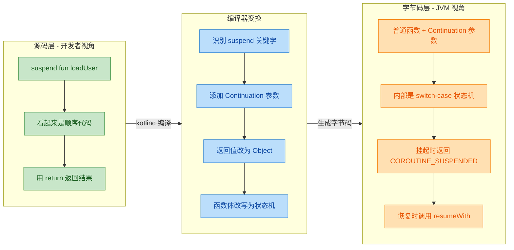

这张图清晰地展示了三个层面：

1. **源码层（开发者写的）**：你只需要写 `suspend fun`，代码看起来是同步的。
2. **编译器变换层（kotlinc 做的）**：编译器识别 `suspend`，自动添加 `Continuation` 参数，把函数体改写为状态机。
3. **字节码层（JVM 执行的）**：最终在 JVM 上运行的是一个普通函数，内部通过 label + switch-case 实现挂起与恢复。

**开发者感知到的是 Direct Style，JVM 实际执行的是 CPS Style**——编译器充当了翻译官。

---

### CPS 变换的直觉理解

为了让这个概念更加具体，我们把前面的 `loadUser` 例子做一次"手动 CPS 变换"，模拟编译器的行为：

```kotlin
// ========== 你写的 suspend 代码（Direct Style）==========
suspend fun loadUser(): User {
    val token = login("admin", "1234")   // 挂起点 1
    val user = fetchUser(token)           // 挂起点 2
    return user
}

// ========== 编译器变换后的"等价"代码（CPS Style 伪码）==========
// 1. 函数签名变了：多了 Continuation 参数，返回值变成 Object
fun loadUser(cont: Continuation<User>): Object {
    // 2. 不再 return User，而是通过 cont.resumeWith(user) 传递结果
    // 3. 如果需要挂起，return COROUTINE_SUSPENDED 这个特殊标记
    
    login("admin", "1234", object : Continuation<String> {
        override fun resumeWith(result: Result<String>) {
            val token = result.getOrThrow()        // 拿到 token
            fetchUser(token, object : Continuation<User> {
                override fun resumeWith(result: Result<User>) {
                    val user = result.getOrThrow()  // 拿到 user
                    cont.resumeWith(Result.success(user)) // 把最终结果交给外层续体
                }
            })
        }
    })
    return COROUTINE_SUSPENDED  // 告诉调用者：我挂起了，别等我
}
```

> ⚠️ **注意**：上面的伪码是为了展示 CPS 变换的概念。实际编译器**不会**生成嵌套的匿名对象——它会用**状态机**（下一节详解）来扁平化所有嵌套，避免回调地狱在字节码层重现。

---

### 为什么选择 CPS 而非其他方案？

实现协程（coroutine）的技术路线不止一种，常见的有：

| 方案 | 原理 | 代表 | 优劣 |
|------|------|------|------|
| **栈切换（Stack-switching）** | 为每个协程分配独立的调用栈，挂起时切换栈指针 | Goroutine (Go)、Lua coroutine | ✅ 对语言透明 ❌ 需要 runtime 深度支持 |
| **CPS + 状态机** | 编译期将 suspend 函数变换为状态机，不需要额外调用栈 | **Kotlin Coroutines** | ✅ 零额外栈开销 ✅ 与 JVM 完美兼容 ❌ 编译器实现复杂 |
| **async/await 语法糖** | 类似 CPS，但通常依赖 Promise/Future 包装 | JavaScript async/await, C# async | ✅ 概念简单 ❌ 有额外对象分配（Promise） |

Kotlin 选择 **CPS + 状态机** 方案的关键原因：

1. **JVM 兼容性**：JVM 不原生支持协程，无法做栈切换（至少在 Project Loom 之前）。CPS 变换只生成普通的 Java 方法和类，完全兼容现有 JVM。
2. **零额外栈分配**：每个协程不需要分配自己的线程栈（通常 1MB），只需要一个状态机对象（几十字节到几百字节），因此可以轻松创建**十万甚至百万个协程**而不会 OOM。
3. **可预测的性能**：状态机的切换就是一个 `switch-case` 跳转 + 一次 `resumeWith` 调用，开销非常低且可预测。

---

### CPS 变换的三大产物

编译器完成 CPS 变换后，会产生三个关键"产物"，也是后续章节的核心内容：

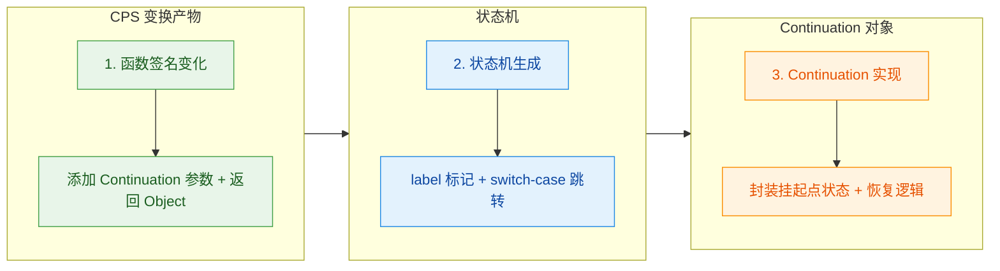

| 产物 | 对应章节 | 核心要点 |
|------|---------|---------|
| 函数签名变化 | 编译器变换 | `suspend fun foo(): T` → `fun foo(cont: Continuation<T>): Object` |
| 状态机 | 状态机 | 每个挂起点切分一个 label，用 `when(label)` 控制流转 |
| Continuation 对象 | Continuation 接口 / BaseContinuationImpl | 保存局部变量、label 状态，通过 `resumeWith` 驱动状态机前进 |

这三者协同工作，就实现了"以同步之形，行异步之实"的效果。在接下来的章节中，我们将逐一深入剖析每一个产物的实现细节。

---

### 一个至关重要的心智模型

在正式进入编译器变换细节之前，请牢记这个心智模型——它将贯穿整个协程原理的学习：

```kotlin
// 你眼中的世界（源码）：
// ┌──────────────────────────────┐
// │  suspend fun doWork(): T     │  ← 看起来是普通函数
// │      val a = stepA()         │  ← 看起来同步返回
// │      val b = stepB(a)        │  ← 看起来同步返回
// │      return b                │  ← 正常 return
// │  }                           │
// └──────────────────────────────┘
//
// JVM 眼中的世界（字节码）：
// ┌──────────────────────────────────────────────────────┐
// │  fun doWork(cont: Continuation<T>): Object           │
// │      when (cont.label) {                             │
// │          0 -> { cont.label = 1; return stepA(cont) } │ ← 可能挂起
// │          1 -> { cont.label = 2; return stepB(a,cont)}│ ← 可能挂起
// │          2 -> { cont.resumeWith(b); return b }       │ ← 完成
// │      }                                               │
// │  }                                                   │
// └──────────────────────────────────────────────────────┘
```

**每一次"挂起"都不是线程阻塞**，而是函数正常 `return`（返回 `COROUTINE_SUSPENDED`）；**每一次"恢复"都不是线程唤醒**，而是重新调用这个函数，从上次的 `label` 处继续执行。这就是 CPS 变换赋予 Kotlin 协程的超能力。

---

## 编译器变换 ⭐⭐⭐

Kotlin 协程的"魔法"并不在运行时——它几乎完全发生在 **编译期**。当你写下一个 `suspend` 函数时，Kotlin 编译器会对它进行一次深度改造，这就是所谓的 **CPS 变换 (Continuation-Passing Style Transformation)**。理解这一层变换，是打通协程底层原理的关键钥匙。

简单来说，编译器做了三件事：

1. 给每个 `suspend` 函数**悄悄加了一个参数** —— `Continuation`。
2. 把函数的**返回值类型统一改为 `Object?`**。
3. 引入一个特殊的哨兵值 **`COROUTINE_SUSPENDED`**，用来告诉调用者："我还没执行完，先挂起了。"

下面我们逐一拆解。

---

### suspend 函数编译后签名变化

我们先从一个最简单的 `suspend` 函数出发：

```kotlin
// 你写的 Kotlin 源码
suspend fun fetchUser(userId: String): User {
    // 模拟网络请求
    delay(1000)
    return User(userId, "Zhangsan")
}
```

这段代码在你眼中，`fetchUser` 接收一个 `String` 参数，返回一个 `User` 对象。非常直觉，非常干净。

但编译器看到 `suspend` 关键字后，会把它变换成一个**完全不同的签名**。如果我们用等价的 Java/伪代码来表示编译后的结果，大致如下：

```java
// 编译器变换后的等价签名（伪 Java 表示）
// 1. 新增了一个 Continuation 参数（尾部追加）
// 2. 返回值从 User 变成了 Object
public Object fetchUser(String userId, Continuation<? super User> $completion) {
    // ... 内部实现被改造为状态机（后续章节详解）
}
```

注意观察两处核心变化：

| 对比项 | 源码签名 | 编译后签名 |
|:---:|:---:|:---:|
| **参数列表** | `(String)` | `(String, Continuation)` |
| **返回值** | `User` | `Object?` |
| **关键字** | `suspend` | 消失（已被变换消化） |

> 💡 **关键洞察**：`suspend` 关键字在字节码层面是**不存在**的。它只是一个编译器指令 (compiler directive)，告诉编译器："请对这个函数执行 CPS 变换"。变换完成后，`suspend` 的使命就结束了。

你可以通过 **Android Studio → Tools → Kotlin → Show Kotlin Bytecode → Decompile** 亲自验证这一点。反编译出来的 Java 代码会清晰地展示这个额外的 `Continuation` 参数。

---

### 增加 Continuation 参数

编译器在 **参数列表的末尾** 追加的这个 `Continuation<? super T>` 参数，习惯上命名为 `$completion`（意为"完成回调"）。它的角色至关重要——**它就是协程版的回调 (callback)**。

#### 为什么叫 "Continuation"？

"Continuation" 在计算机科学中是一个经典概念，字面意思是 **"接下来要做的事情" (the rest of the computation)**。当函数执行到一个挂起点 (suspension point) 时，它需要知道：

- **恢复后继续执行什么逻辑？** → 这就是 Continuation 记录的内容。
- **执行结果传给谁？** → 通过 `Continuation.resumeWith()` 把结果递交回去。

用一个生活化的比喻：你去餐厅点了一份牛排（调用 `suspend` 函数），服务员给你一个 **取餐号码牌**（`Continuation`）。牛排做好后（异步操作完成），厨房通过号码牌找到你，把牛排端给你（`resumeWith(Result.success(steak))`）。

#### 参数追加的位置与规则

编译器严格遵循以下规则：

```kotlin
// 源码：无参 suspend 函数
suspend fun doWork(): String

// 编译后：只有 Continuation 一个参数
// fun doWork($completion: Continuation<? super String>): Object?


// 源码：单参数 suspend 函数
suspend fun fetchUser(id: String): User

// 编译后：Continuation 追加在最后
// fun fetchUser(id: String, $completion: Continuation<? super User>): Object?


// 源码：多参数 suspend 函数
suspend fun sendMessage(to: String, content: String): Boolean

// 编译后：Continuation 依然在最后
// fun sendMessage(to: String, content: String, $completion: Continuation<? super Boolean>): Object?
```

可以看到，无论原函数有多少个参数，`Continuation` **永远被追加在参数列表的最末尾**。这是一种固定的编译器约定 (convention)。

#### Continuation 的泛型参数

`Continuation<? super T>` 中的 `T` 对应的是 **原始 suspend 函数的返回值类型**。例如：

- `suspend fun foo(): User` → `Continuation<? super User>`
- `suspend fun bar(): String` → `Continuation<? super String>`
- `suspend fun baz(): Unit` → `Continuation<? super Unit>`

这确保了当协程恢复时，`resumeWith` 能以类型安全的方式传递结果。

#### 一图看清变换全貌

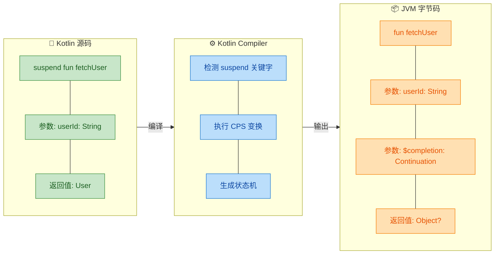

#### 为什么不直接用回调接口？

你可能会想：这和传统的回调 (callback) 有什么区别？为什么不直接用 `Callback<User>` 之类的接口？

区别在于 **统一性** 和 **状态机驱动**：

1. **统一接口**：所有 `suspend` 函数共用一个 `Continuation` 接口，而不是为每种回调定义不同的接口（如 `OnUserLoaded`, `OnMessageSent` 等）。这极大地简化了编译器的工作。

2. **携带状态**：`Continuation` 不仅仅是一个"回调函数"，它还是一个**状态机对象**，内部通过 `label` 字段记录当前执行到哪一步了。当协程恢复时，它能从上次挂起的那个精确位置继续执行——而不是从头开始。

3. **链式传递**：在一个 `suspend` 函数内部调用另一个 `suspend` 函数时，外层的 `Continuation` 会被传递给内层，形成一条完整的"恢复链"。这让多个挂起调用能自然地串联起来，而无需嵌套回调（callback hell）。

---

### 返回值变为 Object?（可能是 COROUTINE_SUSPENDED）

这是 CPS 变换中最巧妙也最容易让人困惑的部分。编译后的函数返回值不再是原始的具体类型（如 `User`），而是一个**笼统的 `Object?`**。这是因为函数的返回值现在有**两种完全不同的语义**：

#### 两种返回语义

```kotlin
// 编译后的函数体内部（伪代码逻辑）
public Object fetchUser(String userId, Continuation<? super User> $completion) {
    // 情况1: 函数真的挂起了 → 返回 COROUTINE_SUSPENDED 哨兵值
    // 情况2: 函数没有挂起（直接完成）→ 返回实际结果 User 对象
}
```

| 返回值 | 含义 | 后续行为 |
|:---:|:---|:---|
| `COROUTINE_SUSPENDED` | 函数已挂起，结果**稍后**通过 `Continuation.resumeWith()` 传递 | 调用者**不要**使用返回值，等待回调 |
| 实际结果（如 `User`） | 函数**未挂起**，同步完成了 | 调用者可以直接使用返回值 |

#### COROUTINE_SUSPENDED 是什么？

`COROUTINE_SUSPENDED` 是定义在 `kotlin.coroutines.intrinsics` 包中的一个**哨兵对象 (sentinel object)**：

```kotlin
// Kotlin 标准库源码中的定义
// 它是一个内部的特殊单例对象
@SinceKotlin("1.3")
@InlineOnly
@Suppress("NOTHING_TO_INLINE")
public inline fun <T> suspendCoroutineUninterceptedOrReturn(
    crossinline block: (Continuation<T>) -> Any? // 返回 Any?，即可以是 T 也可以是 COROUTINE_SUSPENDED
): T = TODO() // intrinsic，由编译器处理

// COROUTINE_SUSPENDED 的实际定义
internal val COROUTINE_SUSPENDED: Any = CoroutineSingletons.COROUTINE_SUSPENDED
```

它的本质就是一个**特殊的标记值**。编译器和协程框架通过检查返回值是否等于 `COROUTINE_SUSPENDED`（使用引用比较 `===`），来判断函数是真正挂起了，还是同步返回了。

#### 为什么需要这个机制？—— 挂起 vs 不挂起

一个 `suspend` 函数**并不一定每次调用都会真的挂起**。这是一个极其重要的概念：

```kotlin
suspend fun getValue(cache: Map<String, User>, key: String): User {
    // 情况1: 缓存命中 → 直接返回，根本不需要挂起
    cache[key]?.let { return it }
    
    // 情况2: 缓存未命中 → 需要发起网络请求，真正挂起
    return fetchFromNetwork(key) // 这是另一个 suspend 函数
}
```

如果缓存命中了，`getValue` 可以**立即返回结果**，完全不需要挂起。这时候如果强制走挂起-恢复的流程，就是不必要的性能浪费。`COROUTINE_SUSPENDED` 机制允许编译器做出这个优化：

- **能同步完成** → 直接返回结果，避免挂起开销
- **需要异步等待** → 返回 `COROUTINE_SUSPENDED`，进入挂起流程

#### 完整的调用判断流程

下面用一段伪代码展示调用者如何处理这两种情况：

```kotlin
// 伪代码：展示编译器生成的调用逻辑
// 假设在某个状态机的某个分支里调用 fetchUser

val result = fetchUser(userId, continuation) // 调用编译后的函数

if (result === COROUTINE_SUSPENDED) {
    // 函数挂起了！
    // 当前协程的执行到此暂停
    // 等 fetchUser 内部异步操作完成后
    // 会通过 continuation.resumeWith() 恢复执行
    return COROUTINE_SUSPENDED // 向上层传播挂起信号
}

// 函数没有挂起，同步返回了结果
// 直接将 result 强转为目标类型继续使用
val user = result as User
// ... 继续执行后续逻辑
```

> ⚠️ **注意**：`COROUTINE_SUSPENDED` 的传播是**逐层向上**的。如果一个内层 `suspend` 函数挂起了，它的调用者也必须返回 `COROUTINE_SUSPENDED`，一直传播到协程的最外层（通常是协程构建器 `launch`、`async` 等）。

#### COROUTINE_SUSPENDED 传播链

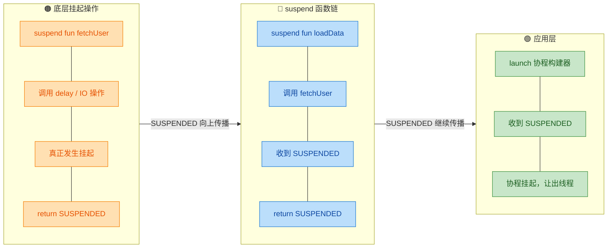

#### 返回值为什么必须是 Object? 而不是密封类？

你可能会想：为什么不定义一个密封类（sealed class），比如 `SuspendResult<T>` 来表达这两种状态？原因是 **性能**：

1. **避免装箱 (boxing)**：如果 `suspend` 函数返回的是基本类型（如 `Int`、`Boolean`），用 `Object?` 可以让编译器在不挂起时直接返回装箱后的值，而不需要额外创建包装对象。
2. **避免分配开销**：密封类的每个实例都需要堆分配。而 `COROUTINE_SUSPENDED` 是一个**全局单例**，`===` 比较极其廉价。
3. **JVM 兼容性**：直接使用 `Object` 是最原始、最通用的 JVM 类型，与 Java 互操作没有任何障碍。

#### 一个完整的编译前后对照示例

为了把所有知识点串联起来，我们看一个完整的编译前后对比：

```kotlin
// ===================== 编译前：你写的源码 =====================

suspend fun loginAndFetchUser(name: String, pwd: String): User {
    val token = login(name, pwd)       // 挂起点 1
    val user = fetchUser(token)        // 挂起点 2
    return user
}
```

```java
// ===================== 编译后：反编译的伪 Java 代码 =====================

// 返回值: Object? (可能是 User，也可能是 COROUTINE_SUSPENDED)
// 新增参数: Continuation<? super User> $completion
public Object loginAndFetchUser(
        String name,             // 原始参数 1
        String pwd,              // 原始参数 2
        Continuation<? super User> $completion  // 编译器追加的 Continuation
) {
    // 内部会生成一个继承自 ContinuationImpl 的匿名内部类
    // 这个类就是「状态机」，通过 label 字段跟踪执行进度
    // 具体的状态机实现将在下一节详解...

    // 关键点：
    // 1. 如果 login() 挂起 → 返回 COROUTINE_SUSPENDED
    // 2. 如果 login() 没挂起但 fetchUser() 挂起 → 返回 COROUTINE_SUSPENDED
    // 3. 如果两者都没挂起 → 直接返回 User 对象
}
```

#### 小结：编译器变换的三板斧

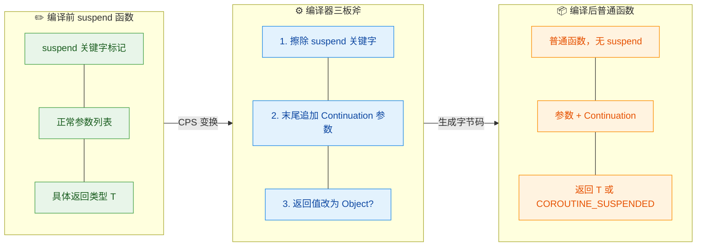

编译器变换是理解协程状态机的前置知识。当你理解了"每个 `suspend` 函数在字节码层面就是一个**接收 Continuation、返回 Object? 的普通函数**"这一核心事实后，下一节的**状态机**机制就会变得水到渠成——因为状态机正是在这个被改造后的函数体内部实现的。

---

**📝 练习题**

以下 Kotlin 函数编译后，其 JVM 字节码中的方法签名最接近哪一项？

```kotlin
suspend fun calculate(a: Int, b: Int): Double
```

A. `Double calculate(int a, int b)`


B. `Object calculate(int a, int b, Continuation $completion)`


C. `Double calculate(int a, int b, Continuation $completion)`


D. `Object calculate(int a, int b, Callback<Double> $callback)`


**【答案】** B

**【解析】** Kotlin 编译器对 `suspend` 函数执行 CPS 变换时，做了两件关键的事：① 在参数列表末尾追加一个 `Continuation` 参数（而不是自定义的 `Callback` 接口，排除 D）；② 将返回值类型从具体类型 `Double` 统一替换为 `Object`（因为函数现在可能返回实际结果 `Double`，也可能返回哨兵值 `COROUTINE_SUSPENDED`，两者类型不同，只能用它们的公共父类型 `Object` 来承载，排除 A 和 C）。因此正确答案为 **B**。

---

## 状态机 ⭐⭐⭐

Kotlin 协程最精妙的设计之一，就是将 `suspend` 函数体编译为一个**有限状态机 (Finite State Machine, FSM)**。上一节我们了解到，编译器会对 `suspend` 函数做 CPS 变换——增加 `Continuation` 参数、改变返回值类型。但这只是"接口层"的改造。真正的核心问题是：**函数执行到一半挂起了，恢复时如何知道从哪里继续？局部变量怎么保存？** 答案就是状态机。

编译器会为每个 `suspend` 函数（或 suspend lambda）生成一个**匿名内部类**，该类继承自 `ContinuationImpl`。这个类内部维护着：

- 一个 `label` 整型字段 —— 标记当前执行到哪个状态。
- 若干用于保存**局部变量**和**中间结果**的字段。
- 一个 `invokeSuspend(result: Result)` 方法 —— 内含整个状态机的 `when` (对应 Java 的 `switch-case`) 逻辑。

整个设计的思路可以用一句话概括：**把一个线性的、含有多个挂起点 (suspension point) 的函数，拆成若干段顺序代码块，用 label 驱动的 switch-case 依次执行。** 每次挂起时记住当前 label，恢复时跳到对应 label 继续。

---

### 挂起点切分代码块

理解状态机的第一步，是搞清楚**挂起点 (suspension point)** 如何将一个函数体切分为多个代码块。

> **挂起点的定义**：函数体中每一处调用其他 `suspend` 函数的位置，就是一个潜在的挂起点。

来看一个经典示例：

```kotlin
// 一个包含两个挂起点的 suspend 函数
suspend fun loadAndCombine(input: String): String {
    val token = fetchToken()          // ← 挂起点 1
    val data = fetchData(token)       // ← 挂起点 2
    return "Result: $data"            // ← 最终返回（非挂起）
}
```

编译器看到 `fetchToken()` 和 `fetchData(token)` 这两个 `suspend` 调用后，会将函数体沿着挂起点切成 **3 段**：

```text
┌─────────────────────────────────────────────────────────┐
│ Block 0 (label == 0)                                    │
│   ● 函数入口                                             │
│   ● 调用 fetchToken() → 可能挂起                         │
├─────────────────────────────────────────────────────────┤
│ Block 1 (label == 1)                                    │
│   ● 拿到 fetchToken 的结果 → 赋值给 token               │
│   ● 调用 fetchData(token) → 可能挂起                    │
├─────────────────────────────────────────────────────────┤
│ Block 2 (label == 2)                                    │
│   ● 拿到 fetchData 的结果 → 赋值给 data                 │
│   ● 拼接字符串并 return                                  │
└─────────────────────────────────────────────────────────┘
```

**规律**：N 个挂起点会将函数体切分成 **N + 1** 个代码块。每个代码块对应一个 label 值。这就好比你把一根绳子在 N 个位置剪断，得到 N+1 段。

需要特别注意的是，并非所有 `suspend` 调用都真的会挂起。如果被调用的 suspend 函数实际没有挂起（直接返回了结果），那么状态机**不会中断**，而是直接 fall-through 到下一段逻辑。这也是为什么返回值类型是 `Any?` — 既可能返回 `COROUTINE_SUSPENDED` 表示"我真的挂起了"，也可能直接返回真实结果。

---

### label 标记状态

`label` 是状态机的**指令指针 (instruction pointer)**，它是生成类中的一个 `Int` 字段。每进入一个新的代码块之前，编译器都会先将 `label` 设置为下一个状态的值，然后才去调用可能挂起的函数。这样，如果函数真的挂起了，当恢复执行时 `label` 已经指向了正确的下一段代码。

我们用伪代码来展示 label 的运作方式（基于上面的 `loadAndCombine` 示例）：

```kotlin
// ========== 编译器生成的状态机伪代码 ==========
// 这是 loadAndCombine 编译后的核心逻辑（简化表达）

// continuation 对象内部字段：
var label: Int = 0          // 状态标记，初始为 0
var resultToken: Any? = null // 用于跨挂起保存 token 的值
var resultData: Any? = null  // 用于跨挂起保存 data 的值

fun invokeSuspend(result: Result<Any?>): Any? {
    when (label) {

        0 -> {
            // ===== Block 0：函数入口 =====
            label = 1  // ★ 先把 label 设为 1，为可能的挂起做准备
            val outcome = fetchToken(this)  // 将自身（Continuation）传入
            if (outcome === COROUTINE_SUSPENDED) {
                return COROUTINE_SUSPENDED  // 真的挂起了，退出
            }
            // 如果没挂起，outcome 就是真实结果，直接往下走
            resultToken = outcome
            // ↓↓ fall-through 到 Block 1 ↓↓
        }

        1 -> {
            // ===== Block 1：fetchToken 恢复后 =====
            resultToken = result.getOrThrow()  // 从 result 中取出恢复值
            label = 2  // ★ 设置下一个状态
            val outcome = fetchData(resultToken as String, this)
            if (outcome === COROUTINE_SUSPENDED) {
                return COROUTINE_SUSPENDED
            }
            resultData = outcome
            // ↓↓ fall-through 到 Block 2 ↓↓
        }

        2 -> {
            // ===== Block 2：fetchData 恢复后 =====
            resultData = result.getOrThrow()
            return "Result: $resultData"  // 最终返回
        }

        else -> throw IllegalStateException("call to 'resume' before 'invoke' with coroutine")
    }
}
```

**label 的关键行为**总结如下：

| 时机 | label 值 | 含义 |
|------|----------|------|
| 函数首次调用 | `0` | 从头开始执行 |
| 进入 Block 0 后，调用 `fetchToken` 前 | 被设为 `1` | 若挂起，恢复时跳到 Block 1 |
| 进入 Block 1 后，调用 `fetchData` 前 | 被设为 `2` | 若挂起，恢复时跳到 Block 2 |
| 进入 Block 2 | `2` | 执行最终逻辑并返回 |

这里有个很容易被忽视的细节：**label 的自增发生在调用挂起函数之前，而不是之后**。原因很直观——如果你在调用之后才改 label，而调用本身就挂起了，那你永远没机会执行那行自增代码。

---

### switch-case 状态流转

编译器生成的 `invokeSuspend` 方法，本质上就是一个巨大的 **when 表达式**（对应 JVM 字节码中的 `tableswitch` 或 `lookupswitch`）。这就是状态机的"引擎"。

下面用一张 Mermaid 流程图来可视化整个状态流转：

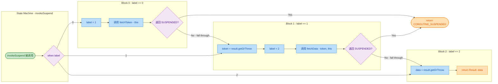

从图中可以清晰看到两条关键路径：

1. **挂起路径 (Suspension Path)**：`suspend` 调用返回 `COROUTINE_SUSPENDED` → 状态机立即 return `COROUTINE_SUSPENDED` → 控制权交还调用者 → 当异步操作完成后，外部通过 `continuation.resumeWith(result)` 再次调用 `invokeSuspend` → `when(label)` 跳到正确的分支继续。

2. **快速路径 (Fast Path / Fall-through)**：`suspend` 调用直接返回了结果（没有真的挂起）→ 不退出状态机 → 直接 fall-through 到下一个 Block 继续执行。这种情况下整个函数的行为和普通同步函数一模一样，**没有任何额外开销**。

**为什么采用 switch-case 而不是回调链？** 这是 Kotlin 协程相比传统 Callback 方案的核心优势之一。回调链 (callback chain) 会为每一步创建一个新的 lambda / 匿名对象，N 步就有 N 个对象。而状态机模式下，**整个函数只生成一个 Continuation 对象**，所有状态共用同一个实例的字段。这就是官方文档常说的 "zero-allocation overhead for coroutines"（协程零额外分配开销）的由来。

我们可以更直观地看一下反编译后真正生成的 Java 代码骨架（高度简化但保留核心结构）：

```java
// ========== 编译器实际生成的 Java 字节码反编译（简化版）==========

// 这个内部类就是 loadAndCombine 对应的状态机
final class LoadAndCombineContinuation extends ContinuationImpl {

    int label;              // 状态标记
    Object L$0;             // 保存局部变量的槽位（如 token）
    Object result;          // 当前步骤的返回结果

    // 状态机的核心方法
    @Nullable
    public final Object invokeSuspend(@NotNull Object $result) {
        // 哨兵值：代表 "已挂起"
        Object COROUTINE_SUSPENDED = IntrinsicsKt.getCOROUTINE_SUSPENDED();

        // ====== switch-case 状态分发 ======
        switch (this.label) {

            case 0:
                // --- Block 0 ---
                ResultKt.throwOnFailure($result);   // 检查上一步是否有异常
                this.label = 1;                     // 设置下一状态为 1
                Object tokenResult = fetchToken(this); // 调用 suspend 函数
                if (tokenResult == COROUTINE_SUSPENDED) {
                    return COROUTINE_SUSPENDED;     // 真的挂起 → 退出
                }
                // 没挂起 → tokenResult 就是实际值，继续往下
                // ↓↓ fall-through ↓↓

            case 1:
                // --- Block 1 ---
                ResultKt.throwOnFailure($result);   // 检查异常
                String token = (String) $result;    // 从恢复结果中取值
                this.L$0 = token;                   // 保存 token 到字段（跨挂起存活）
                this.label = 2;                     // 设置下一状态为 2
                Object dataResult = fetchData(token, this);
                if (dataResult == COROUTINE_SUSPENDED) {
                    return COROUTINE_SUSPENDED;
                }
                // ↓↓ fall-through ↓↓

            case 2:
                // --- Block 2 ---
                ResultKt.throwOnFailure($result);   // 检查异常
                String data = (String) $result;     // 取出 data
                return "Result: " + data;           // 返回最终结果

            default:
                throw new IllegalStateException("call to 'resume' before 'invoke' with coroutine");
        }
    }
}
```

注意上面代码中几个值得玩味的地方：

- **`this.L$0`**：这就是编译器为局部变量生成的"保存槽位"。变量名如 `L$0`、`L$1` 等是按声明顺序编号的。一个局部变量如果在挂起点之后还要被使用，就必须在挂起前保存到 Continuation 对象的字段中，恢复后再读回来。纯粹只在一个 Block 内使用的局部变量则不需要保存。

- **`ResultKt.throwOnFailure($result)`**：每个 case 的开头都会检查上一步传入的 `result` 是否是异常。如果上游通过 `continuation.resumeWithException(e)` 恢复了一个异常，这里就会直接抛出，异常沿着正常的 try-catch 链传播。

- **fall-through 行为**：Java 的 `switch-case` 天然支持 fall-through（没有 `break` 就会穿透到下一个 case），编译器正好利用了这个特性。当 suspend 调用没有真正挂起时，直接穿透到下一个 case 继续执行。

---

### 每次恢复从对应 label 继续

现在让我们用一个完整的时间线来追踪状态机的生命周期——从首次调用到多次挂起/恢复直至完成。

假设 `fetchToken()` 和 `fetchData()` 都真的会挂起（比如它们内部做了网络请求）：

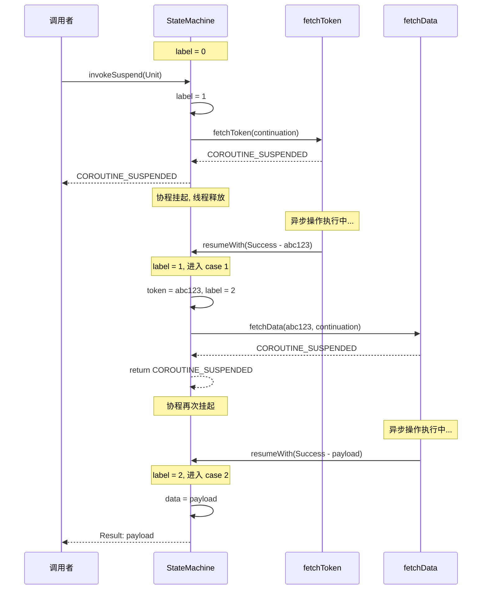

**逐步分析每次恢复的过程**：

**第一次调用 (Initial Invocation)**：
调用者（可能是 `startCoroutine` 或者父协程的状态机）第一次调用 `invokeSuspend(Unit)`。此时 `label == 0`，进入 case 0。代码将 label 设为 1，然后调用 `fetchToken(this)`。假设 `fetchToken` 确实需要异步等待，它返回 `COROUTINE_SUSPENDED`。状态机也跟着返回 `COROUTINE_SUSPENDED`，**控制权交还给调用者**，当前线程被释放。

此刻状态机的内存快照：

```java
// ====== 挂起中的 Continuation 对象内存状态 ======
// LoadAndCombineContinuation {
//     label  = 1          ← 下次恢复时进入 case 1
//     L$0    = null       ← token 还没有值
//     result = null       ← 还没有恢复结果
// }
```

**第一次恢复 (First Resumption)**：
当 `fetchToken` 的异步操作完成（比如网络请求返回了），框架会调用 `continuation.resumeWith(Result.success("abc123"))`。这最终触发 `invokeSuspend(Result.success("abc123"))`。此时 `label == 1`，直接跳到 case 1。代码从 `$result` 中取出 `"abc123"` 赋值给 `token`，保存到 `L$0`，然后将 label 设为 2，调用 `fetchData("abc123", this)`。再次挂起。

此刻的内存快照：

```java
// ====== 第二次挂起时的内存状态 ======
// LoadAndCombineContinuation {
//     label  = 2          ← 下次恢复进入 case 2
//     L$0    = "abc123"   ← token 已保存
//     result = null
// }
```

**第二次恢复 (Second Resumption)**：
`fetchData` 完成，调用 `continuation.resumeWith(Result.success("payload"))`。`label == 2`，跳到 case 2。取出 `"payload"`，拼接成 `"Result: payload"` 并返回。整个协程执行完毕。

**核心洞察**：每次恢复实际上就是**重新调用同一个 `invokeSuspend` 方法**，但通过 `label` 的不同值，跳过已经执行过的代码，精准地从上次中断的地方继续。这就像一本书里的书签——你不需要从第一页重新开始，打开书签那一页就行了。

---

### 局部变量的保存与恢复（补充）

状态机设计中一个不可忽视的细节是**局部变量的生命周期管理**。在普通函数中，局部变量存储在栈帧 (stack frame) 上，函数返回后栈帧就销毁了。但 `suspend` 函数会"返回"（挂起），然后还要"继续"，这意味着必须把需要跨越挂起点的局部变量从栈上"搬"到堆上——也就是存到 Continuation 对象的字段中。

编译器在这方面做了精细的优化：

```kotlin
suspend fun example() {
    val a = computeA()          // a 在挂起点之后还要用 → 必须保存
    val b = "hello"             // b 在挂起点之后还要用 → 必须保存
    val temp = a.length         // temp 只在这一段用 → 不需要保存
    val c = suspendFunction()   // ← 挂起点
    println(a)                  // a 在这里被使用
    println(b)                  // b 在这里被使用
    println(c)                  // c 是恢复值，直接从 result 取
}
```

编译器会分析每个局部变量的**活跃范围 (liveness)**：只有跨越了至少一个挂起点的变量，才需要保存到 Continuation 的字段中。上例中 `temp` 仅在挂起点之前使用，就不会被保存。这是一种典型的**编译器优化 (spill/reload analysis)**，跟寄存器分配中的溢出 (register spilling) 思路完全一致。

我们把它的内存模型画出来：

```java
// ====== Continuation 对象的字段布局 ======
// ExampleContinuation {
//     label: Int = 0
//     L$0: Object = null    // 用于保存变量 a
//     L$1: Object = null    // 用于保存变量 b
//     // 注意：temp 没有对应字段！编译器知道它不需要跨挂起保存
//     // 注意：c 也没有字段！它是恢复时从 $result 直接获取的
// }
```

---

### 异常在状态机中的传播（补充）

状态机对异常的处理也非常优雅。如果某个挂起函数以异常恢复（即调用了 `continuation.resumeWithException(e)`），那么 `invokeSuspend` 接收到的 `$result` 就是一个失败的 `Result`。每个 case 分支开头的 `ResultKt.throwOnFailure($result)` 会把异常抛出来，然后正常的 try-catch 机制接管。

```kotlin
suspend fun safeFetch(): String {
    return try {
        val data = fetchData()   // ← 如果这里异常恢复
        "Got: $data"
    } catch (e: Exception) {     // ← 这个 catch 能正常捕获！
        "Error: ${e.message}"
    }
}
```

编译器生成的状态机中，`try-catch` 的字节码范围会正确覆盖对应的 case 分支。所以即使异常是在"恢复"时被注入的（通过 `resumeWithException`），它也能被源代码中的 `try-catch` 正确捕获。这就保证了**协程代码中的异常处理语义与普通同步代码完全一致**。

---

### 状态机的完整心智模型

最后，让我们构建一个完整的心智模型来总结状态机的运作：

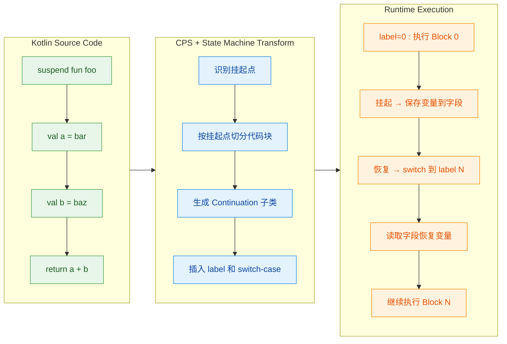

**一句话总结**：Kotlin 编译器将 `suspend` 函数转换为一个**以 label 为驱动的状态机**。每个挂起点是一次状态切换的边界，局部变量被"溢出 (spill)"到 Continuation 对象的字段中，恢复时"重载 (reload)"回来。整个过程**只分配一个 Continuation 对象**，实现了高效、零额外开销的协程调度。

---

**📝 练习题**

以下 `suspend` 函数编译后，状态机会生成几个 label 状态（即 `when` 分支数，不含 `else`）？

```kotlin
suspend fun process(): Int {
    val x = stepA()       // suspend 调用
    val y = stepB(x)      // suspend 调用
    val z = stepC(y)      // suspend 调用
    return x + y + z
}
```

A. 2


B. 3


C. 4


D. 5

**【答案】** C

**【解析】** 函数体中有 3 个挂起点（`stepA()`、`stepB(x)`、`stepC(y)`），将代码切分为 **3 + 1 = 4** 个代码块。因此状态机需要 4 个 label 状态（label 0、1、2、3），对应 `when` 表达式中的 4 个分支。规律很简单：**N 个挂起点 → N + 1 个状态**。label 0 是初始入口，label 1~3 分别对应三个挂起点恢复后的续接逻辑。

---

**📝 练习题**

关于 Kotlin 协程状态机中 `label` 字段的描述，以下哪项是**错误的**？

A. `label` 的值在调用挂起函数**之前**就已被更新为下一状态


B. 如果挂起函数没有真正挂起（直接返回结果），状态机会 fall-through 到下一个 case


C. 每次 `invokeSuspend` 被调用时，都会从 `label == 0` 开始执行


D. `label` 存储在 Continuation 对象的字段中，生存在堆内存上

**【答案】** C

**【解析】** C 选项是错误的。`invokeSuspend` 每次被调用时，是根据**当前 `label` 的值**跳转到对应的 `when` 分支，而不是每次都从 0 开始。只有首次调用时 `label` 才是 0。恢复时 `label` 已经被设为了上一次挂起前的下一个状态值（比如 1 或 2），所以会直接跳到对应的分支继续执行。A 正确——label 在挂起调用前就自增了；B 正确——这是 fast path 优化；D 正确——label 是 Continuation 对象（堆上对象）的实例字段。

---

## 状态机 ⭐⭐⭐

在上一节中，我们了解了 Kotlin 编译器如何通过 CPS 变换将 `suspend` 函数的签名改写——增加 `Continuation` 参数、返回值变为 `Any?`。但光有签名变换还远远不够，编译器还需要解决一个核心问题：**如何让函数在挂起后能够从中断的地方恢复执行？** 答案就是——**状态机 (State Machine)**。

普通函数一旦开始执行，就会从头到尾一口气跑完（除非抛异常）。但 `suspend` 函数不同，它可能在中途"停下来"（挂起），等某个异步操作完成后再"接着跑"。这就像你读一本书，读到某一页时书签夹住，下次打开直接从书签处继续。**状态机就是编译器为你自动插入的那个"书签系统"。**

Kotlin 编译器将每个 `suspend` 函数编译成一个**基于 label 的状态机**。每个挂起点 (suspension point) 将函数体切分成若干代码块，每个代码块对应一个状态 (state)，用整型 `label` 标记。恢复时，通过类似 `switch-case` 的分发逻辑跳转到对应的 `label`，从上次中断的位置继续执行。

---

### 挂起点切分代码块

**什么是挂起点？** 每一次调用其他 `suspend` 函数的位置，就是一个潜在的挂起点 (suspension point)。编译器以这些挂起点为"切割线"，将整个函数体拆分成多个**连续的代码块 (code block)**。

来看一个具体的例子：

```kotlin
// 一个包含两个挂起点的 suspend 函数
suspend fun loadUserData(): String {
    val token = getToken()           // ← 挂起点 1：调用 suspend 函数
    val user = getUser(token)        // ← 挂起点 2：调用 suspend 函数
    return "Hello, ${user.name}"     // 普通语句，非挂起点
}
```

编译器会以挂起点为界，将函数体切分为 **3 个代码块**：

```text
┌─────────────────────────────────────────────────────────────┐
│                  loadUserData() 函数体                       │
├──────────────────┬──────────────────┬───────────────────────┤
│   代码块 0        │   代码块 1        │   代码块 2             │
│                  │                  │                       │
│ (函数入口)        │ (挂起点1恢复后)   │ (挂起点2恢复后)        │
│                  │                  │                       │
│ 调用 getToken()  │ 取回 token 结果   │ 取回 user 结果         │
│ → 可能挂起       │ 调用 getUser()    │ 拼接字符串             │
│                  │ → 可能挂起       │ return 最终结果         │
├──────────────────┼──────────────────┼───────────────────────┤
│    label = 0     │    label = 1     │    label = 2          │
└──────────────────┴──────────────────┴───────────────────────┘
```

**切分规则归纳：**

- **N 个挂起点** 会将函数体切分为 **N + 1 个代码块**。
- 代码块 0 从函数入口开始，到第一个挂起点为止。
- 代码块 i（i > 0）从第 i 个挂起点恢复后开始，到第 i+1 个挂起点（或函数结束）为止。
- 每个代码块内部的代码都是**纯顺序执行**的，不会再被打断（除非内部又有挂起点，那会进一步切分）。

这种切分的本质思想是：**将一个可能多次暂停的异步函数，转化为多段可以独立调度的同步代码片段。** 每个片段执行完后，要么函数结束，要么进入挂起状态等待回调。

---

### label 标记状态

编译器为每个代码块分配一个整型编号，存储在一个名为 `label` 的字段中。这个 `label` 就是状态机的"状态标识符"。它记录了**当前应该执行哪一段代码**。

在编译产物中，`label` 是 Continuation 对象的一个成员变量。还记得前面讲的吗？编译器会为每个 `suspend` 函数生成一个匿名的 `ContinuationImpl` 子类，`label` 就存放在这个子类中：

```kotlin
// 编译器生成的 Continuation 子类（伪代码，简化表示）
class LoadUserDataContinuation(
    val completion: Continuation<String>  // 上层调用者的 Continuation
) : ContinuationImpl(completion) {

    var label: Int = 0            // 状态标记，初始为 0
    var result: Any? = null       // 存储上一步的返回结果
    var token: String? = null     // 临时变量：跨挂起点保存的局部变量

    override fun invokeSuspend(result: Result<Any?>): Any? {
        this.result = result
        // 调用状态机主体（即原函数的变换版本）
        return loadUserData(this)
    }
}
```

几个关键设计要点：

1. **`label` 初始值为 0**：函数第一次被调用时，从代码块 0 开始执行。
2. **局部变量提升为成员变量**：需要跨越挂起点保存的局部变量（如上例中的 `token`），会被提升 (hoist) 为 Continuation 对象的字段。因为栈帧在挂起后会被销毁，局部变量如果不保存到堆上就会丢失。
3. **`result` 字段**：每次恢复时，上一个异步操作的结果通过 `resumeWith` 传入，保存在 `result` 中，供下一段代码块使用。

> 💡 **理解要点：** `label` 的本质是一个**程序计数器 (Program Counter)** 的简化版。真实 CPU 用 PC 寄存器记录下一条要执行的指令地址，而 Kotlin 协程用 `label` 记录下一个要执行的代码块编号。两者思想一脉相承。

---

### switch-case 状态流转

有了 `label` 标记，编译器就可以用一个 `when` 表达式（对应 Java 字节码中的 `tableswitch` / `lookupswitch`）将所有代码块串联起来，形成一个完整的状态机。下面我们来看编译器对 `loadUserData()` 生成的伪代码：

```kotlin
// 编译器对 loadUserData() 的 CPS 变换 + 状态机改写（伪代码）
fun loadUserData(continuation: Continuation<String>): Any? {

    // ① 获取或创建 Continuation 对象
    // 首次调用时创建新的 Continuation，后续恢复时复用同一个对象
    val cont = if (continuation is LoadUserDataContinuation) {
        continuation   // 恢复调用：复用已有的 Continuation
    } else {
        LoadUserDataContinuation(continuation)  // 首次调用：包装外部 Continuation
    }

    // ② 从 Continuation 中取出上一步结果
    var result = cont.result

    // ③ 状态机主体：根据 label 跳转到对应代码块
    when (cont.label) {

        0 -> {
            // 【代码块 0】—— 函数入口，执行到第一个挂起点
            cont.label = 1                        // 先将 label 设为下一个状态
            val outcome = getToken(cont)          // 调用 suspend 函数，传入 cont
            if (outcome == COROUTINE_SUSPENDED) { // 如果真的挂起了
                return COROUTINE_SUSPENDED        // 立即返回，让出执行权
            }
            // 如果没有真正挂起（同步返回），则 outcome 就是结果
            result = outcome
            // 注意：这里不 return，而是 fall-through 到下一个代码块
            // 但在实际字节码中，编译器通常用 goto 或循环实现 fall-through
        }

        1 -> {
            // 【代码块 1】—— 从挂起点 1 恢复，执行到挂起点 2
            val token = result as String          // 取出 getToken() 的结果
            cont.token = token                    // 保存到 Continuation 字段（跨挂起点）
            cont.label = 2                        // 设置下一个状态
            val outcome = getUser(token, cont)    // 调用 suspend 函数
            if (outcome == COROUTINE_SUSPENDED) {
                return COROUTINE_SUSPENDED
            }
            result = outcome
        }

        2 -> {
            // 【代码块 2】—— 从挂起点 2 恢复，执行到函数结束
            val user = result as User             // 取出 getUser() 的结果
            return "Hello, ${user.name}"          // 最终结果，返回给调用者
        }

        else -> throw IllegalStateException("Unexpected label: ${cont.label}")
    }
    // 实际编译器生成的代码不会走到这里
}
```

我们用 Mermaid 流程图来可视化整个状态流转过程：

```mermaid
graph LR
    classDef stateStyle fill:#C8E6C9,stroke:#388E3C,color:#1B5E20
    classDef suspendStyle fill:#BBDEFB,stroke:#1976D2,color:#0D47A1
    classDef returnStyle fill:#FFE0B2,stroke:#F57C00,color:#E65100
    classDef decisionStyle fill:#F8BBD0,stroke:#C2185B,color:#880E4F

    subgraph Block0 [代码块 0]
        direction TB
        S0[label == 0<br>函数入口] --> A0[设置 label = 1]
        A0 --> C0[调用 getToken cont]
        C0 --> D0{挂起了?}
    end

    subgraph Block1 [代码块 1]
        direction TB
        S1[label == 1<br>恢复执行] --> R1[result → token]
        R1 --> A1[设置 label = 2]
        A1 --> C1[调用 getUser token cont]
        C1 --> D1{挂起了?}
    end

    subgraph Block2 [代码块 2]
        direction TB
        S2[label == 2<br>恢复执行] --> R2[result → user]
        R2 --> RET[return Hello user.name]
    end

    subgraph Suspended [挂起状态]
        direction TB
        SUS[return COROUTINE_SUSPENDED<br>让出执行权]
    end

    D0 -- 是 --> SUS
    D0 -- 否 --> S1
    D1 -- 是 --> SUS
    D1 -- 否 --> S2
    SUS -. resumeWith 回调 .-> S1
    SUS -. resumeWith 回调 .-> S2

    class S0,A0,C0 stateStyle
    class S1,R1,A1,C1 stateStyle
    class S2,R2 stateStyle
    class RET returnStyle
    class D0,D1 decisionStyle
    class SUS suspendStyle
```

**状态流转的核心逻辑可以总结为三步曲：**

| 步骤 | 操作 | 说明 |
|:---:|:---|:---|
| **1** | `cont.label = nextState` | 提前设置下一个状态，为可能的挂起做准备 |
| **2** | `val outcome = suspendCall(cont)` | 调用挂起函数，把自己（cont）作为回调传进去 |
| **3** | `if (outcome == COROUTINE_SUSPENDED) return` | 检查是否真的挂起。是则退出；否则继续往下执行 |

> ⚠️ **为什么要在调用之前就设置 `label`？** 因为一旦 `suspendCall` 内部决定挂起，它会保存 `cont` 的引用并在未来某个时刻调用 `cont.resumeWith(result)`。如果 `label` 没有提前更新，恢复时就会跳回到旧的代码块，导致逻辑重复执行甚至死循环。

**关于 `COROUTINE_SUSPENDED` 的判断：**

并非每次调用 `suspend` 函数都会真的挂起。例如，一个带缓存的网络请求在缓存命中时可以直接返回结果，根本不需要挂起。这就是为什么编译器生成的代码需要检查返回值：

- 返回 `COROUTINE_SUSPENDED` → 真的挂起了，函数退出，等待回调。
- 返回其他值 → 没有挂起，结果已就绪，直接进入下一个代码块继续执行（在实际实现中通过循环来实现这种 fall-through）。

---

### 每次恢复从对应 label 继续

当异步操作完成时，框架层会调用 `cont.resumeWith(Result.success(value))` 来恢复协程。这个 `resumeWith` 最终会再次调用 `loadUserData(cont)` 函数本身——但此时 `cont.label` 已经不是 0 了，而是上次挂起前设置的值。因此，`when` 表达式会直接跳转到对应的代码块，**跳过所有已执行过的代码**。

让我们用一个完整的时序图来展示 `loadUserData()` 从开始到结束的全过程：

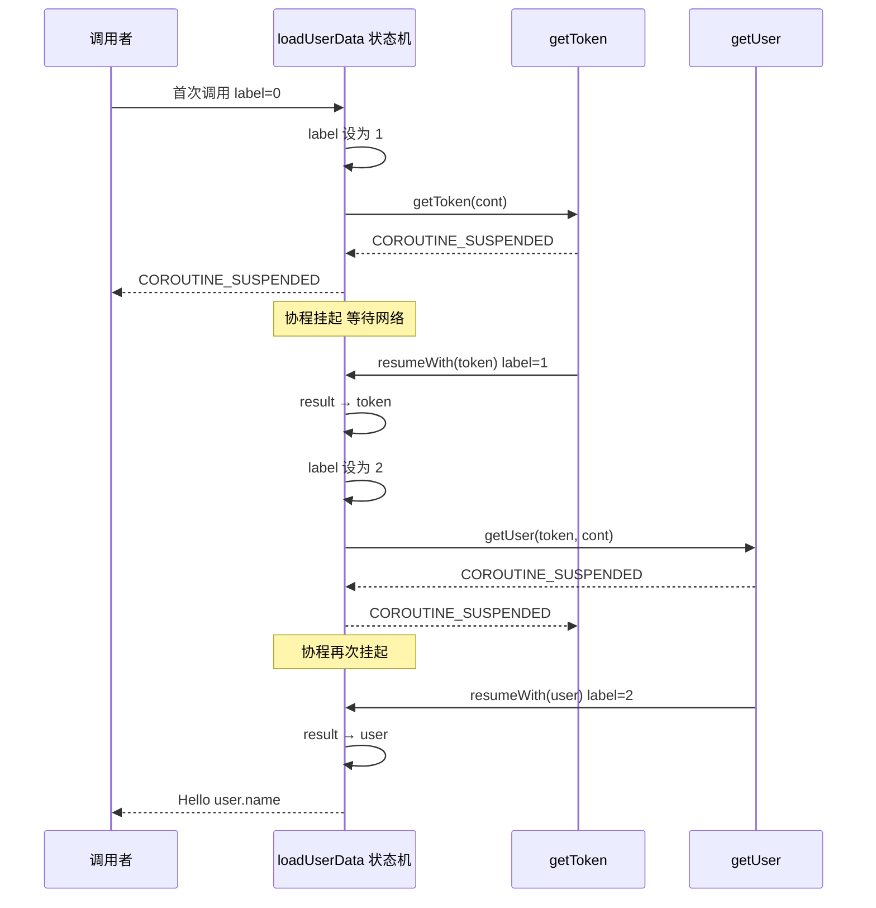

**恢复的完整调用链：**

```text
异步操作完成
  → Dispatcher 调度
    → cont.resumeWith(Result.success(value))
      → ContinuationImpl.resumeWith()
        → invokeSuspend(result)       // 将 result 存入 cont.result
          → loadUserData(cont)        // 再次调用函数本身
            → when(cont.label) {      // 根据 label 跳转
                1 -> { ... }          // 从对应位置继续
              }
```

**一个更复杂的例子——包含异常处理和循环中的挂起点：**

```kotlin
// 包含 try-catch 和循环的 suspend 函数
suspend fun fetchWithRetry(url: String): String {
    repeat(3) { attempt ->               // 循环 3 次
        try {
            val result = httpGet(url)    // ← 挂起点：网络请求
            return result                // 成功则直接返回
        } catch (e: Exception) {
            delay(1000L * attempt)       // ← 挂起点：延迟重试
        }
    }
    throw RuntimeException("All retries failed")
}
```

编译器对这段代码的状态机处理会更加复杂。循环中的挂起点意味着状态机可能在同一个 `label` 之间来回跳转。编译器会将循环展开 (unroll) 或者用额外的 label 和条件判断来处理：

```kotlin
// fetchWithRetry 编译后的状态机伪代码（简化）
fun fetchWithRetry(url: String, cont: Continuation<String>): Any? {
    val sm = cont as? FetchWithRetryContinuation
        ?: FetchWithRetryContinuation(cont)

    when (sm.label) {
        0 -> {
            sm.attempt = 0              // 初始化循环计数器
            sm.label = 1                // 跳到循环体开始
            // fall-through 到 label 1
        }
        1 -> {
            // 循环体入口：调用 httpGet
            if (sm.attempt >= 3) {      // 循环条件检查
                throw RuntimeException("All retries failed")
            }
            sm.label = 2               // 设置下一状态为"处理 httpGet 结果"
            val outcome = httpGet(url, sm)
            if (outcome == COROUTINE_SUSPENDED) return COROUTINE_SUSPENDED
            sm.result = outcome
        }
        2 -> {
            // httpGet 返回后
            try {
                return sm.result as String    // 成功，直接返回
            } catch (e: Exception) {
                sm.label = 3                  // 进入 delay 状态
                val outcome = delay(1000L * sm.attempt, sm)
                if (outcome == COROUTINE_SUSPENDED) return COROUTINE_SUSPENDED
                sm.result = outcome
            }
        }
        3 -> {
            // delay 返回后，准备下一次循环
            sm.attempt++                // 循环计数器 +1
            sm.label = 1                // 跳回循环体入口
            // fall-through 或 continue loop
        }
    }
    // 实际实现中外层有 while(true) 循环驱动 fall-through
}
```

> 💡 **关键洞察：** 循环中的挂起点不会导致无限数量的状态。编译器通过**将 label 设回较小的值**来实现循环跳转——状态机天然支持"回到之前的状态"，就像有限状态自动机 (Finite State Automaton) 中的状态回边 (back edge)。

**关于"同一个 Continuation 对象复用"的精妙设计：**

整个函数从开始到结束，始终复用**同一个** Continuation 对象。这意味着：

- **零额外内存分配**：不需要为每次恢复创建新对象。一个 `suspend` 函数无论挂起多少次，只创建一个 Continuation。
- **状态天然持久化**：`label`、局部变量、中间结果全部保存在同一个对象中，挂起和恢复之间不会丢失任何信息。
- **判断首次调用 vs 恢复调用**：通过 `is` 类型检查来区分。首次调用时传入的是外部 Continuation（类型不匹配），恢复时传入的是之前创建的那个对象（类型匹配）。

我们用内存模型图来直观展示 Continuation 对象在状态流转过程中的变化：

```java
// Continuation 对象在内存中的状态变化

// ======= 初始状态 (label = 0) =======
LoadUserDataContinuation@0x7f {
    label:      0           // → 即将执行代码块 0
    result:     null        // → 还没有任何结果
    token:      null        // → 局部变量未赋值
    completion: Caller@0x3a // → 指向调用者的 Continuation
}

// ======= getToken() 挂起后 (label = 1) =======
LoadUserDataContinuation@0x7f {
    label:      1           // → 恢复后执行代码块 1
    result:     null        // → 等待 getToken 结果填入
    token:      null        // → 还未获得 token
    completion: Caller@0x3a // → 不变
}

// ======= getToken() 完成, resumeWith 调用 =======
LoadUserDataContinuation@0x7f {
    label:      1           // → when 匹配到 1
    result:     "abc123"    // → getToken 的结果已填入
    token:      null        // → 即将在代码块 1 中赋值
    completion: Caller@0x3a
}

// ======= 代码块 1 执行中 =======
LoadUserDataContinuation@0x7f {
    label:      2           // → 已更新为下一状态
    result:     "abc123"
    token:      "abc123"    // → 已保存，供 getUser 使用
    completion: Caller@0x3a
}

// ======= getUser() 完成, 最终返回 =======
LoadUserDataContinuation@0x7f {
    label:      2           // → when 匹配到 2
    result:     User(name="Alice")
    token:      "abc123"
    completion: Caller@0x3a // → 最终结果通过 completion 返回给调用者
}
```

**总结：状态机的四大支柱**

| 支柱 | 机制 | 作用 |
|:---:|:---|:---|
| **挂起点切分** | 以 suspend 调用为界拆分代码块 | 将异步逻辑分解为同步片段 |
| **label 标记** | 整型字段记录当前状态 | 充当轻量级"程序计数器" |
| **when 分发** | 类似 switch-case 的跳转表 | 恢复时直接定位到正确的代码块 |
| **Continuation 复用** | 单一对象贯穿整个生命周期 | 零分配、状态持久化、身份判别 |

这套状态机机制是 Kotlin 协程**零开销抽象 (zero-cost abstraction)** 理念的核心体现。开发者写出的是线性的、易读的顺序代码，编译器在底层将其转换为高效的状态机——没有回调嵌套、没有额外线程、没有不必要的内存分配。这就是 CPS 变换 + 状态机的威力所在。

---

**📝 练习题**

以下 `suspend` 函数编译后，状态机中共有多少个状态（label 取值范围是多少）？

```kotlin
suspend fun process(): Int {
    val a = stepOne()       // suspend fun
    val b = stepTwo(a)      // suspend fun
    val c = stepThree(b)    // suspend fun
    return a + b + c
}
```

A. 3 个状态，label 取值 0、1、2


B. 4 个状态，label 取值 0、1、2、3


C. 3 个状态，label 取值 1、2、3


D. 5 个状态，label 取值 0、1、2、3、4


**【答案】** B

**【解析】** 函数中有 3 个挂起点（`stepOne()`、`stepTwo()`、`stepThree()`），根据"N 个挂起点产生 N+1 个代码块"的规则，共需要 4 个状态。具体划分为：label=0（入口 → 调用 stepOne）、label=1（恢复 → 拿到 a，调用 stepTwo）、label=2（恢复 → 拿到 b，调用 stepThree）、label=3（恢复 → 拿到 c，计算 a+b+c 并返回）。注意最后的 `return a + b + c` 虽然本身不含挂起点，但它是在第 3 个挂起点恢复后才执行的，因此也需要一个独立的 label。变量 `a`、`b` 都需要跨越挂起点保存，会被提升为 Continuation 对象的成员字段。

---

**📝 练习题**

在编译器生成的状态机中，为什么 `cont.label = nextState` 必须在调用挂起函数**之前**执行，而不是之后？

A. 因为 Kotlin 语法要求 label 必须先赋值才能传参


B. 因为挂起函数可能立即在另一个线程恢复 Continuation，如果 label 没有提前更新，恢复时会重新执行当前代码块导致死循环


C. 因为 `COROUTINE_SUSPENDED` 是一个特殊的异常，会中断后续赋值语句的执行


D. 因为 label 的值不影响恢复逻辑，提前设置只是为了代码可读性


**【答案】** B

**【解析】** 这是一个非常关键的时序问题。当调用 `suspendCall(cont)` 时，如果该函数决定挂起，它会保存 `cont` 的引用，并在异步操作完成后调用 `cont.resumeWith()`。`resumeWith()` 会再次调用函数本身，并通过 `when(cont.label)` 进行分发。如果 `label` 在调用之前没有更新为下一个状态值，那么恢复时 `when` 会匹配到**当前**代码块而非下一个，导致同一段代码被重复执行。更极端的情况是，如果挂起函数在**另一个线程**上立即完成并回调，而当前线程还没来得及更新 `label`，就会产生竞态条件 (race condition)。因此，编译器**必须**在调用之前就将 `label` 设置为下一个状态。选项 A 是编造的语法规则；选项 C 错误，`COROUTINE_SUSPENDED` 是一个普通的哨兵对象 (sentinel object)，不是异常；选项 D 完全错误，label 的值直接决定了恢复后执行哪一段代码。

---

## Continuation 接口 ⭐⭐

在前面的章节中，我们反复提到一个核心概念：每个 `suspend` 函数在编译后都会被追加一个 `Continuation` 参数。状态机的每一次挂起与恢复，本质上都是围绕这个 `Continuation` 对象在运转。现在，是时候正式深入这个接口的内部设计了。

`Continuation` 是 Kotlin 协程最底层、最核心的抽象之一。它的名字直译为"延续"——代表的是 **"接下来要做的事情"(what to do next)**。回顾 CPS（Continuation-Passing Style）的定义：调用者不直接等待返回值，而是把"拿到结果后该怎么继续"封装成一个回调对象传递下去。这个回调对象，就是 `Continuation`。

从职责上看，`Continuation` 承担两件事：

1. **恢复执行**——当异步结果就绪时，把结果（或异常）投递回协程，让状态机从上次挂起的 label 处继续运行。
2. **携带上下文**——每个 Continuation 都绑定了一个 `CoroutineContext`，使得协程在恢复时能感知到自己所处的调度器、Job、异常处理器等环境信息。

先来看接口的完整源码（位于 `kotlin.coroutines` 包下）：

```kotlin
// kotlin.coroutines.Continuation.kt
// 这是 Kotlin 标准库中定义的接口，泛型 T 代表协程最终产出的结果类型
public interface Continuation<in T> {

    // 属性：该 Continuation 关联的协程上下文
    public val context: CoroutineContext

    // 方法：用执行结果（成功值或失败异常）恢复协程的执行
    public fun resumeWith(result: Result<T>)
}
```

整个接口只有 **一个属性 + 一个方法**，极其精简。这种设计哲学在 Kotlin 标准库中非常常见——用最小的抽象面积覆盖最核心的能力，把复杂性留给实现层（如 `BaseContinuationImpl`、`DispatchedContinuation` 等）。

下面的类图展示了 `Continuation` 接口在协程体系中的位置关系：

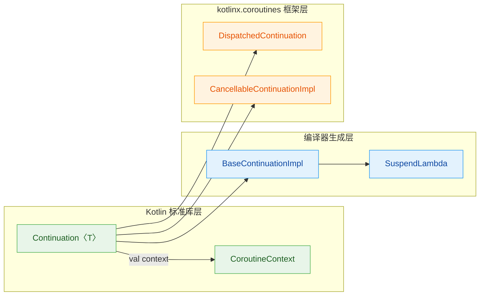

可以看到，`Continuation` 处于最顶层的标准库抽象。编译器生成的状态机类（`BaseContinuationImpl` → `SuspendLambda`）实现了它；框架层的调度包装（`DispatchedContinuation`）和可取消实现（`CancellableContinuationImpl`）也实现了它。一个接口，辐射整个协程体系。

---

### resumeWith（恢复执行）

`resumeWith` 是 Continuation 接口唯一的方法，也是协程 **恢复执行的唯一入口**。它的签名如下：

```kotlin
// 参数 result 是一个 Result<T>，内部封装了 success value 或 failure exception
public fun resumeWith(result: Result<T>)
```

#### Result 的设计

`Result<T>` 是 Kotlin 标准库中的一个 `inline class`（现称 `value class`），它用一个单一字段同时表达"成功"和"失败"两种语义：

```kotlin
// kotlin.Result 的核心结构（简化）
@JvmInline
public value class Result<out T> @PublishedApi internal constructor(
    @PublishedApi internal val value: Any?   // 成功时存 T 类型的值；失败时存 Result.Failure(exception)
) {
    // 判断是否成功
    public val isSuccess: Boolean get() = value !is Failure

    // 判断是否失败
    public val isFailure: Boolean get() = value is Failure

    // 获取成功值，失败时返回 null
    public fun getOrNull(): T? = ...

    // 获取异常，成功时返回 null
    public fun exceptionOrNull(): Throwable? = ...

    // 内部类：包装异常
    internal class Failure(val exception: Throwable)
}
```

使用 `value class` 包装意味着在 JVM 层面，**成功路径上几乎没有额外的装箱开销**——编译器会尽量将 `Result<T>` 拆箱为裸值传递。只有失败路径才会产生一次 `Failure` 对象的分配。

#### resumeWith 的调用时机

`resumeWith` 在什么场景下被调用？简单说——**每当一个挂起点的异步操作完成时**。让我们追踪一个完整的恢复流程：

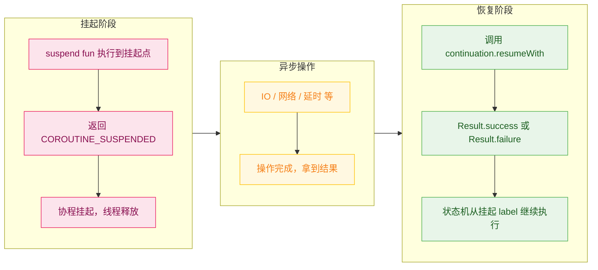

用一段伪代码来具体化这个过程：

```kotlin
// 假设有一个 suspend 函数
suspend fun fetchUser(): User {
    // 这里会挂起
    val data = suspendCoroutine<String> { continuation ->
        // continuation 就是 Continuation<String> 的实例
        // 模拟异步网络请求
        networkClient.get("https://api.example.com/user") { response ->
            // 网络请求完成后，在回调线程中恢复协程
            if (response.isSuccess) {
                // 成功：传入 Result.success(...)
                continuation.resumeWith(Result.success(response.body))
            } else {
                // 失败：传入 Result.failure(...)
                continuation.resumeWith(Result.failure(response.exception))
            }
        }
        // suspendCoroutine lambda 结束后，函数返回 COROUTINE_SUSPENDED
    }
    // 恢复后，data 就是 response.body 的值
    return parseUser(data)
}
```

#### 扩展函数：resume 与 resumeWithException

直接使用 `resumeWith(Result.success(...))` / `resumeWith(Result.failure(...))` 虽然功能完整，但写起来有些冗长。Kotlin 标准库提供了两个便捷的扩展函数：

```kotlin
// kotlin.coroutines 包下的扩展函数

// 以成功值恢复协程
public inline fun <T> Continuation<T>.resume(value: T) {
    // 内部实际调用 resumeWith，传入 Result.success
    return resumeWith(Result.success(value))
}

// 以异常恢复协程（协程体内会抛出该异常）
public inline fun <T> Continuation<T>.resumeWithException(exception: Throwable) {
    // 内部实际调用 resumeWith，传入 Result.failure
    return resumeWith(Result.failure(exception))
}
```

这两个扩展函数是 `inline` 的，不会产生额外的函数调用开销。日常开发中推荐使用它们，代码更清晰：

```kotlin
// 对比两种写法
// 写法1：原始 API
continuation.resumeWith(Result.success("Hello"))
continuation.resumeWith(Result.failure(IOException("timeout")))

// 写法2：扩展函数（推荐）
continuation.resume("Hello")                          // 更简洁
continuation.resumeWithException(IOException("timeout")) // 语义更明确
```

#### resumeWith 与状态机的衔接

还记得上一节讲的状态机吗？当 `resumeWith` 被调用时，**它最终会触发状态机的 `invokeSuspend` 方法**（在 `BaseContinuationImpl` 中实现，下一节会详讲）。整个流程如下：

1. 外部调用 `continuation.resumeWith(Result.success(value))`
2. `BaseContinuationImpl.resumeWith()` 接收 result，将其存储在内部字段中
3. 调用 `invokeSuspend(result)`——这就是编译器为 suspend lambda 生成的状态机函数
4. `invokeSuspend` 内部根据 `label` 的值跳转到对应的 `when` 分支
5. 取出 `result` 中的值，赋给局部变量，继续执行后续代码
6. 遇到下一个挂起点，再次返回 `COROUTINE_SUSPENDED`；或者执行完毕，返回最终结果

用一段简化的状态机代码来展示 `resumeWith` 传入的 result 如何被消费：

```kotlin
// 编译器为 suspend lambda 生成的状态机（简化版）
class FetchUserContinuation(
    completion: Continuation<Any?>         // 外层的 Continuation（父协程）
) : ContinuationImpl(completion) {

    var result: Any? = null                // 存储 resumeWith 传入的结果
    var label: Int = 0                     // 状态标记

    override fun invokeSuspend(result: Result<Any?>): Any? {
        this.result = result               // 把恢复结果暂存到字段

        when (label) {
            0 -> {
                label = 1                  // 设置下一个状态
                // 调用第一个 suspend 函数，传入 this 作为 continuation
                val suspended = fetchData(this)
                if (suspended == COROUTINE_SUSPENDED) {
                    return COROUTINE_SUSPENDED  // 真正挂起，退出状态机
                }
                // 没有挂起（快速路径），直接 fall through
            }
            1 -> {
                // 从挂起中恢复，检查结果是否是异常
                result.getOrThrow()        // 如果 Result 是 failure，这里直接抛异常
                val data = result as String // 取出成功值
                // 继续执行后续逻辑...
                return parseUser(data)     // 最终返回结果
            }
            else -> throw IllegalStateException("call to 'resume' before 'invoke' with coroutine")
        }
    }
}
```

注意第 `1` 号分支：`result.getOrThrow()` 这行至关重要。如果外部通过 `resumeWithException` 传入了异常，那么 `Result` 内部包含的就是一个 `Failure` 对象，`getOrThrow()` 会直接将异常抛出。这样一来，协程体内的 `try-catch` 就能正常捕获异步异常，**异常处理对开发者完全透明**——这就是协程把回调式异步代码"拉直"为顺序式代码的关键。

---

### context（协程上下文）

`Continuation` 接口的另一个成员是属性 `context`，类型为 `CoroutineContext`：

```kotlin
public interface Continuation<in T> {
    // 每个 Continuation 都绑定一个协程上下文
    public val context: CoroutineContext
    // ...
}
```

这个设计意味着：**每一个 Continuation 实例都"知道"自己运行在哪个上下文环境中**。这一点非常重要，因为协程在恢复执行时，需要根据上下文中的信息来决定：

- **在哪个线程/线程池上恢复？** → 由 `CoroutineDispatcher` 决定
- **当前协程的 Job 是什么？** → 由 `Job` 元素提供
- **未捕获异常交给谁处理？** → 由 `CoroutineExceptionHandler` 决定
- **协程名称是什么？** → 由 `CoroutineName` 提供（方便调试）

#### CoroutineContext 快速回顾

`CoroutineContext` 本身是一个类似 `Map` 的不可变集合，每个元素通过 `Key` 索引。它的核心操作包括：

```kotlin
// 通过 Key 获取元素（类似 Map.get）
val dispatcher = context[ContinuationInterceptor]

// 用 + 运算符组合多个 Element
val combined = Dispatchers.IO + CoroutineName("my-coroutine") + SupervisorJob()

// fold 遍历所有元素
context.fold(initial) { acc, element -> ... }
```

#### context 在 Continuation 中的作用路径

当协程从挂起中恢复时，框架层需要读取 `continuation.context` 来做出调度决策。以 `DispatchedContinuation`（`kotlinx.coroutines` 框架中的包装类）为例：

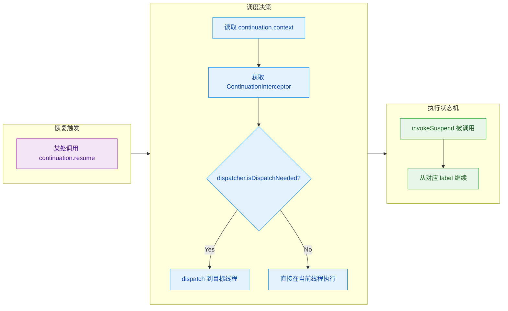

关键步骤解读：

1. **读取 context**：恢复时首先从 `continuation.context` 中取出 `ContinuationInterceptor` 元素（通常就是 `CoroutineDispatcher`）。
2. **判断是否需要调度**：调用 `dispatcher.isDispatchNeeded(context)`。如果当前已经在目标线程上（比如在 `Dispatchers.Main` 中且已处于主线程），则不需要切线程。
3. **执行调度或直接运行**：需要切线程时，通过 `dispatcher.dispatch(context, runnable)` 将任务投递到目标线程的队列中；不需要时直接在当前线程调用 `invokeSuspend`。

#### ContinuationInterceptor：context 中最特殊的元素

在所有 `CoroutineContext.Element` 中，`ContinuationInterceptor` 拥有特殊地位——它负责 **拦截** 每一次 Continuation 的恢复。`CoroutineDispatcher` 就是它的子类：

```kotlin
// ContinuationInterceptor 的核心方法
public interface ContinuationInterceptor : CoroutineContext.Element {

    companion object Key : CoroutineContext.Key<ContinuationInterceptor>

    // 拦截（包装）原始 continuation，返回一个新的 continuation
    public fun <T> interceptContinuation(continuation: Continuation<T>): Continuation<T>

    // 释放被拦截的 continuation（可选）
    public fun releaseInterceptedContinuation(continuation: Continuation<*>) { }
}
```

当协程被创建时，框架会调用 `interceptContinuation` 把原始的 Continuation 包装成一个 `DispatchedContinuation`。这个包装类在 `resumeWith` 内部会先执行线程调度，再调用原始 continuation 的 `resumeWith`。这就是 **Dispatchers.Main / IO / Default 能控制协程运行线程** 的底层原理。

用 ASCII 模型展示这层包装关系：

```java
// Continuation 的包装链（洋葱模型）
//
// ┌─────────────────────────────────────────────────┐
// │          DispatchedContinuation                  │
// │  ┌─────────────────────────────────────────┐    │
// │  │      原始 ContinuationImpl（状态机）       │    │
// │  │                                         │    │
// │  │  - label: Int                           │    │
// │  │  - invokeSuspend(result)                │    │
// │  │  - context: CoroutineContext            │    │
// │  └─────────────────────────────────────────┘    │
// │                                                 │
// │  + dispatcher: CoroutineDispatcher              │
// │  + resumeWith(): 先 dispatch，再调用内层 resume   │
// └─────────────────────────────────────────────────┘
```

#### context 的传递与继承

每个 Continuation 的 `context` 并非凭空产生，它遵循 **结构化并发(Structured Concurrency)** 的继承规则：

- 父协程的 context 会被子协程继承
- 子协程可以通过 `+` 覆盖特定的 Element（如切换 Dispatcher）
- `Job` 元素比较特殊——子协程会创建新的 `Job` 并将其 parent 设为父协程的 `Job`

```kotlin
// 示例：context 的继承与覆盖
val scope = CoroutineScope(Dispatchers.Main + CoroutineName("parent"))

scope.launch {
    // 这里的 coroutineContext 继承了 Dispatchers.Main + CoroutineName("parent")
    // 同时自动创建了一个新的子 Job

    launch(Dispatchers.IO) {
        // Dispatcher 被覆盖为 IO
        // CoroutineName 仍然继承 "parent"
        // Job 是新的子 Job，parent 指向外层 launch 的 Job
        println(coroutineContext[CoroutineName])  // CoroutineName(parent)
    }
}
```

这种设计确保了：无论协程在哪里恢复、经历了多少次挂起与恢复，它的 **上下文环境始终一致且可预测**。`Continuation.context` 就是这条链路上的稳定锚点。

---

**📝 练习题**

以下关于 `Continuation` 接口的说法，哪项是 **正确** 的？

A. `resumeWith` 方法的参数类型是 `T`，直接传入成功值即可


B. `Continuation` 接口包含 `resume` 和 `resumeWithException` 两个抽象方法


C. `continuation.context` 中的 `ContinuationInterceptor` 负责决定协程在哪个线程恢复执行


D. 每次调用 `resumeWith` 时都会创建一个新的 `Continuation` 实例


**【答案】** C

**【解析】** 逐项分析：

- **A 错误**：`resumeWith` 的参数类型是 `Result<T>`，而非裸类型 `T`。`Result` 封装了成功值与异常两种可能，这样一个方法就能处理成功和失败两种路径。
- **B 错误**：`resume` 和 `resumeWithException` 不是 `Continuation` 接口的抽象方法，而是定义在 `kotlin.coroutines` 包中的 **扩展函数**，内部委托给 `resumeWith`。接口本身只有一个抽象方法 `resumeWith`。
- **C 正确**：`ContinuationInterceptor`（通常是 `CoroutineDispatcher`）通过 `interceptContinuation` 包装原始 Continuation，在 `resumeWith` 中执行线程调度逻辑，从而控制协程在哪个线程恢复。
- **D 错误**：`resumeWith` 只是恢复已有的 Continuation（状态机）继续执行，不会创建新的实例。一个 suspend lambda 在整个生命周期中通常只对应一个 Continuation 对象。

---

## BaseContinuationImpl

在前面的章节中，我们已经了解了 `Continuation` 接口是协程世界的"回调契约"，而**状态机**是编译器将 `suspend` 函数拆分后的执行骨架。那么，问题来了：**谁来驱动这台状态机运转？谁来把 `Continuation` 接口的 `resumeWith` 和状态机的 `invokeSuspend` 串联起来？** 答案就是 `BaseContinuationImpl`——它是 Kotlin 协程运行时（Runtime）中最核心的抽象基类，充当了 **状态机执行引擎** 的角色。

`BaseContinuationImpl` 位于 Kotlin 标准库的 `kotlin.coroutines.jvm.internal` 包中，它继承自 `ContinuationImpl`（后者又继承自 `BaseContinuationImpl`，实际上继承链是 `Continuation` → `BaseContinuationImpl` → `ContinuationImpl`）。不过在概念层面，我们通常聚焦于 `BaseContinuationImpl` 这一层，因为**驱动状态机的核心逻辑就定义在这里**。

编译器在编译每一个 `suspend` lambda 或 `suspend` 函数时，都会生成一个匿名内部类，这个类**直接或间接继承 `BaseContinuationImpl`**，并覆写其中的 `invokeSuspend` 方法。换句话说，你写的每一段协程代码，最终都会变成一个 `BaseContinuationImpl` 的子类实例。

下面是简化后的继承关系图：

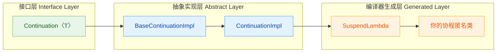

可以看到，**从接口到最终生成的类**，形成了一条清晰的职责链：`Continuation` 定义契约 → `BaseContinuationImpl` 提供驱动引擎 → `ContinuationImpl` 补充上下文拦截能力 → `SuspendLambda` / 匿名类 实现具体的状态机逻辑。

---

### invokeSuspend（执行协程体）

`invokeSuspend` 是 `BaseContinuationImpl` 中声明的一个 **抽象方法**，它的签名非常简洁：

```kotlin
// BaseContinuationImpl 中的抽象方法声明
// 参数 result: 上一次挂起点恢复时传回的结果（成功值或异常）
// 返回值: Any? —— 如果遇到新的挂起点则返回 COROUTINE_SUSPENDED，否则返回最终结果
protected abstract fun invokeSuspend(result: Result<Any?>): Any?
```

这个方法就是**状态机的主体**。回顾前面章节讲过的内容：编译器会把一个 `suspend` 函数按挂起点切分成多个代码块，然后用 `label` + `when` (对应字节码层面的 `switch-case`) 来管理状态流转。**所有这些生成的状态机代码，都被放进了 `invokeSuspend` 方法体中。**

举一个具体的例子。假设我们有如下 `suspend` 函数：

```kotlin
// 原始的 suspend 函数
suspend fun fetchAndProcess(): String {
    val data = fetchData()       // 挂起点 1
    val result = process(data)   // 挂起点 2
    return result
}
```

编译器会生成一个继承 `BaseContinuationImpl`（更准确地说是 `ContinuationImpl` → `SuspendLambda`）的匿名类，其 `invokeSuspend` 大致如下：

```kotlin
// 编译器生成的 invokeSuspend 方法（伪代码，简化展示）
override fun invokeSuspend(result: Result<Any?>): Any? {
    // 用于标记"协程已挂起"的哨兵值
    val SUSPENDED = COROUTINE_SUSPENDED

    // 根据当前 label 状态进入对应的代码块
    when (this.label) {

        0 -> {
            // ===== 状态 0：初始入口 =====
            result.throwOnFailure()          // 如果上一步有异常则抛出
            this.label = 1                   // 将 label 推进到下一个状态
            // 调用第一个 suspend 函数，传入 this 作为 Continuation
            val outcome = fetchData(this)    // this = 当前 Continuation
            if (outcome === SUSPENDED) {
                return SUSPENDED             // 真正挂起了，退出状态机，等待恢复
            }
            // 如果没有真正挂起（直接返回了结果），则 outcome 就是 data
            outcome                          // 继续往下走（fall-through 语义）
        }

        1 -> {
            // ===== 状态 1：fetchData 恢复后 =====
            result.throwOnFailure()          // 检查异常
            val data = result.getOrThrow()   // 拿到 fetchData 的返回值
            this.label = 2                   // 推进到状态 2
            val outcome = process(data, this)
            if (outcome === SUSPENDED) {
                return SUSPENDED             // 再次挂起
            }
            outcome
        }

        2 -> {
            // ===== 状态 2：process 恢复后 =====
            result.throwOnFailure()
            val finalResult = result.getOrThrow() as String
            return finalResult               // 返回最终结果，协程结束
        }

        else -> throw IllegalStateException("Unexpected label: ${this.label}")
    }
}
```

几个关键设计要点需要深入理解：

**1）`result` 参数的双重角色**

`invokeSuspend` 的入参 `result: Result<Any?>` 携带了上一次挂起点恢复时的值。在**第一次调用**时（`label == 0`），这个 `result` 是 `Result.success(Unit)`，因为还没有任何挂起点返回过数据。在**后续恢复**时，`result` 携带的就是上一个 `suspend` 函数的返回值，或者一个异常。这就是为什么每个 `case` 开头都要调用 `result.throwOnFailure()`——它实现了**异常的透明传播**。

**2）`COROUTINE_SUSPENDED` 的哨兵作用**

当一个内部 `suspend` 函数确实需要异步等待（例如网络请求）时，它返回 `COROUTINE_SUSPENDED` 这个特殊标记值。此时 `invokeSuspend` 也原样返回这个值，意味着"我现在没法继续了，等别人来 resume 我"。如果内部函数**没有真正挂起**（例如结果已经缓存好了），则直接返回实际值，状态机可以**不退出，直接流转到下一个状态**——这就是所谓的 **fast-path（快速路径）** 优化。

**3）`this` 就是 Continuation**

注意 `fetchData(this)` 中的 `this`。由于当前类本身就是 `BaseContinuationImpl` 的子类、实现了 `Continuation` 接口，所以**把自己传进去**就够了。当 `fetchData` 内部完成异步操作后，它会通过 `this.resumeWith(result)` 来恢复执行——而 `resumeWith` 的实现就在 `BaseContinuationImpl` 中，接下来马上讲解。

用一张流程图来描绘 `invokeSuspend` 的执行路径：

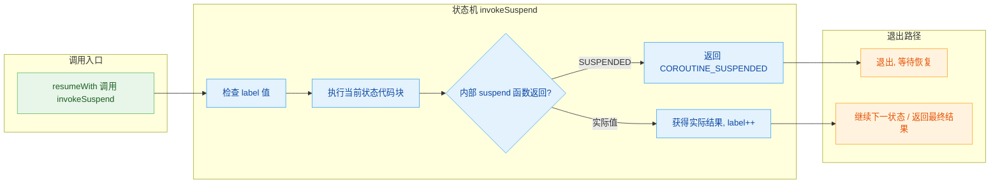

总结一下 `invokeSuspend` 的本质：**它是编译器把你的 `suspend` 函数"打碎重组"后的产物，每一次被调用都只执行一个状态分支，遇到真正挂起就退出，等恢复后再进来执行下一个分支。** 整个过程就像一个可以"暂停/继续"的函数执行器。

---

### resumeWith 实现

如果说 `invokeSuspend` 是状态机的"齿轮组"，那 `resumeWith` 就是**转动齿轮的曲柄**。它定义在 `BaseContinuationImpl` 中，是 `Continuation` 接口 `resumeWith` 方法的**核心实现**。

先来看简化后的源码（基于 Kotlin 标准库实现）：

```kotlin
// BaseContinuationImpl 中 resumeWith 的实现（简化版）
public final override fun resumeWith(result: Result<Any?>) {
    // current 指向当前正在执行的 Continuation（状态机）
    var current = this
    // param 是要传递给 invokeSuspend 的结果
    var param = result

    // ★ 关键：这是一个循环！不是简单的单次调用
    while (true) {
        with(current) {
            // 拿到"完成后该通知谁"——即调用者的 Continuation
            val completion = completion!!  // 每个 Continuation 都持有其父级引用

            val outcome: Result<Any?> = try {
                // ★ 调用状态机主体
                val result = invokeSuspend(param)

                // 如果返回了 COROUTINE_SUSPENDED，说明又挂起了
                // 直接 return，退出整个 resumeWith，等待下次恢复
                if (result === COROUTINE_SUSPENDED) return

                // 没有挂起，说明协程（或这一层）执行完毕，包装为成功结果
                Result.success(result)
            } catch (e: Throwable) {
                // 如果 invokeSuspend 抛出了异常，包装为失败结果
                Result.failure(e)
            }

            // ★ 释放拦截器（避免内存泄漏）
            releaseIntercepted()

            // ★ 检查 completion 是否也是 BaseContinuationImpl
            if (completion is BaseContinuationImpl) {
                // 如果是，说明调用链上还有状态机要继续执行
                // 不递归调用 completion.resumeWith()
                // 而是把 current 指向 completion，继续循环
                // 这就是 ★★★ 尾调用优化（避免栈溢出）★★★
                current = completion
                param = outcome
            } else {
                // 如果不是 BaseContinuationImpl（比如是最外层的回调）
                // 则直接调用其 resumeWith，结束循环
                completion.resumeWith(outcome)
                return
            }
        }
    }
}
```

这段代码信息密度极高，让我们逐一拆解其中的设计精髓。

**1）循环驱动而非递归调用（Trampoline 模式）**

这是 `resumeWith` 最精妙的设计。考虑以下场景：

```kotlin
// 协程 A 调用 suspend 函数 B，B 又调用 suspend 函数 C
suspend fun A() {
    B()   // B 完成后恢复 A
}
suspend fun B() {
    C()   // C 完成后恢复 B
}
suspend fun C() {
    delay(1000)  // 真正挂起
}
```

当 `delay` 完成、`C` 被恢复时，执行链是 `C.resumeWith → C.invokeSuspend → C 完成 → B.resumeWith → B.invokeSuspend → B 完成 → A.resumeWith → ...`。如果用**递归**来实现，每一层恢复都会在调用栈上新增一个 `resumeWith` 帧，调用链很深时就会 **StackOverflow**。

Kotlin 的解法是 **Trampoline（蹦床）模式**：用一个 `while(true)` 循环，当发现 `completion` 也是 `BaseContinuationImpl` 时，不递归调用它的 `resumeWith`，而是**把 `current` 指针指向它，重新循环**。这样无论调用链多深，始终只占用**一个栈帧**。

```java
// Trampoline 模式的栈帧变化（ASCII 示意）
// ❌ 递归方式：栈帧不断累积
// ┌─────────────────────┐
// │ A.resumeWith         │
// │  └─ B.resumeWith     │
// │      └─ C.resumeWith │  ← 栈越来越深
// └─────────────────────┘

// ✅ Trampoline 方式：始终单层
// 第1轮循环: current = C → invokeSuspend → C完成 → current = B
// 第2轮循环: current = B → invokeSuspend → B完成 → current = A
// 第3轮循环: current = A → invokeSuspend → A完成 → 调用最外层 completion
// ┌─────────────────────┐
// │ resumeWith (while)   │  ← 始终只有这一层
// └─────────────────────┘
```

**2）`completion` 链——协程的调用栈**

每个 `BaseContinuationImpl` 实例在创建时都会持有一个 `completion` 引用，指向"当我执行完毕后，应该恢复谁"。这个 `completion` 形成了一条**单向链表**，本质上就是协程版本的"调用栈"（Call Stack）：

```java
// completion 链（协程调用栈的替代品）
// ┌──────────────┐   completion   ┌──────────────┐   completion   ┌──────────────┐
// │  C 的状态机   │ ────────────→ │  B 的状态机   │ ────────────→ │  A 的状态机   │
// │  (当前执行)   │               │  (等待 C)     │               │  (等待 B)     │
// └──────────────┘               └──────────────┘               └──────────────┘
//                                                                       │
//                                                                  completion
//                                                                       ↓
//                                                               ┌──────────────┐
//                                                               │ 最外层回调    │
//                                                               │ (Job/Deferred)│
//                                                               └──────────────┘
```

传统线程的调用栈存放在连续内存中，大小固定（通常 1MB）。而协程的 `completion` 链是**堆上的链表**，每个节点只占几十字节，可以动态增长。这也是协程被称为"轻量级线程"的原因之一——**协程把调用栈从线程栈搬到了堆内存中**。

**3）异常处理的完整性**

注意 `invokeSuspend` 被包裹在 `try-catch` 中。如果状态机内部抛出了未捕获异常，`resumeWith` 会将其包装为 `Result.failure(e)`，然后传递给 `completion.resumeWith(outcome)`。这意味着**异常会沿着 completion 链向上传播**，直到被某一层的 `try-catch` 捕获，或者到达最外层的 `Job` 触发协程取消机制。这与传统的调用栈异常冒泡行为是一致的，只是换了一种实现方式。

**4）`releaseIntercepted()` —— 防止内存泄漏**

当一个 `Continuation` 执行完毕后，它会调用 `releaseIntercepted()` 来释放对 `ContinuationInterceptor`（通常就是 `Dispatcher`）的引用。这是一个容易被忽视但非常重要的细节——如果不释放，已经完成的协程对象仍然会通过拦截器引用持有 Dispatcher，可能导致 **内存泄漏**。

下面用一张完整的时序图来展示 `resumeWith` 驱动状态机的全过程：

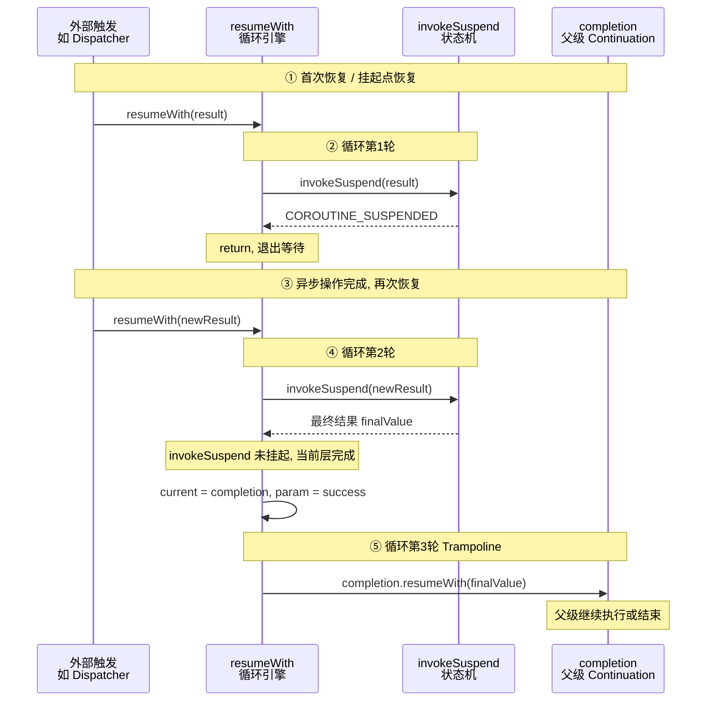

**完整的执行生命周期总结：**

| 阶段 | 谁在工作 | 做了什么 |
|------|---------|---------|
| **创建** | 编译器 | 生成 `BaseContinuationImpl` 子类，覆写 `invokeSuspend`，设置 `completion` |
| **首次启动** | `startCoroutine` / `createCoroutineUnintercepted` | 调用 `resumeWith(Unit)` |
| **执行状态机** | `invokeSuspend` | 根据 `label` 执行对应代码块 |
| **遇到挂起** | `invokeSuspend` 返回 `COROUTINE_SUSPENDED` | `resumeWith` 退出循环，线程释放 |
| **恢复执行** | 外部调用 `resumeWith(result)` | 再次进入循环，调用 `invokeSuspend` |
| **执行完毕** | `invokeSuspend` 返回实际值 | Trampoline 跳到 `completion`，沿链传递结果 |
| **异常退出** | `invokeSuspend` 抛异常 | 包装为 `Result.failure`，沿 `completion` 链传播 |

---

**📝 练习题**

以下是 `BaseContinuationImpl.resumeWith` 的简化代码片段，阅读后回答问题：

```kotlin
public final override fun resumeWith(result: Result<Any?>) {
    var current = this
    var param = result
    while (true) {
        with(current) {
            val completion = completion!!
            val outcome = try {
                val r = invokeSuspend(param)
                if (r === COROUTINE_SUSPENDED) return
                Result.success(r)
            } catch (e: Throwable) {
                Result.failure(e)
            }
            releaseIntercepted()
            if (completion is BaseContinuationImpl) {
                current = completion
                param = outcome
            } else {
                completion.resumeWith(outcome)
                return
            }
        }
    }
}
```

**当 `invokeSuspend` 返回 `COROUTINE_SUSPENDED` 时，`releaseIntercepted()` 是否会被执行？为什么这个行为是正确的？**

A. 会执行。因为 `releaseIntercepted()` 在 `try-catch` 之后、条件判断之前，属于必经路径。


B. 不会执行。因为 `return` 语句直接退出了整个 `resumeWith` 函数，后面的代码都不会执行。而这是正确的，因为协程还没完成，拦截器引用仍然需要保留以便后续恢复使用。


C. 不会执行。这是一个 Bug，应该在 `return` 之前调用 `releaseIntercepted()` 以避免内存泄漏。


D. 会执行。因为 `return` 只是退出了 `try` 块，不是退出函数。


**【答案】** B

**【解析】** 当 `invokeSuspend` 返回 `COROUTINE_SUSPENDED` 时，代码执行到 `if (r === COROUTINE_SUSPENDED) return` 这一行，`return` 直接退出了整个 `resumeWith` 函数。因此 `releaseIntercepted()` **不会被执行**。这个行为是**故意且正确的**：`COROUTINE_SUSPENDED` 意味着协程暂时挂起、尚未完成，将来还需要被恢复。恢复时 Dispatcher（通过 `ContinuationInterceptor`）还需要拦截并调度 `Continuation` 到正确的线程，所以**拦截器引用必须保留**。只有当 `invokeSuspend` 返回了实际结果（协程这一层真正完成）时，才调用 `releaseIntercepted()` 释放拦截器引用，避免已完成的 `Continuation` 对象仍持有 Dispatcher 造成内存泄漏。选项 A 和 D 对控制流的理解有误，选项 C 的"Bug"判断不正确——这是 Kotlin 团队精心设计的生命周期管理策略。

---

## 本章小结

本章围绕 Kotlin 协程最核心的编译期机制 —— **CPS 变换 (Continuation-Passing Style Transformation)** 展开，从源码层、编译产物层、运行时层三个维度，系统拆解了 `suspend` 函数"看似同步、实则异步"的全部秘密。下面对全章知识脉络做一次完整回顾。

---

### 核心思想回顾

Kotlin 协程的本质可以用一句话概括：**编译器把你写的顺序代码，变换成一台由 Continuation 驱动的状态机**。

我们在源码里写下的每一个 `suspend` 函数调用，看起来和普通函数没有区别——没有回调嵌套、没有 `then()` 链式调用、没有 `async/await` 的显式标记。然而，一旦经过 Kotlin 编译器的 CPS 变换管线（CPS Transformation Pipeline），这段"人类友好"的顺序代码就会被彻底重塑为一段"机器友好"的状态机逻辑。

整个变换过程可以拆解为 **三个递进层次**：

1. **签名变换 (Signature Rewriting)**：编译器在每个 `suspend` 函数末尾追加一个 `Continuation<T>` 参数，并将返回值统一改写为 `Object?`。这一步是一切后续变换的基础——它把"谁来接收结果"这个信息，从隐式的调用栈变成了显式的对象传递。

2. **状态机生成 (State Machine Generation)**：编译器以每个 **挂起点 (suspension point)** 为界，将函数体切分成多个代码段（state），用一个整型 `label` 字段标识当前执行到了哪一段。每次挂起前把 `label` 推进到下一个值，恢复时通过 `when (label)` 跳转到正确的续接位置。所有局部变量都被提升（hoist）到 Continuation 对象的字段中，从而跨越挂起点存活。

3. **Continuation 驱动 (Continuation-Driven Execution)**：`Continuation` 接口的 `resumeWith(Result<T>)` 方法是整台状态机的"点火开关"。每次异步操作完成后，外部调度器（或完成回调）调用 `resumeWith`，它再委托 `BaseContinuationImpl.invokeSuspend()` 推动状态机进入下一个 `label`，如此循环直至函数执行完毕。

---

### 全景架构图

下面这张图把 **源码 → 编译产物 → 运行时执行** 的完整链路串联起来：

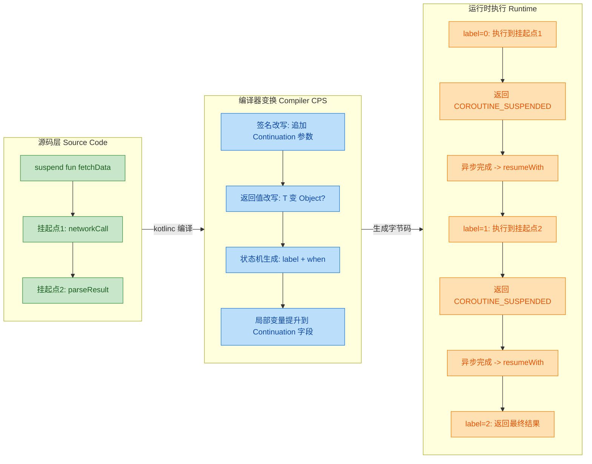

---

### 关键类与接口关系

本章涉及的核心类型构成了一条清晰的继承链：

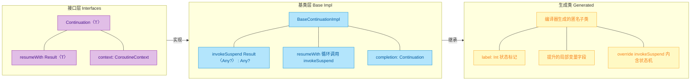

它们之间的职责边界非常清晰：

| 层次 | 类型 | 核心职责 |
|------|------|---------|
| 接口契约 | `Continuation<T>` | 定义 `resumeWith` 与 `context`，是协程恢复的统一入口 |
| 基类骨架 | `BaseContinuationImpl` | 实现 `resumeWith` 的循环驱动逻辑；持有 `completion` 链 |
| 生成子类 | 编译器匿名类 | 重写 `invokeSuspend`，内含 `label` 状态机和提升后的局部变量 |

---

### 一句话记忆公式

> **suspend 函数 = CPS 签名改写 + 挂起点切分状态机 + Continuation 驱动恢复**

把这三块拼在一起，就是 Kotlin 协程在编译期和运行时的全部原理。没有黑魔法、没有操作系统线程切换——只有编译器生成的状态机对象和一次又一次的 `resumeWith` 调用。

---

### 与其他异步模型的对比

理解 CPS 变换后，我们可以更清楚地看到 Kotlin 协程在异步编程演化史中的位置：

| 模型 | 代码风格 | 变换方式 | 典型代表 |
|------|---------|---------|---------|
| 回调 (Callback) | 嵌套、碎片化 | 手动拆分 | JS callback hell, Android AsyncTask |
| Promise / Future | 链式 `.then()` | 手动链接 | JS Promise, Java CompletableFuture |
| async/await (语法糖) | 近似同步 | 编译器/运行时混合 | JS async/await, C# async/await |
| **Kotlin suspend (CPS)** | **完全同步** | **纯编译期状态机** | **Kotlin Coroutines** |

Kotlin 的独特之处在于：**变换完全发生在编译期**。运行时不需要任何特殊的 VM 支持（不像 Java 的 Virtual Thread 需要 JVM 层面的协作）。编译器把 `suspend` 函数变成普通的类和方法调用，JVM 看到的只是标准的字节码——这就是为什么 Kotlin 协程可以运行在 JVM、Android、Native、JS 等多个平台上。

---

### 常见误区澄清

**误区一："协程是轻量级线程"就意味着协程创建了某种特殊线程**
→ 不是。协程本质上是一个状态机对象（Continuation 的子类实例）。它被调度到线程上执行，但自身并不是线程。挂起时不占用任何线程——只是一个等待被 `resumeWith` 的对象留在内存里。

**误区二："suspend 关键字让函数具有了挂起能力"**
→ 更准确地说，`suspend` 关键字是给 **编译器** 看的标记。它告诉编译器："请对这个函数执行 CPS 变换"。函数本身是否真的挂起，取决于运行时是否返回了 `COROUTINE_SUSPENDED`。

**误区三："每个挂起点都会切换线程"**
→ 不一定。挂起点只是状态机的分界线。如果被调用的 suspend 函数实际上没有挂起（直接返回了结果），状态机会 **立即** 推进到下一个 label，整个过程在同一线程上连续执行，没有任何切换开销。

**误区四："`COROUTINE_SUSPENDED` 是一个异常或错误状态"**
→ 它是一个正常的哨兵值（sentinel value），类型为 `Any`（实际是 `internal object CoroutineSingletons` 中的一个枚举值）。它的语义是"我现在无法给你结果，请等我的 Continuation 稍后通知你"。这是一种完全正常的控制流信号。

---

### 学完本章你应该能回答的问题

- `suspend` 函数编译后，方法签名发生了哪两个变化？（追加 `Continuation` 参数 + 返回值变 `Object?`）
- 状态机的 `label` 字段是在哪个对象上？（编译器生成的 `Continuation` 子类实例）
- `COROUTINE_SUSPENDED` 在控制流中扮演什么角色？（告诉调用方"本次调用真的挂起了，不要继续执行后面的代码"）
- `BaseContinuationImpl.resumeWith` 内部为什么需要一个循环？（为了支持不挂起直接返回结果的情况，避免递归调用导致栈溢出）
- `invokeSuspend` 方法由谁实现、做了什么？（编译器生成的子类实现，内含 `when (label)` 状态机逻辑）

---

**📝 练习题 1**

以下关于 Kotlin CPS 变换的描述，**错误** 的是：

A. `suspend` 函数编译后会增加一个 `Continuation` 类型的参数


B. 编译器会为每个 `suspend` 函数生成一个包含状态机的 `Continuation` 子类


C. 如果 `suspend` 函数内部没有调用任何其他 `suspend` 函数，编译器不会对其进行 CPS 变换


D. `COROUTINE_SUSPENDED` 是一个哨兵值，表示函数确实发生了挂起


**【答案】** C

**【解析】** 只要函数被标记为 `suspend`，编译器就 **一定** 会对其执行 CPS 变换——追加 `Continuation` 参数、将返回值改为 `Object?`。即使函数体内没有调用任何其他 `suspend` 函数（即没有挂起点），签名变换仍然会发生，只是生成的状态机只有一个 state（`label = 0`），函数永远不会真正挂起。选项 A、B、D 均为正确描述。这道题考察的是"CPS 变换是编译期的无条件行为，与运行时是否挂起无关"这一关键认知。

---

**📝 练习题 2**

阅读以下简化的反编译伪代码：

```kotlin
// 编译器为 suspend fun loadData() 生成的状态机（简化版）
fun invokeSuspend(result: Result<Any?>): Any? {
    val cont = this               // this 就是 Continuation 子类实例
    when (cont.label) {
        0 -> {
            cont.label = 1        // 推进到下一个状态
            val r = fetchFromNetwork(cont)  // 挂起点1
            if (r == COROUTINE_SUSPENDED) return r
            r                     // 未挂起则继续
        }
        1 -> {
            val networkResult = result.getOrThrow()
            cont.label = 2        // 推进到下一个状态
            val r = saveToDB(networkResult, cont)  // 挂起点2
            if (r == COROUTINE_SUSPENDED) return r
            r
        }
        2 -> {
            val dbResult = result.getOrThrow()
            return dbResult       // 最终返回
        }
        else -> throw IllegalStateException()
    }
}
```

当 `fetchFromNetwork` 实际挂起后，恢复执行时，`invokeSuspend` 被调用，此时 `label` 的值和 `result` 的含义分别是什么？

A. `label = 0`，`result` 是 `fetchFromNetwork` 的返回值


B. `label = 1`，`result` 是 `fetchFromNetwork` 的异步执行结果


C. `label = 2`，`result` 是 `saveToDB` 的异步执行结果


D. `label = 1`，`result` 是 `COROUTINE_SUSPENDED`


**【答案】** B

**【解析】** 在 `label = 0` 的分支中，调用 `fetchFromNetwork` 之前已经将 `label` 推进为 `1`。当 `fetchFromNetwork` 真的挂起（返回 `COROUTINE_SUSPENDED`），`invokeSuspend` 立即返回，状态机暂停。等到网络请求完成后，外部通过 `resumeWith(Result.success(网络数据))` 触发恢复，`BaseContinuationImpl.resumeWith` 再次调用 `invokeSuspend`——此时 `label` 已经是 `1`，`result` 参数携带的就是 `fetchFromNetwork` 的异步执行结果。选项 A 错在 label 值（已被推进）；选项 C 错在 label 值（此时还没执行 `saveToDB`）；选项 D 错在 `result` 的含义（`result` 携带的是实际业务结果，而非哨兵值）。

---