---

# 协程取消与超时 ⭐⭐

---

## 协程取消 ⭐⭐

在真实的应用开发中，我们启动的协程并不总是需要运行到自然结束。用户可能离开了页面、网络请求可能已经不再需要、或者某个计算任务的结果已经过时——这些场景都要求我们能够**主动取消**一个正在运行的协程。Kotlin 协程框架为此提供了一套优雅而强大的 **结构化取消 (Structured Cancellation)** 机制，它既高效又安全，但理解其背后的"协作式"本质至关重要。

---

### cancel 方法

每一个通过 `launch` 或 `async` 启动的协程都会返回一个 `Job`（或 `Deferred`）对象，而 `Job` 接口上最核心的取消方法就是 `cancel()`。

```kotlin
import kotlinx.coroutines.*

fun main() = runBlocking {
    // launch 返回一个 Job 对象，它是协程的句柄（handle）
    val job: Job = launch {
        repeat(1000) { i ->
            println("协程工作中... $i")
            delay(500L) // 每次迭代挂起 500ms
        }
    }

    delay(1300L) // 主协程等待 1.3 秒，让子协程打印几轮
    println("主协程：我准备取消子协程了")

    job.cancel()  // 向子协程发送取消信号
    job.join()    // 等待子协程真正结束（完成取消流程）

    println("主协程：子协程已取消，继续执行")
}
```

运行结果：

```text
协程工作中... 0
协程工作中... 1
协程工作中... 2
主协程：我准备取消子协程了
主协程：子协程已取消，继续执行
```

让我们来拆解整个取消流程的内部时序：

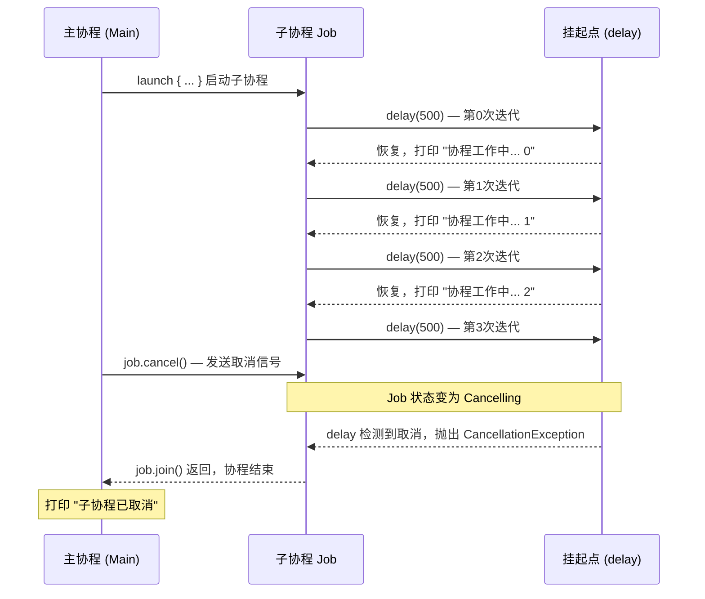
```mermaid
sequenceDiagram
    participant M as 主协程 (Main)
    participant J as 子协程 Job
    participant S as 挂起点 (delay)

    M->>J: launch { ... } 启动子协程
    J->>S: delay(500) — 第0次迭代
    S-->>J: 恢复，打印 "协程工作中... 0"
    J->>S: delay(500) — 第1次迭代
    S-->>J: 恢复，打印 "协程工作中... 1"
    J->>S: delay(500) — 第2次迭代
    S-->>J: 恢复，打印 "协程工作中... 2"
    J->>S: delay(500) — 第3次迭代
    M->>J: job.cancel() — 发送取消信号
    Note over J,S: Job 状态变为 Cancelling
    S-->>J: delay 检测到取消，抛出 CancellationException
    J-->>M: job.join() 返回，协程结束
    Note over M: 打印 "子协程已取消"
```

**几个关键细节：**

**① `cancel()` 只是"发信号"，而非"立即杀死"。** 调用 `cancel()` 后，协程的 `Job` 状态从 `Active` 切换到 `Cancelling`，但协程体中的代码不会被粗暴中断。真正的取消发生在下一个 **挂起点 (suspension point)** 处——这就是"协作式取消"的含义，后面会详细展开。

**② `cancel()` + `join()` = `cancelAndJoin()`。** 实际开发中，我们通常需要在取消后等待协程真正完成清理工作，因此 Kotlin 提供了一个便捷的组合扩展函数：

```kotlin
// cancelAndJoin() 等价于先 cancel() 再 join()
// 它确保调用方会挂起，直到被取消的协程完全结束
job.cancelAndJoin()
```

**③ `cancel()` 可以传入自定义原因。** `cancel` 方法接受一个可选的 `CancellationException` 参数，用于描述取消原因：

```kotlin
// 传入自定义取消原因，便于调试和日志追踪
job.cancel(CancellationException("用户离开了页面"))
```

**④ 取消是幂等的 (Idempotent)。** 对一个已经取消或已经完成的 `Job` 重复调用 `cancel()` 不会有任何副作用，这在实际业务代码中非常方便——你不需要在取消前检查状态。

下面用一张状态图来梳理 `Job` 在取消流程中的完整状态变迁：

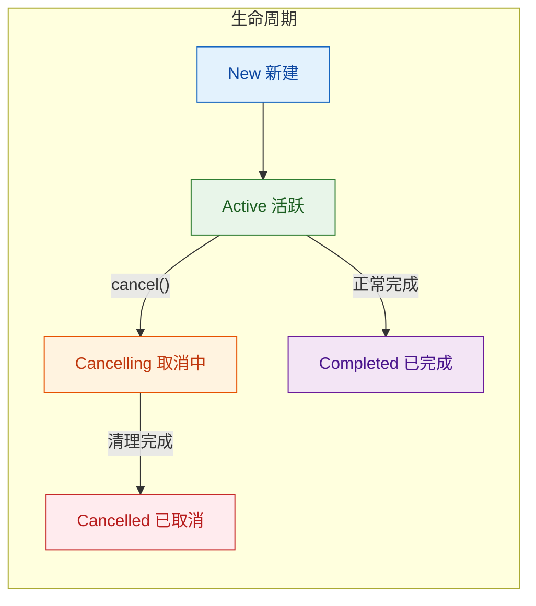
```mermaid
graph LR
    subgraph 生命周期
        direction TB
        A[New 新建] --> B[Active 活跃]
        B -->|"cancel()"| C[Cancelling 取消中]
        C -->|"清理完成"| D[Cancelled 已取消]
        B -->|"正常完成"| E[Completed 已完成]
    end

    classDef newState fill:#E3F2FD,stroke:#1565C0,color:#0D47A1
    classDef activeState fill:#E8F5E9,stroke:#2E7D32,color:#1B5E20
    classDef cancellingState fill:#FFF3E0,stroke:#E65100,color:#BF360C
    classDef cancelledState fill:#FFEBEE,stroke:#C62828,color:#B71C1C
    classDef completedState fill:#F3E5F5,stroke:#6A1B9A,color:#4A148C

    class A newState
    class B activeState
    class C cancellingState
    class D cancelledState
    class E completedState
```

当 `Job` 处于 `Cancelling` 状态时，`isActive` 为 `false`，`isCancelled` 为 `true`，而 `isCompleted` 仍然为 `false`。只有当 `finally` 块等清理逻辑全部执行完毕后，状态才会最终变为 `Cancelled`（此时 `isCompleted` 也变为 `true`）。

---

### 取消是协作式的 (Cancellation is Cooperative)

这是理解 Kotlin 协程取消机制的 **最核心概念**。与线程的 `Thread.stop()`（已废弃的暴力终止）不同，Kotlin 协程的取消完全是 **协作式 (cooperative)** 的——协程代码必须 **主动配合** 才能被真正取消。

这意味着什么？看一个"取消失败"的经典反例：

```kotlin
import kotlinx.coroutines.*

fun main() = runBlocking {
    val job = launch(Dispatchers.Default) {
        var nextPrintTime = System.currentTimeMillis()
        var i = 0

        // 这是一个纯计算循环，没有任何挂起点！
        while (i < 5) {
            val currentTime = System.currentTimeMillis()
            if (currentTime >= nextPrintTime) {
                println("计算中... ${i++}")
                nextPrintTime = currentTime + 500L
            }
            // 这里在疯狂计算，没有 delay、yield 等挂起函数
        }
    }

    delay(1300L)
    println("主协程：取消子协程")
    job.cancelAndJoin() // 尝试取消
    println("主协程：完成")
}
```

**令人惊讶的输出：**

```text
计算中... 0
计算中... 1
计算中... 2
主协程：取消子协程
计算中... 3
计算中... 4
主协程：完成
```

即使我们在打印 `2` 之后就调用了 `cancelAndJoin()`，协程依然 **继续执行到了 `4` 才结束**！这是因为这个协程内部没有任何挂起点，它根本"不知道"自己已经被取消了。

为了直观地理解"协作式"与"抢占式"取消的区别，我们用一个类比：

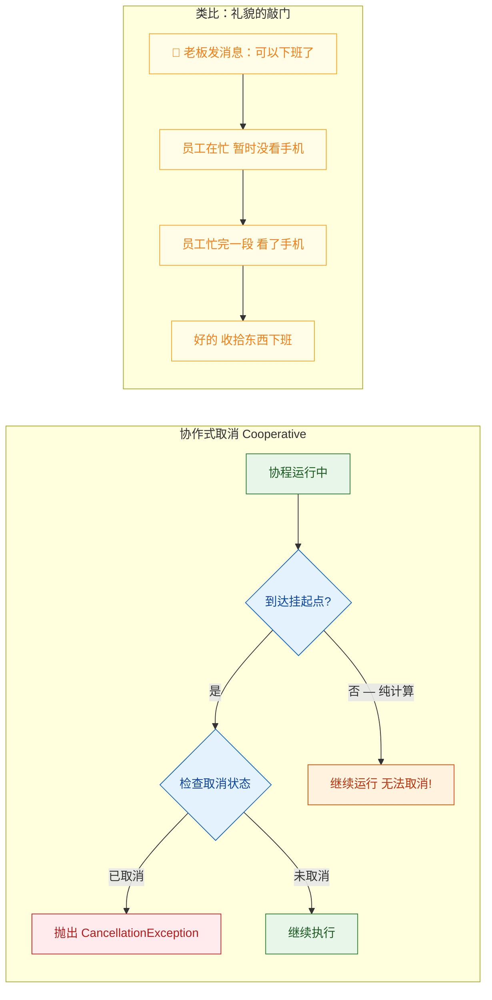
```mermaid
graph LR
    subgraph COOP["协作式取消 Cooperative"]
        direction TB
        A1[协程运行中] --> A2{到达挂起点?}
        A2 -->|"是"| A3{检查取消状态}
        A3 -->|"已取消"| A4[抛出 CancellationException]
        A3 -->|"未取消"| A5[继续执行]
        A2 -->|"否 — 纯计算"| A6[继续运行 无法取消!]
    end

    subgraph ANALOGY["类比：礼貌的敲门"]
        direction TB
        B1[🚪 老板发消息：可以下班了] --> B2[员工在忙 暂时没看手机]
        B2 --> B3[员工忙完一段 看了手机]
        B3 --> B4[好的 收拾东西下班]
    end

    classDef flow fill:#E8F5E9,stroke:#2E7D32,color:#1B5E20
    classDef check fill:#E3F2FD,stroke:#1565C0,color:#0D47A1
    classDef cancel fill:#FFEBEE,stroke:#C62828,color:#B71C1C
    classDef ok fill:#F3E5F5,stroke:#6A1B9A,color:#4A148C
    classDef warn fill:#FFF3E0,stroke:#E65100,color:#BF360C
    classDef analogy fill:#FFFDE7,stroke:#F9A825,color:#F57F17

    class A1,A5 flow
    class A2,A3 check
    class A4 cancel
    class A6 warn
    class B1,B2,B3,B4 analogy
```

**核心原则：协程自身必须 "检查邮箱" 才能知道有人请求取消。** 那么它在哪里 "检查" 呢？有两种方式：

1. **在挂起点自动检查**（最常用）— 下一节详述
2. **手动检查 `isActive` 属性**（适用于纯计算场景）— 下一节详述

---

### 检查 isActive

对于 CPU 密集型的纯计算任务（没有调用任何挂起函数），协程不会自动检查取消状态。此时，开发者需要手动在循环或关键位置检查 `isActive` 属性。

`isActive` 是 `CoroutineScope` 的扩展属性，在协程体内可以直接访问。当协程被取消时，`isActive` 会变为 `false`。

让我们修复上面那个"取消不了"的例子：

```kotlin
import kotlinx.coroutines.*

fun main() = runBlocking {
    val job = launch(Dispatchers.Default) {
        var nextPrintTime = System.currentTimeMillis()
        var i = 0

        // ✅ 关键修复：用 isActive 替代固定条件
        while (isActive) {  // 每次循环都检查协程是否仍然活跃
            val currentTime = System.currentTimeMillis()
            if (currentTime >= nextPrintTime) {
                println("计算中... ${i++}")
                nextPrintTime = currentTime + 500L
            }
        }
        // 协程被取消后，循环退出，走到这里
        println("协程优雅退出，共完成 $i 次计算")
    }

    delay(1300L)  // 等待 1.3 秒
    println("主协程：取消子协程")
    job.cancelAndJoin()  // 这次能成功取消了！
    println("主协程：完成")
}
```

**输出：**

```text
计算中... 0
计算中... 1
计算中... 2
主协程：取消子协程
协程优雅退出，共完成 3 次计算
主协程：完成
```

这一次，当 `cancel()` 被调用后，`isActive` 立刻变为 `false`，下一轮 `while` 循环条件判断时发现为假，循环正常退出。

除了 `isActive`，还有另一个方便的函数 `ensureActive()`，它的行为略有不同：

```kotlin
import kotlinx.coroutines.*

fun main() = runBlocking {
    val job = launch(Dispatchers.Default) {
        var i = 0
        while (true) {
            // ensureActive() 在协程已取消时会直接抛出 CancellationException
            // 而不是像 isActive 那样只返回 false
            ensureActive()

            // 模拟计算任务
            i++
            if (i % 100_000_000 == 0) {
                println("已完成 ${i / 100_000_000} 亿次运算")
            }
        }
    }

    delay(100L)
    job.cancelAndJoin()
    println("计算已取消")
}
```

两种方式的对比：

| 方式 | 行为 | 适合场景 |
|------|------|----------|
| `isActive` | 返回 `Boolean`，由你决定如何退出 | 需要在退出前做自定义收尾逻辑 |
| `ensureActive()` | 直接抛出 `CancellationException` | 快速失败，不需要特殊退出逻辑 |
| `yield()` | 让出执行权 + 检查取消 | CPU 密集任务中希望公平调度 |

`yield()` 是一个特殊的挂起函数，它不仅检查取消状态，还会将当前协程"挂起"并让出线程给其他协程使用（类似于线程的 `Thread.yield()`），然后在调度器再次分配时间片时恢复执行。这在密集计算场景中能防止单个协程"饿死"其他协程：

```kotlin
import kotlinx.coroutines.*

fun main() = runBlocking {
    val job = launch(Dispatchers.Default) {
        var sum = 0L
        for (i in 1..1_000_000) {
            sum += i
            if (i % 100_000 == 0) {
                yield()  // 每 10 万次计算让出一次执行权，同时检查取消
                println("累加到 $i，当前和 = $sum")
            }
        }
    }

    delay(5L)  // 短暂等待后取消
    job.cancelAndJoin()
    println("计算协程已取消")
}
```

---

### 挂起点自动检查取消

在实际开发中，我们的协程代码通常不会是纯 CPU 密集型计算，而是会包含大量的挂起函数调用——`delay()`、`withContext()`、网络请求、数据库读写等。**所有 `kotlinx.coroutines` 库中的挂起函数都会自动检查取消状态**，如果检测到协程已被取消，就会立刻抛出 `CancellationException`。

这也是为什么我们最开始的例子中使用 `delay()` 的协程能被顺利取消——`delay()` 本身就是一个挂起点，它会在恢复执行前检查取消标志。

```kotlin
import kotlinx.coroutines.*

fun main() = runBlocking {
    val job = launch {
        try {
            repeat(1000) { i ->
                println("工作中... $i")
                // delay 是挂起函数，在此处会自动检查取消状态
                // 如果协程已被取消，delay 不会等待，而是直接抛出 CancellationException
                delay(500L)
            }
        } catch (e: CancellationException) {
            // 捕获取消异常（通常不推荐捕获它，这里仅为演示）
            println("捕获到取消异常: ${e.message}")
        } finally {
            println("finally: 执行清理工作")
        }
    }

    delay(1300L)
    println("取消协程")
    job.cancelAndJoin()
    println("完成")
}
```

**输出：**

```text
工作中... 0
工作中... 1
工作中... 2
取消协程
捕获到取消异常: StandaloneCoroutine was cancelled
finally: 执行清理工作
完成
```

让我们深入理解"挂起点自动检查"的内部机制：

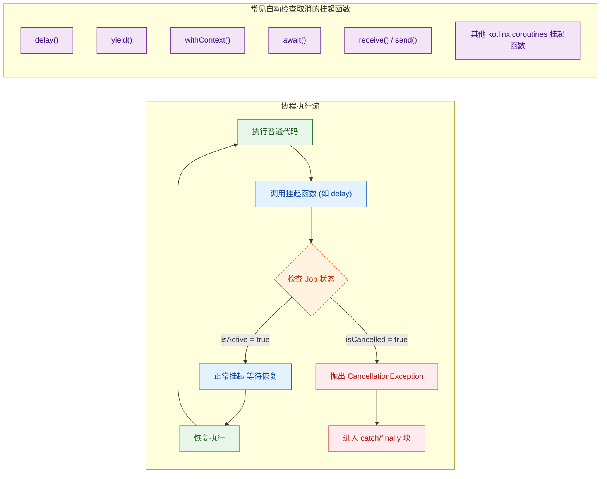
```mermaid
graph LR
    subgraph 协程执行流
        direction TB
        A[执行普通代码] --> B["调用挂起函数 (如 delay)"]
        B --> C{检查 Job 状态}
        C -->|"isActive = true"| D[正常挂起 等待恢复]
        D --> E[恢复执行]
        E --> A
        C -->|"isCancelled = true"| F["抛出 CancellationException"]
        F --> G[进入 catch/finally 块]
    end

    subgraph 常见自动检查取消的挂起函数
        direction TB
        H["delay()"]
        I["yield()"]
        J["withContext()"]
        K["await()"]
        L["receive() / send()"]
        M["其他 kotlinx.coroutines 挂起函数"]
    end

    classDef exec fill:#E8F5E9,stroke:#2E7D32,color:#1B5E20
    classDef suspend fill:#E3F2FD,stroke:#1565C0,color:#0D47A1
    classDef check fill:#FFF3E0,stroke:#E65100,color:#BF360C
    classDef cancel fill:#FFEBEE,stroke:#C62828,color:#B71C1C
    classDef funcs fill:#F3E5F5,stroke:#6A1B9A,color:#4A148C

    class A,E exec
    class B,D suspend
    class C check
    class F,G cancel
    class H,I,J,K,L,M funcs
```

**更精确地说：** 挂起函数内部在挂起前和恢复时都会通过 `Job` 的状态来判断是否需要抛出 `CancellationException`。这个检查通常发生在 `suspendCancellableCoroutine` 的实现中——这是 `kotlinx.coroutines` 库中大多数挂起函数的底层构建块。

一个非常重要的实践原则由此而来：

> **如果你的协程体中包含挂起函数调用（绝大多数情况都是如此），你不需要手动检查 `isActive`，取消会自动发生。只有在纯 CPU 密集型计算的循环中，才需要手动加入 `isActive`、`ensureActive()` 或 `yield()` 检查。**

下面用一个对比表来总结三种取消检查的场景选择：

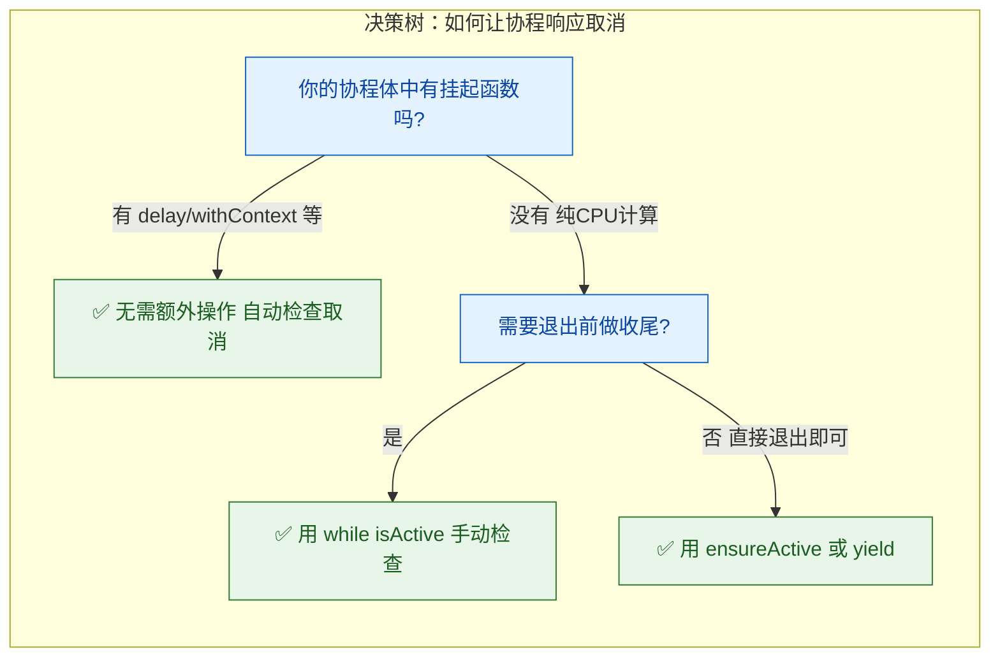
```mermaid
graph LR
    subgraph DECISION["决策树：如何让协程响应取消"]
        direction TB
        Q["你的协程体中有挂起函数吗?"]
        Q -->|"有 delay/withContext 等"| ANS1["✅ 无需额外操作 自动检查取消"]
        Q -->|"没有 纯CPU计算"| Q2["需要退出前做收尾?"]
        Q2 -->|"是"| ANS2["✅ 用 while isActive 手动检查"]
        Q2 -->|"否 直接退出即可"| ANS3["✅ 用 ensureActive 或 yield"]
    end

    classDef question fill:#E3F2FD,stroke:#1565C0,color:#0D47A1
    classDef answer fill:#E8F5E9,stroke:#2E7D32,color:#1B5E20

    class Q,Q2 question
    class ANS1,ANS2,ANS3 answer
```

再通过一个综合示例来巩固所有知识点：

```kotlin
import kotlinx.coroutines.*

fun main() = runBlocking {

    // === 场景1：有挂起函数，自动响应取消 ===
    val job1 = launch {
        repeat(100) { i ->
            println("[Job1] 网络请求 #$i")
            delay(200L) // ← 这里会自动检查取消
        }
    }

    // === 场景2：纯计算，用 isActive 手动检查 ===
    val job2 = launch(Dispatchers.Default) {
        var count = 0
        while (isActive) {  // ← 手动检查取消状态
            count++
            // 模拟 CPU 密集型运算（如加密/压缩）
            if (count % 5_000_000 == 0) {
                println("[Job2] 已处理 ${count / 1_000_000}M 条数据")
            }
        }
        println("[Job2] 退出前：共处理了 ${count} 条数据") // 可以做收尾
    }

    // === 场景3：纯计算，用 ensureActive() 快速失败 ===
    val job3 = launch(Dispatchers.Default) {
        var result = 0L
        for (i in 1..1_000_000_000) {
            ensureActive()  // ← 取消时直接抛 CancellationException
            result += i
        }
    }

    delay(300L) // 让各协程运行一会儿
    println("--- 取消所有协程 ---")

    // 同时取消三个协程
    job1.cancelAndJoin()  // job1 在下一个 delay() 处响应取消
    job2.cancelAndJoin()  // job2 在下一次 while(isActive) 判断时退出
    job3.cancelAndJoin()  // job3 在下一次 ensureActive() 处抛异常退出

    println("所有协程已取消")
}
```

---

**📝 练习题**

以下代码运行后，控制台输出的最后一行是什么？

```kotlin
fun main() = runBlocking {
    val job = launch {
        var i = 0
        while (i < 5) {
            println("i = $i")
            i++
            delay(100)
        }
        println("循环完成")
    }
    delay(250)
    job.cancelAndJoin()
    println("结束")
}
```

A. 循环完成


B. i = 4


C. 结束


D. i = 2


**【答案】** C

**【解析】** 让我们逐步推演时间线：
- **t=0ms**：启动协程，打印 `i = 0`，`i` 变为 `1`，然后 `delay(100)` 挂起
- **t=100ms**：恢复，打印 `i = 1`，`i` 变为 `2`，然后 `delay(100)` 挂起
- **t=200ms**：恢复，打印 `i = 2`，`i` 变为 `3`，然后 `delay(100)` 挂起
- **t=250ms**：主协程的 `delay(250)` 结束，调用 `job.cancelAndJoin()`，Job 状态变为 `Cancelling`
- **t=300ms 时本应恢复的 `delay(100)`**：检测到 Job 已被取消，抛出 `CancellationException`，协程退出
- `cancelAndJoin()` 返回后，打印 `"结束"`

所以最后一行输出是 `"结束"`。协程在 `i = 2` 打印后进入 `delay(100)` 挂起，在挂起期间被取消，因此 `i = 3` 及后续内容不会被打印，`"循环完成"` 也不会出现。选 D 的同学注意——`i = 2` 确实被打印了，但它不是**最后一行**，最后一行是 `cancelAndJoin()` 之后的 `println("结束")`。

---

## CancellationException

在上一节中，我们学习了如何通过 `cancel()` 方法取消协程，以及取消的协作式（cooperative）本质。但你是否好奇过：**协程取消的底层机制到底是什么？取消信号是如何在协程体内传播并中断执行的？** 答案就藏在一个特殊的异常类——`CancellationException` 之中。

Kotlin 协程的取消机制，本质上是通过 **抛出异常** 来实现的。当你调用 `job.cancel()` 时，协程并不是被"强行杀死"的，而是在下一个挂起点（suspension point）被注入一个 `CancellationException`。协程框架对这个异常有着非常特殊的处理逻辑——它既像一个普通异常一样可以被 `try-catch` 捕获，又在结构化并发（Structured Concurrency）的体系中享有"豁免权"，不会导致父协程或兄弟协程的失败。

理解 `CancellationException` 是掌握协程错误处理和生命周期管理的关键基石，也是面试中常被考察的高频知识点。

### 正常取消异常

#### 取消的本质：一个"被默许"的异常

当我们调用 `job.cancel()` 时，Kotlin 协程框架在底层做了如下事情：

1. 将协程的状态标记为 **Cancelling**（取消中）。
2. 在协程下一次到达 **挂起点**（如 `delay()`、`yield()`、`withContext()` 等）时，从挂起点处抛出一个 `CancellationException`。
3. 这个异常沿着调用栈向上传播，最终使协程体正常结束（或进入 `finally` 块执行清理逻辑）。
4. 协程状态最终变为 **Cancelled**（已取消）。

用一张流程图来可视化这个过程：

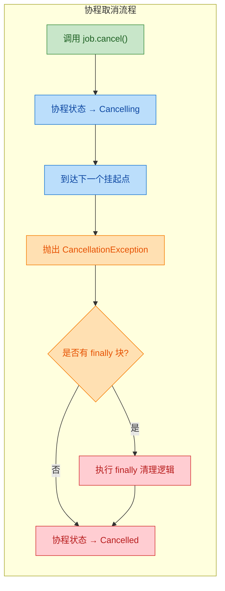
```mermaid
graph LR
    subgraph Cancellation["协程取消流程"]
        direction TB
        A["调用 job.cancel()"] --> B["协程状态 → Cancelling"]
        B --> C["到达下一个挂起点"]
        C --> D["抛出 CancellationException"]
        D --> E{"是否有 finally 块?"}
        E -->|是| F["执行 finally 清理逻辑"]
        E -->|否| G["协程状态 → Cancelled"]
        F --> G
    end

    classDef greenNode fill:#C8E6C9,stroke:#388E3C,color:#1B5E20
    classDef blueNode fill:#BBDEFB,stroke:#1976D2,color:#0D47A1
    classDef orangeNode fill:#FFE0B2,stroke:#F57C00,color:#E65100
    classDef redNode fill:#FFCDD2,stroke:#D32F2F,color:#B71C1C

    class A greenNode
    class B,C blueNode
    class D,E orangeNode
    class F,G redNode
```

我们来看一个最直观的例子，验证取消时确实会抛出 `CancellationException`：

```kotlin
import kotlinx.coroutines.*

fun main() = runBlocking {
    // 启动一个子协程
    val job = launch {
        try {
            println("协程开始执行...")
            // repeat 是一个普通的循环辅助函数，执行 1000 次
            repeat(1000) { i ->
                println("正在工作中... 第 $i 次迭代")
                // delay 是挂起函数，也是取消检查点
                delay(200L)
            }
        } catch (e: CancellationException) {
            // 捕获取消异常，观察它的真面目
            println("捕获到异常: ${e::class.simpleName}")  // CancellationException
            println("异常消息: ${e.message}")               // StandaloneCoroutine was cancelled
            // ⚠️ 重要：捕获后必须重新抛出，否则协程无法正常完成取消流程
            throw e
        } finally {
            // 无论正常结束还是取消，finally 块都会执行
            println("finally: 执行清理工作")
        }
    }

    // 主协程等待 500ms，让子协程运行一会儿
    delay(500L)
    println("主协程: 准备取消子协程")

    // 取消子协程，可以传入自定义的取消原因
    job.cancel(CancellationException("不再需要这个任务了"))

    // 等待子协程完全结束（包括 finally 块的执行）
    job.join()
    println("主协程: 子协程已完全结束")
}
```

运行输出：

```
协程开始执行...
正在工作中... 第 0 次迭代
正在工作中... 第 1 次迭代
正在工作中... 第 2 次迭代
主协程: 准备取消子协程
捕获到异常: CancellationException
异常消息: 不再需要这个任务了
finally: 执行清理工作
主协程: 子协程已完全结束
```

从输出中可以清晰看到：`delay()` 挂起点在检测到取消信号后，抛出了 `CancellationException`，我们在 `catch` 块中成功捕获并打印了它。

#### 为什么说它是"正常"的取消异常？

`CancellationException` 之所以被称为"正常取消异常"（normal cancellation），是因为协程框架把它视为一种 **预期中的、非错误性的终止信号**。这与其他异常（如 `IOException`、`NullPointerException`）有本质区别：

| 特征 | CancellationException | 其他异常（如 IOException） |
|---|---|---|
| **语义** | 正常取消，符合预期 | 异常错误，非预期情况 |
| **协程最终状态** | Cancelled（已取消） | Failed（已失败） |
| **是否传播给父协程** | ❌ 不传播 | ✅ 传播并可能取消兄弟协程 |
| **是否打印崩溃日志** | ❌ 静默处理 | ✅ 默认会触发 CoroutineExceptionHandler |
| **Job.isCancelled** | `true` | `true`（失败也算广义的取消） |

这种设计的哲学根源在于：**取消一个协程是业务逻辑的正常组成部分**。例如，用户离开了一个页面，我们取消正在进行的网络请求——这不是"错误"，而是资源管理的合理行为。协程框架需要区分"你主动不要了"和"出了 bug"两种完全不同的场景。

#### 捕获 CancellationException 的注意事项

这是一个非常重要的实践准则：**如果你捕获了 `CancellationException`，必须重新抛出它（re-throw），除非你明确知道自己在做什么。**

```kotlin
import kotlinx.coroutines.*

fun main() = runBlocking {
    val job = launch {
        try {
            delay(Long.MAX_VALUE) // 模拟长时间挂起
        } catch (e: CancellationException) {
            println("捕获到取消异常")
            // ❌ 错误做法：吞掉异常，协程将不会正确取消！
            // 如果不重新 throw，协程会认为异常被"处理"了，继续往下执行
        }
        // 如果上面吞掉了异常，这行代码会被执行——这通常不是你期望的行为
        println("这行不应该在取消后执行，但由于异常被吞掉了，它执行了！")
    }

    delay(100L)
    job.cancel()  // 发出取消信号
    job.join()    // 等待协程结束
    println("结束")
}
```

输出：

```
捕获到取消异常
这行不应该在取消后执行，但由于异常被吞掉了，它执行了！
结束
```

可以看到，吞掉 `CancellationException` 后，协程"复活"了——它没有正确地终止，后续代码继续执行。这在真实项目中可能导致严重的逻辑错误、资源泄漏或数据不一致。

更隐蔽的陷阱是使用笼统的 `catch (e: Exception)` 来捕获所有异常，这会无意中拦截 `CancellationException`：

```kotlin
import kotlinx.coroutines.*

fun main() = runBlocking {
    val job = launch {
        try {
            delay(Long.MAX_VALUE)
        } catch (e: Exception) {
            // ⚠️ 这里会同时捕获 CancellationException 和其他异常
            println("捕获到: ${e::class.simpleName}")
            // ✅ 正确做法：判断类型，将 CancellationException 重新抛出
            if (e is CancellationException) throw e
            // 处理其他业务异常...
            println("处理业务异常: ${e.message}")
        }
    }

    delay(100L)
    job.cancel()
    job.join()
    println("协程已正确取消")
}
```

Kotlin 协程库也提供了一个便利的扩展函数 `ensureActive()`，可以在非挂起代码中手动检查取消状态并自动抛出 `CancellationException`：

```kotlin
import kotlinx.coroutines.*

fun main() = runBlocking {
    val job = launch {
        var nextPrintTime = System.currentTimeMillis()
        var i = 0
        while (i < 1000) {
            // ensureActive() 内部检查 isActive
            // 如果协程已被取消，会自动抛出 CancellationException
            ensureActive()

            if (System.currentTimeMillis() >= nextPrintTime) {
                println("工作中... ${i++}")
                nextPrintTime += 200L
            }
        }
    }

    delay(500L)
    job.cancel()  // ensureActive() 将在下次调用时抛出 CancellationException
    job.join()
    println("已取消")
}
```

`ensureActive()` 的内部实现非常简洁，其核心逻辑等价于：

```kotlin
// ensureActive 的简化等价实现
public fun Job.ensureActive() {
    // 如果协程不再处于 Active 状态
    if (!isActive) {
        // 抛出取消异常，getCancellationException() 会获取取消原因
        throw getCancellationException()
    }
}
```

#### cancel() 的参数：自定义取消原因

`cancel()` 方法接受一个可选的 `CancellationException` 参数，用于描述取消原因：

```kotlin
import kotlinx.coroutines.*

fun main() = runBlocking {
    val job = launch {
        try {
            delay(Long.MAX_VALUE) // 长时间挂起
        } catch (e: CancellationException) {
            // 打印取消原因——对调试和日志记录非常有用
            println("取消原因: ${e.message}")
            println("内部原因: ${e.cause}")
            throw e // 重新抛出以确保正常取消
        }
    }

    delay(100L)
    // 传入自定义原因和内部 cause
    job.cancel(CancellationException(
        message = "用户离开了页面",       // 取消消息
        cause = RuntimeException("页面被销毁") // 可选的内部原因
    ))
    job.join()
}
```

输出：

```
取消原因: 用户离开了页面
内部原因: java.lang.RuntimeException: 页面被销毁
```

### 不会传播给父协程

这是 `CancellationException` 最核心、最关键的特性之一，也是它与普通异常的根本区别：**`CancellationException` 不会向上传播（propagate）给父协程。**

#### 结构化并发中的异常传播规则

在 Kotlin 的结构化并发模型中，异常传播的默认规则是：

1. **子协程抛出普通异常** → 传播给父协程 → 父协程取消所有其他子协程 → 父协程自身也失败。
2. **子协程抛出 `CancellationException`** → **不传播**给父协程 → 父协程和其他子协程不受影响。

这种设计完美地契合了实际业务场景：一个子任务被主动取消，不应该导致整个父级任务链的崩溃。

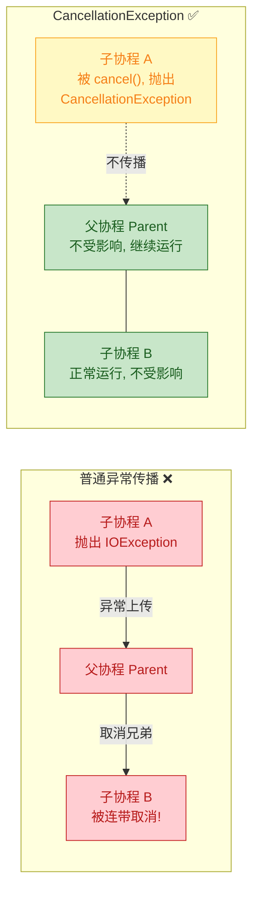
```mermaid
graph LR
    subgraph NormalException["普通异常传播 ❌"]
        direction TB
        P1["父协程 Parent"]
        C1["子协程 A<br/>抛出 IOException"]
        C2["子协程 B<br/>被连带取消!"]
        C1 -->|"异常上传"| P1
        P1 -->|"取消兄弟"| C2
    end

    subgraph CancelException["CancellationException ✅"]
        direction TB
        P2["父协程 Parent<br/>不受影响, 继续运行"]
        C3["子协程 A<br/>被 cancel(), 抛出<br/>CancellationException"]
        C4["子协程 B<br/>正常运行, 不受影响"]
        C3 -.->|"不传播"| P2
        P2 --- C4
    end

    classDef parentNode fill:#E3F2FD,stroke:#1565C0,color:#0D47A1
    classDef failNode fill:#FFCDD2,stroke:#C62828,color:#B71C1C
    classDef safeNode fill:#C8E6C9,stroke:#2E7D32,color:#1B5E20
    classDef cancelNode fill:#FFF9C4,stroke:#F9A825,color:#F57F17

    class P1 failNode
    class C1 failNode
    class C2 failNode
    class P2 safeNode
    class C3 cancelNode
    class C4 safeNode
```

下面用一个完整的对比实验来验证这两种行为：

**实验一：子协程抛出普通异常——父协程被连带摧毁**

```kotlin
import kotlinx.coroutines.*

fun main() = runBlocking {
    // 使用 supervisorScope 外面包一层，防止 runBlocking 本身崩溃
    // 这里故意用普通 coroutineScope 来演示异常传播
    try {
        coroutineScope {
            // 子协程 A：会抛出普通异常
            val childA = launch {
                delay(200L)
                println("子协程 A: 即将抛出 IOException")
                throw java.io.IOException("网络连接失败") // 普通异常
            }

            // 子协程 B：正常工作
            val childB = launch {
                repeat(10) { i ->
                    println("子协程 B: 正常工作中... 第 $i 次")
                    delay(100L)
                }
            }
        }
    } catch (e: Exception) {
        // coroutineScope 会将子协程的异常重新抛出
        println("捕获到异常: ${e::class.simpleName} - ${e.message}")
    }
    println("runBlocking: 继续执行")
}
```

输出：

```
子协程 B: 正常工作中... 第 0 次
子协程 B: 正常工作中... 第 1 次
子协程 A: 即将抛出 IOException
捕获到异常: IOException - 网络连接失败
runBlocking: 继续执行
```

可以看到，子协程 A 的 `IOException` 导致整个 `coroutineScope` 失败，子协程 B 也被连带取消了（本来应该执行 10 次，但只执行了 2 次）。

**实验二：子协程被取消（CancellationException）——父协程和兄弟协程安然无恙**

```kotlin
import kotlinx.coroutines.*

fun main() = runBlocking {
    // 子协程 A：稍后会被主动取消
    val childA = launch {
        try {
            repeat(10) { i ->
                println("子协程 A: 工作中... 第 $i 次")
                delay(100L) // 挂起点，取消检查点
            }
        } catch (e: CancellationException) {
            println("子协程 A: 被取消了 - ${e.message}")
            throw e // 重新抛出，保持取消语义
        }
    }

    // 子协程 B：全程正常运行
    val childB = launch {
        repeat(6) { i ->
            println("子协程 B: 正常工作中... 第 $i 次")
            delay(100L)
        }
        println("子协程 B: ✅ 全部完成！") // 这行会正常执行
    }

    // 等 250ms 后只取消子协程 A
    delay(250L)
    println("--- 主协程: 取消子协程 A ---")
    childA.cancel(CancellationException("A 不再需要了"))

    // 等待两个子协程都结束
    childA.join()
    childB.join()
    println("主协程（父协程）: ✅ 一切正常，继续运行")
}
```

输出：

```
子协程 A: 工作中... 第 0 次
子协程 B: 正常工作中... 第 0 次
子协程 A: 工作中... 第 1 次
子协程 B: 正常工作中... 第 1 次
子协程 A: 工作中... 第 2 次
子协程 B: 正常工作中... 第 2 次
--- 主协程: 取消子协程 A ---
子协程 A: 被取消了 - A 不再需要了
子协程 B: 正常工作中... 第 3 次
子协程 B: 正常工作中... 第 4 次
子协程 B: 正常工作中... 第 5 次
子协程 B: ✅ 全部完成！
主协程（父协程）: ✅ 一切正常，继续运行
```

结果非常明确：子协程 A 被取消后，子协程 B 完整地执行了全部 6 次迭代并正常结束，父协程也没有受到任何影响。

#### 底层原理：父协程如何"忽略"CancellationException

要理解这种行为，我们需要深入协程框架的内部处理机制。当一个子协程结束时（无论正常还是异常），它会通知父协程。父协程的 `childCancelled()` 方法会被调用，其简化逻辑如下：

```kotlin
// AbstractCoroutine 中的简化逻辑（伪代码）
// 当子协程因为异常而完成时，父协程会调用此方法
internal open fun childCancelled(cause: Throwable): Boolean {
    // 关键判断：如果子协程的异常是 CancellationException
    if (cause is CancellationException) {
        return true  // 返回 true 表示"已处理"，父协程不需要做任何事
    }
    // 其他异常：走异常传播流程，可能导致父协程也被取消
    return cancelImpl(cause)
}
```

这段逻辑揭示了核心秘密：框架在内部对异常类型做了 **类型判断（type check）**。`CancellationException` 被当作"已处理"直接返回，而其他异常会触发真正的失败传播链。

#### SupervisorJob 的特殊行为

值得补充的是，`SupervisorJob` 对异常传播有更宽松的策略——即使是普通异常，也不会从子协程传播到父协程。但这是 `SupervisorJob` 的特殊设计，与 `CancellationException` 的"天然豁免"是两个不同维度的机制：

```kotlin
import kotlinx.coroutines.*

fun main() = runBlocking {
    // supervisorScope 内部使用 SupervisorJob
    supervisorScope {
        // 子协程 A：抛出普通异常
        val childA = launch(CoroutineExceptionHandler { _, e ->
            // SupervisorJob 下需要自行处理异常
            println("异常处理器: ${e.message}")
        }) {
            delay(100L)
            throw RuntimeException("普通异常")  // 非 CancellationException
        }

        // 子协程 B：不受影响（因为 SupervisorJob 隔离了异常传播）
        val childB = launch {
            delay(200L)
            println("子协程 B: ✅ 正常完成") // 即使 A 抛了普通异常，B 也不受影响
        }
    }
}
```

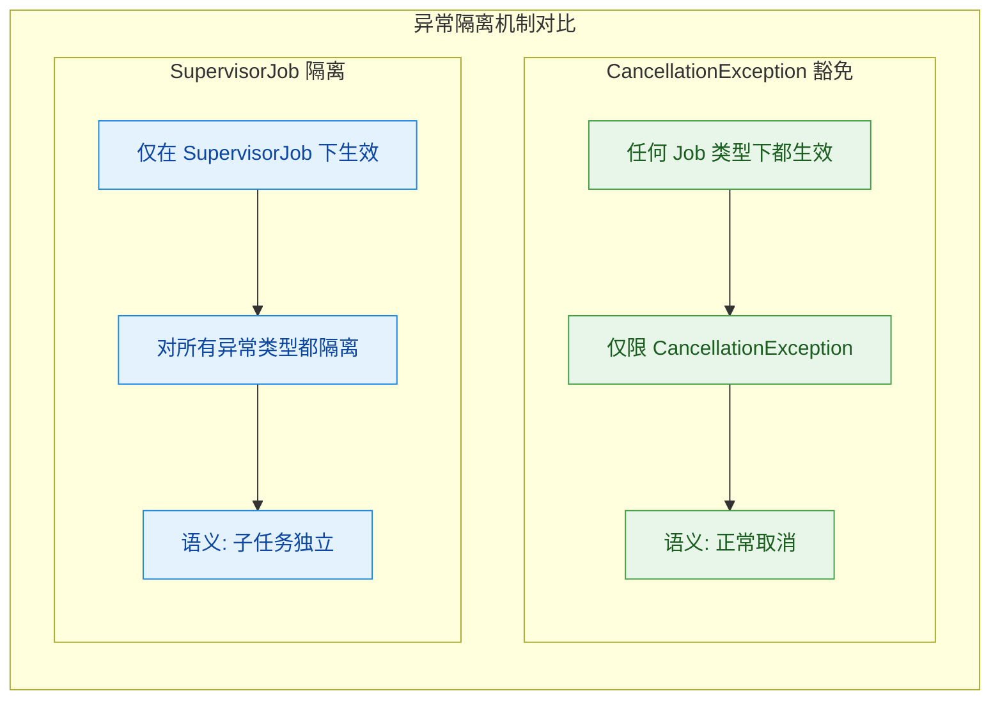
```mermaid
graph LR
    subgraph Comparison["异常隔离机制对比"]
        direction TB

        subgraph CE["CancellationException 豁免"]
            direction TB
            CE1["任何 Job 类型下都生效"]
            CE2["仅限 CancellationException"]
            CE3["语义: 正常取消"]
            CE1 --> CE2 --> CE3
        end

        subgraph SJ["SupervisorJob 隔离"]
            direction TB
            SJ1["仅在 SupervisorJob 下生效"]
            SJ2["对所有异常类型都隔离"]
            SJ3["语义: 子任务独立"]
            SJ1 --> SJ2 --> SJ3
        end
    end

    classDef ceStyle fill:#E8F5E9,stroke:#43A047,color:#1B5E20
    classDef sjStyle fill:#E3F2FD,stroke:#1E88E5,color:#0D47A1

    class CE1,CE2,CE3 ceStyle
    class SJ1,SJ2,SJ3 sjStyle
```

#### 实际应用场景

在 Android 开发中，`CancellationException` 不传播这一特性被广泛利用。典型场景如下：

```kotlin
import kotlinx.coroutines.*

// 模拟 Android ViewModel 中的使用场景
class MyViewModel {
    // viewModelScope 会在 ViewModel 销毁时自动取消
    private val scope = CoroutineScope(SupervisorJob() + Dispatchers.Default)

    fun loadDashboard() {
        // 同时发起多个网络请求
        val userJob = scope.launch {
            // 加载用户信息
            val user = fetchUser()         // 挂起函数
            updateUserUI(user)             // 更新 UI
        }

        val newsJob = scope.launch {
            // 加载新闻列表
            val news = fetchNews()         // 挂起函数
            updateNewsUI(news)             // 更新 UI
        }

        // 假设用户快速切换了 Tab，不再需要新闻数据
        // 只取消新闻加载，用户信息加载不受影响
        newsJob.cancel()  // CancellationException 不传播，userJob 安然无恙
    }

    // 模拟挂起函数
    private suspend fun fetchUser(): String { delay(1000); return "User" }
    private suspend fun fetchNews(): String { delay(2000); return "News" }
    private fun updateUserUI(user: String) { println("显示用户: $user") }
    private fun updateNewsUI(news: String) { println("显示新闻: $news") }
}
```

这个例子展示了一个非常现实的场景：Dashboard 页面同时加载用户信息和新闻列表，当用户切换 Tab 不再需要新闻时，我们可以安全地只取消新闻请求，而不会影响用户信息的加载。这正是 `CancellationException` 不传播特性带来的优雅设计能力。

#### 小结：CancellationException 的核心要点

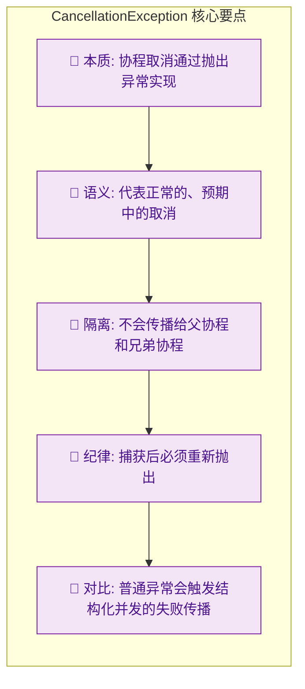
```mermaid
graph LR
    subgraph Summary["CancellationException 核心要点"]
        direction TB
        K1["🔑 本质: 协程取消通过抛出异常实现"]
        K2["🔑 语义: 代表正常的、预期中的取消"]
        K3["🔑 隔离: 不会传播给父协程和兄弟协程"]
        K4["🔑 纪律: 捕获后必须重新抛出"]
        K5["🔑 对比: 普通异常会触发结构化并发的失败传播"]
        K1 --> K2 --> K3 --> K4 --> K5
    end

    classDef keyStyle fill:#F3E5F5,stroke:#7B1FA2,color:#4A148C

    class K1,K2,K3,K4,K5 keyStyle
```

---

**📝 练习题**

以下代码运行后，输出结果是什么？

```kotlin
import kotlinx.coroutines.*

fun main() = runBlocking {
    val parent = launch {
        val childA = launch {
            delay(100)
            println("A done")
        }
        val childB = launch {
            delay(50)
            throw CancellationException("B cancelled")
        }
        childA.join()
        childB.join()
        println("Parent done")
    }
    parent.join()
    println("Main done")
}
```

A. 先输出 `A done`，再输出 `Parent done`，最后输出 `Main done`


B. 只输出 `Main done`，因为 `CancellationException` 取消了父协程


C. 输出 `A done`，然后程序崩溃抛出 `CancellationException`


D. 只输出 `A done` 和 `Main done`，不输出 `Parent done`

**【答案】** A

**【解析】** 子协程 B 抛出的 `CancellationException` **不会传播给父协程**，这是本节的核心知识点。因此父协程和子协程 A 都不受影响。执行流程为：50ms 时子协程 B 因 `CancellationException` 被取消（静默处理）；100ms 时子协程 A 正常完成并打印 `A done`；随后 `childA.join()` 和 `childB.join()` 都完成（B 虽然已取消但 `join()` 会正常返回），父协程继续执行打印 `Parent done`；最终主协程打印 `Main done`。选项 B 和 D 错误在于误以为 `CancellationException` 会影响父协程或导致后续代码不执行。选项 C 错误在于 `CancellationException` 不会导致程序崩溃。

---

## 不可取消的代码块

在前面的章节中，我们了解到协程的取消是**协作式（cooperative）**的——一旦协程被取消，所有后续的挂起函数都会抛出 `CancellationException`，导致协程迅速退出。然而在实际工程中，我们经常会遇到这样一种**矛盾**：协程已经被取消了，但在退出之前，我们**必须**完成某些关键操作——比如关闭数据库连接、写入日志、发送最后一条网络确认包、或者将缓存数据刷盘。这些操作本身可能也是挂起函数（suspend function），如果不加保护，它们在已取消的协程中会立刻抛出异常而**无法执行**。

这就是"不可取消的代码块"存在的意义：它为你提供了一个**安全区域（safe zone）**，在这个区域内，即使协程已经处于取消状态，挂起函数依然能够正常执行完毕。

### withContext(NonCancellable)

#### 问题的根源：finally 中的挂起函数困境

我们先通过一个具体的问题场景来理解为什么需要 `NonCancellable`。回忆一下 `finally` 块的典型用法：

```kotlin
import kotlinx.coroutines.*

fun main() = runBlocking {
    val job = launch {
        try {
            repeat(1000) { i ->
                println("任务执行中: $i ...")  // 打印当前迭代索引
                delay(500L)                     // 每次迭代挂起 500ms，这是一个「取消检查点」
            }
        } finally {
            // ⚠️ 协程被取消后会进入 finally 块
            println("进入 finally，准备清理资源...")

            // 🔴 问题来了：这里调用了一个挂起函数
            delay(1000L)  // 模拟耗时的清理操作（如网络请求、数据库写入）
            println("清理完成！")  // ← 这一行永远不会执行！
        }
    }

    delay(1300L)       // 主协程等待 1.3 秒
    println("准备取消子协程...")
    job.cancelAndJoin() // 取消并等待子协程结束
    println("主协程结束")
}
```

运行结果：

```text
任务执行中: 0 ...
任务执行中: 1 ...
任务执行中: 2 ...
准备取消子协程...
进入 finally，准备清理资源...
主协程结束
```

注意观察——`"清理完成！"` **从未被打印**。原因很简单：当协程已经处于**已取消（cancelled）**状态时，`finally` 块中的 `delay()` 作为挂起函数，会立刻检测到取消状态并重新抛出 `CancellationException`，导致 `finally` 块中后续的代码被跳过。

用下面这张流程图来直观理解这个过程：

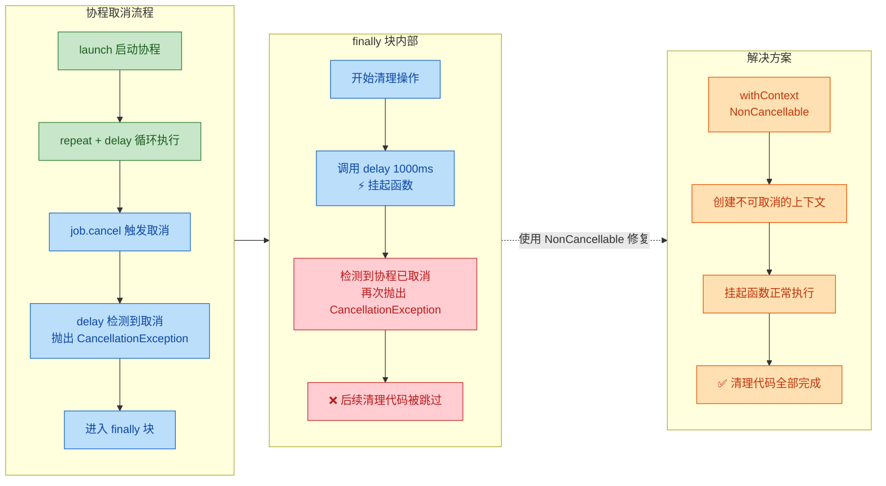
```mermaid
graph LR
    subgraph CancelFlow["协程取消流程"]
        direction TB
        A["launch 启动协程"] --> B["repeat + delay 循环执行"]
        B --> C["job.cancel 触发取消"]
        C --> D["delay 检测到取消\n抛出 CancellationException"]
        D --> E["进入 finally 块"]
    end

    subgraph FinallyProblem["finally 块内部"]
        direction TB
        F["开始清理操作"] --> G["调用 delay 1000ms\n⚡ 挂起函数"]
        G --> H["检测到协程已取消\n再次抛出 CancellationException"]
        H --> I["❌ 后续清理代码被跳过"]
    end

    subgraph Solution["解决方案"]
        direction TB
        J["withContext\nNonCancellable"] --> K["创建不可取消的上下文"]
        K --> L["挂起函数正常执行"]
        L --> M["✅ 清理代码全部完成"]
    end

    CancelFlow --> FinallyProblem
    FinallyProblem -.-> |使用 NonCancellable 修复| Solution

    classDef greenNode fill:#C8E6C9,stroke:#2E7D32,color:#1B5E20
    classDef blueNode fill:#BBDEFB,stroke:#1565C0,color:#0D47A1
    classDef redNode fill:#FFCDD2,stroke:#C62828,color:#B71C1C
    classDef orangeNode fill:#FFE0B2,stroke:#E65100,color:#BF360C
    classDef subgraphStyle fill:#FAFAFA,stroke:#BDBDBD,color:#424242

    class A,B greenNode
    class C,D,E blueNode
    class F,G blueNode
    class H,I redNode
    class J,K,L,M orangeNode
```

这就是核心痛点：**在已取消的协程中，你无法正常执行挂起函数**。

#### NonCancellable 的本质

`NonCancellable` 是 `kotlinx.coroutines` 包中预定义的一个特殊 `Job` 对象。它实现了 `Job` 接口，但有一个独特的行为——**它永远不会被取消**。它的 `isActive` 永远返回 `true`，`isCancelled` 永远返回 `false`。

当你通过 `withContext(NonCancellable)` 切换上下文时，你实际上是在告诉协程框架：

> "在这个代码块内部，请使用 `NonCancellable` 作为当前协程的 Job。无论外层协程是否已取消，此处的挂起函数都应正常执行。"

来看一下 `NonCancellable` 在 Kotlin 源码层面的定位：

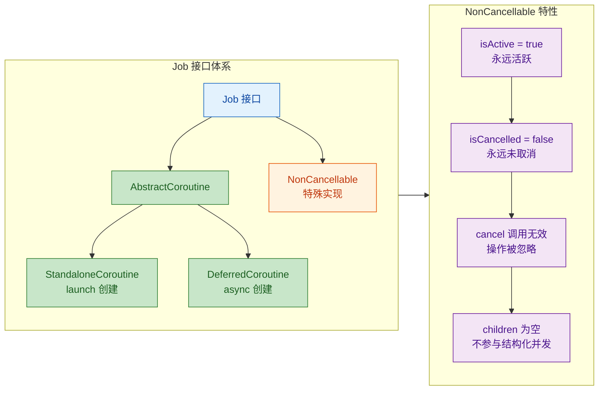
```mermaid
graph LR
    subgraph JobHierarchy["Job 接口体系"]
        direction TB
        A["Job 接口"] --> B["AbstractCoroutine"]
        A --> C["NonCancellable\n特殊实现"]
        B --> D["StandaloneCoroutine\nlaunch 创建"]
        B --> E["DeferredCoroutine\nasync 创建"]
    end

    subgraph NonCancellableDetail["NonCancellable 特性"]
        direction TB
        F["isActive = true\n永远活跃"] --> G["isCancelled = false\n永远未取消"]
        G --> H["cancel 调用无效\n操作被忽略"]
        H --> I["children 为空\n不参与结构化并发"]
    end

    JobHierarchy --> NonCancellableDetail

    classDef interfaceNode fill:#E3F2FD,stroke:#1565C0,color:#0D47A1
    classDef implNode fill:#C8E6C9,stroke:#2E7D32,color:#1B5E20
    classDef specialNode fill:#FFF3E0,stroke:#E65100,color:#BF360C
    classDef featureNode fill:#F3E5F5,stroke:#6A1B9A,color:#4A148C

    class A interfaceNode
    class B,D,E implNode
    class C specialNode
    class F,G,H,I featureNode
```

简单来说，`NonCancellable` 就像一个**"假 Job"**——它满足 `Job` 接口的所有签名要求，但完全**屏蔽**了取消语义。

#### 正确写法：用 NonCancellable 保护关键清理逻辑

修复前面的问题代码非常简单，只需将 `finally` 块中需要调用挂起函数的部分包裹在 `withContext(NonCancellable)` 中：

```kotlin
import kotlinx.coroutines.*

fun main() = runBlocking {
    val job = launch {
        try {
            repeat(1000) { i ->
                println("任务执行中: $i ...")  // 打印当前迭代索引
                delay(500L)                     // 挂起点，取消时会抛出 CancellationException
            }
        } finally {
            // ✅ 使用 withContext(NonCancellable) 创建一个「不可取消」的安全区域
            withContext(NonCancellable) {
                println("进入 NonCancellable 块，开始清理...")

                delay(1000L)  // 模拟耗时的清理操作——现在可以正常执行了！
                println("清理完成！✅")  // ← 这一行现在会被正常执行
            }
            // 注意：withContext 外面的代码仍然处于「已取消」状态
            println("withContext 之后的代码")  // 这一行也能执行（非挂起，不检查取消）
        }
    }

    delay(1300L)            // 让子协程运行 1.3 秒
    println("准备取消子协程...")
    job.cancelAndJoin()     // 取消并等待子协程完全结束（包括 finally 中的清理）
    println("主协程结束")
}
```

运行结果：

```text
任务执行中: 0 ...
任务执行中: 1 ...
任务执行中: 2 ...
准备取消子协程...
进入 NonCancellable 块，开始清理...
清理完成！✅
withContext 之后的代码
主协程结束
```

现在 `"清理完成！✅"` 成功打印了。关键变化发生在内部 CoroutineContext 的切换上：

```kotlin
// 伪代码展示 withContext(NonCancellable) 的上下文变化

// finally 块入口时的上下文：
// CoroutineContext = [Job(已取消), Dispatchers.Default, ...]
//                      ↑ isActive=false, isCancelled=true

withContext(NonCancellable) {
    // withContext 内部的上下文：
    // CoroutineContext = [NonCancellable, Dispatchers.Default, ...]
    //                      ↑ isActive=true, isCancelled=false（永远如此）

    delay(1000L)  // delay 检查的是 NonCancellable 的状态 → 未取消 → 正常挂起
}
```

#### 深入机制：withContext 是如何"替换" Job 的

`withContext` 的工作原理是创建一个新的协程作用域，并用你传入的 `CoroutineContext` **覆盖（override）** 当前上下文中的**同类型元素**。因为 `NonCancellable` 实现了 `Job` 接口，所以它会替换掉当前上下文中已有的那个"已取消的 Job"：

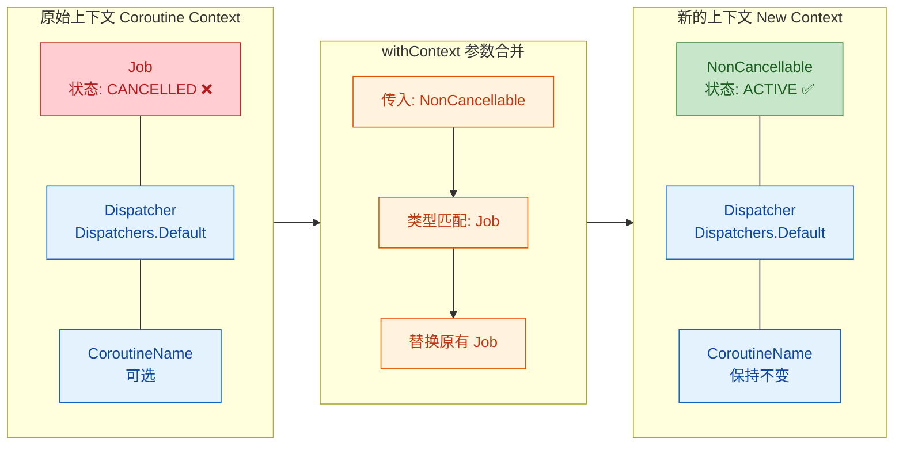
```mermaid
graph LR
    subgraph BeforeCtx["原始上下文 Coroutine Context"]
        direction TB
        A["Job\n状态: CANCELLED ❌"] --- B["Dispatcher\nDispatchers.Default"]
        B --- C["CoroutineName\n可选"]
    end

    subgraph WithCtx["withContext 参数合并"]
        direction TB
        D["传入: NonCancellable"] --> E["类型匹配: Job"]
        E --> F["替换原有 Job"]
    end

    subgraph AfterCtx["新的上下文 New Context"]
        direction TB
        G["NonCancellable\n状态: ACTIVE ✅"] --- H["Dispatcher\nDispatchers.Default"]
        H --- I["CoroutineName\n保持不变"]
    end

    BeforeCtx --> WithCtx
    WithCtx --> AfterCtx

    classDef cancelledNode fill:#FFCDD2,stroke:#C62828,color:#B71C1C
    classDef activeNode fill:#C8E6C9,stroke:#2E7D32,color:#1B5E20
    classDef neutralNode fill:#E3F2FD,stroke:#1565C0,color:#0D47A1
    classDef processNode fill:#FFF3E0,stroke:#E65100,color:#BF360C

    class A cancelledNode
    class G activeNode
    class B,C,H,I neutralNode
    class D,E,F processNode
```

CoroutineContext 的合并策略遵循 **Key-Value 覆盖** 原则：每个 Context Element 都有一个唯一的 `Key`，`Job` 的 Key 就是 `Job` 本身。当 `withContext` 接收到 `NonCancellable`（其 Key 也是 `Job`）时，它会替换掉上下文中原来的 Job。

#### 实际工程场景

来看几个真实开发中常见的 `NonCancellable` 使用场景：

**场景一：数据库事务的安全提交**

```kotlin
import kotlinx.coroutines.*

// 模拟一个数据库操作类
class DatabaseHelper {
    // 挂起函数：模拟插入数据（耗时操作）
    suspend fun insertRecord(data: String) {
        delay(200L)                           // 模拟 IO 耗时
        println("  📝 数据已写入: $data")
    }

    // 挂起函数：模拟提交事务
    suspend fun commitTransaction() {
        delay(100L)                           // 模拟提交耗时
        println("  ✅ 事务已提交")
    }

    // 挂起函数：模拟回滚事务
    suspend fun rollbackTransaction() {
        delay(100L)                           // 模拟回滚耗时
        println("  ⚠️ 事务已回滚")
    }
}

suspend fun performDatabaseWork(db: DatabaseHelper) {
    try {
        db.insertRecord("用户订单 #1001")     // 第一条插入
        db.insertRecord("库存扣减 #1001")     // 第二条插入
        delay(5000L)                           // 模拟后续长时间操作（可能在此处被取消）
        db.insertRecord("物流单 #1001")        // 如果被取消，这一行不会执行
    } finally {
        // 🛡️ 无论协程是否被取消，都必须保证事务完整性
        withContext(NonCancellable) {
            try {
                db.commitTransaction()         // 尝试提交（这里是挂起函数，需要 NonCancellable 保护）
            } catch (e: Exception) {
                db.rollbackTransaction()       // 提交失败则回滚（同样是挂起函数）
            }
        }
    }
}
```

**场景二：Android 中保存 UI 状态**

```kotlin
import kotlinx.coroutines.*

// 模拟 Android ViewModel 中的协程使用
class MyViewModel {
    // 模拟挂起函数：将状态持久化到 DataStore
    private suspend fun saveStateToDataStore(state: String) {
        delay(300L)                                  // 模拟磁盘写入耗时
        println("  💾 状态已保存: $state")
    }

    // 当页面关闭时（ViewModel.onCleared），viewModelScope 会被取消
    // 但我们仍然需要保存最后的状态
    suspend fun onPageClosing(currentState: String) {
        // 使用 NonCancellable 确保即使 scope 被取消，状态也能保存
        withContext(NonCancellable) {
            saveStateToDataStore(currentState)        // 在不可取消的上下文中执行保存
            println("  ✅ 页面关闭前状态已安全持久化")
        }
    }
}
```

**场景三：网络连接的优雅关闭**

```kotlin
import kotlinx.coroutines.*

// 模拟 WebSocket 连接
class WebSocketConnection {
    // 挂起函数：发送关闭帧（Close Frame）
    suspend fun sendCloseFrame(code: Int, reason: String) {
        delay(200L)                                       // 模拟网络 IO
        println("  📡 已发送 Close Frame: code=$code, reason=$reason")
    }

    // 挂起函数：等待服务端确认
    suspend fun awaitCloseAck() {
        delay(500L)                                       // 模拟等待 ACK
        println("  🤝 收到服务端关闭确认")
    }

    // 关闭底层 Socket
    fun closeSocket() {
        println("  🔌 Socket 已关闭")
    }
}

suspend fun manageConnection(ws: WebSocketConnection) {
    try {
        // 正常的数据通信...
        delay(10_000L)                                    // 模拟长时间通信
    } finally {
        // 🛡️ 即使协程被取消，也要按协议完成 WebSocket 关闭握手
        withContext(NonCancellable) {
            ws.sendCloseFrame(1000, "Normal closure")     // 必须发送关闭帧
            ws.awaitCloseAck()                            // 必须等待确认
        }
        // 非挂起操作可以直接放在 withContext 外面
        ws.closeSocket()                                  // 关闭底层连接
    }
}
```

#### 使用 NonCancellable 的黄金法则与常见陷阱

**✅ 正确用法 — 仅用于短暂的、必须完成的清理操作：**

```kotlin
finally {
    withContext(NonCancellable) {
        // ✅ 好：关闭资源、保存状态、发送确认等短暂操作
        saveProgress()       // 保存进度
        closeConnection()    // 关闭连接
        flushLogs()          // 刷写日志
    }
}
```

**❌ 错误用法 — 不要用它来"复活"整个被取消的协程：**

```kotlin
finally {
    withContext(NonCancellable) {
        // ❌ 极其错误！不要在里面启动长时间运行的新任务
        while (true) {
            pollServer()     // 无限轮询 → 协程永远不会结束！
            delay(1000L)     // 调用者的 cancelAndJoin() 会永远阻塞
        }
    }
}
```

**❌ 另一个常见误区 — 把它当作"全局取消防护"使用：**

```kotlin
// ❌ 错误：不应该用 NonCancellable 包裹你的核心业务逻辑
withContext(NonCancellable) {
    // 如果把所有代码都放在这里，那协程的「可取消」优势就完全丧失了
    performLongRunningTask()    // 你永远无法取消这个任务了！
}
```

以下汇总表帮助你做出正确的设计决策：

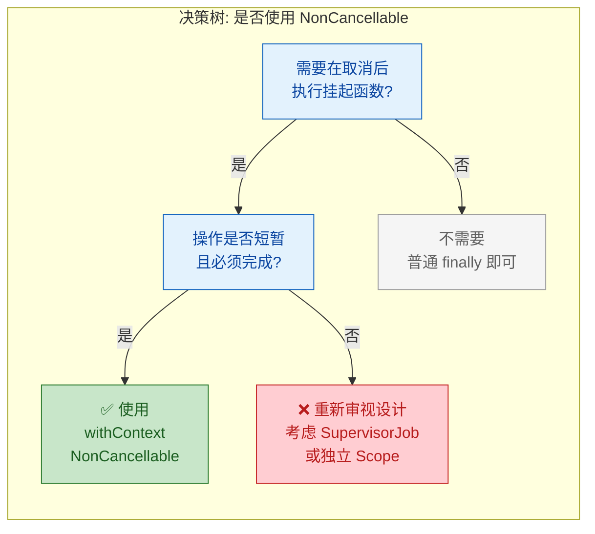
```mermaid
graph LR
    subgraph Decision["决策树: 是否使用 NonCancellable"]
        direction TB
        Q1["需要在取消后\n执行挂起函数?"] -->|是| Q2["操作是否短暂\n且必须完成?"]
        Q1 -->|否| R1["不需要\n普通 finally 即可"]
        Q2 -->|是| R2["✅ 使用\nwithContext\nNonCancellable"]
        Q2 -->|否| R3["❌ 重新审视设计\n考虑 SupervisorJob\n或独立 Scope"]
    end

    classDef questionNode fill:#E3F2FD,stroke:#1565C0,color:#0D47A1
    classDef goodNode fill:#C8E6C9,stroke:#2E7D32,color:#1B5E20
    classDef badNode fill:#FFCDD2,stroke:#C62828,color:#B71C1C
    classDef neutralNode fill:#F5F5F5,stroke:#9E9E9E,color:#616161

    class Q1,Q2 questionNode
    class R2 goodNode
    class R3 badNode
    class R1 neutralNode
```

#### 与 SupervisorJob 的区别

初学者常常将 `NonCancellable` 和 `SupervisorJob` 混淆，因为它们看似都与"取消"有关。但它们解决的是**完全不同的问题**：

| 维度 | `NonCancellable` | `SupervisorJob` |
|------|:---:|:---:|
| **核心目的** | 在已取消的协程中执行挂起清理 | 阻止子协程的失败向上传播 |
| **使用位置** | `finally` 块或清理逻辑中 | 协程 Scope 构建时 |
| **作用范围** | 单个 `withContext` 代码块 | 整个 Scope 的子协程层级 |
| **能否保护业务逻辑** | ❌ 仅限清理操作 | ✅ 可以隔离独立子任务 |
| **结构化并发** | 脱离层级（不传播给父级） | 保持层级但改变传播规则 |

用一句话总结：**`NonCancellable` 是"临终关怀"（让已取消的协程完成遗愿），`SupervisorJob` 是"防火墙"（防止一个子协程的失败牵连兄弟）。**

---

**📝 练习题**

以下代码执行后，控制台的输出结果是什么？

```kotlin
import kotlinx.coroutines.*

fun main() = runBlocking {
    val job = launch {
        try {
            delay(3000L)
        } finally {
            println("A")
            withContext(NonCancellable) {
                println("B")
                delay(500L)
                println("C")
            }
            println("D")
        }
    }
    delay(100L)
    job.cancelAndJoin()
    println("E")
}
```

A. `A → B → E`

B. `A → B → C → E`

C. `A → B → C → D → E`

D. `A → E`


**【答案】** C

**【解析】** 协程在 `delay(3000L)` 处被取消后进入 `finally` 块，首先打印 `"A"`。接着进入 `withContext(NonCancellable)` 代码块——在这个不可取消的上下文中，`delay(500L)` 能够正常执行而不会抛出 `CancellationException`，因此 `"B"` 和 `"C"` 依次打印。退出 `withContext` 后，`println("D")` 是一个**非挂起调用**（普通函数调用不检查取消状态），所以也能正常执行。最后 `finally` 结束，`cancelAndJoin()` 返回，主协程打印 `"E"`。完整输出顺序为 `A → B → C → D → E`。

需要特别注意的是，很多人会误选 B，认为 `withContext(NonCancellable)` 外部的 `println("D")` 无法执行。但 `println` 并非挂起函数，它不会检查协程的取消状态，因此能够正常运行。只有**挂起函数**（如 `delay`、`yield`）才会在已取消的协程中抛出异常。

---

## 超时控制 ⭐

在真实的工程场景中，我们取消一个协程往往不是因为"主动不想要结果了"，而是因为**等得太久了**。网络请求迟迟没有响应、数据库查询卡在慢 SQL 上、远程服务陷入死循环——这些场景下，我们需要一个"闹钟"机制：**到点了还没完成，就自动终止**。这就是 Kotlin 协程的 **超时控制（Timeout Control）**。

Kotlin 标准协程库为此提供了两个顶层函数：`withTimeout` 和 `withTimeoutOrNull`。它们在底层复用了协程取消（Cancellation）的全部机制，但在 API 的"脾气"上有着截然不同的表现——前者暴烈（抛异常），后者温和（返回 `null`）。理解它们的行为差异以及适用场景，是编写健壮异步代码的基本功。

---

### withTimeout（超时抛异常）

#### 基本语义

`withTimeout` 的签名如下：

```kotlin
// timeMillis: 超时时间，单位毫秒
// block: 在超时时间内需要执行完毕的挂起代码块
// 返回值: block 的最后一行表达式的值（如果在超时前完成）
public suspend fun <T> withTimeout(timeMillis: Long, block: suspend CoroutineScope.() -> T): T
```

它的核心语义可以用一句话概括：**在给定的时间窗口内执行 `block`，若超时未完成，则抛出 `TimeoutCancellationException`**。

`TimeoutCancellationException` 是 `CancellationException` 的子类，这一点极其重要——它意味着超时行为在协程的世界观里等同于"取消"，遵循所有协作式取消的规则（cooperative cancellation）。

#### 运行流程详解

我们先用一张流程图来直观理解 `withTimeout` 的完整生命周期：


```mermaid
graph LR
    subgraph Entry["🚀 调用 withTimeout"]
        direction TB
        A["调用 withTimeout&#40;3000&#41;"]
        B["启动内部子协程<br/>+ 启动定时器"]
        A --> B
    end

    subgraph Exec["⚙️ 执行 block"]
        direction TB
        C["block 开始执行"]
        D{"在 3000ms 内<br/>完成了吗?"}
        C --> D
    end

    subgraph Success["✅ 正常完成"]
        direction TB
        E["取消定时器"]
        F["返回 block 结果 T"]
        E --> F
    end

    subgraph Timeout["⏰ 超时触发"]
        direction TB
        G["定时器到期"]
        H["取消子协程"]
        I["抛出 Timeout-<br/>CancellationException"]
        G --> H --> I
    end

    Entry --> Exec
    D -- "✅ 是" --> Success
    D -- "❌ 否" --> Timeout

    classDef entryStyle fill:#E8F5E9,stroke:#388E3C,color:#1B5E20,stroke-width:2px
    classDef execStyle fill:#E3F2FD,stroke:#1976D2,color:#0D47A1,stroke-width:2px
    classDef successStyle fill:#F1F8E9,stroke:#689F38,color:#33691E,stroke-width:2px
    classDef timeoutStyle fill:#FBE9E7,stroke:#E64A19,color:#BF360C,stroke-width:2px

    class A,B entryStyle
    class C,D execStyle
    class E,F successStyle
    class G,H,I timeoutStyle
```

#### 基础用法示例

```kotlin
import kotlinx.coroutines.*

fun main() = runBlocking {
    try {
        // withTimeout 创建一个 3 秒的时间窗口
        val result = withTimeout(3000L) {
            // 模拟一个需要 5 秒才能完成的耗时任务
            repeat(5) { i ->
                println("正在处理第 ${i + 1} 个任务片段...")  // 打印当前进度
                delay(1000L)  // 每个片段耗时 1 秒（挂起点，可被取消）
            }
            "任务完成"  // block 的返回值（本例中永远到达不了）
        }
        println(result)  // 如果在 3 秒内完成，才会执行到这里
    } catch (e: TimeoutCancellationException) {
        // 超时后会捕获到 TimeoutCancellationException
        println("操作超时！: ${e.message}")
    }
}
```

输出结果：

```
正在处理第 1 个任务片段...
正在处理第 2 个任务片段...
正在处理第 3 个任务片段...
操作超时！: Timed out waiting for 3000 ms
```

在这段代码中，`repeat(5)` 循环需要 5 秒才能跑完，但 `withTimeout` 只给了 3 秒。当第 3 次 `delay(1000L)` 结束、第 4 次 `delay` 刚刚开始时（约第 3000ms），定时器到期，协程在 **挂起点** 被取消，`TimeoutCancellationException` 被抛出。

#### 为什么超时发生在挂起点？

这和前面章节讲过的 **"取消是协作式的"** 完全一致。`withTimeout` 内部并没有什么黑魔法——它只是在到期时对子协程调用了 `cancel()`。而 `cancel()` 的生效需要协程代码到达 **挂起点（suspension point）** 或 **主动检查 `isActive`**。

如果 block 内部是一段纯 CPU 密集型计算且没有任何挂起函数调用，那么即使超时时间已过，协程也不会立刻终止：

```kotlin
fun main() = runBlocking {
    try {
        withTimeout(1000L) {
            // 纯计算，没有挂起点 → 不会响应取消！
            var sum = 0L
            // 这个循环会完整执行完毕，withTimeout 形同虚设
            for (i in 1..1_000_000_000L) {
                sum += i  // 没有挂起点，定时器到期也无法中断
            }
            println("计算结果: $sum")
        }
    } catch (e: TimeoutCancellationException) {
        println("超时了")  // 会在循环结束后才进入这里
    }
}
```

**解决方案**和之前学过的一样——在循环中插入 `yield()` 或检查 `isActive`：

```kotlin
fun main() = runBlocking {
    try {
        withTimeout(1000L) {
            var sum = 0L
            for (i in 1..1_000_000_000L) {
                sum += i
                // 每 100 万次迭代检查一次，避免性能损耗过大
                if (i % 1_000_000 == 0L) {
                    yield()  // 挂起点：让出执行权，同时检查取消状态
                }
            }
            println("计算结果: $sum")
        }
    } catch (e: TimeoutCancellationException) {
        println("超时了，计算被中断")  // 现在超时能正常触发了
    }
}
```

#### TimeoutCancellationException 的特殊身份

`TimeoutCancellationException` 继承自 `CancellationException`，而 `CancellationException` 在协程体系中享有"特权"——**它不会向父协程传播失败**。这就引出一个微妙但关键的设计问题：

> **`withTimeout` 抛出的异常到底算"正常取消"还是"真正的错误"？**

答案取决于你的使用方式：

```kotlin
fun main() = runBlocking {  // 父协程
    // 场景 A：withTimeout 在当前协程作用域内直接调用
    // TimeoutCancellationException 会被当作当前协程的取消
    // 它不会导致父协程（runBlocking）失败
    withTimeout(1000L) {
        delay(2000L)
    }
    // ↑ 这个异常如果未被 try-catch，会取消 runBlocking
    // 但这是 CancellationException，所以是"正常结束"语义
    
    println("这行不会打印")
}
```

这里有一个非常容易踩的坑：虽然 `TimeoutCancellationException` 是 `CancellationException` 的子类，但如果你在 `withTimeout` **外层的协程** 中捕获它，它的表现和普通异常一模一样——你需要 `try-catch` 才能阻止它终止当前协程的后续代码。

```kotlin
fun main() = runBlocking {
    try {
        withTimeout(1000L) {
            delay(2000L)  // 会超时
        }
    } catch (e: TimeoutCancellationException) {
        println("捕获超时，程序继续运行")  // ✅ 正确做法
    }

    println("后续逻辑正常执行")  // ✅ 会打印
}
```

#### 实战模式：带重试的超时

在工程代码中，`withTimeout` 经常与重试逻辑组合使用：

```kotlin
import kotlinx.coroutines.*

// 模拟一个不稳定的网络请求
suspend fun fetchFromNetwork(): String {
    val responseTime = (500L..3000L).random()  // 随机响应时间：500ms ~ 3000ms
    delay(responseTime)                         // 模拟网络延迟
    return "服务器数据 (耗时 ${responseTime}ms)"  // 返回结果
}

// 带超时 + 重试的请求封装
suspend fun fetchWithRetry(
    maxRetries: Int = 3,          // 最大重试次数
    timeoutMs: Long = 1500L       // 每次请求的超时时间
): String {
    repeat(maxRetries) { attempt ->
        try {
            // 每次尝试都有独立的超时窗口
            return withTimeout(timeoutMs) {
                println("第 ${attempt + 1} 次尝试...")
                fetchFromNetwork()  // 执行实际请求
            }
        } catch (e: TimeoutCancellationException) {
            // 超时了，打印日志后进入下一次重试
            println("第 ${attempt + 1} 次尝试超时")
            if (attempt == maxRetries - 1) {
                throw Exception("全部 $maxRetries 次尝试均超时")  // 全部重试耗尽
            }
        }
    }
    throw IllegalStateException("不可达代码")  // 编译器要求的返回保障
}

fun main() = runBlocking {
    try {
        val data = fetchWithRetry()  // 调用带重试的请求
        println("成功获取: $data")
    } catch (e: Exception) {
        println("最终失败: ${e.message}")
    }
}
```

---

### withTimeoutOrNull（超时返回 null）

#### 设计哲学：用 null 代替异常

`withTimeoutOrNull` 是 `withTimeout` 的"温和版"。它的设计理念来自 Kotlin 语言一贯的 **Null Safety** 哲学——**用类型系统表达"可能没有结果"这件事**，而不是用异常来做流程控制。

签名如下：

```kotlin
// 唯一的区别：返回值是 T?（可空类型）
// 超时时不抛异常，而是返回 null
public suspend fun <T> withTimeoutOrNull(timeMillis: Long, block: suspend CoroutineScope.() -> T): T?
```

如果 block 在超时前完成，返回 block 的结果 `T`；如果超时，返回 `null`。**不会抛出任何异常**。

#### 两者对比一览

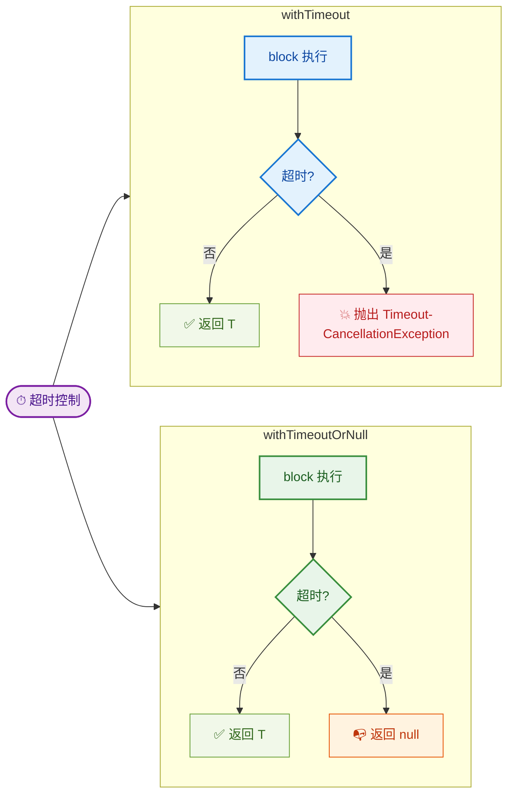
```mermaid
graph LR
    subgraph WT["withTimeout"]
        direction TB
        A1["block 执行"]
        A2{"超时?"}
        A3["✅ 返回 T"]
        A4["💥 抛出 Timeout-<br/>CancellationException"]
        A1 --> A2
        A2 -- "否" --> A3
        A2 -- "是" --> A4
    end

    subgraph WTN["withTimeoutOrNull"]
        direction TB
        B1["block 执行"]
        B2{"超时?"}
        B3["✅ 返回 T"]
        B4["📭 返回 null"]
        B1 --> B2
        B2 -- "否" --> B3
        B2 -- "是" --> B4
    end

    START(["⏱ 超时控制"]) --> WT
    START --> WTN

    classDef startStyle fill:#F3E5F5,stroke:#7B1FA2,color:#4A148C,stroke-width:2px
    classDef wtStyle fill:#E3F2FD,stroke:#1976D2,color:#0D47A1,stroke-width:2px
    classDef wtnStyle fill:#E8F5E9,stroke:#388E3C,color:#1B5E20,stroke-width:2px
    classDef successStyle fill:#F1F8E9,stroke:#689F38,color:#33691E,stroke-width:1px
    classDef failWtStyle fill:#FFEBEE,stroke:#C62828,color:#B71C1C,stroke-width:1px
    classDef failWtnStyle fill:#FFF3E0,stroke:#E65100,color:#BF360C,stroke-width:1px

    class START startStyle
    class A1,A2 wtStyle
    class B1,B2 wtnStyle
    class A3,B3 successStyle
    class A4 failWtStyle
    class B4 failWtnStyle
```

| 特性 | `withTimeout` | `withTimeoutOrNull` |
|:---|:---|:---|
| 超时行为 | 抛出 `TimeoutCancellationException` | 返回 `null` |
| 返回类型 | `T` (非空) | `T?` (可空) |
| 需要 try-catch | ✅ 是（除非你想让它传播） | ❌ 否 |
| 适用场景 | 超时是 **严重错误**，必须中断流程 | 超时是 **可接受的**，有降级方案 |
| 编码风格 | 异常驱动 (Exception-driven) | 空安全驱动 (Null-safety-driven) |

#### 基础用法示例

```kotlin
import kotlinx.coroutines.*

fun main() = runBlocking {
    // 场景 1：任务在超时前完成 → 返回正常结果
    val result1 = withTimeoutOrNull(3000L) {
        delay(1000L)         // 只需 1 秒
        "任务完成 ✅"        // 返回这个字符串
    }
    println("场景1: $result1")  // 输出: 场景1: 任务完成 ✅

    // 场景 2：任务超时 → 返回 null
    val result2 = withTimeoutOrNull(1000L) {
        delay(3000L)         // 需要 3 秒，但只有 1 秒的窗口
        "任务完成 ✅"        // 永远执行不到
    }
    println("场景2: $result2")  // 输出: 场景2: null
}
```

最优雅的地方在于：你可以直接用 Kotlin 的空安全运算符处理超时结果，无需 `try-catch` 的样板代码：

```kotlin
fun main() = runBlocking {
    // 使用 Elvis 操作符 (?:) 提供超时降级值
    val data = withTimeoutOrNull(2000L) {
        delay(3000L)                  // 模拟慢请求
        fetchExpensiveData()          // 耗时操作
    } ?: "使用本地缓存数据"            // 超时时的降级方案

    println(data)  // 输出: 使用本地缓存数据
}

suspend fun fetchExpensiveData(): String {
    // 模拟远程数据获取
    return "远程服务器的新鲜数据"
}
```

#### 实战模式：缓存降级策略

这是 `withTimeoutOrNull` 最经典的实战场景——**优先尝试远程数据，超时则回退到本地缓存**：

```kotlin
import kotlinx.coroutines.*

// 模拟数据层
object DataSource {
    // 模拟远程 API 调用（可能很慢）
    suspend fun fetchRemote(): String {
        delay(5000L)  // 模拟 5 秒网络延迟
        return "最新远程数据 v2.0"
    }

    // 本地缓存（立即可用）
    fun getLocalCache(): String {
        return "本地缓存数据 v1.0"
    }
}

// 使用 withTimeoutOrNull 实现降级策略
suspend fun loadDataWithFallback(): String {
    // 给远程请求 2 秒的时间窗口
    val remoteData = withTimeoutOrNull(2000L) {
        println("[网络层] 开始请求远程数据...")
        DataSource.fetchRemote()  // 尝试远程获取
    }

    // 根据结果判断走哪条路径
    return if (remoteData != null) {
        println("[策略] 使用远程数据")
        remoteData                     // 远程数据获取成功
    } else {
        println("[策略] 远程超时，降级到本地缓存")
        DataSource.getLocalCache()     // 降级到本地缓存
    }
}

fun main() = runBlocking {
    val result = loadDataWithFallback()
    println("最终展示: $result")
}
```

输出：

```
[网络层] 开始请求远程数据...
[策略] 远程超时，降级到本地缓存
最终展示: 本地缓存数据 v1.0
```

#### 进阶：withTimeoutOrNull 内部的异常仍会传播

一个常见的误解是："既然 `withTimeoutOrNull` 不抛异常，那它会把所有问题都变成 `null`。"——**这是错误的**。`withTimeoutOrNull` 只对 **超时** 做了 null 化处理。如果 block 内部抛出的是非 `CancellationException` 的异常（比如 `IOException`、`IllegalArgumentException`），它会照常向外抛出：

```kotlin
fun main() = runBlocking {
    // 🔴 这里的异常不会变成 null，而是直接传播！
    val result = withTimeoutOrNull(5000L) {
        delay(100L)
        throw IllegalStateException("业务逻辑错误")  // 非取消异常
        "永远到不了"
    }
    // ↑ IllegalStateException 会穿透 withTimeoutOrNull
    //   根本不会走到这里
    println(result)
}
```

用一张图总结 `withTimeoutOrNull` 对不同结果的处理方式：

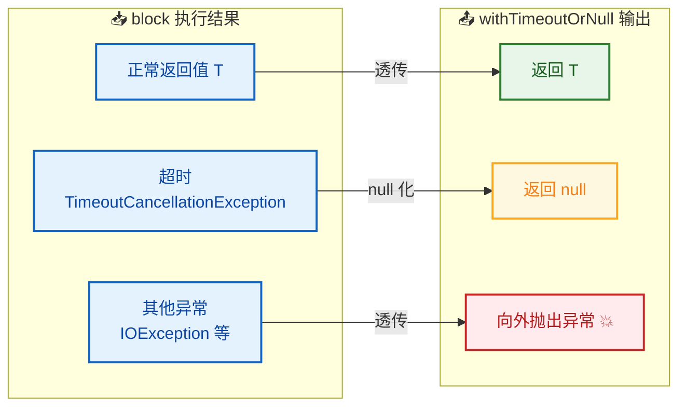
```mermaid
graph LR
    subgraph Input["📥 block 执行结果"]
        direction TB
        R1["正常返回值 T"]
        R2["超时<br/>TimeoutCancellationException"]
        R3["其他异常<br/>IOException 等"]
    end

    subgraph Output["📤 withTimeoutOrNull 输出"]
        direction TB
        O1["返回 T"]
        O2["返回 null"]
        O3["向外抛出异常 💥"]
    end

    R1 -- "透传" --> O1
    R2 -- "null 化" --> O2
    R3 -- "透传" --> O3

    classDef inputStyle fill:#E3F2FD,stroke:#1565C0,color:#0D47A1,stroke-width:2px
    classDef okStyle fill:#E8F5E9,stroke:#2E7D32,color:#1B5E20,stroke-width:2px
    classDef nullStyle fill:#FFF8E1,stroke:#F9A825,color:#F57F17,stroke-width:2px
    classDef errStyle fill:#FFEBEE,stroke:#C62828,color:#B71C1C,stroke-width:2px

    class R1,R2,R3 inputStyle
    class O1 okStyle
    class O2 nullStyle
    class O3 errStyle
```

#### 如何选择？决策指南

在实际编码中，选择 `withTimeout` 还是 `withTimeoutOrNull`，可以遵循以下决策路径：

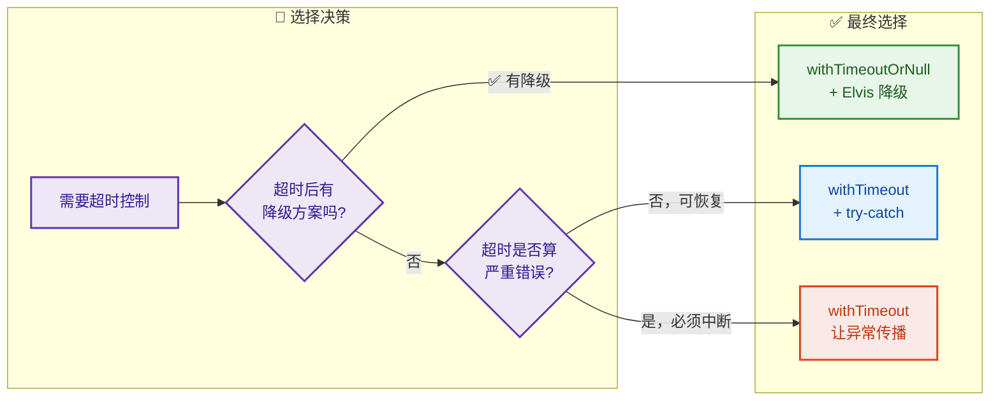
```mermaid
graph LR
    subgraph Decision["🤔 选择决策"]
        direction TB
        Q1["需要超时控制"]
        Q2{"超时后有<br/>降级方案吗?"}
        Q3{"超时是否算<br/>严重错误?"}
        Q1 --> Q2
        Q2 -- "否" --> Q3
    end

    subgraph Choice["✅ 最终选择"]
        direction TB
        C1["withTimeoutOrNull<br/>+ Elvis 降级"]
        C2["withTimeout<br/>+ try-catch"]
        C3["withTimeout<br/>让异常传播"]
    end

    Q2 -- "✅ 有降级" --> C1
    Q3 -- "否，可恢复" --> C2
    Q3 -- "是，必须中断" --> C3

    classDef decisionStyle fill:#EDE7F6,stroke:#5E35B1,color:#311B92,stroke-width:2px
    classDef choiceGreen fill:#E8F5E9,stroke:#388E3C,color:#1B5E20,stroke-width:2px
    classDef choiceBlue fill:#E3F2FD,stroke:#1976D2,color:#0D47A1,stroke-width:2px
    classDef choiceRed fill:#FBE9E7,stroke:#D84315,color:#BF360C,stroke-width:2px

    class Q1,Q2,Q3 decisionStyle
    class C1 choiceGreen
    class C2 choiceBlue
    class C3 choiceRed
```

**简单记忆**：
- **有 Plan B** → `withTimeoutOrNull` + `?:` 降级
- **没 Plan B 但能 catch 恢复** → `withTimeout` + `try-catch`
- **超时即致命** → `withTimeout`，让异常自然传播

---

**📝 练习题**

以下代码的输出结果是什么？

```kotlin
fun main() = runBlocking {
    val result = withTimeoutOrNull(1500L) {
        repeat(3) { i ->
            println("工作中 $i")
            delay(1000L)
        }
        "完成"
    }
    println("结果: $result")
}
```

A. 工作中 0 → 工作中 1 → 工作中 2 → 结果: 完成


B. 工作中 0 → 工作中 1 → 结果: null


C. 工作中 0 → 结果: null


D. 抛出 TimeoutCancellationException


**【答案】** B

**【解析】** `repeat(3)` 循环体执行流程如下：第 0 次迭代打印 "工作中 0" 后 `delay(1000L)`，此时耗时约 1000ms；第 1 次迭代打印 "工作中 1" 后 `delay(1000L)`，此时耗时约 2000ms——但超时时间只有 1500ms，所以在第 1 次 `delay(1000L)` 执行到一半时（约第 1500ms 处），超时触发，协程在挂起点被取消。由于使用的是 `withTimeoutOrNull`，不会抛出异常，而是直接返回 `null`。因此打印了两次 "工作中"（第 0 次和第 1 次），最终输出 `结果: null`。选项 D 错误是因为 `withTimeoutOrNull` 的设计就是用 `null` 替代异常。选项 A 错误是因为总耗时需要 3000ms，远超 1500ms。选项 C 错误是因为第一次 `delay` 结束时才过了 1000ms，尚未超时，第二次迭代的 `println` 会正常执行。

---

## 资源清理

在协程的世界中，"取消"是一个随时可能发生的事件。当协程被取消时，它可能正持有文件句柄、数据库连接、网络 Socket 等系统资源。如果这些资源没有被正确释放，就会导致 **资源泄漏（Resource Leak）**，长期积累后将引发内存溢出（OOM）、文件描述符耗尽等严重问题。

Kotlin 提供了两大资源清理机制：**`finally` 块** 和 **`use` 函数**。前者是通用的清理手段，适用于一切需要"善后"的场景；后者是专门为 `Closeable` / `AutoCloseable` 资源设计的语法糖，能自动关闭资源。两者并不互斥，而是协同工作，共同构成协程中资源安全的最后防线。

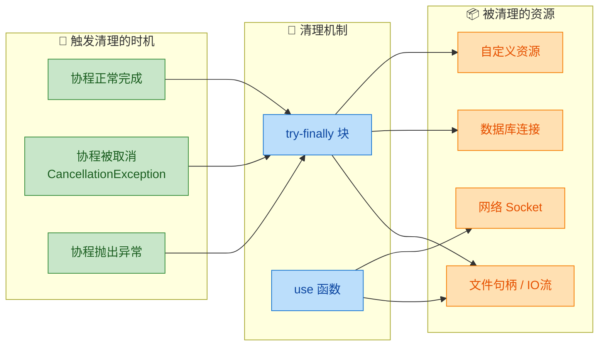
```mermaid
graph LR
    subgraph TRIGGER["🔔 触发清理的时机"]
        direction TB
        A["协程正常完成"]
        B["协程被取消<br/>CancellationException"]
        C["协程抛出异常"]
    end

    subgraph MECHANISM["🧹 清理机制"]
        direction TB
        D["try-finally 块"]
        E["use 函数"]
    end

    subgraph RESOURCE["📦 被清理的资源"]
        direction TB
        F["文件句柄 / IO流"]
        G["数据库连接"]
        H["网络 Socket"]
        I["自定义资源"]
    end

    A --> D
    B --> D
    C --> D
    D --> F
    D --> G
    E --> F
    E --> H
    D --> I

    classDef triggerStyle fill:#C8E6C9,stroke:#388E3C,color:#1B5E20
    classDef mechStyle fill:#BBDEFB,stroke:#1976D2,color:#0D47A1
    classDef resStyle fill:#FFE0B2,stroke:#F57C00,color:#E65100

    class A,B,C triggerStyle
    class D,E mechStyle
    class F,G,H,I resStyle
```

无论协程以何种方式结束——正常完成、被取消、还是抛出异常——清理逻辑都 **必须** 被执行。这就是资源清理的核心原则：**确定性释放（Deterministic Release）**。

---

### finally 块

#### 基本原理：try-finally 是最后的守卫

`finally` 块是 JVM 平台的基础机制，Kotlin 完全继承了它。无论 `try` 块中的代码是正常结束、抛出异常、还是因协程取消而中断，`finally` 块中的代码 **一定会执行**。这一特性使它成为资源清理的首选位置。

在协程取消场景中，当一个处于挂起状态的协程收到取消信号时，挂起函数会抛出 `CancellationException`。这个异常和普通异常一样，会触发 `finally` 块的执行。

```kotlin
import kotlinx.coroutines.*

fun main() = runBlocking {
    // 启动一个子协程
    val job = launch {
        try {
            println("协程开始工作...")
            // 模拟一个长耗时的挂起操作
            repeat(1000) { i ->
                println("正在处理第 $i 个任务...")
                delay(500L) // 挂起点：取消信号会在此处被检测到
            }
        } finally {
            // ✅ 无论协程是正常结束还是被取消，这里都会执行
            println("[finally] 执行资源清理...")
            println("[finally] 释放数据库连接")
            println("[finally] 关闭文件句柄")
        }
    }

    delay(1300L) // 让协程运行一段时间
    println("主协程：准备取消子协程")
    job.cancelAndJoin() // 取消并等待子协程完成
    println("主协程：子协程已完全结束")
}
```

输出结果：

```text
协程开始工作...
正在处理第 0 个任务...
正在处理第 1 个任务...
正在处理第 2 个任务...
主协程：准备取消子协程
[finally] 执行资源清理...
[finally] 释放数据库连接
[finally] 关闭文件句柄
主协程：子协程已完全结束
```

整个过程的时序如下：

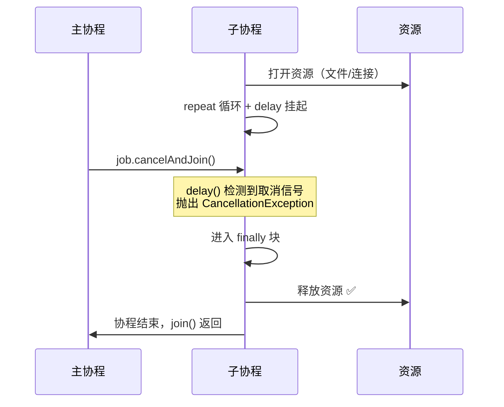
```mermaid
sequenceDiagram
    participant M as 主协程
    participant C as 子协程
    participant R as 资源

    C->>R: 打开资源（文件/连接）
    C->>C: repeat 循环 + delay 挂起

    M->>C: job.cancelAndJoin()
    Note over C: delay() 检测到取消信号<br/>抛出 CancellationException

    C->>C: 进入 finally 块
    C->>R: 释放资源 ✅
    C->>M: 协程结束，join() 返回
```

可以清晰地看到：即使协程是被"强制"取消的，`finally` 块仍然忠实地执行了清理工作。

#### finally 块中的限制：已取消协程的特殊状态

这里有一个非常重要、也非常容易踩坑的细节：**当协程已经被取消后，它的 `finally` 块中不能再执行挂起函数。**

原因在于，协程一旦进入"已取消"状态，其 Job 处于 `Cancelling` 阶段。此时任何挂起函数（如 `delay`、网络请求等）都会立即再次抛出 `CancellationException`，从而打断 `finally` 块的执行。

```kotlin
import kotlinx.coroutines.*

fun main() = runBlocking {
    val job = launch {
        try {
            repeat(1000) { i ->
                println("工作中: $i")
                delay(500L)
            }
        } finally {
            println("[finally] 开始清理...")

            // ❌ 危险！在已取消的协程中调用挂起函数
            // 这行 delay 会立即抛出 CancellationException
            try {
                delay(1000L) // 模拟"需要时间的清理操作"
                println("[finally] 这行永远不会打印！")
            } catch (e: CancellationException) {
                println("[finally] delay 被取消了: ${e.message}")
            }

            println("[finally] 清理结束")
        }
    }

    delay(1300L)
    println("取消协程...")
    job.cancelAndJoin()
    println("协程已结束")
}
```

输出：

```text
工作中: 0
工作中: 1
工作中: 2
取消协程...
[finally] 开始清理...
[finally] delay 被取消了: StandaloneCoroutine was cancelled
[finally] 清理结束
协程已结束
```

`delay(1000L)` 之后的那句 `println` 没有被执行，因为 `delay` 在已取消的协程中会直接抛异常。

#### 解决方案：withContext(NonCancellable)

如果确实需要在 `finally` 块中执行挂起操作（例如：异步写入日志、发送清理请求到远程服务器），就必须使用 `withContext(NonCancellable)` 将这段代码包裹起来。关于 `NonCancellable` 在前面章节已有详细介绍，这里重点关注它在 `finally` 中的实际应用：

```kotlin
import kotlinx.coroutines.*

fun main() = runBlocking {
    val job = launch {
        try {
            repeat(1000) { i ->
                println("工作中: $i")
                delay(500L)
            }
        } finally {
            // ✅ 使用 NonCancellable 上下文包裹，使挂起函数不受取消影响
            withContext(NonCancellable) {
                println("[finally] 开始异步清理...")
                delay(1000L) // 现在可以安全地执行挂起操作了
                println("[finally] 异步清理完成 ✅")
            }
        }
    }

    delay(1300L)
    println("取消协程...")
    job.cancelAndJoin()
    println("协程已结束")
}
```

输出：

```text
工作中: 0
工作中: 1
工作中: 2
取消协程...
[finally] 开始异步清理...
[finally] 异步清理完成 ✅
协程已结束
```

下面用一张决策图来总结 `finally` 块中的编码策略：

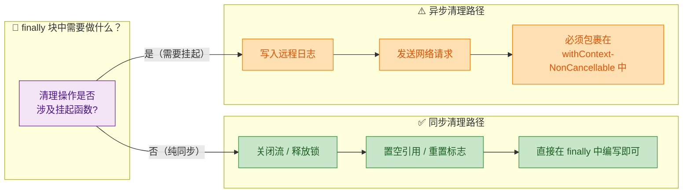
```mermaid
graph LR
    subgraph DECISION["🤔 finally 块中需要做什么？"]
        direction TB
        Q["清理操作是否<br/>涉及挂起函数?"]
    end

    subgraph SYNC_PATH["✅ 同步清理路径"]
        direction TB
        S1["关闭流 / 释放锁"]
        S2["置空引用 / 重置标志"]
        S3["直接在 finally 中编写即可"]
    end

    subgraph ASYNC_PATH["⚠️ 异步清理路径"]
        direction TB
        A1["写入远程日志"]
        A2["发送网络请求"]
        A3["必须包裹在<br/>withContext-NonCancellable 中"]
    end

    Q -- "否（纯同步）" --> S1
    S1 --> S2
    S2 --> S3

    Q -- "是（需要挂起）" --> A1
    A1 --> A2
    A2 --> A3

    classDef decisionStyle fill:#F3E5F5,stroke:#7B1FA2,color:#4A148C
    classDef syncStyle fill:#C8E6C9,stroke:#388E3C,color:#1B5E20
    classDef asyncStyle fill:#FFE0B2,stroke:#F57C00,color:#E65100

    class Q decisionStyle
    class S1,S2,S3 syncStyle
    class A1,A2,A3 asyncStyle
```

**经验法则**：`finally` 块中应尽量只做 **快速的、同步的** 清理操作。只有在万不得已时才使用 `withContext(NonCancellable)` 引入挂起操作，并且要注意控制其执行时间，避免 `finally` 块无限期阻塞。

#### 实战模式：完整的 try-catch-finally 协程模板

在生产级代码中，推荐使用以下结构化模板来处理协程中的资源管理：

```kotlin
import kotlinx.coroutines.*

// 模拟一个"数据库连接"资源
class DatabaseConnection(val name: String) {
    // 打开连接
    fun open() = println("  📂 数据库连接 [$name] 已打开")
    // 查询数据（同步模拟）
    fun query(sql: String) = println("  🔍 执行查询: $sql")
    // 关闭连接
    fun close() = println("  📁 数据库连接 [$name] 已关闭")
}

fun main() = runBlocking {
    val job = launch {
        // 在 try 外部声明资源引用
        val db = DatabaseConnection("UserDB")
        try {
            // ---------- 资源获取阶段 ----------
            db.open()

            // ---------- 业务逻辑阶段 ----------
            repeat(5) { i ->
                db.query("SELECT * FROM users LIMIT ${i * 10}, 10")
                delay(500L) // 挂起点，取消信号在此检测
            }

        } catch (e: CancellationException) {
            // ---------- 取消感知阶段（可选）----------
            // 记录取消日志，但必须重新抛出！
            println("  ⚠️ 协程被取消: ${e.message}")
            throw e // ❗ 关键：不能吞掉 CancellationException

        } catch (e: Exception) {
            // ---------- 业务异常处理阶段 ----------
            println("  ❌ 业务异常: ${e.message}")

        } finally {
            // ---------- 资源释放阶段（始终执行）----------
            db.close() // ✅ 同步操作，无需 NonCancellable

            // 如果需要异步清理：
            withContext(NonCancellable) {
                delay(100L) // 模拟异步日志写入
                println("  📝 清理日志已异步写入")
            }
        }
    }

    delay(1200L)
    println(">>> 发送取消信号")
    job.cancelAndJoin()
    println(">>> 一切已安全结束")
}
```

输出：

```text
  📂 数据库连接 [UserDB] 已打开
  🔍 执行查询: SELECT * FROM users LIMIT 0, 10
  🔍 执行查询: SELECT * FROM users LIMIT 10, 10
  🔍 执行查询: SELECT * FROM users LIMIT 20, 10
>>> 发送取消信号
  ⚠️ 协程被取消: StandaloneCoroutine was cancelled
  📁 数据库连接 [UserDB] 已关闭
  📝 清理日志已异步写入
>>> 一切已安全结束
```

> ⚠️ **特别提醒**：如果你在 `catch` 块中捕获了 `CancellationException`，**必须重新抛出（rethrow）**，否则协程框架无法感知到取消状态，会导致取消失效。这是一个经典的错误来源。

---

### use 函数

#### 从 Java 的 try-with-resources 说起

在 Java 7 中引入了 `try-with-resources` 语法，用于自动关闭实现了 `AutoCloseable` 接口的资源：

```java
// Java 的 try-with-resources
try (BufferedReader reader = new BufferedReader(new FileReader("data.txt"))) {
    String line = reader.readLine();
    System.out.println(line);
}
// reader 在此处自动关闭，即使发生异常也一样
```

Kotlin 没有提供 `try-with-resources` 语法，而是用一种更加 **函数式（Functional）** 的方式——**`use` 扩展函数**——来实现同样的功能，而且更加灵活优雅。

#### use 函数的本质

`use` 是定义在 `Closeable` 接口上的扩展函数（Kotlin 1.x 中同时支持 `AutoCloseable`）。它的核心逻辑非常清晰：

```mermaid
graph LR
    subgraph USE_FLOW["📐 use 函数执行流程"]
        direction TB
        A["调用资源对象的 use 方法<br/>传入 lambda 块"] --> B["执行 lambda 块<br/>（业务逻辑）"]
        B --> C{"lambda 是否<br/>抛出异常?"}
        C -- "否" --> D["调用 resource.close()"]
        C -- "是" --> E["调用 resource.close()"]
        E --> F["重新抛出原始异常<br/>close 的异常作为 suppressed"]
        D --> G["返回 lambda 的结果"]
    end

    classDef startStyle fill:#C8E6C9,stroke:#388E3C,color:#1B5E20
    classDef processStyle fill:#BBDEFB,stroke:#1976D2,color:#0D47A1
    classDef decisionStyle fill:#F3E5F5,stroke:#7B1FA2,color:#4A148C
    classDef errorStyle fill:#FFCDD2,stroke:#D32F2F,color:#B71C1C
    classDef endStyle fill:#FFF9C4,stroke:#F9A825,color:#F57F17

    class A startStyle
    class B,D processStyle
    class C decisionStyle
    class E,F errorStyle
    class G endStyle
```

`use` 函数的简化源码（便于理解其设计思想）：

```kotlin
// Kotlin 标准库中 use 函数的简化版本
public inline fun <T : Closeable?, R> T.use(block: (T) -> R): R {
    var exception: Throwable? = null // 用于记录 block 中的异常
    try {
        return block(this) // 执行用户传入的 lambda，this 就是资源本身
    } catch (e: Throwable) {
        exception = e // 记录异常
        throw e       // 重新抛出
    } finally {
        // 根据资源是否为 null 以及是否有异常来决定关闭策略
        when {
            this == null -> {} // 资源为 null，什么都不做
            exception == null -> close() // 没有异常，正常关闭
            else -> {
                try {
                    close() // 有异常时也尝试关闭
                } catch (closeException: Throwable) {
                    // close() 抛出的异常作为 suppressed 异常附加
                    exception.addSuppressed(closeException)
                }
            }
        }
    }
}
```

这段源码揭示了 `use` 函数的三个关键设计：

1. **`inline` 优化**：`use` 是内联函数，lambda 不会产生额外的对象分配，零性能开销。
2. **Suppressed Exception 处理**：如果 `block` 和 `close()` 同时抛出异常，`close()` 的异常不会覆盖原始异常，而是通过 `addSuppressed` 附加，保留完整的异常链。
3. **Null 安全**：泛型约束为 `T : Closeable?`，即使资源为 `null`，也不会 NPE。

#### 基本用法：文件读写

```kotlin
import java.io.File
import java.io.BufferedReader
import java.io.FileReader
import java.io.PrintWriter

fun main() {
    // ========== 示例 1：读取文件 ==========
    // BufferedReader 实现了 Closeable 接口
    // use 会在 lambda 结束后自动调用 reader.close()
    val content = BufferedReader(FileReader("input.txt")).use { reader ->
        reader.readText() // 读取全部内容，作为 lambda 返回值
    }
    println("文件内容: $content")

    // ========== 示例 2：Kotlin 更简洁的写法 ==========
    // File 的 bufferedReader() 返回 BufferedReader
    val lines = File("input.txt").bufferedReader().use { it.readLines() }
    lines.forEach { println(it) }

    // ========== 示例 3：写入文件 ==========
    PrintWriter("output.txt").use { writer ->
        writer.println("第一行数据") // 写入数据
        writer.println("第二行数据") // 继续写入
        // 离开 use 块后，writer 自动 flush 并 close
    }
}
```

#### use 与协程取消的协作

`use` 函数在协程环境中表现出色，因为 `CancellationException` 也是一种 `Throwable`，会走 `use` 内部的 catch 路径，从而触发 `close()`：

```kotlin
import kotlinx.coroutines.*
import java.io.BufferedReader
import java.io.FileReader

fun main() = runBlocking {
    val job = launch {
        // use 确保 reader 一定会被关闭
        BufferedReader(FileReader("large_file.txt")).use { reader ->
            var lineNum = 0
            // 逐行读取大文件
            reader.forEachLine { line ->
                lineNum++
                println("读取第 $lineNum 行: ${line.take(20)}...") // 只打印前20字符
                // ❗ 关键：在循环中手动插入挂起点
                // 因为 forEachLine 本身不是挂起函数
                // 需要用 ensureActive() 或 yield() 让协程有机会响应取消
                ensureActive()
            }
        }
        // 如果协程在读取过程中被取消：
        // 1. ensureActive() 抛出 CancellationException
        // 2. use 捕获异常 → 调用 reader.close() → 重新抛出异常
        // 3. 文件句柄被安全释放 ✅
    }

    delay(100L) // 让协程读一小会儿
    job.cancelAndJoin() // 取消协程
    println("文件资源已安全释放")
}
```

内存中的资源引用变化如下：

```kotlin
// ===== 协程运行中 =====
// ┌──────────────┐     ┌────────────────┐     ┌──────────────┐
// │  Coroutine   │────▶│ BufferedReader │────▶│  FileHandle  │
// │  (Active)    │     │  (resource)    │     │  (OS 资源)   │
// └──────────────┘     └────────────────┘     └──────────────┘
//
// ===== 取消后 use 执行 close() =====
// ┌──────────────┐     ┌────────────────┐     ┌──────────────┐
// │  Coroutine   │  ✕  │ BufferedReader │  ✕  │  FileHandle  │
// │ (Cancelled)  │     │  (closed)      │     │  (released)  │
// └──────────────┘     └────────────────┘     └──────────────┘
```

#### 多资源嵌套 use

当需要同时打开多个资源时，可以嵌套 `use` 调用，关闭顺序遵循 **后开先关（LIFO）** 原则：

```kotlin
import java.io.File

fun copyFile(src: String, dst: String) {
    // 外层 use 管理输入流
    File(src).inputStream().use { input ->
        // 内层 use 管理输出流
        File(dst).outputStream().use { output ->
            // 执行复制操作
            input.copyTo(output) // Kotlin 标准库的便捷方法
            println("复制完成: $src → $dst")
        }
        // ← output 在此处关闭（内层 use 结束）
    }
    // ← input 在此处关闭（外层 use 结束）
}

fun main() {
    copyFile("source.txt", "destination.txt")
}
```

关闭顺序的图解：

```mermaid
graph LR
    subgraph OPEN["📂 打开顺序"]
        direction TB
        O1["① 打开 InputStream"] --> O2["② 打开 OutputStream"]
    end

    subgraph WORK["⚙️ 工作"]
        direction TB
        W1["执行 copyTo"]
    end

    subgraph CLOSE["📁 关闭顺序 LIFO"]
        direction TB
        C1["③ 关闭 OutputStream"] --> C2["④ 关闭 InputStream"]
    end

    OPEN --> WORK --> CLOSE

    classDef openStyle fill:#C8E6C9,stroke:#388E3C,color:#1B5E20
    classDef workStyle fill:#BBDEFB,stroke:#1976D2,color:#0D47A1
    classDef closeStyle fill:#FFCDD2,stroke:#D32F2F,color:#B71C1C

    class O1,O2 openStyle
    class W1 workStyle
    class C1,C2 closeStyle
```

#### use vs try-finally：如何选择？

| 维度 | `use` 函数 | `try-finally` |
|---|---|---|
| **适用对象** | 实现了 `Closeable` / `AutoCloseable` 的资源 | 任何需要清理逻辑的场景 |
| **调用方式** | `resource.use { ... }` | `try { ... } finally { resource.close() }` |
| **Suppressed 异常** | ✅ 自动处理 `addSuppressed` | ❌ 需要手动处理，否则 close 异常会覆盖原异常 |
| **Null 安全** | ✅ 内置 null 检查 | ❌ 需要手动 `resource?.close()` |
| **协程 finally 挂起** | ❌ 不支持（close 是同步的） | ✅ 可配合 `withContext(NonCancellable)` |
| **代码简洁度** | ⭐⭐⭐⭐⭐ 极简 | ⭐⭐⭐ 相对冗长 |

**选择建议**：

- 如果资源实现了 `Closeable`，**优先用 `use`**，代码简洁且异常处理更完善。
- 如果清理逻辑不只是 `close()`（比如还要重置状态、发送通知），或者需要在清理中执行挂起操作，用 `try-finally`。
- 两者可以 **组合使用**：在 `try-finally` 的 `try` 块中使用 `use`。

```kotlin
import kotlinx.coroutines.*
import java.io.File

fun main() = runBlocking {
    val job = launch {
        try {
            // use 负责管理文件资源的自动关闭
            File("data.txt").bufferedReader().use { reader ->
                reader.forEachLine { line ->
                    println("处理: $line")
                    ensureActive() // 协程取消检查点
                }
            }
        } finally {
            // finally 负责额外的清理逻辑（非 Closeable 资源）
            println("重置全局状态标志...")
            withContext(NonCancellable) {
                delay(50)
                println("发送清理完成通知 ✅")
            }
        }
    }

    delay(100L)
    job.cancelAndJoin()
}
```

这种 **`use` + `try-finally`** 的组合模式，在实际项目中非常常见，它将 IO 资源管理和业务清理逻辑清晰地分离开来。

---

**📝 练习题**

以下代码在协程被取消时的执行结果是什么？

```kotlin
fun main() = runBlocking {
    val job = launch {
        try {
            println("A")
            delay(5000L)
            println("B")
        } finally {
            println("C")
            delay(1000L)
            println("D")
        }
    }
    delay(100L)
    job.cancelAndJoin()
    println("E")
}
```

A. `A C D E`

B. `A C E`

C. `A B C D E`

D. `A E`


**【答案】** B

**【解析】** 协程启动后先打印 `A`，然后在 `delay(5000L)` 处挂起。100ms 后主协程调用 `cancelAndJoin()`，此时 `delay` 检测到取消信号，抛出 `CancellationException`，跳过 `B` 的打印，进入 `finally` 块打印 `C`。关键点在于：`finally` 块中的 `delay(1000L)` 处于已取消的协程上下文中，它会 **立即再次抛出 `CancellationException`**，导致 `D` 不会被打印。随后协程结束，`join()` 返回，主协程打印 `E`。如果希望 `D` 也能打印，需要将 `finally` 中的代码用 `withContext(NonCancellable) { ... }` 包裹。

---

**📝 练习题**

关于 Kotlin `use` 函数，以下说法 **错误** 的是：

A. `use` 是 `Closeable` 的扩展函数，lambda 结束后会自动调用 `close()`

B. 如果 lambda 块和 `close()` 同时抛出异常，`close()` 的异常会覆盖 lambda 的原始异常

C. `use` 是 `inline` 函数，不会产生额外的 lambda 对象开销

D. 在协程中使用 `use` 时，如果协程被取消，资源仍然会被正确关闭


**【答案】** B

**【解析】** 选项 B 的描述是错误的。`use` 函数内部做了精心的异常处理：当 lambda 块已经抛出异常后，如果 `close()` 也抛出异常，后者不会覆盖前者，而是通过 `exception.addSuppressed(closeException)` 将 `close` 的异常作为 **suppressed exception** 附加到原始异常上。这样既保留了根本原因（Root Cause），又不会丢失 `close` 的错误信息。选项 A、C、D 均为正确描述。

---

## 本章小结

本章围绕 Kotlin 协程的 **取消 (Cancellation)** 与 **超时 (Timeout)** 两大生命周期管控机制展开，它们是编写健壮、可控并发程序的基石。下面通过一张全景图回顾整章知识脉络，再逐一提炼核心要点。

---

### 全景知识图谱

```mermaid
graph LR
    subgraph CANCEL["🚫 协程取消"]
        direction TB
        C1["cancel() 方法"]
        C2["协作式取消<br/>Cooperative Cancellation"]
        C3["isActive 主动检查"]
        C4["挂起点自动检查"]
        C1 --> C2
        C2 --> C3
        C2 --> C4
    end

    subgraph EXCEPTION["⚠️ CancellationException"]
        direction TB
        E1["正常取消信号"]
        E2["不向父协程传播"]
    end

    subgraph NONCANCELLABLE["🔒 不可取消块"]
        direction TB
        N1["withContext<br/>NonCancellable"]
    end

    subgraph TIMEOUT["⏱️ 超时控制"]
        direction TB
        T1["withTimeout<br/>抛 TimeoutCancellationException"]
        T2["withTimeoutOrNull<br/>返回 null"]
    end

    subgraph CLEANUP["🧹 资源清理"]
        direction TB
        F1["finally 块"]
        F2["use 函数"]
    end

    CANCEL --> EXCEPTION
    EXCEPTION --> NONCANCELLABLE
    CANCEL --> TIMEOUT
    EXCEPTION --> CLEANUP
    NONCANCELLABLE --> CLEANUP

    classDef greenNode fill:#C8E6C9,stroke:#388E3C,color:#1B5E20,stroke-width:1px
    classDef blueNode fill:#BBDEFB,stroke:#1976D2,color:#0D47A1,stroke-width:1px
    classDef orangeNode fill:#FFE0B2,stroke:#F57C00,color:#E65100,stroke-width:1px
    classDef redNode fill:#FFCDD2,stroke:#E53935,color:#B71C1C,stroke-width:1px
    classDef purpleNode fill:#E1BEE7,stroke:#8E24AA,color:#4A148C,stroke-width:1px

    class C1,C2,C3,C4 greenNode
    class E1,E2 orangeNode
    class N1 redNode
    class T1,T2 blueNode
    class F1,F2 purpleNode
```

---

### 核心要点回顾

#### 1. 协程取消是协作式的 (Cooperative)

这是本章最核心、也最容易被忽视的原则。调用 `job.cancel()` **并不会** 像杀掉线程 (`Thread.stop()`) 那样暴力终止协程。它仅仅是向协程发出一个"请你停下来"的 **信号**。协程必须在代码中 **主动配合** 才能真正停止。配合方式有两种：

| 方式 | 原理 | 适用场景 |
|:---|:---|:---|
| **挂起点自动检查** | `delay()`, `yield()`, `withContext()` 等挂起函数内部会检查 `isActive`，一旦检测到取消信号立即抛出 `CancellationException` | 含有挂起调用的常规协程 |
| **手动检查 `isActive`** | 在纯计算密集型循环中，通过 `while(isActive) { ... }` 或 `ensureActive()` 主动响应取消 | CPU 密集型、无挂起点的循环 |

> **关键记忆点**：如果你的协程里是一个没有任何挂起点的 `while(true)` 死循环，即使外部调用了 `cancel()`，协程也 **永远不会停止**——除非你检查了 `isActive`。

#### 2. CancellationException 是"正常退出"

`CancellationException` 在协程世界中拥有 **特殊语义**：它代表的是"按预期被取消"，而非真正的错误。这一设计带来两个直接影响：

- **不会导致父协程失败**：父协程 / `SupervisorJob` 收到子协程的 `CancellationException` 后会视为正常结束，不会触发结构化并发中的异常传播链。
- **不会被通用异常处理器捕获**：`CoroutineExceptionHandler` 不会处理 `CancellationException`。

```kotlin
// 父协程不会因为子协程取消而崩溃
val parent = launch {
    val child = launch {
        delay(Long.MAX_VALUE) // 挂起，等待取消
    }
    child.cancel()           // 取消子协程 —— CancellationException
    child.join()             // 等待子协程完成
    println("父协程继续运行") // ✅ 正常执行到这里
}
```

#### 3. withContext(NonCancellable)——取消后的"最后遗言"

当协程已被取消后，它处于 **Cancelling** 状态，此时所有常规挂起函数会立即抛出 `CancellationException`。但在 `finally` 块中我们有时必须执行挂起操作（如关闭网络连接、写入日志到数据库）。`withContext(NonCancellable)` 为此提供了一个 **不可取消的上下文**，让这段代码能正常执行挂起函数。

```kotlin
finally {
    withContext(NonCancellable) {
        // 在此块内，即使协程已取消，挂起函数仍可正常执行
        database.saveCleanupLog()  // 挂起操作，正常执行
    }
}
```

> ⚠️ **滥用警告**：`NonCancellable` 仅用于 `finally` 中的清理逻辑，不要在业务代码中使用它绕过取消机制，否则会破坏结构化并发 (Structured Concurrency) 的设计初衷。

#### 4. 超时 = 自动取消

`withTimeout` 和 `withTimeoutOrNull` 本质上是 **定时自动取消** 的语法糖：

```mermaid
graph LR
    subgraph WT["withTimeout"]
        direction TB
        WT1["启动协程块"] --> WT2{"超时?"}
        WT2 -->|是| WT3["抛出<br/>TimeoutCancellation<br/>Exception"]
        WT2 -->|否| WT4["返回结果 T"]
    end

    subgraph WTON["withTimeoutOrNull"]
        direction TB
        WN1["启动协程块"] --> WN2{"超时?"}
        WN2 -->|是| WN3["返回 null"]
        WN2 -->|否| WN4["返回结果 T?"]
    end

    WT --- WTON

    classDef blueNode fill:#BBDEFB,stroke:#1976D2,color:#0D47A1,stroke-width:1px
    classDef greenNode fill:#C8E6C9,stroke:#388E3C,color:#1B5E20,stroke-width:1px
    classDef redNode fill:#FFCDD2,stroke:#E53935,color:#B71C1C,stroke-width:1px
    classDef amberNode fill:#FFF9C4,stroke:#F9A825,color:#F57F17,stroke-width:1px

    class WT1,WN1 blueNode
    class WT2,WN2 amberNode
    class WT3 redNode
    class WT4,WN4 greenNode
    class WN3 redNode
```

选型建议：

- **`withTimeout`**：适用于"超时即视为严重错误，必须中断流程"的场景，如核心 RPC 调用。
- **`withTimeoutOrNull`**：适用于"超时可兜底"的场景，如缓存预热、非关键数据加载，拿不到就用默认值。

注意 `TimeoutCancellationException` 是 `CancellationException` 的子类，因此在 **当前协程** 内部它遵循"正常取消"语义；但如果它从 `withTimeout` 块逃逸到外层，则会被外层视为异常。

#### 5. 资源清理的两道防线

| 防线 | 机制 | 适用对象 |
|:---|:---|:---|
| **`finally` 块** | `try-finally` 保证无论正常完成还是被取消，`finally` 代码都会执行 | 通用清理逻辑 |
| **`use` 函数** | 对 `Closeable` / `AutoCloseable` 资源自动调用 `close()`，等同于 Java 的 try-with-resources | 文件流、数据库连接、Socket 等 |

两者可组合使用，形成完整的资源安全网：

```kotlin
suspend fun processFile(path: String) {
    // use 自动关闭文件流
    File(path).bufferedReader().use { reader ->
        // 业务逻辑...
    }
    // 如果协程被取消，use 会在内部 finally 中调用 reader.close()
}
```

---

### 取消生命周期速查

一个协程从取消信号发出到最终完成，经历如下状态流转：

```mermaid
graph LR
    A["Active<br/>✅ 运行中"] -->|"cancel() 调用"| B["Cancelling<br/>🔶 取消中"]
    B -->|"finally 执行完毕"| C["Cancelled<br/>❌ 已取消"]

    subgraph CANCELLING_PHASE["Cancelling 阶段行为"]
        direction TB
        P1["isActive = false"]
        P2["挂起函数抛出<br/>CancellationException"]
        P3["finally 块开始执行"]
        P4["NonCancellable<br/>可执行挂起操作"]
        P1 --> P2 --> P3 --> P4
    end

    B -.- CANCELLING_PHASE

    classDef activeNode fill:#C8E6C9,stroke:#388E3C,color:#1B5E20,stroke-width:2px
    classDef cancellingNode fill:#FFE0B2,stroke:#F57C00,color:#E65100,stroke-width:2px
    classDef cancelledNode fill:#FFCDD2,stroke:#E53935,color:#B71C1C,stroke-width:2px
    classDef phaseNode fill:#E3F2FD,stroke:#1565C0,color:#0D47A1,stroke-width:1px

    class A activeNode
    class B cancellingNode
    class C cancelledNode
    class P1,P2,P3,P4 phaseNode
```

---

### 黄金法则总结

```text
┌─────────────────────────────────────────────────────────────────┐
│                  协程取消与超时 · 五条黄金法则                      │
├─────────────────────────────────────────────────────────────────┤
│                                                                 │
│  ① 取消是协作式的 —— 协程必须主动检查才能响应取消                    │
│                                                                 │
│  ② CancellationException ≠ 错误 —— 它是正常的取消信号              │
│                                                                 │
│  ③ finally 中需要挂起 → 用 withContext(NonCancellable)            │
│                                                                 │
│  ④ 超时用 withTimeout / withTimeoutOrNull 按需选择                │
│                                                                 │
│  ⑤ 善用 finally + use 确保资源零泄漏                               │
│                                                                 │
└─────────────────────────────────────────────────────────────────┘
```

---

### 📝 练习题

**题目一：** 以下协程代码启动后调用 `cancel()`，`"Done"` 是否会被打印？

```kotlin
val job = launch {
    var count = 0
    while (count < 1_000_000) {   // 纯计算，无挂起点
        count++
    }
    println("Done: $count")
}
delay(1)       // 给协程一点启动时间
job.cancel()   // 取消协程
job.join()     // 等待完成
```

A. 一定会打印 `"Done"`，因为循环很快就能跑完


B. 一定不会打印，因为 `cancel()` 会立即终止协程


C. 会打印，因为循环中没有挂起点，协程无法响应取消


D. 取决于运行时的线程调度，结果不确定


**【答案】** C

**【解析】** 这是本章最核心的概念——**协作式取消 (Cooperative Cancellation)**。循环 `while (count < 1_000_000)` 内部没有任何挂起函数（如 `delay`、`yield`），也没有检查 `isActive`，因此即使外部调用了 `cancel()`，协程也 **感知不到取消信号**，会将循环完整跑完并打印 `"Done"`。选项 A 的理由虽然结果正确，但原因归结为"循环快"是不准确的——真正的根因是缺少取消检查点。选项 B 错误，`cancel()` 不会强制终止协程。选项 D 虽有一定合理性（如果循环耗时极长且存在挂起点，调度可能影响结果），但此处循环是纯计算且没有挂起点，所以结果是确定的。正确修复方式：将条件改为 `while (isActive && count < 1_000_000)` 或在循环体内调用 `ensureActive()`。

---

**题目二：** 以下代码的输出是什么？

```kotlin
fun main() = runBlocking {
    val result = withTimeoutOrNull(200L) {
        try {
            delay(500L)           // 超时会在此处取消
            "Success"
        } finally {
            println("Cleanup")
            delay(100L)           // finally 中的挂起调用
            println("Cleanup Done")
        }
    }
    println("Result: $result")
}
```

A. `Cleanup` → `Cleanup Done` → `Result: null`


B. `Cleanup` → `Result: null`


C. `Result: null`


D. 抛出 `TimeoutCancellationException`


**【答案】** B

**【解析】** `withTimeoutOrNull(200L)` 会在 200ms 后取消内部协程。`delay(500L)` 在 200ms 时检测到取消，抛出 `CancellationException`，随后进入 `finally` 块。`println("Cleanup")` 正常执行并打印。然而，此时协程已处于 **Cancelling** 状态，下一行 `delay(100L)` 作为挂起函数会 **立即再次抛出 `CancellationException`**，导致 `"Cleanup Done"` 永远不会被打印。最终 `withTimeoutOrNull` 捕获超时，返回 `null`，打印 `Result: null`。如果希望 `"Cleanup Done"` 也能执行，需要将 `finally` 块中的逻辑包裹在 `withContext(NonCancellable) { ... }` 中。这道题综合考察了 **超时 → 取消 → finally 中挂起受限 → NonCancellable** 的完整知识链路。

---

