---

# 协程基础 ⭐⭐

---

## 协程概述

Kotlin 协程（Coroutines）是 Kotlin 语言在 1.3 版本正式稳定的一套 **并发编程框架**。它的核心理念可以用一句话概括：**让开发者用看起来像同步的代码，完成实际上是异步的操作，同时不阻塞任何线程。** 这句话包含了三个关键概念 —— "轻量级线程"、"同步方式写异步代码"、"非阻塞挂起"，它们构成了理解协程的三大基石。

在深入之前，我们先用一张图建立全局视角，看看协程在整个 Kotlin 并发体系中的位置：

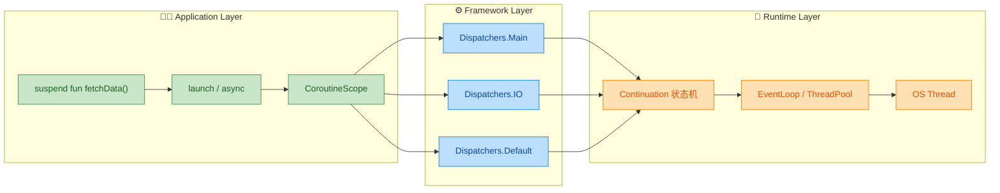

从图中可以看到：我们日常写的 `suspend` 函数和 `launch`/`async` 处于最上层（应用层），中间由调度器（Dispatcher）决定协程运行在哪个线程（框架层），而最底层是编译器生成的 **Continuation 状态机** 和操作系统线程池（运行时层）。接下来我们逐一拆解三个核心概念。

---

### 轻量级线程

#### 为什么说协程是"轻量级"的？

要理解"轻量级"，我们必须先理解线程（Thread）为什么是"重量级"的。

**操作系统线程的开销** 主要体现在三个方面：

| 开销维度 | OS Thread | Coroutine |
|:---|:---|:---|
| **内存** | 每个线程默认分配 ~1 MB 栈空间 | 协程对象仅占几十到几百字节 |
| **创建/销毁** | 涉及系统调用（`clone`/`pthread_create`），开销大 | 仅是在堆上创建一个普通的 Kotlin 对象 |
| **上下文切换** | 需要内核态介入，保存/恢复寄存器、TLB 刷新等 | 纯用户态切换，本质上只是函数调用级别的跳转 |

这意味着：如果你在 JVM 上创建 10 万个线程，系统很可能直接 `OutOfMemoryError`；但创建 10 万个协程，可能只消耗几十 MB 内存，轻松跑完。

来看一段经典的对比实验代码：

```kotlin
import kotlinx.coroutines.*

fun main() = runBlocking {
    // 同时启动 100,000 个协程
    val jobs = List(100_000) {
        launch {
            delay(1000L)   // 每个协程挂起 1 秒（不占用线程）
            print(".")     // 恢复后打印一个点
        }
    }
    jobs.forEach { it.join() } // 等待所有协程完成
}
```

上面的代码在普通笔记本上可以 **毫无压力地运行完毕**。如果你把 `launch` 换成 `thread { ... }`：

```kotlin
import kotlin.concurrent.thread

fun main() {
    // 尝试启动 100,000 个线程 —— 大概率崩溃
    val threads = List(100_000) {
        thread {
            Thread.sleep(1000L) // 每个线程睡眠 1 秒（真正占用线程）
            print(".")
        }
    }
    threads.forEach { it.join() }
}
```

你几乎可以确定会遇到 `java.lang.OutOfMemoryError: unable to create native thread` 这个异常。

#### 用户态调度 —— 轻量的根本原因

协程之所以轻量，核心在于它运行在 **用户态（User Space）**，而非内核态（Kernel Space）。下面这张图展示了二者调度模型的本质差异：

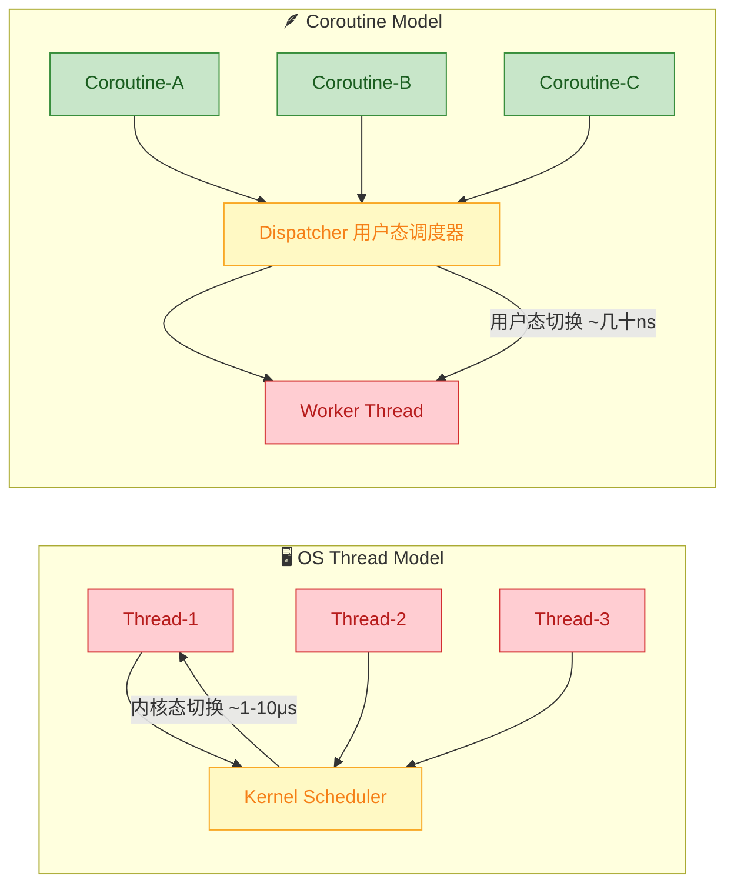

**关键差异**：

- **线程模型**：3 个线程各自独立，由操作系统内核调度器（Kernel Scheduler）决定谁运行、谁休眠。每次切换都涉及从用户态陷入内核态，代价高昂。
- **协程模型**：3 个协程可能共享同一个 Worker Thread。协程调度器（Dispatcher）是 Kotlin 运行时库里的普通代码，在用户态就能完成协程的挂起与恢复 —— 本质上只是修改一个状态机的 `label` 字段，然后重新调用一个函数。

你可以把协程理解为：**由 Kotlin 运行时自行管理的、运行在线程之上的微任务（micro-task）。** 一个线程可以承载成千上万个协程，就像一个服务员可以同时服务多桌客人 —— 服务员不会在某一桌前"呆等"上菜，而是先去招呼其他桌，菜好了再回来。

---

### 用同步方式写异步代码

#### 回调地狱：异步编程的经典痛点

在没有协程的时代，Android/后端开发者最常用的异步模式是 **回调（Callback）**。假设我们要完成一个常见业务流程：先登录 → 再获取用户信息 → 再获取订单列表。传统回调写法如下：

```kotlin
// 传统回调写法 —— 嵌套层层递进，形成"回调地狱"
fun loadDashboard() {
    // 第一层：登录
    loginService.login("user", "pass", object : Callback<Token> {
        override fun onSuccess(token: Token) {
            // 第二层：获取用户信息
            userService.getUser(token, object : Callback<User> {
                override fun onSuccess(user: User) {
                    // 第三层：获取订单列表
                    orderService.getOrders(user.id, object : Callback<List<Order>> {
                        override fun onSuccess(orders: List<Order>) {
                            // 终于拿到数据了...
                            updateUI(user, orders) // 更新 UI
                        }
                        override fun onFailure(e: Exception) {
                            showError(e) // 第三层错误处理
                        }
                    })
                }
                override fun onFailure(e: Exception) {
                    showError(e) // 第二层错误处理
                }
            })
        }
        override fun onFailure(e: Exception) {
            showError(e) // 第一层错误处理
        }
    })
}
```

这段代码的问题非常直观：**每增加一步异步操作，代码就多嵌套一层**。三层已经让人头晕，真实业务中五六层嵌套并不罕见。而且每一层都要单独处理错误，逻辑碎片化严重。

#### 协程的优雅解法

同样的业务逻辑，用协程重写后：

```kotlin
// 协程写法 —— 看起来完全是同步的顺序代码
suspend fun loadDashboard() {
    try {
        // 第一步：登录（挂起，等待网络响应）
        val token = loginService.login("user", "pass")
        // 第二步：获取用户信息（挂起，等待网络响应）
        val user = userService.getUser(token)
        // 第三步：获取订单列表（挂起，等待网络响应）
        val orders = orderService.getOrders(user.id)
        // 三步全部完成，更新 UI
        updateUI(user, orders)
    } catch (e: Exception) {
        // 统一错误处理 —— 任意一步失败都会走到这里
        showError(e)
    }
}
```

**对比效果一目了然**：

| 维度 | 回调写法 | 协程写法 |
|:---|:---|:---|
| 代码结构 | 层层嵌套，向右膨胀 | 线性顺序，自上而下 |
| 错误处理 | 每层单独处理 | 统一 `try-catch` |
| 可读性 | 低，逻辑被打散 | 高，如同写同步代码 |
| 可维护性 | 差，新增步骤要重新嵌套 | 好，新增步骤只需加一行 |

#### 为什么能用同步写法做异步操作？

秘密在于 **编译器的"魔法"**。当 Kotlin 编译器看到 `suspend` 关键字修饰的函数时，它会在编译期把函数改写成一个 **状态机（State Machine）**。每个挂起点（suspension point）就是状态机的一个状态。

以 `loadDashboard()` 为例，编译器大致会将其转化为如下伪代码：

```kotlin
// 编译器生成的状态机伪代码（简化版）
fun loadDashboard(continuation: Continuation<Unit>) {
    // label 记录当前执行到了哪一步
    val sm = continuation as? LoadDashboardSM ?: LoadDashboardSM(continuation)

    when (sm.label) {
        0 -> {
            sm.label = 1  // 标记：下次恢复时跳到 case 1
            // 调用 login()，如果它挂起了，就直接 return（释放线程）
            val result = loginService.login("user", "pass", sm)
            if (result == COROUTINE_SUSPENDED) return
        }
        1 -> {
            val token = sm.result as Token  // 从上次挂起中恢复，拿到结果
            sm.label = 2  // 标记：下次恢复时跳到 case 2
            val result = userService.getUser(token, sm)
            if (result == COROUTINE_SUSPENDED) return
        }
        2 -> {
            val user = sm.result as User    // 拿到用户信息
            sm.label = 3
            val result = orderService.getOrders(user.id, sm)
            if (result == COROUTINE_SUSPENDED) return
        }
        3 -> {
            val orders = sm.result as List<Order> // 拿到订单
            updateUI(user, orders)                // 全部完成
        }
    }
}
```

你写的是一段流畅的顺序代码，但编译器在背后帮你拆成了状态机。**这就是"用同步方式写异步代码"的本质**：语法层面是同步的，编译产物是异步的。

---

### 非阻塞挂起

"非阻塞挂起" 是协程最核心、也最容易被误解的概念。我们先厘清两个关键词：

- **阻塞（Blocking）**：线程被占用，什么也做不了，干等着。比如 `Thread.sleep(5000)` 会让当前线程白白浪费 5 秒。
- **挂起（Suspension）**：协程暂停执行，**但它所运行的线程被释放出来，可以去做其他事情**。等到异步结果准备好后，协程再恢复执行。

这二者的区别，可以用一个生活化的比喻来理解：

> **阻塞** = 你在餐厅点完菜后，一直坐在前台不走，服务员只能干等你拿走才能服务下一位。
> **挂起** = 你点完菜后拿了个号码牌回座位了，服务员可以继续接待别人，菜做好了叫你的号。

来看代码层面的对比：

```kotlin
import kotlinx.coroutines.*

fun main() = runBlocking {

    // ========== 阻塞示例 ==========
    println("[阻塞] 开始 - ${Thread.currentThread().name}")
    Thread.sleep(2000L)  // 线程被占用 2 秒，期间无法做任何其他事
    println("[阻塞] 结束 - ${Thread.currentThread().name}")

    // ========== 非阻塞挂起示例 ==========
    println("[挂起] 开始 - ${Thread.currentThread().name}")
    delay(2000L)         // 协程挂起 2 秒，线程被释放去执行其他协程
    println("[挂起] 结束 - ${Thread.currentThread().name}")
}
```

`Thread.sleep(2000L)` 与 `delay(2000L)` 都会等待 2 秒，但本质完全不同：

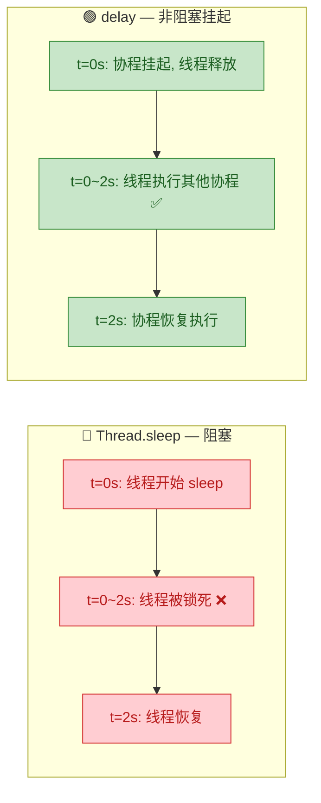

#### 非阻塞挂起的内部原理

当一个协程执行到 `delay(2000L)` 时，内部发生了这些事情：

1. **保存状态**：Kotlin 运行时将当前协程的执行进度（状态机的 `label`）、局部变量等信息保存到一个 `Continuation` 对象中。你可以把 `Continuation` 理解为协程的"存档点"。

2. **返回 `COROUTINE_SUSPENDED`**：当前函数立即返回一个特殊标记值 `COROUTINE_SUSPENDED`，**这意味着线程不再被这个协程占用**，调度器可以把线程分配给其他协程。

3. **定时器/IO 等待**：对于 `delay()`，运行时会向事件循环（EventLoop）注册一个 2 秒后触发的定时回调。对于网络 IO，则是向底层 NIO 注册一个完成回调。

4. **恢复执行**：2 秒后（或 IO 完成后），运行时调用 `continuation.resumeWith(result)`，调度器将协程重新提交给线程池，协程从上次挂起的位置继续向下执行。

整个过程可以用一个时序图表示：

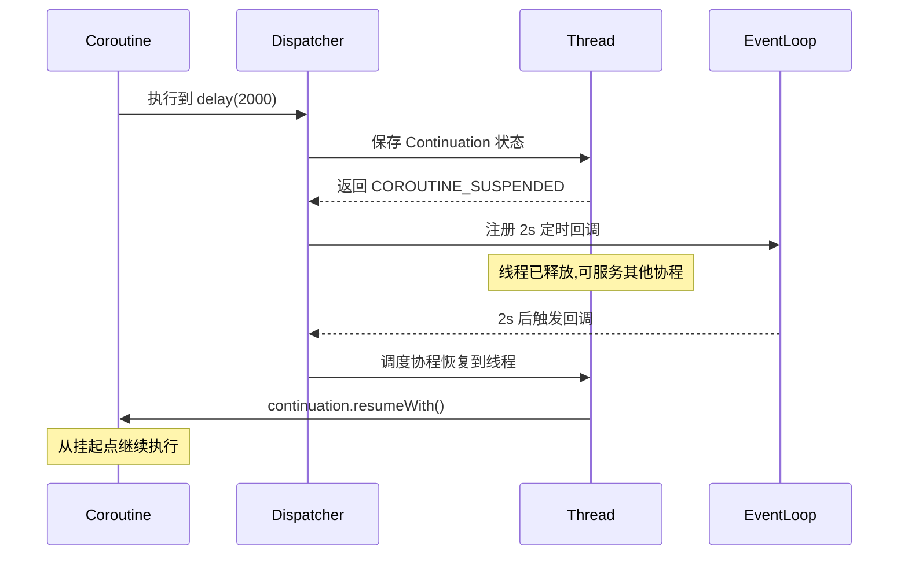

#### `Continuation` —— 协程的灵魂

`Continuation` 是 Kotlin 协程中最核心的接口之一，它的定义非常简洁：

```kotlin
// kotlin.coroutines 包中的核心接口
public interface Continuation<in T> {
    // 协程上下文（包含调度器、Job 等信息）
    public val context: CoroutineContext
    // 恢复协程执行，传入结果（成功值或异常）
    public fun resumeWith(result: Result<T>)
}
```

每个 `suspend` 函数在编译后都会被添加一个隐藏的 `Continuation` 参数。这就是著名的 **CPS 变换（Continuation-Passing Style）**：

```kotlin
// 你写的代码
suspend fun fetchUser(): User { ... }

// 编译器实际生成的签名（简化）
fun fetchUser(continuation: Continuation<User>): Any? { ... }
```

返回类型变成 `Any?` 是因为函数可能返回 **实际结果**（`User`），也可能返回 **`COROUTINE_SUSPENDED`** 标记（表示已挂起，结果稍后通过 `continuation.resumeWith()` 传回）。

#### 一个更直观的运行示例

```kotlin
import kotlinx.coroutines.*

fun main() = runBlocking {
    // 在同一个线程上启动两个协程
    launch {
        println("协程A: 开始工作 [${Thread.currentThread().name}]")
        delay(1000L)  // A 挂起，线程释放
        println("协程A: 恢复工作 [${Thread.currentThread().name}]")
    }

    launch {
        println("协程B: 开始工作 [${Thread.currentThread().name}]")
        delay(500L)   // B 挂起，线程释放
        println("协程B: 恢复工作 [${Thread.currentThread().name}]")
    }

    println("主协程: 两个子协程已启动 [${Thread.currentThread().name}]")
}
```

运行输出（顺序可能微调，但逻辑如下）：

```text
主协程: 两个子协程已启动 [main]
协程A: 开始工作 [main]
协程B: 开始工作 [main]
协程B: 恢复工作 [main]    ← 500ms 后 B 先恢复
协程A: 恢复工作 [main]    ← 1000ms 后 A 恢复
```

注意 **所有输出都在 `main` 线程上**！这充分说明了非阻塞挂起的威力：两个协程交替使用同一个线程，却互不阻塞。`delay()` 期间线程没有闲着 —— 它去执行了另一个协程。

#### 小结：三个概念的关系

最后，我们把三个核心概念串联起来，理解它们之间的内在关系：

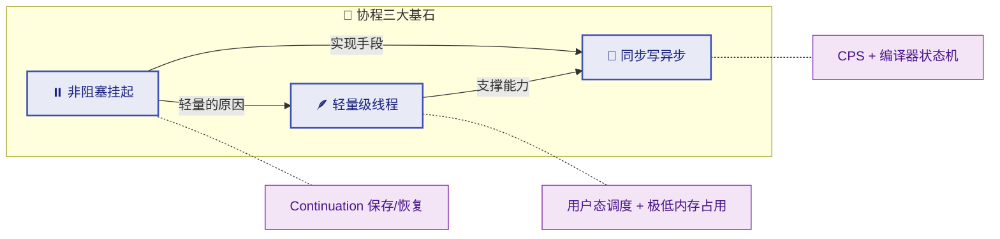

- **非阻塞挂起** 是最底层的机制 —— 协程能挂起并释放线程，这使得一个线程可以运行大量协程（→ 轻量级），也使得异步操作可以用顺序代码表达（→ 同步写异步）。
- **轻量级** 是非阻塞挂起带来的直接结果 —— 不独占线程，自然就能同时存在海量协程。
- **同步写异步** 是开发者最直接感受到的好处 —— 而它的背后，是编译器的状态机变换和 `Continuation` 的挂起/恢复机制在支撑。

三者相辅相成，共同构成了 Kotlin 协程的设计哲学：**让并发编程变得简单、安全、高效。**

---

**📝 练习题**

以下关于 Kotlin 协程的说法，哪一项是 **错误** 的？

A. 协程的 `delay()` 函数会挂起当前协程，但不会阻塞其底层线程


B. 协程在编译后会被转换为基于 `Continuation` 的状态机


C. 创建 100,000 个协程通常会导致 `OutOfMemoryError`，因为每个协程都需要分配独立的线程栈


D. `suspend` 函数经过编译后会被添加一个隐藏的 `Continuation` 参数

**【答案】** C

**【解析】** 协程是 **用户态的轻量级任务**，每个协程对象仅占用几十到几百字节的堆内存，并不需要像操作系统线程那样分配 ~1MB 的独立线程栈。因此创建 10 万个协程是完全可行的，这恰恰是协程"轻量级"的核心优势。选项 A 准确描述了 `delay()` 的非阻塞挂起特性；选项 B 和 D 准确描述了编译器对 `suspend` 函数的 CPS 变换机制。

---

## 协程 vs 线程 ⭐

在上一节中，我们已经对协程有了一个宏观的认识：它是一种"轻量级线程"，能以同步风格编写异步代码，并且支持非阻塞挂起。那么，协程和我们熟悉的线程（Thread）到底有哪些本质区别？为什么 Kotlin 官方要大力推广协程来替代传统的线程编程模型？本节将从三个核心维度——**调度方式**、**挂起恢复机制**、**代码结构**——来深入剖析协程与线程的差异。

---

### 协程更轻量（用户态调度）

#### 线程的代价：内核态调度

要理解协程为什么"轻量"，我们首先需要明白线程为什么"重"。

在操作系统层面，每创建一个线程（无论是 Java 的 `Thread` 还是底层的 POSIX Thread），系统都需要做以下几件事：

1. **分配独立的栈空间**：每个线程默认会分配约 **1MB** 的栈内存（JVM 中可通过 `-Xss` 调整）。这意味着如果你创建 1000 个线程，仅栈内存就要消耗约 1GB。
2. **注册到操作系统内核**：线程是操作系统的调度单元，创建和销毁都需要系统调用（System Call），涉及用户态到内核态的切换（Context Switch）。
3. **内核态上下文切换**：当操作系统在多个线程之间切换执行时，需要保存和恢复 CPU 寄存器、程序计数器、栈指针等信息，这个过程开销巨大，通常在 **微秒（μs）** 级别。

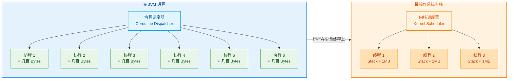

上图清晰地展现了核心区别：**线程由操作系统内核调度，而协程由 JVM 用户态的调度器（Dispatcher）管理**。

#### 协程的本质：用户态的轻量对象

协程并不是操作系统级别的概念。在 Kotlin 中，一个协程本质上就是一个 **Continuation 对象**（后续章节会深入讲解），它的内存开销极小——通常只有 **几百字节到几 KB**。协程不需要向操作系统申请独立的栈空间，它共享所在线程的栈，挂起时的状态被保存在堆内存（Heap）上的对象中。

**用户态调度（User-space Scheduling）** 意味着：
- 协程的创建、挂起、恢复全部在 JVM 进程内部完成，**不需要系统调用**。
- 协程之间的切换只是普通的函数调用和对象状态切换，开销在 **纳秒（ns）** 级别，比线程上下文切换快 **数个数量级**。
- 大量协程可以复用少量线程，实现 **M:N 的映射关系**（M 个协程映射到 N 个线程，M >> N）。

#### 实战对比：10 万并发

下面通过一个经典的实验来直观感受两者的差距：

```kotlin
import kotlinx.coroutines.*
import kotlin.system.measureTimeMillis

fun main() {
    // ========== 协程版本：启动 10 万个协程 ==========
    val coroutineTime = measureTimeMillis {
        runBlocking {
            // 使用 List 创建 100,000 个协程
            val jobs = List(100_000) {
                launch {
                    delay(1000L)  // 挂起 1 秒，不阻塞线程
                }
            }
            jobs.forEach { it.join() }  // 等待所有协程完成
        }
    }
    println("协程版本耗时: ${coroutineTime}ms")  // 约 1 秒多一点

    // ========== 线程版本：启动 10 万个线程 ==========
    val threadTime = measureTimeMillis {
        val threads = List(100_000) {
            Thread {
                Thread.sleep(1000L)  // 阻塞线程 1 秒
            }
        }
        threads.forEach { it.start() }  // 启动所有线程
        threads.forEach { it.join() }   // 等待所有线程完成
    }
    println("线程版本耗时: ${threadTime}ms")  // 极慢，甚至可能 OOM
}
```

运行结果的巨大差异说明了一切：

| 指标 | 10 万个协程 | 10 万个线程 |
|---|---|---|
| **内存占用** | ~几十 MB | ~100 GB（理论值） |
| **创建耗时** | 毫秒级 | 可能导致 `OutOfMemoryError` |
| **切换开销** | 纳秒级（用户态） | 微秒级（内核态） |
| **实际运行** | ✅ 正常完成，约 1 秒 | ❌ 大概率崩溃 |

**关键结论**：协程的轻量不是"稍微轻一点"，而是在数量级上碾压线程。这使得我们可以毫无心理负担地创建成千上万个协程来处理并发任务——比如同时处理大量网络请求、数据库查询或文件 I/O。

---

### 协程可挂起恢复

#### 线程的困境：阻塞即浪费

在传统的线程模型中，当一个线程执行 I/O 操作（比如网络请求、磁盘读写、数据库查询）时，它会进入 **阻塞状态（Blocked State）**。在阻塞期间，这个线程什么都做不了，却仍然占据着操作系统的资源。这就好比一位厨师在等待烤箱加热的时候，只是呆呆地站在那里，不去做任何其他事情——这显然是巨大的浪费。

```kotlin
// 线程模型：阻塞等待
fun fetchDataBlocking(): String {
    // 当前线程被阻塞，在等待网络响应的整个过程中
    // 这个线程完全无法做其他任何事情
    val response = httpClient.execute(request)  // ⛔ 线程在此阻塞
    return response.body()
}
```

#### 协程的魔法：挂起与恢复（Suspend & Resume）

协程的核心超能力就是 **非阻塞挂起（Non-blocking Suspension）**。当协程遇到耗时操作时，它不会阻塞底层线程，而是：

1. **挂起（Suspend）**：协程暂停执行，将自身的状态（局部变量、执行位置等）保存到堆内存中的 Continuation 对象里。
2. **释放线程**：底层线程被释放出来，可以去执行其他协程或任务。
3. **恢复（Resume）**：当耗时操作完成后（比如网络响应返回），调度器找到一个可用的线程，恢复这个协程从挂起点继续执行。

> **注意**：恢复时使用的线程**不一定是**挂起前的那个线程，这取决于使用的调度器（Dispatcher）。

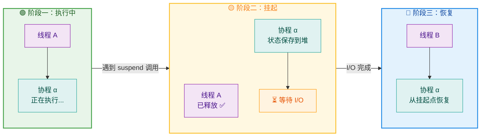

#### 代码演示：挂起 vs 阻塞

```kotlin
import kotlinx.coroutines.*

fun main() = runBlocking {
    // 获取当前线程名称的辅助打印
    println("主协程开始, 线程: ${Thread.currentThread().name}")

    // 启动协程 A
    val jobA = launch(Dispatchers.Default) {
        println("协程A 开始工作, 线程: ${Thread.currentThread().name}")
        delay(2000L)  // ✅ 挂起协程，释放线程！线程可去干别的事
        // 恢复后可能在不同的线程上
        println("协程A 恢复执行, 线程: ${Thread.currentThread().name}")
    }

    // 启动协程 B
    val jobB = launch(Dispatchers.Default) {
        println("协程B 开始工作, 线程: ${Thread.currentThread().name}")
        delay(1000L)  // ✅ 挂起协程，释放线程！
        println("协程B 恢复执行, 线程: ${Thread.currentThread().name}")
    }

    // 等待两个协程都完成
    jobA.join()
    jobB.join()
    println("全部完成")
}
```

可能的输出（线程名称会变化）：

```
主协程开始, 线程: main
协程A 开始工作, 线程: DefaultDispatcher-worker-1
协程B 开始工作, 线程: DefaultDispatcher-worker-2
协程B 恢复执行, 线程: DefaultDispatcher-worker-1   ← 注意！可能换了线程
协程A 恢复执行, 线程: DefaultDispatcher-worker-2   ← 注意！也可能换了线程
全部完成
```

注意观察，协程 B 恢复时所在的线程可能并不是它最初启动时的线程。这正是协程挂起-恢复机制的精妙之处：**协程与线程是解耦的**。线程只是协程的执行载体，协程可以在挂起后被任何空闲线程恢复。

#### 内存视角：状态保存到堆

为了更直观地理解挂起恢复的底层机制，我们来看一下状态是如何保存的：

```java
// ===== 挂起前：协程状态在线程栈上 =====
//
//  线程 A 的栈                        堆内存 (Heap)
//  ┌──────────────┐               ┌───────────────────┐
//  │ localVar = 42│──── 挂起 ───→ │ Continuation 对象  │
//  │ progress = 7 │               │  ├ localVar = 42   │
//  │ label = 0    │               │  ├ progress = 7    │
//  └──────────────┘               │  └ label = 1       │
//  线程 A 被释放，                  └───────────────────┘
//  可以去执行其他协程                  状态安全保存
//
// ===== 恢复后：可能在不同线程上 =====
//
//  线程 B 的栈                        堆内存 (Heap)
//  ┌──────────────┐               ┌───────────────────┐
//  │ localVar = 42│←── 恢复 ────  │ Continuation 对象  │
//  │ progress = 7 │               │  (数据读回栈)       │
//  │ label = 1    │               └───────────────────┘
//  └──────────────┘
//  在线程 B 上继续执行
```

编译器会在编译阶段将每个 `suspend` 函数转化为一个**状态机（State Machine）**，其中 `label` 字段标识当前执行到了哪一个挂起点。恢复时，根据 `label` 的值跳转到正确的位置继续执行——这一切对开发者完全透明。

---

### 协程避免回调地狱

#### 回调地狱（Callback Hell）是什么？

在没有协程的时代，Android 开发者处理多个连续的异步操作时，最常用的模式就是 **回调（Callback）**。当多个异步操作存在依赖关系（后一个操作需要前一个操作的结果）时，代码就会层层嵌套，形成所谓的 **"回调地狱"（Callback Hell）** 或 **"末日金字塔"（Pyramid of Doom）**。

来看一个典型的 Android 场景：先登录，再获取用户信息，再获取用户的订单列表。

```kotlin
// ❌ 回调地狱示例：层层嵌套，可读性极差

// 第一层：登录请求
loginService.login(username, password, object : Callback<Token> {
    override fun onSuccess(token: Token) {
        // 第二层：用 Token 获取用户信息
        userService.getUserInfo(token, object : Callback<UserInfo> {
            override fun onSuccess(userInfo: UserInfo) {
                // 第三层：用用户 ID 获取订单列表
                orderService.getOrders(userInfo.id, object : Callback<List<Order>> {
                    override fun onSuccess(orders: List<Order>) {
                        // 第四层：终于拿到数据，更新 UI
                        runOnUiThread {
                            displayOrders(orders)  // 显示订单
                        }
                    }
                    override fun onFailure(e: Exception) {
                        showError("获取订单失败: ${e.message}")  // 错误处理 3
                    }
                })
            }
            override fun onFailure(e: Exception) {
                showError("获取用户信息失败: ${e.message}")  // 错误处理 2
            }
        })
    }
    override fun onFailure(e: Exception) {
        showError("登录失败: ${e.message}")  // 错误处理 1
    }
})
```

这段代码有以下严重问题：

| 问题 | 描述 |
|---|---|
| **可读性差** | 嵌套层级深，逻辑流向被打散，像"之字形"阅读 |
| **错误处理分散** | 每一层回调都要单独写 `onFailure`，无法统一处理 |
| **难以调试** | 调用栈信息混乱，断点调试困难 |
| **状态管理复杂** | 如果需要在各层之间共享或修改状态，代码更加混乱 |
| **难以拓展** | 如果要在中间插入一步（比如权限校验），需要重新调整所有嵌套层级 |

#### 协程的解法：用同步风格编写异步代码

使用 Kotlin 协程改写上面的例子，代码会变得像写同步逻辑一样清晰：

```kotlin
// ✅ 协程版本：清晰的顺序结构

// 在 ViewModel 或合适的协程作用域中启动
viewModelScope.launch {
    try {
        // 第一步：登录（suspend 函数，挂起等待结果）
        val token = loginService.login(username, password)

        // 第二步：获取用户信息（拿到 token 后继续）
        val userInfo = userService.getUserInfo(token)

        // 第三步：获取订单列表（拿到 userInfo 后继续）
        val orders = orderService.getOrders(userInfo.id)

        // 第四步：更新 UI（如果在 Dispatchers.Main 上就可以直接更新）
        displayOrders(orders)

    } catch (e: Exception) {
        // ✅ 统一的错误处理！任何一步失败都会被捕获
        showError("操作失败: ${e.message}")
    }
}
```

对比一下两者的结构差异：

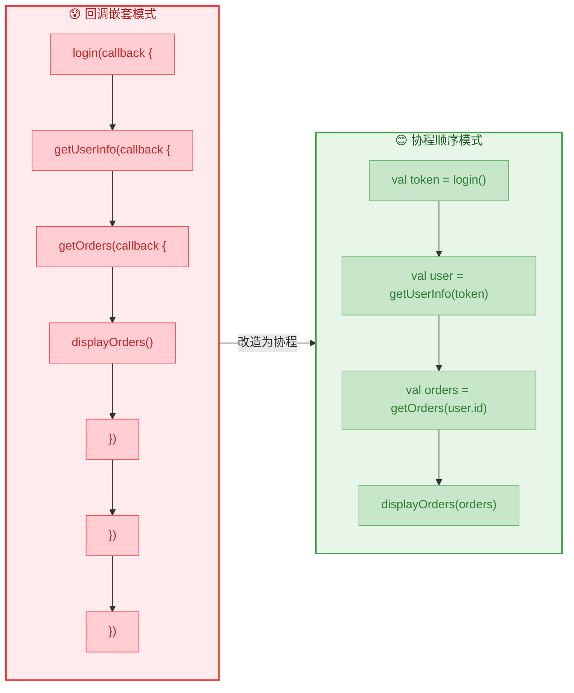

#### 优势全面解析

```kotlin
// ========================================
// 优势 1：并发请求同样简洁
// ========================================

viewModelScope.launch {
    try {
        val token = loginService.login(username, password)

        // 两个请求并发执行！使用 async 同时发起
        val userInfoDeferred = async { userService.getUserInfo(token) }   // 并发请求 1
        val settingsDeferred = async { userService.getSettings(token) }   // 并发请求 2

        // 同时等待两个结果（总耗时 = max(请求1时间, 请求2时间)）
        val userInfo = userInfoDeferred.await()     // 获取用户信息结果
        val settings = settingsDeferred.await()     // 获取设置结果

        // 两个结果都拿到后，更新 UI
        updateUI(userInfo, settings)

    } catch (e: Exception) {
        // 任何一个请求失败都能被统一捕获
        showError(e.message)
    }
}

// ========================================
// 优势 2：超时控制极其简单
// ========================================

viewModelScope.launch {
    try {
        // withTimeout 会在超时后自动取消协程并抛出 TimeoutCancellationException
        val result = withTimeout(5000L) {   // 5 秒超时
            apiService.fetchData()           // 挂起等待
        }
        displayData(result)
    } catch (e: TimeoutCancellationException) {
        showError("请求超时，请重试")  // 超时处理
    } catch (e: Exception) {
        showError("请求失败: ${e.message}")  // 其他异常处理
    }
}

// ========================================
// 优势 3：取消操作自动传播
// ========================================

// 当 ViewModel 被销毁时（如 Activity 销毁）
// viewModelScope 会自动取消所有子协程
// 不需要手动管理回调的注销——再也不会有内存泄漏！
```

#### 回调 vs 协程总结

| 维度 | 回调模式 | 协程模式 |
|---|---|---|
| **代码结构** | 嵌套，缩进层级深 | 扁平，线性顺序 |
| **错误处理** | 每层都要 `onFailure` | 统一 `try-catch` |
| **并发控制** | 极其复杂（`CountDownLatch` 等） | `async / await` 简洁明了 |
| **取消管理** | 手动追踪每个回调引用 | 结构化并发自动传播取消 |
| **超时控制** | 需要额外定时器逻辑 | `withTimeout` 一行搞定 |
| **可维护性** | 差，修改牵一发动全身 | 优，逻辑清晰易修改 |
| **调试体验** | 调用栈难以追踪 | 接近同步代码的调用栈 |

---

**📝 练习题**

以下关于 Kotlin 协程与线程的描述，**错误** 的是？


A. 协程在用户态进行调度，不需要操作系统内核介入，因此上下文切换的开销远小于线程。


B. 一个协程挂起后，底层线程会被释放去执行其他任务；恢复时一定会回到原来的线程上继续执行。


C. 使用协程可以将多层嵌套的回调代码改写为顺序的、类似同步风格的代码，极大提升可读性。


D. 创建 10 万个协程是完全可行的，但创建 10 万个线程大概率会导致 `OutOfMemoryError`。


**【答案】** B

**【解析】** 选项 B 中说"恢复时**一定**会回到原来的线程上继续执行"是错误的。协程恢复时使用哪个线程完全取决于所使用的 **调度器（Dispatcher）**。例如使用 `Dispatchers.Default` 时，协程恢复后会被分配到线程池中**任意一个可用的工作线程**上，不保证与挂起前相同。只有在特定调度器下（如 Android 的 `Dispatchers.Main` 限定了主线程）才能保证恢复到同一线程。其余选项 A（用户态调度开销小）、C（消除回调地狱）、D（协程极轻量）均为正确描述。

---

## 基本使用

Kotlin 协程的核心 API 集中在 `kotlinx.coroutines` 库中。要真正让协程"跑起来"，我们需要掌握三个最基础、也是使用频率最高的构建器（Coroutine Builder）：`launch`、`async` 和 `runBlocking`。它们各自承担不同的职责，适用于不同的场景。理解它们的本质区别，是写好协程代码的第一步。

在深入每个 Builder 之前，我们先从宏观上理解它们在协程体系中的位置：

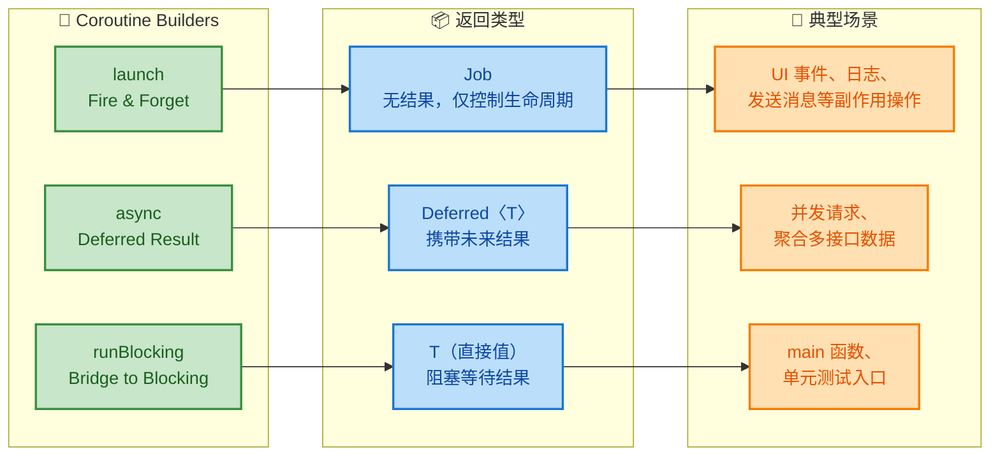

从图中可以清晰看到：三个 Builder 分别返回不同类型，适用于不同的业务场景。接下来逐一深入。

---

### launch（启动协程、无返回值）

`launch` 是最常用的协程构建器，语义上等价于"启动一个后台任务，我不关心它的返回值"。它的设计哲学是 **Fire-and-Forget**（发射后不管）。当你需要执行一段异步逻辑、但不需要拿到计算结果时，`launch` 就是首选。

#### 函数签名解读

```kotlin
// launch 的简化签名
public fun CoroutineScope.launch(
    context: CoroutineContext = EmptyCoroutineContext, // 协程上下文，可指定调度器等
    start: CoroutineStart = CoroutineStart.DEFAULT,    // 启动模式，默认立即调度
    block: suspend CoroutineScope.() -> Unit            // 协程体：一个挂起 Lambda
): Job                                                  // 返回 Job 对象，用于控制生命周期
```

几个要点需要特别注意：

- **`CoroutineScope` 的扩展函数**：`launch` 不是一个独立的顶层函数，它必须在某个 `CoroutineScope` 上调用。这是 Kotlin **结构化并发（Structured Concurrency）** 的基石——每个协程都必须有明确的作用域，从而保证生命周期可控。
- **返回 `Job`**：`Job` 是协程的"句柄"（handle），你可以通过它来取消协程、等待协程完成、查询协程状态，但你 **拿不到协程体内的计算结果**。
- **`block` 是 `suspend` Lambda**：协程体内部可以调用任何挂起函数（如 `delay`、`withContext` 等）。

#### 基础用法

```kotlin
import kotlinx.coroutines.*

fun main() = runBlocking {
    // 在 runBlocking 提供的 CoroutineScope 中启动一个新协程
    val job: Job = launch {
        // 这里是协程体，运行在协程环境中
        println("协程开始执行，当前线程: ${Thread.currentThread().name}")
        delay(1000L)  // 挂起 1 秒，不会阻塞线程
        println("协程恢复执行")
    }

    println("launch 调用后立即执行到这里，不会等待协程完成")

    job.join() // 显式等待协程执行完毕（挂起当前协程，而非阻塞线程）
    println("协程已完成")
}
```

输出结果：

```text
launch 调用后立即执行到这里，不会等待协程完成
协程开始执行，当前线程: main
协程恢复执行
协程已完成
```

这里有一个非常关键的执行顺序问题：为什么 `"launch 调用后立即执行到这里"` 先打印？因为 `launch` 默认采用 `CoroutineStart.DEFAULT` 启动模式，它会 **立即调度**（scheduled）协程，但不会立即执行。在单线程调度器（如 `runBlocking` 的调度器）中，当前协程还没有挂起，所以新协程要排队等待，直到当前协程遇到 `job.join()` 挂起后，新协程才有机会执行。

#### Job 的生命周期

`launch` 返回的 `Job` 对象拥有完整的状态机：

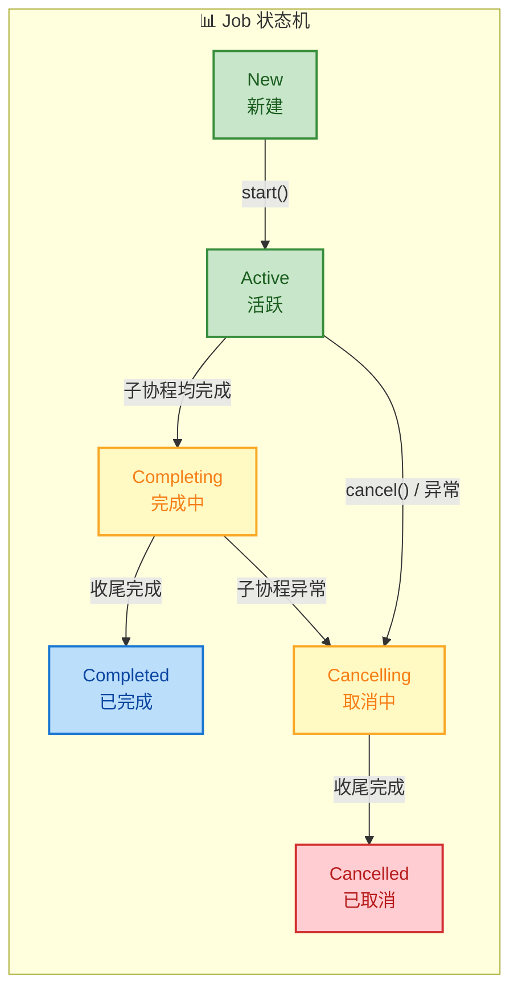

常用的 `Job` 操作：

```kotlin
fun main() = runBlocking {
    val job = launch {
        repeat(1000) { i ->
            println("工作中: $i")
            delay(500L) // 每 500ms 打印一次
        }
    }

    delay(1300L)               // 主协程等待 1.3 秒
    println("准备取消协程...")
    job.cancel()               // 发出取消信号（协程进入 Cancelling 状态）
    job.join()                 // 等待取消流程走完（进入 Cancelled 状态）
    // cancel() + join() 可以合并为：job.cancelAndJoin()
    println("协程已被取消")
}
```

输出：

```text
工作中: 0
工作中: 1
工作中: 2
准备取消协程...
协程已被取消
```

`cancel()` 并不是"强杀"协程，而是一种 **协作式取消（Cooperative Cancellation）**。协程内部必须在某个挂起点（suspension point）检查取消状态才会真正停止。`delay` 天然是一个挂起点，所以它能响应取消。如果你在协程体内做纯 CPU 密集计算而没有任何挂起点，`cancel()` 将不会生效，此时需要手动检查 `isActive` 标志。

#### launch 的启动模式

`CoroutineStart` 提供了四种模式，其中前两种最为常用：

| 模式 | 行为 | 适用场景 |
|:---|:---|:---|
| `DEFAULT` | 立即调度，可在第一个挂起点前被取消 | 绝大多数场景 |
| `LAZY` | 不调度，直到调用 `start()` 或 `join()` 才启动 | 需要延迟启动或条件启动 |
| `ATOMIC` | 立即调度，在第一个挂起点之前不可被取消 | 需要保证初始化代码一定执行 |
| `UNDISPATCHED` | 立即在当前线程执行到第一个挂起点，之后才切换调度器 | 需要立即执行前置逻辑 |

`LAZY` 模式示例：

```kotlin
fun main() = runBlocking {
    // LAZY 模式：创建后不会自动启动
    val lazyJob = launch(start = CoroutineStart.LAZY) {
        println("我是懒启动的协程，现在才开始执行!")
    }

    println("协程已创建，但尚未启动")
    delay(1000L) // 等一秒，证明协程确实没有自动启动

    lazyJob.start() // 显式启动
    delay(100L)      // 给协程一点执行时间
    println("结束")
}
```

---

### async（启动协程、有返回值）

如果说 `launch` 是"做一件事"，那 `async` 就是"做一件事，并且把结果告诉我"。`async` 返回的是 `Deferred<T>`——它继承自 `Job`，同时额外提供了 `await()` 方法来获取协程的计算结果。在概念上，`Deferred` 非常类似于 Java 中的 `Future` / `CompletableFuture`，或者 JavaScript 中的 `Promise`。

#### 函数签名解读

```kotlin
public fun <T> CoroutineScope.async(
    context: CoroutineContext = EmptyCoroutineContext, // 同 launch，可指定调度器
    start: CoroutineStart = CoroutineStart.DEFAULT,    // 同 launch，支持 LAZY 等模式
    block: suspend CoroutineScope.() -> T              // 协程体的最后一个表达式就是返回值
): Deferred<T>                                         // 返回 Deferred，可通过 await() 取值
```

与 `launch` 的关键区别就在于：Lambda 的返回类型从 `Unit` 变成了泛型 `T`，对应的返回对象从 `Job` 升级为 `Deferred<T>`。

#### 基础用法

```kotlin
import kotlinx.coroutines.*

fun main() = runBlocking {
    // async 启动协程，Lambda 最后一行表达式即为返回值
    val deferred: Deferred<String> = async {
        delay(1000L) // 模拟耗时操作
        "Hello from async!" // 这就是返回值（类型自动推断为 String）
    }

    println("async 已启动，等待结果...")

    // await() 是挂起函数——它挂起当前协程，直到 async 协程完成并返回结果
    val result: String = deferred.await()
    println("拿到结果: $result")
}
```

输出：

```text
async 已启动，等待结果...
拿到结果: Hello from async!
```

#### async 的核心价值：并发聚合

`async` 最强大的应用场景是 **并发执行多个独立任务，然后聚合结果**。这在实际开发中极其常见，比如一个页面需要同时请求用户信息、订单列表、推荐内容三个接口。

先看 **串行** 写法（反面教材）：

```kotlin
// ❌ 串行写法：总耗时 = 1s + 1.5s + 0.5s = 3s
suspend fun loadPageSerially() {
    val user = fetchUser()          // 耗时 1s
    val orders = fetchOrders()      // 耗时 1.5s
    val recommend = fetchRecommend() // 耗时 0.5s
    render(user, orders, recommend)
}
```

再看 **并发** 写法（正确姿势）：

```kotlin
// ✅ 并发写法：总耗时 = max(1s, 1.5s, 0.5s) = 1.5s
suspend fun loadPageConcurrently() = coroutineScope {
    // 三个 async 同时启动，并发执行
    val userDeferred = async { fetchUser() }           // 立即启动
    val ordersDeferred = async { fetchOrders() }       // 立即启动
    val recommendDeferred = async { fetchRecommend() } // 立即启动

    // 三个 await 收集结果，总耗时取决于最慢的那个
    val user = userDeferred.await()
    val orders = ordersDeferred.await()
    val recommend = recommendDeferred.await()

    render(user, orders, recommend)
}
```

用时序图更直观地对比：

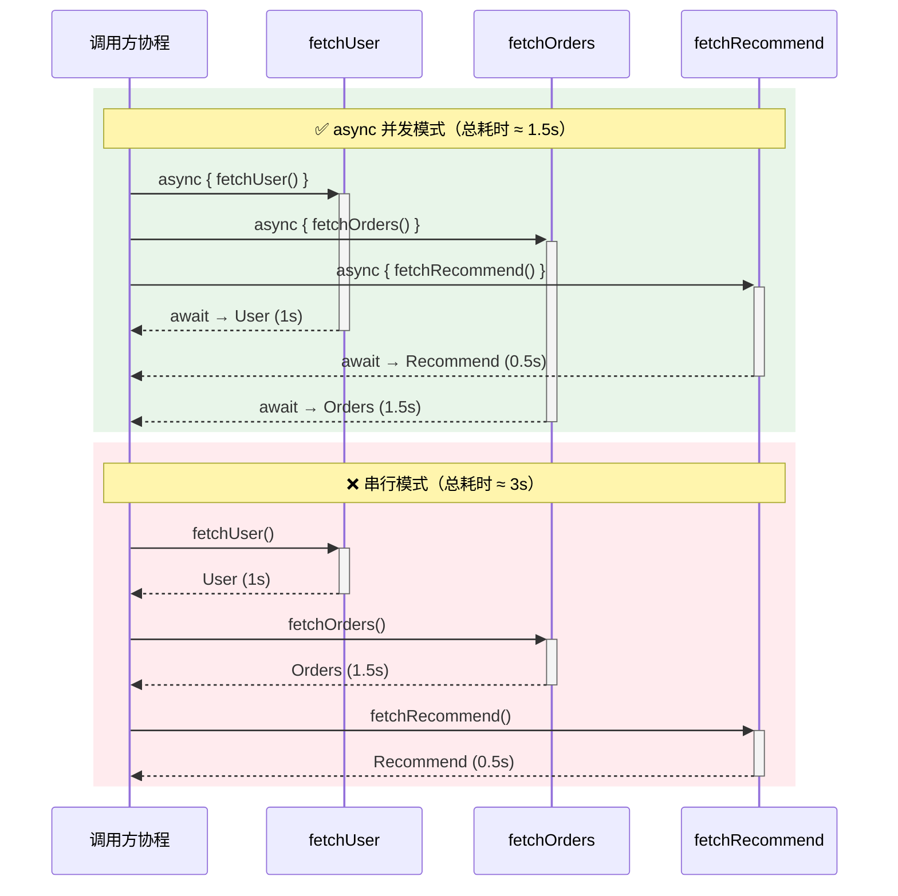

性能差距一目了然：当三个网络请求互不依赖时，并发方案节省了近一半的时间。

#### async 的异常处理

`async` 有一个容易踩坑的地方：**异常的传播时机**。如果 `async` 协程内部抛出异常，该异常不会在 `async` 调用时暴露，而是在调用 `await()` 时才会重新抛出：

```kotlin
fun main() = runBlocking {
    val deferred = async {
        delay(500L)
        throw RuntimeException("async 内部出错了!") // 异常发生在这里
        "永远不会返回"
    }

    // 这一行正常执行，异常还没有暴露
    println("async 已启动")

    try {
        // await() 调用时，异常被重新抛出（rethrown）
        deferred.await()
    } catch (e: RuntimeException) {
        println("捕获到异常: ${e.message}")
    }
}
```

需要注意：虽然 `await()` 会重新抛出异常，但在结构化并发中，**子协程的异常默认会向上传播给父协程**。如果你不想让一个 `async` 的失败影响到其他兄弟协程，需要使用 `SupervisorJob` 或 `supervisorScope`（这属于进阶话题）。

#### launch vs async 速查对比

| 维度 | `launch` | `async` |
|:---|:---|:---|
| 返回类型 | `Job` | `Deferred<T>` |
| 获取结果 | ❌ 无法获取 | ✅ 通过 `await()` |
| 异常行为 | 立即传播给父协程 | `await()` 时抛出 |
| 语义 | Fire-and-Forget | Concurrent + Await |
| 典型场景 | UI 更新、日志、发消息 | 并发网络请求、并行计算 |

---

### runBlocking（阻塞当前线程）

`runBlocking` 是一个特殊的协程构建器——它 **桥接了阻塞世界与协程世界**。与 `launch` / `async` 不同，`runBlocking` 会 **阻塞当前线程** 直到其内部所有协程执行完毕。它的存在意义是让非协程环境（如 `main` 函数、JUnit 测试）能够调用挂起函数。

#### 函数签名解读

```kotlin
public fun <T> runBlocking(
    context: CoroutineContext = EmptyCoroutineContext, // 可选的上下文
    block: suspend CoroutineScope.() -> T              // 协程体
): T                                                   // 直接返回结果（不是 Deferred）
```

注意：`runBlocking` **不是** `CoroutineScope` 的扩展函数，它是一个普通的顶层函数。这意味着你不需要任何协程作用域就可以直接调用它——这正是它作为"入口桥梁"的设计意图。

#### 基础用法

```kotlin
import kotlinx.coroutines.*

// main 函数本身不是协程环境，但 runBlocking 创建了一个
fun main() = runBlocking {
    // runBlocking 的 Lambda 就是一个 CoroutineScope
    // 在这里可以自由调用挂起函数
    println("开始: ${Thread.currentThread().name}")

    delay(1000L) // 挂起协程 1 秒（但 main 线程被 runBlocking 阻塞住）

    println("结束: ${Thread.currentThread().name}")
}
// 整个 main 函数耗时约 1 秒
```

#### runBlocking 的"阻塞"本质

这是最需要深刻理解的一点。`delay(1000L)` 在 `launch` 或 `async` 中是非阻塞挂起，但在 `runBlocking` 中，虽然 **协程本身确实是挂起的**，但 **`runBlocking` 会阻塞宿主线程来等待协程完成**。可以用下面的图来理解：

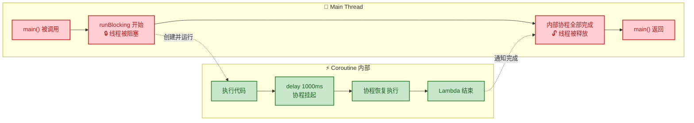

正因为 `runBlocking` 会阻塞线程，所以有一条 **铁律**：

> ⚠️ **绝对不要在生产环境的协程内部嵌套调用 `runBlocking`！** 它会阻塞协程所在的线程，极大地浪费线程资源，在 Android 主线程上甚至会导致 ANR（Application Not Responding）。

`runBlocking` 合法的使用场景非常有限：

| 场景 | 说明 |
|:---|:---|
| `fun main()` 入口 | 最经典用法，让 main 函数等待协程完成 |
| JUnit 测试 | 在测试方法中调用挂起函数（也可以用 `runTest`） |
| 适配阻塞 API | 极少数需要将协程结果同步返回给 Java 阻塞调用的场景 |

#### runBlocking 内嵌 launch / async

`runBlocking` 自身提供了一个 `CoroutineScope`，所以你可以在它内部自由使用 `launch` 和 `async`。`runBlocking` 会等待所有子协程完成后才返回：

```kotlin
fun main() = runBlocking {
    // launch 子协程 1
    launch {
        delay(200L)
        println("子协程 A 完成")
    }

    // launch 子协程 2
    launch {
        delay(100L)
        println("子协程 B 完成")
    }

    // async 子协程 3
    val result = async {
        delay(300L)
        42 // 返回计算结果
    }

    println("等待所有子协程...")
    println("async 结果: ${result.await()}")
    // runBlocking 会自动等待 launch 的子协程
    // 不需要手动 join
}
```

输出：

```text
等待所有子协程...
子协程 B 完成
子协程 A 完成
async 结果: 42
```

`runBlocking` 自动等待所有子协程完成——这就是 **结构化并发** 的体现：父协程（`runBlocking`）不会比任何子协程更早结束。

#### 三大 Builder 综合对比

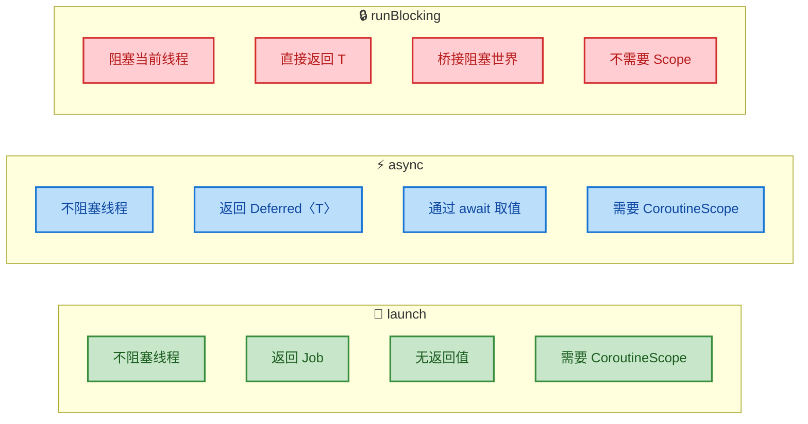

---

**📝 练习题**

以下代码的输出顺序是什么？

```kotlin
fun main() = runBlocking {
    launch {
        delay(200L)
        println("A")
    }

    val result = async {
        delay(100L)
        println("B")
        "Kotlin"
    }

    println("C")
    println(result.await())
    println("D")
}
```

A. C → B → A → Kotlin → D

B. C → B → Kotlin → A → D

C. C → B → Kotlin → D → A

D. B → C → Kotlin → A → D


**【答案】** B

**【解析】** 首先，`launch` 和 `async` 在 `runBlocking` 的单线程调度器中不会立即执行，它们的协程体被调度排队。主协程继续执行到 `println("C")`，打印 **C**。然后遇到 `result.await()`，主协程挂起等待 `async` 完成。此时调度器开始执行排队的协程——`launch`（delay 200ms）和 `async`（delay 100ms）都启动。100ms 后 `async` 恢复，打印 **B**，然后返回 `"Kotlin"`。`await()` 拿到结果，主协程恢复，打印 **Kotlin**。紧接着打印 **D**。但此时 `launch` 的 200ms 延迟尚未结束。再等 100ms 后 `launch` 恢复，打印 **A**。但注意，`runBlocking` 会等待所有子协程完成才退出——所以 **A** 在 **D** 之后、`runBlocking` 返回之前打印。最终顺序：**C → B → Kotlin → D → A**。注意这里 D 在 A 之前，因为 `await()` 只等待 `async`，主协程拿到结果后继续执行 `println("D")`，而此时 `launch` 的 delay 还没到。

---

## suspend 关键字 ⭐⭐

`suspend` 是 Kotlin 协程体系中**最核心的语言级关键字**。它既不是一个注解，也不是一个库函数，而是**编译器深度参与**的语法标记。理解 `suspend` 的本质，等于理解了协程"挂起-恢复"机制的灵魂。一句话概括：**`suspend` 告诉编译器——"这个函数内部可能会暂停执行，请帮我把它改写成状态机"。**

---

### 挂起函数

#### 什么是挂起函数（Suspend Function）

在函数声明前加上 `suspend` 修饰符，该函数就成为了一个**挂起函数**。它表面上和普通函数几乎一样，但在编译期，Kotlin 编译器会对其进行一次深度变换——即所谓的 **CPS 变换（Continuation-Passing Style Transformation）**。

```kotlin
// 一个最简单的挂起函数
suspend fun fetchUserName(): String {
    delay(1000L) // delay 本身也是挂起函数，模拟耗时操作
    return "Claude"
}
```

你可能会问：它看起来和普通函数没区别啊？关键差异隐藏在**编译产物**中。上面的函数经过编译后，其 JVM 字节码签名大致等价于：

```java
// 编译器在参数列表末尾"偷偷"加了一个 Continuation 参数
// 返回值类型也变成了 Object（因为可能返回 COROUTINE_SUSPENDED 标记）
public final Object fetchUserName(Continuation<? super String> $completion) {
    // ... 状态机代码 ...
}
```

这就是 CPS 变换的核心：**编译器把"挂起能力"转化为一个额外的 `Continuation` 回调参数**。`Continuation` 可以理解为一个"书签"，记录着协程挂起时的上下文和恢复点。

#### Continuation 接口的本质

```kotlin
// Kotlin 标准库中 Continuation 的定义
public interface Continuation<in T> {
    // 协程的上下文（调度器、Job 等信息）
    public val context: CoroutineContext
    // 恢复协程执行，传入结果（成功值或异常）
    public fun resumeWith(result: Result<T>)
}
```

每一个挂起函数在编译后，都会接收一个 `Continuation` 实例。当函数需要"挂起"时，它返回一个特殊的哨兵值 `COROUTINE_SUSPENDED`；当异步操作完成后，通过调用 `continuation.resumeWith(result)` 来**恢复**执行。这就是协程"挂起-恢复"的底层契约。

#### 状态机变换（State Machine Transformation）

如果一个挂起函数内部调用了多个挂起点，编译器会将其拆分成**若干个状态（label）**，用一个 `when` 分支来管理执行流：

```kotlin
// 源码：包含两个挂起点的函数
suspend fun loadData(): String {
    val token = fetchToken()   // 挂起点 1
    val data = fetchData(token) // 挂起点 2
    return data
}
```

编译器生成的伪代码（简化版）如下：

```kotlin
// 编译器生成的状态机伪代码
fun loadData(continuation: Continuation<String>): Any? {
    // sm 是编译器生成的 Continuation 子类实例，持有状态和局部变量
    val sm = continuation as? LoadDataContinuation
        ?: LoadDataContinuation(continuation) // 首次调用时包装

    when (sm.label) {
        0 -> {
            sm.label = 1                         // 设置下一个恢复点为状态 1
            val result = fetchToken(sm)          // 将自身传入作为回调
            if (result == COROUTINE_SUSPENDED)   // 如果真的挂起了
                return COROUTINE_SUSPENDED       // 向上传播挂起信号
            // 如果没有挂起（直接返回了结果），继续往下执行
        }
        1 -> {
            val token = sm.result as String      // 从续体中恢复上一步的结果
            sm.label = 2                         // 设置下一个恢复点为状态 2
            val result = fetchData(token, sm)    // 再次传入自身
            if (result == COROUTINE_SUSPENDED)
                return COROUTINE_SUSPENDED
        }
        2 -> {
            return sm.result as String           // 最终结果，返回给调用者
        }
    }
}
```

下面的流程图直观地展示了这个状态机的运转过程：

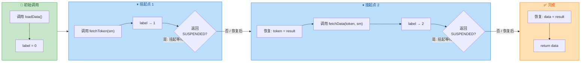

**关键要点**：每个 `suspend` 函数**不会创建新线程**，而是靠编译器把顺序代码拆成状态机，在挂起时交出线程控制权，恢复时从断点继续。这就是协程轻量的根本原因——**一个线程可以在不同协程的状态机之间来回切换**。

---

### 只能在协程或挂起函数中调用

#### 调用限制规则

这是 Kotlin **编译器强制执行**的规则：`suspend` 函数**只能**从以下两种上下文中调用：

1. **另一个 `suspend` 函数内部**
2. **协程构建器的 lambda 体内**（如 `launch { }`, `async { }`, `runBlocking { }`）

如果你在普通函数中直接调用挂起函数，编译器会**立刻报错**：

```kotlin
// ❌ 编译错误！普通函数中不能调用挂起函数
fun main() {
    val name = fetchUserName() // Error: Suspend function 'fetchUserName'
                               // should be called only from a coroutine or
                               // another suspend function
}

// ✅ 正确：在协程构建器中调用
fun main() = runBlocking {
    val name = fetchUserName() // OK，runBlocking 的 lambda 就是挂起上下文
    println(name)
}

// ✅ 正确：在另一个挂起函数中调用
suspend fun greetUser() {
    val name = fetchUserName() // OK，当前函数本身就是 suspend
    println("Hello, $name")
}
```

#### 为什么要有这个限制？

这并非语法层面的任意限制，而是**技术上的必然要求**。回顾前面的 CPS 变换：

```text
编译前：suspend fun fetchUserName(): String
编译后：fun fetchUserName(cont: Continuation<String>): Any?
```

调用一个挂起函数，需要传入一个 `Continuation` 对象。**普通函数没有 `Continuation`**，所以编译器无法为它生成正确的调用代码。只有在协程体或另一个挂起函数中，编译器才能拿到当前的 `Continuation` 实例并自动传入。

整个调用链的 `Continuation` 传递关系如下：

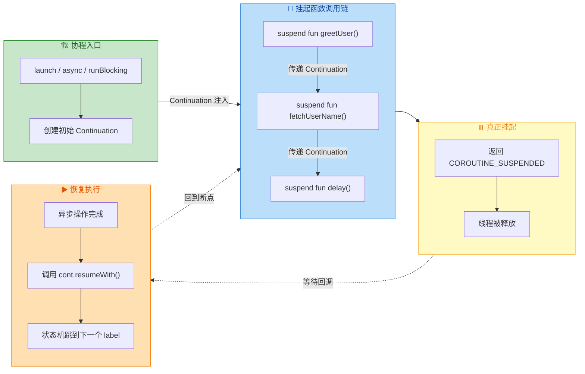

可以看到，`Continuation` 像一条**隐形的接力棒**，从协程入口一路传递到最深层的挂起点。没有这根接力棒，挂起和恢复就无从谈起。

#### 常见误区：`suspend` ≠ 自动切线程

许多初学者以为只要标记了 `suspend`，函数就会"自动在后台线程运行"。这是**完全错误的**：

```kotlin
// ⚠️ 这个函数虽然是 suspend，但内部没有任何挂起操作
// 它会在调用者所在的线程上直接同步执行！
suspend fun computeHash(input: String): String {
    // 这里只有 CPU 密集计算，没有调用任何挂起函数
    return MessageDigest.getInstance("SHA-256")
        .digest(input.toByteArray())
        .joinToString("") { "%02x".format(it) }
}
```

`suspend` 关键字的含义仅仅是：**"这个函数有权挂起协程"**。它并不保证函数一定会挂起，也不保证会切换线程。如果你需要将 CPU 密集型任务搬到后台线程，应该显式使用 `withContext`：

```kotlin
// ✅ 正确做法：使用 withContext 明确指定调度器
suspend fun computeHash(input: String): String =
    withContext(Dispatchers.Default) {      // 切到 Default 线程池（适合 CPU 密集型）
        MessageDigest.getInstance("SHA-256")
            .digest(input.toByteArray())
            .joinToString("") { "%02x".format(it) }
    }
```

---

### 不阻塞线程

#### "挂起"与"阻塞"的本质区别

这是理解协程最关键的一道分水岭。让我们用一个生活化的类比来说明：

| 场景 | 阻塞 (Blocking) | 挂起 (Suspending) |
|------|-----------------|-------------------|
| 类比 | 你在餐厅点完餐后**站在柜台前傻等**，不做任何事 | 你点完餐后**回到座位看书**，叫号时再去取餐 |
| 线程角度 | 线程被占用，什么都做不了，干等 I/O 结果 | 线程被释放，可以去执行其他协程的任务 |
| 资源效率 | **极低**——线程空转浪费 | **极高**——线程充分复用 |

用代码来直观对比：

```kotlin
// ========== 阻塞方式 ==========
fun fetchDataBlocking(): String {
    Thread.sleep(2000) // 🔴 当前线程被冻结 2 秒，完全无法做其他事
    return "data"
}

// ========== 挂起方式（非阻塞） ==========
suspend fun fetchDataSuspending(): String {
    delay(2000) // 🟢 协程挂起 2 秒，但线程立即被释放去处理其他任务
    return "data"
}
```

`Thread.sleep()` 和 `delay()` 都能"等待 2 秒"，但它们的底层行为截然不同：

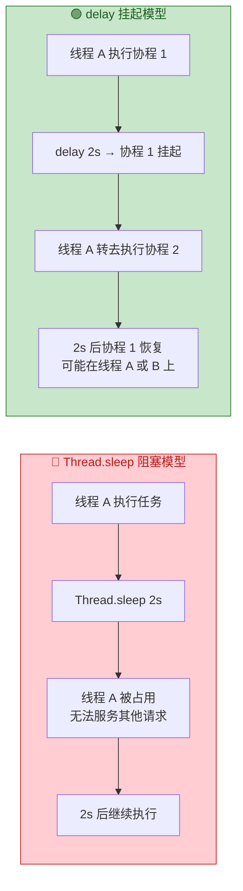

#### 10 万协程 vs 10 万线程

下面这个经典的实验最能说明"非阻塞"带来的巨大优势：

```kotlin
import kotlinx.coroutines.*

fun main() = runBlocking {
    // 启动 10 万个协程，每个挂起 1 秒后打印一个点
    val jobs = List(100_000) {
        launch {
            delay(1000L) // 挂起，不阻塞线程
            print(".")
        }
    }
    jobs.forEach { it.join() } // 等待所有协程完成
    println("\n全部完成！")
}
// ✅ 轻松运行，内存占用极小（几十 MB），几秒内完成
```

同样的逻辑如果用线程来做：

```kotlin
fun main() {
    // 启动 10 万个线程，每个阻塞 1 秒
    val threads = List(100_000) {
        thread {
            Thread.sleep(1000L) // 阻塞线程
            print(".")
        }
    }
    threads.forEach { it.join() }
    println("\n全部完成！")
}
// ❌ 大概率抛出 OutOfMemoryError！
// 每个线程默认占约 1MB 栈空间 → 10万线程 ≈ 100GB 内存
```

#### 为什么挂起不阻塞线程？——深入底层

当协程遇到一个挂起点（如 `delay`），底层发生了如下事情：

```kotlin
// delay 的简化实现原理
suspend fun delay(timeMillis: Long) {
    // suspendCancellableCoroutine 是创建挂起点的标准方式
    suspendCancellableCoroutine<Unit> { continuation ->
        // 1. 向调度器注册一个定时回调（类似 Handler.postDelayed）
        //    不占用任何线程！只是在时间堆里插了一条记录
        scheduler.scheduleResumeAfterDelay(timeMillis, continuation)

        // 2. 这个 lambda 返回后，当前函数返回 COROUTINE_SUSPENDED
        //    线程从协程的状态机中退出，去执行事件循环中的下一个任务
    }
    // 3. 定时器到期后，调度器调用 continuation.resume(Unit)
    //    协程的状态机从断点处恢复执行
}
```

关键在于：**"等待"由调度器的事件循环管理，而非由线程的 sleep 管理**。线程在挂起后可以立即去执行其他就绪的协程。

下面的内存模型图展示了挂起时的对象关系：

```java
// 挂起时的内存引用关系 (简化)
//
// ┌──────────────────────────────┐
// │       CoroutineScheduler     │   ← 调度器（管理线程池）
// │  ┌────────────────────────┐  │
// │  │  TimerHeap (时间堆)     │  │
// │  │  ┌──────────────────┐  │  │
// │  │  │ ResumeTask:       │  │  │
// │  │  │  - resumeTime     │──┼──┼──→ 到期后触发恢复
// │  │  │  - continuation ──┼──┼──┼──→ ┌─────────────────────┐
// │  │  └──────────────────┘  │  │    │  Continuation (书签)  │
// │  └────────────────────────┘  │    │  - label = 1          │
// └──────────────────────────────┘    │  - result = ...       │
//                                     │  - context (调度器等) │
//   ┌──────────────────────┐          └─────────────────────────┘
//   │  Worker Thread        │                    ▲
//   │  （已释放，正在执行    │                    │
//   │   其他协程的任务）     │     到期后调用 resumeWith()
//   └──────────────────────┘
```

可以看到，挂起后**线程被完全释放**。协程的状态（局部变量、执行位置）全部保存在堆上的 `Continuation` 对象中，体积极小（通常几百字节），这就是为什么 10 万个协程只占几十 MB 内存。

#### suspend + 非阻塞 I/O 的实际意义

在服务端场景中（如 Ktor 框架），一个线程在等待数据库查询结果时，如果使用阻塞式 JDBC 调用，这个线程就被浪费了。而使用挂起式的协程驱动（如 R2DBC、Exposed），线程在等待 I/O 时可以去处理其他 HTTP 请求，吞吐量可以**提升数倍**。

在 Android 场景中，如果在主线程使用 `Thread.sleep()` 或其他阻塞调用超过约 5 秒，系统会弹出 **ANR (Application Not Responding)** 对话框。使用协程 + `suspend` 函数则不会有这个问题，因为挂起不会冻结主线程的消息循环（Message Loop）。

---

**📝 练习题**

以下代码的输出结果是什么？

```kotlin
import kotlinx.coroutines.*

fun main() = runBlocking {
    println("1: ${Thread.currentThread().name}")
    
    launch {
        println("2: ${Thread.currentThread().name}")
        delay(100)
        println("3: ${Thread.currentThread().name}")
    }
    
    println("4: ${Thread.currentThread().name}")
}
```

A. `1 → 2 → 3 → 4`


B. `1 → 4 → 2 → 3`


C. `1 → 2 → 4 → 3`


D. 顺序不确定，每次运行都不同


**【答案】** B

**【解析】** `runBlocking` 使用的调度器是 `BlockingEventLoop`，基于单线程事件循环。执行流程如下：

1. `println("1")` 立即执行。
2. `launch` **创建**一个新协程并将其加入事件队列，但**不立即执行**（`launch` 默认使用 `CoroutineStart.DEFAULT`，它只是把协程调度到队列中）。
3. `println("4")` 立即执行——因为当前协程（`runBlocking` 的顶层代码）还没有遇到挂起点，不会让出执行权。
4. 顶层代码执行完毕，事件循环取出 `launch` 的协程开始执行，`println("2")` 输出。
5. `delay(100)` 挂起该协程，100ms 后恢复，`println("3")` 输出。

因此输出顺序固定为 **1 → 4 → 2 → 3**。这道题的核心考点是：**`launch` 不是立即执行子协程的代码，而是将其调度到事件循环的队列中，当前协程会先把自己的同步代码执行完。**

---

## 本章小结

本章围绕 **Kotlin 协程基础** 展开，从「协程是什么」到「怎么用」再到「为什么能挂起而不阻塞」，构建了一条完整的认知链路。在进入更高级的协程主题（如结构化并发、Flow、Channel）之前，请确保以下核心概念已经内化。

---

### 知识全景图

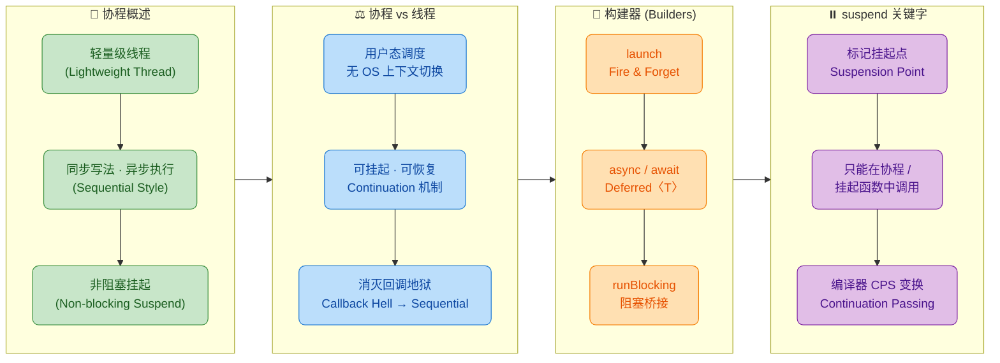

---

### 核心要点速查表

| 维度 | 关键结论 | 一句话记忆 |
|:---|:---|:---|
| **本质** | 协程是 **用户态的可挂起计算实例**，由 Kotlin 编译器 + 协程库协作实现 | "不是线程，胜似线程" |
| **调度** | 协程运行在 **协程调度器（Dispatcher）** 管理的线程池上，一个线程可运行成千上万个协程 | "线程是载体，协程是乘客" |
| **挂起** | `suspend` 函数遇到挂起点时 **释放线程**，恢复时可能在相同或不同线程上继续执行 | "让出而非占有" |
| **launch** | 启动一个 **不返回结果** 的协程，返回 `Job` 用于管理生命周期 | "Fire-and-forget" |
| **async** | 启动一个 **有返回值** 的协程，返回 `Deferred<T>`，通过 `.await()` 获取结果 | "延迟取值" |
| **runBlocking** | **阻塞当前线程** 直到内部所有协程完成，是协程世界与阻塞世界之间的桥梁 | "仅用于 main / 测试" |
| **CPS 变换** | 编译器将 `suspend` 函数转换为携带 `Continuation` 参数的普通函数，实现状态机式的挂起-恢复 | "语法糖背后是状态机" |

---

### 三个构建器的选型决策流

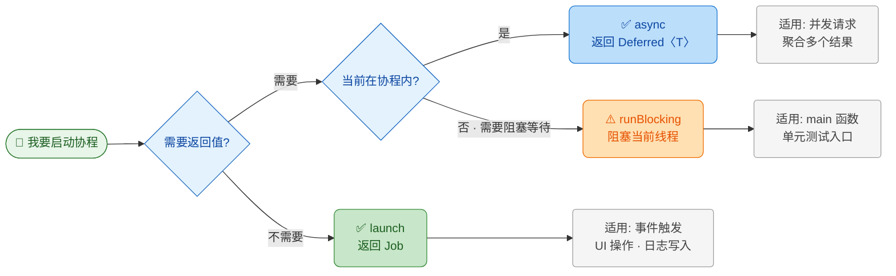

---

### 常见误区澄清

**误区 1：「协程就是轻量的线程」**
协程经常被称为 "lightweight thread"，但它 **不是线程**。线程是操作系统内核调度的实体，拥有独立的栈空间（通常 1–2 MB）；协程只是一段可被挂起和恢复的 **计算逻辑**，它需要 **附着在线程上** 才能执行。更精确的说法是：协程是运行在线程之上的、由 **用户态调度器** 管理的执行单元。

**误区 2：「`suspend` 关键字让函数自动变成异步的」**
`suspend` 只是告诉编译器"这个函数 **可能** 会挂起"，编译器会为其执行 CPS 变换。但如果函数体内部没有调用任何真正的挂起操作（如 `delay`、`withContext`、`yield` 等），它实际上就是一个普通的同步函数，标记为 `suspend` 不会让它变成异步的。

**误区 3：「`runBlocking` 可以在生产环境随意使用」**
`runBlocking` 会 **阻塞调用它的线程**，如果在 Android 主线程或高并发服务端线程中使用，可能导致 UI 卡死或线程池耗尽。它的正确使用场景仅限于：`main` 函数入口、JUnit 测试（在 `kotlinx-coroutines-test` 出现之前）、以及需要桥接同步 API 的极少数场景。

**误区 4：「`async` 一定比 `launch` 好，因为有返回值」**
选用 `async` 还是 `launch` 取决于语义。如果你不需要结果，使用 `async` 却不调用 `await()`，异常会被默默吞掉（存储在 `Deferred` 中而不立即抛出），这反而比 `launch` 更危险——`launch` 中的异常会立刻传播给父协程。

---

### 本章关键 API 速览

```kotlin
// ========== 1. launch ==========
val job: Job = scope.launch(Dispatchers.Default) {
    // 协程体：不返回有意义的值
    // 异常会立即传播给父级
    heavyComputation()
}
job.cancel()  // 取消协程

// ========== 2. async ==========
val deferred: Deferred<String> = scope.async(Dispatchers.IO) {
    // 协程体：最后一行表达式作为返回值
    fetchFromNetwork()          // 返回 String
}
val result: String = deferred.await()  // 挂起等待结果

// ========== 3. runBlocking ==========
fun main() = runBlocking {
    // 阻塞 main 线程，内部可使用 suspend 函数
    val data = async { loadData() }
    println(data.await())
}

// ========== 4. suspend 函数 ==========
suspend fun fetchUser(): User {
    // delay 是 suspend 函数，此处为挂起点
    delay(1000L)                // 挂起 1 秒，不阻塞线程
    return User("Kotlin")      // 恢复后继续执行
}
```

---

### 一张图理解 suspend 的编译变换

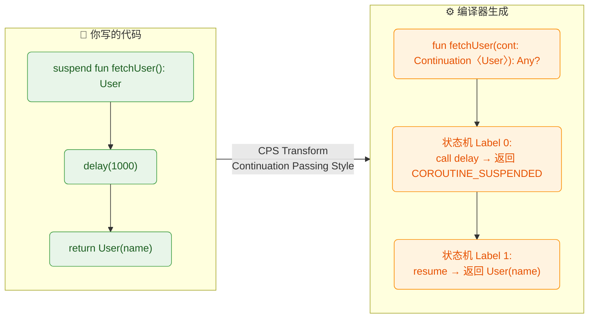

编译器将每个 `suspend` 函数转化为一个 **状态机**：每个挂起点对应一个 `label`，函数通过 `Continuation` 对象保存当前执行状态。当挂起操作完成后，调度器调用 `continuation.resumeWith(result)` 跳到下一个 `label` 继续执行。这就是"非阻塞挂起"的底层真相——**没有魔法，只有状态机**。

---

### 下一步学习建议

掌握本章内容后，建议按以下路径进阶：

| 顺序 | 主题 | 你将学到 |
|:---:|:---|:---|
| 1 | **结构化并发 (Structured Concurrency)** | `CoroutineScope`、`Job` 层级、异常传播、`SupervisorJob` |
| 2 | **调度器 (Dispatchers)** | `Main` / `IO` / `Default` / `Unconfined` 的区别与线程池原理 |
| 3 | **协程取消与超时** | 协作式取消、`isActive`、`withTimeout` / `withTimeoutOrNull` |
| 4 | **Flow 数据流** | 冷流 vs 热流、操作符、`StateFlow` / `SharedFlow` |
| 5 | **Channel 通道** | 协程间通信、`produce` / `actor` 模式 |

---

**📝 练习题 1**

以下代码的输出结果是什么？

```kotlin
fun main() = runBlocking {
    val job = launch {
        println("A")
        delay(200)
        println("B")
    }
    println("C")
    delay(100)
    println("D")
    job.join()
    println("E")
}
```

A. C → A → D → B → E


B. A → C → D → B → E


C. C → D → A → B → E


D. A → B → C → D → E


**【答案】** A

**【解析】**
`runBlocking` 创建一个协程作用域并阻塞 main 线程。`launch` 启动一个新协程，但它是 **异步** 的——不会立即执行协程体，而是将其调度到事件循环中。因此 `println("C")` 先执行。随后当前协程遇到 `delay(100)` 挂起，此时调度器将控制权交给 `launch` 中的协程，打印 `"A"`，接着遇到 `delay(200)` 也挂起。100ms 时 `runBlocking` 主协程恢复，打印 `"D"`。200ms 时 `launch` 协程恢复，打印 `"B"`。最后 `job.join()` 返回（协程已完成），打印 `"E"`。所以顺序是 **C → A → D → B → E**。

---

**📝 练习题 2**

关于 `suspend` 关键字，以下哪项描述是 **错误的**？

A. `suspend` 函数只能在协程体或另一个 `suspend` 函数中被调用


B. 编译器会将 `suspend` 函数通过 CPS 变换为携带 `Continuation` 参数的函数


C. 一个函数只要加上 `suspend` 修饰符，就会自动在后台线程执行，不阻塞调用方线程


D. `suspend` 函数在遇到真正的挂起点时会释放当前线程，恢复后可能在不同线程上继续执行


**【答案】** C

**【解析】**
选项 C 是典型误区。`suspend` 关键字 **不会** 自动切换线程，也不会自动让函数变成异步。它只是标记该函数"有能力被挂起"，编译器据此进行 CPS 变换（选项 B 正确）。如果 `suspend` 函数内部没有调用任何真正的挂起操作（如 `delay`、`withContext`），它就和普通函数一样在调用方所在的线程上同步执行。要切换线程，需要显式使用 `withContext(Dispatchers.IO)` 等 API。选项 A 是语法约束，选项 D 描述了挂起-恢复的线程行为，两者均正确。

---

