---

# 协程异常处理 ⭐⭐⭐

---

## 异常传播 ⭐⭐

在 Kotlin 协程体系中，**异常处理**是编写健壮并发代码的核心能力之一。与传统线程中简单的 `try-catch` 不同，协程拥有**结构化并发 (Structured Concurrency)** 的特性，异常会沿着协程的父子层级关系进行传播。理解异常传播机制，是掌握后续 `CoroutineExceptionHandler`、`SupervisorJob` 等高级主题的基石。

协程的异常传播行为，取决于你使用的**协程构建器 (Coroutine Builder)** 类型。Kotlin 提供了两个最核心的构建器——`launch` 和 `async`，它们在异常传播策略上有着本质区别：

- **`launch`**：异常会**立即向上传播**给父协程（*propagates to the parent*）。
- **`async`**：异常会被**封装 (encapsulated)** 在 `Deferred` 对象中，直到调用 `.await()` 时才抛出。

我们可以用下面这张图来建立一个整体的心智模型：

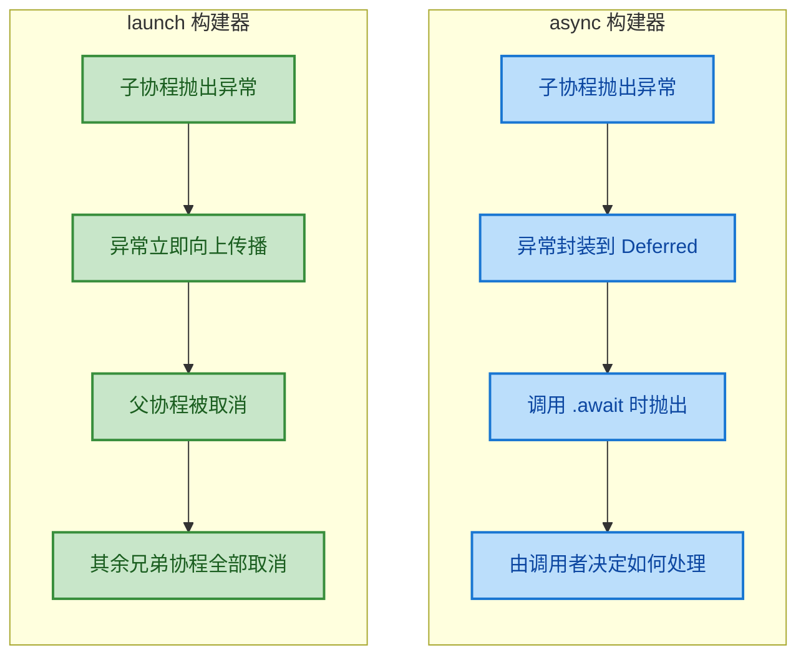

---

### launch（异常传播给父协程）

`launch` 是最常用的协程构建器，它启动一个**不返回结果**的协程（返回类型为 `Job`）。当 `launch` 块内部发生未捕获异常时，协程引擎会按照以下策略处理：

1. **异常发生**：`launch` 内部的代码抛出异常。
2. **自身取消**：当前协程立即被取消（状态变为 *Cancelling*）。
3. **向上传播**：异常被**自动抛给父协程** (*automatically propagated to the parent*)。
4. **连锁反应**：父协程收到异常后，会取消自身及所有其他子协程。

这种行为被称为 **"fire and forget" 式的异常传播**——异常不会被静默吞掉，而是像火灾警报一样沿着协程层级向上蔓延。

来看一个核心示例：

```kotlin
import kotlinx.coroutines.*

fun main() = runBlocking {
    // 这是根协程（父协程），由 runBlocking 启动
    println("父协程开始执行")

    // 使用 launch 启动子协程 A
    val jobA = launch {
        println("子协程 A 开始执行")
        delay(500L) // 模拟一些异步工作
        throw RuntimeException("子协程 A 发生了异常！") // 抛出异常
        // 下面这行永远不会执行
        println("子协程 A 执行完毕")
    }

    // 使用 launch 启动子协程 B
    val jobB = launch {
        try {
            println("子协程 B 开始执行")
            delay(2000L) // 子协程 B 需要更长时间来完成工作
            println("子协程 B 执行完毕") // 这行也不会执行
        } catch (e: CancellationException) {
            // 当父协程因为子协程 A 的异常而取消时，
            // 子协程 B 会收到 CancellationException
            println("子协程 B 被取消了: ${e.message}")
        }
    }

    // 等待子协程 A 完成（它会因异常而完成）
    jobA.join()
    // 等待子协程 B 完成（它会因取消而完成）
    jobB.join()

    // 注意：这行代码也不会执行，
    // 因为父协程 (runBlocking) 自己也会被取消并重新抛出异常
    println("父协程执行完毕")
}
```

运行结果（实际输出顺序可能略有不同）：

```text
父协程开始执行
子协程 A 开始执行
子协程 B 开始执行
子协程 B 被取消了: Parent job is cancelling
Exception in thread "main" java.lang.RuntimeException: 子协程 A 发生了异常！
```

**关键观察**：

- 子协程 A 在 500ms 后抛出异常。
- 该异常**自动传播给父协程** (`runBlocking`)。
- 父协程收到异常后，**取消了还在运行的子协程 B**。
- 子协程 B 中的 `delay()` 是一个挂起函数，它是**可取消的 (cancellable)**，因此会抛出 `CancellationException`。
- 最终，父协程自己也因为这个异常而终止，程序崩溃。

我们用一张时序图来可视化这个传播过程：

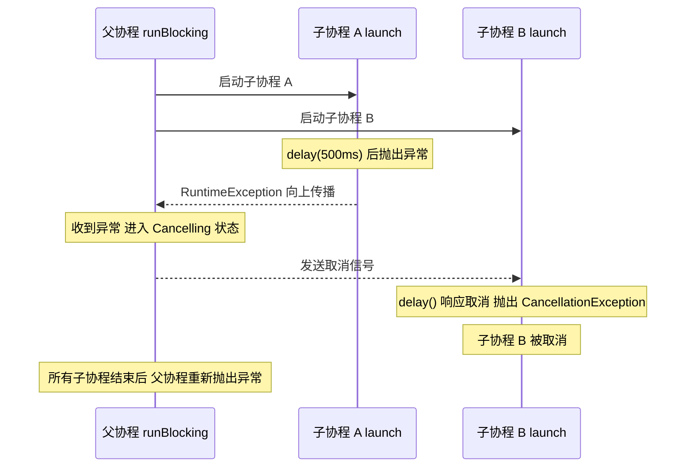

#### launch 中的 try-catch 陷阱

很多初学者会尝试在**外部**用 `try-catch` 来捕获 `launch` 内部的异常，但这是**无效的**：

```kotlin
import kotlinx.coroutines.*

fun main() = runBlocking {
    try {
        // try-catch 包裹 launch 调用
        // 这里只能捕获「启动协程」这个动作本身的异常
        // 而不能捕获协程内部运行时的异常
        launch {
            throw RuntimeException("launch 内部异常")
        }
    } catch (e: Exception) {
        // ❌ 这里捕获不到！因为异常不是在调用 launch 的那一刻抛出的，
        // 而是在协程体执行期间抛出，并通过结构化并发的机制向上传播
        println("捕获到异常: ${e.message}")
    }
}
// 程序仍然会崩溃！
```

**正确做法**是在 `launch` **内部**使用 `try-catch`：

```kotlin
import kotlinx.coroutines.*

fun main() = runBlocking {
    val job = launch {
        try {
            // 在协程体内部进行 try-catch
            throw RuntimeException("launch 内部异常")
        } catch (e: Exception) {
            // ✅ 在这里可以成功捕获异常
            println("在协程内部捕获到异常: ${e.message}")
        }
    }

    job.join() // 等待子协程完成
    println("父协程正常结束") // ✅ 这行会正常执行
}
```

输出：

```text
在协程内部捕获到异常: launch 内部异常
父协程正常结束
```

> **核心原则**：`launch` 的异常传播是**自动的、不可阻挡的**（除非在协程体内部处理）。一旦异常逃逸出 `launch` 块，它就会按照结构化并发的规则向上冒泡。

---

### async（异常在 await 时抛出）

`async` 是另一个核心协程构建器，它启动一个**有返回值**的协程（返回类型为 `Deferred<T>`，本质上是一个带结果的 `Job`）。`async` 的异常传播策略与 `launch` 截然不同：

1. **异常发生**：`async` 内部的代码抛出异常。
2. **异常封装**：异常不会立即传播，而是被**存储 (stored)** 在返回的 `Deferred` 对象中。
3. **延迟抛出**：只有当调用者调用 `.await()` 获取结果时，异常才会被**重新抛出 (re-thrown)**。

这种设计是合理的——既然 `async` 的目的是"异步计算并返回结果"，那么异常就是计算的一种"特殊结果"，应该在你**消费结果的那一刻**才暴露出来。

> ⚠️ **重要前提**：上述"延迟抛出"行为仅在 `async` 作为**根协程 (root coroutine)** 时完全成立。当 `async` 作为子协程运行在结构化并发中时，异常**仍然会向上传播给父协程**，这一点我们稍后详细说明。

#### 基本用法：await 时捕获异常

```kotlin
import kotlinx.coroutines.*

fun main() = runBlocking {
    // 使用 async 启动一个会失败的异步计算
    // 注意：这里使用 supervisorScope 来隔离异常传播（后续章节详解）
    // 这样 async 的异常不会自动传给父协程
    supervisorScope {
        val deferred = async {
            println("async 协程开始计算...")
            delay(300L) // 模拟耗时计算
            throw ArithmeticException("除零错误！") // 计算过程中发生异常
            // 下面这行不会执行
            42 // 正常情况下应该返回的值
        }

        // async 协程已经启动并失败了，但这里不会崩溃
        println("async 已启动，还没调用 await")
        delay(500L) // 等一会儿，让 async 协程有时间失败

        // 直到调用 .await() 的时候，异常才会被抛出
        try {
            val result = deferred.await() // ❗ 异常在这里被重新抛出
            println("结果: $result") // 这行不会执行
        } catch (e: ArithmeticException) {
            // ✅ 可以在 await 调用处捕获异常
            println("在 await 处捕获到异常: ${e.message}")
        }
    }

    println("程序正常结束")
}
```

输出：

```text
async 协程开始计算...
async 已启动，还没调用 await
在 await 处捕获到异常: 除零错误！
程序正常结束
```

**关键观察**：

- `async` 协程在 300ms 后就已经失败了。
- 但在 500ms 的 `delay` 期间，程序**没有崩溃**。
- 异常被"冷冻"在 `Deferred` 对象中，直到 `await()` 调用时才解冻抛出。
- 我们可以在 `await()` 调用处使用 `try-catch` 正常捕获。

#### 关键陷阱：async 作为子协程时的双重传播

这是一个**非常容易踩坑**的地方。当 `async` 在结构化并发中作为**子协程**运行时，它的异常其实有**两条传播路径**：

1. **路径 A**：异常存储在 `Deferred` 中 → 在 `await()` 时抛出。
2. **路径 B**：异常**同时向上传播给父协程** → 触发父协程取消（和 `launch` 一样！）。

```kotlin
import kotlinx.coroutines.*

fun main() = runBlocking {
    // async 作为 runBlocking 的子协程
    val deferred = async {
        throw RuntimeException("async 子协程异常")
    }

    try {
        deferred.await() // 尝试在 await 处捕获
    } catch (e: Exception) {
        println("捕获到: ${e.message}")
    }

    // ❌ 即使 await 处 catch 了，父协程仍然会因为路径 B 而崩溃！
    println("这行可能不会执行")
}
```

这段代码的行为可能让人困惑——明明 `catch` 了，为什么还是崩溃？原因就在于**路径 B 的传播先于或独立于路径 A**。异常已经通过结构化并发机制传递给了父协程 `runBlocking`，父协程会在所有子协程完成后重新抛出。

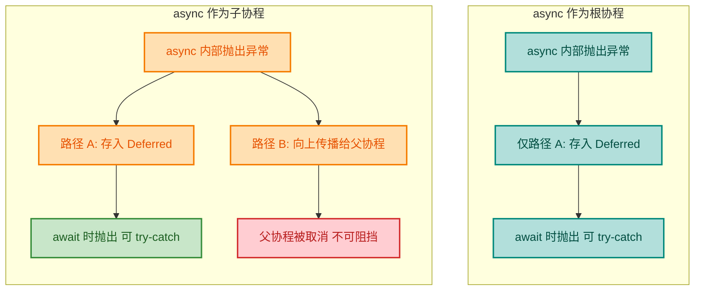

#### 如何安全使用 async

如果你希望 `async` 的异常**仅通过 `await()` 暴露**，而不触发结构化并发的级联取消，有两种常见方案：

**方案 1：使用 `supervisorScope`**（推荐，后续章节详解）

```kotlin
import kotlinx.coroutines.*

fun main() = runBlocking {
    supervisorScope {
        // 在 supervisorScope 中，子协程的异常不会向上传播
        val deferred = async {
            throw RuntimeException("安全的 async 异常")
        }

        try {
            deferred.await() // 异常仅在这里抛出
        } catch (e: Exception) {
            println("安全捕获: ${e.message}") // ✅ 正常工作
        }
    }
    println("父协程安全结束") // ✅ 正常执行
}
```

**方案 2：使用 `coroutineScope` + 内部 `try-catch`**

```kotlin
import kotlinx.coroutines.*

fun main() = runBlocking {
    val deferred = async {
        try {
            throw RuntimeException("内部处理的异常")
        } catch (e: Exception) {
            // 在 async 内部就处理掉异常，不让它逃逸
            println("async 内部处理: ${e.message}")
            -1 // 返回一个兜底值
        }
    }

    val result = deferred.await() // 安全获取结果
    println("结果: $result") // 输出: 结果: -1
}
```

#### launch vs async 异常传播对比总结

| 特性 | `launch` | `async` |
|---|---|---|
| 返回类型 | `Job` | `Deferred<T>` |
| 异常传播时机 | **立即**向上传播给父协程 | **延迟**到 `await()` 时抛出 |
| 外部 `try-catch` | ❌ 无法在 `launch` 外部捕获 | ✅ 可以在 `await()` 处捕获 |
| 作为子协程时 | 异常传播给父协程 | 异常**同时**传播给父协程 + 存入 `Deferred` |
| 适用场景 | "发射后不管"的后台任务 | 需要返回计算结果的异步任务 |
| 异常处理推荐方式 | 协程体内部 `try-catch` 或 `CoroutineExceptionHandler` | `await()` 处 `try-catch`（配合 `supervisorScope`） |

> **总结一句话**：`launch` 像一颗"哑弹"，异常一触即发、向上蔓延；`async` 像一颗"定时炸弹"，异常被封装起来，直到你拆开 (`await`) 才爆炸。但在结构化并发中，**两者都会把异常传递给父协程**，这是结构化并发的核心设计——**没有异常可以被静默丢失** (*No exception is silently lost*)。

---

**📝 练习题**

以下代码的运行结果是什么？

```kotlin
import kotlinx.coroutines.*

fun main() = runBlocking {
    val deferred = async {
        println("Step 1")
        throw IllegalStateException("boom")
        println("Step 2")
    }

    delay(100)
    println("Step 3")

    try {
        deferred.await()
    } catch (e: Exception) {
        println("Caught: ${e.message}")
    }

    println("Step 4")
}
```

A. Step 1 → Step 3 → Caught: boom → Step 4


B. Step 1 → Step 3 → Caught: boom → 程序因异常崩溃


C. Step 1 → 程序立即因异常崩溃


D. Step 1 → Step 2 → Step 3 → Step 4


**【答案】** B

**【解析】** `async` 作为 `runBlocking` 的**子协程**运行时，异常存在双重传播路径。路径 A 让异常在 `await()` 处被 `catch` 捕获到，因此会打印 `Caught: boom`。但同时，路径 B 让异常通过结构化并发向上传播给了 `runBlocking`。尽管 `await` 处的 `catch` 能拦截路径 A，但无法阻止路径 B 对父协程的影响。因此 `Step 3` 和 `Caught: boom` 都能打印出来（因为 `await` 处的 `try-catch` 确实捕获了），但 `Step 4` 之后 `runBlocking` 会因为收到子协程传播过来的异常而最终崩溃。注意 `Step 2` 永远不会打印，因为 `throw` 之后的代码不可达。实际运行中 `Step 4` 可能会打印也可能不会，取决于异常传播和协程调度的时序，但程序最终一定会以异常结束。选 B 是最准确的描述。

---

## 异常传播规则 ⭐⭐

在上一节中，我们已经知道 `launch` 和 `async` 对异常的处理策略截然不同。但这仅仅是"单个协程"层面的行为。当多个协程以**父子层级**组织在一起时，异常会沿着 **Structured Concurrency（结构化并发）** 的树形结构进行传播，触发一连串的连锁反应。理解这套传播规则，是掌握协程异常处理的核心关键。

### 子协程异常 → 取消其他子协程 → 取消父协程

这是 Kotlin 协程异常传播中最重要、也最容易让初学者困惑的规则。其核心可以概括为一句话：

> **任何一个子协程的未捕获异常，都会导致整个协程树的崩塌。**

这个过程分为严格的三个阶段，我们逐步拆解。

#### 阶段一：子协程自身失败（Child Fails）

当一个子协程内部抛出未捕获的异常时，该子协程**立即进入 Cancelling 状态**，自身的所有工作停止。此时异常还没有扩散，仅限于该子协程内部。

#### 阶段二：异常向上传播，父协程被取消（Propagate to Parent）

子协程不会"默默死去"。它会**将异常传递给父协程（Parent Coroutine）**。父协程收到异常后，自身也进入 Cancelling 状态。这是 Structured Concurrency 的设计哲学——**父协程对其所有子协程的生命周期负责**。如果一个孩子出了问题，父亲也必须知道并做出反应。

#### 阶段三：父协程取消所有其他子协程（Cancel Siblings）

父协程在进入 Cancelling 状态的同时，会**向所有其他仍在运行的子协程发送取消信号**。这些兄弟协程（Sibling Coroutines）将抛出 `CancellationException` 并终止执行。最终，整棵协程树从出错的那个节点开始，**自下而上全部坍塌**。

我们用一段完整的代码来观察这个过程：

```kotlin
import kotlinx.coroutines.*

fun main() = runBlocking {
    // 创建一个父协程作用域
    val parentJob = launch {
        // 子协程 A：将在 200ms 后抛出异常
        val childA = launch {
            println("子协程 A 启动")
            delay(200)
            // 这里抛出一个未捕获的异常
            throw RuntimeException("子协程 A 爆炸了！")
        }

        // 子协程 B：正常执行，需要 1000ms
        val childB = launch {
            try {
                println("子协程 B 启动")
                // 子协程 B 试图做一个耗时操作
                delay(1000)
                // ⚠️ 这一行永远不会执行！
                println("子协程 B 完成")
            } catch (e: CancellationException) {
                // 子协程 B 被父协程取消时，会捕获到 CancellationException
                println("子协程 B 被取消: ${e.message}")
            }
        }

        // 子协程 C：正常执行，需要 1500ms
        val childC = launch {
            try {
                println("子协程 C 启动")
                delay(1500)
                // ⚠️ 这一行同样永远不会执行！
                println("子协程 C 完成")
            } catch (e: CancellationException) {
                println("子协程 C 被取消: ${e.message}")
            }
        }
    }

    // 等待父协程结束（包含异常退出的情况）
    try {
        parentJob.join()
    } catch (e: Exception) {
        println("父协程异常: ${e.message}")
    }

    println("程序结束")
}
```

运行输出（顺序可能略有变化）：

```
子协程 A 启动
子协程 B 启动
子协程 C 启动
子协程 B 被取消: Parent job is Cancelling
子协程 C 被取消: Parent job is Cancelling
Exception in thread "main" java.lang.RuntimeException: 子协程 A 爆炸了！
```

关键观察点：

- 子协程 B 和 C 都**没有**完成自己的工作，它们在 `delay` 处被取消。
- 取消原因是 `"Parent job is Cancelling"`——说明是**父协程**发起的取消操作。
- 最终异常 `RuntimeException` 向上一路传播直到顶层。

下面这张 Mermaid 图完整展示了异常传播的三阶段链式反应：

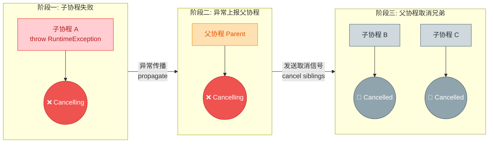

#### 异常传播的精确时序

为了更深入地理解，我们用时序图展示父、子协程之间的交互过程：

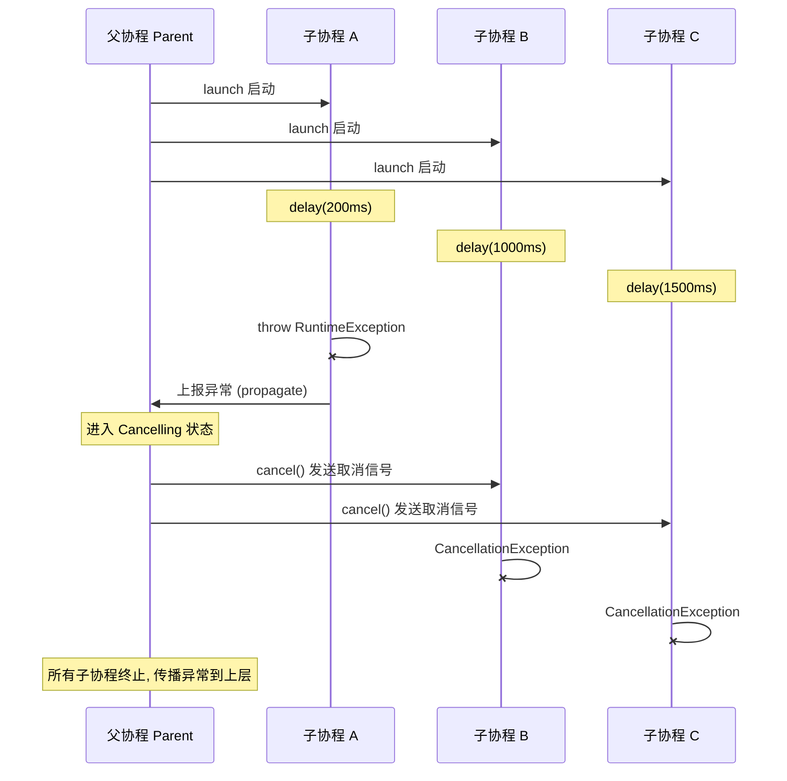

#### 为什么要设计成"一个子协程失败，全部取消"？

这是 Structured Concurrency 最核心的设计原则之一。它的哲学根基是：**并发的子任务通常属于同一个逻辑工作单元**。

举一个直观的例子：假设你要加载一个页面，需要同时请求"用户信息"和"订单列表"两个接口。如果"用户信息"请求失败了，那"订单列表"即使成功返回也毫无意义——因为你根本没法正确渲染页面。与其让"订单列表"的协程继续白白占用资源，不如立即取消它。

```kotlin
// 模拟一个实际场景：页面数据加载
suspend fun loadPage() = coroutineScope {
    // 两个请求属于同一个逻辑单元
    val userInfo = async { fetchUserInfo() }     // 请求用户信息
    val orderList = async { fetchOrderList() }   // 请求订单列表

    // 如果 fetchUserInfo 抛异常：
    // 1. userInfo 这个 async 协程失败
    // 2. 异常传播给 coroutineScope（充当父协程）
    // 3. coroutineScope 取消 orderList（没必要继续了）
    // 4. 整个 loadPage 函数抛出异常

    // 只有两个都成功，才有意义
    renderPage(userInfo.await(), orderList.await())
}
```

这种"**fail-fast**"策略确保了：
- **不会出现资源泄漏**：没有协程在后台无意义地运行。
- **错误不会被静默吞掉**：每个异常都会被看到、被处理。
- **状态一致性**：不会出现"半成功"的尴尬状态。

---

### 双向传播

前面我们讨论的是**自下而上**的传播：子协程失败 → 通知父协程 → 父协程取消其他子协程。但 Kotlin 协程的异常传播实际上是**双向（Bidirectional）** 的。

所谓双向传播，指的是：

| 传播方向 | 触发场景 | 行为 |
|:---------|:---------|:-----|
| **向上传播（Child → Parent）** | 子协程发生未捕获异常 | 子协程把异常上报给父协程，父协程进入 Cancelling |
| **向下传播（Parent → Children）** | 父协程被取消或发生异常 | 父协程取消自己所有的子协程 |

这两个方向形成了一个**闭环**：子协程出事 → 父协程出事 → 所有其他子协程也出事。

#### 向下传播的独立触发

向下传播并不一定要由子协程的异常触发。父协程**自身被取消**（例如被外部调用了 `cancel()`）时，也会向下传播取消信号：

```kotlin
import kotlinx.coroutines.*

fun main() = runBlocking {
    val parentJob = launch {
        // 子协程 X：持续运行
        val childX = launch {
            try {
                println("子协程 X 开始运行")
                // 持续运行的循环
                repeat(100) { i ->
                    println("子协程 X 正在工作: $i")
                    delay(100)
                }
            } catch (e: CancellationException) {
                // 父协程取消时，子协程收到 CancellationException
                println("子协程 X 被取消")
            }
        }

        // 子协程 Y：持续运行
        val childY = launch {
            try {
                println("子协程 Y 开始运行")
                delay(5000)
            } catch (e: CancellationException) {
                println("子协程 Y 被取消")
            }
        }
    }

    // 等待 350ms 后，直接从外部取消父协程
    delay(350)
    println("--- 外部取消父协程 ---")
    // 取消父协程 → 触发向下传播 → 所有子协程被取消
    parentJob.cancel()
    parentJob.join()

    println("程序结束")
}
```

输出：

```
子协程 X 开始运行
子协程 X 正在工作: 0
子协程 X 正在工作: 1
子协程 X 正在工作: 2
子协程 Y 开始运行
--- 外部取消父协程 ---
子协程 X 被取消
子协程 Y 被取消
程序结束
```

#### 双向传播的完整模型

让我们用一张全景图把**双向传播**整合起来：

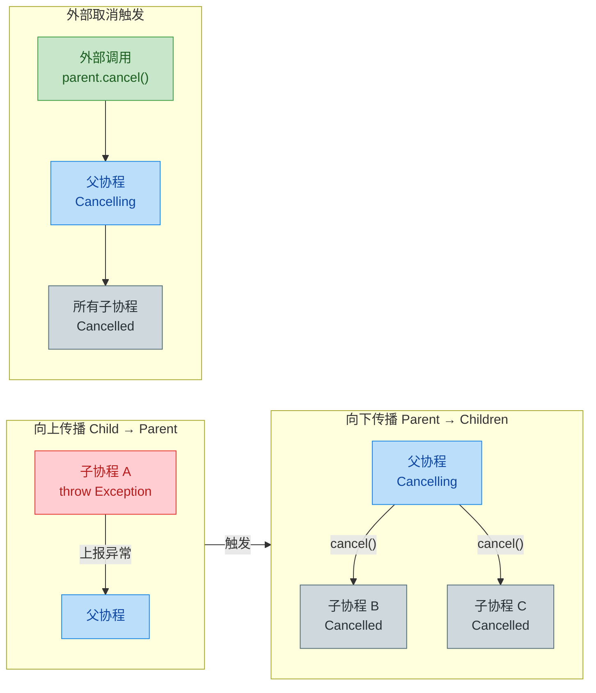

#### 关键区别：取消（Cancellation）vs 异常（Exception）

在双向传播中，有一个非常重要的细节需要区分：

| 类型 | 传播行为 | 是否触发向上传播 |
|:-----|:---------|:----------------|
| **普通异常**（如 `RuntimeException`） | 子 → 父 → 兄弟，**整树坍塌** | ✅ 是 |
| **CancellationException** | 仅取消当前协程及其子协程，**不向上传播** | ❌ 否 |

这是一个至关重要的设计决策：**`CancellationException` 被特殊对待**。当一个子协程因为 `CancellationException` 而结束时，父协程会认为这是一次"正常的取消操作"，不会将其视为错误，也不会连锁取消其他子协程。

```kotlin
import kotlinx.coroutines.*

fun main() = runBlocking {
    val parent = launch {
        val childA = launch {
            println("子协程 A 启动")
            delay(200)
            // 抛出 CancellationException —— 这只会取消自己
            // 不会影响父协程和兄弟协程！
            throw CancellationException("A 主动取消自己")
        }

        val childB = launch {
            println("子协程 B 启动")
            delay(500)
            // ✅ 这一行会正常执行！
            println("子协程 B 正常完成")
        }
    }

    parent.join()
    println("父协程正常结束")
}
```

输出：

```
子协程 A 启动
子协程 B 启动
子协程 B 正常完成
父协程正常结束
```

可以看到，子协程 A 抛出 `CancellationException` 后，子协程 B **不受任何影响**，父协程也**正常结束**。这与抛出 `RuntimeException` 时整树崩塌的行为完全不同。

#### 用一句话总结双向传播

> **普通异常向上传播（子→父）后再向下扩散（父→兄弟），形成"连锁反应"摧毁整棵树；`CancellationException` 只向下传播（当前→子），是"局部手术"。**

下面用一个对比图来强化记忆：

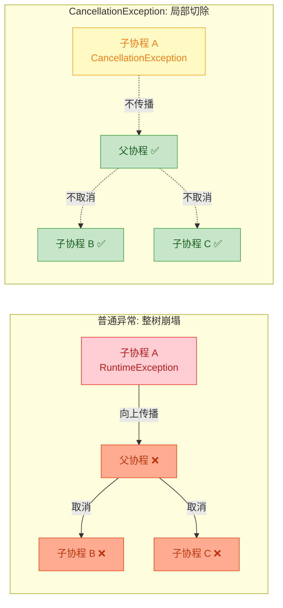

#### 传播规则在 coroutineScope 与 runBlocking 中的表现

最后需要注意的是，不同的**作用域构建器（Scope Builder）** 对异常传播也有微妙差异：

- **`coroutineScope`**：子协程异常会**重新抛出**（rethrow）给调用者。它是一个"透明的容器"——异常穿透它传给外层。本质上，`coroutineScope` 创建的 Job 严格遵循双向传播规则。

- **`runBlocking`**：子协程异常也会向上传播，最终在 `runBlocking` 所在的线程以 **未捕获异常** 的形式抛出，通常导致程序崩溃。

- **`supervisorScope`**（下一节详述）：打破了"向上传播"的链条，子协程异常**不会**取消父协程和兄弟协程。

```kotlin
import kotlinx.coroutines.*

// coroutineScope 的行为：异常穿透
suspend fun demo() = coroutineScope {
    launch {
        delay(100)
        throw RuntimeException("boom")
        // 这个异常会穿透 coroutineScope
        // 最终在 demo() 的调用处以 RuntimeException 抛出
    }
    launch {
        delay(500)
        // 不会执行到这里
        println("我不会出现")
    }
}

fun main() = runBlocking {
    try {
        // 调用 demo()，异常从 coroutineScope 穿透出来
        demo()
    } catch (e: RuntimeException) {
        // 在这里捕获异常
        println("捕获到异常: ${e.message}")  // 输出: 捕获到异常: boom
    }
}
```

这个例子展示了 `coroutineScope` 作为"透明容器"的特性：内部的异常完整地传递到了 `try-catch` 中，调用者可以优雅地处理它。

---

**📝 练习题**

以下代码的输出结果是什么？

```kotlin
fun main() = runBlocking {
    val parent = launch {
        val childA = launch {
            delay(100)
            throw CancellationException("A cancelled")
        }
        val childB = launch {
            delay(200)
            println("B done")
        }
        childA.join()
        childB.join()
        println("Parent done")
    }
    parent.join()
    println("End")
}
```

A. 程序崩溃，抛出 CancellationException


B. 输出 `B done`、`Parent done`、`End`


C. 输出 `B done`、`End`（没有 `Parent done`）


D. 只输出 `End`


**【答案】** B

**【解析】** `CancellationException` 是协程取消的特殊标志，它**不会向上传播**给父协程。子协程 A 抛出 `CancellationException` 后，仅自身被取消，父协程和子协程 B 均不受影响。因此子协程 B 正常执行并输出 `B done`，`childA.join()` 正常返回（不会重新抛出 `CancellationException`），之后 `childB.join()` 等待 B 完成，最后父协程输出 `Parent done`，顶层输出 `End`。这道题的核心考点就是 **`CancellationException` 与普通异常在传播行为上的本质区别**。


---

## CoroutineExceptionHandler ⭐

在前面的章节中，我们已经知道协程异常会沿着层级结构向上传播，最终导致整棵协程树崩溃。那么有没有一种"最后的安全网"（last resort），让我们能在异常即将导致程序崩溃之前，统一地捕获并处理它呢？答案就是 `CoroutineExceptionHandler`。

`CoroutineExceptionHandler` 是一个 **CoroutineContext 元素**（implements `CoroutineContext.Element`），它的定位类似于 Thread 的 `Thread.UncaughtExceptionHandler`——当一个协程中发生了**未被捕获的异常**（uncaught exception），并且这个异常已经完成了在协程层级中的传播流程后，`CoroutineExceptionHandler` 会作为**最终兜底**机制被调用。需要特别强调的是：它并**不会阻止**异常的传播和协程树的取消，它只是让你有机会**记录日志、上报 Crash、做善后清理**等操作。

```kotlin
// CoroutineExceptionHandler 的接口定义
public interface CoroutineExceptionHandler : CoroutineContext.Element {
    // companion object 就是它的 CoroutineContext.Key
    public companion object Key : CoroutineContext.Key<CoroutineExceptionHandler>

    // 当未捕获异常发生时，该方法被调用
    // context: 发生异常的协程的上下文
    // exception: 未捕获的异常对象
    public fun handleException(context: CoroutineContext, exception: Throwable)
}
```

创建一个 `CoroutineExceptionHandler` 实例非常简单，Kotlin 提供了一个同名的工厂函数：

```kotlin
// 使用工厂函数创建 CoroutineExceptionHandler
val handler = CoroutineExceptionHandler { context, exception ->
    // context: 协程上下文，可以从中取出 CoroutineName 等信息
    // exception: 未捕获的异常
    println("捕获到异常: ${exception.message}")
    println("协程名: ${context[CoroutineName]}")
}
```

---

### 全局异常处理

`CoroutineExceptionHandler` 最核心的用途就是**全局异常处理**（Global Exception Handling）。所谓"全局"，是指它不像 `try-catch` 那样只保护某一段代码块，而是可以**覆盖整个协程作用域**内所有未被捕获的异常。

来看一个完整的使用示例：

```kotlin
import kotlinx.coroutines.*

fun main() = runBlocking {
    // 1. 创建一个 CoroutineExceptionHandler
    val handler = CoroutineExceptionHandler { _, exception ->
        // 当未捕获异常到达这里时，进行统一处理
        println("全局异常处理器捕获: ${exception.message}")
    }

    // 2. 将 handler 安装到一个根协程上
    val job = GlobalScope.launch(handler) {
        // 3. 在协程内部抛出异常
        throw ArithmeticException("除零错误")
    }

    // 4. 等待协程完成
    job.join()

    println("程序继续运行") // 这行会正常执行
}
// 输出:
// 全局异常处理器捕获: 除零错误
// 程序继续运行
```

上面的代码展示了一个最基本的模式：把 `handler` 作为 `CoroutineContext` 的一部分传入 `launch`，当协程内部抛出未捕获异常时，`handler` 中的 lambda 被调用。

需要注意一个非常重要的事实：**`CoroutineExceptionHandler` 不会"吞掉"异常**。异常仍然会导致协程失败、父协程被通知、兄弟协程被取消——这整个传播链路是正常执行的。Handler 只是在传播链路的**末端**提供一个回调而已。可以用下图来理解它在异常传播中的位置：

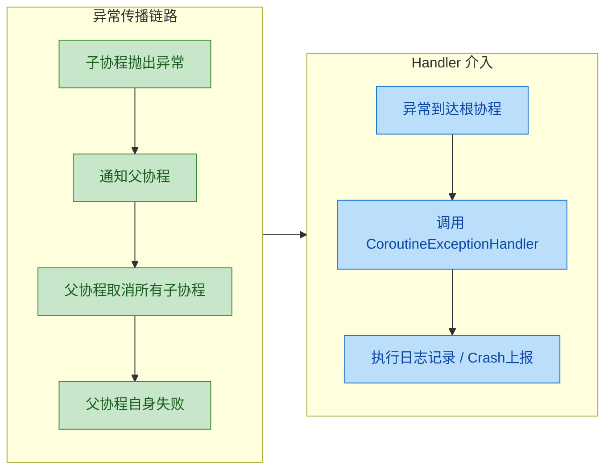

可以看到，Handler 是在**异常传播完成之后**才被触发的，它处于整个链路的最末端。这意味着：

- 它**无法阻止**子协程被取消
- 它**无法阻止**父协程失败
- 它**无法恢复**已经取消的协程树
- 它**只提供**一个"善后"的时机

在 Android 开发中，这个位置非常适合做以下事情：

```kotlin
// Android 项目中的典型用法
val globalHandler = CoroutineExceptionHandler { _, throwable ->
    // 1. 记录日志
    Log.e("CoroutineError", "未捕获的协程异常", throwable)

    // 2. 上报到 Crash 分析平台（如 Firebase Crashlytics）
    FirebaseCrashlytics.getInstance().recordException(throwable)

    // 3. 弹出用户友好的错误提示（需要切到主线程）
    // 注意：handler 本身可能不在主线程
    MainScope().launch {
        Toast.makeText(appContext, "操作失败，请重试", Toast.LENGTH_SHORT).show()
    }
}
```

> **与 `Thread.UncaughtExceptionHandler` 的类比**：在传统 Java 线程模型中，`Thread.setUncaughtExceptionHandler()` 也是在线程即将因未捕获异常而终止时被调用的最后防线。`CoroutineExceptionHandler` 在协程世界中扮演着完全相同的角色。

---

### 只对 launch 有效

这是一个**极其重要**的限制条件，也是面试中的高频考点：**`CoroutineExceptionHandler` 只对 `launch` 构建的协程有效，对 `async` 构建的协程无效。**

为什么会这样？原因要回到 `launch` 和 `async` 对异常的不同处理策略：

| 特性 | `launch` | `async` |
|------|----------|---------|
| 异常时机 | 异常**立即传播** | 异常**延迟到 `await()` 时暴露** |
| 异常性质 | **未捕获异常**（uncaught） | **被封装的异常**（encapsulated） |
| Handler 生效 | ✅ 生效 | ❌ 不生效 |

`launch` 协程在遇到异常时，会将异常作为**未捕获异常（uncaught exception）**向上传播，传播到根协程后自然会触发 `CoroutineExceptionHandler`。

而 `async` 协程的设计理念不同——它的返回值是一个 `Deferred<T>` 对象，异常被视为这个 `Deferred` 的**结果**的一部分。用户代码**有责任**通过调用 `await()` 来取回结果（或异常），因此 `async` 的异常属于"用户自己会处理的异常"，不被视为 uncaught，Handler 自然不会介入。

来看对比代码：

```kotlin
import kotlinx.coroutines.*

fun main() = runBlocking {
    val handler = CoroutineExceptionHandler { _, e ->
        println("Handler 捕获: ${e.message}")
    }

    // ========== 场景 1: launch — Handler 生效 ==========
    val job1 = GlobalScope.launch(handler) {
        // launch 中的异常是 uncaught exception
        throw RuntimeException("launch 中的异常")
        // Handler 会被调用 ✅
    }
    job1.join()

    // ========== 场景 2: async — Handler 不生效 ==========
    val deferred = GlobalScope.async(handler) {
        // async 中的异常会被封装到 Deferred 中
        throw RuntimeException("async 中的异常")
        // Handler 不会被调用 ❌
    }

    try {
        // 异常在 await() 时才被抛出，需要用 try-catch 处理
        deferred.await()
    } catch (e: Exception) {
        println("try-catch 捕获: ${e.message}")
    }
}
// 输出:
// Handler 捕获: launch 中的异常
// try-catch 捕获: async 中的异常
```

> ⚠️ **特别注意**：虽然 `async` 的异常会在 `await()` 时暴露，但如果 `async` 作为**普通子协程**（非根协程）运行时，异常**仍然会传播给父协程**！此时父协程（如果是 `launch` 起来的）最终会触发 Handler。区分的关键在于：**谁是"根协程"？Handler 只在根协程上起作用。**

```kotlin
import kotlinx.coroutines.*

fun main() = runBlocking {
    val handler = CoroutineExceptionHandler { _, e ->
        println("Handler 捕获: ${e.message}")
    }

    // 根协程是 launch，即使子协程是 async，异常最终也会传播到 launch
    GlobalScope.launch(handler) {
        // async 作为子协程
        async {
            // 这个异常会传播给父协程（launch）
            throw RuntimeException("子async的异常")
        }
        // 注意：即使不调用 await()，异常也会传播！
        // 因为结构化并发要求子协程异常必须通知父协程
    }.join()
}
// 输出:
// Handler 捕获: 子async的异常
```

这段代码说明：当 `async` 不是根协程时，它的异常传播行为和 `launch` 是一样的（向上传播给父协程），此时 Handler 是否被触发取决于**根协程**是不是 `launch`。

下面这张流程图清晰地展示了 `launch` vs `async` 在异常处理上的分叉路径：

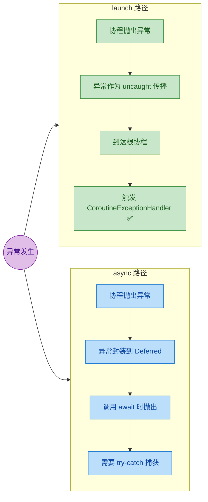

---

### 必须在根协程设置

这是使用 `CoroutineExceptionHandler` 时最容易犯错的地方。**Handler 只有安装在根协程（root coroutine）上才会被调用**。如果你把它安装在某个子协程上，它将被完全忽略。

**什么是根协程（Root Coroutine）？**

根协程是指**直接在 `CoroutineScope` 上创建的协程**，它不是任何其他协程的子协程。或者更准确地说，根协程的 `Job` 的 parent 是 scope 的 `Job`（而非另一个协程的 `Job`）。常见的根协程创建方式有：

```kotlin
// 1. GlobalScope.launch → 根协程（GlobalScope 的 Job 为空，所以它没有父协程）
GlobalScope.launch(handler) { ... }

// 2. CoroutineScope(Job()).launch → 根协程
val scope = CoroutineScope(Job() + handler)
scope.launch { ... }

// 3. 在协程内部用 launch 创建的 → 子协程，不是根协程！
launch {
    launch(handler) { ... } // ❌ handler 安装在子协程上，不会生效
}
```

来看一个**错误示范**：

```kotlin
import kotlinx.coroutines.*

fun main() = runBlocking {
    val handler = CoroutineExceptionHandler { _, e ->
        println("Handler 捕获: ${e.message}")
    }

    // ❌ 错误：handler 安装在子协程上
    launch {
        launch(handler) { // 这是一个子协程，不是根协程
            throw RuntimeException("子协程异常")
        }
    }
    // 输出: 不会打印 "Handler 捕获"，而是异常直接传播到 runBlocking 导致崩溃
}
```

为什么子协程上的 Handler 不生效？原因在于异常的**传播机制**：

1. 子协程抛出异常后，异常会**向上传播给父协程**
2. 父协程收到异常后继续向上传播，直到根协程
3. `CoroutineExceptionHandler` 只在**最终目的地**（即根协程）上被查找和调用
4. 子协程上安装的 Handler 在传播过程中**不会被查询**

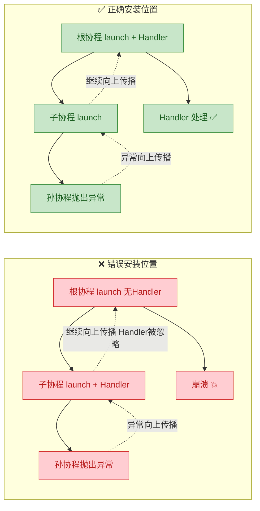

**正确的做法**——将 Handler 安装在根协程上：

```kotlin
import kotlinx.coroutines.*

fun main() = runBlocking {
    val handler = CoroutineExceptionHandler { _, e ->
        println("Handler 捕获: ${e.message}")
    }

    // ✅ 正确做法 1：安装在 GlobalScope（根协程）
    GlobalScope.launch(handler) {
        launch {
            throw RuntimeException("深层子协程异常")
        }
    }.join()

    // ✅ 正确做法 2：安装在自定义 Scope 上
    val scope = CoroutineScope(Job() + handler)
    scope.launch {
        launch {
            throw RuntimeException("深层子协程异常")
        }
    }.join()
}
// 两种做法都会输出:
// Handler 捕获: 深层子协程异常
```

**再补充一个关键细节**：如果使用 `CoroutineScope(Job() + handler)` 的方式，Handler 是设置在 Scope 的 Context 中，此时通过该 Scope 创建的**第一层协程**就是根协程，它会自动继承 Scope 的 Handler。这是 Android 开发中最推荐的模式：

```kotlin
// Android ViewModel 中的典型模式
class MyViewModel : ViewModel() {

    // viewModelScope 的底层已经有 SupervisorJob
    // 我们可以创建一个带 Handler 的安全 Scope
    private val handler = CoroutineExceptionHandler { _, throwable ->
        // 统一处理 UI 层的协程异常
        _errorState.value = throwable.localizedMessage
    }

    // 方式 1：每次 launch 时传入 handler
    fun loadData() {
        viewModelScope.launch(handler) { // viewModelScope.launch 创建的是根协程
            // 网络请求...
            val data = repository.fetchData() // 可能抛异常
            _uiState.value = data
        }
    }

    // 方式 2：创建自定义 Scope（将 handler 内置）
    private val safeScope = CoroutineScope(
        SupervisorJob() +         // 隔离子协程异常
        Dispatchers.Main +        // 主线程调度
        handler                   // 全局异常兜底
    )
}
```

**关于 `runBlocking` 的特殊性**：`runBlocking` 创建的协程**不是**一个典型的根协程——它会直接将异常重新抛出到调用线程（blocking thread），因此 `CoroutineExceptionHandler` 对 `runBlocking` 也是无效的：

```kotlin
fun main() = runBlocking {
    val handler = CoroutineExceptionHandler { _, e ->
        println("Handler: ${e.message}")
    }

    // ❌ runBlocking 不会使用 handler
    // handler 在这里被忽略，异常直接抛给 main 线程
    launch(handler) { // 这是 runBlocking 的子协程，不是根协程
        throw RuntimeException("异常")
    }

    // 正确理解：runBlocking 内部的 launch 是子协程
    // 异常传播到 runBlocking 后，runBlocking 直接抛出到主线程
}
```

总结一下 Handler 的安装规则：

| 安装位置 | 是否生效 | 原因 |
|---------|---------|------|
| `GlobalScope.launch(handler)` | ✅ 生效 | GlobalScope 创建的是根协程 |
| `CoroutineScope(Job() + handler).launch` | ✅ 生效 | Scope 的第一层 launch 是根协程 |
| `scope.launch(handler)` | ✅ 生效 | scope 上的直接 launch 是根协程 |
| 子协程 `launch(handler)` | ❌ 不生效 | 子协程上的 handler 被忽略 |
| `async(handler)` | ❌ 不生效 | async 的异常不触发 handler |
| `runBlocking` 内子协程 | ❌ 不生效 | runBlocking 自身重新抛出异常 |

---

**📝 练习题**

以下代码的输出结果是什么？

```kotlin
fun main() = runBlocking {
    val handler = CoroutineExceptionHandler { _, e ->
        println("Handler: ${e.message}")
    }

    val scope = CoroutineScope(Job())

    scope.launch(handler) {
        launch {
            launch {
                throw IllegalStateException("boom")
            }
        }
    }

    delay(1000)
    println("done")
}
```

A. 程序崩溃，无任何输出


B. 输出 `Handler: boom`，然后输出 `done`


C. 输出 `done`，不输出 Handler 信息


D. 输出 `Handler: boom`，然后程序崩溃


**【答案】** B

**【解析】** `scope.launch(handler)` 创建的是 `scope` 上的**根协程**，Handler 安装在了正确的位置。内部无论嵌套多少层子协程，异常都会一层层向上传播，最终到达这个根协程。根协程发现自己安装了 `CoroutineExceptionHandler`，于是调用它，输出 `Handler: boom`。由于异常被 Handler 处理，不会影响到 `runBlocking` 所在的外部 Scope（`scope` 和 `runBlocking` 是完全独立的两个作用域），因此 `delay(1000)` 后正常输出 `done`。选 B。

---

## SupervisorJob ⭐⭐

在前面的章节中，我们了解到普通协程的异常传播是 **双向的 (bidirectional)**：子协程的未捕获异常会向上传播给父协程，父协程随即取消自身及所有其他子协程。这种"一损俱损"的行为在许多场景下是合理的——比如一个数据加载流程中，任何一步失败都意味着整体结果无效。然而，现实中大量场景需要 **隔离性 (isolation)**：一个子任务的失败不应该拖垮其他兄弟任务。`SupervisorJob` 正是为此而生。

### 回顾：普通 Job 的异常传播问题

先回顾一下默认行为，以便对比理解。在普通的 `Job` 层级结构中，异常传播遵循 **structured concurrency** 的默认规则：

```kotlin
fun main() = runBlocking {
    // 创建一个普通的父协程作用域
    val scope = CoroutineScope(Job())

    // 子协程 A
    val childA = scope.launch {
        delay(1000)
        println("Child A 完成") // 这行永远不会执行
    }

    // 子协程 B —— 它会抛出异常
    val childB = scope.launch {
        delay(500)
        throw RuntimeException("Child B 爆炸了！")
    }

    // 等待足够长时间观察结果
    delay(2000)
    // 检查各协程状态
    println("scope 是否活跃: ${scope.isActive}")   // false
    println("childA 是否已取消: ${childA.isCancelled}") // true
    println("childB 是否已取消: ${childB.isCancelled}") // true
}
```

上述代码中，`childB` 在 500ms 后抛出异常。按照默认传播规则：**childB 的异常向上传播 → 父 Job 被取消 → childA 也被连带取消**。整个 `scope` 直接"报废"。这在 Android 开发中尤其危险——假设 `scope` 是一个 `viewModelScope`（如果它用的是普通 Job），一个网络请求失败就会导致整个 ViewModel 中所有正在进行的协程全部取消。

```java
// 普通 Job 的异常传播模型（一损俱损）
//
//        ┌─────────────┐
//        │  Parent Job  │ ← ② 收到异常，取消自身
//        │  (cancelled) │ ← ③ 然后取消所有子 Job
//        └──────┬───────┘
//          ┌────┴─────┐
//          ▼          ▼
//   ┌──────────┐ ┌──────────┐
//   │ Child A  │ │ Child B  │
//   │(cancelled)│ │ (failed) │ ← ① 抛出异常
//   └──────────┘ └──────────┘
```

### 什么是 SupervisorJob

`SupervisorJob` 是 `Job` 的一个特殊变体，它改变了异常传播的方向性——将双向传播变为 **单向传播 (unidirectional propagation)**。具体来说：

- **向下传播 (downward) 保留**：父协程被取消时，所有子协程仍然会被取消（这一点和普通 Job 一样）。
- **向上传播 (upward) 切断**：子协程的异常 **不会** 传播给父协程，父协程继续存活。

这意味着每个子协程需要 **自行处理** 自己的异常，兄弟协程之间彼此独立，互不干扰。

从源码角度看，`SupervisorJob()` 是一个工厂函数，它返回的是 `SupervisorJobImpl` 实例：

```kotlin
// SupervisorJob 工厂函数签名
// parent 参数可选，用于挂载到父 Job 上
public fun SupervisorJob(parent: Job? = null): CompletableJob =
    SupervisorJobImpl(parent)

// SupervisorJobImpl 继承自 JobImpl
// 关键区别在于 childCancelled() 方法的重写
// 普通 JobImpl.childCancelled() 返回 true —— 表示"我处理了这个异常"（实际是传播）
// SupervisorJobImpl.childCancelled() 返回 false —— 表示"我不处理，让子协程自己处理"
```

核心差异就在一个方法：`childCancelled(cause: Throwable): Boolean`。普通 `Job` 中该方法返回 `true`（接管异常并继续向上传播），而 `SupervisorJob` 中返回 `false`（拒绝接管，异常到此为止）。

### 单向传播：子 → 父不传播

让我们用一个完整示例来验证 `SupervisorJob` 的单向传播特性：

```kotlin
fun main() = runBlocking {
    // 创建使用 SupervisorJob 的协程作用域
    val supervisor = CoroutineScope(SupervisorJob() + Dispatchers.Default)

    // 子协程 A：正常执行的长任务
    val childA = supervisor.launch {
        try {
            repeat(5) { i ->
                delay(500)
                println("Child A 正在工作... 第 ${i + 1} 次") // 不会被中断
            }
            println("Child A 顺利完成！")
        } catch (e: CancellationException) {
            println("Child A 被取消了: ${e.message}") // 不会执行
        }
    }

    // 子协程 B：500ms 后抛出异常
    val childB = supervisor.launch {
        delay(500)
        println("Child B 即将抛出异常...")
        throw RuntimeException("Child B 出错了！")
    }

    // 子协程 C：正常执行的另一个任务
    val childC = supervisor.launch {
        delay(1500)
        println("Child C 也顺利完成！") // 正常执行
    }

    // 等待所有子协程执行完毕
    delay(4000)

    // 检查状态
    println("supervisor 是否活跃: ${supervisor.isActive}")   // true！
    println("childA 是否已完成: ${childA.isCompleted}")       // true
    println("childB 是否已取消: ${childB.isCancelled}")       // true（因异常失败）
    println("childC 是否已完成: ${childC.isCompleted}")       // true
}
```

运行输出：

```
Child A 正在工作... 第 1 次
Child B 即将抛出异常...
Child A 正在工作... 第 2 次
Child A 正在工作... 第 3 次
Child C 也顺利完成！
Child A 正在工作... 第 4 次
Child A 正在工作... 第 5 次
Child A 顺利完成！
supervisor 是否活跃: true
childA 是否已完成: true
childB 是否已取消: true
childC 是否已完成: true
```

结果非常清晰：**childB 爆炸了，但 childA 和 childC 完全不受影响，supervisor 作用域依然活跃可复用**。

用 Mermaid 图表示 `SupervisorJob` 的传播模型：

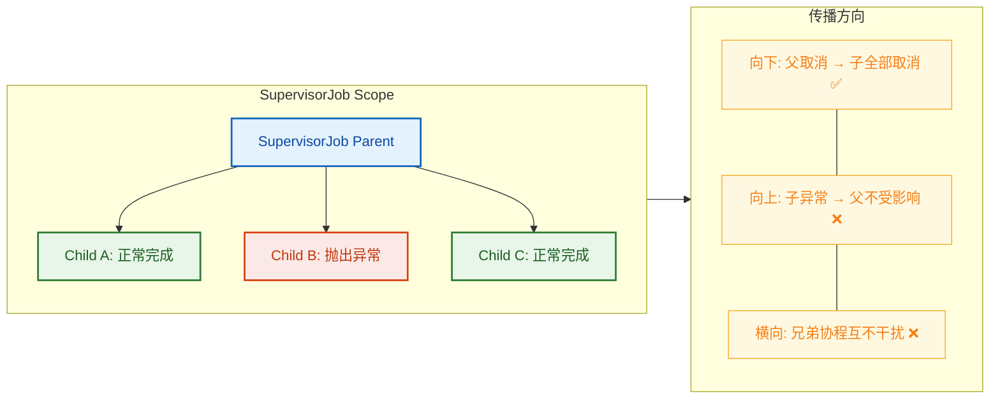

### 子协程异常不影响其他子协程

这是 `SupervisorJob` 最核心的实际价值。让我们深入分析几个重要的细节：

#### 1. 每个子协程独立处理自己的异常

在 `SupervisorJob` 下，由于异常不会向上传播，子协程必须 **自行处理** 异常。如果没有处理，异常会被交给当前线程的 `UncaughtExceptionHandler`（或 `CoroutineExceptionHandler`，如果安装在子协程上的话）。

```kotlin
fun main() = runBlocking {
    // 创建带有 CoroutineExceptionHandler 的 SupervisorJob 作用域
    val handler = CoroutineExceptionHandler { _, exception ->
        // 全局兜底：捕获未处理的子协程异常
        println("捕获到异常: ${exception.message}")
    }

    // handler 安装在 scope 上，对所有 launch 的子协程生效
    val scope = CoroutineScope(SupervisorJob() + handler)

    // 子协程 1：内部用 try-catch 自行处理
    scope.launch {
        try {
            throw IllegalArgumentException("参数错误")
        } catch (e: Exception) {
            println("子协程 1 自己处理了异常: ${e.message}") // ✅ 推荐方式
        }
    }

    // 子协程 2：不处理，交给 handler 兜底
    scope.launch {
        throw IllegalStateException("状态异常") // 由 handler 捕获
    }

    // 子协程 3：正常运行
    scope.launch {
        delay(100)
        println("子协程 3 正常完成") // 不受影响
    }

    delay(500) // 等待执行完毕
}
```

输出：

```
子协程 1 自己处理了异常: 参数错误
捕获到异常: 状态异常
子协程 3 正常完成
```

#### 2. Android 中的典型使用场景

`SupervisorJob` 在 Android 开发中无处不在，因为 `viewModelScope` 和 `lifecycleScope` 的底层都使用了 `SupervisorJob`：

```kotlin
// ViewModelScope 的内部实现（简化版）
// 注意它使用了 SupervisorJob + Dispatchers.Main.immediate
val ViewModel.viewModelScope: CoroutineScope
    get() {
        // 创建 CloseableCoroutineScope
        // 内部使用 SupervisorJob() 确保单个请求失败不会影响其他请求
        return CloseableCoroutineScope(
            SupervisorJob() + Dispatchers.Main.immediate
        )
    }
```

这意味着在 ViewModel 中并发发起多个网络请求时，其中一个失败不会导致其他请求被取消：

```kotlin
class UserViewModel : ViewModel() {

    fun loadDashboard() {
        // 请求 1：加载用户资料
        viewModelScope.launch {
            // 即使这个请求失败...
            val profile = userRepository.getProfile() // 可能抛异常
            _profileState.value = profile
        }

        // 请求 2：加载通知列表（不受请求 1 失败影响）
        viewModelScope.launch {
            val notifications = notificationRepository.getList()
            _notificationState.value = notifications
        }

        // 请求 3：加载推荐内容（不受请求 1 失败影响）
        viewModelScope.launch {
            val recommendations = recommendRepository.getFeed()
            _feedState.value = recommendations
        }
    }
}
```

#### 3. SupervisorJob 的常见误用 ⚠️

一个 **极其常见的错误** 是将 `SupervisorJob` 作为 `launch` 或 `async` 的参数传入，期望它能起到隔离效果：

```kotlin
fun main() = runBlocking {
    // ⚠️ 错误用法！这样做 SupervisorJob 不会产生预期效果
    launch(SupervisorJob()) {
        // 子协程 A
        launch {
            delay(1000)
            println("Child A 完成") // 会被取消！
        }

        // 子协程 B
        launch {
            delay(500)
            throw RuntimeException("Child B 异常")
        }
    }

    delay(2000)
}
```

为什么这是错误的？让我们画出 Job 层级结构来理解：

```java
// ❌ 错误用法的 Job 层级：
//
//   runBlocking (Job)              ← 根协程
//       │
//       ▼
//   launch 创建的 Job              ← 这个 Job 的 parent 是 runBlocking 的 Job
//   (其 parent 是 SupervisorJob,   ← SupervisorJob 成了中间层
//    但 SupervisorJob 的 parent     ← 注意：launch 内部的子协程的父 Job
//    是 runBlocking 的 Job)            是 launch 创建的普通 Job，不是 SupervisorJob！
//       │
//   ┌───┴────┐
//   ▼        ▼
// Child A  Child B (异常)          ← 这两个的直接父 Job 是 launch 创建的普通 Job
//                                     所以异常仍然会双向传播！
```

**关键理解**：`launch(SupervisorJob())` 中，`SupervisorJob()` 会成为 `launch` 创建的新协程的 **父 Job**。但 `launch` 代码块内部再 `launch` 的子协程，它们的父 Job 是外层 `launch` **自动创建** 的那个普通 `Job`，而不是你传入的 `SupervisorJob`。所以 Supervisor 的隔离能力在孙子协程层面完全无效。

**正确用法**——将 `SupervisorJob` 安装在 `CoroutineScope` 上：

```kotlin
fun main() = runBlocking {
    // ✅ 正确用法 1：创建 SupervisorJob 作用域
    val scope = CoroutineScope(SupervisorJob())

    scope.launch { /* Child A - 独立 */ }
    scope.launch { /* Child B - 独立 */ }

    // ✅ 正确用法 2：使用 supervisorScope（下一节详细讲）
    supervisorScope {
        launch { /* Child A - 独立 */ }
        launch { /* Child B - 独立 */ }
    }
}
```

#### 4. SupervisorJob 与 async 的配合

`SupervisorJob` 对 `async` 同样有效，但行为稍有不同。在 `SupervisorJob` 作用域下，`async` 的异常不会传播给父协程，但 **调用 `await()` 时仍然会抛出异常**：

```kotlin
fun main() = runBlocking {
    val scope = CoroutineScope(SupervisorJob())

    // async 子协程，内部抛出异常
    val deferred = scope.async {
        throw RuntimeException("async 任务失败")
    }

    // scope 仍然存活
    println("scope 活跃: ${scope.isActive}") // true

    // 但 await 时异常会被抛出
    try {
        val result = deferred.await() // 这里会抛出 RuntimeException
    } catch (e: RuntimeException) {
        println("await 捕获异常: ${e.message}") // async 任务失败
    }

    // scope 依然活跃！
    println("scope 仍然活跃: ${scope.isActive}") // true
}
```

### SupervisorJob vs Job 对比总结

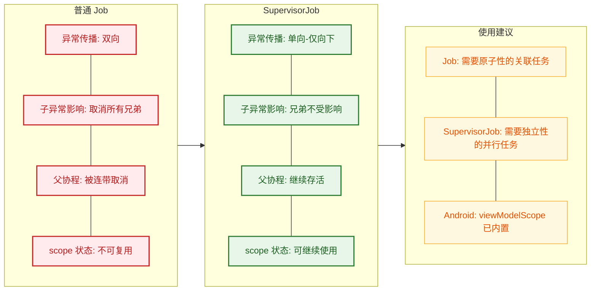

| 维度 | `Job` | `SupervisorJob` |
|---|---|---|
| 异常传播方向 | 双向 (子↔父) | 单向 (父→子) |
| 子协程失败的影响 | 取消父 + 所有兄弟 | **仅失败的子协程自身** |
| 父 scope 存活性 | 被取消，不可复用 | **继续存活，可复用** |
| 异常处理责任 | 父协程统一处理 | 每个子协程自行处理 |
| 典型场景 | 事务性操作（全部成功或全部失败） | UI 并发任务（互相独立） |
| Android 内置使用 | 手动创建 `CoroutineScope(Job())` | `viewModelScope`, `lifecycleScope` |

---

**📝 练习题**

以下代码执行后，最终输出的 `scope.isActive` 值是什么？

```kotlin
val handler = CoroutineExceptionHandler { _, e ->
    println("异常: ${e.message}")
}
val scope = CoroutineScope(SupervisorJob() + handler)

scope.launch {
    launch {
        throw RuntimeException("内层爆炸")
    }
    delay(1000)
    println("外层完成")
}

scope.launch {
    delay(2000)
    println("兄弟协程完成")
}

delay(3000)
println("scope.isActive = ${scope.isActive}")
```

A. `scope.isActive = false`，且"兄弟协程完成"不会输出


B. `scope.isActive = true`，但"外层完成"和"兄弟协程完成"都不会输出


C. `scope.isActive = true`，"外层完成"不会输出，但"兄弟协程完成"会输出


D. `scope.isActive = true`，"外层完成"和"兄弟协程完成"都会输出


**【答案】** C

**【解析】** 分析 Job 层级结构：`scope` 持有 `SupervisorJob`，它直接 `launch` 了两个子协程——它们的父 Job 就是 `SupervisorJob`，因此这两个子协程之间互相独立。但是，第一个 `launch` 内部又嵌套了一个 `launch`，这个"内层 launch"的父 Job 是**外层 launch 自动创建的普通 Job**（不是 SupervisorJob！），所以内层的 `RuntimeException` 会按照普通规则向上传播，导致外层 `launch` 被取消——"外层完成"不会输出。然而，这个异常到达 `SupervisorJob` 后就被拦截了（`childCancelled` 返回 `false`），不再继续传播，第二个 `launch`（兄弟协程）完全不受影响，正常输出"兄弟协程完成"。`scope` 始终保持活跃。异常最终由 `handler` 捕获并打印。


---

## supervisorScope ⭐⭐

在上一节中我们学习了 `SupervisorJob`，它通过**单向传播**机制让子协程的异常不会向上传播到父协程，也不会连累兄弟协程。但在实际使用中，手动创建 `SupervisorJob` 并将其作为父 Job 传入存在一个非常常见的**陷阱**——开发者往往忘记 `SupervisorJob` 必须作为协程层级中的**直接父 Job** 才能生效。为了解决这个痛点，Kotlin 协程库提供了一个更优雅、更安全的工具：`supervisorScope`。

`supervisorScope` 是一个**挂起函数**（suspend function），它会创建一个新的协程作用域（coroutine scope），该作用域内部自动使用 `SupervisorJob` 作为 Job。它的设计哲学是：**用作用域（scope）来表达异常隔离的边界**，而不是让开发者手动管理 Job 的层级关系。

---

### 创建 SupervisorJob 作用域

#### supervisorScope 的函数签名与本质

`supervisorScope` 的签名如下：

```kotlin
// supervisorScope 是一个挂起函数，接收一个 CoroutineScope 扩展 lambda
// 返回值类型 R 由 lambda 的最后一个表达式决定
public suspend fun <R> supervisorScope(
    block: suspend CoroutineScope.() -> R
): R
```

当调用 `supervisorScope` 时，它在内部做了这几件关键的事情：

1. 创建一个**新的 `SupervisorJob`**，将**当前协程的 Job** 作为其 parent。
2. 用这个 `SupervisorJob` + 当前的 `CoroutineContext`（减去旧 Job）构造一个新的 `CoroutineScope`。
3. 在这个新作用域中执行传入的 `block` lambda。
4. **等待所有子协程完成**后返回（和 `coroutineScope` 行为一致）。

来看它与 `coroutineScope` 的对比：

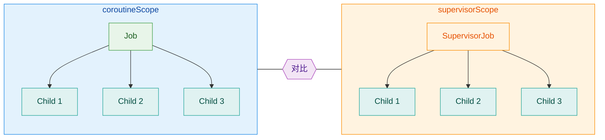

关键区别在于：`coroutineScope` 内部使用普通 `Job`，任何一个子协程失败会取消整个作用域；而 `supervisorScope` 内部使用 `SupervisorJob`，子协程的失败**不会**自动取消兄弟协程和作用域本身。

#### 基本用法

```kotlin
import kotlinx.coroutines.*

fun main() = runBlocking {
    // supervisorScope 创建一个使用 SupervisorJob 的作用域
    // 它会挂起当前协程，直到作用域内所有子协程完成
    supervisorScope {
        // 子协程 1：会抛出异常
        val child1 = launch {
            println("Child 1 开始执行")       // 正常打印
            delay(100)                         // 模拟短暂工作
            throw RuntimeException("Child 1 爆炸了！") // 抛出异常
        }

        // 子协程 2：正常执行，不会被 child1 的异常影响
        val child2 = launch {
            println("Child 2 开始执行")       // 正常打印
            delay(500)                         // 模拟较长的工作
            println("Child 2 正常完成 ✅")     // 这行 **会** 被执行到
        }
    }
    // supervisorScope 会等待所有子协程（包括成功和失败的）结束后才继续
    println("supervisorScope 结束，主程序继续")
}
```

输出结果：

```
Child 1 开始执行
Child 2 开始执行
Child 1 抛出异常 (RuntimeException: Child 1 爆炸了！)
Child 2 正常完成 ✅
supervisorScope 结束，主程序继续
```

注意看，`Child 2` **依然正常完成了**。如果把 `supervisorScope` 换成 `coroutineScope`，`Child 2` 会被立即取消，因为 `Child 1` 的异常会导致整个作用域崩溃。

#### supervisorScope vs 手动创建 SupervisorJob 的常见陷阱

很多初学者会尝试这样做来代替 `supervisorScope`：

```kotlin
// ⚠️ 错误用法！常见陷阱！
fun main() = runBlocking {
    // 手动创建 SupervisorJob，但这里有个隐蔽的 bug
    launch(SupervisorJob()) {
        // 在这个 launch 内部启动的子协程
        // 它们的 parent Job 是 launch 自动创建的【普通 Job】
        // 而不是你传入的 SupervisorJob！
        // SupervisorJob 是 launch 创建的 Job 的 parent
        launch {
            delay(100)
            throw RuntimeException("boom")
            // 这个异常会传播给 launch 内部的普通 Job
            // 进而取消所有兄弟协程 —— SupervisorJob 并没有起到隔离作用！
        }
        launch {
            delay(500)
            println("这行不会被执行到 ❌") // 被连带取消
        }
    }
}
```

用 ASCII 图来理解这个层级关系：

```kotlin
// ⚠️ 手动 SupervisorJob() 的实际层级结构：
//
//   runBlocking Job
//        |
//   SupervisorJob()        ← 你创建的，是 launch-Job 的 parent
//        |
//   launch 内部的 Job      ← launch 自动创建的【普通 Job】！
//      /       \
//   child1    child2       ← 它们的直接 parent 是普通 Job，不是 SupervisorJob
//
// 结论：child1 的异常传给普通 Job → 普通 Job 取消 child2 → 隔离失败！
```

```kotlin
// ✅ supervisorScope 的实际层级结构：
//
//   runBlocking Job
//        |
//   SupervisorJob          ← supervisorScope 自动创建
//      /       \
//   child1    child2       ← 它们的直接 parent 就是 SupervisorJob
//
// 结论：child1 的异常不会传给 SupervisorJob → child2 不受影响 → 隔离成功！
```

这就是 `supervisorScope` 存在的核心价值——**它确保子协程的直接父 Job 就是 SupervisorJob**，从根本上避免了层级错位的问题。

#### supervisorScope 是挂起函数，不是协程构建器

这一点非常重要。`supervisorScope`（和 `coroutineScope` 一样）是一个**挂起函数**，不是像 `launch`/`async` 那样的协程构建器。这意味着：

- 它**不会**创建新的协程，而是在**当前协程**中挂起。
- 它内部的代码（直接在 lambda 中的代码，而非子协程中的）如果抛出异常，**会直接向上传播**，就像普通的挂起函数一样。

```kotlin
fun main() = runBlocking {
    try {
        supervisorScope {
            // ⚠️ 这行代码是在 supervisorScope 自身的上下文中执行的
            // 它不是子协程，所以异常不走 SupervisorJob 的逻辑
            // 而是直接抛给 supervisorScope 的调用者
            throw RuntimeException("作用域自身的异常")
        }
    } catch (e: Exception) {
        // ✅ 可以在这里捕获
        println("捕获到: ${e.message}")
    }
}
```

记住这个规则：**SupervisorJob 只影响子协程之间的异常传播，不影响作用域自身代码的异常行为。**

---

### 隔离子协程异常

`supervisorScope` 的核心能力就是**异常隔离**：一个子协程的失败不会影响其他子协程。接下来我们从多个维度深入理解这种隔离机制。

#### 异常隔离的完整流程

当 `supervisorScope` 内的一个子协程抛出异常时，内部发生了什么？我们用时序图来还原：

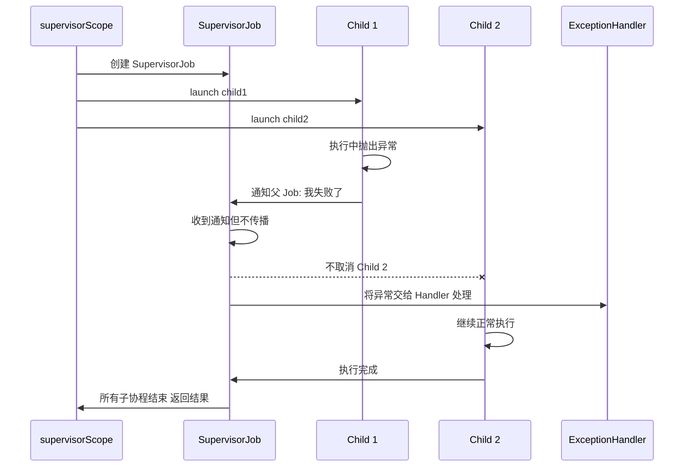

关键步骤解析：

1. `Child 1` 抛出异常后，它会通知自己的 parent Job（即 `SupervisorJob`）。
2. `SupervisorJob` 重写了 `childCancelled()` 方法，**直接返回 `false`**，表示"我不处理这个取消请求"。
3. 因此异常**不会向上传播**，也不会**横向扩散**到 `Child 2`。
4. 异常会被交给 `CoroutineExceptionHandler`（如果有的话）或线程的 `UncaughtExceptionHandler`。
5. `supervisorScope` 等待所有子协程（包括已失败的）都结束后，才返回。

#### 实战场景：并发网络请求的容错

最典型的使用场景是**并发请求多个 API 接口**，其中部分失败不应影响其他请求：

```kotlin
import kotlinx.coroutines.*

// 模拟数据类
data class UserProfile(val name: String)
data class UserOrders(val count: Int)
data class UserRecommendations(val items: List<String>)

// 模拟网络请求函数
suspend fun fetchProfile(): UserProfile {
    delay(200)                                    // 模拟网络延迟
    return UserProfile("张三")                     // 正常返回
}

suspend fun fetchOrders(): UserOrders {
    delay(300)                                    // 模拟网络延迟
    throw RuntimeException("订单服务不可用")        // 模拟服务端错误
}

suspend fun fetchRecommendations(): UserRecommendations {
    delay(250)                                    // 模拟网络延迟
    return UserRecommendations(listOf("Kotlin实战", "协程指南"))
}

fun main() = runBlocking {
    supervisorScope {
        // 三个请求并发执行，互不影响
        val profileDeferred = async {
            fetchProfile()                         // 正常完成
        }
        val ordersDeferred = async {
            fetchOrders()                          // 会失败
        }
        val recommendationsDeferred = async {
            fetchRecommendations()                 // 正常完成
        }

        // 安全地获取结果：每个 await 都用 try-catch 包裹
        val profile = try {
            profileDeferred.await()                // 成功：拿到 UserProfile
        } catch (e: Exception) {
            null                                   // 失败：返回 null
        }

        val orders = try {
            ordersDeferred.await()                 // 失败：抛出 RuntimeException
        } catch (e: Exception) {
            println("获取订单失败: ${e.message}")   // 打印错误信息
            null                                   // 降级为 null
        }

        val recommendations = try {
            recommendationsDeferred.await()        // 成功：拿到推荐列表
        } catch (e: Exception) {
            null                                   // 失败：返回 null
        }

        // 组装最终结果（部分数据可能为 null，但页面仍可渲染）
        println("用户资料: $profile")               // UserProfile(name=张三)
        println("用户订单: $orders")                // null
        println("推荐内容: $recommendations")       // UserRecommendations(items=[...])
    }
}
```

这就是 `supervisorScope` 的经典应用模式：**并发执行 + 独立容错 + 优雅降级**。

> ⚠️ **重要提醒**：注意在 `supervisorScope` 内使用 `async` 时，异常不会自动传播（因为 `SupervisorJob` 阻止了传播），但异常**仍然存在**于 `Deferred` 对象中。你**必须**在 `await()` 时用 `try-catch` 处理，否则异常会在 `await()` 调用处抛出，可能导致 `supervisorScope` 本身的代码（非子协程代码）异常。

#### 子协程自行处理异常

除了在 `await` 处 `try-catch`，另一种常见模式是让每个子协程**内部自行处理异常**：

```kotlin
fun main() = runBlocking {
    supervisorScope {
        // 子协程自己 try-catch，对外表现为"永远成功"
        launch {
            try {
                riskyOperation()                   // 可能抛出异常的操作
            } catch (e: Exception) {
                println("操作失败，已降级处理")      // 内部消化异常
                performFallback()                  // 执行降级逻辑
            }
        }

        // 其他子协程完全不受影响
        launch {
            safeOperation()                        // 安全操作，正常执行
        }
    }
}
```

#### supervisorScope 嵌套与作用域边界

`supervisorScope` 可以嵌套使用，每一层都形成独立的异常隔离边界：

```kotlin
fun main() = runBlocking {
    // 外层 supervisorScope
    supervisorScope {
        // 模块 A：内部再用 supervisorScope 隔离
        launch {
            supervisorScope {
                launch {
                    throw RuntimeException("模块A-子任务1 失败")
                    // 只影响模块A内部，不影响模块B
                }
                launch {
                    delay(200)
                    println("模块A-子任务2 正常完成 ✅")
                    // 因为在内层 supervisorScope 中，不受子任务1影响
                }
            }
        }

        // 模块 B：完全不受模块 A 内部异常的影响
        launch {
            delay(300)
            println("模块B 正常完成 ✅")
        }
    }
}
```

异常隔离的层级关系如下：

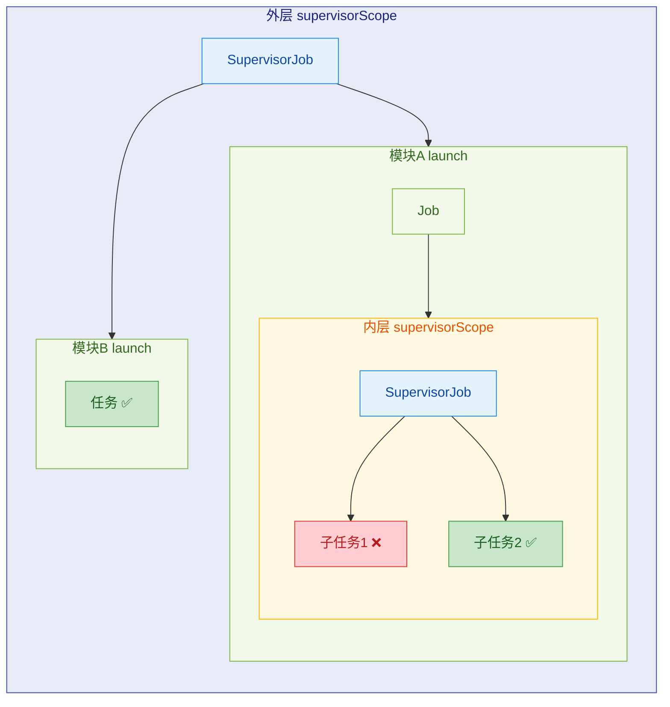

#### supervisorScope 与 coroutineScope 的选择指南

什么时候用 `coroutineScope`，什么时候用 `supervisorScope`？关键取决于你的**业务语义**：

| 场景 | 推荐 | 原因 |
|------|------|------|
| 多个子任务**全部必须成功** | `coroutineScope` | 一个失败则全部没意义（如事务操作） |
| 多个子任务**相互独立** | `supervisorScope` | 部分失败不影响其他（如 UI 多模块加载） |
| 需要**快速失败**（fail-fast） | `coroutineScope` | 一个出错立刻取消所有，节省资源 |
| 需要**最大努力**（best-effort） | `supervisorScope` | 尽可能多地完成任务，部分降级可接受 |

用一个生活化的比喻来总结：

- **`coroutineScope`** 像一条**生产流水线**：任何一个环节出了问题，整条线停工。
- **`supervisorScope`** 像一个**美食广场**：某个摊位着火了，其他摊位可以继续营业。

#### CoroutineExceptionHandler 在 supervisorScope 中的使用

在 `supervisorScope` 内部，由于子协程的异常不会向上传播，异常需要被**就地处理**。对于 `launch` 启动的子协程，可以在**子协程级别**安装 `CoroutineExceptionHandler`：

```kotlin
fun main() = runBlocking {
    supervisorScope {
        // 在子协程上直接安装 Handler —— 在 supervisorScope 中这是合法且推荐的
        val handler = CoroutineExceptionHandler { _, exception ->
            println("Handler 捕获异常: ${exception.message}")
        }

        // launch 子协程 + handler
        launch(handler) {
            throw RuntimeException("出错了")       // 异常被 handler 捕获
        }

        // 其他子协程不受影响
        launch {
            delay(100)
            println("我安然无恙 ✅")
        }
    }
}
```

> 🔑 **关键差异**：在普通 `coroutineScope` 中，`CoroutineExceptionHandler` 必须安装在**根协程**才有效。但在 `supervisorScope` 中，每个 `launch` 子协程相对于 `SupervisorJob` 来说就是"根"级别（因为异常不会再向上传播），所以 handler 可以直接安装在子协程上。这是 `supervisorScope` 的一个重要特性。

---

**📝 练习题**

以下代码的输出结果是什么？

```kotlin
fun main() = runBlocking {
    supervisorScope {
        val job1 = launch {
            println("1")
            throw RuntimeException("error")
        }
        val job2 = launch {
            delay(100)
            println("2")
        }
        val deferred = async {
            delay(200)
            "result"
        }
        try {
            println(deferred.await())
        } catch (e: Exception) {
            println("3")
        }
    }
    println("4")
}
```

A. 1 → 2 → result → 4


B. 1 → 2 → 3 → 4


C. 1 → 异常崩溃，程序终止


D. 1 → 4

**【答案】** A

**【解析】** 在 `supervisorScope` 中，`job1` 抛出的异常不会传播给兄弟协程 `job2` 和 `deferred`。因此 `job2` 会正常打印 `"2"`，`deferred` 也会正常完成并返回 `"result"`。`deferred.await()` 不会抛出异常（因为 `async` 自身执行成功），所以 `try-catch` 中打印的是 `"result"` 而非 `"3"`。最后 `supervisorScope` 结束后打印 `"4"`。输出顺序为：`1 → 2 → result → 4`。注意 `job1` 的异常会被传递给线程的 `UncaughtExceptionHandler`（控制台会看到异常堆栈），但**不会终止程序**，也不会影响其他协程的执行。

---

## 异常聚合 (Exception Aggregation)

在前面的章节中，我们讨论的场景大多是"某一个子协程抛出异常"。但在真实的并发世界里，**多个子协程可能几乎同时失败**——比如你同时发起 3 个网络请求，其中 2 个都超时了。这时就产生了一个核心问题：**多个异常，最终只能抛出一个，那其余的异常去哪了？**

Kotlin 协程借鉴了 Java 7 引入的 **Suppressed Exception** 机制，将"第一个异常"作为主异常 (primary exception) 抛出，而后续的异常则被附加到主异常的 `suppressed` 数组中。这套机制被称为 **异常聚合 (Exception Aggregation)**。

---

### 多个子协程异常 (Multiple Children Failures)

当一个父协程（或 `coroutineScope`）拥有多个子协程，并且其中 **不止一个** 子协程抛出异常时，协程框架的处理流程如下：

1. **第一个异常到达** → 父协程开始取消其他所有子协程。
2. **其他子协程在取消过程中也抛出异常** → 这些后续异常不会丢失，而是被"聚合"起来。
3. **最终抛出第一个异常**，后续异常通过 `Throwable.addSuppressed()` 附加在其上。

来看一个直观的例子：

```kotlin
import kotlinx.coroutines.*
import java.io.IOException

fun main() = runBlocking {
    // 使用 CoroutineExceptionHandler 捕获根协程的未捕获异常
    val handler = CoroutineExceptionHandler { _, exception ->
        // 打印主异常信息
        println("捕获主异常: $exception")
        // 遍历 suppressed 数组，打印被压制的异常
        exception.suppressed.forEach { suppressed ->
            println("  ├─ suppressed: $suppressed")
        }
    }

    // 创建一个根协程，绑定 handler
    val job = GlobalScope.launch(handler) {
        // 子协程 A：抛出 IOException
        launch {
            try {
                delay(Long.MAX_VALUE) // 模拟长时间运行
            } finally {
                // 在被取消时（finally块）再抛出一个异常
                throw ArithmeticException("子协程A的清理异常")
            }
        }

        // 子协程 B：第一个失败者，抛出 IOException
        launch {
            delay(10) // 短暂延迟后抛出
            throw IOException("网络请求失败") // 这是第一个异常（primary）
        }

        // 子协程 C：稍后也失败
        launch {
            delay(20) // 比 B 晚一点
            throw IllegalStateException("状态异常") // 第二个异常
        }

        // 保持父协程存活，等待子协程完成
        delay(Long.MAX_VALUE)
    }

    // 等待根协程结束
    job.join()
}
```

**运行输出（顺序可能略有变化）：**

```text
捕获主异常: java.io.IOException: 网络请求失败
  ├─ suppressed: java.lang.ArithmeticException: 子协程A的清理异常
  ├─ suppressed: java.lang.IllegalStateException: 状态异常
```

可以看到，`IOException` 是最先到达的异常，因此它成为了 **主异常 (primary exception)**。而 `ArithmeticException`（子协程 A 在 `finally` 中抛出）和 `IllegalStateException`（子协程 C 抛出）都被作为 **suppressed exception** 附加在主异常上。

> **关键原则**：First come, first served —— 第一个到达的异常成为主异常，后续的异常全部被 suppress。

下面用一张流程图展示整个聚合过程：

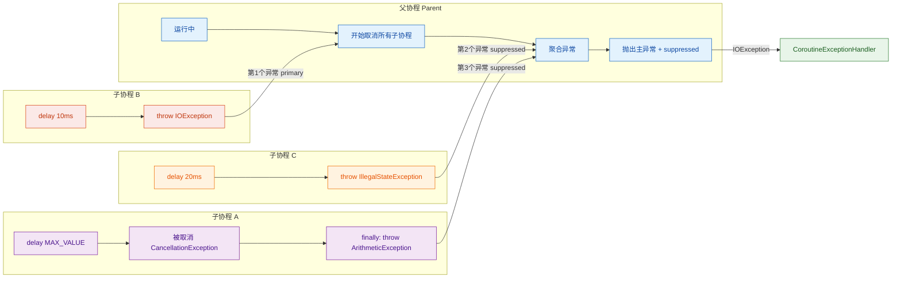

---

### CancellationException 的特殊待遇

在异常聚合过程中，有一类异常会被 **特殊对待** —— `CancellationException`。

协程取消本身是一种 **正常的控制流机制**，不属于"真正的错误"。因此协程框架在聚合时遵循以下规则：

| 场景 | 行为 |
|:---|:---|
| 主异常是普通异常，suppressed 中有 `CancellationException` | `CancellationException` **被丢弃**，不会出现在 `suppressed` 数组中 |
| 主异常是 `CancellationException`，后来又有普通异常 | **普通异常替代** `CancellationException` 成为主异常 |
| 全部都是 `CancellationException` | 正常取消流程，不触发 `CoroutineExceptionHandler` |

来看一段验证代码：

```kotlin
import kotlinx.coroutines.*

fun main() = runBlocking {
    val handler = CoroutineExceptionHandler { _, exception ->
        // 这里只会看到真正的异常，CancellationException 被过滤了
        println("捕获: $exception")
        println("suppressed 数量: ${exception.suppressed.size}")
        exception.suppressed.forEach {
            println("  ├─ suppressed: $it")
        }
    }

    val job = GlobalScope.launch(handler) {
        // 子协程 A：主动取消自己（CancellationException）
        val childA = launch {
            delay(100)
            // 这个 CancellationException 不会出现在最终聚合结果中
            throw CancellationException("我自己取消了")
        }

        // 子协程 B：抛出真正的异常
        launch {
            delay(50) // 比 A 更早失败
            throw IOException("磁盘读取失败") // 这是 primary exception
        }

        delay(Long.MAX_VALUE)
    }

    job.join()
}
```

**输出：**

```text
捕获: java.io.IOException: 磁盘读取失败
suppressed 数量: 0
```

`CancellationException` 被静默过滤了，不会污染异常聚合结果。这个设计非常合理：**取消是协程的日常操作，不应该与真正的业务异常混为一谈。**

---

### suppressed 异常 (Suppressed Exceptions)

Suppressed exception 并非 Kotlin 协程的发明，它源自 **Java 7 的 `Throwable.addSuppressed()`** 方法，最初是为 `try-with-resources` 设计的。Kotlin 协程将这一机制复用到了并发异常聚合场景。

#### 什么是 suppressed 异常？

当多个异常"竞争"同一个传播通道时，只有一个能作为主异常被抛出。其余异常通过 `addSuppressed()` 方法附加在主异常对象上，可以通过 `Throwable.suppressed` 属性（在 Kotlin 中）或 `Throwable.getSuppressed()` 方法（在 Java 中）获取。

```kotlin
// suppressed 异常的底层原理演示（纯 JVM，不涉及协程）
fun main() {
    // 创建主异常
    val primary = RuntimeException("主异常")

    // 创建两个附属异常
    val secondary = IllegalArgumentException("附属异常1")
    val tertiary = NullPointerException("附属异常2")

    // 将附属异常添加到主异常的 suppressed 列表中
    primary.addSuppressed(secondary)
    primary.addSuppressed(tertiary)

    // 获取 suppressed 异常数组
    val suppressedArray: Array<Throwable> = primary.suppressed

    // 遍历输出
    println("主异常: ${primary.message}")            // 主异常
    suppressedArray.forEach { ex ->
        println("  suppressed: ${ex.message}")       // 附属异常1, 附属异常2
    }
}
```

#### 协程中 suppressed 异常的聚合时机

协程框架在内部维护了一个异常列表。当父协程准备最终处理异常时（传递给 `CoroutineExceptionHandler` 或重新抛出），它会执行聚合操作：

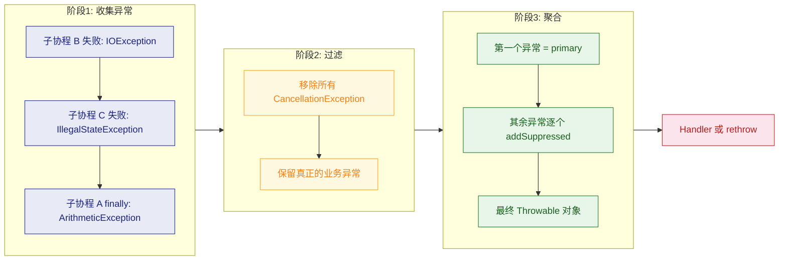

#### 在实际项目中如何正确处理 suppressed 异常

很多开发者只捕获主异常而忽略了 suppressed 异常，这可能导致 **丢失关键的错误信息**。以下是推荐的实践模式：

```kotlin
import kotlinx.coroutines.*

// 自定义一个日志工具函数，完整记录异常链
fun logFullException(tag: String, throwable: Throwable) {
    // 打印主异常的堆栈信息
    println("[$tag] 主异常: ${throwable::class.simpleName}: ${throwable.message}")

    // 递归打印 cause 链
    var cause = throwable.cause
    var depth = 1
    while (cause != null) {
        println("[$tag] ${"  ".repeat(depth)}cause: ${cause::class.simpleName}: ${cause.message}")
        cause = cause.cause
        depth++
    }

    // 遍历 suppressed 异常，每个也可能有自己的 cause 链
    throwable.suppressed.forEachIndexed { index, suppressed ->
        println("[$tag] suppressed[$index]: ${suppressed::class.simpleName}: ${suppressed.message}")
    }
}

fun main() = runBlocking {
    val handler = CoroutineExceptionHandler { _, exception ->
        // 使用完整日志记录，不遗漏任何异常
        logFullException("CoroutineError", exception)
    }

    GlobalScope.launch(handler) {
        // 模拟多个并发任务同时失败
        launch {
            delay(50)
            throw RuntimeException("数据库连接超时") // primary
        }
        launch {
            delay(80)
            throw IllegalStateException("缓存同步失败") // suppressed[0]
        }
        launch {
            delay(100)
            throw OutOfMemoryError("堆内存不足") // suppressed[1]
        }

        delay(Long.MAX_VALUE) // 保持父协程存活
    }.join()

    // 小延迟确保输出完整
    delay(200)
}
```

**输出：**

```text
[CoroutineError] 主异常: RuntimeException: 数据库连接超时
[CoroutineError] suppressed[0]: IllegalStateException: 缓存同步失败
[CoroutineError] suppressed[1]: OutOfMemoryError: 堆内存不足
```

#### suppressed 异常与 `coroutineScope` / `supervisorScope` 的关系

| 作用域类型 | 异常聚合行为 |
|:---|:---|
| `coroutineScope` | 所有子协程异常会被聚合，**主异常会被重新抛出**（可以在外层 `try-catch` 中捕获并检查 `suppressed`） |
| `supervisorScope` | **不聚合**，每个子协程的异常独立处理，互不影响 |

```kotlin
import kotlinx.coroutines.*

fun main() = runBlocking {
    // coroutineScope 会聚合异常
    try {
        coroutineScope {
            launch {
                delay(50)
                throw RuntimeException("异常 A")  // primary
            }
            launch {
                delay(100)
                throw IOException("异常 B")        // suppressed
            }
            delay(Long.MAX_VALUE)
        }
    } catch (e: Exception) {
        // 在这里可以拿到完整的聚合异常
        println("主异常: ${e.message}")
        e.suppressed.forEach {
            println("  suppressed: ${it.message}")
        }
    }

    println("--- 分隔线 ---")

    // supervisorScope 不聚合，异常各自独立
    supervisorScope {
        // 需要对每个子协程单独处理异常
        val child1 = launch {
            throw RuntimeException("独立异常 A") // 独立传播
        }
        val child2 = launch {
            throw IOException("独立异常 B")      // 独立传播
        }
    }
}
```

---

### 异常聚合的内存模型

为了更直观地理解 suppressed 异常在对象层面的结构，来看一个内存引用图：

```java
// 异常聚合后的对象引用关系
//
// ┌──────────────────────────────────────────┐
// │     IOException("网络请求失败")           │  ← 主异常 (primary)
// │                                          │
// │  suppressed: Array<Throwable>            │
// │    ┌─────────────────────────────────┐   │
// │    │ [0] ArithmeticException(...)    │───┼──→ 独立的 Throwable 对象
// │    │ [1] IllegalStateException(...)  │───┼──→ 独立的 Throwable 对象
// │    └─────────────────────────────────┘   │
// │                                          │
// │  cause: null                             │  ← cause 链是另一个维度
// │  stackTrace: [...]                       │
// └──────────────────────────────────────────┘
//
// 注意区分:
//   cause    → 因果链 (A 由 B 引起)
//   suppressed → 并行链 (A 和 B 同时发生，A 先到)
```

> **面试高频考点**：`cause` 和 `suppressed` 的区别。
> - `cause`（`Throwable.cause`）表示**因果关系**：异常 A 是由异常 B 引发的，是一条纵向链。
> - `suppressed`（`Throwable.suppressed`）表示**并发关系**：异常 A 和 B 同时发生，A 先到成为主异常，B 被压制，是一个横向数组。

---

### 小结：异常聚合的核心规则

| 规则 | 说明 |
|:---|:---|
| **先到先得** | 第一个到达的异常成为 primary exception |
| **后到的被 suppress** | 后续异常通过 `addSuppressed()` 附加到 primary 上 |
| **CancellationException 被过滤** | 取消异常不参与聚合，会被静默丢弃 |
| **coroutineScope 聚合** | 会在 `catch` 块中拿到带 `suppressed` 的完整异常 |
| **supervisorScope 不聚合** | 每个子协程独立失败，不存在 suppressed 关系 |
| **不要忽略 suppressed** | 生产环境中务必记录 `exception.suppressed`，避免丢失错误线索 |

---

**📝 练习题**

以下代码执行后，`CoroutineExceptionHandler` 中 `exception.suppressed` 数组的大小是多少？

```kotlin
val handler = CoroutineExceptionHandler { _, exception ->
    println("suppressed size = ${exception.suppressed.size}")
}

GlobalScope.launch(handler) {
    launch {
        delay(50)
        throw IOException("异常1")
    }
    launch {
        delay(100)
        throw IllegalStateException("异常2")
    }
    launch {
        delay(80)
        throw CancellationException("取消")
    }
    launch {
        delay(120)
        throw RuntimeException("异常3")
    }
    delay(Long.MAX_VALUE)
}
```

A. 0


B. 1


C. 2


D. 3


**【答案】** C

**【解析】** 第一个到达的异常是 `IOException`（delay 50ms），它成为 primary exception。之后 `CancellationException`（delay 80ms）到达，但根据协程聚合规则，`CancellationException` 会被**自动过滤**，不会加入 `suppressed` 数组。接着 `IllegalStateException`（delay 100ms）和 `RuntimeException`（delay 120ms）先后到达，它们都是普通异常，会被 `addSuppressed()` 到 primary 上。因此最终 `suppressed` 数组包含 2 个元素：`IllegalStateException` 和 `RuntimeException`，答案为 **C**。

---

## 本章小结

本章系统地拆解了 Kotlin 协程异常处理的六大核心模块。协程的异常机制与传统 `try-catch` 有本质区别——它是 **结构化的 (Structured)**、**层级化的 (Hierarchical)**、**协作式的 (Cooperative)**。理解这些机制，是写出健壮并发代码的基石。下面我们从全局视角将所有知识点串联起来。

---

### 核心知识脉络回顾

**1. 异常传播的两条路径**

协程世界里，异常的"出口"由 **构建器类型 (Builder Type)** 决定：

- **`launch`**：异常 **自动向上传播 (Propagate Upward)**，不等任何人来"问"。它像一个不受控的火苗，点燃后立即蔓延到父协程。
- **`async`**：异常被 **封装在 `Deferred` 中 (Encapsulated)**，只有在调用 `.await()` 时才会抛出。它像一个密封的信封，不拆开就不会爆炸。

这两条路径是整个异常处理体系的基础分叉点，后续所有机制都建立在此之上。

**2. 默认传播规则——双向毁灭**

在普通 `Job` 层级下，异常遵循 **双向传播 (Bidirectional Propagation)** 的残酷法则：

> 子协程异常 → 取消所有兄弟协程 → 取消父协程 → 父协程再取消它的所有子协程

一个子协程的失败，足以摧毁整棵协程树。这是 Structured Concurrency 的"安全默认值"——宁可全部停止，也不让系统处于半一致状态。

**3. CoroutineExceptionHandler——最后的守门员**

`CoroutineExceptionHandler` 是异常传播到根协程后的 **兜底回调 (Last-Resort Handler)**，而非拦截器。它有三条铁律：

- 只对 **`launch`** 有效（`async` 的异常由 `.await()` 消费）。
- 必须安装在 **根协程 (Root Coroutine)** 上才会生效。
- 它 **不能阻止取消传播**，只能用于日志、上报等善后工作。

**4. SupervisorJob——单向防火墙**

`SupervisorJob` 打破了默认的双向传播，将策略改为 **单向传播 (Unidirectional Propagation)**：

- 子 → 父：**不传播**。子协程的失败不会影响父协程。
- 父 → 子：正常传播。父协程取消时，所有子协程仍会被取消。
- 兄弟之间：**互不影响**。一个子协程挂了，其他子协程继续运行。

但要注意：`SupervisorJob` 必须作为 **直接父 Job** 才有效，嵌套一层普通 `Job` 就会失去隔离能力。

**5. supervisorScope——正确的隔离姿势**

`supervisorScope` 是 `SupervisorJob` 的最佳实践封装。它创建一个以 `SupervisorJob` 为 Job 的作用域，在其中用 `launch` 启动的子协程天然具备隔离性。相比手动 `SupervisorJob()`，它避免了"Job 覆盖导致结构化并发断裂"的经典陷阱。

**6. 异常聚合——不丢失任何线索**

当多个子协程几乎同时失败时，Kotlin 不会丢弃任何异常：

- **第一个** 异常成为"主异常 (Primary Exception)"。
- **后续** 异常通过 `suppressed` 数组附着在主异常上，可通过 `exception.suppressed` 访问。
- 特别地，`CancellationException` 会被静默吞掉，不参与聚合。

---

### 全景决策图

下面这张图将本章所有核心概念组织为一张完整的异常处理决策流程图：

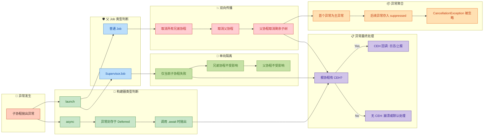

---

### 速查对照表

| 维度 | 普通 Job (Default) | SupervisorJob / supervisorScope |
|---|---|---|
| **子异常 → 父** | ✅ 传播，父被取消 | ❌ 不传播，父继续运行 |
| **子异常 → 兄弟** | ✅ 全部取消 | ❌ 互不影响 |
| **父取消 → 子** | ✅ 全部取消 | ✅ 全部取消 |
| **CEH 生效位置** | 根协程 | 每个子协程自行处理 |
| **典型场景** | 事务性操作（全部成功或全部失败） | UI 并发任务、独立微服务 |

---

### 实战黄金法则

```kotlin
// ═══════════════════════════════════════════════
// 黄金法则 1: 事务性任务 → coroutineScope (普通 Job)
// 任何一步失败, 整体回滚
// ═══════════════════════════════════════════════
suspend fun placeOrder() = coroutineScope {         // 普通 Job, 双向传播
    val payment = async { processPayment() }        // 子任务1: 支付
    val inventory = async { reduceInventory() }     // 子任务2: 扣库存
    payment.await()                                 // 支付失败 → 扣库存也自动取消
    inventory.await()                               // 保证原子性: 全成功或全失败
}

// ═══════════════════════════════════════════════
// 黄金法则 2: 独立并行任务 → supervisorScope
// 彼此互不干扰
// ═══════════════════════════════════════════════
suspend fun loadDashboard() = supervisorScope {     // SupervisorJob, 单向隔离
    val news = async { fetchNews() }                // 模块1: 新闻流
    val weather = async { fetchWeather() }          // 模块2: 天气
    val stocks = async { fetchStocks() }            // 模块3: 股票

    // 天气接口挂了, 新闻和股票照常展示
    val newsData = news.await()                     // 独立消费, 各自 try-catch
    val weatherData = runCatching {                  // runCatching 优雅兜底
        weather.await()
    }.getOrDefault(DEFAULT_WEATHER)                 // 降级为默认天气数据
    val stockData = stocks.await()
}

// ═══════════════════════════════════════════════
// 黄金法则 3: 全局兜底 → CEH 装在根协程
// 用于日志记录和异常上报, 不能阻止取消
// ═══════════════════════════════════════════════
val rootHandler = CoroutineExceptionHandler { _, e ->
    Logger.error("Uncaught: ${e.message}")          // 记录日志
    CrashReporter.report(e)                         // 上报到监控平台
}

val scope = CoroutineScope(                         // 根作用域
    SupervisorJob() + Dispatchers.Main + rootHandler // CEH 在根级别安装
)

scope.launch {                                      // launch: 异常自动传播到 CEH
    riskyWork()                                     // 这里的异常会被 rootHandler 捕获
}
```

---

### 一句话记忆口诀

> **launch 点火就烧，async 拆信才炸；普通 Job 一损俱损，Supervisor 各管各家；CEH 只守根门口，suppressed 不丢一个渣。**

这六句话分别对应本章的六个核心模块。掌握了它们之间的关系与边界，就能在实际项目中根据业务语义选择正确的异常处理策略——该"全军覆没"时绝不手软，该"局部降级"时精准隔离。

---

**📝 练习题 1**

以下代码运行后，控制台最终会输出什么？

```kotlin
fun main() = runBlocking {
    val handler = CoroutineExceptionHandler { _, e ->
        println("CEH caught: ${e.message}")
    }

    val scope = CoroutineScope(SupervisorJob() + handler)

    scope.launch {
        launch {
            throw RuntimeException("Boom")
        }
        delay(100)
        println("Parent launch alive")
    }

    delay(200)
    println("Scope alive")
}
```

A. `CEH caught: Boom` → `Scope alive`


B. `CEH caught: Boom` → `Parent launch alive` → `Scope alive`


C. `Parent launch alive` → `Scope alive`


D. 程序崩溃，无输出

**【答案】** A

**【解析】** `scope.launch` 的父 Job 是 `SupervisorJob()`，所以它是一个 **根协程**，`handler` 对它生效。但在 `scope.launch` 内部，嵌套的 `launch` 与外层 `launch` 之间是 **普通 Job** 父子关系（不是 Supervisor）。内层 `launch` 抛出异常后，按照默认双向传播规则：异常向上传给外层 `launch`，外层 `launch` 被取消，所以 `println("Parent launch alive")` **不会执行**。异常继续传播到根级别，被 `CEH` 捕获输出 `CEH caught: Boom`。而 `scope` 本身是 `SupervisorJob`，不受子协程影响，所以 `delay(200)` 后 `println("Scope alive")` 正常输出。最终输出为：`CEH caught: Boom` → `Scope alive`。

---

**📝 练习题 2**

在 `supervisorScope` 中使用 `async` 启动子协程，如果不调用 `.await()`，异常会怎样？

A. 异常被静默吞掉，完全无感知


B. 异常传播给父协程，导致 `supervisorScope` 取消


C. 异常不会传播，但会被丢弃；如有 `CEH` 也不会触发


D. 异常不会自动传播，但可能导致 JVM 未捕获异常警告或在某些平台上丢失

**【答案】** D

**【解析】** `supervisorScope` 内的 `async` 属于 Supervisor 的直接子协程。`async` 的异常本身就是延迟暴露的（等 `.await()`），再加上 `SupervisorJob` 不会让子异常向上传播，所以这个异常 **不会取消父协程或兄弟协程**（排除 B）。但它也并非被"干净地吞掉"——如果永远不 `.await()`，这个 `Deferred` 就成了一个"未消费的失败"。在 JVM 上，这可能触发协程库内部的 "unhandled exception" 日志警告（具体行为与平台和协程版本有关），而 `CEH` 对 `async` 无效所以不会被回调（排除 C 中"有 CEH 也不触发"的部分说法虽正确但整体描述不完整）。A 的"完全无感知"过于绝对，D 最准确地描述了这种边界行为。**最佳实践：永远 `.await()` 或用 `runCatching { deferred.await() }` 消费 async 的结果。**

---