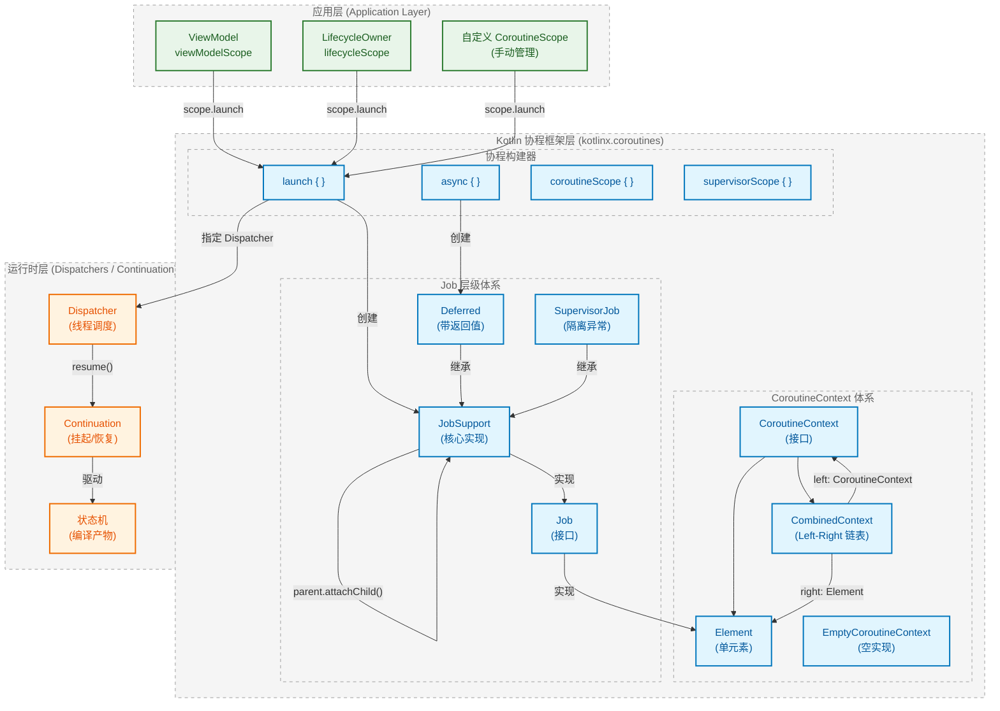
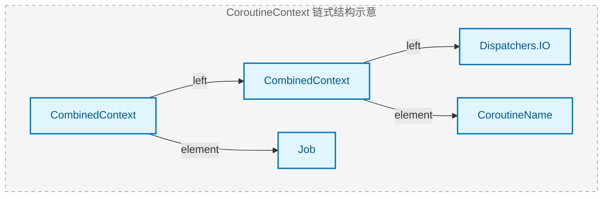
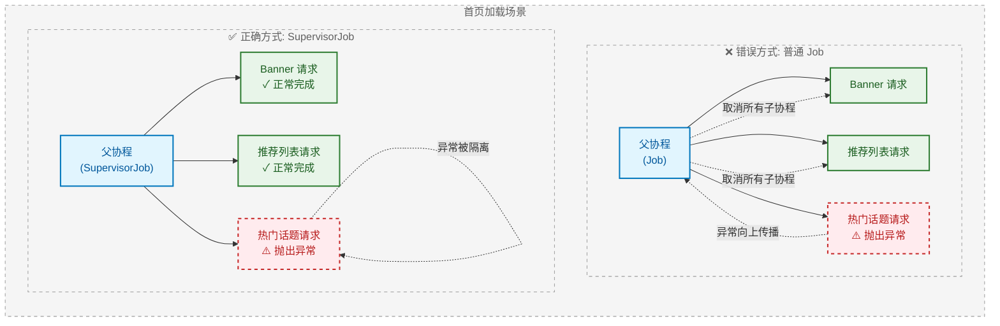

# Kotlin 结构化并发与 Job：从"野生线程"到"可控生命周期"的范式跃迁

## 一、定义与本质：重新理解"结构化并发"

在传统的 Android 并发模型中，开发者长期与一个顽疾作斗争——**并发任务的生命周期与业务组件的生命周期错位**。一个 `Thread` 或 `AsyncTask` 一旦启动，它就成为了一个"野生"的执行单元，与 Activity/Fragment 的销毁毫无关联。这导致了大量的内存泄漏、空指针崩溃以及难以追踪的竞态条件。

**结构化并发（Structured Concurrency）** 的核心哲学是：**并发任务的生命周期必须被约束在一个明确的作用域（Scope）内，当作用域结束时，其内部所有任务必须完成或被取消**。这与"结构化编程"中"代码块结束则局部变量销毁"的理念一脉相承。

从架构师视角，Kotlin 协程的结构化并发并非简单的语法糖，而是通过 **`Job` 的父子层级关系** 构建出一棵**协程树（Coroutine Tree）**。这棵树的根节点通常绑定在 `ViewModel`、`LifecycleOwner` 或自定义的 `CoroutineScope` 上。当根节点被取消（如 `onCleared()` 调用），取消信号会**自顶向下**传播至所有子孙节点，确保"不泄漏、可取消"的契约。

## 二、核心考点透视：四大支柱

Kotlin 结构化并发的面试考察，本质上是对以下四个相互耦合的机制的深度理解：

| 支柱 | 核心问题 | 底层机制 |
|------|----------|----------|
| **CoroutineContext 数据结构** | 上下文如何高效存储与检索？ | `CombinedContext` 的 Left/Right 链表结构 |
| **Job 父子层级** | 父子关系如何建立与维护？ | `attachChild()` / `ChildHandle` |
| **异常传播机制** | 异常如何向上冒泡？`SupervisorJob` 为何能隔离？ | `childCancelled()` 的返回值与 `JobSupport` 状态机 |
| **协作式取消** | 为何 `delay` 能响应取消而死循环不能？ | `ensureActive()` / `isActive` 检测点 |

这四者并非孤立存在。`Job` 本身是 `CoroutineContext.Element`，它通过 `CoroutineContext` 的组合运算符 `+` 被注入到协程中；父子关系决定了异常传播的路径；而协作式取消则依赖于开发者在代码中埋入检测点。

## 三、宏观架构图：结构化并发的分层视图



## 四、架构图深度解析：模块交互的本质逻辑

### 4.1 应用层（Application Layer）：Scope 的生命周期锚点

架构图顶部的三个绿色节点——`viewModelScope`、`lifecycleScope` 和自定义 `CoroutineScope`——代表了协程的**生命周期锚定点**。这并非偶然的设计，而是 Google 在 Jetpack 中刻意为之的"防泄漏屏障"。

`viewModelScope` 的生命周期绑定在 `ViewModel.onCleared()` 上。当用户旋转屏幕时，Activity 被销毁重建，但 ViewModel 存活；只有当 Activity 真正 finish 时，`onCleared()` 被调用，此时 `viewModelScope` 内部持有的 `SupervisorJob` 执行 `cancel()`，所有子协程收到取消信号。这解决了传统 `AsyncTask` 持有 Activity 引用导致泄漏的经典问题。

`lifecycleScope` 则更加细粒度，它提供了 `launchWhenStarted`、`launchWhenResumed` 等 API，协程不仅在 `onDestroy()` 时被取消，还能在生命周期降级（如进入后台）时自动**挂起**，避免在不可见状态下执行 UI 更新。

自定义 `CoroutineScope` 是双刃剑：它赋予开发者完全控制权，但也意味着**必须手动调用 `scope.cancel()`**，否则协程将成为"野生任务"。

### 4.2 框架层核心：CoroutineContext 的"异构容器"设计

架构图中部的 `CoroutineContext` 体系是理解协程的关键。`CoroutineContext` 本质上是一个**类型安全的异构键值对集合**（Heterogeneous Map），但它的实现并非 `HashMap`，而是一个精巧的**不可变链表结构**。



当你写下 `Dispatchers.IO + Job() + CoroutineName("task")` 时，`+` 运算符（即 `plus` 函数）会构建出上图所示的链表。`CombinedContext` 是一个二元组，其 `left` 指向剩余的上下文，`element` 持有当前元素。这种设计的优势在于：

1. **不可变性**：每次 `+` 操作都返回新对象，天然线程安全
2. **O(n) 查找但 n 极小**：实际场景中 Context 元素通常不超过 5 个，链表遍历开销可忽略
3. **Key 唯一性**：相同 Key 的新元素会**替换**旧元素，而非追加

### 4.3 Job 层级体系：父子关系的建立与维护

架构图中 `JobSupport` 节点的自指向箭头（`parent.attachChild()`）揭示了父子关系的核心机制。当 `launch` 或 `async` 创建新协程时，会从当前 `CoroutineContext` 中提取父 `Job`，然后调用 `parent.attachChild(childJob)`。

```kotlin
// AbstractCoroutine.kt 简化逻辑
internal fun initParentJob(parent: Job?) {
    if (parent == null) {
        // 根协程，无父 Job
        parentHandle = NonDisposableHandle
        return
    }
    // 关键：将自己注册为父 Job 的子节点
    parentHandle = parent.attachChild(this)
    // 如果父 Job 已取消，立即取消自己
    if (parent.isCompleted) {
        parentHandle.dispose()
        // ... 处理取消逻辑
    }
}
```

`attachChild()` 返回的 `ChildHandle` 是一个轻量级句柄，用于在子协程完成时从父节点的子列表中移除自己。这形成了一个**双向绑定**：父知道所有子，子持有父的引用（通过 handle 间接持有）。

### 4.4 运行时层：Dispatcher 与 Continuation 的协作

架构图底部的运行时层展示了协程的**实际执行机制**。`Dispatcher` 决定协程在哪个线程（池）上运行，而 `Continuation` 则是挂起/恢复的载体。

当协程遇到 `suspend` 函数时，Kotlin 编译器会将其转换为状态机。每个挂起点对应状态机的一个 `label`，`Continuation.resumeWith()` 被调用时，状态机根据 `label` 跳转到对应位置继续执行。`Dispatcher` 的职责是决定 `resumeWith()` 在哪个线程被调用——`Dispatchers.Main` 会 post 到主线程 Handler，`Dispatchers.IO` 会提交到共享线程池。

这三层的协作关系可以总结为：**Scope 定生死，Context 定身份，Dispatcher 定归宿，Continuation 定节奏**。

## 五、落地场景与典型陷阱：从理论到工程实践

### 5.1 场景一：ViewModel 中的网络请求生命周期管理

这是最常见的结构化并发应用场景。假设用户在列表页快速点击进入详情页，又立即返回，此时详情页的网络请求应该被取消，而非继续执行后尝试更新已销毁的 UI。

```kotlin
class DetailViewModel : ViewModel() {
    
    private val _uiState = MutableStateFlow<UiState>(UiState.Loading)
    val uiState: StateFlow<UiState> = _uiState.asStateFlow()
    
    fun loadDetail(id: String) {
        // viewModelScope 内部持有 SupervisorJob + Dispatchers.Main.immediate
        viewModelScope.launch {
            try {
                // 切换到 IO 线程执行网络请求
                val result = withContext(Dispatchers.IO) {
                    repository.fetchDetail(id)  // 挂起点：此处可响应取消
                }
                _uiState.value = UiState.Success(result)
            } catch (e: CancellationException) {
                // 关键：CancellationException 必须重新抛出，否则破坏取消机制
                throw e
            } catch (e: Exception) {
                _uiState.value = UiState.Error(e.message)
            }
        }
    }
    
    // 当 Activity/Fragment 真正销毁时，ViewModel.onCleared() 被调用
    // viewModelScope.cancel() 自动执行，上述 launch 块收到取消信号
}
```

**陷阱警示**：`catch (e: Exception)` 会捕获 `CancellationException`（它是 `Exception` 的子类），如果不重新抛出，协程的取消机制将被"吞掉"，导致父 Job 无法感知子协程已取消，可能引发状态不一致。Kotlin 1.4+ 推荐使用 `runCatching` 的变体或显式检查。

### 5.2 场景二：并行请求的异常隔离（SupervisorJob 的正确姿势）

业务场景：首页需要同时加载 Banner、推荐列表、热门话题三个模块，任意一个失败不应影响其他模块的展示。



上图清晰展示了两种模式的差异。普通 `Job` 遵循"一损俱损"原则：任一子协程的未捕获异常会通过 `childCancelled()` 向上传播，父 Job 收到后会取消所有其他子协程。而 `SupervisorJob` 重写了 `childCancelled()` 方法，直接返回 `false`，表示"我不处理子协程的异常，让它自生自灭"。

```kotlin
// 正确实现
class HomeViewModel : ViewModel() {
    
    fun loadHomeData() {
        // 方式一：使用 supervisorScope
        viewModelScope.launch {
            supervisorScope {
                // 三个请求并行，互不影响
                val bannerDeferred = async { loadBanner() }
                val listDeferred = async { loadRecommendList() }
                val hotDeferred = async { loadHotTopics() }
                
                // 分别处理结果，单个失败不影响其他
                bannerDeferred.await().onSuccess { updateBanner(it) }
                listDeferred.await().onSuccess { updateList(it) }
                hotDeferred.await().onSuccess { updateHot(it) }
            }
        }
    }
    
    private suspend fun loadBanner(): Result<Banner> = runCatching {
        repository.fetchBanner()
    }
}
```

**陷阱警示**：`supervisorScope` 与 `SupervisorJob()` 不可混淆。直接写 `launch(SupervisorJob()) { ... }` 是**错误的**——这会创建一个与父 Job 无关的新 Job，破坏结构化并发的父子关系，导致 `viewModelScope.cancel()` 无法取消该协程。正确做法是使用 `supervisorScope { }` 构建器，它会正确建立父子关系。

### 5.3 场景三：协作式取消的"不响应"陷阱

协程取消是**协作式**的，这意味着如果你的代码不主动检查取消状态，协程将持续运行。

```kotlin
// ❌ 危险代码：CPU 密集型计算不响应取消
viewModelScope.launch {
    val result = withContext(Dispatchers.Default) {
        var sum = 0L
        for (i in 1..1_000_000_000) {
            sum += i  // 纯计算，没有挂起点，不检查取消
        }
        sum
    }
    updateUI(result)
}

// ✅ 正确做法：定期检查取消状态
viewModelScope.launch {
    val result = withContext(Dispatchers.Default) {
        var sum = 0L
        for (i in 1..1_000_000_000) {
            // 方式一：使用 ensureActive()，已取消则抛出 CancellationException
            ensureActive()
            
            // 方式二：使用 yield()，让出执行权并检查取消
            // if (i % 10000 == 0) yield()
            
            sum += i
        }
        sum
    }
    updateUI(result)
}
```

`ensureActive()` 的实现极其简洁：

```kotlin
public fun Job.ensureActive(): Unit {
    if (!isActive) throw getCancellationException()
}
```

它检查当前 Job 的 `isActive` 状态，若为 `false`（已取消或已完成），则抛出 `CancellationException`，触发协程的取消流程。这就是为什么 `delay()`、`yield()`、`withContext()` 等挂起函数都能响应取消——它们内部都埋入了类似的检测点。

### 5.4 场景四：GlobalScope 的"逃逸"问题

`GlobalScope` 是结构化并发的"叛逃者"，它启动的协程没有父 Job，生命周期与整个应用进程相同。

```kotlin
// ❌ 严禁在业务代码中使用
fun onButtonClick() {
    GlobalScope.launch {
        // 这个协程与 Activity 生命周期无关
        // Activity 销毁后仍会执行，可能导致内存泄漏或崩溃
        delay(5000)
        updateUI()  // 💥 Activity 已销毁，崩溃
    }
}
```

`GlobalScope` 的合法使用场景极为有限：应用级的后台任务（如日志上传、埋点发送），且必须配合 `try-catch` 处理所有异常。在绝大多数业务场景中，应使用 `viewModelScope`、`lifecycleScope` 或自定义的受控 Scope。

