# Synchronized 锁与锁升级策略：从对象头到操作系统的全链路拆解

## 一、定义与本质：不只是"互斥"，而是一套自适应同步状态机

在大多数教科书式的定义中，`synchronized` 被简单描述为"Java 内置的互斥锁关键字"。这种定义过于表面。从架构师视角审视，**`synchronized` 的本质是一套嵌入在 JVM 对象模型中的、基于运行时竞争反馈的自适应同步状态机**。

这套状态机的核心设计哲学是：**乐观假设，悲观兜底**。JVM 假设绝大多数锁在运行时不存在真正的多线程竞争（事实上，IBM 研究表明超过 90% 的锁在整个生命周期内只被一个线程持有），因此它将锁的默认状态设计得极其轻量——几乎零开销的偏向锁。只有当运行时反馈表明竞争确实存在时，才逐级升级为更重的同步机制。

这与 `ReentrantLock` 形成鲜明对比：`ReentrantLock` 从一开始就维护一个完整的 AQS 等待队列和 CAS 状态机，属于"一视同仁"的设计；而 `synchronized` 则是"按需付费"——你用多少竞争，JVM 就给你多少同步开销。

## 二、核心考点透视：三层递进的技术栈

`synchronized` 在 Android/JVM 技术体系中的地位极为特殊，它横跨三个技术层次，每一层都有独立的考察维度：

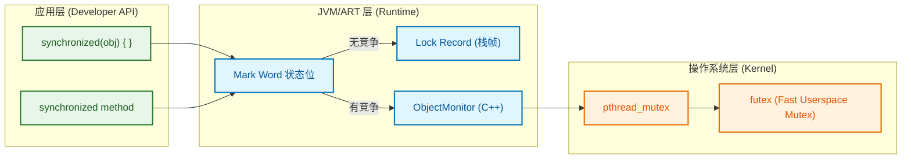
```mermaid
graph LR
    subgraph APP["应用层 (Developer API)"]
        A1["synchronized(obj) { }"]
        A2["synchronized method"]
    end
    
    subgraph JVM["JVM/ART 层 (Runtime)"]
        B1["Mark Word 状态位"]
        B2["Lock Record (栈帧)"]
        B3["ObjectMonitor (C++)"]
    end
    
    subgraph OS["操作系统层 (Kernel)"]
        C1["pthread_mutex"]
        C2["futex (Fast Userspace Mutex)"]
    end
    
    A1 --> B1
    A2 --> B1
    B1 -->|"无竞争"| B2
    B1 -->|"有竞争"| B3
    B3 --> C1
    C1 --> C2
    
    class A1,A2 app
    class B1,B2,B3 fw
    class C1,C2 native
    
    classDef app fill:#e8f5e9,stroke:#2e7d32,stroke-width:2px,color:#1b5e20;
    classDef fw fill:#e1f5fe,stroke:#0277bd,stroke-width:2px,color:#01579b;
    classDef native fill:#fff3e0,stroke:#ef6c00,stroke-width:2px,color:#e65100;
```

上图展示了 `synchronized` 的技术栈全景。从顶层的 Java 语法糖，到中间层 JVM/ART 的运行时数据结构，再到底层操作系统的线程同步原语，形成了一条完整的调用链路。

**应用层**是开发者直接接触的 API 表面，包括同步代码块 `synchronized(obj) {}` 和同步方法修饰符。这两种写法在字节码层面有本质区别：同步代码块会生成显式的 `monitorenter` 和 `monitorexit` 指令；而同步方法则是在方法访问标志（access_flags）中设置 `ACC_SYNCHRONIZED` 位，由 JVM 隐式处理。

**JVM/ART 层**是锁机制的核心实现所在。三个关键数据结构各司其职：`Mark Word` 是每个对象头中 64 位（64 位系统）的状态位图，存储锁状态和持有者信息；`Lock Record` 是栈帧中的轻量级锁记录，用于 CAS 替换 Mark Word；`ObjectMonitor` 是 HotSpot 中用 C++ 实现的重量级管程结构，包含完整的等待队列和阻塞逻辑。

**操作系统层**是最终的兜底机制。当竞争激烈到必须真正阻塞线程时，JVM 会调用 POSIX 线程库的 `pthread_mutex_lock`，而 Linux 内核则通过 `futex`（Fast Userspace Mutex）系统调用实现高效的用户态/内核态切换。

## 三、对象头 Mark Word 的位图结构

理解锁升级的前提是彻底搞清楚 Mark Word 的内存布局。在 64 位 HotSpot JVM 中，对象头的 Mark Word 占据 8 字节（64 位），其结构随锁状态动态变化：

```asm
┌─────────────────────────────────────────────────────────────────────────────┐
│                         64-bit Mark Word Layout                             │
├─────────────────────────────────────────────────────────────────────────────┤
│ Lock State       │ Bit 63-3 (61 bits)                    │ Bit 2-0 (3 bits)│
├─────────────────────────────────────────────────────────────────────────────┤
│ Unlocked         │ identity_hashcode:31 | age:4 | unused:26    │ 0  0  1    │
├─────────────────────────────────────────────────────────────────────────────┤
│ Biased           │ thread_id:54 | epoch:2 | age:4 | (biased)   │ 1  0  1    │
├─────────────────────────────────────────────────────────────────────────────┤
│ Lightweight      │ ptr_to_lock_record:62                       │ 0  0  0    │
├─────────────────────────────────────────────────────────────────────────────┤
│ Heavyweight      │ ptr_to_monitor:62                           │ 1  0       │
├─────────────────────────────────────────────────────────────────────────────┤
│ GC Marked        │ (forwarding pointer / GC metadata)          │ 1  1       │
└─────────────────────────────────────────────────────────────────────────────┘

Tag Bits Decoding:
  001 = Unlocked (无锁，可偏向)
  101 = Biased (偏向锁)
  000 = Lightweight Locked (轻量级锁)
  10  = Heavyweight Locked (重量级锁，最低2位)
  11  = GC Marked (GC 标记态)
```

这张位图结构揭示了 JVM 设计的精妙之处：**最低 2-3 位的标志位决定了整个 64 位的解释方式**。这是一种典型的"标签指针"（Tagged Pointer）技术——通过复用指针的低位（因为对象地址对齐，低位必然为 0）来存储元信息，从而在不增加额外存储开销的前提下实现多态数据结构。

**无锁状态（001）**：高位存储 identity hashcode（只有调用过 `hashCode()` 才会计算并填充）、GC 分代年龄（age，4 位，最大 15）以及未使用的保留位。这个状态是对象刚创建时的默认态，也是偏向锁撤销后可能回退到的状态。

**偏向锁状态（101）**：高位存储偏向线程的 ID（54 位，足以覆盖所有线程）、epoch（2 位，用于批量重偏向优化）和 age。注意，一旦启用偏向锁，identity hashcode 就无处可存——这正是调用 `hashCode()` 会导致偏向锁撤销的根本原因。

**轻量级锁状态（00）**：整个高 62 位变成一个指针，指向当前持有锁的线程栈帧中的 Lock Record。这个指针实现了"栈上分配"的轻量级同步，避免了堆内存分配。

**重量级锁状态（10）**：高 62 位指向堆中分配的 `ObjectMonitor` 对象。一旦升级到这个状态，就意味着 JVM 认为该锁确实存在激烈竞争，需要完整的等待队列和阻塞/唤醒机制。

## 四、锁升级状态机：单向不可逆的演进路径

锁升级是 `synchronized` 最核心的运行时优化机制。JVM 根据竞争反馈动态调整锁的实现策略，但这个过程是**单向不可逆**的——一旦升级，就不会降级（除非 GC 回收重建对象）。

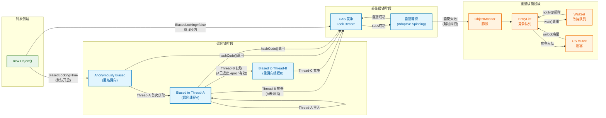
```mermaid
graph LR
    subgraph INIT["对象创建"]
        N0["new Object()"]
    end
    
    subgraph BIAS["偏向锁阶段"]
        B0["Anonymously Biased<br/>(匿名偏向)"]
        B1["Biased to Thread-A<br/>(偏向线程A)"]
        B2["Biased to Thread-B<br/>(重偏向线程B)"]
    end
    
    subgraph LIGHT["轻量级锁阶段"]
        L1["CAS 竞争<br/>Lock Record"]
        L2["自旋等待<br/>(Adaptive Spinning)"]
    end
    
    subgraph HEAVY["重量级锁阶段"]
        H1["ObjectMonitor<br/>膨胀"]
        H2["EntryList<br/>竞争队列"]
        H3["WaitSet<br/>等待队列"]
        H4["OS Mutex<br/>阻塞"]
    end
    
    N0 -->|"BiasedLocking=true<br/>(默认开启)"| B0
    N0 -->|"BiasedLocking=false<br/>或 4秒内"| L1
    
    B0 -->|"Thread-A 首次获取"| B1
    B1 -->|"Thread-A 重入"| B1
    B1 -->|"Thread-B 获取<br/>(A已退出,epoch有效)"| B2
    
    B1 -->|"Thread-B 竞争<br/>(A未退出)"| L1
    B2 -->|"Thread-C 竞争"| L1
    B0 -->|"hashCode()调用"| L1
    B1 -->|"hashCode()调用"| L1
    
    L1 -->|"CAS成功"| L2
    L2 -->|"自旋成功"| L1
    L2 -->|"自旋失败<br/>(超过阈值)"| H1
    
    H1 --> H2
    H2 -->|"竞争入队"| H4
    H2 -->|"wait()调用"| H3
    H3 -->|"notify()/超时"| H2
    H4 -->|"unlock唤醒"| H2
    
    class N0 app
    class B0,B1,B2 fw
    class L1,L2 fw
    class H1,H2,H3,H4 native
    
    classDef app fill:#e8f5e9,stroke:#2e7d32,stroke-width:2px,color:#1b5e20;
    classDef fw fill:#e1f5fe,stroke:#0277bd,stroke-width:2px,color:#01579b;
    classDef native fill:#fff3e0,stroke:#ef6c00,stroke-width:2px,color:#e65100;
```

### 状态转换的详细推演

**阶段零：对象创建时的初始状态选择**

当 `new Object()` 执行时，JVM 并不会立即将对象标记为"偏向某个线程"。这里存在一个关键的时间窗口：JVM 启动后的前 4 秒（由 `-XX:BiasedLockingStartupDelay` 控制，默认 4000ms），所有新创建的对象都**不会**进入偏向锁状态，而是直接从无锁态开始。

这个设计的原因是：JVM 启动阶段会执行大量的类加载和初始化，这些操作涉及高度竞争的同步（如 `ClassLoader` 的锁），如果这时启用偏向锁，会导致频繁的偏向撤销，反而降低性能。4 秒后，JVM 假设启动热身完成，开始为新对象启用偏向锁。

**阶段一：偏向锁的获取与重偏向**

对象创建后（4 秒延迟后），Mark Word 处于"匿名偏向"状态——偏向锁标志位已设置（101），但 thread_id 字段为空（全 0）。当第一个线程 Thread-A 执行 `synchronized(obj)` 时，JVM 通过一次 CAS 操作将自己的线程 ID 写入 Mark Word 的 thread_id 字段。如果 CAS 成功，偏向锁获取完成，后续 Thread-A 再次进入同一个同步块时，只需简单比对 thread_id 即可，**无需任何原子操作**。

当 Thread-A 已经退出同步块（但对象仍偏向 Thread-A），Thread-B 尝试获取锁时，会发生**重偏向**（Rebias）。JVM 会检查 Thread-A 是否存活且是否仍在同步块内。如果 Thread-A 已不在同步块内，JVM 会在全局安全点（Safepoint）撤销原偏向，然后将对象重新偏向 Thread-B。这个过程涉及 STW（Stop-The-World），但通常非常短暂。

**阶段二：偏向锁撤销与轻量级锁升级**

以下三种情况会触发偏向锁撤销，升级为轻量级锁：

1. **真正的并发竞争**：Thread-B 尝试获取锁时，Thread-A 仍在同步块内。这是最直观的竞争场景。

2. **调用 `hashCode()`**：如前所述，identity hashcode 与偏向锁的 thread_id 共用 Mark Word 的高位空间。一旦计算 hashcode，就必须找地方存储它，偏向锁状态无法容纳，因此必须撤销。

3. **调用 `wait()`/`notify()`**：这些方法需要 ObjectMonitor 的 WaitSet 队列支持，而偏向锁和轻量级锁都没有这个结构，因此会直接膨胀为重量级锁。

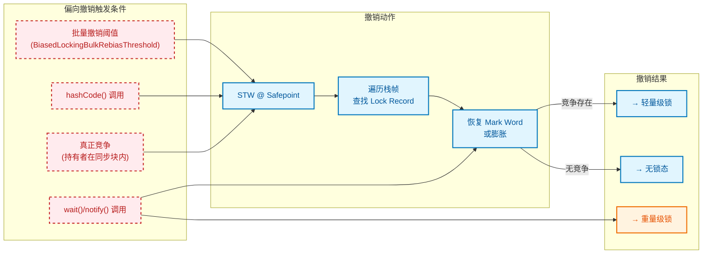
```mermaid
graph LR
    subgraph REVOKE["偏向撤销触发条件"]
        R1["真正竞争<br/>(持有者在同步块内)"]
        R2["hashCode() 调用"]
        R3["wait()/notify() 调用"]
        R4["批量撤销阈值<br/>(BiasedLockingBulkRebiasThreshold)"]
    end
    
    subgraph ACTION["撤销动作"]
        A1["STW @ Safepoint"]
        A2["遍历栈帧<br/>查找 Lock Record"]
        A3["恢复 Mark Word<br/>或膨胀"]
    end
    
    subgraph RESULT["撤销结果"]
        T1["→ 轻量级锁"]
        T2["→ 无锁态"]
        T3["→ 重量级锁"]
    end
    
    R1 --> A1
    R2 --> A1
    R3 --> A3
    R4 --> A1
    
    A1 --> A2
    A2 --> A3
    
    A3 -->|"竞争存在"| T1
    A3 -->|"无竞争"| T2
    R3 --> T3
    
    class R1,R2,R3,R4 err
    class A1,A2,A3 fw
    class T1,T2 fw
    class T3 native
    
    classDef err fill:#ffebee,stroke:#c62828,stroke-width:2px,stroke-dasharray: 5 5,color:#b71c1c;
    classDef fw fill:#e1f5fe,stroke:#0277bd,stroke-width:2px,color:#01579b;
    classDef native fill:#fff3e0,stroke:#ef6c00,stroke-width:2px,color:#e65100;
```

偏向撤销的代价在于**必须等待全局安全点**。JVM 需要暂停所有应用线程，遍历偏向线程的栈帧，找到所有指向该对象的 Lock Record，然后根据情况决定是恢复为无锁态、升级为轻量级锁还是直接膨胀为重量级锁。这个 STW 暂停虽然通常只有微秒级别，但在高并发场景下频繁触发仍会造成可观的延迟抖动。

**阶段三：轻量级锁的 CAS 自旋**

升级为轻量级锁后，JVM 在当前线程的栈帧中分配一块称为 Lock Record 的空间。Lock Record 包含两个关键字段：一是 `Displaced Mark Word`，用于备份对象原本的 Mark Word；二是 `Owner` 指针，指向锁对象。

获取轻量级锁时，JVM 执行以下操作：

1. 将对象当前的 Mark Word 复制到 Lock Record 的 Displaced Mark Word 字段
2. 通过 CAS 尝试将对象的 Mark Word 更新为指向该 Lock Record 的指针
3. 如果 CAS 成功，当前线程持有轻量级锁；如果失败，进入自旋等待

自适应自旋（Adaptive Spinning）是 JDK 6 引入的优化。JVM 会根据**同一个锁上次自旋的成功率**动态调整自旋次数：如果上次自旋成功获得了锁，JVM 会乐观地增加本次自旋次数；如果上次自旋失败，则减少甚至跳过自旋。这种启发式策略避免了固定自旋次数带来的资源浪费或响应延迟。

**阶段四：重量级锁的膨胀与 ObjectMonitor**

当自旋超过阈值仍未获得锁，或者检测到已有线程在等待，JVM 判定当前存在真正的多线程竞争，触发锁膨胀（Inflation）。膨胀过程中，JVM 在堆中分配一个 `ObjectMonitor` 对象，将对象的 Mark Word 替换为指向该 Monitor 的指针（低 2 位标记为 10）。

`ObjectMonitor` 是 HotSpot 中用 C++ 实现的核心同步结构，其内存布局如下：

```cpp
// hotspot/src/share/vm/runtime/objectMonitor.hpp (简化)
class ObjectMonitor {
  // ============ 核心字段 ============
  volatile markWord _header;      // 备份的原始 Mark Word（用于锁释放时恢复）
  
  void* volatile _object;         // 指向关联的 Java 对象
  void* volatile _owner;          // 当前持有锁的线程（Thread*）
  
  volatile int _recursions;       // 重入计数（同一线程多次 synchronized）
  
  // ============ 等待队列 ============
  ObjectWaiter* volatile _EntryList;   // 阻塞等待获取锁的线程队列
  ObjectWaiter* volatile _cxq;         // 竞争队列（Contention Queue，LIFO）
  ObjectWaiter* volatile _WaitSet;     // 调用 wait() 后进入的等待队列
  
  // ============ 统计与优化字段 ============
  volatile int _contentions;      // 当前竞争计数
  volatile int _SpinDuration;     // 自适应自旋参数
  
  // ============ 底层同步原语 ============
  ParkEvent* _EntryEvent;         // 用于 park/unpark 的事件对象
};
```

这个结构体揭示了重量级锁的完整机制：`_owner` 字段记录当前持锁线程；`_recursions` 支持可重入语义（同一线程多次进入同步块）；三个队列 `_cxq`、`_EntryList`、`_WaitSet` 分别承担不同的职责。

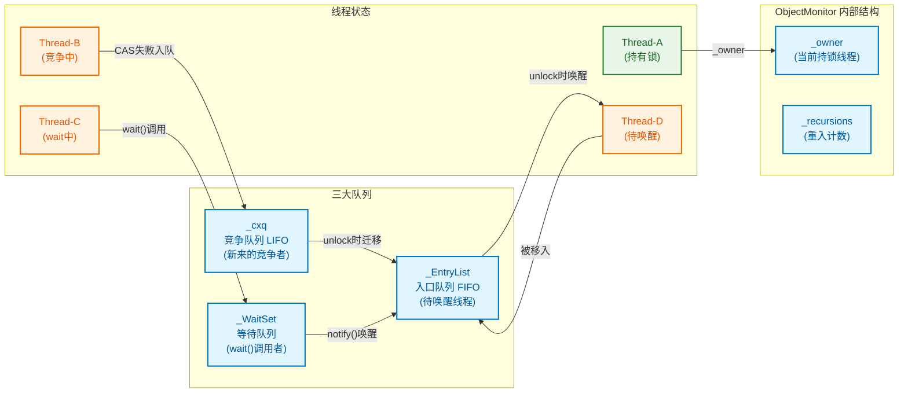
```mermaid
graph LR
    subgraph MONITOR["ObjectMonitor 内部结构"]
        direction TB
        OW["_owner<br/>(当前持锁线程)"]
        RC["_recursions<br/>(重入计数)"]
    end
    
    subgraph QUEUES["三大队列"]
        CXQ["_cxq<br/>竞争队列 LIFO<br/>(新来的竞争者)"]
        ENTRY["_EntryList<br/>入口队列 FIFO<br/>(待唤醒线程)"]
        WAIT["_WaitSet<br/>等待队列<br/>(wait()调用者)"]
    end
    
    subgraph THREADS["线程状态"]
        T1["Thread-A<br/>(持有锁)"]
        T2["Thread-B<br/>(竞争中)"]
        T3["Thread-C<br/>(wait中)"]
        T4["Thread-D<br/>(待唤醒)"]
    end
    
    T1 -->|"_owner"| OW
    T2 -->|"CAS失败入队"| CXQ
    T3 -->|"wait()调用"| WAIT
    T4 -->|"被移入"| ENTRY
    
    CXQ -->|"unlock时迁移"| ENTRY
    ENTRY -->|"unlock时唤醒"| T4
    WAIT -->|"notify()唤醒"| ENTRY
    
    class OW,RC fw
    class CXQ,ENTRY,WAIT fw
    class T1 app
    class T2,T3,T4 native
    
    classDef app fill:#e8f5e9,stroke:#2e7d32,stroke-width:2px,color:#1b5e20;
    classDef fw fill:#e1f5fe,stroke:#0277bd,stroke-width:2px,color:#01579b;
    classDef native fill:#fff3e0,stroke:#ef6c00,stroke-width:2px,color:#e65100;
```

**三大队列的协作机制**是面试高频考点，值得详细展开：

**`_cxq`（Contention Queue）**：这是一个 LIFO（后进先出）栈结构。当线程竞争锁失败时，会被封装成 `ObjectWaiter` 节点并通过 CAS 压入 `_cxq` 栈顶。使用 LIFO 而非 FIFO 的原因是：CAS 操作只能原子地修改栈顶指针，无法原子地追加到队尾。

**`_EntryList`**：这是一个 FIFO 队列，存放"即将被唤醒去竞争锁"的线程。当持锁线程释放锁时，会将 `_cxq` 中的所有节点批量迁移到 `_EntryList`，然后从 `_EntryList` 头部取出一个线程进行唤醒。这种设计将"入队"和"出队"的竞争点分离到两个不同的数据结构，减少了 CAS 冲突。

**`_WaitSet`**：存放调用了 `wait()` 方法的线程。这些线程已经释放了锁，进入等待状态，直到被 `notify()`/`notifyAll()` 唤醒。被唤醒的线程不会直接获得锁，而是被移入 `_EntryList`，重新参与锁竞争。

## 五、落地场景与避坑指南

### 场景一：偏向锁在高并发容器中的性能陷阱

```kotlin
// 典型的性能反模式
class CounterService {
    private val lock = Any()
    private var count = 0
    
    // 多线程高频调用
    fun increment() {
        synchronized(lock) {  // lock 对象频繁在不同线程间切换
            count++
        }
    }
}
```

这段代码在低并发场景下工作良好，但在高并发（多线程频繁交替获取锁）场景下会遭遇严重的性能问题。原因是：`lock` 对象的偏向锁会被频繁撤销，每次撤销都需要 STW 到达安全点。

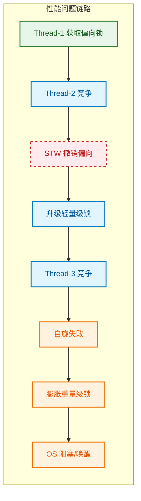
```mermaid
graph LR
    subgraph PROBLEM["性能问题链路"]
        P1["Thread-1 获取偏向锁"]
        P2["Thread-2 竞争"]
        P3["STW 撤销偏向"]
        P4["升级轻量级锁"]
        P5["Thread-3 竞争"]
        P6["自旋失败"]
        P7["膨胀重量级锁"]
        P8["OS 阻塞/唤醒"]
    end
    
    P1 --> P2
    P2 --> P3
    P3 --> P4
    P4 --> P5
    P5 --> P6
    P6 --> P7
    P7 --> P8
    
    class P1 app
    class P2,P4,P5 fw
    class P3 err
    class P6,P7,P8 native
    
    classDef app fill:#e8f5e9,stroke:#2e7d32,stroke-width:2px,color:#1b5e20;
    classDef fw fill:#e1f5fe,stroke:#0277bd,stroke-width:2px,color:#01579b;
    classDef native fill:#fff3e0,stroke:#ef6c00,stroke-width:2px,color:#e65100;
    classDef err fill:#ffebee,stroke:#c62828,stroke-width:2px,stroke-dasharray: 5 5,color:#b71c1c;
```

**优化方案**：

1. **禁用偏向锁**：通过 JVM 参数 `-XX:-UseBiasedLocking` 直接跳过偏向锁阶段。JDK 15 之后，偏向锁已被标记为废弃（JEP 374），JDK 18+ 默认禁用。

2. **使用 `java.util.concurrent` 原子类**：`AtomicInteger` 使用无锁 CAS 操作，完全避开 `synchronized` 的锁升级开销。

3. **锁分段/分离**：参考 `ConcurrentHashMap` 的设计，将单一锁拆分为多个细粒度锁，降低竞争密度。

### 场景二：`hashCode()` 触发偏向锁撤销的隐蔽 Bug

```kotlin
// 看似无害的日志语句
fun processWithLock(obj: Any) {
    Log.d("DEBUG", "Processing object: ${obj.hashCode()}")  // 触发 hashCode 计算
    
    synchronized(obj) {
        // 业务逻辑
        // 此时 obj 已经不可能处于偏向锁状态
    }
}
```

上述代码中，在进入 `synchronized` 块之前调用了 `hashCode()`，导致对象的 Mark Word 被写入了 identity hashcode，偏向锁标志位被清除。即使后续只有单线程访问该同步块，也无法享受偏向锁的零开销优势。

**更隐蔽的变体**：将对象作为 `HashMap` 或 `HashSet` 的 Key 时，容器会调用 `hashCode()` 方法。如果这些对象后续还会被用作同步锁，偏向锁优化将完全失效。

### 场景三：ART 虚拟机与 HotSpot 的差异

Android 的 ART（Android Runtime）虽然也实现了类似的锁优化，但存在显著差异：

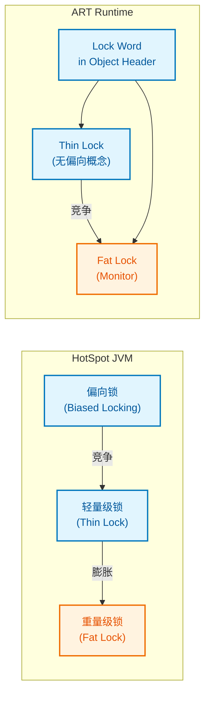
```mermaid
graph LR
    subgraph HOTSPOT["HotSpot JVM"]
        H1["偏向锁<br/>(Biased Locking)"]
        H2["轻量级锁<br/>(Thin Lock)"]
        H3["重量级锁<br/>(Fat Lock)"]
    end
    
    subgraph ART["ART Runtime"]
        A1["Thin Lock<br/>(无偏向概念)"]
        A2["Fat Lock<br/>(Monitor)"]
        A3["Lock Word<br/>in Object Header"]
    end
    
    H1 -->|"竞争"| H2
    H2 -->|"膨胀"| H3
    
    A1 -->|"竞争"| A2
    A3 --> A1
    A3 --> A2
    
    class H1,H2 fw
    class H3 native
    class A1,A3 fw
    class A2 native
    
    classDef fw fill:#e1f5fe,stroke:#0277bd,stroke-width:2px,color:#01579b;
    classDef native fill:#fff3e0,stroke:#ef6c00,stroke-width:2px,color:#e65100;
```

**关键差异点**：

1. **ART 没有独立的偏向锁阶段**：ART 的 Thin Lock 直接使用 CAS 操作，不维护线程 ID 偏向。这意味着在 Android 平台上，单线程反复获取同一把锁的开销比 HotSpot 略高。

2. **Lock Word 结构不同**：ART 的 Lock Word（对应 HotSpot 的 Mark Word）只有 32 位（即使在 64 位设备上），其结构和编码方式与 HotSpot 完全不同。

3. **Monitor 实现差异**：ART 的 Monitor 使用 `art/runtime/monitor.cc` 中的实现，与 HotSpot 的 `ObjectMonitor` 在队列管理、自旋策略等细节上存在差异。

## 六、设计动机深度剖析：为什么需要锁升级？

理解锁升级机制，必须先理解它要解决的核心矛盾：**同步的正确性需求** vs **性能开销的最小化**。

### 6.1 历史背景：从 JDK 1.5 之前的性能噩梦说起

在 JDK 1.6 引入锁升级机制之前，`synchronized` 的实现极其简单粗暴——每次进入同步块都直接调用操作系统的互斥量（Mutex）。这意味着：

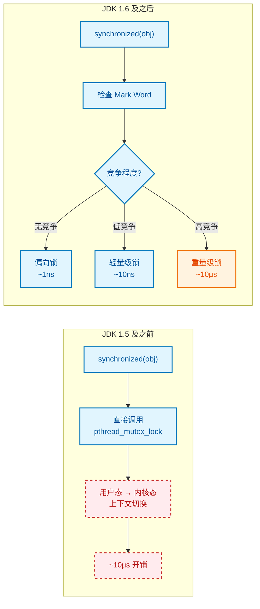
```mermaid
graph LR
    subgraph OLD["JDK 1.5 及之前"]
        O1["synchronized(obj)"]
        O2["直接调用<br/>pthread_mutex_lock"]
        O3["用户态 → 内核态<br/>上下文切换"]
        O4["~10μs 开销"]
    end
    
    subgraph NEW["JDK 1.6 及之后"]
        N1["synchronized(obj)"]
        N2["检查 Mark Word"]
        N3{"竞争程度?"}
        N4["偏向锁<br/>~1ns"]
        N5["轻量级锁<br/>~10ns"]
        N6["重量级锁<br/>~10μs"]
    end
    
    O1 --> O2 --> O3 --> O4
    
    N1 --> N2 --> N3
    N3 -->|"无竞争"| N4
    N3 -->|"低竞争"| N5
    N3 -->|"高竞争"| N6
    
    class O1,O2 fw
    class O3,O4 err
    class N1,N2,N3,N4,N5 fw
    class N6 native
    
    classDef fw fill:#e1f5fe,stroke:#0277bd,stroke-width:2px,color:#01579b;
    classDef native fill:#fff3e0,stroke:#ef6c00,stroke-width:2px,color:#e65100;
    classDef err fill:#ffebee,stroke:#c62828,stroke-width:2px,stroke-dasharray: 5 5,color:#b71c1c;
```

上图对比了新旧实现的性能差距。旧实现中，每次 `synchronized` 调用都会触发系统调用，涉及用户态到内核态的上下文切换，单次开销约 10 微秒。而新实现中，无竞争场景下偏向锁的开销仅约 1 纳秒——**性能差距达到 10000 倍**。

### 6.2 核心洞察：锁的运行时行为分布

Sun/Oracle 的工程师通过大规模的生产环境采样，发现了三个关键的统计规律：

```asm
┌─────────────────────────────────────────────────────────────────────────────┐
│                    锁的运行时行为分布 (Runtime Lock Behavior)                 │
├─────────────────────────────────────────────────────────────────────────────┤
│                                                                             │
│   ████████████████████████████████████████████████████░░░░░░░░  ~70-80%    │
│   │                                                  │                      │
│   └── 单线程重复获取同一把锁 (Thread-Local Access)                          │
│       → 优化目标: 零原子操作 → 偏向锁                                        │
│                                                                             │
├─────────────────────────────────────────────────────────────────────────────┤
│                                                                             │
│   ██████████████████░░░░░░░░░░░░░░░░░░░░░░░░░░░░░░░░░░░░░░░░░  ~15-25%    │
│   │                │                                                        │
│   └── 多线程交替获取，但临界区极短 (Short Critical Section)                  │
│       → 优化目标: 自旋等待 → 轻量级锁                                        │
│                                                                             │
├─────────────────────────────────────────────────────────────────────────────┤
│                                                                             │
│   █████░░░░░░░░░░░░░░░░░░░░░░░░░░░░░░░░░░░░░░░░░░░░░░░░░░░░░░  ~5-10%     │
│   │   │                                                                     │
│   └── 真正的高竞争场景 (High Contention)                                     │
│       → 无法优化，必须阻塞 → 重量级锁                                        │
│                                                                             │
└─────────────────────────────────────────────────────────────────────────────┘
```

这组数据揭示了锁升级设计的核心逻辑：**针对占比最大的场景做极致优化，为小概率的极端场景保留完整能力**。偏向锁优化了 70-80% 的场景，轻量级锁覆盖了 15-25% 的场景，只有不到 10% 的情况需要付出重量级锁的全部代价。

### 6.3 为什么锁升级是单向不可逆的？

这是面试中区分度极高的问题。很多候选人能背出"升级不可逆"的结论，但无法解释原因。

**原因一：降级的收益不足以覆盖成本**

假设某个对象从重量级锁"降级"回偏向锁，JVM 需要执行以下操作：

1. 等待所有等待队列中的线程被唤醒并离开
2. 销毁或回收 `ObjectMonitor` 对象
3. 重新构建 Mark Word 的偏向锁状态
4. 处理可能的 hashcode 冲突（如果之前调用过 `hashCode()`）

这些操作的开销远超偏向锁带来的收益。更关键的是，一旦对象经历过高竞争，统计规律表明它**大概率会再次经历高竞争**，降级后很快又要升级，形成无意义的振荡。

**原因二：Mark Word 的信息不可逆丢失**

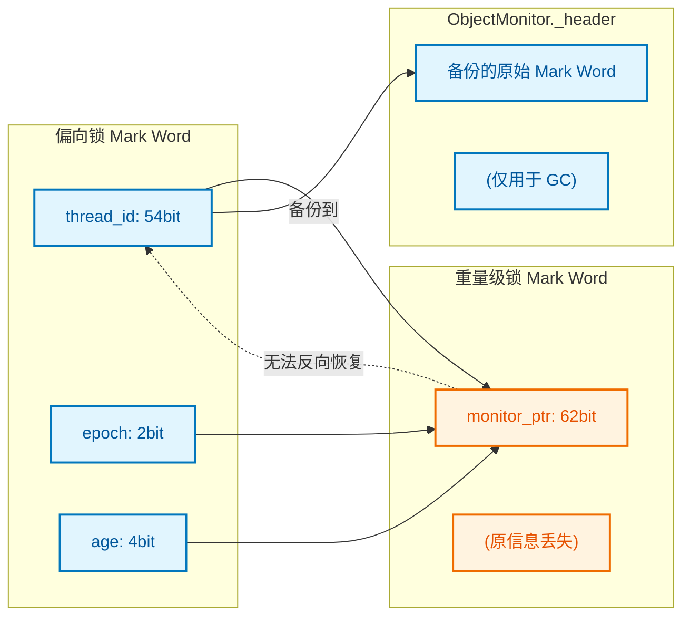
```mermaid
graph LR
    subgraph BIAS["偏向锁 Mark Word"]
        B1["thread_id: 54bit"]
        B2["epoch: 2bit"]
        B3["age: 4bit"]
    end
    
    subgraph HEAVY["重量级锁 Mark Word"]
        H1["monitor_ptr: 62bit"]
        H2["(原信息丢失)"]
    end
    
    subgraph BACKUP["ObjectMonitor._header"]
        K1["备份的原始 Mark Word"]
        K2["(仅用于 GC)"]
    end
    
    B1 --> H1
    B2 --> H1
    B3 --> H1
    
    H1 -.->|"无法反向恢复"| B1
    
    B1 -->|"备份到"| K1
    
    class B1,B2,B3 fw
    class H1,H2 native
    class K1,K2 fw
    
    classDef fw fill:#e1f5fe,stroke:#0277bd,stroke-width:2px,color:#01579b;
    classDef native fill:#fff3e0,stroke:#ef6c00,stroke-width:2px,color:#e65100;
```

当锁膨胀为重量级锁时，Mark Word 的 62 位被完全覆写为 `ObjectMonitor` 指针。原本存储的 thread_id、epoch、age 等信息被"挤"到 `ObjectMonitor._header` 字段中备份。虽然有备份，但这个备份主要用于 GC 场景下恢复对象元信息，而非用于锁降级。JVM 设计者认为，为了支持小概率的降级场景而维护复杂的恢复逻辑，得不偿失。

**原因三：简化实现，减少 Bug 风险**

锁机制是并发编程的基石，任何 Bug 都可能导致死锁、数据竞争等灾难性后果。单向状态机的实现远比双向状态机简单可靠。JVM 工程师选择了"宁可牺牲理论上的极致性能，也要确保实现的正确性和可维护性"。

## 七、monitorenter/monitorexit 字节码指令深度解析

`synchronized` 代码块在编译后会生成 `monitorenter` 和 `monitorexit` 字节码指令。这两条指令是理解锁实现的关键入口。

### 7.1 字节码层面的指令结构

```java
// Java 源码
public void syncMethod() {
    synchronized (this) {
        doSomething();
    }
}
```

编译后的字节码（通过 `javap -c` 查看）：

```java
public void syncMethod();
  Code:
     0: aload_0                    // 将 this 引用压栈
     1: dup                        // 复制栈顶（用于后续的 monitorexit）
     2: astore_1                   // 存储到局部变量槽 1（异常处理用）
     3: monitorenter               // 【关键】获取锁
     4: aload_0
     5: invokevirtual #2           // 调用 doSomething()
     8: aload_1
     9: monitorexit                // 【关键】正常退出释放锁
    10: goto 18                    // 跳转到方法返回
    13: astore_2                   // 异常处理器：存储异常
    14: aload_1
    15: monitorexit                // 【关键】异常退出也要释放锁！
    16: aload_2
    17: athrow                     // 重新抛出异常
    18: return
  Exception table:
     from    to  target type
         4    10    13   any    // 监控 4-10 行，任何异常跳转到 13
        13    16    13   any    // 监控 13-16 行，防止 monitorexit 自身异常
```

上述字节码揭示了一个关键设计：**编译器会自动生成两个 `monitorexit` 指令**——一个用于正常执行路径（第 9 行），一个用于异常处理路径（第 15 行）。这确保了无论代码是正常返回还是抛出异常，锁都会被正确释放，**从语言层面杜绝了忘记释放锁的可能**。

### 7.2 monitorenter 指令的 JVM 实现路径

`monitorenter` 指令在 HotSpot JVM 中的执行路径是一个典型的"快速路径 + 慢速路径"分层设计。JVM 首先尝试开销最低的获取方式，只有失败时才逐级回退到更重的机制。

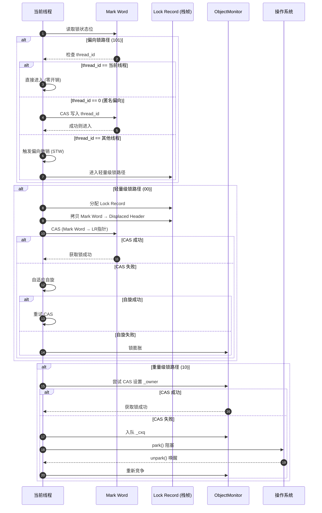
```mermaid
sequenceDiagram
    autonumber
    participant T as 当前线程
    participant MW as Mark Word
    participant LR as Lock Record (栈帧)
    participant OM as ObjectMonitor
    participant OS as 操作系统
    
    T->>MW: 读取锁状态位
    
    alt 偏向锁路径 (101)
        MW-->>T: 检查 thread_id
        alt thread_id == 当前线程
            T->>T: 直接进入 (零开销)
        else thread_id == 0 (匿名偏向)
            T->>MW: CAS 写入 thread_id
            MW-->>T: 成功则进入
        else thread_id == 其他线程
            T->>T: 触发偏向撤销 (STW)
            T->>LR: 进入轻量级锁路径
        end
    end
    
    alt 轻量级锁路径 (00)
        T->>LR: 分配 Lock Record
        T->>LR: 拷贝 Mark Word → Displaced Header
        T->>MW: CAS (Mark Word → LR指针)
        alt CAS 成功
            MW-->>T: 获取锁成功
        else CAS 失败
            T->>T: 自适应自旋
            alt 自旋成功
                T->>T: 重试 CAS
            else 自旋失败
                T->>OM: 锁膨胀
            end
        end
    end
    
    alt 重量级锁路径 (10)
        T->>OM: 尝试 CAS 设置 _owner
        alt CAS 成功
            OM-->>T: 获取锁成功
        else CAS 失败
            T->>OM: 入队 _cxq
            T->>OS: park() 阻塞
            OS-->>T: unpark() 唤醒
            T->>OM: 重新竞争
        end
    end
```

上图展示了 `monitorenter` 的完整执行时序。每一步的决策都基于 Mark Word 的当前状态位，形成了一个三层的 fallback 机制。

**偏向锁快速路径**的核心是 thread_id 比对。当 Mark Word 中的 thread_id 等于当前线程 ID 时，JVM 仅执行一次普通的内存读取和比较操作，无需任何原子指令。这就是偏向锁"几乎零开销"的秘密——它把最常见的"同一线程重复获取锁"场景优化到了极致。

**轻量级锁路径**的核心是 Lock Record 和 CAS。JVM 在当前栈帧中分配一个 Lock Record 结构，将对象当前的 Mark Word 备份到 Lock Record 的 `Displaced Header` 字段，然后尝试用 CAS 将对象的 Mark Word 替换为指向该 Lock Record 的指针。这里的精妙之处在于：Lock Record 是栈上分配的，无需堆内存分配，且天然与线程绑定。

**重量级锁路径**是最终的兜底机制。当 CAS 自旋失败后，JVM 创建或复用一个 `ObjectMonitor` 对象，将当前线程封装为 `ObjectWaiter` 节点加入 `_cxq` 队列，然后调用 `park()` 陷入阻塞。

### 7.3 Lock Record 的栈帧布局

Lock Record 是轻量级锁的核心数据结构，它巧妙地利用了线程栈的天然隔离性来避免堆内存分配。

```asm
┌─────────────────────────────────────────────────────────────────────────────┐
│                    线程栈帧布局 (Thread Stack Frame)                         │
├─────────────────────────────────────────────────────────────────────────────┤
│                                                                             │
│   ┌─────────────────────────────────────────────────────────────────────┐   │
│   │  高地址                                                    ↑        │   │
│   ├─────────────────────────────────────────────────────────────────────┤   │
│   │  局部变量表 (Local Variables)                                       │   │
│   │  ┌─────────────────────────────────────────────────────────────┐   │   │
│   │  │  slot[0]: this                                              │   │   │
│   │  │  slot[1]: arg1                                              │   │   │
│   │  │  slot[2]: arg2                                              │   │   │
│   │  └─────────────────────────────────────────────────────────────┘   │   │
│   ├─────────────────────────────────────────────────────────────────────┤   │
│   │  Lock Record 区域 (Synchronized 进入时分配)                         │   │
│   │  ┌─────────────────────────────────────────────────────────────┐   │   │
│   │  │  Lock Record #1                                             │   │   │
│   │  │  ┌───────────────────────────────────────────────────────┐ │   │   │
│   │  │  │  Displaced Mark Word (备份的原始对象头)                │ │   │   │
│   │  │  │  [hashcode:31 | age:4 | biased:1 | lock:2]            │ │   │   │
│   │  │  ├───────────────────────────────────────────────────────┤ │   │   │
│   │  │  │  Owner Pointer (指向锁对象的指针)                      │ │   │   │
│   │  │  │  → 指向 obj 对象                                      │ │   │   │
│   │  │  └───────────────────────────────────────────────────────┘ │   │   │
│   │  ├─────────────────────────────────────────────────────────────┤   │   │
│   │  │  Lock Record #2 (嵌套 synchronized 时)                      │   │   │
│   │  │  ┌───────────────────────────────────────────────────────┐ │   │   │
│   │  │  │  Displaced Mark Word: NULL (重入标记)                  │ │   │   │
│   │  │  │  Owner Pointer → 指向同一个 obj                        │ │   │   │
│   │  │  └───────────────────────────────────────────────────────┘ │   │   │
│   │  └─────────────────────────────────────────────────────────────┘   │   │
│   ├─────────────────────────────────────────────────────────────────────┤   │
│   │  操作数栈 (Operand Stack)                                           │   │
│   ├─────────────────────────────────────────────────────────────────────┤   │
│   │  返回地址 / 帧信息                                                  │   │
│   │  ┌─────────────────────────────────────────────────────────────┐   │   │
│   │  │  低地址                                                     │   │   │
│   └─────────────────────────────────────────────────────────────────────┘   │
│                                                                             │
└─────────────────────────────────────────────────────────────────────────────┘
```

**Displaced Mark Word** 的作用是双重的：首先，它备份了对象原始的 Mark Word 内容，用于锁释放时恢复；其次，它作为"我是锁持有者"的凭证——只有 Mark Word 指向自己 Lock Record 的线程才能成功执行 `monitorexit`。

**重入场景的处理**格外精妙。当同一线程在已持有轻量级锁的情况下再次进入同一对象的同步块时，JVM 会创建一个新的 Lock Record，但其 `Displaced Mark Word` 字段被设置为 `NULL`。这个 `NULL` 值起到了重入计数器的作用——`monitorexit` 时，JVM 从栈顶向下遍历 Lock Record，每遇到一个 `NULL` 就跳过（表示一次重入退出），直到遇到非 `NULL` 的 Lock Record 才真正执行解锁。

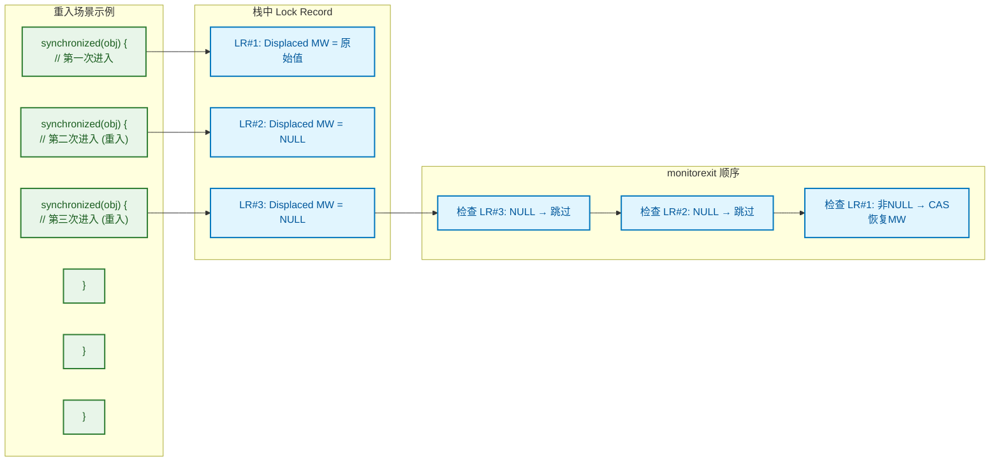
```mermaid
graph LR
    subgraph REENTRY["重入场景示例"]
        direction TB
        S1["synchronized(obj) {<br/>  // 第一次进入"]
        S2["  synchronized(obj) {<br/>    // 第二次进入 (重入)"]
        S3["    synchronized(obj) {<br/>      // 第三次进入 (重入)"]
        S4["    }"]
        S5["  }"]
        S6["}"]
    end
    
    subgraph STACK["栈中 Lock Record"]
        LR1["LR#1: Displaced MW = 原始值"]
        LR2["LR#2: Displaced MW = NULL"]
        LR3["LR#3: Displaced MW = NULL"]
    end
    
    subgraph EXIT["monitorexit 顺序"]
        E1["检查 LR#3: NULL → 跳过"]
        E2["检查 LR#2: NULL → 跳过"]
        E3["检查 LR#1: 非NULL → CAS恢复MW"]
    end
    
    S1 --> LR1
    S2 --> LR2
    S3 --> LR3
    
    LR3 --> E1
    E1 --> E2
    E2 --> E3
    
    class S1,S2,S3,S4,S5,S6 app
    class LR1,LR2,LR3 fw
    class E1,E2,E3 fw
    
    classDef app fill:#e8f5e9,stroke:#2e7d32,stroke-width:2px,color:#1b5e20;
    classDef fw fill:#e1f5fe,stroke:#0277bd,stroke-width:2px,color:#01579b;
```

这种基于栈的重入计数方式比 `ReentrantLock` 的整数计数器更优雅：它天然支持异常场景下的正确释放（每个 `monitorexit` 只负责"自己的" Lock Record），且无需额外的原子操作来更新计数器。

### 7.4 monitorexit 指令的执行逻辑

`monitorexit` 的实现是 `monitorenter` 的镜像过程，但有一个关键的额外职责：**唤醒等待线程**。

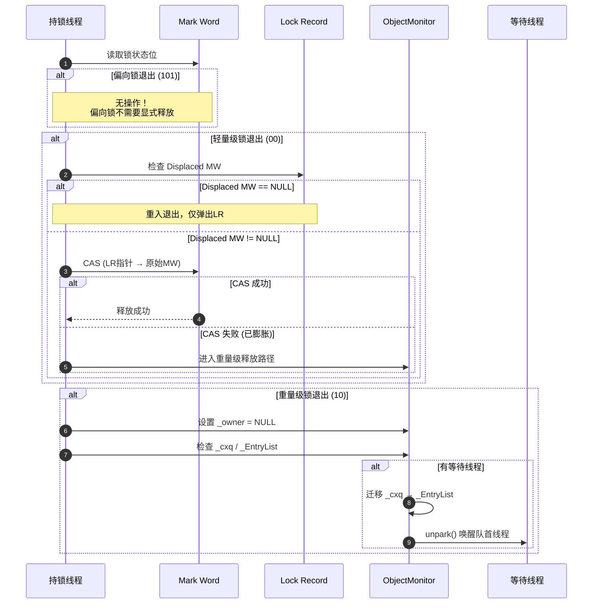
```mermaid
sequenceDiagram
    autonumber
    participant T as 持锁线程
    participant MW as Mark Word
    participant LR as Lock Record
    participant OM as ObjectMonitor
    participant WT as 等待线程
    
    T->>MW: 读取锁状态位
    
    alt 偏向锁退出 (101)
        Note over T,MW: 无操作！<br/>偏向锁不需要显式释放
    end
    
    alt 轻量级锁退出 (00)
        T->>LR: 检查 Displaced MW
        alt Displaced MW == NULL
            Note over T,LR: 重入退出，仅弹出LR
        else Displaced MW != NULL
            T->>MW: CAS (LR指针 → 原始MW)
            alt CAS 成功
                MW-->>T: 释放成功
            else CAS 失败 (已膨胀)
                T->>OM: 进入重量级释放路径
            end
        end
    end
    
    alt 重量级锁退出 (10)
        T->>OM: 设置 _owner = NULL
        T->>OM: 检查 _cxq / _EntryList
        alt 有等待线程
            OM->>OM: 迁移 _cxq → _EntryList
            OM->>WT: unpark() 唤醒队首线程
        end
    end
```

**偏向锁的退出**是最轻量的——实际上什么都不做。偏向锁的设计假设是"同一线程会反复获取"，因此释放时不清除 thread_id，下次获取时直接比对即可。

**轻量级锁的退出**需要一次 CAS 操作：将对象的 Mark Word 从"指向 Lock Record 的指针"恢复为"原始的 Mark Word"（从 `Displaced Mark Word` 字段取出）。如果 CAS 失败，说明在持锁期间发生了锁膨胀，需要切换到重量级锁的释放路径。

**重量级锁的退出**涉及队列管理和线程唤醒。释放线程将 `_owner` 设为 `NULL`，然后检查是否有线程在等待。如果有，需要将 `_cxq` 中的节点迁移到 `_EntryList`，并 `unpark()` 唤醒队首线程。被唤醒的线程不会直接获得锁，而是重新尝试 CAS 竞争——这是为了支持"非公平锁"语义，允许新来的线程抢占。

## 八、ObjectMonitor 的 C++ 实现深度剖析

当锁膨胀为重量级锁后，`ObjectMonitor` 成为同步机制的核心。这个由 C++ 实现的结构体承载了完整的线程阻塞、唤醒和队列管理逻辑。

### 8.1 ObjectMonitor 的完整内存布局

```cpp
// hotspot/src/share/vm/runtime/objectMonitor.hpp
// 以下为关键字段的详细注释版本

class ObjectMonitor {
 private:
  // ==================== 对象关联 ====================
  volatile markWord _header;        // 64-bit: 备份的原始 Mark Word
                                    // 锁释放后用于恢复对象头
                                    // GC 时也需要读取 age/hashcode
  
  WeakHandle<vm_nmethod_tag> _object;  // 弱引用指向关联的 Java 对象
                                       // 弱引用是为了不阻止 GC 回收
  
  // ==================== 锁持有者信息 ====================
  void* volatile _owner;            // 当前持有锁的线程指针 (Thread*)
                                    // NULL 表示锁空闲
                                    // 特殊值 DEFLATER_MARKER 表示正在收缩
  
  volatile int _recursions;         // 重入深度计数器
                                    // 同一线程每重入一次 +1
                                    // 完全退出时变为 0
  
  // ==================== 等待队列 ====================
  ObjectWaiter* volatile _cxq;      // Contention Queue (竞争队列)
                                    // LIFO 栈结构，CAS 操作栈顶
                                    // 新竞争者从这里入队
  
  ObjectWaiter* volatile _EntryList;// Entry List (入口队列)
                                    // FIFO 队列结构
                                    // 释放锁时从 _cxq 批量迁移过来
                                    // 唤醒时从队首取出
  
  ObjectWaiter* volatile _WaitSet;  // Wait Set (等待集合)
                                    // 存放调用 wait() 的线程
                                    // notify() 时移入 _EntryList
  
  // ==================== 统计与调优 ====================
  volatile int _contentions;        // 当前竞争线程数
                                    // 用于自适应自旋决策
  
  volatile int _SpinDuration;       // 自旋持续时间参数
                                    // 自适应算法动态调整
  
  int _WaitSetLock;                 // WaitSet 操作的自旋锁
                                    // 保护 wait/notify 的原子性
};
```

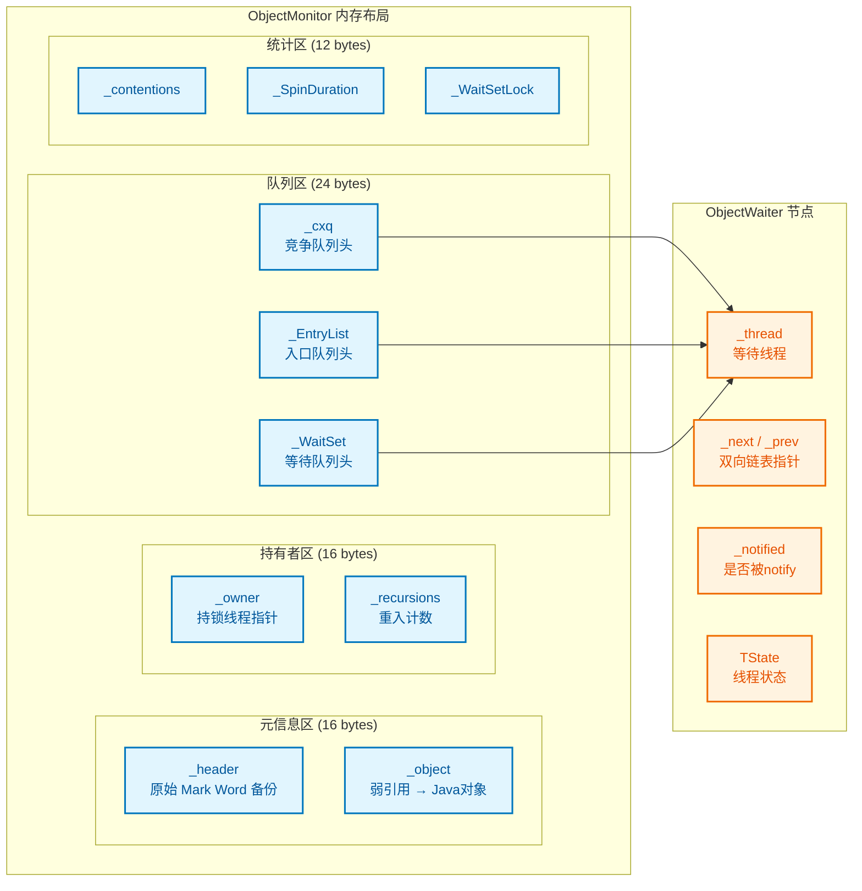
```mermaid
graph LR
    subgraph MONITOR["ObjectMonitor 内存布局"]
        direction TB
        
        subgraph META["元信息区 (16 bytes)"]
            F1["_header<br/>原始 Mark Word 备份"]
            F2["_object<br/>弱引用 → Java对象"]
        end
        
        subgraph OWNER["持有者区 (16 bytes)"]
            F3["_owner<br/>持锁线程指针"]
            F4["_recursions<br/>重入计数"]
        end
        
        subgraph QUEUES["队列区 (24 bytes)"]
            F5["_cxq<br/>竞争队列头"]
            F6["_EntryList<br/>入口队列头"]
            F7["_WaitSet<br/>等待队列头"]
        end
        
        subgraph STATS["统计区 (12 bytes)"]
            F8["_contentions"]
            F9["_SpinDuration"]
            F10["_WaitSetLock"]
        end
    end
    
    subgraph WAITER["ObjectWaiter 节点"]
        W1["_thread<br/>等待线程"]
        W2["_next / _prev<br/>双向链表指针"]
        W3["_notified<br/>是否被notify"]
        W4["TState<br/>线程状态"]
    end
    
    F5 --> W1
    F6 --> W1
    F7 --> W1
    
    class F1,F2 fw
    class F3,F4 fw
    class F5,F6,F7 fw
    class F8,F9,F10 fw
    class W1,W2,W3,W4 native
    
    classDef fw fill:#e1f5fe,stroke:#0277bd,stroke-width:2px,color:#01579b;
    classDef native fill:#fff3e0,stroke:#ef6c00,stroke-width:2px,color:#e65100;
```

### 8.2 锁膨胀（Inflation）的实现细节

锁膨胀是从轻量级锁升级到重量级锁的关键过程。HotSpot 实现了一套精细的膨胀协议，确保并发场景下的正确性。

```cpp
// 简化的膨胀逻辑伪代码
ObjectMonitor* ObjectSynchronizer::inflate(Thread* self, oop object) {
    for (;;) {
        markWord mark = object->mark();
        
        // Case 1: 已经是重量级锁，直接返回
        if (mark.has_monitor()) {
            return mark.monitor();
        }
        
        // Case 2: 正在被其他线程膨胀，自旋等待
        if (mark == markWord::INFLATING()) {
            // 短暂自旋，避免立即阻塞
            SpinPause();
            continue;
        }
        
        // Case 3: 轻量级锁状态，需要膨胀
        if (mark.has_locker()) {
            // 分配新的 ObjectMonitor
            ObjectMonitor* monitor = allocate_monitor(self);
            
            // CAS 设置膨胀中标记
            markWord cmp = object->cas_set_mark(markWord::INFLATING(), mark);
            if (cmp != mark) {
                // CAS 失败，释放 monitor 重试
                free_monitor(monitor);
                continue;
            }
            
            // 膨胀成功，初始化 monitor
            monitor->set_header(mark.displaced_mark_helper());
            monitor->set_owner(mark.locker());  // 原持有者
            monitor->set_object(object);
            
            // 原子地将对象头指向 monitor
            object->release_set_mark(markWord::encode(monitor));
            return monitor;
        }
        
        // Case 4: 无锁状态，直接膨胀
        ObjectMonitor* monitor = allocate_monitor(self);
        monitor->set_header(mark);
        
        markWord cmp = object->cas_set_mark(markWord::encode(monitor), mark);
        if (cmp == mark) {
            return monitor;
        }
        // CAS 失败，释放 monitor 重试
        free_monitor(monitor);
    }
}
```

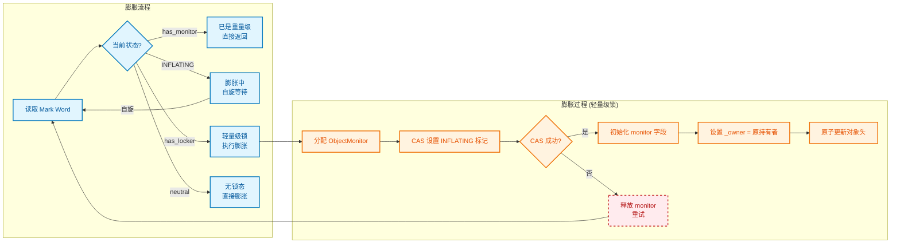
```mermaid
graph LR
    subgraph INFLATE["膨胀流程"]
        I1["读取 Mark Word"]
        I2{"当前状态?"}
        I3["已是重量级<br/>直接返回"]
        I4["膨胀中<br/>自旋等待"]
        I5["轻量级锁<br/>执行膨胀"]
        I6["无锁态<br/>直接膨胀"]
    end
    
    subgraph PROCESS["膨胀过程 (轻量级锁)"]
        P1["分配 ObjectMonitor"]
        P2["CAS 设置 INFLATING 标记"]
        P3{"CAS 成功?"}
        P4["初始化 monitor 字段"]
        P5["设置 _owner = 原持有者"]
        P6["原子更新对象头"]
        P7["释放 monitor<br/>重试"]
    end
    
    I1 --> I2
    I2 -->|"has_monitor"| I3
    I2 -->|"INFLATING"| I4
    I2 -->|"has_locker"| I5
    I2 -->|"neutral"| I6
    
    I4 -->|"自旋"| I1
    I5 --> P1
    P1 --> P2
    P2 --> P3
    P3 -->|"是"| P4
    P3 -->|"否"| P7
    P4 --> P5
    P5 --> P6
    P7 --> I1
    
    class I1,I2,I3,I4 fw
    class I5,I6 fw
    class P1,P2,P3,P4,P5,P6 native
    class P7 err
    
    classDef fw fill:#e1f5fe,stroke:#0277bd,stroke-width:2px,color:#01579b;
    classDef native fill:#fff3e0,stroke:#ef6c00,stroke-width:2px,color:#e65100;
    classDef err fill:#ffebee,stroke:#c62828,stroke-width:2px,stroke-dasharray: 5 5,color:#b71c1c;
```

膨胀过程中最精妙的设计是 **`INFLATING` 中间状态**。这个特殊的 Mark Word 值（一个不可能是合法指针的魔数）起到了"正在施工"的占位作用。当多个线程同时尝试膨胀同一个对象时，只有一个线程能 CAS 成功设置 `INFLATING` 标记，其他线程会看到这个标记后进入短暂自旋，避免了重复分配 `ObjectMonitor` 的资源浪费。

### 8.3 EnterI：重量级锁的获取实现

当线程尝试获取已膨胀的重量级锁时，会进入 `ObjectMonitor::EnterI` 方法。这是 HotSpot 中最复杂的同步原语之一。

```cpp
// 简化的 EnterI 逻辑
void ObjectMonitor::EnterI(Thread* self) {
    // 快速路径：尝试 CAS 直接获取
    if (TryLock(self) == TryLockResult::Success) {
        return;
    }
    
    // 自适应自旋
    if (TrySpin(self) == TryLockResult::Success) {
        return;
    }
    
    // 构造等待节点
    ObjectWaiter node(self);
    node.TState = ObjectWaiter::TS_CXQ;
    
    // CAS 入队到 _cxq 栈顶
    for (;;) {
        node._next = _cxq;
        if (Atomic::cmpxchg(&_cxq, node._next, &node) == node._next) {
            break;
        }
    }
    
    // 入队成功，准备阻塞
    for (;;) {
        // 阻塞前再试一次
        if (TryLock(self) == TryLockResult::Success) {
            // 成功！需要从队列中移除自己
            UnlinkAfterAcquire(self, &node);
            return;
        }
        
        // 真正阻塞
        Self->_ParkEvent->park();
        
        // 被唤醒，重试获取
        if (TryLock(self) == TryLockResult::Success) {
            UnlinkAfterAcquire(self, &node);
            return;
        }
        // 获取失败，继续循环（可能被虚假唤醒）
    }
}
```

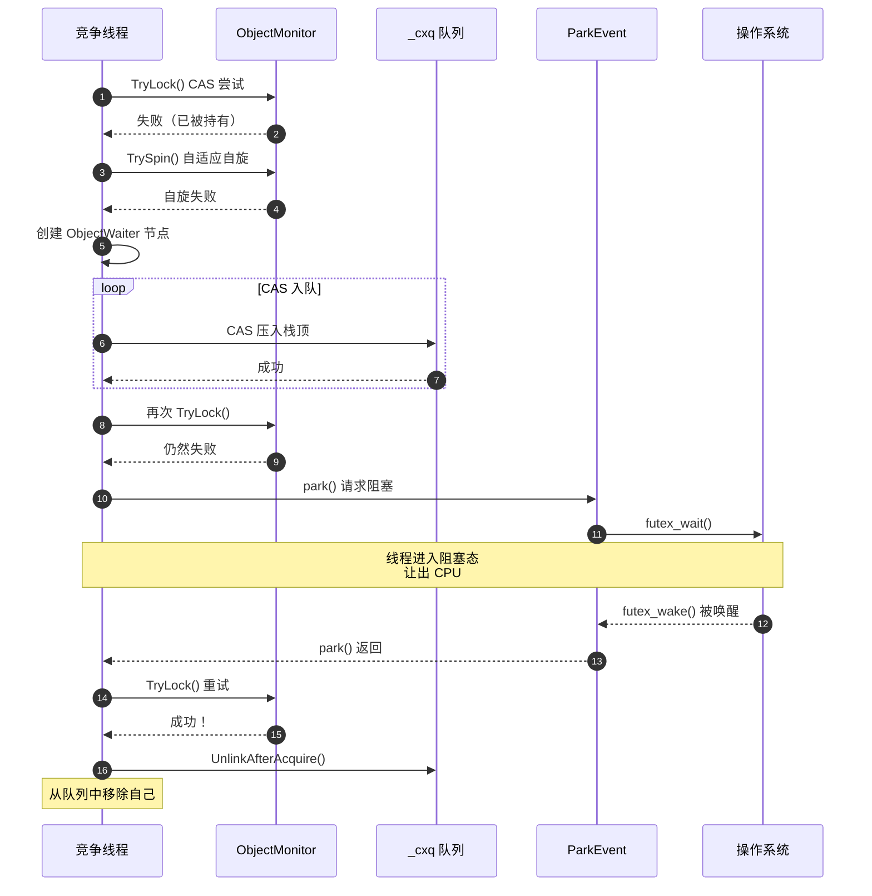
```mermaid
sequenceDiagram
    autonumber
    participant T as 竞争线程
    participant OM as ObjectMonitor
    participant CXQ as _cxq 队列
    participant PE as ParkEvent
    participant OS as 操作系统
    
    T->>OM: TryLock() CAS 尝试
    OM-->>T: 失败（已被持有）
    
    T->>OM: TrySpin() 自适应自旋
    OM-->>T: 自旋失败
    
    T->>T: 创建 ObjectWaiter 节点
    
    loop CAS 入队
        T->>CXQ: CAS 压入栈顶
        CXQ-->>T: 成功
    end
    
    T->>OM: 再次 TryLock()
    OM-->>T: 仍然失败
    
    T->>PE: park() 请求阻塞
    PE->>OS: futex_wait()
    Note over T,OS: 线程进入阻塞态<br/>让出 CPU
    
    OS-->>PE: futex_wake() 被唤醒
    PE-->>T: park() 返回
    
    T->>OM: TryLock() 重试
    OM-->>T: 成功！
    
    T->>CXQ: UnlinkAfterAcquire()
    Note over T: 从队列中移除自己
```

这个实现有几个值得注意的设计细节：

**入队后再试一次（TryLock before park）**：线程在 `park()` 阻塞之前会再做一次 `TryLock()` 尝试。这是因为在入队操作和检查锁状态之间存在时间窗口，锁可能恰好在这个窗口内被释放。如果不做这次检查，线程会错过已经空闲的锁而白白阻塞。

**虚假唤醒（Spurious Wakeup）处理**：`park()` 返回并不一定意味着锁已可用——可能是操作系统的虚假唤醒，也可能是其他线程抢先获得了锁。因此 `EnterI` 在唤醒后仍需循环重试。

**_cxq 使用 LIFO 而非 FIFO**：新来的竞争者被压入 `_cxq` 栈顶而非队尾。这个反直觉的设计是为了简化并发控制——CAS 只能原子操作一个指针，操作栈顶是天然原子的，而维护队尾需要额外的同步。

### 8.4 Exit：重量级锁的释放与唤醒策略

锁释放的复杂度不亚于获取。`ObjectMonitor::exit` 需要处理重入计数、队列迁移和线程唤醒，同时还要考虑性能优化。

```cpp
// 简化的 exit 逻辑
void ObjectMonitor::exit(Thread* self) {
    // 检查重入
    if (_recursions != 0) {
        _recursions--;
        return;  // 只是重入退出，不真正释放
    }
    
    // 真正释放锁
    _owner = NULL;
    
    // 内存屏障：确保 _owner = NULL 对其他线程可见
    OrderAccess::storeload();
    
    // 检查是否有等待者
    if (_cxq == NULL && _EntryList == NULL) {
        return;  // 无等待者，直接返回
    }
    
    // 有等待者，需要唤醒
    // 重新获取锁（防止与新来的竞争者冲突）
    if (Atomic::cmpxchg(&_owner, (void*)NULL, self) != NULL) {
        return;  // 有线程已经抢到锁，不需要我们唤醒
    }
    
    // 将 _cxq 迁移到 _EntryList
    ObjectWaiter* list = _cxq;
    if (list != NULL) {
        _cxq = NULL;
        
        // 策略选择：QMode 决定如何处理队列
        if (QMode == 2) {
            // 直接唤醒 _cxq 队首（最近入队的）
            list->TState = ObjectWaiter::TS_ENTER;
            _EntryList = list;
        } else {
            // 反转链表后追加到 _EntryList（FIFO 公平性）
            ObjectWaiter* reversed = reverse_list(list);
            append_to_EntryList(reversed);
        }
    }
    
    // 唤醒 _EntryList 队首线程
    ObjectWaiter* w = _EntryList;
    if (w != NULL) {
        _EntryList = w->_next;
        w->TState = ObjectWaiter::TS_ENTER;
        w->_thread->_ParkEvent->unpark();
    }
    
    // 释放刚才临时获取的锁
    _owner = NULL;
}
```

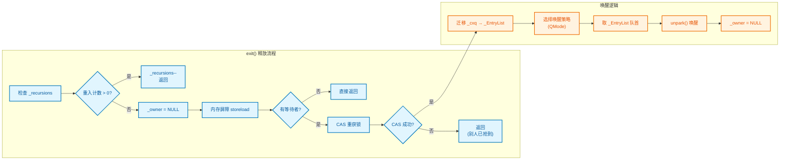
```mermaid
graph LR
    subgraph EXIT["exit() 释放流程"]
        E1["检查 _recursions"]
        E2{"重入计数 > 0?"}
        E3["_recursions--<br/>返回"]
        E4["_owner = NULL"]
        E5["内存屏障 storeload"]
        E6{"有等待者?"}
        E7["直接返回"]
        E8["CAS 重获锁"]
        E9{"CAS 成功?"}
        E10["返回<br/>(别人已抢到)"]
    end
    
    subgraph WAKE["唤醒逻辑"]
        W1["迁移 _cxq → _EntryList"]
        W2["选择唤醒策略<br/>(QMode)"]
        W3["取 _EntryList 队首"]
        W4["unpark() 唤醒"]
        W5["_owner = NULL"]
    end
    
    E1 --> E2
    E2 -->|"是"| E3
    E2 -->|"否"| E4
    E4 --> E5
    E5 --> E6
    E6 -->|"否"| E7
    E6 -->|"是"| E8
    E8 --> E9
    E9 -->|"否"| E10
    E9 -->|"是"| W1
    W1 --> W2
    W2 --> W3
    W3 --> W4
    W4 --> W5
    
    class E1,E2,E3,E4,E5,E6,E7 fw
    class E8,E9,E10 fw
    class W1,W2,W3,W4,W5 native
    
    classDef fw fill:#e1f5fe,stroke:#0277bd,stroke-width:2px,color:#01579b;
    classDef native fill:#fff3e0,stroke:#ef6c00,stroke-width:2px,color:#e65100;
```

**QMode 唤醒策略**是一个可调参数，决定了公平性与吞吐量之间的权衡：

```asm
┌─────────────────────────────────────────────────────────────────────────────┐
│                         QMode 唤醒策略对比                                   │
├─────────────────────────────────────────────────────────────────────────────┤
│ QMode │ 行为                              │ 特点                            │
├───────┼───────────────────────────────────┼─────────────────────────────────┤
│   0   │ _cxq 反转后追加到 _EntryList 尾部 │ 最公平，先来先服务              │
│       │ 唤醒 _EntryList 队首              │ 吞吐量较低                      │
├───────┼───────────────────────────────────┼─────────────────────────────────┤
│   1   │ _cxq 反转后追加到 _EntryList 头部 │ 最近等待者优先                  │
│       │ 唤醒 _EntryList 队首              │ 可能饿死早期等待者              │
├───────┼───────────────────────────────────┼─────────────────────────────────┤
│   2   │ 直接唤醒 _cxq 队首                │ 最高吞吐量                      │
│ (默认)│ _EntryList 保持不变               │ 最不公平，非公平锁语义          │
├───────┼───────────────────────────────────┼─────────────────────────────────┤
│   3   │ _cxq 迁移到 _EntryList 尾部       │ 折中策略                        │
│       │ 唤醒 _cxq 原队首                  │                                 │
├───────┼───────────────────────────────────┼─────────────────────────────────┤
│   4   │ _cxq 插入 _EntryList 头部         │ 激进的非公平策略                │
│       │ 唤醒 _cxq 原队首                  │                                 │
└─────────────────────────────────────────────────────────────────────────────┘
```

HotSpot 默认使用 **QMode = 2**，这是一个激进的非公平策略：直接唤醒 `_cxq` 栈顶的线程（即最近入队的），而不管 `_EntryList` 中是否有更早的等待者。这种设计牺牲了公平性，但换取了更高的吞吐量——刚刚被阻塞的线程往往还在 CPU 缓存热区，唤醒它能更快恢复执行。

### 8.5 wait/notify：条件变量的实现

`Object.wait()` 和 `Object.notify()` 是 Java 条件变量的实现基础。它们与 `synchronized` 紧密耦合，必须在持有对象锁的情况下调用。

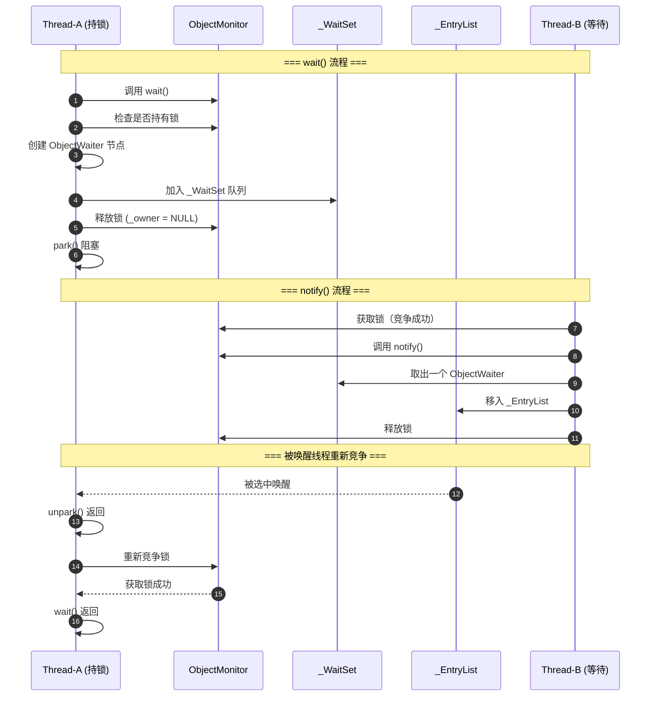
```mermaid
sequenceDiagram
    autonumber
    participant TA as Thread-A (持锁)
    participant OM as ObjectMonitor
    participant WS as _WaitSet
    participant EL as _EntryList
    participant TB as Thread-B (等待)
    
    Note over TA,TB: === wait() 流程 ===
    
    TA->>OM: 调用 wait()
    TA->>OM: 检查是否持有锁
    TA->>TA: 创建 ObjectWaiter 节点
    TA->>WS: 加入 _WaitSet 队列
    TA->>OM: 释放锁 (_owner = NULL)
    TA->>TA: park() 阻塞
    
    Note over TA,TB: === notify() 流程 ===
    
    TB->>OM: 获取锁（竞争成功）
    TB->>OM: 调用 notify()
    TB->>WS: 取出一个 ObjectWaiter
    TB->>EL: 移入 _EntryList
    TB->>OM: 释放锁
    
    Note over TA,TB: === 被唤醒线程重新竞争 ===
    
    EL-->>TA: 被选中唤醒
    TA->>TA: unpark() 返回
    TA->>OM: 重新竞争锁
    OM-->>TA: 获取锁成功
    TA->>TA: wait() 返回
```

**wait() 的关键实现细节**：

```cpp
// 简化的 wait 逻辑
void ObjectMonitor::wait(jlong millis, Thread* self) {
    // 检查当前线程是否持有锁
    CHECK_OWNER(self);
    
    // 创建等待节点
    ObjectWaiter node(self);
    node.TState = ObjectWaiter::TS_WAIT;
    
    // 加入 _WaitSet（需要持有 _WaitSetLock）
    AddWaiter(&node);
    
    // 保存当前重入计数
    intx save_recursions = _recursions;
    _recursions = 0;
    
    // 释放锁
    _owner = NULL;
    OrderAccess::storeload();
    
    // 唤醒 _EntryList 中的等待者（如果有）
    exit_for_wait(self);
    
    // 阻塞等待
    if (millis <= 0) {
        self->_ParkEvent->park();      // 无限等待
    } else {
        self->_ParkEvent->park(millis); // 超时等待
    }
    
    // 被唤醒，重新获取锁
    EnterI(self);
    
    // 恢复重入计数
    _recursions = save_recursions;
}
```

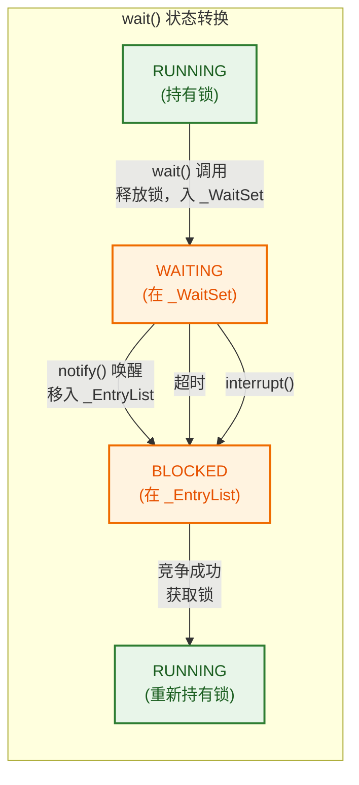
```mermaid
graph LR
    subgraph WAIT["wait() 状态转换"]
        S1["RUNNING<br/>(持有锁)"]
        S2["WAITING<br/>(在 _WaitSet)"]
        S3["BLOCKED<br/>(在 _EntryList)"]
        S4["RUNNING<br/>(重新持有锁)"]
    end
    
    S1 -->|"wait() 调用<br/>释放锁，入 _WaitSet"| S2
    S2 -->|"notify() 唤醒<br/>移入 _EntryList"| S3
    S3 -->|"竞争成功<br/>获取锁"| S4
    
    S2 -->|"超时"| S3
    S2 -->|"interrupt()"| S3
    
    class S1,S4 app
    class S2,S3 native
    
    classDef app fill:#e8f5e9,stroke:#2e7d32,stroke-width:2px,color:#1b5e20;
    classDef native fill:#fff3e0,stroke:#ef6c00,stroke-width:2px,color:#e65100;
```

**notify vs notifyAll 的实现差异**：

* **`notify()`**：从 `_WaitSet` 中取出**一个**节点，将其状态改为 `TS_ENTER`，移入 `_EntryList`。HotSpot 的默认策略是取队首（即等待时间最长的），但 JVM 规范并不保证这一点。

* **`notifyAll()`**：将 `_WaitSet` 中的**所有**节点批量移入 `_EntryList`。这些线程会同时参与锁竞争，只有一个能成功，其余继续阻塞在 `_EntryList` 中。

**一个常见的误解**：很多人认为 `notify()` 会立即唤醒等待线程。实际上，`notify()` 只是将线程从 `_WaitSet` 移到 `_EntryList`，真正的 `unpark()` 唤醒发生在调用 `notify()` 的线程执行 `monitorexit` 释放锁之后。

## 九、操作系统层：futex 与 park/unpark

当重量级锁需要真正阻塞线程时，最终会调用到操作系统的同步原语。在 Linux 上，这个原语是 **futex**（Fast Userspace Mutex）。

### 9.1 futex 的设计哲学

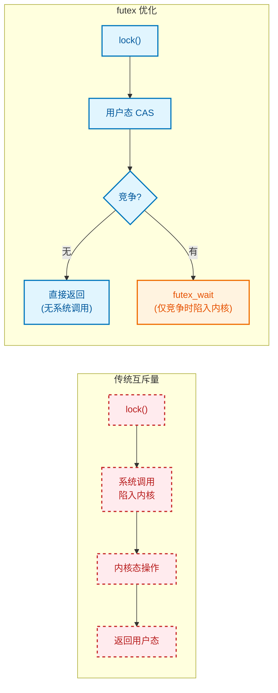
```mermaid
graph LR
    subgraph TRADITIONAL["传统互斥量"]
        T1["lock()"]
        T2["系统调用<br/>陷入内核"]
        T3["内核态操作"]
        T4["返回用户态"]
    end
    
    subgraph FUTEX["futex 优化"]
        F1["lock()"]
        F2["用户态 CAS"]
        F3{"竞争?"}
        F4["直接返回<br/>(无系统调用)"]
        F5["futex_wait<br/>(仅竞争时陷入内核)"]
    end
    
    T1 --> T2 --> T3 --> T4
    
    F1 --> F2 --> F3
    F3 -->|"无"| F4
    F3 -->|"有"| F5
    
    class T1,T2,T3,T4 err
    class F1,F2,F3,F4 fw
    class F5 native
    
    classDef err fill:#ffebee,stroke:#c62828,stroke-width:2px,stroke-dasharray: 5 5,color:#b71c1c;
    classDef fw fill:#e1f5fe,stroke:#0277bd,stroke-width:2px,color:#01579b;
    classDef native fill:#fff3e0,stroke:#ef6c00,stroke-width:2px,color:#e65100;
```

futex 的核心思想是：**在无竞争时完全在用户态完成，只有真正需要阻塞时才陷入内核**。这与 `synchronized` 的锁升级理念一脉相承——都是基于"大多数情况下无竞争"的乐观假设。

### 9.2 park/unpark 的实现

HotSpot 在 futex 之上封装了 `os::PlatformEvent`，提供 `park()` 和 `unpark()` 接口：

```cpp
// linux 实现简化版
void os::PlatformEvent::park() {
    int status;
    
    // 快速检查：如果已经有 unpark 信号，直接返回
    if (Atomic::xchg(&_event, 0) > 0) {
        return;
    }
    
    // 进入阻塞循环
    while (_event <= 0) {
        status = futex_wait(&_event, 0, NULL);  // 阻塞直到 _event 变为非 0
        
        // 处理中断
        if (status == -EINTR) {
            continue;  // 被信号中断，继续等待
        }
    }
    
    // 消费信号
    _event = 0;
}

void os::PlatformEvent::unpark() {
    // 设置信号
    if (Atomic::xchg(&_event, 1) < 1) {
        // 之前是 0 或负数，说明有线程在等待
        futex_wake(&_event, 1);  // 唤醒一个等待者
    }
}
```

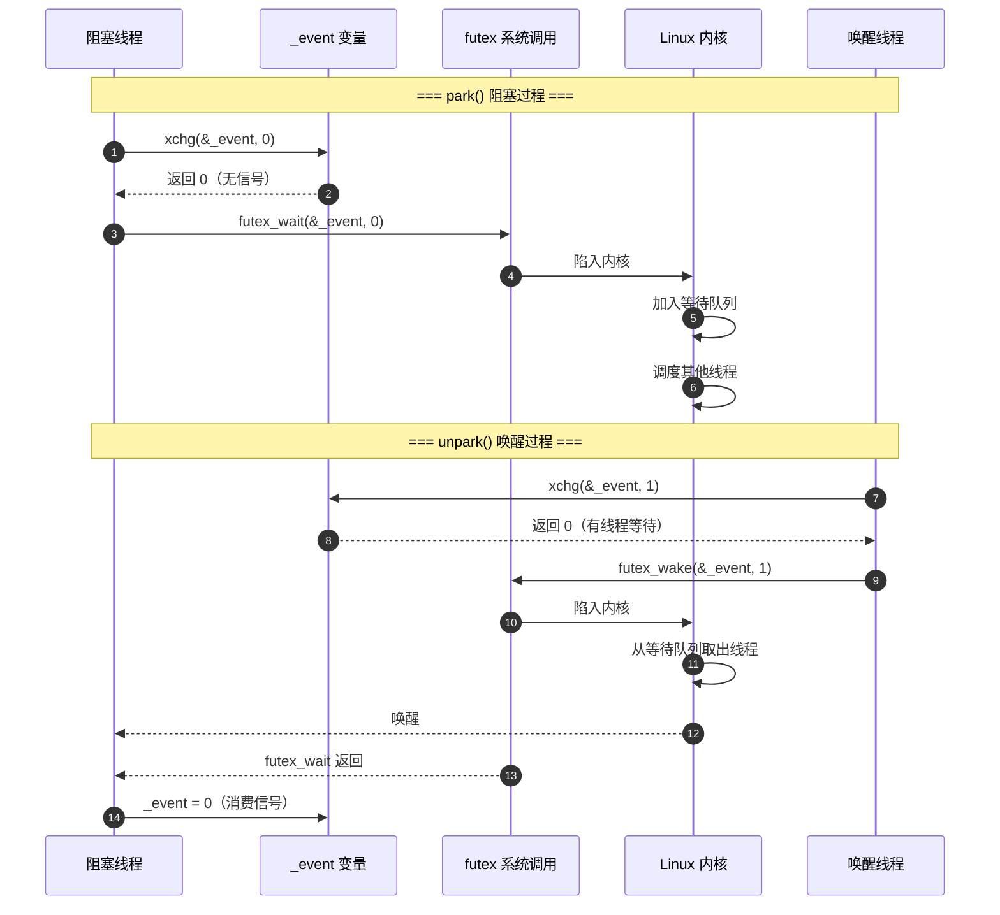
```mermaid
sequenceDiagram
    autonumber
    participant T1 as 阻塞线程
    participant EV as _event 变量
    participant FT as futex 系统调用
    participant K as Linux 内核
    participant T2 as 唤醒线程
    
    Note over T1,T2: === park() 阻塞过程 ===
    
    T1->>EV: xchg(&_event, 0)
    EV-->>T1: 返回 0（无信号）
    T1->>FT: futex_wait(&_event, 0)
    FT->>K: 陷入内核
    K->>K: 加入等待队列
    K->>K: 调度其他线程
    
    Note over T1,T2: === unpark() 唤醒过程 ===
    
    T2->>EV: xchg(&_event, 1)
    EV-->>T2: 返回 0（有线程等待）
    T2->>FT: futex_wake(&_event, 1)
    FT->>K: 陷入内核
    K->>K: 从等待队列取出线程
    K-->>T1: 唤醒
    FT-->>T1: futex_wait 返回
    T1->>EV: _event = 0（消费信号）
```

**park/unpark 的许可证（permit）语义**是一个重要特性：`unpark()` 可以在 `park()` 之前调用，相当于"预存"一个唤醒信号。这避免了经典的"先唤醒后等待"（lost wakeup）问题，使得 `synchronized` 的实现更加健壮。

## 十、性能与权衡：量化分析锁的开销

理解锁机制的工程价值，需要从定量角度分析各级锁的性能特征。以下数据基于典型的 x86-64 服务器环境（Intel Xeon，Linux 5.x），Android/ARM 平台会有差异但数量级相近。

### 10.1 各级锁的时延对比

```asm
┌─────────────────────────────────────────────────────────────────────────────┐
│                    锁操作延迟对比 (Latency Comparison)                       │
├─────────────────────────────────────────────────────────────────────────────┤
│                                                                             │
│  操作类型                  │ 延迟 (ns)  │ CPU 周期   │ 相对开销            │
│  ─────────────────────────┼────────────┼────────────┼─────────────────────│
│  普通内存读取              │    ~1      │    ~3      │ 1x (基准)           │
│  ─────────────────────────┼────────────┼────────────┼─────────────────────│
│  偏向锁获取 (命中)         │    ~1      │    ~3      │ 1x                  │
│  偏向锁获取 (首次偏向)     │   ~20      │   ~60      │ 20x (单次 CAS)      │
│  ─────────────────────────┼────────────┼────────────┼─────────────────────│
│  轻量级锁获取 (无竞争)     │   ~20      │   ~60      │ 20x (CAS)           │
│  轻量级锁获取 (自旋成功)   │  ~100-500  │  ~300-1500 │ 100-500x            │
│  ─────────────────────────┼────────────┼────────────┼─────────────────────│
│  重量级锁获取 (无竞争)     │  ~100      │  ~300      │ 100x                │
│  重量级锁获取 (有竞争)     │ ~10,000+   │ ~30,000+   │ 10,000x+ (含调度)   │
│  ─────────────────────────┼────────────┼────────────┼─────────────────────│
│  偏向锁撤销 (STW)          │ ~10,000+   │    N/A     │ 全局暂停            │
│  锁膨胀                    │  ~500      │  ~1,500    │ 500x (一次性)       │
│                                                                             │
└─────────────────────────────────────────────────────────────────────────────┘
```

从这张表可以得出几个关键结论：

**偏向锁的价值在于"命中"场景**：当同一线程反复获取同一把锁时，偏向锁的开销几乎与普通内存访问相当。但如果频繁发生偏向撤销，10,000+ ns 的 STW 开销会严重拖累性能。

**轻量级锁的自旋是一把双刃剑**：自旋成功意味着避免了系统调用，100-500 ns 的开销远低于线程切换。但自旋失败则浪费了 CPU 时间，在高竞争场景下会加剧性能恶化。

**重量级锁的开销主要来自上下文切换**：单纯的 `ObjectMonitor` 操作只需 ~100 ns，但一旦涉及线程阻塞/唤醒，上下文切换的开销会占据主导地位。

### 10.2 内存开销分析

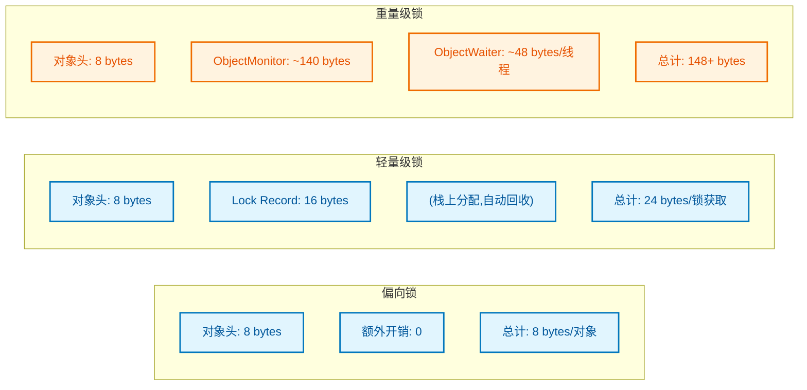
```mermaid
graph LR
    subgraph BIAS["偏向锁"]
        B1["对象头: 8 bytes"]
        B2["额外开销: 0"]
        B3["总计: 8 bytes/对象"]
    end
    
    subgraph LIGHT["轻量级锁"]
        L1["对象头: 8 bytes"]
        L2["Lock Record: 16 bytes"]
        L3["(栈上分配,自动回收)"]
        L4["总计: 24 bytes/锁获取"]
    end
    
    subgraph HEAVY["重量级锁"]
        H1["对象头: 8 bytes"]
        H2["ObjectMonitor: ~140 bytes"]
        H3["ObjectWaiter: ~48 bytes/线程"]
        H4["总计: 148+ bytes"]
    end
    
    class B1,B2,B3 fw
    class L1,L2,L3,L4 fw
    class H1,H2,H3,H4 native
    
    classDef fw fill:#e1f5fe,stroke:#0277bd,stroke-width:2px,color:#01579b;
    classDef native fill:#fff3e0,stroke:#ef6c00,stroke-width:2px,color:#e65100;
```

**偏向锁**几乎没有额外内存开销——线程 ID 直接存储在对象头的 Mark Word 中，无需分配任何辅助结构。

**轻量级锁**的 Lock Record 虽然占用 16 字节，但它是在线程栈上分配的，随着方法退出自动回收，不会造成堆内存压力。

**重量级锁**的 `ObjectMonitor` 是堆上分配的对象，约 140 字节。更关键的是，每个等待线程都需要一个 `ObjectWaiter` 节点（约 48 字节）。在高竞争场景下，如果有 100 个线程等待同一把锁，仅等待队列就需要近 5KB 内存。

### 10.3 synchronized vs ReentrantLock：全方位对比

```asm
┌─────────────────────────────────────────────────────────────────────────────┐
│               synchronized vs ReentrantLock 对比                            │
├─────────────────────────────────────────────────────────────────────────────┤
│ 维度               │ synchronized          │ ReentrantLock                  │
├────────────────────┼───────────────────────┼────────────────────────────────┤
│ 锁升级优化         │ ✓ 偏向→轻量→重量      │ ✗ 始终维护 AQS 状态机          │
├────────────────────┼───────────────────────┼────────────────────────────────┤
│ 无竞争性能         │ 极优 (偏向锁 ~1ns)    │ 良好 (CAS ~20ns)               │
├────────────────────┼───────────────────────┼────────────────────────────────┤
│ 高竞争性能         │ 良好                  │ 优秀 (可配置公平性)            │
├────────────────────┼───────────────────────┼────────────────────────────────┤
│ 公平性             │ ✗ 非公平 (不可配置)   │ ✓ 可配置公平/非公平            │
├────────────────────┼───────────────────────┼────────────────────────────────┤
│ 可中断             │ ✗ 阻塞不可中断        │ ✓ lockInterruptibly()          │
├────────────────────┼───────────────────────┼────────────────────────────────┤
│ 超时获取           │ ✗ 不支持              │ ✓ tryLock(timeout)             │
├────────────────────┼───────────────────────┼────────────────────────────────┤
│ 条件变量           │ 单一 (wait/notify)    │ 多条件 (newCondition)          │
├────────────────────┼───────────────────────┼────────────────────────────────┤
│ 释放安全           │ ✓ 自动 (finally隐式)  │ ✗ 手动 (必须try-finally)       │
├────────────────────┼───────────────────────┼────────────────────────────────┤
│ 死锁诊断           │ JVM 内置支持          │ 需额外工具/代码                │
├────────────────────┼───────────────────────┼────────────────────────────────┤
│ 内存开销 (无竞争)  │ 0 bytes              │ ~32 bytes (AQS 对象)           │
└─────────────────────────────────────────────────────────────────────────────┘
```

**选型建议**：

* **优先使用 `synchronized`**：对于大多数场景，`synchronized` 的锁升级机制提供了更好的无竞争性能，且编译器自动处理锁释放，更不容易出错。

* **使用 `ReentrantLock` 的场景**：

  * 需要可中断的锁获取（响应取消操作）
  * 需要超时机制（避免死锁）
  * 需要公平锁语义（先等待先获得）
  * 需要多个条件变量（复杂的等待/通知逻辑）
  * 需要 `tryLock()` 非阻塞尝试

## 十一、安全视角：Hook 与反编译分析

从安全角度审视 `synchronized`，需要关注两个方向：攻击者如何绕过或破坏锁机制，以及如何检测和防御这类攻击。

### 11.1 字节码层面的锁篡改

`synchronized` 在字节码层面通过 `monitorenter`/`monitorexit` 指令实现。攻击者可以通过字节码修改工具（如 ASM、Javassist）移除或替换这些指令：

```mermaid
graph LR
    subgraph ORIGINAL["原始字节码"]
        O1["aload_0"]
        O2["monitorenter"]
        O3["// 临界区代码"]
        O4["monitorexit"]
    end
    
    subgraph ATTACK["篡改后字节码"]
        A1["aload_0"]
        A2["pop"]
        A3["// 临界区代码"]
        A4["nop"]
    end
    
    subgraph IMPACT["安全影响"]
        I1["锁保护失效"]
        I2["数据竞争"]
        I3["状态不一致"]
        I4["敏感数据泄露"]
    end
    
    O1 --> O2 --> O3 --> O4
    O2 -.->|"替换"| A2
    O4 -.->|"替换"| A4
    A2 --> I1
    I1 --> I2 --> I3 --> I4
    
    class O1,O2,O3,O4 fw
    class A1,A2,A3,A4 err
    class I1,I2,I3,I4 err
    
    classDef fw fill:#e1f5fe,stroke:#0277bd,stroke-width:2px,color:#01579b;
    classDef err fill:#ffebee,stroke:#c62828,stroke-width:2px,stroke-dasharray: 5 5,color:#b71c1c;
```

**防御措施**：

1. **代码混淆**：使用 ProGuard/R8 的控制流混淆，将同步块拆分为多个方法，增加静态分析难度。

2. **运行时完整性校验**：对关键方法计算哈希签名，运行时校验字节码是否被篡改。

3. **Native 层加固**：将敏感同步逻辑下沉到 Native 层，使用 `pthread_mutex` 直接实现，绕过 Java 字节码层面的攻击面。

### 11.2 Frida/Xposed Hook 对锁的影响

动态 Hook 框架可以拦截 `synchronized` 方法的入口和出口，甚至直接修改 `ObjectMonitor` 的行为：

```kotlin
// Frida Hook 示例：绕过 synchronized 方法
Java.perform(function() {
    var TargetClass = Java.use("com.example.SecureClass");
    
    // 直接替换同步方法的实现
    TargetClass.sensitiveMethod.implementation = function() {
        // 完全跳过原始实现（包括锁获取）
        console.log("Bypassing synchronized method");
        return this.unsafeDirectAccess();
    };
});
```

```mermaid
graph LR
    subgraph NORMAL["正常执行流"]
        N1["调用 sensitiveMethod()"]
        N2["monitorenter"]
        N3["执行业务逻辑"]
        N4["monitorexit"]
        N5["返回"]
    end
    
    subgraph HOOKED["被 Hook 后"]
        H1["调用 sensitiveMethod()"]
        H2["Frida 拦截器"]
        H3["执行替换逻辑"]
        H4["绕过原始实现"]
        H5["返回伪造结果"]
    end
    
    N1 --> N2 --> N3 --> N4 --> N5
    H1 --> H2 --> H3 --> H4 --> H5
    
    N2 -.->|"被跳过"| H2
    
    class N1,N2,N3,N4,N5 fw
    class H1,H2,H3,H4,H5 err
    
    classDef fw fill:#e1f5fe,stroke:#0277bd,stroke-width:2px,color:#01579b;
    classDef err fill:#ffebee,stroke:#c62828,stroke-width:2px,stroke-dasharray: 5 5,color:#b71c1c;
```

**检测与防御策略**：

```kotlin
// 检测 Frida 注入的常见方法
object AntiHook {
    
    // 1. 检测 Frida 特征端口
    fun detectFridaPort(): Boolean {
        return try {
            Socket("127.0.0.1", 27042).use { true }
        } catch (e: Exception) {
            false
        }
    }
    
    // 2. 检测方法是否被 Hook（Native 标志位）
    external fun isMethodHooked(method: Method): Boolean
    
    // 3. 检测关键内存区域的完整性
    fun verifyCodeIntegrity(): Boolean {
        val clazz = SecureClass::class.java
        val method = clazz.getDeclaredMethod("sensitiveMethod")
        
        // 计算方法字节码哈希并与预期值比对
        val actualHash = computeMethodHash(method)
        return actualHash == EXPECTED_HASH
    }
}
```

### 11.3 ART 层面的锁绕过

在 Root 环境下，攻击者可以直接操作 ART 运行时的内存结构，绕过锁机制：

```mermaid
graph LR
    subgraph ARTLEVEL["ART Runtime 攻击面"]
        A1["直接修改<br/>对象头 Lock Word"]
        A2["Patch<br/>Monitor::Enter"]
        A3["替换<br/>Thread::Current()"]
        A4["伪造<br/>Lock Record"]
    end
    
    subgraph EFFECT["攻击效果"]
        E1["锁状态伪造"]
        E2["无需竞争<br/>直接进入临界区"]
        E3["绕过所有权检查"]
        E4["任意线程<br/>冒充持锁者"]
    end
    
    A1 --> E1
    A2 --> E2
    A3 --> E3
    A4 --> E4
    
    class A1,A2,A3,A4 native
    class E1,E2,E3,E4 err
    
    classDef native fill:#fff3e0,stroke:#ef6c00,stroke-width:2px,color:#e65100;
    classDef err fill:#ffebee,stroke:#c62828,stroke-width:2px,stroke-dasharray: 5 5,color:#b71c1c;
```

**深度防御建议**：

1. **环境检测**：在应用启动时检测 Root、模拟器、调试器附加等异常环境，对于高安全等级功能拒绝执行。

2. **业务层面的双重校验**：不要完全依赖客户端的锁机制保护敏感逻辑。关键操作应通过服务端二次校验。

3. **密钥分散存储**：敏感密钥不要完整存储在内存中，即使攻击者绕过锁进入临界区，也无法获取完整密钥。

## 十二、极端场景下的 Crash/ANR 归因分析

`synchronized` 相关的线上问题往往隐蔽且难以复现。从 Crash/ANR 归因的角度，需要掌握特定的分析方法论。

### 12.1 死锁（Deadlock）的诊断与定位

死锁是 `synchronized` 最经典的故障模式。当两个或多个线程互相等待对方持有的锁时，所有相关线程都会永久阻塞。

```mermaid
graph LR
    subgraph DEADLOCK["经典死锁场景"]
        T1["Thread-1"]
        T2["Thread-2"]
        L1["Lock-A"]
        L2["Lock-B"]
    end
    
    T1 -->|"① 持有"| L1
    T1 -->|"③ 等待"| L2
    T2 -->|"② 持有"| L2
    T2 -->|"④ 等待"| L1
    
    class T1,T2 app
    class L1,L2 err
    
    classDef app fill:#e8f5e9,stroke:#2e7d32,stroke-width:2px,color:#1b5e20;
    classDef err fill:#ffebee,stroke:#c62828,stroke-width:2px,stroke-dasharray: 5 5,color:#b71c1c;
```

**JVM 内置的死锁检测**是 `synchronized` 相比 `ReentrantLock` 的隐藏优势。JVM 维护了完整的锁持有图（Lock Graph），可以在以下场景自动检测死锁：

```kotlin
// 触发 JVM 死锁检测的方式

// 方式 1: 通过 JMX API
val threadMXBean = ManagementFactory.getThreadMXBean()
val deadlockedThreadIds = threadMXBean.findDeadlockedThreads()

if (deadlockedThreadIds != null) {
    val threadInfos = threadMXBean.getThreadInfo(deadlockedThreadIds, true, true)
    threadInfos.forEach { info ->
        Log.e("Deadlock", "Thread: ${info.threadName}")
        Log.e("Deadlock", "Blocked on: ${info.lockInfo}")
        Log.e("Deadlock", "Holding locks: ${info.lockedSynchronizers.toList()}")
        info.stackTrace.forEach { frame ->
            Log.e("Deadlock", "    at $frame")
        }
    }
}

// 方式 2: 通过 SIGQUIT 信号 (adb shell kill -3 <pid>)
// 会在 logcat 或 /data/anr/traces.txt 中输出完整线程 dump
```

**线程 Dump 中的死锁标识**：

```
Found one Java-level deadlock:
=============================
"Thread-1":
  waiting to lock monitor 0x00007f8b4c003f18 (object 0x000000076b8a1f10, a java.lang.Object),
  which is held by "Thread-2"
"Thread-2":
  waiting to lock monitor 0x00007f8b4c005f18 (object 0x000000076b8a1f00, a java.lang.Object),
  which is held by "Thread-1"

Java stack information for the threads listed above:
===================================================
"Thread-1":
    at com.example.DeadlockDemo.methodA(DeadlockDemo.kt:15)
    - waiting to lock <0x000000076b8a1f10> (a java.lang.Object)
    - locked <0x000000076b8a1f00> (a java.lang.Object)
"Thread-2":
    at com.example.DeadlockDemo.methodB(DeadlockDemo.kt:25)
    - waiting to lock <0x000000076b8a1f00> (a java.lang.Object)
    - locked <0x000000076b8a1f10> (a java.lang.Object)

Found 1 deadlock.
```

### 12.2 ANR 中的锁等待分析

Android 的 ANR（Application Not Responding）问题中，相当比例与锁等待相关。主线程在等待某个被其他线程长期持有的锁时，会触发 5 秒（输入事件）或 10 秒（广播/服务）的 ANR 超时。

```mermaid
sequenceDiagram
    autonumber
    participant UI as 主线程
    participant BG as 后台线程
    participant LK as 共享锁
    participant SYS as System Server
    
    BG->>LK: synchronized 获取锁
    BG->>BG: 执行耗时操作 (网络/IO/计算)
    
    Note over UI: 用户点击事件到达
    
    UI->>LK: synchronized 请求锁
    LK-->>UI: 阻塞等待
    
    Note over UI,SYS: 5秒超时计时开始
    
    loop 后台操作持续
        BG->>BG: 仍在执行...
        UI->>UI: 阻塞中...
    end
    
    SYS->>SYS: InputDispatcher 超时检测
    SYS->>SYS: 触发 ANR
    SYS->>SYS: dump traces.txt
```

**ANR traces.txt 中的锁等待特征**：

```asm
┌─────────────────────────────────────────────────────────────────────────────┐
│               ANR traces.txt 锁等待分析要点                                  │
├─────────────────────────────────────────────────────────────────────────────┤
│                                                                             │
│  "main" prio=5 tid=1 Blocked                                                │
│    | group="main" sCount=1 dsCount=0 flags=1 obj=0x72deb000                │
│    | sysTid=12345 nice=-10 cgrp=default sched=0/0 handle=0x7f8a2c3d4e00    │
│    | state=S schedstat=( 1234567890 987654321 5678 ) utm=100 stm=50        │
│    | core=2 HZ=100                                                          │
│    | stack=0x7ff1234000-0x7ff1236000 stackSize=8MB                         │
│    | held mutexes=                                                          │
│    at com.example.DataManager.getData(DataManager.kt:42)                    │
│    - waiting to lock <0x0a1b2c3d> (a java.lang.Object)  ← 关键信息 ①       │
│        held by thread 15                                 ← 关键信息 ②       │
│    at com.example.MainActivity.onClick(MainActivity.kt:28)                  │
│                                                                             │
│  ─────────────────────────────────────────────────────────────────────────  │
│                                                                             │
│  "AsyncTask #3" prio=5 tid=15 Runnable                   ← 锁持有者        │
│    | ...                                                                    │
│    at java.net.SocketInputStream.read(SocketInputStream.java:152)          │
│    - locked <0x0a1b2c3d> (a java.lang.Object)           ← 正在持有锁       │
│    at com.example.DataManager.fetchFromNetwork(DataManager.kt:78)          │
│                                                                             │
└─────────────────────────────────────────────────────────────────────────────┘

分析步骤:
① 找到 "waiting to lock <地址>" 确定被等待的锁对象
② 找到 "held by thread N" 确定锁持有者线程 ID
③ 在 dump 中搜索 "tid=N" 找到持有者的堆栈
④ 分析持有者为什么长时间不释放锁
```

**常见的锁等待型 ANR 模式**：

```mermaid
graph LR
    subgraph PATTERNS["锁等待 ANR 模式"]
        P1["模式1: 主线程等待 IO 锁"]
        P2["模式2: 锁嵌套导致持有时间延长"]
        P3["模式3: 锁竞争导致饥饿"]
        P4["模式4: Binder 回调中的锁等待"]
    end
    
    subgraph SOLUTIONS["解决方案"]
        S1["IO 操作异步化<br/>使用 Coroutine/RxJava"]
        S2["减小锁粒度<br/>拆分临界区"]
        S3["使用公平锁<br/>或读写分离"]
        S4["Binder 线程池隔离<br/>避免回调阻塞"]
    end
    
    P1 --> S1
    P2 --> S2
    P3 --> S3
    P4 --> S4
    
    class P1,P2,P3,P4 err
    class S1,S2,S3,S4 fw
    
    classDef err fill:#ffebee,stroke:#c62828,stroke-width:2px,stroke-dasharray: 5 5,color:#b71c1c;
    classDef fw fill:#e1f5fe,stroke:#0277bd,stroke-width:2px,color:#01579b;
```

### 12.3 偏向锁撤销导致的延迟毛刺

偏向锁撤销需要 STW（Stop-The-World），虽然单次暂停时间通常很短（微秒级），但在以下场景可能造成可感知的延迟毛刺：

```kotlin
// 场景复现：高频偏向撤销
class BiasRevocationDemo {
    private val locks = Array(1000) { Any() }  // 1000 个锁对象
    
    // 线程 A：顺序访问所有锁
    fun threadA() {
        repeat(1000) { i ->
            synchronized(locks[i]) {
                // 首次访问，建立偏向
                doWork()
            }
        }
    }
    
    // 线程 B：同样顺序访问所有锁
    fun threadB() {
        repeat(1000) { i ->
            synchronized(locks[i]) {
                // 触发偏向撤销！每个锁都要 STW
                doWork()
            }
        }
    }
    
    // 问题：如果 A、B 交替执行，会触发 1000 次偏向撤销
    // 每次撤销 ~10μs STW，累计 ~10ms 全局暂停
}
```

```mermaid
graph LR
    subgraph PROBLEM["偏向撤销风暴"]
        P1["大量对象<br/>偏向线程 A"]
        P2["线程 B 批量访问"]
        P3["频繁 STW"]
        P4["延迟毛刺"]
    end
    
    subgraph TRIGGER["触发条件"]
        T1["对象池/缓存<br/>被多线程共享"]
        T2["Worker 线程<br/>轮询处理"]
        T3["定时任务<br/>跨线程调度"]
    end
    
    subgraph MITIGATION["缓解措施"]
        M1["-XX:-UseBiasedLocking<br/>禁用偏向锁"]
        M2["-XX:BiasedLockingBulkRebiasThreshold=40<br/>触发批量重偏向"]
        M3["-XX:BiasedLockingBulkRevokeThreshold=40<br/>触发批量撤销"]
    end
    
    T1 --> P1
    T2 --> P2
    T3 --> P2
    P1 --> P2 --> P3 --> P4
    
    P4 --> M1
    P4 --> M2
    P4 --> M3
    
    class P1,P2 fw
    class P3,P4 err
    class T1,T2,T3 app
    class M1,M2,M3 native
    
    classDef app fill:#e8f5e9,stroke:#2e7d32,stroke-width:2px,color:#1b5e20;
    classDef fw fill:#e1f5fe,stroke:#0277bd,stroke-width:2px,color:#01579b;
    classDef native fill:#fff3e0,stroke:#ef6c00,stroke-width:2px,color:#e65100;
    classDef err fill:#ffebee,stroke:#c62828,stroke-width:2px,stroke-dasharray: 5 5,color:#b71c1c;
```

**批量重偏向（Bulk Rebias）与批量撤销（Bulk Revoke）**是 JVM 对此类场景的优化策略：

* **批量重偏向**：当某个类的实例发生多次偏向撤销（超过 `BiasedLockingBulkRebiasThreshold`，默认 20）后，JVM 会认为该类的对象存在多线程交替访问的模式，触发批量重偏向——将该类所有实例的 epoch 值加 1，使旧的偏向失效，允许重新偏向新线程。

* **批量撤销**：当批量重偏向后仍然频繁发生撤销（超过 `BiasedLockingBulkRevokeThreshold`，默认 40），JVM 判定该类的对象不适合偏向锁优化，会禁用该类所有实例的偏向锁能力，直接从轻量级锁开始。

### 12.4 IllegalMonitorStateException 的根因分析

`IllegalMonitorStateException` 是 `synchronized` 相关的最常见运行时异常，其语义是：当前线程尝试执行 `wait()`、`notify()` 或 `monitorexit` 时，并未持有目标对象的 Monitor。

```mermaid
graph LR
    subgraph CAUSES["常见触发原因"]
        C1["wait/notify<br/>在 synchronized 外调用"]
        C2["锁对象不一致"]
        C3["notify 错误对象"]
        C4["条件变量混用"]
    end
    
    subgraph EXAMPLES["代码示例"]
        E1["obj.wait()<br/>// 未 synchronized(obj)"]
        E2["synchronized(lock1)<br/>lock2.wait()"]
        E3["synchronized(this)<br/>otherObj.notifyAll()"]
        E4["Lock + Object.wait<br/>混用"]
    end
    
    C1 --> E1
    C2 --> E2
    C3 --> E3
    C4 --> E4
    
    class C1,C2,C3,C4 err
    class E1,E2,E3,E4 err
    
    classDef err fill:#ffebee,stroke:#c62828,stroke-width:2px,stroke-dasharray: 5 5,color:#b71c1c;
```

**典型错误代码与修复**：

```kotlin
// 错误示例 1: wait() 在 synchronized 外调用
class WrongUsage1 {
    private val lock = Any()
    
    fun wrongWait() {
        lock.wait()  // ❌ IllegalMonitorStateException
    }
    
    fun correctWait() {
        synchronized(lock) {
            lock.wait()  // ✓ 正确
        }
    }
}

// 错误示例 2: synchronized 和 wait 的对象不一致
class WrongUsage2 {
    private val lock1 = Any()
    private val lock2 = Any()
    
    fun wrongWait() {
        synchronized(lock1) {
            lock2.wait()  // ❌ 持有 lock1，但 wait 在 lock2 上
        }
    }
    
    fun correctWait() {
        synchronized(lock2) {
            lock2.wait()  // ✓ 持有的锁和 wait 的对象一致
        }
    }
}

// 错误示例 3: 将 ReentrantLock 与 Object.wait() 混用
class WrongUsage3 {
    private val reentrantLock = ReentrantLock()
    private val condition = reentrantLock.newCondition()
    private val legacyLock = Any()
    
    fun wrongMix() {
        reentrantLock.lock()
        try {
            legacyLock.wait()  // ❌ ReentrantLock 不等于 synchronized
        } finally {
            reentrantLock.unlock()
        }
    }
    
    fun correctUsage() {
        reentrantLock.lock()
        try {
            condition.await()  // ✓ 使用 Condition 而非 Object.wait()
        } finally {
            reentrantLock.unlock()
        }
    }
}
```

**JVM 层面的检查逻辑**：

```cpp
// HotSpot 中 wait() 的所有权检查
void ObjectSynchronizer::wait(Handle obj, jlong millis, TRAPS) {
    // ...
    ObjectMonitor* monitor = inflate(THREAD, obj());
    
    // 关键检查：当前线程是否是 _owner
    if (monitor->owner() != THREAD) {
        THROW(vmSymbols::java_lang_IllegalMonitorStateException());
    }
    
    monitor->wait(millis, true, THREAD);
}
```

## 十三、JDK 版本演进与未来趋势

`synchronized` 的实现在不同 JDK 版本中持续演进，了解这些变化对于跨版本兼容和性能调优至关重要。

### 13.1 关键版本的实现变化

```asm
┌─────────────────────────────────────────────────────────────────────────────┐
│                    synchronized 实现演进时间线                               │
├─────────────────────────────────────────────────────────────────────────────┤
│                                                                             │
│  JDK 1.0-1.5  ────────────────────────────────────────────────────────────  │
│  │  • 重量级锁唯一实现                                                       │
│  │  • 每次 synchronized 都触发 OS mutex                                     │
│  │  • 性能问题严重，催生了 "double-checked locking" 等反模式                 │
│                                                                             │
│  JDK 1.6  ────────────────────────────────────────────────────────────────  │
│  │  • 引入偏向锁 (Biased Locking)                                           │
│  │  • 引入轻量级锁 (Lightweight Locking)                                    │
│  │  • 引入自适应自旋 (Adaptive Spinning)                                    │
│  │  • 锁消除 (Lock Elision) 和锁粗化 (Lock Coarsening)                      │
│  │  ★ 里程碑版本：synchronized 性能质变                                     │
│                                                                             │
│  JDK 9  ──────────────────────────────────────────────────────────────────  │
│  │  • 改进偏向锁撤销的 STW 开销                                              │
│  │  • ObjectMonitor 内存池优化                                              │
│                                                                             │
│  JDK 15  ─────────────────────────────────────────────────────────────────  │
│  │  • JEP 374: 偏向锁被标记为废弃 (Deprecate)                               │
│  │  • 默认仍启用，但打印警告                                                 │
│  │  • 原因：现代硬件上 CAS 开销大幅降低，偏向锁收益减少                       │
│                                                                             │
│  JDK 18+  ────────────────────────────────────────────────────────────────  │
│  │  • 偏向锁默认禁用                                                         │
│  │  • -XX:+UseBiasedLocking 可手动启用                                      │
│                                                                             │
│  未来方向  ───────────────────────────────────────────────────────────────  │
│     • Project Loom (虚拟线程) 对 synchronized 的影响                        │
│     • Valhalla (值类型) 与锁语义的交互                                       │
│                                                                             │
└─────────────────────────────────────────────────────────────────────────────┘
```

### 13.2 偏向锁废弃的深层原因

JEP 374 废弃偏向锁的决定引发了广泛讨论。其核心论据包括：

```mermaid
graph LR
    subgraph REASONS["废弃原因"]
        R1["现代 CPU 的 CAS<br/>延迟大幅降低"]
        R2["偏向锁维护代码<br/>复杂度高"]
        R3["STW 撤销<br/>与低延迟目标冲突"]
        R4["容器化环境<br/>JVM 启动频繁"]
    end
    
    subgraph DATA["性能数据"]
        D1["2005: CAS ~100 cycles"]
        D2["2020: CAS ~10-20 cycles"]
        D3["偏向锁收益<br/>从 100x → 5x"]
    end
    
    subgraph IMPACT["影响分析"]
        I1["单线程场景<br/>性能下降 ~5%"]
        I2["多线程场景<br/>无影响或略有提升"]
        I3["GC 暂停<br/>更加可预测"]
    end
    
    R1 --> D1
    D1 --> D2
    D2 --> D3
    D3 --> I1
    R3 --> I3
    
    class R1,R2,R3,R4 fw
    class D1,D2,D3 native
    class I1 err
    class I2,I3 app
    
    classDef app fill:#e8f5e9,stroke:#2e7d32,stroke-width:2px,color:#1b5e20;
    classDef fw fill:#e1f5fe,stroke:#0277bd,stroke-width:2px,color:#01579b;
    classDef native fill:#fff3e0,stroke:#ef6c00,stroke-width:2px,color:#e65100;
    classDef err fill:#ffebee,stroke:#c62828,stroke-width:2px,stroke-dasharray: 5 5,color:#b71c1c;
```

**对 Android 开发者的启示**：

Android 的 ART 运行时从未实现过与 HotSpot 完全相同的偏向锁机制。ART 的 Thin Lock 更接近 HotSpot 的轻量级锁，直接使用 CAS 操作。因此，偏向锁的废弃对 Android 平台的直接影响较小。但理解这一演进趋势，有助于在跨平台（服务端 + 客户端）项目中做出更好的技术决策。

### 13.3 Project Loom 与虚拟线程的影响

Java 21 正式引入的虚拟线程（Virtual Threads）对 `synchronized` 的使用模式提出了新的挑战：

```mermaid
graph LR
    subgraph PINNING["线程固定问题"]
        P1["虚拟线程 VT"]
        P2["synchronized 块"]
        P3["Carrier Thread 被固定"]
        P4["阻塞其他 VT 调度"]
    end
    
    subgraph SOLUTION["解决方案"]
        S1["使用 ReentrantLock"]
        S2["JDK 24+: <br/>synchronized 支持 VT"]
        S3["避免长时间持锁"]
    end
    
    P1 --> P2
    P2 --> P3
    P3 --> P4
    
    P4 --> S1
    P4 --> S2
    P4 --> S3
    
    class P1,P2 fw
    class P3,P4 err
    class S1,S2,S3 app
    
    classDef app fill:#e8f5e9,stroke:#2e7d32,stroke-width:2px,color:#1b5e20;
    classDef fw fill:#e1f5fe,stroke:#0277bd,stroke-width:2px,color:#01579b;
    classDef err fill:#ffebee,stroke:#c62828,stroke-width:2px,stroke-dasharray: 5 5,color:#b71c1c;
```

当虚拟线程在 `synchronized` 块内部阻塞（如等待 I/O）时，其底层的载体线程（Carrier Thread）会被"固定"（Pinned），无法被其他虚拟线程复用。这与虚拟线程的设计初衷相悖。在 JDK 21-23 中，官方建议在虚拟线程环境下优先使用 `ReentrantLock`；JDK 24 计划改进 `synchronized` 的实现，使其支持虚拟线程的正常调度。

## 十四、面试实战：高频问题与参考回答框架

### 14.1 经典面试题矩阵

```asm
┌─────────────────────────────────────────────────────────────────────────────┐
│                    synchronized 高频面试题速查                               │
├─────────────────────────────────────────────────────────────────────────────┤
│ 难度 │ 问题                                    │ 考察点                     │
├──────┼─────────────────────────────────────────┼────────────────────────────┤
│  ★   │ synchronized 修饰方法和代码块的区别？   │ 字节码、锁对象             │
│  ★   │ synchronized 是公平锁还是非公平锁？     │ 队列策略、QMode            │
├──────┼─────────────────────────────────────────┼────────────────────────────┤
│ ★★   │ 描述锁升级的完整过程                    │ 偏向→轻量→重量             │
│ ★★   │ Mark Word 在不同锁状态下的结构？        │ 位图布局                   │
│ ★★   │ 为什么调用 hashCode() 会撤销偏向锁？    │ Mark Word 空间复用         │
├──────┼─────────────────────────────────────────┼────────────────────────────┤
│ ★★★  │ ObjectMonitor 的三个队列各有什么作用？  │ _cxq, _EntryList, _WaitSet │
│ ★★★  │ 为什么锁升级是不可逆的？                │ 性能权衡、实现简化         │
│ ★★★  │ wait() 和 notify() 的底层实现？         │ WaitSet 队列迁移           │
├──────┼─────────────────────────────────────────┼────────────────────────────┤
│ ★★★★ │ 偏向锁的批量重偏向和批量撤销机制？      │ epoch、类级别策略          │
│ ★★★★ │ synchronized 与 ReentrantLock 的实现差异│ 锁升级 vs AQS              │
│ ★★★★ │ 如何从 ANR traces 中定位锁等待问题？    │ 线程状态、持锁链分析       │
└─────────────────────────────────────────────────────────────────────────────┘
```

### 14.2 回答框架示例

**问题：描述 synchronized 锁升级的完整过程**

```
【回答框架】

一、开篇定性（10秒）
"synchronized 的锁升级是 JVM 基于运行时竞争反馈的自适应优化机制，
本质上是在正确性和性能之间寻找最优平衡点。"

二、状态枚举（20秒）
"锁共有四个状态：无锁、偏向锁、轻量级锁、重量级锁。
升级路径是单向的，从低到高，不会降级。"

三、各阶段详解（60秒）
"偏向锁阶段：首次获取时 CAS 写入线程 ID，后续同线程获取只做 ID 比对，
几乎零开销。适用于单线程反复获取同一把锁的场景。

轻量级锁阶段：当第二个线程尝试获取时触发升级。通过 Lock Record 和 
CAS 实现，配合自适应自旋。适用于临界区短、竞争不激烈的场景。

重量级锁阶段：自旋失败后膨胀为 ObjectMonitor，使用操作系统 mutex
实现真正的线程阻塞。适用于高竞争、长临界区场景。"

四、关键细节（20秒）
"升级不可逆的原因有二：一是 Mark Word 信息被覆盖，恢复成本高；
二是根据统计规律，经历过竞争的锁大概率会再次竞争。"

五、实践建议（10秒）
"JDK 15 后偏向锁已废弃，建议在高并发场景下评估是否需要手动禁用。"
```

## 十五、代码实战：从源码到调优

### 15.1 自定义锁监控工具

在生产环境中，监控锁的竞争情况是性能调优的基础。以下是一个基于 JMX 的锁监控工具实现：

```kotlin
import java.lang.management.ManagementFactory
import java.lang.management.ThreadInfo
import java.lang.management.ThreadMXBean
import java.util.concurrent.ConcurrentHashMap
import java.util.concurrent.atomic.AtomicLong

/**
 * 锁竞争监控器
 * 通过定期采样线程状态，统计锁等待情况
 */
object LockContentionMonitor {
    
    private val threadMXBean: ThreadMXBean = ManagementFactory.getThreadMXBean()
    
    // 锁对象 -> 等待次数统计
    private val contentionStats = ConcurrentHashMap<String, AtomicLong>()
    
    // 锁对象 -> 累计等待时间 (ns)
    private val waitTimeStats = ConcurrentHashMap<String, AtomicLong>()
    
    init {
        // 启用线程竞争监控（可能有性能开销）
        if (threadMXBean.isThreadContentionMonitoringSupported) {
            threadMXBean.isThreadContentionMonitoringEnabled = true
        }
    }
    
    /**
     * 采样当前所有线程的锁等待状态
     */
    fun sample() {
        val threadIds = threadMXBean.allThreadIds
        val threadInfos = threadMXBean.getThreadInfo(threadIds, 10)
        
        threadInfos.filterNotNull().forEach { info ->
            if (info.threadState == Thread.State.BLOCKED) {
                val lockInfo = info.lockInfo
                if (lockInfo != null) {
                    val lockKey = "${lockInfo.className}@${lockInfo.identityHashCode}"
                    
                    // 统计等待次数
                    contentionStats.computeIfAbsent(lockKey) { AtomicLong() }
                        .incrementAndGet()
                    
                    // 统计等待时间
                    val blockedTime = info.blockedTime
                    if (blockedTime > 0) {
                        waitTimeStats.computeIfAbsent(lockKey) { AtomicLong() }
                            .addAndGet(blockedTime * 1_000_000) // ms -> ns
                    }
                }
            }
        }
    }
    
    /**
     * 获取竞争最激烈的 Top N 锁
     */
    fun getTopContentedLocks(n: Int): List<LockContentionInfo> {
        return contentionStats.entries
            .map { (lock, count) ->
                LockContentionInfo(
                    lockIdentity = lock,
                    contentionCount = count.get(),
                    totalWaitTimeNs = waitTimeStats[lock]?.get() ?: 0
                )
            }
            .sortedByDescending { it.contentionCount }
            .take(n)
    }
    
    /**
     * 检测死锁
     */
    fun detectDeadlock(): DeadlockInfo? {
        val deadlockedIds = threadMXBean.findDeadlockedThreads() ?: return null
        
        val threadInfos = threadMXBean.getThreadInfo(deadlockedIds, true, true)
        val chains = mutableListOf<DeadlockChain>()
        
        threadInfos.filterNotNull().forEach { info ->
            chains.add(
                DeadlockChain(
                    threadName = info.threadName,
                    waitingOn = info.lockInfo?.toString() ?: "unknown",
                    heldLocks = info.lockedSynchronizers.map { it.toString() },
                    stackTrace = info.stackTrace.take(10).map { it.toString() }
                )
            )
        }
        
        return DeadlockInfo(chains)
    }
    
    data class LockContentionInfo(
        val lockIdentity: String,
        val contentionCount: Long,
        val totalWaitTimeNs: Long
    ) {
        val avgWaitTimeMs: Double
            get() = if (contentionCount > 0) {
                totalWaitTimeNs.toDouble() / contentionCount / 1_000_000
            } else 0.0
    }
    
    data class DeadlockChain(
        val threadName: String,
        val waitingOn: String,
        val heldLocks: List<String>,
        val stackTrace: List<String>
    )
    
    data class DeadlockInfo(val chains: List<DeadlockChain>)
}
```

**使用示例**：

```kotlin
// 启动后台采样任务
val scheduler = Executors.newSingleThreadScheduledExecutor()
scheduler.scheduleAtFixedRate({
    LockContentionMonitor.sample()
}, 0, 100, TimeUnit.MILLISECONDS)

// 定期输出报告
scheduler.scheduleAtFixedRate({
    val topLocks = LockContentionMonitor.getTopContentedLocks(5)
    if (topLocks.isNotEmpty()) {
        println("=== Lock Contention Report ===")
        topLocks.forEachIndexed { index, info ->
            println("${index + 1}. ${info.lockIdentity}")
            println("   Contention Count: ${info.contentionCount}")
            println("   Avg Wait Time: ${info.avgWaitTimeMs} ms")
        }
    }
    
    // 死锁检测
    LockContentionMonitor.detectDeadlock()?.let { deadlock ->
        println("!!! DEADLOCK DETECTED !!!")
        deadlock.chains.forEach { chain ->
            println("Thread: ${chain.threadName}")
            println("  Waiting on: ${chain.waitingOn}")
            println("  Holding: ${chain.heldLocks}")
        }
    }
}, 10, 10, TimeUnit.SECONDS)
```

### 15.2 锁粒度优化实战

锁粒度是影响并发性能的关键因素。以下示例展示如何从粗粒度锁逐步优化到细粒度锁：

```kotlin
/**
 * 版本 1: 粗粒度锁 - 整个数据结构一把锁
 * 问题: 所有操作串行化，无法并发
 */
class CoarseGrainedCache<K, V> {
    private val map = HashMap<K, V>()
    private val lock = Any()
    
    fun get(key: K): V? = synchronized(lock) {
        map[key]
    }
    
    fun put(key: K, value: V) = synchronized(lock) {
        map[key] = value
    }
    
    fun computeIfAbsent(key: K, compute: () -> V): V = synchronized(lock) {
        map[key] ?: compute().also { map[key] = it }
    }
}

/**
 * 版本 2: 分段锁 - 按 key 哈希分散到多个锁
 * 优势: 不同段可以并发访问
 */
class SegmentedCache<K, V>(private val segmentCount: Int = 16) {
    
    private val segments = Array(segmentCount) { Segment<K, V>() }
    
    private fun segmentFor(key: K): Segment<K, V> {
        val hash = key.hashCode()
        val index = (hash xor (hash ushr 16)) and (segmentCount - 1)
        return segments[index]
    }
    
    fun get(key: K): V? {
        return segmentFor(key).get(key)
    }
    
    fun put(key: K, value: V) {
        segmentFor(key).put(key, value)
    }
    
    private class Segment<K, V> {
        private val map = HashMap<K, V>()
        private val lock = Any()
        
        fun get(key: K): V? = synchronized(lock) { map[key] }
        fun put(key: K, value: V) = synchronized(lock) { map[key] = value }
    }
}

/**
 * 版本 3: 读写分离 - 读多写少场景优化
 * 优势: 多个读操作可以并发
 */
class ReadWriteCache<K, V> {
    private val map = HashMap<K, V>()
    private val rwLock = ReentrantReadWriteLock()
    private val readLock = rwLock.readLock()
    private val writeLock = rwLock.writeLock()
    
    fun get(key: K): V? {
        readLock.lock()
        try {
            return map[key]
        } finally {
            readLock.unlock()
        }
    }
    
    fun put(key: K, value: V) {
        writeLock.lock()
        try {
            map[key] = value
        } finally {
            writeLock.unlock()
        }
    }
}

/**
 * 版本 4: 无锁化 - 使用 ConcurrentHashMap
 * 优势: 最高并发度，细粒度锁 + CAS
 */
class LockFreeCache<K, V> {
    private val map = ConcurrentHashMap<K, V>()
    
    fun get(key: K): V? = map[key]
    
    fun put(key: K, value: V) {
        map[key] = value
    }
    
    fun computeIfAbsent(key: K, compute: () -> V): V {
        return map.computeIfAbsent(key) { compute() }
    }
}
```

```mermaid
graph LR
    subgraph EVOLUTION["锁粒度演进"]
        V1["粗粒度锁<br/>单一全局锁"]
        V2["分段锁<br/>按 hash 分散"]
        V3["读写锁<br/>读写分离"]
        V4["无锁/CAS<br/>细粒度原子操作"]
    end
    
    subgraph METRICS["性能特征"]
        M1["并发度: 1<br/>实现: 最简单"]
        M2["并发度: N段<br/>实现: 中等"]
        M3["并发度: 读∞/写1<br/>适合读多写少"]
        M4["并发度: 极高<br/>实现: 最复杂"]
    end
    
    V1 --> V2 --> V3 --> V4
    V1 --- M1
    V2 --- M2
    V3 --- M3
    V4 --- M4
    
    class V1 err
    class V2,V3 fw
    class V4 app
    class M1,M2,M3,M4 native
    
    classDef app fill:#e8f5e9,stroke:#2e7d32,stroke-width:2px,color:#1b5e20;
    classDef fw fill:#e1f5fe,stroke:#0277bd,stroke-width:2px,color:#01579b;
    classDef native fill:#fff3e0,stroke:#ef6c00,stroke-width:2px,color:#e65100;
    classDef err fill:#ffebee,stroke:#c62828,stroke-width:2px,stroke-dasharray: 5 5,color:#b71c1c;
```

### 15.3 Android 场景：主线程安全的单例模式演进

在 Android 开发中，单例模式与 `synchronized` 的结合是最常见的应用场景之一。以下展示不同实现方式的演进：

```kotlin
/**
 * 方式 1: 饿汉式 - 类加载时初始化
 * 优点: 线程安全，无锁
 * 缺点: 无法延迟初始化，可能浪费资源
 */
object EagerSingleton {
    val instance = ExpensiveResource()
}

/**
 * 方式 2: 双重检查锁 (DCL) - synchronized 经典应用
 * 优点: 延迟初始化，线程安全
 * 注意: 必须使用 @Volatile，否则存在指令重排问题
 */
class DCLSingleton private constructor() {
    companion object {
        @Volatile
        private var instance: DCLSingleton? = null
        
        fun getInstance(): DCLSingleton {
            // 第一次检查：避免不必要的同步
            if (instance == null) {
                synchronized(this) {
                    // 第二次检查：防止重复创建
                    if (instance == null) {
                        instance = DCLSingleton()
                    }
                }
            }
            return instance!!
        }
    }
}

/**
 * 方式 3: Kotlin lazy 委托 - 推荐方式
 * 内部实现: 使用 synchronized + DCL
 * 优点: 代码简洁，线程安全
 */
class LazySingleton private constructor() {
    companion object {
        val instance: LazySingleton by lazy(LazyThreadSafetyMode.SYNCHRONIZED) {
            LazySingleton()
        }
    }
}

/**
 * 方式 4: 静态内部类 - JVM 类加载保证
 * 优点: 延迟初始化 + 无锁
 * 原理: 利用 JVM 类加载的线程安全性
 */
class HolderSingleton private constructor() {
    companion object {
        fun getInstance(): HolderSingleton = Holder.INSTANCE
    }
    
    private object Holder {
        val INSTANCE = HolderSingleton()
    }
}
```

**lazy 委托的内部实现剖析**：

```kotlin
// Kotlin stdlib 中 SynchronizedLazyImpl 的简化版本
private class SynchronizedLazyImpl<out T>(initializer: () -> T) : Lazy<T> {
    private var initializer: (() -> T)? = initializer
    @Volatile private var _value: Any? = UNINITIALIZED_VALUE
    
    private val lock = Any()
    
    override val value: T
        get() {
            val v1 = _value
            // 快速路径：已初始化
            if (v1 !== UNINITIALIZED_VALUE) {
                @Suppress("UNCHECKED_CAST")
                return v1 as T
            }
            
            // 慢速路径：需要同步
            return synchronized(lock) {
                val v2 = _value
                if (v2 !== UNINITIALIZED_VALUE) {
                    @Suppress("UNCHECKED_CAST")
                    v2 as T
                } else {
                    val typedValue = initializer!!()
                    _value = typedValue
                    initializer = null  // 释放初始化器，帮助 GC
                    typedValue
                }
            }
        }
    
    override fun isInitialized(): Boolean = _value !== UNINITIALIZED_VALUE
}
```

### 15.4 避免锁的常见陷阱

```kotlin
/**
 * 陷阱 1: 锁对象逃逸
 * 问题: 外部代码可能获取同一把锁，导致意外死锁
 */
class LeakyLock {
    val lock = Any()  // ❌ public 暴露了锁对象
    
    fun doSomething() {
        synchronized(lock) {
            // 临界区
        }
    }
}

// 外部代码可能这样滥用:
fun maliciousCode(leaky: LeakyLock) {
    synchronized(leaky.lock) {  // 获取了相同的锁
        while (true) { /* 永久持有，导致 DoS */ }
    }
}

/**
 * 修复: 使用 private 锁对象
 */
class SafeLock {
    private val lock = Any()  // ✓ private，外部无法访问
    
    fun doSomething() {
        synchronized(lock) {
            // 临界区
        }
    }
}

/**
 * 陷阱 2: 对可变对象加锁
 * 问题: 锁对象被替换后，多个线程可能持有"不同的锁"
 */
class MutableLockObject {
    private var lock: Any = Any()
    
    fun resetLock() {
        lock = Any()  // ❌ 锁对象被替换！
    }
    
    fun doSomething() {
        synchronized(lock) {  // 不同调用可能锁在不同对象上
            // 临界区不再安全
        }
    }
}

/**
 * 修复: 使用 val 声明锁对象
 */
class ImmutableLockObject {
    private val lock = Any()  // ✓ val 保证不可变
    
    fun doSomething() {
        synchronized(lock) {
            // 临界区
        }
    }
}

/**
 * 陷阱 3: 对字符串字面量加锁
 * 问题: 字符串驻留导致不同位置的"相同字符串"是同一对象
 */
class StringLockTrap {
    fun methodA() {
        synchronized("LOCK") {  // ❌ 字符串字面量
            // ...
        }
    }
}

// 另一个完全不相关的类:
class UnrelatedClass {
    fun methodB() {
        synchronized("LOCK") {  // 与 methodA 用的是同一把锁！
            // 可能导致意外的相互阻塞
        }
    }
}

/**
 * 陷阱 4: 对 Integer/Long 等包装类加锁
 * 问题: -128 到 127 范围内的值会被缓存复用
 */
class BoxedLockTrap {
    private var lockId: Int = 100
    
    fun doSomething() {
        synchronized(lockId) {  // ❌ 自动装箱 -> Integer.valueOf(100)
            // Integer.valueOf 对小整数有缓存，可能与其他代码共享同一对象
        }
    }
}
```

```mermaid
graph LR
    subgraph TRAPS["synchronized 常见陷阱"]
        T1["锁对象逃逸<br/>(public lock)"]
        T2["可变锁对象<br/>(var lock)"]
        T3["字符串字面量<br/>(String interning)"]
        T4["包装类缓存<br/>(Integer cache)"]
        T5["锁顺序不一致<br/>(导致死锁)"]
    end
    
    subgraph FIXES["修复方案"]
        F1["private val lock"]
        F2["val 替代 var"]
        F3["使用 Object()"]
        F4["使用 Object()"]
        F5["固定加锁顺序"]
    end
    
    T1 --> F1
    T2 --> F2
    T3 --> F3
    T4 --> F4
    T5 --> F5
    
    class T1,T2,T3,T4,T5 err
    class F1,F2,F3,F4,F5 app
    
    classDef app fill:#e8f5e9,stroke:#2e7d32,stroke-width:2px,color:#1b5e20;
    classDef err fill:#ffebee,stroke:#c62828,stroke-width:2px,stroke-dasharray: 5 5,color:#b71c1c;
```

## 十六、总结与知识图谱

### 16.1 核心知识点回顾

```mermaid
mindmap
  root((synchronized<br/>知识体系))
    字节码层
      monitorenter
      monitorexit
      异常表保护
    对象头层
      Mark Word 结构
      64位布局
      状态编码
    锁升级机制
      偏向锁
        thread_id 比对
        epoch 批量重偏向
        STW 撤销
      轻量级锁
        Lock Record
        Displaced Mark Word
        CAS 自旋
      重量级锁
        ObjectMonitor
        三大队列
        park/unpark
    操作系统层
      futex
      mutex
      上下文切换
    JVM 实现
      HotSpot
        偏向锁支持
        JEP 374 废弃
      ART
        Thin Lock
        无偏向锁
    性能调优
      锁粒度
      锁消除
      锁粗化
      偏向锁开关
    故障诊断
      死锁检测
      ANR 分析
      线程 Dump
```

### 16.2 决策树：何时使用 synchronized

```mermaid
graph TD
    START["需要线程同步"]
    Q1{"需要可中断/<br/>超时/公平?"}
    Q2{"需要多个<br/>条件变量?"}
    Q3{"临界区是否<br/>可能阻塞?"}
    Q4{"是否虚拟线程<br/>环境 (JDK21+)?"}
    Q5{"是否高竞争<br/>场景?"}
    
    A1["使用<br/>ReentrantLock"]
    A2["使用<br/>synchronized"]
    A3["使用<br/>ReentrantLock<br/>+ Condition"]
    A4["考虑<br/>ReentrantLock<br/>(避免 pinning)"]
    A5["评估锁粒度<br/>或使用<br/>并发集合"]
    
    START --> Q1
    Q1 -->|"是"| A1
    Q1 -->|"否"| Q2
    Q2 -->|"是"| A3
    Q2 -->|"否"| Q3
    Q3 -->|"是"| Q4
    Q3 -->|"否"| Q5
    Q4 -->|"是"| A4
    Q4 -->|"否"| A2
    Q5 -->|"是"| A5
    Q5 -->|"否"| A2
    
    class START fw
    class Q1,Q2,Q3,Q4,Q5 fw
    class A1,A3,A4 native
    class A2 app
    class A5 err
    
    classDef app fill:#e8f5e9,stroke:#2e7d32,stroke-width:2px,color:#1b5e20;
    classDef fw fill:#e1f5fe,stroke:#0277bd,stroke-width:2px,color:#01579b;
    classDef native fill:#fff3e0,stroke:#ef6c00,stroke-width:2px,color:#e65100;
    classDef err fill:#ffebee,stroke:#c62828,stroke-width:2px,stroke-dasharray: 5 5,color:#b71c1c;
```

### 16.3 速查卡片

```asm
┌─────────────────────────────────────────────────────────────────────────────┐
│                    synchronized 速查卡片                                     │
├─────────────────────────────────────────────────────────────────────────────┤
│                                                                             │
│  【Mark Word 状态位】                                                        │
│  ┌────────────┬──────────────┬─────────────────────────────────────────┐   │
│  │ 状态        │ 标志位 (低3位)│ 高位内容                                │   │
│  ├────────────┼──────────────┼─────────────────────────────────────────┤   │
│  │ 无锁        │ 001          │ hashcode + age                         │   │
│  │ 偏向锁      │ 101          │ thread_id + epoch + age                │   │
│  │ 轻量级锁    │ 00           │ Lock Record 指针                       │   │
│  │ 重量级锁    │ 10           │ ObjectMonitor 指针                     │   │
│  │ GC 标记     │ 11           │ (GC 使用)                              │   │
│  └────────────┴──────────────┴─────────────────────────────────────────┘   │
│                                                                             │
│  【关键 JVM 参数】                                                           │
│  -XX:+UseBiasedLocking          启用偏向锁 (JDK15后默认关闭)               │
│  -XX:BiasedLockingStartupDelay=0 取消偏向锁启动延迟 (默认4秒)              │
│  -XX:+UseHeavyMonitors          禁用所有锁优化，仅用重量级锁               │
│  -XX:PreInflateSpin=10          膨胀前自旋次数                             │
│                                                                             │
│  【ObjectMonitor 三队列】                                                    │
│  _cxq       竞争队列 (LIFO)   新来的竞争者入队                             │
│  _EntryList 入口队列 (FIFO)   待唤醒线程，从 _cxq 迁移                     │
│  _WaitSet   等待队列          wait() 调用者，notify() 唤醒后移入 EntryList │
│                                                                             │
│  【性能数量级】                                                              │
│  偏向锁命中:    ~1 ns     (一次内存读取)                                    │
│  轻量级锁:      ~20 ns    (一次 CAS)                                        │
│  自旋成功:      ~100 ns   (若干次 CAS)                                      │
│  重量级锁无竞争: ~100 ns   (Monitor 操作)                                   │
│  重量级锁有竞争: ~10,000 ns (上下文切换)                                    │
│                                                                             │
│  【最佳实践】                                                                │
│  ✓ 使用 private val lock = Any() 创建锁对象                                │
│  ✓ 保持临界区尽可能短                                                       │
│  ✓ 避免在 synchronized 内调用外部方法                                       │
│  ✓ 多锁场景固定加锁顺序                                                     │
│  ✗ 不要对 String 字面量、Integer 等加锁                                     │
│  ✗ 不要对可变对象 (var) 加锁                                                │
│  ✗ 不要暴露锁对象给外部代码                                                 │
│                                                                             │
└─────────────────────────────────────────────────────────────────────────────┘
```

### 16.4 延伸阅读与资源

**源码参考**：

* HotSpot `ObjectMonitor`: `src/hotspot/share/runtime/objectMonitor.cpp`
* HotSpot `synchronizer`: `src/hotspot/share/runtime/synchronizer.cpp`
* ART `Monitor`: `art/runtime/monitor.cc`
* Kotlin `Lazy`: `kotlin-stdlib/src/kotlin/util/Lazy.kt`

**官方文档**：

* JEP 374: Deprecate and Disable Biased Locking
* JSR-133: Java Memory Model and Thread Specification
* The Java® Virtual Machine Specification, §2.11.10 Synchronization

**推荐书籍**：

* 《Java 并发编程实战》- Brian Goetz
* 《深入理解 Java 虚拟机》- 周志明
* 《Java 并发编程的艺术》- 方腾飞

---

**结语**

`synchronized` 作为 Java/Kotlin 并发编程的基石，其设计体现了系统编程中"以简驭繁"的哲学——用简洁的语法抽象隐藏了从字节码到操作系统的多层实现复杂性。理解其内部机制，不仅能帮助我们写出更高效的并发代码，更能培养"分层思考"的系统设计能力。

从偏向锁的"乐观假设"到重量级锁的"悲观兜底"，从 Mark Word 的位图压缩到 ObjectMonitor 的队列管理，每一个设计决策都是工程权衡的产物。掌握这些底层原理，方能在面对线上问题时快速定位根因，在技术选型时做出合理判断。
