---

# ConcurrentHashMap ⭐⭐⭐

---

## JDK7 实现 ⭐

`ConcurrentHashMap` 是 Java 并发编程中使用频率最高的线程安全 Map 实现。在 JDK 7 时代，Doug Lea 采用了一种极具创造性的 **分段锁（Segment Locking）** 架构来解决 `Hashtable` 全表锁的性能瓶颈。其核心思想可以用一句话概括：**将一把大锁拆成多把小锁，让不同段的数据操作可以真正并行执行**。要深入理解 JDK 8 的改进，就必须先透彻掌握 JDK 7 的设计哲学与局限性。

### 分段锁（Segment）

在 JDK 7 之前，如果你想要一个线程安全的 HashMap，通常有两个选择：

- **`Hashtable`**：所有方法用 `synchronized` 修饰，锁住整个 table，任何时刻只能有一个线程操作，并发性能极差。
- **`Collections.synchronizedMap()`**：本质上也是一个全局互斥锁包装器，同样存在严重的锁竞争问题。

`ConcurrentHashMap` 的分段锁设计彻底改变了这一局面。它的核心数据结构可以理解为一个 **"两级哈希表"**：

```
第一级：Segment[] —— 段数组，每个 Segment 本身就是一把锁
第二级：HashEntry[] —— 每个 Segment 内部维护的哈希桶数组
```

当一个线程要操作某个 key 时，先通过 key 的高位 hash 定位到具体的 Segment，然后只锁住**这一个 Segment**，而其他 Segment 上的读写操作完全不受影响。这就是 **"分而治之"** 的并发策略。

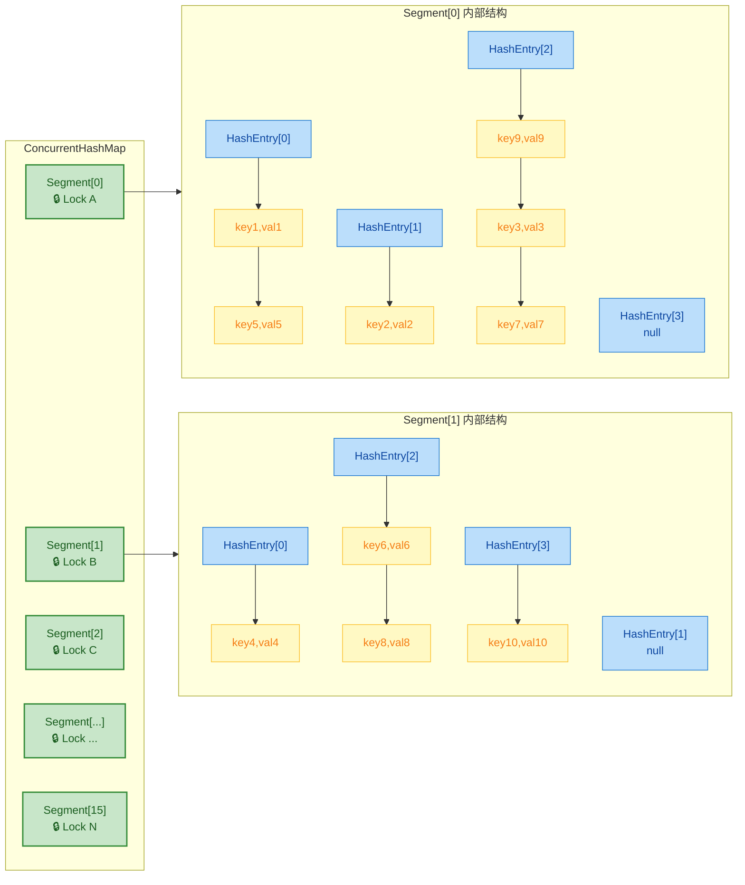

这意味着，理论上如果有 16 个 Segment，那么最多可以有 **16 个线程同时进行写操作**而互不阻塞——这比 `Hashtable` 的单锁方案性能提升了一个数量级。

下面来看一个简化的内存模型，直观感受"两级定位"的过程：

```java
// ==================== 两级定位过程（概念图） ====================
// 
// 假设 key = "hello", hash(key) = 0x7A3B_F10E
//
// 第一级定位 Segment：用 hash 的 【高位】
//   segmentIndex = (hash >>> segmentShift) & segmentMask
//   例：segmentShift=28, segmentMask=15 → segmentIndex = 7
//   → 锁住 Segment[7]
//
// 第二级定位 HashEntry 桶：用 hash 的 【低位】
//   bucketIndex = hash & (table.length - 1)
//   例：table.length=4, → bucketIndex = hash & 3 = 2
//   → 在 Segment[7] 的 HashEntry[2] 链表上操作
```

这种高低位分别用于两级索引的设计非常精妙。高位决定 Segment，低位决定桶，让 key 的分布在两个层面上都尽可能均匀，减少碰撞。

### Segment 继承 ReentrantLock

JDK 7 的 `ConcurrentHashMap` 中，`Segment` 类**直接继承了 `ReentrantLock`**，这是一个非常大胆且务实的设计决策。让我们看看其精简的源码结构：

```java
// ==================== Segment 核心源码（JDK 7 简化版） ====================

// Segment 直接继承 ReentrantLock，自身就是一把可重入锁
static final class Segment<K,V> extends ReentrantLock implements Serializable {

    private static final long serialVersionUID = 2249069246763182397L;

    // 当前 Segment 下实际存储的 entry 数量
    transient volatile int count;

    // 结构修改次数，用于跨段一致性校验（如 size() 方法）
    transient int modCount;

    // 扩容阈值 = table.length * loadFactor（注意：每个 Segment 独立扩容）
    transient int threshold;

    // 哈希桶数组，每个元素是 HashEntry 链表的头节点
    // volatile 保证数组引用的可见性（扩容时替换新数组）
    transient volatile HashEntry<K,V>[] table;

    // 负载因子，继承自构造参数
    final float loadFactor;

    // ======== put 操作（必须先获取锁） ========
    final V put(K key, int hash, V value, boolean onlyIfAbsent) {
        // tryLock() 尝试非阻塞获取锁
        // 获取失败则进入 scanAndLockForPut 自旋 + 阻塞逻辑
        HashEntry<K,V> node = tryLock() ? null : scanAndLockForPut(key, hash, value);
        V oldValue;
        try {
            HashEntry<K,V>[] tab = table;            // 获取当前桶数组
            int index = (tab.length - 1) & hash;     // 用 hash 低位定位桶
            HashEntry<K,V> first = entryAt(tab, index); // 取出链表头节点

            for (HashEntry<K,V> e = first;;) {       // 遍历链表
                if (e != null) {
                    K k;
                    // 如果找到相同 key，更新 value
                    if ((k = e.key) == key || (e.hash == hash && key.equals(k))) {
                        oldValue = e.value;
                        if (!onlyIfAbsent) {         // putIfAbsent 语义控制
                            e.value = value;
                            ++modCount;              // 记录修改次数
                        }
                        break;
                    }
                    e = e.next;                      // 继续遍历下一个节点
                } else {
                    // 链表中没有相同 key，头插法插入新节点
                    if (node != null)
                        node.setNext(first);         // 新节点的 next 指向原头节点
                    else
                        node = new HashEntry<K,V>(hash, key, value, first);
                    int c = count + 1;               // 计算新的 entry 数量
                    // 超过阈值且未达最大容量时，触发 Segment 内部扩容
                    if (c > threshold && tab.length < MAXIMUM_CAPACITY)
                        rehash(node);                // 仅扩容当前 Segment！
                    else
                        setEntryAt(tab, index, node);// 将新节点设为桶的头节点
                    ++modCount;
                    count = c;                       // volatile 写，保证可见性
                    oldValue = null;
                    break;
                }
            }
        } finally {
            unlock();                                // 操作完成，释放锁
        }
        return oldValue;
    }
}
```

**为什么选择继承 `ReentrantLock` 而不是组合？** 这里有几个深层原因：

| 对比维度 | 继承 ReentrantLock | 组合（持有一个 lock 字段） |
|---|---|---|
| **内存开销** | 每个 Segment 对象只有自身字段 | 多一个对象头（额外 16 bytes） |
| **访问效率** | `this.lock()` 直接调用，无间接引用 | `this.lock.lock()` 多一次指针跳转 |
| **代码简洁度** | 直接调用 `tryLock()`、`unlock()` | 需要通过字段委托 |
| **设计纯粹性** | 违反"组合优于继承"原则 ⚠️ | 更符合 OOP 设计范式 ✅ |

Doug Lea 在这里做了一个 **"性能优先于设计纯粹性"** 的工程决策。在高并发场景下，哪怕是 16 字节的内存节省和一次指针跳转的消除，乘以数百万次操作后也是显著的性能差距。

> **值得注意的是**：JDK 8 中彻底废弃了 Segment 架构，改用 `synchronized` + CAS 锁单个 Node，从设计上回归了"不继承锁"的思路。这也说明 JDK 7 的继承方式是一种**特定历史背景下的权衡**。

再来看 `scanAndLockForPut` 这个非常精妙的方法——它体现了 **"自旋等待期间不浪费 CPU"** 的思想：

```java
// ==================== scanAndLockForPut 源码（JDK 7 简化版） ====================

// 当 tryLock() 快速获取锁失败时，进入此方法
// 在自旋等待锁的过程中，预先遍历链表查找/创建节点，充分利用 CPU 时间
private HashEntry<K,V> scanAndLockForPut(K key, int hash, V value) {
    // 根据 hash 定位到桶的第一个节点
    HashEntry<K,V> first = entryForHash(this, hash);
    HashEntry<K,V> e = first;
    HashEntry<K,V> node = null;                      // 预创建的新节点
    int retries = -1;                                 // 重试计数器，-1 表示还在扫描链表阶段

    while (!tryLock()) {                              // 反复尝试获取锁
        HashEntry<K,V> f;

        if (retries < 0) {
            // === 扫描阶段：利用等待时间预处理 ===
            if (e == null) {
                // 链表遍历完毕，未找到相同 key → 预先创建新节点
                if (node == null)
                    node = new HashEntry<K,V>(hash, key, value, first);
                retries = 0;                          // 进入自旋计数阶段
            }
            else if (key.equals(e.key))
                retries = 0;                          // 找到相同 key，进入自旋计数
            else
                e = e.next;                           // 继续遍历链表
        }
        else if (++retries > MAX_SCAN_RETRIES) {
            // === 自旋超过最大次数（单核1次，多核64次） ===
            // 放弃自旋，进入阻塞队列排队等待
            lock();                                   // 阻塞式获取锁
            break;
        }
        else if ((retries & 1) == 0 &&
                 (f = entryForHash(this, hash)) != first) {
            // === 每隔一次自旋检查链表头是否变化 ===
            // 如果头节点变了（说明其他线程修改了链表），重新扫描
            e = first = f;
            retries = -1;                             // 回到扫描阶段
        }
    }
    return node;                                      // 返回预创建的节点（可能为 null）
}
```

这个方法的设计理念非常值得学习：**既然线程在等锁时反正要空转，不如利用这段时间做一些有价值的准备工作**（预遍历链表、预创建节点），这样获取到锁后的临界区代码可以更快执行完毕，缩短持锁时间。

### 默认 16 个 Segment

JDK 7 的 `ConcurrentHashMap` 默认创建 **16 个 Segment**，并且这个数量在 Map 整个生命周期中**不可改变**（Segment 数组不会扩容）。这是一个需要重点理解的设计约束。

```java
// ==================== ConcurrentHashMap 构造函数（JDK 7 简化版） ====================

public ConcurrentHashMap(int initialCapacity, float loadFactor, int concurrencyLevel) {
    // 参数校验
    if (!(loadFactor > 0) || initialCapacity < 0 || concurrencyLevel <= 0)
        throw new IllegalArgumentException();

    // concurrencyLevel 上限为 65536 (1 << 16)
    if (concurrencyLevel > MAX_SEGMENTS)
        concurrencyLevel = MAX_SEGMENTS;

    // ===== 计算 Segment 数量（必须是 2 的幂） =====
    int sshift = 0;            // segment 位移量，用于后续 hash 定位
    int ssize = 1;             // segment 数组的实际大小
    while (ssize < concurrencyLevel) {
        ++sshift;              // 每翻倍一次，位移量 +1
        ssize <<= 1;          // ssize 不断左移直到 >= concurrencyLevel
    }
    // 例：concurrencyLevel=16 → ssize=16, sshift=4

    this.segmentShift = 32 - sshift;   // 32-4=28，hash 右移 28 位取高 4 位
    this.segmentMask = ssize - 1;      // 16-1=15=0x0F，掩码

    // ===== 计算每个 Segment 内的初始桶数（也必须是 2 的幂） =====
    if (initialCapacity > MAXIMUM_CAPACITY)
        initialCapacity = MAXIMUM_CAPACITY;

    int c = initialCapacity / ssize;   // 将总容量均分到每个 Segment
    if (c * ssize < initialCapacity)
        ++c;                           // 向上取整
    int cap = MIN_SEGMENT_TABLE_CAPACITY; // 最小桶数为 2
    while (cap < c)
        cap <<= 1;                     // 找到 >= c 的最小 2 的幂

    // ===== 创建 Segment[0] 作为原型（Prototype） =====
    // 其他 Segment 在首次访问时懒加载，复用 s0 的参数
    Segment<K,V> s0 = new Segment<K,V>(loadFactor, (int)(cap * loadFactor), 
                                        (HashEntry<K,V>[])new HashEntry[cap]);
    Segment<K,V>[] ss = (Segment<K,V>[])new Segment[ssize]; // 创建 Segment 数组
    UNSAFE.putOrderedObject(ss, SBASE, s0);                  // 将 s0 放入 ss[0]
    this.segments = ss;
}
```

以下是默认参数下的内存结构全景图：

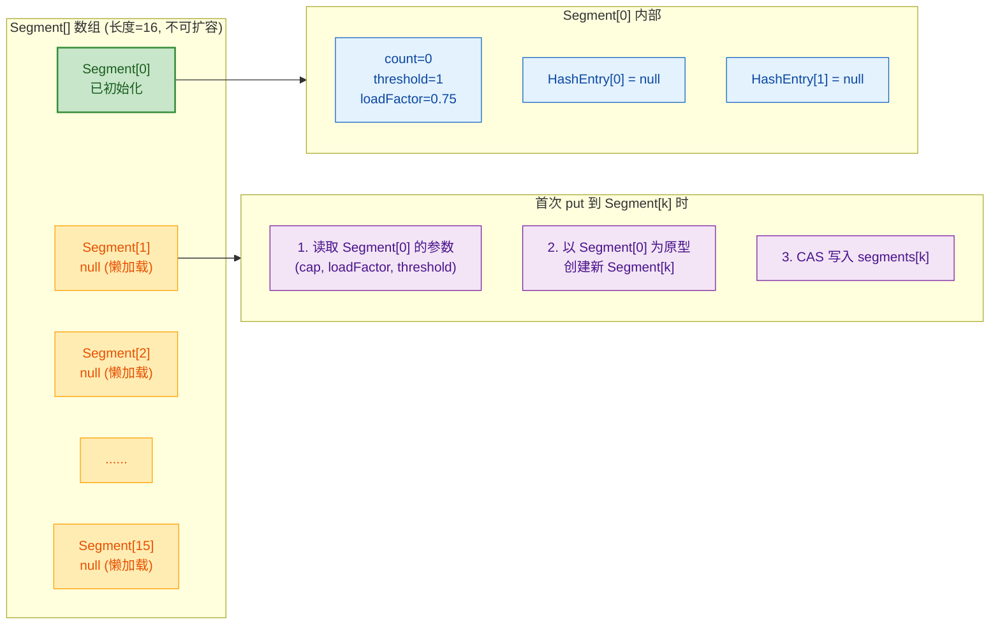

几个关键设计点值得深入分析：

**① Segment 数量必须为 2 的幂**

这是为了使用位运算（`&`）代替取模运算（`%`）来快速定位 Segment。`(hash >>> segmentShift) & segmentMask` 的效率远高于 `hash % segmentCount`。这与 HashMap 中桶数量必须为 2 的幂的原因完全一致。

**② 只有 `Segment[0]` 在构造时被初始化**

其余 15 个 Segment 全部是 **懒加载（Lazy Initialization）** 的。只有当某个线程第一次 put 到某个 Segment 时，才会以 `Segment[0]` 为**原型**（Prototype Pattern）创建新的 Segment 实例。这避免了大量不必要的内存分配。

```java
// ==================== ensureSegment：懒加载 Segment（JDK 7） ====================

private Segment<K,V> ensureSegment(int k) {
    final Segment<K,V>[] ss = this.segments;
    long u = (k << SSHIFT) + SBASE;           // 计算 segments[k] 的内存偏移量
    Segment<K,V> seg;

    // 第一次检查（无锁读取 volatile 语义）
    if ((seg = (Segment<K,V>)UNSAFE.getObjectVolatile(ss, u)) == null) {
        // 以 Segment[0] 为原型，复用其参数
        Segment<K,V> proto = ss[0];
        int cap = proto.table.length;           // 复制桶数组容量
        float lf = proto.loadFactor;            // 复制负载因子
        int threshold = (int)(cap * lf);        // 计算扩容阈值

        // 创建新的 HashEntry 桶数组
        HashEntry<K,V>[] tab = (HashEntry<K,V>[])new HashEntry[cap];

        // 第二次检查（Double-Check，防止其他线程已经创建了）
        if ((seg = (Segment<K,V>)UNSAFE.getObjectVolatile(ss, u)) == null) {
            Segment<K,V> s = new Segment<K,V>(lf, threshold, tab);
            // 自旋 CAS 写入，保证只有一个线程成功
            while ((seg = (Segment<K,V>)UNSAFE.getObjectVolatile(ss, u)) == null) {
                if (UNSAFE.compareAndSwapObject(ss, u, null, s)) {
                    seg = s;                    // CAS 成功，返回新创建的 Segment
                    break;
                }
            }
        }
    }
    return seg;
}
```

注意这里使用了**三重保护**来确保线程安全：第一次 volatile 读 → 创建对象 → 第二次 volatile 读（Double-Check）→ CAS 写入。这是一个经典的并发初始化模式。

**③ Segment 数组永不扩容，只有内部 HashEntry[] 扩容**

这一点至关重要。一旦 `ConcurrentHashMap` 被构造出来，Segment 的数量就固定了。当某个 Segment 内的数据过多时，只会触发该 **Segment 内部的 `rehash()`**，将其 `HashEntry[]` 扩大一倍。这意味着：

- 如果数据分布不均匀，某些 Segment 可能很"胖"，某些很"瘦"
- Segment 之间的扩容是完全独立的，不会互相干扰
- **最大并发度在创建时就被锁死了**

### 并发度（concurrencyLevel）

`concurrencyLevel` 是 JDK 7 `ConcurrentHashMap` 构造函数的第三个参数，它直接决定了 **Segment 数组的大小**，也就是**理论上的最大并发写线程数**。

```java
// 三种常见构造方式
// 1. 默认构造：initialCapacity=16, loadFactor=0.75, concurrencyLevel=16
ConcurrentHashMap<String, Integer> map1 = new ConcurrentHashMap<>();

// 2. 指定初始容量：concurrencyLevel 仍为默认 16
ConcurrentHashMap<String, Integer> map2 = new ConcurrentHashMap<>(256);

// 3. 完整参数：指定并发度为 32
// 实际 Segment 数量 = 32（恰好是 2 的幂，无需向上取整）
ConcurrentHashMap<String, Integer> map3 = new ConcurrentHashMap<>(256, 0.75f, 32);

// 4. 如果 concurrencyLevel=20，实际 Segment 数量 = 32（向上取整到最近的 2 的幂）
ConcurrentHashMap<String, Integer> map4 = new ConcurrentHashMap<>(256, 0.75f, 20);
```

下面用一张表来说明不同 `concurrencyLevel` 的实际效果：

| concurrencyLevel（参数） | 实际 Segment 数量 | segmentShift | segmentMask | 最大并发写线程数 |
|---|---|---|---|---|
| 1 | 1 | 32 | 0 | 1（退化为全表锁） |
| 4 | 4 | 30 | 3 | 4 |
| **16（默认）** | **16** | **28** | **15** | **16** |
| 20 | 32 | 27 | 31 | 32 |
| 64 | 64 | 26 | 63 | 64 |
| 65536 | 65536 | 16 | 65535 | 65536（上限） |

**如何选择合适的 concurrencyLevel？** 这是一个工程实践中的重要问题：

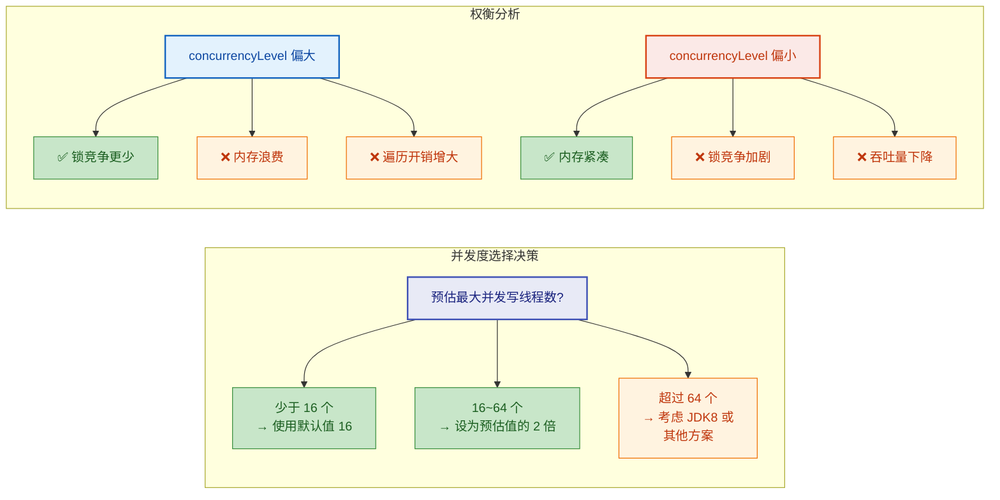

**并发度设计的局限性** 也需要清醒认识：

**1. 一旦确定，无法更改**。这在动态负载场景下是一个明显的缺陷。你在创建 Map 时必须预估未来的并发峰值，而这往往是不准确的。

**2. 并发度 ≠ 实际并发性能**。即使设置了 `concurrencyLevel=64`，如果所有 key 的 hash 恰好落入同一个 Segment，实际并发度仍然是 1。好的 hash 函数分散性至关重要。

**3. `size()` 操作的代价随并发度增长**。计算 size 需要尝试无锁统计所有 Segment 的 count，若不一致则必须**锁住全部 Segment**，并发度越大，锁的开销越大：

```java
// ==================== size() 方法（JDK 7 简化） ====================

public int size() {
    final Segment<K,V>[] segments = this.segments;
    long sum = 0;            // 总元素数
    long last = 0;           // 上一轮的统计结果
    int retries = -1;        // 重试计数
    boolean overflow = false; // 是否溢出 int 范围

    try {
        for (;;) {
            // 如果连续两次无锁统计的结果一致 → 直接返回
            // 如果尝试 RETRIES_BEFORE_LOCK(=2) 次仍不一致 → 锁住所有 Segment
            if (retries++ == RETRIES_BEFORE_LOCK) {
                for (int j = 0; j < segments.length; ++j)
                    ensureSegment(j).lock();           // 逐个获取所有 Segment 的锁！
            }

            sum = 0L;
            overflow = false;
            for (int j = 0; j < segments.length; ++j) {
                Segment<K,V> seg = segmentAt(segments, j);
                if (seg != null) {
                    sum += seg.count;                  // 累加每个 Segment 的 count
                    if (seg.count < 0)
                        overflow = true;
                }
            }
            // 如果 sum 等于上一轮的结果，说明期间没有修改，结果可信
            if (sum == last)
                break;
            last = sum;                                // 记录本轮结果，下一轮对比
        }
    } finally {
        if (retries > RETRIES_BEFORE_LOCK) {
            for (int j = 0; j < segments.length; ++j)
                segmentAt(segments, j).unlock();       // 释放所有锁
        }
    }
    return overflow ? Integer.MAX_VALUE : (int)sum;
}
```

这个 `size()` 方法的策略是"先乐观后悲观"：先无锁尝试两次，如果两次结果一致就直接返回；否则退化为全锁模式。这也解释了为什么在高并发写入场景下调用 `size()` 的开销可能非常大。

> **总结 JDK 7 的 concurrencyLevel 设计**：它是一种**静态并发分区**策略，简单有效但不够灵活。这也是 JDK 8 彻底抛弃 Segment 架构，转向 "CAS + synchronized 锁单个桶节点" 的根本动因——让并发粒度从**段级别**细化到**桶级别**，并发度随着 table 的扩容自然增长，无需预先配置。

---

**📝 练习题**

以下关于 JDK 7 `ConcurrentHashMap` 的描述，哪一项是**错误**的？

A. Segment 数组的长度在构造后不可改变，即使数据量暴增也不会增加 Segment 数量。


B. `scanAndLockForPut` 方法在自旋等待锁的过程中会预先遍历链表并可能预创建新节点，从而缩短持锁时间。


C. 调用 `size()` 方法时，如果两次无锁统计结果不一致，会锁住发生变化的那个 Segment 进行精确统计。


D. 每个 Segment 的内部 `HashEntry[]` 桶数组可以独立扩容，不同 Segment 的扩容互不影响。


**【答案】** C

**【解析】** 选项 C 的描述有误。当 `size()` 方法两次无锁统计不一致时，它不是只锁"发生变化的那个 Segment"，而是**锁住全部 Segment**（`for (int j = 0; j < segments.length; ++j) ensureSegment(j).lock()`）。这是因为在高并发环境下，你无法准确判断"哪个 Segment 发生了变化"——在你检查的过程中，任何 Segment 都可能被修改。因此必须全部锁住以获取一个全局一致的快照。选项 A、B、D 均为正确描述。

---

## JDK8 实现 ⭐⭐⭐

JDK 8 对 `ConcurrentHashMap` 进行了一次**颠覆性的重写**（authored primarily by Doug Lea）。整个实现从 JDK 7 的 `Segment[] + HashEntry[]` 双层结构，彻底转变为与 `HashMap` 高度相似的 **`Node[] + 链表 + 红黑树`** 单层扁平结构。锁策略也从"锁一整个 Segment（锁住一片桶）"进化为"**锁单个桶的头节点**"，配合大量无锁 CAS 操作，使得并发性能获得了质的飞跃。这一版本也是当今面试考察的**绝对重点**。

---

### 取消分段锁

#### 为什么 JDK 7 的 Segment 方案要被淘汰？

JDK 7 的分段锁设计在当年是非常优秀的工程折衷，但随着硬件核心数的爆发式增长和并发编程理论的成熟，它的结构性缺陷逐渐暴露：

**第一，并发度在初始化后不可变。** `concurrencyLevel` 在构造时就决定了 Segment 数量（默认 16），此后无论怎么扩容，Segment 数组的长度始终不变——扩容只发生在 Segment 内部的 `HashEntry[]` 上。这意味着在一个拥有 64 核甚至 128 核的服务器上，最多只有 16 个线程能同时写入，其余线程都在争抢锁。

**第二，内存布局的间接性带来缓存不友好。** 访问一个元素需要经过 `Segment[] → Segment → HashEntry[] → HashEntry` 至少三次指针跳转（three levels of indirection），每一跳都可能引发一次 CPU 缓存缺失（cache miss），在高吞吐场景下非常影响性能。

**第三，某些全局操作代价极高。** 计算 `size()` 时需要先尝试无锁统计两次，如果两次不一致，就要对**全部 16 个 Segment 加锁**，这在高并发写入时几乎是一个 stop-the-world 操作。

**第四，代码复杂度高，可维护性差。** 两级 Hash（先定位 Segment，再定位桶）、Segment 自身继承 `ReentrantLock`、`scanAndLockForPut` 中的自旋预热逻辑，都增加了理解和维护难度。

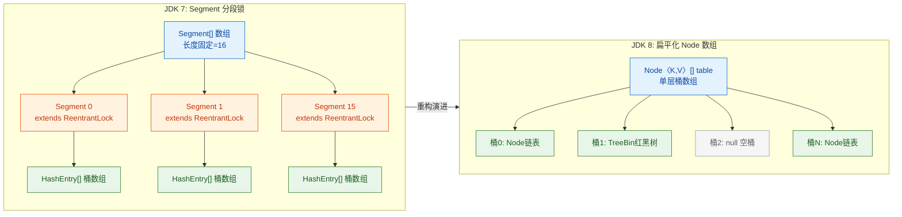

#### JDK 8 的设计哲学转变

Doug Lea 在 JDK 8 中采用了一种更加**细粒度且自适应**的并发控制哲学：

- **无竞争时**：用 CAS（Compare-And-Swap）完成操作，零锁开销。
- **有竞争时**：只对**单个桶的头节点**施加 `synchronized`，锁的粒度从"一片桶"缩小到"一个桶"。
- **并发度不再固定**：理论并发度等于**桶数组的长度**，随着 `table` 扩容自动增长（16 → 32 → 64 → ...），自适应于实际负载。

这种"乐观优先 + 悲观兜底"的混合策略，是现代高性能并发容器的标准范式。

---

### Node 数组 + 链表 + 红黑树

#### 核心数据结构

JDK 8 的 `ConcurrentHashMap` 底层结构与 JDK 8 的 `HashMap` **几乎一致**：一个 `Node<K,V>[]` 数组（称为 `table`），每个桶位要么是 `null`、要么挂着一条链表、要么是一棵红黑树。不同的是，所有对这些结构的修改操作都被精心地用 CAS 和 `synchronized` 保护起来。

先看三个核心内部类的源码骨架：

```java
// ========== 1. 基础节点：链表节点 ==========
// 类似 HashMap.Node，但 val 和 next 都用 volatile 修饰
static class Node<K,V> implements Map.Entry<K,V> {
    final int hash;       // 哈希值，一旦计算不可变
    final K key;          // 键，不可变
    volatile V val;       // 值，volatile 保证可见性（支持无锁读）
    volatile Node<K,V> next; // 下一个节点的引用，volatile 保证链表结构变更对读线程可见

    Node(int hash, K key, V val, Node<K,V> next) {
        this.hash = hash;  // 存储 spread() 处理后的 hash
        this.key = key;
        this.val = val;
        this.next = next;
    }
}

// ========== 2. 树节点：红黑树中的实际节点 ==========
// 继承自 Node，额外维护红黑树的父/左/右/前驱指针和颜色
static final class TreeNode<K,V> extends Node<K,V> {
    TreeNode<K,V> parent;  // 父节点（红黑树结构）
    TreeNode<K,V> left;    // 左子节点
    TreeNode<K,V> right;   // 右子节点
    TreeNode<K,V> prev;    // 前驱节点（用于删除时拆链）
    boolean red;           // 红黑颜色标记

    TreeNode(int hash, K key, V val, Node<K,V> next, TreeNode<K,V> parent) {
        super(hash, key, val, next); // 调用 Node 构造器
        this.parent = parent;
    }
}

// ========== 3. 树桶容器：桶的头节点，封装了一棵红黑树 ==========
// hash 固定为 TREEBIN（-2），持有读写锁以保护树结构
static final class TreeBin<K,V> extends Node<K,V> {
    TreeNode<K,V> root;    // 红黑树的根节点
    volatile TreeNode<K,V> first; // 链表顺序的第一个节点（TreeNode 同时维护链表结构）
    volatile Thread waiter; // 等待获取写锁的线程
    volatile int lockState; // 锁状态：0=无锁, 1=写锁, 2/4/6...=读锁计数
    // ... 省略读写锁逻辑和树操作方法
}

// ========== 4. 转发节点：扩容时的占位标记 ==========
// hash 固定为 MOVED（-1），持有新表引用
static final class ForwardingNode<K,V> extends Node<K,V> {
    final Node<K,V>[] nextTable; // 指向扩容后的新数组
    ForwardingNode(Node<K,V>[] tab) {
        super(MOVED, null, null, null); // hash = -1 作为标识
        this.nextTable = tab;
    }
}
```

#### 关键常量

```java
// ConcurrentHashMap 中的核心常量
static final int MOVED     = -1; // ForwardingNode 的 hash 标记，表示该桶已迁移
static final int TREEBIN   = -2; // TreeBin 的 hash 标记，表示该桶是红黑树
static final int RESERVED  = -3; // ReservationNode 的 hash 标记，用于 computeIfAbsent 等方法的占位

static final int TREEIFY_THRESHOLD = 8;   // 链表长度 >= 8 时触发树化判断
static final int UNTREEIFY_THRESHOLD = 6; // 红黑树节点 <= 6 时退化为链表
static final int MIN_TREEIFY_CAPACITY = 64; // 只有 table 长度 >= 64 才真正树化，否则优先扩容
```

#### 完整的数据结构布局

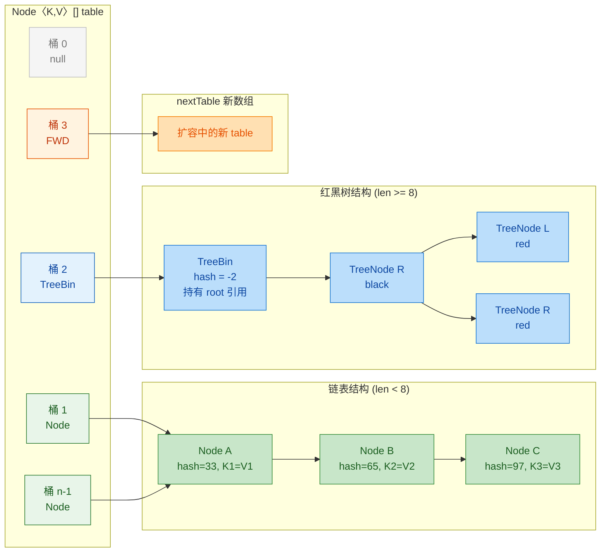

#### 为什么同时保留链表和红黑树？

这是一个经典的**时间-空间权衡**（time-space tradeoff）：

| 维度 | 链表 | 红黑树 |
|:---:|:---:|:---:|
| 查找时间复杂度 | O(n) | O(log n) |
| 插入时间复杂度 | O(1) 尾插 | O(log n) + 旋转 |
| 每节点内存开销 | 较小（next 指针） | 较大（parent/left/right/prev/red） |
| 适用场景 | 桶中元素少 | 桶中元素多（hash 冲突严重） |

当链表长度较短（< 8）时，线性遍历非常快（常数因子小），树化反而因为额外的指针和旋转逻辑增加了开销。只有当链表足够长时，O(log n) 的优势才能体现。阈值 **8** 是基于**泊松分布（Poisson distribution）**计算的——在理想的 hash 分布下，一个桶中出现 8 个及以上元素的概率不到千万分之一（约 0.00000006）。因此，红黑树只在**极端 hash 冲突**场景下才会被触发，属于防御性设计。

---

### CAS + synchronized

这是 JDK 8 `ConcurrentHashMap` 最核心的并发控制策略。它不再使用单一的锁机制，而是构建了一套**三层递进的并发控制体系**：

#### 第一层：volatile 读 —— 无锁无阻塞

```java
// table 引用本身是 volatile 的
transient volatile Node<K,V>[] table;

// Node 的 val 和 next 也是 volatile 的
volatile V val;
volatile Node<K,V> next;
```

`volatile` 关键字确保了 **happens-before** 语义：任何线程对 `val` 或 `next` 的写入，对后续读取该变量的线程**立即可见**。这是 `get()` 方法**完全不需要加锁**的基础——读线程总能看到写线程最近一次的修改结果。

#### 第二层：CAS —— 无锁但有竞争感知

CAS（Compare-And-Swap）是一种 CPU 级别的原子指令，语义为"如果内存地址 V 处的值等于预期值 A，则将其更新为新值 B，否则什么都不做，并返回实际值"。JDK 8 中通过 `sun.misc.Unsafe`（后来是 `VarHandle`）来直接调用：

```java
// ConcurrentHashMap 中常用的 Unsafe 操作

// 获取 table[i] 处的 Node（volatile 语义读）
// 等价于：return table[i]，但绕过数组边界检查，直接按内存偏移量读取
static final <K,V> Node<K,V> tabAt(Node<K,V>[] tab, int i) {
    return (Node<K,V>)U.getObjectVolatile(tab, ((long)i << ASHIFT) + ABASE);
}

// CAS 设置 table[i] 的值：期望为 null，设为新 Node
// 仅当 table[i] 当前确实为 null 时才成功，返回 true
// 这是往空桶插入第一个节点的唯一方式
static final <K,V> boolean casTabAt(Node<K,V>[] tab, int i,
                                     Node<K,V> c, Node<K,V> v) {
    return U.compareAndSwapObject(tab, ((long)i << ASHIFT) + ABASE, c, v);
}

// volatile 写 table[i]（不需要 CAS，用于已获取锁后的确定性写入）
static final <K,V> void setTabAt(Node<K,V>[] tab, int i, Node<K,V> v) {
    U.putObjectVolatile(tab, ((long)i << ASHIFT) + ABASE, v);
}
```

**为什么不直接用 `tab[i]` 访问数组元素？** 因为 Java 的数组元素访问**不保证 volatile 语义**。即使数组引用本身是 `volatile` 的（`volatile Node<K,V>[] table`），这只保证了对 `table` 引用的读写的可见性，**不传递到数组元素**。所以必须通过 `Unsafe` 以指定内存偏移量的方式进行原子操作。

CAS 在 `ConcurrentHashMap` 中的典型使用场景包括：

| 场景 | 说明 |
|:---|:---|
| 空桶插入 | `casTabAt(tab, i, null, newNode)` —— 桶为空时 CAS 放入第一个节点 |
| baseCount 更新 | `U.compareAndSwapLong(this, BASECOUNT, b, s)` —— 更新元素计数 |
| sizeCtl 状态控制 | CAS 修改 `sizeCtl` 控制初始化和扩容的并发协调 |
| transferIndex 分配 | CAS 领取扩容任务的桶区间 |

#### 第三层：synchronized —— 重量级但精准

当 CAS 无法满足需求时（即桶非空，需要操作链表或树），JDK 8 使用 `synchronized` 锁住**桶的头节点**：

```java
// put 操作的核心并发控制片段（简化版）
Node<K,V> f = tabAt(tab, i);       // 读取桶头节点
if (f == null) {
    // 空桶：用 CAS 无锁插入
    if (casTabAt(tab, i, null, new Node<>(hash, key, value, null)))
        break;                      // CAS 成功，结束
    // CAS 失败说明有竞争，回到循环重试
} else if (f.hash == MOVED) {
    // 桶正在迁移：当前线程协助扩容（后续章节详解）
    tab = helpTransfer(tab, f);
} else {
    // 非空桶：synchronized 锁住头节点 f
    synchronized (f) {              // 锁的对象是桶的第一个 Node
        if (tabAt(tab, i) == f) {   // double-check：确认 f 仍然是头节点
            // ... 遍历链表或操作红黑树，执行插入/更新
        }
    }
}
```

**为什么是 synchronized 而不是 ReentrantLock？** 这是一个很多人疑惑的设计选择：

1. **JVM 内置优化**：从 JDK 6 开始，HotSpot 对 `synchronized` 做了大量优化——偏向锁（Biased Locking）、轻量级锁（Lightweight Locking）、自适应自旋（Adaptive Spinning）、锁消除（Lock Elimination）、锁粗化（Lock Coarsening）。在低竞争场景下，`synchronized` 的性能已经与 `ReentrantLock` 持平甚至更优。

2. **内存节省**：`ReentrantLock` 是一个对象，每个桶如果用一个 `ReentrantLock`，就需要额外为每个桶分配一个锁对象。而 `synchronized` 利用的是对象头（Object Header）中已有的 Mark Word，**零额外内存开销**。对于一个可能有百万级桶的 Map 来说，这是巨大的节省。

3. **更简洁的代码**：`synchronized` 块自动释放锁（即使发生异常），不需要 `try-finally` 模板代码。

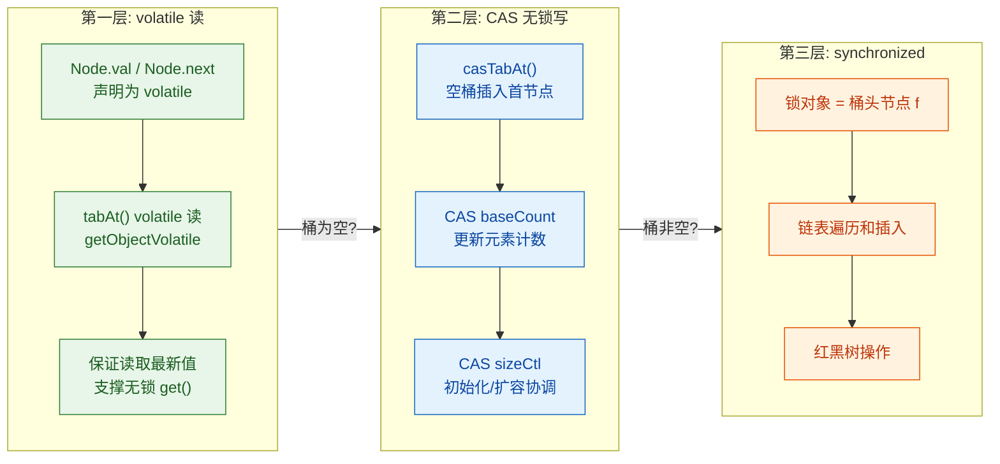

#### double-check 的必要性

注意源码中 `synchronized (f)` 内部第一行就是 `if (tabAt(tab, i) == f)`，这是一个**经典的 double-check 模式**。为什么？

```java
// 时间线演示：为什么需要 double-check
// 假设线程 A 和线程 B 同时对桶 i 操作

// T1: 线程 A 读到 f = tabAt(tab, i)         => f 是 Node X
// T2: 线程 B 也读到 f = tabAt(tab, i)       => f 也是 Node X
// T3: 线程 A 先获得 synchronized(f)，执行完操作后释放锁
//     操作中 A 可能因为扩容导致 tab[i] 指向了新的头节点 Y
// T4: 线程 B 获得 synchronized(f)
//     但此时 tab[i] 已经不是 f（Node X）了！
//     如果不 double-check，B 会在一个"过时的"链表上操作，导致数据丢失
```

所以 `tabAt(tab, i) == f` 这个检查确保了：**我锁住的对象仍然是当前桶的头节点**。如果不是，说明另一个线程已经修改了桶结构（例如扩容迁移），当前线程应该回到外层循环重试。

---

### 锁粒度更细（锁单个 Node）

#### 粒度对比：从 Segment 到 Node

这是 JDK 7 → JDK 8 最本质的性能提升来源。我们通过一个具体的数值对比来理解：

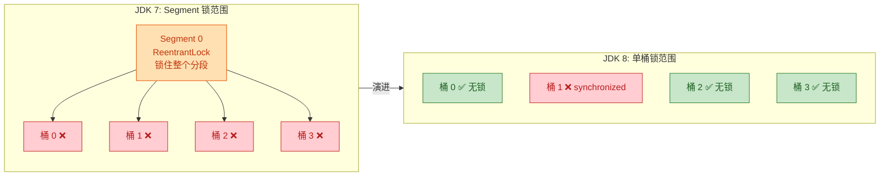

用数字说话：

| 指标 | JDK 7 (默认配置) | JDK 8 (默认配置) |
|:---|:---:|:---:|
| 初始桶数 | 16 Segments × 2 桶 = 32 | 16 桶 |
| **理论最大并发写线程** | **16**（= Segment 数） | **16**（= 桶数） |
| 扩容到 1024 桶后 | 仍然 **16** | **1024** |
| 扩容到 65536 桶后 | 仍然 **16** | **65536** |
| 锁住的元素范围 | 整个 Segment 内的所有桶 | 仅当前桶 |
| 空桶写入 | 需要加锁 | **无锁 CAS** |

JDK 7 中即使桶总数扩到了几万，并发度始终被 Segment 数量（16）锁死。JDK 8 中，并发度随桶数量线性增长，并且空桶插入完全无锁。

#### "锁单个 Node" 的精确含义

`synchronized (f)` 中的 `f` 是桶数组中某个桶的**头节点**对象。需要精确理解这里"锁"的含义：

```java
// 内存视角：synchronized 锁的是什么？
//
// table:  [  桶0  |  桶1  |  桶2  |  桶3  | ... |  桶n  ]
//                     |
//                     v
//              +-- Node A (头节点) <--- synchronized 锁的就是这个对象
//              |    hash=33, key="x", val="1"
//              |    next ──> Node B
//              |              hash=65, key="y", val="2"
//              |              next ──> null
//              |
//              +--- 整条链表在 Node A 的锁保护下操作

// 线程 1 锁住桶 1 的头节点 A，对桶 1 的链表做插入
// 线程 2 可以同时 CAS 操作桶 0（空桶）—— 完全无阻塞
// 线程 3 可以同时 synchronized 锁住桶 3 的头节点 —— 与线程 1 互不干扰
// 只有线程 4 也要操作桶 1 时，才需要等待线程 1 释放锁
```

**一个容易被忽略的细节**：如果桶的头节点因为操作被替换了（比如删除了头节点），后续线程拿到的 `f` 是新的头节点，`synchronized` 锁的对象也变了。这就是 double-check 存在的意义——确保锁住的对象是当前最新的头节点。

#### 实际并发效果推演

假设有一个容量为 1024 的 `ConcurrentHashMap`，有 100 个线程同时执行 `put`：

```java
// 假设 100 个 put 操作的 hash 分布较为均匀
//
// JDK 7（16 Segments，每个 Segment 管 64 个桶）:
//   - 100 个线程竞争 16 把锁
//   - 平均每把锁有 ~6 个线程排队
//   - 如果 6 个线程恰好都落在不同的桶，它们本不该互相阻塞
//   - 但因为同一个 Segment 只有一把锁，仍然串行执行
//
// JDK 8（1024 个桶）:
//   - 100 个线程竞争 1024 个桶位
//   - 两个线程落在同一个桶的概率（生日问题）≈ 1 - e^(-100*99/(2*1024)) ≈ 99.2%
//   - 虽然几乎肯定有冲突，但冲突只影响那两个碰撞的线程
//   - 绝大多数线程（~90+）互不阻塞，接近真正的并行
//   - 而且如果目标桶为空，连 synchronized 都不需要，CAS 一步搞定
```

#### 完整并发控制策略决策树

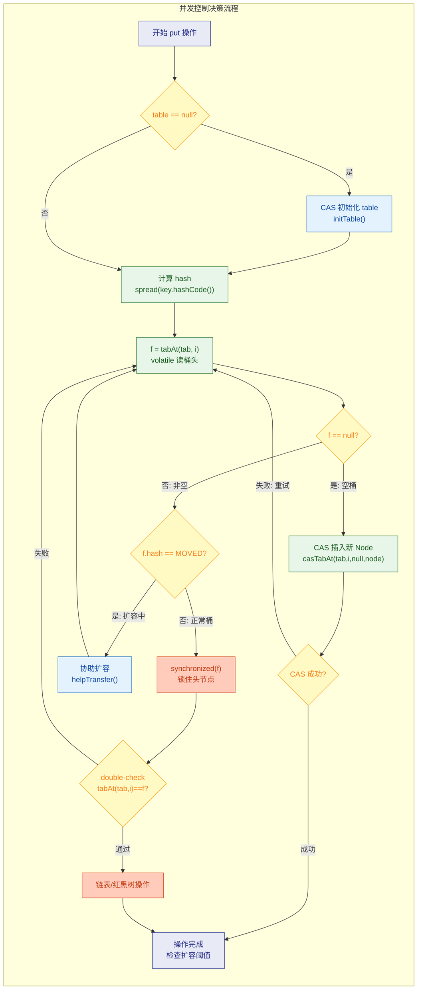

#### 与 Hashtable、Collections.synchronizedMap 的终极对比

| 特性 | Hashtable | synchronizedMap | CHM JDK 7 | CHM JDK 8 |
|:---|:---:|:---:|:---:|:---:|
| 锁粒度 | 整个 Map | 整个 Map | Segment（一组桶） | **单个桶头节点** |
| 读操作加锁？ | 是 | 是 | 否（volatile） | **否**（volatile） |
| 空桶写入方式 | 加锁 | 加锁 | 加锁 | **CAS 无锁** |
| 并发度 | 1 | 1 | 固定（默认 16） | **= 桶数量（动态增长）** |
| null key/value | 不允许 | 允许 | 不允许 | **不允许** |
| 迭代器 | fail-fast | fail-fast | 弱一致性 | **弱一致性** |
| 推荐使用？ | ❌ 已过时 | ❌ 性能差 | ❌ 旧版本 | ✅ **首选** |

---

**📝 练习题**

以下关于 JDK 8 `ConcurrentHashMap` 的描述，哪一项是**错误**的？

A. `get()` 操作不需要加锁，依赖 `Node` 的 `val` 和 `next` 字段的 `volatile` 修饰来保证可见性


B. 往一个空桶中插入第一个节点时，使用 CAS 操作完成，不需要 `synchronized`


C. `synchronized` 锁住的是整个 `Node[]` 数组对象，以保证桶数组的结构一致性


D. 并发度不再是固定值，而是随着 `table` 数组的扩容而动态增长


**【答案】** C

**【解析】** JDK 8 `ConcurrentHashMap` 中 `synchronized` 锁住的对象是**桶的头节点** `f`（即 `synchronized(f)`），而不是整个 `Node[]` 数组。如果锁住整个数组，那就退化成了 `Hashtable` 的全表锁，完全丧失了细粒度并发的意义。正因为只锁单个桶的头节点，不同桶上的操作才能真正并行执行。选项 A 正确，`get()` 全程无锁，靠 volatile 语义保证读到最新值；选项 B 正确，空桶插入使用 `casTabAt(tab, i, null, newNode)`；选项 D 正确，理论并发度等于当前 table 长度，扩容后自动提升。

---

**📝 练习题**

JDK 8 的 `ConcurrentHashMap` 选择 `synchronized` 而不是 `ReentrantLock` 作为桶级锁，以下哪项**不是**其选择的主要原因？

A. JDK 6 以后 `synchronized` 经过偏向锁、轻量级锁等优化，低竞争场景性能已非常好


B. `synchronized` 利用对象头的 Mark Word 实现锁，不需要为每个桶额外分配独立的锁对象，节省内存


C. `synchronized` 支持 `Condition` 条件队列，可以实现更灵活的线程等待/通知


D. `synchronized` 代码更简洁，锁的释放是自动的，不需要手动在 `finally` 中 `unlock()`


**【答案】** C

**【解析】** 支持 `Condition` 条件队列恰恰是 `ReentrantLock` 的优势，而不是 `synchronized` 的优势。`synchronized` 配套的是 `Object.wait()/notify()/notifyAll()`，功能远不如 `Condition` 灵活（例如不能有多个等待队列）。在 `ConcurrentHashMap` 的桶级锁场景中，根本不需要条件等待机制，所以这个 `ReentrantLock` 的优势无用武之地。选项 A 正确，JVM 对 `synchronized` 的优化使其性能在多数场景下不逊于 `ReentrantLock`；选项 B 正确，避免了海量锁对象的内存开销；选项 D 正确，`synchronized` 的自动释放机制更安全简洁。

---

## put 流程 ⭐⭐

`ConcurrentHashMap.put()` 是整个并发 Map 中最核心、最复杂的写操作。JDK 8 的实现将 **CAS 无锁** 与 **synchronized 细粒度锁** 巧妙融合，在保证线程安全的同时将并发度推到了极致——锁的粒度从 JDK 7 的 Segment（段）缩小到了单个桶头节点（single bucket head Node）。理解 `putVal` 方法的每一步，几乎就等于理解了 JDK 8 `ConcurrentHashMap` 的设计哲学。

先给出整体流程的全景图，再逐一深入每个阶段。

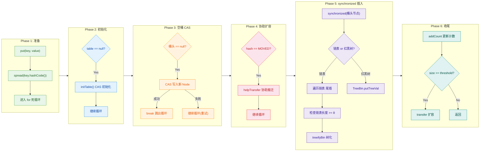

### 计算 hash

`ConcurrentHashMap` 并不直接使用 `key.hashCode()` 的返回值，而是通过一个名为 `spread()` 的方法进行 **二次扰动**（secondary perturbation），目的是让高位也能参与到桶索引计算中，降低哈希碰撞概率。

```java
// ConcurrentHashMap.spread() —— 扰动函数
static final int spread(int h) {
    // h ^ (h >>> 16)：将高 16 位异或到低 16 位，让高位信息也影响索引
    // & HASH_BITS：HASH_BITS = 0x7fffffff，强制最高位为 0，保证结果为非负数
    return (h ^ (h >>> 16)) & HASH_BITS;
}
```

为什么要保证非负？因为在 `ConcurrentHashMap` 的设计中，**负数 hash 值有特殊含义**：

| hash 值 | 常量名 | 含义 |
|---|---|---|
| `-1` | `MOVED` | 该桶正在被搬迁（ForwardingNode） |
| `-2` | `TREEBIN` | 该桶已经树化（TreeBin 的头节点） |
| `-3` | `RESERVED` | 临时保留（computeIfAbsent 等方法使用） |

普通数据节点的 hash 必须 ≥ 0，这样通过 `hash < 0` 就能快速判断出节点类型，实现 **类型编码与哈希索引的统一**——非常精妙的工程设计。

再看这个扰动的位运算过程的直观示意：

```text
原始 hashCode:   1100 0011 0010 1010 | 0001 1100 0110 1001
                 ----高16位----       ----低16位----

h >>> 16:        0000 0000 0000 0000 | 1100 0011 0010 1010

XOR 结果:        1100 0011 0010 1010 | 1101 1111 0100 0011
                                       ↑ 高位信息混入低位

& 0x7fffffff:    0100 0011 0010 1010 | 1101 1111 0100 0011
                 ↑ 最高位归零，保证非负
```

这一步计算的时间复杂度是 O(1)，仅涉及三次位运算，对性能几乎没有影响，但对哈希分布质量的提升是显著的。

### 定位桶

有了扰动后的 hash 值，下一步就是确定这个 key 应该落入 `Node<K,V>[] table` 的哪个槽位（bucket index）。

```java
// 定位桶的核心表达式（出现在 putVal 方法内）
// n 是 table 数组长度，必定为 2 的幂
// i 就是最终的桶索引
int i = (n - 1) & hash;

// 通过 Unsafe/VarHandle 读取桶头节点（volatile 语义）
Node<K,V> f = tabAt(tab, i);
```

`(n - 1) & hash` 等价于 `hash % n`，但位运算远比取模快。这也是为什么 table 长度必须是 **2 的幂** 的根本原因——只有 2 的幂减 1 后，二进制全为 1，按位与才等价于取模。

```text
假设 n = 16 (0001 0000)
n - 1 = 15  (0000 1111)

hash  = ...1010 1101 1111 0100 0011
n - 1 = ...0000 0000 0000 0000 1111
         ─────────────────────────
AND   = ...0000 0000 0000 0000 0011  → 索引 = 3
```

这里有一个关键细节：**`tabAt(tab, i)` 使用的是 `Unsafe.getObjectVolatile()`**（JDK 8）或 `VarHandle.getVolatile()`（JDK 9+），保证读取到的桶头节点是最新的，避免了因 CPU 缓存导致的可见性问题。这是无锁读取（lock-free read）的基础。

```java
// tabAt —— 以 volatile 语义读取数组元素
static final <K,V> Node<K,V> tabAt(Node<K,V>[] tab, int i) {
    // U 是 Unsafe 实例
    // ABASE 是 Node[] 数组首元素的内存偏移量
    // ASHIFT 是每个数组元素的偏移位移量
    return (Node<K,V>) U.getObjectVolatile(tab, ((long) i << ASHIFT) + ABASE);
}
```

为什么不直接用 `tab[i]`？因为 Java 数组虽然对象引用本身可以声明为 `volatile`，但 **数组元素没有 volatile 语义**。`volatile Node<K,V>[] table` 只保证 `table` 引用本身的可见性，不保证 `table[i]` 的可见性。所以必须借助 `Unsafe` 来实现数组元素级别的 volatile 读写。

### 空桶 CAS 插入

当目标桶为空时——即 `tabAt(tab, i) == null`——这是最理想的情况，可以直接通过 **CAS（Compare-And-Swap）** 无锁插入新节点，完全不需要加锁。

```java
// putVal 方法中处理空桶的代码片段
if (f == null) {
    // 利用 CAS 尝试将新 Node 放入空桶
    // 期望值: null（桶为空）
    // 新值: 新创建的 Node
    if (casTabAt(tab, i, null,
                 new Node<K,V>(hash, key, value, null)))
        break;  // CAS 成功，跳出 for 循环，put 完成
    // CAS 失败说明有其他线程抢先写入，继续 for 循环重试
}
```

底层的 `casTabAt` 实现：

```java
// casTabAt —— 对数组元素执行 CAS 操作
static final <K,V> boolean casTabAt(Node<K,V>[] tab, int i,
                                     Node<K,V> c, Node<K,V> v) {
    // compareAndSwapObject(对象, 偏移量, 期望值, 新值)
    // 如果 tab[i] 当前 == c，则原子地设为 v，返回 true
    // 否则不修改，返回 false
    return U.compareAndSwapObject(tab, ((long) i << ASHIFT) + ABASE, c, v);
}
```

整个过程可以用时序图来理解多线程竞争的场景：

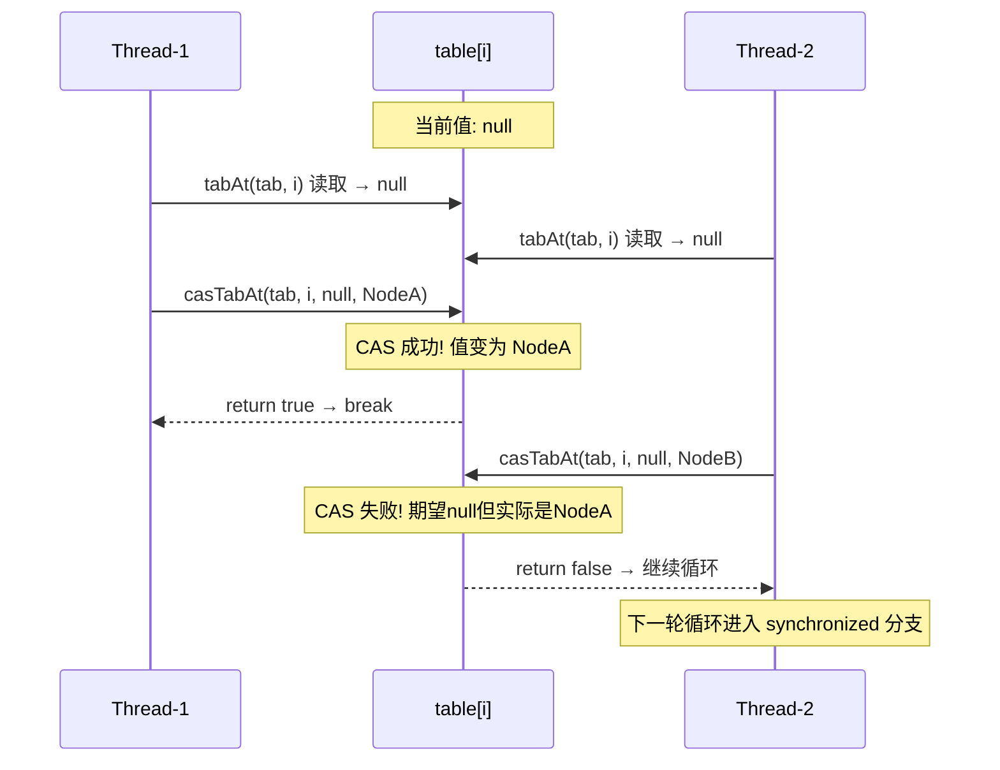

**为什么空桶不用 synchronized？** 这是一个经典的优化策略。空桶意味着没有已有节点，不存在并发遍历或修改链表/红黑树的问题。CAS 是一个 CPU 原子指令（x86 上是 `LOCK CMPXCHG`），开销远小于 `synchronized` 的锁获取与释放（即便是偏向锁/轻量级锁）。在实际负载中，**大量 put 操作命中的桶都是空的**（尤其是 Map 还比较稀疏时），所以这个优化收益巨大。

### 非空桶 synchronized 插入

当桶不为空，且不是 `ForwardingNode`（不在扩容中），就进入 **synchronized 同步块**，锁对象是桶头节点 `f`。

```java
// putVal 方法中处理非空桶的核心代码
else {
    V oldVal = null;
    // 锁住桶头节点 f —— 只锁这一个桶，其他桶不受影响
    synchronized (f) {
        // 双重检查：确认 f 仍然是桶头节点
        // 防止在获取锁的过程中，该桶被其他线程修改（如扩容搬迁）
        if (tabAt(tab, i) == f) {
            // 正常链表节点（hash >= 0）
            if (fh >= 0) {
                // ... 链表遍历和插入逻辑（见下一节）
            }
            // 红黑树节点（TreeBin）
            else if (f instanceof TreeBin) {
                // ... 红黑树插入逻辑（见下一节）
            }
        }
    }
    // ... 后续处理
}
```

这段代码有几个非常重要的设计要点：

**锁粒度：单桶级别。** `synchronized (f)` 只锁定了 `table[i]` 的头节点。如果两个线程分别 put 到 `table[3]` 和 `table[7]`，它们锁的是不同对象，完全不会产生竞争。默认初始容量 16，扩容后可能达到几千甚至上百万个桶，理论并发度等于桶的数量。

**双重检查（Double-Check）。** 进入 `synchronized` 块后立刻再次检查 `tabAt(tab, i) == f`。为什么？因为从 `if (f == null)` 判断失败到获取锁之间存在时间窗口，在这期间：
- 其他线程可能已经完成了扩容，`table` 引用被替换
- 该桶的头节点可能已经变了（被搬迁到新表）

如果不做二次检查，可能会在一个已经失效的节点上操作，导致数据丢失。

**为什么不用 ReentrantLock？** JDK 8 的 `synchronized` 已经经过了大量优化（偏向锁 → 轻量级锁 → 重量级锁的自适应膨胀），在低竞争场景下性能接近甚至优于 `ReentrantLock`，并且更节省内存——每个 Node 自身的对象头就可以承载锁信息，不需要额外的 `Lock` 对象。而在 JDK 7 的分段锁设计中，每个 Segment 是一个完整的 `ReentrantLock` 对象，内存开销更大。

### 链表/红黑树处理

进入 `synchronized` 块后，根据桶头节点的类型分两条路径处理。

**链表路径（fh >= 0）：**

```java
// 链表遍历 + 尾插法
if (fh >= 0) {                          // fh 是头节点的 hash 值，>= 0 说明是普通链表节点
    binCount = 1;                        // binCount 记录链表长度，从 1 开始（头节点算一个）
    for (Node<K,V> e = f; ; ++binCount) { // 从头节点开始遍历
        K ek;
        // 判断是否找到了相同的 key
        if (e.hash == hash &&            // 先比较 hash 值（快速过滤）
            ((ek = e.key) == key ||      // 再比较引用是否相同
             (ek != null && key.equals(ek)))) {  // 最后用 equals 比较内容
            oldVal = e.val;              // 记录旧值
            if (!onlyIfAbsent)           // 默认 put 是覆盖模式
                e.val = value;           // 直接更新 value（Node.val 是 volatile 的）
            break;                       // 找到了就退出循环
        }
        Node<K,V> pred = e;             // pred 保存当前节点（即下一次循环的"前驱"）
        if ((e = e.next) == null) {      // 移动到下一个节点
            // 到达链表尾部，说明 key 不存在，执行尾插
            pred.next = new Node<K,V>(hash, key, value, null);
            break;                       // 插入完成，退出循环
        }
    }
}
```

注意这里使用的是 **尾插法（tail insertion）**，而 JDK 7 的 HashMap 使用的是头插法。尾插法的好处是：在并发扩容场景下不会形成环形链表（虽然此处已有 synchronized 保护，但设计上更安全）。

**红黑树路径（TreeBin）：**

```java
// 红黑树插入
else if (f instanceof TreeBin) {         // f 是 TreeBin 类型
    Node<K,V> p;
    binCount = 2;                        // 树节点的 binCount 设为 2（非 0 非 1 即可，后续不会触发树化）
    // 调用 TreeBin 的 putTreeVal 方法，在红黑树中查找或插入
    if ((p = ((TreeBin<K,V>) f).putTreeVal(hash, key, value)) != null) {
        oldVal = p.val;                  // 如果 key 已存在，p 指向已有节点
        if (!onlyIfAbsent)
            p.val = value;               // 覆盖旧值
    }
}
```

`TreeBin` 是 `ConcurrentHashMap` 特有的包装类，它 **不是红黑树的根节点**，而是一个 **代理容器**，内部持有红黑树的 root 引用并管理读写锁状态。这样做是为了在树结构调整（旋转、重新着色）时保护并发读。

**链表转红黑树的判断（treeifyBin）：**

插入完成后，根据 `binCount` 判断是否需要树化：

```java
// synchronized 块之后的树化判断
if (binCount != 0) {
    // TREEIFY_THRESHOLD = 8
    if (binCount >= TREEIFY_THRESHOLD)
        treeifyBin(tab, i);             // 尝试将链表转为红黑树
    if (oldVal != null)
        return oldVal;                   // 如果是更新操作，返回旧值
    break;                               // 如果是新插入，跳出 for 循环
}
```

但 `treeifyBin` 并不一定真的会树化。它内部还有一次检查：

```java
// treeifyBin 的简化逻辑
private final void treeifyBin(Node<K,V>[] tab, int index) {
    if (tab != null) {
        int n = tab.length;
        // MIN_TREEIFY_CAPACITY = 64
        if (n < MIN_TREEIFY_CAPACITY)
            tryPresize(n << 1);          // 表太小，先扩容而不是树化
        else {
            // 真正执行链表 → 红黑树的转换
            // ... 将所有 Node 转为 TreeNode，构建红黑树，用 TreeBin 包装
        }
    }
}
```

这个 **两阶段门槛** 的设计思路非常值得理解：

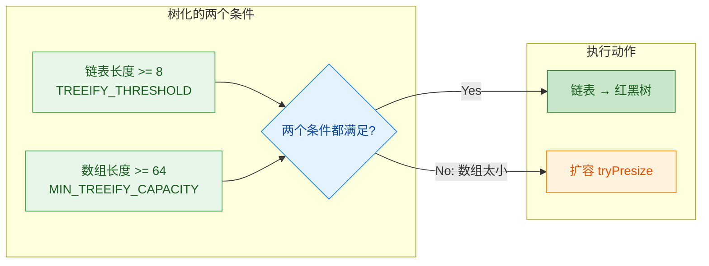

当数组容量小于 64 时，桶少导致碰撞多是正常的，扩容后自然就分散了。只有在数组已经足够大，某个桶仍然堆积了 8 个以上节点时，才真正树化。这避免了小表场景下产生大量不必要的红黑树结构。

### 扩容检查

put 操作的最后一步是调用 `addCount` 更新元素计数，并在计数超过阈值时触发扩容。

```java
// putVal 方法末尾
addCount(1L, binCount);  // 元素数 +1，同时传入 binCount 用于判断是否需要扩容检查
return null;              // 新插入返回 null
```

`addCount` 方法内部采用了 **baseCount + CounterCell[]** 的分段计数方案（类似 `LongAdder` 的设计思路），这里重点看扩容触发的部分：

```java
// addCount 方法中的扩容触发逻辑（简化）
private final void addCount(long x, int check) {
    // ---- 第一部分: 更新计数（baseCount + CounterCell，此处省略） ----

    // ---- 第二部分: 检查是否需要扩容 ----
    if (check >= 0) {                    // check 即 binCount，>= 0 时需要检查扩容
        Node<K,V>[] tab, nt;
        int n, sc;
        // s 是当前元素总数
        // sizeCtl（sc）在非扩容状态下存储的是扩容阈值（threshold = capacity * loadFactor）
        while (s >= (long)(sc = sizeCtl)  // 元素数 >= 阈值
               && (tab = table) != null
               && (n = tab.length) < MAXIMUM_CAPACITY) {
            int rs = resizeStamp(n);      // 根据当前容量 n 生成一个扩容标识戳
            if (sc < 0) {
                // sc < 0 说明已经有线程在扩容
                // 判断是否可以加入帮助扩容
                if ((sc >>> RESIZE_STAMP_SHIFT) != rs  // 标识戳不匹配
                    || sc == rs + 1                     // 扩容已完成
                    || sc == rs + MAX_RESIZERS           // 帮助线程数已达上限
                    || (nt = nextTable) == null          // nextTable 已清空
                    || transferIndex <= 0)               // 所有桶已分配完
                    break;                               // 不需要帮助，退出
                // CAS 将 sc + 1，表示又多了一个线程参与扩容
                if (U.compareAndSwapInt(this, SIZECTL, sc, sc + 1))
                    transfer(tab, nt);                   // 帮助搬迁数据
            }
            else {
                // 当前没有线程在扩容，由本线程发起扩容
                // CAS 将 sizeCtl 设为负值（高 16 位=rs，低 16 位=参与线程数+1）
                if (U.compareAndSwapInt(this, SIZECTL, sc,
                                         (rs << RESIZE_STAMP_SHIFT) + 2))
                    transfer(tab, null);                 // 发起扩容，nextTable 由 transfer 内部创建
            }
            s = sumCount();              // 重新统计元素数，继续循环检查
        }
    }
}
```

`sizeCtl` 这个字段在 `ConcurrentHashMap` 中承载了多重含义，是一个非常精巧的状态机变量：

| sizeCtl 值 | 含义 |
|---|---|
| `-1` | 正在初始化 |
| `-(1 + nThreads)` | 正在扩容，有 nThreads 个线程参与 |
| `0` | 默认值，未初始化 |
| `> 0`（未初始化时） | 初始容量 |
| `> 0`（已初始化时） | 下次扩容的阈值（threshold） |

现在让我们把整个 `putVal` 的完整逻辑用伪代码复述一遍，形成完整闭环：

```java
final V putVal(K key, V value, boolean onlyIfAbsent) {
    // Step 0: 空值检查 —— ConcurrentHashMap 不允许 null key/value
    if (key == null || value == null) throw new NullPointerException();

    // Step 1: 计算扰动 hash
    int hash = spread(key.hashCode());
    int binCount = 0;                    // 记录桶内节点数（用于树化判断）

    // Step 2: 自旋（死循环），直到操作成功
    for (Node<K,V>[] tab = table;;) {
        Node<K,V> f; int n, i, fh;

        // Step 3: 如果 table 未初始化，先初始化
        if (tab == null || (n = tab.length) == 0)
            tab = initTable();           // 内部使用 CAS + sizeCtl 控制只有一个线程执行初始化

        // Step 4: 定位桶，如果桶为空，CAS 插入
        else if ((f = tabAt(tab, i = (n - 1) & hash)) == null) {
            if (casTabAt(tab, i, null, new Node<K,V>(hash, key, value, null)))
                break;                   // 成功就结束

        // Step 5: 如果桶头是 ForwardingNode（hash == MOVED），协助扩容
        } else if ((fh = f.hash) == MOVED)
            tab = helpTransfer(tab, f);  // 搬完后拿到新 table，继续循环

        // Step 6: 非空桶，synchronized 插入
        else {
            V oldVal = null;
            synchronized (f) {           // 锁住桶头节点
                if (tabAt(tab, i) == f) { // 双重检查
                    if (fh >= 0) {       // 链表
                        // ... 遍历链表，尾插或更新
                    } else if (f instanceof TreeBin) { // 红黑树
                        // ... putTreeVal 插入或更新
                    }
                }
            }
            // Step 7: 链表过长则树化
            if (binCount != 0) {
                if (binCount >= TREEIFY_THRESHOLD)
                    treeifyBin(tab, i);
                if (oldVal != null)
                    return oldVal;
                break;
            }
        }
    }

    // Step 8: 元素计数 +1，必要时触发扩容
    addCount(1L, binCount);
    return null;
}
```

最后整理一下 put 流程中各步骤使用的同步手段对比：

| 步骤 | 同步机制 | 原因 |
|---|---|---|
| 计算 hash | 无需同步 | 纯计算，无共享状态 |
| 读取桶头节点 | `Unsafe.getObjectVolatile` | 保证可见性，无需互斥 |
| 空桶插入 | **CAS** | 无竞争链表，乐观锁足够 |
| 协助扩容 | CAS + volatile | 多线程协作搬迁 |
| 非空桶插入 | **synchronized** | 需要互斥保护链表/树的遍历与修改 |
| 计数更新 | CAS + CounterCell | 类似 LongAdder 的分段竞争 |
| 扩容触发 | CAS on sizeCtl | 控制扩容状态转换 |

---

**📝 练习题**

以下关于 JDK 8 `ConcurrentHashMap` 的 `put` 操作，说法正确的是？

A. 当桶为空时，使用 `synchronized` 锁住桶头节点后再插入新节点


B. 当桶不为空时，使用 CAS 自旋方式将新节点插入链表尾部


C. `synchronized` 锁住的是整个 `table` 数组，确保同一时刻只有一个线程写入


D. 当桶为空时使用 CAS 无锁插入；当桶不为空时使用 `synchronized` 锁住桶头节点进行插入


**【答案】** D

**【解析】** JDK 8 的 `ConcurrentHashMap.putVal` 方法采用了 **CAS + synchronized** 的组合策略。对于空桶，由于不涉及已有链表/树的遍历和修改，使用轻量的 CAS 原子操作即可保证线程安全（`casTabAt(tab, i, null, newNode)`），如果 CAS 失败则自旋重试。对于非空桶，由于需要遍历链表或红黑树来判断 key 是否已存在，这一系列操作无法用单次 CAS 完成，因此使用 `synchronized(f)` 锁住桶头节点 `f`。注意锁的粒度是 **单个桶的头节点**，不同桶之间互不阻塞，这让并发度从 JDK 7 的 Segment 数量（默认 16）提升到了桶的数量级。选项 A 和 C 的锁策略描述有误，B 把非空桶的同步机制说反了。

---

## get 流程（无锁）

`ConcurrentHashMap` 的 `get` 操作是整个类设计中最优雅的部分之一——它**全程不加任何锁**，却能在高并发环境下保证读取到正确的、最新的数据。这背后依赖的核心机制是 **`volatile` 语义** 与精巧的数据结构设计。理解 get 流程，既是理解 ConcurrentHashMap 高性能的钥匙，也是面试中频繁出现的考点。

### 为什么 get 不需要加锁

在回答"get 怎么做到无锁"之前，我们需要先理解一个更根本的问题：**并发读写场景下，不加锁的读为什么不会读到脏数据或中间态？**

答案藏在 JDK 8 的 `Node` 内部结构里：

```java
// ConcurrentHashMap 的核心节点定义（JDK 8 源码简化）
static class Node<K,V> implements Map.Entry<K,V> {
    final int hash;       // hash 值，final 修饰，创建后不可变
    final K key;          // 键，final 修饰，创建后不可变
    volatile V val;       // 值，volatile 修饰，保证可见性
    volatile Node<K,V> next; // 下一个节点指针，volatile 修饰，保证可见性
}
```

关键观察：

| 字段 | 修饰符 | 含义 |
|------|--------|------|
| `hash` | `final` | 不可变，天然线程安全 |
| `key` | `final` | 不可变，天然线程安全 |
| `val` | `volatile` | 写入后立即对所有读线程可见 |
| `next` | `volatile` | 链表结构变更后立即对所有读线程可见 |

再看存放 Node 的数组本身：

```java
// table 数组也是 volatile 的
transient volatile Node<K,V>[] table;
```

**三重 volatile 保障**（val、next、table）意味着：任何写线程对节点值的修改、对链表的插入/删除、对数组的扩容替换，都会通过 **内存屏障 (Memory Barrier)** 立即刷新到主内存，读线程无需加锁就能看到最新状态。这就是所谓的 **Happens-Before 关系**——对 volatile 变量的写 happens-before 于后续对该变量的读。

### get 源码逐行剖析

下面是 JDK 8 中 `ConcurrentHashMap.get()` 的完整源码解读：

```java
public V get(Object key) {
    Node<K,V>[] tab;  // 局部变量：引用 table 数组
    Node<K,V> e, p;   // e: 桶的头节点, p: 遍历过程中的当前节点
    int n, eh;         // n: 数组长度, eh: 头节点的 hash 值
    K ek;              // ek: 遍历节点的 key

    // ① 调用 spread() 方法计算 hash（高16位异或低16位，再与 HASH_BITS 按位与）
    //    目的：让 hash 分布更均匀，减少碰撞
    int h = spread(key.hashCode());

    // ② 判断 table 不为空 且 长度大于 0 且 目标桶的头节点不为空
    //    tabAt(tab, (n - 1) & h) 使用 Unsafe.getObjectVolatile() 读取
    //    保证每次都从主内存读取最新的头节点
    if ((tab = table) != null && (n = tab.length) > 0 &&
        (e = tabAt(tab, (n - 1) & h)) != null) {

        // ③ 先检查头节点：hash 相等 且 key 相等（引用相等 或 equals 相等）
        if ((eh = e.hash) == h) {
            if ((ek = e.key) == key || (ek != null && key.equals(ek)))
                return e.val;  // 头节点就是目标，直接返回 val
        }
        // ④ 头节点 hash < 0，说明是特殊节点（红黑树 或 ForwardingNode）
        //    委托给节点自身的 find() 方法去查找
        else if (eh < 0)
            return (p = e.find(h, key)) != null ? p.val : null;

        // ⑤ 普通链表：从头节点的 next 开始逐个遍历
        while ((e = e.next) != null) {
            if (e.hash == h &&
                ((ek = e.key) == key || (ek != null && key.equals(ek))))
                return e.val;  // 找到匹配节点，返回 val
        }
    }
    // ⑥ 未找到，返回 null
    return null;
}
```

### get 流程全景图

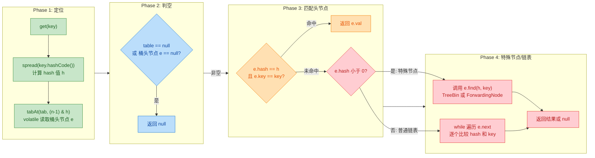

### spread() 哈希扰动函数

get 流程的**第一步**就是调用 `spread()` 计算最终 hash，这和 put 时用的是同一个函数，保证定位到同一个桶：

```java
static final int HASH_BITS = 0x7fffffff; // 最高位置 0，保证 hash 非负

static final int spread(int h) {
    // 将原始 hashCode 的高 16 位与低 16 位异或
    // 再与 HASH_BITS 按位与，确保结果为正数
    // 负数 hash 在 ConcurrentHashMap 中有特殊含义（见下文）
    return (h ^ (h >>> 16)) & HASH_BITS;
}
```

**为什么要保证 hash 为正数？** 因为 ConcurrentHashMap 用负数 hash 来标记特殊节点类型：

```text
hash 值含义：
┌──────────────────────────────────────────────┐
│  hash >= 0        → 普通 Node（链表节点）      │
│  hash == -1       → ForwardingNode（扩容标记） │
│  hash == -2       → TreeBin（红黑树的根代理）   │
│  hash == -3       → ReservationNode（占位节点） │
└──────────────────────────────────────────────┘
```

这正是源码中 `eh < 0` 分支判断的由来。

### tabAt()——volatile 语义读取桶头节点

定位桶时并没有直接用 `tab[index]` 数组下标访问，而是调用了 `tabAt()`：

```java
// 使用 Unsafe 提供的 volatile 语义读取数组指定位置的元素
// 即使 tab 本身是 volatile 的，数组元素的读取仍需要额外保证
// 因为 Java 中 volatile 数组只保证数组引用的可见性，不保证元素的可见性
static final <K,V> Node<K,V> tabAt(Node<K,V>[] tab, int i) {
    return (Node<K,V>)U.getObjectVolatile(tab, ((long)i << ASHIFT) + ABASE);
}
```

这是一个极其重要的细节。很多人以为 `volatile Node<K,V>[] table` 就够了，但实际上：

```text
volatile Node<K,V>[] table;

// volatile 只保证 table 引用本身的可见性
// 即：线程 A 把 table 指向新数组后，线程 B 能立即看到新数组
// 但 table[i] 这个元素的读写并不带 volatile 语义！

// 所以必须通过 Unsafe.getObjectVolatile 来保证
// 读取 table[i] 时也能看到最新值
```

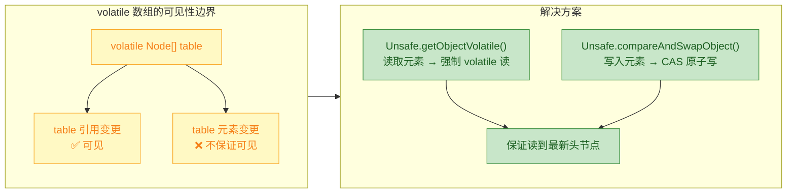

### 特殊节点的 find() 方法

当头节点的 `hash < 0` 时，get 会调用 `e.find(h, key)`。不同类型的特殊节点有各自的 `find` 实现：

#### ForwardingNode.find()——扩容中的读操作

```java
// ForwardingNode 在扩容时被放置在旧数组的已迁移桶位上
// 它内部持有对新数组 nextTable 的引用
static final class ForwardingNode<K,V> extends Node<K,V> {
    final Node<K,V>[] nextTable; // 指向扩容后的新数组

    Node<K,V> find(int h, Object k) {
        // 循环是为了处理「新数组中的桶又是 ForwardingNode」的极端情况
        outer: for (Node<K,V>[] tab = nextTable;;) {
            Node<K,V> e; int n;
            // 在新数组中重新定位桶位
            if (tab == null || (n = tab.length) == 0 ||
                (e = tabAt(tab, (n - 1) & h)) == null)
                return null;              // 新数组中该桶为空，返回 null
            for (;;) {
                int eh; K ek;
                // 标准的 key 匹配逻辑
                if ((eh = e.hash) == h &&
                    ((ek = e.key) == k || (ek != null && k.equals(ek))))
                    return e;             // 找到了，返回节点
                if (eh < 0) {
                    // 如果新数组中该桶又是 ForwardingNode（再次扩容）
                    if (e instanceof ForwardingNode) {
                        tab = ((ForwardingNode<K,V>)e).nextTable;
                        continue outer;   // 跳到更新的数组继续查找
                    }
                    else
                        return e.find(h, k); // TreeBin 等其他特殊节点
                }
                // 遍历链表
                if ((e = e.next) == null)
                    return null;
            }
        }
    }
}
```

这意味着：**即使在扩容过程中，get 也不会阻塞**，它会自动追踪到新数组中去查找。

#### TreeBin.find()——红黑树上的读操作

```java
// TreeBin 是红黑树的代理节点，hash 固定为 -2 (TREEBIN)
// 它内部使用读写锁（基于 CAS 的轻量级锁）来协调读写
final Node<K,V> find(int h, Object k) {
    if (k != null) {
        // 从链表形态的 first 开始遍历（TreeBin 同时维护了链表结构）
        for (Node<K,V> e = first; e != null; ) {
            int s; K ek;
            // lockState 的第 2、3 位表示有写线程持锁或等待
            // 此时退化为遍历链表（避免和写线程在树结构上产生竞争）
            if (((s = lockState) & (WAITER|WRITER)) != 0) {
                // 有写操作正在进行，使用链表遍历（安全但稍慢）
                if (e.hash == h &&
                    ((ek = e.key) == k || (ek != null && k.equals(ek))))
                    return e;
                e = e.next;  // 沿链表方向继续
            }
            // 没有写线程，CAS 增加读计数，然后走红黑树查找（O(logN)）
            else if (U.compareAndSwapInt(this, LOCKSTATE, s,
                                          s + READER)) {
                TreeNode<K,V> r, p;
                try {
                    // 从红黑树根节点开始查找
                    p = ((r = root) == null ? null :
                         r.findTreeNode(h, k, null));
                } finally {
                    Thread w;
                    // CAS 减少读计数，如果是最后一个读者且有等待的写者，唤醒它
                    if (U.getAndAddInt(this, LOCKSTATE, -READER) ==
                        (READER|WAITER) && (w = waiter) != null)
                        LockSupport.unpark(w);
                }
                return p;
            }
        }
    }
    return null;
}
```

这里有一个非常巧妙的**自适应策略**：

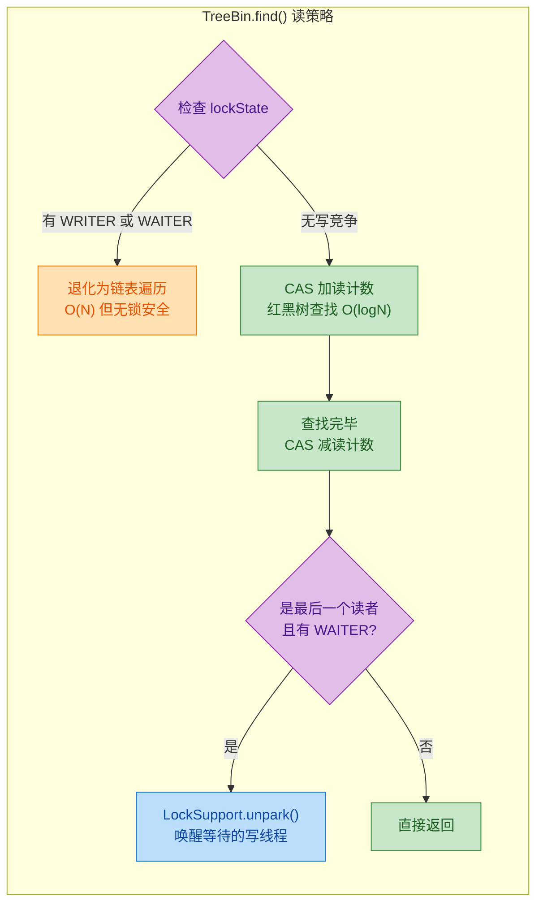

### get 无锁的完整保障体系

把所有机制汇总起来，get 之所以能做到**全程无锁且线程安全**，靠的是以下几个协同设计：

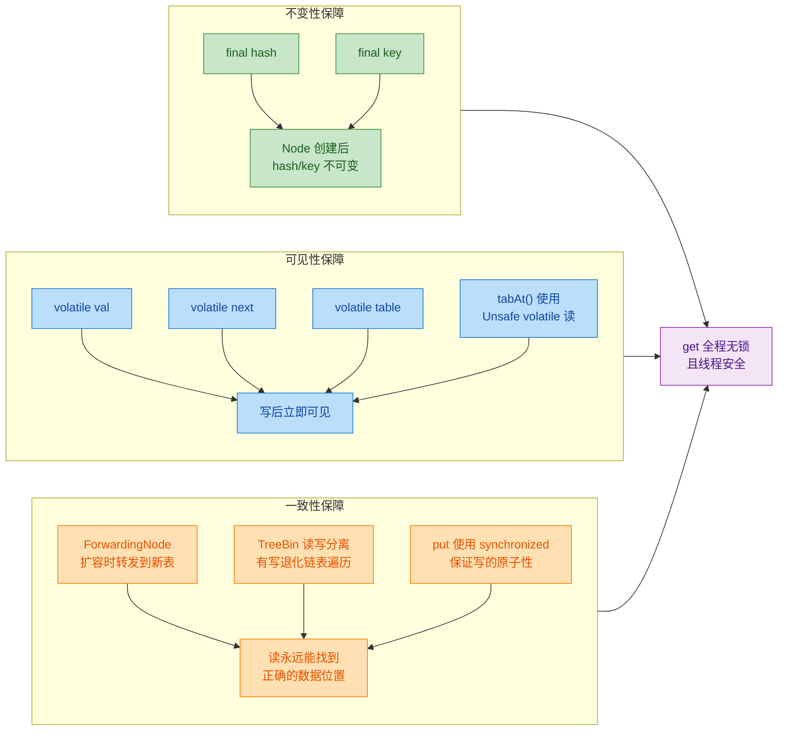

### get 与 put 的并发交互分析

理解 get 无锁，还需要分析它和 put 同时执行时会发生什么。以下是几种典型并发场景：

**场景一：get 与 CAS 插入空桶并发**

```text
时间线 →
Thread-A (get):  读取 tabAt(tab, i) ──→ 得到 null ──→ 返回 null
Thread-B (put):  ──→ CAS 将 Node 写入 tab[i] ──→ 成功
                      ↑
          A 读在 B 写之前：返回 null（正确，此时确实没有值）
          A 读在 B 写之后：volatile 保证看到新 Node，正常匹配
```

**场景二：get 与 synchronized 修改链表并发**

```text
时间线 →
Thread-A (get):  读取头节点 e ──→ 沿 e.next 遍历链表 ──→ 返回
Thread-B (put):  synchronized(头节点) { 在链尾追加新 Node }

关键点：next 是 volatile 的
- 如果 A 遍历到尾节点时，B 已经追加完成 → A 能看到新 next
- 如果 A 遍历到尾节点时，B 还没追加 → A 看到 next=null，返回旧结果
两种情况都不会出错，只是存在「弱一致性」
```

**场景三：get 与扩容并发**

```text
时间线 →
Thread-A (get):  读取 tab[i] ──→ 发现是 ForwardingNode ──→ 去 nextTable 查找
Thread-B (transfer): 正在将 tab[i] 的节点迁移到 nextTable

关键点：ForwardingNode 是在节点迁移完成后才放置的
所以 A 看到 ForwardingNode 时，新表中的数据一定已经就位
```

### 弱一致性（Weakly Consistent）

get 无锁带来的一个重要语义特征是**弱一致性**。这意味着：

```java
// 线程 A
map.put("key", "value1");  // 时刻 T1

// 线程 B（几乎同时）
map.get("key");             // 可能返回 null 或 "value1"
// 取决于 volatile 写和读的精确时序

// 但绝不会返回「半写入」的脏数据！
```

ConcurrentHashMap 的 get **不提供强一致性（Linearizability）**，但保证：
- **不会读到损坏的数据**（no torn reads）
- **不会抛出 ConcurrentModificationException**
- **读到的值一定是某个时刻的真实写入值**（不会凭空出现）

这对于绝大多数应用场景是完全足够的。如果你需要 "put 之后立即 get 必须看到"，要么在同一个线程内操作（happens-before 天然保证），要么使用额外的同步手段。

### get 流程与 HashMap 的对比

| 维度 | HashMap.get() | ConcurrentHashMap.get() |
|------|--------------|------------------------|
| 线程安全 | ❌ 不安全，并发可能死循环（JDK 7）或丢数据 | ✅ 无锁线程安全 |
| 数组访问 | 普通数组下标 `tab[i]` | `Unsafe.getObjectVolatile` |
| 值的可见性 | 无保证 | `volatile val` 保证 |
| 链表遍历 | 普通 `next` 指针 | `volatile next` 指针 |
| 特殊节点处理 | 无（只有 TreeNode） | ForwardingNode / TreeBin 多态 find() |
| 一致性 | 无定义（单线程使用） | 弱一致性 |
| 性能 | 极快（无任何同步开销） | 几乎同样快（volatile 读开销极小） |

`volatile` 读在 x86 架构上几乎等同于普通读（x86 的内存模型本身就是 **Total Store Order**，读不需要插入屏障），所以 ConcurrentHashMap 的 get 性能几乎等同于 HashMap——这是它能在高并发场景下取代 `Hashtable`（get 也加 synchronized）的根本原因。

---

**📝 练习题**

以下关于 `ConcurrentHashMap`（JDK 8）get 操作的描述，**错误**的是？

A. get 操作全程不需要加锁，通过 volatile 语义保证可见性


B. 当桶头节点是 ForwardingNode 时，get 会转发到新数组（nextTable）中查找，扩容期间读操作不会阻塞


C. volatile 修饰 Node 数组后，对数组中每个元素的读取自动具备 volatile 语义，所以 tabAt() 方法只是一个普通的数组访问封装


D. 当 TreeBin 上有写线程持锁时，读线程不会阻塞，而是退化为沿链表遍历


**【答案】** C

**【解析】** 这是一个非常经典的 Java 内存模型考点。`volatile Node<K,V>[] table` 的 volatile 只修饰**数组引用本身**，即保证线程能看到 table 指向的最新数组对象。但对数组**元素**（`table[0]`, `table[1]`, ...）的读写并不自动具备 volatile 语义。这就是为什么 ConcurrentHashMap 必须使用 `Unsafe.getObjectVolatile(tab, offset)` 来读取桶的头节点——它显式地对数组元素施加了 volatile 读语义。选项 A 正确（get 确实全程无锁）；选项 B 正确（ForwardingNode 的 find 方法会追踪到新数组）；选项 D 正确（TreeBin 在检测到 WRITER/WAITER 标志时退化为链表遍历，不会阻塞）。

---

## 扩容机制

ConcurrentHashMap 的扩容（resize / rehash）是整个类中 **最复杂、最精妙** 的部分。与 HashMap 的单线程扩容不同，ConcurrentHashMap 在 JDK 8 中实现了一套 **多线程协同扩容（Cooperative Resizing）** 的机制——当一个线程正在搬运数据时，其他线程如果发现扩容正在进行，不会傻等，而是 **主动加入搬运工作**，极大地缩短了扩容耗时。这个设计堪称并发编程的教科书范例。

### 扩容触发条件

在深入机制之前，先明确什么时候会触发扩容。ConcurrentHashMap 有两个核心判定时机：

**时机一：元素数量超过阈值（sizeCtl）**

每次 `put` 操作完成后，都会调用 `addCount()` 方法累加计数。如果当前元素总数超过了 `sizeCtl`（即 `capacity * loadFactor`，默认负载因子 0.75），就会触发扩容。

**时机二：链表过长但总容量不足 64**

当链表长度 ≥ 8 时，并不是直接转红黑树。如果此时 table 的长度 < 64，会优先选择扩容（`tryPresize`）而不是树化。这一点和 HashMap 完全一致。

```java
// addCount 方法中的扩容判定（简化版）
// s 是当前元素总数
if (s >= (long)(sc = sizeCtl)) {
    // 元素数量已超过阈值，需要扩容
    transfer(tab, null); // 启动数据搬运
}
```

**sizeCtl 这个字段在不同阶段含义不同，这是理解扩容的关键：**

| sizeCtl 的值 | 含义 |
|:---|:---|
| `> 0` | 下次扩容的阈值（threshold），如 `capacity × 0.75` |
| `-1` | 表示 table 正在初始化 |
| `< -1` | 表示正在扩容。高 16 位存储扩容标记戳（resize stamp），低 16 位存储 `参与扩容的线程数 + 1` |

```java
// sizeCtl 在扩容期间的位结构
// |<---- 高16位: resizeStamp ---->|<---- 低16位: 线程计数 ---->|
// |  标识本次扩容的唯一戳记        |  当前参与搬运的线程数 + 1    |
```

### 多线程协助扩容

这是 ConcurrentHashMap 最核心的并发创新。传统做法是一个线程独占扩容，其他线程阻塞等待。而 JDK 8 的做法是：**任何线程在操作 ConcurrentHashMap 时，如果发现扩容正在进行，都可以主动参与数据搬运**。

#### 协助扩容的触发场景

线程在以下几个场景会检测并加入扩容：

1. **`put` 操作时**：定位到的桶头节点是 `ForwardingNode`（hash 值为 MOVED = -1），说明该桶已被搬运完毕，整张表正在扩容中。此时当前线程调用 `helpTransfer()` 加入搬运。

2. **`addCount` 累加计数后**：发现元素总数超阈值，或者发现 `sizeCtl < 0`（已有其他线程在扩容），当前线程尝试加入。

3. **`tryPresize` 扩容方法中**：链表过长触发的扩容路径，同样会检测是否有进行中的扩容并尝试加入。

```java
// helpTransfer 方法 —— 协助扩容的入口（简化版）
final Node<K,V>[] helpTransfer(Node<K,V>[] tab, Node<K,V> f) {
    Node<K,V>[] nextTab; // 新数组的引用
    int sc;

    // 条件判断：确认确实在扩容中
    // f 是 ForwardingNode，且它内部持有 nextTable 引用
    if (tab != null 
        && (f instanceof ForwardingNode)
        && (nextTab = ((ForwardingNode<K,V>)f).nextTable) != null) {

        // 根据旧表长度计算本次扩容的唯一标记戳
        int rs = resizeStamp(tab.length);

        // 循环尝试加入扩容
        while (nextTab == nextTable  // 新表还没变（扩容还没结束）
               && table == tab       // 旧表还没被替换
               && (sc = sizeCtl) < 0) { // sizeCtl < 0 表示扩容进行中

            // 校验标记戳是否匹配、线程数是否已达上限等
            if ((sc >>> RESIZE_STAMP_SHIFT) != rs // 标记戳不匹配
                || sc == rs + 1                    // 所有线程已完成
                || sc == rs + MAX_RESIZERS         // 达到最大协助线程数
                || transferIndex <= 0) {           // 所有桶已分配完毕
                break; // 无需加入
            }

            // CAS 将 sizeCtl 加 1，表示多了一个线程参与扩容
            if (U.compareAndSwapInt(this, SIZECTL, sc, sc + 1)) {
                transfer(tab, nextTab); // 加入搬运！
                break;
            }
        }
        return nextTab; // 返回新数组
    }
    return table; // 未在扩容，返回当前表
}
```

#### 任务分片：stride（步长）机制

多个线程同时搬运，如何避免冲突？答案是 **分片（Striding）**。整张旧表被切分成若干段，每个线程认领一段连续的桶区间来搬运。

```java
// 步长计算（简化逻辑）
// NCPU 是处理器核心数，n 是旧表长度
int stride = (NCPU > 1) ? (n >>> 3) / NCPU : n; // 每个线程负责的桶数量
if (stride < MIN_TRANSFER_STRIDE) {
    stride = MIN_TRANSFER_STRIDE; // 最小步长 = 16
}
```

关键变量 `transferIndex` 是一个全局的、从高位向低位递减的指针，表示"下一个待分配的桶区间的右边界"。每个线程通过 CAS 操作从 `transferIndex` 中"领取"一段区间：

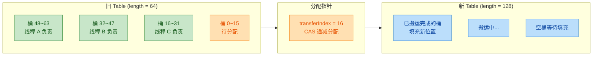

**分配过程的原子性保证**：

```java
// 每个线程领取任务区间（在 transfer 方法内部）
// i 是当前处理的桶索引（从高到低），bound 是本次区间的下界
int nextIndex, nextBound;
if (--i >= bound || finishing) {
    // 当前区间还没处理完，继续
} else if ((nextIndex = transferIndex) <= 0) {
    // transferIndex <= 0，所有区间已被领完
    i = -1;
    advance = false;
} else if (U.compareAndSwapInt(this, TRANSFERINDEX,
                               nextIndex,
                               nextBound = (nextIndex > stride ? nextIndex - stride : 0))) {
    // CAS 成功，领取区间 [nextBound, nextIndex - 1]
    bound = nextBound;
    i = nextIndex - 1; // 从区间最右侧开始向左搬运
    advance = false;
}
```

### transfer 方法

`transfer(Node<K,V>[] tab, Node<K,V>[] nextTab)` 是真正执行数据搬运的核心方法。它的职责是：将旧 table 中的每个桶的数据重新散列到新 table（容量翻倍）中。

#### 整体流程

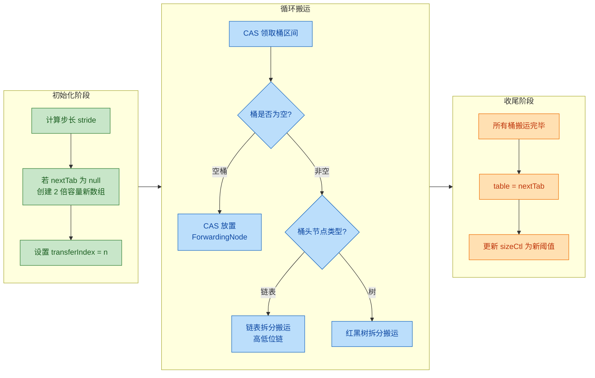

#### 链表的高低位拆分

扩容后容量翻倍（`newCap = oldCap << 1`），每个节点在新表中的位置只有两种可能：

- **低位（Low）**：新索引 = 原索引，即 `i`
- **高位（High）**：新索引 = 原索引 + 旧容量，即 `i + n`

判定方式极其简洁——只需看 hash 值与旧容量做按位与的结果：

```java
// 核心判定：hash & n（n 是旧容量，且一定是 2 的幂）
// 如果结果为 0 → 留在低位
// 如果结果不为 0 → 搬到高位
```

**为什么这样可行？** 因为旧容量 `n` 是 2 的幂，二进制表示中只有一个 1。扩容后掩码多了一个最高位的 1。hash 值在那一位是 0 还是 1，就决定了新位置。

```text
假设旧容量 n = 16 (0b10000)

旧掩码 (n-1):     01111
新掩码 (2n-1):    11111
                   ^
                   这一位决定高低

hash = 0b10101 → hash & n = 10000 (!=0) → 高位: i + 16
hash = 0b00101 → hash & n = 00000 (==0) → 低位: i
```

下面是 transfer 中链表搬运的核心代码（这段代码几乎是面试必问）：

```java
// transfer 方法中链表搬运逻辑（简化但保留核心）
synchronized (f) { // f 是桶的头节点，对其加锁
    if (tabAt(tab, i) == f) { // double-check：确认头节点未被其他线程修改

        Node<K,V> ln, hn; // ln = lowNode 低位链, hn = highNode 高位链
        int runBit = fh & n; // fh 是头节点的 hash, n 是旧容量
        Node<K,V> lastRun = f; // lastRun: 尾部连续相同位的起始节点

        // ====== 第一次遍历：找到 lastRun ======
        // 目的：找到链表尾部一段连续的、都属于同一位（高/低）的子链
        // 这段子链可以直接复用，不需要逐个重建节点
        for (Node<K,V> p = f.next; p != null; p = p.next) {
            int b = p.hash & n; // 计算当前节点属于高位还是低位
            if (b != runBit) {  // 如果与前一个不同
                runBit = b;     // 更新 runBit
                lastRun = p;    // 更新 lastRun
            }
        }

        // 根据 lastRun 的最终归属，初始化高低位链的"尾巴"
        if (runBit == 0) {
            ln = lastRun; // lastRun 属于低位
            hn = null;
        } else {
            hn = lastRun; // lastRun 属于高位
            ln = null;
        }

        // ====== 第二次遍历：构建高低位两条链（到 lastRun 为止）======
        for (Node<K,V> p = f; p != lastRun; p = p.next) {
            int ph = p.hash;           // 当前节点的 hash
            K pk = p.key;              // 当前节点的 key
            V pv = p.val;              // 当前节点的 value
            if ((ph & n) == 0) {
                // 属于低位：头插法构建低位链
                ln = new Node<K,V>(ph, pk, pv, ln);
            } else {
                // 属于高位：头插法构建高位链
                hn = new Node<K,V>(ph, pk, pv, hn);
            }
        }

        // ====== 将两条链放入新表对应位置 ======
        setTabAt(nextTab, i, ln);     // 低位链 → 新表索引 i
        setTabAt(nextTab, i + n, hn); // 高位链 → 新表索引 i + n

        // ====== 在旧表对应位置放置 ForwardingNode ======
        setTabAt(tab, i, fwd);        // 标记该桶已搬运完毕
        advance = true;               // 推进到下一个桶
    }
}
```

**lastRun 优化的精妙之处**：链表尾部可能有很长一段节点都落在同一侧（高位或低位），这时不需要为它们逐个创建新 Node 对象，直接将这段子链"挂"到对应位置即可。这是一个以空间换时间的经典优化，**减少了不必要的对象创建和 GC 压力**。

用一个 ASCII 图来直观展示拆分过程：

```text
旧表 bucket[5], n=16:

  [A] → [B] → [C] → [D] → [E] → [F] → null
   L      H      L      H      H      H
                              ↑ lastRun = D (从D开始都是H)

拆分结果:

低位链 (bucket[5]):    [C'] → [A'] → null
                       (头插法，所以顺序反转)

高位链 (bucket[21]):   [B'] → [D] → [E] → [F] → null
                       (新建)  (---- lastRun 复用 ----)

L = low (hash & n == 0)
H = high (hash & n != 0)
```

#### 红黑树的搬运

如果桶头节点是 `TreeBin`（hash 值为 TREEBIN = -2），搬运逻辑类似，但操作对象是 `TreeNode`：

```java
// 红黑树搬运逻辑（简化）
else if (f instanceof TreeBin) {
    TreeBin<K,V> t = (TreeBin<K,V>)f;
    TreeNode<K,V> lo = null, loTail = null; // 低位树节点链
    TreeNode<K,V> hi = null, hiTail = null; // 高位树节点链
    int lc = 0, hc = 0; // 低位计数、高位计数

    // 遍历 TreeNode 的链表结构（TreeNode 同时维护了链表指针）
    for (Node<K,V> e = t.first; e != null; e = e.next) {
        int h = e.hash;           // 当前节点 hash
        TreeNode<K,V> p = new TreeNode<K,V>(h, e.key, e.val, null, null);
        if ((h & n) == 0) {       // 低位
            if ((p.prev = loTail) == null)
                lo = p;           // 第一个低位节点
            else
                loTail.next = p;  // 尾插法
            loTail = p;
            ++lc;                 // 低位计数+1
        } else {                  // 高位
            if ((p.prev = hiTail) == null)
                hi = p;
            else
                hiTail.next = p;
            hiTail = p;
            ++hc;                 // 高位计数+1
        }
    }

    // 判断拆分后是否需要退化为链表（节点数 <= UNTREEIFY_THRESHOLD = 6）
    ln = (lc <= UNTREEIFY_THRESHOLD) ? untreeify(lo) : // 退化为普通链表
         (hc != 0) ? new TreeBin<K,V>(lo) :            // 重新构建红黑树
         t;                                              // 所有节点都在低位，复用原树

    hn = (hc <= UNTREEIFY_THRESHOLD) ? untreeify(hi) :
         (lc != 0) ? new TreeBin<K,V>(hi) :
         t;

    setTabAt(nextTab, i, ln);     // 低位放入新表
    setTabAt(nextTab, i + n, hn); // 高位放入新表
    setTabAt(tab, i, fwd);        // 旧表标记 ForwardingNode
    advance = true;
}
```

注意红黑树拆分后有一个 **退化判定（untreeify）**：如果拆分后某一侧的节点数 ≤ 6，就不再维持红黑树结构，而是退化为普通链表。这避免了对极少量节点维护树结构的开销。

### ForwardingNode 标记

`ForwardingNode` 是 ConcurrentHashMap 扩容机制中的 **"哨兵节点"（Sentinel Node）**。它是 `Node` 的子类，hash 值固定为 `MOVED = -1`，内部持有一个指向新 table 的引用 `nextTable`。

```java
// ForwardingNode 的定义（JDK 源码简化）
static final class ForwardingNode<K,V> extends Node<K,V> {
    final Node<K,V>[] nextTable; // 指向新数组的引用

    ForwardingNode(Node<K,V>[] tab) {
        // hash = MOVED (-1), key = null, val = null, next = null
        super(MOVED, null, null, null);
        this.nextTable = tab; // 持有新表的引用
    }

    // 重写 find 方法：在新表中查找
    Node<K,V> find(int h, Object k) {
        // 转发到新表进行查找（支持递归，处理多次扩容的情况）
        outer: for (Node<K,V>[] tab = nextTable;;) {
            Node<K,V> e; int n;
            if (k == null || tab == null || 
                (n = tab.length) == 0 ||
                (e = tabAt(tab, (n - 1) & h)) == null)
                return null; // 未找到
            for (;;) {
                int eh; K ek;
                if ((eh = e.hash) == h &&
                    ((ek = e.key) == k || (ek != null && k.equals(ek))))
                    return e; // 在新表中找到
                if (eh < 0) {
                    if (e instanceof ForwardingNode) {
                        // 新表也在扩容！递归跳转到更新的表
                        tab = ((ForwardingNode<K,V>)e).nextTable;
                        continue outer;
                    } else
                        return e.find(h, k); // TreeBin 等特殊节点
                }
                if ((e = e.next) == null)
                    return null;
            }
        }
    }
}
```

#### ForwardingNode 的三大作用

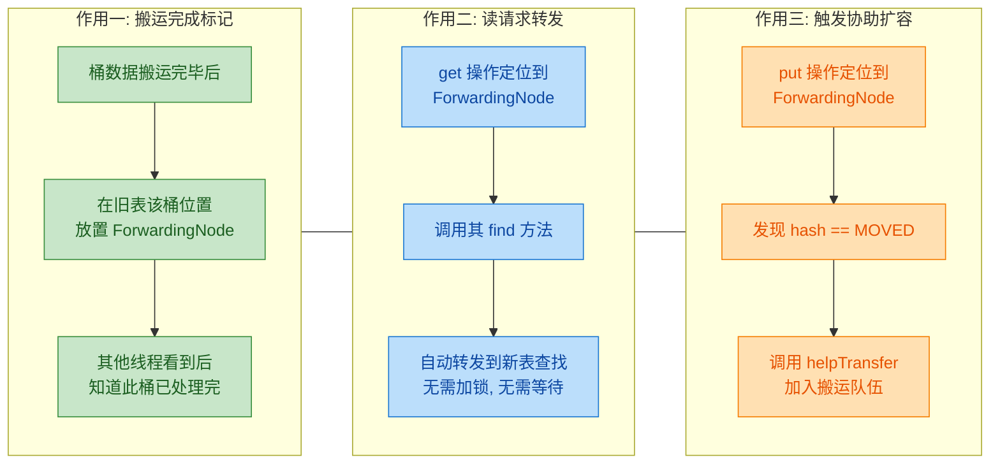

**作用一：搬运完成标记**

当一个桶的所有节点都被成功搬运到新表后，该桶在旧表中的位置会被替换为一个 ForwardingNode。这相当于一个 **"此桶已搬家"** 的告示牌。其他参与扩容的线程遍历到这个桶时，会直接跳过，去认领下一个桶。

**作用二：读请求转发（Read Forwarding）**

这是保证 **扩容期间 `get` 操作不阻塞** 的关键。当 `get` 操作定位到一个桶，发现头节点是 ForwardingNode（`hash == MOVED`），就会调用它重写的 `find()` 方法，该方法会顺着 `nextTable` 引用去新表中查找。整个过程 **完全无锁**，读操作的调用方甚至不知道扩容正在进行。

**作用三：触发协助扩容**

当 `put` 操作定位到 ForwardingNode 时，线程会进入 `helpTransfer()` 流程，主动加入扩容大军。这就是多线程协助扩容的入口之一。

#### 扩容期间的并发安全全景

将各操作在扩容期间的行为汇总：

| 操作 | 遇到 ForwardingNode 时的行为 | 是否阻塞 |
|:---|:---|:---|
| `get` | 调用 `ForwardingNode.find()` 到新表查找 | **不阻塞** |
| `put` | 调用 `helpTransfer()` 先协助扩容，再在新表中插入 | 参与搬运，非阻塞等待 |
| `remove` | 同 `put`，先协助扩容 | 参与搬运 |
| 其他扩容线程 | 跳过该桶，CAS 领取下一个区间 | **不阻塞** |

#### 扩容完成的收尾

当一个线程完成了自己领取的所有桶区间搬运后，它会尝试 CAS 递减 `sizeCtl` 的低 16 位（线程计数）。如果发现自己是最后一个完成的线程（计数归零），则负责收尾工作：

```java
// transfer 方法末尾的收尾逻辑（简化）
if (finishing) {
    // 最后一个线程负责收尾
    nextTable = null;        // 清空 nextTable 引用
    table = nextTab;         // 用新表替换旧表（volatile 写，对所有线程可见）
    sizeCtl = (n << 1) - (n >>> 1); // 新阈值 = 2n * 0.75 = 1.5n
    return;
}

// 非最后一个线程：CAS 递减 sizeCtl 中的线程计数
if (U.compareAndSwapInt(this, SIZECTL, sc = sizeCtl, sc - 1)) {
    // 检查是否是最后一个完成的线程
    if ((sc - 2) != resizeStamp(n) << RESIZE_STAMP_SHIFT)
        return; // 不是最后一个，直接返回
    // 是最后一个！设置 finishing = true，再循环一次做最终检查
    finishing = advance = true;
    i = n; // 重新扫描一遍，确保所有桶都已是 ForwardingNode
}
```

最后一个线程会 **重新扫描整张旧表**，确认每个桶都已被 ForwardingNode 占据（即所有数据确实搬运完毕），然后才执行 `table = nextTab` 的最终切换。这是一个额外的安全保障。

#### 端到端全流程时序

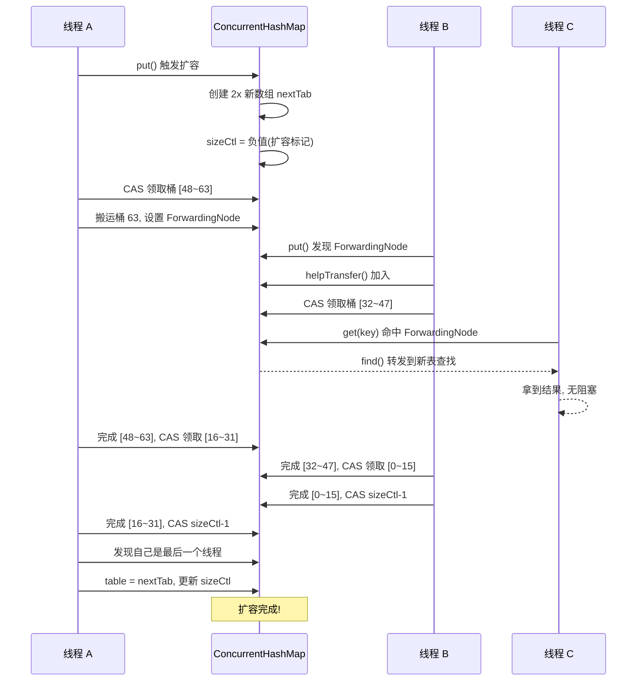

---

**📝 练习题**

以下关于 ConcurrentHashMap（JDK 8）扩容机制的描述，哪一项是 **错误的**？

A. 扩容时，多个线程可以通过 CAS 操作领取不同的桶区间并行搬运数据，最小步长为 16 个桶

B. 当一个桶的数据搬运完成后，旧表中该桶位置会被替换为 ForwardingNode，其他线程的 get 操作遇到它会阻塞等待扩容完成

C. 链表搬运时，利用 `hash & oldCapacity` 的值将节点拆分到新表的两个位置：原索引和原索引 + 旧容量

D. 红黑树搬运后，如果拆分到某一侧的节点数 ≤ 6，该侧会从树退化为普通链表


**【答案】** B

**【解析】** B 选项的错误在于 "get 操作遇到 ForwardingNode 会阻塞等待"。实际上，ForwardingNode 重写了 `find()` 方法，当 `get` 操作定位到它时，会 **直接转发到新表（nextTable）中查找**，整个过程完全无锁、不阻塞。这正是 ConcurrentHashMap 在扩容期间仍能保持高读取性能的关键设计。A 正确：多线程通过 CAS 抢占 `transferIndex` 来分配区间，最小步长 `MIN_TRANSFER_STRIDE = 16`。C 正确：这是经典的高低位拆分逻辑。D 正确：`UNTREEIFY_THRESHOLD = 6`，拆分后节点数不足则退化为链表。

---

## size 计算（baseCount + CounterCell）

在并发容器的设计中，"**如何高效地统计元素个数**"是一个看似简单、实则极其精妙的问题。对于普通的 `HashMap`，一个 `int size` 字段就足够了；但对于 `ConcurrentHashMap`，成百上千的线程同时执行 `put` 和 `remove`，如果每次操作都去竞争同一个计数器变量，这个计数器就会变成整个数据结构的性能瓶颈——即便桶级别的锁粒度已经做到了极致，计数操作的串行化依然会拖慢吞吐量。

Doug Lea 在 JDK 8 的 `ConcurrentHashMap` 中，借鉴了 `LongAdder` 的"**分散热点**"（Striped / Distributed Counting）思想，设计了一套 **baseCount + CounterCell[]** 的计数体系。其核心哲学是：**在无竞争时走最快路径（单变量 CAS），在有竞争时自动退化为多槽位分散计数，最终汇总求和**。这与 `LongAdder` 的设计如出一辙，却又在 `ConcurrentHashMap` 的语境下做了定制化整合。

---

### 核心数据结构

先看源码中与计数相关的三个关键字段：

```java
// ---- ConcurrentHashMap 内部字段 ----

// 基础计数值，在没有竞争时直接通过 CAS 更新此变量
// 它承担了"快速路径"的角色
private transient volatile long baseCount;

// 计数单元格数组，当 CAS 更新 baseCount 失败（说明存在竞争）时启用
// 每个 CounterCell 持有一个独立的 value，最终 size = baseCount + Σ(counterCells[i].value)
private transient volatile CounterCell[] counterCells;

// 标记位：当 counterCells 数组正在初始化或扩容时，通过 CAS 将此值置为 1，充当自旋锁
private transient volatile int cellsBusy;
```

其中 `CounterCell` 是一个极简的内部静态类：

```java
// 使用 @Contended 注解防止伪共享（false sharing）
// 不同 CounterCell 对象可能落在同一个 CPU 缓存行中
// @Contended 会在对象前后各填充 128 字节的 padding，确保独占缓存行
@sun.misc.Contended
static final class CounterCell {
    volatile long value; // 该槽位累积的计数值
    CounterCell(long x) { value = x; } // 构造时传入初始值
}
```

`@sun.misc.Contended` 这个注解至关重要。现代 CPU 的缓存行（Cache Line）通常为 64 字节，如果两个 `CounterCell` 对象恰好被分配在同一缓存行上，当一个线程修改 `cell[0].value` 时，另一个 CPU 核心上缓存的 `cell[1].value` 也会被强制失效（即使它并没有被修改），这就是**伪共享**（False Sharing）问题。`@Contended` 通过填充额外的字节来隔离对象，使每个 `CounterCell` 独占一条缓存行，从而消除不必要的缓存一致性流量。

---

### 整体计数体系的架构

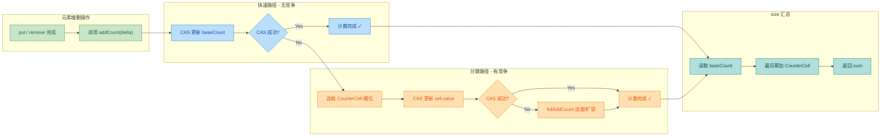

---

### addCount 方法详解

每次 `put` 成功插入一个新元素后，或者 `remove` 成功删除一个元素后，都会调用 `addCount` 方法来更新元素计数。这个方法是整个计数体系的入口和核心：

```java
// x: 计数增量，通常为 +1（put）或 -1（remove）
// check: 用于判断是否需要检查扩容，>=0 时检查
private final void addCount(long x, int check) {
    CounterCell[] cs;  // 局部引用，指向 counterCells 数组
    long b, s;         // b = baseCount 旧值，s = 新的元素总数

    // ---- 第一步：尝试更新计数 ----
    // 条件1：counterCells 不为 null（说明之前已经发生过竞争，已初始化分散数组）
    // 条件2：counterCells 为 null，但 CAS 更新 baseCount 失败（说明此刻正好有竞争）
    // 两个条件满足任意一个，就进入分散计数逻辑
    if ((cs = counterCells) != null ||
        !U.compareAndSwapLong(this, BASECOUNT, b = baseCount, s = b + x)) {

        CounterCell c;   // 当前线程对应的 CounterCell
        long v;          // cell 的旧值
        int m;           // counterCells 数组长度减 1，用于取模
        boolean uncontended = true; // 标记 CAS 是否无竞争

        // 以下三个条件任意满足一个，就进入 fullAddCount（重量级处理）
        // 条件A：counterCells 数组为 null（极罕见的竞态边界情况）
        // 条件B：当前线程通过 probe 哈希定位到的槽位为 null（该槽位尚未初始化）
        // 条件C：对目标槽位的 CAS 更新失败（说明该槽位也存在竞争）
        if (cs == null || (m = cs.length - 1) < 0 ||
            (c = cs[ThreadLocalRandom.getProbe() & m]) == null ||
            !(uncontended =
              U.compareAndSwapLong(c, CELLVALUE, v = c.value, v + x))) {
            // 进入完整版的分散计数逻辑：初始化数组、初始化槽位、或扩容数组
            fullAddCount(x, uncontended);
            return; // fullAddCount 内部会处理完所有事情，直接返回
        }

        // 如果走到这里，说明 CAS 更新 CounterCell 成功了
        // check <= 1 表示调用方认为不需要检查扩容（如链表长度很短）
        if (check <= 1)
            return;

        // 计算当前总元素数，用于后续扩容判断
        s = sumCount();
    }

    // ---- 第二步：检查是否需要扩容（此处省略，属于扩容机制范畴）----
    if (check >= 0) {
        // ... 扩容逻辑 ...
    }
}
```

这段代码的核心设计思想可以用一个递进式的策略来概括：

| 竞争程度 | 执行路径 | 性能特征 |
|:---:|:---:|:---:|
| **无竞争** | CAS 直接更新 `baseCount` 成功 | 最快，一次原子操作 |
| **轻度竞争** | `baseCount` CAS 失败 → 定位 `CounterCell` 槽位 → CAS 成功 | 较快，两次原子操作 |
| **重度竞争** | `CounterCell` 槽位 CAS 也失败 → 进入 `fullAddCount` | 自旋 + 可能扩容数组 |

---

### fullAddCount 方法深度解析

`fullAddCount` 是计数体系中最复杂的部分，它直接移植自 `LongAdder` 的 `longAccumulate` 方法，核心逻辑是一个 **无限循环 + 三路分支** 的自旋结构：

```java
private final void fullAddCount(long x, boolean wasUncontended) {
    int h; // 当前线程的探针哈希值（probe）

    // 如果当前线程的 probe 值为 0，说明尚未初始化
    // ThreadLocalRandom.getProbe() 返回线程本地的随机哈希种子
    if ((h = ThreadLocalRandom.getProbe()) == 0) {
        ThreadLocalRandom.localInit(); // 强制初始化当前线程的随机数生成器
        h = ThreadLocalRandom.getProbe(); // 重新获取 probe
        wasUncontended = true; // 重置竞争标记，因为 probe 变了，需要重新尝试
    }

    boolean collide = false; // 标记是否发生"槽位碰撞"，用于决定是否扩容

    // ---- 无限循环，直到成功更新计数 ----
    for (;;) {
        CounterCell[] cs; // counterCells 数组引用
        CounterCell c;    // 当前槽位的 CounterCell
        int n;            // 数组长度
        long v;           // 槽位旧值

        // ===== 分支一：counterCells 数组已经初始化 =====
        if ((cs = counterCells) != null && (n = cs.length) > 0) {

            // 情况 1A：当前线程对应的槽位为 null，需要创建新的 CounterCell
            if ((c = cs[(n - 1) & h]) == null) {
                if (cellsBusy == 0) { // 没有其他线程在操作数组
                    CounterCell r = new CounterCell(x); // 预先创建 cell，值为 x
                    if (cellsBusy == 0 &&
                        U.compareAndSwapInt(this, CELLSBUSY, 0, 1)) { // 获取"数组锁"
                        boolean created = false;
                        try {
                            CounterCell[] rs; int m, j;
                            // 双重检查：数组存在 且 目标槽位仍为 null
                            if ((rs = counterCells) != null &&
                                (m = rs.length) > 0 &&
                                rs[j = (m - 1) & h] == null) {
                                rs[j] = r;       // 将新 cell 放入槽位
                                created = true;  // 标记创建成功
                            }
                        } finally {
                            cellsBusy = 0; // 释放"数组锁"
                        }
                        if (created)
                            break; // 创建成功，退出循环
                        continue; // 槽位被其他线程抢先占了，重试
                    }
                }
                collide = false; // 有其他线程在操作，先不扩容

            // 情况 1B：之前的 CAS 失败了（wasUncontended == false）
            // 重新哈希后再试一次，不急着扩容
            } else if (!wasUncontended) {
                wasUncontended = true; // 重置标记，下一轮循环会尝试 CAS

            // 情况 1C：对目标槽位尝试 CAS 更新
            } else if (U.compareAndSwapLong(c, CELLVALUE, v = c.value, v + x)) {
                break; // CAS 成功，退出循环

            // 情况 1D：数组长度已经 >= CPU 核心数，或者数组已被其他线程替换
            // 此时再扩容也没有意义（不可能有比 CPU 核心数更多的并行线程）
            } else if (counterCells != cs || n >= NCPU) {
                collide = false; // 不扩容，换个槽位重试

            // 情况 1E：标记发生了碰撞，下一轮循环将触发扩容
            } else if (!collide) {
                collide = true; // 第一次碰撞只标记，给一次重哈希的机会

            // 情况 1F：确认碰撞，执行数组扩容（长度翻倍）
            } else if (cellsBusy == 0 &&
                       U.compareAndSwapInt(this, CELLSBUSY, 0, 1)) {
                try {
                    if (counterCells == cs) // 双重检查
                        counterCells = Arrays.copyOf(cs, n << 1); // 扩容为原来的 2 倍
                } finally {
                    cellsBusy = 0;
                }
                collide = false;
                continue; // 扩容后重试，不需要 rehash
            }

            // 重新哈希当前线程的 probe，换一个槽位再试
            h = ThreadLocalRandom.advanceProbe(h);

        // ===== 分支二：counterCells 数组尚未初始化，尝试初始化 =====
        } else if (cellsBusy == 0 && counterCells == cs &&
                   U.compareAndSwapInt(this, CELLSBUSY, 0, 1)) {
            boolean init = false;
            try {
                if (counterCells == cs) { // 双重检查
                    CounterCell[] rs = new CounterCell[2]; // 初始长度为 2
                    rs[h & 1] = new CounterCell(x); // 将增量值放入对应槽位
                    counterCells = rs; // 发布数组引用
                    init = true;
                }
            } finally {
                cellsBusy = 0;
            }
            if (init)
                break; // 初始化成功，退出循环

        // ===== 分支三：其他线程正在初始化数组，回退尝试更新 baseCount =====
        } else if (U.compareAndSwapLong(this, BASECOUNT, v = baseCount, v + x)) {
            break; // 退路：直接更新 baseCount 成功
        }
    }
}
```

这段代码的分支非常多，但其决策树可以用如下 Mermaid 图来清晰表达：

```mermaid
graph LR
    subgraph Entry["fullAddCount 入口"]
        direction TB
        A["初始化线程 probe"] --> B{"counterCells != null?"}
    end

    subgraph Branch1["分支一: 数组已存在"]
        direction TB
        C{"目标槽位 == null?"} -->|Yes| D["CAS 获取 cellsBusy"]
        D --> E["创建新 CounterCell"]
        C -->|No| F{"CAS 更新 cell.value"}
        F -->|成功| G["break 退出 ✓"]
        F -->|失败| H{"n >= NCPU?"}
        H -->|Yes| I["rehash probe 重试"]
        H -->|No| J{"collide 已标记?"}
        J -->|No| K["标记 collide=true, rehash"]
        J -->|Yes| L["数组扩容 n x 2"]
    end

    subgraph Branch2["分支二: 数组未初始化"]
        direction TB
        M["CAS 获取 cellsBusy"] --> N["new CounterCell 2"]
        N --> O["初始化完成 ✓"]
    end

    subgraph Branch3["分支三: 退路"]
        direction TB
        P["CAS 更新 baseCount"] --> Q["成功则 break ✓"]
    end

    B -->|Yes| C
    B -->|No| M
    M -->|失败| P

    classDef appGreen fill:#C8E6C9,stroke:#388E3C,color:#1B5E20
    classDef frameworkBlue fill:#BBDEFB,stroke:#1976D2,color:#0D47A1
    classDef runtimeOrange fill:#FFE0B2,stroke:#F57C00,color:#E65100
    classDef resultTeal fill:#B2DFDB,stroke:#00897B,color:#004D40

    class A,B appGreen
    class C,D,E,F,G frameworkBlue
    class H,I,J,K,L runtimeOrange
    class M,N,O,P,Q resultTeal
```

---

### size() 与 sumCount() 的实现

理解了计数的写入逻辑后，读取就非常直观了：

```java
// size() 是对外暴露的公共方法
public int size() {
    long n = sumCount(); // 委托给 sumCount 计算真实值
    // 将 long 值截断为 int 范围
    // 如果元素数超过 Integer.MAX_VALUE，返回 Integer.MAX_VALUE
    return ((n < 0L) ? 0 :
            (n > (long)Integer.MAX_VALUE) ? Integer.MAX_VALUE :
            (int)n);
}

// mappingCount() 是 JDK 8 新增的方法，返回 long 类型，推荐使用
public long mappingCount() {
    long n = sumCount();
    return (n < 0L) ? 0L : n; // 只排除负数的情况
}

// 核心汇总逻辑
final long sumCount() {
    CounterCell[] cs = counterCells; // 读取 counterCells 数组快照
    long sum = baseCount;            // 从 baseCount 开始累加

    if (cs != null) {
        // 遍历每一个 CounterCell，将其 value 累加到 sum
        for (CounterCell c : cs) {
            if (c != null)          // 槽位可能为 null（尚未被任何线程使用）
                sum += c.value;     // 直接读取 volatile long
        }
    }
    return sum; // 返回 baseCount + Σ(cells[i].value)
}
```

有一个非常关键的点需要注意：**`sumCount()` 返回的值是一个"近似值"（approximately）**。因为在遍历 `counterCells` 数组的过程中，其他线程可能同时在修改 `baseCount` 或某个 `cell.value`，所以不存在一个全局一致的快照。这是 `ConcurrentHashMap` 为了性能而做出的有意设计妥协——官方文档也明确说明 `size()` 返回的是 an **estimate**。

但在实践中，这个估计值在绝大多数场景下是足够精确的。真正需要精确计数的场景（如金融交易），本身就不会使用这种无锁统计方式。

---

### 与 LongAdder 的对比

`ConcurrentHashMap` 的计数机制几乎是 `java.util.concurrent.atomic.LongAdder` 的嵌入式版本。它们之间的关系：

```mermaid
graph LR
    subgraph LongAdder["LongAdder 公共API"]
        direction TB
        LA1["base: long"] --> LA2["Cell[] cells"]
        LA2 --> LA3["add(long x)"]
        LA3 --> LA4["sum(): long"]
    end

    subgraph CHM["ConcurrentHashMap 内部"]
        direction TB
        CH1["baseCount: long"] --> CH2["CounterCell[] counterCells"]
        CH2 --> CH3["addCount(long x, int check)"]
        CH3 --> CH4["sumCount(): long"]
    end

    subgraph Striped64["公共父类 Striped64"]
        direction TB
        S1["分散热点思想"] --> S2["probe 哈希"]
        S2 --> S3["CAS + 自旋"]
        S3 --> S4["动态扩容 cells"]
    end

    Striped64 -->|"LongAdder extends"| LongAdder
    Striped64 -->|"思想移植"| CHM

    classDef appGreen fill:#C8E6C9,stroke:#388E3C,color:#1B5E20
    classDef frameworkBlue fill:#BBDEFB,stroke:#1976D2,color:#0D47A1
    classDef runtimeOrange fill:#FFE0B2,stroke:#F57C00,color:#E65100

    class LA1,LA2,LA3,LA4 frameworkBlue
    class CH1,CH2,CH3,CH4 appGreen
    class S1,S2,S3,S4 runtimeOrange
```

| 对比维度 | LongAdder | ConcurrentHashMap 计数 |
|:---:|:---:|:---:|
| 父类 | 继承 `Striped64` | 直接内嵌代码（不继承） |
| Cell 类 | `Striped64.Cell` | `CounterCell`（逻辑相同） |
| 触发时机 | 手动调用 `add()` | `put`/`remove` 后自动调用 `addCount()` |
| 附加功能 | 纯计数 | 计数 + 扩容检查 |
| 读取方法 | `sum()` | `sumCount()`，返回近似值 |

Doug Lea 没有让 `ConcurrentHashMap` 直接持有一个 `LongAdder` 成员变量，而是选择了代码复制（code duplication）的方式。原因有二：一是 `addCount` 在计数之后还需要紧接着做**扩容检查**，如果拆成两个独立调用会增加不必要的开销；二是减少一层对象间接引用（indirection），在高频调用路径上节省每一纳秒。

---

### cellsBusy 自旋锁的精妙之处

`cellsBusy` 字段在整个计数体系中扮演了一个轻量级自旋锁的角色。它只保护两种操作：**初始化 counterCells 数组** 和 **数组扩容 / 新建 CounterCell 对象**。

```java
// 伪代码：cellsBusy 的使用模式
if (cellsBusy == 0 &&                                    // 第一次检查（无锁快速判断）
    U.compareAndSwapInt(this, CELLSBUSY, 0, 1)) {        // CAS 加锁
    try {
        if (counterCells == cs) {                         // 双重检查（防止 ABA）
            // 执行初始化 或 扩容 或 创建新 cell
        }
    } finally {
        cellsBusy = 0;                                    // 释放锁（普通写即可，因为 volatile）
    }
}
```

这里有一个值得注意的细节：释放锁时用的是 **普通赋值 `cellsBusy = 0`**，而不是 CAS。这是因为 `cellsBusy` 是 `volatile` 的，`volatile` 写操作本身就保证了 happens-before 关系，而且同一时刻只有一个线程持有这把锁（CAS 保证的），所以释放时不需要再做 CAS。

---

### probe 哈希与槽位选择

每个线程通过 `ThreadLocalRandom.getProbe()` 获取一个线程本地的哈希探针值，用这个值对 `counterCells.length - 1` 取模来定位自己应该更新的槽位：

```java
// 槽位定位公式
int index = (counterCells.length - 1) & ThreadLocalRandom.getProbe();
```

当该槽位的 CAS 操作失败时，`ThreadLocalRandom.advanceProbe(h)` 会重新计算一个新的 probe 值，让当前线程"换一个槽位"重试。这种设计避免了所有线程反复撞击同一个槽位，从而最大化分散竞争。

```java
// probe 值的演进过程（内存视角示意）
```
```
Thread-A  probe=0x7A3B  →  slot[3]  CAS成功 ✓
Thread-B  probe=0x1C4D  →  slot[1]  CAS成功 ✓
Thread-C  probe=0x5E2F  →  slot[3]  CAS失败 ✗  →  advanceProbe  →  slot[0]  CAS成功 ✓
Thread-D  probe=0x9F10  →  slot[0]  CAS失败 ✗  →  advanceProbe  →  slot[2]  CAS成功 ✓
```

---

### counterCells 数组的扩容策略

`counterCells` 数组的初始长度为 **2**，每次扩容翻倍，但有一个硬性上限：**不超过 NCPU（JVM 可用的 CPU 核心数）**。

```java
// 扩容上限判断
else if (counterCells != cs || n >= NCPU)
    collide = false; // 已达上限，不再扩容，只做 rehash
```

为什么上限是 CPU 核心数？因为在任意时刻，最多只有 `NCPU` 个线程能**真正并行**执行。即使有 1000 个线程，它们也最多同时占用 `NCPU` 个核心。所以超过这个数量的槽位不会带来进一步的竞争缓解——反而会浪费内存和增加 `sumCount()` 的遍历开销。

```java
// counterCells 容量增长路径
// 初始    →  第一次扩容  →  第二次扩容  →  ...  →  上限
//   2     →      4       →      8       →  ...  →  NCPU
```

---

### 完整的计数写入时序

用一个时序图来展示多线程并发计数的完整流程：

```mermaid
sequenceDiagram
    participant T1 as Thread-1
    participant BC as baseCount
    participant CC as CounterCell[]
    participant T2 as Thread-2

    Note over T1,T2: 场景: 两个线程同时 put 成功,各需 +1

    T1->>BC: CAS(baseCount, old, old+1)
    T2->>BC: CAS(baseCount, old, old+1)
    BC-->>T1: 成功! 计数完成
    BC-->>T2: 失败! baseCount 已被 T1 修改

    Note over T2: 进入分散计数路径

    T2->>CC: 检查 counterCells == null?
    Note over T2: 首次竞争,数组为 null
    T2->>CC: CAS(cellsBusy, 0, 1) 获取锁
    T2->>CC: 初始化 counterCells[2]
    T2->>CC: cells[probe & 1] = new CounterCell(1)
    T2->>CC: cellsBusy = 0 释放锁

    Note over T1,T2: 后续读取 size()
    T1->>BC: 读取 baseCount
    T1->>CC: 遍历 counterCells 累加
    T1-->>T1: 返回 baseCount + sum(cells)
```

---

### 为什么不直接用 AtomicLong？

这是一个面试高频问题。`AtomicLong` 内部也是 CAS + volatile，看起来也很高效。但在**高竞争**场景下，`AtomicLong` 的性能会急剧下降：

```
// 性能对比模型（概念示意）
//
// AtomicLong:
//   所有线程 CAS 同一个 long value
//   竞争失败 → 自旋重试 → 缓存行反复失效（cache line bouncing）
//   线程数 ↑ → 性能 ↓↓↓（接近线性退化）
//
// baseCount + CounterCell[]:
//   无竞争: 等价于 AtomicLong（CAS baseCount）
//   有竞争: 线程分散到不同 cell，互不干扰
//   线程数 ↑ → 性能几乎不变（直到 cell 数 = NCPU）
```

核心原因是 **cache line bouncing**（缓存行弹跳）。当多个 CPU 核心同时对同一个内存地址做 CAS 操作时，MESI 协议要求频繁地在各核心之间传递缓存行的所有权（Exclusive → Invalid → Exclusive → ...），这种跨核通信的延迟（通常 40-100 纳秒级别）会成为性能瓶颈。分散计数通过让不同线程写入不同的内存地址，从根本上消除了缓存行的争夺。

---

### 实际应用场景中的注意事项

**1. size() 的返回值类型问题**

```java
ConcurrentHashMap<String, String> map = new ConcurrentHashMap<>();
// size() 返回 int，当元素数超过 Integer.MAX_VALUE (约21亿) 时会溢出
int s = map.size(); // 可能不准确

// JDK 8 推荐使用 mappingCount()，返回 long
long count = map.mappingCount(); // 更安全
```

**2. 不要用 size() == 0 判断空**

```java
// 不推荐：size() 需要遍历 counterCells，有 O(n) 开销
if (map.size() == 0) { ... }

// 推荐：isEmpty() 内部也调用 sumCount()，但语义更清晰
// 实际上两者开销相同，但 isEmpty 更符合意图表达
if (map.isEmpty()) { ... }
```

**3. 精确计数需求的替代方案**

如果业务要求**精确的实时计数**（例如严格限制缓存条目数不超过 N），`ConcurrentHashMap.size()` 的近似语义并不适用。此时应考虑：

- 使用 `AtomicInteger` / `AtomicLong` 作为外部精确计数器，配合 `putIfAbsent` 等原子操作
- 使用 Guava 的 `Cache` 或 Caffeine，它们内建了精确的 size 管理
- 在极端场景下使用分布式计数（如 Redis `INCR`）

---

**📝 练习题**

关于 `ConcurrentHashMap`（JDK 8）的 `size()` 计算机制，以下说法正确的是：

A. `size()` 方法在内部使用了 `synchronized` 锁来保证返回值的强一致性


B. 当多线程并发 `put` 时，所有线程通过 CAS 竞争更新同一个 `AtomicLong` 类型的计数器


C. `counterCells` 数组的最大长度等于当前 JVM 可用的 CPU 核心数，且每个 `CounterCell` 使用 `@Contended` 注解避免伪共享


D. `sumCount()` 方法在遍历 `counterCells` 数组时会加锁，确保遍历期间没有其他线程修改任何 cell 的值


**【答案】** C

**【解析】** 逐一分析各选项：

- **A 错误**：`size()` 内部调用的是 `sumCount()`，该方法只是简单地读取 `volatile` 的 `baseCount` 并遍历 `counterCells` 数组做累加，**全程无锁**，返回的是一个近似估计值（approximately accurate），不保证强一致性。
- **B 错误**：`ConcurrentHashMap` 并没有使用 `AtomicLong`。它使用的是 `baseCount`（一个普通的 `volatile long`，通过 `Unsafe.compareAndSwapLong` 做 CAS）加上 `CounterCell[]` 数组的分散计数方案。关键在于"分散"——不同线程写入不同的 `CounterCell` 槽位，避免了所有线程竞争同一个变量。
- **C 正确**：`counterCells` 数组从初始长度 2 开始，每次扩容翻倍，上限为 `NCPU`（Runtime 可用处理器数）。`CounterCell` 确实使用了 `@sun.misc.Contended` 注解，通过 padding 填充来确保每个 cell 独占一条缓存行，消除伪共享。
- **D 错误**：`sumCount()` 遍历 `counterCells` 时不加任何锁，也不使用 CAS。它依赖 `volatile` 语义保证可见性，但不保证遍历过程中数据不被修改。这意味着返回值可能比真实值略大或略小，但在绝大多数场景下足够使用。

---

## 本章小结

本章围绕 `ConcurrentHashMap` 这一 Java 并发编程中最核心的线程安全容器，从 JDK 7 到 JDK 8 的演进、核心读写流程、扩容机制以及元素计数策略进行了全面深入的剖析。以下是对全章知识脉络的系统性回顾与提炼。

---

### 整体知识脉络回顾

```mermaid
graph LR
    subgraph EVOLUTION["架构演进"]
        direction TB
        JDK7["JDK 7\nSegment 分段锁"]
        JDK8["JDK 8\nCAS + synchronized"]
        JDK7 -->|"锁粒度细化"| JDK8
    end

    subgraph CORE_OPS["核心操作"]
        direction TB
        PUT["put 流程\nCAS → synchronized"]
        GET["get 流程\n全程无锁 volatile"]
        PUT --- GET
    end

    subgraph ADVANCED["高级机制"]
        direction TB
        RESIZE["多线程协助扩容\nForwardingNode + transferIndex"]
        COUNT["分布式计数\nbaseCount + CounterCell"]
        RESIZE --- COUNT
    end

    EVOLUTION --> CORE_OPS
    CORE_OPS --> ADVANCED

    classDef evoStyle fill:#C8E6C9,stroke:#388E3C,color:#1B5E20,stroke-width:2px
    classDef coreStyle fill:#BBDEFB,stroke:#1976D2,color:#0D47A1,stroke-width:2px
    classDef advStyle fill:#FFE0B2,stroke:#F57C00,color:#E65100,stroke-width:2px

    class EVOLUTION evoStyle
    class CORE_OPS coreStyle
    class ADVANCED advStyle
    class JDK7,JDK8 evoStyle
    class PUT,GET coreStyle
    class RESIZE,COUNT advStyle
```

整个 `ConcurrentHashMap` 的设计哲学可以浓缩为一句话：**在保证线程安全的前提下，将锁的粒度压缩到极致，将无锁操作的比例扩展到极致，从而逼近甚至接近非线程安全 `HashMap` 的性能水平。**

---

### JDK 7 → JDK 8 架构演进总结

JDK 7 的 `ConcurrentHashMap` 采用 **Segment 分段锁** 架构。整个哈希表被切分为默认 16 个 `Segment`，每个 `Segment` 本质上是一个独立的小型 `HashMap`，并继承自 `ReentrantLock`。当线程对某个 key 进行写操作时，只需要锁住该 key 所归属的那个 `Segment`，其余 15 个 `Segment` 上的读写不受影响。这一设计在当年是极为先进的——相比 `Hashtable` 和 `Collections.synchronizedMap()` 对整张表加一把大锁的做法，分段锁将理论最大并发度从 1 提升到了 16（即 `concurrencyLevel` 的默认值）。

然而，分段锁存在结构性缺陷：

| 问题 | 具体表现 |
|------|----------|
| **并发度上限固定** | 初始化后 `Segment` 数量不可变，无论数据量如何增长，并发度始终受限 |
| **内存浪费** | 即使绝大多数 `Segment` 为空，也需要预先分配对象头和锁结构 |
| **跨段操作代价高** | `size()`、`containsValue()` 等全局操作需要依次锁住所有 Segment |
| **层级过深** | `ConcurrentHashMap → Segment[] → HashEntry[]` 三层嵌套，每次定位一个 key 需要两次哈希 |

JDK 8 对此进行了彻底重构：**取消 Segment，回归扁平的 `Node<K,V>[]` 数组**，以数组中的每个桶（bucket）头节点作为锁对象，配合 CAS 无锁算法，将锁粒度从"锁一段"缩小到"锁一个桶"。同时引入红黑树来应对哈希冲突退化场景，保证最坏情况下的查找时间复杂度从 O(n) 降至 O(log n)。

```mermaid
graph LR
    subgraph JDK7_ARCH["JDK 7 架构"]
        direction TB
        S0["Segment 0\nReentrantLock"]
        S1["Segment 1\nReentrantLock"]
        SN["Segment 15\nReentrantLock"]
        HE0["HashEntry[] 链表"]
        HE1["HashEntry[] 链表"]
        HEN["HashEntry[] 链表"]
        S0 --> HE0
        S1 --> HE1
        SN --> HEN
    end

    subgraph JDK8_ARCH["JDK 8 架构"]
        direction TB
        N0["Node[0]\nsynchronized"]
        N1["Node[1]\nCAS 插入"]
        N2["Node[2]\nTreeBin 红黑树"]
        NX["Node[n-1]\n..."]
        N0 --- N1
        N1 --- N2
        N2 --- NX
    end

    JDK7_ARCH -->|"重构演进"| JDK8_ARCH

    classDef jdk7Style fill:#F3E5F5,stroke:#7B1FA2,color:#4A148C,stroke-width:2px
    classDef jdk8Style fill:#E8F5E9,stroke:#388E3C,color:#1B5E20,stroke-width:2px
    classDef innerStyle fill:#FFF3E0,stroke:#EF6C00,color:#BF360C,stroke-width:1px

    class JDK7_ARCH jdk7Style
    class JDK8_ARCH jdk8Style
    class S0,S1,SN,HE0,HE1,HEN jdk7Style
    class N0,N1,N2,NX jdk8Style
```

这次架构变革的核心收益是：**并发度从固定的 16 跃升为与数组长度相等**（默认初始 16，但随扩容动态增长），且空桶的写入操作完全无锁（CAS），只有在桶内已有节点时才退化为 `synchronized` 同步。

---

### put 流程核心要点回顾

`put` 操作是 `ConcurrentHashMap` 中最复杂、也最能体现其设计精髓的方法。其核心决策路径可总结如下：

```mermaid
graph LR
    subgraph HASH["Step 1: 定位"]
        direction TB
        H1["spread(key.hashCode())"]
        H2["(h ^ h>>>16) & 0x7FFFFFFF"]
        H1 --> H2
    end

    subgraph INSERT["Step 2: 写入"]
        direction TB
        I1{"桶是否为空?"}
        I2["CAS 无锁写入"]
        I3{"节点 hash == MOVED?"}
        I4["helpTransfer 协助扩容"]
        I5["synchronized 锁头节点"]
        I6["链表尾插 / 红黑树插入"]
        I1 -->|"空桶"| I2
        I1 -->|"非空"| I3
        I3 -->|"是"| I4
        I3 -->|"否"| I5
        I5 --> I6
    end

    subgraph POST["Step 3: 后置"]
        direction TB
        P1{"链表长度 >= 8?"}
        P2["treeifyBin 树化"]
        P3["addCount 计数"]
        P4{"需要扩容?"}
        P5["触发 transfer"]
        P1 -->|"是"| P2
        P1 -->|"否"| P3
        P2 --> P3
        P3 --> P4
        P4 -->|"是"| P5
    end

    HASH --> INSERT
    INSERT --> POST

    classDef hashStyle fill:#E3F2FD,stroke:#1565C0,color:#0D47A1,stroke-width:2px
    classDef insertStyle fill:#FFF8E1,stroke:#F9A825,color:#E65100,stroke-width:2px
    classDef postStyle fill:#FCE4EC,stroke:#C62828,color:#B71C1C,stroke-width:2px

    class HASH hashStyle
    class H1,H2 hashStyle
    class INSERT insertStyle
    class I1,I2,I3,I4,I5,I6 insertStyle
    class POST postStyle
    class P1,P2,P3,P4,P5 postStyle
```

**三个关键设计决策值得铭记**：

1. **空桶 CAS 插入是第一优先路径**。在实际场景中，尤其是哈希分布良好且负载因子未超阈值时，大量 `put` 操作走的都是这条无锁快速路径，这是 `ConcurrentHashMap` 高性能的基石。

2. **`synchronized` 只锁头节点，不锁整张表**。即使退化到有锁路径，影响范围也仅限于当前桶内的链表或红黑树，其他桶的并发读写完全不受阻塞。JDK 8 之后 `synchronized` 经过偏向锁、轻量级锁、自适应自旋等一系列 JVM 层面的优化，其性能已与 `ReentrantLock` 持平甚至更优。

3. **扩容与写入相互感知**。线程在 `put` 过程中发现当前桶头节点的 hash 值为 `MOVED`（即 `ForwardingNode`），会主动调用 `helpTransfer` 加入扩容大军，而非阻塞等待。这种 **"遇事不等，主动帮忙"** 的协作式设计，是 `ConcurrentHashMap` 在高并发扩容场景下仍能保持吞吐量的关键。

---

### get 流程核心要点回顾

`get` 操作的设计哲学极为纯粹：**全程无锁，全程无阻塞**。

这一目标的实现依赖于两个基石：

- **`volatile` 语义**：`Node` 的 `val` 字段和 `next` 指针均声明为 `volatile`，保证任何线程的写入对其他线程立即可见（Happens-Before 关系）。`table` 数组引用本身也通过 `Unsafe.getObjectVolatile()` 进行 volatile 读取。

- **不可变性（Immutability）与安全发布（Safe Publication）**：`Node` 的 `key` 和 `hash` 均为 `final`，一旦构造完成就不可变。新节点通过 CAS 或 `synchronized` 安全发布到数组中，保证读线程不会看到半构造的对象。

`get` 操作的时间复杂度取决于桶的数据结构：

| 桶状态 | 时间复杂度 | 说明 |
|--------|-----------|------|
| 空桶 | O(1) | 直接返回 null |
| 头节点即目标 | O(1) | hash + key 匹配，直接返回 |
| 链表 | O(n) | 顺序遍历，n 为链表长度（通常 ≤ 8） |
| 红黑树 | O(log n) | TreeBin.find() 走树查找 |
| ForwardingNode | O(1) ~ O(log n) | 转发到 nextTable 继续查找 |

**一个常被忽视的细节**：即使在扩容过程中，`get` 操作也无需等待。当 `get` 遇到 `ForwardingNode` 时，它会顺着 `ForwardingNode.nextTable` 引用去新数组中查找——这意味着读操作在扩容期间被透明地重定向了，读线程甚至不知道扩容正在发生。

---

### 扩容机制核心要点回顾

`ConcurrentHashMap` 的扩容（`transfer`）是整个类中最复杂的方法，也是并发设计的集大成之作。

```mermaid
graph LR
    subgraph TRIGGER["触发扩容"]
        direction TB
        T1["addCount 检测\nsize > sizeCtl"]
        T2["treeifyBin 检测\n数组长度 < 64"]
        T3["tryPresize\nputAll 批量插入"]
        T1 --- T2
        T2 --- T3
    end

    subgraph TRANSFER["transfer 执行"]
        direction TB
        TR1["计算 stride\n每线程迁移步长"]
        TR2["领取桶区间\nCAS 递减 transferIndex"]
        TR3["逐桶迁移\n链表拆分 / 树拆分"]
        TR4["放置 ForwardingNode\n标记已迁移"]
        TR1 --> TR2
        TR2 --> TR3
        TR3 --> TR4
    end

    subgraph COOP["多线程协作"]
        direction TB
        C1["其他线程 put 遇到 fwd"]
        C2["调用 helpTransfer"]
        C3["加入迁移任务"]
        C4["所有桶迁移完毕\nsizeCtl 恢复为新阈值"]
        C1 --> C2
        C2 --> C3
        C3 --> C4
    end

    TRIGGER --> TRANSFER
    TRANSFER --> COOP

    classDef triggerStyle fill:#E8EAF6,stroke:#283593,color:#1A237E,stroke-width:2px
    classDef transferStyle fill:#FFF3E0,stroke:#E65100,color:#BF360C,stroke-width:2px
    classDef coopStyle fill:#E0F2F1,stroke:#00695C,color:#004D40,stroke-width:2px

    class TRIGGER triggerStyle
    class T1,T2,T3 triggerStyle
    class TRANSFER transferStyle
    class TR1,TR2,TR3,TR4 transferStyle
    class COOP coopStyle
    class C1,C2,C3,C4 coopStyle
```

**扩容的三大核心设计**：

1. **任务分片（Stride-based Partitioning）**：将新数组的桶按 `stride`（步长，最小 16）分成若干区间，每个线程通过 CAS 操作 `transferIndex` 领取自己的工作区间，实现无锁的任务分配。

2. **ForwardingNode 哨兵**：已迁移完成的旧桶位置放置一个 `hash = MOVED` 的 `ForwardingNode`，它同时承担两个职责——告知 `put` 线程"这个桶已搬走，请来帮忙扩容"，以及告知 `get` 线程"请去新数组中查找"。

3. **链表拆分的位运算技巧**：根据 `hash & oldCap` 的结果（0 或 1），链表被精确拆分为 `low` 和 `high` 两条子链，分别放置在新数组的 `i` 和 `i + oldCap` 位置。这与 `HashMap` 的扩容拆分逻辑一致，但在 `synchronized` 块内完成以保证线程安全。同时引入了 `lastRun` 优化——找到链表尾部连续同一分组的子序列，直接复用而非逐节点复制。

---

### size 计算核心要点回顾

`ConcurrentHashMap` 的 `size()` 方法背后是一套受 `LongAdder` 启发的 **分布式计数** 机制：

```java
// 最终 size = baseCount + Σ CounterCell[i].value
```

- **`baseCount`**：一个 `volatile long`，在无竞争时通过 CAS 直接累加，这是快速路径。
- **`CounterCell[]`**：当 CAS 竞争激烈时，线程根据自身的 `ThreadLocalRandom.getProbe()` 哈希到某个 `CounterCell` 槽位，对该槽位的 `value` 做 CAS 累加——将竞争分散到多个内存地址上。
- **`@sun.misc.Contended`**：`CounterCell` 类被该注解修饰，强制填充缓存行（通常 128 字节），消除 False Sharing。

这套设计的本质是 **空间换时间、分散换吞吐**：牺牲一定的内存开销（`CounterCell` 数组），换取写计数操作在高竞争下几乎不阻塞的特性。需要注意的是，`size()` 返回的是一个 **近似值（best-effort estimate）**——在高并发场景下，调用 `size()` 与实际元素数量之间可能存在瞬时偏差。如果业务需要精确的集合大小来做并发控制，应该使用其他同步手段（如 `AtomicInteger` 外部计数），而非依赖 `size()`。

---

### 核心设计思想提炼

纵观整个 `ConcurrentHashMap` 的实现，可以提炼出以下 **五大并发设计原则**，它们不仅适用于这一个类，更是 Java 并发编程的通用智慧：

| 设计原则 | 在 ConcurrentHashMap 中的体现 | 通用价值 |
|----------|------------------------------|---------|
| **乐观优先，悲观兜底** | 空桶 CAS → 非空桶 synchronized | 先尝试无锁操作，失败后再升级为加锁 |
| **锁粒度最小化** | 只锁单个桶的头节点 | 缩小临界区，让无关操作并行 |
| **读写分离** | get 完全无锁，put 仅锁写路径 | 读多写少场景的性能最优解 |
| **协作式而非阻塞式** | 多线程协助扩容，而非等待 | 让等待变为劳动，提高系统整体吞吐 |
| **竞争分散** | CounterCell 分散计数热点 | 将单一热点拆分为多个独立热点 |

---

### 高频面试考点速查

以下是 `ConcurrentHashMap` 在面试中出现频率最高的知识点，按考察频率排序：

**Tier 1（几乎必问）：**
- JDK 7 与 JDK 8 实现的核心区别（分段锁 vs CAS+synchronized）
- `put` 流程中 CAS 与 `synchronized` 的分工
- 为什么 `get` 不需要加锁（`volatile` 可见性保证）

**Tier 2（高频考察）：**
- JDK 8 中为何选择 `synchronized` 而非 `ReentrantLock`（JVM 优化 + 节省内存 + 足够细粒度下 `synchronized` 性能不逊色）
- 扩容时其他线程如何感知并协助（`ForwardingNode` + `helpTransfer`）
- `size()` 的实现原理及其近似性

**Tier 3（深度考察）：**
- 链表转红黑树的双重条件（链表长度 ≥ 8 **且** 数组长度 ≥ 64）
- `sizeCtl` 字段在不同阶段的含义（-1 初始化中，-N 扩容中，正数为阈值）
- `CounterCell` 与 `LongAdder` 的关系，以及 `@Contended` 防止 False Sharing
- `spread()` 函数中高 16 位异或低 16 位再与 `HASH_BITS`（0x7fffffff）取与的原因

---

### 与其他并发容器的横向对比

| 特性 | Hashtable | Collections.synchronizedMap | ConcurrentHashMap (JDK 8) |
|------|-----------|----------------------------|---------------------------|
| 锁粒度 | 整个 Map（方法级 `synchronized`） | 整个 Map（mutex 对象） | 单个桶（Node 头节点） |
| 读操作加锁 | 是 | 是 | **否** |
| null key/value | 不允许 | 允许 | **不允许** |
| 迭代器 | fail-fast | fail-fast | **弱一致性（weakly consistent）** |
| 扩容 | 单线程 | 单线程 | **多线程协助** |
| 适用场景 | 遗留代码 | 简单包装需求 | **高并发生产环境首选** |

`ConcurrentHashMap` 不允许 null key 和 null value 的原因值得特别强调：在并发环境下，`get(key)` 返回 null 时，你无法区分"key 不存在"和"key 存在但 value 为 null"这两种情况——因为在你调用 `get` 和 `containsKey` 之间，另一个线程可能已经修改了 Map。这是 Doug Lea 在设计时刻意做出的决策，以避免并发场景下的语义歧义（semantic ambiguity）。

---

### 最终一张图总结

```mermaid
graph LR
    subgraph DATA_STRUCTURE["数据结构层"]
        direction TB
        DS1["Node〈K,V〉[] table"]
        DS2["链表 Node"]
        DS3["红黑树 TreeBin/TreeNode"]
        DS4["ForwardingNode"]
        DS1 --> DS2
        DS1 --> DS3
        DS1 --> DS4
    end

    subgraph CONCURRENCY["并发控制层"]
        direction TB
        CC1["CAS\nUnsafe.compareAndSwap"]
        CC2["synchronized\n锁桶头节点"]
        CC3["volatile\nval / next / table"]
        CC1 --- CC2
        CC2 --- CC3
    end

    subgraph COUNTING["计数与扩容层"]
        direction TB
        CT1["baseCount\nvolatile CAS"]
        CT2["CounterCell[]\n分散竞争"]
        CT3["transfer\n多线程协助"]
        CT4["sizeCtl\n状态控制枢纽"]
        CT1 --- CT2
        CT2 --- CT3
        CT3 --- CT4
    end

    DATA_STRUCTURE --> CONCURRENCY
    CONCURRENCY --> COUNTING

    classDef dsStyle fill:#E8F5E9,stroke:#2E7D32,color:#1B5E20,stroke-width:2px
    classDef ccStyle fill:#E3F2FD,stroke:#1565C0,color:#0D47A1,stroke-width:2px
    classDef ctStyle fill:#FFF3E0,stroke:#EF6C00,color:#BF360C,stroke-width:2px

    class DATA_STRUCTURE dsStyle
    class DS1,DS2,DS3,DS4 dsStyle
    class CONCURRENCY ccStyle
    class CC1,CC2,CC3 ccStyle
    class COUNTING ctStyle
    class CT1,CT2,CT3,CT4 ctStyle
```

`ConcurrentHashMap` 是 Java 并发容器中设计最精妙的作品之一。它集 CAS 无锁编程、`synchronized` 偏向锁优化、`volatile` 可见性保证、红黑树极端退化防护、多线程协作扩容、分布式计数等多种并发技术于一体，是学习 Java 并发编程最好的源码范本。理解它，不仅仅是为了应对面试——更重要的是，它所蕴含的 **"先乐观后悲观、锁尽可能细、读尽可能自由、等待变为协作"** 的设计哲学，可以指导我们在日常开发中写出更高效的并发代码。

---

**📝 练习题 1**

以下关于 `ConcurrentHashMap`（JDK 8）的描述，**错误** 的是：

A. `put` 操作在桶为空时使用 CAS 无锁插入，在桶非空时使用 `synchronized` 锁住头节点进行插入

B. `get` 操作全程不加任何锁，依赖 `volatile` 的可见性保证读取最新值

C. 扩容时，尚未迁移的桶仍然可以正常进行 `put` 操作，已迁移的桶通过 `ForwardingNode` 将读请求转发到新数组

D. `size()` 方法返回的是一个精确值，因为 `baseCount` 和 `CounterCell` 的累加是在 `synchronized` 块内完成的


**【答案】** D

**【解析】** 选项 D 的错误在于两个方面：首先，`baseCount` 的累加使用的是 CAS 而非 `synchronized`，`CounterCell` 的累加同样使用 CAS；其次，`size()` 返回的是一个 **近似值（best-effort estimate）**，因为在遍历 `CounterCell` 数组求和的过程中，其他线程可能正在并发修改 `baseCount` 或某个 `CounterCell` 的 `value`，所以最终求和结果与真实元素数量之间可能存在瞬时偏差。选项 A 准确描述了 `put` 的两条路径；选项 B 准确描述了 `get` 的无锁设计；选项 C 准确描述了扩容期间的并发行为——`put` 遇到 `ForwardingNode` 时会调用 `helpTransfer` 协助扩容，`get` 遇到 `ForwardingNode` 时会到新数组中查找。

---

**📝 练习题 2**

在 `ConcurrentHashMap`（JDK 8）的 `put` 操作中，以下执行流程的排列顺序 **正确** 的是：

① 发现桶头节点的 hash 为 MOVED，调用 `helpTransfer` 协助扩容
② 对 key 调用 `spread()` 计算最终 hash 值
③ 使用 CAS 将新 Node 设置到空桶位置
④ 使用 `synchronized` 锁住头节点，遍历链表进行尾插或更新
⑤ 调用 `addCount` 更新计数并检查是否需要扩容

A. ② → ③ → ④ → ① → ⑤

B. ② → ③ / ① / ④（互斥分支） → ⑤

C. ② → ④ → ③ → ① → ⑤

D. ② → ① → ③ → ④ → ⑤


**【答案】** B

**【解析】** `put` 的核心流程是：首先执行 ② 计算 hash 并定位到桶，然后进入一个 `for(;;)` 自旋循环。在循环内部，根据桶的状态进入 **三条互斥分支** 之一——如果桶为空，走 ③ CAS 插入；如果桶头节点 hash 为 MOVED，走 ① 协助扩容后重新循环；如果桶非空且非 MOVED，走 ④ `synchronized` 加锁插入。这三条路径是 `if-else if-else` 的互斥关系，不会顺序执行。最后，无论走了哪条写入分支，都会执行 ⑤ `addCount` 更新计数并判断是否触发扩容。选项 A 将 ③ 和 ④ 排成顺序执行，违背了互斥分支的逻辑；选项 C 将 ④ 放在 ③ 之前且顺序排列，同样错误；选项 D 将 ① 放在 ③ 之前且顺序排列，也不符合实际逻辑。

---
