---

# 其他并发容器 ⭐

---

## ConcurrentLinkedQueue

`ConcurrentLinkedQueue` 是 `java.util.concurrent` 包中一个极其重要的并发容器。它是一个基于 **链表（linked nodes）** 的、**无界（unbounded）**、**线程安全（thread-safe）** 的队列，遵循 **FIFO（First-In-First-Out）** 的出入队顺序。与 `BlockingQueue` 家族（如 `ArrayBlockingQueue`、`LinkedBlockingQueue`）截然不同的是，`ConcurrentLinkedQueue` 完全不使用任何锁（Lock）机制，而是依靠底层的 **CAS（Compare-And-Swap）** 原子操作来保证并发安全性。这使得它在高并发、高吞吐量场景下拥有极为出色的性能表现。

从继承体系上看，`ConcurrentLinkedQueue<E>` 实现了 `Queue<E>` 接口，但并 **没有** 实现 `BlockingQueue<E>` 接口，因此它不具备 `put()`/`take()` 这类阻塞式方法。调用 `poll()` 时如果队列为空，会立即返回 `null` 而不是阻塞等待。这一设计哲学的核心在于：**绝不让线程进入等待状态（never block the calling thread）**。

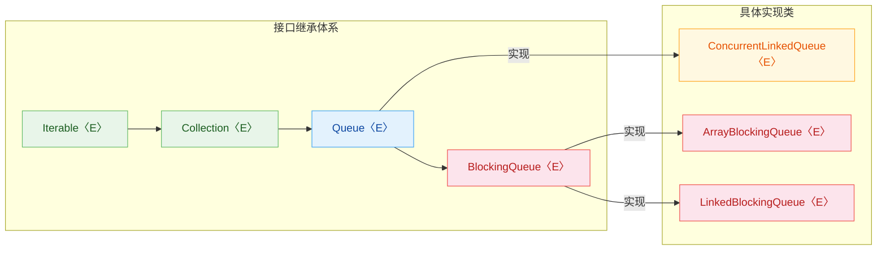

上图清晰地表明：`ConcurrentLinkedQueue` 直接实现的是 `Queue` 接口，它与 `BlockingQueue` 体系是 **两条平行的路线**。理解这一点，是正确使用它的第一步。

---

### 无锁队列

"无锁（Lock-Free）"是理解 `ConcurrentLinkedQueue` 最关键的概念。在传统的并发编程中，为了保护共享数据不被多个线程同时修改而产生数据竞争（data race），我们通常会使用 `synchronized` 关键字或 `ReentrantLock` 等显式锁。然而，锁机制天然带有以下问题：

- **线程阻塞与上下文切换（Context Switching）**：当一个线程持有锁时，其他尝试获取锁的线程会被操作系统挂起（park），直到锁释放后再被唤醒。这个挂起与唤醒的过程涉及内核态与用户态的切换，开销极大——通常在微秒级别。
- **锁竞争（Lock Contention）**：在高并发场景下，大量线程争抢同一把锁，会造成严重的性能瓶颈。吞吐量不升反降，这就是著名的 **锁护卫效应（Lock Convoy）**。
- **死锁风险（Deadlock Risk）**：多把锁的交叉使用可能导致线程永久互等。
- **优先级反转（Priority Inversion）**：低优先级线程持有锁，高优先级线程被迫等待。

无锁算法（Lock-Free Algorithm）完全避开了上述问题。它的核心思想是：**线程不阻塞，不互相等待，每个线程都尝试以乐观的方式去完成操作；如果失败了就重试（retry），而不是挂起等待。** 更正式的定义是：

> **Lock-Free 保证**：在系统中运行的所有线程中，至少有一个线程能在有限步骤内完成操作（make progress）。即使某个线程被暂停或延迟，也不会阻止其他线程继续执行。

这与"无等待（Wait-Free）"稍有区别——Wait-Free 保证 **每个** 线程都能在有限步骤内完成操作，是比 Lock-Free 更强的保证。`ConcurrentLinkedQueue` 的 `offer()` 和 `poll()` 操作是 Lock-Free 的，但不是 Wait-Free 的（理论上某个线程可能一直 CAS 失败而 "饥饿"，但实际中这种概率极低）。

我们来对比一下有锁队列和无锁队列的行为差异：

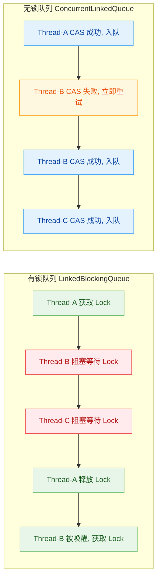

可以非常直观地看到：在有锁队列中，Thread-B 和 Thread-C 必须 **阻塞等待** Thread-A 释放锁之后才能操作；而在无锁队列中，Thread-B 只需要 **立即重试** CAS 操作，没有任何线程被阻塞挂起。这就是无锁的精髓：**用自旋重试代替阻塞等待**。

`ConcurrentLinkedQueue` 的内部结构基于单向链表。每个节点（Node）包含两个字段：

```java
// ConcurrentLinkedQueue 内部节点结构（简化版）
private static class Node<E> {
    volatile E item;       // 存储的元素值，volatile 保证可见性
    volatile Node<E> next; // 指向下一个节点的引用，volatile 保证可见性
}
```

队列维护两个关键指针：

```text
// 队列整体结构示意
head                                              tail
  |                                                 |
  v                                                 v
[sentinel] --> [node1: "A"] --> [node2: "B"] --> [node3: "C"] --> null
 (item=null)
```

初始化时，`head` 和 `tail` 都指向同一个 **哨兵节点（sentinel node / dummy node）**，其 `item` 为 `null`。这个哨兵节点的存在简化了边界条件的处理——入队和出队操作不需要对"队列为空"这种特殊情况做额外判断。

需要特别注意的是，`ConcurrentLinkedQueue` 中的 `head` 和 `tail` 指针具有 **"松弛（slack）"** 的特性。也就是说，`tail` 不一定总是精确地指向链表的最后一个节点，`head` 也不一定总是精确地指向第一个活跃节点。这种设计是 **有意为之** 的——它减少了 CAS 操作的次数，以 "指针不精确" 换取更高的吞吐量。具体来说，JDK 的实现中采用了 **"hop"策略**：只有当 `tail`（或 `head`）与真正的尾节点（或首节点）之间的距离超过一定阈值（通常是 1 跳）时，才会通过 CAS 更新指针。

---

### CAS 实现

CAS（Compare-And-Swap，比较并交换）是整个无锁队列的 **基石**。它是由 CPU 提供的一条原子指令（在 x86 架构上对应 `CMPXCHG` 指令），其语义可以用如下伪代码表示：

```java
// CAS 操作的语义（伪代码，实际由 CPU 原子执行）
boolean compareAndSwap(Object target, long offset, Object expected, Object newValue) {
    // 1. 读取 target 对象在 offset 偏移处的当前值
    Object currentValue = getValueAt(target, offset);
    
    // 2. 比较当前值是否等于预期值
    if (currentValue == expected) {
        // 3. 如果相等，说明没有其他线程修改过，将新值写入
        setValueAt(target, offset, newValue);
        return true;   // CAS 成功
    }
    
    // 4. 如果不相等，说明已经被其他线程抢先修改了
    return false;       // CAS 失败
}
// 关键：步骤 1~3 是由 CPU 保证的原子操作，不可能被中间打断
```

在 Java 中，CAS 操作通过 `sun.misc.Unsafe`（JDK 9+ 为 `jdk.internal.misc.Unsafe`）类和 `VarHandle`（JDK 9+ 推荐）暴露给开发者。`ConcurrentLinkedQueue` 内部正是使用 `Unsafe` 来对 `Node` 的 `item` 和 `next` 字段执行 CAS 操作。

下面我们深入剖析 `offer()`（入队）和 `poll()`（出队）的核心实现逻辑。以下代码基于 JDK 源码简化，保留了所有关键逻辑：

#### 入队操作 `offer(E e)`

```java
// ConcurrentLinkedQueue.offer() 简化实现
public boolean offer(E e) {
    // 1. 空值检查，ConcurrentLinkedQueue 不允许 null 元素
    if (e == null) throw new NullPointerException();
    
    // 2. 创建新节点（此时 next 为 null）
    final Node<E> newNode = new Node<>(e);
    
    // 3. 从 tail 开始，循环尝试将新节点链接到队尾
    //    t: 当前尝试的尾节点引用
    //    p: 实际遍历指针
    for (Node<E> t = tail, p = t;;) {
        // 4. 获取 p 的下一个节点
        Node<E> q = p.next;
        
        if (q == null) {
            // 5. q == null 说明 p 确实是链表的最后一个节点
            //    尝试 CAS 将 p.next 从 null 改为 newNode
            if (NEXT.compareAndSet(p, null, newNode)) {
                // 6. CAS 成功！新节点已经链接到链表尾部
                //    检查是否需要更新 tail 指针（hop 策略）
                if (p != t) {
                    // 7. p 和 t 不同，说明 tail 已经落后了，尝试更新
                    //    即使这里 CAS 失败也没关系，其他线程会帮忙更新
                    TAIL.compareAndSet(this, t, newNode);
                }
                return true;  // 入队成功
            }
            // 8. CAS 失败：说明其他线程抢先链接了节点，重新循环
        }
        else if (p == q) {
            // 9. p == q 说明遇到了"自链接"节点（已被移除的节点）
            //    需要从 head 重新开始遍历
            p = (t != (t = tail)) ? t : head;
        }
        else {
            // 10. q != null 且 p != q，说明 p 不是真正的尾节点
            //     向后移动 p，追赶真正的尾节点
            p = (p != t && t != (t = tail)) ? t : q;
        }
    }
}
```

为了更好地理解这个过程，让我们用一个具体场景来演示。假设两个线程 T1 和 T2 同时尝试入队：

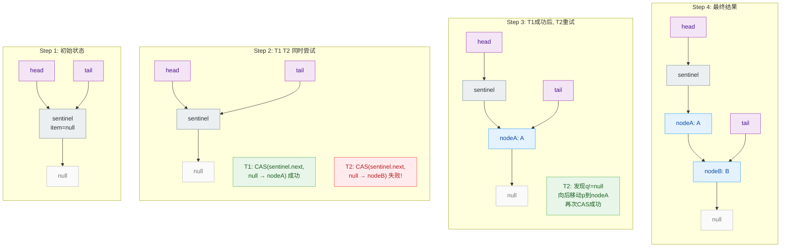

关键要点：当 T2 的 CAS 失败后，它 **不会阻塞**，而是立即进入下一轮循环。此时它会发现 `q != null`（因为 T1 已经成功链接了 nodeA），于是将指针 `p` 后移到 `nodeA`，然后再次尝试 CAS 将 `nodeA.next` 从 `null` 设为 `nodeB`。这就是无锁算法的 **"乐观重试"** 机制。

#### 出队操作 `poll()`

```java
// ConcurrentLinkedQueue.poll() 简化实现
public E poll() {
    // 定义重启标签，用于特殊情况下从头开始
    restartFromHead:
    for (;;) {
        // 1. 从 head 开始遍历
        for (Node<E> h = head, p = h, q;;) {
            // 2. 获取当前节点 p 的元素值
            E item = p.item;
            
            // 3. 如果 item 不为 null，尝试 CAS 将其置为 null（逻辑删除）
            if (item != null && ITEM.compareAndSet(p, item, null)) {
                // 4. CAS 成功，item 已被"摘取"
                if (p != h) {
                    // 5. 如果 p 和 h 不同，说明 head 指针落后了
                    //    更新 head，同时尝试跳过已失效的节点
                    updateHead(h, ((q = p.next) != null) ? q : p);
                }
                return item;  // 返回出队的元素
            }
            // 6. item 为 null 或 CAS 失败
            else if ((q = p.next) == null) {
                // 7. 没有下一个节点了，队列为空
                updateHead(h, p);
                return null;  // 返回 null 表示队列为空
            }
            else if (p == q) {
                // 8. 遇到自链接节点，从 head 重新开始
                continue restartFromHead;
            }
            else {
                // 9. 移动 p 到下一个节点继续尝试
                p = q;
            }
        }
    }
}
```

出队的核心思想是 **逻辑删除**：并不是物理移除链表节点，而是通过 CAS 将节点的 `item` 字段置为 `null`。这个被"掏空"的节点后续会在 `head` 指针更新时变成可回收的垃圾。这种设计避免了同时修改多个指针的复杂性。

让我们用一段 ASCII 图展示出队的内存变化：

```text
// 出队前：队列中有 A, B, C 三个元素
head                                                    tail
  |                                                       |
  v                                                       v
[sentinel] --> [node1: item=A] --> [node2: item=B] --> [node3: item=C] --> null

// 执行 poll() 后：node1 的 item 被 CAS 置为 null，head 前移
                    head                                tail
                      |                                   |
                      v                                   v
[sentinel] --> [node1: item=null] --> [node2: item=B] --> [node3: item=C] --> null
               (逻辑已删除)

// sentinel 和 node1 最终变为垃圾，被 GC 回收
```

#### CAS 操作的 ABA 问题

在讨论 CAS 时，不能不提 **ABA 问题（ABA Problem）**。所谓 ABA 问题是指：线程 T1 读取变量值为 A，然后被挂起；线程 T2 将变量改为 B，再改回 A；T1 恢复后执行 CAS，发现值仍然是 A，CAS 成功——但实际上数据已经被修改过了。

在 `ConcurrentLinkedQueue` 中，ABA 问题是如何被规避的呢？答案在于其巧妙的设计：

1. **节点一旦被逻辑删除（item 置为 null），就不会被重新复活**。一个 item 为 null 的节点永远不会再被赋值。
2. **节点被移除后会变成自链接（self-link）节点**（`next` 指向自身），这是一个明确的 "此节点已废弃" 信号。
3. **CAS 操作的目标是 Node 引用（内存地址）**，而不是值。新创建的 Node 对象一定有不同的内存地址，因此不可能出现 "同一个值但不同对象" 的混淆。

因此，`ConcurrentLinkedQueue` **不需要** 像 `AtomicStampedReference` 那样引入版本号来解决 ABA 问题，其数据结构本身的设计天然规避了这一风险。

---

### 非阻塞

"非阻塞（Non-Blocking）"是 `ConcurrentLinkedQueue` 的第三个核心特征，也是它与 `BlockingQueue` 家族最根本的区别。

在并发编程的语境下，"阻塞"和"非阻塞"有非常精确的含义：

| 特性 | 阻塞队列 (`BlockingQueue`) | 非阻塞队列 (`ConcurrentLinkedQueue`) |
|---|---|---|
| 队列满时入队 | `put()` 阻塞线程直到有空间 | 无界队列，不会满（`offer()` 总是返回 `true`） |
| 队列空时出队 | `take()` 阻塞线程直到有元素 | `poll()` 立即返回 `null` |
| 内部同步机制 | `ReentrantLock` + `Condition` | CAS 自旋 |
| 线程调度开销 | 涉及 `park/unpark` 系统调用 | 无系统调用，纯用户态操作 |
| 适用场景 | 生产者-消费者模式 | 高吞吐量的消息传递 |

非阻塞的核心意义在于：**线程的执行进度不依赖于其他任何线程的行为**。即使某个线程在执行 CAS 操作时被操作系统调度器暂停（例如发生了一次 GC STW），其他线程依然可以通过"帮助（helping）"机制推进操作。在 `ConcurrentLinkedQueue` 的实现中，这种帮助体现为：当一个线程发现 `tail` 指针已经落后时，它会主动帮助将 `tail` 更新到正确位置，而不是坐等其他线程来做。

下面用一段代码来展示 `ConcurrentLinkedQueue` 的非阻塞使用模式：

```java
import java.util.concurrent.ConcurrentLinkedQueue;

public class NonBlockingQueueDemo {
    public static void main(String[] args) throws InterruptedException {
        // 1. 创建一个非阻塞的并发队列
        ConcurrentLinkedQueue<String> queue = new ConcurrentLinkedQueue<>();

        // 2. 生产者线程：快速入队 100 个元素
        Thread producer = new Thread(() -> {
            for (int i = 0; i < 100; i++) {
                // offer() 永远不会阻塞，直接返回 true
                queue.offer("msg-" + i);
            }
            System.out.println("Producer finished.");
        });

        // 3. 消费者线程：循环尝试出队
        Thread consumer = new Thread(() -> {
            int count = 0;                       // 已消费计数
            while (count < 100) {
                // poll() 不会阻塞，队列为空时返回 null
                String msg = queue.poll();
                if (msg != null) {
                    count++;                     // 成功消费一个
                    // 处理消息...
                }
                // msg == null 时，线程不阻塞，立即进入下一轮循环
                // 这就是典型的"忙等待(busy-wait)"或"自旋等待(spin-wait)"
                // 在实际应用中，可加入 Thread.yield() 或短暂 sleep 以减少 CPU 空转
            }
            System.out.println("Consumer finished. Consumed: " + count);
        });

        producer.start();   // 启动生产者
        consumer.start();   // 启动消费者
        producer.join();    // 等待生产者完成
        consumer.join();    // 等待消费者完成
    }
}
```

从上面的代码可以看到一个关键问题：由于 `poll()` 不会阻塞，消费者线程在队列为空时会 **忙等待（busy-wait）**，疯狂循环消耗 CPU。这正是非阻塞队列的一个重要权衡点——**它用 CPU 空转换取了低延迟**。

那么什么时候应该使用 `ConcurrentLinkedQueue`，什么时候应该使用 `BlockingQueue` 呢？以下是一个决策流程：

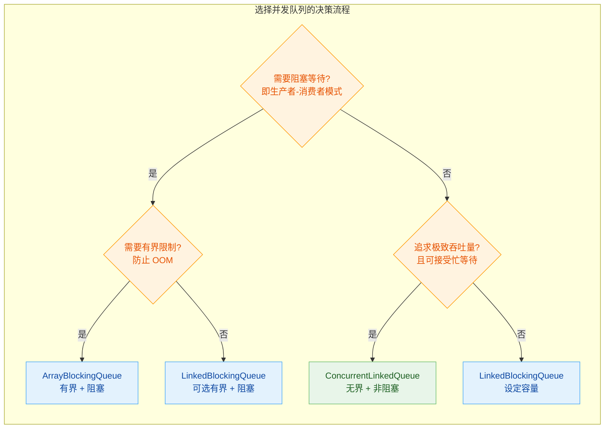

#### 非阻塞的性能优势

在高并发场景下，非阻塞算法的性能优势非常显著。我们可以从以下几个维度理解：

1. **无上下文切换**：阻塞队列中，`park()` / `unpark()` 会导致线程在用户态和内核态之间切换，每次切换的开销约为 1~10 微秒。而 CAS 自旋全程在用户态完成，开销约为几十纳秒。

2. **无锁竞争**：不存在获取锁的开销，也不存在锁护卫（Lock Convoy）问题。在 32 核甚至 64 核的现代服务器上，这种差异会被成倍放大。

3. **GC 友好**：虽然无锁队列会产生一些被废弃的节点需要 GC 回收，但这些小对象对现代 G1/ZGC 的压力微乎其微。

但非阻塞也有其局限：

- **无界风险**：`ConcurrentLinkedQueue` 是无界的，如果生产速度远超消费速度，队列会无限增长直至 `OutOfMemoryError`。
- **`size()` 操作代价高**：它需要遍历整个链表来计数，时间复杂度 O(n)，且结果可能不准确（遍历期间队列可能被修改）。**永远不要** 在高频路径上调用 `size()`。
- **忙等待浪费 CPU**：如前所述，消费者在队列为空时需要自旋，这在低负载场景下是一种浪费。

#### 实际应用场景

`ConcurrentLinkedQueue` 在以下场景中被广泛使用：

- **Netty 等高性能网络框架的内部任务队列**：Netty 的 `MpscLinkedQueue`（多生产者单消费者队列）就参考了 `ConcurrentLinkedQueue` 的设计。
- **线程池内部的任务传递**：`ForkJoinPool` 中的工作窃取机制就使用了类似的无锁数据结构。
- **日志异步写入的缓冲队列**：高吞吐量日志框架（如 Log4j2 的 AsyncLogger）使用无锁队列来传递日志事件。
- **指标收集与事件广播**：多个线程向同一个队列写入监控数据点，单独的聚合线程定期 `poll()` 并汇总。

---

**📝 练习题**

在一个使用 `ConcurrentLinkedQueue` 的生产者-消费者系统中，以下哪段消费者代码存在严重的性能或正确性问题？

A. 
```java
while (true) {
    String item = queue.poll();
    if (item != null) process(item);
}
```


B. 
```java
while (!queue.isEmpty()) {
    String item = queue.poll();
    process(item);
}
```


C. 
```java
while (true) {
    String item = queue.poll();
    if (item != null) process(item);
    else Thread.yield();
}
```


D. 
```java
for (String item : queue) {
    process(item);
    queue.remove(item);
}
```


**【答案】** B

**【解析】** 选项 B 有两个严重问题：

1. **TOCTOU（Time-of-Check to Time-of-Use）竞态条件**：`isEmpty()` 检查返回 `false` 后、`poll()` 执行前，另一个线程可能已经取走了最后一个元素，此时 `poll()` 返回 `null`，而 `process(null)` 会导致 `NullPointerException`。
2. **过早退出**：一旦某一瞬间队列为空，`isEmpty()` 返回 `true`，循环就会立即终止。但生产者可能还在持续生产，消费者不应该因为队列 **暂时** 为空就彻底退出。

选项 A 虽然会造成 CPU 空转（忙等待），但逻辑上是正确的。选项 C 是 A 的优化版，通过 `Thread.yield()` 提示调度器让出 CPU 时间片，是比较合理的非阻塞消费模式。选项 D 的问题是在增强 for 循环遍历的同时调用 `remove()` 修改集合，虽然 `ConcurrentLinkedQueue` 的迭代器是弱一致性（weakly consistent）的、不会抛 `ConcurrentModificationException`，但 `remove(item)` 需要遍历队列查找匹配元素，效率极低（O(n)），且在并发环境下可能漏删或重复处理。因此最严重、最典型的问题出在 **B**。

---

## ConcurrentLinkedDeque

`ConcurrentLinkedDeque` 是 Java 并发包 `java.util.concurrent` 中提供的一个 **线程安全的无界双端队列**（Double-Ended Queue）。它与前面介绍的 `ConcurrentLinkedQueue` 同属无锁并发容器家族，但在功能维度上做了显著的扩展——它允许从队列的 **头部（Head）** 和 **尾部（Tail）** 两端同时进行高效的插入与删除操作。其底层同样基于 **CAS（Compare-And-Swap）** 无锁算法实现，不依赖任何 `synchronized` 或 `ReentrantLock`，因此在高并发场景下能够提供出色的吞吐量。

该类从 **JDK 7** 开始引入，实现了 `Deque<E>` 接口，同时也间接实现了 `Queue<E>` 接口，这意味着它既可以作为传统的 FIFO 队列使用，也可以作为 LIFO 栈使用，甚至可以在需要双端访问的复杂并发场景中发挥作用。

### 双端队列的核心概念

在深入 `ConcurrentLinkedDeque` 之前，我们需要先理解 **Deque（Double-Ended Queue）** 这一数据结构的本质。普通队列（Queue）只允许从一端入队、另一端出队，而双端队列打破了这一限制，**两端都可以进行入队和出队操作**。这赋予了数据结构极大的灵活性：

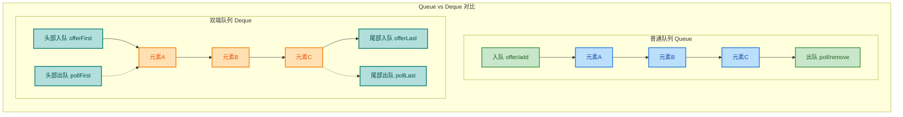

由于双端队列的这种特性，`Deque` 接口定义了一套 **对称的 API**，每个操作都有 `First` 和 `Last` 两个版本。`ConcurrentLinkedDeque` 完整实现了这些方法，并保证了所有操作的线程安全性。

### 内部数据结构

`ConcurrentLinkedDeque` 的内部采用 **双向链表（Doubly-Linked List）** 结构。每个节点（Node）持有三个关键字段：前驱指针（prev）、数据元素（item）和后继指针（next）。这与 `ConcurrentLinkedQueue` 的单向链表有本质区别——双向链表使得从尾部向头部的遍历和尾部删除操作成为可能。

```java
// ConcurrentLinkedDeque 内部节点的简化结构
// 实际源码位于 java.util.concurrent.ConcurrentLinkedDeque.Node
static final class Node<E> {
    // 前驱节点指针，指向链表中当前节点的前一个节点
    volatile Node<E> prev;
    // 当前节点实际存储的数据元素
    volatile E item;
    // 后继节点指针，指向链表中当前节点的后一个节点
    volatile Node<E> next;
}
```

整个队列通过 `head` 和 `tail` 两个 volatile 指针来标识链表的边界：

```
// ConcurrentLinkedDeque 内存模型示意
//
//    head                                              tail
//     |                                                 |
//     v                                                 v
//  +------+    +------+    +------+    +------+    +------+
//  | null |<---| prev |<---| prev |<---| prev |<---| prev |
//  | "A"  |    | "B"  |    | "C"  |    | "D"  |    | "E"  |
//  | next |--->| next |--->| next |--->| next |--->| null  |
//  +------+    +------+    +------+    +------+    +------+
//
//  每个节点通过 prev 和 next 双向链接
//  head.prev == null, tail.next == null
```

这种双向链表结构使得 **头部和尾部的操作复杂度都是 O(1)**，但也带来了额外的复杂性——在并发环境下维护双向指针的一致性比单向指针要困难得多。这也是为什么 `ConcurrentLinkedDeque` 的源码实现远比 `ConcurrentLinkedQueue` 复杂的根本原因。

### CAS 无锁并发机制

与 `ConcurrentLinkedQueue` 一样，`ConcurrentLinkedDeque` 全面采用 **CAS 无锁算法** 保证线程安全。但由于双向链表需要同时维护 `prev` 和 `next` 两个方向的指针，其 CAS 操作更加精巧。

核心思想是：**每次插入或删除节点时，不使用锁，而是通过原子性的 CAS 操作逐步修改链表指针**。如果某个线程的 CAS 操作失败（说明有其他线程抢先修改了指针），则重试直到成功。

```java
// 以 offerLast（尾部插入）为例，展示 CAS 无锁插入的核心逻辑（简化版）
public boolean offerLast(E e) {
    // 创建新节点，不允许 null 元素
    final Node<E> newNode = new Node<>(Objects.requireNonNull(e));

    // 自旋重试，直到成功将新节点链接到链表尾部
    restartFromTail:
    for (;;) {
        // 从 tail 指针开始寻找真正的尾节点
        // （tail 可能并非指向实际的最后一个节点——这是一种"松弛"优化）
        Node<E> t = tail;
        Node<E> p = t;

        for (;;) {
            // q 是 p 的后继节点
            Node<E> q = p.next;

            if (q == null) {
                // p 确实是最后一个节点（p.next == null）
                // 将新节点的 prev 设置为 p
                newNode.prev = p;

                // 通过 CAS 将 p.next 从 null 改为 newNode
                if (p.casNext(null, newNode)) {
                    // CAS 成功！新节点已链接到链表尾部
                    // 尝试更新 tail 指针（允许失败，属于"松弛"策略）
                    if (p != t) {
                        casTail(t, newNode);
                    }
                    return true; // 插入成功
                }
                // CAS 失败：说明有其他线程抢先插入了节点，重新循环
            } else {
                // p 不是最后一个节点，继续向后遍历
                p = q;
            }
        }
    }
}
```

需要特别注意的是，双向链表的 CAS 操作存在一个固有难题：**无法通过单次 CAS 原子地同时更新两个指针**。例如在尾部插入时，需要分两步完成：

1. **CAS 修改前一个节点的 `next` 指针**，使其指向新节点。
2. **设置新节点的 `prev` 指针**，使其指回前一个节点。

这两步之间存在一个短暂的 **不一致窗口**（Inconsistency Window），在这个窗口中链表的 `prev` 方向链接可能是不完整的。`ConcurrentLinkedDeque` 通过 **惰性修复（Lazy Unlinking）** 策略来处理这种不一致——当某个线程在遍历时发现链接断裂，它会顺便帮忙修复。

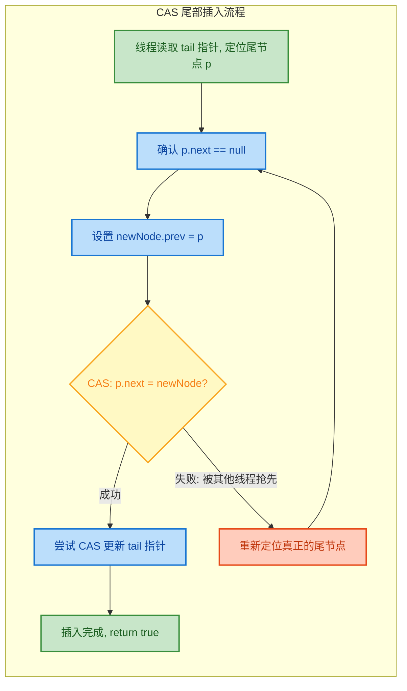

### 核心 API 详解

`ConcurrentLinkedDeque` 实现了完整的 `Deque` 接口，提供了丰富的双端操作方法。这些方法可以按照 **操作位置（头/尾）** 和 **失败行为（抛异常/返回特殊值）** 两个维度进行分类：

| 操作 | 头部（抛异常） | 头部（返回特殊值） | 尾部（抛异常） | 尾部（返回特殊值） |
|------|:---:|:---:|:---:|:---:|
| **插入** | `addFirst(e)` | `offerFirst(e)` | `addLast(e)` | `offerLast(e)` |
| **删除** | `removeFirst()` | `pollFirst()` | `removeLast()` | `pollLast()` |
| **查看** | `getFirst()` | `peekFirst()` | `getLast()` | `peekLast()` |

> **注意**：由于 `ConcurrentLinkedDeque` 是无界队列，`offerFirst` 和 `offerLast` 永远返回 `true`，不会因为容量限制而失败。但 `pollFirst` 和 `pollLast` 在队列为空时会返回 `null`，而 `removeFirst` 和 `removeLast` 则会抛出 `NoSuchElementException`。

```java
import java.util.concurrent.ConcurrentLinkedDeque;

public class ConcurrentLinkedDequeDemo {
    public static void main(String[] args) {
        // 创建一个线程安全的双端队列
        ConcurrentLinkedDeque<String> deque = new ConcurrentLinkedDeque<>();

        // === 头部操作 ===
        deque.addFirst("B");       // 从头部插入 "B" -> [B]
        deque.offerFirst("A");     // 从头部插入 "A" -> [A, B]

        // === 尾部操作 ===
        deque.addLast("C");        // 从尾部插入 "C" -> [A, B, C]
        deque.offerLast("D");      // 从尾部插入 "D" -> [A, B, C, D]

        // === 查看操作（不移除元素）===
        System.out.println("头部元素: " + deque.peekFirst());  // 输出: A
        System.out.println("尾部元素: " + deque.peekLast());   // 输出: D

        // === 删除操作 ===
        String head = deque.pollFirst();  // 移除并返回头部元素 "A" -> [B, C, D]
        String tail = deque.pollLast();   // 移除并返回尾部元素 "D" -> [B, C]

        System.out.println("移除的头部: " + head);  // 输出: A
        System.out.println("移除的尾部: " + tail);  // 输出: D
        System.out.println("剩余队列: " + deque);   // 输出: [B, C]

        // === 当作栈使用（LIFO）===
        deque.push("X");            // 等价于 addFirst("X") -> [X, B, C]
        String top = deque.pop();   // 等价于 removeFirst() -> [B, C]
        System.out.println("栈顶弹出: " + top);    // 输出: X

        // === 队列为空时的安全操作 ===
        deque.clear();                          // 清空队列
        System.out.println(deque.pollFirst());  // 输出: null（安全返回，不抛异常）
        System.out.println(deque.pollLast());   // 输出: null（安全返回，不抛异常）

        // deque.removeFirst();  // ⚠️ 这里会抛 NoSuchElementException！
    }
}
```

### 作为栈和队列的双重角色

`ConcurrentLinkedDeque` 的一大优势是它能 **同时充当队列和栈**，这得益于 `Deque` 接口的设计哲学。在并发编程中，这种灵活性非常有价值——你可以用一个数据结构适应不同的消费模式。

```java
import java.util.concurrent.ConcurrentLinkedDeque;

public class DualRoleDemo {
    public static void main(String[] args) {

        // ====== 场景一：作为 FIFO 队列使用 ======
        // 等价于 ConcurrentLinkedQueue 的行为
        ConcurrentLinkedDeque<String> fifoQueue = new ConcurrentLinkedDeque<>();

        // 生产者从尾部入队
        fifoQueue.offerLast("任务1");   // [任务1]
        fifoQueue.offerLast("任务2");   // [任务1, 任务2]
        fifoQueue.offerLast("任务3");   // [任务1, 任务2, 任务3]

        // 消费者从头部出队（先进先出）
        System.out.println(fifoQueue.pollFirst()); // 输出: 任务1
        System.out.println(fifoQueue.pollFirst()); // 输出: 任务2
        System.out.println(fifoQueue.pollFirst()); // 输出: 任务3

        // ====== 场景二：作为 LIFO 栈使用 ======
        // push/pop 方法操作头部，天然形成栈的行为
        ConcurrentLinkedDeque<String> lifoStack = new ConcurrentLinkedDeque<>();

        // push 等价于 addFirst，将元素压入栈顶
        lifoStack.push("帧A");   // [帧A]
        lifoStack.push("帧B");   // [帧B, 帧A]
        lifoStack.push("帧C");   // [帧C, 帧B, 帧A]

        // pop 等价于 removeFirst，从栈顶弹出（后进先出）
        System.out.println(lifoStack.pop()); // 输出: 帧C
        System.out.println(lifoStack.pop()); // 输出: 帧B
        System.out.println(lifoStack.pop()); // 输出: 帧A

        // ====== 场景三：Work-Stealing 模式 ======
        // 所有者线程从自己的队列尾部取任务（LIFO，利用缓存局部性）
        // 其他空闲线程从队列头部"偷"任务（FIFO，减少竞争）
        ConcurrentLinkedDeque<String> workQueue = new ConcurrentLinkedDeque<>();

        workQueue.offerLast("子任务1");  // 添加到尾部
        workQueue.offerLast("子任务2");
        workQueue.offerLast("子任务3");

        // 所有者线程：从尾部取（最近添加的，缓存更热）
        String ownWork = workQueue.pollLast();    // 子任务3
        System.out.println("所有者处理: " + ownWork);

        // 窃取线程：从头部偷（最早添加的，与所有者不竞争）
        String stolenWork = workQueue.pollFirst(); // 子任务1
        System.out.println("窃取线程处理: " + stolenWork);
    }
}
```

上面的 **Work-Stealing（工作窃取）模式** 是双端队列在并发领域最经典的应用场景之一。Java 的 `ForkJoinPool` 内部就大量使用了双端队列来实现任务窃取。每个工作线程拥有自己的双端队列，正常情况下从尾部取任务执行（LIFO 顺序可以更好地利用 CPU 缓存局部性），当自己的队列为空时，就去其他线程的队列头部"偷"任务（从对端操作，最大程度减少与队列所有者的竞争）。

### 多线程并发实战

下面通过一个完整的多线程示例来演示 `ConcurrentLinkedDeque` 的并发安全性：

```java
import java.util.concurrent.ConcurrentLinkedDeque;
import java.util.concurrent.CountDownLatch;

public class ConcurrentDequeStressTest {
    public static void main(String[] args) throws InterruptedException {
        // 共享的线程安全双端队列
        ConcurrentLinkedDeque<Integer> deque = new ConcurrentLinkedDeque<>();
        // 用于等待所有线程完成
        int threadCount = 4;
        CountDownLatch latch = new CountDownLatch(threadCount);

        // 线程1：从头部插入 0~999
        Thread headProducer = new Thread(() -> {
            for (int i = 0; i < 1000; i++) {
                deque.offerFirst(i);  // 每次插入到头部
            }
            latch.countDown(); // 标记本线程已完成
        }, "HeadProducer");

        // 线程2：从尾部插入 1000~1999
        Thread tailProducer = new Thread(() -> {
            for (int i = 1000; i < 2000; i++) {
                deque.offerLast(i);   // 每次插入到尾部
            }
            latch.countDown();
        }, "TailProducer");

        // 线程3：从头部消费
        Thread headConsumer = new Thread(() -> {
            int consumed = 0;
            // 持续消费直到两个生产者都完成
            while (consumed < 500) {
                Integer val = deque.pollFirst(); // 从头部取
                if (val != null) {
                    consumed++;
                }
                // pollFirst 返回 null 说明队列暂时为空，自旋重试
            }
            System.out.println("HeadConsumer 共消费: " + consumed + " 个元素");
            latch.countDown();
        }, "HeadConsumer");

        // 线程4：从尾部消费
        Thread tailConsumer = new Thread(() -> {
            int consumed = 0;
            while (consumed < 500) {
                Integer val = deque.pollLast();  // 从尾部取
                if (val != null) {
                    consumed++;
                }
            }
            System.out.println("TailConsumer 共消费: " + consumed + " 个元素");
            latch.countDown();
        }, "TailConsumer");

        // 启动所有线程
        headProducer.start();
        tailProducer.start();
        headConsumer.start();
        tailConsumer.start();

        // 等待所有线程完成
        latch.await();

        // 生产了 2000 个，消费了 1000 个，应剩余 1000 个
        System.out.println("队列剩余元素数量: " + deque.size());
        // 输出: 队列剩余元素数量: 1000
    }
}
```

这个示例中，四个线程分别从头部和尾部进行插入和删除操作，完全不需要任何外部同步，`ConcurrentLinkedDeque` 内部的 CAS 机制保证了数据的完整性。

### size() 方法的陷阱

与 `ConcurrentLinkedQueue` 一样，`ConcurrentLinkedDeque` 的 **`size()` 方法不是 O(1) 的常量时间操作，而是 O(n)**。它需要遍历整个链表来计算元素个数。更重要的是，在并发环境下，`size()` 返回的值可能在你使用它的那一刻就已经过时了——因为其他线程可能在此期间插入或删除了元素。

```java
// ⚠️ 错误的并发模式——基于 size() 做判断
if (deque.size() > 0) {
    // 在这一瞬间，另一个线程可能已经把最后一个元素取走了！
    String element = deque.pollFirst(); // 可能返回 null！
}

// ✅ 正确的并发模式——直接操作并检查返回值
String element = deque.pollFirst();
if (element != null) {
    // 安全地使用 element
    processElement(element);
}
```

如果需要频繁获取队列大小，应考虑维护一个额外的 `AtomicInteger` 计数器，在每次插入/删除时同步更新。

### 弱一致性迭代器

`ConcurrentLinkedDeque` 的迭代器（Iterator）和降序迭代器（Descending Iterator）都是 **弱一致性的（Weakly Consistent）**。这意味着：

- 迭代器 **永远不会抛出 `ConcurrentModificationException`**，即使在迭代过程中其他线程修改了队列。
- 迭代器反映的是创建时刻（或之后某个时刻）的队列状态快照，**不保证能看到迭代开始后的所有修改**。
- 每个元素 **最多返回一次**，不会重复。

```java
import java.util.Iterator;
import java.util.concurrent.ConcurrentLinkedDeque;

public class WeakConsistentIteratorDemo {
    public static void main(String[] args) {
        ConcurrentLinkedDeque<String> deque = new ConcurrentLinkedDeque<>();
        deque.addLast("A");
        deque.addLast("B");
        deque.addLast("C");

        // 正向迭代（从头到尾）
        Iterator<String> ascIter = deque.iterator();
        // 降序迭代（从尾到头）
        Iterator<String> descIter = deque.descendingIterator();

        // 在迭代过程中，其他线程修改队列不会抛异常
        // 但迭代器可能看到也可能看不到这些修改
        System.out.print("正向遍历: ");
        while (ascIter.hasNext()) {
            System.out.print(ascIter.next() + " "); // A B C
        }

        System.out.print("\n降序遍历: ");
        while (descIter.hasNext()) {
            System.out.print(descIter.next() + " "); // C B A
        }
    }
}
```

### ConcurrentLinkedDeque vs ConcurrentLinkedQueue

理解两者的差异对于在实际项目中做出正确选型至关重要：

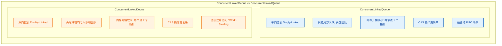

| 对比维度 | ConcurrentLinkedQueue | ConcurrentLinkedDeque |
|---------|:---:|:---:|
| **数据结构** | 单向链表 | 双向链表 |
| **操作端** | 头部出队 + 尾部入队 | 两端均可出入队 |
| **每节点内存** | 1 指针 (next) | 2 指针 (prev + next) |
| **实现复杂度** | 较低 | 较高 |
| **吞吐性能** | 略优（CAS 更简单） | 略逊（双指针维护） |
| **栈操作** | ❌ 不支持 | ✅ push / pop |
| **降序迭代** | ❌ 不支持 | ✅ descendingIterator |
| **Work-Stealing** | ❌ 不适合 | ✅ 经典场景 |

**选型建议**：

- 如果你只需要 **标准的 FIFO 队列**（生产者-消费者模式），优先选择 `ConcurrentLinkedQueue`，它更轻量、性能更好。
- 如果你需要 **从两端操作**（如 Work-Stealing、双端缓冲、并发栈），或者需要 **降序遍历** 的能力，则选择 `ConcurrentLinkedDeque`。
- 如果你需要 **阻塞等待**（队列空时消费者阻塞、队列满时生产者阻塞），这两个类都不适合，应该使用 `LinkedBlockingDeque` 或 `LinkedBlockingQueue`。

### 适用场景与注意事项

**典型适用场景**：

1. **Work-Stealing 任务调度**：每个工作线程维护一个 `ConcurrentLinkedDeque`，所有者从尾部取任务，窃取者从头部偷任务。
2. **撤销/重做（Undo/Redo）系统**：在并发环境中，将操作历史记录在双端队列中，从尾部追加新操作，需要撤销时从尾部弹出。
3. **双端滑动窗口**：在流式数据处理中，新数据从尾部进入，过期数据从头部移除，同时支持从两端查询。
4. **并发栈替代方案**：当需要线程安全的栈结构时，`ConcurrentLinkedDeque` 的 `push/pop` 方法比用锁包装 `ArrayDeque` 性能更好。

**注意事项**：

- **不允许 `null` 元素**：插入 `null` 会抛出 `NullPointerException`，因为 `null` 被用作 `pollFirst/pollLast` 的"队列为空"信号。
- **`size()` 代价高昂**：O(n) 时间复杂度，在高并发下尤其应避免频繁调用。
- **无容量限制**：作为无界队列，如果生产速度远大于消费速度，可能导致内存耗尽（OOM）。
- **批量操作非原子**：`addAll()`、`removeAll()` 等批量操作不是原子性的，它们内部逐个执行单元素操作。
- **`remove(Object)` 性能低**：需要 O(n) 遍历查找，不适合频繁的按值删除场景。

---

**📝 练习题**

以下关于 `ConcurrentLinkedDeque` 的描述，哪一项是 **错误的**？

A. 它基于 CAS 无锁算法实现，内部不使用任何 `synchronized` 或 `ReentrantLock`

B. 它的 `size()` 方法是 O(1) 时间复杂度，因为内部维护了一个原子计数器

C. 它的迭代器是弱一致性的，不会抛出 `ConcurrentModificationException`

D. 它可以通过 `push()` 和 `pop()` 方法当作线程安全的栈使用


**【答案】** B

**【解析】** `ConcurrentLinkedDeque` 的 `size()` 方法 **不是 O(1)**，而是 **O(n)**。它没有维护原子计数器，每次调用 `size()` 都需要从头到尾遍历整个链表来逐一计数。这是因为在无锁并发设计中，维护一个精确的原子计数器会引入额外的 CAS 竞争，反而降低核心操作（插入/删除）的吞吐量。选项 A 正确，`ConcurrentLinkedDeque` 确实完全基于 CAS 无锁实现。选项 C 正确，其迭代器是弱一致性（Weakly Consistent）的。选项 D 正确，`push()` 等价于 `addFirst()`，`pop()` 等价于 `removeFirst()`，天然形成 LIFO 栈行为。

---

## CopyOnWriteArrayList ⭐

`CopyOnWriteArrayList` 是 `java.util.concurrent` 包中最具特色的并发容器之一。它的设计哲学极其简洁——**在每次写操作时，不直接修改原数组，而是将底层数组完整复制一份，在新副本上执行修改，再将引用指向新数组**。这种策略被称为 **写时复制（Copy-On-Write, COW）**。这使得所有读操作完全无需加锁，天然线程安全，非常适合 **读多写少（read-heavy, write-rarely）** 的并发场景。

要真正理解 `CopyOnWriteArrayList`，我们需要从它的核心数据结构说起。打开 JDK 源码，你会发现它的内部结构出奇地简单：

```java
// CopyOnWriteArrayList 核心字段（JDK 17+）
public class CopyOnWriteArrayList<E> implements List<E> {
    // 用于写操作的独占锁，保证同一时刻只有一个线程在修改
    final transient Object lock = new Object();
    // 底层存储数组，volatile 保证读线程能立即看到最新引用
    private transient volatile Object[] array;

    // 获取当前数组的引用（读操作的入口）
    final Object[] getArray() {
        return array;                  // 直接返回引用，无锁
    }

    // 将内部数组引用指向新数组（写操作完成后调用）
    final void setArray(Object[] a) {
        array = a;                     // volatile 写，对所有读线程立即可见
    }
}
```

整个容器的并发安全建立在两个支柱之上：一是 `volatile` 语义保证读线程看到最新数组引用；二是 `synchronized`（或 `ReentrantLock`，取决于 JDK 版本）保证写操作的互斥。

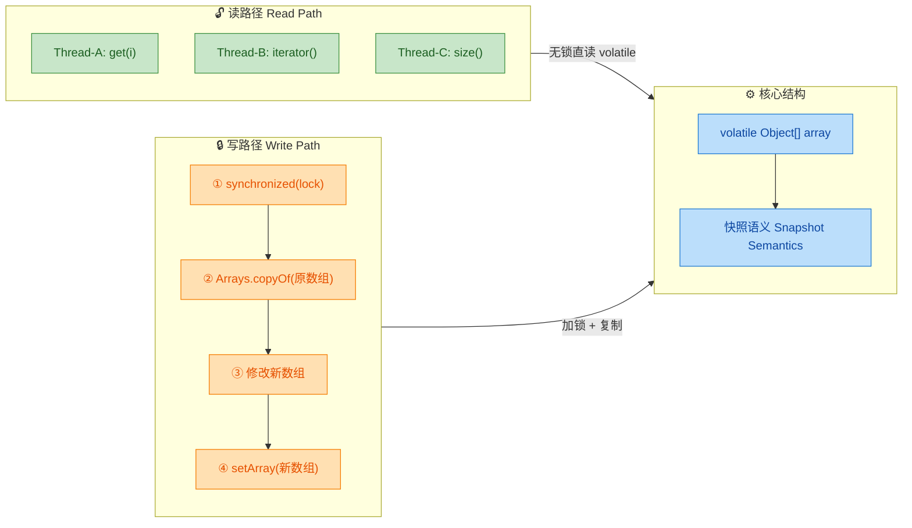

---

### 写时复制（Copy-On-Write）

**写时复制（Copy-On-Write，简称 COW）** 并不是 Java 的独创概念。它广泛存在于操作系统内核（Linux `fork()` 的页表复制）、数据库的 MVCC 机制、以及函数式编程的不可变数据结构中。核心思想是：

> **"延迟写入，按需复制。"**  
> 只要没有人修改数据，所有人共享同一份副本；一旦有人要修改，就先复制一份独立副本，在副本上修改，最后再替换原引用。

在 `CopyOnWriteArrayList` 中，这个思想被严格实现。每当执行 `add()`、`set()`、`remove()` 等写操作时，容器并不在原数组上就地修改（in-place mutation），而是：

1. **获取独占锁**，阻止其他线程同时写入。
2. **复制原数组**为一个全新的数组副本。
3. **在新数组上执行修改**。
4. **将 `volatile` 引用指向新数组**，所有后续的读操作将看到新数据。
5. **释放锁**，旧数组如果没有任何线程持有引用，将被 GC 回收。

我们来看一个完整的可视化过程：

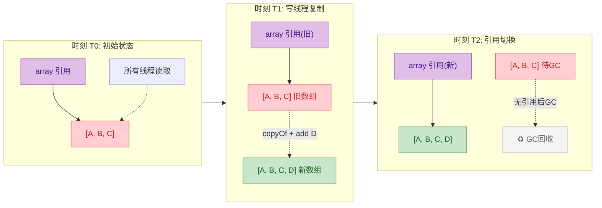

这里最关键的一个概念是 **不可变性（Immutability）**。从读线程的视角来看，任何时刻它拿到的数组引用都是一个"不会再被任何人修改"的对象。因为写线程永远不会修改旧数组——它只会创建新数组。这就是 COW 的核心不变式（invariant）：

> **一旦一个数组被发布（published）给读线程，它的内容就永远不会改变。**

这个不变式使得读操作天然线程安全——不需要任何锁、CAS 或 `volatile` 读屏障（数组内容本身不变，只需要 `volatile` 保证引用可见性）。

---

### 读不加锁

`CopyOnWriteArrayList` 的读操作是其最大的性能优势所在。让我们直接看源码：

```java
// ===== 读操作：get() =====
public E get(int index) {
    // getArray() 返回 volatile 引用，获取当前最新的数组快照
    // 注意：这里没有任何 synchronized、Lock、CAS 操作
    return elementAt(getArray(), index);
}

// 内部辅助方法，从数组中按下标取元素
@SuppressWarnings("unchecked")
static <E> E elementAt(Object[] a, int index) {
    return (E) a[index];            // 直接数组下标访问，O(1) 时间复杂度
}

// ===== 读操作：size() =====
public int size() {
    return getArray().length;        // 直接返回数组长度，无锁
}

// ===== 读操作：contains() =====
public boolean contains(Object o) {
    Object[] es = getArray();        // 获取当前数组快照
    return indexOfRange(o, es, 0, es.length) >= 0;  // 线性扫描
}

// ===== 读操作：iterator() =====
public Iterator<E> iterator() {
    // 创建迭代器时，将当前数组快照传入
    // 后续迭代永远基于这个快照，不会看到之后的修改
    return new COWIterator<E>(getArray(), 0);
}
```

注意一个非常重要的细节：**迭代器持有的是创建时刻的数组快照引用**。即使在迭代过程中有其他线程调用了 `add()` 或 `remove()`，迭代器依然遍历的是旧数组，完全不受影响。这被称为 **弱一致性迭代器（Weakly Consistent Iterator）**。

与 `Collections.synchronizedList` 的对比可以更清楚地说明这个优势：

```java
// ===== 对比：synchronizedList 的 get() =====
// 来自 Collections.SynchronizedList 的实现
public E get(int index) {
    synchronized (mutex) {           // 每次读都要获取锁！
        return list.get(index);      // 锁竞争是性能瓶颈
    }
}
// 在高并发读场景下，所有读线程互相阻塞，吞吐量极低

// ===== 对比：CopyOnWriteArrayList 的 get() =====
public E get(int index) {
    return elementAt(getArray(), index);  // 零锁竞争，零阻塞
}
// 100 个线程同时读，没有任何等待
```

让我们用一个具体的代码示例来感受读操作的弱一致性特点：

```java
import java.util.Iterator;
import java.util.concurrent.CopyOnWriteArrayList;

public class COWReadDemo {
    public static void main(String[] args) throws InterruptedException {
        // 创建 COW 列表，初始包含三个元素
        CopyOnWriteArrayList<String> list = new CopyOnWriteArrayList<>();
        list.add("Java");            // 添加初始元素
        list.add("Python");          // 添加初始元素
        list.add("Go");             // 添加初始元素

        // 在主线程创建迭代器 —— 此刻快照为 [Java, Python, Go]
        Iterator<String> snapshot = list.iterator();

        // 启动子线程在迭代期间修改列表
        Thread writer = new Thread(() -> {
            list.add("Rust");        // 写操作创建新数组 [Java, Python, Go, Rust]
            list.remove("Python");   // 再次创建新数组 [Java, Go, Rust]
            System.out.println("Writer done. Current list: " + list);
        });
        writer.start();              // 启动写线程
        writer.join();               // 等待写线程完成

        // 主线程继续用之前的迭代器遍历
        System.out.print("Snapshot iterator sees: ");
        while (snapshot.hasNext()) {
            System.out.print(snapshot.next() + " ");
            // 输出: Java Python Go
            // 注意: Rust 不会出现，Python 不会消失！
            // 因为迭代器持有的是创建时刻的旧数组快照
        }
        System.out.println();

        // 重新获取迭代器，可以看到最新状态
        System.out.print("Fresh iterator sees: ");
        for (String s : list) {      // 增强 for 循环会调用 iterator()
            System.out.print(s + " ");
            // 输出: Java Go Rust —— 这是最新的数组
        }
    }
}
```

这段代码清楚地展示了 **快照语义（Snapshot Semantics）**：迭代器永远只反映创建那一刻的数据状态，不会因为并发修改而抛出 `ConcurrentModificationException`（这是与 `ArrayList` 的 fail-fast 迭代器最大的区别）。

下面通过一个内存模型图来理解读线程如何与写线程并行工作：

```
  时间线 ──────────────────────────────────────────────────►

  Reader-1:  ── getArray() ──► 持有 arr@0x100 ── 遍历 [A,B,C] ──►
                                                  (不受影响)
  Writer:    ──────── lock ── copy ── modify ── setArray(arr@0x200) ── unlock ──►
                                                       │
  Reader-2:  ─────────────────────── getArray() ───────►│ 持有 arr@0x200 ── 遍历 [A,B,C,D] ──►
                                                  (看到新数据)

  内存:
    arr@0x100: [A, B, C]        ← Reader-1 仍在用，暂不回收
    arr@0x200: [A, B, C, D]     ← 新数组，Writer 创建
```

---

### 写加锁 + 复制数组

读操作是轻量级的，而写操作则承担了所有的"代价"。我们逐个分析核心写操作的源码实现：

#### `add(E e)` — 添加元素

```java
// JDK 17+ 源码（简化版）
public boolean add(E e) {
    synchronized (lock) {                      // ① 获取独占锁，同一时刻只有一个线程能写
        Object[] es = getArray();              // ② 获取当前数组引用
        int len = es.length;                   // ③ 记录当前数组长度
        // ④ 创建长度 +1 的新数组，并将旧数组内容完整复制过去
        es = Arrays.copyOf(es, len + 1);
        es[len] = e;                           // ⑤ 在新数组的末尾位置放入新元素
        setArray(es);                          // ⑥ volatile 写：将引用指向新数组
        return true;                           // ⑦ 返回添加成功
    }                                          // ⑧ 释放锁
}
```

#### `set(int index, E element)` — 替换元素

```java
public E set(int index, E element) {
    synchronized (lock) {                      // 获取独占锁
        Object[] es = getArray();              // 获取当前数组
        E oldValue = elementAt(es, index);     // 取出旧值（用于返回）

        if (oldValue != element) {             // 判断新旧值是否相同（优化）
            int len = es.length;               // 记录数组长度
            // 完整复制旧数组（即使只改一个元素也要全量复制）
            es = es.clone();
            es[index] = element;               // 在新数组中替换目标位置的值
        } else {
            // 如果新值和旧值是同一个对象，仍然执行 setArray
            // 这是为了保证 volatile 写语义（happens-before）
            // 确保此次操作之前的所有修改对其他线程可见
        }
        setArray(es);                          // volatile 写，发布新数组
        return oldValue;                       // 返回被替换的旧值
    }
}
```

#### `remove(int index)` — 删除元素

```java
public E remove(int index) {
    synchronized (lock) {                      // 获取独占锁
        Object[] es = getArray();              // 获取当前数组
        int len = es.length;                   // 当前长度
        E oldValue = elementAt(es, index);     // 记录被删除的元素
        int numMoved = len - index - 1;        // 计算需要移动的元素数量

        Object[] newElements;
        if (numMoved == 0) {
            // 删除的是最后一个元素，直接 copyOf 截断
            newElements = Arrays.copyOf(es, len - 1);
        } else {
            // 创建长度减 1 的新数组
            newElements = new Object[len - 1];
            // 复制 index 之前的部分
            System.arraycopy(es, 0, newElements, 0, index);
            // 复制 index 之后的部分（跳过被删除的元素）
            System.arraycopy(es, index + 1, newElements, index, numMoved);
        }
        setArray(newElements);                 // volatile 写，发布新数组
        return oldValue;                       // 返回被删除的元素
    }
}
```

注意三个写操作的共同模式：**`synchronized` → 读旧数组 → 复制 → 修改新数组 → `setArray` → 释放锁**。

下面是 `add` 操作的完整流程图：

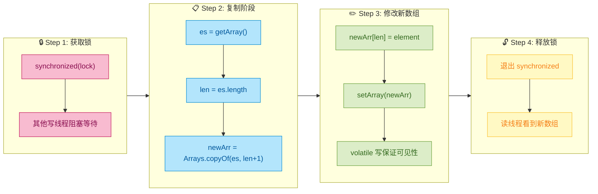

**为什么写操作使用 `synchronized` 而不是 CAS？** 这是一个值得思考的问题。原因在于：写操作涉及"读取旧数组 → 复制 → 修改 → 替换引用"这一系列非原子步骤。如果用 CAS 自旋，两个写线程可能同时复制了旧数组，各自修改后 CAS 竞争，失败的一方必须重新复制——这比直接加锁的开销还大（数组复制本身就是 O(n) 操作）。所以，**对于重量级的写操作，悲观锁反而比乐观锁更合适**。

---

### 适用场景（读多写少）

`CopyOnWriteArrayList` 的设计决定了它天然偏向于特定的使用场景。以下是它最经典的应用领域：

**1. 事件监听器列表（Event Listener List）**

这是 COW 列表最经典的应用场景。GUI 框架或事件驱动系统中，监听器注册（add）和注销（remove）非常少见，但事件触发时需要遍历所有监听器——典型的读多写少模式。

```java
import java.util.concurrent.CopyOnWriteArrayList;

public class EventBus {
    // 监听器列表使用 COW，确保遍历时线程安全
    private final CopyOnWriteArrayList<EventListener> listeners
            = new CopyOnWriteArrayList<>();

    // 注册监听器 —— 写操作，偶尔发生
    public void register(EventListener listener) {
        listeners.add(listener);                 // 加锁 + 复制，低频操作
    }

    // 注销监听器 —— 写操作，偶尔发生
    public void unregister(EventListener listener) {
        listeners.remove(listener);              // 加锁 + 复制，低频操作
    }

    // 触发事件 —— 读操作（遍历），高频操作
    public void fireEvent(Event event) {
        // 增强 for 循环底层调用 iterator()，获取快照
        // 遍历过程中无锁，即使其他线程同时注册/注销也不会出问题
        for (EventListener listener : listeners) {
            listener.onEvent(event);             // 无锁遍历，高性能
        }
        // 不会抛出 ConcurrentModificationException！
    }
}
```

**2. 配置/黑白名单缓存**

应用启动时加载配置，运行时频繁读取，偶尔通过管理接口修改。

```java
public class WhitelistService {
    // 白名单使用 COW 列表，读操作零开销
    private final CopyOnWriteArrayList<String> whitelist
            = new CopyOnWriteArrayList<>();

    // 初始化：批量加载（addAll 内部也是加锁 + 复制一次）
    public void init(List<String> initialList) {
        whitelist.addAll(initialList);
    }

    // 高频读：每个请求都要检查白名单
    public boolean isAllowed(String ip) {
        return whitelist.contains(ip);           // 无锁 O(n) 扫描
    }

    // 低频写：管理员手动添加
    public void addToWhitelist(String ip) {
        whitelist.addIfAbsent(ip);               // COW 特有方法，避免重复
    }
}
```

**3. 场景适配决策表**

下面这张表帮助你快速判断是否应该选择 `CopyOnWriteArrayList`：

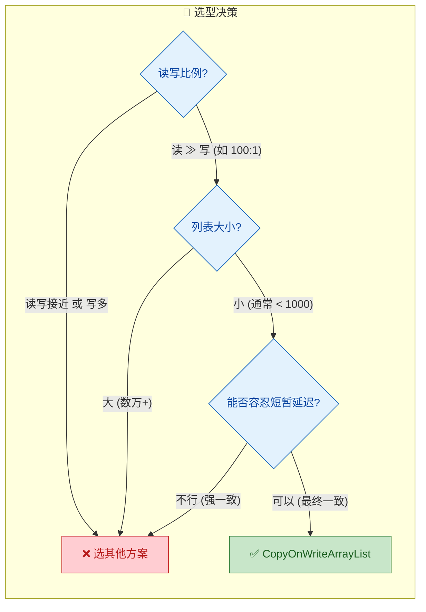

**与其他并发 List 方案的对比：**

| 特性 | `CopyOnWriteArrayList` | `Collections.synchronizedList` | `Vector` |
|------|----------------------|-------------------------------|----------|
| 读操作锁 | ❌ 无锁 | ✅ 全局锁 | ✅ 全局锁 |
| 写操作锁 | ✅ 独占锁 + 数组复制 | ✅ 全局锁 | ✅ 全局锁 |
| 迭代器安全 | ✅ 快照，永不抛异常 | ❌ 需手动加锁 | ❌ fail-fast |
| 读并发度 | 无限 | 1（互斥） | 1（互斥） |
| 适合场景 | 读多写少 | 通用但低效 | 遗留代码 |
| 内存开销 | 高（写时复制） | 低 | 低 |

---

### 缺点（内存占用、数据延迟）

任何设计都有取舍（trade-off）。`CopyOnWriteArrayList` 用空间和写性能换取了极致的读性能，其代价同样明显：

#### 1. 内存占用高（Memory Overhead）

**每次写操作都会产生一个完整的数组副本。** 如果数组有 10,000 个元素，即使只添加 1 个元素，也需要分配一个 10,001 个元素的新数组，并将旧数组的全部内容拷贝过去。

```java
// 假设列表中有 N 个元素
list.add(newElement);
// 内部实际执行:
// 1. 分配 new Object[N + 1]          → 堆内存分配
// 2. System.arraycopy(old, 0, new, 0, N)  → O(N) 的内存拷贝
// 3. new[N] = newElement
// 4. array = new（volatile 写）
// 5. old 数组等待 GC 回收

// 如果连续 add 10 次，就会创建 10 个临时数组！
// 每次大小依次为: N+1, N+2, N+3, ..., N+10
// 总内存拷贝量: N×10 + (1+2+...+10) = 10N + 55 次元素复制
```

这种模式在大数组 + 高频写入的场景下会引发两个严重问题：
- **堆内存压力**：短时间内产生大量临时数组对象，增加 GC 负担（尤其是 Young GC 频率上升）。
- **CPU 缓存失效**：每次写操作都涉及大规模内存拷贝，对 CPU cache line 不友好。

```
内存状态示意（连续3次add操作）:

Heap:
  ┌───────────────────┐
  │ Object[3]: [A,B,C]│ ← 初始数组
  └───────────────────┘
  ┌─────────────────────┐
  │ Object[4]: [A,B,C,D]│ ← 第1次add后，旧数组等待GC
  └─────────────────────┘
  ┌───────────────────────┐
  │ Object[5]: [A,B,C,D,E]│ ← 第2次add后，上一个也等待GC
  └───────────────────────┘
  ┌─────────────────────────┐
  │ Object[6]: [A,B,C,D,E,F]│ ← 第3次add后，当前活跃数组
  └─────────────────────────┘
  
  此时堆中同时存在 3 个"垃圾"数组 + 1 个活跃数组
  如果有读线程的迭代器仍在遍历旧数组，旧数组甚至无法被 GC！
```

**缓解策略：** 如果确实需要批量写入，应使用 `addAll()` 而不是多次 `add()`：

```java
// ❌ 错误做法：10次独立写入 = 10次数组复制
for (String item : newItems) {
    cowList.add(item);               // 每次都复制整个数组！
}

// ✅ 正确做法：1次批量写入 = 1次数组复制
cowList.addAll(newItems);            // 只复制一次，高效得多
```

#### 2. 数据延迟（Stale Read / Eventual Consistency）

由于读操作基于快照，读线程可能会看到 **过时的数据（stale data）**。这不是 bug，而是 COW 的设计特性——它提供的是 **最终一致性（Eventual Consistency）**，而非强一致性。

```java
public class StaleReadDemo {
    private static final CopyOnWriteArrayList<String> list
            = new CopyOnWriteArrayList<>(List.of("v1"));

    public static void main(String[] args) {
        // Reader 线程：获取快照后慢慢处理
        Thread reader = new Thread(() -> {
            Iterator<String> it = list.iterator();  // ① 获取快照 ["v1"]
            sleep(2000);                             // ② 模拟慢处理
            while (it.hasNext()) {
                // ③ 输出 "v1"，即使此时 list 已变成 ["v2"]
                System.out.println("Reader sees: " + it.next());
            }
        });

        // Writer 线程：1秒后修改数据
        Thread writer = new Thread(() -> {
            sleep(1000);                             // 等待1秒
            list.set(0, "v2");                       // 将 "v1" 改为 "v2"
            System.out.println("Writer updated to v2");
        });

        reader.start();
        writer.start();
    }

    // 时间线:
    // T=0s: Reader 获取快照 ["v1"]
    // T=1s: Writer 修改为 ["v2"]
    // T=2s: Reader 遍历快照，依然输出 "v1" ← 过时数据！
}
```

这在某些业务场景中是不可接受的。例如，如果你用 COW 列表存储"当前在线用户列表"，一个用户刚刚下线但其他线程的迭代器仍然"看到"他在线——这可能导致逻辑错误。

#### 3. 不适合的场景总结

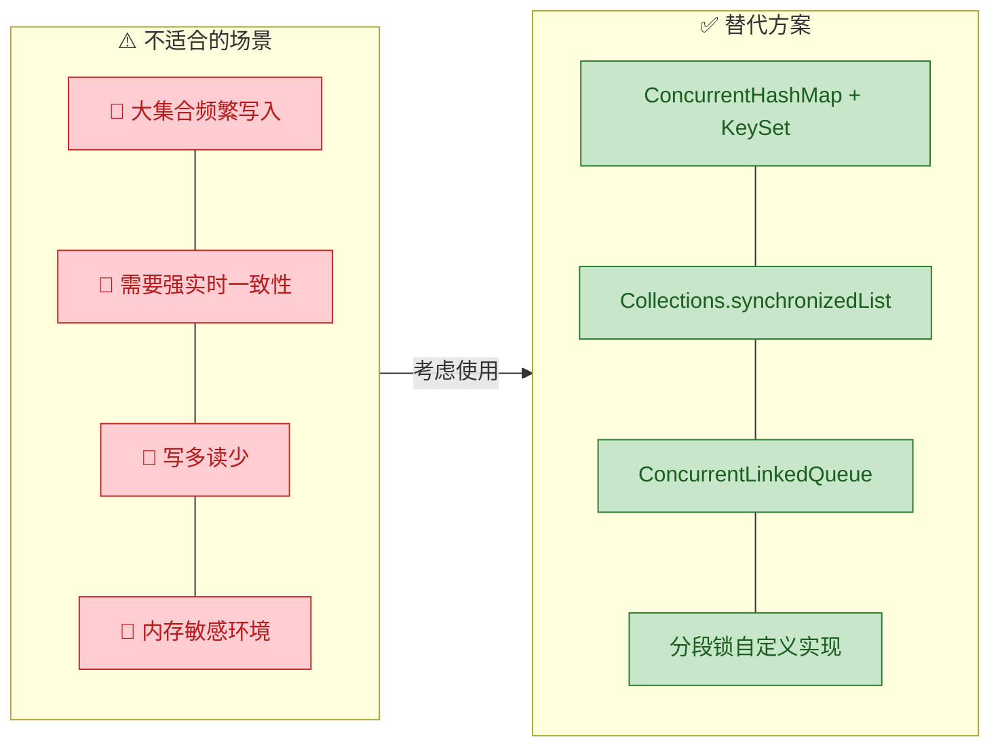

#### 4. 常见误区

最后，总结几个开发中容易踩的坑：

```java
// ❌ 误区1: 以为迭代器能看到最新修改
CopyOnWriteArrayList<String> list = new CopyOnWriteArrayList<>();
list.add("A");
Iterator<String> it = list.iterator();   // 快照: ["A"]
list.add("B");                           // 新数组: ["A", "B"]
it.forEachRemaining(System.out::println); // 只输出 "A"，不会输出 "B"

// ❌ 误区2: 以为迭代器支持 remove()
Iterator<String> it2 = list.iterator();
it2.next();
it2.remove();   // 抛出 UnsupportedOperationException！
                // COW 迭代器是只读快照，不支持修改操作

// ❌ 误区3: 用于高频写场景
// 下面的代码在循环中不断 add，每次都触发数组复制
// 如果 list 有 10000 个元素，每次 add 都要拷贝 10000+个元素
for (int i = 0; i < 100000; i++) {
    list.add("item-" + i);  // 灾难性性能！时间复杂度 O(N²)
}
```

---

**📝 练习题**

某系统维护一个「已注册的插件列表」，启动时注册约 20 个插件后基本不再变动，但运行时每个请求都会遍历该列表调用所有插件的 `process()` 方法（QPS 约 5000）。以下哪种实现方式最合适？

A. `ArrayList` + 方法上加 `synchronized`


B. `CopyOnWriteArrayList`


C. `ConcurrentLinkedQueue`


D. `Vector`


**【答案】** B

**【解析】** 该场景是经典的 **"写少读多"** 模式：启动时写入约 20 个插件后几乎不再修改，但每秒有 5000 次遍历操作。`CopyOnWriteArrayList` 在此场景下表现最优——读操作（遍历）完全无锁，且迭代器基于快照不会抛出 `ConcurrentModificationException`。选项 A 的 `synchronized` 会导致所有读线程互相阻塞，QPS 5000 下锁竞争严重。选项 C 的 `ConcurrentLinkedQueue` 虽然也是并发安全的，但它是队列语义（FIFO），不支持 `List` 接口的按索引访问，且遍历性能不如数组（链表的 cache locality 差）。选项 D 的 `Vector` 和选项 A 类似，每个方法都加 `synchronized`，在高并发读场景下性能极差。因此，**B** 是最合适的选择。

---

## CopyOnWriteArraySet

`CopyOnWriteArraySet` 是 Java 并发包 `java.util.concurrent` 中提供的一个 **线程安全的 Set 实现**。从名字就能看出，它的底层完全依赖于 `CopyOnWriteArrayList`——准确地说，它只是在 `CopyOnWriteArrayList` 之上加了一层 **去重逻辑** 的薄薄包装（a thin wrapper that delegates to `CopyOnWriteArrayList`）。理解了 `CopyOnWriteArrayList` 的写时复制机制，再来看 `CopyOnWriteArraySet` 就非常轻松了。但它有一些独特的设计取舍和适用边界，值得深入剖析。

### 底层结构与委托模式

打开 JDK 源码，你会发现 `CopyOnWriteArraySet` 的实现极其精简。它内部持有一个 `CopyOnWriteArrayList` 实例，几乎所有操作都直接 **委托（delegate）** 给这个内部列表。

```java
// JDK 源码简化展示
public class CopyOnWriteArraySet<E> extends AbstractSet<E> implements java.io.Serializable {

    // 唯一的内部字段：一个 CopyOnWriteArrayList
    private final CopyOnWriteArrayList<E> al;

    // 无参构造器：直接创建一个空的 CopyOnWriteArrayList
    public CopyOnWriteArraySet() {
        al = new CopyOnWriteArrayList<E>();
    }

    // 带集合参数的构造器：先创建列表，再利用 addAllAbsent 完成去重
    public CopyOnWriteArraySet(Collection<? extends E> c) {
        if (c.getClass() == CopyOnWriteArraySet.class) {
            // 如果源本身就是 CopyOnWriteArraySet，已经无重复，直接拷贝
            @SuppressWarnings("unchecked")
            CopyOnWriteArraySet<E> cc = (CopyOnWriteArraySet<E>) c;
            al = new CopyOnWriteArrayList<E>(cc.al);
        } else {
            al = new CopyOnWriteArrayList<E>();
            // addAllAbsent：只添加列表中尚不存在的元素（核心去重方法）
            al.addAllAbsent(c);
        }
    }
}
```

这种 **委托模式（Delegation Pattern）** 的好处是代码复用极高，Set 的线程安全保证完全继承自底层的 `CopyOnWriteArrayList`。

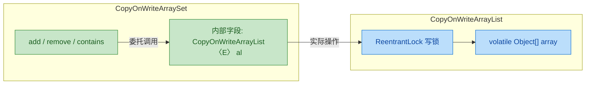

### add 操作与去重原理

`CopyOnWriteArraySet` 保证元素唯一性的核心，在于调用了 `CopyOnWriteArrayList` 提供的 `addIfAbsent` 方法，而不是普通的 `add`。

```java
// CopyOnWriteArraySet.add() 源码
public boolean add(E e) {
    // 如果元素不存在才添加，返回 true 表示添加成功
    // 如果元素已存在，什么都不做，返回 false
    return al.addIfAbsent(e);
}
```

那 `addIfAbsent` 的内部是怎么做的？它需要先 **遍历整个数组** 检查元素是否已存在，然后在不存在时才执行写时复制。

```java
// CopyOnWriteArrayList.addIfAbsent() 源码简化
public boolean addIfAbsent(E e) {
    // 先拿到当前数组的快照（无锁读取，因为 array 是 volatile 的）
    Object[] snapshot = getArray();
    // indexOf：线性扫描整个数组，看 e 是否已存在
    // 如果找到了（>= 0），直接返回 false，不做任何修改
    // 如果没找到（返回 -1），进入加锁的 addIfAbsent 重载版本
    return indexOfRange(e, snapshot, 0, snapshot.length) < 0
        && addIfAbsent(e, snapshot);
}

private boolean addIfAbsent(E e, Object[] snapshot) {
    // 加锁：保证写操作的互斥
    synchronized (lock) {
        // 重新获取当前数组（可能在等锁期间被其他线程修改了）
        Object[] current = getArray();
        int len = current.length;
        // 如果 snapshot 和 current 不是同一个引用，说明数组被改过
        if (snapshot != current) {
            // 需要重新检查：只扫描新增的部分 + 确认旧部分
            int common = Math.min(snapshot.length, len);
            for (int i = 0; i < common; i++) {
                // 如果当前数组中已存在该元素，放弃添加
                if (current[i] != snapshot[i]
                    && Objects.equals(e, current[i])) {
                    return false;
                }
            }
            // 检查 current 中超出 snapshot 长度的新增部分
            if (indexOfRange(e, current, common, len) >= 0) {
                return false;
            }
        }
        // 确认不存在后，执行标准的写时复制
        Object[] newElements = Arrays.copyOf(current, len + 1);
        newElements[len] = e;  // 在末尾放入新元素
        setArray(newElements); // volatile 写，对所有读线程可见
        return true;
    }
}
```

这段代码有一个非常精妙的 **double-check（双重检查）** 设计：

1. **第一次检查（无锁）**：在不加锁的情况下快速判断元素是否已存在。如果已存在，直接返回 `false`，避免了不必要的锁竞争——这是 **快速路径（fast path）**。
2. **第二次检查（加锁后）**：加锁后重新检查，因为在等待锁的过程中，其他线程可能已经修改了数组。这保证了正确性。

### contains 与遍历——O(n) 的代价

`CopyOnWriteArraySet` 底层是数组，不是哈希表。这意味着 `contains` 操作的时间复杂度是 **O(n)**，需要线性扫描。

```java
// CopyOnWriteArraySet.contains() 源码
public boolean contains(Object o) {
    // 直接委托给 CopyOnWriteArrayList 的 contains
    // 内部就是从头到尾遍历数组做 equals 比较
    return al.contains(o);
}

// CopyOnWriteArraySet.size() 源码
public int size() {
    return al.size(); // 直接返回内部数组的长度
}

// CopyOnWriteArraySet.remove() 源码
public boolean remove(Object o) {
    return al.remove(o); // 委托：先找到元素索引，再写时复制删除
}
```

这与 `HashSet`（O(1) 的 `contains`）形成了鲜明对比。我们来做一个直观的对比：

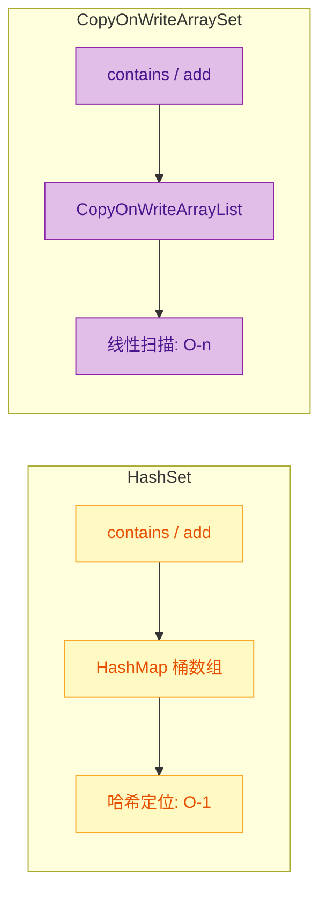

### 迭代器的一致性快照

和 `CopyOnWriteArrayList` 一样，`CopyOnWriteArraySet` 的迭代器也是基于 **快照（snapshot）** 的。当你调用 `iterator()` 时，返回的迭代器引用的是创建那一刻的底层数组副本。在遍历过程中，即使其他线程执行了 `add` 或 `remove`，也不会影响当前迭代器看到的数据，更不会抛出 `ConcurrentModificationException`。

```java
// 演示快照迭代器的行为
CopyOnWriteArraySet<String> set = new CopyOnWriteArraySet<>();
set.add("A");            // 添加元素 A
set.add("B");            // 添加元素 B
set.add("C");            // 添加元素 C

// 获取迭代器——此刻对底层数组拍了一个"快照"
Iterator<String> it = set.iterator();

// 在迭代期间，另一个线程（或当前线程）修改了 set
set.add("D");            // 新增 D
set.remove("A");         // 删除 A

// 迭代器仍然遍历的是快照：A, B, C
while (it.hasNext()) {
    System.out.print(it.next() + " "); // 输出: A B C
}

// 直接遍历 set 看到的是最新数据
System.out.println(set);  // 输出: [B, C, D]
```

**注意**：快照迭代器 **不支持 `remove()` 操作**。调用 `it.remove()` 会直接抛出 `UnsupportedOperationException`，因为修改一个已经过时的快照没有意义。

### 批量操作的原子性

`CopyOnWriteArraySet` 还提供了一些批量操作的便利方法，它们利用了 `CopyOnWriteArrayList` 内部的锁机制来保证原子性：

```java
CopyOnWriteArraySet<Integer> set = new CopyOnWriteArraySet<>();
set.addAll(List.of(1, 2, 3, 4, 5));   // 批量添加，内部调用 addAllAbsent

// removeIf：原子性地移除满足条件的元素（Java 8+）
// 内部会加锁，一次性完成判断与删除
set.removeIf(n -> n % 2 == 0);        // 移除所有偶数
System.out.println(set);               // 输出: [1, 3, 5]

// retainAll：保留交集
set.retainAll(List.of(1, 5, 7));       // 只保留 1 和 5
System.out.println(set);               // 输出: [1, 5]
```

### 与其他 Set 实现的对比

为了帮助你在实际场景中做出正确选择，下面将 `CopyOnWriteArraySet` 与几种常见的 `Set` 实现做全面对比：

| 特性 | `HashSet` | `ConcurrentSkipListSet` | `CopyOnWriteArraySet` | `Collections.synchronizedSet` |
|---|---|---|---|---|
| **线程安全** | ❌ 不安全 | ✅ 安全（CAS） | ✅ 安全（COW） | ✅ 安全（synchronized） |
| **有序性** | 无序 | 自然排序/自定义排序 | 插入顺序 | 取决于底层 Set |
| **contains 复杂度** | O(1) | O(log n) | **O(n)** | O(1)（底层 HashSet） |
| **add 复杂度** | O(1) | O(log n) | **O(n)** | O(1) |
| **迭代一致性** | fail-fast | 弱一致性 | **快照（强一致）** | fail-fast（需手动加锁） |
| **迭代期间可写** | ❌ 抛异常 | ✅ | ✅ | ❌（需外部同步） |
| **最佳数据规模** | 任意 | 中大规模 | **小规模（< 几百）** | 任意 |
| **最佳读写比例** | 通用 | 通用 | **读 >> 写** | 通用 |

### 适用场景与最佳实践

`CopyOnWriteArraySet` 的适用窗口很窄但很明确。只要同时满足以下条件，它就是最佳选择：

**理想场景：**

```java
// 场景1：事件监听器注册表
// - 元素数量少（通常几个到几十个监听器）
// - 注册/注销（写）极少发生
// - 事件触发时遍历（读）极其频繁
// - 遍历过程中不希望被干扰
private final CopyOnWriteArraySet<EventListener> listeners = new CopyOnWriteArraySet<>();

public void addListener(EventListener l) {
    listeners.add(l);       // 写操作：低频，加锁+复制
}

public void removeListener(EventListener l) {
    listeners.remove(l);    // 写操作：低频
}

public void fireEvent(Event e) {
    // 读操作：高频，无锁遍历，快照保证不会 ConcurrentModificationException
    for (EventListener l : listeners) {
        l.onEvent(e);       // 安全地遍历每个监听器
    }
}
```

```java
// 场景2：白名单/黑名单
// - IP 地址白名单：几十个条目，很少更新，每个请求都要检查
private final CopyOnWriteArraySet<String> whitelist = new CopyOnWriteArraySet<>();

public boolean isAllowed(String ip) {
    return whitelist.contains(ip);  // 无锁读，但 O(n)，小集合可接受
}

public void allow(String ip) {
    whitelist.add(ip);  // 低频写操作
}
```

**不适用场景：**

```java
// ❌ 反例1：大量元素
// 10 万个元素，每次 add 都要复制 10 万个元素的数组，且 contains 要扫描 10 万次
CopyOnWriteArraySet<String> largeSet = new CopyOnWriteArraySet<>(); // 千万别这么用

// ❌ 反例2：写操作频繁
// 高频写入会导致大量数组复制，GC 压力巨大
for (int i = 0; i < 100000; i++) {
    set.add(UUID.randomUUID().toString()); // 每次都复制整个数组！
}
// 这种场景应该用 ConcurrentHashMap.newKeySet() 或 ConcurrentSkipListSet
```

### 缺点与注意事项

`CopyOnWriteArraySet` 继承了 `CopyOnWriteArrayList` 的所有缺点，并且由于去重检查额外放大了部分问题：

1. **内存占用（Memory Overhead）**：每次写操作都会创建一个新数组。如果 Set 中有 1000 个元素，一次 `add` 就要分配一个 1001 长度的新数组，老数组要等 GC 回收。

2. **写操作性能差**：`add` 的时间复杂度是 O(n)——先 O(n) 扫描判断是否存在，再 O(n) 复制数组。相比之下，`HashSet` 的 `add` 是 O(1)。

3. **数据延迟（Eventual Visibility within Iteration）**：快照迭代器看到的是"过去的数据"。如果业务逻辑要求迭代器必须反映最新状态，`CopyOnWriteArraySet` 不适合。

4. **无法利用哈希加速**：底层是数组而非哈希表，`contains` 的性能随元素数量线性退化。当元素超过几百个时，应该果断切换到 `ConcurrentHashMap.newKeySet()`。

```java
// 如果你需要线程安全的大规模 Set，推荐这样做：
// 方案 A：基于 ConcurrentHashMap（无序，O(1) 查找）
Set<String> concurrentSet = ConcurrentHashMap.newKeySet();

// 方案 B：基于 ConcurrentSkipListMap（有序，O(log n) 查找）
Set<String> sortedConcurrentSet = new ConcurrentSkipListSet<>();
```

### 与 CopyOnWriteArrayList 的关系总结

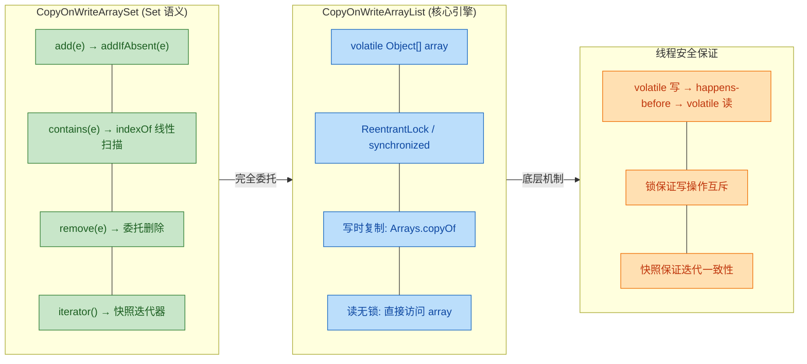

一句话总结：`CopyOnWriteArraySet = CopyOnWriteArrayList + 去重`。它用 **数组遍历** 代替 **哈希定位** 来保证唯一性，代价是 O(n) 的查找与写入性能，换来的是极简的实现和完美的读并发性能。这使得它只适合 **元素极少且读远多于写** 的特定场景。

---

**📝 练习题**

以下关于 `CopyOnWriteArraySet` 的说法，**正确** 的是：

A. `CopyOnWriteArraySet` 内部使用 `HashMap` 来保证元素的唯一性


B. `CopyOnWriteArraySet` 的 `contains` 方法时间复杂度为 O(1)


C. 在遍历 `CopyOnWriteArraySet` 的过程中，其他线程对 Set 的修改会立即反映在当前迭代器中


D. `CopyOnWriteArraySet` 的 `add` 方法通过调用 `CopyOnWriteArrayList.addIfAbsent()` 来实现去重


**【答案】** D

**【解析】** 

- **A 错误**：`CopyOnWriteArraySet` 内部持有的是 `CopyOnWriteArrayList`，而非 `HashMap`。所有操作都委托给这个内部列表。
- **B 错误**：由于底层是数组，`contains` 需要线性扫描整个数组来查找元素，时间复杂度为 **O(n)**，而不是哈希表的 O(1)。
- **C 错误**：`CopyOnWriteArraySet` 的迭代器基于快照（snapshot iterator）。创建迭代器时会引用当时的底层数组，之后其他线程的修改会产生新数组，但迭代器仍然访问旧数组，因此看不到新的修改。
- **D 正确**：`CopyOnWriteArraySet.add(e)` 的实现就是一行 `return al.addIfAbsent(e)`，该方法先检查元素是否已存在（线性扫描），不存在时才加锁执行写时复制添加，从而保证了 Set 的不重复语义。

---

## ConcurrentSkipListMap

`ConcurrentSkipListMap` 是 `java.util.concurrent` 包中一个极其重要但常被忽视的并发容器。它实现了 `ConcurrentNavigableMap` 接口，底层基于 **跳表（Skip List）** 数据结构，提供了一个 **线程安全且有序** 的键值映射。如果你需要一个在并发环境下既能保持元素排序、又能提供高效读写的 Map，`ConcurrentSkipListMap` 几乎是唯一的标准库选择。

从定位上理解它最为直观：`ConcurrentHashMap` 是并发版的 `HashMap`（无序），而 `ConcurrentSkipListMap` 则是并发版的 `TreeMap`（有序）。两者互补，覆盖了并发场景下对 Map 的两大核心需求。

```java
// ConcurrentSkipListMap 的类继承体系
public class ConcurrentSkipListMap<K, V>
    extends AbstractMap<K, V>                // 继承 AbstractMap，获得 Map 基本骨架
    implements ConcurrentNavigableMap<K, V>, // 并发 + 可导航（支持范围查询）
               Cloneable,                    // 支持克隆
               Serializable                  // 支持序列化
{
    // ...
}
```

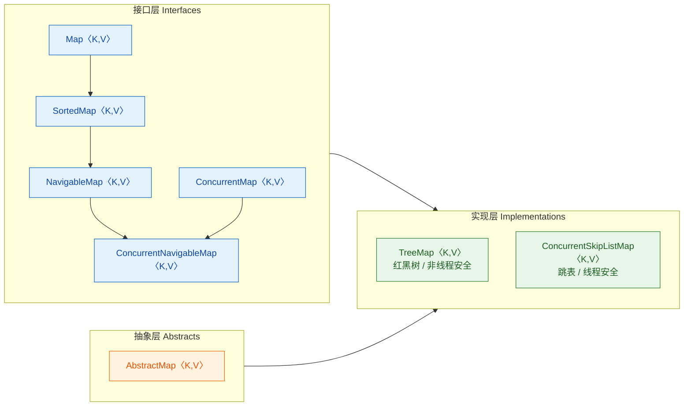

可以看到，`ConcurrentSkipListMap` 同时汇聚了 **有序性**（来自 `NavigableMap` 分支）和 **并发安全性**（来自 `ConcurrentMap` 分支）两条线，这是它最核心的设计价值。

---

### 跳表实现

要理解 `ConcurrentSkipListMap` 的精妙之处，必须先彻底理解 **跳表（Skip List）** 这一数据结构。

#### 为什么不用红黑树？

`TreeMap` 的底层是红黑树（Red-Black Tree），它在单线程场景下表现极其优秀——查找、插入、删除均为 O(log n)。但问题在于：红黑树的旋转操作（rotation）会涉及多个节点的指针修改，在并发环境下要保证这些操作的原子性，要么使用粗粒度的全局锁（性能差），要么实现极其复杂的无锁红黑树算法（实现难度极高，目前工业界几乎没有成熟方案）。

跳表则天然对并发友好。它的插入和删除只涉及 **局部节点的指针修改**，非常适合使用 CAS（Compare-And-Swap）来实现无锁或细粒度锁的并发控制。这就是 Doug Lea 在设计 `java.util.concurrent` 时选择跳表而非红黑树作为有序并发容器底层结构的根本原因。

> *"Skip lists are a simple, practical, and efficient data structure... They are a probabilistic alternative to balanced trees."*  
> — William Pugh, 跳表发明者

#### 跳表的核心思想

跳表本质上是一个 **多层有序链表**。最底层（Level 0）是一个包含所有元素的完整有序链表，每往上一层，元素数量大约减半，形成一种"快速通道"的效果。查找时从最高层开始，逐层下降，利用上层的稀疏索引快速跳过大量不需要检查的元素。

```text
Level 3:  HEAD ---------------------------------------------------------> 50 --------------------------> NIL
              |                                                            |
Level 2:  HEAD ----------------------> 20 --------------------------------> 50 -----------> 70 ----------> NIL
              |                         |                                   |                |
Level 1:  HEAD --------> 10 ---------> 20 -----------> 35 ---------------> 50 -----------> 70 --> 80 ---> NIL
              |           |             |                |                   |                |      |
Level 0:  HEAD --> 5 --> 10 --> 15 --> 20 --> 25 --> 35 --> 40 --> 45 --> 50 --> 60 --> 70 --> 80 --> 90 -> NIL
```

以上是一个典型的四层跳表。当我们要查找元素 `40` 时：

1. **Level 3**：从 HEAD 出发，右邻是 50，50 > 40，**下降**到 Level 2
2. **Level 2**：当前在 HEAD，右邻是 20，20 < 40，**右移**到 20；右邻是 50，50 > 40，**下降**到 Level 1
3. **Level 1**：当前在 20，右邻是 35，35 < 40，**右移**到 35；右邻是 50，50 > 40，**下降**到 Level 0
4. **Level 0**：当前在 35，右邻是 40，40 == 40，**命中！**

整个过程只比较了约 5 次，而如果在纯链表上线性搜索，需要比较 8 次。当数据量达到百万级时，这种差异会非常显著。

#### 跳表的时间复杂度

跳表的层数是概率性的——每个节点在插入时，以概率 p（通常 p = 0.5 或 p = 0.25）决定是否"晋升"到上一层。这种随机化策略使得跳表在期望意义上拥有 **O(log n)** 的查找、插入和删除时间复杂度，与平衡二叉搜索树相当。

| 操作 | 平均时间复杂度 | 最坏时间复杂度 |
|------|---------------|---------------|
| 查找 `get()` | O(log n) | O(n)（极端退化，概率极低） |
| 插入 `put()` | O(log n) | O(n) |
| 删除 `remove()` | O(log n) | O(n) |
| 空间复杂度 | O(n) | O(n log n) |

#### ConcurrentSkipListMap 中的节点结构

在 JDK 源码中，`ConcurrentSkipListMap` 内部维护三种核心节点类型：

```java
// ===== 1. 数据节点 Node：最底层链表的节点 =====
static final class Node<K, V> {
    final K key;                    // 键，不可变
    V val;                          // 值，通过 CAS 更新
    Node<K, V> next;                // 指向同层下一个节点的引用
}

// ===== 2. 索引节点 Index：上层索引链表的节点 =====
static final class Index<K, V> {
    final Node<K, V> node;          // 持有对底层数据节点的引用
    final Index<K, V> down;         // 向下指针：指向下一层的索引节点
    Index<K, V> right;              // 向右指针：指向同层右侧的索引节点
}

// ===== 3. 头索引节点 HeadIndex：每一层的入口 =====
static final class HeadIndex<K, V> extends Index<K, V> {
    final int level;                // 当前索引层的层级编号
}
```

用一个更直观的视角来看这三种节点之间的关系：

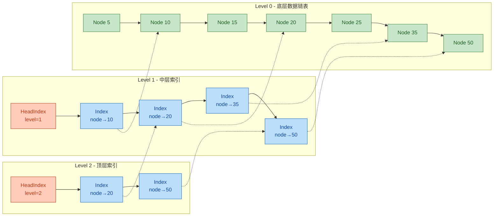

- **实线箭头**（`-->`）：表示 `right`（同层右移）或 `next`（链表后继）
- **虚线箭头**（`-.->`）：表示 `down`（向下层的指针）或 `node` 引用

每个 `Index` 节点本身并不存储数据，它只是一个"路标"，通过 `node` 字段引用底层真正的 `Node` 数据。这种分离设计意味着——数据只存一份（在 Level 0），上层索引只是提供快速跳跃的路径。

#### 插入时的随机层数生成

跳表的精髓在于通过 **随机化（randomization）** 来维持平衡，避免了红黑树那样复杂的旋转操作。`ConcurrentSkipListMap` 使用如下逻辑决定新插入节点的层数：

```java
/**
 * 为新插入的节点随机生成层级
 * 使用 ThreadLocalRandom 生成随机数，以位运算判断层级
 */
private int randomLevel() {
    int level = 1;                                   // 至少在 Level 0（底层链表）
    int rnd = ThreadLocalRandom.current().nextInt();  // 获取一个随机整数
    // 当最低位连续为 0 时，层级递增（概率约 1/2 晋升）
    while (((rnd >>>= 1) & 1) != 0) {                // 右移一位，检查最低位
        ++level;                                      // 层级 +1
    }
    return level;                                     // 返回最终层级
}
```

这段代码的核心逻辑是：每次右移一位，如果最低位是 1 就继续升层。因为每一位是 1 的概率为 50%，所以：
- 停在 Level 1 的概率 ≈ 50%
- 到达 Level 2 的概率 ≈ 25%
- 到达 Level 3 的概率 ≈ 12.5%
- 到达 Level k 的概率 ≈ (1/2)^k

这就保证了越高层的节点越稀疏，自然形成了金字塔式的索引结构。

---

### 有序

`ConcurrentSkipListMap` 的"有序"体现在：它始终按照 Key 的 **自然排序（natural ordering）** 或者构造时指定的 **Comparator** 来维护元素的顺序。这意味着你遍历它时，得到的键值对是 **有序** 的。

#### 排序方式

```java
// ===== 方式一：Key 实现 Comparable 接口，使用自然排序 =====
ConcurrentSkipListMap<Integer, String> map1 = 
    new ConcurrentSkipListMap<>();                    // Integer 天然实现了 Comparable
map1.put(30, "Thirty");                               // 插入 key=30
map1.put(10, "Ten");                                  // 插入 key=10
map1.put(20, "Twenty");                               // 插入 key=20
System.out.println(map1);                             // 输出: {10=Ten, 20=Twenty, 30=Thirty}
                                                      // 按 key 升序排列

// ===== 方式二：通过 Comparator 自定义排序规则 =====
ConcurrentSkipListMap<String, Integer> map2 = 
    new ConcurrentSkipListMap<>(                      // 构造函数传入 Comparator
        Comparator.comparingInt(String::length)       // 按字符串长度排序
            .thenComparing(Comparator.naturalOrder())  // 长度相同按字典序
    );
map2.put("Java", 1);                                  // 长度 4
map2.put("Go", 2);                                    // 长度 2
map2.put("C", 3);                                     // 长度 1
map2.put("Rust", 4);                                  // 长度 4
System.out.println(map2);                             // 输出: {C=3, Go=2, Java=1, Rust=4}
```

#### NavigableMap 丰富的导航方法

有序性赋予了 `ConcurrentSkipListMap` 一系列强大的 **导航方法（Navigation Methods）**，这些都是无序 Map（如 `ConcurrentHashMap`）无法提供的：

```java
ConcurrentSkipListMap<Integer, String> map = new ConcurrentSkipListMap<>();
map.put(10, "A");                                     // 构造测试数据
map.put(20, "B");
map.put(30, "C");
map.put(40, "D");
map.put(50, "E");

// ===== 边界查询 =====
map.firstKey();                                       // 10  → 最小 key
map.lastKey();                                        // 50  → 最大 key
map.firstEntry();                                     // 10=A → 最小键值对
map.lastEntry();                                      // 50=E → 最大键值对

// ===== 近邻查询 =====
map.lowerKey(30);                                     // 20  → 严格小于 30 的最大 key
map.floorKey(30);                                     // 30  → 小于或等于 30 的最大 key
map.ceilingKey(25);                                   // 30  → 大于或等于 25 的最小 key
map.higherKey(30);                                    // 40  → 严格大于 30 的最小 key

// ===== 范围视图（极其实用！）=====
map.headMap(30);                                      // {10=A, 20=B}       → key < 30
map.headMap(30, true);                                // {10=A, 20=B, 30=C} → key <= 30
map.tailMap(30);                                      // {30=C, 40=D, 50=E} → key >= 30
map.subMap(20, true, 40, false);                      // {20=B, 30=C}       → 20 <= key < 40

// ===== 降序视图 =====
NavigableMap<Integer, String> desc = map.descendingMap(); // {50=E, 40=D, 30=C, 20=B, 10=A}
```

这些导航方法在跳表上的执行效率都是 **O(log n)**，因为跳表本身就是有序结构，定位任意位置都只需沿索引层快速跳跃。

#### 范围视图的实时性

一个关键特性：`headMap()`、`tailMap()`、`subMap()` 返回的不是快照副本，而是 **原 Map 的实时视图（live view）**。对视图的修改会反映到原 Map，反之亦然：

```java
ConcurrentSkipListMap<Integer, String> map = new ConcurrentSkipListMap<>();
map.put(10, "A");
map.put(20, "B");
map.put(30, "C");
map.put(40, "D");

NavigableMap<Integer, String> sub = map.subMap(15, true, 35, true);
// sub 现在是 {20=B, 30=C}

sub.put(25, "X");                                     // 向视图中插入（key=25 在范围内）
System.out.println(map);                              // {10=A, 20=B, 25=X, 30=C, 40=D}
                                                      // 原 Map 也出现了 25=X！

map.put(22, "Y");                                     // 向原 Map 插入（key=22 在子范围内）
System.out.println(sub);                              // {20=B, 22=Y, 25=X, 30=C}
                                                      // 视图也看得到 22=Y！

sub.put(50, "Z");                                     // key=50 超出范围 [15, 35]
// 抛出 IllegalArgumentException: key out of range
```

这在实现"按时间窗口过滤数据"、"分段处理有序数据"等场景中极为好用。

---

### 并发安全

`ConcurrentSkipListMap` 的并发安全性是它区别于 `TreeMap`（和 `Collections.synchronizedSortedMap()` 包装）的核心竞争力。

#### 无锁设计（Lock-Free）

`ConcurrentSkipListMap` **没有使用任何传统的互斥锁**（`synchronized` 或 `ReentrantLock`）。它的线程安全性完全依赖于 **CAS 操作** 和精心设计的 **标记删除（marker-based deletion）** 协议。这是一种经典的 **Lock-Free** 算法设计。

与 `ConcurrentHashMap` 的对比：

| 特性 | ConcurrentHashMap | ConcurrentSkipListMap |
|------|------------------|-----------------------|
| 底层结构 | 数组 + 链表/红黑树 | 跳表（多层链表） |
| 有序性 | ❌ 无序 | ✅ 有序 |
| 锁策略 | 分段锁 / synchronized (JDK8+) | **完全无锁（CAS）** |
| 查找复杂度 | O(1) 均摊 | O(log n) |
| 范围查询 | ❌ 不支持 | ✅ O(log n) 定位 + O(k) 遍历 |
| 弱一致性迭代器 | ✅ | ✅ |
| null key / value | ❌ 不允许 | ❌ 不允许 |

#### CAS 在关键操作中的应用

以 **插入操作** 为例，简化后的核心逻辑如下：

```java
/**
 * 简化版 put 流程伪代码（真实源码更复杂）
 * 展示 CAS 如何保证无锁插入的线程安全
 */
V doPut(K key, V value) {
    for (;;) {                                        // 外层无限重试循环（CAS 典型模式）
        // Step 1: 在底层链表中找到插入位置
        Node<K,V> b = findPredecessor(key);           // 找到 key 的前驱节点 b
        Node<K,V> n = b.next;                         // b 的后继节点 n

        // Step 2: 在链表中遍历，找到精确的插入位置
        for (;;) {                                    // 内层循环：沿链表向右扫描
            if (n != null) {
                int cmp = compare(key, n.key);        // 比较 key 与当前节点
                if (cmp > 0) {                        // key 更大，继续右移
                    b = n;                            // 前驱变为当前节点
                    n = n.next;                       // 后继变为下一个
                    continue;                         // 继续内层循环
                }
                if (cmp == 0) {                       // key 已存在
                    // CAS 更新值：期望旧值，设为新值
                    if (n.casValue(n.val, value))     // 原子替换 value
                        return n.val;                 // CAS 成功，返回旧值
                    break;                            // CAS 失败，外层重试
                }
            }
            // Step 3: 找到位置 (b, n) 之间，创建新节点
            Node<K,V> z = new Node<>(key, value, n);  // 新节点的 next 指向 n
            // CAS 将 b.next 从 n 改为 z
            if (!b.casNext(n, z))                     // 原子修改前驱的 next 指针
                break;                                // CAS 失败，外层重试（有人抢先插入了）
            
            // Step 4: 随机决定是否建立索引层
            int rnd = ThreadLocalRandom.current().nextInt();
            if ((rnd & 0x80000001) == 0) {            // 大约 50% 概率
                int level = 1;
                while (((rnd >>>= 1) & 1) != 0)      // 每一位为 1 就升一层
                    ++level;
                addIndex(key, z, level);              // 为新节点建立索引
            }
            return null;                              // 插入成功，返回 null（无旧值）
        }
    }
}
```

整个插入过程 **没有任何锁**，如果 CAS 失败（说明有其他线程同时在修改），就回到外层循环重新定位后再试。这就是典型的 **乐观并发（Optimistic Concurrency）** 策略。

#### 标记删除协议

删除操作更加精妙。直接用 CAS 删除链表节点会导致 ABA 问题和指针丢失。`ConcurrentSkipListMap` 采用 **三步删除法**：

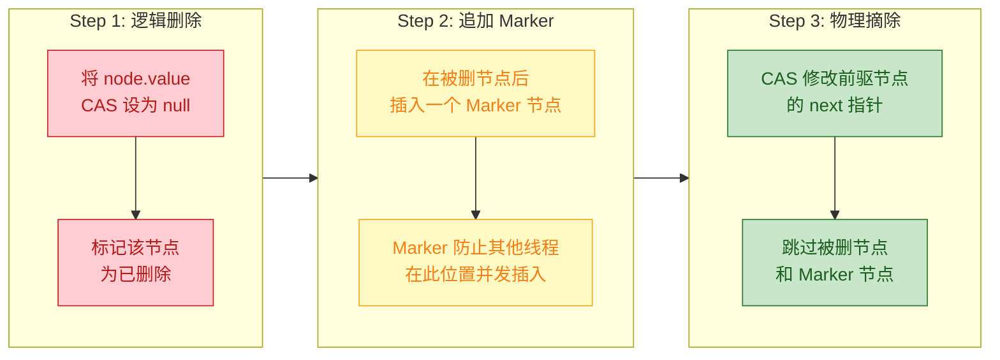

用一个具体示例来说明。假设要删除节点 `20`，链表状态为 `10 → 20 → 30`：

```text
原始状态:        10 ---next---> 20 ---next---> 30

Step 1 逻辑删除:  10 ---next---> 20(val=null) ---next---> 30
                               ↑ 值被 CAS 为 null，但节点仍在链表中

Step 2 追加标记:  10 ---next---> 20(val=null) ---next---> [MARKER] ---next---> 30
                               ↑ Marker 是一个特殊节点，阻止在 20 之后插入

Step 3 物理摘除:  10 ---next--------------------------------------------> 30
                  ↑ CAS 把 10.next 从 20 直接改为 30
                    20 和 MARKER 变为垃圾，等待 GC 回收
```

Marker 节点的作用是 **防止并发插入**：如果线程 A 正在删除 20，而线程 B 试图在 20 和 30 之间插入 25，Marker 的存在会让线程 B 的 CAS 失败（因为 20.next 已经不是 30 而是 Marker），从而强制线程 B 重试，避免了丢失新插入节点的风险。

#### 弱一致性迭代器

与 `ConcurrentHashMap` 一样，`ConcurrentSkipListMap` 的迭代器是 **弱一致性的（weakly consistent）**：

```java
ConcurrentSkipListMap<Integer, String> map = new ConcurrentSkipListMap<>();
map.put(1, "A");
map.put(2, "B");
map.put(3, "C");

// 迭代过程中可以安全地修改 map，不会抛 ConcurrentModificationException
for (Map.Entry<Integer, String> entry : map.entrySet()) {
    System.out.println(entry);                        // 遍历当前快照视图
    if (entry.getKey() == 2) {
        map.put(4, "D");                              // 并发插入新元素
        map.remove(3);                                // 并发删除已有元素
    }
    // 新插入的 4="D" 可能出现也可能不出现在本次遍历中
    // 已删除的 3="C" 可能仍被遍历到，也可能不会
}
```

弱一致性意味着：
- **不会抛出** `ConcurrentModificationException`
- **保证不重复**：已遍历过的元素不会再次返回
- **不保证实时性**：遍历过程中的修改可能可见，也可能不可见

#### 完整的原子复合操作

作为 `ConcurrentMap` 的实现，`ConcurrentSkipListMap` 支持所有原子复合操作：

```java
ConcurrentSkipListMap<String, Integer> map = new ConcurrentSkipListMap<>();

// putIfAbsent：仅当 key 不存在时插入，原子操作
map.putIfAbsent("counter", 0);                        // 原子性地"检查并插入"

// computeIfAbsent：key 不存在时通过函数计算新值，原子操作
map.computeIfAbsent("score", k -> {                   // k = "score"
    return expensiveComputation();                    // 仅在 key 不存在时执行
});

// merge：原子性地合并旧值和新值
map.merge("counter", 1, Integer::sum);                // counter 不存在 → 设为 1
map.merge("counter", 1, Integer::sum);                // counter 存在(=1) → 1+1=2
map.merge("counter", 1, Integer::sum);                // counter 存在(=2) → 2+1=3

// replace：原子性地替换
map.replace("counter", 3, 100);                       // 仅当 value==3 时替换为 100

// compute：无论 key 是否存在，都进行计算
map.compute("counter", (k, v) -> {                    // v = 当前值（可能为 null）
    return (v == null) ? 1 : v + 1;                   // 原子性地递增
});
```

#### 实际使用场景

`ConcurrentSkipListMap` 的"并发 + 有序"组合使它在以下场景中不可替代：

```java
// ===== 场景一：并发环境下的排行榜/积分榜 =====
// key = 分数（倒序），value = 用户ID
ConcurrentSkipListMap<Integer, Set<String>> leaderboard = 
    new ConcurrentSkipListMap<>(Comparator.reverseOrder()); // 降序排列

// 多线程并发更新积分
leaderboard.computeIfAbsent(950, k -> ConcurrentHashMap.newKeySet())
    .add("user_001");                                 // 原子性地添加用户到对应分数段

// O(log n) 快速获取 Top 10
leaderboard.entrySet().stream()
    .limit(10)                                        // 取前 10 名（已经是降序）
    .forEach(System.out::println);


// ===== 场景二：按时间戳排序的事件队列 =====
ConcurrentSkipListMap<Long, Event> eventTimeline = new ConcurrentSkipListMap<>();

// 多线程并发写入事件
eventTimeline.put(System.nanoTime(), new Event("login"));

// 高效查询某个时间范围内的事件
long oneHourAgo = System.currentTimeMillis() - 3600_000;
NavigableMap<Long, Event> recentEvents = 
    eventTimeline.tailMap(oneHourAgo);                // O(log n) 定位起点


// ===== 场景三：缓存中的 TTL 过期管理 =====
ConcurrentSkipListMap<Long, String> expiryIndex = new ConcurrentSkipListMap<>();
// key = 过期时间戳，value = 缓存 key

// 清理过期条目——只需取出 headMap 即可
long now = System.currentTimeMillis();
NavigableMap<Long, String> expired = expiryIndex.headMap(now); // 所有已过期的
expired.forEach((ts, cacheKey) -> {                   // 遍历并清理
    cache.remove(cacheKey);                           // 从主缓存中移除
});
expired.clear();                                      // 从过期索引中批量删除
```

#### ConcurrentSkipListMap 的注意事项

1. **不允许 null key 和 null value**——与 `ConcurrentHashMap` 一致，null 在并发环境中有歧义（无法区分"key 不存在"和"value 是 null"）。

2. **`size()` 不是常量时间**——需要遍历整个底层链表来计数，时间复杂度为 O(n)。在并发场景下，返回的也只是一个近似值。如果频繁需要精确的大小，这不是一个好选择。

3. **批量操作不是原子的**——`putAll()`、`clear()` 等批量操作不具备原子性，它们内部是逐个元素进行的。

4. **内存开销较大**——每个元素除了数据节点外，还可能有多层索引节点，空间开销约为普通链表的 1.33 倍（当 p=0.5 时）。

---

**📝 练习题**

以下关于 `ConcurrentSkipListMap` 的说法，**错误** 的是：

A. 它的底层数据结构是跳表（Skip List），查找的平均时间复杂度为 O(log n)


B. 它使用 CAS 操作实现无锁并发控制，不依赖 `synchronized` 或 `ReentrantLock`


C. 调用 `size()` 方法的时间复杂度为 O(1)，因为内部维护了一个原子计数器


D. 它的迭代器是弱一致性的，遍历期间不会抛出 `ConcurrentModificationException`


**【答案】** C

**【解析】** `ConcurrentSkipListMap` 的 `size()` 方法 **并非 O(1)**。由于跳表的并发特性和无锁设计，维护一个精确的原子计数器会成为严重的并发瓶颈（每次插入/删除都需要 CAS 更新计数器，形成 hot spot）。因此 `size()` 的实现是 **遍历底层链表逐个计数**，时间复杂度为 **O(n)**，且在并发修改情况下返回的只是一个近似值。如果返回值超过 `Integer.MAX_VALUE`，则返回 `Integer.MAX_VALUE`。选项 A 正确：跳表的多层索引结构确保了平均 O(log n) 的查找效率。选项 B 正确：`ConcurrentSkipListMap` 是经典的 lock-free 数据结构，完全依赖 CAS 实现并发安全。选项 D 正确：与 `ConcurrentHashMap` 一样，它提供弱一致性（weakly consistent）迭代器，保证安全遍历但不保证实时一致性。

---

## ConcurrentSkipListSet

`ConcurrentSkipListSet` 是 Java 并发包 `java.util.concurrent` 中提供的一个 **线程安全的有序集合（Sorted Set）**。如果说 `ConcurrentSkipListMap` 是并发世界里 `TreeMap` 的替代品，那么 `ConcurrentSkipListSet` 就是并发世界里 `TreeSet` 的替代品——事实上，它的内部实现就是直接委托（delegate）给一个 `ConcurrentSkipListMap` 实例来完成所有工作的，这与 `TreeSet` 内部包装 `TreeMap` 的设计思路如出一辙。

理解 `ConcurrentSkipListSet` 的关键在于：**它本质上不是一个独立的数据结构实现，而是对 `ConcurrentSkipListMap` 的一层薄薄的包装**。集合中的每个元素作为内部 Map 的 key 存在，而 value 统一使用一个 `Boolean.TRUE` 占位常量。这种 "Set = Map + Dummy Value" 的经典模式在 JDK 中被广泛使用（`HashSet` 包装 `HashMap`、`TreeSet` 包装 `TreeMap`），`ConcurrentSkipListSet` 只是将同样的思路延伸到了并发领域。

### 内部结构与委托模式

打开 `ConcurrentSkipListSet` 的源码，你会发现它极其简洁。核心字段只有一个：

```java
// ConcurrentSkipListSet 的核心源码结构
public class ConcurrentSkipListSet<E>
        extends AbstractSet<E>                  // 继承 AbstractSet，获得集合通用方法
        implements NavigableSet<E>,             // 实现 NavigableSet，支持导航操作
                   Cloneable,                   // 支持克隆
                   java.io.Serializable {       // 支持序列化

    // 唯一的核心字段：内部委托的 ConcurrentSkipListMap
    // 集合元素作为 Map 的 key，value 全部填充 Boolean.TRUE
    private final ConcurrentNavigableMap<E, Object> m;

    // 构造方法：创建一个新的 ConcurrentSkipListMap 作为后端存储
    public ConcurrentSkipListSet() {
        m = new ConcurrentSkipListMap<E, Object>();  // 使用自然排序
    }

    // 带比较器的构造方法
    public ConcurrentSkipListSet(Comparator<? super E> comparator) {
        m = new ConcurrentSkipListMap<E, Object>(comparator);  // 使用自定义排序
    }

    // 从已有集合构造
    public ConcurrentSkipListSet(Collection<? extends E> c) {
        m = new ConcurrentSkipListMap<E, Object>();  // 先创建空 Map
        addAll(c);                                    // 再逐个添加元素
    }

    // 从已有 SortedSet 构造，保留其比较器
    public ConcurrentSkipListSet(SortedSet<E> s) {
        m = new ConcurrentSkipListMap<E, Object>(s.comparator());  // 复用比较器
        addAll(s);                                                  // 逐个添加
    }

    // 内部使用的私有构造方法，直接接收一个 Map 实例
    // 用于 subSet/headSet/tailSet 等子视图操作
    ConcurrentSkipListSet(ConcurrentNavigableMap<E, Object> m) {
        this.m = m;  // 直接引用传入的子 Map
    }
}
```

所有集合操作都是一行式的委托调用：

```java
// ===== 基本操作：全部委托给内部 Map =====

// 添加元素：将 element 作为 key，Boolean.TRUE 作为 value 放入 Map
// 如果 key 已存在，putIfAbsent 返回旧值（非 null），说明元素已在集合中
public boolean add(E e) {
    return m.putIfAbsent(e, Boolean.TRUE) == null;  // null 表示新增成功
}

// 删除元素：从 Map 中移除该 key
// remove 返回非 null 说明确实删除了一个元素
public boolean remove(Object o) {
    return m.remove(o, Boolean.TRUE);  // 精确匹配 key-value 对进行删除
}

// 判断是否包含：检查 Map 中是否存在该 key
public boolean contains(Object o) {
    return m.containsKey(o);  // 跳表查找，O(log n) 时间复杂度
}

// 获取集合大小
public int size() {
    return m.size();  // 注意：跳表的 size() 需要遍历，不是 O(1)
}

// 判断是否为空
public boolean isEmpty() {
    return m.isEmpty();  // 检查跳表是否有节点
}

// 清空集合
public void clear() {
    m.clear();  // 清空底层 Map
}

// 获取迭代器：迭代 Map 的 keySet
public Iterator<E> iterator() {
    return m.navigableKeySet().iterator();  // 按排序顺序迭代
}

// 获取逆序迭代器
public Iterator<E> descendingIterator() {
    return m.descendingKeySet().iterator();  // 按逆序迭代
}
```

这段源码清楚地表明，`ConcurrentSkipListSet` 没有任何自己的并发控制逻辑——它 **完全依赖** `ConcurrentSkipListMap` 提供的无锁 CAS 并发保证。

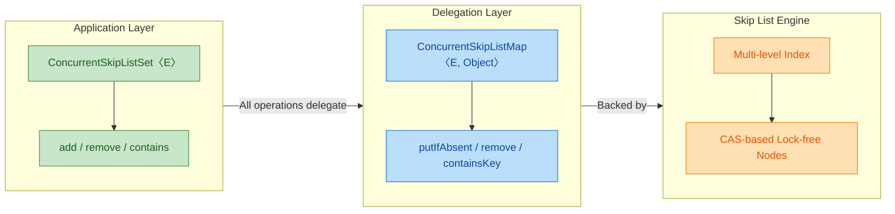

### NavigableSet 导航操作

`ConcurrentSkipListSet` 实现了 `NavigableSet` 接口，这意味着它不仅是一个普通的 `Set`，更是一个功能丰富的 **可导航有序集合**。这些导航方法是它相比 `ConcurrentHashMap.newKeySet()` 等无序并发集合的核心优势。

```java
// ===== NavigableSet 导航方法演示 =====
import java.util.concurrent.ConcurrentSkipListSet;

public class NavigableSetDemo {
    public static void main(String[] args) {
        // 创建并发跳表集合，元素自动按自然顺序排列
        ConcurrentSkipListSet<Integer> set = new ConcurrentSkipListSet<>();

        // 批量添加一些分散的数值
        set.add(10);   // 添加 10
        set.add(30);   // 添加 30
        set.add(50);   // 添加 50
        set.add(70);   // 添加 70
        set.add(90);   // 添加 90

        // --- 最值操作 ---
        System.out.println(set.first());    // 10 —— 最小元素
        System.out.println(set.last());     // 90 —— 最大元素

        // --- 近似查找（Closest Match）---
        // lower(e)：严格小于 e 的最大元素（strictly less than）
        System.out.println(set.lower(50));  // 30 —— 小于 50 的最大值

        // floor(e)：小于等于 e 的最大元素（less than or equal）
        System.out.println(set.floor(50));  // 50 —— 50 本身存在，返回它

        // higher(e)：严格大于 e 的最小元素（strictly greater than）
        System.out.println(set.higher(50)); // 70 —— 大于 50 的最小值

        // ceiling(e)：大于等于 e 的最小元素（greater than or equal）
        System.out.println(set.ceiling(40));// 50 —— 40 不存在，返回 >= 40 的最小值

        // --- 弹出操作（Retrieve and Remove）---
        // pollFirst()：移除并返回最小元素（原子操作，线程安全）
        System.out.println(set.pollFirst()); // 10 —— 弹出最小值

        // pollLast()：移除并返回最大元素（原子操作，线程安全）
        System.out.println(set.pollLast());  // 90 —— 弹出最大值

        // 此时集合剩余 [30, 50, 70]
        System.out.println(set);             // [30, 50, 70]

        // --- 范围视图（Range Views）---
        // subSet(fromInclusive, toExclusive)：左闭右开子集
        System.out.println(set.subSet(30, 70));         // [30, 50]

        // subSet 的完整版本，可分别控制两端包含性
        System.out.println(set.subSet(30, true, 70, true)); // [30, 50, 70]

        // headSet(toElement)：小于 toElement 的所有元素
        System.out.println(set.headSet(50));             // [30]

        // tailSet(fromElement)：大于等于 fromElement 的所有元素
        System.out.println(set.tailSet(50));             // [50, 70]

        // --- 逆序视图 ---
        // descendingSet()：返回逆序视图（不会复制数据，是实时视图）
        System.out.println(set.descendingSet());         // [70, 50, 30]
    }
}
```

这四个近似查找方法（`lower`、`floor`、`higher`、`ceiling`）在很多业务场景下极其有用，下表总结了它们的精确语义：

```
┌──────────────┬──────────────────┬──────────────────────────┐
│    方法       │     语义         │   集合 {10,30,50,70,90}  │
│              │                  │   查询值 = 50            │
├──────────────┼──────────────────┼──────────────────────────┤
│ lower(50)    │ 严格 < 50 的最大  │   30                     │
│ floor(50)    │    <= 50 的最大   │   50                     │
│ higher(50)   │ 严格 > 50 的最小  │   70                     │
│ ceiling(50)  │    >= 50 的最小   │   50                     │
├──────────────┼──────────────────┼──────────────────────────┤
│              │   查询值 = 40    │                          │
├──────────────┼──────────────────┼──────────────────────────┤
│ lower(40)    │ 严格 < 40 的最大  │   30                     │
│ floor(40)    │    <= 40 的最大   │   30                     │
│ higher(40)   │ 严格 > 40 的最小  │   50                     │
│ ceiling(40)  │    >= 40 的最小   │   50                     │
└──────────────┴──────────────────┴──────────────────────────┘
```

### 与 TreeSet 的对比：为什么不能用 Collections.synchronizedSet

初学者常有一个疑问：既然 `TreeSet` 已经实现了 `NavigableSet`，我为什么不直接用 `Collections.synchronizedSortedSet(new TreeSet<>())` 来得到一个线程安全版本？

答案涉及到 **锁粒度** 和 **复合操作原子性** 两个层面的根本性差异。

```java
// ===== synchronizedSortedSet 的问题演示 =====
import java.util.*;

public class SynchronizedSetProblem {
    public static void main(String[] args) {
        // 方案一：synchronized 包装
        SortedSet<Integer> syncSet = Collections.synchronizedSortedSet(new TreeSet<>());

        // 问题一：全局互斥锁，吞吐量低
        // synchronizedSortedSet 内部使用一个 mutex 对象
        // 所有读写操作都要获取同一把锁 —— 读也互斥
        syncSet.add(1);      // 加锁 → 写入 → 解锁
        syncSet.contains(1); // 加锁 → 读取 → 解锁（读也被阻塞！）

        // 问题二：复合操作不是原子的
        // "先检查再执行" 的竞态条件
        // 即使每个方法单独是线程安全的，组合起来就不安全了
        // if (!syncSet.contains(5)) {     // 线程A 检查：5 不存在
        //     // <-- 此处线程B 可能插入 5
        //     syncSet.add(5);              // 线程A 添加：可能重复添加
        // }
        // 要解决只能手动 synchronized(syncSet) { ... }

        // 问题三：迭代必须手动加锁
        // synchronized (syncSet) {        // 必须手动同步！
        //     for (Integer i : syncSet) {  // 否则可能 ConcurrentModificationException
        //         System.out.println(i);
        //     }
        // }
    }
}
```

而 `ConcurrentSkipListSet` 从底层数据结构层面解决了所有这些问题：

```java
// ===== ConcurrentSkipListSet 的优势 =====
import java.util.concurrent.ConcurrentSkipListSet;

public class ConcurrentSetAdvantage {
    public static void main(String[] args) {
        ConcurrentSkipListSet<Integer> skipSet = new ConcurrentSkipListSet<>();

        // 优势一：无锁读取，CAS 写入，高吞吐
        skipSet.add(1);      // CAS 无锁写入
        skipSet.contains(1); // 无锁读取，与写操作不互斥

        // 优势二：原子性复合操作
        // add 本身就是 putIfAbsent 语义 —— 天然的 check-then-act 原子操作
        boolean added = skipSet.add(5);  // 原子地完成 "不存在则添加"
        // 不需要任何外部同步！

        // 优势三：弱一致性迭代器，无需加锁
        for (Integer i : skipSet) {         // 直接迭代，不会抛异常
            System.out.println(i);          // 迭代期间其他线程可以修改集合
        }                                   // 迭代器反映创建时或之后的某个快照
    }
}
```

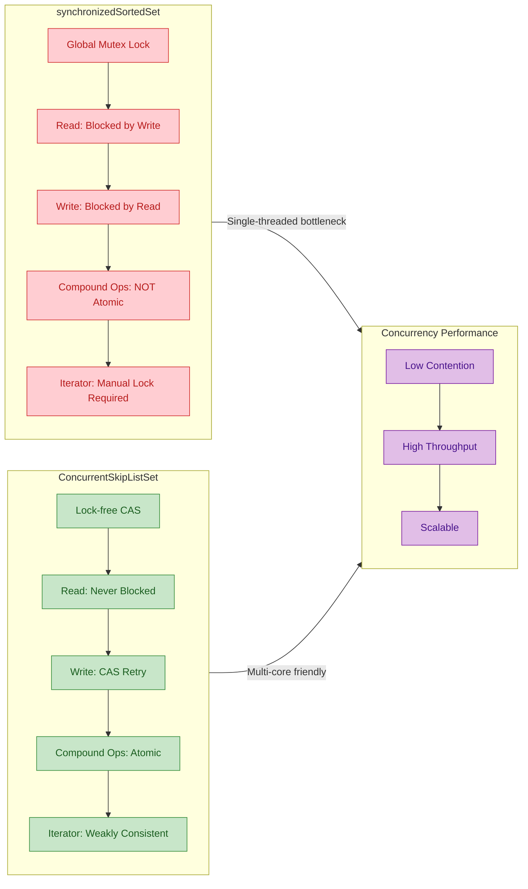

### 实际应用场景

`ConcurrentSkipListSet` 最适合在 **需要并发访问的有序去重集合** 场景下使用。以下是几个典型的实际应用：

**场景一：实时排行榜 / 有序事件流**

```java
// ===== 实时排行榜：并发写入，随时获取 Top-N =====
import java.util.concurrent.ConcurrentSkipListSet;
import java.util.stream.Collectors;
import java.util.List;

public class Leaderboard {
    // 使用 ConcurrentSkipListSet 存储玩家分数
    // 自定义比较器：按分数降序排列，分数相同按名字升序
    private final ConcurrentSkipListSet<PlayerScore> board =
            new ConcurrentSkipListSet<>((a, b) -> {
                int cmp = Integer.compare(b.score, a.score);  // 分数降序
                if (cmp != 0) return cmp;                      // 分数不同，按分数排
                return a.name.compareTo(b.name);               // 分数相同，按名字升序
            });

    // 玩家分数记录（不可变对象，线程安全）
    record PlayerScore(String name, int score) {}

    // 更新分数：先删除旧记录，再插入新记录（原子性由 CAS 保证）
    public void updateScore(String name, int oldScore, int newScore) {
        board.remove(new PlayerScore(name, oldScore));   // 移除旧分数
        board.add(new PlayerScore(name, newScore));      // 插入新分数
    }

    // 获取前 N 名：利用有序性，只需取前 N 个元素
    public List<PlayerScore> topN(int n) {
        return board.stream()        // 流式处理
                .limit(n)            // 取前 n 个（已经是降序排列）
                .collect(Collectors.toList());  // 收集为列表
    }
}
```

**场景二：并发任务调度中的有序任务队列**

```java
// ===== 按优先级排序的并发任务集合 =====
import java.util.concurrent.ConcurrentSkipListSet;

public class PriorityTaskPool {
    // 任务按优先级排序（priority 越小优先级越高）
    private final ConcurrentSkipListSet<Task> taskPool =
            new ConcurrentSkipListSet<>();

    // Task 实现 Comparable，按 priority 排序
    static class Task implements Comparable<Task> {
        final int priority;        // 优先级
        final String taskId;       // 任务唯一 ID
        final Runnable action;     // 实际任务逻辑

        Task(int priority, String taskId, Runnable action) {
            this.priority = priority;   // 设置优先级
            this.taskId = taskId;       // 设置任务ID
            this.action = action;       // 设置任务逻辑
        }

        @Override
        public int compareTo(Task other) {
            int cmp = Integer.compare(this.priority, other.priority);  // 按优先级升序
            if (cmp != 0) return cmp;
            return this.taskId.compareTo(other.taskId);  // 优先级相同按 ID 排序
        }
    }

    // 提交任务：多线程可同时调用
    public void submit(Task task) {
        taskPool.add(task);             // CAS 无锁添加
    }

    // 获取并执行最高优先级任务
    public void executeHighest() {
        Task highest = taskPool.pollFirst();  // 原子地弹出最小元素（最高优先级）
        if (highest != null) {
            highest.action.run();             // 执行任务
        }
    }
}
```

**场景三：时间窗口内的去重日志收集**

```java
// ===== 在时间窗口内收集去重的有序日志 =====
import java.util.concurrent.ConcurrentSkipListSet;
import java.util.NavigableSet;

public class TimeWindowLogger {
    // 日志按时间戳排序，天然去重
    private final ConcurrentSkipListSet<LogEntry> logs =
            new ConcurrentSkipListSet<>();

    record LogEntry(long timestamp, String message) implements Comparable<LogEntry> {
        @Override
        public int compareTo(LogEntry other) {
            int cmp = Long.compare(this.timestamp, other.timestamp);  // 按时间升序
            if (cmp != 0) return cmp;
            return this.message.compareTo(other.message);  // 同一毫秒按消息排序
        }
    }

    // 多线程并发写入日志
    public void log(String message) {
        logs.add(new LogEntry(System.currentTimeMillis(), message));  // 无锁添加
    }

    // 查询某个时间范围内的日志
    public NavigableSet<LogEntry> query(long from, long to) {
        // subSet 返回的是一个实时视图（live view），不是拷贝
        // 底层仍然操作同一个跳表
        return logs.subSet(
                new LogEntry(from, ""),     // 起始边界（包含）
                true,                        // 包含起始
                new LogEntry(to, "\uffff"),  // 结束边界（\uffff 是最大字符）
                true                         // 包含结束
        );
    }

    // 清理过期日志（比如清理 1 小时前的数据）
    public void evict(long olderThan) {
        // headSet 返回小于指定元素的子集视图
        // clear() 会从原始集合中删除这些元素
        logs.headSet(new LogEntry(olderThan, "")).clear();  // 批量清理
    }
}
```

### 性能特征与注意事项

`ConcurrentSkipListSet` 继承了底层 `ConcurrentSkipListMap` 的所有性能特征：

```
┌─────────────────┬──────────────┬──────────────────────────────────┐
│     操作         │  时间复杂度   │          备注                    │
├─────────────────┼──────────────┼──────────────────────────────────┤
│ add(e)          │ O(log n)     │ CAS 无锁，可能需要多次重试        │
│ remove(o)       │ O(log n)     │ 惰性删除 + CAS 标记              │
│ contains(o)     │ O(log n)     │ 无锁读取，不阻塞任何操作          │
│ first() / last()│ O(log n)     │ 沿跳表索引层快速定位              │
│ lower/floor/... │ O(log n)     │ 导航方法，利用跳表的有序索引       │
│ size()          │ O(n)         │ ⚠️ 需要遍历！不要在热路径中调用    │
│ iterator()      │ O(n) 遍历    │ 弱一致性，不抛 CME              │
│ subSet/headSet  │ O(1) 创建    │ 返回视图，不复制数据              │
└─────────────────┴──────────────┴──────────────────────────────────┘
```

以下是使用中最常见的注意事项：

**1. `size()` 不是 O(1) 操作**

与 `ArrayList` 或 `HashSet` 不同，`ConcurrentSkipListSet.size()` 需要遍历整个跳表来计数。在大数据量场景下，频繁调用 `size()` 会严重影响性能。如果需要精确计数，考虑使用外部的 `AtomicLong` 计数器。

**2. 元素必须可比较**

集合中的元素要么实现 `Comparable` 接口，要么在构造时提供 `Comparator`。如果两者都没有，运行时会抛出 `ClassCastException`。

**3. 排序一致性（Consistency with equals）**

这是一个微妙但重要的问题。`ConcurrentSkipListSet` 使用 `compareTo`（或 `Comparator.compare`）而不是 `equals` 来判断元素是否"相等"。如果 `compareTo` 返回 0 但 `equals` 返回 `false`，元素的行为可能与预期不符：

```java
// ===== 排序一致性问题演示 =====
import java.util.concurrent.ConcurrentSkipListSet;

public class ConsistencyProblem {
    public static void main(String[] args) {
        ConcurrentSkipListSet<String> set = new ConcurrentSkipListSet<>(
                String.CASE_INSENSITIVE_ORDER  // 忽略大小写的比较器
        );

        set.add("Hello");       // 添加 "Hello"
        set.add("HELLO");       // compareTo 返回 0，被认为是"重复"元素

        // 集合中只有一个元素！
        System.out.println(set.size());      // 1
        System.out.println(set);             // [Hello]

        // 但是 "Hello".equals("HELLO") 是 false
        // 这就是 "inconsistent with equals" 的问题
        System.out.println(set.contains("HELLO"));  // true（因为用的是 compareTo）
    }
}
```

**4. 不支持 null 元素**

与 `ConcurrentSkipListMap` 不允许 null key 一致，`ConcurrentSkipListSet` 也不允许添加 `null`，否则会抛出 `NullPointerException`。

### ConcurrentSkipListSet 在并发集合家族中的定位

```mermaid
graph LR
    subgraph Unordered["Unordered Concurrent Sets"]
        direction TB
        U1["ConcurrentHashMap.newKeySet()"]
        U2["CopyOnWriteArraySet"]
        U1 ~~~ U2
    end

    subgraph Ordered["Ordered Concurrent Sets"]
        direction TB
        O1["ConcurrentSkipListSet"]
        O2["NavigableSet + Lock-free"]
        O1 --- O2
    end

    subgraph Decision["Choose By Scenario"]
        direction TB
        D1["Need ordering? -> SkipListSet"]
        D2["Read-heavy + small? -> COWSet"]
        D3["Unordered + large? -> CHM.KeySet"]
        D1 ~~~ D2
        D2 ~~~ D3
    end

    Unordered --> Decision
    Ordered --> Decision

    classDef unorderedStyle fill:#E3F2FD,stroke:#1565C0,color:#0D47A1
    classDef orderedStyle fill:#E8F5E9,stroke:#2E7D32,color:#1B5E20
    classDef decisionStyle fill:#FFF3E0,stroke:#EF6C00,color:#E65100

    class U1,U2 unorderedStyle
    class O1,O2 orderedStyle
    class D1,D2,D3 decisionStyle
```

简单总结选型逻辑：
- **需要有序 + 并发** → `ConcurrentSkipListSet`，唯一选择
- **不需要有序 + 读多写少 + 小数据量** → `CopyOnWriteArraySet`
- **不需要有序 + 大数据量 + 高并发** → `ConcurrentHashMap.newKeySet()`

---

**📝 练习题**

在一个高并发的实时监控系统中，需要维护一个按时间戳排序的告警事件集合，要求支持以下操作：（1）多个监控线程并发写入告警；（2）按时间范围查询告警；（3）定期清理过期告警。下列哪种方案最合适？

A. `Collections.synchronizedSortedSet(new TreeSet<>())`


B. `CopyOnWriteArraySet` + 手动排序


C. `ConcurrentSkipListSet`


D. `ConcurrentHashMap.newKeySet()`


**【答案】** C

**【解析】** 逐一分析四个选项：

- **选项 A**：`synchronizedSortedSet` 虽然有序且线程安全，但使用全局互斥锁，读写互斥。在高并发监控场景下，多个线程频繁写入告警时会产生严重的锁竞争；并且范围查询（`subSet`）期间需要手动对整个集合加锁，否则会出现 `ConcurrentModificationException`，这在实时系统中不可接受。

- **选项 B**：`CopyOnWriteArraySet` 适用于读多写极少的小集合。监控系统中告警频繁产生，每次写入都要复制整个底层数组，性能灾难；同时它是无序的，范围查询需要额外排序，时间复杂度为 O(n log n)。

- **选项 C（正确答案）**：`ConcurrentSkipListSet` 完美匹配所有需求——（1）基于 CAS 的无锁写入，支持高并发；（2）底层跳表天然有序，`subSet(from, to)` 可以高效完成范围查询，时间复杂度 O(log n)；（3）`headSet(expireTime).clear()` 可以原子地批量清理过期数据。弱一致性迭代器保证了查询和清理操作不会互相阻塞。

- **选项 D**：`ConcurrentHashMap.newKeySet()` 高并发性能优秀，但它是无序的，无法支持按时间范围查询，也无法高效获取最早/最晚的告警记录。不满足题目的核心需求。

---

## 本章小结

本章系统性地探讨了 `java.util.concurrent` 包中除 `ConcurrentHashMap` 与阻塞队列之外的 **其他核心并发容器**。它们各自针对不同的数据结构需求（队列、列表、有序映射、集合），采用了截然不同的并发策略。在结束本章之前，我们需要从 **设计哲学、核心机制、横向对比、选型决策** 四个维度进行一次全面的回顾与提炼。

---

### 全景知识图谱

```mermaid
graph LR
    subgraph COW["📋 Copy-On-Write 写时复制族"]
        direction TB
        COWAL["CopyOnWriteArrayList"]
        COWAS["CopyOnWriteArraySet"]
        COWAL --> COWAS
    end

    subgraph CAS_NB["⚡ CAS 无锁族"]
        direction TB
        CLQ["ConcurrentLinkedQueue"]
        CLD["ConcurrentLinkedDeque"]
    end

    subgraph SKIP["🏗️ SkipList 跳表族"]
        direction TB
        CSLM["ConcurrentSkipListMap"]
        CSLS["ConcurrentSkipListSet"]
        CSLM --> CSLS
    end

    ROOT(("其他并发容器"))

    ROOT --> COW
    ROOT --> CAS_NB
    ROOT --> SKIP

    classDef rootStyle fill:#7E57C2,stroke:#5E35B1,color:#FFFFFF,stroke-width:2px
    classDef cowStyle fill:#66BB6A,stroke:#43A047,color:#FFFFFF,stroke-width:1px
    classDef casStyle fill:#42A5F5,stroke:#1E88E5,color:#FFFFFF,stroke-width:1px
    classDef skipStyle fill:#FFA726,stroke:#FB8C00,color:#FFFFFF,stroke-width:1px
    classDef groupCow fill:#E8F5E9,stroke:#66BB6A,color:#2E7D32,stroke-width:2px
    classDef groupCas fill:#E3F2FD,stroke:#42A5F5,color:#1565C0,stroke-width:2px
    classDef groupSkip fill:#FFF3E0,stroke:#FFA726,color:#E65100,stroke-width:2px

    class ROOT rootStyle
    class COWAL,COWAS cowStyle
    class CLQ,CLD casStyle
    class CSLM,CSLS skipStyle
    class COW groupCow
    class CAS_NB groupCas
    class SKIP groupSkip
```

这六个容器可以清晰地归入三大家族，每个家族共享同一种底层并发策略，但面向不同的抽象数据类型。

---

### 三大并发策略深度回顾

本章涉及的容器之所以在高并发场景下各有千秋，根本原因在于它们各自选择了不同的 **一致性-性能权衡点 (Consistency-Performance Tradeoff)**。

**第一族：CAS 无锁（Lock-Free）**

`ConcurrentLinkedQueue` 和 `ConcurrentLinkedDeque` 采用纯 CAS 操作实现节点的入队与出队。这意味着任何线程在任何时刻都不会被阻塞（non-blocking）——即使某个线程在执行 CAS 的中途被操作系统挂起，其他线程仍然能够继续推进（lock-free progress guarantee）。这种设计的代价是实现极其复杂：每个操作都需要在一个 **"读取-比较-重试"** 的循环中完成，源码中大量的 `UNSAFE.compareAndSwapObject` 调用和 **"帮助性推进 (helping)"** 机制（例如发现尾指针滞后时主动更新）就是最好的体现。它们的 `size()` 方法需要遍历整个链表，时间复杂度为 O(n)，并且在遍历过程中其他线程可能正在修改队列，因此返回的数字 **仅为近似值**。这是无锁设计为了不引入全局同步而必须接受的语义弱化。

**第二族：Copy-On-Write（写时复制）**

`CopyOnWriteArrayList` 和 `CopyOnWriteArraySet` 代表了一种更加激进的策略：**读操作永远不加锁，写操作通过复制整个底层数组来保证线程安全**。每次 `add`、`set`、`remove` 都会在 `ReentrantLock` 的保护下创建一份底层数组的副本，在副本上执行修改，然后将内部引用指向新数组。正在读取旧数组的线程完全不受影响——它们看到的是一个 **不可变快照 (immutable snapshot)**。这种设计带来了极致的读性能和天然的迭代器安全性（迭代器永远不会抛出 `ConcurrentModificationException`），但也带来了两个显著的代价：**写操作的 O(n) 时间和空间开销**，以及 **读线程可能看到过期数据（eventual consistency）**。

**第三族：SkipList（跳表）**

`ConcurrentSkipListMap` 和 `ConcurrentSkipListSet` 基于跳表这种概率性数据结构实现了 **并发环境下的有序映射**。跳表通过多层索引实现 O(log n) 的查找、插入和删除，而其节点间通过 CAS 链接，不需要像红黑树那样在旋转时锁住大片结构。相比 `TreeMap`（非线程安全）和 `Collections.synchronizedSortedMap()`（全局锁），`ConcurrentSkipListMap` 在高并发下提供了显著更优的吞吐量，同时保持了 `NavigableMap` 的全部有序操作语义（`firstKey()`、`ceilingEntry()`、`subMap()` 等）。

---

### 六大容器横向对比

下面这张表是整章内容最核心的浓缩，它覆盖了选型时需要考量的每一个关键维度：

```
┌──────────────────────┬──────────────┬───────────────┬──────────────┬──────────────────┬───────────────────┐
│       容器            │  底层结构     │   并发策略     │  是否有序     │  迭代器语义       │  最佳适用场景      │
├──────────────────────┼──────────────┼───────────────┼──────────────┼──────────────────┼───────────────────┤
│ ConcurrentLinkedQueue│ 单向链表      │ CAS 无锁      │ FIFO 插入序  │ 弱一致性          │ 高并发生产-消费    │
│                      │              │ (Lock-Free)   │              │ (weakly consist.)│ 不需要阻塞等待     │
├──────────────────────┼──────────────┼───────────────┼──────────────┼──────────────────┼───────────────────┤
│ ConcurrentLinkedDeque│ 双向链表      │ CAS 无锁      │ 插入序       │ 弱一致性          │ 工作窃取、双端操作  │
│                      │              │ (Lock-Free)   │              │                  │                   │
├──────────────────────┼──────────────┼───────────────┼──────────────┼──────────────────┼───────────────────┤
│ CopyOnWriteArrayList │ Object[]数组  │ 写时复制       │ 插入序       │ 快照迭代器        │ 读多写极少的列表   │
│                      │              │ (COW + Lock)  │              │ (snapshot)       │ 如监听器列表       │
├──────────────────────┼──────────────┼───────────────┼──────────────┼──────────────────┼───────────────────┤
│ CopyOnWriteArraySet  │ CopyOnWrite- │ 写时复制       │ 插入序       │ 快照迭代器        │ 读多写极少的去重集 │
│                      │ ArrayList    │ (COW + Lock)  │              │ (snapshot)       │ 小规模白名单等     │
├──────────────────────┼──────────────┼───────────────┼──────────────┼──────────────────┼───────────────────┤
│ ConcurrentSkipListMap│ 跳表         │ CAS 无锁      │ Key自然/     │ 弱一致性          │ 并发有序映射       │
│                      │ (SkipList)   │ (Lock-Free)   │ 定制排序     │                  │ 排行榜、范围查询   │
├──────────────────────┼──────────────┼───────────────┼──────────────┼──────────────────┼───────────────────┤
│ ConcurrentSkipListSet│ ConcurrentS- │ CAS 无锁      │ 元素自然/    │ 弱一致性          │ 并发有序去重集     │
│                      │ kipListMap   │ (Lock-Free)   │ 定制排序     │                  │ 实时排名、定时任务  │
└──────────────────────┴──────────────┴───────────────┴──────────────┴──────────────────┴───────────────────┘
```

几个值得特别注意的要点：

- **`size()` 的代价不同**：CAS 无锁容器的 `size()` 需要 O(n) 遍历且结果不精确；COW 容器的 `size()` 是 O(1) 且精确（因为数组长度是固定的）；SkipList 容器需要 O(n) 遍历。
- **`null` 值支持**：`ConcurrentLinkedQueue`、`ConcurrentLinkedDeque`、`ConcurrentSkipListMap`、`ConcurrentSkipListSet` **全部禁止 null**。`CopyOnWriteArrayList` 允许 null 元素。这是一个常见的面试考点。
- **迭代器安全性**：所有六个容器的迭代器都 **不会** 抛出 `ConcurrentModificationException`，但机制不同——COW 族靠快照，其他四个靠弱一致性遍历。

---

### 选型决策流程

面对实际项目中的并发集合需求，可以按照以下思维路径快速定位到合适的容器：

```mermaid
graph LR
    subgraph Q1["❓ 需要什么数据结构"]
        direction TB
        START(("开始选型")) --> IS_MAP{"需要<br/>Key-Value映射?"}
        IS_MAP -->|Yes| IS_ORDERED_MAP{"需要<br/>按Key排序?"}
        IS_MAP -->|No| IS_QUEUE{"需要<br/>队列语义?"}
    end

    subgraph Q2["🗺️ Map 分支"]
        direction TB
        IS_ORDERED_MAP -->|Yes| CSLM_R["ConcurrentSkipListMap"]
        IS_ORDERED_MAP -->|No| CHM_R["ConcurrentHashMap"]
    end

    subgraph Q3["📬 Queue 分支"]
        direction TB
        IS_QUEUE -->|Yes| NEED_BLOCK{"需要<br/>阻塞等待?"}
        NEED_BLOCK -->|Yes| BQ_R["BlockingQueue族<br/>如LinkedBlockingQueue"]
        NEED_BLOCK -->|No| NEED_DEQUE{"需要<br/>双端操作?"}
        NEED_DEQUE -->|Yes| CLD_R["ConcurrentLinkedDeque"]
        NEED_DEQUE -->|No| CLQ_R["ConcurrentLinkedQueue"]
    end

    subgraph Q4["📋 List / Set 分支"]
        direction TB
        IS_QUEUE -->|No| IS_SET{"需要<br/>去重?"}
        IS_SET -->|No| COWL_R["CopyOnWriteArrayList<br/>前提: 读多写极少"]
        IS_SET -->|Yes| IS_ORDERED_SET{"需要<br/>按元素排序?"}
        IS_ORDERED_SET -->|Yes| CSLS_R["ConcurrentSkipListSet"]
        IS_ORDERED_SET -->|No| COWAS_R["CopyOnWriteArraySet<br/>前提: 集合小且写少"]
    end

    classDef startStyle fill:#7E57C2,stroke:#5E35B1,color:#FFFFFF,stroke-width:2px
    classDef questionStyle fill:#90CAF9,stroke:#42A5F5,color:#1565C0,stroke-width:1px
    classDef resultGreen fill:#66BB6A,stroke:#43A047,color:#FFFFFF,stroke-width:2px
    classDef resultOrange fill:#FFA726,stroke:#FB8C00,color:#FFFFFF,stroke-width:2px
    classDef resultBlue fill:#42A5F5,stroke:#1E88E5,color:#FFFFFF,stroke-width:2px
    classDef groupStyle fill:#F5F5F5,stroke:#BDBDBD,color:#424242,stroke-width:1px

    class START startStyle
    class IS_MAP,IS_ORDERED_MAP,IS_QUEUE,NEED_BLOCK,NEED_DEQUE,IS_SET,IS_ORDERED_SET questionStyle
    class CSLM_R,CSLS_R resultOrange
    class CHM_R,BQ_R resultBlue
    class CLQ_R,CLD_R,COWL_R,COWAS_R resultGreen
    class Q1,Q2,Q3,Q4 groupStyle
```

这张决策流程图几乎涵盖了日常开发中 90% 以上的并发集合选型场景。值得强调的是，**选择 COW 容器之前务必确认"读多写极少"这个前提**——如果写操作频率无法控制，哪怕数据量只有几百个元素，COW 的复制开销也可能成为性能瓶颈。

---

### 易错点与面试高频考点

**1. "无锁" ≠ "无开销"**

CAS 无锁容器在低竞争场景下性能极佳，但在极高竞争（massive contention）下，大量线程不断重试 CAS 操作会导致 **CPU 空转 (busy spinning)**。这时候，反而是基于锁的阻塞容器（如 `LinkedBlockingQueue`）通过让线程挂起和唤醒来节约 CPU 资源，吞吐量可能更高。无锁是一种 **策略**，不是银弹。

**2. CopyOnWriteArrayList 的 `set()` 也会复制数组**

很多人以为只有 `add()` 和 `remove()` 才触发数组复制，实际上 `set(int index, E element)` 也会创建新数组（即使只是替换一个元素）。这是因为 COW 的核心承诺是 **"读线程看到的数组永远不会被修改"**，如果在原数组上直接 set，正在遍历的线程就会看到修改。

**3. ConcurrentSkipListMap 不是 ConcurrentTreeMap**

Java 标准库中 **不存在** `ConcurrentTreeMap`。红黑树在并发环境下进行旋转（rotation）操作时，需要同时修改多个节点的指针，这使得无锁化极其困难。跳表的层级结构天然适合 CAS 操作（每次只需要修改一个 next 指针），因此 Doug Lea 选择了跳表作为并发有序映射的底层实现。面试中如果被问到 "为什么 JDK 选择跳表而不是红黑树做并发有序 Map"，这就是标准答案。

**4. 弱一致性迭代器的含义**

"弱一致性 (weakly consistent)" 不等于 "不一致"。它的语义是：
- **保证** 不会抛出 `ConcurrentModificationException`
- **保证** 至少反映迭代器创建时的状态
- **可能** 反映迭代器创建之后的部分修改（but not guaranteed）

这与 `CopyOnWriteArrayList` 的快照迭代器不同——快照迭代器 **绝对** 不会反映创建后的任何修改。

---

### 核心设计思想提炼

回顾整章内容，可以提炼出并发容器设计中反复出现的 **三大核心思想**：

**① 空间换时间 (Space-Time Tradeoff)**：COW 用额外的数组副本换取读操作的零同步开销；跳表用多层索引换取 O(log n) 的并发有序操作。

**② 弱化一致性换取高并发 (Relaxed Consistency for Concurrency)**：所有六个容器都在不同程度上放松了一致性保证——`size()` 不精确、迭代器可能看到过期数据——以此避免全局同步带来的性能瓶颈。

**③ 分而治之 (Divide and Conquer)**：无论是 CAS 操作（每次只修改一个节点）、COW（读写操作物理隔离）还是跳表（每层独立链接），核心都是将 **"对整体结构的修改"** 分解为 **"对局部元素的原子操作"**，从而最大限度地减少线程间的相互干扰。

这些思想不仅适用于理解 JDK 的并发容器，也是设计任何高性能并发系统时需要反复权衡的基本原则。

---

**📝 练习题**

某系统需要维护一个 **事件监听器列表 (Event Listener List)**，特点如下：系统启动时注册约 10 个监听器，运行期间极少增删，但每秒会触发上千次事件——即每秒遍历该列表上千次来通知所有监听器。以下哪种方案最合适？

A. `Collections.synchronizedList(new ArrayList<>())`——用同步包装器保护 ArrayList


B. `ConcurrentLinkedQueue`——无锁队列，读写都高效


C. `CopyOnWriteArrayList`——写时复制，读不加锁


D. `ConcurrentSkipListSet`——并发有序集合，支持高并发读写

**【答案】** C

**【解析】** 这是一个经典的 **读多写极少** 场景：启动时写入约 10 个监听器（写操作次数可忽略不计），运行期间以每秒上千次的频率遍历列表通知监听器（读操作极其频繁）。`CopyOnWriteArrayList` 正是为这种场景量身设计的——读操作（包括迭代遍历）完全不加锁、不做任何同步，直接读取底层数组引用后遍历，性能与普通数组遍历无异。而方案 A 的 `synchronizedList` 在每次 `get()` 和迭代时都需要获取全局锁，每秒上千次遍历会造成严重的锁竞争。方案 B 的 `ConcurrentLinkedQueue` 虽然读写都是无锁的，但它是队列语义（FIFO），不支持按索引访问，且 `size()` 为 O(n)，遍历时也需要处理链表节点，性能不如数组遍历。方案 D 的 `ConcurrentSkipListSet` 是有序集合，对于监听器列表这种不需要排序的场景来说过于复杂，O(log n) 的查找开销也完全没有必要。因此 C 是最佳选择，这也是 `CopyOnWriteArrayList` 在实际工程中最经典的使用场景之一——事件监听器列表、观察者模式中的订阅者列表、配置项的缓存列表等。

---

**📝 练习题**

关于本章涉及的六个并发容器，以下说法 **正确** 的是：

A. `ConcurrentLinkedQueue` 的 `size()` 方法是 O(1) 的常量时间操作


B. `CopyOnWriteArrayList` 的迭代器是弱一致性的，可能反映迭代开始后的修改


C. `ConcurrentSkipListMap` 的 `put()` 操作平均时间复杂度为 O(log n)


D. `CopyOnWriteArraySet` 底层使用 `HashSet` 实现去重

**【答案】** C

**【解析】** 逐项分析——**A 错误**：`ConcurrentLinkedQueue` 的 `size()` 需要从头到尾遍历整个链表来计数，时间复杂度为 O(n)，而且由于没有加锁，遍历期间其他线程可能正在入队或出队，返回值只是一个近似值。**B 错误**：`CopyOnWriteArrayList` 的迭代器是 **快照迭代器 (snapshot iterator)**，它在创建时捕获当前底层数组的引用，此后无论 list 如何修改，迭代器始终遍历的是那份旧数组。这与 `ConcurrentLinkedQueue` 等容器的 **弱一致性迭代器** 是不同的概念。**C 正确**：`ConcurrentSkipListMap` 基于跳表实现，跳表的多层索引结构使得查找、插入、删除的平均时间复杂度均为 O(log n)，这与平衡二叉搜索树（如红黑树）在渐进复杂度上一致。**D 错误**：`CopyOnWriteArraySet` 底层使用的是 `CopyOnWriteArrayList`（而非 `HashSet`），去重是通过在 `addIfAbsent()` 方法中遍历数组检查是否已存在来实现的，时间复杂度为 O(n)。这也是为什么 `CopyOnWriteArraySet` 只适合小规模集合的原因之一。

---

