---

# 阻塞队列 ⭐⭐

---

## BlockingQueue 接口

在并发编程中，线程之间的数据传递是一个核心问题。最原始的做法是使用共享变量加 `synchronized` / `wait()` / `notify()` 手动协调生产者和消费者，但这种方式代码冗长、极易出错（虚假唤醒、信号丢失等）。Java 5 引入的 `java.util.concurrent.BlockingQueue` 接口，将"**阻塞式的入队和出队**"这一行为抽象成了标准 API，从根本上简化了生产者-消费者模型（Producer-Consumer Pattern）的实现。

`BlockingQueue` 继承自 `java.util.Queue`，而 `Queue` 又继承自 `java.util.Collection`。它在普通队列"先进先出"语义的基础上，额外定义了**两组阻塞方法**和**一组超时方法**，使得线程可以在队列满或空时安全地挂起，直到条件满足再被唤醒。这种机制天然适配"生产者往队列里放数据、消费者从队列里取数据"的场景，是线程池 `ThreadPoolExecutor` 内部的核心组件之一。

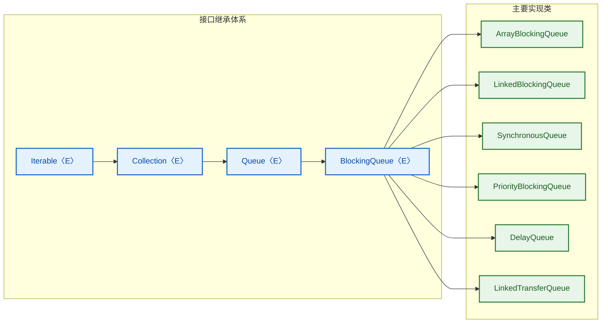
```mermaid
graph LR
    subgraph Interface_Hierarchy["接口继承体系"]
        direction TB
        A["Iterable〈E〉"]
        B["Collection〈E〉"]
        C["Queue〈E〉"]
        D["BlockingQueue〈E〉"]
        A --> B
        B --> C
        C --> D
    end

    subgraph Implementations["主要实现类"]
        direction TB
        E["ArrayBlockingQueue"]
        F["LinkedBlockingQueue"]
        G["SynchronousQueue"]
        H["PriorityBlockingQueue"]
        I["DelayQueue"]
        J["LinkedTransferQueue"]
    end

    D --> E
    D --> F
    D --> G
    D --> H
    D --> I
    D --> J

    classDef iface fill:#E3F2FD,stroke:#1565C0,color:#0D47A1,stroke-width:2px
    classDef impl fill:#E8F5E9,stroke:#2E7D32,color:#1B5E20,stroke-width:2px
    class A,B,C,D iface
    class E,F,G,H,I,J impl
```

在正式深入各个方法之前，先从全局视角理解 `BlockingQueue` 提供的 **四组操作风格**。这四组操作分别对应"队列满/空时"不同的应对策略：

| 操作类型 | 插入 (Insert) | 移除 (Remove) | 检查 (Examine) | 队列满/空时行为 |
|:---:|:---:|:---:|:---:|:---|
| **抛异常** | `add(e)` | `remove()` | `element()` | 立即抛出异常 |
| **返回特殊值** | `offer(e)` | `poll()` | `peek()` | 返回 `false` / `null` |
| **永久阻塞** | `put(e)` | `take()` | — | 线程挂起，直到条件满足 |
| **超时阻塞** | `offer(e, time, unit)` | `poll(time, unit)` | — | 挂起指定时长，超时返回特殊值 |

前两组（抛异常、返回特殊值）继承自 `Queue` 接口，后两组（永久阻塞、超时阻塞）是 `BlockingQueue` 自己新增的核心契约。理解这张表，就掌握了 `BlockingQueue` 的 API 全貌。

---

### put（阻塞插入）

`put(E e)` 是 `BlockingQueue` 最具代表性的方法之一。它的语义非常明确：**将元素 `e` 插入队列尾部；如果队列已满，当前线程将被阻塞（进入 WAITING 状态），直到队列中出现可用空间。** 方法签名如下：

```java
// BlockingQueue 接口中的定义
// 将指定元素插入此队列，必要时无限期等待可用空间
void put(E e) throws InterruptedException;
```

这里有几个关键点值得深入理解：

**第一，`put` 不返回布尔值，也不返回 null，它只有两种结局：要么成功插入，要么被中断抛出 `InterruptedException`。** 这与 `offer(e)` 不同——`offer` 在队列满时立即返回 `false`，而 `put` 会耐心等待。这种"不达目的不罢休"的特性，使得生产者线程不需要写任何重试循环，代码极其简洁。

**第二，`put` 响应中断（interrupt-sensitive）。** 当线程在 `put` 中阻塞时，如果另一个线程调用了该线程的 `interrupt()` 方法，`put` 会立即抛出 `InterruptedException` 并清除中断标志。这是 Java 并发框架的一贯设计哲学——**任何可能长时间阻塞的操作都应该能被中断**，否则线程可能永远无法优雅退出。

**第三，`put` 不允许插入 `null`。** 所有 `BlockingQueue` 的实现都禁止 `null` 元素，因为 `null` 在 `poll()` 中被用作"队列为空"的哨兵返回值（sentinel value）。如果允许 `null` 入队，消费者就无法区分"取到了一个 null 元素"和"队列为空"。

下面来看 `put` 在典型的生产者-消费者模型中的使用方式：

```java
import java.util.concurrent.ArrayBlockingQueue;
import java.util.concurrent.BlockingQueue;

public class ProducerConsumerDemo {

    public static void main(String[] args) {
        // 创建一个容量为 5 的有界阻塞队列
        BlockingQueue<String> queue = new ArrayBlockingQueue<>(5);

        // 生产者线程：不断地向队列中放入数据
        Thread producer = new Thread(() -> {
            try {
                int count = 0; // 消息计数器
                while (true) {
                    String message = "msg-" + count++; // 构造消息
                    System.out.println("[生产者] 准备放入: " + message);
                    queue.put(message); // 核心：如果队列满，线程在此阻塞
                    System.out.println("[生产者] 成功放入: " + message
                            + "，当前队列大小: " + queue.size());
                }
            } catch (InterruptedException e) {
                // put 被中断时会进入此分支
                Thread.currentThread().interrupt(); // 恢复中断标志
                System.out.println("[生产者] 被中断，优雅退出");
            }
        }, "Producer");

        // 消费者线程：不断地从队列中取出数据
        Thread consumer = new Thread(() -> {
            try {
                while (true) {
                    Thread.sleep(1000); // 模拟消费慢于生产的场景
                    String message = queue.take(); // 核心：如果队列空，线程在此阻塞
                    System.out.println("  [消费者] 取出: " + message);
                }
            } catch (InterruptedException e) {
                Thread.currentThread().interrupt(); // 恢复中断标志
                System.out.println("  [消费者] 被中断，优雅退出");
            }
        }, "Consumer");

        producer.start(); // 启动生产者
        consumer.start(); // 启动消费者
    }
}
```

运行上述代码你会观察到：生产者迅速填满 5 个位置后便停了下来（阻塞在 `put`），每当消费者取走一个元素，生产者才能继续放入一个。整个过程**无需手写任何 `synchronized`、`wait()`、`notify()`**，阻塞队列把所有线程协调逻辑都封装好了。

为了更直观地理解 `put` 的阻塞流程，我们用时序图来展示：

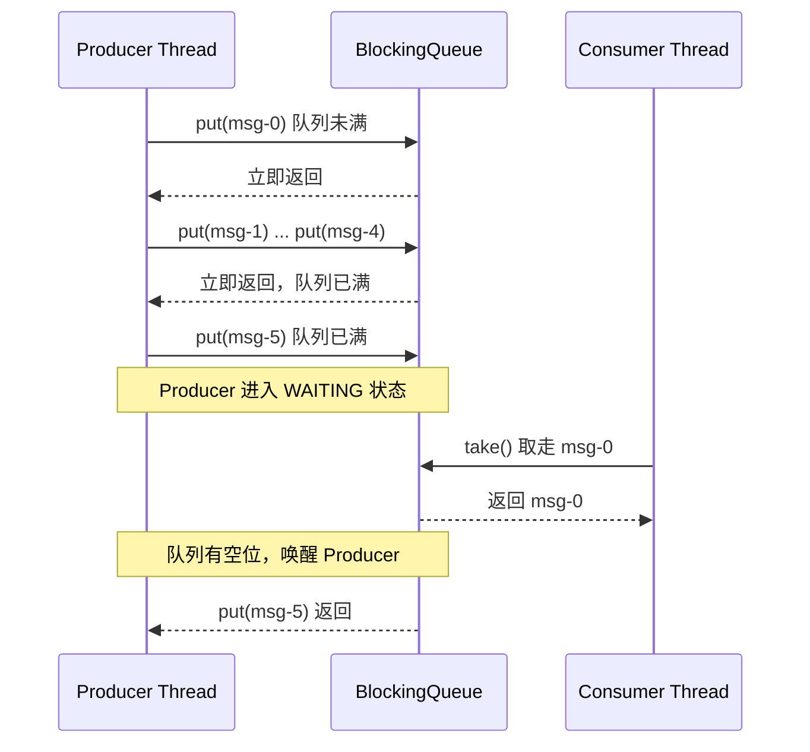
```mermaid
sequenceDiagram
    participant P as Producer Thread
    participant Q as BlockingQueue
    participant C as Consumer Thread

    P->>Q: put(msg-0) 队列未满
    Q-->>P: 立即返回

    P->>Q: put(msg-1) ... put(msg-4)
    Q-->>P: 立即返回，队列已满

    P->>Q: put(msg-5) 队列已满
    Note over P,Q: Producer 进入 WAITING 状态

    C->>Q: take() 取走 msg-0
    Q-->>C: 返回 msg-0
    Note over P,Q: 队列有空位，唤醒 Producer
    Q-->>P: put(msg-5) 返回
```

**`put` 的底层阻塞原理：** 以 `ArrayBlockingQueue` 为例，`put` 的内部实现依赖 `ReentrantLock` + `Condition`。当队列满时，`put` 调用 `notFull.await()` 使当前线程进入条件等待队列；当消费者取走一个元素时，会调用 `notFull.signal()` 唤醒一个等待中的生产者。这比 `Object.wait()/notify()` 更精确——`Condition` 可以将"等待队列非满"和"等待队列非空"分成两个独立的等待队列，避免不必要的唤醒。

---

### take（阻塞获取）

`take()` 是 `put(E e)` 的镜像方法。它的语义是：**从队列头部取出并移除一个元素；如果队列为空，当前线程将被阻塞，直到队列中出现新元素。**

```java
// BlockingQueue 接口中的定义
// 获取并移除此队列的头部，必要时无限期等待直到元素可用
E take() throws InterruptedException;
```

`take` 与 `put` 的设计对称性体现在方方面面：

| 对比维度 | `put(E e)` | `take()` |
|:---|:---|:---|
| 角色 | 生产者调用 | 消费者调用 |
| 阻塞条件 | 队列满 | 队列空 |
| 底层 Condition | `notFull.await()` | `notEmpty.await()` |
| 唤醒时机 | 有元素被取走 | 有元素被放入 |
| 中断响应 | 抛 `InterruptedException` | 抛 `InterruptedException` |

`take` 同样响应中断，并且不会返回 `null`——如果 `take` 返回了，那一定是成功取到了一个非 null 元素。

下面展示一个稍微复杂一些的多消费者场景，帮助你理解 `take` 在竞争环境下的行为：

```java
import java.util.concurrent.ArrayBlockingQueue;
import java.util.concurrent.BlockingQueue;

public class MultiConsumerDemo {

    public static void main(String[] args) throws InterruptedException {
        // 容量为 3 的有界队列，用于传递任务
        BlockingQueue<String> taskQueue = new ArrayBlockingQueue<>(3);

        // 创建 3 个消费者线程，模拟工作线程池
        for (int i = 1; i <= 3; i++) {
            final int workerId = i; // effectively final, 供 lambda 捕获
            new Thread(() -> {
                try {
                    while (true) {
                        // 多个消费者同时调用 take()，竞争队头元素
                        // 底层的 ReentrantLock 保证同一时刻只有一个线程能拿到
                        String task = taskQueue.take();
                        System.out.println("Worker-" + workerId
                                + " 正在处理: " + task);
                        Thread.sleep(2000); // 模拟任务处理耗时
                    }
                } catch (InterruptedException e) {
                    Thread.currentThread().interrupt(); // 恢复中断状态
                    System.out.println("Worker-" + workerId + " 退出");
                }
            }, "Worker-" + i).start();
        }

        // 主线程作为生产者，逐个提交 10 个任务
        for (int i = 1; i <= 10; i++) {
            String task = "Task-" + i; // 构造任务名
            taskQueue.put(task); // 如果队列满了就阻塞等待
            System.out.println("[主线程] 提交了: " + task);
        }
    }
}
```

在这个例子中，3 个 Worker 线程同时阻塞在 `take()` 上等待任务。当主线程通过 `put` 放入一个任务时，**只有一个** Worker 会被唤醒并拿到任务（这由 `ReentrantLock` 的公平/非公平策略决定）。其余 Worker 继续阻塞。这个模式其实就是 `ThreadPoolExecutor` 的核心工作原理——工作线程从 `workQueue` 中 `take()` 任务来执行。

为了深化理解，我们用一张流程图展示 `take()` 的内部决策逻辑（以 `ArrayBlockingQueue` 为参照）：

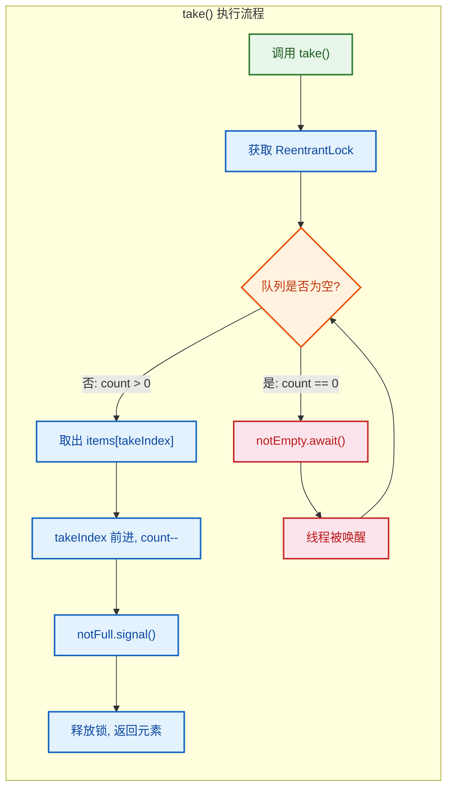
```mermaid
graph LR
    subgraph take_flow["take() 执行流程"]
        direction TB
        A["调用 take()"] --> B["获取 ReentrantLock"]
        B --> C{"队列是否为空?"}
        C -- "否: count > 0" --> D["取出 items[takeIndex]"]
        D --> E["takeIndex 前进, count--"]
        E --> F["notFull.signal()"]
        F --> G["释放锁, 返回元素"]
        C -- "是: count == 0" --> H["notEmpty.await()"]
        H --> I["线程被唤醒"]
        I --> C
    end

    classDef start fill:#E8F5E9,stroke:#2E7D32,color:#1B5E20,stroke-width:2px
    classDef decision fill:#FFF3E0,stroke:#E65100,color:#BF360C,stroke-width:2px
    classDef action fill:#E3F2FD,stroke:#1565C0,color:#0D47A1,stroke-width:2px
    classDef wait fill:#FCE4EC,stroke:#C62828,color:#B71C1C,stroke-width:2px
    class A start
    class C decision
    class B,D,E,F,G action
    class H,I wait
```

注意图中被唤醒后会**重新检查**队列是否为空（回到判断节点），这就是经典的 **"循环等待模式" (loop-wait pattern)**。在 `ArrayBlockingQueue` 源码中，这体现为一个 `while` 循环而非 `if`：

```java
// ArrayBlockingQueue.take() 的核心逻辑（简化版）
public E take() throws InterruptedException {
    final ReentrantLock lock = this.lock; // 获取实例锁引用
    lock.lockInterruptibly();             // 可中断地获取锁
    try {
        // 关键：使用 while 而非 if，防止虚假唤醒 (spurious wakeup)
        while (count == 0) {              // 如果队列为空
            notEmpty.await();             // 在 notEmpty 条件上等待
        }
        return dequeue();                 // 队列非空，执行出队操作
    } finally {
        lock.unlock();                    // 无论如何都要释放锁
    }
}
```

使用 `while` 而非 `if` 来检查等待条件，是 Java 并发编程中一个非常重要的 best practice。**虚假唤醒（Spurious Wakeup）** 是操作系统层面客观存在的现象——线程可能在没有收到显式 `signal` 的情况下从 `await` 中返回。用 `while` 循环可以确保线程醒来后再次验证条件，只有条件真正满足时才继续往下执行。

---

### offer / poll（超时版本）

除了"永久阻塞"的 `put` / `take`，`BlockingQueue` 还提供了**带超时的阻塞版本**：`offer(E e, long timeout, TimeUnit unit)` 和 `poll(long timeout, TimeUnit unit)`。它们是在"立即返回"和"无限等待"之间的一个折中方案——**等一段时间，等不到就放弃**。

```java
// 带超时的插入：等待指定时间，如果仍无法插入则返回 false
boolean offer(E e, long timeout, TimeUnit unit) throws InterruptedException;

// 带超时的获取：等待指定时间，如果仍无法获取则返回 null
E poll(long timeout, TimeUnit unit) throws InterruptedException;
```

**为什么需要超时版本？** 在实际生产环境中，无限等待往往是危险的。设想一个场景：消费者因为 bug 停止了工作，如果生产者使用 `put`，它将永远阻塞下去，导致整个生产链路卡死且无法自动恢复。使用带超时的 `offer`，生产者可以在等待一段时间后感知到异常，执行降级逻辑（如写入本地磁盘、发送告警等）。

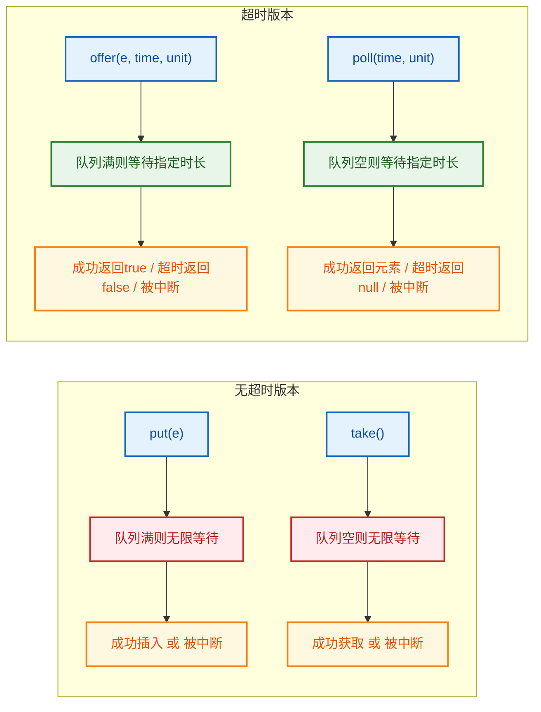
```mermaid
graph LR
    subgraph no_timeout["无超时版本"]
        direction TB
        P1["put(e)"] --> W1["队列满则无限等待"]
        W1 --> R1["成功插入 或 被中断"]
        T1["take()"] --> W2["队列空则无限等待"]
        W2 --> R2["成功获取 或 被中断"]
    end

    subgraph with_timeout["超时版本"]
        direction TB
        P2["offer(e, time, unit)"] --> W3["队列满则等待指定时长"]
        W3 --> R3["成功返回true / 超时返回false / 被中断"]
        T2["poll(time, unit)"] --> W4["队列空则等待指定时长"]
        W4 --> R4["成功返回元素 / 超时返回null / 被中断"]
    end

    classDef block fill:#FFEBEE,stroke:#C62828,color:#B71C1C,stroke-width:2px
    classDef timeout fill:#E8F5E9,stroke:#2E7D32,color:#1B5E20,stroke-width:2px
    classDef method fill:#E3F2FD,stroke:#1565C0,color:#0D47A1,stroke-width:2px
    classDef result fill:#FFF8E1,stroke:#F57F17,color:#E65100,stroke-width:2px
    class P1,T1 method
    class P2,T2 method
    class W1,W2 block
    class W3,W4 timeout
    class R1,R2,R3,R4 result
```

下面通过一个完整的示例来展示超时版本的典型用法：

```java
import java.util.concurrent.ArrayBlockingQueue;
import java.util.concurrent.BlockingQueue;
import java.util.concurrent.TimeUnit;

public class TimeoutDemo {

    public static void main(String[] args) {
        // 容量仅为 2 的队列，很容易满
        BlockingQueue<String> queue = new ArrayBlockingQueue<>(2);

        // === 演示 offer 超时 ===
        Thread producer = new Thread(() -> {
            try {
                // 前两个能立即成功
                System.out.println("offer A: " + queue.offer("A", 1, TimeUnit.SECONDS)); // true
                System.out.println("offer B: " + queue.offer("B", 1, TimeUnit.SECONDS)); // true

                // 第三个：队列已满，最多等 2 秒
                System.out.println("[生产者] 尝试 offer C，最多等 2 秒...");
                long start = System.currentTimeMillis();        // 记录开始时间
                boolean success = queue.offer("C", 2, TimeUnit.SECONDS); // 等2秒
                long elapsed = System.currentTimeMillis() - start; // 计算实际耗时
                System.out.println("[生产者] offer C 结果: " + success
                        + "，耗时: " + elapsed + "ms");
                // 如果 2 秒内没有消费者取走元素，success 为 false
            } catch (InterruptedException e) {
                Thread.currentThread().interrupt(); // 恢复中断标志
            }
        }, "Producer");

        // === 演示 poll 超时 ===
        Thread consumer = new Thread(() -> {
            try {
                // 等待 3 秒再开始消费，让生产者先感受超时
                Thread.sleep(3000);

                // 此时队列里有 A 和 B（C 大概率没放进去）
                System.out.println("  [消费者] poll: " + queue.poll(1, TimeUnit.SECONDS));
                System.out.println("  [消费者] poll: " + queue.poll(1, TimeUnit.SECONDS));

                // 队列已空，再 poll 会等 1 秒后返回 null
                System.out.println("  [消费者] poll 空队列（等 1 秒）: "
                        + queue.poll(1, TimeUnit.SECONDS)); // null
            } catch (InterruptedException e) {
                Thread.currentThread().interrupt(); // 恢复中断标志
            }
        }, "Consumer");

        producer.start(); // 启动生产者
        consumer.start(); // 启动消费者
    }
}
```

运行上述代码，典型输出如下：

```
offer A: true
offer B: true
[生产者] 尝试 offer C，最多等 2 秒...
[生产者] offer C 结果: false，耗时: 2003ms
  [消费者] poll: A
  [消费者] poll: B
  [消费者] poll 空队列（等 1 秒）: null
```

可以看到，`offer("C", 2, SECONDS)` 等了 2 秒后返回 `false`，而 `poll(1, SECONDS)` 在空队列上等了 1 秒后返回 `null`。

**超时版本的底层原理**与永久阻塞版本几乎一样，区别仅在于调用的是 `Condition.await(long, TimeUnit)` 而非 `Condition.await()`：

```java
// ArrayBlockingQueue.offer(E, long, TimeUnit) 核心逻辑（简化版）
public boolean offer(E e, long timeout, TimeUnit unit)
        throws InterruptedException {
    long nanos = unit.toNanos(timeout);       // 将超时时间统一转为纳秒
    final ReentrantLock lock = this.lock;     // 获取锁引用
    lock.lockInterruptibly();                 // 可中断地加锁
    try {
        while (count == items.length) {       // 队列满，进入循环等待
            if (nanos <= 0L) {                // 剩余等待时间用尽
                return false;                 // 返回 false 表示插入失败
            }
            // 在 notFull 条件上限时等待，返回值是剩余的纳秒数
            nanos = notFull.awaitNanos(nanos);
        }
        enqueue(e);                           // 队列未满（或被唤醒后仍有空位），入队
        return true;                          // 返回 true 表示插入成功
    } finally {
        lock.unlock();                        // 释放锁
    }
}
```

注意 `awaitNanos` 返回的是**剩余等待时间**。这个设计非常巧妙——如果线程因为虚假唤醒而提前醒来，它可以用剩余时间继续等待，而不是从头开始计时。

最后，我们将 `BlockingQueue` 接口中不带超时的 `offer(e)` 和 `poll()` 也纳入对比，形成完整的认知闭环：

| 方法 | 队列满/空时行为 | 返回值 | 是否阻塞 | 是否响应中断 |
|:---|:---|:---|:---:|:---:|
| `add(e)` | 抛 `IllegalStateException` | `boolean` | ✗ | ✗ |
| `offer(e)` | 返回 `false` | `boolean` | ✗ | ✗ |
| `offer(e, time, unit)` | 阻塞指定时间 | `boolean` | ✓（限时） | ✓ |
| `put(e)` | 无限阻塞 | `void` | ✓（永久） | ✓ |
| `remove()` | 抛 `NoSuchElementException` | `E` | ✗ | ✗ |
| `poll()` | 返回 `null` | `E` | ✗ | ✗ |
| `poll(time, unit)` | 阻塞指定时间 | `E` | ✓（限时） | ✓ |
| `take()` | 无限阻塞 | `E` | ✓（永久） | ✓ |

**选择建议（best practice）：**

- **线程池内部** 通常使用 `take()` 或 `poll(keepAliveTime, unit)`——核心线程用 `take` 永久等待，非核心线程用 `poll` 超时等待（超时后线程销毁，这就是线程池的 `keepAliveTime` 机制）。
- **业务生产者** 推荐使用 `offer(e, timeout, unit)` 配合降级策略，避免无限阻塞导致调用方卡死。
- **测试和简单场景** 可以直接用 `put` / `take`，代码最简洁。

---

**📝 练习题**

以下关于 `BlockingQueue` 接口方法的描述，**错误**的是：

A. `put(e)` 在队列满时会阻塞当前线程，直到有空间可用或线程被中断

B. `take()` 在队列空时会返回 `null`，而不是阻塞

C. `offer(e, timeout, unit)` 在队列满时会阻塞指定时间，超时后返回 `false`

D. 所有 `BlockingQueue` 实现都禁止插入 `null` 元素，因为 `null` 被 `poll()` 用作哨兵值


**【答案】** B

**【解析】** `take()` 在队列为空时**会无限阻塞**当前线程（进入 WAITING 状态），直到有元素可用或线程被中断抛出 `InterruptedException`，它**绝不会返回 `null`**。返回 `null` 是无参 `poll()` 和超时 `poll(timeout, unit)` 在队列空时的行为。这正是 `BlockingQueue` 禁止 `null` 元素的根本原因：如果允许 `null` 入队，那么 `poll()` 返回 `null` 时消费者就无法判断到底是"队列为空"还是"取到了一个值为 null 的元素"。选项 A 正确描述了 `put` 的阻塞语义，选项 C 正确描述了超时 `offer` 的行为，选项 D 正确解释了禁止 `null` 的原因。

---

## ArrayBlockingQueue ⭐

ArrayBlockingQueue 是 Java 并发包中最经典、最常用的阻塞队列实现之一。它底层基于**定长数组**实现环形缓冲区（Circular Buffer），使用**一把 ReentrantLock** 配合**两个 Condition**（`notEmpty` 和 `notFull`）来协调生产者和消费者线程。理解 ArrayBlockingQueue 的内部机制，是吃透所有阻塞队列设计思想的基石。

### 有界数组

ArrayBlockingQueue 的第一个核心特征就是**有界（Bounded）**。在创建时必须指定容量，且容量一旦确定便**不可更改**。这与 ArrayList 的自动扩容机制截然不同——ArrayBlockingQueue 永远不会扩容。

```java
// 创建一个容量为 10 的阻塞队列
BlockingQueue<String> queue = new ArrayBlockingQueue<>(10);
```

如果你试图传入 0 或负数作为容量，构造函数会直接抛出 `IllegalArgumentException`。

#### 底层数据结构：环形数组

ArrayBlockingQueue 的底层并不是"普通"的数组使用方式，而是通过**两个指针**（`takeIndex` 和 `putIndex`）在一个定长数组上模拟出**环形缓冲区（Ring Buffer）**的效果。这种设计避免了每次出队时移动数组元素的高昂开销。

我们来看 JDK 源码中最关键的几个字段：

```java
public class ArrayBlockingQueue<E> extends AbstractQueue<E>
        implements BlockingQueue<E>, java.io.Serializable {

    // 存储元素的定长数组，创建后长度不再改变
    final Object[] items;

    // 下一次 take/poll/peek 操作的数组下标
    int takeIndex;

    // 下一次 put/offer/add 操作的数组下标
    int putIndex;

    // 队列中当前元素的数量
    int count;

    // 唯一的那把锁
    final ReentrantLock lock;

    // 队列非空条件 —— 消费者在此等待
    private final Condition notEmpty;

    // 队列未满条件 —— 生产者在此等待
    private final Condition notFull;
}
```

当 `putIndex` 或 `takeIndex` 到达数组末尾时，会被重置为 0，从而在逻辑上形成一个**环**。我们用一张图来直观理解：

```java
// 环形数组示意（容量 = 6，当前有 3 个元素 A, B, C）
//
//        putIndex = 4
//            ↓
//   ┌───┬───┬───┬───┬───┬───┐
//   │   │ A │ B │ C │   │   │
//   └───┴───┴───┴───┴───┴───┘
//     0   1   2   3   4   5
//            ↑
//        takeIndex = 1
//
// 当 putIndex 到达 5 之后再入队，putIndex 会回绕到 0
// 逻辑上：  ... → [5] → [0] → [1] → ...  形成环
```

来看源码中指针回绕的核心方法：

```java
// 将下标向前推进一位，到达末尾时回绕到 0
final int inc(int i) {
    // 如果 i+1 等于数组长度，则返回 0；否则返回 i+1
    return (++i == items.length) ? 0 : i;
}
```

> **为什么选择环形数组而不是 LinkedList？** 数组在内存中是**连续存储**的，CPU 缓存命中率（Cache Locality）远高于链表的散列节点。在高并发场景下，这种缓存友好性带来的性能差异是显著的。同时，固定长度意味着零 GC 压力——数组空间在初始化时一次性分配完毕，后续不再产生新对象。

#### 构造函数详解

ArrayBlockingQueue 提供了三个构造函数：

```java
// 构造器 1：指定容量，默认非公平锁
public ArrayBlockingQueue(int capacity) {
    this(capacity, false); // 默认使用非公平模式
}

// 构造器 2：指定容量和公平性
public ArrayBlockingQueue(int capacity, boolean fair) {
    if (capacity <= 0)                        // 容量必须为正整数
        throw new IllegalArgumentException();
    this.items = new Object[capacity];        // 分配定长数组
    lock = new ReentrantLock(fair);           // 根据 fair 参数创建锁
    notEmpty = lock.newCondition();           // 从同一把锁派生 notEmpty 条件
    notFull  = lock.newCondition();           // 从同一把锁派生 notFull 条件
}

// 构造器 3：用已有集合初始化队列
public ArrayBlockingQueue(int capacity, boolean fair,
                          Collection<? extends E> c) {
    this(capacity, fair);                     // 先调用构造器 2
    final ReentrantLock lock = this.lock;
    lock.lock();                              // 加锁保证可见性（不是为了互斥）
    try {
        final Object[] items = this.items;
        int i = 0;
        try {
            for (E e : c) {                   // 逐个将集合元素放入数组
                if (e == null)                // 不允许 null 元素
                    throw new NullPointerException();
                items[i++] = e;
            }
        } catch (ArrayIndexOutOfBoundsException ex) {
            throw new IllegalArgumentException(); // 集合大小超过容量
        }
        count = i;                            // 设置元素计数
        putIndex = (i == capacity) ? 0 : i;   // 设置下一次插入位置
    } finally {
        lock.unlock();
    }
}
```

> **公平 vs 非公平**：`fair = true` 时，被阻塞的线程按照 FIFO 顺序获得锁，可以防止饥饿（Starvation），但吞吐量会下降。`fair = false`（默认）时，线程可以"插队"竞争锁，吞吐量更高但可能导致某些线程长期等待。

---

### 一把锁（ReentrantLock）

ArrayBlockingQueue 的所有读写操作——`put`、`take`、`offer`、`poll`、`peek`、`size`、`remove` 等——全部共享**同一把 ReentrantLock**。这意味着：**在任意时刻，只有一个线程能够操作队列**，无论它是生产者还是消费者。

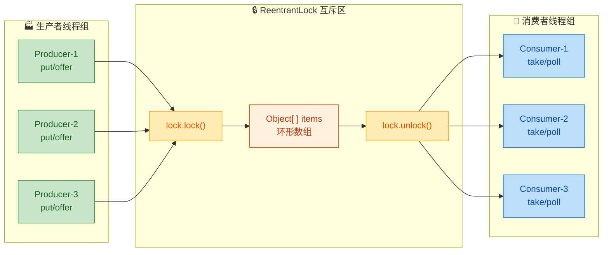
```mermaid
graph LR
    subgraph Producers["🏭 生产者线程组"]
        direction TB
        P1["Producer-1<br/>put/offer"]
        P2["Producer-2<br/>put/offer"]
        P3["Producer-3<br/>put/offer"]
    end

    subgraph LockZone["🔒 ReentrantLock 互斥区"]
        direction TB
        LOCK["lock.lock()"]
        ARR["Object[ ] items<br/>环形数组"]
        UNLOCK["lock.unlock()"]
        LOCK --> ARR --> UNLOCK
    end

    subgraph Consumers["🛒 消费者线程组"]
        direction TB
        C1["Consumer-1<br/>take/poll"]
        C2["Consumer-2<br/>take/poll"]
        C3["Consumer-3<br/>take/poll"]
    end

    P1 --> LOCK
    P2 --> LOCK
    P3 --> LOCK
    UNLOCK --> C1
    UNLOCK --> C2
    UNLOCK --> C3

    classDef prodStyle fill:#C8E6C9,stroke:#388E3C,color:#1B5E20
    classDef lockStyle fill:#FFECB3,stroke:#FFA000,color:#E65100
    classDef consStyle fill:#BBDEFB,stroke:#1976D2,color:#0D47A1
    classDef arrStyle fill:#FFF3E0,stroke:#E65100,color:#BF360C

    class P1,P2,P3 prodStyle
    class LOCK,UNLOCK lockStyle
    class C1,C2,C3 consStyle
    class ARR arrStyle
```

#### 为什么只用一把锁？

答案藏在底层数据结构里。ArrayBlockingQueue 用的是**同一个数组**，`putIndex` 和 `takeIndex` 指向的是**同一块内存**。如果生产者正在写 `items[3]`，而消费者同时在读 `items[3]`，就会产生数据竞争。更关键的是，`count` 字段被读写双方共同依赖——生产者需要判断 `count == capacity`（是否满了），消费者需要判断 `count == 0`（是否空了）。一把锁是保护这些共享变量一致性的最简单正确的方案。

来看 `put` 方法的完整源码：

```java
public void put(E e) throws InterruptedException {
    Objects.requireNonNull(e);                // 不允许插入 null
    final ReentrantLock lock = this.lock;     // 引用局部变量（JIT 优化友好）
    lock.lockInterruptibly();                 // 可中断地获取锁
    try {
        while (count == items.length)         // 队列已满，进入等待循环
            notFull.await();                  // 在 notFull 条件上阻塞
        enqueue(e);                           // 真正执行入队
    } finally {
        lock.unlock();                        // 确保释放锁
    }
}
```

再看 `take` 方法：

```java
public E take() throws InterruptedException {
    final ReentrantLock lock = this.lock;     // 同一把锁
    lock.lockInterruptibly();                 // 可中断地获取锁
    try {
        while (count == 0)                    // 队列为空，进入等待循环
            notEmpty.await();                 // 在 notEmpty 条件上阻塞
        return dequeue();                     // 真正执行出队
    } finally {
        lock.unlock();                        // 确保释放锁
    }
}
```

注意两个方法中的 `lock.lockInterruptibly()`——它允许等待获取锁的线程被**中断**唤醒，避免线程永远卡死在锁竞争上。

#### 一把锁的代价

单锁设计（Single-Lock Design）的最大缺点是**生产者和消费者互斥**。假设队列既不满也不空，一个生产者正在执行 `put`，此时消费者想执行 `take` 就必须等待——即使它们操作的是数组的不同位置。这就是 ArrayBlockingQueue 在高并发场景下吞吐量不如 `LinkedBlockingQueue` 的根本原因。

```java
// 单锁瓶颈示意：
//
// 时间轴 ──────────────────────────────────────►
//
// Producer:  ████ lock ████ enqueue ████ unlock ████
//                                                    ████ lock ...
// Consumer:  ░░░░░░░░░░ BLOCKED ░░░░░░░░░░░░░░░░░░░░
//                                                    (等 Producer 释放)
//
// 理想状态（双锁，如 LinkedBlockingQueue）：
//
// Producer:  ████ putLock ████ enqueue ████ unlock ████
// Consumer:  ████ takeLock ████ dequeue ████ unlock ████
//            ↑ 两者可以并行！
```

> **面试高频问题**："为什么 ArrayBlockingQueue 不能像 LinkedBlockingQueue 一样用两把锁？" 因为 ArrayBlockingQueue 的 `putIndex`、`takeIndex` 和 `count` 三个字段在**入队和出队时都需要读写**，它们之间存在强耦合。如果用两把锁分别保护入队和出队，就需要额外的原子操作或复杂的锁协调，复杂度和出错概率都会上升。链表则天然将头尾分离，头指针只有消费者修改，尾指针只有生产者修改，适合双锁。

---

### 两个条件（notEmpty、notFull）

虽然锁只有一把，但 ArrayBlockingQueue 精巧地从这一把锁上派生出了**两个 Condition 对象**，实现了对不同等待场景的精确唤醒。这是经典的**条件变量（Condition Variable）**模式，比 `synchronized` + `wait/notifyAll` 的粒度更细。

```java
// 两个 Condition 均从同一把 ReentrantLock 创建
final ReentrantLock lock = new ReentrantLock(fair);
final Condition notEmpty = lock.newCondition(); // 消费者等待的条件："队列非空"
final Condition notFull  = lock.newCondition(); // 生产者等待的条件："队列未满"
```

#### 为什么需要两个 Condition？

试想如果只有一个条件对象（就像 `synchronized` + `wait/notifyAll` 那样），会发生什么：

1. 队列满了，3 个生产者线程在同一个条件上 `await()`。
2. 一个消费者取走一个元素后调用 `signal()`。
3. 被唤醒的可能是**另一个消费者**（它发现队列非空，直接取走元素返回），而那 3 个生产者依然在等！
4. 如果改用 `signalAll()` 可以解决这个问题，但会唤醒**所有**等待线程，绝大多数被唤醒后发现条件不满足又继续 `await()`——这就是**惊群效应（Thundering Herd）**，白白浪费 CPU。

两个 Condition 完美解决了这个问题：

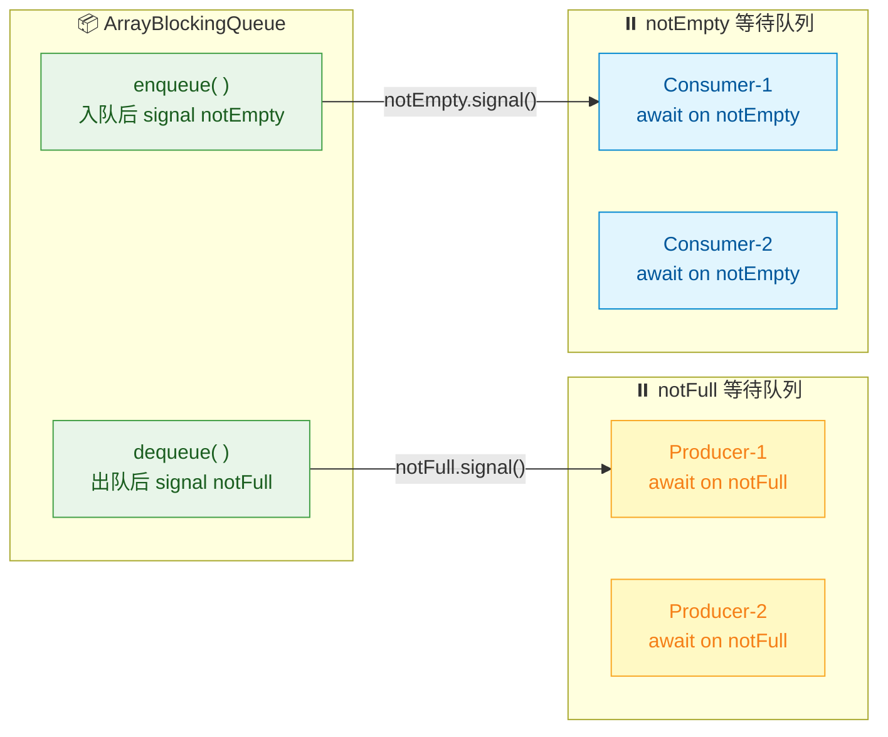
```mermaid
graph LR
    subgraph WaitNotFull["⏸️ notFull 等待队列"]
        direction TB
        P1["Producer-1<br/>await on notFull"]
        P2["Producer-2<br/>await on notFull"]
    end

    subgraph Queue["📦 ArrayBlockingQueue"]
        direction TB
        ENQ["enqueue( )<br/>入队后 signal notEmpty"]
        DEQ["dequeue( )<br/>出队后 signal notFull"]
    end

    subgraph WaitNotEmpty["⏸️ notEmpty 等待队列"]
        direction TB
        C1["Consumer-1<br/>await on notEmpty"]
        C2["Consumer-2<br/>await on notEmpty"]
    end

    DEQ -- "notFull.signal()" --> P1
    ENQ -- "notEmpty.signal()" --> C1

    classDef prodWait fill:#FFF9C4,stroke:#F9A825,color:#F57F17
    classDef consWait fill:#E1F5FE,stroke:#0288D1,color:#01579B
    classDef queueOp fill:#E8F5E9,stroke:#43A047,color:#1B5E20

    class P1,P2 prodWait
    class C1,C2 consWait
    class ENQ,DEQ queueOp
```

#### enqueue 和 dequeue 源码

这两个私有方法是队列操作的核心，并且是 signal 信号的发出点：

```java
// 入队操作 —— 在持有锁的前提下调用
private void enqueue(E e) {
    final Object[] items = this.items;    // 取数组引用
    items[putIndex] = e;                  // 将元素放入 putIndex 位置
    if (++putIndex == items.length)       // putIndex 前进一步
        putIndex = 0;                     // 到达末尾，回绕到 0（环形）
    count++;                              // 元素数量 +1
    notEmpty.signal();                    // ★ 唤醒一个在 notEmpty 上等待的消费者
}

// 出队操作 —— 在持有锁的前提下调用
private E dequeue() {
    final Object[] items = this.items;    // 取数组引用
    @SuppressWarnings("unchecked")
    E e = (E) items[takeIndex];           // 取出 takeIndex 位置的元素
    items[takeIndex] = null;              // 将该位置置 null，帮助 GC
    if (++takeIndex == items.length)      // takeIndex 前进一步
        takeIndex = 0;                    // 到达末尾，回绕到 0（环形）
    count--;                              // 元素数量 -1
    // 如果有迭代器在工作，还需要通知迭代器
    if (itrs != null)
        itrs.elementDequeued();
    notFull.signal();                     // ★ 唤醒一个在 notFull 上等待的生产者
    return e;                             // 返回取出的元素
}
```

注意关键细节：

- `enqueue` 完成后调用 `notEmpty.signal()`——"队列里有东西了，消费者可以来取了"。
- `dequeue` 完成后调用 `notFull.signal()`——"队列腾出位置了，生产者可以来放了"。
- 使用的是 `signal()` 而非 `signalAll()`——每次只唤醒**一个**等待线程，最小化上下文切换开销。

#### 完整的生产-消费时序

下面通过一个具体场景，完整展示两个 Condition 的协作过程。假设队列容量为 2：

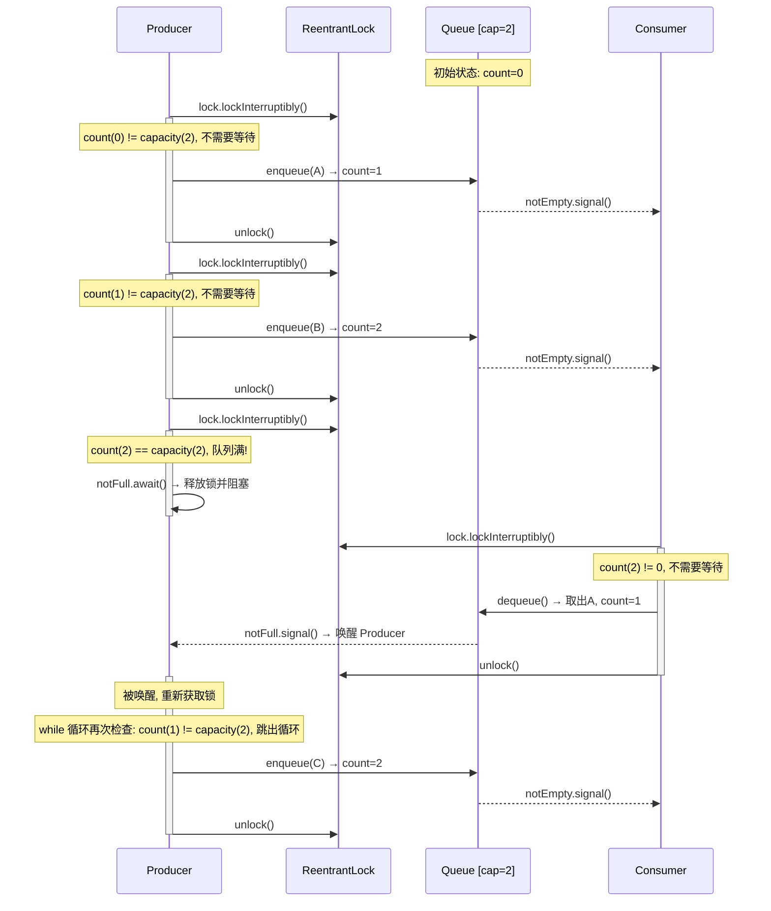
```mermaid
sequenceDiagram
    participant P as Producer
    participant L as ReentrantLock
    participant Q as Queue [cap=2]
    participant C as Consumer

    Note over Q: 初始状态: count=0

    P->>L: lock.lockInterruptibly()
    activate P
    Note over P: count(0) != capacity(2), 不需要等待
    P->>Q: enqueue(A) → count=1
    Q-->>C: notEmpty.signal()
    P->>L: unlock()
    deactivate P

    P->>L: lock.lockInterruptibly()
    activate P
    Note over P: count(1) != capacity(2), 不需要等待
    P->>Q: enqueue(B) → count=2
    Q-->>C: notEmpty.signal()
    P->>L: unlock()
    deactivate P

    P->>L: lock.lockInterruptibly()
    activate P
    Note over P: count(2) == capacity(2), 队列满!
    P->>P: notFull.await() → 释放锁并阻塞
    deactivate P

    C->>L: lock.lockInterruptibly()
    activate C
    Note over C: count(2) != 0, 不需要等待
    C->>Q: dequeue() → 取出A, count=1
    Q-->>P: notFull.signal() → 唤醒 Producer
    C->>L: unlock()
    deactivate C

    activate P
    Note over P: 被唤醒, 重新获取锁
    Note over P: while 循环再次检查: count(1) != capacity(2), 跳出循环
    P->>Q: enqueue(C) → count=2
    Q-->>C: notEmpty.signal()
    P->>L: unlock()
    deactivate P
```

#### while 循环检查——防止虚假唤醒

注意 `put` 和 `take` 中都使用了 **`while`** 而不是 `if` 来检查条件：

```java
// put 方法中
while (count == items.length)  // ★ 必须用 while，不能用 if
    notFull.await();

// take 方法中
while (count == 0)             // ★ 必须用 while，不能用 if
    notEmpty.await();
```

这是因为存在**虚假唤醒（Spurious Wakeup）**的可能性——线程可能在没有收到 `signal()` 的情况下从 `await()` 返回。这是操作系统底层 pthread 的已知行为。`while` 循环确保线程被唤醒后**再次检查条件**，如果条件不满足就继续等待。这是并发编程中的一条**铁律**。

#### offer 和 poll 的超时版本

除了无限阻塞的 `put`/`take`，ArrayBlockingQueue 还提供了带超时的 `offer`/`poll`：

```java
// 带超时的 offer：等待指定时间后若仍无法插入则返回 false
public boolean offer(E e, long timeout, TimeUnit unit)
        throws InterruptedException {
    Objects.requireNonNull(e);                       // 不允许 null
    long nanos = unit.toNanos(timeout);              // 统一转换为纳秒
    final ReentrantLock lock = this.lock;
    lock.lockInterruptibly();                        // 可中断获取锁
    try {
        while (count == items.length) {              // 队列满
            if (nanos <= 0L)                         // 超时时间耗尽
                return false;                        // 插入失败，返回 false
            nanos = notFull.awaitNanos(nanos);       // 等待指定纳秒数
            // awaitNanos 返回剩余时间（可能为负数）
        }
        enqueue(e);                                  // 成功入队
        return true;
    } finally {
        lock.unlock();
    }
}

// 带超时的 poll：等待指定时间后若仍无法取出则返回 null
public E poll(long timeout, TimeUnit unit) throws InterruptedException {
    long nanos = unit.toNanos(timeout);              // 统一转换为纳秒
    final ReentrantLock lock = this.lock;
    lock.lockInterruptibly();
    try {
        while (count == 0) {                         // 队列空
            if (nanos <= 0L)                         // 超时时间耗尽
                return null;                         // 取出失败，返回 null
            nanos = notEmpty.awaitNanos(nanos);      // 等待指定纳秒数
        }
        return dequeue();                            // 成功出队
    } finally {
        lock.unlock();
    }
}
```

四种操作方式的对比一目了然：

| 操作类型 | 抛异常 | 返回特殊值 | 阻塞 | 超时退出 |
|---------|--------|-----------|------|---------|
| 插入 | `add(e)` | `offer(e)` → false | `put(e)` | `offer(e, time, unit)` → false |
| 移除 | `remove()` | `poll()` → null | `take()` | `poll(time, unit)` → null |
| 检查 | `element()` | `peek()` → null | — | — |

#### 实战示例：生产者-消费者模型

```java
public class ProducerConsumerDemo {

    public static void main(String[] args) {
        // 创建容量为 5 的有界阻塞队列
        ArrayBlockingQueue<String> queue = new ArrayBlockingQueue<>(5);

        // 生产者线程：持续生产数据
        Thread producer = new Thread(() -> {
            int i = 0;                                   // 计数器
            try {
                while (true) {
                    String item = "item-" + (i++);       // 生成数据
                    queue.put(item);                      // 阻塞式插入（满则等待）
                    System.out.println("[Producer] put: " + item
                        + " | queue size: " + queue.size());
                    Thread.sleep(200);                    // 模拟生产耗时
                }
            } catch (InterruptedException e) {
                Thread.currentThread().interrupt();       // 恢复中断标志
                System.out.println("[Producer] interrupted, exiting.");
            }
        }, "Producer");

        // 消费者线程：持续消费数据
        Thread consumer = new Thread(() -> {
            try {
                while (true) {
                    String item = queue.take();           // 阻塞式获取（空则等待）
                    System.out.println("[Consumer] take: " + item
                        + " | queue size: " + queue.size());
                    Thread.sleep(800);                    // 模拟消费耗时（慢于生产）
                }
            } catch (InterruptedException e) {
                Thread.currentThread().interrupt();       // 恢复中断标志
                System.out.println("[Consumer] interrupted, exiting.");
            }
        }, "Consumer");

        producer.start();                                // 启动生产者
        consumer.start();                                // 启动消费者
    }
}
```

运行后你会观察到：由于消费者速度（800ms）慢于生产者（200ms），队列会很快被填满到容量 5，之后生产者线程会**自动阻塞**在 `put()` 方法上，直到消费者取走一个元素腾出空位。整个过程无需手动编写任何 `wait/notify` 逻辑——这就是阻塞队列的魅力。

#### ArrayBlockingQueue 整体架构总览

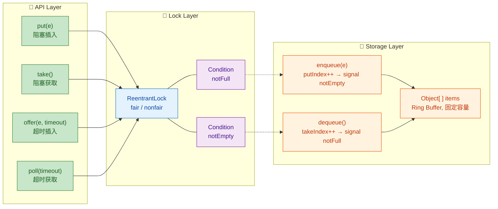
```mermaid
graph LR
    subgraph API["📡 API Layer"]
        direction TB
        PUT["put(e)<br/>阻塞插入"]
        TAKE["take()<br/>阻塞获取"]
        OFFER["offer(e, timeout)<br/>超时插入"]
        POLL["poll(timeout)<br/>超时获取"]
    end

    subgraph LOCK_LAYER["🔐 Lock Layer"]
        direction TB
        RL["ReentrantLock<br/>fair / nonfair"]
        NF["Condition<br/>notFull"]
        NE["Condition<br/>notEmpty"]
        RL --- NF
        RL --- NE
    end

    subgraph STORAGE["💾 Storage Layer"]
        direction TB
        ENQ["enqueue(e)<br/>putIndex++ → signal notEmpty"]
        DEQ["dequeue()<br/>takeIndex++ → signal notFull"]
        ARR["Object[ ] items<br/>Ring Buffer, 固定容量"]
        ENQ --> ARR
        DEQ --> ARR
    end

    PUT --> RL
    TAKE --> RL
    OFFER --> RL
    POLL --> RL
    NF -.-> ENQ
    NE -.-> DEQ

    classDef apiStyle fill:#C8E6C9,stroke:#2E7D32,color:#1B5E20
    classDef lockStyle fill:#E3F2FD,stroke:#1565C0,color:#0D47A1
    classDef storeStyle fill:#FFF3E0,stroke:#E65100,color:#BF360C
    classDef condStyle fill:#F3E5F5,stroke:#7B1FA2,color:#4A148C

    class PUT,TAKE,OFFER,POLL apiStyle
    class RL lockStyle
    class NF,NE condStyle
    class ENQ,DEQ,ARR storeStyle
```

#### 使用场景与最佳实践

**适用场景**：
- 生产者-消费者数量不多、对延迟敏感的场景（单锁竞争可控）。
- 需要严格**背压（Backpressure）**机制，防止生产者无限制堆积数据导致 OOM。
- 线程池的工作队列——`ThreadPoolExecutor` 使用 `ArrayBlockingQueue` 时，一旦队列满，就会触发拒绝策略。

**注意事项**：
- 容量选择需谨慎：太小导致生产者频繁阻塞，太大则内存浪费且起不到背压效果。
- 如果生产和消费速率差距悬殊且并发量极高，考虑使用 `LinkedBlockingQueue`（双锁，吞吐量更高）。
- 如果需要无锁方案追求极致性能，可考虑 Disruptor 等第三方库。

---

**📝 练习题**

以下关于 `ArrayBlockingQueue` 的描述，**错误**的是：

A. ArrayBlockingQueue 的底层数组在创建后容量固定不变，不支持自动扩容。

B. ArrayBlockingQueue 使用一把 ReentrantLock 和两个 Condition（notEmpty、notFull）来协调生产者与消费者。

C. 当队列既不满也不空时，一个生产者线程执行 `put` 和一个消费者线程执行 `take` 可以同时并行执行，互不阻塞。

D. `put` 方法中使用 `while` 循环检查队列是否满，而不是 `if`，是为了防止虚假唤醒（Spurious Wakeup）。


**【答案】** C

**【解析】** ArrayBlockingQueue 内部只有**一把 ReentrantLock**，所有操作（包括 `put` 和 `take`）都必须先获取这把锁。因此，即使队列既不满也不空，`put` 和 `take` 也**不能同时执行**，其中一个必须等另一个释放锁后才能进入临界区。这正是 ArrayBlockingQueue 与 LinkedBlockingQueue（使用 `putLock` 和 `takeLock` 两把锁，可实现入队出队并行）在吞吐量上的核心差异。选项 A、B、D 描述均正确。

---

## LinkedBlockingQueue ⭐

`LinkedBlockingQueue` 是 Java 并发包中**使用频率最高**的阻塞队列之一，也是 `Executors.newFixedThreadPool()` 和 `Executors.newSingleThreadExecutor()` 的默认工作队列。与 `ArrayBlockingQueue` 基于数组的定长设计不同，`LinkedBlockingQueue` 采用**单向链表**作为底层存储结构，并引入了一套精妙的"**双锁分离**"(Two-Lock Concurrent Algorithm) 策略，使得生产者和消费者可以**真正地并行操作**，从而在大多数场景下获得比 `ArrayBlockingQueue` 更高的吞吐量。

从类的签名来看，它同样实现了 `BlockingQueue` 接口：

```java
// LinkedBlockingQueue 的继承关系
public class LinkedBlockingQueue<E>
    extends AbstractQueue<E>           // 继承 AbstractQueue，复用部分模板方法
    implements BlockingQueue<E>,       // 实现 BlockingQueue 接口，提供阻塞语义
               java.io.Serializable   // 支持序列化
```

要真正理解 `LinkedBlockingQueue` 的强大之处，我们需要深入剖析三个核心维度：它的**可选有界链表结构**、**两把锁的并发设计**，以及由此带来的**吞吐量优势**。

---

### 可选有界链表

#### 链表节点设计

`LinkedBlockingQueue` 内部使用一个静态内部类 `Node` 来表示链表中的每个节点：

```java
// LinkedBlockingQueue 的内部链表节点
static class Node<E> {
    E item;           // 存储的元素，为 null 时表示该节点已被逻辑删除或是哨兵节点
    Node<E> next;     // 指向下一个节点的引用（单向链表）
    Node(E x) {       // 构造函数，传入元素
        item = x;
    }
}
```

这是一个标准的单向链表节点——只有一个 `next` 指针，没有 `prev`。之所以不需要双向链表，是因为 `LinkedBlockingQueue` 严格遵循 **FIFO**（先进先出）语义：元素永远从**尾部入队**、从**头部出队**，不存在从中间随机访问或删除的高频操作。

#### 哨兵节点（Dummy Head）

队列内部始终维护一个**哨兵头节点**（sentinel / dummy head），其 `item` 字段永远为 `null`。这个设计看似多余，实则是双锁分离策略能够成立的**关键前提**——它确保了 `head` 和 `last` 在队列只有一个元素时，不会指向同一个"有效数据节点"，从而避免了 `takeLock` 和 `putLock` 之间的竞争。

```text
// 队列为空时的内存结构
┌─────────────────────────────────┐
│     LinkedBlockingQueue         │
│                                 │
│   head ──► [null|next:null]     │  ◄── 哨兵节点，item 永远为 null
│              ▲                  │
│   last ──────┘                  │  ◄── head 和 last 指向同一个哨兵
│                                 │
│   count = 0                     │
│   capacity = Integer.MAX_VALUE  │  ◄── 未指定容量时的默认值
└─────────────────────────────────┘
```

```text
// 入队 3 个元素 A → B → C 后的内存结构
┌───────────────────────────────────────────────────────────────────┐
│     LinkedBlockingQueue                                           │
│                                                                   │
│   head ──► [null|next] ──► [A|next] ──► [B|next] ──► [C|null]   │
│             哨兵节点        第1个元素     第2个元素     第3个元素   │
│                                                        ▲          │
│   last ────────────────────────────────────────────────┘          │
│                                                                   │
│   count = 3                                                       │
└───────────────────────────────────────────────────────────────────┘
```

当执行 `take()` 取出元素 A 时，并不是简单地把 A 节点移除，而是将**原来存放 A 的节点提升为新的哨兵**（将其 `item` 置为 `null`），旧哨兵则被丢弃等待 GC：

```text
// take() 取出 A 之后的内存结构
┌───────────────────────────────────────────────────────┐
│     LinkedBlockingQueue                                │
│                                                        │
│   [旧哨兵] ──(GC回收)                                  │
│                                                        │
│   head ──► [null|next] ──► [B|next] ──► [C|null]      │
│            新哨兵(原A节点)   第1个元素     第2个元素     │
│                                            ▲           │
│   last ────────────────────────────────────┘           │
│                                                        │
│   count = 2                                            │
└───────────────────────────────────────────────────────┘
```

#### "可选有界"的含义

`LinkedBlockingQueue` 提供了两个构造函数，允许用户决定队列的容量边界：

```java
// 构造函数1：不指定容量 → 默认为 Integer.MAX_VALUE（约21亿）
// 实践中几乎等于"无界"，但潜藏 OOM 风险！
public LinkedBlockingQueue() {
    this(Integer.MAX_VALUE);  // 默认容量设为 int 最大值
}

// 构造函数2：指定容量 → 有界队列
// 这是生产环境推荐的使用方式
public LinkedBlockingQueue(int capacity) {
    if (capacity <= 0) throw new IllegalArgumentException(); // 容量必须为正数
    this.capacity = capacity;     // 设定最大容量
    last = head = new Node<E>(null);  // 初始化哨兵节点，head 和 last 同时指向它
}
```

**这里有一个非常重要的工程实践警告**：当你使用无参构造 `new LinkedBlockingQueue<>()` 时，队列的容量上限是 `Integer.MAX_VALUE`——这意味着如果生产者速度持续大于消费者速度，队列中堆积的元素会**无限增长**，最终导致 `OutOfMemoryError`。这正是为什么 **阿里巴巴《Java开发手册》明确禁止直接使用 `Executors.newFixedThreadPool()`**，因为它底层正是使用了无界的 `LinkedBlockingQueue`。

```java
// ⚠️ 反面教材：Executors.newFixedThreadPool 的实现
public static ExecutorService newFixedThreadPool(int nThreads) {
    return new ThreadPoolExecutor(
        nThreads,                          // 核心线程数
        nThreads,                          // 最大线程数（等于核心线程数）
        0L, TimeUnit.MILLISECONDS,         // 无超时
        new LinkedBlockingQueue<Runnable>() // ⚠️ 无界队列！任务可以无限堆积
    );
}

// ✅ 正确做法：手动指定容量
BlockingQueue<Runnable> workQueue = new LinkedBlockingQueue<>(1000); // 明确上界
ExecutorService executor = new ThreadPoolExecutor(
    4, 8, 60L, TimeUnit.SECONDS, workQueue  // 使用有界队列
);
```

#### 与 ArrayBlockingQueue 的结构对比

| 维度 | ArrayBlockingQueue | LinkedBlockingQueue |
|---|---|---|
| 底层结构 | 固定长度数组 `Object[]` | 单向链表 `Node<E>` |
| 容量 | **强制有界**，构造时必须指定 | **可选有界**，默认 `Integer.MAX_VALUE` |
| 内存分配 | 创建时**一次性分配**全部数组空间 | 每次入队**动态创建**节点对象 |
| GC 压力 | 低（数组空间常驻，仅元素引用变化） | 较高（每次入队/出队伴随节点创建/回收） |
| 内存占用 | 固定（`capacity × 引用大小`） | 波动（节点数 × 每节点开销约 24~32 字节） |
| 缓存友好性 | 高（数组连续内存，Cache Line 友好） | 低（链表节点分散在堆内存各处） |

---

### 两把锁（takeLock、putLock）

这是 `LinkedBlockingQueue` 最核心的设计亮点，也是它区别于 `ArrayBlockingQueue` 的根本特征。我们先看看完整的关键字段声明：

```java
public class LinkedBlockingQueue<E> extends AbstractQueue<E>
        implements BlockingQueue<E>, java.io.Serializable {

    // ==================== 容量与计数 ====================
    private final int capacity;            // 队列最大容量（构造时设定，不可变）
    private final AtomicInteger count      // 当前元素数量（注意：使用 AtomicInteger 而非普通 int）
        = new AtomicInteger();

    // ==================== 链表头尾指针 ====================
    transient Node<E> head;                // 哨兵头节点（item 永远为 null）
    private transient Node<E> last;        // 尾节点（最后入队的元素）

    // ==================== 消费者端的锁 ====================
    private final ReentrantLock takeLock    // take 操作专用锁
        = new ReentrantLock();
    private final Condition notEmpty        // 条件变量：队列非空时唤醒等待的消费者
        = takeLock.newCondition();

    // ==================== 生产者端的锁 ====================
    private final ReentrantLock putLock     // put 操作专用锁
        = new ReentrantLock();
    private final Condition notFull         // 条件变量：队列未满时唤醒等待的生产者
        = putLock.newCondition();
}
```

这段声明中有几个关键细节值得深入分析。

#### 为什么 count 是 AtomicInteger？

在 `ArrayBlockingQueue` 中，`count` 只是一个普通的 `int`，因为所有操作都在同一把锁的保护下执行，不存在并发读写 `count` 的可能性。但在 `LinkedBlockingQueue` 中，`put` 和 `take` 分别持有**不同的锁**，它们都需要读写 `count`：

- `put` 完成入队后需要 `count.incrementAndGet()`
- `take` 完成出队后需要 `count.decrementAndGet()`
- 两者还需要在操作前后检查 `count` 的值来决定是否阻塞或唤醒

由于 `put` 持有 `putLock`、`take` 持有 `takeLock`，二者可以**同时执行**，因此 `count` 必须是线程安全的——`AtomicInteger` 基于 CAS 操作，完美满足了这一需求。

#### 双锁分离的核心思想

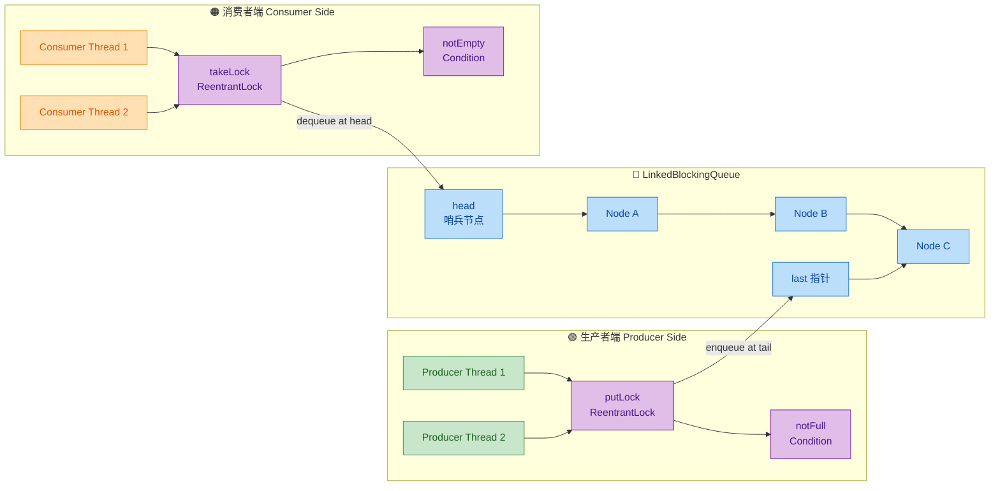
```mermaid
graph LR
    subgraph ProducerSide["🟢 生产者端 Producer Side"]
        direction TB
        P1["Producer Thread 1"]
        P2["Producer Thread 2"]
        PL["putLock\nReentrantLock"]
        NF["notFull\nCondition"]
        P1 --> PL
        P2 --> PL
        PL --> NF
    end

    subgraph Queue["🔵 LinkedBlockingQueue"]
        direction TB
        HEAD["head\n哨兵节点"]
        N1["Node A"]
        N2["Node B"]
        N3["Node C"]
        LAST["last 指针"]
        HEAD --> N1
        N1 --> N2
        N2 --> N3
        LAST --> N3
    end

    subgraph ConsumerSide["🟠 消费者端 Consumer Side"]
        direction TB
        C1["Consumer Thread 1"]
        C2["Consumer Thread 2"]
        TL["takeLock\nReentrantLock"]
        NE["notEmpty\nCondition"]
        C1 --> TL
        C2 --> TL
        TL --> NE
    end

    PL -->|"enqueue at tail"| LAST
    TL -->|"dequeue at head"| HEAD

    classDef producer fill:#C8E6C9,stroke:#388E3C,color:#1B5E20
    classDef consumer fill:#FFE0B2,stroke:#F57C00,color:#E65100
    classDef queue fill:#BBDEFB,stroke:#1976D2,color:#0D47A1
    classDef lock fill:#E1BEE7,stroke:#7B1FA2,color:#4A148C

    class P1,P2 producer
    class C1,C2 consumer
    class HEAD,N1,N2,N3,LAST queue
    class PL,NF,TL,NE lock
```

核心原理非常直观：**链表的头和尾是两个物理上不同的位置**。入队操作只修改 `last` 和 `last.next`，出队操作只修改 `head`（将原来 head 的后继提升为新哨兵）。只要队列中至少有一个元素（此时 `head` 和 `last` 指向不同的节点），入队和出队就在操作**不同的内存区域**，天然没有冲突，因此可以使用两把独立的锁来分别保护。

**哨兵节点正是这套方案的基石**：即使队列中只剩最后一个元素 X，`head` 指向哨兵，`last` 指向 X，二者仍然是不同的节点——`take` 操作修改的是 `head`（将 X 提升为新哨兵），`put` 操作修改的是 `last.next`（挂接新节点），依然不冲突。

#### put() 方法源码深度剖析

```java
public void put(E e) throws InterruptedException {
    if (e == null) throw new NullPointerException();  // 不允许插入 null 元素
    int c = -1;                       // 局部变量，记录操作前的元素数量，初始化为 -1 表示未赋值
    Node<E> node = new Node<E>(e);    // ① 在获取锁之前就创建好节点，减少持锁时间
    final ReentrantLock putLock = this.putLock;  // 引用到局部变量（JIT 优化惯例）
    final AtomicInteger count = this.count;       // 同上

    putLock.lockInterruptibly();       // ② 获取 putLock，可中断
    try {
        // ③ 使用 while 循环检查是否已满（防止虚假唤醒 spurious wakeup）
        while (count.get() == capacity) {
            notFull.await();           // 队列已满，当前生产者线程在 notFull 条件上阻塞等待
        }
        enqueue(node);                 // ④ 将新节点挂接到链表尾部
        c = count.getAndIncrement();   // ⑤ 原子递增 count，c 保存的是递增前的旧值
        if (c + 1 < capacity)          // ⑥ 如果入队后队列仍未满
            notFull.signal();          //    唤醒另一个可能在等待的生产者（级联唤醒）
    } finally {
        putLock.unlock();              // ⑦ 释放 putLock
    }
    if (c == 0)                        // ⑧ 如果入队前队列为空（c == 0 → 入队后变成了1个元素）
        signalNotEmpty();              //    需要唤醒可能正在等待的消费者
}
```

我们来逐步分析其中几个精妙的设计：

**精妙设计一：锁外创建节点**

注意第 ① 步，`new Node<E>(e)` 发生在 `putLock.lockInterruptibly()` **之前**。对象创建涉及内存分配和初始化，是一个相对耗时的操作。将它移到锁外可以缩短临界区长度（critical section duration），让其他线程更快地获取到锁。

**精妙设计二：级联唤醒（Cascading Signal）**

第 ⑥ 步 `if (c + 1 < capacity) notFull.signal()` 看起来令人困惑——"我刚放完一个元素，为什么要唤醒其他生产者？"

原因在于：消费者在 `take()` 中唤醒生产者时（`signalNotFull()`），只会唤醒**一个**生产者。如果此时有多个生产者在等待，只有被唤醒的那一个能继续工作。为了不浪费队列的剩余空间，被唤醒的生产者在完成入队后，如果发现队列仍有空间，就主动再唤醒一个同伴，形成"链式传递"。

**精妙设计三：跨锁唤醒**

第 ⑧ 步是最微妙的部分。`c == 0` 意味着入队前队列是空的，那么可能有消费者线程正阻塞在 `notEmpty.await()` 上。但 `notEmpty` 是 `takeLock` 的条件变量，我们现在持有的是 `putLock`——**不能在持有 putLock 时去操作 takeLock 的条件变量**。所以这一步被放在 `putLock.unlock()` **之后**，通过一个独立方法 `signalNotEmpty()` 来完成：

```java
// 唤醒等待在 notEmpty 上的消费者
// 注意：此方法在 putLock 已释放后调用
private void signalNotEmpty() {
    final ReentrantLock takeLock = this.takeLock;  // 引用到局部变量
    takeLock.lock();          // 获取 takeLock（因为 notEmpty 是 takeLock 的条件变量）
    try {
        notEmpty.signal();    // 唤醒一个等待中的消费者
    } finally {
        takeLock.unlock();    // 释放 takeLock
    }
}
```

#### take() 方法源码深度剖析

`take()` 与 `put()` 是完全**对称**的镜像设计：

```java
public E take() throws InterruptedException {
    E x;                               // 用于存放取出的元素
    int c = -1;                        // 局部变量，记录操作前的元素数量
    final AtomicInteger count = this.count;       // 引用到局部变量
    final ReentrantLock takeLock = this.takeLock;  // 引用到局部变量

    takeLock.lockInterruptibly();       // ① 获取 takeLock，可中断
    try {
        // ② 循环检查队列是否为空（防止虚假唤醒）
        while (count.get() == 0) {
            notEmpty.await();           // 队列为空，消费者在 notEmpty 条件上阻塞等待
        }
        x = dequeue();                  // ③ 从链表头部取出元素
        c = count.getAndDecrement();    // ④ 原子递减 count，c 保存递减前的旧值
        if (c > 1)                      // ⑤ 如果取出前队列中还有超过1个元素（取出后仍非空）
            notEmpty.signal();          //    级联唤醒另一个可能在等待的消费者
    } finally {
        takeLock.unlock();              // ⑥ 释放 takeLock
    }
    if (c == capacity)                  // ⑦ 如果取出前队列是满的（c == capacity → 取出后有1个空位）
        signalNotFull();               //    唤醒可能正在等待的生产者
    return x;                           // ⑧ 返回取出的元素
}
```

`dequeue()` 的实现同样值得细看：

```java
// 从链表头部取出元素（调用时已持有 takeLock）
private E dequeue() {
    Node<E> h = head;          // h 指向当前的哨兵节点
    Node<E> first = h.next;    // first 是真正的第一个数据节点
    h.next = h;                // 旧哨兵的 next 指向自身，帮助 GC（断开引用链）
    head = first;              // 将 first 提升为新的哨兵节点
    E x = first.item;         // 取出 first 中存储的元素
    first.item = null;         // 将新哨兵的 item 置为 null（符合哨兵约定）
    return x;                  // 返回取出的元素
}
```

关键操作 `h.next = h`（旧哨兵的 next 指向自身）是一种 **self-link** 技巧。它不仅帮助 GC 尽早回收旧哨兵节点，在 JDK 源码的迭代器实现中，还被用来判断"当前节点是否已经被移出队列"。

#### 双锁协作的完整时序

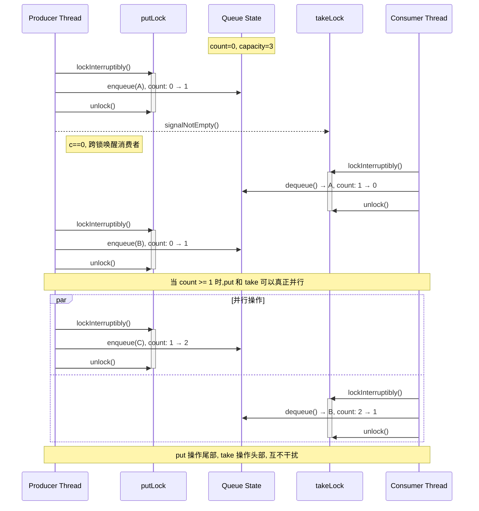
```mermaid
sequenceDiagram
    participant P as Producer Thread
    participant PL as putLock
    participant Q as Queue State
    participant TL as takeLock
    participant C as Consumer Thread

    Note over Q: count=0, capacity=3

    P->>PL: lockInterruptibly()
    activate PL
    P->>Q: enqueue(A), count: 0 → 1
    P->>PL: unlock()
    deactivate PL
    P-->>TL: signalNotEmpty()
    Note right of P: c==0, 跨锁唤醒消费者

    C->>TL: lockInterruptibly()
    activate TL
    C->>Q: dequeue() → A, count: 1 → 0
    C->>TL: unlock()
    deactivate TL

    P->>PL: lockInterruptibly()
    activate PL
    P->>Q: enqueue(B), count: 0 → 1
    P->>PL: unlock()
    deactivate PL

    Note over P,C: 当 count >= 1 时,put 和 take 可以真正并行

    par 并行操作
        P->>PL: lockInterruptibly()
        activate PL
        P->>Q: enqueue(C), count: 1 → 2
        P->>PL: unlock()
        deactivate PL
    and
        C->>TL: lockInterruptibly()
        activate TL
        C->>Q: dequeue() → B, count: 2 → 1
        C->>TL: unlock()
        deactivate TL
    end

    Note over P,C: put 操作尾部, take 操作头部, 互不干扰
```

#### remove() 等操作需要双锁齐下

虽然 `put` 和 `take` 各只需要一把锁，但像 `remove(Object o)` 这种需要遍历整条链表并可能从**中间**删除节点的操作，必须**同时持有两把锁**（fully lock），因为它既可能影响头部区域，也可能影响尾部区域：

```java
public boolean remove(Object o) {
    if (o == null) return false;       // null 元素不存在于队列中
    fullyLock();                        // 同时获取 putLock 和 takeLock
    try {
        // 遍历链表，寻找目标元素
        for (Node<E> trail = head, p = trail.next;
             p != null;
             trail = p, p = p.next) {
            if (o.equals(p.item)) {     // 找到目标
                unlink(p, trail);       // 从链表中移除
                return true;
            }
        }
        return false;                   // 未找到
    } finally {
        fullyUnlock();                  // 释放两把锁
    }
}

// 同时获取两把锁（固定顺序，防止死锁）
void fullyLock() {
    putLock.lock();    // 先获取 putLock
    takeLock.lock();   // 再获取 takeLock
}

// 同时释放两把锁（与获取顺序相反）
void fullyUnlock() {
    takeLock.unlock(); // 先释放 takeLock
    putLock.unlock();  // 再释放 putLock
}
```

注意 `fullyLock()` 中**获取锁的顺序是固定的**（先 `putLock` 后 `takeLock`），这是防止死锁的经典策略——**Lock Ordering**。如果 `put` 和 `take` 的代码路径中也可能同时获取两把锁，只要都遵循相同的顺序，就不会发生死锁。

---

### 吞吐量更高

#### 锁竞争维度的直观对比

`LinkedBlockingQueue` 吞吐量更高的根本原因在于**锁竞争的概率更低**。我们用一个并发场景来直观对比：

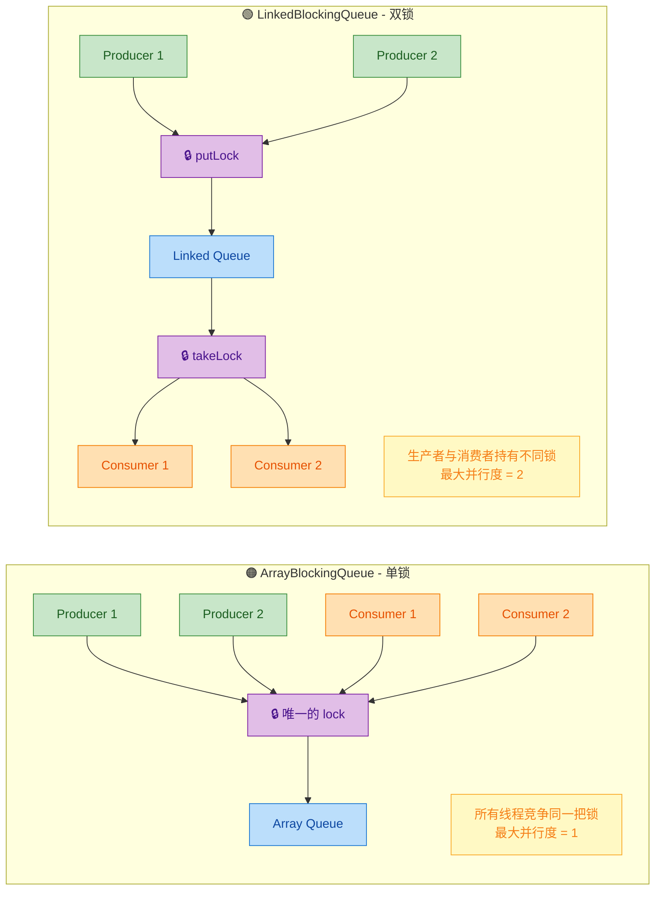
```mermaid
graph LR
    subgraph ABQ["🟠 ArrayBlockingQueue - 单锁"]
        direction TB
        ABQ_P1["Producer 1"] --> ABQ_LOCK["🔒 唯一的 lock"]
        ABQ_P2["Producer 2"] --> ABQ_LOCK
        ABQ_C1["Consumer 1"] --> ABQ_LOCK
        ABQ_C2["Consumer 2"] --> ABQ_LOCK
        ABQ_LOCK --> ABQ_Q["Array Queue"]
        ABQ_NOTE["所有线程竞争同一把锁\n最大并行度 = 1"]
    end

    subgraph LBQ["🟢 LinkedBlockingQueue - 双锁"]
        direction TB
        LBQ_P1["Producer 1"] --> LBQ_PL["🔒 putLock"]
        LBQ_P2["Producer 2"] --> LBQ_PL
        LBQ_PL --> LBQ_Q["Linked Queue"]
        LBQ_Q --> LBQ_TL["🔒 takeLock"]
        LBQ_TL --> LBQ_C1["Consumer 1"]
        LBQ_TL --> LBQ_C2["Consumer 2"]
        LBQ_NOTE["生产者与消费者持有不同锁\n最大并行度 = 2"]
    end

    classDef producer fill:#C8E6C9,stroke:#388E3C,color:#1B5E20
    classDef consumer fill:#FFE0B2,stroke:#F57C00,color:#E65100
    classDef lock fill:#E1BEE7,stroke:#7B1FA2,color:#4A148C
    classDef queue fill:#BBDEFB,stroke:#1976D2,color:#0D47A1
    classDef note fill:#FFF9C4,stroke:#F9A825,color:#F57F17

    class ABQ_P1,ABQ_P2,LBQ_P1,LBQ_P2 producer
    class ABQ_C1,ABQ_C2,LBQ_C1,LBQ_C2 consumer
    class ABQ_LOCK,LBQ_PL,LBQ_TL lock
    class ABQ_Q,LBQ_Q queue
    class ABQ_NOTE,LBQ_NOTE note
```

- **ArrayBlockingQueue**：无论是 `put` 还是 `take`，4 个线程都在争抢同一把锁，最大并行度为 1。
- **LinkedBlockingQueue**：`Producer 1/2` 只和彼此争 `putLock`，`Consumer 1/2` 只和彼此争 `takeLock`。Producer 和 Consumer **完全不互斥**，最大并行度为 2。

#### 吞吐量优势的量化分析

在理想的"**生产消费平衡**"场景（生产速率 ≈ 消费速率，队列既不空也不满）下，吞吐量差异最为明显：

| 场景 | ArrayBlockingQueue | LinkedBlockingQueue |
|---|---|---|
| 1P + 1C (1个生产者 + 1个消费者) | put 和 take 互斥，交替执行 | put 和 take 并行执行，吞吐量接近 2× |
| nP + nC (多生产者 + 多消费者) | 所有 2n 个线程竞争一把锁 | 生产者之间竞争 putLock，消费者之间竞争 takeLock，两组独立 |
| 队列经常为空或为满 | 阻塞等待 + 唤醒 | 同样需要阻塞和跨锁唤醒，优势缩小 |

需要注意，双锁分离带来的吞吐量优势**并非没有代价**。以下是完整的权衡分析：

```java
// ==================== 吞吐量优势的代价 ====================

// 代价1：更高的 GC 压力
// 每次入队都要 new Node()，每次出队都会产生需要回收的旧节点
// 在高吞吐场景下，短命对象的创建和回收会给 Young GC 带来显著压力
// ArrayBlockingQueue 则完全不产生额外对象

// 代价2：count 使用 AtomicInteger 带来的额外开销
// 虽然 CAS 操作很轻量，但在极高并发下，CPU Cache Line 的频繁失效
// (Cache Line Bouncing) 仍有一定影响

// 代价3：更差的缓存局部性 (Cache Locality)
// 数组元素在内存中连续存放，CPU 可以利用预取 (Prefetch) 机制
// 链表节点散布在堆内存各处，每次访问 next 指针都可能触发 Cache Miss

// 代价4：每个节点的额外内存开销
// Node 对象本身的对象头（12字节，压缩指针下）+ item 引用 + next 引用
// 相比数组中一个引用槽位（4~8字节），单个元素的内存开销多出约 3~4 倍
```

#### 选型决策指南

综合以上分析，我们可以归纳出如下选型策略：

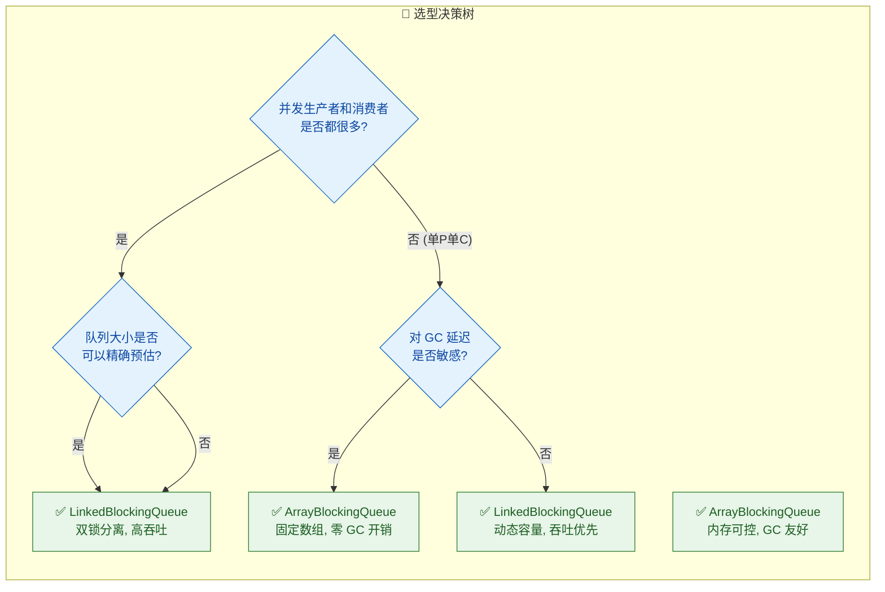
```mermaid
graph LR
    subgraph Decision["🔵 选型决策树"]
        direction TB
        Q1{"并发生产者和消费者\n是否都很多?"}
        Q2{"队列大小是否\n可以精确预估?"}
        Q3{"对 GC 延迟\n是否敏感?"}
        R1["✅ LinkedBlockingQueue\n双锁分离, 高吞吐"]
        R2["✅ ArrayBlockingQueue\n内存可控, GC 友好"]
        R3["✅ ArrayBlockingQueue\n固定数组, 零 GC 开销"]
        R4["✅ LinkedBlockingQueue\n动态容量, 吞吐优先"]

        Q1 -->|"是"| Q2
        Q1 -->|"否 (单P单C)"| Q3
        Q2 -->|"是"| R1
        Q2 -->|"否"| R1
        Q3 -->|"是"| R3
        Q3 -->|"否"| R4
    end

    classDef question fill:#E3F2FD,stroke:#1565C0,color:#0D47A1
    classDef answer fill:#E8F5E9,stroke:#2E7D32,color:#1B5E20

    class Q1,Q2,Q3 question
    class R1,R2,R3,R4 answer
```

**简单总结**：
- **高并发多线程**场景 → 优先 `LinkedBlockingQueue`（双锁优势明显）
- **GC 敏感**的低延迟系统（如金融交易、游戏引擎） → 优先 `ArrayBlockingQueue`（零对象创建）
- **容量可控性**要求高 → `ArrayBlockingQueue`（强制有界）
- **线程池工作队列** → 带有**明确容量**的 `LinkedBlockingQueue`（这是最常见的生产实践）

#### 完整对比总览

| 对比维度 | ArrayBlockingQueue | LinkedBlockingQueue |
|---|---|---|
| 底层结构 | 固定数组 `Object[]` | 单向链表 `Node<E>` |
| 锁机制 | 1 把 `ReentrantLock` | 2 把：`putLock` + `takeLock` |
| 条件变量 | `notEmpty` + `notFull`（同一把锁） | `notEmpty`（takeLock）+ `notFull`（putLock） |
| put/take 并行度 | 互斥（最大 1） | 并行（最大 2） |
| count 类型 | `int`（单锁保护，无需原子） | `AtomicInteger`（双锁共享，需原子） |
| 容量 | 强制有界 | 可选有界（默认 `Integer.MAX_VALUE`） |
| 内存分配 | 一次性预分配 | 动态按需分配 |
| GC 压力 | 低 | 较高（频繁创建/回收 Node） |
| Cache 友好性 | 高（连续内存） | 低（离散内存） |
| 公平性 | 可选（构造参数 `fair`） | 不支持（默认非公平） |
| 典型吞吐量 | 中等 | 高（尤其在多 P + 多 C 场景） |
| 最佳场景 | GC 敏感、容量确定 | 高并发、线程池工作队列 |

---

**📝 练习题**

以下关于 `LinkedBlockingQueue` 的描述，哪一项是**错误的**？

A. `LinkedBlockingQueue` 使用两把独立的 `ReentrantLock`（`putLock` 和 `takeLock`），允许 `put` 和 `take` 操作并行执行

B. `LinkedBlockingQueue` 的 `count` 字段使用 `AtomicInteger` 类型，因为 `put` 和 `take` 持有不同的锁，需要保证 `count` 的线程安全性

C. 当调用 `remove(Object o)` 方法时，只需要获取 `takeLock` 即可，因为删除操作本质上是一种"取出"操作

D. `LinkedBlockingQueue` 的默认容量是 `Integer.MAX_VALUE`，在生产环境中应当显式指定容量以避免 OOM 风险


**【答案】** C

**【解析】** 选项 C 是错误的。`remove(Object o)` 需要遍历整条链表，并可能从链表的**任意位置**删除节点，这个操作既涉及头部区域（`takeLock` 保护的范围），也涉及尾部区域（`putLock` 保护的范围）。因此，`remove()` 内部调用了 `fullyLock()`，**同时获取 `putLock` 和 `takeLock` 两把锁**，并以固定顺序加锁（先 `putLock` 后 `takeLock`）来防止死锁。选项 A 正确描述了双锁分离的核心特征；选项 B 正确解释了使用 `AtomicInteger` 的原因；选项 D 正确指出了默认无界的风险和最佳实践。

---

## SynchronousQueue

SynchronousQueue 是 Java 并发包中一个极为特殊的阻塞队列实现——它**没有任何内部容量**，甚至连一个元素的缓冲空间都不存在。每一次 `put` 操作都必须等待另一个线程的 `take` 操作与之配对，反之亦然。这种设计本质上不是"队列"（Queue），而是一个**线程间的直接握手通道**（Direct Handoff Channel）。

在实际工程中，SynchronousQueue 最广为人知的应用场景是 `Executors.newCachedThreadPool()` 的工作队列——当一个新任务被提交时，要么立刻有空闲线程接手，要么立刻创建一个新线程。这种"零缓冲"的语义完美契合了 CachedThreadPool 追求极致响应速度的设计目标。

```java
// CachedThreadPool 的源码定义，其核心就是 SynchronousQueue
public static ExecutorService newCachedThreadPool() {
    return new ThreadPoolExecutor(
        0,                          // corePoolSize: 核心线程为 0
        Integer.MAX_VALUE,          // maximumPoolSize: 最大线程数几乎无限
        60L, TimeUnit.SECONDS,      // keepAliveTime: 空闲线程存活 60 秒
        new SynchronousQueue<Runnable>()  // workQueue: 零容量同步队列
    );
}
```

### 无容量

SynchronousQueue 最核心的特征就是 **容量恒为零**（Zero Capacity）。这不是"容量为 1"或"很小的队列"，而是**真正意义上不存储任何元素**。

```java
// 基本特征验证
SynchronousQueue<String> sq = new SynchronousQueue<>();

// size() 永远返回 0
System.out.println(sq.size());        // 输出: 0

// isEmpty() 永远返回 true
System.out.println(sq.isEmpty());     // 输出: true

// peek() 永远返回 null（没有元素可窥探）
System.out.println(sq.peek());        // 输出: null

// remainingCapacity() 永远返回 0
System.out.println(sq.remainingCapacity()); // 输出: 0

// offer() 在无匹配线程时立即返回 false（非阻塞）
System.out.println(sq.offer("hello")); // 输出: false

// poll() 在无匹配线程时立即返回 null（非阻塞）
System.out.println(sq.poll());         // 输出: null

// iterator() 返回空迭代器
System.out.println(sq.iterator().hasNext()); // 输出: false
```

这意味着 SynchronousQueue **不能被迭代**，**不能被转为数组**（`toArray` 返回空数组），也**不能调用 `contains`、`remove` 等方法操作内部元素**——因为根本就没有"内部"。

与 ArrayBlockingQueue（有界数组缓冲）和 LinkedBlockingQueue（链表缓冲）形成鲜明对比：

```
┌─────────────────────────────────────────────────────────────────────┐
│                    三种阻塞队列的缓冲模型对比                          │
├─────────────────────────────────────────────────────────────────────┤
│                                                                     │
│  ArrayBlockingQueue (capacity=3)                                    │
│  ┌───────┬───────┬───────┐                                         │
│  │ item0 │ item1 │ item2 │   ← 固定大小的数组缓冲区                  │
│  └───────┴───────┴───────┘                                         │
│  Producer ──put──▶ [Buffer] ──take──▶ Consumer                     │
│                                                                     │
│  LinkedBlockingQueue (capacity=N)                                   │
│  ┌───────┐  ┌───────┐  ┌───────┐                                  │
│  │ node0 │─▶│ node1 │─▶│ node2 │──▶ ...                           │
│  └───────┘  └───────┘  └───────┘                                   │
│  Producer ──put──▶ [Buffer] ──take──▶ Consumer                     │
│                                                                     │
│  SynchronousQueue (capacity=0)                                      │
│                                                                     │
│  Producer ──────── handoff ────────▶ Consumer                      │
│              (无缓冲, 直接传递)                                      │
│                                                                     │
└─────────────────────────────────────────────────────────────────────┘
```

那么问题来了：**一个不存储元素的"队列"，到底是怎么传递数据的？** 答案就在于它的"直接传递"机制。

### 直接传递

SynchronousQueue 的精髓在于 **Direct Handoff**（直接交接）语义——**生产者不是把数据放入队列，而是直接交到消费者手中；消费者也不是从队列取出数据，而是直接从生产者手中接过来。**

这种机制要求**每一次数据传递都必须有一对线程同时参与**：

- 如果生产者先到达，它会**阻塞等待**，直到有消费者来取走数据
- 如果消费者先到达，它会**阻塞等待**，直到有生产者来提供数据
- 当一对匹配成功时，数据在两个线程之间**瞬间转移**（zero-copy in terms of queue storage）

```java
public class DirectHandoffDemo {
    public static void main(String[] args) {
        // 创建同步队列
        SynchronousQueue<String> channel = new SynchronousQueue<>();

        // 消费者线程：先启动，阻塞等待生产者
        Thread consumer = new Thread(() -> {
            try {
                System.out.println("[Consumer] 等待数据...");
                long start = System.currentTimeMillis();       // 记录开始等待的时间

                String data = channel.take();                  // 阻塞，直到生产者 put

                long elapsed = System.currentTimeMillis() - start;
                System.out.println("[Consumer] 收到: " + data  // 打印接收到的数据
                    + "，等待了 " + elapsed + "ms");            // 打印等待耗时
            } catch (InterruptedException e) {
                Thread.currentThread().interrupt();             // 恢复中断标志
            }
        }, "consumer-thread");

        // 生产者线程：延迟 2 秒后 put
        Thread producer = new Thread(() -> {
            try {
                Thread.sleep(2000);                            // 模拟延迟 2 秒
                System.out.println("[Producer] 发送数据...");
                channel.put("Hello SynchronousQueue!");        // 阻塞，直到消费者 take
                System.out.println("[Producer] 数据已被消费者取走"); // put 返回意味着握手成功
            } catch (InterruptedException e) {
                Thread.currentThread().interrupt();
            }
        }, "producer-thread");

        consumer.start();                                      // 先启动消费者
        producer.start();                                      // 再启动生产者
    }
}

// 输出:
// [Consumer] 等待数据...
// (... 约 2 秒后 ...)
// [Producer] 发送数据...
// [Consumer] 收到: Hello SynchronousQueue!，等待了 2003ms
// [Producer] 数据已被消费者取走
```

注意最后两行输出的顺序——`put()` 方法**返回**（不再阻塞）的时刻，恰好就是 `take()` 方法**返回**的时刻。两者几乎同时完成，因为它们本质上是**同一个握手事件的两面**。

在内部实现层面，SynchronousQueue 并不依赖传统的"锁+条件变量"模型（不像 ArrayBlockingQueue 和 LinkedBlockingQueue），而是采用了基于 **CAS（Compare-And-Swap）** 的无锁算法。它维护的不是数据节点，而是**等待线程的节点**：

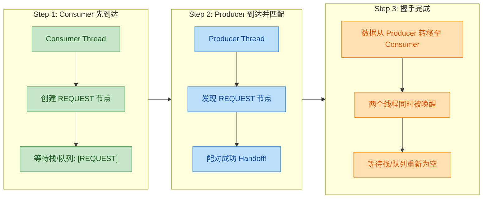
```mermaid
graph LR
    subgraph Step1["Step 1: Consumer 先到达"]
        direction TB
        C1["Consumer Thread"]
        W1["创建 REQUEST 节点"]
        Q1["等待栈/队列: [REQUEST]"]
        C1 --> W1 --> Q1
    end

    subgraph Step2["Step 2: Producer 到达并匹配"]
        direction TB
        P1["Producer Thread"]
        M1["发现 REQUEST 节点"]
        H1["配对成功 Handoff!"]
        P1 --> M1 --> H1
    end

    subgraph Step3["Step 3: 握手完成"]
        direction TB
        D1["数据从 Producer 转移至 Consumer"]
        U1["两个线程同时被唤醒"]
        E1["等待栈/队列重新为空"]
        D1 --> U1 --> E1
    end

    Step1 --> Step2 --> Step3

    classDef green fill:#C8E6C9,stroke:#388E3C,color:#1B5E20
    classDef blue fill:#BBDEFB,stroke:#1976D2,color:#0D47A1
    classDef orange fill:#FFE0B2,stroke:#F57C00,color:#E65100

    class C1,W1,Q1 green
    class P1,M1,H1 blue
    class D1,U1,E1 orange
```

这套无锁机制的核心数据结构——`Transferer`——正是区分公平/非公平模式的关键。

### 公平/非公平模式

SynchronousQueue 的构造函数接受一个 `boolean fair` 参数，它决定了等待线程被匹配的顺序策略：

```java
// 非公平模式（默认）：内部使用 TransferStack（栈 / LIFO）
SynchronousQueue<String> unfairQueue = new SynchronousQueue<>();
SynchronousQueue<String> unfairQueue2 = new SynchronousQueue<>(false);

// 公平模式：内部使用 TransferQueue（队列 / FIFO）
SynchronousQueue<String> fairQueue = new SynchronousQueue<>(true);
```

我们来看构造函数的源码：

```java
public SynchronousQueue(boolean fair) {
    // fair=true  → 使用 TransferQueue（FIFO，先来先服务）
    // fair=false → 使用 TransferStack（LIFO，后来先服务）
    transferer = fair ? new TransferQueue<E>() : new TransferStack<E>();
}
```

两种模式的本质区别在于底层数据结构，这直接影响了线程的匹配策略和性能特性：

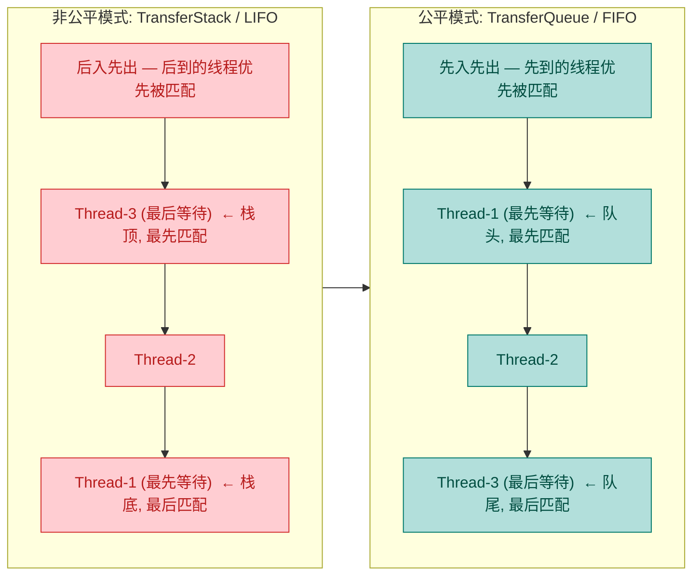
```mermaid
graph LR
    subgraph NonFair["非公平模式: TransferStack / LIFO"]
        direction TB
        NF_DESC["后入先出 — 后到的线程优先被匹配"]
        NF_T3["Thread-3 (最后等待)  ← 栈顶, 最先匹配"]
        NF_T2["Thread-2"]
        NF_T1["Thread-1 (最先等待)  ← 栈底, 最后匹配"]
        NF_DESC --> NF_T3 --> NF_T2 --> NF_T1
    end

    subgraph Fair["公平模式: TransferQueue / FIFO"]
        direction TB
        F_DESC["先入先出 — 先到的线程优先被匹配"]
        F_T1["Thread-1 (最先等待)  ← 队头, 最先匹配"]
        F_T2["Thread-2"]
        F_T3["Thread-3 (最后等待)  ← 队尾, 最后匹配"]
        F_DESC --> F_T1 --> F_T2 --> F_T3
    end

    NonFair --> Fair

    classDef red fill:#FFCDD2,stroke:#D32F2F,color:#B71C1C
    classDef teal fill:#B2DFDB,stroke:#00796B,color:#004D40

    class NF_DESC,NF_T3,NF_T2,NF_T1 red
    class F_DESC,F_T1,F_T2,F_T3 teal
```

下面深入分析两种模式的内部实现原理。

**TransferStack（非公平模式）** 使用一个无锁的 Treiber Stack。每个节点有三种模式：

| 节点模式 | 常量值 | 含义 |
|:---:|:---:|:---|
| `REQUEST` | 0 | 消费者节点，等待数据 |
| `DATA` | 1 | 生产者节点，携带数据等待消费者 |
| `FULFILLING` | 2 | 正在匹配中的标记位 |

当一个新线程到达时，算法的核心逻辑如下：

```java
// TransferStack.transfer() 的简化伪代码
E transfer(E e, boolean timed, long nanos) {
    SNode s = null;                                // 当前线程将要创建的节点
    // e==null 表示 take（REQUEST），e!=null 表示 put（DATA）
    int mode = (e == null) ? REQUEST : DATA;

    for (;;) {                                     // 经典 CAS 自旋循环
        SNode h = head;                            // 读取栈顶节点

        if (h == null || h.mode == mode) {
            // 情况1: 栈为空 或 栈顶节点与当前同类（都是生产者或都是消费者）
            // → 将当前节点压入栈顶，然后阻塞等待配对
            // 注意: 压到栈顶 = LIFO = 后来的反而先被匹配 = 非公平
            s = new SNode(mode, e);                // 创建新节点
            if (casHead(h, s)) {                   // CAS 更新栈顶
                // 自旋一段时间后 park 阻塞，等待被匹配
                SNode m = awaitFulfill(s, timed, nanos);
                return (mode == REQUEST) ? m.item : e;
            }
        }
        else if (!isFulfilling(h.mode)) {
            // 情况2: 栈顶节点是互补类型（一个 REQUEST 一个 DATA）且未在匹配中
            // → 尝试匹配：创建一个 FULFILLING 节点压入栈顶
            s = new SNode(FULFILLING | mode, e);   // 设置 FULFILLING 标记
            if (casHead(h, s)) {                   // CAS 更新栈顶
                SNode m = h;                       // m 是被匹配的节点
                // 完成匹配: 交换数据，唤醒对方线程，弹出两个节点
                casHead(s, m.next);                // 弹出 s 和 m
                // 返回交换到的数据
                return (mode == REQUEST) ? m.item : e;
            }
        }
        else {
            // 情况3: 栈顶正在 FULFILLING，帮助它完成匹配
            // （无锁编程中的"帮助完成"模式）
            // ...
        }
    }
}
```

**TransferQueue（公平模式）** 则使用一个无锁的 Michael & Scott 队列。节点从尾部入队、从头部匹配，保证了 **FIFO** 顺序：

```java
// TransferQueue.transfer() 的简化伪代码
E transfer(E e, boolean timed, long nanos) {
    QNode s = null;
    boolean isData = (e != null);                  // 判断是生产者还是消费者

    for (;;) {
        QNode t = tail;                            // 读取队尾
        QNode h = head;                            // 读取队头

        if (t == h || t.isData == isData) {
            // 情况1: 队列为空 或 队尾节点与当前同类
            // → 将当前节点加入队尾，然后阻塞等待配对
            // 加入队尾 = FIFO = 先来的先被匹配 = 公平
            s = new QNode(e, isData);              // 创建新节点
            if (t.casNext(null, s)) {              // CAS 追加到队尾
                casTail(t, s);                     // CAS 更新 tail 指针
                // 自旋后 park 阻塞
                Object x = awaitFulfill(s, e, timed, nanos);
                return (E) x;
            }
        }
        else {
            // 情况2: 队头节点是互补类型
            // → 从队头开始匹配（FIFO 保证公平性）
            QNode m = h.next;                      // 取队头后第一个真实节点
            if (m != null && m.isData != isData) {
                // 尝试匹配: CAS 交换数据
                Object x = m.item;
                if (m.casItem(x, e)) {             // CAS 写入数据完成握手
                    advanceHead(h, m);             // 推进 head，弹出已匹配节点
                    LockSupport.unpark(m.waiter);  // 唤醒等待的对方线程
                    return (x != null) ? (E) x : e;
                }
            }
        }
    }
}
```

下面用一段完整代码演示公平与非公平模式在多生产者场景下的行为差异：

```java
import java.util.concurrent.SynchronousQueue;

public class FairnessDemo {
    public static void main(String[] args) throws InterruptedException {
        // ============ 测试非公平模式 ============
        System.out.println("===== 非公平模式 (LIFO) =====");
        testFairness(false);                              // 传入 false 使用 TransferStack

        Thread.sleep(3000);                               // 等待上一轮测试完成

        // ============ 测试公平模式 ============
        System.out.println("\n===== 公平模式 (FIFO) =====");
        testFairness(true);                               // 传入 true 使用 TransferQueue
    }

    static void testFairness(boolean fair) throws InterruptedException {
        SynchronousQueue<String> queue = new SynchronousQueue<>(fair);

        // 依次启动 3 个生产者，每个间隔 100ms 确保入栈/队顺序可控
        for (int i = 1; i <= 3; i++) {
            final int id = i;                             // 捕获当前编号
            new Thread(() -> {
                try {
                    System.out.println("Producer-" + id + " 准备 put...");
                    queue.put("data-" + id);              // 阻塞，等待消费者匹配
                    System.out.println("Producer-" + id + " put 完成");
                } catch (InterruptedException e) {
                    Thread.currentThread().interrupt();
                }
            }, "Producer-" + id).start();

            Thread.sleep(100);                            // 确保按 1→2→3 的顺序进入等待
        }

        Thread.sleep(500);                                // 让 3 个生产者都进入等待状态

        // 启动 3 个消费者，依次 take
        for (int i = 1; i <= 3; i++) {
            final int id = i;
            new Thread(() -> {
                try {
                    String data = queue.take();           // 消费者取数据
                    System.out.println("Consumer-" + id
                        + " 取到: " + data);              // 观察取到的数据来自哪个生产者
                } catch (InterruptedException e) {
                    Thread.currentThread().interrupt();
                }
            }, "Consumer-" + id).start();

            Thread.sleep(100);                            // 让匹配逐个发生，便于观察顺序
        }
    }
}

// ===== 非公平模式 (LIFO) 典型输出 =====
// Producer-1 准备 put...
// Producer-2 准备 put...
// Producer-3 准备 put...
// Consumer-1 取到: data-3    ← 后进的 Producer-3 反而先被匹配（栈顶）
// Consumer-2 取到: data-2
// Consumer-3 取到: data-1    ← 最先进的 Producer-1 最后被匹配（栈底）

// ===== 公平模式 (FIFO) 典型输出 =====
// Producer-1 准备 put...
// Producer-2 准备 put...
// Producer-3 准备 put...
// Consumer-1 取到: data-1    ← 先进的 Producer-1 先被匹配（队头）
// Consumer-2 取到: data-2
// Consumer-3 取到: data-3    ← 最后进的 Producer-3 最后被匹配（队尾）
```

两种模式的特性对比总结如下：

| 对比维度 | 非公平模式 (默认) | 公平模式 |
|:---|:---|:---|
| **内部结构** | `TransferStack` (Treiber Stack) | `TransferQueue` (M&S Queue) |
| **匹配顺序** | LIFO — 后等待的线程先被匹配 | FIFO — 先等待的线程先被匹配 |
| **吞吐量** | **更高** — 栈操作只需 CAS 栈顶 | 略低 — 需维护 head 和 tail 两个指针 |
| **线程饥饿** | 可能出现：早到的线程被反复跳过 | **不会**：严格按到达顺序服务 |
| **CPU 缓存友好度** | **更好** — 最近使用的线程更可能仍在 CPU 缓存中 | 较差 — 队头线程可能已被换出缓存 |
| **适用场景** | 高吞吐、短任务、不在意顺序 | 需要公平性保证、避免饥饿 |

> **为什么默认选非公平？** 这是一个经典的 performance vs. fairness 权衡。在非公平模式下，最近刚被 `park` 的线程往往还驻留在 CPU 缓存中（cache-hot），唤醒它的成本更低、上下文切换更快。Doug Lea 在设计时的哲学是：**大多数场景下，吞吐量比绝对公平更重要**。这与 `ReentrantLock` 默认非公平的设计理念一脉相承。

最后，将 SynchronousQueue 与前面讲过的两种队列做一个全面对比：

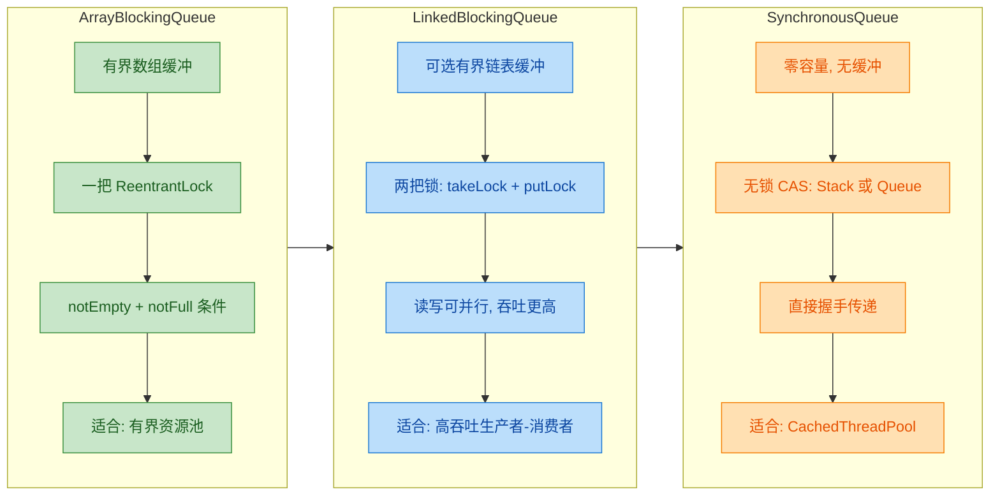
```mermaid
graph LR
    subgraph ABQ["ArrayBlockingQueue"]
        direction TB
        A1["有界数组缓冲"]
        A2["一把 ReentrantLock"]
        A3["notEmpty + notFull 条件"]
        A4["适合: 有界资源池"]
        A1 --> A2 --> A3 --> A4
    end

    subgraph LBQ["LinkedBlockingQueue"]
        direction TB
        L1["可选有界链表缓冲"]
        L2["两把锁: takeLock + putLock"]
        L3["读写可并行, 吞吐更高"]
        L4["适合: 高吞吐生产者-消费者"]
        L1 --> L2 --> L3 --> L4
    end

    subgraph SQ["SynchronousQueue"]
        direction TB
        S1["零容量, 无缓冲"]
        S2["无锁 CAS: Stack 或 Queue"]
        S3["直接握手传递"]
        S4["适合: CachedThreadPool"]
        S1 --> S2 --> S3 --> S4
    end

    ABQ --> LBQ --> SQ

    classDef green fill:#C8E6C9,stroke:#388E3C,color:#1B5E20
    classDef blue fill:#BBDEFB,stroke:#1976D2,color:#0D47A1
    classDef deepOrange fill:#FFE0B2,stroke:#F57C00,color:#E65100

    class A1,A2,A3,A4 green
    class L1,L2,L3,L4 blue
    class S1,S2,S3,S4 deepOrange
```

---

**📝 练习题**

以下关于 `SynchronousQueue` 的描述，**错误**的是？

A. `SynchronousQueue` 的 `size()` 方法永远返回 0，因为它不存储任何元素


B. 在非公平模式下，`SynchronousQueue` 内部使用 `TransferStack`，匹配顺序为 LIFO


C. 当一个线程调用 `put()` 后，如果没有线程调用 `take()`，`put()` 会立即返回 `false`


D. `Executors.newCachedThreadPool()` 使用 `SynchronousQueue` 作为工作队列，实现任务的直接交接


**【答案】** C

**【解析】** `put()` 是 `BlockingQueue` 接口定义的**阻塞方法**，其签名为 `void put(E e) throws InterruptedException`。当没有消费者线程等待时，`put()` 会**无限期阻塞**，而不是返回 `false`。选项 C 描述的行为其实是 `offer()` 方法的语义——`offer(E e)` 是非阻塞的，在没有匹配线程时会立即返回 `false`。这是阻塞队列 API 设计中 `put/take`（阻塞）与 `offer/poll`（非阻塞或限时）两套语义的经典区分。A 正确描述了零容量特性；B 正确描述了非公平模式的 LIFO 栈结构；D 正确描述了 `CachedThreadPool` 的实现细节。

---

## PriorityBlockingQueue

在并发编程的队列家族中，`ArrayBlockingQueue` 和 `LinkedBlockingQueue` 都遵循 **FIFO（先进先出）** 的出队规则——谁先进来，谁就先被消费。但在真实业务中，我们经常遇到一种场景：**不是所有任务都同等重要**。比如告警系统中，P0 级别的告警必须比 P2 级别的先被处理；医院急诊分诊系统中，危重患者必须优先于轻症患者。这种"按优先级出队"的需求，正是 `PriorityBlockingQueue` 的核心价值。

`PriorityBlockingQueue` 是 `java.util.concurrent` 包提供的一个 **无界（Unbounded）、线程安全、基于二叉堆的优先级阻塞队列**。它结合了 `PriorityQueue` 的优先级排序能力与 `BlockingQueue` 的阻塞语义，是并发场景下实现"优先级调度"的首选数据结构。

### 无界优先级队列

#### 什么是"无界"

"无界"意味着 `PriorityBlockingQueue` **没有容量上限**（理论上限是 `Integer.MAX_VALUE - 8`，约 21 亿）。这带来一个极其重要的行为特征：

- **`put(e)` 方法永远不会阻塞**——因为队列永远"不满"，总能放进去。
- **`take()` 方法在队列为空时会阻塞**——消费者必须等待至少一个元素到来。

这与 `ArrayBlockingQueue`（有界，put/take 都可能阻塞）形成了鲜明对比：

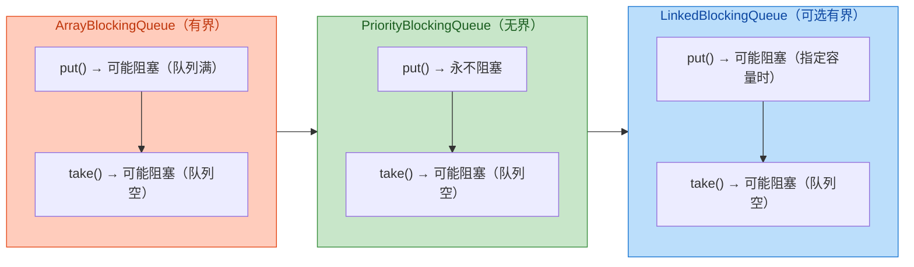
```mermaid
graph LR
    subgraph ABQ["ArrayBlockingQueue（有界）"]
        direction TB
        A1["put() → 可能阻塞（队列满）"]
        A2["take() → 可能阻塞（队列空）"]
        A1 --> A2
    end

    subgraph PBQ["PriorityBlockingQueue（无界）"]
        direction TB
        B1["put() → 永不阻塞"]
        B2["take() → 可能阻塞（队列空）"]
        B1 --> B2
    end

    subgraph LBQ["LinkedBlockingQueue（可选有界）"]
        direction TB
        C1["put() → 可能阻塞（指定容量时）"]
        C2["take() → 可能阻塞（队列空）"]
        C1 --> C2
    end

    ABQ --> PBQ --> LBQ

    classDef bounded fill:#FFCCBC,stroke:#E64A19,color:#BF360C
    classDef unbounded fill:#C8E6C9,stroke:#388E3C,color:#1B5E20
    classDef optional fill:#BBDEFB,stroke:#1976D2,color:#0D47A1

    class ABQ bounded
    class PBQ unbounded
    class LBQ optional
```

> ⚠️ **无界 ≠ 无风险**。正因为 `put()` 永不阻塞，生产者可以无限制地向队列塞数据。如果消费速度跟不上生产速度，队列会持续膨胀，最终导致 **OOM（OutOfMemoryError）**。在生产环境中使用 `PriorityBlockingQueue` 时，必须在应用层自行控制流量或监控队列大小。

#### 优先级排序规则

`PriorityBlockingQueue` 中的元素**不是按插入顺序出队**，而是按照**优先级**出队。优先级的确定有两种方式：

1. **自然排序（Natural Ordering）**：元素类实现 `Comparable<T>` 接口，队列使用 `compareTo()` 方法比较。
2. **自定义比较器（Custom Comparator）**：构造队列时传入 `Comparator<T>`，队列使用该比较器决定优先级。

**核心原则**：`compareTo()` 或 `compare()` 返回值越小的元素，优先级越高（即最小元素最先出队，这是最小堆的特性）。

来看一个完整的示例——模拟医院急诊分诊系统：

```java
import java.util.concurrent.PriorityBlockingQueue;

/**
 * 患者类，实现 Comparable 接口以支持优先级排序
 * 优先级数字越小，病情越紧急，应优先处理
 */
class Patient implements Comparable<Patient> {
    // 患者姓名
    private final String name;
    // 优先级：1=危重, 2=急症, 3=普通
    private final int priority;
    // 到达时间戳，同优先级时按到达先后排序
    private final long arrivalTime;

    public Patient(String name, int priority) {
        this.name = name;
        this.priority = priority;
        // 记录创建（到达）时间
        this.arrivalTime = System.nanoTime();
    }

    /**
     * 比较规则：
     * 1. 首先按 priority 升序（数字越小越紧急）
     * 2. 同 priority 时，按 arrivalTime 升序（先到先处理）
     */
    @Override
    public int compareTo(Patient other) {
        // 先比较优先级
        int result = Integer.compare(this.priority, other.priority);
        if (result == 0) {
            // 优先级相同时，比较到达时间
            result = Long.compare(this.arrivalTime, other.arrivalTime);
        }
        return result;
    }

    @Override
    public String toString() {
        // 将优先级数字映射为可读文本
        String level = switch (priority) {
            case 1 -> "危重";
            case 2 -> "急症";
            case 3 -> "普通";
            default -> "未知";
        };
        return String.format("[%s-%s] %s", level, priority, name);
    }
}

public class EmergencyRoomDemo {
    public static void main(String[] args) throws InterruptedException {
        // 创建优先级阻塞队列，无需指定容量
        PriorityBlockingQueue<Patient> queue = new PriorityBlockingQueue<>();

        // 模拟患者以任意顺序到达
        queue.put(new Patient("张三", 3));  // 普通患者先到
        queue.put(new Patient("李四", 1));  // 危重患者后到
        queue.put(new Patient("王五", 2));  // 急症患者
        queue.put(new Patient("赵六", 1));  // 另一个危重患者
        queue.put(new Patient("钱七", 3));  // 另一个普通患者

        // 按优先级出队
        System.out.println("=== 急诊分诊顺序 ===");
        while (!queue.isEmpty()) {
            // take() 会取出优先级最高（compareTo 最小）的元素
            Patient patient = queue.take();
            System.out.println(patient);
        }
    }
}
```

输出结果：

```
=== 急诊分诊顺序 ===
[危重-1] 李四
[危重-1] 赵六
[急症-2] 王五
[普通-3] 张三
[普通-3] 钱七
```

可以看到，**无论插入顺序如何，出队时始终按优先级从高到低排列**。两个危重患者之间按到达先后（`arrivalTime`）排序。

#### 构造方法一览

`PriorityBlockingQueue` 提供了四个构造方法，满足不同场景：

```java
// 1. 默认构造：初始容量 11，自然排序
PriorityBlockingQueue<Task> q1 = new PriorityBlockingQueue<>();

// 2. 指定初始容量（注意：这只是"初始"容量，队列仍然无界）
PriorityBlockingQueue<Task> q2 = new PriorityBlockingQueue<>(100);

// 3. 指定初始容量 + 自定义比较器
// 这里用 Comparator 实现"数字大的优先级高"（最大堆）
PriorityBlockingQueue<Integer> q3 = new PriorityBlockingQueue<>(
    16,                              // 初始容量
    (a, b) -> Integer.compare(b, a)  // 降序比较器，形成最大堆
);

// 4. 从已有集合初始化
List<Task> existingTasks = List.of(task1, task2, task3);
PriorityBlockingQueue<Task> q4 = new PriorityBlockingQueue<>(existingTasks);
```

> 💡 初始容量（`initialCapacity`）仅影响底层数组的初始大小，并不限制队列最终能存放的元素数量。当元素数量超过当前容量时，队列会自动扩容。

#### 关键 API 行为对比

| 方法 | 队列为空时 | 队列"满"时 | 返回值 |
|------|-----------|-----------|--------|
| `put(e)` | 正常插入 | **永不发生**（无界） | `void` |
| `take()` | **阻塞等待** | N/A | 元素 |
| `offer(e)` | 正常插入 | **始终返回 true** | `boolean` |
| `offer(e, timeout, unit)` | 正常插入 | 始终返回 true（无界） | `boolean` |
| `poll()` | 返回 `null` | N/A | 元素或 null |
| `poll(timeout, unit)` | 等待指定时间 | N/A | 元素或 null |
| `peek()` | 返回 `null` | N/A | 元素或 null（不移除） |
| `drainTo(collection)` | 返回 0 | N/A | 转移的元素数 |

有一点极易被忽略：**`peek()` 和 `poll()` 保证返回的是当前优先级最高的元素，但 `iterator()` 不保证按优先级顺序遍历**！这是因为迭代器直接遍历底层数组，而堆数组的内部顺序并非完全排序。

```java
PriorityBlockingQueue<Integer> queue = new PriorityBlockingQueue<>();
queue.addAll(List.of(5, 1, 3, 2, 4));

// ❌ 迭代器不保证顺序！可能输出：1 2 3 5 4 或其他堆序排列
System.out.println("Iterator 遍历：");
for (int num : queue) {
    System.out.print(num + " ");
}

// ✅ 逐个 poll 才能保证优先级顺序：1 2 3 4 5
System.out.println("\npoll 逐个取出：");
while (!queue.isEmpty()) {
    System.out.print(queue.poll() + " ");
}
```

---

### 堆实现

`PriorityBlockingQueue` 的底层数据结构是 **二叉最小堆（Binary Min-Heap）**，用数组实现。理解堆的原理是深入掌握这个队列的关键。

#### 二叉堆基础

二叉堆是一棵**完全二叉树**（Complete Binary Tree），它满足**堆序性质（Heap Property）**：

- **最小堆（Min-Heap）**：每个节点的值 ≤ 其子节点的值。根节点是最小元素。
- **最大堆（Max-Heap）**：每个节点的值 ≥ 其子节点的值。根节点是最大元素。

`PriorityBlockingQueue` 默认使用**最小堆**，即 `compareTo()` 返回最小的元素位于堆顶。

完全二叉树的精妙之处在于：它可以**完美地用数组表示**，不需要任何指针。对于数组下标 `i`（从 0 开始）：

```
java
// 父节点下标
parent(i) = (i - 1) / 2       // 整数除法，向下取整

// 左子节点下标
leftChild(i) = 2 * i + 1

// 右子节点下标
rightChild(i) = 2 * i + 2
```

让我们用一个具体例子可视化堆与数组的对应关系：

```
假设插入元素顺序: 5, 3, 8, 1, 4, 2

最终最小堆的逻辑树结构:

              1              ← 堆顶 (index 0)，最小值
            /   \
           3     2           ← index 1, 2
          / \   /
         5   4 8             ← index 3, 4, 5

对应的底层数组 (queue[]):
┌─────┬─────┬─────┬─────┬─────┬─────┬─────┬─────┐
│  1  │  3  │  2  │  5  │  4  │  8  │     │     │
├─────┼─────┼─────┼─────┼─────┼─────┼─────┼─────┤
│ [0] │ [1] │ [2] │ [3] │ [4] │ [5] │ [6] │ [7] │
└─────┴─────┴─────┴─────┴─────┴─────┴─────┴─────┘
  ↑ size = 6                  ↑ 空闲空间（capacity = 8）

验证堆序性质:
  queue[0]=1 ≤ queue[1]=3 ✓    (parent ≤ leftChild)
  queue[0]=1 ≤ queue[2]=2 ✓    (parent ≤ rightChild)
  queue[1]=3 ≤ queue[3]=5 ✓
  queue[1]=3 ≤ queue[4]=4 ✓
  queue[2]=2 ≤ queue[5]=8 ✓
```

#### 核心操作：上浮与下沉

堆的两个核心操作是 **siftUp（上浮/上滤）** 和 **siftDown（下沉/下滤）**，它们维护堆序性质：

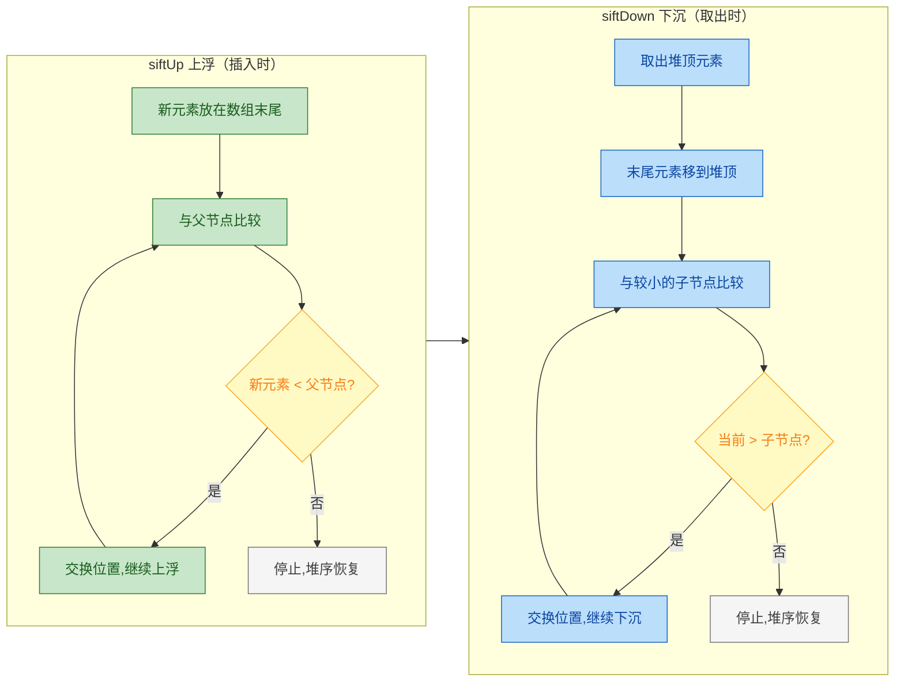
```mermaid
graph LR
    subgraph SiftUp["siftUp 上浮（插入时）"]
        direction TB
        U1["新元素放在数组末尾"]
        U2["与父节点比较"]
        U3{"新元素 < 父节点?"}
        U4["交换位置,继续上浮"]
        U5["停止,堆序恢复"]
        U1 --> U2 --> U3
        U3 -->|"是"| U4
        U4 --> U2
        U3 -->|"否"| U5
    end

    subgraph SiftDown["siftDown 下沉（取出时）"]
        direction TB
        D1["取出堆顶元素"]
        D2["末尾元素移到堆顶"]
        D3["与较小的子节点比较"]
        D4{"当前 > 子节点?"}
        D5["交换位置,继续下沉"]
        D6["停止,堆序恢复"]
        D1 --> D2 --> D3 --> D4
        D4 -->|"是"| D5
        D5 --> D3
        D4 -->|"否"| D6
    end

    SiftUp --> SiftDown

    classDef insertOp fill:#C8E6C9,stroke:#2E7D32,color:#1B5E20
    classDef removeOp fill:#BBDEFB,stroke:#1565C0,color:#0D47A1
    classDef decision fill:#FFF9C4,stroke:#F9A825,color:#F57F17
    classDef terminal fill:#F5F5F5,stroke:#757575,color:#424242

    class U1,U2,U4 insertOp
    class D1,D2,D3,D5 removeOp
    class U3,D4 decision
    class U5,D6 terminal
```

#### 源码深度剖析

下面我们逐行剖析 JDK 中 `PriorityBlockingQueue` 的核心源码（基于 JDK 17）。

**（1）核心字段**

```java
public class PriorityBlockingQueue<E> extends AbstractQueue<E>
        implements BlockingQueue<E>, java.io.Serializable {

    // 默认初始容量
    private static final int DEFAULT_INITIAL_CAPACITY = 11;

    // 数组最大容量（减 8 是因为某些 VM 会在数组头部保留几个字节）
    private static final int MAX_ARRAY_SIZE = Integer.MAX_VALUE - 8;

    // 存放元素的数组（堆的物理存储）
    // 堆顶元素始终在 queue[0]
    private transient Object[] queue;

    // 当前队列中的元素数量
    private transient int size;

    // 比较器，如果为 null 则使用元素的自然排序
    private transient Comparator<? super E> comparator;

    // 唯一的一把锁，保护所有公共操作
    private final ReentrantLock lock;

    // 条件变量：队列非空时通知等待的消费者
    // 注意：没有 notFull 条件！因为队列无界，永远不满
    private final Condition notEmpty;

    // 用于 CAS 控制扩容的自旋锁（0=未锁定, 1=已锁定）
    private transient volatile int allocationSpinLock;
}
```

对比 `ArrayBlockingQueue` 的双条件变量（`notEmpty` + `notFull`），`PriorityBlockingQueue` 只有 `notEmpty` 一个条件。这直接反映了"无界"的设计：**永远不需要等待"队列不满"这个条件**。

**（2）offer() —— 插入元素（含 siftUp）**

`put()` 方法的实现实际就是直接调用 `offer()`，因为无界队列的 `put` 永远不会阻塞：

```java
// put 直接委托给 offer，永不阻塞
public void put(E e) {
    offer(e); // 永远不需要等待
}

public boolean offer(E e) {
    // 1. 空值检查——PriorityBlockingQueue 不允许 null 元素
    if (e == null)
        throw new NullPointerException();

    // 2. 获取独占锁
    final ReentrantLock lock = this.lock;
    lock.lock();

    int n, cap;
    Object[] es;

    // 3. 如果当前元素数量 >= 数组容量，需要扩容
    while ((n = size) >= (cap = (es = queue).length))
        tryGrow(es, cap);  // 扩容操作（详见下文）

    try {
        // 4. 获取比较器引用
        final Comparator<? super E> cmp;

        // 5. 执行 siftUp，将新元素放到正确位置
        if ((cmp = comparator) == null)
            siftUpComparable(n, e, es);      // 使用自然排序
        else
            siftUpUsingComparator(n, e, es, cmp); // 使用自定义比较器

        // 6. 元素数量 +1
        size = n + 1;

        // 7. 唤醒一个正在 take() 中等待的消费者线程
        notEmpty.signal();
    } finally {
        // 8. 释放锁
        lock.unlock();
    }
    return true; // 无界队列，插入永远成功
}
```

**siftUp 上浮操作的源码**：

```java
/**
 * 上浮操作：将新元素从位置 k 开始向上调整
 * @param k 新元素的初始位置（数组末尾）
 * @param x 要插入的新元素
 * @param es 堆数组
 */
private static <T> void siftUpComparable(int k, T x, Object[] es) {
    // 将元素转为 Comparable 类型
    Comparable<? super T> key = (Comparable<? super T>) x;

    // 持续上浮，直到到达堆顶（k == 0）
    while (k > 0) {
        // 计算父节点的下标：parent = (k - 1) / 2
        int parent = (k - 1) >>> 1;

        // 获取父节点元素
        Object e = es[parent];

        // 如果新元素 >= 父节点，堆序已满足，停止上浮
        if (key.compareTo((T) e) >= 0)
            break;

        // 否则，将父节点下移到位置 k
        es[k] = e;

        // 新元素继续往上走，k 移到父节点位置
        k = parent;
    }
    // 最终将新元素放到正确位置
    es[k] = key;
}
```

让我们用一个具体的例子来追踪 `siftUp` 的执行过程：

```
现有最小堆: [1, 3, 2, 5, 4, 8]

执行 offer(0)，插入元素 0

Step 1: 将 0 放在末尾 index=6
  [1, 3, 2, 5, 4, 8, 0]
                       ↑ k=6

Step 2: parent = (6-1)/2 = 2, queue[2]=2
  0 < 2 → 交换! queue[6]=2, k=2
  [1, 3, 2, 5, 4, 8, 2]
         ↑ k=2

Step 3: parent = (2-1)/2 = 0, queue[0]=1
  0 < 1 → 交换! queue[2]=1, k=0
  [1, 3, 1, 5, 4, 8, 2]
   ↑ k=0

Step 4: k=0, 已到堆顶, 循环结束
  queue[0] = 0
  最终: [0, 3, 1, 5, 4, 8, 2]

逻辑树结构:
         0            ← 新的最小值成为堆顶
       /   \
      3     1
     / \   / \
    5   4 8   2
```

**（3）take() / poll() —— 取出元素（含 siftDown）**

```java
public E take() throws InterruptedException {
    final ReentrantLock lock = this.lock;
    // 获取可中断的锁
    lock.lockInterruptibly();
    E result;
    try {
        // 核心：当 dequeue 返回 null（队列为空），持续等待
        while ((result = dequeue()) == null)
            notEmpty.await();  // 阻塞，等待 offer() 的 signal 唤醒
    } finally {
        lock.unlock();
    }
    return result;
}

/**
 * 出队操作：取出堆顶元素，并通过 siftDown 恢复堆序
 * 调用者必须已持有锁
 */
private E dequeue() {
    // n 是最后一个元素的下标
    final int n;
    // 如果队列为空，返回 null
    if ((n = size - 1) < 0)
        return null;

    final Object[] es = queue;

    // 1. 取出堆顶元素（优先级最高的）
    E result = (E) es[0];

    // 2. 取出数组最后一个元素，准备用它替换堆顶
    E x = (E) es[n];

    // 3. 将最后位置置空（help GC）
    es[n] = null;

    // 4. 更新 size
    size = n;

    // 5. 如果队列还有元素，执行 siftDown 恢复堆序
    if (n > 0) {
        final Comparator<? super E> cmp;
        if ((cmp = comparator) == null)
            siftDownComparable(0, x, es, n);      // 自然排序下沉
        else
            siftDownUsingComparator(0, x, es, n, cmp); // 比较器下沉
    }
    return result;
}
```

**siftDown 下沉操作的源码**：

```java
/**
 * 下沉操作：将元素从位置 k 开始向下调整
 * @param k   起始位置（通常为 0，即堆顶）
 * @param x   要下沉的元素
 * @param es  堆数组
 * @param n   堆的大小（有效元素个数）
 */
private static <T> void siftDownComparable(int k, T x, Object[] es, int n) {
    Comparable<? super T> key = (Comparable<? super T>) x;

    // half = n/2，即第一个叶子节点的下标
    // 只有非叶子节点才需要下沉（叶子节点无子节点可比较）
    int half = n >>> 1;

    while (k < half) {
        // 左子节点下标
        int child = (k << 1) + 1;   // 等价于 2*k + 1

        // 假设左子节点更小
        Object c = es[child];

        // 右子节点下标
        int right = child + 1;

        // 如果右子节点存在，且右子节点 < 左子节点
        // 则选择更小的那个子节点
        if (right < n &&
                ((Comparable<? super T>) c).compareTo((T) es[right]) > 0)
            c = es[child = right];  // 更新 child 为右子节点

        // 如果当前元素 <= 较小的子节点，堆序已满足，停止下沉
        if (key.compareTo((T) c) <= 0)
            break;

        // 否则，将较小的子节点上移到位置 k
        es[k] = c;

        // 继续下沉到子节点的位置
        k = child;
    }
    // 将元素放到最终位置
    es[k] = key;
}
```

追踪一次 `siftDown` 的完整过程：

```
当前堆: [0, 3, 1, 5, 4, 8, 2]

执行 take()，取出堆顶 0

Step 1: result = 0, 取最后一个元素 x = 2, 放到堆顶
  [_, 3, 1, 5, 4, 8, _]   size = 6 → 5
  将 x=2 从位置 0 开始下沉

Step 2: k=0, half=5/2=2
  left = 1 (queue[1]=3)
  right = 2 (queue[2]=1)
  right < left → 选 right, child=2, c=1
  x=2 > c=1 → 下沉! queue[0]=1, k=2
  [1, 3, _, 5, 4, 8]

Step 3: k=2, k < half(2)? 不满足, 循环结束
  queue[2] = 2
  最终: [1, 3, 2, 5, 4, 8]

逻辑树结构:
         1           ← 新的堆顶
       /   \
      3     2
     / \   /
    5   4 8
```

**（4）扩容机制：tryGrow()**

`PriorityBlockingQueue` 的扩容机制非常精巧——**它在扩容时会先释放主锁**，避免在内存分配（可能耗时）期间阻塞所有操作：

```java
/**
 * 扩容方法
 * 使用 CAS 自旋锁（allocationSpinLock）保证只有一个线程在做数组分配
 */
private void tryGrow(Object[] array, int oldCap) {
    // 1. 先释放主锁！这是关键优化
    //    让其他线程可以继续执行 take/poll 操作
    lock.unlock();

    Object[] newArray = null;

    // 2. 使用 CAS 获取扩容自旋锁
    //    allocationSpinLock: 0→未锁定, 1→已锁定
    if (allocationSpinLock == 0 &&
            ALLOCATIONSPINLOCK.compareAndSet(this, 0, 1)) {
        try {
            // 3. 计算新容量
            int newCap = oldCap + (
                (oldCap < 64) ?
                    (oldCap + 2) :   // 小数组：容量翻倍 + 2
                    (oldCap >> 1)    // 大数组：容量增长 50%
            );

            // 4. 溢出检查
            if (newCap - MAX_ARRAY_SIZE > 0) {
                int minCap = oldCap + 1;
                if (minCap < 0 || minCap > MAX_ARRAY_SIZE)
                    throw new OutOfMemoryError();
                newCap = MAX_ARRAY_SIZE;
            }

            // 5. 确认 queue 没被其他线程改过（双重检查）
            if (newCap > oldCap && queue == array)
                newArray = new Object[newCap];  // 分配新数组
        } finally {
            // 6. 释放扩容自旋锁
            allocationSpinLock = 0;
        }
    }

    // 7. 如果另一个线程正在扩容（CAS 失败），让出 CPU
    if (newArray == null)
        Thread.yield();

    // 8. 重新获取主锁
    lock.lock();

    // 9. 复制旧数组到新数组
    if (newArray != null && queue == array) {
        queue = newArray;
        System.arraycopy(array, 0, newArray, 0, oldCap);
    }
}
```

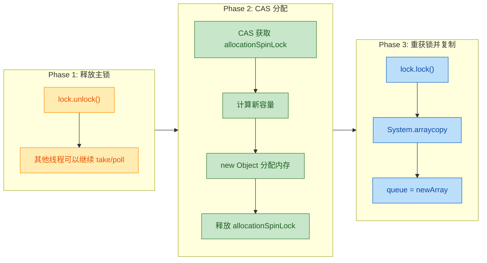
```mermaid
graph LR
    subgraph Phase1["Phase 1: 释放主锁"]
        direction TB
        P1A["lock.unlock()"]
        P1B["其他线程可以继续 take/poll"]
        P1A --> P1B
    end

    subgraph Phase2["Phase 2: CAS 分配"]
        direction TB
        P2A["CAS 获取 allocationSpinLock"]
        P2B["计算新容量"]
        P2C["new Object 分配内存"]
        P2D["释放 allocationSpinLock"]
        P2A --> P2B --> P2C --> P2D
    end

    subgraph Phase3["Phase 3: 重获锁并复制"]
        direction TB
        P3A["lock.lock()"]
        P3B["System.arraycopy"]
        P3C["queue = newArray"]
        P3A --> P3B --> P3C
    end

    Phase1 --> Phase2 --> Phase3

    classDef unlock fill:#FFECB3,stroke:#FF8F00,color:#E65100
    classDef cas fill:#C8E6C9,stroke:#2E7D32,color:#1B5E20
    classDef relock fill:#BBDEFB,stroke:#1565C0,color:#0D47A1

    class P1A,P1B unlock
    class P2A,P2B,P2C,P2D cas
    class P3A,P3B,P3C relock
```

> 🔍 **为什么要这样设计？** 数组分配（`new Object[newCap]`）可能触发 GC，耗时不可预测。如果持有主锁进行扩容，所有 `take()` 操作都会被阻塞。先释放主锁，让消费者线程可以继续工作，这是一种**并发友好**的设计思路。

#### 时间复杂度总结

| 操作 | 时间复杂度 | 原因 |
|------|-----------|------|
| `offer(e)` / `put(e)` | **O(log n)** | siftUp 上浮，最多比较 log₂n 次 |
| `take()` / `poll()` | **O(log n)** | siftDown 下沉，最多比较 log₂n 次 |
| `peek()` | **O(1)** | 直接返回 `queue[0]` |
| `remove(Object)` | **O(n)** | 线性查找 + O(log n) 的 sift |
| `contains(Object)` | **O(n)** | 线性扫描数组 |
| `size()` | **O(1)** | 直接返回 size 字段 |

#### 与其他阻塞队列的锁机制对比

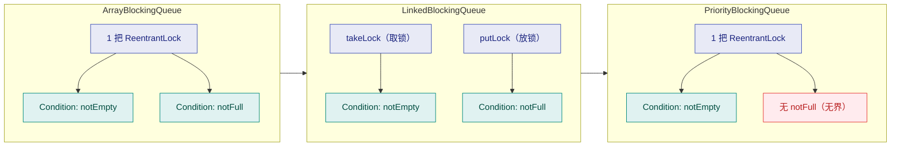
```mermaid
graph LR
    subgraph ABQ["ArrayBlockingQueue"]
        direction TB
        A1["1 把 ReentrantLock"]
        A2["Condition: notEmpty"]
        A3["Condition: notFull"]
        A1 --> A2
        A1 --> A3
    end

    subgraph LBQ["LinkedBlockingQueue"]
        direction TB
        B1["takeLock（取锁）"]
        B2["putLock（放锁）"]
        B3["Condition: notEmpty"]
        B4["Condition: notFull"]
        B1 --> B3
        B2 --> B4
    end

    subgraph PBQ["PriorityBlockingQueue"]
        direction TB
        C1["1 把 ReentrantLock"]
        C2["Condition: notEmpty"]
        C3["无 notFull（无界）"]
        C1 --> C2
        C1 --> C3
    end

    ABQ --> LBQ --> PBQ

    classDef lockStyle fill:#E8EAF6,stroke:#3F51B5,color:#1A237E
    classDef condStyle fill:#E0F2F1,stroke:#00897B,color:#004D40
    classDef noStyle fill:#FFEBEE,stroke:#E53935,color:#B71C1C

    class A1,B1,B2,C1 lockStyle
    class A2,A3,B3,B4,C2 condStyle
    class C3 noStyle
```

`PriorityBlockingQueue` 只使用 **一把锁**（和 `ArrayBlockingQueue` 相同），这意味着 `put` 和 `take` 不能并行执行。但由于队列无界，`put` 基本不会有竞争等待（不需要等 notFull），所以单锁的影响在大多数场景下是可接受的。

#### 实际应用场景

`PriorityBlockingQueue` 特别适合以下场景：

```java
/**
 * 场景：线程池的优先级任务调度
 * 配合 ThreadPoolExecutor 使用自定义的优先级工作队列
 */
class PriorityTask implements Runnable, Comparable<PriorityTask> {
    // 任务优先级，数字越小优先级越高
    private final int priority;
    // 任务名称
    private final String taskName;
    // 实际要执行的逻辑
    private final Runnable actualTask;

    public PriorityTask(int priority, String taskName, Runnable actualTask) {
        this.priority = priority;
        this.taskName = taskName;
        this.actualTask = actualTask;
    }

    @Override
    public int compareTo(PriorityTask other) {
        // 按优先级升序排列（小数字 = 高优先级）
        return Integer.compare(this.priority, other.priority);
    }

    @Override
    public void run() {
        System.out.printf("[Priority-%d] 执行任务: %s (Thread: %s)%n",
                priority, taskName, Thread.currentThread().getName());
        actualTask.run();
    }
}

// 使用示例
public class PriorityThreadPoolDemo {
    public static void main(String[] args) {
        // 创建使用 PriorityBlockingQueue 的线程池
        // 注意：核心线程数=1，确保能看到优先级效果
        ThreadPoolExecutor executor = new ThreadPoolExecutor(
            1,                                          // 核心线程数
            1,                                          // 最大线程数
            0L, TimeUnit.MILLISECONDS,                  // 空闲超时
            new PriorityBlockingQueue<>()               // 优先级工作队列
        );

        // 先提交低优先级任务，再提交高优先级任务
        executor.execute(new PriorityTask(5, "日志归档", () -> sleepMs(100)));
        executor.execute(new PriorityTask(1, "支付回调", () -> sleepMs(100)));
        executor.execute(new PriorityTask(3, "邮件通知", () -> sleepMs(100)));
        executor.execute(new PriorityTask(1, "订单超时", () -> sleepMs(100)));
        executor.execute(new PriorityTask(4, "数据统计", () -> sleepMs(100)));

        executor.shutdown();
    }

    private static void sleepMs(long ms) {
        try { Thread.sleep(ms); } catch (InterruptedException ignored) {}
    }
}
```

> ⚠️ **使用 PriorityBlockingQueue + ThreadPoolExecutor 的陷阱**：`ThreadPoolExecutor` 的工作队列类型是 `BlockingQueue<Runnable>`，而 `PriorityBlockingQueue` 需要元素实现 `Comparable`。如果直接用 `Runnable`（不实现 `Comparable`），运行时会抛出 `ClassCastException`。必须确保提交的任务实现了 `Comparable` 或在队列构造时提供了 `Comparator`。

---

📝 **练习题**

以下关于 `PriorityBlockingQueue` 的描述，哪一项是**正确**的？

A. `PriorityBlockingQueue` 的 `put()` 方法在队列达到初始容量时会阻塞，直到有空间可用

B. 使用 `Iterator` 遍历 `PriorityBlockingQueue` 可以得到严格的优先级排序结果

C. `PriorityBlockingQueue` 使用两把锁（`putLock` 和 `takeLock`）来提高并发吞吐量

D. `PriorityBlockingQueue` 的 `take()` 方法在队列为空时会阻塞，但 `put()` 方法永不阻塞


【答案】D

【解析】

- **A 错误**：`PriorityBlockingQueue` 是**无界**队列，"初始容量"仅决定底层数组的初始大小，队列会自动扩容。`put()` 方法内部直接调用 `offer()`，永远不会阻塞。
- **B 错误**：这是一个常见的误区。`Iterator` 直接遍历底层数组，而堆数组只保证父节点小于子节点（局部有序），**不保证数组整体有序**。要按优先级顺序获取元素，必须逐个调用 `poll()` 或 `take()`。
- **C 错误**：两把锁（`putLock` + `takeLock`）是 `LinkedBlockingQueue` 的设计。`PriorityBlockingQueue` 使用**一把 `ReentrantLock`**，因为 `siftUp` 和 `siftDown` 都要操作同一个数组，无法做到读写分离。
- **D 正确**：这正是无界队列的核心行为特征。`take()` 在队列为空时通过 `notEmpty.await()` 阻塞等待；而 `put()` → `offer()` 因为队列永远"不满"，所以永不阻塞。

---

📝 **练习题**

在一个使用 `PriorityBlockingQueue` 的生产者-消费者模型中，以下代码的输出顺序是什么？

```java
PriorityBlockingQueue<Integer> queue = new PriorityBlockingQueue<>(
    10,
    (a, b) -> Integer.compare(b, a) // 降序比较器
);

queue.offer(10);
queue.offer(30);
queue.offer(20);
queue.offer(50);
queue.offer(40);

while (!queue.isEmpty()) {
    System.out.print(queue.poll() + " ");
}
```

A. `10 20 30 40 50`

B. `10 30 20 50 40`

C. `50 40 30 20 10`

D. `50 30 40 10 20`


【答案】C

【解析】

构造 `PriorityBlockingQueue` 时传入了比较器 `(a, b) -> Integer.compare(b, a)`，这是一个**降序比较器**（reverse order）。在这种比较器下，`compare(b, a)` 会让较大的数被认为"更小"，从而排在堆顶。

这实际上将**最小堆**变成了**最大堆**——每次 `poll()` 取出的是当前最大值。所以出队顺序是 `50 40 30 20 10`，即降序排列。

需要注意：虽然 `PriorityBlockingQueue` 底层始终是最小堆算法（siftUp/siftDown 的逻辑不变），但通过反转比较器，可以让"数值最大的元素"在比较器看来是"最小的"，从而排在堆顶。这是一种常见的技巧，在 `PriorityQueue`、`TreeMap` 等集合中同样适用。


---

## DelayQueue

`DelayQueue` 是 `java.util.concurrent` 包中一个非常独特的阻塞队列实现——它只有在元素的**延迟时间到期**后，才允许消费者将其取出。你可以把它想象成一个"时间保险箱"：每个元素都贴上了一个"最早可取时间"的标签，在这个时间到来之前，无论消费者多么急切，都无法从队列中获取到该元素。这种特性使得 `DelayQueue` 成为实现**定时任务调度、缓存过期清理、订单超时取消**等场景的天然利器。

从类继承结构上看，`DelayQueue` 实现了 `BlockingQueue<E>` 接口，但对泛型参数施加了约束：`E` 必须实现 `java.util.concurrent.Delayed` 接口。其内部依托一个 `PriorityQueue`（小顶堆）来维护元素顺序，堆顶始终是**距离到期最近**的那个元素。它是一个**无界队列**（Unbounded Queue），因此 `put()` 操作永远不会阻塞，但 `take()` 操作会阻塞——不是因为队列为空，而是因为堆顶元素尚未到期。

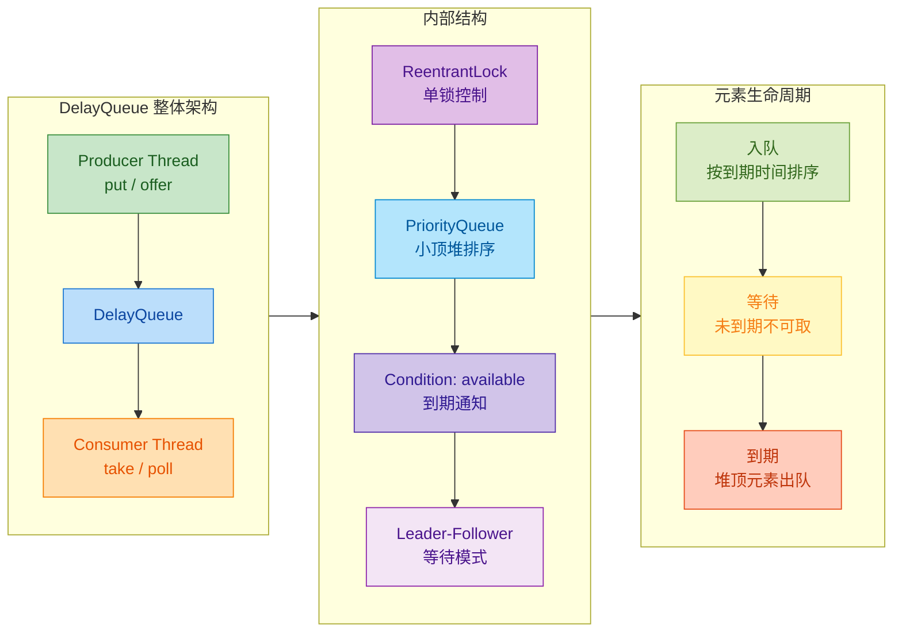
```mermaid
graph LR
    subgraph DelayQueue_Architecture["DelayQueue 整体架构"]
        direction TB
        A["Producer Thread<br/>put / offer"] --> B["DelayQueue"]
        B --> C["Consumer Thread<br/>take / poll"]
    end

    subgraph Internal_Structure["内部结构"]
        direction TB
        D["ReentrantLock<br/>单锁控制"] --> E["PriorityQueue<br/>小顶堆排序"]
        E --> F["Condition: available<br/>到期通知"]
        F --> G["Leader-Follower<br/>等待模式"]
    end

    subgraph Element_Lifecycle["元素生命周期"]
        direction TB
        H["入队<br/>按到期时间排序"] --> I["等待<br/>未到期不可取"]
        I --> J["到期<br/>堆顶元素出队"]
    end

    DelayQueue_Architecture --> Internal_Structure
    Internal_Structure --> Element_Lifecycle

    classDef producerStyle fill:#C8E6C9,stroke:#388E3C,color:#1B5E20
    classDef queueStyle fill:#BBDEFB,stroke:#1976D2,color:#0D47A1
    classDef consumerStyle fill:#FFE0B2,stroke:#F57C00,color:#E65100
    classDef lockStyle fill:#E1BEE7,stroke:#7B1FA2,color:#4A148C
    classDef heapStyle fill:#B3E5FC,stroke:#0288D1,color:#01579B
    classDef condStyle fill:#D1C4E9,stroke:#512DA8,color:#311B92
    classDef leaderStyle fill:#F3E5F5,stroke:#8E24AA,color:#4A148C
    classDef enterStyle fill:#DCEDC8,stroke:#689F38,color:#33691E
    classDef waitStyle fill:#FFF9C4,stroke:#FBC02D,color:#F57F17
    classDef expireStyle fill:#FFCCBC,stroke:#E64A19,color:#BF360C

    class A producerStyle
    class B queueStyle
    class C consumerStyle
    class D lockStyle
    class E heapStyle
    class F condStyle
    class G leaderStyle
    class H enterStyle
    class I waitStyle
    class J expireStyle
```

### 延迟队列

**延迟队列（Delay Queue）** 的核心语义可以用一句话概括：**元素入队后并不立即可消费，而是需要等到其指定的延迟时间到期后才能被取出。** 这与普通的 `ArrayBlockingQueue` 或 `LinkedBlockingQueue` 有着本质区别——后者的阻塞来源于"容量已满"或"队列为空"，而 `DelayQueue` 的阻塞来源于"时间未到"。

让我们从源码层面深入理解其内部工作机制。`DelayQueue` 的核心字段如下：

```java
// DelayQueue 的核心成员变量（JDK 源码精简）
public class DelayQueue<E extends Delayed> extends AbstractQueue<E>
        implements BlockingQueue<E> {

    // 可重入锁，保证线程安全（所有操作共用一把锁）
    private final transient ReentrantLock lock = new ReentrantLock();

    // 内部存储结构：基于小顶堆的优先级队列
    // 堆顶元素是 getDelay() 返回值最小（即最快到期）的元素
    private final PriorityQueue<E> q = new PriorityQueue<E>();

    // Leader-Follower 模式中的 "Leader" 线程引用
    // 用于减少不必要的 Condition 等待，优化性能
    private Thread leader;

    // 条件变量：当堆顶元素到期或有新的堆顶元素时，唤醒等待线程
    private final Condition available = lock.newCondition();
}
```

可以看到，`DelayQueue` 内部只有**一把锁**（`ReentrantLock`）和**一个条件变量**（`available`），相比 `ArrayBlockingQueue` 的两个条件变量（`notEmpty`、`notFull`），它更为简洁。这是因为 `DelayQueue` 是无界的，永远不会出现"队列满"的情况，因此只需要一个"有可用到期元素"的条件。

#### put 操作：永不阻塞的入队

由于 `DelayQueue` 无界，`put()` 方法的实现非常直接——加锁，丢进优先级队列，根据情况唤醒等待线程：

```java
// put 方法：将元素放入延迟队列（永不阻塞）
public void put(E e) {
    offer(e); // 直接委托给 offer 方法
}

// offer 方法：实际的入队逻辑
public boolean offer(E e) {
    // 获取锁
    final ReentrantLock lock = this.lock;
    lock.lock();
    try {
        // 将元素加入优先级队列（小顶堆会自动按 compareTo 排序）
        q.offer(e);

        // 关键判断：如果新插入的元素成为了堆顶（即它是最快到期的）
        // peek() 返回堆顶元素，如果堆顶就是刚插入的 e
        if (q.peek() == e) {
            // 清空 leader，因为之前的 leader 可能在等一个更晚到期的元素
            // 现在有更早到期的元素了，需要重新竞争 leader
            leader = null;
            // 唤醒一个正在 available 上等待的消费者线程
            available.signal();
        }
        return true; // 无界队列，永远返回 true
    } finally {
        lock.unlock(); // 释放锁
    }
}
```

这里有一个精妙的细节：只有当新元素成为堆顶时才发出 `signal()`。如果新元素排在堆中间或末尾，说明堆顶那个更早到期的元素还没被取走，正在等待的消费者线程不需要被打扰。

#### take 操作：Leader-Follower 模式的精髓

`take()` 是 `DelayQueue` 中最核心、最复杂的方法。它采用了 **Leader-Follower 模式**（领导者-追随者模式）来避免大量线程同时做定时等待（`awaitNanos`）造成的资源浪费：

```java
// take 方法：获取并移除已到期的堆顶元素（可能阻塞）
public E take() throws InterruptedException {
    final ReentrantLock lock = this.lock;
    // 可中断地获取锁
    lock.lockInterruptibly();
    try {
        // 自旋循环：直到成功取出一个到期元素
        for (;;) {
            // 查看堆顶元素（不移除）
            E first = q.peek();

            // 情况1：队列为空，无条件等待
            if (first == null) {
                available.await(); // 阻塞，直到有元素被 put 进来
            } else {
                // 获取堆顶元素的剩余延迟时间（单位：纳秒）
                long delay = first.getDelay(TimeUnit.NANOSECONDS);

                // 情况2：堆顶元素已到期（delay <= 0），直接出队返回
                if (delay <= 0L) {
                    return q.poll(); // 从优先级队列移除并返回
                }

                // --- 以下是堆顶元素未到期的处理 ---

                // 释放对 first 的强引用，避免在等待期间持有引用
                // 防止如果该元素在等待过程中被其他线程取走后无法被 GC
                first = null;

                // 情况3：已有 leader 线程在定时等待堆顶元素
                // 当前线程作为 follower 无条件等待
                if (leader != null) {
                    available.await(); // 无限等待，直到被 leader 唤醒
                } else {
                    // 情况4：当前线程成为 leader
                    Thread thisThread = Thread.currentThread();
                    leader = thisThread; // 标记自己为 leader
                    try {
                        // 定时等待：精确等到堆顶元素到期
                        available.awaitNanos(delay);
                    } finally {
                        // 等待结束后，如果 leader 还是自己，清空 leader
                        // （可能在等待期间被新的更早到期的元素清掉了 leader）
                        if (leader == thisThread) {
                            leader = null;
                        }
                    }
                }
            }
        }
    } finally {
        // 退出前：如果没有 leader 且队列非空，唤醒下一个等待线程
        // 让它成为新的 leader 去等待堆顶元素到期
        if (leader == null && q.peek() != null) {
            available.signal();
        }
        lock.unlock(); // 释放锁
    }
}
```

为什么需要 Leader-Follower 模式？我们用一个场景来解释。假设堆顶元素 10 秒后到期，有 100 个消费者线程同时调用 `take()`。如果没有 Leader-Follower 模式，100 个线程都会执行 `awaitNanos(10秒)`，10 秒后同时醒来竞争锁，但只有一个线程能成功取走元素——这就是经典的 **"惊群效应"（Thundering Herd Problem）**。

有了 Leader-Follower 模式后，只有 1 个 leader 线程执行精确的 `awaitNanos(delay)`，其余 99 个 follower 线程执行无参的 `await()` 进入无限等待。当 leader 取走元素后，在 `finally` 块中 `signal()` 唤醒下一个 follower，让它成为新的 leader。这样每次只有一个线程在做定时等待，极大减少了系统资源的消耗。

```mermaid
graph LR
    subgraph Leader_Follower_Flow["Leader-Follower 模式工作流"]
        direction TB
        A["多个消费者线程<br/>调用 take()"] --> B{"堆顶元素<br/>是否到期?"}
        B -->|"delay <= 0<br/>已到期"| C["直接 poll() 返回"]
        B -->|"delay > 0<br/>未到期"| D{"当前是否<br/>有 leader?"}
        D -->|"无 leader"| E["当前线程成为 Leader<br/>awaitNanos(delay)"]
        D -->|"有 leader"| F["当前线程成为 Follower<br/>await() 无限等待"]
        E --> G["Leader 醒来<br/>回到循环顶部取元素"]
        G --> H["取走元素后<br/>signal() 唤醒 Follower"]
        H --> I["Follower 被唤醒<br/>竞争成为新 Leader"]
    end

    classDef entryStyle fill:#C8E6C9,stroke:#388E3C,color:#1B5E20
    classDef decisionStyle fill:#FFF9C4,stroke:#FBC02D,color:#F57F17
    classDef directStyle fill:#A5D6A7,stroke:#2E7D32,color:#1B5E20
    classDef leaderStyle fill:#90CAF9,stroke:#1565C0,color:#0D47A1
    classDef followerStyle fill:#FFCC80,stroke:#EF6C00,color:#E65100
    classDef wakeStyle fill:#CE93D8,stroke:#7B1FA2,color:#4A148C
    classDef newLeaderStyle fill:#80DEEA,stroke:#00838F,color:#006064

    class A entryStyle
    class B,D decisionStyle
    class C directStyle
    class E,G leaderStyle
    class F followerStyle
    class H wakeStyle
    class I newLeaderStyle
```

#### poll 的超时版本

`DelayQueue` 也提供了带超时的 `poll(timeout, unit)` 方法，逻辑与 `take()` 类似，但增加了总等待时间的控制。如果在指定时间内始终没有元素到期，则返回 `null`：

```java
// poll 超时版本：在指定时间内等待到期元素
public E poll(long timeout, TimeUnit unit) throws InterruptedException {
    // 将超时时间统一转换为纳秒
    long nanos = unit.toNanos(timeout);
    final ReentrantLock lock = this.lock;
    lock.lockInterruptibly();
    try {
        for (;;) {
            E first = q.peek();
            if (first == null) {
                // 队列为空
                if (nanos <= 0L)
                    return null;         // 超时用尽，返回 null
                nanos = available.awaitNanos(nanos); // 等待剩余时间
            } else {
                long delay = first.getDelay(TimeUnit.NANOSECONDS);
                if (delay <= 0L)
                    return q.poll();     // 已到期，直接取出
                if (nanos <= 0L)
                    return null;         // 超时用尽，返回 null

                first = null;            // 释放引用，同 take() 的设计

                // 如果剩余等待时间小于元素到期时间，或者已有 leader
                // 则按剩余时间等待
                if (nanos < delay || leader != null) {
                    nanos = available.awaitNanos(nanos);
                } else {
                    // 成为 leader，按元素到期时间等待
                    Thread thisThread = Thread.currentThread();
                    leader = thisThread;
                    try {
                        long timeLeft = available.awaitNanos(delay);
                        // 用剩余超时时间减去实际等待的时间
                        nanos -= delay - timeLeft;
                    } finally {
                        if (leader == thisThread)
                            leader = null;
                    }
                }
            }
        }
    } finally {
        if (leader == null && q.peek() != null)
            available.signal();
        lock.unlock();
    }
}
```

### Delayed 接口

要将元素放入 `DelayQueue`，该元素的类**必须**实现 `java.util.concurrent.Delayed` 接口。这个接口本身非常简洁，只定义了一个方法，但它同时还继承了 `Comparable<Delayed>`，因此实现类还需要提供 `compareTo()` 方法：

```java
// Delayed 接口定义（JDK 源码）
public interface Delayed extends Comparable<Delayed> {

    /**
     * 返回当前元素距离到期还剩多少时间
     * 返回 0 或负数表示已经到期，可以被取出
     *
     * @param unit 调用者期望的时间单位
     * @return 剩余延迟时间（以 unit 为单位）
     */
    long getDelay(TimeUnit unit);
}
```

**关键语义解读：**

- `getDelay(TimeUnit unit)` 是一个**动态方法**——每次调用它，返回值都不同（因为时间在流逝）。当返回值 `<= 0` 时，表示该元素已到期。
- `compareTo(Delayed other)` 决定了元素在 `PriorityQueue`（小顶堆）中的排列顺序。**越早到期的元素应该排在越前面**，因此 `compareTo` 应该按"到期时间升序"来实现。
- 这两个方法必须**逻辑一致**：如果 `a.getDelay()` < `b.getDelay()`，那么 `a.compareTo(b)` 应返回负数。不一致会导致严重的逻辑 bug——堆顶元素并非最快到期，队列行为完全错乱。

下面是一个标准的 `Delayed` 实现模板：

```java
import java.util.concurrent.Delayed;
import java.util.concurrent.TimeUnit;

/**
 * 延迟任务元素：实现 Delayed 接口的标准模板
 * @param <T> 任务携带的数据类型
 */
public class DelayedTask<T> implements Delayed {

    // 任务名称（业务标识）
    private final String taskName;

    // 任务携带的数据
    private final T data;

    // 到期时间戳（绝对时间，单位：纳秒）
    // 使用 System.nanoTime() 而非 System.currentTimeMillis()
    // 因为 nanoTime 是单调递增的，不受系统时钟调整影响
    private final long expireTimeNanos;

    /**
     * 构造方法
     * @param taskName  任务名称
     * @param data      携带数据
     * @param delay     延迟时长
     * @param unit      延迟时长的时间单位
     */
    public DelayedTask(String taskName, T data, long delay, TimeUnit unit) {
        this.taskName = taskName;                           // 设置任务名
        this.data = data;                                   // 设置数据
        // 将延迟时长转为纳秒，加上当前纳秒时间戳，得到绝对到期时间
        this.expireTimeNanos = System.nanoTime() + unit.toNanos(delay);
    }

    /**
     * 核心方法1：计算当前元素距离到期还剩多少时间
     * DelayQueue 内部会反复调用此方法来判断堆顶元素是否可出队
     */
    @Override
    public long getDelay(TimeUnit unit) {
        // 到期时间戳 - 当前时间戳 = 剩余延迟（纳秒）
        long remainingNanos = expireTimeNanos - System.nanoTime();
        // 将纳秒转换为调用者指定的时间单位
        return unit.convert(remainingNanos, TimeUnit.NANOSECONDS);
    }

    /**
     * 核心方法2：定义在优先级队列中的排列顺序
     * 到期时间越早的元素越靠近堆顶（升序排列）
     */
    @Override
    public int compareTo(Delayed other) {
        // 如果是同一个对象，直接返回 0
        if (this == other) {
            return 0;
        }
        // 比较两个元素的剩余延迟时间
        long diff = this.getDelay(TimeUnit.NANOSECONDS)
                  - other.getDelay(TimeUnit.NANOSECONDS);
        // 将 long 类型的差值映射为 int（-1, 0, 1）
        return Long.compare(diff, 0);
    }

    // getter 方法
    public String getTaskName() {
        return taskName;  // 返回任务名
    }

    public T getData() {
        return data;  // 返回携带数据
    }

    @Override
    public String toString() {
        // 打印时显示任务名和剩余秒数，方便调试
        return "DelayedTask{" +
               "name='" + taskName + '\'' +
               ", remainDelay=" + getDelay(TimeUnit.MILLISECONDS) + "ms}";
    }
}
```

**为什么用 `System.nanoTime()` 而不是 `System.currentTimeMillis()`？**

这是一个非常重要的实践细节。`System.currentTimeMillis()` 返回的是"墙上时钟"（wall clock），它会受到 NTP 时间同步、用户手动修改系统时间等因素的影响，可能出现回拨。比如某一刻系统时间被校准往回调了 2 秒，`currentTimeMillis()` 会突然变小，导致原本即将到期的元素被"延后"了 2 秒——这在生产环境中是不可接受的。

而 `System.nanoTime()` 返回的是 JVM 启动以来的**单调递增**纳秒计数，不受系统时钟影响。它专门设计用于**度量经过时间（elapsed time）**，是实现 `getDelay()` 的首选时间源。

```text
┌──────────────────────────────────────────────────────────────┐
│              System.nanoTime() vs currentTimeMillis()        │
├──────────────────┬───────────────────────────────────────────┤
│   nanoTime()     │  单调递增 ✅  不受NTP影响 ✅  纳秒精度 ✅   │
│                  │  不能表示"几点几分" ❌                      │
├──────────────────┼───────────────────────────────────────────┤
│ currentTimeMillis│  可表示日历时间 ✅                          │
│                  │  可能回拨 ❌  毫秒精度 ❌  受NTP影响 ❌      │
└──────────────────┴───────────────────────────────────────────┘
```

### 应用场景（定时任务、缓存过期）

`DelayQueue` 的"到期才能消费"特性，使它天然适合一类场景：**有大量异构的延迟事件需要按时间顺序触发**。以下是几个最经典的应用场景及其实现思路。

#### 场景一：缓存过期自动清理

这是 `DelayQueue` 最常见的应用之一。设想你需要一个简单的本地缓存，每个缓存条目有不同的 TTL（Time To Live），过期后自动删除：

```java
import java.util.concurrent.*;

/**
 * 基于 DelayQueue 的本地缓存（简化版）
 * 缓存条目过期后由后台线程自动清理
 */
public class DelayedCache<K, V> {

    // 实际存储缓存数据的 ConcurrentHashMap
    private final ConcurrentHashMap<K, V> cacheMap = new ConcurrentHashMap<>();

    // 延迟队列：存放所有缓存条目的"过期令牌"
    private final DelayQueue<CacheEntry<K>> delayQueue = new DelayQueue<>();

    /**
     * 缓存条目的延迟令牌（只需持有 key，不需要持有 value）
     */
    private static class CacheEntry<K> implements Delayed {
        private final K key;                          // 缓存 key
        private final long expireTimeNanos;           // 到期时间戳（纳秒）

        CacheEntry(K key, long ttl, TimeUnit unit) {
            this.key = key;                           // 绑定 key
            // 当前时间 + TTL = 到期时间
            this.expireTimeNanos = System.nanoTime() + unit.toNanos(ttl);
        }

        @Override
        public long getDelay(TimeUnit unit) {
            // 计算剩余延迟
            long remaining = expireTimeNanos - System.nanoTime();
            return unit.convert(remaining, TimeUnit.NANOSECONDS);
        }

        @Override
        public int compareTo(Delayed other) {
            // 到期时间早的排前面
            long diff = this.getDelay(TimeUnit.NANOSECONDS)
                      - other.getDelay(TimeUnit.NANOSECONDS);
            return Long.compare(diff, 0);
        }

        public K getKey() {
            return key;  // 返回对应的缓存 key
        }
    }

    /**
     * 构造方法：启动后台清理线程
     */
    public DelayedCache() {
        // 创建守护线程，随主线程退出而退出
        Thread cleanerThread = new Thread(() -> {
            // 无限循环，不断从延迟队列取出到期条目
            while (!Thread.currentThread().isInterrupted()) {
                try {
                    // take() 会阻塞，直到有条目到期
                    CacheEntry<K> entry = delayQueue.take();
                    // 从实际存储中移除该 key
                    cacheMap.remove(entry.getKey());
                    System.out.println("[Cache] 已清理过期 key: " + entry.getKey());
                } catch (InterruptedException e) {
                    // 线程被中断，退出循环
                    Thread.currentThread().interrupt();
                    break;
                }
            }
        }, "cache-cleaner");

        cleanerThread.setDaemon(true);  // 设为守护线程
        cleanerThread.start();          // 启动清理线程
    }

    /**
     * 放入缓存（指定 TTL）
     */
    public void put(K key, V value, long ttl, TimeUnit unit) {
        cacheMap.put(key, value);                              // 存入数据
        delayQueue.offer(new CacheEntry<>(key, ttl, unit));    // 投入过期令牌
    }

    /**
     * 获取缓存
     */
    public V get(K key) {
        return cacheMap.get(key);  // 直接从 map 查找
    }

    /**
     * 测试入口
     */
    public static void main(String[] args) throws InterruptedException {
        DelayedCache<String, String> cache = new DelayedCache<>();

        // 放入三个缓存条目，TTL 分别为 2秒、4秒、6秒
        cache.put("token:user1", "abc123", 2, TimeUnit.SECONDS);
        cache.put("token:user2", "def456", 4, TimeUnit.SECONDS);
        cache.put("session:admin", "xyz789", 6, TimeUnit.SECONDS);

        System.out.println("初始: " + cache.get("token:user1")); // abc123

        // 等待 3 秒后，user1 的 token 应已过期
        Thread.sleep(3000);
        System.out.println("3秒后: " + cache.get("token:user1"));    // null（已清理）
        System.out.println("3秒后: " + cache.get("token:user2"));    // def456（未过期）

        // 再等 4 秒，所有条目应该都已过期
        Thread.sleep(4000);
        System.out.println("7秒后: " + cache.get("session:admin"));  // null（已清理）
    }
}
```

运行输出大致如下：

```text
初始: abc123
[Cache] 已清理过期 key: token:user1
3秒后: null
3秒后: def456
[Cache] 已清理过期 key: token:user2
[Cache] 已清理过期 key: session:admin
7秒后: null
```

#### 场景二：订单超时自动取消

电商系统中，用户下单后如果 30 分钟未支付，系统需要自动取消订单并释放库存。`DelayQueue` 是实现这一需求的轻量方案：

```java
import java.util.concurrent.*;

/**
 * 订单超时取消服务
 * 订单创建后放入延迟队列，超时未支付则自动取消
 */
public class OrderTimeoutService {

    // 延迟队列：存放未支付订单的超时令牌
    private final DelayQueue<OrderTimeout> timeoutQueue = new DelayQueue<>();

    /**
     * 订单超时令牌
     */
    static class OrderTimeout implements Delayed {
        private final String orderId;              // 订单ID
        private final long expireTimeNanos;        // 超时时间戳

        OrderTimeout(String orderId, long timeout, TimeUnit unit) {
            this.orderId = orderId;                // 绑定订单号
            this.expireTimeNanos = System.nanoTime() + unit.toNanos(timeout);
        }

        @Override
        public long getDelay(TimeUnit unit) {
            return unit.convert(
                expireTimeNanos - System.nanoTime(), // 剩余时间（纳秒）
                TimeUnit.NANOSECONDS                 // 源单位
            );
        }

        @Override
        public int compareTo(Delayed other) {
            return Long.compare(
                this.getDelay(TimeUnit.NANOSECONDS),  // 本元素剩余延迟
                other.getDelay(TimeUnit.NANOSECONDS)   // 另一元素剩余延迟
            );
        }

        public String getOrderId() {
            return orderId;  // 获取订单号
        }
    }

    /**
     * 下单时调用：将订单注册到超时队列
     * @param orderId 订单号
     * @param timeout 超时时长（生产环境一般是30分钟）
     * @param unit    时间单位
     */
    public void registerOrder(String orderId, long timeout, TimeUnit unit) {
        timeoutQueue.offer(new OrderTimeout(orderId, timeout, unit));
        System.out.println("[订单] 已注册超时监控: " + orderId
                         + "，超时时间: " + timeout + " " + unit);
    }

    /**
     * 启动超时监控线程
     */
    public void startMonitor() {
        Thread monitor = new Thread(() -> {
            while (!Thread.currentThread().isInterrupted()) {
                try {
                    // 阻塞等待：直到有订单超时
                    OrderTimeout timeout = timeoutQueue.take();
                    // 到达这里说明该订单已超时
                    cancelOrder(timeout.getOrderId());
                } catch (InterruptedException e) {
                    Thread.currentThread().interrupt();  // 恢复中断标志
                    break;                               // 退出循环
                }
            }
        }, "order-timeout-monitor");

        monitor.setDaemon(true);   // 守护线程
        monitor.start();           // 启动监控
    }

    /**
     * 取消订单的业务逻辑（模拟）
     */
    private void cancelOrder(String orderId) {
        // 实际场景中需要先检查订单状态（可能已支付）
        // 如果已支付则跳过，未支付则执行取消+释放库存
        System.out.println("[订单] 超时未支付，自动取消: " + orderId);
    }

    public static void main(String[] args) throws InterruptedException {
        OrderTimeoutService service = new OrderTimeoutService();
        service.startMonitor();  // 启动监控

        // 模拟3个订单，超时时间分别为 3秒、5秒、8秒
        service.registerOrder("ORD-1001", 3, TimeUnit.SECONDS);
        service.registerOrder("ORD-1002", 5, TimeUnit.SECONDS);
        service.registerOrder("ORD-1003", 8, TimeUnit.SECONDS);

        // 等待 10 秒观察输出
        Thread.sleep(10000);
    }
}
```

#### 场景三：定时任务调度

实际上，JDK 内置的 `ScheduledThreadPoolExecutor` 内部就使用了一个与 `DelayQueue` 原理类似的延迟工作队列（`DelayedWorkQueue`）。我们可以用 `DelayQueue` 构建一个极简版的任务调度器来理解其原理：

```java
import java.util.concurrent.*;

/**
 * 基于 DelayQueue 的极简任务调度器
 */
public class SimpleScheduler {

    // 延迟队列：按执行时间排序的任务队列
    private final DelayQueue<ScheduledTask> taskQueue = new DelayQueue<>();

    // 工作线程池：实际执行任务
    private final ExecutorService executor = Executors.newFixedThreadPool(4);

    /**
     * 可调度的延迟任务
     */
    static class ScheduledTask implements Delayed {
        private final Runnable command;            // 要执行的任务
        private final long executeTimeNanos;       // 预定执行时间（纳秒）
        private final String name;                 // 任务名称

        ScheduledTask(String name, Runnable command, long delay, TimeUnit unit) {
            this.name = name;                      // 设置任务名
            this.command = command;                 // 设置任务体
            // 计算绝对执行时间
            this.executeTimeNanos = System.nanoTime() + unit.toNanos(delay);
        }

        @Override
        public long getDelay(TimeUnit unit) {
            // 距离执行时间还有多久
            return unit.convert(
                executeTimeNanos - System.nanoTime(),
                TimeUnit.NANOSECONDS
            );
        }

        @Override
        public int compareTo(Delayed other) {
            return Long.compare(
                this.getDelay(TimeUnit.NANOSECONDS),
                other.getDelay(TimeUnit.NANOSECONDS)
            );
        }

        public void execute() {
            command.run();  // 执行任务逻辑
        }

        public String getName() {
            return name;  // 返回任务名
        }
    }

    /**
     * 提交延迟任务
     */
    public void schedule(String name, Runnable task, long delay, TimeUnit unit) {
        taskQueue.offer(new ScheduledTask(name, task, delay, unit));
    }

    /**
     * 启动调度器
     */
    public void start() {
        // 调度线程：从延迟队列中取出到期任务，交给线程池执行
        Thread dispatcher = new Thread(() -> {
            while (!Thread.currentThread().isInterrupted()) {
                try {
                    ScheduledTask task = taskQueue.take();  // 阻塞等待到期任务
                    // 将任务提交到线程池异步执行（不阻塞调度线程）
                    executor.submit(() -> {
                        System.out.println("[Scheduler] 执行任务: " + task.getName()
                                         + " at " + System.currentTimeMillis());
                        task.execute();
                    });
                } catch (InterruptedException e) {
                    Thread.currentThread().interrupt();
                    break;
                }
            }
        }, "task-dispatcher");

        dispatcher.setDaemon(true);
        dispatcher.start();
    }
}
```

下图总结了三个应用场景与 `DelayQueue` 的关系：

```mermaid
graph LR
    subgraph Core["DelayQueue 核心"]
        direction TB
        DQ["DelayQueue〈E extends Delayed〉"]
        PQ["PriorityQueue<br/>小顶堆排序"]
        LF["Leader-Follower<br/>等待模式"]
        DQ --> PQ
        DQ --> LF
    end

    subgraph Scenario1["场景: 缓存过期清理"]
        direction TB
        S1A["CacheEntry 实现 Delayed"]
        S1B["后台 Cleaner 线程<br/>take() 阻塞等待"]
        S1C["到期后自动移除<br/>ConcurrentHashMap 中的 key"]
        S1A --> S1B
        S1B --> S1C
    end

    subgraph Scenario2["场景: 订单超时取消"]
        direction TB
        S2A["OrderTimeout 实现 Delayed"]
        S2B["Monitor 线程<br/>take() 阻塞等待"]
        S2C["超时后检查支付状态<br/>未支付则取消+释放库存"]
        S2A --> S2B
        S2B --> S2C
    end

    subgraph Scenario3["场景: 定时任务调度"]
        direction TB
        S3A["ScheduledTask 实现 Delayed"]
        S3B["Dispatcher 线程<br/>take() 阻塞等待"]
        S3C["到期后提交到<br/>线程池异步执行"]
        S3A --> S3B
        S3B --> S3C
    end

    Core --> Scenario1
    Core --> Scenario2
    Core --> Scenario3

    classDef coreStyle fill:#BBDEFB,stroke:#1565C0,color:#0D47A1
    classDef heapStyle fill:#B3E5FC,stroke:#0288D1,color:#01579B
    classDef lfStyle fill:#E1BEE7,stroke:#7B1FA2,color:#4A148C
    classDef cache1 fill:#C8E6C9,stroke:#388E3C,color:#1B5E20
    classDef cache2 fill:#A5D6A7,stroke:#2E7D32,color:#1B5E20
    classDef cache3 fill:#81C784,stroke:#1B5E20,color:#1B5E20
    classDef order1 fill:#FFE0B2,stroke:#F57C00,color:#E65100
    classDef order2 fill:#FFCC80,stroke:#EF6C00,color:#E65100
    classDef order3 fill:#FFB74D,stroke:#E65100,color:#BF360C
    classDef sched1 fill:#D1C4E9,stroke:#512DA8,color:#311B92
    classDef sched2 fill:#B39DDB,stroke:#4527A0,color:#311B92
    classDef sched3 fill:#9575CD,stroke:#311B92,color:#EDE7F6

    class DQ coreStyle
    class PQ heapStyle
    class LF lfStyle
    class S1A cache1
    class S1B cache2
    class S1C cache3
    class S2A order1
    class S2B order2
    class S2C order3
    class S3A sched1
    class S3B sched2
    class S3C sched3
```

#### DelayQueue 使用注意事项

在实际使用 `DelayQueue` 时，有几个容易踩坑的地方需要特别注意：

**1. 它是无界的——可能导致 OOM。** `put()` 永远不会阻塞，如果生产者速率远超消费者，元素会无限堆积。在高并发场景下应当配合外部限流或监控队列大小。

**2. `getDelay()` 和 `compareTo()` 必须逻辑一致。** 如果两个方法的排序逻辑不一致（比如 `compareTo` 按创建时间排序，`getDelay` 按到期时间计算），会导致堆顶元素不是最先到期的，`take()` 行为会变得不可预测。

**3. 单锁设计限制了并发度。** 与 `LinkedBlockingQueue` 的读写分离双锁不同，`DelayQueue` 只有一把锁，在高并发场景下吞吐量有限。如果需要更高性能，可以考虑时间轮（Timing Wheel）算法，如 Netty 的 `HashedWheelTimer`。

**4. 不支持已入队元素的取消。** 如果用户在超时前完成了支付，订单的超时令牌已在队列中，无法直接移除。常见的做法是在消费端做"二次检查"——取出元素后先查询最新状态，如果条件已不满足则直接丢弃。

**5. `size()` 方法返回的是队列中所有元素的数量，包括尚未到期的。** 如果你需要知道"有多少元素已到期但还未被消费"，没有直接的 API 支持，需要自行遍历。

```text
┌─────────────────────────────────────────────────────────────┐
│                   DelayQueue 特性总结                        │
├───────────────┬─────────────────────────────────────────────┤
│ 底层结构       │  PriorityQueue（小顶堆）                    │
│ 是否有界       │  无界（put 永不阻塞）                        │
│ 锁机制         │  单把 ReentrantLock                         │
│ 条件变量       │  1 个（available）                          │
│ 等待优化       │  Leader-Follower 模式                       │
│ 元素约束       │  必须实现 Delayed 接口                       │
│ 排序依据       │  getDelay() / compareTo() 的返回值          │
│ 时间源推荐     │  System.nanoTime()（单调时钟）               │
│ 典型场景       │  缓存过期、订单超时、定时调度                  │
│ 线程安全       │  是                                         │
│ 允许 null      │  否                                         │
└───────────────┴─────────────────────────────────────────────┘
```

---

**📝 练习题**

某系统使用 `DelayQueue` 管理缓存过期，开发者实现了以下 `Delayed` 类。请问该实现存在什么问题？

```java
public class CacheItem implements Delayed {
    private final long expireTime; // 到期时间

    public CacheItem(long ttlMillis) {
        // 使用 currentTimeMillis 计算到期时间
        this.expireTime = System.currentTimeMillis() + ttlMillis;
    }

    @Override
    public long getDelay(TimeUnit unit) {
        long remaining = expireTime - System.currentTimeMillis();
        return unit.convert(remaining, TimeUnit.MILLISECONDS);
    }

    @Override
    public int compareTo(Delayed other) {
        // 按创建顺序排序（FIFO）
        return 0;
    }
}
```

A. `getDelay()` 方法的参数 `unit` 没有被正确使用，应始终返回纳秒


B. 使用了 `System.currentTimeMillis()` 存在时钟回拨风险，且 `compareTo()` 始终返回 0 导致堆排序失效，无法保证最先到期的元素在堆顶


C. `CacheItem` 没有实现 `Serializable` 接口，无法放入 `DelayQueue`


D. `DelayQueue` 要求元素实现 `Comparable<CacheItem>` 而非 `Comparable<Delayed>`，编译会报错


**【答案】** B

**【解析】** 这道题考查 `DelayQueue` 使用中最常见的两个陷阱。**第一个问题**：`System.currentTimeMillis()` 是"墙上时钟"，受 NTP 同步和系统时间调整的影响，可能发生时钟回拨（clock drift backwards），导致 `getDelay()` 的计算出现偏差——一个本应 5 秒后到期的元素可能突然变成 7 秒或 3 秒。正确做法是使用 `System.nanoTime()`（单调递增时钟）。**第二个问题**更严重：`compareTo()` 始终返回 0，等于告诉 `PriorityQueue`"所有元素优先级相同"，堆退化为无序结构，`peek()` 返回的堆顶元素并非最先到期的那个。这会导致 `take()` 中的 leader 线程等待一个并非最快到期的元素，而真正该最先到期的元素被埋在堆中，出队时间被严重延迟。A 选项错误——代码中确实用了 `unit.convert()` 做了转换，使用方式是正确的。C 选项无中生有——`DelayQueue` 不要求元素可序列化。D 选项也不成立——`Delayed` 接口继承的是 `Comparable<Delayed>`，`CacheItem` 作为 `Delayed` 的实现类自动满足该约束。

---

## LinkedTransferQueue

LinkedTransferQueue 是 Java 7 引入的一个基于链表的**无界**阻塞队列，它实现了 `TransferQueue<E>` 接口（该接口继承自 `BlockingQueue<E>`）。如果说 SynchronousQueue 是"**零容量的直接传递**"，那么 LinkedTransferQueue 可以被理解为 SynchronousQueue、LinkedBlockingQueue 和 ConcurrentLinkedQueue 三者的**融合升级版**——它既能像普通队列一样缓存元素，又能像 SynchronousQueue 一样实现生产者与消费者之间的**直接握手传递 (hand-off)**，同时还采用了**无锁 (Lock-Free)** 算法来获得极高的并发性能。

在 JDK 的线程池实现中，`Executors.newCachedThreadPool()` 使用 SynchronousQueue，而当你需要一个"**既有缓冲又支持直接传递**"的队列时，LinkedTransferQueue 就是最佳选择。Doug Lea 本人曾表示，LinkedTransferQueue 在很多场景下性能优于所有其它 BlockingQueue 实现。

### TransferQueue 接口：核心契约

在深入实现之前，必须先理解 `TransferQueue<E>` 接口。它在 `BlockingQueue` 的基础上新增了以下关键方法：

```java
// TransferQueue 接口定义（继承 BlockingQueue）
public interface TransferQueue<E> extends BlockingQueue<E> {

    /**
     * 尝试将元素直接传递给一个正在等待的消费者。
     * 如果此刻有消费者正在 take() 或 poll() 等待，则立即匹配成功返回 true；
     * 否则不入队，直接返回 false。
     * 非阻塞，类似 SynchronousQueue 的 offer()。
     */
    boolean tryTransfer(E e);

    /**
     * 将元素直接传递给消费者。
     * 如果此刻没有等待的消费者，生产者线程将【阻塞】，
     * 直到某个消费者来取走该元素为止。
     * 这是 LinkedTransferQueue 最核心的方法。
     */
    void transfer(E e) throws InterruptedException;

    /**
     * 带超时版本的 tryTransfer。
     * 在指定时间内尝试将元素传递给消费者，
     * 超时后若仍无消费者匹配，则返回 false。
     */
    boolean tryTransfer(E e, long timeout, TimeUnit unit)
        throws InterruptedException;

    /**
     * 查询当前是否有消费者正在等待接收元素。
     * （通过检查队列中是否存在"请求节点"来判断）
     */
    boolean hasWaitingConsumer();

    /**
     * 返回正在等待的消费者的【估计】数量。
     */
    int getWaitingConsumerCount();
}
```

这几个方法体现了 TransferQueue 的核心设计哲学：**生产者可以选择"我一定要亲手交给消费者"（transfer），也可以选择"有人要就给，没人要就算了"（tryTransfer），还可以选择"放到队列里谁爱取谁取"（put/offer）**。这种灵活性是其它阻塞队列不具备的。

### 与其它队列的全方位对比

```mermaid
graph LR
    subgraph SQ["SynchronousQueue"]
        direction TB
        SQ1["零容量"]
        SQ2["强制直接传递"]
        SQ3["put 必须等 take"]
    end

    subgraph LBQ["LinkedBlockingQueue"]
        direction TB
        LBQ1["有缓冲区"]
        LBQ2["无直接传递能力"]
        LBQ3["双锁机制"]
    end

    subgraph LTQ["LinkedTransferQueue"]
        direction TB
        LTQ1["有缓冲区 + 直接传递"]
        LTQ2["transfer 可选阻塞"]
        LTQ3["无锁 CAS 算法"]
    end

    SQ -->|"增加缓冲能力"| LTQ
    LBQ -->|"增加传递语义"| LTQ

    classDef greenBox fill:#C8E6C9,stroke:#388E3C,color:#1B5E20
    classDef blueBox fill:#BBDEFB,stroke:#1976D2,color:#0D47A1
    classDef orangeBox fill:#FFE0B2,stroke:#F57C00,color:#E65100

    class SQ1,SQ2,SQ3 orangeBox
    class LBQ1,LBQ2,LBQ3 blueBox
    class LTQ1,LTQ2,LTQ3 greenBox
    class SQ orangeBox
    class LBQ blueBox
    class LTQ greenBox
```

下面用一张详细的对比表来总结它们的差异：

| 特性 | SynchronousQueue | LinkedBlockingQueue | LinkedTransferQueue |
|---|---|---|---|
| **容量** | 0（无缓冲） | 可选有界 / 无界 | 无界 |
| **直接传递** | ✅ 强制 | ❌ 不支持 | ✅ 可选 (transfer) |
| **缓冲能力** | ❌ | ✅ | ✅ |
| **锁机制** | 无锁 CAS | 双锁 (takeLock/putLock) | 无锁 CAS |
| **put 行为** | 阻塞到有消费者 | 入队（满则阻塞） | 直接入队（无界不阻塞） |
| **transfer 行为** | — | — | 阻塞到有消费者取走 |
| **适用场景** | 线程池直接交接 | 通用生产者-消费者 | 高性能 + 需要传递语义 |

### Dual Queue 算法：核心实现原理

LinkedTransferQueue 的底层采用了一种名为 **Dual Queue（对偶队列）** 的无锁并发算法，最初由 Scherer、Lea 和 Scott 在论文 *"Nonblocking Concurrent Objects with Condition Synchronization"* 中提出。理解这个算法是理解 LinkedTransferQueue 的关键。

**核心思想**：队列中的节点不仅可以是"**数据节点 (Data Node)**"——代表生产者放入的元素，也可以是"**请求节点 (Request Node)**"——代表消费者发出的取元素请求。当一个操作到来时：

1. **互补匹配 (Complementary Match)**：如果队列尾部的节点类型与当前操作**互补**（一个是 data、一个是 request），则直接**配对**，唤醒等待方，不入队。
2. **同类追加 (Append)**：如果队列尾部的节点类型与当前操作**同类**（都是 data 或都是 request），则将当前操作作为新节点**追加到队尾**等待。

```mermaid
graph LR
    subgraph CASE1["场景一：互补匹配"]
        direction TB
        C1A["队列中有 Request 节点\n(消费者在等待)"]
        C1B["生产者调用 put/transfer"]
        C1C["直接匹配成功\n唤醒消费者线程"]
        C1A --> C1B --> C1C
    end

    subgraph CASE2["场景二：同类追加"]
        direction TB
        C2A["队列中有 Data 节点\n(其他生产者在等待)"]
        C2B["生产者调用 transfer"]
        C2C["追加到队尾\n自旋/阻塞等待消费者"]
        C2A --> C2B --> C2C
    end

    subgraph CASE3["场景三：队列为空"]
        direction TB
        C3A["队列为空"]
        C3B["消费者调用 take"]
        C3C["创建 Request 节点入队\n自旋/阻塞等待生产者"]
        C3A --> C3B --> C3C
    end

    classDef greenCard fill:#E8F5E9,stroke:#43A047,color:#1B5E20
    classDef blueCard fill:#E3F2FD,stroke:#1E88E5,color:#0D47A1
    classDef amberCard fill:#FFF8E1,stroke:#FFA000,color:#E65100

    class C1A,C1B,C1C greenCard
    class C2A,C2B,C2C blueCard
    class C3A,C3B,C3C amberCard
    class CASE1 greenCard
    class CASE2 blueCard
    class CASE3 amberCard
```

用一段伪代码来描述这个核心流程：

```java
// LinkedTransferQueue 核心算法伪代码（简化）
// xfer 方法是所有操作（put/offer/take/poll/transfer）的统一入口
private E xfer(E e, boolean haveData, int how, long nanos) {
    // haveData=true 表示这是生产者操作（put/offer/transfer）
    // haveData=false 表示这是消费者操作（take/poll）
    // how: NOW(非阻塞) / ASYNC(异步入队) / SYNC(阻塞) / TIMED(超时)

    for (;;) { // 无锁算法经典的 CAS 自旋循环
        Node t = tail;   // 读取当前尾节点
        Node h = head;   // 读取当前头节点

        // ===== 情况 1：队列中存在互补节点 =====
        if (队列非空 && 头节点类型与当前操作互补) {
            // 找到匹配节点，CAS 尝试配对
            Node m = h.next;             // 从头开始找第一个未匹配的节点
            if (CAS 匹配成功(m, e)) {    // 将元素交给对方
                唤醒(m.waiter);           // 唤醒等待的线程
                return 匹配结果;          // 返回匹配到的元素
            }
            // CAS 失败说明被其它线程抢先匹配了，重试循环
        }

        // ===== 情况 2：队列为空或尾节点同类 =====
        else {
            if (how == NOW) return null;  // 非阻塞模式，立即返回

            // 创建新节点追加到队尾
            Node s = new Node(e, haveData);
            if (CAS 追加到队尾(t, s)) {
                if (how == ASYNC) return;  // 异步模式（put/offer），入队即返回
                // SYNC 或 TIMED 模式，自旋 + park 等待匹配
                return awaitMatch(s, how, nanos);
            }
        }
    }
}
```

这里最精妙的设计是 **`xfer` 方法统一了所有操作**，通过 `haveData` 和 `how` 两个参数的组合，涵盖了所有行为：

| 方法 | haveData | how | 行为 |
|---|---|---|---|
| `put(e)` / `offer(e)` | true | ASYNC | 入队后立即返回 |
| `transfer(e)` | true | SYNC | 入队后阻塞，等消费者取走 |
| `tryTransfer(e)` | true | NOW | 有消费者就匹配，否则立即返回 false |
| `tryTransfer(e, t, u)` | true | TIMED | 限时等待消费者 |
| `take()` | false | SYNC | 有数据就取，否则阻塞等待 |
| `poll()` | false | NOW | 有数据就取，否则返回 null |
| `poll(t, u)` | false | TIMED | 限时等待数据 |

### 节点结构与状态变迁

LinkedTransferQueue 内部只有一种节点类型，通过 `isData` 字段区分角色：

```java
// LinkedTransferQueue 内部节点（简化自 JDK 源码）
static final class Node {
    final boolean isData;   // true = 数据节点(生产者), false = 请求节点(消费者)
    volatile Object item;   // 数据节点时存放元素值; 请求节点时初始为 null
    volatile Node next;     // 指向链表中的下一个节点
    volatile Thread waiter; // 正在等待匹配的线程引用（用于 LockSupport.unpark）

    // 判断该节点是否已经被匹配或取消
    // 数据节点：item 从 非null 变成 null → 已匹配（元素被消费者取走）
    // 请求节点：item 从 null 变成 非null → 已匹配（收到了生产者的元素）
    // 任意节点：item == this → 已取消
    final boolean isMatched() {
        Object x = item;
        return (x == this) || ((x == null) == isData);
    }
}
```

用 ASCII 图来展示节点在队列中的状态变化：

```text
[初始状态] 队列为空
  head --> null <-- tail

[消费者 T1 调用 take()，无数据可取，创建 Request 节点入队]
  head --> [REQ: item=null, waiter=T1] <-- tail
           T1 进入 park 等待

[消费者 T2 也调用 take()，同类追加]
  head --> [REQ: item=null, waiter=T1] --> [REQ: item=null, waiter=T2] <-- tail
           T1 park                         T2 park

[生产者 P1 调用 put("A")，发现头节点是 Request，互补匹配！]
  CAS: 将 T1 节点的 item 从 null 改为 "A"
  unpark(T1)  →  T1 醒来，返回 "A"
  head 推进到下一个未匹配节点

  head --> [REQ: item=null, waiter=T2] <-- tail
           T2 继续 park

[生产者 P2 调用 transfer("B")，匹配 T2]
  CAS: 将 T2 节点的 item 从 null 改为 "B"
  unpark(T2)  →  T2 醒来，返回 "B"

  队列重新为空
  head --> null <-- tail
```

### 自旋策略与性能优化

LinkedTransferQueue 的等待策略并非直接 `LockSupport.park()`，而是采用了 **三阶段等待**（Three-Phase Wait）策略来减少上下文切换的开销：

```mermaid
graph LR
    subgraph PHASE1["Phase 1: 自旋"]
        direction TB
        P1A["节点刚入队"]
        P1B["CPU 空转自旋\n检查是否已被匹配"]
        P1C["多核下约自旋\nFRONT_SPINS 次"]
        P1A --> P1B --> P1C
    end

    subgraph PHASE2["Phase 2: 让步"]
        direction TB
        P2A["自旋次数耗尽"]
        P2B["Thread.yield()\n让出 CPU 时间片"]
        P2C["再次检查匹配状态"]
        P2A --> P2B --> P2C
    end

    subgraph PHASE3["Phase 3: 阻塞"]
        direction TB
        P3A["yield 后仍未匹配"]
        P3B["LockSupport.park()\n线程挂起"]
        P3C["被 unpark 唤醒\n或超时返回"]
        P3A --> P3B --> P3C
    end

    PHASE1 -->|"未匹配"| PHASE2
    PHASE2 -->|"仍未匹配"| PHASE3
    PHASE1 -->|"已匹配"| RET["返回结果"]
    PHASE2 -->|"已匹配"| RET
    PHASE3 -->|"已匹配"| RET

    classDef greenPhase fill:#E8F5E9,stroke:#43A047,color:#1B5E20
    classDef bluePhase fill:#E3F2FD,stroke:#1E88E5,color:#0D47A1
    classDef deepPhase fill:#FBE9E7,stroke:#E64A19,color:#BF360C
    classDef resultBox fill:#F3E5F5,stroke:#8E24AA,color:#4A148C

    class P1A,P1B,P1C greenPhase
    class P2A,P2B,P2C bluePhase
    class P3A,P3B,P3C deepPhase
    class RET resultBox
    class PHASE1 greenPhase
    class PHASE2 bluePhase
    class PHASE3 deepPhase
```

这种策略的设计意图是：在高并发场景下，匹配往往在极短时间内就能完成（另一个线程很快就来了），如果直接 park 再 unpark，两次上下文切换的代价（每次约几微秒到几十微秒）远高于 CPU 空转几十个循环的代价。因此先自旋一小段时间，大部分情况下就能在自旋期间完成匹配，避免了昂贵的线程挂起/唤醒操作。

源码中的关键自旋常量：

```java
// 当节点是队列中第一个等待者时的自旋次数（仅多核生效）
// 单核下自旋没有意义，因为没有其他 CPU 核心来执行匹配操作
private static final int FRONT_SPINS = 1 << 7; // 128 次

// 当节点前面还有其他等待者时的自旋次数（较少，因为轮不到自己）
private static final int CHAINED_SPINS = FRONT_SPINS >>> 1; // 64 次
```

### put/offer 与 transfer 的关键区别

这是理解 LinkedTransferQueue 最重要的一个知识点。很多人容易混淆 `put()` 和 `transfer()` 的行为差异：

```java
public class TransferVsPut {
    public static void main(String[] args) throws InterruptedException {
        LinkedTransferQueue<String> queue = new LinkedTransferQueue<>();

        // ===== 场景 1：put() 是异步的（ASYNC 模式） =====
        // put 将元素放入队列后【立即返回】，不管有没有消费者
        Thread producer1 = new Thread(() -> {
            queue.put("msg-via-put");               // 立即返回，不阻塞
            System.out.println("put() 已返回");      // 这行立即执行
        });
        producer1.start();
        producer1.join();                             // 等待线程结束
        System.out.println("队列大小: " + queue.size()); // 输出: 1（元素在队列中等待）

        queue.clear(); // 清空队列

        // ===== 场景 2：transfer() 是同步的（SYNC 模式） =====
        // transfer 将元素交给消费者后才返回，如果没有消费者就【一直阻塞】
        Thread producer2 = new Thread(() -> {
            try {
                System.out.println("transfer() 开始...");
                queue.transfer("msg-via-transfer");  // 阻塞！直到有消费者取走
                System.out.println("transfer() 已返回"); // 消费者取走后才执行
            } catch (InterruptedException e) {
                Thread.currentThread().interrupt();
            }
        });
        producer2.start();

        Thread.sleep(2000); // 主线程等 2 秒，模拟延迟
        System.out.println("队列中有等待的消费者? " + queue.hasWaitingConsumer());
        // 输出: false（等待的是生产者，不是消费者）
        // 注意：transfer 的元素虽然在队列节点中，但生产者在阻塞等待

        String msg = queue.take(); // 消费者取走元素
        System.out.println("消费到: " + msg); // 输出: msg-via-transfer
        // 此时 producer2 的 transfer() 才返回
    }
}
```

用一句话总结：**`put()` 是"我把信放邮箱里就走了"，`transfer()` 是"我必须亲手交给你，你不来我就站在这等"**。

### tryTransfer 的典型用法

`tryTransfer()` 提供了一种**非阻塞的直接传递尝试**，它是实现"如果有人等着就直接给，没人等就走其它逻辑"模式的利器：

```java
public class TryTransferExample {
    // 模拟一个消息分发系统
    private final LinkedTransferQueue<Event> eventQueue = new LinkedTransferQueue<>();

    /**
     * 事件生产者：优先直接传递，传递失败则走降级策略
     */
    public void publishEvent(Event event) {
        // 尝试直接传递给正在等待的消费者
        boolean transferred = eventQueue.tryTransfer(event);

        if (transferred) {
            // 有消费者实时在线，事件被立即处理
            System.out.println("事件已直接传递给消费者: " + event);
        } else {
            // 没有消费者在等待，走降级策略
            // 方案 A：入队等待后续消费
            eventQueue.put(event);
            System.out.println("事件已入队等待处理: " + event);

            // 方案 B：也可以选择带超时的 tryTransfer
            // try {
            //     boolean ok = eventQueue.tryTransfer(event, 500, TimeUnit.MILLISECONDS);
            //     if (!ok) {
            //         // 500ms 内无消费者，将事件持久化到数据库
            //         saveToDatabase(event);
            //     }
            // } catch (InterruptedException e) {
            //     Thread.currentThread().interrupt();
            // }
        }
    }

    /**
     * 事件消费者：持续监听
     */
    public void consumeEvents() {
        while (!Thread.currentThread().isInterrupted()) {
            try {
                Event event = eventQueue.take(); // 阻塞等待事件
                processEvent(event);             // 处理事件
            } catch (InterruptedException e) {
                Thread.currentThread().interrupt();
                break;
            }
        }
    }
}
```

### 实战：高性能消息传递框架

下面展示一个更完整的实战示例——基于 LinkedTransferQueue 实现一个简易的**消息总线 (Message Bus)**，充分利用其 transfer 语义实现**请求-响应**模式：

```java
import java.util.concurrent.*;
import java.util.concurrent.atomic.AtomicLong;

/**
 * 基于 LinkedTransferQueue 的简易消息总线
 * 支持两种模式：
 * 1. Fire-and-Forget：生产者发完就走（put）
 * 2. Request-Reply：生产者等消费者确认后才返回（transfer）
 */
public class MessageBus<T> {

    // 内部消息包装类，携带消息内容和回执通道
    static class Message<T> {
        final long id;                          // 消息唯一 ID
        final T payload;                        // 消息载荷
        final CompletableFuture<Void> ack;      // 处理确认回执（可选）

        Message(long id, T payload, CompletableFuture<Void> ack) {
            this.id = id;
            this.payload = payload;
            this.ack = ack;
        }
    }

    private final LinkedTransferQueue<Message<T>> queue  // 核心传输队列
            = new LinkedTransferQueue<>();
    private final AtomicLong idGenerator                  // ID 生成器
            = new AtomicLong(0);

    /**
     * Fire-and-Forget 模式：消息入队后立即返回
     * 内部调用 put()，走 ASYNC 路径
     */
    public long send(T payload) {
        long id = idGenerator.incrementAndGet();          // 生成唯一 ID
        queue.put(new Message<>(id, payload, null));      // 异步入队，不等待
        return id;                                         // 返回消息 ID
    }

    /**
     * Request-Reply 模式：阻塞直到消费者处理完成
     * 内部调用 transfer()，走 SYNC 路径
     */
    public long sendAndWait(T payload) throws InterruptedException {
        long id = idGenerator.incrementAndGet();          // 生成唯一 ID
        CompletableFuture<Void> ack = new CompletableFuture<>(); // 创建回执
        queue.transfer(new Message<>(id, payload, ack));  // 阻塞直到消费者取走
        ack.join();                                        // 进一步等待消费者处理完成
        return id;
    }

    /**
     * 带超时的 Request-Reply
     */
    public long sendAndWait(T payload, long timeout, TimeUnit unit)
            throws InterruptedException, TimeoutException {
        long id = idGenerator.incrementAndGet();
        CompletableFuture<Void> ack = new CompletableFuture<>();
        boolean transferred = queue.tryTransfer(           // 带超时的传递
                new Message<>(id, payload, ack), timeout, unit);
        if (!transferred) {
            throw new TimeoutException("消息传递超时, id=" + id);
        }
        ack.get(timeout, unit);                            // 等待处理确认
        return id;
    }

    /**
     * 消费者：持续消费消息
     */
    public void startConsumer(String name, java.util.function.Consumer<T> handler) {
        Thread consumer = new Thread(() -> {
            while (!Thread.currentThread().isInterrupted()) {
                try {
                    Message<T> msg = queue.take();          // 阻塞获取消息
                    System.out.printf("[%s] 处理消息 #%d: %s%n",
                            name, msg.id, msg.payload);
                    handler.accept(msg.payload);            // 执行业务逻辑

                    if (msg.ack != null) {                  // 如果需要回执
                        msg.ack.complete(null);             // 通知生产者：处理完成
                    }
                } catch (InterruptedException e) {
                    Thread.currentThread().interrupt();
                    break;
                }
            }
        }, "consumer-" + name);
        consumer.setDaemon(true);                           // 设为守护线程
        consumer.start();
    }

    // === 测试入口 ===
    public static void main(String[] args) throws Exception {
        MessageBus<String> bus = new MessageBus<>();

        // 启动 2 个消费者
        bus.startConsumer("A", msg -> {
            try { Thread.sleep(100); } catch (InterruptedException ignored) {}
        });
        bus.startConsumer("B", msg -> {
            try { Thread.sleep(100); } catch (InterruptedException ignored) {}
        });

        Thread.sleep(200); // 等消费者就绪

        // Fire-and-Forget：不等待
        bus.send("异步消息-1");
        bus.send("异步消息-2");
        System.out.println("异步消息已发送");

        // Request-Reply：等待消费者处理完
        System.out.println("发送同步消息...");
        bus.sendAndWait("同步消息-1");
        System.out.println("同步消息-1 已确认处理完成！");

        Thread.sleep(500);
    }
}
```

### 应用场景与选型建议

```mermaid
graph LR
    subgraph SCENE1["线程池任务提交"]
        direction TB
        S1A["有空闲线程时直接交接\ntryTransfer"]
        S1B["无空闲线程时入队缓冲\nput"]
        S1A --> S1B
    end

    subgraph SCENE2["消息中间件内核"]
        direction TB
        S2A["实时消费者在线\ntransfer 零延迟投递"]
        S2B["消费者离线\n消息入队持久化"]
        S2A --> S2B
    end

    subgraph SCENE3["请求-响应模式"]
        direction TB
        S3A["RPC 框架内部"]
        S3B["请求方 transfer 阻塞等\n响应方 take 后回写结果"]
        S3A --> S3B
    end

    subgraph SCENE4["流量削峰"]
        direction TB
        S4A["tryTransfer 探测背压"]
        S4B["有消费者就直投\n无消费者就限流"]
        S4A --> S4B
    end

    classDef scene1Style fill:#E8F5E9,stroke:#43A047,color:#1B5E20
    classDef scene2Style fill:#E3F2FD,stroke:#1E88E5,color:#0D47A1
    classDef scene3Style fill:#FFF3E0,stroke:#FB8C00,color:#E65100
    classDef scene4Style fill:#F3E5F5,stroke:#8E24AA,color:#4A148C

    class S1A,S1B scene1Style
    class S2A,S2B scene2Style
    class S3A,S3B scene3Style
    class S4A,S4B scene4Style
    class SCENE1 scene1Style
    class SCENE2 scene2Style
    class SCENE3 scene3Style
    class SCENE4 scene4Style
```

**选型建议总结**：

- **需要直接传递语义 + 缓冲能力** → `LinkedTransferQueue`（唯一选择）
- **只需要直接传递，不需要缓冲** → `SynchronousQueue`（更轻量）
- **只需要缓冲，不需要传递语义** → `LinkedBlockingQueue` 或 `ArrayBlockingQueue`
- **追求极致吞吐量，且能接受无界** → `LinkedTransferQueue`（无锁 CAS 性能最优）
- **需要严格的有界控制防止 OOM** → `ArrayBlockingQueue`（LinkedTransferQueue 是无界的，无法限容）

### 注意事项与陷阱

**1. 无界队列的 OOM 风险**

LinkedTransferQueue 是**无界**的，`put()` 和 `offer()` 永远不会阻塞。如果消费者速度远低于生产者，元素会无限堆积导致 `OutOfMemoryError`。在生产环境中，务必配合外部限流（如 Semaphore）或监控队列大小：

```java
// 用 Semaphore 模拟有界行为
public class BoundedTransferQueue<E> {
    private final LinkedTransferQueue<E> queue = new LinkedTransferQueue<>();
    private final Semaphore permits;              // 许可证控制容量上限

    public BoundedTransferQueue(int capacity) {
        this.permits = new Semaphore(capacity);   // 初始化许可数 = 容量
    }

    public void put(E e) throws InterruptedException {
        permits.acquire();                        // 获取许可（满时阻塞）
        queue.put(e);                             // 入队
    }

    public E take() throws InterruptedException {
        E e = queue.take();                       // 出队
        permits.release();                        // 归还许可
        return e;
    }

    public void transfer(E e) throws InterruptedException {
        permits.acquire();                        // 获取许可
        try {
            queue.transfer(e);                    // 阻塞传递
        } catch (InterruptedException ex) {
            permits.release();                    // 传递失败要归还许可
            throw ex;
        }
        // 注意：transfer 成功后，元素已被消费者取走
        // 但许可要等消费者调用 take() 时才释放
        // 这里的设计需要根据具体语义调整
    }
}
```

**2. size() 方法是 O(n) 的**

与 ConcurrentLinkedQueue 类似，`size()` 需要遍历整个链表来计数，**不是** O(1) 操作。在高并发下频繁调用 `size()` 会严重影响性能。如果需要监控队列长度，应使用外部的 `AtomicInteger` 计数器。

**3. 迭代器的弱一致性**

LinkedTransferQueue 的迭代器是**弱一致 (weakly consistent)** 的，不会抛出 `ConcurrentModificationException`，但不保证反映迭代开始后的所有修改。

---

**📝 练习题**

以下关于 `LinkedTransferQueue` 的说法，**错误** 的是：

A. `transfer(e)` 方法会阻塞当前线程，直到有消费者通过 `take()` 或 `poll()` 取走元素后才返回

B. `put(e)` 方法与 `transfer(e)` 方法的行为完全相同，都会阻塞直到消费者取走元素

C. `tryTransfer(e)` 在没有等待中的消费者时会立即返回 `false`，元素不会进入队列

D. LinkedTransferQueue 内部采用无锁 CAS 算法，不使用 `ReentrantLock`


**【答案】** B

**【解析】** 这是 LinkedTransferQueue 中最容易混淆的点。`put(e)` 走的是 **ASYNC** 路径，元素入队后**立即返回**，不关心是否有消费者；而 `transfer(e)` 走的是 **SYNC** 路径，生产者线程会**阻塞等待**，直到某个消费者取走该元素。两者的底层都调用 `xfer()` 方法，但 `how` 参数不同：`put` 传入 `ASYNC`，`transfer` 传入 `SYNC`。选项 A 正确描述了 transfer 的阻塞语义；选项 C 正确描述了 tryTransfer 的非阻塞特性（NOW 模式）；选项 D 正确，LinkedTransferQueue 全程使用 CAS + 自旋实现无锁并发，不依赖任何显式锁。

---

## 本章小结

阻塞队列（BlockingQueue）是 Java 并发编程中 **生产者-消费者模式** 的核心基础设施。本章从接口契约出发，逐一剖析了 JDK 提供的六大实现类。在结束之前，我们需要将所有知识点 **横向拉通**，形成一张完整的认知地图，以便在实战中快速做出选型决策。

### 全局知识图谱

本章涵盖的所有类型在 `java.util.concurrent` 包中构成了一个清晰的继承与实现体系。下面这张图将接口层、抽象层和六大具体实现一次性呈现：

```mermaid
graph LR
    subgraph Interface["接口层"]
        direction TB
        A["Queue〈E〉"]
        B["BlockingQueue〈E〉"]
        C["TransferQueue〈E〉"]
        A --> B
        B --> C
    end

    subgraph Bounded["有界实现"]
        direction TB
        D["ArrayBlockingQueue"]
        E["LinkedBlockingQueue"]
    end

    subgraph Special["特殊语义实现"]
        direction TB
        F["SynchronousQueue"]
        G["LinkedTransferQueue"]
    end

    subgraph Unbounded["无界实现"]
        direction TB
        H["PriorityBlockingQueue"]
        I["DelayQueue"]
    end

    B --> D
    B --> E
    B --> F
    B --> H
    B --> I
    C --> G

    classDef iface fill:#E3F2FD,stroke:#1565C0,color:#0D47A1,stroke-width:2px
    classDef bounded fill:#E8F5E9,stroke:#2E7D32,color:#1B5E20,stroke-width:2px
    classDef special fill:#FFF3E0,stroke:#E65100,color:#BF360C,stroke-width:2px
    classDef unbounded fill:#F3E5F5,stroke:#6A1B9A,color:#4A148C,stroke-width:2px

    class A,B,C iface
    class D,E bounded
    class F,G special
    class H,I unbounded
```

从图中可以直观看出：**有界、无界、特殊语义** 三大类别构成了阻塞队列家族的全部成员。每一种实现都针对特定场景做了深度优化，绝非简单的"换个数据结构"。

---

### 核心 API 行为矩阵回顾

整个 `BlockingQueue` 接口定义了 **四组操作语义**，它们的失败策略是选型和面试的高频考点。我们在此做最终的统一归纳：

| 操作语义 | 插入 | 移除 | 检查 | 失败行为 |
|:---:|:---:|:---:|:---:|:---:|
| **抛异常** | `add(e)` | `remove()` | `element()` | 立即抛出异常 |
| **返回特殊值** | `offer(e)` | `poll()` | `peek()` | 返回 `false` 或 `null` |
| **永久阻塞** | `put(e)` | `take()` | — | 线程挂起直到成功 |
| **超时阻塞** | `offer(e, time, unit)` | `poll(time, unit)` | — | 等待指定时间后放弃 |

这四组 API 的设计哲学是：**将"满/空时怎么办"的决策权交给调用方**，而不是在队列内部写死策略。这是接口抽象的精髓——`put/take` 适合"必须完成"的场景，`offer/poll` 超时版本适合"尽力而为但不能无限等"的场景，非阻塞版本适合"试一下就走"的场景。

---

### 六大实现横向对比

这是本章最核心的一张总结表，建议反复对照记忆：

| 特性维度 | ArrayBlockingQueue | LinkedBlockingQueue | SynchronousQueue | PriorityBlockingQueue | DelayQueue | LinkedTransferQueue |
|:---|:---:|:---:|:---:|:---:|:---:|:---:|
| **底层结构** | 数组（环形） | 单向链表 | 无存储 | 二叉堆（数组） | 二叉堆（数组） | 链表（CAS） |
| **有界/无界** | **有界**（必须指定） | **可选有界**（默认 `MAX_VALUE`） | **零容量** | **无界** | **无界** | **无界** |
| **锁机制** | 1 把 ReentrantLock | 2 把锁（put/take 分离） | CAS + LockSupport | 1 把 ReentrantLock | 1 把 ReentrantLock | CAS（无锁） |
| **公平性支持** | ✅ 可选 | ❌ | ✅ 可选 | ❌ | ❌ | ❌ |
| **排序规则** | FIFO | FIFO | 无（直接配对） | 优先级（Comparator） | 延迟到期顺序 | FIFO |
| **吞吐量** | 中等 | **较高** | 极端场景高 | 中等 | 中等 | **最高** |
| **GC 压力** | **低**（数组复用） | 中（持续分配 Node） | **低** | 低 | 低 | 中 |
| **典型场景** | 通用有界缓冲 | 通用高吞吐缓冲 | 线程间直接传递 | 带优先级的任务调度 | 定时任务/缓存过期 | 高性能无界传递 |

这张表的记忆技巧是 **抓住每个实现的"一句话标签"**：

- **ArrayBlockingQueue**："一把锁守一个数组环"
- **LinkedBlockingQueue**："两把锁分头尾，吞吐量拉满"
- **SynchronousQueue**："没有容量，一手交钱一手交货"
- **PriorityBlockingQueue**："无界的堆，谁优先级高谁先出"
- **DelayQueue**："时间没到别想拿，到期才放行"
- **LinkedTransferQueue**："CAS 无锁链表，transfer 可以等消费者接手"

---

### 锁机制深度对比

锁策略是六大实现之间 **性能差异的根本原因**，值得单独拿出来做最后的梳理：

```mermaid
graph LR
    subgraph SingleLock["单锁模型"]
        direction TB
        S1["ArrayBlockingQueue"]
        S2["PriorityBlockingQueue"]
        S3["DelayQueue"]
        S1 --- S2 --- S3
    end

    subgraph DualLock["双锁模型"]
        direction TB
        D1["LinkedBlockingQueue"]
        D2["putLock + takeLock"]
        D1 --- D2
    end

    subgraph LockFree["无锁模型 CAS"]
        direction TB
        L1["SynchronousQueue"]
        L2["LinkedTransferQueue"]
        L1 --- L2
    end

    SingleLock -->|"竞争集中"| Perf1["中等吞吐"]
    DualLock -->|"读写分离"| Perf2["较高吞吐"]
    LockFree -->|"无阻塞自旋"| Perf3["最高吞吐"]

    classDef single fill:#FFEBEE,stroke:#C62828,color:#B71C1C,stroke-width:2px
    classDef dual fill:#E8F5E9,stroke:#2E7D32,color:#1B5E20,stroke-width:2px
    classDef lockfree fill:#E3F2FD,stroke:#1565C0,color:#0D47A1,stroke-width:2px
    classDef perf fill:#FFF8E1,stroke:#F57F17,color:#E65100,stroke-width:2px

    class S1,S2,S3 single
    class D1,D2 dual
    class L1,L2 lockfree
    class Perf1,Perf2,Perf3 perf
```

**单锁模型**（ArrayBlockingQueue、PriorityBlockingQueue、DelayQueue）：所有生产者和消费者争夺同一把锁，在高并发下互斥严重。但优势是实现简单、状态一致性容易保证。

**双锁模型**（LinkedBlockingQueue）：`putLock` 和 `takeLock` 各管一端，生产和消费可以 **真正并行**。代价是在涉及容量计数时需要用 `AtomicInteger` 保证跨锁的可见性，且 `remove(Object)` 等操作需要同时获取两把锁。

**无锁模型**（SynchronousQueue、LinkedTransferQueue）：完全依赖 CAS 自旋 + `LockSupport.park/unpark`，没有任何 `synchronized` 或 `ReentrantLock`。吞吐量天花板最高，但实现极其复杂（Michael-Scott 队列变体、Dual Stack/Queue 等经典并发数据结构算法）。

---

### 线程池与阻塞队列的绑定关系

阻塞队列在实际工程中最常见的使用方式不是直接调用 `put/take`，而是 **作为 `ThreadPoolExecutor` 的工作队列**。JDK 内置的几个线程池工厂方法与阻塞队列的绑定关系如下：

| `Executors` 工厂方法 | 使用的阻塞队列 | 队列特性 | 潜在风险 |
|:---|:---:|:---|:---|
| `newFixedThreadPool(n)` | `LinkedBlockingQueue` | 无界（默认 `MAX_VALUE`） | ⚠️ 任务堆积导致 OOM |
| `newSingleThreadExecutor()` | `LinkedBlockingQueue` | 无界 | ⚠️ 同上 |
| `newCachedThreadPool()` | `SynchronousQueue` | 零容量，直接交接 | ⚠️ 线程数量爆炸 |
| `newScheduledThreadPool(n)` | `DelayedWorkQueue`（内部实现） | 无界优先级延迟队列 | ⚠️ 任务堆积 |
| 手动创建 `ThreadPoolExecutor` | **自由选择** | 推荐有界 `ArrayBlockingQueue` | ✅ 可控 |

这也是为什么 **阿里巴巴 Java 开发手册** 强制要求不使用 `Executors` 工厂方法，而是手动创建 `ThreadPoolExecutor` 并显式指定有界队列和拒绝策略的原因。理解阻塞队列的有界/无界特性，是写出安全线程池配置的前提。

---

### 选型决策流程

面对一个具体的并发场景，如何快速选出最合适的阻塞队列？下面这张决策流程图可以作为实战参考：

```mermaid
graph LR
    subgraph Question["场景判断"]
        direction TB
        Q1{"需要容量缓冲吗?"}
        Q2{"需要优先级排序吗?"}
        Q3{"需要延迟出队吗?"}
        Q4{"需要严格有界吗?"}
        Q5{"追求最高吞吐吗?"}
        Q6{"生产者需要等消费者接手吗?"}
    end

    subgraph Answer["选型结果"]
        direction TB
        A1["SynchronousQueue"]
        A2["PriorityBlockingQueue"]
        A3["DelayQueue"]
        A4["ArrayBlockingQueue"]
        A5["LinkedTransferQueue"]
        A6["LinkedBlockingQueue"]
    end

    Q1 -->|"不需要, 直接传递"| A1
    Q1 -->|"需要"| Q2
    Q2 -->|"是"| Q3
    Q3 -->|"是"| A3
    Q3 -->|"否"| A2
    Q2 -->|"否"| Q4
    Q4 -->|"是, 内存可控"| A4
    Q4 -->|"否"| Q5
    Q5 -->|"是"| Q6
    Q6 -->|"是, transfer 语义"| A5
    Q6 -->|"否"| A6
    Q5 -->|"否"| A6

    classDef question fill:#E8EAF6,stroke:#283593,color:#1A237E,stroke-width:2px
    classDef answer fill:#E0F2F1,stroke:#00695C,color:#004D40,stroke-width:2px

    class Q1,Q2,Q3,Q4,Q5,Q6 question
    class A1,A2,A3,A4,A5,A6 answer
```

**几条经验法则**：

1. **不确定选什么？** 先用 `ArrayBlockingQueue` + 明确的容量上限。这是最安全、最可控的默认选择。
2. **读写频率差异大？** 用 `LinkedBlockingQueue`，双锁模型天然适合生产消费速率不对称的场景。
3. **任务有优先级？** `PriorityBlockingQueue`，但注意它是无界的，需要在外部控制提交速率。
4. **需要定时调度？** `DelayQueue`，天然的"到点再执行"语义。
5. **线程池场景，不需要缓冲？** `SynchronousQueue`，强制每个任务都有线程立即处理。
6. **追求极致性能且能接受无界？** `LinkedTransferQueue`，无锁 CAS 实现是所有阻塞队列中吞吐量的天花板。

---

### 常见陷阱与最佳实践

在实际工程中，阻塞队列的误用往往比不会用更危险。以下是本章涉及的所有典型陷阱的总结：

**陷阱一：无界队列导致 OOM**

`LinkedBlockingQueue` 不指定容量时默认为 `Integer.MAX_VALUE`，`PriorityBlockingQueue` 和 `DelayQueue` 天生无界。当生产速度 > 消费速度时，队列会无限膨胀直到堆内存耗尽。**最佳实践**：永远显式指定容量，或在外部用 Semaphore 限流。

**陷阱二：忽略中断信号**

`put()` 和 `take()` 声明抛出 `InterruptedException`。很多开发者习惯性地 `catch` 之后什么也不做，导致线程无法正确响应中断请求（例如线程池 shutdown）。**最佳实践**：要么向上抛出，要么在 `catch` 块中 `Thread.currentThread().interrupt()` 恢复中断标志。

**陷阱三：混淆 offer() 和 put() 的语义**

`offer()` 在队列满时 **立即返回 `false`**，不会阻塞。如果在生产者逻辑中误用了 `offer()` 而不检查返回值，会导致 **数据静默丢失**。**最佳实践**：需要保证不丢数据就用 `put()`，允许丢弃就用 `offer()` 并处理返回值。

**陷阱四：SynchronousQueue 的 size() 永远返回 0**

由于它没有内部存储，`size()`、`isEmpty()`、`contains()` 等方法的语义与常规集合完全不同。**最佳实践**：不要对 SynchronousQueue 做集合操作，只使用 `put/take` 或 `offer/poll`。

**陷阱五：DelayQueue 中元素的 getDelay() 必须单调递减**

如果 `getDelay()` 的实现不是基于 `截止时间 - 当前时间`，而是返回固定值，会导致元素永远无法到期或行为不可预测。**最佳实践**：始终用 `deadline - System.nanoTime()` 的模式实现。

---

### 本章知识结构总览

最后，用一张紧凑的结构图回顾本章的全部知识脉络：

```mermaid
graph LR
    subgraph Core["核心接口与API"]
        direction TB
        C1["BlockingQueue 接口"]
        C2["put / take 阻塞语义"]
        C3["offer / poll 超时语义"]
        C4["TransferQueue 扩展"]
        C1 --- C2 --- C3 --- C4
    end

    subgraph Impl["六大实现"]
        direction TB
        I1["ArrayBlockingQueue - 数组环 + 单锁"]
        I2["LinkedBlockingQueue - 链表 + 双锁"]
        I3["SynchronousQueue - 零容量直传"]
        I4["PriorityBlockingQueue - 堆排序"]
        I5["DelayQueue - 延迟到期"]
        I6["LinkedTransferQueue - CAS无锁"]
        I1 --- I2 --- I3 --- I4 --- I5 --- I6
    end

    subgraph Practice["工程实践"]
        direction TB
        P1["线程池队列选型"]
        P2["有界 vs 无界风险"]
        P3["中断处理规范"]
        P4["生产者消费者模式"]
        P1 --- P2 --- P3 --- P4
    end

    Core --> Impl --> Practice

    classDef core fill:#E3F2FD,stroke:#1565C0,color:#0D47A1,stroke-width:2px
    classDef impl fill:#E8F5E9,stroke:#2E7D32,color:#1B5E20,stroke-width:2px
    classDef practice fill:#FFF3E0,stroke:#E65100,color:#BF360C,stroke-width:2px

    class C1,C2,C3,C4 core
    class I1,I2,I3,I4,I5,I6 impl
    class P1,P2,P3,P4 practice
```

---

### 一句话章节总结

> 阻塞队列是 Java 并发的"管道"——`put/take` 定义了阻塞契约，六大实现用不同的数据结构和锁策略在 **有界安全性**、**吞吐量**、**排序语义** 三个维度上做了差异化取舍。理解它们的内部机制，就掌握了线程池调优和生产者-消费者架构设计的底层密码。

---

**📝 练习题 1**

以下关于 Java 阻塞队列的描述，**错误** 的是：

A. `ArrayBlockingQueue` 使用单把 `ReentrantLock`，生产者和消费者共享同一把锁，因此在高并发下吞吐量低于 `LinkedBlockingQueue`


B. `LinkedBlockingQueue` 默认容量为 `Integer.MAX_VALUE`，在生产速度远大于消费速度时可能导致 `OutOfMemoryError`


C. `SynchronousQueue` 的 `size()` 方法可能返回 1，因为在 `put()` 调用后、`take()` 调用前，元素暂存于队列内部


D. `DelayQueue` 中的元素必须实现 `Delayed` 接口，且 `take()` 只会返回延迟时间已到期的元素


**【答案】** C

**【解析】** `SynchronousQueue` **没有任何内部存储容量**（capacity is zero），`size()` 永远返回 `0`。当生产者调用 `put()` 时，它不是把元素放入某个缓冲区，而是 **直接阻塞等待消费者调用 `take()` 来配对**（handoff）。元素从未"存储"在队列中，而是在两个线程之间直接传递。因此选项 C 的描述完全错误。选项 A 正确描述了 `ArrayBlockingQueue` 单锁的特性；选项 B 正确指出了 `LinkedBlockingQueue` 默认无界的 OOM 风险；选项 D 正确描述了 `DelayQueue` 的核心契约。

---

**📝 练习题 2**

某系统需要实现一个 **缓存自动过期清理** 功能：缓存条目在写入后 5 分钟自动失效，到期后由后台线程统一清理。以下哪种阻塞队列 **最适合** 作为过期通知的底层数据结构？

A. `ArrayBlockingQueue`，设置容量为缓存最大条目数


B. `LinkedBlockingQueue`，利用其高吞吐特性处理大量过期事件


C. `DelayQueue`，将每个缓存条目包装为 `Delayed` 对象，到期后自动可被 `take()` 取出


D. `PriorityBlockingQueue`，按过期时间排序，消费者轮询检查堆顶元素是否到期


**【答案】** C

**【解析】** `DelayQueue` 天然为"延迟到期"场景设计。每个缓存条目被包装成实现了 `Delayed` 接口的对象，`getDelay()` 返回距离过期还剩多少时间。后台清理线程调用 `take()` 会 **自动阻塞** 直到最早过期的元素到期，无需轮询，CPU 开销极低。选项 D 的 `PriorityBlockingQueue` 虽然也能按时间排序，但它的 `take()` **不会等待到期**——只要堆中有元素就立即返回，消费者必须自己轮询判断是否到期，这既浪费 CPU 又容易出 bug。选项 A 和 B 完全没有时间排序语义，不适合此场景。这正是 `DelayQueue` 存在的核心价值：**把"等到时间到"这一行为内化到队列的 `take()` 语义中**。

---

