---
title: ThreadLocal ⭐⭐
priority: 4
date: 2026-03-18
slug: threadlocal
allowCopy: true
---

---

# ThreadLocal ⭐⭐

---

## ThreadLocal 概述

在多线程编程中，我们花了大量篇幅讨论如何让多个线程 **安全地共享** 数据——用锁、用 CAS、用并发容器。但有时候，最好的并发策略不是"共享后保护"，而是 **压根不共享**。每个线程拥有自己的一份独立副本，彼此互不干扰，自然就不存在竞争，也就不需要任何同步机制。

这正是 `ThreadLocal` 的设计哲学：**以空间换时间，用数据隔离取代数据同步**。

`ThreadLocal<T>` 是 `java.lang` 包下的一个泛型类。它并不存储数据本身，而是充当一个 **"钥匙"（Key）** 的角色——每个线程通过这把钥匙，可以读写属于自己那份独立的变量副本。不同线程拿着同一把钥匙，打开的却是各自私有的抽屉。

用一句话概括：**ThreadLocal 为每个线程维护一个变量的独立副本，实现线程间的数据隔离（Thread Isolation）。**

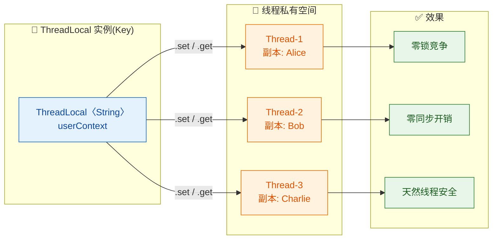

---

### 线程本地变量（Thread-Local Variable）

所谓 **线程本地变量（Thread-Local Variable）**，是指一个变量在逻辑上只有一个名字（一个 `ThreadLocal` 实例），但在物理上，每个访问它的线程都持有一份完全独立的拷贝。一个线程对它的修改，对其他线程完全不可见。

#### 与普通共享变量的本质区别

为了深入理解 ThreadLocal 的独特性，我们把它与普通共享变量、`volatile` 变量、锁保护的变量做一次全面对比：

| 维度 | 普通共享变量 | volatile 变量 | 锁保护的变量 | **ThreadLocal** |
|:---|:---|:---|:---|:---|
| **数据副本数** | 1 份（所有线程共享） | 1 份（主内存可见） | 1 份（临界区保护） | **N 份（每线程一份）** |
| **线程安全** | ❌ 不安全 | ⚠️ 仅保证可见性 | ✅ 互斥保护 | ✅ 天然安全（无共享） |
| **同步开销** | 无 | 内存屏障（轻量） | 锁竞争（可能很重） | **零** |
| **数据一致性** | 无保证 | 实时可见 | 强一致 | **各线程独立，互不相关** |
| **适用模式** | 单线程 | 状态标志位 | 读写共享数据 | **线程私有上下文** |

关键差异在于：前三种方案的核心思路都是"多个线程操作 **同一份** 数据，想办法让它安全"；而 ThreadLocal 的思路是"每个线程各自操作 **自己的那份** 数据，压根不需要安全机制"。

#### 一个直观的比喻

想象一间公司会议室里有一块公共白板（共享变量）。多个人同时往上面写字，要么加锁（一次只能一个人写），要么用 CAS（写之前先检查有没有被别人改过）。

而 ThreadLocal 的做法是：**给每个人发一块自己的小白板**。你在自己的白板上随便写，根本不用管别人。效率极高，但代价是——你无法看到别人白板上的内容（线程间无法通过 ThreadLocal 通信）。

```java
// 共享变量模式：所有线程操作同一个 StringBuilder
// 需要加锁保护
StringBuilder sharedBuilder = new StringBuilder(); // 只有一个实例

// ThreadLocal 模式：每个线程拥有自己的 StringBuilder
// 完全不需要任何同步
ThreadLocal<StringBuilder> localBuilder = ThreadLocal.withInitial(StringBuilder::new);
// Thread-1 调用 localBuilder.get() → 得到 Thread-1 专属的 StringBuilder
// Thread-2 调用 localBuilder.get() → 得到 Thread-2 专属的 StringBuilder（另一个实例）
```

#### ThreadLocal 的典型使用场景

ThreadLocal 在实际工程中有几类非常经典的应用：

**1. 用户上下文传递（User Context Propagation）**

在 Web 应用中，一个请求从 Controller 进入后，经过 Service、DAO 等多个层级。每一层可能都需要知道"当前请求的用户是谁"。如果把 `User` 对象作为参数层层传递，方法签名会变得臃肿不堪。用 ThreadLocal 存储当前用户信息，任何层级直接 `get()` 就能拿到：

```java
public class UserContext {

    // 每个处理请求的线程，都有自己独立的 currentUser 副本
    private static final ThreadLocal<User> currentUser = new ThreadLocal<>();

    // 在请求进入时（如 Filter/Interceptor）设置
    public static void set(User user) {
        currentUser.set(user);             // 存入当前线程的副本
    }

    // 在业务代码的任何地方获取
    public static User get() {
        return currentUser.get();          // 从当前线程的副本中取出
    }

    // 在请求结束时清理，防止内存泄漏（后面详细讲）
    public static void clear() {
        currentUser.remove();              // 移除当前线程的副本
    }
}
```

**2. 数据库连接管理（Connection per Thread）**

Spring 框架的事务管理内部就大量使用 ThreadLocal 来绑定当前线程的数据库连接，确保同一个事务中的多次 SQL 操作使用的是 **同一个 Connection**：

```java
public class ConnectionManager {

    // 每个线程持有自己的数据库连接
    private static final ThreadLocal<Connection> connectionHolder = new ThreadLocal<>();

    public static Connection getConnection() throws SQLException {
        Connection conn = connectionHolder.get();  // 尝试获取当前线程的连接
        if (conn == null) {                        // 如果还没有连接
            conn = dataSource.getConnection();     // 从连接池获取一个新连接
            connectionHolder.set(conn);            // 绑定到当前线程
        }
        return conn;                               // 返回当前线程专属的连接
    }

    public static void releaseConnection() throws SQLException {
        Connection conn = connectionHolder.get();  // 获取当前线程的连接
        if (conn != null) {
            conn.close();                          // 归还到连接池
            connectionHolder.remove();             // 从 ThreadLocal 中移除
        }
    }
}
```

**3. 线程安全的日期格式化**

`SimpleDateFormat` 是出了名的非线程安全类。在高并发下共享一个实例会导致解析错误。用 ThreadLocal 让每个线程拥有自己的实例：

```java
public class DateUtils {

    // 每个线程独享一个 SimpleDateFormat 实例，避免并发问题
    private static final ThreadLocal<SimpleDateFormat> dateFormat =
        ThreadLocal.withInitial(() -> new SimpleDateFormat("yyyy-MM-dd HH:mm:ss"));
        // withInitial 指定初始化工厂，首次 get() 时自动创建

    public static String format(Date date) {
        return dateFormat.get().format(date);  // 获取当前线程的 formatter 并格式化
    }

    public static Date parse(String str) throws ParseException {
        return dateFormat.get().parse(str);    // 获取当前线程的 formatter 并解析
    }
}
```

> 💡 **补充**：从 JDK 8 开始，推荐使用 `DateTimeFormatter`（线程安全的），可以完全替代 `SimpleDateFormat`，不再需要 ThreadLocal 包装。但 ThreadLocal 包装非线程安全对象这个模式本身仍然非常通用。

---

### 线程隔离（Thread Isolation）

线程隔离是 ThreadLocal 最核心的语义保证。我们需要精确理解这个"隔离"到底隔离了什么、怎么隔离的、边界在哪里。

#### 隔离的本质：每个 Thread 对象内部持有独立存储

ThreadLocal 的隔离并不是什么黑魔法，它的秘密藏在 `Thread` 类的源码里。每个 `Thread` 对象内部都有一个字段：

```java
// java.lang.Thread 类中的成员变量（简化展示）
public class Thread implements Runnable {

    // 每个线程对象都拥有自己的 ThreadLocalMap
    // 这就是 ThreadLocal 数据实际存储的地方！
    ThreadLocal.ThreadLocalMap threadLocals = null;

    // 用于 InheritableThreadLocal 的继承机制（后面章节详解）
    ThreadLocal.ThreadLocalMap inheritableThreadLocals = null;
}
```

`ThreadLocalMap` 是 `ThreadLocal` 的一个内部静态类，本质上是一个定制化的 HashMap。它以 `ThreadLocal` 实例作为 Key，以线程的私有数据作为 Value。

让我们用内存模型图来直观展示这个结构：

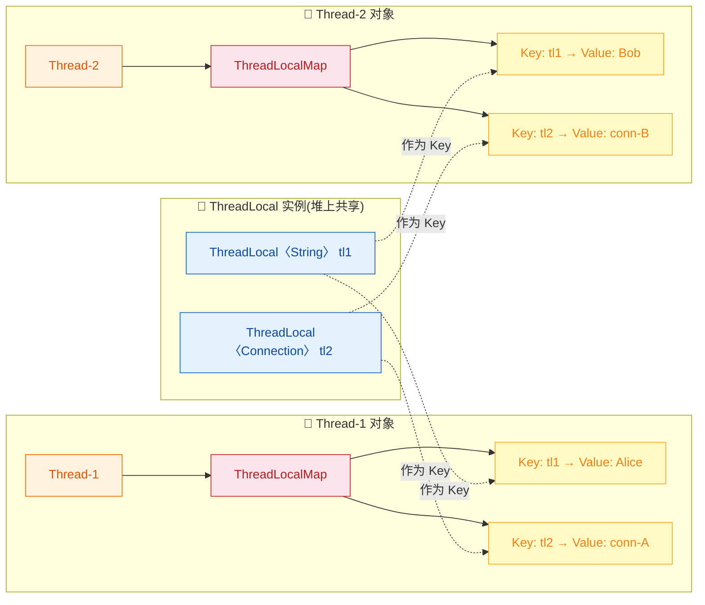

这张图揭示了一个非常重要的事实：**数据不是存在 ThreadLocal 对象里，而是存在每个 Thread 对象的 ThreadLocalMap 里**。`ThreadLocal` 只是一把钥匙（Key），真正的数据（Value）藏在线程自己的口袋里。

这就是隔离的物理基础：
- Thread-1 的 `threadLocals` Map 和 Thread-2 的 `threadLocals` Map 是两个完全不同的对象实例
- 它们存储在各自 Thread 对象的堆内存中
- 一个线程在访问 `ThreadLocal.get()` 时，只会去查自己的 Map，绝不会触及别的线程的 Map

#### 隔离的验证：代码实证

让我们用一段完整的代码来验证 ThreadLocal 的线程隔离性：

```java
public class ThreadIsolationDemo {

    // 声明一个 ThreadLocal 变量，所有线程共享这个 ThreadLocal "钥匙"
    private static final ThreadLocal<String> context = new ThreadLocal<>();

    public static void main(String[] args) throws InterruptedException {

        // 主线程设置值
        context.set("MainThread-Value");                   // 主线程的副本
        System.out.println("[Main] 设置后: " + context.get()); // 输出: MainThread-Value

        // 启动子线程 A
        Thread threadA = new Thread(() -> {
            System.out.println("[A] 初始值: " + context.get()); // 输出: null（子线程有自己的副本，未初始化）
            context.set("ThreadA-Value");                       // 设置 A 的副本
            System.out.println("[A] 设置后: " + context.get()); // 输出: ThreadA-Value
        }, "Thread-A");

        // 启动子线程 B
        Thread threadB = new Thread(() -> {
            System.out.println("[B] 初始值: " + context.get()); // 输出: null（B 的副本也是独立的）
            context.set("ThreadB-Value");                       // 设置 B 的副本
            System.out.println("[B] 设置后: " + context.get()); // 输出: ThreadB-Value
        }, "Thread-B");

        threadA.start();  // 启动 A
        threadB.start();  // 启动 B
        threadA.join();   // 等待 A 完成
        threadB.join();   // 等待 B 完成

        // 回到主线程检查：主线程的值完全不受影响
        System.out.println("[Main] 最终值: " + context.get()); // 输出: MainThread-Value

        context.remove(); // 最佳实践：用完后 remove
    }
}
```

运行输出：

```text
[Main] 设置后: MainThread-Value
[A] 初始值: null
[A] 设置后: ThreadA-Value
[B] 初始值: null
[B] 设置后: ThreadB-Value
[Main] 最终值: MainThread-Value
```

三个线程各自独立，互不干扰。Thread-A 和 Thread-B 的 `set()` 对主线程没有任何影响；子线程也看不到主线程的值（因为普通的 `ThreadLocal` 不会继承父线程的数据——这个话题会在 `InheritableThreadLocal` 章节展开）。

#### 隔离的边界与陷阱

ThreadLocal 虽然强大，但它的隔离有明确的边界。理解这些边界能帮助你避免踩坑：

**陷阱一：ThreadLocal 隔离的是引用，不是深拷贝**

如果你往 ThreadLocal 里存放的是一个可变对象（Mutable Object），而多个线程恰好共享了同一个对象实例的引用，隔离就会被打破：

```java
// ❌ 危险示例：所有线程共享同一个 List 实例
List<String> sharedList = new ArrayList<>();            // 创建一个共享的 List
ThreadLocal<List<String>> tl = new ThreadLocal<>();

// Thread-1
tl.set(sharedList);          // Thread-1 的副本指向 sharedList
tl.get().add("from-T1");     // 修改的是 sharedList 本身

// Thread-2
tl.set(sharedList);          // Thread-2 的副本也指向同一个 sharedList！
tl.get().add("from-T2");     // 修改的还是同一个 sharedList

// 两个线程的 "副本" 指向同一个对象，隔离名存实亡！
```

```java
// ✅ 正确做法：每个线程创建自己的 List 实例
ThreadLocal<List<String>> tl = ThreadLocal.withInitial(ArrayList::new);
// withInitial 保证每个线程首次 get() 时创建一个全新的 ArrayList 实例
// Thread-1 的 List 和 Thread-2 的 List 是两个不同的对象
```

**陷阱二：线程池中的线程复用导致数据残留**

这是 ThreadLocal 最常见也最危险的陷阱。在线程池中，线程执行完任务后不会销毁，而是被放回池中等待下一个任务。如果任务结束时没有 `remove()` 掉 ThreadLocal 的值，下一个任务就会"继承"上一个任务残留的数据：

```java
ExecutorService pool = Executors.newFixedThreadPool(1);     // 只有 1 个线程的线程池

ThreadLocal<String> userContext = new ThreadLocal<>();

// 第一个任务：模拟用户 Alice 的请求
pool.execute(() -> {
    userContext.set("Alice");                                 // 设置为 Alice
    System.out.println("Task1: " + userContext.get());       // 输出: Alice
    // ❌ 忘记 remove！任务结束，但线程不销毁，数据残留！
});

// 第二个任务：模拟用户 Bob 的请求
pool.execute(() -> {
    // 期望是 null（新请求尚未设置），但实际可能是 "Alice"！
    System.out.println("Task2: " + userContext.get());       // 输出: Alice（数据泄漏！）
    // 这是一个严重的安全隐患：Bob 看到了 Alice 的数据
});
```

这就是为什么 **"用完必须 `remove()`"** 是 ThreadLocal 使用的铁律。我们会在"内存泄漏"章节做更深入的分析。

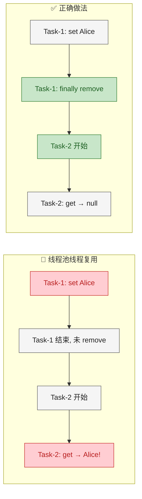

#### 线程隔离 vs 数据同步：何时选择 ThreadLocal？

ThreadLocal 不是银弹，它有明确的适用场景：

| 判断条件 | 选择 ThreadLocal | 选择锁/CAS/并发容器 |
|:---|:---|:---|
| 线程间需要通信/共享结果？ | ❌ 不适合 | ✅ 必须共享 |
| 每个线程只需要自己的数据副本？ | ✅ 非常适合 | ❌ 多余的开销 |
| 需要避免频繁创建临时对象？ | ✅ 线程级缓存 | — |
| 需要在调用链中隐式传参？ | ✅ 上下文传递 | — |
| 数据有跨线程的因果依赖？ | ❌ 无法保证 | ✅ 需要 happens-before |

核心决策原则：**如果数据天然属于某个线程、不需要被其他线程看到，就用 ThreadLocal；如果数据需要被多个线程协同读写，就必须用同步机制。**

---

**📝 练习题**

以下关于 ThreadLocal 线程隔离的说法，哪一项是 **错误** 的？

A. 每个线程通过同一个 ThreadLocal 实例访问到的是各自独立的数据副本


B. ThreadLocal 的数据实际存储在每个 Thread 对象内部的 ThreadLocalMap 中


C. 在线程池环境下，线程复用不会影响 ThreadLocal 的隔离性，无需额外处理


D. 如果多个线程通过 ThreadLocal 存储了同一个可变对象的引用，隔离性会被打破


**【答案】** C

**【解析】**

- **选项 A** ✅ 正确：这是 ThreadLocal 的核心语义。多个线程使用同一个 `ThreadLocal` 实例调用 `get()/set()`，操作的是各自 Thread 对象中 ThreadLocalMap 里不同的 Entry，天然隔离。
- **选项 B** ✅ 正确：`Thread` 类内部有一个 `ThreadLocal.ThreadLocalMap threadLocals` 字段，ThreadLocal 的数据就存储在这里，以 ThreadLocal 实例为 Key，用户数据为 Value。
- **选项 C** ❌ **错误**：线程池中的线程在执行完任务后不会被销毁，而是被复用。如果前一个任务设置了 ThreadLocal 的值却没有 `remove()`，后一个任务会读取到残留数据，造成逻辑错误甚至安全隐患。因此在线程池环境中 **必须** 在 `finally` 块中调用 `remove()` 清理。
- **选项 D** ✅ 正确：ThreadLocal 隔离的是"引用"而非"对象本身"。如果多个线程的 ThreadLocal 副本都指向堆上的同一个可变对象，对该对象的修改会被所有线程看到，隔离名存实亡。正确做法是让每个线程创建自己的对象实例（如使用 `withInitial`）。

---

### 基本使用

`ThreadLocal` 的 API 表面上非常简洁——核心方法只有四个。但正是这"少即是多"的设计，让它成为 Java 并发编程中最优雅的工具之一。理解每个方法的语义、使用时机以及背后隐含的生命周期管理，是正确运用 `ThreadLocal` 的前提。

我们先总览 API 全貌，再逐一深入：

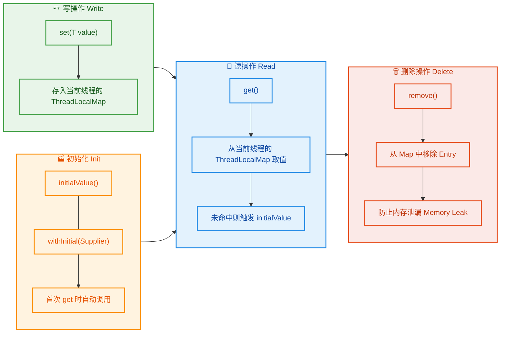

---

#### 一、set(T value) —— 写入当前线程的专属副本

`set()` 的职责非常明确：将一个值绑定到 **当前线程** 上。无论有多少个线程调用同一个 `ThreadLocal` 的 `set()`，它们写入的位置都是各自线程的 `ThreadLocalMap`，彼此完全隔离。

```java
public class ThreadLocalSetDemo {

    // 声明一个 ThreadLocal 变量，泛型为 String
    // 这个 ThreadLocal 实例本身是共享的（通常是 static final），
    // 但它里面存的值是每个线程各自独立的
    private static final ThreadLocal<String> userName = new ThreadLocal<>();

    public static void main(String[] args) {

        // ===== 线程 A =====
        Thread threadA = new Thread(() -> {
            userName.set("Alice");                          // 把 "Alice" 写入线程 A 的 Map
            System.out.println("A: " + userName.get());    // 输出: A: Alice
        }, "Thread-A");

        // ===== 线程 B =====
        Thread threadB = new Thread(() -> {
            userName.set("Bob");                            // 把 "Bob" 写入线程 B 的 Map
            System.out.println("B: " + userName.get());    // 输出: B: Bob
        }, "Thread-B");

        threadA.start();
        threadB.start();
    }
}
```

执行结果永远是 `A: Alice` 和 `B: Bob`——线程 A 永远不会读到 "Bob"，线程 B 也永远不会读到 "Alice"。这就是 **线程隔离（Thread Isolation）** 的直观体现。

来看 `set()` 的简化源码，理解它到底做了什么：

```java
// ThreadLocal.set() 简化源码
public void set(T value) {
    Thread t = Thread.currentThread();           // 第1步：获取当前线程对象
    ThreadLocalMap map = getMap(t);              // 第2步：拿到该线程的 ThreadLocalMap
    if (map != null) {
        map.set(this, value);                    // 第3步：以「this（当前 ThreadLocal 实例）」为 Key，存入 value
    } else {
        createMap(t, value);                     // 如果 Map 还不存在，先创建再存
    }
}

// getMap 方法：直接返回线程对象上的 threadLocals 字段
ThreadLocalMap getMap(Thread t) {
    return t.threadLocals;                       // ThreadLocalMap 挂在 Thread 对象上！
}

// createMap 方法：首次使用时初始化
void createMap(Thread t, T firstValue) {
    t.threadLocals = new ThreadLocalMap(this, firstValue);  // 创建新 Map 并存入第一个键值对
}
```

几个要点需要格外注意：

- **Key 是 `this`**——也就是当前 `ThreadLocal` 实例本身。如果你在一个类中声明了两个 `ThreadLocal`（比如 `tlA` 和 `tlB`），它们在同一个线程的 `ThreadLocalMap` 中会是两个不同的 Entry，因为 Key 不同。
- **Map 挂在 `Thread` 上**——而不是挂在 `ThreadLocal` 上。所以查找路径永远是「当前线程 → 自己的 Map → 以 ThreadLocal 为 Key 查」，天然无竞争。
- **惰性初始化（Lazy Init）**——`ThreadLocalMap` 不是线程一创建就有的，而是第一次调用 `set()` 或 `get()` 时才会创建。

下面用一张内存模型图直观展示多个 `ThreadLocal` 在多线程中的存储结构：

```text
┌───────────────────────────────────────────────────────────────┐
│  Thread-A 的 ThreadLocalMap                                    │
│  ┌──────────────────┬──────────────────┬───────────────────┐  │
│  │   Entry[i]       │   Entry[j]       │   Entry[k]        │  │
│  │   Key: userName  │   Key: traceId   │   Key: formatter  │  │
│  │   Val: "Alice"   │   Val: "T-001"   │   Val: sdf实例    │  │
│  └──────────────────┴──────────────────┴───────────────────┘  │
├───────────────────────────────────────────────────────────────┤
│  Thread-B 的 ThreadLocalMap                                    │
│  ┌──────────────────┬──────────────────┬───────────────────┐  │
│  │   Entry[i]       │   Entry[j]       │   Entry[k]        │  │
│  │   Key: userName  │   Key: traceId   │   Key: formatter  │  │
│  │   Val: "Bob"     │   Val: "T-002"   │   Val: sdf实例    │  │
│  └──────────────────┴──────────────────┴───────────────────┘  │
└───────────────────────────────────────────────────────────────┘
```

同一个 `userName` 的 `ThreadLocal` 实例在两个线程的 Map 中各有一个 Entry，但 Value 完全独立——这就是 `set()` 的全部秘密。

---

#### 二、get() —— 读取当前线程的专属副本

`get()` 是 `set()` 的对称操作：从当前线程的 `ThreadLocalMap` 中，以 `this`（当前 ThreadLocal 实例）为 Key 查找对应的 Value。

```java
// ThreadLocal.get() 简化源码
public T get() {
    Thread t = Thread.currentThread();               // 第1步：获取当前线程
    ThreadLocalMap map = getMap(t);                  // 第2步：拿到该线程的 ThreadLocalMap
    if (map != null) {
        ThreadLocalMap.Entry e = map.getEntry(this); // 第3步：以 this 为 Key 查找
        if (e != null) {
            @SuppressWarnings("unchecked")
            T result = (T) e.value;                  // 命中！返回 Value
            return result;
        }
    }
    return setInitialValue();                        // 未命中，走初始化逻辑
}
```

`get()` 有一个非常重要的行为：**如果当前线程从未 `set()` 过值，`get()` 不会返回 `null` 然后完事——它会自动触发 `initialValue()` 来创建一个初始值，存入 Map，再返回**。这就把我们引向了初始化策略的讨论（见下文第四节）。

但如果你没有覆写 `initialValue()`，默认实现返回的就是 `null`：

```java
// ThreadLocal 默认的 initialValue 实现
protected T initialValue() {
    return null;   // 默认返回 null —— 如果你没覆写，首次 get() 就是 null
}
```

一个常见的陷阱场景：

```java
private static final ThreadLocal<List<String>> buffer = new ThreadLocal<>();

public void process() {
    // ❌ 首次 get() 返回 null，直接调用 add() 会 NullPointerException！
    buffer.get().add("data");
}
```

正确做法要么先 `set()`，要么提供 `initialValue()`（下文会详细介绍）。

---

#### 三、remove() —— 移除当前线程的副本（最重要的方法！）

在 `ThreadLocal` 的所有方法中，`remove()` 的重要性怎么强调都不为过。如果说 `set()` 和 `get()` 是"正常操作"，那么 `remove()` 就是 **"善后操作"——不做就泄漏**。

```java
// ThreadLocal.remove() 简化源码
public void remove() {
    ThreadLocalMap m = getMap(Thread.currentThread()); // 获取当前线程的 Map
    if (m != null) {
        m.remove(this);                                // 从 Map 中删除以 this 为 Key 的 Entry
    }
}
```

**为什么 `remove()` 如此关键？** 原因在于现代 Java 应用几乎都使用线程池（`ThreadPoolExecutor`、Tomcat/Netty 的工作线程等）。线程池中的线程 **不会销毁**，而是执行完一个任务后去接下一个任务。如果你在任务 A 中 `set()` 了值却没有 `remove()`，当同一个线程被复用来执行任务 B 时，任务 B 调用 `get()` 会读到 **任务 A 留下的脏数据**。

```java
// 🔥 线程池场景下不 remove 的严重后果
import java.util.concurrent.ExecutorService;
import java.util.concurrent.Executors;

public class DirtyReadDemo {

    // 存储当前请求的用户ID
    private static final ThreadLocal<String> currentUser = new ThreadLocal<>();

    public static void main(String[] args) {
        // 创建只有 1 个线程的线程池（方便复现问题）
        ExecutorService pool = Executors.newSingleThreadExecutor();

        // ===== 任务 A：模拟用户 Alice 的请求 =====
        pool.submit(() -> {
            currentUser.set("Alice");                       // 设置用户为 Alice
            System.out.println("任务A: " + currentUser.get()); // 输出: 任务A: Alice
            // ❌ 忘记 remove()!
        });

        // ===== 任务 B：模拟用户 Bob 的请求 =====
        pool.submit(() -> {
            // 期望: 还没 set，应该是 null
            // 实际: 因为线程被复用，读到了 Alice 的数据！💀
            System.out.println("任务B: " + currentUser.get()); // 输出: 任务B: Alice ← 脏读！
        });

        pool.shutdown();
    }
}
```

这不仅仅是"数据错乱"的问题——在权限控制场景下（比如 `ThreadLocal` 存储当前登录用户），脏读意味着 **用户 B 可能以用户 A 的身份执行操作**，这是安全漏洞。

**正确的使用模板**——`try-finally` 黄金法则：

```java
private static final ThreadLocal<UserContext> userCtx = new ThreadLocal<>();

public void handleRequest(HttpServletRequest request) {
    try {
        // ===== 进入阶段：set =====
        UserContext ctx = extractUserContext(request);   // 从请求中提取用户上下文
        userCtx.set(ctx);                               // 存入 ThreadLocal

        // ===== 业务逻辑阶段：get =====
        doBusinessLogic();                              // 业务代码中随时 userCtx.get()
        callServiceA();                                 // 深层调用也能 get() 到
        callServiceB();

    } finally {
        // ===== 离开阶段：remove（必须！）=====
        userCtx.remove();                               // ⚡ 无论是否异常，都要 remove
    }
}
```

> **铁律（Iron Rule）**：`set()` 和 `remove()` 必须成对出现，`remove()` 必须在 `finally` 块中。在 Code Review 中，看到 `ThreadLocal.set()` 没有对应的 `remove()`，应视为 **P0 级 Bug**。

下面的时序图清晰展示了线程池复用场景下，`remove()` 的关键作用：

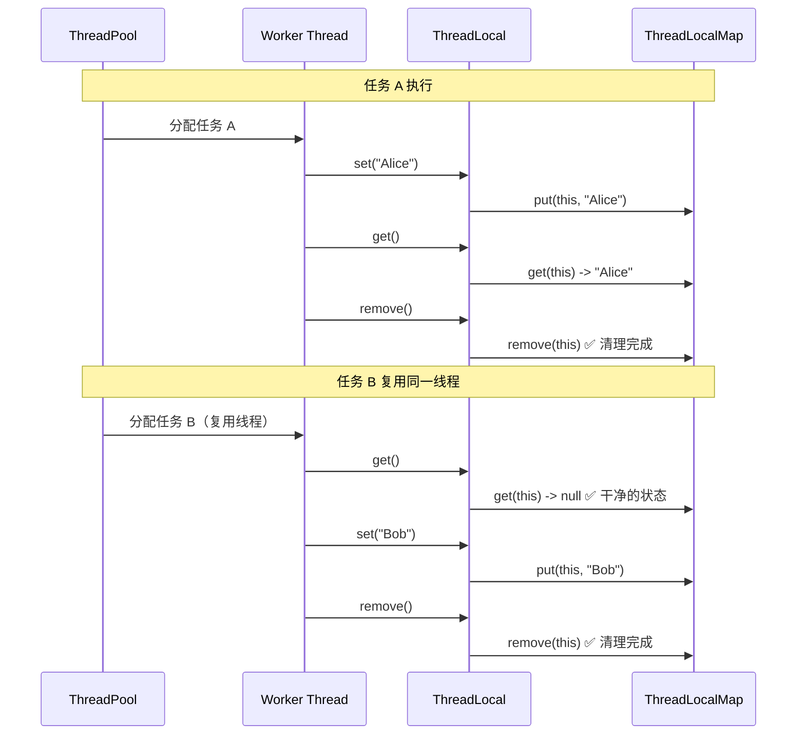

---

#### 四、initialValue() 与 withInitial() —— 初始化策略

前面提到，`get()` 在未命中时会调用 `initialValue()` 来创建初始值。Java 提供了两种指定初始值的方式：

**方式一：匿名内部类覆写 `initialValue()`（经典方式）**

```java
// 通过匿名内部类覆写 initialValue 方法
private static final ThreadLocal<SimpleDateFormat> formatter =
        new ThreadLocal<SimpleDateFormat>() {
            @Override
            protected SimpleDateFormat initialValue() {
                // 每个线程第一次调用 get() 时执行此方法
                // 返回值会被自动存入当前线程的 ThreadLocalMap
                return new SimpleDateFormat("yyyy-MM-dd HH:mm:ss");
            }
        };

public static String formatNow() {
    // 第一次调用：触发 initialValue()，创建 SimpleDateFormat 并缓存
    // 后续调用：直接从 Map 中取出缓存的实例，不再创建
    return formatter.get().format(new Date());
}
```

**方式二：`ThreadLocal.withInitial(Supplier)` —— Java 8+ 推荐方式**

```java
// 使用 withInitial + Lambda 表达式（更简洁）
private static final ThreadLocal<SimpleDateFormat> formatter =
        ThreadLocal.withInitial(                         // 工厂方法
            () -> new SimpleDateFormat("yyyy-MM-dd HH:mm:ss")  // Supplier 函数式接口
        );
```

`withInitial()` 的源码非常简单——它只是把 Lambda 包装成了一个子类：

```java
// ThreadLocal.withInitial 源码
public static <S> ThreadLocal<S> withInitial(Supplier<? extends S> supplier) {
    return new SuppliedThreadLocal<>(supplier);          // 返回一个子类实例
}

// SuppliedThreadLocal 内部类
static final class SuppliedThreadLocal<T> extends ThreadLocal<T> {
    private final Supplier<? extends T> supplier;        // 持有 Supplier 引用

    SuppliedThreadLocal(Supplier<? extends T> supplier) {
        this.supplier = Objects.requireNonNull(supplier); // Supplier 不能为 null
    }

    @Override
    protected T initialValue() {
        return supplier.get();                           // 调用 Supplier 来生成初始值
    }
}
```

本质上，`withInitial()` 和手动覆写 `initialValue()` 的效果 **完全一样**——只是语法更简洁。

**两种方式的对比**：

| 维度 | 覆写 `initialValue()` | `withInitial(Supplier)` |
|---|---|---|
| **Java 版本** | Java 1.2+ | Java 8+ |
| **语法简洁度** | 匿名内部类，冗长 | Lambda 一行搞定 ✅ |
| **可读性** | 意图明确但代码多 | 简洁直观 ✅ |
| **功能差异** | 无 | 无（底层都是覆写 `initialValue`） |
| **推荐度** | 仅在 Java 7 及以下使用 | **首选** ✅ |

**`initialValue()` 的调用时机**深入理解：

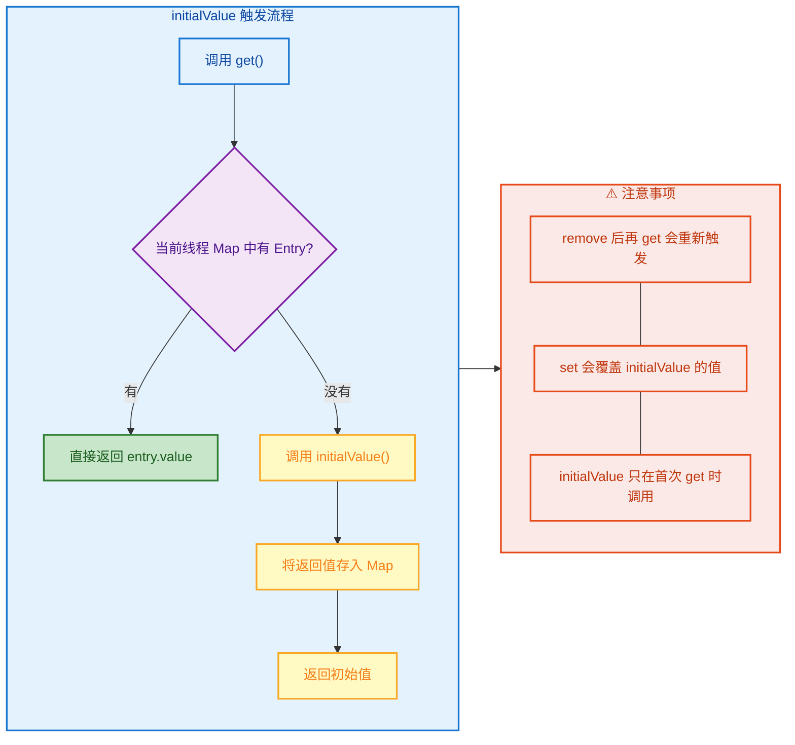

一个容易踩坑的点：**`remove()` 之后再调用 `get()`，会重新触发 `initialValue()`**。这不是 Bug，而是符合设计语义的——`remove()` 清除了 Entry，`get()` 找不到就走初始化逻辑。

```java
private static final ThreadLocal<Integer> counter =
        ThreadLocal.withInitial(() -> 0);              // 初始值 = 0

public static void demo() {
    System.out.println(counter.get());   // 0  ← 首次 get，触发 initialValue
    counter.set(42);                     // 修改为 42
    System.out.println(counter.get());   // 42 ← 直接从 Map 取出
    counter.remove();                    // 移除 Entry
    System.out.println(counter.get());   // 0  ← 再次触发 initialValue！重新得到初始值
}
```

---

#### 五、完整生命周期示例

为了把 `set / get / remove / initialValue` 串联起来，我们实现一个 **请求级别的调用链追踪（Trace ID Propagation）**——这是 `ThreadLocal` 在实际工程中最常见的用法之一：

```java
import java.util.UUID;

/**
 * 请求追踪上下文工具类
 * 利用 ThreadLocal 在整条调用链中传递 traceId，无需通过方法参数层层传递
 */
public class TraceContext {

    // 每个线程首次 get 时自动生成一个 UUID 作为 traceId
    private static final ThreadLocal<String> traceId =
            ThreadLocal.withInitial(() -> UUID.randomUUID().toString().replace("-", ""));

    /** 获取当前线程的 traceId */
    public static String getTraceId() {
        return traceId.get();                          // 直接 get，首次会自动初始化
    }

    /** 手动设置 traceId（通常在接收上游传递的 traceId 时使用） */
    public static void setTraceId(String id) {
        traceId.set(id);                               // 覆盖 initialValue 产生的值
    }

    /** 清理（在请求结束时必须调用） */
    public static void clear() {
        traceId.remove();                              // 防止线程池场景下的脏读和内存泄漏
    }
}

/**
 * 模拟 Web 请求处理
 */
public class RequestHandler {

    public void handle(String incomingTraceId) {
        try {
            // ===== 请求入口：设置 traceId =====
            if (incomingTraceId != null) {
                TraceContext.setTraceId(incomingTraceId);  // 接收上游的 traceId
            }
            // 如果 incomingTraceId 为 null，调用 getTraceId() 时会自动生成

            // ===== 业务逻辑：任何层级都能拿到 traceId =====
            System.out.println("[Handler] traceId=" + TraceContext.getTraceId());
            serviceA();

        } finally {
            // ===== 请求出口：必须清理 =====
            TraceContext.clear();                         // ⚡ finally 中 remove
        }
    }

    private void serviceA() {
        // 无需传参，直接 get
        System.out.println("[ServiceA] traceId=" + TraceContext.getTraceId());
        repositoryB();
    }

    private void repositoryB() {
        // 深层调用同样能拿到同一个 traceId
        System.out.println("[RepoB] traceId=" + TraceContext.getTraceId());
    }
}
```

这个模式的精髓在于：**`traceId` 不需要作为参数在 `handle → serviceA → repositoryB` 之间逐层传递**。每一层只需要调用 `TraceContext.getTraceId()` 就能拿到值——因为它们运行在同一个线程上，访问的是同一个 `ThreadLocalMap` 中的同一个 Entry。

用下面的流程图总结 `ThreadLocal` 在一次请求中的完整生命周期：

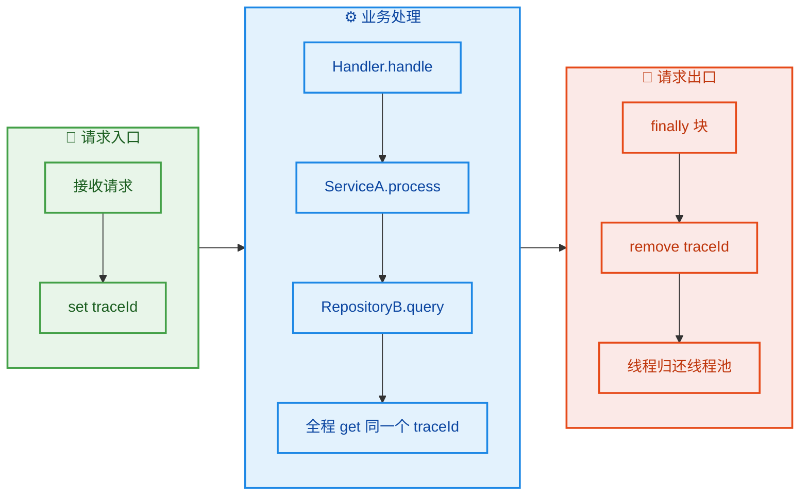

---

#### 六、API 使用速查表

| 方法 | 语义 | 返回值 | 触发时机 |
|---|---|---|---|
| `set(T value)` | 将 value 绑定到当前线程 | `void` | 主动调用 |
| `get()` | 取出当前线程绑定的 value | `T` | 主动调用（未命中时自动触发 `initialValue`） |
| `remove()` | 从当前线程的 Map 中删除 Entry | `void` | 主动调用（**必须在 finally 中调用**） |
| `initialValue()` | 提供初始值（覆写此方法或用 `withInitial`） | `T` | 首次 `get()` 且 Map 中无 Entry 时自动调用 |
| `withInitial(Supplier)` | `initialValue()` 的 Lambda 简写 | `ThreadLocal<S>` | 静态工厂方法，创建时调用 |

> **一句话总结**：`set()` 写、`get()` 读、`remove()` 删、`initialValue()` 默认值。四个方法围绕的是 **当前线程的 ThreadLocalMap** 中以 **当前 ThreadLocal 实例** 为 Key 的那个 Entry——仅此而已。

---

📝 **练习题**

**题目 1**：以下代码在一个 `newFixedThreadPool(1)` 的线程池中执行，输出结果是什么？

```java
private static final ThreadLocal<Integer> tl = ThreadLocal.withInitial(() -> 1);

pool.submit(() -> {
    tl.set(100);
    System.out.println("Task1: " + tl.get());
});

pool.submit(() -> {
    System.out.println("Task2: " + tl.get());
});
```

A. Task1: 100，Task2: 1

B. Task1: 100，Task2: 100

C. Task1: 100，Task2: null

D. 编译错误


【答案】B

【解析】线程池大小为 1，两个任务由 **同一个线程** 先后执行。Task1 执行 `set(100)` 后没有 `remove()`，当同一个线程执行 Task2 时，`get()` 直接从 `ThreadLocalMap` 中取到了 Task1 留下的值 `100`（脏读），而不是初始值 `1`。`initialValue()` 只在 Map 中找不到 Entry 时才触发——此时 Entry 存在（值为 100），所以不会触发。正确做法是 Task1 在 `finally` 中调用 `tl.remove()`，这样 Task2 的 `get()` 才会因为找不到 Entry 而触发 `initialValue()` 返回 `1`。这道题精确体现了 **`remove()` 在线程池中的不可或缺性**。

---

**题目 2**：关于 `ThreadLocal.withInitial()` 和 `initialValue()`，以下哪项描述是**正确**的？

A. `withInitial()` 的初始化逻辑在 `ThreadLocal` 对象创建时就会立即执行

B. 调用 `remove()` 后再次调用 `get()`，`initialValue()` **不会**被再次触发

C. 如果先调用 `set(value)` 再调用 `get()`，`initialValue()` 不会被触发

D. `withInitial()` 底层使用了反射来调用 `Supplier`


【答案】C

【解析】逐项分析：

- **A 错误**：`withInitial()` 中的 `Supplier` 是 **惰性求值（Lazy Evaluation）** 的——只有当某个线程首次调用 `get()` 且 Map 中没有对应 Entry 时，才会调用 `supplier.get()` 生成初始值。`ThreadLocal` 对象创建时不会执行任何初始化逻辑。
- **B 错误**：`remove()` 删除了 Entry，之后调用 `get()` 发现 Map 中没有对应的 Entry，就会 **重新触发** `initialValue()` 生成值并存入 Map。
- **C 正确**：`set(value)` 已经在 Map 中创建了 Entry（Key=当前 ThreadLocal，Value=value）。后续 `get()` 直接命中，无需走 `initialValue()` 分支。
- **D 错误**：`withInitial()` 返回的是 `SuppliedThreadLocal` 子类，内部直接调用 `supplier.get()`，这是普通的方法调用，与反射无关。

---

## 实现原理 ⭐⭐

理解 ThreadLocal 的使用方法只是第一步，真正让你在面试和排障中游刃有余的，是对其**底层数据结构**的深刻理解。ThreadLocal 的实现并不复杂，但设计非常精妙——它将「变量隔离」的职责从 ThreadLocal 对象本身转移到了 **Thread 对象**身上，这一设计决策是理解所有后续机制（包括内存泄漏问题）的根基。

### Thread.threadLocals（ThreadLocalMap）

很多初学者会直觉地认为：ThreadLocal 内部维护了一个 `Map<Thread, Value>`，即以线程为 Key、用户数据为 Value。但事实恰恰**相反**——数据并不存储在 ThreadLocal 对象中，而是存储在**每个 Thread 对象自己的内部**。

打开 `java.lang.Thread` 的源码，你会发现这样一个字段：

```java
// java.lang.Thread 源码（精简版）
public class Thread implements Runnable {

    // 每个线程对象内部都持有一个 ThreadLocalMap 实例
    // 这个 map 就是该线程所有 ThreadLocal 变量的存储容器
    // 初始值为 null，只有在第一次调用 ThreadLocal.set() 或 get() 时才会创建
    ThreadLocal.ThreadLocalMap threadLocals = null;

    // InheritableThreadLocal 使用的 map，后续章节讲解
    ThreadLocal.ThreadLocalMap inheritableThreadLocals = null;

    // ... 其他字段
}
```

这意味着：**每个 Thread 对象自己携带了一个 Map（ThreadLocalMap）**，用于存放该线程的所有 ThreadLocal 变量。ThreadLocal 对象本身不存储任何数据，它仅仅充当访问这个 Map 的 **Key**。

这种设计的精妙之处在于：当一个线程结束并被 GC 回收时，它的 `threadLocals` Map 也随之被回收，其中存储的所有 Value 自然释放——无需额外清理。

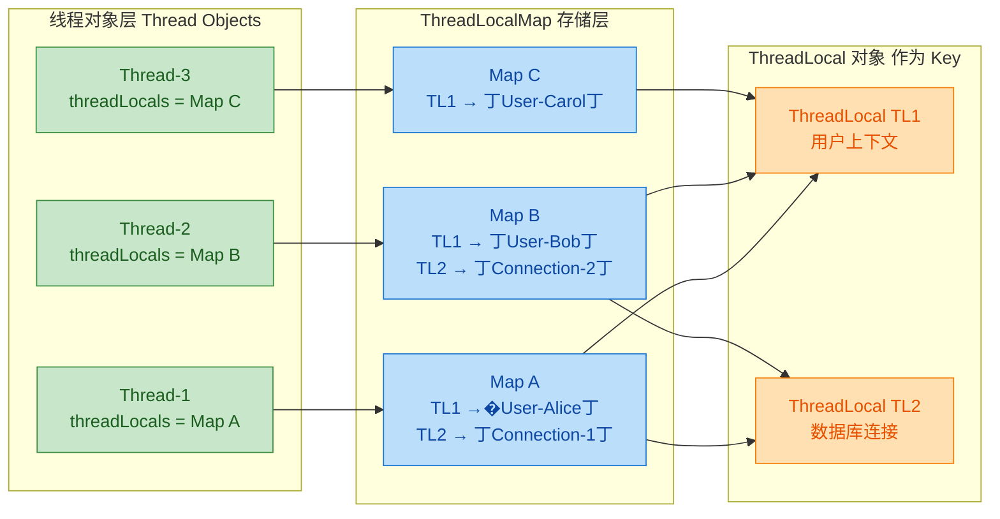

现在让我们看看 `ThreadLocal.set()` 的源码，验证上面的结论：

```java
// ThreadLocal.set() 源码解析
public void set(T value) {
    // 第一步：获取当前调用线程的 Thread 对象
    Thread t = Thread.currentThread();

    // 第二步：获取该线程对象内部的 ThreadLocalMap
    // 注意：这里访问的是 t.threadLocals 字段
    ThreadLocalMap map = getMap(t);

    // 第三步：如果 map 已存在，直接以「this」（当前 ThreadLocal 对象）为 Key 存入
    if (map != null) {
        map.set(this, value); // this = 当前 ThreadLocal 实例
    } else {
        // 如果 map 不存在（线程首次使用 ThreadLocal），创建新 map
        createMap(t, value);
    }
}

// getMap() 方法极其简单——直接返回线程对象的 threadLocals 字段
ThreadLocalMap getMap(Thread t) {
    return t.threadLocals; // 就这一行！数据在 Thread 对象上
}

// createMap() 为该线程创建 ThreadLocalMap 并赋值
void createMap(Thread t, T firstValue) {
    // 创建新的 ThreadLocalMap，以当前 ThreadLocal 为第一个 Key
    t.threadLocals = new ThreadLocalMap(this, firstValue);
}
```

`ThreadLocal.get()` 的逻辑同理：

```java
// ThreadLocal.get() 源码解析
public T get() {
    // 获取当前线程
    Thread t = Thread.currentThread();

    // 获取当前线程的 ThreadLocalMap
    ThreadLocalMap map = getMap(t);

    if (map != null) {
        // 以「this」(当前 ThreadLocal 对象) 为 Key，查找对应的 Entry
        ThreadLocalMap.Entry e = map.getEntry(this);
        if (e != null) {
            @SuppressWarnings("unchecked")
            T result = (T) e.value; // 取出 value 并返回
            return result;
        }
    }

    // 如果 map 不存在或没找到对应 Entry，返回初始值
    return setInitialValue(); // 内部会调用 initialValue()
}
```

用一张内存引用图来总结这个数据流向：

```java
// ===== 内存引用关系（核心！面试高频考点）=====
//
//  栈 (Stack)                堆 (Heap)
//  ──────────              ─────────────────────────────────
//
//  threadLocalRef  ──────→  ThreadLocal 对象 (Key)
//                                    ↑
//                                    │ 弱引用 (WeakReference)
//                                    │
//  currentThread   ──────→  Thread 对象
//                             │
//                             └──→ threadLocals (ThreadLocalMap)
//                                       │
//                                       └──→ Entry[]  数组
//                                              │
//                                              ├── Entry[3]: Key(WeakRef→TL) → Value
//                                              ├── Entry[7]: Key(WeakRef→TL) → Value
//                                              └── ...
//
//  关键点：Entry 的 Key 是对 ThreadLocal 的「弱引用」
//         Entry 的 Value 是对用户数据的「强引用」
```

### ThreadLocal 作为 Key

我们已经知道 ThreadLocalMap 以 ThreadLocal 对象自身作为 Key。那么 ThreadLocalMap 内部究竟是如何实现查找的呢？它是否像 HashMap 一样使用链表或红黑树解决哈希冲突？答案是：**不是**。ThreadLocalMap 采用了一种更简洁的策略——**开放寻址法（Open Addressing）**中的线性探测法（Linear Probing）。

```java
// ThreadLocalMap 的核心结构（简化版源码）
static class ThreadLocalMap {

    // Entry 继承自 WeakReference<ThreadLocal<?>>
    // 这是理解内存泄漏问题的关键！下一节详解
    static class Entry extends WeakReference<ThreadLocal<?>> {
        // Entry 持有的 value 就是用户存入的数据
        Object value;

        Entry(ThreadLocal<?> k, Object v) {
            super(k);     // 将 ThreadLocal 对象包装为弱引用作为 Key
            value = v;    // Value 是强引用
        }
    }

    // 底层存储：Entry 数组（注意不是链表！）
    private Entry[] table;

    // 初始容量，必须是 2 的幂（与 HashMap 类似）
    private static final int INITIAL_CAPACITY = 16;

    // 当前存储的 Entry 数量
    private int size = 0;

    // 扩容阈值（默认为容量的 2/3）
    private int threshold;
}
```

**为什么用开放寻址法而不是链表法？** 这是一个精妙的设计选择：

1. **ThreadLocalMap 的规模通常很小**。一个线程使用的 ThreadLocal 数量一般是个位数到十几个，不像 HashMap 可能存储成千上万的元素。在小规模数据下，开放寻址法的 cache locality（缓存局部性）更好，性能优于链表法。

2. **减少内存开销**。链表法需要额外的 Node 对象和 next 指针；开放寻址法直接在数组上操作，无额外对象分配。

3. **配合弱引用清理**。开放寻址法在探测过程中可以顺便清理被 GC 回收的 stale entry（过期条目），这对于弱引用 Key 的设计非常友好。

下面看 ThreadLocalMap 是如何通过线性探测法定位 Entry 的：

```java
// ThreadLocalMap 的 set 方法（简化版）
private void set(ThreadLocal<?> key, Object value) {
    Entry[] tab = table;
    int len = tab.length;

    // 第一步：计算初始索引位置
    // threadLocalHashCode 是每个 ThreadLocal 对象创建时分配的唯一哈希值
    // 使用 & (len - 1) 代替 % len（因为 len 是 2 的幂）
    int i = key.threadLocalHashCode & (len - 1);

    // 第二步：线性探测 —— 从 i 开始，逐个检查槽位
    for (Entry e = tab[i];
         e != null;                    // 遇到空槽则停止探测
         e = tab[i = nextIndex(i, len)]) { // 移到下一个槽位

        // 获取该 Entry 的 Key（通过弱引用的 get() 方法）
        ThreadLocal<?> k = e.get();

        // 情况 1：找到了同一个 ThreadLocal 对象 → 更新 value
        if (k == key) {
            e.value = value;
            return;
        }

        // 情况 2：Key 已被 GC 回收（弱引用返回 null）→ 替换这个过期 Entry
        if (k == null) {
            replaceStaleEntry(key, value, i); // 清理 + 复用槽位
            return;
        }

        // 情况 3：Key 不匹配 → 继续线性探测下一个槽位
    }

    // 第三步：找到空槽位，创建新 Entry 并放入
    tab[i] = new Entry(key, value);
    int sz = ++size;

    // 尝试清理一些过期 Entry，如果没有可清理的且超过阈值则扩容
    if (!cleanSomeSlots(i, sz) && sz >= threshold) {
        rehash(); // 扩容：容量翻倍
    }
}

// 下一个索引：环形探测（到末尾后回到 0）
private static int nextIndex(int i, int len) {
    return ((i + 1 < len) ? i + 1 : 0);
}
```

**`threadLocalHashCode` 的魔法数字**也值得一提：

```java
// ThreadLocal 类中的哈希值生成机制
public class ThreadLocal<T> {

    // 每个 ThreadLocal 实例的哈希值，在构造时确定
    private final int threadLocalHashCode = nextHashCode();

    // 全局原子计数器（所有 ThreadLocal 实例共享）
    private static AtomicInteger nextHashCode = new AtomicInteger();

    // 黄金比例数（Golden Ratio）相关的魔法常量
    // 0x61c88647 ≈ 2^32 * (1 - 1/φ)，其中 φ 是黄金比例 1.618...
    // 这个值能使哈希值在 2 的幂长度的数组中均匀分布
    private static final int HASH_INCREMENT = 0x61c88647;

    // 每创建一个新 ThreadLocal，哈希值就递增一个固定步长
    private static int nextHashCode() {
        return nextHashCode.getAndAdd(HASH_INCREMENT);
    }
}
```

这个 `0x61c88647`（即 Fibonacci Hashing 的核心常量）确保了即使在小数组中，ThreadLocal 的哈希值也能均匀分散，最大限度减少探测冲突。我们可以验证其分布效果：

```java
// 验证 0x61c88647 的均匀分布特性
public class HashDistributionDemo {
    private static final int HASH_INCREMENT = 0x61c88647;

    public static void main(String[] args) {
        int n = 16; // 模拟长度为 16 的数组
        int hash = 0;
        for (int i = 0; i < n; i++) {
            hash += HASH_INCREMENT;
            int index = hash & (n - 1); // 计算索引
            System.out.printf("ThreadLocal #%2d → slot[%2d]%n", i, index);
        }
        // 输出结果：每个 slot 恰好被分配一次（完美散列）
        // ThreadLocal # 0 → slot[ 7]
        // ThreadLocal # 1 → slot[14]
        // ThreadLocal # 2 → slot[ 5]
        // ThreadLocal # 3 → slot[12]
        // ThreadLocal # 4 → slot[ 3]
        // ... 完美分布到 0-15 的每一个槽位
    }
}
```

下面用一个 Mermaid 图展示 `set()` 的线性探测过程：

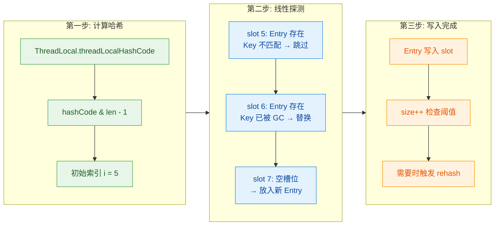

### 弱引用 Key（WeakReference Key）

这是 ThreadLocal 实现中**最关键也最容易被考到**的设计。Entry 的 Key 并不是直接持有 ThreadLocal 的强引用，而是通过 **WeakReference（弱引用）** 来持有的。

先回顾一下 Java 四种引用类型的生命周期差异：

| 引用类型 | 回收时机 | 典型用途 |
|:---|:---|:---|
| **强引用** Strong Reference | 只要引用存在，GC 永不回收 | 普通变量赋值 `Object o = new Object()` |
| **软引用** SoftReference | 内存不足时回收 | 缓存（如图片缓存） |
| **弱引用** WeakReference | **下次 GC 时必定回收**（无论内存是否充足） | ThreadLocalMap 的 Key |
| **虚引用** PhantomReference | 随时可能回收，无法通过虚引用获取对象 | 堆外内存清理（Cleaner） |

再看 Entry 的定义：

```java
// ThreadLocalMap.Entry 的完整定义
// 关键：Entry extends WeakReference<ThreadLocal<?>>
// 这意味着 Entry 本身就是一个弱引用对象，引用目标是 ThreadLocal
static class Entry extends WeakReference<ThreadLocal<?>> {

    // value 是强引用！这是内存泄漏的根源
    Object value;

    Entry(ThreadLocal<?> k, Object v) {
        // super(k) 调用 WeakReference 的构造器
        // 将 ThreadLocal k 包装为弱引用
        // 当外部没有强引用指向 k 时，GC 会回收 k
        // 此时 this.get() 返回 null（Key 变成 null）
        super(k);

        // value 用普通强引用持有，不会被 GC 自动回收
        this.value = v;
    }
}
```

**为什么要将 Key 设计为弱引用？** 这涉及到 ThreadLocal 最典型的使用模式和潜在的内存问题。

考虑以下场景：

```java
public class SomeService {

    public void handleRequest() {
        // 在方法内创建 ThreadLocal（局部变量）
        ThreadLocal<User> userContext = new ThreadLocal<>();

        userContext.set(getCurrentUser()); // 存入当前用户

        try {
            doBusinessLogic(); // 业务处理，内部通过 userContext 获取用户
        } finally {
            userContext.remove(); // ✅ 最佳实践：用完就 remove
        }

        // 方法结束后，局部变量 userContext 出栈
        // 此时栈上已无指向 ThreadLocal 对象的强引用
    }
}
```

方法执行完毕后，局部变量 `userContext` 被弹出栈帧，不再有强引用指向那个 ThreadLocal 对象。如果 Entry 的 Key 使用的是**强引用**，那么即使业务代码已经不再使用这个 ThreadLocal，Thread 对象中的 ThreadLocalMap 仍然通过 Entry 的强引用 Key 持有着它，导致 ThreadLocal 对象**永远无法被 GC 回收**——这就是典型的内存泄漏。

弱引用 Key 的设计解决了**这一半**的问题：当外部强引用消失时，GC 可以回收 ThreadLocal 对象，Entry 的 Key 变为 `null`。ThreadLocalMap 在后续的 `get()`、`set()`、`remove()` 操作中会检测到这些 Key 为 null 的 Entry（称为 **stale entry / 过期条目**），并主动清理它们：

```java
// ThreadLocalMap 的 expungeStaleEntry 方法（简化版）
// 这个方法负责清理一个过期 Entry 及其附近的过期 Entry
private int expungeStaleEntry(int staleSlot) {
    Entry[] tab = table;
    int len = tab.length;

    // 第一步：清理当前过期 Entry
    tab[staleSlot].value = null; // 断开 Value 的强引用 → 允许 GC 回收 Value
    tab[staleSlot] = null;       // 清空 Entry 槽位
    size--;                      // 计数减一

    // 第二步：向后探测，连续清理后续的过期 Entry
    // 同时对仍有效的 Entry 进行 rehash（重新散列）以维护探测链
    Entry e;
    int i;
    for (i = nextIndex(staleSlot, len);
         (e = tab[i]) != null;
         i = nextIndex(i, len)) {

        ThreadLocal<?> k = e.get(); // 获取弱引用指向的 Key

        if (k == null) {
            // Key 已被 GC → 过期条目，清理之
            e.value = null;  // 断开 Value 引用
            tab[i] = null;   // 清空槽位
            size--;
        } else {
            // Key 仍存活，重新计算位置
            // 如果当前位置不是理想位置，则搬移到更近的空槽
            int h = k.threadLocalHashCode & (len - 1);
            if (h != i) {
                tab[i] = null;
                while (tab[h] != null) {
                    h = nextIndex(h, len);
                }
                tab[h] = e;
            }
        }
    }
    return i;
}
```

用一张图来完整展示弱引用 Key 的生命周期：

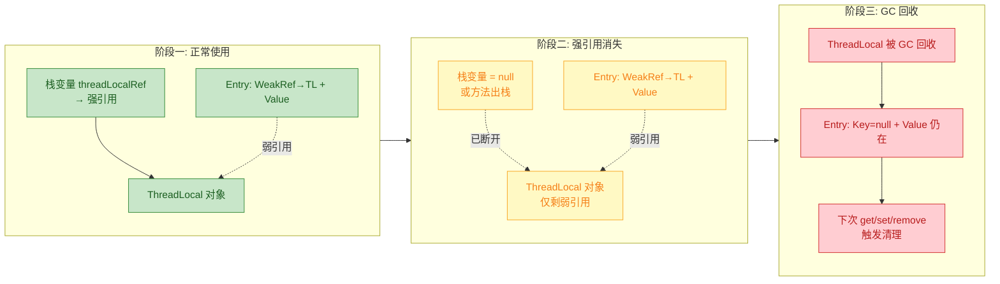

**但这里有一个「半吊子」问题**——弱引用 Key 只解决了 ThreadLocal **对象本身**的回收问题，而 Entry 中的 **Value 仍然是强引用**。也就是说：

```java
// 弱引用 Key 的「半解决」困境
//
// GC 前:
//   Entry →  Key (WeakRef → ThreadLocal)  ✓ 弱引用
//            Value (StrongRef → UserData)  ✗ 强引用
//
// GC 后:
//   Entry →  Key = null     (ThreadLocal 已被回收)
//            Value = UserData (仍然存活！无法被 GC 回收)
//
// 结果：ThreadLocal 被回收了，但 Value 还活着 → 内存泄漏！
// 
// 这就是为什么必须调用 remove()，或者依赖 ThreadLocalMap 的
// 被动清理机制（在 get/set 时顺带清理 stale entry）
```

ThreadLocalMap 提供了两种清理机制来应对这个问题：

1. **探测式清理（Expunge Stale Entry）**：在 `getEntry()`、`set()` 过程中遇到 Key 为 null 的 Entry 时触发，会连续清理该槽位及后续的 stale entry。

2. **启发式清理（Clean Some Slots）**：在 `set()` 插入新 Entry 后触发，对数组进行对数级别的采样扫描（`log2(n)` 次），发现 stale entry 就清理。

```java
// 启发式清理：对数级采样扫描
// 参数 i 是刚插入 Entry 的位置，n 是当前 size
private boolean cleanSomeSlots(int i, int n) {
    boolean removed = false;
    Entry[] tab = table;
    int len = tab.length;

    // 扫描 log2(n) 个槽位（平衡清理效率与性能开销）
    do {
        i = nextIndex(i, len); // 移动到下一个槽位
        Entry e = tab[i];
        if (e != null && e.get() == null) {
            // 发现过期 Entry！
            n = len;           // 重置扫描次数（发现一个就多扫几轮）
            removed = true;
            i = expungeStaleEntry(i); // 执行连续清理
        }
    } while ((n >>>= 1) != 0); // n 右移一位，即 log2(n) 次循环

    return removed; // 返回是否有清理发生
}
```

虽然这些被动清理机制能在一定程度上缓解泄漏，但它们都依赖于**后续操作的触发**。如果一个线程在设置了 ThreadLocal 之后再也没有调用过任何 ThreadLocal 操作（这在线程池长期运行的线程中很常见），那些 stale entry 就永远不会被清理。这就是为什么 **`remove()` 是唯一可靠的防泄漏手段**——下一节将详细展开。

将整个 ThreadLocalMap 的运作流程整合为一张完整的图：

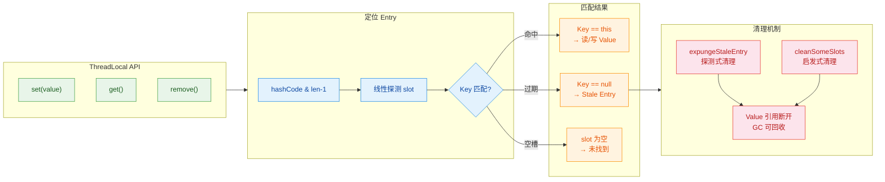

最后对本节做一个知识点总结：

| 设计要素 | 具体实现 | 设计目的 |
|:---|:---|:---|
| 数据存储位置 | `Thread.threadLocals` 字段 | 线程消亡时数据自动随之释放 |
| Map 类型 | `ThreadLocalMap`（自定义 HashMap） | 避免引入 `java.util.HashMap` 的额外复杂性 |
| Key 的角色 | ThreadLocal 对象自身 | 一个 ThreadLocal = Map 中的一个 Key |
| 冲突解决 | 开放寻址 + 线性探测 | 小规模数据下 cache-friendly，利于清理 |
| 哈希策略 | Fibonacci Hashing（0x61c88647） | 在 2^n 数组中完美均匀分布 |
| Key 引用类型 | WeakReference | 允许 GC 回收不再使用的 ThreadLocal |
| Value 引用类型 | 强引用 | 防止用户数据被意外回收（但可能导致泄漏） |
| 清理时机 | get/set/remove 操作时被动清理 | 平衡性能开销与内存回收 |

---

📝 **练习题**

**题目**：关于 ThreadLocalMap 的实现原理，以下哪项描述是**正确的**？

A. ThreadLocalMap 存储在 ThreadLocal 对象内部，以 Thread 对象作为 Key


B. ThreadLocalMap 使用链表法（Separate Chaining）解决哈希冲突，与 HashMap 相同


C. ThreadLocalMap 的 Entry 的 Key 是对 ThreadLocal 对象的弱引用，Value 是对用户数据的强引用


D. ThreadLocalMap 在 Entry 数量超过数组长度的 75%（load factor = 0.75）时进行扩容


**【答案】** C

**【解析】** 选项 C 正确。ThreadLocalMap.Entry 继承自 `WeakReference<ThreadLocal<?>>`，因此 Key 是弱引用；而 `value` 字段是普通的 `Object` 强引用。这种设计使得当 ThreadLocal 对象不再被外部强引用时，GC 可以回收它（Key 变为 null），但 Value 仍需手动清理或依赖被动清理机制。

选项 A 错误——ThreadLocalMap 存储在 **Thread 对象**内部（`Thread.threadLocals` 字段），而非 ThreadLocal 对象中。选项 B 错误——ThreadLocalMap 使用**开放寻址法（线性探测法）**而非链表法。选项 D 错误——ThreadLocalMap 的扩容阈值是数组长度的 **2/3**（约 0.67），而非 HashMap 的 0.75。

---

📝 **练习题**

**题目**：以下代码在使用线程池时可能导致什么问题？

```java
static final ThreadLocal<List<String>> CACHE = new ThreadLocal<>();

public void process() {
    CACHE.set(new ArrayList<>());
    CACHE.get().add("data-1");
    CACHE.get().add("data-2");
    // 注意：没有调用 CACHE.remove()
}
```

A. 编译错误，ThreadLocal 不支持泛型为 `List<String>`


B. 运行正常，线程池中线程复用时 CACHE 会自动清空


C. 线程复用时，新任务可能读到上一个任务残留的脏数据；且由于 ThreadLocal 是 static final 强引用，Value 中的 ArrayList 永远不会被 GC 回收，造成内存泄漏


D. 抛出 ConcurrentModificationException，因为多个线程同时修改同一个 ArrayList


**【答案】** C

**【解析】** 选项 C 正确，描述了两个问题：(1) **数据污染**——线程池中的线程会被复用，如果任务结束后没有调用 `remove()`，下一个任务在同一线程上执行时，`get()` 仍能读到前一个任务存入的 `["data-1", "data-2"]`；(2) **内存泄漏**——由于 `CACHE` 是 `static final` 变量，始终存在强引用指向 ThreadLocal 对象，弱引用 Key 永远不会被回收，因此 ThreadLocalMap 的被动清理机制也不会被触发，Value（ArrayList）永远存活。正确做法是在 `finally` 块中调用 `CACHE.remove()`。选项 A 错误——ThreadLocal 完全支持泛型。选项 B 错误——线程复用时 ThreadLocal 的值**不会自动清空**。选项 D 错误——ThreadLocal 的核心设计就是线程隔离，每个线程操作自己独立的 ArrayList，不存在多线程竞争。

---

## 内存泄漏问题 ⭐⭐

ThreadLocal 是 Java 并发编程中实现线程隔离的利器，但它同时也是 **内存泄漏（Memory Leak）** 的高发区。无数线上事故——OOM 崩溃、内存持续增长、Full GC 频繁——最终都指向同一个根因：**ThreadLocal 使用后未及时清理**。要真正理解这个问题，必须深入 `ThreadLocalMap` 的内部数据结构，搞清楚 **弱引用 Key（WeakReference Key）** 与 **强引用 Value** 之间的不对称关系，以及 GC 回收后留下的 **"幽灵 Entry"（Stale Entry）** 是如何一步步吞噬内存的。

这个问题之所以重要，是因为它不仅仅是一个理论知识点——它是面试中出现频率最高的并发题之一，更是实际生产中最隐蔽、最难排查的内存问题之一。尤其在 **线程池（Thread Pool）** 环境下，线程的生命周期被大幅延长（甚至与应用同生共死），ThreadLocal 泄漏的危害会被成倍放大。

---

### Key 被回收、Value 未回收

要理解内存泄漏的根因，我们必须先回顾 `ThreadLocalMap` 中 Entry 的数据结构。每个 Entry 本质上是一个键值对，但它的 Key 和 Value 采用了 **不同的引用强度**：

```java
// ThreadLocalMap 的 Entry 定义（JDK 源码简化版）
// 注意：Entry 继承自 WeakReference<ThreadLocal<?>>
static class Entry extends WeakReference<ThreadLocal<?>> {

    // Value 是强引用，直接持有业务对象
    Object value;

    Entry(ThreadLocal<?> k, Object v) {
        // 调用 WeakReference 的构造函数，将 ThreadLocal 对象包装为弱引用
        // 这意味着：如果外部没有任何强引用指向这个 ThreadLocal，GC 时它会被回收
        super(k);
        // Value 则是普通的强引用赋值
        // 只要 Entry 对象存活，Value 就不会被 GC 回收
        value = v;
    }
}
```

这段代码揭示了一个关键的 **不对称设计**：

- **Key（ThreadLocal 对象）**：通过 `WeakReference` 持有 → GC 可达性分析时，如果没有其他强引用指向它，**会被回收**
- **Value（业务数据）**：通过普通强引用持有 → 只要 Entry 存活，Value **不会被回收**

这种不对称正是内存泄漏的根源。让我们通过一张完整的引用链图来可视化这个过程：

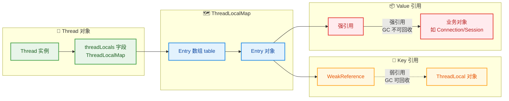

现在，让我们模拟内存泄漏发生的完整过程。假设有如下代码：

```java
public class LeakDemo {

    public void process() {
        // 步骤 1：在方法内部创建 ThreadLocal（局部变量）
        ThreadLocal<byte[]> localCache = new ThreadLocal<>();

        // 步骤 2：set 一个大对象作为 Value
        localCache.set(new byte[10 * 1024 * 1024]); // 10MB 的字节数组

        // 步骤 3：使用完毕后...直接返回，没有调用 remove()
        // localCache 是局部变量，方法返回后，栈帧销毁
        // → localCache 这个强引用消失
        // → ThreadLocal 对象仅剩 Entry 中的弱引用指向它
    }
    // 方法结束后，localCache 出栈 → ThreadLocal 对象只剩弱引用
    // 下次 GC 时，ThreadLocal 对象被回收 → Entry.key 变为 null
    // 但 Entry.value（10MB byte[]）仍然被强引用持有！
    // 这 10MB 就泄漏了！
}
```

这个泄漏过程可以分为三个阶段来理解：

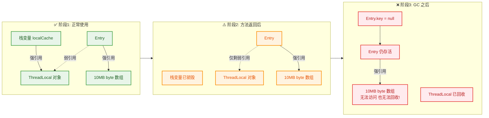

在阶段 3 中出现了一个非常尴尬的局面：Entry 对象仍然存活在 `ThreadLocalMap` 的 table 数组中，它的 Value（10MB 字节数组）被 Entry 强引用着，因此 GC 无法回收这 10MB 内存。但与此同时，Entry 的 Key（ThreadLocal 对象）已经被 GC 回收了，变成了 `null`。这意味着 **我们再也无法通过任何途径访问到这个 Value**——既不能用它，也不能释放它。这就是所谓的 **"幽灵 Entry"（Stale Entry）**，也就是 `key == null` 的 Entry。

用一个更直观的内存模型来展示这个状态：

```java
// ===== GC 后 ThreadLocalMap 内部的 table 数组状态 =====
//
// ThreadLocalMap.table (Entry[])
// ┌─────────┬──────────────────────────────────────────────┐
// │ index   │ Entry                                        │
// ├─────────┼──────────────────────────────────────────────┤
// │  0      │ null                                         │
// │  1      │ Entry { key=WeakRef→TL_A(存活), value=obj1 } │  ← 正常 Entry
// │  2      │ null                                         │
// │  3      │ Entry { key=WeakRef→null,  value=10MB!! }    │  ← ⚠️ 幽灵 Entry!
// │  4      │ Entry { key=WeakRef→TL_B(存活), value=obj2 } │  ← 正常 Entry
// │  5      │ null                                         │
// │  ...    │ ...                                          │
// └─────────┴──────────────────────────────────────────────┘
//
// index=3 的 Entry：Key 已被 GC 回收（弱引用指向 null）
// 但 Value（10MB byte[]）仍被 Entry 强引用，无法回收
// 这就是内存泄漏！
```

#### 为什么 Key 要设计成弱引用？

你可能会问：**既然弱引用 Key 导致了这种 Key 被回收但 Value 残留的问题，为什么不干脆把 Key 也设计成强引用呢？**

这个问题非常好，答案是：**弱引用 Key 是一种防御性设计（Defensive Design），它是"两害相权取其轻"的结果**。

如果 Key 是 **强引用**：即使外部代码已经不再使用某个 ThreadLocal（所有局部变量、成员变量都不再指向它），但由于 `ThreadLocalMap` 中的 Entry 还强引用着它，ThreadLocal 对象 **永远无法被 GC 回收**。更严重的是，ThreadLocal 对象无法回收 → Entry 无法被识别为"过期" → Value 也无法回收。**整个 Entry（Key + Value）全部泄漏**，而且连 JDK 内部的清理机制都无法识别和处理这种泄漏。

如果 Key 是 **弱引用**（当前设计）：ThreadLocal 对象在外部失去强引用后可以被 GC 回收，Entry 的 Key 变为 `null`。虽然 Value 仍然残留，但 JDK 可以通过检查 `key == null` 来 **识别出这些幽灵 Entry**，并在后续操作中 **主动清理** 它们。这意味着泄漏是 **可控的、可被清理的**，只是需要 **触发清理的时机**。

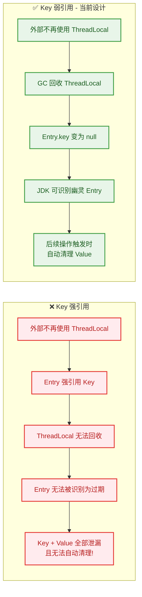

#### JDK 内置的自动清理机制

JDK 的设计者显然也意识到了弱引用 Key 带来的 Value 残留风险，因此在 `ThreadLocalMap` 的 `get()`、`set()`、`remove()` 方法中都嵌入了 **探测式清理（Expunge Stale Entries）** 逻辑。每当执行这些操作时，`ThreadLocalMap` 会顺便扫描 table 数组中附近的 Entry，如果发现 `key == null` 的幽灵 Entry，就主动将其 Value 置为 `null` 并清除 Entry 引用，从而让 GC 可以回收那块内存。

```java
// ===== ThreadLocalMap 中的清理逻辑（JDK 源码简化版）=====

// 在 set() 操作中，遍历 table 寻找插入位置时，顺带清理幽灵 Entry
private void set(ThreadLocal<?> key, Object value) {
    Entry[] tab = table;           // 获取底层数组
    int len = tab.length;          // 数组长度
    int i = key.threadLocalHashCode & (len - 1); // 计算哈希槽位

    // 线性探测：从计算出的槽位开始向后扫描
    for (Entry e = tab[i]; e != null; e = tab[i = nextIndex(i, len)]) {
        ThreadLocal<?> k = e.get(); // 获取 Entry 的 Key（通过弱引用的 get()）

        if (k == key) {
            // Key 匹配：更新 Value
            e.value = value;
            return;
        }

        if (k == null) {
            // ⚡ 发现幽灵 Entry（key 已被 GC 回收）
            // 调用 replaceStaleEntry 清理这个位置，并将新值放在这里
            replaceStaleEntry(key, value, i);
            return;
        }
    }
    // ... 创建新 Entry 的逻辑
}

// expungeStaleEntry：清理指定位置的幽灵 Entry
// 这个方法会从 staleSlot 开始，向后连续扫描并清理所有 key==null 的 Entry
private int expungeStaleEntry(int staleSlot) {
    Entry[] tab = table;
    int len = tab.length;

    // 第一步：清理当前幽灵 Entry
    tab[staleSlot].value = null;  // 断开 Value 的强引用 → GC 可回收
    tab[staleSlot] = null;        // 清除 Entry 引用 → Entry 本身也可回收
    size--;                       // 元素计数减一

    // 第二步：继续向后扫描，清理连续段中的所有幽灵 Entry
    Entry e;
    int i;
    for (i = nextIndex(staleSlot, len); (e = tab[i]) != null; i = nextIndex(i, len)) {
        ThreadLocal<?> k = e.get();
        if (k == null) {
            // 又发现一个幽灵 Entry，清理之
            e.value = null;
            tab[i] = null;
            size--;
        } else {
            // 正常 Entry：重新哈希，确保线性探测的正确性
            int h = k.threadLocalHashCode & (len - 1);
            if (h != i) {
                tab[i] = null;
                while (tab[h] != null) h = nextIndex(h, len);
                tab[h] = e;
            }
        }
    }
    return i;
}
```

但这种自动清理有一个致命的前提条件：**必须有后续的 `get()`/`set()`/`remove()` 操作来触发扫描**。如果一个线程在 `set()` 之后再也没有对该 `ThreadLocalMap` 做任何操作（在线程池环境中，线程被回收到池中等待下一个任务，期间可能长时间无操作），那些幽灵 Entry 就会一直安静地躺在 table 数组中，**永远不会被清理**。

#### 线程池环境下的泄漏放大效应

在普通的 `new Thread()` 使用模式中，ThreadLocal 泄漏的危害其实是 **有限的**。因为线程结束后，Thread 对象被 GC 回收 → 其成员变量 `threadLocals`（ThreadLocalMap）也被回收 → 所有 Entry 和 Value 一并释放。**线程的死亡就是泄漏的终结**。

但在 **线程池** 环境中，情况完全不同。线程池中的线程是 **长期存活、反复复用** 的——核心线程甚至与应用同生共死。这意味着 Thread 对象不会被 GC 回收，`threadLocals` 字段所引用的 ThreadLocalMap 会一直存活，其中的幽灵 Entry 和残留 Value 会 **持续累积，永远不会被释放**。

```java
// ===== 线程池环境下 ThreadLocal 泄漏的典型场景 =====
public class PoolLeakDemo {

    // 线程池：核心线程长期存活，不会被销毁
    private static final ExecutorService pool = Executors.newFixedThreadPool(10);

    public static void main(String[] args) {
        // 模拟高并发场景：反复提交任务
        for (int i = 0; i < 100_000; i++) {
            pool.execute(() -> {
                // 每次任务都创建一个新的 ThreadLocal 并 set 大对象
                ThreadLocal<byte[]> tl = new ThreadLocal<>();
                tl.set(new byte[1024 * 1024]); // 1MB

                // ... 业务逻辑 ...

                // ❌ 没有调用 tl.remove()!
                // 任务结束后，tl 局部变量出栈，ThreadLocal 对象仅剩弱引用
                // GC 后 → Entry.key = null，但 Entry.value（1MB）仍然残留
                // 线程不会死亡 → ThreadLocalMap 不会被回收
                // 反复积累 → 内存持续增长 → 最终 OOM!
            });
        }
    }
}
```

让我们用时序图来展示这个泄漏的累积过程：

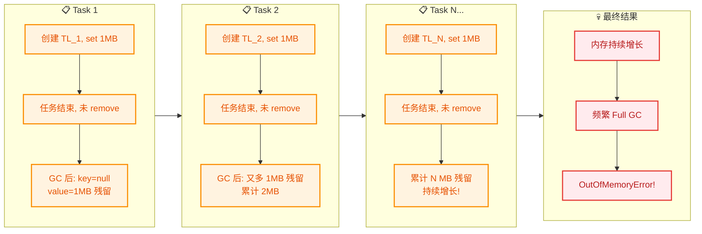

每个任务都在线程的 `ThreadLocalMap` 中留下一个幽灵 Entry，随着任务的不断提交，这些 Entry 像 **沉积物** 一样在线程的 Map 中越积越多。由于线程池中的线程不会死亡，这些沉积物永远不会被自然清除。即使 JDK 内置的 `expungeStaleEntry` 偶尔能清理掉一些，但如果任务提交速率远大于清理速率（而且清理本身依赖于后续 `get()`/`set()` 操作的触发），泄漏仍然会持续累积。

---

### 解决方案：及时 remove()

理解了泄漏的原理后，解决方案其实非常简单且唯一：**在每次使用完 ThreadLocal 后，必须调用 `remove()` 方法手动清理**。`remove()` 会将当前线程 `ThreadLocalMap` 中对应的 Entry **彻底删除**（Key 和 Value 一起清除），从根本上杜绝幽灵 Entry 的产生。

```java
// ===== ThreadLocal.remove() 的源码逻辑（简化版）=====
public void remove() {
    // 获取当前线程的 ThreadLocalMap
    ThreadLocalMap m = getMap(Thread.currentThread());
    if (m != null) {
        // 从 Map 中删除以当前 ThreadLocal 为 Key 的 Entry
        m.remove(this);
    }
}

// ThreadLocalMap.remove() 的实现
private void remove(ThreadLocal<?> key) {
    Entry[] tab = table;
    int len = tab.length;
    int i = key.threadLocalHashCode & (len - 1); // 定位哈希槽

    for (Entry e = tab[i]; e != null; e = tab[i = nextIndex(i, len)]) {
        if (e.get() == key) {      // 找到目标 Entry
            e.clear();              // 清除弱引用（Key → null）
            expungeStaleEntry(i);   // 清理该位置的 Entry（Value 也被清除）
            return;
        }
    }
}
```

#### 黄金法则：try-finally 模式

**最重要的编码规范**：所有 ThreadLocal 的 `set()`/`get()` 操作，都必须与 `remove()` 配对，并且 `remove()` 放在 `finally` 块中，确保无论是否发生异常都能执行清理。

```java
// ===== ThreadLocal 的正确使用模式：try-finally =====
public class CorrectUsageDemo {

    // 通常将 ThreadLocal 声明为 static final，全局复用同一个实例
    // 这样所有线程共享同一个 ThreadLocal 对象作为 Key，但各自有独立的 Value
    private static final ThreadLocal<UserContext> USER_CONTEXT = new ThreadLocal<>();

    public void handleRequest(HttpServletRequest request) {
        try {
            // ========== 1. SET：在业务开始时设置线程本地变量 ==========
            UserContext ctx = extractUserFromRequest(request);
            USER_CONTEXT.set(ctx);  // 将用户上下文存入当前线程的 ThreadLocalMap

            // ========== 2. USE：在业务链路的任意位置获取 ==========
            processOrder();    // 内部可通过 USER_CONTEXT.get() 获取用户信息
            sendNotification();// 同样可以获取，无需参数传递

        } finally {
            // ========== 3. REMOVE：在业务结束时必须清理 ==========
            // 无论业务逻辑是否抛异常，finally 块一定会执行
            USER_CONTEXT.remove();  // 彻底删除 Entry，防止内存泄漏
        }
    }

    private void processOrder() {
        // 在调用链的深层方法中，直接获取线程本地变量
        UserContext ctx = USER_CONTEXT.get();
        System.out.println("处理订单，当前用户: " + ctx.getUserName());
    }

    private void sendNotification() {
        UserContext ctx = USER_CONTEXT.get();
        System.out.println("发送通知给: " + ctx.getEmail());
    }
}
```

这种 **set → use → remove** 的三步模式，应该成为每一个 Java 开发者的肌肉记忆。我们可以将其总结为一个通用的工具封装：

```java
// ===== 安全的 ThreadLocal 工具类封装 =====
public final class ThreadLocalUtil {

    private ThreadLocalUtil() {} // 禁止实例化

    /**
     * 安全地执行带有 ThreadLocal 上下文的操作
     * 使用函数式编程风格，自动管理 set/remove 生命周期
     *
     * @param threadLocal  要操作的 ThreadLocal 实例
     * @param value        要设置的值
     * @param action       需要在 ThreadLocal 上下文中执行的业务逻辑
     * @param <T>          ThreadLocal 存储的值类型
     */
    public static <T> void executeWithContext(
            ThreadLocal<T> threadLocal,
            T value,
            Runnable action) {

        // 设置值
        threadLocal.set(value);
        try {
            // 执行业务逻辑
            action.run();
        } finally {
            // 无论如何都要清理，彻底杜绝泄漏
            threadLocal.remove();
        }
    }

    /**
     * 带返回值的版本
     */
    public static <T, R> R computeWithContext(
            ThreadLocal<T> threadLocal,
            T value,
            Supplier<R> supplier) {

        threadLocal.set(value);
        try {
            return supplier.get();
        } finally {
            threadLocal.remove();
        }
    }
}
```

使用方式非常简洁：

```java
// ===== 使用工具类，自动管理生命周期 =====
ThreadLocalUtil.executeWithContext(
    USER_CONTEXT,                                     // ThreadLocal 实例
    new UserContext("张三", "zhangsan@example.com"),   // 要设置的值
    () -> {                                            // 业务逻辑（Lambda）
        processOrder();
        sendNotification();
    }
    // 方法返回时，remove() 已被自动调用，无需手动管理
);
```

#### 线程池场景的最佳实践

在线程池环境中，除了业务代码中的 try-finally 之外，还可以在 **线程池层面** 增加一层安全网。通过重写 `ThreadPoolExecutor` 的 `afterExecute()` 钩子方法，在每个任务执行完毕后自动清理 ThreadLocal：

```java
// ===== 自清理线程池：任务完成后自动清理 ThreadLocal =====
public class CleaningThreadPoolExecutor extends ThreadPoolExecutor {

    // 记录每个线程池需要管理的 ThreadLocal 实例
    private final List<ThreadLocal<?>> managedThreadLocals;

    public CleaningThreadPoolExecutor(
            int corePoolSize, int maximumPoolSize,
            long keepAliveTime, TimeUnit unit,
            BlockingQueue<Runnable> workQueue,
            List<ThreadLocal<?>> managedThreadLocals) {

        super(corePoolSize, maximumPoolSize, keepAliveTime, unit, workQueue);
        // 保存需要管理的 ThreadLocal 列表
        this.managedThreadLocals = Collections.unmodifiableList(managedThreadLocals);
    }

    /**
     * afterExecute 钩子：每个任务执行完毕后自动调用
     * 在这里清理所有被管理的 ThreadLocal，作为安全网
     */
    @Override
    protected void afterExecute(Runnable r, Throwable t) {
        super.afterExecute(r, t);

        // 遍历所有被管理的 ThreadLocal，逐个 remove
        for (ThreadLocal<?> tl : managedThreadLocals) {
            tl.remove();  // 确保每个 ThreadLocal 都被清理
        }

        // 如果任务抛出了异常，记录日志
        if (t != null) {
            log.error("任务执行异常，ThreadLocal 已清理", t);
        }
    }
}
```

如果你无法枚举所有 ThreadLocal（例如第三方库内部使用了 ThreadLocal），还可以使用 **反射** 作为终极手段，强制清空整个 ThreadLocalMap：

```java
// ===== 终极方案：通过反射强制清空 ThreadLocalMap =====
// ⚠️ 慎用！仅在确实无法控制 ThreadLocal 生命周期时使用
public class ThreadLocalCleaner {

    /**
     * 清空当前线程的所有 ThreadLocal 数据
     * 原理：通过反射获取 Thread.threadLocals 字段，将其设为 null
     */
    public static void clearAll() {
        try {
            // 获取 Thread 类中的 threadLocals 字段（private）
            Field threadLocalsField = Thread.class.getDeclaredField("threadLocals");
            threadLocalsField.setAccessible(true);  // 突破访问控制

            // 将当前线程的 threadLocals 字段置为 null
            // 这会导致整个 ThreadLocalMap 失去引用，GC 时被完整回收
            threadLocalsField.set(Thread.currentThread(), null);

        } catch (NoSuchFieldException | IllegalAccessException e) {
            // 不同 JDK 版本字段名可能不同，或高版本 JDK 模块化限制
            log.warn("清理 ThreadLocal 失败", e);
        }
    }
}
```

#### 完整的防泄漏检查清单

```
┌────┬──────────────────────────────────────────────────────────────────────────┐
│ #  │ 防泄漏检查项                                                             │
├────┼──────────────────────────────────────────────────────────────────────────┤
│ 1  │ ThreadLocal 声明为 static final，避免重复创建实例                          │
│    │ → 重复创建意味着每次都往 Map 中添加新 Entry，旧 Entry 成为幽灵              │
├────┼──────────────────────────────────────────────────────────────────────────┤
│ 2  │ 每次 set/get 必须配对 remove()，且 remove 放在 finally 块中                │
│    │ → 这是最核心、最基本的防泄漏手段                                           │
├────┼──────────────────────────────────────────────────────────────────────────┤
│ 3  │ 线程池环境下格外警惕：线程复用 = 泄漏累积                                   │
│    │ → 可在 afterExecute() 中增加兜底清理                                      │
├────┼──────────────────────────────────────────────────────────────────────────┤
│ 4  │ 避免在 ThreadLocal 中存储大对象（如大集合、大字节数组）                       │
│    │ → 即使泄漏很短暂，大对象也会造成严重的内存压力                               │
├────┼──────────────────────────────────────────────────────────────────────────┤
│ 5  │ 代码审查时重点关注 ThreadLocal 的 remove 调用                               │
│    │ → 将 "ThreadLocal 必须 remove" 纳入团队 Code Review 规范                  │
├────┼──────────────────────────────────────────────────────────────────────────┤
│ 6  │ 使用内存分析工具（MAT, VisualVM, Arthas）定期检查                           │
│    │ → 搜索 ThreadLocalMap$Entry 数量异常增长的线程                              │
└────┴──────────────────────────────────────────────────────────────────────────┘
```

最后，用一张总览图对整个内存泄漏问题做一个全局性的知识关联：

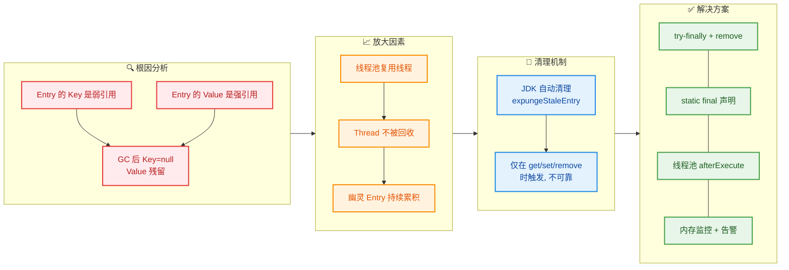

---

📝 **练习题**

以下代码在 **线程池环境** 中运行，关于内存泄漏风险，说法正确的是：

```java
ExecutorService pool = Executors.newFixedThreadPool(5);
for (int i = 0; i < 10000; i++) {
    pool.execute(() -> {
        ThreadLocal<List<String>> tl = new ThreadLocal<>();
        tl.set(new ArrayList<>(Arrays.asList("a", "b", "c")));
        System.out.println(tl.get());
    });
}
```

A. 不存在内存泄漏风险，因为 `tl` 是局部变量，方法结束后自动被 GC 回收


B. 不存在内存泄漏风险，因为 Entry 的 Key 是弱引用，GC 会自动清理 Key 和 Value


C. 存在内存泄漏风险，因为 `tl` 每次都是新的 ThreadLocal 实例，且未调用 `remove()`，线程池中线程不会销毁，导致幽灵 Entry 不断累积


D. 存在内存泄漏风险，但仅因为使用了 `Executors.newFixedThreadPool()`，换成手动创建 `ThreadPoolExecutor` 就可以解决


**【答案】C**

**【解析】**

逐项分析：

- **A 错误**：`tl` 作为局部变量确实会在方法结束后出栈，但这只是意味着 **指向 ThreadLocal 对象的强引用消失了**。关键在于，`tl.set()` 已经将一个 Entry（Key = ThreadLocal, Value = ArrayList）写入了当前线程的 `ThreadLocalMap`。局部变量的回收只会让 Entry 中的弱引用 Key 在 GC 时被回收，但 **Value（ArrayList）仍然被 Entry 强引用着**，不会自动回收。

- **B 错误**：弱引用只保证 **Key（ThreadLocal 对象）** 在失去外部强引用后可以被 GC 回收。但 **Value 是强引用**，不会随 Key 一起被回收。GC 后 Entry 变成 `key == null` 的幽灵 Entry，Value 依然存在。JDK 虽然内置了 `expungeStaleEntry` 清理机制，但该机制只在后续 `get()`/`set()`/`remove()` 操作时 **被动触发**，并非每次 GC 后都会执行，因此 **不可靠**。

- **C 正确**：本题有两个关键因素叠加导致泄漏：① 每次循环都创建新的 `ThreadLocal` 实例（`new ThreadLocal<>()`），意味着每次都会在线程的 `ThreadLocalMap` 中插入一个 **新的 Entry**（而不是覆盖同一个 Key 的 Value）；② 任务结束后未调用 `remove()`，每个新 Entry 在 GC 后都变成幽灵 Entry（key=null, value=ArrayList）。由于线程池中的 5 个线程不会被销毁，这些幽灵 Entry 会在每个线程的 Map 中 **不断堆积**。10000 个任务轮流在 5 个线程上执行，每个线程最终可能累积约 2000 个幽灵 Entry。正确做法是将 ThreadLocal 声明为 `static final`（全局共享一个 Key），并在 finally 中调用 `remove()`。

- **D 错误**：内存泄漏的根因是 **ThreadLocal 使用不当**（未 remove + 每次创建新实例），与使用 `Executors` 还是手动创建 `ThreadPoolExecutor` 无关。无论哪种方式创建线程池，只要线程被复用且 ThreadLocal 未被清理，泄漏就会发生。`Executors` 的问题是无界队列可能导致 OOM，但那是另一个维度的风险。

---

## InheritableThreadLocal

在前面的章节中，我们深入学习了 `ThreadLocal` 的工作原理：每个线程通过自己内部的 `ThreadLocalMap` 维护一份独立的变量副本，实现线程间的数据隔离。这种隔离性在绝大多数场景下都是我们想要的——但有时候，它却成了一种障碍。

考虑以下真实场景：一个 Web 请求进入服务器，主线程从 HTTP Header 中解析出 `traceId`（链路追踪ID）并存入 `ThreadLocal`。随后，主线程创建了一个子线程去异步发送邮件通知。问题来了——子线程能读到父线程存入的 `traceId` 吗？

答案是：**如果使用普通的 `ThreadLocal`，不能**。因为子线程拥有自己独立的 `ThreadLocalMap`，它和父线程的 `ThreadLocalMap` 没有任何关系。子线程调用 `get()` 只会拿到 `null`（或 `initialValue` 的默认值）。

这就是 `InheritableThreadLocal` 要解决的问题——**让子线程在创建时，自动继承父线程的 ThreadLocal 数据**。

---

### 子线程继承父线程值

#### 基本用法

`InheritableThreadLocal` 是 `ThreadLocal` 的子类，位于 `java.lang` 包中，自 JDK 1.2 就已存在。它的 API 与 `ThreadLocal` 完全一致——`set()`、`get()`、`remove()` 用法不变，唯一的区别在于：**当父线程创建子线程时，子线程会自动拷贝父线程中所有 `InheritableThreadLocal` 的值**。

```java
public class InheritableThreadLocalDemo {
    // 使用 InheritableThreadLocal 而非 ThreadLocal
    private static final InheritableThreadLocal<String> TRACE_ID =
            new InheritableThreadLocal<>();

    public static void main(String[] args) throws InterruptedException {
        // 父线程设置 traceId
        TRACE_ID.set("trace-abc-123");                          // 父线程写入值
        System.out.println("[父线程] traceId = " + TRACE_ID.get()); // 输出: trace-abc-123

        // 创建子线程
        Thread child = new Thread(() -> {
            // 子线程自动继承了父线程的值, 无需手动传递!
            System.out.println("[子线程] traceId = " + TRACE_ID.get()); // 输出: trace-abc-123

            // 子线程修改自己的副本, 不影响父线程
            TRACE_ID.set("trace-child-999");                    // 子线程写入新值
            System.out.println("[子线程] 修改后 traceId = " + TRACE_ID.get()); // 输出: trace-child-999
        });

        child.start();    // 启动子线程
        child.join();     // 等待子线程结束

        // 父线程的值不受子线程修改的影响
        System.out.println("[父线程] traceId仍然 = " + TRACE_ID.get()); // 输出: trace-abc-123
    }
}
```

输出结果：

```
[父线程] traceId = trace-abc-123
[子线程] traceId = trace-abc-123
[子线程] 修改后 traceId = trace-child-999
[父线程] traceId仍然 = trace-abc-123
```

注意最后一行——父线程的值没有被子线程的修改影响。这是因为子线程拿到的是**父线程值的一份拷贝（Copy）**，而不是同一个引用的共享。修改拷贝不会影响原始值。但这里有一个非常重要的**陷阱**，我们稍后详细讨论。

#### 底层实现原理

`InheritableThreadLocal` 的魔法并不复杂。要理解它，需要回顾两个关键事实：

1. **`Thread` 类内部有两个 Map**：`threadLocals` 和 `inheritableThreadLocals`，它们的类型都是 `ThreadLocal.ThreadLocalMap`。
2. **`Thread` 的构造方法** 中有一段继承逻辑：如果父线程的 `inheritableThreadLocals` 不为 `null`，就把它的内容拷贝到子线程的 `inheritableThreadLocals` 中。

我们先看 `Thread` 类中的两个字段：

```java
public class Thread implements Runnable {
    // 普通 ThreadLocal 使用这个 Map
    ThreadLocal.ThreadLocalMap threadLocals = null;           // 存储 ThreadLocal 的值

    // InheritableThreadLocal 使用这个 Map
    ThreadLocal.ThreadLocalMap inheritableThreadLocals = null; // 存储 InheritableThreadLocal 的值
}
```

当你使用 `InheritableThreadLocal.set(value)` 时，值并**不是**存入 `threadLocals`，而是存入 `inheritableThreadLocals`。这是通过 `InheritableThreadLocal` 重写父类的三个方法实现的：

```java
public class InheritableThreadLocal<T> extends ThreadLocal<T> {

    // 重写 1: 告诉 ThreadLocal 框架 —— 去操作 inheritableThreadLocals 而不是 threadLocals
    ThreadLocalMap getMap(Thread t) {
        return t.inheritableThreadLocals;                     // 返回可继承的 Map
    }

    // 重写 2: 如果 Map 不存在, 创建时也创建在 inheritableThreadLocals 上
    void createMap(Thread t, T firstValue) {
        t.inheritableThreadLocals =                           // 在可继承 Map 上创建
            new ThreadLocalMap(this, firstValue);
    }

    // 重写 3: 子线程继承时的值转换钩子(默认直接返回原值, 可重写实现自定义转换)
    protected T childValue(T parentValue) {
        return parentValue;                                   // 默认: 子线程直接拿到父线程的值
    }
}
```

整个类只有这三个方法，非常简洁。核心思路就是：**把数据存到另一个专门的 Map（`inheritableThreadLocals`）中，方便在子线程创建时被识别和拷贝。**

接下来看关键的继承发生点——`Thread` 的构造方法（简化后的核心逻辑）：

```java
// Thread 构造方法中的核心逻辑(简化版)
private Thread(ThreadGroup g, Runnable target, String name, long stackSize,
               AccessControlContext acc, boolean inheritThreadLocals) {
    // ... 省略其他初始化逻辑 ...

    Thread parent = currentThread();                          // 获取当前线程(即父线程)

    // ★ 关键继承逻辑 ★
    if (inheritThreadLocals && parent.inheritableThreadLocals != null) {
        // 将父线程的 inheritableThreadLocals 拷贝到子线程
        this.inheritableThreadLocals =
            ThreadLocal.createInheritedMap(parent.inheritableThreadLocals); // 拷贝!
    }
}
```

`ThreadLocal.createInheritedMap()` 方法会遍历父线程 `inheritableThreadLocals` 中的所有 Entry，逐个调用 `childValue()` 方法获取子线程应该持有的值，然后构建一个新的 `ThreadLocalMap` 赋给子线程。

```java
// ThreadLocal.ThreadLocalMap 中的拷贝构造方法(简化版)
private ThreadLocalMap(ThreadLocalMap parentMap) {
    Entry[] parentTable = parentMap.table;                    // 父线程的 Entry 数组
    int len = parentTable.length;                             // 数组长度
    table = new Entry[len];                                   // 子线程创建同等大小的数组

    for (Entry e : parentTable) {                             // 遍历父线程的每个 Entry
        if (e != null) {
            ThreadLocal<Object> key = (ThreadLocal<Object>) e.get(); // 取出 Key(弱引用)
            if (key != null) {
                Object value = key.childValue(e.value);       // ★ 调用 childValue 获取子线程的值
                Entry c = new Entry(key, value);              // 创建新的 Entry
                int h = key.threadLocalHashCode & (len - 1);  // 计算 hash 槽位
                while (table[h] != null)                      // 线性探测解决冲突
                    h = nextIndex(h, len);
                table[h] = c;                                 // 放入子线程的 Map
                size++;                                       // 计数
            }
        }
    }
}
```

用一张流程图完整展示这个继承过程：

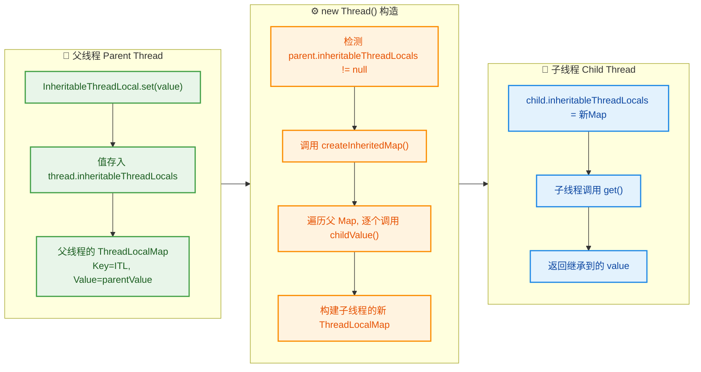

#### 浅拷贝陷阱（Shallow Copy Pitfall）

这是 `InheritableThreadLocal` 最容易踩的坑。`childValue()` 的默认实现是 `return parentValue`——它直接返回了**父线程的值引用本身**，而不是深拷贝。

这意味着：
- 如果值是 **不可变类型**（如 `String`、`Integer`、`Long`），父子线程各自持有独立的引用，互不影响——安全。
- 如果值是 **可变对象**（如 `List`、`Map`、自定义 POJO），父子线程**共享同一个对象**——危险！

```java
public class ShallowCopyTrapDemo {
    // 存储一个可变的 List
    private static final InheritableThreadLocal<List<String>> CONTEXT =
            new InheritableThreadLocal<List<String>>() {
                @Override
                protected List<String> initialValue() {
                    return new ArrayList<>();                   // 初始值: 空列表
                }
            };

    public static void main(String[] args) throws InterruptedException {
        CONTEXT.get().add("父线程数据");                         // 父线程往 List 中添加元素
        System.out.println("[父线程] " + CONTEXT.get());         // [父线程数据]

        Thread child = new Thread(() -> {
            // 子线程继承了父线程的 List —— 但这是同一个 List 对象!
            CONTEXT.get().add("子线程数据");                     // 子线程也往 List 中添加元素
            System.out.println("[子线程] " + CONTEXT.get());     // [父线程数据, 子线程数据]
        });
        child.start();
        child.join();

        // ⚠️ 父线程的 List 也被子线程修改了!
        System.out.println("[父线程] " + CONTEXT.get());         // [父线程数据, 子线程数据] ← 被污染!
    }
}
```

内存模型如下：

```java
// ==================== 浅拷贝: 父子线程共享同一个 List 对象 ====================
//
//   父线程 ThreadLocalMap                子线程 ThreadLocalMap
//   ┌──────────┐                        ┌──────────┐
//   │ Key: ITL │──value──┐              │ Key: ITL │──value──┐
//   └──────────┘         │              └──────────┘         │
//                        ▼                                   │
//                   ┌─────────────┐                          │
//                   │  ArrayList  │ ◄────────────────────────┘
//                   │ [父线程数据] │    同一个对象! 任何一方修改都互相影响
//                   └─────────────┘
```

**解决方案：重写 `childValue()` 实现深拷贝。**

```java
private static final InheritableThreadLocal<List<String>> CONTEXT =
        new InheritableThreadLocal<List<String>>() {

            @Override
            protected List<String> initialValue() {
                return new ArrayList<>();                       // 初始值: 空列表
            }

            @Override
            protected List<String> childValue(List<String> parentValue) {
                // ★ 深拷贝: 创建新的 ArrayList, 复制父线程的元素
                return new ArrayList<>(parentValue);            // 子线程拿到独立副本
            }
        };
```

深拷贝后的内存模型：

```java
// ==================== 深拷贝: 父子线程各自持有独立的 List ====================
//
//   父线程 ThreadLocalMap                子线程 ThreadLocalMap
//   ┌──────────┐                        ┌──────────┐
//   │ Key: ITL │──value──┐              │ Key: ITL │──value──┐
//   └──────────┘         │              └──────────┘         │
//                        ▼                                   ▼
//                   ┌─────────────┐                    ┌─────────────┐
//                   │  ArrayList  │                    │  ArrayList  │
//                   │ [父线程数据] │                    │ [父线程数据] │ ← 独立副本
//                   └─────────────┘                    └─────────────┘
```

#### 线程池中的致命问题

`InheritableThreadLocal` 的继承发生在 **`new Thread()` 的那一刻**——也就是说，**只有在创建新线程时才会拷贝父线程的数据**。而在线程池中，线程是被**复用**的，不会每次提交任务都创建新线程。这导致了一个严重的问题：

```java
public class ThreadPoolInheritanceBug {
    private static final InheritableThreadLocal<String> USER_ID =
            new InheritableThreadLocal<>();

    public static void main(String[] args) throws Exception {
        ExecutorService pool = Executors.newFixedThreadPool(1); // 只有 1 个线程的池

        // ====== 第一次请求: 用户 Alice ======
        USER_ID.set("Alice");                                   // 主线程设为 Alice
        pool.submit(() -> {
            // 线程池中的线程第一次被创建, 继承了 Alice
            System.out.println("Task1: " + USER_ID.get());      // 输出: Alice ✅
        }).get();

        // ====== 第二次请求: 用户 Bob ======
        USER_ID.set("Bob");                                     // 主线程设为 Bob
        pool.submit(() -> {
            // 线程被复用! 不会重新触发 new Thread(), 不会重新继承!
            System.out.println("Task2: " + USER_ID.get());      // 输出: Alice ❌ (期望 Bob)
        }).get();

        pool.shutdown();
    }
}
```

第二次任务的输出是 `Alice` 而不是 `Bob`！因为线程池中的工作线程在第一次创建时继承了 `Alice`，之后被复用时不会再次触发继承逻辑。这是一个非常经典的生产事故源。

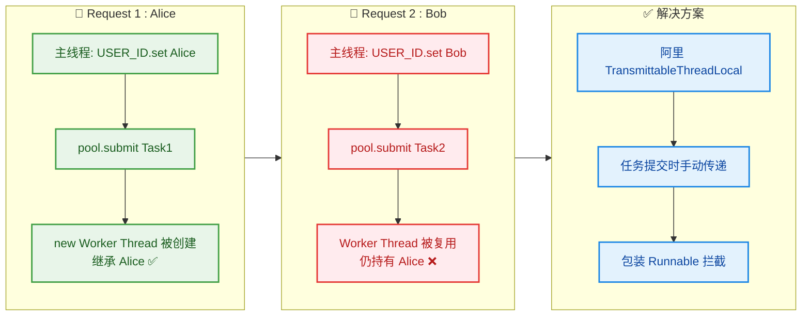

**解决方案一：阿里巴巴的 `TransmittableThreadLocal`（TTL）**

这是业界最成熟的解决方案。阿里开源的 [transmittable-thread-local](https://github.com/alibaba/transmittable-thread-local) 库通过在任务提交时**快照（Snapshot）**当前线程的 TTL 值，并在任务执行前**恢复（Replay）**快照，任务执行后**还原（Restore）**原值，完美解决了线程池复用导致的继承失效问题。

```java
// 使用 TransmittableThreadLocal (需引入依赖 com.alibaba:transmittable-thread-local)
import com.alibaba.ttl.TransmittableThreadLocal;
import com.alibaba.ttl.TtlRunnable;

public class TTLDemo {
    private static final TransmittableThreadLocal<String> USER_ID =
            new TransmittableThreadLocal<>();                   // 替换为 TTL

    public static void main(String[] args) throws Exception {
        ExecutorService pool = Executors.newFixedThreadPool(1);

        USER_ID.set("Alice");
        pool.submit(TtlRunnable.get(() -> {                     // 用 TtlRunnable 包装任务
            System.out.println("Task1: " + USER_ID.get());      // Alice ✅
        })).get();

        USER_ID.set("Bob");
        pool.submit(TtlRunnable.get(() -> {                     // 每次提交都重新快照
            System.out.println("Task2: " + USER_ID.get());      // Bob ✅ (修复!)
        })).get();

        pool.shutdown();
    }
}
```

TTL 的工作原理可以概括为三步走：

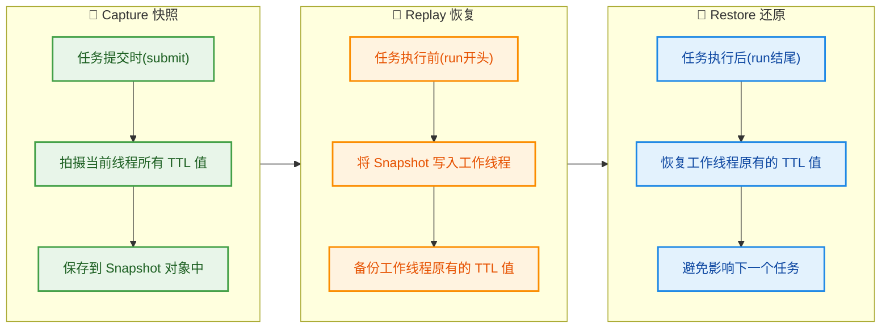

**解决方案二：手动传递 + 包装 Runnable**

如果不想引入额外依赖，也可以手动在任务提交时捕获上下文，在任务执行时恢复：

```java
public class ManualPassDemo {
    private static final ThreadLocal<String> USER_ID = new ThreadLocal<>(); // 普通 ThreadLocal 即可

    // 包装器: 在提交时捕获值, 在执行时恢复值
    static Runnable wrap(Runnable task) {
        String captured = USER_ID.get();                        // 提交时: 捕获当前线程的值
        return () -> {
            USER_ID.set(captured);                              // 执行时: 设置到工作线程
            try {
                task.run();                                     // 执行原始任务
            } finally {
                USER_ID.remove();                               // 执行后: 清理, 防止污染
            }
        };
    }

    public static void main(String[] args) throws Exception {
        ExecutorService pool = Executors.newFixedThreadPool(1);

        USER_ID.set("Alice");
        pool.submit(wrap(() -> {
            System.out.println("Task1: " + USER_ID.get());     // Alice ✅
        })).get();

        USER_ID.set("Bob");
        pool.submit(wrap(() -> {
            System.out.println("Task2: " + USER_ID.get());     // Bob ✅
        })).get();

        pool.shutdown();
    }
}
```

这种方案简单直观，但需要对每个提交的任务都手动包装，容易遗漏。TTL 方案更加系统化和安全。

#### 适用场景与总结

| 场景 | 推荐方案 | 原因 |
|:---|:---|:---|
| 直接 `new Thread()` 创建子线程 | `InheritableThreadLocal` | 每次都是新线程，继承正常工作 |
| 线程池 / `ExecutorService` | `TransmittableThreadLocal` | 线程复用导致 ITL 继承失效，需要 TTL |
| 简单场景、不想引依赖 | 手动包装 `Runnable` | 轻量级，但需纪律保证不遗漏 |
| `CompletableFuture` 异步链 | `TransmittableThreadLocal` | 底层使用 `ForkJoinPool`，同样是复用线程 |

最后，用一张对比图总结 `ThreadLocal`、`InheritableThreadLocal` 和 `TransmittableThreadLocal` 三者的关系：

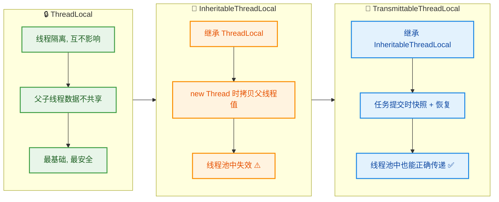

核心要点回顾：

- `InheritableThreadLocal` 通过让 `Thread` 构造方法拷贝父线程的 `inheritableThreadLocals` Map 来实现继承。
- 继承只发生在 **`new Thread()` 的瞬间**，之后父子线程各自独立。
- 默认是**浅拷贝**——存储可变对象时务必重写 `childValue()` 做深拷贝。
- **线程池中 ITL 会失效**——线程被复用不会触发新的继承，必须使用 `TransmittableThreadLocal` 或手动传递方案。
- 和普通 `ThreadLocal` 一样，使用完毕后**必须调用 `remove()`**，否则在线程池场景下会造成数据污染和内存泄漏。

---

## Android中的应用

在前面的章节中，我们已经深入理解了 `ThreadLocal` 的原理、使用方式以及内存泄漏问题。现在进入一个极具实战价值的章节——`ThreadLocal` 在 Android 系统框架中的经典应用。可以说，Android 的消息机制（Handler/Looper/MessageQueue）之所以能优雅地实现"一个线程一个 Looper"的设计约束，**核心功臣就是 ThreadLocal**。理解这一应用，不仅能加深你对 ThreadLocal 的认知，更能帮你打通 Android 消息机制的任督二脉。

### Looper存储

#### 为什么 Looper 需要 ThreadLocal？

Android 的消息机制有一条铁律：**每个线程最多只能拥有一个 Looper 实例**（One Looper per Thread）。Looper 是消息循环的驱动器，它内部持有一个 `MessageQueue`，不断从队列中取出 `Message` 并分发给对应的 `Handler` 处理。

问题来了：如何保证每个线程都能方便地访问到**自己的** Looper，同时又不会访问到别的线程的 Looper？

最直觉的方案是用一个全局的 `Map<Thread, Looper>`，但这会引入线程安全问题（需要加锁），性能开销大，而且生命周期管理复杂。Android 框架的设计者选择了一个更优雅的方案——**使用 ThreadLocal 来存储每个线程的 Looper 实例**。这样，每个线程通过 `ThreadLocal.get()` 拿到的永远是自己线程绑定的那个 Looper，天然线程隔离，无需加锁。

#### Looper 源码中的 ThreadLocal

我们来看 Android 源码中 `Looper` 类的核心结构（基于 AOSP 源码简化）：

```java
public final class Looper {

    // ① 核心：使用 ThreadLocal 存储当前线程的 Looper
    //    sThreadLocal 是一个 static final 的 ThreadLocal 实例
    //    它是所有线程共享的「访问入口」，但每个线程通过它拿到的值是隔离的
    static final ThreadLocal<Looper> sThreadLocal = new ThreadLocal<Looper>();

    // ② 主线程（UI线程）的 Looper 引用，方便全局获取
    private static Looper sMainLooper;

    // ③ 每个 Looper 内部持有一个 MessageQueue（消息队列）
    final MessageQueue mQueue;

    // ④ 记录当前 Looper 所属的线程
    final Thread mThread;

    // ⑤ 私有构造函数 —— 外部无法直接 new Looper()
    //    只能通过 prepare() 方法创建
    private Looper(boolean quitAllowed) {
        mQueue = new MessageQueue(quitAllowed);  // 创建消息队列
        mThread = Thread.currentThread();         // 记录当前线程
    }

    // ⑥ 核心方法：为当前线程准备（创建）一个 Looper
    public static void prepare() {
        prepare(true); // 默认允许退出
    }

    private static void prepare(boolean quitAllowed) {
        // ⑦ 关键检查：如果当前线程已经有 Looper，直接抛异常！
        //    这就是「每个线程最多一个 Looper」的强制保证
        if (sThreadLocal.get() != null) {
            throw new RuntimeException("Only one Looper may be created per thread");
        }
        // ⑧ 创建新的 Looper 并存入当前线程的 ThreadLocal
        sThreadLocal.set(new Looper(quitAllowed));
    }

    // ⑨ 专门为主线程准备 Looper（由系统在 App 启动时调用）
    public static void prepareMainLooper() {
        prepare(false);                    // 主线程 Looper 不允许退出
        synchronized (Looper.class) {
            if (sMainLooper != null) {
                throw new IllegalStateException("The main Looper has already been prepared.");
            }
            sMainLooper = myLooper();      // 记录主线程 Looper
        }
    }

    // ⑩ 获取主线程的 Looper
    public static Looper getMainLooper() {
        synchronized (Looper.class) {
            return sMainLooper;            // 任何线程都可以调用此方法
        }
    }

    // ⑪ 获取当前线程的 Looper —— 本质就是 ThreadLocal.get()
    public static @Nullable Looper myLooper() {
        return sThreadLocal.get();         // 从 ThreadLocal 中取出当前线程的 Looper
    }

    // ⑫ 核心：启动消息循环
    public static void loop() {
        final Looper me = myLooper();      // 获取当前线程 Looper
        if (me == null) {
            // 如果没有调用 prepare()，这里就会报错
            throw new RuntimeException("No Looper; Looper.prepare() wasn't called on this thread.");
        }
        final MessageQueue queue = me.mQueue; // 拿到消息队列

        // ⑬ 无限循环，不断取出消息并分发
        for (;;) {
            Message msg = queue.next();    // 阻塞式取消息（可能会阻塞）
            if (msg == null) {
                return;                    // 消息为 null 表示队列已退出
            }
            // ⑭ 将消息分发给对应的 Handler 处理
            msg.target.dispatchMessage(msg);
            // ⑮ 回收 Message 到对象池（享元模式）
            msg.recycleUnchecked();
        }
    }

    // ⑯ 退出消息循环
    public void quit() {
        mQueue.quit(false);               // 立即退出
    }

    public void quitSafely() {
        mQueue.quit(true);                // 处理完剩余消息后退出
    }
}
```

#### 整体架构图

下面用一张 Mermaid 图展示 ThreadLocal 在 Android 消息机制中所扮演的角色，以及各组件之间的协作关系：

```mermaid
graph LR
    subgraph App["Application Layer"]
        direction TB
        H1["Handler<br/>发送/处理消息"]
        H2["Handler<br/>发送/处理消息"]
    end

    subgraph Framework["Framework Layer - 消息机制"]
        direction TB
        TL["ThreadLocal〈Looper〉<br/>sThreadLocal"]
        LP["Looper<br/>消息循环驱动器"]
        MQ["MessageQueue<br/>消息队列"]
        MSG["Message<br/>消息载体"]
    end

    subgraph Runtime["Thread Runtime"]
        direction TB
        MT["Main Thread<br/>UI线程"]
        WT["Worker Thread<br/>工作线程"]
        TLM["ThreadLocalMap<br/>线程本地存储"]
    end

    H1 -->|"sendMessage()"| MQ
    H2 -->|"sendMessage()"| MQ
    MQ -->|"next()"| MSG
    MSG -->|"dispatchMessage()"| H1
    LP -->|"loop() 驱动"| MQ
    TL -->|"get()/set()"| TLM
    TLM -->|"存储"| LP
    MT -->|"持有"| TLM
    WT -->|"持有"| TLM

    classDef appStyle fill:#C8E6C9,stroke:#388E3C,color:#1B5E20,stroke-width:1px
    classDef fwStyle fill:#BBDEFB,stroke:#1976D2,color:#0D47A1,stroke-width:1px
    classDef rtStyle fill:#FFE0B2,stroke:#F57C00,color:#E65100,stroke-width:1px

    class H1,H2 appStyle
    class TL,LP,MQ,MSG fwStyle
    class MT,WT,TLM rtStyle
```

#### ThreadLocal 在 Looper 中的运作流程

让我们用时序图来还原一个完整的工作线程使用 Looper 的全过程：

```mermaid
sequenceDiagram
    participant WT as Worker Thread
    participant TL as ThreadLocal〈Looper〉
    participant TLMap as ThreadLocalMap
    participant LP as Looper
    participant MQ as MessageQueue
    participant HD as Handler

    Note over WT: 步骤1 - 准备Looper
    WT->>TL: Looper.prepare()
    TL->>TL: get() 检查是否已存在
    TL->>TLMap: getEntry(sThreadLocal)
    TLMap-->>TL: null（首次调用）
    TL->>LP: new Looper(true)
    LP->>MQ: new MessageQueue()
    TL->>TLMap: set(sThreadLocal, looper)
    TLMap-->>TL: 存储成功

    Note over WT: 步骤2 - 创建Handler
    WT->>HD: new Handler(Looper.myLooper())
    HD->>TL: Looper.myLooper()
    TL->>TLMap: getEntry(sThreadLocal)
    TLMap-->>HD: 返回当前线程Looper

    Note over WT: 步骤3 - 启动消息循环
    WT->>LP: Looper.loop()
    loop 消息循环
        LP->>MQ: queue.next()
        MQ-->>LP: Message
        LP->>HD: msg.target.dispatchMessage(msg)
        HD->>HD: handleMessage(msg)
    end

    Note over WT: 步骤4 - 退出循环
    WT->>LP: looper.quitSafely()
    LP->>MQ: quit(true)
```

#### 典型使用模式：HandlerThread

Android 提供了 `HandlerThread` 这个便捷类，它封装了"在工作线程中使用 Looper"的固定套路。其核心源码非常简洁：

```java
public class HandlerThread extends Thread {

    // 持有当前线程的 Looper 引用
    Looper mLooper;

    // 用于同步等待 Looper 创建完成的锁
    private final Object mLock = new Object();

    @Override
    public void run() {
        // ① 为当前工作线程创建 Looper（内部调用 ThreadLocal.set()）
        Looper.prepare();

        synchronized (mLock) {
            // ② 通过 ThreadLocal.get() 获取刚才创建的 Looper
            mLooper = Looper.myLooper();
            // ③ 通知所有等待线程：Looper 已经准备好了
            mLock.notifyAll();
        }

        // ④ 启动无限消息循环
        Looper.loop();
    }

    // 外部线程调用此方法获取 Looper（可能需要等待）
    public Looper getLooper() {
        synchronized (mLock) {
            // ⑤ 如果 Looper 还没创建好，阻塞等待
            while (mLooper == null) {
                try {
                    mLock.wait();           // 等待 run() 中的 notifyAll()
                } catch (InterruptedException e) {
                    // ignore
                }
            }
        }
        return mLooper;                     // 返回工作线程的 Looper
    }

    // 安全退出
    public boolean quitSafely() {
        Looper looper = getLooper();
        if (looper != null) {
            looper.quitSafely();            // 处理完剩余消息后退出
            return true;
        }
        return false;
    }
}
```

实际使用方式：

```java
// ① 创建并启动 HandlerThread
HandlerThread handlerThread = new HandlerThread("MyWorkerThread");
handlerThread.start();                      // 启动线程，内部自动 prepare + loop

// ② 基于工作线程的 Looper 创建 Handler
Handler workerHandler = new Handler(handlerThread.getLooper()) {
    @Override
    public void handleMessage(Message msg) {
        // ③ 此方法在工作线程中执行！
        //    可以安全地做耗时操作（网络、IO、计算等）
        Log.d("Worker", "处理消息: " + msg.what
            + " 线程: " + Thread.currentThread().getName());
    }
};

// ④ 从主线程（或任意线程）发送消息到工作线程处理
workerHandler.sendEmptyMessage(1);          // 消息将在 MyWorkerThread 中被处理

// ⑤ 不再需要时，务必退出
handlerThread.quitSafely();                 // 防止线程泄漏
```

#### 内存模型：多线程各自的 Looper 隔离

下面用 ASCII 图展示两个线程如何通过同一个 `sThreadLocal` 入口，访问到各自隔离的 Looper 实例：

```java
/*
 *  ┌─────────────────────────────────────────────────────────────────┐
 *  │                   Looper.sThreadLocal                          │
 *  │              (static final ThreadLocal<Looper>)                │
 *  │                     唯一的访问入口                               │
 *  └──────────────────┬────────────────────┬────────────────────────┘
 *                     │ get()              │ get()
 *            ┌────────▼────────┐  ┌───────▼─────────┐
 *            │  Main Thread    │  │  Worker Thread   │
 *            │ ┌─────────────┐ │  │ ┌─────────────┐  │
 *            │ │ThreadLocal- │ │  │ │ThreadLocal-  │  │
 *            │ │   Map       │ │  │ │   Map        │  │
 *            │ │             │ │  │ │              │  │
 *            │ │ Key   Value │ │  │ │ Key   Value  │  │
 *            │ │ ┌───┐┌───┐ │ │  │ │ ┌───┐┌───┐  │  │
 *            │ │ │sTL││LP1│ │ │  │ │ │sTL││LP2│  │  │
 *            │ │ └─┬─┘└─┬─┘ │ │  │ │ └─┬─┘└─┬─┘  │  │
 *            │ └───│────│──┘ │  │ └───│────│───┘  │
 *            └─────│────│────┘  └─────│────│──────┘
 *                  │    │             │    │
 *                  │    ▼             │    ▼
 *                  │ ┌──────────┐    │ ┌──────────┐
 *                  │ │ Looper1  │    │ │ Looper2  │
 *                  │ │ ┌──────┐ │    │ │ ┌──────┐ │
 *                  │ │ │MsgQ-1│ │    │ │ │MsgQ-2│ │
 *                  │ │ └──────┘ │    │ │ └──────┘ │
 *                  │ └──────────┘    │ └──────────┘
 *                  │                 │
 *            弱引用指向同一个 sThreadLocal 对象
 *            但 Value (Looper) 完全隔离！
 */
```

**关键理解**：`sThreadLocal` 是一个 `static final` 变量，全局只有一个实例。但它就像一把"万能钥匙"——每个线程用它开的是自己的"锁柜"（ThreadLocalMap 中的 Entry）。所以主线程通过 `Looper.myLooper()` 拿到的是 Looper1，工作线程拿到的是 Looper2，互不干扰。

#### 为什么说 ThreadLocal 是 Looper 的最佳选择？

| 方案 | 线程安全 | 性能 | 代码优雅度 | 生命周期管理 |
|------|---------|------|-----------|-------------|
| `static Map<Thread, Looper>` + synchronized | ✅ 需加锁 | ❌ 锁竞争 | ❌ 冗长 | ❌ 需手动清理 |
| `ConcurrentHashMap<Thread, Looper>` | ✅ 线程安全 | ⚠️ 有开销 | ⚠️ 一般 | ❌ 需手动清理 |
| **ThreadLocal** | ✅ 天然隔离 | ✅ 无锁高性能 | ✅ 极简 | ⚠️ 需注意 remove |

ThreadLocal 的优势非常明显：

1. **天然线程隔离**：不需要任何同步措施，每个线程只访问自己的数据。
2. **O(1) 访问性能**：基于 ThreadLocalMap 的哈希查找，无锁竞争。
3. **API 极简**：`Looper.myLooper()` 一行代码就能拿到当前线程的 Looper。
4. **语义清晰**：`ThreadLocal<Looper>` 完美表达了"每个线程一份 Looper"的设计意图。

#### Android 中 ThreadLocal 的其他应用

除了 Looper，Android 和 Java 生态中还有很多地方使用了 ThreadLocal：

```mermaid
graph LR
    subgraph Android["Android Framework"]
        direction TB
        A1["Looper<br/>消息循环"]
        A2["Choreographer<br/>UI 编舞者"]
        A3["ViewRootImpl<br/>视图根节点"]
    end

    subgraph JavaEE["Java EE / Spring"]
        direction TB
        B1["Transaction<br/>事务管理"]
        B2["Session<br/>会话管理"]
        B3["RequestContext<br/>请求上下文"]
    end

    subgraph Infra["基础设施"]
        direction TB
        C1["SimpleDateFormat<br/>日期格式化"]
        C2["Random<br/>ThreadLocalRandom"]
        C3["数据库连接<br/>Connection Pool"]
    end

    TL["ThreadLocal<br/>线程本地存储<br/>核心机制"]

    TL --> Android
    TL --> JavaEE
    TL --> Infra

    classDef coreStyle fill:#E8EAF6,stroke:#3F51B5,color:#1A237E,stroke-width:2px
    classDef androidStyle fill:#C8E6C9,stroke:#388E3C,color:#1B5E20,stroke-width:1px
    classDef javaStyle fill:#BBDEFB,stroke:#1976D2,color:#0D47A1,stroke-width:1px
    classDef infraStyle fill:#FFE0B2,stroke:#F57C00,color:#E65100,stroke-width:1px

    class TL coreStyle
    class A1,A2,A3 androidStyle
    class B1,B2,B3 javaStyle
    class C1,C2,C3 infraStyle
```

**Choreographer**（编舞者）也使用了类似的模式：它负责协调动画、输入和绘制操作的时序，同样需要保证每个线程一个实例：

```java
// Choreographer.java 源码片段
public final class Choreographer {
    // 与 Looper 如出一辙的 ThreadLocal 存储模式
    private static final ThreadLocal<Choreographer> sThreadInstance =
            new ThreadLocal<Choreographer>() {
                @Override
                protected Choreographer initialValue() {
                    // 获取当前线程的 Looper（必须已经 prepare 过）
                    Looper looper = Looper.myLooper();
                    if (looper == null) {
                        throw new IllegalStateException(
                            "The current thread must have a looper!");
                    }
                    // 创建并返回当前线程专属的 Choreographer
                    return new Choreographer(looper);
                }
            };

    // 获取当前线程的 Choreographer 实例
    public static Choreographer getInstance() {
        return sThreadInstance.get();       // ThreadLocal.get() -> initialValue()
    }
}
```

#### 总结：ThreadLocal 在 Android 中的设计哲学

ThreadLocal 在 Android 框架中的应用体现了一种深层的设计哲学：**用空间换取时间和安全性**。每个线程多存储一份数据副本，换来的是零锁竞争的高性能访问和天然的线程安全保证。这种 "Thread-Confinement"（线程封闭）策略是并发编程中最简单也最可靠的安全手段之一——如果数据根本不被共享，就不存在并发问题。

Android 的 `Looper.sThreadLocal` 可以说是 ThreadLocal 教科书级别的应用范例：

- **创建时**：`Looper.prepare()` → `sThreadLocal.set(new Looper())`
- **获取时**：`Looper.myLooper()` → `sThreadLocal.get()`
- **销毁时**：线程结束后，ThreadLocalMap 随线程一起被 GC 回收

---

**📝 练习题**

以下关于 Android 中 Looper 与 ThreadLocal 的描述，正确的是？

A. `Looper.sThreadLocal` 是一个实例变量，每个 Looper 对象各持有一份

B. 在同一个线程中连续调用两次 `Looper.prepare()` 会创建两个不同的 Looper

C. `Looper.myLooper()` 的本质是调用 `sThreadLocal.get()`，返回当前线程绑定的 Looper

D. 主线程的 Looper 是通过 `new Looper()` 直接在 `ActivityThread.main()` 中创建的

**【答案】** C

**【解析】** 逐项分析：

- **A 错误**：`sThreadLocal` 是 `static final` 修饰的类变量（class variable），全局唯一，所有线程共享同一个 `ThreadLocal` 实例作为访问入口。
- **B 错误**：`Looper.prepare()` 内部会先调用 `sThreadLocal.get()` 检查当前线程是否已经有 Looper。如果已存在，直接抛出 `RuntimeException("Only one Looper may be created per thread")`，因此不可能创建第二个。
- **C 正确**：`myLooper()` 方法的实现就是一行 `return sThreadLocal.get()`，它从当前线程的 `ThreadLocalMap` 中取出以 `sThreadLocal` 为 Key 存储的 Looper 实例。
- **D 错误**：主线程的 Looper 同样是通过 `Looper.prepareMainLooper()` → `prepare(false)` → `sThreadLocal.set(new Looper(false))` 创建的，遵循完全相同的 ThreadLocal 存储模式，只是额外多了一步将其赋值给 `sMainLooper` 静态变量。Looper 的构造函数是 `private` 的，外部无法直接 `new`。

---

## 本章小结

本章我们围绕 `ThreadLocal` 这一 Java 并发编程中的核心工具类，从概念、用法、原理到实际应用进行了系统性的梳理。下面通过一张全景知识图谱回顾本章所有关键知识点，再以文字进行精炼总结。

### 全景知识图谱

```mermaid
graph LR
    subgraph S1["ThreadLocal 概述"]
        direction TB
        A1["线程本地变量<br/>每个线程持有独立副本"]
        A2["线程隔离<br/>天然无锁并发安全"]
        A1 --> A2
    end

    subgraph S2["基本使用"]
        direction TB
        B1["set / get / remove<br/>核心三件套"]
        B2["initialValue<br/>withInitial<br/>延迟初始化"]
        B1 --> B2
    end

    subgraph S3["实现原理 ⭐⭐"]
        direction TB
        C1["Thread.threadLocals<br/>每线程一张 ThreadLocalMap"]
        C2["ThreadLocal 作为 Key<br/>Value 为线程副本"]
        C3["弱引用 Key<br/>WeakReference 〈ThreadLocal〉"]
        C1 --> C2 --> C3
    end

    subgraph S4["内存泄漏 ⭐⭐"]
        direction TB
        D1["Key 被 GC 回收<br/>Value 仍强引用存活"]
        D2["解决方案<br/>try-finally 中 remove"]
        D1 --> D2
    end

    subgraph S5["扩展与应用"]
        direction TB
        E1["InheritableThreadLocal<br/>子线程继承父线程值"]
        E2["Android Looper<br/>ThreadLocal 存储 Looper"]
        E1 --> E2
    end

    S1 --> S2 --> S3 --> S4 --> S5

    classDef clsOverview fill:#C8E6C9,stroke:#388E3C,color:#1B5E20
    classDef clsUsage fill:#BBDEFB,stroke:#1976D2,color:#0D47A1
    classDef clsPrinciple fill:#FFE0B2,stroke:#F57C00,color:#E65100
    classDef clsLeak fill:#FFCDD2,stroke:#D32F2F,color:#B71C1C
    classDef clsExtend fill:#D1C4E9,stroke:#7B1FA2,color:#4A148C

    class A1,A2 clsOverview
    class B1,B2 clsUsage
    class C1,C2,C3 clsPrinciple
    class D1,D2 clsLeak
    class E1,E2 clsExtend
```

### 核心知识点回顾

**1. ThreadLocal 是什么？——"每个线程一份私有数据"**

`ThreadLocal` 的本质是为每个线程 (Thread) 提供一个 **独立的变量副本** (thread-local variable)。不同线程通过同一个 `ThreadLocal` 对象访问到的值彼此隔离、互不干扰，从而在不使用 `synchronized` 或 `Lock` 的前提下实现 **线程安全** (Thread Safety)。它不是解决共享资源竞争的手段，而是 **以空间换时间**，从根本上消除竞争。

**2. 基本使用——"三件套 + 初始化"**

| API | 作用 | 要点 |
|---|---|---|
| `set(T value)` | 写入当前线程副本 | 内部操作的是当前线程的 `ThreadLocalMap` |
| `get()` | 读取当前线程副本 | 若未 set 则触发 `initialValue()` |
| `remove()` | 移除当前线程副本 | **最关键**，防止内存泄漏的唯一保障 |
| `initialValue()` | 提供默认值（重写） | 懒加载，首次 `get()` 时调用 |
| `withInitial(Supplier)` | Java 8 Lambda 风格初始化 | 更简洁，推荐使用 |

最佳实践的使用模板：

```java
// 1. 声明为 static final —— 全局只需一个 ThreadLocal 实例即可
private static final ThreadLocal<SimpleDateFormat> DATE_FORMAT =
        ThreadLocal.withInitial(() -> new SimpleDateFormat("yyyy-MM-dd")); // 每个线程各自创建一份

public String formatDate(Date date) {
    try {
        // 2. 通过 get() 获取当前线程的独立副本
        return DATE_FORMAT.get().format(date);
    } finally {
        // 3. 用完后务必 remove，避免线程复用时产生内存泄漏
        DATE_FORMAT.remove();
    }
}
```

**3. 实现原理——"数据存在 Thread 里，ThreadLocal 只是 Key"**

这是本章最核心的认知翻转：**数据并不存储在 `ThreadLocal` 对象中，而是存储在每个 `Thread` 对象内部的 `ThreadLocalMap` 中**。

```text
┌─────────────────────────────────────────────────────┐
│                   Thread 对象                        │
│                                                     │
│   ThreadLocal.ThreadLocalMap  threadLocals           │
│   ┌───────────────────────────────────────────┐     │
│   │  Entry[]  table                           │     │
│   │  ┌─────────────────┬────────────────┐     │     │
│   │  │ Key (WeakRef)   │    Value       │     │     │
│   │  │ ThreadLocal@A  ─┼──▶ "副本值A"   │     │     │
│   │  │ ThreadLocal@B  ─┼──▶ "副本值B"   │     │     │
│   │  │ ThreadLocal@C  ─┼──▶ "副本值C"   │     │     │
│   │  └─────────────────┴────────────────┘     │     │
│   └───────────────────────────────────────────┘     │
└─────────────────────────────────────────────────────┘
```

`ThreadLocalMap` 是一个定制的 HashMap，其 Entry 继承自 `WeakReference<ThreadLocal<?>>`，意味着 **Key 是对 ThreadLocal 对象的弱引用** (Weak Reference)。这是理解内存泄漏的关键前提。

**4. 内存泄漏——"Key 没了，Value 还在"**

当外部不再持有 `ThreadLocal` 的强引用时，弱引用 Key 会在下次 GC 时被回收，变为 `null`。但 Entry 中的 **Value 仍然被 Entry 强引用**，而 Entry 又被 `ThreadLocalMap` 强引用，`ThreadLocalMap` 又被 `Thread` 强引用。只要线程存活（例如线程池中的核心线程），这条引用链就不会断裂，Value 永远无法被回收——这就是 **内存泄漏** (Memory Leak)。

```mermaid
graph LR
    subgraph S1["正常状态"]
        direction TB
        TL1["ThreadLocal 实例<br/>（强引用存在）"]
        E1["Entry.Key<br/>WeakRef → ThreadLocal"]
        V1["Entry.Value<br/>用户数据"]
        TL1 -.->|"弱引用"| E1
        E1 -->|"强引用"| V1
    end

    subgraph S2["泄漏状态"]
        direction TB
        TL2["ThreadLocal 实例<br/>已被 GC 回收"]
        E2["Entry.Key = null"]
        V2["Entry.Value<br/>无法回收 ❌"]
        TL2 -.->|"弱引用断裂"| E2
        E2 -->|"强引用仍在"| V2
    end

    subgraph S3["安全做法"]
        direction TB
        RM["手动调用 remove()"]
        E3["Entry 整体移除 ✅"]
        V3["Value 可被 GC ✅"]
        RM --> E3 --> V3
    end

    S1 --> S2 --> S3

    classDef clsNormal fill:#C8E6C9,stroke:#388E3C,color:#1B5E20
    classDef clsLeak fill:#FFCDD2,stroke:#D32F2F,color:#B71C1C
    classDef clsSafe fill:#BBDEFB,stroke:#1976D2,color:#0D47A1

    class TL1,E1,V1 clsNormal
    class TL2,E2,V2 clsLeak
    class RM,E3,V3 clsSafe
```

**铁律**：在 `try-finally` 块的 `finally` 中调用 `remove()`，这是防止泄漏的 **唯一可靠手段**。

**5. InheritableThreadLocal——"子承父值"**

普通 `ThreadLocal` 的线程隔离是彻底的，子线程无法访问父线程的值。`InheritableThreadLocal` 通过在 `Thread` 构造时将父线程的 `inheritableThreadLocals` 浅拷贝到子线程来实现继承。但需注意：

- 仅在 **线程创建时** 拷贝一次，后续父子线程的修改互不影响。
- **线程池场景下失效**——线程被复用而非新建，拷贝逻辑不会触发。（阿里开源的 `TransmittableThreadLocal` 可解决此问题。）

**6. Android 中的实际应用——Looper 存储**

Android 的消息机制 (Handler/Looper/MessageQueue) 中，每个线程的 `Looper` 对象就是通过 `ThreadLocal` 存储的：

```java
// Looper.java 源码核心
static final ThreadLocal<Looper> sThreadLocal = new ThreadLocal<>(); // 线程本地存储 Looper

private static void prepare(boolean quitAllowed) {
    if (sThreadLocal.get() != null) {               // 已经 prepare 过则抛异常
        throw new RuntimeException("Only one Looper may be created per thread");
    }
    sThreadLocal.set(new Looper(quitAllowed));       // 为当前线程创建并存储 Looper
}

public static @Nullable Looper myLooper() {
    return sThreadLocal.get();                       // 获取当前线程的 Looper
}
```

这保证了 **一个线程最多只有一个 Looper**，且不同线程的 Looper 互不干扰——正是 `ThreadLocal` "线程隔离"特性的经典应用。

### 一句话速记表

| 知识点 | 一句话 |
|---|---|
| ThreadLocal 本质 | 每个线程一份独立副本，以空间换时间实现无锁线程安全 |
| 数据存储位置 | 存在 `Thread.threadLocals`（`ThreadLocalMap`）中，不在 ThreadLocal 对象中 |
| Key 的引用类型 | `WeakReference<ThreadLocal<?>>`，弱引用 |
| 内存泄漏根因 | Key 被 GC 回收后 Value 仍被强引用链持有，无法释放 |
| 唯一解法 | `try-finally` + `remove()` |
| InheritableThreadLocal | 仅创建子线程时浅拷贝一次，线程池中失效 |
| Android Looper | `ThreadLocal<Looper>` 保证每线程唯一 Looper |

### 高频面试考点提醒

面试官围绕 ThreadLocal 最常考察的 **三连问**：

1. **ThreadLocal 的数据到底存在哪里？** → `Thread` 对象内部的 `ThreadLocalMap`。
2. **为什么 Entry 的 Key 用弱引用？** → 防止 ThreadLocal 对象本身无法被回收；但这只解决了 Key 的回收问题，Value 仍需手动 `remove()`。
3. **线程池中使用 ThreadLocal 有什么风险？** → 线程被复用，上一次任务写入的值残留；且 InheritableThreadLocal 因线程非新建而无法传递。

---

**📝 练习题**

某线程池（核心线程数为 5）中执行如下代码，连续提交 10 个任务后，关于 `userContext` 中存储的值，以下哪个说法是正确的？

```java
private static final ThreadLocal<String> userContext = new ThreadLocal<>();

executor.submit(() -> {
    userContext.set("UserA");
    process();
    // 注意：此处没有调用 remove()
});
```

A. 不会出现任何问题，因为 ThreadLocal 保证了线程隔离


B. 可能出现内存泄漏，但不会出现数据错乱


C. 可能同时出现内存泄漏和数据错乱（后续任务读到前一个任务的残留值）


D. 一定会抛出 NullPointerException


**【答案】** C

**【解析】** 线程池中的线程会被 **复用** (reuse)。当第一个任务设置了 `userContext.set("UserA")` 后没有调用 `remove()`，该线程下一次被调度执行其他任务时，调用 `userContext.get()` 仍然会拿到上一个任务遗留的 `"UserA"`——这就是 **数据错乱** (stale data)。同时，如果 `ThreadLocal` 变量本身在某些场景下失去强引用被 GC 回收，Entry 的 Key 变为 `null`，但 Value（如 `"UserA"`）由于线程长期存活而无法被回收，造成 **内存泄漏**。选项 A 忽视了线程复用问题；选项 B 只考虑了泄漏而忽视了残留值污染；选项 D 完全不符合 ThreadLocal 的行为——`get()` 在未设置值时返回 `null`，不会抛异常。因此正确答案是 **C**。这也再次强调了在线程池环境下 **必须在 `finally` 中调用 `remove()`** 的黄金法则。

---
