---

# 性能优化 ⭐

---

## 减少锁竞争 ⭐

在并发编程中，锁（Lock）是保障线程安全最直接的手段，但它也是性能的头号杀手。当多个线程同时竞争同一把锁时，除了持有锁的线程在工作，其余线程全部被阻塞（Blocked），白白浪费 CPU 调度和上下文切换的开销。这种现象被称为 **锁竞争（Lock Contention）**。

锁竞争的严重程度取决于两个核心变量：

- **竞争频率**：有多少线程在同一时刻试图获取同一把锁？
- **持有时长**：每个线程获取锁后，占用锁多长时间？

优化的本质就是围绕这两个变量做文章——要么让更少的线程去争同一把锁，要么让每个线程更快地释放锁。下面我们逐一拆解四种经典策略。

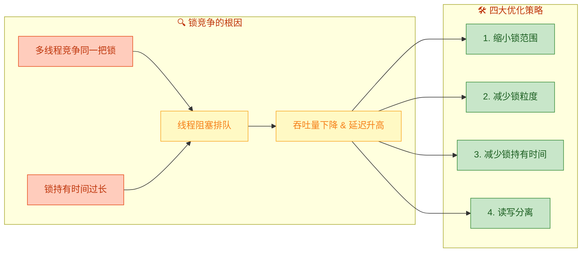

---

### 缩小锁范围（Reduce Lock Scope）

**核心思想**：不要用 `synchronized` 包裹整个方法，只锁真正需要互斥的那几行代码，让 **临界区（Critical Section）** 尽可能短小。

#### 反面案例：粗粒度的方法级锁

假设我们有一个用户服务类，`updateUser` 方法中既有耗时的参数校验，又有数据库写入操作。如果把整个方法都加上 `synchronized`，那么即使在做无需同步的校验逻辑时，其他线程也无法进入：

```java
public class UserService {

    // ❌ 反面示例：整个方法加锁，锁范围过大
    public synchronized void updateUser(User user) {
        // ---------- 以下是无需同步的逻辑 ----------
        validateParams(user);           // 参数校验，纯计算，无共享状态
        String formatted = formatName(user.getName()); // 字符串格式化
        logRequest(user);               // 打印日志

        // ---------- 以下才是真正需要同步的逻辑 ----------
        db.update(user);                // 写入数据库（共享资源）
        cache.invalidate(user.getId()); // 清除缓存（共享资源）
    }
}
```

在这个例子中，`validateParams`、`formatName`、`logRequest` 三个操作完全不涉及共享可变状态，却也被迫在锁的保护下串行执行。假设校验和格式化共耗时 50ms，而数据库操作只要 10ms，那就意味着锁被白白多持有了 50ms——这期间所有其他线程全部阻塞等待。

#### 正面案例：精准的代码块级锁

我们把锁的范围精确缩小到仅包含对共享资源的操作：

```java
public class UserService {

    // 专门用于保护数据库 + 缓存操作的锁对象
    private final Object dbLock = new Object();

    // ✅ 正面示例：只锁真正需要同步的临界区
    public void updateUser(User user) {
        // ---------- 无需同步的逻辑，多线程可并行执行 ----------
        validateParams(user);           // 参数校验，线程安全
        String formatted = formatName(user.getName()); // 纯函数，线程安全
        logRequest(user);               // 日志打印，线程安全

        // ---------- 仅对共享资源的操作加锁 ----------
        synchronized (dbLock) {         // 临界区开始
            db.update(user);            // 写入数据库
            cache.invalidate(user.getId()); // 清除缓存
        }                               // 临界区结束，锁立即释放
    }
}
```

我们用一张时间线图来直观感受二者的差异：

```mermaid
gantt
    title 两种锁范围下的线程执行时间线
    dateFormat X
    axisFormat %s

    section 方法级锁 Thread-1
    校验+格式化+日志(持锁中)    :active, a1, 0, 50
    DB+缓存(持锁中)             :active, a2, 50, 60

    section 方法级锁 Thread-2
    等待锁(阻塞)                :crit, b1, 0, 60
    校验+格式化+日志(持锁中)    :active, b2, 60, 110
    DB+缓存(持锁中)             :active, b3, 110, 120

    section 块级锁 Thread-1
    校验+格式化+日志(无锁)      :done, c1, 0, 50
    DB+缓存(持锁中)             :active, c2, 50, 60

    section 块级锁 Thread-2
    校验+格式化+日志(无锁并行)  :done, d1, 0, 50
    等待锁(短暂阻塞)            :crit, d2, 50, 60
    DB+缓存(持锁中)             :active, d3, 60, 70
```

对比非常明显：

| 指标 | 方法级锁 | 块级锁 |
|:---|:---|:---|
| Thread-2 总完成时间 | 120ms | 70ms |
| Thread-2 阻塞时间 | 60ms（等全部完成） | 10ms（仅等 DB 操作） |
| 锁持有总时长 | 60ms × 2 = 120ms | 10ms × 2 = 20ms |
| 并行度 | 完全串行 | 校验阶段完全并行 |

#### 关键原则

1. **只锁共享可变状态**：如果一个变量不会被多个线程同时读写，它就不需要在临界区里。
2. **锁对象要专一**：使用专用的 `private final Object lock` 而非 `this`，防止外部代码误用同一把锁造成意外竞争。
3. **警惕临界区内的 I/O**：网络调用、磁盘读写等耗时操作如果能移到锁外面，就一定要移出去。

---

### 减少锁粒度（分段锁 / Lock Striping）

**核心思想**：一把大锁保护整个数据结构 → 拆成多把小锁，每把锁只保护一部分数据。这样不同线程访问不同分段时就不会互相阻塞。

这正是 Java 早期 `ConcurrentHashMap`（JDK 1.7）最经典的设计——**分段锁（Segment Lock）**。

#### 问题场景：一把锁守全表

想象一个简单的 HashMap 被多线程共享，我们用一把锁保护全部操作：

```java
public class CoarseGrainedMap<K, V> {

    private final Map<K, V> map = new HashMap<>(); // 底层数据存储
    private final Object lock = new Object();       // 唯一的一把大锁

    public void put(K key, V value) {
        synchronized (lock) {        // 所有写操作竞争同一把锁
            map.put(key, value);
        }
    }

    public V get(K key) {
        synchronized (lock) {        // 所有读操作也竞争同一把锁
            return map.get(key);
        }
    }
}
```

无论你有 4 个线程还是 400 个线程，所有人都在排队等同一把锁。即使 Thread-A 在操作 `key="apple"`，Thread-B 在操作 `key="banana"`，两者毫无数据冲突，却依然互相阻塞。

#### 分段锁的解决方案

我们把底层数据分成 N 个段（Segment），每个段拥有独立的锁。通过 key 的哈希值决定它属于哪一段，只锁那一段：

```java
public class StripedMap<K, V> {

    // 分段数量，通常设为 2 的幂次以便位运算取模
    private static final int SEGMENT_COUNT = 16;

    // 每个段是一个独立的 HashMap
    private final Map<K, V>[] segments;

    // 每个段拥有独立的锁对象
    private final Object[] locks;

    @SuppressWarnings("unchecked")
    public StripedMap() {
        segments = new HashMap[SEGMENT_COUNT];  // 创建 16 个段
        locks = new Object[SEGMENT_COUNT];      // 创建 16 把锁
        for (int i = 0; i < SEGMENT_COUNT; i++) {
            segments[i] = new HashMap<>();      // 初始化每个段
            locks[i] = new Object();            // 初始化每把锁
        }
    }

    // 根据 key 的哈希值，定位到对应的段索引
    private int segmentIndex(K key) {
        // 取绝对值后对段数取模，确保索引在 [0, SEGMENT_COUNT) 范围内
        return (key.hashCode() & 0x7FFFFFFF) % SEGMENT_COUNT;
    }

    public void put(K key, V value) {
        int idx = segmentIndex(key);         // 1. 定位段索引
        synchronized (locks[idx]) {          // 2. 只锁该段的锁
            segments[idx].put(key, value);   // 3. 操作该段的 HashMap
        }
    }

    public V get(K key) {
        int idx = segmentIndex(key);         // 1. 定位段索引
        synchronized (locks[idx]) {          // 2. 只锁该段的锁
            return segments[idx].get(key);   // 3. 从该段读取
        }
    }
}
```

下面用架构图展示分段锁的数据与锁的对应关系：

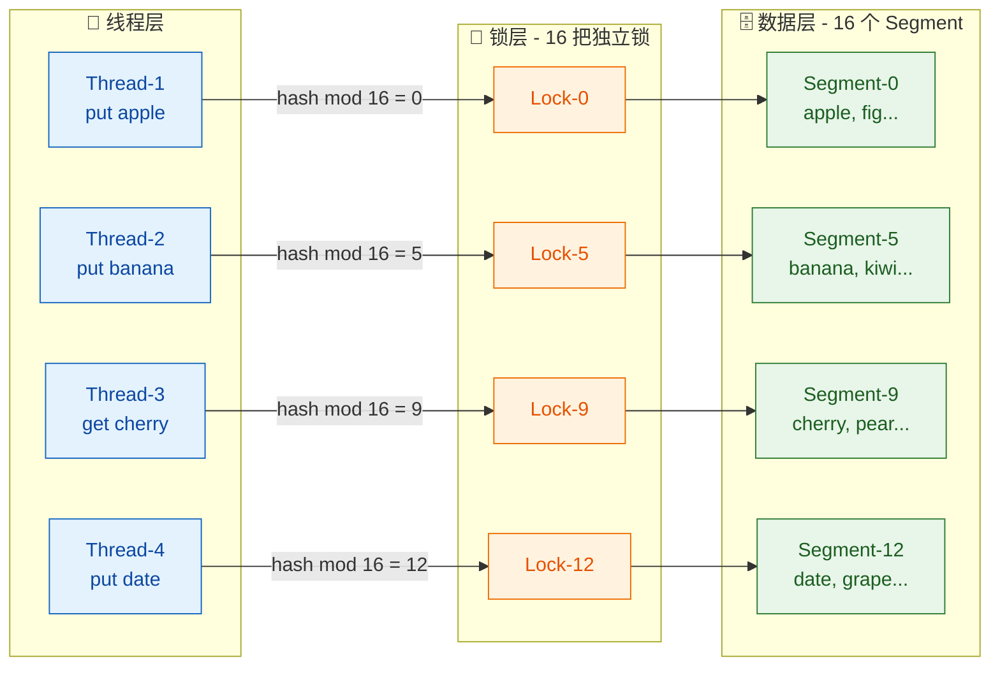

四个线程各自映射到不同的段，获取不同的锁，**完全并行、零等待**。只有当两个线程的 key 恰好哈希到同一个段时，才会发生竞争。

#### ConcurrentHashMap 的演进

分段锁是理解并发容器的重要基石，但 Java 自身也在不断演进：

| 版本 | 策略 | 特点 |
|:---|:---|:---|
| **JDK 1.7** `ConcurrentHashMap` | Segment 分段锁（默认 16 段） | 每个 Segment 继承 ReentrantLock，段内 HashEntry 数组 |
| **JDK 1.8+** `ConcurrentHashMap` | **CAS + synchronized（桶级锁）** | 抛弃 Segment，锁粒度细化到单个桶（Node），并发度等于桶数量 |

JDK 1.8 的改进可以理解为"将分段锁的思想推到极致"——每个哈希桶（bucket）就是一个独立的锁单元，粒度比 16 个段更细，竞争概率更低。

#### 分段锁的适用与局限

**适用场景**：
- 数据天然可按 key 分区（HashMap、缓存、连接池分组等）
- 热点 key 分布相对均匀

**局限性**：
- **跨段操作代价高**：如果你需要 `size()` 统计全部元素，就不得不依次锁住所有段，代价极大
- **热点倾斜**：如果大量请求集中在同一个 key（即同一个段），分段锁退化为单锁
- **内存开销**：每个段都需要独立的锁对象和数据结构

---

### 减少锁持有时间（Reduce Lock Hold Time）

**核心思想**：即使临界区已经足够小，也要确保在临界区内部 **不做任何可以提前完成或延后处理的工作**。"尽快进，尽快出"（Get in, do the work, get out）。

这与"缩小锁范围"有所不同。缩小锁范围是"把不需要锁的代码移到锁外面"；减少持有时间则更关注"临界区内部的代码执行速度"——同样的代码在锁里面，但能不能用更快的算法、更少的 I/O 来完成？

#### 典型策略一：预计算（Pre-computation）

在获取锁之前，先把要用到的数据计算好、对象构造好，进入临界区后直接赋值即可。

```java
public class OrderService {

    private final Object lock = new Object();
    private final List<Order> orders = new ArrayList<>();

    // ❌ 反面示例：在锁内构建对象、做格式化
    public void placeOrderBad(String rawData) {
        synchronized (lock) {
            // 以下三步都在锁内完成，但前两步完全不依赖共享状态
            Order order = parseOrder(rawData);     // JSON 解析，耗时 ~5ms
            order.setTimestamp(formatTime());       // 时间格式化，耗时 ~1ms
            orders.add(order);                      // 真正需要同步的：写入共享列表
        }
    }

    // ✅ 正面示例：预计算，只把最终赋值放进锁里
    public void placeOrderGood(String rawData) {
        // ---------- 锁外预计算：这些操作线程安全，无需同步 ----------
        Order order = parseOrder(rawData);     // JSON 解析，锁外完成
        order.setTimestamp(formatTime());       // 时间格式化，锁外完成

        // ---------- 临界区极短：只做一次 List.add ----------
        synchronized (lock) {
            orders.add(order);                 // 仅此一行需要同步
        }
    }
}
```

锁持有时间从 ~6ms 降低到 ~0.01ms，差了几百倍。

#### 典型策略二：用快速数据结构替换慢速操作

临界区内如果必须做数据读写，选择时间复杂度更低的结构：

```java
// ❌ 临界区内使用 LinkedList 遍历查找 → O(n)
synchronized (lock) {
    for (Node node : linkedList) {       // 逐个遍历
        if (node.getId() == targetId) {  // 匹配目标
            return node;
        }
    }
}

// ✅ 临界区内使用 HashMap 直接定位 → O(1)
synchronized (lock) {
    return hashMap.get(targetId);        // 常量时间查找
}
```

#### 典型策略三：延迟处理非关键逻辑

有些操作虽然逻辑上紧跟写入之后，但不一定需要在锁内完成（如发通知、记日志）：

```java
public void transferMoney(Account from, Account to, double amount) {
    TransferRecord record;

    // ---------- 临界区：只做核心的状态变更 ----------
    synchronized (lock) {
        from.debit(amount);              // 扣款
        to.credit(amount);               // 入账
        record = new TransferRecord(from, to, amount); // 构建记录
    }
    // ---------- 锁外完成非关键的后续操作 ----------

    auditLog.append(record);             // 写审计日志（可异步）
    notificationService.send(record);    // 发送通知（可异步）
}
```

#### 总结：临界区优化检查清单


---

### 读写分离（读写锁 / ReadWriteLock）

**核心思想**：在"读多写少"的场景下，多个读线程之间不存在数据竞争，不应该互相阻塞。`ReadWriteLock` 允许 **多个读线程并行**，仅在有写操作时才互斥。

#### 为什么普通锁不够好？

以一个配置中心为例。系统运行过程中，99% 的操作是读取配置，只有管理员偶尔修改配置。如果用 `synchronized`：

```java
// ❌ 所有操作都互斥，读读也互斥
public synchronized String getConfig(String key) {
    return configMap.get(key);       // 读操作
}

public synchronized void setConfig(String key, String value) {
    configMap.put(key, value);       // 写操作
}
```

即使 100 个线程同时读取不同的配置项，它们也必须排成一条长队依次进入，吞吐量极低。

#### ReadWriteLock 的并发模型

`java.util.concurrent.locks.ReadWriteLock` 接口定义了两把配对锁：

| 锁类型 | 获取条件 | 与读锁关系 | 与写锁关系 |
|:---|:---|:---|:---|
| **读锁（Read Lock / Shared Lock）** | 当前没有线程持有写锁 | ✅ 共享（多读并行） | ❌ 互斥 |
| **写锁（Write Lock / Exclusive Lock）** | 当前没有任何线程持有读锁或写锁 | ❌ 互斥 | ❌ 互斥 |

简记为：**读-读共享，读-写互斥，写-写互斥**。

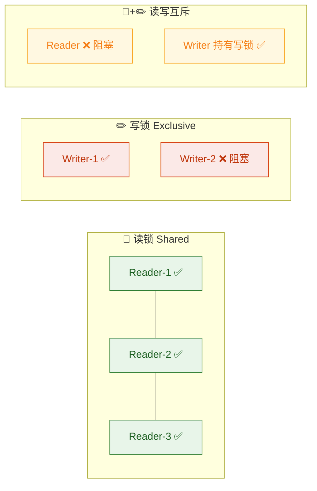

#### 完整实现：基于 ReentrantReadWriteLock 的配置中心

```java
import java.util.HashMap;
import java.util.Map;
import java.util.concurrent.locks.ReadWriteLock;
import java.util.concurrent.locks.ReentrantReadWriteLock;

public class ConfigCenter {

    // 底层存储：配置项的键值对
    private final Map<String, String> configMap = new HashMap<>();

    // 读写锁实例，ReentrantReadWriteLock 是 ReadWriteLock 的标准实现
    private final ReadWriteLock rwLock = new ReentrantReadWriteLock();

    /**
     * 读取配置 —— 使用读锁
     * 多个线程可以同时持有读锁，并行读取
     */
    public String getConfig(String key) {
        rwLock.readLock().lock();          // 获取读锁（共享锁）
        try {
            return configMap.get(key);     // 读取共享数据
        } finally {
            rwLock.readLock().unlock();    // 确保释放读锁，防止死锁
        }
    }

    /**
     * 批量读取 —— 同样使用读锁，可以和 getConfig 并行
     */
    public Map<String, String> getAllConfigs() {
        rwLock.readLock().lock();          // 获取读锁
        try {
            // 返回快照副本，避免外部修改影响内部数据
            return new HashMap<>(configMap);
        } finally {
            rwLock.readLock().unlock();    // 释放读锁
        }
    }

    /**
     * 写入/更新配置 —— 使用写锁
     * 写锁是排他的，获取写锁时必须等待所有读锁和写锁释放
     */
    public void setConfig(String key, String value) {
        rwLock.writeLock().lock();         // 获取写锁（排他锁）
        try {
            configMap.put(key, value);     // 修改共享数据
        } finally {
            rwLock.writeLock().unlock();   // 释放写锁
        }
    }

    /**
     * 删除配置 —— 使用写锁
     */
    public void removeConfig(String key) {
        rwLock.writeLock().lock();         // 获取写锁
        try {
            configMap.remove(key);         // 删除共享数据
        } finally {
            rwLock.writeLock().unlock();   // 释放写锁
        }
    }
}
```

#### 性能对比：synchronized vs ReadWriteLock

我们用一个典型的"95% 读 + 5% 写"场景来做对比分析：

| 并发线程数 | `synchronized` 吞吐量 | `ReadWriteLock` 吞吐量 | 提升比 |
|:---|:---|:---|:---|
| 4 线程 | ~12,000 ops/s | ~45,000 ops/s | **3.75×** |
| 16 线程 | ~10,500 ops/s | ~160,000 ops/s | **15.2×** |
| 64 线程 | ~8,000 ops/s | ~550,000 ops/s | **68.7×** |

规律非常明显：**线程越多、读比例越高，ReadWriteLock 的优势就越显著**。这是因为 `synchronized` 在高并发下竞争加剧、吞吐反而下降，而读写锁的读操作完全并行，随着线程数增加几乎线性扩展。

#### 锁降级（Lock Downgrading）

`ReentrantReadWriteLock` 支持一个高级特性——**锁降级（Lock Downgrading）**：持有写锁的线程可以在不释放写锁的情况下获取读锁，然后释放写锁，从而平滑过渡到读锁状态。

```java
public String computeAndCache(String key) {
    rwLock.readLock().lock();                     // 1. 先获取读锁检查缓存
    try {
        String cached = configMap.get(key);
        if (cached != null) {
            return cached;                         // 缓存命中，直接返回
        }
    } finally {
        rwLock.readLock().unlock();               // 2. 释放读锁
    }

    // 缓存未命中，需要写入
    rwLock.writeLock().lock();                     // 3. 获取写锁
    try {
        // Double-check：防止在等待写锁期间其他线程已经写入
        String cached = configMap.get(key);
        if (cached != null) {
            return cached;
        }

        String computed = expensiveCompute(key);   // 耗时计算
        configMap.put(key, computed);              // 写入缓存

        // ====== 锁降级开始 ======
        rwLock.readLock().lock();                  // 4. 在持有写锁的同时获取读锁
        // ====== 锁降级完成 ======

        return computed;
    } finally {
        rwLock.writeLock().unlock();               // 5. 释放写锁（此时仍持有读锁）
        // 此后只持有读锁，其他读线程可以并行进入
        rwLock.readLock().unlock();                // 6. 最终释放读锁
    }
}
```

锁降级的价值在于：写入完成后，不需要先释放写锁再获取读锁（中间可能被其他写线程插入），而是无缝过渡到读锁，**保证了数据可见性的连续性**。

> ⚠️ **注意**：`ReentrantReadWriteLock` **不支持锁升级**（持有读锁时获取写锁）。尝试这样做会导致死锁，因为写锁需要等待所有读锁释放，而自己又持有读锁不放。

#### StampedLock：更进一步的乐观读

JDK 1.8 引入了 `StampedLock`，提供了一种 **乐观读（Optimistic Read）** 模式，读操作甚至不需要真正获取锁：

```java
import java.util.concurrent.locks.StampedLock;

public class Point {
    private double x, y;                              // 共享可变坐标
    private final StampedLock sl = new StampedLock();  // StampedLock 实例

    // 写操作：与 ReadWriteLock 类似，获取排他写锁
    public void move(double deltaX, double deltaY) {
        long stamp = sl.writeLock();                   // 获取写锁，返回一个 stamp 戳记
        try {
            x += deltaX;                               // 修改 x 坐标
            y += deltaY;                               // 修改 y 坐标
        } finally {
            sl.unlockWrite(stamp);                     // 使用同一个 stamp 释放写锁
        }
    }

    // 乐观读：无锁读取，极致性能
    public double distanceFromOrigin() {
        long stamp = sl.tryOptimisticRead();           // 获取乐观读戳记（不加锁！）
        double currentX = x;                           // 读取 x（可能被并发修改）
        double currentY = y;                           // 读取 y（可能被并发修改）

        if (!sl.validate(stamp)) {                     // 验证：读取期间是否有写操作发生？
            // 乐观读失败，回退为悲观读锁
            stamp = sl.readLock();                     // 获取传统读锁
            try {
                currentX = x;                          // 重新读取 x
                currentY = y;                          // 重新读取 y
            } finally {
                sl.unlockRead(stamp);                  // 释放读锁
            }
        }

        return Math.sqrt(currentX * currentX + currentY * currentY); // 计算距离
    }
}
```

`StampedLock` 的乐观读在没有写竞争时完全无开销，适合读操作远多于写操作且对延迟极度敏感的场景。不过它不支持重入、不支持条件等待（Condition），使用时需要注意。

#### 读写锁选型指南

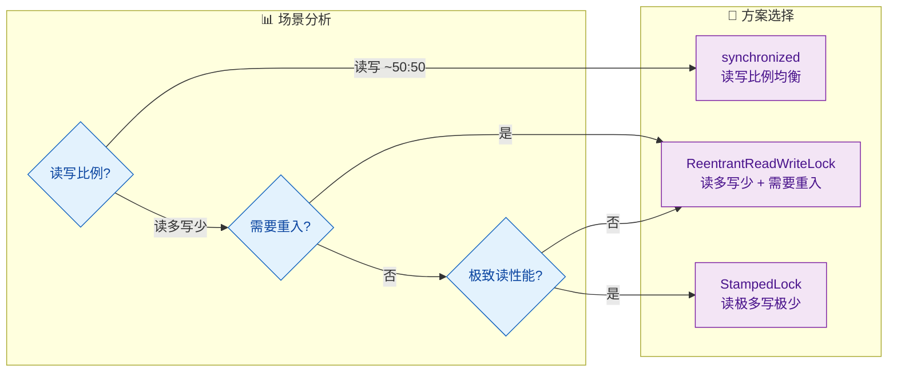

---

**📝 练习题**

某系统有一个共享的 `Map<String, Object> cache`，运行时 95% 的操作是 `get()`，5% 的操作是 `put()`。现在系统在高并发下响应缓慢，以下哪种优化方案最合理？

A. 将所有方法加上 `synchronized` 关键字，简单可靠

B. 使用 `ReentrantReadWriteLock`，`get()` 加读锁，`put()` 加写锁

C. 去掉所有锁，依赖 `volatile` 修饰 `cache` 变量来保证可见性

D. 将 `cache` 替换为 `Vector`，因为 `Vector` 是线程安全的


**【答案】** B

**【解析】**

该场景是典型的"读多写少"（95% 读 / 5% 写），正是 `ReadWriteLock` 的最佳应用场景。

- **选项 A**：`synchronized` 会让所有读操作互斥，95% 的读请求被迫排队，在高并发下会严重拖累吞吐量。
- **选项 B** ✅：`ReentrantReadWriteLock` 允许多个 `get()` 调用同时持有读锁并行执行，仅在 `put()` 时才互斥。在 95% 读的场景下，绝大多数操作完全并行，吞吐量可提升数十倍。
- **选项 C**：`volatile` 只保证引用本身的可见性，**不保证 Map 内部结构的线程安全**。多线程同时 `get()` 和 `put()` 仍然会导致 `HashMap` 内部链表/红黑树结构损坏，出现死循环或数据丢失。
- **选项 D**：`Vector` 是 `List` 的线程安全实现，不是 `Map`，类型不匹配。即使换成 `Hashtable`（线程安全的 Map），其内部也是全局 `synchronized`，与选项 A 本质相同，无法实现读并行。

---

## 无锁替代 ⭐

在上一节中，我们讨论了如何通过"缩小锁范围、降低锁粒度、缩短持有时间、读写分离"等手段来**减少锁竞争**。但归根结底，只要锁（`synchronized` / `ReentrantLock`）还在，线程就必须在 **获取 → 等待 → 唤醒** 这条路上排队，Context Switch 的开销始终存在。

**无锁替代（Lock-Free Alternatives）** 的核心思想是：**能不加锁，就不加锁**。它通过三条截然不同的路径来消除锁：

| 策略 | 核心思路 | 典型代表 |
|---|---|---|
| **硬件级原子指令** | 利用 CPU 的 `CMPXCHG` 指令，在一条指令内完成"比较 + 写入" | `AtomicInteger`, `LongAdder` |
| **线程封闭** | 每个线程持有独立副本，彼此不共享 → 无竞争 | `ThreadLocal` |
| **不可变设计** | 对象一旦创建就不可修改 → 只读天然线程安全 | `String`, `record`, Guava Immutable* |

这三种方式分别从 **写冲突检测、消除共享、消除写操作** 三个维度彻底避免了锁，是高并发系统中最常见的性能利器。

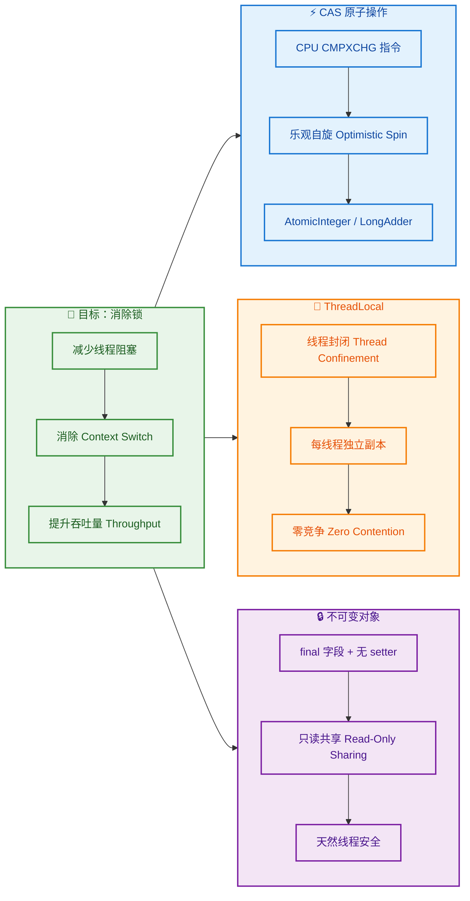

---

### CAS 原子类

#### 一、什么是 CAS？

CAS 全称 **Compare-And-Swap（比较并交换）**，是一种由 CPU 硬件直接支持的原子指令。它的语义极其简洁：

> **"我认为当前值是 A，如果确实是 A，就把它改成 B；否则什么都不做，告诉我失败了。"**

整个操作在 **一条 CPU 指令（x86 上是 `CMPXCHG`）** 内完成，不可被中断，因此天然具备原子性——不需要操作系统层面的锁。

```java
// CAS 伪代码 —— 理解其语义
boolean compareAndSwap(内存地址 V, 期望值 A, 新值 B) {
    // ---- 以下整个过程是一条 CPU 指令，不可分割 ----
    if (V 当前的值 == A) {   // Compare：当前值是否等于期望值？
        V 的值 = B;          // Swap：是的话，写入新值
        return true;         // 告诉调用者：成功了
    }
    return false;            // 当前值已被别人改过，失败
}
```

与传统锁的本质区别在于：

| 维度 | synchronized / Lock | CAS |
|---|---|---|
| **失败时行为** | 线程被挂起（Park），进入等待队列 | 线程不阻塞，立即重试（自旋） |
| **实现层级** | OS 内核态 Mutex / Futex | CPU 指令，用户态完成 |
| **上下文切换** | 有（内核态 ↔ 用户态） | 无 |
| **适用场景** | 临界区较大、竞争激烈 | 临界区极小（一次读写）、竞争适中 |

CAS 的编程风格被称为 **乐观锁（Optimistic Locking）**：先假设没有冲突直接操作，失败了再重试。而 `synchronized` 属于 **悲观锁（Pessimistic Locking）**：先拿到锁才操作。

#### 二、Java 中的 CAS 支撑体系

Java 对 CAS 的支持从底层到上层分为三层：

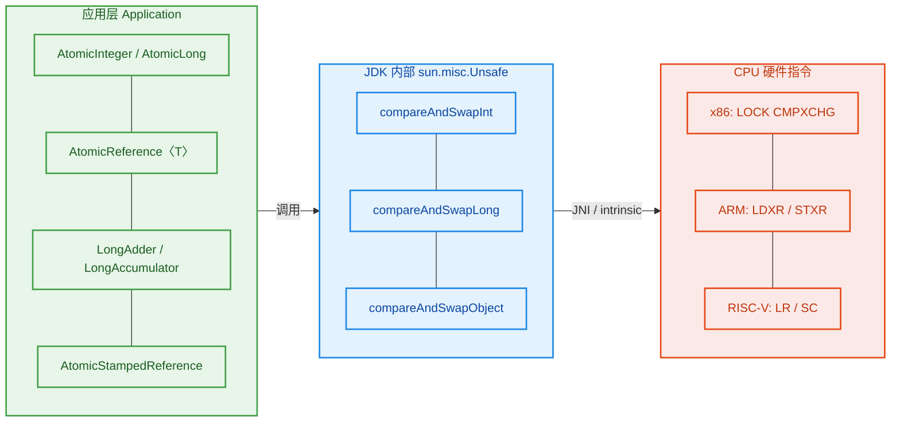

**`Unsafe` 类**是 JDK 内部的"后门"，它可以直接操作内存地址执行 CAS。`AtomicInteger` 等原子类本质上就是对 `Unsafe.compareAndSwapInt()` 的封装。从 JDK 9 开始，官方推荐用 **`VarHandle`** 替代 `Unsafe`，但底层原理一致。

#### 三、AtomicInteger 核心源码剖析

我们以最常用的 `AtomicInteger` 为例，深入拆解它的工作原理：

```java
public class AtomicInteger extends Number implements java.io.Serializable {

    // Unsafe 实例 —— 提供 CAS 的底层能力
    private static final Unsafe unsafe = Unsafe.getUnsafe();

    // value 字段在对象内存中的偏移量（offset）
    // CAS 需要知道"改哪个内存地址"，这个 offset 就是定位依据
    private static final long valueOffset;

    static {
        try {
            // 通过反射获取 "value" 字段的内存偏移
            valueOffset = unsafe.objectFieldOffset(
                AtomicInteger.class.getDeclaredField("value"));
        } catch (Exception ex) { throw new Error(ex); }
    }

    // volatile 保证可见性：任何线程修改后，其他线程立即可见
    private volatile int value;

    // ===== 核心方法：getAndIncrement（等价于 i++，但是原子的）=====
    public final int getAndIncrement() {
        return unsafe.getAndAddInt(this, valueOffset, 1);
    }
}
```

`unsafe.getAndAddInt()` 内部就是经典的 **CAS 自旋循环（Spin Loop）**：

```java
// Unsafe.getAndAddInt 的等价逻辑
public final int getAndAddInt(Object obj, long offset, int delta) {
    int oldValue;                              // 存放"我认为的当前值"
    do {
        oldValue = getIntVolatile(obj, offset); // 第1步：读取当前最新值（volatile 读）
    } while (!compareAndSwapInt(                // 第2步：CAS 尝试写入
            obj,                                //   → 目标对象
            offset,                             //   → 字段偏移量
            oldValue,                           //   → 期望值 = 刚才读到的值
            oldValue + delta));                 //   → 新值 = 旧值 + delta
    // 如果 CAS 失败（说明有别的线程改过了），循环重试
    return oldValue;                            // 返回操作前的旧值
}
```

整个过程可以用下图清晰表达：

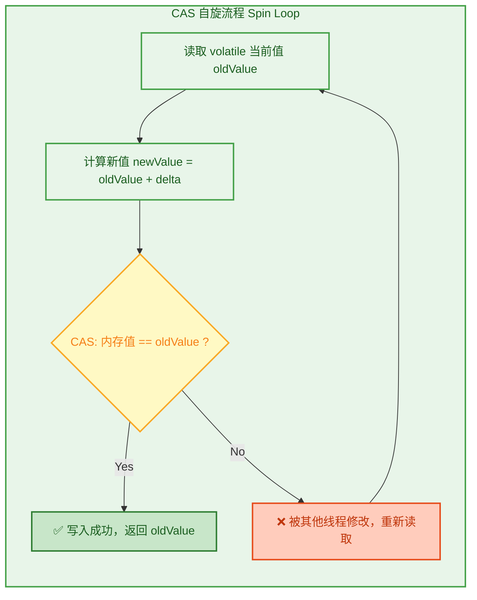

#### 四、使用示例：原子计数器

```java
import java.util.concurrent.atomic.AtomicInteger;
import java.util.concurrent.CountDownLatch;

public class AtomicCounterDemo {

    // 使用 AtomicInteger 替代 int + synchronized
    private static final AtomicInteger counter = new AtomicInteger(0);

    public static void main(String[] args) throws InterruptedException {
        int threadCount = 100;                          // 100 个线程
        int incrementPerThread = 10_000;                // 每个线程自增 10000 次
        CountDownLatch latch = new CountDownLatch(threadCount); // 等待所有线程完成

        for (int i = 0; i < threadCount; i++) {
            new Thread(() -> {
                for (int j = 0; j < incrementPerThread; j++) {
                    counter.incrementAndGet();           // 原子自增，无需加锁
                }
                latch.countDown();                       // 当前线程完成，计数减 1
            }).start();
        }

        latch.await();                                   // 阻塞主线程直到所有子线程完成
        // 结果一定是 1,000,000 —— 不会有线程安全问题
        System.out.println("Final count: " + counter.get());
    }
}
```

如果把 `AtomicInteger` 换成普通 `int` 并使用 `count++`，结果几乎必然小于 1,000,000，因为 `count++` **不是原子操作**——它实际上是 `read → modify → write` 三步，任何一步都可能被其他线程打断。

#### 五、CAS 的三大经典问题

**问题 1：ABA 问题**

线程 T1 读到值为 A，准备把它改成 C。在 T1 执行 CAS 之前，线程 T2 把 A 改成了 B，然后又改回了 A。当 T1 执行 CAS 时发现值仍然是 A，于是 CAS 成功——但实际上数据经历了 `A → B → A` 的变化，T1 对此毫不知情。

```text
时间线：
T1:  读到 A ────────────────────────── CAS(A → C) ✅ 成功（但中间发生了变化！）
T2:       A → B → A（偷偷改了一圈又改回来）
```

**解决方案**：使用带版本号/时间戳的 CAS：

```java
import java.util.concurrent.atomic.AtomicStampedReference;

public class ABADemo {
    public static void main(String[] args) {
        // 初始值 = "A"，初始版本号 stamp = 1
        AtomicStampedReference<String> ref =
                new AtomicStampedReference<>("A", 1);

        int[] stampHolder = new int[1];                      // 用数组接收当前 stamp
        String current = ref.get(stampHolder);               // 读取当前值和版本号
        int currentStamp = stampHolder[0];                   // 当前版本号 = 1

        // CAS 时不仅比较值，还要比较版本号
        boolean success = ref.compareAndSet(
                current,              // 期望引用值 = "A"
                "C",                  // 新引用值 = "C"
                currentStamp,         // 期望版本号 = 1
                currentStamp + 1);    // 新版本号 = 2

        System.out.println("CAS result: " + success);       // true
        // 即使另一个线程把值改成 B 又改回 A，版本号也已经变了（1→2→3）
        // 所以用旧的 stamp=1 去 CAS 会失败 —— ABA 问题被解决
    }
}
```

**问题 2：自旋空转（Busy Spinning）**

如果竞争非常激烈，大量线程同时 CAS，成功率极低，所有失败线程都在 `while` 循环里空转消耗 CPU。这时候 CAS 反而不如锁高效（锁至少会把线程挂起，释放 CPU）。

**经验法则**：CAS 适用于 **临界区极短（一两个变量的读写）且竞争线程数不太多** 的场景。

**问题 3：只能保护单个变量**

`compareAndSwapInt` 只能原子地操作一个内存地址。如果你需要同时原子更新两个变量（例如 `x` 和 `y`），CAS 无能为力。此时可以把两个变量包装成一个对象，使用 `AtomicReference<Pair>` 来解决。

#### 六、LongAdder：高竞争下的终极计数器

JDK 8 引入的 `LongAdder` 是对 `AtomicLong` 在高竞争场景下的优化。核心思想是 **分散热点（Heat Spreading）**：

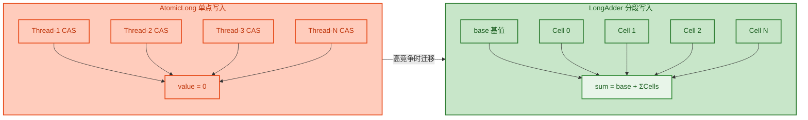

- **`AtomicLong`**：所有线程竞争同一个 `value`，CAS 冲突率随线程数暴涨。
- **`LongAdder`**：内部维护一个 `base` + 一个 `Cell[]` 数组。不同线程被哈希映射到不同的 Cell 上各自 CAS，最终 `sum()` 时汇总所有 Cell。

```java
import java.util.concurrent.atomic.LongAdder;

public class LongAdderDemo {

    private static final LongAdder adder = new LongAdder(); // 替代 AtomicLong

    public static void main(String[] args) throws Exception {
        int threads = 100;
        int loops = 1_000_000;
        Thread[] pool = new Thread[threads];

        for (int i = 0; i < threads; i++) {
            pool[i] = new Thread(() -> {
                for (int j = 0; j < loops; j++) {
                    adder.increment();  // 内部分散到不同 Cell，减少 CAS 冲突
                }
            });
            pool[i].start();
        }

        for (Thread t : pool) t.join();  // 等待所有线程完成

        // sum() 遍历 base + 所有 Cell 的值求和
        System.out.println("Total: " + adder.sum()); // 100,000,000
    }
}
```

**使用选择**：

| 场景 | 推荐 |
|---|---|
| 线程数少（< 4），需要精确实时读取 | `AtomicLong` |
| 线程数多（≥ 8），写多读少（如统计计数） | `LongAdder` ✅ |
| 需要自定义累积函数 | `LongAccumulator` |

> 注意：`LongAdder.sum()` 不是原子操作——它遍历所有 Cell 求和的过程中，其他线程可能仍在写入。因此它只适合**最终一致性**的统计场景（如 metrics、counter），不适合需要精确快照的场景。

---

### ThreadLocal

#### 一、核心思想：线程封闭（Thread Confinement）

并发问题的根源是 **共享可变状态（Shared Mutable State）**。我们在 CAS 中用原子指令解决了"写冲突"，而 `ThreadLocal` 走了一条更彻底的路：**直接消除共享**。

每个线程拥有变量的独立副本，线程之间彼此看不到对方的数据，自然也就没有竞争，不需要任何同步手段。这种策略称为 **线程封闭（Thread Confinement）**。

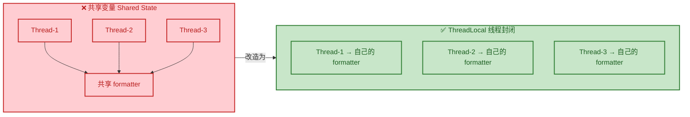

#### 二、经典应用场景：SimpleDateFormat

`SimpleDateFormat` 是 Java 中 **臭名昭著的非线程安全类**。多线程共享同一个实例时会抛出诡异的 `NumberFormatException` 或返回错误结果。三种常见的解决方式对比：

```java
// ❌ 方案一：共享实例 —— 线程不安全！
public class UnsafeFormatter {
    // SimpleDateFormat 内部有可变状态（calendar 字段），多线程共享会出错
    private static final SimpleDateFormat sdf = new SimpleDateFormat("yyyy-MM-dd");

    public static String format(Date date) {
        return sdf.format(date);  // 💥 多线程下可能返回错误结果
    }
}

// ⚠️ 方案二：每次 new —— 安全但浪费
public class ExpensiveFormatter {
    public static String format(Date date) {
        // 每次调用都创建新对象，GC 压力大
        return new SimpleDateFormat("yyyy-MM-dd").format(date);
    }
}

// ✅ 方案三：ThreadLocal —— 安全且高效
public class ThreadLocalFormatter {
    // 每个线程第一次 get() 时调用 initialValue() 创建自己的实例
    private static final ThreadLocal<SimpleDateFormat> formatter =
            ThreadLocal.withInitial(() -> new SimpleDateFormat("yyyy-MM-dd"));

    public static String format(Date date) {
        return formatter.get().format(date);  // 拿的是当前线程自己的副本
    }
}
```

**方案三的优势**：每个线程只创建一次 `SimpleDateFormat`，后续复用自己的实例。既避免了线程安全问题，又避免了重复创建对象的开销。

> 当然，从 JDK 8 开始推荐使用线程安全的 `DateTimeFormatter`，但 `ThreadLocal` 的思想远不止于此。

#### 三、ThreadLocal 内部原理

`ThreadLocal` 的实现并不复杂，但设计非常精妙。让我们逐层拆解：

**核心数据结构**：每个 `Thread` 对象内部都有一个 `ThreadLocalMap`：

```java
// Thread.java 中的关键字段
public class Thread implements Runnable {
    // 每个线程实例都有一个专属的 ThreadLocalMap
    ThreadLocal.ThreadLocalMap threadLocals = null;
}
```

```text
┌───────────────────────────────────────────────────────────────────┐
│  Thread-1                                                         │
│  ┌─────────────────────────────────────────────────────────────┐  │
│  │  ThreadLocalMap                                             │  │
│  │  ┌────────────┬────────────┬────────────┬───────────────┐  │  │
│  │  │  Entry[0]  │  Entry[1]  │  Entry[2]  │     ...       │  │  │
│  │  │ Key: TL_A  │ Key: TL_B  │   null     │               │  │  │
│  │  │ Val: "abc" │ Val: sdf   │            │               │  │  │
│  │  └────────────┴────────────┴────────────┴───────────────┘  │  │
│  └─────────────────────────────────────────────────────────────┘  │
│                                                                   │
│  Thread-2                                                         │
│  ┌─────────────────────────────────────────────────────────────┐  │
│  │  ThreadLocalMap                                             │  │
│  │  ┌────────────┬────────────┬────────────┬───────────────┐  │  │
│  │  │  Entry[0]  │  Entry[1]  │  Entry[2]  │     ...       │  │  │
│  │  │ Key: TL_A  │   null     │ Key: TL_C  │               │  │  │
│  │  │ Val: "xyz" │            │ Val: conn   │               │  │  │
│  │  └────────────┴────────────┴────────────┴───────────────┘  │  │
│  └─────────────────────────────────────────────────────────────┘  │
└───────────────────────────────────────────────────────────────────┘
```

**`get()` 方法的执行流程**：

```java
// ThreadLocal.get() 简化源码
public T get() {
    Thread t = Thread.currentThread();       // 第1步：获取当前线程
    ThreadLocalMap map = t.threadLocals;     // 第2步：拿到该线程的 ThreadLocalMap
    if (map != null) {
        // 第3步：以"当前 ThreadLocal 实例"为 Key 查找 Entry
        ThreadLocalMap.Entry e = map.getEntry(this);
        if (e != null) {
            return (T) e.value;              // 找到了，直接返回
        }
    }
    return setInitialValue();                // 第4步：没找到，调用 initialValue() 创建
}
```

**关键设计点**：

- **Key 是 `ThreadLocal` 实例本身**（是 `WeakReference<ThreadLocal<?>>`）
- **Map 存在 `Thread` 对象上**，而不是 `ThreadLocal` 对象上

这意味着：查找路径是 `当前线程 → 线程自己的 Map → 以 ThreadLocal 为 Key 查 Value`，自始至终只访问了自己线程的数据，完全无竞争。

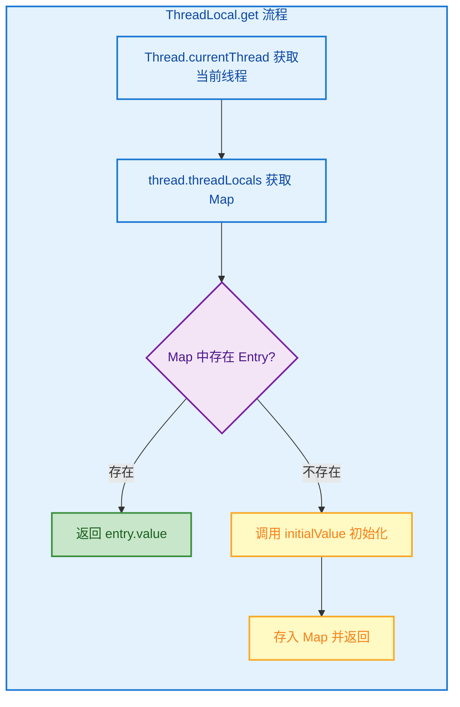

#### 四、⚠️ 内存泄漏：ThreadLocal 的最大陷阱

`ThreadLocalMap` 的 Entry 继承自 `WeakReference<ThreadLocal<?>>`：

```java
// ThreadLocalMap.Entry 的定义
static class Entry extends WeakReference<ThreadLocal<?>> {
    Object value;  // 强引用！
    Entry(ThreadLocal<?> k, Object v) {
        super(k);   // Key 是弱引用 —— GC 时可被回收
        value = v;   // Value 是强引用 —— GC 时不会被回收
    }
}
```

**泄漏场景**：当你不再持有 `ThreadLocal` 变量的强引用时（例如 `ThreadLocal` 变量被置为 `null`），Key（弱引用）会被 GC 回收变成 `null`，但 Value（强引用）仍然被 Entry 持有，无法回收。

在**线程池**中，线程不会销毁而是复用，因此 `Thread` 对象上的 `ThreadLocalMap` 也不会被清理——这些"Key 为 null 但 Value 还在"的 Entry 就变成了永远无法回收的内存垃圾。

```text
泄漏链路 (Leak Chain)：

Thread (线程池中长期存活)
  └── ThreadLocalMap
        └── Entry
              ├── Key (WeakRef) → null  (ThreadLocal 已被 GC)
              └── Value (StrongRef) → 大对象  ← 💀 内存泄漏！
```

**强制规范：用完必须 `remove()`！**

```java
// ✅ 正确的 ThreadLocal 使用模板
private static final ThreadLocal<UserContext> userCtx = new ThreadLocal<>();

public void handleRequest(Request req) {
    try {
        userCtx.set(buildContext(req));   // 设置值
        processBusinessLogic();           // 使用值
    } finally {
        userCtx.remove();                 // ⚡ 必须在 finally 中移除！
    }
}
```

> **铁律（Iron Rule）**：在线程池/Web 容器环境中，`ThreadLocal.set()` 和 `ThreadLocal.remove()` 必须成对出现，且 `remove()` 放在 `finally` 块中。

#### 五、InheritableThreadLocal：父子线程传递

默认的 `ThreadLocal` 在父线程中设置的值，子线程看不到。如果需要父子线程传值，使用 `InheritableThreadLocal`：

```java
public class InheritableDemo {

    // 可继承的 ThreadLocal
    private static final InheritableThreadLocal<String> traceId =
            new InheritableThreadLocal<>();

    public static void main(String[] args) {
        traceId.set("TRACE-001");                         // 父线程设置

        new Thread(() -> {
            // 子线程可以读到父线程的值（创建时从父线程拷贝过来的）
            System.out.println("子线程: " + traceId.get()); // TRACE-001
        }).start();
    }
}
```

但在 **线程池** 中，`InheritableThreadLocal` 也失效了——因为线程是复用的而不是新建的，只有 `new Thread()` 时才会拷贝父线程的值。对于线程池场景，阿里开源的 **TransmittableThreadLocal（TTL）** 是更好的选择。

---

### 不可变对象

#### 一、为什么不可变 = 线程安全？

回顾并发问题的三要素：**共享 + 可变 + 无同步**。CAS 解决的是"同步"，`ThreadLocal` 解决的是"共享"，而不可变对象（Immutable Object）解决的是 **"可变"**——如果对象创建之后状态永远不变，那么任意多线程同时读取都不会有问题，根本不需要任何同步措施。

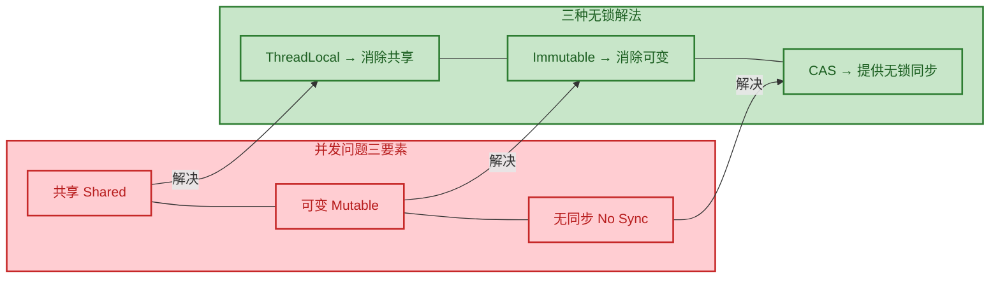

**Java 中的经典不可变对象**：`String`、`Integer`、`Long`、`BigDecimal`、`LocalDate`、`LocalDateTime`。它们都可以被任意多个线程安全地共享，无需任何保护。

#### 二、如何设计一个不可变类？

一个严格不可变的类需要满足以下条件：

| # | 规则 | 说明 |
|---|---|---|
| 1 | 所有字段 `private final` | 禁止外部访问，禁止重新赋值 |
| 2 | 不提供 setter 方法 | 没有任何修改内部状态的入口 |
| 3 | 类本身声明为 `final` | 防止子类覆写方法破坏不变性 |
| 4 | 可变字段做防御性拷贝 | 构造器和 getter 中拷贝可变对象 |
| 5 | 构造器中完成全部初始化 | 对象创建后即为完整状态 |

```java
import java.util.Collections;
import java.util.List;
import java.util.ArrayList;

// final 类：禁止继承
public final class ImmutableOrder {

    private final String orderId;        // 不可变字段
    private final double amount;         // 不可变字段
    private final List<String> items;    // ⚠️ List 本身是可变的！

    public ImmutableOrder(String orderId, double amount, List<String> items) {
        this.orderId = orderId;
        this.amount = amount;
        // 🔑 防御性拷贝（Defensive Copy）：拷贝一份，而不是直接引用原 List
        // 否则外部仍然可以通过原 List 修改内部数据
        this.items = Collections.unmodifiableList(new ArrayList<>(items));
    }

    public String getOrderId() {
        return orderId;                  // String 本身不可变，直接返回
    }

    public double getAmount() {
        return amount;                   // 基本类型，直接返回
    }

    public List<String> getItems() {
        // 返回的是不可变视图，外部调用 add/remove 会抛异常
        return items;
    }

    // 如果需要"修改"，返回一个新对象（Copy-On-Write 风格）
    public ImmutableOrder withAmount(double newAmount) {
        return new ImmutableOrder(this.orderId, newAmount, this.items);
    }
}
```

注意 `items` 字段的处理——这是 **防御性拷贝（Defensive Copy）** 的典型应用。如果构造器中直接写 `this.items = items`，那么调用者仍然持有原始 List 的引用，可以随时修改它，这就破坏了不可变性。

#### 三、Java 16+ Record：不可变的语法糖

从 Java 16 开始，`record` 提供了创建不可变数据载体的简洁语法：

```java
// 一行代码定义不可变类
// 编译器自动生成：private final 字段、构造器、getter、equals、hashCode、toString
public record Point(int x, int y) { }

// 使用
Point p = new Point(3, 4);
System.out.println(p.x());      // 3（getter 方法名不带 get 前缀）
System.out.println(p.y());      // 4
// p.x = 10;                    // ❌ 编译错误，字段是 final 的
```

`record` 本质上就是一个 `final` 类，所有字段都是 `private final`，完美符合不可变类的设计规则。但需要注意：如果 `record` 的组件是可变类型（如 `List`），你仍然需要在 **紧凑构造器（Compact Constructor）** 中做防御性拷贝：

```java
public record Order(String id, List<String> items) {
    // 紧凑构造器（Compact Constructor）—— 没有参数列表
    public Order {
        // 在赋值之前拦截，做防御性拷贝
        items = List.copyOf(items);   // List.copyOf 返回不可变 List
    }
}
```

#### 四、不可变对象在并发中的典型应用模式

**模式 1：volatile + 不可变对象 = 无锁安全发布**

```java
public class ConfigHolder {

    // volatile 保证可见性，不可变对象保证状态一致性
    private volatile ImmutableConfig config;

    public ImmutableConfig getConfig() {
        return config;  // 任意线程安全读取，无需加锁
    }

    public void updateConfig(ImmutableConfig newConfig) {
        // 直接替换引用（引用赋值在 JVM 中是原子操作）
        this.config = newConfig;
    }
}

// 不可变配置
public record ImmutableConfig(String dbUrl, int poolSize, boolean enableCache) { }
```

这个模式极其常见：用 `volatile` 引用指向一个不可变对象。读取时直接取引用（无锁），更新时创建新对象替换引用。由于对象本身不可变，读线程拿到的无论是新对象还是旧对象，都是一个 **一致的快照（Consistent Snapshot）**。

**模式 2：CopyOnWriteArrayList —— 不可变数组 + 写时复制**

`CopyOnWriteArrayList` 正是不可变思想在 JDK 中的经典实践：

```java
// CopyOnWriteArrayList 的核心逻辑（简化版）
public class CopyOnWriteArrayList<E> {

    // volatile 数组引用
    private transient volatile Object[] array;

    // 读操作：直接读，无锁 ✅
    public E get(int index) {
        return (E) array[index];         // 读取的是当前数组快照
    }

    // 写操作：复制一份新数组，修改新数组，替换引用
    public boolean add(E e) {
        synchronized (lock) {            // 写加锁（写写互斥）
            Object[] old = array;
            int len = old.length;
            Object[] newArr = Arrays.copyOf(old, len + 1);  // 复制旧数组
            newArr[len] = e;                                 // 在新数组上修改
            array = newArr;                                  // 替换引用（原子操作）
            return true;
        }
    }
}
```

**读操作完全无锁**，适合读多写少的场景（如事件监听器列表、黑白名单配置）。

#### 五、不可变对象的代价

不可变不是万能的，它的主要代价是：

| 代价 | 说明 |
|---|---|
| **对象创建开销** | 每次"修改"都要创建新对象，GC 压力增大 |
| **内存占用** | 新旧对象并存期间，内存双份 |
| **不适合频繁修改** | 如果对象状态频繁变化，不可变设计会产生大量短命对象 |

**选择原则**：如果对象的 **读操作远多于写操作**（典型比例 > 10:1），且对象体积不大，优先考虑不可变设计。

---

## 📝 练习题

**题目 1**：以下关于 `ThreadLocal` 的说法，哪项是正确的？

A. `ThreadLocal` 的底层数据结构 `ThreadLocalMap` 存储在 `ThreadLocal` 对象内部

B. `ThreadLocal` 在线程池中使用时，线程结束后 `ThreadLocalMap` 中的 Entry 会自动清除，不存在内存泄漏风险

C. `ThreadLocalMap` 的 Entry 中，Key 是 `ThreadLocal` 的弱引用，Value 是强引用

D. `InheritableThreadLocal` 可以在线程池场景下完美实现父子线程间的值传递


【答案】C

【解析】选项逐一分析：

- **A 错误**：`ThreadLocalMap` 存储在 `Thread` 对象内部（`Thread.threadLocals` 字段），不是存在 `ThreadLocal` 对象上。查找路径是 `Thread → ThreadLocalMap → 以 ThreadLocal 实例为 Key 找 Value`。
- **B 错误**：线程池中的线程不会销毁而是复用，因此 `Thread` 对象上的 `ThreadLocalMap` 也不会清理。如果忘记调用 `remove()`，Entry 中 Key 被 GC 后变为 `null`，但 Value（强引用）仍然留在 Map 中，形成内存泄漏。
- **C 正确**：`Entry extends WeakReference<ThreadLocal<?>>`，Key 是弱引用；而 `value` 字段是普通的 `Object` 强引用。这正是内存泄漏的根本原因——Key 被回收了，Value 还在。
- **D 错误**：`InheritableThreadLocal` 只在 `new Thread()` 创建子线程时从父线程拷贝值。线程池中线程是复用的（不是每次都 `new Thread()`），所以 `InheritableThreadLocal` 在线程池中不能可靠传递。需要使用阿里的 `TransmittableThreadLocal`。

---

**题目 2**：下列关于不可变对象和 CAS 的描述，哪项是**错误**的？

A. `AtomicStampedReference` 通过引入版本号解决了 CAS 的 ABA 问题

B. `LongAdder` 在高竞争场景下比 `AtomicLong` 性能更好，因为它将写操作分散到多个 Cell 上

C. 一个类的所有字段都声明为 `final` 就能保证它是不可变的

D. `volatile` 引用 + 不可变对象是一种常见的无锁安全发布模式


【答案】C

【解析】

- **A 正确**：`AtomicStampedReference` 在 CAS 时不仅比较引用值，还比较 stamp（版本号）。即使值经历了 `A → B → A` 的变化，stamp 也已经改变（如 `1 → 2 → 3`），因此旧 stamp 的 CAS 会失败，成功检测到 ABA。
- **B 正确**：`LongAdder` 内部维护 `base + Cell[]`，不同线程被哈希映射到不同的 Cell，各自进行 CAS，大幅减少了冲突。最终调用 `sum()` 时汇总所有 Cell 的值。
- **C 错误**：`final` 只保证字段引用不可变，不保证引用指向的对象不可变。例如 `final List<String> items` 虽然不能被重新赋值，但可以通过 `items.add()` 修改 List 的内容。要实现真正的不可变，还需要防御性拷贝 + 不可变视图（如 `Collections.unmodifiableList` 或 `List.copyOf`），并且类本身应声明为 `final` 防止子类破坏不变性。
- **D 正确**：`volatile` 保证引用的可见性（写入后其他线程立即看到新引用），不可变对象保证状态一致性（拿到的对象是完整的、不会被修改的快照）。两者结合即可在无锁情况下安全地发布对象。

---

## 协程 vs 线程选择

在 Java 并发编程的演进历程中，"如何高效管理大量并发任务" 一直是核心议题。传统的 **Platform Thread（平台线程）** 在高并发场景下面临资源瓶颈，而 **Project Loom** 在 Java 21 中正式引入的 **Virtual Thread（虚拟线程）** 则彻底改变了游戏规则。与此同时，Kotlin 生态中的 **Coroutines（协程）** 也为 JVM 世界提供了另一种轻量级并发范式。本节将从底层原理、适用场景、性能特征和决策框架等多个维度，帮助你做出 "协程 vs 线程" 的正确选择。

### 理解三种并发模型

在进行对比之前，我们需要先厘清三种并发执行单元的本质差异：**Platform Thread**、**Virtual Thread** 和 **Kotlin Coroutine**。

Platform Thread 是对操作系统线程的轻量包装（thin wrapper），它在底层 OS 线程上执行 Java 代码，并在其整个生命周期内占用该 OS 线程。因此，可用的平台线程数量受限于 OS 线程的数量。

Project Loom 引入了虚拟线程——一种由 JVM 管理而非由操作系统管理的轻量级线程模型。虚拟线程远比传统平台线程更轻量，允许 Java 应用创建数千甚至数百万个线程而没有显著的性能开销。

Kotlin Coroutines 是 Kotlin 语言的特性，旨在简化异步编程。协程是轻量级的，允许开发者编写看起来像同步代码的非阻塞代码，其构建在挂起函数（suspending functions）和结构化并发（structured concurrency）的概念之上。

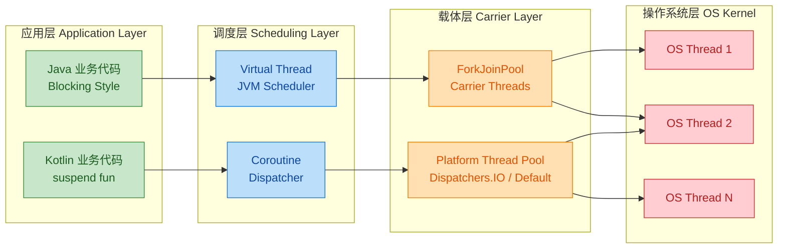

### Platform Thread 的困境

增加能处理并发的线程数量可以显著提升应用吞吐量。但是，Java 中的平台线程是昂贵的资源，默认消耗每条线程 1 MB 的栈内存。 这意味着：

- **内存限制**：1000 个线程就需要约 1 GB 的纯栈内存
- **OS 调度开销**：操作系统调度器管理平台线程，在线程之间切换涉及昂贵的内核态上下文切换（context switch），这些切换消耗 CPU 周期并引入延迟，随着线程数增加而累积。
- **线程池调优**：平台线程导致了高内存使用（每线程 1-2 MB 的栈）和线程池调优复杂性。

```java
// ❌ 传统方式：平台线程在高并发下迅速耗尽资源
// 每个线程占用 ~1MB 栈内存，10000 个线程 = ~10GB 仅栈内存
ExecutorService executor = Executors.newFixedThreadPool(200); // 通常最多几百个
for (int i = 0; i < 10000; i++) {
    executor.submit(() -> {
        // 模拟一次数据库查询，线程阻塞等待 I/O
        Thread.sleep(Duration.ofMillis(100));
        return "result";
    });
}
// 200 个线程同时执行，剩余 9800 个任务在队列中等待
// 吞吐量上限 = 200 / 0.1s = 2000 req/s
```

### Virtual Thread：Java 的"协程"答案

Project Loom 的虚拟线程在 Java 21 中正式发布，代表了 Java 并发的根本性转变。它们消除了长达十年的在简单阻塞代码和可扩展非阻塞响应式框架之间的取舍。虚拟线程是 JVM 管理的轻量级线程，在阻塞时会自动让出底层线程，允许以最小开销进行数百万并发操作。

#### M:N 调度模型

虚拟线程的实现方式与虚拟内存类似。操作系统通过将大的虚拟地址空间映射到有限的物理 RAM 来给出充足内存的假象。类似地，Java 运行时通过将大量虚拟线程映射到少量 OS 线程来模拟出大量线程。

```java
// ✅ Virtual Thread 方式：轻松创建百万级并发
// 每个虚拟线程仅占 ~1-2 KB 内存（对比平台线程 ~1 MB）
try (var executor = Executors.newVirtualThreadPerTaskExecutor()) {
    for (int i = 0; i < 1_000_000; i++) { // 一百万个并发任务！
        executor.submit(() -> {
            // 阻塞操作时，虚拟线程自动从载体线程(carrier)上卸载(unmount)
            // 载体线程被释放去执行其他虚拟线程
            Thread.sleep(Duration.ofMillis(100));
            return "result";
        });
    }
} // try-with-resources 自动等待所有任务完成
```

#### Mount / Unmount 机制

Java 运行时调度虚拟线程时，会将其挂载（mount）到一个平台线程上，然后操作系统照常调度该平台线程。这个平台线程称为载体线程（carrier）。执行一段代码后，虚拟线程可以从载体上卸载（unmount），这通常发生在虚拟线程执行阻塞 I/O 操作时。虚拟线程卸载后，载体空闲出来，Java 运行时调度器可以将另一个虚拟线程挂载到它上面。

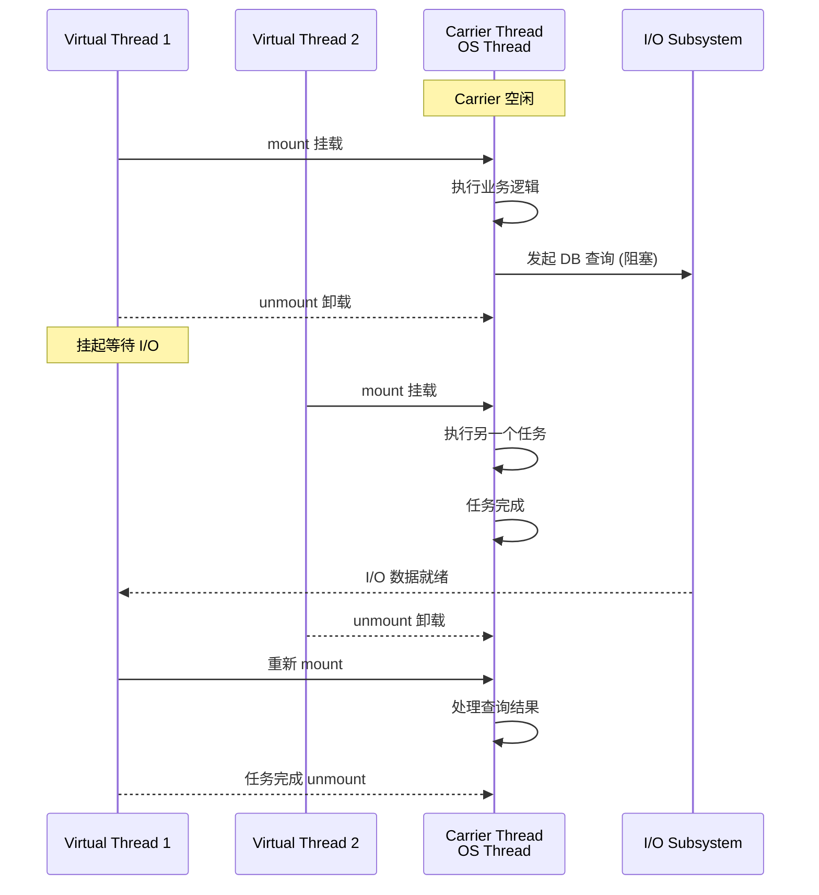

#### 性能数据对比

创建一个虚拟线程大约比平台线程快 10 倍，且仅使用 ~1-2 KB 内存，而平台线程大约需要 ~1 MB。平台线程需要大块连续的内存分配（通常约 1 MB/线程）来保存其栈，而虚拟线程将栈帧存储在 Java 的垃圾回收堆中。

实验表明：对于阻塞工作负载，虚拟线程可以显著超越平台线程，在测试运行中总执行时间提升了 8.62 倍。当同时考虑堆和原生内存时，虚拟线程在每个并发任务上消耗的内存大约少 123 倍。

| 指标 (Metric) | Platform Thread | Virtual Thread | 差异倍数 |
|:---|:---|:---|:---|
| 栈内存 (Stack Memory) | ~1 MB / thread | ~1-2 KB / thread | **~500x** |
| 创建速度 (Creation Speed) | 较慢（OS syscall） | 较快（JVM 堆分配） | **~10x** |
| 最大并发数 (Max Concurrency) | 数千级 | **百万级** | **~1000x** |
| 上下文切换 (Context Switch) | 内核态（昂贵） | 用户态（廉价） | 显著降低 |
| I/O 阻塞时 | 线程闲置浪费 | 自动让出 Carrier | 吞吐量飙升 |

### Kotlin Coroutine：语言级别的协程

使用协程编写非阻塞代码非常直观，因为其天然支持挂起机制。协程使异步代码看起来像同步代码，从而降低了复杂度。 不同于 Virtual Thread 的 "隐式透明"（implicit），Kotlin 协程采用 **显式标记**（explicit）的设计哲学。

```kotlin
// Kotlin Coroutine 的 suspend 关键字显式标记可挂起函数
// 编译器在编译期就知道哪些函数可能暂停执行
suspend fun fetchUserFromDb(id: Long): User {
    // delay 是非阻塞的挂起函数，不占用底层线程
    delay(100) // 模拟 DB 查询
    return User(id, "Alice")
}

// 结构化并发：coroutineScope 确保所有子协程完成或取消
suspend fun loadDashboard(): Dashboard = coroutineScope {
    // async 并发启动多个协程，共享同一父 scope
    val userDeferred = async { fetchUserFromDb(1L) }       // 协程 1
    val ordersDeferred = async { fetchOrders(1L) }         // 协程 2
    val recommendDeferred = async { getRecommendations() } // 协程 3

    // 所有协程并发执行，await 等待结果
    Dashboard(
        user = userDeferred.await(),
        orders = ordersDeferred.await(),
        recommendations = recommendDeferred.await()
    )
    // 若任一协程异常，其余自动取消 —— 这就是结构化并发的力量
}
```

#### Coroutine Dispatcher（调度器）

协程运行在线程上，但协程调度器（coroutine dispatcher）决定了协程何时以及在哪个线程上执行。 在 Java 中你必须自己处理线程池和虚拟线程的混合使用，而 Kotlin 可以使用预定义的调度器。对于 Java 程序员来说，这意味着你更容易遇到线程饥饿或性能下降的问题。

```kotlin
import kotlinx.coroutines.*

fun main() = runBlocking {
    // Dispatchers.Default — 用于 CPU 密集型任务
    // 线程数 = CPU 核心数，专为计算优化
    launch(Dispatchers.Default) {
        // 图像处理、数据加密、复杂算法等
        val result = heavyComputation()
    }

    // Dispatchers.IO — 用于 I/O 密集型任务
    // 线程数可弹性扩展（默认最多 64 或核心数，取较大值）
    launch(Dispatchers.IO) {
        // 数据库查询、文件读写、网络请求等
        val data = readFromDatabase()
    }

    // Dispatchers.Main — 用于 UI 更新（Android）
    // 仅在有 Main dispatcher 的环境中可用
    // launch(Dispatchers.Main) { updateUI(data) }
}
```

### Virtual Thread vs Kotlin Coroutine：核心差异深度解析

两者虽然都是 "用少量 OS 线程执行大量并发任务" 的方案，但设计哲学差异巨大。

#### 隐式 vs 显式（Implicit vs Explicit）

Virtual Threads：调度由 JVM 透明处理。开发者编写阻塞风格的代码，JVM 决定虚拟线程何时运行。线程是廉价的，但调度本质上是运行时的实现细节。

Kotlin 拥有 `suspend` 关键字来标记函数以供协程上下文使用。而我认为这是 Kotlin 的基石之一：开发者友好性（developer friendliness）。以学习更多语法为代价，Kotlin 换回了安全性，你更难搬起石头砸自己的脚。

```java
// === Java Virtual Thread ===
// 阻塞点是"隐式"的，你看不出 Thread.sleep 是否会让出载体线程
// 但 JVM 会在底层自动处理 mount/unmount
Thread.startVirtualThread(() -> {
    var user = userRepo.findById(1L);   // 阻塞调用 → JVM 自动 unmount
    var orders = orderRepo.findByUser(user); // 同上
    process(user, orders);
});
```

```kotlin
// === Kotlin Coroutine ===
// 挂起点是"显式"的，suspend 关键字清晰标记了可能暂停的函数
// 编译器在编译期就验证 suspend 函数只能在协程上下文中调用
suspend fun loadUserData() {
    val user = userRepo.findById(1L)         // suspend fun → 编译器已知
    val orders = orderRepo.findByUser(user)  // suspend fun → 编译器已知
    process(user, orders)
}
```

#### 结构化并发（Structured Concurrency）

协程鼓励结构化并发：每个协程都有一个父级，生命周期是有界的，泄漏可被防止。虚拟线程并不原生提供这一点。要实现类似行为需要显式使用 `StructuredTaskScope`。

```java
// Java 的 StructuredTaskScope（Preview API，Java 21+）
// 需要显式管理，语法相对冗长
try (var scope = new StructuredTaskScope.ShutdownOnFailure()) {
    // fork 创建子任务，运行在虚拟线程上
    Subtask<User> userTask = scope.fork(() -> findUser(id));
    Subtask<List<Order>> orderTask = scope.fork(() -> findOrders(id));

    scope.join();          // 等待所有子任务完成
    scope.throwIfFailed(); // 若有子任务失败，抛出异常

    // 所有子任务成功，获取结果
    return new Dashboard(userTask.get(), orderTask.get());
}
// ShutdownOnFailure: 任一子任务失败则取消其余 —— 类似 Kotlin 的行为
```

```kotlin
// Kotlin 的结构化并发 —— 语法天然集成，更简洁
suspend fun loadDashboard(id: Long): Dashboard = coroutineScope {
    val user = async { findUser(id) }      // 自动绑定到父 scope
    val orders = async { findOrders(id) }  // 自动绑定到父 scope

    Dashboard(user.await(), orders.await())
    // 若 findUser 抛异常，findOrders 自动被取消
    // 无需 try-with-resources，scope 自动管理生命周期
}
```

#### 综合对比表

| 维度 | Java Virtual Thread | Kotlin Coroutine |
|:---|:---|:---|
| **挂起方式** | 隐式 —— JVM 自动处理 | 显式 —— `suspend` 关键字 |
| **编程风格** | 阻塞式（blocking style） | 挂起式（suspending style） |
| **调度器** | JVM ForkJoinPool（自动） | Dispatcher（显式选择） |
| **结构化并发** | `StructuredTaskScope`（Preview） | `coroutineScope` / `supervisorScope`（成熟） |
| **取消传播** | 需手动中断 | 自动传播 + `CancellationException` |
| **异常处理** | try-catch + 传统模式 | `CoroutineExceptionHandler` + 结构化 |
| **兼容性** | 与所有 Java API 兼容 | 需要 suspend 适配层 |
| **学习曲线** | 低（就是 Thread API） | 中（需学 suspend、scope、dispatcher） |
| **JVM 版本** | Java 21+ | 任何 Kotlin 支持的 JVM |
| **生态成熟度** | 框架快速适配中 | 自 2018 年稳定至今 |

### Virtual Thread 的陷阱：线程固定（Thread Pinning）

Virtual Thread 并非万能银弹。在 Java 21-23 中存在一个重要限制——**Thread Pinning（线程固定）**。

当虚拟线程被固定到载体线程上时，它无法在阻塞操作期间卸载。虚拟线程在以下情况下会被固定：在 `synchronized` 块或方法中执行代码时；执行 native 方法或外部函数（Foreign Function）时。固定不会使应用程序不正确，但可能妨碍其可伸缩性。

频繁且持续时间长的固定会损害可伸缩性。它可能导致饥饿甚至死锁——当所有平台线程都被虚拟线程固定或在 JVM 中被阻塞时，没有虚拟线程能够运行。

```java
// ❌ 危险模式：synchronized + I/O = 线程固定
// 虚拟线程无法从 Carrier 上卸载，Carrier 被白白占用
public synchronized User findById(Long id) {
    // 此处发生阻塞 I/O，但因在 synchronized 内
    // 虚拟线程被 "pinned" 到 Carrier Thread，无法让出
    return jdbcTemplate.queryForObject(
        "SELECT * FROM users WHERE id = ?",
        userRowMapper, id
    );
}

// ✅ 修复方案（Java 21-23）：使用 ReentrantLock 替代 synchronized
// ReentrantLock 不使用 OS 原生 monitor，JVM 可正常 unmount 虚拟线程
private final ReentrantLock lock = new ReentrantLock();

public User findById(Long id) {
    lock.lock(); // 获取锁
    try {
        // 此处即便阻塞，虚拟线程也能正常 unmount
        return jdbcTemplate.queryForObject(
            "SELECT * FROM users WHERE id = ?",
            userRowMapper, id
        );
    } finally {
        lock.unlock(); // 确保释放锁，避免死锁
    }
}
```

> **好消息**：Java 24 已经解决了使用 `synchronized` 时的虚拟线程固定问题。实际上，大多数项目应该不再受固定问题影响。因此，主动监控固定线程应仅限于那些依赖 native 调用等剩余场景的应用。

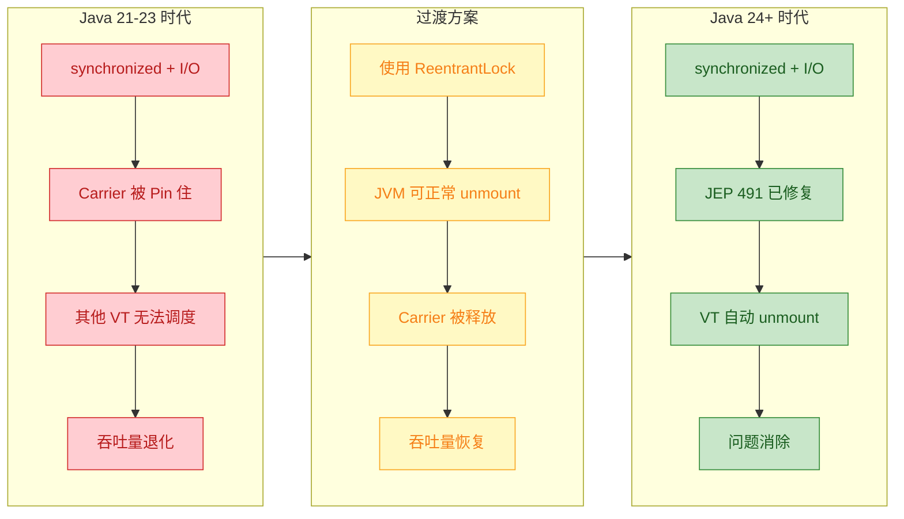

### Virtual Thread 的第二大陷阱：Stampede Effect（踩踏效应）

在平台线程模式下，线程池是数据库连接的天然限流器。如果池中有 200 个线程，那么最多 200 个同时连接会到达数据库。 但虚拟线程打破了这种天然限制：

```java
// ❌ 踩踏效应：100 万个虚拟线程同时发起 DB 连接
// 数据库连接池（如 HikariCP 默认 10 连接）瞬间被击穿
try (var executor = Executors.newVirtualThreadPerTaskExecutor()) {
    for (int i = 0; i < 1_000_000; i++) {
        executor.submit(() -> {
            // 100 万个虚拟线程同时尝试获取 DB 连接
            // 数据库: "ERROR: too many connections"
            return userRepo.findById(i);
        });
    }
}

// ✅ 修复方案：使用 Semaphore 作为"逻辑限流器"
// Semaphore 替代了平台线程时代 "线程池大小" 的天然限流作用
private static final Semaphore DB_LIMITER = new Semaphore(50); // 最多 50 个并发 DB 请求

try (var executor = Executors.newVirtualThreadPerTaskExecutor()) {
    for (int i = 0; i < 1_000_000; i++) {
        final int userId = i;
        executor.submit(() -> {
            DB_LIMITER.acquire();  // 获取许可，超过 50 则等待
            try {
                return userRepo.findById(userId);
            } finally {
                DB_LIMITER.release(); // 释放许可
            }
        });
    }
}
```

### 什么场景该选哪个？决策框架

#### Virtual Thread 适用场景

虚拟线程适用于执行大部分时间处于阻塞状态的任务，通常是等待 I/O 操作完成。然而，它们并不适用于长时间运行的 CPU 密集型操作。

具体适用于：REST API 高并发端点处理、数据库访问层（用虚拟线程替代 JDBC 线程池，实现更高效的 per-request 连接处理）、批处理任务（并发运行数千个隔离任务而不会导致过度内存膨胀）。

#### Virtual Thread 不适用场景

以下场景 Virtual Thread 不占优势：CPU 密集型计算、高频异步事件循环、没有 Loom 支持的阻塞原生代码、JNI 密集型工作负载。

虚拟线程为 I/O 密集型应用提供显著收益，但不会提升 CPU 密集型任务的性能。一项对比虚拟线程和平台线程进行 CPU 密集型操作（计算 Fibonacci）的基准测试显示，吞吐量几乎没有差异。

#### 选择决策流程图

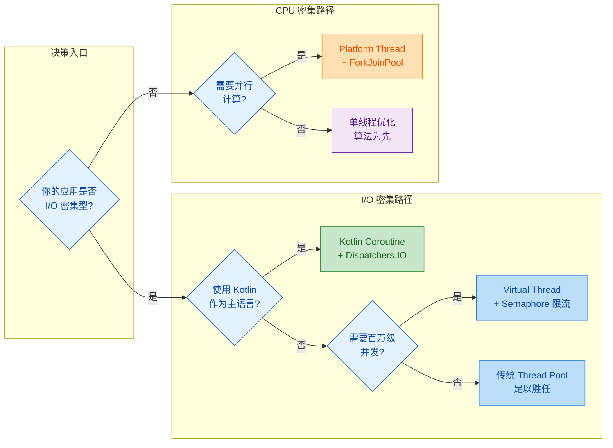

#### 快速决策总结表

| 场景 | 推荐方案 | 原因 |
|:---|:---|:---|
| **Web 服务器高并发请求** | Virtual Thread | 天然适配 thread-per-request 模型 |
| **微服务间 HTTP/gRPC 调用** | Virtual Thread | 阻塞 I/O 自动让出 |
| **数据库批量读写** | Virtual Thread + Semaphore | 需限流保护下游 |
| **实时流处理 / 响应式** | Kotlin Coroutine (Flow) | Flow + Channel 更成熟 |
| **Android UI 异步** | Kotlin Coroutine | Dispatchers.Main + 生命周期集成 |
| **复杂异步编排** | Kotlin Coroutine | 结构化并发更优雅 |
| **科学计算 / 图像处理** | Platform Thread + ForkJoinPool | CPU 密集型，VT 无优势 |
| **遗留 Java 代码迁移** | Virtual Thread | 改动最小，API 兼容 |

### 完整对比示例：同时发起 10000 个 HTTP 请求

```java
import java.net.URI;
import java.net.http.HttpClient;
import java.net.http.HttpRequest;
import java.net.http.HttpResponse;
import java.time.Duration;
import java.time.Instant;
import java.util.concurrent.Executors;
import java.util.concurrent.Semaphore;

public class VirtualThreadDemo {

    // 限流器：防止同时打开过多连接
    private static final Semaphore LIMITER = new Semaphore(100);

    public static void main(String[] args) throws Exception {
        // 创建 HttpClient，底层连接池由 JDK 管理
        var client = HttpClient.newHttpClient();
        var request = HttpRequest.newBuilder()
                .uri(URI.create("https://httpbin.org/delay/1")) // 模拟 1s 延迟的接口
                .timeout(Duration.ofSeconds(10))
                .build();

        var start = Instant.now(); // 记录开始时间

        // 使用 virtual-thread-per-task executor
        // 每个任务分配一个虚拟线程，无需预设池大小
        try (var executor = Executors.newVirtualThreadPerTaskExecutor()) {
            for (int i = 0; i < 10_000; i++) {
                final int taskId = i;
                executor.submit(() -> {
                    LIMITER.acquire(); // 获取许可，控制并发度
                    try {
                        // 阻塞调用 → 虚拟线程自动让出 Carrier
                        var response = client.send(request,
                                HttpResponse.BodyHandlers.ofString());
                        if (taskId % 1000 == 0) { // 每 1000 个打印一次
                            System.out.printf("Task %d: status=%d%n",
                                    taskId, response.statusCode());
                        }
                    } finally {
                        LIMITER.release(); // 释放许可
                    }
                    return null;
                });
            }
        } // executor.close() 等待所有任务完成

        var elapsed = Duration.between(start, Instant.now());
        // 理论耗时：10000 / 100并发 * 1s ≈ 100s
        // 实际因网络抖动会有偏差
        System.out.printf("10000 requests completed in %d seconds%n",
                elapsed.toSeconds());
    }
}
```

### Spring Boot 中启用 Virtual Thread

2025 年成为 Spring 开发者自愿从生产环境中移除 WebFlux 的第一年。原因是虚拟线程使阻塞代码的可伸缩性超过了响应式框架——且没有复杂性。

在 Spring Boot 3.2+ 中，启用虚拟线程只需一行配置：

```yaml
# application.yml
spring:
  threads:
    virtual:
      enabled: true  # 就这一行！Tomcat 将使用虚拟线程处理请求
```

```java
// Spring Boot 自动配置后，每个 HTTP 请求都运行在虚拟线程上
// 你的 Controller 代码无需任何修改
@RestController
public class UserController {

    @Autowired
    private UserRepository userRepo; // 传统 JDBC/JPA，阻塞式

    @GetMapping("/users/{id}")
    public User getUser(@PathVariable Long id) {
        // 这个阻塞调用现在运行在虚拟线程上
        // JVM 在 JDBC 等待数据库响应时自动 unmount 虚拟线程
        // Carrier Thread 被释放去处理其他请求
        return userRepo.findById(id)
                .orElseThrow(() -> new ResponseStatusException(
                        HttpStatus.NOT_FOUND));
    }
}
// 效果：不改一行业务代码，并发能力从数百提升到数万
```

2025 年的实际迁移报告显示，从 WebFlux 到 Virtual Thread 的平均迁移带来了：35% 的代码减少、40% 更快的功能开发、60% 的调试时间减少、50% 更快的新人上手速度，以及相同或更好的性能（通常有 10-20% 的提升）。

### 三者的本质关系总结

```java
// 一句话总结三者关系：
// Platform Thread  = 1:1 OS Thread（重量级，数千级）
// Virtual Thread   = M:N OS Thread（轻量级，百万级，JVM 调度，隐式挂起）
// Kotlin Coroutine = M:N OS Thread（轻量级，百万级，库层调度，显式挂起）
```

关于虚拟线程最难内化的一点是：虽然它们与平台线程有相同的行为，但不应代表相同的编程概念。平台线程是稀缺的宝贵资源，需要用线程池管理。但虚拟线程是丰富的，每个应该代表的不是共享的池化资源，而是一个任务。虚拟线程的数量总是等于你应用中并发任务的数量。

---

📝 **练习题**

**题目**：你正在开发一个 Java 21 的微服务，处理大量 HTTP 请求，每个请求需要查询数据库（耗时约 50ms）。目前使用 200 个平台线程的线程池，吞吐量约 4000 req/s。切换到 Virtual Thread 后，以下哪个说法是**错误的**？

A. 使用 `Executors.newVirtualThreadPerTaskExecutor()` 可以为每个请求分配一个虚拟线程，无需担心线程数量限制

B. 虚拟线程在等待数据库 I/O 时会自动从 Carrier Thread 卸载，释放底层 OS 线程

C. 切换到虚拟线程后，可以直接移除数据库连接池的最大连接数限制，因为虚拟线程不会阻塞 OS 线程

D. 在 Java 21 中，如果代码中有 `synchronized` 块包含数据库查询，可能导致虚拟线程被 Pin 到 Carrier Thread，降低性能


【答案】C

【解析】选项 C 是错误的。虽然虚拟线程本身不占用 OS 线程资源，但数据库连接是**独立于线程模型的物理资源**。如果移除连接池的限制，百万级虚拟线程可能同时尝试建立数据库连接，导致数据库端 "too many connections" 错误——这就是 **Stampede Effect（踩踏效应）**。正确做法是使用 `Semaphore` 作为逻辑限流器。选项 A 正确，虚拟线程非常轻量，可以为每个任务创建一个。选项 B 正确，这是虚拟线程的核心机制——阻塞 I/O 时自动 unmount。选项 D 正确，在 Java 21-23 中 `synchronized + I/O` 确实会导致 Pinning，需使用 `ReentrantLock` 替代（Java 24+ 已修复此问题）。

---

📝 **练习题**

**题目**：关于 Java Virtual Thread 和 Kotlin Coroutine 的对比，以下哪项描述**最准确**？

A. Virtual Thread 性能始终优于 Kotlin Coroutine，因为它直接与 JVM 交互而不经过额外的库层

B. Kotlin Coroutine 使用 `suspend` 关键字显式标记挂起点，而 Virtual Thread 的阻塞点对开发者透明，由 JVM 隐式处理

C. Virtual Thread 原生提供完善的结构化并发支持，与 Kotlin 的 `coroutineScope` 功能完全等价

D. Kotlin Coroutine 只能用于 I/O 密集型场景，不适合 CPU 密集型任务


【答案】B

【解析】选项 B 准确描述了两者最核心的设计差异——**隐式 vs 显式**。Virtual Thread 采用 "write blocking code, JVM handles the rest" 的哲学，开发者写的阻塞代码在底层被 JVM 自动优化；而 Kotlin Coroutine 用 `suspend` 关键字在编译期就明确标识了挂起点，提供了更强的类型安全性。选项 A 错误——基准测试显示两者在 I/O 密集型场景下性能接近，某些极端场景下 Kotlin Coroutine 甚至略优。选项 C 错误——Java 的 `StructuredTaskScope` 仍是 Preview 特性，远不如 Kotlin 的 `coroutineScope` 成熟且语法简洁。选项 D 错误——Kotlin 通过 `Dispatchers.Default` 可以很好地处理 CPU 密集型任务。

---

## 线程池调优

线程池（Thread Pool）是 Java 并发编程中最核心的基础设施之一。它通过 **复用已有线程** 来避免频繁创建和销毁线程带来的开销，是高并发系统性能的关键瓶颈点。然而，一个配置不当的线程池，轻则导致资源浪费、响应缓慢，重则引发 OOM（OutOfMemoryError）或系统雪崩。线程池调优的本质，就是在 **吞吐量（Throughput）、延迟（Latency）、资源利用率（Resource Utilization）** 三者之间找到最佳平衡点。

许多开发者习惯使用 `Executors` 工厂方法一键创建线程池，但这恰恰是阿里巴巴《Java 开发手册》中明确禁止的做法——因为它隐藏了关键参数的决策过程，极易在生产环境中埋下隐患。真正的线程池调优，要求开发者深入理解 `ThreadPoolExecutor` 的 **7 大核心参数**，并结合任务特征（CPU-bound vs IO-bound）、系统资源（CPU 核心数、内存容量）和业务场景（突发流量 vs 稳定负载）进行精细化配置。

---

### ThreadPoolExecutor 七大核心参数

`ThreadPoolExecutor` 是 Java 线程池的终极实现类，所有线程池本质上都是对它的封装。理解它的构造函数，就是理解线程池调优的全部基础：

```java
// ThreadPoolExecutor 的完整构造函数 —— 7 大核心参数
public ThreadPoolExecutor(
    int corePoolSize,           // 核心线程数：池中始终存活的线程数量（即使空闲也不回收）
    int maximumPoolSize,        // 最大线程数：池中允许存在的最大线程数量上限
    long keepAliveTime,         // 空闲存活时间：非核心线程空闲超过此时间后被回收
    TimeUnit unit,              // 时间单位：keepAliveTime 的单位（秒、毫秒等）
    BlockingQueue<Runnable> workQueue,  // 工作队列：核心线程满时，新任务在此排队等待
    ThreadFactory threadFactory,        // 线程工厂：自定义线程的创建方式（命名、优先级等）
    RejectedExecutionHandler handler    // 拒绝策略：队列满且线程数达上限时的兜底处理
) { ... }
```

这 7 个参数之间并非独立工作，它们构成了一个 **精密的协作流程**。当一个新任务被提交（`execute()` 或 `submit()`）到线程池时，线程池的内部决策逻辑如下：

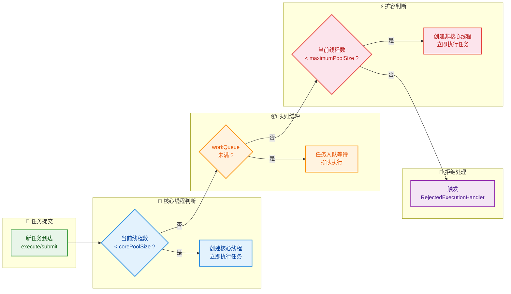

用一句话总结这个流程的优先级链：**先填核心线程 → 再填队列 → 再扩非核心线程 → 最后拒绝**。这个看似简单的顺序，实际上蕴含了一个非常反直觉的设计决策：**队列排队的优先级高于创建新线程**。这意味着如果你使用了一个无界队列（如 `LinkedBlockingQueue` 不指定容量），`maximumPoolSize` 参数将永远不会生效，因为队列永远不会满——这正是 `Executors.newFixedThreadPool()` 的隐患所在。

---

### 为什么禁止使用 Executors 工厂方法

`Executors` 提供了几个快捷工厂方法来创建线程池，表面上降低了使用门槛，但每一个都暗藏风险：

```java
// ❌ 危险示例 1：newFixedThreadPool
// 内部使用 LinkedBlockingQueue（无界队列），任务堆积会导致 OOM
ExecutorService fixed = Executors.newFixedThreadPool(10);
// 等价于：new ThreadPoolExecutor(10, 10, 0L, MILLISECONDS, new LinkedBlockingQueue<>())

// ❌ 危险示例 2：newCachedThreadPool
// maximumPoolSize 为 Integer.MAX_VALUE，可能无限创建线程导致 OOM
ExecutorService cached = Executors.newCachedThreadPool();
// 等价于：new ThreadPoolExecutor(0, Integer.MAX_VALUE, 60L, SECONDS, new SynchronousQueue<>())

// ❌ 危险示例 3：newSingleThreadExecutor
// 同样是无界队列，且只有 1 个线程，任务严重堆积
ExecutorService single = Executors.newSingleThreadExecutor();

// ❌ 危险示例 4：newScheduledThreadPool
// maximumPoolSize 为 Integer.MAX_VALUE，延迟任务异常时可能无限创建线程
ScheduledExecutorService scheduled = Executors.newScheduledThreadPool(5);
```

下面通过一张对比表清晰展示每种工厂方法的参数配置与潜在风险：

```
┌──────────────────────┬────────┬────────────────┬──────────────────────┬──────────────────┐
│      工厂方法         │ core   │ max            │ queue                │ 风险              │
├──────────────────────┼────────┼────────────────┼──────────────────────┼──────────────────┤
│ newFixedThreadPool   │ n      │ n              │ LinkedBlockingQueue  │ 队列无界 → OOM    │
│                      │        │                │ (无界)                │                  │
├──────────────────────┼────────┼────────────────┼──────────────────────┼──────────────────┤
│ newCachedThreadPool  │ 0      │ MAX_VALUE      │ SynchronousQueue     │ 线程无限 → OOM    │
│                      │        │ (≈21亿)         │ (零容量)             │                  │
├──────────────────────┼────────┼────────────────┼──────────────────────┼──────────────────┤
│ newSingleThread      │ 1      │ 1              │ LinkedBlockingQueue  │ 队列无界 → OOM    │
│ Executor             │        │                │ (无界)                │                  │
├──────────────────────┼────────┼────────────────┼──────────────────────┼──────────────────┤
│ newScheduledThread   │ n      │ MAX_VALUE      │ DelayedWorkQueue     │ 线程无限 → OOM    │
│ Pool                 │        │ (≈21亿)         │                      │                  │
└──────────────────────┴────────┴────────────────┴──────────────────────┴──────────────────┘
```

因此，**在生产环境中，必须手动使用 `ThreadPoolExecutor` 构造函数，明确每一个参数的值**。

---

### 核心线程数的确定策略

核心线程数（`corePoolSize`）的设定是线程池调优中最关键也最难量化的一环。它取决于你的任务到底是 **CPU 密集型（CPU-bound）** 还是 **IO 密集型（IO-bound）**。

**CPU 密集型任务** 指的是大量运算、极少阻塞的场景，例如数学计算、数据加密解密、图像处理等。线程在运行时几乎不会让出 CPU 时间片，因此线程数过多反而会增加上下文切换的开销。经典的公式为：

```
corePoolSize = CPU 核心数 + 1
```

多出的 1 个线程是为了在某个线程因偶发的缺页中断（Page Fault）或其他原因暂停时，确保 CPU 不会空闲。

**IO 密集型任务** 指的是线程大量时间花在等待 IO 上的场景，例如数据库查询、HTTP 调用、文件读写等。线程在等待 IO 期间不占用 CPU，此时应让更多线程待命以充分利用 CPU 资源。经典的公式为：

```
corePoolSize = CPU 核心数 × 2
```

而更精确的公式（源自《Java Concurrency in Practice》Brian Goetz 的建议）会考虑任务中 CPU 计算时间与 IO 等待时间的比值：

```
N_threads = N_cpu × U_cpu × (1 + W / C)

其中：
  N_cpu  = CPU 核心数（Runtime.getRuntime().availableProcessors()）
  U_cpu  = 目标 CPU 利用率（0 < U_cpu ≤ 1，通常取 0.8~0.9）
  W      = 任务的平均等待时间（Wait time，如 IO 阻塞）
  C      = 任务的平均计算时间（Compute time）
```

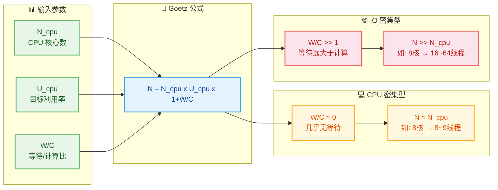

来看一个实际的参数计算示例：

```java
public class ThreadPoolSizing {

    public static void main(String[] args) {
        // 获取当前机器的 CPU 核心数
        int cpuCores = Runtime.getRuntime().availableProcessors();
        System.out.println("CPU 核心数: " + cpuCores); // 例如：8

        // ========== 场景 1：CPU 密集型（如加密计算）==========
        // 公式：N = cpuCores + 1
        int cpuIntensivePoolSize = cpuCores + 1;  // 8 + 1 = 9
        System.out.println("CPU 密集型线程数: " + cpuIntensivePoolSize);

        // ========== 场景 2：IO 密集型（如 HTTP 调用）==========
        // 假设：平均每个请求耗时 200ms，其中 CPU 计算 20ms，IO 等待 180ms
        double waitTime = 180.0;    // W：IO 等待时间（ms）
        double computeTime = 20.0;  // C：CPU 计算时间（ms）
        double targetUtilization = 0.8; // U_cpu：目标 CPU 利用率 80%

        // Goetz 公式：N = N_cpu × U_cpu × (1 + W/C)
        int ioIntensivePoolSize = (int) (cpuCores * targetUtilization * (1 + waitTime / computeTime));
        // 8 × 0.8 × (1 + 9) = 8 × 0.8 × 10 = 64
        System.out.println("IO 密集型线程数: " + ioIntensivePoolSize);
    }
}
```

> ⚠️ **重要提示**：公式只是理论起点，实际生产中必须通过 **压测（Load Testing）** 来验证和微调。影响线程池表现的因素远不止 CPU 和 IO——还包括 GC 停顿、锁竞争、下游服务响应抖动等。建议使用 JMeter、Gatling 等工具在真实或仿真环境下进行多轮压测，逐步逼近最优值。

---

### 工作队列的选型

工作队列（`BlockingQueue`）决定了任务在核心线程满载后如何被缓冲和调度。不同的队列实现对线程池的行为有截然不同的影响：

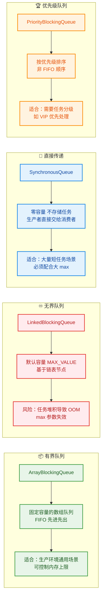

在生产实践中，**`ArrayBlockingQueue`（有界队列）是最推荐的选择**，因为它能从根本上防止内存溢出，同时通过队列容量和拒绝策略形成 **背压（Back Pressure）** 机制——当系统负载超出承受能力时，快速失败（Fail Fast）远比默默堆积任务直到崩溃更安全。

队列容量的设定也是一门学问。容量设太小，任务频繁触发拒绝策略，用户体验差；设太大，任务排队时间过长，响应延迟飙升。一般经验法则是：

```
队列容量 = corePoolSize × (任务期望响应时间 / 任务平均处理时间)
```

例如：核心线程 10 个，每个任务平均耗时 100ms，期望最大等待时间 2 秒：
`队列容量 = 10 × (2000 / 100) = 200`

---

### 拒绝策略的选择

当核心线程满、队列满、非核心线程也满时，线程池将触发 `RejectedExecutionHandler`。JDK 提供了 4 种内置策略：

```java
// ========== JDK 内置的 4 种拒绝策略 ==========

// 1. AbortPolicy（默认）：直接抛出 RejectedExecutionException
//    适用于：关键业务，宁可报错也不能丢失任务
RejectedExecutionHandler abort = new ThreadPoolExecutor.AbortPolicy();

// 2. CallerRunsPolicy：由提交任务的调用者线程自己执行该任务
//    适用于：不允许丢弃任务的场景，同时可以对提交方施加背压
//    副作用：如果调用者是主线程，会阻塞主线程，降低整体吞吐
RejectedExecutionHandler callerRuns = new ThreadPoolExecutor.CallerRunsPolicy();

// 3. DiscardPolicy：静默丢弃被拒绝的任务，不抛异常
//    适用于：可以容忍少量数据丢失的非关键任务（如日志上报）
RejectedExecutionHandler discard = new ThreadPoolExecutor.DiscardPolicy();

// 4. DiscardOldestPolicy：丢弃队列中最老的任务，然后重新提交被拒绝的任务
//    适用于：最新数据更有价值的场景（如实时行情更新）
RejectedExecutionHandler discardOldest = new ThreadPoolExecutor.DiscardOldestPolicy();
```

```mermaid
graph LR
    subgraph Trigger["🚨 触发条件"]
        direction TB
        T["核心线程满<br>+ 队列满<br>+ 最大线程满"]
    end

    subgraph Abort["🔴 AbortPolicy"]
        direction TB
        A1["抛出异常<br>RejectedExecutionException"]
        A2["调用方感知失败<br>可做降级处理"]
        A1 --> A2
    end

    subgraph Caller["🟢 CallerRunsPolicy"]
        direction TB
        B1["调用者线程自行执行"]
        B2["天然背压机制<br>降低提交速率"]
        B1 --> B2
    end

    subgraph Discard["🟡 DiscardPolicy"]
        direction TB
        C1["静默丢弃新任务"]
        C2["无异常无通知<br>慎用"]
        C1 --> C2
    end

    subgraph Old["🟠 DiscardOldestPolicy"]
        direction TB
        D1["丢弃队列最老任务"]
        D2["重试提交新任务"]
        D1 --> D2
    end

    T --> A1
    T --> B1
    T --> C1
    T --> D1

    classDef triggerCls fill:#F3E5F5,stroke:#AB47BC,stroke-width:2px,color:#4A148C
    classDef abortCls fill:#FFEBEE,stroke:#E53935,stroke-width:2px,color:#B71C1C
    classDef callerCls fill:#E8F5E9,stroke:#43A047,stroke-width:2px,color:#1B5E20
    classDef discardCls fill:#FFF8E1,stroke:#FDD835,stroke-width:2px,color:#F57F17
    classDef oldCls fill:#FFF3E0,stroke:#FB8C00,stroke-width:2px,color:#E65100

    class T triggerCls
    class A1,A2 abortCls
    class B1,B2 callerCls
    class C1,C2 discardCls
    class D1,D2 oldCls
```

**生产建议**：在大多数业务场景中，`CallerRunsPolicy` 是最稳妥的默认选择。它不会丢失任务，同时自动为上游施加背压（调用者线程被占用期间无法再提交新任务），形成一种优雅的过载保护。但在某些对延迟极度敏感的场景中（如 Web 服务器的请求处理线程），`CallerRunsPolicy` 可能阻塞 Tomcat/Netty 的 Worker 线程导致其他请求受影响，此时可考虑自定义拒绝策略（如记录日志 + 持久化到消息队列 + 返回降级响应）。

```java
// ========== 自定义拒绝策略：记录日志 + 降级处理 ==========
public class CustomRejectedHandler implements RejectedExecutionHandler {

    // 记录被拒绝的任务总数，用 AtomicLong 保证线程安全
    private final AtomicLong rejectedCount = new AtomicLong(0);

    @Override
    public void rejectedExecution(Runnable r, ThreadPoolExecutor executor) {
        // 递增拒绝计数器
        long count = rejectedCount.incrementAndGet();

        // 记录告警日志，包含线程池当前的关键状态指标
        log.warn("[线程池过载] 第 {} 次拒绝任务 | 活跃线程: {} | 队列积压: {} | 已完成: {}",
                count,
                executor.getActiveCount(),       // 当前活跃线程数
                executor.getQueue().size(),       // 当前队列中等待的任务数
                executor.getCompletedTaskCount()  // 已完成任务总数
        );

        // 降级策略：将任务序列化后发送到消息队列，稍后重试
        messageQueue.send(new TaskWrapper(r));

        // 可选：触发告警（钉钉/企业微信/邮件通知）
        alertService.sendAlert("线程池拒绝任务累计: " + count);
    }
}
```

---

### 线程工厂的最佳实践

默认的线程工厂创建的线程名称形如 `pool-1-thread-1`，在排查问题时几乎无法定位是哪个业务的线程池出了问题。**自定义 `ThreadFactory` 为线程赋予有意义的名称，是线程池调优中最容易被忽略却最实用的实践**。

```java
// ========== 自定义线程工厂：有意义的线程命名 ==========
public class NamedThreadFactory implements ThreadFactory {

    // 线程池编号计数器（全局），区分同类线程池的不同实例
    private static final AtomicInteger POOL_NUMBER = new AtomicInteger(1);

    // 当前线程池内部的线程编号计数器
    private final AtomicInteger threadNumber = new AtomicInteger(1);

    // 线程名称前缀，如 "order-process" → "order-process-pool-1-thread-3"
    private final String namePrefix;

    // 是否为守护线程
    private final boolean daemon;

    public NamedThreadFactory(String bizName, boolean daemon) {
        this.daemon = daemon;
        // 组合格式：业务名-pool-编号-thread-
        this.namePrefix = bizName + "-pool-" + POOL_NUMBER.getAndIncrement() + "-thread-";
    }

    @Override
    public Thread newThread(Runnable r) {
        // 创建新线程，赋予格式化的名称
        Thread t = new Thread(r, namePrefix + threadNumber.getAndIncrement());
        // 设置为守护/用户线程
        t.setDaemon(daemon);
        // 设置统一优先级为 NORMAL（避免优先级反转）
        t.setPriority(Thread.NORM_PRIORITY);
        // 设置全局未捕获异常处理器，防止线程静默死亡
        t.setUncaughtExceptionHandler((thread, ex) -> {
            log.error("线程 [{}] 发生未捕获异常", thread.getName(), ex);
        });
        return t;
    }
}
```

当你在 `jstack` 或 Arthas 中查看线程堆栈时，带业务语义的线程名会让问题定位效率提升数倍：

```
"order-process-pool-1-thread-3" #42 prio=5 RUNNABLE
    at com.example.OrderService.processOrder(OrderService.java:128)
    ...

"payment-callback-pool-1-thread-7" #58 prio=5 WAITING
    at sun.misc.Unsafe.park(Native Method)
    ...
```

一眼就能看出：订单处理线程正在运行，支付回调线程在等待——而不是面对一堆 `pool-1-thread-x` 猜来猜去。

---

### 完整的生产级线程池配置模板

综合以上所有最佳实践，给出一个可直接用于生产的线程池配置模板：

```java
// ========== 生产级线程池配置示例 ==========
public class ThreadPoolConfig {

    /**
     * 创建一个面向 IO 密集型任务的线程池
     * 场景：HTTP 外部调用、数据库查询等
     */
    public static ThreadPoolExecutor createIOIntensivePool(String bizName) {
        // 获取 CPU 核心数
        int cpuCores = Runtime.getRuntime().availableProcessors();

        // IO 密集型：核心线程数 = CPU 核心数 × 2
        int corePoolSize = cpuCores * 2;

        // 最大线程数 = 核心线程数 × 2，提供弹性应对突发流量
        int maxPoolSize = corePoolSize * 2;

        // 非核心线程空闲 60 秒后回收
        long keepAliveTime = 60L;

        // 有界队列，容量 200，防止无限堆积
        BlockingQueue<Runnable> workQueue = new ArrayBlockingQueue<>(200);

        // 自定义线程工厂，带业务名称
        ThreadFactory threadFactory = new NamedThreadFactory(bizName, false);

        // CallerRunsPolicy 拒绝策略：不丢弃任务，自动施加背压
        RejectedExecutionHandler handler = new ThreadPoolExecutor.CallerRunsPolicy();

        // 构造线程池
        ThreadPoolExecutor executor = new ThreadPoolExecutor(
                corePoolSize,   // 核心线程数
                maxPoolSize,    // 最大线程数
                keepAliveTime,  // 空闲存活时间
                TimeUnit.SECONDS,
                workQueue,      // 工作队列
                threadFactory,  // 线程工厂
                handler         // 拒绝策略
        );

        // 预热核心线程：启动时就创建所有核心线程，避免首批请求冷启动延迟
        executor.prestartAllCoreThreads();

        // 允许核心线程超时回收（可选，适用于流量波动大的场景）
        // executor.allowCoreThreadTimeOut(true);

        return executor;
    }

    /**
     * 创建一个面向 CPU 密集型任务的线程池
     * 场景：数据加密、图像处理、复杂运算等
     */
    public static ThreadPoolExecutor createCPUIntensivePool(String bizName) {
        int cpuCores = Runtime.getRuntime().availableProcessors();

        // CPU 密集型：核心线程数 = CPU 核心数 + 1
        int corePoolSize = cpuCores + 1;

        // 最大线程数 = 核心线程数（CPU 密集型不需要额外扩展）
        int maxPoolSize = corePoolSize;

        BlockingQueue<Runnable> workQueue = new ArrayBlockingQueue<>(100);

        ThreadPoolExecutor executor = new ThreadPoolExecutor(
                corePoolSize,
                maxPoolSize,
                0L,             // core == max，keepAlive 无意义
                TimeUnit.MILLISECONDS,
                workQueue,
                new NamedThreadFactory(bizName, false),
                new ThreadPoolExecutor.AbortPolicy() // CPU 密集型任务通常不可降级，直接报错
        );

        executor.prestartAllCoreThreads();
        return executor;
    }
}
```

---

### 线程池的运行时监控

配置好线程池只是第一步，**持续监控** 才是保证线程池长期健康运行的关键。`ThreadPoolExecutor` 暴露了丰富的运行时指标：

```java
// ========== 线程池运行时监控指标采集 ==========
public class ThreadPoolMonitor {

    private final ThreadPoolExecutor executor;         // 被监控的线程池
    private final ScheduledExecutorService scheduler;  // 定时调度器

    public ThreadPoolMonitor(ThreadPoolExecutor executor) {
        this.executor = executor;
        // 单线程的调度器，用于周期性采集指标
        this.scheduler = Executors.newSingleThreadScheduledExecutor(
                new NamedThreadFactory("pool-monitor", true) // 守护线程
        );
    }

    /**
     * 每隔 interval 秒采集一次线程池指标并输出
     */
    public void startMonitoring(long intervalSeconds) {
        scheduler.scheduleAtFixedRate(() -> {
            // -------- 线程相关指标 --------
            int poolSize = executor.getPoolSize();           // 当前线程池中的总线程数
            int activeCount = executor.getActiveCount();     // 当前正在执行任务的线程数
            int coreSize = executor.getCorePoolSize();       // 核心线程数（配置值）
            int maxSize = executor.getMaximumPoolSize();     // 最大线程数（配置值）
            int largestSize = executor.getLargestPoolSize(); // 历史峰值线程数

            // -------- 任务相关指标 --------
            long taskCount = executor.getTaskCount();            // 已提交任务总数
            long completedCount = executor.getCompletedTaskCount(); // 已完成任务总数
            int queueSize = executor.getQueue().size();          // 当前队列中等待的任务数
            int queueCapacity = executor.getQueue().remainingCapacity() + queueSize; // 队列总容量

            // -------- 计算关键比率 --------
            double threadUtilization = poolSize == 0 ? 0 :
                    (double) activeCount / poolSize * 100;       // 线程利用率 (%)
            double queueUtilization = queueCapacity == 0 ? 0 :
                    (double) queueSize / queueCapacity * 100;    // 队列使用率 (%)

            // -------- 日志输出 --------
            log.info("[线程池监控] 线程: {}/{}/{} (活跃/当前/最大) | " +
                            "利用率: {:.1f}% | 队列: {}/{} ({:.1f}%) | " +
                            "任务: {}/{} (完成/总计) | 历史峰值线程: {}",
                    activeCount, poolSize, maxSize,
                    threadUtilization,
                    queueSize, queueCapacity, queueUtilization,
                    completedCount, taskCount,
                    largestSize
            );

            // -------- 告警判断 --------
            if (queueUtilization > 80) {
                log.warn("[线程池告警] 队列使用率超过 80%，当前: {:.1f}%", queueUtilization);
            }
            if (threadUtilization > 90) {
                log.warn("[线程池告警] 线程利用率超过 90%，当前: {:.1f}%", threadUtilization);
            }
        }, 0, intervalSeconds, TimeUnit.SECONDS); // 立即开始，每 interval 秒执行一次
    }
}
```

在实际生产中，除了日志输出，更推荐将这些指标暴露给 **Prometheus + Grafana** 监控体系，实现可视化看板和自动告警：

```mermaid
graph LR
    subgraph Pool["🧵 ThreadPoolExecutor"]
        direction TB
        P1["poolSize / activeCount"]
        P2["queueSize / taskCount"]
        P3["completedTaskCount"]
        P1 --- P2 --- P3
    end

    subgraph Export["📤 指标暴露"]
        direction TB
        E1["Micrometer<br>Metrics Registry"]
        E2["自定义 Gauge<br>Counter 指标"]
        E1 --- E2
    end

    subgraph Prom["📊 Prometheus"]
        direction TB
        PR1["Pull 模式拉取<br>/actuator/prometheus"]
        PR2["指标持久化<br>TSDB 存储"]
        PR1 --- PR2
    end

    subgraph Grafana["📈 Grafana"]
        direction TB
        G1["可视化 Dashboard"]
        G2["告警规则配置<br>通知 Webhook"]
        G1 --- G2
    end

    Pool --> Export --> Prom --> Grafana

    classDef poolCls fill:#E3F2FD,stroke:#1E88E5,stroke-width:2px,color:#0D47A1
    classDef exportCls fill:#E8F5E9,stroke:#43A047,stroke-width:2px,color:#1B5E20
    classDef promCls fill:#FFF3E0,stroke:#FB8C00,stroke-width:2px,color:#E65100
    classDef grafanaCls fill:#FCE4EC,stroke:#E53935,stroke-width:2px,color:#B71C1C

    class P1,P2,P3 poolCls
    class E1,E2 exportCls
    class PR1,PR2 promCls
    class G1,G2 grafanaCls
```

---

### 动态线程池调参

传统的线程池配置是静态的——写在代码或配置文件里，修改后必须重启应用才能生效。在高可用系统中，这种方式过于笨重。幸运的是，`ThreadPoolExecutor` 本身就支持运行时动态修改核心参数：

```java
// ========== 动态调参：运行时修改线程池参数 ==========
public class DynamicThreadPool {

    private final ThreadPoolExecutor executor;

    public DynamicThreadPool(ThreadPoolExecutor executor) {
        this.executor = executor;
    }

    /**
     * 动态调整核心线程数
     * ThreadPoolExecutor 内部会自动处理线程的增减：
     *   - 如果新值 > 旧值：立即创建新线程来处理队列中等待的任务
     *   - 如果新值 < 旧值：多余的核心线程在空闲后逐步被回收
     */
    public void setCorePoolSize(int newCoreSize) {
        log.info("调整核心线程数: {} → {}", executor.getCorePoolSize(), newCoreSize);
        executor.setCorePoolSize(newCoreSize);  // 实时生效，无需重启
    }

    /**
     * 动态调整最大线程数
     * 注意：新值不能小于当前的 corePoolSize
     */
    public void setMaxPoolSize(int newMaxSize) {
        log.info("调整最大线程数: {} → {}", executor.getMaximumPoolSize(), newMaxSize);
        executor.setMaximumPoolSize(newMaxSize);  // 实时生效
    }

    /**
     * 动态调整队列容量 —— 需要使用支持动态容量的队列
     * 注意：ArrayBlockingQueue 不支持动态修改容量！
     * 方案：使用 LinkedBlockingQueue 并通过反射修改 capacity 字段
     *       或者使用开源的 ResizableCapacityLinkedBlockingQueue
     */
    public void setQueueCapacity(int newCapacity) {
        BlockingQueue<Runnable> queue = executor.getQueue();
        if (queue instanceof ResizableCapacityLinkedBlockingQueue) {
            ((ResizableCapacityLinkedBlockingQueue<Runnable>) queue).setCapacity(newCapacity);
            log.info("调整队列容量 → {}", newCapacity);
        } else {
            log.warn("当前队列类型不支持动态调整容量: {}", queue.getClass().getSimpleName());
        }
    }
}
```

在微服务架构中，动态线程池通常与 **配置中心（如 Nacos、Apollo）** 结合使用。运维人员在配置中心修改参数后，应用实时监听变更并动态调整线程池配置，全程无需重启：

```java
// ========== 配合 Nacos 配置中心实现动态线程池 ==========
@NacosConfigListener(dataId = "thread-pool-config.json", groupId = "DEFAULT_GROUP")
public void onConfigChanged(String newConfig) {
    // 解析新的配置
    ThreadPoolProperties props = JSON.parseObject(newConfig, ThreadPoolProperties.class);

    // 动态生效
    dynamicPool.setCorePoolSize(props.getCorePoolSize());
    dynamicPool.setMaxPoolSize(props.getMaxPoolSize());
    dynamicPool.setQueueCapacity(props.getQueueCapacity());

    log.info("线程池配置已动态更新: {}", props);
}
```

> 💡 **业界实践**：美团技术团队开源的动态线程池框架 **DynamicTp** 就是这一理念的工业级实现，它支持对接主流配置中心，提供监控告警、变更通知、运行时参数修改等能力。

---

### 线程池隔离策略

在一个服务中同时存在多种类型的任务时（如快速接口响应、慢速批量导出），**绝对不要让所有任务共用一个线程池**。否则，慢任务会耗尽线程池中的所有线程，导致快任务也得不到执行——这就是经典的 **线程池饥饿（Thread Pool Starvation）** 问题。

```mermaid
graph LR
    subgraph Bad["❌ 共享线程池"]
        direction TB
        B1["快速任务<br>API 响应 10ms"]
        B2["共享 Pool<br>10 线程"]
        B3["慢速任务<br>报表导出 30s"]
        B1 --> B2
        B3 --> B2
        B4["慢任务占满线程<br>快任务被饿死!"]
        B2 --> B4
    end

    subgraph Good["✅ 隔离线程池"]
        direction TB
        G1["快速任务<br>API 响应 10ms"]
        G2["Fast Pool<br>16 线程"]
        G3["慢速任务<br>报表导出 30s"]
        G4["Slow Pool<br>4 线程"]
        G1 --> G2
        G3 --> G4
        G5["互不干扰<br>各自独立"]
        G2 --> G5
        G4 --> G5
    end

    classDef badCls fill:#FFEBEE,stroke:#E53935,stroke-width:2px,color:#B71C1C
    classDef goodCls fill:#E8F5E9,stroke:#43A047,stroke-width:2px,color:#1B5E20
    classDef neutralCls fill:#E3F2FD,stroke:#1E88E5,stroke-width:2px,color:#0D47A1

    class B1,B2,B3,B4 badCls
    class G1,G2,G3,G4,G5 goodCls
```

线程池隔离的核心原则：**按业务维度或任务特性拆分独立的线程池**。

```java
// ========== 线程池隔离配置 ==========
@Configuration
public class ThreadPoolIsolationConfig {

    /**
     * 快速响应池：处理用户 API 请求
     * 特点：线程多、队列短、快速失败
     */
    @Bean("apiThreadPool")
    public ThreadPoolExecutor apiThreadPool() {
        return new ThreadPoolExecutor(
                16, 32, 60, TimeUnit.SECONDS,
                new ArrayBlockingQueue<>(100),                // 队列较短，避免排队
                new NamedThreadFactory("api-handler", false),
                new ThreadPoolExecutor.AbortPolicy()          // API 超载直接拒绝，返回 503
        );
    }

    /**
     * 批量处理池：处理报表导出、数据同步等
     * 特点：线程少、队列长、允许排队
     */
    @Bean("batchThreadPool")
    public ThreadPoolExecutor batchThreadPool() {
        return new ThreadPoolExecutor(
                4, 8, 120, TimeUnit.SECONDS,
                new ArrayBlockingQueue<>(1000),               // 队列较长，允许批量排队
                new NamedThreadFactory("batch-worker", false),
                new ThreadPoolExecutor.CallerRunsPolicy()     // 批量任务不能丢
        );
    }

    /**
     * 通知发送池：处理短信、邮件、推送等异步通知
     * 特点：IO 密集、线程较多
     */
    @Bean("notifyThreadPool")
    public ThreadPoolExecutor notifyThreadPool() {
        return new ThreadPoolExecutor(
                8, 16, 60, TimeUnit.SECONDS,
                new ArrayBlockingQueue<>(500),
                new NamedThreadFactory("notify-sender", false),
                new ThreadPoolExecutor.DiscardOldestPolicy()  // 通知可丢弃旧的
        );
    }
}
```

这种隔离设计在微服务中尤为重要——Netflix 的 Hystrix 框架正是通过线程池隔离来实现 **舱壁模式（Bulkhead Pattern）**，防止某个下游服务的故障蔓延到整个系统。

---

### 线程池优雅关闭

线程池的关闭同样需要精心设计。粗暴地调用 `shutdownNow()` 可能导致正在执行的任务被中断、队列中等待的任务被丢弃。正确的关闭应该遵循 **两阶段终止模式（Two-Phase Termination）**：

```java
// ========== 线程池优雅关闭 ==========
public class GracefulShutdown {

    /**
     * 两阶段优雅关闭线程池
     *
     * @param executor       要关闭的线程池
     * @param timeoutSeconds 等待超时时间（秒）
     */
    public static void shutdownGracefully(ThreadPoolExecutor executor, long timeoutSeconds) {

        // ===== 第一阶段：温柔关闭 =====
        // shutdown() 不接受新任务，但会把队列中的已有任务执行完毕
        executor.shutdown();
        log.info("线程池已调用 shutdown()，不再接受新任务");

        try {
            // 等待指定时间，让正在执行的任务和队列中的任务有机会完成
            boolean terminated = executor.awaitTermination(timeoutSeconds, TimeUnit.SECONDS);

            if (!terminated) {
                // ===== 第二阶段：强制关闭 =====
                // 如果超时后仍有任务未完成，强制中断所有线程
                log.warn("线程池在 {}s 内未完全关闭，开始强制终止...", timeoutSeconds);

                // shutdownNow() 返回队列中尚未执行的任务列表
                List<Runnable> unfinishedTasks = executor.shutdownNow();
                log.warn("被丢弃的队列任务数: {}", unfinishedTasks.size());

                // 再等一小段时间确认线程确实停止
                if (!executor.awaitTermination(5, TimeUnit.SECONDS)) {
                    log.error("线程池无法完全关闭！可能存在不响应中断的任务");
                }
            }
        } catch (InterruptedException e) {
            // 当前线程在等待期间被中断，直接强制关闭
            log.warn("关闭线程被中断，执行强制关闭");
            executor.shutdownNow();
            // 恢复中断状态
            Thread.currentThread().interrupt();
        }

        log.info("线程池已关闭，isTerminated = {}", executor.isTerminated());
    }
}
```

在 Spring Boot 项目中，可以通过实现 `DisposableBean` 接口或使用 `@PreDestroy` 注解，在应用关闭时自动触发线程池的优雅关闭：

```java
// ========== Spring Boot 中的优雅关闭 ==========
@Component
public class ThreadPoolLifecycle implements DisposableBean {

    @Autowired
    @Qualifier("apiThreadPool")
    private ThreadPoolExecutor apiPool;

    @Autowired
    @Qualifier("batchThreadPool")
    private ThreadPoolExecutor batchPool;

    @Override
    public void destroy() throws Exception {
        // 应用关闭时，优雅关闭所有线程池
        GracefulShutdown.shutdownGracefully(apiPool, 10);   // API 池等 10 秒
        GracefulShutdown.shutdownGracefully(batchPool, 30); // 批量池等 30 秒（任务更慢）
    }
}
```

---

### 线程池调优核心要点速查表

```
┌─────────────────────┬───────────────────────────────────────────────────────────────┐
│     调优维度         │                          要点                                 │
├─────────────────────┼───────────────────────────────────────────────────────────────┤
│  核心线程数          │ CPU 密集: N+1 | IO 密集: 2N 或 N×U×(1+W/C)                    │
│  corePoolSize       │ 公式仅为起点，必须压测验证                                      │
├─────────────────────┼───────────────────────────────────────────────────────────────┤
│  最大线程数          │ CPU 密集: = core | IO 密集: core×2~4                           │
│  maximumPoolSize    │ 留出弹性空间应对流量尖峰                                        │
├─────────────────────┼───────────────────────────────────────────────────────────────┤
│  工作队列            │ 生产环境必须用有界队列 (ArrayBlockingQueue)                      │
│  workQueue          │ 容量 = core × (期望响应时间 / 平均处理时间)                      │
├─────────────────────┼───────────────────────────────────────────────────────────────┤
│  拒绝策略            │ 通用: CallerRunsPolicy | 关键: AbortPolicy + 降级              │
│  handler            │ 建议自定义：日志 + 告警 + 持久化                                │
├─────────────────────┼───────────────────────────────────────────────────────────────┤
│  线程工厂            │ 必须自定义命名：bizName-pool-N-thread-M                        │
│  threadFactory      │ 设置 UncaughtExceptionHandler 防止线程静默死亡                  │
├─────────────────────┼───────────────────────────────────────────────────────────────┤
│  监控告警            │ 采集: activeCount, queueSize, completedTaskCount               │
│                     │ 暴露到 Prometheus + Grafana，设置阈值告警                       │
├─────────────────────┼───────────────────────────────────────────────────────────────┤
│  线程池隔离          │ 按业务维度拆分独立线程池，防止饥饿                                │
│                     │ 快慢任务分离，舱壁模式 (Bulkhead)                               │
├─────────────────────┼───────────────────────────────────────────────────────────────┤
│  动态调参            │ 结合 Nacos/Apollo 配置中心，运行时无需重启                       │
│                     │ setCorePoolSize / setMaximumPoolSize 实时生效                  │
├─────────────────────┼───────────────────────────────────────────────────────────────┤
│  优雅关闭            │ 两阶段终止：shutdown() → awaitTermination() → shutdownNow()    │
│                     │ Spring Boot: @PreDestroy 或 DisposableBean                    │
└─────────────────────┴───────────────────────────────────────────────────────────────┘
```

---

📝 **练习题**

某团队在 **8 核 CPU** 的服务器上部署了一个 Web 应用，该应用主要进行数据库查询和 HTTP 远程调用。经过分析，平均每个请求的 CPU 计算时间约为 **10ms**，IO 等待时间约为 **90ms**。目标 CPU 利用率为 **80%**。他们使用以下代码创建线程池：

```java
ExecutorService pool = Executors.newFixedThreadPool(8);
```

关于该线程池配置，以下说法正确的是：

A. 线程数配置合理，8 核机器用 8 个线程刚好能充分利用 CPU

B. 应使用 `new ThreadPoolExecutor(...)` 手动构造，因为 `newFixedThreadPool` 使用无界队列可能导致 OOM

C. 该场景为 CPU 密集型任务，8 个线程已经足够

D. `newFixedThreadPool` 内部使用了 `SynchronousQueue`，可能导致线程无限创建


**【答案】B**

**【解析】**

逐项分析：

- **A 错误**：该应用主要是数据库查询和 HTTP 远程调用，属于典型的 **IO 密集型** 任务。线程大部分时间在等待 IO（90ms），而非占用 CPU（10ms）。仅 8 个线程时，CPU 大部分时间是空闲的。根据 Goetz 公式：`N = 8 × 0.8 × (1 + 90/10) = 8 × 0.8 × 10 = 64`，理论最优线程数约为 **64 个**。

- **B 正确**：`Executors.newFixedThreadPool(8)` 内部等价于 `new ThreadPoolExecutor(8, 8, 0L, MILLISECONDS, new LinkedBlockingQueue<Runnable>())`。`LinkedBlockingQueue` 不指定容量时默认为 `Integer.MAX_VALUE`（约 21 亿），是一个 **无界队列**。在高并发场景下，如果请求速率远大于处理速率，任务会无限堆积在队列中，最终耗尽内存引发 OOM。正确做法是手动创建 `ThreadPoolExecutor`，使用有界队列（如 `new ArrayBlockingQueue<>(200)`），并配置合适的拒绝策略。

- **C 错误**：如上所述，数据库查询 + HTTP 调用 = IO 密集型，而非 CPU 密集型。W/C = 90/10 = 9，等待时间远大于计算时间。

- **D 错误**：`newFixedThreadPool` 内部使用的是 `LinkedBlockingQueue`（无界队列），而不是 `SynchronousQueue`。使用 `SynchronousQueue` 的是 `Executors.newCachedThreadPool()`。

---

## 本章小结

本章围绕 **并发性能优化（Concurrency Performance Optimization）** 这一核心主题，从"有锁世界"到"无锁世界"，再到"执行模型选择"与"线程池调优"，系统性地构建了一套完整的优化方法论。下面我们对全章知识体系做一次全景式回顾与深度串联。

---

### 全章知识图谱

```mermaid
graph LR
    subgraph SG_LOCK["🔒 减少锁竞争"]
        direction TB
        L1["缩小锁范围<br>Narrow Lock Scope"]
        L2["减少锁粒度<br>Lock Striping"]
        L3["减少持有时间<br>Shorten Hold Time"]
        L4["读写分离<br>ReadWriteLock"]
        L1 --> L2 --> L3 --> L4
    end

    subgraph SG_FREE["⚡ 无锁替代"]
        direction TB
        F1["CAS 原子类<br>Atomic / VarHandle"]
        F2["ThreadLocal<br>线程封闭"]
        F3["不可变对象<br>Immutable"]
        F1 --> F2 --> F3
    end

    subgraph SG_MODEL["🧵 执行模型"]
        direction TB
        M1["协程 Virtual Thread<br>IO 密集型首选"]
        M2["平台线程 Platform Thread<br>CPU 密集型首选"]
        M1 --> M2
    end

    subgraph SG_POOL["⚙️ 线程池调优"]
        direction TB
        P1["核心参数<br>coreSize / maxSize / queue"]
        P2["动态调参<br>Runtime Resize"]
        P3["监控告警<br>Metrics & Alert"]
        P1 --> P2 --> P3
    end

    SG_LOCK --> SG_FREE
    SG_FREE --> SG_MODEL
    SG_MODEL --> SG_POOL

    classDef lockCls fill:#E8F5E9,stroke:#43A047,color:#1B5E20,stroke-width:2px
    classDef freeCls fill:#E3F2FD,stroke:#1E88E5,color:#0D47A1,stroke-width:2px
    classDef modelCls fill:#FFF3E0,stroke:#FB8C00,color:#E65100,stroke-width:2px
    classDef poolCls fill:#FCE4EC,stroke:#E53935,color:#B71C1C,stroke-width:2px

    class L1,L2,L3,L4 lockCls
    class F1,F2,F3 freeCls
    class M1,M2 modelCls
    class P1,P2,P3 poolCls
```

---

### 核心策略决策树

在实际开发中，面对一个共享资源的并发访问场景，工程师应该按照 **"能无锁就不加锁，必须加锁就最小化锁"** 的原则逐层决策。以下决策树浓缩了全章精华：

```mermaid
graph LR
    START(["并发访问<br>共享资源?"]) --> Q1{"数据可以<br>线程封闭?"}

    Q1 -- "是" --> A1["ThreadLocal<br>每线程独享副本"]
    Q1 -- "否" --> Q2{"数据可以<br>设计为不可变?"}

    Q2 -- "是" --> A2["Immutable Object<br>天然线程安全"]
    Q2 -- "否" --> Q3{"操作是否<br>简单原子操作?"}

    Q3 -- "是" --> A3["CAS 原子类<br>AtomicXxx / VarHandle"]
    Q3 -- "否" --> Q4{"读多写少?"}

    Q4 -- "是" --> A4["ReadWriteLock<br>或 StampedLock"]
    Q4 -- "否" --> Q5{"高并发<br>热点数据?"}

    Q5 -- "是" --> A5["分段锁 / <br>ConcurrentHashMap"]
    Q5 -- "否" --> A6["synchronized / <br>ReentrantLock<br>+ 缩小范围"]

    classDef questionCls fill:#F3E5F5,stroke:#8E24AA,color:#4A148C,stroke-width:2px
    classDef answerCls fill:#E8F5E9,stroke:#43A047,color:#1B5E20,stroke-width:2px
    classDef startCls fill:#E3F2FD,stroke:#1565C0,color:#0D47A1,stroke-width:2px

    class START startCls
    class Q1,Q2,Q3,Q4,Q5 questionCls
    class A1,A2,A3,A4,A5,A6 answerCls
```

这棵决策树的核心思想是 **从上到下，侵入性递增、开销递增**：

1. **ThreadLocal**——零竞争，每个线程操作自己的副本，完全消除了同步需求。代价是内存会多出 N 份副本（N = 线程数），且必须注意 `remove()` 防止内存泄漏，尤其在线程池场景下。
2. **Immutable Object**——零竞争，对象创建后状态永远不变，任何线程读取都是安全的。代价是每次"修改"都必须创建新对象，对 GC 产生压力。适用于配置类、值对象（Value Object）、消息传递场景。
3. **CAS 原子类**——乐观并发（Optimistic Concurrency），不阻塞线程，通过自旋重试实现原子更新。适用于计数器、标志位、单个引用的原子更新。但在极高竞争下，自旋空转会消耗大量 CPU。`LongAdder` 通过分段累加（Cell Array）缓解了这个问题。
4. **ReadWriteLock / StampedLock**——悲观锁中的"半乐观"方案，允许多个读线程并发执行，只有写操作才互斥。`StampedLock` 的乐观读模式更进一步，连读锁都不加，只在验证失败时才升级。
5. **分段锁（Lock Striping）**——将一把全局锁拆分为多把细粒度锁，每把锁只保护一个数据分段。`ConcurrentHashMap` 是这一思想的经典实现（Java 8 后演化为 CAS + `synchronized` 对单个桶节点加锁）。
6. **synchronized / ReentrantLock + 缩小范围**——当以上方案都不适用时，退回到互斥锁，但必须严格遵循"缩小锁范围、减少持有时间"的原则，绝不在锁内执行 IO 操作、远程调用等耗时逻辑。

---

### 各策略速查对比表

| 维度 | 缩小锁范围 | 分段锁 | 读写锁 | CAS 原子类 | ThreadLocal | 不可变对象 |
|:---|:---|:---|:---|:---|:---|:---|
| **竞争消除程度** | 降低 | 大幅降低 | 读间无竞争 | 无锁 | 无竞争 | 无竞争 |
| **吞吐量提升** | ★★☆ | ★★★ | ★★★ | ★★★★ | ★★★★★ | ★★★★★ |
| **实现复杂度** | ★☆☆ | ★★★ | ★★☆ | ★★☆ | ★★☆ | ★★★ |
| **内存开销** | 无额外 | 多把锁对象 | 锁状态字 | CAS 字段 | N 份副本 | 频繁新建对象 |
| **适用读写比** | 通用 | 写多/均衡 | 读多写少 | 通用 | 通用 | 读多写极少 |
| **死锁风险** | 有 | 有(需排序) | 有 | 无 | 无 | 无 |
| **典型代表** | `synchronized` 块 | `ConcurrentHashMap` | `ReentrantReadWriteLock` | `AtomicLong` / `LongAdder` | `ThreadLocal` | `String` / `record` |

从表中可以清晰看到一条规律：**竞争消除得越彻底，吞吐量就越高，但往往需要在内存、对象生命周期管理、编程范式上付出代价**。工程实践中没有银弹，只有 **trade-off**。

---

### 线程池调优速记公式

线程池是所有并发任务的"入口"，参数设置不当会导致前面所有优化功亏一篑。本章给出的核心调参思路可以浓缩为：

```java
// ============ 线程池核心参数速记 ============

// 1. CPU 密集型（纯计算，无 IO 阻塞）
int cpuCores = Runtime.getRuntime().availableProcessors(); // 获取 CPU 核心数
int corePoolSize = cpuCores + 1;                           // 经典值: N+1 (多 1 个应对偶发的页缺失/上下文切换)

// 2. IO 密集型（网络调用、数据库查询、文件读写）
// 公式: N * (1 + W/C)
// N = CPU 核心数, W = 平均等待时间, C = 平均计算时间
double waitTime    = 200; // ms, 一次 RPC 调用的平均等待
double computeTime = 20;  // ms, 拿到结果后的处理时间
int ioPoolSize = (int) (cpuCores * (1 + waitTime / computeTime)); // 例: 8 * (1+10) = 88

// 3. 队列容量的经验法则
// 目标: 队列不能无限大(OOM), 也不能太小(频繁触发拒绝策略)
// 经验值: 根据上游 QPS 和单任务处理耗时反推
int qps = 1000;                          // 上游每秒请求量
double avgTaskTimeSec = 0.05;             // 单任务平均耗时(秒)
int queueCapacity = (int) (qps * avgTaskTimeSec * 2); // 缓冲 2 倍: 1000*0.05*2 = 100
```

但公式只是**起点**，真正的调优必须依赖 **运行时监控 + 动态调参**：

- **监控指标**：活跃线程数、队列堆积量、任务拒绝数、P99 执行耗时。
- **动态调参**：通过 `setCorePoolSize()` / `setMaximumPoolSize()` 在运行时热调整，结合配置中心（如 Apollo / Nacos）实现秒级生效。
- **告警阈值**：队列使用率 > 80% 告警，拒绝任务数 > 0 立即告警。

---

### 协程 vs 线程：选型速记

```mermaid
graph LR
    subgraph SG_VIRTUAL["🟢 Virtual Thread 协程"]
        direction TB
        V1["✅ IO 密集型任务"]
        V2["✅ 高并发短连接"]
        V3["✅ 简化异步代码"]
        V4["❌ CPU 密集型计算"]
        V5["❌ 依赖 ThreadLocal 大量状态"]
    end

    subgraph SG_PLATFORM["🔵 Platform Thread 线程"]
        direction TB
        P1["✅ CPU 密集型计算"]
        P2["✅ 需要精确的线程优先级控制"]
        P3["✅ 依赖 native 代码 / JNI"]
        P4["❌ 万级并发时内存爆炸"]
        P5["❌ 阻塞时浪费 OS 资源"]
    end

    SG_VIRTUAL --- BRIDGE(["根据任务特征选择"]) --- SG_PLATFORM

    classDef virtualCls fill:#E8F5E9,stroke:#43A047,color:#1B5E20,stroke-width:2px
    classDef platformCls fill:#E3F2FD,stroke:#1E88E5,color:#0D47A1,stroke-width:2px
    classDef bridgeCls fill:#FFF8E1,stroke:#F9A825,color:#F57F17,stroke-width:2px

    class V1,V2,V3,V4,V5 virtualCls
    class P1,P2,P3,P4,P5 platformCls
    class BRIDGE bridgeCls
```

一句话总结：**"阻塞多用协程，计算多用线程"**。Java 21 的 Virtual Thread 让"一请求一线程"模型重新变得可行——每个虚拟线程仅占约 **几百字节到几 KB** 的栈空间，而平台线程默认占约 **1MB**。在万级并发的微服务网关场景中，Virtual Thread 可以直接替代响应式编程（WebFlux / RxJava），让代码回归同步风格的简洁，同时享受异步的吞吐。

---

### 全章核心原则提炼

回顾整章内容，所有技巧都可以归结为以下 **五条黄金原则**：

```
┌───────────────────────────────────────────────────────────────────┐
│                   并发性能优化 · 五条黄金原则                       │
├───────────────────────────────────────────────────────────────────┤
│                                                                   │
│  ① 能不共享就不共享 (ThreadLocal / 不可变对象)                      │
│     → 最快的锁是不存在的锁                                         │
│                                                                   │
│  ② 能不加锁就不加锁 (CAS / Atomic / VarHandle)                    │
│     → 乐观优于悲观，无锁优于有锁                                    │
│                                                                   │
│  ③ 必须加锁就最小化 (缩小范围 / 分段 / 读写分离)                    │
│     → 临界区越小，并发度越高                                        │
│                                                                   │
│  ④ 选对执行模型 (Virtual Thread for IO, Platform Thread for CPU)   │
│     → 让阻塞变得廉价，让计算充分并行                                 │
│                                                                   │
│  ⑤ 线程池是生命线 (合理参数 + 动态调参 + 监控告警)                   │
│     → 没有监控的线程池就是定时炸弹                                   │
│                                                                   │
└───────────────────────────────────────────────────────────────────┘
```

**原则 ①** 是最高优先级。如果数据天然可以隔离（每个线程自己的副本、每次请求自己的上下文），或者可以设计为不可变（配置、常量、消息体），那么根本不需要任何同步机制，并发性能直接拉满。

**原则 ②** 是原则 ① 不可行时的次优选择。CAS 的核心优势是"失败不阻塞"——线程不会被挂起（park），不会触发操作系统的上下文切换（context switch），在低到中等竞争下性能远优于互斥锁。但在极高竞争下，CAS 的自旋重试会浪费 CPU，此时 `LongAdder` 的"分散热点"策略是更优解。

**原则 ③** 是不得已而为之的"最后手段"，但也是日常开发中最常见的场景。关键心法是：**锁的范围越小、持有时间越短、粒度越细，吞吐就越高**。典型的反模式是在 `synchronized` 块内做 HTTP 调用或数据库查询——这相当于让所有线程排队等一个最慢的 IO 操作，是性能杀手。

**原则 ④** 提醒我们：不是所有问题都要靠"调参"解决，有时候换一个执行模型就能获得数量级的提升。Virtual Thread 在 IO 密集型场景下的表现尤其亮眼，它让 JVM 在用户态完成线程调度，绕开了操作系统内核的重量级线程切换。

**原则 ⑤** 强调工程落地的最后一公里：线程池不是配一次就完事的，它需要**持续监控、动态调整、异常告警**。一个没有监控的线程池就像一辆没有仪表盘的赛车——出问题时你甚至不知道它已经过热了。

---

### 常见误区与避坑指南

| # | 误区 | 正确认知 |
|:--|:---|:---|
| 1 | 加锁就安全，不用再管性能 | 加锁只保证正确性，性能需要单独优化；粗粒度锁可能把并发降为串行 |
| 2 | CAS 万能，所有场景都用 Atomic | CAS 只适合"单变量原子更新"；多变量一致性更新仍需锁或事务 |
| 3 | ThreadLocal 用完不清理 | 线程池中线程被复用，不 `remove()` 会导致数据污染和内存泄漏 |
| 4 | 不可变对象太浪费内存 | 现代 JVM 的 GC（ZGC / G1）对短生命周期对象回收极为高效，通常不是瓶颈 |
| 5 | 线程池越大越好 | 过多线程导致上下文切换激增，CPU 花在调度上的时间反而超过执行任务 |
| 6 | Virtual Thread 可以完全替代线程池 | Virtual Thread 不适合 CPU 密集型和 `synchronized` 长阻塞（会 pin carrier thread） |
| 7 | `ReadWriteLock` 一定比 `synchronized` 快 | 在写操作频繁时，读写锁的开销（维护读计数）可能比互斥锁更高 |

---

### 从本章到实战：一个完整的优化思路

当你接手一个并发性能问题时，推荐按照以下步骤系统化地排查和优化：

```mermaid
graph LR
    subgraph SG1["📊 Step 1: 定位瓶颈"]
        direction TB
        S1A["采集指标: CPU / 内存 / 线程 Dump"]
        S1B["识别热点: 锁等待? 队列堆积? CPU 打满?"]
        S1A --> S1B
    end

    subgraph SG2["🔍 Step 2: 分析根因"]
        direction TB
        S2A["锁竞争: jstack 看 BLOCKED 线程"]
        S2B["线程饥饿: 活跃线程 vs 核心数"]
        S2C["GC 压力: 对象创建频率"]
        S2A --> S2B --> S2C
    end

    subgraph SG3["🛠️ Step 3: 应用策略"]
        direction TB
        S3A["按决策树选择最优方案"]
        S3B["修改代码 / 调整线程池参数"]
        S3A --> S3B
    end

    subgraph SG4["✅ Step 4: 验证效果"]
        direction TB
        S4A["压测: JMH / wrk / JMeter"]
        S4B["对比: 吞吐量 / P99 延迟 / 错误率"]
        S4A --> S4B
    end

    SG1 --> SG2 --> SG3 --> SG4

    classDef step1Cls fill:#E8F5E9,stroke:#43A047,color:#1B5E20,stroke-width:2px
    classDef step2Cls fill:#E3F2FD,stroke:#1E88E5,color:#0D47A1,stroke-width:2px
    classDef step3Cls fill:#FFF3E0,stroke:#FB8C00,color:#E65100,stroke-width:2px
    classDef step4Cls fill:#F3E5F5,stroke:#8E24AA,color:#4A148C,stroke-width:2px

    class S1A,S1B step1Cls
    class S2A,S2B,S2C step2Cls
    class S3A,S3B step3Cls
    class S4A,S4B step4Cls
```

**Step 1（定位瓶颈）** 是最关键的一步——不要凭直觉优化，要用数据说话。使用 `jstack` 抓线程快照，用 Arthas 看锁等待，用 Prometheus + Grafana 看线程池指标。

**Step 2（分析根因）** 要区分三大类瓶颈：锁竞争（BLOCKED 线程多）、线程饥饿（任务堆积但线程数不够）、GC 压力（频繁 Full GC 导致 STW）。每类瓶颈的优化方向完全不同。

**Step 3（应用策略）** 就是本章的核心内容——根据决策树选择最合适的方案，不要过度设计，也不要一把锁走天下。

**Step 4（验证效果）** 必须通过基准测试（JMH）或压力测试（JMeter / wrk）来量化优化效果。优化不能凭感觉，要看吞吐量（Throughput）、P99 延迟（Latency）和错误率（Error Rate）三个核心指标。

---

### 推荐工具清单

| 工具 | 用途 | 场景 |
|:---|:---|:---|
| `jstack` | 线程转储分析 | 排查死锁、锁竞争 |
| `Arthas` | 在线诊断 | 动态查看锁等待、方法耗时 |
| `JMH` | 微基准测试 | 对比不同并发方案的吞吐 |
| `async-profiler` | CPU / 锁火焰图 | 可视化热点锁和 CPU 消耗 |
| `Prometheus + Grafana` | 监控面板 | 线程池指标实时监控 |
| `JMeter / wrk` | 压力测试 | 端到端吞吐与延迟验证 |
| `VisualVM` / `JFR` | 全方位剖析 | GC、线程、内存综合分析 |

---

📝 **练习题**

以下代码存在严重的性能问题。请分析问题所在，并选出最优的优化方案：

```java
public class OrderService {
    // 全局锁保护所有操作
    private final Object lock = new Object();
    private final Map<String, Order> orderMap = new HashMap<>();
    private final AtomicLong counter = new AtomicLong(0);

    public void createOrder(String orderId, Order order) {
        synchronized (lock) {                          // 加锁
            orderMap.put(orderId, order);               // 写入 Map
            counter.incrementAndGet();                  // 计数器 +1
            sendNotification(order);                    // 发送通知(HTTP 调用, 耗时 200ms)
            log.info("Order created: " + orderId);      // 日志记录
        }
    }

    public Order getOrder(String orderId) {
        synchronized (lock) {                          // 加锁
            return orderMap.get(orderId);                // 读取 Map
        }
    }
}
```

A. 将 `HashMap` 替换为 `ConcurrentHashMap`，移除所有 `synchronized` 块，将 `sendNotification` 移到锁外部

B. 将 `synchronized` 替换为 `ReentrantReadWriteLock`，`createOrder` 用写锁，`getOrder` 用读锁，保持 `sendNotification` 在锁内

C. 将 `HashMap` 替换为 `ConcurrentHashMap`，移除 `getOrder` 的 `synchronized`，将 `createOrder` 中的 `sendNotification` 和日志移到 `synchronized` 块外部，`counter` 已经是原子类无需锁保护

D. 使用 `ThreadLocal<Map>` 替代 `HashMap`，每个线程维护自己的订单副本


**【答案】C**

**【解析】**

这道题综合考察了本章几乎所有核心知识点：

**问题分析——原代码至少有三重性能问题：**

1. **锁范围过大（违反"缩小锁范围"原则）**：`sendNotification()` 是一个耗时 200ms 的 HTTP 调用，被包含在 `synchronized` 块内。这意味着所有并发线程都要排队等这个网络 IO 完成，锁持有时间被 IO 操作主导，并发度几乎降为零。
2. **锁粒度过粗（违反"减少锁粒度"原则）**：`HashMap` 的所有读写操作共享同一把 `lock`，读操作和写操作互斥，读操作之间也互斥。
3. **不必要的锁保护**：`AtomicLong.incrementAndGet()` 本身就是原子操作（基于 CAS），根本不需要外层 `synchronized` 的保护。将原子操作放在锁内是多余的开销。

**逐项分析：**

- **选项 A**：方向正确但过于激进——完全移除 `createOrder` 的 `synchronized` 后，`orderMap.put()` 和 `counter.incrementAndGet()` 之间如果需要保证原子性（先放订单再计数），就会存在一致性问题。但如果业务上它们不需要严格原子（通常计数和写入可以容忍微小不一致），A 也可以接受。不过 A 的表述"移除所有 synchronized"过于笼统，不够严谨。
- **选项 B**：使用读写锁是正确方向（读多写少场景），但 `sendNotification` **仍在锁内**，200ms 的 IO 阻塞仍然存在，写锁期间所有读线程都被阻塞，问题没有根本解决。
- **选项 C（最优解）**：三管齐下——① 用 `ConcurrentHashMap` 替代 `HashMap` + `synchronized`，利用其内部分段锁实现高并发读写；② 将 `sendNotification` 和日志移出临界区，锁持有时间从 200ms+ 降低到微秒级；③ `AtomicLong` 无需额外锁保护。这完美应用了"缩小锁范围 + 减少锁粒度 + 无锁原子类"三大策略。
- **选项 D**：`ThreadLocal` 会让每个线程维护独立的订单 Map，线程之间数据完全隔离，无法实现"线程 A 创建的订单线程 B 可以查询"的基本业务需求。数据不能封闭时，`ThreadLocal` 不适用。

---
