---
title: 死锁 ⭐⭐
priority: 1
date: 2026-03-15
slug: deadlock
allowCopy: true
---

---

# 死锁 ⭐⭐

---

## 死锁定义

### 什么是死锁（Deadlock）

在并发编程中，**死锁（Deadlock）** 是一种令人闻风丧胆的并发 Bug。它的定义非常精确：

> **两个或多个线程互相持有对方所需要的锁，同时又都在等待对方释放锁，导致所有相关线程永久阻塞，程序无法继续推进。**

用更学术的表达：A set of threads is deadlocked if each thread in the set is waiting for an event that only another thread in the set can cause. 即——一组线程中的每个线程都在等待只有该组中其他线程才能触发的事件，于是谁也动不了。

死锁最可怕之处在于：**它不会抛出任何异常，不会打印任何错误日志，程序看起来"还活着"，但实际上已经"脑死亡"了**——相关线程永远卡在 `BLOCKED` 状态，既不前进也不后退，CPU 占用率可能为零，但业务彻底瘫痪。

### 最小死锁模型：两线程两锁

死锁最经典的模型就是**两个线程、两把锁**的交叉等待。我们先用一张图直观理解：

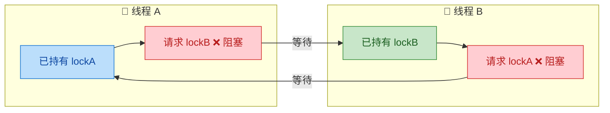

看这张图，**线程 A 持有 lockA，想要 lockB；线程 B 持有 lockB，想要 lockA**。两者形成了一个**闭合的等待环路（circular wait）**，谁也无法前进——这就是死锁。

用一段 Java 代码来重现这个最小模型：

```java
public class DeadlockDemo {

    // 定义两把锁对象
    private static final Object lockA = new Object(); // 锁 A
    private static final Object lockB = new Object(); // 锁 B

    public static void main(String[] args) {

        // 线程 A：先拿 lockA，再拿 lockB
        Thread threadA = new Thread(() -> {
            synchronized (lockA) {                     // 第 1 步：获取 lockA ✅ 成功
                System.out.println("线程A: 已持有 lockA, 尝试获取 lockB...");
                try {
                    Thread.sleep(100);                 // 短暂休眠，确保线程 B 有时间拿到 lockB
                } catch (InterruptedException e) {
                    Thread.currentThread().interrupt();
                }
                synchronized (lockB) {                 // 第 2 步：请求 lockB ❌ 阻塞！因为线程 B 持有它
                    System.out.println("线程A: 同时持有 lockA 和 lockB");
                }
            }
        }, "Thread-A");

        // 线程 B：先拿 lockB，再拿 lockA（注意：顺序与线程 A 相反！）
        Thread threadB = new Thread(() -> {
            synchronized (lockB) {                     // 第 1 步：获取 lockB ✅ 成功
                System.out.println("线程B: 已持有 lockB, 尝试获取 lockA...");
                try {
                    Thread.sleep(100);                 // 短暂休眠，确保线程 A 有时间拿到 lockA
                } catch (InterruptedException e) {
                    Thread.currentThread().interrupt();
                }
                synchronized (lockA) {                 // 第 2 步：请求 lockA ❌ 阻塞！因为线程 A 持有它
                    System.out.println("线程B: 同时持有 lockB 和 lockA");
                }
            }
        }, "Thread-B");

        threadA.start(); // 启动线程 A
        threadB.start(); // 启动线程 B

        // 程序将永远卡在这里——两个线程都无法结束
    }
}
```

运行输出（程序将永远挂起）：

```text
线程A: 已持有 lockA, 尝试获取 lockB...
线程B: 已持有 lockB, 尝试获取 lockA...
// 💀 程序卡死，不会有更多输出
```

这段代码之所以必然死锁，是因为时间线如下：

```text
时间轴 ──────────────────────────────────────────►

Thread-A:  ┃ 获取 lockA ✅ ┃ sleep(100ms) ┃ 请求 lockB ❌ BLOCKED ┃ ...永远等待...
           ┃               ┃              ┃                       ┃
Thread-B:  ┃ 获取 lockB ✅ ┃ sleep(100ms) ┃ 请求 lockA ❌ BLOCKED ┃ ...永远等待...
```

`sleep(100)` 只是为了**增大死锁发生的概率**（确保两个线程都进入各自的第一个 `synchronized` 块后才去争第二把锁）。在真实生产环境中，**不需要 sleep 也可能发生死锁**——只要两个线程的执行时序恰好形成交叉获取锁的情况。

### 死锁 vs 活锁 vs 饥饿：概念辨析

在并发编程中，有三个容易混淆的"问题状态"，它们的区别非常重要：

| 状态 | 英文 | 线程是否在运行 | 是否能恢复 | 本质 |
|---|---|---|---|---|
| **死锁** | Deadlock | ❌ 全部阻塞 | ❌ 永远不能 | 互相持有对方的锁，闭合等待环 |
| **活锁** | Livelock | ✅ 都在运行 | ⚠️ 可能（随机退避后） | 互相"谦让"，不断改变状态但无实际进展 |
| **饥饿** | Starvation | ⚠️ 部分线程运行 | ⚠️ 理论上可能 | 低优先级线程永远抢不到资源 |

**活锁（Livelock）** 的经典比喻是：两个人在走廊里迎面走来，A 往左让，B 也往左让；A 改往右让，B 也往右让——两个人都在动，但谁也过不去。在代码层面，活锁通常发生在使用 `tryLock` + 重试机制时，两个线程不断尝试、释放、再尝试，但总是"撞车"。

**饥饿（Starvation）** 则是某个线程因为优先级过低或锁竞争策略不公平，始终无法获取到所需资源。例如在非公平锁中，一个线程可能因为运气差而永远抢不到锁。

相比之下，**死锁是最严重的**——线程完全停止运行，且不可能自行恢复，必须人工干预（重启进程或杀死线程）。

### 死锁的范围：不仅仅是 synchronized

很多初学者误以为死锁只发生在 `synchronized` 关键字上。事实上，**任何涉及互斥资源争用的场景都可能发生死锁**：

```java
// 1️⃣ synchronized 块导致的死锁（最经典）
synchronized (lockA) {
    synchronized (lockB) { /* ... */ }       // 经典嵌套锁
}

// 2️⃣ ReentrantLock 导致的死锁
lockA.lock();
try {
    lockB.lock();                            // 如果另一线程以相反顺序获取，同样死锁
    try { /* ... */ } finally { lockB.unlock(); }
} finally { lockA.unlock(); }

// 3️⃣ 数据库行锁死锁
// 事务 A: UPDATE accounts SET balance=100 WHERE id=1;  (锁住 id=1)
//         UPDATE accounts SET balance=200 WHERE id=2;  (等待 id=2)
// 事务 B: UPDATE accounts SET balance=300 WHERE id=2;  (锁住 id=2)
//         UPDATE accounts SET balance=400 WHERE id=1;  (等待 id=1)

// 4️⃣ 线程池死锁（隐蔽！）
// 线程池所有线程都在等待池中其他任务的结果（任务提交到同一个池子里并 get()）
ExecutorService pool = Executors.newFixedThreadPool(2);
Future<String> futureA = pool.submit(() -> {
    Future<String> futureB = pool.submit(() -> "内部任务"); // 提交到同一个池子
    return futureB.get(); // ❌ 如果池子线程用完了，futureB 永远不会被调度
});
```

第 4 种——**线程池死锁（Thread Pool Induced Deadlock）**——是最隐蔽的。当线程池中所有工作线程都在 `get()` 等待自己提交到同一个池子的子任务时，子任务因为没有可用线程而无法被调度，形成死锁。这种情况不涉及任何锁对象，但符合死锁的本质定义：**所有线程都在等待只有同一组线程才能触发的事件**。

### 为什么死锁难以排查

死锁在生产环境中之所以臭名昭著，是因为它具备以下特征：

1. **非确定性（Non-deterministic）**：死锁的发生依赖于线程的精确执行时序，而线程调度由操作系统控制。同样的代码可能跑 1000 次才死锁一次——这使得它在测试环境中极难复现。

2. **无异常无日志**：死锁不会触发任何 `Exception`，不会有 stack trace 打印到控制台。应用看起来"正常运行"（进程存活、端口仍在监听），但所有涉及死锁线程的请求全部超时无响应。

3. **局部传染**：表面上只有 2 个线程死锁，但如果其他线程也需要这两把锁中的某一把，它们也会被阻塞——死锁会像多米诺骨牌一样**传染性扩散**，最终可能耗尽整个线程池。

4. **延迟爆发**：死锁代码可能在上线后几小时甚至几天才触发（取决于并发量和时序巧合），给排查带来极大困难。

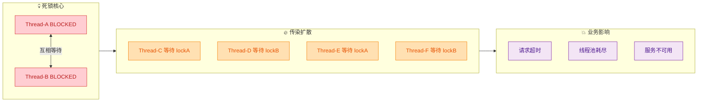

### 理解死锁的本质：资源分配图（Resource Allocation Graph）

在操作系统理论中，死锁的分析工具是**资源分配图（Resource Allocation Graph，RAG）**。图中有两类节点：

- **圆形节点**：表示线程（Thread / Process）
- **方形节点**：表示资源（Resource / Lock）

两种边：
- **请求边（Request Edge）**：线程 → 资源，表示线程正在等待该资源
- **分配边（Assignment Edge）**：资源 → 线程，表示资源当前被该线程持有

**核心定理：如果资源分配图中存在环路（Cycle），则系统处于死锁状态（在每种资源只有一个实例的前提下）。**

```text
资源分配图示例（死锁状态）:

    Thread-A ───请求───► LockB
       ▲                    │
       │                    │分配
       │分配                ▼
    LockA ◄───请求─── Thread-B

    环路: Thread-A → LockB → Thread-B → LockA → Thread-A
    ✅ 存在环路 → 💀 死锁！
```

这个图论模型与我们之前代码示例中的情况完全对应：Thread-A 持有 LockA 请求 LockB，Thread-B 持有 LockB 请求 LockA，形成环路。

### 现实世界的死锁类比

为了更好地理解死锁，我们可以用几个现实世界的类比：

**🍽️ 哲学家就餐问题（Dining Philosophers Problem）**

这是 Dijkstra 在 1965 年提出的经典并发问题：五位哲学家围坐圆桌，每两人之间有一只筷子（共 5 只）。每位哲学家需要**同时拿到左右两只筷子**才能吃饭。如果每个人都先拿起自己左边的筷子，然后等右边的——所有人都在等右边的人放下筷子，形成**五节点环形死锁**。

**🚗 十字路口死锁**

四辆车分别从东南西北方向驶入十字路口，每辆车都在等右侧的车先通过——没有人能动，交通完全瘫痪。

这些类比揭示了死锁的普遍性：**只要存在多个参与者争抢多个互斥资源，且获取顺序不一致，就有死锁的风险。** 这不仅仅是编程问题，而是一个**系统性的资源调度问题**。

### 小结

死锁是并发编程中最严重的活性问题（liveness issue）。它的本质是**多个线程形成了闭合的资源等待环路**，导致所有参与者永久阻塞。死锁不会抛异常、不会打日志，但会让相关业务完全瘫痪并可能传染扩散。在后续章节中，我们将学习死锁发生的**四个必要条件**（Coffman Conditions）、如何**检测**正在发生的死锁、以及如何通过**锁排序、一次性获取、超时机制**等策略来**预防**死锁。

---

**📝 练习题**

以下哪种场景**不可能**导致死锁？

A. 线程 A 持有 `lockX`，等待 `lockY`；线程 B 持有 `lockY`，等待 `lockX`


B. 线程 A 和线程 B 都在等待同一把锁 `lockZ`（`lockZ` 当前被线程 C 持有，线程 C 正在正常执行即将释放）


C. 数据库事务 A 锁住行 1 等待行 2；事务 B 锁住行 2 等待行 1


D. 线程池所有工作线程都在 `get()` 等待提交到同一个线程池的子任务完成


**【答案】** B

**【解析】** 死锁的本质是**闭合等待环路**。选项 B 中，线程 A 和 B 都在等待 `lockZ`，而 `lockZ` 被线程 C 持有。但线程 C 并没有在等待 A 或 B 持有的任何资源——它正在正常执行并即将释放锁。因此不存在环路，线程 C 释放 `lockZ` 后，A 和 B 中的一个就能拿到锁继续执行。这只是**锁竞争（Lock Contention）**，不是死锁。选项 A 是经典双线程交叉死锁；选项 C 是数据库行锁死锁；选项 D 是线程池内任务互相等待导致的死锁——三者都存在闭合等待环路。

---

## 死锁四个条件 ⭐

死锁（Deadlock）并不是随机发生的"灵异事件"。计算机科学家 Edward G. Coffman, Jr. 在 1971 年总结出了死锁产生的 **四个必要条件**（Four Necessary Conditions），也称为 **Coffman 条件**。这四个条件必须 **同时满足**，死锁才会发生。换句话说，只要打破其中任何一个条件，死锁就不可能出现。这是理解死锁预防策略的理论基础。

先通过一张全景图来看这四个条件之间的关系：

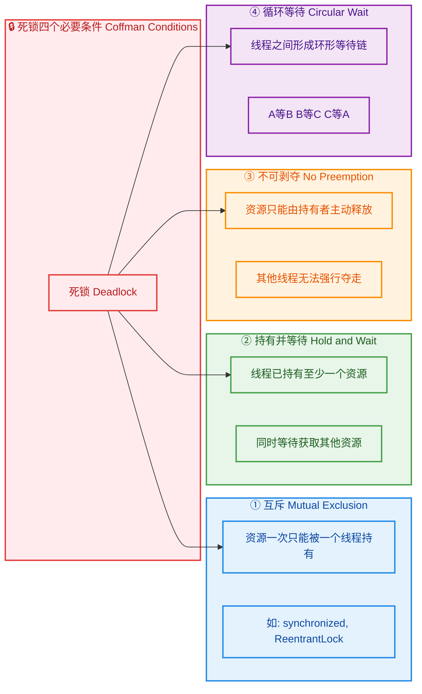

理解这张图的关键在于：这四个条件不是"或"的关系，而是"且"的关系——**四者缺一不可**。下面我们逐一深入。

---

### 互斥（Mutual Exclusion）

**定义**：资源在任意时刻只能被 **一个线程** 独占使用，其他线程必须等待该线程释放后才能获取。

这是最直觉的条件。当我们使用 `synchronized` 关键字或 `ReentrantLock` 去保护共享资源时，本质上就是在建立互斥（Mutual Exclusion）。锁本身就是互斥的化身——同一把锁在同一时刻只能被一个线程持有。

**为什么说互斥是死锁的必要条件？** 试想一下：如果资源可以被多个线程同时使用（比如只读数据），那就不存在"等待释放"的问题，线程之间不会因为争抢资源而相互阻塞，死锁自然无从谈起。

```java
// 互斥的典型表现：synchronized 确保同一时刻只有一个线程能进入临界区
public class MutualExclusionDemo {

    // lockA 是一个互斥资源，同一时刻只有一个线程能持有它的 monitor
    private static final Object lockA = new Object();

    public static void main(String[] args) {

        // 线程 1 获取了 lockA，线程 2 必须等待
        Runnable task = () -> {
            synchronized (lockA) { // <-- 互斥：只有一个线程能进入
                System.out.println(Thread.currentThread().getName() + " 持有 lockA");
                try {
                    Thread.sleep(2000); // 模拟持有锁期间的工作
                } catch (InterruptedException e) {
                    Thread.currentThread().interrupt();
                }
            } // <-- 离开 synchronized 块后自动释放锁
        };

        // 启动两个线程竞争同一把锁
        new Thread(task, "Thread-1").start(); // Thread-1 先拿到锁
        new Thread(task, "Thread-2").start(); // Thread-2 被阻塞，等 Thread-1 释放
    }
}
```

需要注意的是，**互斥条件通常是不可打破的**——因为我们使用锁的根本目的就是保证线程安全。如果为了避免死锁而取消互斥，那数据一致性就无法保障了。所以在实践中，死锁预防策略很少从"消除互斥"入手，而是从其他三个条件下手。

不过也有例外：如果能把数据结构替换为**无锁并发数据结构**（Lock-Free Data Structures），例如 `ConcurrentHashMap`、`AtomicInteger` 等，就可以在特定场景下绕过互斥的需求。这些数据结构内部使用 CAS（Compare-And-Swap）操作而非传统的锁，从根源上消除了互斥条件。

---

### 持有并等待（Hold and Wait）

**定义**：一个线程 **已经持有至少一个资源**（锁），同时又在 **等待获取其他线程持有的资源**。

这是死锁形成的核心行为模式。仅仅持有资源不会死锁，仅仅等待资源也不会死锁，但 **"一手攥着旧的，一手伸向新的"** 就危险了。

用一个生活场景来理解：你右手拿着一把钥匙 A（已持有），左手去够钥匙 B（等待获取），但钥匙 B 在别人手里，而那个人也在等你手里的钥匙 A。谁都不愿意先放手，局面就僵住了。

```java
/**
 * 演示"持有并等待"条件。
 * Thread-1 持有 lockA，等待 lockB。
 * Thread-2 持有 lockB，等待 lockA。
 * 这种交叉持有 + 等待的模式就是"Hold and Wait"。
 */
public class HoldAndWaitDemo {

    private static final Object lockA = new Object(); // 资源 A
    private static final Object lockB = new Object(); // 资源 B

    public static void main(String[] args) {

        // 线程 1：先拿 A，再要 B
        Thread t1 = new Thread(() -> {
            synchronized (lockA) {                    // ① 持有 lockA
                System.out.println("Thread-1: 持有 lockA，准备获取 lockB...");
                sleep(100);                           // 给线程 2 时间去获取 lockB
                synchronized (lockB) {                // ② 等待 lockB（Hold and Wait!）
                    System.out.println("Thread-1: 同时持有 lockA 和 lockB");
                }
            }
        }, "Thread-1");

        // 线程 2：先拿 B，再要 A
        Thread t2 = new Thread(() -> {
            synchronized (lockB) {                    // ① 持有 lockB
                System.out.println("Thread-2: 持有 lockB，准备获取 lockA...");
                sleep(100);                           // 给线程 1 时间去获取 lockA
                synchronized (lockA) {                // ② 等待 lockA（Hold and Wait!）
                    System.out.println("Thread-2: 同时持有 lockB 和 lockA");
                }
            }
        }, "Thread-2");

        t1.start();
        t2.start();
    }

    private static void sleep(long millis) {
        try { Thread.sleep(millis); } catch (InterruptedException e) {
            Thread.currentThread().interrupt();
        }
    }
}
```

运行这段代码，程序将 **永远不会输出** "同时持有"那两行——因为两个线程都卡在了等待对方释放锁的地方，形成了死锁。

我们用一张时序图来清晰地展示这个过程：

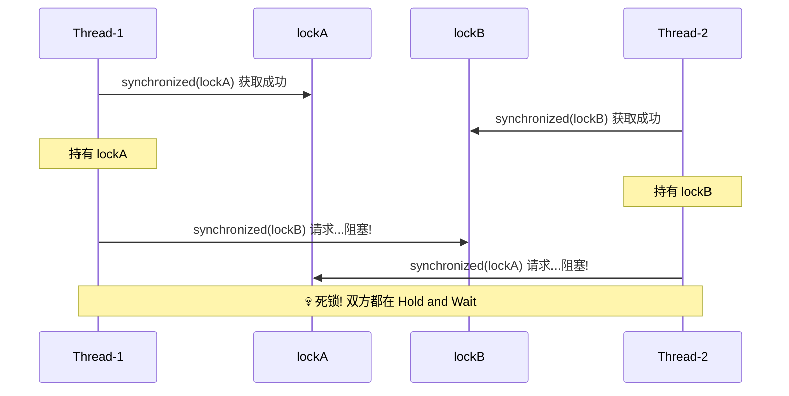

**如何破坏"持有并等待"条件？** 核心思路是：**要么全拿，要么全不拿**。也就是说，让线程在开始工作之前一次性获取所有需要的资源，如果有任何一个拿不到，就把已经拿到的也全部释放。这种策略被称为 **"All or Nothing"**。后面"死锁预防"章节会详细讲解具体实现。

---

### 不可剥夺（No Preemption）

**定义**：线程已经获取的资源，在使用完之前 **不能被其他线程强行夺走**，只能由持有线程 **主动释放**。

在 Java 中，`synchronized` 天然具有不可剥夺性——一旦线程进入 `synchronized` 块，在它退出之前（正常执行完毕或抛出异常），没有任何手段可以强制它释放锁。JVM 不提供"强制释放其他线程的锁"这样的 API。

```java
/**
 * 演示"不可剥夺"特性。
 * 一旦线程获取了 synchronized 锁，外部无法强制释放。
 * 即使调用 t.interrupt()，也无法让线程释放 synchronized 锁。
 */
public class NoPreemptionDemo {

    private static final Object lock = new Object();

    public static void main(String[] args) throws InterruptedException {

        // 线程 1：获取锁后长时间持有
        Thread t1 = new Thread(() -> {
            synchronized (lock) {                     // 获取锁
                System.out.println("Thread-1: 持有锁，开始长时间工作...");
                try {
                    Thread.sleep(10_000);             // 持有锁 10 秒
                } catch (InterruptedException e) {
                    // 即使被中断，线程仍然持有锁！
                    // interrupt 只是设置了中断标志 + 让 sleep 提前返回
                    // 但 synchronized 锁不会因此释放
                    System.out.println("Thread-1: 被中断了，但我仍持有锁！");
                }
                System.out.println("Thread-1: 工作完成，即将释放锁");
            } // <-- 只有执行到这里，锁才会释放
        }, "Thread-1");

        // 线程 2：等待获取同一把锁
        Thread t2 = new Thread(() -> {
            System.out.println("Thread-2: 尝试获取锁...");
            synchronized (lock) {                     // 阻塞等待 Thread-1 释放
                System.out.println("Thread-2: 终于获取到锁了！");
            }
        }, "Thread-2");

        t1.start();
        Thread.sleep(100);    // 确保 Thread-1 先获取到锁
        t2.start();
        Thread.sleep(100);    // 确保 Thread-2 已经开始等待

        // 尝试中断 Thread-1 —— 这不会让它释放 synchronized 锁
        System.out.println("主线程: 尝试中断 Thread-1...");
        t1.interrupt();       // 中断只影响 sleep/wait/join，不影响 synchronized 持锁

        t1.join();
        t2.join();
    }
}
```

这段代码揭示了一个重要事实：`Thread.interrupt()` **无法强制让线程释放 `synchronized` 锁**。中断只是让 `sleep()` 提前返回并抛出 `InterruptedException`，但线程依然在 `synchronized` 块内，锁仍在它手里。只有当线程执行完 `synchronized` 块、正常退出时，锁才会释放。

**`synchronized` vs `ReentrantLock` 在可剥夺性上的差异：**

| 特性 | `synchronized` | `ReentrantLock` |
|---|---|---|
| **能否响应中断** | ❌ 不能（等待锁时无法被中断） | ✅ `lockInterruptibly()` 可响应中断 |
| **能否超时放弃** | ❌ 不能（永远等下去） | ✅ `tryLock(timeout, unit)` 可超时 |
| **能否尝试获取** | ❌ 不能 | ✅ `tryLock()` 非阻塞尝试 |
| **不可剥夺程度** | 极高（完全被动等待） | 较低（提供了主动放弃的手段） |

`ReentrantLock` 的 `tryLock()` 和 `lockInterruptibly()` 正是破坏"不可剥夺"条件的利器。通过它们，线程可以在等不到锁时 **主动放弃并释放已持有的资源**，从而避免死锁。来看一个关键对比：

```java
import java.util.concurrent.locks.ReentrantLock;
import java.util.concurrent.TimeUnit;

/**
 * ReentrantLock 提供了"可剥夺"（主动放弃）的能力，
 * 这是 synchronized 所不具备的。
 */
public class PreemptionComparisonDemo {

    private static final ReentrantLock lockA = new ReentrantLock();
    private static final ReentrantLock lockB = new ReentrantLock();

    public static void main(String[] args) {

        Thread t1 = new Thread(() -> {
            try {
                // tryLock：尝试获取 lockA，最多等 2 秒
                if (lockA.tryLock(2, TimeUnit.SECONDS)) {     // 尝试获取 lockA
                    try {
                        System.out.println("Thread-1: 持有 lockA");
                        Thread.sleep(100);

                        // tryLock：尝试获取 lockB，最多等 2 秒
                        if (lockB.tryLock(2, TimeUnit.SECONDS)) { // 尝试获取 lockB
                            try {
                                System.out.println("Thread-1: 持有 lockA 和 lockB，执行业务");
                            } finally {
                                lockB.unlock();                // 释放 lockB
                            }
                        } else {
                            // 获取 lockB 超时 —— 主动放弃！
                            System.out.println("Thread-1: 获取 lockB 超时，主动放弃");
                        }
                    } finally {
                        lockA.unlock();                        // 释放 lockA
                    }
                }
            } catch (InterruptedException e) {
                Thread.currentThread().interrupt();
            }
        }, "Thread-1");

        t1.start();
    }
}
```

这里的 `tryLock(2, TimeUnit.SECONDS)` 就体现了"可剥夺"的思想：如果 2 秒内拿不到锁，线程不会傻等，而是放弃并释放已持有的资源。这种机制有效地打破了"不可剥夺"条件。

---

### 循环等待（Circular Wait）

**定义**：存在一个线程等待链，形成 **环形依赖**。即线程 T1 等待 T2 持有的资源，T2 等待 T3 持有的资源，...，Tn 等待 T1 持有的资源。

循环等待是死锁最具辨识度的特征，也是死锁分析工具（如 `jstack`）检测的核心目标。前面"持有并等待"的例子其实已经包含了循环等待——两个线程形成了一个最小的环：

```java
// 最小的循环等待：两个线程，两把锁
// T1: lockA -> 等待 lockB
// T2: lockB -> 等待 lockA
// 等待链: T1 → T2 → T1 （环！）
```

用图来表示更为直观：

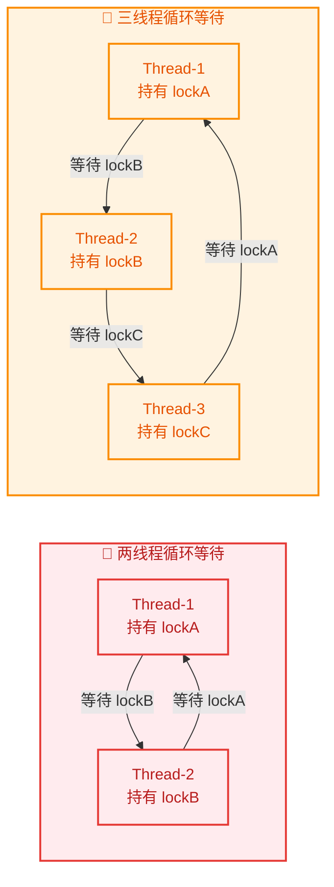

循环等待可以涉及 **任意数量** 的线程，不仅仅是两个。下面是一个三线程循环等待的完整示例：

```java
/**
 * 三线程循环等待死锁演示。
 * Thread-1: lockA -> 等待 lockB
 * Thread-2: lockB -> 等待 lockC
 * Thread-3: lockC -> 等待 lockA
 * 形成 T1 → T2 → T3 → T1 的等待环。
 */
public class CircularWaitDemo {

    private static final Object lockA = new Object(); // 资源 A
    private static final Object lockB = new Object(); // 资源 B
    private static final Object lockC = new Object(); // 资源 C

    public static void main(String[] args) {

        // Thread-1: 持有 A，等待 B
        Thread t1 = new Thread(() -> {
            synchronized (lockA) {                    // 获取 lockA
                System.out.println("Thread-1: 持有 lockA");
                sleep(100);                           // 等待其他线程获取各自的锁
                synchronized (lockB) {                // 等待 lockB（被 Thread-2 持有）
                    System.out.println("Thread-1: 持有 lockA + lockB");
                }
            }
        }, "Thread-1");

        // Thread-2: 持有 B，等待 C
        Thread t2 = new Thread(() -> {
            synchronized (lockB) {                    // 获取 lockB
                System.out.println("Thread-2: 持有 lockB");
                sleep(100);                           // 等待其他线程获取各自的锁
                synchronized (lockC) {                // 等待 lockC（被 Thread-3 持有）
                    System.out.println("Thread-2: 持有 lockB + lockC");
                }
            }
        }, "Thread-2");

        // Thread-3: 持有 C，等待 A
        Thread t3 = new Thread(() -> {
            synchronized (lockC) {                    // 获取 lockC
                System.out.println("Thread-3: 持有 lockC");
                sleep(100);                           // 等待其他线程获取各自的锁
                synchronized (lockA) {                // 等待 lockA（被 Thread-1 持有）
                    System.out.println("Thread-3: 持有 lockC + lockA");
                }
            }
        }, "Thread-3");

        t1.start();
        t2.start();
        t3.start();
    }

    private static void sleep(long millis) {
        try { Thread.sleep(millis); } catch (InterruptedException e) {
            Thread.currentThread().interrupt();
        }
    }
}
```

运行后程序将永远挂起。三个线程各打印了"持有 lockX"，但没有任何一个能打印"持有 lockX + lockY"，因为它们形成了完美的等待环。

**循环等待 vs 持有并等待——有什么区别？**

这两个条件经常让人困惑，因为它们看上去很相似。关键区别在于 **是否形成了闭环**：

- **持有并等待**：描述的是 **单个线程的行为**——一边拿着锁，一边要新锁。这是一种"姿势"。
- **循环等待**：描述的是 **多个线程之间的全局关系**——等待链首尾相连形成环。这是一种"结构"。

持有并等待不一定导致循环等待。比如：T1 持有 lockA 等待 lockB，T2 持有 lockB 但不等待任何锁。此时 T1 在"持有并等待"，但没有"循环等待"，因为 T2 迟早会释放 lockB，T1 最终能拿到。只有当等待关系形成了 **闭合环路** 时，死锁才会发生。

**如何破坏循环等待？** 最经典的策略是 **锁排序（Lock Ordering）**：为所有锁定义一个全局顺序，规定所有线程必须按照这个顺序获取锁。如果所有人都先拿 lockA 再拿 lockB，就不可能出现"我拿着 A 等 B，你拿着 B 等 A"的情况。这是实战中最常用、最有效的死锁预防手段，后面章节会详细讲解。

---

**四个条件的关系总结：**

| 条件 | 英文 | 核心含义 | 实践中是否容易打破 |
|---|---|---|---|
| **互斥** | Mutual Exclusion | 资源独占使用 | ❌ 通常不打破（锁的本质） |
| **持有并等待** | Hold and Wait | 拿着旧锁要新锁 | ✅ 一次性获取所有锁 |
| **不可剥夺** | No Preemption | 锁只能主动释放 | ✅ `tryLock` + 超时放弃 |
| **循环等待** | Circular Wait | 等待链形成闭环 | ✅ 锁排序（最常用） |

记住这个口诀：**互斥是天性、持有是姿势、不可剥夺是规则、循环等待是结构**。四者同时成立，死锁必现；打破任一，死锁消散。

---

**📝 练习题**

关于死锁的四个必要条件，以下说法 **正确** 的是？

A. 只要存在"持有并等待"，就一定会发生死锁


B. `synchronized` 关键字可以通过 `Thread.interrupt()` 强制释放锁，因此可以打破"不可剥夺"条件


C. 循环等待是死锁的充分条件，只要有循环等待就一定死锁


D. 四个条件必须同时满足死锁才会发生，破坏任意一个即可预防死锁


**【答案】** D

**【解析】** 死锁的四个 Coffman 条件是 **必要条件**，必须全部同时满足才能产生死锁，破坏其中任何一个就能预防死锁。选项 A 错误——"持有并等待"只是四个条件之一，单独出现不一定导致死锁（可能没有形成循环等待）。选项 B 错误——`Thread.interrupt()` 对正在等待 `synchronized` 锁的线程是无效的，`synchronized` 的锁等待不响应中断，只有 `ReentrantLock.lockInterruptibly()` 才能响应中断。选项 C 错误——循环等待是必要条件之一，不是充分条件（虽然在实际场景中，如果四个条件同时满足，它也不是单独的充分条件；严格来说，四个条件加在一起才构成死锁的充要条件）。只有 D 的表述完全正确。

---

## 死锁示例

理解了死锁的四个必要条件之后，最好的巩固方式就是**亲手写出一个死锁、亲眼看到它卡死、亲自用工具诊断它**。本节将从最经典的"两线程交叉加锁"场景出发，逐步升级到更贴近真实业务的复杂案例，帮助你建立对死锁的"肌肉记忆"——在代码审查时一眼识别出潜在的死锁风险。

### 经典案例：两线程交叉加锁

这是所有并发教材中最基础的死锁模型，也是面试中出镜率最高的示例。两个线程各自持有一把锁，同时又试图获取对方持有的锁，形成**循环等待（Circular Wait）**，程序永远卡死。

先用一张时序图直观感受死锁的形成过程：

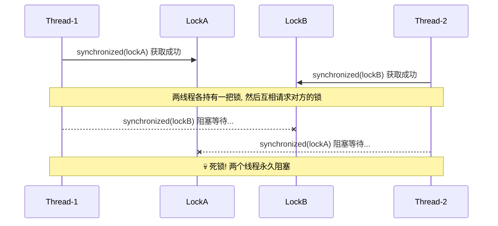

#### 代码实现

```java
public class ClassicDeadlockDemo {

    // 定义两把锁对象（任意 Object 即可，仅用于 synchronized）
    private static final Object lockA = new Object(); // 锁 A
    private static final Object lockB = new Object(); // 锁 B

    public static void main(String[] args) {

        // ========== 线程 1：先拿 lockA，再请求 lockB ==========
        Thread t1 = new Thread(() -> {
            synchronized (lockA) {                         // 第 1 步：获取 lockA ✅
                System.out.println(Thread.currentThread().getName()
                        + " 已持有 lockA，尝试获取 lockB...");

                sleep(100);                                // 故意休眠，确保 t2 有时间拿到 lockB

                synchronized (lockB) {                     // 第 2 步：请求 lockB —— 被 t2 持有，阻塞 🔒
                    System.out.println(Thread.currentThread().getName()
                            + " 成功获取 lockB");          // ❌ 永远不会执行到这里
                }
            }
        }, "Thread-1");

        // ========== 线程 2：先拿 lockB，再请求 lockA ==========
        Thread t2 = new Thread(() -> {
            synchronized (lockB) {                         // 第 1 步：获取 lockB ✅
                System.out.println(Thread.currentThread().getName()
                        + " 已持有 lockB，尝试获取 lockA...");

                sleep(100);                                // 故意休眠，确保 t1 有时间拿到 lockA

                synchronized (lockA) {                     // 第 2 步：请求 lockA —— 被 t1 持有，阻塞 🔒
                    System.out.println(Thread.currentThread().getName()
                            + " 成功获取 lockA");          // ❌ 永远不会执行到这里
                }
            }
        }, "Thread-2");

        t1.start();                                        // 启动线程 1
        t2.start();                                        // 启动线程 2

        // 主线程等待 3 秒后检测是否存活（死锁时两个线程永远不会结束）
        sleep(3000);
        System.out.println("Thread-1 存活: " + t1.isAlive()); // true → 死锁
        System.out.println("Thread-2 存活: " + t2.isAlive()); // true → 死锁
        System.out.println("💀 检测到死锁！程序无法正常退出。");
    }

    // 辅助方法：安全休眠，忽略中断异常
    private static void sleep(long millis) {
        try { Thread.sleep(millis); } catch (InterruptedException ignored) {}
    }
}
```

**运行输出**（程序将无限挂起）：

```text
Thread-1 已持有 lockA，尝试获取 lockB...
Thread-2 已持有 lockB，尝试获取 lockA...
Thread-1 存活: true
Thread-2 存活: true
💀 检测到死锁！程序无法正常退出。
```

程序打印完前两行后就再也不会有新输出了——两个线程彼此等待，永远无法前进。这就是死锁最直观的表现：**程序没有崩溃、没有异常、没有报错，但就是"卡住了"**。在生产环境中，这种"静默挂起"往往比 crash 更加危险，因为它很难被发现。

#### 四个条件的逐一验证

让我们回头用死锁的四个必要条件来解剖这个示例，确认每一个条件都被满足：

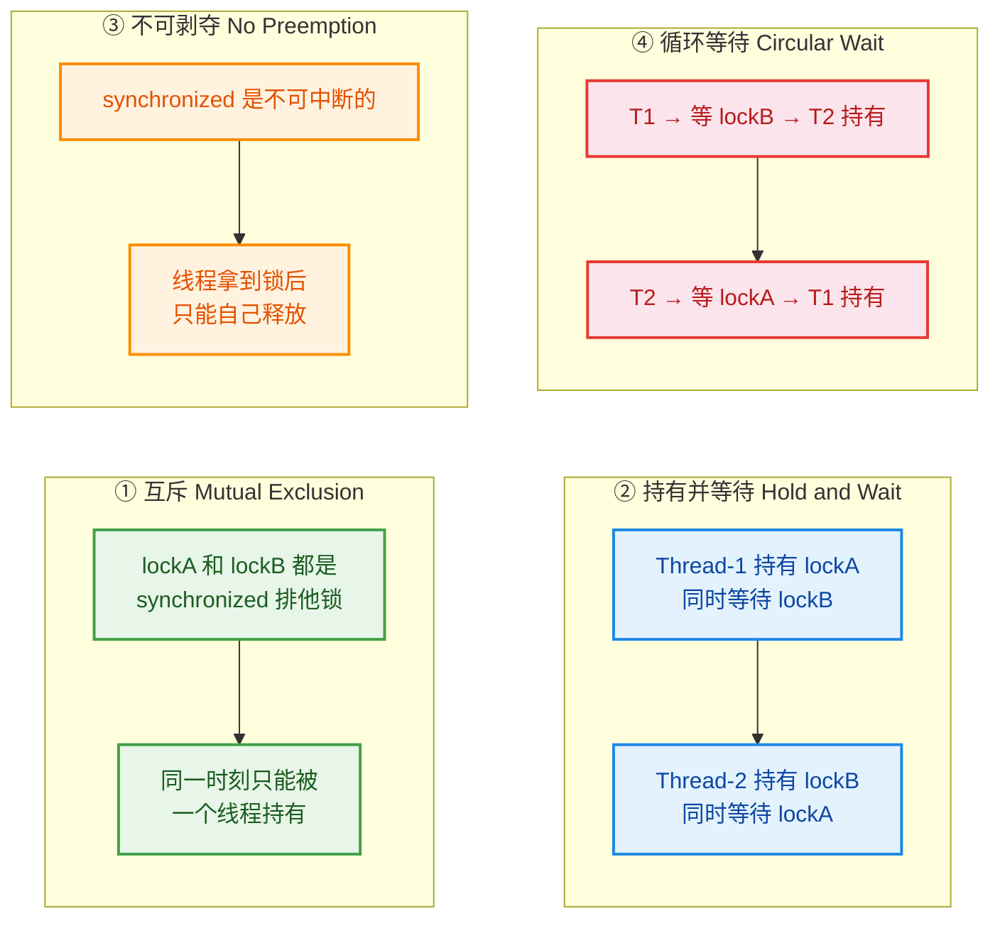

四个条件**同时成立**，死锁才会发生。后面的"死锁预防"章节会讲到：只要**破坏其中任意一个条件**，死锁就不可能产生。

---

### 进阶案例：模拟转账业务死锁

经典的交叉加锁看起来很"人为"，真实业务中不会有人故意写出那么对称的加锁顺序。但死锁确实会在业务代码中自然发生。**银行转账**就是最典型的场景之一。

#### 场景描述

假设有一个 `Account` 类，每个账户有一把锁。当用户 A 向用户 B 转账时，需要**同时锁住两个账户**来保证原子性：先锁转出方、再锁转入方。问题在于：如果**两笔转账方向相反、同时发生**，就可能形成死锁。

```text
转账 1：Alice → Bob    →  先锁 Alice，再锁 Bob
转账 2：Bob   → Alice  →  先锁 Bob，  再锁 Alice
                           ↑ 循环等待！
```

#### 完整代码

```java
public class TransferDeadlockDemo {

    // ==================== 账户类 ====================
    static class Account {
        private final String name;    // 账户名称
        private int balance;          // 账户余额（单位：分）

        public Account(String name, int balance) {
            this.name = name;         // 初始化账户名
            this.balance = balance;   // 初始化余额
        }

        public String getName() { return name; }          // 获取账户名
        public int getBalance() { return balance; }        // 获取余额
        public void debit(int amount) { balance -= amount; }   // 扣款
        public void credit(int amount) { balance += amount; }  // 入账
    }

    // ==================== 转账方法（有死锁风险！） ====================
    /**
     * 从 from 账户向 to 账户转账 amount 元
     * 需要同时锁住两个账户以保证原子性
     * ❌ 此实现存在死锁风险！
     */
    static void transferUnsafe(Account from, Account to, int amount) {
        synchronized (from) {                              // 第 1 步：锁定转出账户
            System.out.println(Thread.currentThread().getName()
                    + " 锁定 " + from.getName()
                    + "，准备锁定 " + to.getName() + "...");

            sleep(50);                                     // 模拟业务耗时（风控校验等）

            synchronized (to) {                            // 第 2 步：锁定转入账户
                if (from.getBalance() >= amount) {         // 校验余额是否充足
                    from.debit(amount);                    // 从转出方扣款
                    to.credit(amount);                     // 向转入方入账
                    System.out.println(Thread.currentThread().getName()
                            + " 转账成功: " + from.getName()
                            + " → " + to.getName()
                            + " ¥" + amount);
                } else {
                    System.out.println("余额不足，转账失败"); // 余额不足时拒绝转账
                }
            }
        }
    }

    // ==================== 主方法 ====================
    public static void main(String[] args) {

        Account alice = new Account("Alice", 10000);       // Alice 初始余额 10000
        Account bob = new Account("Bob", 10000);           // Bob 初始余额 10000

        // 转账 1：Alice → Bob，金额 100（先锁 Alice，再锁 Bob）
        Thread t1 = new Thread(
                () -> transferUnsafe(alice, bob, 100),
                "转账线程-1"
        );

        // 转账 2：Bob → Alice，金额 200（先锁 Bob，再锁 Alice）
        Thread t2 = new Thread(
                () -> transferUnsafe(bob, alice, 200),
                "转账线程-2"
        );

        t1.start();                                        // 启动转账线程 1
        t2.start();                                        // 启动转账线程 2

        // 等待 5 秒后检查线程状态
        sleep(5000);
        if (t1.isAlive() && t2.isAlive()) {                // 两个线程都还活着 → 死锁
            System.out.println("\n💀 转账系统死锁！");
            System.out.println("Alice 余额: " + alice.getBalance()); // 余额没有变化
            System.out.println("Bob   余额: " + bob.getBalance());   // 余额没有变化
        }
    }

    private static void sleep(long millis) {
        try { Thread.sleep(millis); } catch (InterruptedException ignored) {}
    }
}
```

**运行输出**：

```text
转账线程-1 锁定 Alice，准备锁定 Bob...
转账线程-2 锁定 Bob，准备锁定 Alice...

💀 转账系统死锁！
Alice 余额: 10000
Bob   余额: 10000
```

两笔转账都没有完成，余额纹丝未动，整个转账系统彻底瘫痪。在真实的金融系统中，这将导致**请求超时、用户投诉、资金对账异常**等严重后果。

#### 死锁形成的时间线

下面这张时序图精确地还原了死锁发生的每一个时间点：

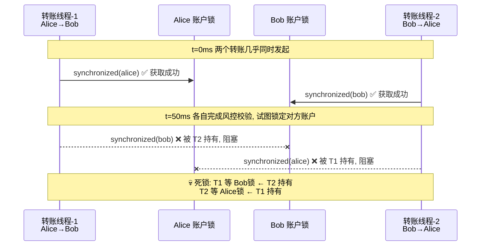

---

### 隐蔽案例：多对象协作中的死锁

在实际项目中，死锁往往不像上面那么"明显"。加锁逻辑可能分散在不同的类、不同的方法中，开发者写代码时甚至意识不到自己在"嵌套加锁"。下面展示一个更贴近真实项目的隐蔽死锁场景。

#### 场景描述

假设有两个互相关联的业务对象：`Dispatcher`（调度器）和 `Taxi`（出租车）。调度器的方法中会调用出租车的方法，反过来出租车的方法中也会回调调度器的方法。两个类各自用 `synchronized` 保护自己的状态——**死锁就这样悄悄地埋下了**。

```java
import java.util.HashSet;
import java.util.Set;

public class HiddenDeadlockDemo {

    // ==================== 出租车类 ====================
    static class Taxi {
        private final String id;               // 出租车编号
        private String location;               // 当前位置
        private String destination;            // 目的地
        private final Dispatcher dispatcher;   // 关联的调度器

        public Taxi(String id, Dispatcher dispatcher) {
            this.id = id;                      // 初始化编号
            this.dispatcher = dispatcher;      // 绑定调度器
        }

        // 获取当前位置（synchronized 保护读取）
        public synchronized String getLocation() {
            return location;                   // 返回当前位置
        }

        // 设置新位置 —— 注意：内部会回调 dispatcher 的同步方法！
        public synchronized void setLocation(String newLocation) {
            this.location = newLocation;       // 更新位置
            if (newLocation.equals(destination)) {  // 如果到达目的地
                // ⚠️ 关键：持有 this(Taxi) 锁的同时，调用 dispatcher 的 synchronized 方法
                dispatcher.notifyAvailable(this);   // 通知调度器"我空闲了"
            }
        }

        public synchronized void setDestination(String dest) {
            this.destination = dest;           // 设置目的地
        }

        public String getId() { return id; }  // 获取编号
    }

    // ==================== 调度器类 ====================
    static class Dispatcher {
        private final Set<Taxi> availableTaxis = new HashSet<>();  // 空闲出租车集合
        private final Set<Taxi> allTaxis = new HashSet<>();        // 全部出租车集合

        // 注册出租车
        public synchronized void addTaxi(Taxi taxi) {
            allTaxis.add(taxi);                // 加入全部列表
            availableTaxis.add(taxi);          // 初始为空闲状态
        }

        // 出租车到达目的地后通知空闲
        public synchronized void notifyAvailable(Taxi taxi) {
            availableTaxis.add(taxi);          // 将出租车标记为空闲
            System.out.println("调度器: " + taxi.getId() + " 已空闲");
        }

        // 打印所有出租车位置 —— 注意：内部会调用 taxi 的 synchronized 方法！
        public synchronized void printAllLocations() {
            for (Taxi taxi : allTaxis) {       // 遍历所有出租车
                // ⚠️ 关键：持有 this(Dispatcher) 锁的同时，调用 taxi 的 synchronized 方法
                System.out.println(taxi.getId() + " @ " + taxi.getLocation());
            }
        }
    }

    // ==================== 主方法：触发死锁 ====================
    public static void main(String[] args) {

        Dispatcher dispatcher = new Dispatcher();          // 创建调度器
        Taxi taxi = new Taxi("沪A-12345", dispatcher);    // 创建出租车
        taxi.setDestination("浦东机场");                   // 设置目的地
        dispatcher.addTaxi(taxi);                          // 注册到调度器

        // 线程 1：出租车到达目的地，更新位置
        // 加锁顺序：Taxi 锁 → Dispatcher 锁
        Thread gpsUpdater = new Thread(() -> {
            while (true) {
                taxi.setLocation("浦东机场");              // 持有 Taxi 锁 → 调用 dispatcher.notifyAvailable()
                sleep(1);                                  // 短暂休眠模拟 GPS 更新频率
            }
        }, "GPS-Updater");

        // 线程 2：调度器打印所有出租车位置
        // 加锁顺序：Dispatcher 锁 → Taxi 锁
        Thread monitor = new Thread(() -> {
            while (true) {
                dispatcher.printAllLocations();            // 持有 Dispatcher 锁 → 调用 taxi.getLocation()
                sleep(1);                                  // 短暂休眠
            }
        }, "Monitor");

        gpsUpdater.start();                                // 启动 GPS 更新线程
        monitor.start();                                   // 启动监控线程

        // 由于两线程高频交替执行，死锁很快就会发生
        sleep(5000);
        System.out.println("GPS-Updater alive: " + gpsUpdater.isAlive());
        System.out.println("Monitor alive: " + monitor.isAlive());
    }

    private static void sleep(long millis) {
        try { Thread.sleep(millis); } catch (InterruptedException ignored) {}
    }
}
```

这个例子的关键在于：**加锁的意图被"分散"到了两个类的不同方法中**，开发者在写 `Taxi.setLocation()` 时可能根本没意识到它会间接获取 `Dispatcher` 的锁，反之亦然。这种"跨对象的隐式嵌套加锁"是生产环境中死锁的主要来源。

用流程图揭示隐藏的加锁顺序：

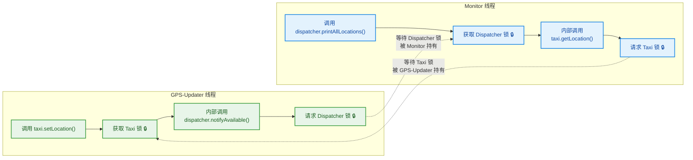

可以清晰地看到：**GPS-Updater 的加锁顺序是 Taxi → Dispatcher，而 Monitor 的加锁顺序是 Dispatcher → Taxi**——方向完全相反，循环等待条件成立，死锁必然发生。

---

### 三个案例的对比总结

| 维度 | 经典交叉加锁 | 转账业务死锁 | 多对象协作死锁 |
|---|---|---|---|
| **死锁可见性** | 极高（刻意制造） | 中等（业务逻辑中自然产生） | 极低（跨类隐式嵌套） |
| **锁的类型** | 两个显式 `Object` 锁 | 两个 `Account` 对象锁 | 两个业务对象的 `this` 锁 |
| **根因** | 加锁顺序相反 | 转账方向相反导致加锁顺序相反 | 方法调用链中隐含的加锁顺序相反 |
| **生产中的常见度** | 低（太明显） | 高（金融/交易系统） | 极高（复杂业务系统） |
| **预防思路** | 固定加锁顺序 | 按 Account ID 排序后加锁 | 缩小同步块 / 开放调用（Open Call） |

> 💡 **Open Call（开放调用）** 原则：在调用外部方法时**不要持有锁**。也就是说，把 `synchronized` 块缩小到只保护对自身状态的读写，调用其他对象的方法放到同步块外面。这是避免隐蔽死锁最有效的设计原则之一。

---

**📝 练习题**

以下代码中，哪种场景**不会**发生死锁？

```java
Object lockX = new Object();
Object lockY = new Object();
```

**场景 A**：线程 1 先锁 X 再锁 Y，线程 2 先锁 Y 再锁 X

**场景 B**：线程 1 先锁 X 再锁 Y，线程 2 也先锁 X 再锁 Y

**场景 C**：线程 1 锁 X（内部调用某方法间接锁 Y），线程 2 锁 Y（内部调用某方法间接锁 X）

**场景 D**：线程 1 和线程 2 都只锁 X，从不使用 Y

A. 仅场景 B 和 D

B. 仅场景 D

C. 仅场景 B

D. 场景 A、B、C、D 都不会

**【答案】** A

**【解析】** 死锁的核心条件之一是**循环等待**，而循环等待的根本原因是**不同线程以不同的顺序获取多把锁**。**场景 B** 中两个线程的加锁顺序完全一致（都是 X → Y），不可能形成循环等待，因此不会死锁。**场景 D** 中只涉及一把锁，根本不存在"持有 A 等 B"的条件，自然也不会死锁。**场景 A** 是经典的交叉加锁，必定死锁。**场景 C** 虽然加锁看起来不那么直观，但本质上就是场景 A 的隐蔽版——锁的获取顺序相反，会死锁。所以不会发生死锁的是 **B 和 D**，选 A。

---

## 死锁检测 ⭐

在生产环境中，死锁往往不会在开发阶段被轻易发现——它可能在高并发、特定时序条件下才会触发。一旦发生，应用程序表现为**部分线程永久"卡住"**：请求超时、吞吐量骤降、某些功能完全无响应，但进程本身并不会崩溃退出（因为 JVM 仍在运行，只是相关线程被阻塞了）。这种"半死不活"的状态比直接崩溃更加危险，因为它可能持续消耗资源却不产出任何结果。

因此，**快速定位死锁**是每个 Java 开发者必须掌握的运维与调试技能。Java 生态提供了多种死锁检测手段，其中最经典、最常用的就是 JDK 自带的 `jstack` 命令行工具。除此之外，还有 `jconsole`、`VisualVM`、`ThreadMXBean` 编程式检测等方式，但 `jstack` 是面试和实战中出现频率最高的，我们重点深入讲解。

先用一张流程图来概览死锁检测的完整工作流：

```mermaid
graph LR
    subgraph SYMPTOM["🚨 症状发现"]
        direction TB
        S1["请求超时 / 无响应"]
        S2["CPU 利用率低但线程数高"]
        S3["日志停止输出"]
    end

    subgraph LOCATE["🔍 定位进程"]
        direction TB
        L1["jps / ps -ef"]
        L2["获取 Java 进程 PID"]
    end

    subgraph DUMP["📸 线程快照"]
        direction TB
        D1["jstack PID"]
        D2["输出所有线程堆栈"]
    end

    subgraph ANALYZE["🧠 分析结果"]
        direction TB
        A1["Found one Java-level deadlock"]
        A2["分析锁持有与等待关系"]
        A3["定位代码行号"]
    end

    subgraph FIX["🔧 修复"]
        direction TB
        F1["锁排序 / tryLock"]
        F2["重构并发逻辑"]
    end

    S1 --> L1
    S2 --> L1
    S3 --> L1
    L1 --> L2
    L2 --> D1
    D1 --> D2
    D2 --> A1
    A1 --> A2
    A2 --> A3
    A3 --> F1
    F1 --> F2

    classDef symptomStyle fill:#FFCDD2,stroke:#D32F2F,color:#B71C1C,stroke-width:2px
    classDef locateStyle fill:#FFF9C4,stroke:#F9A825,color:#F57F17,stroke-width:2px
    classDef dumpStyle fill:#BBDEFB,stroke:#1976D2,color:#0D47A1,stroke-width:2px
    classDef analyzeStyle fill:#C8E6C9,stroke:#388E3C,color:#1B5E20,stroke-width:2px
    classDef fixStyle fill:#E1BEE7,stroke:#7B1FA2,color:#4A148C,stroke-width:2px

    class S1,S2,S3 symptomStyle
    class L1,L2 locateStyle
    class D1,D2 dumpStyle
    class A1,A2,A3 analyzeStyle
    class F1,F2 fixStyle
```

---

### jstack 检测

`jstack` 是 JDK 自带的命令行工具（位于 `$JAVA_HOME/bin/` 目录下），全称是 **Java Stack Trace**。它的核心功能是**打印指定 Java 进程中所有线程的堆栈快照（Thread Dump）**，包括每个线程当前的状态、正在执行的代码位置、持有的锁、等待的锁等信息。当 JVM 检测到死锁时，`jstack` 会在输出末尾**自动附加死锁报告**，这是它最强大的特性之一。

**使用步骤分为三步：找进程 → 抓快照 → 读报告。**

#### 第一步：找到 Java 进程的 PID

在执行 `jstack` 之前，你需要知道目标 Java 程序的进程 ID（PID）。有多种方式获取：

```bash
# 方式一：jps（JDK 自带，推荐）
# jps 会列出当前用户下所有 Java 进程及其主类名
jps -l

# 输出示例：
# 12345 com.example.DeadlockDemo    ← 这就是我们要找的进程
# 12400 jdk.jcmd/sun.tools.jps.Jps  ← jps 自身

# 方式二：Linux 通用命令
ps -ef | grep java

# 方式三：更精确的筛选
ps aux | grep DeadlockDemo
```

#### 第二步：执行 jstack 抓取线程快照

拿到 PID 后，执行以下命令：

```bash
# 基本用法：jstack <PID>
jstack 12345

# 如果遇到权限问题（如目标进程由其他用户启动），加 sudo
sudo jstack 12345

# 将输出重定向到文件，方便后续分析
jstack 12345 > thread_dump_20240101.txt

# -l 参数：打印额外的锁信息（ownable synchronizers）
# 在排查死锁时强烈推荐加上 -l
jstack -l 12345 > thread_dump_detail.txt
```

**注意事项**：
- `jstack` 生成的是**瞬时快照**，代表执行那一刻的线程状态。建议**间隔几秒连续抓 2-3 次**，对比多份快照可以判断线程是"暂时阻塞"还是"永久卡死"（死锁）。
- 如果 `jstack` 无响应（进程完全 hung），可以尝试 `jstack -F <PID>`（Force 模式），但输出信息会有所缩减。

#### 第三步：阅读 Thread Dump 输出

为了完整演示，我们先准备一段**必然死锁**的代码，然后用 `jstack` 来检测它：

```java
public class DeadlockDemo {

    // 定义两把锁对象
    private static final Object LOCK_A = new Object(); // 锁 A
    private static final Object LOCK_B = new Object(); // 锁 B

    public static void main(String[] args) {

        // 线程1：先拿 A，再拿 B
        Thread t1 = new Thread(() -> {
            synchronized (LOCK_A) {                              // 第一步：获取锁 A
                System.out.println("线程1: 已持有 LOCK_A");
                try { Thread.sleep(100); } catch (Exception e) {} // 休眠，确保线程2有时间拿到锁 B
                System.out.println("线程1: 尝试获取 LOCK_B...");
                synchronized (LOCK_B) {                          // 第二步：尝试获取锁 B（会被阻塞）
                    System.out.println("线程1: 已持有 LOCK_A 和 LOCK_B");
                }
            }
        }, "Worker-Thread-1"); // 给线程取一个有意义的名字，方便在 jstack 中识别

        // 线程2：先拿 B，再拿 A（与线程1顺序相反，形成循环等待）
        Thread t2 = new Thread(() -> {
            synchronized (LOCK_B) {                              // 第一步：获取锁 B
                System.out.println("线程2: 已持有 LOCK_B");
                try { Thread.sleep(100); } catch (Exception e) {} // 休眠，确保线程1有时间拿到锁 A
                System.out.println("线程2: 尝试获取 LOCK_A...");
                synchronized (LOCK_A) {                          // 第二步：尝试获取锁 A（会被阻塞）
                    System.out.println("线程2: 已持有 LOCK_B 和 LOCK_A");
                }
            }
        }, "Worker-Thread-2");

        t1.start(); // 启动线程1
        t2.start(); // 启动线程2
    }
}
```

运行这段代码后，控制台会输出：

```
线程1: 已持有 LOCK_A
线程2: 已持有 LOCK_B
线程1: 尝试获取 LOCK_B...
线程2: 尝试获取 LOCK_A...
```

然后程序**永远卡住**——这就是死锁。此时打开另一个终端窗口，执行 `jstack`：

```bash
# 先找到 PID
jps -l
# 假设输出: 12345 DeadlockDemo

# 抓取线程快照（带锁详情）
jstack -l 12345
```

`jstack` 的输出非常长，下面我们拆解关键部分逐段解读。

**输出 Part 1 —— 线程堆栈信息**：

每个线程都会有一段独立的堆栈描述，格式如下（以 Worker-Thread-1 为例）：

```
"Worker-Thread-1" #12 prio=5 os_prio=0 tid=0x00007f3a8c1a0000 nid=0x5a03 
    waiting for monitor entry [0x00007f3a7a1fe000]
   java.lang.Thread.State: BLOCKED (on object monitor)
        at DeadlockDemo.lambda$main$0(DeadlockDemo.java:14)
        - waiting to lock <0x000000076e58b900> (a java.lang.Object)
        - locked <0x000000076e58b8f0> (a java.lang.Object)
```

这段信息量很大，我们逐行解析：

| 字段 | 含义 |
|:---|:---|
| `"Worker-Thread-1"` | 线程名称（我们在代码中设定的） |
| `#12` | 线程编号（JVM 内部分配） |
| `prio=5` | Java 线程优先级 |
| `tid=0x00007f...` | JVM 内部线程 ID |
| `nid=0x5a03` | 操作系统原生线程 ID（十六进制） |
| `BLOCKED (on object monitor)` | **关键！** 线程状态为 BLOCKED，正在等待进入同步块 |
| `waiting to lock <0x...b900>` | **正在等待**获取地址为 `b900` 的锁（即 LOCK_B） |
| `locked <0x...b8f0>` | **已经持有**地址为 `b8f0` 的锁（即 LOCK_A） |
| `DeadlockDemo.java:14` | 阻塞位置在源码的第 14 行 |

同理，Worker-Thread-2 的输出会是镜像的：

```
"Worker-Thread-2" #13 prio=5 os_prio=0 tid=0x00007f3a8c1a2000 nid=0x5a04 
    waiting for monitor entry [0x00007f3a7a0fd000]
   java.lang.Thread.State: BLOCKED (on object monitor)
        at DeadlockDemo.lambda$main$1(DeadlockDemo.java:24)
        - waiting to lock <0x000000076e58b8f0> (a java.lang.Object)
        - locked <0x000000076e58b900> (a java.lang.Object)
```

将两个线程的锁关系汇总，就能看出**循环等待**：

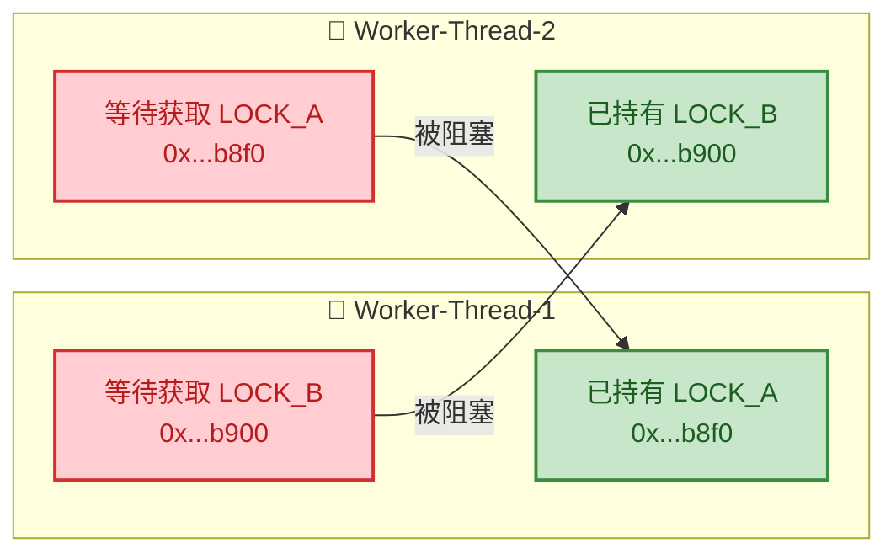

这张图清晰地展示了：Thread-1 持有 A 等待 B，Thread-2 持有 B 等待 A，形成了一个**闭合的等待环路**，谁也无法前进。

---

### Found one Java-level deadlock

在 `jstack` 输出的**最末尾**，如果 JVM 的死锁检测器（Deadlock Detector）发现了死锁，会自动追加一段极其醒目的报告。这段报告以一行标志性文字开头：

```
Found one Java-level deadlock:
=============================
```

这就是面试中经常被问到的经典输出。下面是完整的死锁报告示例（基于上面的 `DeadlockDemo`）：

```
Found one Java-level deadlock:
=============================
"Worker-Thread-1":
  waiting to lock monitor 0x00007f3a840062c8 (object 0x000000076e58b900, a java.lang.Object),
  which is held by "Worker-Thread-2"
"Worker-Thread-2":
  waiting to lock monitor 0x00007f3a84004ed8 (object 0x000000076e58b8f0, a java.lang.Object),
  which is held by "Worker-Thread-1"

Java stack information for the threads listed above:
===================================================
"Worker-Thread-1":
        at DeadlockDemo.lambda$main$0(DeadlockDemo.java:14)
        - waiting to lock <0x000000076e58b900> (a java.lang.Object)
        - locked <0x000000076e58b8f0> (a java.lang.Object)
        at DeadlockDemo$$Lambda$1/0x0000000800060840.run(Unknown Source)
        at java.lang.Thread.run(java.base@17/Thread.java:833)
"Worker-Thread-2":
        at DeadlockDemo.lambda$main$1(DeadlockDemo.java:24)
        - waiting to lock <0x000000076e58b8f0> (a java.lang.Object)
        - locked <0x000000076e58b900> (a java.lang.Object)
        at DeadlockDemo$$Lambda$2/0x0000000800062040.run(Unknown Source)
        at java.lang.Thread.run(java.base@17/Thread.java:833)

Found 1 deadlock.
```

这份报告的信息结构非常清晰，分为三大段：

**第一段：死锁环路描述（纯文字）**

用自然语言描述了死锁的因果链：
- `"Worker-Thread-1"` 正在等待一个 monitor（对象锁），而这个 monitor 被 `"Worker-Thread-2"` 持有。
- `"Worker-Thread-2"` 正在等待另一个 monitor，而这个 monitor 被 `"Worker-Thread-1"` 持有。

JVM 将整个**等待环（wait cycle）** 用 `which is held by` 串联起来，即使涉及 3 个、4 个甚至更多线程的连环死锁，它也能完整呈现。

**第二段：详细堆栈信息**

为死锁涉及的每个线程打印完整的调用栈（Java Stack Trace），关键信息是：
- `waiting to lock <地址>` — 线程正在等待哪个锁对象
- `locked <地址>` — 线程已经持有哪个锁对象
- 源码文件和行号 — 精确到你代码中的哪一行发生了阻塞

**第三段：汇总行**

最后一行 `Found 1 deadlock.` 告诉你总共检测到了几组死锁。如果系统中有多组独立的死锁（比如线程 A-B 死锁，同时线程 C-D 也死锁），这里会显示 `Found 2 deadlocks.`。

**编程式死锁检测 —— ThreadMXBean**

除了 `jstack` 这种外部工具，Java 还提供了 `ThreadMXBean` API，允许你在**程序内部**主动检测死锁。这在生产环境中非常实用——你可以启动一个守护线程，定期轮询检查是否发生了死锁，一旦发现立即告警：

```java
import java.lang.management.ManagementFactory;
import java.lang.management.ThreadInfo;
import java.lang.management.ThreadMXBean;

public class DeadlockDetector {

    // 获取 JVM 线程管理 MXBean
    private static final ThreadMXBean THREAD_MX_BEAN = ManagementFactory.getThreadMXBean();

    public static void main(String[] args) {

        // 启动一个守护线程, 每隔 5 秒检测一次死锁
        Thread detector = new Thread(() -> {
            while (true) {                                        // 持续轮询
                // findDeadlockedThreads() 返回死锁线程的 ID 数组
                // 如果没有死锁, 返回 null
                long[] deadlockedIds = THREAD_MX_BEAN.findDeadlockedThreads();

                if (deadlockedIds != null) {                      // 检测到死锁!
                    System.err.println("⚠️ 检测到死锁! 涉及线程:");

                    // 根据线程 ID 获取详细的 ThreadInfo（包含堆栈和锁信息）
                    ThreadInfo[] threadInfos = THREAD_MX_BEAN.getThreadInfo(deadlockedIds, true, true);

                    for (ThreadInfo info : threadInfos) {         // 遍历每个死锁线程
                        System.err.println("  线程: " + info.getThreadName());  // 线程名
                        System.err.println("  状态: " + info.getThreadState()); // 线程状态
                        System.err.println("  等待锁: " + info.getLockName());  // 正在等待的锁
                        System.err.println("  锁持有者: " + info.getLockOwnerName()); // 锁被谁持有
                        System.err.println("  堆栈:");

                        // 打印该线程的完整调用栈
                        for (StackTraceElement ste : info.getStackTrace()) {
                            System.err.println("    at " + ste);  // 逐帧打印
                        }
                        System.err.println();                     // 空行分隔
                    }

                    // 实际生产中: 发送告警邮件/钉钉通知, 或触发线程 dump 保存
                    // AlertService.sendDeadlockAlert(threadInfos);
                }

                try {
                    Thread.sleep(5000);                           // 每 5 秒检测一次
                } catch (InterruptedException e) {
                    Thread.currentThread().interrupt();            // 恢复中断状态
                    break;                                        // 退出循环
                }
            }
        }, "Deadlock-Detector");

        detector.setDaemon(true); // 设为守护线程, 主线程退出时自动结束
        detector.start();         // 启动检测

        // ... 在这里启动你的业务线程 ...
    }
}
```

`ThreadMXBean` 的两个关键方法对比：

| 方法 | 检测范围 | 说明 |
|:---|:---|:---|
| `findMonitorDeadlockedThreads()` | 仅 `synchronized` | 只检测由对象 monitor（即 `synchronized` 关键字）引发的死锁 |
| `findDeadlockedThreads()` | `synchronized` + `Lock` | 同时检测 `synchronized` 和 `java.util.concurrent.locks.Lock`（如 `ReentrantLock`）引发的死锁。**推荐使用** |

**需要特别注意的是**：`jstack` 和 `ThreadMXBean` 都只能检测**基于锁的死锁**（lock-based deadlock）。如果你的代码死锁发生在其他层面，比如：
- **线程池饥饿死锁**（Thread Starvation Deadlock）：所有线程都在等待队列中其他任务的结果，但没有空闲线程去执行那些任务。
- **数据库级死锁**：两个事务交叉锁定数据库行。
- **网络级死锁**：两个服务互相等待对方的 HTTP 响应。

这些情况 `jstack` 的 `Found one Java-level deadlock` 报告**不会触发**，需要通过其他手段（数据库日志、分布式链路追踪等）来排查。

**jstack 输出中关键线程状态一览**：

在阅读 Thread Dump 时，理解线程状态（`java.lang.Thread.State`）至关重要：

| 状态 | 含义 | 死锁相关性 |
|:---|:---|:---|
| `RUNNABLE` | 正在执行或等待 CPU 调度 | 通常不涉及死锁 |
| `BLOCKED` | 等待进入 `synchronized` 块/方法 | ⚠️ **死锁的关键状态** |
| `WAITING` | 调用了 `Object.wait()` / `LockSupport.park()` 等，无限期等待 | 可能涉及（如 `ReentrantLock.lock()` 内部使用 `park`） |
| `TIMED_WAITING` | 有超时的等待（`sleep()`、`wait(timeout)`） | 较少涉及死锁（有超时保护） |

当你看到多个线程都处于 `BLOCKED` 状态，并且它们之间的 `waiting to lock` 和 `locked` 形成**闭环**时，就可以确认这是一个典型的 `synchronized` 死锁。如果是 `ReentrantLock` 引发的死锁，线程状态通常是 `WAITING`（因为底层使用了 `LockSupport.park()`），但 `jstack` 同样能识别并报告。

**实际排查的小技巧**：

1. **给线程命名**：永远给你的线程或线程池取有意义的名字（如 `order-processor-1`、`payment-handler-3`），这样在 Thread Dump 中一眼就能定位到业务模块。默认名 `Thread-0`、`Thread-1` 在几十上百个线程中毫无辨识度。

2. **多次采样**：单次 Thread Dump 可能只是"巧合"（线程恰好在某个 `synchronized` 上排队）。间隔 3-5 秒连续采样 3 次，如果同一组线程**始终处于 BLOCKED 且锁关系不变**，基本可以确认是死锁。

3. **保存现场**：发现死锁后，先用 `jstack -l <PID> > deadlock_$(date +%s).txt` 保存快照，再考虑是否需要重启。重启后现场就没了。

4. **搜索关键词**：拿到 Thread Dump 文件后，直接搜索 `"Found one Java-level deadlock"` 或 `"deadlock"` 关键词，快速定位报告段落。

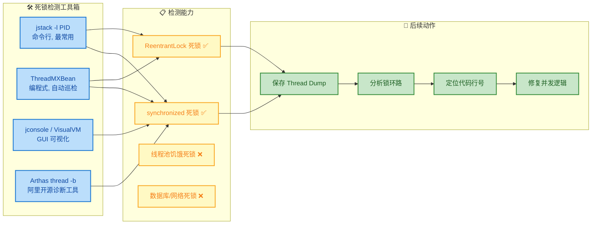

---

**📝 练习题**

在使用 `jstack` 检测死锁时，以下哪项描述是**正确**的？

A. `jstack` 只能检测 `synchronized` 关键字引起的死锁，无法检测 `ReentrantLock` 引起的死锁


B. 如果发生了死锁，`jstack` 输出的线程状态一定是 `BLOCKED`


C. `jstack` 输出末尾如果包含 `Found one Java-level deadlock`，说明 JVM 检测到了线程间的锁循环等待


D. `ThreadMXBean.findMonitorDeadlockedThreads()` 能检测所有类型的锁死锁，包括 `ReentrantLock`


**【答案】** C

**【解析】** 选项 A 错误：`jstack` 不仅能检测 `synchronized`（monitor-based）引起的死锁，也能检测 `java.util.concurrent.locks.Lock`（如 `ReentrantLock`）引起的死锁，JVM 的死锁检测器会同时分析两种锁。选项 B 错误：`synchronized` 死锁时线程状态确实是 `BLOCKED`，但 `ReentrantLock` 死锁时线程状态通常是 `WAITING`（因为 `ReentrantLock.lock()` 内部通过 `LockSupport.park()` 实现等待），所以"一定是 BLOCKED"的说法不准确。选项 C 正确：`Found one Java-level deadlock` 是 JVM 死锁检测器在分析所有线程的锁持有/等待关系后，发现存在**循环等待环路**时输出的标志信息。选项 D 错误：`findMonitorDeadlockedThreads()` 只能检测 `synchronized`（object monitor）引起的死锁；要同时检测 `ReentrantLock` 等 `java.util.concurrent.locks.Lock` 死锁，应使用 `findDeadlockedThreads()` 方法。

---

## 死锁预防

在上一节中，我们学会了如何**检测**死锁——通过 `jstack` 等工具在运行时发现问题。但检测终究是"事后补救"，真正的工程追求是：**从设计层面就让死锁不可能发生**。

死锁预防（Deadlock Prevention）的核心思路非常清晰：既然死锁需要**四个条件同时成立**才能发生，那我们只要**破坏其中任意一个条件**，死锁就无法形成。让我们回顾一下这四个条件：

1. **互斥（Mutual Exclusion）**：资源一次只能被一个线程持有。
2. **持有并等待（Hold and Wait）**：线程持有至少一个资源的同时，还在等待获取其他资源。
3. **不可剥夺（No Preemption）**：已获取的资源不能被强行夺走，只能由持有者主动释放。
4. **循环等待（Circular Wait）**：存在一个线程链，每个线程都在等待下一个线程持有的资源。

在实际 Java 开发中，**互斥条件**通常无法破坏——`synchronized` 和 `ReentrantLock` 天然就是排他锁，如果不互斥就失去了锁的意义（当然，如果场景允许，可以考虑使用读写锁 `ReadWriteLock` 来降低互斥的粒度，但这属于优化而非消除互斥）。因此，工程实践中主要从另外三个条件入手。

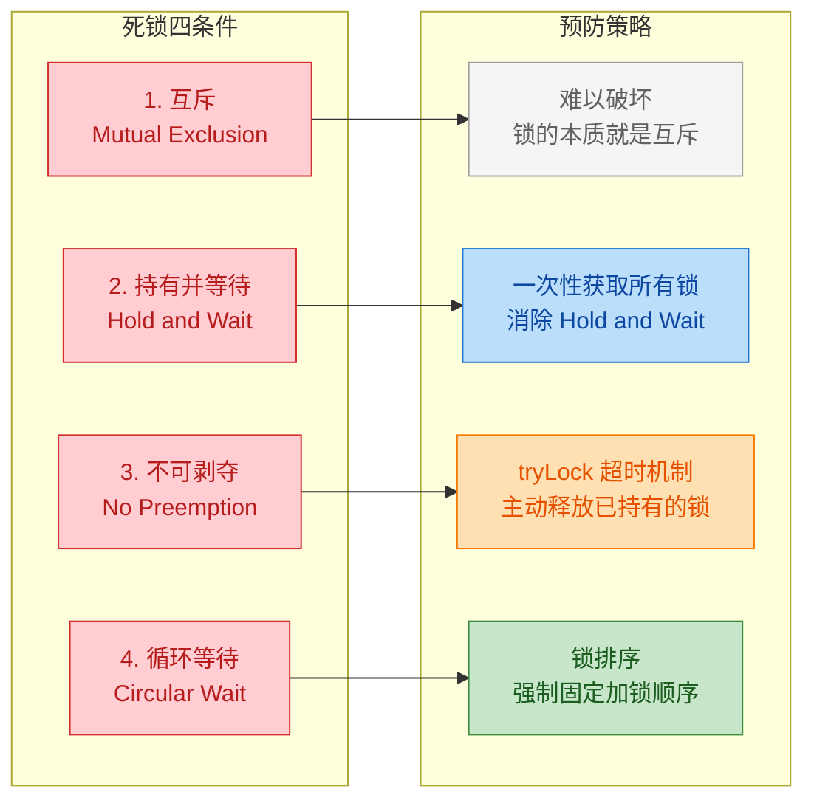

---

### 破坏循环等待（锁排序）

**锁排序（Lock Ordering）** 是实战中**最常用、最优雅**的死锁预防策略。它的核心思想极其简单：

> **为所有需要加锁的资源定义一个全局顺序，所有线程都必须按照这个顺序来获取锁。**

为什么这能避免死锁？让我们从反面来理解。死锁中的"循环等待"意味着：线程 A 持有锁 1 等待锁 2，线程 B 持有锁 2 等待锁 1——形成了一个"环"。但如果我们强制规定**所有线程都必须先获取锁 1 再获取锁 2**，那么线程 B 想获取锁 2 之前必须先获取锁 1。当锁 1 被线程 A 持有时，线程 B 会在锁 1 处阻塞，根本走不到"持有锁 2 等待锁 1"这一步——环被打破了。

**回顾死锁示例的问题：**

在前面的死锁示例中，转账场景的问题就在于：`transferMoney(A, B)` 先锁 A 再锁 B，而 `transferMoney(B, A)` 先锁 B 再锁 A——加锁顺序不一致，形成了循环等待。

**修复方案：** 不管调用者传入的参数顺序如何，我们始终按照**账户的某个固有属性**（如 `id`、`hashCode`、`System.identityHashCode`）来决定加锁顺序。

```java
public class LockOrderingDemo {

    // 账户类
    static class Account {
        private final int id;          // 账户唯一标识
        private double balance;        // 账户余额

        public Account(int id, double balance) {
            this.id = id;              // 构造时指定 ID
            this.balance = balance;    // 构造时指定初始余额
        }

        public int getId() { return id; }             // 获取 ID
        public double getBalance() { return balance; } // 获取余额

        // 存款（非线程安全，依赖外部加锁）
        public void credit(double amount) {
            this.balance += amount;    // 增加余额
        }

        // 取款（非线程安全，依赖外部加锁）
        public void debit(double amount) {
            this.balance -= amount;    // 减少余额
        }
    }

    /**
     * 安全的转账方法 —— 使用锁排序避免死锁
     * 核心策略：始终先锁 id 小的账户，再锁 id 大的账户
     */
    public static void transferMoney(Account from, Account to, double amount) {
        // 第一步：确定加锁顺序（按 id 从小到大）
        Account firstLock;             // 先锁定的账户
        Account secondLock;            // 后锁定的账户

        if (from.getId() < to.getId()) {
            firstLock = from;          // from 的 id 更小，先锁 from
            secondLock = to;           // 后锁 to
        } else if (from.getId() > to.getId()) {
            firstLock = to;            // to 的 id 更小，先锁 to
            secondLock = from;         // 后锁 from
        } else {
            // id 相同：自己转给自己，不需要转账
            throw new IllegalArgumentException("Cannot transfer to the same account!");
        }

        // 第二步：按固定顺序加锁
        synchronized (firstLock) {                     // 先获取 id 小的锁
            synchronized (secondLock) {                // 再获取 id 大的锁
                if (from.getBalance() < amount) {      // 检查余额是否充足
                    throw new RuntimeException("Insufficient balance!");
                }
                from.debit(amount);                    // 从转出账户扣款
                to.credit(amount);                     // 向转入账户加款
                System.out.printf("转账成功: Account-%d → Account-%d, 金额: %.2f%n",
                        from.getId(), to.getId(), amount);
            }
        }
    }

    public static void main(String[] args) throws InterruptedException {
        Account accountA = new Account(1, 10000);     // 账户A，id=1
        Account accountB = new Account(2, 10000);     // 账户B，id=2

        // 线程1：A 转给 B —— 内部会先锁 id=1(A)，再锁 id=2(B)
        Thread t1 = new Thread(() -> {
            for (int i = 0; i < 1000; i++) {           // 循环转账 1000 次
                transferMoney(accountA, accountB, 1);  // A → B
            }
        }, "Thread-A2B");

        // 线程2：B 转给 A —— 内部也会先锁 id=1(A)，再锁 id=2(B)
        // 虽然参数是 (B, A)，但方法内部会重新排序！
        Thread t2 = new Thread(() -> {
            for (int i = 0; i < 1000; i++) {           // 循环转账 1000 次
                transferMoney(accountB, accountA, 1);  // B → A（内部仍然先锁A再锁B）
            }
        }, "Thread-B2A");

        t1.start();                                    // 启动线程1
        t2.start();                                    // 启动线程2
        t1.join();                                     // 等待线程1完成
        t2.join();                                     // 等待线程2完成

        // 最终两个账户余额之和应该不变（守恒）
        System.out.println("Account-A 余额: " + accountA.getBalance());
        System.out.println("Account-B 余额: " + accountB.getBalance());
        System.out.println("总额: " + (accountA.getBalance() + accountB.getBalance()));
    }
}
```

**为什么一定安全了？** 我们用一张时序图来直观地看：

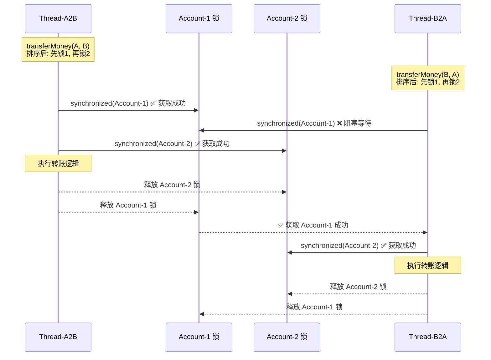

可以清楚地看到：两个线程的加锁顺序完全一致（都是 Account-1 → Account-2），不可能形成循环等待。最坏的情况是一个线程在第一把锁上排队等待，但绝不会出现"我等你、你等我"的僵局。

**当没有自然排序依据时怎么办？**

如果锁对象没有 `id` 这种天然的排序字段，可以使用 `System.identityHashCode()` 作为排序依据。但要注意 hash 冲突的情况（虽然极少），此时需要一个全局"裁决锁"（tie-breaking lock）来兜底：

```java
// 全局裁决锁：仅在 identityHashCode 冲突时使用
private static final Object TIE_LOCK = new Object();

public static void safeTransfer(Account from, Account to, double amount) {
    int fromHash = System.identityHashCode(from);     // 获取 from 的 identity hash
    int toHash = System.identityHashCode(to);         // 获取 to 的 identity hash

    if (fromHash < toHash) {
        synchronized (from) {                          // hash 小的先锁
            synchronized (to) {                        // hash 大的后锁
                doTransfer(from, to, amount);          // 执行转账
            }
        }
    } else if (fromHash > toHash) {
        synchronized (to) {                            // hash 小的先锁
            synchronized (from) {                      // hash 大的后锁
                doTransfer(from, to, amount);          // 执行转账
            }
        }
    } else {
        // Hash 冲突！使用全局裁决锁保证此场景下串行化
        synchronized (TIE_LOCK) {                      // 先获取全局锁，消除冲突
            synchronized (from) {                      // 再按任意顺序锁
                synchronized (to) {                    // 因为全局锁已串行化，不会死锁
                    doTransfer(from, to, amount);      // 执行转账
                }
            }
        }
    }
}
```

> 这个 `TIE_LOCK` 方案来自 Brian Goerta 的经典著作 *Java Concurrency in Practice*，是工业级代码中处理 hash 冲突的标准做法。

**锁排序小结：**

| 优点 | 缺点 |
|:---|:---|
| 逻辑清晰，一旦确定了顺序就彻底消灭死锁可能 | 需要**所有调用者**都遵守同一套排序规则 |
| 无额外性能开销（只是改变加锁顺序） | 当锁对象没有天然顺序时，排序逻辑会稍显复杂 |
| 适用于 `synchronized` 和 `ReentrantLock` | 在大型系统中，维护全局一致的锁顺序文档有一定成本 |

---

### 破坏持有并等待（一次性获取）

死锁的第二个必要条件是"持有并等待"——线程已经持有了一把锁，同时还在等待获取另一把锁。如果我们能保证**一个线程要么一次性获取所有需要的锁，要么一把都不获取**，那"持有并等待"的条件就被破坏了。

这种策略在数据库领域被称为 **Two-Phase Locking (2PL)** 中的保守变体，在 Java 中的典型实现方式是：引入一个**全局的"分配锁"（Allocator Lock）**，线程必须先获取这个分配锁，然后在它的保护下一次性拿到所有需要的资源锁，最后释放分配锁。

```java
public class AtomicLockAcquisitionDemo {

    static class Account {
        private final String name;     // 账户名称
        private double balance;        // 账户余额

        public Account(String name, double balance) {
            this.name = name;          // 初始化名称
            this.balance = balance;    // 初始化余额
        }

        // getter / setter 省略...
        public String getName() { return name; }
        public double getBalance() { return balance; }
        public void credit(double amt) { balance += amt; }
        public void debit(double amt) { balance -= amt; }
    }

    /**
     * 资源分配器：一次性获取多个资源
     * 核心思想：要么全部获取，要么全不获取
     */
    static class ResourceAllocator {
        // 记录当前已被某线程"占用"的账户集合
        private final Set<Account> allocatedResources = new HashSet<>();

        /**
         * 尝试一次性申请多个账户的"使用权"
         * @return true 表示申请成功，false 表示资源被占用需要重试
         */
        public synchronized boolean tryAllocate(Account... accounts) {
            // 检查所有请求的资源是否都空闲
            for (Account acc : accounts) {
                if (allocatedResources.contains(acc)) {
                    return false;                      // 有任何一个被占用，整体失败
                }
            }
            // 所有资源都空闲，一次性全部分配
            for (Account acc : accounts) {
                allocatedResources.add(acc);           // 标记为已分配
            }
            return true;                               // 分配成功
        }

        /**
         * 释放之前申请的资源
         */
        public synchronized void free(Account... accounts) {
            for (Account acc : accounts) {
                allocatedResources.remove(acc);        // 从已分配集合中移除
            }
            this.notifyAll();                          // 唤醒所有等待分配的线程
        }

        /**
         * 阻塞式获取：如果无法一次性获取，就等待直到成功
         */
        public synchronized void allocate(Account... accounts) throws InterruptedException {
            while (!tryAllocate(accounts)) {           // 自旋 + 等待
                this.wait();                           // 获取失败，释放 allocator 锁并等待
            }
        }
    }

    // 全局唯一的资源分配器
    private static final ResourceAllocator allocator = new ResourceAllocator();

    /**
     * 使用分配器实现安全转账
     */
    public static void transferMoney(Account from, Account to, double amount)
            throws InterruptedException {
        // 第一步：一次性申请两个账户的使用权（阻塞直到成功）
        allocator.allocate(from, to);

        try {
            // 第二步：此时已独占两个账户，安全地执行转账
            // 注意：这里不再需要 synchronized，因为分配器已经保证了排他性
            if (from.getBalance() >= amount) {         // 检查余额
                from.debit(amount);                    // 扣款
                to.credit(amount);                     // 加款
                System.out.printf("[%s] %s → %s, 金额: %.2f%n",
                        Thread.currentThread().getName(),
                        from.getName(), to.getName(), amount);
            }
        } finally {
            // 第三步：无论成功与否，都必须释放资源
            allocator.free(from, to);                  // 归还使用权
        }
    }

    public static void main(String[] args) throws InterruptedException {
        Account a = new Account("Alice", 10000);      // Alice 初始余额 10000
        Account b = new Account("Bob", 10000);        // Bob 初始余额 10000

        Thread t1 = new Thread(() -> {
            try {
                for (int i = 0; i < 1000; i++)        // 循环转账 1000 次
                    transferMoney(a, b, 1);            // Alice → Bob
            } catch (InterruptedException e) { Thread.currentThread().interrupt(); }
        }, "T1");

        Thread t2 = new Thread(() -> {
            try {
                for (int i = 0; i < 1000; i++)        // 循环转账 1000 次
                    transferMoney(b, a, 1);            // Bob → Alice
            } catch (InterruptedException e) { Thread.currentThread().interrupt(); }
        }, "T2");

        t1.start();                                    // 启动线程1
        t2.start();                                    // 启动线程2
        t1.join();                                     // 等待线程1完成
        t2.join();                                     // 等待线程2完成

        System.out.println("Alice: " + a.getBalance());
        System.out.println("Bob:   " + b.getBalance());
        System.out.println("Total: " + (a.getBalance() + b.getBalance()));
    }
}
```

**为什么不会死锁？** 让我们从原理层面分析：

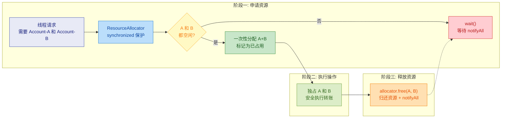

关键在于：线程在进入"执行操作"阶段之前，绝不会只持有"部分"资源。它要么拥有全部（进入工作），要么一个都没有（在 `wait()` 中等待）。"持有 A 等待 B"的局面根本不可能出现，因此死锁的第二个条件被彻底破坏。

**一次性获取的优缺点：**

| 优点 | 缺点 |
|:---|:---|
| 从根本上杜绝了"持有并等待" | `ResourceAllocator` 本身是一个全局瓶颈，高并发下吞吐量受限 |
| 逻辑语义清晰，易于理解 | 可能导致**资源利用率低下**——即使线程暂时只需要 A，也必须等 A 和 B 都空闲 |
| 适合锁数量少、竞争频率低的场景 | 当资源数量增多时，"所有资源同时空闲"的概率急剧下降，等待时间增加 |
| — | 可能引发**活锁**（Livelock）：多个线程反复申请、失败、释放、重试 |

> **实战建议**：一次性获取策略更适合于**资源少、临界区短**的场景。对于大规模并发系统，锁排序通常是更好的选择。

---

### 超时机制（tryLock）

前面的两种策略——锁排序和一次性获取——都建立在 `synchronized` 之上。但 `synchronized` 有一个致命缺陷：**一旦线程开始等待锁，就无法被打断或超时退出**，它会永远等下去。

`java.util.concurrent.locks.ReentrantLock` 提供了一个关键方法来解决这个问题：

```java
// 尝试在指定时间内获取锁
// 如果超时仍未获取到，返回 false 而不是永久阻塞
boolean tryLock(long timeout, TimeUnit unit) throws InterruptedException
```

`tryLock` 破坏的是**不可剥夺（No Preemption）**条件——虽然严格来说锁仍然不能被第三方"剥夺"，但线程可以在超时后**主动放弃**已持有的锁，效果等同于资源被"释放"回系统。这打破了"线程死守不放"的僵局。

**基于 tryLock 的安全转账实现：**

```java
import java.util.concurrent.locks.ReentrantLock;
import java.util.concurrent.TimeUnit;

public class TryLockDemo {

    static class Account {
        private final String name;                     // 账户名称
        private double balance;                        // 账户余额
        private final ReentrantLock lock               // 每个账户一把锁
                = new ReentrantLock();

        public Account(String name, double balance) {
            this.name = name;                          // 初始化名称
            this.balance = balance;                    // 初始化余额
        }

        public String getName() { return name; }
        public double getBalance() { return balance; }
        public ReentrantLock getLock() { return lock; }
        public void credit(double amt) { balance += amt; }
        public void debit(double amt) { balance -= amt; }
    }

    /**
     * 使用 tryLock + 超时机制实现安全转账
     * 如果无法在超时时间内获取两把锁，则主动回退重试
     */
    public static boolean transferMoney(Account from, Account to,
                                        double amount, long timeout, TimeUnit unit)
            throws InterruptedException {

        // 计算超时的绝对截止时间
        long stopTime = System.nanoTime() + unit.toNanos(timeout);

        while (true) {
            // 第一步：尝试获取 from 账户的锁
            if (from.getLock().tryLock()) {             // 非阻塞尝试获取第一把锁
                try {
                    // 第二步：尝试获取 to 账户的锁
                    if (to.getLock().tryLock()) {       // 非阻塞尝试获取第二把锁
                        try {
                            // 两把锁都获取成功，执行转账
                            if (from.getBalance() < amount) {
                                System.out.println("余额不足!");
                                return false;          // 余额不足，转账失败
                            }
                            from.debit(amount);        // 扣款
                            to.credit(amount);         // 加款
                            return true;               // 转账成功
                        } finally {
                            to.getLock().unlock();      // 释放 to 的锁
                        }
                    }
                    // 如果 to 的锁获取失败，走到这里
                    // from 的锁会在下面的 finally 中释放
                } finally {
                    from.getLock().unlock();            // 释放 from 的锁（无论 to 是否成功）
                }
            }

            // 走到这里说明没有同时获取到两把锁
            // 检查是否超时
            if (System.nanoTime() >= stopTime) {
                System.out.println("转账超时，放弃！");
                return false;                          // 超时退出，避免无限重试
            }

            // 随机短暂休眠，避免活锁（两个线程同步重试、同步失败）
            Thread.sleep((long)(Math.random() * 10));  // 随机退避 0~10ms
        }
    }

    public static void main(String[] args) throws InterruptedException {
        Account alice = new Account("Alice", 10000);   // Alice 初始余额
        Account bob = new Account("Bob", 10000);       // Bob 初始余额

        // 线程1：Alice → Bob，超时 1 秒
        Thread t1 = new Thread(() -> {
            try {
                for (int i = 0; i < 1000; i++) {
                    transferMoney(alice, bob, 1,
                            1, TimeUnit.SECONDS);      // 每次转账超时 1 秒
                }
            } catch (InterruptedException e) {
                Thread.currentThread().interrupt();
            }
        }, "T-A2B");

        // 线程2：Bob → Alice，超时 1 秒
        Thread t2 = new Thread(() -> {
            try {
                for (int i = 0; i < 1000; i++) {
                    transferMoney(bob, alice, 1,
                            1, TimeUnit.SECONDS);      // 每次转账超时 1 秒
                }
            } catch (InterruptedException e) {
                Thread.currentThread().interrupt();
            }
        }, "T-B2A");

        t1.start();
        t2.start();
        t1.join();
        t2.join();

        System.out.println("Alice: " + alice.getBalance());
        System.out.println("Bob:   " + bob.getBalance());
        System.out.println("Total: " + (alice.getBalance() + bob.getBalance()));
    }
}
```

**代码的关键设计要素：**

**1. 回退策略（Back-off）：** 当第二把锁获取失败时，代码不是死等，而是**立即释放已经持有的第一把锁**，然后重试。这就是"主动释放"，打破了"不可剥夺"条件。

**2. 随机退避（Random Back-off）：** 注意循环末尾的 `Thread.sleep((long)(Math.random() * 10))`。这个随机睡眠至关重要——如果没有它，两个线程可能会完美同步地重试：

```
T1: 获取 A ✅ → 获取 B ❌ → 释放 A → 重试
T2: 获取 B ✅ → 获取 A ❌ → 释放 B → 重试
T1: 获取 A ✅ → 获取 B ❌ → 释放 A → 重试
...（无限循环，永远无法前进）
```

这就是**活锁（Livelock）**——线程都在活跃地运行，但谁都无法完成工作。随机退避让两个线程错开重试时间，打破同步节奏。

**3. 超时保底：** 即使随机退避也无法保证一定成功（极端情况下），`stopTime` 超时机制确保方法最终一定会返回，不会无限循环。

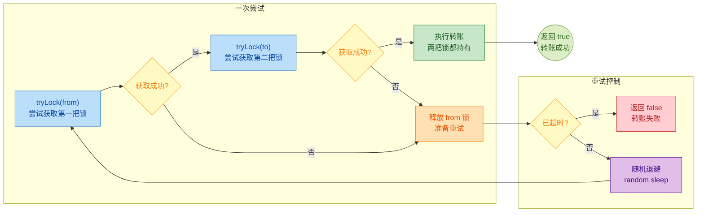

**tryLock vs synchronized 对比：**

| 特性 | `synchronized` | `ReentrantLock.tryLock()` |
|:---|:---|:---|
| 获取失败时 | 永久阻塞，无法退出 | 立即返回 `false`，可以主动退出 |
| 超时支持 | ❌ 不支持 | ✅ `tryLock(timeout, unit)` |
| 可中断 | ❌ 不可中断 | ✅ `lockInterruptibly()` |
| 死锁风险 | 高（一旦顺序不当就死锁） | 低（超时后主动释放） |
| 使用复杂度 | 简单（自动释放） | 较高（必须手动 `unlock()` in `finally`） |
| 性能 | JVM 优化后性能优秀 | 略高的开销（CAS + AQS） |

> **实战建议**：`tryLock` 适合于**锁竞争激烈、获取失败后有合理回退方案**的场景。如果你的业务逻辑要求"必须获取锁才能继续"（没有替代方案），那么 `tryLock` 的不断重试可能并不比锁排序更高效。**在大多数场景下，锁排序仍然是首选**，`tryLock` 更多是作为防御性的兜底策略。

---

**三种策略的综合对比：**

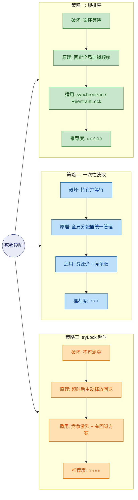

---

**📝 练习题**

以下代码是否可能发生死锁？

```java
ReentrantLock lockA = new ReentrantLock();
ReentrantLock lockB = new ReentrantLock();

// 线程1
new Thread(() -> {
    lockA.lock();
    try {
        Thread.sleep(100);
        if (lockB.tryLock(50, TimeUnit.MILLISECONDS)) {
            try {
                System.out.println("T1 完成");
            } finally { lockB.unlock(); }
        } else {
            System.out.println("T1 获取 lockB 超时，放弃");
        }
    } catch (InterruptedException e) { }
    finally { lockA.unlock(); }
}).start();

// 线程2
new Thread(() -> {
    lockB.lock();
    try {
        Thread.sleep(100);
        if (lockA.tryLock(50, TimeUnit.MILLISECONDS)) {
            try {
                System.out.println("T2 完成");
            } finally { lockA.unlock(); }
        } else {
            System.out.println("T2 获取 lockA 超时，放弃");
        }
    } catch (InterruptedException e) { }
    finally { lockB.unlock(); }
}).start();
```

A. 一定会死锁，因为加锁顺序不一致


B. 不会死锁，`tryLock` 超时后会主动放弃，但可能两个线程都打印"超时，放弃"


C. 不会死锁，两个线程都一定能打印"完成"


D. 编译错误，`tryLock` 不能和 `lock` 混用

**【答案】** B

**【解析】** 虽然线程 1 先 `lockA.lock()` 再 `lockB.tryLock()`，线程 2 先 `lockB.lock()` 再 `lockA.tryLock()`，加锁顺序确实不一致，但关键在于第二把锁使用的是 `tryLock(50, MILLISECONDS)` 而非 `lock()`。当两个线程各自持有一把锁并试图获取对方的锁时，`tryLock` 会在 50ms 后超时返回 `false`，线程随即释放自己持有的锁退出——**不会永久阻塞，因此不会死锁**。但代价是两个线程都没有成功完成任务，各自打印了"超时，放弃"。这正是 `tryLock` 的取舍：**避免了死锁，但在竞争激烈时可能导致任务失败，需要调用方处理重试逻辑**。选项 A 忽略了 `tryLock` 的超时退出能力；选项 C 过于乐观，当两个线程几乎同时到达 `tryLock` 时（都 `sleep(100)` 后），在 50ms 内大概率互相等不到；选项 D 错误，`lock()` 和 `tryLock()` 完全可以在同一个 `ReentrantLock` 上混合使用。

---

## 本章小结

死锁（Deadlock）是多线程编程中最具破坏力的并发问题之一——它不会抛出异常，不会打印错误日志，程序也不会崩溃退出，而是**静悄悄地永远卡住**，像一个无声的黑洞吞噬系统的可用性。正因为如此，理解死锁的本质、掌握检测手段和预防策略，是每一位 Java 工程师的必修课。

下面用一张全景图回顾本章核心脉络：

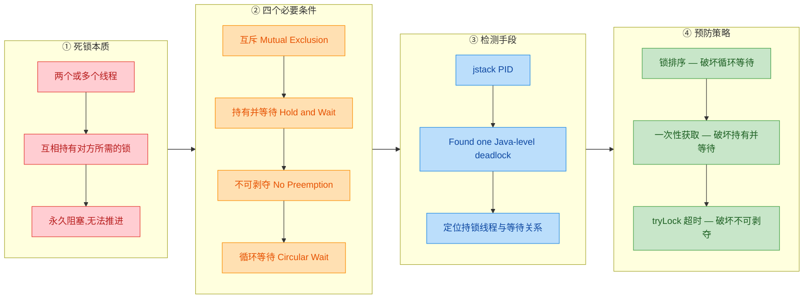

### 核心知识点速查表

| 知识模块 | 关键要点 | 面试高频指数 |
|---------|---------|:----------:|
| **死锁定义** | 多线程互相持有对方所需的锁，全部陷入永久等待（BLOCKED），无外部干预无法恢复 | ⭐⭐⭐ |
| **四个必要条件** | 互斥、持有并等待、不可剥夺、循环等待——四个条件**同时满足**才会死锁，**打破任一**即可预防 | ⭐⭐⭐⭐⭐ |
| **经典死锁模型** | 线程 A 持有锁 1 等待锁 2，线程 B 持有锁 2 等待锁 1——最小的循环等待单元 | ⭐⭐⭐⭐ |
| **jstack 检测** | `jstack <PID>` 输出线程转储，JVM 自动分析并报告 `Found one Java-level deadlock` | ⭐⭐⭐⭐ |
| **锁排序** | 所有线程按统一顺序（如对象 hashCode、ID 大小）获取锁，从根本上消除循环 | ⭐⭐⭐⭐⭐ |
| **一次性获取** | 要么一次拿到所有锁，要么一个都不拿——用全局大锁或 `Lock` 封装实现 | ⭐⭐⭐ |
| **tryLock 超时** | `lock.tryLock(timeout, unit)` 尝试获取，超时自动放弃并释放已持有的锁 | ⭐⭐⭐⭐ |

### 四个必要条件与预防策略的对应关系

这是面试中被问到最多的知识映射。每一种预防策略**精确地打破**四个条件中的一个：

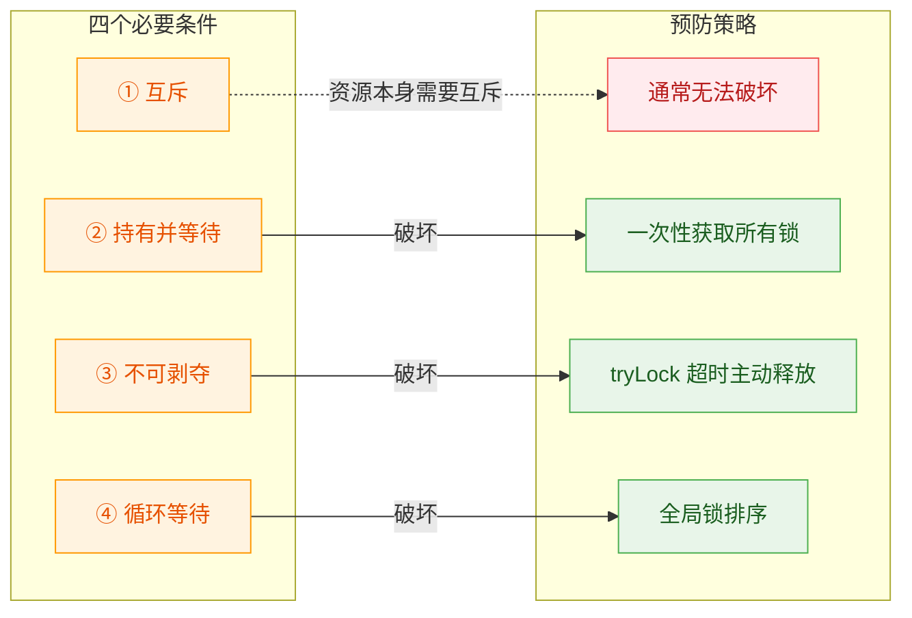

> **为什么互斥条件通常无法破坏？** 因为某些资源（如数据库连接、文件句柄、`synchronized` 块保护的临界区）天然需要互斥访问。如果允许多线程同时写入，会导致数据不一致——这比死锁更可怕。所以实践中我们通常**保留互斥**，从其他三个条件入手。

### 三大预防策略的选型指南

在实际工程中，不同场景适合不同的预防策略。下面是一份简明的选型决策参考：

```java
// 场景一：锁的数量固定且已知（如两个账户互转）
// ✅ 推荐：锁排序（Lock Ordering）
// 理由：简单高效，零额外开销，代码可读性好
synchronized (Math.min(a, b) == a ? lockA : lockB) {
    synchronized (Math.max(a, b) == a ? lockA : lockB) {
        // 转账逻辑...
    }
}

// 场景二：需要同时持有多个动态数量的锁
// ✅ 推荐：一次性获取（All-or-Nothing）
// 理由：将多锁问题降维为单锁问题，逻辑最清晰
synchronized (globalLock) {
    // 持有全局锁后，安全操作所有资源...
}

// 场景三：高并发、不能容忍永久等待（如交易系统）
// ✅ 推荐：tryLock 超时机制
// 理由：可主动退出等待，配合重试策略保证系统活性
if (lock1.tryLock(1, TimeUnit.SECONDS)) {
    try {
        if (lock2.tryLock(1, TimeUnit.SECONDS)) {
            try {
                // 业务逻辑...
            } finally { lock2.unlock(); }
        }
    } finally { lock1.unlock(); }
}
```

| 策略 | 优点 | 缺点 | 适用场景 |
|-----|------|------|---------|
| **锁排序** | 零开销、代码简洁、从根本上消除循环 | 需要所有锁可比较、所有开发者严格遵守 | 锁数量少且固定 |
| **一次性获取** | 逻辑最简单、无循环等待可能 | 全局锁粒度过大，并发度严重下降 | 低并发或批量操作 |
| **tryLock 超时** | 灵活、不会永久阻塞、可配合重试 | 代码复杂、可能活锁、需要手动释放 | 高并发系统、交易引擎 |

### 调试与排查 Checklist

当你怀疑线上系统发生死锁时，可以按照以下步骤快速定位：

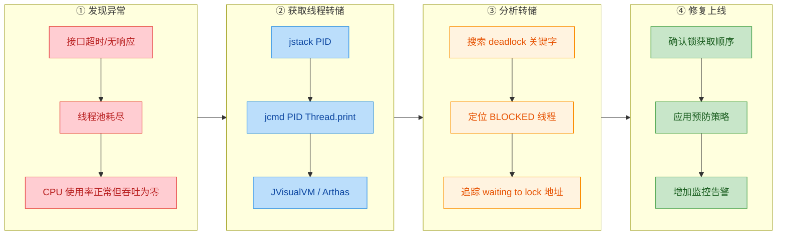

### 容易混淆的概念辨析

| 概念 | 定义 | 线程状态 | 能否自动恢复 |
|-----|------|---------|:----------:|
| **死锁 Deadlock** | 多线程互相持有对方所需的锁，全部永久阻塞 | `BLOCKED` | ❌ 不能 |
| **活锁 Livelock** | 线程不断重试但互相\"谦让\"，导致都无法推进（如两人走廊互让） | `RUNNABLE` | ⚠️ 可能（随机退避） |
| **饥饿 Starvation** | 低优先级线程长期无法获取锁/CPU 时间片 | `BLOCKED` / `WAITING` | ⚠️ 可能（公平锁） |

> **面试加分点**：`tryLock` 超时机制在预防死锁的同时，如果重试策略不当（如所有线程固定等待相同时间后重试），可能引发**活锁**。解决方案是引入**随机退避时间**（random backoff），让冲突的线程在不同时刻重试，打破同步节奏。

### 一句话总结

> **死锁 = 互斥 + 持有并等待 + 不可剥夺 + 循环等待**。预防的核心思路就是**打破其中任意一个条件**。工程实践中，**锁排序**是最常用、最推荐的方案；**tryLock 超时**是高并发场景的兜底保障；而 **jstack** 是线上死锁排查的第一利器。

---

**📝 练习题**

在一个银行转账系统中，线程 A 执行 `transfer(账户1, 账户2, 100元)`，线程 B 同时执行 `transfer(账户2, 账户1, 50元)`。`transfer` 方法的实现如下：

```java
public void transfer(Account from, Account to, int amount) {
    synchronized (from) {
        synchronized (to) {
            from.debit(amount);
            to.credit(amount);
        }
    }
}
```

以下哪种改造方案**不能**有效预防死锁？

A. 按照账户 ID 大小排序，始终先锁 ID 小的账户，再锁 ID 大的账户


B. 将 `synchronized` 替换为 `ReentrantLock`，并使用 `tryLock(timeout)` 获取两把锁，超时则释放已持有的锁并重试


C. 在 `transfer` 方法上添加 `synchronized` 关键字（锁住 `this`），取消内部的两个 `synchronized` 块


D. 将两个 `synchronized` 块的嵌套顺序随机化，即每次调用时随机决定先锁 `from` 还是先锁 `to`


**【答案】** D

**【解析】** 逐项分析：

- **A（锁排序）**：通过强制所有线程按照账户 ID 的固定顺序获取锁，消除了循环等待的可能性。无论谁转给谁，锁的获取顺序始终一致（先小后大），这是**最经典的死锁预防方案** ✅。
- **B（tryLock 超时）**：使用 `tryLock(timeout)` 尝试获取锁，如果在超时时间内无法获取第二把锁，就主动释放第一把锁并稍后重试。这破坏了「不可剥夺」条件（线程可以主动放弃已持有的锁），有效预防死锁 ✅。
- **C（全局锁/粗粒度锁）**：将 `synchronized` 加在方法级别（锁住 `this`，即整个 `BankService` 实例），意味着任意时刻只有一个线程可以执行转账。虽然**并发度大幅下降**，但确实消除了多锁嵌套的问题，不会死锁 ✅。
- **D（随机化锁顺序）**：随机化**不能**消除循环等待。假设某次线程 A 随机选择先锁 `账户1` 再锁 `账户2`，而线程 B 随机选择先锁 `账户2` 再锁 `账户1`——这恰好就是经典的死锁场景。随机化只是降低了死锁的**概率**，但并未从根本上打破任何必要条件 ❌。

---
