---

# 活锁与饥饿

---

## 活锁（Livelock）

### 定义：线程都在运行但无进展

在并发编程中，我们对**死锁（Deadlock）**往往耳熟能详——两个或多个线程互相持有对方所需的锁，全部阻塞，程序卡死。然而，还存在一种更隐蔽、更难排查的并发问题——**活锁（Livelock）**。

活锁的核心特征是：**线程没有阻塞（Not Blocked），它们都处于运行状态（Runnable），不断地执行某些操作，但这些操作完全是无效的"空转"，程序整体没有任何实质性进展（No Progress）。** 这就好比两个人在窄巷里迎面相遇，双方都想给对方让路：你往左，我也往左；你往右，我也往右——两个人都在动，都在"努力"让路，但谁也过不去。

从操作系统和 JVM 的视角来看，活锁与死锁有本质区别：

| 对比维度 | 死锁 (Deadlock) | 活锁 (Livelock) |
|---|---|---|
| **线程状态** | `BLOCKED` / `WAITING` | `RUNNABLE` |
| **CPU 消耗** | 几乎为零（线程挂起） | 极高（线程空转，持续消耗 CPU） |
| **可检测性** | 较易（JVM 可通过 `jstack` 检测等待图环） | 极难（线程都"活着"，无明显异常） |
| **表现形式** | 程序卡死，无响应 | 程序"很忙"，CPU 飙升，但无实际输出 |
| **恢复可能** | 不介入则永远不会恢复 | 理论上可能偶然恢复，但概率极低 |

活锁之所以危险，是因为它更难被发现。监控系统看到线程全部活跃、CPU 使用率很高，可能会误以为系统"很繁忙在正常工作"，但实际上没有任何任务在推进。这种情况在高并发系统中尤为致命。

下面用一张流程图来直观对比死锁与活锁的状态流转差异：

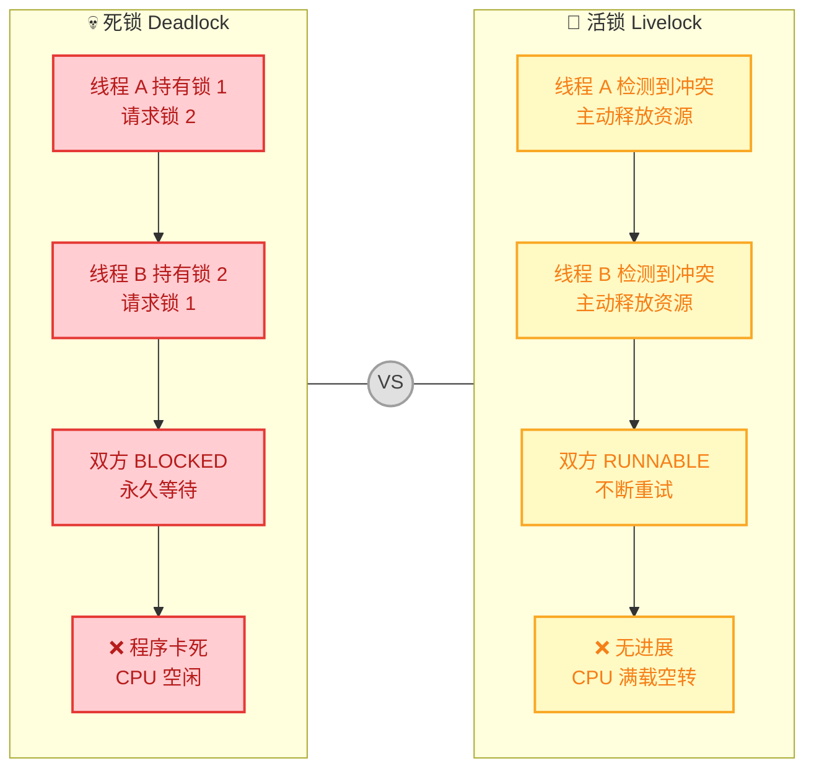

活锁的根因往往在于：**线程之间存在"过度礼让"或"同步反应"的逻辑**。每个线程都在响应对方的状态变化而调整自己的行为，但由于所有线程的调整策略完全对称（Symmetric），它们就像跳了一支"同步舞"，永远无法打破僵局。

---

### 示例：互相谦让（The Polite Deadlock Pattern）

下面通过一个经典的"两人过独木桥"的场景来演示活锁。设想两个线程（Worker），它们各持有一把锁（Resource），当发现对方也需要自己的锁时，会"礼貌地"释放自己的锁，让给对方——结果双方同时释放、同时重新获取，无限循环。

```java
import java.util.concurrent.locks.Lock;
import java.util.concurrent.locks.ReentrantLock;

/**
 * 活锁示例：两个 Worker 互相谦让，导致谁都无法完成任务
 */
public class LivelockDemo {

    // 定义共享资源（两把锁）
    static final Lock lock1 = new ReentrantLock(); // 资源 1
    static final Lock lock2 = new ReentrantLock(); // 资源 2

    public static void main(String[] args) {
        // 创建两个线程，分别尝试获取两把锁
        Thread worker1 = new Thread(() -> doWork("Worker-1", lock1, lock2), "Worker-1");
        Thread worker2 = new Thread(() -> doWork("Worker-2", lock2, lock1), "Worker-2");

        worker1.start(); // 启动线程 1
        worker2.start(); // 启动线程 2
    }

    /**
     * 工作方法：先获取自己的锁，再尝试获取对方的锁
     * 如果对方的锁被占用，就"礼貌地"释放自己的锁，然后重试
     *
     * @param name   Worker 名称（用于日志打印）
     * @param first  该 Worker 首先获取的锁
     * @param second 该 Worker 其次需要获取的锁
     */
    static void doWork(String name, Lock first, Lock second) {
        while (true) {
            // 第一步：尝试获取自己的主锁
            first.lock();
            System.out.println(name + " 已获取第一把锁，尝试获取第二把...");

            // 第二步：尝试获取对方的锁（非阻塞方式）
            if (second.tryLock()) {
                try {
                    // ✅ 成功获取两把锁，执行业务逻辑
                    System.out.println(name + " 成功获取两把锁，完成任务！");
                    return; // 任务完成，退出循环
                } finally {
                    second.unlock(); // 释放第二把锁
                }
            } else {
                // ❌ 无法获取第二把锁，"礼貌地"释放自己的锁
                System.out.println(name + " 无法获取第二把锁，释放第一把锁，稍后重试...");
                first.unlock(); // 释放第一把锁，让给对方
            }

            // 【关键致命缺陷】此处没有任何随机延迟！
            // 两个线程以完全相同的节奏运行，导致：
            //   T1: lock(lock1) -> tryLock(lock2) 失败 -> unlock(lock1)
            //   T2: lock(lock2) -> tryLock(lock1) 失败 -> unlock(lock2)
            // 然后双方同时重试，再次进入相同的循环 → 活锁！
        }
    }
}
```

运行上面的代码，控制台会无限输出类似以下内容：

```text
Worker-1 已获取第一把锁，尝试获取第二把...
Worker-2 已获取第一把锁，尝试获取第二把...
Worker-1 无法获取第二把锁，释放第一把锁，稍后重试...
Worker-2 无法获取第二把锁，释放第一把锁，稍后重试...
Worker-1 已获取第一把锁，尝试获取第二把...
Worker-2 已获取第一把锁，尝试获取第二把...
Worker-1 无法获取第二把锁，释放第一把锁，稍后重试...
Worker-2 无法获取第二把锁，释放第一把锁，稍后重试...
... (无限循环，永远看不到 "完成任务")
```

我们用时序图来精确还原这个过程中两个线程的交互：

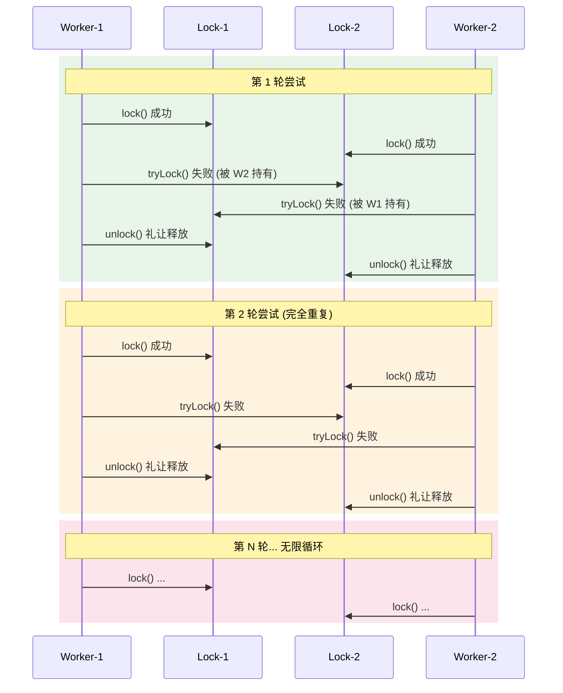

可以看到，问题的根源在于**完全对称的策略 + 完全同步的节奏**。两个线程如同一面镜子的两侧，做着完全对称的动作，永远无法打破同步。

---

### 解决方案：随机退避（Random Backoff）

活锁的本质是对称性（Symmetry），因此解决方案的核心思路就是**打破对称性（Break Symmetry）**。最经典、最实用的方法就是**随机退避（Random Backoff）**：当线程检测到冲突需要重试时，随机等待一段时间再尝试，这样不同线程大概率会在不同时刻重试，从而错开节奏，打破死循环。

这种思想在计算机科学中有着广泛应用，例如：
- **以太网 CSMA/CD 协议**中的二进制指数退避（Binary Exponential Backoff）
- **分布式系统**中的乐观并发控制（Optimistic Concurrency Control）冲突重试
- **数据库事务**的死锁恢复策略

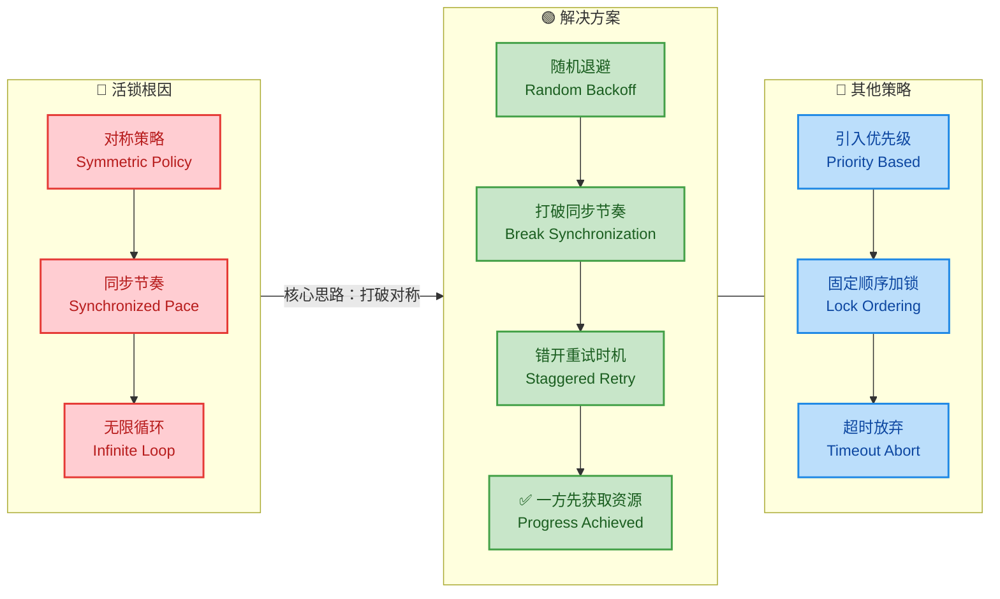

下面是修复后的代码，核心改动只有一处——在释放锁后加入**随机延迟**：

```java
import java.util.concurrent.locks.Lock;
import java.util.concurrent.locks.ReentrantLock;
import java.util.concurrent.ThreadLocalRandom;

/**
 * 活锁解决方案：随机退避 (Random Backoff)
 */
public class LivelockSolution {

    static final Lock lock1 = new ReentrantLock(); // 资源 1
    static final Lock lock2 = new ReentrantLock(); // 资源 2

    public static void main(String[] args) {
        // 启动两个 Worker，分别以不同顺序获取锁
        Thread worker1 = new Thread(() -> doWork("Worker-1", lock1, lock2), "Worker-1");
        Thread worker2 = new Thread(() -> doWork("Worker-2", lock2, lock1), "Worker-2");

        worker1.start(); // 启动线程 1
        worker2.start(); // 启动线程 2
    }

    static void doWork(String name, Lock first, Lock second) {
        while (true) {
            // 第一步：获取自己的主锁
            first.lock();
            System.out.println(name + " 已获取第一把锁，尝试获取第二把...");

            // 第二步：尝试获取对方的锁
            if (second.tryLock()) {
                try {
                    // ✅ 两把锁都获取成功，执行任务
                    System.out.println(name + " ✅ 成功获取两把锁，完成任务！");
                    return; // 任务完成，退出
                } finally {
                    second.unlock(); // 释放第二把锁
                    first.unlock();  // 释放第一把锁
                }
            } else {
                // ❌ 获取第二把锁失败，释放第一把锁
                first.unlock();
                System.out.println(name + " 释放锁，准备随机退避...");

                // ====== 【核心修复】随机退避 ======
                try {
                    // 随机等待 1~100 毫秒
                    // 使用 ThreadLocalRandom（线程安全且高性能）
                    long backoff = ThreadLocalRandom.current().nextLong(1, 100);
                    System.out.println(name + " 退避 " + backoff + " ms");
                    Thread.sleep(backoff); // 随机休眠，打破对称性
                } catch (InterruptedException e) {
                    Thread.currentThread().interrupt(); // 恢复中断标志
                    return; // 被中断则退出
                }
                // ====================================
            }
        }
    }
}
```

运行修复后的代码，很快就能看到某个 Worker 成功完成任务：

```text
Worker-1 已获取第一把锁，尝试获取第二把...
Worker-2 已获取第一把锁，尝试获取第二把...
Worker-1 释放锁，准备随机退避...
Worker-2 释放锁，准备随机退避...
Worker-1 退避 73 ms
Worker-2 退避 12 ms
Worker-2 已获取第一把锁，尝试获取第二把...
Worker-2 ✅ 成功获取两把锁，完成任务！
Worker-1 已获取第一把锁，尝试获取第二把...
Worker-1 ✅ 成功获取两把锁，完成任务！
```

因为 Worker-2 随机退避了 12ms，而 Worker-1 退避了 73ms，Worker-2 先醒来，成功获取了两把锁。等 Worker-1 醒来时，锁已经空闲了，也顺利完成任务。对称被打破，活锁被解除。

**除了随机退避，还有其他实用的解决策略：**

**策略一：固定顺序加锁（Lock Ordering）**

从根源上避免冲突，规定所有线程必须按照统一的顺序获取锁。比如所有线程都先获取 `lock1`，再获取 `lock2`：

```java
// 所有线程都按相同顺序加锁：先 lock1，再 lock2
// 这样就不会出现 "你持有1要2，我持有2要1" 的对称冲突
static void doWorkOrdered(String name) {
    lock1.lock();   // 所有线程都先获取 lock1
    try {
        lock2.lock(); // 然后获取 lock2
        try {
            System.out.println(name + " ✅ 完成任务");
        } finally {
            lock2.unlock(); // 按逆序释放
        }
    } finally {
        lock1.unlock(); // 按逆序释放
    }
}
```

**策略二：带超时的 tryLock**

`tryLock(long timeout, TimeUnit unit)` 方法在指定时间内尝试获取锁，超时则放弃，避免无限重试：

```java
import java.util.concurrent.TimeUnit;

static void doWorkWithTimeout(String name, Lock first, Lock second) {
    try {
        // 尝试在 500ms 内获取第一把锁
        if (first.tryLock(500, TimeUnit.MILLISECONDS)) {
            try {
                // 尝试在 500ms 内获取第二把锁
                if (second.tryLock(500, TimeUnit.MILLISECONDS)) {
                    try {
                        System.out.println(name + " ✅ 完成任务");
                        return; // 成功完成
                    } finally {
                        second.unlock(); // 释放第二把锁
                    }
                }
            } finally {
                first.unlock(); // 释放第一把锁
            }
        }
        // 超时获取失败，可记录日志或采取降级策略
        System.out.println(name + " ⏱️ 获取锁超时，放弃本次操作");
    } catch (InterruptedException e) {
        Thread.currentThread().interrupt(); // 恢复中断标志
    }
}
```

最后，用一张总结图来归纳活锁的完整知识点：

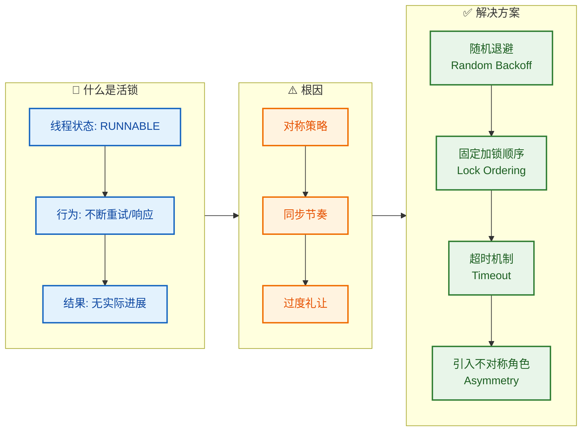

---

**📝 练习题**

以下关于活锁（Livelock）的描述，正确的是？

A. 活锁中的线程处于 `BLOCKED` 状态，等待对方释放锁

B. 活锁比死锁更容易通过 `jstack` 等工具检测到

C. 活锁中的线程持续运行、消耗 CPU，但程序没有实际进展

D. 只要使用了 `tryLock()` 方法，就不会产生活锁


**【答案】** C

**【解析】** 活锁的核心定义就是线程都处于 `RUNNABLE` 状态，持续执行操作（消耗 CPU），但无法取得实质性进展。选项 A 描述的是死锁（线程 `BLOCKED`），并非活锁。选项 B 恰恰相反——活锁因为线程全部"活着"，反而比死锁更难被监控工具捕获，`jstack` 检测死锁依赖的是线程等待图中的环，而活锁线程没有形成这种等待关系。选项 D 是常见误区：`tryLock()` 本身确实可以避免死锁（因为不会无限阻塞），但如果所有线程在 `tryLock()` 失败后以相同的节奏释放并重试（正如本章示例所演示的），反而会导致活锁。必须配合**随机退避**等策略才能真正解决问题。

---

## 饥饿（Starvation）

### 定义：线程长期无法获取资源

**饥饿（Starvation）** 是指某个或某些线程在并发环境中，由于始终无法获得所需的资源（CPU 时间片、锁、I/O 等）而**长期处于等待状态，无法继续执行**的现象。与死锁（Deadlock）不同的是，饥饿状态下系统整体并未"卡死"——**其他线程仍然在正常运行并持续获取资源**，只是被饿着的线程"永远排不上队"。

从宏观视角来看，可以用一个比喻来理解饥饿：

> 想象一个永远有人插队的食堂窗口。你一直在排队，队伍也一直在动（系统没有死锁），但由于总有"更高优先级"的人插到你前面，你可能永远也打不到饭。

饥饿的核心特征可以归纳为以下几点：

| 特征 | 说明 |
|:---|:---|
| **线程存活** | 被饿的线程并没有终止，它仍然处于 `RUNNABLE` 或 `WAITING`/`BLOCKED` 状态 |
| **系统仍在推进** | 与死锁不同，系统中至少有部分线程在正常工作并取得进展 |
| **资源获取不公平** | 根本原因是资源分配机制存在不公平性，某些线程被"系统性地"跳过 |
| **非必然永久** | 饥饿可能是暂时的（Transient Starvation），也可能是无限期的（Indefinite Starvation / Livelock 边界情况） |

为了更直观地理解饥饿与死锁、活锁的区别，我们用一张对比图来呈现：

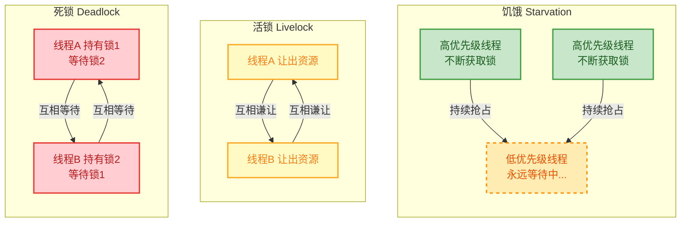

**关键区别总结**：
- **死锁**：所有相关线程都被阻塞，系统完全无进展（Total halt）。
- **活锁**：所有相关线程都在运行，但都没有实质进展（Everyone moves, nobody progresses）。
- **饥饿**：部分线程正常推进，但个别线程被长期排斥（Some progress, some starve）。

下面用一段最简代码直观演示"什么是饥饿"——一个低优先级线程几乎永远无法被调度：

```java
public class StarvationDemo {
    public static void main(String[] args) {
        // 创建一个共享的 Runnable 任务
        Runnable task = () -> {
            // 无限循环，模拟持续竞争资源
            while (true) {
                // 打印当前线程的名字和优先级
                System.out.println(Thread.currentThread().getName()
                        + " (priority=" + Thread.currentThread().getPriority() + ") is running");
                try {
                    // 短暂休眠，给其他线程一点机会
                    Thread.sleep(1);
                } catch (InterruptedException e) {
                    // 如果被中断，恢复中断标志位并退出循环
                    Thread.currentThread().interrupt();
                    break;
                }
            }
        };

        // ========== 创建多个高优先级线程 ==========
        for (int i = 0; i < 5; i++) {
            // 为每个线程命名为 HighPriority-0 ~ HighPriority-4
            Thread highThread = new Thread(task, "HighPriority-" + i);
            // 设为最高优先级（10）
            highThread.setPriority(Thread.MAX_PRIORITY);
            // 启动线程
            highThread.start();
        }

        // ========== 创建一个低优先级线程（可能被饿死） ==========
        Thread lowThread = new Thread(task, "★ LowPriority ★");
        // 设为最低优先级（1）
        lowThread.setPriority(Thread.MIN_PRIORITY);
        // 启动线程
        lowThread.start();
    }
}
```

运行上述代码后，控制台输出中你会发现 `★ LowPriority ★` 出现的频率远远低于 `HighPriority-*` 线程。在某些操作系统的线程调度策略下，低优先级线程甚至可能长时间完全得不到执行机会——这就是饥饿。

---

### 原因：优先级、非公平锁等

饥饿并非由单一原因造成，而是多种因素叠加的结果。我们从**线程优先级调度**、**非公平锁**、**长时间持锁**三个主要维度逐一深入分析。

#### 原因一：线程优先级不当（Thread Priority Misuse）

Java 的线程优先级范围是 `1`（`Thread.MIN_PRIORITY`）到 `10`（`Thread.MAX_PRIORITY`），默认值为 `5`（`Thread.NORM_PRIORITY`）。操作系统的线程调度器**倾向于**将 CPU 时间片分配给优先级更高的线程。

但这里有一个非常关键的认知：**Java 线程优先级只是对操作系统调度的一种"建议"（hint），并非强制保证。** 不同操作系统对优先级的映射和尊重程度各不相同：

| 操作系统 | 优先级处理方式 | 饥饿风险 |
|:---|:---|:---|
| **Linux** | 通常将 Java 的 10 级优先级映射为较少的 nice 值区间，差异不大 | 较低 |
| **Windows** | 相对更"尊重"优先级设置，高优先级线程会显著抢占低优先级线程 | 较高 |
| **macOS** | 类似 Linux，优先级映射区分度有限 | 较低 |

正因为行为依赖操作系统，Java 官方文档也明确建议：**不要将程序的正确性建立在线程优先级之上**。

#### 原因二：非公平锁（Non-fair Lock）

这是 Java 并发编程中导致饥饿**最常见**的原因之一。`java.util.concurrent.locks.ReentrantLock` 在默认构造时使用的是**非公平策略（Non-fair）**：

```java
// 默认构造：非公平锁
ReentrantLock unfairLock = new ReentrantLock();        // 等价于 new ReentrantLock(false)

// 显式构造：公平锁
ReentrantLock fairLock = new ReentrantLock(true);      // 传入 true 表示公平
```

非公平锁与公平锁的核心区别在于**"新来的线程能否插队"**：

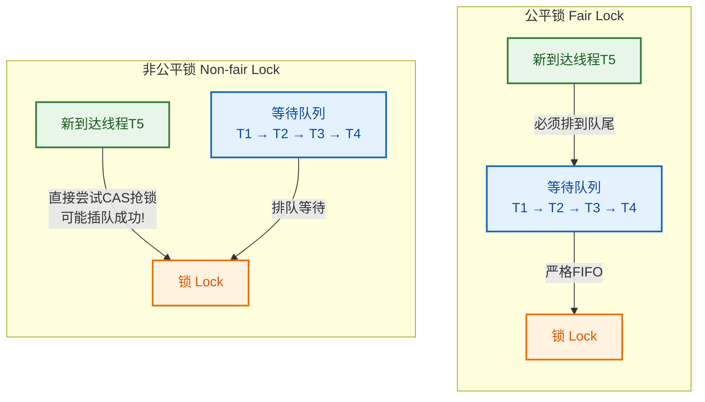

在非公平锁下，如果某线程释放锁后，恰好有新线程到来并通过 CAS（Compare-And-Swap）操作直接获取了锁，那么等待队列中老老实实排队的线程就被"插队"了。如果这种情况反复发生，队列中的某些线程可能长期得不到锁——这就是由非公平锁引发的饥饿。

让我们用一段代码清晰地展示非公平锁导致饥饿的场景：

```java
import java.util.concurrent.locks.ReentrantLock;

public class UnfairLockStarvation {

    // 创建非公平锁（默认即非公平）
    private static final ReentrantLock lock = new ReentrantLock(false);

    // 共享计数器：记录每个线程成功获取锁的次数
    private static final int[] acquireCounts = new int[6];

    public static void main(String[] args) throws InterruptedException {

        // 创建 6 个线程竞争同一把非公平锁
        Thread[] threads = new Thread[6];
        for (int i = 0; i < threads.length; i++) {
            // 使用 final 变量在 lambda 中捕获线程编号
            final int id = i;
            threads[i] = new Thread(() -> {
                // 每个线程尝试获取锁 10000 次
                for (int j = 0; j < 10000; j++) {
                    // 获取锁
                    lock.lock();
                    try {
                        // 成功获取锁，计数加一
                        acquireCounts[id]++;
                    } finally {
                        // 无论如何都要在 finally 中释放锁
                        lock.unlock();
                    }
                }
            }, "Thread-" + i);
        }

        // 启动所有线程
        for (Thread t : threads) {
            t.start();
        }

        // 等待所有线程执行完毕
        for (Thread t : threads) {
            t.join();
        }

        // 打印每个线程获取锁的次数分布
        System.out.println("====== 非公平锁下各线程获取锁的次数 ======");
        for (int i = 0; i < acquireCounts.length; i++) {
            // 打印线程编号和对应的获取锁次数
            System.out.printf("Thread-%d : %d 次%n", i, acquireCounts[i]);
        }
    }
}
```

典型的输出可能类似（各次运行结果不同）：

```
====== 非公平锁下各线程获取锁的次数 ======
Thread-0 : 10000 次
Thread-1 : 10000 次
Thread-2 : 10000 次
Thread-3 : 10000 次
Thread-4 : 10000 次
Thread-5 : 10000 次
```

虽然在上述简单示例中，每个线程最终都完成了（因为总量有限），但如果你把循环改成无限并观察**单位时间内**各线程获取锁的频率，就能明显看到非公平锁下分布极其不均匀——某些线程获取锁的频率可能是其他线程的数十倍。

#### 原因三：长时间持有锁（Long Lock Holding）

如果某个线程在持有锁的期间执行了非常耗时的操作（例如大量 I/O、复杂计算、网络调用等），那么其他等待同一把锁的线程就不得不长时间阻塞。这种"一人占坑，众人等待"的模式也会导致饥饿。

```java
public class LongHoldingStarvation {

    // 共享锁对象
    private static final Object lock = new Object();

    public static void main(String[] args) {
        // 线程 A：长时间持有锁执行耗时操作
        new Thread(() -> {
            synchronized (lock) {
                System.out.println("Thread-A 获取锁，开始执行耗时操作...");
                try {
                    // 模拟一个非常耗时的操作（如数据库批量写入）
                    Thread.sleep(10_000); // 持有锁 10 秒
                } catch (InterruptedException e) {
                    // 恢复中断标志位
                    Thread.currentThread().interrupt();
                }
                System.out.println("Thread-A 耗时操作完成，释放锁");
            }
        }, "Thread-A").start();

        // 短暂等待，确保 Thread-A 先拿到锁
        try { Thread.sleep(100); } catch (InterruptedException ignored) {}

        // 线程 B ~ E：都想获取锁执行快速操作，但被迫长期等待
        for (int i = 0; i < 4; i++) {
            new Thread(() -> {
                long waitStart = System.currentTimeMillis(); // 记录等待开始时间
                synchronized (lock) {
                    // 计算实际等待时长
                    long waited = System.currentTimeMillis() - waitStart;
                    System.out.println(Thread.currentThread().getName()
                            + " 获取锁，等待了 " + waited + " ms");
                }
            }, "Thread-" + (char)('B' + i)).start();
        }
    }
}
```

#### 原因四：`synchronized` 的内在非公平性

Java 内置的 `synchronized` 关键字本身就是**非公平**的。当多个线程竞争同一个 monitor 锁时，JVM 并不保证等待时间最长的线程优先获取锁。`synchronized` 没有公平模式可选——这是它与 `ReentrantLock` 的一个重要差异。

下面用一张汇总图来展示饥饿的各种成因：

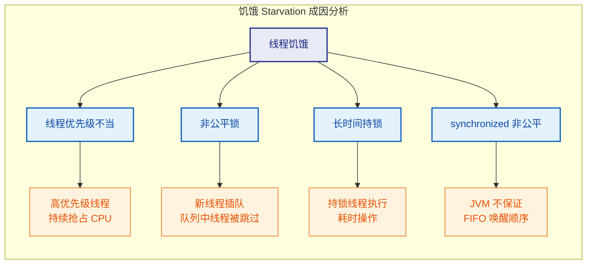

---

### 解决：公平锁、提高优先级等策略

解决饥饿问题的核心思路是：**让资源分配变得更加公平，或者减少不公平因素的影响**。以下从多个角度逐一介绍可行的解决方案。

#### 方案一：使用公平锁（Fair Lock）

最直接的解决方式就是将 `ReentrantLock` 从非公平模式切换为公平模式。公平锁内部维护一个 FIFO（先进先出）队列，严格按照线程到达的顺序来分配锁。

```java
import java.util.concurrent.locks.ReentrantLock;

public class FairLockSolution {

    // 关键：构造函数传入 true，启用公平模式
    private static final ReentrantLock fairLock = new ReentrantLock(true);

    // 共享计数器
    private static final int[] acquireCounts = new int[6];

    public static void main(String[] args) throws InterruptedException {

        Thread[] threads = new Thread[6];
        for (int i = 0; i < threads.length; i++) {
            final int id = i;
            threads[i] = new Thread(() -> {
                for (int j = 0; j < 10000; j++) {
                    // 获取公平锁——严格按照 FIFO 顺序
                    fairLock.lock();
                    try {
                        // 成功获取，计数加一
                        acquireCounts[id]++;
                    } finally {
                        // 释放锁
                        fairLock.unlock();
                    }
                }
            }, "Thread-" + i);
        }

        // 启动所有线程
        for (Thread t : threads) {
            t.start();
        }

        // 等待所有线程结束
        for (Thread t : threads) {
            t.join();
        }

        // 打印结果——公平锁下分布应非常均匀
        System.out.println("====== 公平锁下各线程获取锁的次数 ======");
        for (int i = 0; i < acquireCounts.length; i++) {
            System.out.printf("Thread-%d : %d 次%n", i, acquireCounts[i]);
        }
    }
}
```

使用公平锁后，各线程获取锁的次数会**高度均匀**，彻底杜绝了因"插队"导致的饥饿。

但公平锁有一个重要的**代价**——**性能损失**。原因在于：

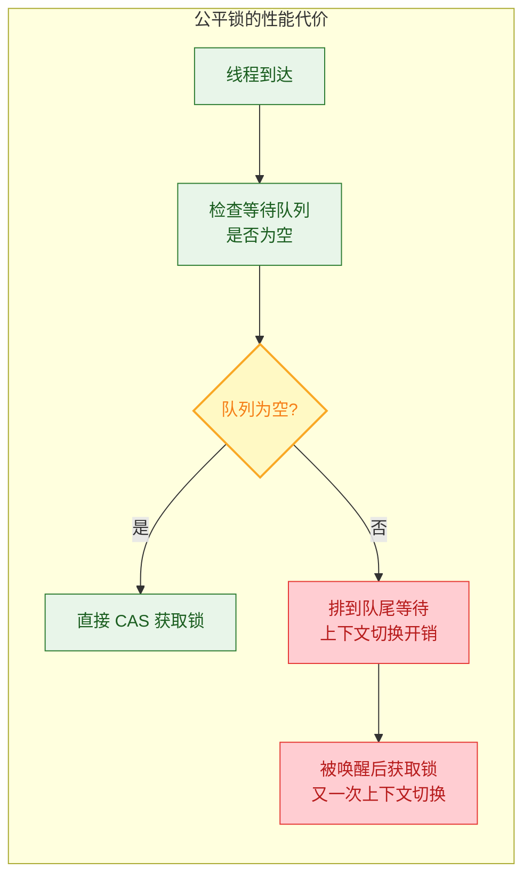

公平锁需要频繁地进行**线程挂起（park）和唤醒（unpark）**操作，这涉及操作系统级别的上下文切换（Context Switch）。根据经验，公平锁的吞吐量通常比非公平锁低 **10%~40%**，在高竞争场景下差距更大。因此：

> **设计准则**：仅在确实存在饥饿风险且公平性是必须保证的业务场景中才使用公平锁。大多数场景下，非公平锁的性能优势更重要。

#### 方案二：合理设置线程优先级

虽然前面提到线程优先级只是 hint，但在某些操作系统上适当提高被饿线程的优先级仍然是有效的辅助手段：

```java
public class PriorityAdjustSolution {
    public static void main(String[] args) {
        Runnable task = () -> {
            // 每个线程运行一段计算密集型任务
            long sum = 0;
            for (long i = 0; i < 1_000_000_000L; i++) {
                sum += i;
            }
            // 打印线程名、优先级和结果
            System.out.println(Thread.currentThread().getName()
                    + " (priority=" + Thread.currentThread().getPriority()
                    + ") finished, sum=" + sum);
        };

        // 创建线程并设置为"正常偏高"优先级（而非极端值）
        Thread worker = new Thread(task, "ImportantWorker");
        // 设为 7（介于 NORM 5 和 MAX 10 之间），温和提升
        worker.setPriority(7);
        worker.start();

        // 其他后台线程保持默认优先级
        for (int i = 0; i < 3; i++) {
            Thread bg = new Thread(task, "Background-" + i);
            // 默认优先级 5，无需显式设置
            bg.start();
        }
    }
}
```

**最佳实践**：
- **不要**使用 `MAX_PRIORITY` 和 `MIN_PRIORITY` 两个极端值，这会加剧饥饿风险。
- 优先级差距控制在 **1~2 级**以内即可。
- **永远不要**用优先级来替代正确的同步设计。

#### 方案三：减少锁持有时间（Minimize Lock Scope）

这是从根源上减轻饥饿的通用策略——**锁的粒度越小、持有时间越短，其他线程等待的时间就越少**。

```java
import java.util.concurrent.locks.ReentrantLock;

public class MinimizeLockScope {

    private final ReentrantLock lock = new ReentrantLock();

    // ❌ 反面示例：在锁内执行了大量不需要同步的操作
    public void badApproach(String data) {
        lock.lock();
        try {
            // 1. 数据校验（不涉及共享状态，不需要锁保护）
            validate(data);
            // 2. 数据转换（不涉及共享状态，不需要锁保护）
            String transformed = transform(data);
            // 3. 写入共享状态（需要锁保护）
            writeToSharedState(transformed);
            // 4. 日志记录（不涉及共享状态，不需要锁保护）
            log(transformed);
        } finally {
            lock.unlock();
        }
    }

    // ✅ 正面示例：仅在真正需要同步的最小代码段持有锁
    public void goodApproach(String data) {
        // 1. 数据校验——锁外执行
        validate(data);
        // 2. 数据转换——锁外执行
        String transformed = transform(data);

        // 3. 写入共享状态——仅此处需要锁保护
        lock.lock();
        try {
            writeToSharedState(transformed);
        } finally {
            lock.unlock();
        }

        // 4. 日志记录——锁外执行
        log(transformed);
    }

    // ---- 辅助方法（省略具体实现） ----
    private void validate(String data) { /* 校验逻辑 */ }
    private String transform(String data) { return data.toUpperCase(); }
    private void writeToSharedState(String data) { /* 写入共享变量 */ }
    private void log(String data) { System.out.println("Logged: " + data); }
}
```

#### 方案四：使用 `tryLock` 带超时机制

`ReentrantLock.tryLock(long timeout, TimeUnit unit)` 允许线程在指定时间内尝试获取锁，超时后自动放弃。这种机制不仅能避免无限期等待（消除饥饿），还能让线程在获取锁失败后执行降级逻辑：

```java
import java.util.concurrent.TimeUnit;
import java.util.concurrent.locks.ReentrantLock;

public class TryLockSolution {

    private static final ReentrantLock lock = new ReentrantLock();

    public void safeAccess() {
        try {
            // 尝试在 3 秒内获取锁
            boolean acquired = lock.tryLock(3, TimeUnit.SECONDS);
            if (acquired) {
                try {
                    // 成功获取锁，执行正常业务逻辑
                    System.out.println(Thread.currentThread().getName() + " 获取锁成功，执行业务...");
                    doBusinessLogic();
                } finally {
                    // 在 finally 中释放锁，确保一定释放
                    lock.unlock();
                }
            } else {
                // 超时未获取到锁，执行降级策略
                System.out.println(Thread.currentThread().getName() + " 获取锁超时，执行降级逻辑...");
                fallbackLogic();
            }
        } catch (InterruptedException e) {
            // 等待过程中被中断，恢复中断标志
            Thread.currentThread().interrupt();
            System.out.println(Thread.currentThread().getName() + " 等待锁时被中断");
        }
    }

    private void doBusinessLogic() { /* 正常业务 */ }
    private void fallbackLogic() { /* 降级处理：如返回缓存数据、记录日志等 */ }
}
```

#### 方案五：使用读写锁替代独占锁

在"读多写少"的场景中，如果所有读操作都用独占锁，会造成大量不必要的阻塞和饥饿。`ReentrantReadWriteLock` 允许多个读线程同时持有读锁，仅在写操作时才独占：

```java
import java.util.concurrent.locks.ReentrantReadWriteLock;

public class ReadWriteLockSolution {

    // 创建读写锁（可传 true 启用公平模式）
    private final ReentrantReadWriteLock rwLock = new ReentrantReadWriteLock(true);
    // 获取读锁引用
    private final ReentrantReadWriteLock.ReadLock readLock = rwLock.readLock();
    // 获取写锁引用
    private final ReentrantReadWriteLock.WriteLock writeLock = rwLock.writeLock();

    // 共享数据
    private String sharedData = "initial";

    // 读操作：多个读线程可同时进入，不会互相阻塞
    public String read() {
        // 获取读锁
        readLock.lock();
        try {
            // 读取共享数据（多个读线程可并发执行此处）
            return sharedData;
        } finally {
            // 释放读锁
            readLock.unlock();
        }
    }

    // 写操作：独占，会等待所有读锁释放
    public void write(String newData) {
        // 获取写锁
        writeLock.lock();
        try {
            // 修改共享数据（此时不会有任何其他读或写线程进入）
            sharedData = newData;
        } finally {
            // 释放写锁
            writeLock.unlock();
        }
    }
}
```

#### 解决方案全景对比

| 方案 | 适用场景 | 优点 | 缺点 |
|:---|:---|:---|:---|
| **公平锁** | 对公平性有严格要求 | 彻底消除插队导致的饥饿 | 吞吐量下降 10%~40% |
| **调整优先级** | 辅助手段 | 简单易行 | 效果依赖操作系统，不可靠 |
| **减少锁持有时间** | 通用最佳实践 | 从根源减少等待 | 需要仔细分析代码临界区 |
| **tryLock 超时** | 高可用系统 | 避免无限等待，支持降级 | 需要设计降级逻辑 |
| **读写锁** | 读多写少场景 | 读操作零阻塞 | 写操作仍为独占 |

最后，让我们用一张完整的解决策略流程图来收尾：

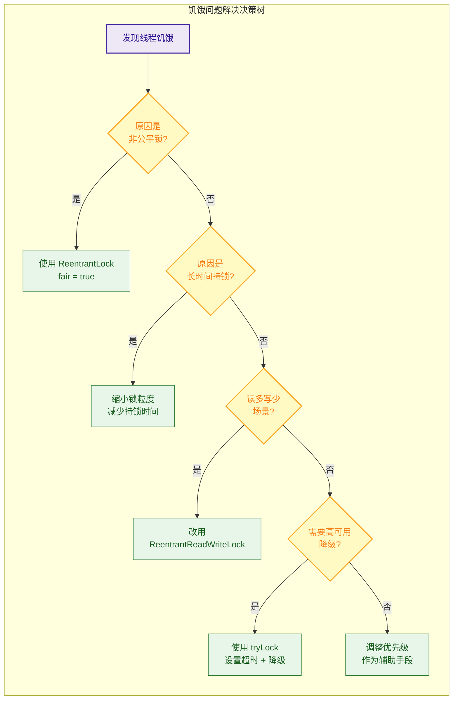

---

**📝 练习题**

以下关于线程饥饿（Starvation）的说法，哪些是正确的？（多选）

A. 饥饿状态下，所有线程都无法取得进展，系统完全停滞


B. `ReentrantLock` 默认使用非公平策略，可能导致某些线程长期获取不到锁


C. 使用 `ReentrantLock(true)` 可以保证 FIFO 顺序获取锁，但会带来一定的性能开销


D. Java 中 `synchronized` 关键字自带公平性保证，不会导致饥饿


**【答案】** B、C

**【解析】**

- **A 错误**：题目描述的是死锁（Deadlock）的特征，而非饥饿。饥饿的关键特征是**部分线程正常推进，但个别线程长期无法获取资源**。系统整体并未停滞。

- **B 正确**：`ReentrantLock` 的默认构造函数 `new ReentrantLock()` 等价于 `new ReentrantLock(false)`，即非公平锁。在非公平模式下，新到达的线程可以通过 CAS 直接"插队"获取锁，导致队列中等待时间较长的线程被反复跳过，产生饥饿。

- **C 正确**：`ReentrantLock(true)` 启用公平模式，内部维护 FIFO 等待队列，严格按照请求顺序分配锁。但由于每次锁释放后都需要唤醒队列头部线程（涉及操作系统级别的上下文切换），吞吐量会有明显下降，通常在 10%~40% 左右。

- **D 错误**：`synchronized` 是**非公平**的。当 monitor 锁被释放时，JVM 不保证等待时间最长的线程优先被唤醒。`synchronized` 没有提供任何公平模式的选项，这也是在需要公平性保证的场景下推荐使用 `ReentrantLock(true)` 的原因之一。

---

## 本章小结

本章围绕并发编程中两个极易被忽视却危害巨大的 **活性问题（Liveness Problems）** 展开：**活锁（Livelock）** 与 **饥饿（Starvation）**。它们与死锁（Deadlock）并列为并发三大活性威胁，却因为线程 "表面上没有阻塞" 而更加隐蔽、更难排查。

---

### 核心概念回顾

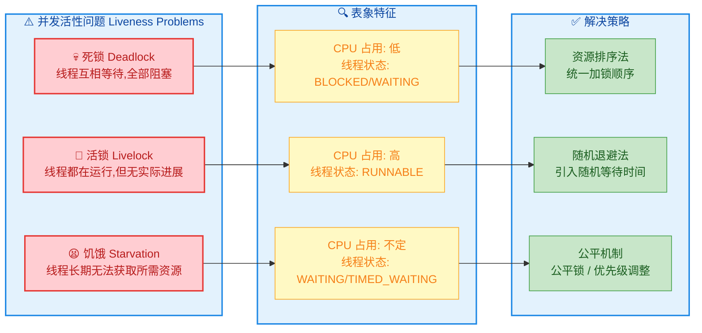

---

### 关键知识点对比

下面这张表格将本章的核心要点做一个精炼的横向对比，方便快速复习和面试前速查：

| 维度 | 🔄 活锁 (Livelock) | 😫 饥饿 (Starvation) |
|---|---|---|
| **本质** | 线程都在 **积极响应**，但彼此的响应恰好 **相互抵消**，系统无实质进展 | 某些线程 **长期被忽略**，始终无法获取 CPU 时间片或锁资源 |
| **线程状态** | `RUNNABLE`（都在跑） | `WAITING` / `BLOCKED`（被迫等待） |
| **CPU 表现** | 高占用、空转（busy-waiting 型浪费） | 不一定高，部分线程可能长期 idle |
| **是否阻塞** | ❌ 不阻塞，线程保持活跃 | ✅ 逻辑上被阻塞/被跳过 |
| **典型场景** | 走廊互相谦让；事务冲突后同时重试 | 非公平锁下低优先级线程长期拿不到锁 |
| **根因** | 确定性的 **对称策略**：所有线程执行相同的回退逻辑 | 调度或锁策略的 **不公平性** |
| **解决核心思想** | **打破对称性** — 随机退避（Random Backoff） | **保证公平性** — `ReentrantLock(true)` / 优先级调整 |
| **检测难度** | 🔴 非常难（线程并没有阻塞，Thread Dump 看不出异常） | 🟡 中等（可通过监控线程等待时间发现） |

---

### 设计原则提炼

经过本章的学习，我们可以提炼出以下几条并发编程的 **设计金律**：

**① 对称性是活锁的温床（Symmetry breeds Livelock）**

当多个线程对冲突采取 **完全相同** 的退让策略时，它们极可能陷入 "你让我让大家一起让" 的无限循环。解决方案的核心就是 **打破对称性**，最经典的手段就是 `Random Backoff`——让每个线程等待一个随机时长，使冲突在时间轴上错开。这一思想在网络协议（如 Ethernet 的 CSMA/CD 指数退避）、数据库乐观锁重试、分布式系统中被广泛使用。

**② 公平性是饥饿的解药（Fairness cures Starvation）**

`synchronized` 内置锁是非公平的，JVM 不保证等待最久的线程优先获得锁。如果你的系统对 **响应公平性** 有要求（如所有用户请求必须在一定时间内得到处理），应该使用 `ReentrantLock(true)` 等公平锁。但也要清醒认识到：**公平锁会带来吞吐量下降**，因为它强制线程排队，禁止了 "插队" 优化（barging optimization）。

**③ 公平与性能的 Trade-off**

这是并发设计中一个永恒的权衡：

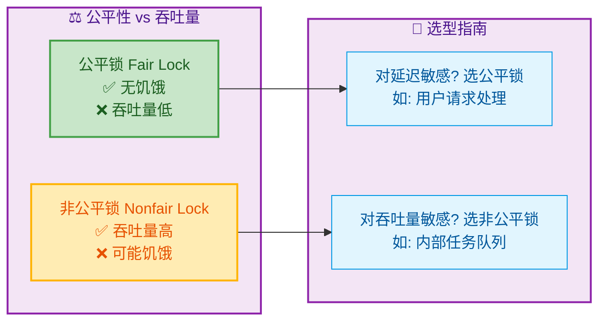

**④ 预防优于治疗**

活锁和饥饿一旦发生在生产环境，排查成本极高——活锁不会触发任何 Exception，饥饿也没有像死锁那样的 `jstack` 检测工具。因此在设计阶段就应该思考：
- 重试逻辑是否引入了随机性？
- 锁策略是否可能让某些线程永远排不上队？
- 线程优先级设置是否合理，是否存在极端的优先级差异？

---

### 知识关联图谱

本章的内容并非孤立存在，它与并发编程的其他核心知识紧密关联：

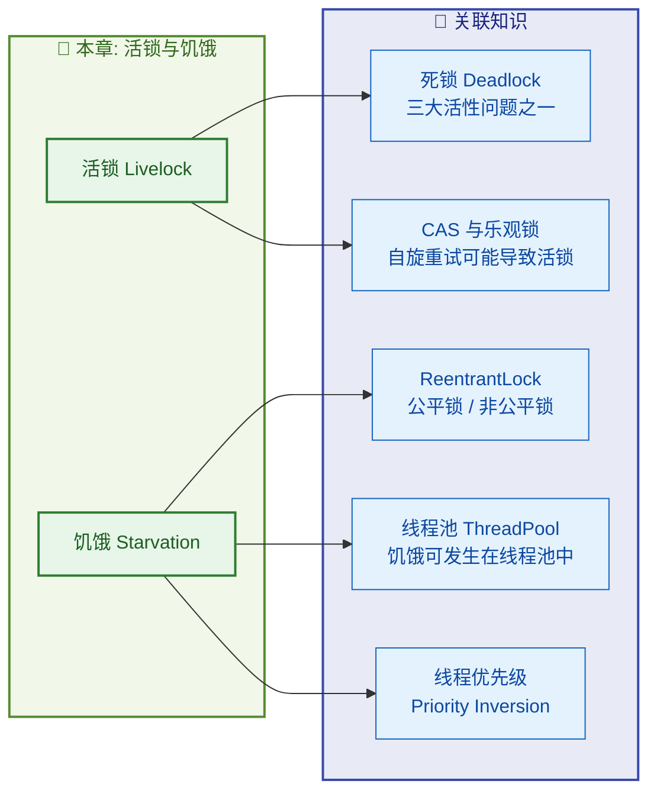

其中特别值得注意的是 **CAS 自旋与活锁的关系**：CAS（Compare-And-Swap）是乐观锁的底层原语，当大量线程同时 CAS 同一变量时，如果没有退避策略，所有线程都在不断自旋重试却总是失败，本质上就是一种活锁。Java 8 引入的 `LongAdder` 就是通过 **分散热点（Cell 数组）** 来缓解这一问题的经典案例。

---

### 一句话总结

> **活锁是 "太客气"，饥饿是 "太霸道"；随机退避打破活锁的礼让僵局，公平调度消除饥饿的资源垄断。**

---

**📝 练习题**

某系统中有两个线程 T1 和 T2，它们都需要同时持有锁 A 和锁 B 才能执行任务。为了避免死锁，开发者设计了如下策略：当一个线程发现无法同时获取两把锁时，就释放已持有的锁，等待固定的 100ms 后重试。在高并发场景下，这种设计最可能导致什么问题？

A. 死锁（Deadlock），因为两个线程仍然可能互相等待对方释放锁

B. 活锁（Livelock），因为两个线程可能以相同的节奏不断释放和重试，永远无法同时获取两把锁

C. 饥饿（Starvation），因为某个线程的优先级更低，始终无法获取锁

D. 不会有任何问题，该策略已经完美解决了死锁


**【答案】** B

**【解析】** 这是一道经典的活锁识别题。题目中的关键信息是 **"等待固定的 100ms"**——两个线程使用完全相同的确定性退避策略。假设 T1 先拿到锁 A，T2 先拿到锁 B，双方发现无法获取第二把锁后各自释放，等待 100ms。由于等待时间相同，100ms 后它们几乎同时醒来重试，再次出现同样的冲突，如此往复。线程始终处于 `RUNNABLE` 状态（没有阻塞），CPU 在做 "有效工作"（释放锁、等待、重试），但系统整体没有任何实质进展——这正是活锁的典型特征。

选项 A 不对：线程会主动释放已持有的锁，不会出现循环等待，因此不会死锁。选项 C 不对：题目中没有涉及优先级差异或非公平锁，两个线程是对称的，问题不是饥饿。选项 D 不对：固定等待时间恰恰是问题的根源。

**正确的修复方式**是将固定的 100ms 改为 **随机退避**，如 `Thread.sleep(random.nextInt(100))`，让两个线程错开重试时间，打破对称性，从而跳出活锁循环。

---
