---

# 并发编程概述

---

## 并发与并行 (Concurrency vs Parallelism)

在踏入 Java 并发编程的世界之前，首先必须厘清两个最基础也最容易被混淆的概念：**并发 (Concurrency)** 与 **并行 (Parallelism)**。它们看似相近，实则描述的是两种截然不同的执行模型。正确理解这对概念，是构建并发思维的第一块基石。

---

### 并发 (Concurrency)：宏观同时，微观交替

并发的核心思想是 **"dealing with lots of things at once"**（同时处理很多事情）。它描述的是一种**程序结构**——多个任务在**逻辑上**同时推进，但在任意一个物理时刻，不一定真的有多个任务在同时执行。

一个最经典的比喻：想象一位咖啡师同时接待三位顾客的订单。他并不是在同一秒钟内同时制作三杯咖啡，而是先磨豆、等待萃取的间隙去打奶泡、再转头接新订单。**从顾客的视角看**，三个人的订单在"同时"被处理；**从咖啡师的视角看**，他在不同任务之间快速切换。这就是并发——在**单个处理器**上，通过 **时间片轮转 (Time Slicing)** 实现的"伪同时"。

在操作系统层面，这正是 CPU 调度器所做的事情。一个单核 CPU 在极短的时间片（通常是几毫秒到几十毫秒）内切换执行不同的线程，由于切换速度极快，人类感知上就像所有线程在"同时"运行。这个切换过程被称为 **上下文切换 (Context Switch)**，我们会在后面的小节中深入讨论它的性能开销。

**关键特征**：并发关注的是**任务的管理与调度结构**，即使只有一个 CPU 核心，也可以实现并发。


### 并行 (Parallelism)：物理上的真正同时

并行的核心思想是 **"doing lots of things at once"**（同时做很多事情）。它描述的是一种**执行状态**——多个任务在**物理上**真正同时执行，每个任务跑在不同的 CPU 核心（或处理单元）上。

继续咖啡店的比喻：如果店里有三位咖啡师，每人负责一位顾客的订单，三杯咖啡**真正地在同一时刻**被制作。这就是并行——它**必须依赖多核硬件**。

在现代多核处理器架构下（比如一台拥有 8 核 CPU 的服务器），操作系统可以将 8 个线程分别调度到 8 个核心上真正同时运行，此时这些线程就处于并行状态。Java 中的 `ForkJoinPool`、`parallelStream()` 等 API 就是为了充分利用多核并行能力而设计的。

**关键特征**：并行关注的是**执行的物理同时性**，它是并发的一个子集——并行一定是并发的，但并发不一定是并行的。


### 一图胜千言：并发 vs 并行的执行模型

下面用时间轴来直观展示两者的本质区别。在并发模型中，单核 CPU 通过时间片交替执行任务；在并行模型中，多核 CPU 让任务真正同时推进：

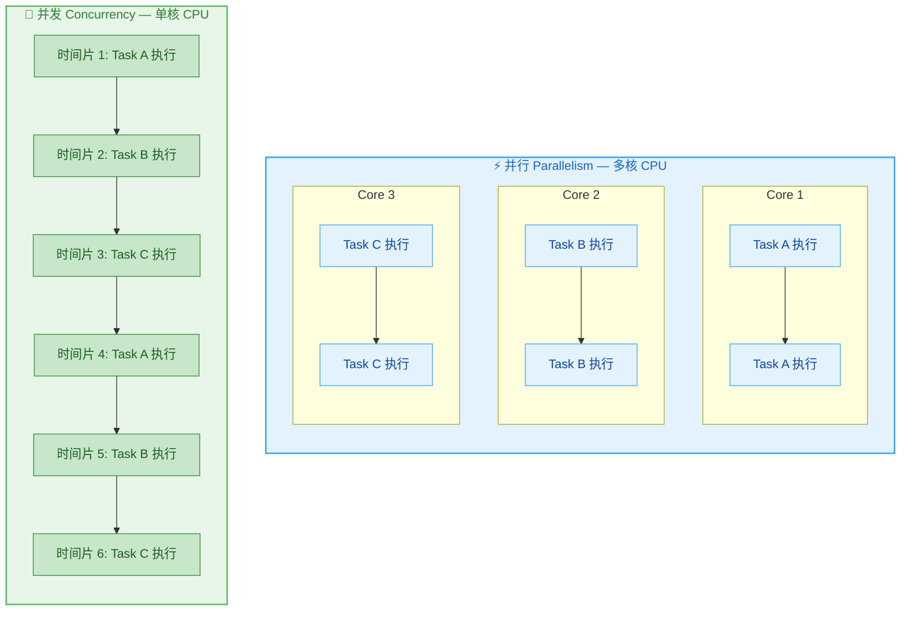

从图中可以清晰看出：并发是在时间维度上"交错"执行，而并行是在空间维度上"并排"执行。


### Rob Pike 的经典论断

Go 语言之父 Rob Pike 对这一区别给出了广为流传的精炼定义：

> **"Concurrency is about _dealing with_ lots of things at once. Parallelism is about _doing_ lots of things at once."**

注意 **dealing with** 和 **doing** 的区别：前者强调**结构性地管理和协调**多个任务，后者强调**物理性地同时执行**多个任务。并发是一种程序设计方式 (a way to structure a program)，并行是一种执行方式 (a way to execute a program)。

用更学术化的语言来说：并发是关于**正确性** (correctness) 的问题——如何让多个任务安全地共享资源、正确地协调推进；并行是关于**性能** (performance) 的问题——如何利用多核硬件缩短执行时间。


### Java 中的体现

在 Java 的发展历程中，并发与并行分别有着非常清晰的 API 对应关系：

```java
// =============================
// 【并发示例】多线程在单核上交替执行
// =============================
public class ConcurrencyDemo {
    public static void main(String[] args) {
        // 创建线程 1，执行任务 A
        Thread t1 = new Thread(() -> {
            for (int i = 0; i < 5; i++) {
                // 打印当前线程名和迭代次数
                System.out.println(Thread.currentThread().getName() + " - Task A: " + i);
            }
        }, "Thread-A"); // 给线程命名为 Thread-A

        // 创建线程 2，执行任务 B
        Thread t2 = new Thread(() -> {
            for (int i = 0; i < 5; i++) {
                // 打印当前线程名和迭代次数
                System.out.println(Thread.currentThread().getName() + " - Task B: " + i);
            }
        }, "Thread-B"); // 给线程命名为 Thread-B

        // 启动两个线程，由 OS 调度器决定如何分配时间片
        // 即使在单核 CPU 上，两个线程也会"并发"执行
        t1.start();
        t2.start();
    }
}
```

上面的代码创建了两个线程，它们被 JVM 提交给操作系统调度。如果运行在单核机器上，输出会呈现交错的模式 (interleaved)；如果运行在多核机器上，可能出现真正的并行执行。

```java
// =============================
// 【并行示例】使用 parallelStream 显式利用多核
// =============================
import java.util.Arrays;
import java.util.List;

public class ParallelismDemo {
    public static void main(String[] args) {
        // 准备一个包含大量元素的列表
        List<Integer> numbers = Arrays.asList(1, 2, 3, 4, 5, 6, 7, 8, 9, 10);

        // parallelStream() 会利用 ForkJoinPool.commonPool()
        // 将元素分片 (split) 后分配到多个 CPU 核心上并行处理
        long sum = numbers.parallelStream()
                .mapToLong(n -> {
                    // 打印当前处理线程，观察不同核心的参与情况
                    System.out.println("Processing " + n + " on " + Thread.currentThread().getName());
                    return n * n; // 计算平方
                })
                .sum(); // 汇总结果

        // 输出最终结果
        System.out.println("Sum of squares: " + sum); // 385
    }
}
```

运行这段代码你会发现，`Thread.currentThread().getName()` 输出的线程名包含 `ForkJoinPool.commonPool-worker-*` 这样的前缀，说明工作被真正分配到了线程池的多个 worker 线程上，映射到不同的 CPU 核心进行并行计算。


### 二者的关系：正交但互补

一个常见的误解是把并发和并行看作非此即彼的对立关系。实际上，它们是**正交的两个维度**，可以自由组合：

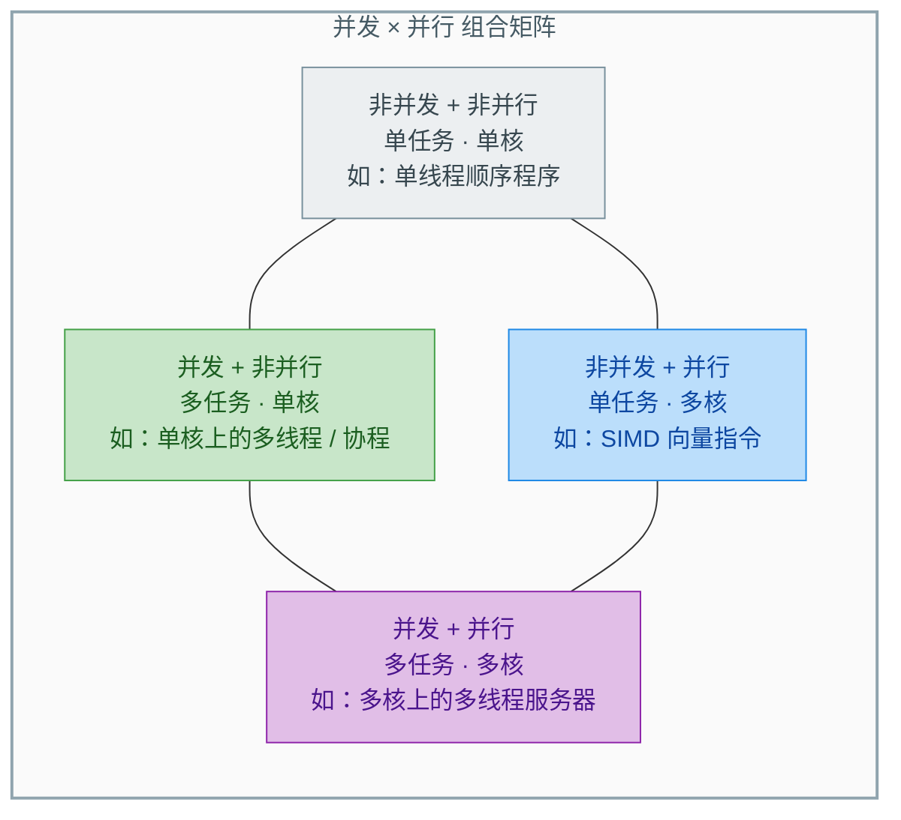

其中第四种组合——**并发 + 并行**——才是现代高性能 Java 服务器的常态。一个 Tomcat 服务器接收成百上千的 HTTP 请求（并发），而这些请求的处理线程被操作系统分散到多个 CPU 核心上真正同时执行（并行）。

理解这一点非常重要：**并发是程序员的设计选择，并行是硬件和运行时赋予的执行能力**。即使你写了一个高度并发的程序，如果运行在单核环境上，也不会出现真正的并行；反之，即使有 128 个核心的服务器，如果程序是单线程的，也无法利用并行的能力。


### Java 并发 API 的演进一览

Java 对并发与并行的支持经历了持续的演进，从最初朴素的 `Thread` 到现代的虚拟线程 (Virtual Threads)，每一次迭代都在追求"让并发更易用、让并行更高效"：

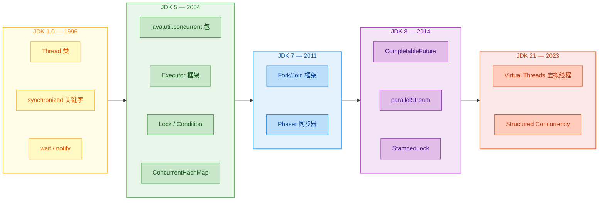

从 JDK 1.0 的 `Thread` + `synchronized` 原始组合，到 JDK 5 引入 Doug Lea 大师设计的 `java.util.concurrent` 包（这是 Java 并发编程的一次质的飞跃），再到 JDK 21 正式落地的 Virtual Threads——Java 始终在让**并发编程更安全、并行执行更透明**。在后续章节中，我们将逐一深入这些机制的设计原理与使用方法。

---

**📝 练习题**

以下关于并发 (Concurrency) 和并行 (Parallelism) 的描述，**正确** 的是：


A. 并行是并发的前提条件，没有并行就无法实现并发


B. 在单核 CPU 上运行的多线程程序只能实现并发，不能实现并行


C. `parallelStream()` 在任何情况下都比普通 `stream()` 性能更好，因为它利用了并行


D. 并发和并行是同一概念的不同说法，在现代多核处理器上两者没有区别


**【答案】** B

**【解析】** 并行要求物理上同时执行多个任务，必须依赖多个 CPU 核心（或处理单元）。单核 CPU 在任意时刻只能执行一个线程，多线程只能通过时间片轮转 (time slicing) 交替执行，呈现出并发的效果，但无法实现真正的并行。选项 A 因果倒置——并发不依赖并行，单核即可并发；选项 C 忽略了并行流自身的线程调度和任务分片开销，对于小数据量或简单计算，`parallelStream()` 的开销可能反而大于收益 (overhead outweighs benefit)；选项 D 混淆了两者的定义，并发是程序结构概念，并行是执行状态概念，即使在多核环境下也有本质差异。

---

## 为什么需要并发

在理解了并发与并行的基本概念之后，一个自然的问题浮出水面：**我们为什么要给自己找麻烦去写并发程序？** 单线程程序逻辑清晰、调试简单，并发编程却会引入大量复杂性。答案是：现代软件系统对**吞吐量 (Throughput)**、**响应速度 (Responsiveness)** 和**资源效率 (Resource Efficiency)** 的需求，使得并发不再是一个"可选项"，而是一个"必选项"。

从本质上说，并发编程的驱动力来源于一个核心矛盾——**计算资源的供给能力远超单一执行流的消费能力**。一颗现代 CPU 每秒可以执行数十亿条指令，但如果你的程序在等待一次网络请求返回（可能耗时几百毫秒），那在这段"等待时间"里，CPU 几乎完全空闲。并发编程的目标，就是**让这些被浪费的计算能力重新被利用起来**。

下面我们从三个维度来深入分析并发的必要性。

---

### CPU 利用率

#### 问题的根源：I/O 等待造成的 CPU 空闲

理解 CPU 利用率问题，首先要理解计算机中两种截然不同的操作类型：

- **CPU-bound（计算密集型）操作**：如矩阵运算、加密解密、图像渲染。CPU 持续工作，利用率接近 100%。
- **I/O-bound（I/O 密集型）操作**：如读写磁盘文件、发送网络请求、查询数据库。CPU 发出 I/O 指令后就进入等待状态，实际计算量极小。

现实世界中的绝大多数应用——Web 服务器、微服务、数据处理管道——都是 **I/O 密集型** 的。一个典型的 Web 请求处理过程中，真正消耗 CPU 的时间可能不到 5%，其余 95% 都在等待数据库响应、远程 API 调用、文件读取等 I/O 操作完成。

如果使用单线程模型，这些等待时间就是纯粹的浪费：

```text
单线程执行时间线 (Single-threaded Timeline)
═══════════════════════════════════════════════════════════════
时间 →  |  CPU计算  |████ 等待数据库 ████|  CPU计算  |████ 等待网络 ████|
        |  (5ms)   |     (200ms)       |  (3ms)   |     (150ms)      |
═══════════════════════════════════════════════════════════════
总耗时 = 5 + 200 + 3 + 150 = 358ms
CPU实际工作时间 = 8ms
CPU利用率 = 8 / 358 ≈ 2.2%   ← 极度浪费！
```

#### 并发如何解决问题

引入并发后，当线程 A 阻塞在 I/O 上时，操作系统可以调度线程 B 上 CPU 执行。多个线程**交替使用 CPU**，就像高速公路上的多车道——一条车道堵了，其他车道照样通行。

```text
多线程执行时间线 (Multi-threaded Timeline)
═══════════════════════════════════════════════════════════════
线程1: |CPU计算| ████ 等待数据库 ████ |CPU计算|
线程2:        |CPU计算|████ 等待网络 ████|       |CPU计算|
线程3:               |CPU计算|████ 等待文件 ████|        |CPU计算|
─────────────────────────────────────────────────────
CPU:   | T1  | T2   | T3   |  T1  | T2   |  T3  |   ← CPU几乎没有空闲
═══════════════════════════════════════════════════════════════
```

下面用一段 Java 代码来直观感受差异：

```java
import java.util.concurrent.*;
import java.util.List;

public class CpuUtilizationDemo {

    // 模拟一次 I/O 操作：真正的计算极少，大部分时间在"等待"
    static String simulateIOTask(String taskName) {
        try {
            System.out.println(taskName + " 开始执行, 线程: " + Thread.currentThread().getName());
            Thread.sleep(200); // 模拟 200ms 的 I/O 等待（如数据库查询）
        } catch (InterruptedException e) {
            Thread.currentThread().interrupt(); // 恢复中断标志
        }
        return taskName + " 完成"; // 返回处理结果
    }

    public static void main(String[] args) throws Exception {

        // ========== 串行执行 ==========
        long start = System.currentTimeMillis(); // 记录起始时间
        for (int i = 1; i <= 5; i++) {           // 依次执行 5 个任务
            simulateIOTask("串行任务-" + i);      // 每个任务阻塞 200ms
        }
        long serialTime = System.currentTimeMillis() - start; // 计算串行总耗时
        System.out.println("串行总耗时: " + serialTime + "ms");
        // 预期输出: ~1000ms (5 × 200ms)

        // ========== 并发执行 ==========
        ExecutorService pool = Executors.newFixedThreadPool(5); // 创建含 5 个线程的线程池
        start = System.currentTimeMillis();                     // 重置起始时间

        List<Future<String>> futures = new java.util.ArrayList<>(); // 用于收集异步结果
        for (int i = 1; i <= 5; i++) {
            final int taskId = i;                                   // lambda 中需要 effectively final 变量
            futures.add(pool.submit(                                // 提交任务到线程池
                () -> simulateIOTask("并发任务-" + taskId)           // 每个任务在独立线程中执行
            ));
        }

        for (Future<String> f : futures) { // 等待所有任务完成
            f.get();                        // 阻塞直到该任务返回结果
        }

        long concurrentTime = System.currentTimeMillis() - start; // 计算并发总耗时
        System.out.println("并发总耗时: " + concurrentTime + "ms");
        // 预期输出: ~200ms (所有任务并行等待，几乎同时完成)

        pool.shutdown(); // 关闭线程池，释放资源
    }
}
```

运行结果会清晰地展示：串行耗时约 1000ms，而并发耗时仅约 200ms——**性能提升了 5 倍**。这并不是因为 CPU 跑得更快了，而是我们**消除了 CPU 的空闲等待时间**。

#### 阿姆达尔定律 (Amdahl's Law)

当然，并发能带来的加速并非无限。**Amdahl's Law** 揭示了一个关键的理论上限：

> 程序的理论最大加速比受制于其中**必须串行执行的部分**所占的比例。

公式如下：

```text
          1
S = ─────────────────
    (1 - P) + P / N

S = 理论加速比 (Speedup)
P = 可并行化的比例 (Parallel fraction)
N = 处理器/线程数量
(1 - P) = 必须串行执行的比例
```

用一个具体的数字来感受：如果一个程序中有 **95%** 的工作可以并行化（P = 0.95），那么即使你有无限个处理器（N → ∞），最大加速比也只有 **1 / (1 - 0.95) = 20 倍**。

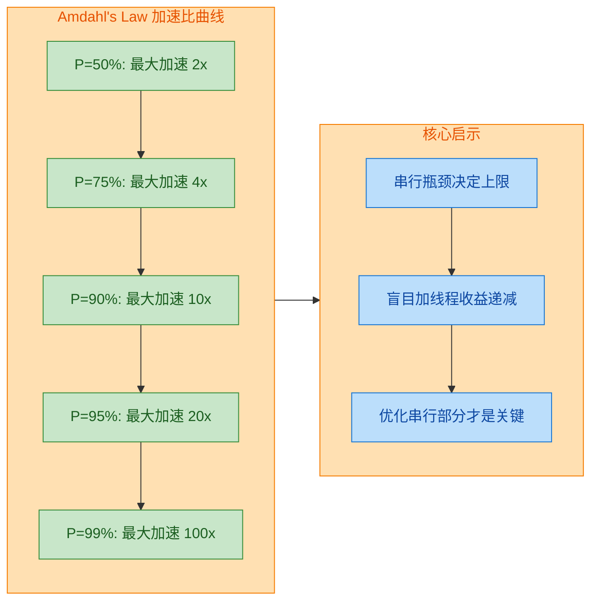

Amdahl's Law 告诉我们一个深刻的道理：**并发编程的最大敌人不是线程数量不够，而是代码中不可并行化的串行瓶颈**。在实际优化中，减少串行部分的比例（如减小临界区、使用无锁数据结构）往往比简单增加线程数量更有效。

---

### 响应性

#### 从"卡死"到"流畅"：用户体验的生命线

如果说 CPU 利用率是"后端"关注的焦点，那么**响应性 (Responsiveness)** 则直接影响"前端"用户体验。

想象一个场景：你在使用一个桌面应用程序，点击"导出报表"按钮后，整个界面冻结了 30 秒——窗口无法拖动，按钮无法点击，甚至标题栏显示"未响应"。这就是**单线程 UI 模型**的灾难。

在 GUI 应用中（如 JavaFX、Swing、Android），所有的界面渲染和用户交互事件都由一个特殊的线程处理——通常叫做 **UI 线程 (UI Thread)** 或 **事件派发线程 (Event Dispatch Thread, EDT)**。如果你在这个线程上执行一个耗时操作，UI 就会完全失去响应能力，因为该线程在耗时操作完成之前无法处理任何新的用户输入或屏幕刷新事件。

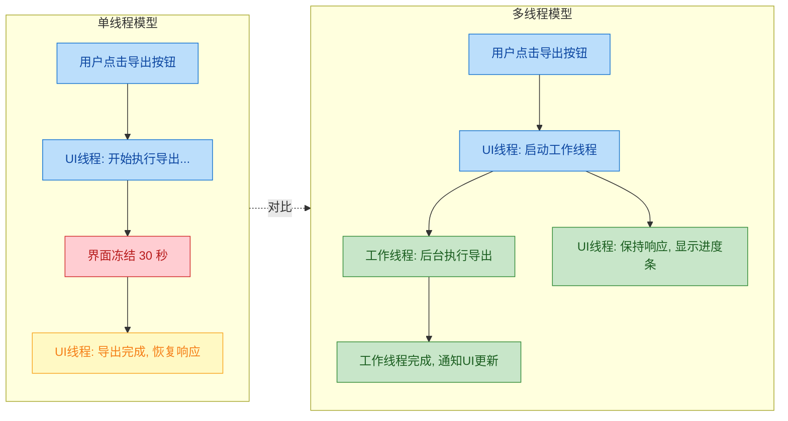

#### 代码示例：Swing 中的响应性问题与解决方案

```java
import javax.swing.*;
import java.awt.*;

public class ResponsivenessDemo {

    public static void main(String[] args) {
        // 在 EDT 上创建并显示 GUI（Swing 线程安全的标准做法）
        SwingUtilities.invokeLater(() -> createAndShowGUI());
    }

    static void createAndShowGUI() {
        JFrame frame = new JFrame("响应性演示");            // 创建主窗口
        frame.setDefaultCloseOperation(JFrame.EXIT_ON_CLOSE); // 设置关闭行为
        frame.setLayout(new FlowLayout());                    // 设置简单流式布局

        JButton badButton = new JButton("错误示范: 阻塞UI");  // 会冻结界面的按钮
        JButton goodButton = new JButton("正确示范: 后台执行"); // 不会冻结界面的按钮
        JLabel statusLabel = new JLabel("就绪");              // 状态文字标签
        JProgressBar progressBar = new JProgressBar(0, 100);  // 进度条组件

        // ========== 错误示范：直接在 EDT 上执行耗时操作 ==========
        badButton.addActionListener(e -> {
            statusLabel.setText("正在处理...(界面将冻结!)");   // 这行甚至不会立即渲染
            try {
                Thread.sleep(5000); // 模拟 5 秒的耗时操作, EDT 被阻塞!
            } catch (InterruptedException ex) {
                Thread.currentThread().interrupt();
            }
            statusLabel.setText("完成");                      // 5 秒后才更新
            // 在这 5 秒内，窗口无法移动、按钮无法点击、界面完全无响应
        });

        // ========== 正确示范：使用 SwingWorker 在后台线程执行 ==========
        goodButton.addActionListener(e -> {
            goodButton.setEnabled(false);                     // 禁用按钮防止重复点击
            statusLabel.setText("后台处理中...");               // 立即更新 UI 状态

            // SwingWorker 是 Swing 提供的后台任务工具
            // 泛型参数: <最终结果类型, 中间进度类型>
            new SwingWorker<String, Integer>() {

                @Override
                protected String doInBackground() throws Exception {
                    // 此方法在 后台工作线程 中执行，不阻塞 EDT
                    for (int i = 0; i <= 100; i += 10) {
                        Thread.sleep(500);  // 模拟分段耗时工作
                        publish(i);          // 发布中间进度值到 EDT
                    }
                    return "处理完毕!";       // 返回最终结果
                }

                @Override
                protected void process(java.util.List<Integer> chunks) {
                    // 此方法在 EDT 中执行，安全地更新 UI
                    int latestProgress = chunks.get(chunks.size() - 1); // 取最新的进度值
                    progressBar.setValue(latestProgress);                // 更新进度条
                    statusLabel.setText("进度: " + latestProgress + "%"); // 更新状态文字
                }

                @Override
                protected void done() {
                    // 后台任务完成后，在 EDT 中执行
                    try {
                        statusLabel.setText(get()); // get() 获取 doInBackground 的返回值
                    } catch (Exception ex) {
                        statusLabel.setText("出错: " + ex.getMessage());
                    }
                    goodButton.setEnabled(true);    // 重新启用按钮
                }
            }.execute(); // 启动 SwingWorker
        });

        frame.add(badButton);                     // 添加组件到窗口
        frame.add(goodButton);
        frame.add(statusLabel);
        frame.add(progressBar);
        frame.setSize(500, 150);                  // 设置窗口大小
        frame.setVisible(true);                   // 显示窗口
    }
}
```

#### 响应性不只是 GUI 的问题

响应性的概念远不止于桌面应用。在**服务端**领域同样至关重要：

- **Web 服务器**：如果一个请求的处理需要 2 秒，单线程服务器在这 2 秒内无法接受任何其他请求。而并发模型允许服务器同时处理成百上千个请求，每个用户都能得到及时响应。这正是 Tomcat、Netty 等服务器框架基于线程池（或事件循环）工作的原因。

- **微服务架构**：一个微服务通常需要调用多个下游服务来组装响应。如果串行调用三个各耗时 100ms 的下游服务，总延迟就是 300ms；如果并发调用，总延迟就只取决于最慢的那个——100ms。这对用户感知到的延迟 (Perceived Latency) 有着巨大影响。

- **实时系统**：如消息推送、在线游戏、金融交易系统——对延迟高度敏感，任何形式的阻塞都可能导致严重后果。并发是保证系统在高负载下仍能满足**实时性约束 (Real-time Constraints)** 的基础。

---

### 资源共享

#### 共享 vs. 隔离：效率的根本选择

并发编程的第三个核心驱动力在于**资源共享 (Resource Sharing)** 带来的效率优势。

在操作系统中，最重要的执行单元有两个：**进程 (Process)** 和 **线程 (Thread)**。它们在资源隔离和共享方面有着根本性的差异：

```text
进程模型 vs 线程模型的内存布局对比

┌──────────────────────────────────────────────────────────────┐
│                      进程模型 (Process)                       │
│                                                              │
│  ┌─────────────────────┐     ┌─────────────────────┐        │
│  │      Process A      │     │      Process B      │        │
│  │  ┌───────────────┐  │     │  ┌───────────────┐  │        │
│  │  │   Code 副本    │  │     │  │   Code 副本    │  │        │
│  │  ├───────────────┤  │     │  ├───────────────┤  │        │
│  │  │   Heap 独立    │  │     │  │   Heap 独立    │  │        │
│  │  ├───────────────┤  │     │  ├───────────────┤  │        │
│  │  │   Stack       │  │     │  │   Stack       │  │        │
│  │  └───────────────┘  │     │  └───────────────┘  │        │
│  └─────────────────────┘     └─────────────────────┘        │
│                                                              │
│  → 内存完全隔离，数据交换需 IPC (管道/Socket/共享内存)          │
│  → 创建/销毁开销大，上下文切换成本高                            │
└──────────────────────────────────────────────────────────────┘

┌──────────────────────────────────────────────────────────────┐
│                      线程模型 (Thread)                        │
│                                                              │
│  ┌──────────────────────────────────────────────┐           │
│  │              Process (JVM)                    │           │
│  │  ┌──────────────────────────────────────┐    │           │
│  │  │          共享区域 (Shared)             │    │           │
│  │  │  Code Segment / Heap / 静态变量       │    │           │
│  │  └──────────────────────────────────────┘    │           │
│  │       ↑            ↑            ↑            │           │
│  │  ┌────┴───┐   ┌────┴───┐   ┌────┴───┐       │           │
│  │  │Thread A│   │Thread B│   │Thread C│       │           │
│  │  │ Stack  │   │ Stack  │   │ Stack  │       │           │
│  │  └────────┘   └────────┘   └────────┘       │           │
│  └──────────────────────────────────────────────┘           │
│                                                              │
│  → Heap/代码/静态变量共享，仅 Stack 独立                       │
│  → 创建/销毁开销小，上下文切换更快                              │
└──────────────────────────────────────────────────────────────┘
```

这种共享机制带来了三个层面的效率优势：

**第一，内存效率。** 假设你的 Web 服务器需要同时处理 1000 个请求。如果使用多进程模型（如传统的 Apache prefork 模式），每个进程需要独立的内存空间来加载代码、运行时库和应用数据，可能每个进程消耗 50MB 内存，1000 个进程就是 50GB。而使用多线程模型，所有线程共享同一份代码和堆内存，每个线程只需要额外分配一个栈空间（Java 默认 512KB~1MB），1000 个线程的额外内存开销仅约 500MB~1GB。内存节省了一个数量级。

**第二，数据共享的零拷贝。** 多线程共享同一个堆 (Heap)，意味着线程之间传递数据不需要任何序列化、反序列化或拷贝——只需传递一个对象引用即可。相比之下，进程间通信 (IPC, Inter-Process Communication) 通常需要通过管道 (Pipe)、Socket 或共享内存 (Shared Memory) 来传递数据，这些都涉及数据的拷贝或序列化，开销远大于简单的引用传递。

**第三，创建和切换成本低。** 线程被称为"轻量级进程 (Lightweight Process)"，其创建和销毁的开销远小于进程。操作系统在进行线程上下文切换时，不需要切换整个虚拟地址空间 (Virtual Address Space) 和页表 (Page Table)，只需保存和恢复寄存器、程序计数器和栈指针即可。

#### 代码示例：多线程共享数据结构

```java
import java.util.concurrent.*;
import java.util.Map;

public class ResourceSharingDemo {

    // 所有线程共享同一个 ConcurrentHashMap 实例
    // ConcurrentHashMap 是 Java 提供的线程安全的高性能哈希表
    private static final Map<String, Integer> sharedCache = new ConcurrentHashMap<>();

    public static void main(String[] args) throws InterruptedException {
        ExecutorService pool = Executors.newFixedThreadPool(4); // 创建 4 个工作线程

        // ===== 生产者任务：多个线程并发写入共享缓存 =====
        for (int i = 0; i < 4; i++) {
            final int writerId = i;                            // 捕获循环变量
            pool.submit(() -> {
                for (int j = 0; j < 100; j++) {
                    String key = "key-" + (writerId * 100 + j); // 每个写者写入不同的 key
                    sharedCache.put(key, writerId * 100 + j);   // 直接操作共享对象，无需 IPC
                }
                System.out.println("Writer-" + writerId + " 完成写入 100 条数据");
            });
        }

        pool.shutdown();                           // 停止接受新任务
        pool.awaitTermination(10, TimeUnit.SECONDS); // 等待所有任务完成

        // 所有线程写入的数据都在同一个 Map 中，无需合并
        System.out.println("共享缓存总条目数: " + sharedCache.size());
        // 输出: 共享缓存总条目数: 400

        // 任意线程可以直接读取其他线程写入的数据——零拷贝
        System.out.println("读取 key-250 的值: " + sharedCache.get("key-250"));
    }
}
```

在这个例子中，四个线程同时向同一个 `ConcurrentHashMap` 写入数据。每个线程直接操作共享的 Map 引用，无需通过管道、Socket 或消息队列进行跨进程通信。数据写入后，任何其他线程都可以立即读取——这就是多线程共享内存模型的核心优势。

#### 共享的代价：一体两面

当然，"共享"是一把双刃剑。线程之间共享数据虽然高效，但也正是**并发安全性问题的根源**。当多个线程同时读写同一块内存时，如果没有适当的同步机制（如 `synchronized`、`Lock`、原子变量等），就会出现**竞态条件 (Race Condition)**、**数据不一致 (Data Inconsistency)** 等严重问题。这些问题将在后续"并发带来的问题"章节中详细展开。

这里先记住一条核心原则：

> **共享可变状态 (Shared Mutable State) 是并发编程中一切复杂性的根源。**
> *"Shared mutable state is the root of all evil in concurrent programming."*

管理好共享可变状态——要么避免共享（线程封闭 Thread Confinement）、要么避免可变（不可变对象 Immutable Objects）、要么用同步机制保护——是整个 Java 并发编程学习旅程的核心主题。

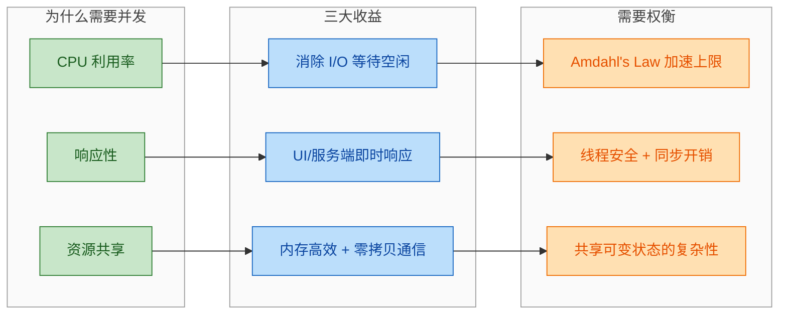

---

**📝 练习题**

某个程序中有 **80%** 的代码可以被并行化执行，其余 20% 必须串行执行。根据 Amdahl's Law，当使用 8 个处理器时，该程序的理论加速比最接近以下哪个值？

A. 2.5 倍

B. 3.3 倍

C. 5.0 倍

D. 8.0 倍

**【答案】** B

**【解析】** 根据 Amdahl's Law 公式 `S = 1 / ((1 - P) + P / N)`，代入 P = 0.8，N = 8：`S = 1 / ((1 - 0.8) + 0.8 / 8) = 1 / (0.2 + 0.1) = 1 / 0.3 ≈ 3.33`。这道题揭示了 Amdahl's Law 的核心含义：即使可并行化的比例已经很高（80%），20% 的串行部分仍然严重限制了加速比。8 个处理器只带来了 3.3 倍加速，远低于理想的 8 倍线性加速。如果要达到接近 8 倍加速，需要将可并行化比例提升到 97% 以上（此时 S ≈ 1 / (0.03 + 0.97/8) ≈ 6.0），说明**减少串行瓶颈**才是优化并发程序性能的第一要务。

---

## 并发带来的问题

并发编程是一把双刃剑。上一节我们了解了并发能够提升 CPU 利用率、改善响应性并实现资源共享，但这些收益并非免费的午餐。当多个线程同时操作共享状态时，程序的行为将变得 **不确定 (non-deterministic)**——同一段代码在不同的执行时序下可能产生完全不同的结果。Brian Goetz 在经典著作 *Java Concurrency in Practice* 中将并发问题归纳为三大类：**Safety（安全性）**、**Liveness（活跃性）** 和 **Performance（性能）**。本节将逐一深入剖析这三大问题域。

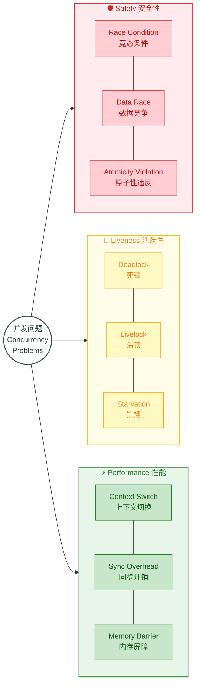

---

### 安全性问题（竞态条件）

安全性问题 (Safety Hazard) 是并发编程中最致命也最隐蔽的问题。其核心表现是 **竞态条件 (Race Condition)**：程序的正确性依赖于多个线程执行的相对时序，而这种时序在运行时是不可预测的。

#### 什么是竞态条件

竞态条件的本质是 **"check-then-act"** 或 **"read-modify-write"** 这类复合操作在没有同步保护的情况下被多个线程并发执行。两个或多个线程同时读取并修改同一份共享数据时，最终结果取决于线程调度的顺序——这是一种程序不应依赖的 **偶然行为 (accidental behavior)**。

来看一个经典的计数器示例：

```java
public class UnsafeCounter {
    private int count = 0; // 共享可变状态

    // 这个方法看似简单，实则包含"读-改-写"三步操作
    public void increment() {
        count++; // ⚠️ 非原子操作！等价于: temp = count; temp = temp + 1; count = temp;
    }

    public int getCount() {
        return count; // ⚠️ 可能读到"过期"的值
    }
}
```

`count++` 在 Java 字节码层面会被编译为至少三条指令：

```text
1. getfield  count    // 读取当前值到操作数栈 (Read)
2. iconst_1           // 将常量 1 压入操作数栈
3. iadd               // 执行加法 (Modify)
4. putfield  count    // 将结果写回字段 (Write)
```

当两个线程 T1、T2 交错执行时，就可能出现 **丢失更新 (Lost Update)**：

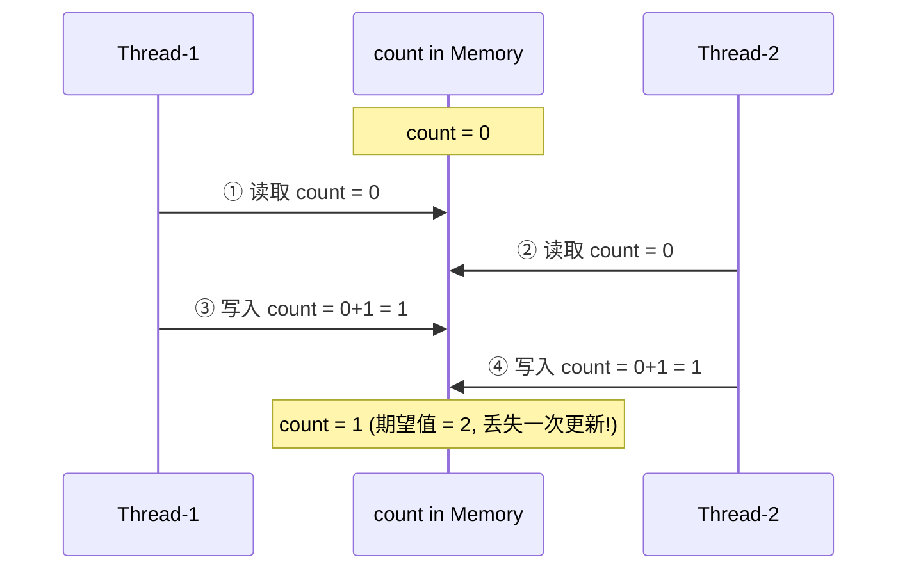

两个线程各执行一次 `increment()`，期望 `count` 变为 2，但最终结果是 1——一次更新被"吞掉"了。这就是典型的 Race Condition。

#### 竞态条件的两种核心模式

**模式一：Check-Then-Act（先检查后执行）**

程序先检查某个条件，然后基于检查结果采取行动，但在检查和行动之间，条件可能已经被其他线程改变。这也被称为 **TOCTOU（Time Of Check to Time Of Use）** 漏洞。

```java
public class LazyInitRace {
    private ExpensiveObject instance = null; // 共享引用

    // ⚠️ 经典的 check-then-act 竞态
    public ExpensiveObject getInstance() {
        if (instance == null) {         // 步骤1: 检查 (Check)
            // ⚠️ 其他线程可能在此刻也通过了 null 检查
            instance = new ExpensiveObject(); // 步骤2: 执行 (Act)
        }
        return instance;
    }
}
```

这段代码在单线程环境下完美运行，但在多线程下可能创建出多个 `ExpensiveObject` 实例，违反了惰性初始化的意图。

**模式二：Read-Modify-Write（读-改-写）**

前面的 `count++` 就是此模式的典型代表。线程读取当前值、基于当前值计算新值、再将新值写回——这三步不是原子的。

#### 数据竞争（Data Race）vs 竞态条件（Race Condition）

这两个术语经常被混淆，但它们有严格的技术区别：

**Data Race（数据竞争）** 是 Java 内存模型 (JMM) 中的精确定义：当两个线程同时访问同一个变量，至少一个是写操作，且没有通过 **happens-before** 关系进行排序时，就发生了 Data Race。Data Race 会导致编译器和处理器的重排序优化使程序行为变得不可预测。

**Race Condition（竞态条件）** 则是更高层次的逻辑错误：程序的正确性依赖于不可控的执行时序。

一个程序可以有 Data Race 但没有 Race Condition（例如某些无锁算法中的 benign race），也可以有 Race Condition 但没有 Data Race（例如对每个共享变量都使用了 `synchronized` 但业务逻辑仍依赖于执行顺序）。但在实践中，**消除 Data Race 通常是消除 Race Condition 的前提**。

#### 安全性问题的解决方向

解决安全性问题的核心思路有三条：

第一，**不可变性 (Immutability)**。如果共享数据是不可变的，多个线程并发读取永远是安全的，因为不存在写操作。Java 中的 `String`、`Integer` 等包装类型天然线程安全。

第二，**互斥同步 (Mutual Exclusion)**。通过 `synchronized`、`ReentrantLock` 等机制确保同一时刻只有一个线程能执行临界区代码。这是最直观也最常用的方式。

第三，**原子操作 (Atomic Operations)**。使用 `java.util.concurrent.atomic` 包下的原子类（如 `AtomicInteger`），利用 CAS (Compare-And-Swap) 等硬件指令实现无锁的线程安全操作。

```java
// ✅ 使用 AtomicInteger 修复计数器
import java.util.concurrent.atomic.AtomicInteger;

public class SafeCounter {
    private final AtomicInteger count = new AtomicInteger(0); // 原子变量

    public void increment() {
        count.incrementAndGet(); // ✅ CAS 保证原子性，无需加锁
    }

    public int getCount() {
        return count.get(); // ✅ volatile 语义保证可见性
    }
}
```

---

### 活跃性问题（死锁、活锁、饥饿）

如果说安全性问题关注的是 **"正确的事情最终会不会发生"**，那么活跃性问题 (Liveness Hazard) 关注的则是 **"正确的事情最终能不能发生"**。一个具有活跃性问题的程序会陷入某种无法继续推进 (make progress) 的状态。

#### 死锁（Deadlock）

死锁是最著名的活跃性问题。当两个或多个线程 **互相持有对方所需的锁，同时又在等待对方释放锁** 时，所有相关线程将永久阻塞，谁也无法继续执行。

死锁的发生需要 **同时满足** 以下四个必要条件（Coffman Conditions, 1971）：

1. **互斥条件 (Mutual Exclusion)**：资源一次只能被一个线程持有。
2. **持有并等待 (Hold and Wait)**：线程在持有至少一个资源的同时，等待获取其他资源。
3. **不可抢占 (No Preemption)**：已被持有的资源不能被强制夺走，只能由持有线程主动释放。
4. **循环等待 (Circular Wait)**：存在一个线程等待链，T1 等 T2、T2 等 T3、…、Tn 等 T1。

只要打破其中任意一个条件，死锁就不会发生。

```java
public class DeadlockDemo {
    private final Object lockA = new Object(); // 锁A
    private final Object lockB = new Object(); // 锁B

    // 线程1: 先拿 lockA，再拿 lockB
    public void method1() {
        synchronized (lockA) {           // ① 获取 lockA
            System.out.println(Thread.currentThread().getName() + " 持有 lockA");
            try { Thread.sleep(100); } catch (InterruptedException e) {} // 模拟耗时操作
            synchronized (lockB) {       // ③ 等待 lockB（被线程2持有）→ 阻塞!
                System.out.println("method1 完成");
            }
        }
    }

    // 线程2: 先拿 lockB，再拿 lockA（加锁顺序与线程1相反!）
    public void method2() {
        synchronized (lockB) {           // ② 获取 lockB
            System.out.println(Thread.currentThread().getName() + " 持有 lockB");
            try { Thread.sleep(100); } catch (InterruptedException e) {} // 模拟耗时操作
            synchronized (lockA) {       // ④ 等待 lockA（被线程1持有）→ 阻塞!
                System.out.println("method2 完成");
            }
        }
    }
}
```

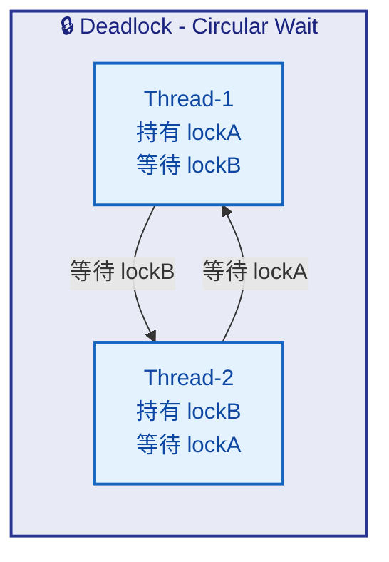

**预防死锁的实用策略**：

最直接有效的方法是 **固定加锁顺序 (Lock Ordering)**。为所有锁分配一个全局一致的获取顺序，所有线程都按照相同的顺序获取锁。例如始终先获取 lockA 再获取 lockB，这样循环等待条件就无法成立。

其次可以使用 **超时机制 (Timed Lock)**。`ReentrantLock.tryLock(timeout, unit)` 允许线程在等待一段时间后放弃获取锁，从而打破 "持有并等待" 条件。

```java
// ✅ 使用 tryLock 超时避免死锁
public boolean transferMoney(Account from, Account to, int amount) throws InterruptedException {
    long deadline = System.nanoTime() + TimeUnit.SECONDS.toNanos(10); // 设置10秒超时
    while (true) {
        if (from.lock.tryLock()) {             // 尝试获取第一把锁
            try {
                if (to.lock.tryLock()) {       // 尝试获取第二把锁
                    try {
                        from.debit(amount);    // 两把锁都拿到了，执行转账
                        to.credit(amount);
                        return true;           // 成功
                    } finally {
                        to.lock.unlock();      // 释放第二把锁
                    }
                }
            } finally {
                from.lock.unlock();            // 释放第一把锁（无论是否拿到第二把）
            }
        }
        if (System.nanoTime() >= deadline) {   // 超时检查
            return false;                      // 超时放弃，避免永久阻塞
        }
        Thread.sleep(1);                       // 短暂退避后重试
    }
}
```

#### 活锁（Livelock）

活锁与死锁的区别在于：**线程并没有被阻塞，它们仍在不断执行——但永远在做无用功，无法取得实际进展。** 这就像走廊里迎面走来两个人，双方同时往左让路、又同时往右让路，不断重复，谁也过不去。

活锁通常出现在过于"礼貌"的重试逻辑中。例如两个线程检测到冲突后都主动释放资源并重试，但由于它们的重试节奏完全同步，每次重试都再次冲突，形成无限循环。

```java
// ⚠️ 活锁示例：两个线程不断"礼让"，永远无法完成
public class LivelockDemo {
    static class Worker {
        private boolean active = true; // 标记是否活跃

        // 两个 Worker 互相"让步"
        public synchronized void work(Worker other) {
            while (active) {
                if (other.active) {
                    System.out.println(Thread.currentThread().getName() + ": 对方还在忙，我先让一下");
                    // ⚠️ 没有随机退避, 两个线程永远同步地"让步"
                    continue; // 再次循环检查 → 对方也在循环检查 → 活锁!
                }
                System.out.println(Thread.currentThread().getName() + ": 轮到我工作了");
                active = false; // 完成工作
            }
        }
    }
}
```

**活锁的解决方法**是引入 **随机退避 (Random Backoff)**。让每次重试等待一个随机时间，打破线程之间的同步节奏。以太网的 CSMA/CD 协议和许多分布式系统中的冲突解决策略都采用了这一思想。

```java
// ✅ 引入随机退避打破活锁
Random random = new Random();
while (conflictDetected) {
    release(myResource);                                     // 释放已持有的资源
    Thread.sleep(random.nextInt(100));                        // 随机等待 0-99ms
    conflictDetected = !tryAcquire(resource1, resource2);    // 重新尝试获取
}
```

#### 饥饿（Starvation）

饥饿是指某个线程 **长期得不到所需的资源**（通常是 CPU 时间或锁）而无法执行。与死锁不同，其他线程可以正常运行，只是"弱势"线程总是被跳过。

饥饿的常见成因包括：

第一，**不公平的锁竞争**。`synchronized` 是非公平的——当锁释放时，JVM 不保证等待时间最长的线程能获得锁。如果有大量线程竞争同一把锁，某些"运气差"的线程可能长时间无法获得执行机会。

第二，**不合理的线程优先级**。虽然 Java 提供了 `Thread.setPriority()` 方法，但线程优先级的实际效果高度依赖操作系统的调度策略。高优先级线程持续占用 CPU 会导致低优先级线程饥饿。

第三，**长时间持有锁**。如果某个线程在临界区内执行耗时操作（如 I/O），其他等待该锁的线程都会处于饥饿状态。

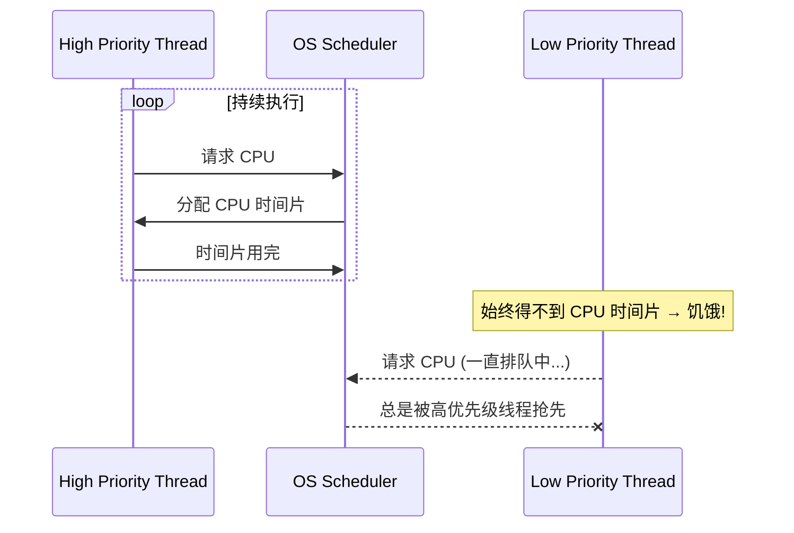

**饥饿的解决方案**主要有两个方向。一是使用 **公平锁 (Fair Lock)**，`ReentrantLock` 的构造方法接受一个 `fair` 参数，设为 `true` 时锁会按照 FIFO 顺序分配给等待线程。二是避免在持有锁时执行耗时操作，缩短临界区长度。

```java
// ✅ 使用公平锁避免饥饿
import java.util.concurrent.locks.ReentrantLock;

// fair = true: 等待时间最长的线程优先获得锁
private final ReentrantLock fairLock = new ReentrantLock(true);

public void criticalSection() {
    fairLock.lock();     // 公平获取锁（FIFO 顺序）
    try {
        // 临界区代码（尽量短小精悍）
    } finally {
        fairLock.unlock(); // 确保释放锁
    }
}
```

需要注意，公平锁的吞吐量通常低于非公平锁，因为它需要维护等待队列的顺序。在大多数场景下，非公平锁足以满足需求，只有在确实观察到饥饿现象时才应考虑公平锁。

#### 三种活跃性问题对比

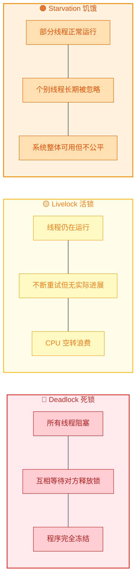

---

### 性能问题（上下文切换、同步开销）

即使程序既安全又活跃，并发设计不当仍会带来严重的性能退化 (Performance Hazard)。引入线程的初衷是提升性能，但线程管理本身也有代价。如果这个代价超过了并发带来的收益，程序反而会比单线程更慢。

#### 上下文切换（Context Switch）

CPU 在不同线程（或进程）之间切换执行时，需要 **保存当前线程的执行状态并恢复下一个线程的状态**，这个过程叫做上下文切换 (Context Switch)。

一次上下文切换的完整流程如下：

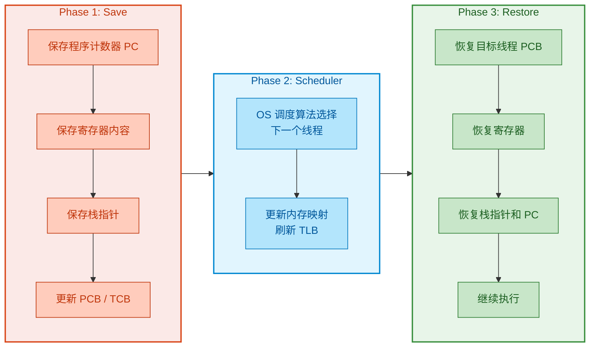

上下文切换的 **直接开销** 通常在几微秒到几十微秒之间（现代 Linux 系统上大约 2-10μs），看起来微不足道。但真正昂贵的是 **间接开销 (Indirect Cost)**：

第一，**CPU 缓存失效 (Cache Pollution)**。当线程 T1 被切换出去后，它在 L1/L2 Cache 中热好的数据会逐渐被新线程 T2 的数据覆盖。当 T1 重新获得 CPU 时间片时，需要重新从主存加载数据到缓存，这可能导致大量的 **cache miss**。访问主存的延迟是访问 L1 Cache 的 100-200 倍。

第二，**TLB 刷新 (TLB Flush)**。线程切换可能伴随 TLB (Translation Lookaside Buffer) 失效，导致虚拟地址到物理地址的翻译变慢。

第三，**编译器优化失效**。JIT 编译器对代码的优化（如寄存器分配、指令重排）可能因上下文切换而部分失效。

```text
访问延迟参考（近似值）:
┌────────────────────┬──────────────┐
│     存储层级        │   访问延迟    │
├────────────────────┼──────────────┤
│  L1 Cache          │   ~1 ns      │
│  L2 Cache          │   ~4 ns      │
│  L3 Cache          │   ~12 ns     │
│  主存 (DRAM)       │   ~100 ns    │
│  上下文切换 (含缓存) │   ~5-50 μs   │
└────────────────────┴──────────────┘
```

**减少上下文切换的策略**：减少线程数量，使其与 CPU 核心数匹配（避免过度超额订阅）；使用无锁数据结构减少因锁竞争导致的阻塞和上下文切换；使用协程或虚拟线程 (Java 21 Virtual Threads) 将切换成本从内核态降低到用户态。

#### 同步开销（Synchronization Overhead）

为了保证线程安全，我们使用锁、volatile 变量、原子操作等同步手段，但每种同步机制都有其性能代价。

**锁的开销来自多个层面**：

第一是 **获取和释放锁本身的开销**。即使没有竞争（无竞争锁 / uncontended lock），`synchronized` 也需要执行 CAS 操作来获取和释放 monitor，这比普通的字段访问要慢几十倍。JVM 对此做了大量优化——偏向锁 (Biased Locking)、轻量级锁 (Lightweight Locking)、锁消除 (Lock Elision) 等，但开销仍然存在。

第二是 **有竞争时的阻塞开销 (Contention)**。当锁已被其他线程持有时，请求线程必须被挂起（进入内核态阻塞），等锁释放后再被唤醒（再次进入内核态）。这一对"park/unpark"操作会引发两次上下文切换，开销远大于锁本身。

第三是 **内存可见性开销 (Memory Visibility)**。`synchronized` 块的进入和退出会插入 **内存屏障 (Memory Barrier / Memory Fence)**，强制将工作内存 (CPU Cache) 中的数据刷新回主存或从主存重新加载。这限制了编译器和处理器的指令重排序优化空间。

```java
// 演示锁竞争对性能的影响
public class SyncOverheadDemo {
    private long count = 0;                          // 非同步版本
    private final Object lock = new Object();

    // 版本1: 无锁 → 快但线程不安全
    public void incrementUnsafe() {
        count++;                                     // ⚠️ 非线程安全
    }

    // 版本2: 粗粒度锁 → 安全但吞吐量低
    public void incrementCoarseLock() {
        synchronized (lock) {                        // 每次调用都竞争同一把锁
            count++;                                 // 线程安全但串行化严重
        }
    }

    // 版本3: 原子变量 → 安全且无阻塞
    private final AtomicLong atomicCount = new AtomicLong(0);
    public void incrementAtomic() {
        atomicCount.incrementAndGet();               // CAS 操作，无需获取锁
    }
}
```

#### 阿姆达尔定律（Amdahl's Law）

并发优化的理论上限由 **阿姆达尔定律 (Amdahl's Law)** 给出。该定律指出，如果程序中有比例 $F$ 的部分必须串行执行，那么即使使用无穷多个处理器，最大加速比也只有 $1/F$。

假设串行比例为 $F$，处理器数量为 $N$，则加速比 (Speedup) 为：

$$Speedup \leq \frac{1}{F + \frac{1-F}{N}}$$

当 $N \to \infty$ 时，$Speedup \leq \frac{1}{F}$。

这意味着如果程序有 5% 的代码必须串行执行，那么无论加多少核，加速比永远不会超过 20 倍。**同步代码就是那个 "F"**——每一把锁、每一个 `synchronized` 块都在增加程序的串行比例，从而限制并发的可伸缩性 (Scalability)。

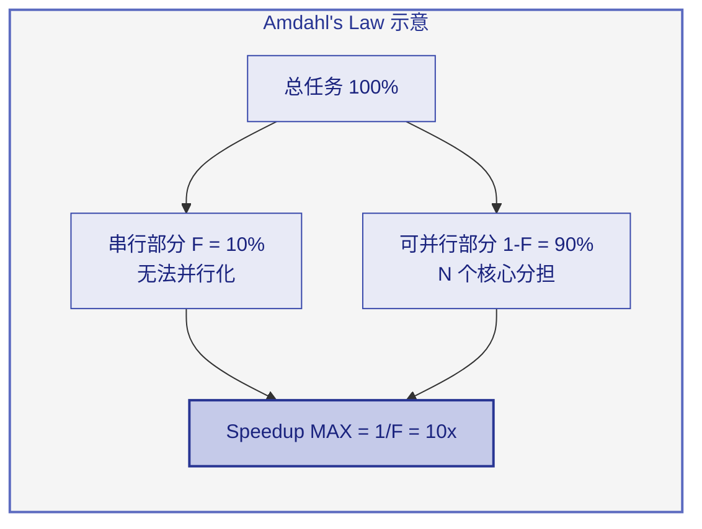

#### 减少同步开销的常用策略

**锁粒度优化 (Lock Granularity)**。将一把大锁拆分为多把小锁，降低锁竞争的概率。经典案例是 `ConcurrentHashMap` 的分段锁 (Segment Locking) 设计：它将整个 Map 分为多个段，每个段独立加锁，不同段之间的操作可以完全并行。

**减少锁持有时间**。只在真正需要互斥的最小代码范围内持有锁，避免在临界区内执行 I/O、网络调用等耗时操作。

**读写分离 (Read-Write Separation)**。如果读操作远多于写操作，使用 `ReadWriteLock` 允许多个读线程并发访问，只在写操作时才互斥。

**无锁编程 (Lock-Free Programming)**。使用 `AtomicReference`、`AtomicStampedReference` 等原子类配合 CAS 操作实现无锁的线程安全算法，完全消除阻塞。

```java
// ✅ 锁粒度优化示例: 将单一锁拆分为条带锁
public class StripedMap<K, V> {
    private static final int N_LOCKS = 16;                            // 锁的条带数
    private final Node<K, V>[] buckets;                               // 哈希桶数组
    private final Object[] locks;                                     // 条带锁数组

    public StripedMap(int capacity) {
        buckets = new Node[capacity];
        locks = new Object[N_LOCKS];
        for (int i = 0; i < N_LOCKS; i++) {
            locks[i] = new Object();                                  // 初始化每把条带锁
        }
    }

    private int hash(K key) {
        return Math.abs(key.hashCode() % buckets.length);             // 计算桶索引
    }

    public V get(K key) {
        int hash = hash(key);
        synchronized (locks[hash % N_LOCKS]) {                        // 只锁定对应的条带
            // 在该桶内查找 key...                                     // 不同条带的操作完全并行
            return null; // 简化
        }
    }
}
```

---

**📝 练习题**

以下 Java 代码存在并发安全隐患，线程 T1 调用 `transferOut(50)`，线程 T2 同时调用 `transferOut(80)`，账户初始余额为 100。请问可能出现什么问题？

```java
public class BankAccount {
    private int balance = 100;

    public void transferOut(int amount) {
        if (balance >= amount) {      // 检查余额
            Thread.sleep(10);          // 模拟处理延迟
            balance -= amount;         // 扣款
        }
    }
}
```

A. 程序正常运行，最终余额为 -30


B. 只有一个线程扣款成功，最终余额为 20 或 50


C. 两个线程都通过了余额检查并扣款，最终余额为 -30（透支）


D. 抛出 ConcurrentModificationException 异常

**【答案】** C

**【解析】** 这是一个经典的 **Check-Then-Act 竞态条件**。`transferOut` 方法中的"检查余额"和"扣款"是两个独立的步骤，没有任何同步保护。T1 和 T2 可能同时执行 `balance >= amount` 检查：T1 读到 `balance = 100 >= 50`，通过检查；T2 也读到 `balance = 100 >= 80`，也通过检查。随后两者都执行扣款操作，`balance` 先被减去 50 变为 50，再被减去 80 变为 -30，发生了 **不应出现的透支**。选项 A 描述的结果正确但表述"正常运行"不对——透支是一个 bug；选项 B 描述的是有同步保护时的正确行为；选项 D 错误，`ConcurrentModificationException` 是 Java 集合框架在迭代时检测到结构性修改才会抛出的异常，与本场景无关。修复方法是对整个 check-then-act 操作加 `synchronized` 保护，确保原子性。

---

**📝 练习题**

关于死锁的四个必要条件 (Coffman Conditions)，以下哪项描述是 **错误** 的？

A. 打破"互斥条件"可以预防死锁，例如使用读写锁让读操作不互斥


B. 打破"循环等待"的常用方法是对所有锁进行全局排序，所有线程按相同顺序获取锁


C. 打破"不可抢占"可以通过 `ReentrantLock.tryLock()` 实现，获取失败时主动放弃已持有的锁


D. 只要打破四个条件中的任意两个，死锁就不会发生

**【答案】** D

**【解析】** 死锁的四个必要条件必须 **同时成立** 才会发生死锁，因此只需打破 **任意一个** 条件即可预防死锁，而不是必须打破两个。选项 A 正确，读写锁允许多个读线程同时持有锁，部分地打破了互斥条件。选项 B 正确，全局锁排序 (Lock Ordering) 是工业界最常用的死锁预防策略，它使得循环等待无法形成。选项 C 正确，`tryLock()` 允许线程在获取失败时放弃已持有的资源，相当于允许"抢占"（更准确地说是"自愿让出"），打破了不可抢占条件。选项 D 的说法过于保守且逻辑错误——打破一个即可，无需两个。

---

## 本章小结

本章作为 Java 并发编程的开篇，围绕三个核心问题展开：**什么是并发、为什么需要并发、并发会带来什么代价**。这三个问题构成了理解整个并发体系的认知地基，后续所有的锁机制、线程池、并发容器、原子类等技术，本质上都是在回答同一个终极问题——**如何在享受并发红利的同时，把它带来的问题控制在可接受的范围内**。

从概念层面看，并发（Concurrency）与并行（Parallelism）是两个经常被混淆但本质不同的概念。并发是一种程序的 **结构设计**，它描述的是多个任务在逻辑上交替推进的能力，即便物理上只有一个处理器核心，通过时间片轮转（Time Slicing）也能实现并发。并行则是一种 **运行时状态**，要求多个任务在物理上同时执行，必须依赖多核硬件。用 Rob Pike 的经典表述来说，Concurrency is about dealing with lots of things at once, Parallelism is about doing lots of things at once。理解这一区分至关重要：我们编写的并发程序在单核机器上依然有意义（提升响应性、简化建模），而并行只是并发在多核环境下获得的额外加速奖励。

从动机层面看，并发编程的驱动力来自三个方向。第一是 **CPU 利用率**，现代处理器的运算速度与 I/O 速度之间存在数个数量级的鸿沟，如果程序在等待磁盘或网络时让 CPU 空转，就是巨大的资源浪费；并发允许我们在一个任务阻塞时切换到另一个任务，从而把 CPU 的空闲时间"填满"。第二是 **响应性**，尤其在 GUI 应用和服务端场景中，如果所有逻辑都运行在单线程上，一个耗时操作就会冻结整个界面或阻塞其他请求；将耗时任务分离到后台线程，主线程就能持续响应用户交互。第三是 **资源共享**，同一进程内的多个线程天然共享堆内存，这使得线程间的数据交换远比进程间通信（IPC）更高效、更自然，对于需要协作完成复杂任务的场景尤其适合。

然而，并发并非免费午餐。它带来的问题同样沿三个维度展开。**安全性问题（Safety）** 的核心是竞态条件（Race Condition），当多个线程在没有适当同步的情况下访问共享可变状态时，程序的正确性将不再有保障。经典的 check-then-act 和 read-modify-write 模式是竞态条件的两大温床，而 Java 内存模型（JMM）中的可见性和指令重排序问题则让安全性挑战更加隐蔽。**活跃性问题（Liveness）** 则是并发程序"卡住"的各种形态：死锁（Deadlock）是多个线程互相持有对方所需的锁而永久等待；活锁（Livelock）是线程在不断重试中消耗资源却无法推进；饥饿（Starvation）是某些线程因调度策略不公平而长期得不到执行机会。**性能问题（Performance）** 提醒我们并发本身有成本——线程上下文切换需要保存和恢复寄存器状态、刷新缓存，同步原语（如 `synchronized`、`Lock`）会引入竞争和串行化，线程创建和销毁也有不可忽略的开销。Amdahl's Law 更是从理论上为并行加速比设定了上限：程序中串行部分的占比决定了无论投入多少核心，加速效果的天花板在哪里。

将这三组概念放在一起看，可以得到一个清晰的决策框架：

```
┌─────────────────────────────────────────────────────────┐
│                   并发编程决策框架                         │
├──────────┬──────────────────────────────────────────────┤
│  收益端  │  CPU利用率 ↑ · 响应性 ↑ · 资源共享效率 ↑      │
├──────────┼──────────────────────────────────────────────┤
│  风险端  │  安全性 (竞态) · 活跃性 (死锁) · 性能 (开销)   │
├──────────┼──────────────────────────────────────────────┤
│ 工程目标 │  用最小的同步代价, 获取最大的并发收益            │
└──────────┴──────────────────────────────────────────────┘
```

后续章节的所有内容——从 `synchronized` 和 `volatile` 关键字，到 `java.util.concurrent` 包中的各种并发工具，再到无锁编程（Lock-Free）和响应式编程（Reactive Programming）——都是围绕这个框架中"风险端"的三类问题，提供不同粒度、不同场景下的解决方案。理解了这个全景图，学习后续内容时就不会迷失在细节中，而能始终把握每个工具和技术在整个并发体系中的定位。

---

**📝 练习题 1**

以下关于并发（Concurrency）与并行（Parallelism）的描述，哪一项是**正确**的？

A. 并行是程序的结构属性，并发是运行时的执行状态

B. 在单核 CPU 上无法实现并发，因为同一时刻只能执行一个线程

C. 并发描述的是任务在逻辑上交替推进的能力，并行要求任务在物理上同时执行

D. 只要使用了多线程，程序就一定是并行执行的


**【答案】** C

**【解析】** 并发是一种 **结构设计**（structuring），强调多个任务在逻辑上可以交替推进，即使在单核 CPU 上也可以通过时间片轮转实现并发，因此 B 错误。并行是一种 **运行时状态**（execution），要求多个任务在物理层面同时执行，依赖多核硬件支持，因此 A 的描述恰好说反了。D 也不正确，多线程程序在单核机器上运行时只有并发而没有并行。C 准确区分了两者的本质差异。

---

**📝 练习题 2**

某服务端程序使用 `synchronized` 对所有共享数据的访问进行了同步保护，消除了竞态条件，但上线后发现吞吐量极低且偶尔完全卡死无响应。以下分析中，**最全面**的是：

A. 仅存在安全性问题，需要排查是否仍有未同步的共享变量

B. 仅存在性能问题，过度同步导致线程串行化，应减少锁的粒度

C. 可能同时存在活跃性问题和性能问题——"完全卡死"暗示死锁，"吞吐量低"暗示同步开销过大或锁竞争激烈

D. 仅存在活跃性问题，`synchronized` 导致了死锁，应全部替换为 `ReentrantLock`


**【答案】** C

**【解析】** 题目描述了两个不同的症状：**吞吐量极低** 和 **偶尔完全卡死**。吞吐量低是典型的性能问题表现，过度使用 `synchronized` 会导致大量线程在锁上排队等待，实际变成近似串行执行，上下文切换的开销也会加剧这一问题。"完全卡死无响应"则是活跃性问题的典型信号，最大的嫌疑是死锁——多个 `synchronized` 块如果获取锁的顺序不一致，就可能形成循环等待。A 不正确，因为题目已说明竞态条件被消除了。B 和 D 都只关注了一个维度。C 同时覆盖了两种问题，是最全面的分析。这也呼应了本章的核心观点：解决一类并发问题（如安全性）的手段，可能同时引入另外两类问题（活跃性和性能），工程上需要在三者之间找到平衡。

---
