---

# 线程基础 ⭐

---

## 进程与线程

操作系统是整个并发编程的基石。要理解 Java 的多线程模型，必须先从操作系统层面搞清楚两个最基本的抽象——**进程 (Process)** 与 **线程 (Thread)**。这两个概念虽然经常被放在一起讨论，但它们在资源占有、调度粒度、通信方式等方面存在本质差异。本节将从操作系统原理出发，逐步过渡到 JVM 的实现细节，帮助你建立一个坚实的心智模型。

---

### 什么是进程

进程是操作系统进行 **资源分配 (Resource Allocation)** 的最小单位。当你双击一个 `.exe` 或在终端执行 `java -jar app.jar` 时，操作系统会为这个运行中的程序创建一个进程。每个进程都拥有一套独立的、受保护的资源空间，包括独立的虚拟地址空间（代码段、数据段、堆、栈）、文件描述符表、信号处理器等。这种隔离机制意味着，进程 A 的内存空间对于进程 B 来说是不可见的——除非通过操作系统提供的 **进程间通信 (Inter-Process Communication, IPC)** 机制来显式地共享数据。

一个进程从创建到结束，会经历若干状态的流转。经典的五态模型如下：**新建 (New)** → **就绪 (Ready)** → **运行 (Running)** → **阻塞/等待 (Blocked/Waiting)** → **终止 (Terminated)**。操作系统的调度器 (Scheduler) 负责在就绪队列中挑选进程，将 CPU 时间片分配给它。当进程发起 I/O 请求或主动让出 CPU 时，它会被移入阻塞队列，直到条件满足后重新回到就绪队列。

进程之间的隔离带来了高度的安全性与稳定性——一个进程崩溃通常不会影响其他进程。但这种隔离的代价是高昂的：创建进程需要复制页表、分配独立的地址空间，进程间切换 (Context Switch) 时需要刷新 TLB (Translation Lookaside Buffer)，这些都是重量级操作。

### 什么是线程

线程是操作系统进行 **CPU 调度 (CPU Scheduling)** 的最小单位。一个进程可以包含多个线程，这些线程 **共享** 进程的地址空间、堆内存、全局变量、文件句柄等资源，但每个线程都拥有自己独立的 **程序计数器 (Program Counter, PC)**、**栈 (Stack)** 和 **局部变量**。

正因为线程间共享了同一块内存空间，线程之间的通信天然地比进程间通信高效得多——它们可以直接读写共享变量，而无需经过操作系统内核的中转。但凡事有两面，这种共享也是并发编程中绝大部分 Bug 的根源：**竞态条件 (Race Condition)**、**可见性问题 (Visibility Issue)**、**指令重排 (Instruction Reordering)** 等问题都由此而来。这也是你学习这整本并发知识库的核心动机。

线程有时也被称为 **轻量级进程 (Lightweight Process, LWP)**，因为它的创建和切换成本远低于进程。在 Linux 中，线程与进程在内核层面其实都由 `task_struct` 结构体表示，区别仅在于线程之间共享了内存描述符 (`mm_struct`)。

### 进程与线程的核心对比

下面这张表格可以帮助你快速抓住两者的本质差异：

| 对比维度 | 进程 (Process) | 线程 (Thread) |
|---|---|---|
| **定义** | 资源分配的最小单位 | CPU 调度的最小单位 |
| **地址空间** | 独立的虚拟地址空间 | 共享所属进程的地址空间 |
| **通信方式** | IPC（管道、Socket、共享内存等） | 直接读写共享变量 |
| **创建/销毁开销** | 大（需分配独立资源） | 小（共享进程资源） |
| **上下文切换** | 重量级（需刷新 TLB） | 轻量级（同一进程内无需刷新 TLB） |
| **安全/隔离性** | 高（一个进程崩溃不影响其他进程） | 低（一个线程异常可能导致整个进程退出） |
| **资源拥有** | 拥有独立的文件描述符、信号处理器等 | 共享文件描述符，拥有独立的栈和PC |

### 内存布局视角：进程与线程的关系

为了让上述概念更加直观，我们用一张 ASCII 图来展示一个拥有两个线程的 Java 进程在内存中大致是什么样子：

```text
┌─────────────────────────────────────────────────────────────┐
│                    JVM 进程 (Process)                        │
│                                                             │
│  ┌──────────────────── 共享区域 ────────────────────────┐    │
│  │  方法区 (Method Area / Metaspace)                    │    │
│  │  ┌──────────────────────────────────────────────┐    │    │
│  │  │ 类信息、常量池、静态变量、JIT 编译后代码       │    │    │
│  │  └──────────────────────────────────────────────┘    │    │
│  │                                                      │    │
│  │  堆 (Heap)                                           │    │
│  │  ┌──────────────────────────────────────────────┐    │    │
│  │  │ 所有对象实例（new 出来的）、数组               │    │    │
│  │  │ GC 在此工作                                    │    │    │
│  │  └──────────────────────────────────────────────┘    │    │
│  └──────────────────────────────────────────────────────┘    │
│                                                             │
│  ┌─── Thread-0 (私有) ───┐  ┌─── Thread-1 (私有) ───┐      │
│  │ PC: 0x00A3            │  │ PC: 0x00F7            │      │
│  │ 虚拟机栈 (VM Stack)   │  │ 虚拟机栈 (VM Stack)   │      │
│  │  ┌──────────────┐     │  │  ┌──────────────┐     │      │
│  │  │ 栈帧 Frame-2 │     │  │  │ 栈帧 Frame-1 │     │      │
│  │  │ 栈帧 Frame-1 │     │  │  │ 栈帧 Frame-0 │     │      │
│  │  │ 栈帧 Frame-0 │     │  │  └──────────────┘     │      │
│  │  └──────────────┘     │  │                        │      │
│  │ 本地方法栈             │  │ 本地方法栈             │      │
│  └───────────────────────┘  └────────────────────────┘      │
└─────────────────────────────────────────────────────────────┘
```

从图中可以清晰地看到：**堆和方法区是线程共享的**，而 **程序计数器 (PC)、虚拟机栈 (VM Stack)、本地方法栈 (Native Method Stack) 是每个线程私有的**。这个内存模型是理解后续所有并发问题（可见性、原子性、有序性）的物理基础。

### JVM 中的线程模型

Java 线程与操作系统线程之间的映射关系，随着 JVM 版本和平台的不同而有所演变。在现代主流 JVM（HotSpot）中，采用的是 **1:1 模型 (One-to-One Model)**，即每个 Java 线程都直接对应一个操作系统内核线程 (Kernel Thread)。这意味着：

当你在 Java 中调用 `new Thread().start()` 时，JVM 底层会通过系统调用（如 Linux 上的 `pthread_create`）创建一个真正的操作系统线程。线程的调度完全由操作系统内核负责，Java 层面无法精确控制。这种模型的优势是可以充分利用多核 CPU 的并行能力；劣势是线程的创建和上下文切换都需要陷入内核态 (Kernel Mode)，有一定开销。

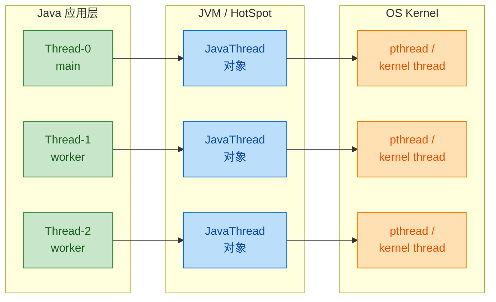

值得一提的是，**Project Loom** 引入了 **虚拟线程 (Virtual Threads)**，在 JDK 21 中正式发布 (GA)。虚拟线程采用 **M:N 模型**——大量虚拟线程被映射到少量的平台线程 (Carrier Threads) 上，由 JVM 自行调度，而非操作系统内核。这极大地降低了线程创建和切换的成本，使得 "一个请求一个线程" 的编程模型在高并发场景下重新变得可行。不过在本章基础部分，我们仍然聚焦于经典的 1:1 线程模型。

### 进程间通信 vs 线程间通信

理解通信方式的差异，能帮助你更好地理解为什么 Java 并发编程主要围绕 **线程** 展开。

**进程间通信 (IPC)** 由于地址空间隔离，必须借助操作系统提供的机制，常见手段包括：管道 (Pipe)、命名管道 (Named Pipe / FIFO)、消息队列 (Message Queue)、共享内存 (Shared Memory)、信号量 (Semaphore)、Socket 等。这些机制都需要在用户态与内核态之间进行切换，开销相对较大。

**线程间通信** 则简单得多。由于同一进程内的线程共享堆内存，线程 A 修改了一个对象的字段，线程 B 理论上可以直接看到。但 "理论上" 三个字是关键——由于 **CPU 缓存一致性协议**、**编译器优化**（指令重排）以及 **JVM 内存模型 (Java Memory Model, JMM)** 的存在，线程 B 并不一定能 **及时** 看到线程 A 的修改。这就是为什么 Java 提供了 `volatile`、`synchronized`、`java.util.concurrent` 包等一系列同步工具——它们的本质作用就是在共享内存的基础上建立起可靠的 **可见性** 和 **有序性** 保证。

### 为什么 Java 选择多线程而非多进程

Java 从诞生之初就内置了多线程支持（`java.lang.Thread` 是 JDK 1.0 就有的类），而不是像 C/C++ 那样让开发者自行选择多进程或多线程。这背后有几个原因：

第一，**JVM 本身就是一个进程**。JVM 启动后就是一个操作系统进程，在这个进程内部运行多个线程，天然符合 "一个应用 = 一个进程 + 多个线程" 的模型。如果采用多进程模型，意味着要启动多个 JVM 实例，每个实例都有自己的堆、方法区和 GC，内存开销极其巨大。

第二，**线程间通信的低成本**。Java 的共享内存模型使得线程间可以通过对象引用直接协作，配合 `synchronized` 和 `java.util.concurrent` 工具包，开发效率远高于 IPC。

第三，**平台无关性 (Write Once, Run Anywhere)**。Java 将线程的创建和管理封装在标准 API 中，屏蔽了不同操作系统在进程/线程实现上的差异。开发者无需关心底层是 `pthread`、Windows Thread 还是其他实现。

### 关于并发与并行

在继续深入之前，有必要澄清两个经常被混淆的术语：

**并发 (Concurrency)** 指的是多个任务在 **逻辑上** 同时推进，但在物理层面可能是交替执行的。比如在单核 CPU 上，操作系统通过时间片轮转让多个线程 "看起来" 同时运行，实际上同一时刻只有一个线程在执行。并发强调的是 **任务管理** 的能力——如何正确地组织和协调多个任务。

**并行 (Parallelism)** 指的是多个任务在 **物理上** 真正同时执行，这需要多核 CPU 或多处理器的硬件支持。并行强调的是 **执行效率**——利用多核资源加速计算。

Rob Pike（Go 语言的共同创造者）有一句经典总结："Concurrency is about *dealing with* lots of things at once. Parallelism is about *doing* lots of things at once."（并发是同时 *处理* 很多事情，并行是同时 *做* 很多事情。）

在 Java 中，多线程编程首先是一个 **并发** 问题——即使在单核机器上，你依然需要处理线程安全、可见性等问题。而在多核机器上，多线程可以进一步实现 **并行**，获得性能上的提升。

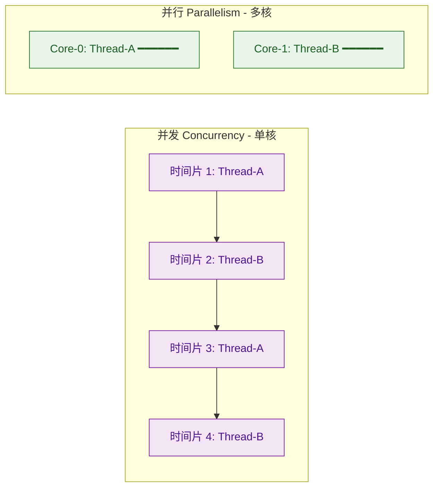

### 线程的生命周期（Java 视角）

从 Java 层面来看，线程的状态由 `java.lang.Thread.State` 枚举定义，共有六种状态。理解这些状态及其转换条件，是后续学习 `wait/notify`、`Lock`、`LockSupport` 等 API 的前提。

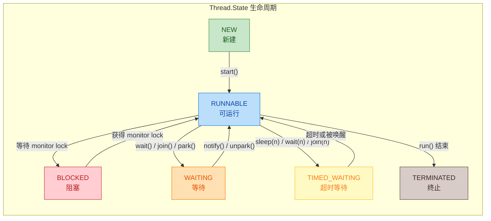

各状态的含义如下：

**NEW**：线程对象已创建（`new Thread()`），但尚未调用 `start()` 方法。此时线程还没有分配操作系统资源。

**RUNNABLE**：调用 `start()` 后进入此状态。注意 Java 中的 RUNNABLE 实际上包含了操作系统层面的 Ready 和 Running 两个状态——线程可能正在 CPU 上执行，也可能在就绪队列中等待调度。

**BLOCKED**：线程试图获取一个被其他线程持有的 `synchronized` 锁（monitor lock）时进入此状态。这是一种被动等待，只能等锁释放。

**WAITING**：线程主动调用 `Object.wait()`（不带超时）、`Thread.join()`（不带超时）或 `LockSupport.park()` 后进入此状态。必须等待其他线程的显式唤醒。

**TIMED_WAITING**：与 WAITING 类似，但带有超时参数。例如 `Thread.sleep(1000)`、`Object.wait(1000)`、`Thread.join(1000)` 等。超时到期后自动回到 RUNNABLE。

**TERMINATED**：线程的 `run()` 方法执行完毕，或因未捕获异常而退出。线程一旦终止就不能再次启动。

下面用一段简单的代码来验证线程的状态变化：

```java
public class ThreadStateDemo {
    public static void main(String[] args) throws InterruptedException {
        // 创建线程，此时状态为 NEW
        Thread t = new Thread(() -> {
            try {
                // sleep 会使线程进入 TIMED_WAITING 状态
                Thread.sleep(2000);
            } catch (InterruptedException e) {
                // 中断异常处理
                Thread.currentThread().interrupt();
            }
        });

        // 打印 NEW 状态
        System.out.println("创建后: " + t.getState());   // NEW

        // 启动线程，状态变为 RUNNABLE
        t.start();
        // 给线程一点时间进入 sleep
        Thread.sleep(100);

        // 此时线程正在 sleep，状态为 TIMED_WAITING
        System.out.println("sleep中: " + t.getState());  // TIMED_WAITING

        // 等待线程执行完毕
        t.join();

        // 线程结束，状态为 TERMINATED
        System.out.println("结束后: " + t.getState());   // TERMINATED
    }
}
```

---

**📝 练习题**

以下关于 Java 线程状态的描述，哪一项是 **正确的**？

A. 线程调用 `Thread.sleep(1000)` 后进入 BLOCKED 状态

B. Java 中 RUNNABLE 状态仅表示线程正在 CPU 上执行

C. 线程在等待获取 `synchronized` 锁时处于 WAITING 状态

D. Java 的 RUNNABLE 状态包含了操作系统层面的 Ready 和 Running 两种子状态


**【答案】** D

**【解析】** Java 的 `Thread.State.RUNNABLE` 是一个比较 "粗粒度" 的状态，它涵盖了操作系统层面的 **就绪 (Ready)** 和 **运行 (Running)** 两种状态。也就是说，即使线程当前并未真正占用 CPU（而是在就绪队列中排队），在 Java 层面它的状态仍然是 RUNNABLE。选项 A 错误，`sleep()` 进入的是 **TIMED_WAITING** 状态；选项 B 错误，原因如上所述；选项 C 错误，等待 `synchronized` 锁进入的是 **BLOCKED** 状态，而非 WAITING。WAITING 状态是由 `Object.wait()`、`Thread.join()`、`LockSupport.park()` 等方法触发的主动等待。

---

## 创建线程

在 Java 中，线程（Thread）是程序执行的最小单元。JVM 启动时会创建一个 `main` 线程来执行 `main()` 方法，而当我们需要并发地执行多个任务时，就必须手动创建新的线程。Java 提供了三种经典的线程创建方式：**继承 Thread 类**、**实现 Runnable 接口**、**实现 Callable 接口**。它们各自适用于不同的场景，理解它们之间的差异是掌握 Java 并发编程的第一步。

在深入每种方式之前，我们先从全局视角理解这三种方式的定位与关系：

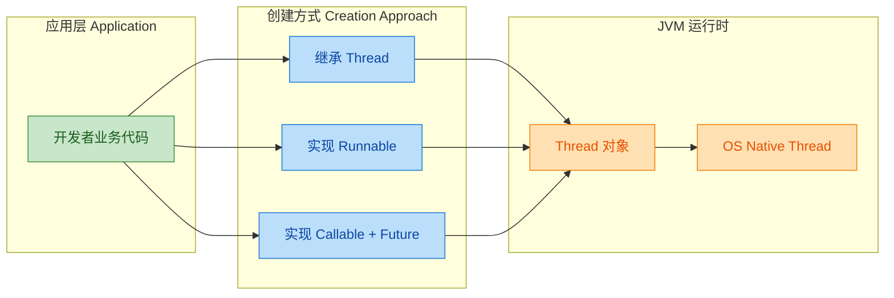

无论我们选择哪种创建方式，最终都需要依托 `Thread` 对象来启动线程，而 `Thread` 对象的底层又会映射到操作系统的原生线程（Native Thread）。这就是 Java 线程模型的核心：**1:1 线程映射**（one-to-one mapping），即每个 Java 线程对应一个操作系统内核线程。

---

### 继承 Thread

最直观的创建线程方式是编写一个类继承 `java.lang.Thread`，然后重写（Override）它的 `run()` 方法。`run()` 方法中定义的就是这个线程要执行的任务逻辑。

```java
// 1. 定义一个类，继承 Thread
public class MyThread extends Thread {

    // 2. 重写 run() 方法，定义线程执行的任务
    @Override
    public void run() {
        // 获取当前线程的名称，Thread 内部维护了一个 name 字段
        String name = Thread.currentThread().getName();
        // 模拟业务逻辑：循环打印信息
        for (int i = 0; i < 5; i++) {
            System.out.println(name + " 正在执行第 " + i + " 次任务");
        }
    }

    public static void main(String[] args) {
        // 3. 创建线程对象
        MyThread t1 = new MyThread();
        // 可以为线程设置一个有意义的名字，便于调试
        t1.setName("Worker-1");

        // 4. 调用 start() 启动线程（而非直接调用 run()）
        t1.start();

        // main 线程继续执行自己的逻辑
        System.out.println("main 线程继续运行...");
    }
}
```

**运行结果**（顺序不确定，取决于 CPU 调度）：

```text
main 线程继续运行...
Worker-1 正在执行第 0 次任务
Worker-1 正在执行第 1 次任务
Worker-1 正在执行第 2 次任务
Worker-1 正在执行第 3 次任务
Worker-1 正在执行第 4 次任务
```

这里有一个非常重要的细节：我们调用的是 `t1.start()` 而不是 `t1.run()`。`start()` 才会真正地创建一个新的操作系统线程，并在这个新线程中执行 `run()` 的逻辑。如果直接调用 `run()`，它只是在当前线程（main 线程）中执行了一个普通的方法调用，不会产生任何并发效果。关于 `start()` 与 `run()` 的详细对比将在后续章节 "start vs run" 中深入展开。

**继承 Thread 的优缺点分析**

这种方式的优点是写法简单，直接重写 `run()` 即可，适合快速编写小型 Demo 或一次性任务。但它有一个致命缺陷——**Java 是单继承的**。一旦你的类继承了 `Thread`，它就不能再继承其他类。在实际项目中，一个类往往已经有了自己的继承体系（比如继承了某个业务基类），此时就无法再通过继承 `Thread` 来创建线程。这种设计上的限制使得继承 Thread 的方式在真实开发中使用较少。

此外，从面向对象设计（OOD）的角度看，继承 Thread 也违反了 **"组合优于继承"（Composition over Inheritance）** 的原则。线程的任务逻辑（"做什么"）与线程的生命周期管理（"如何调度"）被耦合在了同一个类中，不利于代码复用和职责分离。

---

### 实现 Runnable

`Runnable` 是 Java 标准库中的一个函数式接口（Functional Interface），它只定义了一个无参无返回值的 `run()` 方法。通过实现 `Runnable` 接口，我们可以将"线程要做的事情"从"线程本身"中解耦出来，这是 Java 并发编程中最推荐的基础方式。

```java
// Runnable 接口的定义（JDK 源码）
@FunctionalInterface
public interface Runnable {
    public abstract void run();
}
```

使用方式如下：

```java
// 方式一：传统写法 —— 实现 Runnable 接口
public class MyTask implements Runnable {

    // 实现 run() 方法，定义任务逻辑
    @Override
    public void run() {
        // 获取当前执行此任务的线程名
        String name = Thread.currentThread().getName();
        System.out.println(name + " 正在执行任务");
    }

    public static void main(String[] args) {
        // 1. 创建任务对象（注意：它不是线程，只是一个任务）
        MyTask task = new MyTask();

        // 2. 将任务传给 Thread 对象，由 Thread 负责线程管理
        Thread t1 = new Thread(task, "Worker-A");
        // 3. 启动线程
        t1.start();

        // 方式二：匿名内部类写法（适用于一次性任务）
        Thread t2 = new Thread(new Runnable() {
            @Override
            public void run() {
                System.out.println(Thread.currentThread().getName() + " 匿名任务执行");
            }
        }, "Worker-B");
        t2.start();

        // 方式三：Lambda 表达式（Java 8+，最简洁）
        // 因为 Runnable 是 @FunctionalInterface，所以可以用 Lambda
        Thread t3 = new Thread(() -> {
            // Lambda 体就是 run() 的实现
            System.out.println(Thread.currentThread().getName() + " Lambda 任务执行");
        }, "Worker-C");
        t3.start();
    }
}
```

`Runnable` 的设计体现了经典的 **策略模式（Strategy Pattern）**：`Thread` 扮演 Context 角色，负责线程的启动与生命周期管理；`Runnable` 扮演 Strategy 角色，封装了可替换的执行策略。这种解耦让同一个 `Runnable` 任务可以被多个线程复用，也可以被提交给线程池（`ExecutorService`），灵活性远超继承 Thread。

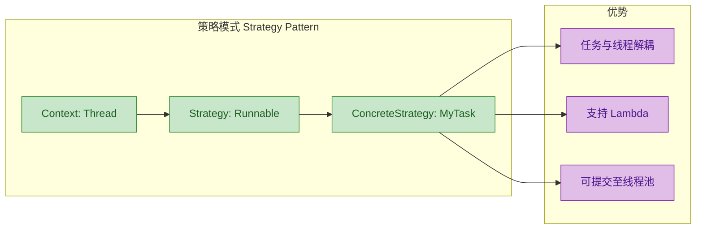

**Runnable vs Thread 继承的核心对比**

从本质上看，`Thread` 类本身就实现了 `Runnable` 接口。当我们继承 `Thread` 并重写 `run()` 时，相当于直接修改了 `Thread` 内部的执行逻辑；而当我们将 `Runnable` 传给 `Thread` 构造器时，`Thread.run()` 内部会判断——如果存在 `target`（即传入的 `Runnable`），就调用 `target.run()`，否则什么也不做。这段源码如下：

```java
// Thread.java 简化源码
public class Thread implements Runnable {
    // target 就是通过构造器传入的 Runnable 对象
    private Runnable target;

    // Thread 自身的 run() 方法
    @Override
    public void run() {
        // 如果传入了 Runnable，就委托给它执行
        if (target != null) {
            target.run();
        }
        // 如果没传入，也没重写 run()，则什么也不做
    }
}
```

这清楚地说明了：**继承 Thread 是"覆盖"行为，实现 Runnable 是"委托"行为**。在大多数场景下，委托（Delegation）比覆盖（Override）更灵活。

**Runnable 的局限性**

尽管 `Runnable` 已经大幅改善了线程创建的灵活性，但它有一个明显的限制：`run()` 方法的返回值是 `void`，而且不允许抛出受检异常（Checked Exception）。这意味着如果你的线程任务需要返回计算结果（比如一个耗时的数据查询），或者需要向调用方抛出异常，`Runnable` 就无能为力了。这正是 `Callable` 接口诞生的背景。

---

### 实现 Callable（有返回值）

`Callable` 是 Java 5（JDK 1.5）引入的接口，位于 `java.util.concurrent` 包中。它的设计目的是弥补 `Runnable` 无法返回结果、无法抛出异常的缺陷。与 `Runnable` 类似，`Callable` 也是一个函数式接口，但它的核心方法是 `call()` 而非 `run()`。

```java
// Callable 接口的定义（JDK 源码）
@FunctionalInterface
public interface Callable<V> {
    // 可以返回结果 V，也可以抛出受检异常
    V call() throws Exception;
}
```

对比 `Runnable` 与 `Callable`：

| 特性               | Runnable          | Callable〈V〉       |
| :----------------- | :---------------- | :----------------- |
| 核心方法           | `void run()`      | `V call() throws Exception` |
| 返回值             | 无                | 有（泛型 V）        |
| 受检异常           | 不允许抛出        | 允许抛出            |
| 引入版本           | JDK 1.0           | JDK 1.5            |
| 能否直接传给 Thread | 可以              | **不可以**（需要 FutureTask 适配） |

**关键问题：Thread 构造器不接受 Callable**

`Thread` 的构造器只接受 `Runnable`，不接受 `Callable`。那如何用 `Callable` 创建线程呢？答案是借助 `FutureTask` 作为桥梁。`FutureTask` 同时实现了 `Runnable` 和 `Future` 接口，它可以包装一个 `Callable`，然后作为 `Runnable` 传给 `Thread`。

这种设计巧妙地运用了 **适配器模式（Adapter Pattern）**：

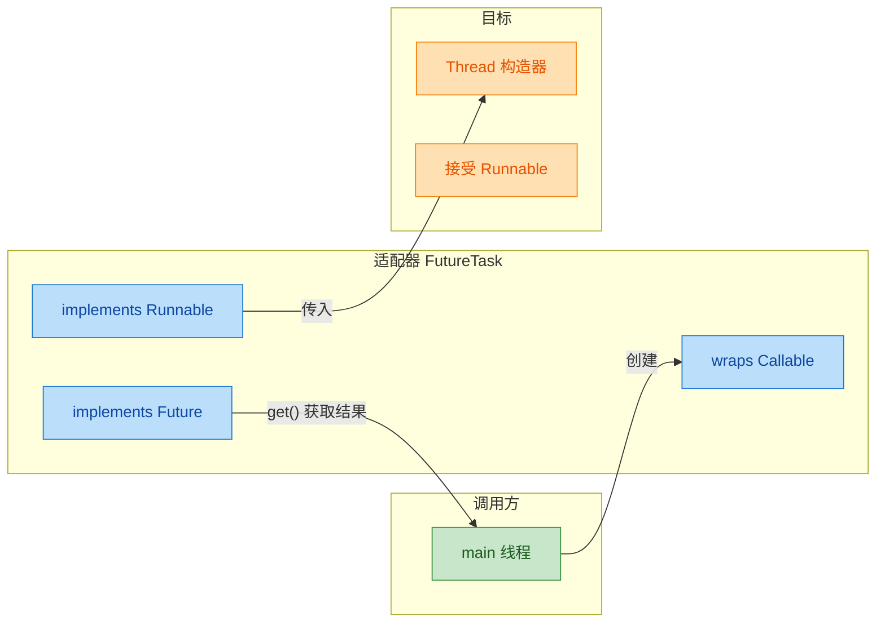

下面是一个完整的使用示例：

```java
import java.util.concurrent.Callable;
import java.util.concurrent.FutureTask;
import java.util.concurrent.ExecutionException;

public class CallableDemo {

    public static void main(String[] args) {
        // 1. 定义一个 Callable 任务，泛型指定返回值类型为 Integer
        Callable<Integer> task = new Callable<Integer>() {
            @Override
            public Integer call() throws Exception {
                System.out.println(Thread.currentThread().getName() + " 开始计算...");
                int sum = 0;
                // 模拟一个耗时的累加任务
                for (int i = 1; i <= 100; i++) {
                    sum += i;                       // 累加 1 到 100
                    Thread.sleep(10);               // 模拟耗时操作
                }
                System.out.println(Thread.currentThread().getName() + " 计算完成!");
                return sum;                         // 返回计算结果
            }
        };

        // 2. 用 FutureTask 包装 Callable（适配器模式）
        //    FutureTask 既是 Runnable（可传给 Thread），又是 Future（可获取结果）
        FutureTask<Integer> futureTask = new FutureTask<>(task);

        // 3. 将 FutureTask 传给 Thread 并启动
        Thread thread = new Thread(futureTask, "Calc-Thread");
        thread.start();

        // 4. main 线程可以继续执行其他工作
        System.out.println("main 线程正在做其他事情...");

        try {
            // 5. 调用 get() 获取结果 —— 这是一个阻塞调用！
            //    如果 Calc-Thread 还没执行完，main 线程会在此等待
            Integer result = futureTask.get();
            System.out.println("计算结果: " + result);     // 输出: 计算结果: 5050
        } catch (InterruptedException e) {
            // 当前线程在等待过程中被中断
            Thread.currentThread().interrupt();
            System.err.println("等待被中断");
        } catch (ExecutionException e) {
            // call() 方法内部抛出了异常，包装在 ExecutionException 中
            System.err.println("任务执行异常: " + e.getCause());
        }
    }
}
```

同样，利用 Lambda 可以极大地简化代码：

```java
// Lambda 简化版
FutureTask<Integer> futureTask = new FutureTask<>(() -> {
    int sum = 0;                                // 初始化累加器
    for (int i = 1; i <= 100; i++) {
        sum += i;                               // 累加
    }
    return sum;                                 // 返回结果，编译器自动推断为 Integer
});

new Thread(futureTask, "Calc-Thread").start();  // 启动线程
Integer result = futureTask.get();              // 阻塞获取结果
```

**深入理解 FutureTask 的状态机**

`FutureTask` 内部维护了一个状态机来跟踪任务的生命周期。理解这些状态对于正确使用 `get()`、`cancel()` 等方法至关重要：

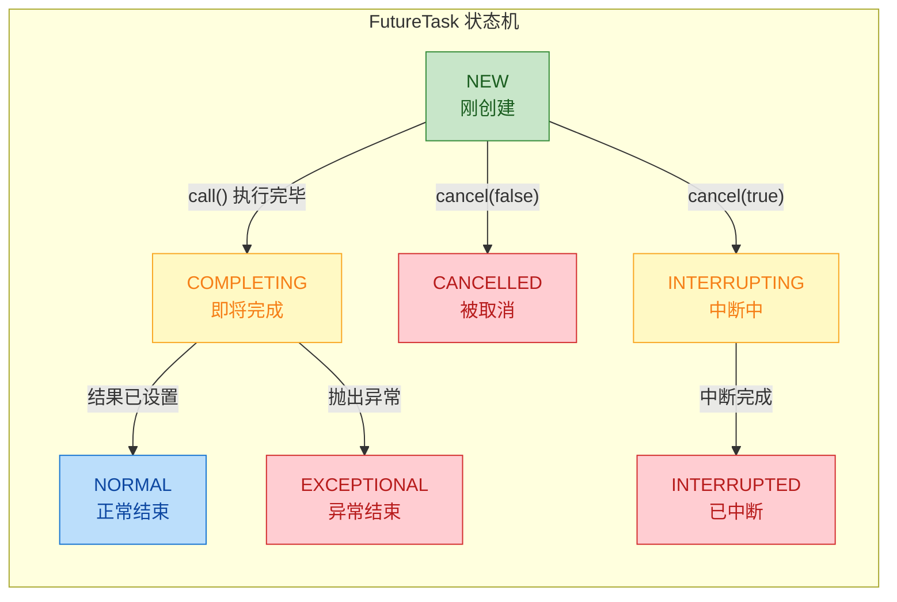

当我们调用 `futureTask.get()` 时：如果任务处于 `NEW` 或 `COMPLETING` 状态，调用线程会被 **阻塞挂起**（通过 `LockSupport.park()`），直到任务转为终态（`NORMAL`、`EXCEPTIONAL`、`CANCELLED`、`INTERRUPTED`）后被唤醒。如果任务正常完成（`NORMAL`），`get()` 返回结果值；如果异常结束（`EXCEPTIONAL`），`get()` 将异常包装为 `ExecutionException` 抛出；如果被取消（`CANCELLED`/`INTERRUPTED`），`get()` 抛出 `CancellationException`。

`get()` 还有一个带超时的重载版本 `get(long timeout, TimeUnit unit)`，可以避免无限期阻塞：

```java
try {
    // 最多等待 5 秒，超时则抛出 TimeoutException
    Integer result = futureTask.get(5, TimeUnit.SECONDS);
} catch (TimeoutException e) {
    System.err.println("任务超时，考虑取消任务...");
    futureTask.cancel(true);        // 尝试中断正在执行的线程
}
```

**FutureTask 的幂等性（Idempotency）**

`FutureTask` 保证了 `call()` 方法 **只会被执行一次**。即使多个线程同时调用 `futureTask.run()`，只有第一个到达的线程会真正执行 `call()`，其余线程会因为状态检查而直接返回。这个特性使 `FutureTask` 可以安全地作为缓存（Cache）使用——多个线程请求同一个计算结果时，只有一个线程实际执行计算，其他线程通过 `get()` 共享结果。

**Callable 与 ExecutorService（线程池）的协作**

在实际开发中，我们很少直接用 `Thread + FutureTask` 的方式来运行 `Callable`，更常见的做法是将 `Callable` 提交给线程池：

```java
import java.util.concurrent.*;

public class CallableWithPoolDemo {

    public static void main(String[] args) throws Exception {
        // 1. 创建一个固定大小的线程池
        ExecutorService pool = Executors.newFixedThreadPool(3);

        // 2. 提交 Callable 任务，线程池内部自动用 FutureTask 包装
        //    submit() 返回 Future 对象，用于获取结果
        Future<String> future = pool.submit(() -> {
            Thread.sleep(1000);                     // 模拟耗时操作
            return "Hello from " + Thread.currentThread().getName();
        });

        // 3. 获取结果（阻塞）
        String result = future.get();
        System.out.println(result);

        // 4. 关闭线程池（必须！否则 JVM 不会退出）
        pool.shutdown();
    }
}
```

线程池的 `submit()` 方法内部会将 `Callable` 包装为 `FutureTask`，然后放入任务队列，由空闲线程取出执行。返回的 `Future` 对象就是对底层 `FutureTask` 的引用。关于线程池的详细机制将在后续章节展开。

**三种创建方式的综合对比与选型建议**

| 维度           | 继承 Thread         | 实现 Runnable        | 实现 Callable         |
| :------------- | :------------------ | :------------------- | :-------------------- |
| 使用复杂度     | 低                  | 低                   | 中（需 FutureTask）    |
| 返回值         | 无                  | 无                   | 有                    |
| 异常处理       | 只能内部捕获        | 只能内部捕获          | 可向调用方传播         |
| 继承灵活性     | 占用唯一继承位      | 不影响继承            | 不影响继承             |
| 线程池兼容     | 差                  | 好                   | 最好                  |
| 适用场景       | 快速 Demo           | 无返回值的常规任务    | 需要返回值/异常传播    |

**选型原则（Best Practice）**：在实际项目中，应优先使用 `Runnable`（无返回值场景）或 `Callable`（有返回值场景），并搭配线程池使用。继承 `Thread` 的方式仅适合教学演示或极简场景。

---

**📝 练习题**

以下代码的输出结果是什么？

```java
public class Quiz {
    public static void main(String[] args) throws Exception {
        FutureTask<String> ft = new FutureTask<>(() -> {
            System.out.println("A");
            return "B";
        });
        new Thread(ft).start();
        new Thread(ft).start();
        System.out.println(ft.get());
    }
}
```

A. 打印两次 "A"，然后打印 "B"


B. 打印一次 "A"，然后打印 "B"


C. 打印一次 "A"，然后打印两次 "B"


D. 抛出异常，因为 FutureTask 不能被两个线程同时执行


**【答案】** B

**【解析】** `FutureTask` 具有**幂等性**（Idempotency），其 `run()` 方法内部会先检查状态是否为 `NEW`，只有当状态为 `NEW` 时才会执行 `call()` 方法，执行完毕后状态变为 `NORMAL`。当第二个线程调用 `ft.run()` 时，发现状态已不是 `NEW`，会直接 `return`，不再执行 `call()`。因此 `"A"` 只打印一次，`ft.get()` 返回的 `"B"` 也只打印一次。这正是 `FutureTask` 可以安全用于并发缓存场景的原因。

---

## Thread 核心方法

线程对象创建之后，真正让它"活"起来、协调它与其他线程之间关系的，全靠 `Thread` 类提供的一组核心实例方法和静态方法。这一节我们逐个拆解 `start()`、`run()`、`sleep()`、`yield()` 和 `join()`，把每个方法的语义、底层行为和常见陷阱讲透。

---

### start() vs run() ⭐

这是 Java 线程面试中出镜率最高的问题之一，也是初学者最容易踩的第一个坑。两者的区别可以用一句话概括：**`start()` 启动一条新线程去执行 `run()`；直接调用 `run()` 只是在当前线程里执行一个普通方法，不会创建任何新线程。**

要理解这句话，我们需要从 JVM 层面看看 `start()` 到底做了什么。

当你调用 `thread.start()` 时，JVM 内部大致经历以下步骤：

1. 检查线程状态，确保它处于 `NEW`（尚未启动）。如果线程已经启动过，直接抛出 `IllegalThreadStateException`。
2. 将该线程加入线程组（ThreadGroup）。
3. 调用本地方法 `start0()`，这是一个 `native` 方法，由 JVM 的 C++ 层实现。它会请求操作系统创建一条真正的内核线程（在 Linux 上通常是 `pthread_create`），并让这条新线程的入口指向 JVM 内部的一个回调函数。
4. 新线程被操作系统调度执行后，JVM 的回调函数最终会调用 Java 层的 `run()` 方法。

所以 `run()` 只是线程的"任务体"，它本身没有任何启动线程的能力。你完全可以把它当作一个普通的 `public void` 方法来调用——只不过这样做就失去了多线程的意义。

```java
public class StartVsRun {
    public static void main(String[] args) {
        // 创建一个简单的线程，打印当前执行它的线程名
        Thread thread = new Thread(() -> {
            // 这行代码会告诉我们，到底是哪条线程在执行这个 lambda
            System.out.println("任务执行线程: " + Thread.currentThread().getName());
        }, "MyThread");

        // ========== 第一组：直接调用 run() ==========
        // 这里不会创建新线程，run() 在 main 线程中同步执行
        System.out.println("--- 直接调用 run() ---");
        thread.run();
        // 输出: 任务执行线程: main
        // 证明 run() 只是一个普通方法调用，执行线程仍然是 main

        // ========== 第二组：调用 start() ==========
        // 这里会创建一条新的操作系统线程，由新线程异步执行 run()
        System.out.println("--- 调用 start() ---");
        thread.start();
        // 输出: 任务执行线程: MyThread
        // 证明 start() 真正启动了一条名为 MyThread 的新线程
    }
}
```

下面这张图展示了两种调用方式在线程层面的本质区别：

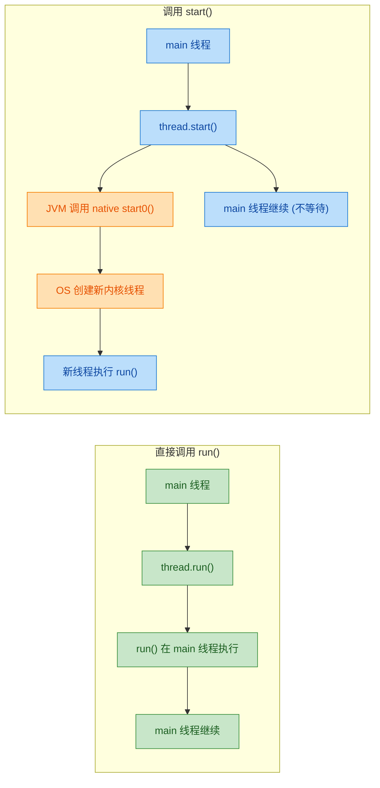

有几个关键细节值得强调：

- **`start()` 只能调用一次。** 对同一个 Thread 对象调用两次 `start()` 会抛出 `IllegalThreadStateException`。线程的生命周期是单向的，从 `NEW` 出发，最终走向 `TERMINATED`，不可回头。如果你需要再次执行同样的任务，必须创建一个新的 Thread 对象。

- **`start()` 返回后，新线程不一定立刻执行。** `start()` 只是告诉操作系统"我准备好了，请调度我"，具体什么时候真正获得 CPU 时间片，取决于操作系统的线程调度器。所以 `start()` 之后的代码和新线程的 `run()` 之间没有确定的先后顺序——这就是并发的本质。

- **为什么不把 `start()` 的逻辑直接写在 `run()` 里？** 这是一个经典的设计模式问题。`Thread` 类采用了模板方法模式（Template Method Pattern）：`start()` 定义了"启动线程"的骨架流程（状态检查 → 注册线程组 → 调用 native 方法），而 `run()` 是留给子类或 `Runnable` 实现者填充的"可变部分"。这种分离让框架控制了线程生命周期管理，用户只需关注业务逻辑。

---

### sleep()（不释放锁）

`Thread.sleep(long millis)` 是一个静态方法，作用是让**当前正在执行的线程**暂停指定的毫秒数。注意，它是静态方法，所以它永远作用于调用它的那条线程，而不是某个 Thread 对象所代表的线程。

sleep 的核心语义可以归纳为三点：

1. **让出 CPU 时间片**：当前线程从 `RUNNABLE` 状态进入 `TIMED_WAITING` 状态，操作系统不会再给它分配 CPU，直到睡眠时间到期。
2. **不释放任何已持有的锁**：这是 `sleep()` 最重要的特性之一，也是它与 `Object.wait()` 的关键区别。如果当前线程持有某个对象的 monitor 锁，sleep 期间这把锁不会被释放，其他线程依然无法进入对应的 `synchronized` 块。
3. **可被中断**：如果其他线程调用了 `sleepingThread.interrupt()`，sleep 会提前结束并抛出 `InterruptedException`，同时清除中断标志位。

```java
public class SleepDemo {
    // 定义一个共享的锁对象
    private static final Object lock = new Object();

    public static void main(String[] args) {
        // 线程 A：获取锁后 sleep 3 秒
        Thread threadA = new Thread(() -> {
            synchronized (lock) {
                // 此时 threadA 持有 lock 的 monitor 锁
                System.out.println(Thread.currentThread().getName()
                        + " 获得锁, 开始 sleep...");
                try {
                    // sleep 3 秒，但不会释放 lock
                    Thread.sleep(3000);
                } catch (InterruptedException e) {
                    // 如果被中断，sleep 会抛出此异常
                    Thread.currentThread().interrupt(); // 恢复中断标志
                }
                System.out.println(Thread.currentThread().getName()
                        + " sleep 结束, 释放锁");
            }
            // 退出 synchronized 块，lock 才真正被释放
        }, "Thread-A");

        // 线程 B：尝试获取同一把锁
        Thread threadB = new Thread(() -> {
            synchronized (lock) {
                // 只有 threadA 释放锁之后，threadB 才能进入这里
                System.out.println(Thread.currentThread().getName()
                        + " 终于获得锁!");
            }
        }, "Thread-B");

        threadA.start();
        // 短暂等待，确保 threadA 先拿到锁
        try { Thread.sleep(100); } catch (InterruptedException ignored) {}
        threadB.start();
        // 观察输出：Thread-B 会在 Thread-A sleep 结束后才打印
    }
}
```

运行结果的时间线如下：

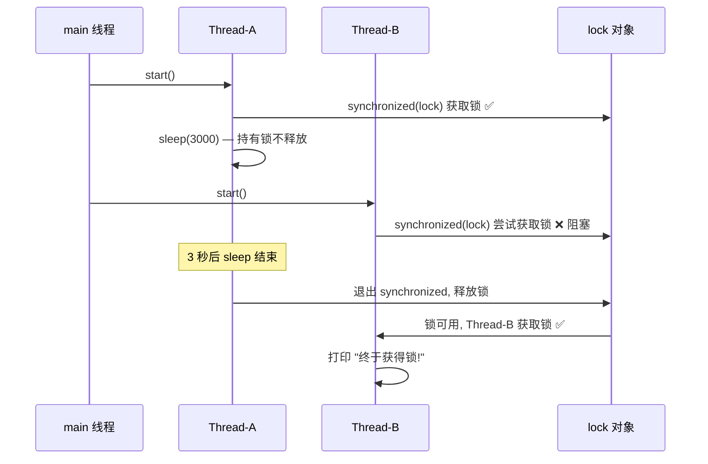

关于 sleep 还有几个实践要点：

- **`sleep(0)` 的含义**：它并不是"不睡觉"，而是触发一次线程调度——当前线程主动放弃剩余时间片，让操作系统重新选择下一个要执行的线程（有可能还是自己）。在某些场景下可以用它来"礼让"其他同优先级线程。

- **精度问题**：`sleep(millis)` 的实际睡眠时间取决于操作系统的时钟精度和线程调度延迟。在 Windows 上，默认时钟分辨率约 15.6ms，所以 `sleep(1)` 实际可能睡 15ms 左右。Java 9+ 提供了 `Thread.sleep(Duration)` 的重载，语义更清晰但精度问题依旧。

- **`TimeUnit` 替代方案**：比起裸写 `Thread.sleep(3000)`，推荐使用 `TimeUnit.SECONDS.sleep(3)`，可读性更好，也不容易在毫秒换算时出错。它内部就是调用 `Thread.sleep()`，没有额外开销。

- **sleep vs wait 的核心区别**：

| 对比维度 | `Thread.sleep()` | `Object.wait()` |
|---|---|---|
| 所属类 | Thread（静态方法） | Object（实例方法） |
| 是否释放锁 | **不释放** | **释放** |
| 调用前提 | 任何地方都可调用 | 必须在 synchronized 块内 |
| 唤醒方式 | 时间到期 / 被 interrupt | notify() / notifyAll() / 被 interrupt |
| 线程状态 | TIMED_WAITING | WAITING 或 TIMED_WAITING |

---

### yield()（让出 CPU）

`Thread.yield()` 也是一个静态方法，它的语义是：**当前线程愿意让出 CPU 时间片，给同优先级（或更高优先级）的线程一个执行机会。** 但这只是一个"建议"（hint），操作系统的调度器完全可以忽略它。

yield 和 sleep 的区别在于：

- `sleep()` 会让线程进入 `TIMED_WAITING` 状态，在指定时间内不会被调度。
- `yield()` 只是让线程从"正在运行"回到"就绪"状态（仍然是 `RUNNABLE`），它随时可能被调度器重新选中继续执行。

换句话说，yield 就像在排队时对后面的人说"你先请"，但如果后面没人（没有同优先级的就绪线程），或者调度器觉得你还是最合适的，你会立刻继续执行。

```java
public class YieldDemo {
    public static void main(String[] args) {
        // 创建两个线程，观察 yield 对调度的影响
        Runnable task = () -> {
            for (int i = 0; i < 5; i++) {
                System.out.println(Thread.currentThread().getName()
                        + " - 第 " + i + " 次执行");
                if ("Thread-A".equals(Thread.currentThread().getName())) {
                    // Thread-A 每次循环都 yield，给 Thread-B 执行机会
                    Thread.yield();
                    // 注意：yield 之后 Thread-A 仍然可能立刻被调度回来
                }
            }
        };

        Thread threadA = new Thread(task, "Thread-A");
        Thread threadB = new Thread(task, "Thread-B");

        // 同时启动两个线程
        threadA.start();
        threadB.start();
        // 多次运行会发现：Thread-B 倾向于获得更多连续执行机会
        // 但结果不确定，因为 yield 只是 hint
    }
}
```

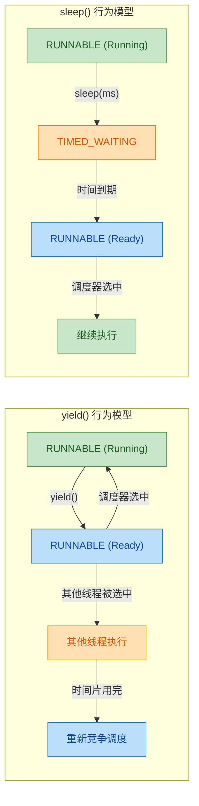

实际开发中 `yield()` 的使用场景非常少。它在早期 JVM 的协作式调度（cooperative scheduling）中有一定意义，但现代 JVM 和操作系统都采用抢占式调度（preemptive scheduling），线程切换由操作系统内核控制，`yield()` 的效果变得不可预测。Java 官方文档也明确说它 "is a hint to the scheduler that the current thread is willing to yield its current use of a processor"，并且 "it is rarely appropriate to use this method"。

如果你的目的是控制线程执行顺序或节奏，应该使用更可靠的同步工具（如 `CountDownLatch`、`Semaphore`、`Lock` 等），而不是依赖 `yield()`。

---

### join()（等待线程结束）

`join()` 是一个实例方法，语义非常直观：**调用 `thread.join()` 的线程会阻塞，直到 `thread` 执行完毕（进入 TERMINATED 状态）才继续。** 它是线程间最基本的"等待-通知"协作机制之一。

join 有三个重载版本：

- `join()`：无限期等待，直到目标线程终止。
- `join(long millis)`：最多等待指定毫秒数，超时后不再等待。
- `join(long millis, int nanos)`：更精细的超时控制（实际精度仍受操作系统限制）。

join 的底层实现其实非常简单——它就是基于 `Object.wait()` 的一个循环。我们来看 OpenJDK 中 `join(long millis)` 的核心源码逻辑：

```java
// Thread.join(long millis) 的简化版源码
public final synchronized void join(long millis) throws InterruptedException {
    long base = System.currentTimeMillis(); // 记录开始时间
    long now = 0;                           // 已等待时间

    if (millis == 0) {
        // millis 为 0 表示无限期等待
        while (isAlive()) {
            // 当目标线程还活着时，当前线程在 this（Thread 对象）上 wait
            // 注意：这里的 this 就是被 join 的那个 Thread 对象
            wait(0);
        }
    } else {
        // 有超时的版本
        while (isAlive()) {
            long delay = millis - now;      // 计算剩余等待时间
            if (delay <= 0) break;          // 超时，退出循环
            wait(delay);                    // 在 Thread 对象上等待
            now = System.currentTimeMillis() - base; // 更新已等待时间
        }
    }
    // 当目标线程终止时，JVM 会自动调用 this.notifyAll()
    // 从而唤醒所有在该 Thread 对象上 wait 的线程
}
```

关键洞察：`join()` 方法是 `synchronized` 的，它锁的是目标 Thread 对象本身，然后在这个对象上调用 `wait()`。当目标线程终止时，JVM 内部会自动调用该 Thread 对象的 `notifyAll()`，从而唤醒所有正在 `join` 等待的线程。这就是为什么 Java 官方不建议在 Thread 对象上使用 `wait/notify`——它会和 `join` 的内部机制冲突。

来看一个典型的使用场景——主线程等待多个子线程完成后汇总结果：

```java
public class JoinDemo {
    // 用数组存储每个子线程的计算结果
    private static final int[] results = new int[3];

    public static void main(String[] args) throws InterruptedException {
        // 创建 3 个子线程，每个负责计算一部分
        Thread t1 = new Thread(() -> {
            try {
                Thread.sleep(1000); // 模拟耗时计算
            } catch (InterruptedException e) {
                Thread.currentThread().interrupt();
            }
            results[0] = 10; // 线程 1 的计算结果
            System.out.println("t1 计算完成: " + results[0]);
        }, "t1");

        Thread t2 = new Thread(() -> {
            try {
                Thread.sleep(2000); // 模拟更长的耗时计算
            } catch (InterruptedException e) {
                Thread.currentThread().interrupt();
            }
            results[1] = 20; // 线程 2 的计算结果
            System.out.println("t2 计算完成: " + results[1]);
        }, "t2");

        Thread t3 = new Thread(() -> {
            try {
                Thread.sleep(1500); // 模拟耗时计算
            } catch (InterruptedException e) {
                Thread.currentThread().interrupt();
            }
            results[2] = 30; // 线程 3 的计算结果
            System.out.println("t3 计算完成: " + results[2]);
        }, "t3");

        // 启动所有子线程
        t1.start();
        t2.start();
        t3.start();

        // 主线程依次等待每个子线程完成
        t1.join(); // 阻塞直到 t1 终止
        t2.join(); // 阻塞直到 t2 终止（t2 最慢，约 2 秒）
        t3.join(); // t3 此时大概率已经结束，join 立即返回

        // 所有子线程都已完成，安全地汇总结果
        int total = results[0] + results[1] + results[2];
        System.out.println("汇总结果: " + total); // 输出: 汇总结果: 60
    }
}
```

整个过程的时序关系：

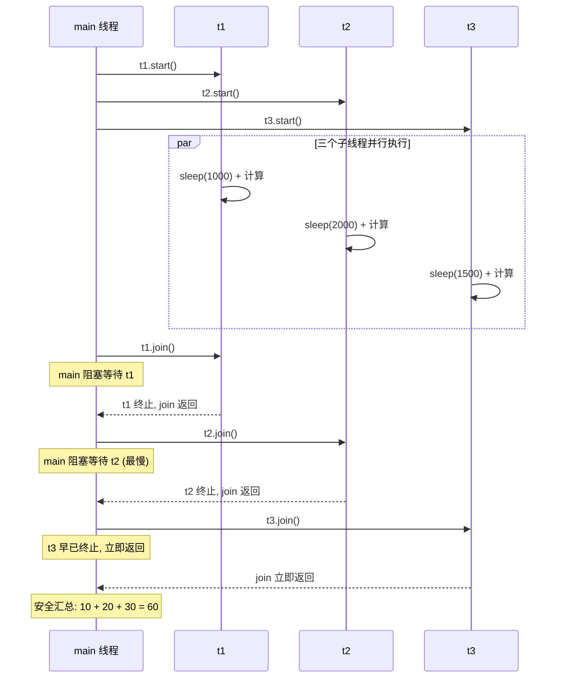

join 的几个注意事项：

- **join 可被中断**：和 `sleep` 一样，如果等待期间当前线程被 `interrupt()`，`join` 会抛出 `InterruptedException`。你需要妥善处理这个异常，通常是恢复中断标志或向上传播。

- **join 一个未启动的线程**：如果目标线程还没有 `start()`，`isAlive()` 返回 `false`，`join()` 会立即返回，不会阻塞。

- **join 一个已终止的线程**：同理，`isAlive()` 返回 `false`，立即返回。

- **避免循环 join**：如果线程 A join 线程 B，线程 B 又 join 线程 A，就会形成死锁。编译器和 JVM 不会检测这种情况，需要开发者自己避免。

- **join vs Future/CompletableFuture**：在现代 Java 开发中，如果你需要等待异步任务的结果，`CompletableFuture` 提供了更灵活、更强大的组合能力（如 `thenCombine`、`allOf` 等）。`join()` 更适合简单的"等你做完我再继续"场景。

---

**📝 练习题**

以下代码的输出结果是什么？

```java
public class Quiz {
    public static void main(String[] args) throws InterruptedException {
        Thread t = new Thread(() -> {
            System.out.println("A");
            Thread.yield();
            System.out.println("B");
        });

        t.run();
        t.start();
        t.join();
        System.out.println("C");
    }
}
```

A. A B A B C

B. A B C A B

C. 抛出 IllegalThreadStateException

D. 输出顺序不确定，但 C 一定最后出现


**【答案】** A

**【解析】** 逐步分析执行流程：首先 `t.run()` 是在 main 线程中同步调用，依次输出 `A` 和 `B`（`yield()` 只是一个 hint，不影响输出顺序）。然后 `t.start()` 启动新线程，新线程再次执行 `run()` 方法，输出 `A` 和 `B`。`t.join()` 让 main 线程等待 t 线程结束。最后 main 线程输出 `C`。所以完整输出是 `A B A B C`。注意 `t.run()` 只是普通方法调用，不会改变线程状态，线程仍处于 `NEW`，所以后续 `t.start()` 不会抛异常。选项 D 有一定迷惑性——虽然 `start()` 后新线程和 main 线程理论上并发执行，但 `t.join()` 保证了 main 线程会等 t 结束后才打印 `C`，而 `t.run()` 的同步调用保证了前两个 `A B` 一定在 `start()` 之前输出，所以整体顺序是确定的。


---

## 线程优先级（1-10、不可靠）

Java 线程模型中，每个线程都携带一个 **优先级（Priority）** 属性，它是一个 1 到 10 的整数值，用于向线程调度器（Thread Scheduler）"建议"哪个线程应该优先获得 CPU 时间片。之所以在标题中标注"不可靠"，是因为这个机制在实际工程中几乎 **不具备可移植的确定性保证**，理解它的底层原因比记住 API 本身更重要。

### 优先级常量与默认值

`Thread` 类定义了三个静态常量，划定了优先级的边界和默认值：

```java
// Thread 类源码中的三个优先级常量
public static final int MIN_PRIORITY = 1;   // 最低优先级
public static final int NORM_PRIORITY = 5;  // 默认优先级（新线程继承父线程优先级，主线程为5）
public static final int MAX_PRIORITY = 10;  // 最高优先级
```

当你通过 `new Thread()` 创建一个线程时，它的优先级并不总是 5，而是 **继承自创建它的父线程的优先级**。主线程（main thread）的优先级默认为 `NORM_PRIORITY = 5`，所以大多数情况下新线程的优先级确实是 5。但如果你在一个优先级为 8 的线程中创建子线程，子线程的初始优先级也是 8。

来看 `Thread.init()` 中的关键逻辑（简化版）：

```java
// Thread 初始化时的优先级继承逻辑（OpenJDK 源码简化）
Thread parent = currentThread();           // 获取当前正在执行的线程（即父线程）
this.priority = parent.getPriority();      // 子线程继承父线程的优先级
```

### 设置与获取优先级

通过 `setPriority(int)` 和 `getPriority()` 操作线程优先级：

```java
public class PriorityDemo {
    public static void main(String[] args) {
        Thread t = new Thread(() -> {
            // 线程体：打印自身优先级
            System.out.println("当前线程优先级: " + Thread.currentThread().getPriority());
        }, "worker");

        // 设置优先级为 8（高于默认的 5）
        t.setPriority(8);

        // 获取优先级，验证设置是否生效
        System.out.println("设置后优先级: " + t.getPriority()); // 输出 8

        t.start();
    }
}
```

如果传入的值超出 `[1, 10]` 范围，`setPriority` 会直接抛出 `IllegalArgumentException`：

```java
// setPriority 源码中的边界检查
public final void setPriority(int newPriority) {
    if (newPriority > MAX_PRIORITY || newPriority < MIN_PRIORITY) {
        throw new IllegalArgumentException();  // 超出 1-10 范围直接抛异常
    }
    // ... 后续还会受到线程组（ThreadGroup）最大优先级的限制
}
```

这里有一个容易忽略的细节：线程的实际优先级还会被其所属 **线程组（ThreadGroup）** 的最大优先级截断。如果线程组的 `maxPriority` 是 7，那么即使你 `setPriority(10)`，实际生效的也只是 7：

```java
public class ThreadGroupPriorityCap {
    public static void main(String[] args) {
        // 创建一个最大优先级为 7 的线程组
        ThreadGroup group = new ThreadGroup("capped-group");
        group.setMaxPriority(7);                          // 线程组上限设为 7

        Thread t = new Thread(group, () -> {
            // 打印实际生效的优先级
            System.out.println("实际优先级: " + Thread.currentThread().getPriority());
        }, "capped-thread");

        t.setPriority(10);                                // 尝试设为 10
        System.out.println("getPriority: " + t.getPriority()); // 输出 7，被线程组截断
        t.start();
    }
}
```

### 为什么说优先级"不可靠"

这是本节最核心的知识点。Java 线程优先级的不可靠性来自多个层面：

### Java 优先级到 OS 优先级的映射是平台相关的

Java 定义了 10 个优先级级别，但底层操作系统的线程调度模型各不相同。JVM 需要将 Java 的 1-10 映射到操作系统原生的优先级范围，而这个映射关系 **因平台而异，且可能是多对一的**。

```text
┌─────────────────────────────────────────────────────────────────┐
│              Java Priority → OS Priority 映射示意               │
├──────────────┬──────────────────────┬───────────────────────────┤
│ Java (1-10)  │   Linux (nice值)     │   Windows (优先级级别)     │
├──────────────┼──────────────────────┼───────────────────────────┤
│     1        │    nice = 4          │   THREAD_PRIORITY_LOWEST  │
│     2        │    nice = 3          │   THREAD_PRIORITY_LOWEST  │
│     3        │    nice = 2          │   THREAD_PRIORITY_BELOW.. │
│     4        │    nice = 1          │   THREAD_PRIORITY_BELOW.. │
│     5        │    nice = 0          │   THREAD_PRIORITY_NORMAL  │
│     6        │    nice = -1         │   THREAD_PRIORITY_ABOVE.. │
│     7        │    nice = -2         │   THREAD_PRIORITY_ABOVE.. │
│     8        │    nice = -3         │   THREAD_PRIORITY_HIGHEST │
│     9        │    nice = -4         │   THREAD_PRIORITY_HIGHEST │
│    10        │    nice = -5         │   THREAD_PRIORITY_CRITICAL│
└──────────────┴──────────────────────┴───────────────────────────┘
  注意：Linux 上多个 Java 优先级可能映射到同一个 nice 值，
  导致优先级差异在 Linux 上几乎无法体现。
```

在 Linux 上，HotSpot JVM 使用的是 POSIX 线程（pthread），默认调度策略是 `SCHED_OTHER`。在这个策略下，**线程优先级（nice 值）对 CPU 分配的影响非常有限**，尤其在 CFS（Completely Fair Scheduler）调度器下，系统追求的是"公平"而非"优先"。实际上，在某些 Linux 发行版中，普通用户进程甚至 **无法修改线程的 nice 值**（需要 root 权限或 `CAP_SYS_NICE` capability），这意味着 `setPriority()` 调用可能完全无效——JVM 不会报错，但 OS 层面什么都没发生。

Windows 的情况稍好一些，它的线程调度器确实会参考优先级，高优先级线程会获得更多时间片。但即便如此，Windows 也有 **优先级提升（Priority Boosting）** 机制——当一个低优先级线程长时间未获得 CPU 时，系统会临时提升它的优先级以防止饥饿（starvation），这进一步削弱了手动设置优先级的确定性。

### 调度器的自由裁量权

即使优先级映射正确传递到了 OS 层面，线程调度器也只是将优先级作为 **参考因素之一**，而非硬性约束。现代操作系统的调度算法综合考虑了：

- CPU 亲和性（CPU Affinity）
- 线程的 I/O 行为（I/O-bound 线程通常会被调度器"照顾"）
- 时间片轮转（Round-Robin）的公平性
- 缓存局部性（Cache Locality）
- 负载均衡（多核场景下的核间迁移）

优先级只是这个复杂决策中的一个权重因子，远不是决定性的。

### 实验验证：优先级的不确定性

下面这个实验能直观展示优先级的"不可靠"：

```java
public class PriorityUnreliableDemo {
    // 用于统计每个线程的执行次数
    private static volatile boolean running = true;

    public static void main(String[] args) throws InterruptedException {
        // 创建一个低优先级线程
        Thread low = new Thread(() -> {
            long count = 0;                          // 计数器：记录循环执行次数
            while (running) {                        // 持续运行直到标志位变为 false
                count++;                             // 每次循环计数 +1
            }
            System.out.println("LOW  (priority=1) 执行次数: " + count);
        }, "low-priority");

        // 创建一个高优先级线程
        Thread high = new Thread(() -> {
            long count = 0;                          // 计数器
            while (running) {                        // 同样持续运行
                count++;                             // 计数 +1
            }
            System.out.println("HIGH (priority=10) 执行次数: " + count);
        }, "high-priority");

        low.setPriority(Thread.MIN_PRIORITY);        // 设置为最低优先级 1
        high.setPriority(Thread.MAX_PRIORITY);       // 设置为最高优先级 10

        low.start();                                 // 启动低优先级线程
        high.start();                                // 启动高优先级线程

        Thread.sleep(3000);                          // 主线程等待 3 秒
        running = false;                             // 通知两个线程停止

        low.join();                                  // 等待低优先级线程结束
        high.join();                                 // 等待高优先级线程结束
    }
}
```

在不同平台上运行这段代码，你会发现：

- **Windows 上**：高优先级线程的计数通常会明显多于低优先级线程，比例可能在 2:1 到 5:1 之间。
- **Linux 上**：两个线程的计数 **几乎相同**，优先级差异基本没有体现。
- **多核 CPU 上**：如果核心数充足，两个线程各占一个核心并行运行，计数几乎一致——优先级在核心充裕时毫无意义。

这就是为什么 Java 官方文档和几乎所有并发书籍都会强调：**不要依赖线程优先级来保证程序的正确性**。

### 优先级与线程状态的关系

用一张流程图来展示优先级在线程生命周期中的作用位置：

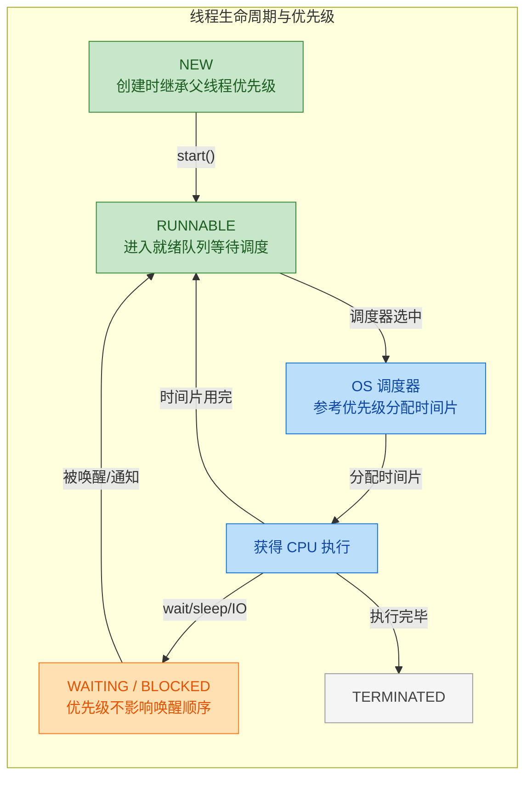

关键观察：优先级只在 **RUNNABLE → 被调度器选中** 这一步起作用。一旦线程进入 WAITING 或 BLOCKED 状态，优先级对它何时被唤醒 **没有任何影响**。例如，`Object.notify()` 唤醒哪个等待线程是 **不确定的**（JVM 规范未定义），与优先级无关。

### 工程实践中的建议

既然优先级不可靠，实际开发中应该怎么做？

**1. 不要用优先级控制执行顺序**

如果你需要线程 A 在线程 B 之前执行，应该使用显式的同步机制：`join()`、`CountDownLatch`、`CyclicBarrier`、`Semaphore` 等。这些工具提供的是 **确定性保证**，而优先级只是"建议"。

**2. 不要用优先级解决饥饿问题**

如果某个线程总是抢不到资源，正确的做法是使用公平锁（`ReentrantLock(true)`）或公平队列，而不是提高它的优先级。

**3. 少数合理的使用场景**

优先级并非完全无用，在某些特定场景下可以作为 **性能调优的辅助手段**（注意是辅助，不是依赖）：

```java
// 场景：GC 辅助线程、后台日志刷盘等低优先级任务
Thread backgroundFlusher = new Thread(() -> {
    while (!Thread.currentThread().isInterrupted()) {
        flushLogBuffer();                            // 刷新日志缓冲区
        try {
            Thread.sleep(1000);                      // 每秒刷一次
        } catch (InterruptedException e) {
            Thread.currentThread().interrupt();       // 恢复中断标志
            break;                                   // 退出循环
        }
    }
}, "log-flusher");

backgroundFlusher.setPriority(Thread.MIN_PRIORITY);  // 后台任务设为低优先级
backgroundFlusher.setDaemon(true);                    // 同时设为守护线程
backgroundFlusher.start();
```

这种用法的意图是"在 CPU 资源紧张时，让这个线程少占一点"，而不是"保证这个线程最后执行"。两者有本质区别。

**4. 框架中的优先级使用**

一些 JDK 内部和框架代码会使用优先级，例如：
- `Finalizer` 线程的优先级被设为 `MAX_PRIORITY - 2`（即 8），希望它能及时回收资源
- 某些线程池实现中，通过 `ThreadFactory` 统一设置工作线程的优先级

但这些都是"尽力而为"的优化，核心逻辑从不依赖优先级的确定性。

### 一句话总结

Java 线程优先级是一个 **平台相关的、非确定性的调度建议**。它的 API 简单（`setPriority` / `getPriority`），但底层行为复杂且不可移植。在编写并发程序时，永远不要将程序的正确性建立在优先级之上——把它当作一个"可能有用的性能提示"就好。

---

**📝 练习题**

以下关于 Java 线程优先级的说法，哪一项是正确的？

A. 高优先级线程一定比低优先级线程先执行完毕

B. `setPriority(11)` 会将优先级设为 `MAX_PRIORITY`（即 10），不会抛异常

C. 新创建的线程默认优先级总是 5（`NORM_PRIORITY`）

D. 线程优先级的实际效果取决于操作系统的线程调度策略，Java 规范不保证其行为


**【答案】** D

**【解析】** 逐项分析：

- **A 错误**：优先级只是调度建议，不保证执行顺序或完成顺序。在多核 CPU 上，高低优先级线程可能完全并行执行，计数几乎相同。
- **B 错误**：`setPriority()` 内部有严格的边界检查，传入小于 1 或大于 10 的值会直接抛出 `IllegalArgumentException`，不会自动截断。
- **C 错误**：新线程的优先级继承自创建它的父线程（`this.priority = parent.getPriority()`）。只有当父线程优先级恰好是 5 时，子线程才是 5。如果父线程优先级是 8，子线程初始优先级也是 8。
- **D 正确**：Java 语言规范（JLS）明确指出线程调度是实现相关的（implementation-dependent）。不同 OS 的调度器对优先级的处理方式不同，Linux CFS 几乎忽略优先级，Windows 会参考但也有 Priority Boosting 等干扰因素。这正是优先级"不可靠"的根本原因。

---

## 守护线程（Daemon Thread）

在 Java 的线程模型中，线程被划分为两大阵营：**用户线程（User Thread）** 和 **守护线程（Daemon Thread）**。我们之前讨论的所有线程，默认都是用户线程。而守护线程，顾名思义，是"守护"用户线程的幕后工作者——它们在后台默默运行，为用户线程提供服务，一旦所有用户线程都结束了，守护线程也会随之被 JVM 强制终止，无论它当前正在做什么。

这个概念非常像一个餐厅的运营模式：用户线程是顾客，守护线程是服务员。只要还有顾客在用餐，服务员就必须在岗。但当最后一位顾客离开后，餐厅就关门了，服务员也随之下班——哪怕他正在擦桌子擦到一半。

最经典的守护线程就是 **GC 线程（Garbage Collector）**。它在后台持续运行，回收不再使用的对象内存。你从来不需要手动启动它，也不需要关心它何时结束——它会在 JVM 退出时自动消亡。其他典型的守护线程还包括 `Finalizer` 线程、`Signal Dispatcher` 线程等 JVM 内部线程。

理解守护线程的关键在于理解它与 JVM 生命周期的绑定关系。用户线程决定了 JVM 的存亡，而守护线程只是"搭便车"的存在。

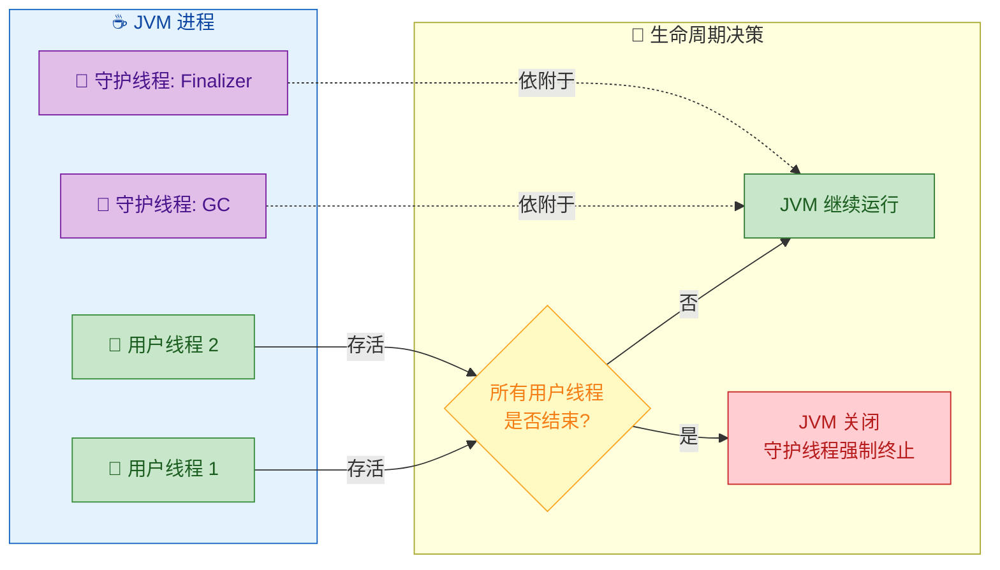

### setDaemon —— 将线程标记为守护线程

`Thread` 类提供了 `setDaemon(boolean on)` 方法，用于将一个线程设置为守护线程。这个方法的使用有一条铁律：**必须在 `start()` 之前调用**。如果线程已经启动后再调用 `setDaemon(true)`，会直接抛出 `IllegalThreadStateException`。

这条规则的设计意图很明确：线程的"身份"（用户线程还是守护线程）在启动时就必须确定，因为 JVM 需要在启动线程的那一刻就将其纳入正确的管理策略中。运行中途改变身份会导致 JVM 的线程计数和退出判断逻辑出现混乱。

来看一个基础示例：

```java
public class DaemonThreadBasic {
    public static void main(String[] args) throws InterruptedException {
        // 创建一个线程，模拟后台持续运行的任务
        Thread daemonThread = new Thread(() -> {
            // 守护线程内部执行一个"无限循环"任务
            while (true) {
                try {
                    // 每隔 500ms 打印一次心跳信息
                    Thread.sleep(500);
                    // 如果这是守护线程，当所有用户线程结束后，这行可能永远不会再执行
                    System.out.println("[Daemon] 心跳检测中... " + System.currentTimeMillis());
                } catch (InterruptedException e) {
                    // sleep 被中断时的处理
                    System.out.println("[Daemon] 被中断，退出心跳循环");
                    break; // 中断后退出循环
                }
            }
        }, "heartbeat-daemon"); // 给线程起一个有意义的名字，方便调试

        // 【关键】必须在 start() 之前调用 setDaemon(true)
        daemonThread.setDaemon(true);

        // 启动守护线程
        daemonThread.start();

        // 主线程（用户线程）只工作 2 秒
        System.out.println("[Main] 主线程开始工作...");
        Thread.sleep(2000); // 主线程休眠 2 秒，模拟业务处理
        System.out.println("[Main] 主线程工作结束，即将退出");

        // 主线程结束后，如果没有其他用户线程存活，JVM 将退出
        // 守护线程 daemonThread 会被强制终止，不会继续打印心跳
    }
}
```

运行这段代码，你会看到守护线程大约打印 3-4 次心跳信息后，随着主线程结束，整个程序就退出了。守护线程的无限循环并不会阻止 JVM 关闭。

如果你把 `daemonThread.setDaemon(true)` 这行注释掉，程序将永远不会结束——因为 `daemonThread` 变成了用户线程，它的无限循环会让 JVM 一直运行下去。

再来看一个错误使用的示例，加深对"必须在 start 之前调用"这条规则的理解：

```java
public class DaemonAfterStartError {
    public static void main(String[] args) {
        // 创建一个普通线程
        Thread thread = new Thread(() -> {
            // 线程体：简单打印一条消息
            System.out.println("线程正在运行...");
        });

        // 先启动线程
        thread.start();

        try {
            // 【错误】在 start() 之后调用 setDaemon()
            // 这里会抛出 IllegalThreadStateException
            thread.setDaemon(true);
        } catch (IllegalThreadStateException e) {
            // 捕获异常并打印错误信息
            System.out.println("异常捕获: " + e.getClass().getSimpleName());
            System.out.println("原因: 线程已经启动，无法再修改 daemon 状态");
        }
    }
}
```

还有一个容易被忽略的特性：**守护线程创建的子线程默认也是守护线程**。这是因为 `Thread` 的构造方法中，新线程会继承父线程的 daemon 属性。来看源码中的关键逻辑（简化版）：

```java
// Thread.java 构造方法内部（简化）
private Thread(ThreadGroup g, Runnable target, String name, long stackSize) {
    // 获取当前正在执行构造方法的线程，即"父线程"
    Thread parent = currentThread();

    // 新线程继承父线程的 daemon 属性
    // 如果父线程是守护线程，子线程默认也是守护线程
    this.daemon = parent.isDaemon();

    // 新线程继承父线程的优先级
    this.priority = parent.getPriority();

    // ... 其他初始化逻辑
}
```

验证这个继承行为：

```java
public class DaemonInheritance {
    public static void main(String[] args) throws InterruptedException {
        // 创建一个守护线程作为"父线程"
        Thread parentDaemon = new Thread(() -> {
            // 在守护线程内部创建一个子线程
            Thread child = new Thread(() -> {
                // 子线程打印自己的 daemon 状态
                System.out.println("[Child] 是否为守护线程: " + Thread.currentThread().isDaemon());
                // 输出: true —— 继承了父线程的 daemon 属性
            }, "child-thread");

            // 注意：这里没有调用 child.setDaemon()，完全依赖继承
            child.start(); // 启动子线程

            try {
                // 等待子线程执行完毕
                child.join();
            } catch (InterruptedException e) {
                // join 被中断时的处理
                Thread.currentThread().interrupt();
            }
        }, "parent-daemon");

        // 将父线程设置为守护线程
        parentDaemon.setDaemon(true);
        // 启动父守护线程
        parentDaemon.start();

        // 主线程等待足够时间让守护线程内部逻辑执行完
        Thread.sleep(1000);
        // 打印父线程的 daemon 状态作为对照
        System.out.println("[Parent] 是否为守护线程: " + parentDaemon.isDaemon());
    }
}
```

下面这张表格总结了 `setDaemon` 相关的核心 API：

| 方法 | 说明 | 注意事项 |
|---|---|---|
| `setDaemon(true)` | 将线程标记为守护线程 | 必须在 `start()` 之前调用 |
| `setDaemon(false)` | 将线程标记为用户线程（默认值） | 同样必须在 `start()` 之前调用 |
| `isDaemon()` | 查询当前线程是否为守护线程 | 可在任何时候调用 |
| 继承规则 | 子线程继承父线程的 daemon 属性 | 可通过显式 `setDaemon()` 覆盖 |

### JVM 退出条件 —— 守护线程与 JVM 生命周期

JVM 的退出条件可以用一句话概括：**当且仅当所有非守护线程（用户线程）都终止时，JVM 才会退出**。这是 Java 语言规范（JLS）中明确定义的行为。

更精确地说，JVM 的退出判定逻辑如下：

1. JVM 启动时，`main` 方法所在的线程是一个用户线程。
2. 程序运行过程中可能创建多个用户线程和守护线程。
3. 当某个用户线程结束时，JVM 检查：是否还有其他存活的用户线程？
4. 如果还有 → JVM 继续运行。
5. 如果没有了 → JVM 启动关闭流程（shutdown sequence），所有守护线程被强制终止。

注意第 5 步中的"强制终止"——这意味着守护线程不会执行 `finally` 块中的清理逻辑（不保证执行），不会优雅地关闭资源。这是守护线程最危险的特性之一。

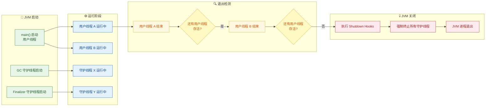

来看一个完整的示例，演示 JVM 退出条件的判定过程：

```java
public class JvmExitCondition {
    public static void main(String[] args) throws InterruptedException {
        // === 创建守护线程：模拟后台日志刷盘服务 ===
        Thread logFlusher = new Thread(() -> {
            int count = 0; // 记录刷盘次数
            while (true) {
                try {
                    // 每秒执行一次"刷盘"操作
                    Thread.sleep(1000);
                    count++; // 递增计数器
                    System.out.println("[LogFlusher-Daemon] 第 " + count + " 次刷盘...");
                } catch (InterruptedException e) {
                    // 如果 sleep 被中断，退出循环
                    break;
                }
            }
            // 【注意】这行代码大概率不会被执行！
            // 因为守护线程是被 JVM 强制终止的，不会走到循环外部
            System.out.println("[LogFlusher-Daemon] 优雅退出（这行几乎不会打印）");
        }, "log-flusher");

        // 设置为守护线程
        logFlusher.setDaemon(true);
        // 启动守护线程
        logFlusher.start();

        // === 创建用户线程 A：模拟业务处理 ===
        Thread workerA = new Thread(() -> {
            try {
                System.out.println("[WorkerA] 开始处理业务，预计 3 秒...");
                // 模拟 3 秒的业务处理
                Thread.sleep(3000);
                System.out.println("[WorkerA] 业务处理完成");
            } catch (InterruptedException e) {
                // 处理中断
                Thread.currentThread().interrupt();
            }
        }, "worker-A");
        // workerA 是用户线程（默认），不需要 setDaemon

        // === 创建用户线程 B：模拟另一个业务处理 ===
        Thread workerB = new Thread(() -> {
            try {
                System.out.println("[WorkerB] 开始处理业务，预计 5 秒...");
                // 模拟 5 秒的业务处理
                Thread.sleep(5000);
                System.out.println("[WorkerB] 业务处理完成");
            } catch (InterruptedException e) {
                // 处理中断
                Thread.currentThread().interrupt();
            }
        }, "worker-B");

        // 启动所有线程
        workerA.start();
        workerB.start();

        // 主线程自身也是用户线程，这里让它立即结束
        System.out.println("[Main] 主线程结束");

        // 此时存活的用户线程：workerA, workerB
        // 存活的守护线程：logFlusher
        // JVM 不会退出，因为还有用户线程存活

        // 约 3 秒后 workerA 结束 → JVM 检查 → workerB 还在 → 继续运行
        // 约 5 秒后 workerB 结束 → JVM 检查 → 没有用户线程了 → JVM 退出
        // logFlusher 守护线程被强制终止，大约只打印了 4-5 次刷盘日志
    }
}
```

这个例子清晰地展示了：主线程虽然最先结束，但 JVM 并不会退出，因为 `workerA` 和 `workerB` 两个用户线程还在运行。直到最后一个用户线程 `workerB` 结束，JVM 才会关闭，守护线程 `logFlusher` 随之被强制终止。

接下来重点讨论一个非常重要的陷阱：**守护线程中的 `finally` 块不保证执行**。

```java
public class DaemonFinallyTrap {
    public static void main(String[] args) throws InterruptedException {
        // 创建守护线程，内部包含 try-finally 结构
        Thread daemon = new Thread(() -> {
            try {
                System.out.println("[Daemon] 开始执行任务...");
                // 模拟一个长时间运行的任务
                while (true) {
                    // 持续运行，等待被 JVM 终止
                    Thread.sleep(500);
                    System.out.println("[Daemon] 工作中...");
                }
            } catch (InterruptedException e) {
                // sleep 被中断时进入这里
                System.out.println("[Daemon] 被中断");
            } finally {
                // 【危险】这个 finally 块在守护线程被 JVM 强制终止时，不保证执行！
                // 如果你在这里做资源清理（关闭文件、释放连接），可能永远不会执行
                System.out.println("[Daemon] finally 块执行 —— 清理资源");
                // 假设这里有: connection.close(), fileStream.flush() 等操作
                // 这些操作可能永远不会被执行！
            }
        }, "risky-daemon");

        // 设置为守护线程
        daemon.setDaemon(true);
        // 启动
        daemon.start();

        // 主线程只存活 1.5 秒
        Thread.sleep(1500);
        System.out.println("[Main] 主线程结束，JVM 即将退出...");
        // 主线程结束 → 没有其他用户线程 → JVM 退出
        // daemon 线程的 finally 块大概率不会执行
    }
}
```

这就引出了一条重要的实践原则：**不要在守护线程中执行需要可靠清理的 I/O 操作**，比如写文件、关闭数据库连接、刷新缓冲区等。如果你需要这些操作被可靠执行，应该使用用户线程配合 `Shutdown Hook`。

说到 Shutdown Hook，它是 JVM 提供的一种优雅关闭机制。通过 `Runtime.getRuntime().addShutdownHook(Thread hook)` 注册的钩子线程，会在 JVM 关闭流程中被执行（注意：Shutdown Hook 本身是用户线程）：

```java
public class ShutdownHookDemo {
    public static void main(String[] args) throws InterruptedException {
        // 注册一个 Shutdown Hook —— JVM 关闭时会执行这个线程
        Runtime.getRuntime().addShutdownHook(new Thread(() -> {
            // 这个线程会在 JVM 关闭流程中被启动并执行
            System.out.println("[ShutdownHook] JVM 正在关闭，执行清理操作...");
            System.out.println("[ShutdownHook] 关闭数据库连接...");
            System.out.println("[ShutdownHook] 刷新日志缓冲区...");
            System.out.println("[ShutdownHook] 清理完成");
        }, "my-shutdown-hook"));

        // 创建守护线程
        Thread daemon = new Thread(() -> {
            while (true) {
                try {
                    Thread.sleep(500); // 每 500ms 执行一次
                    System.out.println("[Daemon] 后台服务运行中...");
                } catch (InterruptedException e) {
                    break; // 中断后退出
                }
            }
        }, "background-service");

        daemon.setDaemon(true); // 标记为守护线程
        daemon.start(); // 启动守护线程

        // 主线程工作 2 秒后结束
        Thread.sleep(2000);
        System.out.println("[Main] 主线程结束");

        // JVM 关闭流程：
        // 1. 所有用户线程结束
        // 2. JVM 启动 Shutdown Hook（用户线程，会被执行）
        // 3. Shutdown Hook 执行完毕
        // 4. 守护线程被强制终止
        // 5. JVM 进程退出
    }
}
```

最后，用一张对比表来总结用户线程与守护线程的核心差异：

| 特性 | 用户线程 (User Thread) | 守护线程 (Daemon Thread) |
|---|---|---|
| 默认类型 | ✅ 是（新建线程默认为用户线程） | ❌ 否（需显式 `setDaemon(true)`） |
| 影响 JVM 退出 | ✅ 是（只要有一个存活，JVM 就不退出） | ❌ 否（不影响 JVM 退出判定） |
| `finally` 可靠性 | ✅ 正常执行 | ⚠️ 不保证执行 |
| 适用场景 | 业务逻辑、需要可靠完成的任务 | GC、心跳检测、后台监控等辅助任务 |
| 子线程继承 | 子线程默认也是用户线程 | 子线程默认也是守护线程 |
| 生命周期 | 由自身逻辑决定 | 由所有用户线程的存亡决定 |

实际开发中的经验法则（rules of thumb）：

- 如果一个线程执行的任务"丢了也无所谓"（如缓存预热、心跳检测），可以设为守护线程。
- 如果一个线程执行的任务"必须完成"（如事务提交、文件写入），绝对不要设为守护线程。
- 线程池（`ExecutorService`）中的线程默认是用户线程，这也是为什么忘记调用 `shutdown()` 会导致程序无法退出的原因——那些空闲的用户线程仍然存活，JVM 认为"还有活干"。
- 使用 `ThreadFactory` 自定义线程池时，可以通过 `setDaemon(true)` 创建守护线程池，但要清楚其中的风险。

---

**📝 练习题**

以下代码的输出结果是什么？

```java
public class DaemonQuiz {
    public static void main(String[] args) throws InterruptedException {
        Thread t1 = new Thread(() -> {
            Thread t2 = new Thread(() -> {
                try {
                    Thread.sleep(5000);
                    System.out.println("T2 完成");
                } catch (InterruptedException e) {
                    System.out.println("T2 被中断");
                }
            });
            t2.start();
            System.out.println("T1 完成, T2.isDaemon=" + t2.isDaemon());
        });
        t1.setDaemon(true);
        t1.start();
        Thread.sleep(1000);
        System.out.println("Main 结束");
    }
}
```

A. 输出 "T1 完成, T2.isDaemon=true"，然后 "Main 结束"，程序退出，"T2 完成" 不会打印


B. 输出 "T1 完成, T2.isDaemon=false"，然后 "Main 结束"，等待 5 秒后打印 "T2 完成"


C. 输出 "T1 完成, T2.isDaemon=true"，然后 "Main 结束"，等待 5 秒后打印 "T2 完成"


D. 抛出 IllegalThreadStateException 异常


**【答案】** A

**【解析】** `t1` 被显式设置为守护线程（`setDaemon(true)`）。根据守护线程的继承规则，`t1` 内部创建的 `t2` 会自动继承父线程的 daemon 属性，因此 `t2` 也是守护线程（`isDaemon()` 返回 `true`）。`t1` 启动后很快执行完毕并打印 "T1 完成, T2.isDaemon=true"。主线程 sleep 1 秒后打印 "Main 结束" 并退出。此时所有用户线程（只有 main）都已结束，JVM 启动关闭流程。`t2` 虽然还在 sleep（还需要再等约 4 秒），但作为守护线程，它会被 JVM 强制终止，"T2 完成" 永远不会被打印。这道题的核心考点就是守护线程的 daemon 属性继承机制以及 JVM 退出条件。


---

## 线程异常处理（UncaughtExceptionHandler）

在多线程编程中，异常处理是一个容易被忽视却极其关键的话题。单线程程序里，一个未捕获的异常会沿着调用栈一路向上抛出，最终由 JVM 打印堆栈信息并终止程序——这个行为直观且可预测。但在多线程环境下，情况变得微妙得多：**每个线程拥有独立的调用栈**，一个线程中抛出的异常，调用它的父线程是完全感知不到的。

这意味着，如果你在 `main` 线程中启动了一个子线程，子线程内部抛出了 `RuntimeException`，`main` 线程的 `try-catch` 是捕获不到这个异常的。异常会悄无声息地"吞掉"子线程，而主线程可能还在正常运行，完全不知道子线程已经因异常而死亡。这在生产环境中是非常危险的——任务丢失、资源泄漏、状态不一致，都可能由此引发。

Java 从 1.5 开始提供了 `Thread.UncaughtExceptionHandler` 机制，专门用来解决这个问题：**为线程设置一个"兜底"的异常处理器，当线程因未捕获异常即将终止时，JVM 会回调这个处理器**。

### 为什么 try-catch 捕获不到子线程异常

先看一个直观的反例，理解问题的本质：

```java
public class CrossThreadExceptionDemo {
    public static void main(String[] args) {
        // 在主线程中用 try-catch 包裹子线程的启动
        try {
            // 创建一个会抛出异常的子线程
            Thread t = new Thread(() -> {
                // 这行代码在子线程的调用栈中执行
                throw new RuntimeException("子线程爆炸了！");
            });
            // start() 本身只是通知 OS 创建线程，立即返回
            t.start();
        } catch (Exception e) {
            // 这里永远不会捕获到子线程的异常
            System.out.println("主线程捕获到异常: " + e.getMessage());
        }

        // 主线程继续运行，完全不知道子线程已经死了
        System.out.println("主线程正常结束");
    }
}
```

运行结果：

```
主线程正常结束
Exception in thread "Thread-0" java.lang.RuntimeException: 子线程爆炸了！
    at CrossThreadExceptionDemo.lambda$main$0(CrossThreadExceptionDemo.java:7)
    at java.lang.Thread.run(Thread.java:750)
```

主线程的 `catch` 块没有被触发，子线程的异常只是被 JVM 默认打印到了 `System.err`。原因在于 `t.start()` 这个调用本身是成功的——它只是请求操作系统创建一个新线程，然后立即返回。子线程的 `run()` 方法在一个完全独立的调用栈中执行，它的异常传播链与主线程毫无关系。

用一张图来理解两个线程的调用栈隔离：

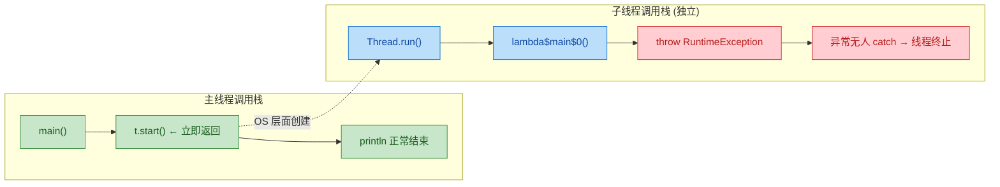

两个调用栈完全独立，异常只能在自己的栈内传播。这就是为什么我们需要一个专门的机制来"兜底"处理线程中的未捕获异常。

### UncaughtExceptionHandler 接口

`Thread.UncaughtExceptionHandler` 是定义在 `Thread` 类内部的一个函数式接口（Functional Interface），结构极其简洁：

```java
// Thread 类内部定义的函数式接口
@FunctionalInterface
public interface UncaughtExceptionHandler {
    /**
     * 当线程因未捕获异常即将终止时，JVM 调用此方法
     * @param t  即将终止的线程对象
     * @param e  导致线程终止的未捕获异常
     */
    void uncaughtException(Thread t, Throwable e);
}
```

只有一个方法 `uncaughtException(Thread t, Throwable e)`，参数非常直白：`t` 是出问题的线程，`e` 是那个没被捕获的异常。你可以在这个方法里做任何你需要的善后工作——记录日志、发送告警、清理资源、重启任务等。

### 三种设置方式与优先级

Java 提供了三个层级来设置 `UncaughtExceptionHandler`，它们的作用范围和优先级各不相同：

```java
public class HandlerPriorityDemo {
    public static void main(String[] args) {

        // ① 全局默认处理器 —— 对所有线程生效（优先级最低）
        // 通过 Thread 类的静态方法设置
        Thread.setDefaultUncaughtExceptionHandler((t, e) -> {
            // 当线程没有设置专属处理器，也没有线程组处理器时，走这里
            System.out.println("[全局默认] 线程 " + t.getName() + " 异常: " + e.getMessage());
        });

        // ② 线程实例专属处理器 —— 只对当前线程对象生效（优先级最高）
        Thread worker = new Thread(() -> {
            // 模拟业务异常
            throw new RuntimeException("任务执行失败");
        }, "Worker-1");
        // 通过线程实例的方法设置
        worker.setUncaughtExceptionHandler((t, e) -> {
            // 这个处理器只对 worker 这一个线程对象有效
            System.out.println("[实例专属] 线程 " + t.getName() + " 异常: " + e.getMessage());
        });

        // ③ 线程组处理器 —— 对组内所有线程生效（优先级居中）
        // 需要继承 ThreadGroup 并重写 uncaughtException 方法
        ThreadGroup group = new ThreadGroup("MyGroup") {
            @Override
            public void uncaughtException(Thread t, Throwable e) {
                // 组内线程如果没有设置实例专属处理器，走这里
                System.out.println("[线程组] 线程 " + t.getName() + " 异常: " + e.getMessage());
            }
        };
        // 创建线程时指定所属线程组
        Thread groupWorker = new Thread(group, () -> {
            throw new RuntimeException("组内任务失败");
        }, "GroupWorker-1");

        worker.start();       // 触发 ② 实例专属处理器
        groupWorker.start();  // 触发 ③ 线程组处理器
    }
}
```

JVM 在线程因未捕获异常终止时，会按照以下优先级链查找处理器：

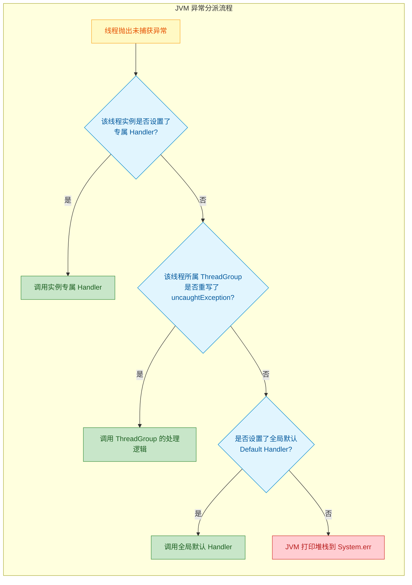

需要特别说明的是，`ThreadGroup` 本身就实现了 `UncaughtExceptionHandler` 接口。它的默认 `uncaughtException` 实现逻辑是：先检查父线程组，再检查全局默认处理器，最后才打印到 `System.err`。当你重写了 `ThreadGroup.uncaughtException()` 时，就替换了这个默认的分派逻辑。

实际开发中，**线程组（ThreadGroup）已经是一个半废弃的 API**，Doug Lea 在《Java Concurrency in Practice》中明确建议避免使用它。现代代码中最常用的是两种方式：

- 对全局兜底：`Thread.setDefaultUncaughtExceptionHandler(...)` —— 一行代码，全局生效
- 对特定线程精细控制：`thread.setUncaughtExceptionHandler(...)` —— 针对性处理

### 生产级实践：全局异常处理器

在真实项目中，全局默认处理器通常在应用启动的最早阶段设置，作为最后一道防线。以下是一个贴近生产环境的实现：

```java
import java.util.logging.Level;
import java.util.logging.Logger;

public class GlobalExceptionHandlerSetup {

    // 使用 JDK 自带的 Logger（生产中通常用 SLF4J + Logback）
    private static final Logger logger = Logger.getLogger("GlobalExceptionHandler");

    public static void main(String[] args) {
        // 在应用启动的最早阶段设置全局兜底处理器
        setupGlobalExceptionHandler();

        // 模拟业务线程
        Thread bizThread = new Thread(() -> {
            // 模拟某个深层调用抛出了未预期的异常
            processOrder("ORDER-12345");
        }, "BizThread-Order");

        bizThread.start();
    }

    /**
     * 设置全局未捕获异常处理器
     * 建议在 main 方法的第一行调用
     */
    private static void setupGlobalExceptionHandler() {
        Thread.setDefaultUncaughtExceptionHandler((thread, throwable) -> {
            // 1. 记录详细日志（线程名、异常类型、完整堆栈）
            logger.log(Level.SEVERE,
                    String.format("线程 [%s] 因未捕获异常终止 | 异常类型: %s | 消息: %s",
                            thread.getName(),
                            throwable.getClass().getName(),
                            throwable.getMessage()),
                    throwable  // 传入 throwable 对象，Logger 会自动记录完整堆栈
            );

            // 2. 根据异常类型决定后续动作
            if (throwable instanceof OutOfMemoryError) {
                // OOM 通常意味着 JVM 状态已不可靠，记录后快速退出
                logger.severe("检测到 OOM，准备终止 JVM...");
                // 给日志系统一点时间刷盘
                Runtime.getRuntime().halt(1);
            }

            // 3. 对于普通业务异常，可以触发告警（邮件、钉钉、Prometheus 指标等）
            //    alertService.sendAlert("线程异常终止", thread.getName(), throwable);
        });
    }

    private static void processOrder(String orderId) {
        // 模拟业务逻辑中的意外异常
        throw new IllegalStateException("订单 " + orderId + " 处理失败：库存不足");
    }
}
```

运行后，日志系统会记录完整的异常信息，而不是仅仅在控制台打印一段容易被淹没的堆栈。

### 线程池中的异常处理：一个常见陷阱

当你使用 `ExecutorService` 线程池时，`UncaughtExceptionHandler` 的行为会因为任务提交方式的不同而产生显著差异。这是面试和实际开发中的高频考点。

```java
import java.util.concurrent.*;

public class ThreadPoolExceptionDemo {
    public static void main(String[] args) throws Exception {

        // 创建线程池时，通过 ThreadFactory 为池中每个线程设置异常处理器
        ExecutorService pool = Executors.newFixedThreadPool(2, r -> {
            Thread t = new Thread(r);
            // 为线程池中的线程设置 UncaughtExceptionHandler
            t.setUncaughtExceptionHandler((thread, ex) -> {
                System.out.println("[Handler] 线程 " + thread.getName()
                        + " 捕获异常: " + ex.getMessage());
            });
            return t;
        });

        // ===== 方式一：execute() 提交 =====
        // execute() 直接在工作线程中运行任务
        // 如果任务抛出异常，工作线程终止，UncaughtExceptionHandler 会被触发
        pool.execute(() -> {
            throw new RuntimeException("execute 提交的任务异常");
        });

        // 等待一下，让上面的任务执行完
        Thread.sleep(500);
        System.out.println("--- 分隔线 ---");

        // ===== 方式二：submit() 提交 =====
        // submit() 返回 Future，异常被封装在 Future 内部
        // 工作线程不会终止，UncaughtExceptionHandler 不会被触发！
        Future<?> future = pool.submit(() -> {
            throw new RuntimeException("submit 提交的任务异常");
        });

        try {
            // 异常在调用 future.get() 时才会以 ExecutionException 的形式抛出
            future.get();
        } catch (ExecutionException e) {
            // getCause() 获取原始异常
            System.out.println("[Future.get()] 捕获异常: " + e.getCause().getMessage());
        }

        pool.shutdown();
    }
}
```

输出：

```
[Handler] 线程 Thread-0 捕获异常: execute 提交的任务异常
--- 分隔线 ---
[Future.get()] 捕获异常: submit 提交的任务异常
```

关键区别一目了然：

| 提交方式 | 异常去向 | Handler 是否触发 | 工作线程是否终止 |
|:---|:---|:---|:---|
| `execute(Runnable)` | 异常直接抛出，触发 Handler | ✅ 触发 | ✅ 终止（池会创建新线程补充） |
| `submit(Callable/Runnable)` | 异常被封装进 `Future` | ❌ 不触发 | ❌ 不终止 |

`submit()` 之所以会"吞掉"异常，是因为线程池内部用 `FutureTask` 包装了你的任务，`FutureTask.run()` 方法内部有一个 `try-catch(Throwable)`，它把异常存储到了 `Future` 的 `outcome` 字段中，等你调用 `get()` 时再抛出。这意味着异常从未真正"逃逸"出工作线程，自然不会触发 `UncaughtExceptionHandler`。

所以在使用线程池时，更推荐的异常处理策略是：**在任务内部自行 try-catch**，而不是依赖 `UncaughtExceptionHandler`。

```java
pool.execute(() -> {
    try {
        // 业务逻辑
        riskyOperation();
    } catch (Exception e) {
        // 在任务内部处理异常：记录日志、上报指标等
        logger.error("任务执行异常", e);
    }
});
```

### 重写 ThreadGroup 的 uncaughtException（了解即可）

虽然 `ThreadGroup` 在现代 Java 中已不推荐使用，但理解它的 `uncaughtException` 默认实现有助于理解整个分派链：

```java
// ThreadGroup 的默认实现（JDK 源码简化版）
public void uncaughtException(Thread t, Throwable e) {
    // 1. 如果有父线程组，委托给父线程组处理
    if (parent != null) {
        parent.uncaughtException(t, e);
    } else {
        // 2. 没有父线程组，检查全局默认处理器
        Thread.UncaughtExceptionHandler defaultHandler =
                Thread.getDefaultUncaughtExceptionHandler();
        if (defaultHandler != null) {
            // 调用全局默认处理器
            defaultHandler.uncaughtException(t, e);
        } else {
            // 3. 什么处理器都没有，打印到 System.err
            // 注意：ThreadDeath 异常会被静默忽略（stop() 遗留行为）
            if (!(e instanceof ThreadDeath)) {
                System.err.print("Exception in thread \""
                        + t.getName() + "\" ");
                e.printStackTrace(System.err);
            }
        }
    }
}
```

这段源码清晰地展示了 JVM 的异常分派优先级链：实例处理器 → 线程组（递归到父组） → 全局默认处理器 → `System.err` 打印。

### 实际应用场景总结

`UncaughtExceptionHandler` 在以下场景中尤为重要：

**后台任务监控**：长期运行的后台线程（如消息消费者、定时任务调度器）如果悄无声息地死掉，可能导致整个子系统停摆。设置处理器后，至少能在线程死亡时记录日志并触发告警。

**Android 应用全局崩溃捕获**：Android 开发中，`Thread.setDefaultUncaughtExceptionHandler` 是实现全局崩溃日志收集（如 Bugly、Firebase Crashlytics）的核心机制。应用崩溃前，处理器会将堆栈信息持久化到本地，下次启动时上报。

**优雅降级与自愈**：在处理器中可以实现线程重启逻辑——当某个关键工作线程异常终止时，处理器创建一个新线程继续执行任务，实现简单的自愈能力。不过这种做法要谨慎，如果异常是由系统性问题（如 OOM）引起的，盲目重启只会让情况更糟。

---

**📝 练习题**

以下代码运行后，控制台的输出是什么？

```java
public class QuizUncaughtHandler {
    public static void main(String[] args) throws Exception {
        Thread.setDefaultUncaughtExceptionHandler((t, e) ->
                System.out.println("DEFAULT: " + e.getMessage()));

        ExecutorService pool = Executors.newSingleThreadExecutor();

        pool.submit(() -> { throw new RuntimeException("boom"); });

        Thread t = new Thread(() -> { throw new RuntimeException("bang"); });
        t.start();

        Thread.sleep(1000);
        pool.shutdown();
    }
}
```

A. 先输出 `DEFAULT: boom`，再输出 `DEFAULT: bang`

B. 只输出 `DEFAULT: bang`

C. 只输出 `DEFAULT: boom`

D. 什么都不输出


**【答案】** B

**【解析】** 这道题考察的就是 `submit()` 与直接创建线程在异常处理上的本质区别。`pool.submit()` 提交的任务，其异常会被 `FutureTask` 内部的 `try-catch` 捕获并存储到 `Future` 的 `outcome` 字段中，异常从未逃逸出工作线程，因此 `UncaughtExceptionHandler` 不会被触发。只有调用 `future.get()` 时，异常才会以 `ExecutionException` 的形式重新抛出——而本题中没有调用 `get()`，所以 `"boom"` 这个异常被彻底吞掉了。而 `new Thread(...).start()` 创建的线程，异常会正常沿调用栈传播，触发全局默认处理器，输出 `DEFAULT: bang`。这也是为什么在使用线程池时，推荐在任务内部自行 `try-catch`，而不是依赖外部的异常处理器。

---

## 本章小结

本章系统性地构建了 Java 并发编程的第一块基石——**线程基础 (Thread Fundamentals)**。从操作系统层面的进程与线程模型，到 JVM 中线程的创建、控制、优先级、生命周期管理，再到异常兜底机制，形成了一条完整的知识链路。下面我们从**核心概念回顾**、**全景知识脉络图**、**高频易混淆点**、**面试高频考点**四个维度进行总结，并附练习题加深理解。

---

### 核心概念回顾

**进程与线程**是一切并发的起点。进程 (Process) 是操作系统资源分配的最小单位，拥有独立的地址空间；线程 (Thread) 是 CPU 调度的最小单位，同一进程内的线程共享堆内存和方法区，但各自持有独立的程序计数器 (PC)、虚拟机栈和本地方法栈。这种"共享+隔离"的设计使得线程间通信成本极低，但也引入了可见性、原子性、有序性三大并发难题，这些将在后续章节中逐步展开。

**创建线程**有三条经典路径。继承 `Thread` 类是最直觉的方式，但受限于 Java 单继承机制，扩展性较差；实现 `Runnable` 接口将"任务定义"与"线程控制"解耦，是工程中最推荐的做法；实现 `Callable<V>` 接口配合 `FutureTask<V>` 则补全了"获取异步返回值"这一关键能力。三者并非互斥关系，实际上 `Thread` 类本身就实现了 `Runnable`，`FutureTask` 也实现了 `RunnableFuture`（同时继承 `Runnable` 和 `Future`），它们在类层级上是一脉相承的。

**Thread 核心方法**构成了线程控制的基本操作集。`start()` 是唯一能触发 JVM 创建 OS 原生线程并进入 Runnable 状态的方法，而 `run()` 仅仅是一个普通的方法调用，不会开启新线程——这是最经典的面试考点。`sleep(long millis)` 让当前线程进入 TIMED_WAITING 状态但**不释放任何已持有的锁**，这一特性在 `synchronized` 块内尤其需要警惕，稍有不慎就会造成其他线程长时间阻塞。`yield()` 是一个温和的"建议"，告诉调度器"我愿意让出当前时间片"，但调度器完全可以忽略这个建议，因此它的行为是**不确定的 (non-deterministic)**。`join()` 实现了线程间的**同步等待**——调用 `t.join()` 的线程会阻塞直到线程 `t` 执行完毕，其底层实现基于 `wait/notify` 机制，这为后续学习线程通信打下伏笔。

**线程优先级**的取值范围是 1（`MIN_PRIORITY`）到 10（`MAX_PRIORITY`），默认值 5（`NORM_PRIORITY`）。但必须铭记一个原则：**优先级只是对操作系统线程调度器的一个"提示" (hint)，不是契约 (contract)**。不同操作系统的线程调度策略差异巨大——Linux 的 CFS（Completely Fair Scheduler）对 Java 线程优先级几乎不敏感，而 Windows 的优先级映射也不是线性的。因此，永远不要依赖线程优先级来保证执行顺序或解决并发问题。

**守护线程 (Daemon Thread)** 是 JVM 中一类特殊的"服务型"线程，例如 GC 线程。当 JVM 中所有非守护线程 (User Thread) 都结束时，JVM 会自动退出，守护线程会被强制终止，其 `finally` 块**不保证执行**。这意味着守护线程不适合执行资源清理、数据持久化等关键操作。`setDaemon(true)` 必须在 `start()` 之前调用，否则会抛出 `IllegalThreadStateException`。

**线程异常处理**通过 `UncaughtExceptionHandler` 机制实现。线程中未被捕获的异常不会影响主线程或其他线程——它们会被"吞掉"，仅在控制台输出堆栈信息后线程便静默终止。通过 `Thread.setDefaultUncaughtExceptionHandler()` 或单个线程实例的 `setUncaughtExceptionHandler()` 可以设置全局或线程级别的异常兜底策略，这在生产环境中对于日志记录、报警通知、资源回收至关重要。

---

### 全景知识脉络图

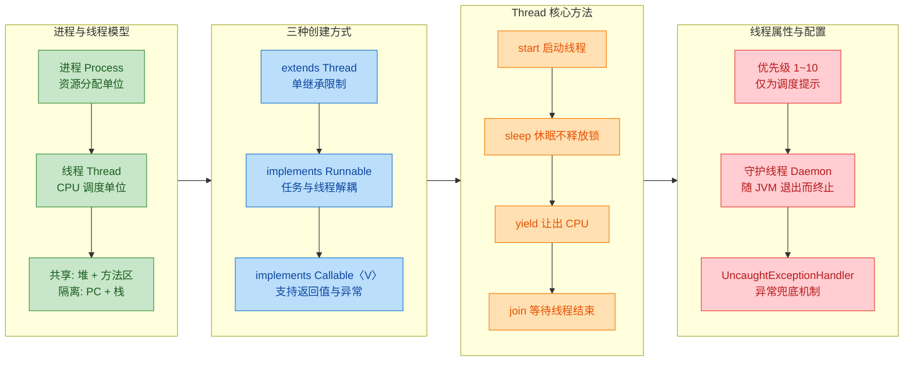

---

### 高频易混淆点速查表

以下将本章最容易混淆的知识点做横向对比：

**`start()` vs `run()`**：`start()` 会通过 JNI 调用底层操作系统的 `pthread_create`（Linux）或 `CreateThread`（Windows）创建真正的 OS 线程，线程进入 Runnable 状态，由调度器分配时间片后回调 `run()` 方法；直接调用 `run()` 则完全等价于在当前线程中执行一个普通的实例方法，不会创建新线程，`Thread.currentThread()` 返回的仍是调用者线程。

**`sleep()` vs `yield()`**：`sleep()` 使线程进入 TIMED_WAITING 状态，在指定时间内不参与调度，时间到后回到 Runnable 状态等待调度；`yield()` 不改变线程状态（仍为 Runnable），仅"建议"调度器重新选择线程，调度器可以立即重新选中同一个线程。两者的共同点是**都不释放锁**。

**`sleep()` vs `join()`**：`sleep()` 是 `Thread` 的静态方法，作用于**当前线程**；`join()` 是实例方法，作用于**目标线程**——调用 `t.join()` 时，当前线程阻塞直到线程 `t` 终止。`join()` 底层调用的是 `wait()`，因此它**会释放 `t` 对象上的锁**（注意：是 Thread 对象 `t` 本身这把锁，而非其他业务锁）。

**`Runnable` vs `Callable`**：`Runnable.run()` 无返回值且不能抛出受检异常 (checked exception)；`Callable.call()` 返回泛型 `V` 且可以抛出 `Exception`。`Callable` 需要配合 `FutureTask` 或线程池的 `submit()` 方法使用，通过 `Future.get()` 获取结果（该方法会阻塞直到任务完成）。

**用户线程 vs 守护线程**：用户线程 (User Thread) 是 JVM 存活的"理由"——只要有任何一个用户线程在运行，JVM 就不会退出；守护线程 (Daemon Thread) 是"附属"角色，当所有用户线程结束时，JVM 会终止所有守护线程并退出进程。主线程 `main` 本身是一个用户线程。

---

### 面试高频考点提炼

本章涉及的知识在面试中主要以以下形式出现：

**概念辨析类**："进程和线程的区别是什么？"——从资源分配、调度单位、地址空间、通信方式、创建开销五个维度回答即可。

**API 陷阱类**："调用 `thread.run()` 会怎样？"——不会启动新线程，仅在当前线程中同步执行 `run()` 方法体。这是一个几乎 100% 会考的入门题。

**原理理解类**："为什么 `sleep()` 不释放锁？"——`sleep()` 的设计意图是"让线程暂停一段时间"而非"释放资源让其他线程进入临界区"。如果 `sleep()` 释放锁，开发者就无法实现"在持有锁的情况下等待一段时间后继续操作"这一常见模式。与之对比，`wait()` 的设计意图是"等待条件满足"，因此必须释放锁以便其他线程修改条件。

**设计选择类**："创建线程的三种方式各有什么优劣？"——`Thread` 继承方式简单但受限于单继承；`Runnable` 解耦且支持多个线程共享同一任务实例；`Callable` 补充了返回值和异常传递能力。在生产环境中，通常不会直接创建线程，而是通过线程池 (`ExecutorService`) 提交 `Runnable` 或 `Callable` 任务。

**场景应用类**："守护线程的 `finally` 块一定会执行吗？"——不一定。当 JVM 退出时守护线程会被强制终止，`finally` 块可能来不及执行。因此守护线程不应负责数据持久化、事务提交等关键操作。

---

### 📝 练习题

**题目一：** 下面的代码输出结果是什么？

```java
public class ThreadQuiz {
    public static void main(String[] args) {
        // 创建一个线程，run() 方法中打印当前线程名称
        Thread t = new Thread(() -> {
            System.out.println("A-" + Thread.currentThread().getName());
        }, "Worker");

        // 直接调用 run()，而非 start()
        t.run();
        // 打印主线程名称
        System.out.println("B-" + Thread.currentThread().getName());
    }
}
```

A. `A-Worker`，然后 `B-main`（两行输出，顺序固定）


B. `A-main`，然后 `B-main`（两行输出，顺序固定）


C. `A-Worker` 和 `B-main` 交替出现（顺序不确定）


D. 编译错误

**【答案】** B

**【解析】** 代码中调用的是 `t.run()` 而不是 `t.start()`。`run()` 只是一个普通的实例方法调用，不会创建新的操作系统线程，整个逻辑都在 `main` 线程中同步执行。因此 `Thread.currentThread().getName()` 返回的是 `"main"` 而不是 `"Worker"`。`"Worker"` 只是为线程 `t` 设置的名字，只有在 `t` 真正作为独立线程运行时（即通过 `start()` 启动后），`currentThread()` 才会返回线程 `t` 自身，此时名字才会是 `"Worker"`。由于整个过程在单线程中顺序执行，输出顺序也是确定的：先 `A-main`，再 `B-main`。

---

**题目二：** 以下关于守护线程的说法，哪一项是**正确的**？

A. 守护线程中的 `finally` 块在 JVM 退出时一定会被执行


B. `setDaemon(true)` 可以在线程 `start()` 之后调用


C. 当所有用户线程结束时，JVM 会等待守护线程执行完毕后再退出


D. GC 线程是典型的守护线程，主线程 `main` 是典型的用户线程

**【答案】** D

**【解析】** 选项 A 错误：当 JVM 退出时，守护线程会被直接终止，其 `finally` 块**不保证执行**，这是守护线程最重要的特性之一。选项 B 错误：`setDaemon(true)` 必须在 `start()` 之前调用，否则会抛出 `IllegalThreadStateException`，因为线程启动后其守护状态不可更改。选项 C 错误：JVM 的退出条件恰恰是"所有非守护线程（即用户线程）结束"，此时 JVM **不会等待**守护线程执行完毕，而是直接终止进程。选项 D 正确：JVM 内部的 GC 线程、Finalizer 线程等都是守护线程，而 `main` 线程是用户线程，这也是为什么 `main` 方法执行完毕后如果还有其他用户线程在运行，JVM 不会退出的原因。


---

