---

# 线程安全基础

---

## 线程安全定义

在并发编程的世界里，"线程安全"是一个被频繁提及却常常被误解的概念。很多开发者会简单地将其等同于"加了锁就是线程安全的"，但这种理解过于粗浅。要真正掌握并发编程，我们必须从根基上理解什么是线程安全，以及为什么它如此重要。

### 什么是线程安全

Brian Goerta 在其经典著作 *"Java Concurrency in Practice"* 中给出了一个被业界广泛认可的定义：

> A class is thread-safe if it behaves correctly when accessed from multiple threads, regardless of the scheduling or interleaving of the execution of those threads by the runtime environment, and with no additional synchronization or other coordination on the part of the calling code.

翻译过来就是：**当多个线程同时访问一个类时，无论运行时环境如何调度这些线程、线程之间如何交替执行，并且调用方代码不需要额外的同步或协调措施，这个类始终能表现出正确的行为，那么它就是线程安全的。**

这个定义有三个关键要素值得我们逐一拆解：

**第一，"正确性"（Correctness）。** 正确性是线程安全的前提。所谓正确性，是指一个类的行为与其规约（specification）完全一致。比如一个计数器类，它的规约是"每调用一次 `increment()`，值加一"。如果在单线程下它能做到这一点，那它在单线程下就是正确的。线程安全要求的是：这种正确性在多线程环境下依然成立。

**第二，"无论如何调度"（Regardless of scheduling）。** 这意味着线程安全不能依赖于某种"幸运的"执行顺序。你不能说"只要线程 A 先跑完，线程 B 再跑，就没问题"——这不叫线程安全，这叫碰运气。真正的线程安全必须在所有可能的线程交错（interleaving）场景下都保持正确。

**第三，"调用方无需额外同步"（No additional synchronization on the part of the calling code）。** 这一点常被忽略。如果一个类需要调用方自己加锁才能正确工作，那这个类本身并不是线程安全的——它只是把线程安全的责任甩给了调用方。

### 一个直观的反例

我们通过一个最经典的反例来感受"线程不安全"到底意味着什么：

```java
// 一个线程不安全的计数器
public class UnsafeCounter {
    // 共享的可变状态：计数值
    private int count = 0;

    // 自增方法——看似简单的一行代码，实则隐藏着线程安全问题
    public void increment() {
        count++; // 这不是原子操作！
    }

    // 获取当前计数值
    public int getCount() {
        return count;
    }
}
```

`count++` 这行代码看起来是一个操作，但在 JVM 字节码层面，它实际上被拆解为三个独立的步骤：

```java
// count++ 的真实执行过程（伪代码）
int temp = count;    // Step 1: READ  — 从主内存读取 count 的值到线程工作内存
temp = temp + 1;     // Step 2: MODIFY — 在工作内存中执行加一运算
count = temp;        // Step 3: WRITE  — 将新值写回主内存
```

当两个线程同时执行 `increment()` 时，可能出现如下交错：

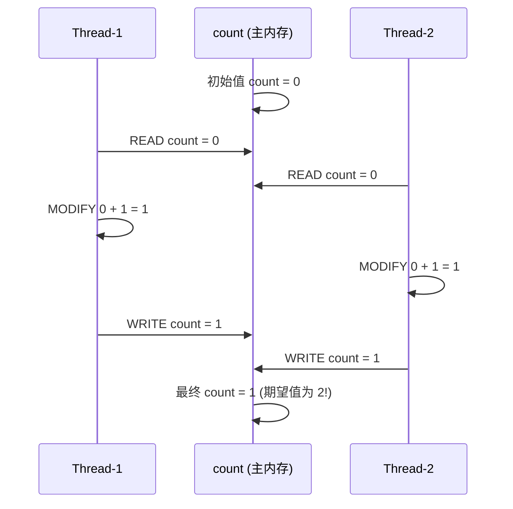

两个线程各执行了一次 `increment()`，期望结果是 2，但实际结果却是 1。这就是典型的 **丢失更新（Lost Update）** 问题。程序的行为违反了规约，因此 `UnsafeCounter` 不是线程安全的。

### 线程安全的级别

并非所有的类都需要做到"绝对线程安全"。实际上，线程安全是一个连续的光谱，而非非黑即白的二元判断。按照安全程度从高到低，我们可以将其划分为五个级别：

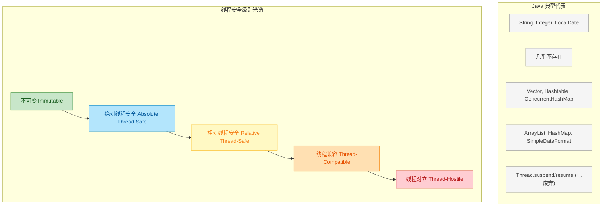

**1）不可变（Immutable）**

不可变对象天生线程安全，这是最强的安全保证。对象一旦被正确构造完成，其状态就永远不会改变，自然不存在并发修改的问题。Java 中的 `String`、包装类型（`Integer`、`Long` 等）、`java.time` 包下的类（`LocalDate`、`LocalDateTime` 等）都属于此类。

```java
// String 是不可变的，天生线程安全
// 任何"修改"操作都会返回一个新对象，原对象不受影响
String s = "hello";       // s 指向 "hello" 对象
String s2 = s.concat(" world"); // 创建了新对象 "hello world"
// 此时 s 仍然指向 "hello"，未被修改
```

实现不可变的关键手段包括：使用 `final` 修饰类和字段、不提供 setter 方法、在构造器中进行防御性拷贝（defensive copy）等。

**2）绝对线程安全（Absolute Thread-Safe）**

完全满足 Brian Goetz 定义的线程安全——调用方在任何场景下都无需额外同步。这个级别在实践中几乎不存在，因为代价太高。即便是 `java.util.Vector`，虽然它的每个方法都加了 `synchronized`，但在复合操作场景下依然不安全：

```java
// Vector 的"相对线程安全"陷阱
// 即使每个方法都是 synchronized 的，复合操作仍然不安全
Vector<Integer> vector = new Vector<>();

// 线程 A：先检查再删除
if (!vector.isEmpty()) {        // 操作 1：检查
    vector.remove(0);           // 操作 2：删除
    // 在操作 1 和操作 2 之间，线程 B 可能已经清空了 vector！
}

// 线程 B：清空
vector.clear();                 // 可能在线程 A 的两步之间执行
// 结果：线程 A 的 remove(0) 抛出 ArrayIndexOutOfBoundsException
```

**3）相对线程安全（Relative Thread-Safe）**

这是我们日常开发中最常说的"线程安全"。单个操作是线程安全的，但某些特定的连续调用序列（复合操作）可能需要调用方额外加锁。`Vector`、`Hashtable`、`Collections.synchronizedXxx()` 系列、`ConcurrentHashMap` 等都属于这个级别。

**4）线程兼容（Thread-Compatible）**

对象本身不是线程安全的，但调用方可以通过正确使用同步手段来保证并发安全。Java 中绝大多数类都属于这个级别，如 `ArrayList`、`HashMap`、`StringBuilder`、`SimpleDateFormat` 等。

**5）线程对立（Thread-Hostile）**

无论调用方是否加了同步措施，都无法在多线程环境下安全使用。这类代码在 Java 中极为罕见，典型的例子是已被废弃的 `Thread.suspend()` 和 `Thread.resume()` 方法——它们天然容易导致死锁。

### 线程安全的核心矛盾：共享可变状态

理解了线程安全的定义和级别之后，我们需要抓住问题的本质。线程安全问题的根源可以用一个公式概括：

```
线程安全问题 = 共享（Shared） + 可变（Mutable） + 状态（State）
```

三个条件缺一不可：

- **共享**：数据被多个线程访问。如果数据只在单线程内使用（如方法局部变量），就不存在线程安全问题。
- **可变**：数据可以被修改。如果数据是不可变的（如 `final` 字段、`String`），多线程读取完全安全。
- **状态**：对象持有的数据（字段）。无状态的对象（如只包含纯函数的工具类）天然线程安全。

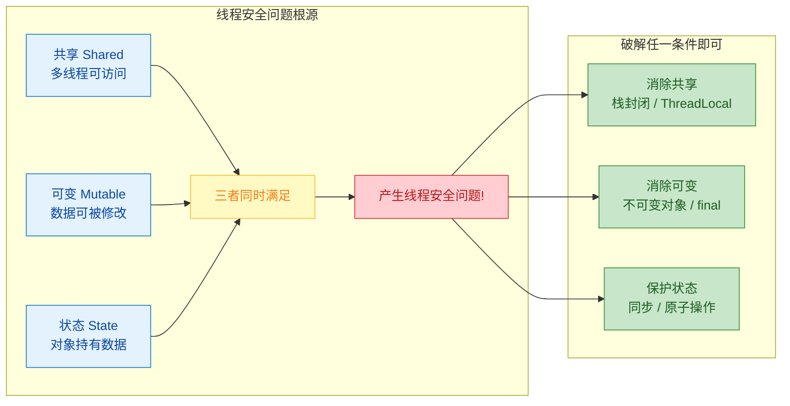

这个模型非常重要，因为它直接指导了线程安全的三大解决思路（后续章节会详细展开）：

1. **消除共享** —— 让数据不被多线程共享（栈封闭、`ThreadLocal`）
2. **消除可变** —— 让数据不可修改（不可变对象、`final` 关键字）
3. **保护状态** —— 通过同步机制协调对共享可变状态的访问（锁、CAS、`volatile` 等）

### 无状态对象：天然的线程安全

理解了"共享可变状态"这个核心矛盾后，一个自然的推论是：**没有状态的对象一定是线程安全的**。

```java
// 无状态的 Servlet —— 天然线程安全
public class StatelessServlet extends HttpServlet {

    // 没有任何实例字段（无状态）

    @Override
    protected void doGet(HttpServletRequest req, HttpServletResponse resp) {
        // 所有变量都是方法局部变量，存在于线程栈上，不共享
        String name = req.getParameter("name");   // 局部变量，线程私有
        int length = name.length();                // 局部变量，线程私有
        resp.getWriter().write("Hello, " + name);  // 直接使用，无共享状态
    }
}
```

这个 Servlet 没有任何实例字段，所有数据都通过方法参数传入、在局部变量中处理。每个线程调用 `doGet()` 时都在自己的栈帧（stack frame）上操作独立的变量副本，彼此互不干扰。这就是为什么 Spring 框架中的 `@Controller`、`@Service` 等默认单例 Bean，只要不持有可变的实例字段，就可以安全地被多线程共享。

反过来，一旦我们给这个 Servlet 加上一个实例字段，线程安全就被打破了：

```java
// 有状态的 Servlet —— 线程不安全！
public class StatefulServlet extends HttpServlet {

    // 共享的可变状态！每个请求线程都会访问和修改它
    private int requestCount = 0;

    @Override
    protected void doGet(HttpServletRequest req, HttpServletResponse resp) {
        requestCount++;  // 危险！多线程并发修改共享可变状态
        resp.getWriter().write("Request #" + requestCount);
    }
}
```

`requestCount` 是一个实例字段，被所有处理请求的线程共享，且可被修改——三个条件全部满足，线程安全问题随之而来。

### 小结：如何判断一个类是否线程安全

在实际开发中，判断一个类是否线程安全，可以问自己三个问题：

1. 这个类有没有实例字段（状态）？—— 没有，则天然安全。
2. 这些字段是否可能被多个线程访问（共享）？—— 不会，则安全。
3. 这些字段是否可以被修改（可变）？—— 不可变，则安全。

如果三个答案都是"是"，那你就需要认真考虑同步策略了。这正是后续章节——竞态条件、临界区、互斥同步、非阻塞同步、无同步方案——要解决的问题。

---

## 竞态条件（Race Condition）⭐

竞态条件是并发编程中最核心、最高频的 Bug 来源之一。简单来说，当程序的正确性取决于多个线程执行操作的相对时序（relative timing）时，就发生了竞态条件。它的本质是：**多个线程对共享状态的访问序列不可控，导致最终结果依赖于线程调度的"运气"。**

"Race" 这个词非常形象——多个线程在"赛跑"，谁先到达、谁先执行某行代码，决定了程序的行为。而这种赛跑的结果在不同运行环境、不同 CPU 负载下可能完全不同，这就是竞态条件难以复现和调试的根本原因。

竞态条件并不一定每次都导致错误。它可能在开发环境中运行一万次都正确，却在生产环境的高并发场景下突然暴露。Brian Goerta 在《Java Concurrency in Practice》中有一句经典描述：

> "A race condition occurs when the correctness of a computation depends on the relative timing or interleaving of multiple threads by the runtime."

竞态条件的两大经典模式是 **check-then-act** 和 **read-modify-write**。几乎所有并发 Bug 都可以归类到这两种模式中。下面我们逐一深入剖析。

---

### check-then-act

check-then-act 是最常见的竞态条件模式。它的结构非常直观：**先检查某个条件，然后基于检查结果执行动作。** 问题在于，在"检查"和"执行"之间存在一个时间窗口，其他线程可能在这个窗口内修改了条件，导致你基于一个已经过时的观察（stale observation）做出了错误的决策。

这种模式的危险之处在于它看起来完全合理——人类的思维天然就是"先看再做"。但在并发世界中，"看到"和"做到"之间的间隙就是 Bug 的温床。

我们来看一个最经典的例子——延迟初始化（Lazy Initialization）：

```java
/**
 * 典型的 check-then-act 竞态条件示例
 * 这个单例实现在多线程环境下是不安全的
 */
public class UnsafeLazyInit {

    // 共享变量：单例实例引用
    private static UnsafeLazyInit instance;

    // 私有构造器，防止外部直接 new
    private UnsafeLazyInit() {}

    /**
     * 获取单例实例 —— 存在竞态条件！
     * 问题出在 check（instance == null）和 act（new）之间不是原子的
     */
    public static UnsafeLazyInit getInstance() {
        // ① CHECK: 检查实例是否为 null
        if (instance == null) {
            // ② ACT: 基于检查结果创建实例
            // 危险窗口：在 ① 和 ② 之间，其他线程可能已经创建了实例
            instance = new UnsafeLazyInit();
        }
        // 返回实例（可能返回不同线程创建的不同对象）
        return instance;
    }
}
```

表面上看逻辑无懈可击：如果没有实例就创建一个。但当两个线程同时调用 `getInstance()` 时，灾难就可能发生。我们用时序图来展示这个过程：

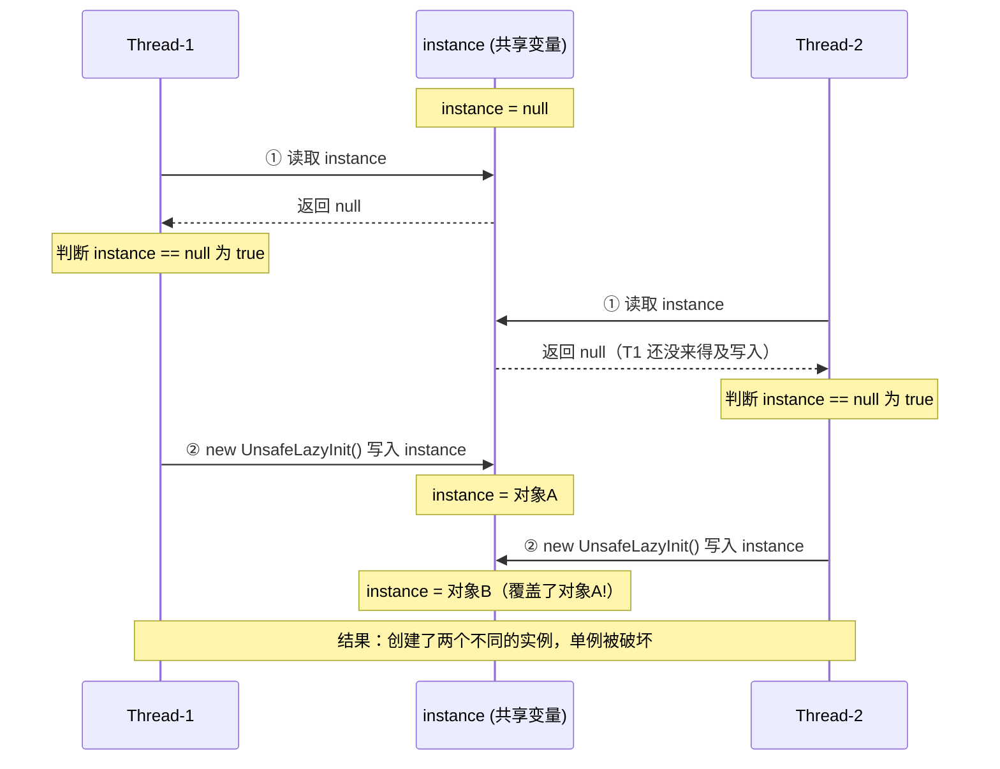

这个时序清晰地展示了问题：Thread-1 的 check 和 act 之间，Thread-2 插入了自己的 check，两个线程都观察到 `instance == null`，于是各自创建了一个实例。单例的语义被彻底破坏。

check-then-act 在实际开发中的变体非常多，再来看一个文件操作的例子：

```java
/**
 * 文件操作中的 check-then-act 竞态
 * 即使是单线程思维下"正确"的防御性编程，在并发下也可能出问题
 */
public class UnsafeFileOperation {

    /**
     * 尝试创建文件 —— 存在 TOCTOU 竞态
     * TOCTOU = Time Of Check to Time Of Use
     */
    public void createFile(String path) throws IOException {
        File file = new File(path);

        // CHECK: 检查文件是否已存在
        if (!file.exists()) {
            // ACT: 基于"文件不存在"的假设去创建
            // 危险：在 check 和 act 之间，另一个线程/进程可能已经创建了同名文件
            boolean created = file.createNewFile();
            if (!created) {
                // 走到这里说明竞态条件已经发生
                System.out.println("文件创建失败：竞态条件被触发");
            }
        }
    }
}
```

这种模式在安全领域有一个专门的术语叫 **TOCTOU（Time Of Check to Time Of Use）**，它是一类经典的安全漏洞。攻击者可以利用 check 和 use 之间的时间窗口替换文件、修改权限等。

我们用一张流程图来总结 check-then-act 模式的结构和风险点：

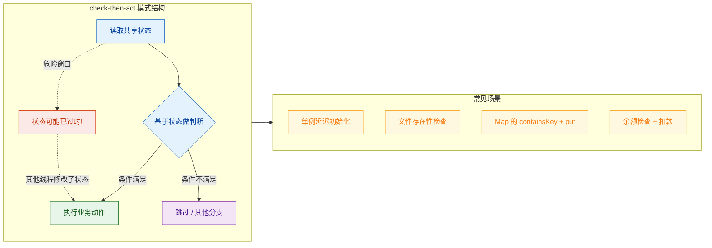

最后一个极其常见的 check-then-act 变体是 `Map` 的"先查后放"：

```java
/**
 * ConcurrentHashMap 也无法拯救 check-then-act
 * 虽然单个操作是线程安全的，但组合操作不是
 */
public class UnsafeMapAccess {

    // 即使用了 ConcurrentHashMap，组合操作仍然不安全
    private final Map<String, List<String>> cache = new ConcurrentHashMap<>();

    /**
     * 向缓存中追加值 —— 存在竞态条件
     */
    public void appendValue(String key, String value) {
        // CHECK: 检查 key 是否存在
        if (!cache.containsKey(key)) {
            // ACT: 不存在则创建新列表
            // 两个线程可能同时走到这里，各自创建一个 List，后者覆盖前者
            cache.put(key, new ArrayList<>());
        }
        // 获取列表并追加（前面的 put 可能被覆盖，导致数据丢失）
        cache.get(key).add(value);
    }

    /**
     * 正确做法：使用原子化的复合操作
     */
    public void appendValueSafe(String key, String value) {
        // computeIfAbsent 将 check 和 act 合并为一个原子操作
        // 如果 key 不存在，则执行 lambda 创建值并放入 map，整个过程是原子的
        cache.computeIfAbsent(key, k -> new ArrayList<>()).add(value);
    }
}
```

这个例子特别有教育意义：即使你使用了 `ConcurrentHashMap`，它只保证单个方法调用的线程安全，而 `containsKey()` + `put()` 这个组合操作仍然不是原子的。解决方案是使用 `computeIfAbsent()` 这样的原子化复合操作，将 check 和 act 合并到一个不可分割的步骤中。

---

### read-modify-write

read-modify-write 是竞态条件的另一大经典模式。它的结构是：**先读取一个值，基于这个值计算出新值，然后把新值写回去。** 这三步不是原子的，中间可能被其他线程打断，导致更新丢失（lost update）。

最经典的例子就是 `count++`。这行代码看起来是一个操作，但实际上它在 JVM 层面被分解为三个独立的步骤：

```java
/**
 * read-modify-write 竞态条件的经典示例
 * count++ 看似一行代码，实际是三步操作
 */
public class UnsafeCounter {

    // 共享计数器
    private int count = 0;

    /**
     * 自增操作 —— 不是原子的！
     * count++ 在字节码层面等价于：
     *   1. READ:   int temp = this.count;    // 从主存读取当前值
     *   2. MODIFY: temp = temp + 1;          // 在 CPU 寄存器中加 1
     *   3. WRITE:  this.count = temp;        // 将新值写回主存
     * 这三步之间随时可能被线程调度器打断
     */
    public void increment() {
        count++; // 非原子操作！
    }

    /**
     * 获取当前计数
     */
    public int getCount() {
        return count;
    }
}
```

我们来看 `count++` 在字节码层面到底做了什么：

```java
// count++ 对应的字节码指令（简化表示）：
// 
// GETFIELD  count   ← Step 1: READ    从堆内存读取 count 的值压入操作数栈
// ICONST_1          ← 将常量 1 压入操作数栈
// IADD              ← Step 2: MODIFY  栈顶两个值相加，结果压回栈顶
// PUTFIELD  count   ← Step 3: WRITE   将栈顶值写回堆内存的 count 字段
//
// 四条字节码指令，线程可以在任意两条指令之间被挂起
```

当两个线程同时执行 `count++` 时，更新丢失的过程如下：

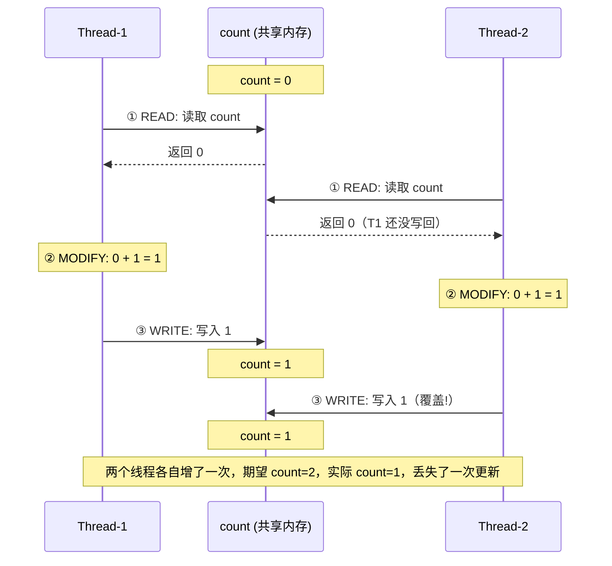

这就是经典的 **丢失更新（Lost Update）** 问题。两个线程都读到了 `count = 0`，各自计算出 `1`，然后先后写回。第二次写入覆盖了第一次的结果，相当于一次自增操作"凭空消失"了。

我们用一个更贴近实际业务的例子来感受 read-modify-write 的危害——银行账户转账：

```java
/**
 * 银行账户 —— read-modify-write 竞态的业务场景
 * 余额操作如果不是原子的，钱会"凭空消失"或"凭空出现"
 */
public class UnsafeBankAccount {

    // 账户余额（共享可变状态）
    private long balance;

    public UnsafeBankAccount(long initialBalance) {
        this.balance = initialBalance;
    }

    /**
     * 存款操作 —— 存在 read-modify-write 竞态
     * 与 count++ 本质相同：读余额 -> 加金额 -> 写回余额
     */
    public void deposit(long amount) {
        // READ:   long temp = this.balance;
        // MODIFY: temp = temp + amount;
        // WRITE:  this.balance = temp;
        balance = balance + amount; // 非原子操作
    }

    /**
     * 取款操作 —— 同样存在竞态
     */
    public void withdraw(long amount) {
        // 这里还隐含了一个 check-then-act：先检查余额够不够，再扣款
        // 两种竞态模式叠加，问题更严重
        if (balance >= amount) {       // CHECK（可能已过时）
            balance = balance - amount; // ACT（read-modify-write）
        }
    }

    public long getBalance() {
        return balance;
    }
}
```

注意 `withdraw()` 方法——它同时包含了 check-then-act（余额检查）和 read-modify-write（余额扣减）两种竞态模式。这在实际业务代码中非常常见，两种模式经常交织在一起。

下面我们来看 read-modify-write 的正确修复方式。根据场景不同，有多种选择：

```java
import java.util.concurrent.atomic.AtomicLong;

/**
 * 修复 read-modify-write 竞态的三种常见方式
 */
public class SafeCounterExamples {

    // ===== 方式一：synchronized（互斥同步 / 悲观锁）=====
    private long count1 = 0;

    /**
     * 使用 synchronized 保证 read-modify-write 的原子性
     * 同一时刻只有一个线程能进入这个方法
     * 简单直接，但在高竞争场景下性能较差
     */
    public synchronized void incrementSync() {
        count1++; // 在锁的保护下，三步操作不会被打断
    }

    // ===== 方式二：AtomicLong（非阻塞同步 / 乐观锁）=====
    // AtomicLong 内部使用 CAS（Compare-And-Swap）指令实现原子更新
    private final AtomicLong count2 = new AtomicLong(0);

    /**
     * 使用 AtomicLong 的原子自增
     * 底层通过 CPU 的 CAS 指令实现，无需加锁
     * 在中低竞争场景下性能优于 synchronized
     */
    public void incrementAtomic() {
        count2.incrementAndGet(); // 原子操作：读取 + 加1 + 写回 一步完成
    }

    // ===== 方式三：LongAdder（分段累加，高竞争场景最优）=====
    // Java 8 引入，专为高并发计数场景设计
    private final java.util.concurrent.atomic.LongAdder count3 =
            new java.util.concurrent.atomic.LongAdder();

    /**
     * 使用 LongAdder 的分段累加
     * 内部维护多个 Cell，不同线程累加到不同 Cell 上，减少竞争
     * 最终 sum() 时汇总所有 Cell 的值
     * 在高竞争场景下吞吐量远超 AtomicLong
     */
    public void incrementAdder() {
        count3.increment(); // 几乎无竞争的累加
    }
}
```

最后，我们用一张对比图来总结 check-then-act 和 read-modify-write 这两种竞态模式的异同：

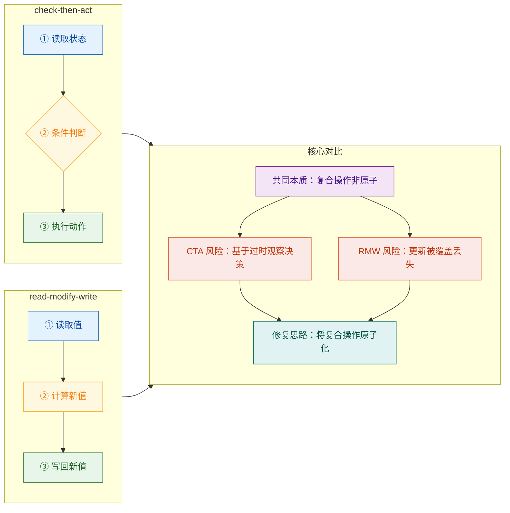

两种模式的本质是相同的：**一个逻辑上不可分割的操作，在实现上被拆成了多个步骤，而这些步骤之间可以被其他线程插入。** 解决方案的核心思路也是统一的——通过某种机制（锁、CAS、原子类、合并 API）将这些步骤变成一个不可分割的原子操作。

---

**📝 练习题**

以下代码在多线程环境下存在竞态条件，属于哪种模式？

```java
public class TicketSeller {
    private int remainingTickets = 100;

    public String sellTicket() {
        if (remainingTickets > 0) {
            remainingTickets--;
            return "出票成功，剩余：" + remainingTickets;
        }
        return "已售罄";
    }
}
```

A. 仅 check-then-act


B. 仅 read-modify-write


C. check-then-act 和 read-modify-write 同时存在


D. 不存在竞态条件，因为操作很简单


**【答案】** C

**【解析】** 这段代码同时包含两种竞态模式。首先，`if (remainingTickets > 0)` 是 check，`remainingTickets--` 是 act，两者之间不是原子的——线程 A 检查到剩余 1 张票后，线程 B 也可能检查到剩余 1 张票，导致超卖（check-then-act）。其次，`remainingTickets--` 本身就是一个 read-modify-write 操作（读取当前值 → 减 1 → 写回），两个线程同时执行可能导致只减了一次而非两次（lost update）。这与前文银行账户的 `withdraw()` 方法完全同构。修复方式可以用 `synchronized` 包裹整个方法，或者使用 `AtomicInteger` 配合 `compareAndSet` 循环来实现原子化的"检查并扣减"。

---

## 临界区（Critical Section）

在讨论线程安全时，我们反复提到"多个线程同时访问共享资源会出问题"。那么，问题到底出在代码的哪个部分？答案就是——临界区。

临界区是一个精确的术语，它指的是**访问共享资源的那段代码区域**，而这段代码在同一时刻只能被一个线程执行。换句话说，临界区就是"危险地带"：如果不加保护，多个线程同时踏入这片区域，就会引发竞态条件（Race Condition），导致数据不一致、程序行为异常。

理解临界区的关键在于区分两个概念：**共享资源本身**和**操作共享资源的代码**。共享资源可以是一个实例变量、一块堆内存、一个文件句柄，甚至是数据库中的一行记录。而临界区则是你的程序中读写这些资源的那几行代码。保护的对象不是资源本身，而是**对资源的访问路径**。

### 临界区的本质特征

临界区具备三个核心特征，缺一不可：

第一，**互斥性（Mutual Exclusion）**。这是临界区最根本的要求。在任意时刻，最多只有一个线程可以在临界区内执行。如果线程 A 正在临界区中，线程 B 必须等待，直到线程 A 离开。这就像一间单人更衣室——门锁上了，别人只能在外面排队。

第二，**有限等待（Bounded Waiting）**。任何请求进入临界区的线程，都必须在有限的时间内获得进入的机会。不能出现某个线程永远被"插队"、永远进不去的情况，否则就构成了**饥饿（Starvation）**。

第三，**空闲让进（Progress）**。如果没有线程在临界区内执行，那么下一个请求进入的线程应该能够立即进入，不应被无意义地阻塞。系统不能在临界区空闲时还让线程干等。

这三个特征最早由 Edsger Dijkstra 在 1965 年提出，至今仍是并发编程的理论基石。

### 从代码层面理解临界区

来看一个最直观的例子。假设我们有一个银行账户类，多个线程可能同时对它进行存取操作：

```java
public class BankAccount {
    // 共享资源：账户余额，存储在堆内存中，所有线程可见
    private int balance = 1000;

    // withdraw 方法中包含临界区
    public void withdraw(int amount) {
        // ===== 临界区开始 =====
        // 这三步操作读写了共享变量 balance
        // 如果多个线程同时执行，会产生竞态条件
        if (balance >= amount) {          // 第一步：读取 balance 并判断（check）
            // 在这个间隙，另一个线程可能已经修改了 balance
            balance = balance - amount;   // 第二步：读取 balance，计算，写回（act）
        }
        // ===== 临界区结束 =====
    }

    // deposit 方法中也包含临界区
    public void deposit(int amount) {
        // ===== 临界区开始 =====
        balance = balance + amount;       // read-modify-write 操作
        // ===== 临界区结束 =====
    }

    // 这个方法如果只是读取，在某些场景下也可能是临界区的一部分
    public int getBalance() {
        return balance;                   // 单次读取，但可能读到中间状态
    }
}
```

上面的 `withdraw` 方法完美展示了一个典型的临界区。`balance >= amount` 这个检查和 `balance = balance - amount` 这个操作之间存在时间窗口。如果两个线程同时进入这段代码，都读到 `balance = 1000`，都判断 `1000 >= 800` 成立，然后都执行扣款，最终余额变成了 `-600`，而不是预期的 `200`。这就是未保护临界区的后果。

### 临界区与非临界区的边界

一个方法中并非所有代码都是临界区。精确识别临界区的边界，对于写出高性能并发程序至关重要。锁的粒度越小，并发度越高；锁的粒度越大，程序越趋近于串行执行。

```java
public class OrderService {
    // 共享资源：订单计数器
    private int orderCount = 0;
    
    public void processOrder(String orderData) {
        // -------- 非临界区开始 --------
        // 参数校验：只读取方法参数（栈上数据），不涉及共享资源
        if (orderData == null || orderData.isEmpty()) {
            throw new IllegalArgumentException("订单数据不能为空");
        }
        
        // 数据解析：局部变量存储在线程栈上，天然线程安全
        String[] parts = orderData.split(",");       // 局部变量，线程私有
        String productName = parts[0];               // 局部变量，线程私有
        int quantity = Integer.parseInt(parts[1]);   // 局部变量，线程私有
        // -------- 非临界区结束 --------
        
        // ======== 临界区开始 ========
        // 只有这一行访问了共享变量 orderCount
        orderCount++;                                // read-modify-write，必须保护
        // ======== 临界区结束 ========
        
        // -------- 非临界区开始 --------
        // 日志输出：使用的都是局部变量
        System.out.println("处理订单: " + productName + " x " + quantity);
        // -------- 非临界区结束 --------
    }
}
```

在这个例子中，整个 `processOrder` 方法有十几行代码，但真正的临界区只有 `orderCount++` 这一行。如果我们用 `synchronized` 锁住整个方法，那么参数校验、数据解析、日志输出这些完全不涉及共享资源的操作也会被串行化，白白浪费了并发性能。

### 临界区的可视化模型

下面用一张流程图来展示多个线程竞争进入临界区的过程：

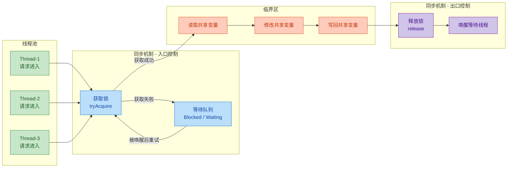

这张图清晰地展示了临界区的运作机制：多个线程同时请求进入，但同步机制（锁）充当了"门卫"，一次只放一个线程进去。其他线程被送入等待队列，直到当前线程执行完临界区代码、释放锁之后，才会唤醒下一个等待者。

### 临界区的内存视角

从 JVM 内存模型的角度看，临界区问题的根源在于**堆内存是线程共享的，而栈内存是线程私有的**。

```java
// ┌─────────────────────────────────────────────────────────┐
// │                    JVM 堆内存 (Heap)                     │
// │                   所有线程共享区域                         │
// │                                                         │
// │   ┌─────────────────────────────────────┐               │
// │   │  BankAccount 对象实例                │               │
// │   │  ┌─────────────────────────────┐    │               │
// │   │  │  balance = 1000  (共享变量)  │◄───┼── 临界资源    │
// │   │  └─────────────────────────────┘    │               │
// │   └─────────────────────────────────────┘               │
// └──────────────┬──────────────────────┬───────────────────┘
//                │                      │
//        ┌───────▼───────┐      ┌───────▼───────┐
//        │  Thread-1 栈   │      │  Thread-2 栈   │
//        │  (线程私有)    │      │  (线程私有)    │
//        │               │      │               │
//        │  amount = 800 │      │  amount = 500 │
//        │  localVar = ? │      │  localVar = ? │
//        └───────────────┘      └───────────────┘
```

`balance` 字段存储在堆上，是临界资源。两个线程各自栈上的 `amount` 局部变量互不干扰，不需要保护。临界区要保护的，正是那些从线程栈"伸手"去读写堆内存的代码。

### 临界区的粒度选择

临界区的大小直接决定了程序的并发性能。这是一个需要权衡的设计决策：

```java
public class InventoryService {
    private final Map<String, Integer> stock = new HashMap<>();

    // 方案一：粗粒度 —— 整个方法作为临界区
    // 优点：实现简单，不容易出错
    // 缺点：并发度极低，所有操作串行化
    public synchronized void updateStock_Coarse(String sku, int delta) {
        // 参数校验（不需要锁保护，但也被锁住了）
        if (sku == null) throw new IllegalArgumentException();
        
        // 日志记录（不需要锁保护，但也被锁住了）
        System.out.println("更新库存: " + sku);
        
        // 真正需要保护的操作
        int current = stock.getOrDefault(sku, 0);
        stock.put(sku, current + delta);
        
        // 通知操作（不需要锁保护，但也被锁住了）
        System.out.println("库存已更新为: " + (current + delta));
    }

    // 方案二：细粒度 —— 只锁住真正的临界区
    // 优点：并发度高，非临界区代码可以并行执行
    // 缺点：需要仔细分析哪些代码需要保护
    public void updateStock_Fine(String sku, int delta) {
        // 参数校验 —— 非临界区，无需加锁
        if (sku == null) throw new IllegalArgumentException();
        
        // 日志记录 —— 非临界区，无需加锁
        System.out.println("更新库存: " + sku);
        
        int newValue;
        // 只对访问共享资源的代码加锁
        synchronized (this) {
            // ===== 临界区：只包含对 stock 的读写 =====
            int current = stock.getOrDefault(sku, 0);  // 读取共享 Map
            newValue = current + delta;                 // 计算（可以放在锁外，但值依赖锁内读取）
            stock.put(sku, newValue);                   // 写入共享 Map
            // ===== 临界区结束 =====
        }
        
        // 通知操作 —— 非临界区，使用局部变量 newValue
        System.out.println("库存已更新为: " + newValue);
    }
}
```

方案二的细粒度锁策略，将临界区精确地缩小到了对 `stock` 这个共享 Map 的读写操作上。参数校验和日志输出被排除在锁外，可以被多个线程并行执行。在高并发场景下，这种差异会带来显著的吞吐量提升。

### 临界区与竞态条件的关系

临界区和竞态条件是一对"因果关系"：**未被正确保护的临界区，是竞态条件产生的直接原因**。

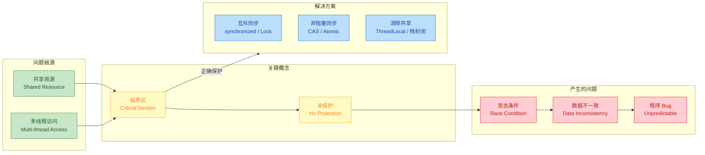

逻辑链条非常清晰：共享资源 + 多线程访问 → 形成临界区 → 若未保护 → 竞态条件 → 数据不一致 → Bug。而解决方案就是对临界区施加正确的保护策略，具体采用哪种策略（互斥同步、非阻塞同步、消除共享），取决于具体的业务场景和性能需求，这些内容会在后续的"线程安全实现方式"章节中详细展开。

### 识别临界区的实战清单

在实际开发中，如何快速判断一段代码是否属于临界区？可以按照以下检查步骤：

第一步，找到所有共享变量。实例字段、静态字段、共享集合、外部资源（文件、数据库连接）都是潜在的共享资源。

第二步，检查是否存在写操作。如果所有线程都只读取共享变量，且该变量在初始化后不再改变（effectively immutable），那么不存在临界区问题。

第三步，检查操作的原子性。即使只有一行代码，如 `count++`，在字节码层面也是多步操作（`getfield` → `iadd` → `putfield`），仍然构成临界区。

第四步，检查复合操作。像 `if (!map.containsKey(key)) map.put(key, value)` 这样的 check-then-act 模式，即使每个单独的方法调用是线程安全的（比如使用了 `ConcurrentHashMap`），组合起来仍然不是原子的，整个复合操作构成一个临界区。

```java
public class CriticalSectionChecklist {
    // ✅ 不是临界区：final 字段，初始化后不可变
    private final String serviceName = "OrderService";
    
    // ✅ 不是临界区：局部变量在方法栈上，线程私有
    public int calculate(int a, int b) {
        int result = a + b;    // 局部变量，安全
        return result;
    }
    
    // ❌ 是临界区：实例字段的 read-modify-write
    private int counter = 0;
    public void increment() {
        counter++;             // 临界区！需要保护
    }
    
    // ❌ 是临界区：复合操作（check-then-act）
    private final Map<String, Object> cache = new ConcurrentHashMap<>();
    public Object getOrCreate(String key) {
        if (!cache.containsKey(key)) {   // check
            cache.put(key, new Object()); // act —— 两步之间可能被其他线程插入
        }
        return cache.get(key);
    }
    // ✅ 正确做法：使用原子复合操作
    public Object getOrCreateSafe(String key) {
        return cache.computeIfAbsent(key, k -> new Object()); // 原子复合操作
    }
}
```

最后一个例子特别值得注意：`ConcurrentHashMap` 的单个方法（`containsKey`、`put`）各自是线程安全的，但把它们组合成 check-then-act 模式后，整体就不再是原子操作了。正确的做法是使用 `computeIfAbsent` 这样的原子复合方法，将整个 check-then-act 逻辑封装为一个不可分割的操作，从根本上消除临界区问题。

---

**📝 练习题**

以下代码中，哪些行属于临界区？

```java
public class Logger {
    private static int logCount = 0;
    
    public void log(String message) {
        String timestamp = LocalDateTime.now().toString();  // Line 1
        String formatted = "[" + timestamp + "] " + message; // Line 2
        logCount++;                                           // Line 3
        System.out.println(formatted + " (#" + logCount + ")"); // Line 4
    }
}
```

A. 只有 Line 3


B. Line 3 和 Line 4


C. Line 1 到 Line 4 全部


D. Line 2、Line 3 和 Line 4


**【答案】** B

**【解析】** Line 1 和 Line 2 操作的都是局部变量（`timestamp`、`formatted`），存储在线程栈上，天然线程安全，不属于临界区。Line 3 是对静态共享变量 `logCount` 的 read-modify-write 操作，毫无疑问是临界区。Line 4 虽然 `System.out.println` 本身内部有同步机制，但它读取了共享变量 `logCount` 的值——如果 Line 3 和 Line 4 之间没有原子性保证，另一个线程可能在 Line 3 之后、Line 4 之前再次修改 `logCount`，导致打印出的计数值与实际递增的值不一致。因此 Line 3 和 Line 4 共同构成了需要保护的临界区，它们必须作为一个整体被原子执行。

---

## 线程安全实现方式

当我们确认了竞态条件的存在、划定了临界区的边界之后，下一个核心问题就是：**如何保护临界区，使并发访问变得安全？** 这并非只有"加锁"一条路。Java 并发体系提供了三大类实现思路，它们在性能特征、适用场景和编程复杂度上各有取舍。理解这三条路径的本质差异，是写出高性能并发代码的关键。

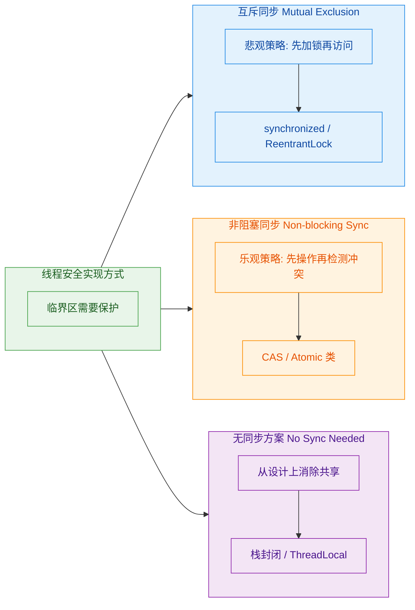

---

### 互斥同步（悲观锁）

互斥同步（Mutual Exclusion & Synchronization）是最经典、最直觉的并发安全手段。它的核心哲学非常"悲观"——**假设每次访问共享数据时，都一定会有其他线程来捣乱，所以必须先把门锁上，独占资源，操作完再放行。** 这就是"悲观锁"（Pessimistic Locking）名称的由来。

在 Java 中，互斥同步有两大实现：语言内置的 `synchronized` 关键字，以及 `java.util.concurrent.locks` 包下的 `ReentrantLock`。两者底层都遵循同一个语义模型：**在同一时刻，只允许一个线程进入临界区。**

#### synchronized 关键字

`synchronized` 是 Java 从 1.0 就提供的内置同步原语。它由 JVM 直接支持，使用起来最为简洁。编译器会在同步块的入口和出口分别插入 `monitorenter` 和 `monitorexit` 字节码指令，这两条指令都需要一个 reference 类型的参数来指定要锁定的对象。

```java
public class SynchronizedCounter {
    // 共享可变状态
    private int count = 0;

    // 方式一：同步实例方法 —— 锁对象是 this（当前实例）
    public synchronized void increment() {
        count++; // 临界区：read-modify-write 操作被互斥保护
    }

    // 方式二：同步静态方法 —— 锁对象是 Class 对象（SynchronizedCounter.class）
    public static synchronized void staticMethod() {
        // 所有实例共享同一把锁，粒度最大
    }

    // 方式三：同步代码块 —— 显式指定锁对象，粒度最灵活
    private final Object lock = new Object(); // 推荐用专用的 final 锁对象

    public void incrementWithBlock() {
        synchronized (lock) {       // monitorenter: 获取 lock 对象的监视器
            count++;                // 临界区
        }                           // monitorexit: 释放 lock 对象的监视器
    }

    public int getCount() {
        synchronized (lock) {       // 读操作同样需要同步，保证可见性
            return count;
        }
    }
}
```

`synchronized` 的语义保证非常强：

- **原子性（Atomicity）**：同步块内的操作对外表现为不可分割的整体。
- **可见性（Visibility）**：根据 Java Memory Model（JMM）的规定，解锁操作（monitorexit）happens-before 于后续对同一把锁的加锁操作（monitorenter）。这意味着一个线程在同步块中对共享变量的修改，对随后获得同一把锁的线程一定可见。
- **有序性（Ordering）**：happens-before 关系同时约束了指令重排序，同步块内的操作不会被重排到同步块外部。

JVM 对 `synchronized` 做了大量优化，从 JDK 6 开始引入了锁升级机制（Lock Escalation），使其在不同竞争程度下自动选择最优策略：

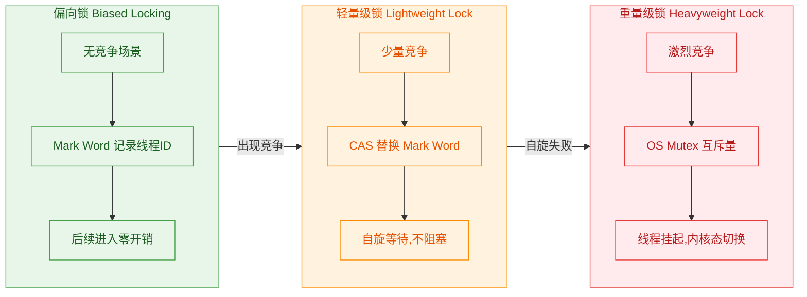

- **偏向锁（Biased Locking）**：当只有一个线程反复进入同步块时，JVM 在对象头的 Mark Word 中记录该线程 ID，后续该线程再次进入时无需任何 CAS 操作，几乎零开销。（注意：JDK 15 起默认禁用偏向锁，因为现代应用中无竞争场景越来越少。）
- **轻量级锁（Lightweight Lock）**：当出现第二个线程尝试获取锁时，偏向锁撤销，升级为轻量级锁。竞争线程通过 CAS 自旋（spin）尝试获取锁，避免了操作系统层面的线程阻塞。
- **重量级锁（Heavyweight Lock）**：当自旋超过阈值或竞争线程过多时，锁膨胀为重量级锁，底层依赖操作系统的 Mutex Lock，未获取锁的线程会被挂起（park），涉及用户态到内核态的切换（context switch），开销显著增大。

这个升级过程是**单向不可逆**的——锁只能升级，不能降级。

#### ReentrantLock

`ReentrantLock` 是 JDK 5 引入的显式锁（Explicit Lock），位于 `java.util.concurrent.locks` 包下。它提供了比 `synchronized` 更丰富的功能，但代价是需要手动管理锁的获取和释放。

```java
import java.util.concurrent.locks.ReentrantLock;
import java.util.concurrent.locks.Condition;

public class ReentrantLockCounter {
    private int count = 0;
    // 创建一个可重入锁，参数 true 表示使用公平策略
    private final ReentrantLock lock = new ReentrantLock(true);
    // 从锁上派生一个条件变量，用于线程间协调
    private final Condition notZero = lock.newCondition();

    public void increment() {
        lock.lock();            // 显式获取锁（阻塞式）
        try {
            count++;            // 临界区
            notZero.signalAll(); // 通知所有等待 count 非零的线程
        } finally {
            lock.unlock();      // 必须在 finally 中释放锁，防止异常导致死锁
        }
    }

    public void decrementWhenPositive() throws InterruptedException {
        lock.lock();
        try {
            while (count <= 0) {        // 循环检查条件，防止虚假唤醒(spurious wakeup)
                notZero.await();         // 释放锁并等待，被唤醒后重新获取锁
            }
            count--;                     // 条件满足，安全地执行操作
        } finally {
            lock.unlock();
        }
    }

    public boolean tryDecrementWithTimeout() throws InterruptedException {
        // 尝试在 1 秒内获取锁，获取不到就放弃（非阻塞式）
        if (lock.tryLock(1, java.util.concurrent.TimeUnit.SECONDS)) {
            try {
                if (count > 0) {
                    count--;
                    return true;
                }
                return false;
            } finally {
                lock.unlock();
            }
        }
        return false;   // 超时未获取到锁，返回失败
    }
}
```

`ReentrantLock` 相比 `synchronized` 的核心优势：

| 特性 | synchronized | ReentrantLock |
|------|-------------|---------------|
| 锁获取方式 | 隐式，进入同步块自动获取 | 显式调用 `lock()` |
| 锁释放方式 | 隐式，退出同步块自动释放 | 必须手动 `unlock()`，通常在 finally 中 |
| 可中断获取 | 不支持（线程会一直阻塞） | `lockInterruptibly()` 支持响应中断 |
| 超时获取 | 不支持 | `tryLock(timeout, unit)` 支持 |
| 非阻塞尝试 | 不支持 | `tryLock()` 立即返回 |
| 公平性 | 非公平（无法配置） | 构造时可选公平/非公平 |
| 条件变量 | 单一等待队列（`wait/notify`） | 支持多个 `Condition`，精细控制 |
| 锁绑定多个条件 | 不支持 | 一个锁可创建多个 `Condition` |

**公平锁 vs 非公平锁**是一个值得深入理解的概念。公平锁（Fair Lock）严格按照线程请求锁的顺序（FIFO）来分配锁，不会出现"插队"现象，但吞吐量较低，因为每次释放锁后都需要唤醒等待队列中的下一个线程，涉及线程切换开销。非公平锁（Nonfair Lock）允许"插队"——当一个线程释放锁的瞬间，恰好有新线程来请求锁，新线程可以直接获取而不必排队，这减少了线程切换次数，吞吐量更高，但可能导致某些线程长时间得不到锁（starvation）。**实践中，非公平锁是默认且推荐的选择**，除非业务场景对公平性有严格要求。

#### 如何选择？

一个简单的决策原则：**优先使用 `synchronized`**。它语法简洁、不会忘记释放锁、JVM 持续优化其性能。只有当你确实需要 `ReentrantLock` 的高级特性（可中断、超时、公平、多条件变量）时，才切换到显式锁。Doug Lea（`java.util.concurrent` 的作者）本人也持这一观点。

#### 互斥同步的代价

悲观锁虽然安全可靠，但它的代价不可忽视：

- **线程阻塞与唤醒**：重量级锁涉及用户态/内核态切换，一次上下文切换的开销通常在几微秒到几十微秒之间。
- **串行化执行**：临界区内同一时刻只有一个线程在工作，其他线程全部等待，并发度被压缩为 1。
- **死锁风险**：多把锁的嵌套获取如果顺序不一致，就可能产生死锁（Deadlock）。
- **优先级反转**：低优先级线程持有锁时，高优先级线程也只能等待。

这些代价催生了第二条路径——非阻塞同步。

---

### 非阻塞同步（乐观锁）

与悲观锁"先加锁再操作"的思路截然相反，乐观锁（Optimistic Locking）的哲学是：**先大胆操作，操作完再检查有没有冲突，如果有冲突就重试，没有冲突就成功。** 这种策略不需要把线程挂起，因此被称为非阻塞同步（Non-blocking Synchronization）。

这种思路之所以可行，依赖于硬件层面提供的**原子性条件更新指令**——最典型的就是 CAS（Compare-And-Swap）。

#### CAS 操作原理

CAS 指令包含三个操作数：

- **V（Value）**：要更新的内存地址（变量的当前值）
- **E（Expected）**：期望值（你认为变量现在应该是什么）
- **N（New）**：新值（你想把变量更新成什么）

语义是：**当且仅当 V 的当前值等于 E 时，才将 V 更新为 N；否则什么都不做。无论是否更新，都返回 V 的旧值。** 整个操作由 CPU 保证是原子的（在 x86 架构上对应 `CMPXCHG` 指令，配合 `LOCK` 前缀保证多核可见性）。

```java
// CAS 的伪代码表示（实际由 CPU 单条指令完成，不可分割）
boolean compareAndSwap(int[] memory, int address, int expected, int newValue) {
    int currentValue = memory[address];     // 读取当前值
    if (currentValue == expected) {          // 比较：当前值是否等于期望值？
        memory[address] = newValue;          // 相等则更新
        return true;                         // 返回成功
    }
    return false;                            // 不相等，说明被其他线程修改过，返回失败
}
```

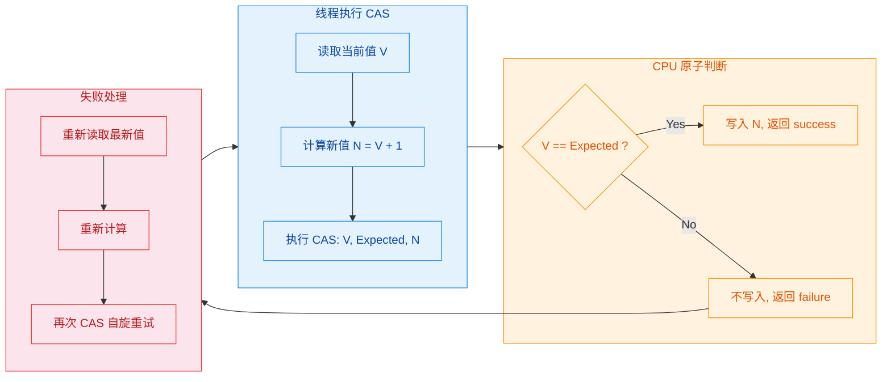

#### Java 中的 CAS：Unsafe 与 Atomic 类

在 Java 中，CAS 操作通过 `sun.misc.Unsafe`（JDK 9+ 为 `jdk.internal.misc.Unsafe`）类暴露给上层。普通开发者不直接使用 `Unsafe`，而是通过 `java.util.concurrent.atomic` 包下的原子类来间接使用 CAS。

```java
import java.util.concurrent.atomic.AtomicInteger;

public class CasCounter {
    // AtomicInteger 内部持有一个 volatile int value
    // 所有操作都通过 CAS 实现，无需加锁
    private final AtomicInteger count = new AtomicInteger(0);

    public void increment() {
        // incrementAndGet() 内部实现等价于：
        // do {
        //     int expected = value;           // 读取当前值
        //     int newValue = expected + 1;    // 计算新值
        // } while (!cas(expected, newValue)); // CAS 失败则自旋重试
        count.incrementAndGet();
    }

    public int getCount() {
        return count.get();  // volatile 读，保证可见性
    }

    // 手动演示 CAS 自旋模式
    public void safeUpdate(int delta) {
        int oldValue;                           // 保存旧值
        int newValue;                           // 保存计算后的新值
        do {
            oldValue = count.get();             // 步骤1：读取当前值
            newValue = oldValue + delta;        // 步骤2：基于当前值计算新值
        } while (!count.compareAndSet(         // 步骤3：CAS 尝试更新
                oldValue,                       //   期望值 = 刚才读到的旧值
                newValue                        //   新值 = 计算结果
        ));                                     // 如果失败（被其他线程抢先修改），循环重试
    }
}
```

`java.util.concurrent.atomic` 包提供了丰富的原子类家族：

| 类别 | 类名 | 说明 |
|------|------|------|
| 基本类型 | `AtomicInteger`, `AtomicLong`, `AtomicBoolean` | 对基本类型的原子操作 |
| 引用类型 | `AtomicReference〈T〉` | 对对象引用的原子操作 |
| 数组 | `AtomicIntegerArray`, `AtomicLongArray` | 对数组元素的原子操作 |
| 字段更新器 | `AtomicIntegerFieldUpdater`, `AtomicReferenceFieldUpdater` | 对已有类的 volatile 字段做原子更新 |
| 带版本号 | `AtomicStampedReference`, `AtomicMarkableReference` | 解决 ABA 问题 |
| 高性能累加器 | `LongAdder`, `LongAccumulator` (JDK 8+) | 高竞争下性能远超 AtomicLong |

#### ABA 问题

CAS 有一个经典陷阱——**ABA 问题**。假设线程 T1 读取变量值为 A，然后被挂起；期间线程 T2 将值从 A 改为 B，又改回 A；T1 恢复后执行 CAS，发现值仍然是 A，CAS 成功——但实际上变量已经被修改过了，中间状态 B 被完全忽略。

对于简单的计数器场景，ABA 通常无害。但在涉及**链表、栈等基于指针/引用的数据结构**时，ABA 可能导致严重错误（例如，一个节点被移除又重新插入，但其 next 指针已经指向了完全不同的节点）。

```java
import java.util.concurrent.atomic.AtomicStampedReference;

public class AbaDemo {
    // AtomicStampedReference 为每个值附加一个 int 类型的版本号(stamp)
    // 初始值为 "A"，初始版本号为 0
    private final AtomicStampedReference<String> ref =
            new AtomicStampedReference<>("A", 0);

    public void safeUpdate() {
        int[] stampHolder = new int[1];                 // 用数组接收当前版本号
        String current = ref.get(stampHolder);          // 同时获取值和版本号
        int currentStamp = stampHolder[0];              // 取出版本号

        // CAS 时同时比较值和版本号，两者都匹配才更新
        boolean success = ref.compareAndSet(
                current,                                // 期望的引用值
                "B",                                    // 新的引用值
                currentStamp,                           // 期望的版本号
                currentStamp + 1                        // 新的版本号（递增）
        );
        // 即使值从 A -> B -> A，版本号也从 0 -> 1 -> 2
        // 所以期望版本号 0 不匹配当前版本号 2，CAS 会失败
    }
}
```

#### 乐观锁的适用场景与局限

非阻塞同步最大的优势是**避免了线程阻塞和上下文切换**，在低到中等竞争的场景下性能优异。但它也有明确的局限：

- **只适合简单的原子操作**：CAS 只能原子地更新一个变量。如果临界区涉及多个变量的联合更新，CAS 就力不从心了（虽然可以把多个变量封装成一个不可变对象，用 `AtomicReference` 来 CAS，但这增加了 GC 压力和编程复杂度）。
- **高竞争下自旋浪费 CPU**：如果大量线程同时 CAS 同一个变量，大部分线程会反复失败重试，白白消耗 CPU 周期。这时候 `LongAdder` 通过分段（Cell 数组）来分散竞争，是更好的选择。
- **ABA 问题**：如前所述，需要额外的版本号机制来规避。

```java
import java.util.concurrent.atomic.LongAdder;

public class HighContentionCounter {
    // LongAdder 内部维护一个 base 值和一个 Cell 数组
    // 低竞争时直接 CAS base；高竞争时，不同线程 CAS 不同的 Cell
    // 最终 sum() 时将 base + 所有 Cell 的值汇总
    private final LongAdder adder = new LongAdder();

    public void increment() {
        adder.increment();  // 内部自动选择 CAS base 还是 CAS 某个 Cell
    }

    public long getCount() {
        return adder.sum(); // 注意：sum() 不是原子快照，适合统计场景
    }
}
```

---

### 无同步方案（栈封闭、ThreadLocal）

前面两种方案——无论悲观还是乐观——都是在"共享可变数据"这个前提下做文章。但如果我们换一个角度思考：**如果数据根本不被共享，那就不存在线程安全问题，也就不需要任何同步措施。** 这就是无同步方案的核心思想——**从设计上消除共享（Eliminate Sharing by Design）**。

这是最优雅、性能最高的线程安全策略，因为它的同步开销为零。

#### 栈封闭（Stack Confinement）

栈封闭是最简单也最常见的无同步手段。原理很直接：**局部变量存储在线程的私有栈帧（Stack Frame）中，天然不会被其他线程访问。** 只要你确保可变数据不逃逸出方法的作用域，它就是线程安全的。

```java
public class StackConfinementDemo {

    // 这个方法是线程安全的，即使被多个线程同时调用
    public int calculateSum(int[] numbers) {
        // sum 是局部变量，存储在当前线程的栈帧中
        // 每个线程调用此方法时，都有自己独立的 sum 副本
        int sum = 0;

        // tempList 也是局部变量，引用和对象都不会逃逸
        // 虽然 ArrayList 本身不是线程安全的，但这里完全没问题
        List<Integer> tempList = new ArrayList<>();

        for (int num : numbers) {       // numbers 是方法参数，也在栈上
            sum += num;                  // 只操作局部变量，无需同步
            tempList.add(num);           // ArrayList 只被当前线程访问
        }

        // 返回基本类型值（值拷贝），不存在共享问题
        return sum;

        // 注意：如果这里返回 tempList 的引用，
        // 并且调用者将其存储到共享字段中，栈封闭就被打破了！
    }
}
```

栈封闭的关键约束是**不要让局部变量的引用逃逸**。以下是一个反面教材：

```java
public class BrokenConfinement {
    private List<Integer> sharedList;    // 共享字段

    public void process(int[] numbers) {
        List<Integer> localList = new ArrayList<>();  // 局部变量
        for (int num : numbers) {
            localList.add(num);
        }
        // 危险！局部变量的引用被赋值给共享字段，栈封闭被打破
        this.sharedList = localList;
        // 此后其他线程可以通过 sharedList 访问这个 ArrayList
        // 而 ArrayList 不是线程安全的 —— 竞态条件出现
    }
}
```

#### ThreadLocal

`ThreadLocal` 提供了一种更系统化的线程封闭机制。它为每个线程维护一份变量的独立副本（Thread-local copy），线程之间互不干扰。

```java
public class ThreadLocalDemo {

    // 每个线程都有自己独立的 SimpleDateFormat 实例
    // SimpleDateFormat 是非线程安全的，但通过 ThreadLocal 隔离后完全安全
    private static final ThreadLocal<SimpleDateFormat> dateFormatter =
            ThreadLocal.withInitial(                    // 工厂方法，延迟初始化
                    () -> new SimpleDateFormat("yyyy-MM-dd HH:mm:ss")
            );

    // 用 ThreadLocal 维护每个线程的用户上下文
    private static final ThreadLocal<UserContext> userContext =
            new ThreadLocal<>();

    public String formatDate(Date date) {
        // get() 返回当前线程的专属副本，无需同步
        return dateFormatter.get().format(date);
    }

    public void setUser(UserContext ctx) {
        userContext.set(ctx);    // 设置当前线程的用户上下文
    }

    public UserContext getUser() {
        return userContext.get(); // 获取当前线程的用户上下文
    }

    // 非常重要：在线程池场景下，必须在任务结束时清理 ThreadLocal
    public void cleanup() {
        dateFormatter.remove();  // 移除当前线程的副本，防止内存泄漏
        userContext.remove();    // 线程池中线程会被复用，不清理会导致数据串线程
    }
}
```

#### ThreadLocal 的内部实现

理解 `ThreadLocal` 的底层结构，对于正确使用它、避免内存泄漏至关重要。

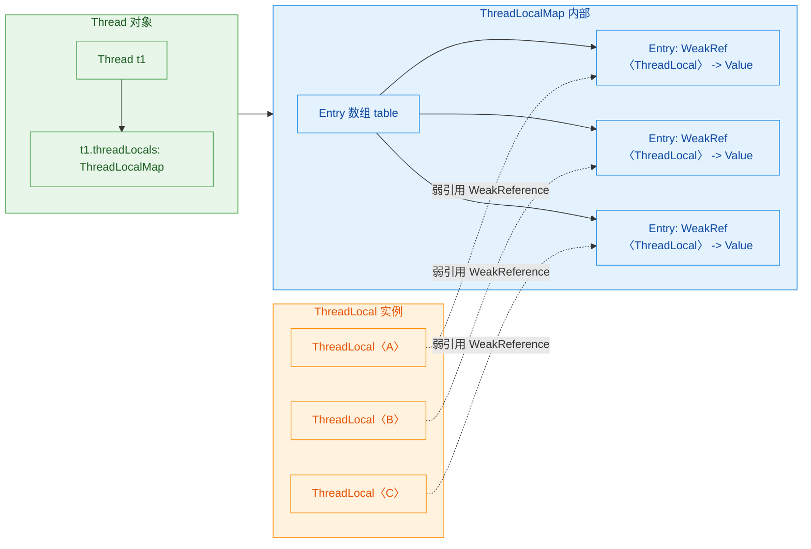

每个 `Thread` 对象内部持有一个 `ThreadLocal.ThreadLocalMap` 实例（字段名为 `threadLocals`）。这个 Map 的 key 是 `ThreadLocal` 对象本身（通过弱引用 `WeakReference` 持有），value 是该线程对应的变量副本。当你调用 `threadLocal.get()` 时，实际流程是：

1. 获取当前线程 `Thread.currentThread()`
2. 从当前线程中取出 `threadLocals` 这个 Map
3. 以当前 `ThreadLocal` 实例为 key，查找对应的 value
4. 如果找到就返回；找不到就调用 `initialValue()` 初始化

#### ThreadLocal 内存泄漏问题

这是面试高频考点，也是实际开发中最容易踩的坑。

`ThreadLocalMap` 的 Entry 继承自 `WeakReference<ThreadLocal<?>>`，也就是说 key（ThreadLocal 对象）是弱引用。当外部不再持有某个 `ThreadLocal` 的强引用时，GC 会回收这个 `ThreadLocal` 对象，导致 Entry 的 key 变为 `null`。但 Entry 的 value 仍然被 Entry 强引用着，而 Entry 又被 `ThreadLocalMap` 强引用，`ThreadLocalMap` 又被 `Thread` 强引用。

```java
// 内存泄漏的引用链：
// Thread -> ThreadLocalMap -> Entry -> Value (强引用，无法回收)
//                              |
//                              +-> Key (WeakReference, 已被 GC 回收, 变为 null)
```

在线程池场景下，线程长期存活不会被销毁，这条引用链就一直存在，value 对象永远无法被回收——这就是内存泄漏。

虽然 `ThreadLocalMap` 在 `get()`、`set()`、`remove()` 操作时会顺带清理 key 为 null 的 Entry（称为 expunge stale entries），但这种被动清理不可靠，不能依赖它。

**最佳实践：永远在 finally 块中调用 `remove()`。**

```java
public class ThreadLocalBestPractice {

    private static final ThreadLocal<Connection> connectionHolder =
            ThreadLocal.withInitial(() -> {
                // 每个线程初始化自己的数据库连接
                return DriverManager.getConnection("jdbc:mysql://localhost/db");
            });

    public void executeQuery(String sql) {
        Connection conn = connectionHolder.get();   // 获取当前线程的连接
        try {
            // 使用连接执行查询...
            PreparedStatement ps = conn.prepareStatement(sql);
            ps.executeQuery();
        } catch (SQLException e) {
            throw new RuntimeException(e);
        } finally {
            // 关键：任务结束后必须清理
            connectionHolder.remove();              // 移除当前线程的副本
        }
    }
}
```

#### InheritableThreadLocal

标准的 `ThreadLocal` 在父线程中设置的值，子线程是看不到的。如果需要父线程的 ThreadLocal 值自动传递给子线程，可以使用 `InheritableThreadLocal`：

```java
public class InheritableDemo {
    // 父线程设置的值会自动拷贝给子线程
    private static final InheritableThreadLocal<String> traceId =
            new InheritableThreadLocal<>();

    public static void main(String[] args) {
        traceId.set("TRACE-001");                   // 父线程设置 traceId

        Thread child = new Thread(() -> {
            // 子线程可以读取到父线程的值（创建子线程时拷贝）
            System.out.println(traceId.get());       // 输出: TRACE-001
        });
        child.start();
    }
}
```

但要注意，`InheritableThreadLocal` 只在**创建子线程时**拷贝一次。在线程池场景下，线程是复用的而非新建的，所以 `InheritableThreadLocal` 在线程池中**不起作用**。阿里开源的 `TransmittableThreadLocal`（TTL）专门解决了这个问题，它通过包装 `Runnable`/`Callable` 在任务提交时捕获并传递上下文。

#### 三种方案的对比与选择

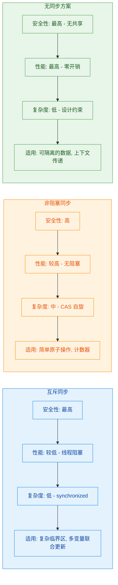

实际开发中的决策路径：

1. **首先考虑能否消除共享**——如果数据可以做到线程封闭（局部变量、ThreadLocal），这是最优解，零同步开销。
2. **如果必须共享，看操作是否简单**——单个变量的原子更新（计数器、标志位、引用替换），优先用 `Atomic` 类。
3. **如果涉及复杂的多步操作**——多个变量需要联合更新、需要条件等待、需要可中断/超时等高级特性，使用互斥同步（`synchronized` 或 `ReentrantLock`）。

这三种方案并非互斥关系，一个设计良好的并发系统往往会混合使用它们。例如 `ConcurrentHashMap` 在 JDK 8 中就同时使用了 CAS（更新计数器、链表头节点）和 `synchronized`（链表/红黑树的结构修改），并通过分段设计减少锁的粒度。

---

**📝 练习题**

以下代码在多线程环境下是否线程安全？如果不安全，最佳修复方案是什么？

```java
public class IdGenerator {
    private static long id = 0;

    public static long nextId() {
        return ++id;
    }
}
```

A. 线程安全，因为 `++id` 是单条语句

B. 不安全，应使用 `synchronized` 修饰 `nextId()` 方法

C. 不安全，应将 `id` 改为 `AtomicLong` 并使用 `incrementAndGet()`

D. 不安全，应使用 `ThreadLocal<Long>` 为每个线程维护独立 ID


**【答案】** C

**【解析】** `++id` 是典型的 read-modify-write 复合操作（读取 → 加一 → 写回），在字节码层面对应多条指令，不是原子的，因此存在竞态条件，A 错误。B 方案（`synchronized`）可以解决问题，但对于这种单变量的简单原子更新场景，使用重量级的互斥同步是"杀鸡用牛刀"。C 方案使用 `AtomicLong.incrementAndGet()` 基于 CAS 实现无锁原子递增，既保证了线程安全，又避免了锁的开销，是最佳选择。D 方案使用 `ThreadLocal` 会导致每个线程有自己独立的 ID 序列，无法生成全局唯一的递增 ID，不符合 `IdGenerator` 的语义需求。

---

**📝 练习题**

关于 `ThreadLocal` 内存泄漏，以下说法正确的是？

A. `ThreadLocalMap` 的 key 是强引用，value 是弱引用，所以 key 会泄漏

B. 只要 `ThreadLocal` 变量声明为 `static final`，就不会发生内存泄漏

C. 在线程池场景下，如果不调用 `remove()`，即使 `ThreadLocal` 对象被 GC 回收，value 仍可能无法回收

D. `InheritableThreadLocal` 可以完美解决线程池中的上下文传递问题


**【答案】** C

**【解析】** A 说反了——`ThreadLocalMap` 的 Entry 的 key 是弱引用（`WeakReference<ThreadLocal<?>>`），value 才是强引用。当 `ThreadLocal` 对象被 GC 回收后，key 变为 null，但 value 仍被 Entry 强引用，而 Entry 被 Map 引用，Map 被 Thread 引用。在线程池中线程长期存活，这条引用链不会断裂，value 就无法被回收，造成内存泄漏，所以 C 正确。B 的说法恰恰相反——声明为 `static final` 意味着 `ThreadLocal` 对象本身永远不会被 GC（因为有 Class 的强引用），key 不会变 null，反而不会触发"key 为 null 但 value 残留"的经典泄漏模式。但真正的风险在于 value 的生命周期与线程绑定，如果线程池中不 `remove()`，旧 value 会一直驻留。D 错误，`InheritableThreadLocal` 只在创建子线程时拷贝父线程的值，线程池中线程是复用的而非新建的，因此无法正确传递上下文。

---

## 本章小结

本章围绕"线程安全"这一并发编程的核心命题，从定义出发，逐步深入到威胁线程安全的根因、需要保护的代码区域，以及三大主流解决方案。下面我们用一张全景图将所有知识点串联起来，帮助你建立完整的心智模型。

### 知识全景回顾

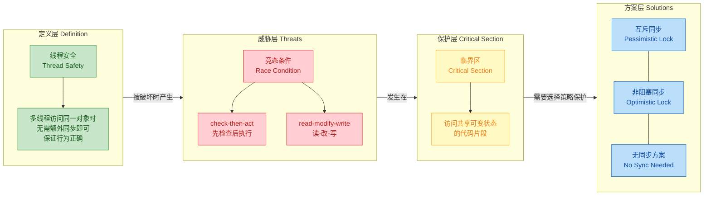

### 核心要点提炼

整章的逻辑链条可以用一句话概括：**共享可变状态（Shared Mutable State）是万恶之源**。

当多个线程同时读写同一份可变数据，且操作不是原子性的，就会产生竞态条件（Race Condition）。竞态条件发生的那段代码，就是临界区（Critical Section）。而我们所有的"线程安全实现方式"，本质上都是在回答同一个问题：**如何让临界区内的操作对外表现为原子的、可见的、有序的？**

三大方案各有取舍，我们用一张对比表做最终收束：

| 维度 | 互斥同步 (Pessimistic) | 非阻塞同步 (Optimistic) | 无同步方案 |
|---|---|---|---|
| 核心思想 | 先加锁，独占访问 | 先操作，冲突再重试 | 从根源消除共享 |
| 典型实现 | `synchronized` / `ReentrantLock` | `CAS` / `Atomic*` 类 | 栈封闭 / `ThreadLocal` |
| 是否阻塞 | 是，获取不到锁的线程会挂起 | 否，自旋重试不挂起 | 不涉及 |
| 适用场景 | 写多读少、临界区较大 | 写少读多、临界区极小 | 天然可隔离的数据 |
| 性能代价 | 上下文切换 (Context Switch) | CPU 空转 (Spin) | 内存开销 (每线程一份副本) |
| 正确性保证 | 强，但要防死锁 | 强，但要防 ABA 问题 | 强，但要防内存泄漏 |

一个实用的决策思路是：

1. **能不共享就不共享** — 优先考虑栈封闭或 `ThreadLocal`，从设计上规避问题。
2. **必须共享时，先看竞争程度** — 低竞争场景用 CAS/Atomic 类，高竞争场景用锁。
3. **用锁时，先 `synchronized` 后 `ReentrantLock`** — 除非你需要可中断、超时、公平性等高级特性，否则 `synchronized` 在现代 JVM 上已经足够高效（锁升级机制：偏向锁 → 轻量级锁 → 重量级锁）。

### 从本章到后续章节的桥梁

本章建立的是"**What & Why**"层面的认知 — 什么是线程安全，为什么会出问题，有哪些解决方向。但每个方案的内部机制还有大量细节值得深挖：

- `synchronized` 的锁升级过程、Monitor 的底层结构 → 对应 **JVM 锁机制** 章节
- CAS 的硬件指令 `CMPXCHG`、`Unsafe` 类、ABA 问题的 `AtomicStampedReference` 解法 → 对应 **原子类与 CAS** 章节
- `ThreadLocal` 的 `ThreadLocalMap` 实现、弱引用与内存泄漏 → 对应 **ThreadLocal 深入** 章节
- 多个锁之间的协调、死锁检测与避免 → 对应 **死锁与活跃性** 章节

本章是整个并发知识体系的地基。理解了"竞态条件 → 临界区 → 同步策略"这条主线，后续所有高级主题都是在这个框架上的延伸和深化。

---

**📝 练习题**

以下代码在多线程环境下存在线程安全问题，请判断它属于哪种竞态条件模式，并选出最合适的修复方案：

```java
public class ConnectionPool {
    private static ConnectionPool instance; // 共享可变状态

    public static ConnectionPool getInstance() {
        if (instance == null) {           // 步骤1: check
            instance = new ConnectionPool(); // 步骤2: act
        }
        return instance;
    }
}
```

A. 属于 read-modify-write 模式，应使用 `AtomicReference.compareAndSet()` 修复


B. 属于 check-then-act 模式，应使用 `synchronized` 或双重检查锁定（DCL + `volatile`）修复


C. 属于 check-then-act 模式，应使用 `ThreadLocal` 为每个线程创建独立实例修复


D. 不存在线程安全问题，因为 `new` 操作本身是原子的


**【答案】** B

**【解析】** 这是一个经典的 check-then-act 竞态条件。线程 T1 执行完 `if (instance == null)` 判断为 `true`，但还没来得及执行 `new`，此时线程 T2 也进入 `if` 判断，同样看到 `null`，于是两个线程各自创建了一个实例，破坏了单例语义。

选项 A 错误：这里不存在"读取旧值 → 计算新值 → 写回"的 read-modify-write 模式，而是"先检查条件 → 再基于条件执行动作"的 check-then-act 模式。选项 C 错误：`ThreadLocal` 会让每个线程持有自己的实例，这与单例模式的设计意图完全矛盾。选项 D 错误：虽然 `new` 本身的内存分配是线程安全的，但"判断 + 赋值"这个复合操作不是原子的，两个线程可以同时通过 `null` 检查。

标准修复方式是双重检查锁定（Double-Checked Locking）：

```java
public class ConnectionPool {
    // volatile 防止指令重排序，确保 instance 引用指向的对象已完成初始化
    private static volatile ConnectionPool instance;

    public static ConnectionPool getInstance() {
        if (instance == null) {                    // 第一次检查：无锁快速路径
            synchronized (ConnectionPool.class) {  // 加锁进入临界区
                if (instance == null) {            // 第二次检查：防止重复创建
                    instance = new ConnectionPool();
                }
            }
        }
        return instance;
    }
}
```

这里 `volatile` 不可省略。`instance = new ConnectionPool()` 在字节码层面分为三步：分配内存 → 调用构造器 → 将引用赋给 `instance`。没有 `volatile` 时，JVM 可能将第二步和第三步重排序，导致其他线程拿到一个尚未初始化完成的对象引用（这就是著名的 "partially constructed object" 问题）。

---

