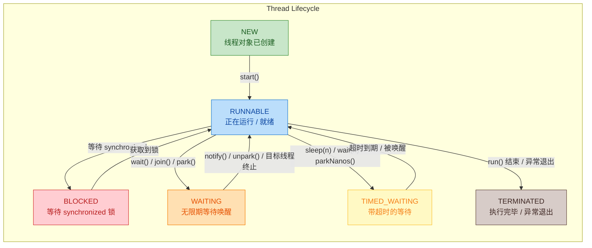
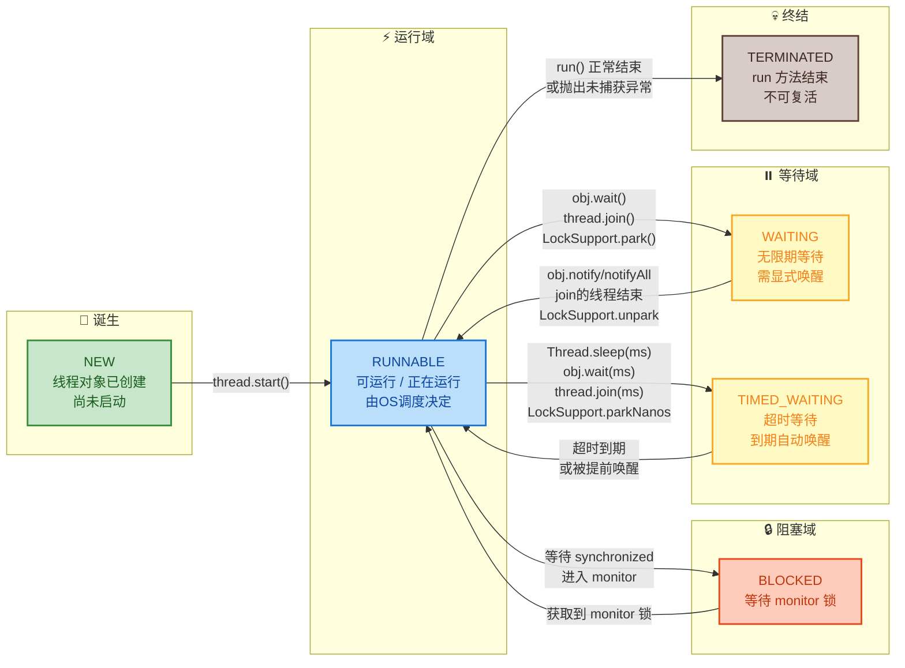
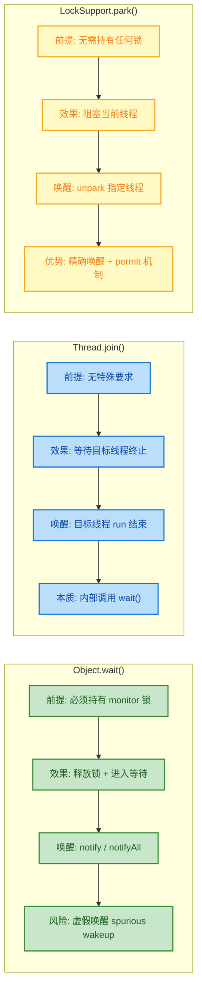
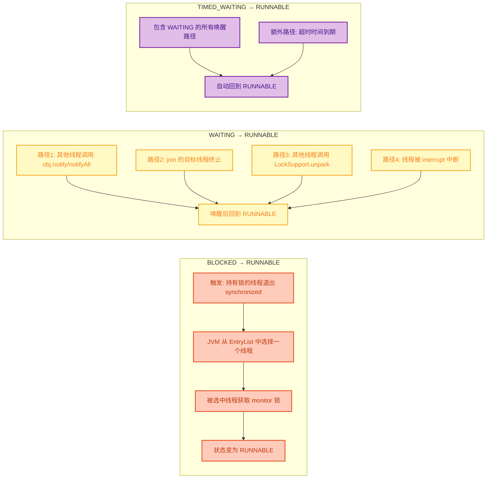
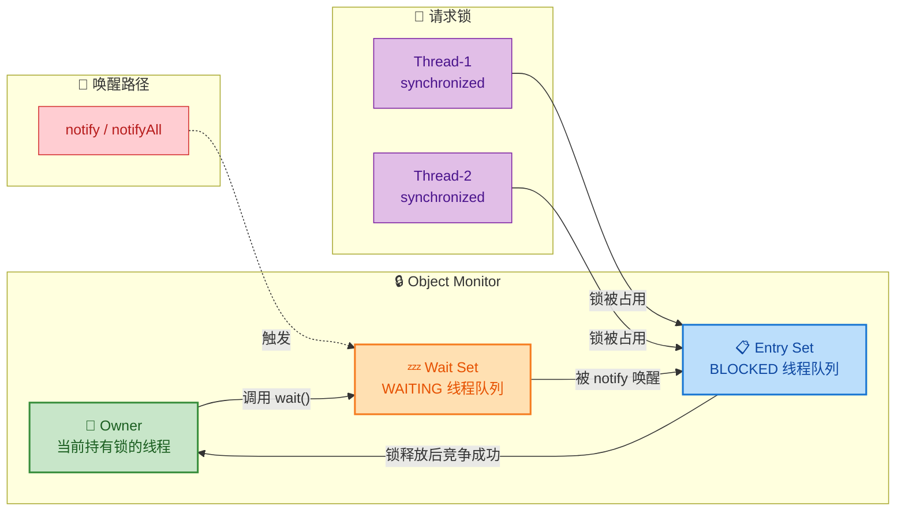
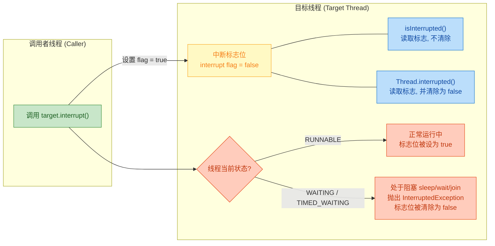
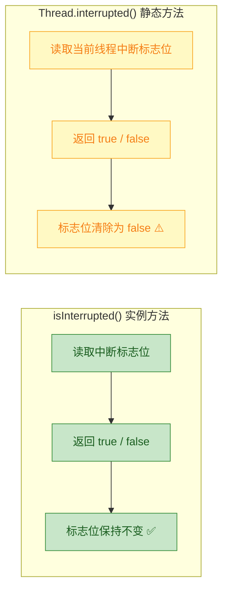
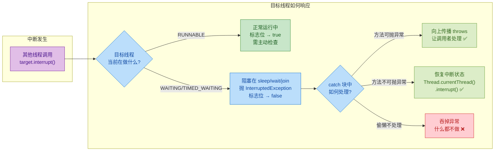
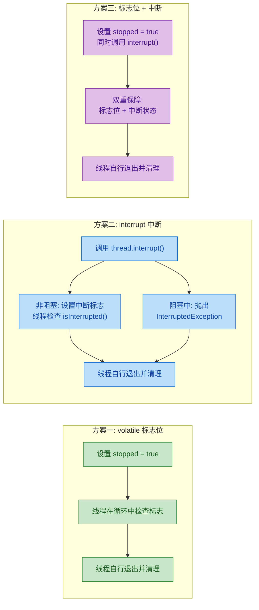

---

# 线程生命周期与状态 ⭐⭐

---

## 六种状态 ⭐⭐

Java 线程的生命周期由 `java.lang.Thread.State` 枚举精确定义,共包含六种状态。这不是一个"概念模型",而是 JVM 实际暴露给开发者的运行时状态,可以通过 `thread.getState()` 随时获取。理解这六种状态是掌握并发编程的基石——只有清楚线程"在哪里",才能判断它"为什么卡住"以及"怎么让它动起来"。

先看一下枚举的源码定义:

```java
// java.lang.Thread.State 枚举源码（JDK 17+）
public enum State {
    NEW,            // 新建：线程对象已创建，但尚未调用 start()
    RUNNABLE,       // 可运行：已调用 start()，正在 JVM 中执行或等待操作系统调度
    BLOCKED,        // 阻塞：等待获取一个 monitor lock（即 synchronized 锁）
    WAITING,        // 无限等待：调用了 wait()/join()/park()，需要其他线程显式唤醒
    TIMED_WAITING,  // 超时等待：调用了 sleep(n)/wait(n)/parkNanos() 等带超时的方法
    TERMINATED      // 终止：run() 方法执行完毕，或因异常退出
}
```

一共六种,不多不少。注意这是 Java 层面的线程状态模型,和操作系统的线程状态（Ready / Running / Sleeping 等）并不是一一对应的关系。Java 有意做了简化——比如把 OS 层面的 "Ready"（就绪等待 CPU 调度）和 "Running"（正在 CPU 上执行）合并成了一个 `RUNNABLE`,因为从 Java 程序的视角来看,这两者的区别对应用层代码没有实际意义。

下面逐一深入每种状态。

---

### NEW（新建）

`NEW` 是线程生命周期的起点。当你用 `new Thread()` 创建了一个线程对象,但还没有调用它的 `start()` 方法时,线程就处于 `NEW` 状态。

```java
// 创建线程对象，此时线程处于 NEW 状态
Thread t = new Thread(() -> {
    System.out.println("Hello from thread"); // 线程体：要执行的任务
});

// 验证状态确实是 NEW
System.out.println(t.getState()); // 输出: NEW
```

这个阶段的线程本质上只是一个普通的 Java 对象,JVM 还没有为它分配任何操作系统资源（如内核线程、线程栈空间等）。它和你 `new` 一个 `ArrayList` 没有本质区别——只是堆上的一个对象实例。

几个关键点:

- `NEW` 状态的线程不会被线程调度器（Thread Scheduler）感知,因为它根本还没有进入调度队列。
- 一个线程只能被 `start()` 一次。如果对一个已经启动过的线程再次调用 `start()`，会抛出 `IllegalThreadStateException`。这意味着线程的生命周期是单向的、不可逆的——从 `NEW` 出发,最终走向 `TERMINATED`,中间不会回到 `NEW`。

```java
Thread t = new Thread(() -> System.out.println("run"));
t.start();  // 第一次调用：正常启动，状态从 NEW → RUNNABLE
t.start();  // 第二次调用：抛出 IllegalThreadStateException！
```

- 在实际开发中,你很少会长时间持有一个 `NEW` 状态的线程。通常创建后就会立即 `start()`。但在某些框架的延迟初始化（lazy initialization）场景中,可能会先创建线程对象,等满足条件后再启动。

---

### RUNNABLE（可运行）

调用 `start()` 之后,线程进入 `RUNNABLE` 状态。这是线程"活跃"的核心状态,也是最容易被误解的一个状态。

```java
Thread t = new Thread(() -> {
    // 线程体开始执行，此时线程处于 RUNNABLE 状态
    for (int i = 0; i < 1_000_000; i++) {
        // 执行计算任务
        Math.random(); // CPU 密集型操作，线程持续处于 RUNNABLE
    }
});
t.start(); // 调用 start() 后，状态从 NEW → RUNNABLE

// 注意：这里主线程和 t 线程并发执行
// 由于线程调度的不确定性，getState() 的结果取决于调用时机
Thread.sleep(1); // 稍等片刻让 t 线程有机会运行
System.out.println(t.getState()); // 大概率输出: RUNNABLE
```

为什么叫 "RUNNABLE" 而不是 "RUNNING"？这是 Java 设计中一个非常精妙的选择。在操作系统层面,一个线程可能处于两种子状态:

```text
┌─────────────────────────────────────────────────┐
│              Java: RUNNABLE                      │
│                                                  │
│   ┌──────────────┐      ┌───────────────────┐   │
│   │  OS: Ready   │ ←──→ │   OS: Running     │   │
│   │ (在就绪队列中 │      │ (正在 CPU 上执行)  │   │
│   │  等待 CPU)   │      │                   │   │
│   └──────────────┘      └───────────────────┘   │
│         ↑    时间片用完 / 被抢占    ↑             │
│         └───────────────────────────┘             │
└─────────────────────────────────────────────────┘
```

Java 把 OS 的 Ready 和 Running 合并为一个 `RUNNABLE`,原因很务实:在现代多核 CPU 和抢占式调度下,一个线程在 Ready 和 Running 之间的切换极其频繁（微秒级别）,Java 应用层根本无法也无需区分。你调用 `getState()` 拿到的那一瞬间,线程可能已经切换了好几次了。

还有一个容易忽略的细节:`RUNNABLE` 状态的线程也可能正在执行阻塞式 I/O 操作（比如 `Socket.read()`、`FileInputStream.read()`）。从操作系统的角度看,线程确实被阻塞了（blocked on I/O）,但 Java 的线程状态模型仍然将其标记为 `RUNNABLE`。这是因为 Java 的状态模型关注的是 JVM 层面的同步状态,而非 OS 层面的调度状态。

```java
Thread t = new Thread(() -> {
    try {
        // 这个 read() 会阻塞在操作系统层面，等待网络数据到达
        // 但 Java 线程状态仍然是 RUNNABLE，不是 BLOCKED！
        Socket socket = new Socket("example.com", 80);
        socket.getInputStream().read(); // OS 层面阻塞，Java 层面仍是 RUNNABLE
    } catch (Exception e) {
        e.printStackTrace();
    }
});
t.start();
Thread.sleep(100); // 等待线程进入 I/O 阻塞
System.out.println(t.getState()); // 输出: RUNNABLE（不是 BLOCKED！）
```

这一点在排查线程问题时非常重要。当你用 `jstack` 导出线程 dump,看到一个线程状态是 `RUNNABLE` 但 CPU 使用率为零时,它很可能正卡在 I/O 操作上。

---

### BLOCKED（阻塞、等待锁）

`BLOCKED` 状态非常具体:它只发生在一个线程试图进入 `synchronized` 代码块或方法,但锁（monitor lock）已经被其他线程持有的时候。

```java
// 共享的锁对象
Object lock = new Object();

// 线程 A：先获取锁，然后长时间持有
Thread threadA = new Thread(() -> {
    synchronized (lock) {                    // 线程 A 成功获取 lock 的 monitor
        try {
            Thread.sleep(10_000);            // 持有锁 10 秒，模拟长时间操作
        } catch (InterruptedException e) {
            Thread.currentThread().interrupt();
        }
    }
}, "Thread-A");

// 线程 B：尝试获取同一把锁，但会被阻塞
Thread threadB = new Thread(() -> {
    synchronized (lock) {                    // 线程 B 尝试获取 lock，但 A 正持有
        System.out.println("Thread B got the lock!"); // 要等 A 释放后才能执行到这里
    }
}, "Thread-B");

threadA.start();          // 启动线程 A
Thread.sleep(100);        // 确保 A 先拿到锁
threadB.start();          // 启动线程 B
Thread.sleep(100);        // 等 B 进入阻塞状态

System.out.println("Thread-B state: " + threadB.getState()); // 输出: BLOCKED
```

`BLOCKED` 状态有几个非常重要的特征:

第一,它只与 `synchronized` 关键字相关。如果你使用的是 `java.util.concurrent.locks.ReentrantLock`,线程在等待获取锁时,状态是 `WAITING` 或 `TIMED_WAITING`（因为 `ReentrantLock` 底层使用的是 `LockSupport.park()`）,而不是 `BLOCKED`。这是一个高频面试考点。

```java
ReentrantLock reentrantLock = new ReentrantLock();

Thread threadC = new Thread(() -> {
    reentrantLock.lock();                    // 获取 ReentrantLock
    try {
        Thread.sleep(10_000);                // 持有锁 10 秒
    } catch (InterruptedException e) {
        Thread.currentThread().interrupt();
    } finally {
        reentrantLock.unlock();              // 释放锁
    }
});

Thread threadD = new Thread(() -> {
    reentrantLock.lock();                    // 等待获取 ReentrantLock
    try {
        System.out.println("Thread D got the lock!");
    } finally {
        reentrantLock.unlock();
    }
});

threadC.start();
Thread.sleep(100);
threadD.start();
Thread.sleep(100);

// 注意！这里不是 BLOCKED，而是 WAITING
System.out.println("Thread-D state: " + threadD.getState()); // 输出: WAITING
```

第二,`BLOCKED` 状态的线程不会响应中断（interrupt）。准确地说,中断标志会被设置,但线程不会抛出 `InterruptedException`,也不会从 `BLOCKED` 状态中退出——它会一直等到锁被释放。这和 `WAITING` 状态的行为有本质区别。

第三,`BLOCKED` 状态还会出现在另一个场景:当线程从 `WAITING` 状态被 `notify()/notifyAll()` 唤醒后,它需要重新竞争 monitor lock。如果此时锁被其他线程持有,它会先进入 `BLOCKED` 状态,等拿到锁后才回到 `RUNNABLE`。

---

### WAITING（无限等待）

`WAITING` 表示线程主动放弃了 CPU 执行权,进入无限期等待,直到被其他线程显式唤醒。进入 `WAITING` 状态有且仅有以下三种方式:

| 触发方法 | 唤醒方式 | 说明 |
|---|---|---|
| `Object.wait()` | `notify()` / `notifyAll()` | 必须在 synchronized 块内调用 |
| `Thread.join()` | 目标线程执行完毕 | 等待另一个线程终止 |
| `LockSupport.park()` | `LockSupport.unpark(thread)` | 底层原语,AQS 框架大量使用 |

```java
Object monitor = new Object();

// 演示 Object.wait() 导致的 WAITING 状态
Thread waiter = new Thread(() -> {
    synchronized (monitor) {           // 必须先持有 monitor 锁才能调用 wait()
        try {
            monitor.wait();            // 释放锁，进入 WAITING 状态，无限期等待
            // 被 notify() 唤醒后，会从这里继续执行
            System.out.println("Waiter has been notified!");
        } catch (InterruptedException e) {
            // wait() 能响应中断，抛出 InterruptedException
            Thread.currentThread().interrupt();
        }
    }
}, "Waiter-Thread");

waiter.start();
Thread.sleep(100);                     // 确保 waiter 线程已经进入 wait()

System.out.println(waiter.getState()); // 输出: WAITING

// 唤醒 waiter 线程
synchronized (monitor) {               // 必须持有同一把锁才能调用 notify()
    monitor.notify();                  // 唤醒在 monitor 上等待的一个线程
}
```

`wait()` 的一个关键行为是:调用时会原子性地释放持有的 monitor lock,并将线程挂起。被唤醒后,线程会重新尝试获取 monitor lock,获取成功后才从 `wait()` 方法返回。如果此时锁被别人持有,线程会短暂进入 `BLOCKED` 状态。

再看 `Thread.join()` 的例子:

```java
Thread worker = new Thread(() -> {
    try {
        Thread.sleep(5_000);           // 模拟耗时任务，工作 5 秒
    } catch (InterruptedException e) {
        Thread.currentThread().interrupt();
    }
}, "Worker-Thread");

Thread boss = new Thread(() -> {
    try {
        worker.join();                 // boss 线程等待 worker 线程执行完毕
        // worker 终止后，boss 从 join() 返回，继续执行
        System.out.println("Worker finished, boss continues.");
    } catch (InterruptedException e) {
        Thread.currentThread().interrupt();
    }
}, "Boss-Thread");

worker.start();                        // 启动 worker
boss.start();                          // 启动 boss
Thread.sleep(100);                     // 等待 boss 进入 join()

System.out.println(boss.getState());   // 输出: WAITING（boss 在等 worker 结束）
```

`join()` 的底层实现其实就是 `wait()`。如果你去看 `Thread.join()` 的源码,会发现它本质上是在目标线程对象上调用 `wait()`,当目标线程终止时,JVM 会自动调用 `notifyAll()` 来唤醒所有在该线程对象上等待的线程。

`WAITING` 状态与 `BLOCKED` 状态最本质的区别在于:

- `BLOCKED` 是被动的——线程想要获取锁但拿不到,被迫等待。
- `WAITING` 是主动的——线程自愿放弃执行权,等待某个条件满足后被唤醒。

而且 `WAITING` 状态的线程能够响应中断,收到中断信号后会抛出 `InterruptedException` 并退出等待。

---

### TIMED_WAITING（超时等待）

`TIMED_WAITING` 和 `WAITING` 非常相似,唯一的区别是:它有一个明确的超时时间。即使没有被其他线程显式唤醒,超时到期后线程也会自动恢复。

触发 `TIMED_WAITING` 的方法:

| 触发方法 | 说明 |
|---|---|
| `Thread.sleep(millis)` | 让当前线程休眠指定毫秒数 |
| `Object.wait(timeout)` | 带超时的 wait,超时后自动唤醒 |
| `Thread.join(millis)` | 带超时的 join,最多等待指定时间 |
| `LockSupport.parkNanos(nanos)` | 带超时的 park |
| `LockSupport.parkUntil(deadline)` | 等待到指定的绝对时间点 |

```java
// 演示 Thread.sleep() 导致的 TIMED_WAITING 状态
Thread sleeper = new Thread(() -> {
    try {
        Thread.sleep(10_000);          // 休眠 10 秒，进入 TIMED_WAITING
    } catch (InterruptedException e) {
        System.out.println("Sleep was interrupted!");
        Thread.currentThread().interrupt();
    }
}, "Sleeper-Thread");

sleeper.start();
Thread.sleep(100);                     // 确保 sleeper 已经进入 sleep

System.out.println(sleeper.getState()); // 输出: TIMED_WAITING
```

`sleep()` 和 `wait(timeout)` 之间有一个非常重要的区别:

```java
// sleep() vs wait(timeout) 的核心区别

// sleep()：不释放锁！
synchronized (lock) {
    Thread.sleep(1000);                // 休眠 1 秒，但仍然持有 lock 的 monitor
    // 其他线程在这 1 秒内无法获取 lock
}

// wait(timeout)：释放锁！
synchronized (lock) {
    lock.wait(1000);                   // 等待 1 秒，同时释放 lock 的 monitor
    // 其他线程在这 1 秒内可以获取 lock
}
```

这个区别在实际开发中至关重要。如果你在 `synchronized` 块内使用 `sleep()` 来"等待某个条件",你实际上是在持有锁的情况下空转,其他线程根本无法进入临界区来改变条件——这是一个经典的错误模式。正确的做法是使用 `wait(timeout)`。

`TIMED_WAITING` 同样能响应中断。调用 `interrupt()` 后,处于 `TIMED_WAITING` 的线程会提前被唤醒,并抛出 `InterruptedException`。

---

### TERMINATED（终止）

`TERMINATED` 是线程生命周期的终点。线程的 `run()` 方法正常执行完毕,或者因为未捕获的异常而退出,都会进入 `TERMINATED` 状态。

```java
// 正常终止
Thread normalEnd = new Thread(() -> {
    System.out.println("Task done.");  // run() 方法执行完毕，线程自然终止
}, "Normal-End");

// 异常终止
Thread abnormalEnd = new Thread(() -> {
    throw new RuntimeException("Oops!"); // 未捕获异常导致线程终止
}, "Abnormal-End");

normalEnd.start();
abnormalEnd.start();
Thread.sleep(100);                     // 等待两个线程都执行完

System.out.println(normalEnd.getState());   // 输出: TERMINATED
System.out.println(abnormalEnd.getState()); // 输出: TERMINATED
```

`TERMINATED` 状态的线程有以下特征:

- 线程对象仍然存在于堆内存中（只要有引用指向它就不会被 GC）,你仍然可以调用 `getState()`、`getName()` 等方法。
- 但你不能对它调用 `start()` 重新启动——线程的生命周期是一次性的,从 `NEW` 到 `TERMINATED` 是单程票。
- 线程持有的所有 monitor lock 会在终止时自动释放。
- 如果有其他线程在调用 `join()` 等待这个线程,它们会被唤醒。

一个容易踩的坑:线程因异常终止时,如果你没有设置 `UncaughtExceptionHandler`,异常信息可能会被默默吞掉（尤其是在线程池场景中）。

```java
// 设置未捕获异常处理器，避免异常被静默吞掉
Thread t = new Thread(() -> {
    throw new RuntimeException("Something went wrong!");
});

// 为线程设置异常处理器
t.setUncaughtExceptionHandler((thread, throwable) -> {
    // 当线程因未捕获异常终止时，这个回调会被触发
    System.err.println("Thread " + thread.getName() + " died: " + throwable.getMessage());
});

t.start();
```

---

最后,用一张 Mermaid 图把六种状态的全貌和它们之间的关系串起来:



---

**📝 练习题**

以下代码中,线程 `t2` 在 `Thread.sleep(200)` 执行时的状态是什么？

```java
ReentrantLock lock = new ReentrantLock();

Thread t1 = new Thread(() -> {
    lock.lock();
    try { Thread.sleep(10_000); }
    catch (InterruptedException e) { }
    finally { lock.unlock(); }
});

Thread t2 = new Thread(() -> {
    lock.lock();
    try { System.out.println("t2 acquired lock"); }
    finally { lock.unlock(); }
});

t1.start();
Thread.sleep(100);
t2.start();
Thread.sleep(200);
System.out.println(t2.getState());
```

A. BLOCKED

B. WAITING

C. TIMED_WAITING

D. RUNNABLE


**【答案】** B

**【解析】** 这道题考查的是 `synchronized` 锁与 `ReentrantLock` 在线程状态表现上的区别。`t1` 先获取了 `ReentrantLock` 并持有 10 秒,`t2` 随后调用 `lock.lock()` 尝试获取同一把锁。很多人会直觉选 A（BLOCKED）,但 `BLOCKED` 状态只与 `synchronized` 关键字相关。`ReentrantLock` 的底层实现基于 AQS（AbstractQueuedSynchronizer）,而 AQS 在线程获取不到锁时调用的是 `LockSupport.park()`,这会使线程进入 `WAITING` 状态,而非 `BLOCKED`。这是 Java 并发中一个非常经典的区分点:只有竞争 monitor lock（`synchronized`）才会产生 `BLOCKED`,竞争 `j.u.c` 包中的锁产生的是 `WAITING`。

---

## 状态转换图

Java 线程的六种状态并非孤立存在，它们之间通过特定的 API 调用和 JVM 内部事件形成了一张精密的有向图。理解这张图，是掌握并发编程的"内功心法"——当你能在脑中清晰地追踪一个线程在任意时刻处于哪个节点、因何种事件跳转到下一个节点时，绝大多数并发 Bug 的排查都会变得直觉化。

我们先给出完整的状态转换全景图，然后逐条边（transition）深入剖析。



### NEW → RUNNABLE：start() 是唯一的入口

当你通过 `new Thread()` 或 `new Thread(Runnable)` 创建了一个线程对象后，它处于 NEW 状态。此时它只是一个普通的 Java 对象，JVM 尚未为其分配操作系统级别的线程资源（no native thread has been created yet）。

```java
// 创建线程对象 —— 此时状态为 NEW
Thread t = new Thread(() -> {
    System.out.println("Hello from thread");
});

// 验证状态确实是 NEW
System.out.println(t.getState()); // 输出: NEW

// 调用 start() —— 状态跃迁为 RUNNABLE
// JVM 在底层调用 os::create_thread() 分配原生线程
// 然后调用 os::start_thread() 让其进入操作系统的就绪队列
t.start();

// 注意: 再次调用 start() 会抛出 IllegalThreadStateException
// 因为一个线程的 start() 只能被调用一次
// t.start(); // ❌ 抛异常
```

这里有一个非常重要的认知点：`start()` 和 `run()` 的区别。直接调用 `t.run()` 不会触发状态转换，它只是在当前线程中同步执行了 `run()` 方法体，线程对象 `t` 仍然停留在 NEW 状态。只有 `start()` 才会真正请求 JVM 创建原生线程并触发 NEW → RUNNABLE 的跃迁。

从 JVM 源码层面看，`Thread.start()` 最终会调用到 HotSpot 的 `JavaThread::JavaThread()` 构造函数，其中会调用 `os::create_thread()` 在操作系统层面创建线程，然后通过 `Thread::start()` 将其加入调度队列。这个过程是不可逆的——一旦线程离开 NEW 状态，就永远无法回到 NEW。

### RUNNABLE → BLOCKED：synchronized 的独占等待

RUNNABLE 到 BLOCKED 的转换只有一种触发条件：线程试图进入一个 `synchronized` 块或 `synchronized` 方法，但该 monitor 锁已经被其他线程持有。

```java
public class BlockedDemo {
    // 共享的锁对象
    private static final Object lock = new Object();

    public static void main(String[] args) throws InterruptedException {
        // 线程A: 先获取锁, 然后长时间持有
        Thread threadA = new Thread(() -> {
            synchronized (lock) {                    // threadA 成功获取 monitor 锁
                try {
                    Thread.sleep(10_000);            // 持有锁 10 秒, 模拟长时间操作
                } catch (InterruptedException e) {
                    Thread.currentThread().interrupt();
                }
            }
        }, "Thread-A");

        // 线程B: 稍后尝试获取同一把锁
        Thread threadB = new Thread(() -> {
            synchronized (lock) {                    // threadB 尝试获取锁 → 进入 BLOCKED
                System.out.println("Thread-B got the lock!");
            }
        }, "Thread-B");

        threadA.start();                             // 启动 A, 它会立即获取锁
        Thread.sleep(100);                           // 确保 A 已经持有锁
        threadB.start();                             // 启动 B
        Thread.sleep(100);                           // 给 B 一点时间去竞争锁

        // 此时 threadB 应该处于 BLOCKED 状态
        System.out.println("Thread-B state: " + threadB.getState()); // 输出: BLOCKED
    }
}
```

需要特别强调的是：BLOCKED 状态只与 `synchronized` 关联。如果你使用的是 `java.util.concurrent.locks.ReentrantLock`，线程在等待锁时的状态是 WAITING 或 TIMED_WAITING（因为 `ReentrantLock` 底层使用 `LockSupport.park()`），而不是 BLOCKED。这是一个高频面试考点。

```text
┌─────────────────────────────────────────────────────┐
│              Monitor 锁竞争模型                       │
│                                                     │
│   Thread-A ──► synchronized(lock) ──► 成功进入       │
│                     │                               │
│                     ▼                               │
│              ┌─────────────┐                        │
│              │  Monitor 锁  │ ◄── 被 Thread-A 持有   │
│              └─────────────┘                        │
│                     ▲                               │
│                     │                               │
│   Thread-B ──► synchronized(lock) ──► BLOCKED!      │
│                                                     │
│   Thread-C ──► reentrantLock.lock() ──► WAITING!    │
│                (底层调用 LockSupport.park)            │
└─────────────────────────────────────────────────────┘
```

在 JVM 内部，每个 Java 对象都关联一个 ObjectMonitor 结构。当线程竞争失败时，它会被放入 ObjectMonitor 的 `_EntryList`（或 `_cxq` 竞争队列），线程状态被设置为 BLOCKED。当持有锁的线程退出 synchronized 块时，JVM 会从 `_EntryList` 中选择一个线程唤醒，被唤醒的线程重新竞争锁，成功后状态回到 RUNNABLE。

### RUNNABLE → WAITING：主动放弃 CPU，无限期等待

线程从 RUNNABLE 进入 WAITING 状态，意味着它主动声明："我现在不需要 CPU 了，请在满足某个条件时再唤醒我。" 触发这一转换的 API 有三个：

```java
public class WaitingDemo {

    private static final Object monitor = new Object();

    public static void main(String[] args) throws InterruptedException {

        // ========== 方式一: Object.wait() ==========
        // 必须在 synchronized 块内调用, 否则抛 IllegalMonitorStateException
        Thread t1 = new Thread(() -> {
            synchronized (monitor) {                 // 先获取 monitor 锁
                try {
                    System.out.println("t1: 即将进入 WAITING...");
                    monitor.wait();                  // 释放锁 + 进入 WAITING
                    // 被 notify/notifyAll 唤醒后, 会重新竞争锁
                    // 竞争成功后才从 wait() 返回
                    System.out.println("t1: 被唤醒了!");
                } catch (InterruptedException e) {
                    Thread.currentThread().interrupt();
                }
            }
        }, "wait-thread");

        // ========== 方式二: Thread.join() ==========
        // 当前线程等待目标线程执行完毕
        Thread worker = new Thread(() -> {
            try {
                Thread.sleep(2000);                  // 模拟耗时任务
            } catch (InterruptedException e) {
                Thread.currentThread().interrupt();
            }
        }, "worker-thread");

        Thread t2 = new Thread(() -> {
            try {
                System.out.println("t2: 等待 worker 完成...");
                worker.join();                       // t2 进入 WAITING, 直到 worker 终止
                // join() 底层实际上调用的是 worker.wait()
                System.out.println("t2: worker 已完成!");
            } catch (InterruptedException e) {
                Thread.currentThread().interrupt();
            }
        }, "join-thread");

        // ========== 方式三: LockSupport.park() ==========
        // 不需要持有任何锁, 更底层更灵活
        Thread t3 = new Thread(() -> {
            System.out.println("t3: 即将 park...");
            LockSupport.park();                      // 进入 WAITING
            // 被 unpark(t3) 唤醒, 或被中断唤醒
            System.out.println("t3: 被 unpark 了!");
        }, "park-thread");

        // 启动演示
        t1.start();
        worker.start();
        t2.start();
        t3.start();

        Thread.sleep(500);                           // 等待所有线程进入各自的等待状态

        // 打印状态
        System.out.println("t1 state: " + t1.getState());  // WAITING
        System.out.println("t2 state: " + t2.getState());  // WAITING
        System.out.println("t3 state: " + t3.getState());  // WAITING

        // 唤醒 t1
        synchronized (monitor) {
            monitor.notify();                        // 唤醒在 monitor 上等待的一个线程
        }

        // 唤醒 t3
        LockSupport.unpark(t3);                      // 精确唤醒指定线程, 比 notify 更精准
    }
}
```

三种方式的对比值得仔细品味：



关于 `LockSupport.park()` 有一个精妙的设计值得展开：它基于 "permit"（许可证）机制。每个线程关联一个 permit，初始值为 0。`unpark(thread)` 将 permit 设为 1（如果已经是 1 则不变，permit 不会累加），`park()` 消费 permit（将其从 1 变为 0 并立即返回，如果 permit 为 0 则阻塞）。这意味着 `unpark()` 可以在 `park()` 之前调用，不会丢失唤醒信号——这解决了经典的 "lost wakeup" 问题，是比 `wait/notify` 更安全的原语。

### RUNNABLE → TIMED_WAITING：带超时的等待

TIMED_WAITING 与 WAITING 的核心区别在于：线程设置了一个"闹钟"，即使没有外部唤醒，超时到期后也会自动回到 RUNNABLE。触发 API 包括：

```java
public class TimedWaitingDemo {

    private static final Object lock = new Object();

    public static void main(String[] args) throws InterruptedException {

        // 方式一: Thread.sleep(millis) —— 最常见的超时等待
        // 注意: sleep 不会释放任何锁!
        Thread t1 = new Thread(() -> {
            try {
                Thread.sleep(5000);                  // TIMED_WAITING, 5秒后自动醒来
            } catch (InterruptedException e) {
                System.out.println("t1 被中断了");
            }
        }, "sleep-thread");

        // 方式二: Object.wait(timeout) —— 带超时的 wait
        // 与无参 wait() 不同, 超时后自动唤醒
        Thread t2 = new Thread(() -> {
            synchronized (lock) {
                try {
                    lock.wait(5000);                 // TIMED_WAITING, 释放锁, 5秒后自动醒来
                } catch (InterruptedException e) {
                    System.out.println("t2 被中断了");
                }
            }
        }, "timed-wait-thread");

        // 方式三: Thread.join(timeout) —— 最多等目标线程 N 毫秒
        Thread longTask = new Thread(() -> {
            try {
                Thread.sleep(60_000);                // 模拟一个很慢的任务
            } catch (InterruptedException e) {
                Thread.currentThread().interrupt();
            }
        }, "long-task");

        Thread t3 = new Thread(() -> {
            try {
                longTask.join(3000);                 // TIMED_WAITING, 最多等 3 秒
                if (longTask.isAlive()) {
                    System.out.println("t3: 等不及了, 不等了!");
                }
            } catch (InterruptedException e) {
                Thread.currentThread().interrupt();
            }
        }, "timed-join-thread");

        // 方式四: LockSupport.parkNanos(nanos) / parkUntil(deadline)
        Thread t4 = new Thread(() -> {
            long threeSecondsInNanos = 3_000_000_000L;
            LockSupport.parkNanos(threeSecondsInNanos); // TIMED_WAITING, 3秒后自动醒来
            System.out.println("t4: park 超时, 自动醒来");
        }, "park-nanos-thread");

        // 启动所有线程
        t1.start();
        t2.start();
        longTask.start();
        t3.start();
        t4.start();

        Thread.sleep(500);                           // 等待线程进入等待状态

        // 验证状态
        System.out.println("t1 state: " + t1.getState());  // TIMED_WAITING
        System.out.println("t2 state: " + t2.getState());  // TIMED_WAITING
        System.out.println("t3 state: " + t3.getState());  // TIMED_WAITING
        System.out.println("t4 state: " + t4.getState());  // TIMED_WAITING
    }
}
```

一个容易混淆的细节：`Thread.sleep(millis)` 和 `Object.wait(millis)` 虽然都导致 TIMED_WAITING，但行为截然不同。`sleep()` 不释放任何锁，线程只是暂停执行；`wait(millis)` 会释放当前持有的 monitor 锁，让其他线程有机会进入 synchronized 块。这个区别在生产环境中至关重要——如果你在持有锁的情况下调用 `sleep()`，其他等待该锁的线程会被白白阻塞。

```text
┌──────────────────────────────────────────────────────────┐
│           sleep() vs wait(timeout) 锁行为对比             │
│                                                          │
│  synchronized(lock) {          synchronized(lock) {      │
│      Thread.sleep(5000);           lock.wait(5000);      │
│      // 锁仍然被持有! ❌            // 锁已释放! ✅        │
│      // 其他线程无法进入            // 其他线程可以进入      │
│  }                             }                         │
│                                                          │
│  sleep: 抱着锁睡觉 (自私)      wait: 放下锁再睡 (礼让)    │
└──────────────────────────────────────────────────────────┘
```

### BLOCKED / WAITING / TIMED_WAITING → RUNNABLE：回归可运行

从各种等待状态回到 RUNNABLE 的路径各有不同，我们用一张表来梳理所有的"唤醒路径"：



这里有一个容易被忽略的细节：当线程从 WAITING 状态被 `notify()` 唤醒后，如果它之前是通过 `Object.wait()` 进入等待的，它并不会直接变成 RUNNABLE。它需要重新竞争 monitor 锁——如果此时锁被其他线程持有，它会先短暂进入 BLOCKED 状态，直到获取到锁后才真正回到 RUNNABLE。这个中间态转换在 `Thread.getState()` 的快照中有时能捕捉到。

```java
// 演示 WAITING → BLOCKED → RUNNABLE 的中间态
public class WakeupTransitionDemo {

    private static final Object lock = new Object();

    public static void main(String[] args) throws InterruptedException {
        // waiter 线程: 获取锁后 wait
        Thread waiter = new Thread(() -> {
            synchronized (lock) {
                try {
                    lock.wait();                     // 释放锁, 进入 WAITING
                } catch (InterruptedException e) {
                    Thread.currentThread().interrupt();
                }
                // 被唤醒后, 需要重新获取锁才能从 wait() 返回
                System.out.println("waiter: 重新获取锁, 继续执行");
            }
        }, "waiter");

        waiter.start();
        Thread.sleep(200);                           // 确保 waiter 已进入 WAITING

        // 在 synchronized 块内 notify, 但不立即释放锁
        synchronized (lock) {
            lock.notify();                           // 唤醒 waiter
            // 此时 waiter 被唤醒, 但锁还在我们手里
            // waiter 会从 WAITING 转为 BLOCKED (等待重新获取锁)
            Thread.sleep(100);
            System.out.println("waiter state after notify (lock still held): "
                    + waiter.getState());            // 输出: BLOCKED
        }
        // synchronized 块结束, 释放锁
        // waiter 获取到锁, 从 BLOCKED → RUNNABLE

        Thread.sleep(100);
        System.out.println("waiter state after lock released: "
                + waiter.getState());                // 输出: TERMINATED (因为很快就执行完了)
    }
}
```

这段代码清晰地展示了 `notify()` 之后的真实流转：WAITING → BLOCKED → RUNNABLE → TERMINATED。理解这个中间态对于调试死锁和分析线程 dump 非常有帮助——当你在 thread dump 中看到一个线程处于 BLOCKED 状态，它可能并不是"从未获取过锁"，而是"刚从 wait 中被唤醒，正在重新竞争锁"。

### RUNNABLE → TERMINATED：线程的终点

线程进入 TERMINATED 状态有两种情况：

```java
// 情况一: run() 方法正常执行完毕
Thread normal = new Thread(() -> {
    System.out.println("任务完成");                   // 执行完这行, run() 结束
    // 隐式 return, 线程进入 TERMINATED
}, "normal-end");

// 情况二: run() 方法抛出未捕获的异常
Thread exceptional = new Thread(() -> {
    throw new RuntimeException("出错了!");            // 未捕获异常导致 run() 终止
    // 线程进入 TERMINATED
    // 异常会被 UncaughtExceptionHandler 处理 (如果设置了的话)
}, "exception-end");
```

TERMINATED 是一个终态（terminal state），线程一旦进入就无法复活。对一个已终止的线程调用 `start()` 会抛出 `IllegalThreadStateException`。如果你需要再次执行相同的任务，必须创建一个新的 Thread 对象。

### 完整状态转换速查表

最后，将所有转换路径汇总为一张速查表，方便随时回顾：

| 起始状态 | 目标状态 | 触发条件 | 关键细节 |
|---------|---------|---------|---------|
| NEW | RUNNABLE | `thread.start()` | 只能调用一次，JVM 创建原生线程 |
| RUNNABLE | BLOCKED | 进入 `synchronized` 但锁被占用 | 仅限 synchronized，ReentrantLock 不会导致 BLOCKED |
| RUNNABLE | WAITING | `wait()` / `join()` / `park()` | `wait()` 释放锁，`park()` 不需要锁 |
| RUNNABLE | TIMED_WAITING | `sleep(ms)` / `wait(ms)` / `join(ms)` / `parkNanos()` | `sleep()` 不释放锁，`wait(ms)` 释放锁 |
| BLOCKED | RUNNABLE | 获取到 monitor 锁 | JVM 从 EntryList 中选择线程 |
| WAITING | RUNNABLE | `notify()` / 目标线程终止 / `unpark()` / `interrupt()` | `notify()` 后可能先经过 BLOCKED |
| TIMED_WAITING | RUNNABLE | 超时到期 / 被提前唤醒 | 包含 WAITING 的所有唤醒路径 + 超时 |
| RUNNABLE | TERMINATED | `run()` 结束或未捕获异常 | 终态，不可复活 |

---

**📝 练习题**

以下代码执行后，在 `// 观察点` 处，线程 `t` 最可能处于什么状态？

```java
Object lock = new Object();

Thread t = new Thread(() -> {
    synchronized (lock) {
        try {
            lock.wait(5000);
        } catch (InterruptedException e) {
            Thread.currentThread().interrupt();
        }
    }
});

t.start();
Thread.sleep(200);

synchronized (lock) {
    lock.notify();
    Thread.sleep(100);
    // 观察点: 此时 t.getState() 是什么?
}
```

A. WAITING

B. TIMED_WAITING

C. BLOCKED

D. RUNNABLE


**【答案】** C

**【解析】** 线程 `t` 启动后进入 `synchronized(lock)` 获取锁，然后调用 `lock.wait(5000)` 释放锁并进入 TIMED_WAITING 状态。主线程在 `Thread.sleep(200)` 后进入 `synchronized(lock)` 获取到锁（因为 `t` 已经通过 `wait()` 释放了锁），然后调用 `lock.notify()` 唤醒 `t`。但此时主线程仍然持有 `lock` 的 monitor 锁（还在 synchronized 块内执行 `Thread.sleep(100)`），所以 `t` 虽然被唤醒了，但无法重新获取锁，因此从 TIMED_WAITING 转为 BLOCKED 状态，等待主线程释放锁。

---

## BLOCKED vs WAITING ⭐

这是 Java 并发面试中的经典高频题，也是很多开发者在实际调试线程问题时最容易混淆的两个状态。它们都表示线程"停下来了"，但停下来的原因、唤醒机制、以及对锁的语义完全不同。我们从多个维度进行深度对比。

### 本质区别：为什么停下来？

理解这两个状态的关键，在于搞清楚线程"停下来"的根本原因。

BLOCKED 状态的本质是**被动等待**——线程想要进入一个 `synchronized` 代码块或方法，但锁已经被其他线程持有，JVM 将该线程放入该对象监视器（Monitor）的 **Entry Set**（入口等待队列）中。线程自己并没有主动要求暂停，它是被锁的竞争机制"挡在门外"的。可以把它理解为：你去银行办业务，柜台正在服务别人，你只能在排队区等着，这不是你自愿的，是因为资源被占用了。

WAITING 状态的本质是**主动等待**——线程已经持有了锁（或者根本不涉及锁，如 `LockSupport.park()`），但它主动调用了 `Object.wait()`、`Thread.join()` 或 `LockSupport.park()` 等方法，告诉 JVM："我现在不需要 CPU 了，等某个条件满足后再叫醒我。"线程是自愿放弃执行权的。类比：你已经坐在柜台前了，但你发现需要等一份材料送过来才能继续办业务，于是你主动跟柜员说"我先等等，材料到了再叫我"。

这个"被动 vs 主动"的区别，是理解一切后续差异的根基。

### 锁的持有关系

这是两个状态之间最关键的技术差异之一。

当线程处于 BLOCKED 状态时，它**尚未获得锁**。它正在尝试获取某个对象的 Monitor 锁，但因为锁被其他线程持有，所以被阻塞在 Entry Set 中。一旦持有锁的线程释放锁，JVM 会从 Entry Set 中选择一个线程授予锁，该线程从 BLOCKED 转为 RUNNABLE。

当线程处于 WAITING 状态时，情况更复杂一些。如果是通过 `Object.wait()` 进入的 WAITING，线程在调用 `wait()` 之前**必须已经持有该对象的 Monitor 锁**（否则会抛出 `IllegalMonitorStateException`），并且在进入 WAITING 状态的瞬间会**释放这把锁**，线程被移入该对象监视器的 **Wait Set**（等待集合）中。当被 `notify()`/`notifyAll()` 唤醒后，线程需要**重新竞争锁**，竞争成功才能从 `wait()` 方法返回继续执行。

我们用一段代码来直观展示这个过程：

```java
public class BlockedVsWaitingDemo {

    // 共享锁对象
    private static final Object lock = new Object();

    public static void main(String[] args) throws InterruptedException {

        // 线程A：先获取锁，然后调用 wait() 主动进入 WAITING
        Thread threadA = new Thread(() -> {
            synchronized (lock) {                    // 获取 lock 的 Monitor 锁
                try {
                    System.out.println("线程A: 已持有锁，准备调用 wait()");
                    lock.wait();                     // 释放锁，进入 WAITING 状态，移入 Wait Set
                    System.out.println("线程A: 被唤醒，重新获得锁，继续执行");
                } catch (InterruptedException e) {
                    Thread.currentThread().interrupt(); // 恢复中断标志
                }
            }
        }, "Thread-A-WAITING");

        // 线程B：尝试获取同一把锁，但锁被占用，被动进入 BLOCKED
        Thread threadB = new Thread(() -> {
            synchronized (lock) {                    // 尝试获取锁，如果锁被占用则进入 BLOCKED
                System.out.println("线程B: 成功获取锁，开始执行");
                lock.notify();                       // 唤醒 Wait Set 中的线程A
                System.out.println("线程B: 已调用 notify()，即将释放锁");
            }
        }, "Thread-B-BLOCKED");

        threadA.start();                             // 启动线程A
        Thread.sleep(100);                           // 确保线程A先获取锁并进入 WAITING

        // 此时线程A处于 WAITING 状态（已释放锁）
        System.out.println("线程A状态: " + threadA.getState()); // WAITING

        // 为了演示 BLOCKED，我们先用主线程把锁抢过来
        synchronized (lock) {                        // 主线程获取锁
            threadB.start();                         // 启动线程B
            Thread.sleep(100);                       // 给线程B时间去竞争锁

            // 线程B尝试获取锁但被主线程持有，进入 BLOCKED
            System.out.println("线程B状态: " + threadB.getState()); // BLOCKED

            // 线程A仍然在 WAITING（没人 notify 它）
            System.out.println("线程A状态: " + threadA.getState()); // WAITING
        }
        // 主线程释放锁 → 线程B获取锁 → 线程B调用 notify() → 线程A被唤醒

        threadA.join();                              // 等待线程A执行完毕
        threadB.join();                              // 等待线程B执行完毕
    }
}
```

### Monitor 内部结构：Entry Set vs Wait Set

要真正理解 BLOCKED 和 WAITING 的区别，必须理解 JVM 中 Monitor（监视器/管程）的内部结构。每个 Java 对象都关联一个 Monitor，它内部维护着两个关键的线程队列：



这张图揭示了一个非常重要的细节：**被 `notify()` 唤醒的 WAITING 线程，并不是直接变成 RUNNABLE，而是先被移入 Entry Set，变成 BLOCKED 状态，然后和其他 BLOCKED 线程一起竞争锁。** 这就是为什么 `wait()` 方法的 Javadoc 中强调"the thread then competes in the usual manner with other threads for the right to synchronize on the object"。

用一段伪代码来描述这个流程：

```java
// 线程调用 wait() 的完整生命周期：
// 1. 线程持有 Monitor 锁，是 Owner
// 2. 调用 wait() → 释放锁 → 移入 Wait Set → 状态变为 WAITING
// 3. 其他线程调用 notify() → 从 Wait Set 移入 Entry Set → 状态变为 BLOCKED
// 4. 竞争锁成功 → 状态变为 RUNNABLE → 从 wait() 方法返回
// 
// 所以一个线程从 WAITING 恢复执行，中间会经历一次短暂的 BLOCKED！
```

### 触发条件与唤醒机制全对比

下面从多个维度进行系统对比：

```java
/*
 * ┌──────────────┬──────────────────────────────┬──────────────────────────────┐
 * │   对比维度    │          BLOCKED              │          WAITING             │
 * ├──────────────┼──────────────────────────────┼──────────────────────────────┤
 * │ 触发方式      │ 进入 synchronized 时锁被占用   │ 主动调用 wait()/join()/park() │
 * ├──────────────┼──────────────────────────────┼──────────────────────────────┤
 * │ 是否持有锁    │ 未持有，正在等待获取           │ wait: 释放锁后等待            │
 * │              │                              │ join/park: 不涉及 Monitor 锁  │
 * ├──────────────┼──────────────────────────────┼──────────────────────────────┤
 * │ 等待队列      │ Entry Set（入口集）           │ Wait Set（等待集）            │
 * ├──────────────┼──────────────────────────────┼──────────────────────────────┤
 * │ 唤醒方式      │ 持有锁的线程释放锁，JVM 自动   │ notify/notifyAll/unpark/      │
 * │              │ 从 Entry Set 中选择           │ 目标线程终止(join)             │
 * ├──────────────┼──────────────────────────────┼──────────────────────────────┤
 * │ 是否响应中断  │ 不响应（不抛 InterruptedException│ wait/join/sleep 响应中断      │
 * │              │ 但中断标志会被设置）            │ park 不抛异常但会返回          │
 * ├──────────────┼──────────────────────────────┼──────────────────────────────┤
 * │ 是否需要锁    │ 是，必须涉及 synchronized     │ wait 需要，join/park 不需要   │
 * ├──────────────┼──────────────────────────────┼──────────────────────────────┤
 * │ 线程意愿      │ 被动（想执行但拿不到锁）       │ 主动（自愿暂停等待条件）       │
 * └──────────────┴──────────────────────────────┴──────────────────────────────┘
 */
```

### 中断响应的差异

这是一个容易被忽略但在实际开发中非常重要的区别。

处于 BLOCKED 状态的线程，调用 `interrupt()` 后**不会**抛出 `InterruptedException`，线程仍然留在 Entry Set 中等待锁。中断标志会被设置为 `true`，但线程要等到成功获取锁、进入 `synchronized` 块之后，才有机会检查中断标志并做出响应。换句话说，**`synchronized` 是不可中断的锁获取操作**。

处于 WAITING 状态的线程（通过 `wait()`/`join()` 进入的），调用 `interrupt()` 后会**立即**被唤醒并抛出 `InterruptedException`，同时中断标志被清除。这意味着 WAITING 状态对中断是敏感的、可响应的。

```java
public class InterruptBlockedVsWaiting {

    private static final Object lock = new Object();

    public static void main(String[] args) throws InterruptedException {

        // === 演示1：中断 BLOCKED 线程 ===
        // 主线程先持有锁不释放
        synchronized (lock) {
            Thread blockedThread = new Thread(() -> {
                System.out.println("[BLOCKED] 尝试获取锁...");
                synchronized (lock) {                // 这里会 BLOCKED，因为主线程持有锁
                    // 即使被中断，也要等拿到锁才能执行到这里
                    System.out.println("[BLOCKED] 获取到锁了！中断标志: "
                            + Thread.currentThread().isInterrupted()); // true
                }
            }, "blocked-thread");

            blockedThread.start();                   // 启动线程
            Thread.sleep(100);                       // 确保线程进入 BLOCKED
            System.out.println("状态: " + blockedThread.getState()); // BLOCKED

            blockedThread.interrupt();               // 中断 BLOCKED 线程
            Thread.sleep(100);                       // 等一下看效果
            System.out.println("中断后状态: " + blockedThread.getState()); // 仍然 BLOCKED！
        }
        // 主线程释放锁后，blockedThread 才能继续

        Thread.sleep(500);                           // 等待演示1结束

        // === 演示2：中断 WAITING 线程 ===
        Thread waitingThread = new Thread(() -> {
            synchronized (lock) {                    // 先获取锁
                try {
                    System.out.println("[WAITING] 调用 wait()...");
                    lock.wait();                     // 进入 WAITING
                    System.out.println("[WAITING] 正常唤醒");
                } catch (InterruptedException e) {   // 中断会触发这个异常
                    System.out.println("[WAITING] 收到 InterruptedException！");
                    System.out.println("[WAITING] 中断标志: "
                            + Thread.currentThread().isInterrupted()); // false（已被清除）
                }
            }
        }, "waiting-thread");

        waitingThread.start();                       // 启动线程
        Thread.sleep(100);                           // 确保线程进入 WAITING
        System.out.println("状态: " + waitingThread.getState()); // WAITING

        waitingThread.interrupt();                   // 中断 WAITING 线程 → 立即抛出异常
        waitingThread.join();                        // 等待线程结束
    }
}
```

这个差异在实际开发中的影响是：如果你需要一个可以被中断取消的锁等待操作，`synchronized` 做不到，你应该使用 `java.util.concurrent.locks.ReentrantLock` 的 `lockInterruptibly()` 方法，它在等待锁的过程中可以响应中断。

### 实际调试中如何区分

在生产环境排查线程问题时，通过 `jstack` 或 Thread Dump 可以清晰地看到两种状态的区别：

```java
// BLOCKED 线程的 Thread Dump 输出示例：
// "Thread-B" #12 prio=5 os_prio=0 tid=0x00007f... nid=0x1a03 
//     waiting for monitor entry [0x00007f...]     ← 关键标识：waiting for monitor entry
//     java.lang.Thread.State: BLOCKED (on object monitor)
//         at com.example.Demo.criticalSection(Demo.java:25)
//         - waiting to lock <0x000000076ab02208>   ← 等待获取这把锁
//           (a java.lang.Object)
//         at com.example.Demo.run(Demo.java:18)

// WAITING 线程的 Thread Dump 输出示例：
// "Thread-A" #11 prio=5 os_prio=0 tid=0x00007f... nid=0x1a02
//     in Object.wait() [0x00007f...]              ← 关键标识：in Object.wait()
//     java.lang.Thread.State: WAITING (on object monitor)
//         at java.lang.Object.wait(Native Method)
//         - waiting on <0x000000076ab02208>        ← 在这个对象上等待
//           (a java.lang.Object)
//         at com.example.Demo.run(Demo.java:12)
//         - locked <0x000000076ab02208>            ← 注意：曾经持有过这把锁
```

注意 Thread Dump 中的措辞差异：BLOCKED 显示的是 `waiting to lock`（等待去获取锁），而 WAITING 显示的是 `waiting on`（在某个对象上等待）。这两个介词的区别精确地反映了两种状态的语义差异。

### 一个容易踩的坑：WAITING 唤醒后可能变 BLOCKED

很多开发者以为 `notify()` 之后，WAITING 线程就直接变成 RUNNABLE 了。实际上不是这样的。我们用一个具体场景来说明：

```java
public class WaitingToBlockedDemo {

    private static final Object lock = new Object();

    public static void main(String[] args) throws InterruptedException {

        // 线程A：获取锁后 wait
        Thread threadA = new Thread(() -> {
            synchronized (lock) {                    // 第1步：获取锁
                try {
                    lock.wait();                     // 第2步：释放锁，进入 WAITING
                } catch (InterruptedException e) {
                    Thread.currentThread().interrupt();
                }
                // 第5步：重新获得锁后才能执行到这里
                System.out.println("线程A: 恢复执行");
            }
        }, "Thread-A");

        // 线程B：获取锁后 notify，然后做一些耗时操作
        Thread threadB = new Thread(() -> {
            synchronized (lock) {                    // 第3步：获取锁（因为A已经 wait 释放了）
                lock.notify();                       // 第4步：唤醒A，A从 Wait Set 移到 Entry Set
                // 注意！notify() 之后，线程B并没有释放锁！
                // 线程A虽然被唤醒了，但锁还在B手里，所以A变成 BLOCKED
                try {
                    Thread.sleep(3000);              // 模拟耗时操作，锁一直被B持有
                } catch (InterruptedException e) {
                    Thread.currentThread().interrupt();
                }
                System.out.println("线程B: 即将释放锁");
            }
            // 第5步：线程B退出 synchronized，释放锁 → 线程A从 BLOCKED 变为 RUNNABLE
        }, "Thread-B");

        threadA.start();
        Thread.sleep(100);                           // 确保A先 wait
        threadB.start();
        Thread.sleep(100);                           // 确保B已经 notify 但还没释放锁

        // 此时线程A的状态：已被 notify 唤醒，但锁在B手里 → BLOCKED
        System.out.println("线程A状态: " + threadA.getState()); // BLOCKED ！不是 RUNNABLE
        System.out.println("线程B状态: " + threadB.getState()); // TIMED_WAITING (sleep)

        threadA.join();
        threadB.join();
    }
}
```

这个例子清楚地展示了：**`notify()` 只是把线程从 Wait Set 移到 Entry Set，并不会立即释放锁。** 被唤醒的线程必须等到调用 `notify()` 的线程退出 `synchronized` 块释放锁之后，才有机会重新获取锁并继续执行。所以一个线程的状态转换路径可能是：

`RUNNABLE → WAITING → BLOCKED → RUNNABLE`

这也是为什么在实际编码中，推荐在 `notify()`/`notifyAll()` 之后尽快退出 `synchronized` 块，减少被唤醒线程不必要的 BLOCKED 等待时间。

### 与 ReentrantLock 的对比视角

`synchronized` 导致的 BLOCKED 状态有一个明显的局限性：不可中断、不可超时、不可尝试。`java.util.concurrent.locks.Lock` 接口提供了更灵活的替代方案：

```java
public class LockVsSynchronized {

    private static final ReentrantLock lock = new ReentrantLock();

    public static void main(String[] args) throws InterruptedException {

        // 用 ReentrantLock 实现可中断的锁等待
        Thread thread = new Thread(() -> {
            try {
                // lockInterruptibly() 在等待锁的过程中可以响应中断
                // 对比 synchronized：一旦进入 BLOCKED 就无法被中断唤醒
                lock.lockInterruptibly();            // 可中断的锁获取
                try {
                    System.out.println("获取到锁，执行业务逻辑");
                } finally {
                    lock.unlock();                   // 必须在 finally 中释放锁
                }
            } catch (InterruptedException e) {
                System.out.println("等待锁的过程中被中断了！");
            }
        });

        lock.lock();                                 // 主线程先持有锁
        try {
            thread.start();
            Thread.sleep(100);

            // 注意：使用 ReentrantLock 时，等待锁的线程状态是 WAITING，不是 BLOCKED！
            // 因为 ReentrantLock 内部使用 LockSupport.park() 实现等待
            System.out.println("线程状态: " + thread.getState()); // WAITING

            thread.interrupt();                      // 可以成功中断！
        } finally {
            lock.unlock();
        }

        thread.join();
    }
}
```

这里有一个很有趣的细节：使用 `ReentrantLock` 等待锁时，线程的状态是 WAITING 而不是 BLOCKED。因为 `ReentrantLock` 底层基于 AQS（AbstractQueuedSynchronizer），AQS 使用 `LockSupport.park()` 来挂起线程，而 `park()` 导致的状态是 WAITING。**BLOCKED 状态是 `synchronized` 关键字的专属状态**，只有在等待 Monitor 锁时才会出现。

这意味着在使用 `jstack` 分析线程状态时：
- 看到 BLOCKED → 一定是 `synchronized` 导致的
- 看到 WAITING (parking) → 可能是 `ReentrantLock`、线程池、`CountDownLatch` 等 JUC 工具导致的

---

**📝 练习题**

以下代码执行后，在标记处线程 T 的状态是什么？

```java
Object obj = new Object();
Thread t = new Thread(() -> {
    synchronized (obj) {
        try {
            obj.wait();
        } catch (InterruptedException e) { }
    }
});
t.start();
Thread.sleep(200);
synchronized (obj) {
    obj.notify();
    // ← 标记处：此时线程 t 的状态是？
    System.out.println(t.getState());
}
```

A. WAITING — 因为 `notify()` 是异步的，线程 t 还没来得及被唤醒


B. BLOCKED — 线程 t 已被唤醒，但主线程仍持有 obj 的锁，t 在 Entry Set 中等待


C. RUNNABLE — `notify()` 之后线程 t 立即获得锁并开始执行


D. TIMED_WAITING — `wait()` 内部有超时机制


**【答案】** B

**【解析】** `notify()` 的语义是：从 Wait Set 中选择一个线程移入 Entry Set。调用 `notify()` 后，线程 t 从 WAITING 状态被唤醒，但此时主线程仍然在 `synchronized (obj)` 块内，仍然持有 obj 的 Monitor 锁。线程 t 需要重新获取这把锁才能从 `wait()` 方法返回，而锁被主线程占着，所以 t 被放入 Entry Set，状态变为 BLOCKED。只有当主线程退出 `synchronized` 块释放锁后，t 才能竞争到锁，状态变为 RUNNABLE。选项 A 错误，`notify()` 在当前线程的执行流中是同步完成的，调用返回后线程 t 已经被移入 Entry Set；选项 C 错误，`notify()` 不会释放锁；选项 D 错误，无参 `wait()` 是无限等待，不涉及超时。

---

## 线程中断 ⭐⭐

在 Java 并发编程中，"如何优雅地通知一个线程停下来"是一个核心问题。Java 早期提供了 `Thread.stop()` 这种粗暴的方式，但它会导致对象状态不一致等严重问题，已被废弃。取而代之的是一套基于 **协作式（cooperative）** 的中断机制 —— 它不会强制终止线程，而是通过设置一个 **中断标志位（interrupt flag）** 来"礼貌地"通知目标线程："嘿，有人希望你停下来，请你在方便的时候处理一下。"

这套机制的核心哲学是：**发起中断的线程只负责"请求"，目标线程自己决定"何时"以及"如何"响应。** 这就像你敲同事的门说"开会了"，但同事可以选择立刻去、写完这行代码再去、甚至忽略你。这种设计保证了线程能在安全的、可控的时间点退出，避免了资源泄漏和数据不一致。

每个 `Thread` 对象内部都维护着一个 `boolean` 类型的中断标志位。围绕这个标志位，Java 提供了三个核心 API：

```java
// 三个核心 API 一览
thread.interrupt();            // 实例方法：设置目标线程的中断标志为 true
thread.isInterrupted();        // 实例方法：查询目标线程的中断标志，不清除
Thread.interrupted();          // 静态方法：查询【当前】线程的中断标志，并清除为 false
```

下面这张图展示了中断标志位在整个机制中的核心地位，以及三个 API 如何围绕它工作：



### interrupt()：设置中断标志

`interrupt()` 是一个实例方法，由 **其他线程** 调用，用于向目标线程发出中断请求。它的行为取决于目标线程当前所处的状态：

**情况一：目标线程正在正常运行（RUNNABLE）**

此时 `interrupt()` 仅仅将目标线程的中断标志位设为 `true`，不会产生任何其他副作用。目标线程不会被暂停、不会抛异常，它需要自己主动检查标志位才能感知到中断请求。

```java
public class InterruptRunningDemo {
    public static void main(String[] args) throws InterruptedException {
        // 创建一个持续工作的线程
        Thread worker = new Thread(() -> {
            long count = 0; // 计数器，模拟工作量
            // 每次循环都主动检查中断标志位
            // 这是协作式中断的关键：线程自己决定何时检查、何时退出
            while (!Thread.currentThread().isInterrupted()) {
                count++; // 模拟业务计算
            }
            // 走到这里说明检测到了中断标志为 true
            System.out.println("检测到中断，已完成 " + count + " 次计算，准备退出");
            // 此时 isInterrupted() 仍然为 true，因为我们只是读取了它
        }, "Worker-Thread");

        worker.start(); // 启动工作线程

        Thread.sleep(100); // 主线程等待 100ms，让 worker 跑一会儿

        // 主线程向 worker 发出中断请求
        // 此时 worker 正在 while 循环中运行（RUNNABLE 状态）
        // interrupt() 只是把 worker 的中断标志设为 true
        worker.interrupt();

        worker.join(); // 等待 worker 线程结束
        System.out.println("Worker 已安全退出");
    }
}
```

**情况二：目标线程正处于阻塞等待状态（WAITING / TIMED_WAITING）**

如果目标线程正在执行 `Thread.sleep()`、`Object.wait()`、`Thread.join()`、`LockSupport.park()` 等会使线程进入等待状态的方法，那么 `interrupt()` 会做两件事：

1. 使目标线程 **立即** 从阻塞中醒来，并抛出 `InterruptedException`。
2. **清除** 中断标志位（重新设为 `false`）。

这个"清除标志位"的行为非常关键，也是很多 bug 的根源，后面会详细讨论。

```java
public class InterruptSleepingDemo {
    public static void main(String[] args) throws InterruptedException {
        Thread sleeper = new Thread(() -> {
            try {
                System.out.println("准备睡眠 10 秒...");
                // 线程进入 TIMED_WAITING 状态
                Thread.sleep(10_000); // 睡眠 10 秒
                // 如果没有被中断，10 秒后会执行这行
                System.out.println("睡眠正常结束"); // 不会执行到这里
            } catch (InterruptedException e) {
                // sleep 被中断时会抛出此异常
                // 注意：此时中断标志位已经被自动清除为 false！
                System.out.println("睡眠被中断！");
                System.out.println("中断标志位 = " + Thread.currentThread().isInterrupted());
                // 输出: 中断标志位 = false （已被清除）
            }
        }, "Sleeper-Thread");

        sleeper.start(); // 启动线程

        Thread.sleep(1_000); // 主线程等 1 秒

        // 此时 sleeper 正在 sleep 中（TIMED_WAITING 状态）
        // interrupt() 会：1) 让 sleep 立即抛出 InterruptedException
        //                 2) 清除中断标志位
        sleeper.interrupt();

        sleeper.join(); // 等待 sleeper 结束
    }
}
```

**情况三：目标线程在等待获取 synchronized 锁（BLOCKED）**

这是一个容易被忽略的特殊情况。如果线程正在等待进入 `synchronized` 块（处于 BLOCKED 状态），`interrupt()` 会设置中断标志位，但 **不会** 使线程从等待锁的状态中醒来。线程会继续等待直到获取到锁，获取锁之后才能检查到中断标志。这也是 `synchronized` 的一个局限性，后续章节中 `ReentrantLock.lockInterruptibly()` 可以解决这个问题。

```java
public class InterruptBlockedDemo {
    // 一把锁对象
    private static final Object lock = new Object();

    public static void main(String[] args) throws InterruptedException {
        // 线程 A 先拿到锁，并长时间持有
        Thread threadA = new Thread(() -> {
            synchronized (lock) { // threadA 获取锁
                try {
                    System.out.println("线程 A 持有锁，开始长时间工作...");
                    Thread.sleep(10_000); // 持有锁 10 秒
                } catch (InterruptedException e) {
                    // 忽略
                }
            }
        }, "Thread-A");

        // 线程 B 尝试获取同一把锁
        Thread threadB = new Thread(() -> {
            System.out.println("线程 B 尝试获取锁...");
            // 此时锁被 threadA 持有，threadB 进入 BLOCKED 状态
            synchronized (lock) {
                // 获取到锁后才能执行到这里
                // 此时才能检查到中断标志
                System.out.println("线程 B 获取到锁！中断标志 = "
                    + Thread.currentThread().isInterrupted());
            }
        }, "Thread-B");

        threadA.start(); // 启动 A，让它先拿到锁
        Thread.sleep(500); // 确保 A 已经拿到锁
        threadB.start(); // 启动 B，它会在 synchronized 处阻塞

        Thread.sleep(500); // 确保 B 已经进入 BLOCKED 状态
        System.out.println("线程 B 状态: " + threadB.getState()); // BLOCKED

        // 对 BLOCKED 状态的线程调用 interrupt()
        // 标志位会被设置，但线程不会从 BLOCKED 中醒来
        threadB.interrupt();
        System.out.println("已对线程 B 调用 interrupt()");
        System.out.println("线程 B 状态仍然是: " + threadB.getState()); // 仍然 BLOCKED
    }
}
```

下面用一张表格总结 `interrupt()` 在不同线程状态下的行为差异：

| 目标线程状态 | interrupt() 的效果 | 中断标志位 | 是否抛异常 |
|---|---|---|---|
| RUNNABLE（正常运行） | 仅设置标志位 | `true` | 否 |
| WAITING / TIMED_WAITING（sleep/wait/join/park） | 唤醒线程 + 清除标志位 | `false`（被清除） | 是，抛 `InterruptedException` |
| BLOCKED（等待 synchronized） | 仅设置标志位，线程继续等锁 | `true` | 否 |
| NEW / TERMINATED | 无任何效果 | 不变 | 否 |

### isInterrupted()：检查中断标志

`isInterrupted()` 是一个实例方法，用于查询目标线程的中断标志位，**不会清除** 标志位。这意味着你可以反复调用它，每次都能得到相同的结果（除非标志位在两次调用之间被其他操作改变了）。

它最常见的用法是在循环中作为退出条件：

```java
public class IsInterruptedDemo {
    public static void main(String[] args) throws InterruptedException {
        Thread worker = new Thread(() -> {
            int phase = 1; // 任务阶段编号

            // 用 isInterrupted() 作为循环退出条件
            while (!Thread.currentThread().isInterrupted()) {
                System.out.println("执行阶段 " + phase + " 的任务...");
                phase++;

                // 模拟每个阶段的耗时操作（纯计算，不涉及阻塞）
                // 注意：这里故意不用 sleep，因为 sleep 会改变中断标志的语义
                long start = System.nanoTime();
                // 自旋等待约 50ms，模拟 CPU 密集型工作
                while (System.nanoTime() - start < 50_000_000L) {
                    // busy-wait（仅用于演示，实际开发中不推荐）
                }
            }

            // 退出循环后，中断标志仍然为 true（isInterrupted 不清除标志）
            System.out.println("收到中断信号，在阶段 " + phase + " 退出");
            System.out.println("退出后标志位 = " + Thread.currentThread().isInterrupted());
            // 输出: true —— 标志位没有被清除

            // 可以再次检查，仍然是 true
            System.out.println("再次检查 = " + Thread.currentThread().isInterrupted());
            // 输出: true —— 依然没有被清除
        }, "Worker");

        worker.start();       // 启动工作线程
        Thread.sleep(200);    // 让 worker 运行 200ms
        worker.interrupt();   // 发出中断请求
        worker.join();        // 等待 worker 退出
    }
}
```

`isInterrupted()` 的"不清除"特性使得它非常适合在多层调用栈中传递中断信息。外层代码检查一次标志位后，内层代码仍然可以再次检查到。

### interrupted()：检查并清除

`Thread.interrupted()` 是一个 **静态方法**，它检查的是 **当前正在执行这行代码的线程** 的中断标志位。与 `isInterrupted()` 最大的区别在于：它在返回当前标志值之后，会 **立即将标志位清除为 `false`**。

这个"检查并清除（test-and-clear）"的语义非常重要，也是面试高频考点：

```java
public class InterruptedStaticDemo {
    public static void main(String[] args) {
        // 主线程中断自己（用于演示）
        Thread.currentThread().interrupt();

        // 第一次调用 Thread.interrupted()
        // 返回 true（标志位确实为 true），然后立即清除标志位为 false
        System.out.println("第一次调用: " + Thread.interrupted());  // true

        // 第二次调用 Thread.interrupted()
        // 返回 false（标志位已经在上一次调用时被清除了）
        System.out.println("第二次调用: " + Thread.interrupted());  // false

        // 对比 isInterrupted()：不会清除标志位
        Thread.currentThread().interrupt(); // 再次设置标志位
        System.out.println("isInterrupted 第一次: "
            + Thread.currentThread().isInterrupted()); // true
        System.out.println("isInterrupted 第二次: "
            + Thread.currentThread().isInterrupted()); // true —— 没有被清除
    }
}
```

下面这张对比图清晰地展示了两者的行为差异：



`Thread.interrupted()` 的典型使用场景是：当你需要检查中断状态并根据结果做出一次性决策时。比如在 `catch (InterruptedException e)` 块中，你可能需要重新设置中断标志（因为异常抛出时标志已被清除），这时可以用 `interrupted()` 来确认状态并做清理。

一个容易踩的坑是：`interrupted()` 是静态方法，它永远检查的是 **当前线程**，而不是你调用它的那个 Thread 对象。下面的代码展示了这个陷阱：

```java
public class InterruptedTrapDemo {
    public static void main(String[] args) throws InterruptedException {
        Thread worker = new Thread(() -> {
            // worker 线程在这里运行
            while (!Thread.interrupted()) { // 检查的是 worker 自己的标志
                // 工作中...
            }
            System.out.println("Worker 退出");
        }, "Worker");

        worker.start();
        Thread.sleep(100);
        worker.interrupt(); // 中断 worker

        // ⚠️ 下面这行代码看起来像是在检查 worker 的中断状态
        // 但实际上 interrupted() 是静态方法，检查的是【当前线程】即 main 线程！
        // 这是一个非常常见的误用
        System.out.println("worker.interrupted() = " + worker.interrupted());
        // 实际等价于 Thread.interrupted()，检查的是 main 线程，输出 false

        // 正确做法：用实例方法 isInterrupted() 检查其他线程的状态
        // 但此时 worker 可能已经退出了，标志位可能已被清除
    }
}
```

三个 API 的核心区别总结：

| 特性 | `interrupt()` | `isInterrupted()` | `Thread.interrupted()` |
|---|---|---|---|
| 方法类型 | 实例方法 | 实例方法 | 静态方法 |
| 作用对象 | 目标线程 | 目标线程 | 当前线程 |
| 功能 | 设置标志为 `true` | 读取标志 | 读取标志 |
| 是否清除标志 | 否（设置） | 否 | 是 ⚠️ |
| 典型用途 | 发出中断请求 | 循环中检查退出条件 | 一次性检查后清除 |

### 中断响应（InterruptedException）

`InterruptedException` 是 Java 中断机制中最重要的异常。当一个线程正处于 `sleep()`、`wait()`、`join()` 等阻塞方法中时，如果被其他线程调用了 `interrupt()`，这些方法会抛出 `InterruptedException`，同时 **清除中断标志位**。

这个"抛异常 + 清除标志"的组合行为意味着：如果你在 `catch` 块中不做任何处理，中断信号就会被 **悄悄吞掉（swallowed）**，上层调用者将完全感知不到中断曾经发生过。这是并发编程中最常见的错误之一。

**反模式：吞掉中断**

```java
// ❌ 错误示范：吞掉中断信号
public void badExample() {
    while (true) {
        try {
            // 执行一些可中断的阻塞操作
            Thread.sleep(1000);
            doWork();
        } catch (InterruptedException e) {
            // 什么都不做，或者只是打印日志
            // 中断标志已经被清除，循环会继续执行
            // 调用者永远无法通过中断来停止这个线程！
            System.out.println("被中断了，但我选择忽略"); // ❌ 极其危险
        }
    }
}
```

正确处理 `InterruptedException` 有两种标准策略：

**策略一：向上传播（Propagate）—— 首选方案**

如果你的方法签名允许，直接把 `InterruptedException` 声明在 `throws` 子句中，让调用者来决定如何处理。这是最干净、最推荐的做法。

```java
// ✅ 正确示范：向上传播异常
// 方法签名中声明 throws InterruptedException
// 让调用者自己决定如何处理中断
public void fetchDataFromRemote() throws InterruptedException {
    // 如果 sleep 期间被中断，异常会自动向上传播
    // 调用者能感知到中断的发生
    Thread.sleep(2000); // 模拟网络延迟
    processResponse();  // 处理响应
}

// 调用者可以继续传播，或者在合适的层级处理
public void businessLogic() throws InterruptedException {
    fetchDataFromRemote(); // 异常继续向上传播
}
```

**策略二：恢复中断状态（Restore）—— 无法传播时的标准做法**

当你的方法签名不允许抛出 `InterruptedException` 时（比如实现 `Runnable` 接口、覆盖不抛异常的父类方法），你必须在 `catch` 块中重新设置中断标志位，确保上层代码能够感知到中断。

```java
// ✅ 正确示范：恢复中断状态
public class ProperInterruptHandling implements Runnable {
    @Override
    public void run() { // Runnable.run() 不允许抛出受检异常
        while (!Thread.currentThread().isInterrupted()) {
            try {
                // 执行可中断的阻塞操作
                Thread.sleep(1000);
                doWork();
            } catch (InterruptedException e) {
                // sleep 抛出异常时，中断标志已被清除为 false
                // 必须重新设置中断标志！
                // 这样 while 循环的条件检查才能感知到中断
                Thread.currentThread().interrupt(); // ✅ 恢复中断状态

                // 可以在这里做一些清理工作
                System.out.println("收到中断信号，执行清理后退出...");
                cleanup(); // 释放资源、关闭连接等
                // 下一次循环条件检查时，isInterrupted() 返回 true，循环退出
            }
        }
        System.out.println("线程安全退出");
    }

    private void doWork() { /* 业务逻辑 */ }
    private void cleanup() { /* 资源清理 */ }
}
```

下面这张流程图展示了中断响应的完整决策过程：



最后，来看一个综合示例，展示在实际业务场景中如何正确使用中断机制。这个例子模拟了一个批量数据处理任务，它需要在收到中断信号时安全地停止并汇报进度：

```java
public class BatchProcessor implements Runnable {
    private final List<String> dataList;       // 待处理的数据列表
    private volatile int processedCount = 0;   // 已处理数量（volatile 保证可见性）

    public BatchProcessor(List<String> dataList) {
        this.dataList = dataList; // 初始化数据列表
    }

    @Override
    public void run() {
        System.out.println("开始批量处理，共 " + dataList.size() + " 条数据");

        try {
            for (int i = 0; i < dataList.size(); i++) {
                // 在每次迭代开始时检查中断状态
                // 这是处理 CPU 密集型任务时的最佳实践
                if (Thread.currentThread().isInterrupted()) {
                    // 检测到中断，主动退出循环
                    System.out.println("在第 " + i + " 条数据处检测到中断标志");
                    break; // 跳出循环，进入 finally 做清理
                }

                // 模拟处理每条数据（可能包含 IO 操作）
                processItem(dataList.get(i)); // 可能抛出 InterruptedException
                processedCount = i + 1;       // 更新已处理计数
            }
        } catch (InterruptedException e) {
            // 如果在 processItem 内部的阻塞操作中被中断
            // 异常被捕获，中断标志已被清除
            System.out.println("在处理数据时被中断（阻塞操作中）");
            // 恢复中断状态，让外层框架（如线程池）也能感知到中断
            Thread.currentThread().interrupt(); // ✅ 恢复中断
        } finally {
            // finally 块确保无论如何都会执行清理和汇报
            System.out.println("处理完毕：共处理 " + processedCount
                + " / " + dataList.size() + " 条数据");
        }
    }

    // 模拟处理单条数据，包含可中断的阻塞操作
    private void processItem(String item) throws InterruptedException {
        // 模拟耗时的 IO 操作（如数据库写入、网络请求）
        // sleep 是可中断的，如果此时收到中断，会抛出 InterruptedException
        Thread.sleep(100); // 向上传播异常，不在这里 catch ✅
    }

    // 提供查询进度的方法
    public int getProcessedCount() {
        return processedCount; // volatile 保证读取到最新值
    }
}
```

**📝 练习题**

以下代码的输出结果是什么？

```java
public class InterruptQuiz {
    public static void main(String[] args) {
        Thread t = new Thread(() -> {
            Thread.currentThread().interrupt();
            System.out.println("A: " + Thread.currentThread().isInterrupted());
            System.out.println("B: " + Thread.interrupted());
            System.out.println("C: " + Thread.interrupted());
            System.out.println("D: " + Thread.currentThread().isInterrupted());
        });
        t.start();
    }
}
```

A. A: true, B: true, C: true, D: true

B. A: true, B: true, C: false, D: false

C. A: true, B: false, C: false, D: false

D. A: false, B: true, C: false, D: false


**【答案】** B

**【解析】** 逐行分析：线程先调用 `interrupt()` 将自己的中断标志设为 `true`。A 处 `isInterrupted()` 读取标志位返回 `true`，不清除标志。B 处 `Thread.interrupted()` 读取标志位返回 `true`，然后 **清除标志位为 `false`**。C 处再次调用 `Thread.interrupted()`，此时标志位已经是 `false

---

## 线程终止

线程的终止是并发编程中一个看似简单、实则暗藏杀机的话题。一个线程完成了它的使命，我们希望它优雅地退出——释放资源、保存状态、不留烂摊子。但现实中，很多开发者在早期会直接调用 `Thread.stop()` 来"一刀切"地杀死线程，这就像在高速公路上直接拔掉汽车钥匙——车是停了，但后果不堪设想。

Java 从很早的版本就将 `Thread.stop()` 标记为 `@Deprecated`，并在后续版本中彻底移除了其实现。理解"为什么不能用 stop"以及"如何安全终止线程"，是每个 Java 并发开发者的必修课。

### 为什么不用 stop（不安全）

`Thread.stop()` 的工作原理是：强制向目标线程抛出一个 `ThreadDeath` 错误（它是 `Error` 的子类），无论目标线程当前正在执行什么代码，都会被立即中断。这种机制带来了几个致命问题：

**1. 破坏对象的一致性（Corrupted Object State）**

这是 `stop()` 最核心的危害。当一个线程正在执行一段需要原子性保证的操作时（比如同时更新两个关联字段），`stop()` 可能在操作进行到一半时强制终止线程。此时，`stop()` 会释放该线程持有的所有监视器锁（monitor locks），导致被保护的数据处于一个不一致的中间状态，而其他线程可以立即看到这个"半成品"数据。

来看一个具体的例子：

```java
public class BankAccount {
    // 账户余额
    private int balance;
    // 交易日志记录数
    private int transactionCount;

    // 转账操作：需要同时更新余额和交易计数
    // 这两步必须作为一个原子操作完成
    public synchronized void transfer(int amount) {
        // 第一步：扣减余额
        balance -= amount;

        // ⚠️ 假设 stop() 恰好在这里触发了 ThreadDeath
        // 余额已经扣了，但交易记录还没 +1
        // stop() 会释放 synchronized 锁
        // 其他线程看到的就是：钱少了，但没有对应的交易记录

        // 模拟一些中间处理耗时
        doSomeProcessing();

        // 第二步：记录交易次数
        transactionCount++;
    }

    private void doSomeProcessing() {
        // 一些业务逻辑...
    }
}
```

这个问题的阴险之处在于：`synchronized` 本来是用来保护数据一致性的，但 `stop()` 直接绕过了这层保护——它强制释放锁，让不一致的状态暴露给所有线程。你写的锁等于白写。

**2. ThreadDeath 异常难以防御**

有人可能会想："我用 `try-catch` 捕获 `ThreadDeath` 不就行了？"理论上可以，但实际上几乎不可能做到万无一失：

```java
public void run() {
    try {
        // 业务逻辑
        doWork();
    } catch (ThreadDeath td) {
        // 你以为你能在这里做清理工作？
        // 问题是：ThreadDeath 可以在任意时刻、任意代码行抛出
        // 甚至在你的清理代码执行过程中，又一个 stop() 调用
        // 可能再次抛出 ThreadDeath
        cleanup(); // ← 这段代码本身也可能被 stop() 打断
        throw td;  // 按规范需要重新抛出
    }
}
```

`ThreadDeath` 可以在任何一行代码处抛出——包括 `catch` 块和 `finally` 块内部。这意味着你的清理代码本身也是不安全的。这是一个无法通过编程技巧解决的根本性设计缺陷（a fundamental design flaw that cannot be worked around programmatically）。

**3. 锁的非正常释放引发连锁反应**

```java
public class SharedResource {
    private final Object lockA = new Object();
    private final Object lockB = new Object();

    public void criticalOperation() {
        // 获取锁 A
        synchronized (lockA) {
            // 修改被锁 A 保护的数据（已完成一半）
            modifyDataA();

            // 获取锁 B
            synchronized (lockB) {
                // ⚠️ stop() 在此触发
                // 结果：lockA 和 lockB 同时被释放
                // dataA 处于不一致状态，dataB 也可能不一致
                // 其他等待这两把锁的线程全部被"放行"
                // 它们看到的是一片混乱的数据
                modifyDataB();
            }
        }
    }

    private void modifyDataA() { /* ... */ }
    private void modifyDataB() { /* ... */ }
}
```

下面这张图展示了 `stop()` 造成数据损坏的完整过程：


**4. 官方的明确态度**

Oracle 官方文档 *"Why is Thread.stop deprecated?"* 中明确指出：

> "Thread.stop is inherently unsafe. Stopping a thread causes it to unlock all the monitors that it has locked. If any of the objects previously protected by these monitors were in an inconsistent state, other threads may now view these objects in an inconsistent state."

从 JDK 11 开始，`stop()` 方法的实现直接抛出 `UnsupportedOperationException`；到 JDK 18+，该方法已被彻底移除。类似地，`Thread.suspend()` 和 `Thread.resume()` 也因为容易导致死锁而被废弃。

### 安全终止方式（标志位、中断）

既然不能用 `stop()` 强杀线程，那正确的做法是什么？核心思想只有一个：**协作式终止（Cooperative Termination）**——不是"你去死"，而是"请你自行了断"。线程自己检查终止信号，自己决定在安全的时机退出，自己负责清理资源。

Java 中有两种主流的协作式终止方案：**volatile 标志位** 和 **中断机制（interrupt）**。

#### 方案一：volatile 标志位

这是最直观的方式——定义一个 `volatile boolean` 变量作为"停止信号"，线程在工作循环中不断检查这个标志：

```java
public class VolatileFlagTermination implements Runnable {

    // volatile 保证多线程间的可见性
    // 当主线程将其设为 true 时，工作线程能立即看到
    private volatile boolean stopped = false;

    // 对外暴露的停止方法
    public void stop() {
        // 设置停止标志为 true
        stopped = true;
    }

    @Override
    public void run() {
        // 核心：每次循环迭代都检查停止标志
        while (!stopped) {
            // 执行实际的业务逻辑
            doWork();
        }

        // 线程自己走到这里，说明收到了停止信号
        // 在这里做清理工作，一切尽在掌控
        cleanup();
        // run() 方法正常返回，线程优雅终止
        System.out.println("线程已安全终止，资源已清理完毕");
    }

    private void doWork() {
        // 模拟业务处理
        System.out.println("正在处理任务...");
        try {
            // 模拟耗时操作
            Thread.sleep(500);
        } catch (InterruptedException e) {
            // sleep 被中断时也应该配合退出
            Thread.currentThread().interrupt();
        }
    }

    private void cleanup() {
        // 关闭文件句柄、数据库连接、释放资源等
        System.out.println("正在清理资源...");
    }

    public static void main(String[] args) throws InterruptedException {
        // 创建任务实例
        VolatileFlagTermination task = new VolatileFlagTermination();
        // 启动工作线程
        Thread worker = new Thread(task, "Worker-Thread");
        worker.start();

        // 主线程等待 3 秒后发出停止信号
        Thread.sleep(3000);
        // 通知工作线程停止
        task.stop();
        System.out.println("已发送停止信号");

        // 等待工作线程真正结束
        worker.join();
        System.out.println("工作线程已完全退出");
    }
}
```

**volatile 标志位的优点：**
- 逻辑简单直观，容易理解和维护
- 线程在安全点（循环顶部）检查标志，不会破坏数据一致性
- 清理逻辑完全由线程自己控制

**volatile 标志位的局限：**
- 如果线程正阻塞在 `Thread.sleep()`、`Object.wait()`、`BlockingQueue.take()` 等操作上，它根本没有机会去检查标志位，线程会一直卡在那里，无法及时响应停止请求

这就引出了更强大的方案——中断机制。

#### 方案二：中断机制（interrupt）

中断机制是 Java 官方推荐的线程终止方式。它的优势在于：不仅能设置一个标志位，还能唤醒那些正在阻塞等待的线程。

```java
public class InterruptTermination implements Runnable {

    @Override
    public void run() {
        // 通过检查中断状态来决定是否继续运行
        // Thread.currentThread().isInterrupted() 不会清除中断标志
        while (!Thread.currentThread().isInterrupted()) {
            try {
                // 执行业务逻辑
                doWork();

                // 即使线程正在 sleep，interrupt() 也能将其唤醒
                // 唤醒后会抛出 InterruptedException
                Thread.sleep(500);

            } catch (InterruptedException e) {
                // 捕获到 InterruptedException 说明有人请求中断
                // 注意：捕获该异常后，中断标志会被自动清除
                System.out.println("收到中断信号，准备退出...");

                // 执行清理工作
                cleanup();

                // 有两种选择：
                // 选择 1：直接 return 退出（适用于顶层 run 方法）
                // 选择 2：重新设置中断标志，让上层调用者也能感知
                // Thread.currentThread().interrupt();

                // 这里我们选择直接退出
                return;
            }
        }

        // 如果是通过 while 条件退出的（非阻塞状态下被中断）
        cleanup();
        System.out.println("线程通过中断标志检查正常退出");
    }

    private void doWork() {
        System.out.println("正在处理任务...");
    }

    private void cleanup() {
        System.out.println("正在清理资源...");
    }

    public static void main(String[] args) throws InterruptedException {
        // 创建并启动工作线程
        Thread worker = new Thread(new InterruptTermination(), "Worker");
        worker.start();

        // 主线程等待 3 秒
        Thread.sleep(3000);

        // 发送中断信号
        // 如果 worker 正在 sleep/wait/join，会立即抛出 InterruptedException
        // 如果 worker 正在正常运行，会设置中断标志位
        worker.interrupt();
        System.out.println("已发送中断信号");

        // 等待工作线程结束
        worker.join();
        System.out.println("工作线程已完全退出");
    }
}
```

中断机制能够覆盖两种场景：线程在正常运行时通过 `isInterrupted()` 检查标志退出；线程在阻塞等待时通过 `InterruptedException` 被唤醒退出。这是 volatile 标志位做不到的。

#### 方案三：标志位 + 中断的组合（最佳实践）

在生产环境中，最健壮的做法是将两种方案结合使用——volatile 标志位提供明确的业务语义，中断机制负责唤醒阻塞线程：

```java
public class RobustTermination implements Runnable {

    // volatile 标志位：提供明确的"是否应该停止"语义
    private volatile boolean stopped = false;

    // 保存线程引用，用于发送中断信号
    private volatile Thread workerThread;

    // 对外暴露的停止方法：双管齐下
    public void stop() {
        // 第一步：设置标志位
        stopped = true;
        // 第二步：发送中断信号，唤醒可能阻塞的线程
        if (workerThread != null) {
            workerThread.interrupt();
        }
    }

    @Override
    public void run() {
        // 记录当前工作线程的引用
        workerThread = Thread.currentThread();

        try {
            // 同时检查两个条件：标志位 和 中断状态
            while (!stopped && !Thread.currentThread().isInterrupted()) {
                try {
                    // 业务逻辑
                    doWork();

                    // 可能的阻塞操作
                    Thread.sleep(1000);

                } catch (InterruptedException e) {
                    // 被中断唤醒，配合标志位一起判断
                    // 重新设置中断标志（因为 catch 后会被清除）
                    Thread.currentThread().interrupt();
                    // while 循环的条件检查会让线程退出
                }
            }
        } finally {
            // finally 块确保清理逻辑一定会执行
            // 无论是正常退出还是异常退出
            cleanup();
            System.out.println("线程已安全终止");
        }
    }

    private void doWork() {
        System.out.println("[" + Thread.currentThread().getName() + "] 处理中...");
    }

    private void cleanup() {
        // 关闭 IO 流、释放数据库连接、保存状态等
        System.out.println("执行清理：关闭连接、释放资源...");
    }
}
```

这种组合方式的好处是：`stopped` 标志位提供了清晰的业务意图（"我要你停下来"），而 `interrupt()` 确保即使线程正在 `sleep`、`wait` 或 `take` 等阻塞操作中，也能被及时唤醒。

#### 三种方案的对比



| 对比维度 | volatile 标志位 | interrupt 中断 | 标志位 + 中断 |
|---------|----------------|---------------|-------------|
| 能否唤醒阻塞线程 | ❌ 不能 | ✅ 能 | ✅ 能 |
| 语义清晰度 | ✅ 业务语义明确 | ⚠️ 通用信号，语义较弱 | ✅ 两者兼备 |
| 实现复杂度 | 低 | 中 | 中 |
| 适用场景 | 纯计算型循环任务 | 有阻塞操作的任务 | 生产环境通用方案 |
| 与 JUC 框架的配合 | 一般 | ✅ 天然兼容 | ✅ 天然兼容 |

#### 中断处理的黄金法则

在实际开发中，处理中断时需要遵循两条核心原则：

**法则一：要么传播，要么恢复（Propagate or Restore）**

如果你的方法调用了可能抛出 `InterruptedException` 的操作，你有两个选择：

```java
// 选择 1：传播 —— 在方法签名上声明 throws InterruptedException
// 让调用者去决定如何处理
public void myMethod() throws InterruptedException {
    // 调用可能阻塞的方法
    Thread.sleep(1000);
    // 如果被中断，异常会自动向上传播
}

// 选择 2：恢复中断标志 —— 捕获异常后重新设置中断状态
// 适用于不能在签名上声明异常的场景（如实现 Runnable 接口）
public void run() {
    try {
        Thread.sleep(1000);
    } catch (InterruptedException e) {
        // 捕获后中断标志被清除了，必须恢复它
        // 这样上层代码（或循环条件）才能感知到中断
        Thread.currentThread().interrupt();
    }
}
```

**法则二：绝对不要吞掉中断（Never Swallow the Interrupt）**

这是最常见的错误——捕获了 `InterruptedException` 却什么都不做：

```java
// ❌ 错误示范：吞掉中断，假装什么都没发生
try {
    Thread.sleep(1000);
} catch (InterruptedException e) {
    // 什么都不做，或者只打个日志
    // 中断标志已被清除，上层代码永远不知道有人请求了中断
    // 线程会继续运行，无法被终止
    e.printStackTrace(); // 这不叫处理，这叫掩耳盗铃
}

// ✅ 正确示范：至少恢复中断标志
try {
    Thread.sleep(1000);
} catch (InterruptedException e) {
    // 记录日志是好的
    logger.warn("线程被中断", e);
    // 但必须恢复中断标志
    Thread.currentThread().interrupt();
}
```

吞掉中断就像拦截了一封紧急电报却不转交——发送者以为消息已送达，接收者却一无所知。这会导致线程无法被正常终止，在生产环境中可能引发线程泄漏（thread leak）。

#### 特殊场景：不可中断阻塞的处理

并非所有阻塞操作都响应中断。以下是一些常见的不可中断阻塞及其处理方式：

```java
public class UninterruptibleBlockingHandler {

    // 场景 1：Socket I/O 阻塞 —— 不响应 interrupt
    // 解决方案：关闭底层 Socket
    public void handleSocketBlocking(Socket socket) {
        try {
            // socket.getInputStream().read() 不响应中断
            // 需要通过关闭 socket 来打破阻塞
            InputStream in = socket.getInputStream();
            int data = in.read(); // 阻塞在这里，interrupt() 无效
        } catch (IOException e) {
            // socket 被关闭后会抛出 IOException
            // 在这里做清理
        }
    }

    // 停止方法：关闭 socket 来打破阻塞
    public void stopSocketThread(Socket socket, Thread worker) {
        try {
            // 关闭 socket，使 read() 抛出 SocketException
            socket.close();
        } catch (IOException e) {
            // 处理关闭异常
        }
        // 同时发送中断信号
        worker.interrupt();
    }

    // 场景 2：NIO Channel 阻塞
    // InterruptibleChannel 在线程被中断时会自动关闭并抛出
    // ClosedByInterruptException，这是 NIO 的优势之一

    // 场景 3：synchronized 锁等待 —— 不响应 interrupt
    // 解决方案：改用 ReentrantLock.lockInterruptibly()
    private final ReentrantLock lock = new ReentrantLock();

    public void interruptibleLockExample() throws InterruptedException {
        // lockInterruptibly() 在等待锁的过程中可以响应中断
        // 而 synchronized 做不到这一点
        lock.lockInterruptibly();
        try {
            // 临界区代码
            doWork();
        } finally {
            // 确保释放锁
            lock.unlock();
        }
    }

    private void doWork() { /* ... */ }
}
```

这张表总结了常见阻塞操作对中断的响应情况：

| 阻塞操作 | 响应 interrupt? | 替代终止方式 |
|---------|:-:|---------|
| `Thread.sleep()` | ✅ | 抛出 InterruptedException |
| `Object.wait()` | ✅ | 抛出 InterruptedException |
| `BlockingQueue.take()` | ✅ | 抛出 InterruptedException |
| `Lock.lockInterruptibly()` | ✅ | 抛出 InterruptedException |
| `synchronized` 等待锁 | ❌ | 改用 `lockInterruptibly()` |
| `Socket.read()/write()` | ❌ | 关闭 Socket |
| 传统 `InputStream.read()` | ❌ | 关闭底层流 |
| `NIO Channel` 操作 | ✅ | 抛出 ClosedByInterruptException |

---

**📝 练习题**

以下代码存在一个关于线程终止的严重问题，请指出问题所在：

```java
public class TaskRunner implements Runnable {
    private boolean running = true;

    public void stop() {
        running = false;
    }

    @Override
    public void run() {
        while (running) {
            try {
                // 从阻塞队列中获取任务
                Task task = blockingQueue.take();
                task.execute();
            } catch (InterruptedException e) {
                e.printStackTrace();
            }
        }
    }
}
```

A. `running` 字段没有声明为 `volatile`，存在可见性问题，工作线程可能永远看不到 `stop()` 的修改


B. `catch` 块中吞掉了 `InterruptedException`，没有恢复中断标志，也没有退出循环


C. `blockingQueue.take()` 是阻塞操作，即使 `running` 被设为 `false`，线程仍然卡在 `take()` 上无法检查标志位


D. 以上全部都是问题


**【答案】** D

**【解析】** 这段代码同时犯了三个经典错误：

第一，`running` 没有 `volatile` 修饰。在 Java 内存模型（JMM）中，一个线程对普通变量的写入不保证对另一个线程立即可见。主线程调用 `stop()` 将 `running` 设为 `false`，但工作线程可能一直从自己的 CPU 缓存中读取到旧值 `true`，导致永远不会退出循环。

第二，`catch (InterruptedException e)` 中只调用了 `e.printStackTrace()` 就继续循环了——这是典型的"吞掉中断"。捕获 `InterruptedException` 后中断标志会被自动清除，如果不调用 `Thread.currentThread().interrupt()` 恢复标志，也不 `break` 退出循环，那么即使有人调用了 `thread.interrupt()`，线程也会若无其事地继续运行。

第三，`blockingQueue.take()` 是一个阻塞调用，当队列为空时线程会无限等待。此时即使 `running` 已经是 `false`，线程也没有机会回到 `while` 条件判断处。必须配合 `interrupt()` 来打破 `take()` 的阻塞。

正确的修复方案是：将 `running` 声明为 `volatile`；在 `stop()` 方法中同时调用 `workerThread.interrupt()`；在 `catch` 块中恢复中断标志并 `break` 退出循环。这正是前文"标志位 + 中断"组合方案的典型应用场景。

---

## 本章小结

线程生命周期与状态管理是 Java 并发编程的基石。理解线程在不同状态之间如何流转，以及如何正确地中断和终止线程，是写出健壮并发程序的前提。我们用一张全景图来回顾本章的核心脉络。

### 全景知识回顾


### 核心要点提炼

本章围绕线程生命周期展开，有几条主线值得反复咀嚼：

`Thread.State` 枚举定义了六种状态，它们并非操作系统层面的线程状态，而是 JVM 抽象出来的 Java 级别状态。其中最容易混淆的是 RUNNABLE——它同时包含了操作系统的 Ready 和 Running 两种状态，因为 JVM 无法也不需要区分线程是在等待 CPU 时间片还是正在执行。

状态转换的本质是"谁持有控制权"的问题。BLOCKED 是被动的——线程想拿锁但拿不到，只能排队；WAITING 是主动的——线程自愿放弃执行权，等待某个特定条件被满足。这个区分在排查死锁和性能瓶颈时至关重要：大量 BLOCKED 线程意味着锁竞争激烈，大量 WAITING 线程则可能意味着通知机制出了问题（比如 notify 丢失）。

线程中断是 Java 提供的一种协作式通信机制（cooperative mechanism），而不是强制终止手段。调用 `interrupt()` 只是"递了一张纸条"，线程收不收、怎么处理完全由目标线程自己决定。这种设计哲学贯穿了整个 Java 并发体系——没有任何外部力量可以安全地强制终止一个线程，一切都依赖协作。

`stop()` 被废弃的根本原因是它违反了这一哲学。强制终止会导致 ThreadDeath 异常在任意位置抛出，已获取的锁被突然释放，共享数据可能处于不一致的中间状态。正确的做法永远是：用 `volatile` 标志位 + `interrupt()` 组合，让线程在安全点（safe point）自行清理资源并退出。

### 关键对比速查表

```text
┌─────────────────────┬──────────────────────┬──────────────────────┐
│       维度           │      BLOCKED         │      WAITING         │
├─────────────────────┼──────────────────────┼──────────────────────┤
│ 触发原因             │ 竞争 synchronized    │ 主动调用 wait/join   │
│ 等待目标             │ 监视器锁 (Monitor)   │ 特定条件/线程结束    │
│ 唤醒方式             │ 锁被释放后自动竞争   │ notify/notifyAll     │
│ 是否响应 interrupt   │ 不响应               │ 抛 InterruptedExc.   │
│ 排查含义             │ 锁竞争激烈           │ 通知机制可能有问题   │
├─────────────────────┼──────────────────────┼──────────────────────┤
│       维度           │   isInterrupted()    │   interrupted()      │
├─────────────────────┼──────────────────────┼──────────────────────┤
│ 调用方式             │ 实例方法             │ 静态方法             │
│ 清除标志位           │ 不清除               │ 清除(重置为false)    │
│ 典型用途             │ 外部查询线程状态     │ 线程内部自检后重置   │
├─────────────────────┼──────────────────────┼──────────────────────┤
│       维度           │   stop() [废弃]      │   interrupt+标志位   │
├─────────────────────┼──────────────────────┼──────────────────────┤
│ 终止方式             │ 强制抛 ThreadDeath   │ 协作式安全退出       │
│ 锁的处理             │ 突然释放所有锁       │ 在安全点有序释放     │
│ 数据一致性           │ 可能破坏             │ 可以保证             │
│ 资源清理             │ 无法保证             │ finally 中完成清理   │
└─────────────────────┴──────────────────────┴──────────────────────┘
```

### 一句话记忆法

把线程想象成一个员工：NEW 是签了合同还没入职；RUNNABLE 是在工位上干活或排队等会议室（CPU）；BLOCKED 是会议室被人占了只能在门口等；WAITING 是主动跟同事说"你忙完叫我"然后去休息；TIMED_WAITING 是设了闹钟的午休；TERMINATED 是离职了。而 `interrupt()` 就是拍拍他肩膀说"该走了"——他可以选择立刻走，也可以说"等我把手头的事做完"。

---

**📝 练习题 1**

以下代码执行后，线程 t 最终的状态是什么？

```java
// 创建线程但不启动
Thread t = new Thread(() -> {
    try {
        // 线程内部休眠 1 秒
        Thread.sleep(1000);
    } catch (InterruptedException e) {
        // 捕获中断异常后不做任何处理
    }
});
// 启动线程
t.start();
// 主线程等待 t 执行完毕
t.join();
// 此处获取 t 的状态
System.out.println(t.getState());
```

A. RUNNABLE


B. TIMED_WAITING


C. TERMINATED


D. NEW


**【答案】** C

**【解析】** `t.start()` 将线程从 NEW 转为 RUNNABLE，线程内部调用 `Thread.sleep(1000)` 进入 TIMED_WAITING 状态，1 秒后自动恢复为 RUNNABLE 并继续执行，`run()` 方法正常结束后线程进入 TERMINATED 状态。主线程通过 `t.join()` 阻塞等待 t 执行完毕，所以 `t.getState()` 执行时 t 一定已经终止。关键点在于 `join()` 保证了时序——主线程一定在 t 结束之后才继续执行。

---

**📝 练习题 2**

关于线程中断，以下说法正确的是？

A. 调用 `t.interrupt()` 会立即终止线程 t 的执行


B. 线程处于 BLOCKED 状态时，调用 `interrupt()` 会抛出 `InterruptedException`


C. `Thread.interrupted()` 是静态方法，调用后会清除当前线程的中断标志位


D. 线程处于 WAITING 状态时，调用 `interrupt()` 不会有任何效果


**【答案】** C

**【解析】** A 错误，`interrupt()` 只是设置中断标志位，不会强制终止线程，这是协作式中断的核心设计。B 错误，线程处于 BLOCKED 状态（等待 synchronized 锁）时，`interrupt()` 只会设置标志位，不会抛出 `InterruptedException`，线程必须先获取到锁进入 RUNNABLE 后才能检测到中断。C 正确，`Thread.interrupted()` 是静态方法，返回当前线程的中断状态并将标志位重置为 `false`，这是它与实例方法 `isInterrupted()` 的关键区别。D 错误，线程处于 WAITING 状态（如调用了 `Object.wait()` 或 `Thread.join()`）时，`interrupt()` 会使其立即抛出 `InterruptedException` 并清除中断标志位。

---

