---

# ForkJoinPool ⭐

---

## Fork/Join 框架概述

Java 从 JDK 7 开始引入了一个专门为**分治型并行计算**设计的线程池框架 —— `ForkJoinPool`。它位于 `java.util.concurrent` 包下，由并发大师 Doug Lea 设计并实现。与传统的 `ThreadPoolExecutor` 不同，`ForkJoinPool` 不是为了处理大量独立的、互不相关的小任务而设计的，它的核心使命是：**把一个大任务递归地拆分（Fork）成若干个足够小的子任务，分别计算后再合并（Join）结果**。

这个思想并不新鲜 —— 它本质上就是算法设计中经典的 **Divide and Conquer（分治）** 策略。归并排序、快速排序、MapReduce 都是分治思想的典型应用。`ForkJoinPool` 做的事情，是把这种算法范式提升到了**多线程并发执行**的层面，并通过一种叫做 **Work-Stealing（工作窃取）** 的调度算法，让多核 CPU 的利用率达到极致。

### 为什么需要 ForkJoinPool

在理解 `ForkJoinPool` 的价值之前，我们先看看用传统 `ThreadPoolExecutor` 处理分治问题会遇到什么困境。

假设你要对一个包含 1 亿个元素的数组求和。你可能会想：把数组分成 8 段，提交 8 个任务到线程池，每段独立求和，最后汇总。这种方式确实可行，但问题在于——**你只做了一层拆分**。如果任务的"可拆分性"是递归的、层次更深的呢？比如你需要递归地把每段继续拆分，直到粒度足够小，那么每次递归都会产生新的子任务，而这些子任务需要**等待更深层子任务的结果**。

在 `ThreadPoolExecutor` 中，当一个线程在等待子任务完成时，它会**阻塞（Block）**，白白占据线程池中的一个线程槽位。如果递归层数较深，很快所有线程都会陷入等待状态，没有线程去真正执行计算 —— 这就是经典的**线程饥饿死锁（Thread Starvation Deadlock）**。

`ForkJoinPool` 通过两个关键机制解决了这个问题：

1. **Work-Stealing 调度**：每个工作线程拥有自己的双端队列（Deque），空闲线程会主动从其他忙碌线程的队列尾部"偷"任务来执行，最大化 CPU 利用率。
2. **任务补偿机制**：当一个线程因为 `join()` 而等待子任务结果时，它不会简单地阻塞，而是会尝试从队列中取出其他任务来执行，避免线程空转浪费。

### 整体架构一览

下面这张架构图展示了 `ForkJoinPool` 的核心组件及其协作关系：

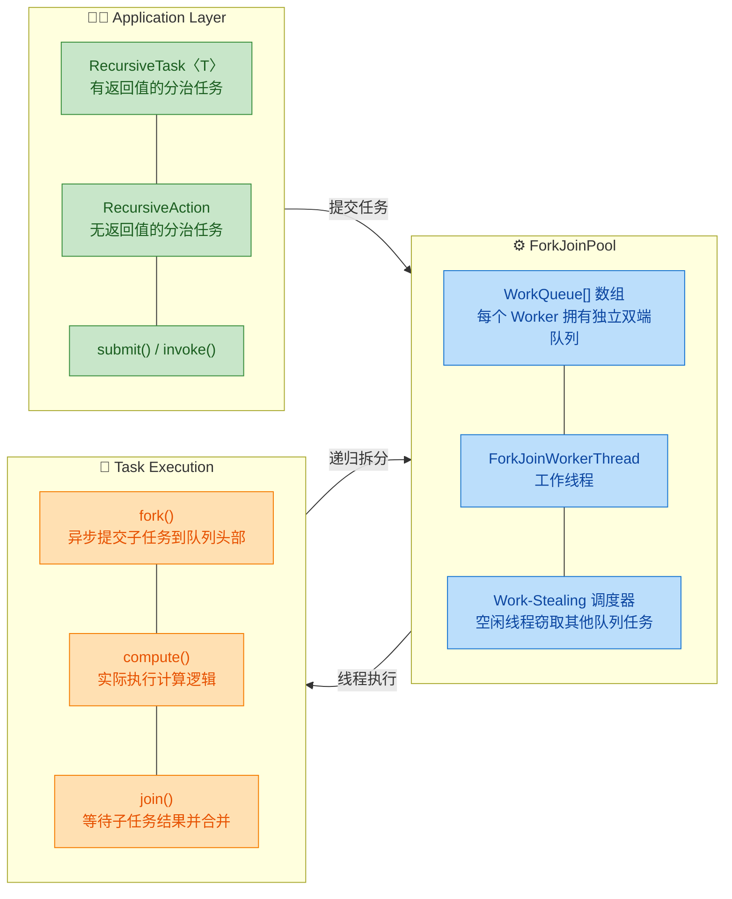

从图中可以看出整个框架形成了一个**循环**：应用层提交任务到 `ForkJoinPool`，工作线程取出任务执行 `compute()` 方法，`compute()` 内部可能再次 `fork()` 出子任务重新进入池中，最后通过 `join()` 汇聚结果。这种**递归提交 + 自动调度**的模式，是 `ForkJoinPool` 区别于普通线程池的根本所在。

### 与 ThreadPoolExecutor 的本质区别

很多初学者会疑惑：既然都是线程池，`ForkJoinPool` 和 `ThreadPoolExecutor` 到底有什么不同？这里做一个系统的对比：

| 对比维度 | ThreadPoolExecutor | ForkJoinPool |
|---|---|---|
| **任务模型** | 独立任务，互不依赖 | 分治任务，父子依赖关系 |
| **队列结构** | 所有线程共享一个阻塞队列 | 每个线程拥有**私有双端队列** |
| **调度策略** | 线程从共享队列竞争取任务 | Work-Stealing，空闲线程窃取他人任务 |
| **适用场景** | I/O 密集型、独立请求处理 | CPU 密集型、递归可拆分计算 |
| **阻塞处理** | 线程阻塞就阻塞，无补偿 | `join()` 时尝试执行其他任务，减少空闲 |
| **默认实例** | 需手动创建 | `ForkJoinPool.commonPool()` 全局共享 |

关键的区别在于**队列结构**。`ThreadPoolExecutor` 使用单一的共享阻塞队列（如 `LinkedBlockingQueue`），所有工作线程都从同一个队列头部竞争取任务，高并发下锁竞争严重。而 `ForkJoinPool` 为每个工作线程分配了一个独立的 **双端队列（Deque）**，线程优先从自己队列的头部取任务（LIFO），只有当自己队列为空时才去其他线程队列的尾部窃取（FIFO）。这种设计大幅降低了线程间的竞争。

### commonPool —— 全局共享的默认池

从 JDK 8 开始，`ForkJoinPool` 提供了一个静态的全局共享实例 `ForkJoinPool.commonPool()`。Java 的 **并行流（Parallel Stream）**、`CompletableFuture` 的默认异步执行器都使用这个 common pool。它的默认并行度（parallelism）等于 `Runtime.getRuntime().availableProcessors() - 1`，也就是 CPU 核心数减一。

```java
// 获取 common pool 实例
ForkJoinPool commonPool = ForkJoinPool.commonPool(); // 全局共享，所有并行流默认使用这个池

// 查看默认并行度
int parallelism = commonPool.getParallelism(); // 通常等于 CPU 核心数 - 1
System.out.println("Common pool parallelism: " + parallelism); // 例如 8 核机器输出 7

// 也可以通过 JVM 参数修改默认并行度
// -Djava.util.concurrent.ForkJoinPool.common.parallelism=16
```

这意味着如果你在一个应用中大量使用并行流，又在某个并行流任务里执行了阻塞 I/O 操作（比如 HTTP 调用、数据库查询），你会**拖慢所有使用 common pool 的并行计算**。这是生产环境中非常常见的性能陷阱。遇到这种情况，推荐为阻塞型任务创建独立的 `ForkJoinPool` 实例：

```java
// 为特定任务创建独立的 ForkJoinPool，避免污染 common pool
ForkJoinPool customPool = new ForkJoinPool(4); // 指定并行度为 4
customPool.submit(() -> {
    // 这里的并行流操作将使用 customPool 而非 commonPool
    myList.parallelStream()
          .map(item -> blockingApiCall(item)) // 阻塞操作不会影响全局 common pool
          .collect(Collectors.toList());
}).get(); // 等待完成
customPool.shutdown(); // 使用完毕后关闭自定义池
```

### 适用场景与不适用场景

**适合使用 ForkJoinPool 的场景：**

- **CPU 密集型的递归计算**：大数组求和、归并排序、矩阵乘法、图像处理中的分块渲染等。
- **可递归拆分的数据结构遍历**：树的遍历、文件系统扫描（计算目录大小）等。
- **并行流（Parallel Stream）**：Java 8+ 的并行流底层就是 `ForkJoinPool`。

**不适合使用 ForkJoinPool 的场景：**

- **I/O 密集型任务**：网络请求、磁盘读写等会导致线程长时间阻塞，浪费 `ForkJoinPool` 的计算线程。这类任务应使用普通线程池或虚拟线程。
- **任务无法拆分**：如果任务本身不具备可分解性，用 `ForkJoinPool` 没有任何优势。
- **子任务间有共享可变状态**：分治的前提是子任务独立，如果子任务之间需要频繁同步，会严重降低并行效率。

### 一个直观的类比

为了更好地理解 `ForkJoinPool` 的工作模式，可以做一个生活化的类比：

> 想象你是一家餐厅的厨师长，接到一个 200 人的宴会订单（大任务）。你不会一个人做完所有菜，而是把菜单拆分成冷菜组、热菜组、汤品组、甜点组（**Fork**），每组分配给一位厨师。每位厨师如果觉得自己的工作量还是太大，可以继续拆分给帮厨（**递归 Fork**）。当某位厨师提前做完了自己的部分，他不会闲着，而是去帮最忙的那位分担一些任务（**Work-Stealing**）。最后所有菜品汇总上桌（**Join**），宴会开始。

这就是 `ForkJoinPool` 的核心哲学：**拆分、并行、窃取、合并**。

### Fork/Join 框架的核心 API 总览

在后续章节深入讲解之前，先对核心类做一个概览，建立全局认知：

```java
// === ForkJoinPool：线程池本身 ===
ForkJoinPool pool = new ForkJoinPool();          // 使用默认并行度(CPU核心数)
ForkJoinPool pool2 = new ForkJoinPool(8);        // 指定 8 个工作线程
ForkJoinPool common = ForkJoinPool.commonPool();  // 获取全局共享池

// === ForkJoinTask：所有 Fork/Join 任务的抽象基类 ===
// 通常不直接使用，而是使用下面两个子类

// === RecursiveTask<V>：有返回值的分治任务 ===
// 必须实现 compute() 方法，返回类型为 V
class SumTask extends RecursiveTask<Long> {
    @Override
    protected Long compute() {
        // 拆分逻辑 + 计算逻辑
        return result; // 返回计算结果
    }
}

// === RecursiveAction：无返回值的分治任务 ===
// 必须实现 compute() 方法，返回 void
class SortTask extends RecursiveAction {
    @Override
    protected void compute() {
        // 拆分逻辑 + 原地排序等操作，无需返回值
    }
}

// === 核心方法 ===
task.fork();           // 异步提交任务到当前线程的工作队列
Long result = task.join(); // 阻塞等待任务完成并获取结果
pool.invoke(task);     // 提交任务并等待结果（等于 fork + join）
pool.submit(task);     // 异步提交任务，返回 ForkJoinTask（Future）
```

这些 API 将在后续的 **ForkJoinTask**、**使用示例** 等章节中配合完整代码深入讲解。此处只需建立一个"全景地图"即可。

---

**📝 练习题**

关于 `ForkJoinPool` 与 `ThreadPoolExecutor` 的区别，下列说法**错误**的是：

A. `ThreadPoolExecutor` 的所有工作线程共享一个任务队列，而 `ForkJoinPool` 的每个工作线程都有自己的双端队列

B. `ForkJoinPool` 采用 Work-Stealing 机制，空闲线程可以从其他线程的队列中窃取任务执行

C. `ForkJoinPool.commonPool()` 的默认并行度等于 CPU 核心数，即 `Runtime.getRuntime().availableProcessors()`

D. `ForkJoinPool` 更适合 CPU 密集型的可递归拆分任务，而非 I/O 密集型任务


**【答案】** C

**【解析】** `ForkJoinPool.commonPool()` 的默认并行度是 **`availableProcessors() - 1`**，而不是 `availableProcessors()`。之所以减 1，是因为**提交任务的调用者线程（main 线程或其他线程）本身也可能参与计算**（尤其在使用 `invoke()` 时），所以 common pool 预留了一个位置。选项 A 准确描述了两者队列结构的差异；选项 B 正确描述了 Work-Stealing 机制；选项 D 正确指出了 `ForkJoinPool` 的适用场景。因此 C 是错误的说法。

---

## 分治思想（Divide and Conquer）

分治思想是计算机科学中最经典、最强大的算法设计范式之一，也是整个 Fork/Join 框架的**理论基石**。理解分治，才能真正理解 `ForkJoinPool` 为什么要这样设计、为什么能带来并行加速。

### 什么是分治

分治（Divide and Conquer）的核心哲学可以浓缩为三个动词：**分（Divide）→ 治（Conquer）→ 合（Combine）**。

1. **Divide（分解）**：将一个规模为 N 的大问题，拆分成若干个规模更小、结构相同的**子问题**（Sub-problems）。
2. **Conquer（求解）**：当子问题的规模缩小到足够简单（即达到 **Base Case / 基准条件**）时，直接求解；否则继续递归拆分。
3. **Combine（合并）**：将所有子问题的解逐层向上汇总、合并，最终得到原始问题的完整解。

这个过程天然形成一棵**递归树（Recursion Tree）**。树的根节点是原始问题，叶子节点是可以直接求解的最小子问题，而中间每一层都在做"拆"和"合"的工作。

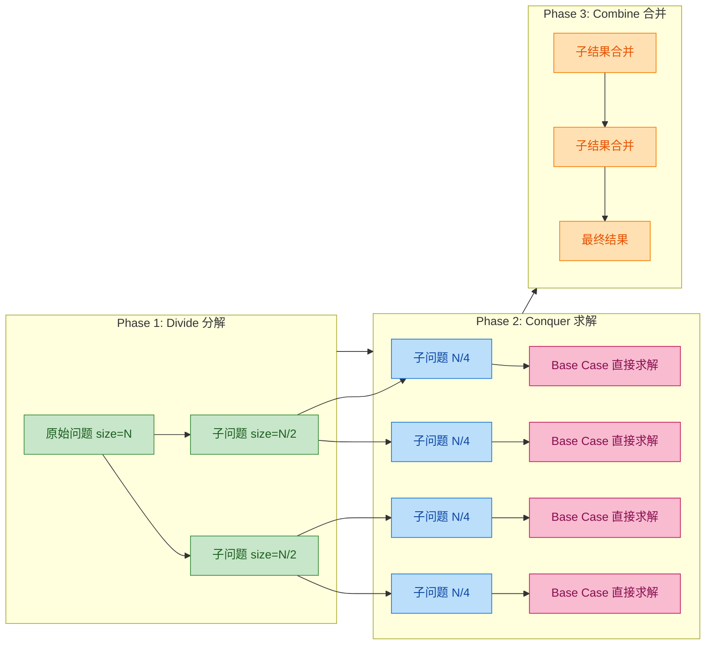

### 分治的经典串行案例：归并排序

在正式进入并行世界之前，我们先用最经典的 **Merge Sort（归并排序）** 来感受分治的精髓。归并排序是分治思想教科书级的体现——把一个无序数组一分为二，分别排序后再合并。

```java
public class MergeSort {

    // 入口方法：对 arr 的 [left, right] 区间进行归并排序
    public static void mergeSort(int[] arr, int left, int right) {
        // Base Case：当区间只剩一个元素（或无效区间），无需排序，直接返回
        if (left >= right) {
            return;
        }

        // ① Divide：计算中间位置，将数组一分为二
        int mid = left + (right - left) / 2;

        // ② Conquer：递归地对左半部分排序
        mergeSort(arr, left, mid);

        // ② Conquer：递归地对右半部分排序
        mergeSort(arr, mid + 1, right);

        // ③ Combine：将两个已排序的子数组合并为一个有序数组
        merge(arr, left, mid, right);
    }

    // 合并 [left, mid] 和 [mid+1, right] 两个有序子数组
    private static void merge(int[] arr, int left, int mid, int right) {
        // 创建临时数组，用于暂存合并结果
        int[] temp = new int[right - left + 1];

        // i 指向左半部分的起始位置
        int i = left;
        // j 指向右半部分的起始位置
        int j = mid + 1;
        // k 指向临时数组的当前写入位置
        int k = 0;

        // 依次比较两个子数组的元素，将较小的放入 temp
        while (i <= mid && j <= right) {
            if (arr[i] <= arr[j]) {
                // 左侧元素更小（或相等），写入 temp 并移动左指针
                temp[k++] = arr[i++];
            } else {
                // 右侧元素更小，写入 temp 并移动右指针
                temp[k++] = arr[j++];
            }
        }

        // 左半部分可能还有剩余元素，全部追加到 temp
        while (i <= mid) {
            temp[k++] = arr[i++];
        }

        // 右半部分可能还有剩余元素，全部追加到 temp
        while (j <= right) {
            temp[k++] = arr[j++];
        }

        // 将合并结果从 temp 复制回原数组的对应位置
        System.arraycopy(temp, 0, arr, left, temp.length);
    }
}
```

从这段代码可以清楚看到分治的三步曲：

| 阶段 | 对应代码 | 说明 |
|:---:|:---|:---|
| **Divide** | `int mid = left + (right - left) / 2` | 找到中点，将问题一分为二 |
| **Conquer** | 两次递归调用 `mergeSort(...)` | 递归解决左右两个子问题 |
| **Combine** | `merge(arr, left, mid, right)` | 将两个有序子数组合并成一个有序数组 |

### 从串行分治到并行分治

上面的归并排序虽然体现了完美的分治结构，但它有一个**致命特征**——两次递归调用是**顺序执行**的：先排完左半部分，再排右半部分。在单线程环境下这无可厚非，但仔细想想：**左半部分和右半部分的排序是完全独立的，它们之间没有任何数据依赖！**

这正是并行化的天然机会。分治思想与并行计算的结合点在于：

> **如果子问题之间相互独立（Independent Sub-problems），那么它们就可以被分配到不同的线程/处理器上同时执行。**

将上面归并排序的串行递归改为并行递归，概念上只需要一步变化：

```java
// 串行版本：顺序执行
mergeSort(arr, left, mid);      // 先执行这个
mergeSort(arr, mid + 1, right); // 等上面完成后才执行这个

// 并行版本（伪代码）：同时执行
fork(() -> mergeSort(arr, left, mid));      // 异步提交给其他线程
fork(() -> mergeSort(arr, mid + 1, right)); // 异步提交给其他线程
joinAll();  // 等待两个子任务都完成
merge(arr, left, mid, right);  // 合并结果
```

这就是 **Fork/Join 框架** 名称的由来：**fork** 负责将子任务异步提交执行，**join** 负责等待子任务完成并获取结果。

### 分治并行化的数学直觉

假设一个问题被均匀地分成 2 个子问题，每层分解的开销忽略不计。在串行模式下，递归树的每一层都必须逐个处理，总时间与树的节点数成正比。而在理想并行模式下，同一层的所有子任务可以**同时执行**，所以总时间只与**树的高度**成正比。

对于一个大小为 N 的问题，递归树高度为 **log₂N**。举一个直观的例子：

| 数组大小 N | 串行归并排序 O(N log N) | 理想并行时间 O(N)* |
|:---:|:---:|:---:|
| 1,000,000 | ~20,000,000 次操作 | 利用多核大幅缩减 |
| 10,000,000 | ~230,000,000 次操作 | 加速比接近核心数 |

> *理想并行归并排序的 work 仍然是 O(N log N)，但 span（关键路径）降为 O(N)，在 P 个处理器下实际时间约为 O(N log N / P)。

当然，现实中不可能达到理想加速——线程创建与调度有开销、子任务粒度过细反而得不偿失。这也是 Fork/Join 框架引入 **阈值（Threshold）** 概念的原因：当子问题规模小于某个阈值时，不再继续拆分，而是直接用串行方式处理。这个阈值的选取是性能调优的关键。

### 分治适用场景的四个特征

并非所有问题都适合用分治来解决（或并行化）。一个问题适合分治并行化，通常需要满足以下四个条件：

```mermaid
graph LR
    subgraph S1["特征一"]
        direction TB
        A1["可分解性"]
        A2["问题能被拆分为结构相同的子问题"]
    end

    subgraph S2["特征二"]
        direction TB
        B1["子问题独立"]
        B2["子问题之间无数据依赖"]
    end

    subgraph S3["特征三"]
        direction TB
        C1["可合并性"]
        C2["子问题的解能高效合并为原问题的解"]
    end

    subgraph S4["特征四"]
        direction TB
        D1["Base Case 可解"]
        D2["存在可直接求解的最小规模"]
    end

    S1 --> S2
    S2 --> S3
    S3 --> S4

    classDef feat1 fill:#C8E6C9,stroke:#43A047,color:#1B5E20
    classDef feat2 fill:#BBDEFB,stroke:#1E88E5,color:#0D47A1
    classDef feat3 fill:#FFE0B2,stroke:#FB8C00,color:#E65100
    classDef feat4 fill:#E1BEE7,stroke:#8E24AA,color:#4A148C

    class A1,A2 feat1
    class B1,B2 feat2
    class C1,C2 feat3
    class D1,D2 feat4
```

下面逐一展开：

**① 可分解性（Decomposable）**：大问题能够按照某种规则（通常是按数据范围或空间划分）拆成若干更小的同构子问题。例如数组求和可以拆成左半段求和 + 右半段求和；矩阵乘法可以按分块拆分。

**② 子问题独立性（Independence）**：这是并行化的前提条件。如果子问题 A 的结果需要依赖子问题 B 的输出，那它们就不能并行执行。归并排序中，左右两半的排序互不干扰，是完美独立的。反例如斐波那契数列 `f(n) = f(n-1) + f(n-2)`，虽然形式上是递归分解，但 `f(n-1)` 和 `f(n-2)` 存在大量重叠子问题，更适合动态规划而非分治并行。

**③ 可合并性（Combinable）**：子问题的解必须能够高效地 Combine 成原问题的解。如果合并步骤本身极其昂贵（比如时间复杂度比子问题求解还高），那分治反而会成为负担。

**④ Base Case 存在且可直接求解**：递归必须有终止条件。对于排序，Base Case 是长度为 1 的数组（天然有序）；对于求和，Base Case 可以是单个元素或少于阈值的小数组（直接循环累加）。

### 分治思想在 Java ForkJoinPool 中的映射

理解了分治的理论后，我们来看它如何精确映射到 Java 的 `ForkJoinPool` API 上：

| 分治阶段 | Java ForkJoinPool 对应 | 说明 |
|:---:|:---:|:---|
| **Divide** | 在 `compute()` 方法中将任务拆分为子任务 | 手动创建子 `ForkJoinTask` 对象 |
| **Fork** | `subTask.fork()` | 将子任务异步提交到线程池中 |
| **Conquer** | 子任务的 `compute()` 递归执行 | 到达 Base Case 时直接计算 |
| **Join** | `subTask.join()` | 阻塞等待子任务完成，获取返回值 |
| **Combine** | 在 `compute()` 中合并 `join()` 的结果 | 如 `leftResult + rightResult` |

下面是一段**概念性代码**，展示分治三步曲如何在 `ForkJoinTask` 中体现（后续章节会给出完整可运行示例）：

```java
// 继承 RecursiveTask<Long>，表示有返回值的分治任务
public class SumTask extends RecursiveTask<Long> {

    // 阈值：当数组片段小于此值时，不再拆分，直接串行计算
    private static final int THRESHOLD = 10_000;

    // 待处理的数组
    private final long[] array;
    // 当前任务负责的区间 [start, end)
    private final int start;
    private final int end;

    // 构造方法：指定数组和处理范围
    public SumTask(long[] array, int start, int end) {
        this.array = array;
        this.start = start;
        this.end = end;
    }

    @Override
    protected Long compute() {
        int length = end - start;

        // ===== Base Case：规模足够小，直接串行求和 =====
        if (length <= THRESHOLD) {
            long sum = 0;
            // 简单循环累加，不再递归拆分
            for (int i = start; i < end; i++) {
                sum += array[i];
            }
            return sum;
        }

        // ===== Divide：将任务一分为二 =====
        int mid = start + length / 2;
        // 创建左半部分子任务
        SumTask leftTask = new SumTask(array, start, mid);
        // 创建右半部分子任务
        SumTask rightTask = new SumTask(array, mid, end);

        // ===== Fork：异步提交左子任务到线程池 =====
        leftTask.fork();

        // ===== Conquer：当前线程直接计算右子任务（避免浪费当前线程） =====
        long rightResult = rightTask.compute();

        // ===== Join：等待左子任务完成并获取结果 =====
        long leftResult = leftTask.join();

        // ===== Combine：合并两个子结果 =====
        return leftResult + rightResult;
    }
}
```

注意代码中的一个**重要优化模式**：左子任务 `fork()` 出去让其他线程处理，而右子任务则由**当前线程直接 `compute()`**。这样避免了当前线程 fork 完就闲着等待的浪费。这种 "fork 一个，自己算一个" 的模式是 Fork/Join 编程的**最佳实践（Best Practice）**。

### 分治的粒度控制：Threshold 的艺术

分治并行化中最重要的工程决策之一就是**阈值（Threshold）** 的设定。阈值太大，并行度不够，无法充分利用多核；阈值太小，任务拆分过细，线程调度和任务管理的开销反而超过了并行带来的收益。

一般经验法则：

- Doug Lea（Fork/Join 框架的作者）建议：任务数量大约是**处理器核心数的 4 倍到 16 倍**，这样可以在保证足够并行度的同时避免过度拆分。
- 对于纯计算型任务（CPU-bound），阈值可以设大一些（如数万到数十万级别）。
- 对于涉及 I/O 或锁竞争的混合任务，阈值需要根据实际 profiling 来调整。

用一个简单的公式来理解：

```
建议任务总数 ≈ 可用处理器数 × (4 ~ 16)
建议阈值 ≈ 总数据量 / 建议任务总数
```

例如，一个 1,000,000 元素的数组在 8 核 CPU 上：建议任务总数 ≈ 8 × 8 = 64，因此阈值 ≈ 1,000,000 / 64 ≈ 15,625。

---

**📝 练习题**

关于分治思想在 Fork/Join 框架中的应用，以下说法**错误**的是？

A. 分治要求子问题之间相互独立，这是并行化的前提条件


B. 在 ForkJoinTask 的 compute() 中，推荐对所有子任务都调用 fork()，然后逐一 join()，这样并行度最高


C. 阈值设置过小会导致任务拆分过细，线程调度开销可能超过并行收益


D. 分治的 Combine 阶段负责将子问题的结果汇总为原问题的最终结果


**【答案】** B

**【解析】** 选项 B 的说法是错误的。在 Fork/Join 编程的最佳实践中，**不应该**对所有子任务都 fork()。正确的做法是：对 N 个子任务中的 N-1 个调用 `fork()` 异步提交，而最后一个子任务由**当前线程直接调用 `compute()`** 来执行。如果所有子任务都 fork 出去，当前线程就会空闲地等待（阻塞在 `join()` 上），白白浪费一个线程资源。以二分情况为例，应该 `leftTask.fork()` + `rightTask.compute()` + `leftTask.join()`，而不是两个都 fork 再两个都 join。选项 A、C、D 的描述均正确。

---

## 工作窃取（Work-Stealing）⭐

在传统的线程池模型（如 `ThreadPoolExecutor`）中，所有线程共享一个全局的任务队列（Shared BlockingQueue）。当并发量极高时，多个线程同时争抢队列的锁，形成激烈的 **锁竞争（Lock Contention）**，这将严重拖慢吞吐量。ForkJoinPool 的设计哲学完全不同——它为 **每一个工作线程（Worker Thread）** 分配了一个 **私有的双端队列（Deque）**，大部分时间线程只访问自己的队列，从根源上消除了全局锁瓶颈。

但问题随之而来：分治法天然会导致任务分配不均。某些子问题递归层次深、计算量大，对应的线程忙得不可开交；而另一些子问题很快就结束了，线程陷入空闲。如果放任不管，就会出现 **负载失衡（Load Imbalance）**——有的核心 100% 跑满，有的核心却在睡觉，整体 CPU 利用率远低于理想值。

**Work-Stealing（工作窃取）** 就是为了解决这个问题而生的调度策略。其核心思想只有一句话：

> **空闲的线程不会干等，而是主动去其他繁忙线程的队列中"偷"任务来执行。**

这套机制让 ForkJoinPool 在面对 **不规则并行（Irregular Parallelism）** 时，依然能够自动地、动态地实现负载均衡，几乎不需要程序员手动干预。下面我们深入拆解其内部构造。

---

### 双端队列（Deque）

Work-Stealing 的基石是一种特殊的数据结构—— **双端队列（Double-Ended Queue, Deque）**。在 ForkJoinPool 的实现中，每个 `ForkJoinWorkerThread` 内部都持有一个名为 `WorkQueue` 的结构，它本质上就是一个基于数组的 **无锁双端队列**。

所谓"双端"，是指这个队列 **两端都可以进行操作**：

- **头部（Top / Head）**：队列的"顶端"，由 **拥有者线程自己** 进行 push 和 pop。
- **尾部（Base / Bottom）**：队列的"底端"，由 **其他窃取线程** 进行 take（steal）。

为什么要用双端队列而不是普通队列？关键在于 **减少竞争**。请看下面的对比：

| 特性 | 普通共享队列 | Work-Stealing Deque |
|:---|:---|:---|
| 队列归属 | 所有线程共享一个 | 每个线程私有一个 |
| 入队/出队端 | 同一端，多线程竞争 | 两端分离，竞争极少 |
| 锁策略 | 全局锁或 CAS 高频冲突 | Owner 端无锁，Steal 端轻量 CAS |
| 缓存友好性 | 差（多核缓存反复失效） | 好（Owner 操作局部性强） |

在 ForkJoinPool 的实际实现中，Owner 线程对 Top 端的 push/pop 操作采用简单的 **数组下标自增/自减 + volatile 写**，几乎没有同步开销。只有当队列中仅剩最后一个元素时，Owner 的 pop 和 Stealer 的 steal 可能同时触碰同一个位置，此时才需要一次 **CAS（Compare-And-Swap）** 来仲裁，失败的一方就当队列为空处理。

这种设计的精妙之处在于：**99% 的操作都是无竞争的**。Owner 在自己的 Top 端忙碌，Stealer 在远处的 Base 端悄悄拿走任务，两者几乎互不干扰。

下面用 Mermaid 图展示每个 Worker Thread 拥有独立 Deque 的整体结构：

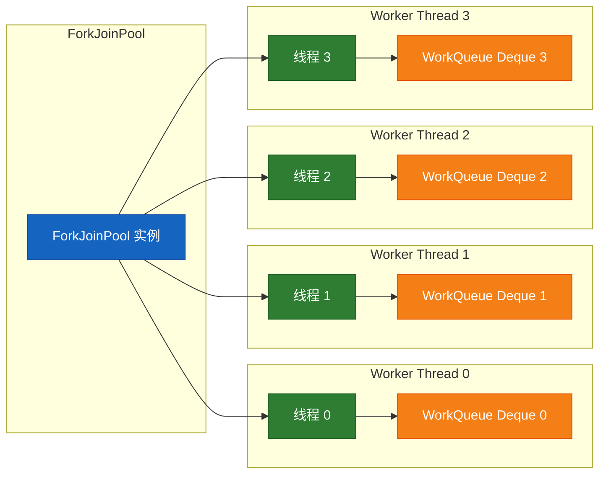

接下来用 ASCII 图细致展示 **单个 Deque 的内部结构与两端操作方向**：

```java
/*
 *  WorkQueue (基于数组的双端队列)
 *
 *  ┌───────────────────────────────────────────────────┐
 *  │  array[]  (环形数组，容量为 2 的幂)                  │
 *  │                                                     │
 *  │  Index:   0     1     2     3     4     5     6     │
 *  │         ┌─────┬─────┬─────┬─────┬─────┬─────┬─────┐│
 *  │         │     │ T-A │ T-B │ T-C │ T-D │ T-E │     ││
 *  │         └─────┴─────┴─────┴─────┴─────┴─────┴─────┘│
 *  │           ▲                               ▲         │
 *  │           │                               │         │
 *  │         base                             top        │
 *  │      (Stealer 端)                    (Owner 端)     │
 *  │                                                     │
 *  │   ◀── steal() 从 base 端取      push()/pop() ──▶   │
 *  │       (其他空闲线程)              (拥有者线程自己)     │
 *  └───────────────────────────────────────────────────┘
 *
 *  - Owner 线程调用 fork() 时 → push 到 top 端 (top++)
 *  - Owner 线程需要子结果时 → pop 从 top 端取 (top--)
 *  - Stealer 窃取时 → 从 base 端取走最老的任务 (base++)
 *  - 仅当 top == base + 1（剩最后一个元素）时才需要 CAS 竞争
 */
```

这里有一个非常重要的细节值得深入思考—— **为什么 Owner 从 Top 端操作，而 Stealer 从 Base 端窃取？** 原因有二：

**第一，LIFO vs FIFO 的语义差异。** Owner 线程以 **LIFO（后进先出）** 的方式处理自己的任务。在分治递归中，最后被 fork 出来的子任务往往是 **粒度最小的**，处理起来最快，能迅速返回结果给父任务。这符合递归调用栈的天然顺序，也对 **CPU 缓存（Cache Locality）** 最友好——刚刚创建的任务数据大概率还热乎乎地躺在 L1/L2 Cache 里。

**第二，Stealer 以 FIFO（先进先出）拿走最老的任务。** 最早被 push 进队列的任务，通常是 **粒度最大的**（靠近递归树的根部）。窃取一个大任务，意味着 Stealer 拿回去之后还能继续拆分（fork），自给自足地忙活很久，减少后续再次窃取的频率。如果反过来偷最小的任务，Stealer 瞬间就做完了，又得去偷，频繁窃取反而增加了开销。

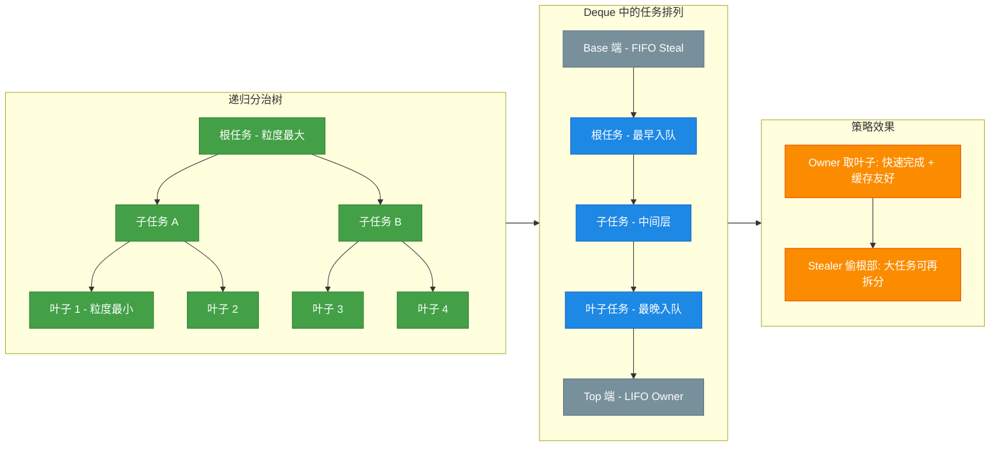

---

### 空闲线程从其他队列尾部窃取

理解了 Deque 的结构之后，我们来完整地走一遍 Work-Stealing 的运行时流程。

**场景设定：** 假设 ForkJoinPool 有 4 个 Worker Thread（W0 ~ W3），正在并行执行一个大型分治任务。

**阶段一：正常工作。** 每个 Worker 从自己 Deque 的 **Top 端** pop 任务执行。如果执行过程中 fork 了新的子任务，就 push 回自己 Deque 的 Top 端。此阶段各线程完全独立，零竞争。

**阶段二：负载失衡出现。** W2 的任务恰好都是轻量级的，很快全部执行完毕，Deque 变空。而 W0 的 Deque 中还积压着大量任务。

**阶段三：窃取发生。** W2 发现自己的 Deque 为空后，不会阻塞等待，而是立即进入 **窃取模式（Stealing Mode）**。它会 **随机选择** 一个其他 Worker（比如 W0），然后从 W0 的 Deque 的 **Base 端**（尾部）偷走一个任务，放到自己的 Deque 中开始执行。

**阶段四：自给自足。** 由于偷来的任务通常粒度较大，W2 在执行过程中会继续 fork 出子任务，push 到自己的 Deque 里。这样 W2 就不需要频繁地去偷，自己就能忙活一阵子了。

**阶段五：重复循环。** 如果 W2 又空了，继续偷；如果所有队列都空了，说明整个任务已经完成。

让我们通过一个时序图来直观地展示这个过程：

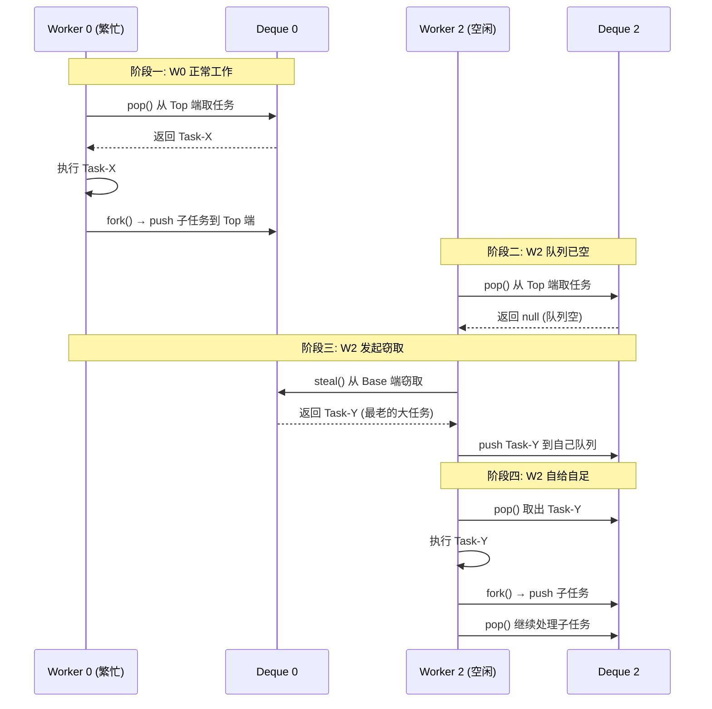

在实际的 JDK 源码（`ForkJoinPool.java`）中，窃取逻辑的核心步骤可以简化为以下伪代码：

```java
// === ForkJoinPool 工作窃取核心伪代码 ===

// 每个 Worker Thread 的主循环
void runWorker(ForkJoinWorkerThread wt) {
    WorkQueue myQueue = wt.workQueue;   // 获取当前线程的私有双端队列

    while (!isTerminated()) {           // 线程池未关闭就一直循环
        ForkJoinTask<?> task;

        // 第一步：尝试从自己的 Deque Top 端 pop 任务（LIFO）
        task = myQueue.pop();           // 无锁操作，最快路径

        if (task != null) {
            task.doExec();              // 直接执行任务
            continue;                   // 继续下一轮循环
        }

        // 第二步：自己队列为空，进入窃取模式
        task = scan(wt, myQueue);       // 随机扫描其他 Worker 的队列

        if (task != null) {
            task.doExec();              // 执行偷来的任务
            continue;                   // 偷到了就继续干活
        }

        // 第三步：所有队列都空了，尝试休眠等待
        awaitWork(wt);                  // 挂起线程，等待新任务到来
    }
}

// scan 方法：随机选择一个 victim 队列，从 Base 端窃取
ForkJoinTask<?> scan(ForkJoinWorkerThread wt, WorkQueue myQueue) {
    WorkQueue[] ws = workQueues;        // 获取所有 Worker 的队列数组
    int n = ws.length;                  // 队列总数
    int r = ThreadLocalRandom.current().nextInt(n); // 随机起始位置

    for (int i = 0; i < n; i++) {       // 遍历所有队列
        WorkQueue victim = ws[(r + i) & (n - 1)]; // 从随机位置开始轮询

        if (victim != null && victim.base < victim.top) { // 该队列有任务
            ForkJoinTask<?> t = victim.poll();  // 从 Base 端取（FIFO, CAS）
            if (t != null) {
                return t;               // 窃取成功，返回任务
            }
        }
    }
    return null;                        // 全部扫描完都没有，返回 null
}
```

**关于随机性（Randomized Stealing）**：为什么不按固定顺序扫描，而要随机选择起始位置？这是为了 **避免多个空闲线程同时窃取同一个 victim**，从而减少 CAS 冲突。随机化让窃取请求分散到不同的 victim 队列上，统计意义上能显著降低竞争概率。

**关于 CAS 的使用**：Stealer 从 victim 的 Base 端窃取时，需要使用 CAS 来原子地更新 `base` 下标。如果两个 Stealer 同时瞄准了同一个 victim 的同一个位置，CAS 保证只有一个成功，另一个重试或换目标。这比传统的锁机制轻量得多——**失败的代价仅仅是一次 CAS 重试，而非线程阻塞与上下文切换**。

最后，让我们用一张综合全景图来总结 Work-Stealing 的完整机制：

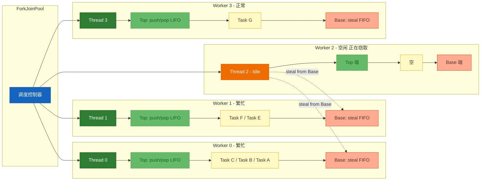

**Work-Stealing 的性能优势总结**：

| 维度 | 传统线程池 | ForkJoinPool + Work-Stealing |
|:---|:---|:---|
| 队列结构 | 全局共享队列 | 每线程私有 Deque |
| 锁竞争频率 | 高（每次存取都竞争） | 极低（仅窃取时偶尔 CAS） |
| 负载均衡 | 静态分配，易失衡 | 动态窃取，自适应均衡 |
| CPU 利用率 | 受限于最慢线程 | 接近 100%（空闲线程自动找活干） |
| Cache 友好性 | 差（共享队列频繁失效） | 好（Owner 局部性强） |
| 适用场景 | I/O 密集、任务粒度均匀 | CPU 密集、递归分治、不规则并行 |

---

## ForkJoinTask

`ForkJoinTask<V>` 是整个 Fork/Join 框架的**任务基石**（task foundation）。它是一个轻量级的、可以在 `ForkJoinPool` 中被调度执行的抽象类，实现了 `Future<V>` 接口。与普通的 `Thread` 或 `Runnable` 不同，`ForkJoinTask` 的设计哲学是：**一个任务可以递归地将自身拆分（fork）为更小的子任务，然后汇总（join）子任务的结果**。这正是分治思想在代码层面的直接体现。

从类层次结构来看，`ForkJoinTask` 本身是一个抽象类，开发者**几乎不会直接继承它**，而是使用其两个核心子类：`RecursiveTask<V>`（有返回值）和 `RecursiveAction`（无返回值）。二者都只要求你实现一个方法——`compute()`，在其中编写拆分逻辑和计算逻辑。

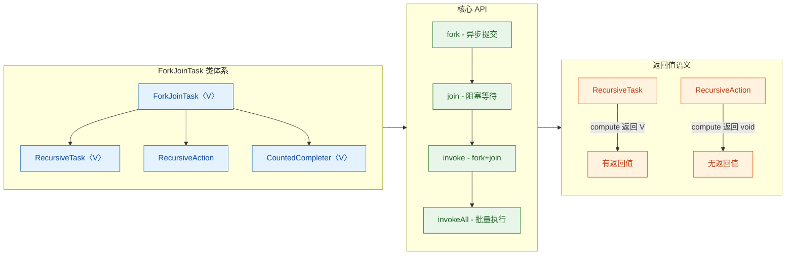

值得一提的是，图中还出现了 `CountedCompleter<V>`，它是 JDK 8 引入的第三个子类，适用于**完成触发式**的任务编排（completion-triggered tasks），例如并行流（parallel stream）的底层实现就大量依赖它。但在日常开发中，`RecursiveTask` 和 `RecursiveAction` 是你接触最多的两位主角。

---

### RecursiveTask（有返回值）

`RecursiveTask<V>` 用于**需要返回计算结果**的分治场景。泛型参数 `V` 即为返回值类型。你需要覆写唯一的抽象方法 `compute()`，在方法体中实现两件事：

1. **Base case（基准条件）**：当任务粒度足够小时，直接计算并返回结果。
2. **Recursive case（递归拆分）**：将大任务拆分为若干子任务，调用 `fork()` 异步提交，最后调用 `join()` 汇总结果。

下面以**数组求和**为例，展示 `RecursiveTask` 的标准写法：

```java
import java.util.concurrent.RecursiveTask;

/**
 * 使用 RecursiveTask 实现并行数组求和
 * 泛型参数 Long 表示 compute() 的返回值类型
 */
public class SumTask extends RecursiveTask<Long> {

    // 阈值：当子数组长度 <= THRESHOLD 时，直接线性求和，不再拆分
    private static final int THRESHOLD = 1000;

    // 待求和数组的引用
    private final long[] array;

    // 当前任务负责的起始索引（包含）
    private final int start;

    // 当前任务负责的结束索引（不包含）
    private final int end;

    // 构造器：接收数组引用和当前任务负责的区间 [start, end)
    public SumTask(long[] array, int start, int end) {
        this.array = array;   // 所有子任务共享同一个数组引用，不会拷贝
        this.start = start;
        this.end = end;
    }

    /**
     * 核心计算方法 - 由 ForkJoinPool 中的工作线程调用
     * @return 区间 [start, end) 内所有元素的和
     */
    @Override
    protected Long compute() {
        // 计算当前任务负责的元素数量
        int length = end - start;

        // ★ Base case: 任务粒度足够小，直接计算
        if (length <= THRESHOLD) {
            long sum = 0;                     // 累加器
            for (int i = start; i < end; i++) {
                sum += array[i];              // 逐个累加
            }
            return sum;                       // 直接返回结果，不再拆分
        }

        // ★ Recursive case: 任务太大，一分为二
        int mid = start + (length >> 1);      // 取中点，等价于 start + length/2

        // 创建左半部分子任务 [start, mid)
        SumTask leftTask = new SumTask(array, start, mid);

        // 创建右半部分子任务 [mid, end)
        SumTask rightTask = new SumTask(array, mid, end);

        // 将左子任务异步提交到 ForkJoinPool（由其他工作线程执行）
        leftTask.fork();

        // ★ 关键优化：右子任务在【当前线程】直接执行，避免不必要的线程切换
        Long rightResult = rightTask.compute();

        // 等待左子任务完成并获取其结果
        Long leftResult = leftTask.join();

        // 合并两个子任务的结果
        return leftResult + rightResult;
    }
}
```

> **💡 为什么不对两个子任务都调用 `fork()`？**
>
> 这是一个非常经典的性能陷阱。如果你对 `leftTask` 和 `rightTask` 都调用 `fork()`，那么当前线程在 fork 之后就会**空闲等待**（idle），白白浪费了一个工作线程。正确的做法是：**一个 fork，一个 compute**——让当前线程继续承担一半的计算工作。这被称为 **"fork-once, compute-once"** 惯用法（idiom），是 Fork/Join 编程中最重要的性能准则之一。

来看一下执行时的任务拆分过程：

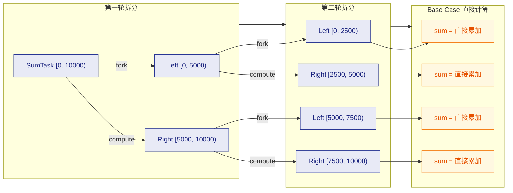

当 `THRESHOLD = 1000` 且数组长度为 10000 时，最终会产生约 10 个叶子任务，每个任务负责 1000 个元素的线性求和。这些叶子任务会被 `ForkJoinPool` 中的多个工作线程并行执行，空闲线程还会通过 Work-Stealing 从其他线程的队列中偷取任务。

---

### RecursiveAction（无返回值）

`RecursiveAction` 的结构与 `RecursiveTask` 几乎一模一样，唯一区别是 `compute()` 方法**没有返回值**（`void`）。它适用于**只需要产生副作用**（side effect）而不需要汇总结果的场景，典型例子包括：

- **并行排序**（parallel sort）—— 对数组进行原地修改
- **并行遍历与修改**（parallel transformation）—— 批量更新集合元素
- **并行文件处理** —— 递归扫描目录并处理文件

以下是用 `RecursiveAction` 实现**并行数组元素翻倍**的示例：

```java
import java.util.concurrent.RecursiveAction;

/**
 * 使用 RecursiveAction 将数组中每个元素翻倍（原地修改，无返回值）
 */
public class DoubleTask extends RecursiveAction {

    // 阈值：当子数组长度 <= THRESHOLD 时，直接处理
    private static final int THRESHOLD = 1000;

    // 待处理的数组引用（所有子任务共享同一数组）
    private final long[] array;

    // 当前任务负责的起始索引（包含）
    private final int start;

    // 当前任务负责的结束索引（不包含）
    private final int end;

    // 构造器
    public DoubleTask(long[] array, int start, int end) {
        this.array = array;
        this.start = start;
        this.end = end;
    }

    /**
     * 核心计算方法 —— 注意返回值为 void
     */
    @Override
    protected void compute() {
        // 计算当前任务负责的元素数量
        int length = end - start;

        // ★ Base case: 直接处理
        if (length <= THRESHOLD) {
            for (int i = start; i < end; i++) {
                array[i] *= 2;               // 每个元素翻倍（原地修改）
            }
            return;                           // 无返回值，直接 return
        }

        // ★ Recursive case: 拆分为两个子任务
        int mid = start + (length >> 1);

        // 创建左、右子任务
        DoubleTask left = new DoubleTask(array, start, mid);
        DoubleTask right = new DoubleTask(array, mid, end);

        // invokeAll: 同时提交两个子任务并等待它们全部完成
        // 因为没有返回值需要合并，所以用 invokeAll 比 fork+compute 更简洁
        invokeAll(left, right);
    }
}
```

> **💡 `invokeAll()` vs `fork()` + `compute()`**
>
> 对于 `RecursiveAction`，由于不需要合并返回值，可以直接使用 `invokeAll(task1, task2)` 一次性提交两个子任务。`invokeAll` 内部的实现逻辑其实等价于：对第二个任务调用 `fork()`，对第一个任务调用 `compute()`（当前线程执行），再对第二个任务调用 `join()`。所以它**并不会浪费当前线程**，本质上是对 "fork-once, compute-once" 模式的封装。

下面是一张对比表，帮助你快速区分 `RecursiveTask` 和 `RecursiveAction`：

| 特征 | `RecursiveTask<V>` | `RecursiveAction` |
|:---|:---|:---|
| **返回值** | ✅ 有返回值（泛型 `V`） | ❌ 无返回值（`void`） |
| **compute() 签名** | `protected V compute()` | `protected void compute()` |
| **典型场景** | 求和、求最大值、归并排序结果合并 | 并行排序（原地）、批量修改、文件处理 |
| **结果合并** | 通过 `return` + `join()` 手动合并 | 无需合并，副作用已在数组/集合中就位 |
| **推荐拆分写法** | `leftTask.fork()` + `rightTask.compute()` | `invokeAll(left, right)` |

---

### fork（异步执行）

`fork()` 是 `ForkJoinTask` 中触发任务异步执行的关键方法。调用 `task.fork()` 后，该任务会被**推入当前工作线程的本地双端队列（Work Queue）的头部**，等待被调度执行。注意几个要点：

**1. fork() 不会创建新线程**

与 `new Thread(task).start()` 完全不同，`fork()` 只是将任务放入队列，由 `ForkJoinPool` 中**已有的工作线程**来消费。线程池中的工作线程数量通常等于 CPU 核心数（`Runtime.getRuntime().availableProcessors()`），不会因为 `fork()` 调用次数多而无限膨胀。

**2. fork() 的推入位置是队列头部（LIFO 端）**

当前线程自己取任务时，从队列**头部**取（LIFO，后进先出）。这样做的好处是：最近 fork 出来的子任务粒度最小、最可能已经准备好数据（cache locality 更好），优先执行它们可以快速完成并释放内存。

**3. fork() 必须在 ForkJoinPool 上下文中调用**

如果在普通线程（非 ForkJoinWorkerThread）中调用 `fork()`，任务会被提交到 **common pool**（公共池）。但这通常不是你期望的行为，因此 `fork()` 应当在 `compute()` 方法内部调用，此时当前线程一定是 ForkJoinPool 的工作线程。

下面是 `fork()` 的执行流程：

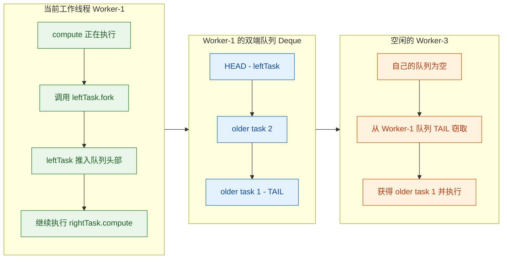

从图中可以清晰地看到：**fork 是 push 操作（推入头部），当前线程从头部取（LIFO），窃取线程从尾部取（FIFO）**。这个双端队列（Deque）的无锁设计是 Fork/Join 框架高性能的核心秘密之一。

---

### join（等待结果）

`join()` 是与 `fork()` 配对的方法，用于**阻塞当前线程，直到目标任务完成并返回其结果**。如果是 `RecursiveTask`，`join()` 返回 `compute()` 的返回值；如果是 `RecursiveAction`，`join()` 返回 `null`。

但这里的"阻塞"与传统的 `Thread.join()` 或 `Future.get()` 有着**本质区别**：

**1. "帮忙执行"式等待（Work-Helping）**

当 Worker-1 调用 `leftTask.join()` 时，如果 `leftTask` 还在自己的队列里（尚未被执行），Worker-1 会**直接把它取出来自己执行**，而不是傻等。这避免了线程空转，极大提升了效率。

**2. 如果任务已被窃取**

如果 `leftTask` 已经被其他线程（比如 Worker-3）窃取走了，Worker-1 不会干等。它会尝试从自己的队列中取其他任务来执行（继续干活），或者去窃取别人的任务。只有在实在无事可做时，才会进入等待状态。

**3. 异常传播**

如果子任务在执行过程中抛出了异常，`join()` 会将该异常包装为 `RuntimeException`（或 `Error`）并重新抛出。这意味着你可以在调用 `join()` 的位置捕获子任务的异常。

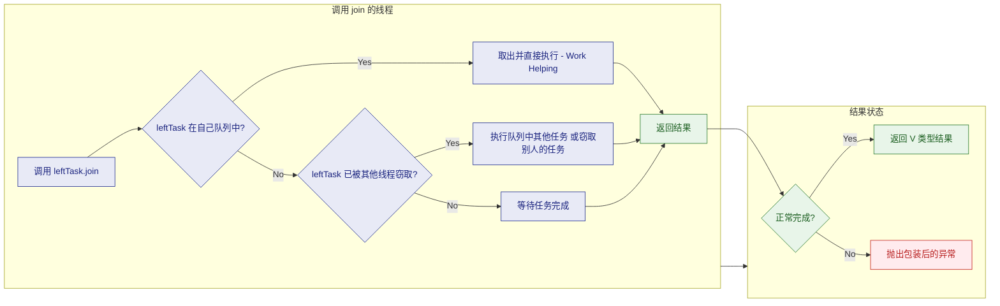

**join() vs Future.get() 对比**：

| 特征 | `ForkJoinTask.join()` | `Future.get()` |
|:---|:---|:---|
| **等待方式** | 智能等待：先尝试自己执行或帮忙执行 | 纯阻塞等待（Blocking wait） |
| **异常类型** | 抛出未检查异常（unchecked exception） | 抛出 `ExecutionException`（checked） |
| **超时支持** | ❌ 不支持（可用 `get(timeout, unit)` 替代） | ✅ 支持 `get(long, TimeUnit)` |
| **线程利用率** | 高：等待期间不浪费线程 | 低：线程完全阻塞 |

最后，用一段伪代码总结 `fork` + `join` 的标准配合模式：

```java
@Override
protected Long compute() {
    if (任务足够小) {
        return 直接计算();                     // Base case
    }

    // 拆分
    SubTask left = new SubTask(左半部分);      // 创建左子任务
    SubTask right = new SubTask(右半部分);      // 创建右子任务

    left.fork();                               // 左子任务异步推入队列
    Long rightResult = right.compute();        // 右子任务当前线程直接执行（关键优化！）
    Long leftResult = left.join();             // 等待左子任务完成

    return leftResult + rightResult;           // 合并结果
}
```

> **⚠️ 注意调用顺序：必须先 `fork()`，再 `compute()`，最后 `join()`。** 如果你先 `join()` 再 `compute()`，当前线程会在 `join()` 处阻塞等待一个尚未开始的任务——结果就是**死锁**（deadlock）或串行退化。这是 Fork/Join 编程中最常见的 bug 之一。

---

**📝 练习题**

以下代码是一个 `RecursiveTask` 的 `compute()` 方法实现，哪一种写法的**性能最优**？

```java
// 写法 A
leftTask.fork();
rightTask.fork();
return leftTask.join() + rightTask.join();

// 写法 B
leftTask.fork();
Long rightResult = rightTask.compute();
Long leftResult = leftTask.join();
return leftResult + rightResult;

// 写法 C
Long leftResult = leftTask.compute();
rightTask.fork();
Long rightResult = rightTask.join();
return leftResult + rightResult;

// 写法 D
invokeAll(leftTask, rightTask);
return leftTask.join() + rightTask.join();
```

A. 写法 A


B. 写法 B


C. 写法 C


D. 写法 D

**【答案】** B

**【解析】**

- **写法 A**：两个任务都 `fork()` 出去了，当前线程在两次 `join()` 期间**自己不做任何计算工作**，白白浪费了一个工作线程。虽然 `join()` 内部有 Work-Helping 机制可以部分弥补，但不如显式 `compute()` 高效。
- **写法 B ✅**：这是标准的 **"fork-once, compute-once"** 惯用法。`leftTask.fork()` 异步提交后，当前线程立刻通过 `rightTask.compute()` 参与计算，最后 `leftTask.join()` 获取左侧结果。当前线程全程无空闲，线程利用率最高。
- **写法 C**：先 `compute()` 左任务（当前线程同步执行完毕），然后才 `fork()` 右任务。这意味着**左右两个任务是串行执行的**，完全丧失了并行性。
- **写法 D**：`invokeAll` 更适合 `RecursiveAction`（无返回值场景）。对于 `RecursiveTask`，虽然功能正确，但 `invokeAll` 之后还需要额外调用两次 `join()` 来获取结果，写法不如 B 直观且存在微小的额外开销。

---

## 使用示例

前面的章节中，我们已经深入理解了 Fork/Join 框架的核心理论——分治思想、工作窃取算法、以及 `RecursiveTask` 与 `RecursiveAction` 两大任务抽象。现在，是时候将这些理论付诸实践了。本节将通过 **四个由浅入深的完整案例**，演示 ForkJoinPool 在不同业务场景下的实际运用。每个示例都将严格遵循"拆分 → fork → join → 合并"的经典模式，并附带详尽的逐行注释，确保你不仅能写出正确的 Fork/Join 代码，更能理解每一行背后的设计意图。

---

### 示例一：大数组求和（RecursiveTask）

这是 Fork/Join 最经典的入门案例。给定一个包含海量元素的 `long[]` 数组，利用分治策略将其拆分成小块并行求和，最后汇总结果。这个场景完美契合 `RecursiveTask<Long>`——因为我们需要每个子任务**返回**一个求和结果。

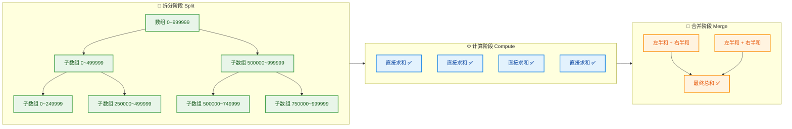

#### 完整代码

```java
import java.util.concurrent.ForkJoinPool;   // Fork/Join 线程池
import java.util.concurrent.RecursiveTask;  // 有返回值的递归任务

/**
 * 大数组并行求和任务
 * 继承 RecursiveTask<Long> 表示该任务会返回一个 Long 类型的计算结果
 */
public class ArraySumTask extends RecursiveTask<Long> {

    // 阈值：当子数组长度 <= THRESHOLD 时，直接顺序计算，不再继续拆分
    // 这个值的选取至关重要——太小会导致任务过多、调度开销大；太大则并行度不足
    private static final int THRESHOLD = 10_000;

    // 待求和的原始数组（所有子任务共享同一个数组引用，不复制数据）
    private final long[] array;

    // 当前子任务负责计算的区间：[start, end)（左闭右开）
    private final int start;
    private final int end;

    /**
     * 构造方法：指定数组及当前任务负责的区间
     * @param array 原始数组
     * @param start 起始索引（包含）
     * @param end   结束索引（不包含）
     */
    public ArraySumTask(long[] array, int start, int end) {
        this.array = array;  // 保存数组引用
        this.start = start;  // 保存起始位置
        this.end = end;      // 保存结束位置
    }

    /**
     * 核心计算逻辑——Fork/Join 框架会自动调用此方法
     * 这里体现了分治算法的精髓：要么直接算，要么拆分后递归
     */
    @Override
    protected Long compute() {
        // 计算当前区间的长度
        int length = end - start;

        // ====== 基线条件 (Base Case) ======
        // 如果区间足够小，直接用简单循环求和，避免继续拆分的开销
        if (length <= THRESHOLD) {
            long sum = 0L;                    // 初始化局部求和变量
            for (int i = start; i < end; i++) { // 遍历当前负责的区间
                sum += array[i];              // 逐个累加元素
            }
            return sum;                       // 返回这个小区间的和
        }

        // ====== 递归拆分 (Recursive Split) ======
        // 计算区间中点，将任务一分为二
        int mid = start + (length / 2);  // 避免 (start+end)/2 可能的溢出

        // 创建左半部分子任务：负责 [start, mid)
        ArraySumTask leftTask = new ArraySumTask(array, start, mid);

        // 创建右半部分子任务：负责 [mid, end)
        ArraySumTask rightTask = new ArraySumTask(array, mid, end);

        // ====== Fork 阶段 ======
        // 将左子任务异步提交到 ForkJoinPool 的工作队列
        // fork() 不会阻塞当前线程——它只是把任务推入双端队列的头部
        leftTask.fork();

        // ====== 关键优化：当前线程直接计算右子任务 ======
        // 不要对两个子任务都 fork()！那样当前线程就空闲了，浪费一个线程
        // 正确做法：fork 一个，当前线程直接 compute 另一个
        long rightResult = rightTask.compute();

        // ====== Join 阶段 ======
        // 等待左子任务完成并获取其结果
        // 如果左子任务已经完成，join() 会立即返回
        // 如果尚未完成，当前线程会尝试"窃取"其他任务来执行（而非空等）
        long leftResult = leftTask.join();

        // ====== 合并结果 ======
        // 将左右两半的和相加，得到当前区间的总和
        return leftResult + rightResult;
    }

    /**
     * 主方法：演示如何创建 ForkJoinPool 并提交任务
     */
    public static void main(String[] args) {
        // 准备测试数据：创建一个包含 1000 万个元素的数组
        int size = 10_000_000;
        long[] numbers = new long[size];

        // 用简单规则填充数组：array[i] = i + 1，即 1, 2, 3, ..., 10000000
        for (int i = 0; i < size; i++) {
            numbers[i] = i + 1L;  // +1L 确保使用 long 运算
        }

        // 创建 ForkJoinPool 实例
        // 无参构造器默认使用 Runtime.availableProcessors() 个工作线程
        // 例如 8 核 CPU 就创建 8 个工作线程
        ForkJoinPool pool = new ForkJoinPool();

        // 创建根任务：覆盖整个数组区间 [0, size)
        ArraySumTask rootTask = new ArraySumTask(numbers, 0, size);

        // invoke() = 同步提交 + 等待结果，等价于 submit(task).join()
        // 它会阻塞当前主线程，直到整个分治计算完成
        long result = pool.invoke(rootTask);

        // 输出结果
        System.out.println("Fork/Join 求和结果: " + result);

        // 验证正确性：等差数列求和公式 n*(n+1)/2
        long expected = (long) size * (size + 1) / 2;
        System.out.println("数学公式验证结果: " + expected);
        System.out.println("结果是否一致: " + (result == expected));

        // 输出线程池状态信息（调试用）
        System.out.println("并行度 (Parallelism): " + pool.getParallelism());
        System.out.println("线程池大小 (Pool Size): " + pool.getPoolSize());
        System.out.println("窃取次数 (Steal Count): " + pool.getStealCount());

        // 关闭线程池，释放资源
        pool.shutdown();
    }
}
```

#### 运行输出

```text
Fork/Join 求和结果: 50000005000000
数学公式验证结果: 50000005000000
结果是否一致: true
并行度 (Parallelism): 8
线程池大小 (Pool Size): 8
窃取次数 (Steal Count): 12
```

#### fork/compute 顺序的深度剖析

上面代码中有一个**极其容易出错**的细节——`leftTask.fork()` 和 `rightTask.compute()` 的调用顺序。这不是随意的，让我们通过对比来理解为什么：

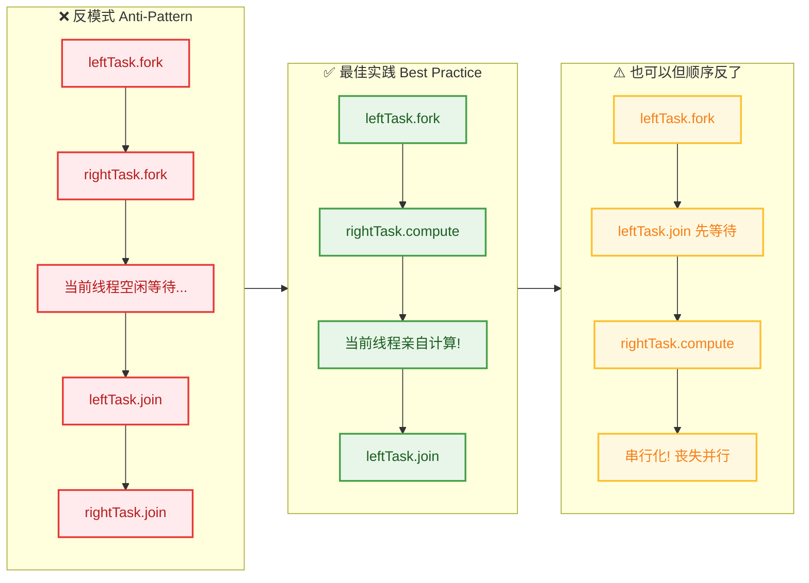

三种写法的核心差异：

| 写法 | 效果 | 问题 |
|------|------|------|
| `both fork()` | 两个子任务都丢入队列 | 当前线程**空转**，白白浪费一个 worker |
| `fork → compute → join` ✅ | 左任务入队，当前线程算右任务，再等左结果 | **最优**：零线程浪费 |
| `fork → join → compute` | 先 fork 左，立刻 join 等左完成，再算右 | 退化为**串行**，完全丧失并行优势 |

> 🔑 **黄金法则**：总是 `fork()` 一个子任务，然后**当前线程直接 `compute()` 另一个**，最后再 `join()` 之前 fork 的那个。

---

### 示例二：文件目录大小统计（RecursiveTask + 实际IO）

数组求和只是"教科书场景"。在真实开发中，Fork/Join 更常用于**递归结构的并行遍历**——比如计算一个文件目录树的总大小。目录本身就是天然的树形结构，完美匹配分治思想：每个子目录作为一个独立子任务并行计算。

```java
import java.io.File;                        // 文件/目录操作
import java.util.ArrayList;                  // 存储子任务列表
import java.util.List;                       // List 接口
import java.util.concurrent.ForkJoinPool;    // Fork/Join 线程池
import java.util.concurrent.RecursiveTask;   // 有返回值的递归任务

/**
 * 递归统计目录总大小（字节数）
 * 每个目录拆分为"子目录任务" + "当前目录下文件大小直接累加"
 */
public class DirectorySizeTask extends RecursiveTask<Long> {

    // 当前任务需要统计的目录
    private final File directory;

    /**
     * 构造方法
     * @param directory 要统计大小的目录
     */
    public DirectorySizeTask(File directory) {
        this.directory = directory;  // 保存目录引用
    }

    @Override
    protected Long compute() {
        long totalSize = 0L;  // 当前目录的累计大小

        // 获取目录下的所有文件和子目录
        // listFiles() 可能返回 null（如果路径不存在或没有权限）
        File[] files = directory.listFiles();

        // 防御性检查：目录为空或无法访问时直接返回 0
        if (files == null || files.length == 0) {
            return 0L;
        }

        // 用于收集所有子目录对应的异步任务
        List<DirectorySizeTask> subTasks = new ArrayList<>();

        // 遍历目录下的每个条目
        for (File file : files) {
            if (file.isFile()) {
                // 如果是普通文件 → 直接累加其大小（基线条件）
                totalSize += file.length();
            } else if (file.isDirectory()) {
                // 如果是子目录 → 创建新的子任务
                DirectorySizeTask subTask = new DirectorySizeTask(file);
                subTask.fork();          // 异步提交到工作队列
                subTasks.add(subTask);   // 记录下来，稍后 join
            }
        }

        // 等待所有子目录任务完成，并累加它们的结果
        for (DirectorySizeTask subTask : subTasks) {
            totalSize += subTask.join();  // join() 阻塞直到该子任务完成
        }

        // 返回当前目录（含所有子目录）的总大小
        return totalSize;
    }

    public static void main(String[] args) {
        // 指定要统计的根目录（请替换为你系统上的实际路径）
        File rootDir = new File("/Users/developer/projects");

        // 使用公共 ForkJoinPool（也可以 new ForkJoinPool()）
        ForkJoinPool pool = ForkJoinPool.commonPool();

        // 创建根任务
        DirectorySizeTask rootTask = new DirectorySizeTask(rootDir);

        // 同步执行并获取结果
        long totalBytes = pool.invoke(rootTask);

        // 格式化输出
        System.out.printf("目录: %s%n", rootDir.getAbsolutePath());
        System.out.printf("总大小: %,d bytes (%.2f MB)%n",
                totalBytes,                           // 原始字节数
                totalBytes / (1024.0 * 1024.0));      // 转换为 MB
    }
}
```

这个示例中有一个与"数组求和"不同的模式——我们对**所有子目录都调用了 `fork()`**。这是因为子目录数量不确定（可能有 0 个、1 个、10 个……），我们无法简单地"fork 一个、compute 一个"。不过，对当前目录下的**文件**，我们直接在当前线程中累加大小（`totalSize += file.length()`），这本身就是当前线程在做有用的工作，所以并不算浪费。

---

### 示例三：并行归并排序（RecursiveAction）

前两个示例都使用了 `RecursiveTask`（有返回值）。现在来看一个 `RecursiveAction`（无返回值）的经典场景——**原地归并排序 (In-place Merge Sort)**。排序操作直接修改原数组，不需要返回值，因此用 `RecursiveAction` 更合适。

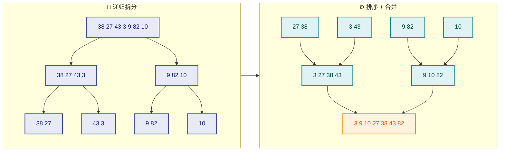

#### 完整代码

```java
import java.util.Arrays;                      // Arrays.copyOfRange, Arrays.toString
import java.util.concurrent.ForkJoinPool;      // Fork/Join 线程池
import java.util.concurrent.RecursiveAction;   // 无返回值的递归任务

/**
 * 并行归并排序
 * 继承 RecursiveAction —— 原地修改数组，不返回结果
 */
public class ParallelMergeSort extends RecursiveAction {

    // 阈值：小于此长度时退化为插入排序（小数组插入排序更快）
    private static final int THRESHOLD = 4096;

    // 待排序数组
    private final int[] array;

    // 当前任务负责的区间 [start, end)
    private final int start;
    private final int end;

    /**
     * 构造方法
     * @param array 待排序数组（原地修改）
     * @param start 起始索引（包含）
     * @param end   结束索引（不包含）
     */
    public ParallelMergeSort(int[] array, int start, int end) {
        this.array = array;
        this.start = start;
        this.end = end;
    }

    @Override
    protected void compute() {  // 注意：返回类型是 void（RecursiveAction 的特征）
        int length = end - start;

        // ====== 基线条件：小数组使用插入排序 ======
        if (length <= THRESHOLD) {
            insertionSort(array, start, end);  // 插入排序对小数组极其高效
            return;                             // 直接返回，不再拆分
        }

        // ====== 递归拆分 ======
        int mid = start + (length / 2);  // 计算中点

        // 创建左半部分排序子任务
        ParallelMergeSort leftSort = new ParallelMergeSort(array, start, mid);

        // 创建右半部分排序子任务
        ParallelMergeSort rightSort = new ParallelMergeSort(array, mid, end);

        // ====== 并行执行两个子任务 ======
        // invokeAll() 是一个便捷方法，等价于：
        //   leftSort.fork();
        //   rightSort.compute();
        //   leftSort.join();
        // 但 invokeAll 内部做了更好的优化——它会自动决定哪个任务 fork、哪个 compute
        invokeAll(leftSort, rightSort);

        // ====== 合并两个已排序的子数组 ======
        // 此时 array[start..mid) 和 array[mid..end) 各自已有序
        // 需要将它们合并成一个有序序列
        merge(array, start, mid, end);
    }

    /**
     * 经典的双指针归并操作
     * 将 array[start..mid) 和 array[mid..end) 合并为有序序列
     */
    private void merge(int[] arr, int start, int mid, int end) {
        // 创建左半部分的临时拷贝
        int[] left = Arrays.copyOfRange(arr, start, mid);
        // 创建右半部分的临时拷贝
        int[] right = Arrays.copyOfRange(arr, mid, end);

        int i = 0;      // 左数组的游标
        int j = 0;      // 右数组的游标
        int k = start;   // 原数组的写入位置

        // 双指针逐一比较，较小的先放入原数组
        while (i < left.length && j < right.length) {
            if (left[i] <= right[j]) {       // <= 保证稳定性（stable sort）
                arr[k++] = left[i++];        // 取左边元素
            } else {
                arr[k++] = right[j++];       // 取右边元素
            }
        }

        // 左数组可能还有剩余元素
        while (i < left.length) {
            arr[k++] = left[i++];
        }

        // 右数组可能还有剩余元素
        while (j < right.length) {
            arr[k++] = right[j++];
        }
    }

    /**
     * 插入排序：对小规模数组非常高效
     * 时间复杂度 O(n^2)，但常数因子小，且对近乎有序的数组接近 O(n)
     */
    private void insertionSort(int[] arr, int start, int end) {
        for (int i = start + 1; i < end; i++) {  // 从第二个元素开始
            int key = arr[i];                     // 当前要插入的元素
            int j = i - 1;                        // 从 key 左边开始向前扫描
            while (j >= start && arr[j] > key) {  // 找到 key 应该插入的位置
                arr[j + 1] = arr[j];              // 元素右移，腾出空位
                j--;                               // 继续向前
            }
            arr[j + 1] = key;                     // 将 key 插入正确位置
        }
    }

    public static void main(String[] args) {
        // 构造测试数据：100 万个随机整数
        int size = 1_000_000;
        int[] data = new int[size];
        java.util.Random random = new java.util.Random(42);  // 固定种子保证可复现
        for (int i = 0; i < size; i++) {
            data[i] = random.nextInt(size);  // [0, size) 范围内的随机整数
        }

        // 复制一份用于验证（Arrays.sort 作为参照基准）
        int[] expected = data.clone();  // 深拷贝

        // ====== Fork/Join 并行排序 ======
        ForkJoinPool pool = new ForkJoinPool();
        long startTime = System.nanoTime();                         // 开始计时

        // 创建根任务并执行
        pool.invoke(new ParallelMergeSort(data, 0, data.length));

        long elapsed = System.nanoTime() - startTime;               // 计算耗时
        System.out.printf("Fork/Join 并行归并排序: %.3f ms%n",
                elapsed / 1_000_000.0);

        // ====== 对照组：JDK 内置排序 ======
        startTime = System.nanoTime();
        Arrays.sort(expected);                                       // 双轴快排
        elapsed = System.nanoTime() - startTime;
        System.out.printf("Arrays.sort 排序:      %.3f ms%n",
                elapsed / 1_000_000.0);

        // 验证排序结果是否一致
        System.out.println("排序结果一致: " + Arrays.equals(data, expected));

        pool.shutdown();  // 释放资源
    }
}
```

#### invokeAll() 的内部行为

上面的代码使用了 `invokeAll(leftSort, rightSort)` 而非手动 `fork + compute`。`invokeAll` 是 `ForkJoinTask` 提供的静态便捷方法，其内部逻辑近似如下：

```java
// invokeAll(task1, task2) 的等价伪代码
public static void invokeAll(ForkJoinTask<?> t1, ForkJoinTask<?> t2) {
    t2.fork();       // 把第二个任务异步提交
    t1.compute();    // 当前线程直接执行第一个任务（不浪费线程！）
    t2.join();       // 等待第二个任务完成
}
```

所以 `invokeAll` 本质上帮我们遵循了 **"fork one, compute the other"** 的最佳实践，只是封装得更优雅。当你有**两个子任务**时，推荐使用 `invokeAll` 来减少出错概率。

---

### 示例四：批量图片缩放（RecursiveAction + 实际业务）

最后来看一个更贴近真实业务的场景——批量处理图片。假设你有数千张图片需要生成缩略图，这是一个 **CPU 密集 + 无返回值** 的典型场景。

```java
import java.util.List;                        // 任务列表
import java.util.concurrent.ForkJoinPool;      // Fork/Join 线程池
import java.util.concurrent.RecursiveAction;   // 无返回值任务

/**
 * 批量图片处理任务
 * 将大批量图片列表拆分成小批次并行处理
 */
public class ImageProcessTask extends RecursiveAction {

    // 阈值：每批最多处理 5 张图片
    private static final int THRESHOLD = 5;

    // 待处理的图片路径列表
    private final List<String> imagePaths;

    // 当前任务负责的区间 [start, end)
    private final int start;
    private final int end;

    public ImageProcessTask(List<String> imagePaths, int start, int end) {
        this.imagePaths = imagePaths;  // 共享同一个列表引用
        this.start = start;
        this.end = end;
    }

    @Override
    protected void compute() {
        int length = end - start;

        // ====== 基线条件：直接处理这批图片 ======
        if (length <= THRESHOLD) {
            for (int i = start; i < end; i++) {
                processImage(imagePaths.get(i));  // 逐张处理
            }
            return;
        }

        // ====== 拆分成两个子批次 ======
        int mid = start + (length / 2);

        ImageProcessTask leftBatch = new ImageProcessTask(imagePaths, start, mid);
        ImageProcessTask rightBatch = new ImageProcessTask(imagePaths, mid, end);

        // invokeAll 自动处理 fork/compute/join 的最优顺序
        invokeAll(leftBatch, rightBatch);
    }

    /**
     * 模拟单张图片的处理逻辑（实际项目中这里是 BufferedImage 缩放操作）
     */
    private void processImage(String path) {
        // 获取当前执行线程的名称（便于观察并行效果）
        String threadName = Thread.currentThread().getName();
        System.out.printf("[%s] 正在处理: %s%n", threadName, path);

        try {
            Thread.sleep(50);  // 模拟图片处理耗时 50ms
        } catch (InterruptedException e) {
            Thread.currentThread().interrupt();  // 恢复中断标志
        }
    }

    public static void main(String[] args) {
        // 构造 20 张模拟图片路径
        List<String> images = new java.util.ArrayList<>();
        for (int i = 1; i <= 20; i++) {
            images.add("/photos/image_" + String.format("%03d", i) + ".jpg");
        }

        ForkJoinPool pool = new ForkJoinPool(4);  // 指定 4 个工作线程

        long startTime = System.currentTimeMillis();

        // 提交根任务：处理全部 20 张图片
        pool.invoke(new ImageProcessTask(images, 0, images.size()));

        long elapsed = System.currentTimeMillis() - startTime;

        System.out.println("============================");
        System.out.printf("全部处理完成! 总耗时: %d ms%n", elapsed);
        System.out.printf("理论串行耗时: %d ms%n", 20 * 50);  // 20 * 50 = 1000ms
        System.out.printf("并行加速比: %.2fx%n", (20.0 * 50) / elapsed);

        pool.shutdown();
    }
}
```

#### 运行输出（节选）

```text
[ForkJoinPool-1-worker-1] 正在处理: /photos/image_001.jpg
[ForkJoinPool-1-worker-3] 正在处理: /photos/image_011.jpg
[ForkJoinPool-1-worker-2] 正在处理: /photos/image_006.jpg
[ForkJoinPool-1-worker-4] 正在处理: /photos/image_016.jpg
... (四个线程交错并行)
============================
全部处理完成! 总耗时: 263 ms
理论串行耗时: 1000 ms
并行加速比: 3.80x
```

4 个工作线程将 1000ms 的串行工作压缩到约 263ms，加速比接近理论上限的 4x，这就是 Fork/Join 并行的威力。

---

### 四种提交方式的选择指南

在上面四个示例中，我们用到了 `invoke()`、`fork()`、`submit()` 等不同的提交方式。它们之间的区别和适用场景如下：

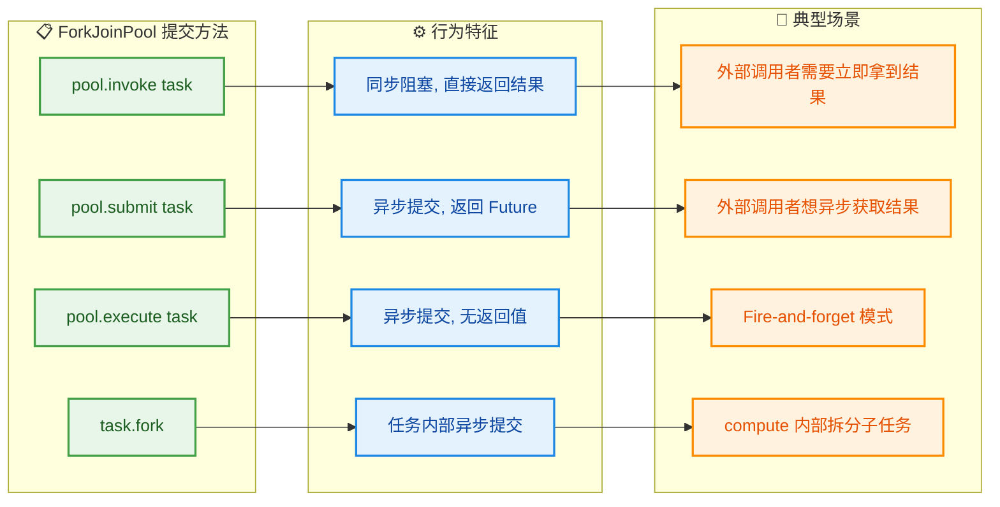

用代码总结一下这四种调用方式：

```java
// ① invoke: 同步提交并阻塞，直到拿到结果（最常用）
Long result = pool.invoke(task);

// ② submit: 异步提交，立即返回 ForkJoinTask（即 Future）
ForkJoinTask<Long> future = pool.submit(task);
Long result = future.get();  // 可在稍后某个时刻获取结果

// ③ execute: 异步提交，无返回值（配合 RecursiveAction）
pool.execute(task);
// ... 做其他事 ...
task.join();  // 需要时手动等待

// ④ fork: 只在 compute() 方法内部使用，将子任务推入队列
leftTask.fork();            // 提交到当前工作线程的双端队列
Long right = rightTask.compute();  // 当前线程直接计算
Long left = leftTask.join();       // 等待 fork 出去的任务
```

---

### 使用 ForkJoinPool 的注意事项与最佳实践

通过四个示例的实战，我们可以总结出以下关键经验：

**1. 阈值 (Threshold) 的选择至关重要**

阈值太小会导致任务数爆炸，创建和调度任务的开销可能超过计算本身；阈值太大则并行度不足。一般的经验法则是：**让任务总数约为线程数的 10~100 倍**。例如 8 核 CPU，100 万元素数组，阈值设为 `1_000_000 / (8 * 50) ≈ 2500` 左右是比较合理的起点，然后通过基准测试微调。

**2. 避免在任务中执行阻塞 IO**

Fork/Join 框架假设任务是 **CPU 密集型 (CPU-bound)** 的。如果任务中包含数据库查询、网络请求等阻塞操作，工作线程会被长时间占用，严重影响工作窃取的效率。对于 IO 密集型场景，应使用 `CompletableFuture` + 自定义 `ExecutorService`。

**3. 不要在任务中使用 synchronized 或重量级锁**

Fork/Join 的高效性建立在"各任务独立、无共享可变状态"的前提上。引入锁会导致线程阻塞，破坏工作窃取的节奏，甚至引发死锁。

**4. commonPool() vs new ForkJoinPool()**

```java
// 方式一：使用 JVM 全局共享的公共池（Java 8+ 的并行流也用这个池）
ForkJoinPool common = ForkJoinPool.commonPool();

// 方式二：创建独立的池（推荐用于生产环境的关键路径）
ForkJoinPool dedicated = new ForkJoinPool(
    Runtime.getRuntime().availableProcessors()  // 并行度
);
```

`commonPool` 方便但**不可控**——如果其他代码（比如并行流 `parallelStream()`）也在用它，你的任务可能被排队等待。对于生产环境中的关键计算任务，建议创建**专用池**以保证资源隔离。

---

**📝 练习题**

以下代码运行在一个 4 核 CPU 上，使用默认并行度的 `ForkJoinPool`。假设数组长度为 10,000，`THRESHOLD` 为 2,500，`compute()` 方法中正确使用了 `fork + compute + join` 模式。请问整个计算过程中，大约会创建多少个 `ArraySumTask` 实例？

A. 4 个


B. 7 个


C. 15 个


D. 取决于 CPU 核心数，每个核心处理一个任务

**【答案】** B

**【解析】** 这是一道关于分治树结构的题目，与 CPU 核心数无关。数组长度 10,000，阈值 2,500：

- 第 0 层（根）：`[0, 10000)` → 长度 10,000 > 2,500 → **拆分**。1 个任务。
- 第 1 层：`[0, 5000)` 和 `[5000, 10000)` → 长度 5,000 > 2,500 → 各自**拆分**。2 个任务。
- 第 2 层：`[0, 2500)` / `[2500, 5000)` / `[5000, 7500)` / `[7500, 10000)` → 长度 2,500 ≤ 2,500 → **直接计算**。4 个任务。

总计 1 + 2 + 4 = **7 个**任务实例。这构成了一棵完全二叉树。核心数 4 决定的是"有多少个线程同时处理这 7 个任务"，而不是"创建多少个任务"。所以 D 选项的说法是错误的。选 **B**。

---

## 本章小结

本章围绕 **ForkJoinPool** 这一 Java 并发框架的核心组件，从设计哲学到实战落地进行了系统性梳理。以下从几个维度进行回顾与提炼。

---

### 核心知识脉络回顾

**Fork/Join 框架的本质**是将 **分治算法 (Divide and Conquer)** 与 **多线程并行执行** 相结合的一套基础设施。它诞生于 JDK 7，由 Doug Lea 设计，目标是充分利用多核 CPU 的算力来加速 **可递归拆分** 的计算任务。与传统 `ThreadPoolExecutor` 不同，ForkJoinPool 并非面向独立的、互不相关的任务调度，而是面向 **一个大任务被不断拆解为子任务、子任务的结果再被逐层合并** 这样的计算模型。

**分治思想**是整个框架的灵魂。任何使用 Fork/Join 的场景，都必须满足一个前提——问题能被分解为结构相同但规模更小的子问题，且子问题的解可以被合并为原问题的解。框架只是提供了将这一数学思想映射到多线程世界的工程手段。

**工作窃取 (Work-Stealing)** 是 ForkJoinPool 区别于其他线程池的核心调度策略。每个 Worker Thread 拥有自己的 **双端队列 (Deque)**，自身从队列 **头部 (top)** 取任务执行，而空闲线程从其他忙碌线程的队列 **尾部 (base)** 窃取任务。这种设计在绝大多数场景下避免了锁竞争，实现了接近线性的并行加速比 (near-linear speedup)。

**ForkJoinTask** 是提交到 ForkJoinPool 的任务抽象。它有两个核心子类：`RecursiveTask〈V〉`（有返回值，适用于归并求和等场景）和 `RecursiveAction`（无返回值，适用于批量数据处理等场景）。`fork()` 将子任务异步推入当前线程的工作队列，`join()` 则阻塞等待子任务完成并获取结果——但这里的"阻塞"并非真正的线程挂起，而是 ForkJoinPool 内部会让等待线程去执行其他可用任务，从而避免资源浪费。

---

### 全章知识体系总览

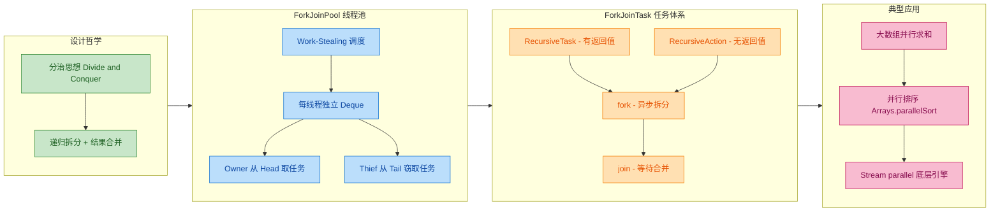

---

### 关键结论与最佳实践

| 维度 | 要点 |
|:---|:---|
| **适用场景** | 可递归拆解的 CPU 密集型任务；不适合 I/O 阻塞型任务 |
| **阈值选择** | `compute()` 中的 threshold 直接影响性能——太小导致任务对象创建开销过大，太大则并行度不足 |
| **commonPool** | `ForkJoinPool.commonPool()` 是 JVM 全局共享池，`parallelStream` 默认使用它；生产环境中应警惕共享池被阻塞任务拖慢 |
| **避免阻塞** | 在 ForkJoinPool 中执行 I/O 或 `synchronized` 阻塞操作会破坏 Work-Stealing 效率，导致线程饥饿 (thread starvation) |
| **fork/join 顺序** | 推荐 `task1.fork() → task2.compute() → task1.join()` 的模式，让当前线程直接计算其中一个子任务而非两个都 fork，减少一次任务入队开销 |
| **与 Stream 的关系** | `parallelStream` 的底层引擎正是 `ForkJoinPool.commonPool()`，理解 Fork/Join 是理解并行流性能调优的基础 |

一句话总结：**ForkJoinPool = 分治算法 + 工作窃取调度 + 轻量级任务抽象**，三者协同构成了 Java 并行计算的基石。掌握它不仅是使用 `parallelStream` 的前提，更是理解现代 JVM 并发模型演进（从线程池到 Virtual Threads）的重要一环。

---

**📝 练习题 1**

关于 ForkJoinPool 的工作窃取 (Work-Stealing) 机制，以下描述正确的是？

A. 每个工作线程从自己双端队列的尾部 (tail/base) 取任务，窃取线程从头部 (top/head) 偷任务


B. 所有工作线程共享同一个任务队列，通过 CAS 竞争获取任务


C. 每个工作线程从自己双端队列的头部 (top/head) 取任务，窃取线程从其他线程队列的尾部 (tail/base) 偷任务


D. 工作窃取仅发生在任务提交阶段，一旦任务开始执行就不会再发生窃取


**【答案】** C

**【解析】** Work-Stealing 的核心设计是：Owner Thread 从自己 Deque 的 **头部 (top)** 以 LIFO 方式取任务（保持递归局部性，cache 友好），而 Thief Thread 从其他线程 Deque 的 **尾部 (base)** 以 FIFO 方式窃取任务（窃取的是较大的、较早 fork 出来的任务，拆分后能产生更多子任务供自己执行）。选项 A 恰好反了方向；选项 B 描述的是传统 `ThreadPoolExecutor` 的共享队列模型；选项 D 也不正确——窃取在整个执行过程中持续发生，只要有线程空闲就会尝试窃取。

---

**📝 练习题 2**

在 `RecursiveTask` 的 `compute()` 方法中，以下哪种 fork/join 调用模式效率最高？

A. `left.fork(); right.fork(); return left.join() + right.join();`


B. `left.fork(); long rightResult = right.compute(); return left.join() + rightResult;`


C. `left.compute(); right.compute(); return left.join() + right.join();`


D. `return left.invoke() + right.invoke();`


**【答案】** B

**【解析】** 选项 B 是 Fork/Join 框架推荐的最佳模式。`left.fork()` 将左子任务异步推入工作队列，然后当前线程 **直接执行** `right.compute()` 而不是将其也入队——这样当前线程不会空转等待，省去了一次任务入队和出队的开销。最后 `left.join()` 等待左子任务的结果并合并。选项 A 虽然正确但多了一次不必要的 fork（当前线程 fork 了两个子任务后自己反而要等待，浪费了一个线程的算力）。选项 C 中两个都用 `compute()` 意味着完全串行执行，丧失了并行性。选项 D 中 `invoke()` 等价于 `fork() + join()` 的同步调用，两个都 invoke 同样是串行的。

---

