---

# ThreadPoolExecutor ⭐⭐⭐

---

## 核心参数 ⭐⭐⭐

`ThreadPoolExecutor` 是 Java 并发编程中最重要的基础设施之一，它位于 `java.util.concurrent` 包下，是几乎所有线程池实现的核心引擎。无论你使用 `Executors` 工厂方法创建的便捷线程池，还是在生产环境中手动定制的线程池，最终都会回到 `ThreadPoolExecutor` 这个类。理解它的核心参数，就等于掌握了线程池调优的钥匙。

`ThreadPoolExecutor` 提供了一个 **7 参数的完整构造方法**（the most complete constructor），所有其他重载构造方法最终都会委托到这个方法。我们先看一眼它的签名，建立全局印象：

```java
// ThreadPoolExecutor 的完整构造方法 —— 所有参数一览无余
public ThreadPoolExecutor(
    int corePoolSize,          // 核心线程数：线程池长期维持的最小线程数量
    int maximumPoolSize,       // 最大线程数：线程池允许创建的线程数量上限
    long keepAliveTime,        // 空闲存活时间：非核心线程空闲后等待新任务的最长时间
    TimeUnit unit,             // 时间单位：keepAliveTime 的度量单位
    BlockingQueue<Runnable> workQueue,   // 工作队列：暂存等待执行的任务
    ThreadFactory threadFactory,         // 线程工厂：自定义线程的创建方式
    RejectedExecutionHandler handler     // 拒绝策略：线程池饱和时的应对方案
) { ... }
```

为了直观感受这 7 个参数在线程池运行时各自扮演的角色，我们用一张架构图来呈现它们的关系：

```mermaid
graph LR
    subgraph INPUT["📥 任务提交入口"]
        direction TB
        T1["submit() / execute()"]
    end

    subgraph CORE["🧵 核心线程区"]
        direction TB
        C1["Thread-1"]
        C2["Thread-2"]
        C3["Thread-..."]
        CP["corePoolSize 控制数量"]
    end

    subgraph QUEUE["📦 工作队列 workQueue"]
        direction TB
        Q1["Task A"]
        Q2["Task B"]
        Q3["Task C"]
        Q4["Task ..."]
    end

    subgraph MAX["⚡ 非核心线程区"]
        direction TB
        M1["Thread-extra-1"]
        M2["Thread-extra-2"]
        MK["keepAliveTime 控制存活"]
        MP["maximumPoolSize 控制上限"]
    end

    subgraph REJECT["🚫 拒绝策略 handler"]
        direction TB
        R1["AbortPolicy"]
        R2["CallerRunsPolicy"]
        R3["DiscardPolicy"]
        R4["DiscardOldestPolicy"]
    end

    subgraph FACTORY["🏭 线程工厂"]
        direction TB
        F1["threadFactory"]
        F2["自定义线程名/优先级/守护"]
    end

    T1 -->|"核心未满"| CORE
    T1 -->|"核心已满"| QUEUE
    QUEUE -->|"队列已满"| MAX
    MAX -->|"达到上限"| REJECT
    FACTORY -.->|"创建线程"| CORE
    FACTORY -.->|"创建线程"| MAX

    classDef inputCls fill:#E8F5E9,stroke:#43A047,color:#1B5E20
    classDef coreCls fill:#E3F2FD,stroke:#1E88E5,color:#0D47A1
    classDef queueCls fill:#FFF3E0,stroke:#FB8C00,color:#E65100
    classDef maxCls fill:#F3E5F5,stroke:#8E24AA,color:#4A148C
    classDef rejectCls fill:#FFEBEE,stroke:#E53935,color:#B71C1C
    classDef factoryCls fill:#E0F2F1,stroke:#00897B,color:#004D40

    class INPUT inputCls
    class CORE coreCls
    class QUEUE queueCls
    class MAX maxCls
    class REJECT rejectCls
    class FACTORY factoryCls
```

接下来我们逐个深入剖析每个参数。

---

### corePoolSize（核心线程数）

`corePoolSize` 定义了线程池中**长期存活的线程数量下限**（the number of threads to keep in the pool, even if they are idle）。当你向线程池提交一个任务时，只要当前活跃线程数（worker count）还没达到 `corePoolSize`，线程池就会**直接创建一个新线程**来处理这个任务 —— 即使此刻池中有其他核心线程正处于空闲状态（idle）。

这是很多初学者容易误解的一个设计决策：**核心线程的创建是"懒加载但不复用空闲"的**。线程池不会先检查"有没有空闲核心线程可以复用"，而是直接 new 一个新线程，直到核心线程数被填满。这种设计的原因是为了**快速预热线程池（warm up）**，让线程池尽快达到稳态。

```java
// 演示：corePoolSize 的懒加载特性
ThreadPoolExecutor pool = new ThreadPoolExecutor(
    3,                      // corePoolSize = 3，核心线程数为 3
    5,                      // maximumPoolSize = 5
    60L,                    // keepAliveTime = 60
    TimeUnit.SECONDS,       // 时间单位为秒
    new LinkedBlockingQueue<>(10)  // 容量为 10 的工作队列
);

// 此时线程池刚创建完毕，内部线程数为 0（懒加载，不会预先创建线程）
System.out.println(pool.getPoolSize());  // 输出: 0

// 提交第 1 个任务 → 当前线程数(0) < corePoolSize(3) → 创建核心线程 #1
pool.execute(() -> doWork());

// 提交第 2 个任务 → 当前线程数(1) < corePoolSize(3) → 创建核心线程 #2
// 注意：即使线程 #1 此刻已空闲，仍然会创建新线程
pool.execute(() -> doWork());

// 提交第 3 个任务 → 当前线程数(2) < corePoolSize(3) → 创建核心线程 #3
pool.execute(() -> doWork());

// 此后再提交任务 → 当前线程数(3) == corePoolSize(3) → 任务进入 workQueue
pool.execute(() -> doWork());  // 这个任务会被放入队列
```

**核心线程默认不会被回收**。即使核心线程长时间处于空闲状态，它们也会一直存活，随时等待新任务的到来。但 `ThreadPoolExecutor` 提供了一个方法 `allowCoreThreadTimeOut(true)` 可以改变这一行为，让核心线程也受 `keepAliveTime` 的约束，空闲超时后被销毁。

```java
// 允许核心线程超时销毁 —— 适用于流量波动大的场景
pool.allowCoreThreadTimeOut(true);
// 开启后，核心线程空闲超过 keepAliveTime 也会被终止
// 线程池可以缩减到 0 个线程（完全空池状态）
```

另外，如果你希望线程池在创建后立即拥有全部核心线程，而不是等待任务触发懒加载，可以调用 **`prestartAllCoreThreads()`**：

```java
// 预启动所有核心线程 —— 适用于启动后立即要承受高并发的场景
int started = pool.prestartAllCoreThreads();  // 返回实际启动的线程数
System.out.println(started);                  // 输出: 3（全部核心线程就位）
System.out.println(pool.getPoolSize());       // 输出: 3
```

**corePoolSize 的设置经验**：

| 任务类型 | 推荐公式 | 原理 |
|---------|---------|------|
| **CPU 密集型**（计算、加密、压缩） | `N_cpu + 1` | 线程数略超 CPU 核心数，利用上下文切换的间隙 |
| **IO 密集型**（网络请求、文件读写、数据库） | `N_cpu * 2` 或 `N_cpu / (1 - 阻塞率)` | 线程大量时间在等待 IO，需要更多线程填充 CPU 空闲 |
| **混合型** | 拆分为 CPU 池和 IO 池分别配置 | 避免互相干扰 |

> 其中 `N_cpu` 可通过 `Runtime.getRuntime().availableProcessors()` 获取。

---

### maximumPoolSize（最大线程数）

`maximumPoolSize` 规定了线程池**允许同时存活的线程总数的绝对上限**（the maximum number of threads to allow in the pool）。它包含核心线程和非核心线程（也叫"救急线程"或"临时线程"）的总和。

当核心线程全部繁忙，工作队列也已经满了，线程池就会尝试创建**非核心线程**来处理任务。非核心线程的最大可创建数量 = `maximumPoolSize - corePoolSize`。

```java
// 直观理解 maximumPoolSize 与 corePoolSize 的关系
ThreadPoolExecutor pool = new ThreadPoolExecutor(
    2,                               // corePoolSize = 2（常驻 2 个核心线程）
    5,                               // maximumPoolSize = 5（最多 5 个线程同时运行）
    30L,                             // 非核心线程空闲 30 秒后回收
    TimeUnit.SECONDS,                // 时间单位
    new ArrayBlockingQueue<>(3)      // 有界队列，容量为 3
);

// 最多能容纳的并发任务数 = maximumPoolSize + queueCapacity = 5 + 3 = 8
// 非核心线程数上限 = maximumPoolSize - corePoolSize = 5 - 2 = 3
```

我们用一个内存模型图来展示线程池在不同负载下的线程变化：

```text
╔════════════════════════════════════════════════════════════════╗
║               ThreadPoolExecutor 线程数量模型                   ║
╠════════════════════════════════════════════════════════════════╣
║                                                                ║
║  0 ─────── corePoolSize(2) ─────── maximumPoolSize(5)          ║
║  |              |                         |                    ║
║  |◄─ 懒加载区 ─►|◄──── 队列缓冲区 ────►|                    ║
║  |              |     (queue: 3)         |                    ║
║  |              |                         |                    ║
║  |  提交任务时   |  核心满 + 队列满时      |  达到此线程数       ║
║  |  逐步创建    |  开始创建非核心线程       |  再提交 → 拒绝     ║
║  |  核心线程    |                         |                    ║
║                                                                ║
║  总容量 = maximumPoolSize + queueCapacity = 5 + 3 = 8 个任务   ║
╚════════════════════════════════════════════════════════════════╝
```

**关键约束**：`maximumPoolSize` 必须 **≥ corePoolSize ≥ 1**。如果传入的值不合法（比如 `maximumPoolSize < corePoolSize` 或者 `maximumPoolSize ≤ 0`），构造方法会直接抛出 `IllegalArgumentException`。

**一个常见的配置误区**：如果你使用了**无界队列**（如默认的 `new LinkedBlockingQueue<>()`，其容量为 `Integer.MAX_VALUE`），那么 `maximumPoolSize` 这个参数实际上是**永远不会生效的** —— 因为队列永远不会满，线程池永远不会去创建非核心线程。这就是为什么 `Executors.newFixedThreadPool()` 虽然设置了 `maximumPoolSize = nThreads`，但它与 `corePoolSize` 相同，因为搭配的 `LinkedBlockingQueue` 是无界的。

---

### keepAliveTime（空闲线程存活时间）

`keepAliveTime` 控制的是**非核心线程的最大空闲等待时间**。当线程池中的线程数量超过 `corePoolSize` 时，那些"多出来的"非核心线程如果在 `keepAliveTime` 时间内没有获取到新任务，就会被终止（terminated）并从池中移除，以释放系统资源。

从源码角度看，线程是通过在工作队列上调用 **`poll(keepAliveTime, unit)`** 来实现超时等待的。如果在指定时间内队列没有新任务入队，`poll` 返回 `null`，线程就知道自己该退出了。而核心线程则调用的是 **`take()`**（无限期阻塞等待），因此默认情况下核心线程不会超时。

```java
// keepAliveTime 的行为演示
ThreadPoolExecutor pool = new ThreadPoolExecutor(
    2,                              // 2 个核心线程（默认不会被回收）
    4,                              // 最多 4 个线程
    60L,                            // 非核心线程空闲 60 秒后被回收
    TimeUnit.SECONDS,               // 时间单位为秒
    new ArrayBlockingQueue<>(5)     // 有界队列容量 5
);

// 场景模拟：
// 1. 高峰期：大量任务涌入 → 队列满 → 创建到 4 个线程
// 2. 高峰过后：任务减少 → 2 个非核心线程空闲
// 3. 空闲 60 秒后 → 非核心线程被销毁 → 池中回到 2 个核心线程
```

```mermaid
graph LR
    subgraph PEAK["🔥 高峰期"]
        direction TB
        P1["Core Thread 1 - 忙碌"]
        P2["Core Thread 2 - 忙碌"]
        P3["Extra Thread 3 - 忙碌"]
        P4["Extra Thread 4 - 忙碌"]
    end

    subgraph IDLE["⏳ 空闲等待中"]
        direction TB
        I1["Core Thread 1 - take()阻塞"]
        I2["Core Thread 2 - take()阻塞"]
        I3["Extra Thread 3 - poll(60s)"]
        I4["Extra Thread 4 - poll(60s)"]
    end

    subgraph SHRINK["✅ 60秒后缩容"]
        direction TB
        S1["Core Thread 1 - 存活"]
        S2["Core Thread 2 - 存活"]
        S3["Extra Thread 3 - 已销毁 ❌"]
        S4["Extra Thread 4 - 已销毁 ❌"]
    end

    PEAK -->|"任务处理完毕"| IDLE
    IDLE -->|"超过keepAliveTime"| SHRINK

    classDef peakCls fill:#FFECB3,stroke:#FFA000,color:#E65100
    classDef idleCls fill:#E3F2FD,stroke:#1E88E5,color:#0D47A1
    classDef shrinkCls fill:#E8F5E9,stroke:#43A047,color:#1B5E20

    class PEAK peakCls
    class IDLE idleCls
    class SHRINK shrinkCls
```

**`keepAliveTime = 0` 的含义**：非核心线程在完成任务后**立即被回收**，不做任何等待。这种设置适用于"突发流量后迅速释放资源"的场景，但频繁的线程创建和销毁会带来额外的系统开销。

**与 `allowCoreThreadTimeOut` 的联动**：

| 配置组合 | 核心线程行为 | 非核心线程行为 |
|---------|------------|--------------|
| `allowCoreThreadTimeOut = false`（默认） | 永不超时，调用 `take()` 无限等待 | 空闲超过 `keepAliveTime` 后销毁 |
| `allowCoreThreadTimeOut = true` | 同样受 `keepAliveTime` 约束，空闲超时后销毁 | 空闲超过 `keepAliveTime` 后销毁 |

---

### unit（时间单位）

`unit` 是 `keepAliveTime` 的度量单位，类型为 `java.util.concurrent.TimeUnit` 枚举。它本身的概念简单直白，但 `TimeUnit` 这个枚举类本身提供了非常实用的时间转换和线程控制工具方法，值得了解。

```java
// TimeUnit 枚举值一览 —— 从小到大
TimeUnit.NANOSECONDS;    // 纳秒（10⁻⁹ 秒）
TimeUnit.MICROSECONDS;   // 微秒（10⁻⁶ 秒）
TimeUnit.MILLISECONDS;   // 毫秒（10⁻³ 秒）—— 最常用
TimeUnit.SECONDS;        // 秒 —— 最常用
TimeUnit.MINUTES;        // 分钟
TimeUnit.HOURS;          // 小时
TimeUnit.DAYS;           // 天
```

`TimeUnit` 不仅仅是个"单位标签"，它还封装了大量便捷方法：

```java
// 1. 时间转换 —— 比手动乘除更清晰、更不容易出错
long millis = TimeUnit.MINUTES.toMillis(5);     // 5分钟 → 300000毫秒
long seconds = TimeUnit.HOURS.toSeconds(2);     // 2小时 → 7200秒
long nanos = TimeUnit.SECONDS.toNanos(1);       // 1秒 → 1000000000纳秒

// 2. 线程睡眠 —— 比 Thread.sleep(millis) 更语义化
TimeUnit.SECONDS.sleep(3);                      // 当前线程睡眠 3 秒
// 等价于 Thread.sleep(3000)，但可读性更强

// 3. 线程等待 —— 封装了 Object.wait()
TimeUnit.SECONDS.timedWait(lockObj, 5);         // 在 lockObj 上等待 5 秒

// 4. 线程 join —— 封装了 Thread.join()
TimeUnit.SECONDS.timedJoin(thread, 10);         // join 等待 10 秒
```

在实际构建线程池时，最常见的搭配是：

```java
// 生产环境常见写法
new ThreadPoolExecutor(
    coreSize, maxSize,
    60L, TimeUnit.SECONDS,        // 60 秒 —— 最常见
    queue, factory, handler
);

// 或者对于需要快速回收的场景
new ThreadPoolExecutor(
    coreSize, maxSize,
    0L, TimeUnit.MILLISECONDS,    // 0 毫秒 —— 立即回收非核心线程
    queue, factory, handler
);
```

---

### workQueue（工作队列）

`workQueue` 是 `ThreadPoolExecutor` 最核心的"缓冲区"（buffer），它是一个 `BlockingQueue<Runnable>` 实例，用于暂存那些已提交但尚未被线程执行的任务。**工作队列的选择直接决定了线程池的行为特征和性能表现**，是线程池调优中最关键的一环。

当所有核心线程都在忙碌时，新提交的任务不会直接创建新线程，而是先被放入这个队列中排队等候。只有当队列也满了，线程池才会去创建非核心线程。这意味着 **工作队列是核心线程和非核心线程之间的"分水岭"**。

```java
// workQueue 在任务流转中的位置
// execute(task) 方法的核心逻辑伪代码：
public void execute(Runnable command) {
    int currentWorkers = workerCount();          // 获取当前工作线程数量

    if (currentWorkers < corePoolSize) {
        // 第一步：核心线程未满 → 直接创建核心线程执行任务
        addWorker(command, true);                // true 表示核心线程
    }
    else if (workQueue.offer(command)) {
        // 第二步：核心线程已满 → 尝试将任务放入队列
        // offer() 是非阻塞方法，成功返回 true，失败（队列满）返回 false
    }
    else if (currentWorkers < maximumPoolSize) {
        // 第三步：队列也满了 → 创建非核心线程
        addWorker(command, false);               // false 表示非核心线程
    }
    else {
        // 第四步：全部满了 → 执行拒绝策略
        handler.rejectedExecution(command, this);
    }
}
```

常见的 `BlockingQueue` 实现及其特点对比：

| 队列类型 | 是否有界 | 特点 | 典型使用场景 |
|---------|---------|------|------------|
| `LinkedBlockingQueue` | 可选（默认无界 `Integer.MAX_VALUE`） | 吞吐量高，**有 OOM 风险** | `Executors.newFixedThreadPool()` |
| `ArrayBlockingQueue` | **有界** | 公平/非公平可选，内存固定 | 生产环境推荐 |
| `SynchronousQueue` | 容量为 0 | 不存储任务，直接传递 | `Executors.newCachedThreadPool()` |
| `PriorityBlockingQueue` | 无界 | 按优先级出队 | 优先级任务调度 |
| `DelayQueue` | 无界 | 元素到期后才能出队 | `Executors.newScheduledThreadPool()` |
| `LinkedTransferQueue` | 无界 | 融合了 SynchronousQueue 的直接传递能力 | 高性能场景 |

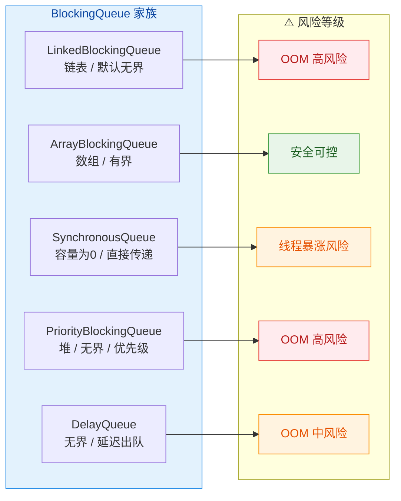

> **生产环境黄金法则**：永远使用**有界队列**（bounded queue），并为 `maximumPoolSize` 设置合理上限。无界队列 + 固定核心线程数的组合（如 `Executors.newFixedThreadPool`）是导致线上 OOM 的经典元凶，阿里巴巴 Java 开发手册明确禁止使用 `Executors` 的工厂方法创建线程池。

---

### threadFactory（线程工厂）

`threadFactory` 定义了线程池**如何创建新线程**。它是一个 `java.util.concurrent.ThreadFactory` 接口的实例，该接口只有一个方法：

```java
// ThreadFactory 接口定义 —— 极致简洁
public interface ThreadFactory {
    Thread newThread(Runnable r);  // 根据 Runnable 任务创建并返回一个新线程
}
```

如果你在构造 `ThreadPoolExecutor` 时不指定 `threadFactory`，会使用默认的 `Executors.defaultThreadFactory()`。默认工厂创建的线程具有以下特征：

- 线程名格式：`pool-N-thread-M`（N 是池编号，M 是线程编号）
- 线程优先级：`Thread.NORM_PRIORITY`（5）
- 非守护线程（daemon = false）
- 属于同一个 `ThreadGroup`

在生产环境中，**强烈建议自定义 `ThreadFactory`**，原因有三：

1. **可追踪性**：自定义线程名能让你在线程 dump（`jstack`）中快速定位问题线程属于哪个业务模块
2. **异常处理**：可以设置 `UncaughtExceptionHandler` 来捕获线程中未处理的异常
3. **守护线程控制**：根据业务需要决定线程是否为守护线程

```java
// 生产级自定义 ThreadFactory 示例
public class NamedThreadFactory implements ThreadFactory {

    private final AtomicInteger threadNumber = new AtomicInteger(1);  // 线程编号计数器（原子递增）
    private final String namePrefix;       // 线程名前缀，标识业务模块
    private final boolean daemon;          // 是否设为守护线程
    private final Thread.UncaughtExceptionHandler exceptionHandler;  // 未捕获异常处理器

    // 构造方法：传入业务名和守护线程标志
    public NamedThreadFactory(String poolName, boolean daemon) {
        this.namePrefix = poolName + "-worker-";          // 例如 "order-service-worker-"
        this.daemon = daemon;                              // 是否为守护线程
        this.exceptionHandler = (t, e) -> {                // 默认异常处理：记录日志
            System.err.println("Thread " + t.getName()     // 打印出问题的线程名
                + " threw exception: " + e.getMessage());  // 打印异常信息
            e.printStackTrace();                           // 打印完整堆栈
        };
    }

    @Override
    public Thread newThread(Runnable r) {
        // 创建新线程，名称格式如：order-service-worker-1, order-service-worker-2, ...
        Thread t = new Thread(r, namePrefix + threadNumber.getAndIncrement());
        t.setDaemon(daemon);                               // 设置守护线程属性
        t.setPriority(Thread.NORM_PRIORITY);               // 设置正常优先级（5）
        t.setUncaughtExceptionHandler(exceptionHandler);   // 绑定异常处理器
        return t;                                          // 返回配置好的线程实例
    }
}

// 使用自定义工厂创建线程池
ThreadPoolExecutor orderPool = new ThreadPoolExecutor(
    4, 8, 60L, TimeUnit.SECONDS,
    new ArrayBlockingQueue<>(100),
    new NamedThreadFactory("order-service", false),   // 自定义工厂：线程名带业务标识
    new ThreadPoolExecutor.CallerRunsPolicy()
);
```

当你执行 `jstack <pid>` 进行线程 dump 分析时，你会看到：

```text
"order-service-worker-1" #15 prio=5 os_prio=0 tid=0x00007f... nid=0x3a03 waiting ...
"order-service-worker-2" #16 prio=5 os_prio=0 tid=0x00007f... nid=0x3a04 runnable ...
```

对比默认的 `pool-1-thread-1` 这样毫无语义的名称，排查效率天壤之别。

> 在开源社区中，Google Guava 提供了 `ThreadFactoryBuilder` 工具类，可以用链式 API 快速构建自定义工厂：`new ThreadFactoryBuilder().setNameFormat("rpc-pool-%d").setDaemon(true).build()`。

---

### handler（拒绝策略）

`handler` 是 `RejectedExecutionHandler` 接口的实例，定义了当线程池**完全饱和**（saturated）时如何处理新提交的任务。所谓"完全饱和"，指的是同时满足两个条件：

1. 工作队列已满（queue is full）
2. 线程数已达到 `maximumPoolSize`（cannot create more threads）

此外，当线程池已经处于 **SHUTDOWN** 状态时，任何新提交的任务也会触发拒绝策略。

```java
// RejectedExecutionHandler 接口定义
public interface RejectedExecutionHandler {
    // r: 被拒绝的任务    executor: 触发拒绝的线程池
    void rejectedExecution(Runnable r, ThreadPoolExecutor executor);
}
```

JDK 内置了 4 种拒绝策略，它们作为 `ThreadPoolExecutor` 的静态内部类提供：

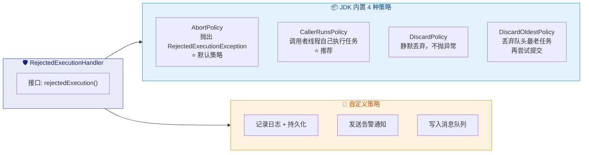

下面逐一展示每种策略的源码和行为：

```java
// 1️⃣ AbortPolicy —— 默认策略：直接抛异常，快速失败
// 适用场景：不允许丢失任务，必须让调用者感知到系统过载
public static class AbortPolicy implements RejectedExecutionHandler {
    public void rejectedExecution(Runnable r, ThreadPoolExecutor e) {
        // 直接抛出 RejectedExecutionException，调用者必须处理
        throw new RejectedExecutionException(
            "Task " + r.toString() +                      // 被拒绝的任务信息
            " rejected from " + e.toString()              // 线程池当前状态信息
        );
    }
}

// 2️⃣ CallerRunsPolicy —— 调用者执行：谁提交谁执行
// 适用场景：不希望丢失任务，且能接受调用者线程被阻塞
public static class CallerRunsPolicy implements RejectedExecutionHandler {
    public void rejectedExecution(Runnable r, ThreadPoolExecutor e) {
        if (!e.isShutdown()) {        // 如果线程池还没有关闭
            r.run();                  // 直接在调用者线程（如 main 线程）中执行任务
            // 注意：这会阻塞调用者线程，形成天然的反压（backpressure）机制
            // 调用者线程忙于执行任务，暂时无法提交新任务，给线程池喘息时间
        }
    }
}

// 3️⃣ DiscardPolicy —— 静默丢弃：什么都不做
// 适用场景：允许丢失非关键任务（如日志、统计等）
public static class DiscardPolicy implements RejectedExecutionHandler {
    public void rejectedExecution(Runnable r, ThreadPoolExecutor e) {
        // 空实现 —— 任务被悄悄丢弃，无异常、无日志、无通知
        // ⚠️ 生产环境慎用！任务悄无声息地消失，排查问题极其困难
    }
}

// 4️⃣ DiscardOldestPolicy —— 弃老策略：丢弃队列头部最老的任务，然后重新提交当前任务
// 适用场景：新任务比旧任务更重要的场景
public static class DiscardOldestPolicy implements RejectedExecutionHandler {
    public void rejectedExecution(Runnable r, ThreadPoolExecutor e) {
        if (!e.isShutdown()) {        // 如果线程池还没有关闭
            e.getQueue().poll();      // 移除队列头部（最老的）任务
            e.execute(r);             // 重新尝试提交当前任务
            // ⚠️ 注意：如果配合 PriorityBlockingQueue 使用，
            // 丢弃的是优先级最高的任务（因为堆顶出队），可能不符合预期！
        }
    }
}
```

**生产环境中的自定义拒绝策略**才是真正的最佳实践。内置的 4 种策略要么太暴力（Abort），要么有数据丢失风险（Discard），一个成熟的系统应该在拒绝时**记录完整信息并触发告警**：

```java
// 5️⃣ 自定义策略 —— 生产级实现
public class LogAndAlertPolicy implements RejectedExecutionHandler {

    private static final Logger log = LoggerFactory.getLogger(LogAndAlertPolicy.class);

    @Override
    public void rejectedExecution(Runnable r, ThreadPoolExecutor executor) {
        // 1. 记录详细的线程池状态日志
        String msg = String.format(
            "[ThreadPool REJECT] task=%s, poolSize=%d, activeCount=%d, " +  // 当前线程数/活跃数
            "queueSize=%d, completedTask=%d, isShutdown=%s",                // 队列大小/已完成数
            r.toString(),                        // 被拒绝的任务描述
            executor.getPoolSize(),              // 当前池中线程总数
            executor.getActiveCount(),           // 正在执行任务的线程数
            executor.getQueue().size(),          // 队列中等待的任务数
            executor.getCompletedTaskCount(),    // 已完成的任务总数
            executor.isShutdown()                // 线程池是否已关闭
        );
        log.error(msg);                          // 以 ERROR 级别记录日志

        // 2. 发送告警通知（钉钉、邮件、短信等）
        AlertService.send("线程池拒绝告警", msg);

        // 3. 可选：将任务持久化到数据库或消息队列，后续补偿执行
        // taskBackupService.save(r);

        // 4. 最终仍然抛出异常，让调用者感知
        throw new RejectedExecutionException(msg);
    }
}
```

**拒绝策略选择决策表**：

| 策略 | 任务丢失 | 调用者阻塞 | 适用场景 |
|------|---------|-----------|---------|
| `AbortPolicy` | ❌ 不丢失（抛异常） | ❌ 不阻塞 | 核心业务，必须感知过载 |
| `CallerRunsPolicy` | ❌ 不丢失 | ✅ 阻塞调用者 | 需要反压（backpressure）的场景 |
| `DiscardPolicy` | ✅ 静默丢失 | ❌ 不阻塞 | 可丢弃的非关键任务 |
| `DiscardOldestPolicy` | ✅ 丢弃最旧 | ❌ 不阻塞 | 新任务优先级 > 旧任务 |
| **自定义策略** | 自行控制 | 自行控制 | 生产环境推荐 |

---

最后，我们将 7 个参数的关系总结为一张完整的生产配置模板：

```java
// ✅ 生产环境线程池配置模板 —— 阿里巴巴规范推荐写法
ThreadPoolExecutor bizPool = new ThreadPoolExecutor(
    Runtime.getRuntime().availableProcessors() * 2,      // corePoolSize: IO密集型推荐 2N
    Runtime.getRuntime().availableProcessors() * 4,      // maximumPoolSize: 核心的 2 倍弹性
    60L,                                                  // keepAliveTime: 非核心线程空闲 60 秒回收
    TimeUnit.SECONDS,                                     // unit: 秒
    new ArrayBlockingQueue<>(1000),                       // workQueue: 有界队列，容量 1000
    new NamedThreadFactory("biz-service", false),         // threadFactory: 自定义线程名
    new LogAndAlertPolicy()                               // handler: 自定义拒绝策略（日志+告警）
);
```

---

**📝 练习题**

某线程池配置如下：`corePoolSize=2, maximumPoolSize=4, workQueue=new ArrayBlockingQueue<>(3)`。现有 8 个任务**同时**提交到该线程池，假设每个任务执行时间足够长（不会在其他任务提交期间完成），请问最终会发生什么？

A. 8 个任务全部被执行，无任务被拒绝


B. 7 个任务被处理（4个线程执行 + 3个在队列中），1 个任务被拒绝策略处理


C. 5 个任务被处理（2个核心线程执行 + 3个在队列中），3 个任务被拒绝策略处理


D. 4 个任务被执行，4 个任务进入队列等待


**【答案】** B

**【解析】** 线程池处理任务的顺序严格遵循：**核心线程 → 队列 → 非核心线程 → 拒绝策略**。具体推演过程如下：

- 任务 1、2 提交：当前线程数 (0, 1) < `corePoolSize` (2)，创建核心线程执行。此时线程数 = 2。
- 任务 3、4、5 提交：核心线程已满，任务进入 `ArrayBlockingQueue`（容量 3）。此时队列中有 3 个任务。
- 任务 6、7 提交：队列已满，但线程数 (2) < `maximumPoolSize` (4)，创建非核心线程执行。此时线程数 = 4。
- 任务 8 提交：队列已满，且线程数 (4) == `maximumPoolSize` (4)，触发拒绝策略。

最终：4 个线程正在执行任务（2 核心 + 2 非核心）+ 3 个任务在队列中等待 = 7 个任务被容纳，**1 个任务被拒绝**。故选 B。这也说明线程池能同时容纳的最大任务数 = `maximumPoolSize` + `queueCapacity` = 4 + 3 = 7。

---

## 工作流程 ⭐⭐⭐

`ThreadPoolExecutor` 的工作流程是面试中被考察频率最高的知识点之一，也是理解线程池设计哲学的关键。当一个任务通过 `execute(Runnable command)` 方法提交到线程池后，线程池并不是简单地"找一个空闲线程来执行"，而是遵循一套**严格的、阶梯式的决策链**（a well-defined, cascading decision chain）。这套决策链的核心目标是：**用最少的资源完成最多的工作**。

理解这套流程之前，我们需要先建立一个直觉：线程池把线程分为**核心线程**（core threads）和**非核心线程**（non-core threads）。核心线程是"常驻部队"，默认情况下即使空闲也不会被回收；非核心线程是"临时工"，任务高峰时临时招募，空闲超过 `keepAliveTime` 后会被销毁。队列则扮演"缓冲区"的角色——当核心线程全部繁忙时，新任务先在队列里排队等候，而不是立刻创建新线程。

这种设计体现了一个重要原则：**创建线程是昂贵的**（thread creation is expensive）。每个线程大约占用 1MB 左右的栈内存，线程过多还会导致频繁的上下文切换（context switching），反而降低系统吞吐量。因此线程池宁可让任务排队，也不轻易创建新线程。

### 核心线程未满 → 创建核心线程

当任务到达线程池时，**第一道判断**是检查当前运行的工作线程数（worker count）是否小于 `corePoolSize`。如果小于，无论此时是否有空闲的核心线程，线程池都会**直接创建一个新的核心线程**来执行该任务。

这一点非常重要，也是很多人容易误解的地方：即使已有核心线程处于空闲状态，只要工作线程总数尚未达到 `corePoolSize`，新任务依然会触发创建新线程。这种"eager creation"策略的目的是**尽快将核心线程池填满**，使线程池进入稳态（steady state），后续任务就可以直接被空闲线程从队列中取走执行，避免了频繁的线程创建开销。

我们来看 `execute()` 方法中对应的源码片段：

```java
public void execute(Runnable command) {
    // 空任务校验，防止 NPE
    if (command == null)
        throw new NullPointerException();

    // ctl 是一个 AtomicInteger，高3位存储线程池状态，低29位存储工作线程数
    int c = ctl.get();

    // 第一步：判断当前工作线程数是否小于 corePoolSize
    if (workerCountOf(c) < corePoolSize) {
        // addWorker 的第二个参数 true 表示以 corePoolSize 为上限创建线程
        // 如果添加成功，直接返回；该新线程会立即执行传入的 command
        if (addWorker(command, true))
            return;
        // 如果添加失败（可能是并发情况下其他线程抢先创建了），重新读取 ctl
        c = ctl.get();
    }
    // ... 后续逻辑
}
```

`addWorker(command, true)` 方法内部会进行**双重检查**（double-check）：先用 CAS 操作递增工作线程计数，成功后再创建 `Worker` 对象并启动线程。第二个参数 `true` 告诉方法使用 `corePoolSize` 作为线程数上限。如果在并发场景下 CAS 失败（说明有其他线程也在同时提交任务并抢先创建了线程），方法返回 `false`，然后外层重新获取 `ctl` 进入下一个判断分支。

一个值得注意的细节是：**核心线程与非核心线程在本质上没有任何区别**。它们是同一个 `Worker` 类的实例，执行完全相同的 `runWorker()` 逻辑。所谓"核心"与"非核心"的区分，仅仅体现在**创建时的边界检查**和**回收时的存活策略**上。线程池并不会给线程打上"核心"或"非核心"的标签。

### 核心线程满 → 入队列

如果当前工作线程数已经达到 `corePoolSize`，任务不会触发新线程的创建，而是被**放入工作队列**（workQueue）中等待。这是第二道判断。

```java
public void execute(Runnable command) {
    int c = ctl.get();

    if (workerCountOf(c) < corePoolSize) {
        if (addWorker(command, true))
            return;
        c = ctl.get();
    }

    // 第二步：线程池仍在 RUNNING 状态，且任务成功入队
    if (isRunning(c) && workQueue.offer(command)) {
        // 入队成功后进行二次检查（double-check）
        int recheck = ctl.get();

        // 如果线程池在入队期间被 shutdown 了，需要把任务从队列中移除并执行拒绝策略
        if (!isRunning(recheck) && remove(command))
            reject(command);
        // 如果线程池还在运行，但工作线程数变为0（所有线程都意外终止了），
        // 则创建一个空任务的 Worker 来消费队列中的任务，确保不会"饿死"
        else if (workerCountOf(recheck) == 0)
            addWorker(null, false);
    }
    // ... 后续逻辑
}
```

这段代码中有两个精妙的设计值得深入理解：

**第一，`workQueue.offer(command)` 是非阻塞操作**。它调用的是队列的 `offer()` 方法而非 `put()` 方法。`offer()` 在队列已满时会立即返回 `false`，不会阻塞提交线程。这保证了 `execute()` 方法永远不会阻塞调用者（除非使用了 `CallerRunsPolicy` 等特殊拒绝策略间接导致阻塞）。

**第二，入队后的 double-check 机制**。在任务成功入队后，线程池会再次检查自身状态。这是因为在多线程环境下，从"检查条件"到"执行入队"之间存在时间窗口，线程池的状态可能在这个窗口期内发生变化：

- 如果线程池在入队后被 `shutdown()` 了，那么新入队的任务需要被移除并拒绝，因为 `SHUTDOWN` 状态的线程池不再接受新任务。
- 如果线程池仍在运行，但所有工作线程都已终止（`workerCountOf(recheck) == 0`），则需要创建一个新线程来处理队列中的任务。这种情况虽然罕见，但在 `allowCoreThreadTimeOut(true)` 被设置时是有可能发生的——所有核心线程都因超时被回收，此时队列中有任务却没有线程去消费。

此时核心线程们在做什么呢？它们在 `runWorker()` 方法的循环中，通过 `getTask()` 方法从工作队列中 **阻塞地获取任务**（blocking take）。一旦队列中出现新任务，某个空闲的核心线程就会被唤醒并开始执行：

```java
// Worker.runWorker() 的简化逻辑
final void runWorker(Worker w) {
    Runnable task = w.firstTask;   // 首次执行时，取出创建 Worker 时传入的任务
    w.firstTask = null;            // 清空引用，允许 GC

    while (task != null || (task = getTask()) != null) {
        // 获取到任务后加锁执行
        w.lock();
        try {
            beforeExecute(w.thread, task);   // 钩子方法：执行前回调
            task.run();                       // 核心：执行任务的 run() 方法
            afterExecute(task, null);         // 钩子方法：执行后回调
        } finally {
            task = null;                      // 释放任务引用
            w.completedTasks++;               // 完成任务计数+1
            w.unlock();                       // 解锁
        }
    }
    // 循环退出意味着 getTask() 返回了 null，线程即将终止
    processWorkerExit(w, false);
}
```

### 队列满 → 创建非核心线程

当工作队列也满了（`workQueue.offer(command)` 返回 `false`），线程池会尝试**创建非核心线程**来直接执行该任务。这是第三道判断：

```java
public void execute(Runnable command) {
    int c = ctl.get();

    // 第一步：尝试创建核心线程（略）
    // 第二步：尝试入队列（略）

    // 第三步：队列已满，尝试以 maximumPoolSize 为上限创建非核心线程
    // addWorker 的第二个参数 false 表示以 maximumPoolSize 为上限
    else if (!addWorker(command, false))
        // 如果创建也失败了（已达最大线程数或线程池已关闭），执行拒绝策略
        reject(command);
}
```

注意 `addWorker(command, false)` 中第二个参数变成了 `false`，这意味着内部检查线程数上限时使用的是 `maximumPoolSize` 而非 `corePoolSize`。

这个阶段的设计意图是：**队列已经满了，说明系统负载确实很高**，此时有必要投入更多线程资源来加速任务消化。非核心线程被创建后，和核心线程一样进入 `runWorker()` 循环，执行完传入的任务后会继续从队列中获取任务。不同之处在于，非核心线程在 `getTask()` 中使用的是**带超时的 `poll(keepAliveTime, unit)`**，而核心线程（默认情况下）使用的是**无限期阻塞的 `take()`**。一旦在 `keepAliveTime` 内没有获取到新任务，`getTask()` 返回 `null`，非核心线程退出循环并被销毁。

```java
private Runnable getTask() {
    boolean timedOut = false;

    for (;;) {
        int c = ctl.get();
        int wc = workerCountOf(c);

        // 判断当前线程是否需要超时回收
        // 两种情况需要超时：
        // 1. allowCoreThreadTimeOut 为 true（核心线程也要超时回收）
        // 2. 当前工作线程数 > corePoolSize（存在非核心线程）
        boolean timed = allowCoreThreadTimeOut || wc > corePoolSize;

        // 如果上一轮 poll 超时了且满足回收条件，返回 null 触发线程退出
        if ((wc > maximumPoolSize || (timed && timedOut))
            && (wc > 1 || workQueue.isEmpty())) {
            if (compareAndDecrementWorkerCount(c))
                return null;  // 返回 null，runWorker 的 while 循环退出，线程终止
            continue;
        }

        try {
            // 关键分叉点：
            // timed=true  → poll()，超时返回 null
            // timed=false → take()，无限阻塞直到有任务
            Runnable r = timed ?
                workQueue.poll(keepAliveTime, TimeUnit.NANOSECONDS) :
                workQueue.take();

            if (r != null)
                return r;      // 获取到任务，返回给 runWorker 执行
            timedOut = true;   // poll 超时，标记为 true，下轮循环决定是否退出
        } catch (InterruptedException retry) {
            timedOut = false;  // 被中断不算超时，重试
        }
    }
}
```

### 达到最大线程数 → 拒绝策略

如果工作线程数已经达到 `maximumPoolSize`，并且队列也已满，那么 `addWorker(command, false)` 将返回 `false`。此时线程池已经没有任何余力处理新任务，只能触发**拒绝策略**（`RejectedExecutionHandler`）。

```java
// addWorker 返回 false，进入 reject 方法
final void reject(Runnable command) {
    // handler 就是构造线程池时传入的 RejectedExecutionHandler
    handler.rejectedExecution(command, this);
}
```

默认的拒绝策略是 `AbortPolicy`，它会直接抛出 `RejectedExecutionException`。关于四种内置拒绝策略及自定义策略，将在后续章节详细展开。

到达这一步意味着系统确实过载了，在生产环境中，触发拒绝策略通常是一个**需要告警的信号**，说明线程池参数配置不当，或者系统负载已经超出了设计容量。

### 完整工作流程图

下面用一张流程图来完整呈现 `execute()` 方法的决策链：

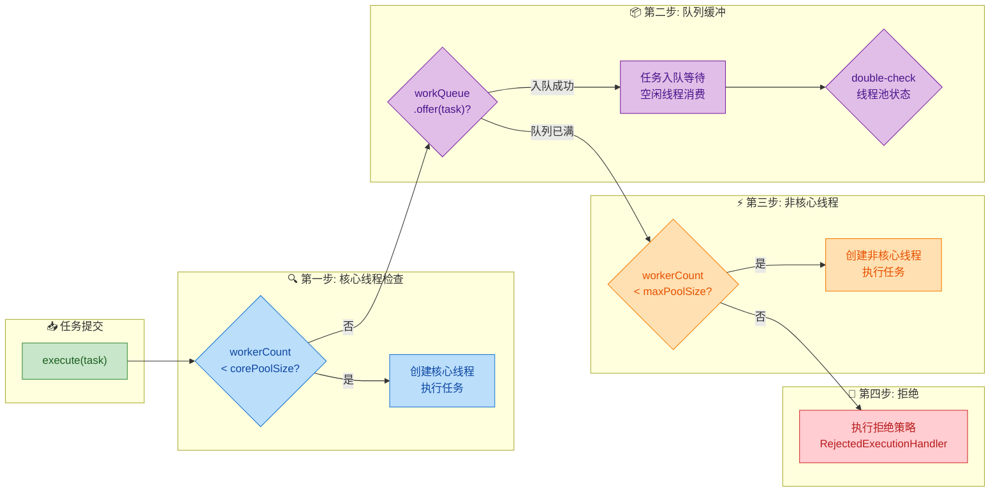

### 一个形象的类比

为了让这套流程更加直观，我们可以用一个**银行柜台**的类比来理解：

| 线程池概念 | 银行类比 | 说明 |
|:---:|:---:|:---|
| `corePoolSize` | 正式柜员窗口数 | 银行长期开放的窗口，即使没客户也不关闭 |
| `workQueue` | 等候区座椅 | 所有窗口都有人时，新客户在座椅上排队 |
| `maximumPoolSize` | 正式 + 临时窗口总数 | 座椅坐满后，银行临时加开窗口 |
| `keepAliveTime` | 临时窗口空闲关闭时间 | 临时窗口空闲一段时间后关闭 |
| `handler` | 座椅满、窗口全开后的处理 | 保安劝返（Abort）、让客户自助办理（CallerRuns）等 |

整个流程就是：客户来了 → 有空正式窗口就直接办理 → 正式窗口全忙就去座椅等候 → 座椅满了就开临时窗口 → 临时窗口也开满了就启用应急方案。

### 一个容易踩的"坑"：为什么不是先创建线程再入队？

很多初学者会疑惑：为什么线程池不在核心线程满了之后**直接创建新线程**，而是先让任务入队？直觉上，立即创建新线程似乎能更快地处理任务。

答案在于**线程创建的成本远高于入队的成本**。`workQueue.offer()` 只是一个内存操作，耗时在纳秒级别；而创建一个线程涉及操作系统调用（allocating stack memory, creating kernel thread），耗时在微秒甚至毫秒级别。在大多数生产场景中，任务提交的频率远高于任务处理的时长，如果每个任务都创建新线程，系统很快就会因线程过多而崩溃。

这也解释了为什么 `Executors.newFixedThreadPool()` 使用**无界队列** `LinkedBlockingQueue`——它的设计意图就是只用固定数量的核心线程，所有额外任务全部排队等候，永远不会创建非核心线程。当然，这也带来了 OOM 的风险，这将在"工作队列选择"一节中详细讨论。

### execute() 完整源码还原

最后，我们将 `execute()` 方法的完整逻辑汇总在一起，配合逐行注释：

```java
public void execute(Runnable command) {
    // 【校验】提交的任务不能为 null
    if (command == null)
        throw new NullPointerException();

    // 【读取】获取线程池的控制状态字（高3位=状态，低29位=线程数）
    int c = ctl.get();

    // ==================== 第一步 ====================
    // 如果当前工作线程数 < corePoolSize，尝试创建核心线程
    if (workerCountOf(c) < corePoolSize) {
        // addWorker(task, true)：true 表示用 corePoolSize 作为上限
        // 创建成功则直接返回，新线程会立即执行 command
        if (addWorker(command, true))
            return;
        // 创建失败（并发竞争或线程池状态变更），重新读取 ctl
        c = ctl.get();
    }

    // ==================== 第二步 ====================
    // 线程池处于 RUNNING 状态，且任务成功入队
    if (isRunning(c) && workQueue.offer(command)) {
        int recheck = ctl.get();
        // 二次检查：入队期间线程池可能被 shutdown
        if (!isRunning(recheck) && remove(command))
            // 线程池已关闭，移除刚入队的任务并拒绝
            reject(command);
        else if (workerCountOf(recheck) == 0)
            // 线程池还在运行但没有活跃线程了（极端情况），
            // 创建一个空任务的 Worker 来消费队列
            addWorker(null, false);
    }
    // ==================== 第三步 & 第四步 ====================
    // 入队失败（队列已满），尝试以 maximumPoolSize 为上限创建非核心线程
    else if (!addWorker(command, false))
        // 创建也失败（已达最大线程数或池已关闭），执行拒绝策略
        reject(command);
}
```

### 核心线程与非核心线程的生命周期对比

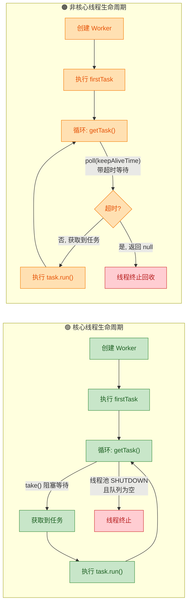

这张图清晰地展示了两者的关键差异：核心线程在 `getTask()` 中调用 `take()` 无限等待，只有线程池关闭时才会终止；非核心线程调用 `poll(keepAliveTime)` 带超时等待，超时后即被回收。但再次强调——**线程本身并不区分核心与非核心**，区分逻辑完全由 `getTask()` 中的 `timed` 变量动态决定：当 `workerCount > corePoolSize` 时，"多出来的"线程自然就变成了带超时的"非核心线程"。

---

**📝 练习题**

以下关于 `ThreadPoolExecutor` 工作流程的描述，哪一项是**错误的**？

假设线程池配置为：`corePoolSize=2, maximumPoolSize=4, workQueue=new ArrayBlockingQueue<>(3)`，当前已有 2 个核心线程正在执行任务，队列中有 3 个任务等待。此时又提交了一个新任务 Task-6。

A. Task-6 不会进入队列，因为队列已满（容量为 3，已有 3 个任务）


B. 线程池会尝试创建第 3 个工作线程（非核心线程）来直接执行 Task-6


C. 如果此时 `maximumPoolSize` 已调整为 2，Task-6 将触发拒绝策略


D. Task-6 会被放入队列中排队，等待核心线程空闲后执行


**【答案】** D

**【解析】** 当前线程池的状态是：2 个核心线程正在执行任务（workerCount = corePoolSize = 2），队列中已有 3 个任务（达到 `ArrayBlockingQueue` 容量上限）。当 Task-6 到达时：

- **第一步**：`workerCountOf(c) < corePoolSize` → `2 < 2` 为 `false`，跳过核心线程创建。
- **第二步**：`workQueue.offer(Task-6)` → 队列已满，`offer()` 返回 `false`，**入队失败**。
- **第三步**：`addWorker(Task-6, false)` → 以 `maximumPoolSize=4` 为上限，当前线程数为 2 < 4，创建成功，第 3 个工作线程被创建并执行 Task-6。

因此 **D 选项描述错误**：Task-6 不会入队（队列已满），而是触发非核心线程的创建。A、B 的描述完全正确。C 也正确——如果 `maximumPoolSize` 被动态调整为 2，`addWorker(Task-6, false)` 的内部检查 `workerCount < maximumPoolSize` → `2 < 2` 为 `false`，创建失败，进入 `reject()`。

---

## 工作队列选择（WorkQueue Selection）

在 `ThreadPoolExecutor` 的七大核心参数中，`workQueue`（工作队列）是对线程池行为影响最为深远的参数之一。它决定了当核心线程全部繁忙时，新提交的任务以何种方式被暂存、排列和调度。选错队列类型，轻则线程池行为不符合预期，重则导致内存溢出（OOM）或任务被意外丢弃。因此，理解每种队列的内部数据结构、容量特性、阻塞行为以及它们与线程池参数之间的联动关系，是掌握 `ThreadPoolExecutor` 的关键一环。

所有可用于 `ThreadPoolExecutor` 的工作队列都实现了 `java.util.concurrent.BlockingQueue<Runnable>` 接口。该接口的核心语义是：当队列为空时，消费者线程（Worker）调用 `take()` 会**阻塞等待**；当队列已满时，生产者线程调用 `put()` 会**阻塞等待**。但需要特别注意的是，`ThreadPoolExecutor` 内部并不直接调用 `put()`，而是调用 `offer()`——这是一个**非阻塞**方法，如果队列已满则立即返回 `false`。正是这个 `offer()` 返回 `false` 的信号，驱动线程池去创建非核心线程或触发拒绝策略。

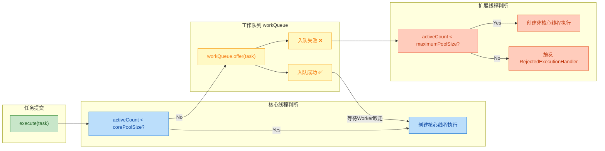

上图清晰展示了 `workQueue` 在线程池决策链中的枢纽地位。队列的容量特性直接决定了 `offer()` 何时返回 `false`，从而决定了非核心线程的创建时机。下面逐一剖析四种常用队列。

---

### LinkedBlockingQueue（无界队列 & OOM 风险）

`LinkedBlockingQueue` 是基于**单向链表**实现的阻塞队列。它是 Java 并发包中最常用的阻塞队列之一，也是 `Executors.newFixedThreadPool()` 和 `Executors.newSingleThreadExecutor()` 的默认队列选择。

#### 数据结构与容量

`LinkedBlockingQueue` 内部维护一条由 `Node<E>` 节点串联起来的单向链表，并使用两把独立的 `ReentrantLock`——`takeLock` 和 `putLock`——分别守护队首出队和队尾入队操作。这种 **two-lock queue** 设计使得生产者和消费者可以并发操作，吞吐量优于使用单锁的 `ArrayBlockingQueue`。

```java
// LinkedBlockingQueue 核心结构（简化）
public class LinkedBlockingQueue<E> extends AbstractQueue<E>
        implements BlockingQueue<E> {

    // 内部链表节点
    static class Node<E> {
        E item;           // 存储的元素
        Node<E> next;     // 指向下一个节点
    }

    private final int capacity;          // 队列容量上限
    private final AtomicInteger count;   // 当前元素数量（原子变量，双锁场景下保证可见性）

    transient Node<E> head;              // 哨兵头节点（dummy head）
    private transient Node<E> last;      // 尾节点

    private final ReentrantLock takeLock; // 出队锁（消费者侧）
    private final ReentrantLock putLock;  // 入队锁（生产者侧）

    private final Condition notEmpty;    // 队列非空条件（与 takeLock 关联）
    private final Condition notFull;     // 队列非满条件（与 putLock 关联）
}
```

关键在于它的**构造方式**：

```java
// 无参构造 —— 容量为 Integer.MAX_VALUE，近似"无界"
BlockingQueue<Runnable> q1 = new LinkedBlockingQueue<>();
// 等价于：new LinkedBlockingQueue<>(Integer.MAX_VALUE)

// 有参构造 —— 指定容量上限，变为"有界"
BlockingQueue<Runnable> q2 = new LinkedBlockingQueue<>(1000);
```

当使用无参构造时，`capacity = Integer.MAX_VALUE = 2,147,483,647`。对于线程池而言，这意味着 `offer()` 操作几乎**永远不会返回 `false`**。其直接后果是：

1. **非核心线程永远不会被创建**——因为队列永远有空间容纳新任务，`offer()` 永远成功。
2. **`maximumPoolSize` 参数形同虚设**——它只在 `offer()` 失败时才会生效。
3. **拒绝策略永远不会被触发**——既然队列不满，也不需要拒绝。
4. **OOM 风险**——如果任务提交速率长期大于消费速率，链表节点会无限增长，最终耗尽堆内存。

```text
                    ⚠️ OOM 场景模拟
                    
生产速率: 10,000 tasks/sec
消费速率:    500 tasks/sec  (corePoolSize=5, 每任务 10ms)

每秒净积压: 9,500 tasks
每个 Node 对象约占: ~48 bytes (对象头16 + item引用8 + next引用8 + padding)
加上 Runnable 对象本身: ~100-200 bytes/task

1分钟积压: 9,500 × 60 = 570,000 tasks ≈ 57-114 MB
1小时积压: 9,500 × 3,600 = 34,200,000 tasks ≈ 3.4-6.8 GB → 💥 OOM!
```

#### 为何 Executors 工厂方法被阿里巴巴规范禁用

阿里巴巴 Java 开发手册明确规定：**线程池不允许使用 `Executors` 去创建，而是通过 `ThreadPoolExecutor` 的方式**。核心原因就是 `Executors.newFixedThreadPool()` 和 `Executors.newSingleThreadExecutor()` 内部使用了无界的 `LinkedBlockingQueue`：

```java
// Executors.newFixedThreadPool 源码
public static ExecutorService newFixedThreadPool(int nThreads) {
    return new ThreadPoolExecutor(
        nThreads,                          // corePoolSize
        nThreads,                          // maximumPoolSize（与 core 相同）
        0L, TimeUnit.MILLISECONDS,         // 无空闲线程回收
        new LinkedBlockingQueue<Runnable>() // ⚠️ 无界队列！
    );
}
```

#### 适用场景与推荐用法

如果确实希望使用 `LinkedBlockingQueue`（利用其双锁高吞吐的优势），**务必传入一个合理的容量上限**：

```java
// ✅ 推荐：指定容量
ThreadPoolExecutor executor = new ThreadPoolExecutor(
    4,                                        // corePoolSize
    8,                                        // maximumPoolSize
    60L, TimeUnit.SECONDS,                    // 空闲线程60秒回收
    new LinkedBlockingQueue<>(2000),          // 有界！最多暂存2000个任务
    new ThreadPoolExecutor.CallerRunsPolicy() // 队列满+线程满 → 调用者自己执行
);
```

---

### ArrayBlockingQueue（有界队列）

`ArrayBlockingQueue` 是基于**定长数组**实现的有界阻塞队列。它的容量在创建时就被固定下来，之后不可更改。这是一种**经典的 bounded buffer**，也是在生产环境中使用最广泛、最安全的线程池队列选择。

#### 数据结构与并发控制

与 `LinkedBlockingQueue` 不同，`ArrayBlockingQueue` 使用**单把锁**（一个 `ReentrantLock`）来同时守护入队和出队操作。它通过两个指针 `putIndex` 和 `takeIndex` 在定长数组上实现**环形缓冲区（Ring Buffer）**的效果。

```java
// ArrayBlockingQueue 核心结构（简化）
public class ArrayBlockingQueue<E> extends AbstractQueue<E>
        implements BlockingQueue<E> {

    final Object[] items;       // 定长数组，存储队列元素
    int takeIndex;              // 下一个出队位置（消费者指针）
    int putIndex;               // 下一个入队位置（生产者指针）
    int count;                  // 当前元素数量

    final ReentrantLock lock;   // 唯一的一把锁（单锁设计）
    private final Condition notEmpty;  // 队列非空条件
    private final Condition notFull;   // 队列非满条件
}
```

环形缓冲区的工作原理可以用以下 ASCII 图来直观展示：

```text
ArrayBlockingQueue(capacity=6) 内部环形数组

初始状态（空队列）:
┌─────┬─────┬─────┬─────┬─────┬─────┐
│     │     │     │     │     │     │
└─────┴─────┴─────┴─────┴─────┴─────┘
  ↑ takeIndex=0
  ↑ putIndex=0
  count=0

入队3个任务后:
┌─────┬─────┬─────┬─────┬─────┬─────┐
│ T1  │ T2  │ T3  │     │     │     │
└─────┴─────┴─────┴─────┴─────┴─────┘
  ↑ takeIndex=0       ↑ putIndex=3
  count=3

出队1个任务后（T1 被 Worker 取走）:
┌─────┬─────┬─────┬─────┬─────┬─────┐
│     │ T2  │ T3  │     │     │     │
└─────┴─────┴─────┴─────┴─────┴─────┘
        ↑ takeIndex=1  ↑ putIndex=3
  count=2

继续入队4个（putIndex 回绕到数组开头 —— Ring!）:
┌─────┬─────┬─────┬─────┬─────┬─────┐
│ T7  │ T2  │ T3  │ T4  │ T5  │ T6  │
└─────┴─────┴─────┴─────┴─────┴─────┘
        ↑ takeIndex=1
        ↑ putIndex=1  (追上 takeIndex → 队列满！)
  count=6  →  offer() 返回 false!
```

#### 与 LinkedBlockingQueue 的核心对比

| 维度 | `ArrayBlockingQueue` | `LinkedBlockingQueue` |
|------|---------------------|-----------------------|
| **底层结构** | 定长数组（Ring Buffer） | 单向链表 |
| **是否有界** | **强制有界**（构造时必须指定 capacity） | 可有界可"无界"（默认 `Integer.MAX_VALUE`） |
| **锁策略** | 单锁（`ReentrantLock`） | 双锁（`takeLock` + `putLock`） |
| **吞吐量** | 较低（生产消费互斥） | 较高（生产消费可并发） |
| **GC 压力** | **极低**（数组预分配，无节点对象创建） | 较高（每次入队创建 `Node` 对象） |
| **内存占用** | 固定（容量 × 引用大小） | 动态增长（每节点额外 ~32-48 bytes 开销） |
| **公平性** | 支持公平模式（构造参数 `fair=true`） | 不支持 |
| **适用场景** | 对内存敏感、需严格控制容量 | 高吞吐、容量上限明确 |

#### 与线程池参数的联动

`ArrayBlockingQueue` 是唯一能让 `maximumPoolSize` 和拒绝策略参数**完全生效**的队列类型。其行为链条非常清晰：

1. 核心线程未满 → 创建核心线程
2. 核心线程满，`offer()` 成功（数组未满）→ 任务入队等待
3. 核心线程满，`offer()` 失败（数组已满）→ 创建非核心线程
4. 线程数达到 `maximumPoolSize`，`offer()` 仍失败 → 触发拒绝策略

```java
// ✅ 生产环境推荐配置示例
ThreadPoolExecutor executor = new ThreadPoolExecutor(
    Runtime.getRuntime().availableProcessors(),  // corePoolSize = CPU核心数
    Runtime.getRuntime().availableProcessors() * 2, // maximumPoolSize
    60L, TimeUnit.SECONDS,                       // 空闲线程60秒回收
    new ArrayBlockingQueue<>(500),               // 有界队列，容量500
    new ThreadPoolExecutor.CallerRunsPolicy()    // 背压策略：调用者自己跑
);
```

#### 公平模式

`ArrayBlockingQueue` 支持通过构造参数开启**公平访问**（fair access）：

```java
// fair=true：等待时间最长的线程优先获取锁
BlockingQueue<Runnable> fairQueue = new ArrayBlockingQueue<>(500, true);

// fair=false（默认）：非公平模式，性能更高，但可能导致线程饥饿
BlockingQueue<Runnable> unfairQueue = new ArrayBlockingQueue<>(500, false);
```

公平模式底层依赖 `ReentrantLock(true)` 实现，它保证阻塞等待的线程按 FIFO 顺序被唤醒。但公平锁会显著降低吞吐量（大约降低 30%-50%），因此**除非有明确的防饥饿需求，否则使用默认的非公平模式**。

---

### SynchronousQueue（直接传递）

`SynchronousQueue` 是一种极其特殊的阻塞队列——它的**内部容量为零**。这意味着它不存储任何元素。每一次 `offer()` 操作必须等待一个对应的 `poll()` / `take()` 操作来"接收"元素，否则 `offer()` 立即返回 `false`。这种设计理念被称为 **Handoff（直接传递/交接）**——生产者与消费者之间进行一对一的"手递手"交付。

#### 工作原理

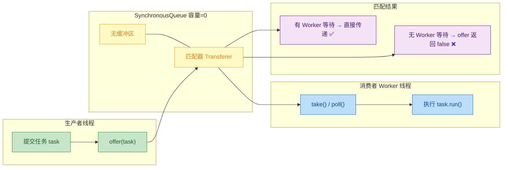

`SynchronousQueue` 内部有两种实现策略（通过构造参数 `fair` 控制）：

- **非公平模式（默认）**：使用**栈结构**（`TransferStack`），LIFO 顺序，最近等待的线程先被匹配。
- **公平模式**：使用**队列结构**（`TransferQueue`），FIFO 顺序，最早等待的线程先被匹配。

```java
// 非公平模式（默认，性能更优）
SynchronousQueue<Runnable> sq1 = new SynchronousQueue<>();

// 公平模式（FIFO 匹配顺序）
SynchronousQueue<Runnable> sq2 = new SynchronousQueue<>(true);
```

#### 对线程池行为的深刻影响

由于 `SynchronousQueue` 不存储任何元素，`offer()` 只有在**恰好有一个 Worker 线程正在 `take()` 等待**时才会成功。这意味着：

1. 只要没有空闲 Worker，每一个新提交的任务都会导致**立即创建新线程**。
2. `corePoolSize` 的缓冲作用被大幅削弱——即使核心线程数未满，如果所有核心线程都在执行任务，新任务仍然会进入"创建线程"路径。
3. 线程数会快速膨胀到 `maximumPoolSize`，然后触发拒绝策略。

这正是 `Executors.newCachedThreadPool()` 的设计核心：

```java
// Executors.newCachedThreadPool 源码
public static ExecutorService newCachedThreadPool() {
    return new ThreadPoolExecutor(
        0,                          // corePoolSize = 0（无核心线程）
        Integer.MAX_VALUE,          // maximumPoolSize = 无上限 ⚠️
        60L, TimeUnit.SECONDS,      // 空闲线程60秒回收
        new SynchronousQueue<Runnable>() // 直接传递队列
    );
}
```

这个组合的语义是：**每个任务都尝试直接传递给空闲线程，如果没有空闲线程就创建新线程，线程空闲 60 秒后被回收**。对于短暂的突发性任务（burst traffic），这种策略能提供极低的任务等待延迟。但风险也显而易见——如果任务提交速率持续较高，线程数会无限制增长，导致系统资源耗尽（线程数过多 → 大量上下文切换 → CPU 跑满 → 系统不可用）。

#### 适用场景

- **任务生命周期极短**（毫秒级完成），Worker 线程能快速释放并重新进入 `take()` 等待。
- **需要极低延迟**，不能容忍任务在队列中排队。
- **`maximumPoolSize` 必须设置合理上限**（禁止使用 `Integer.MAX_VALUE`）。

```java
// ✅ 安全使用 SynchronousQueue 的推荐方式
ThreadPoolExecutor executor = new ThreadPoolExecutor(
    4,                              // 有基础核心线程
    32,                             // 合理上限，而非 Integer.MAX_VALUE
    30L, TimeUnit.SECONDS,          // 空闲30秒回收
    new SynchronousQueue<>(),       // 直接传递
    new ThreadPoolExecutor.CallerRunsPolicy() // 兜底策略
);
```

---

### PriorityBlockingQueue（优先级队列）

`PriorityBlockingQueue` 是基于**二叉堆（Binary Heap）**实现的**无界**优先级阻塞队列。与前面三种队列按 FIFO 顺序出队不同，`PriorityBlockingQueue` 会按照元素的**自然排序**或**自定义 `Comparator`** 来决定出队顺序——优先级最高的元素最先被取出。

#### 内部结构

```java
// PriorityBlockingQueue 核心结构（简化）
public class PriorityBlockingQueue<E> extends AbstractQueue<E>
        implements BlockingQueue<E> {

    private transient Object[] queue;    // 存储元素的数组（二叉堆）
    private transient int size;          // 当前元素数量

    private transient Comparator<? super E> comparator; // 自定义比较器（可选）

    private final ReentrantLock lock;    // 单锁
    private final Condition notEmpty;    // 队列非空条件

    // ⚠️ 注意：没有 notFull 条件！因为它是无界的，offer() 永远成功
}
```

二叉堆是一种完全二叉树结构，使用数组存储，通过以下下标关系维护父子节点关系：

```text
                     PriorityBlockingQueue 二叉堆（小顶堆示例）

数组下标:    [0]    [1]    [2]    [3]    [4]    [5]    [6]
元素优先级:   1      3      2      7      5      4      6

逻辑树结构:
                        1 (index=0)
                      /              \
                 3 (index=1)       2 (index=2)
                /        \        /        \
          7 (index=3)  5 (index=4)  4 (index=5)  6 (index=6)

父节点 index = (childIndex - 1) / 2
左子节点 index = parentIndex * 2 + 1
右子节点 index = parentIndex * 2 + 2

出队时：取走堆顶 [0]（优先级最高），将末尾元素移到堆顶，执行 siftDown 下沉调整
入队时：将新元素放到数组末尾，执行 siftUp 上浮调整
```

#### 在线程池中的用法

要在 `ThreadPoolExecutor` 中使用 `PriorityBlockingQueue`，提交的任务需要实现 `Comparable` 接口，或者在创建队列时提供 `Comparator`：

```java
// 定义带优先级的任务
public class PriorityTask implements Runnable, Comparable<PriorityTask> {

    private final int priority;       // 优先级数值，越小优先级越高
    private final String taskName;    // 任务名称

    // 构造方法
    public PriorityTask(int priority, String taskName) {
        this.priority = priority;     // 初始化优先级
        this.taskName = taskName;     // 初始化任务名
    }

    @Override
    public void run() {
        // 任务执行逻辑
        System.out.println(Thread.currentThread().getName()
            + " 执行任务: " + taskName
            + " [优先级=" + priority + "]");
    }

    @Override
    public int compareTo(PriorityTask other) {
        // 优先级数值小的排前面（小顶堆）
        return Integer.compare(this.priority, other.priority);
    }
}
```

```java
// 创建使用优先级队列的线程池
ThreadPoolExecutor executor = new ThreadPoolExecutor(
    2,                                       // corePoolSize = 2
    2,                                       // maximumPoolSize = 2（与 core 相同）
    0L, TimeUnit.MILLISECONDS,               // 不回收核心线程
    new PriorityBlockingQueue<>()            // 无界优先级队列
);

// 提交不同优先级的任务
executor.execute(new PriorityTask(5, "低优先级-清理日志"));      // 优先级 5（最低）
executor.execute(new PriorityTask(1, "高优先级-用户支付"));      // 优先级 1（最高）
executor.execute(new PriorityTask(3, "中优先级-发送通知"));      // 优先级 3（中等）
executor.execute(new PriorityTask(2, "较高优先级-订单处理"));    // 优先级 2（较高）
executor.execute(new PriorityTask(4, "较低优先级-数据同步"));    // 优先级 4（较低）

// 当2个核心线程都忙时，后续任务进入 PriorityBlockingQueue
// Worker 线程取任务时，堆顶（优先级最高）的任务最先被取走
```

#### 注意事项与陷阱

**1. 无界特性 → 与 `LinkedBlockingQueue` 无参构造存在相同的 OOM 风险**

`PriorityBlockingQueue` 是天然无界的（内部数组会自动扩容，初始容量 11，每次扩容约 50%），`offer()` 永远返回 `true`。因此 `maximumPoolSize` 和拒绝策略同样形同虚设。

**2. 不保证同优先级任务的 FIFO 顺序**

如果两个任务的 `compareTo()` 返回 0（优先级相同），二叉堆不保证它们按提交顺序出队。如果需要同优先级 FIFO，需要在比较器中引入一个**递增序列号**作为 tie-breaker：

```java
public class PriorityTask implements Runnable, Comparable<PriorityTask> {

    // 全局递增序列号，用于打破同优先级的排序歧义
    private static final AtomicLong SEQ_GENERATOR = new AtomicLong(0);

    private final int priority;          // 任务优先级
    private final long sequenceNumber;   // 提交顺序序列号
    private final Runnable actualTask;   // 实际要执行的任务

    public PriorityTask(int priority, Runnable actualTask) {
        this.priority = priority;                         // 设置优先级
        this.sequenceNumber = SEQ_GENERATOR.getAndIncrement(); // 原子递增，获取唯一序列号
        this.actualTask = actualTask;                     // 包装实际任务
    }

    @Override
    public int compareTo(PriorityTask other) {
        // 首先按优先级排序
        int res = Integer.compare(this.priority, other.priority);
        if (res != 0) return res;                         // 优先级不同，直接返回
        // 优先级相同时，按提交顺序（序列号小的先执行 = FIFO）
        return Long.compare(this.sequenceNumber, other.sequenceNumber);
    }

    @Override
    public void run() {
        actualTask.run();                                 // 委托给实际任务执行
    }
}
```

**3. 不支持 `Callable<T>` + `Future<T>` 的直接优先级排序**

当使用 `submit()` 而非 `execute()` 提交任务时，`ThreadPoolExecutor` 会将任务包装为 `FutureTask`，而 `FutureTask` 没有实现 `Comparable`，这会导致 `ClassCastException`。解决方案是重写 `ThreadPoolExecutor.newTaskFor()` 方法，返回一个同时实现了 `RunnableFuture` 和 `Comparable` 的自定义类。

---

### 四种队列选型总览

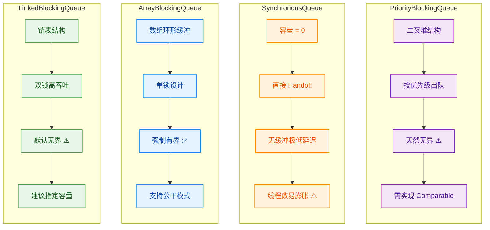

| 场景 | 推荐队列 | 理由 |
|------|----------|------|
| **通用业务线程池** | `ArrayBlockingQueue` | 有界安全，行为可预测，所有参数均生效 |
| **高吞吐任务处理** | `LinkedBlockingQueue(capacity)` | 双锁设计吞吐量高，指定容量后安全 |
| **极低延迟场景** | `SynchronousQueue` | 零缓冲直接传递，配合合理的 `maximumPoolSize` |
| **任务有优先级需求** | `PriorityBlockingQueue` | 唯一支持优先级排序的选择，需防 OOM |
| **延迟/定时任务** | `DelayedWorkQueue`（内部类） | `ScheduledThreadPoolExecutor` 专用 |

---

**📝 练习题**

某线程池配置如下：

```java
new ThreadPoolExecutor(
    4, 8, 60, TimeUnit.SECONDS,
    new SynchronousQueue<>(),
    new ThreadPoolExecutor.AbortPolicy()
);
```

当前已有 8 个线程在执行任务（线程数已达 `maximumPoolSize`），此时又有一个新任务通过 `execute()` 提交。请问会发生什么？

A. 任务进入 `SynchronousQueue` 排队等待，直到有线程空闲


B. 创建第 9 个线程来执行该任务


C. 任务被静默丢弃，不抛出任何异常


D. 抛出 `RejectedExecutionException` 异常


**【答案】** D

**【解析】** `SynchronousQueue` 的容量为零，它不存储任何任务。`offer()` 操作只有在恰好有一个 Worker 线程正在 `take()` 等待时才会成功。题目指出当前 8 个线程全部在执行任务，意味着没有空闲 Worker 在 `take()` 等待，因此 `offer()` 立即返回 `false`。线程池发现 `offer()` 失败后，尝试创建非核心线程，但当前线程数（8）已等于 `maximumPoolSize`（8），无法再创建新线程。此时进入拒绝策略分支。由于配置的是 `AbortPolicy`（默认策略），它会直接抛出 `RejectedExecutionException`。选项 A 错误，因为 `SynchronousQueue` 没有缓冲能力，任务不会"排队"；选项 B 错误，因为已达最大线程数限制；选项 C 描述的是 `DiscardPolicy` 的行为。

---

**📝 练习题**

以下关于 `PriorityBlockingQueue` 在线程池中使用的说法，**错误**的是：

A. 它是无界队列，`maximumPoolSize` 参数在使用它时实际上不会生效


B. 提交到线程池的任务如果没有实现 `Comparable`，也没有提供 `Comparator`，会在运行时抛出 `ClassCastException`


C. 同优先级的任务一定按照先提交先执行（FIFO）的顺序出队


D. 由于无界特性，在任务积压严重时存在 OOM 风险


**【答案】** C

**【解析】** `PriorityBlockingQueue` 底层是二叉堆（Binary Heap），堆排序算法是一种**不稳定排序**——当两个元素的 `compareTo()` 返回 0 时，堆不保证它们的相对顺序与插入顺序一致。也就是说，同优先级的任务出队顺序是不确定的。如果需要同优先级 FIFO，必须额外引入一个递增的序列号作为 tie-breaker（第二排序键）。选项 A 正确，因为 `offer()` 永远成功，非核心线程永远不会被创建；选项 B 正确，`PriorityBlockingQueue` 在 `siftUp` 操作中会强制类型转换为 `Comparable`，如果任务未实现该接口且没有提供 `Comparator`，会抛出 `ClassCastException`；选项 D 正确，无界队列的通病。

---

## 拒绝策略（RejectedExecutionHandler）

当线程池中的工作线程数已经达到 `maximumPoolSize`，并且工作队列 `workQueue` 也已经被填满时，线程池便无法再接收新的任务了。此时，线程池会启动一种"最后防线"机制——**拒绝策略（Rejection Policy）**。拒绝策略决定了线程池在饱和状态下如何处置那些"溢出"的任务。

从接口设计上看，拒绝策略由 `java.util.concurrent.RejectedExecutionHandler` 接口定义，该接口极其简洁，只有一个方法：

```java
// 拒绝策略的顶层接口
public interface RejectedExecutionHandler {
    /**
     * @param r        被拒绝的任务（即提交者想要执行的 Runnable）
     * @param executor 拒绝该任务的线程池实例本身
     */
    void rejectedExecution(Runnable r, ThreadPoolExecutor executor);
}
```

JDK 在 `ThreadPoolExecutor` 内部以静态内部类的形式，预置了 **四种** 拒绝策略实现。它们各有取舍，适用于不同的业务场景。理解它们的行为差异，是正确配置线程池的关键一环。

下面先用一张全景图来对比四种内置策略以及自定义策略的定位：

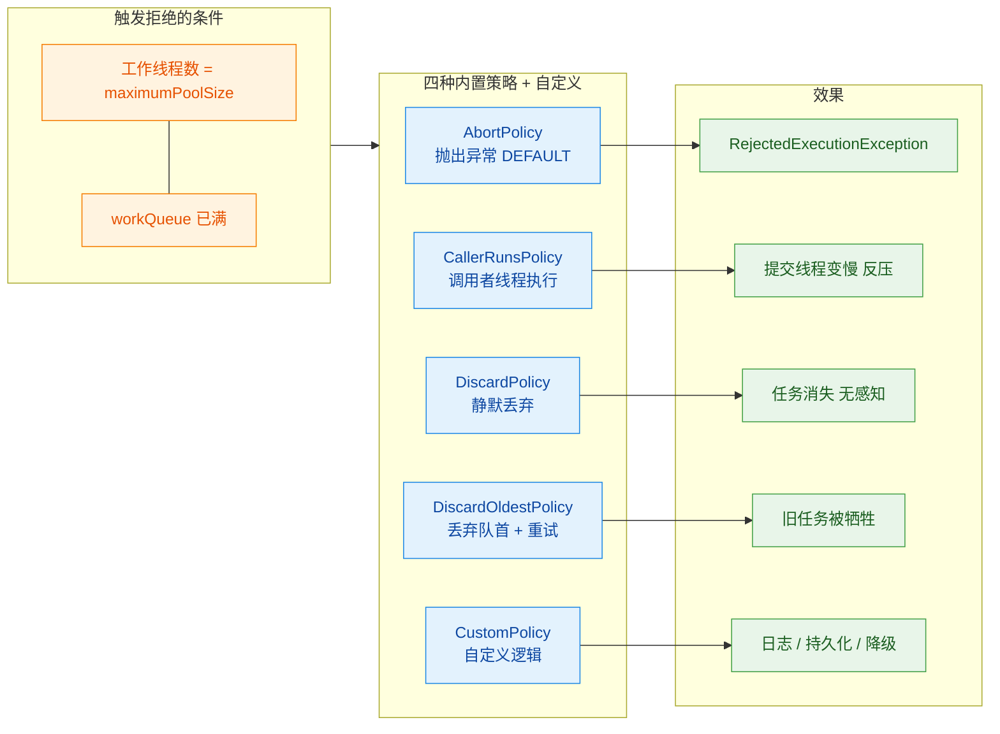

---

### AbortPolicy（抛异常 · 默认策略）

`AbortPolicy` 是 `ThreadPoolExecutor` 的 **默认拒绝策略**。当你使用构造方法创建线程池时，如果不显式传入 `RejectedExecutionHandler`，JDK 默认就会采用它。其行为非常直接——**直接抛出一个 `RejectedExecutionException` 运行时异常**，将问题暴露给调用者。

来看 JDK 源码，它的实现极为简洁：

```java
// ThreadPoolExecutor 的静态内部类
public static class AbortPolicy implements RejectedExecutionHandler {

    // 空构造器
    public AbortPolicy() { }

    /**
     * 永远直接抛出 RejectedExecutionException
     * 让调用者（提交任务的线程）立即感知到线程池已饱和
     */
    public void rejectedExecution(Runnable r, ThreadPoolExecutor e) {
        // 异常消息中包含了线程池当前的状态快照，方便排查
        throw new RejectedExecutionException(
            "Task " + r.toString() +            // 被拒绝的任务
            " rejected from " + e.toString()     // 线程池状态（线程数、队列大小等）
        );
    }
}
```

**适用场景与注意事项：**

- **适合对任务丢失零容忍的关键业务**。例如：订单处理、支付回调等场景，任务一旦丢失就意味着资金损失。抛出异常后，调用者可以捕获异常并执行补偿逻辑（如写入消息队列、记录数据库后重试等）。
- **必须在调用侧做好 try-catch 处理**，否则未被捕获的 `RejectedExecutionException` 会导致提交线程意外中断。如果你使用的是 `execute()` 方法提交任务，异常会直接抛出；如果使用 `submit()` 方法，异常会被封装进返回的 `Future` 对象中，在调用 `future.get()` 时才抛出。

```java
// 使用 AbortPolicy 的最佳实践：捕获异常并做补偿
ThreadPoolExecutor pool = new ThreadPoolExecutor(
    2, 4, 60, TimeUnit.SECONDS,
    new ArrayBlockingQueue<>(10)
    // 未传入 handler，默认就是 AbortPolicy
);

try {
    pool.execute(() -> {
        // 业务逻辑：处理订单
        processOrder(order);
    });
} catch (RejectedExecutionException ex) {
    // 补偿策略：将任务写入消息队列，等待后续消费重试
    log.warn("线程池饱和，任务被拒绝，转入 MQ 重试: {}", order.getId(), ex);
    messageQueue.send(order);  // 降级处理
}
```

**一句话总结**：`AbortPolicy` 的哲学是 **"Fail Fast"**——我不帮你处理，但我会大声告诉你出了问题。

---

### CallerRunsPolicy（调用者执行）

`CallerRunsPolicy` 是四种内置策略中最"温和"且最具实用价值的一种。当任务被拒绝时，它 **不会抛异常，也不会丢弃任务**，而是将任务 **退回给提交任务的那个线程**（Caller Thread）去执行。

```java
public static class CallerRunsPolicy implements RejectedExecutionHandler {

    public CallerRunsPolicy() { }

    /**
     * 如果线程池未关闭，则直接在调用者线程中同步执行该任务
     * 如果线程池已关闭（isShutdown），则静默丢弃任务
     */
    public void rejectedExecution(Runnable r, ThreadPoolExecutor e) {
        if (!e.isShutdown()) {
            // 关键：在当前线程（即调用 execute/submit 的线程）中直接 run
            r.run();  // 注意是 run() 而非 start()，不会创建新线程
        }
        // 如果线程池已 shutdown，任务会被静默丢弃
    }
}
```

这个策略精妙之处在于它产生了一种天然的 **反压（Back Pressure）** 机制。来分析一下它的连锁效应：

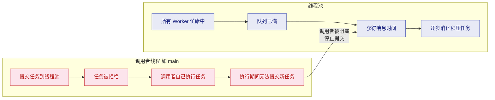

**反压原理剖析：**

1. 当线程池饱和时，`CallerRunsPolicy` 让调用者线程（比如 `main` 线程或 Tomcat 的 NIO 线程）亲自去执行这个任务。
2. 调用者线程在执行任务期间是 **阻塞** 的，无法继续向线程池提交新的任务。
3. 这给了线程池中的 Worker 线程宝贵的 **喘息时间**，让它们有机会消化队列中的积压任务。
4. 当调用者线程执行完被退回的任务后，重新回到提交循环，此时线程池可能已经腾出了空间。

**适用场景：**

- **任务不允许丢失，且可以容忍短暂降速的场景**。例如日志收集系统、数据同步管道（data pipeline）等。
- 特别适合 **生产者速度大于消费者速度** 的场景，`CallerRunsPolicy` 天然地平衡了二者的速率。

**潜在风险：**

- 如果调用者线程是 **主线程** 或 **Web 容器的请求处理线程**（如 Tomcat 的 NIO 线程），那么调用者被阻塞去执行慢任务时，整个请求处理链路都会变慢。在高并发 Web 场景下，这可能导致接口响应时间急剧上升。
- 在极端情况下，如果任务执行时间很长，调用者线程会被长时间占用，形成 **级联阻塞**。

```java
// CallerRunsPolicy 使用示例
ThreadPoolExecutor pool = new ThreadPoolExecutor(
    2,                                    // 核心线程数
    4,                                    // 最大线程数
    60, TimeUnit.SECONDS,                 // 空闲线程存活 60 秒
    new ArrayBlockingQueue<>(100),        // 有界队列，容量 100
    new ThreadPoolExecutor.CallerRunsPolicy()  // 拒绝时由调用者执行
);

// 模拟批量提交任务
for (int i = 0; i < 1000; i++) {
    final int taskId = i;
    pool.execute(() -> {
        // 当线程池饱和时，这段代码会在 main 线程中执行
        // main 线程被阻塞，自然减慢了任务提交速度
        System.out.println(Thread.currentThread().getName() + " 执行任务: " + taskId);
        sleepQuietly(100);  // 模拟耗时操作
    });
}
```

**一句话总结**：`CallerRunsPolicy` 的哲学是 **"你提交的任务你负责"**——既保护了线程池不被压垮，又确保了任务不会丢失。

---

### DiscardPolicy（静默丢弃）

`DiscardPolicy` 是所有内置策略中 **最"沉默"的一种**。它直接丢弃被拒绝的任务，并且 **不做任何事情**——没有异常、没有日志、没有通知。

```java
public static class DiscardPolicy implements RejectedExecutionHandler {

    public DiscardPolicy() { }

    /**
     * 什么都不做。被拒绝的任务 r 直接被忽略，无声无息地消失。
     * 这是一个名副其实的 "黑洞" 策略。
     */
    public void rejectedExecution(Runnable r, ThreadPoolExecutor e) {
        // 方法体为空——nothing happens
    }
}
```

没错，整个 `rejectedExecution` 方法体是 **完全空的**。这意味着任务提交者不会收到任何反馈，任务就像从未被提交过一样凭空消失了。

**适用场景：**

- **任务可丢失、无需严格保证执行的场景**。例如：实时监控数据上报（偶尔丢几条数据点不影响整体趋势）、非关键的统计埋点、心跳探测等。
- 配合 **幂等任务** 使用时较为安全，因为下次重试时任务仍会被正确执行。

**严重风险：**

> ⚠️ **生产环境中应极度谨慎使用 `DiscardPolicy`。** 因为任务的丢失是完全无感知的，不会抛异常也不会打日志。一旦出现问题，排查起来非常困难——你甚至不知道任务被丢掉了。

如果确实需要"丢弃"语义，**强烈建议使用自定义策略**，至少在丢弃前记录一条日志（详见后文"自定义策略"章节）。

**一句话总结**：`DiscardPolicy` 的哲学是 **"假装什么都没发生"**——简单粗暴，但后果自负。

---

### DiscardOldestPolicy（丢弃最老任务）

`DiscardOldestPolicy` 的逻辑比 `DiscardPolicy` 更"激进"一些。当新任务被拒绝时，它会 **丢弃工作队列中等待最久的那个任务（即队列头部的任务）**，然后 **尝试重新提交** 当前被拒绝的新任务。

```java
public static class DiscardOldestPolicy implements RejectedExecutionHandler {

    public DiscardOldestPolicy() { }

    /**
     * 丢弃队列中最老的任务（队首），然后将当前任务重新提交到线程池
     */
    public void rejectedExecution(Runnable r, ThreadPoolExecutor e) {
        if (!e.isShutdown()) {
            // poll() 移除并返回队列头部元素（最老的任务），如果队列为空则返回 null
            e.getQueue().poll();
            // 重新尝试提交当前任务
            // 注意：如果此时线程池仍然饱和，会再次触发拒绝策略（递归效应）
            e.execute(r);
        }
    }
}
```

我们用一个时序图来直观理解这个过程：

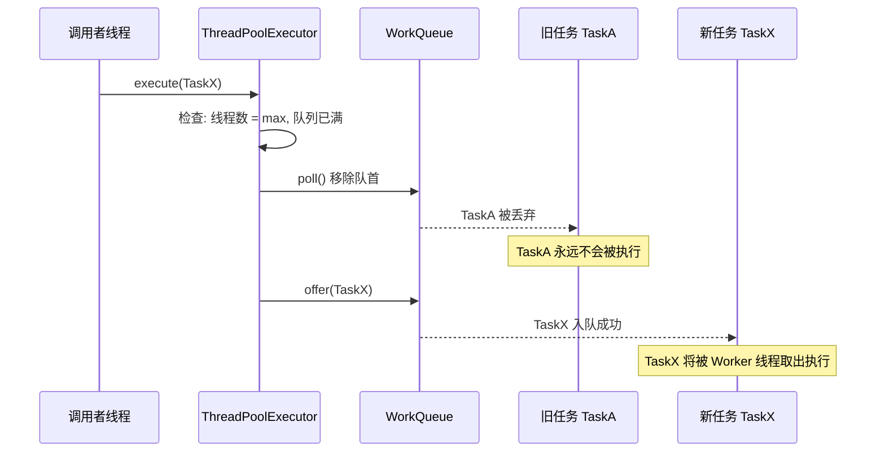

**关键特性分析：**

1. **"新的比旧的更重要"**——这是该策略隐含的假设。在某些实时性要求高的场景下（如实时报价推送），最新的数据确实比旧的更有价值，此时丢弃旧任务是合理的。
2. **递归风险**：注意源码中 `e.execute(r)` 这一行。如果重新提交后线程池仍然饱和，`execute` 会再次触发拒绝策略，导致又一个队首任务被丢弃。在极端情况下，这可能引发连续的丢弃链。
3. **与 `PriorityBlockingQueue` 配合使用时需特别注意**：`poll()` 会移除优先级最高的任务（而不是"最老的"），这可能不是你期望的行为。

**适用场景：**

- 实时行情数据推送（只关心最新报价，旧的报价已无意义）
- 视频帧处理（丢弃旧帧、保留新帧，维持流畅度）
- 传感器数据采集（最新的读数更有参考价值）

```java
// DiscardOldestPolicy 使用示例：实时报价更新
ThreadPoolExecutor pool = new ThreadPoolExecutor(
    1,                                    // 单核心线程处理报价
    1,                                    // 不扩展线程
    0, TimeUnit.SECONDS,
    new ArrayBlockingQueue<>(5),          // 最多缓存 5 个待处理报价
    new ThreadPoolExecutor.DiscardOldestPolicy()  // 新报价挤掉旧报价
);

// 行情推送：报价不断涌入，旧的报价自动被新的覆盖
for (double price : incomingPrices) {
    pool.execute(() -> {
        // 更新 UI 显示最新报价
        updateDisplay(price);
    });
}
```

**一句话总结**：`DiscardOldestPolicy` 的哲学是 **"喜新厌旧"**——总是优先保留最新提交的任务。

---

### 自定义拒绝策略

实际生产环境中，JDK 内置的四种策略往往不能完全满足需求。例如，你可能想在拒绝任务时 **记录详细日志**、**上报监控指标**、**将任务持久化到数据库或消息队列** 以便后续重试，甚至 **触发告警通知**。这些复合需求都需要通过 **自定义拒绝策略** 来实现。

自定义策略只需实现 `RejectedExecutionHandler` 接口即可：

```java
/**
 * 自定义拒绝策略：记录日志 + 监控上报 + 降级持久化
 * 这是生产环境中最推荐的方式
 */
public class CustomRejectedHandler implements RejectedExecutionHandler {

    // 使用 SLF4J 日志框架记录被拒绝的任务信息
    private static final Logger log = LoggerFactory.getLogger(CustomRejectedHandler.class);

    // 被拒绝任务的计数器（线程安全），用于监控大盘
    private final AtomicLong rejectedCount = new AtomicLong(0);

    @Override
    public void rejectedExecution(Runnable r, ThreadPoolExecutor executor) {
        // ① 累加拒绝计数，可对接 Prometheus / Grafana 等监控系统
        long count = rejectedCount.incrementAndGet();

        // ② 记录详细日志，包含线程池运行时状态快照
        log.warn("[线程池饱和] 第 {} 个任务被拒绝 | 任务: {} | 线程池状态: " +
                 "poolSize={}, activeCount={}, queueSize={}, completedTaskCount={}",
                 count,
                 r.toString(),                         // 任务标识
                 executor.getPoolSize(),                // 当前线程数
                 executor.getActiveCount(),             // 正在执行任务的线程数
                 executor.getQueue().size(),            // 队列中等待的任务数
                 executor.getCompletedTaskCount()       // 已完成的任务总数
        );

        // ③ 降级处理：将任务序列化后写入消息队列，等待后续异步重试
        try {
            // 尝试将任务持久化（此处示意，实际实现取决于你的中间件选型）
            fallbackToMessageQueue(r);
        } catch (Exception ex) {
            // 如果降级也失败了，记录 ERROR 级别日志并触发告警
            log.error("[严重] 降级持久化失败，任务可能丢失: {}", r.toString(), ex);
            alertService.sendAlert("线程池拒绝策略降级失败", ex);
        }
    }

    /**
     * 降级：将被拒绝的任务投递到消息队列
     */
    private void fallbackToMessageQueue(Runnable r) {
        // 实际项目中可能序列化任务参数，发送到 Kafka / RocketMQ / Redis 等
        // messageProducer.send("rejected-tasks-topic", serialize(r));
        log.info("任务已转入消息队列等待重试: {}", r.toString());
    }

    /**
     * 提供 getter 方法，便于外部监控系统拉取指标
     */
    public long getRejectedCount() {
        return rejectedCount.get();
    }
}
```

将自定义策略应用到线程池中：

```java
// 创建线程池并注入自定义拒绝策略
ThreadPoolExecutor pool = new ThreadPoolExecutor(
    4,                                       // 核心线程数
    8,                                       // 最大线程数
    60, TimeUnit.SECONDS,                    // 非核心线程空闲 60 秒后回收
    new ArrayBlockingQueue<>(200),           // 有界队列，容量 200
    new CustomThreadFactory("biz-pool"),     // 自定义线程工厂（设置线程名）
    new CustomRejectedHandler()              // 自定义拒绝策略
);
```

**生产级自定义策略的设计要点：**

| 要点 | 说明 |
|------|------|
| **日志记录** | 至少要记录 `WARN` 级别日志，包含任务标识和线程池状态快照 |
| **监控指标** | 暴露被拒绝的任务数（Counter），对接 Prometheus / Micrometer |
| **降级机制** | 将任务持久化到 MQ / DB / Redis，确保后续可重试 |
| **告警通知** | 当拒绝次数超过阈值时，触发钉钉 / 企微 / PagerDuty 告警 |
| **限流协同** | 结合 Sentinel / Resilience4j 等限流组件，在上游提前拦截 |

下面是另一个常见的自定义策略——**带超时阻塞等待的策略**，它会在丢弃任务前先尝试等待队列腾出空间：

```java
/**
 * 带超时阻塞的拒绝策略
 * 在直接拒绝之前，先尝试阻塞等待一段时间让队列腾出空间
 * 适用于短暂突发流量的场景
 */
public class BlockingWithTimeoutPolicy implements RejectedExecutionHandler {

    // 最大等待时间
    private final long timeout;
    // 等待时间单位
    private final TimeUnit unit;

    public BlockingWithTimeoutPolicy(long timeout, TimeUnit unit) {
        this.timeout = timeout;
        this.unit = unit;
    }

    @Override
    public void rejectedExecution(Runnable r, ThreadPoolExecutor executor) {
        try {
            // 使用 offer(timeout) 阻塞式入队，等待指定时间
            boolean success = executor.getQueue().offer(r, timeout, unit);
            if (!success) {
                // 等待超时后仍无法入队，抛出异常通知调用者
                throw new RejectedExecutionException(
                    "线程池队列已满，等待 " + timeout + " " + unit + " 后仍无法入队"
                );
            }
            // 入队成功，任务将被 Worker 线程正常消费
        } catch (InterruptedException e) {
            // 等待期间被中断，恢复中断标志并抛出异常
            Thread.currentThread().interrupt();
            throw new RejectedExecutionException("等待入队时被中断", e);
        }
    }
}
```

最后，让我们用一张对比图来总结所有策略的核心差异：

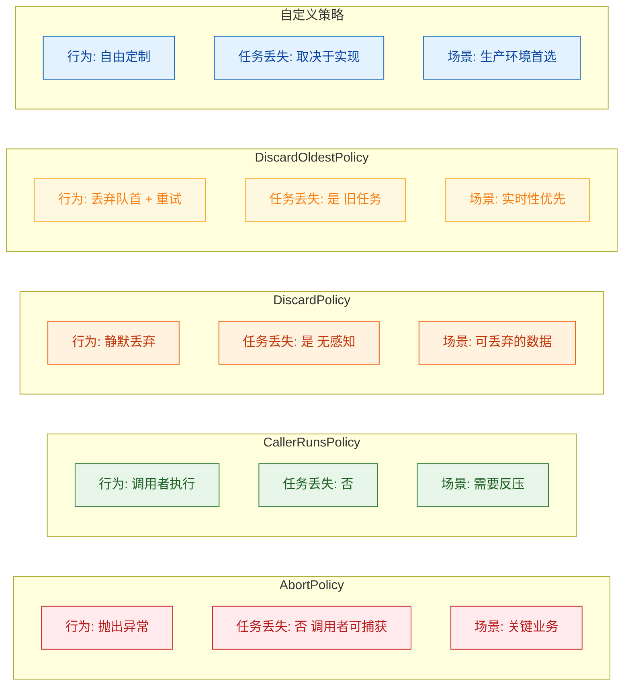

---

**📝 练习题**

某电商系统的订单处理模块使用了如下线程池配置：

```java
new ThreadPoolExecutor(4, 8, 60, TimeUnit.SECONDS,
    new ArrayBlockingQueue<>(100),
    new ThreadPoolExecutor.DiscardPolicy());
```

在一次大促期间，运营人员反映有部分用户的订单支付成功后迟迟没有发货，但系统日志中 **没有任何异常记录**。最可能的原因是什么？如果要修复，以下哪种方案最合理？

A. 队列容量 100 太小导致频繁扩容，应改为 `LinkedBlockingQueue` 无界队列

B. `DiscardPolicy` 静默丢弃了溢出的订单任务，应改为 `AbortPolicy` 或自定义策略

C. `keepAliveTime` 设为 60 秒太长，非核心线程回收太慢导致资源不足

D. `maximumPoolSize` 设为 8 太小，应增大到 100 以上


**【答案】** B

**【解析】** 这是一道典型的"拒绝策略选型不当"导致的生产事故题。问题的关键线索是"**系统日志中没有任何异常记录**"——这正是 `DiscardPolicy` 的特征行为：它的 `rejectedExecution()` 方法体为空，任务被丢弃时不会抛异常、不会打日志、不会有任何痕迹。在大促流量高峰期间，线程池的 8 个线程全部忙碌且 100 容量的队列被填满后，后续涌入的订单处理任务就被 `DiscardPolicy` 静默丢弃了，导致这些订单永远不会被处理。

- **A 错误**：`LinkedBlockingQueue` 无界队列虽然不会触发拒绝策略，但会带来 OOM 风险，而且 `maximumPoolSize` 将失去意义（队列永远填不满，非核心线程永远不会被创建），这是用一个更大的隐患去掩盖问题。
- **B 正确**：对于订单这类 **绝对不允许丢失** 的关键业务，应使用 `AbortPolicy`（至少能抛异常让调用者感知）或者自定义拒绝策略（记录日志 + 持久化到消息队列 + 触发告警），确保任务不会无声无息地消失。
- **C 错误**：`keepAliveTime` 控制的是非核心线程的空闲回收时间，它不会导致任务丢失，与本问题无关。
- **D 错误**：单纯增大 `maximumPoolSize` 只能延缓问题发生，无法根本解决。当流量持续超过处理能力时，队列仍然会满，仍然会触发 `DiscardPolicy` 丢弃任务。而且线程数过多还会导致过度上下文切换，性能反而下降。

---

## Worker 线程

在 `ThreadPoolExecutor` 的整个架构中，真正干活的"工人"就是内部类 **`Worker`**。每一个 `Worker` 对象都封装了一条真实的操作系统线程，并且围绕这条线程的**创建、执行、复用、回收**构建了一套精密的机制。理解 Worker 是理解线程池"为什么能复用线程"这一核心问题的钥匙。很多开发者只知道线程池能"复用线程"，但说不清它到底是怎么复用的——答案就藏在 Worker 的源码里。

我们先从 Worker 的类签名开始，看看它到底"是什么"：

```java
// java.util.concurrent.ThreadPoolExecutor.Worker（JDK 源码简化）
private final class Worker
    extends AbstractQueuedSynchronizer  // 继承 AQS，自身就是一把锁
    implements Runnable {               // 实现 Runnable，自身就是一个任务

    final Thread thread;     // Worker 持有的真实线程（由 ThreadFactory 创建）
    Runnable firstTask;      // 创建 Worker 时携带的第一个任务（可以为 null）
    volatile long completedTasks; // 该 Worker 累计完成的任务数

    Worker(Runnable firstTask) {
        setState(-1);                    // 初始 state = -1，阻止中断直到 runWorker
        this.firstTask = firstTask;      // 记录第一个任务
        this.thread = getThreadFactory().newThread(this); // 把 Worker 自身作为 Runnable 传给线程
    }

    public void run() {
        runWorker(this);  // 委托给外部类 ThreadPoolExecutor 的 runWorker 方法
    }
    // ... AQS 相关方法（lock / unlock / tryAcquire / tryRelease）
}
```

请注意构造方法中那句 `getThreadFactory().newThread(this)`——它把 **Worker 自身**（`this`，一个 Runnable）传给了 `ThreadFactory`，由工厂创建出一条新线程。当这条线程被 `start()` 后，JVM 会回调 `Worker.run()`，进而调用 `runWorker(this)`。**这就是一切的起点。**

```text
┌─────────────────────────────────────────────────────┐
│                     Worker 对象                      │
│                                                     │
│  ┌──────────────┐   ┌──────────────┐                │
│  │  firstTask   │   │   thread     │──► 真实OS线程   │
│  │  (Runnable)  │   │  (Thread)    │                │
│  └──────────────┘   └──────────────┘                │
│                                                     │
│  ├─ extends AQS     → 自身是一把不可重入锁           │
│  ├─ implements Runnable → 自身是线程的执行体          │
│  └─ completedTasks  → 统计完成任务数                 │
└─────────────────────────────────────────────────────┘
```

---

### 继承 AQS

Worker 继承 `AbstractQueuedSynchronizer`（AQS）这个设计在初次接触时往往让人困惑——一个"工人"为什么需要是一把"锁"？要回答这个问题，我们需要理解线程池在 **shutdown** 和 **中断空闲线程** 时面临的挑战。

#### 为什么 Worker 需要是一把锁？

线程池有一个关键操作：**`interruptIdleWorkers()`**——中断空闲的 Worker 线程。所谓"空闲"，就是 Worker 正在阻塞等待任务（在 `getTask()` 中阻塞在 `workQueue.take()` 或 `workQueue.poll()` 上）。而"正在执行任务"的 Worker 不应该被随意中断（至少在 `shutdown()` 时不应该，`shutdownNow()` 是另一回事）。

那线程池怎么区分一个 Worker 是"空闲"还是"忙碌"？答案就是 **Worker 自身的锁状态**：

- **Worker 正在执行任务**时，它会 **持有自己的锁**（`w.lock()`）。
- **Worker 空闲等待任务**时，它会 **释放锁**（`w.unlock()`），处于未锁定状态。

当 `interruptIdleWorkers()` 遍历所有 Worker 时，它会尝试 `w.tryLock()`：
- **成功获取锁** → 说明 Worker 当前空闲 → 可以安全中断。
- **获取锁失败** → 说明 Worker 正在忙碌 → 跳过，不打扰。

```java
// ThreadPoolExecutor.interruptIdleWorkers(boolean onlyOne) 简化源码
private void interruptIdleWorkers(boolean onlyOne) {
    final ReentrantLock mainLock = this.mainLock; // 线程池全局锁
    mainLock.lock();                              // 加全局锁，保护 workers 集合
    try {
        for (Worker w : workers) {                // 遍历所有 Worker
            Thread t = w.thread;                  // 获取 Worker 持有的线程
            if (!t.isInterrupted() && w.tryLock()) { // 尝试获取 Worker 锁
                // tryLock 成功 → Worker 当前空闲（没有在执行任务）
                try {
                    t.interrupt();                // 中断该空闲线程
                } catch (SecurityException ignore) {
                } finally {
                    w.unlock();                   // 释放 Worker 锁
                }
            }
            if (onlyOne)                          // 如果只中断一个，直接跳出
                break;
        }
    } finally {
        mainLock.unlock();                        // 释放全局锁
    }
}
```

#### 为什么不用 ReentrantLock 而是自己继承 AQS？

这是一个非常精妙的设计决策。Worker 实现的是一把 **不可重入的独占锁（Non-reentrant Exclusive Lock）**，而 `ReentrantLock` 顾名思义是可重入的。

**不可重入是刻意为之的。** 考虑以下场景：

1. Worker 正在执行一个任务（持有自己的锁，state = 1）。
2. 线程池调用 `setCorePoolSize()` 缩小核心线程数，内部会调用 `interruptIdleWorkers()`。
3. `interruptIdleWorkers()` 在同一个线程中（或者说，假设 Worker 线程自身触发了某种回调）尝试 `w.tryLock()`。

如果用可重入锁，**同一个线程**能再次获取锁成功 → 误判 Worker 为空闲 → 错误中断一个正在执行任务的线程。而不可重入锁会直接失败，避免了这个问题。

来看 Worker 对 AQS 的实现：

```java
// Worker 的 AQS 实现（源码简化）
// state 含义：
//   -1 : 初始状态（刚创建，还没开始 runWorker）
//    0 : 未锁定（空闲状态）
//    1 : 已锁定（正在执行任务）

protected boolean isHeldExclusively() {
    return getState() != 0;       // state != 0 就认为被独占持有
}

protected boolean tryAcquire(int unused) {
    // CAS 将 state 从 0 改为 1，只有从 0 才能成功 → 不可重入！
    if (compareAndSetState(0, 1)) {
        setExclusiveOwnerThread(Thread.currentThread()); // 记录持有者线程
        return true;              // 加锁成功
    }
    return false;                 // 加锁失败（state 已经是 1，不可重入）
}

protected boolean tryRelease(int unused) {
    setExclusiveOwnerThread(null); // 清除持有者
    setState(0);                   // 恢复为未锁定
    return true;
}

public void lock()        { acquire(1); }      // 阻塞式加锁
public boolean tryLock()  { return tryAcquire(1); } // 非阻塞尝试加锁
public void unlock()      { release(1); }      // 释放锁
```

#### 初始 state = -1 的含义

构造方法中 `setState(-1)` 也是一个精心设计的细节。在 Worker 被创建后、`runWorker()` 真正开始执行前，存在一个时间窗口。如果此时线程池正好调用 `interruptIdleWorkers()`，`tryAcquire` 中的 `compareAndSetState(0, 1)` 会因为当前 state 是 -1（不是 0）而失败——**从而保护还未启动的 Worker 不被中断**。

只有当 `runWorker()` 方法开始后，第一行代码 `w.unlock()` 才会把 state 从 -1 设为 0，此时 Worker 才"正式上线"，可以被 `interruptIdleWorkers()` 感知到。

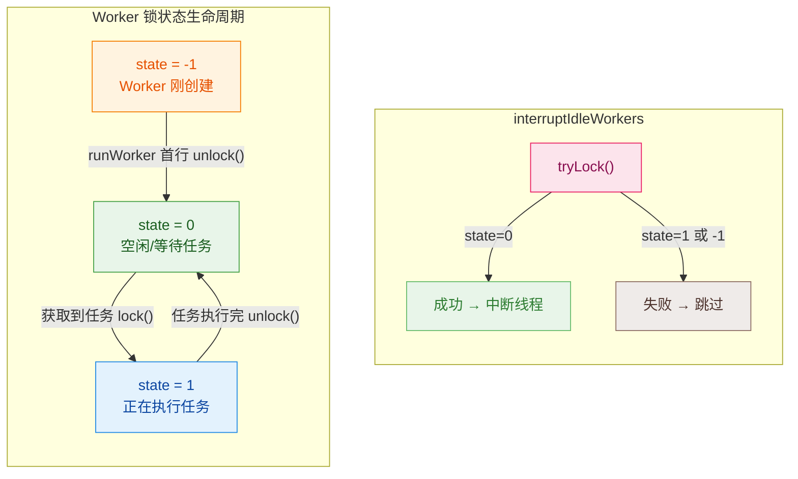

---

### 实现 Runnable

Worker 实现 `Runnable` 接口这件事本身并不复杂，但它体现了一个优雅的设计模式：**Worker 既是任务的载体，又是线程的执行体**。

#### Worker 与 Thread 的关系

传统模式下我们创建线程是这样的：

```java
// 传统方式：每个任务创建一个线程
new Thread(() -> doSomething()).start(); // 任务执行完，线程死亡
```

而在线程池中，关系变成了：

```java
// 线程池方式：Worker 充当 Runnable，内部循环获取多个任务
Thread t = threadFactory.newThread(worker); // worker 就是那个 Runnable
t.start(); // 线程启动后，执行 worker.run() → runWorker(this)
// runWorker 内部有个 while 循环，不断取任务执行
// 线程不会在一个任务完成后死亡！
```

```text
传统方式：
  Thread-1 ──► Task-A ──► 线程销毁 ✗
  Thread-2 ──► Task-B ──► 线程销毁 ✗
  Thread-3 ──► Task-C ──► 线程销毁 ✗

线程池方式（Worker 模型）：
  Worker-1.thread ──► Task-A ──► Task-D ──► Task-G ──► ... (循环复用)
  Worker-2.thread ──► Task-B ──► Task-E ──► Task-H ──► ... (循环复用)
  Worker-3.thread ──► Task-C ──► Task-F ──► Task-I ──► ... (循环复用)
```

Worker 的 `run()` 方法极其简洁，只有一行：

```java
public void run() {
    runWorker(this); // 把自身传给 ThreadPoolExecutor 的 runWorker 方法
}
```

所有的核心逻辑都在 `runWorker()` 中，这正是 **线程复用** 的实现所在。

---

### 线程复用原理（循环获取任务）

这是整个 Worker 机制中最精华的部分，也是面试中被问到"线程池如何复用线程"时你必须能清楚回答的核心。

#### 核心思想：线程不退出，就是复用

操作系统创建和销毁线程的成本很高（涉及内核调度、栈内存分配/回收等）。线程池的"复用"并不是什么黑魔法，本质就是：**让线程的 `run()` 方法不要结束**。只要 `run()` 不返回，线程就不会死亡。而 `run()` 不返回的方式就是——**在里面跑一个 while 循环，不断从队列中取任务来执行**。

#### runWorker 源码深度解析

```java
// ThreadPoolExecutor.runWorker() 核心源码（带详尽注释）
final void runWorker(Worker w) {
    Thread wt = Thread.currentThread();  // 获取当前线程（即 Worker 持有的 thread）
    Runnable task = w.firstTask;         // 取出 Worker 携带的第一个任务
    w.firstTask = null;                  // 清空引用，帮助 GC
    w.unlock();                          // ★ 将 state 从 -1 设为 0，允许被中断
    boolean completedAbruptly = true;    // 标记是否因异常而退出

    try {
        // ★★★ 核心循环：线程复用的关键 ★★★
        // 第一次循环：执行 firstTask（如果有的话）
        // 后续循环：通过 getTask() 从工作队列中获取新任务
        while (task != null || (task = getTask()) != null) {
            w.lock();                    // 加锁，标记 Worker 为"忙碌"状态（state=1）

            // 检查线程池状态：如果线程池正在 STOP，确保线程被中断
            // 如果线程池还没 STOP，确保线程没有被中断
            if ((runStateAtLeast(ctl.get(), STOP)          // 线程池 >= STOP？
                    || (Thread.interrupted()                // 或者线程被中断了？
                        && runStateAtLeast(ctl.get(), STOP))) // 再次确认是否 >= STOP
                && !wt.isInterrupted())                     // 且线程还未设置中断标志
                wt.interrupt();                             // 那就中断它

            try {
                beforeExecute(wt, task);  // 钩子方法：任务执行前（可覆写）
                try {
                    task.run();           // ★ 直接调用 run()，不是 start()！
                                          // 任务在 Worker 线程中同步执行
                } catch (RuntimeException x) {
                    thrown = x; throw x;  // 记录并重新抛出异常
                } catch (Error x) {
                    thrown = x; throw x;
                } catch (Throwable x) {
                    thrown = x; throw new Error(x);
                } finally {
                    afterExecute(task, thrown); // 钩子方法：任务执行后（可覆写）
                }
            } finally {
                task = null;              // 清空当前任务引用
                w.completedTasks++;       // 已完成任务数 +1
                w.unlock();              // 释放锁，标记 Worker 为"空闲"状态（state=0）
            }
        }
        // while 循环结束 → getTask() 返回了 null → Worker 该退出了
        completedAbruptly = false;        // 正常退出，不是因为异常
    } finally {
        processWorkerExit(w, completedAbruptly); // 清理工作：从 workers 集合移除等
    }
}
```

这里有几个关键点值得反复品味：

**第一，`task.run()` 而不是 `task.start()`。** 这是很多初学者的盲区。如果调用 `task.start()` 就会创建新线程去执行——那就完全失去了线程池的意义。直接调用 `run()` 意味着任务在 **Worker 的线程** 中同步执行，这才是"复用"。

**第二，`while` 循环是灵魂。** 只要 `getTask()` 能返回非 null 的任务，Worker 线程就永远不会退出。线程一直活着、一直在循环中等待新任务，这就是"线程复用"的全部秘密。

**第三，`w.lock()` 和 `w.unlock()` 的配对。** 执行任务时加锁、执行完释放锁，这样 `interruptIdleWorkers()` 就能准确判断哪些 Worker 正在忙碌、哪些正在空闲等待。

#### getTask()：复用的供血系统

`getTask()` 是 Worker 循环能持续运转的"供血系统"。它从工作队列中取任务，同时也承担着**控制非核心线程超时回收**的职责。

```java
// ThreadPoolExecutor.getTask() 核心源码（带详尽注释）
private Runnable getTask() {
    boolean timedOut = false;            // 上一次 poll() 是否超时

    for (;;) {                           // 自旋循环
        int c = ctl.get();               // 获取线程池控制状态

        // 检查线程池状态：
        // 如果是 SHUTDOWN 且队列为空 → 返回 null（Worker 该退出了）
        // 如果是 STOP 或更高状态 → 返回 null（不管队列里还有没有）
        if (runStateAtLeast(c, SHUTDOWN)
            && (runStateAtLeast(c, STOP) || workQueue.isEmpty())) {
            decrementWorkerCount();      // 工作线程数 -1
            return null;                 // 返回 null → runWorker 的 while 循环结束 → Worker 退出
        }

        int wc = workerCountOf(c);       // 当前工作线程数

        // ★ 判断是否需要超时控制 ★
        // allowCoreThreadTimeOut=true → 核心线程也会超时
        // wc > corePoolSize → 当前线程数超过核心数，多出来的是"非核心线程"
        boolean timed = allowCoreThreadTimeOut || wc > corePoolSize;

        // 如果线程数超标或者上次已经超时 → 尝试减少线程数并退出
        if ((wc > maximumPoolSize || (timed && timedOut))
            && (wc > 1 || workQueue.isEmpty())) {
            if (compareAndDecrementWorkerCount(c)) // CAS 减少线程数
                return null;             // 返回 null → Worker 退出
            continue;                    // CAS 失败，重新循环
        }

        try {
            // ★★ 关键分支 ★★
            // timed=true → 用 poll(keepAliveTime)，超时返回 null
            // timed=false → 用 take()，永久阻塞直到有任务
            Runnable r = timed ?
                workQueue.poll(keepAliveTime, TimeUnit.NANOSECONDS) : // 超时等待
                workQueue.take();        // 无限等待（核心线程默认走这里）

            if (r != null)
                return r;                // 成功获取任务，返回给 runWorker 的 while 循环
            timedOut = true;             // poll 超时了，下一轮循环会尝试退出
        } catch (InterruptedException retry) {
            timedOut = false;            // 被中断了，重置超时标记，重新循环
        }
    }
}
```

这段代码是 **核心线程常驻** 和 **非核心线程超时回收** 的实现原理：

| 线程类型 | `timed` 的值 | 取任务方式 | 行为 |
|---------|-------------|-----------|------|
| 核心线程（`wc <= corePoolSize`） | `false`（默认） | `workQueue.take()` | **无限阻塞等待**，永远不超时，线程一直活着 |
| 非核心线程（`wc > corePoolSize`） | `true` | `workQueue.poll(keepAliveTime, ...)` | 等待 `keepAliveTime`，超时返回 null → Worker 退出 |
| 核心线程（`allowCoreThreadTimeOut=true`） | `true` | `workQueue.poll(keepAliveTime, ...)` | 核心线程也可以超时退出 |

#### 完整生命周期流程图

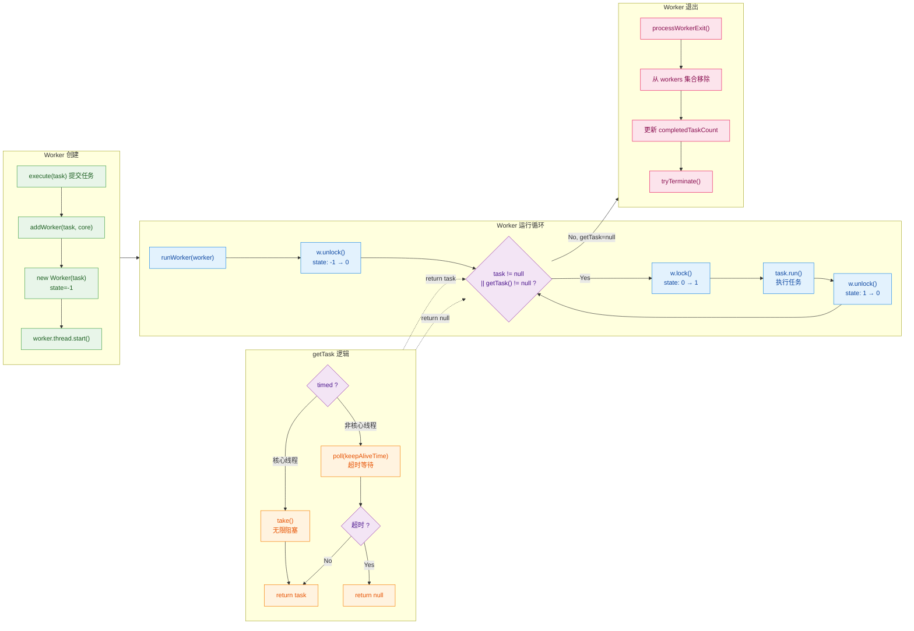

#### 线程复用的本质总结

把线程复用的原理浓缩成一句话：

> **Worker 线程在 `runWorker()` 中通过 `while` 循环不断调用 `getTask()` 从工作队列获取任务，并直接调用任务的 `run()` 方法在当前线程中同步执行。只要 `getTask()` 不返回 null，线程就不会退出——这就是线程复用。**

用伪代码表达就是：

```java
// 线程复用的极简模型
void runWorker() {
    Runnable task;
    // 不断从队列取任务 → 线程不退出 → 线程被复用
    while ((task = getTaskFromQueue()) != null) {
        task.run();  // 直接 run()，不创建新线程
    }
    // getTask 返回 null → 跳出循环 → 线程自然死亡 → 被 GC 回收
}
```

以下是从"一个任务被提交"到"被 Worker 执行"的完整调用链：

```text
用户调用 executor.execute(taskA)
    │
    ├─► addWorker(taskA, true)           // 创建新 Worker
    │       │
    │       ├─► new Worker(taskA)        // Worker 构造：firstTask=taskA, state=-1
    │       │       │
    │       │       └─► threadFactory.newThread(worker)  // 创建线程，Runnable=worker
    │       │
    │       └─► worker.thread.start()    // 启动线程 → JVM 回调 Worker.run()
    │               │
    │               └─► runWorker(worker)
    │                       │
    │                       ├─► 第 1 轮循环：task = firstTask(taskA) → taskA.run()
    │                       ├─► 第 2 轮循环：task = getTask() → taskB.run()
    │                       ├─► 第 3 轮循环：task = getTask() → taskC.run()
    │                       ├─► ...（持续复用）
    │                       └─► getTask() 返回 null → 退出循环 → processWorkerExit()
    │
    └─► 或者：workQueue.offer(taskA)     // 队列未满时，任务入队等待被 getTask() 取走
```

#### Worker 退出的时机

Worker 不是永生的，以下场景会导致 Worker 退出（`getTask()` 返回 null）：

| 场景 | 触发条件 | 说明 |
|------|---------|------|
| **非核心线程超时** | `poll(keepAliveTime)` 超时 | 空闲时间超过 keepAliveTime，非核心线程被回收 |
| **allowCoreThreadTimeOut** | 核心线程也开启超时 | 核心线程空闲超时后也会被回收 |
| **shutdown()** | 线程池关闭且队列为空 | 所有任务处理完毕后，Worker 逐步退出 |
| **shutdownNow()** | 线程池立即关闭 | 不等队列中的任务，直接退出 |
| **任务执行抛异常** | `task.run()` 抛出未捕获异常 | Worker 异常退出，线程池会创建新 Worker 补位 |

关于异常退出，有一个重要细节：当 `task.run()` 抛出异常时，`runWorker` 的 `while` 循环会被打断，`completedAbruptly` 保持为 `true`，`processWorkerExit()` 检测到异常退出后，会调用 `addWorker(null, false)` **创建一个新的 Worker 来替补**，确保线程池不会因为任务异常而逐渐"失血"至死。

---

**📝 练习题**

以下关于 `ThreadPoolExecutor` 中 `Worker` 类的描述，哪一项是**错误的**？

A. Worker 继承了 AQS 并实现了一把不可重入的独占锁，用于区分 Worker 是空闲还是忙碌状态

B. Worker 构造方法中将 AQS 的 state 初始化为 -1，目的是防止刚创建还未启动的 Worker 被 `interruptIdleWorkers()` 中断

C. `runWorker()` 方法中通过调用 `task.start()` 来启动用户提交的任务，使任务在 Worker 的线程中执行

D. 当 `getTask()` 返回 null 时，Worker 的 `runWorker()` 循环结束，线程自然退出并在 `processWorkerExit()` 中被清理


**【答案】** C

**【解析】** `runWorker()` 中调用的是 `task.run()` 而不是 `task.start()`。`run()` 是普通方法调用，任务的代码直接在当前 Worker 线程中同步执行，这正是线程复用的关键。如果调用 `start()` 则会创建一个全新的线程来执行任务，完全违背了线程池复用线程的设计初衷。选项 A 正确，Worker 确实是不可重入的，因为 `tryAcquire` 只在 `state=0` 时才成功（CAS 0→1），已持有锁时再次调用不会成功。选项 B 正确，`state=-1` 使得 `tryAcquire` 的 CAS（期望值为0）无法成功，起到了保护作用。选项 D 正确，这就是 Worker 线程正常退出的流程。

---

## 线程池状态

`ThreadPoolExecutor` 的整个生命周期被精确地划分为 **五种状态**。理解这些状态以及它们之间的转换关系，是掌握线程池优雅关闭（Graceful Shutdown）机制的核心前提。Doug Lea 在设计时将线程池的 **运行状态（runState）** 和 **工作线程数量（workerCount）** 巧妙地压缩进了同一个 `int` 型变量 `ctl` 中，这是一个极具工程智慧的设计。

### ctl 变量：一个 int 装下两个世界

在深入每个状态之前，必须先理解 `ctl` 这个"控制状态字"（Control State），因为线程池的所有状态判断都围绕它展开。

```java
// ThreadPoolExecutor 源码中的 ctl 定义
// ctl 是一个 AtomicInteger，高 3 位存储 runState，低 29 位存储 workerCount
private final AtomicInteger ctl = new AtomicInteger(ctlOf(RUNNING, 0));

// Integer.SIZE = 32，因此 COUNT_BITS = 29
// 也就是说，用 29 位来表示线程数量（最大约 5 亿个线程，远超实际需要）
private static final int COUNT_BITS = Integer.SIZE - 3;  // 29

// 线程数量的掩码：低 29 位全为 1 → 0001_1111_1111_1111_1111_1111_1111_1111
private static final int COUNT_MASK = (1 << COUNT_BITS) - 1;

// ————— 五种状态常量（高 3 位编码）—————

// RUNNING:  111_00000...（高 3 位为 111，是负数，值最小）
private static final int RUNNING    = -1 << COUNT_BITS;

// SHUTDOWN: 000_00000...（高 3 位为 000）
private static final int SHUTDOWN   =  0 << COUNT_BITS;

// STOP:     001_00000...（高 3 位为 001）
private static final int STOP       =  1 << COUNT_BITS;

// TIDYING:  010_00000...（高 3 位为 010）
private static final int TIDYING    =  2 << COUNT_BITS;

// TERMINATED: 011_00000...（高 3 位为 011）
private static final int TERMINATED =  3 << COUNT_BITS;

// ————— 解包方法 —————

// 获取运行状态：ctl 与 ~COUNT_MASK 按位与，只保留高 3 位
private static int runStateOf(int c)     { return c & ~COUNT_MASK; }

// 获取工作线程数：ctl 与 COUNT_MASK 按位与，只保留低 29 位
private static int workerCountOf(int c)  { return c & COUNT_MASK; }

// 打包方法：将 runState 和 workerCount 合并成一个 int
private static int ctlOf(int rs, int wc) { return rs | wc; }
```

**为什么要把两个信息压缩到一个变量里？** 答案是 **原子性（Atomicity）**。如果 `runState` 和 `workerCount` 是两个独立变量，那么在并发环境下，要同时读取或更新它们就需要加锁。而合并为一个 `AtomicInteger` 后，一次 CAS 操作就能同时保证两者的一致性，大幅减少了锁竞争。

用一张 bit 布局图直观理解：

```
  ┌─── 高 3 位：runState ───┐┌─────── 低 29 位：workerCount ───────┐
  │                         ││                                      │
  ▼                         ▼▼                                      ▼
  ┌───┬───┬───┬───┬───┬───┬───┬───┬─── ─── ─── ─── ───┬───┬───┬───┐
  │31 │30 │29 │28 │27 │26 │25 │24 │ ...               │ 2 │ 1 │ 0 │
  └───┴───┴───┴───┴───┴───┴───┴───┴─── ─── ─── ─── ───┴───┴───┴───┘
  ├───────────┤├─────────────────────────────────────────────────────┤
    run State                    worker Count
```

一个关键设计细节：**五种状态的数值是单调递增的**（RUNNING < SHUTDOWN < STOP < TIDYING < TERMINATED），这意味着源码中可以直接用 `>=` 或 `<` 来判断状态范围，而无需逐一枚举比较：

```java
// 源码中大量使用这种比较方式，非常简洁高效
// 例如：判断线程池是否不在 RUNNING 状态
private static boolean isRunning(int c) {
    return c < SHUTDOWN;  // RUNNING 是负数，小于 0（SHUTDOWN）
}

// 判断是否至少已经到了 SHUTDOWN
// runStateAtLeast(c, SHUTDOWN) → runStateOf(c) >= SHUTDOWN
```

---

### RUNNING（运行状态）

**状态值**：高 3 位为 `111`（即 -1 左移 29 位，整个 `ctl` 的 runState 部分是负值）

这是线程池创建后的 **初始状态**，也是正常工作时的唯一状态。在 RUNNING 状态下：

- **接受新任务**：调用 `execute()` 或 `submit()` 提交的任务会被正常处理。
- **处理队列中的任务**：Worker 线程会不断从 `workQueue` 中 `poll()` 或 `take()` 任务来执行。

```java
// 线程池被构造时，ctl 初始值即为 RUNNING | 0
// 意味着：状态为 RUNNING，当前工作线程数为 0
private final AtomicInteger ctl = new AtomicInteger(ctlOf(RUNNING, 0));
// ctlOf(RUNNING, 0) = RUNNING | 0 = RUNNING
```

一个常被忽视的点：**线程池刚创建时，核心线程并不会立即创建**。只有当第一个任务被提交时（或者显式调用 `prestartAllCoreThreads()`），核心线程才会被 lazily 地创建出来。所以"RUNNING + workerCount = 0"是完全正常的初始组合。

---

### SHUTDOWN（关闭状态）

**状态值**：高 3 位为 `000`（整数 0 左移 29 位）

**触发方式**：调用 `shutdown()` 方法

```java
public void shutdown() {
    final ReentrantLock mainLock = this.mainLock;  // 获取主锁
    mainLock.lock();                                // 加锁
    try {
        checkShutdownAccess();       // 安全检查：确认调用者有权限中断线程
        advanceRunState(SHUTDOWN);   // 将 runState 推进到 SHUTDOWN
        interruptIdleWorkers();      // 中断所有空闲（idle）的 Worker 线程
        onShutdown();                // 钩子方法（ScheduledThreadPoolExecutor 会覆盖）
    } finally {
        mainLock.unlock();           // 解锁
    }
    tryTerminate();                  // 尝试推进到 TERMINATED
}
```

SHUTDOWN 是一种 **温和的关闭方式**（Graceful Shutdown），它的语义是：

- ❌ **不再接受新任务**：此时如果调用 `execute()` 提交新任务，将触发拒绝策略（RejectedExecutionHandler）。
- ✅ **继续处理队列中的剩余任务**：已经在 `workQueue` 中排队的任务不会被丢弃，Worker 线程会把它们全部执行完。
- ✅ **正在执行的任务不受影响**：当前 Worker 线程手中正在 `run()` 的任务会继续执行完毕。

`interruptIdleWorkers()` 的关键在于"idle"——它只会中断那些正在 `workQueue.take()` 上阻塞等待任务的线程（通过尝试获取 Worker 的内部锁来判断是否空闲），而不会中断正在执行任务的线程。这保证了正在处理的任务不会被粗暴打断。

**典型使用场景**：应用正常关闭时（如 Spring 容器销毁、JVM Shutdown Hook），通常调用 `shutdown()` 来等待所有已提交任务完成。

```java
// 典型的优雅关闭模式
executor.shutdown();                               // 发起关闭信号
try {
    // 等待所有任务完成，最多等 60 秒
    if (!executor.awaitTermination(60, TimeUnit.SECONDS)) {
        executor.shutdownNow();                    // 超时则强制关闭
        // 再等一轮
        if (!executor.awaitTermination(60, TimeUnit.SECONDS)) {
            System.err.println("线程池未能在规定时间内终止");
        }
    }
} catch (InterruptedException e) {
    executor.shutdownNow();                        // 当前线程被中断，也强制关闭
    Thread.currentThread().interrupt();            // 保留中断状态
}
```

---

### STOP（停止状态）

**状态值**：高 3 位为 `001`（整数 1 左移 29 位）

**触发方式**：调用 `shutdownNow()` 方法

```java
public List<Runnable> shutdownNow() {
    List<Runnable> tasks;                           // 用于收集队列中未执行的任务
    final ReentrantLock mainLock = this.mainLock;
    mainLock.lock();
    try {
        checkShutdownAccess();        // 安全检查
        advanceRunState(STOP);        // 将 runState 推进到 STOP
        interruptWorkers();           // 中断所有 Worker 线程（不区分空闲与否！）
        tasks = drainQueue();         // 清空工作队列，将未执行的任务取出返回
    } finally {
        mainLock.unlock();
    }
    tryTerminate();                   // 尝试推进到 TERMINATED
    return tasks;                     // 返回被丢弃的任务列表，调用者可以做补偿处理
}
```

STOP 是一种 **激进的关闭方式**（Abrupt Shutdown），它的语义是：

- ❌ **不再接受新任务**。
- ❌ **不再处理队列中的剩余任务**：`drainQueue()` 会把 `workQueue` 中所有排队任务取出来并返回给调用者。
- ⚠️ **尝试中断正在执行的任务**：注意这里调用的是 `interruptWorkers()`（而非 `interruptIdleWorkers()`），它会对 **所有已启动的 Worker 线程** 发送中断信号。

```java
// interruptWorkers() 源码
private void interruptWorkers() {
    for (Worker w : workers) {        // 遍历所有 Worker
        w.interruptIfStarted();       // 只要线程已启动，就发送 interrupt()
    }
}

// Worker 内部的 interruptIfStarted()
void interruptIfStarted() {
    Thread t;
    // getState() >= 0 表示 Worker 已经启动（state 初始为 -1，启动后变为 0）
    if (getState() >= 0 && (t = thread) != null && !t.isInterrupted()) {
        try {
            t.interrupt();            // 发送中断信号
        } catch (SecurityException ignore) {
        }
    }
}
```

**关键理解**：`interrupt()` 只是设置了线程的中断标志位，**并不能保证任务一定会立即停止**。如果任务内部没有检查中断状态（`Thread.interrupted()` 或捕获 `InterruptedException`），任务可能会继续执行到自然结束。这就是为什么在编写可取消的任务时，**响应中断**是一个良好的编程实践。

```java
// 一个能正确响应中断的任务示例
Runnable responsiveTask = () -> {
    while (!Thread.currentThread().isInterrupted()) {  // 每轮循环检查中断标志
        try {
            // 执行业务逻辑
            doSomeWork();
            Thread.sleep(100);       // sleep 会响应中断，抛出 InterruptedException
        } catch (InterruptedException e) {
            // 捕获到中断异常后，重新设置中断标志（因为 catch 会清除标志）
            Thread.currentThread().interrupt();
            break;                   // 退出循环，任务结束
        }
    }
    // 执行清理工作
    cleanup();
};
```

---

### TIDYING（整理状态）

**状态值**：高 3 位为 `010`（整数 2 左移 29 位）

TIDYING 是一个 **短暂的过渡状态**（Transitional State），它表示：

- 所有任务都已完成（包括队列中的任务）。
- **workerCount 已降为 0**（所有 Worker 线程已退出）。
- 线程池即将调用钩子方法 `terminated()` 进行最后的清理。

TIDYING 状态的进入由 `tryTerminate()` 方法控制，这个方法在多个地方被调用（`shutdown()`、`shutdownNow()`、Worker 退出时等）：

```java
final void tryTerminate() {
    for (;;) {                                        // 自旋
        int c = ctl.get();                            // 获取当前 ctl

        // 以下三种情况不需要终止，直接返回：
        // 1. 还在 RUNNING 状态
        // 2. 已经到了 TIDYING 或 TERMINATED（有其他线程在处理）
        // 3. SHUTDOWN 状态但队列非空（还有任务要处理）
        if (isRunning(c) ||
            runStateAtLeast(c, TIDYING) ||
            (runStateOf(c) == SHUTDOWN && !workQueue.isEmpty()))
            return;

        // 如果还有 Worker 线程存活，中断一个空闲线程让它感知到状态变化
        // 被中断的线程退出后会再次调用 tryTerminate()，形成传播效应
        if (workerCountOf(c) != 0) {
            interruptIdleWorkers(ONLY_ONE);           // 只中断一个，避免大量中断风暴
            return;
        }

        // ——— 到达这里说明：workerCount == 0，队列为空 ———
        final ReentrantLock mainLock = this.mainLock;
        mainLock.lock();
        try {
            // CAS 设置状态为 TIDYING（workerCount = 0）
            if (ctl.compareAndSet(c, ctlOf(TIDYING, 0))) {
                try {
                    terminated();                     // 调用钩子方法（默认空实现）
                } finally {
                    // 无论 terminated() 是否异常，都推进到 TERMINATED
                    ctl.set(ctlOf(TERMINATED, 0));
                    // 唤醒所有在 awaitTermination() 上等待的线程
                    termination.signalAll();
                }
                return;
            }
        } finally {
            mainLock.unlock();
        }
        // CAS 失败则自旋重试
    }
}
```

`terminated()` 是一个 **可覆盖的钩子方法**（Hook Method），默认实现为空。你可以继承 `ThreadPoolExecutor` 来自定义终止时的清理逻辑：

```java
// 自定义线程池，覆盖 terminated() 钩子
public class MonitoredThreadPool extends ThreadPoolExecutor {

    // 构造方法省略...

    @Override
    protected void terminated() {
        super.terminated();
        // 在线程池彻底终止时执行自定义逻辑
        System.out.println("线程池已完全终止，执行资源清理...");
        metricsReporter.flush();           // 刷新监控指标
        resourceManager.releaseAll();      // 释放外部资源
    }
}
```

---

### TERMINATED（终止状态）

**状态值**：高 3 位为 `011`（整数 3 左移 29 位）

这是线程池生命周期的 **终态**（Final State）。进入 TERMINATED 意味着：

- `terminated()` 钩子方法已执行完毕。
- 线程池的所有资源已释放，不可再重新启动。
- 所有在 `awaitTermination()` 上阻塞等待的线程会被唤醒。

```java
public boolean awaitTermination(long timeout, TimeUnit unit)
    throws InterruptedException {
    long nanos = unit.toNanos(timeout);              // 转换为纳秒
    final ReentrantLock mainLock = this.mainLock;
    mainLock.lock();
    try {
        while (runStateOf(ctl.get()) < TERMINATED) { // 只要还没到 TERMINATED 就继续等
            if (nanos <= 0L)                         // 超时返回 false
                return false;
            nanos = termination.awaitNanos(nanos);   // 在 Condition 上等待
        }
        return true;                                 // 到达 TERMINATED，返回 true
    } finally {
        mainLock.unlock();
    }
}
```

一旦线程池进入 TERMINATED，`isTerminated()` 方法将返回 `true`，而 `isShutdown()` 在 SHUTDOWN 及之后的所有状态都返回 `true`。

---

### 状态转换全景图

五种状态之间的转换路径是 **严格单向** 的，不可回退。每种转换都由特定的方法或条件触发：

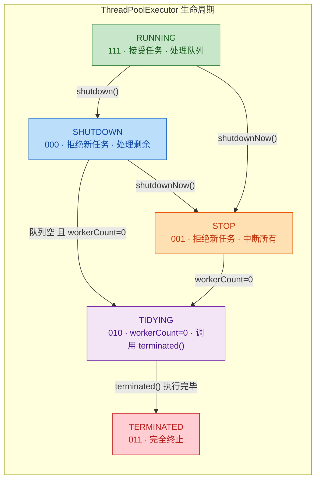

关键转换路径总结：

| 转换 | 触发条件 | 说明 |
|:---|:---|:---|
| RUNNING → SHUTDOWN | 调用 `shutdown()` | 温和关闭，等待队列排空 |
| RUNNING → STOP | 调用 `shutdownNow()` | 暴力关闭，中断一切 |
| SHUTDOWN → STOP | 在 SHUTDOWN 期间调用 `shutdownNow()` | 等不及了，升级为暴力关闭 |
| SHUTDOWN → TIDYING | 队列为空 **且** workerCount = 0 | 所有任务都执行完了 |
| STOP → TIDYING | workerCount = 0 | 所有 Worker 线程都退出了 |
| TIDYING → TERMINATED | `terminated()` 钩子执行完毕 | 最终状态 |

### 状态与 ctl 编码速查

将五种状态的二进制编码和对应数值放在一起对照，更容易理解源码中的大小比较逻辑：

```
状态            高3位    十进制（runState部分）    能否接受新任务    能否处理队列任务
─────────────────────────────────────────────────────────────────────────────
RUNNING         111      -536870912 (负数)         ✅              ✅
SHUTDOWN        000       0                        ❌              ✅
STOP            001       536870912                ❌              ❌
TIDYING         010       1073741824               ❌              ❌
TERMINATED      011       1610612736               ❌              ❌
─────────────────────────────────────────────────────────────────────────────
                         ↑ 数值单调递增
```

因为 **RUNNING 的 runState 值最小（是负数）**，所以源码中 `isRunning(c)` 只需要判断 `c < SHUTDOWN`（即 `c < 0`）即可。而判断是否已经开始关闭流程，只需 `runStateAtLeast(c, SHUTDOWN)` 即 `c >= 0`。这种利用数值大小关系来简化条件判断的技巧，在高性能并发代码中非常常见。

### Worker 退出与状态推进的连锁反应

每个 Worker 线程在退出时，都会触发 `processWorkerExit()` 方法，该方法内部最终会调用 `tryTerminate()` 来检查是否满足状态推进条件：

```java
private void processWorkerExit(Worker w, boolean completedAbruptly) {
    // 如果是异常退出（任务抛出未捕获异常），手动减少 workerCount
    if (completedAbruptly)
        decrementWorkerCount();

    final ReentrantLock mainLock = this.mainLock;
    mainLock.lock();
    try {
        completedTaskCount += w.completedTasks;   // 汇总已完成任务数
        workers.remove(w);                         // 从 Worker 集合中移除
    } finally {
        mainLock.unlock();
    }

    tryTerminate();   // ⭐ 关键：每个 Worker 退出时都尝试推进状态

    int c = ctl.get();
    // 如果线程池还在 RUNNING 或 SHUTDOWN 状态，可能需要补充 Worker
    if (runStateLessThan(c, STOP)) {
        if (!completedAbruptly) {
            // 计算最少需要的线程数
            int min = allowCoreThreadTimeOut ? 0 : corePoolSize;
            if (min == 0 && !workQueue.isEmpty())
                min = 1;                           // 队列非空至少保留一个线程
            if (workerCountOf(c) >= min)
                return;                            // 线程数足够，无需补充
        }
        addWorker(null, false);                    // 补充一个 Worker
    }
}
```

这里形成了一个精巧的 **连锁反应**（Chain Reaction）：

1. `shutdown()` 被调用 → 中断一个空闲 Worker
2. 被中断的 Worker 从 `getTask()` 返回 `null` → 退出循环 → `processWorkerExit()`
3. `processWorkerExit()` 调用 `tryTerminate()`
4. `tryTerminate()` 发现还有其他 Worker → 再中断一个空闲 Worker（`interruptIdleWorkers(ONLY_ONE)`）
5. 重复步骤 2~4，直到所有 Worker 全部退出
6. 最后一个 Worker 退出时，`tryTerminate()` 发现 workerCount = 0 → CAS 设置 TIDYING → 调用 `terminated()` → 设置 TERMINATED

这种 **"逐个传播中断"** 的设计避免了一次性中断所有线程可能带来的竞争问题，是 Doug Lea 并发设计中的一个典型模式。

### 实战调试：如何查看线程池当前状态

`ThreadPoolExecutor` 提供了 `toString()` 方法，可以在运行时输出当前状态信息：

```java
ThreadPoolExecutor pool = new ThreadPoolExecutor(
    2, 4, 60, TimeUnit.SECONDS,            // 核心2，最大4，空闲60秒
    new ArrayBlockingQueue<>(10)            // 有界队列，容量10
);

// 提交一些任务
for (int i = 0; i < 8; i++) {
    pool.execute(() -> {
        try { Thread.sleep(2000); } catch (InterruptedException e) { }
    });
}

// 打印线程池状态信息
System.out.println(pool.toString());
// 输出示例：
// java.util.concurrent.ThreadPoolExecutor@xxxx[
//   Running,                              ← 当前状态
//   pool size = 2,                        ← 当前线程数
//   active threads = 2,                   ← 活跃线程数
//   queued tasks = 6,                     ← 队列中等待的任务数
//   completed tasks = 0                   ← 已完成的任务数
// ]

pool.shutdown();                           // 发起关闭
System.out.println(pool.toString());
// 输出：... Shutting down ...             ← 状态变为 SHUTDOWN

pool.awaitTermination(10, TimeUnit.SECONDS);
System.out.println(pool.toString());
// 输出：... Terminated ...                ← 最终状态 TERMINATED
```

此外还有一系列查询方法可用于监控：

```java
pool.isShutdown();      // SHUTDOWN 及之后的状态都返回 true
pool.isTerminating();   // 正在终止中（SHUTDOWN 或 STOP 但还没到 TERMINATED）
pool.isTerminated();    // 只有 TERMINATED 返回 true
pool.getPoolSize();     // 当前线程池中的线程数
pool.getActiveCount();  // 正在执行任务的线程数（近似值）
pool.getQueue().size(); // 队列中排队的任务数
```

---

**📝 练习题**

某线程池当前处于 `SHUTDOWN` 状态，此时以下哪些说法是正确的？（多选）

A. 调用 `execute()` 提交新任务会抛出 `RejectedExecutionException`（假设使用默认拒绝策略 `AbortPolicy`）

B. 工作队列中已有的任务会被立即清空丢弃

C. 正在执行中的任务会被 `Thread.interrupt()` 强制中断

D. 如果此时再调用 `shutdownNow()`，线程池状态会从 `SHUTDOWN` 转变为 `STOP`

E. 当队列中所有任务执行完毕且所有 Worker 线程退出后，线程池会先进入 `TIDYING`，再进入 `TERMINATED`


**【答案】** A、D、E

**【解析】**

- **A 正确**：`SHUTDOWN` 状态下不再接受新任务。`execute()` 方法内部会检查 `runState >= SHUTDOWN`，如果成立则调用拒绝策略。默认的 `AbortPolicy` 会直接抛出 `RejectedExecutionException`。

- **B 错误**：`SHUTDOWN` 状态的核心语义就是 **"不接受新任务，但会把队列中的任务处理完"**。清空队列是 `STOP` 状态（`shutdownNow()`）才会做的事情。

- **C 错误**：`shutdown()` 只会调用 `interruptIdleWorkers()`，即只中断那些正在阻塞等待任务的空闲线程。正在执行任务的线程不会收到中断信号。强制中断所有线程是 `shutdownNow()` → `interruptWorkers()` 的行为。

- **D 正确**：`SHUTDOWN → STOP` 是合法的状态转换路径。`shutdownNow()` 内部调用 `advanceRunState(STOP)`，由于 `STOP > SHUTDOWN`，CAS 会成功将状态推进到 `STOP`。

- **E 正确**：这正是标准的状态流转路径。`SHUTDOWN` → 队列空且 workerCount = 0 → `TIDYING`（调用 `terminated()` 钩子）→ `TERMINATED`。

---

## 本章小结

`ThreadPoolExecutor` 是 Java 并发编程中最核心的基础设施之一，理解它的设计哲学和运行机制，是掌握高并发系统开发的必经之路。本章从七大核心参数出发，逐步深入到任务提交的完整工作流程、工作队列的选型策略、四种内置拒绝策略及自定义扩展、Worker 线程的内部实现与复用原理，以及线程池五种生命周期状态的流转机制。下面对全章知识进行系统性的回顾与融合。

### 核心参数：七个齿轮的协同

线程池的行为完全由构造函数中的七个参数决定，它们并非各自独立，而是构成了一套紧密耦合的协作体系：

```
┌─────────────────────────────────────────────────────────────────────┐
│                    ThreadPoolExecutor 参数协作全景                    │
├─────────────────────────────────────────────────────────────────────┤
│                                                                     │
│   corePoolSize ──→ 决定常驻线程规模（稳态吞吐基线）                    │
│         │                                                           │
│         ▼                                                           │
│   workQueue ─────→ 缓冲溢出任务（队列类型决定系统行为特征）              │
│         │                                                           │
│         ▼                                                           │
│   maximumPoolSize → 弹性扩容上限（应对突发流量的天花板）                 │
│         │                                                           │
│         ▼                                                           │
│   handler ───────→ 最后防线（所有资源耗尽时的兜底策略）                  │
│                                                                     │
│   keepAliveTime + unit ──→ 控制非核心线程的回收节奏                    │
│   threadFactory ─────────→ 定制线程元信息（命名、优先级、守护状态）       │
│                                                                     │
└─────────────────────────────────────────────────────────────────────┘
```

**关键认知**：`corePoolSize`、`workQueue` 的容量、`maximumPoolSize` 三者形成了一条"阶梯式资源调度链"（Escalation Chain）。任务先填满核心线程，再填满队列，再扩张到最大线程数，最后才触发拒绝策略。这个顺序是整个线程池工作流程的骨架，也是面试中最高频考点。

### 工作流程：四步阶梯决策

任务从 `execute(Runnable)` 进入后，经历的决策路径可以用一句口诀概括：**"核心→队列→扩容→拒绝"**。

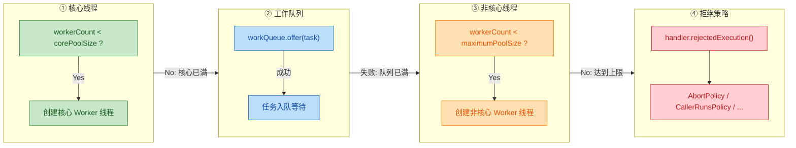

理解这个流程后，很多实践中的"反直觉"行为就有了解释。比如：为什么使用无界队列（`LinkedBlockingQueue`）时 `maximumPoolSize` 参数形同虚设？因为 `offer()` 永远返回 `true`，流程永远停在第二步，永远走不到第三步的扩容逻辑。

### 工作队列选型：架构决策的核心支点

队列的选择不是一个简单的"用哪个类"的问题，它从根本上改变了线程池的行为模型：

| 队列类型 | 容量特征 | 行为模型 | 典型场景 |
|:---|:---|:---|:---|
| `LinkedBlockingQueue` | 无界（默认 `Integer.MAX_VALUE`） | **纯缓冲模型**：任务无限堆积，永远不会触发扩容和拒绝 | 任务量可控、不允许丢失的后台处理 |
| `ArrayBlockingQueue` | 有界（需指定容量） | **弹性模型**：核心→队列→扩容→拒绝，四步全覆盖 | 生产环境最推荐，行为可预期 |
| `SynchronousQueue` | 零容量 | **直接传递模型**：不缓冲，核心满了直接扩容 | 高吞吐、低延迟的短任务场景（CachedThreadPool） |
| `PriorityBlockingQueue` | 无界（堆结构） | **优先级模型**：高优先级任务插队执行 | 任务有明确优先级差异的调度系统 |

**最重要的经验法则**：生产环境中，**永远使用有界队列**（`ArrayBlockingQueue`），并配合明确的拒绝策略。无界队列是 OOM（OutOfMemoryError）事故的头号元凶——`Executors.newFixedThreadPool()` 之所以被阿里巴巴 Java 开发手册明令禁止，正是因为它内部使用了无界的 `LinkedBlockingQueue`。

### 拒绝策略：最后一道防线的设计哲学

四种内置策略代表了四种不同的系统容错理念：

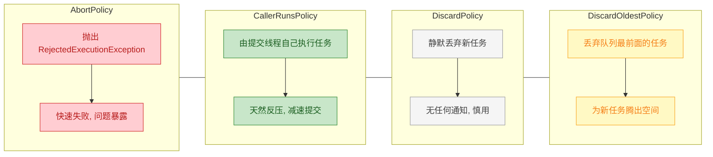

- **`AbortPolicy`**（默认）：Fail-Fast 哲学，适合必须感知过载的系统。
- **`CallerRunsPolicy`**：最优雅的反压机制（Back-Pressure），提交线程被"惩罚性地"用来执行任务，从而自然减缓提交速率，是生产环境中最被推荐的策略之一。
- **`DiscardPolicy`** 与 **`DiscardOldestPolicy`**：适用于可容忍丢失的场景（如日志采样、监控打点），但必须配合监控告警，否则问题会被无声吞没。
- **自定义策略**：通过实现 `RejectedExecutionHandler` 接口，可以灵活地将被拒绝的任务持久化到数据库、写入消息队列、记录详细日志，甚至触发动态扩容——这在大型分布式系统中极为常见。

### Worker 线程：线程复用的微观引擎

`Worker` 是 `ThreadPoolExecutor` 的内部类，同时继承了 `AbstractQueuedSynchronizer`（AQS）并实现了 `Runnable` 接口。这个设计看似简单，实则精妙：

```java
// Worker 的核心运行逻辑（简化）
final void runWorker(Worker w) {
    Runnable task = w.firstTask;       // 取出 Worker 创建时携带的第一个任务
    w.firstTask = null;                // 清空引用，帮助 GC
    while (task != null || (task = getTask()) != null) {  // 关键：循环获取任务
        w.lock();                      // 利用 AQS 实现不可重入锁，标记"正在执行"
        try {
            beforeExecute(w.thread, task);   // 钩子方法：执行前
            task.run();                      // 真正执行任务（注意是 run() 不是 start()）
            afterExecute(task, null);        // 钩子方法：执行后
        } finally {
            task = null;               // 清空引用，准备获取下一个任务
            w.completedTasks++;        // 统计已完成任务数
            w.unlock();                // 释放锁，标记"空闲"
        }
    }
    // while 循环退出 → getTask() 返回 null → 线程即将消亡
    processWorkerExit(w, false);       // 执行清理工作
}
```

**线程复用的本质**：`Worker` 线程并不是"执行完一个任务就销毁，再创建新线程执行下一个任务"。它通过一个 `while` 循环不断调用 `getTask()` 从工作队列中拉取（poll/take）新任务。只要能拿到任务，线程就继续运行；只有当 `getTask()` 返回 `null`（超时或线程池关闭）时，线程才会退出循环并被回收。这就是线程池能够**避免频繁创建/销毁线程开销**的根本原因。

**AQS 的巧妙运用**：`Worker` 继承 AQS 实现了一个**不可重入的互斥锁**。`lock()` 状态表示线程正在执行任务（不应被中断），`unlock()` 状态表示线程空闲（正在 `getTask()` 阻塞等待）。当调用 `shutdown()` 时，线程池会尝试 `tryLock()` 每个 Worker——如果获取到锁说明 Worker 空闲，可以安全中断；如果获取不到锁说明 Worker 正在执行任务，则不中断，等任务执行完毕后 Worker 自然会在下次 `getTask()` 中感知到 SHUTDOWN 状态。

### 线程池生命周期：五态流转

线程池的状态存储在 `ctl` 变量的高 3 位中，与 `workerCount`（低 29 位）共享一个 `AtomicInteger`，这是一个经典的**位压缩**（Bit Packing）技巧，保证了状态与线程数的原子性更新：

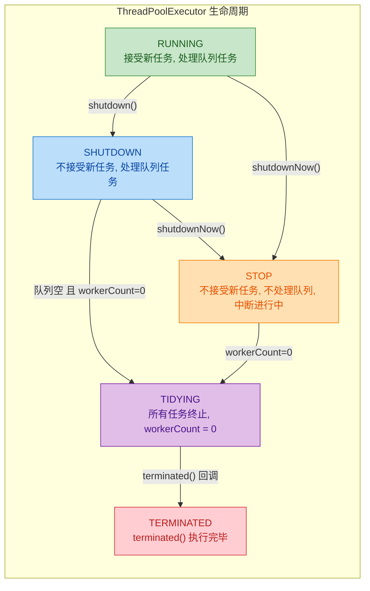

- **RUNNING → SHUTDOWN**：`shutdown()` 温和关闭，已入队任务会被执行完。
- **RUNNING → STOP**：`shutdownNow()` 激进关闭，尝试中断所有线程，返回未执行的任务列表。
- 无论哪条路径，最终都会经过 **TIDYING**（所有 Worker 线程退出、队列清空后自动进入）再到 **TERMINATED**。

### 全景知识图谱

将本章所有知识点汇聚成一张完整的知识脉络图：

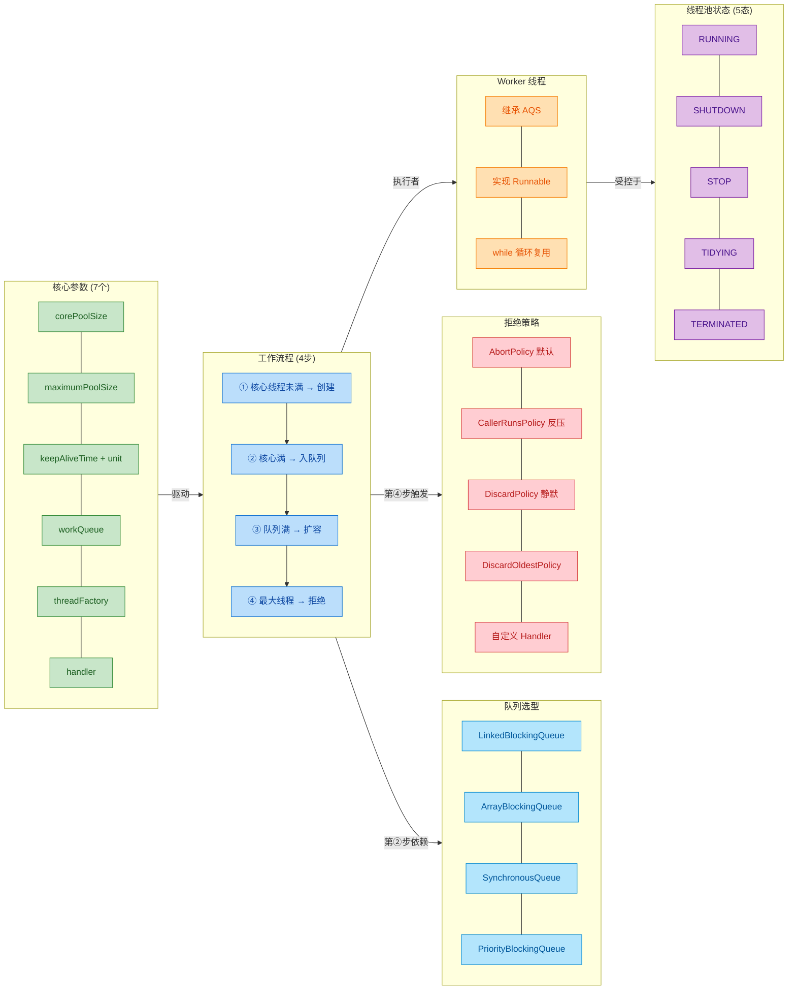

### 生产实践黄金准则

最后，将本章知识凝练为几条生产环境中必须遵守的实践准则：

1. **禁用 `Executors` 工具类**：`newFixedThreadPool` 和 `newSingleThreadExecutor` 使用无界队列（OOM 风险），`newCachedThreadPool` 的 `maximumPoolSize` 为 `Integer.MAX_VALUE`（线程爆炸风险）。永远手动通过 `new ThreadPoolExecutor(...)` 创建线程池。

2. **线程池必须命名**：通过自定义 `ThreadFactory` 为每个线程池的线程赋予有意义的名字（如 `order-process-pool-thread-1`），这是排查线程 dump 时区分问题来源的唯一手段。

3. **队列容量必须有界**：使用 `ArrayBlockingQueue` 并设置合理的容量上限，让系统在过载时能通过拒绝策略快速反馈，而不是在无界队列中默默积压直到 OOM。

4. **核心线程数不是越大越好**：
   - **CPU 密集型**任务：`corePoolSize = CPU核数 + 1`
   - **IO 密集型**任务：`corePoolSize = CPU核数 × 2`（或根据 IO 等待比率动态计算）
   - 这些只是起点公式，真实最优值需要通过压测确定。

5. **优雅关闭线程池**：先调用 `shutdown()`，再等待 `awaitTermination()`，超时后再调用 `shutdownNow()`，最后处理未完成的任务列表。

```java
// 优雅关闭线程池的标准模板
executor.shutdown();                                 // 第一步：温和关闭，不再接受新任务
try {
    if (!executor.awaitTermination(60, TimeUnit.SECONDS)) {  // 第二步：等待已有任务完成
        List<Runnable> dropped = executor.shutdownNow();      // 第三步：超时后强制关闭
        log.warn("强制关闭线程池, 丢弃 {} 个未执行任务", dropped.size());
        if (!executor.awaitTermination(60, TimeUnit.SECONDS)) {
            log.error("线程池未能在规定时间内终止");               // 第四步：仍未终止则告警
        }
    }
} catch (InterruptedException e) {
    executor.shutdownNow();                          // 当前线程被中断，立即强制关闭
    Thread.currentThread().interrupt();              // 保留中断状态
}
```

`ThreadPoolExecutor` 的设计体现了 Doug Lea 对**资源管理、弹性伸缩、优雅降级**三大系统设计原则的深刻理解。七个构造参数看似简单，但它们之间的排列组合可以衍生出截然不同的运行时行为。真正掌握线程池，不在于背诵参数含义，而在于理解**每个参数的变化如何影响整个系统的吞吐量、延迟和稳定性**——这正是从"会用"到"精通"的分水岭。

---

**📝 练习题 1**

以下线程池配置中，当第 11 个任务提交时会发生什么？

```java
ThreadPoolExecutor executor = new ThreadPoolExecutor(
    2,                          // corePoolSize
    5,                          // maximumPoolSize
    60, TimeUnit.SECONDS,       // keepAliveTime
    new ArrayBlockingQueue<>(3), // workQueue 容量为 3
    new ThreadPoolExecutor.AbortPolicy()  // 拒绝策略
);
// 假设每个任务执行时间很长，前 10 个任务提交时没有任何任务完成
```

A. 创建第 6 个线程来执行该任务

B. 任务被放入工作队列等待

C. 抛出 `RejectedExecutionException`

D. 由提交任务的线程自己执行该任务


**【答案】** C

**【解析】** 按照 ThreadPoolExecutor 的四步工作流程逐步推演：任务 1-2 到来时，核心线程未满（`workerCount < corePoolSize = 2`），创建核心线程直接执行。任务 3-5 到来时，核心线程已满，入队列（`ArrayBlockingQueue` 容量为 3，可以放 3 个）。任务 6-8 到来时，队列已满（3 个），且 `workerCount < maximumPoolSize = 5`，创建非核心线程执行。此时 5 个线程全部在运行（2 核心 + 3 非核心），队列中 3 个任务排队，共承载 8 个任务。任务 9、10 分别到来时，线程已达最大值 5，队列已满 3，触发拒绝策略 `AbortPolicy`，抛出 `RejectedExecutionException`。因此第 9 个任务就已经被拒绝了，第 11 个任务同样会被拒绝。配置的拒绝策略是 `AbortPolicy`（抛异常），不是 `CallerRunsPolicy`（调用者执行），所以答案是 C 而非 D。

---

**📝 练习题 2**

关于 `Worker` 线程实现线程复用的原理，以下说法正确的是？

A. Worker 每次执行完任务后销毁当前线程，然后从线程工厂创建新线程执行下一个任务

B. Worker 通过在 `run()` 方法中维护一个 `while` 循环，不断从工作队列中获取新任务来执行，从而实现线程复用

C. Worker 利用 Java 的 `Thread.restart()` 方法重新启动已结束的线程

D. Worker 通过操作系统层面的线程池（OS Thread Pool）实现线程复用，与 Java 代码无关


**【答案】** B

**【解析】** Worker 线程复用的核心机制在于 `runWorker()` 方法内部的 `while (task != null || (task = getTask()) != null)` 循环。Worker 线程启动后进入这个循环，执行完当前任务后并不退出，而是通过 `getTask()` 方法从 `workQueue` 中拉取下一个任务。如果队列中有任务，就继续执行；如果队列为空且是核心线程，则通过 `workQueue.take()` 阻塞等待；如果是非核心线程，则通过 `workQueue.poll(keepAliveTime, unit)` 带超时地等待，超时后 `getTask()` 返回 `null`，循环退出，线程被回收。选项 A 描述的是没有线程池时的行为，恰恰是线程池要避免的。选项 C 中 `Thread.restart()` 方法根本不存在于 Java API 中。选项 D 与实际实现完全不符，线程复用是纯 Java 层面通过循环实现的。

---