---

# 常用线程池与陷阱 ⭐⭐

---

## Executors 工厂方法

在 Java 并发编程中，线程池（Thread Pool）是管理和复用线程的核心机制。手动创建 `ThreadPoolExecutor` 需要设置多达 7 个参数，对于初学者甚至中级开发者来说，这个过程既繁琐又容易出错。为了降低使用门槛，JDK 在 `java.util.concurrent.Executors` 类中提供了一组**静态工厂方法（Static Factory Methods）**，让开发者可以"一行代码"创建常见配置的线程池。

但方便的背后，隐藏着严重的生产事故隐患——这也是本章的核心主题。在深入每种线程池的陷阱之前，我们先全面了解 `Executors` 这个工厂类的设计思路与底层原理。

### Executors 类的定位与设计哲学

`Executors` 是一个纯粹的**工具类（Utility Class）**，它的构造方法是私有的，不允许实例化。它的职责非常单一：为 `ExecutorService`、`ScheduledExecutorService`、`ThreadFactory` 以及 `Callable` 等并发组件提供便捷的创建方式。这种设计模式在 JDK 中非常常见，例如 `Collections` 之于 `Collection`，`Arrays` 之于 `Array`。

从源码视角来看，`Executors` 中几乎所有工厂方法的底层实现都指向同一个类——`ThreadPoolExecutor`。换言之，`Executors` 并没有创造新的线程池类型，它只是帮你预设了 `ThreadPoolExecutor` 的构造参数组合。理解这一点至关重要，因为这意味着：**你完全可以跳过 `Executors`，直接使用 `ThreadPoolExecutor` 来获得更精确的控制。**

```java
// Executors 类的基本结构（简化版）
public class Executors {

    // 私有构造，禁止实例化 —— 纯工具类的标准写法
    private Executors() {}

    // 创建固定线程数的线程池
    public static ExecutorService newFixedThreadPool(int nThreads) {
        // 核心线程数 = 最大线程数 = nThreads
        // 使用无界的 LinkedBlockingQueue 作为工作队列
        return new ThreadPoolExecutor(
            nThreads,                          // corePoolSize: 核心线程数
            nThreads,                          // maximumPoolSize: 最大线程数（与核心相同）
            0L,                                // keepAliveTime: 空闲线程存活时间（0 表示不回收）
            TimeUnit.MILLISECONDS,             // 时间单位
            new LinkedBlockingQueue<Runnable>() // 工作队列：无界阻塞队列
        );
    }

    // 创建可缓存的线程池
    public static ExecutorService newCachedThreadPool() {
        // 核心线程数为 0，最大线程数为 Integer.MAX_VALUE
        // 使用不存储元素的 SynchronousQueue
        return new ThreadPoolExecutor(
            0,                                 // corePoolSize: 没有核心线程
            Integer.MAX_VALUE,                 // maximumPoolSize: 理论上无限
            60L,                               // keepAliveTime: 空闲 60 秒后回收
            TimeUnit.SECONDS,                  // 时间单位
            new SynchronousQueue<Runnable>()   // 工作队列：不存储任务的同步移交队列
        );
    }

    // 创建单线程的线程池
    public static ExecutorService newSingleThreadExecutor() {
        // 核心线程数 = 最大线程数 = 1
        // 使用 FinalizableDelegatedExecutorService 包装，使其不可被强转后修改参数
        return new FinalizableDelegatedExecutorService(
            new ThreadPoolExecutor(
                1,                             // corePoolSize: 仅 1 个核心线程
                1,                             // maximumPoolSize: 最大也是 1
                0L,                            // keepAliveTime: 不回收
                TimeUnit.MILLISECONDS,         // 时间单位
                new LinkedBlockingQueue<Runnable>() // 无界队列
            )
        );
    }

    // 创建定时/周期任务线程池
    public static ScheduledExecutorService newScheduledThreadPool(int corePoolSize) {
        // 返回的是 ScheduledThreadPoolExecutor（ThreadPoolExecutor 的子类）
        return new ScheduledThreadPoolExecutor(corePoolSize);
    }
}
```

### 工厂方法与 ThreadPoolExecutor 七大参数的映射关系

要真正理解 `Executors` 每个工厂方法的行为和风险，必须回到 `ThreadPoolExecutor` 的完整构造函数。它接收 7 个参数，每一个都直接影响线程池的运行特性：

```java
// ThreadPoolExecutor 的完整构造方法签名
public ThreadPoolExecutor(
    int corePoolSize,                  // 核心线程数：即使空闲也不会被回收的线程数量
    int maximumPoolSize,               // 最大线程数：线程池允许创建的线程上限
    long keepAliveTime,                // 空闲存活时间：非核心线程空闲多久后被销毁
    TimeUnit unit,                     // keepAliveTime 的时间单位
    BlockingQueue<Runnable> workQueue, // 工作队列：当核心线程全忙时，新任务在此排队
    ThreadFactory threadFactory,       // 线程工厂：控制线程的创建方式（名称、守护状态等）
    RejectedExecutionHandler handler   // 拒绝策略：队列满且线程数达到上限时的处理方式
)
```

`Executors` 的每个工厂方法本质上就是对这 7 个参数进行了**预设组合**。下面的表格清晰展示了它们之间的映射：

```
┌─────────────────────────┬────────┬────────────────┬───────────┬─────────────────────────┬──────────────┐
│      工厂方法            │ core   │ max            │ keepAlive │ workQueue               │ 拒绝策略      │
├─────────────────────────┼────────┼────────────────┼───────────┼─────────────────────────┼──────────────┤
│ newFixedThreadPool(n)   │ n      │ n              │ 0         │ LinkedBlockingQueue(∞)  │ AbortPolicy  │
│ newCachedThreadPool()   │ 0      │ MAX_VALUE(≈∞)  │ 60s       │ SynchronousQueue        │ AbortPolicy  │
│ newSingleThreadExecutor │ 1      │ 1              │ 0         │ LinkedBlockingQueue(∞)  │ AbortPolicy  │
│ newScheduledThreadPool  │ n      │ MAX_VALUE(≈∞)  │ 10ms      │ DelayedWorkQueue        │ AbortPolicy  │
└─────────────────────────┴────────┴────────────────┴───────────┴─────────────────────────┴──────────────┘
```

注意一个关键细节：**`Executors` 的工厂方法从不显式指定拒绝策略和线程工厂**，这意味着它们全部使用默认值——`AbortPolicy`（直接抛 `RejectedExecutionException`）和 `Executors.defaultThreadFactory()`（线程名为 `pool-N-thread-M` 的非守护线程）。这在生产环境中通常是不够的，因为你无法通过线程名快速定位问题所属的业务模块。

### 任务提交的完整流程

无论使用哪个工厂方法创建的线程池，当一个任务通过 `execute()` 或 `submit()` 提交时，`ThreadPoolExecutor` 内部都遵循相同的决策链。这个流程是理解各类线程池行为差异的基础：

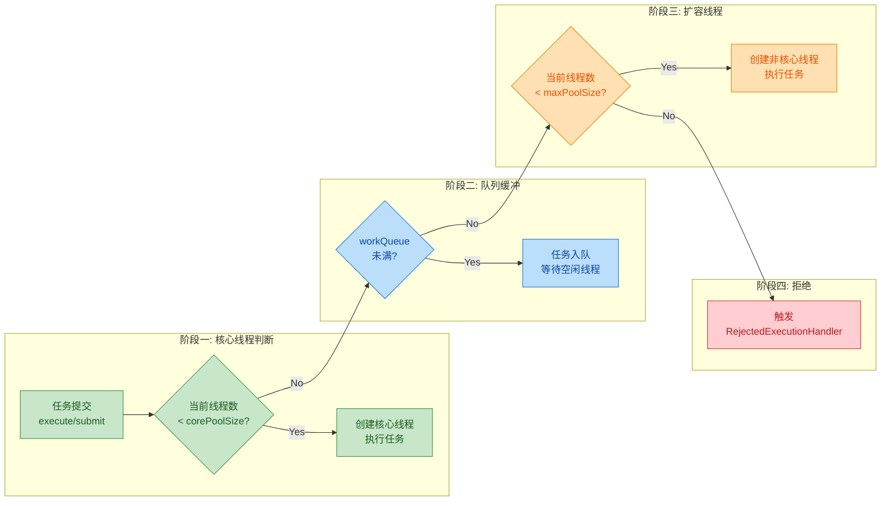

**核心决策逻辑总结（按优先级从高到低）：**

1. **核心线程优先**：如果当前运行的线程数还没达到 `corePoolSize`，即使有空闲核心线程，也会**直接创建新线程**来执行任务（这是一个常见的误解点——核心线程不会"懒创建后复用"，而是"先创建到满"）。
2. **入队缓冲**：核心线程已满，尝试将任务放入 `workQueue`。如果队列未满，任务安静地排队等待。
3. **弹性扩容**：队列也满了，尝试创建非核心线程（直到达到 `maximumPoolSize`）。
4. **拒绝兜底**：线程数已达上限且队列已满，触发拒绝策略。

正是因为 `Executors` 的工厂方法在**队列容量**或**最大线程数**上设置了"无界"值，导致上述流程中的**第 3 步或第 4 步永远不会被触发**——任务要么无限堆积在队列中，要么无限创建新线程，最终都走向同一个结局：**`OutOfMemoryError`**。

### 四种工厂方法的速览对比

在后续章节中，我们将逐一深入每种线程池的内部机制和陷阱。这里先给出一个全局视角，帮助你建立整体认知：

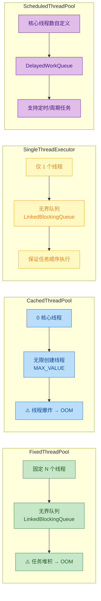

### Executors 背后的 ThreadFactory

`Executors` 还提供了一个默认的线程工厂实现 `DefaultThreadFactory`，在未显式指定 `ThreadFactory` 时被所有工厂方法自动使用。了解它的行为有助于理解线程池中线程的默认特征：

```java
// Executors 内部的默认线程工厂（简化版）
static class DefaultThreadFactory implements ThreadFactory {
    // 静态原子计数器：记录线程池编号（全局递增）
    private static final AtomicInteger poolNumber = new AtomicInteger(1);
    // 实例级原子计数器：记录当前线程池中的线程编号
    private final AtomicInteger threadNumber = new AtomicInteger(1);
    // 线程组（Java 21+ 已弱化，但低版本中仍有意义）
    private final ThreadGroup group;
    // 线程名称前缀，格式为 "pool-{poolNumber}-thread-"
    private final String namePrefix;

    DefaultThreadFactory() {
        // 获取当前调用者的线程组
        SecurityManager s = System.getSecurityManager();
        group = (s != null) ? s.getThreadGroup() :
                              Thread.currentThread().getThreadGroup();
        // 拼接线程名前缀，例如 "pool-1-thread-"
        namePrefix = "pool-" + poolNumber.getAndIncrement() + "-thread-";
    }

    public Thread newThread(Runnable r) {
        // 创建新线程，名称格式："pool-1-thread-1", "pool-1-thread-2" ...
        Thread t = new Thread(group, r, namePrefix + threadNumber.getAndIncrement(), 0);
        // 强制设为非守护线程（daemon = false）
        if (t.isDaemon())
            t.setDaemon(false);
        // 强制设为普通优先级
        if (t.getPriority() != Thread.NORM_PRIORITY)
            t.setPriority(Thread.NORM_PRIORITY);
        return t;
    }
}
```

**生产环境中默认 ThreadFactory 的问题：**

- **线程命名不具备业务语义**：`pool-1-thread-3` 这样的名称在出现死锁、CPU 飙高等问题时，你很难从线程 Dump 中判断这个线程属于"订单处理"还是"消息推送"模块。
- **没有 UncaughtExceptionHandler**：线程内部抛出的未捕获异常会被默默吞掉（尤其是通过 `execute()` 提交时），导致排查故障极其困难。

因此，生产项目中推荐自定义 `ThreadFactory`，最简方案是使用 Guava 的 `ThreadFactoryBuilder`：

```java
// 使用 Guava 的 ThreadFactoryBuilder 创建具有业务语义名称的线程工厂
ThreadFactory namedFactory = new ThreadFactoryBuilder()
    .setNameFormat("order-processor-%d")       // 线程名格式：order-processor-0, order-processor-1 ...
    .setDaemon(false)                           // 非守护线程
    .setUncaughtExceptionHandler((t, e) ->      // 全局未捕获异常处理
        log.error("Thread {} threw exception", t.getName(), e))
    .build();

// 将自定义工厂传入 ThreadPoolExecutor
ExecutorService pool = new ThreadPoolExecutor(
    4, 8, 60, TimeUnit.SECONDS,
    new ArrayBlockingQueue<>(1000),             // 有界队列，容量 1000
    namedFactory,                               // 自定义线程工厂
    new ThreadPoolExecutor.CallerRunsPolicy()   // 拒绝策略：由调用者线程执行
);
```

### Executors 的历史地位与现状

`Executors` 在 **JDK 1.5**（2004 年）随 `java.util.concurrent` 包一同引入，由并发大师 **Doug Lea** 设计。在那个年代，多线程编程对大部分 Java 开发者来说还是"高级话题"，`Executors` 极大地降低了入门门槛，推动了线程池在 Java 社区的普及。

但随着 Java 应用规模的爆发式增长，`Executors` 的"简单"反而成了隐患。阿里巴巴《Java 开发手册》（Alibaba Java Coding Guidelines）在**强制规约**中明确指出：

> **【强制】线程池不允许使用 Executors 去创建，而是通过 ThreadPoolExecutor 的方式，这样的处理方式让写的同学更加明确线程池的运行规则，规避资源耗尽的风险。**

这条规约背后的逻辑很清晰：当你被迫手动填写 7 个参数时，你不得不思考每个参数的含义和边界值。这种"被迫思考"的过程，正是避免线上事故的最佳防线。

---

**📝 练习题**

以下关于 `Executors` 工厂方法的描述，**正确的是**：

A. `Executors.newFixedThreadPool(10)` 内部使用了 `ArrayBlockingQueue` 作为工作队列


B. `Executors.newCachedThreadPool()` 的核心线程数为 1，最大线程数为 `Integer.MAX_VALUE`


C. `Executors` 的所有工厂方法底层都是通过配置 `ThreadPoolExecutor`（或其子类）的参数来实现的


D. `Executors.newSingleThreadExecutor()` 返回的对象可以被强转为 `ThreadPoolExecutor` 来动态修改核心线程数


**【答案】** C

**【解析】** 逐项分析：
- **A 错误**：`newFixedThreadPool` 使用的是 **`LinkedBlockingQueue`**（无界队列），而非有界的 `ArrayBlockingQueue`。正是因为队列无界，任务会无限堆积，存在 OOM 风险。
- **B 错误**：`newCachedThreadPool` 的核心线程数是 **0**（不是 1），最大线程数确实是 `Integer.MAX_VALUE`。核心线程数为 0 意味着所有线程在空闲 60 秒后都会被回收。
- **C 正确**：`newFixedThreadPool`、`newCachedThreadPool`、`newSingleThreadExecutor` 直接使用 `ThreadPoolExecutor` 构造；`newScheduledThreadPool` 使用 `ScheduledThreadPoolExecutor`，而它是 `ThreadPoolExecutor` 的子类。
- **D 错误**：`newSingleThreadExecutor()` 返回的是 `FinalizableDelegatedExecutorService`，它是一个**装饰器（Decorator）**，故意屏蔽了 `ThreadPoolExecutor` 的配置方法。强转会抛出 `ClassCastException`。这是为了保证"单线程"语义不被外部代码破坏。

---

## Executors 工厂方法

在深入 `FixedThreadPool` 之前，有必要先理解它的"出生地"——`java.util.concurrent.Executors` 工具类。`Executors` 是 JDK 提供的一个**线程池工厂（Factory）**，它封装了若干静态方法，让开发者可以"一行代码"创建出不同特性的线程池。其底层本质上都是在调用 `ThreadPoolExecutor` 的构造函数，只是帮你预设了不同的参数组合。

```java
// Executors 本质上就是 ThreadPoolExecutor 的"快捷方式"
// 下面这行代码背后，隐藏着一组精心挑选（但未必安全）的参数
ExecutorService pool = Executors.newFixedThreadPool(4);
```

本章我们从最常见的 `FixedThreadPool` 开始，逐层拆解它的内部构造、运行机制，以及那个在生产环境中令无数人栽跟头的 **OOM 陷阱**。

---

### FixedThreadPool 的创建与核心参数

`Executors.newFixedThreadPool(int nThreads)` 的源码极其简洁，但每一个参数都值得深究：

```java
// === JDK 源码：Executors.newFixedThreadPool ===
public static ExecutorService newFixedThreadPool(int nThreads) {
    return new ThreadPoolExecutor(
        nThreads,                           // corePoolSize：核心线程数，固定为 nThreads
        nThreads,                           // maximumPoolSize：最大线程数，也固定为 nThreads
        0L,                                 // keepAliveTime：空闲存活时间为 0
        TimeUnit.MILLISECONDS,              // 时间单位：毫秒（此处实际无意义，因为 keepAliveTime=0）
        new LinkedBlockingQueue<Runnable>() // workQueue：无界阻塞队列 ⚠️ 这是关键
    );
}
```

注意观察：**`corePoolSize` 和 `maximumPoolSize` 被设置成了同一个值**。这意味着线程池中的线程数量始终是固定的——不会因为任务多而扩容，也不会因为任务少而缩减。这就是"Fixed"一词的含义。

我们用一张流程图来全面理解 `FixedThreadPool` 从任务提交到执行的完整生命周期：

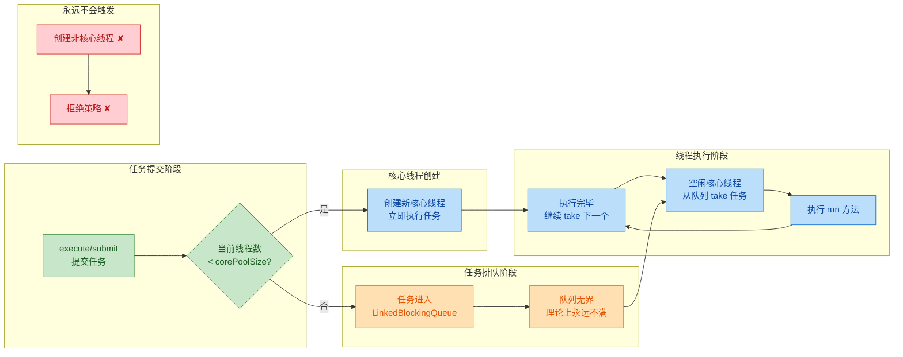

从图中可以清晰看到一个关键事实：**由于队列是无界的，任务永远不会被拒绝，最大线程数的设置形同虚设**。这就为后续的 OOM 埋下了隐患。

---

### 固定线程数的运行机制

"固定线程数"是 `FixedThreadPool` 最核心的设计哲学。我们来详细拆解它的行为模式。

#### 线程创建的时机

`FixedThreadPool` 并非在创建时就一口气生成 N 个线程。它遵循 `ThreadPoolExecutor` 的**懒加载策略（Lazy Initialization）**：

```java
// 创建线程池，此时内部线程数为 0
ExecutorService pool = Executors.newFixedThreadPool(3); // 线程数：0

pool.execute(task1); // 第 1 个任务 → 创建线程-1 执行，线程数：1
pool.execute(task2); // 第 2 个任务 → 创建线程-2 执行，线程数：2
pool.execute(task3); // 第 3 个任务 → 创建线程-3 执行，线程数：3（达到上限）
pool.execute(task4); // 第 4 个任务 → 所有线程都在忙，任务进入队列等待
pool.execute(task5); // 第 5 个任务 → 同上，继续排队
```

如果你希望线程池在启动时就创建好所有核心线程，可以手动调用 `prestartAllCoreThreads()`：

```java
// 创建线程池
ThreadPoolExecutor pool = (ThreadPoolExecutor) Executors.newFixedThreadPool(3);

// 预启动所有核心线程，无需等待第一个任务到来
// 此方法返回实际启动的线程数量
int started = pool.prestartAllCoreThreads(); // started = 3，立即创建 3 个线程
```

#### 线程不会被回收

由于 `corePoolSize == maximumPoolSize` 且 `keepAliveTime = 0`，核心线程默认永远不会因为空闲而被销毁。即使线程池中没有任何任务，这 N 个线程也会以 **阻塞等待（Blocking Wait）** 的方式挂在 `LinkedBlockingQueue.take()` 上，等待新任务到来。

```java
// === 简化后的 Worker 运行逻辑 ===
// ThreadPoolExecutor 内部 Worker 线程的核心循环
while (task != null || (task = getTask()) != null) { // getTask() 内部调用 queue.take()
    task.run();                                       // 执行任务
    task = null;                                      // 清空引用，准备获取下一个任务
}
// 对于核心线程，getTask() 调用的是 queue.take()——一个无限阻塞方法
// 这意味着核心线程会永远等下去，不会退出循环，不会被回收
```

用一个生活比喻来说：`FixedThreadPool` 就像一家**固定员工数的餐厅**——不管客人多不多，永远保持 N 个服务员在岗。客人少的时候服务员闲着等，客人多的时候排队叫号，但绝不会临时加人、也不会裁员。

我们用一个 ASCII 模型来直观展示 3 个线程、5 个任务时的内存状态：

```text
┌─────────────────── FixedThreadPool (nThreads = 3) ───────────────────┐
│                                                                       │
│   ┌──────────┐  ┌──────────┐  ┌──────────┐                          │
│   │ Thread-1 │  │ Thread-2 │  │ Thread-3 │    ← 固定 3 个核心线程    │
│   │ 执行task1│  │ 执行task2│  │ 执行task3│                          │
│   └──────────┘  └──────────┘  └──────────┘                          │
│         ▲              ▲             ▲                                │
│         │              │             │         take() 取任务          │
│   ┌─────┴──────────────┴─────────────┴──────┐                        │
│   │     LinkedBlockingQueue (无界队列)        │                        │
│   │  ┌───────┐  ┌───────┐  ┌───┐            │                        │
│   │  │ task4 │→ │ task5 │→ │...│  → 可以无限排队                     │
│   │  └───────┘  └───────┘  └───┘            │                        │
│   └─────────────────────────────────────────┘                        │
│                                                                       │
│   maximumPoolSize = 3 (与 core 相同，永远不会创建额外线程)            │
│   拒绝策略：理论上永远不会触发（队列无界）                             │
└───────────────────────────────────────────────────────────────────────┘
```

#### allowCoreThreadTimeOut：打破"永不回收"

虽然默认行为是核心线程永不回收，但 JDK 提供了一个开关：

```java
ThreadPoolExecutor pool = (ThreadPoolExecutor) Executors.newFixedThreadPool(4);

// 允许核心线程在空闲超过 keepAliveTime 后被回收
// 注意：此时 keepAliveTime 必须 > 0，否则抛出 IllegalArgumentException
pool.setKeepAliveTime(60, TimeUnit.SECONDS); // 先设置存活时间
pool.allowCoreThreadTimeOut(true);           // 再开启核心线程超时回收

// 此时如果 60 秒内没有新任务，核心线程也会被逐步销毁
// 线程池最终可能缩减到 0 个线程
```

这在某些**突发流量**场景下很有用——高峰期保持满额线程，低谷期释放资源。

---

### LinkedBlockingQueue（无界队列）

`FixedThreadPool` 使用的工作队列是 `new LinkedBlockingQueue<Runnable>()`——注意，**没有传入容量参数**。这意味着它使用的是默认容量 `Integer.MAX_VALUE`（约 21 亿），在实际意义上等同于**无界队列（Unbounded Queue）**。

#### LinkedBlockingQueue 的内部结构

```java
// === LinkedBlockingQueue 关键源码（简化版）===
public class LinkedBlockingQueue<E> extends AbstractQueue<E>
        implements BlockingQueue<E> {

    // 队列容量，默认 Integer.MAX_VALUE
    private final int capacity;

    // 当前队列中的元素个数（原子变量，保证线程安全）
    private final AtomicInteger count = new AtomicInteger();

    // 链表头节点（哨兵节点，不存储实际数据）
    transient Node<E> head;

    // 链表尾节点
    private transient Node<E> last;

    // 取元素的锁（消费者端）
    private final ReentrantLock takeLock = new ReentrantLock();

    // 放元素的锁（生产者端）
    private final ReentrantLock putLock = new ReentrantLock();

    // 无参构造器：容量为 Integer.MAX_VALUE —— 这就是"无界"的来源
    public LinkedBlockingQueue() {
        this(Integer.MAX_VALUE); // ⚠️ 约 21 亿，内存耗尽之前几乎不可能满
    }

    // 有参构造器：可以指定容量上限
    public LinkedBlockingQueue(int capacity) {
        if (capacity <= 0) throw new IllegalArgumentException();
        this.capacity = capacity;
        last = head = new Node<E>(null); // 初始化哨兵节点
    }
}
```

`LinkedBlockingQueue` 使用了**双锁设计（Two-Lock Queue）**：`putLock` 和 `takeLock` 分别控制入队和出队操作，这使得生产者和消费者可以**并发操作**而互不阻塞，吞吐量优于单锁的 `ArrayBlockingQueue`。

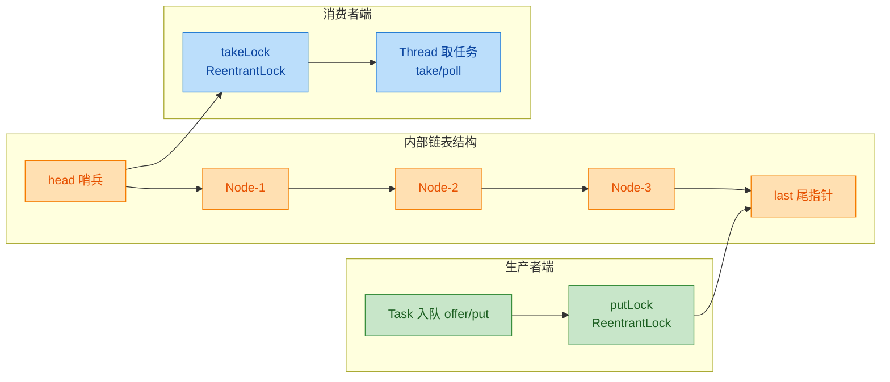

#### 无界 = "没有拒绝"= 隐形炸弹

在 `ThreadPoolExecutor` 的任务提交流程中，当核心线程都在忙碌时，新任务会尝试入队。如果队列满了，才会尝试创建非核心线程或触发拒绝策略。但对于 `FixedThreadPool`：

| 步骤 | 判断条件 | FixedThreadPool 的实际情况 |
|------|---------|--------------------------|
| 1 | 线程数 < corePoolSize？ | 达到上限后，永远为 `false` |
| 2 | 任务能否入队？ | **永远为 `true`**（队列无界） |
| 3 | 线程数 < maximumPoolSize？ | 永远不会走到这一步 |
| 4 | 触发拒绝策略？ | 永远不会走到这一步 |

这就产生了一个严重后果：**无论提交多少任务，线程池都会"照单全收"，全部塞进队列**。表面上看一切正常——没有异常抛出、没有任务被拒绝——但内存却在悄悄地被吞噬。

---

### OOM 风险 ⭐

这是 `FixedThreadPool` 最致命的生产问题，也是各大公司禁止使用 `Executors.newFixedThreadPool()` 的根本原因。

#### 问题复现

以下代码可以在几秒内耗尽 JVM 内存：

```java
import java.util.concurrent.ExecutorService;
import java.util.concurrent.Executors;

public class FixedPoolOOMDemo {
    public static void main(String[] args) {
        // 创建一个只有 1 个线程的 FixedThreadPool
        ExecutorService pool = Executors.newFixedThreadPool(1);

        // 模拟高并发场景：疯狂提交任务
        for (int i = 0; ; i++) { // 无限循环提交任务
            final int taskId = i;
            pool.execute(() -> {
                try {
                    // 每个任务执行耗时 1 秒（模拟数据库查询、HTTP调用等IO操作）
                    Thread.sleep(1000);
                } catch (InterruptedException e) {
                    Thread.currentThread().interrupt();
                }
                System.out.println("Task-" + taskId + " done");
            });
            // 每次提交都会创建一个 Runnable 对象（含一个 lambda + 闭包变量）
            // 这些对象全部堆积在 LinkedBlockingQueue 中
            // 1 个线程每秒只能消费 1 个任务，但每秒可能提交上万个任务
        }
        // 运行参数建议：-Xmx32m  可以更快看到 OOM
        // 最终抛出：java.lang.OutOfMemoryError: Java heap space
    }
}
```

用 `-Xmx32m` 参数运行上述代码，通常在几秒内就会爆出：

```text
Exception in thread "main" java.lang.OutOfMemoryError: Java heap space
    at java.util.concurrent.LinkedBlockingQueue.offer(LinkedBlockingQueue.java:416)
    at java.util.concurrent.ThreadPoolExecutor.execute(ThreadPoolExecutor.java:1371)
    ...
```

#### OOM 的根本原因分析

让我们从内存的角度理解这个过程：

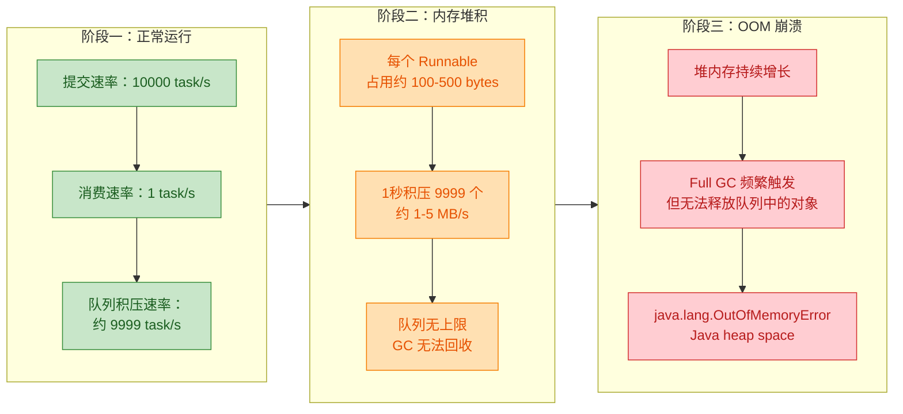

问题的本质可以归结为一个等式：

> **生产速度 >> 消费速度 + 无界队列 = OOM**

队列中的每一个 `Node<Runnable>` 对象都持有对 `Runnable` 任务的强引用（Strong Reference），而 `LinkedBlockingQueue` 的链表又把所有 `Node` 串联在一起。只要任务还在队列中等待执行，GC 就无法回收它们。当堆积到一定规模后，JVM 的堆内存被耗尽，触发 `OutOfMemoryError`。

#### 真实生产案例

在实际生产中，OOM 往往不会像上面的 Demo 那样"秒崩"，而是一个**缓慢累积**的过程，更加危险：

```java
// 典型场景：Web 服务器处理请求
@RestController
public class OrderController {

    // ⚠️ 使用 FixedThreadPool 处理异步任务
    private final ExecutorService asyncPool = Executors.newFixedThreadPool(10);

    @PostMapping("/order")
    public Response createOrder(@RequestBody OrderRequest req) {
        // 同步处理核心逻辑
        Order order = orderService.create(req);

        // 异步发送通知（看似无害的操作）
        asyncPool.execute(() -> {
            notificationService.sendEmail(order);       // 可能耗时 2-5 秒
            notificationService.sendSMS(order);         // 可能耗时 1-3 秒
            thirdPartyService.syncToWarehouse(order);   // 可能耗时 5-10 秒
        });

        return Response.success(order);
    }
}
// 正常流量下一切正常：10个线程足以处理
// 大促期间：每秒 5000 个订单，每个异步任务需要 10 秒
// 10 个线程每秒只能消费 1 个任务（10/10=1）
// 每秒积压 4999 个 Runnable 到队列中
// 数小时后 → OOM → 服务宕机 → 所有订单处理中断
```

#### 正确的修复方案

**方案一：使用有界队列 + 手动创建 ThreadPoolExecutor**

```java
// 推荐做法：手动创建线程池，明确每一个参数
ThreadPoolExecutor pool = new ThreadPoolExecutor(
    10,                                    // corePoolSize：核心线程数
    20,                                    // maximumPoolSize：最大线程数（允许弹性扩容）
    60L,                                   // keepAliveTime：非核心线程空闲 60 秒后回收
    TimeUnit.SECONDS,                      // 时间单位
    new LinkedBlockingQueue<>(1000),       // ⭐ 有界队列！最多排 1000 个任务
    new ThreadFactoryBuilder()             // 自定义线程工厂（推荐 Guava 的 ThreadFactoryBuilder）
        .setNameFormat("order-async-%d")   // 给线程起有意义的名字，方便排查问题
        .build(),
    new ThreadPoolExecutor.CallerRunsPolicy() // ⭐ 拒绝策略：让调用者线程自己执行
    // CallerRunsPolicy 的妙处：当队列满时，提交任务的线程（如 Tomcat 的 Worker 线程）
    // 会自己执行这个任务，从而自然地降低了提交速度，形成天然的"背压（Back Pressure）"
);
```

**方案二：若仍用 FixedThreadPool 思路，限定队列容量**

```java
// 如果确实需要"固定线程数"的语义，自己构造即可
ThreadPoolExecutor fixedPool = new ThreadPoolExecutor(
    10,                                     // corePoolSize = maximumPoolSize = 10
    10,                                     // 固定线程数
    0L,                                     // 核心线程不超时
    TimeUnit.MILLISECONDS,                  //
    new ArrayBlockingQueue<>(500),          // ⭐ 有界队列，容量 500
    new ThreadPoolExecutor.AbortPolicy()    // 队列满时直接抛 RejectedExecutionException
);
// 这样既保留了"固定线程数"的特性，又避免了无界队列导致的 OOM
```

#### 各种拒绝策略对比

当有界队列满了且线程数达到上限时，拒绝策略决定了如何处理新任务：

| 拒绝策略 | 行为 | 适用场景 |
|---------|------|---------|
| `AbortPolicy`（默认） | 直接抛出 `RejectedExecutionException` | 需要快速失败、明确感知过载 |
| `CallerRunsPolicy` | 由提交任务的线程自己执行 | 需要背压机制、不能丢弃任务 |
| `DiscardPolicy` | 静默丢弃新任务，不抛异常 | 允许丢失、对可靠性要求不高 |
| `DiscardOldestPolicy` | 丢弃队列头部（最老）的任务，然后重试提交 | 优先处理最新任务 |

---

**📝 练习题**

以下代码在 `-Xmx64m` 的 JVM 参数下运行，最可能出现什么结果？

```java
ExecutorService pool = Executors.newFixedThreadPool(2);
for (int i = 0; i < 10_000_000; i++) {
    pool.execute(() -> {
        try { Thread.sleep(5000); } catch (InterruptedException e) {}
    });
}
System.out.println("All tasks submitted");
```

A. 正常打印 "All tasks submitted"，随后所有任务在约 25,000,000 秒内执行完毕


B. 抛出 `RejectedExecutionException`，因为队列满了


C. 抛出 `java.lang.OutOfMemoryError: Java heap space`，程序崩溃


D. 程序卡死（死锁），永远不会输出任何内容


**【答案】** C

**【解析】** `Executors.newFixedThreadPool(2)` 内部使用了无界的 `LinkedBlockingQueue`（默认容量 `Integer.MAX_VALUE`）。循环向其中提交 1000 万个任务，每个任务需要 sleep 5 秒，2 个线程每 5 秒才能消费 2 个任务，远远跟不上提交速度。大量的 `Runnable` 对象（lambda 实例 + `LinkedBlockingQueue.Node` 包装）在堆内存中持续积压。在 `-Xmx64m` 的限制下，JVM 堆空间很快被队列中的任务对象占满，最终触发 `OutOfMemoryError`。选项 A 不可能，因为还没来得及提交完就 OOM 了。选项 B 不可能，因为无界队列永远不会触发拒绝策略。选项 D 不正确，这里不存在死锁条件——问题是内存耗尽而非线程互相等待。这个案例正是**阿里巴巴 Java 开发手册**明确禁止使用 `Executors.newFixedThreadPool()` 的核心原因。

---

## CachedThreadPool

CachedThreadPool，翻译过来就是"缓存型线程池"，它的设计哲学与 FixedThreadPool 截然相反。FixedThreadPool 是"线程数固定，任务排队等待"；而 CachedThreadPool 则是"来一个任务，如果没有空闲线程，就立刻创建一个新线程来处理"。这种激进的策略让它在短时间、突发性、大量小任务的场景下表现优异，但也正是这种"来者不拒"的性格，埋下了线程数爆炸导致 OOM 的致命隐患。

我们先看它的工厂方法源码，再逐步拆解每一个参数的设计意图与后果。

### 工厂方法源码解析

```java
// java.util.concurrent.Executors 类中的工厂方法
public static ExecutorService newCachedThreadPool() {
    return new ThreadPoolExecutor(
        0,                          // corePoolSize: 核心线程数为 0
        Integer.MAX_VALUE,          // maximumPoolSize: 最大线程数约 21 亿
        60L,                        // keepAliveTime: 空闲线程存活时间 60 秒
        TimeUnit.SECONDS,           // 时间单位: 秒
        new SynchronousQueue<Runnable>()  // 工作队列: 同步移交队列
    );
}
```

乍看之下，这五个参数似乎平平无奇，但它们的组合产生了一种极其特殊的行为模式。为了理解这一点，我们必须回顾 `ThreadPoolExecutor` 的**任务提交三步决策逻辑**：

```
Step 1: 当前线程数 < corePoolSize → 创建核心线程
Step 2: 核心线程满了 → 尝试将任务放入 workQueue
Step 3: 队列也满了 & 当前线程数 < maximumPoolSize → 创建非核心线程
Step 4: 都满了 → 触发拒绝策略
```

对于 CachedThreadPool 来说，`corePoolSize = 0`，这意味着 **Step 1 永远不会执行**（没有核心线程可创建）。任务提交后直接进入 Step 2，尝试入队。而这里使用的队列是 `SynchronousQueue`——一个容量为 0 的队列，只有当另一端恰好有消费者在等待时才能"入队成功"（本质是直接移交 hand-off）。如果此刻没有空闲线程在等待接收任务，入队失败，立即进入 Step 3：创建新线程。而 `maximumPoolSize` 是 `Integer.MAX_VALUE`，所以 Step 3 几乎永远成功，Step 4 的拒绝策略几乎永远不会触发。

### 0 核心线程

CachedThreadPool 将 `corePoolSize` 设为 **0**，这是它与 FixedThreadPool 最本质的区别之一。这意味着：

**第一，线程池中没有"常驻居民"。** 在 FixedThreadPool 中，核心线程一旦创建就不会被销毁（默认行为），即使它们全部空闲也会一直占用系统资源。而 CachedThreadPool 中的每一个线程都是"非核心线程"（non-core thread），它们全部受 `keepAliveTime` 约束——空闲超过 60 秒就会被回收。

**第二，线程池可以自然收缩到 0。** 当系统空闲时间超过 60 秒后，所有线程都会被依次回收，最终线程池中不再持有任何线程，释放所有线程资源。这种弹性让 CachedThreadPool 在低负载时几乎零开销。

```java
// 演示线程池的弹性收缩
public class CachedPoolShrinkDemo {
    public static void main(String[] args) throws InterruptedException {
        // 创建缓存线程池
        ThreadPoolExecutor pool = (ThreadPoolExecutor) Executors.newCachedThreadPool();

        // 提交 5 个任务, 会创建 5 个线程
        for (int i = 0; i < 5; i++) {
            pool.execute(() -> {
                // 打印当前线程名, 表明任务正在执行
                System.out.println(Thread.currentThread().getName() + " 执行任务");
                try {
                    Thread.sleep(1000); // 模拟耗时 1 秒的任务
                } catch (InterruptedException e) {
                    Thread.currentThread().interrupt(); // 恢复中断标志
                }
            });
        }

        // 任务刚提交完, 线程池中应有 5 个线程
        Thread.sleep(100); // 等待 100ms 让线程全部启动
        System.out.println("活跃线程数: " + pool.getPoolSize()); // 输出: 5

        // 等待 70 秒, 超过 keepAliveTime(60s)
        Thread.sleep(70_000);
        // 所有线程空闲超过 60 秒, 已被回收
        System.out.println("70秒后线程数: " + pool.getPoolSize()); // 输出: 0

        pool.shutdown(); // 关闭线程池
    }
}
```

**第三，任务提交时直接跳过核心线程创建阶段。** 由于 `corePoolSize = 0`，每次 `execute()` 都不会走"创建核心线程"的分支，而是直接尝试入队——这就把"是否创建新线程"的决定权完全交给了队列的行为。

### Integer.MAX_VALUE 最大线程

`maximumPoolSize` 被设为 `Integer.MAX_VALUE`（即 2,147,483,647，约 21.5 亿），这个数字在实际运行中等价于**无上限**。因为在任何操作系统中，远远不可能真正创建 21 亿个线程——系统会在创建几千到几万个线程时就因为内存耗尽或达到操作系统限制而崩溃。

这个设计的意图是：**让线程数量完全由实际负载动态决定，不设人为上限。** 配合 `SynchronousQueue` 的"不缓存任务"特性，每一个新提交的任务在没有空闲线程可复用时，都会触发创建新线程。

```java
// ThreadPoolExecutor.execute() 中的关键逻辑(简化版)
public void execute(Runnable command) {
    int c = ctl.get();                            // 获取当前线程池状态和线程计数

    // Step 1: 核心线程创建 —— corePoolSize=0, 此条件永远为 false
    if (workerCountOf(c) < corePoolSize) {
        if (addWorker(command, true)) return;     // 创建核心线程(不会走到这里)
    }

    // Step 2: 尝试入队 —— SynchronousQueue, 无空闲线程时 offer() 返回 false
    if (isRunning(c) && workQueue.offer(command)) {
        // 入队成功, 说明有空闲线程正在 poll() 等待, 任务直接移交
        // ...
    }
    // Step 3: 入队失败, 创建非核心线程 —— maximumPoolSize=MAX_VALUE, 几乎不会失败
    else if (!addWorker(command, false)) {
        // Step 4: 创建也失败了, 触发拒绝策略(实际上几乎不可能走到这里)
        reject(command);
    }
}
```

这里的关键在于：**SynchronousQueue 的 `offer()` 方法是非阻塞的**。如果此刻没有线程在队列另一端等待 `poll()`/`take()`，`offer()` 立刻返回 `false`，于是立刻进入 Step 3 创建新线程。只有当某个线程恰好空闲并正在队列上等待新任务时，`offer()` 才会返回 `true`，实现线程复用。

### SynchronousQueue

`SynchronousQueue` 是 CachedThreadPool 的灵魂所在，也是理解其行为的关键。它并不是传统意义上的"队列"——**它的容量是 0，不存储任何元素**。它更像一个"接力棒传递点"（rendezvous point），生产者必须等待消费者到达后才能完成传递，反之亦然。

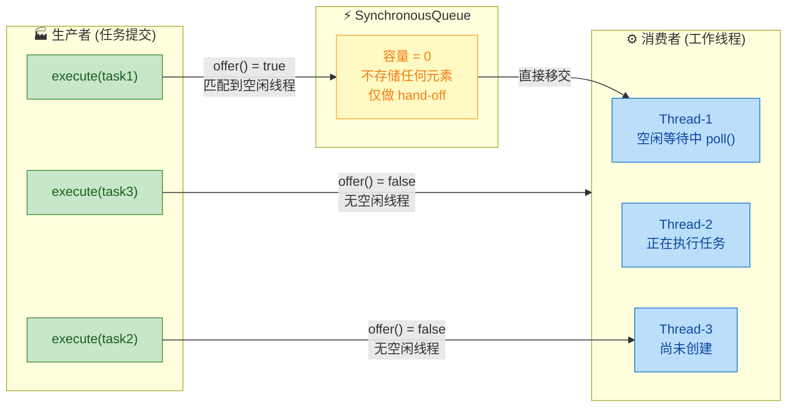

**SynchronousQueue 的三个核心特性：**

**1. 容量为零（Zero Capacity）。** 调用 `queue.size()` 永远返回 0，调用 `queue.isEmpty()` 永远返回 `true`。它不缓冲任何任务，这意味着任务要么立刻被消费，要么立刻触发新线程创建。没有中间状态，没有排队等待。

**2. 配对机制（Pairing Mechanism）。** 每一次成功的 `put()`/`offer()` 都必须配对一次 `take()`/`poll()`。如果没有配对方，操作要么阻塞（`put`/`take`），要么立刻返回失败（`offer`/`poll`）。线程池内部使用的是非阻塞的 `offer()` 和带超时的 `poll(keepAliveTime, unit)`。

**3. 公平与非公平模式。** 默认是非公平模式（基于栈结构，LIFO），也可以通过构造函数设置公平模式（基于队列结构，FIFO）。CachedThreadPool 使用默认的非公平模式。

```java
// SynchronousQueue 的行为演示
public class SynchronousQueueDemo {
    public static void main(String[] args) throws InterruptedException {
        // 创建一个同步移交队列
        SynchronousQueue<String> queue = new SynchronousQueue<>();

        // 消费者线程: 在队列上阻塞等待
        new Thread(() -> {
            try {
                System.out.println("消费者: 等待数据...");
                String data = queue.take();            // 阻塞, 直到生产者 put
                System.out.println("消费者: 收到 " + data);
            } catch (InterruptedException e) {
                Thread.currentThread().interrupt();     // 恢复中断标志
            }
        }, "Consumer").start();

        Thread.sleep(1000); // 确保消费者先就位

        // 生产者: 向队列中放入数据
        System.out.println("生产者: 发送数据...");
        queue.put("Hello");                            // 立即成功, 因为消费者已在等待
        System.out.println("生产者: 发送完毕");

        // 非阻塞尝试: 此时无消费者等待
        boolean success = queue.offer("World");        // 立即返回 false
        System.out.println("offer结果: " + success);  // 输出: false
    }
}
```

**SynchronousQueue vs LinkedBlockingQueue 对比：**

| 特性 | SynchronousQueue | LinkedBlockingQueue (无界) |
|:---:|:---:|:---:|
| **内部容量** | 0 | Integer.MAX_VALUE |
| **缓存任务** | 不缓存，直接移交 | 可缓存近乎无限任务 |
| **未匹配时** | offer() 返回 false → 创建新线程 | offer() 返回 true → 任务排队 |
| **适配池类型** | CachedThreadPool | FixedThreadPool |
| **OOM 方式** | 线程数爆炸 | 队列堆积撑爆堆内存 |

**SynchronousQueue 在 CachedThreadPool 中的完整工作流如下：**

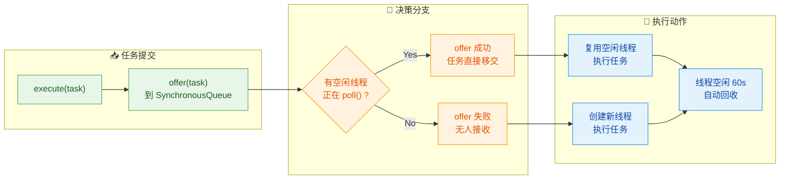

**空闲线程的等待机制**非常精妙：当一个工作线程执行完任务后，它不会立刻退出，而是调用 `workQueue.poll(60, TimeUnit.SECONDS)` 在 SynchronousQueue 上等待最多 60 秒。如果在这 60 秒内有新任务通过 `offer()` 提交进来，两者配对成功，线程复用。如果 60 秒内没有新任务，`poll()` 返回 `null`，线程退出销毁。这就是 CachedThreadPool "缓存"一词的由来——**它缓存的不是任务，而是线程**。

### OOM 风险 ⭐（线程数爆炸）

这是 CachedThreadPool 最危险的隐患，也是面试中被反复追问的高频考点。

**问题的根源：** 当任务提交速度持续大于任务消费速度时，由于 SynchronousQueue 不缓存任何任务，每一个无法被空闲线程接收的任务都会导致创建一个新线程。如果这种情况持续发生，线程数量将不受控制地增长。

```java
// 线程数爆炸导致 OOM 的演示 (危险代码, 仅供学习!)
public class CachedPoolOOMDemo {
    public static void main(String[] args) {
        // 创建缓存线程池
        ExecutorService pool = Executors.newCachedThreadPool();

        // 模拟高并发场景: 疯狂提交长耗时任务
        for (int i = 0; i < 100_000; i++) {
            final int taskId = i;                    // 任务编号
            pool.execute(() -> {
                System.out.println("Task-" + taskId  // 打印任务信息
                    + " on " + Thread.currentThread().getName());
                try {
                    Thread.sleep(Long.MAX_VALUE);    // 模拟永不结束的任务
                } catch (InterruptedException e) {
                    Thread.currentThread().interrupt(); // 恢复中断标志
                }
            });
        }
        // 最终抛出: java.lang.OutOfMemoryError: unable to create new native thread
    }
}
```

**为什么会 OOM？** 每个 Java 线程都需要一块独立的**线程栈内存**（Thread Stack），默认大小在 512KB ~ 1MB 之间（取决于 JVM 实现和操作系统，可通过 `-Xss` 参数调整）。假设每个线程占用 1MB 栈空间：

```
java
// 内存消耗估算
// 假设 -Xss1m (每线程栈 1MB)
//
// 线程数     栈内存消耗
// -------   ----------
// 1,000      ~1 GB
// 5,000      ~5 GB
// 10,000     ~10 GB
//
// 注意: 这还不算堆内存、元空间、直接内存等开销
// 操作系统通常在几千到几万个线程时就会达到进程限制
```

**与 FixedThreadPool 的 OOM 对比：**

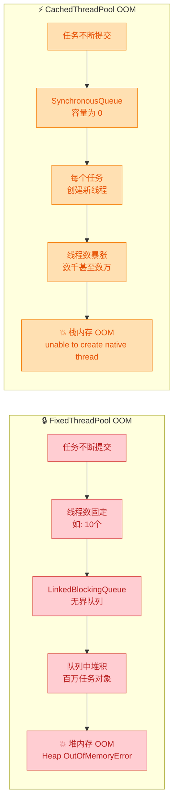

两种 OOM 殊途同归但成因截然不同：

| 维度 | FixedThreadPool | CachedThreadPool |
|:---:|:---:|:---:|
| **失控的资源** | 队列中的任务对象 | 线程本身 |
| **吃掉的内存** | Java **堆内存** (Heap) | **线程栈 + 操作系统原生内存** |
| **错误信息** | `java.lang.OutOfMemoryError: Java heap space` | `java.lang.OutOfMemoryError: unable to create new native thread` |
| **根因参数** | `LinkedBlockingQueue` 无界 | `maximumPoolSize = MAX_VALUE` |
| **崩溃速度** | 相对缓慢（对象小则堆积多） | 可能非常快（每线程 ~1MB） |

**真实生产事故场景还原：**

想象一个 Web 服务器使用 CachedThreadPool 处理 HTTP 请求。正常情况下，每秒接收 100 个请求，每个请求处理耗时 50ms，CachedThreadPool 只需维持很少的线程即可应对。但某天，下游数据库出现慢查询，每个请求的处理时间从 50ms 暴涨到 30 秒。此时：

```java
// 场景还原: 下游服务变慢导致线程爆炸
//
// 正常情况:
//   QPS = 100, 响应时间 = 50ms
//   所需线程 ≈ 100 * 0.05 = 5 个 (Little's Law)
//   CachedThreadPool 轻松应对, 只维护 5~10 个线程
//
// 异常情况(数据库慢查询):
//   QPS = 100, 响应时间 = 30s
//   所需线程 ≈ 100 * 30 = 3000 个!
//   第 1 秒: 创建 100 个线程
//   第 2 秒: 再创建 100 个 (之前的还没执行完)
//   第 30 秒: 已累计创建 3000 个线程
//   如果持续 60 秒: 6000 个线程, 占用 ~6GB 栈内存
//   → OutOfMemoryError: unable to create new native thread
//   → 整个 JVM 进程崩溃
```

**如何避免？用手动创建的 `ThreadPoolExecutor` 替代：**

```java
// 安全的替代方案: 手动创建线程池, 限制最大线程数和队列容量
ThreadPoolExecutor safePool = new ThreadPoolExecutor(
    10,                                    // corePoolSize: 10 个核心线程
    50,                                    // maximumPoolSize: 最多 50 个线程(而非 MAX_VALUE)
    60L,                                   // keepAliveTime: 非核心线程空闲 60 秒回收
    TimeUnit.SECONDS,                      // 时间单位
    new LinkedBlockingQueue<>(200),        // 有界队列, 最多缓存 200 个任务(而非无界)
    new ThreadPoolExecutor.CallerRunsPolicy() // 拒绝策略: 由提交线程自己执行, 起到限流效果
);
// 最大并发承载: 50 个线程正在执行 + 200 个任务在队列中排队 = 250 个任务
// 超过 250 个: 由调用者线程执行, 自然降低提交速率(背压机制)
```

**小结：CachedThreadPool 的适用场景与使用禁忌：**

| | 适用 ✅ | 禁忌 ❌ |
|:---:|:---|:---|
| **任务特征** | 大量、短时、快速完成的小任务 | 耗时长、可能阻塞的 IO 任务 |
| **负载模式** | 突发性，有明显的波峰波谷 | 持续高并发、稳定高负载 |
| **典型场景** | 短连接 HTTP 请求、轻量事件处理 | 数据库操作、文件上传下载、RPC 调用 |
| **核心风险** | 下游变慢时线程数不可控 | 几乎必然触发 OOM |

---

**📝 练习题**

某服务使用 `Executors.newCachedThreadPool()` 处理请求。正常运行时线程数稳定在 20 左右，但某次上线后发现线程数持续飙升到数千个，最终 JVM 抛出 `OutOfMemoryError: unable to create new native thread` 崩溃。以下哪项最可能是直接原因？

A. JVM 堆内存 (`-Xmx`) 设置过小，导致任务对象无法分配

B. 提交的任务中存在长时间阻塞操作（如慢 SQL），导致线程无法及时释放复用，新任务不断触发创建新线程

C. `SynchronousQueue` 内部缓存了过多任务对象，撑爆了堆内存

D. `keepAliveTime` 设置为 60 秒太长，应改为 1 秒以加速线程回收

**【答案】** B

**【解析】** CachedThreadPool 的 OOM 本质是**线程数爆炸**而非堆内存不足。错误信息 `unable to create new native thread` 明确指向操作系统无法再创建新线程（栈内存或系统线程数限制耗尽）。选项 A 描述的是堆内存 OOM（`Java heap space`），不匹配错误信息。选项 C 完全错误——`SynchronousQueue` 容量为 0，根本不缓存任何元素。选项 D 虽然缩短 `keepAliveTime` 能略微加快空闲线程回收，但如果任务本身就阻塞不返回，线程根本不会进入"空闲"状态，缩短回收时间毫无意义。只有选项 B 精准命中根因：当任务中存在慢 SQL 等长时间阻塞操作时，已创建的线程迟迟不释放，`SynchronousQueue.offer()` 找不到空闲线程配对而持续返回 `false`，每次都触发 `addWorker()` 创建新线程，最终线程数失控。这正是为什么阿里巴巴 Java 开发手册明确规定**禁止使用 `Executors` 创建线程池**，必须手动指定有界的 `maximumPoolSize` 和有界的工作队列。

---

## SingleThreadExecutor

在 Java 并发编程的线程池家族中，`SingleThreadExecutor` 是一个看似"最简单"却常被低估的成员。顾名思义，它是一个 **只有一个工作线程** 的线程池（Single Thread Executor）。你可能会问：既然只有一个线程，为什么不直接 `new Thread()` 呢？这个问题的答案正是理解 `SingleThreadExecutor` 设计哲学的关键——它提供的不仅仅是"一个线程"，而是一整套 **任务管理、异常恢复、顺序执行保证** 的基础设施。

### 单线程

#### 创建方式与内部构造

`SingleThreadExecutor` 通过 `Executors` 工厂方法创建。我们先来看它的源码，理解其本质：

```java
// Executors 工厂方法源码（JDK）
public static ExecutorService newSingleThreadExecutor() {
    // 外层用 FinalizableDelegatedExecutorService 包装
    // 目的是：屏蔽 ThreadPoolExecutor 的配置方法，防止外部修改核心参数
    return new FinalizableDelegatedExecutorService(
        new ThreadPoolExecutor(
            1,                              // corePoolSize = 1，核心线程数为1
            1,                              // maximumPoolSize = 1，最大线程数也为1
            0L,                             // keepAliveTime = 0，无空闲回收（只有核心线程）
            TimeUnit.MILLISECONDS,          // 时间单位（实际不生效，因为 keepAlive=0）
            new LinkedBlockingQueue<Runnable>()  // 无界阻塞队列
        )
    );
}
```

从源码中我们可以提炼出几个关键参数：

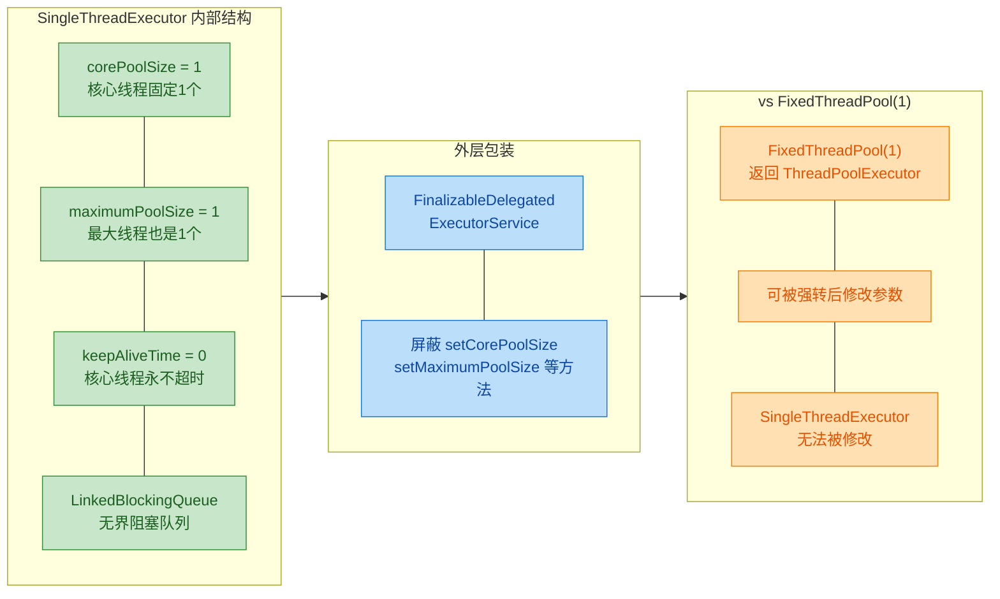

这里有一个非常经典的面试考点：**`SingleThreadExecutor` 和 `Executors.newFixedThreadPool(1)` 有什么区别？**

表面上看，两者都只有一个线程在工作。但核心区别在于 **外层包装类不同**：

```java
// FixedThreadPool(1) —— 返回的是 ThreadPoolExecutor 本身
ExecutorService fixed = Executors.newFixedThreadPool(1);

// 可以被强转！从而修改线程数，破坏"单线程"的语义
((ThreadPoolExecutor) fixed).setCorePoolSize(5);    // 成功！变成了5个线程
((ThreadPoolExecutor) fixed).setMaximumPoolSize(10); // 成功！

// SingleThreadExecutor —— 返回的是 DelegatedExecutorService 的包装
ExecutorService single = Executors.newSingleThreadExecutor();

// 尝试强转会抛出 ClassCastException
// ((ThreadPoolExecutor) single).setCorePoolSize(5);  // 编译通过，运行报错！
```

`FinalizableDelegatedExecutorService` 继承自 `DelegatedExecutorService`，后者仅实现了 `ExecutorService` 接口的方法（`submit`、`execute`、`shutdown` 等），而 **刻意没有暴露** `ThreadPoolExecutor` 的配置方法。这是一种典型的 **装饰器模式（Decorator Pattern）**，通过限制接口来保证"单线程"这一语义 **不可被外部篡改**。

#### 线程生命周期：唯一的工作者

`SingleThreadExecutor` 中只有一个核心线程。它的生命周期遵循以下规则：

- **懒创建（Lazy Creation）**：线程池刚创建时，没有任何线程。当第一个任务通过 `execute()` 或 `submit()` 提交时，才会创建这唯一的工作线程。
- **永不销毁（Never Expire）**：因为 `corePoolSize = 1` 且 `keepAliveTime = 0`，核心线程默认不会因空闲而被回收（除非显式调用 `allowCoreThreadTimeOut(true)`，但由于包装类屏蔽了此方法，外部无法调用）。
- **异常后重建（Recreate on Failure）**：这是 `SingleThreadExecutor` 最重要的隐藏特性之一。如果唯一的工作线程因未捕获异常（Uncaught Exception）而终止，线程池会 **自动创建一个新线程** 来替代它，继续处理队列中的后续任务。

```java
// 演示异常后线程自动重建
ExecutorService single = Executors.newSingleThreadExecutor();

// 第一个任务：故意抛出异常
single.execute(() -> {
    // 打印当前线程名，观察线程身份
    System.out.println("Task 1 running on: " + Thread.currentThread().getName());
    // 抛出运行时异常，导致当前工作线程死亡
    throw new RuntimeException("Boom!");
});

// 短暂等待，确保第一个任务已经执行完毕（并崩溃）
Thread.sleep(100);

// 第二个任务：依然能正常执行
single.execute(() -> {
    // 注意观察：线程名可能变了（如从 pool-1-thread-1 变为 pool-1-thread-2）
    // 说明旧线程已死，新线程被创建
    System.out.println("Task 2 running on: " + Thread.currentThread().getName());
});

// 可能的输出：
// Task 1 running on: pool-1-thread-1
// Task 2 running on: pool-1-thread-2   <-- 新线程！
```

这一点和直接使用 `new Thread()` 形成了鲜明对比。如果你手动创建线程，线程崩溃后就真的"死了"，后续任务无人处理。而 `SingleThreadExecutor` 相当于一个 **自带容错的永续单线程工作站**。

我们可以用一个内存模型来直观理解它的结构：

```text
┌──────────────────────────────────────────────────┐
│            SingleThreadExecutor                  │
│                                                  │
│   ┌──────────┐     ┌──────────────────────────┐  │
│   │  Worker   │◄────│  LinkedBlockingQueue     │  │
│   │ (Thread)  │     │  (无界)                   │  │
│   │          │     │                          │  │
│   │ 一次只有  │     │  Task A ← Task B ← ...  │  │
│   │ 1个活跃   │     │  FIFO 先进先出            │  │
│   └──────────┘     └──────────────────────────┘  │
│        │                                         │
│        ▼                                         │
│   线程崩溃？ ──Yes──► 自动创建新 Worker            │
│        │                                         │
│       No                                         │
│        ▼                                         │
│   继续从队列取下一个任务                            │
└──────────────────────────────────────────────────┘
```

### 保证顺序执行

`SingleThreadExecutor` 最核心的价值主张就是 **任务的顺序执行保证（Sequential Execution Guarantee）**。由于始终只有一个线程在工作，所有提交的任务会严格按照 **FIFO（First-In-First-Out）** 的顺序被逐个执行，天然形成了一条 **串行任务流水线**。

#### 顺序性的底层原理

顺序执行的保证来自两个层面的协同：

**第一层：单线程 = 无并发**

只有一个工作线程意味着，在任意时刻，最多只有一个任务在执行。不存在两个任务"同时"运行的可能性。这从根本上消除了并发竞争条件（Race Condition）。

**第二层：LinkedBlockingQueue 的 FIFO 语义**

`LinkedBlockingQueue` 是一个基于链表的阻塞队列，遵循严格的先进先出原则。任务被提交（`execute` / `submit`）的顺序，就是它们被取出执行的顺序。

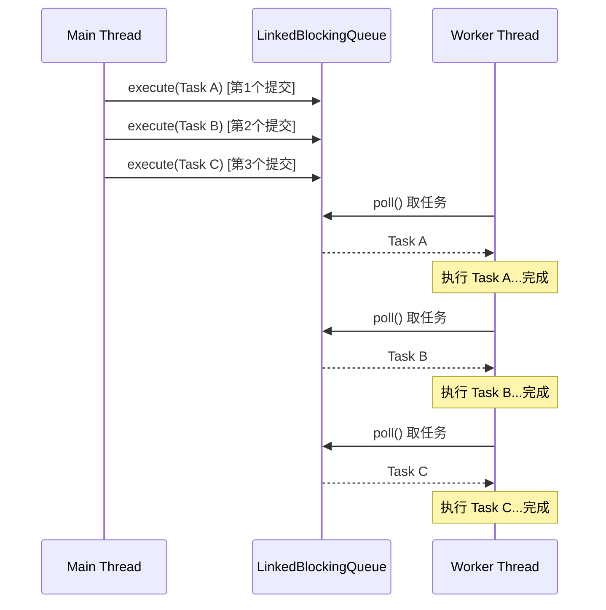

#### Happens-Before 内存可见性保证

顺序执行带来的不仅仅是"执行顺序"的保证，还有 **内存可见性（Memory Visibility）** 的保证。根据 JMM（Java Memory Model）的规定：

> Actions in a thread prior to the submission of a `Runnable` to an `ExecutorService` **happen-before** any action in the task; and the actions within a task **happen-before** the result is retrieved via `Future.get()`.

翻译过来就是：在 `SingleThreadExecutor` 中，前一个任务的所有写操作，对后一个任务是 **完全可见** 的。这意味着你甚至不需要使用 `volatile` 或 `synchronized` 来保证任务之间的数据传递。

```java
// 演示：任务之间的内存可见性
// 注意：sharedState 没有用 volatile 修饰！
// 在普通多线程场景下，这可能导致可见性问题
// 但在 SingleThreadExecutor 中是安全的
int[] sharedState = {0};  // 共享状态（用数组是为了在 lambda 中可修改）

ExecutorService single = Executors.newSingleThreadExecutor();

// Task 1：修改共享状态
single.execute(() -> {
    sharedState[0] = 42;  // 写入
    System.out.println("Task 1: set sharedState = 42");
});

// Task 2：读取共享状态
single.execute(() -> {
    // 由于 happens-before 保证，这里一定能看到 42
    System.out.println("Task 2: sharedState = " + sharedState[0]);  // 保证输出 42
});

// Task 3：继续基于前序任务的结果操作
single.execute(() -> {
    sharedState[0] += 8;  // 基于 Task 1 的结果累加
    System.out.println("Task 3: sharedState = " + sharedState[0]);  // 保证输出 50
});
```

#### 典型应用场景

理解了顺序执行的保证之后，我们来看 `SingleThreadExecutor` 在实际项目中的几大典型用途：

**场景一：日志顺序写入**

日志系统通常要求日志按照事件发生的顺序写入文件。如果多个线程同时写日志，输出可能会乱序甚至交错。`SingleThreadExecutor` 是最简洁的解决方案：

```java
public class OrderedLogger {
    // 创建单线程执行器专门负责写日志
    private final ExecutorService logExecutor = Executors.newSingleThreadExecutor();
    
    // 异步写日志：调用方不阻塞，日志按提交顺序写入
    public void log(String message) {
        logExecutor.execute(() -> {
            // 这里的所有 I/O 操作都在同一个线程中串行执行
            // 不会出现日志交错（interleaved output）的问题
            String timestamp = LocalDateTime.now().toString();  // 获取时间戳
            System.out.println("[" + timestamp + "] " + message); // 写出日志
        });
    }
    
    // 关闭日志系统时，确保所有待写日志都完成
    public void shutdown() {
        logExecutor.shutdown();  // 不再接受新任务，等待已提交任务执行完毕
    }
}
```

**场景二：GUI 事件派发（Event Dispatch）**

Android 的主线程（UI Thread）本质上就是一个单线程事件循环（Single-threaded Event Loop）。Swing 的 EDT（Event Dispatch Thread）也是同样的设计。所有 UI 操作必须在同一个线程中串行执行，以避免控件状态不一致。`SingleThreadExecutor` 可以用来模拟这种模式：

```java
// 模拟一个简化版的 UI 事件队列
ExecutorService uiThread = Executors.newSingleThreadExecutor(r -> {
    Thread t = new Thread(r, "UI-Thread");  // 给线程命名，便于调试
    t.setDaemon(true);                       // 设为守护线程，主线程退出时自动结束
    return t;
});

// 所有 UI 操作都提交到这个单线程池
uiThread.execute(() -> updateLabel("Loading..."));   // 第1步：显示加载
uiThread.execute(() -> updateProgressBar(50));        // 第2步：更新进度
uiThread.execute(() -> updateLabel("Done!"));         // 第3步：显示完成
// 保证 UI 操作严格按 1→2→3 顺序执行，不会出现"Done!"显示后进度条才到50%的情况
```

**场景三：数据库操作序列化**

某些场景下，对同一资源的数据库操作必须严格有序（例如先 INSERT 再 UPDATE 再 SELECT），可以用 `SingleThreadExecutor` 来保证：

```java
ExecutorService dbExecutor = Executors.newSingleThreadExecutor();

// 提交一系列必须有序执行的数据库操作
Future<?> step1 = dbExecutor.submit(() -> {
    // INSERT INTO users (name) VALUES ('Alice')
    userDao.insert(new User("Alice"));        // 第一步：插入
});

Future<?> step2 = dbExecutor.submit(() -> {
    // UPDATE users SET age = 30 WHERE name = 'Alice'
    userDao.updateAge("Alice", 30);           // 第二步：更新（依赖第一步的INSERT）
});

Future<User> step3 = dbExecutor.submit(() -> {
    // SELECT * FROM users WHERE name = 'Alice'
    return userDao.findByName("Alice");       // 第三步：查询（能看到前两步的结果）
});

// step3.get() 保证能拿到 name=Alice, age=30 的完整数据
User alice = step3.get();
```

#### SingleThreadExecutor 的 OOM 风险

尽管 `SingleThreadExecutor` 功能优雅，但它同样存在与 `FixedThreadPool` 一样的 **OOM 隐患**。原因如出一辙——底层的 `LinkedBlockingQueue` 是无界的：

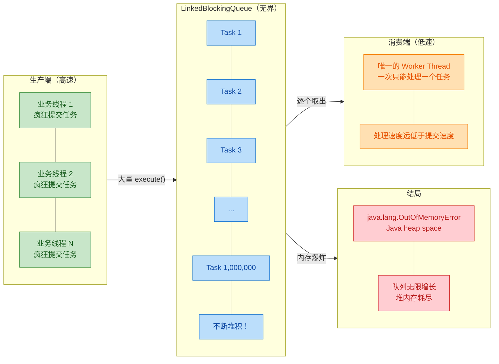

由于只有 **一个工作线程**，消费速度天然是所有线程池类型中最慢的。如果任务提交速率持续高于处理速率，队列会无限增长，最终耗尽堆内存，抛出 `java.lang.OutOfMemoryError: Java heap space`。

这也是阿里巴巴 Java 开发手册明确禁止使用 `Executors.newSingleThreadExecutor()` 的原因之一。推荐的做法是手动创建有界队列版本：

```java
// 推荐：手动创建安全的"单线程池"
ExecutorService safeSingle = new ThreadPoolExecutor(
    1,                                  // corePoolSize = 1
    1,                                  // maximumPoolSize = 1
    0L, TimeUnit.MILLISECONDS,          // keepAliveTime = 0
    new LinkedBlockingQueue<>(1000),     // 有界队列！最多积压1000个任务
    new ThreadPoolExecutor.CallerRunsPolicy()  // 拒绝策略：让提交者自己执行，起到限流效果
);
```

#### 完整对比总结

| 特性 | `new Thread()` | `FixedThreadPool(1)` | `SingleThreadExecutor` |
|------|---------------|---------------------|----------------------|
| 线程数量 | 1 | 1（可被修改） | 1（**不可修改**） |
| 任务队列 | 无 | LinkedBlockingQueue | LinkedBlockingQueue |
| 顺序保证 | 不适用 | ✅ | ✅ |
| 异常自动恢复 | ❌ 线程死即死 | ✅ 自动创建新线程 | ✅ 自动创建新线程 |
| 参数可篡改 | 不适用 | ⚠️ 可强转修改 | ✅ **装饰器保护** |
| Happens-Before | 需手动同步 | ✅ JMM 保证 | ✅ JMM 保证 |
| OOM 风险 | 无（无队列） | ⚠️ 无界队列 | ⚠️ 无界队列 |

---

**📝 练习题**

以下关于 `SingleThreadExecutor` 的描述，哪一项是 **错误的**？

A. `SingleThreadExecutor` 的工作线程如果因未捕获异常而终止，线程池会自动创建新线程继续执行后续任务

B. `Executors.newSingleThreadExecutor()` 返回的对象可以被强制转型为 `ThreadPoolExecutor`，从而动态修改核心线程数

C. 在 `SingleThreadExecutor` 中，前一个任务对共享变量的写入，对后一个任务一定是可见的（happens-before 保证）

D. `SingleThreadExecutor` 底层使用 `LinkedBlockingQueue` 作为任务队列，在任务积压场景下存在 OOM 风险


**【答案】** B

**【解析】** `Executors.newSingleThreadExecutor()` 返回的并非裸的 `ThreadPoolExecutor`，而是经过 `FinalizableDelegatedExecutorService` 包装后的对象。这个包装类仅暴露了 `ExecutorService` 接口的方法，并没有暴露 `setCorePoolSize()`、`setMaximumPoolSize()` 等配置方法。如果强行将其转型为 `ThreadPoolExecutor`，会在运行时抛出 `ClassCastException`。这正是 `SingleThreadExecutor` 与 `newFixedThreadPool(1)` 的核心区别——后者返回的是原始的 `ThreadPoolExecutor`，确实可以被强转并修改参数。选项 A 描述的是线程池的 Worker 自动补偿机制，是正确的；选项 C 描述的 happens-before 语义由 JMM 对 `ExecutorService` 的规范保证，是正确的；选项 D 描述的 OOM 风险是阿里规约禁止使用 `Executors` 工厂方法的核心原因之一，也是正确的。

---

## ScheduledThreadPoolExecutor

在实际开发中，我们经常遇到需要"延迟执行"或"周期性执行"的场景：定时清理缓存、每隔 5 秒拉取配置、延迟 30 秒后重试失败的任务等。Java 并发包为此提供了一个专门的线程池实现 —— `ScheduledThreadPoolExecutor`。它继承自 `ThreadPoolExecutor`，在其基础上增加了**时间调度**能力，是 JDK 中替代古老的 `java.util.Timer` 的推荐方案。

### 整体定位与继承结构

`ScheduledThreadPoolExecutor` 并非一个独立存在的工具，它深深扎根于 `ThreadPoolExecutor` 的体系之中。理解其继承关系，有助于我们把握"哪些行为继承自父类，哪些是它独有的"。

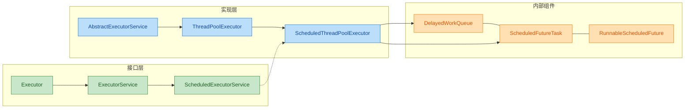

从图中可以看出几个关键点：

- **`ScheduledExecutorService`** 接口定义了 `schedule`、`scheduleAtFixedRate`、`scheduleWithFixedDelay` 三个核心调度方法。
- **`ScheduledThreadPoolExecutor`** 同时继承了 `ThreadPoolExecutor`（获得线程池管理能力）并实现了 `ScheduledExecutorService`（获得调度语义）。
- 它内部使用了一个特殊的阻塞队列 —— **`DelayedWorkQueue`**，以及一个特殊的任务包装 —— **`ScheduledFutureTask`**。

这意味着，`ScheduledThreadPoolExecutor` 本质上就是一个 `ThreadPoolExecutor`，只不过它的**工作队列被替换成了一个基于堆的延迟队列**，任务不再是先进先出，而是按照**触发时间从近到远**排列。

### 核心构造与参数

我们先看它的构造方法签名：

```java
// ScheduledThreadPoolExecutor 的核心构造方法
public ScheduledThreadPoolExecutor(int corePoolSize) {
    // 调用父类 ThreadPoolExecutor 的构造方法
    // corePoolSize: 核心线程数，由用户指定
    // Integer.MAX_VALUE: 最大线程数，理论上无上限
    // DEFAULT_KEEPALIVE_MILLIS: 非核心线程的存活时间（10毫秒）
    // NANOSECONDS: 时间单位为纳秒
    // new DelayedWorkQueue(): 使用专用的延迟工作队列
    super(corePoolSize, Integer.MAX_VALUE,
          DEFAULT_KEEPALIVE_MILLIS, NANOSECONDS,
          new DelayedWorkQueue());
}
```

虽然 `maximumPoolSize` 被设为 `Integer.MAX_VALUE`，但实际上这个参数**几乎不起作用**。原因在于 `DelayedWorkQueue` 是一个**无界队列**（internally unbounded），任务永远可以成功入队，因此线程池永远不会尝试创建超过 `corePoolSize` 的线程。这一点与 `FixedThreadPool` 使用 `LinkedBlockingQueue` 时的效果类似 —— **`maximumPoolSize` 形同虚设**。

> **核心理解**：对于 `ScheduledThreadPoolExecutor` 来说，真正有效的线程数参数只有 `corePoolSize`。你设置几个核心线程，它就用几个线程来执行所有的定时和周期任务。

### 定时任务：schedule()

最基础的调度方法是 `schedule()`，它实现"**延迟一次性执行**"的语义：在指定的延迟时间过去后，任务被执行**一次且仅一次**。

```java
// 创建一个拥有 2 个核心线程的调度线程池
ScheduledExecutorService scheduler = new ScheduledThreadPoolExecutor(2);

// ========== 1. 提交一个 Runnable 类型的延迟任务 ==========
// 含义：延迟 3 秒后执行，没有返回值
ScheduledFuture<?> future1 = scheduler.schedule(
    () -> {
        // 这段代码将在 3 秒后被某个线程执行
        System.out.println("Task executed after 3s delay, thread: "
            + Thread.currentThread().getName());
    },
    3,                  // delay: 延迟时长
    TimeUnit.SECONDS    // unit: 时间单位
);

// ========== 2. 提交一个 Callable 类型的延迟任务 ==========
// 含义：延迟 5 秒后执行，并返回计算结果
ScheduledFuture<String> future2 = scheduler.schedule(
    () -> {
        // 这段代码将在 5 秒后被执行，并返回字符串结果
        return "Computation finished at " + System.currentTimeMillis();
    },
    5,                  // delay: 延迟时长
    TimeUnit.SECONDS    // unit: 时间单位
);

// 阻塞获取 Callable 任务的结果
// get() 会等到任务执行完毕才返回
String result = future2.get();
System.out.println(result);
```

方法签名对比如下：

| 方法 | 参数类型 | 返回值 | 是否有结果 |
|------|---------|--------|-----------|
| `schedule(Runnable, long, TimeUnit)` | `Runnable` | `ScheduledFuture<?>` | 无（`get()` 返回 `null`） |
| `schedule(Callable<V>, long, TimeUnit)` | `Callable<V>` | `ScheduledFuture<V>` | 有（`get()` 返回 `V`） |

`schedule()` 的内部执行流程非常简洁：

1. 将传入的 `Runnable/Callable` 包装为 `ScheduledFutureTask`，记录**触发时间** = `当前时间 + delay`。
2. 将该 `ScheduledFutureTask` 放入 `DelayedWorkQueue`。
3. 工作线程从队列中 `take()` 时，如果队首任务的触发时间尚未到达，线程会**阻塞等待**直到时间到。
4. 时间到后，线程取出任务并执行。

### 周期任务：scheduleAtFixedRate() 与 scheduleWithFixedDelay()

这两个方法是 `ScheduledThreadPoolExecutor` 的灵魂所在。它们让任务可以**反复执行**，但二者的"周期"含义截然不同。这是面试和实际开发中最容易混淆的点。

#### scheduleAtFixedRate —— 固定速率

```java
ScheduledExecutorService scheduler = new ScheduledThreadPoolExecutor(2);

// scheduleAtFixedRate: 以固定的速率（频率）执行任务
// initialDelay = 1秒: 首次执行在提交后 1 秒
// period = 3秒: 每次执行的【开始时间】间隔 3 秒
scheduler.scheduleAtFixedRate(
    () -> {
        System.out.println("[FixedRate] start at " + System.currentTimeMillis());
        try {
            // 模拟任务执行耗时 1 秒
            Thread.sleep(1000);
        } catch (InterruptedException e) {
            Thread.currentThread().interrupt();
        }
        System.out.println("[FixedRate] end   at " + System.currentTimeMillis());
    },
    1,                  // initialDelay: 首次延迟 1 秒
    3,                  // period: 周期 3 秒
    TimeUnit.SECONDS    // unit: 时间单位
);
```

**Fixed Rate 的调度逻辑**：下一次执行的**起始时间** = 上一次执行的**起始时间** + `period`。无论任务执行了多久，系统都试图维持恒定的启动间隔。

```
任务执行耗时 1s，周期 3s 的情况（正常场景）：
```

```text
时间轴(秒)    0    1    2    3    4    5    6    7    8    9   10
              |    |=========|    .    |=========|    .    |=========|
                   ↑ 第1次开始         ↑ 第2次开始         ↑ 第3次开始
                   t=1               t=4               t=7
                   
间隔: t4 - t1 = 3s ✓    t7 - t4 = 3s ✓
```

但如果**任务执行时间超过了 period** 会怎样？答案是：**不会并发执行**，而是任务执行完毕后**立即**开始下一次执行（无间隔等待）。

```
任务执行耗时 5s，周期 3s 的情况（任务超时场景）：
```

```text
时间轴(秒)    0    1    2    3    4    5    6    7    8    9   10   11
              |    |=================|=================|=================|
                   ↑ 第1次(1~6)      ↑ 第2次(6~11)     ↑ 第3次(11~16)
                   
实际间隔: 5s > 3s，所以结束后立即开始下一次，不存在并行执行
```

> **关键结论**：`scheduleAtFixedRate` **不会让同一个任务并发执行**。当任务耗时 > period 时，周期被实际耗时"撑大"，但绝不会两个实例同时跑。

#### scheduleWithFixedDelay —— 固定延迟

```java
ScheduledExecutorService scheduler = new ScheduledThreadPoolExecutor(2);

// scheduleWithFixedDelay: 以固定的延迟间隔执行任务
// initialDelay = 1秒: 首次执行在提交后 1 秒
// delay = 3秒: 上一次执行【结束】后，等待 3 秒再开始下一次
scheduler.scheduleWithFixedDelay(
    () -> {
        System.out.println("[FixedDelay] start at " + System.currentTimeMillis());
        try {
            // 模拟任务执行耗时 1 秒
            Thread.sleep(1000);
        } catch (InterruptedException e) {
            Thread.currentThread().interrupt();
        }
        System.out.println("[FixedDelay] end   at " + System.currentTimeMillis());
    },
    1,                  // initialDelay: 首次延迟 1 秒
    3,                  // delay: 固定延迟 3 秒
    TimeUnit.SECONDS    // unit: 时间单位
);
```

**Fixed Delay 的调度逻辑**：下一次执行的**起始时间** = 上一次执行的**结束时间** + `delay`。关注的是"两次执行之间的**空闲间隔**"恒定。

```
任务执行耗时 1s，延迟 3s 的情况：
```

```text
时间轴(秒)    0    1    2    3    4    5    6    7    8    9   10   11
              |    |===|    .    .    |===|    .    .    |===|
                   ↑第1次        3s空闲 ↑第2次        3s空闲 ↑第3次
                 (1~2)              (5~6)              (9~10)

实际间隔: (5-1)=4s = 执行1s + 空闲3s ✓
```

```
任务执行耗时 5s，延迟 3s 的情况：
```

```text
时间轴(秒)    0    1    2    3    4    5    6    7    8    9   10   11   12   13   14
              |    |=================|    .    .    |=================|
                   ↑ 第1次(1~6)       3s空闲        ↑ 第2次(9~14)

实际间隔: (9-1)=8s = 执行5s + 空闲3s ✓
```

### 三种调度方法的核心对比

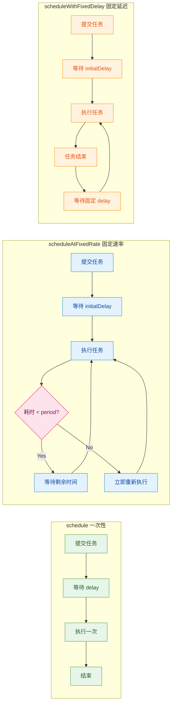

用一张表格做最终总结：

| 特性 | `schedule` | `scheduleAtFixedRate` | `scheduleWithFixedDelay` |
|------|-----------|----------------------|--------------------------|
| **执行次数** | 仅一次 | 无限循环 | 无限循环 |
| **时间参考点** | 提交时刻 + delay | 上次**开始** + period | 上次**结束** + delay |
| **任务超时行为** | 不适用 | 结束后立即开始下一次 | 结束后仍等固定 delay |
| **两次开始间隔** | 不适用 | ≥ period（可能被撑大） | 执行耗时 + delay（不固定） |
| **两次间空闲** | 不适用 | 不固定（可能为 0） | 恒定 = delay |
| **典型用途** | 延迟重试、延迟初始化 | 心跳检测、指标采集 | 轮询拉取、定期清理 |

### DelayedWorkQueue 内部机制

`ScheduledThreadPoolExecutor` 之所以能实现精确的时间调度，全靠其内部的 `DelayedWorkQueue`。这个队列与普通的 `BlockingQueue` 有着本质区别。

```java
// DelayedWorkQueue 的核心结构（简化版）
static class DelayedWorkQueue extends AbstractQueue<Runnable>
    implements BlockingQueue<Runnable> {

    // 底层数据结构：基于数组的最小堆（min-heap）
    // 堆顶元素始终是触发时间最早的任务
    private RunnableScheduledFuture<?>[] queue =
        new RunnableScheduledFuture<?>[16];  // 初始容量 16

    // 堆中当前元素数量
    private int size = 0;

    // 用于精确等待的 Leader-Follower 模式
    // leader 线程负责等待堆顶任务到期
    private Thread leader = null;

    // 所有线程共享的条件变量
    private final Condition available = lock.newCondition();
}
```

**工作原理**：

1. **入队（offer）**：新任务插入堆，按触发时间做 **sift-up** 操作，维持小顶堆性质。时间复杂度 `O(log n)`。
2. **出队（take）**：工作线程查看堆顶元素。如果触发时间已到，直接取出（**sift-down** 调整堆）。如果尚未到期，线程通过 `available.awaitNanos(delay)` 精确等待。
3. **Leader-Follower 优化**：只有一个线程（leader）负责定时等待堆顶任务，其他线程无限期 `await()`。当 leader 取走任务后，唤醒下一个线程成为新 leader。这避免了多个线程同时竞争定时等待的资源浪费。

```text
DelayedWorkQueue 内部堆结构示意 (min-heap by trigger time)：

               ┌──────────────┐
               │ Task-A (t=3) │  ← 堆顶: 最早触发的任务
               └──────┬───────┘
              ┌───────┴────────┐
       ┌──────┴──────┐  ┌──────┴──────┐
       │ Task-B (t=5)│  │ Task-C (t=7)│
       └──────┬──────┘  └──────┬──────┘
         ┌────┴────┐      ┌────┴────┐
    ┌────┴────┐ ┌──┴───┐ ┌┴──────┐  │
    │Task-D(9)│ │T-E(10│ │T-F(12)│  ...
    └─────────┘ └──────┘ └───────┘
    
    工作线程 take() → 取堆顶 Task-A → sift-down 重建堆
```

### ScheduledFutureTask 的周期重入机制

周期任务之所以能"循环执行"，关键在于 `ScheduledFutureTask.run()` 方法的巧妙设计：

```java
// ScheduledFutureTask.run() 的简化逻辑
public void run() {
    // 1. 判断是否为周期任务（period != 0 表示周期任务）
    boolean periodic = isPeriodic();

    // 2. 检查线程池当前状态是否还允许执行
    if (!canRunInCurrentRunState(periodic))
        cancel(false);  // 线程池已关闭，取消任务

    // 3a. 如果是一次性任务（schedule），直接执行
    else if (!periodic)
        ScheduledFutureTask.super.run();  // 调用 FutureTask.run()

    // 3b. 如果是周期任务，执行但不设置结果（不触发 Future 完成）
    else if (ScheduledFutureTask.super.runAndReset()) {
        // 4. 任务执行成功后，计算下一次触发时间
        setNextRunTime();
        // 5. 将自身重新放入 DelayedWorkQueue
        reExecutePeriodic(outerTask);
    }
}
```

```java
// 计算下一次触发时间的逻辑
private void setNextRunTime() {
    long p = period;
    if (p > 0)
        // scheduleAtFixedRate: 下次时间 = 本次触发时间 + period
        // 注意：是基于「计划触发时间」而非「实际结束时间」
        time += p;
    else
        // scheduleWithFixedDelay: 下次时间 = 当前时刻(now) + |delay|
        // period 为负数表示 FixedDelay 模式
        time = triggerTime(-p);
}
```

这段代码揭示了一个精妙的设计细节：**`period` 字段的正负号**区分了两种调度模式。`period > 0` 代表 `FixedRate`，`period < 0` 代表 `FixedDelay`，`period == 0` 代表一次性任务。

整个周期任务的生命周期形成一个自驱动闭环：

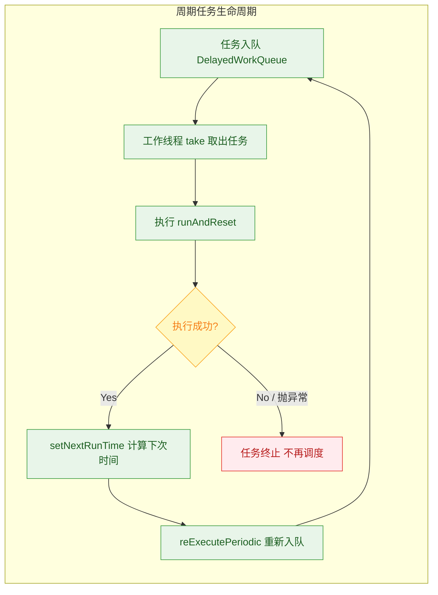

> **⚠️ 重要陷阱**：如果周期任务的 `run()` 方法抛出了**未捕获的异常**，`runAndReset()` 返回 `false`，任务**静默终止**，后续的周期执行全部消失，并且**不会有任何日志输出**。这是生产环境中极其常见的 bug 源头。

### 异常吞没陷阱与防御性编码

这个陷阱值得专门展开讨论。看以下代码：

```java
ScheduledExecutorService scheduler = new ScheduledThreadPoolExecutor(1);

// 这个任务将在第 3 次执行时抛出异常
scheduler.scheduleAtFixedRate(() -> {
    // 假设 counter 是某个递增计数器
    int count = counter.incrementAndGet();
    System.out.println("Execution #" + count);

    if (count == 3) {
        // 第 3 次执行抛出异常
        throw new RuntimeException("Boom!");
        // 从此之后，这个任务彻底消失
        // 没有日志、没有通知、没有 stacktrace
    }
}, 0, 1, TimeUnit.SECONDS);

// 输出:
// Execution #1
// Execution #2
// Execution #3
// （然后永久静默，再也不会执行）
```

**防御方案**：始终在任务内部使用 `try-catch` 包裹全部逻辑。

```java
scheduler.scheduleAtFixedRate(() -> {
    try {
        // ======== 业务逻辑开始 ========
        riskyBusinessLogic();
        // ======== 业务逻辑结束 ========
    } catch (Exception e) {
        // 捕获所有异常，记录日志，但不让异常逃逸
        // 这样 runAndReset() 返回 true，周期调度继续
        log.error("Scheduled task failed, but will retry next period", e);
    }
}, 0, 1, TimeUnit.SECONDS);
```

### 线程池关闭时的行为控制

`ScheduledThreadPoolExecutor` 提供了两个精细的控制开关，决定线程池进入 `SHUTDOWN` 状态后，已提交的定时 / 周期任务如何处理：

```java
ScheduledThreadPoolExecutor scheduler = new ScheduledThreadPoolExecutor(4);

// 控制 shutdown() 后是否继续执行已提交的「周期任务」
// 默认 false: shutdown 后周期任务停止
scheduler.setContinueExistingPeriodicTasksAfterShutdownPolicy(false);

// 控制 shutdown() 后是否继续执行已提交的「延迟一次性任务」
// 默认 true: shutdown 后延迟任务仍会执行
scheduler.setExecuteExistingDelayedTasksAfterShutdownPolicy(true);

// 当任务被取消时，是否立即从队列中移除（而非等到触发时才懒删除）
// 默认 false，建议设为 true 以避免大量已取消任务堆积占用内存
scheduler.setRemoveOnCancelPolicy(true);
```

| 策略 | 默认值 | 说明 |
|------|-------|------|
| `continueExistingPeriodicTasksAfterShutdown` | `false` | 关闭后不再执行周期任务 |
| `executeExistingDelayedTasksAfterShutdown` | `true` | 关闭后仍执行已提交的一次性延迟任务 |
| `removeOnCancel` | `false` | 取消的任务不立即从堆中删除 |

### Timer vs ScheduledThreadPoolExecutor

在 JDK 1.5 之前，`java.util.Timer` 是唯一的定时任务方案。但它存在严重缺陷，`ScheduledThreadPoolExecutor` 在各方面都是其上位替代：

| 对比维度 | `Timer` | `ScheduledThreadPoolExecutor` |
|----------|---------|-------------------------------|
| **线程模型** | 单线程执行所有任务 | 多线程，`corePoolSize` 可配 |
| **异常处理** | 一个任务抛异常，整个 Timer 线程死亡，所有任务全部停止 | 一个任务异常只影响该任务本身 |
| **时间基准** | 基于 `System.currentTimeMillis()`（系统时钟），受手动调时影响 | 基于 `System.nanoTime()`（单调时钟），不受系统时钟调整影响 |
| **任务堆积** | 单线程，前一个任务耗时会严重拖延后续任务 | 多线程并行处理不同任务 |
| **取消粒度** | `TimerTask.cancel()` 但无法立即从队列移除 | `Future.cancel()` + `removeOnCancelPolicy` |

### 生产实践建议

```java
// ========== 生产环境推荐的 ScheduledThreadPoolExecutor 创建方式 ==========
ScheduledThreadPoolExecutor scheduler = new ScheduledThreadPoolExecutor(
    // 核心线程数：根据定时任务数量和执行耗时合理评估
    // 一般 2~4 个线程足以覆盖大多数场景
    Runtime.getRuntime().availableProcessors(),

    // 使用自定义 ThreadFactory 命名线程，便于排查问题
    new ThreadFactory() {
        private final AtomicInteger counter = new AtomicInteger(0);
        @Override
        public Thread newThread(Runnable r) {
            Thread t = new Thread(r);
            // 给线程起有意义的名字，出问题时 jstack 一看便知
            t.setName("biz-scheduler-" + counter.incrementAndGet());
            // 设为守护线程，随 JVM 退出
            t.setDaemon(true);
            return t;
        }
    },

    // 拒绝策略：对于定时任务，通常选择丢弃或记录日志
    new ThreadPoolExecutor.CallerRunsPolicy()
);

// 推荐：取消任务时立即从队列移除，避免内存泄漏
scheduler.setRemoveOnCancelPolicy(true);
```

---

**📝 练习题**

以下代码中，`scheduleAtFixedRate` 的任务每次执行需要 4 秒，`period` 设置为 2 秒。假设首次执行在 t=0 时刻开始，请问第三次执行开始的时刻是？

```java
scheduler.scheduleAtFixedRate(() -> {
    try { Thread.sleep(4000); } catch (Exception e) {}
}, 0, 2, TimeUnit.SECONDS);
```

A. t = 4（第 4 秒）


B. t = 8（第 8 秒）


C. t = 6（第 6 秒）


D. t = 12（第 12 秒）

**【答案】** B

**【解析】** `scheduleAtFixedRate` 的规则是：下一次**计划开始时间** = 上一次**计划开始时间** + `period`。但任务不会并发执行，当执行耗时（4s）> period（2s）时，上一次执行完毕后立即开始下一次。具体推演：

- **第 1 次**：计划 t=0 开始，实际执行 t=0 ~ t=4。
- **第 2 次**：计划 t=2 开始，但 t=2 时第 1 次尚未结束，于是等到 t=4 立即开始，实际执行 t=4 ~ t=8。
- **第 3 次**：计划 t=4 开始，但 t=4 时第 2 次刚开始，于是等到 t=8 立即开始。

因此第三次执行开始于 **t=8**。在任务耗时持续大于 period 的情况下，`scheduleAtFixedRate` 退化为"上一次结束后立即执行下一次"的行为，与 `scheduleWithFixedDelay(delay=0)` 等效。这种情况下实际间隔被执行耗时"撑大"为 4 秒，而非设定的 2 秒。

---

## 为什么不推荐 Executors ⭐⭐

在前面的章节中，我们逐一介绍了 `Executors` 工厂类提供的四种常见线程池。它们使用起来确实非常简洁——只需一行代码就能创建线程池。然而，在真实的生产环境中，**阿里巴巴 Java 开发手册** 明确规定：**线程池不允许使用 Executors 去创建，而是通过 ThreadPoolExecutor 的方式手动创建**。这条规范的背后，隐藏着两个能让你的服务在深夜宕机的致命隐患——**无界队列 (Unbounded Queue)** 和 **无界线程数 (Unbounded Thread Count)**，它们的最终结果都指向同一个灾难：`java.lang.OutOfMemoryError`。

本节将从原理层面彻底剖析这些风险，并给出工业级的替代方案。

### 隐患全景：一张图看清所有风险

在深入细节之前，先从宏观视角理解每种 `Executors` 工厂方法到底在哪个环节埋下了 OOM 的种子：

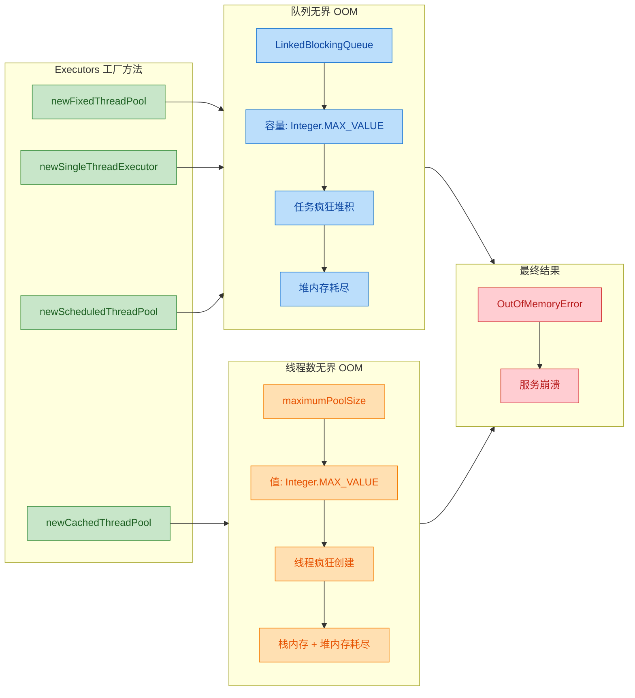

从图中可以清晰看到：**四种工厂方法，无一幸免**。接下来我们逐一拆解这两大类风险。

### 队列无界导致的 OOM

这是最常见、也是最隐蔽的生产事故类型。受影响的线程池包括 `FixedThreadPool`、`SingleThreadExecutor` 和 `ScheduledThreadPoolExecutor`。

#### 问题根源：LinkedBlockingQueue 的默认容量

让我们直接看 JDK 源码中 `newFixedThreadPool` 的实现：

```java
// java.util.concurrent.Executors 源码
public static ExecutorService newFixedThreadPool(int nThreads) {
    return new ThreadPoolExecutor(
        nThreads,                          // corePoolSize: 核心线程数
        nThreads,                          // maximumPoolSize: 最大线程数（与核心相同）
        0L, TimeUnit.MILLISECONDS,         // keepAliveTime: 0，核心线程不回收
        new LinkedBlockingQueue<Runnable>() // ⚠️ 关键！无参构造 → 容量为 Integer.MAX_VALUE
    );
}
```

再看 `LinkedBlockingQueue` 的无参构造函数：

```java
// java.util.concurrent.LinkedBlockingQueue 源码
public LinkedBlockingQueue() {
    // capacity 被设置为 Integer.MAX_VALUE = 2,147,483,647
    // 约 21 亿，在实际意义上等同于"无界"
    this(Integer.MAX_VALUE);
}
```

这意味着什么？当所有核心线程都在忙碌时，新提交的任务不会被拒绝，而是默默地排入这个几乎无限的队列。从表面上看，系统运行正常，没有任何异常抛出；但在内存深处，每一个排队的任务对象都在悄悄吞噬堆空间。

#### 灾难是如何一步步发生的

让我们用一个具体的场景来还原事故现场。假设你的服务接收 HTTP 请求，每个请求创建一个任务提交到 `FixedThreadPool(10)`：

```java
// 一个典型的生产事故代码
public class OrderService {

    // 创建一个固定 10 个线程的线程池
    private static final ExecutorService pool = Executors.newFixedThreadPool(10);

    // 处理订单的方法，每次 HTTP 请求调用一次
    public void processOrder(Order order) {
        // 将订单处理任务提交到线程池
        pool.submit(() -> {
            // 假设这里需要调用下游服务，平均耗时 2 秒
            callDownstreamService(order);  // 网络 IO，响应缓慢
            saveToDatabase(order);          // 数据库写入
            sendNotification(order);        // 发送通知
        });
        // submit() 永远不会阻塞，永远不会抛出 RejectedExecutionException
        // 因为队列几乎无限大，任务总是能入队"成功"
    }
}
```

当下游服务出现延迟（比如从 2 秒变成 20 秒），灾难链条如下：

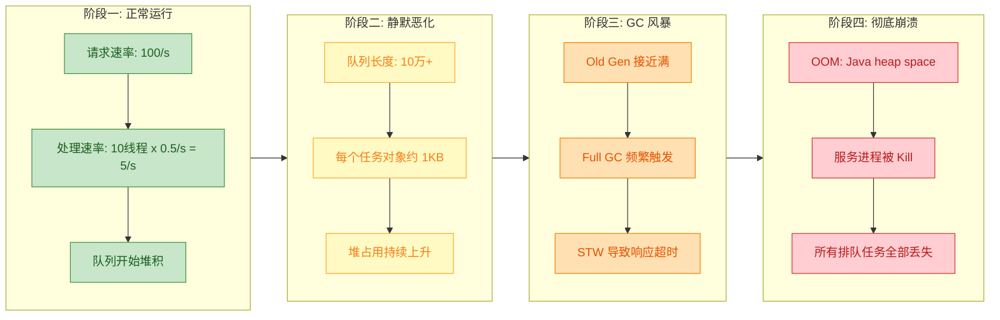

最可怕的是**阶段二**：系统没有任何报错、没有任何告警、没有任何日志提示，一切看起来"正常"。任务在安静地排队，内存在安静地增长。直到 OOM 那一刻，已经来不及做任何补救。

#### 同样受影响的 SingleThreadExecutor

`SingleThreadExecutor` 的情况甚至更严重，因为它只有 **1 个工作线程**：

```java
// java.util.concurrent.Executors 源码
public static ExecutorService newSingleThreadExecutor() {
    return new FinalizableDelegatedExecutorService(
        new ThreadPoolExecutor(
            1, 1,                              // 只有 1 个线程
            0L, TimeUnit.MILLISECONDS,
            new LinkedBlockingQueue<Runnable>() // ⚠️ 同样是无界队列
        )
    );
}
```

只有 1 个线程处理任务，任务堆积的速度远远快于 `FixedThreadPool`，OOM 来得更快、更猛烈。

### 线程数无界导致的 OOM

这是 `CachedThreadPool` 特有的风险，机制与队列无界不同，但结局同样致命。

#### 问题根源：Integer.MAX_VALUE 的最大线程数

```java
// java.util.concurrent.Executors 源码
public static ExecutorService newCachedThreadPool() {
    return new ThreadPoolExecutor(
        0,                                  // corePoolSize: 0，没有核心线程
        Integer.MAX_VALUE,                  // ⚠️ maximumPoolSize: 约 21 亿
        60L, TimeUnit.SECONDS,              // 空闲 60 秒后回收
        new SynchronousQueue<Runnable>()    // 不存储任务，直接交给线程
    );
}
```

`SynchronousQueue` 是一个容量为 0 的队列——它不存储任何元素，每一次 `put` 操作必须等待一个对应的 `take` 操作。这意味着：**如果没有空闲线程来接收任务，线程池就必须创建一个新线程**。

#### 线程爆炸的过程

```java
// 模拟 CachedThreadPool 的线程爆炸
public class CachedPoolOOMDemo {
    public static void main(String[] args) {
        // 创建 CachedThreadPool
        ExecutorService pool = Executors.newCachedThreadPool();

        // 模拟突发高并发场景
        for (int i = 0; i < 100_000; i++) {
            pool.submit(() -> {
                try {
                    // 模拟耗时任务：每个任务执行 10 秒
                    Thread.sleep(10_000);
                } catch (InterruptedException e) {
                    Thread.currentThread().interrupt();
                }
            });
            // 每次循环，由于之前的线程都在 sleep，没有空闲线程
            // SynchronousQueue 无法交付 → 线程池创建新线程
            // 结果：直接创建了 100,000 个线程！
        }
    }
}
```

每个 Java 线程默认占用大约 **512KB ~ 1MB** 的栈空间（取决于 JVM 实现和 `-Xss` 设置）。简单计算一下：

```text
100,000 个线程 × 1MB/线程 ≈ 100GB 内存

远远超出任何服务器的物理内存限制
```

这种情况下，OOM 的表现形式通常是：

```text
java.lang.OutOfMemoryError: unable to create new native thread
```

注意，这不是堆内存溢出 (heap space)，而是**操作系统层面无法再分配线程栈空间**。这种 OOM 甚至比堆溢出更危险，因为它可能导致整个 JVM 进程直接被操作系统杀死，连 `try-catch` 的机会都没有。

#### 两种 OOM 的本质对比

```java
// ┌─────────────────────────────────────────────────────────────────────┐
// │              两种 OOM 路径对比                                       │
// ├──────────────────┬──────────────────┬───────────────────────────────┤
// │      维度         │   队列无界 OOM    │      线程数无界 OOM            │
// ├──────────────────┼──────────────────┼───────────────────────────────┤
// │  涉及线程池       │ Fixed / Single   │      Cached                   │
// │  问题队列         │ LinkedBlocking   │      SynchronousQueue         │
// │                  │ Queue(MAX)       │      (容量 0, 不存储)          │
// │  内存消耗来源     │ 堆中的任务对象     │      线程栈(native memory)     │
// │  错误信息         │ Java heap space  │      unable to create native  │
// │                  │                  │      thread                   │
// │  恶化速度         │ 较慢(静默堆积)    │      极快(线程瞬间爆炸)         │
// │  可监控性         │ 低(无异常抛出)    │      低(无异常抛出)             │
// │  是否可恢复       │ 困难             │      几乎不可能                 │
// └──────────────────┴──────────────────┴───────────────────────────────┘
```

### 推荐手动创建 ThreadPoolExecutor

既然 `Executors` 工厂方法处处是坑，那正确的做法是什么？答案是：**直接使用 `ThreadPoolExecutor` 的构造函数，手动指定每一个参数**，做到心中有数、参数可控。

#### ThreadPoolExecutor 七参数构造函数回顾

```java
// ThreadPoolExecutor 完整构造函数（7 个参数）
public ThreadPoolExecutor(
    int corePoolSize,                   // 核心线程数：常驻线程，不会被回收
    int maximumPoolSize,                // 最大线程数：线程池能创建的线程上限
    long keepAliveTime,                 // 空闲存活时间：非核心线程空闲超过该时长后被回收
    TimeUnit unit,                      // 时间单位：keepAliveTime 的单位
    BlockingQueue<Runnable> workQueue,  // 工作队列：存放等待执行的任务
    ThreadFactory threadFactory,        // 线程工厂：自定义线程创建方式（命名、优先级等）
    RejectedExecutionHandler handler    // 拒绝策略：队列满且线程数达到上限时的处理策略
) { ... }
```

#### 生产级线程池创建示例

下面是一个在真实项目中推荐使用的写法：

```java
import java.util.concurrent.*;
import java.util.concurrent.atomic.AtomicInteger;

public class ThreadPoolFactory {

    /**
     * 创建一个生产级的线程池
     * 
     * @param bizName 业务名称，用于线程命名，方便排查问题
     * @return 配置完善的线程池
     */
    public static ThreadPoolExecutor createBizPool(String bizName) {

        // 获取可用 CPU 核心数
        int cpuCores = Runtime.getRuntime().availableProcessors();

        // 1. 核心线程数：CPU 核心数（适合 CPU 密集型任务）
        //    如果是 IO 密集型，可以设为 2 * cpuCores
        int coreSize = cpuCores;

        // 2. 最大线程数：核心线程数的 2 倍，设定明确上限
        //    绝不使用 Integer.MAX_VALUE！
        int maxSize = cpuCores * 2;

        // 3. 空闲线程存活时间：60 秒
        long keepAlive = 60L;

        // 4. 工作队列：使用有界队列！容量根据业务评估设定
        //    这里设为 1024，超过此容量将触发拒绝策略
        BlockingQueue<Runnable> queue = new LinkedBlockingQueue<>(1024);

        // 5. 自定义线程工厂：给线程起一个有意义的名字
        //    在排查线程 dump 时，"order-pool-thread-3" 比 "pool-1-thread-3" 有用得多
        ThreadFactory factory = new ThreadFactory() {
            // 线程编号计数器，保证线程安全
            private final AtomicInteger counter = new AtomicInteger(1);

            @Override
            public Thread newThread(Runnable r) {
                // 线程命名格式：业务名-pool-thread-编号
                Thread t = new Thread(r, bizName + "-pool-thread-" + counter.getAndIncrement());
                // 设为非守护线程，确保任务执行完毕
                t.setDaemon(false);
                // 设置普通优先级
                t.setPriority(Thread.NORM_PRIORITY);
                return t;
            }
        };

        // 6. 拒绝策略：CallerRunsPolicy——由调用线程自己执行该任务
        //    这样做的好处：不会丢弃任务，同时反压（backpressure）调用方，降低提交速率
        RejectedExecutionHandler handler = new ThreadPoolExecutor.CallerRunsPolicy();

        // 7. 组装线程池：每一个参数都是经过深思熟虑的
        ThreadPoolExecutor executor = new ThreadPoolExecutor(
            coreSize,      // 核心线程数
            maxSize,        // 最大线程数
            keepAlive,      // 空闲存活时间
            TimeUnit.SECONDS, // 时间单位
            queue,          // 有界工作队列
            factory,        // 自定义线程工厂
            handler         // 拒绝策略
        );

        // 可选优化：允许核心线程超时回收（在低流量时释放资源）
        // executor.allowCoreThreadTimeOut(true);

        return executor;
    }
}
```

使用方式：

```java
public class OrderService {

    // 使用手动创建的线程池，参数可控、命名清晰
    private static final ThreadPoolExecutor orderPool =
        ThreadPoolFactory.createBizPool("order");

    public void processOrder(Order order) {
        orderPool.submit(() -> {
            callDownstreamService(order);
            saveToDatabase(order);
            sendNotification(order);
        });
        // 如果队列已满且线程数达到上限：
        // CallerRunsPolicy 会让当前调用线程（如 Tomcat 线程）自己执行任务
        // 效果：自动限流，而非 OOM
    }
}
```

#### Executors 写法 vs 手动创建写法的对比

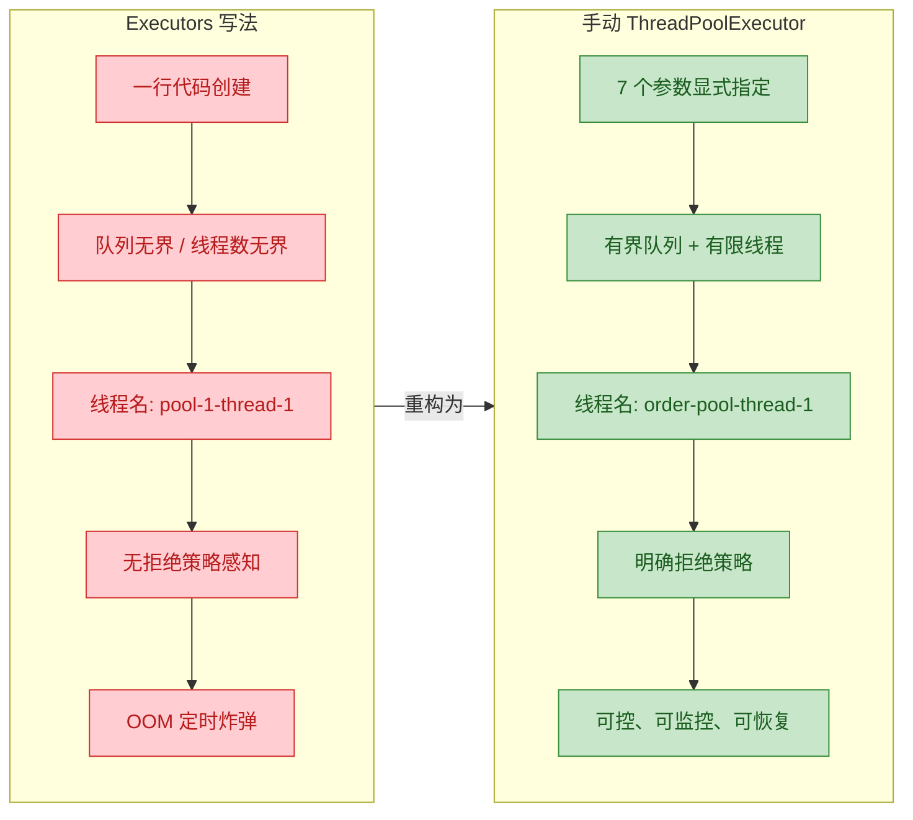

#### 四种拒绝策略的选择指南

当有界队列已满、且线程数已达 `maximumPoolSize` 时，新任务会触发拒绝策略。JDK 提供了四种内置策略：

```java
// ┌──────────────────────────┬─────────────────────────────────────────────────┐
// │         策略名称          │                   行为描述                       │
// ├──────────────────────────┼─────────────────────────────────────────────────┤
// │ AbortPolicy (默认)       │ 直接抛出 RejectedExecutionException             │
// │                          │ 适合：对任务丢失零容忍，需要上层显式处理异常        │
// ├──────────────────────────┼─────────────────────────────────────────────────┤
// │ CallerRunsPolicy ⭐推荐  │ 由提交任务的线程自己执行该任务                     │
// │                          │ 适合：不想丢任务，且希望自动反压（backpressure）    │
// │                          │ 效果：提交方被阻塞，天然降低了任务提交速率          │
// ├──────────────────────────┼─────────────────────────────────────────────────┤
// │ DiscardPolicy            │ 静默丢弃新任务，不抛异常、不做任何事               │
// │                          │ 适合：可以容忍任务丢失的场景（如日志采集）          │
// │                          │ 注意：危险！问题被吞没，排查困难                   │
// ├──────────────────────────┼─────────────────────────────────────────────────┤
// │ DiscardOldestPolicy      │ 丢弃队列中最早的任务，然后重试提交新任务            │
// │                          │ 适合：新数据比旧数据重要的场景（如实时行情推送）     │
// └──────────────────────────┴─────────────────────────────────────────────────┘
```

在大多数业务场景中，**`CallerRunsPolicy` 是最安全的选择**。它的精妙之处在于：当线程池处理不过来时，提交任务的线程（比如 Tomcat 的 NIO 线程）会被"征用"来亲自执行任务，从而自动减慢了请求接收速度，形成了一种天然的反压 (backpressure) 机制。

当然，你也可以实现 `RejectedExecutionHandler` 接口来自定义策略，例如将被拒绝的任务写入消息队列以便后续重试：

```java
// 自定义拒绝策略：将被拒绝的任务发送到消息队列
public class MqFallbackPolicy implements RejectedExecutionHandler {

    @Override
    public void rejectedExecution(Runnable r, ThreadPoolExecutor executor) {
        // 记录告警日志
        log.warn("线程池 [{}] 任务被拒绝，转发至 MQ 降级处理", executor);
        // 将任务序列化后发送到消息队列（如 RocketMQ / Kafka）
        mqProducer.send("rejected-task-topic", serialize(r));
    }
}
```

#### 阿里巴巴规约原文

最后引用《阿里巴巴 Java 开发手册》（嵩山版）中的原文，让这条规范深入脑海：

> **【强制】** 线程池不允许使用 `Executors` 去创建，而是通过 `ThreadPoolExecutor` 的方式，这样的处理方式让写的同学更加明确线程池的运行规则，规避资源耗尽的风险。
>
> 说明：`Executors` 返回的线程池对象的弊端如下：
> 1. `FixedThreadPool` 和 `SingleThreadPool`：允许的请求队列长度为 `Integer.MAX_VALUE`，可能会堆积大量的请求，从而导致 OOM。
> 2. `CachedThreadPool`：允许的创建线程数量为 `Integer.MAX_VALUE`，可能会创建大量的线程，从而导致 OOM。

这条规范的核心思想可以用一句话总结：**所有"无界"都是危险的；所有资源都必须有明确上限 (Every resource must have an explicit bound)**。

---

**📝 练习题**

某团队在生产环境中使用如下代码创建线程池，在一次大促活动中服务发生了 `OutOfMemoryError: Java heap space` 导致宕机。请分析最可能的原因：

```java
private ExecutorService pool = Executors.newFixedThreadPool(20);
```

A. `FixedThreadPool` 的 20 个线程占用了过多的栈空间，导致堆内存不足

B. `FixedThreadPool` 内部使用了无界的 `LinkedBlockingQueue`，大促期间任务提交速度远超处理速度，海量任务对象在队列中堆积，最终耗尽堆内存

C. `FixedThreadPool` 在所有线程忙碌时会无限制地创建新线程，导致线程数爆炸从而 OOM

D. `FixedThreadPool` 的默认拒绝策略是 `DiscardPolicy`，被丢弃的任务触发了重试风暴，最终导致 OOM


**【答案】** B

**【解析】** `Executors.newFixedThreadPool(20)` 创建的线程池有固定的 20 个线程，核心线程数和最大线程数都是 20，因此 **不会无限创建线程**（排除 C）。20 个线程的栈空间总共约 20MB，远不足以导致堆内存溢出（排除 A）。`FixedThreadPool` 的默认拒绝策略是 `AbortPolicy` 而非 `DiscardPolicy`（排除 D）。

真正的问题在于其内部使用了 `new LinkedBlockingQueue<Runnable>()`——这是一个容量为 `Integer.MAX_VALUE`（约 21 亿）的无界队列。在大促期间，请求洪峰远超 20 个线程的处理能力，大量任务被排入队列但无法及时消费。每个任务对象（包括其引用的上下文数据）都占用堆内存。随着队列无限增长，最终 JVM 堆空间被耗尽，抛出 `OutOfMemoryError: Java heap space`。正确做法是手动创建 `ThreadPoolExecutor`，使用**有界队列**并配置合理的拒绝策略。

---

## 线程池参数配置建议 ⭐

在前面的章节中，我们已经深入了解了 `ThreadPoolExecutor` 的七大核心参数，也知道了为什么不推荐使用 `Executors` 工厂方法。那么，当我们手动创建线程池时，一个最核心且极具挑战性的问题便浮出水面：**线程数到底该设置多少？** 这不是一个能用一行公式就完美回答的问题，它取决于任务的性质、系统的硬件资源、期望的吞吐量与延迟目标，以及实际的生产环境反馈。本节将从理论公式出发，结合工程实践，给出一套系统性的配置思路。

### 理解问题的本质：为什么线程数很重要

线程不是免费的资源。每个线程都需要消耗内存（默认每个线程栈约 1MB），需要操作系统进行调度（Context Switch），需要竞争 CPU 时间片。设置过少的线程数，CPU 大量时间处于空闲等待状态，系统吞吐量上不去（under-utilization）；设置过多的线程数，线程之间频繁切换上下文，锁竞争加剧，内存压力飙升，反而导致性能急剧下降甚至 OOM（over-subscription）。

因此，**合理配置线程数的目标是：让 CPU 的利用率尽可能接近 100%，同时避免过度竞争带来的额外开销。** 要实现这个目标，我们首先需要对任务进行分类。

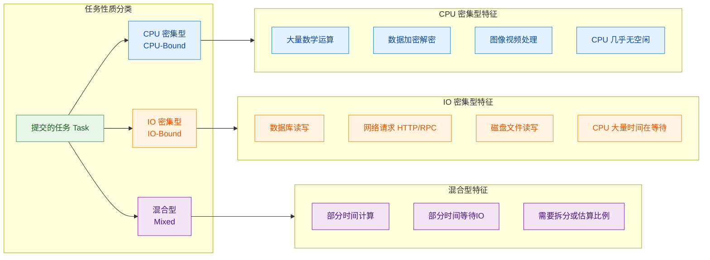

### CPU 密集型（N + 1）

**CPU 密集型任务**（CPU-Bound Task）的特征是：任务的绝大部分时间都花在纯计算上，几乎不涉及 IO 等待。典型场景包括：科学计算、矩阵运算、数据加密/解密、大量正则匹配、视频编解码、复杂的业务规则引擎运算等。

对于这类任务，CPU 始终处于繁忙状态。如果线程数远超 CPU 核心数，多出来的线程不仅分不到有效的 CPU 时间，反而会引入大量的**上下文切换开销**（Context Switch Overhead）。操作系统需要保存和恢复寄存器、程序计数器、栈指针等状态，这些都是纯开销，不产生任何业务价值。

**经典公式：**

```
线程数 = N_cpu + 1
```

其中 `N_cpu` 是 CPU 的**逻辑核心数**（包含超线程）。在 Java 中可以通过以下方式获取：

```java
// 获取当前机器的可用处理器数量（逻辑核心数，含超线程）
int cpuCores = Runtime.getRuntime().availableProcessors();
// 例如：8核16线程的CPU，返回值为16
```

**为什么是 N + 1 而不是 N？**

这个 "+1" 是一种工程上的经验优化。即使是纯 CPU 密集型任务，线程也不可能 100% 的时间都在运行——它偶尔会因为**缺页中断**（Page Fault）、**线程调度抖动**、**GC 停顿**（Stop-The-World）等原因被暂时挂起。在这些极短暂的间隙里，那个多出来的 "+1" 线程恰好可以顶上去，确保 CPU 不会出现短暂空闲。这就像工厂里有 N 台机器、N 个工人满负荷运转，再多安排 1 个替补工人，当某个工人去上厕所时，替补立刻顶上，保证机器不停歇。

```java
// CPU密集型线程池配置示例
public class CpuIntensivePoolExample {
    public static void main(String[] args) {
        // 1. 获取逻辑核心数
        int cpuCores = Runtime.getRuntime().availableProcessors();

        // 2. 核心线程数 = 逻辑核心数 + 1
        int poolSize = cpuCores + 1;

        // 3. 创建线程池：核心与最大线程数相同，使用有界队列
        ThreadPoolExecutor executor = new ThreadPoolExecutor(
            poolSize,                               // 核心线程数：N+1
            poolSize,                               // 最大线程数：与核心相同，无需弹性扩展
            0L,                                     // 空闲时间：核心线程不回收，此值无意义
            TimeUnit.MILLISECONDS,                  // 时间单位
            new ArrayBlockingQueue<>(256),           // 有界阻塞队列，防止OOM
            new ThreadFactory() {                   // 自定义线程工厂，便于排查问题
                private final AtomicInteger counter = new AtomicInteger(1);
                @Override
                public Thread newThread(Runnable r) {
                    // 给线程起一个有业务含义的名字
                    return new Thread(r, "cpu-pool-thread-" + counter.getAndIncrement());
                }
            },
            new ThreadPoolExecutor.CallerRunsPolicy() // 拒绝策略：调用者自己执行，起到限流作用
        );

        // 4. 提交CPU密集型任务（示例：计算斐波那契数列）
        for (int i = 0; i < 100; i++) {
            final int n = i;
            executor.submit(() -> {
                // 纯计算任务，几乎不涉及IO
                long result = fibonacci(40);
                System.out.println("Task-" + n + " result: " + result);
            });
        }

        // 5. 优雅关闭线程池
        executor.shutdown();
    }

    // 纯CPU密集运算：递归计算斐波那契（仅做示例，实际不推荐递归）
    private static long fibonacci(int n) {
        if (n <= 1) return n;              // 递归基
        return fibonacci(n - 1) + fibonacci(n - 2); // 大量CPU运算
    }
}
```

**关键配置要点总结：**

| 参数 | 推荐值 | 理由 |
|------|--------|------|
| `corePoolSize` | N + 1 | 充分利用 CPU，避免过度切换 |
| `maximumPoolSize` | N + 1 | CPU 密集型无需弹性扩展，多了也是浪费 |
| `workQueue` | `ArrayBlockingQueue`（有界） | 防止任务堆积导致 OOM |
| `rejectedHandler` | `CallerRunsPolicy` | 让调用线程自己执行，天然限流 |

### IO 密集型（2N）

**IO 密集型任务**（IO-Bound Task）的特征与 CPU 密集型截然相反：线程的大部分时间都花在**等待外部 IO 操作完成**上，CPU 实际运算时间占比很小。典型场景包括：数据库 CRUD 操作、HTTP/RPC 远程调用、读写磁盘文件、消息队列的生产与消费等。在现代互联网应用中，**绝大多数后端业务处理都属于 IO 密集型**。

想象一个场景：一个线程发起了一个数据库查询，查询耗时 100ms，其中 CPU 只花了 2ms 来组装 SQL 和解析结果，剩下 98ms 都在等网络传输和数据库磁盘 IO。如果只配置 N+1 个线程，那么在 98% 的时间里 CPU 都是空闲的——这显然是巨大的浪费。

**经典公式：**

```
线程数 = 2 × N_cpu
```

这个 "2N" 的直觉很简单：既然线程有大约一半的时间在等 IO（粗略估算），那就让线程数翻倍。当一批线程在等 IO 时，另一批线程正好在 CPU 上运算，两拨交替进行，CPU 利用率就上来了。

```java
// IO密集型线程池配置示例
public class IoIntensivePoolExample {
    public static void main(String[] args) {
        // 1. 获取逻辑核心数
        int cpuCores = Runtime.getRuntime().availableProcessors();

        // 2. IO密集型：线程数 = 2 * 逻辑核心数
        int poolSize = cpuCores * 2;

        // 3. 创建线程池
        ThreadPoolExecutor executor = new ThreadPoolExecutor(
            poolSize,                               // 核心线程数：2N
            poolSize,                               // 最大线程数：与核心相同
            60L,                                    // 空闲存活时间：60秒
            TimeUnit.SECONDS,                       // 时间单位
            new LinkedBlockingQueue<>(1024),         // 有界队列，容量适当放大（IO任务处理快）
            new ThreadFactory() {                   // 自定义线程工厂
                private final AtomicInteger counter = new AtomicInteger(1);
                @Override
                public Thread newThread(Runnable r) {
                    return new Thread(r, "io-pool-thread-" + counter.getAndIncrement());
                }
            },
            new ThreadPoolExecutor.CallerRunsPolicy() // 拒绝策略
        );

        // 4. 提交IO密集型任务（示例：模拟HTTP请求）
        for (int i = 0; i < 500; i++) {
            final int taskId = i;
            executor.submit(() -> {
                try {
                    // 模拟一次远程HTTP调用，耗时200ms（绝大部分是IO等待）
                    System.out.println(Thread.currentThread().getName()
                        + " 开始请求 Task-" + taskId);
                    Thread.sleep(200);  // 模拟IO等待
                    System.out.println(Thread.currentThread().getName()
                        + " 完成请求 Task-" + taskId);
                } catch (InterruptedException e) {
                    Thread.currentThread().interrupt(); // 恢复中断标志
                }
            });
        }

        // 5. 优雅关闭
        executor.shutdown();
    }
}
```

但需要特别强调，"2N" 只是一个**非常粗糙的起点**（rough starting point）。实际的 IO 等待比例差异巨大：

- 内网数据库查询：IO 等待可能只占 50%~70%
- 调用外部第三方 API：IO 等待可能占 90%~99%
- 读取本地 SSD 文件：IO 等待可能只占 20%~40%

因此对于不同的 IO 等待强度，"2N" 可能偏小也可能偏大。这就引出了更精确的混合型公式。

### 混合型（根据 IO 等待比例）

在真实的生产系统中，任务很少是纯粹的 CPU 密集或纯粹的 IO 密集，而是两者混合——一部分时间在做计算，另一部分时间在等 IO。对此，业界广泛引用的是一个来自《Java Concurrency in Practice》（JCIP）的通用公式：

```
N_threads = N_cpu × U_cpu × (1 + W / C)
```

各参数含义如下：

| 符号 | 含义 | 说明 |
|------|------|------|
| `N_threads` | 最优线程数 | 我们要求解的目标值 |
| `N_cpu` | CPU 逻辑核心数 | `Runtime.getRuntime().availableProcessors()` |
| `U_cpu` | 目标 CPU 利用率 | 取值 0~1，通常设为 0.8~0.9（留余量给 GC、OS 等） |
| `W` | 任务等待时间（Wait Time） | 任务中花在等待 IO 的平均时间 |
| `C` | 任务计算时间（Compute Time） | 任务中花在 CPU 运算的平均时间 |
| `W / C` | 等待与计算的时间比率 | 这是公式的关键驱动因子 |

让我们用这个公式验证前面的两个特殊情况：

**场景一：纯 CPU 密集型**
- W ≈ 0（几乎无 IO 等待）
- W / C ≈ 0
- N_threads = N_cpu × 1 × (1 + 0) = **N_cpu** ≈ N + 1 ✅

**场景二：典型 IO 密集型（W = C，即等待和计算各占一半）**
- W / C = 1
- N_threads = N_cpu × 1 × (1 + 1) = **2 × N_cpu** ✅

**场景三：重度 IO 密集型（W = 9C，即 90% 时间在等 IO）**
- W / C = 9
- 假设 N_cpu = 8，U_cpu = 0.8
- N_threads = 8 × 0.8 × (1 + 9) = **64 个线程**

来看一个更直观的对比：

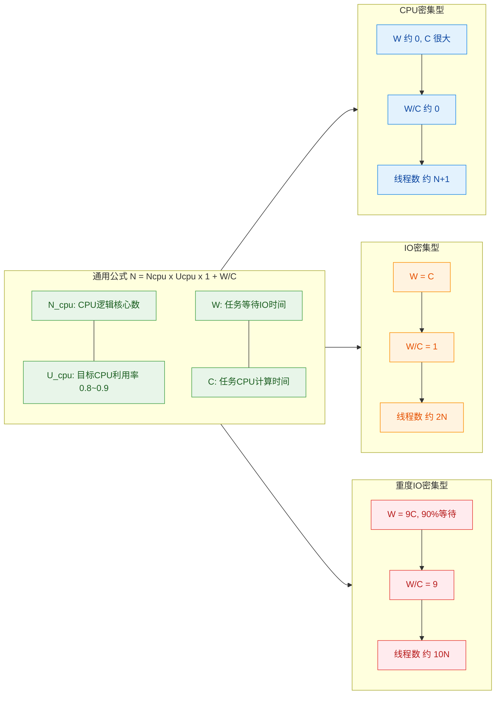

**那么问题来了：W 和 C 怎么获取？**

这是理论与实践之间最大的鸿沟。以下是几种常见方法：

**方法一：代码埋点计时（最直接）**

```java
public class TaskProfiler {
    
    // 模拟一个混合型任务：部分计算 + 部分IO
    public void mixedTask() {
        // ---------- 计算阶段：记录CPU耗时 ----------
        long computeStart = System.nanoTime();       // 记录计算开始时间
        
        // 模拟CPU计算（如JSON解析、数据转换、业务规则校验）
        double result = 0;
        for (int i = 0; i < 1_000_000; i++) {
            result += Math.sin(i) * Math.cos(i);     // 纯CPU运算
        }
        
        long computeEnd = System.nanoTime();          // 记录计算结束时间
        long computeTime = computeEnd - computeStart; // 计算耗时（纳秒）
        
        // ---------- IO阶段：记录IO等待耗时 ----------
        long waitStart = System.nanoTime();           // 记录IO开始时间
        
        // 模拟数据库查询或HTTP请求
        try {
            Thread.sleep(100);  // 假设IO等待100ms
        } catch (InterruptedException e) {
            Thread.currentThread().interrupt();
        }
        
        long waitEnd = System.nanoTime();             // 记录IO结束时间
        long waitTime = waitEnd - waitStart;          // IO等待耗时（纳秒）
        
        // ---------- 计算最优线程数 ----------
        int cpuCores = Runtime.getRuntime().availableProcessors();
        double targetUtilization = 0.8;               // 目标CPU利用率80%
        double ratio = (double) waitTime / computeTime; // W/C比率
        
        // 应用公式：N = Ncpu * Ucpu * (1 + W/C)
        int optimalThreads = (int) Math.ceil(
            cpuCores * targetUtilization * (1 + ratio)
        );
        
        // 打印分析结果
        System.out.println("CPU核心数: " + cpuCores);
        System.out.println("计算耗时(ms): " + computeTime / 1_000_000);
        System.out.println("IO等待耗时(ms): " + waitTime / 1_000_000);
        System.out.println("W/C比率: " + String.format("%.2f", ratio));
        System.out.println("建议线程数: " + optimalThreads);
    }
}
```

**方法二：使用 APM 工具（生产级推荐）**

在生产环境中，通过 APM（Application Performance Monitoring）工具如 SkyWalking、Pinpoint、Arthas 等，可以自动采集每个方法的执行时间。从链路追踪数据中，可以清晰地看到一个请求中各阶段的耗时分布，从而计算出 W/C 比率。

**方法三：压测 + 动态调整（最务实）**

在很多时候，与其纠结理论计算，不如直接在压测环境中用不同的线程数配置进行实测，观察吞吐量（Throughput）、响应时间（Latency）和 CPU 利用率（CPU Utilization）三者的变化关系，找到最优的那个"甜蜜点"（sweet spot）。

### 超越公式：工程实践中的关键考量

理论公式给出了起点，但在真实的生产系统中，还需要考虑更多维度的因素。

**1. 不要只看 CPU，还要看内存**

每个线程默认分配约 1MB 的栈空间（-Xss 参数控制）。如果计算出建议线程数为 500，仅线程栈就需要约 500MB 内存，再加上每个任务的堆内存消耗，总内存压力可能非常大。因此需要设置合理的上限。

```java
// 线程数上限检查
int calculatedThreads = 500;                   // 公式计算结果
int maxAllowedByMemory = 200;                  // 基于内存预算的上限
int finalThreads = Math.min(calculatedThreads, maxAllowedByMemory); // 取较小值
```

**2. 下游服务的承受能力**

假设你的线程池配置了 200 个线程去调用某个微服务，但那个微服务只能承受 50 QPS 的并发。你的 200 个线程会直接把下游打挂。线程池的大小不能只看自身，还必须考虑整条调用链路的瓶颈。

**3. 同一个 JVM 中多个线程池的叠加**

一个 Java 应用中往往不止一个线程池：HTTP 请求处理池、异步任务池、消息消费池、定时任务池……所有线程池的线程总数叠加后，不能超过系统的承受能力。需要有一个全局视角来规划。

**4. 动态线程池：运行时可调整**

`ThreadPoolExecutor` 提供了 `setCorePoolSize()` 和 `setMaximumPoolSize()` 方法，支持在运行时动态调整线程数。一些公司基于此实现了**动态线程池组件**（如美团开源的 DynamicTp），配合配置中心（Nacos、Apollo），实现线程池参数的在线热更新。

```java
// 动态调整线程池大小（无需重启应用）
ThreadPoolExecutor executor = new ThreadPoolExecutor(
    8, 16, 60L, TimeUnit.SECONDS,
    new ResizableCapacityLinkedBlockingQueue<>(512) // 支持动态修改容量的队列
);

// 运行时根据监控指标动态调整
public void adjustPool(int newCoreSize, int newMaxSize) {
    // 注意：如果newCoreSize > 当前maximumPoolSize，需要先调大maximumPoolSize
    if (newCoreSize > executor.getMaximumPoolSize()) {
        executor.setMaximumPoolSize(newMaxSize);     // 先扩大上限
        executor.setCorePoolSize(newCoreSize);        // 再扩大核心
    } else {
        executor.setCorePoolSize(newCoreSize);        // 先缩小核心
        executor.setMaximumPoolSize(newMaxSize);      // 再缩小上限
    }
    System.out.println("线程池已调整: core=" + newCoreSize + ", max=" + newMaxSize);
}
```

**5. 终极建议：一份配置参考表**

下面这张表汇总了不同任务类型在一台 **8核（逻辑核心）** 机器上的推荐配置范围：

| 任务类型 | 线程数参考 | 队列类型 | 队列容量 | 拒绝策略 |
|---------|-----------|---------|---------|---------|
| CPU 密集型 | 9（8+1） | `ArrayBlockingQueue` | 128~256 | `CallerRunsPolicy` |
| 轻度 IO 密集 | 16（2×8） | `LinkedBlockingQueue` | 512~1024 | `CallerRunsPolicy` |
| 重度 IO 密集 | 32~64 | `LinkedBlockingQueue` | 1024~2048 | `AbortPolicy` + 告警 |
| 定时/周期任务 | 4~8 | `DelayedWorkQueue` | — | 日志记录 |

> ⚠️ **最重要的一句话**：所有公式都只是起点（starting point），最终的配置必须通过**真实场景压测**（Load Testing）来验证和微调。脱离实际负载谈线程数，都是纸上谈兵。

---

**📝 练习题**

某 Java 应用部署在 4 核 CPU 的服务器上，其核心业务任务平均每次执行耗时 200ms，其中 CPU 计算约占 40ms，剩余 160ms 为数据库 IO 等待。若目标 CPU 利用率为 80%，根据通用公式 `N = N_cpu × U_cpu × (1 + W/C)`，最优线程数约为多少？

A. 4

B. 8

C. 16

D. 32


**【答案】** C

**【解析】** 根据题目数据代入公式：
- `N_cpu = 4`（4 核 CPU）
- `U_cpu = 0.8`（目标利用率 80%）
- `W = 160ms`（IO 等待时间）
- `C = 40ms`（CPU 计算时间）
- `W / C = 160 / 40 = 4`

计算：`N = 4 × 0.8 × (1 + 4) = 4 × 0.8 × 5 = 16`。

结果为 16 个线程。直觉上也很好理解：每个线程只有 20% 的时间在用 CPU（40ms / 200ms），那么大约需要 5 个线程才能"喂饱"一个 CPU 核心，4 个核心就需要 20 个线程才能打满。但由于目标利用率只设为 80%，所以乘以 0.8 后为 16。选项 C 正确。选项 B 的 8 对应的是简单的 2N 公式，没有考虑实际 W/C 比率为 4 这一事实，偏小了。

---

## 本章小结

本章围绕 Java 并发编程中**最高频的工程实践主题之一** —— 线程池的使用与陷阱，进行了系统性的深度拆解。下面我们从**知识脉络、核心结论、工程红线**三个维度做一次完整的回顾与升华。

---

### 知识脉络回顾

本章的知识体系可以用一张图完整串联：从 `Executors` 工厂方法出发，逐一剖析四种预置线程池的内部构造，再上升到"为什么不推荐使用"的工程哲学，最终落地到"如何正确配置参数"的实战方法论。

```mermaid
graph LR
    subgraph S1["🏭 Executors 工厂方法"]
        direction TB
        A["newFixedThreadPool"]
        B["newCachedThreadPool"]
        C["newSingleThreadExecutor"]
        D["newScheduledThreadPool"]
    end

    subgraph S2["🔍 内部构造剖析"]
        direction TB
        E["核心线程数 corePoolSize"]
        F["最大线程数 maximumPoolSize"]
        G["工作队列 workQueue"]
        H["拒绝策略 RejectedExecutionHandler"]
    end

    subgraph S3["⚠️ 陷阱与风险"]
        direction TB
        I["队列无界 → 任务堆积 → OOM"]
        J["线程数无界 → 线程爆炸 → OOM"]
        K["异常被静默吞没"]
    end

    subgraph S4["✅ 最佳实践"]
        direction TB
        L["手动创建 ThreadPoolExecutor"]
        M["有界队列 + 明确拒绝策略"]
        N["CPU密集 N+1 / IO密集 2N"]
        O["监控 + 动态调参"]
    end

    S1 --> S2
    S2 --> S3
    S3 --> S4

    classDef factoryStyle fill:#C8E6C9,stroke:#388E3C,color:#1B5E20
    classDef analyzeStyle fill:#BBDEFB,stroke:#1976D2,color:#0D47A1
    classDef dangerStyle fill:#FFCCBC,stroke:#E64A19,color:#BF360C
    classDef bestStyle fill:#D1C4E9,stroke:#7B1FA2,color:#4A148C

    class A,B,C,D factoryStyle
    class E,F,G,H analyzeStyle
    class I,J,K dangerStyle
    class L,M,N,O bestStyle
```

这张图揭示了一条清晰的学习路径：**先会用 → 再看透 → 知风险 → 能落地**。

---

### 四大预置线程池：一表纵览

在本章中，我们逐一拆解了 `Executors` 提供的四种工厂方法。它们的本质都是对 `ThreadPoolExecutor` 七大参数的不同组合，下面用一张对照表做最终提炼：

```java
// ┌────────────────────┬──────────┬──────────────────┬─────────────────────┬──────────────────┐
// │     线程池类型       │ 核心线程 │    最大线程        │     工作队列          │    致命风险       │
// ├────────────────────┼──────────┼──────────────────┼─────────────────────┼──────────────────┤
// │ FixedThreadPool    │    N     │       N          │ LinkedBlockingQueue │ 队列无界 → OOM   │
// │                    │          │                  │ (Integer.MAX_VALUE) │ 任务堆积在队列中  │
// ├────────────────────┼──────────┼──────────────────┼─────────────────────┼──────────────────┤
// │ CachedThreadPool   │    0     │ Integer.MAX_VALUE│ SynchronousQueue    │ 线程无界 → OOM   │
// │                    │          │                  │ (容量为0)            │ 线程数量爆炸      │
// ├────────────────────┼──────────┼──────────────────┼─────────────────────┼──────────────────┤
// │ SingleThread       │    1     │       1          │ LinkedBlockingQueue │ 队列无界 → OOM   │
// │ Executor           │          │                  │ (Integer.MAX_VALUE) │ 同 Fixed 类型     │
// ├────────────────────┼──────────┼──────────────────┼─────────────────────┼──────────────────┤
// │ ScheduledThread    │    N     │ Integer.MAX_VALUE│ DelayedWorkQueue    │ 线程可能膨胀      │
// │ PoolExecutor       │          │                  │ (无界优先队列)        │ 任务异常被吞没    │
// └────────────────────┴──────────┴──────────────────┴─────────────────────┴──────────────────┘
```

**核心洞察**：四种预置池，**无一例外**地在某个维度上存在"无界"隐患。这正是阿里巴巴 Java 开发手册将其列为**强制禁止**项的根本原因。

---

### 核心结论提炼

经过本章的系统学习，我们应当牢记以下**六条核心结论**：

**结论一：所有预置线程池都是 `ThreadPoolExecutor` 的语法糖。**

`Executors` 工厂方法没有任何魔法，它们只是帮你填好了 `ThreadPoolExecutor` 构造函数的七个参数。理解了 `ThreadPoolExecutor`，就理解了一切线程池。语法糖虽甜，但隐藏了关键的配置细节（尤其是队列容量和线程上限），这在生产环境中是不可接受的。

**结论二：`FixedThreadPool` 和 `SingleThreadExecutor` 的风险在队列，不在线程。**

很多初学者误以为"固定线程数"就意味着安全。事实上，当所有线程都在忙碌时，新任务会无限堆积在 `LinkedBlockingQueue` 中。每个任务对象都会占用堆内存，当任务提交速率持续大于处理速率时，队列会无限增长，最终触发 `java.lang.OutOfMemoryError: Java heap space`。

**结论三：`CachedThreadPool` 的风险在线程，不在队列。**

`SynchronousQueue` 容量为零，不会堆积任务。但每个无法立即被已有线程接手的任务，都会创建一个新线程。每个线程默认占用约 1MB 栈内存（由 `-Xss` 控制），当瞬时并发量达到数万时，线程栈内存消耗就可能触发 `java.lang.OutOfMemoryError: unable to create new native thread`。

**结论四：`ScheduledThreadPoolExecutor` 有独特的异常吞没陷阱。**

周期任务（`scheduleAtFixedRate` / `scheduleWithFixedDelay`）如果抛出未捕获异常，任务会**静默停止调度**，不会有任何日志输出，也不会抛到 `UncaughtExceptionHandler`。这在生产环境中极难排查。必须在 `Runnable` 内部用 `try-catch` 包裹全部逻辑。

**结论五：生产环境必须手动创建 `ThreadPoolExecutor`。**

手动创建意味着你必须**显式声明**每一个关键参数：有界队列的容量、明确的最大线程数、有意义的线程命名、以及与业务匹配的拒绝策略。这不是"推荐"，而是生产级代码的**强制要求**。

**结论六：线程数配置没有银弹，但有可靠的起点公式。**

- **CPU 密集型**：`N + 1`（N = CPU 核心数），多出的 1 个线程用于补偿偶发的页缺失或 GC 停顿。
- **IO 密集型**：`2N` 或更精确的 `N × (1 + W/C)`（W = IO 等待时间，C = CPU 计算时间）。
- **混合型**：拆分为 CPU 子池和 IO 子池分别配置，或基于压测数据动态调整。

公式只是起点，**压测才是终点**。

---

### 工程红线清单

以下是本章涉及的**绝对不可违反**的生产规范，建议打印贴在工位上：

```mermaid
graph LR
    subgraph R1["🚫 绝对禁止"]
        direction TB
        X1["直接使用 Executors 创建线程池"]
        X2["使用无界队列且无监控"]
        X3["最大线程数设为 MAX_VALUE"]
        X4["周期任务不捕获异常"]
        X5["线程无命名直接上线"]
    end

    subgraph R2["✅ 必须执行"]
        direction TB
        Y1["手动 new ThreadPoolExecutor"]
        Y2["队列容量根据业务评估设定"]
        Y3["拒绝策略匹配业务语义"]
        Y4["Runnable 内 try-catch 全覆盖"]
        Y5["线程名含业务标识如 order-pool"]
    end

    subgraph R3["📊 强烈建议"]
        direction TB
        Z1["接入监控: 活跃线程/队列深度"]
        Z2["支持运行时动态调参"]
        Z3["上线前进行压力测试"]
        Z4["为不同业务隔离独立线程池"]
    end

    R1 -->|"替换为"| R2
    R2 -->|"辅以"| R3

    classDef forbidStyle fill:#FFCDD2,stroke:#C62828,color:#B71C1C
    classDef mustStyle fill:#C8E6C9,stroke:#2E7D32,color:#1B5E20
    classDef suggestStyle fill:#FFF9C4,stroke:#F9A825,color:#F57F17

    class X1,X2,X3,X4,X5 forbidStyle
    class Y1,Y2,Y3,Y4,Y5 mustStyle
    class Z1,Z2,Z3,Z4 suggestStyle
```

---

### 从本章到下一步

线程池是 Java 并发编程的**基础设施层**。掌握了本章内容后，你已经具备了以下能力：

1. **读懂**任何基于 `ThreadPoolExecutor` 的线程池配置，能立即判断其潜在风险。
2. **设计**一个生产可用的线程池方案，包括参数计算、命名规范、拒绝策略选型。
3. **排查**线程池相关的 OOM、任务丢失、周期任务静默停止等典型故障。
4. **回答**面试中 90% 以上关于线程池的问题，从"Executors 有什么问题"到"如何配置线程数"。

但线程池只是并发工具链的一环。在实际工程中，你还需要进一步学习：**`CompletableFuture` 的异步编排**（如何优雅地组合多个异步任务）、**`ForkJoinPool` 的分治模型**（`parallelStream` 底层原理）、以及**线程池的优雅关闭**（`shutdown` vs `shutdownNow` 的语义差异与最佳实践）。这些内容将在后续章节中逐一展开。

> **一句话总结本章**：线程池的本质是**用有限的资源处理无限的请求**，而工程师的职责是**用显式的配置驯服隐式的默认值**。永远不要让框架替你做关于"上限"的决定。

---

**📝 练习题**

某电商系统的订单服务使用了如下线程池处理异步通知任务，服务器为 4 核 CPU、8GB 堆内存。上线后在促销高峰期出现了 `OutOfMemoryError`。请分析最可能的原因，并给出修复方案。

```java
// 订单异步通知线程池
private static final ExecutorService notifyPool =
    Executors.newFixedThreadPool(4);

public void sendOrderNotification(Order order) {
    notifyPool.submit(() -> {
        // 调用第三方短信API，平均响应时间 2s
        smsService.send(order.getPhone(), order.buildMessage());
        // 调用第三方邮件API，平均响应时间 3s
        emailService.send(order.getEmail(), order.buildEmailContent());
    });
}
```

A. 4 个线程全部阻塞在 IO 操作上，新任务无限堆积到 `LinkedBlockingQueue`（无界），最终堆内存被任务对象撑爆

B. `CachedThreadPool` 创建了过多线程，线程栈内存耗尽

C. `ScheduledThreadPoolExecutor` 的 `DelayedWorkQueue` 无限增长导致 OOM

D. 4 个线程因为死锁互相等待，JVM 自动抛出 OOM


**【答案】** A

**【解析】**

代码使用了 `Executors.newFixedThreadPool(4)`，其内部构造等价于：

```java
// 核心线程 4，最大线程 4，队列为无界的 LinkedBlockingQueue
new ThreadPoolExecutor(4, 4, 0L, TimeUnit.MILLISECONDS,
    new LinkedBlockingQueue<Runnable>());  // 容量 = Integer.MAX_VALUE
```

在促销高峰期，大量订单涌入，每个通知任务需要约 **5 秒**（2s 短信 + 3s 邮件）才能完成。4 个线程的处理能力仅为 **0.8 个任务/秒**（4 / 5 = 0.8 TPS）。如果每秒产生 100 个订单，那么每秒就有 99.2 个任务堆积在队列中。每个 `Order` 对象及其关联的 Lambda 闭包、`Message` 对象等可能占数 KB 内存，持续堆积数分钟后，堆内存耗尽，触发 `OutOfMemoryError`。

**修复方案**应包含以下要点：

```java
// 1. 手动创建线程池，使用有界队列
// 2. IO密集型任务，线程数可设为 2N = 8（4核CPU）
// 3. 队列容量根据业务可承受的延迟和内存预算计算
// 4. 选择合适的拒绝策略（如 CallerRunsPolicy 实现优雅降级）
private static final ExecutorService notifyPool = new ThreadPoolExecutor(
    8,                              // 核心线程数: IO密集型 2N
    16,                             // 最大线程数: 留出弹性空间
    60L, TimeUnit.SECONDS,          // 非核心线程空闲60秒回收
    new LinkedBlockingQueue<>(5000),// 有界队列，容量5000
    new ThreadFactory() {           // 自定义线程命名
        private final AtomicInteger seq = new AtomicInteger(1);
        @Override
        public Thread newThread(Runnable r) {
            return new Thread(r, "order-notify-" + seq.getAndIncrement());
        }
    },
    new ThreadPoolExecutor.CallerRunsPolicy() // 队列满时由提交线程执行，自动限流
);
```

选项 B 描述的是 `CachedThreadPool` 的风险，但题目代码使用的是 `FixedThreadPool`，不符。选项 C 描述的是 `ScheduledThreadPoolExecutor`，题目中没有使用该类型。选项 D 中，死锁不会导致 OOM，死锁导致的是线程永久阻塞（hang），且 JVM 不会因为死锁自动抛出 OOM。

---

