---

# 线程池基础 ⭐⭐

---

## 为什么使用线程池

在并发编程中，最朴素的做法是"来一个任务，创建一个线程"。这种 **Thread-Per-Request** 模型在低并发场景下看似简单，但一旦请求量上升，系统就会迅速陷入瓶颈甚至崩溃。线程池（Thread Pool）正是为了解决这一系列问题而诞生的核心基础设施。

我们先通过一段"反面教材"代码来直观感受问题所在：

```java
// ❌ 反面示例：为每个任务都创建一个新线程
public class NaiveServer {
    public static void main(String[] args) {
        // 模拟一个简单的服务器，持续接收任务
        while (true) {
            // 获取一个新的任务请求（此处用 Runnable 模拟）
            Runnable task = getNextTask();

            // 每次都 new Thread —— 这是性能杀手！
            // 1. 线程创建需要分配栈内存（默认 ~1MB）
            // 2. 需要操作系统内核调用（用户态 → 内核态切换）
            // 3. 任务执行完毕后线程被销毁，下次还要重建
            new Thread(task).start();
        }
    }

    private static Runnable getNextTask() {
        // 模拟获取任务
        return () -> System.out.println(Thread.currentThread().getName() + " running");
    }
}
```

上面的代码存在三大致命缺陷：**资源浪费**、**响应延迟**、**管理失控**。线程池恰好一一对应地解决了这些问题。下面用一张总览图来建立全局认知：

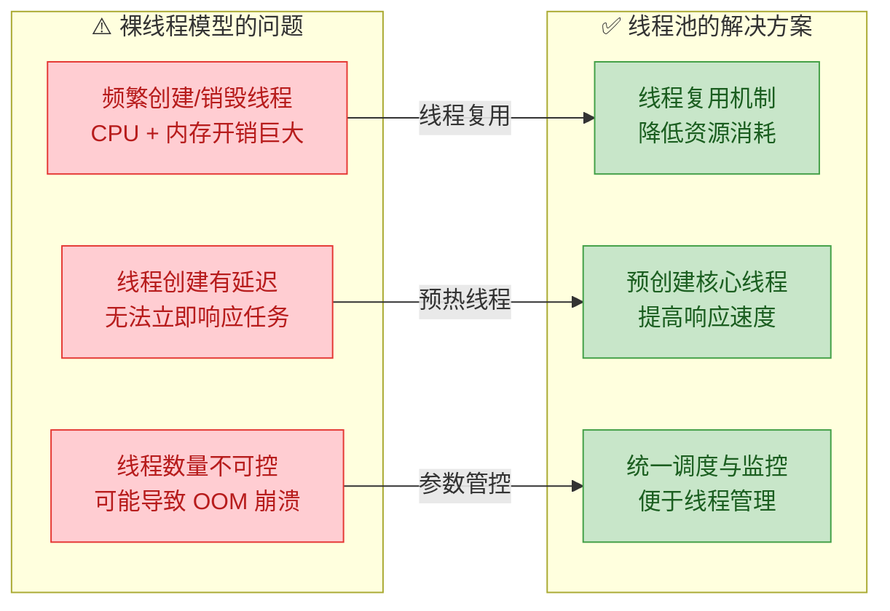

### 降低资源消耗

这是线程池最核心、最根本的设计动机。要理解"降低"了哪些资源消耗，我们必须先搞清楚——**创建一个线程到底有多贵？**

**线程的生命周期成本**可以拆解为三个阶段：

1. **创建成本（Creation Cost）**：JVM 需要为新线程分配一块独立的线程栈（Thread Stack），在 64 位 HotSpot JVM 中默认大小为 **1MB**（可通过 `-Xss` 参数调整）。除了 Java 层面的内存分配，底层还需要执行操作系统内核调用（如 Linux 的 `pthread_create`），涉及 **用户态到内核态的上下文切换（User Mode → Kernel Mode）**，这是一次相当昂贵的系统调用。

2. **调度成本（Scheduling Cost）**：线程越多，操作系统的线程调度器（Thread Scheduler）需要管理的就越多。线程之间的 **上下文切换（Context Switch）** 需要保存和恢复寄存器、程序计数器（PC）、栈指针等信息。实测表明，一次上下文切换的耗时在 **1~10 微秒** 之间，而当线程数远超 CPU 核心数时，大量 CPU 时间会浪费在"切换"而非"计算"上。

3. **销毁成本（Destruction Cost）**：线程执行完毕后，JVM 和操作系统需要回收其占用的栈内存、清理内核数据结构，这同样是一笔不可忽视的开销。

我们用一个 ASCII 模型来描述裸线程模型 vs 线程池模型的内存差异：

```text
┌─────────────────── 裸线程模型 (10000 个请求) ───────────────────┐
│                                                                  │
│  Task-1 → [创建 Thread-1 (1MB)] → 执行 → [销毁 Thread-1]        │
│  Task-2 → [创建 Thread-2 (1MB)] → 执行 → [销毁 Thread-2]        │
│  Task-3 → [创建 Thread-3 (1MB)] → 执行 → [销毁 Thread-3]        │
│  ...                                                             │
│  Task-10000 → [创建 Thread-10000 (1MB)] → 执行 → [销毁]         │
│                                                                  │
│  峰值线程数: 10000      峰值内存占用: ~10 GB (仅线程栈)          │
│  创建/销毁操作: 20000 次内核调用                                  │
└──────────────────────────────────────────────────────────────────┘

┌─────────────────── 线程池模型 (10000 个请求) ───────────────────┐
│                                                                  │
│  Pool [Thread-1, Thread-2, ..., Thread-10]  ← 固定 10 个线程     │
│                                                                  │
│  Task-1    → Thread-1 领取 → 执行完毕 → Thread-1 归还池中        │
│  Task-2    → Thread-2 领取 → 执行完毕 → Thread-2 归还池中        │
│  ...                                                             │
│  Task-11   → Thread-1 再次领取 → 执行 → 归还  (线程被复用!)      │
│  ...                                                             │
│  Task-10000 → 某个空闲线程领取 → 执行 → 归还                     │
│                                                                  │
│  峰值线程数: 10           峰值内存占用: ~10 MB (仅线程栈)        │
│  创建/销毁操作: 仅 10 次 (初始化时)                               │
└──────────────────────────────────────────────────────────────────┘
```

差异一目了然。线程池的核心思想就是 **线程复用（Thread Reuse）**：预先创建好一定数量的工作线程（Worker Thread），让它们在一个循环中不断地从任务队列中取出任务并执行，执行完毕后不销毁，而是回到池中等待下一个任务。这就像餐厅里的服务员——不需要每来一桌客人就新雇一个人，服务完一桌后继续服务下一桌。

下面用代码直观对比两种方式的性能差异：

```java
import java.util.concurrent.ExecutorService;
import java.util.concurrent.Executors;
import java.util.concurrent.TimeUnit;

public class ThreadCostComparison {

    // 总任务数量
    private static final int TASK_COUNT = 10_000;

    public static void main(String[] args) throws InterruptedException {
        // ========== 方式一：裸线程，每个任务一个新线程 ==========
        long startRaw = System.nanoTime(); // 记录开始时间（纳秒精度）

        Thread[] threads = new Thread[TASK_COUNT]; // 存放所有线程引用
        for (int i = 0; i < TASK_COUNT; i++) {
            // 为每个任务创建一个全新的线程
            threads[i] = new Thread(() -> {
                // 模拟一个极轻量级的任务（几乎不耗时）
                int sum = 0;
                for (int j = 0; j < 100; j++) {
                    sum += j; // 简单累加
                }
            });
            threads[i].start(); // 启动线程（触发内核调用）
        }
        // 等待所有线程执行完毕
        for (Thread t : threads) {
            t.join(); // 阻塞主线程直到 t 执行完成
        }

        long durationRaw = System.nanoTime() - startRaw; // 计算耗时
        System.out.println("裸线程模型耗时: " + TimeUnit.NANOSECONDS.toMillis(durationRaw) + " ms");

        // ========== 方式二：线程池，复用固定数量的线程 ==========
        // 创建一个拥有 10 个核心线程的固定线程池
        ExecutorService pool = Executors.newFixedThreadPool(10);

        long startPool = System.nanoTime(); // 记录开始时间

        for (int i = 0; i < TASK_COUNT; i++) {
            // 将任务提交给线程池，由池内线程调度执行
            pool.submit(() -> {
                int sum = 0;
                for (int j = 0; j < 100; j++) {
                    sum += j; // 同样的轻量任务
                }
            });
        }

        pool.shutdown(); // 不再接受新任务，等待已提交的任务完成
        pool.awaitTermination(1, TimeUnit.MINUTES); // 最多等待 1 分钟

        long durationPool = System.nanoTime() - startPool; // 计算耗时
        System.out.println("线程池模型耗时: " + TimeUnit.NANOSECONDS.toMillis(durationPool) + " ms");

        // 典型输出（视机器配置不同而异）:
        // 裸线程模型耗时: 1200 ms
        // 线程池模型耗时: 45 ms
        // 线程池快了约 25~30 倍！
    }
}
```

上面的数据能非常直观地说明问题：当任务本身很轻量时，**线程的创建和销毁成本甚至远大于任务执行本身的成本**。线程池通过消除这些反复的创建/销毁操作，将资源集中用于"真正的计算"。

此外，线程数量的减少也直接降低了 **GC 压力**。每个 `Thread` 对象本身会占用堆内存（虽然线程栈不在堆上，但 `Thread` 的实例字段、`ThreadLocal` 映射等在堆上），大量短命线程会在 Young Generation 中产生巨大的分配压力，加速 Minor GC 频率。

### 提高响应速度

线程池的第二个关键优势是 **任务可以"零延迟"被执行**——前提是池中有空闲线程。

在裸线程模型中，一个任务从提交到开始执行，必须经历以下阶段：

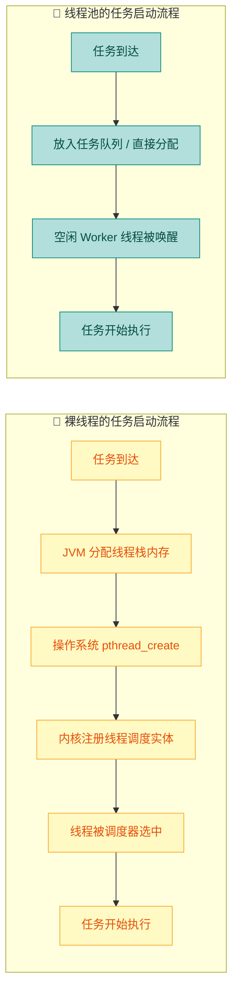

对比非常明显：裸线程需要 **6 步**（其中 3 步涉及系统调用和内核操作），而线程池只需要 **4 步**，且全部在用户态完成（Worker 线程早已创建好，只是从 `WAITING` 状态被唤醒为 `RUNNABLE`）。

**核心线程预创建（Core Thread Pre-start）** 是线程池提升响应速度的关键机制。`ThreadPoolExecutor` 提供了 `prestartAllCoreThreads()` 方法，可以在任何任务提交之前就把所有核心线程创建好并进入 `WAITING` 状态，等待任务到来。这就好比消防站里的消防员——他们不是接到火警电话后才招聘的，而是时刻待命，警铃一响立刻出动。

```java
import java.util.concurrent.LinkedBlockingQueue;
import java.util.concurrent.ThreadPoolExecutor;
import java.util.concurrent.TimeUnit;

public class PreStartDemo {
    public static void main(String[] args) {
        // 创建一个核心线程数为 4、最大线程数为 8 的线程池
        ThreadPoolExecutor executor = new ThreadPoolExecutor(
                4,                              // corePoolSize: 核心线程数
                8,                              // maximumPoolSize: 最大线程数
                60L,                            // keepAliveTime: 非核心线程空闲存活时间
                TimeUnit.SECONDS,               // 时间单位：秒
                new LinkedBlockingQueue<>(100)   // 工作队列：容量 100
        );

        // 此时还没有提交任何任务
        System.out.println("提交任务前的线程数: " + executor.getPoolSize());
        // 输出: 0  —— 默认是懒加载，没有任务就不创建线程

        // 预启动所有核心线程（提前"热身"）
        int preStarted = executor.prestartAllCoreThreads();
        System.out.println("预启动了 " + preStarted + " 个核心线程");
        // 输出: 预启动了 4 个核心线程

        System.out.println("预启动后的线程数: " + executor.getPoolSize());
        // 输出: 4  —— 4 个核心线程已就绪，等待任务

        // 现在提交一个任务，会被立即执行，无需等待线程创建
        long before = System.nanoTime();
        executor.execute(() -> {
            long latency = System.nanoTime() - before; // 计算从提交到执行的延迟
            System.out.println("任务启动延迟: " + latency + " ns (~"
                    + TimeUnit.NANOSECONDS.toMicros(latency) + " μs)");
            // 典型输出: 任务启动延迟: ~5000 ns (~5 μs)
            // 对比裸线程: 通常在 50000~200000 ns (~50~200 μs)
        });

        // 关闭线程池
        executor.shutdown();
    }
}
```

从微观性能的角度看，线程池中的 Worker 线程通过 `BlockingQueue.take()` 或 `poll()` 阻塞等待任务。当任务被提交到队列时，底层通过 `LockSupport.unpark()` 或 `Condition.signal()` 唤醒一个等待中的 Worker，这个唤醒操作的延迟通常只有 **几微秒（μs）**，远低于创建新线程所需的 **几十到几百微秒**。

在高并发服务端场景（如 Web 服务器处理 HTTP 请求），这种差异会被放大到影响 **P99 延迟（99th percentile latency）** 的程度。想象一个每秒处理 10000 个请求的系统：如果每个请求都需要额外等待 100μs 来创建线程，那就是每秒白白浪费 1 秒的 CPU 时间在"搬砖"而不是"盖楼"。

### 便于管理

这是线程池在工程实践中最容易被低估、但实际上最重要的优势之一。在生产环境中，**不可控的线程** 就像不受约束的"野线程"，是系统稳定性的定时炸弹。

**问题一：线程数量不可控导致资源耗尽**

在裸线程模型中，如果突然涌入大量请求（比如秒杀、热搜事件），系统会疯狂创建线程。每个线程占 1MB 栈空间，10000 个线程就是 10GB——直接 `OutOfMemoryError: unable to create new native thread`，整个 JVM 进程崩溃。

线程池通过 **参数化配置** 将线程数量控制在安全范围内：

```java
import java.util.concurrent.ArrayBlockingQueue;
import java.util.concurrent.ThreadPoolExecutor;
import java.util.concurrent.TimeUnit;
import java.util.concurrent.RejectedExecutionHandler;

public class ManagedPoolDemo {
    public static void main(String[] args) {
        // 通过 7 个参数精确控制线程池行为
        ThreadPoolExecutor executor = new ThreadPoolExecutor(
                4,                  // corePoolSize: 核心线程数（常驻线程）
                8,                  // maximumPoolSize: 最大线程数（绝对上限）
                30L,                // keepAliveTime: 非核心线程的空闲存活时间
                TimeUnit.SECONDS,   // 时间单位
                new ArrayBlockingQueue<>(200),  // 有界队列：最多缓冲 200 个任务
                new CustomThreadFactory(),      // 自定义线程工厂（见下方）
                new CustomRejectionPolicy()     // 自定义拒绝策略（见下方）
        );

        // 允许核心线程也可以超时回收（弹性伸缩）
        executor.allowCoreThreadTimeOut(true);

        // ========== 运行时监控 ==========
        // 线程池暴露了丰富的运行时指标，便于接入监控系统
        System.out.println("当前线程数:     " + executor.getPoolSize());
        System.out.println("活跃线程数:     " + executor.getActiveCount());
        System.out.println("已完成任务数:   " + executor.getCompletedTaskCount());
        System.out.println("队列中等待任务: " + executor.getQueue().size());
        System.out.println("历史最大线程数: " + executor.getLargestPoolSize());

        executor.shutdown(); // 优雅关闭
    }
}
```

**问题二：线程命名与异常追踪困难**

裸线程的默认名称是 `Thread-0`、`Thread-1`……当线上出现问题需要通过 `jstack` 分析线程快照时，面对几百个 `Thread-xxx` 根本无法辨别哪个线程属于哪个业务模块。自定义 `ThreadFactory` 解决了这一痛点：

```java
import java.util.concurrent.ThreadFactory;
import java.util.concurrent.atomic.AtomicInteger;

public class CustomThreadFactory implements ThreadFactory {

    // 线程组名称前缀，用于区分不同业务模块
    private final String namePrefix;

    // 线程编号计数器（原子操作，线程安全）
    private final AtomicInteger threadNumber = new AtomicInteger(1);

    // 是否设置为守护线程
    private final boolean daemon;

    // 构造方法：指定线程名前缀
    public CustomThreadFactory() {
        this("order-pool", false); // 默认前缀和非守护线程
    }

    public CustomThreadFactory(String namePrefix, boolean daemon) {
        this.namePrefix = namePrefix; // 如 "order-pool", "payment-pool"
        this.daemon = daemon;
    }

    @Override
    public Thread newThread(Runnable r) {
        // 生成可读的线程名：如 "order-pool-worker-1", "order-pool-worker-2"
        String name = namePrefix + "-worker-" + threadNumber.getAndIncrement();

        Thread thread = new Thread(r, name); // 指定线程名

        thread.setDaemon(daemon); // 设置守护线程属性

        // 设置未捕获异常处理器 —— 防止线程"静默死亡"
        thread.setUncaughtExceptionHandler((t, e) -> {
            // 在生产环境中，这里应该接入日志框架（如 SLF4J + Logback）
            System.err.println("[ALERT] 线程 " + t.getName() + " 发生未捕获异常:");
            e.printStackTrace();
            // 还可以接入告警系统（钉钉、企业微信、PagerDuty 等）
        });

        return thread; // 返回配置好的线程实例
    }
}
```

有了自定义 `ThreadFactory`，`jstack` 输出的线程快照变得一目了然：

```text
"order-pool-worker-1" #15 prio=5 os_prio=0 tid=0x00007f... nid=0x4e03 waiting on condition
"order-pool-worker-2" #16 prio=5 os_prio=0 tid=0x00007f... nid=0x4e04 runnable
"payment-pool-worker-1" #17 prio=5 os_prio=0 tid=0x00007f... nid=0x4e05 waiting on condition
```

**问题三：任务堆积时的兜底策略**

当线程池的最大线程数已满、工作队列也已满时，新来的任务怎么办？裸线程模型没有任何应对机制。而线程池提供了 **拒绝策略（RejectedExecutionHandler）**，共有四种内置策略，也支持自定义：

```java
import java.util.concurrent.RejectedExecutionHandler;
import java.util.concurrent.ThreadPoolExecutor;

public class CustomRejectionPolicy implements RejectedExecutionHandler {

    @Override
    public void rejectedExecution(Runnable r, ThreadPoolExecutor executor) {
        // 策略：记录日志 + 降级处理，而不是默认的直接抛出异常
        System.err.println("[WARN] 任务被拒绝! 线程池状态 → "
                + "poolSize=" + executor.getPoolSize()           // 当前线程数
                + ", activeCount=" + executor.getActiveCount()   // 活跃线程数
                + ", queueSize=" + executor.getQueue().size()    // 队列中的任务数
                + ", completedTask=" + executor.getCompletedTaskCount()); // 已完成数

        // 生产环境的常见做法：
        // 1. 将任务持久化到数据库或消息队列，稍后重试
        // 2. 返回降级结果（如缓存数据、默认值）
        // 3. 记录指标（Metrics），触发扩容告警

        // 此处演示：如果线程池没有关闭，就让调用者线程自己执行（CallerRunsPolicy 的思路）
        if (!executor.isShutdown()) {
            System.out.println("[FALLBACK] 由调用者线程执行被拒绝的任务");
            r.run(); // 注意：这会阻塞调用者线程，起到天然的"限流"作用
        }
    }
}
```

四种内置拒绝策略的对比如下图所示：

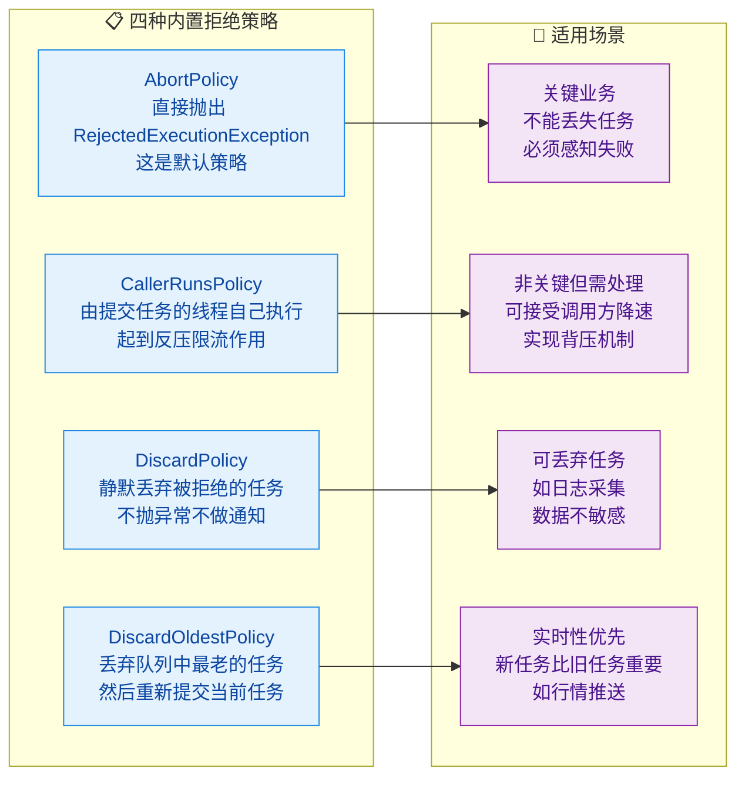

**问题四：优雅关闭与生命周期管理**

线程池提供了完整的生命周期管理 API，这是裸线程完全不具备的能力：

```java
import java.util.List;
import java.util.concurrent.ExecutorService;
import java.util.concurrent.Executors;
import java.util.concurrent.TimeUnit;

public class GracefulShutdownDemo {
    public static void main(String[] args) {
        ExecutorService pool = Executors.newFixedThreadPool(4);

        // 提交一些任务
        for (int i = 0; i < 20; i++) {
            final int taskId = i;
            pool.submit(() -> {
                try {
                    Thread.sleep(500); // 模拟耗时操作
                    System.out.println("Task-" + taskId + " 完成");
                } catch (InterruptedException e) {
                    // 线程被中断时的处理
                    System.out.println("Task-" + taskId + " 被中断");
                    Thread.currentThread().interrupt(); // 恢复中断标志
                }
            });
        }

        // ========== 优雅关闭的标准模板（推荐写法）==========

        pool.shutdown(); // 第一步：停止接受新任务，已提交的任务继续执行
        System.out.println("已调用 shutdown()，不再接受新任务");

        try {
            // 第二步：等待已提交的任务在规定时间内完成
            if (!pool.awaitTermination(10, TimeUnit.SECONDS)) {
                // 如果 10 秒内没有全部完成，强制关闭
                System.out.println("超时！正在强制关闭...");
                List<Runnable> abandoned = pool.shutdownNow(); // 返回未执行的任务列表
                System.out.println("被放弃的任务数: " + abandoned.size());

                // 再等待一小段时间，确保线程响应了中断
                if (!pool.awaitTermination(5, TimeUnit.SECONDS)) {
                    System.err.println("[ERROR] 线程池未能完全关闭!");
                }
            } else {
                System.out.println("所有任务已在超时前完成，优雅关闭成功");
            }
        } catch (InterruptedException e) {
            // 如果当前线程在等待过程中被中断，执行强制关闭
            pool.shutdownNow();
            Thread.currentThread().interrupt(); // 保留中断状态
        }
    }
}
```

综合来看，线程池在管理层面带来的收益可以总结为以下几点：

| 管理维度 | 裸线程 | 线程池 |
|---------|--------|--------|
| **数量控制** | 无上限，可能 OOM | `maximumPoolSize` 精确限制 |
| **命名标识** | `Thread-0` 难以辨别 | 自定义 `ThreadFactory` 语义化命名 |
| **异常处理** | 线程静默死亡 | `UncaughtExceptionHandler` + 日志告警 |
| **过载保护** | 无 | 拒绝策略 + 有界队列 |
| **生命周期** | 手动 `join` 逐个管理 | `shutdown` / `shutdownNow` / `awaitTermination` |
| **运行时监控** | 无法获取状态 | `getPoolSize` / `getActiveCount` / `getQueue` 等 |
| **参数调优** | 不可能 | 运行时动态调整 `corePoolSize` / `maximumPoolSize` |

---

**📝 练习题**

以下关于线程池优势的说法，哪一项是**错误**的？

A. 线程池通过复用已创建的线程来避免频繁创建/销毁线程带来的系统开销，从而降低资源消耗。


B. 线程池可以预创建核心线程，使任务到达时无需等待线程创建即可被执行，从而提高响应速度。


C. 线程池的 `CallerRunsPolicy` 拒绝策略会在队列满时直接抛出 `RejectedExecutionException` 异常来通知调用方。


D. 通过自定义 `ThreadFactory`，线程池可以为工作线程设置有意义的名称和统一的异常处理器，便于运维排查。


**【答案】** C

**【解析】** `CallerRunsPolicy`（调用者运行策略）的行为是：当线程池和队列都满时，**由提交任务的线程（调用者线程）自己来执行被拒绝的任务**，而不是抛出异常。它的隐含效果是对调用方产生"反压（Backpressure）"，因为调用者线程在执行被拒绝任务期间无法继续提交新任务，从而自动降低了任务提交速率。选项 C 描述的是 `AbortPolicy`（中止策略）的行为——它才是直接抛出 `RejectedExecutionException` 的默认拒绝策略。其余三个选项（A 对应降低资源消耗、B 对应提高响应速度、D 对应便于管理）均为正确表述。

---

## Executor 框架

在 Java 早期（JDK 1.0 ~ 1.4），开发者管理线程的方式极其原始——手动 `new Thread()`、手动 `start()`、手动处理线程生命周期。这种方式的弊端显而易见：**线程的创建策略、任务的提交逻辑、执行结果的获取** 全部耦合在业务代码中，既不优雅也不安全。Doug Lea 在 JDK 5 中引入了 `java.util.concurrent`（简称 J.U.C）包，其核心就是 **Executor 框架**。

Executor 框架的设计哲学可以用一句话概括：**将"任务的提交"与"任务的执行"解耦（Decoupling task submission from task execution）**。你只需要告诉框架"我要执行什么任务"，至于这个任务由哪个线程执行、何时执行、如何调度，全部由框架内部的策略决定。这是一种典型的 **生产者-消费者模型（Producer-Consumer Pattern）**：调用方是任务的生产者，线程池中的线程是任务的消费者。

在深入每个组件之前，先从宏观视角理解整个框架的层次结构：

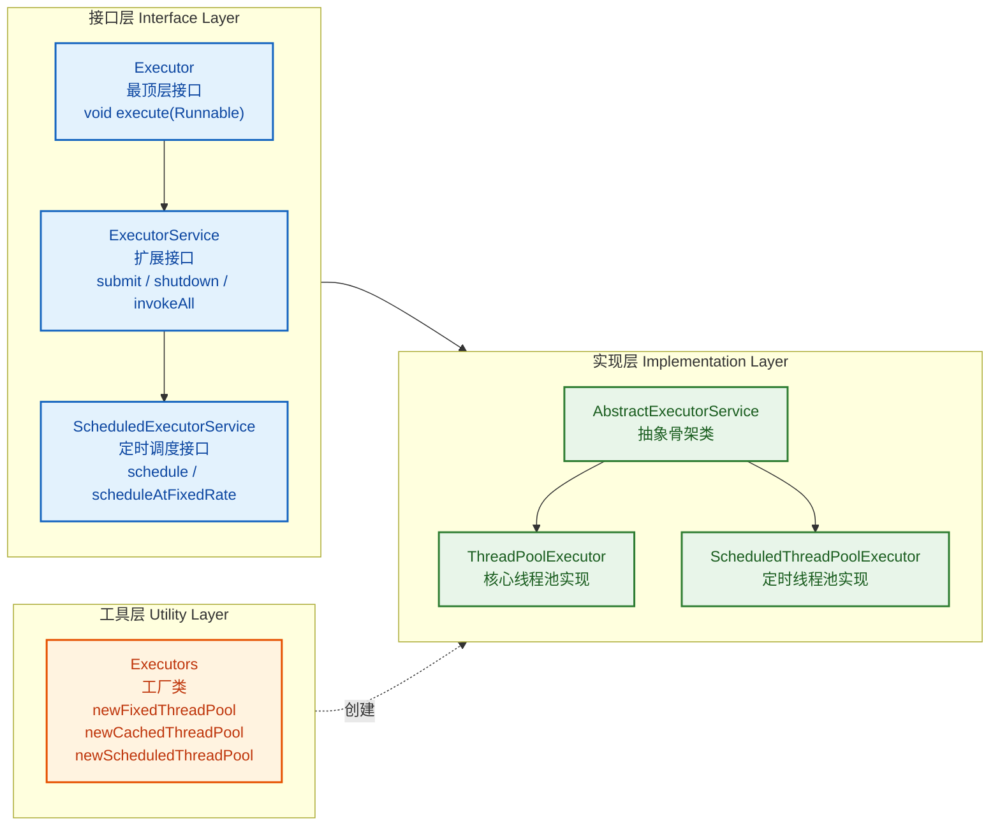

整个框架由三个核心角色组成：**任务（Task）**、**执行器（Executor）** 和 **执行结果（Future）**。任务通过 `Runnable` 或 `Callable` 接口表达，执行器负责调度与运行，`Future` 则作为异步结果的句柄。

---

### Executor 接口

`Executor` 是整个框架中最顶层、也是最简洁的接口。它只定义了一个方法：

```java
// java.util.concurrent.Executor
// 整个线程池框架的根接口，只有一个职责：执行提交的任务
public interface Executor {

    // 在未来的某个时刻执行给定的命令（任务）
    // 该任务可能在新线程中执行、在线程池中执行、甚至在调用者线程中执行
    // 具体行为完全取决于实现类
    void execute(Runnable command);
}
```

这个接口看似简陋，但它的价值在于 **抽象**。在没有 Executor 之前，执行一个任务的代码是这样的：

```java
// 传统方式：任务和线程创建强耦合
// 每次都手动创建新线程，完全没有复用
new Thread(new RunnableTask()).start();
```

有了 Executor 之后，代码变为：

```java
// Executor 方式：只关心"做什么"，不关心"怎么做"
Executor executor = getSomeExecutor(); // 获取一个执行器实例
executor.execute(new RunnableTask());  // 提交任务，执行细节被隐藏
```

关键的认知转变在于：`Executor` 接口并 **没有规定** 任务一定要异步执行。一个完全合法的实现可以是同步的：

```java
// 同步执行器：直接在调用者线程中运行任务
// 这是最简单的 Executor 实现，通常用于测试场景
class DirectExecutor implements Executor {

    @Override
    public void execute(Runnable command) {
        // 不创建新线程，直接在当前线程（调用者线程）中执行
        command.run();  // 注意是 run() 不是 start()
    }
}
```

也可以是为每个任务创建新线程的异步实现：

```java
// 异步执行器：为每个任务创建一个新线程
// 这种实现虽然简单，但存在线程爆炸的风险
class ThreadPerTaskExecutor implements Executor {

    @Override
    public void execute(Runnable command) {
        // 每次提交任务都创建一个全新的线程
        // 在高并发场景下会导致大量线程创建与销毁的开销
        new Thread(command).start();
    }
}
```

`Executor` 接口通过这种极简设计，为上层提供了一个 **策略注入点（Strategy Injection Point）**。无论底层是线程池、ForkJoinPool 还是单线程顺序执行，调用方代码 **零修改**。这正是面向接口编程的威力。

---

### ExecutorService 接口

`Executor` 接口虽然优雅，但功能太薄——你无法关闭执行器、无法提交有返回值的任务、无法批量执行任务。`ExecutorService` 扩展了 `Executor`，补齐了 **生命周期管理** 和 **任务提交增强** 这两大能力。

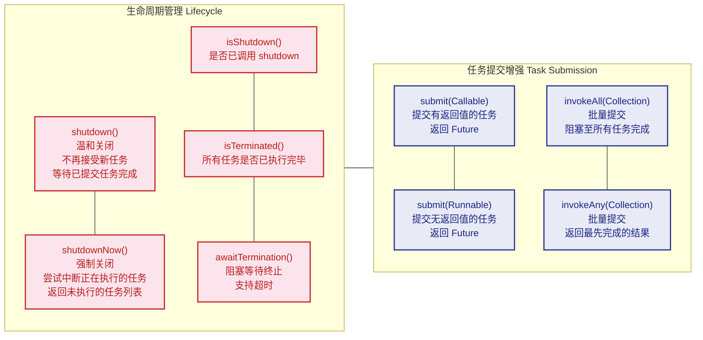

我们来逐个深入分析这些核心方法。

**submit() 与 Future 的协作**

`submit()` 方法是相较于 `execute()` 最大的进化——它返回一个 `Future` 对象，让调用方可以 **追踪任务的执行状态、获取返回值、甚至取消任务**。

```java
// 演示 submit() 的典型用法
// 创建一个固定大小为 3 的线程池
ExecutorService pool = Executors.newFixedThreadPool(3);

// 提交一个 Callable 任务（有返回值）
// Callable<String> 表示任务完成后返回 String 类型的结果
Future<String> future = pool.submit(new Callable<String>() {
    @Override
    public String call() throws Exception {
        // 模拟耗时计算
        Thread.sleep(2000);
        // 返回计算结果
        return "Task Completed";
    }
});

// 此时主线程可以去做其他事情...
System.out.println("主线程继续执行其他逻辑...");

try {
    // future.get() 会阻塞当前线程，直到任务完成并返回结果
    // 如果任务抛出异常，get() 会将其包装为 ExecutionException 抛出
    String result = future.get();
    System.out.println("任务结果: " + result);
} catch (InterruptedException e) {
    // 当前线程在等待过程中被中断
    Thread.currentThread().interrupt();
} catch (ExecutionException e) {
    // 任务执行过程中抛出了异常
    // e.getCause() 可以获取原始异常
    System.err.println("任务执行失败: " + e.getCause());
}
```

`submit()` 与 `execute()` 的区别总结如下：

| 特性 | `execute(Runnable)` | `submit(Callable/Runnable)` |
|---|---|---|
| **定义位置** | `Executor` 接口 | `ExecutorService` 接口 |
| **返回值** | `void` | `Future<T>` |
| **异常处理** | 异常直接抛出到线程的 `UncaughtExceptionHandler` | 异常被封装在 `Future` 中，通过 `get()` 获取 |
| **任务类型** | 仅 `Runnable` | `Callable` 或 `Runnable` |

**生命周期管理：shutdown() vs shutdownNow()**

线程池不会自动关闭。如果你不显式关闭它，JVM 中的非守护线程会阻止进程退出。这是实际开发中极其常见的"程序无法退出"问题的根源之一。

```java
ExecutorService pool = Executors.newFixedThreadPool(5);

// 提交若干任务
for (int i = 0; i < 10; i++) {
    final int taskId = i;
    pool.submit(() -> {
        System.out.println("执行任务 " + taskId
                + " [线程: " + Thread.currentThread().getName() + "]");
        try {
            Thread.sleep(1000); // 模拟任务耗时
        } catch (InterruptedException e) {
            // shutdownNow() 会触发此中断
            System.out.println("任务 " + taskId + " 被中断");
            Thread.currentThread().interrupt(); // 恢复中断状态
        }
    });
}

// ===== 优雅关闭的标准模式（来自 Oracle 官方文档推荐） =====

pool.shutdown(); // 第一步：温和关闭，不再接受新任务

try {
    // 第二步：等待所有已提交的任务执行完毕，最多等 60 秒
    if (!pool.awaitTermination(60, TimeUnit.SECONDS)) {
        // 超时后仍未结束，进行强制关闭
        pool.shutdownNow(); // 第三步：强制关闭，中断正在执行的任务

        // 再次等待一段时间，确认线程池确实终止了
        if (!pool.awaitTermination(60, TimeUnit.SECONDS)) {
            System.err.println("线程池未能正常终止!");
        }
    }
} catch (InterruptedException e) {
    // 如果当前线程在等待过程中被中断，也进行强制关闭
    pool.shutdownNow();
    Thread.currentThread().interrupt(); // 保留中断状态
}
```

上面这段代码展示的"**两阶段终止模式（Two-Phase Termination Pattern）**"是生产环境中关闭线程池的黄金标准。先温和后强制，确保资源不泄露。

**invokeAll() 与 invokeAny()**

这两个方法用于 **批量任务提交** 场景：

```java
ExecutorService pool = Executors.newFixedThreadPool(3);

// 构建一组任务
List<Callable<String>> tasks = Arrays.asList(
    () -> { Thread.sleep(3000); return "结果A (慢)"; },  // 任务A，耗时3秒
    () -> { Thread.sleep(1000); return "结果B (快)"; },  // 任务B，耗时1秒
    () -> { Thread.sleep(2000); return "结果C (中)"; }   // 任务C，耗时2秒
);

// invokeAll：等待 所有任务 都完成后返回
// 返回的 Future 列表顺序与任务列表顺序一致
List<Future<String>> futures = pool.invokeAll(tasks);
for (Future<String> f : futures) {
    // 此时所有 Future 都已经完成，get() 不会阻塞
    System.out.println(f.get());
}
// 输出顺序固定：结果A -> 结果C -> 结果B？不！
// 是按提交顺序：结果A (慢) -> 结果B (快) -> 结果C (中)

// invokeAny：只要有 任意一个任务 完成就返回其结果
// 其余未完成的任务会被自动取消
String fastest = pool.invokeAny(tasks);
System.out.println("最快的结果: " + fastest); // 大概率输出 "结果B (快)"

pool.shutdown();
```

`invokeAny()` 在实际项目中有一个非常经典的应用场景：**多数据源竞速查询（Racing Query）**。比如你同时向三个搜索引擎发送请求，谁先返回就用谁的结果。

---

### ThreadPoolExecutor

`ThreadPoolExecutor` 是整个 Executor 框架的 **核心引擎（Core Engine）**，`Executors` 工厂类创建的各种线程池（`newFixedThreadPool`、`newCachedThreadPool`、`newSingleThreadExecutor`）底层全部委托给它。深入理解 `ThreadPoolExecutor`，就等于掌握了 Java 线程池的全部精髓。

**构造函数：七大核心参数**

```java
// ThreadPoolExecutor 最完整的构造函数
// 这 7 个参数决定了线程池的所有行为特征
public ThreadPoolExecutor(
    int corePoolSize,                          // 核心线程数
    int maximumPoolSize,                       // 最大线程数
    long keepAliveTime,                        // 非核心线程的空闲存活时间
    TimeUnit unit,                             // keepAliveTime 的时间单位
    BlockingQueue<Runnable> workQueue,         // 任务等待队列
    ThreadFactory threadFactory,               // 线程创建工厂
    RejectedExecutionHandler handler           // 拒绝策略
) { ... }
```

下面用一个形象的比喻来理解这些参数。把线程池想象成一家 **餐厅**：

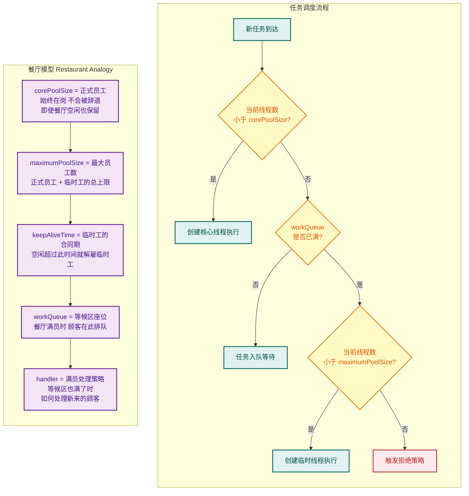

**这个调度流程是面试的重中之重**，核心逻辑可以总结为三步判断：

1. **线程数 < corePoolSize** → 直接创建新核心线程执行任务（即使有空闲核心线程也会创建新的，直到达到 corePoolSize）
2. **线程数 ≥ corePoolSize 且队列未满** → 任务放入 workQueue 排队
3. **队列已满 且 线程数 < maximumPoolSize** → 创建临时线程（非核心线程）处理任务
4. **队列已满 且 线程数 ≥ maximumPoolSize** → 触发拒绝策略（RejectedExecutionHandler）

> ⚠️ 一个常见的误区是：很多人以为任务会优先填满线程到 maximumPoolSize，然后才入队。实际上恰恰相反——**队列优先于临时线程创建**。

**七大参数详解与实践**

```java
// 一个生产级别的 ThreadPoolExecutor 配置示例
ThreadPoolExecutor executor = new ThreadPoolExecutor(
    // 核心线程数：通常设为 CPU 核心数（CPU 密集型）
    // 或 CPU 核心数 * 2（IO 密集型）
    // Runtime.getRuntime().availableProcessors() 获取 CPU 核心数
    4,                                          // corePoolSize

    // 最大线程数：核心线程 + 临时线程的总上限
    // 不宜设得过大，否则上下文切换开销剧增
    8,                                          // maximumPoolSize

    // 临时线程的空闲存活时间
    // 当线程空闲时间超过此值，且当前线程总数 > corePoolSize
    // 该线程会被回收销毁
    60L,                                        // keepAliveTime

    // keepAliveTime 的时间单位
    TimeUnit.SECONDS,                           // unit

    // 工作队列：存放等待执行的任务
    // ArrayBlockingQueue 是有界队列，容量为 100
    // 有界队列可以防止内存溢出（OOM）
    new ArrayBlockingQueue<>(100),              // workQueue

    // 线程工厂：自定义线程的创建方式
    // 最大的用途是给线程设置有意义的名称，方便排查问题
    new ThreadFactory() {
        // 使用 AtomicInteger 保证线程编号的原子性
        private final AtomicInteger counter = new AtomicInteger(1);

        @Override
        public Thread newThread(Runnable r) {
            // 创建新线程
            Thread t = new Thread(r);
            // 设置有意义的线程名称，格式：业务名-pool-thread-序号
            t.setName("order-pool-thread-" + counter.getAndIncrement());
            // 设置为非守护线程（默认也是，这里显式声明以强调意图）
            t.setDaemon(false);
            return t;
        }
    },                                          // threadFactory

    // 拒绝策略：当队列已满且线程数达到 maximumPoolSize 时
    // 如何处理新提交的任务
    new ThreadPoolExecutor.CallerRunsPolicy()   // handler
);
```

**四种内置拒绝策略（RejectedExecutionHandler）**

JDK 内置了四种拒绝策略，每种适用于不同的业务场景：

```java
// 1. AbortPolicy（默认策略）
// 直接抛出 RejectedExecutionException 异常
// 适用场景：任务不允许丢失，调用方需要感知并处理异常
new ThreadPoolExecutor.AbortPolicy();

// 2. CallerRunsPolicy（调用者运行策略）
// 将任务回退给调用者线程执行（谁提交的谁执行）
// 优点：不会丢弃任务，且能自然降低提交速度（背压机制）
// 缺点：可能阻塞调用者线程
// 适用场景：所有任务都必须执行，不允许丢失
new ThreadPoolExecutor.CallerRunsPolicy();

// 3. DiscardPolicy（静默丢弃策略）
// 默默丢弃被拒绝的任务，不抛出任何异常
// 适用场景：允许任务丢失（如日志记录、监控打点等非关键任务）
new ThreadPoolExecutor.DiscardPolicy();

// 4. DiscardOldestPolicy（丢弃最旧策略）
// 丢弃队列中最早入队（等待最久）的任务，然后尝试重新提交当前任务
// 适用场景：优先保证最新任务的执行（如实时消息推送）
new ThreadPoolExecutor.DiscardOldestPolicy();
```

当然，在实际生产中，**通常会自定义拒绝策略**，比如记录日志、持久化到数据库或消息队列：

```java
// 自定义拒绝策略：将被拒绝的任务记录到日志并告警
RejectedExecutionHandler customHandler = new RejectedExecutionHandler() {
    @Override
    public void rejectedExecution(Runnable r, ThreadPoolExecutor executor) {
        // 记录详细的拒绝信息，用于事后排查
        log.error("任务被拒绝! Task: {}, Pool: activeCount={}, queueSize={}, completedTask={}",
                r.toString(),
                executor.getActiveCount(),     // 活跃线程数
                executor.getQueue().size(),     // 队列中等待的任务数
                executor.getCompletedTaskCount() // 已完成的任务数
        );
        // 触发告警（如发送钉钉/飞书通知）
        alertService.sendAlert("线程池任务被拒绝，请检查系统负载!");
        // 根据业务决定：可以将任务写入消息队列延迟处理
        // messageQueue.send(r);
    }
};
```

**常用工作队列（BlockingQueue）的选择**

工作队列的选择直接影响线程池的行为模式：

| 队列类型 | 有界/无界 | 特点 | 对应的工厂方法 |
|---|---|---|---|
| `ArrayBlockingQueue` | **有界** | 基于数组的 FIFO 队列，必须指定容量 | 自定义时常用 |
| `LinkedBlockingQueue` | **可选有界** | 基于链表，默认容量 `Integer.MAX_VALUE`（近似无界） | `newFixedThreadPool` |
| `SynchronousQueue` | **零容量** | 不存储任何元素，每个插入操作必须等待一个移除操作 | `newCachedThreadPool` |
| `PriorityBlockingQueue` | **无界** | 支持优先级排序，任务按优先级出队 | 需要自定义 |
| `DelayQueue` | **无界** | 元素只有到期后才能被取出 | `ScheduledThreadPoolExecutor` 内部使用 |

> ⚠️ **特别警告**：`LinkedBlockingQueue` 不指定容量时默认为 `Integer.MAX_VALUE`，相当于无界队列。这意味着任务会无限堆积在队列中，永远不会触发创建临时线程，也永远不会触发拒绝策略——**直到内存溢出（OOM）**。这是 `Executors.newFixedThreadPool()` 被《阿里巴巴 Java 开发手册》禁止使用的根本原因。

**Executors 工厂方法 vs 手动创建**

```java
// ❌ 不推荐：使用 Executors 工厂方法创建线程池

// newFixedThreadPool 底层使用无界的 LinkedBlockingQueue
// 任务堆积 → OOM
ExecutorService fixed = Executors.newFixedThreadPool(10);

// newCachedThreadPool 的 maximumPoolSize 为 Integer.MAX_VALUE
// 瞬间大量请求 → 创建海量线程 → OOM 或 CPU 100%
ExecutorService cached = Executors.newCachedThreadPool();

// newSingleThreadExecutor 同样使用无界队列
// 任务堆积 → OOM
ExecutorService single = Executors.newSingleThreadExecutor();
```

```java
// ✅ 推荐：手动创建 ThreadPoolExecutor，所有参数显式可控
ThreadPoolExecutor executor = new ThreadPoolExecutor(
    Runtime.getRuntime().availableProcessors(),  // 核心线程数 = CPU 核心数
    Runtime.getRuntime().availableProcessors() * 2, // 最大线程数 = CPU 核心数 * 2
    60L, TimeUnit.SECONDS,                       // 临时线程 60 秒空闲后回收
    new ArrayBlockingQueue<>(500),               // 有界队列，容量 500
    new ThreadPoolExecutor.CallerRunsPolicy()    // 拒绝策略：回退给调用者
);
```

**线程池状态机**

`ThreadPoolExecutor` 内部维护了一个精妙的状态机，用一个 `AtomicInteger` 的高 3 位存储线程池状态，低 29 位存储线程数量：

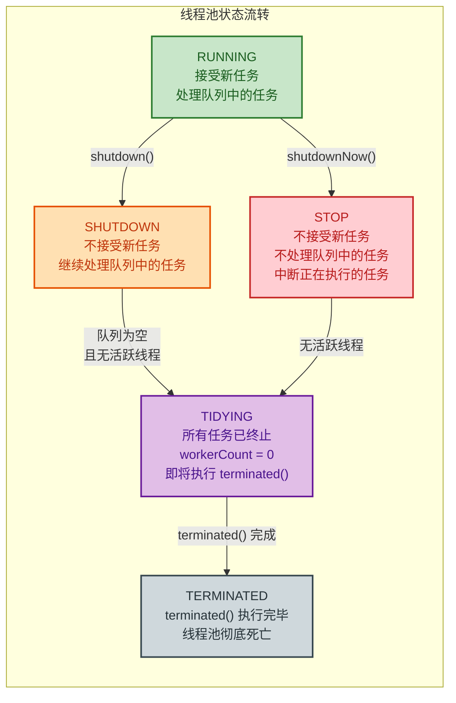

```java
// ThreadPoolExecutor 源码中状态的定义（简化版）
// 使用一个 int（32位）同时存储状态和线程数
// 高 3 位：线程池状态  |  低 29 位：线程数量
private final AtomicInteger ctl = new AtomicInteger(ctlOf(RUNNING, 0));

// 29 位用于存储线程数量
private static final int COUNT_BITS = Integer.SIZE - 3;           // 29

// 线程数量的掩码：2^29 - 1 = 0001 1111 ... 1111（29个1）
private static final int COUNT_MASK = (1 << COUNT_BITS) - 1;

// 5 种状态的定义（高 3 位不同）
private static final int RUNNING    = -1 << COUNT_BITS; // 111 ...  接受新任务
private static final int SHUTDOWN   =  0 << COUNT_BITS; // 000 ...  不接受新任务
private static final int STOP       =  1 << COUNT_BITS; // 001 ...  强制停止
private static final int TIDYING    =  2 << COUNT_BITS; // 010 ...  整理中
private static final int TERMINATED =  3 << COUNT_BITS; // 011 ...  已终止

// 从 ctl 中提取线程池状态（取高 3 位）
private static int runStateOf(int c)     { return c & ~COUNT_MASK; }
// 从 ctl 中提取线程数量（取低 29 位）
private static int workerCountOf(int c)  { return c & COUNT_MASK; }
```

这种 **位运算压缩技巧** 既节省了内存（只用一个 `AtomicInteger` 而非两个变量），又保证了状态和线程数的 **原子性更新**，避免了多变量之间的不一致性。这是 Doug Lea 在高并发编程中的经典设计。

**核心线程池参数调优经验公式**

针对不同类型的任务，参数设置策略截然不同：

```java
// CPU 密集型任务（如计算、加密、压缩）
// 线程数不宜过多，上下文切换本身就是开销
// 推荐公式：corePoolSize = CPU 核心数 + 1
int cpuCores = Runtime.getRuntime().availableProcessors(); // 获取 CPU 核心数
int cpuIntensivePoolSize = cpuCores + 1; // +1 是为了在某线程因缺页中断等偶发阻塞时仍能利用 CPU

// IO 密集型任务（如数据库查询、HTTP 请求、文件读写）
// 线程大部分时间在等待 IO，应该配置更多线程以提高 CPU 利用率
// 推荐公式：corePoolSize = CPU 核心数 * 2  或  CPU 核心数 / (1 - 阻塞系数)
// 阻塞系数通常在 0.8 ~ 0.9 之间
int ioIntensivePoolSize = cpuCores * 2;
// 更精确的公式（阻塞系数假设为 0.85）：
int precisePoolSize = (int) (cpuCores / (1 - 0.85)); // 约等于 CPU * 6.67
```

> 📌 **注意**：以上公式仅为起始参考值。真正的生产调优应该基于 **压测数据**——监控线程池的 `activeCount`、`queueSize`、`completedTaskCount`，结合业务 SLA（响应时间、吞吐量）做动态调整。

---

### ScheduledThreadPoolExecutor

`ScheduledThreadPoolExecutor` 继承自 `ThreadPoolExecutor`，同时实现了 `ScheduledExecutorService` 接口，专门用于处理 **延迟执行（Delayed Execution）** 和 **周期性执行（Periodic Execution）** 的任务。它是 `java.util.Timer` 的完美替代品。

**为什么不用 Timer？**

在 `ScheduledThreadPoolExecutor` 出现之前，`Timer` 是 Java 中唯一的内置定时任务工具。但 `Timer` 存在几个致命缺陷：

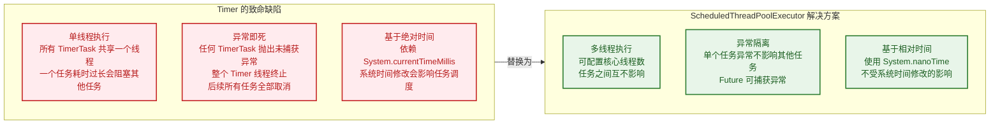

**核心方法详解**

`ScheduledThreadPoolExecutor` 提供了四种调度方式：

```java
// 创建一个核心线程数为 3 的定时线程池
ScheduledExecutorService scheduler = new ScheduledThreadPoolExecutor(
    3,  // corePoolSize
    new ThreadFactory() {
        private final AtomicInteger counter = new AtomicInteger(1);
        @Override
        public Thread newThread(Runnable r) {
            Thread t = new Thread(r);
            t.setName("scheduler-" + counter.getAndIncrement());
            return t;
        }
    }
);

// ========== 1. schedule()：延迟执行一次 ==========
// 5 秒后执行，只执行一次
// 常用场景：超时取消订单、延迟重试
ScheduledFuture<?> delayed = scheduler.schedule(
    () -> System.out.println("5秒后执行: " + LocalDateTime.now()),
    5,                  // 延迟时间
    TimeUnit.SECONDS    // 时间单位
);

// 带返回值的延迟执行
ScheduledFuture<String> delayedWithResult = scheduler.schedule(
    () -> "计算结果: " + (42 * 42),   // Callable 任务
    3,                                  // 3 秒后执行
    TimeUnit.SECONDS
);
// String result = delayedWithResult.get(); // 阻塞获取结果

// ========== 2. scheduleAtFixedRate()：固定频率周期执行 ==========
// 以固定的速率重复执行任务
// 如果任务执行时间 < period，则等到 period 到期后执行下一次
// 如果任务执行时间 > period，则任务完成后立即开始下一次（不会并发执行）
scheduler.scheduleAtFixedRate(
    () -> {
        System.out.println("固定频率: " + LocalDateTime.now());
        // 假设这个任务执行需要 2 秒
    },
    0,                  // initialDelay：首次执行延迟 0 秒（立即开始）
    5,                  // period：每 5 秒执行一次
    TimeUnit.SECONDS
);
// 时间线：0s(执行) → 5s(执行) → 10s(执行) → ...

// ========== 3. scheduleWithFixedDelay()：固定延迟周期执行 ==========
// 上一次任务 **执行完成后**，等待固定延迟时间，再开始下一次
scheduler.scheduleWithFixedDelay(
    () -> {
        System.out.println("固定延迟: " + LocalDateTime.now());
        // 假设这个任务执行需要 2 秒
    },
    0,                  // initialDelay：首次执行延迟 0 秒
    5,                  // delay：每次执行完成后等 5 秒再执行下一次
    TimeUnit.SECONDS
);
// 时间线（假设任务耗时2秒）：0s(开始) → 2s(完成) → 7s(开始) → 9s(完成) → 14s(开始) → ...
```

**scheduleAtFixedRate vs scheduleWithFixedDelay 对比图**

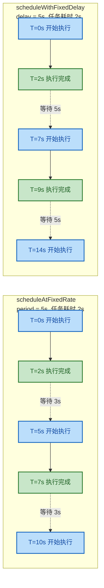

简单总结：
- **`scheduleAtFixedRate`**：关注的是 **开始时间的间隔** → "每隔 N 秒触发一次"
- **`scheduleWithFixedDelay`**：关注的是 **结束到开始的间隔** → "做完后等 N 秒再做"

**内部实现原理：DelayedWorkQueue**

`ScheduledThreadPoolExecutor` 内部使用了一个名为 `DelayedWorkQueue` 的特殊队列，它是一个基于 **最小堆（Min-Heap）** 的优先级队列，按照任务的执行时间排序——最近要执行的任务排在堆顶。

```java
// ScheduledThreadPoolExecutor 的核心内部结构（简化）
// 每个提交的任务都被包装为 ScheduledFutureTask
private class ScheduledFutureTask<V> extends FutureTask<V>
        implements RunnableScheduledFuture<V> {

    // 任务的序列号，用于打破时间相同时的排序（FIFO）
    private final long sequenceNumber;

    // 任务下次执行的绝对时间（纳秒）
    // 使用 System.nanoTime() 而非 System.currentTimeMillis()
    // 避免系统时钟修改导致的调度错乱
    private volatile long time;

    // 周期（正数 = FixedRate，负数 = FixedDelay，0 = 一次性任务）
    private final long period;

    // 周期任务完成后，重新设置 time 并放回队列
    private void setNextRunTime() {
        long p = period;
        if (p > 0) {
            // FixedRate: 下次时间 = 本次计划时间 + period
            time += p;
        } else {
            // FixedDelay: 下次时间 = 当前时间 + |period|
            time = triggerTime(-p);
        }
    }
}
```

**异常处理的注意事项**

`ScheduledThreadPoolExecutor` 有一个非常重要的行为：**如果周期性任务在某次执行中抛出未捕获异常，该任务后续将不再执行，但不会影响其他任务**。这一点与 `Timer`（整个线程死掉）不同，但仍然容易导致"任务静默消失"的 bug：

```java
// ❌ 危险：异常未捕获会导致定时任务停止调度
scheduler.scheduleAtFixedRate(() -> {
    // 假设第 3 次执行抛出异常
    int result = 1 / 0;  // ArithmeticException!
    // 从此以后，这个任务再也不会执行了
    // 而且不会有任何日志或报错（静默失败）
}, 0, 5, TimeUnit.SECONDS);

// ✅ 推荐：在任务内部捕获所有异常
scheduler.scheduleAtFixedRate(() -> {
    try {
        // 业务逻辑
        riskyBusinessLogic();
    } catch (Exception e) {
        // 记录日志，但不要抛出
        // 这样任务在下一个周期仍会继续执行
        log.error("定时任务执行异常", e);
    }
}, 0, 5, TimeUnit.SECONDS);
```

**生产级使用示例：定时心跳检测**

```java
// 创建定时线程池，用于心跳检测
ScheduledExecutorService heartbeatScheduler = new ScheduledThreadPoolExecutor(
    1,  // 心跳任务只需 1 个核心线程
    r -> {
        Thread t = new Thread(r, "heartbeat-thread");
        t.setDaemon(true);  // 守护线程：JVM 退出时自动停止
        return t;
    }
);

// 每 30 秒向注册中心发送一次心跳
ScheduledFuture<?> heartbeatFuture = heartbeatScheduler.scheduleAtFixedRate(
    () -> {
        try {
            // 发送心跳请求
            boolean success = registryClient.sendHeartbeat();
            if (!success) {
                log.warn("心跳发送失败，将在下一周期重试");
            }
        } catch (Exception e) {
            log.error("心跳异常", e);
            // 不要抛出异常！否则后续心跳将停止
        }
    },
    0,                   // 启动后立即发送第一次心跳
    30,                  // 每 30 秒一次
    TimeUnit.SECONDS
);

// 应用关闭时取消心跳
// heartbeatFuture.cancel(false); // false = 不中断正在执行的任务
// heartbeatScheduler.shutdown();
```

---

**📝 练习题**

**题目一**：以下代码创建的线程池，当持续提交大量耗时任务时，最终会发生什么？

```java
ExecutorService pool = new ThreadPoolExecutor(
    2, 4, 60L, TimeUnit.SECONDS,
    new ArrayBlockingQueue<>(2),
    new ThreadPoolExecutor.AbortPolicy()
);
```

假设同时提交 8 个长时间运行的任务（每个任务耗时 1 小时），请问：

A. 2 个任务立即执行，2 个任务入队，4 个任务被拒绝（抛出 RejectedExecutionException）


B. 4 个任务立即执行，2 个任务入队，2 个任务被拒绝（抛出 RejectedExecutionException）


C. 4 个任务立即执行，4 个任务入队等待


D. 8 个任务全部入队等待

**【答案】** B

**【解析】** 根据 `ThreadPoolExecutor` 的任务调度流程：第 1~2 个任务到达时，当前线程数（0→2）小于 `corePoolSize`（2），创建核心线程执行；第 3~4 个任务到达时，线程数已达 `corePoolSize`，任务进入 `ArrayBlockingQueue`（容量 2），队列接受了这 2 个任务；第 5~6 个任务到达时，队列已满（2/2），但线程数（2）小于 `maximumPoolSize`（4），因此创建临时线程执行；第 7~8 个任务到达时，队列已满且线程数已达 `maximumPoolSize`（4），触发 `AbortPolicy` 拒绝策略，抛出 `RejectedExecutionException`。最终：4 个线程在执行 + 2 个在队列中等待 + 2 个被拒绝 = 8 个任务全部得到处理。

---

**题目二**：关于 `scheduleAtFixedRate` 和 `scheduleWithFixedDelay`，以下说法正确的是？

A. `scheduleAtFixedRate` 如果某次任务执行时间超过了 period，会并发执行多个实例


B. `scheduleWithFixedDelay` 的间隔时间是从上一次任务 **开始执行** 时算起


C. 两者在周期任务执行过程中抛出未捕获异常后，都会导致该任务后续不再调度


D. `scheduleAtFixedRate` 内部使用 `System.currentTimeMillis()` 计算下次执行时间

**【答案】** C

**【解析】** 选项 A 错误：`scheduleAtFixedRate` **不会** 并发执行同一任务的多个实例。如果任务耗时超过 period，下一次执行会在当前执行完成后立即开始，但不会重叠。选项 B 错误：`scheduleWithFixedDelay` 的间隔是从上一次任务 **执行完成** 后开始计算，这正是它与 `scheduleAtFixedRate` 的核心区别。选项 C 正确：无论是哪种调度方式，如果任务抛出未捕获的异常（`RuntimeException` 等），`ScheduledThreadPoolExecutor` 会将该任务标记为异常终止，后续周期将不再调度该任务，但其他任务不受影响。选项 D 错误：`ScheduledThreadPoolExecutor` 内部使用 `System.nanoTime()`（基于 monotonic clock 单调时钟）而非 `System.currentTimeMillis()`，这使其不受系统时间手动调整的影响。

---

## 本章小结

本章围绕 **线程池基础** 这一核心主题，从「为什么需要线程池」的动机出发，逐步深入到 `Executor` 框架的完整体系。下面我们用一张全景图将所有知识点串联起来，再逐一回顾关键要点。

---

### 全景知识图谱

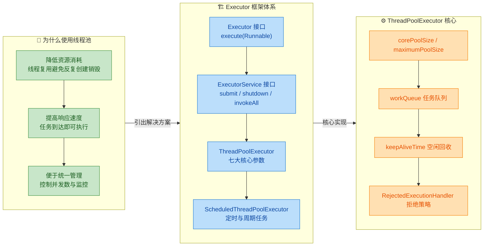

---

### 关键要点回顾

#### 一、为什么使用线程池 — 三大动机

在没有线程池的时代，每来一个任务就 `new Thread().start()`，这种做法在低并发下尚可接受，但在高并发场景下会迅速暴露三个致命问题：

| 问题维度 | 裸线程方案的痛点 | 线程池的解决方式 |
|:--------:|:----------------|:----------------|
| **资源消耗** | 每个线程占用约 512KB\~1MB 栈内存，创建和销毁涉及操作系统内核态切换 (kernel context switch)，成本极高 | 通过 **线程复用 (Thread Reuse)** 让核心线程常驻，避免反复创建销毁的开销 |
| **响应速度** | 任务到达后需先完成线程创建（包括 OS 调度、内存分配），才能开始执行业务逻辑 | 核心线程始终处于等待状态 (polling from queue)，任务提交后 **几乎零延迟** 即可被执行 |
| **可管理性** | 线程数量不受控，可能瞬间创建数万线程导致 OOM 或系统假死 | 通过 `corePoolSize`、`maximumPoolSize`、`workQueue` 三道防线 **精确控制并发上限** |

记住这个核心公式：**线程池 = 线程复用 + 任务队列 + 拒绝策略**。三者协同工作，才能既高效又安全地管理并发任务。

---

#### 二、Executor 框架 — 四层递进的设计

整个 `java.util.concurrent` 的线程池体系是一个经典的 **面向接口编程 (Program to an interface)** 范例，采用逐层抽象、逐层增强的设计思路：

**第一层：`Executor` 接口** — 最小化抽象，仅定义 `void execute(Runnable command)`。它的意义在于 **将任务提交与任务执行解耦** (decoupling task submission from task execution)。调用者只管提交任务，完全不关心这个任务是在新线程中执行、在线程池中执行，还是在调用者线程中同步执行。

**第二层：`ExecutorService` 接口** — 在 `Executor` 基础上增加了生命周期管理 (`shutdown` / `shutdownNow` / `awaitTermination`) 和结果获取能力 (`submit` 返回 `Future<T>`、`invokeAll` 批量执行、`invokeAny` 竞速执行)。这一层使得线程池从一个简单的任务执行器升级为一个 **完整的服务组件**，可以优雅启停。

**第三层：`ThreadPoolExecutor`** — 框架的核心实现类，通过 **七大构造参数** 提供了极高的灵活性：

```java
// ThreadPoolExecutor 的完整构造函数签名
public ThreadPoolExecutor(
    int corePoolSize,           // 核心线程数：始终存活（除非设置 allowCoreThreadTimeOut）
    int maximumPoolSize,        // 最大线程数：核心 + 救急线程的总上限
    long keepAliveTime,         // 救急线程的空闲存活时间
    TimeUnit unit,              // keepAliveTime 的时间单位
    BlockingQueue<Runnable> workQueue,  // 任务等待队列
    ThreadFactory threadFactory,        // 线程工厂：自定义线程名、优先级、守护标志等
    RejectedExecutionHandler handler    // 拒绝策略：队列满且线程满时如何处理新任务
)
```

任务提交后的执行流程是本章的重中之重，务必牢记这条决策链路：

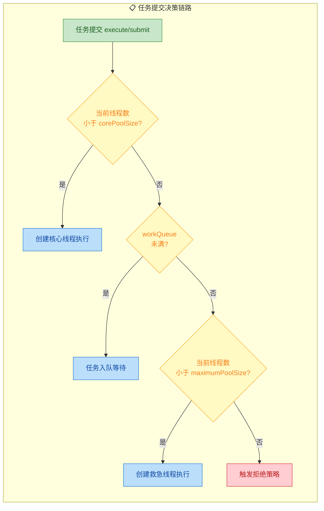

四种内置拒绝策略的对比也需要烂熟于心：

| 拒绝策略 | 行为 | 适用场景 |
|:--------:|:-----|:--------|
| `AbortPolicy` (默认) | 直接抛出 `RejectedExecutionException` | 对任务丢失零容忍的场景，如金融交易 |
| `CallerRunsPolicy` | 由提交任务的调用线程自己执行该任务 | 需要反压 (back-pressure) 的场景，自动降速 |
| `DiscardPolicy` | 静默丢弃，无任何通知 | 可丢弃的低优先级日志、统计 |
| `DiscardOldestPolicy` | 丢弃队列头部最旧的任务，再重试提交 | 时效性强，只关心最新数据的场景 |

**第四层：`ScheduledThreadPoolExecutor`** — 继承 `ThreadPoolExecutor` 并实现 `ScheduledExecutorService` 接口，在普通线程池基础上增加了 **定时调度** 能力。三个核心方法：

- `schedule(task, delay, unit)` — 延迟一次性执行
- `scheduleAtFixedRate(task, initialDelay, period, unit)` — 固定频率周期执行（以任务**开始时间**为基准）
- `scheduleWithFixedDelay(task, initialDelay, delay, unit)` — 固定延迟周期执行（以任务**结束时间**为基准）

它内部使用 `DelayedWorkQueue`（基于最小堆的延迟队列）来管理任务的触发时间排序，确保最近到期的任务总是位于队首。

---

#### 三、最佳实践速查

在实际开发中，关于线程池的使用有几条广泛认可的准则，值得在总结时特别强调：

**1. 避免使用 `Executors` 工厂方法创建线程池**

阿里巴巴 Java 开发手册明确规定：线程池不允许使用 `Executors` 去创建，而是通过 `ThreadPoolExecutor` 的方式手动指定参数。原因如下：

```java
// ❌ 危险：newFixedThreadPool 和 newSingleThreadExecutor 使用无界队列
// LinkedBlockingQueue 默认容量 Integer.MAX_VALUE，可能导致 OOM
ExecutorService bad1 = Executors.newFixedThreadPool(10);

// ❌ 危险：newCachedThreadPool 的 maximumPoolSize 为 Integer.MAX_VALUE
// 可能瞬间创建海量线程导致 OOM
ExecutorService bad2 = Executors.newCachedThreadPool();

// ✅ 推荐：手动创建，每个参数都经过深思熟虑
ThreadPoolExecutor good = new ThreadPoolExecutor(
    4,                                    // corePoolSize：CPU 核心数
    8,                                    // maximumPoolSize：核心数的 2 倍
    60L, TimeUnit.SECONDS,               // 救急线程空闲 60 秒后回收
    new ArrayBlockingQueue<>(200),        // 有界队列，容量 200
    new ThreadFactoryBuilder()            // Guava 提供的线程工厂构建器
        .setNameFormat("order-pool-%d")   // 自定义线程名，便于排查问题
        .build(),
    new ThreadPoolExecutor.CallerRunsPolicy()  // 队列满时调用者自己执行，实现反压
);
```

**2. 合理设置核心线程数**

经典的参考公式（来自《Java Concurrency in Practice》）：

- **CPU 密集型任务**：`corePoolSize = CPU 核心数 + 1`（+1 是为了在某线程因缺页中断等暂停时仍能充分利用 CPU）
- **IO 密集型任务**：`corePoolSize = CPU 核心数 × 2`（或使用公式 `N × U × (1 + W/C)`，其中 N=CPU 数，U=目标利用率，W=等待时间，C=计算时间）

但公式只是起点，**真正靠谱的方式是在生产环境中进行压测和监控**，根据实际的 CPU 利用率、队列堆积量、任务完成时间来动态调整。

**3. 给线程池命名**

生产环境中如果出现线程死锁、CPU 飙高等问题，通过 `jstack` 导出线程堆栈时，自定义的线程名（如 `order-pool-3`、`payment-pool-7`）能让你瞬间定位问题所属业务模块，而默认的 `pool-1-thread-1` 则几乎没有辨识度。

**4. 优雅关闭线程池**

```java
// 优雅关闭的标准模板（来自 ExecutorService 官方 JavaDoc）
executor.shutdown();                         // 1. 停止接收新任务，已提交任务继续执行
try {
    if (!executor.awaitTermination(60, TimeUnit.SECONDS)) {  // 2. 等待 60 秒
        executor.shutdownNow();              // 3. 超时则强制中断所有线程
        if (!executor.awaitTermination(60, TimeUnit.SECONDS)) {
            System.err.println("线程池未能完全关闭");  // 4. 仍未结束则记录日志
        }
    }
} catch (InterruptedException e) {
    executor.shutdownNow();                  // 5. 当前线程被中断，也要强制关闭
    Thread.currentThread().interrupt();      // 6. 保留中断状态
}
```

---

### 核心概念速记表

| 概念 | 一句话总结 |
|:-----|:----------|
| **线程池本质** | 预创建线程 + 任务队列 + 拒绝策略，实现线程复用与并发管控 |
| **Executor** | 最简接口，仅 `execute(Runnable)`，解耦提交与执行 |
| **ExecutorService** | 增加生命周期管理 (`shutdown`) 和 `Future` 返回值 |
| **ThreadPoolExecutor** | 七参数核心实现，任务走 core → queue → max → reject 链路 |
| **ScheduledThreadPoolExecutor** | 基于延迟队列的定时调度线程池，替代 `Timer` |
| **CallerRunsPolicy** | 最温和的拒绝策略，天然实现反压机制 |
| **线程工厂** | 自定义线程名是生产环境排障的基本功 |
| **优雅关闭** | `shutdown()` → `awaitTermination()` → `shutdownNow()` 三步走 |

---

### 📝 练习题

**某团队使用以下代码创建线程池处理用户请求：**

```java
ExecutorService pool = new ThreadPoolExecutor(
    2, 4, 60, TimeUnit.SECONDS,
    new ArrayBlockingQueue<>(2)
);
```

**假设当前线程池中已有 2 个核心线程正在执行任务，队列中已有 2 个任务等待。此时又提交了 1 个新任务，请问线程池会如何处理？**

A. 将新任务放入队列等待，因为队列还可以扩容


B. 创建一个新的非核心（救急）线程来执行这个任务


C. 直接抛出 `RejectedExecutionException` 拒绝该任务


D. 由提交任务的调用者线程自己执行该任务


**【答案】** B

**【解析】** 根据 `ThreadPoolExecutor` 的任务提交决策链路：首先检查当前线程数 (2) 是否小于 `corePoolSize` (2)，不小于；然后检查 `workQueue` 是否未满，当前队列已有 2 个任务而容量为 2，已满；接着检查当前线程数 (2) 是否小于 `maximumPoolSize` (4)，满足条件，因此会 **创建一个新的救急线程** 来执行这个新任务。只有当线程数已达 `maximumPoolSize` 且队列也满时，才会触发拒绝策略。由于未指定 `RejectedExecutionHandler`，默认使用 `AbortPolicy`（抛异常），但本题尚未走到拒绝这一步。选项 A 错误是因为 `ArrayBlockingQueue` 是定容队列，不会自动扩容。选项 D 描述的是 `CallerRunsPolicy` 的行为，但此处未配置该策略。

---

**📝 练习题**

**关于 `scheduleAtFixedRate` 和 `scheduleWithFixedDelay` 的区别，以下说法正确的是：**

A. `scheduleAtFixedRate` 以任务结束时间为基准计算下次执行时间，`scheduleWithFixedDelay` 以任务开始时间为基准


B. 两者完全等价，只是方法名不同


C. `scheduleAtFixedRate` 以任务开始时间为基准计算下次执行时间；若任务耗时超过 period，下次执行会在上次结束后立即开始，而不会并发执行


D. `scheduleAtFixedRate` 会严格按照 period 并发启动多个任务实例，即使上一次任务尚未完成


**【答案】** C

**【解析】** `scheduleAtFixedRate(task, initialDelay, period, unit)` 以每次任务的 **开始时间** 为锚点，理想情况下每隔 `period` 时间就触发一次。但关键细节是：如果某次任务执行耗时超过了 `period`，它 **不会并发执行同一任务的多个实例**，而是在上次执行结束后立即启动下一次（相当于"赶进度"）。而 `scheduleWithFixedDelay` 以每次任务 **结束时间** 为锚点，确保两次执行之间始终有固定的 `delay` 间隔。选项 A 把两者的描述恰好弄反了；选项 B 显然错误，两者行为不同；选项 D 的"并发启动多个实例"是对 `scheduleAtFixedRate` 最常见的误解——单个 `ScheduledThreadPoolExecutor` 中同一任务不会被并发调度。

---

