---

# wait/notify机制 ⭐⭐

---

## wait/notify/notifyAll

Java 多线程协作的核心问题之一，就是**线程间如何通信**（Inter-thread Communication）。一个线程完成了某项工作后，如何通知另一个正在等待的线程继续执行？JDK 从最初的设计中就在 `java.lang.Object` 类上提供了三个 native 方法——`wait()`、`notify()` 和 `notifyAll()`，构成了最底层、最经典的**等待-通知机制**（Wait-Notify Mechanism）。理解这套机制，是掌握 `BlockingQueue`、`Condition`、`CountDownLatch` 等上层并发工具的前提。

### 三个方法的基本签名与语义

```java
// 以下三个方法定义在 java.lang.Object 中
// 因此任何 Java 对象都可以充当"通信媒介"

public class Object {
    // 使当前线程进入 WAITING 状态，直到被 notify/notifyAll 唤醒或被中断
    public final void wait() throws InterruptedException;

    // 带超时的等待，超时后自动唤醒，单位毫秒
    public final void wait(long timeoutMillis) throws InterruptedException;

    // 更精细的超时控制，追加纳秒精度
    public final void wait(long timeoutMillis, int nanos) throws InterruptedException;

    // 随机唤醒一个正在该对象上 wait 的线程
    public final void notify();

    // 唤醒所有正在该对象上 wait 的线程
    public final void notifyAll();
}
```

这里有一个常令初学者困惑的设计选择：**为什么 wait/notify 定义在 Object 上，而不是 Thread 上？** 原因在于，Java 的等待-通知机制是围绕**对象监视器锁**（Object Monitor）设计的。每一个 Java 对象头中都内嵌了一个 Monitor，线程通过 `synchronized` 获取这个 Monitor，再通过同一个对象的 `wait()` 释放 Monitor 并进入等待队列。换句话说，**通信的载体是"锁对象"，而非"线程本身"**，所以方法自然定义在 Object 上。

下面用一张图来展示 Monitor 内部的线程流转全貌：

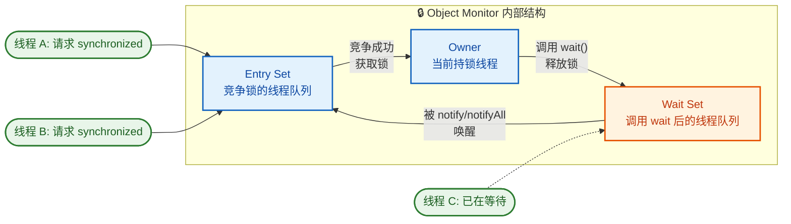

关键流转路径：

1. 线程试图进入 `synchronized` 代码块 → 进入 **Entry Set** 排队。
2. 竞争成功 → 成为 **Owner**（持锁线程）。
3. Owner 调用 `wait()` → 释放锁，进入 **Wait Set**。
4. 其他线程调用 `notify()/notifyAll()` → Wait Set 中的线程被移入 **Entry Set**，重新竞争锁。
5. 重新获取锁后，从 `wait()` 方法返回，继续执行。

---

### 必须在 synchronized 中调用 ⭐

这是 wait/notify 机制中**最关键、最容易出错**的规则：调用任何对象的 `wait()`、`notify()` 或 `notifyAll()` 之前，当前线程**必须已经持有该对象的监视器锁**，也就是说，调用点必须位于以该对象为锁的 `synchronized` 块或 `synchronized` 方法内部。否则，JVM 会立即抛出 `IllegalMonitorStateException`。

#### 反面示例：不在 synchronized 中调用

```java
public class WrongUsageDemo {
    public static void main(String[] args) {
        Object lock = new Object(); // 创建一个普通对象作为锁

        try {
            lock.wait(); // ❌ 当前线程没有持有 lock 的监视器锁
        } catch (IllegalMonitorStateException e) {
            // 运行时必定抛出此异常
            System.out.println("异常: " + e.getClass().getSimpleName());
            // 输出: 异常: IllegalMonitorStateException
        } catch (InterruptedException e) {
            // wait 声明了 InterruptedException，必须捕获
            Thread.currentThread().interrupt();
        }
    }
}
```

#### 正确示例：在 synchronized 中调用

```java
public class CorrectUsageDemo {
    // 专门用作锁的对象（推荐使用 private final，防止外部干扰）
    private static final Object lock = new Object();
    // 共享条件标志
    private static boolean dataReady = false;

    public static void main(String[] args) {
        // ===== 消费者线程：等待数据就绪 =====
        Thread consumer = new Thread(() -> {
            synchronized (lock) {                    // 第1步：获取 lock 的监视器锁
                while (!dataReady) {                 // 第2步：检查条件（循环检查，后文详解）
                    try {
                        System.out.println("[消费者] 数据未就绪，进入等待...");
                        lock.wait();                 // 第3步：释放锁，进入 Wait Set
                        // 被唤醒后会重新获取锁，然后从这里继续执行
                        System.out.println("[消费者] 被唤醒，重新检查条件...");
                    } catch (InterruptedException e) {
                        Thread.currentThread().interrupt(); // 恢复中断标志
                        return;                             // 退出线程
                    }
                }
                // 条件满足后执行业务逻辑
                System.out.println("[消费者] 数据已就绪，开始消费！");
            } // 离开 synchronized 块，自动释放锁
        }, "Consumer");

        // ===== 生产者线程：准备数据并通知 =====
        Thread producer = new Thread(() -> {
            try {
                Thread.sleep(1000);                  // 模拟数据准备耗时
            } catch (InterruptedException e) {
                Thread.currentThread().interrupt();
                return;
            }
            synchronized (lock) {                    // 第1步：获取 lock 的监视器锁
                dataReady = true;                    // 第2步：修改共享条件
                System.out.println("[生产者] 数据已准备好，发出通知");
                lock.notify();                       // 第3步：唤醒 Wait Set 中的一个线程
                // ⚠️ 注意：notify() 执行后，锁并没有立刻释放！
                System.out.println("[生产者] notify已调用，但仍持有锁");
            } // 第4步：离开 synchronized 块，锁才真正释放
            System.out.println("[生产者] 已退出 synchronized 块");
        }, "Producer");

        consumer.start(); // 启动消费者
        producer.start(); // 启动生产者
    }
}
```

运行输出（典型顺序）：

```
[消费者] 数据未就绪，进入等待...
[生产者] 数据已准备好，发出通知
[生产者] notify已调用，但仍持有锁
[生产者] 已退出 synchronized 块
[消费者] 被唤醒，重新检查条件...
[消费者] 数据已就绪，开始消费！
```

#### 为什么 JVM 强制这个规则？

这不是 Java 设计者的"任性"，而是为了解决一个经典的并发缺陷——**Lost Wake-Up Problem**（丢失唤醒问题）。

假设 wait/notify **不需要** synchronized，来看下面这个危险的时序：

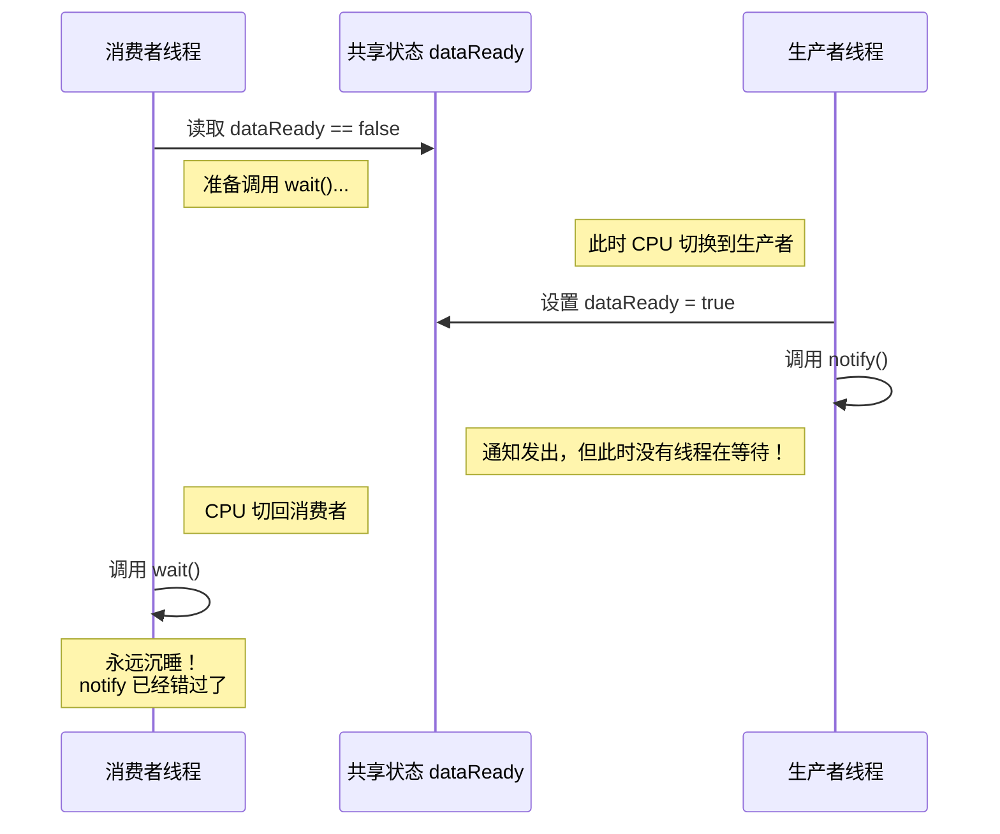

问题出在**检查条件**和**进入等待**这两个操作之间存在间隙。生产者的 `notify()` 恰好插入了这个间隙，导致通知"凭空消失"，消费者永远等不到唤醒——这就是 **Lost Wake-Up**。

`synchronized` 的作用就是把**检查条件 + wait()** 或者**修改条件 + notify()** 包装成一个**原子操作区域**，杜绝上述时序交错：

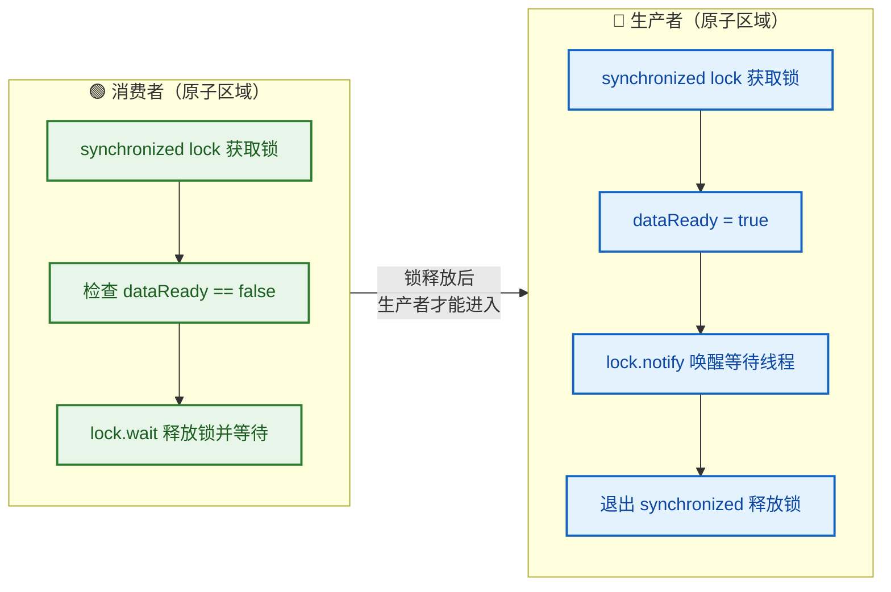

由于两段代码都锁定同一个 `lock` 对象，生产者**不可能**在消费者"检查条件"和"进入 wait"之间插入 `notify()`。这从根本上消灭了 Lost Wake-Up。

---

### wait 释放锁

这是 `wait()` 最核心的语义特征，也是它与 `Thread.sleep()` 最本质的区别。

当一个线程在 `synchronized` 块内调用 `lock.wait()` 时，会**原子性地**完成以下两件事：

1. **释放**当前持有的 `lock` 对象的监视器锁。
2. 将自身放入该对象的 **Wait Set**，线程状态变为 `WAITING`（或 `TIMED_WAITING`，若调用的是带超时的 `wait(long)`）。

"原子性"意味着这两步之间不会有其他线程观察到"锁已释放但线程还没进入等待队列"这种中间状态。

#### 为什么 wait 必须释放锁？

设想如果 `wait()` **不释放锁**：

```
消费者线程:
    synchronized(lock) {       // 获取锁
        while(!dataReady) {
            lock.wait();       // 假设不释放锁，线程挂起但仍持有锁
        }
    }

生产者线程:
    synchronized(lock) {       // ❌ 永远拿不到锁！消费者虽然在 wait，但没释放
        dataReady = true;
        lock.notify();
    }
```

结果就是**死锁**：消费者等着被唤醒，生产者等着获取锁去唤醒消费者。所以 **wait 必须释放锁** 是等待-通知机制能正常运转的基石。

#### 用代码验证"wait 释放锁"

```java
public class WaitReleasesLockDemo {
    private static final Object lock = new Object();

    public static void main(String[] args) throws InterruptedException {
        // ===== 线程 A：先获取锁，然后 wait =====
        Thread threadA = new Thread(() -> {
            synchronized (lock) {                          // A 获取锁
                System.out.println("[A] 持有锁，准备 wait");
                System.out.println("[A] wait 前时间: " + System.currentTimeMillis());
                try {
                    lock.wait();                           // A 释放锁，进入等待
                } catch (InterruptedException e) {
                    Thread.currentThread().interrupt();
                }
                System.out.println("[A] 被唤醒，重新持有锁"); // 从 wait 返回意味着重新拿到了锁
            }
        }, "Thread-A");

        // ===== 线程 B：尝试获取同一把锁 =====
        Thread threadB = new Thread(() -> {
            try {
                Thread.sleep(200);                         // 确保 A 先运行
            } catch (InterruptedException e) {
                Thread.currentThread().interrupt();
            }
            synchronized (lock) {                          // 如果 A 的 wait 没释放锁，B 会卡在这里
                System.out.println("[B] 成功获取锁！证明 A 的 wait() 释放了锁");
                System.out.println("[B] 准备唤醒 A");
                lock.notify();                             // 唤醒 A
                System.out.println("[B] notify 后仍持有锁，继续执行...");
            } // B 离开 synchronized，释放锁，A 才能从 wait 返回
            System.out.println("[B] 已释放锁");
        }, "Thread-B");

        threadA.start();                                   // 启动 A
        threadB.start();                                   // 启动 B
        threadA.join();                                    // 主线程等待 A 结束
        threadB.join();                                    // 主线程等待 B 结束
    }
}
```

输出：

```
[A] 持有锁，准备 wait
[A] wait 前时间: 1718000000000
[B] 成功获取锁！证明 A 的 wait() 释放了锁
[B] 准备唤醒 A
[B] notify 后仍持有锁，继续执行...
[B] 已释放锁
[A] 被唤醒，重新持有锁
```

线程 B 能够成功进入 `synchronized(lock)` 块，直接证明了线程 A 调用 `wait()` 时确实释放了锁。

#### 多重锁的注意事项

如果一个线程同时持有**多把锁**，调用某一个对象的 `wait()` 只会释放**该对象的锁**，其他锁仍然被持有。这是一个极易导致死锁的陷阱：

```java
// ⚠️ 危险代码：演示多重锁下 wait 的行为
private static final Object lockA = new Object();
private static final Object lockB = new Object();

// 线程 1
synchronized (lockA) {              // 获取 lockA
    synchronized (lockB) {          // 获取 lockB
        lockA.wait();               // 只释放 lockA，lockB 仍被持有！
        // 其他需要 lockB 的线程将被阻塞
    }
}
```

**最佳实践**：避免在持有多把锁的情况下调用 `wait()`。如果确实需要，请仔细审视是否会导致嵌套死锁。

---

### notify 不释放锁

这是初学者最容易误解的点之一。很多人直觉地认为"notify 唤醒了别人，那锁应该也一起交出去了吧"——**答案是否定的**。

`notify()` 的语义是：**从 Wait Set 中选择一个线程，将其标记为"可唤醒"，但调用 notify 的线程本身继续持有锁，直到它退出 synchronized 块**。

被唤醒的线程不会立即从 `wait()` 方法返回，而是进入 **Entry Set**，和其他线程一样去竞争锁，只有抢到锁后才能从 `wait()` 返回继续执行。

#### 时序分析

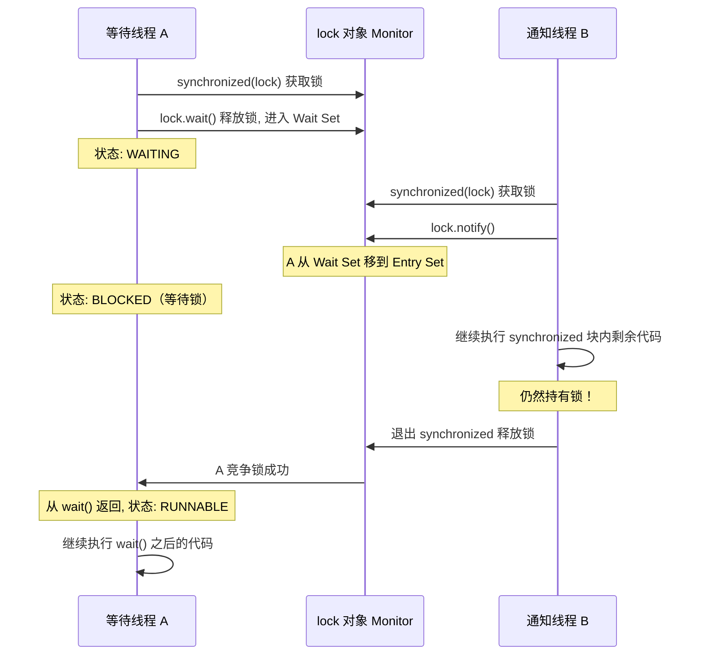

#### 代码验证

```java
public class NotifyDoesNotReleaseLock {
    private static final Object lock = new Object();

    public static void main(String[] args) throws InterruptedException {
        // ===== 等待线程 =====
        Thread waiter = new Thread(() -> {
            synchronized (lock) {
                try {
                    System.out.println("[waiter] 进入等待: " + System.currentTimeMillis());
                    lock.wait();                           // 释放锁，进入 Wait Set
                    // 从 wait 返回 = 重新获得了锁
                    System.out.println("[waiter] 从 wait 返回: " + System.currentTimeMillis());
                } catch (InterruptedException e) {
                    Thread.currentThread().interrupt();
                }
            }
        }, "Waiter");

        waiter.start();
        Thread.sleep(200); // 确保 waiter 先进入 wait

        // ===== 通知线程 =====
        Thread notifier = new Thread(() -> {
            synchronized (lock) {                          // 获取锁
                System.out.println("[notifier] 获取锁，调用 notify: " + System.currentTimeMillis());
                lock.notify();                             // 唤醒 waiter（但不释放锁！）

                // 故意在 notify 之后做耗时操作，证明锁还在自己手里
                System.out.println("[notifier] notify 后开始耗时操作...");
                try {
                    Thread.sleep(2000);                    // 持锁睡眠 2 秒
                } catch (InterruptedException e) {
                    Thread.currentThread().interrupt();
                }
                System.out.println("[notifier] 耗时操作完成，即将释放锁: " + System.currentTimeMillis());
            } // 这里才释放锁！waiter 才能从 wait() 返回
        }, "Notifier");

        notifier.start();
        waiter.join();
        notifier.join();
    }
}
```

典型输出：

```
[waiter] 进入等待: 1718000000200
[notifier] 获取锁，调用 notify: 1718000000400
[notifier] notify 后开始耗时操作...
[notifier] 耗时操作完成，即将释放锁: 1718000002400
[waiter] 从 wait 返回: 1718000002400
```

注意时间戳：`waiter` 从 `wait()` 返回的时间与 `notifier` 退出 `synchronized` 块的时间几乎一致（差约 2 秒），而不是在 `notify()` 调用时立即返回。这**铁证如山**地说明了 `notify()` 不释放锁。

#### 实践意义

理解 "notify 不释放锁" 对编写高效并发代码至关重要。一个常见的优化建议是：**在 synchronized 块的尽可能靠后的位置调用 notify/notifyAll**，减少被唤醒线程的无效等待时间。

```java
// ✅ 推荐：notify 放在最后
synchronized (lock) {
    // ... 所有业务逻辑先执行完 ...
    dataReady = true;
    lock.notify(); // 紧接着就退出 synchronized，被唤醒线程能更快拿到锁
}

// ⚠️ 不推荐：notify 之后还有大量代码
synchronized (lock) {
    dataReady = true;
    lock.notify();        // 唤醒了对方
    doHeavyComputation(); // 但对方要等这段代码跑完才能拿到锁
    doMoreWork();
}
```

#### 完整的 wait/notify 状态流转总结

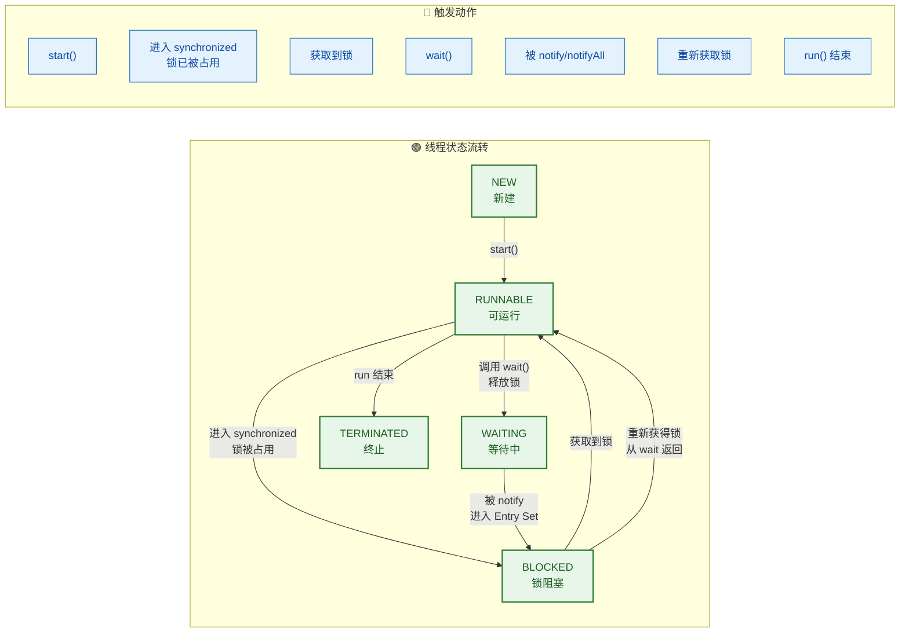

注意 `WAITING → BLOCKED → RUNNABLE` 这条路径：被 `notify()` 唤醒的线程**不是直接进入 RUNNABLE**，而是先进入 BLOCKED（等待重新获取锁），拿到锁后才变为 RUNNABLE 并从 `wait()` 方法返回。这个细节在面试中经常被考察。

---

**📝 练习题**

以下代码运行后，控制台最终的输出结果是什么？

```java
public class Quiz {
    private static final Object mon = new Object();
    public static void main(String[] args) throws Exception {
        Thread t = new Thread(() -> {
            synchronized (mon) {
                try {
                    mon.wait();
                } catch (InterruptedException e) { }
                System.out.print("A");
            }
            System.out.print("B");
        });
        t.start();
        Thread.sleep(500);
        synchronized (mon) {
            mon.notify();
            System.out.print("C");
        }
        t.join();
        System.out.print("D");
    }
}
```

A. ABCD


B. CABD


C. ACBD


D. CBAD


**【答案】** B

**【解析】** 执行流程如下：①子线程 `t` 启动后进入 `synchronized(mon)` 并调用 `mon.wait()`，释放锁并进入等待。②主线程 `sleep(500)` 后进入 `synchronized(mon)` 获取锁，调用 `mon.notify()` 唤醒子线程 `t`，但**此时主线程仍持有锁**，所以先打印 `C`。③主线程退出 `synchronized` 块释放锁后，子线程 `t` 才能从 `wait()` 返回并重新获取锁，打印 `A`，随后退出 `synchronized` 块打印 `B`。④最后主线程 `t.join()` 返回，打印 `D`。最终输出 **CABD**。这道题的核心考点就是 **notify 不释放锁**——`C` 一定在 `A` 之前打印。

---

## 为什么要在循环中调用 wait ⭐

在 Java 并发编程中，有一条极其重要但常被忽视的黄金法则：**永远在 `while` 循环中调用 `wait()`，而不是在 `if` 语句中**。这不是一个"建议"或"最佳实践"，而是写出正确并发代码的**硬性要求**。Java 官方文档 (`Object.wait()` 的 Javadoc) 中明确写道：

> *"As in the one argument version, interrupts and spurious wakeups are possible, and this method should always be used in a loop."*

违反这条规则的代码，在低并发环境下可能"看起来正常"，但一旦负载升高或运行环境发生变化，就会产生极难排查的 Bug。下面我们从根源开始，彻底理解这背后的两大原因。

---

### 虚假唤醒 (Spurious Wakeup)

#### 什么是虚假唤醒

虚假唤醒 (Spurious Wakeup) 是指：一个线程在调用 `wait()` 后进入等待状态，**没有任何其他线程调用 `notify()` 或 `notifyAll()`**，该线程却自行从 `wait()` 中返回了。这听起来匪夷所思，但它是操作系统层面和 JVM 规范共同允许的合法行为。

#### 为什么会发生虚假唤醒

要理解这一点，我们需要深入到操作系统层。Java 的 `wait()` 在 HotSpot JVM 中最终依赖于操作系统的线程同步原语：

- **Linux**：底层使用 `pthread_cond_wait()`（POSIX 线程条件变量）
- **Windows**：底层使用 `WaitForSingleObject()` 或类似 API

以 Linux 的 `pthread_cond_wait()` 为例，POSIX 规范明确声明：

> *"Spurious wakeups from the `pthread_cond_wait()` function may occur."*

其根源来自以下几个层面：

**1. 内核信号中断 (Signal Interruption)**

在 Linux 内核中，当一个线程在 futex 上阻塞等待时，如果收到一个信号 (signal)，内核可能会将该线程唤醒以处理信号。信号处理完毕后，线程并不一定能"无缝"回到之前的等待状态，而是直接从 `pthread_cond_wait()` 返回，形成虚假唤醒。

**2. 多处理器架构下的竞态 (Multi-Processor Race)**

在 SMP（对称多处理器）架构下，条件变量的实现涉及多个共享数据结构的操作。为了避免使用过于昂贵的全局锁来保证绝对不出现虚假唤醒，POSIX 标准选择了**允许虚假唤醒**作为设计上的妥协——这大幅降低了条件变量的实现复杂度和性能开销。

**3. JVM 实现自身的调度决策**

HotSpot JVM 的 `ObjectMonitor` 实现中，`wait()` 的唤醒逻辑涉及等待队列 (`_WaitSet`) 到入口队列 (`_EntryList` / `_cxq`) 的转移。在某些边界条件下，JVM 可能出于实现简化的考虑，不严格保证每次唤醒都对应一个 `notify()` 调用。

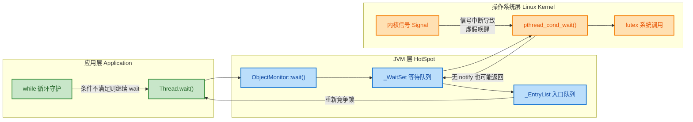

#### 错误写法 vs 正确写法

下面用一个经典的生产者-消费者缓冲区来演示。假设有一个固定容量的队列，消费者在队列为空时需要等待：

**❌ 错误写法：使用 `if` 判断**

```java
public class BrokenBuffer {
    private final Queue<String> queue = new LinkedList<>(); // 共享缓冲区
    private final int capacity = 10;                        // 最大容量

    // 消费方法 —— 存在严重Bug
    public synchronized String consume() throws InterruptedException {
        // ❌ 致命错误：使用 if 而非 while
        // 如果发生虚假唤醒，线程会跳过这个 if，
        // 直接执行 queue.poll()，此时队列可能仍为空！
        if (queue.isEmpty()) {
            wait(); // 队列为空，等待生产者通知
        }
        // 虚假唤醒后到达此处，queue 仍然为空
        // poll() 返回 null，后续代码可能抛出 NullPointerException
        return queue.poll();
    }

    // 生产方法
    public synchronized void produce(String item) throws InterruptedException {
        if (queue.size() == capacity) {
            wait(); // 队列满，等待消费者通知
        }
        queue.offer(item);       // 放入数据
        notifyAll();             // 通知所有等待的消费者
    }
}
```

**✅ 正确写法：使用 `while` 循环**

```java
public class CorrectBuffer {
    private final Queue<String> queue = new LinkedList<>(); // 共享缓冲区
    private final int capacity = 10;                        // 最大容量

    // 消费方法 —— 安全正确
    public synchronized String consume() throws InterruptedException {
        // ✅ 正确：使用 while 循环持续检查条件
        // 即使发生虚假唤醒，循环会重新检查 queue.isEmpty()
        // 条件不满足就继续 wait()，绝不会"溜过去"
        while (queue.isEmpty()) {
            wait(); // 每次从 wait 返回后，都会重新检查条件
        }
        // 能执行到此处，100% 保证 queue 不为空
        return queue.poll();
    }

    // 生产方法 —— 安全正确
    public synchronized void produce(String item) throws InterruptedException {
        // ✅ 同样使用 while 循环
        while (queue.size() == capacity) {
            wait(); // 队列满则持续等待
        }
        queue.offer(item);       // 放入数据
        notifyAll();             // 通知所有等待的消费者
    }
}
```

两者的核心差异只有一个单词——`if` 变成了 `while`，但这一个单词决定了代码是"偶尔出Bug"还是"绝对正确"。`while` 构建了一个**防护循环 (Guard Loop)**，确保线程每次从 `wait()` 返回后都会重新验证等待条件。

#### 虚假唤醒的出现概率

你可能会问：虚假唤醒真的会发生吗？答案是：**极低概率但确实会发生**。在某些 Linux 内核版本 + 特定 CPU 架构 + 高负载条件下，虚假唤醒的出现概率更高。Java 语言规范 (JLS) 之所以专门提到它，正是因为它"不可预测但真实存在"。并发编程的基本原则是：**不能依赖任何概率性假设，必须对每一种可能的情况做防御性编程**。

---

### 条件可能被其他线程改变

虚假唤醒是一个相对罕见的"理论性"问题，但**条件被其他线程改变**是一个非常普遍、非常现实的问题。即使永远不会发生虚假唤醒，仅凭这一个原因，你就**必须**使用 `while` 循环。

#### 核心场景：多个消费者竞争

考虑以下场景：有 1 个生产者，2 个消费者（C1 和 C2），共享一个队列。

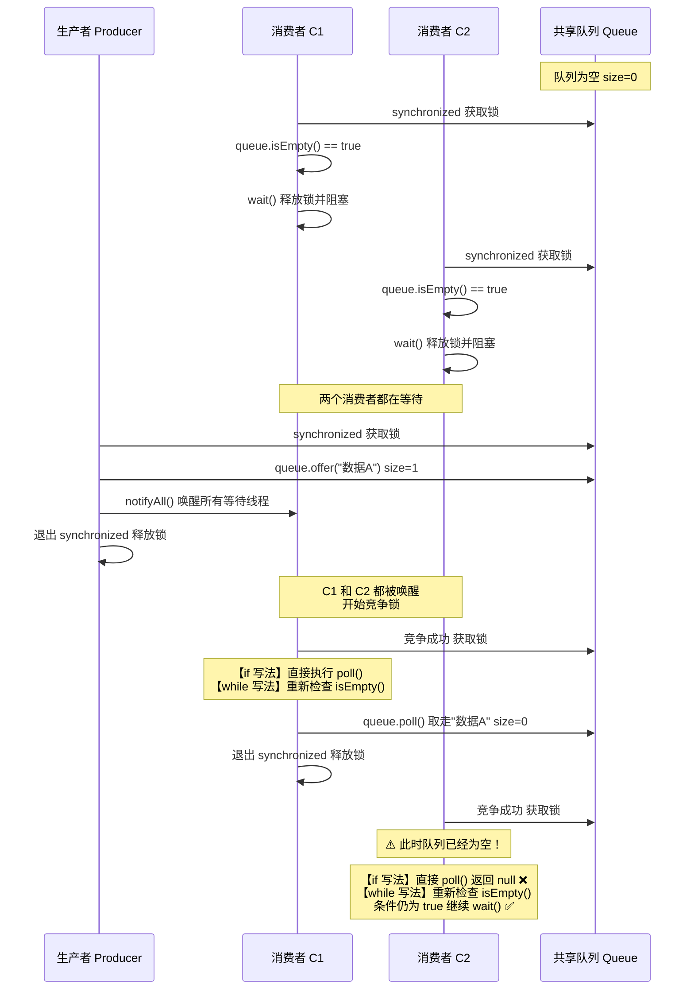

让我们逐步追踪这个致命的时序：

| 步骤 | 事件 | 队列状态 | 说明 |
|:----:|------|:--------:|------|
| 1 | C1 获取锁，检查 `isEmpty()` 为 true，调用 `wait()` | 空 | C1 释放锁，进入等待 |
| 2 | C2 获取锁，检查 `isEmpty()` 为 true，调用 `wait()` | 空 | C2 释放锁，进入等待 |
| 3 | P 获取锁，放入 1 条数据，调用 `notifyAll()` | 1条数据 | C1 和 C2 都被唤醒 |
| 4 | P 退出 synchronized，释放锁 | 1条数据 | 两个消费者开始抢锁 |
| 5 | C1 抢到锁，从 `wait()` 返回 | 1条数据 | C1 开始执行 |
| 6 | C1 执行 `poll()`，取走数据 | **空** | C1 成功消费 |
| 7 | C1 释放锁，C2 获得锁，从 `wait()` 返回 | **空** | **关键时刻！** |
| 8 | C2 执行 `poll()` ... | **空** | 如果是 `if`：返回 null ❌ |

**问题的本质**：当 C2 从 `wait()` 返回时，它"以为"条件已经满足（队列不为空），因为之前的 `if` 检查是在 `wait()` 之前做的。但实际上，在 C2 重新获得锁的这段时间里，C1 已经把数据取走了。**等待条件在 C2 沉睡期间被另一个线程改变了**。

#### 用 while 的精确执行流程

```java
public synchronized String consume() throws InterruptedException {
    while (queue.isEmpty()) {   // 第一次检查：true → 进入循环
        wait();                 // 被 notifyAll 唤醒，重新获取锁后返回
                                // 回到 while 条件检查 ← 这是关键！
    }                           // 如果队列仍然为空 → 继续 wait()
                                // 如果队列不为空 → 跳出循环，安全消费
    return queue.poll();
}
```

对于上面的场景，C2 的执行路径变为：

```text
C2: while(queue.isEmpty()) → true → wait()
    ... 被唤醒，重新获取锁 ...
C2: while(queue.isEmpty()) → true（数据已被 C1 取走）→ 继续 wait()
    ... 等待下一次生产者投递数据 ...
C2: while(queue.isEmpty()) → false → 跳出循环
C2: queue.poll() → 安全取到数据 ✅
```

#### 更复杂的现实场景

条件被其他线程改变不仅出现在"多消费者抢数据"的场景，它无处不在：

```java
// 场景：线程池任务调度
// 多个工作线程等待任务队列中出现新任务
public class ThreadPool {
    private final List<Runnable> taskQueue = new ArrayList<>(); // 任务队列
    private volatile boolean isShutdown = false;                // 关闭标志

    // 工作线程的核心循环
    public void workerLoop() throws InterruptedException {
        while (!isShutdown) {                  // 外层循环：持续工作直到关闭
            Runnable task;
            synchronized (taskQueue) {
                // ✅ 必须用 while：
                // 1. 可能虚假唤醒
                // 2. 可能被 notifyAll 唤醒但任务已被其他工人抢走
                // 3. 可能被 shutdown 的 notifyAll 唤醒（需要重新检查条件）
                while (taskQueue.isEmpty() && !isShutdown) {
                    taskQueue.wait();          // 无任务且未关闭，等待
                }
                if (isShutdown && taskQueue.isEmpty()) {
                    return;                    // 关闭且无剩余任务，退出
                }
                task = taskQueue.remove(0);    // 取出一个任务
            }
            task.run();                        // 在 synchronized 外执行任务
        }
    }
}
```

在上面这个线程池示例中，`while` 循环内的条件检查 `taskQueue.isEmpty() && !isShutdown` 同时守护了两个条件。一个 `notifyAll()` 可能是因为"有新任务"，也可能是因为"线程池关闭"。每次从 `wait()` 返回后，必须重新判断到底是哪种情况。

---

### 标准的 wait 使用范式

Java 官方文档和 Doug Lea（`java.util.concurrent` 的作者）推荐的标准范式如下，这是你在任何使用 `wait()` 的地方都应该遵循的模板：

```java
// ===== wait() 标准使用范式 (Canonical Form) =====

synchronized (lockObject) {           // 第1步：获取对象的监视器锁
    // 第2步：在 while 循环中检查等待条件
    // 绝对不能用 if！
    while (!conditionIsSatisfied()) {  // 条件不满足时循环等待
        lockObject.wait();             // 第3步：原子地释放锁并等待
                                       // 被唤醒后重新获取锁
                                       // 然后回到 while 条件检查
    }
    // 第4步：条件满足，安全地执行业务逻辑
    doSomething();                     // 此时持有锁且条件100%满足
}
```

我们可以将这个范式总结为一个防御模型：

```text
┌─────────────────────────────────────────────────────────────────┐
│                   wait() 防御循环模型                             │
│                                                                 │
│   synchronized (lock) {                                         │
│       ┌──────────────────────────────────────┐                  │
│       │  while (!condition) {  ◄── 防护墙     │                  │
│       │      lock.wait();                    │                  │
│       │      // 唤醒后回到 while ──┘          │                  │
│       │  }                                   │                  │
│       └──────────────────────────────────────┘                  │
│       // 此处 condition 一定为 true                               │
│       safeAction();                                             │
│   }                                                             │
│                                                                 │
│   防护对象:                                                      │
│     ✓ 虚假唤醒 (Spurious Wakeup)                                 │
│     ✓ 条件被其他线程改变 (Stolen Condition)                       │
│     ✓ 错误的 notify 来源 (Unrelated Notification)                │
└─────────────────────────────────────────────────────────────────┘
```

#### 与 Condition 接口的对比

在 `java.util.concurrent.locks` 包中，`Condition` 接口的 `await()` 方法同样面临虚假唤醒和条件竞争的问题。使用方式完全一致——**必须在循环中调用**：

```java
// 使用 ReentrantLock + Condition 的等价写法
private final ReentrantLock lock = new ReentrantLock();          // 显式锁
private final Condition notEmpty = lock.newCondition();          // 条件变量：队列非空
private final Condition notFull = lock.newCondition();           // 条件变量：队列未满
private final Queue<String> queue = new LinkedList<>();          // 共享队列
private final int capacity = 10;                                 // 容量上限

public String consume() throws InterruptedException {
    lock.lock();                          // 获取显式锁
    try {
        // ✅ 同样必须使用 while 循环
        // Condition.await() 的 Javadoc 同样警告了虚假唤醒
        while (queue.isEmpty()) {
            notEmpty.await();             // 释放锁并等待 notEmpty 信号
        }
        String item = queue.poll();       // 安全取出数据
        notFull.signal();                 // 通知等待 notFull 的生产者
        return item;
    } finally {
        lock.unlock();                    // 确保释放锁
    }
}

public void produce(String item) throws InterruptedException {
    lock.lock();                          // 获取显式锁
    try {
        while (queue.size() == capacity) {
            notFull.await();              // 释放锁并等待 notFull 信号
        }
        queue.offer(item);               // 放入数据
        notEmpty.signal();               // 通知等待 notEmpty 的消费者
    } finally {
        lock.unlock();                    // 确保释放锁
    }
}
```

`Condition` 接口相比 `wait/notify` 的优势在于：可以创建**多个条件队列**（如上面的 `notEmpty` 和 `notFull`），实现更精确的线程唤醒。但其核心的"循环等待"范式是完全一致的。

---

### 总结：为什么必须用 while 而不是 if

| 威胁 | 用 `if` 的后果 | 用 `while` 的效果 |
|------|:-------------:|:----------------:|
| **虚假唤醒** (Spurious Wakeup) | 条件未满足就继续执行 → 数据错误 | 重新检查条件 → 不满足则继续等待 ✅ |
| **条件被偷走** (Stolen Condition) | 其他线程已消费 → NPE / 数据不一致 | 重新检查条件 → 发现已被消费则继续等待 ✅ |
| **无关唤醒** (Unrelated Notification) | 被不相关的 `notifyAll` 唤醒 → 误执行 | 重新检查条件 → 条件不匹配则继续等待 ✅ |

一句话总结：**`while` 循环是 `wait()` 的安全网。没有这张网，你的并发代码就是在走钢丝。**

---

**📝 练习题**

以下代码中，消费者线程使用 `if` 而非 `while` 来调用 `wait()`。假设有 1 个生产者线程和 3 个消费者线程同时运行，生产者每次只生产 1 条数据后调用 `notifyAll()`。请问最可能出现的问题是什么？

```java
public synchronized String consume() throws InterruptedException {
    if (queue.isEmpty()) {
        wait();
    }
    return queue.poll();
}
```

A. 死锁 (Deadlock)，所有线程永久阻塞


B. 生产者线程抛出 `IllegalMonitorStateException`


C. 某个消费者线程的 `poll()` 返回 `null`，导致后续逻辑出错


D. 代码完全正确，不会有任何问题

**【答案】** C

**【解析】** 当生产者放入 1 条数据并调用 `notifyAll()` 时，3 个消费者线程都会被唤醒。它们依次重新获取锁并从 `wait()` 返回。第一个获取锁的消费者成功调用 `poll()` 取走了数据。但由于使用的是 `if` 而非 `while`，第二个和第三个消费者获取锁后**不会重新检查** `queue.isEmpty()` 条件，直接执行 `poll()`。此时队列已经为空，`poll()` 返回 `null`。如果后续代码对返回值调用方法（如 `result.length()`），就会抛出 `NullPointerException`。这正是"条件被其他线程改变"的经典案例。选项 A 不成立，因为没有形成循环等待的锁依赖；选项 B 不成立，代码在 `synchronized` 方法内调用 `wait()/notifyAll()` 是合法的；选项 D 显然不正确。正确做法是将 `if` 改为 `while`，确保每次从 `wait()` 返回后重新验证等待条件。

---

## notify vs notifyAll ⭐

在多线程协作场景中，当一个线程完成了某项工作、改变了共享状态后，它需要"通知"其他正在等待的线程。Java 在 `Object` 类上提供了两个通知方法：`notify()` 和 `notifyAll()`。它们的行为差异虽然只有"唤醒一个"与"唤醒所有"之别，但这一差异在实际并发编程中却可能导致 **活锁（livelock）** 甚至 **永久挂起（missed signal / lost wake-up）** 等严重问题。理解它们的底层语义、适用场景以及为何社区普遍推荐 `notifyAll`，是掌握 Java 线程间通信的关键一环。

### notify 只唤醒一个

调用 `obj.notify()` 时，JVM 会从该对象的 **等待集（Wait Set）** 中 **任意选择一个** 正在 `wait()` 的线程，将其从 Wait Set 移入 **Entry Set（锁竞争队列）**，使其有资格重新竞争对象的监视器锁（Monitor Lock）。

几个关键细节需要特别注意：

1. **"任意选择"而非"先进先出"**：JVM 规范（JLS §17.2.2）明确指出，`notify` 选择哪个线程是 **implementation-dependent** 的。HotSpot 虚拟机通常按 LIFO（后进先出）顺序唤醒，但你绝不应依赖这一行为。
2. **被唤醒 ≠ 立即执行**：被选中的线程仅仅是从 "waiting" 状态变为 "blocked"（等待获取锁），它必须在 `notify` 的调用者退出 `synchronized` 块释放锁之后，才有机会真正获得锁并从 `wait()` 返回继续执行。
3. **其余线程继续沉睡**：Wait Set 中未被选中的线程完全不受影响，它们仍处于 WAITING 状态，除非后续有新的 `notify/notifyAll` 调用或被 `interrupt`。

下面用一段代码来直观感受 `notify` 的行为：

```java
public class NotifyDemo {

    // 共享锁对象
    private static final Object lock = new Object();

    public static void main(String[] args) throws InterruptedException {

        // 创建 3 个等待线程，它们都会在 lock 上 wait
        for (int i = 1; i <= 3; i++) {
            final int id = i; // 捕获循环变量
            new Thread(() -> {
                synchronized (lock) { // 必须先获取 lock 的监视器锁
                    try {
                        System.out.println("Thread-" + id + " 进入等待...");
                        lock.wait(); // 释放锁并进入 Wait Set
                        // 被唤醒后，重新获取锁，从此处继续执行
                        System.out.println("Thread-" + id + " 被唤醒！");
                    } catch (InterruptedException e) {
                        Thread.currentThread().interrupt(); // 恢复中断标志
                    }
                }
            }, "Thread-" + i).start(); // 启动线程
        }

        // 主线程稍微等待，确保 3 个线程都已进入 wait
        Thread.sleep(500);

        synchronized (lock) { // 主线程获取锁
            System.out.println("主线程调用 notify()...");
            lock.notify(); // 只唤醒 Wait Set 中的 1 个线程
            // 注意：此时锁尚未释放，被唤醒的线程还拿不到锁
        } // 退出 synchronized，释放锁 → 被唤醒的线程开始竞争锁
    }
}
```

一次典型输出（顺序可能变化）：

```text
Thread-1 进入等待...
Thread-2 进入等待...
Thread-3 进入等待...
主线程调用 notify()...
Thread-3 被唤醒！
```

只有一个线程被唤醒，其余两个 **永远停在 `wait()` 上**，程序不会自然终止——这正是 `notify` 的"危险性"所在。

我们用一张时序图来可视化整个过程中线程状态的流转：

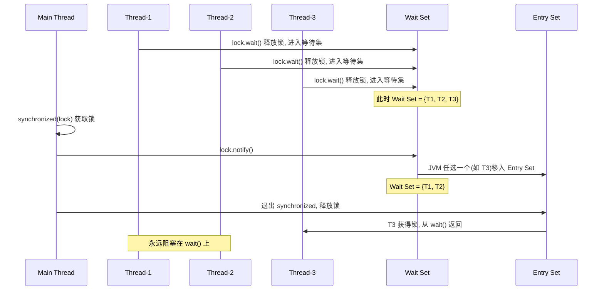

### notifyAll 唤醒所有

与 `notify` 不同，`notifyAll()` 会将该对象 Wait Set 中的 **所有** 等待线程一次性全部移入 Entry Set。这些线程随后逐个竞争监视器锁，获得锁的线程从 `wait()` 返回执行，其余线程继续在 Entry Set 中排队。

核心语义可以这样理解：`notifyAll` = 对 Wait Set 中的每一个线程都调用一次 `notify`，只不过它们仍然需要 **串行地** 获取锁。

```java
public class NotifyAllDemo {

    private static final Object lock = new Object(); // 共享锁对象
    private static boolean ready = false;             // 共享条件变量

    public static void main(String[] args) throws InterruptedException {

        // 创建 3 个工作线程
        for (int i = 1; i <= 3; i++) {
            final int id = i;
            new Thread(() -> {
                synchronized (lock) {
                    // 标准范式：在 while 循环中等待条件
                    while (!ready) { // 每次被唤醒都重新检查条件
                        try {
                            System.out.println("Worker-" + id + " 等待条件...");
                            lock.wait(); // 释放锁，进入 Wait Set
                        } catch (InterruptedException e) {
                            Thread.currentThread().interrupt();
                            return; // 被中断则退出
                        }
                    }
                    // 条件满足，执行业务逻辑
                    System.out.println("Worker-" + id + " 条件满足，开始工作！");
                }
            }, "Worker-" + i).start();
        }

        Thread.sleep(500); // 等待所有线程进入 wait

        synchronized (lock) {
            ready = true;        // 改变共享条件
            System.out.println("主线程调用 notifyAll()...");
            lock.notifyAll();    // 唤醒 Wait Set 中的所有线程
        } // 释放锁 → 被唤醒的线程们依次竞争锁
    }
}
```

输出（顺序可能不同，但三个 Worker 全部被唤醒）：

```text
Worker-1 等待条件...
Worker-2 等待条件...
Worker-3 等待条件...
主线程调用 notifyAll()...
Worker-3 条件满足，开始工作！
Worker-1 条件满足，开始工作！
Worker-2 条件满足，开始工作！
```

下面这张流程图展示了 `notifyAll` 之后线程从 Wait Set 到 Entry Set 再到逐个获取锁的完整流转：

```mermaid
graph LR
    subgraph Phase1["1. notifyAll 触发前"]
        direction TB
        WS1["Wait Set<br/>T1, T2, T3<br/>全部 WAITING"]
        ES1["Entry Set<br/>空"]
        MON1["Monitor Lock<br/>被 Main 持有"]
    end

    subgraph Phase2["2. notifyAll 执行"]
        direction TB
        WS2["Wait Set<br/>空"]
        ES2["Entry Set<br/>T1, T2, T3<br/>全部 BLOCKED"]
        MON2["Monitor Lock<br/>仍被 Main 持有"]
    end

    subgraph Phase3["3. Main 释放锁"]
        direction TB
        WS3["Wait Set<br/>空"]
        ES3["Entry Set<br/>T1, T2 排队"]
        MON3["Monitor Lock<br/>T3 竞争胜出"]
    end

    subgraph Phase4["4. 逐个获取锁"]
        direction TB
        WS4["Wait Set<br/>空"]
        ES4["Entry Set<br/>逐渐清空"]
        MON4["T1 -> T2 -> T3<br/>依次执行完毕"]
    end

    Phase1 --> Phase2
    Phase2 --> Phase3
    Phase3 --> Phase4

    classDef waitStyle fill:#FFF3E0,stroke:#FB8C00,color:#E65100
    classDef entryStyle fill:#E3F2FD,stroke:#42A5F5,color:#0D47A1
    classDef monStyle fill:#E8F5E9,stroke:#66BB6A,color:#1B5E20
    classDef phaseStyle fill:#F3E5F5,stroke:#AB47BC,color:#4A148C

    class WS1,WS2,WS3,WS4 waitStyle
    class ES1,ES2,ES3,ES4 entryStyle
    class MON1,MON2,MON3,MON4 monStyle
    class Phase1,Phase2,Phase3,Phase4 phaseStyle
```

### 推荐使用 notifyAll

这是 Java 并发编程中一个被广泛接受的最佳实践，来源包括 Joshua Bloch 的 *Effective Java* Item 81："Prefer concurrency utilities to `wait` and `notify`"，以及 Brian Goetz 的 *Java Concurrency in Practice* §14.2.4。其核心论点可以从以下几个角度展开：

#### 1. notify 的 "Lost Wake-Up" 问题

这是 `notify` 最致命的缺陷。考虑一个经典的生产者-消费者场景：

```java
public class BrokenProducerConsumer {

    private static final Object lock = new Object(); // 共享锁
    private static final Queue<String> buffer = new LinkedList<>(); // 共享缓冲区
    private static final int CAPACITY = 5; // 缓冲区容量

    // --------- 生产者 ---------
    static class Producer implements Runnable {
        @Override
        public void run() {
            synchronized (lock) {
                // 缓冲区满时，生产者等待
                while (buffer.size() == CAPACITY) {
                    try {
                        lock.wait(); // 进入 Wait Set（等待"缓冲区不满"）
                    } catch (InterruptedException e) {
                        Thread.currentThread().interrupt();
                        return;
                    }
                }
                // 生产一条数据
                buffer.add("item");
                System.out.println(Thread.currentThread().getName()
                        + " 生产, 缓冲区大小=" + buffer.size());
                lock.notify(); // 【危险】只唤醒一个线程
            }
        }
    }

    // --------- 消费者 ---------
    static class Consumer implements Runnable {
        @Override
        public void run() {
            synchronized (lock) {
                // 缓冲区空时，消费者等待
                while (buffer.isEmpty()) {
                    try {
                        lock.wait(); // 进入 Wait Set（等待"缓冲区非空"）
                    } catch (InterruptedException e) {
                        Thread.currentThread().interrupt();
                        return;
                    }
                }
                // 消费一条数据
                String item = buffer.poll();
                System.out.println(Thread.currentThread().getName()
                        + " 消费, 缓冲区大小=" + buffer.size());
                lock.notify(); // 【危险】只唤醒一个线程
            }
        }
    }
}
```

问题出在哪里？当 Wait Set 中同时存在生产者和消费者时，`notify` 可能唤醒"错误类型"的线程：

```text
假设 Wait Set = { Consumer-A, Consumer-B, Producer-X }

Producer-Y 生产了一个 item，调用 notify()
→ JVM 任意选了 Consumer-B？不一定！
→ 如果选中了 Producer-X（它等待"缓冲区不满"），
   Producer-X 醒来发现缓冲区确实不满，于是继续生产
→ Consumer-A 和 Consumer-B 永远不会被唤醒
→ 如果之后没有新的 notify，系统进入"全员等待"的死锁状态
```

这就是所谓的 **信号丢失（Lost Wake-Up / Missed Signal）**。让我们用一张时序图来精确复现这个过程：

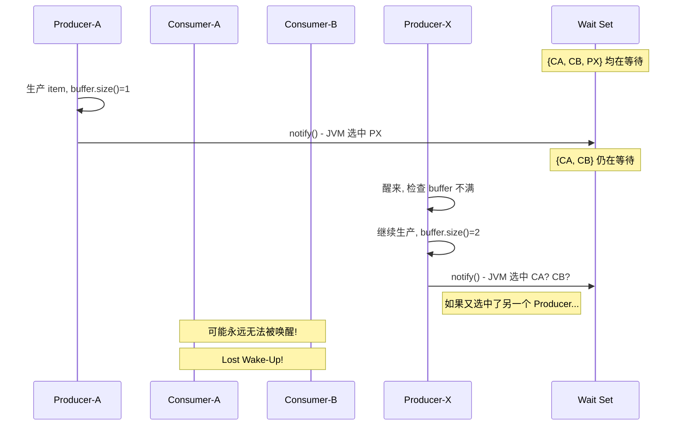

而 `notifyAll` 则彻底避免了这个问题——所有线程都被唤醒，每个线程重新检查自己的等待条件（`while` 循环），不满足条件的自然会再次 `wait()`，满足条件的正常执行。没有任何信号会丢失。

#### 2. 同一锁上的不同等待条件（Uniform vs. Non-Uniform Waiters）

上面的问题本质上源于：**多种类型的线程在同一个对象上等待不同的条件**。这在 Java 内置监视器（intrinsic monitor）中是不可避免的，因为每个对象只有 **一个** Wait Set，无法按条件分组。

用一张对比图可以清晰地看出这个结构性缺陷：

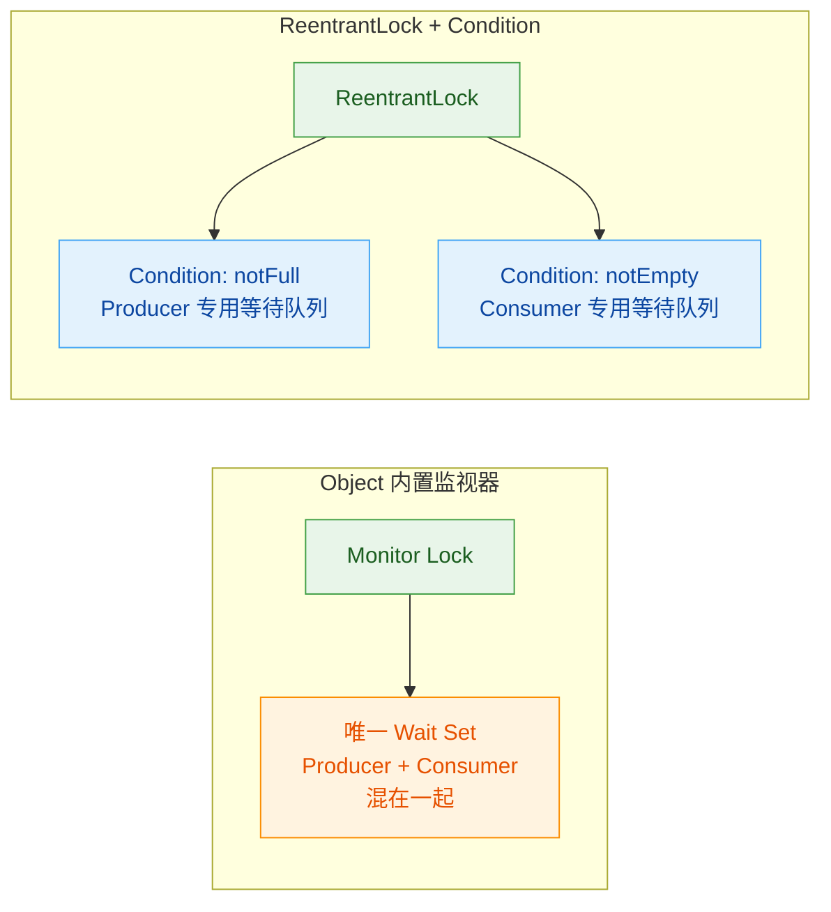

> 💡 **进阶提示**：`java.util.concurrent.locks.Condition` 提供了 `await()` / `signal()` / `signalAll()` 方法，支持在同一把锁上创建 **多个** 等待队列。在这种架构下，`signal()`（相当于 `notify`）是安全的，因为你可以精确地只唤醒目标条件队列上的线程。这正是 `ArrayBlockingQueue` 等并发容器的内部实现方式。

#### 3. 何时可以安全使用 notify？

虽然推荐 `notifyAll`，但 `notify` 并非完全不可用。当且仅当以下 **两个条件同时满足** 时，`notify` 是安全的：

| 条件 | 含义 | 英文术语 |
|------|------|----------|
| **统一等待条件** | 所有在 Wait Set 中的线程等待的是 **完全相同** 的条件谓词 | Uniform Waiters |
| **一进一出** | 每次通知最多只需要唤醒一个线程就足够处理状态变化 | One-in, One-out |

一个满足上述条件的典型例子是 **只有一个生产者、一个消费者** 的简单队列。但实际工程中，随着系统演进，这两个前提极容易被打破，因此"默认用 `notifyAll`"是更防御性的策略。

#### 4. notifyAll 的性能代价与权衡

`notifyAll` 的确存在性能开销——它会唤醒所有等待线程，其中大部分可能在重新检查条件后发现不满足，又立刻回到 `wait()` 状态。这被称为 **"惊群效应（Thundering Herd）"**。在 Wait Set 中有大量线程（如数百个）时，这种无效唤醒的成本不可忽视。

但在实际权衡中：

- **正确性 > 性能**：`notify` 导致的 Lost Wake-Up 是一个 **活性（liveness）** 问题，可能让系统永久卡死。而 `notifyAll` 的惊群效应只是 **性能** 问题，系统仍然是正确的。
- **现代 JVM 优化**：HotSpot 等 JVM 对线程调度有深度优化，少量线程的惊群开销微乎其微。
- **更好的替代方案**：如果性能确实是瓶颈，应该迁移到 `java.util.concurrent` 中的高级工具（如 `ReentrantLock` + `Condition`、`BlockingQueue`、`CountDownLatch` 等），而不是试图用 `notify` 来"优化" `notifyAll`。

我们可以把这个决策过程总结为一棵决策树：

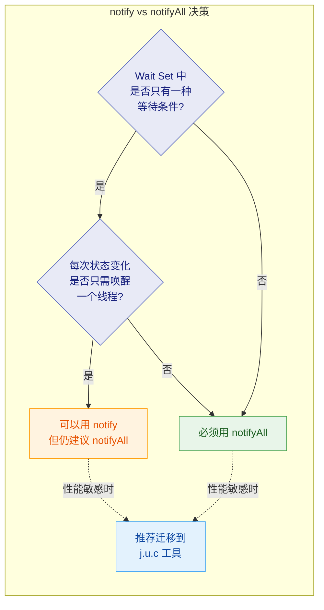

#### 5. 一个完整的正确实现：notifyAll 版生产者-消费者

```java
public class CorrectProducerConsumer {

    private final Object lock = new Object();          // 监视器锁
    private final Queue<String> buffer = new LinkedList<>(); // 共享缓冲区
    private final int capacity;                        // 缓冲区容量上限

    // 构造器：指定缓冲区容量
    public CorrectProducerConsumer(int capacity) {
        this.capacity = capacity;
    }

    // --------- 生产方法 ---------
    public void produce(String item) throws InterruptedException {
        synchronized (lock) {                          // 获取监视器锁
            while (buffer.size() == capacity) {        // 【循环检查】缓冲区是否已满
                lock.wait();                           // 满则释放锁，进入 Wait Set
            }
            buffer.add(item);                          // 向缓冲区添加数据
            System.out.println(Thread.currentThread().getName()
                    + " 生产: " + item
                    + ", 缓冲区=" + buffer.size());
            lock.notifyAll();                          // 【notifyAll】唤醒所有等待线程
        }                                              // 退出 synchronized，释放锁
    }

    // --------- 消费方法 ---------
    public String consume() throws InterruptedException {
        synchronized (lock) {                          // 获取监视器锁
            while (buffer.isEmpty()) {                 // 【循环检查】缓冲区是否为空
                lock.wait();                           // 空则释放锁，进入 Wait Set
            }
            String item = buffer.poll();               // 从缓冲区取出数据
            System.out.println(Thread.currentThread().getName()
                    + " 消费: " + item
                    + ", 缓冲区=" + buffer.size());
            lock.notifyAll();                          // 【notifyAll】唤醒所有等待线程
            return item;                               // 返回消费到的数据
        }                                              // 退出 synchronized，释放锁
    }

    // --------- 测试入口 ---------
    public static void main(String[] args) {
        CorrectProducerConsumer pc = new CorrectProducerConsumer(3);

        // 启动 2 个生产者
        for (int i = 0; i < 2; i++) {
            new Thread(() -> {
                for (int j = 0; j < 5; j++) {         // 每个生产者生产 5 个
                    try {
                        pc.produce("item-" + j);      // 调用生产方法
                        Thread.sleep(50);              // 模拟生产耗时
                    } catch (InterruptedException e) {
                        Thread.currentThread().interrupt();
                    }
                }
            }, "Producer-" + i).start();
        }

        // 启动 3 个消费者
        for (int i = 0; i < 3; i++) {
            new Thread(() -> {
                for (int j = 0; j < 3; j++) {         // 每个消费者消费 3 个
                    try {
                        pc.consume();                  // 调用消费方法
                        Thread.sleep(80);              // 模拟消费耗时
                    } catch (InterruptedException e) {
                        Thread.currentThread().interrupt();
                    }
                }
            }, "Consumer-" + i).start();
        }
    }
}
```

这段代码之所以 **正确且安全**，归功于三个要素的组合：

```text
while 循环检查  +  notifyAll  +  synchronized
      ↓                ↓              ↓
  防虚假唤醒     防信号丢失      保证可见性与原子性
```

这三者缺一不可，共同构成了 Java 内置监视器线程协作的 **标准范式（Canonical Form）**。

---

**📝 练习题**

以下关于 `notify()` 和 `notifyAll()` 的描述，哪一项是 **正确的**？

A. `notify()` 会按照线程进入 Wait Set 的先后顺序（FIFO）唤醒第一个等待线程。


B. `notifyAll()` 会让所有等待线程同时获得监视器锁并并行执行。


C. 当 Wait Set 中存在等待不同条件的线程时，使用 `notify()` 可能导致信号丢失（Lost Wake-Up），从而使程序永久阻塞。


D. `notify()` 和 `notifyAll()` 都会立即释放调用者所持有的监视器锁。


**【答案】** C

**【解析】** 逐项分析：

- **A 错误**：JLS §17.2.2 明确指出 `notify` 的选择是 implementation-dependent 的，JVM 不保证 FIFO 顺序，HotSpot 实际上更接近 LIFO。
- **B 错误**：`notifyAll` 确实将所有线程从 Wait Set 移入 Entry Set，但这些线程必须 **逐个串行地** 获取监视器锁，而不是同时持有锁并行执行。同一时刻仍然只有一个线程能持有监视器锁。
- **C 正确**：这正是本节重点讨论的 Lost Wake-Up 问题。当生产者和消费者共用一个 Wait Set 时，`notify` 可能唤醒"错误类型"的线程，导致真正需要被唤醒的线程永远沉睡。
- **D 错误**：`notify` 和 `notifyAll` 都 **不会** 释放锁。调用者必须执行到 `synchronized` 块结束或主动调用 `wait()` 时才会释放锁。这是一个高频面试考点。

---

## wait 与 sleep 区别 ⭐⭐

`wait()` 和 `sleep()` 是 Java 并发编程中最容易被混淆的两个方法。它们都能让线程暂停执行，但从 **设计哲学、锁行为、所属类、唤醒机制** 到 **使用场景** 几乎处处不同。深刻理解二者的差异，不仅是面试高频考点，更是写出正确并发代码的基础功。

---

### wait 释放锁、sleep 不释放

这是二者最核心、最本质的区别，也是面试中必须第一时间脱口而出的答案。

**`wait()` 会释放当前持有的监视器锁（Monitor Lock）**。当线程调用 `obj.wait()` 后，它会被放入该对象的 **等待集合（Wait Set）**，同时 **立即释放** 对 `obj` 的锁占用，让其他线程可以进入同一个 `synchronized` 块。当该线程被 `notify/notifyAll` 唤醒后，它需要 **重新竞争锁**，竞争成功后才能从 `wait()` 调用处继续往下执行。

**`sleep()` 绝不会释放任何锁**。线程调用 `Thread.sleep(ms)` 后只是进入 **TIMED_WAITING** 状态，但它依然 **牢牢持有** 之前获取的所有锁。这意味着如果在 `synchronized` 块内部调用 `sleep()`，其他线程在此期间无法进入同一个 `synchronized` 块，即使当前线程什么事也没做——它仅仅在"睡觉"而已。

下面用一段完整的代码来直观验证这个关键区别：

```java
public class WaitVsSleepLockDemo {

    // 共享锁对象
    private static final Object lock = new Object();

    public static void main(String[] args) {
        // ========== 场景一：sleep 不释放锁 ==========
        System.out.println("===== sleep 不释放锁演示 =====");

        // 线程 A：获取锁后 sleep 3 秒
        Thread sleepThread = new Thread(() -> {
            synchronized (lock) {                              // 获取 lock 的监视器锁
                System.out.println(Thread.currentThread().getName()
                        + " 获得锁, 开始 sleep...");
                try {
                    Thread.sleep(3000);                        // sleep 3秒，但不释放 lock
                } catch (InterruptedException e) {
                    e.printStackTrace();
                }
                System.out.println(Thread.currentThread().getName()
                        + " sleep 结束, 释放锁");
            }                                                  // 退出 synchronized 才释放锁
        }, "SleepThread");

        // 线程 B：尝试获取同一把锁
        Thread competitorA = new Thread(() -> {
            synchronized (lock) {                              // 会阻塞，直到 SleepThread 退出 synchronized
                System.out.println(Thread.currentThread().getName()
                        + " 终于获得了锁！");
            }
        }, "CompetitorA");

        sleepThread.start();                                   // 启动 sleep 线程
        try { Thread.sleep(100); } catch (InterruptedException ignored) {} // 确保 sleepThread 先获取锁
        competitorA.start();                                   // 启动竞争线程

        // 等待两个线程都结束
        try {
            sleepThread.join();
            competitorA.join();
        } catch (InterruptedException ignored) {}

        // ========== 场景二：wait 释放锁 ==========
        System.out.println("\n===== wait 释放锁演示 =====");

        // 线程 C：获取锁后 wait
        Thread waitThread = new Thread(() -> {
            synchronized (lock) {                              // 获取 lock 的监视器锁
                System.out.println(Thread.currentThread().getName()
                        + " 获得锁, 开始 wait...");
                try {
                    lock.wait(3000);                           // wait 3秒，立即释放 lock！
                } catch (InterruptedException e) {
                    e.printStackTrace();
                }
                System.out.println(Thread.currentThread().getName()
                        + " wait 结束 (重新获得锁后才打印此行)");
            }
        }, "WaitThread");

        // 线程 D：尝试获取同一把锁
        Thread competitorB = new Thread(() -> {
            synchronized (lock) {                              // wait 释放了锁，所以这里能很快进入
                System.out.println(Thread.currentThread().getName()
                        + " 终于获得了锁！");
            }
        }, "CompetitorB");

        waitThread.start();                                    // 启动 wait 线程
        try { Thread.sleep(100); } catch (InterruptedException ignored) {} // 确保 waitThread 先获取锁
        competitorB.start();                                   // 启动竞争线程

        try {
            waitThread.join();
            competitorB.join();
        } catch (InterruptedException ignored) {}
    }
}
```

运行该程序，典型输出如下：

```text
===== sleep 不释放锁演示 =====
SleepThread 获得锁, 开始 sleep...
SleepThread sleep 结束, 释放锁          ← CompetitorA 等了 3 秒才能进入
CompetitorA 终于获得了锁！

===== wait 释放锁演示 =====
WaitThread 获得锁, 开始 wait...
CompetitorB 终于获得了锁！              ← 几乎立刻就获得了锁！
WaitThread wait 结束 (重新获得锁后才打印此行)
```

从输出时间差可以清晰看到：**`sleep` 期间竞争线程被阻塞了 3 秒**，而 **`wait` 后竞争线程几乎立刻拿到了锁**。这就是「释放锁」与「不释放锁」在实际行为上的天壤之别。

> **为什么 `wait` 必须释放锁？** 因为 `wait/notify` 的设计目标就是 **线程间协作**：线程 A 发现条件不满足时主动让出锁，让线程 B 有机会进入临界区去改变条件并 `notify`。如果 `wait` 不释放锁，就会造成死锁——没有任何线程能进入 `synchronized` 去调用 `notify`。

> **为什么 `sleep` 不释放锁？** 因为 `sleep` 的语义是「我暂停一会儿，但我的工作还没做完」。它并不涉及线程间的协作通信，只是单纯的定时暂停。如果 `sleep` 释放了锁，醒来后临界区的数据状态可能已经被篡改，这将带来极难调试的并发 Bug。

---

### wait 是 Object 方法、sleep 是 Thread 方法

这个区别看似只是 API 归属不同，但背后折射出的是两种截然不同的 **设计哲学与作用对象**。

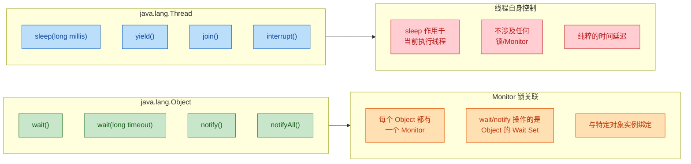

**`wait()` 定义在 `java.lang.Object` 上**——这是 Java 中所有类的根基。原因很简单：在 Java 中，**任何对象都可以充当锁**。每个对象内部都关联一个 Monitor（监视器），而 `wait/notify` 操作的正是这个 Monitor 上的等待队列。因此，`wait()` 必须是 Object 级别的方法，这样任何对象引用都能调用它。

```java
Object lock = new Object();         // 一个普通对象即可作为锁
String strLock = "hello";           // String 也可以
int[] arrLock = new int[0];         // 数组也可以

// 上述任意对象都可以调用 wait/notify
synchronized (lock) {
    lock.wait();                    // 合法：Object 上定义了 wait()
}
```

**`sleep()` 定义在 `java.lang.Thread` 上**，而且是一个 **静态方法（static method）**。它永远作用于 **当前正在执行的线程（current thread）** 本身，与任何特定的锁对象或 Monitor 无关。你不需要持有任何锁就可以调用 `sleep()`。

```java
// sleep 是静态方法，作用于当前线程
Thread.sleep(1000);                 // 当前线程休眠 1 秒

// 虽然语法上允许通过实例调用，但这是误导性写法（编译器会警告）
Thread t = new Thread();
t.sleep(1000);                      // 实际上仍然是让 "当前线程" sleep，而非 t！
```

上面最后两行是一个经典的 **陷阱**：`t.sleep(1000)` 并不会让线程 `t` 休眠，而是让调用这行代码的 **当前线程** 休眠。因为 `sleep()` 是静态方法，编译器在编译时就把 `t.sleep(1000)` 等价替换成了 `Thread.sleep(1000)`。

**从设计哲学看**：

| 维度 | `wait()` | `sleep()` |
|------|----------|-----------|
| **作用对象** | 特定的锁对象（Object） | 当前执行线程（Thread） |
| **语义** | 线程间协作（"我等条件满足"） | 单线程定时暂停（"我休息一会"） |
| **为什么在那个类** | 任何对象都能当锁，所以放在 Object | 控制线程自身行为，所以放在 Thread |
| **方法类型** | 实例方法（`final native`） | 静态方法（`static native`） |
| **调用方式** | `lockObj.wait()` | `Thread.sleep(ms)` |

---

### wait 需要在 synchronized 中

`wait()` 方法 **必须** 在 `synchronized` 代码块或 `synchronized` 方法内部调用，否则会在运行时抛出 `IllegalMonitorStateException`。而 `sleep()` 则没有这个限制，可以在任何地方自由调用。

```java
public class SynchronizedRequirementDemo {

    private static final Object lock = new Object();

    public static void main(String[] args) {

        // ====== wait 必须在 synchronized 中 ======
        try {
            lock.wait();                                       // 编译通过，但运行时抛出异常！
        } catch (IllegalMonitorStateException e) {
            System.out.println("抛出 IllegalMonitorStateException: "
                    + e.getMessage());                         // 当前线程不是 lock 的 Monitor Owner
        } catch (InterruptedException e) {
            e.printStackTrace();
        }

        // 正确做法：先获取 lock 的监视器锁
        synchronized (lock) {                                  // 进入同步块，成为 lock 的 Monitor Owner
            try {
                lock.wait(100);                                // 现在可以安全地 wait
                System.out.println("wait 正常返回");
            } catch (InterruptedException e) {
                e.printStackTrace();
            }
        }

        // ====== sleep 随时随地都能调用 ======
        try {
            Thread.sleep(100);                                 // 无需 synchronized，直接调用
            System.out.println("sleep 正常返回");
        } catch (InterruptedException e) {
            e.printStackTrace();
        }

        // 在 synchronized 中 sleep 也可以（但通常不推荐）
        synchronized (lock) {
            try {
                Thread.sleep(100);                             // 合法，但 sleep 期间不会释放 lock
                System.out.println("synchronized 中 sleep 正常返回");
            } catch (InterruptedException e) {
                e.printStackTrace();
            }
        }
    }
}
```

**为什么 JVM 要强制这个约束？** 这不是随意的设计决定，而是为了 **防止 Lost Wakeup（丢失唤醒）** 这个经典的并发 Bug。我们可以用一个反面例子来理解：

```java
// ⚠️ 假设 wait/notify 不需要 synchronized（伪代码，实际不允许）
// 这段代码存在严重的 race condition

// 共享状态
boolean conditionMet = false;

// ---------- 消费者线程 ----------
if (!conditionMet) {                  // 第1步：检查条件 → 不满足
    // ★ 此时 CPU 切换到生产者线程！
    lock.wait();                      // 第4步：进入 wait，但 notify 已经错过了！永远阻塞！
}

// ---------- 生产者线程 ----------
conditionMet = true;                  // 第2步：修改条件
lock.notify();                        // 第3步：发送 notify，但此时消费者还没 wait！→ 信号丢失！
```

通过 `synchronized`，「检查条件」和「调用 wait」被包裹在同一个原子操作中，生产者在此期间无法插入 `notify`，从而杜绝丢失唤醒。

下面这张时序图展示了有 `synchronized` 保护和无保护两种情况的对比：

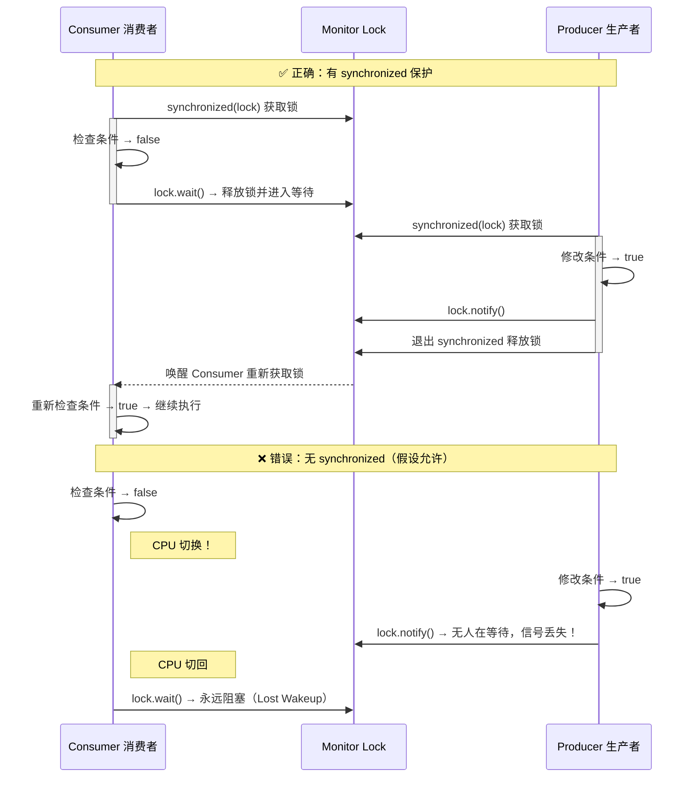

下面这张表格是 `wait()` 和 `sleep()` 所有维度的完整对比，适合在需要时快速查阅或作为面试的最终总结：

| 对比维度 | `Object.wait()` | `Thread.sleep()` |
|---------|-----------------|-------------------|
| **所属类** | `java.lang.Object` | `java.lang.Thread` |
| **方法类型** | 实例方法（`final native`） | 静态方法（`static native`） |
| **是否释放锁** | ✅ 释放 | ❌ 不释放 |
| **是否需要 synchronized** | ✅ 必须 | ❌ 不需要 |
| **线程状态** | `WAITING` 或 `TIMED_WAITING` | `TIMED_WAITING` |
| **唤醒方式** | `notify()` / `notifyAll()` / 超时 / `interrupt()` | 超时到期 / `interrupt()` |
| **抛出异常** | `InterruptedException` + `IllegalMonitorStateException` | `InterruptedException` |
| **设计目的** | 线程间协作通信 | 单纯的定时暂停 |
| **恢复执行前提** | 被唤醒后 **重新竞争到锁** 才恢复 | 时间到即恢复（无需竞争锁） |
| **精度** | 不保证精确（依赖 notify 时机） | 不保证精确（依赖 OS 调度） |
| **典型用途** | 生产者-消费者、条件等待 | 轮询间隔、限速、模拟延迟 |

最后用一段简洁的记忆口诀来帮助巩固：

> **wait 让锁，sleep 占锁；wait 靠唤，sleep 靠时；wait 协作，sleep 自顾。**

- "wait 让锁"——`wait` 释放锁让给别人。
- "sleep 占锁"——`sleep` 抱着锁不放。
- "wait 靠唤"——`wait` 的恢复靠 `notify` 唤醒。
- "sleep 靠时"——`sleep` 的恢复靠时间到期。
- "wait 协作"——`wait` 是多线程协作的工具。
- "sleep 自顾"——`sleep` 只管自己暂停。

---

**📝 练习题**

以下代码的运行结果是什么？

```java
public class Quiz {
    private static final Object lock = new Object();

    public static void main(String[] args) throws InterruptedException {
        Thread t1 = new Thread(() -> {
            synchronized (lock) {
                System.out.println("T1 acquired lock");
                try {
                    Thread.sleep(2000);
                } catch (InterruptedException e) {}
                System.out.println("T1 releasing lock");
            }
        });

        Thread t2 = new Thread(() -> {
            synchronized (lock) {
                System.out.println("T2 acquired lock");
            }
        });

        t1.start();
        Thread.sleep(100); // 确保 t1 先启动
        t2.start();

        long start = System.currentTimeMillis();
        t1.join();
        t2.join();
        long elapsed = System.currentTimeMillis() - start;

        System.out.println("Total time >= 2 seconds? " + (elapsed >= 2000));
    }
}
```

A. T1 acquired lock → T2 acquired lock → T1 releasing lock，Total time >= 2 seconds? 为 false


B. T1 acquired lock → T1 releasing lock → T2 acquired lock，Total time >= 2 seconds? 为 true


C. T1 acquired lock → T2 acquired lock → T1 releasing lock，Total time >= 2 seconds? 为 true


D. 抛出 IllegalMonitorStateException，因为 sleep 在 synchronized 中调用

**【答案】** B

**【解析】** `Thread.sleep(2000)` 虽然让 T1 线程暂停 2 秒，但 **`sleep` 不释放锁**。因此在 T1 sleep 的整个 2 秒期间，T2 在 `synchronized (lock)` 处被阻塞，无法进入。只有当 T1 执行完 `sleep` 并打印 "T1 releasing lock"、退出 `synchronized` 块后，T2 才能获取锁并打印 "T2 acquired lock"。所以输出顺序一定是 T1 先完全执行完，T2 才开始，总时间一定 ≥ 2 秒。选项 A 和 C 中 T2 先于 T1 结束获得锁是不可能的（sleep 不释放锁）。选项 D 错误，`sleep` 在 `synchronized` 中调用是完全合法的，它只是不释放锁而已。如果把 `Thread.sleep(2000)` 换成 `lock.wait(2000)`，那么 T2 就能在 T1 等待期间获取锁，输出顺序将变为 C 的模式。

---

## 本章小结

本章围绕 Java 中最经典的线程间通信原语——`wait/notify` 机制，从语法约束、锁行为、唤醒策略到与 `sleep` 的对比，进行了全面剖析。以下是对全章核心知识的系统性回顾与提炼。

---

### 核心知识全景图

```mermaid
graph LR
    subgraph SG_FOUNDATION["🔒 语法基石"]
        direction TB
        F1["必须在 synchronized 块中调用"]
        F2["操作的是 Object 级别的 Monitor"]
        F3["违反规则抛出<br/>IllegalMonitorStateException"]
    end

    subgraph SG_BEHAVIOR["⚙️ 锁行为"]
        direction TB
        B1["wait 立即释放锁<br/>线程进入 WAITING 状态"]
        B2["notify/notifyAll 不释放锁<br/>等 synchronized 块结束才释放"]
        B3["被唤醒线程必须重新竞争锁<br/>才能从 wait 处继续执行"]
    end

    subgraph SG_WAKEUP["🔔 唤醒策略"]
        direction TB
        W1["notify 唤醒 Wait Set 中任意一个线程"]
        W2["notifyAll 唤醒 Wait Set 中全部线程"]
        W3["生产实践中推荐 notifyAll<br/>避免信号丢失"]
    end

    subgraph SG_PATTERN["🔁 编码范式"]
        direction TB
        P1["必须在 while 循环中调用 wait"]
        P2["防御虚假唤醒 spurious wakeup"]
        P3["防御条件被其他线程篡改"]
    end

    subgraph SG_COMPARE["⚖️ wait vs sleep"]
        direction TB
        C1["wait 释放锁 / sleep 不释放锁"]
        C2["wait 属于 Object / sleep 属于 Thread"]
        C3["wait 需要 synchronized / sleep 随处可调"]
        C4["wait 由 notify 唤醒 / sleep 到时自动恢复"]
    end

    SG_FOUNDATION --> SG_BEHAVIOR
    SG_BEHAVIOR --> SG_WAKEUP
    SG_WAKEUP --> SG_PATTERN
    SG_PATTERN --> SG_COMPARE

    classDef foundation fill:#E8F5E9,stroke:#388E3C,color:#1B5E20,stroke-width:2px
    classDef behavior fill:#E3F2FD,stroke:#1976D2,color:#0D47A1,stroke-width:2px
    classDef wakeup fill:#FFF3E0,stroke:#F57C00,color:#E65100,stroke-width:2px
    classDef pattern fill:#F3E5F5,stroke:#8E24AA,color:#4A148C,stroke-width:2px
    classDef compare fill:#FFEBEE,stroke:#E53935,color:#B71C1C,stroke-width:2px

    class F1,F2,F3 foundation
    class B1,B2,B3 behavior
    class W1,W2,W3 wakeup
    class P1,P2,P3 pattern
    class C1,C2,C3,C4 compare
```

---

### 黄金规则速查表

将全章内容凝练为 **六条黄金规则**，在实际编码和面试中可以直接作为检查清单：

| 编号 | 规则 | 违反后果 |
|:---:|------|----------|
| **①** | `wait/notify/notifyAll` **必须**在持有对象监视器锁（`synchronized`）时调用 | 运行时抛出 `IllegalMonitorStateException` |
| **②** | `wait()` 调用后**立即释放锁**，线程进入该对象的 Wait Set | — |
| **③** | `notify/notifyAll` 调用后**不释放锁**，直到退出 `synchronized` 块 | 被唤醒线程仍阻塞在锁竞争上，无法推进 |
| **④** | `wait()` **必须**放在 `while(条件不满足)` 循环中，**禁止使用 `if`** | 虚假唤醒或条件被篡改导致程序逻辑错误 |
| **⑤** | 优先使用 `notifyAll()`，除非你**明确且有把握**只需唤醒一个线程 | `notify()` 可能唤醒"错误"的线程，导致信号丢失（lost wakeup） |
| **⑥** | `wait` 释放锁、`sleep` 不释放锁——这是两者最本质的区别 | 混淆使用会导致死锁或无法被正常唤醒 |

---

### 标准编码模板回顾

整个 `wait/notify` 的使用可以归结为一个**经典的对称模板**，这是 Doug Lea、Brian Goetz 等大师在 *Java Concurrency in Practice* 中反复推荐的范式：

```java
// ==================== 等待方（Consumer / Waiter） ====================
synchronized (lock) {                    // 第一步：获取对象监视器锁
    while (!condition) {                 // 第二步：在 while 循环中检查条件（防虚假唤醒 + 防条件被篡改）
        lock.wait();                     // 第三步：条件不满足则释放锁并等待
    }
    // 第四步：条件满足，执行业务逻辑     // 被唤醒且重新获得锁后，从这里继续
    doSomething();
}

// ==================== 通知方（Producer / Notifier） ====================
synchronized (lock) {                    // 第一步：获取同一个对象的监视器锁
    changeCondition();                   // 第二步：修改共享状态，使条件变为 true
    lock.notifyAll();                    // 第三步：唤醒所有等待线程（推荐 notifyAll）
}                                        // 第四步：退出 synchronized 块，此刻才真正释放锁
```

> **记忆口诀**："**先 sync、再 while、后 wait；改状态、发通知、出块释放**。"

---

### 线程状态流转全图

下面这张时序图完整展示了一个线程从运行到等待、被唤醒、重新竞争锁并最终继续执行的**全生命周期**，是对本章所有锁行为知识点的一次整合：

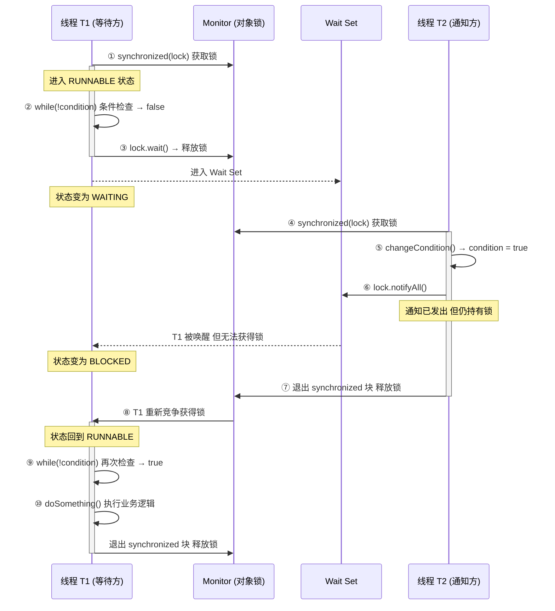

这张图清晰地体现了三个关键时刻：

1. **步骤 ③**：`wait()` 被调用的**瞬间释放锁**，线程从 `RUNNABLE → WAITING`。
2. **步骤 ⑥→⑦**：`notifyAll()` 被调用时**不释放锁**，直到步骤 ⑦ 退出 `synchronized` 块才释放。
3. **步骤 ⑧→⑨**：被唤醒的线程必须**重新竞争锁**，获得后还要**重新检查条件**（while 循环的价值所在）。

---

### 高频面试考点提炼

结合本章内容，以下是面试官最常切入的 **Top 5** 问题及简答要点：

| 面试问题 | 一句话核心答案 |
|----------|---------------|
| 为什么 `wait/notify` 定义在 `Object` 而不是 `Thread` 上？ | 因为锁（Monitor）是**对象级别**的，任何对象都可以充当锁，所以等待/通知操作也必须挂在对象上 |
| `wait()` 为什么必须放在 `synchronized` 中？ | `wait` 需要释放锁，**前提是你已经持有锁**；不持有锁就调用 `wait`，JVM 直接抛 `IllegalMonitorStateException` |
| 为什么要用 `while` 而不是 `if` 包裹 `wait`？ | 防止 **spurious wakeup**（操作系统层面可能无缘无故唤醒线程）以及**多线程竞争下条件被其他线程提前消费** |
| `notify` 和 `notifyAll` 如何选择？ | 绝大多数场景用 `notifyAll`；只有当 Wait Set 中所有线程等待的是**完全相同的条件**，且每次只需唤醒一个时才考虑 `notify` |
| `wait` 和 `sleep` 最本质的区别？ | **锁行为不同**——`wait` 释放锁，`sleep` 不释放锁；其次 `wait` 是 `Object` 方法，`sleep` 是 `Thread` 静态方法 |

---

### 从 wait/notify 到现代并发工具的演进

`wait/notify` 是 Java 1.0 就存在的原始同步原语。它虽然强大，但使用门槛高、容易出错（忘记 `while` 循环、误用 `notify`、忘记在 `synchronized` 中调用等）。从 Java 5 开始，`java.util.concurrent` 包提供了更高级的替代方案：

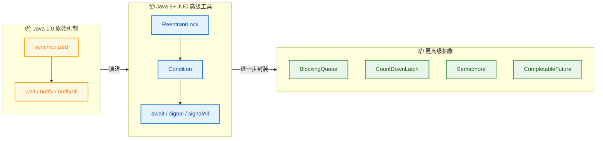

| 原始机制 | JUC 对应物 | 优势 |
|---------|-----------|------|
| `synchronized` | `ReentrantLock` | 支持公平锁、可中断获取、tryLock 超时 |
| `wait()` | `Condition.await()` | 一个 Lock 可绑定**多个** Condition，实现精确唤醒 |
| `notify()` | `Condition.signal()` | 精确控制唤醒哪个等待队列 |
| `notifyAll()` | `Condition.signalAll()` | 同上 |

> **学习建议**：先扎实掌握 `wait/notify`，理解 Monitor 模型和锁的本质，再学习 `java.util.concurrent` 就会水到渠成——因为 JUC 的底层思想与 `wait/notify` 一脉相承，只是 API 更安全、更灵活。

---

### 📝 练习题

**某公司面试题**：阅读以下代码，分析程序运行后可能的输出结果：

```java
public class WaitNotifyQuiz {

    private static final Object lock = new Object();
    private static boolean ready = false;

    public static void main(String[] args) throws InterruptedException {

        Thread t1 = new Thread(() -> {
            synchronized (lock) {
                while (!ready) {           // Line A
                    try {
                        System.out.println("T1: waiting");
                        lock.wait();
                        System.out.println("T1: woke up");
                    } catch (InterruptedException e) {
                        e.printStackTrace();
                    }
                }
                System.out.println("T1: running");
            }
        });

        Thread t2 = new Thread(() -> {
            synchronized (lock) {
                ready = true;
                System.out.println("T2: notify");
                lock.notify();
                System.out.println("T2: done");
            }
        });

        t1.start();
        Thread.sleep(100);   // 确保 T1 先运行
        t2.start();
    }
}
```

请问程序最终输出的**完整顺序**是？

A. `T1: waiting` → `T2: notify` → `T2: done` → `T1: woke up` → `T1: running`


B. `T1: waiting` → `T2: notify` → `T1: woke up` → `T1: running` → `T2: done`


C. `T1: waiting` → `T1: woke up` → `T1: running` → `T2: notify` → `T2: done`


D. `T2: notify` → `T2: done` → `T1: waiting` → `T1: woke up` → `T1: running`

**【答案】** A

**【解析】**

逐步推演执行流程：

1. `t1.start()` 后，T1 获取 `lock`，发现 `ready == false`，打印 `T1: waiting`，然后调用 `lock.wait()` **释放锁**并进入 Wait Set。
2. 主线程 `Thread.sleep(100)` 确保 T1 先进入等待状态。
3. `t2.start()` 后，T2 获取 `lock`（此时锁已被 T1 释放），设置 `ready = true`，打印 `T2: notify`，调用 `lock.notify()` 唤醒 T1。**关键点：`notify()` 不释放锁**，所以 T1 虽然被唤醒，但无法获得锁，仍处于 BLOCKED 状态。
4. T2 继续执行，打印 `T2: done`，退出 `synchronized` 块，**此时才释放锁**。
5. T1 重新竞争获得锁，从 `wait()` 返回，打印 `T1: woke up`。接着 `while` 循环重新检查条件，`ready == true`，退出循环，打印 `T1: running`。

选项 B 错误是因为 `T2: done` 必须在 `T1: woke up` 之前——`notify` 不释放锁，T2 必须执行完 `synchronized` 块内的所有代码后 T1 才有机会继续。选项 C 和 D 顺序更是完全不符合锁的竞争时序。

---
