---

# 同步工具类 ⭐⭐

---

## CountDownLatch ⭐⭐

`CountDownLatch` 是 `java.util.concurrent` 包中一个极其常用的同步工具类，它的核心思想可以用一句话概括：**让一个或多个线程等待，直到其他线程完成一组操作后再继续执行**。这个概念在日常开发中的应用场景非常广泛——想象一下火箭发射前的倒计时，所有检查项（燃料、电气、通讯……）必须全部完成，指挥官才能下达发射指令。`CountDownLatch` 正是这种"倒计时门闩"的编程抽象。

从类签名来看，`CountDownLatch` 位于 `java.util.concurrent` 包下，它并没有实现 `Lock` 接口，而是直接基于 **AQS（AbstractQueuedSynchronizer）** 的共享模式（Shared Mode）构建。其内部维护了一个 `volatile int state` 作为计数器，每次 `countDown()` 将 state 减 1，当 state 变为 0 时，所有在 `await()` 上阻塞的线程将被同时唤醒。

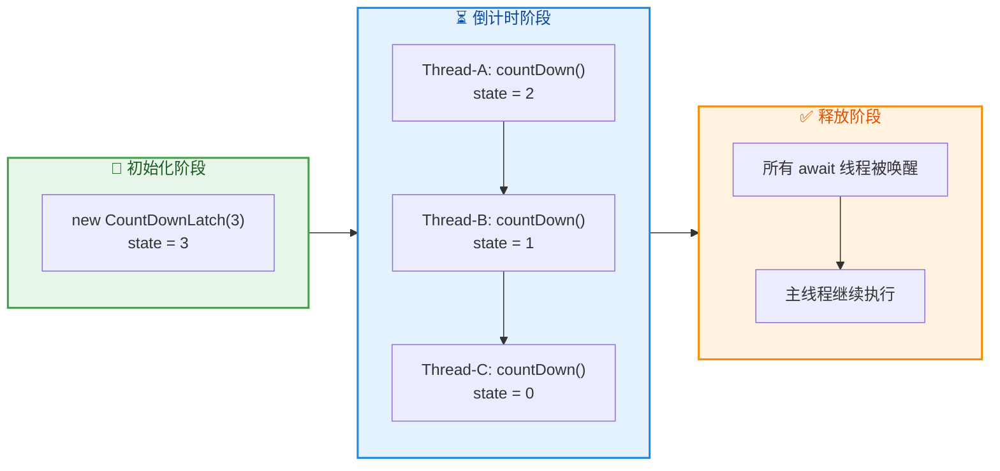
```mermaid
graph LR
    subgraph Init["🔧 初始化阶段"]
        direction TB
        A["new CountDownLatch(3)<br/>state = 3"]
    end

    subgraph Counting["⏳ 倒计时阶段"]
        direction TB
        B["Thread-A: countDown()<br/>state = 2"]
        C["Thread-B: countDown()<br/>state = 1"]
        D["Thread-C: countDown()<br/>state = 0"]
        B --> C --> D
    end

    subgraph Release["✅ 释放阶段"]
        direction TB
        E["所有 await 线程被唤醒"]
        F["主线程继续执行"]
        E --> F
    end

    Init --> Counting --> Release

    classDef initStyle fill:#E8F5E9,stroke:#43A047,stroke-width:2px,color:#1B5E20
    classDef countStyle fill:#E3F2FD,stroke:#1E88E5,stroke-width:2px,color:#0D47A1
    classDef releaseStyle fill:#FFF3E0,stroke:#FB8C00,stroke-width:2px,color:#E65100

    class Init initStyle
    class Counting countStyle
    class Release releaseStyle
```

### 倒计时门闩

"倒计时门闩"（Countdown Latch）这个名字精准地描述了它的工作机制：

- **Countdown（倒计时）**：有一个从 N 递减到 0 的计数器。
- **Latch（门闩）**：门闩是一种单向锁定机制——门闩一旦打开就不会再关上。

当你创建一个 `CountDownLatch` 时，必须传入一个 **正整数** 作为初始计数值（count）。这个计数值代表了"需要等待完成的事件数量"。每当一个事件完成时，调用 `countDown()` 使计数值减 1；当计数值归零时，门闩永久打开，所有在 `await()` 上等待的线程全部放行。

```java
// 创建一个初始计数值为 3 的 CountDownLatch
// 意味着需要 3 次 countDown() 调用才能打开门闩
CountDownLatch latch = new CountDownLatch(3);
```

从底层实现来看，`CountDownLatch` 内部有一个继承自 AQS 的静态内部类 `Sync`：

```java
// CountDownLatch 源码核心结构（简化版）
public class CountDownLatch {

    // 内部同步器，继承 AQS
    private static final class Sync extends AbstractQueuedSynchronizer {

        // 构造时将 count 设置为 AQS 的 state
        Sync(int count) {
            setState(count); // state = count
        }

        // 获取当前计数值
        int getCount() {
            return getState(); // 直接返回 AQS 的 state
        }

        // 尝试以共享模式获取锁（被 await 调用）
        // 返回值 >= 0 表示获取成功，< 0 表示获取失败需要排队
        protected int tryAcquireShared(int acquires) {
            // state == 0 时返回 1（成功），否则返回 -1（失败，需要阻塞）
            return (getState() == 0) ? 1 : -1;
        }

        // 尝试以共享模式释放锁（被 countDown 调用）
        protected boolean tryReleaseShared(int releases) {
            for (;;) { // 自旋 CAS，保证线程安全
                int c = getState();           // 读取当前 state
                if (c == 0)                   // 已经是 0，无法再减
                    return false;
                int nextc = c - 1;            // 计算新值
                if (compareAndSetState(c, nextc)) // CAS 更新 state
                    return nextc == 0;        // 如果新值为 0，返回 true 触发唤醒
            }
        }
    }

    private final Sync sync; // 持有内部同步器的引用

    // 构造方法：count 必须 >= 0
    public CountDownLatch(int count) {
        if (count < 0) throw new IllegalArgumentException("count < 0");
        this.sync = new Sync(count); // 初始化 AQS 的 state
    }
}
```

这里有几个关键设计值得关注：

1. **`tryAcquireShared` 的判断逻辑极其简洁**：只要 `state != 0`，所有调用 `await()` 的线程都会被放入 AQS 的等待队列中阻塞。
2. **`tryReleaseShared` 使用自旋 CAS**：多个线程可能同时调用 `countDown()`，CAS 保证了在无锁的情况下安全地递减计数器。
3. **共享模式（Shared Mode）**：当 `state` 减为 0 时，AQS 会以传播（propagate）方式唤醒等待队列中的**所有**线程，而非仅唤醒一个。

### await（等待计数归零）

`await()` 是 `CountDownLatch` 的"等待端"API，调用它的线程会阻塞，直到计数器变为 0。`CountDownLatch` 提供了两种 `await` 的重载形式：

```java
// 形式一：无限等待，直到 count 归零
// 如果当前线程被中断，会抛出 InterruptedException
public void await() throws InterruptedException {
    sync.acquireSharedInterruptibly(1); // 委托给 AQS 的共享可中断获取
}

// 形式二：带超时的等待
// 如果在指定时间内 count 未归零，返回 false；归零则返回 true
public boolean await(long timeout, TimeUnit unit) throws InterruptedException {
    return sync.tryAcquireSharedNanos(1, unit.toNanos(timeout));
}
```

**无限等待版本 `await()`** 的内部流程如下：

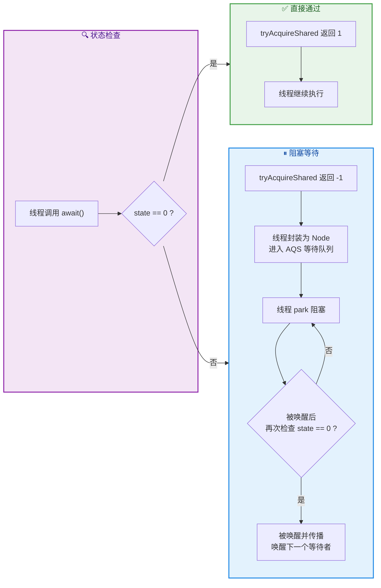
```mermaid
graph LR
    subgraph Check["🔍 状态检查"]
        direction TB
        A["线程调用 await()"]
        B{"state == 0 ?"}
        A --> B
    end

    subgraph Pass["✅ 直接通过"]
        direction TB
        C["tryAcquireShared 返回 1"]
        D["线程继续执行"]
        C --> D
    end

    subgraph Block["⏸ 阻塞等待"]
        direction TB
        E["tryAcquireShared 返回 -1"]
        F["线程封装为 Node<br/>进入 AQS 等待队列"]
        G["线程 park 阻塞"]
        H{"被唤醒后<br/>再次检查 state == 0 ?"}
        I["被唤醒并传播<br/>唤醒下一个等待者"]
        E --> F --> G --> H
        H -->|"是"| I
        H -->|"否"| G
    end

    B -->|"是"| Pass
    B -->|"否"| Block

    classDef checkStyle fill:#F3E5F5,stroke:#8E24AA,stroke-width:2px,color:#4A148C
    classDef passStyle fill:#E8F5E9,stroke:#43A047,stroke-width:2px,color:#1B5E20
    classDef blockStyle fill:#E3F2FD,stroke:#1E88E5,stroke-width:2px,color:#0D47A1

    class Check checkStyle
    class Pass passStyle
    class Block blockStyle
```

几个重要行为需要牢记：

**1. 可中断性（Interruptible）**

`await()` 内部调用的是 `acquireSharedInterruptibly`，这意味着如果线程在等待期间被其他线程调用了 `interrupt()`，它会立即抛出 `InterruptedException` 而不是继续等待。这是一个非常重要的设计——它允许你优雅地取消长时间等待的任务：

```java
Thread waitingThread = new Thread(() -> {
    try {
        latch.await(); // 阻塞等待
    } catch (InterruptedException e) {
        // 线程被中断，可以做清理工作
        System.out.println("等待被中断，执行清理逻辑...");
        Thread.currentThread().interrupt(); // 恢复中断标记（best practice）
    }
});
```

**2. 超时等待的实际应用**

在生产环境中，无限等待是非常危险的。如果某个子线程因为 bug 永远不调用 `countDown()`，主线程就会永远挂起。因此，**推荐使用带超时的 `await(timeout, unit)` 版本**：

```java
// 最多等待 30 秒，超时后返回 false
boolean finished = latch.await(30, TimeUnit.SECONDS);
if (!finished) {
    // 超时处理：记录日志、降级、告警等
    log.warn("部分子任务未在规定时间内完成，当前剩余计数: {}", latch.getCount());
}
```

**3. 如果 count 初始就是 0**

如果创建 `CountDownLatch(0)`，那么 `await()` 会立即返回，不会阻塞。因为 `tryAcquireShared` 检查 `state == 0` 直接返回 1。

**4. 多个线程同时 await**

`CountDownLatch` 支持**多个线程**同时调用 `await()` 等待。当 count 归零时，所有等待线程都会被唤醒。这是 AQS 共享模式的特性——唤醒一个节点后，它会"传播"唤醒下一个节点，形成链式唤醒：

```java
CountDownLatch latch = new CountDownLatch(1); // 只需要 1 次 countDown

// 多个线程同时等待同一个 latch
for (int i = 0; i < 5; i++) {
    final int id = i;
    new Thread(() -> {
        try {
            System.out.println("线程-" + id + " 等待信号...");
            latch.await(); // 5 个线程都在这里阻塞
            System.out.println("线程-" + id + " 收到信号，开始执行！");
        } catch (InterruptedException e) {
            Thread.currentThread().interrupt();
        }
    }).start();
}

Thread.sleep(2000); // 模拟准备阶段
latch.countDown();  // 一次 countDown，5 个线程同时被唤醒
```

### countDown（计数减一）

`countDown()` 是 `CountDownLatch` 的"通知端"API，每次调用会将内部计数器减 1。当计数器到达 0 时，所有阻塞在 `await()` 上的线程被唤醒。

```java
// countDown 源码
public void countDown() {
    sync.releaseShared(1); // 委托给 AQS 的共享释放
}
```

它的内部工作机制可以分解为以下步骤：

```java
// AQS.releaseShared 的核心逻辑（简化版）
public final boolean releaseShared(int arg) {
    if (tryReleaseShared(arg)) { // 调用 Sync 的 tryReleaseShared
        // 如果 state 减为 0，执行 doReleaseShared 唤醒等待队列中所有线程
        doReleaseShared(); // 唤醒 AQS 等待队列中的头部节点
        return true;
    }
    return false; // state 还没减到 0，不需要唤醒任何线程
}
```

关于 `countDown()` 有几个必须掌握的细节：

**1. 线程安全（Thread-Safe）**

多个线程可以并发调用 `countDown()` 而无需任何外部同步。内部通过 **CAS 自旋** 保证原子递减：

```java
// 回顾 tryReleaseShared 的 CAS 自旋
for (;;) {
    int c = getState();                        // 读取当前值
    if (c == 0) return false;                  // 已经是 0，返回 false
    int nextc = c - 1;                         // 计算新值
    if (compareAndSetState(c, nextc))          // CAS 原子更新
        return nextc == 0;                     // 新值为 0 时返回 true
}
```

**2. 多次调用超过初始值不会报错**

当 count 已经是 0 时，再调用 `countDown()` 不会抛异常，也不会使 count 变为负数——它只是简单地返回 `false`（因为 `c == 0` 分支直接返回了）。这个设计非常宽容：

```java
CountDownLatch latch = new CountDownLatch(2);
latch.countDown(); // state: 2 -> 1
latch.countDown(); // state: 1 -> 0，唤醒所有 await 线程
latch.countDown(); // state 已经是 0，什么都不做，不会抛异常
latch.countDown(); // 同上，安全忽略
```

**3. 调用 countDown 的线程不会阻塞**

与 `await()` 不同，`countDown()` 是一个纯粹的"通知"操作，调用后立即返回，不会导致调用者线程阻塞。这意味着子线程可以在任务完成后继续执行自己后续的逻辑。

**4. 谁调用 countDown 都行**

`countDown()` 不要求必须由特定线程调用。一个线程可以调用多次，多个线程各调用一次，甚至可以在 `finally` 块中确保调用——都是合法的：

```java
// 最佳实践：在 finally 中调用 countDown，确保异常情况下也能递减
new Thread(() -> {
    try {
        // 执行业务逻辑（可能抛异常）
        doSomeDangerousWork();
    } catch (Exception e) {
        log.error("任务异常", e);
    } finally {
        latch.countDown(); // 无论成功或失败，都必须 countDown
    }
}).start();
```

> ⚠️ **关键陷阱**：如果某个子线程因为异常而跳过了 `countDown()` 调用，那么主线程的 `await()` 将永远不会返回（除非使用带超时的版本）。所以 **务必在 `finally` 块中调用 `countDown()`**，这是使用 `CountDownLatch` 最重要的 best practice。

### 一次性使用

`CountDownLatch` 有一个非常重要的特性：**它是一次性的（one-shot）**。一旦计数器减为 0，就无法被重置或重新使用。

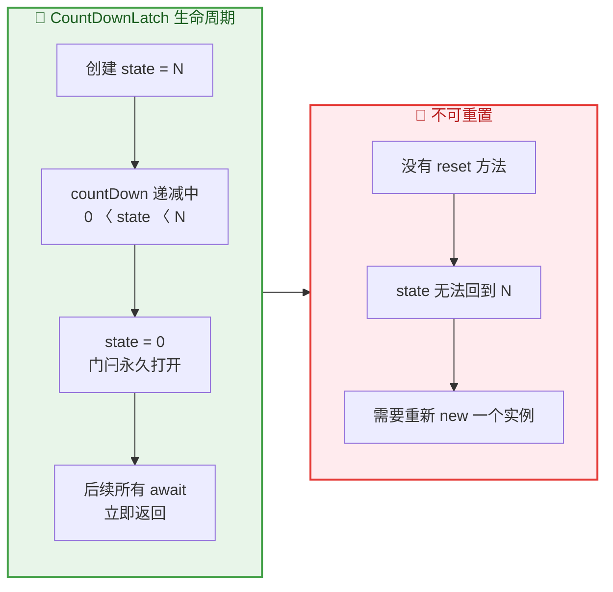
```mermaid
graph LR
    subgraph Lifecycle["🔄 CountDownLatch 生命周期"]
        direction TB
        A["创建 state = N"]
        B["countDown 递减中<br/>0 〈 state 〈 N"]
        C["state = 0<br/>门闩永久打开"]
        D["后续所有 await<br/>立即返回"]
        A --> B --> C --> D
    end

    subgraph NoReset["🚫 不可重置"]
        direction TB
        E["没有 reset 方法"]
        F["state 无法回到 N"]
        G["需要重新 new 一个实例"]
        E --> F --> G
    end

    Lifecycle --> NoReset

    classDef lifecycleStyle fill:#E8F5E9,stroke:#43A047,stroke-width:2px,color:#1B5E20
    classDef noResetStyle fill:#FFEBEE,stroke:#E53935,stroke-width:2px,color:#B71C1C

    class Lifecycle lifecycleStyle
    class NoReset noResetStyle
```

**为什么设计成一次性的？**

这与 `CountDownLatch` 的语义密切相关。它表达的是"等待一组事件完成"，而"一组事件完成"是一个**不可逆**的状态转换。就像现实中的门闩——一旦打开，就不会自动关回去。如果你需要**可重用**的同步屏障，应该使用 `CyclicBarrier`（下一节介绍）。

具体体现在代码层面：

```java
// CountDownLatch 没有提供 reset() 方法
// 以下代码展示了一次性特性
CountDownLatch latch = new CountDownLatch(3);

latch.countDown(); // state: 3 -> 2
latch.countDown(); // state: 2 -> 1
latch.countDown(); // state: 1 -> 0，门闩打开

// 此时 getCount() 返回 0
System.out.println(latch.getCount()); // 输出: 0

// 后续任何 await() 调用都会立即返回，不再阻塞
latch.await(); // 立即返回，因为 state 已经是 0
System.out.println("不会阻塞，直接通过！");

// 如果需要再次倒计时，只能重新创建
CountDownLatch newLatch = new CountDownLatch(3); // 新的实例
```

**与 `CyclicBarrier` 的对比（预告）**

| 特性 | CountDownLatch | CyclicBarrier |
|------|:---:|:---:|
| 可重用性 | ❌ 一次性 | ✅ 可循环使用 |
| 重置机制 | 无 reset 方法 | 自动重置 / 手动 `reset()` |
| 典型角色 | 等待者与通知者分离 | 所有参与者互相等待 |

### 应用场景（主线程等待多个子线程）

`CountDownLatch` 最经典、最高频的使用场景就是：**主线程等待多个子线程完成各自的任务后，再汇总结果或执行后续操作**。下面通过几个由浅入深的例子来全面掌握它的用法。

#### 场景一：并行初始化服务

在微服务启动时，通常需要初始化多个组件（数据库连接池、缓存、消息队列等），这些初始化可以并行进行，全部完成后再对外提供服务：

```java
import java.util.concurrent.CountDownLatch;

public class ServiceStartup {

    public static void main(String[] args) throws InterruptedException {
        // 需要初始化 3 个组件
        final int componentCount = 3;
        // 创建计数器，初始值为组件数量
        CountDownLatch latch = new CountDownLatch(componentCount);

        // 组件 1：初始化数据库连接池
        new Thread(() -> {
            try {
                System.out.println("[DB] 正在初始化数据库连接池...");
                Thread.sleep(2000); // 模拟耗时操作
                System.out.println("[DB] 数据库连接池初始化完成 ✓");
            } catch (InterruptedException e) {
                Thread.currentThread().interrupt(); // 恢复中断标记
            } finally {
                latch.countDown(); // 确保无论成功/失败都递减计数器
            }
        }, "DB-Init").start();

        // 组件 2：初始化 Redis 缓存
        new Thread(() -> {
            try {
                System.out.println("[Redis] 正在连接 Redis 集群...");
                Thread.sleep(1500); // 模拟耗时操作
                System.out.println("[Redis] Redis 缓存初始化完成 ✓");
            } catch (InterruptedException e) {
                Thread.currentThread().interrupt();
            } finally {
                latch.countDown(); // 递减计数器
            }
        }, "Redis-Init").start();

        // 组件 3：初始化消息队列
        new Thread(() -> {
            try {
                System.out.println("[MQ] 正在初始化消息队列消费者...");
                Thread.sleep(3000); // 模拟耗时操作
                System.out.println("[MQ] 消息队列初始化完成 ✓");
            } catch (InterruptedException e) {
                Thread.currentThread().interrupt();
            } finally {
                latch.countDown(); // 递减计数器
            }
        }, "MQ-Init").start();

        System.out.println("[Main] 等待所有组件初始化完成...");
        // 主线程阻塞在这里，直到 3 个组件都调用了 countDown()
        latch.await();
        // 走到这一行，说明所有组件已初始化完毕
        System.out.println("[Main] ═══ 所有组件就绪，服务启动成功！═══");
    }
}
```

运行输出（顺序可能因调度而异）：

```text
[Main] 等待所有组件初始化完成...
[DB] 正在初始化数据库连接池...
[Redis] 正在连接 Redis 集群...
[MQ] 正在初始化消息队列消费者...
[Redis] Redis 缓存初始化完成 ✓
[DB] 数据库连接池初始化完成 ✓
[MQ] 消息队列初始化完成 ✓
[Main] ═══ 所有组件就绪，服务启动成功！═══
```

整个过程的线程交互时序如下：

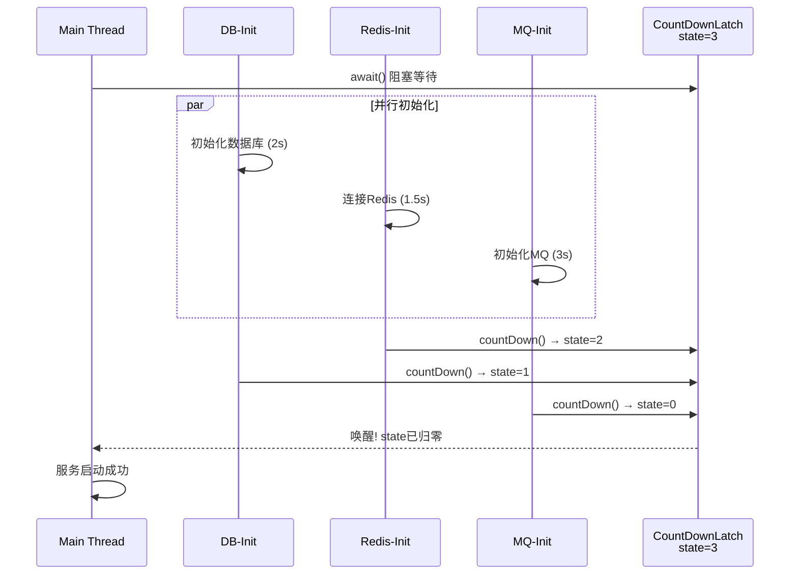
```mermaid
sequenceDiagram
    participant Main as Main Thread
    participant DB as DB-Init
    participant Redis as Redis-Init
    participant MQ as MQ-Init
    participant Latch as CountDownLatch<br/>state=3

    Main->>Latch: await() 阻塞等待

    par 并行初始化
        DB->>DB: 初始化数据库 (2s)
        Redis->>Redis: 连接Redis (1.5s)
        MQ->>MQ: 初始化MQ (3s)
    end

    Redis->>Latch: countDown() → state=2
    DB->>Latch: countDown() → state=1
    MQ->>Latch: countDown() → state=0

    Latch-->>Main: 唤醒! state已归零
    Main->>Main: 服务启动成功
```

#### 场景二：配合线程池使用（生产级写法）

实际开发中，我们通常不会手动创建 `Thread`，而是使用**线程池**。下面展示一个更接近生产环境的写法——并行查询多个数据源并汇总结果：

```java
import java.util.concurrent.*;
import java.util.Map;
import java.util.concurrent.ConcurrentHashMap;

public class ParallelQueryDemo {

    public static void main(String[] args) throws InterruptedException {
        // 线程池：核心线程数为 3
        ExecutorService executor = Executors.newFixedThreadPool(3);
        // 3 个数据源需要查询
        CountDownLatch latch = new CountDownLatch(3);
        // 线程安全的结果容器（多线程写入必须用 ConcurrentHashMap）
        Map<String, String> results = new ConcurrentHashMap<>();

        // 提交任务 1：查询用户服务
        executor.submit(() -> {
            try {
                Thread.sleep(1000); // 模拟网络延迟
                results.put("userService", "用户: 张三, 年龄: 25");
            } catch (InterruptedException e) {
                Thread.currentThread().interrupt();
            } finally {
                latch.countDown(); // 无论如何都要 countDown
            }
        });

        // 提交任务 2：查询订单服务
        executor.submit(() -> {
            try {
                Thread.sleep(800); // 模拟网络延迟
                results.put("orderService", "订单: ORD-20240101, 金额: ¥299");
            } catch (InterruptedException e) {
                Thread.currentThread().interrupt();
            } finally {
                latch.countDown();
            }
        });

        // 提交任务 3：查询库存服务
        executor.submit(() -> {
            try {
                Thread.sleep(1200); // 模拟网络延迟
                results.put("stockService", "库存: SKU-001, 剩余: 150");
            } catch (InterruptedException e) {
                Thread.currentThread().interrupt();
            } finally {
                latch.countDown();
            }
        });

        // 主线程等待所有查询完成，最多等 5 秒
        boolean allDone = latch.await(5, TimeUnit.SECONDS);

        if (allDone) {
            // 汇总结果
            System.out.println("=== 查询结果汇总 ===");
            results.forEach((service, data) ->
                System.out.println("[" + service + "] " + data)
            );
        } else {
            System.out.println("部分服务响应超时！已完成: " + results.keySet());
        }

        // 关闭线程池
        executor.shutdown();
    }
}
```

#### 场景三：模拟并发压测（多线程同时起跑）

`CountDownLatch` 还有一个巧妙的反向用法——**让多个线程同时开始执行**，用来模拟高并发场景：

```java
import java.util.concurrent.CountDownLatch;

public class ConcurrencySimulator {

    public static void main(String[] args) throws InterruptedException {
        final int threadCount = 100; // 模拟 100 个并发请求

        // 起跑信号：count=1，所有线程等待同一个信号
        CountDownLatch startSignal = new CountDownLatch(1);
        // 终点信号：count=100，主线程等待所有线程完成
        CountDownLatch doneSignal = new CountDownLatch(threadCount);

        for (int i = 0; i < threadCount; i++) {
            final int id = i;
            new Thread(() -> {
                try {
                    // 所有线程在此等待起跑信号
                    startSignal.await();
                    // ↓ 所有线程在 startSignal.countDown() 后几乎同时执行到这里
                    System.out.println("线程-" + id + " 发起请求，时间: "
                        + System.currentTimeMillis());
                    // 模拟业务处理
                    Thread.sleep((long) (Math.random() * 100));
                } catch (InterruptedException e) {
                    Thread.currentThread().interrupt();
                } finally {
                    doneSignal.countDown(); // 完成后递减终点计数器
                }
            }).start();
        }

        System.out.println("所有线程已就绪，3 秒后同时起跑...");
        Thread.sleep(3000);

        // 发令枪！一次 countDown 同时唤醒 100 个线程
        startSignal.countDown();

        // 等待所有线程执行完毕
        doneSignal.await();
        System.out.println("所有请求执行完毕！");
    }
}
```

这个"双 Latch"模式在并发测试中非常实用：

```text
 ┌────────────┐        startSignal         ┌────────────┐
 │  Thread-0  │──── await() ──────────┐    │            │
 │  Thread-1  │──── await() ──────────┤    │   Main     │
 │  Thread-2  │──── await() ──────────┤◄───│ countDown()│
 │    ...     │──── await() ──────────┤    │            │
 │ Thread-99  │──── await() ──────────┘    └────────────┘
 └────────────┘                                  │
       │                                         │
       │ (所有线程同时被唤醒)                       │
       ▼                                         ▼
   执行业务逻辑                            doneSignal.await()
       │                                         │
       │                                         │
       ▼                                         │
  doneSignal.countDown() ──────────────────────► │
                                                 ▼
                                          "所有请求执行完毕"
```

#### CountDownLatch 使用总结

| 要点 | 说明 |
|------|------|
| **创建** | `new CountDownLatch(N)`，N 为需要等待的事件数 |
| **等待** | 调用 `await()` 或 `await(timeout, unit)` |
| **通知** | 调用 `countDown()`，每次 state 减 1 |
| **触发条件** | state 减至 0 时，所有 await 线程被唤醒 |
| **一次性** | 不可重置，用完即弃 |
| **最佳实践** | `countDown()` 放在 `finally` 块中 |
| **推荐** | 使用带超时的 `await` 防止永久挂起 |
| **底层实现** | 基于 AQS 共享模式 + CAS 自旋 |

---

**📝 练习题**

以下代码的输出结果是什么？

```java
CountDownLatch latch = new CountDownLatch(2);

new Thread(() -> {
    latch.countDown();
    latch.countDown();
    System.out.print("A");
}).start();

latch.await();
System.out.print("B");
```

A. 一定输出 `AB`


B. 一定输出 `BA`


C. 可能输出 `AB`，也可能输出 `BA`


D. 程序会死锁，没有输出


**【答案】** C

**【解析】** 子线程中连续两次调用 `countDown()` 将 state 从 2 减至 0，此时门闩打开，主线程的 `await()` 返回。关键在于：子线程执行完两次 `countDown()` 后紧接着打印 `A`，而主线程被唤醒后打印 `B`。由于 `countDown()` 将 state 减为 0 的**那一刻**就会触发唤醒操作（`doReleaseShared()`），但子线程的 `System.out.print("A")` 和主线程被唤醒后的 `System.out.print("B")` 之间存在**竞态条件（race condition）**——两者的执行顺序取决于 CPU 调度。因此 `AB` 和 `BA` 都有可能出现。注意：这里不会死锁，因为同一个线程可以多次调用 `countDown()`，两次递减完全合法。

---

## CyclicBarrier ⭐

`CyclicBarrier`（循环屏障）是 `java.util.concurrent` 包中另一个极为经典的同步工具类。如果说 `CountDownLatch` 的核心思想是"**一群线程通知一个等待者**"，那么 `CyclicBarrier` 的核心思想就是"**一群线程互相等待，直到所有人都到齐了，再一起出发**"。更重要的是，这个屏障可以被**循环使用 (Cyclic)**——当所有线程都通过屏障后，它会自动重置 (reset)，进入下一轮等待。

从生活场景来理解：想象一群徒步旅行者，每到一个集合点（checkpoint），所有人必须全部到齐才能继续前进。先到的人就在原地等待，最后一个人到达后，大家一起出发走向下一个集合点。这就是 CyclicBarrier 的精髓——**多线程在同一个汇合点互相等待，然后同步推进**。

---

### 循环屏障

#### 核心设计理念

CyclicBarrier 的名字拆开来看：**Cyclic（循环的）** + **Barrier（屏障/栅栏）**。它在内部维护一个 **parties（参与方数量）** 和一个 **count（当前还未到达的线程数）**。每当一个线程调用 `await()`，count 就减一；当 count 减到 0 时，意味着所有参与方都已到达屏障点，屏障打开 (trip)，所有阻塞的线程被同时释放。之后，屏障自动重置 count 为 parties，准备好下一轮使用。

```java
// CyclicBarrier 的两种构造方式
// 方式一：仅指定参与线程数
CyclicBarrier barrier = new CyclicBarrier(3); // 3 个线程互相等待

// 方式二：指定参与线程数 + 屏障打开时的回调动作 (barrierAction)
// 当最后一个线程到达屏障时，由该线程执行此 Runnable，然后所有线程才被释放
CyclicBarrier barrier = new CyclicBarrier(3, () -> {
    System.out.println("所有线程已到达屏障，开始下一阶段！");
});
```

#### 内部结构概览

CyclicBarrier 底层并**不是**基于 AQS 实现的（这与 CountDownLatch 不同），而是基于 **ReentrantLock + Condition** 的经典等待/通知模型。它内部还引入了一个 **Generation（代）** 的概念来支持循环使用和破损 (broken) 检测。

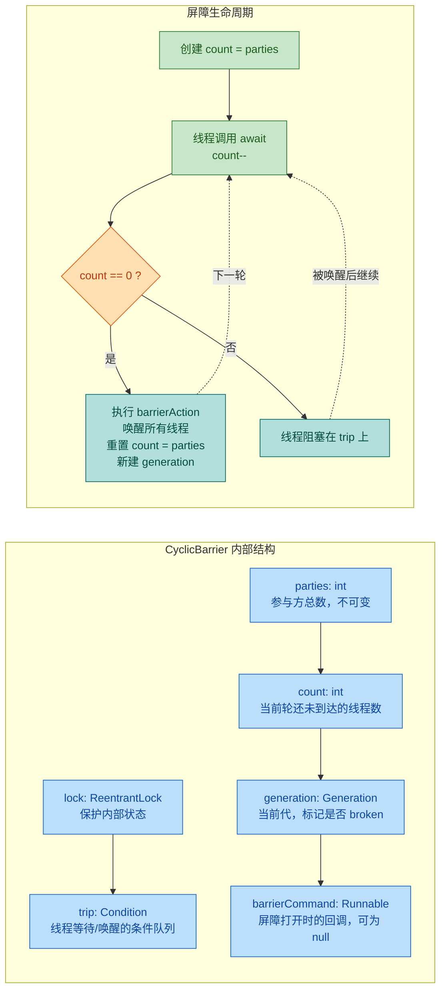
```mermaid
graph LR
    subgraph CyclicBarrier_Internal["CyclicBarrier 内部结构"]
        direction TB
        A["parties: int<br/>参与方总数，不可变"]
        B["count: int<br/>当前轮还未到达的线程数"]
        C["lock: ReentrantLock<br/>保护内部状态"]
        D["trip: Condition<br/>线程等待/唤醒的条件队列"]
        E["generation: Generation<br/>当前代，标记是否 broken"]
        F["barrierCommand: Runnable<br/>屏障打开时的回调，可为 null"]
        A --> B
        C --> D
        B --> E
        E --> F
    end

    subgraph Lifecycle["屏障生命周期"]
        direction TB
        G["创建 count = parties"]
        H["线程调用 await<br/>count--"]
        I{"count == 0 ?"}
        J["执行 barrierAction<br/>唤醒所有线程<br/>重置 count = parties<br/>新建 generation"]
        K["线程阻塞在 trip 上"]
        G --> H
        H --> I
        I -- "是" --> J
        I -- "否" --> K
        K -.->|"被唤醒后继续"| H
        J -.->|"下一轮"| H
    end

    classDef blueNode fill:#BBDEFB,stroke:#1565C0,color:#0D47A1
    classDef greenNode fill:#C8E6C9,stroke:#2E7D32,color:#1B5E20
    classDef orangeNode fill:#FFE0B2,stroke:#E65100,color:#BF360C
    classDef tealNode fill:#B2DFDB,stroke:#00695C,color:#004D40

    class A,B,C,D,E,F blueNode
    class G,H greenNode
    class I orangeNode
    class J,K tealNode
```

理解这张图中的关键点：

- **parties 是恒定不变的**，它在构造时确定，代表每一轮需要到达的线程总数。
- **count 是递减的计数器**，每一轮从 parties 开始，每有一个线程 `await()` 就减一。
- **Generation 对象**是区分"第几轮"的标志。当屏障被打开（或被 `reset()`），旧的 Generation 会被替换为新的，这样即使有线程还在旧 Generation 上等待，也能检测到屏障已被破坏 (broken)。

#### 与 CountDownLatch 的本质区别预览

在深入 API 之前，先直觉性地感受一下二者的角色差异：

```text
CountDownLatch:  "N 个工人干活，1 个老板等结果"    ——  单向等待
CyclicBarrier:   "N 个伙伴互相等，到齐了一起走"    ——  双向/多向互等
```

---

### await（等待所有线程到达）

`await()` 是 CyclicBarrier 最核心的方法，每个参与线程在到达屏障点时调用它。这个方法同时承担了**两个职责**：① 声明"我到了"（count 减一）；② 如果还有人没到，就**阻塞自己等待**。

#### 两种 await 签名

```java
// 无限等待，直到所有线程到达或屏障被破坏
public int await() throws InterruptedException, BrokenBarrierException

// 带超时的等待，超时后抛出 TimeoutException 并破坏屏障
public int await(long timeout, TimeUnit unit)
    throws InterruptedException, BrokenBarrierException, TimeoutException
```

注意返回值是 `int`——它返回的是**当前线程的到达索引 (arrival index)**。最先到达的线程返回值为 `parties - 1`，最后到达的线程返回值为 `0`。这个返回值非常有用，比如可以用它来指定"最后到达的线程负责做某件特殊的事"。

#### 完整的执行流程

让我们用一个详细的时序图来展示三个线程使用 CyclicBarrier 的交互过程：

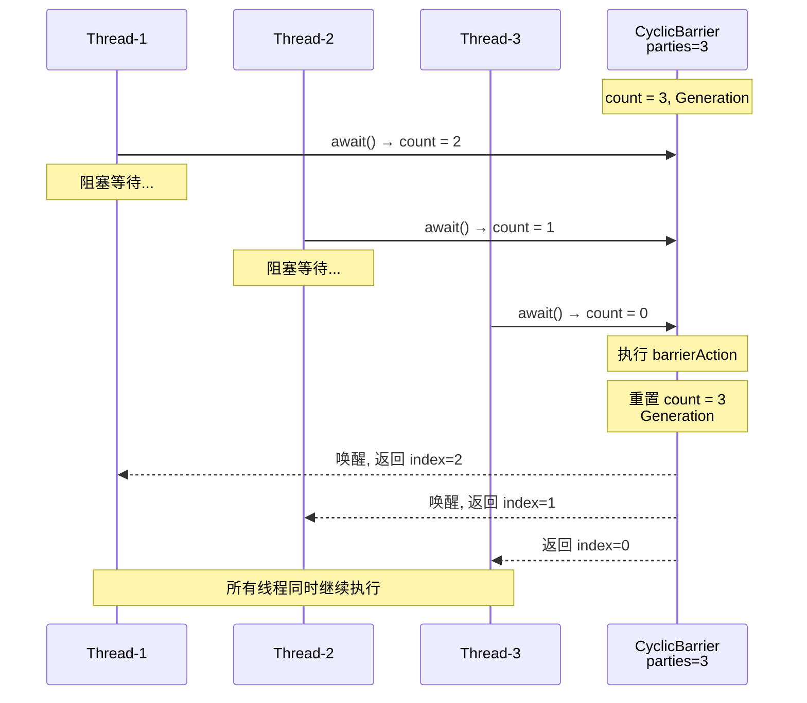
```mermaid
sequenceDiagram
    participant T1 as Thread-1
    participant T2 as Thread-2
    participant T3 as Thread-3
    participant CB as CyclicBarrier<br/>parties=3

    Note over CB: count = 3, Generation#1

    T1->>CB: await() → count = 2
    Note over T1: 阻塞等待...

    T2->>CB: await() → count = 1
    Note over T2: 阻塞等待...

    T3->>CB: await() → count = 0
    Note over CB: 执行 barrierAction
    Note over CB: 重置 count = 3<br/>Generation#2

    CB-->>T1: 唤醒, 返回 index=2
    CB-->>T2: 唤醒, 返回 index=1
    CB-->>T3: 返回 index=0

    Note over T1,T3: 所有线程同时继续执行
```

#### await 的源码级解析

CyclicBarrier 的 `await()` 内部调用的是 `dowait()` 方法，这是整个类最核心的逻辑。以下是其简化的关键路径：

```java
private int dowait(boolean timed, long nanos)
    throws InterruptedException, BrokenBarrierException, TimeoutException {

    // 获取可重入锁，保证对 count 的操作是线程安全的
    final ReentrantLock lock = this.lock;
    lock.lock();
    try {
        // 获取当前代（Generation），用于检测屏障是否被破坏
        final Generation g = generation;

        // 如果屏障已经被破坏，直接抛出异常
        if (g.broken)
            throw new BrokenBarrierException();

        // 如果当前线程被中断，破坏屏障并唤醒所有等待线程
        if (Thread.interrupted()) {
            breakBarrier();  // 设置 broken = true, 唤醒所有线程
            throw new InterruptedException();
        }

        // 核心：count 减一
        int index = --count;

        // 如果 index == 0，说明当前线程是最后一个到达的
        if (index == 0) {  // tripped!
            boolean ranAction = false;
            try {
                // 执行屏障回调动作（如果有的话）
                final Runnable command = barrierCommand;
                if (command != null)
                    command.run();  // 注意：由最后到达的线程执行
                ranAction = true;
                // 开启下一代：唤醒所有等待线程，重置 count，更新 generation
                nextGeneration();
                return 0;  // 最后到达的线程返回 0
            } finally {
                // 如果 barrierAction 抛出异常，破坏屏障
                if (!ranAction)
                    breakBarrier();
            }
        }

        // 不是最后一个到达的线程 → 进入循环等待
        for (;;) {
            try {
                if (!timed)
                    trip.await();           // 无限等待
                else if (nanos > 0L)
                    nanos = trip.awaitNanos(nanos);  // 带超时等待
            } catch (InterruptedException ie) {
                // 等待期间被中断的处理逻辑
                if (g == generation && !g.broken) {
                    breakBarrier();
                    throw ie;
                } else {
                    Thread.currentThread().interrupt();
                }
            }

            // 被唤醒后检查屏障状态
            if (g.broken)
                throw new BrokenBarrierException();

            // 如果 generation 已经更新，说明屏障已正常打开
            if (g != generation)
                return index;  // 返回自己的到达索引

            // 超时检查
            if (timed && nanos <= 0L) {
                breakBarrier();
                throw new TimeoutException();
            }
        }
    } finally {
        lock.unlock();  // 释放锁
    }
}
```

这段源码中有几个关键设计值得深入理解：

**1. barrierAction 由最后到达的线程执行**

这是一个非常精妙的设计。当 `index == 0`（即最后一个线程到达）时，它在持有锁的情况下执行 `barrierCommand.run()`。这意味着 barrierAction 的执行具有**天然的线程安全性**——它在所有线程被唤醒之前完成，可以安全地汇总各线程的计算结果。

**2. breakBarrier 的连锁效应**

一旦任何线程在等待过程中被中断、超时、或 barrierAction 抛出异常，整个屏障就会被"破坏" (broken)。`breakBarrier()` 会设置 `generation.broken = true` 并调用 `trip.signalAll()` 唤醒所有等待线程，让它们都抛出 `BrokenBarrierException`。这种"**一人出错，全体感知**"的设计保证了所有线程对失败状态的一致认知。

**3. Generation 的巧妙运用**

通过比较 `g != generation`，线程可以判断自己是在"当前代"被唤醒还是在"新一代"被唤醒。这是支持循环使用的基础。

#### 基础使用示例

```java
import java.util.concurrent.CyclicBarrier;
import java.util.concurrent.BrokenBarrierException;

public class CyclicBarrierBasicDemo {
    public static void main(String[] args) {

        // 创建一个需要 3 个线程到达的屏障
        // 当所有线程到达后，先执行 barrierAction，再释放所有线程
        CyclicBarrier barrier = new CyclicBarrier(3, () -> {
            // 这段代码由最后到达屏障的线程执行
            System.out.println(">>> 所有选手已就位，比赛开始！（由 " 
                + Thread.currentThread().getName() + " 触发）");
        });

        // 模拟 3 个选手准备比赛
        for (int i = 1; i <= 3; i++) {
            final int playerId = i;
            new Thread(() -> {
                try {
                    // 模拟每个选手不同的准备时间
                    long prepTime = (long) (Math.random() * 3000);
                    System.out.println("选手 " + playerId + " 正在热身，需要 " 
                        + prepTime + "ms...");
                    Thread.sleep(prepTime);

                    System.out.println("选手 " + playerId + " 准备就绪，等待其他人...");

                    // 到达屏障点，等待其他线程
                    // 返回值是到达索引：先到的返回值大，最后到的返回 0
                    int arrivalIndex = barrier.await();
                    System.out.println("选手 " + playerId + " 开始跑步！(到达索引=" 
                        + arrivalIndex + ")");

                } catch (InterruptedException | BrokenBarrierException e) {
                    System.err.println("选手 " + playerId + " 遇到异常: " + e);
                }
            }, "Player-" + i).start();
        }
    }
}
```

可能的输出结果：

```text
选手 1 正在热身，需要 1200ms...
选手 3 正在热身，需要 500ms...
选手 2 正在热身，需要 2800ms...
选手 3 准备就绪，等待其他人...
选手 1 准备就绪，等待其他人...
选手 2 准备就绪，等待其他人...
>>> 所有选手已就位，比赛开始！（由 Player-2 触发）
选手 2 开始跑步！(到达索引=0)
选手 3 开始跑步！(到达索引=2)
选手 1 开始跑步！(到达索引=1)
```

注意观察：选手 2 最后到达，所以它的 `arrivalIndex = 0`，并且 barrierAction 由 Player-2 线程执行。

#### 异常处理机制

CyclicBarrier 的异常处理设计非常严谨，理解以下三种异常的触发场景至关重要：

| 异常类型 | 触发条件 | 影响范围 |
|:---|:---|:---|
| `InterruptedException` | 等待中的线程被 `interrupt()` | 该线程抛异常，同时**破坏屏障**，其他等待线程抛 `BrokenBarrierException` |
| `BrokenBarrierException` | 屏障被破坏后，其他线程被唤醒时检测到 | 所有在同一代等待的线程 |
| `TimeoutException` | 使用 `await(timeout, unit)` 且超时 | 超时线程抛此异常，同时**破坏屏障** |

```java
// 演示屏障被破坏的场景
public class BrokenBarrierDemo {
    public static void main(String[] args) throws InterruptedException {

        CyclicBarrier barrier = new CyclicBarrier(3);

        // 线程 1：正常等待
        Thread t1 = new Thread(() -> {
            try {
                System.out.println("T1: 到达屏障，开始等待...");
                barrier.await();
                System.out.println("T1: 通过屏障！");
            } catch (BrokenBarrierException e) {
                // 当其他线程被中断导致屏障破坏时，T1 会捕获此异常
                System.out.println("T1: 屏障已被破坏！" + e);
            } catch (InterruptedException e) {
                System.out.println("T1: 被中断！");
            }
        });

        // 线程 2：将被中断
        Thread t2 = new Thread(() -> {
            try {
                System.out.println("T2: 到达屏障，开始等待...");
                barrier.await();
                System.out.println("T2: 通过屏障！");
            } catch (BrokenBarrierException e) {
                System.out.println("T2: 屏障已被破坏！");
            } catch (InterruptedException e) {
                // T2 被外部中断，抛出 InterruptedException
                System.out.println("T2: 被中断！导致屏障破坏");
            }
        });

        t1.start();
        t2.start();

        // 确保 t1 和 t2 都已经在 await() 上阻塞
        Thread.sleep(1000);

        // 中断 t2 → 导致 t2 抛 InterruptedException，同时屏障被破坏
        // t1 随即抛 BrokenBarrierException
        t2.interrupt();

        // 检查屏障状态
        Thread.sleep(500);
        System.out.println("屏障是否已破坏: " + barrier.isBroken()); // true
    }
}
```

---

### 可重用

CyclicBarrier 与 CountDownLatch 最显著的区别就是**可重用性**。CountDownLatch 是一次性的——计数到零后就"废了"，无法重置。而 CyclicBarrier 在每一轮所有线程通过后会**自动重置**，进入下一轮循环。此外，还可以通过 `reset()` 方法**手动重置**。

#### 自动重置机制

当最后一个线程到达屏障时，`dowait()` 内部会调用 `nextGeneration()` 方法：

```java
private void nextGeneration() {
    // 唤醒当前代所有等待的线程
    trip.signalAll();
    // 重置计数器
    count = parties;
    // 创建新的 Generation 对象，标志新一轮的开始
    generation = new Generation();
}
```

这意味着同一个 CyclicBarrier 对象可以被反复使用，无需创建新实例。

#### 多轮循环示例

```java
import java.util.concurrent.CyclicBarrier;
import java.util.concurrent.BrokenBarrierException;

public class CyclicBarrierReusableDemo {
    public static void main(String[] args) {

        final int THREAD_COUNT = 3;  // 参与线程数
        final int ROUNDS = 3;        // 循环轮数

        // barrierAction 在每一轮结束时执行
        CyclicBarrier barrier = new CyclicBarrier(THREAD_COUNT, () -> {
            System.out.println("====== 本轮全部完成，屏障自动重置 ======\n");
        });

        for (int i = 0; i < THREAD_COUNT; i++) {
            final int threadId = i;
            new Thread(() -> {
                try {
                    // 每个线程参与多轮
                    for (int round = 1; round <= ROUNDS; round++) {
                        // 模拟每轮的计算工作
                        long workTime = (long) (Math.random() * 1000);
                        Thread.sleep(workTime);
                        System.out.println("线程-" + threadId 
                            + " 完成第 " + round + " 轮任务（耗时 " 
                            + workTime + "ms），等待其他线程...");

                        // 到达屏障，等待本轮所有线程完成
                        // 屏障打开后自动重置，下一轮的 await() 将再次阻塞
                        barrier.await();

                        // 执行到这里说明本轮屏障已打开
                        System.out.println("线程-" + threadId 
                            + " 进入第 " + (round + 1) + " 轮");
                    }
                } catch (InterruptedException | BrokenBarrierException e) {
                    e.printStackTrace();
                }
            }, "Worker-" + i).start();
        }
    }
}
```

这段代码展示了 CyclicBarrier 最强大的特性：**同一组线程用同一个屏障对象循环同步多次**。这在需要**分阶段执行**的并行计算中非常有用。

#### 手动重置 reset()

```java
// reset() 方法的效果
public void reset() {
    final ReentrantLock lock = this.lock;
    lock.lock();
    try {
        breakBarrier();   // 先破坏当前代 → 唤醒所有等待线程，它们将抛 BrokenBarrierException
        nextGeneration(); // 再开启新的一代 → 重置 count，创建新 Generation
    } finally {
        lock.unlock();
    }
}
```

> ⚠️ **注意**：`reset()` 方法会先 `breakBarrier()` 再 `nextGeneration()`。这意味着如果有线程正在 `await()` 上等待，调用 `reset()` 会导致它们全部抛出 `BrokenBarrierException`。因此 `reset()` 通常只在**确认没有线程等待**或**需要强制中止当前轮次**时使用。

#### 可重用 vs 一次性：内存模型对比

```java
// ========== 一次性的 CountDownLatch ==========
// 用完就扔，需要新建
// CountDownLatch latch = new CountDownLatch(3);   // 第 1 轮
// ... 使用后 count 归零 ...
// latch = new CountDownLatch(3);                   // 必须新建对象才能重用

// ========== 可循环的 CyclicBarrier ==========
// 同一个对象反复使用
// CyclicBarrier barrier = new CyclicBarrier(3);    // 创建一次
// ... 第 1 轮：3 个线程 await() → 自动重置 ...
// ... 第 2 轮：同一个 barrier，3 个线程再次 await() ...
// ... 第 N 轮：依然是同一个对象 ...
```

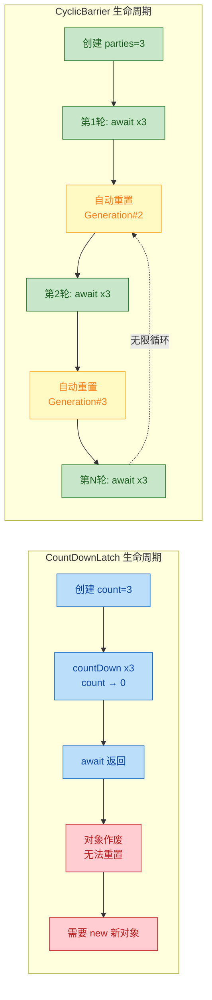
```mermaid
graph LR
    subgraph CountDownLatch_Lifecycle["CountDownLatch 生命周期"]
        direction TB
        A1["创建 count=3"] --> A2["countDown x3<br/>count → 0"]
        A2 --> A3["await 返回"]
        A3 --> A4["对象作废<br/>无法重置"]
        A4 --> A5["需要 new 新对象"]
    end

    subgraph CyclicBarrier_Lifecycle["CyclicBarrier 生命周期"]
        direction TB
        B1["创建 parties=3"]
        B2["第1轮: await x3"]
        B3["自动重置<br/>Generation#2"]
        B4["第2轮: await x3"]
        B5["自动重置<br/>Generation#3"]
        B6["第N轮: await x3"]
        B1 --> B2
        B2 --> B3
        B3 --> B4
        B4 --> B5
        B5 --> B6
        B6 -.->|"无限循环"| B3
    end

    classDef redNode fill:#FFCDD2,stroke:#C62828,color:#B71C1C
    classDef greenNode fill:#C8E6C9,stroke:#2E7D32,color:#1B5E20
    classDef blueNode fill:#BBDEFB,stroke:#1565C0,color:#0D47A1
    classDef amberNode fill:#FFF9C4,stroke:#F9A825,color:#F57F17

    class A1,A2,A3 blueNode
    class A4,A5 redNode
    class B1,B2,B4,B6 greenNode
    class B3,B5 amberNode
```

---

### 应用场景（多线程分段计算）

CyclicBarrier 最经典的应用场景是**多线程分段/分阶段并行计算**——多个线程各自完成一个阶段的计算后，在屏障处汇合，合并中间结果，然后进入下一阶段。此外，它还广泛用于并行测试、模拟仿真等领域。

#### 场景一：多线程矩阵分段计算

假设我们需要对一个大数组求和。将数组分成若干段，每个线程负责计算一段的部分和，然后在屏障处汇总，再进入下一阶段的处理。

```java
import java.util.concurrent.CyclicBarrier;
import java.util.concurrent.BrokenBarrierException;

public class ParallelComputationDemo {

    // 共享数据：每个线程将自己的计算结果写入对应位置
    private static final int THREAD_COUNT = 4;
    private static final long[] partialSums = new long[THREAD_COUNT];
    private static long totalSum = 0;

    public static void main(String[] args) throws InterruptedException {

        // 模拟一个大数组
        int[] data = new int[10000];
        for (int i = 0; i < data.length; i++) {
            data[i] = i + 1;  // 1 + 2 + ... + 10000 = 50005000
        }

        // 屏障回调：汇总所有线程的部分和
        CyclicBarrier barrier = new CyclicBarrier(THREAD_COUNT, () -> {
            // 由最后到达的线程执行汇总
            totalSum = 0;
            for (long ps : partialSums) {
                totalSum += ps;
            }
            System.out.println(">>> 汇总完成，总和 = " + totalSum);
        });

        // 计算每个线程负责的数据段
        int segmentSize = data.length / THREAD_COUNT;

        for (int i = 0; i < THREAD_COUNT; i++) {
            final int threadId = i;
            // 计算当前线程的数据范围
            final int start = i * segmentSize;
            // 最后一个线程处理剩余所有元素（处理不整除的情况）
            final int end = (i == THREAD_COUNT - 1) ? data.length : start + segmentSize;

            new Thread(() -> {
                try {
                    // 阶段一：各自计算部分和
                    long sum = 0;
                    for (int j = start; j < end; j++) {
                        sum += data[j];
                    }
                    partialSums[threadId] = sum;
                    System.out.println("线程-" + threadId + " 计算完成: data[" 
                        + start + ".." + (end - 1) + "] = " + sum);

                    // 到达屏障：等待所有线程完成阶段一
                    // barrierAction 中会汇总 partialSums
                    barrier.await();

                    // 阶段二：所有线程都能看到 totalSum
                    System.out.println("线程-" + threadId 
                        + " 继续后续处理，已知总和 = " + totalSum);

                } catch (InterruptedException | BrokenBarrierException e) {
                    e.printStackTrace();
                }
            }, "Calc-" + i).start();
        }
    }
}
```

输出示例：

```text
线程-0 计算完成: data[0..2499] = 3123750
线程-2 计算完成: data[5000..7499] = 15623750
线程-1 计算完成: data[2500..4999] = 9373750
线程-3 计算完成: data[7500..9999] = 21883750
>>> 汇总完成，总和 = 50005000
线程-3 继续后续处理，已知总和 = 50005000
线程-0 继续后续处理，已知总和 = 50005000
线程-2 继续后续处理，已知总和 = 50005000
线程-1 继续后续处理，已知总和 = 50005000
```

#### 场景二：模拟并发压力测试

让 N 个线程全部准备就绪后**同时发起请求**，模拟瞬时高并发：

```java
import java.util.concurrent.CyclicBarrier;
import java.util.concurrent.BrokenBarrierException;

public class ConcurrentStressTest {

    private static final int CONCURRENT_COUNT = 50;  // 并发线程数

    public static void main(String[] args) {

        // +1 是因为主线程也参与等待（可选设计）
        CyclicBarrier barrier = new CyclicBarrier(CONCURRENT_COUNT, () -> {
            System.out.println("所有 " + CONCURRENT_COUNT + " 个线程就绪，同时发起请求！");
            System.out.println("发起时间: " + System.currentTimeMillis());
        });

        for (int i = 0; i < CONCURRENT_COUNT; i++) {
            final int requestId = i;
            new Thread(() -> {
                try {
                    // 模拟线程初始化（如建立连接、加载配置等）
                    Thread.sleep((long) (Math.random() * 2000));
                    System.out.println("请求-" + requestId + " 准备完毕");

                    // 所有线程在此处同步：确保真正的"同时"发起
                    barrier.await();

                    // ====== 真正的压力测试逻辑 ======
                    long startTime = System.currentTimeMillis();
                    // simulateHttpRequest(); // 实际的请求逻辑
                    Thread.sleep(100); // 模拟请求
                    long elapsed = System.currentTimeMillis() - startTime;
                    System.out.println("请求-" + requestId + " 响应时间: " + elapsed + "ms");

                } catch (InterruptedException | BrokenBarrierException e) {
                    e.printStackTrace();
                }
            }).start();
        }
    }
}
```

这个模式比使用 CountDownLatch 更直观——因为这里的语义确实是"**一群线程互等，到齐后同时出发**"，完美匹配 CyclicBarrier 的设计意图。

#### 场景三：多轮迭代的并行模拟（经典用例）

在科学计算、游戏物理引擎、元胞自动机 (Cellular Automaton) 等领域，一个典型模式是：多个线程各自更新自己负责的区域，然后在屏障处同步，确认所有区域都更新完毕后再进入下一个时间步 (timestep)。

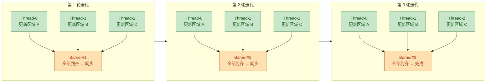
```mermaid
graph LR
    subgraph Round1["第 1 轮迭代"]
        direction TB
        R1A["Thread-0<br/>更新区域 A"]
        R1B["Thread-1<br/>更新区域 B"]
        R1C["Thread-2<br/>更新区域 C"]
        R1D["Barrier#1<br/>全部到齐 → 同步"]
        R1A --> R1D
        R1B --> R1D
        R1C --> R1D
    end

    subgraph Round2["第 2 轮迭代"]
        direction TB
        R2A["Thread-0<br/>更新区域 A"]
        R2B["Thread-1<br/>更新区域 B"]
        R2C["Thread-2<br/>更新区域 C"]
        R2D["Barrier#2<br/>全部到齐 → 同步"]
        R2A --> R2D
        R2B --> R2D
        R2C --> R2D
    end

    subgraph Round3["第 3 轮迭代"]
        direction TB
        R3A["Thread-0<br/>更新区域 A"]
        R3B["Thread-1<br/>更新区域 B"]
        R3C["Thread-2<br/>更新区域 C"]
        R3D["Barrier#3<br/>全部到齐 → 完成"]
        R3A --> R3D
        R3B --> R3D
        R3C --> R3D
    end

    Round1 --> Round2
    Round2 --> Round3

    classDef workerNode fill:#C8E6C9,stroke:#2E7D32,color:#1B5E20
    classDef barrierNode fill:#FFE0B2,stroke:#E65100,color:#BF360C
    classDef phase fill:#E3F2FD,stroke:#1565C0,color:#0D47A1

    class R1A,R1B,R1C,R2A,R2B,R2C,R3A,R3B,R3C workerNode
    class R1D,R2D,R3D barrierNode
```

#### CyclicBarrier 常用 API 汇总

| 方法 | 说明 |
|:---|:---|
| `CyclicBarrier(int parties)` | 构造，指定参与线程数 |
| `CyclicBarrier(int parties, Runnable barrierAction)` | 构造，附带屏障打开时的回调 |
| `int await()` | 等待所有线程到达，返回到达索引 |
| `int await(long timeout, TimeUnit unit)` | 带超时的等待 |
| `int getParties()` | 返回参与方总数（parties） |
| `int getNumberWaiting()` | 返回当前在屏障上等待的线程数 |
| `boolean isBroken()` | 检查屏障是否被破坏 |
| `void reset()` | 手动重置屏障（会破坏当前代） |

#### 使用注意事项

**1. parties 必须与实际调用 await() 的线程数匹配**

如果你创建了 `new CyclicBarrier(3)` 但只有 2 个线程调用 `await()`，那么这两个线程将**永远阻塞**（或直到超时）。这是最常见的使用错误。

**2. barrierAction 中不要执行耗时操作**

barrierAction 在持有锁的情况下由最后到达的线程执行。如果它耗时过长，所有其他线程虽然已被唤醒，但由于锁还未释放，实际上还是会被阻塞。

**3. 谨慎对待 BrokenBarrierException**

一旦屏障被破坏，所有后续的 `await()` 调用（在同一代内）都会立即抛出 `BrokenBarrierException`。要恢复使用，必须调用 `reset()`。

**4. 优先考虑是否真的需要 CyclicBarrier**

如果只需要"等待一组任务完成"而不需要"互相等待"，`CountDownLatch` 或 `CompletableFuture.allOf()` 可能是更好的选择。CyclicBarrier 的价值在于**同步推进**——所有线程在同一节奏下前进。

---

**📝 练习题**

以下关于 CyclicBarrier 的说法，**错误**的是：

A. CyclicBarrier 的 `await()` 方法返回值是当前线程的到达索引（arrival index），最后到达的线程返回 0


B. CyclicBarrier 构造时传入的 barrierAction 由第一个到达屏障的线程执行，以便尽早开始汇总工作


C. 如果某个等待线程被中断，屏障会被破坏（broken），其他所有等待线程将抛出 `BrokenBarrierException`


D. CyclicBarrier 底层基于 `ReentrantLock + Condition` 实现，而非 AQS

**【答案】** B

**【解析】** 选项 B 是错误的。CyclicBarrier 的 barrierAction 是由**最后一个到达屏障的线程**执行的，而不是第一个。源码中的逻辑是：当 `--count == 0` 时（即当前线程是最后到达的），该线程在持有锁的情况下执行 `barrierCommand.run()`，然后调用 `nextGeneration()` 唤醒所有等待线程。这种设计保证了 barrierAction 在所有线程的工作都完成后、在线程被释放前执行，具有天然的时序安全性。选项 A 正确，到达索引从 `parties - 1` 递减到 `0`。选项 C 正确，`breakBarrier()` 会设置 `broken = true` 并 `signalAll()`。选项 D 正确，CyclicBarrier 使用 `ReentrantLock + Condition` 而非直接继承 AQS（与 CountDownLatch 不同）。

---

## CountDownLatch vs CyclicBarrier ⭐

CountDownLatch 和 CyclicBarrier 是 `java.util.concurrent` 包中最常被放在一起比较的两个同步工具类。它们都能让线程"等待"，但在设计哲学、内部机制和使用场景上存在本质差异。深入理解它们的区别，是掌握 Java 并发编程的重要环节，也是高频面试考点。

### 核心设计哲学对比

要理解二者的根本区别，最好的切入点是回答一个问题：**"谁在等谁？"**

- **CountDownLatch** 的模型是 **"一个或多个线程，等待另外 N 件事情完成"**。它体现的是一种 **事件驱动（Event-Driven）** 的等待。调用 `await()` 的线程是"旁观者"，它并不参与倒计数本身，它只关心"计数器是否归零了"。而调用 `countDown()` 的线程甚至可以不是执行任务的线程——任何地方都能调用 `countDown()`。

- **CyclicBarrier** 的模型是 **"N 个线程互相等待，直到所有人都到达屏障点"**。它体现的是一种 **对等协作（Peer Coordination）** 的等待。每一个调用 `await()` 的线程既是"等待者"，也是"被等待者"——它到达屏障点后，自己也会被阻塞，直到最后一个伙伴到齐。

用一个生活化的比喻来加深印象：

> **CountDownLatch** 就像火箭发射倒计时：指挥中心（主线程）等待所有检查项（子线程/事件）完成确认，倒计时归零后火箭发射。检查人员完成工作后就走了，不需要互相等待。
>
> **CyclicBarrier** 就像朋友约好在餐厅门口集合：每个人到了之后都得在门口等，直到所有人都到齐了，才一起进去吃饭。而且吃完这一轮，还可以约下一顿。

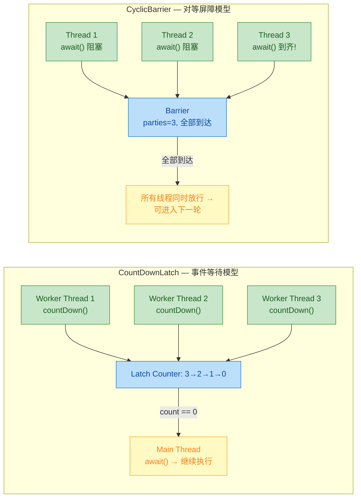
```mermaid
graph LR
    subgraph CDL["CountDownLatch — 事件等待模型"]
        direction TB
        T1_cdl["Worker Thread 1<br/>countDown()"]:::worker
        T2_cdl["Worker Thread 2<br/>countDown()"]:::worker
        T3_cdl["Worker Thread 3<br/>countDown()"]:::worker
        LATCH["Latch Counter: 3→2→1→0"]:::core
        MAIN_cdl["Main Thread<br/>await() → 继续执行"]:::main

        T1_cdl --> LATCH
        T2_cdl --> LATCH
        T3_cdl --> LATCH
        LATCH -->|"count == 0"| MAIN_cdl
    end

    subgraph CB["CyclicBarrier — 对等屏障模型"]
        direction TB
        T1_cb["Thread 1<br/>await() 阻塞"]:::worker
        T2_cb["Thread 2<br/>await() 阻塞"]:::worker
        T3_cb["Thread 3<br/>await() 到齐!"]:::worker
        BARRIER["Barrier<br/>parties=3, 全部到达"]:::core
        ALL_cb["所有线程同时放行 →<br/>可进入下一轮"]:::main

        T1_cb --> BARRIER
        T2_cb --> BARRIER
        T3_cb --> BARRIER
        BARRIER -->|"全部到达"| ALL_cb
    end

    classDef worker fill:#C8E6C9,stroke:#388E3C,color:#1B5E20
    classDef core fill:#BBDEFB,stroke:#1976D2,color:#0D47A1
    classDef main fill:#FFF9C4,stroke:#F9A825,color:#F57F17
```

### 内部实现机制对比

虽然二者都用于线程同步，但它们的底层实现截然不同。

**CountDownLatch** 基于 **AQS（AbstractQueuedSynchronizer）** 的 **共享模式（Shared Mode）** 实现。它的核心是 AQS 中的 `state` 字段，初始化为 count 值。每次 `countDown()` 通过 CAS 操作将 `state` 减 1；当 `state` 减到 0 时，所有在 `await()` 上阻塞的线程被同时唤醒（shared propagation）。因为 `state` 减到 0 后没有重置机制，所以 CountDownLatch 是 **一次性的（one-shot）**。

**CyclicBarrier** 基于 **ReentrantLock + Condition** 实现。它内部维护一个 `count` 计数器和一个 `generation` 对象。每当一个线程调用 `await()`，`count` 减 1，如果不是最后一个到达的线程，就在 Condition 上等待；当最后一个线程到达（count == 0）时，执行可选的 barrierAction，然后调用 `Condition.signalAll()` 唤醒所有等待线程，并 **重置 count 和 generation**，从而实现 **可循环使用（cyclic）**。

```java
// ====== CountDownLatch 核心原理（简化版） ======

// 内部基于 AQS 共享模式
public class CountDownLatch {

    // Sync 继承自 AQS
    private static final class Sync extends AbstractQueuedSynchronizer {
        // 构造时将 state 设为 count
        Sync(int count) {
            setState(count);  // AQS 的 state = count
        }

        // 尝试获取共享锁：state == 0 时返回 1（成功），否则返回 -1（失败，需排队）
        protected int tryAcquireShared(int acquires) {
            return (getState() == 0) ? 1 : -1;
        }

        // 尝试释放共享锁：CAS 将 state 减 1，减到 0 时返回 true
        protected boolean tryReleaseShared(int releases) {
            for (;;) {                          // 自旋 CAS
                int c = getState();             // 读取当前 state
                if (c == 0) return false;       // 已经是 0，无需再减
                int nextc = c - 1;              // 计算新值
                if (compareAndSetState(c, nextc)) // CAS 更新
                    return nextc == 0;          // 减到 0 则返回 true，触发唤醒
            }
        }
    }
}
```

```java
// ====== CyclicBarrier 核心原理（简化版） ======

public class CyclicBarrier {
    private final ReentrantLock lock = new ReentrantLock();     // 互斥锁
    private final Condition trip = lock.newCondition();          // 条件变量
    private final int parties;        // 参与线程总数（固定）
    private int count;                // 剩余未到达的线程数
    private Generation generation;    // 代（用于标识当前轮次）
    private final Runnable barrierCommand; // 屏障动作（可选）

    // 核心 await 逻辑
    private int dowait(boolean timed, long nanos) throws Exception {
        final ReentrantLock lock = this.lock;
        lock.lock();                          // 加锁
        try {
            int index = --count;              // 到达，count 减 1
            if (index == 0) {                 // 最后一个线程到达
                if (barrierCommand != null)
                    barrierCommand.run();      // 执行屏障动作
                nextGeneration();             // 重置 count、更新 generation、signalAll
                return 0;
            }
            // 不是最后一个，在 Condition 上等待
            while (/* 条件未满足 */) {
                trip.await();                 // 阻塞，释放锁
            }
        } finally {
            lock.unlock();                    // 解锁
        }
    }
}
```

### 全维度特性对比表

下面的表格从多个维度系统性地对比两者的差异：

| 对比维度 | CountDownLatch | CyclicBarrier |
|:---|:---|:---|
| **等待模型** | 线程等待事件（一对多 / 多对多） | 线程互相等待（多对多对等） |
| **核心方法** | `countDown()` + `await()` | `await()`（同时扮演到达和等待） |
| **调用者角色分离** | `countDown()` 和 `await()` 通常由不同线程调用 | 同一个线程既到达又等待 |
| **底层实现** | AQS 共享模式（CAS + state） | ReentrantLock + Condition |
| **是否可重用** | ❌ 一次性，归零后无法重置 | ✅ 可循环使用，自动重置 |
| **计数方向** | 倒计数（count → 0） | 倒计数（count → 0），但会自动重置 |
| **屏障动作** | ❌ 不支持 | ✅ 支持 `barrierAction`（最后到达的线程执行） |
| **异常处理** | 某线程异常不影响计数器 | 某线程异常或中断会打破屏障（BrokenBarrierException） |
| **超时支持** | `await(timeout, unit)` | `await(timeout, unit)` |
| **典型场景** | 主线程等待 N 个子任务完成 | N 个线程分阶段协同计算 |
| **参与者灵活性** | 计数值固定，但 `countDown()` 可被任意对象调用 | parties 固定，只有参与的线程调用 `await()` |
| **重新实例化** | 需要创建新的 CountDownLatch 对象 | 无需重建，自动进入下一轮 |

### 可重用性深度解析

可重用性是二者最显著的区别之一，值得展开说明。

**CountDownLatch 不可重用**：一旦内部 AQS 的 `state` 减到 0，就永远是 0。后续调用 `await()` 会立即返回（因为 `tryAcquireShared` 返回 1），后续调用 `countDown()` 也是空操作。如果业务需要"再来一轮"，必须创建一个全新的 CountDownLatch 实例。

```java
// 演示 CountDownLatch 不可重用的问题
public class CountDownLatchNotReusable {
    public static void main(String[] args) throws InterruptedException {
        // 创建一个计数为 2 的 Latch
        CountDownLatch latch = new CountDownLatch(2);

        // 第一轮：正常使用
        latch.countDown();  // count: 2 → 1
        latch.countDown();  // count: 1 → 0
        latch.await();      // 立即返回，因为 count == 0
        System.out.println("第一轮完成");

        // 第二轮：尝试复用 —— 失败！
        latch.await();      // 立即返回！count 已经是 0，无法重置
        System.out.println("第二轮也立即完成了，因为 latch 已经失效");

        // 正确做法：必须创建新实例
        CountDownLatch latch2 = new CountDownLatch(2); // 全新对象
    }
}
```

**CyclicBarrier 可重用**：当所有线程都到达屏障后，内部自动调用 `nextGeneration()` 方法，将 `count` 重置为 `parties`，并创建新的 `Generation` 对象。所有线程被唤醒后，可以继续执行下一阶段的任务，然后再次调用 `await()` 进入下一轮屏障。

```java
// 演示 CyclicBarrier 的可重用性
public class CyclicBarrierReusable {
    public static void main(String[] args) {
        // 创建一个 3 人屏障，每轮结束时打印信息
        CyclicBarrier barrier = new CyclicBarrier(3, () -> {
            // barrierAction：最后一个到达的线程执行
            System.out.println("===== 所有线程到齐，屏障打开！=====");
        });

        // 3 个工作线程
        for (int i = 0; i < 3; i++) {
            final int id = i;
            new Thread(() -> {
                try {
                    // ---- 第一轮 ----
                    System.out.println("线程" + id + " 完成第一阶段工作");
                    barrier.await(); // 等待所有线程到达第一个屏障点
                    // 屏障自动重置，进入第二轮

                    // ---- 第二轮 ----
                    System.out.println("线程" + id + " 完成第二阶段工作");
                    barrier.await(); // 再次等待所有线程到达第二个屏障点
                    // 屏障再次自动重置

                    // ---- 第三轮 ----
                    System.out.println("线程" + id + " 完成第三阶段工作");
                    barrier.await(); // 第三次使用同一个 barrier

                    System.out.println("线程" + id + " 全部阶段完成！");
                } catch (Exception e) {
                    e.printStackTrace();
                }
            }, "Worker-" + id).start();
        }
    }
}
```

可能的输出（线程交错顺序不确定）：

```
线程0 完成第一阶段工作
线程2 完成第一阶段工作
线程1 完成第一阶段工作
===== 所有线程到齐，屏障打开！=====
线程1 完成第二阶段工作
线程0 完成第二阶段工作
线程2 完成第二阶段工作
===== 所有线程到齐，屏障打开！=====
线程2 完成第三阶段工作
线程0 完成第三阶段工作
线程1 完成第三阶段工作
===== 所有线程到齐，屏障打开！=====
线程2 全部阶段完成！
线程0 全部阶段完成！
线程1 全部阶段完成！
```

### 异常处理行为差异

这是一个容易被忽视但在生产环境中至关重要的差异。

**CountDownLatch 的容错性较强**：如果某个执行 `countDown()` 的线程抛出异常，只要在异常之前已经调用了 `countDown()`（或者在 `finally` 块中调用），计数器就正常减 1。即使某个线程崩溃，只要最终有足够数量的 `countDown()` 调用发生，等待的线程就能被唤醒。当然，如果因为线程崩溃导致 `countDown()` 调用次数不够，`await()` 将永远阻塞（除非使用带超时的版本）。

**CyclicBarrier 采用"全体牵连"策略（All-or-Nothing）**：如果一个线程在 `await()` 时被中断或超时，该屏障将进入 **broken 状态（broken barrier）**，所有正在该屏障上等待的线程都会收到 `BrokenBarrierException`。这种设计的意图是：既然是"所有人必须到齐"，那么一个人出了问题，继续等待就没有意义了，不如尽早通知所有人。

```java
// 演示 CyclicBarrier 的 broken 行为
public class BrokenBarrierDemo {
    public static void main(String[] args) {
        CyclicBarrier barrier = new CyclicBarrier(3);

        // 线程 0：正常等待
        new Thread(() -> {
            try {
                System.out.println("线程0 到达屏障");
                barrier.await();                    // 阻塞等待
            } catch (BrokenBarrierException e) {
                // 当其他线程中断导致屏障破损时，抛出此异常
                System.out.println("线程0 收到 BrokenBarrierException！屏障已损坏");
            } catch (InterruptedException e) {
                System.out.println("线程0 被中断");
            }
        }).start();

        // 线程 1：将被中断
        Thread t1 = new Thread(() -> {
            try {
                System.out.println("线程1 到达屏障");
                barrier.await();                    // 阻塞等待
            } catch (BrokenBarrierException e) {
                System.out.println("线程1 收到 BrokenBarrierException！");
            } catch (InterruptedException e) {
                System.out.println("线程1 被中断了！");
            }
        });
        t1.start();

        // 主线程稍等后中断线程 1
        try { Thread.sleep(1000); } catch (Exception e) {}
        t1.interrupt();  // 中断线程 1 → 导致屏障 broken → 线程 0 也收到异常

        // 线程 2 永远不会到达，但此时屏障已 broken
        // 即使线程 2 后来调用 barrier.await()，也会立即抛出 BrokenBarrierException
    }
}
```

### 经典组合场景：如何选择

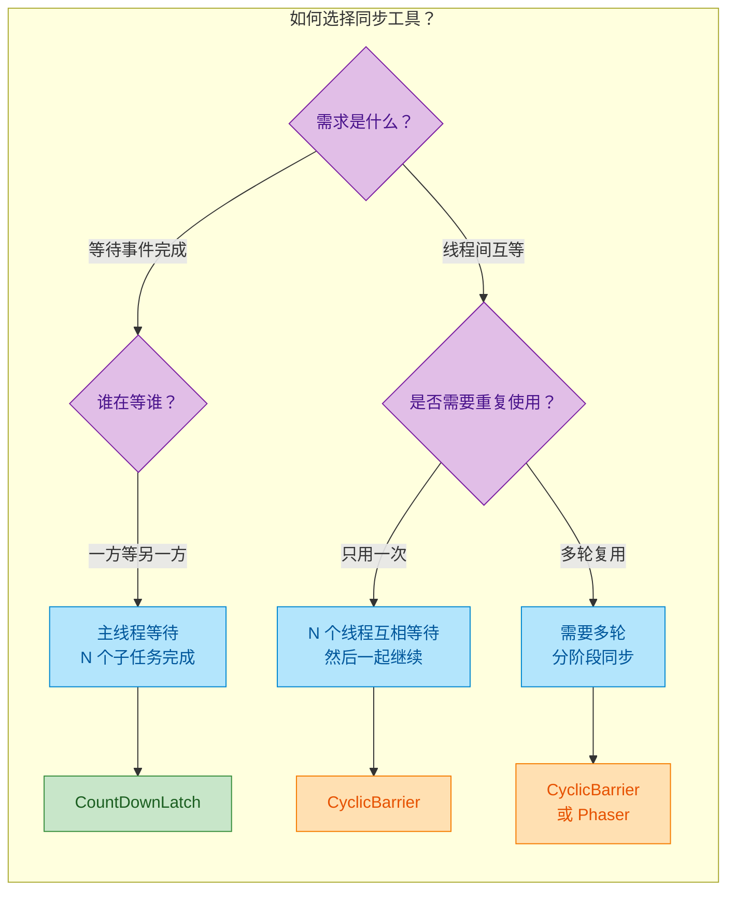
```mermaid
graph LR
    subgraph QUESTION["如何选择同步工具？"]
        direction TB
        Q1{"需求是什么？"}:::decision
        Q2{"是否需要重复使用？"}:::decision
        Q3{"谁在等谁？"}:::decision

        A1["主线程等待<br/>N 个子任务完成"]:::scenario
        A2["N 个线程互相等待<br/>然后一起继续"]:::scenario
        A3["需要多轮<br/>分阶段同步"]:::scenario

        R1["CountDownLatch"]:::latch
        R2["CyclicBarrier"]:::barrier
        R3["CyclicBarrier<br/>或 Phaser"]:::barrier

        Q1 -->|"等待事件完成"| Q3
        Q1 -->|"线程间互等"| Q2

        Q3 -->|"一方等另一方"| A1
        A1 --> R1

        Q2 -->|"只用一次"| A2
        A2 --> R2
        Q2 -->|"多轮复用"| A3
        A3 --> R3
    end

    classDef decision fill:#E1BEE7,stroke:#7B1FA2,color:#4A148C
    classDef scenario fill:#B3E5FC,stroke:#0288D1,color:#01579B
    classDef latch fill:#C8E6C9,stroke:#388E3C,color:#1B5E20
    classDef barrier fill:#FFE0B2,stroke:#F57C00,color:#E65100
```

一些典型的使用场景总结：

**选择 CountDownLatch 的场景：**
- 服务启动时，主线程等待多个初始化模块完成（数据库连接池、缓存预热、配置加载等）
- 压力测试中，让所有线程"就位"后同时开始（用一个 count=1 的 latch 当发令枪）
- 事件的"触发方"和"等待方"是不同角色的线程
- 只需要一次性同步，用完即弃

**选择 CyclicBarrier 的场景：**
- 并行计算中的分阶段汇总（如 MapReduce 风格的分段求和）
- 多线程模拟（如游戏中每一帧所有实体更新完毕后才渲染）
- 需要在每个同步点执行一个汇总动作（`barrierAction`）
- 同步逻辑需要反复执行多轮

### 综合对比代码示例

下面用同一个业务场景——"3 个线程并行计算，主线程汇总结果"——分别用 CountDownLatch 和 CyclicBarrier 实现，直观感受二者的编码差异。

```java
// ============================================================
// 方案一：CountDownLatch 实现 —— 主线程等待子线程
// ============================================================
public class SumWithCountDownLatch {
    // 共享数组，存放各线程的计算结果
    private static final int[] results = new int[3];

    public static void main(String[] args) throws InterruptedException {
        // 创建计数为 3 的 Latch（等待 3 个子线程完成）
        CountDownLatch latch = new CountDownLatch(3);

        for (int i = 0; i < 3; i++) {
            final int index = i;
            new Thread(() -> {
                // 模拟每个线程负责计算一部分
                results[index] = (index + 1) * 100;              // 简单赋值模拟计算
                System.out.println(Thread.currentThread().getName()
                        + " 计算完成，结果 = " + results[index]);
                latch.countDown();                                // 完成后计数减 1
                // 注意：countDown 之后线程可以继续做其他事
                System.out.println(Thread.currentThread().getName()
                        + " 已 countDown，继续做自己的事...");
            }, "Worker-" + i).start();
        }

        latch.await();  // 主线程阻塞，直到 count == 0

        // 汇总结果（只有主线程执行）
        int total = results[0] + results[1] + results[2];
        System.out.println("汇总结果 = " + total);               // 输出 600
    }
}
```

```java
// ============================================================
// 方案二：CyclicBarrier 实现 —— 线程互等 + barrierAction 汇总
// ============================================================
public class SumWithCyclicBarrier {
    // 共享数组，存放各线程的计算结果
    private static final int[] results = new int[3];

    public static void main(String[] args) {
        // 创建 3 人屏障，最后到达的线程执行 barrierAction（汇总逻辑）
        CyclicBarrier barrier = new CyclicBarrier(3, () -> {
            // 此 Runnable 由最后一个到达 await() 的工作线程执行
            int total = results[0] + results[1] + results[2];
            System.out.println(Thread.currentThread().getName()
                    + " 执行 barrierAction，汇总结果 = " + total);
        });

        for (int i = 0; i < 3; i++) {
            final int index = i;
            new Thread(() -> {
                try {
                    // 模拟每个线程负责计算一部分
                    results[index] = (index + 1) * 100;
                    System.out.println(Thread.currentThread().getName()
                            + " 计算完成，结果 = " + results[index]);
                    barrier.await();  // 等待所有线程到达
                    // 注意：所有线程在这里被同时放行
                    System.out.println(Thread.currentThread().getName()
                            + " 屏障已开，继续执行...");
                } catch (Exception e) {
                    e.printStackTrace();
                }
            }, "Worker-" + index).start();
        }
        // 注意：主线程不参与 barrier，它不需要 await
        // 如果需要主线程也参与，应将 parties 设为 4，主线程也调用 await
    }
}
```

关键差异一目了然：

1. **CountDownLatch 版本**：主线程调 `await()`，工作线程调 `countDown()`，职责分离清晰。汇总在主线程完成。
2. **CyclicBarrier 版本**：没有"主从"之分，三个工作线程互等。汇总在 `barrierAction` 中由最后到达的线程完成。主线程甚至不参与同步。

### 面试高频追问点

面试中关于这两个类的对比，除了基础差异，还有一些进阶追问值得注意：

**Q: CountDownLatch 的 count 能不能比线程数多或少？**
A: 完全可以。count 代表的是"事件次数"而非"线程数"。一个线程可以多次调用 `countDown()`，或者多个线程共同贡献 countDown 次数。这是 CountDownLatch 的灵活之处。

**Q: CyclicBarrier 的 parties 能不能和实际线程数不一致？**
A: 技术上可以，但几乎一定是 bug。如果 parties > 实际调用 `await()` 的线程数，屏障将永远无法打开（死等）。如果 parties < 实际线程数，多出来的线程在第一轮放行后仍然调用 `await()`，会进入第二轮等待，逻辑混乱。

**Q: 如果既需要可重用，又需要"主线程等子线程"的模式，怎么办？**
A: 可以使用 `Phaser`。它是 Java 7 引入的更灵活的同步工具，支持动态增减参与者、分阶段同步、并且可以让某些参与者只注册不到达（deregister）。它在概念上统一了 CountDownLatch 和 CyclicBarrier 的能力。

---

**📝 练习题**

以下关于 CountDownLatch 和 CyclicBarrier 的描述，哪一项是 **正确的**？

A. CountDownLatch 和 CyclicBarrier 都是基于 AQS 实现的


B. CyclicBarrier 的 `await()` 方法不会抛出 `BrokenBarrierException`，只会抛出 `InterruptedException`


C. CountDownLatch 的计数器归零后，后续调用 `await()` 会永久阻塞


D. CyclicBarrier 可以在构造时传入一个 `Runnable`，该 `Runnable` 会在所有线程到达屏障后、被放行前执行


**【答案】** D

**【解析】** 逐项分析：

- **A 错误**：CountDownLatch 基于 AQS 共享模式实现，但 CyclicBarrier 基于 `ReentrantLock + Condition` 实现，并不直接使用 AQS（虽然 ReentrantLock 内部用了 AQS，但 CyclicBarrier 的同步逻辑是通过 Lock/Condition API 而非直接操作 AQS state）。严格来说，面试中这个表述被视为错误。

- **B 错误**：CyclicBarrier 的 `await()` 方法签名明确声明抛出两种异常：`InterruptedException` 和 `BrokenBarrierException`。当某个等待中的线程被中断或屏障被 `reset()` 时，其他等待线程会收到 `BrokenBarrierException`。

- **C 错误**：恰恰相反，CountDownLatch 计数器归零后，后续调用 `await()` 会 **立即返回**（因为 `tryAcquireShared` 检测到 state == 0，直接返回成功），不会阻塞。

- **D 正确**：CyclicBarrier 支持构造参数 `barrierAction`（一个 `Runnable`），在所有线程到达屏障后、所有线程被放行前，由最后一个到达的线程执行。这是 CyclicBarrier 的核心特性之一。

---

## Semaphore ⭐

`Semaphore`（信号量）是 `java.util.concurrent` 包中一个极其实用的同步工具类，其核心思想源自经典操作系统理论中的 **"计数信号量"（Counting Semaphore）**，最早由荷兰计算机科学家 Edsger Dijkstra 在 1965 年提出。与 `CountDownLatch` 的"等待事件完成"和 `CyclicBarrier` 的"线程相互等待"不同，`Semaphore` 解决的是一个完全不同的并发问题：**控制同一时刻能够访问某个共享资源的线程数量**。

你可以把 Semaphore 想象成一个 **停车场入口的计数牌**：停车场总共有 N 个车位，每驶入一辆车，可用车位减一；每驶出一辆车，可用车位加一。当可用车位为零时，后续想进入的车辆必须在入口处排队等待，直到有车离开腾出车位。在这个类比中，"车位"就是 **许可（Permit）**，"驶入"就是 `acquire()`，"驶出"就是 `release()`。

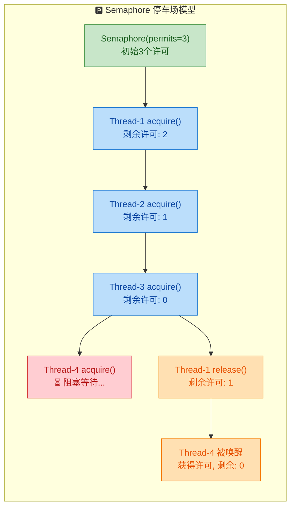
```mermaid
graph LR
    subgraph SemaphoreModel["🅿️ Semaphore 停车场模型"]
        direction TB
        A["Semaphore(permits=3)<br/>初始3个许可"] --> B["Thread-1 acquire()<br/>剩余许可: 2"]
        B --> C["Thread-2 acquire()<br/>剩余许可: 1"]
        C --> D["Thread-3 acquire()<br/>剩余许可: 0"]
        D --> E["Thread-4 acquire()<br/>⏳ 阻塞等待..."]
        D --> F["Thread-1 release()<br/>剩余许可: 1"]
        F --> G["Thread-4 被唤醒<br/>获得许可, 剩余: 0"]
    end

    classDef green fill:#C8E6C9,stroke:#388E3C,color:#1B5E20
    classDef blue fill:#BBDEFB,stroke:#1976D2,color:#0D47A1
    classDef orange fill:#FFE0B2,stroke:#F57C00,color:#E65100
    classDef red fill:#FFCDD2,stroke:#D32F2F,color:#B71C1C

    class A green
    class B,C,D blue
    class E red
    class F,G orange
```

从底层实现来看，Semaphore 内部同样基于 **AQS（AbstractQueuedSynchronizer）** 构建。AQS 中的 `state` 字段被用来表示 **当前可用的许可数**。`acquire()` 对应 AQS 的共享式获取（`acquireSharedInterruptibly`），`release()` 对应共享式释放（`releaseShared`）。与 `ReentrantLock` 独占式地将 state 当作重入次数不同，Semaphore 以共享模式操作 state，允许多个线程同时获取资源。

### 信号量

Semaphore 的核心抽象是 **许可（Permit）**。创建 Semaphore 时需要指定初始许可数量，这个数字代表了同时允许多少个线程访问受保护的资源。

```java
// 构造方法一：指定许可数量，默认使用非公平策略
// 非公平模式下，新来的线程可能"插队"抢到许可
public Semaphore(int permits)

// 构造方法二：指定许可数量 + 是否公平
// 公平模式下，严格按照 FIFO 顺序分配许可
public Semaphore(int permits, boolean fair)
```

**公平 vs 非公平** 是 Semaphore 中一个重要的设计决策：

- **非公平模式（Nonfair，默认）**：当一个许可被释放时，任何正在尝试获取的线程都有机会立即抢到，即使队列中已有等待更久的线程。这种策略的 **吞吐量更高**，因为减少了线程上下文切换的开销，但可能导致某些线程长时间得不到许可（**线程饥饿，Thread Starvation**）。

- **公平模式（Fair）**：严格按照线程调用 `acquire()` 的先后顺序分配许可，内部通过 AQS 的 CLH 队列（FIFO）来保证。代价是额外的排队开销导致 **吞吐量下降**，但能保证每个线程最终都能获得许可。

```java
// ====== Semaphore 内部结构（简化版源码） ======

public class Semaphore implements java.io.Serializable {

    // 内部使用 AQS 的子类来管理同步状态
    private final Sync sync;

    // 抽象内部类，继承 AQS
    abstract static class Sync extends AbstractQueuedSynchronizer {
        // 构造器将 permits 设置为 AQS 的 state
        Sync(int permits) {
            setState(permits); // state = permits，表示可用许可数
        }

        // 获取当前可用许可数
        final int getPermits() {
            return getState(); // 直接读取 AQS 的 state
        }

        // 非公平模式下的尝试获取（共享式）
        final int nonfairTryAcquireShared(int acquires) {
            for (;;) { // 自旋 CAS
                int available = getState();             // 读取当前可用许可
                int remaining = available - acquires;    // 计算剩余许可
                // 如果剩余为负数 → 许可不足，直接返回负数（获取失败）
                // 如果 CAS 成功更新 state → 返回剩余数（获取成功）
                if (remaining < 0 ||
                    compareAndSetState(available, remaining))
                    return remaining;
            }
        }

        // 共享式释放
        protected final boolean tryReleaseShared(int releases) {
            for (;;) { // 自旋 CAS
                int current = getState();                  // 当前许可数
                int next = current + releases;             // 增加许可
                if (next < current)                        // 溢出检测
                    throw new Error("Maximum permit count exceeded");
                if (compareAndSetState(current, next))     // CAS 更新 state
                    return true;                           // 释放成功
            }
        }
    }

    // 非公平版本
    static final class NonfairSync extends Sync {
        NonfairSync(int permits) { super(permits); }

        // 直接调用非公平的尝试获取
        protected int tryAcquireShared(int acquires) {
            return nonfairTryAcquireShared(acquires);
        }
    }

    // 公平版本
    static final class FairSync extends Sync {
        FairSync(int permits) { super(permits); }

        protected int tryAcquireShared(int acquires) {
            for (;;) {
                // 【关键差异】公平模式下，先检查队列中是否有前驱节点
                if (hasQueuedPredecessors()) // 如果有人排在前面
                    return -1;               // 获取失败，乖乖排队
                int available = getState();
                int remaining = available - acquires;
                if (remaining < 0 ||
                    compareAndSetState(available, remaining))
                    return remaining;
            }
        }
    }
}
```

从源码中可以看出，公平和非公平的唯一区别在于：**公平模式在尝试获取许可前，会先调用 `hasQueuedPredecessors()` 检查 AQS 等待队列中是否有排在前面的线程**。如果有，当前线程放弃争抢，直接进入队列排队。

一个容易被忽略的特性是：**Semaphore 的许可数可以为负数**。如果你用 `reducePermits()` 方法（protected 方法，需子类暴露）将许可减少到负数，那么后续所有 `acquire()` 调用都会阻塞，直到有足够的 `release()` 调用使许可数恢复为正。

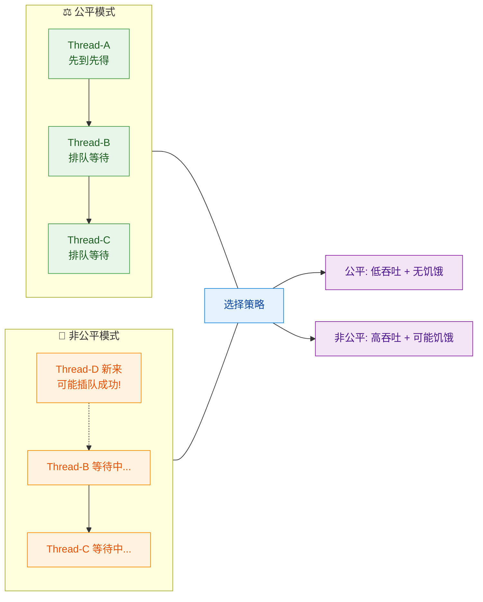
```mermaid
graph LR
    subgraph FairMode["⚖️ 公平模式"]
        direction TB
        F1["Thread-A<br/>先到先得"] --> F2["Thread-B<br/>排队等待"] --> F3["Thread-C<br/>排队等待"]
    end

    subgraph NonfairMode["🏃 非公平模式"]
        direction TB
        N1["Thread-B 等待中..."] --> N2["Thread-C 等待中..."]
        N3["Thread-D 新来<br/>可能插队成功!"] -.-> N1
    end

    FairMode --- VS["选择策略"]
    NonfairMode --- VS
    VS --> R1["公平: 低吞吐 + 无饥饿"]
    VS --> R2["非公平: 高吞吐 + 可能饥饿"]

    classDef fairBox fill:#E8F5E9,stroke:#43A047,color:#1B5E20
    classDef nonfairBox fill:#FFF3E0,stroke:#FB8C00,color:#E65100
    classDef decision fill:#E3F2FD,stroke:#1E88E5,color:#0D47A1
    classDef result fill:#F3E5F5,stroke:#8E24AA,color:#4A148C

    class F1,F2,F3 fairBox
    class N1,N2,N3 nonfairBox
    class VS decision
    class R1,R2 result
```

### acquire（获取许可）

`acquire()` 方法是 Semaphore 的 "入口操作"。当一个线程调用 `acquire()` 时，它尝试从信号量中获取一个（或多个）许可。如果此时有可用许可，许可数立即减少，线程继续执行；如果许可已用完，线程将被 **阻塞（blocked）**，直到有其他线程释放许可。

Semaphore 提供了多个获取许可的方法变体，适用于不同的使用场景：

```java
// ====== acquire 方法族 ======

// 1. 获取 1 个许可，响应中断
// 如果许可不足则阻塞，阻塞期间被中断会抛出 InterruptedException
semaphore.acquire();

// 2. 获取指定数量的许可，响应中断
// 一次性获取多个许可，许可不足时阻塞
semaphore.acquire(3); // 一次获取 3 个许可

// 3. 获取 1 个许可，不响应中断
// 即使被中断也不会抛异常，会在获取到许可后重新设置中断状态
semaphore.acquireUninterruptibly();

// 4. 尝试获取 1 个许可，非阻塞
// 立即返回 true/false，不会阻塞线程
boolean success = semaphore.tryAcquire();

// 5. 带超时的尝试获取
// 最多等待指定时间，超时返回 false
boolean success = semaphore.tryAcquire(5, TimeUnit.SECONDS);

// 6. 带超时 + 指定数量
boolean success = semaphore.tryAcquire(3, 5, TimeUnit.SECONDS);
```

下面通过一个完整示例来演示 `acquire()` 的核心行为：

```java
import java.util.concurrent.Semaphore;

public class AcquireDemo {
    public static void main(String[] args) throws InterruptedException {
        // 创建一个拥有 2 个许可的信号量（非公平模式）
        Semaphore semaphore = new Semaphore(2);

        // 打印初始状态
        System.out.println("初始可用许可数: " + semaphore.availablePermits()); // 输出: 2

        // ====== 线程 1：正常获取许可 ======
        Thread t1 = new Thread(() -> {
            try {
                System.out.println("T1: 尝试获取许可...");
                semaphore.acquire();                      // 获取 1 个许可，可用: 2→1
                System.out.println("T1: 获取成功! 剩余: " + semaphore.availablePermits());
                Thread.sleep(3000);                       // 模拟持有许可期间的工作
            } catch (InterruptedException e) {
                Thread.currentThread().interrupt();       // 恢复中断状态
            } finally {
                semaphore.release();                      // 释放许可
                System.out.println("T1: 已释放许可");
            }
        }, "Thread-1");

        // ====== 线程 2：正常获取许可 ======
        Thread t2 = new Thread(() -> {
            try {
                System.out.println("T2: 尝试获取许可...");
                semaphore.acquire();                      // 获取 1 个许可，可用: 1→0
                System.out.println("T2: 获取成功! 剩余: " + semaphore.availablePermits());
                Thread.sleep(3000);                       // 模拟工作
            } catch (InterruptedException e) {
                Thread.currentThread().interrupt();
            } finally {
                semaphore.release();
                System.out.println("T2: 已释放许可");
            }
        }, "Thread-2");

        // ====== 线程 3：许可不足，将被阻塞 ======
        Thread t3 = new Thread(() -> {
            try {
                System.out.println("T3: 尝试获取许可...");
                // 此时许可已被 T1 和 T2 占完（可用=0），T3 将阻塞在此
                semaphore.acquire();
                System.out.println("T3: 终于获取到许可! 剩余: " + semaphore.availablePermits());
                Thread.sleep(1000);
            } catch (InterruptedException e) {
                Thread.currentThread().interrupt();
            } finally {
                semaphore.release();
                System.out.println("T3: 已释放许可");
            }
        }, "Thread-3");

        // 依次启动三个线程
        t1.start();
        t2.start();
        Thread.sleep(100);  // 确保 T1、T2 先获取到许可
        t3.start();

        // 等待所有线程完成
        t1.join();
        t2.join();
        t3.join();

        System.out.println("最终可用许可数: " + semaphore.availablePermits()); // 输出: 2
    }
}
```

典型输出如下（由于线程调度，顺序可能微调）：

```
初始可用许可数: 2
T1: 尝试获取许可...
T1: 获取成功! 剩余: 1
T2: 尝试获取许可...
T2: 获取成功! 剩余: 0
T3: 尝试获取许可...
（T3 在此阻塞约 3 秒...）
T1: 已释放许可
T3: 终于获取到许可! 剩余: 0
T2: 已释放许可
T3: 已释放许可
最终可用许可数: 2
```

接下来重点看 `tryAcquire()` 的使用模式，这在实际生产代码中非常常见，因为它可以 **避免线程无限期阻塞**：

```java
import java.util.concurrent.Semaphore;
import java.util.concurrent.TimeUnit;

public class TryAcquireDemo {
    // 模拟一个只有 1 个连接的数据库连接池
    private static final Semaphore dbPool = new Semaphore(1);

    public static void main(String[] args) {
        // 同时有 3 个线程尝试获取数据库连接
        for (int i = 1; i <= 3; i++) {
            final int threadId = i;
            new Thread(() -> {
                try {
                    System.out.println("线程-" + threadId + ": 尝试获取连接（最多等2秒）");

                    // 带超时的尝试获取：最多等待 2 秒
                    boolean acquired = dbPool.tryAcquire(2, TimeUnit.SECONDS);

                    if (acquired) {                               // 获取成功
                        try {
                            System.out.println("线程-" + threadId + ": ✅ 获取连接成功，执行查询...");
                            Thread.sleep(3000);                   // 模拟耗时查询
                        } finally {
                            dbPool.release();                     // 确保释放
                            System.out.println("线程-" + threadId + ": 连接已归还");
                        }
                    } else {                                      // 超时未获取到
                        System.out.println("线程-" + threadId + ": ❌ 获取连接超时，执行降级逻辑");
                        // 降级处理：返回缓存数据、抛异常、返回默认值等
                    }
                } catch (InterruptedException e) {
                    Thread.currentThread().interrupt();
                }
            }).start();
        }
    }
}
```

**关键设计原则**：

| 方法 | 阻塞行为 | 中断响应 | 适用场景 |
|---|---|---|---|
| `acquire()` | 无限阻塞 | 响应中断 | 资源必须获取 |
| `acquireUninterruptibly()` | 无限阻塞 | 不响应中断 | 不允许中断 |
| `tryAcquire()` | 非阻塞 | — | 快速失败 |
| `tryAcquire(timeout, unit)` | 限时阻塞 | 响应中断 | 生产环境首选 |

### release（释放许可）

`release()` 方法将许可归还给信号量。调用后，信号量的可用许可数增加，如果有线程因为调用 `acquire()` 而被阻塞在等待队列中，其中一个线程将被唤醒并获得刚释放的许可。

```java
// 释放 1 个许可
semaphore.release();

// 释放指定数量的许可
semaphore.release(3); // 归还 3 个许可
```

关于 `release()` 有几个 **极其重要且容易被忽视** 的特性：

**特性一：release() 不要求调用者之前必须 acquire() 过。**

这是 Semaphore 与 `ReentrantLock` 最大的区别之一。`ReentrantLock` 要求只有持有锁的线程才能 unlock，而 Semaphore 的 `release()` 可以被任何线程在任何时候调用。这意味着你可以 **动态增加许可数**：

```java
public class DynamicPermitDemo {
    public static void main(String[] args) {
        // 初始 0 个许可
        Semaphore semaphore = new Semaphore(0);

        System.out.println("初始许可: " + semaphore.availablePermits()); // 0

        // 不需要先 acquire，直接 release 就能增加许可
        semaphore.release();   // 许可数: 0 → 1
        semaphore.release();   // 许可数: 1 → 2
        semaphore.release(3);  // 许可数: 2 → 5

        System.out.println("当前许可: " + semaphore.availablePermits()); // 5
    }
}
```

这个特性既是 Semaphore 的强大之处，也是 **危险之处**。如果不小心多调了 `release()`，许可数会超过初始值，可能导致同时访问资源的线程数超出预期。

**特性二：release() 必须放在 finally 块中。**

这是一条铁律。如果 `acquire()` 和 `release()` 之间的代码抛出异常而没有正确释放许可，信号量的许可会被 **永久泄漏（Permit Leak）**，导致后续线程永远无法获取到足够的许可。

```java
// ====== 正确用法 ======
Semaphore sem = new Semaphore(5);

sem.acquire();         // 获取许可
try {
    // 执行受保护的业务逻辑
    doSomething();     // 即使这里抛出异常...
} finally {
    sem.release();     // ...许可也一定会被释放
}

// ====== 错误用法（许可泄漏！）======
sem.acquire();
doSomething();         // 如果这里抛出异常
sem.release();         // 这一行永远不会执行 → 许可泄漏！
```

**特性三：acquire() 应在 try 块之前调用，而非 try 块内部。**

这一点比较微妙。如果把 `acquire()` 放在 `try` 块内部，当 `acquire()` 本身抛出 `InterruptedException` 时（此时并未真正获得许可），`finally` 中的 `release()` 仍然会执行，导致 **凭空多出一个许可**：

```java
// ====== 推荐写法 ======
sem.acquire();         // 在 try 外部获取许可
try {                  // 获取成功后才进入 try
    doWork();
} finally {
    sem.release();     // 一定对应一次成功的 acquire
}

// ====== 有风险的写法 ======
try {
    sem.acquire();     // 如果这里被中断抛异常 → 未获取到许可
    doWork();
} finally {
    sem.release();     // 但 finally 仍执行 → 多释放了一个许可！
}
```

下面是 `release()` 唤醒阻塞线程的完整时序图：

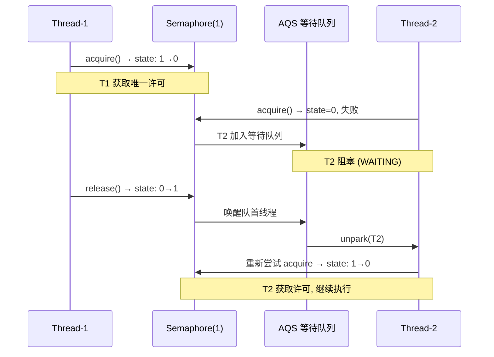
```mermaid
sequenceDiagram
    participant T1 as Thread-1
    participant S as Semaphore(1)
    participant Q as AQS 等待队列
    participant T2 as Thread-2

    T1->>S: acquire() → state: 1→0
    Note over T1,S: T1 获取唯一许可

    T2->>S: acquire() → state=0, 失败
    S->>Q: T2 加入等待队列
    Note over T2,Q: T2 阻塞 (WAITING)

    T1->>S: release() → state: 0→1
    S->>Q: 唤醒队首线程
    Q->>T2: unpark(T2)
    T2->>S: 重新尝试 acquire → state: 1→0
    Note over T2,S: T2 获取许可, 继续执行
```

Semaphore 还提供了一些实用的辅助查询方法：

```java
Semaphore sem = new Semaphore(10);

// 查询当前可用的许可数
int available = sem.availablePermits();     // 10

// 获取并返回所有立即可用的许可（清零操作）
int drained = sem.drainPermits();           // 返回 10，可用许可变为 0

// 查询是否有线程在等待获取许可
boolean hasWaiters = sem.hasQueuedThreads(); // false

// 获取等待队列的估计长度
int queueLen = sem.getQueueLength();         // 0
```

### 应用场景（限流、资源池）

Semaphore 在实际工程中有着广泛的应用。它的核心价值在于 **以声明式的方式限制并发访问数量**，这在高并发系统中至关重要。

#### 场景一：接口限流（Rate Limiting）

在微服务架构中，某些下游接口的承载能力有限。使用 Semaphore 可以简洁地控制并发请求数，防止下游被打垮：

```java
import java.util.concurrent.Semaphore;
import java.util.concurrent.TimeUnit;

public class ApiRateLimiter {

    // 最多允许 10 个线程同时调用下游接口
    private final Semaphore semaphore = new Semaphore(10, true); // 公平模式防止饥饿

    /**
     * 调用受限的下游 API
     * @return API 返回结果；限流时返回降级结果
     */
    public String callDownstreamApi(String request) {
        // 尝试获取许可，最多等待 500ms
        boolean acquired = false;
        try {
            acquired = semaphore.tryAcquire(500, TimeUnit.MILLISECONDS);
        } catch (InterruptedException e) {
            Thread.currentThread().interrupt();              // 恢复中断状态
            return fallbackResponse(request);                // 中断时返回降级
        }

        if (!acquired) {
            // 获取许可超时 → 触发限流，返回降级响应
            System.out.println("🚫 限流触发！当前等待线程: " + semaphore.getQueueLength());
            return fallbackResponse(request);
        }

        // 成功获取许可，执行真实调用
        try {
            System.out.println("✅ 调用下游API, 当前并发: " + (10 - semaphore.availablePermits()));
            return doHttpCall(request);                      // 实际 HTTP 调用
        } finally {
            semaphore.release();                             // 必须释放许可
        }
    }

    private String doHttpCall(String request) {
        // 模拟 HTTP 调用
        try { Thread.sleep(200); } catch (InterruptedException e) {
            Thread.currentThread().interrupt();
        }
        return "response for " + request;
    }

    private String fallbackResponse(String request) {
        return "降级响应: 服务繁忙，请稍后重试";              // 降级兜底
    }
}
```

#### 场景二：数据库连接池

这是 Semaphore 最经典的应用场景之一。连接池中的连接数量有限，Semaphore 天然适合控制并发获取连接的线程数：

```java
import java.util.concurrent.Semaphore;
import java.util.concurrent.ConcurrentLinkedQueue;
import java.util.concurrent.TimeUnit;

public class SimpleConnectionPool {

    private final int poolSize;                              // 连接池大小
    private final Semaphore semaphore;                       // 信号量控制并发
    private final ConcurrentLinkedQueue<Connection> pool;    // 连接队列

    public SimpleConnectionPool(int poolSize) {
        this.poolSize = poolSize;
        this.semaphore = new Semaphore(poolSize, true);      // 公平模式
        this.pool = new ConcurrentLinkedQueue<>();

        // 预先创建所有连接放入池中
        for (int i = 0; i < poolSize; i++) {
            pool.offer(new Connection("conn-" + i));         // 初始化连接
        }
    }

    /**
     * 从池中获取连接
     * @param timeout 最大等待时间
     * @param unit    时间单位
     * @return 连接对象，超时返回 null
     */
    public Connection getConnection(long timeout, TimeUnit unit) 
            throws InterruptedException {

        // 通过 Semaphore 控制并发数量
        if (semaphore.tryAcquire(timeout, unit)) {           // 获取许可
            Connection conn = pool.poll();                   // 从队列中取出连接
            if (conn != null) {
                System.out.println(Thread.currentThread().getName() 
                    + " 获取连接: " + conn.getName()
                    + " | 剩余可用: " + semaphore.availablePermits());
                return conn;
            }
            // 理论上不应该到这里（许可数 == 连接数）
            semaphore.release();                             // 异常情况归还许可
            return null;
        }

        System.out.println(Thread.currentThread().getName() + " 获取连接超时!");
        return null;                                         // 超时返回 null
    }

    /**
     * 归还连接到池中
     */
    public void releaseConnection(Connection conn) {
        if (conn != null) {
            pool.offer(conn);                                // 连接放回队列
            semaphore.release();                             // 释放许可
            System.out.println(Thread.currentThread().getName() 
                + " 归还连接: " + conn.getName()
                + " | 剩余可用: " + semaphore.availablePermits());
        }
    }

    // 简化的 Connection 模拟类
    static class Connection {
        private final String name;
        Connection(String name) { this.name = name; }
        String getName() { return name; }
    }

    // 测试
    public static void main(String[] args) {
        SimpleConnectionPool pool = new SimpleConnectionPool(3); // 3 个连接

        // 启动 6 个线程竞争 3 个连接
        for (int i = 1; i <= 6; i++) {
            final int id = i;
            new Thread(() -> {
                try {
                    Connection conn = pool.getConnection(5, TimeUnit.SECONDS);
                    if (conn != null) {
                        Thread.sleep(2000);                  // 模拟使用连接
                        pool.releaseConnection(conn);        // 归还连接
                    }
                } catch (InterruptedException e) {
                    Thread.currentThread().interrupt();
                }
            }, "Worker-" + id).start();
        }
    }
}
```

运行结果演示了 6 个线程抢 3 个连接的过程——前 3 个线程立即获得连接，后 3 个线程排队等待，前者释放后后者才能获取。

#### 场景三：Semaphore 实现互斥锁（Binary Semaphore）

当 `permits = 1` 时，Semaphore 退化为一个 **二元信号量（Binary Semaphore）**，效果类似于互斥锁（Mutex）。与 `synchronized` 和 `ReentrantLock` 不同的是，二元信号量 **没有所有权概念**（Non-reentrant），任何线程都可以释放它：

```java
public class MutexExample {
    // 二元信号量：等价于互斥锁
    private final Semaphore mutex = new Semaphore(1);
    private int sharedCounter = 0;

    public void increment() throws InterruptedException {
        mutex.acquire();          // 相当于 lock()
        try {
            sharedCounter++;      // 临界区：同一时刻只有 1 个线程能执行
        } finally {
            mutex.release();      // 相当于 unlock()
        }
    }
}
```

但需要注意：**Semaphore(1) 并不等同于 ReentrantLock**。

```java
// 以下代码使用 ReentrantLock → 正常工作（可重入）
lock.lock();
lock.lock();     // 重入，计数 +1
lock.unlock();
lock.unlock();

// 以下代码使用 Semaphore(1) → 死锁！
sem.acquire();   // 获取唯一许可
sem.acquire();   // 再次获取 → 没有许可了 → 永远阻塞 → 死锁
```

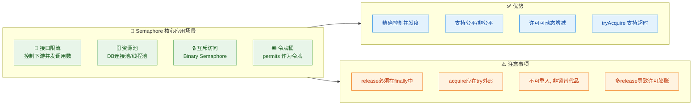
```mermaid
graph LR
    subgraph Scenarios["🎯 Semaphore 核心应用场景"]
        direction TB
        S1["🚦 接口限流<br/>控制下游并发调用数"]
        S2["🗄️ 资源池<br/>DB连接池/线程池"]
        S3["🔒 互斥访问<br/>Binary Semaphore"]
        S4["🎟️ 令牌桶<br/>permits 作为令牌"]
    end

    subgraph Advantages["✅ 优势"]
        direction TB
        A1["精确控制并发度"]
        A2["支持公平/非公平"]
        A3["许可可动态增减"]
        A4["tryAcquire 支持超时"]
    end

    subgraph Pitfalls["⚠️ 注意事项"]
        direction TB
        P1["release必须在finally中"]
        P2["acquire应在try外部"]
        P3["不可重入, 非锁替代品"]
        P4["多release导致许可膨胀"]
    end

    Scenarios --> Advantages
    Scenarios --> Pitfalls

    classDef scene fill:#E8F5E9,stroke:#43A047,color:#1B5E20
    classDef adv fill:#E3F2FD,stroke:#1E88E5,color:#0D47A1
    classDef pit fill:#FFF3E0,stroke:#EF6C00,color:#BF360C

    class S1,S2,S3,S4 scene
    class A1,A2,A3,A4 adv
    class P1,P2,P3,P4 pit
```

最后，总结一下 Semaphore 和其他同步工具的对比定位：

| 特性 | Semaphore | ReentrantLock | synchronized |
|---|---|---|---|
| **并发控制粒度** | N 个线程 | 1 个线程 | 1 个线程 |
| **可重入** | ❌ 不可重入 | ✅ 可重入 | ✅ 可重入 |
| **所有权概念** | ❌ 无（任何线程可 release） | ✅ 持有者才能 unlock | ✅ 持有者才能退出 |
| **公平性** | 可选 | 可选 | 不可选 |
| **超时机制** | ✅ tryAcquire | ✅ tryLock | ❌ |
| **条件变量** | ❌ | ✅ Condition | ✅ wait/notify |
| **许可可动态增加** | ✅ | ❌ | ❌ |
| **典型用途** | 限流、资源池 | 互斥访问 | 互斥访问 |

---

**📝 练习题**

在以下代码中，假设有 20 个线程同时执行 `doWork()` 方法，程序运行结束后 `semaphore.availablePermits()` 的值是多少？

```java
Semaphore semaphore = new Semaphore(5);

public void doWork() {
    try {
        semaphore.acquire();
        // 业务逻辑（可能抛出 RuntimeException）
        if (Math.random() > 0.5) {
            throw new RuntimeException("模拟异常");
        }
    } catch (InterruptedException e) {
        Thread.currentThread().interrupt();
    } finally {
        semaphore.release();
    }
}
```

A. 5（恢复到初始值）


B. 大于 5（许可膨胀）


C. 小于 5（许可泄漏）


D. 不确定，取决于异常抛出次数


**【答案】** B

**【解析】** 这道题考查的是 `acquire()` 放在 `try` 块内部的陷阱。当 `acquire()` 正常获取许可后，如果业务逻辑抛出 `RuntimeException`，`finally` 中的 `release()` 会正确归还许可，这部分没有问题。但问题在于：当某个线程调用 `acquire()` 时被中断，抛出 `InterruptedException` 进入 `catch` 块，**此时该线程并没有真正获取到许可**，但 `finally` 块中的 `release()` 仍然会执行，凭空多释放了一个许可。每发生一次这种情况，`availablePermits()` 就会比初始值多 1。即使在本题中没有显式中断线程，**正确的编码规范** 仍要求将 `acquire()` 放在 `try` 块之前，以避免这类潜在的许可膨胀问题。在本题的具体条件下，如果确实没有线程被中断，则结果为 5；但如果存在中断的可能性（比如线程池 shutdown），结果就会大于 5。由于 `acquire()` 位于 `try` 内部这一写法本身就存在 permit leak（膨胀）的风险，选 B 最能体现这道题想考察的核心知识点。

---

## Exchanger

`Exchanger<V>` 是 `java.util.concurrent` 包中一个相对小众但极其精巧的同步工具类。它的核心使命只有一个：**让两个线程在某个"会合点"（rendezvous point）安全地交换彼此的数据**。你可以把它想象成一个"双向传送带"——两个工人各自把自己的货物放上去，等对方也放好之后，各自取走对方的货物，然后各自离开。

与 `CountDownLatch`、`CyclicBarrier`、`Semaphore` 这些面向"多线程协调"的工具不同，`Exchanger` 天生就是为 **恰好两个线程（exactly two threads）** 之间的成对数据交换而设计的。这种"一对一"的约束既是它的局限，也是它的优势——API 极简、语义极清晰、使用极安全。

---

### 线程间数据交换

#### 核心概念与设计哲学

在并发编程中，线程间传递数据的手段有很多：共享变量、`BlockingQueue`、`Future`、管道流……但这些方案几乎都是 **单向** 的，或者需要额外的同步机制来实现"双向"交换。`Exchanger` 则原生提供了一个 **双向、同步、阻塞** 的数据交换语义：

1. **双向（Bidirectional）**：两个线程各自 **交出** 一份数据，同时 **获取** 对方交出的数据。
2. **同步（Synchronous）**：交换操作是一个"会合"行为——先到达的线程必须等待另一个线程到达后，双方才同时完成交换。
3. **阻塞（Blocking）**：在对方到达之前，先到的线程会被挂起（park），不会消耗 CPU。

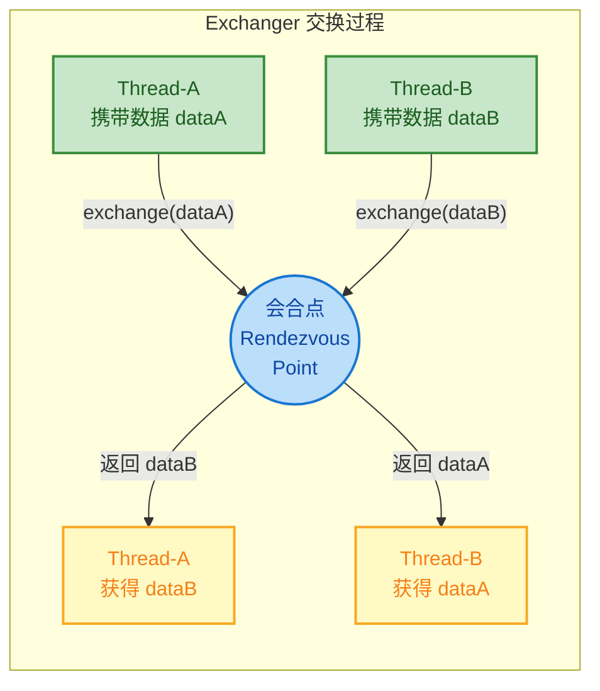
```mermaid
graph LR
    subgraph ExchangeProcess["Exchanger 交换过程"]
        direction TB
        T1["Thread-A<br/>携带数据 dataA"]
        T2["Thread-B<br/>携带数据 dataB"]
        EP(("会合点<br/>Rendezvous<br/>Point"))
        R1["Thread-A<br/>获得 dataB"]
        R2["Thread-B<br/>获得 dataA"]

        T1 -->|"exchange(dataA)"| EP
        T2 -->|"exchange(dataB)"| EP
        EP -->|"返回 dataB"| R1
        EP -->|"返回 dataA"| R2
    end

    classDef threadCls fill:#C8E6C9,stroke:#388E3C,color:#1B5E20,stroke-width:2px
    classDef pointCls fill:#BBDEFB,stroke:#1976D2,color:#0D47A1,stroke-width:2px
    classDef resultCls fill:#FFF9C4,stroke:#F9A825,color:#F57F17,stroke-width:2px

    class T1,T2 threadCls
    class EP pointCls
    class R1,R2 resultCls
```

#### 内部原理概览

`Exchanger` 的内部实现在 JDK 中经历了多次优化（Doug Lea 亲自操刀），但核心思路始终不变：

```text
内部数据结构（概念模型）:

┌──────────────────────────────────────────────────┐
│                  Exchanger〈V〉                    │
│                                                  │
│   ┌──────────────────────────────────────────┐   │
│   │            Slot (交换槽)                  │   │
│   │                                          │   │
│   │   ┌─────────┐       ┌─────────┐         │   │
│   │   │  item    │       │ match   │         │   │
│   │   │ (先到者  │       │ (后到者  │         │   │
│   │   │  放入的  │       │  放入的  │         │   │
│   │   │  数据)   │       │  数据)   │         │   │
│   │   └─────────┘       └─────────┘         │   │
│   │                                          │   │
│   │   waiter: 先到的线程引用 (用于 unpark)    │   │
│   └──────────────────────────────────────────┘   │
│                                                  │
│   （高竞争时使用 arena 数组减少 CAS 冲突）       │
└──────────────────────────────────────────────────┘
```

交换的核心流程如下：

1. **线程 A 先到**：调用 `exchange(dataA)`，将 `dataA` 放入 slot 的 `item` 字段，然后将自身记录为 `waiter`，随后 **阻塞等待**（通过 `LockSupport.park()`）。
2. **线程 B 后到**：调用 `exchange(dataB)`，发现 slot 中已经有人在等待。于是将 `dataB` 写入 `match` 字段，**唤醒**（`LockSupport.unpark()`）线程 A。
3. **双方各取所需**：线程 A 醒来后读取 `match` 中的 `dataB` 作为返回值；线程 B 直接读取 slot 中原来的 `item`（即 `dataA`）作为返回值。

整个过程使用 CAS（Compare-And-Swap）操作保证无锁并发安全。在高竞争场景下，JDK 会使用一个 `arena`（竞技场）数组将多对交换分散到不同的 slot 上，避免伪共享（false sharing）和 CAS 争用。

#### 为什么只支持两个线程？

这是由 `Exchanger` 的语义决定的——"交换"天然是一个二元操作。如果有三个线程同时到达，你无法定义"谁和谁交换"的规则。如果你需要多线程之间的数据交换，应该考虑：
- **多个 Exchanger 实例**：为每一对需要交换的线程创建独立的 `Exchanger`。
- **CyclicBarrier + 共享数据结构**：让所有线程到达屏障后统一交换。
- **BlockingQueue**：使用生产者-消费者模式传递数据。

---

### exchange 方法

`Exchanger<V>` 只提供了两个核心公共方法，都叫 `exchange`，区别仅在于是否带超时参数：

```java
// 阻塞式交换，无限等待对方到达
public V exchange(V x) throws InterruptedException

// 带超时的交换，超时后抛出 TimeoutException
public V exchange(V x, long timeout, TimeUnit unit)
    throws InterruptedException, TimeoutException
```

#### 方法签名详解

| 参数/返回值 | 说明 |
|:---|:---|
| `V x` | 当前线程要交给对方的数据（可以为 `null`） |
| `返回值 V` | 对方线程交出的数据 |
| `InterruptedException` | 等待过程中当前线程被中断时抛出 |
| `TimeoutException` | 仅限超时版本，等待超时后抛出 |

#### 基础使用示例

下面用一个最经典的场景来演示：两个线程互相交换字符串。

```java
import java.util.concurrent.Exchanger;

public class ExchangerBasicDemo {
    public static void main(String[] args) {
        // 创建一个泛型为 String 的 Exchanger 实例
        // 两个线程将通过它交换 String 类型的数据
        Exchanger<String> exchanger = new Exchanger<>();

        // 线程 A：生产者，准备好数据后与线程 B 交换
        Thread threadA = new Thread(() -> {
            try {
                // 线程 A 准备要交换的数据
                String dataA = "来自线程A的礼物";
                System.out.println("[Thread-A] 准备交出: " + dataA);

                // 调用 exchange()，将 dataA 交出，同时等待线程 B 的数据
                // 此处会阻塞，直到线程 B 也调用了 exchange()
                String receivedFromB = exchanger.exchange(dataA);

                // 交换完成，receivedFromB 就是线程 B 交出的数据
                System.out.println("[Thread-A] 收到: " + receivedFromB);
            } catch (InterruptedException e) {
                // 等待过程中被中断
                Thread.currentThread().interrupt();
                System.out.println("[Thread-A] 被中断");
            }
        }, "Thread-A");

        // 线程 B：消费者，准备好数据后与线程 A 交换
        Thread threadB = new Thread(() -> {
            try {
                // 模拟线程 B 需要一些时间才能准备好数据
                Thread.sleep(2000);

                // 线程 B 准备要交换的数据
                String dataB = "来自线程B的回礼";
                System.out.println("[Thread-B] 准备交出: " + dataB);

                // 调用 exchange()，将 dataB 交出，同时获取线程 A 的数据
                // 因为线程 A 已经在等待了，所以这里几乎立即完成交换
                String receivedFromA = exchanger.exchange(dataB);

                // 交换完成
                System.out.println("[Thread-B] 收到: " + receivedFromA);
            } catch (InterruptedException e) {
                Thread.currentThread().interrupt();
                System.out.println("[Thread-B] 被中断");
            }
        }, "Thread-B");

        // 启动两个线程
        threadA.start();
        threadB.start();
    }
}
```

运行输出（顺序可能略有不同，但交换逻辑不变）：

```text
[Thread-A] 准备交出: 来自线程A的礼物
[Thread-B] 准备交出: 来自线程B的回礼      ← 2秒后出现
[Thread-A] 收到: 来自线程B的回礼
[Thread-B] 收到: 来自线程A的礼物
```

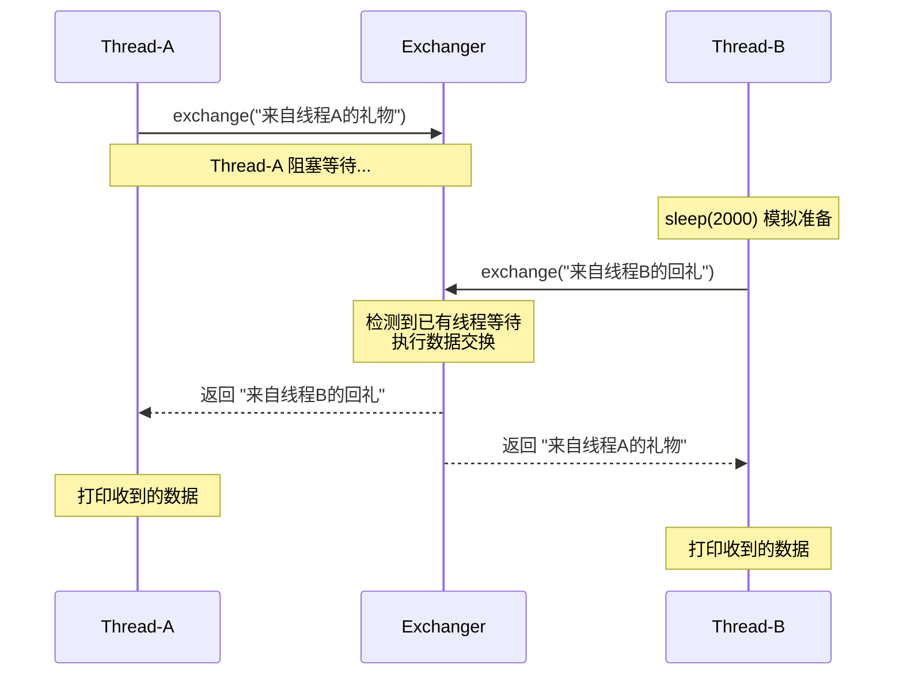
```mermaid
sequenceDiagram
    participant A as Thread-A
    participant E as Exchanger
    participant B as Thread-B

    A->>E: exchange("来自线程A的礼物")
    Note over A,E: Thread-A 阻塞等待...

    Note over B: sleep(2000) 模拟准备

    B->>E: exchange("来自线程B的回礼")
    Note over E: 检测到已有线程等待<br/>执行数据交换

    E-->>A: 返回 "来自线程B的回礼"
    E-->>B: 返回 "来自线程A的礼物"

    Note over A: 打印收到的数据
    Note over B: 打印收到的数据
```

#### 带超时的 exchange

在生产环境中，**无限阻塞等待** 是危险的——如果对方线程因为异常永远不会到达，当前线程就会永远挂起。因此强烈建议使用带超时的版本：

```java
import java.util.concurrent.Exchanger;
import java.util.concurrent.TimeUnit;
import java.util.concurrent.TimeoutException;

public class ExchangerTimeoutDemo {
    public static void main(String[] args) {
        Exchanger<String> exchanger = new Exchanger<>();

        // 只启动一个线程，故意让它等不到交换伙伴
        Thread lonelyThread = new Thread(() -> {
            try {
                System.out.println("[Lonely] 开始等待交换伙伴...");

                // 最多等待 3 秒，如果没有人来交换就放弃
                String result = exchanger.exchange(
                    "我的数据",       // 要交出的数据
                    3,                // 超时时间
                    TimeUnit.SECONDS  // 时间单位
                );

                // 如果交换成功才会执行到这里
                System.out.println("[Lonely] 收到: " + result);

            } catch (TimeoutException e) {
                // 超时：3秒内没有人来交换
                System.out.println("[Lonely] 超时了！没人来跟我交换 😢");
            } catch (InterruptedException e) {
                // 等待过程中被中断
                Thread.currentThread().interrupt();
                System.out.println("[Lonely] 被中断");
            }
        }, "Lonely");

        lonelyThread.start();
    }
}
```

输出：

```text
[Lonely] 开始等待交换伙伴...
[Lonely] 超时了！没人来跟我交换 😢    ← 3秒后出现
```

#### 经典应用场景：双缓冲区交换（Double Buffering）

`Exchanger` 最经典的实战场景是 **生产者-消费者之间的缓冲区交换**。这种模式也称为"双缓冲"或"乒乓缓冲"（Ping-Pong Buffering）：

- **生产者** 往"满缓冲区"里填数据，填满后与消费者交换。
- **消费者** 从"满缓冲区"里读数据，读完后将"空缓冲区"交还给生产者。
- 双方各自持有一个缓冲区，交替使用，避免频繁的锁竞争。

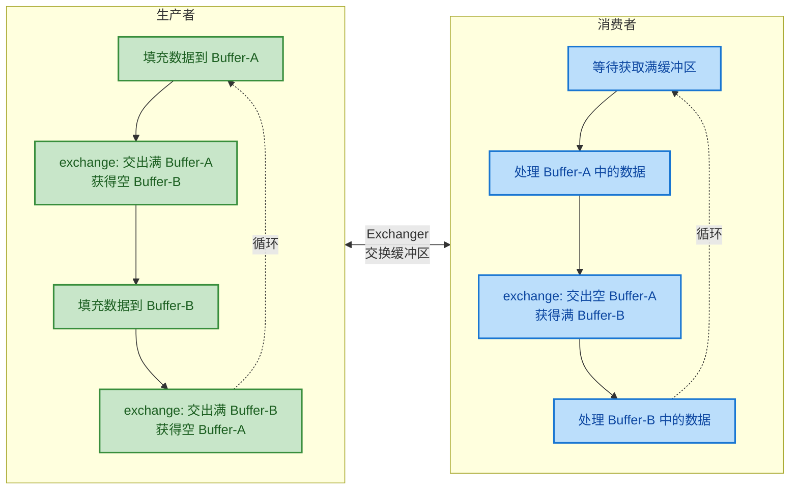
```mermaid
graph LR
    subgraph ProducerSide["生产者"]
        direction TB
        P1["填充数据到 Buffer-A"]
        P2["exchange: 交出满 Buffer-A<br/>获得空 Buffer-B"]
        P3["填充数据到 Buffer-B"]
        P4["exchange: 交出满 Buffer-B<br/>获得空 Buffer-A"]
        P1 --> P2 --> P3 --> P4
        P4 -.->|"循环"| P1
    end

    subgraph ConsumerSide["消费者"]
        direction TB
        C1["等待获取满缓冲区"]
        C2["处理 Buffer-A 中的数据"]
        C3["exchange: 交出空 Buffer-A<br/>获得满 Buffer-B"]
        C4["处理 Buffer-B 中的数据"]
        C1 --> C2 --> C3 --> C4
        C4 -.->|"循环"| C1
    end

    ProducerSide <-->|"Exchanger<br/>交换缓冲区"| ConsumerSide

    classDef producerCls fill:#C8E6C9,stroke:#388E3C,color:#1B5E20,stroke-width:2px
    classDef consumerCls fill:#BBDEFB,stroke:#1976D2,color:#0D47A1,stroke-width:2px

    class P1,P2,P3,P4 producerCls
    class C1,C2,C3,C4 consumerCls
```

代码实现：

```java
import java.util.ArrayList;
import java.util.List;
import java.util.concurrent.Exchanger;

public class DoubleBufferDemo {

    // 缓冲区容量
    private static final int BUFFER_SIZE = 5;

    public static void main(String[] args) {
        // 创建 Exchanger，交换的类型是 List<Integer>（缓冲区）
        Exchanger<List<Integer>> exchanger = new Exchanger<>();

        // 初始化两个缓冲区
        // 生产者持有 bufferA（初始为空），消费者持有 bufferB（初始为空）
        List<Integer> bufferA = new ArrayList<>(BUFFER_SIZE);
        List<Integer> bufferB = new ArrayList<>(BUFFER_SIZE);

        // ========== 生产者线程 ==========
        Thread producer = new Thread(() -> {
            // 生产者当前使用的缓冲区，初始为 bufferA
            List<Integer> currentBuffer = bufferA;
            int count = 0; // 数据计数器

            try {
                // 生产 20 个数据（循环4轮，每轮5个）
                while (count < 20) {
                    // 往当前缓冲区中填充数据，直到填满
                    while (currentBuffer.size() < BUFFER_SIZE && count < 20) {
                        // 生产一个数据
                        int data = ++count;
                        currentBuffer.add(data);
                        System.out.println("[生产者] 生产数据: " + data
                            + " (缓冲区大小: " + currentBuffer.size() + ")");
                    }

                    // 缓冲区已满，与消费者交换
                    // 交出满的缓冲区，获得消费者处理完的空缓冲区
                    System.out.println("[生产者] 缓冲区已满，准备交换...");
                    currentBuffer = exchanger.exchange(currentBuffer);
                    // 此时 currentBuffer 指向消费者归还的空缓冲区
                    System.out.println("[生产者] 交换完成，获得空缓冲区");
                }
            } catch (InterruptedException e) {
                Thread.currentThread().interrupt();
            }
        }, "Producer");

        // ========== 消费者线程 ==========
        Thread consumer = new Thread(() -> {
            // 消费者当前使用的缓冲区，初始为 bufferB
            List<Integer> currentBuffer = bufferB;
            int totalConsumed = 0; // 已消费总数

            try {
                while (totalConsumed < 20) {
                    // 第一次及后续循环：与生产者交换
                    // 交出空缓冲区（或初始的空 bufferB），获得满缓冲区
                    System.out.println("[消费者] 等待交换获取满缓冲区...");
                    currentBuffer = exchanger.exchange(currentBuffer);

                    // 从满缓冲区中逐个消费数据
                    System.out.println("[消费者] 获得满缓冲区，开始消费...");
                    for (Integer data : currentBuffer) {
                        System.out.println("[消费者] 消费数据: " + data);
                        totalConsumed++;
                        // 模拟消费耗时
                        Thread.sleep(100);
                    }

                    // 消费完毕，清空缓冲区，准备在下一轮交还给生产者
                    currentBuffer.clear();
                    System.out.println("[消费者] 缓冲区已清空，准备交还");
                }
            } catch (InterruptedException e) {
                Thread.currentThread().interrupt();
            }
        }, "Consumer");

        // 启动
        producer.start();
        consumer.start();
    }
}
```

这个"双缓冲"模式的优势在于：**生产者和消费者各自操作独立的缓冲区，没有任何锁竞争**。只在交换瞬间发生一次同步，之后又各自独立工作。这在 I/O 密集型场景中尤为高效——例如一个线程从磁盘读数据填充缓冲区，另一个线程处理缓冲区中的数据。

#### 交换 null 值

`Exchanger` 允许交换 `null` 值。这在某些信号传递场景中很有用——例如，你不需要真正交换数据，只需要两个线程在某个点同步会合：

```java
// 仅用于同步会合，不传递实际数据
Exchanger<Void> rendezvous = new Exchanger<>();

// 线程 A
rendezvous.exchange(null); // 等待线程 B 到达

// 线程 B
rendezvous.exchange(null); // 等待线程 A 到达
// 两个线程在此同步后继续各自的工作
```

#### 注意事项与最佳实践

| 要点 | 说明 |
|:---|:---|
| **严格限定两线程** | `Exchanger` 只能用于恰好两个线程之间的交换。如果有第三个线程调用 `exchange()`，它会与两者之一配对，导致另一个线程永远等待 |
| **务必使用超时版本** | 生产环境中使用 `exchange(V x, long timeout, TimeUnit unit)` 避免永久阻塞 |
| **注意中断处理** | `exchange()` 响应中断，抛出 `InterruptedException`。务必正确处理或传播 |
| **交换的是引用** | 对于可变对象（如 `List`），交换后双方持有的是对方的引用。交换后修改对象可能导致竞态条件，除非双方约定好"交换后不再访问交出的对象" |
| **不适合高频交换** | 每次 `exchange()` 都涉及线程阻塞和唤醒的开销。如果需要高频双向通信，`Disruptor` 或双 `BlockingQueue` 更合适 |

#### Exchanger 与其他工具的对比

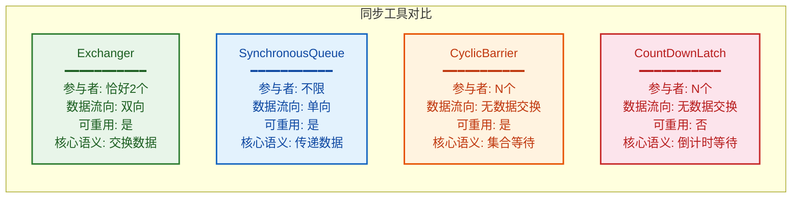
```mermaid
graph LR
    subgraph Comparison["同步工具对比"]
        direction TB

        E1["Exchanger<br/>━━━━━━━━━━━<br/>参与者: 恰好2个<br/>数据流向: 双向<br/>可重用: 是<br/>核心语义: 交换数据"]
        E2["SynchronousQueue<br/>━━━━━━━━━━━<br/>参与者: 不限<br/>数据流向: 单向<br/>可重用: 是<br/>核心语义: 传递数据"]
        E3["CyclicBarrier<br/>━━━━━━━━━━━<br/>参与者: N个<br/>数据流向: 无数据交换<br/>可重用: 是<br/>核心语义: 集合等待"]
        E4["CountDownLatch<br/>━━━━━━━━━━━<br/>参与者: N个<br/>数据流向: 无数据交换<br/>可重用: 否<br/>核心语义: 倒计时等待"]
    end

    classDef exchangerCls fill:#E8F5E9,stroke:#2E7D32,color:#1B5E20,stroke-width:2px
    classDef queueCls fill:#E3F2FD,stroke:#1565C0,color:#0D47A1,stroke-width:2px
    classDef barrierCls fill:#FFF3E0,stroke:#E65100,color:#BF360C,stroke-width:2px
    classDef latchCls fill:#FCE4EC,stroke:#C62828,color:#B71C1C,stroke-width:2px

    class E1 exchangerCls
    class E2 queueCls
    class E3 barrierCls
    class E4 latchCls
```

---

**📝 练习题**

以下关于 `Exchanger` 的说法，哪一项是 **错误** 的？

A. `Exchanger` 的 `exchange()` 方法会阻塞当前线程，直到另一个线程也调用了同一个 `Exchanger` 实例的 `exchange()` 方法


B. `Exchanger` 可以被多对线程重复使用，只要每次交换时恰好有两个线程配对即可


C. 如果三个线程同时使用同一个 `Exchanger` 实例调用 `exchange()`，那么三个线程都会永久阻塞，因为 `Exchanger` 检测到线程数不为 2 会拒绝交换


D. 使用 `exchange(V x, long timeout, TimeUnit unit)` 可以防止因对方线程永不到达而导致的无限等待


**【答案】** C

**【解析】** 选项 C 的说法是错误的。`Exchanger` **不会检测参与线程的总数**，它的内部逻辑是简单的"配对"机制：当一个线程到达时，如果 slot 为空就等待；如果 slot 中已有等待者，就与之配对完成交换。因此当三个线程同时调用 `exchange()` 时，会发生的情况是：其中两个线程成功配对并完成交换，而第三个线程会一直等待下一个配对伙伴（如果没有第四个线程到来，它就会永久阻塞或超时）。`Exchanger` 本身不具备"拒绝"或"检测线程数量"的能力，它只是一个无状态的配对点。这也正是为什么官方文档强调 `Exchanger` 应当仅用于恰好两个线程之间的交换——这是一个使用约定，而非强制的运行时检查。

---

## Phaser

`Phaser` 是 JDK 7 引入的一个**功能最强大、最灵活**的同步工具类，位于 `java.util.concurrent` 包中。它的名字来源于 "Phase"（阶段），顾名思义，它专为**多阶段 (multi-phase) 并发任务**而设计。你可以将它理解为 `CountDownLatch` 和 `CyclicBarrier` 的**终极融合升级版**——它不仅支持多轮重复使用（如 `CyclicBarrier`），还支持在运行过程中**动态增减参与者数量**，这是前两者完全不具备的能力。

在实际工程中，当你面对的并发场景不再是"固定 N 个线程跑一次"或"固定 N 个线程反复在栅栏处汇合"这类简单模型时，`Phaser` 就是你的最佳选择。典型场景包括：多轮迭代算法（如遗传算法、模拟退火）、流水线式的分阶段数据处理、以及参与者数量会在中途变化的复杂协作任务。

### 核心概念模型

在深入 API 之前，必须先建立 `Phaser` 的**心智模型**。它围绕三个核心概念运转：

1. **Phase（阶段编号）**：一个从 0 开始单调递增的整数。每当所有已注册的参与者都到达屏障点（arrive），阶段编号就自动加 1，进入下一阶段。
2. **Parties（参与者）**：已注册到当前 `Phaser` 中、需要在每个阶段末尾同步的实体数量。与 `CyclicBarrier` 的关键区别是——这个数量可以**随时动态调整**。
3. **Arrival（到达）**：每个参与者在完成当前阶段的工作后，调用 `arrive()` 或 `arriveAndAwaitAdvance()` 表示"我到了"。当到达数等于参与者总数时，阶段推进。

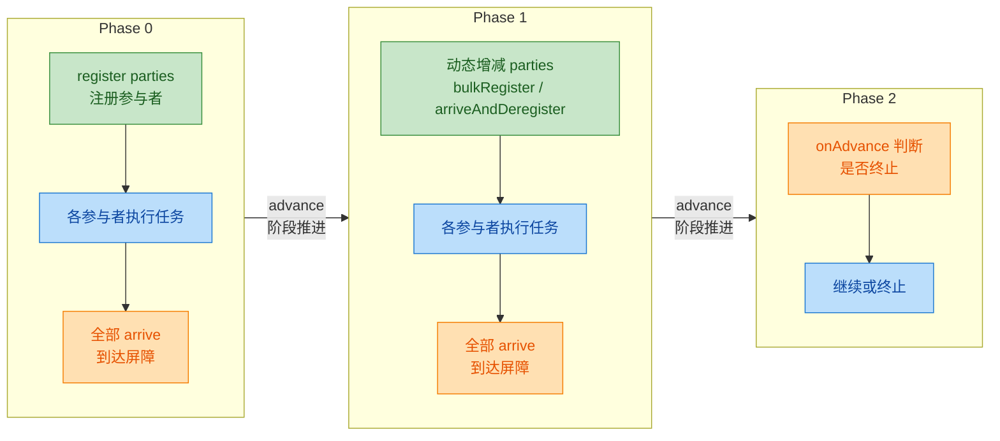
```mermaid
graph LR
    subgraph Phase0["Phase 0"]
        direction TB
        P0_REG["register parties<br/>注册参与者"]
        P0_WORK["各参与者执行任务"]
        P0_ARRIVE["全部 arrive<br/>到达屏障"]
        P0_REG --> P0_WORK --> P0_ARRIVE
    end

    subgraph Phase1["Phase 1"]
        direction TB
        P1_ADJ["动态增减 parties<br/>bulkRegister / arriveAndDeregister"]
        P1_WORK["各参与者执行任务"]
        P1_ARRIVE["全部 arrive<br/>到达屏障"]
        P1_ADJ --> P1_WORK --> P1_ARRIVE
    end

    subgraph Phase2["Phase 2"]
        direction TB
        P2_CHECK["onAdvance 判断<br/>是否终止"]
        P2_WORK["继续或终止"]
        P2_CHECK --> P2_WORK
    end

    Phase0 -->|"advance<br/>阶段推进"| Phase1
    Phase1 -->|"advance<br/>阶段推进"| Phase2

    classDef greenNode fill:#C8E6C9,stroke:#388E3C,color:#1B5E20
    classDef blueNode fill:#BBDEFB,stroke:#1976D2,color:#0D47A1
    classDef orangeNode fill:#FFE0B2,stroke:#F57C00,color:#E65100

    class P0_REG,P1_ADJ greenNode
    class P0_WORK,P1_WORK,P2_WORK blueNode
    class P0_ARRIVE,P1_ARRIVE,P2_CHECK orangeNode
```

### 可变参与者数量

这是 `Phaser` 相对于 `CountDownLatch` 和 `CyclicBarrier` 最显著的差异点。在 `CyclicBarrier` 中，parties 数量在构造时就被锁死，运行中无法更改；而在 `Phaser` 中，你可以在**任何时刻、任何阶段**动态调整参与者的数量。

#### 注册与注销 API

| 方法 | 作用 | 对 parties 的影响 |
|------|------|-------------------|
| `register()` | 新增 1 个参与者 | parties + 1 |
| `bulkRegister(int n)` | 批量新增 n 个参与者 | parties + n |
| `arriveAndDeregister()` | 到达当前阶段，并注销自己 | parties - 1 |

**构造函数**本身也可以指定初始 parties：

```java
// 无参构造，初始 parties = 0，后续通过 register() 动态添加
Phaser phaser = new Phaser();

// 指定初始参与者数量为 3
Phaser phaser = new Phaser(3);

// 指定父 Phaser（用于分层 Phaser 树），初始 parties = 5
Phaser phaser = new Phaser(parentPhaser, 5);
```

#### 动态注册的典型示例

下面的例子展示了一个任务调度器：最初有 3 个工作线程，在第一阶段结束后，又动态加入 2 个新线程：

```java
import java.util.concurrent.Phaser;

public class DynamicRegistrationDemo {
    public static void main(String[] args) throws InterruptedException {
        // 创建 Phaser，初始注册主线程自身作为 1 个参与者
        // 这样主线程也能参与阶段推进的控制
        Phaser phaser = new Phaser(1); // "1" 代表主线程自己

        // ---------- Phase 0: 启动 3 个初始工作线程 ----------
        for (int i = 1; i <= 3; i++) {
            // 每启动一个线程前，先 register，使 parties + 1
            phaser.register();
            final int id = i;
            new Thread(() -> {
                // 模拟第 0 阶段的工作
                System.out.println("Worker-" + id + " 完成 Phase 0 工作");
                // 到达屏障并等待其他参与者
                phaser.arriveAndAwaitAdvance();

                // 模拟第 1 阶段的工作
                System.out.println("Worker-" + id + " 完成 Phase 1 工作");
                // 到达屏障并等待
                phaser.arriveAndAwaitAdvance();

                System.out.println("Worker-" + id + " 全部阶段完成");
            }, "Worker-" + i).start();
        }

        // 主线程也到达 Phase 0 的屏障
        // 此时 parties = 4（主线程 + 3个工作线程）
        phaser.arriveAndAwaitAdvance(); // Phase 0 -> Phase 1
        System.out.println("===== Phase 0 完成，当前阶段: " + phaser.getPhase() + " =====");

        // ---------- Phase 1 开始前：动态加入 2 个新线程 ----------
        for (int i = 4; i <= 5; i++) {
            phaser.register(); // parties 从 4 增长到 5, 再到 6
            final int id = i;
            new Thread(() -> {
                System.out.println("Worker-" + id + " (新加入) 完成 Phase 1 工作");
                phaser.arriveAndAwaitAdvance();
                System.out.println("Worker-" + id + " 全部阶段完成");
            }, "Worker-" + i).start();
        }

        // 主线程到达 Phase 1 的屏障
        // 此时 parties = 6（主线程 + 3旧线程 + 2新线程）
        phaser.arriveAndAwaitAdvance(); // Phase 1 -> Phase 2
        System.out.println("===== Phase 1 完成，当前阶段: " + phaser.getPhase() + " =====");

        // 主线程注销自身，不再参与后续阶段
        phaser.arriveAndDeregister();
    }
}
```

**输出示例**（线程调度顺序不固定）：

```
Worker-1 完成 Phase 0 工作
Worker-3 完成 Phase 0 工作
Worker-2 完成 Phase 0 工作
===== Phase 0 完成，当前阶段: 1 =====
Worker-2 完成 Phase 1 工作
Worker-4 (新加入) 完成 Phase 1 工作
Worker-1 完成 Phase 1 工作
Worker-5 (新加入) 完成 Phase 1 工作
Worker-3 完成 Phase 1 工作
===== Phase 1 完成，当前阶段: 2 =====
Worker-1 全部阶段完成
Worker-3 全部阶段完成
Worker-2 全部阶段完成
Worker-4 全部阶段完成
Worker-5 全部阶段完成
```

注意一个关键细节：**`register()` 必须在对应线程调用 `arrive` 之前完成**。如果你先让线程 arrive 再 register，就会出现计数错乱。最安全的模式是在 `new Thread(...).start()` 之前调用 `register()`。

#### 参与者为零时的终止行为

当所有参与者都通过 `arriveAndDeregister()` 注销后，`Phaser` 会自动进入 **terminated（终止）** 状态。此时 `isTerminated()` 返回 `true`，`getPhase()` 返回负值。这是一种优雅的自然终止机制——不需要外部信号，参与者"用脚投票"即可关闭整个协作。

```java
// 参与者在完成所有工作后自行注销
phaser.arriveAndDeregister(); // parties - 1
// 当最后一个参与者注销时，phaser 自动 terminate
```

### 分阶段同步

分阶段同步（Phased Synchronization）是 `Phaser` 的核心能力。它允许一组线程**反复地**在每个阶段末尾汇合，并且在阶段切换的临界点执行自定义的回调逻辑。

#### 核心 Arrive/Advance API

```java
// ① 到达并等待所有参与者——最常用
// 等价于 CyclicBarrier 的 await()
int phase = phaser.arriveAndAwaitAdvance();

// ② 仅到达，不等待（非阻塞）
// 适用于"通知型"参与者，如监控线程
int phase = phaser.arrive();

// ③ 等待指定阶段推进（被动等待）
// 当 phase != 当前阶段号时立即返回
int newPhase = phaser.awaitAdvance(int phase);

// ④ 可中断版本的等待
int newPhase = phaser.awaitAdvanceInterruptibly(int phase);

// ⑤ 带超时的可中断等待
int newPhase = phaser.awaitAdvanceInterruptibly(int phase, long timeout, TimeUnit unit);
```

#### onAdvance 钩子方法 — 阶段推进的控制中枢

`Phaser` 提供了一个**可覆写的保护方法** `onAdvance(int phase, int registeredParties)`，它在**每个阶段的最后一个参与者到达时**被自动调用（由最后到达的线程执行）。它的返回值决定了 `Phaser` 的命运：

- 返回 `false`：`Phaser` 继续存活，进入下一阶段。
- 返回 `true`：`Phaser` 进入终止状态（`isTerminated() == true`）。

**默认实现**非常简单：

```java
// JDK 源码中的默认实现
protected boolean onAdvance(int phase, int registeredParties) {
    // 当注册的参与者数量降为 0 时终止
    return registeredParties == 0;
}
```

通过覆写 `onAdvance`，你可以实现**受控的多阶段迭代**——指定总共跑多少个阶段，或者根据运行时条件决定是否终止：

```java
import java.util.concurrent.Phaser;

public class PhasedTaskDemo {
    // 总共需要执行的阶段数
    private static final int TOTAL_PHASES = 3;

    public static void main(String[] args) {
        // 覆写 onAdvance 来控制阶段数量
        Phaser phaser = new Phaser(3) { // 3 个参与者
            @Override
            protected boolean onAdvance(int phase, int registeredParties) {
                // phase 从 0 开始，所以 phase + 1 为当前已完成的阶段数
                System.out.println("------ Phase " + phase + " 完成 ------");
                System.out.println("当前注册参与者: " + registeredParties);

                // 当完成所有阶段，或者没有参与者时，终止 Phaser
                // phase + 1 >= TOTAL_PHASES：已完成指定轮数
                // registeredParties == 0：所有参与者已注销
                return (phase + 1 >= TOTAL_PHASES) || (registeredParties == 0);
            }
        };

        // 启动 3 个工作线程
        for (int i = 0; i < 3; i++) {
            final int workerId = i;
            new Thread(() -> {
                // 只要 Phaser 没有终止，就持续工作
                while (!phaser.isTerminated()) {
                    // 获取当前阶段编号
                    int currentPhase = phaser.getPhase();
                    // 模拟当前阶段的工作
                    System.out.println("  Worker-" + workerId
                            + " 正在执行 Phase " + currentPhase + " 的任务");
                    // 模拟耗时
                    try {
                        Thread.sleep((long) (Math.random() * 500));
                    } catch (InterruptedException e) {
                        Thread.currentThread().interrupt();
                        return;
                    }
                    // 到达屏障并等待阶段推进
                    phaser.arriveAndAwaitAdvance();
                }
                System.out.println("  Worker-" + workerId + " 退出");
            }, "Worker-" + i).start();
        }
    }
}
```

**输出示例**：

```
  Worker-0 正在执行 Phase 0 的任务
  Worker-1 正在执行 Phase 0 的任务
  Worker-2 正在执行 Phase 0 的任务
------ Phase 0 完成 ------
当前注册参与者: 3
  Worker-2 正在执行 Phase 1 的任务
  Worker-0 正在执行 Phase 1 的任务
  Worker-1 正在执行 Phase 1 的任务
------ Phase 1 完成 ------
当前注册参与者: 3
  Worker-1 正在执行 Phase 2 的任务
  Worker-0 正在执行 Phase 2 的任务
  Worker-2 正在执行 Phase 2 的任务
------ Phase 2 完成 ------
当前注册参与者: 3
  Worker-0 退出
  Worker-2 退出
  Worker-1 退出
```

#### 分层 Phaser（Tiered Phaser）

当参与者数量非常庞大（数百上千）时，单个 `Phaser` 的 CAS 竞争会成为性能瓶颈。`Phaser` 支持**树形分层结构**来缓解这一问题：

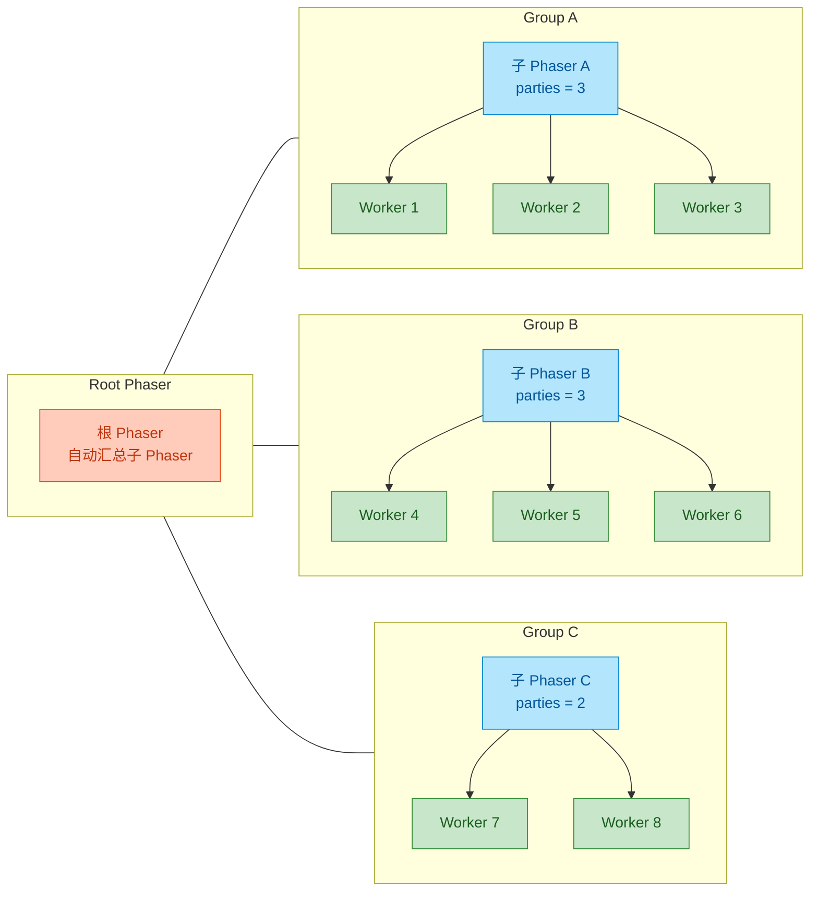
```mermaid
graph LR
    subgraph Root["Root Phaser"]
        direction TB
        ROOT["根 Phaser<br/>自动汇总子 Phaser"]
    end

    subgraph GroupA["Group A"]
        direction TB
        PA["子 Phaser A<br/>parties = 3"]
        W1["Worker 1"]
        W2["Worker 2"]
        W3["Worker 3"]
        PA --> W1
        PA --> W2
        PA --> W3
    end

    subgraph GroupB["Group B"]
        direction TB
        PB["子 Phaser B<br/>parties = 3"]
        W4["Worker 4"]
        W5["Worker 5"]
        W6["Worker 6"]
        PB --> W4
        PB --> W5
        PB --> W6
    end

    subgraph GroupC["Group C"]
        direction TB
        PC["子 Phaser C<br/>parties = 2"]
        W7["Worker 7"]
        W8["Worker 8"]
        PC --> W7
        PC --> W8
    end

    Root --- GroupA
    Root --- GroupB
    Root --- GroupC

    classDef rootNode fill:#FFCCBC,stroke:#E64A19,color:#BF360C
    classDef groupNode fill:#B3E5FC,stroke:#0288D1,color:#01579B
    classDef workerNode fill:#C8E6C9,stroke:#388E3C,color:#1B5E20

    class ROOT rootNode
    class PA,PB,PC groupNode
    class W1,W2,W3,W4,W5,W6,W7,W8 workerNode
```

创建分层 `Phaser` 非常简单，只需在构造时传入父 `Phaser`：

```java
// 创建根 Phaser
Phaser root = new Phaser();

// 创建子 Phaser，各管理一组线程
// 子 Phaser 的参与者全部到达后，才会向父 Phaser 汇报一次 arrive
Phaser groupA = new Phaser(root, 3); // 管理 3 个线程
Phaser groupB = new Phaser(root, 3); // 管理 3 个线程
Phaser groupC = new Phaser(root, 2); // 管理 2 个线程

// Worker 1~3 使用 groupA.arriveAndAwaitAdvance()
// Worker 4~6 使用 groupB.arriveAndAwaitAdvance()
// Worker 7~8 使用 groupC.arriveAndAwaitAdvance()
// 当三个子 Phaser 都完成后，root 的阶段才会推进
```

分层的核心原理：**每个子 Phaser 作为父 Phaser 的一个"虚拟参与者"**。子 Phaser 内的所有参与者全部到达后，子 Phaser 向父 Phaser 报告一次 arrive。这样，CAS 竞争被分散到各个子 Phaser 中，大幅减少了热点冲突。

#### 综合实战：带淘汰机制的多轮竞赛

下面的示例模拟一个多轮竞赛：每一轮结束后，成绩最差的选手被淘汰（通过 `arriveAndDeregister` 退出），直到只剩最后的冠军：

```java
import java.util.concurrent.Phaser;
import java.util.concurrent.*;
import java.util.*;

public class CompetitionDemo {

    // 存储每轮各选手的成绩
    // 使用 ConcurrentHashMap 保证线程安全
    private static final ConcurrentHashMap<String, Integer> scores = new ConcurrentHashMap<>();

    public static void main(String[] args) throws InterruptedException {
        final int playerCount = 5;   // 初始选手数量
        final int totalRounds = 4;   // 总共比赛轮数（会淘汰 4 人，最终剩 1 人）

        // 自定义 Phaser，覆写 onAdvance 实现淘汰逻辑
        Phaser phaser = new Phaser(playerCount) {
            @Override
            protected boolean onAdvance(int phase, int registeredParties) {
                // --- 淘汰逻辑：找出本轮得分最低的选手 ---
                if (!scores.isEmpty() && registeredParties > 1) {
                    // 找出得分最低的选手名
                    String loser = Collections.min(
                            scores.entrySet(),        // 遍历所有条目
                            Map.Entry.comparingByValue() // 按分数比较
                    ).getKey();
                    System.out.println(">>> 第 " + phase + " 轮淘汰: " + loser);
                }
                scores.clear(); // 清空本轮成绩，为下一轮做准备

                System.out.println("====== 第 " + phase + " 轮结束，剩余选手: "
                        + registeredParties + " ======\n");

                // 当只剩 1 人或达到总轮数时终止
                return registeredParties <= 1 || phase + 1 >= totalRounds;
            }
        };

        // 启动选手线程
        for (int i = 1; i <= playerCount; i++) {
            final String name = "Player-" + i;
            new Thread(() -> {
                while (!phaser.isTerminated()) {
                    // 模拟比赛：生成一个随机成绩 (0 ~ 99)
                    int score = ThreadLocalRandom.current().nextInt(100);
                    scores.put(name, score);
                    System.out.println("  " + name + " 本轮得分: " + score);

                    // 判断自己是否是本轮最低分
                    // 到达屏障后，onAdvance 会决定淘汰谁
                    int phase = phaser.arriveAndAwaitAdvance();

                    // 阶段推进后检查自己是否被淘汰
                    // 被淘汰的标志：自己的名字不在新一轮的 scores 中
                    // （因为 onAdvance 中已 clear）
                    // 更简洁的做法：检查自己的分数是否是上轮最低
                    if (phaser.isTerminated()) {
                        break;
                    }
                }
                System.out.println("  " + Thread.currentThread().getName() + " 结束比赛");
            }, name).start();
        }
    }
}
```

> **注意**：上面的淘汰示例为了展示 `Phaser` 的灵活性做了简化。实际生产中，淘汰通知和线程退出需要更精细的协调（如使用共享标记让被淘汰线程在下一轮主动调用 `arriveAndDeregister()`）。

#### Phaser 的状态查询

`Phaser` 提供了丰富的状态查询方法，便于监控和调试：

```java
Phaser phaser = new Phaser(5);

// 获取当前阶段编号（从 0 开始，终止后为负数）
int phase = phaser.getPhase();

// 获取已注册的参与者总数
int registered = phaser.getRegisteredParties();

// 获取已到达当前阶段屏障的参与者数量
int arrived = phaser.getArrivedParties();

// 获取尚未到达的参与者数量
int unarrived = phaser.getUnarrivedParties();

// 判断 Phaser 是否已终止
boolean done = phaser.isTerminated();

// 强制终止 Phaser（所有等待线程立即释放）
phaser.forceTermination();
```

#### Phaser vs CountDownLatch vs CyclicBarrier 完整对比

```mermaid
graph LR
    subgraph CDL["CountDownLatch"]
        direction TB
        CDL_USE["一次性使用"]
        CDL_DIR["单向等待<br/>主线程等子线程"]
        CDL_FIX["固定计数"]
        CDL_USE --> CDL_DIR --> CDL_FIX
    end

    subgraph CB["CyclicBarrier"]
        direction TB
        CB_USE["可循环使用"]
        CB_DIR["双向等待<br/>所有线程互相等"]
        CB_FIX["固定 parties"]
        CB_USE --> CB_DIR --> CB_FIX
    end

    subgraph PH["Phaser"]
        direction TB
        PH_USE["可循环使用"]
        PH_DIR["灵活等待模式<br/>arrive / arriveAndAwait"]
        PH_DYN["动态增减 parties"]
        PH_HOOK["onAdvance 钩子"]
        PH_TREE["支持分层树结构"]
        PH_USE --> PH_DIR --> PH_DYN --> PH_HOOK --> PH_TREE
    end

    CDL -->|"功能升级"| CB
    CB -->|"功能升级"| PH

    classDef latchNode fill:#FFCDD2,stroke:#D32F2F,color:#B71C1C
    classDef barrierNode fill:#BBDEFB,stroke:#1976D2,color:#0D47A1
    classDef phaserNode fill:#C8E6C9,stroke:#388E3C,color:#1B5E20

    class CDL_USE,CDL_DIR,CDL_FIX latchNode
    class CB_USE,CB_DIR,CB_FIX barrierNode
    class PH_USE,PH_DIR,PH_DYN,PH_HOOK,PH_TREE phaserNode
```

| 特性 | CountDownLatch | CyclicBarrier | Phaser |
|------|:-:|:-:|:-:|
| **可重用** | ❌ | ✅ | ✅ |
| **动态 parties** | ❌ | ❌ | ✅ |
| **阶段推进回调** | ❌ | ✅ (barrierAction) | ✅ (onAdvance) |
| **分层/树结构** | ❌ | ❌ | ✅ |
| **非阻塞到达** | ✅ (countDown) | ❌ | ✅ (arrive) |
| **条件终止** | ❌ | ❌ | ✅ (onAdvance 返回 true) |
| **适用规模** | 小规模 | 中等规模 | 任意规模 |
| **API 复杂度** | 低 | 低 | 较高 |

#### 使用建议与最佳实践

1. **能用简单工具就不用复杂工具**：如果场景是一次性的"等 N 个任务完成"，用 `CountDownLatch`；如果是固定 N 个线程反复同步，用 `CyclicBarrier`。只有当你需要**动态参与者**或**多阶段控制**时，才考虑 `Phaser`。

2. **`register()` 的时机**：始终在线程调用 `arrive` 系列方法之前完成注册。推荐模式是"先 register，再 start"。

3. **避免遗漏 arrive**：如果一个已注册的参与者因为异常而没有调用 arrive，其他所有线程会永远阻塞。务必使用 `try-finally` 确保 arrive 被调用：

```java
try {
    // 执行阶段任务
    doWork();
} finally {
    // 无论成功失败，都必须到达屏障
    phaser.arriveAndAwaitAdvance();
}
```

4. **善用 `forceTermination()`**：在异常处理的最外层，可以调用 `forceTermination()` 让所有等待的线程立即释放，防止死锁。

5. **大规模场景用分层**：当 parties 超过几十个时，考虑使用树形 `Phaser` 减少 CAS 竞争。一个经验法则是**每个子 Phaser 管理 16~64 个参与者**。

---

**📝 练习题**

以下关于 `Phaser` 的说法，哪一项是 **错误** 的？

A. `Phaser` 支持在运行过程中通过 `register()` 和 `arriveAndDeregister()` 动态增减参与者数量。


B. 当覆写 `onAdvance` 方法返回 `true` 时，`Phaser` 将进入终止状态，所有在 `arriveAndAwaitAdvance()` 上阻塞的线程将被释放。


C. `Phaser` 的默认行为是：当所有注册的参与者都注销后（parties 为 0），`Phaser` 仍然保持存活并等待新的参与者注册。


D. `Phaser` 支持树形分层结构，子 Phaser 在所有内部参与者到达后才向父 Phaser 报告一次 arrive，以此减少大规模并发下的 CAS 竞争。


**【答案】** C

**【解析】** `Phaser` 的默认 `onAdvance` 实现是 `return registeredParties == 0;`，即当 parties 降为 0 时返回 `true`，`Phaser` 自动终止（terminated）。选项 C 说"保持存活并等待新的参与者"是错误的。选项 A 是 `Phaser` 最核心的特性——动态参与者管理，正确。选项 B 准确描述了 `onAdvance` 返回 `true` 的终止语义，正确。选项 D 准确描述了分层 Phaser 的工作原理，正确。这道题考查的核心是 **`Phaser` 的自然终止条件**——理解 `onAdvance` 的默认行为是掌握 `Phaser` 生命周期管理的关键。

---

## 本章小结

本章系统学习了 `java.util.concurrent` 包中六大核心同步工具类。它们都是在 `synchronized` 和 `ReentrantLock` 之上构建的**更高层抽象**，针对多线程协作中反复出现的典型模式，提供了开箱即用（out-of-the-box）的解决方案。在进入总结之前，我们先用一张全景图把它们的定位和关系梳理清楚。

### 全景架构图

```mermaid
graph LR
    subgraph CORE["核心同步基础设施"]
        direction TB
        AQS["AbstractQueuedSynchronizer<br/>AQS 抽象队列同步器"]
        STATE["volatile int state<br/>共享状态变量"]
        AQS --- STATE
    end

    subgraph LATCH["倒计时门闩"]
        direction TB
        CDL["CountDownLatch"]
        CDL_F1["一次性 · 不可重置"]
        CDL_F2["主线程 await 等待"]
        CDL_F3["子线程 countDown 递减"]
        CDL --> CDL_F1
        CDL --> CDL_F2
        CDL --> CDL_F3
    end

    subgraph BARRIER["循环屏障"]
        direction TB
        CB["CyclicBarrier"]
        CB_F1["可重用 · 自动重置"]
        CB_F2["所有线程互相 await"]
        CB_F3["到齐后触发 barrierAction"]
        CB --> CB_F1
        CB --> CB_F2
        CB --> CB_F3
    end

    subgraph SEMA["信号量"]
        direction TB
        SM["Semaphore"]
        SM_F1["permits 许可池"]
        SM_F2["acquire 获取许可"]
        SM_F3["release 释放许可"]
        SM --> SM_F1
        SM --> SM_F2
        SM --> SM_F3
    end

    subgraph EXCHANGE["数据交换器"]
        direction TB
        EX["Exchanger〈V〉"]
        EX_F1["成对线程交换数据"]
        EX_F2["exchange 阻塞等待对方"]
        EX --> EX_F1
        EX --> EX_F2
    end

    subgraph PHASE["多阶段同步器"]
        direction TB
        PH["Phaser"]
        PH_F1["动态增减参与者"]
        PH_F2["分阶段 arrive + awaitAdvance"]
        PH_F3["可替代 CDL 和 CB"]
        PH --> PH_F1
        PH --> PH_F2
        PH --> PH_F3
    end

    AQS -.->|"内部基于"| CDL
    AQS -.->|"内部基于"| SM
    AQS -.->|"间接依赖 ReentrantLock"| CB
    AQS -.->|"内部基于"| PH

    classDef core fill:#FFF3E0,stroke:#FB8C00,color:#E65100,stroke-width:2px
    classDef latch fill:#E8F5E9,stroke:#43A047,color:#1B5E20
    classDef barrier fill:#E3F2FD,stroke:#1E88E5,color:#0D47A1
    classDef sema fill:#F3E5F5,stroke:#8E24AA,color:#4A148C
    classDef exchange fill:#FFF8E1,stroke:#FDD835,color:#F57F17
    classDef phase fill:#FFEBEE,stroke:#E53935,color:#B71C1C

    class AQS,STATE core
    class CDL,CDL_F1,CDL_F2,CDL_F3 latch
    class CB,CB_F1,CB_F2,CB_F3 barrier
    class SM,SM_F1,SM_F2,SM_F3 sema
    class EX,EX_F1,EX_F2 exchange
    class PH,PH_F1,PH_F2,PH_F3 phase
```

从图中可以清晰看到，**AQS（AbstractQueuedSynchronizer）** 是绝大多数同步工具类的底层引擎。`CountDownLatch`、`Semaphore`、`Phaser` 直接内置了 AQS 的子类实现；`CyclicBarrier` 则间接依赖 `ReentrantLock` + `Condition`（而 `ReentrantLock` 本身也基于 AQS）。理解这一点，有助于我们把看似零散的六个工具串联成一条统一的知识线。

---

### 核心对比速查表

下表从七个维度对本章所有工具类进行横向对比，这是面试和实际选型时最常回顾的一张表：

| 维度 | CountDownLatch | CyclicBarrier | Semaphore | Exchanger | Phaser |
|---|---|---|---|---|---|
| **核心隐喻** | 倒计时门闩 | 循环屏障（栅栏） | 许可证窗口 | 两人交换站 | 多阶段赛跑发令枪 |
| **等待模型** | 一组线程等另一组完成 | 所有线程互相等待，到齐放行 | 控制并发访问数量 | 恰好两个线程交换数据 | 分阶段到达 + 推进 |
| **计数方向** | **递减**到 0 触发 | **递增**到 parties 触发 | 动态增减 permits | 无计数概念 | 每阶段 arrive 递增 |
| **是否可重用** | ❌ 一次性 | ✅ 自动 reset | ✅ 天然可重用 | ✅ 可重用 | ✅ 可重用且可多阶段 |
| **参与者是否可变** | 构造时固定 count | 构造时固定 parties | 可动态调整 permits | 固定 2 个线程 | ✅ `register()` / `arriveAndDeregister()` |
| **底层实现** | AQS (Shared) | ReentrantLock + Condition | AQS (Shared) | 自旋 + CAS + park | AQS (state 位运算) |
| **典型场景** | 主线程汇总、服务启动屏障 | MapReduce 分段计算、游戏同步 | 限流、连接池、停车场 | 双缓冲、遗传算法配对 | 动态注册的多阶段任务 |

> **选型口诀**：「等别人完成用 Latch，互相等齐用 Barrier，限并发用 Semaphore，俩人换数据用 Exchanger，阶段推进用 Phaser」。

---

### 关键知识点回顾

**一、CountDownLatch（倒计时门闩）**

CountDownLatch 的设计思想极其简洁——在构造时设定一个 `count` 值，每次调用 `countDown()` 将其减一，调用 `await()` 的线程会阻塞直到 `count` 降为零。它是**一次性的（one-shot）**，计数归零后无法重置，这既是它的限制，也是它的优点——语义简单、不易误用。

最经典的使用模式是"**主线程等待 N 个子任务全部完成**"：

```java
// 创建倒计时门闩，计数值 = 子任务数量
CountDownLatch latch = new CountDownLatch(3);

for (int i = 0; i < 3; i++) {
    new Thread(() -> {
        try {
            doWork();             // 执行子任务
        } finally {
            latch.countDown();    // 无论成功失败，计数减一
        }
    }).start();
}

latch.await();                    // 主线程阻塞，直到 count == 0
System.out.println("All done!");  // 三个子任务全部完成后才执行
```

需要特别注意：`countDown()` 应该放在 `finally` 块中，防止异常导致计数永远无法归零，使 `await()` 的线程永久阻塞（deadlock by omission）。此外，还可以使用 `await(long timeout, TimeUnit unit)` 设置超时，避免无限等待。

**二、CyclicBarrier（循环屏障）**

与 CountDownLatch 的"一组等另一组"不同，CyclicBarrier 强调的是"**所有参与线程互相等待，到齐后一起通过屏障**"。其名称中的 "Cyclic" 意味着屏障可以**循环使用**——一代（generation）的线程全部到达后，barrier 自动重置，下一代线程可以继续使用同一个 barrier 对象。

```java
// parties=3，到齐后执行 barrierAction
CyclicBarrier barrier = new CyclicBarrier(3, () -> {
    System.out.println("=== 所有线程到齐，汇总本轮结果 ===");
});

for (int i = 0; i < 3; i++) {
    new Thread(() -> {
        for (int round = 0; round < 5; round++) {   // 5 轮迭代计算
            computePartial(round);                   // 各自计算
            barrier.await();                         // 到达屏障，等其他线程
            // 屏障打开后，所有线程同时继续下一轮
        }
    }).start();
}
```

CyclicBarrier 还有一个**故障传播**机制：如果任何一个线程在 `await()` 期间被中断或超时，屏障会 **broken**，所有其他等待线程收到 `BrokenBarrierException`，避免永久挂起。可以通过 `barrier.reset()` 手动修复。

**三、CountDownLatch vs CyclicBarrier**

这是面试中出现频率极高的对比题，核心区别可以用一句话概括：

> **CountDownLatch 是"一群人等一个信号"，CyclicBarrier 是"一群人互相等"。**

- **角色分离** vs **角色对等**：Latch 中调用 `countDown()` 的线程和调用 `await()` 的线程通常不是同一批；Barrier 中所有参与线程都调用 `await()`，既是等待者也是信号发出者。
- **一次性** vs **可循环**：Latch 计数归零后生命周期结束；Barrier 每轮自动重置。
- **无回调** vs **有 barrierAction**：Barrier 支持在"所有线程到齐"这一精确时刻执行一个汇总回调。

**四、Semaphore（信号量）**

Semaphore 维护一组 **permits（许可）**，`acquire()` 消耗一个许可（无许可可用时阻塞），`release()` 归还一个许可。它的核心能力是**控制同时访问某资源的线程数量**，本质上是一个"并发度限制器"（concurrency throttle）。

```java
// 最多允许 5 个线程同时访问
Semaphore semaphore = new Semaphore(5, true); // fair=true 公平模式

semaphore.acquire();    // 获取一个许可，无许可则阻塞
try {
    accessResource();   // 访问受保护资源
} finally {
    semaphore.release(); // 必须在 finally 中释放
}
```

当 `permits = 1` 时，Semaphore 退化为一个**互斥锁（mutex）**，但与 `ReentrantLock` 不同的是，Semaphore 没有"所有权"概念——线程 A acquire 的许可完全可以由线程 B 来 release，这种灵活性在构建**资源池**（如数据库连接池、对象池）时非常有用。

**五、Exchanger（交换器）**

Exchanger 是最"小众"却最有趣的工具——它让**恰好两个线程**在一个汇合点（rendezvous point）**交换数据**。当一个线程调用 `exchange(V data)` 时会阻塞，直到另一个线程也调用 `exchange(V data)`，此时两者的数据互换返回。

典型场景包括：**双缓冲**（double buffering）——一个线程填充缓冲区，另一个线程消费缓冲区，填满/消费完后两者交换缓冲区引用，实现零拷贝的生产者-消费者模型。

**六、Phaser（阶段同步器）**

Phaser 是 JDK 7 引入的"终极同步器"，可以看作 CountDownLatch 和 CyclicBarrier 的**统一升级版**。它最强大的特性是**参与者数量可以动态变化**——通过 `register()` 增加参与者、`arriveAndDeregister()` 减少参与者。同时它天然支持**多阶段（phase）同步**，每个阶段结束后自动推进到下一阶段。

通过重写 `onAdvance(int phase, int registeredParties)` 方法，还可以控制 Phaser 在特定阶段终止，实现"运行 N 轮后停止"的逻辑。

---

### 最佳实践与避坑指南

1. **始终在 `finally` 中执行释放操作**：无论是 `countDown()`、`release()` 还是 `arriveAndDeregister()`，都应放在 `finally` 块中，防止异常导致其他线程永久阻塞。

2. **优先使用带超时的 `await()`**：`latch.await(30, TimeUnit.SECONDS)` 和 `barrier.await(30, TimeUnit.SECONDS)` 可以防止因某个线程崩溃而导致的"静默死锁"（silent deadlock）。

3. **Semaphore 的 permits 可以"凭空"release**：调用 `release()` 不要求之前必须 `acquire()` 过，这意味着 permits 的总数可以被动态增大。这是一个特性，但如果使用不当会导致逻辑错误——请确保 acquire 和 release 严格配对。

4. **CyclicBarrier 的 barrierAction 在最后到达的线程上执行**：不需要额外线程，但也意味着 barrierAction 不应执行耗时操作，否则会延迟所有线程的放行。

5. **不要过度使用 Phaser**：虽然 Phaser 功能最强大，但对于简单的"等待完成"场景，CountDownLatch 的语义更清晰、代码更易读。**选择最简单的能满足需求的工具**（principle of least power）。

---

### 同步工具选型决策流程

```mermaid
graph LR
    subgraph QUESTION["需求分析"]
        direction TB
        Q1{"需要控制<br/>并发访问数量?"}
        Q2{"需要两个线程<br/>交换数据?"}
        Q3{"参与者数量<br/>是否动态变化?"}
        Q4{"需要多轮<br/>重复使用?"}
        Q5{"谁等待谁?"}
    end

    subgraph ANSWER["工具选择"]
        direction TB
        A1["Semaphore<br/>信号量限流"]
        A2["Exchanger〈V〉<br/>成对数据交换"]
        A3["Phaser<br/>动态多阶段同步"]
        A4["CyclicBarrier<br/>互相等待 · 可循环"]
        A5["CountDownLatch<br/>等子任务完成 · 一次性"]
    end

    Q1 -->|"是"| A1
    Q1 -->|"否"| Q2
    Q2 -->|"是"| A2
    Q2 -->|"否"| Q3
    Q3 -->|"是"| A3
    Q3 -->|"否"| Q4
    Q4 -->|"是 · 线程互等"| A4
    Q4 -->|"否 · 一次性等待"| Q5
    Q5 -->|"主等子"| A5
    Q5 -->|"阶段性推进"| A3

    classDef question fill:#E3F2FD,stroke:#1565C0,color:#0D47A1,stroke-width:2px
    classDef semaphore fill:#F3E5F5,stroke:#8E24AA,color:#4A148C
    classDef exchanger fill:#FFF8E1,stroke:#F9A825,color:#F57F17
    classDef phaser fill:#FFEBEE,stroke:#E53935,color:#B71C1C
    classDef barrier fill:#E8F5E9,stroke:#2E7D32,color:#1B5E20
    classDef latch fill:#E0F7FA,stroke:#00838F,color:#006064

    class Q1,Q2,Q3,Q4,Q5 question
    class A1 semaphore
    class A2 exchanger
    class A3 phaser
    class A4 barrier
    class A5 latch
```

---

### 一句话总结

> 本章的六个同步工具类，本质上都是在回答同一个问题：**"多个线程如何优雅地协调彼此的执行节奏？"** CountDownLatch 解决"等你们都做完我再动"，CyclicBarrier 解决"咱们到齐了再一起走"，Semaphore 解决"同时只能进这么多人"，Exchanger 解决"你我互换手中的东西"，Phaser 解决"人来人走、一轮一轮地推进"。掌握它们的**语义差异**和**适用边界**，是写出正确、高效并发代码的关键。

---

**📝 练习题 1**

以下关于 `CountDownLatch` 和 `CyclicBarrier` 的说法，**正确的是**：

A. `CountDownLatch` 的计数器可以通过调用 `reset()` 方法重置后再次使用


B. `CyclicBarrier` 的 `barrierAction` 回调是在一个额外的独立线程中执行的


C. `CountDownLatch` 中调用 `countDown()` 的线程和调用 `await()` 的线程可以是不同的线程组，而 `CyclicBarrier` 中调用 `await()` 的线程既是等待者也是参与者


D. `CyclicBarrier` 在某个等待线程被中断后，其他等待线程不受影响，可以继续正常等待

**【答案】** C

**【解析】** 逐项分析：
- **A 错误**：`CountDownLatch` 没有 `reset()` 方法，它是一次性的（one-shot），计数归零后无法重置。拥有 `reset()` 方法的是 `CyclicBarrier`。
- **B 错误**：`CyclicBarrier` 的 `barrierAction` 是在**最后一个到达屏障的线程**上同步执行的，并不会创建额外线程。
- **C 正确**：这正是两者最核心的区别。Latch 中 `countDown()` 和 `await()` 的调用者通常分属不同角色（如子线程 countDown，主线程 await）；Barrier 中所有参与线程都调用 `await()`，每个线程既在等别人，也被别人等。
- **D 错误**：`CyclicBarrier` 具有**故障传播机制**——一旦某个等待线程被中断或超时，屏障会进入 broken 状态，所有其他等待线程都会收到 `BrokenBarrierException`。

---

**📝 练习题 2**

在一个停车场系统中，停车场共有 10 个车位。需要控制同时进入停车场的车辆不超过 10 辆，车辆离开后释放车位给其他等待车辆。以下哪种同步工具类**最适合**此场景？

A. `CountDownLatch`，初始计数设为 10


B. `CyclicBarrier`，parties 设为 10


C. `Semaphore`，permits 设为 10


D. `Phaser`，初始注册 10 个参与者

**【答案】** C

**【解析】** 停车场场景的核心需求是**控制并发访问数量**——同时最多允许 10 辆车使用车位，这恰好是 `Semaphore`（信号量）的经典应用场景。每辆车进入时 `acquire()` 获取一个许可（车位），离开时 `release()` 归还许可。
- **A 错误**：`CountDownLatch` 是一次性的，10 辆车进去后计数归零就永远无法再使用了，无法处理"车辆离开后释放车位"的动态循环需求。
- **B 错误**：`CyclicBarrier` 要求所有 10 个线程都到齐后才一起放行，这意味着必须等 10 个车位全满才能做下一步操作，完全不符合"来一辆进一辆、走一辆放一辆"的语义。
- **D 错误**：`Phaser` 虽然支持动态参与者，但它的核心语义是"分阶段推进"，用在停车场场景属于严重的过度设计（over-engineering），语义也不匹配。

---

