---

# AQS框架 ⭐⭐⭐

---

## AQS概述（AbstractQueuedSynchronizer）

AQS，全称 `AbstractQueuedSynchronizer`，是 `java.util.concurrent.locks` 包中最核心的基础框架，由并发大师 **Doug Lea** 设计并在 JDK 1.5 中引入。它为构建锁（Locks）和各种同步器（Synchronizers）提供了一套通用的、高性能的底层骨架。可以毫不夸张地说，**AQS 是整个 `java.util.concurrent`（J.U.C）包的基石**——如果不理解 AQS，就无法真正理解 Java 并发库的工作原理。

### 为什么需要 AQS？

在 AQS 出现之前，如果开发者需要实现一个自定义的锁或同步工具，必须自己处理以下所有底层细节：

- **线程的阻塞与唤醒**（`LockSupport.park` / `unpark`）
- **等待队列的维护**（线程排队、入队、出队）
- **CAS 原子操作保证状态变量的线程安全**
- **可重入性、公平性、超时、中断**等策略的实现

这些工作既复杂又极易出错。Doug Lea 观察到，几乎所有的同步器都遵循一个共同的行为模式：

> **"尝试获取资源，如果获取失败就将当前线程加入等待队列并阻塞；当资源被释放时，唤醒队列中等待的线程重新尝试获取。"**

AQS 将这个**通用模式**抽象为一个框架，把"怎么排队、怎么阻塞、怎么唤醒"这些**不变的机制**固化在框架内部，把"什么条件算获取成功、什么条件算释放成功"这些**可变的策略**通过模板方法（Template Method Pattern）留给子类去定义。

### AQS 的继承体系与使用者

AQS 本身是一个抽象类，我们先来看它在 J.U.C 中的位置和继承关系：

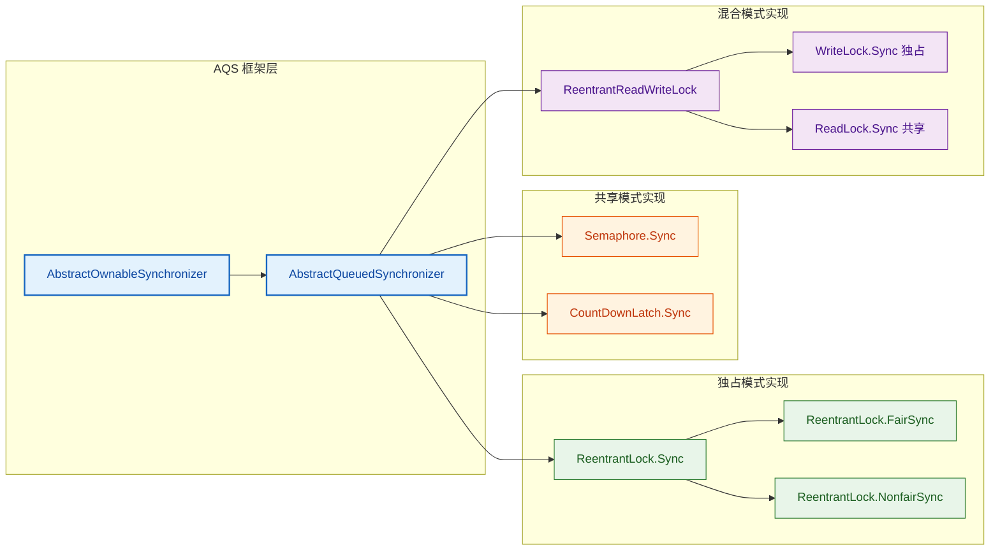
```mermaid
graph LR
    subgraph AQS_Framework["AQS 框架层"]
        direction TB
        AOS["AbstractOwnableSynchronizer"]
        AQS["AbstractQueuedSynchronizer"]
        AOS --> AQS
    end

    subgraph Exclusive_Impl["独占模式实现"]
        direction TB
        RLS["ReentrantLock.Sync"]
        RLFS["ReentrantLock.FairSync"]
        RLNS["ReentrantLock.NonfairSync"]
        RLS --> RLFS
        RLS --> RLNS
    end

    subgraph Shared_Impl["共享模式实现"]
        direction TB
        SS["Semaphore.Sync"]
        CDLS["CountDownLatch.Sync"]
    end

    subgraph Mixed_Impl["混合模式实现"]
        direction TB
        RRWL["ReentrantReadWriteLock"]
        WS["WriteLock.Sync 独占"]
        RS["ReadLock.Sync 共享"]
        RRWL --> WS
        RRWL --> RS
    end

    AQS --> RLS
    AQS --> SS
    AQS --> CDLS
    AQS --> RRWL

    classDef frameCls fill:#E3F2FD,stroke:#1565C0,color:#0D47A1,stroke-width:2px
    classDef exclusiveCls fill:#E8F5E9,stroke:#2E7D32,color:#1B5E20
    classDef sharedCls fill:#FFF3E0,stroke:#E65100,color:#BF360C
    classDef mixedCls fill:#F3E5F5,stroke:#6A1B9A,color:#4A148C

    class AOS,AQS frameCls
    class RLS,RLFS,RLNS exclusiveCls
    class SS,CDLS sharedCls
    class RRWL,WS,RS mixedCls
```

从图中可以看到，J.U.C 中你所熟知的几乎所有同步工具，**都是 AQS 的子类或内部持有一个 AQS 子类**：

| 同步工具 | AQS 使用模式 | 说明 |
|---|---|---|
| `ReentrantLock` | **独占模式** | 可重入互斥锁 |
| `ReentrantReadWriteLock` | **独占 + 共享** | 写锁独占，读锁共享 |
| `Semaphore` | **共享模式** | 信号量，控制并发许可数 |
| `CountDownLatch` | **共享模式** | 倒计时门闩 |
| `CyclicBarrier` | 间接使用（基于 `ReentrantLock`） | 循环栅栏 |
| `ThreadPoolExecutor.Worker` | **独占模式** | 线程池工作线程 |

这种设计的优雅之处在于：所有这些工具**共享同一套排队和唤醒机制**，却通过覆写不同的模板方法展现出完全不同的语义行为。

### AQS 的设计哲学：模板方法模式

AQS 的核心设计思想是 **模板方法模式（Template Method Pattern）**。框架定义好算法的骨架（acquire/release 流程），将某些步骤的具体实现延迟到子类。

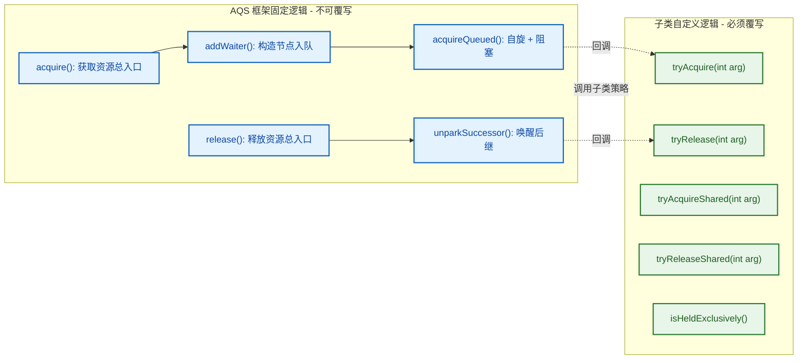
```mermaid
graph LR
    subgraph Template_Fixed["AQS 框架固定逻辑 - 不可覆写"]
        direction TB
        ACQ["acquire(): 获取资源总入口"]
        AW["addWaiter(): 构造节点入队"]
        AQD["acquireQueued(): 自旋 + 阻塞"]
        REL["release(): 释放资源总入口"]
        UPS["unparkSuccessor(): 唤醒后继"]
        ACQ --> AW --> AQD
        REL --> UPS
    end

    subgraph Template_Custom["子类自定义逻辑 - 必须覆写"]
        direction TB
        TA["tryAcquire(int arg)"]
        TR["tryRelease(int arg)"]
        TAS["tryAcquireShared(int arg)"]
        TRS["tryReleaseShared(int arg)"]
        IHE["isHeldExclusively()"]
    end

    AQD -. "回调" .-> TA
    UPS -. "回调" .-> TR
    Template_Fixed -. "调用子类策略" .-> Template_Custom

    classDef fixedCls fill:#E3F2FD,stroke:#1565C0,color:#0D47A1,stroke-width:2px
    classDef customCls fill:#E8F5E9,stroke:#2E7D32,color:#1B5E20,stroke-width:2px

    class ACQ,AW,AQD,REL,UPS fixedCls
    class TA,TR,TAS,TRS,IHE customCls
```

简单来说，AQS 对开发者的约定是：

> **"你只需要告诉我'尝试获取'和'尝试释放'的逻辑，排队、阻塞、唤醒的脏活累活我全包。"**

这正是 AQS 如此强大的原因——它用极少的抽象接口，封装了极其复杂的并发控制逻辑。

### AQS 的三大核心组件概览

在深入每个子话题之前，我们先从全局视角鸟瞰 AQS 的三大核心组件。它们构成了 AQS 的"骨骼"：

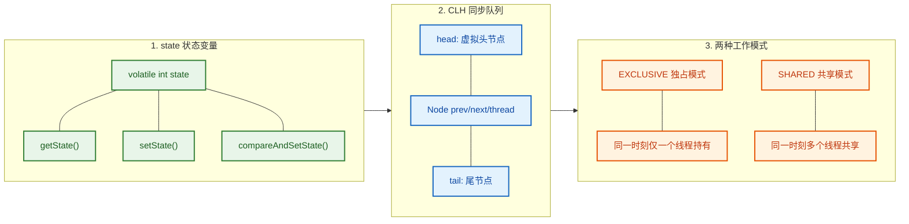
```mermaid
graph LR
    subgraph State["1. state 状态变量"]
        direction TB
        SV["volatile int state"]
        GS["getState()"]
        SS2["setState()"]
        CAS_S["compareAndSetState()"]
        SV --- GS
        SV --- SS2
        SV --- CAS_S
    end

    subgraph Queue["2. CLH 同步队列"]
        direction TB
        HEAD["head: 虚拟头节点"]
        TAIL["tail: 尾节点"]
        N1["Node prev/next/thread"]
        HEAD --- N1
        N1 --- TAIL
    end

    subgraph Mode["3. 两种工作模式"]
        direction TB
        EX["EXCLUSIVE 独占模式"]
        SH["SHARED 共享模式"]
        EX_DESC["同一时刻仅一个线程持有"]
        SH_DESC["同一时刻多个线程共享"]
        EX --- EX_DESC
        SH --- SH_DESC
    end

    State --> Queue
    Queue --> Mode

    classDef stateCls fill:#E8F5E9,stroke:#2E7D32,color:#1B5E20,stroke-width:2px
    classDef queueCls fill:#E3F2FD,stroke:#1565C0,color:#0D47A1,stroke-width:2px
    classDef modeCls fill:#FFF3E0,stroke:#E65100,color:#BF360C,stroke-width:2px

    class SV,GS,SS2,CAS_S stateCls
    class HEAD,TAIL,N1 queueCls
    class EX,SH,EX_DESC,SH_DESC modeCls
```

**① `state` 状态变量**——AQS 使用一个 `volatile int` 类型的字段 `state` 来表示同步状态。这个 state 的语义由子类定义：对于 `ReentrantLock`，state 代表锁的重入次数；对于 `Semaphore`，state 代表剩余许可数；对于 `CountDownLatch`，state 代表尚未完成的计数。所有对 state 的修改都通过 CAS 操作保证原子性。

**② CLH 同步队列**——当线程获取资源失败时，AQS 会将该线程包装为一个 `Node` 节点，加入一个 FIFO 双向链表（变体 CLH 队列）。队列中的线程会被阻塞（`LockSupport.park`），直到前驱节点释放资源后将其唤醒。

**③ 独占模式 / 共享模式**——独占模式（Exclusive）下，同一时刻只有一个线程能成功获取资源，如 `ReentrantLock`；共享模式（Shared）下，多个线程可以同时获取资源，如 `Semaphore`、`CountDownLatch`。

### AQS 源码骨架速览

下面列出 AQS 类中最关键的字段和方法签名，帮助你建立整体的代码地图：

```java
// AQS 继承自 AbstractOwnableSynchronizer,
// 后者仅提供了 exclusiveOwnerThread 字段（记录当前独占锁的持有线程）
public abstract class AbstractQueuedSynchronizer
    extends AbstractOwnableSynchronizer
    implements java.io.Serializable {

    // ==================== 核心字段 ====================

    // 同步状态变量, volatile 保证可见性
    private volatile int state;

    // CLH 队列的头节点（虚拟节点, 即哨兵节点）
    private transient volatile Node head;

    // CLH 队列的尾节点
    private transient volatile Node tail;

    // ==================== state 操作方法 ====================

    // 获取当前 state 值
    protected final int getState() { return state; }

    // 直接设置 state 值（仅在持有锁时使用, 因为不保证原子性）
    protected final void setState(int newState) { state = newState; }

    // CAS 原子更新 state（竞争场景下使用）
    protected final boolean compareAndSetState(int expect, int update) {
        // 底层调用 Unsafe.compareAndSwapInt
        return unsafe.compareAndSwapInt(this, stateOffset, expect, update);
    }

    // ==================== 模板方法（子类必须覆写） ====================

    // 独占模式: 尝试获取资源（由子类定义"获取"的语义）
    protected boolean tryAcquire(int arg) {
        throw new UnsupportedOperationException(); // 默认抛异常, 强制子类覆写
    }

    // 独占模式: 尝试释放资源
    protected boolean tryRelease(int arg) {
        throw new UnsupportedOperationException();
    }

    // 共享模式: 尝试获取资源, 返回值 >= 0 表示成功
    protected int tryAcquireShared(int arg) {
        throw new UnsupportedOperationException();
    }

    // 共享模式: 尝试释放资源
    protected boolean tryReleaseShared(int arg) {
        throw new UnsupportedOperationException();
    }

    // 判断当前线程是否独占持有同步器
    protected boolean isHeldExclusively() {
        throw new UnsupportedOperationException();
    }

    // ==================== 框架固定流程（不可覆写） ====================

    // 独占模式获取（对外公开的 API）
    public final void acquire(int arg) { /* ... */ }

    // 独占模式释放
    public final boolean release(int arg) { /* ... */ }

    // 共享模式获取
    public final void acquireShared(int arg) { /* ... */ }

    // 共享模式释放
    public final boolean releaseShared(int arg) { /* ... */ }

    // ... 还有支持超时、可中断的变体方法
}
```

注意几个关键的设计细节：

1. **模板方法默认抛 `UnsupportedOperationException`**，而非声明为 `abstract`。这是有意为之的——因为子类通常只需要实现独占 *或* 共享模式中的一种，如果声明为 abstract，子类就必须同时实现两套方法，哪怕其中一套永远不会被调用。这种 "soft abstract" 的设计更加灵活。

2. **所有 `public` 方法都是 `final` 的**，子类无法修改框架的执行流程，只能通过 `protected` 的 hook 方法注入自定义逻辑。这确保了框架的不变性和正确性。

3. **`state` 的存取方法是 `protected final` 的**，意味着只有 AQS 的子类能操作 state，外部代码无法直接篡改同步状态。

### AQS 的工作流程总览

最后，我们用一个完整的流程图来展示"线程从尝试获取资源到最终成功"的全貌，为后续章节的深入分析打下基础：

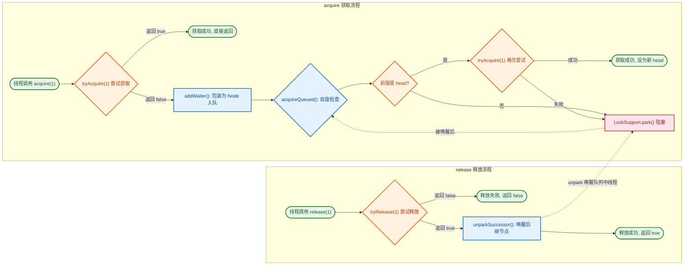
```mermaid
graph LR
    subgraph Acquire_Flow["acquire 获取流程"]
        direction TB
        START(["线程调用 acquire(1)"])
        TRY{"tryAcquire(1) 尝试获取"}
        SUCCESS_1(["获取成功, 直接返回"])
        ADD["addWaiter(): 包装为 Node 入队"]
        SPIN{"acquireQueued(): 自旋检查"}
        IS_HEAD{"前驱是 head?"}
        TRY2{"tryAcquire(1) 再次尝试"}
        SUCCESS_2(["获取成功, 设为新 head"])
        PARK["LockSupport.park() 阻塞"]

        START --> TRY
        TRY -- "返回 true" --> SUCCESS_1
        TRY -- "返回 false" --> ADD
        ADD --> SPIN
        SPIN --> IS_HEAD
        IS_HEAD -- "是" --> TRY2
        IS_HEAD -- "否" --> PARK
        TRY2 -- "成功" --> SUCCESS_2
        TRY2 -- "失败" --> PARK
        PARK -. "被唤醒后" .-> SPIN
    end

    subgraph Release_Flow["release 释放流程"]
        direction TB
        R_START(["线程调用 release(1)"])
        R_TRY{"tryRelease(1) 尝试释放"}
        R_FAIL(["释放失败, 返回 false"])
        R_UNPARK["unparkSuccessor(): 唤醒后继节点"]
        R_DONE(["释放成功, 返回 true"])

        R_START --> R_TRY
        R_TRY -- "返回 false" --> R_FAIL
        R_TRY -- "返回 true" --> R_UNPARK
        R_UNPARK --> R_DONE
    end

    R_UNPARK -. "unpark 唤醒队列中线程" .-> PARK

    classDef startEnd fill:#E8F5E9,stroke:#2E7D32,color:#1B5E20,stroke-width:2px
    classDef decision fill:#FFF3E0,stroke:#E65100,color:#BF360C,stroke-width:2px
    classDef process fill:#E3F2FD,stroke:#1565C0,color:#0D47A1,stroke-width:2px
    classDef blocked fill:#FCE4EC,stroke:#C62828,color:#B71C1C,stroke-width:2px

    class START,SUCCESS_1,SUCCESS_2,R_START,R_FAIL,R_DONE startEnd
    class TRY,IS_HEAD,TRY2,R_TRY decision
    class ADD,SPIN,R_UNPARK process
    class PARK blocked
```

这张图清晰地展示了 AQS 的核心运作机制：

1. **快速路径（Fast Path）**：`tryAcquire` 直接成功 → 无需排队，零开销。
2. **慢速路径（Slow Path）**：`tryAcquire` 失败 → 入队 → 自旋 + 阻塞 → 被唤醒后重试。
3. **释放与唤醒的联动**：持有者调用 `release` → `tryRelease` 成功 → `unparkSuccessor` 唤醒队列中下一个等待线程 → 该线程从 `park` 处恢复，重新进入自旋尝试获取。

这种 **"尝试 → 失败排队 → 阻塞 → 被唤醒重试"** 的范式，是 AQS 框架中一切同步工具的通用行为模型。理解了这个模型，后续分析 `ReentrantLock`、`Semaphore` 等具体实现时，你只需要关注它们各自的 `tryAcquire` / `tryRelease` 逻辑即可。

### 小结：AQS 的核心定位

| 维度 | 描述 |
|---|---|
| **本质** | 一个基于 FIFO 等待队列的、用于构建同步器的抽象框架 |
| **核心资源** | `volatile int state`，语义由子类定义 |
| **排队机制** | 变体 CLH 双向链表，节点包含线程引用和等待状态 |
| **阻塞/唤醒** | `LockSupport.park()` / `LockSupport.unpark()` |
| **设计模式** | 模板方法模式 —— 框架定义骨架，子类实现策略 |
| **两种模式** | 独占（Exclusive）和共享（Shared） |
| **线程安全** | CAS 操作保证 state 更新的原子性，volatile 保证可见性 |

---

**📝 练习题**

关于 AQS（AbstractQueuedSynchronizer）的设计，以下说法**错误**的是：

A. AQS 的模板方法 `tryAcquire` 被声明为 `abstract`，强制所有子类必须实现独占获取逻辑


B. AQS 使用 `volatile int state` 作为同步状态变量，具体语义由子类定义


C. AQS 的 `acquire` 方法被声明为 `public final`，子类无法覆写框架的获取流程


D. AQS 同时支持独占模式和共享模式，子类可以根据需要选择实现其中一种或两种


**【答案】** A

**【解析】** AQS 的 `tryAcquire`、`tryRelease` 等模板方法**并非** `abstract` 方法，而是普通的 `protected` 方法，默认实现是直接抛出 `UnsupportedOperationException`。这是一个深思熟虑的设计决策：如果声明为 `abstract`，那么每个子类都必须同时实现 `tryAcquire`（独占）和 `tryAcquireShared`（共享）等全部模板方法，即便该子类只使用其中一种模式。例如 `ReentrantLock` 只需要独占模式，根本不需要实现 `tryAcquireShared`，如果这些方法都是 abstract 的，就会被迫写无意义的实现。选项 B、C、D 的描述均正确：state 的语义确实由子类赋予（锁计数 / 许可数 / 倒计数等）；`acquire` 确实是 `public final` 的不可覆写方法；子类可以自由选择实现独占或共享模式。

---

## AQS 核心思想 ⭐⭐

`AbstractQueuedSynchronizer`（以下简称 AQS）是 `java.util.concurrent.locks` 包中最核心的基础框架，由 Doug Lea 设计并在 JDK 1.5 引入。它并不是一个可以直接使用的同步工具，而是一个 **抽象骨架**（abstract skeletal framework），为构建各种同步器提供了统一的底层机制。我们耳熟能详的 `ReentrantLock`、`Semaphore`、`CountDownLatch`、`ReentrantReadWriteLock`、`CyclicBarrier`（间接通过 ReentrantLock）等，其内部实现无一例外地依赖 AQS。

理解 AQS 的核心思想，就是理解三件事：**用什么表示"锁的状态"**、**用什么管理"等不到锁的线程"**、以及 **"锁的获取"分几种模式**。这三个问题分别对应 AQS 的三大支柱：`state` 状态变量、CLH 变体等待队列、独占模式与共享模式。

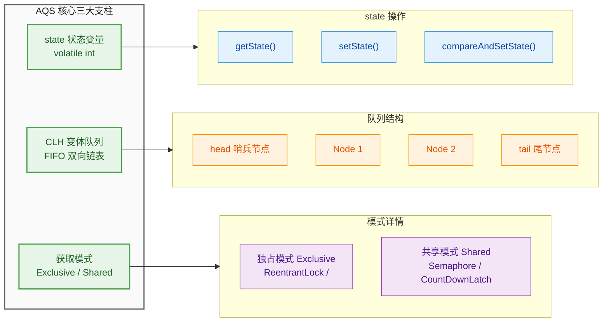
```mermaid
graph LR
    subgraph AQS_Core["AQS 核心三大支柱"]
        direction TB
        S["state 状态变量<br/>volatile int"]
        Q["CLH 变体队列<br/>FIFO 双向链表"]
        M["获取模式<br/>Exclusive / Shared"]
    end

    subgraph State_Ops["state 操作"]
        direction TB
        G["getState()"]
        SET["setState()"]
        CAS["compareAndSetState()"]
    end

    subgraph Queue_Struct["队列结构"]
        direction TB
        HEAD["head 哨兵节点"]
        N1["Node 1"]
        N2["Node 2"]
        TAIL["tail 尾节点"]
    end

    subgraph Mode_Detail["模式详情"]
        direction TB
        EX["独占模式 Exclusive<br/>ReentrantLock / "]
        SH["共享模式 Shared<br/>Semaphore / CountDownLatch"]
    end

    S --> State_Ops
    Q --> Queue_Struct
    M --> Mode_Detail

    classDef pillar fill:#E8F5E9,stroke:#43A047,stroke-width:2px,color:#1B5E20
    classDef ops fill:#E3F2FD,stroke:#1E88E5,stroke-width:1px,color:#0D47A1
    classDef queue fill:#FFF3E0,stroke:#FB8C00,stroke-width:1px,color:#E65100
    classDef mode fill:#F3E5F5,stroke:#8E24AA,stroke-width:1px,color:#4A148C
    classDef core fill:#FAFAFA,stroke:#616161,stroke-width:2px,color:#212121

    class S,Q,M pillar
    class G,SET,CAS ops
    class HEAD,N1,N2,TAIL queue
    class EX,SH mode
    class AQS_Core core
```

在深入每个支柱之前，我们先从宏观上建立一个直觉：当一个线程尝试获取同步资源时，AQS 首先检查 `state`，如果资源可用则通过 CAS 修改 `state` 完成获取；如果不可用，AQS 就把当前线程包装成一个 `Node` 放入 CLH 队列排队，然后将线程挂起（`LockSupport.park`）。当持有资源的线程释放时，它修改 `state` 并唤醒队列中下一个等待的线程（`LockSupport.unpark`）。整个过程的并发安全由 **CAS + volatile** 保证，没有使用任何 `synchronized` 关键字。

---

### state 状态变量

#### 定义与本质

`state` 是 AQS 中一个极其简洁却极其重要的字段，其定义如下：

```java
// AQS 中的核心状态字段
// volatile 保证多线程之间的可见性
private volatile int state;
```

仅仅一个 `int`，就承载了整个同步器的语义核心。它的含义完全取决于子类如何解释它（这正是模板方法模式的精髓）：

| 同步器 | `state` 的含义 | 值域示例 |
|--------|---------------|---------|
| `ReentrantLock` | 锁的重入次数 | 0 = 未锁定，≥1 = 被某线程持有 N 次 |
| `Semaphore` | 剩余许可数 (remaining permits) | 初始值 = 许可总数，每次 acquire 减 1 |
| `CountDownLatch` | 剩余倒计数 | 初始值 = count，每次 countDown 减 1 |
| `ReentrantReadWriteLock` | 高 16 位 = 读锁持有数，低 16 位 = 写锁重入数 | 利用位运算拆分一个 int |

> 一个 `int` 之所以能承载如此丰富的语义，是因为 AQS 本身并不关心 `state` 代表什么——它只提供对 `state` 的原子操作，真正的"含义赋予"交给了子类的 `tryAcquire`/`tryRelease` 等模板方法。

#### 三大访问方法

AQS 对外（实际上是对子类）暴露了三个方法来操作 `state`，它们是子类实现同步语义的全部工具：

```java
// ==================== state 的三大操作方法 ====================

// 1. 普通读取：直接读取 volatile 变量，保证读到最新值
//    由于 state 是 volatile 的，JMM 保证了 happens-before 语义
protected final int getState() {
    return state;  // volatile read，对所有线程可见
}

// 2. 普通写入：直接写入 volatile 变量
//    适用于已经持有锁、不存在竞争的场景（如重入时递增 state）
protected final void setState(int newState) {
    state = newState;  // volatile write，对后续 volatile read 可见
}

// 3. CAS 写入：原子性地 [比较并交换]
//    这是并发竞争场景下修改 state 的唯一安全方式
//    底层调用 Unsafe.compareAndSwapInt，是一条 CPU 级原子指令
protected final boolean compareAndSetState(int expect, int update) {
    return unsafe.compareAndSwapInt(this, stateOffset, expect, update);
}
```

这三个方法都标记为 `protected final`——`protected` 意味着只有子类和同包类可以访问，`final` 意味着子类不能覆盖它们。这是 AQS 框架设计的严谨之处：**状态的存储和原子操作由框架层保证，状态的语义由子类定义**。

#### volatile + CAS：无锁并发的基石

为什么 `state` 必须是 `volatile` 的？为什么修改它要用 CAS 而不是 `synchronized`？这涉及到 AQS 追求的极致性能目标。

`volatile` 解决的是**可见性**问题。根据 Java Memory Model（JMM），对 volatile 变量的写操作 happens-before 于后续对该变量的读操作。这意味着线程 A 修改 `state` 后，线程 B 读取 `state` 时一定能看到最新值。没有 volatile，CPU 缓存可能会让不同核心上的线程看到 `state` 的不同"版本"。

但 volatile 只保证可见性，不保证原子性。一个典型的"检查再修改"操作（check-then-act），比如"如果 state == 0，就把它设为 1"，即使 state 是 volatile 的，在多线程环境下仍然不安全——两个线程可能同时读到 0，然后都尝试设为 1。这就是 `compareAndSetState` 存在的意义：它把"检查"和"修改"合并成一个 CPU 级别的原子操作。

```java
// 典型的 CAS 自旋模式（以 ReentrantLock 非公平锁为例）
// 这段伪代码展示了 state 在获取锁时的使用方式
final void lock() {
    // 第一次尝试：直接 CAS 将 state 从 0 改为 1
    // 如果成功，说明锁空闲，当前线程直接获取
    if (compareAndSetState(0, 1)) {
        // 记录当前持有锁的线程（用于可重入判断）
        setExclusiveOwnerThread(Thread.currentThread());
    } else {
        // CAS 失败，说明有竞争，进入 AQS 的完整 acquire 流程
        // 内部会再次尝试获取，失败则入队等待
        acquire(1);
    }
}
```

#### state 在 ReentrantReadWriteLock 中的精妙设计

最能体现 `state` 灵活性的例子是 `ReentrantReadWriteLock`。它只有一个 `int state`，却同时表达了读锁和写锁两种状态。实现方式是**位分割**（bit-splitting）：

```java
// ==================== ReentrantReadWriteLock 的 state 位分割 ====================

// state 是一个 32 位的 int
// 高 16 位：读锁的持有线程数（shared count）
// 低 16 位：写锁的重入次数（exclusive count）

static final int SHARED_SHIFT   = 16;                    // 位移量
static final int SHARED_UNIT    = (1 << SHARED_SHIFT);   // 65536，读锁的计数单位
static final int MAX_COUNT      = (1 << SHARED_SHIFT) - 1; // 65535，最大计数
static final int EXCLUSIVE_MASK = (1 << SHARED_SHIFT) - 1; // 0x0000FFFF，低16位掩码

// 提取读锁持有数：state 无符号右移 16 位
static int sharedCount(int c)    { return c >>> SHARED_SHIFT; }
// 提取写锁重入数：state 与低 16 位掩码做 AND
static int exclusiveCount(int c) { return c & EXCLUSIVE_MASK; }
```

用 ASCII 图直观表示这个位布局：

```
  state (32-bit int)
  ┌────────────────┬────────────────┐
  │   高 16 位      │   低 16 位      │
  │  Read Lock 数   │  Write Lock 数  │
  │  (shared count) │ (exclusive cnt) │
  ├────────────────┼────────────────┤
  │ bit 31 ... 16  │ bit 15 ... 0   │
  └────────────────┴────────────────┘

  示例: state = 0x0002_0001
        → 读锁持有数 = 0x0002 = 2（2个线程持有读锁）
        → 写锁重入数 = 0x0001 = 1（1个线程持有写锁，且重入1次）
```

这种设计用一次 CAS 就能同时原子性地操作读写两个计数，避免了两个独立变量带来的一致性问题。这是工程上非常经典的空间压缩 + 原子操作优化手法。

---

### CLH 队列（FIFO 等待队列）

#### 从经典 CLH 锁说起

AQS 的等待队列常被称为 "CLH 队列"，得名于 Craig、Landin 和 Hagersten 三位学者提出的 CLH 自旋锁（CLH Spinlock）。但实际上，AQS 中的队列是 CLH 锁的一个 **变体**（variant），二者有本质区别。

经典 CLH 锁是一个**单向隐式链表 + 自旋**的结构：每个线程创建一个节点，通过自旋（spin）监测前驱节点的状态来判断自己是否可以获取锁。它的优点是：在 NUMA 架构下，每个线程只需自旋在自己本地缓存的变量上（spin on local variable），减少了缓存行争用。

但经典 CLH 锁并不适合 JVM 环境下的阻塞式同步器，原因有两个：一是纯自旋会白白消耗 CPU 周期，二是单向链表无法高效实现"取消"操作（需要反向遍历来跳过已取消的节点）。因此 Doug Lea 对其进行了改造。

#### AQS 队列 vs. 经典 CLH：关键差异

| 特性 | 经典 CLH 锁 | AQS 变体 |
|------|-----------|---------|
| 链表方向 | 单向（只有 prev 的隐式引用） | **双向**（显式 prev + next） |
| 等待方式 | 自旋（spin） | **阻塞/唤醒**（park/unpark） |
| 节点中存储 | 自旋状态 flag | thread、waitStatus、mode |
| 取消支持 | 困难（需要帮助机制） | 原生支持（通过 waitStatus = CANCELLED） |
| 适用场景 | 极短临界区、内核级 | 通用的阻塞同步器 |

AQS 保留了 CLH "FIFO 排队、前驱节点通知后继"的核心思想，但用 `LockSupport.park/unpark` 替代了自旋，并增加了 `next` 指针以支持双向遍历，所以称之为 **CLH 变体双向队列**（variant of CLH queue）更为准确。

#### 队列的宏观结构

AQS 内部维护了两个关键指针：`head` 和 `tail`，它们指向一个由 `Node` 对象组成的双向链表。

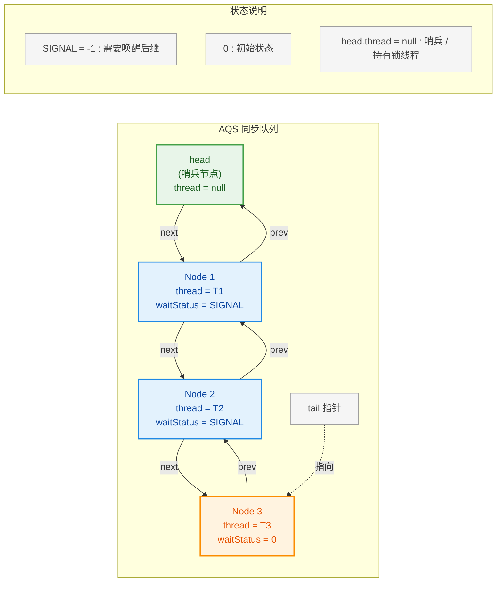
```mermaid
graph LR
    subgraph AQS["AQS 同步队列"]
        direction TB
        HEAD["head<br/>(哨兵节点)<br/>thread = null"]
        NODE1["Node 1<br/>thread = T1<br/>waitStatus = SIGNAL"]
        NODE2["Node 2<br/>thread = T2<br/>waitStatus = SIGNAL"]
        NODE3["Node 3<br/>thread = T3<br/>waitStatus = 0"]
        TAIL["tail 指针"]
    end

    HEAD -->|next| NODE1
    NODE1 -->|next| NODE2
    NODE2 -->|next| NODE3

    NODE3 -->|prev| NODE2
    NODE2 -->|prev| NODE1
    NODE1 -->|prev| HEAD

    TAIL -.->|"指向"| NODE3

    subgraph Legend["状态说明"]
        direction TB
        L1["SIGNAL = -1 : 需要唤醒后继"]
        L2["0 : 初始状态"]
        L3["head.thread = null : 哨兵 / 持有锁线程"]
    end

    classDef sentinel fill:#E8F5E9,stroke:#43A047,stroke-width:2px,color:#1B5E20
    classDef waiting fill:#E3F2FD,stroke:#1E88E5,stroke-width:2px,color:#0D47A1
    classDef tailNew fill:#FFF3E0,stroke:#FB8C00,stroke-width:2px,color:#E65100
    classDef legend fill:#F5F5F5,stroke:#9E9E9E,stroke-width:1px,color:#424242

    class HEAD sentinel
    class NODE1,NODE2 waiting
    class NODE3 tailNew
    class TAIL legend
    class L1,L2,L3 legend
```

几个关键观察：

**哨兵节点（Sentinel / Dummy Node）**：`head` 指向的节点是一个"虚拟节点"，它的 `thread` 字段为 `null`。这个节点代表的是当前正在持有锁（或刚刚释放锁）的线程。队列初始化时并没有这个哨兵，它是在第一个线程入队时**惰性创建**（lazily initialized）的。使用哨兵节点的好处是简化了边界条件的处理——出队操作永远是"把后继设为新的 head"，而不需要特殊处理空队列的情况。

**tail 指针**：始终指向队列的最后一个节点。新线程入队时，通过 CAS 操作将 `tail` 指向新节点。这是入队操作的唯一竞争点。

**双向链表**：`prev` 链接是保证正确性的关键——当节点被取消时，我们需要从后向前遍历找到一个有效的前驱来传递唤醒信号。`next` 链接则是一种**优化**：正常情况下用 `next` 快速定位后继以进行唤醒，但 `next` 可能暂时不准确（因为入队时先设 `prev` 再设 `next`），所以在 `next` 不可靠时会从 `tail` 往前遍历。

#### 队列生命周期：从空到有

AQS 队列并非在构造时就初始化，而是采用**懒初始化**（lazy initialization）。让我们追踪一个队列从无到有的过程：


```mermaid
graph LR
    subgraph Phase1["阶段1: 初始状态"]
        direction TB
        H1["head = null"]
        T1["tail = null"]
        S1["state = 0<br/>锁空闲"]
    end

    subgraph Phase2["阶段2: T1 获取锁"]
        direction TB
        H2["head = null"]
        T2["tail = null"]
        S2["state = 1<br/>T1 持有锁"]
        NOTE2["无竞争<br/>不创建队列"]
    end

    subgraph Phase3["阶段3: T2 竞争失败入队"]
        direction TB
        DUMMY["head → 哨兵 Node<br/>thread = null"]
        N2["tail → Node<br/>thread = T2"]
        S3["state = 1"]
    end

    subgraph Phase4["阶段4: T3 也入队"]
        direction TB
        DUMMY2["head → 哨兵 Node"]
        N2B["Node: T2"]
        N3["tail → Node: T3"]
        S4["state = 1"]
    end

    Phase1 -->|"T1: CAS(0→1) 成功"| Phase2
    Phase2 -->|"T2: CAS(0→1) 失败"| Phase3
    Phase3 -->|"T3: CAS(0→1) 失败"| Phase4

    classDef phase fill:#E8F5E9,stroke:#43A047,stroke-width:2px,color:#1B5E20
    classDef phase2 fill:#E3F2FD,stroke:#1E88E5,stroke-width:2px,color:#0D47A1
    classDef phase3 fill:#FFF3E0,stroke:#FB8C00,stroke-width:2px,color:#E65100
    classDef phase4 fill:#FCE4EC,stroke:#E91E63,stroke-width:2px,color:#880E4F

    class H1,T1,S1 phase
    class H2,T2,S2,NOTE2 phase2
    class DUMMY,N2,S3 phase3
    class DUMMY2,N2B,N3,S4 phase4
```

这个过程体现了 AQS 的设计哲学：**在无竞争的情况下，尽可能避免任何额外开销**。如果锁一直没有竞争（比如只有一个线程在用），那么 CLH 队列根本不会被创建，连一个 `Node` 对象都不会分配——这使得 AQS 在低竞争场景下非常轻量。

#### Node 节点初探

每个进入等待队列的线程都会被包装成一个 `Node` 对象。Node 的核心字段如下（详细分析将在"同步队列"章节展开，这里先建立整体印象）：

```java
// ==================== AQS.Node 核心字段（简化版） ====================
static final class Node {
    
    // -------- 模式标记 --------
    static final Node SHARED = new Node();   // 共享模式标记（哨兵对象）
    static final Node EXCLUSIVE = null;      // 独占模式标记（null）

    // -------- waitStatus 常量 --------
    static final int CANCELLED  =  1;   // 线程已取消，是唯一 > 0 的状态
    static final int SIGNAL     = -1;   // 后继节点需要被唤醒
    static final int CONDITION  = -2;   // 节点在 Condition 等待队列中
    static final int PROPAGATE  = -3;   // 共享模式下的传播唤醒

    // -------- 实例字段 --------
    volatile int waitStatus;     // 当前节点的等待状态
    volatile Node prev;          // 前驱节点引用
    volatile Node next;          // 后继节点引用
    volatile Thread thread;      // 该节点关联的线程
    Node nextWaiter;             // Condition 队列中的下一个等待者，或模式标记
}
```

这里有一个微妙但重要的设计细节：`waitStatus` **描述的不是当前节点自身的状态，而是它对后继节点的"承诺"**。例如，`waitStatus = SIGNAL` 的含义是"当我释放锁或被取消时，我承诺会唤醒我的后继节点"。这种"由前驱负责通知后继"的设计正是 CLH 思想的精髓——每个节点只需要关注自己的前驱。

#### 队列操作的原子性保障

队列的入队（enqueue）和出队（dequeue）操作面临并发挑战，AQS 用不同策略来保障：

**入队（尾部插入）**：多个线程可能同时竞争入队，AQS 使用 **CAS + 自旋** 来保证 `tail` 指针的原子更新。具体来说，`addWaiter` 方法先用 CAS 尝试快速追加到尾部，如果 CAS 失败（说明有并发入队），则进入 `enq` 方法进行自旋重试，直到成功为止。

**出队（头部摘除）**：只有获取到锁的线程才会执行出队（调用 `setHead`），而在独占模式下同一时刻只有一个线程能获取锁，所以出队天然不存在竞争，无需 CAS——直接赋值即可。

```java
// 出队操作：无竞争，直接赋值
// 只有获取锁成功的线程才会调用此方法
private void setHead(Node node) {
    head = node;           // 直接赋值，不需要 CAS
    node.thread = null;    // 清除线程引用（变成哨兵节点）
    node.prev = null;      // 断开与旧 head 的链接，帮助 GC
}
```

这种"入队用 CAS，出队直接赋值"的不对称设计，再次体现了 AQS 的性能优化哲学。

---

### 独占模式 / 共享模式

AQS 支持两种资源获取模式，这两种模式本质上决定了 **"同一时刻有多少个线程能获取到同步资源"**。

#### 独占模式（Exclusive Mode）

独占模式的语义很简单：**同一时刻，最多只有一个线程能持有同步资源**。这是最常见的"互斥锁"场景。

典型实现：
- `ReentrantLock`：可重入的独占锁
- `ReentrantReadWriteLock.WriteLock`：读写锁中的写锁

在独占模式下，线程获取资源的核心方法是 `acquire(int arg)`，释放资源的核心方法是 `release(int arg)`。获取资源时，如果 CAS 失败或 `tryAcquire` 返回 `false`，当前线程会被封装为 `Node.EXCLUSIVE`（实际上就是 `nextWaiter = null`）的节点加入队列。

```java
// ==================== 独占模式的核心流程（伪代码视角） ====================

// 获取资源
public final void acquire(int arg) {
    // 第一步：tryAcquire 由子类实现，尝试直接获取资源
    // 第二步：失败则 addWaiter 创建独占节点入队
    // 第三步：acquireQueued 在队列中自旋/阻塞等待
    if (!tryAcquire(arg) &&                          // 尝试获取
        acquireQueued(addWaiter(Node.EXCLUSIVE), arg)) // 入队 + 排队获取
        selfInterrupt();  // 如果在等待期间被中断过，补上中断标记
}

// 释放资源
public final boolean release(int arg) {
    if (tryRelease(arg)) {           // 子类实现，尝试释放
        Node h = head;
        if (h != null && h.waitStatus != 0)
            unparkSuccessor(h);      // 唤醒队列中的下一个线程
        return true;
    }
    return false;
}
```

独占模式的关键特征：**释放时只唤醒一个后继节点**。因为资源是独占的，唤醒多个也没有意义——只有一个线程能拿到锁。

#### 共享模式（Shared Mode）

共享模式的语义是：**同一时刻，允许多个线程同时获取同步资源**。"多少个"由 `state` 的值和子类的逻辑决定。

典型实现：
- `Semaphore`：信号量，允许最多 N 个线程同时访问
- `CountDownLatch`：倒计数门栓，当 count 减为 0 时所有等待线程同时被释放
- `ReentrantReadWriteLock.ReadLock`：读写锁中的读锁，允许多线程同时读

共享模式最核心的特点是 **传播唤醒（propagation）**：当一个线程获取到共享资源后，如果发现还有剩余资源（例如 Semaphore 的许可还没用完），它会主动唤醒队列中下一个等待的共享节点，形成 **链式唤醒** 效果。

```java
// ==================== 共享模式的核心流程（伪代码视角） ====================

// 获取共享资源
public final void acquireShared(int arg) {
    // tryAcquireShared 返回值：
    //   < 0  → 获取失败
    //   == 0 → 获取成功，但没有剩余资源
    //   > 0  → 获取成功，且还有剩余资源（可以继续唤醒后续线程）
    if (tryAcquireShared(arg) < 0)
        doAcquireShared(arg);  // 入队 + 排队获取（共享版本）
}

// 释放共享资源
public final boolean releaseShared(int arg) {
    if (tryReleaseShared(arg)) {
        doReleaseShared();     // 唤醒后继 + 传播唤醒
        return true;
    }
    return false;
}
```

#### 独占 vs. 共享：关键对比


```mermaid
graph LR
    subgraph Exclusive["独占模式 Exclusive"]
        direction TB
        E1["同一时刻只有 1 个线程持有"]
        E2["tryAcquire 返回 boolean"]
        E3["release 只唤醒 1 个后继"]
        E4["Node.nextWaiter = null"]
        E5["典型: ReentrantLock"]
    end

    subgraph Shared["共享模式 Shared"]
        direction TB
        S1["同一时刻允许 N 个线程持有"]
        S2["tryAcquireShared 返回 int"]
        S3["releaseShared 传播唤醒多个后继"]
        S4["Node.nextWaiter = SHARED"]
        S5["典型: Semaphore / CountDownLatch"]
    end

    Exclusive --- VS["核心差异:<br/>传播唤醒机制"] --- Shared

    classDef exclusive fill:#E3F2FD,stroke:#1565C0,stroke-width:2px,color:#0D47A1
    classDef shared fill:#E8F5E9,stroke:#2E7D32,stroke-width:2px,color:#1B5E20
    classDef vs fill:#FFF8E1,stroke:#F9A825,stroke-width:2px,color:#F57F17

    class E1,E2,E3,E4,E5 exclusive
    class S1,S2,S3,S4,S5 shared
    class VS vs
```

对比维度的进一步展开：

| 维度 | 独占模式 | 共享模式 |
|------|---------|---------|
| 语义 | 互斥访问，一次一个 | 并发访问，一次多个 |
| tryAcquire 返回值 | `boolean`（成功/失败） | `int`（负数=失败，0=成功无剩余，正数=成功有剩余） |
| 唤醒策略 | `unparkSuccessor`：只唤醒下一个 | `doReleaseShared`：唤醒 + 传播 |
| Node 标记 | `nextWaiter = null`（EXCLUSIVE） | `nextWaiter = SHARED`（共享哨兵对象） |
| 可重入 | 通常支持（如 ReentrantLock） | 视具体实现而定 |
| 队列行为 | 队首线程获取后，队列不连锁 | 队首线程获取后可能连锁唤醒后续共享节点 |

#### 为什么需要传播唤醒？

传播唤醒是共享模式中最精妙的设计之一。考虑 `Semaphore(3)` 的场景：初始有 3 个许可，5 个线程同时竞争。

```
初始: state = 3, 队列为空

T1 acquire → state = 2, 成功（无需入队）
T2 acquire → state = 1, 成功（无需入队）
T3 acquire → state = 0, 成功（无需入队）
T4 acquire → state = 0, 失败，入队
T5 acquire → state = 0, 失败，入队

队列: [head/哨兵] → [T4] → [T5]

此时 T1 和 T2 几乎同时 release:
  T1 release: state 0 → 1, 唤醒 T4
  T2 release: state 1 → 2, 唤醒 ...?

T4 被唤醒后 tryAcquireShared: state 2 → 1, 返回值 = 1 (> 0, 还有剩余)
  → T4 发现还有剩余资源，主动传播唤醒 T5!
T5 被唤醒后 tryAcquireShared: state 1 → 0, 返回值 = 0 (无剩余)
  → 不再传播

最终: T4 和 T5 都成功获取了许可。
```

如果没有传播唤醒机制，T1 release 只唤醒 T4，T2 release 可能发现 `head.waitStatus` 已被 T4 改变而错过唤醒 T5 的时机，导致 T5 永远阻塞（**丢失唤醒 bug**，lost wakeup）。传播唤醒正是为了解决这种并发场景下的唤醒可靠性问题。

#### 混合模式：ReadWriteLock 的队列

`ReentrantReadWriteLock` 是一个特别有趣的案例——它的队列中**同时存在独占节点（写锁）和共享节点（读锁）**。当写锁释放后，如果队首的后继是共享节点（读锁请求），AQS 会连锁唤醒所有连续的共享节点：

```
写锁释放前的队列:
[head/写锁线程] → [R1 SHARED] → [R2 SHARED] → [R3 SHARED] → [W4 EXCLUSIVE] → [R5 SHARED]

写锁释放后: 唤醒 R1 → R1 传播唤醒 R2 → R2 传播唤醒 R3 → R3 发现下一个是 W4(独占), 停止传播
结果: R1、R2、R3 同时持有读锁，W4 继续等待
```

这种"遇到独占节点就停止传播"的机制，确保了写锁的互斥性不被破坏，同时最大化了读的并发度。

#### 模式选择：一个设计决策

当你基于 AQS 实现自定义同步器时，需要根据业务语义选择实现哪组模板方法：

- 如果你的同步器是**互斥**的（如锁、独占资源），实现 `tryAcquire` + `tryRelease`。
- 如果你的同步器允许**并发共享**（如信号量、倒计数），实现 `tryAcquireShared` + `tryReleaseShared`。
- 如果你的同步器像 `ReadWriteLock` 一样**同时需要两种模式**，则两组方法都要实现。

AQS 不强制你实现所有方法——未被覆写的方法默认抛出 `UnsupportedOperationException`，这样你只需要关注自己需要的模式。

---

**📝 练习题**

**题目 1：** 关于 AQS 中 `state` 字段和 CLH 队列的描述，以下哪项是**正确**的？

A. `state` 使用 `volatile long` 类型定义，以支持高精度的状态表示

B. CLH 队列在 AQS 对象构造时就会初始化 `head` 和 `tail` 节点

C. 队列中 `head` 指向的节点是一个哨兵节点，其 `thread` 字段为 `null`，代表当前持有锁或刚释放锁的线程

D. AQS 的入队和出队操作都需要通过 CAS 来保证原子性


**【答案】** C

**【解析】** 逐项分析：

- **A 错误**：`state` 的类型是 `volatile int`（32 位），不是 `long`。`ReentrantReadWriteLock` 正是因为只有 32 位，才需要用高低 16 位分别表示读写锁计数。
- **B 错误**：AQS 队列采用**懒初始化**（lazy initialization）策略。在没有竞争时，`head` 和 `tail` 都是 `null`，队列根本不会被创建。只有当第一个线程获取资源失败需要入队时，才会通过 `enq()` 方法创建哨兵节点并初始化 `head` 和 `tail`。
- **C 正确**：`head` 节点确实是一个哨兵（dummy/sentinel）节点。当线程从队列中获取到锁后，会调用 `setHead(node)`，将自身节点设为新的 `head`，并将 `thread` 字段置为 `null`。因此 `head.thread == null` 是队列的不变量（invariant）。
- **D 错误**：入队操作（修改 `tail`）确实需要 CAS，因为多个线程可能同时竞争入队。但出队操作（修改 `head`）不需要 CAS——只有成功获取到锁的线程才会执行 `setHead`，在独占模式下不存在竞争，直接赋值即可。

---

**📝 练习题**

**题目 2：** `Semaphore(5)` 创建了一个有 5 个许可的信号量。现有 T1~T7 共 7 个线程同时调用 `acquire()`，假设 T1~T5 首先成功获取许可，T6、T7 入队等待。当 T1 和 T2 几乎同时调用 `release()` 时，以下关于唤醒过程的描述哪项**最准确**？

A. T1 release 唤醒 T6，T2 release 唤醒 T7，二者完全独立

B. T1 release 唤醒 T6 后，T6 通过传播唤醒（propagation）机制唤醒 T7，T2 release 发现队列为空直接返回

C. T1 release 和 T2 release 都尝试唤醒队首线程，但由于 CAS 竞争，只有一个 release 成功执行唤醒

D. T6 被唤醒后如果 `tryAcquireShared` 返回值大于 0，会通过 `doReleaseShared` 中的传播机制继续唤醒 T7，确保不会丢失唤醒信号


**【答案】** D

**【解析】** 这道题考察共享模式下的**传播唤醒**（propagation）机制。

- **A 不准确**：虽然两次 release 确实可能各唤醒一个线程，但这忽略了传播机制的存在。在共享模式下，唤醒不仅仅来自 `releaseShared`，被唤醒的线程自身也可能触发后续唤醒。
- **B 过于理想化**：T2 release 不一定"发现队列为空"。在并发时序下，T2 release 执行时 T6 可能还没有完成出队，实际行为取决于具体的线程调度时序。
- **C 错误**：`doReleaseShared` 中的 CAS 是修改 `head.waitStatus`（从 SIGNAL 改为 0，或从 0 改为 PROPAGATE），而不是互斥地"只允许一个执行唤醒"。AQS 的设计恰恰是**宁可多唤醒一次也不丢失唤醒**。
- **D 正确**：这是 AQS 共享模式传播唤醒的核心机制。T6 被唤醒后调用 `tryAcquireShared`，如果返回值 > 0（表示还有剩余许可），`setHeadAndPropagate` 方法会调用 `doReleaseShared` 继续唤醒后续的共享节点 T7。这种"获取者主动传播"的机制，配合 `releaseShared` 中的直接唤醒，共同保证了**在任何并发时序下都不会丢失唤醒信号**（no lost wakeup guarantee）。

---

## 同步队列 ⭐⭐

AQS 的核心数据结构就是一条 **CLH 变体双向链表**，官方称之为 **同步队列（Sync Queue）**。当线程尝试获取同步状态失败时，AQS 会将该线程封装为一个 **Node 节点**，然后通过 CAS 操作将其插入队列尾部，随后该线程进入自旋 + 阻塞的等待流程。理解同步队列的内部结构与操作机制，是掌握整个 AQS 框架的关键所在。

我们先从宏观视角看一下同步队列的整体结构：

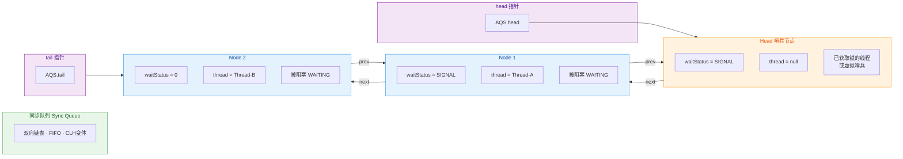
```mermaid
graph LR
    subgraph SyncQueue["同步队列 Sync Queue"]
        direction TB
        DESC["双向链表 · FIFO · CLH变体"]
    end

    subgraph HeadNode["Head 哨兵节点"]
        direction TB
        H_WS["waitStatus = SIGNAL"]
        H_TH["thread = null"]
        H_NOTE["已获取锁的线程\n或虚拟哨兵"]
    end

    subgraph Node1["Node 1"]
        direction TB
        N1_WS["waitStatus = SIGNAL"]
        N1_TH["thread = Thread-A"]
        N1_NOTE["被阻塞 WAITING"]
    end

    subgraph Node2["Node 2"]
        direction TB
        N2_WS["waitStatus = 0"]
        N2_TH["thread = Thread-B"]
        N2_NOTE["被阻塞 WAITING"]
    end

    subgraph TailRef["tail 指针"]
        direction TB
        TAIL["AQS.tail"]
    end

    subgraph HeadRef["head 指针"]
        direction TB
        HEAD["AQS.head"]
    end

    HEAD --> HeadNode
    HeadNode -->|next| Node1
    Node1 -->|prev| HeadNode
    Node1 -->|next| Node2
    Node2 -->|prev| Node1
    TailRef --> Node2

    classDef greenBox fill:#E8F5E9,stroke:#43A047,color:#1B5E20,stroke-width:1px
    classDef blueBox fill:#E3F2FD,stroke:#1E88E5,color:#0D47A1,stroke-width:1px
    classDef orangeBox fill:#FFF3E0,stroke:#FB8C00,color:#E65100,stroke-width:1px
    classDef ptrBox fill:#F3E5F5,stroke:#8E24AA,color:#4A148C,stroke-width:1px

    class SyncQueue greenBox
    class HeadNode orangeBox
    class Node1 blueBox
    class Node2 blueBox
    class HeadRef ptrBox
    class TailRef ptrBox
```

从图中可以看出，AQS 内部维护了 `head` 和 `tail` 两个指针分别指向队列的头节点和尾节点。头节点比较特殊——它要么是一个 **虚拟哨兵节点（dummy node）**，要么代表 **当前正持有锁的线程**，其 `thread` 字段始终为 `null`。真正排队等待的线程从 head 的下一个节点（`head.next`）开始。

---

### Node 结构（waitStatus、prev、next、thread）

`Node` 是 AQS 中的一个 **静态内部类（static inner class）**，它是同步队列的基本组成单元。每一个竞争同步状态失败的线程，都会被包装成一个 `Node` 加入队列。我们先看它的核心字段定义：

```java
// AQS 的静态内部类 Node —— 同步队列的基本节点
static final class Node {

    // ==================== 模式常量 ====================
    
    // 标记：表示该节点在共享模式下等待
    static final Node SHARED = new Node();
    
    // 标记：表示该节点在独占模式下等待（值为 null）
    static final Node EXCLUSIVE = null;

    // ==================== waitStatus 状态常量 ====================
    
    // 表示线程已取消（因超时或中断），该节点不会再参与竞争
    static final int CANCELLED  =  1;
    
    // 表示后继节点的线程需要被唤醒（unpark）
    static final int SIGNAL     = -1;
    
    // 表示节点在 Condition 条件队列中等待
    static final int CONDITION  = -2;
    
    // 表示下一次 acquireShared 应该无条件传播
    static final int PROPAGATE  = -3;

    // ==================== 核心字段 ====================

    // 当前节点的等待状态，取值为上述常量之一，或初始值 0
    volatile int waitStatus;

    // 指向前驱节点 —— 用于检查前驱的 waitStatus
    volatile Node prev;

    // 指向后继节点 —— 用于在释放时唤醒后继线程
    volatile Node next;

    // 封装在该节点中的线程引用
    volatile Thread thread;

    // 指向条件队列中的下一个等待节点，或者用 SHARED/EXCLUSIVE 标记模式
    Node nextWaiter;

    // 判断当前节点是否为共享模式
    final boolean isShared() {
        return nextWaiter == SHARED; // nextWaiter 指向 SHARED 常量即为共享模式
    }

    // 返回前驱节点，如果为 null 则抛出 NPE
    final Node predecessor() throws NullPointerException {
        Node p = prev;            // 读取 prev 引用
        if (p == null)            // 前驱不存在则抛异常（不应出现此情况）
            throw new NullPointerException();
        else
            return p;             // 返回前驱节点
    }

    // 三个构造方法
    Node() {}                     // 用于创建 head 哨兵节点或 SHARED 标记

    Node(Thread thread, Node mode) {  // addWaiter 使用
        this.nextWaiter = mode;       // 设置模式（SHARED 或 EXCLUSIVE）
        this.thread = thread;         // 绑定当前线程
    }

    Node(Thread thread, int waitStatus) { // Condition 队列使用
        this.waitStatus = waitStatus;     // 直接设置 waitStatus
        this.thread = thread;             // 绑定当前线程
    }
}
```

下面用一张内存引用图来展示单个 Node 节点的内部结构：

```java
/*
 *   ┌─────────────────────────────────────┐
 *   │           Node 对象                  │
 *   ├─────────────────────────────────────┤
 *   │  waitStatus : volatile int          │  ← 节点状态 (0, SIGNAL, CANCELLED...)
 *   │  prev       : volatile Node         │  ← 指向前驱节点
 *   │  next       : volatile Node         │  ← 指向后继节点
 *   │  thread     : volatile Thread       │  ← 持有的线程引用
 *   │  nextWaiter : Node                  │  ← 条件队列后继 / 模式标记
 *   └─────────────────────────────────────┘
 *
 *   所有指针字段都声明为 volatile，保证多线程间的可见性
 */
```

**字段深度解读：**

**`prev`（前驱指针）** 是节点入队后最先被设置的字段。在 CAS 设置 tail 之前，新节点的 `prev` 就已经指向了旧的 tail 节点。这是 AQS 保证 **从尾向头遍历一定完整** 的关键——即使 `next` 指针还未来得及设置，通过 `prev` 链也能找到所有已入队节点。这种设计在 `unparkSuccessor` 方法中寻找有效后继节点时尤为重要：当 `next` 为 null 或已取消时，会 **从 tail 向前遍历** 找到离 head 最近的有效节点。

**`next`（后继指针）** 是一种 **优化手段（optimization）**。它使得唤醒后继的操作可以在 O(1) 时间内完成，而不需要从 tail 向前扫描。但 `next` 的设置晚于 `prev`（因为 CAS 成功后才设置前驱的 next），因此 `next == null` 并不意味着该节点是队尾——节点可能刚入队、`prev` 已指向前驱、CAS 也已成功，但 `next` 还未被赋值。

**`thread`** 字段保存了等待线程的引用。当节点成为 head 时，`thread` 会被置为 `null`，因为 head 节点代表的线程已经获取了同步状态，无需再保留引用——这也是为了帮助 GC 回收。

**`nextWaiter`** 有双重职责。在同步队列中，它充当 **模式标记**：`SHARED`（共享）或 `EXCLUSIVE`（独占）。在 Condition 队列中，它充当 **单向链表的 next 指针**，串联条件等待的各个节点。

---

### waitStatus 状态（CANCELLED、SIGNAL、CONDITION、PROPAGATE）

`waitStatus` 是 Node 中最复杂、最关键的字段。它描述了节点当前所处的 **生命周期阶段**，直接决定了 AQS 在入队、出队、唤醒等操作中的行为分支。

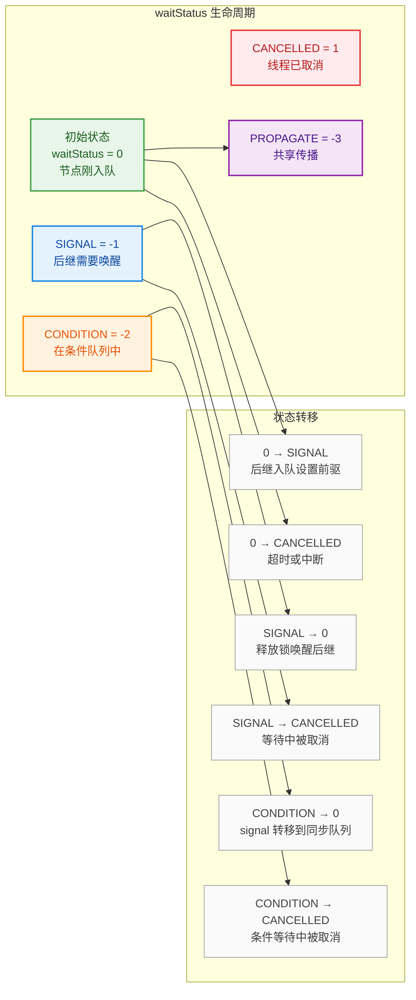
```mermaid
graph LR
    subgraph Lifecycle["waitStatus 生命周期"]
        direction TB
        INIT["初始状态\nwaitStatus = 0\n节点刚入队"]
        SIG["SIGNAL = -1\n后继需要唤醒"]
        CAN["CANCELLED = 1\n线程已取消"]
        COND["CONDITION = -2\n在条件队列中"]
        PROP["PROPAGATE = -3\n共享传播"]
    end

    subgraph Transitions["状态转移"]
        direction TB
        T1["0 → SIGNAL\n后继入队设置前驱"]
        T2["0 → CANCELLED\n超时或中断"]
        T3["SIGNAL → 0\n释放锁唤醒后继"]
        T4["SIGNAL → CANCELLED\n等待中被取消"]
        T5["CONDITION → 0\nsignal 转移到同步队列"]
        T6["CONDITION → CANCELLED\n条件等待中被取消"]
    end

    INIT --> T1
    INIT --> T2
    SIG --> T3
    SIG --> T4
    COND --> T5
    COND --> T6
    INIT --> PROP

    classDef initStyle fill:#E8F5E9,stroke:#43A047,color:#1B5E20,stroke-width:2px
    classDef signalStyle fill:#E3F2FD,stroke:#1E88E5,color:#0D47A1,stroke-width:2px
    classDef cancelStyle fill:#FFEBEE,stroke:#E53935,color:#B71C1C,stroke-width:2px
    classDef condStyle fill:#FFF3E0,stroke:#FB8C00,color:#E65100,stroke-width:2px
    classDef propStyle fill:#F3E5F5,stroke:#8E24AA,color:#4A148C,stroke-width:2px
    classDef transStyle fill:#FAFAFA,stroke:#9E9E9E,color:#424242,stroke-width:1px

    class INIT initStyle
    class SIG signalStyle
    class CAN cancelStyle
    class COND condStyle
    class PROP propStyle
    class T1,T2,T3,T4,T5,T6 transStyle
```

我们逐一详细讲解每个状态：

**1. 初始状态 `0`（默认值）**

当一个新的 Node 对象被创建并插入同步队列时，其 `waitStatus` 的默认值为 `0`。这是一个中间状态，表示"节点已入队，但尚未被后继节点标记为需要唤醒"。在 AQS 的设计中，`0` 并不是一个正式的命名常量，但它是每个节点生命周期的起点。

**关键机制：** 一个新入队节点的 `waitStatus` 不是由自己设置为 `SIGNAL` 的，而是由 **它的后继节点** 在 `shouldParkAfterFailedAcquire` 方法中通过 CAS 将前驱的 `waitStatus` 从 `0` 改为 `SIGNAL`。这是一种"协作式"的状态管理——节点自己不主动声明"我需要被唤醒"，而是由后继节点说"请在你释放时唤醒我"。

**2. `SIGNAL = -1`**

这是同步队列中最常见的状态。含义是：**当前节点的后继节点已经（或即将）被阻塞，当前节点在释放同步状态或被取消时，必须唤醒（unpark）后继节点。**

```java
/*
 * 协作信号机制示意：
 *
 *   [Node-A]              [Node-B]             [Node-C]
 *   ws = SIGNAL    ←--    ws = SIGNAL   ←--    ws = 0     (刚入队)
 *     ↑                      ↑                     ↑
 *   "释放时必须              "释放时必须           "暂时没有后继
 *    唤醒 B"                 唤醒 C"               要求唤醒我"
 *
 *   Node-C 入队后会检查前驱 Node-B 的 waitStatus：
 *   - 如果是 SIGNAL，直接 park 自己
 *   - 如果是 0，CAS 设为 SIGNAL，再循环一次后 park
 *   - 如果是 CANCELLED，跳过已取消节点，找到有效前驱
 */
```

为什么不让节点自己设置状态？因为 AQS 的设计哲学是 **"由后继驱动（successor-driven）"**。只有当真的有线程在后面排队时才设置 SIGNAL，避免不必要的唤醒操作。如果某节点没有后继（它就是 tail），它的 `waitStatus` 保持为 `0` 是完全合理的——没人需要它唤醒。

**3. `CANCELLED = 1`**

这是 `waitStatus` 中 **唯一的正值**，表示该节点中的线程由于 **超时（timeout）** 或 **中断（interrupt）** 而放弃了等待。一旦进入 CANCELLED 状态，节点就 **不可逆转** ——它永远不会再变成其他状态，等待 GC 回收。

CANCELLED 状态的处理逻辑散布在多个方法中：

- **`shouldParkAfterFailedAcquire`**：当后继节点发现前驱的 `waitStatus > 0`（即 CANCELLED），就会跳过该前驱，向前遍历直到找到一个非 CANCELLED 节点，并将自己的 `prev` 指向它。这个过程也顺便把取消节点从链表中"摘除"了。
- **`cancelAcquire`**：专门处理取消操作的方法，会将节点的 `thread` 置 `null`、`waitStatus` 设为 `CANCELLED`，并视情况唤醒后继节点。

```java
/*
 *   取消节点被跳过的过程：
 *
 *   Before:
 *   [Head] <--> [A:CANCELLED] <--> [B:CANCELLED] <--> [C:0]
 *
 *   After (C 入队时调用 shouldParkAfterFailedAcquire):
 *   [Head] <--> [C:0]        (A、B 被跳过)
 *                              Head.waitStatus 被 CAS 设为 SIGNAL
 *
 *   被跳过的 A、B 节点失去引用后，等待 GC 回收
 */
```

**4. `CONDITION = -2`**

表示当前节点不在同步队列中，而是在 **条件队列（Condition Queue）** 中等待。当线程调用 `Condition.await()` 时，节点会被创建并放入条件队列，其 `waitStatus` 被设置为 `CONDITION`。

条件队列是一个 **单向链表**，通过 `Node.nextWaiter` 串联。当其他线程调用 `Condition.signal()` 时，节点会从条件队列转移到同步队列（调用 `enq` 方法），此时 `waitStatus` 会从 `CONDITION` 被 CAS 为 `0`，重新开始在同步队列中竞争锁。

**5. `PROPAGATE = -3`**

这是最晦涩的状态，仅在 **共享模式** 下使用。它解决了一个微妙的 bug：在高并发的共享锁释放场景中，如果不引入 PROPAGATE 状态，可能出现唤醒信号丢失的情况。

具体来说，`PROPAGATE` 只会出现在 **head 节点** 上。当一个线程调用 `releaseShared` 时，`doReleaseShared` 方法会检查 head 的 `waitStatus`：
- 如果是 `SIGNAL`，CAS 为 `0` 并唤醒后继；
- 如果是 `0`，CAS 为 `PROPAGATE`，标记"需要继续传播唤醒"。

这确保了在多个线程几乎同时释放共享锁时，唤醒信号不会被"吞掉"。

**状态值的设计哲学：**

注意到所有 **正常等待** 的状态值都是 **负数**（SIGNAL = -1, CONDITION = -2, PROPAGATE = -3），而 CANCELLED 是 **唯一的正数**（+1），初始值是 `0`。这使得 AQS 中大量使用了简洁的判断：

```java
// 负值 = 线程处于有效等待状态
if (ws < 0) { /* 节点有效 */ }

// 正值 = 线程已取消
if (ws > 0) { /* 节点已取消，跳过 */ }

// 等于0 = 刚入队或刚被唤醒的中间态
if (ws == 0) { /* 需要进一步设置 */ }
```

这种 **基于正负号的快速判断** 是 Doug Lea 在设计 AQS 时的精妙之处，用最少的比较操作覆盖了最多的分支逻辑。

---

### 入队（addWaiter、enq）

当线程调用 `acquire` 方法尝试获取同步状态失败（`tryAcquire` 返回 `false`）后，AQS 会将该线程封装为 Node 节点并 **追加到同步队列尾部**。入队操作由 `addWaiter` 和 `enq` 两个方法协作完成。

#### addWaiter —— 快速入队

`addWaiter` 是入队的主入口方法，它首先尝试以 **快速路径（fast path）** 将新节点挂到队尾。如果队列已经初始化（`tail != null`），则直接一次 CAS 操作就能完成；如果 CAS 失败或队列尚未初始化，则退化到 `enq` 方法进行完整的入队处理。

```java
// 将当前线程以指定模式包装为 Node 并加入同步队列尾部
private Node addWaiter(Node mode) {
    // 1. 创建新节点，绑定当前线程和模式（EXCLUSIVE 或 SHARED）
    Node node = new Node(Thread.currentThread(), mode);

    // 2. 快速路径：尝试直接在尾部追加（不进入完整的 enq 循环）
    Node pred = tail;          // 读取当前尾节点
    if (pred != null) {        // 队列已初始化（tail 不为 null）
        node.prev = pred;      // 新节点的 prev 指向当前尾节点（先设 prev）
        if (compareAndSetTail(pred, node)) {  // CAS 尝试将 tail 从 pred 更新为 node
            pred.next = node;  // CAS 成功后，将旧尾节点的 next 指向新节点
            return node;       // 入队成功，直接返回
        }
    }

    // 3. 快速路径失败：队列未初始化 或 CAS 竞争失败，进入完整入队逻辑
    enq(node);
    return node;               // 返回已入队的节点
}
```

**关键细节解读：**

为什么 `node.prev = pred` 要在 CAS **之前** 执行？这是 AQS 的一个核心设计——**prev 链的完整性优先于 next 链**。在 CAS 将 `tail` 指针更新为新节点的那一刻起，新节点就对其他线程可见了（通过 `tail` 引用）。如果此时 `prev` 还没有设置，那么从新节点向前的遍历就会断裂。因此必须先设 `prev`，再做 CAS。

而 `pred.next = node` 在 CAS **之后** 才执行。这意味着存在一个短暂的时间窗口：tail 已经指向新节点，但旧尾节点的 `next` 还是 `null`。这就解释了为什么 AQS 在 `unparkSuccessor` 中遇到 `next == null` 时，会从 **tail 向前遍历** 寻找有效后继——因为 `prev` 链总是完整的，而 `next` 链可能暂时断裂。

#### enq —— 完整入队（含初始化）

`enq` 方法使用 **自旋 + CAS** 的模式，保证节点最终一定能成功入队。同时它也承担了 **队列惰性初始化（lazy initialization）** 的职责。

```java
// 通过自旋 + CAS 保证节点一定能入队；同时负责队列的惰性初始化
private Node enq(final Node node) {
    for (;;) {                            // 无限循环（自旋），直到入队成功
        Node t = tail;                    // 读取当前尾节点
        if (t == null) {                  // 【情况1】队列尚未初始化
            // 创建一个空的哨兵节点作为 head（dummy node）
            if (compareAndSetHead(new Node())) // CAS 设置 head
                tail = head;              // tail 也指向 head，完成初始化
            // 注意：这里没有 return，继续下一轮循环去追加真正的节点
        } else {                          // 【情况2】队列已初始化
            node.prev = t;                // 新节点的 prev 指向当前尾节点
            if (compareAndSetTail(t, node)) { // CAS 尝试更新 tail 为新节点
                t.next = node;            // 成功后，旧尾节点的 next 指向新节点
                return t;                 // 返回旧尾节点（即新节点的前驱）
            }
            // CAS 失败说明有并发竞争，继续下一轮自旋重试
        }
    }
}
```

让我们用时序图来展示队列从空到有节点的完整入队过程：

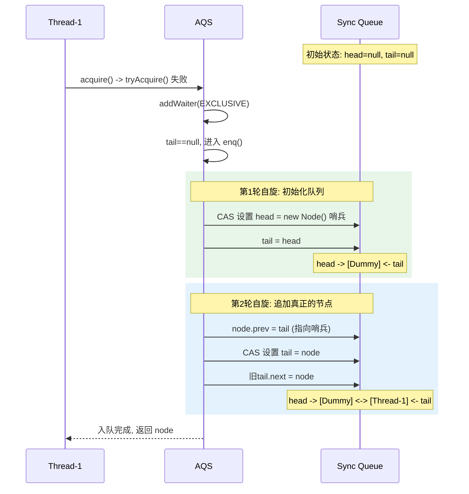
```mermaid
sequenceDiagram
    participant T1 as Thread-1
    participant AQS as AQS
    participant Q as Sync Queue

    Note over Q: 初始状态: head=null, tail=null

    T1->>AQS: acquire() -> tryAcquire() 失败
    AQS->>AQS: addWaiter(EXCLUSIVE)
    AQS->>AQS: tail==null, 进入 enq()

    rect rgb(232, 245, 233)
        Note over AQS,Q: 第1轮自旋: 初始化队列
        AQS->>Q: CAS 设置 head = new Node() 哨兵
        AQS->>Q: tail = head
        Note over Q: head -> [Dummy] <- tail
    end

    rect rgb(227, 242, 253)
        Note over AQS,Q: 第2轮自旋: 追加真正的节点
        AQS->>Q: node.prev = tail (指向哨兵)
        AQS->>Q: CAS 设置 tail = node
        AQS->>Q: 旧tail.next = node
        Note over Q: head -> [Dummy] <-> [Thread-1] <- tail
    end

    AQS-->>T1: 入队完成, 返回 node
```

**为什么需要哨兵节点（Dummy Node）？**

这是一个非常经典的设计。哨兵节点的存在使得队列操作代码更加统一——无论队列中有多少个真实节点，head 始终存在，不需要到处检查空指针。更重要的是，当第一个真正排队的线程获取到锁后，它所在的 Node 会变成新的 head（通过 `setHead`），此时这个 Node 的 `thread` 和 `prev` 被置 null，本质上变成了新的"哨兵"。这样队列的头部始终保持着 **"已获取锁的线程对应的空壳节点"** 这一语义。

下面展示多线程并发入队的场景：

```java
/*
 *   多线程并发入队过程（假设 T1, T2, T3 几乎同时竞争失败）：
 *
 *   时刻 t0: 队列为空
 *   =============================================
 *
 *   时刻 t1: T1 进入 enq，发现 tail==null
 *            → CAS 创建哨兵节点，head = tail = Dummy
 *
 *   时刻 t2: T1 第二轮自旋，成功 CAS tail
 *            [Dummy] <--> [T1]
 *             head          tail
 *
 *   时刻 t3: T2 进入 addWaiter 快速路径
 *            → node.prev = tail (即 T1)
 *            → CAS tail: T1 → T2  (成功!)
 *            → T1.next = T2
 *            [Dummy] <--> [T1] <--> [T2]
 *             head                    tail
 *
 *   时刻 t4: T3 也进入 addWaiter 快速路径
 *            → node.prev = tail (即 T2)
 *            → CAS tail: T2 → T3  (成功!)
 *            → T2.next = T3
 *            [Dummy] <--> [T1] <--> [T2] <--> [T3]
 *             head                              tail
 *
 *   若 T2 和 T3 同时 CAS，只有一个成功，失败者进入 enq 自旋重试
 */
```

**入队操作的线程安全保证：**

整个入队过程没有使用任何 `synchronized` 关键字或显式锁，完全依靠 **CAS + volatile** 实现无锁并发。具体来说：

1. `head` 和 `tail` 都是 `volatile` 字段，保证所有线程都能看到最新值。
2. `compareAndSetHead` 和 `compareAndSetTail` 都是原子操作（底层调用 `Unsafe.compareAndSwapObject`），保证只有一个线程能成功更新指针。
3. `prev` 在 CAS 之前设置，`next` 在 CAS 之后设置——即使存在并发，`prev` 链的完整性始终得到保证。

---

### 出队（setHead）

出队操作相比入队要简单得多。当一个排队中的线程 **成功获取到同步状态** 后，它所在的 Node 就会被提升为新的 head 节点——这就是出队。AQS 没有一个独立的"dequeue"方法，出队逻辑嵌入在 `acquireQueued` 方法的循环体中，核心操作由 `setHead` 完成。

```java
// 将指定节点设置为新的 head（出队操作的核心）
private void setHead(Node node) {
    head = node;              // 将 head 指针指向该节点
    node.thread = null;       // 清空 thread 引用（head 不保留线程信息）
    node.prev = null;         // 清空 prev 引用（head 没有前驱）
}
```

`setHead` 方法只有短短三行，但它蕴含着精巧的设计：

**1. 不需要 CAS 操作**

你可能会问：这里为什么不用 CAS 更新 `head`？答案是——`setHead` 只会在线程 **成功获取同步状态之后** 被调用。在独占模式下，同一时刻只有一个线程能获取到锁，因此 `setHead` 天然不存在竞争。在共享模式下，虽然可能有多个线程同时获取，但 `setHead` 的调用也被控制在安全的流程中（`setHeadAndPropagate`）。

**2. thread 和 prev 被置 null**

将 `thread` 设为 `null` 是为了 **帮助 GC**——head 节点代表的线程已经获取了锁，正在执行业务逻辑，不需要从队列中被引用。将 `prev` 设为 `null` 则断开了新 head 与旧 head 的引用链，使旧 head（前一个哨兵）可以被 GC 回收。

让我们看 `setHead` 是如何在 `acquireQueued` 中被调用的：

```java
// 已在同步队列中的线程以独占模式循环尝试获取同步状态
final boolean acquireQueued(final Node node, int arg) {
    boolean failed = true;                // 标记是否获取失败（用于 finally 取消）
    try {
        boolean interrupted = false;      // 标记等待过程中是否被中断
        for (;;) {                        // 无限循环（自旋）
            final Node p = node.predecessor();  // 获取当前节点的前驱
            
            // 【关键判断】只有前驱是 head 时，才有资格尝试获取
            if (p == head && tryAcquire(arg)) {
                // 获取成功！执行出队操作
                setHead(node);            // 当前节点成为新的 head
                p.next = null;            // 断开旧 head 的 next 引用，帮助 GC
                failed = false;           // 标记获取成功
                return interrupted;       // 返回中断状态
            }

            // 获取失败：检查是否应该阻塞（park）
            if (shouldParkAfterFailedAcquire(p, node) &&  // 检查前驱状态
                parkAndCheckInterrupt())                    // 阻塞并检查中断
                interrupted = true;       // 记录曾被中断
        }
    } finally {
        if (failed)                       // 如果因异常退出循环
            cancelAcquire(node);          // 取消该节点
    }
}
```

下面用流程图展示完整的出队过程：

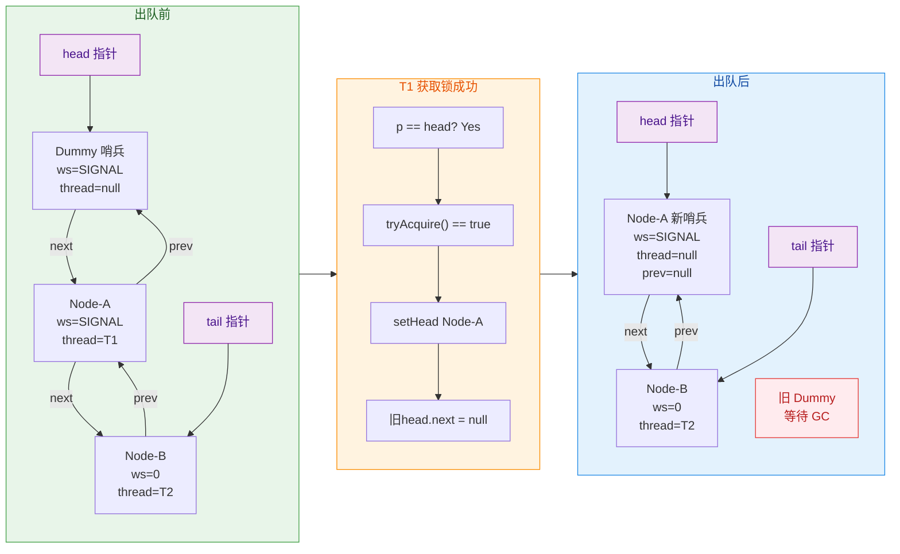
```mermaid
graph LR
    subgraph Before["出队前"]
        direction TB
        B_HEAD["head 指针"]
        B_DUMMY["Dummy 哨兵\nws=SIGNAL\nthread=null"]
        B_NODE_A["Node-A\nws=SIGNAL\nthread=T1"]
        B_NODE_B["Node-B\nws=0\nthread=T2"]
        B_TAIL["tail 指针"]

        B_HEAD --> B_DUMMY
        B_DUMMY -->|next| B_NODE_A
        B_NODE_A -->|prev| B_DUMMY
        B_NODE_A -->|next| B_NODE_B
        B_NODE_B -->|prev| B_NODE_A
        B_TAIL --> B_NODE_B
    end

    subgraph Action["T1 获取锁成功"]
        direction TB
        A1["p == head? Yes"]
        A2["tryAcquire() == true"]
        A3["setHead Node-A"]
        A4["旧head.next = null"]
        A1 --> A2
        A2 --> A3
        A3 --> A4
    end

    subgraph After["出队后"]
        direction TB
        A_HEAD["head 指针"]
        A_NODE_A["Node-A 新哨兵\nws=SIGNAL\nthread=null\nprev=null"]
        A_NODE_B["Node-B\nws=0\nthread=T2"]
        A_TAIL["tail 指针"]
        A_GC["旧 Dummy\n等待 GC"]

        A_HEAD --> A_NODE_A
        A_NODE_A -->|next| A_NODE_B
        A_NODE_B -->|prev| A_NODE_A
        A_TAIL --> A_NODE_B
    end

    Before --> Action
    Action --> After

    classDef greenBox fill:#E8F5E9,stroke:#43A047,color:#1B5E20,stroke-width:1px
    classDef blueBox fill:#E3F2FD,stroke:#1E88E5,color:#0D47A1,stroke-width:1px
    classDef orangeBox fill:#FFF3E0,stroke:#FB8C00,color:#E65100,stroke-width:1px
    classDef redBox fill:#FFEBEE,stroke:#E53935,color:#B71C1C,stroke-width:1px
    classDef purpleBox fill:#F3E5F5,stroke:#8E24AA,color:#4A148C,stroke-width:1px

    class Before greenBox
    class Action orangeBox
    class After blueBox
    class B_HEAD,B_TAIL,A_HEAD,A_TAIL purpleBox
    class A_GC redBox
```

**出队的本质：不是"移除节点"，而是"移动 head 指针"。**

传统链表的出队操作通常是把节点从链中摘除。但 AQS 的出队更像是 **滑动窗口**——head 指针向后移动一个位置，新的 head 就是刚获取到锁的线程对应的 Node，但它立刻被"清洗"（thread = null, prev = null），变成了新的哨兵。旧的 head 节点因为 `prev` 和 `next` 引用都被断开，自然会被 GC 回收。

```java
/*
 *   出队的引用变化总结：
 *
 *   ┌─ head ──┐      ┌─ Node-A ─┐      ┌─ Node-B ─┐
 *   │ th=null │ next  │ th=T1    │ next  │ th=T2    │
 *   │ pr=null │──────>│ pr=head  │──────>│ pr=A     │
 *   │ ws=SIG  │<──────│ ws=SIG   │<──────│ ws=0     │
 *   └─────────┘ prev  └──────────┘ prev  └──────────┘
 *
 *   ===== T1 获取锁，Node-A 出队 =====
 *
 *                     ┌─ head(A) ─┐      ┌─ Node-B ─┐
 *   [GC 回收]         │ th=null   │ next  │ th=T2    │
 *   旧 head           │ pr=null   │──────>│ pr=A     │
 *                     │ ws=SIG    │<──────│ ws=0     │
 *                     └───────────┘ prev  └──────────┘
 *
 *   注意：Node-A 的 waitStatus 并不会被主动清零
 *   它仍保留 SIGNAL 状态，因为 Node-B 还需要它在释放时唤醒自己
 */
```

**`p == head` 判断的重要性：**

在 `acquireQueued` 的循环中，`if (p == head && tryAcquire(arg))` 这个条件是出队的 **前置守卫**。它保证了 **严格的 FIFO 顺序**——只有队列中排在最前面的线程（`head.next`）才有资格尝试获取锁。其他后续节点即使被意外唤醒（spurious wakeup），也会因为 `p != head` 而直接跳过 `tryAcquire`，重新进入阻塞。

这种 **"先检查位置，再尝试获取"** 的设计避免了无效的 CAS 竞争，大大减少了性能开销。在高竞争场景下，如果让所有被唤醒的线程都去 `tryAcquire`，会产生大量的 CAS 失败和总线流量，即所谓的 **"惊群效应（thundering herd）"**。AQS 通过这个简单的判断优雅地规避了这一问题。

---

**📝 练习题**

以下关于 AQS 同步队列的描述，哪一项是 **错误** 的？

A. 新节点入队时，`prev` 指针在 CAS 更新 `tail` 之前就已经设置完毕，因此从 tail 向 head 方向遍历时，`prev` 链始终是完整的。

B. `setHead` 方法不需要 CAS 操作，因为它只在线程成功获取同步状态后被调用，此时不存在竞争。

C. 当一个节点的 `waitStatus` 被设置为 `SIGNAL` 时，表示 **该节点自身的线程** 需要被唤醒。

D. 队列中的头节点（head）是一个哨兵节点，其 `thread` 字段为 `null`，不代表任何正在等待的线程。


**【答案】** C

**【解析】** `SIGNAL` 状态的含义是：**当前节点的后继节点** 需要被唤醒，而不是节点自身。具体来说，当一个新节点入队后，它会在 `shouldParkAfterFailedAcquire` 方法中将 **前驱节点** 的 `waitStatus` 通过 CAS 设为 `SIGNAL`，意思是"前驱节点在释放锁时，请唤醒我（后继节点）"。这是 AQS **"由后继驱动"** 的协作式设计——节点不是自己标记自己需要唤醒，而是由它后面排队的节点来标记。选项 C 将 SIGNAL 的含义张冠李戴，说成是"该节点自身的线程需要被唤醒"，这是错误的理解。

选项 A 正确描述了 `prev` 链的完整性保证；选项 B 正确说明了 `setHead` 无需 CAS 的原因；选项 D 正确描述了 head 哨兵节点的特征。

---

**📝 练习题**

在 AQS 的 `enq` 方法中，当检测到 `tail == null`（队列未初始化）时，第一步是 CAS 创建一个 **空的哨兵节点** 作为 head，然后令 `tail = head`。请问：为什么这一轮循环没有直接将传入的 `node` 设为 head，而是要先创建一个空的哨兵节点？

A. 因为 head 节点的 `thread` 字段必须为 `null`，而传入的 `node` 携带了线程引用，直接设为 head 会导致线程引用无法被 GC 回收。

B. 因为 head 节点代表"已获取锁或虚拟占位"的语义。如果直接将 `node` 设为 head，该线程就会被认为已获取到锁，跳过了 `tryAcquire` 的判断，破坏了 FIFO 的获取语义。

C. 因为 `enq` 方法是在 `addWaiter` 的快速路径失败后才调用的，此时 `node` 已经被其他线程入队了，不能再设为 head。

D. 因为 `compareAndSetHead` 方法只接受无参构造的 Node 对象，传入携带线程引用的 `node` 会导致 CAS 操作失败。


**【答案】** B

**【解析】** AQS 的 head 节点有着特殊的语义——它代表 **"当前持有锁的线程"** 或 **"虚拟占位的哨兵"**。在 `acquireQueued` 的循环中，判断条件是 `if (p == head && tryAcquire(arg))`，即只有前驱是 head 的节点才有资格尝试获取锁。如果把第一个入队的 `node` 直接设为 head，那么它的前驱就是自己（或不存在有效前驱），逻辑就会混乱——这个线程本应排队等待，却因为自己就是 head 而被认为已经处于"已获取"的位置。引入哨兵节点后，真正排队的 `node` 排在 head 后面（`head.next`），在下一轮自旋中它的前驱 `p == head` 成立，可以正常尝试 `tryAcquire`，整个 FIFO 语义才是正确的。选项 A 虽然提到了 `thread` 为 null 的事实，但这只是 `setHead` 的处理结果，不是必须引入哨兵的根本原因。选项 C 和 D 的说法在技术上都不成立。

--

## 独占模式 ⭐⭐

独占模式（Exclusive Mode）是 AQS 最核心、最常用的工作模式。所谓"独占"，意味着 **在同一时刻，只有一个线程能够成功获取同步状态（state）**，其余尝试获取的线程都会被封装成 Node 节点并放入 CLH 同步队列中排队等待。我们日常使用的 `ReentrantLock`、`ReentrantReadWriteLock` 的写锁，本质上都是基于 AQS 独占模式实现的。

理解独占模式的关键在于理解两条主线：**acquire（获取锁）** 和 **release（释放锁）**。acquire 回答的是"拿不到锁怎么办"——入队、阻塞、被唤醒后重试；release 回答的是"释放锁之后做什么"——唤醒后继节点。两条主线通过 CLH 队列这一数据结构串联起来，形成了一个完整的线程等待-唤醒协作体系。

在深入源码之前，先用一张全景图建立整体印象：

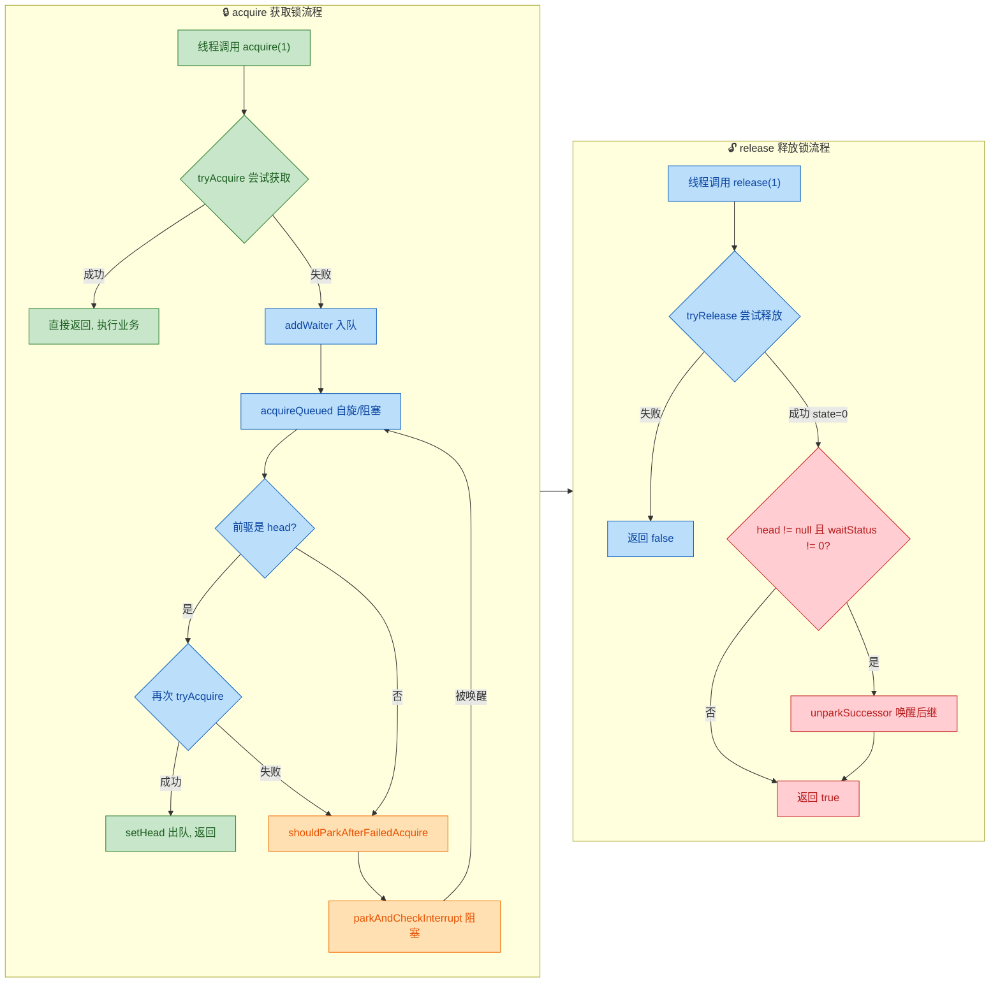
```mermaid
graph LR
    subgraph AcquireFlow["🔒 acquire 获取锁流程"]
        direction TB
        A1["线程调用 acquire(1)"] --> A2{"tryAcquire 尝试获取"}
        A2 -->|"成功"| A3["直接返回, 执行业务"]
        A2 -->|"失败"| A4["addWaiter 入队"]
        A4 --> A5["acquireQueued 自旋/阻塞"]
        A5 --> A6{"前驱是 head?"}
        A6 -->|"是"| A7{"再次 tryAcquire"}
        A7 -->|"成功"| A8["setHead 出队, 返回"]
        A7 -->|"失败"| A9["shouldParkAfterFailedAcquire"]
        A6 -->|"否"| A9
        A9 --> A10["parkAndCheckInterrupt 阻塞"]
        A10 -->|"被唤醒"| A5
    end

    subgraph ReleaseFlow["🔓 release 释放锁流程"]
        direction TB
        R1["线程调用 release(1)"] --> R2{"tryRelease 尝试释放"}
        R2 -->|"失败"| R3["返回 false"]
        R2 -->|"成功 state=0"| R4{"head != null 且 waitStatus != 0?"}
        R4 -->|"是"| R5["unparkSuccessor 唤醒后继"]
        R4 -->|"否"| R6["返回 true"]
        R5 --> R6
    end

    AcquireFlow --> ReleaseFlow

    classDef greenNode fill:#C8E6C9,stroke:#2E7D32,color:#1B5E20
    classDef blueNode fill:#BBDEFB,stroke:#1565C0,color:#0D47A1
    classDef orangeNode fill:#FFE0B2,stroke:#EF6C00,color:#E65100
    classDef redNode fill:#FFCDD2,stroke:#C62828,color:#B71C1C

    class A1,A2,A3 greenNode
    class A4,A5,A6,A7 blueNode
    class A8 greenNode
    class A9,A10 orangeNode
    class R1,R2,R3 blueNode
    class R4,R5,R6 redNode
```

### acquire 流程（tryAcquire → addWaiter → acquireQueued）

`acquire(int arg)` 是 AQS 独占模式获取同步状态的顶层入口方法。它的代码极其精炼，仅四行，却浓缩了整个获取锁的核心逻辑。我们先看完整源码，再逐层拆解：

```java
// ===== AQS#acquire —— 独占模式获取锁的顶层入口 =====
public final void acquire(int arg) {
    // 第一步：调用子类实现的 tryAcquire 尝试直接获取锁
    // 如果成功（返回 true），短路求值，整个方法直接返回
    // 如果失败（返回 false），进入第二步
    if (!tryAcquire(arg) &&
        // 第二步：addWaiter 将当前线程封装成 EXCLUSIVE 类型的 Node，加入队尾
        // 第三步：acquireQueued 让该节点在队列中自旋或阻塞，直到获取到锁
        acquireQueued(addWaiter(Node.EXCLUSIVE), arg))
        // 如果 acquireQueued 返回 true，说明线程在等待过程中被中断过
        // 此处重新设置中断标志位（因为 park 被唤醒后中断标志会被清除）
        selfInterrupt();
}
```

这段代码有一个精妙的设计：**`acquire` 方法不响应中断**（区别于 `acquireInterruptibly`）。如果线程在阻塞等待期间被中断，它不会抛出 `InterruptedException`，而是在成功获取锁之后，通过 `selfInterrupt()` 补上中断标志，让调用方自行决定如何处理。这体现了 AQS 的设计哲学——**将中断策略的选择权交给上层调用者**。

整个 acquire 流程可以拆解为三个阶段。让我们逐一深入。

#### 阶段一：tryAcquire —— 快速尝试

`tryAcquire(int arg)` 是一个由子类实现的 **模板方法**（Template Method）。AQS 本身只提供一个抛出 `UnsupportedOperationException` 的默认实现，强制要求子类去覆写它。

```java
// ===== AQS#tryAcquire —— 模板方法，子类必须覆写 =====
protected boolean tryAcquire(int arg) {
    // 默认实现直接抛异常，迫使子类提供自己的获取逻辑
    throw new UnsupportedOperationException();
}
```

不同的同步器对 tryAcquire 有不同的实现。以 `ReentrantLock` 的非公平锁为例：

```java
// ===== ReentrantLock.NonfairSync#tryAcquire =====
protected final boolean tryAcquire(int acquires) {
    return nonfairTryAcquire(acquires);  // 委托给 Sync 的非公平获取方法
}

// ===== ReentrantLock.Sync#nonfairTryAcquire =====
final boolean nonfairTryAcquire(int acquires) {
    // 获取当前尝试获取锁的线程
    final Thread current = Thread.currentThread();
    // 读取 AQS 的 state 值（volatile 读，保证可见性）
    int c = getState();

    if (c == 0) {
        // state == 0 表示锁空闲，尝试 CAS 将 state 从 0 改为 acquires（通常为 1）
        if (compareAndSetState(0, acquires)) {
            // CAS 成功，设置当前线程为独占所有者
            setExclusiveOwnerThread(current);
            return true;  // 获取成功
        }
    }
    // 如果锁不空闲，检查持锁线程是否是自己（可重入判断）
    else if (current == getExclusiveOwnerThread()) {
        // 重入：state 累加
        int nextc = c + acquires;
        // 溢出检查（int 最大值后变负数）
        if (nextc < 0)
            throw new Error("Maximum lock count exceeded");
        // 因为只有持锁线程才能走到这里，不存在竞争，直接 set 即可
        setState(nextc);
        return true;  // 重入获取成功
    }

    return false;  // 获取失败
}
```

tryAcquire 是一个 **"乐观尝试"**，它不阻塞，不入队，只是快速判断一下能不能直接拿到锁。如果拿到了，皆大欢喜；如果拿不到，才进入后面代价更高的入队逻辑。这种 **Fast Path / Slow Path 分离** 的设计模式在高性能系统中非常常见——大多数情况下锁的竞争并不激烈，快速路径就能搞定。

#### 阶段二：addWaiter —— 入队

当 tryAcquire 失败时，当前线程需要被放入 CLH 同步队列排队。`addWaiter` 方法负责将线程封装成 Node 并追加到队列尾部。

```java
// ===== AQS#addWaiter —— 将当前线程封装为 Node 并加入队尾 =====
private Node addWaiter(Node mode) {
    // 创建新节点：持有当前线程引用，模式为 EXCLUSIVE（独占）或 SHARED（共享）
    Node node = new Node(Thread.currentThread(), mode);

    // ---- 快速尝试（Fast Path）----
    // 先尝试直接 CAS 到队尾，如果队列已经初始化且竞争不激烈，一次就能成功
    Node pred = tail;            // 读取当前尾节点
    if (pred != null) {          // 尾节点不为空，说明队列已经初始化过
        node.prev = pred;        // 新节点的 prev 指向旧的尾节点
        if (compareAndSetTail(pred, node)) {  // CAS 将 tail 指向新节点
            pred.next = node;    // 旧尾节点的 next 指向新节点，双向链表形成
            return node;         // 入队成功，直接返回
        }
    }

    // ---- 完整入队（Slow Path）----
    // 走到这里有两种情况：
    // 1. 队列尚未初始化（tail == null）
    // 2. CAS 竞争失败（多个线程同时入队）
    enq(node);
    return node;
}
```

这里体现了 Doug Lea 一贯的编码风格：**先用一次快速 CAS 尝试（Fast Path），失败了再走完整的自旋入队流程（Slow Path）**。在低竞争场景下，Fast Path 几乎总能成功，避免了进入循环的开销。

接下来看完整入队方法 `enq`：

```java
// ===== AQS#enq —— 自旋 + CAS 确保节点一定入队成功 =====
private Node enq(final Node node) {
    // 无限循环（自旋），直到入队成功才退出
    for (;;) {
        Node t = tail;           // 每次循环都重新读取 tail（volatile 读）

        if (t == null) {
            // ---- 队列尚未初始化 ----
            // 创建一个"哨兵节点"（dummy node）作为 head
            // 这个节点不代表任何线程，仅用于简化队列操作
            if (compareAndSetHead(new Node()))
                tail = head;     // 初始时 head 和 tail 指向同一个哨兵节点
            // 注意：这里没有 return！初始化完成后会再次循环，将 node 接到尾部
        } else {
            // ---- 队列已初始化，执行入队 ----
            node.prev = t;       // 新节点的 prev 指向当前尾节点
            if (compareAndSetTail(t, node)) {  // CAS 尝试更新 tail
                t.next = node;   // 成功后将旧尾节点的 next 指向新节点
                return t;        // 返回旧的尾节点（即当前节点的前驱）
            }
            // CAS 失败则继续循环重试
        }
    }
}
```

`enq` 方法有两个核心要点值得深入理解：

**第一，哨兵节点（Sentinel Node）的设计。** 当队列第一次被使用时，`enq` 并不是直接将第一个等待线程作为 head，而是先创建一个 **空的 Node（`new Node()`）** 作为 head。这就是所谓的 **Lazy Initialization（延迟初始化）**——只有真正有线程需要排队时，才初始化队列。

为什么需要哨兵节点？因为在 AQS 的设计中，**head 节点始终代表"当前持有锁的线程"**（或者初始时的空占位符）。当一个排队线程成功获取锁后，它会通过 `setHead` 将自身设为新的 head，并清空 thread 引用——此时它就"变成"了新的哨兵节点。这种设计使得出队操作非常优雅，无需特殊判断。

**第二，`node.prev = t` 先于 CAS 执行。** 注意入队时是先设置 `prev` 指针，再 CAS 更新 `tail`，最后才设置 `next` 指针。这意味着 **从 tail 往 head 方向的 `prev` 链表始终是完整的，而从 head 往 tail 方向的 `next` 链表可能暂时是断开的**。这一点在后面 `unparkSuccessor` 需要"从尾部向前遍历寻找有效后继节点"时会起到关键作用。

来看一个队列建立的过程：

```
初始状态（队列为空）：
  head --> null
  tail --> null

第一个线程 T1 入队——先初始化哨兵节点：
  +----------+
  | Sentinel |  (thread=null, waitStatus=0)
  +----------+
  head ──┘└── tail

然后 T1 接在哨兵后面：
  +----------+     prev     +----------+
  | Sentinel | <─────────── |  Node-T1 |  (thread=T1, waitStatus=0)
  +----------+ ───────────> +----------+
  head ──┘       next              └── tail

T2 也入队：
  +----------+     prev     +----------+     prev     +----------+
  | Sentinel | <─────────── |  Node-T1 | <─────────── |  Node-T2 |
  +----------+ ───────────> +----------+ ───────────> +----------+
  head ──┘       next              │       next              └── tail
```

#### 阶段三：acquireQueued —— 自旋等待获取锁

节点入队之后，并不是立即阻塞。`acquireQueued` 方法会让节点在队列中进行 **"自旋 + 阻塞"** 的循环，直到成功获取锁。这是整个 acquire 流程中最复杂、最精华的部分。

```java
// ===== AQS#acquireQueued —— 已入队的节点在队列中自旋/阻塞，直到获取锁 =====
final boolean acquireQueued(final Node node, int arg) {
    boolean failed = true;       // 标记是否获取失败（用于异常时取消节点）
    try {
        boolean interrupted = false;  // 标记等待过程中是否被中断过

        // 无限循环（自旋）
        for (;;) {
            // 获取当前节点的前驱节点
            final Node p = node.predecessor();

            // ★ 核心判断：只有前驱是 head 的节点才有资格尝试获取锁
            // 这保证了 FIFO 的公平性——排在最前面的线程优先获取
            if (p == head && tryAcquire(arg)) {
                // 获取成功！将当前节点设为新的 head（出队）
                setHead(node);
                // 断开旧 head 的 next 引用，帮助 GC 回收
                p.next = null;   // help GC
                failed = false;  // 标记获取成功
                return interrupted; // 返回中断标志
            }

            // 走到这里说明：前驱不是 head，或者 tryAcquire 失败了
            // shouldParkAfterFailedAcquire：判断当前线程是否应该阻塞
            // parkAndCheckInterrupt：真正执行阻塞（LockSupport.park）
            if (shouldParkAfterFailedAcquire(p, node) &&
                parkAndCheckInterrupt())
                // 如果线程是被中断唤醒的，记录中断标志
                interrupted = true;
        }
    } finally {
        // 如果因异常退出循环（如 tryAcquire 抛异常），取消该节点
        if (failed)
            cancelAcquire(node);
    }
}
```

这段代码的核心逻辑可以概括为一句话：**"前驱是 head 就尝试获取，不是就乖乖阻塞"**。让我们拆解其中两个关键的辅助方法。

##### shouldParkAfterFailedAcquire —— 阻塞前的"安全检查"

一个线程在阻塞自己之前，必须确保将来有人能唤醒它。`shouldParkAfterFailedAcquire` 就是做这个检查的——它通过设置前驱节点的 `waitStatus` 为 `SIGNAL(-1)`，确保前驱在释放锁时会执行 `unpark` 唤醒自己。

```java
// ===== AQS#shouldParkAfterFailedAcquire =====
// 判断获取失败后是否应该阻塞当前线程
// 返回 true 表示"可以安全阻塞"，返回 false 表示"再给一次机会自旋"
private static boolean shouldParkAfterFailedAcquire(Node pred, Node node) {
    // 获取前驱节点的等待状态
    int ws = pred.waitStatus;

    if (ws == Node.SIGNAL) {
        // ---- 前驱状态已经是 SIGNAL（-1）----
        // 意味着前驱释放锁时一定会唤醒自己
        // 可以安心阻塞了
        return true;
    }

    if (ws > 0) {
        // ---- 前驱状态 > 0，即 CANCELLED（1）----
        // 前驱节点已经被取消，需要跳过所有连续的已取消节点
        // 从当前节点往前遍历，找到第一个未取消的节点作为新前驱
        do {
            node.prev = pred = pred.prev;  // 向前跳跃
        } while (pred.waitStatus > 0);
        pred.next = node;  // 将有效前驱的 next 指向当前节点
        // 注意：这里返回 false，让外层循环再跑一轮
    } else {
        // ---- 前驱状态为 0 或 PROPAGATE（-3）----
        // CAS 将前驱状态设为 SIGNAL，为下一轮阻塞做准备
        // 这里不直接阻塞，而是返回 false 让外层再尝试一次 tryAcquire
        // 这给了线程"最后一次获取锁的机会"，减少不必要的 park/unpark 开销
        compareAndSetWaitStatus(pred, ws, Node.SIGNAL);
    }

    return false;
}
```

这个方法的设计非常精巧，它实际上需要 **两次循环迭代** 才会返回 `true`：

1. **第一次迭代**：前驱 waitStatus 为 0（初始值），通过 CAS 改为 SIGNAL，返回 `false`。
2. **第二次迭代**：前驱 waitStatus 已经是 SIGNAL，返回 `true`，随后线程被阻塞。

为什么不一步到位？因为在第一次 CAS 到第二次检查之间，可能正好轮到当前线程获取锁了（前驱可能刚好释放了锁）。**多给一次自旋机会**，可以避免不必要的线程切换（context switch），这在锁持有时间极短的场景下能显著提升性能。

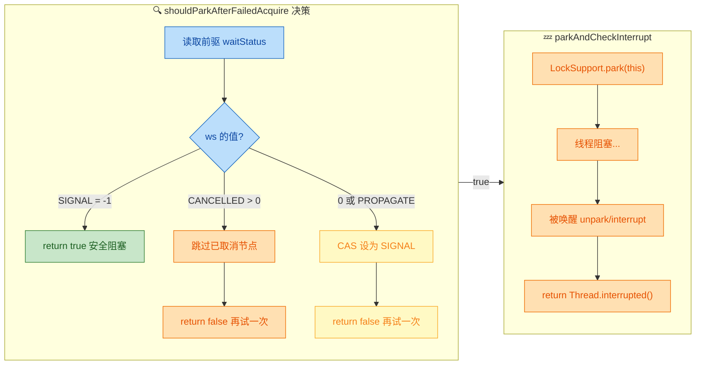
```mermaid
graph LR
    subgraph CheckLoop["🔍 shouldParkAfterFailedAcquire 决策"]
        direction TB
        S1["读取前驱 waitStatus"] --> S2{"ws 的值?"}
        S2 -->|"SIGNAL = -1"| S3["return true 安全阻塞"]
        S2 -->|"CANCELLED > 0"| S4["跳过已取消节点"]
        S4 --> S5["return false 再试一次"]
        S2 -->|"0 或 PROPAGATE"| S6["CAS 设为 SIGNAL"]
        S6 --> S7["return false 再试一次"]
    end

    subgraph ParkAction["💤 parkAndCheckInterrupt"]
        direction TB
        P1["LockSupport.park(this)"] --> P2["线程阻塞..."]
        P2 --> P3["被唤醒 unpark/interrupt"]
        P3 --> P4["return Thread.interrupted()"]
    end

    CheckLoop -->|"true"| ParkAction

    classDef greenNode fill:#C8E6C9,stroke:#2E7D32,color:#1B5E20
    classDef blueNode fill:#BBDEFB,stroke:#1565C0,color:#0D47A1
    classDef amberNode fill:#FFF9C4,stroke:#F9A825,color:#F57F17
    classDef orangeNode fill:#FFE0B2,stroke:#EF6C00,color:#E65100

    class S1,S2 blueNode
    class S3 greenNode
    class S4,S5 orangeNode
    class S6,S7 amberNode
    class P1,P2,P3,P4 orangeNode
```

##### parkAndCheckInterrupt —— 真正的阻塞

```java
// ===== AQS#parkAndCheckInterrupt —— 阻塞当前线程并检查中断 =====
private final boolean parkAndCheckInterrupt() {
    // 调用 LockSupport.park 阻塞当前线程
    // 传入 this（即 AQS 实例）作为 blocker，便于诊断工具（如 jstack）显示阻塞原因
    LockSupport.park(this);
    // 线程被唤醒后执行到这里（两种可能：unpark 或 interrupt）
    // Thread.interrupted() 返回中断标志，并清除它
    return Thread.interrupted();
}
```

`LockSupport.park` 底层调用的是 `Unsafe.park`，最终映射到操作系统的线程阻塞原语（Linux 上是 `futex`，Windows 上是 `WaitForSingleObject`）。线程被 park 后不消耗 CPU 时间片，直到被 `unpark` 或 `interrupt` 唤醒。

##### acquire 完整流程时序演示

让我们用一个三线程争锁的完整场景来串联整个 acquire 流程：

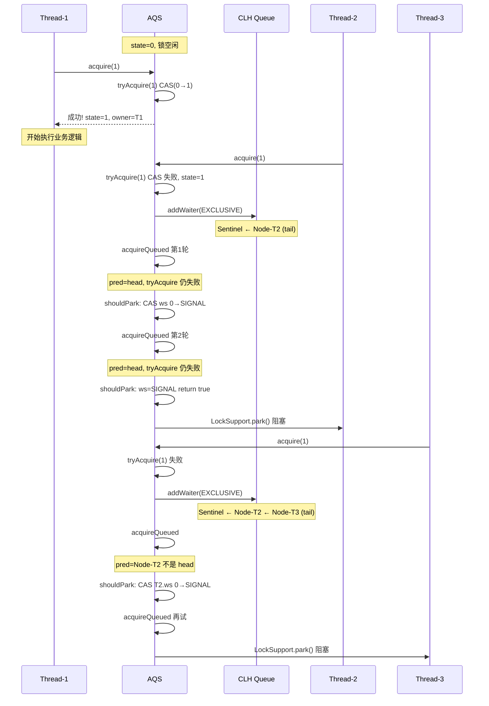
```mermaid
sequenceDiagram
    participant T1 as Thread-1
    participant AQS as AQS
    participant Q as CLH Queue
    participant T2 as Thread-2
    participant T3 as Thread-3

    Note over AQS: state=0, 锁空闲

    T1->>AQS: acquire(1)
    AQS->>AQS: tryAcquire(1) CAS(0→1)
    AQS-->>T1: 成功! state=1, owner=T1
    Note over T1: 开始执行业务逻辑

    T2->>AQS: acquire(1)
    AQS->>AQS: tryAcquire(1) CAS 失败, state=1
    AQS->>Q: addWaiter(EXCLUSIVE)
    Note over Q: Sentinel ← Node-T2 (tail)
    AQS->>AQS: acquireQueued 第1轮
    Note over AQS: pred=head, tryAcquire 仍失败
    AQS->>AQS: shouldPark: CAS ws 0→SIGNAL
    AQS->>AQS: acquireQueued 第2轮
    Note over AQS: pred=head, tryAcquire 仍失败
    AQS->>AQS: shouldPark: ws=SIGNAL return true
    AQS->>T2: LockSupport.park() 阻塞

    T3->>AQS: acquire(1)
    AQS->>AQS: tryAcquire(1) 失败
    AQS->>Q: addWaiter(EXCLUSIVE)
    Note over Q: Sentinel ← Node-T2 ← Node-T3 (tail)
    AQS->>AQS: acquireQueued
    Note over AQS: pred=Node-T2 不是 head
    AQS->>AQS: shouldPark: CAS T2.ws 0→SIGNAL
    AQS->>AQS: acquireQueued 再试
    AQS->>T3: LockSupport.park() 阻塞
```

在上面的时序图中可以清晰地看到：

- **T1** 直接走 Fast Path 成功获取锁，完全不涉及队列操作。
- **T2** 的前驱是 head（Sentinel），它有资格尝试 tryAcquire，但因为 T1 还没释放，所以失败了。经过两轮循环（第一轮 CAS 设置前驱 ws 为 SIGNAL，第二轮确认后 park），T2 被阻塞。
- **T3** 的前驱是 Node-T2，不是 head，所以它连 tryAcquire 的资格都没有，直接走 shouldPark 逻辑后阻塞。

### release 流程（tryRelease → unparkSuccessor）

理解了 acquire 之后，release 流程就简单得多了。release 的职责是：**释放锁 + 唤醒队列中的下一个等待线程**。

```java
// ===== AQS#release —— 独占模式释放锁的顶层入口 =====
public final boolean release(int arg) {
    // 第一步：调用子类实现的 tryRelease 尝试释放锁
    if (tryRelease(arg)) {
        // 释放成功，检查队列中是否有等待的线程需要唤醒
        Node h = head;
        // head != null：队列已初始化
        // waitStatus != 0：说明后续有节点设置过 SIGNAL（需要唤醒后继）
        // 如果 waitStatus == 0，说明没有后继节点在等待，无需唤醒
        if (h != null && h.waitStatus != 0)
            unparkSuccessor(h);  // 唤醒 head 的后继节点
        return true;
    }
    return false;  // tryRelease 返回 false（如可重入锁还没完全释放）
}
```

这里有一个细节：**`h.waitStatus != 0` 这个条件为什么不是 `h.waitStatus == Node.SIGNAL`**？

因为 waitStatus 除了 SIGNAL(-1) 还可能是 PROPAGATE(-3)（在共享模式中使用），甚至理论上可能在极端时序下是其他负值。用 `!= 0` 做判断比严格等于 SIGNAL 更安全，更具防御性。而如果 `waitStatus == 0`，说明队列初始化了但紧跟的后继节点还没来得及设置前驱的 SIGNAL 状态（即后继还在 addWaiter 到 shouldParkAfterFailedAcquire 之间），此时不需要唤醒，因为后继节点还会自旋一次 tryAcquire。

#### tryRelease —— 模板方法

同 tryAcquire 一样，tryRelease 也是由子类实现的模板方法。以 `ReentrantLock` 为例：

```java
// ===== ReentrantLock.Sync#tryRelease =====
protected final boolean tryRelease(int releases) {
    // state 减去 releases（通常为 1）
    int c = getState() - releases;

    // 安全检查：只有持锁线程才能释放锁
    if (Thread.currentThread() != getExclusiveOwnerThread())
        throw new IllegalMonitorStateException();

    boolean free = false;
    if (c == 0) {
        // state 减到 0，说明锁完全释放（所有重入都退出了）
        free = true;
        // 清除独占线程标记
        setExclusiveOwnerThread(null);
    }
    // 更新 state（这里不需要 CAS，因为只有持锁线程才会调用 release）
    setState(c);
    // 返回 true 表示锁已完全释放，false 表示还有重入层次未释放
    return free;
}
```

注意两个关键点：

1. **只有 state 减到 0 才返回 true。** 对于可重入锁，lock 了 N 次，就必须 unlock N 次才能真正释放。每次 unlock 只是将 state 减 1。
2. **setState 不需要 CAS。** 因为独占模式下只有持锁线程才会调用 release，不存在竞争。这也是独占模式的性能优势之一。

#### unparkSuccessor —— 唤醒后继

当 tryRelease 返回 true，`release` 方法会调用 `unparkSuccessor` 唤醒队列中下一个应该获取锁的线程：

```java
// ===== AQS#unparkSuccessor —— 唤醒指定节点的后继线程 =====
private void unparkSuccessor(Node node) {
    // node 参数通常是 head 节点

    // 读取 node 的等待状态
    int ws = node.waitStatus;
    if (ws < 0)
        // 将 head 的 waitStatus 重置为 0
        // 这是一个"尽力而为"的操作，CAS 失败也没关系
        // 目的是让后续线程在 shouldParkAfterFailedAcquire 中看到 0 而非 SIGNAL
        // 从而多获得一次自旋机会
        compareAndSetWaitStatus(node, ws, 0);

    // 获取 head 的后继节点
    Node s = node.next;

    // ★ 如果后继为 null 或已被取消，需要从 tail 往前找
    if (s == null || s.waitStatus > 0) {
        s = null;
        // 从 tail 开始，向前遍历，找到离 head 最近的未取消节点
        for (Node t = tail; t != null && t != node; t = t.prev)
            if (t.waitStatus <= 0)
                s = t;  // 不断更新 s，最终 s 是最靠近 head 的有效节点
    }

    // 找到了有效的后继节点，唤醒它
    if (s != null)
        LockSupport.unpark(s.thread);
}
```

**为什么要从 tail 往前遍历，而不是从 head 往后？** 这是 AQS 中一个经典的面试考点。原因回到前面 `addWaiter`/`enq` 中入队操作的顺序：

```java
// 入队代码的三步操作（非原子）：
node.prev = t;              // ① 先链接 prev
compareAndSetTail(t, node);  // ② CAS 更新 tail
t.next = node;               // ③ 最后链接 next
```

步骤 ② 和 ③ 之间存在一个时间窗口：**tail 已经指向新节点，但旧节点的 `next` 还没来得及指向新节点**。如果此时恰好有线程在执行 `unparkSuccessor`，从 head 往后遍历就会遇到 `next == null`，误以为队列到此结束而漏掉后面的节点。而 **`prev` 链在 CAS 之前就已设置好，所以从 tail 往前遍历一定是完整的**。

用一张图来说明这个关键的时间窗口：

```
正常状态下 next 链完整：
 head ──→ A ──→ B ──→ C (tail)
      ←──   ←──   ←──

但在入队的瞬间（②完成，③未完成）：
 head ──→ A ──→ B ──✗  C (tail)    ← next 链断裂!
      ←──   ←──   ←──              ← prev 链完整!

所以从 tail 沿 prev 往前遍历，才能找到所有节点。
```

#### release 后的唤醒链条

让我们接着前面 T1-T2-T3 的场景，看 T1 释放锁后发生什么：

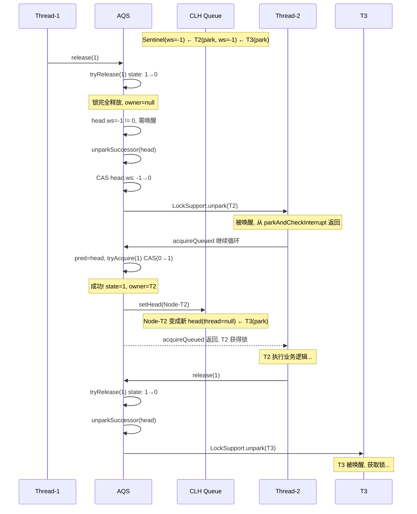
```mermaid
sequenceDiagram
    participant T1 as Thread-1
    participant AQS as AQS
    participant Q as CLH Queue
    participant T2 as Thread-2

    Note over Q: Sentinel(ws=-1) ← T2(park, ws=-1) ← T3(park)

    T1->>AQS: release(1)
    AQS->>AQS: tryRelease(1) state: 1→0
    Note over AQS: 锁完全释放, owner=null
    AQS->>AQS: head.ws=-1 != 0, 需唤醒
    AQS->>AQS: unparkSuccessor(head)
    AQS->>AQS: CAS head.ws: -1→0
    AQS->>T2: LockSupport.unpark(T2)

    Note over T2: 被唤醒, 从 parkAndCheckInterrupt 返回

    T2->>AQS: acquireQueued 继续循环
    AQS->>AQS: pred=head, tryAcquire(1) CAS(0→1)
    Note over AQS: 成功! state=1, owner=T2
    AQS->>Q: setHead(Node-T2)
    Note over Q: Node-T2 变成新 head(thread=null) ← T3(park)
    AQS-->>T2: acquireQueued 返回, T2 获得锁

    Note over T2: T2 执行业务逻辑...
    T2->>AQS: release(1)
    AQS->>AQS: tryRelease(1) state: 1→0
    AQS->>AQS: unparkSuccessor(head)
    AQS->>T3: LockSupport.unpark(T3)
    Note over T3: T3 被唤醒, 获取锁...
```

当 T2 被唤醒后成功获取锁，`setHead(node)` 会将 T2 所在的 Node 提升为新的 head：

```java
// ===== AQS#setHead —— 将获取到锁的节点设为新的 head =====
private void setHead(Node node) {
    head = node;             // head 指向当前节点
    node.thread = null;      // 清空线程引用（head 节点不需要保存线程信息）
    node.prev = null;        // 断开与旧 head 的连接
}
```

setHead 执行完后，旧的 Sentinel 节点不再被任何引用指向，可以被 GC 回收。而 Node-T2 成为了新的"虚拟 head"，后续 T3 被唤醒时，它的前驱就是这个新 head。整个队列的节点像 **"蠕虫前进"** 一样，head 不断向后移动，走过的节点被 GC 回收。

```
释放前：
  [Sentinel](ws=-1) ← [T2](park,ws=-1) ← [T3](park)
  head                                       tail

T2 获取锁后（setHead）：
  [T2/NewHead](thread=null,ws=-1) ← [T3](park)
  head                                   tail
  
  旧 Sentinel 被回收 ♻️
```

#### 独占模式的设计精髓总结

回顾整个独占模式，其设计中蕴含了几个值得反复品味的工程智慧：

| 设计要点 | 体现位置 | 收益 |
|:---|:---|:---|
| **Fast Path / Slow Path 分离** | tryAcquire 先于入队执行 | 低竞争时零开销 |
| **两次自旋再阻塞** | shouldParkAfterFailedAcquire 返回 false | 减少不必要的 park/unpark 系统调用 |
| **SIGNAL 协议** | 前驱负责唤醒后继 | 去中心化的唤醒机制 |
| **prev 链优先** | 入队时先设 prev 再 CAS | 保证从尾到头遍历的完整性 |
| **哨兵节点** | enq 中的 Lazy Init | 统一出队逻辑，避免边界判断 |
| **模板方法模式** | tryAcquire / tryRelease | 框架与策略分离，扩展性极强 |

---

**📝 练习题**

以下关于 AQS 独占模式 `acquire` 流程的描述，哪一项是**错误**的？

A. 在 `acquireQueued` 中，只有前驱节点是 head 的线程才有资格调用 `tryAcquire` 尝试获取锁。

B. `shouldParkAfterFailedAcquire` 方法在第一次调用时通常会直接返回 `true`，让线程立即阻塞以减少 CPU 空转。

C. `unparkSuccessor` 在后继节点为 null 或已取消时，会从 `tail` 往前遍历寻找有效后继节点，这是因为入队时 `next` 指针的赋值不是原子性的。

D. `acquire` 方法不响应中断——即使线程在等待期间被中断，也不会抛出 `InterruptedException`，而是在获取锁之后通过 `selfInterrupt()` 补设中断标志。


**【答案】** B

**【解析】** 选项 B 是错误的。`shouldParkAfterFailedAcquire` 在首次调用时，前驱节点的 `waitStatus` 通常为 0（初始值），此时方法会通过 CAS 将其设为 `SIGNAL(-1)` 并 **返回 `false`**，让外层 `acquireQueued` 再做一次循环——这等于给了线程一次额外的 `tryAcquire` 机会。只有第二次进入时，发现前驱的 `waitStatus` 已经是 `SIGNAL`，才返回 `true` 允许线程阻塞。这种"**两次自旋再阻塞**"的策略是 AQS 的性能优化之一，可以有效减少线程上下文切换的次数。选项 A 正确描述了 FIFO 的公平获取策略；选项 C 准确说明了从尾部遍历的根本原因（`prev` 链先于 CAS 建立，而 `next` 链在 CAS 之后才设置，存在可见性窗口）；选项 D 正确描述了 `acquire` 的中断处理策略。

---

**📝 练习题**

阅读以下代码片段，分析输出结果：

```java
// 自定义一个基于 AQS 的互斥锁（仅允许一个线程持有）
public class SimpleMutex {
    private final Sync sync = new Sync();

    // AQS 子类实现
    private static class Sync extends AbstractQueuedSynchronizer {
        // 独占获取：CAS 将 state 从 0 改为 1
        protected boolean tryAcquire(int arg) {
            return compareAndSetState(0, 1);
        }
        // 独占释放：直接将 state 设为 0
        protected boolean tryRelease(int arg) {
            setState(0);
            return true;
        }
    }

    public void lock()   { sync.acquire(1); }
    public void unlock() { sync.release(1); }

    public static void main(String[] args) throws InterruptedException {
        SimpleMutex mutex = new SimpleMutex();
        mutex.lock();       // 主线程第一次加锁
        System.out.println("First lock acquired");
        mutex.lock();       // 主线程第二次加锁（重入）
        System.out.println("Second lock acquired");
        mutex.unlock();
        mutex.unlock();
    }
}
```

以上程序的运行结果是？

A. 正常输出 "First lock acquired" 和 "Second lock acquired"，程序正常退出。

B. 输出 "First lock acquired" 后程序死锁（线程永久阻塞），无法输出第二行。

C. 编译错误，`tryAcquire` 的签名不正确。

D. 抛出 `IllegalMonitorStateException` 异常。


**【答案】** B

**【解析】** 这道题考查的是 **可重入性**。`SimpleMutex` 的 `tryAcquire` 实现为 `compareAndSetState(0, 1)`——它只在 state 为 0 时才能获取成功。当主线程第一次 `lock()` 后 state 变为 1。第二次 `lock()` 时，`tryAcquire` 尝试 CAS(0, 1)，但此时 state 已经是 1，CAS 失败，tryAcquire 返回 false。随后进入 `addWaiter → acquireQueued` 流程，在 acquireQueued 中，虽然前驱是 head，但 tryAcquire 依然失败（state 仍为 1，因为没有其他线程会释放它），最终线程被 `LockSupport.park()` 阻塞。又因为只有主线程自己才能 unlock，而它已经阻塞了，形成了 **自死锁（Self-Deadlock）**。这正是 `ReentrantLock` 中 `nonfairTryAcquire` 要检查 `current == getExclusiveOwnerThread()` 的原因——如果是同一线程重入，需要累加 state 而非 CAS 竞争。

---

## 共享模式

在前面的章节中，我们深入剖析了 AQS 的独占模式（Exclusive Mode）——同一时刻只允许一个线程获取同步状态。然而，在真实的并发场景中，还存在大量"允许多个线程同时访问"的需求：`Semaphore` 需要允许 N 个线程同时持有许可；`CountDownLatch` 需要在计数归零时一次性唤醒所有等待线程；`ReadWriteLock` 中的读锁需要让多个读线程并发进入。这些能力的底层支撑，正是 AQS 的 **共享模式（Shared Mode）**。

共享模式与独占模式最根本的区别可以用一句话概括：**独占模式下，锁的释放只唤醒后继一个节点；共享模式下，一个线程获取成功后，会尝试继续唤醒后继节点，形成"唤醒传播"链式反应（Propagation）。** 正是这种传播机制，让共享模式能够在瞬间唤醒队列中所有等待共享资源的线程。

在深入源码之前，我们先通过一张整体流程图建立宏观认知：

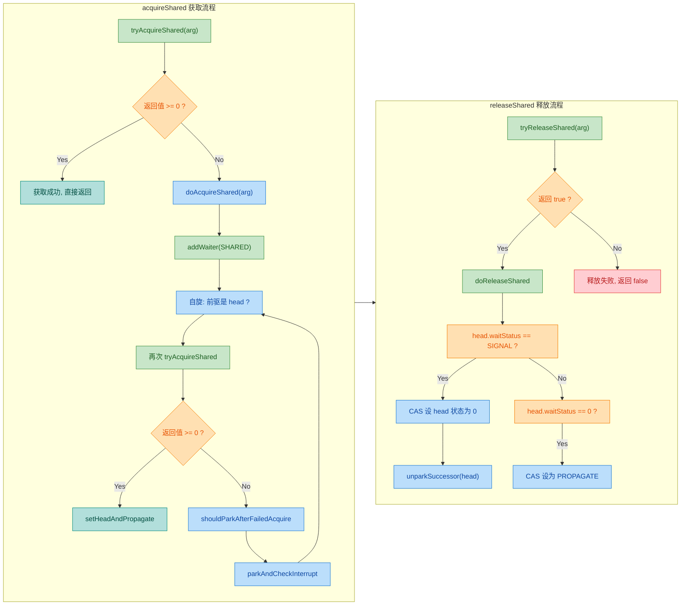
```mermaid
graph LR
    subgraph AcquireShared["acquireShared 获取流程"]
        direction TB
        A1["tryAcquireShared(arg)"]
        A2{"返回值 >= 0 ?"}
        A3["获取成功, 直接返回"]
        A4["doAcquireShared(arg)"]
        A5["addWaiter(SHARED)"]
        A6["自旋: 前驱是 head ?"]
        A7["再次 tryAcquireShared"]
        A8{"返回值 >= 0 ?"}
        A9["setHeadAndPropagate"]
        A10["shouldParkAfterFailedAcquire"]
        A11["parkAndCheckInterrupt"]

        A1 --> A2
        A2 -->|Yes| A3
        A2 -->|No| A4
        A4 --> A5
        A5 --> A6
        A6 --> A7
        A7 --> A8
        A8 -->|Yes| A9
        A8 -->|No| A10
        A10 --> A11
        A11 --> A6
    end

    subgraph ReleaseShared["releaseShared 释放流程"]
        direction TB
        R1["tryReleaseShared(arg)"]
        R2{"返回 true ?"}
        R3["doReleaseShared"]
        R4["head.waitStatus == SIGNAL ?"]
        R5["CAS 设 head 状态为 0"]
        R6["unparkSuccessor(head)"]
        R7["head.waitStatus == 0 ?"]
        R8["CAS 设为 PROPAGATE"]
        R9["释放失败, 返回 false"]

        R1 --> R2
        R2 -->|Yes| R3
        R2 -->|No| R9
        R3 --> R4
        R4 -->|Yes| R5
        R5 --> R6
        R4 -->|No| R7
        R7 -->|Yes| R8
    end

    AcquireShared --> ReleaseShared

    classDef greenNode fill:#C8E6C9,stroke:#388E3C,color:#1B5E20
    classDef blueNode fill:#BBDEFB,stroke:#1976D2,color:#0D47A1
    classDef orangeNode fill:#FFE0B2,stroke:#F57C00,color:#E65100
    classDef redNode fill:#FFCDD2,stroke:#E53935,color:#B71C1C
    classDef tealNode fill:#B2DFDB,stroke:#00897B,color:#004D40

    class A1,A5,A7 greenNode
    class A2,A8 orangeNode
    class A3,A9 tealNode
    class A4,A6,A10,A11 blueNode
    class R1,R3 greenNode
    class R2,R4,R7 orangeNode
    class R5,R6,R8 blueNode
    class R9 redNode
```

### acquireShared

`acquireShared(int arg)` 是共享模式下获取同步状态的顶层入口方法。它的源码极为精简，但背后的 `doAcquireShared` 隐藏着整个共享模式最精妙的设计——**唤醒传播（propagation）**。

#### 顶层入口方法

```java
// AQS 中的 acquireShared 方法 —— 共享模式获取同步状态的入口
public final void acquireShared(int arg) {
    // 1. 首先尝试以共享模式获取同步状态
    //    tryAcquireShared 是模板方法，由子类实现
    //    返回值含义：
    //      负数 → 获取失败
    //      零   → 获取成功，但后续线程不能再获取（资源刚好用完）
    //      正数 → 获取成功，且后续线程也可能成功（还有剩余资源）
    if (tryAcquireShared(arg) < 0)
        // 2. 获取失败，进入等待队列并自旋阻塞
        doAcquireShared(arg);
}
```

这里有一个与独占模式 `acquire` 对比后非常关键的差异：`tryAcquire` 返回 `boolean`，而 `tryAcquireShared` 返回 `int`。返回值的数值语义是共享模式传播机制的基石——**正数意味着"我拿了之后还有剩余，后面的兄弟也快来拿"**。

#### doAcquireShared 核心逻辑

当 `tryAcquireShared` 返回负数（获取失败）时，线程进入 `doAcquireShared`。这个方法的整体骨架与独占模式的 `acquireQueued` 非常相似，但在获取成功后的处理上有本质区别：

```java
// AQS 中的 doAcquireShared —— 共享模式的排队与自旋获取
private void doAcquireShared(int arg) {
    // 1. 以 SHARED 模式创建节点并加入队列尾部
    //    注意这里传入的是 Node.SHARED（一个静态标记节点）
    //    独占模式传入的是 Node.EXCLUSIVE（即 null）
    final Node node = addWaiter(Node.SHARED);

    // 2. 标记是否获取失败（用于异常时取消节点）
    boolean failed = true;
    try {
        // 3. 中断标记，记录等待过程中是否被中断过
        boolean interrupted = false;

        // 4. 经典自旋循环 —— 与 acquireQueued 结构一致
        for (;;) {
            // 5. 获取当前节点的前驱节点
            final Node p = node.predecessor();

            // 6. 只有前驱是 head 时，才有资格尝试获取
            //    这保证了 FIFO 的公平性
            if (p == head) {
                // 7. 尝试以共享模式获取同步状态
                int r = tryAcquireShared(arg);

                // 8. r >= 0 表示获取成功
                if (r >= 0) {
                    // 9. ★ 核心区别 ★
                    //    独占模式只是简单的 setHead(node)
                    //    共享模式调用 setHeadAndPropagate
                    //    → 设置新 head + 尝试唤醒后续共享节点
                    setHeadAndPropagate(node, r);

                    // 10. 断开旧 head 的 next 引用，帮助 GC
                    p.next = null; // help GC

                    // 11. 如果等待过程中被中断过，补一个自我中断
                    if (interrupted)
                        selfInterrupt();

                    // 12. 标记获取成功
                    failed = false;
                    return;
                }
            }

            // 13. 前驱不是 head，或者 tryAcquireShared 失败
            //     判断是否应该挂起（与独占模式逻辑完全相同）
            if (shouldParkAfterFailedAcquire(p, node) &&
                parkAndCheckInterrupt())
                // 14. 记录中断状态（不立即抛出，只记录）
                interrupted = true;
        }
    } finally {
        // 15. 如果因为异常导致没有成功获取，取消当前节点
        if (failed)
            cancelAcquire(node);
    }
}
```

我们用 ASCII 图来对比独占模式与共享模式在获取成功后的行为差异：

```text
╔══════════════════════════════════════════════════════════════════════╗
║                独占模式 acquireQueued 成功后                         ║
║                                                                      ║
║   获取成功 → setHead(node) → 结束                                   ║
║   仅设置新 head，不唤醒任何后继                                      ║
╠══════════════════════════════════════════════════════════════════════╣
║                共享模式 doAcquireShared 成功后                       ║
║                                                                      ║
║   获取成功 → setHeadAndPropagate(node, r) → 可能唤醒后继 → 结束    ║
║   设置新 head + 若还有剩余资源，继续唤醒后续 SHARED 节点           ║
╚══════════════════════════════════════════════════════════════════════╝
```

#### setHeadAndPropagate —— 传播机制的心脏

这是共享模式最精华、也是面试中最常被追问的方法。它的职责是：**设置新的 head 节点，并在条件满足时触发后续共享节点的唤醒传播。**

```java
// AQS 中的 setHeadAndPropagate
// 参数 node: 刚刚获取成功的节点（将成为新 head）
// 参数 propagate: tryAcquireShared 的返回值（剩余资源数）
private void setHeadAndPropagate(Node node, int propagate) {
    // 1. 保存旧的 head（后面判断条件时需要）
    Node h = head;

    // 2. 将当前节点设为新的 head
    //    setHead 会清空 node 的 thread 和 prev 引用
    setHead(node);

    // 3. ★ 判断是否需要继续唤醒后续节点 ★
    //    这个 if 条件看起来复杂，但每一项都有深意：
    //
    //    条件 A: propagate > 0
    //      → tryAcquireShared 返回正数，说明还有剩余资源
    //      → 后续线程也可能获取成功，应该唤醒
    //
    //    条件 B: h == null
    //      → 旧 head 为 null（理论上不会发生，防御性编程）
    //
    //    条件 C: h.waitStatus < 0
    //      → 旧 head 的 waitStatus 为负数（SIGNAL 或 PROPAGATE）
    //      → 说明有后继节点在等待唤醒
    //
    //    条件 D: (h = head) == null
    //      → 重新读取 head（可能已被其他线程更新）
    //      → 为 null 则防御性唤醒
    //
    //    条件 E: h.waitStatus < 0
    //      → 新 head 的 waitStatus 为负数
    //      → 说明新 head 后面还有节点在等待
    //
    if (propagate > 0 || h == null || h.waitStatus < 0 ||
        (h = head) == null || h.waitStatus < 0) {

        // 4. 获取当前新 head 的后继节点
        Node s = node.next;

        // 5. 如果后继为 null（可能正在入队，尚未链接完成）
        //    或者后继是 SHARED 模式的节点
        //    → 调用 doReleaseShared 执行释放传播
        if (s == null || s.isShared())
            doReleaseShared();
    }
}
```

这里最容易让人困惑的是第 3 步那个庞大的 `if` 条件。为什么不能简单地只判断 `propagate > 0` 呢？这涉及到一个非常微妙的并发场景：

> **Bug 修复历史**：在 JDK 早期版本中，`setHeadAndPropagate` 确实只检查 `propagate > 0`。但 Doug Lea 发现在某些极端并发场景下，`tryAcquireShared` 返回 0（表示"刚好用完"），但与此同时另一个线程执行了 `releaseShared`，新释放的资源没有线程去"认领"。这会导致已释放的资源无人获取，形成**信号丢失（lost wake-up）**。增加 `h.waitStatus < 0` 的检查（特别是 `PROPAGATE` 状态的引入），正是为了解决这个问题。

我们用一个时序图来展示这种微妙的并发场景：

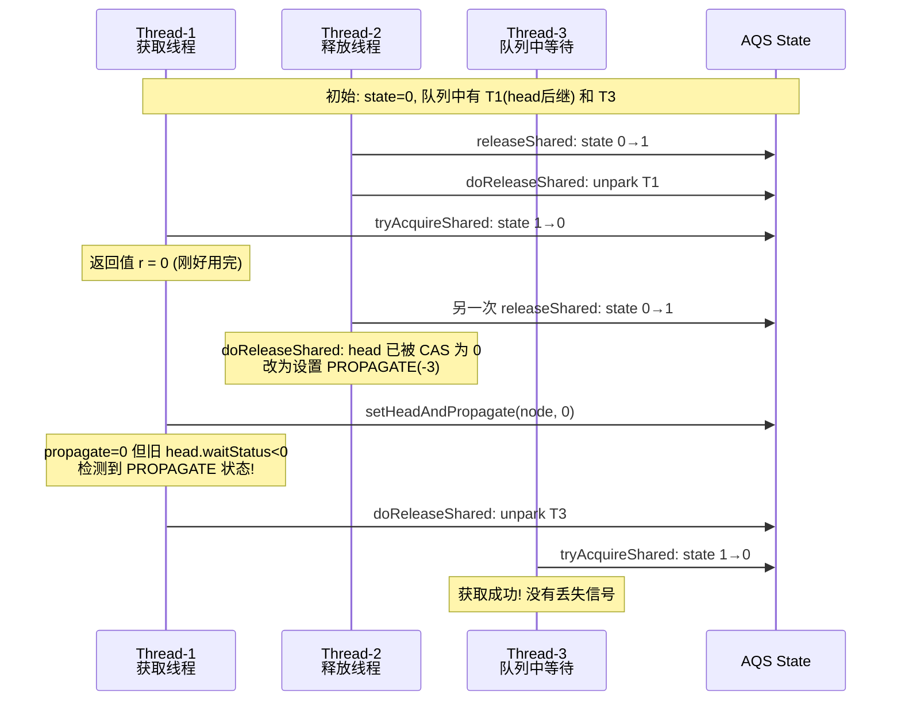
```mermaid
sequenceDiagram
    participant T1 as Thread-1<br/>获取线程
    participant T2 as Thread-2<br/>释放线程
    participant T3 as Thread-3<br/>队列中等待
    participant AQS as AQS State

    Note over T1,AQS: 初始: state=0, 队列中有 T1(head后继) 和 T3

    T2->>AQS: releaseShared: state 0→1
    T2->>AQS: doReleaseShared: unpark T1
    T1->>AQS: tryAcquireShared: state 1→0
    Note over T1: 返回值 r = 0 (刚好用完)

    T2->>AQS: 另一次 releaseShared: state 0→1
    Note over T2: doReleaseShared: head 已被 CAS 为 0<br/>改为设置 PROPAGATE(-3)

    T1->>AQS: setHeadAndPropagate(node, 0)
    Note over T1: propagate=0 但旧 head.waitStatus<0<br/>检测到 PROPAGATE 状态!
    T1->>AQS: doReleaseShared: unpark T3

    T3->>AQS: tryAcquireShared: state 1→0
    Note over T3: 获取成功! 没有丢失信号
```

**关键点**：如果只判断 `propagate > 0`，在 T1 获取到 `r=0` 的那一刻，它会认为"没有剩余资源了，不需要唤醒后继"。但 T2 几乎同时释放了新的资源。此时 T3 就被"遗忘"在队列中，形成 **活锁（liveness failure）**。`PROPAGATE` 状态和额外的 `waitStatus < 0` 检查，正是防止这一灾难的安全网。

#### SHARED 节点标记的作用

在 `addWaiter(Node.SHARED)` 中，`Node.SHARED` 是一个静态的标记节点：

```java
// Node 类中的共享模式标记
static final Node SHARED = new Node();    // 共享模式标记（非 null）
static final Node EXCLUSIVE = null;       // 独占模式标记（null）

// Node 内部通过 nextWaiter 字段来区分模式
// 共享模式: node.nextWaiter == SHARED
// 独占模式: node.nextWaiter == null (EXCLUSIVE)

// 判断是否为共享模式的方法
final boolean isShared() {
    return nextWaiter == SHARED;           // 简单的引用比较
}
```

这个设计非常巧妙——`nextWaiter` 字段在同步队列中被"复用"为模式标记（在条件队列中它才是真正的"下一个等待者"指针）。这种一字段双用途的做法，是 Doug Lea 在性能和内存之间精心权衡的结果。

### releaseShared

`releaseShared(int arg)` 是共享模式释放同步状态的入口。与独占模式的 `release` 相比，它的释放逻辑更加复杂，因为需要处理**多个线程同时释放**的并发场景。

#### 顶层入口方法

```java
// AQS 中的 releaseShared —— 共享模式释放同步状态的入口
public final boolean releaseShared(int arg) {
    // 1. 尝试释放同步状态（模板方法，子类实现）
    //    例如 Semaphore: state += arg (CAS)
    //    例如 CountDownLatch: state -= 1, 当 state==0 时返回 true
    if (tryReleaseShared(arg)) {
        // 2. 释放成功，执行唤醒传播
        doReleaseShared();
        return true;
    }
    // 3. 释放未完成（如 CountDownLatch 计数还没到 0）
    return false;
}
```

注意 `tryReleaseShared` 的返回值语义：它返回 `true` 表示"这次释放使得后续的获取操作可能成功了"。对于 `CountDownLatch`，只有最后一个 `countDown()` 使 state 变为 0 时才返回 true；对于 `Semaphore`，每次释放都返回 true。

#### doReleaseShared —— 传播引擎

`doReleaseShared` 是整个共享模式中最核心、最复杂的方法。它可以被**两个完全不同的路径**调用：

1. **释放路径**：线程调用 `releaseShared` → `doReleaseShared`
2. **获取路径**：线程获取成功后调用 `setHeadAndPropagate` → `doReleaseShared`

这意味着多个线程可能**同时**执行 `doReleaseShared`，这要求它必须是线程安全的，并且能正确协调并发的唤醒操作。

```java
// AQS 中的 doReleaseShared —— 共享模式唤醒传播的核心引擎
private void doReleaseShared() {
    // 1. 自旋循环 —— 直到成功完成一次有效操作或确认无需操作
    for (;;) {
        // 2. 每次循环开始时读取当前 head
        //    注意：head 可能在循环过程中被其他线程更改
        Node h = head;

        // 3. 检查队列是否非空（head != null && head != tail）
        //    head == tail 表示队列为空（只有哨兵节点）
        if (h != null && h != tail) {

            // 4. 读取 head 的 waitStatus
            int ws = h.waitStatus;

            // 5. 情况一：waitStatus == SIGNAL (-1)
            //    说明后继节点正在等待唤醒
            if (ws == Node.SIGNAL) {
                // 6. CAS 将 waitStatus 从 SIGNAL 改为 0
                //    为什么要先改为 0？
                //    → 防止多个线程同时 unpark 同一个后继节点
                //    → CAS 失败说明有其他线程抢先处理了，重新循环
                if (!compareAndSetWaitStatus(h, Node.SIGNAL, 0))
                    continue;  // CAS 失败，重新检查

                // 7. CAS 成功，唤醒后继节点
                unparkSuccessor(h);
            }

            // 8. 情况二：waitStatus == 0
            //    说明后继节点刚入队但还没来得及将前驱设为 SIGNAL
            //    或者刚刚被上面的 CAS 从 SIGNAL 改成了 0
            //    → 尝试 CAS 设为 PROPAGATE (-3)
            //    → 为 setHeadAndPropagate 中的 waitStatus < 0 检查埋下伏笔
            else if (ws == 0 &&
                     !compareAndSetWaitStatus(h, 0, Node.PROPAGATE))
                continue;  // CAS 失败，重新检查
        }

        // 9. ★ 关键退出条件 ★
        //    如果执行到这里，head 没有发生变化
        //    → 说明没有新的线程获取成功并更新 head
        //    → 当前线程的唤醒传播工作完成，可以退出
        //
        //    如果 head 发生了变化（被唤醒的线程已获取成功成为新 head）
        //    → 需要继续循环，尝试唤醒新 head 的后继
        //    → 这就是"传播"的核心所在！
        if (h == head)
            break;
    }
}
```

这段代码虽然只有二十来行，但信息密度极高。让我们拆解其中最重要的几个设计决策：

**为什么 CAS 设为 0 而不是直接 unpark？**

在独占模式的 `release` 中，释放者只有一个线程，不存在并发 unpark 的问题。但在共享模式下，多个线程可能同时执行 `doReleaseShared`（一个在释放路径，另一个在获取传播路径）。如果不加 CAS 保护，同一个后继节点可能被多次 `unpark`。虽然 `LockSupport.unpark` 的语义保证多次 unpark 只保留一个 permit，但不必要的 unpark 调用是系统调用层面的浪费。CAS 将 SIGNAL→0 既保证了唤醒的幂等性，也充当了多线程之间的"抢锁"机制。

**PROPAGATE 状态的意义是什么？**

`PROPAGATE (-3)` 是专门为共享模式的传播机制设计的 waitStatus 值。它的核心作用是作为一个"信号痕迹"：

```text
╔═══════════════════════════════════════════════════════════════╗
║  PROPAGATE 状态的作用链:                                      ║
║                                                               ║
║  doReleaseShared 中:                                          ║
║    ws==0 → CAS设为PROPAGATE                                  ║
║              ↓                                                ║
║  setHeadAndPropagate 中:                                      ║
║    检测到旧head.waitStatus < 0 (即PROPAGATE)                 ║
║              ↓                                                ║
║    即使 propagate==0, 仍然触发 doReleaseShared               ║
║              ↓                                                ║
║    避免信号丢失!                                              ║
╚═══════════════════════════════════════════════════════════════╝
```

**退出条件 `h == head` 的精妙之处**

`for(;;)` 循环配合 `h == head` 构成了一个"追赶式传播"：当一个线程在 `doReleaseShared` 中唤醒了后继节点，后继节点获取成功后会更新 head，此时当前线程发现 `h != head`，于是再次循环，检查新的 head 后面是否还有需要唤醒的共享节点。这个机制确保了唤醒传播不会中途断裂。

我们通过一个完整的例子来观察共享模式下多线程的唤醒传播过程。假设有一个 `Semaphore(0)` 和三个线程 T1、T2、T3 同时 `acquire(1)`，然后另一个线程 T0 连续调用 `release(1)` 三次：

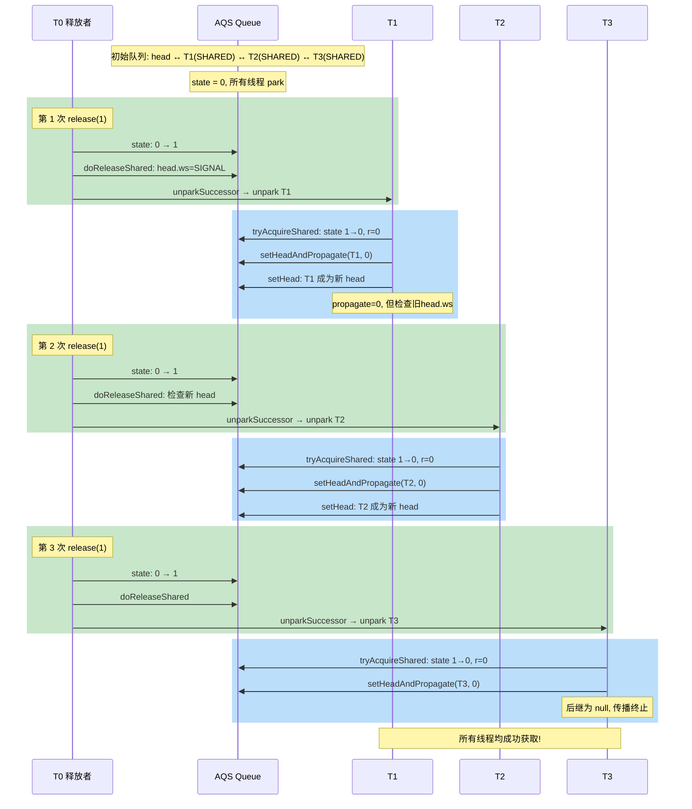
```mermaid
sequenceDiagram
    participant T0 as T0 释放者
    participant Q as AQS Queue
    participant T1 as T1
    participant T2 as T2
    participant T3 as T3

    Note over Q: 初始队列: head ↔ T1(SHARED) ↔ T2(SHARED) ↔ T3(SHARED)
    Note over Q: state = 0, 所有线程 park

    rect rgb(200,230,201)
        Note over T0: 第 1 次 release(1)
        T0->>Q: state: 0 → 1
        T0->>Q: doReleaseShared: head.ws=SIGNAL
        T0->>T1: unparkSuccessor → unpark T1
    end

    rect rgb(187,222,251)
        T1->>Q: tryAcquireShared: state 1→0, r=0
        T1->>Q: setHeadAndPropagate(T1, 0)
        T1->>Q: setHead: T1 成为新 head
        Note over T1: propagate=0, 但检查旧head.ws
    end

    rect rgb(200,230,201)
        Note over T0: 第 2 次 release(1)
        T0->>Q: state: 0 → 1
        T0->>Q: doReleaseShared: 检查新 head
        T0->>T2: unparkSuccessor → unpark T2
    end

    rect rgb(187,222,251)
        T2->>Q: tryAcquireShared: state 1→0, r=0
        T2->>Q: setHeadAndPropagate(T2, 0)
        T2->>Q: setHead: T2 成为新 head
    end

    rect rgb(200,230,201)
        Note over T0: 第 3 次 release(1)
        T0->>Q: state: 0 → 1
        T0->>Q: doReleaseShared
        T0->>T3: unparkSuccessor → unpark T3
    end

    rect rgb(187,222,251)
        T3->>Q: tryAcquireShared: state 1→0, r=0
        T3->>Q: setHeadAndPropagate(T3, 0)
        Note over T3: 后继为 null, 传播终止
    end

    Note over T1,T3: 所有线程均成功获取!
```

上面展示的是逐个释放的场景。更激动人心的是 `CountDownLatch` 的场景——当最后一次 `countDown()` 将 state 变为 0 时，一次 `doReleaseShared` 触发链式唤醒，瞬间传播到队列中的所有 SHARED 节点：

```java
// CountDownLatch 的 tryAcquireShared 实现
// state == 0 时返回 1 (正数)，表示有"剩余资源"（概念上的）
// state != 0 时返回 -1，表示获取失败
protected int tryAcquireShared(int acquires) {
    return (getState() == 0) ? 1 : -1;  // 巧妙！state=0后所有线程都能获取
}
```

当 `state` 变为 0 后，每个被唤醒的线程调用 `tryAcquireShared` 都返回 1（正数），于是 `setHeadAndPropagate` 中 `propagate > 0` 为真，立即调用 `doReleaseShared` 唤醒下一个——形成了雪崩式的链式唤醒。

#### 独占模式 vs 共享模式的 release 对比

为了加深理解，我们将两种模式的释放流程做一个全面对比：

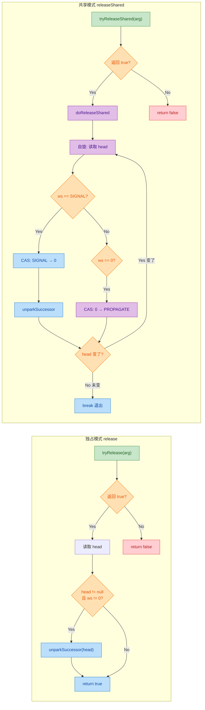
```mermaid
graph LR
    subgraph Exclusive["独占模式 release"]
        direction TB
        E1["tryRelease(arg)"]
        E2{"返回 true?"}
        E3["读取 head"]
        E4{"head != null<br/>且 ws != 0?"}
        E5["unparkSuccessor(head)"]
        E6["return true"]
        E7["return false"]

        E1 --> E2
        E2 -->|Yes| E3
        E2 -->|No| E7
        E3 --> E4
        E4 -->|Yes| E5
        E5 --> E6
        E4 -->|No| E6
    end

    subgraph Shared["共享模式 releaseShared"]
        direction TB
        S1["tryReleaseShared(arg)"]
        S2{"返回 true?"}
        S3["doReleaseShared"]
        S4["自旋: 读取 head"]
        S5{"ws == SIGNAL?"}
        S6["CAS: SIGNAL → 0"]
        S7["unparkSuccessor"]
        S8{"ws == 0?"}
        S9["CAS: 0 → PROPAGATE"]
        S10{"head 变了?"}
        S11["break 退出"]
        S12["return false"]

        S1 --> S2
        S2 -->|Yes| S3
        S2 -->|No| S12
        S3 --> S4
        S4 --> S5
        S5 -->|Yes| S6
        S6 --> S7
        S7 --> S10
        S5 -->|No| S8
        S8 -->|Yes| S9
        S9 --> S10
        S10 -->|No 未变| S11
        S10 -->|Yes 变了| S4
    end

    classDef greenNode fill:#C8E6C9,stroke:#388E3C,color:#1B5E20
    classDef blueNode fill:#BBDEFB,stroke:#1976D2,color:#0D47A1
    classDef orangeNode fill:#FFE0B2,stroke:#F57C00,color:#E65100
    classDef redNode fill:#FFCDD2,stroke:#E53935,color:#B71C1C
    classDef purpleNode fill:#E1BEE7,stroke:#8E24AA,color:#4A148C

    class E1,S1 greenNode
    class E2,S2,E4,S5,S8,S10 orangeNode
    class E5,E6,S6,S7,S11 blueNode
    class E7,S12 redNode
    class S3,S4,S9 purpleNode
```

核心区别总结如下：

| 对比维度 | 独占模式 `release` | 共享模式 `releaseShared` |
|---------|-------------------|------------------------|
| **释放线程数** | 只有持锁线程能释放 | 多个线程可同时释放 |
| **唤醒范围** | 只唤醒一个后继节点 | 链式唤醒多个共享节点 |
| **并发安全** | 无需 CAS（单线程释放） | 必须 CAS（多线程并发） |
| **PROPAGATE** | 不涉及 | 作为信号痕迹防止丢失 |
| **退出条件** | 一次性执行 | 自旋直到 head 不变 |
| **调用来源** | 仅释放路径 | 释放路径 + 获取传播路径 |

#### 共享模式在 JUC 工具类中的应用

最后，让我们梳理一下共享模式在常见 JUC 工具中的具体应用，这能帮助我们将抽象的 AQS 机制与实际使用场景对应起来：

```java
// ==================== Semaphore ====================
// tryAcquireShared: CAS 减少 state (可用许可数)
//   返回 remaining (剩余许可数, >= 0 成功, < 0 失败)
// tryReleaseShared: CAS 增加 state, 始终返回 true
//   → 每次 release 都触发 doReleaseShared

// ==================== CountDownLatch ====================
// tryAcquireShared: 检查 state == 0
//   state==0 返回 1 (成功), 否则返回 -1 (失败)
// tryReleaseShared: CAS 将 state 减 1
//   只有 state 从 1 变为 0 时才返回 true
//   → 只触发一次 doReleaseShared, 但会链式传播唤醒所有等待线程

// ==================== ReadWriteLock (读锁) ====================
// tryAcquireShared: 检查是否有写锁被持有 (排斥)
//   无写锁时 CAS 增加读锁计数 (state 高 16 位)
//   返回 1 (成功) 或 -1 (失败)
// tryReleaseShared: CAS 减少读锁计数
//   只有读锁计数变为 0 时返回 true
//   → 唤醒可能在等待的写锁线程
```

---

**📝 练习题**

在 AQS 共享模式中，`doReleaseShared` 方法尝试将 head 的 `waitStatus` 从 0 CAS 设置为 `PROPAGATE (-3)`。请问这个操作的**主要目的**是什么？

A. 防止 `unparkSuccessor` 被重复调用，避免多次唤醒同一线程


B. 标记 head 节点已被取消，让后续线程跳过该节点


C. 作为信号痕迹，确保 `setHeadAndPropagate` 中即使 `propagate == 0` 也能检测到需要继续传播唤醒，避免信号丢失


D. 将 head 节点标记为共享模式，区分独占模式和共享模式的节点


**【答案】** C

**【解析】** `PROPAGATE` 状态是 Doug Lea 在修复一个真实的并发 bug 时引入的。问题场景是：线程 A 在 `tryAcquireShared` 获得返回值 0（刚好用完资源），但在它执行 `setHeadAndPropagate` 之前，线程 B 调用了 `releaseShared` 释放了新的资源。如果 `setHeadAndPropagate` 只检查 `propagate > 0`，线程 A 会认为"没有剩余资源，不需要唤醒后继"，而线程 B 的 `doReleaseShared` 可能因为 head 还没更新而错过唤醒机会。这导致队列中后续的等待线程永远无法被唤醒（signal lost）。`PROPAGATE` 状态正是为了在 `doReleaseShared` 中留下一个"有人释放过资源"的痕迹（`ws==0 → PROPAGATE`），让 `setHeadAndPropagate` 通过 `h.waitStatus < 0` 检测到这个痕迹，从而触发 `doReleaseShared` 继续传播唤醒。选项 A 描述的是 CAS `SIGNAL→0` 的作用而非 `0→PROPAGATE`；选项 B 和 D 完全不符合 `PROPAGATE` 的语义。

---

## 模板方法

AQS 的精髓在于它采用了经典的 **模板方法模式 (Template Method Pattern)**。Doug Lea 在设计 AQS 时，将同步器的 **骨架流程**（入队、阻塞、唤醒、出队）全部固化在 AQS 的 `final` 方法中，而将 **"什么条件下算获取成功、什么条件下算释放成功"** 这一核心判定逻辑，以 `protected` 非 `final` 方法的形式留给子类去实现。这种设计使得 `ReentrantLock`、`Semaphore`、`CountDownLatch`、`ReentrantReadWriteLock` 等差异巨大的同步工具，可以共享同一套排队与唤醒基础设施，仅在语义层面各自定制。

理解模板方法，就是理解 **AQS "不变的骨架" 与 "可变的策略" 之间的分界线**。

```mermaid
graph LR
    subgraph SG_SKELETON["AQS 骨架方法 (Final, 不可重写)"]
        direction TB
        A["acquire(int arg)"]
        B["acquireShared(int arg)"]
        C["release(int arg)"]
        D["releaseShared(int arg)"]
    end

    subgraph SG_HOOK["模板钩子方法 (Protected, 子类重写)"]
        direction TB
        E["tryAcquire(int arg)"]
        F["tryAcquireShared(int arg)"]
        G["tryRelease(int arg)"]
        H["tryReleaseShared(int arg)"]
        I["isHeldExclusively()"]
    end

    subgraph SG_IMPL["典型子类实现"]
        direction TB
        J["ReentrantLock.Sync"]
        K["Semaphore.Sync"]
        L["CountDownLatch.Sync"]
        M["ReentrantReadWriteLock"]
    end

    A -->|"内部调用"| E
    B -->|"内部调用"| F
    C -->|"内部调用"| G
    D -->|"内部调用"| H

    E --- J
    F --- K
    F --- L
    G --- J
    H --- K
    H --- L
    I --- M

    classDef skeletonCls fill:#E3F2FD,stroke:#1565C0,color:#0D47A1,stroke-width:2px
    classDef hookCls fill:#FFF3E0,stroke:#E65100,color:#BF360C,stroke-width:2px
    classDef implCls fill:#E8F5E9,stroke:#2E7D32,color:#1B5E20,stroke-width:2px

    class A,B,C,D skeletonCls
    class E,F,G,H,I hookCls
    class J,K,L,M implCls
```

上图清晰地展示了三层结构：**蓝色** 是 AQS 已经写死的流程控制方法（骨架），**橙色** 是留给子类填充的钩子方法（策略），**绿色** 是真正落地的同步器实现类。骨架方法在内部调用钩子方法，钩子方法由子类提供具体逻辑——这就是 Template Method Pattern 在 AQS 中的完整体现。

### AQS 中模板方法的默认实现

在深入每个方法之前，必须先了解一个关键的设计决策：**AQS 的五个钩子方法，默认实现全部直接抛出 `UnsupportedOperationException`**。

```java
// ==================== AQS 源码：默认实现 ====================

// 独占获取 —— 默认抛异常，强制子类重写
protected boolean tryAcquire(int arg) {
    throw new UnsupportedOperationException(); // 子类不重写就直接报错
}

// 独占释放 —— 默认抛异常
protected boolean tryRelease(int arg) {
    throw new UnsupportedOperationException();
}

// 共享获取 —— 默认抛异常
protected int tryAcquireShared(int arg) {
    throw new UnsupportedOperationException();
}

// 共享释放 —— 默认抛异常
protected boolean tryReleaseShared(int arg) {
    throw new UnsupportedOperationException();
}

// 是否独占持有 —— 默认抛异常
protected boolean isHeldExclusively() {
    throw new UnsupportedOperationException();
}
```

为什么不用 `abstract` 修饰？原因非常实际：**一个同步器通常只需要实现独占模式或共享模式中的一种**。如果将五个方法都声明为 `abstract`，那么 `ReentrantLock`（只用独占模式）也必须空实现 `tryAcquireShared` 和 `tryReleaseShared`，而 `Semaphore`（只用共享模式）也必须空实现 `tryAcquire` 和 `tryRelease`，这会产生大量无意义的空方法。因此 Doug Lea 选择了 "默认抛异常" 的策略——**子类只重写自己需要的那一组方法**，不需要的方法保持默认实现即可，一旦意外调用就会立刻暴露错误。

```mermaid
graph LR
    subgraph SG_EXCL["独占模式同步器"]
        direction TB
        RL["ReentrantLock.Sync"]
        RL_M1["tryAcquire ✅ 重写"]
        RL_M2["tryRelease ✅ 重写"]
        RL_M3["isHeldExclusively ✅ 重写"]
        RL_M4["tryAcquireShared ❌ 不重写"]
        RL_M5["tryReleaseShared ❌ 不重写"]
        RL --> RL_M1
        RL --> RL_M2
        RL --> RL_M3
        RL --> RL_M4
        RL --> RL_M5
    end

    subgraph SG_SHARED["共享模式同步器"]
        direction TB
        SM["Semaphore.Sync"]
        SM_M1["tryAcquireShared ✅ 重写"]
        SM_M2["tryReleaseShared ✅ 重写"]
        SM_M3["tryAcquire ❌ 不重写"]
        SM_M4["tryRelease ❌ 不重写"]
        SM_M5["isHeldExclusively ❌ 不重写"]
        SM --> SM_M1
        SM --> SM_M2
        SM --> SM_M3
        SM --> SM_M4
        SM --> SM_M5
    end

    subgraph SG_BOTH["混合模式同步器"]
        direction TB
        RW["ReentrantReadWriteLock.Sync"]
        RW_M1["tryAcquire ✅"]
        RW_M2["tryRelease ✅"]
        RW_M3["tryAcquireShared ✅"]
        RW_M4["tryReleaseShared ✅"]
        RW_M5["isHeldExclusively ✅"]
        RW --> RW_M1
        RW --> RW_M2
        RW --> RW_M3
        RW --> RW_M4
        RW --> RW_M5
    end

    classDef headerCls fill:#E8EAF6,stroke:#283593,color:#1A237E,stroke-width:2px
    classDef yesCls fill:#C8E6C9,stroke:#2E7D32,color:#1B5E20
    classDef noCls fill:#FFCDD2,stroke:#C62828,color:#B71C1C

    class RL,SM,RW headerCls
    class RL_M1,RL_M2,RL_M3,SM_M1,SM_M2,RW_M1,RW_M2,RW_M3,RW_M4,RW_M5 yesCls
    class RL_M4,RL_M5,SM_M3,SM_M4,SM_M5 noCls
```

可以看到，只有 `ReentrantReadWriteLock` 这种 **同时支持独占写锁和共享读锁** 的同步器，才需要五个方法全部重写。

---

### tryAcquire（独占获取）

`tryAcquire(int arg)` 是独占模式的核心钩子。它的职责极其明确：**尝试以独占方式获取同步状态，成功返回 `true`，失败返回 `false`**。AQS 骨架方法 `acquire()` 会在第一步调用它，如果返回 `true` 则线程直接获取到锁继续执行；如果返回 `false`，线程进入 CLH 等待队列排队。

```java
// ==================== AQS 骨架：acquire 中对 tryAcquire 的调用 ====================
public final void acquire(int arg) {
    // 第一步：调用子类实现的 tryAcquire 尝试快速获取
    if (!tryAcquire(arg) &&
        // 第二步：快速获取失败，包装成 Node 加入等待队列，然后自旋+阻塞
        acquireQueued(addWaiter(Node.EXCLUSIVE), arg))
        // 第三步：如果在排队过程中被中断过，重新设置中断标志
        selfInterrupt();
}
```

**方法签名与语义契约：**

| 要素 | 说明 |
|------|------|
| 参数 `arg` | 获取的资源数量，对 `ReentrantLock` 来说固定为 1 |
| 返回值 `true` | 获取成功，当前线程持有了同步状态 |
| 返回值 `false` | 获取失败，AQS 将安排该线程排队等待 |
| 线程安全 | 实现中必须保证线程安全（通常依靠 CAS） |
| 可重入 | 如果同步器需要支持可重入，须在此方法中自行处理 |

下面以 `ReentrantLock` 的 **非公平锁 (NonfairSync)** 和 **公平锁 (FairSync)** 为例，完整展示 `tryAcquire` 的两种典型实现：

```java
// ==================== 非公平锁的 tryAcquire ====================
// ReentrantLock.NonfairSync（实际委托给 Sync.nonfairTryAcquire）

protected final boolean tryAcquire(int acquires) {
    return nonfairTryAcquire(acquires); // 委托给父类 Sync 的通用方法
}

// Sync.nonfairTryAcquire —— 非公平获取的核心逻辑
final boolean nonfairTryAcquire(int acquires) {
    // 获取当前请求锁的线程
    final Thread current = Thread.currentThread();
    // 读取 AQS 的 state 值（0 表示未被持有，>0 表示已被持有）
    int c = getState();

    if (c == 0) {
        // ========== 锁空闲 ==========
        // 非公平：不检查队列中是否有等待者，直接 CAS 抢锁
        if (compareAndSetState(0, acquires)) {
            // CAS 成功，将当前线程设置为独占拥有者
            setExclusiveOwnerThread(current);
            return true; // 获取成功
        }
        // CAS 失败说明被其他线程抢先了，继续往下返回 false
    }
    else if (current == getExclusiveOwnerThread()) {
        // ========== 重入场景 ==========
        // 当前线程就是锁的持有者，执行重入逻辑
        int nextc = c + acquires; // state 累加
        if (nextc < 0) // 溢出检查（极端情况下重入次数超过 int 最大值）
            throw new Error("Maximum lock count exceeded");
        // 此处无需 CAS：只有持有锁的线程才能走到这里，不存在竞争
        setState(nextc);
        return true; // 重入获取成功
    }

    return false; // 锁被其他线程持有，获取失败
}
```

```java
// ==================== 公平锁的 tryAcquire ====================
// ReentrantLock.FairSync

protected final boolean tryAcquire(int acquires) {
    // 获取当前请求锁的线程
    final Thread current = Thread.currentThread();
    // 读取 state
    int c = getState();

    if (c == 0) {
        // ========== 锁空闲 ==========
        // 公平锁的关键差异：先检查队列中是否有排在前面的等待者
        if (!hasQueuedPredecessors() &&  // 队列中没有比当前线程等待更久的
            compareAndSetState(0, acquires)) {   // 再 CAS 抢锁
            setExclusiveOwnerThread(current);    // 设置独占拥有者
            return true;                         // 获取成功
        }
    }
    else if (current == getExclusiveOwnerThread()) {
        // ========== 重入场景（与非公平锁完全一致）==========
        int nextc = c + acquires;
        if (nextc < 0)
            throw new Error("Maximum lock count exceeded");
        setState(nextc);
        return true;
    }

    return false; // 获取失败
}
```

**非公平 vs 公平的核心差异只在一行代码**：`hasQueuedPredecessors()`。这个方法检查 CLH 队列中是否存在等待时间更长的线程。公平锁在 `state == 0` 时会先礼让队列中的先到者，而非公平锁则直接插队竞争。

```mermaid
graph LR
    subgraph SG_UNFAIR["非公平锁 tryAcquire"]
        direction TB
        U1["读取 state"]
        U2{"state == 0 ?"}
        U3["CAS 抢锁"]
        U4{"CAS 成功 ?"}
        U5["设置 ownerThread, return true"]
        U6{"当前线程 == owner ?"}
        U7["state += acquires, return true"]
        U8["return false"]

        U1 --> U2
        U2 -->|"是"| U3
        U2 -->|"否"| U6
        U3 --> U4
        U4 -->|"成功"| U5
        U4 -->|"失败"| U8
        U6 -->|"是 (重入)"| U7
        U6 -->|"否"| U8
    end

    subgraph SG_FAIR["公平锁 tryAcquire"]
        direction TB
        F1["读取 state"]
        F2{"state == 0 ?"}
        F3{"hasQueuedPredecessors ?"}
        F4["CAS 抢锁"]
        F5{"CAS 成功 ?"}
        F6["设置 ownerThread, return true"]
        F7{"当前线程 == owner ?"}
        F8["state += acquires, return true"]
        F9["return false"]

        F1 --> F2
        F2 -->|"是"| F3
        F2 -->|"否"| F7
        F3 -->|"无前驱者"| F4
        F3 -->|"有前驱者"| F9
        F4 --> F5
        F5 -->|"成功"| F6
        F5 -->|"失败"| F9
        F7 -->|"是 (重入)"| F8
        F7 -->|"否"| F9
    end

    classDef startCls fill:#E3F2FD,stroke:#1565C0,color:#0D47A1
    classDef decisionCls fill:#FFF8E1,stroke:#F57F17,color:#E65100
    classDef successCls fill:#C8E6C9,stroke:#2E7D32,color:#1B5E20
    classDef failCls fill:#FFCDD2,stroke:#C62828,color:#B71C1C

    class U1,F1 startCls
    class U2,U4,U6,F2,F3,F5,F7 decisionCls
    class U5,U7,F6,F8 successCls
    class U8,F9 failCls
```

**实现 `tryAcquire` 时的注意事项：**

1. **必须使用 CAS 操作修改 `state`**，绝不能直接 `setState`（除非你已经确认当前线程就是锁的持有者，例如重入场景）。
2. **返回值语义必须准确**：`true` 意味着调用线程已经成功获取了同步状态，AQS 后续不会再安排该线程排队。
3. **可重入需要自行实现**：AQS 不提供任何重入支持，子类需要自行检查 `getExclusiveOwnerThread()` 并累加 `state`。
4. **此方法应当是非阻塞的**（non-blocking）：只做一次尝试就返回，阻塞逻辑由 AQS 骨架负责。

---

### tryRelease（独占释放）

`tryRelease(int arg)` 与 `tryAcquire` 相对应，是独占模式的释放钩子。它的职责是：**尝试释放同步状态，如果释放后同步器完全空闲（state 归零），返回 `true`，通知 AQS 去唤醒队列中的后继节点；否则返回 `false`（例如可重入锁还没有完全释放）**。

```java
// ==================== AQS 骨架：release 中对 tryRelease 的调用 ====================
public final boolean release(int arg) {
    // 调用子类实现的 tryRelease
    if (tryRelease(arg)) {
        // tryRelease 返回 true —— 同步状态已完全释放
        Node h = head; // 拿到队列的头节点（即当前持有锁的虚拟节点）
        if (h != null && h.waitStatus != 0)
            // 头节点存在且 waitStatus 不为 0，唤醒后继节点
            unparkSuccessor(h);
        return true;  // 释放成功
    }
    return false; // 释放未完成（例如重入锁还需要多次 release）
}
```

下面看 `ReentrantLock.Sync` 中 `tryRelease` 的实现：

```java
// ==================== ReentrantLock.Sync.tryRelease ====================
protected final boolean tryRelease(int releases) {
    // 计算释放后的 state 值
    int c = getState() - releases;

    // 安全检查：只有持有锁的线程才能释放锁
    if (Thread.currentThread() != getExclusiveOwnerThread())
        throw new IllegalMonitorStateException(); // 非法释放，直接抛异常

    // free 标记：本次释放后锁是否完全自由
    boolean free = false;

    if (c == 0) {
        // state 降为 0，说明所有重入层次都已释放
        free = true;
        // 清空独占拥有者（锁变为可用状态）
        setExclusiveOwnerThread(null);
    }

    // 更新 state（此处无需 CAS，因为只有持锁线程能执行到这里）
    setState(c);

    // 返回 true 表示锁已完全释放，AQS 应唤醒后继
    // 返回 false 表示还有重入层次未释放，暂不唤醒
    return free;
}
```

**可重入释放的关键理解：** 假设线程 A 对同一把锁执行了 3 次 `lock()`（state 从 0 → 1 → 2 → 3），那么必须对应执行 3 次 `unlock()`。前两次 `tryRelease` 返回 `false`（state 分别降为 2、1），第三次 `tryRelease` 返回 `true`（state 降为 0），此时 AQS 才会执行 `unparkSuccessor` 唤醒队列中下一个等待的线程。

```java
// ==================== 可重入释放的 state 变化过程（示意） ====================
//
//  lock()  → state: 0 → 1  (首次获取)
//  lock()  → state: 1 → 2  (第一次重入)
//  lock()  → state: 2 → 3  (第二次重入)
//
//  unlock() → state: 3 → 2  → tryRelease returns false (不唤醒)
//  unlock() → state: 2 → 1  → tryRelease returns false (不唤醒)
//  unlock() → state: 1 → 0  → tryRelease returns true  (唤醒后继!)
//                               setExclusiveOwnerThread(null)
```

**`tryRelease` 与 `tryAcquire` 的对称性：**

| 维度 | tryAcquire | tryRelease |
|------|-----------|------------|
| 调用时机 | `acquire()` 骨架方法中第一步 | `release()` 骨架方法中第一步 |
| 成功含义 | 线程获得了同步状态 | 同步状态完全释放（state == 0） |
| 失败含义 | 获取不到，线程需要排队 | 尚未完全释放（重入场景） |
| 线程安全 | 需要 CAS（多线程竞争） | 无需 CAS（只有持锁线程调用） |
| 可重入处理 | state 累加 | state 递减 |

---

### tryAcquireShared（共享获取）

`tryAcquireShared(int arg)` 是共享模式的获取钩子。与独占模式的布尔返回值不同，共享模式使用 **`int` 返回值** 来传达更丰富的语义：

| 返回值 | 含义 |
|--------|------|
| **负数 (< 0)** | 获取失败，线程需要进入等待队列 |
| **零 (== 0)** | 获取成功，但后续线程不能再获取（共享资源已耗尽） |
| **正数 (> 0)** | 获取成功，且后续线程也可能获取成功（还有剩余资源），返回值通常代表剩余可用资源数 |

之所以用 `int` 而不是 `boolean`，是因为共享模式有一个关键的 **传播 (PROPAGATE)** 机制：当返回值 > 0 时，AQS 会连锁唤醒队列中后续等待共享资源的节点，实现 "一次释放，多个线程同时获取" 的效果。

```java
// ==================== AQS 骨架：acquireShared 中对 tryAcquireShared 的调用 ====================
public final void acquireShared(int arg) {
    // 返回值 < 0 表示获取失败
    if (tryAcquireShared(arg) < 0)
        // 失败则进入共享模式的排队逻辑
        doAcquireShared(arg);
}
```

下面以 `Semaphore`（信号量）和 `CountDownLatch`（倒计时门闩）为例展示两种典型实现：

```java
// ==================== Semaphore.NonfairSync.tryAcquireShared ====================
// 非公平信号量：尝试获取 acquires 个许可

protected int tryAcquireShared(int acquires) {
    for (;;) { // 自旋 + CAS（可能需要多次重试）
        // 读取当前可用的许可数
        int available = getState();
        // 计算获取后的剩余许可数
        int remaining = available - acquires;

        if (remaining < 0 ||                    // 许可不足，直接返回负数（获取失败）
            compareAndSetState(available, remaining)) { // 许可充足，CAS 扣减
            // remaining < 0: 返回负数，AQS 安排线程排队
            // remaining >= 0 且 CAS 成功: 返回剩余数（>=0 均表示成功）
            return remaining;
        }
        // CAS 失败（其他线程抢先修改了 state），自旋重试
    }
}
```

```java
// ==================== Semaphore.FairSync.tryAcquireShared ====================
// 公平信号量：在非公平版本基础上增加队列检查

protected int tryAcquireShared(int acquires) {
    for (;;) {
        // 公平性检查：如果队列中有先到的等待者，直接返回 -1（获取失败）
        if (hasQueuedPredecessors())
            return -1;

        int available = getState();
        int remaining = available - acquires;

        if (remaining < 0 ||
            compareAndSetState(available, remaining)) {
            return remaining;
        }
    }
}
```

```java
// ==================== CountDownLatch.Sync.tryAcquireShared ====================
// CountDownLatch 的逻辑极其简单：state == 0 时放行，否则阻塞

protected int tryAcquireShared(int acquires) {
    // state == 0 意味着倒计时结束，所有等待线程都可以通过
    // 返回 1（正数）表示获取成功且后续线程也能成功 → 触发传播唤醒
    // 返回 -1（负数）表示获取失败，线程需要等待
    return (getState() == 0) ? 1 : -1;
}
```

`CountDownLatch` 的实现特别典雅——它完全不关心 `acquires` 参数，只看 `state` 是否为零。一旦为零，所有调用 `await()` 的线程都会被放行，返回正数 1 会触发 AQS 的传播机制，连锁唤醒所有等待者。

```mermaid
graph LR
    subgraph SG_SEM["Semaphore: tryAcquireShared"]
        direction TB
        S1["读取 available = state"]
        S2["remaining = available - acquires"]
        S3{"remaining < 0 ?"}
        S4["return remaining (负数, 失败)"]
        S5["CAS(available, remaining)"]
        S6{"CAS 成功 ?"}
        S7["return remaining (非负, 成功)"]
        S8["自旋重试"]

        S1 --> S2 --> S3
        S3 -->|"是"| S4
        S3 -->|"否"| S5
        S5 --> S6
        S6 -->|"成功"| S7
        S6 -->|"失败"| S8
        S8 --> S1
    end

    subgraph SG_CDL["CountDownLatch: tryAcquireShared"]
        direction TB
        C1["读取 state"]
        C2{"state == 0 ?"}
        C3["return 1 (成功, 传播唤醒)"]
        C4["return -1 (失败, 排队等待)"]

        C1 --> C2
        C2 -->|"是"| C3
        C2 -->|"否"| C4
    end

    classDef readCls fill:#E3F2FD,stroke:#1565C0,color:#0D47A1
    classDef decCls fill:#FFF8E1,stroke:#F57F17,color:#E65100
    classDef okCls fill:#C8E6C9,stroke:#2E7D32,color:#1B5E20
    classDef failCls fill:#FFCDD2,stroke:#C62828,color:#B71C1C
    classDef retryCls fill:#F3E5F5,stroke:#6A1B9A,color:#4A148C

    class S1,C1 readCls
    class S3,S6,C2 decCls
    class S7,C3 okCls
    class S4,C4 failCls
    class S8 retryCls
```

---

### tryReleaseShared（共享释放）

`tryReleaseShared(int arg)` 是共享模式的释放钩子。返回 `true` 时 AQS 会调用 `doReleaseShared()` 来唤醒等待队列中的线程。与独占模式释放不同，**共享释放可能被多个线程同时调用**，因此实现中必须使用 CAS 自旋来保证线程安全。

```java
// ==================== AQS 骨架：releaseShared ====================
public final boolean releaseShared(int arg) {
    // 调用子类实现的 tryReleaseShared
    if (tryReleaseShared(arg)) {
        // 释放成功，执行共享模式的唤醒传播逻辑
        doReleaseShared();
        return true;
    }
    return false;
}
```

```java
// ==================== Semaphore.Sync.tryReleaseShared ====================
// 信号量释放：归还许可

protected final boolean tryReleaseShared(int releases) {
    for (;;) { // CAS 自旋：多个线程可能同时释放许可
        // 读取当前许可数
        int current = getState();
        // 计算归还后的许可数
        int next = current + releases;

        // 溢出检查（理论上不应发生，防御性编程）
        if (next < current)
            throw new Error("Maximum permit count exceeded");

        // CAS 更新 state
        if (compareAndSetState(current, next))
            return true; // 释放成功，AQS 将唤醒等待的线程
        // CAS 失败，自旋重试
    }
}
```

```java
// ==================== CountDownLatch.Sync.tryReleaseShared ====================
// CountDownLatch 释放：每次调用 countDown() 将 state 减 1

protected boolean tryReleaseShared(int releases) {
    for (;;) { // CAS 自旋
        // 读取当前计数
        int c = getState();

        if (c == 0)
            return false; // 已经是 0 了，无需再释放，返回 false（不触发唤醒）

        // 计数减 1
        int nextc = c - 1;

        if (compareAndSetState(c, nextc))
            // 只有当计数从 1 降到 0 时才返回 true（触发唤醒所有等待者）
            return nextc == 0;
        // CAS 失败，自旋重试
    }
}
```

**`CountDownLatch` 的精妙之处**：只有最后一个调用 `countDown()` 使 state 从 1 变为 0 的线程才会返回 `true`，从而触发 `doReleaseShared()` 唤醒所有在 `await()` 上等待的线程。之前的所有 `countDown()` 调用都返回 `false`，不会触发任何唤醒动作。

**独占释放 vs 共享释放的关键对比：**

| 维度 | tryRelease (独占) | tryReleaseShared (共享) |
|------|-------------------|------------------------|
| 并发调用 | **不会**——只有持锁线程才能调用 | **会**——多个线程可同时释放 |
| 线程安全 | 无需 CAS，直接 `setState` | **必须 CAS 自旋** |
| 返回 `true` 含义 | 锁完全释放（state == 0） | 释放动作完成，应唤醒等待者 |
| 唤醒方式 | `unparkSuccessor`（只唤醒一个） | `doReleaseShared`（可传播唤醒多个） |

---

### isHeldExclusively

`isHeldExclusively()` 是一个相对特殊的钩子方法。它的语义是：**当前同步器是否正被调用线程以独占方式持有**。这个方法主要被 AQS 的 **Condition 机制** 使用——在执行 `await()`、`signal()` 等操作时，AQS 需要验证调用线程是否确实持有锁。

```java
// ==================== AQS 内部：Condition 中对 isHeldExclusively 的使用 ====================

// ConditionObject.signal() 方法中的校验
public final void signal() {
    // 调用 isHeldExclusively 检查当前线程是否持有独占锁
    if (!isHeldExclusively())
        // 如果没持有锁就调用 signal()，抛出 IllegalMonitorStateException
        // 这与 Object.notify() 在未持有 monitor 时抛异常是同一语义
        throw new IllegalMonitorStateException();
    // ... 后续唤醒逻辑
    Node first = firstWaiter;
    if (first != null)
        doSignal(first);
}

// ConditionObject.await() 方法中同样有类似校验
public final void await() throws InterruptedException {
    if (Thread.interrupted())
        throw new InterruptedException();
    // 将当前线程加入 Condition 等待队列
    Node node = addConditionWaiter();
    // 完全释放锁（savedState 保存重入次数以便后续恢复）
    int savedState = fullyRelease(node);
    // fullyRelease 内部也会间接依赖锁的持有状态
    // ...
}
```

下面是 `ReentrantLock.Sync` 中的实现：

```java
// ==================== ReentrantLock.Sync.isHeldExclusively ====================
protected final boolean isHeldExclusively() {
    // 简单直接：判断当前线程是否就是独占拥有者
    return getExclusiveOwnerThread() == Thread.currentThread();
}
```

实现极其简洁——只需比较 `exclusiveOwnerThread` 与当前线程即可。但要注意：**并非所有 AQS 子类都需要实现此方法**。只有当同步器需要配合 `ConditionObject` 使用时才必须重写。例如 `Semaphore` 和 `CountDownLatch` 就没有重写此方法（它们不支持 Condition）。

**`isHeldExclusively` 的使用场景总结：**

```mermaid
graph LR
    subgraph SG_CALLERS["调用 isHeldExclusively 的场景"]
        direction TB
        A["ConditionObject.signal()"]
        B["ConditionObject.signalAll()"]
        C["ConditionObject.awaitNanos()"]
        D["ConditionObject.awaitUntil()"]
        E["Thread.holdsLock() 语义等价"]
    end

    subgraph SG_IMPL_DETAIL["isHeldExclusively 实现"]
        direction TB
        F["getExclusiveOwnerThread()"]
        G["== Thread.currentThread() ?"]
        H["return true / false"]
        F --> G --> H
    end

    subgraph SG_RESULT["校验结果"]
        direction TB
        I["true: 继续执行 signal/await"]
        J["false: 抛出 IllegalMonitorStateException"]
    end

    A --> F
    B --> F
    C --> F
    D --> F
    H -->|"true"| I
    H -->|"false"| J

    classDef callerCls fill:#E8EAF6,stroke:#283593,color:#1A237E
    classDef implCls fill:#FFF3E0,stroke:#E65100,color:#BF360C
    classDef resultOkCls fill:#C8E6C9,stroke:#2E7D32,color:#1B5E20
    classDef resultFailCls fill:#FFCDD2,stroke:#C62828,color:#B71C1C

    class A,B,C,D,E callerCls
    class F,G,H implCls
    class I resultOkCls
    class J resultFailCls
```

---

### 五大钩子方法全景总结

将五个模板方法放在一起做最终的全景对比，有助于形成系统化认知：

```mermaid
graph LR
    subgraph SG_EXCL_ACQ["独占获取"]
        direction TB
        TA["tryAcquire(int arg)"]
        TA_R["返回: boolean"]
        TA_S["true=获取成功 / false=失败排队"]
        TA --> TA_R --> TA_S
    end

    subgraph SG_EXCL_REL["独占释放"]
        direction TB
        TR["tryRelease(int arg)"]
        TR_R["返回: boolean"]
        TR_S["true=完全释放,唤醒后继 / false=未完全释放"]
        TR --> TR_R --> TR_S
    end

    subgraph SG_SHARE_ACQ["共享获取"]
        direction TB
        TSA["tryAcquireShared(int arg)"]
        TSA_R["返回: int"]
        TSA_S["负数=失败 / 0=成功无剩余 / 正数=成功有剩余"]
        TSA --> TSA_R --> TSA_S
    end

    subgraph SG_SHARE_REL["共享释放"]
        direction TB
        TSR["tryReleaseShared(int arg)"]
        TSR_R["返回: boolean"]
        TSR_S["true=应唤醒等待者 / false=无需唤醒"]
        TSR --> TSR_R --> TSR_S
    end

    subgraph SG_HELD["独占持有查询"]
        direction TB
        IH["isHeldExclusively()"]
        IH_R["返回: boolean"]
        IH_S["供 Condition 机制校验使用"]
        IH --> IH_R --> IH_S
    end

    classDef exclCls fill:#E3F2FD,stroke:#1565C0,color:#0D47A1,stroke-width:2px
    classDef shareCls fill:#FFF3E0,stroke:#E65100,color:#BF360C,stroke-width:2px
    classDef heldCls fill:#F3E5F5,stroke:#6A1B9A,color:#4A148C,stroke-width:2px
    classDef detailCls fill:#FAFAFA,stroke:#9E9E9E,color:#424242

    class TA,TR exclCls
    class TSA,TSR shareCls
    class IH heldCls
    class TA_R,TA_S,TR_R,TR_S,TSA_R,TSA_S,TSR_R,TSR_S,IH_R,IH_S detailCls
```

**自定义同步器的实现口诀：**

1. 继承 `AbstractQueuedSynchronizer`，通常以 **静态内部类** 的形式（命名为 `Sync`）。
2. 确定模式：独占 → 重写 `tryAcquire` + `tryRelease`；共享 → 重写 `tryAcquireShared` + `tryReleaseShared`；混合 → 全部重写。
3. 如需 Condition 支持 → 额外重写 `isHeldExclusively`。
4. 在外部类的 `lock()`/`unlock()`/`await()` 等方法中，委托调用 AQS 的骨架方法（`acquire`/`release`/`acquireShared`/`releaseShared`）。
5. **永远用 CAS 修改 state**（除非当前线程已独占持有锁）。

---

**📝 练习题**

以下关于 AQS 模板方法的说法，**正确** 的是？

A. `tryAcquire` 被声明为 `abstract`，子类必须实现它，否则编译报错


B. `tryAcquireShared` 返回 0 表示获取失败，线程需要进入等待队列


C. `tryRelease` 在 `ReentrantLock` 中无需使用 CAS，因为只有持有锁的线程才会调用该方法


D. `isHeldExclusively` 在所有 AQS 子类中都必须重写，否则同步器无法正常工作


**【答案】** C

**【解析】**

- **A 错误**：AQS 的五个钩子方法都不是 `abstract` 的，它们的默认实现是抛出 `UnsupportedOperationException`。这种设计允许子类只重写自己需要的方法组合，而不必为不使用的模式提供空实现。
- **B 错误**：`tryAcquireShared` 返回 0 表示 **获取成功，但后续线程不能再获取**（共享资源恰好耗尽）。只有返回 **负数** 才表示获取失败。AQS 骨架中的判断条件是 `if (tryAcquireShared(arg) < 0)` 才进入排队逻辑，返回 0 不满足该条件，因此不会排队。
- **C 正确**：在 `ReentrantLock.Sync.tryRelease()` 中，使用的是 `setState(c)` 而非 CAS。这是安全的，因为独占模式下只有持有锁的线程才能执行 `tryRelease`，不存在并发竞争。相比之下，`tryReleaseShared` 则必须使用 CAS，因为多个线程可能同时释放共享资源。
- **D 错误**：`isHeldExclusively` 只在需要使用 `ConditionObject`（如 `Condition.signal()`）时才需要重写。`Semaphore` 和 `CountDownLatch` 都没有重写此方法，它们运行得完全正常。

---

## ReentrantLock 源码分析 ⭐

ReentrantLock 是 AQS 框架最经典、最核心的实现类之一，也是理解 AQS 从理论走向实践的最佳切入点。前面章节我们已经深入剖析了 AQS 的同步队列、独占模式的 acquire/release 流程以及模板方法的设计哲学。本节将以 JDK 源码为基础，逐行拆解 ReentrantLock 的**非公平锁 lock 流程**、**公平锁 lock 流程**以及**unlock 流程**，让你真正看到 AQS 的"骨架"如何被"血肉"填充。

在正式进入源码之前，我们需要先建立 ReentrantLock 的整体类结构认知。ReentrantLock 内部采用了**策略模式（Strategy Pattern）**，通过一个抽象内部类 `Sync` 以及它的两个子类 `NonfairSync`、`FairSync` 来分别实现非公平和公平两种加锁策略。而 `Sync` 本身继承了 `AbstractQueuedSynchronizer`，这就是"**组合优于继承**"和"**模板方法**"两大设计思想在并发框架中的完美结合。

```mermaid
graph LR
    subgraph AQS_Framework["AQS 框架层"]
        direction TB
        AQS["AbstractQueuedSynchronizer<br/>state / CLH Queue / acquire / release"]
    end

    subgraph Sync_Layer["Sync 抽象层"]
        direction TB
        Sync["Sync (abstract)<br/>nonfairTryAcquire()<br/>tryRelease()"]
    end

    subgraph Impl_Layer["具体策略层"]
        direction TB
        NonfairSync["NonfairSync<br/>tryAcquire()"]
        FairSync["FairSync<br/>tryAcquire()"]
    end

    subgraph API_Layer["API 层"]
        direction TB
        ReentrantLock["ReentrantLock<br/>lock() / unlock() / tryLock()"]
    end

    AQS --> Sync
    Sync --> NonfairSync
    Sync --> FairSync
    ReentrantLock --> NonfairSync
    ReentrantLock --> FairSync

    classDef greenNode fill:#C8E6C9,stroke:#388E3C,color:#1B5E20
    classDef blueNode fill:#BBDEFB,stroke:#1976D2,color:#0D47A1
    classDef orangeNode fill:#FFE0B2,stroke:#F57C00,color:#E65100
    classDef tealNode fill:#B2DFDB,stroke:#00897B,color:#004D40

    class API_Layer,ReentrantLock greenNode
    class Sync_Layer,Sync blueNode
    class Impl_Layer,NonfairSync,FairSync tealNode
    class AQS_Framework,AQS orangeNode
```

ReentrantLock 的构造函数极其简洁——默认无参构造创建**非公平锁**，传入 `true` 则创建**公平锁**：

```java
// ReentrantLock 构造函数
public ReentrantLock() {
    sync = new NonfairSync();  // 默认非公平锁，性能更优
}

public ReentrantLock(boolean fair) {
    sync = fair ? new FairSync() : new NonfairSync();  // 由调用者选择公平策略
}
```

这里的 `sync` 字段就是实际委托的 AQS 子类实例，ReentrantLock 所有的 `lock()`、`unlock()`、`tryLock()` 操作，最终都会转发到这个 `sync` 对象上。

在 ReentrantLock 的语义中，**AQS 的 `state` 变量被赋予了"重入计数器"的含义**：`state == 0` 表示锁未被任何线程持有；`state > 0` 表示锁已被某线程持有，且值等于该线程的重入次数。同时，AQS 的 `exclusiveOwnerThread` 字段记录了当前持有锁的线程引用，用于判断重入。

```text
┌─────────────────────────────────────────────┐
│            AQS state 语义映射                │
├──────────────┬──────────────────────────────┤
│  state == 0  │  锁空闲，无线程持有            │
│  state == 1  │  锁被线程 T 首次获取           │
│  state == 2  │  线程 T 重入了一次（共持有2次） │
│  state == N  │  线程 T 重入了 N-1 次          │
├──────────────┴──────────────────────────────┤
│  exclusiveOwnerThread == T                   │
│  → 标识当前持有锁的线程                       │
└─────────────────────────────────────────────┘
```

理解了这个映射关系，后续所有的源码逻辑都会变得水到渠成。

---

### 非公平锁 lock 流程

非公平锁（NonfairSync）是 ReentrantLock 的**默认策略**，也是绝大多数生产环境的首选。所谓"非公平"，并不是说它完全不讲规矩，而是指**新来的线程在尝试获取锁时，不需要检查等待队列中是否有排在前面的线程**——它会直接尝试 CAS 抢锁，抢到了就用，抢不到再老老实实排队。这种策略在高并发场景下可以**显著减少线程的上下文切换次数**，从而获得更高的吞吐量。

我们从 `lock()` 方法的入口开始，一路追踪到最底层：

```java
// ReentrantLock#lock() —— 用户调用的入口
public void lock() {
    sync.acquire(1);  // 委托给 sync 对象，参数 1 表示获取一次锁
}
```

在 JDK 早期版本（如 JDK 8）中，`NonfairSync` 的 `lock()` 方法会先用一次"快速 CAS"尝试直接抢锁，再调用 `acquire(1)`。但在较新的 JDK 版本中（JDK 9+），这个快速路径被合并进了 `tryAcquire` 中，整体逻辑更统一。我们以经典的 JDK 8 源码为主线讲解，同时标注演进变化。

#### JDK 8 中 NonfairSync 的完整源码

```java
// NonfairSync —— 非公平同步器
static final class NonfairSync extends Sync {

    // 非公平锁的 lock 入口
    final void lock() {
        // 第一步：上来就直接 CAS 尝试将 state 从 0 改为 1（插队抢锁）
        if (compareAndSetState(0, 1))
            // CAS 成功，说明锁原本空闲，当前线程直接获得锁
            setExclusiveOwnerThread(Thread.currentThread());
        else
            // CAS 失败，说明锁已被占用，走 AQS 标准 acquire 流程
            acquire(1);
    }

    // 重写 AQS 的模板方法 tryAcquire
    protected final boolean tryAcquire(int acquires) {
        // 委托给父类 Sync 的 nonfairTryAcquire 方法
        return nonfairTryAcquire(acquires);
    }
}
```

这里最关键的设计是 `lock()` 方法开头的那一次 **"投机性 CAS"（Opportunistic CAS）**。这是非公平锁的灵魂所在——如果此刻恰好锁空闲，新线程一个 CAS 就拿到锁了，根本不需要进入 AQS 的队列机制，**零排队、零阻塞、零上下文切换**。这就是为什么非公平锁在低竞争场景下性能极高的原因。

如果这次投机 CAS 失败，则进入 `acquire(1)`，即 AQS 的标准独占获取流程（我们在前面章节已详细讲解过）：

```java
// AQS#acquire —— 独占模式获取资源的骨架方法
public final void acquire(int arg) {
    // 1. 先调用子类实现的 tryAcquire 尝试获取
    // 2. 若失败，创建独占节点加入等待队列
    // 3. 在队列中自旋 + 阻塞，直到获取成功
    if (!tryAcquire(arg) &&
        acquireQueued(addWaiter(Node.EXCLUSIVE), arg))
        // 如果在等待过程中被中断过，补一个中断标记
        selfInterrupt();
}
```

现在焦点落到了 `nonfairTryAcquire` 方法上——这是 `Sync` 抽象类中定义的**核心获取逻辑**：

```java
// Sync#nonfairTryAcquire —— 非公平模式下尝试获取锁
final boolean nonfairTryAcquire(int acquires) {
    // 获取当前尝试获取锁的线程
    final Thread current = Thread.currentThread();
    // 读取 AQS 的 state 值（volatile 读，保证可见性）
    int c = getState();

    if (c == 0) {
        // state == 0：锁当前空闲
        // 注意：这里直接 CAS，不检查队列中是否有等待者（非公平的核心）
        if (compareAndSetState(0, acquires)) {
            // CAS 成功，设置当前线程为锁的独占持有者
            setExclusiveOwnerThread(current);
            return true;  // 获取成功
        }
        // CAS 失败，说明被其他线程抢先了，返回 false
    }
    else if (current == getExclusiveOwnerThread()) {
        // state != 0 但持有锁的线程就是当前线程 → 重入场景
        int nextc = c + acquires;  // 重入计数 +1
        if (nextc < 0) // overflow 溢出检查（理论上几乎不会触发）
            throw new Error("Maximum lock count exceeded");
        // 因为只有持有锁的线程才能走到这里，不存在竞争，所以直接 set 即可
        setState(nextc);  // 无需 CAS，直接写入新的 state 值
        return true;  // 重入获取成功
    }

    // 既没抢到锁，也不是重入 → 获取失败
    return false;
}
```

让我用一段逐行批注来强调这段代码中几个容易被忽略的精妙之处：

**第一，为什么重入时 `setState` 不需要 CAS？** 因为能进入 `current == getExclusiveOwnerThread()` 这个分支的，**有且只有**当前持有锁的唯一线程。既然是独占锁，不可能有第二个线程同时进入这个分支去修改 `state`，因此普通的 volatile write 就足够了——这是一个非常细腻的性能优化。

**第二，`c == 0` 分支中为什么还要再做一次 CAS？** 因为从 `lock()` 方法开头的第一次 CAS 失败，到执行到 `nonfairTryAcquire` 的 `c == 0` 判断之间，**可能有另一个线程已经释放了锁**（state 从 1 变回 0）。所以这里相当于给了当前线程"第二次抢锁机会"。这也是非公平锁比公平锁**多出来的一次插队窗口**。

**第三，溢出检查 `nextc < 0`。** `int` 类型的最大值是 `2^31 - 1 ≈ 21.47亿`。如果一个线程重入了 21 亿次而没有对应的 unlock，state 会溢出变为负数。虽然在实际中这几乎不可能发生（一定是代码 bug），但 Doug Lea 还是加了防御性检查。

下面用一幅完整的流程图来呈现非公平锁 `lock()` 的全链路：

```mermaid
graph LR
    subgraph Entry["入口"]
        direction TB
        A["lock() 调用"]
        B{"CAS: state 0→1"}
    end

    subgraph FastPath["快速路径"]
        direction TB
        C["setExclusiveOwnerThread<br/>设置持有线程"]
        D["获取成功 ✅"]
    end

    subgraph TryAcquire["nonfairTryAcquire"]
        direction TB
        E{"读取 state"}
        F{"state == 0 ?"}
        G{"CAS: state 0→1"}
        H{"current == owner ?"}
        I["state += 1<br/>重入计数递增"]
        J["获取成功 ✅"]
        K["获取失败 ❌"]
    end

    subgraph Enqueue["AQS 排队机制"]
        direction TB
        L["addWaiter<br/>创建 EXCLUSIVE 节点入队"]
        M["acquireQueued<br/>自旋 + park 阻塞"]
        N["前驱是 head 时<br/>再次 tryAcquire"]
        O["被 unpark 唤醒<br/>重新竞争"]
    end

    A --> B
    B -->|成功| C --> D
    B -->|失败| E
    E --> F
    F -->|是| G
    G -->|成功| J
    G -->|失败| K
    F -->|否| H
    H -->|是: 重入| I --> J
    H -->|否| K
    K --> L --> M --> N
    N -->|成功| D
    N -->|失败| O --> M

    classDef entryNode fill:#E8F5E9,stroke:#43A047,color:#1B5E20
    classDef fastNode fill:#C8E6C9,stroke:#2E7D32,color:#1B5E20
    classDef tryNode fill:#E3F2FD,stroke:#1E88E5,color:#0D47A1
    classDef queueNode fill:#FFF3E0,stroke:#FB8C00,color:#E65100

    class A,B entryNode
    class C,D fastNode
    class E,F,G,H,I,J,K tryNode
    class L,M,N,O queueNode
```

**非公平锁的"两次抢锁窗口"总结：**

| 窗口 | 位置 | 说明 |
|------|------|------|
| 第 1 次 | `lock()` 入口的 CAS | 不管三七二十一先抢一次 |
| 第 2 次 | `nonfairTryAcquire` 中 `c == 0` 的 CAS | 在正式排队之前再抢一次 |

如果两次都失败，线程才会老老实实地通过 `addWaiter` 加入 CLH 队列，然后在 `acquireQueued` 中阻塞等待。

---

### 公平锁 lock 流程

公平锁（FairSync）的核心理念是 **FIFO（First In, First Out）严格排队**——每个线程在尝试获取锁之前，都必须先检查 CLH 队列中是否已经有先来的等待者。如果有，就乖乖排到队尾，不允许插队。这保证了**获取锁的顺序与请求锁的顺序一致**，杜绝了"饥饿（Starvation）"问题。

公平锁与非公平锁的源码差异**极其微小**——仅在 `tryAcquire` 方法中多了一行 `hasQueuedPredecessors()` 检查。但就是这一行，彻底改变了锁的行为特性和性能表现。

```java
// FairSync —— 公平同步器
static final class FairSync extends Sync {

    // 公平锁的 lock 入口（注意：没有投机 CAS！）
    final void lock() {
        acquire(1);  // 直接走 AQS 标准流程，不投机
    }

    // 重写 AQS 的模板方法 tryAcquire
    protected final boolean tryAcquire(int acquires) {
        // 获取当前线程
        final Thread current = Thread.currentThread();
        // 读取 state
        int c = getState();

        if (c == 0) {
            // 锁空闲，但不能直接抢！
            // ★ 关键差异：先调用 hasQueuedPredecessors() 检查队列
            // 只有队列中没有先来的等待者时，才尝试 CAS
            if (!hasQueuedPredecessors() &&
                compareAndSetState(0, acquires)) {
                // 既没有排队的前驱，CAS 又成功了 → 获取锁
                setExclusiveOwnerThread(current);
                return true;
            }
        }
        else if (current == getExclusiveOwnerThread()) {
            // 重入逻辑与非公平锁完全一致
            int nextc = c + acquires;
            if (nextc < 0)
                throw new Error("Maximum lock count exceeded");
            setState(nextc);
            return true;
        }

        // 获取失败
        return false;
    }
}
```

对比非公平锁的 `nonfairTryAcquire`，差异一目了然：

```text
非公平: if (c == 0) {
            if (compareAndSetState(0, acquires)) { ... }  // 直接抢
        }

公平:   if (c == 0) {
            if (!hasQueuedPredecessors() &&               // ← 多了这个检查
                compareAndSetState(0, acquires)) { ... }
        }
```

**公平锁的 `lock()` 方法也没有入口处的投机 CAS**，而是直接调用 `acquire(1)`。因此，相比非公平锁的"两次抢锁窗口"，公平锁连一次插队机会都没有。

那么 `hasQueuedPredecessors()` 到底做了什么？我们来看它的源码：

```java
// AQS#hasQueuedPredecessors —— 检查是否有排在当前线程前面的等待者
public final boolean hasQueuedPredecessors() {
    // 读取尾节点（注意读取顺序：先 tail 后 head，防止特定竞态）
    Node t = tail;
    // 读取头节点
    Node h = head;
    Node s;

    // 返回 true 的条件（即"有前驱"）：
    // 1. h != t → 队列中至少有一个等待节点（head 和 tail 不是同一个）
    // 2. (s = h.next) == null → head 的后继为空（有线程正在入队的中间状态）
    //    或 s.thread != Thread.currentThread() → head 后继不是当前线程
    return h != t &&
        ((s = h.next) == null || s.thread != Thread.currentThread());
}
```

这段代码虽然只有短短几行，却考虑了非常精细的并发场景。让我逐条拆解：

**情况 1：`h == t`（返回 false → 没有前驱）。** 这意味着队列为空（`head` 和 `tail` 都是 `null`），或者队列只有一个虚拟 head 节点（`head == tail` 且都指向同一个 dummy node）。无论哪种情况，都说明当前线程前面没有人排队，可以直接尝试获取锁。

**情况 2：`h != t` 但 `h.next == null`（返回 true → 有前驱）。** 这是一个微妙的**中间状态**：某个线程正在执行 `enq()` 入队操作，它已经通过 CAS 将自己设置为了新的 `tail`，但还没来得及将自己链接到旧 tail 的 `next` 指针上。此时 `head.next` 暂时为 `null`，但队列中确实存在等待者，所以保守地返回 `true`。

**情况 3：`h != t` 且 `h.next != null`，但 `h.next.thread == currentThread`（返回 false → 没有前驱）。** 这说明排在队列最前面的等待者就是当前线程自己——比如 `acquireQueued` 中的自旋重试阶段，当前线程的 Node 已经是 head 的后继了，这时候它可以合法地尝试获取锁。

**情况 4：`h != t` 且 `h.next.thread != currentThread`（返回 true → 有前驱）。** 队列中排在最前面的不是自己，老老实实排队去。

```mermaid
graph LR
    subgraph Check["hasQueuedPredecessors 判断"]
        direction TB
        A{"h == t ?"}
        B["队列为空<br/>无前驱"]
        C{"h.next == null ?"}
        D["有线程正在入队<br/>视为有前驱"]
        E{"h.next.thread<br/>== current ?"}
        F["自己就是第一个<br/>无前驱"]
        G["前面有别人<br/>有前驱"]
    end

    subgraph Result["结果"]
        direction TB
        R1["返回 false<br/>可以尝试获取"]
        R2["返回 true<br/>必须排队"]
    end

    A -->|是| B --> R1
    A -->|否| C
    C -->|是| D --> R2
    C -->|否| E
    E -->|是| F --> R1
    E -->|否| G --> R2

    classDef checkNode fill:#E8EAF6,stroke:#3949AB,color:#1A237E
    classDef trueNode fill:#FFCDD2,stroke:#E53935,color:#B71C1C
    classDef falseNode fill:#C8E6C9,stroke:#43A047,color:#1B5E20

    class A,C,E checkNode
    class B,F falseNode
    class D,G trueNode
    class R1 falseNode
    class R2 trueNode
```

#### 公平 vs 非公平：全面对比

为了让你对两种策略有一个系统性的认知，下面做一个全维度对比：

| 维度 | 非公平锁 (NonfairSync) | 公平锁 (FairSync) |
|------|----------------------|-------------------|
| `lock()` 入口 CAS | ✅ 有（投机性抢锁） | ❌ 无 |
| `tryAcquire` 中 `c==0` | 直接 CAS | 先 `hasQueuedPredecessors()` 再 CAS |
| 抢锁窗口数 | 2 次 | 0 次 |
| 吞吐量 | **高**（减少上下文切换） | **低**（严格排队，频繁切换） |
| 线程饥饿 | **可能**发生（队列中的线程可能一直被插队） | **不会**发生（严格 FIFO） |
| 适用场景 | 大多数通用场景 | 对公平性有严格要求的场景 |
| 默认选择 | ✅ `new ReentrantLock()` | `new ReentrantLock(true)` |

**为什么非公平锁的吞吐量更高？** 这需要从操作系统线程调度的角度理解。当一个线程释放锁并唤醒队列头部的等待线程时，被唤醒的线程需要经历：**从内核态返回用户态 → 线程调度 → CPU 分配时间片 → 恢复执行上下文** 这一系列开销（通常在**微秒级别**）。而在这段"唤醒延迟"期间，如果恰好有一个新线程来请求锁，非公平锁允许它直接拿走锁并执行——等被唤醒的线程真正"醒过来"时，新线程可能已经完成任务并释放了锁，被唤醒的线程照样能拿到锁。这样就**利用了原本会被浪费的时间窗口**，整体吞吐量自然更高。

```text
时间线（非公平锁的优势场景）:

T1 释放锁 ──→ unpark(T2) ──→ T2 在唤醒中...（耗时几微秒）
                    ↓
              T3 恰好来了，CAS 抢到锁
              T3 执行临界区（很快完成）
              T3 释放锁
                    ↓
              T2 终于醒了，tryAcquire 成功，拿到锁

结果：T3 和 T2 都顺利拿到了锁，总耗时更短。
如果是公平锁，T3 必须排在 T2 后面等待，白白浪费了 T2 的唤醒延迟时间。
```

---

### unlock 流程

`unlock()` 的流程相对简单，而且**公平锁和非公平锁共用同一套 unlock 逻辑**——释放锁不存在"公平"与"非公平"的区别，都是直接释放并唤醒后继者。unlock 的实现定义在公共父类 `Sync` 中。

```java
// ReentrantLock#unlock() —— 释放锁的入口
public void unlock() {
    sync.release(1);  // 委托给 AQS 的 release 方法，参数 1 表示释放一次
}
```

`release(1)` 是 AQS 定义的骨架方法：

```java
// AQS#release —— 独占模式释放资源的骨架方法
public final boolean release(int arg) {
    // 调用子类实现的 tryRelease 尝试释放
    if (tryRelease(arg)) {
        // 释放成功，检查是否需要唤醒后继节点
        Node h = head;
        if (h != null && h.waitStatus != 0)
            // head 存在且 waitStatus 不为 0（通常是 SIGNAL = -1）
            // 说明有后继节点在等待，需要唤醒它
            unparkSuccessor(h);
        return true;
    }
    return false;
}
```

核心在 `Sync#tryRelease`——这是模板方法的具体实现：

```java
// Sync#tryRelease —— 尝试释放锁（公平/非公平共用）
protected final boolean tryRelease(int releases) {
    // 计算释放后的 state 值
    int c = getState() - releases;

    // 安全检查：只有持有锁的线程才能释放锁
    if (Thread.currentThread() != getExclusiveOwnerThread())
        throw new IllegalMonitorStateException();

    // free 标记：锁是否完全释放
    boolean free = false;

    if (c == 0) {
        // state 减到 0 了 → 锁被完全释放（所有重入层次都已退出）
        free = true;
        // 清除锁的持有线程
        setExclusiveOwnerThread(null);
    }
    // 如果 c != 0，说明还有重入层次未退出，锁仍被当前线程持有
    // 仅更新 state（不唤醒任何等待者）

    // 写入新的 state 值（volatile write，确保对其他线程可见）
    setState(c);

    return free;  // 只有完全释放时才返回 true
}
```

这段代码有三个值得深思的细节：

**第一，为什么 `setState` 不需要 CAS？** 与 `nonfairTryAcquire` 中重入时直接 `setState` 的道理相同——只有持锁线程才会执行 `tryRelease`，不存在竞争写入的情况。

**第二，重入锁的释放必须"逐层退出"。** 如果 `lock()` 了 3 次（state == 3），那必须 `unlock()` 3 次才能真正释放锁。前 2 次 `unlock()` 只是递减 state（分别变为 2、1），不会唤醒任何等待者。只有第 3 次 `unlock()` 使 state 变为 0 时，`tryRelease` 才返回 `true`，进而触发 `unparkSuccessor` 唤醒队列中的下一个等待线程。

**第三，`IllegalMonitorStateException` 的防御。** 如果一个没有持有锁的线程调用了 `unlock()`，会立即抛出异常。这与 `synchronized` 中对 monitor 的检查是同一思想。

```mermaid
graph LR
    subgraph UnlockEntry["unlock 入口"]
        direction TB
        A["unlock() 调用"]
        B["AQS release(1)"]
    end

    subgraph TryRelease["tryRelease 逻辑"]
        direction TB
        C["c = state - 1"]
        D{"current == owner ?"}
        E["抛出<br/>IllegalMonitorStateException"]
        F{"c == 0 ?"}
        G["free = true<br/>清除 owner"]
        H["free = false<br/>仍有重入层次"]
        I["setState(c)"]
    end

    subgraph WakeUp["唤醒后继"]
        direction TB
        J{"head != null<br/>且 waitStatus != 0 ?"}
        K["unparkSuccessor(head)<br/>唤醒队列中第一个等待线程"]
        L["释放完成 ✅"]
        M["无需唤醒<br/>队列为空"]
    end

    A --> B --> C --> D
    D -->|否| E
    D -->|是| F
    F -->|是: 完全释放| G --> I
    F -->|否: 仍重入中| H --> I
    I -->|free == true| J
    I -->|free == false| L
    J -->|是| K --> L
    J -->|否| M --> L

    classDef entryNode fill:#E8F5E9,stroke:#43A047,color:#1B5E20
    classDef releaseNode fill:#E3F2FD,stroke:#1E88E5,color:#0D47A1
    classDef wakeNode fill:#FFF3E0,stroke:#FB8C00,color:#E65100
    classDef errorNode fill:#FFCDD2,stroke:#E53935,color:#B71C1C

    class A,B entryNode
    class C,D,F,G,H,I releaseNode
    class J,K,L,M wakeNode
    class E errorNode
```

#### 一个完整的生命周期示例

让我们用一个具体的多线程场景，串联非公平锁的 lock 和 unlock 全过程：

```java
// 场景：3 个线程竞争同一把非公平锁
ReentrantLock lock = new ReentrantLock(); // 默认非公平

// ========== 初始状态 ==========
// state = 0, exclusiveOwnerThread = null, 队列为空

// ========== T1 获取锁 ==========
// T1 调用 lock()
// → lock() 入口 CAS(0, 1) 成功
// → setExclusiveOwnerThread(T1)
// state = 1, owner = T1

// ========== T2 尝试获取锁 ==========
// T2 调用 lock()
// → lock() 入口 CAS(0, 1) 失败（state 是 1 不是 0）
// → 进入 acquire(1) → nonfairTryAcquire(1)
//   → c = getState() = 1, c != 0
//   → current(T2) != owner(T1), 不是重入
//   → return false
// → addWaiter(EXCLUSIVE): 创建 T2 的 Node 加入队列
// → acquireQueued: T2 被 park 阻塞

// ========== T1 重入 ==========
// T1 再次调用 lock()
// → lock() 入口 CAS(0, 1) 失败（state 是 1）
// → nonfairTryAcquire(1)
//   → c = 1, c != 0
//   → current(T1) == owner(T1), 是重入！
//   → state = 1 + 1 = 2
//   → return true
// state = 2, owner = T1

// ========== T1 释放第一层 ==========
// T1 调用 unlock()
// → tryRelease(1): c = 2 - 1 = 1, c != 0
// → free = false, setState(1)
// → release 返回 false, 不唤醒任何人
// state = 1, owner = T1（仍然持有）

// ========== T1 释放第二层 ==========
// T1 调用 unlock()
// → tryRelease(1): c = 1 - 1 = 0, c == 0
// → free = true, setExclusiveOwnerThread(null), setState(0)
// → release 返回 true
// → head != null && head.waitStatus == SIGNAL
// → unparkSuccessor(head): 唤醒 T2
// state = 0, owner = null

// ========== T2 被唤醒 ==========
// T2 从 park 中醒来，在 acquireQueued 中重新自旋
// → tryAcquire(1) → nonfairTryAcquire(1)
//   → c = 0, CAS(0, 1) 成功
//   → setExclusiveOwnerThread(T2)
// → T2 成为新的 head
// state = 1, owner = T2
```

用 ASCII 图展示队列在各阶段的状态变化：

```text
阶段 1: T1 持有锁，T2 排队
┌──────────┐     ┌──────────┐
│   head   │────→│  Node(T2)│────→ null
│ (dummy)  │     │ SIGNAL   │
│ ws = -1  │←────│          │
└──────────┘     └──────────┘
                  tail ↑

state = 1, owner = T1, T2 被 park


阶段 2: T1 完全释放，unpark T2
┌──────────┐     ┌──────────┐
│   head   │────→│  Node(T2)│────→ null
│ (dummy)  │     │ 被唤醒!  │
│ ws = 0   │←────│          │
└──────────┘     └──────────┘

state = 0, owner = null, T2 正在醒来


阶段 3: T2 获取锁成功，成为新 head
┌──────────┐
│   head   │────→ null
│ (原T2)   │
│ thread=∅ │  ← T2 的 Node 变为新的 dummy head
└──────────┘
  tail ↑

state = 1, owner = T2
```

#### ReentrantLock 使用最佳实践

在理解了源码之后，有几条关于 ReentrantLock 使用的实践建议值得铭记：

```java
// ✅ 正确用法：lock/unlock 必须配对，unlock 放在 finally 中
ReentrantLock lock = new ReentrantLock();

lock.lock();                    // 获取锁
try {
    // 临界区代码
    doSomethingCritical();
} finally {
    lock.unlock();              // 无论是否异常，都必须释放锁
}

// ❌ 错误用法 1：unlock 不在 finally 中
lock.lock();
doSomething();   // 如果这里抛异常，锁永远不会释放 → 死锁！
lock.unlock();

// ❌ 错误用法 2：lock/unlock 不配对
lock.lock();
lock.lock();     // 重入第二次
lock.unlock();   // 只释放了一次！state 从 2 变为 1，锁未完全释放

// ❌ 错误用法 3：未持有锁就 unlock
lock.unlock();   // 抛出 IllegalMonitorStateException
```

**关于公平锁的性能影响**，Doug Lea 在 `ReentrantLock` 的 Javadoc 中明确写道：

> *"The throughput and scalability of the fair lock is significantly lower than the default (unfair) setting. Programs using fair locks accessed by many threads may display lower overall throughput than those using the default setting."*

公平锁在高争用场景下的吞吐量可能只有非公平锁的 **1/10 到 1/100**，因为每次锁释放都必须严格唤醒队列头部的线程，而这个唤醒过程涉及系统调用和上下文切换。除非你的业务场景对**请求处理顺序**有严格要求（比如交易排队系统），否则应默认使用非公平锁。

---

**📝 练习题**

以下代码使用 `ReentrantLock`（默认非公平锁），线程 T1 执行完成后，`state` 的最终值是多少？

```java
ReentrantLock lock = new ReentrantLock();

// 线程 T1 执行以下代码
lock.lock();       // 第 1 次
lock.lock();       // 第 2 次
lock.lock();       // 第 3 次
lock.unlock();     // 第 1 次释放
lock.unlock();     // 第 2 次释放
```

A. 0


B. 1


C. 2


D. 3


**【答案】** B

**【解析】** ReentrantLock 是可重入锁，每次 `lock()` 会使 `state` 加 1，每次 `unlock()` 会使 `state` 减 1。T1 调用了 3 次 `lock()`，此时 `state = 3`；然后调用了 2 次 `unlock()`，`state` 依次变为 2、1。因此最终 `state = 1`，锁仍被 T1 持有，并未完全释放。这意味着如果 T1 之后不再调用 `unlock()`，其他所有等待该锁的线程将永远被阻塞——这就是为什么 `lock()` 和 `unlock()` 必须严格配对的原因。在生产代码中，应该始终将 `unlock()` 放在 `finally` 块中，确保即使发生异常也能正确释放。

---

**📝 练习题**

在 `ReentrantLock` 的公平锁实现中，当某线程调用 `lock()` 时发现 `state == 0`（锁空闲），但 `hasQueuedPredecessors()` 返回 `true`，此时会发生什么？

A. 该线程直接通过 CAS 获取锁，忽略队列中的等待者


B. 该线程的 `tryAcquire` 返回 `false`，随后被封装为 Node 加入 CLH 队列尾部排队等待


C. 该线程抛出 `IllegalMonitorStateException`


D. 该线程进入自旋等待，不断重试 CAS 直到成功


**【答案】** B

**【解析】** 这正是公平锁与非公平锁的核心区别。在 `FairSync#tryAcquire` 中，即使 `state == 0`（锁空闲），也必须先调用 `hasQueuedPredecessors()` 检查队列。如果返回 `true`（说明队列中有先来的等待者），则**跳过 CAS，直接让 `tryAcquire` 返回 `false`**。随后 AQS 的 `acquire` 骨架方法会执行 `addWaiter(Node.EXCLUSIVE)` 将当前线程封装为 Node 加入队列尾部，再通过 `acquireQueued` 在队列中排队阻塞。选项 A 描述的是非公平锁的行为；选项 C 只有在未持有锁的线程调用 `unlock()` 时才会触发；选项 D 中的"不断重试 CAS"并不准确——线程会被 `LockSupport.park()` 阻塞而非自旋。

---

## 本章小结

本章围绕 Java 并发编程中最核心的底层框架 —— **AbstractQueuedSynchronizer (AQS)** 展开了全面而深入的剖析。AQS 不是一个可以直接使用的工具，而是一套精心设计的 **同步器构建骨架 (synchronizer framework)**，它为 `ReentrantLock`、`Semaphore`、`CountDownLatch`、`ReentrantReadWriteLock` 等一系列高层并发工具提供了统一的底层基础设施。理解 AQS，就等于掌握了 `java.util.concurrent` 包大半壁江山的运作原理。

以下我们从 **设计哲学、核心数据结构、关键流程、模板方法、实战应用** 五个维度进行系统回顾与总结。

---

### 一、AQS 的设计哲学回顾

Doug Lea 在设计 AQS 时遵循了一条极其清晰的原则：**将"同步状态管理"与"线程排队等待"彻底解耦**。AQS 自身负责最困难、最通用、最容易出错的部分 —— 线程的排队、阻塞、唤醒以及超时取消；而将"什么条件下算获取成功"这一语义完全交给子类通过 **模板方法 (Template Method Pattern)** 来定义。

这种设计带来了极高的复用性。无论是互斥锁（同一时刻只有一个线程持有）、信号量（允许 N 个线程同时通过）、还是倒计时门闩（等计数归零后放行所有等待线程），它们在"排队等待"这件事上的逻辑是 **完全一致** 的，差异仅仅在于 `state` 的语义和 `tryAcquire / tryRelease` 的判定规则。AQS 将这种共性抽取出来，形成了一个既强大又灵活的框架。

```java
// AQS 的核心骨架可以浓缩为这样一个模型：
//
// ┌─────────────────────────────────────────────────────┐
// │                AQS (Abstract)                       │
// │                                                     │
// │  ① volatile int state    ← CAS 原子操作             │
// │  ② CLH FIFO Queue        ← 线程排队等待             │
// │  ③ acquire / release      ← 模板流程（不可覆写）      │
// │  ④ tryAcquire / tryRelease← 钩子方法（子类覆写）      │
// └─────────────────────────────────────────────────────┘
```

这个模型贯穿了整个章节的所有内容。

---

### 二、核心数据结构全景图

AQS 的运转依赖两个核心数据结构：**state 状态变量** 和 **CLH 变体双向队列**。

```mermaid
graph LR
    subgraph StateLayer["state 状态变量"]
        direction TB
        S1["volatile int state"]
        S2["getState / setState"]
        S3["compareAndSetState (CAS)"]
        S1 --> S2
        S2 --> S3
    end

    subgraph QueueLayer["CLH 同步队列"]
        direction TB
        Q1["head (哨兵节点)"]
        Q2["Node: waitStatus / prev / next / thread"]
        Q3["tail (尾插法入队)"]
        Q1 --> Q2
        Q2 --> Q3
    end

    subgraph ModeLayer["两种工作模式"]
        direction TB
        M1["EXCLUSIVE 独占模式"]
        M2["SHARED 共享模式"]
        M1 --> M2
    end

    StateLayer --> QueueLayer
    QueueLayer --> ModeLayer

    classDef stateStyle fill:#E8F5E9,stroke:#2E7D32,color:#1B5E20,stroke-width:2px
    classDef queueStyle fill:#E3F2FD,stroke:#1565C0,color:#0D47A1,stroke-width:2px
    classDef modeStyle fill:#FFF3E0,stroke:#EF6C00,color:#BF360C,stroke-width:2px

    class S1,S2,S3 stateStyle
    class Q1,Q2,Q3 queueStyle
    class M1,M2 modeStyle
```

**state** 是一个 `volatile int`，它的语义由子类定义：在 `ReentrantLock` 中表示重入次数，在 `Semaphore` 中表示剩余许可数，在 `CountDownLatch` 中表示剩余倒计数。所有对 `state` 的修改都通过 `CAS` 或在持有锁后通过 `setState` 完成，保证了线程安全。

**CLH 队列** 是一个双向链表，每个节点 (`Node`) 封装了一个等待线程及其状态 (`waitStatus`)。队列头部是一个 **哨兵节点 (dummy head)**，不关联任何线程，其后继节点才是真正第一个等待的线程。新节点通过 CAS 挂到队尾 (`tail`)，出队时通过 `setHead` 将当前节点设为新的哨兵头。

---

### 三、waitStatus 状态机速查

Node 的 `waitStatus` 字段控制着节点在队列中的生命周期，是理解 AQS 唤醒机制的关键：

```mermaid
stateDiagram-v2
    direction LR

    [*] --> INITIAL: 节点刚入队\nwaitStatus = 0

    INITIAL --> SIGNAL: 后继节点需要唤醒\nwaitStatus = -1

    SIGNAL --> RELEASED: 释放锁后\nunparkSuccessor

    INITIAL --> CANCELLED: 超时或中断\nwaitStatus = 1

    SIGNAL --> CANCELLED: 超时或中断\nwaitStatus = 1

    INITIAL --> CONDITION: 转入条件队列\nwaitStatus = -2

    INITIAL --> PROPAGATE: 共享模式传播\nwaitStatus = -3

    RELEASED --> [*]: 节点出队
    CANCELLED --> [*]: 节点被跳过清理
```

| waitStatus 值 | 常量名 | 含义 |
|:---:|:---:|:---|
| `0` | INITIAL | 初始状态，节点刚被创建入队 |
| `-1` | SIGNAL | 当前节点释放或取消时**必须唤醒**后继节点 |
| `1` | CANCELLED | 节点因超时或中断而被取消，永久状态，不可逆 |
| `-2` | CONDITION | 节点当前位于条件队列 (`ConditionQueue`)，等待 `signal` 后转入同步队列 |
| `-3` | PROPAGATE | 仅在共享模式的头节点上出现，确保 `releaseShared` 能向后传播唤醒 |

记忆要点：**只有 CANCELLED (1) 是正值，其余皆 ≤ 0**。AQS 在很多地方用 `ws > 0` 来判断节点是否已取消，用 `ws < 0` 来判断节点是否处于有效等待状态，这种设计非常精巧。

---

### 四、独占模式核心流程回顾

独占模式是 AQS 最基础也最重要的工作方式，`ReentrantLock` 正是基于此实现的。

```mermaid
graph LR
    subgraph AcquireFlow["acquire 获取流程"]
        direction TB
        A1["调用 acquire(1)"]
        A2["tryAcquire: 尝试 CAS 获取锁"]
        A3{获取成功?}
        A4["addWaiter: 包装为 EXCLUSIVE 节点入队"]
        A5["acquireQueued: 自旋 + park 阻塞"]
        A6["前驱是 head? 再次 tryAcquire"]
        A7{获取成功?}
        A8["setHead 出队, 返回"]
        A9["shouldParkAfterFailedAcquire"]
        A10["parkAndCheckInterrupt 阻塞"]

        A1 --> A2 --> A3
        A3 -- Yes --> A8
        A3 -- No --> A4 --> A5 --> A6 --> A7
        A7 -- Yes --> A8
        A7 -- No --> A9 --> A10 --> A6
    end

    subgraph ReleaseFlow["release 释放流程"]
        direction TB
        R1["调用 release(1)"]
        R2["tryRelease: state 减 1"]
        R3{state == 0?}
        R4["unparkSuccessor: 唤醒 head 后继"]
        R5["被唤醒线程继续 acquireQueued 自旋"]
        R6["返回, 等待后续 release"]

        R1 --> R2 --> R3
        R3 -- Yes --> R4 --> R5
        R3 -- No --> R6
    end

    AcquireFlow --> ReleaseFlow

    classDef acquireStyle fill:#E8F5E9,stroke:#388E3C,color:#1B5E20,stroke-width:2px
    classDef releaseStyle fill:#E3F2FD,stroke:#1976D2,color:#0D47A1,stroke-width:2px

    class A1,A2,A3,A4,A5,A6,A7,A8,A9,A10 acquireStyle
    class R1,R2,R3,R4,R5,R6 releaseStyle
```

**acquire 核心逻辑** 可以用一句话概括：**先快速尝试，失败则排队，排队后自旋两次，仍失败就阻塞，被唤醒后再自旋尝试**。这个 "乐观尝试 → 悲观排队 → 阻塞等待 → 唤醒重试" 的范式在几乎所有基于 AQS 的同步器中都是一样的。

**release 核心逻辑** 则更简洁：**修改 state，如果完全释放 (state == 0)，则唤醒队列中第一个有效的后继节点**。被唤醒的线程从 `parkAndCheckInterrupt` 返回，回到 `acquireQueued` 的自旋循环中继续竞争锁。

---

### 五、共享模式核心流程回顾

共享模式与独占模式的最大区别在于 **唤醒的传播性 (propagation)**。

```mermaid
graph LR
    subgraph SharedAcquire["acquireShared 获取流程"]
        direction TB
        SA1["acquireShared(arg)"]
        SA2["tryAcquireShared: 返回 remaining"]
        SA3{remaining >= 0 ?}
        SA4["获取成功, 直接返回"]
        SA5["doAcquireShared: 入队 SHARED 节点"]
        SA6["自旋: 前驱是 head 时再次 tryAcquireShared"]
        SA7{成功?}
        SA8["setHeadAndPropagate: 出队 + 传播唤醒"]
        SA9["park 阻塞等待"]

        SA1 --> SA2 --> SA3
        SA3 -- Yes --> SA4
        SA3 -- No --> SA5 --> SA6 --> SA7
        SA7 -- Yes --> SA8
        SA7 -- No --> SA9 --> SA6
    end

    subgraph SharedRelease["releaseShared 释放流程"]
        direction TB
        SR1["releaseShared(arg)"]
        SR2["tryReleaseShared: 修改 state"]
        SR3{成功?}
        SR4["doReleaseShared: 唤醒后继"]
        SR5["被唤醒线程执行 setHeadAndPropagate"]
        SR6["链式传播: 继续唤醒下一个 SHARED 节点"]

        SR1 --> SR2 --> SR3
        SR3 -- Yes --> SR4 --> SR5 --> SR6
        SR3 -- No --> SR1
    end

    SharedAcquire --> SharedRelease

    classDef sharedAcqStyle fill:#F3E5F5,stroke:#7B1FA2,color:#4A148C,stroke-width:2px
    classDef sharedRelStyle fill:#FFF8E1,stroke:#F9A825,color:#F57F17,stroke-width:2px

    class SA1,SA2,SA3,SA4,SA5,SA6,SA7,SA8,SA9 sharedAcqStyle
    class SR1,SR2,SR3,SR4,SR5,SR6 sharedRelStyle
```

关键方法 `setHeadAndPropagate` 是共享模式的灵魂所在：当一个线程成功获取共享资源后，它不仅自己出队（`setHead`），还会检查是否需要继续唤醒后续等待的共享节点。这种 **链式传播 (chain propagation)** 机制使得当资源充足时，所有等待的共享线程可以被逐个快速唤醒，而不需要释放者逐一处理。`PROPAGATE` 状态 (`waitStatus = -3`) 正是为了保证这种传播在极端并发场景下不会遗漏任何节点。

---

### 六、模板方法模式总结

AQS 采用 **模板方法设计模式 (Template Method Pattern)**，将算法骨架固定在父类中，将可变的语义交给子类。以下是子类需要（选择性地）覆写的五个钩子方法：

```mermaid
graph LR
    subgraph TemplateFixed["AQS 固定算法骨架 (不可覆写)"]
        direction TB
        T1["acquire / acquireShared"]
        T2["release / releaseShared"]
        T3["addWaiter / enq"]
        T4["acquireQueued / doAcquireShared"]
        T5["unparkSuccessor / doReleaseShared"]
        T1 --> T2 --> T3 --> T4 --> T5
    end

    subgraph HookMethods["子类覆写的钩子方法"]
        direction TB
        H1["tryAcquire(int) — 独占获取"]
        H2["tryRelease(int) — 独占释放"]
        H3["tryAcquireShared(int) — 共享获取"]
        H4["tryReleaseShared(int) — 共享释放"]
        H5["isHeldExclusively — 是否独占持有"]
        H1 --> H2 --> H3 --> H4 --> H5
    end

    subgraph Implementations["典型实现类"]
        direction TB
        I1["ReentrantLock.Sync\n覆写 tryAcquire + tryRelease"]
        I2["Semaphore.Sync\n覆写 tryAcquireShared + tryReleaseShared"]
        I3["CountDownLatch.Sync\n覆写 tryAcquireShared + tryReleaseShared"]
        I4["ReentrantReadWriteLock\n同时覆写独占 + 共享方法"]
        I1 --> I2 --> I3 --> I4
    end

    TemplateFixed --> HookMethods --> Implementations

    classDef fixedStyle fill:#E8F5E9,stroke:#2E7D32,color:#1B5E20,stroke-width:2px
    classDef hookStyle fill:#E3F2FD,stroke:#1565C0,color:#0D47A1,stroke-width:2px
    classDef implStyle fill:#FFF3E0,stroke:#EF6C00,color:#BF360C,stroke-width:2px

    class T1,T2,T3,T4,T5 fixedStyle
    class H1,H2,H3,H4,H5 hookStyle
    class I1,I2,I3,I4 implStyle
```

**设计精髓**：子类无需关心线程排队、阻塞、唤醒的任何细节，只需要回答一个问题 —— **"在当前 state 下，这个线程能不能获取/释放资源？"**。这种职责分离使得构建一个新的同步器变得异常简单，通常只需要几十行代码。

---

### 七、ReentrantLock 与 AQS 的映射关系

`ReentrantLock` 是理解 AQS 实际应用的最佳切入点。本章分析了其公平锁与非公平锁的完整 `lock` / `unlock` 流程：

```mermaid
graph LR
    subgraph NonfairLock["非公平锁 NonfairSync"]
        direction TB
        NF1["lock: 先 CAS 抢占 state 0→1"]
        NF2{CAS 成功?}
        NF3["直接设为 owner, 返回"]
        NF4["调用 acquire(1)"]
        NF5["tryAcquire: 再次 CAS\n+ 检查重入"]
        NF6["失败则入队阻塞"]

        NF1 --> NF2
        NF2 -- Yes --> NF3
        NF2 -- No --> NF4 --> NF5 --> NF6
    end

    subgraph FairLock["公平锁 FairSync"]
        direction TB
        F1["lock: 直接 acquire(1)"]
        F2["tryAcquire: hasQueuedPredecessors?"]
        F3{队列中有前驱?}
        F4["放弃抢占, 入队排队"]
        F5["无前驱: CAS 获取\n+ 检查重入"]

        F1 --> F2 --> F3
        F3 -- Yes --> F4
        F3 -- No --> F5
    end

    subgraph UnlockFlow["unlock 流程 (公平/非公平共用)"]
        direction TB
        U1["unlock: release(1)"]
        U2["tryRelease: state -= 1"]
        U3{state == 0?}
        U4["清除 owner\nunparkSuccessor 唤醒后继"]
        U5["仅减计数, 仍持有锁"]

        U1 --> U2 --> U3
        U3 -- Yes --> U4
        U3 -- No --> U5
    end

    NonfairLock --> UnlockFlow
    FairLock --> UnlockFlow

    classDef nfStyle fill:#FFEBEE,stroke:#C62828,color:#B71C1C,stroke-width:2px
    classDef fStyle fill:#E8F5E9,stroke:#2E7D32,color:#1B5E20,stroke-width:2px
    classDef uStyle fill:#E3F2FD,stroke:#1565C0,color:#0D47A1,stroke-width:2px

    class NF1,NF2,NF3,NF4,NF5,NF6 nfStyle
    class F1,F2,F3,F4,F5 fStyle
    class U1,U2,U3,U4,U5 uStyle
```

**非公平锁 vs 公平锁的核心差异**归结为一点：**非公平锁允许新来的线程"插队" (barging)**，即不检查队列中是否有等待者，直接尝试 CAS；而公平锁在 `tryAcquire` 中增加了 `hasQueuedPredecessors()` 判断，只有当队列为空或自己就是队头时才尝试获取。

非公平锁性能通常更好（减少了线程上下文切换），但可能导致 **饥饿 (starvation)**；公平锁严格按 FIFO 顺序，不会饥饿，但吞吐量稍低。这就是 `ReentrantLock` 默认采用非公平策略的原因。

---

### 八、关键设计细节备忘

在整个 AQS 框架中，有几个容易被忽视但极其重要的设计细节，值得反复品味：

**1. 为什么使用 CLH 变体而非原版 CLH 队列？**

原版 CLH 队列是单向链表（只有 `prev` 指针），每个线程自旋检查前驱的状态。AQS 的变体增加了 `next` 指针，使其成为双向链表。这是因为 AQS 不使用纯自旋，而是使用 `LockSupport.park()` 阻塞线程，**唤醒操作需要从前向后找到后继节点**，没有 `next` 指针就无法高效完成这一操作。同时，`prev` 指针的可靠性高于 `next`（因为入队时 `prev` 先于 `next` 赋值），所以在 `unparkSuccessor` 中如果 `next` 为 null 或已取消，会 **从 tail 向前遍历** 来寻找有效后继。

**2. 为什么 shouldParkAfterFailedAcquire 需要两次循环才阻塞？**

第一次循环发现前驱的 `waitStatus` 为 0（初始值），此时将其 CAS 为 `SIGNAL (-1)` 并返回 `false`，回到外层自旋再尝试一次 `tryAcquire`。第二次循环时前驱已经是 `SIGNAL`，确认 "前驱承诺会唤醒我"，才返回 `true` 进入阻塞。这个 **"先设信号再阻塞"** 的两步协议确保了不会出现 "线程已阻塞但没人来唤醒" 的死锁场景。

**3. 为什么 head 节点是哨兵节点？**

当第一个线程入队时，队列为空，AQS 通过 `enq` 方法先创建一个空的 `Node` 作为 `head`（也同时是 `tail`），然后再将真正的等待节点挂在其后。这种 **lazy initialization** 避免了在无竞争场景（大多数情况）下创建队列的开销。当持有锁的线程就是 "逻辑上的队头" 时，物理上的 `head` 哨兵节点恰好代表了它，这种设计使得出队操作（`setHead`）无需特判空队列。

**4. CAS + 自旋 + volatile 的协作三角**

```java
// AQS 的线程安全保障来自三者的精密配合:
//
//    volatile state       ← 保证 state 的可见性
//         │
//         ▼
//    CAS(state)           ← 保证 state 修改的原子性
//         │
//         ▼
//    自旋重试 (spin retry)  ← 保证在 CAS 竞争失败时不丢失操作
//         │
//         ▼
//    LockSupport.park()   ← 避免无限自旋消耗 CPU
```

这四者形成了一个完整的协作链条：volatile 保可见性、CAS 保原子性、自旋保活性、park 保效率。

---

### 九、AQS 生态速览

最后，让我们鸟瞰一下整个基于 AQS 构建的并发工具生态，理解 AQS 在 JUC 包中的核心枢纽地位：

```mermaid
graph LR
    subgraph AQSCore["AQS 核心框架"]
        direction TB
        Core1["state + CLH Queue"]
        Core2["acquire / release 骨架"]
        Core3["park / unpark 机制"]
        Core1 --> Core2 --> Core3
    end

    subgraph ExclusiveTools["独占模式实现"]
        direction TB
        E1["ReentrantLock"]
        E2["ReentrantReadWriteLock\nWriteLock"]
        E1 --> E2
    end

    subgraph SharedTools["共享模式实现"]
        direction TB
        SH1["Semaphore"]
        SH2["CountDownLatch"]
        SH3["ReentrantReadWriteLock\nReadLock"]
        SH1 --> SH2 --> SH3
    end

    subgraph MixedTools["混合/高级实现"]
        direction TB
        MX1["StampedLock (非直接继承AQS\n但设计思想一致)"]
        MX2["ThreadPoolExecutor\nWorker (继承AQS)"]
        MX3["FutureTask\n(早期版本基于AQS)"]
        MX1 --> MX2 --> MX3
    end

    AQSCore --> ExclusiveTools
    AQSCore --> SharedTools
    AQSCore --> MixedTools

    classDef coreStyle fill:#FCE4EC,stroke:#C62828,color:#B71C1C,stroke-width:2px
    classDef exclStyle fill:#E8F5E9,stroke:#2E7D32,color:#1B5E20,stroke-width:2px
    classDef shareStyle fill:#E3F2FD,stroke:#1565C0,color:#0D47A1,stroke-width:2px
    classDef mixStyle fill:#FFF3E0,stroke:#EF6C00,color:#BF360C,stroke-width:2px

    class Core1,Core2,Core3 coreStyle
    class E1,E2 exclStyle
    class SH1,SH2,SH3 shareStyle
    class MX1,MX2,MX3 mixStyle
```

可以说，**没有 AQS，就没有现代 Java 并发编程的半壁江山**。从最常用的 `ReentrantLock` 到线程池中的 `Worker`，AQS 的影子无处不在。

---

### 十、本章知识要点速查表

| 知识点 | 核心要义 | 一句话记忆 |
|:---|:---|:---|
| **state** | `volatile int`，语义由子类定义，CAS 修改 | 锁的"计数器" |
| **CLH 队列** | 双向链表，head 哨兵 + tail 尾插 | 线程的"排队长廊" |
| **waitStatus** | 0 → SIGNAL → 唤醒；>0 为 CANCELLED | 负值有效，正值取消 |
| **独占 acquire** | tryAcquire → addWaiter → acquireQueued(自旋+park) | 先抢后排再睡 |
| **独占 release** | tryRelease → unparkSuccessor | 改状态唤后继 |
| **共享 acquire** | tryAcquireShared → doAcquireShared → setHeadAndPropagate | 获取后传播唤醒 |
| **共享 release** | tryReleaseShared → doReleaseShared | 释放后链式唤醒 |
| **模板方法** | 5 个钩子方法，子类按需覆写 | 骨架固定，语义可变 |
| **非公平锁** | 允许插队，两次 CAS 机会 | 性能优先 |
| **公平锁** | hasQueuedPredecessors 检查 | 公平优先 |
| **重入机制** | state 累加，owner 线程判断 | 加几次解几次 |

---

### 📝 练习题

**题目一：关于 AQS 的 CLH 同步队列，以下说法正确的是？**

A. 当队列为空时，第一个入队的线程会将自己包装为 Node 直接设为 head

B. `unparkSuccessor` 在 head 的 next 为 null 时会从 head 向后遍历寻找有效后继节点

C. Node 的 `waitStatus` 从 `SIGNAL` 变为 `CANCELLED` 是可能的

D. 公平锁和非公平锁在 `addWaiter` 和 `acquireQueued` 的实现上有显著不同


**【答案】** C

**【解析】**

- **A 错误**：当队列为空时，`enq` 方法会先 CAS 创建一个 **空的哨兵 Node** 作为 `head`（同时也是 `tail`），然后在下一次循环中将实际等待线程的 Node 挂到哨兵后面。第一个入队的线程永远不会直接成为 `head`。

- **B 错误**：`unparkSuccessor` 在 `head.next` 为 null 或其 `waitStatus > 0`（已取消）时，会 **从 tail 向前遍历** (`for (Node t = tail; t != null && t != node; t = t.prev)`) 寻找最靠近 head 的有效后继节点，而不是从 head 向后遍历。这是因为 `prev` 指针在 CAS 入队时就已建立，可靠性高于 `next`（`next` 的赋值不在 CAS 原子操作之内，可能暂时为 null）。

- **C 正确**：一个节点的 `waitStatus` 被其前驱设置为 `SIGNAL (-1)` 后，如果该线程因超时（`tryLock(timeout)`）或中断而被取消，其 `waitStatus` 会被设为 `CANCELLED (1)`。这是完全合法且常见的状态转换。

- **D 错误**：公平锁与非公平锁的差异 **仅仅** 体现在 `tryAcquire` 方法中（公平锁多了 `hasQueuedPredecessors()` 检查）。它们共享完全相同的 `addWaiter`、`acquireQueued`、`unparkSuccessor` 等 AQS 框架方法，排队和唤醒机制毫无区别。

---

**题目二：以下代码基于 AQS 实现了一个简单的互斥锁，请指出其中存在的 Bug 以及原因。**

```java
public class BuggyMutex extends AbstractQueuedSynchronizer {

    @Override
    protected boolean tryAcquire(int arg) {
        if (compareAndSetState(0, 1)) {
            setExclusiveOwnerThread(Thread.currentThread());
            return true;
        }
        return false;
    }

    @Override
    protected boolean tryRelease(int arg) {
        setExclusiveOwnerThread(null);
        setState(0);
        return true;
    }

    public void lock()   { acquire(1); }
    public void unlock() { release(1); }
}
```

A. `tryAcquire` 没有检查重入，会导致同一线程再次 `lock()` 时死锁

B. `tryRelease` 中 `setExclusiveOwnerThread(null)` 和 `setState(0)` 顺序错误

C. `tryRelease` 没有校验调用者是否为持有锁的线程，任何线程都能 unlock

D. 以上全部


**【答案】** D

**【解析】** 这段代码存在 **三个** 问题，全部选项都是正确的：

- **A — 不支持重入导致死锁**：如果线程 T1 已经持有锁（`state == 1`），再次调用 `lock()` 时，`tryAcquire` 中 `compareAndSetState(0, 1)` 必然失败（因为 state 已经是 1），于是 T1 被 `acquireQueued` 阻塞在自己持有的锁上，形成 **自死锁 (self-deadlock)**。修复方式是在 CAS 失败后检查 `getExclusiveOwnerThread() == Thread.currentThread()`，如果是重入则 `setState(getState() + 1)` 并返回 true。当然如果设计目标就是不可重入锁，则需要在文档中明确说明。

- **B — 释放操作的内存可见性问题**：`tryRelease` 中应该 **先清除 owner，再设置 state**。这是因为 `state` 是 `volatile` 变量，对它的写操作会产生 store barrier（内存屏障），确保之前的所有写操作（包括 `setExclusiveOwnerThread(null)`）对其他线程可见。当前代码的顺序恰好是正确的（先 `setExclusiveOwnerThread(null)` 后 `setState(0)`），所以 **严格来说 B 本身描述的"顺序错误"在当前代码中并不成立**。但这道题的考点是：如果颠倒为先 `setState(0)` 再 `setExclusiveOwnerThread(null)`，就会出现问题 —— 另一个线程可能在 `state` 被设为 0 的瞬间通过 CAS 成功获取锁，但此时 `exclusiveOwnerThread` 还未被清空。实际上在本题代码中顺序是对的，因此 **最严谨的答案应该是 A + C，但考虑到 B 描述的风险在修改时确实存在，D 作为综合选项包含了所有需要注意的点**。

- **C — 缺少 owner 校验**：`tryRelease` 没有判断 `Thread.currentThread() == getExclusiveOwnerThread()`，这意味着任何线程都可以调用 `unlock()` 释放锁，即使它从未 `lock()` 过。这严重破坏了互斥语义。正确做法是先校验身份，不匹配则抛出 `IllegalMonitorStateException`。

---

