---

# DCL与volatile ⭐⭐

---

## 单例模式回顾

单例模式（Singleton Pattern）是 GoF 23 种经典设计模式中最简单、也最常被讨论的一种。它的核心目标只有一个：**确保某个类在整个 JVM 进程中只存在一个实例，并提供一个全局访问点（global access point）**。在并发编程的语境下，单例模式之所以重要，不是因为它的"设计"有多复杂，而是因为它把 **对象创建（object creation）** 与 **多线程安全（thread safety）** 这两个维度的问题交织在了一起，构成了理解 `volatile`、指令重排序、happens-before 等核心概念的绝佳切入点。

### 单例模式的意图与适用场景

单例模式的经典定义来自 GoF：

> "Ensure a class only has one instance, and provide a global point of access to it."

在实际开发中，以下场景几乎都会见到单例的身影：

- **配置管理器（Configuration Manager）**：全局只需要一份配置信息，多处读取同一个对象。
- **连接池 / 线程池（Connection Pool / Thread Pool）**：资源昂贵，不能随意创建多个实例。
- **日志记录器（Logger）**：所有模块共享一个日志输出通道。
- **缓存（Cache）**：如 Spring 中的 `CacheManager`，全局唯一。
- **Runtime 实例**：JDK 自身的 `java.lang.Runtime` 就是单例——`Runtime.getRuntime()` 返回的永远是同一个对象。

单例模式要解决的本质矛盾是：**Java 的构造器（constructor）默认是 public 的，任何人都可以 `new` 一个新对象**。因此，单例必须在语言层面做出约束——**私有化构造器，将实例的创建权收归类自身**。

### 单例的三个关键要素

无论用哪种写法实现单例，都必须满足以下三个条件：

| 要素 | 描述 | 实现手段 |
|------|------|----------|
| **私有构造器** | 禁止外部通过 `new` 创建实例 | `private` constructor |
| **静态实例持有** | 类自身持有唯一的实例引用 | `private static` field |
| **全局访问方法** | 提供统一的获取入口 | `public static` method（通常命名为 `getInstance()`） |

这三个要素缺一不可。缺少私有构造器，别人可以任意 `new`；缺少静态持有字段，实例无法跨调用保持一致；缺少全局方法，外部拿不到实例。

### 饿汉式单例（Eager Initialization）

饿汉式是最简单、最直觉的单例实现。它在 **类加载阶段就完成实例化**，不存在任何并发问题。

```java
public class EagerSingleton {

    // 1. 在类加载时就完成实例化（由 JVM 的 ClassLoader 机制保证线程安全）
    private static final EagerSingleton INSTANCE = new EagerSingleton();

    // 2. 私有构造器——禁止外部 new
    private EagerSingleton() {
        // 可以在此做初始化工作
    }

    // 3. 全局访问点——任何地方通过此方法获取唯一实例
    public static EagerSingleton getInstance() {
        return INSTANCE; // 直接返回已创建好的实例
    }
}
```

**为什么饿汉式天生线程安全？**

答案藏在 JVM 的类加载机制中。根据 JLS（Java Language Specification）§12.4.2，**类的初始化（class initialization）由 JVM 保证在多线程环境下只执行一次**。具体来说，JVM 在执行 `<clinit>()` 方法（即类的静态初始化块和静态字段赋值的合并产物）时，会获取一个 **初始化锁（initialization lock）**。如果线程 A 正在初始化某个类，线程 B 同时也触发了该类的初始化，线程 B 会被 **阻塞**，直到线程 A 完成初始化。这是 JVM 规范级别的保证，不需要程序员写任何同步代码。

```mermaid
graph LR
    subgraph ClassLoading["类加载过程"]
        direction TB
        L["Loading<br/>加载 .class 字节码"]
        V["Verification<br/>验证字节码合法性"]
        P["Preparation<br/>为静态字段分配内存并置零值"]
        R["Resolution<br/>符号引用转直接引用"]
        I["Initialization<br/>执行 clinit 方法<br/>INSTANCE = new EagerSingleton()"]
    end

    subgraph ThreadAccess["多线程访问"]
        direction TB
        T1["Thread-A<br/>getInstance()"]
        T2["Thread-B<br/>getInstance()"]
        T3["Thread-C<br/>getInstance()"]
    end

    subgraph Result["返回结果"]
        direction TB
        S["同一个 INSTANCE<br/>0x7f3a"]
    end

    ClassLoading --> ThreadAccess
    ThreadAccess --> Result

    classDef loadPhase fill:#E3F2FD,stroke:#1565C0,color:#0D47A1
    classDef threadNode fill:#E8F5E9,stroke:#2E7D32,color:#1B5E20
    classDef resultNode fill:#FFF3E0,stroke:#E65100,color:#BF360C

    class L,V,P,R,I loadPhase
    class T1,T2,T3 threadNode
    class S resultNode
```

**饿汉式的优缺点**

| 优点 | 缺点 |
|------|------|
| 实现极其简单，没有任何并发陷阱 | 不支持延迟加载（lazy loading） |
| 线程安全由 JVM 类加载机制保证 | 如果实例创建成本高但从未被使用，浪费资源 |
| `final` 修饰，语义清晰，不可变 | 无法传递构造参数（因为是在类加载时创建） |

对于大多数场景，饿汉式已经足够好了。**如果你没有明确的延迟加载需求，饿汉式就是最佳选择**——简单即正义。但在以下情况下，你可能需要考虑懒加载：

- 实例创建涉及 **重量级资源**（如数据库连接、大文件读取）。
- 实例 **可能永远不会被用到**（如某个备用策略类）。
- 需要 **根据运行时参数** 来决定如何创建实例。

这些需求催生了懒汉式单例。

### 懒汉式单例（Lazy Initialization）—— 从朴素到安全

懒汉式的核心思想是 **延迟实例化（lazy instantiation）**：只有在第一次调用 `getInstance()` 时才创建实例。

#### 最朴素的版本——线程不安全

```java
public class LazyUnsafeSingleton {

    // 1. 声明静态引用，但不立即创建实例（初始值为 null）
    private static LazyUnsafeSingleton instance;

    // 2. 私有构造器
    private LazyUnsafeSingleton() {
    }

    // 3. 获取实例——第一次调用时才 new
    public static LazyUnsafeSingleton getInstance() {
        if (instance == null) {          // 检查是否已创建
            instance = new LazyUnsafeSingleton(); // 未创建则新建
        }
        return instance;                 // 返回单例
    }
}
```

**这段代码在单线程下完美运行，但在多线程下彻底崩塌。** 考虑如下场景：

```text
时间线        Thread-A                        Thread-B
─────────────────────────────────────────────────────────────
 t1       if (instance == null)  → true
 t2                                       if (instance == null) → true
 t3       instance = new Singleton()      
 t4                                       instance = new Singleton()  ← 第二个实例！
 t5       return instance (对象A)          return instance (对象B)
```

线程 A 和线程 B 都通过了 `null` 检查，各自创建了一个实例。此时系统中存在 **两个** 单例对象，违反了单例的根本约束。更糟糕的是，如果单例持有状态（如计数器、缓存），两个实例的状态可能不一致，导致难以排查的 Bug。

#### 加锁版本——synchronized 方法

最直接的修复手段：给整个方法加锁。

```java
public class LazySyncSingleton {

    private static LazySyncSingleton instance;

    private LazySyncSingleton() {
    }

    // synchronized 修饰整个方法——每次调用都要获取类锁
    public static synchronized LazySyncSingleton getInstance() {
        if (instance == null) {               // 只有持锁线程才能执行到这里
            instance = new LazySyncSingleton(); // 安全地创建实例
        }
        return instance;                      // 返回单例
    }
}
```

**线程安全？是的。** `synchronized` 保证了同一时刻只有一个线程能进入 `getInstance()` 方法体。

**性能好吗？不好。** 这是此方案的致命缺陷。问题出在：**实例只需要创建一次，但锁却要获取每一次**。假设实例在 t1 时刻已经创建完毕，之后 t2、t3、t4……所有时刻的调用都只是读取一个已经存在的引用，根本不需要互斥。但 `synchronized` 不管这些——每次调用都要走 **monitorenter → 执行 → monitorexit** 的完整流程。在高并发场景下，这会成为严重的性能瓶颈（contention point）。

我们用数据来感受一下这种差距：

```text
场景：1000 个线程各调用 getInstance() 100,000 次

方案                   平均耗时 (相对值)
────────────────────────────────────────
饿汉式 (无锁)              1x
synchronized 方法         10x ~ 30x（取决于竞争激烈程度）
DCL + volatile            ≈ 1.1x（仅首次有同步开销）
```

正是对性能的不满，催生了程序员对「**只在需要时才加锁**」的追求——这就是双重检查锁定（Double-Checked Locking）诞生的背景。我们将在下一节详细展开 DCL 的写法、它在没有 `volatile` 时的隐患，以及 `volatile` 如何从底层解决这个问题。

### 单例模式的类结构总览

为了帮助你建立全局视角，下面用一张类图汇总目前介绍的几种单例写法。后续章节将会补充 DCL、静态内部类和枚举三种实现。

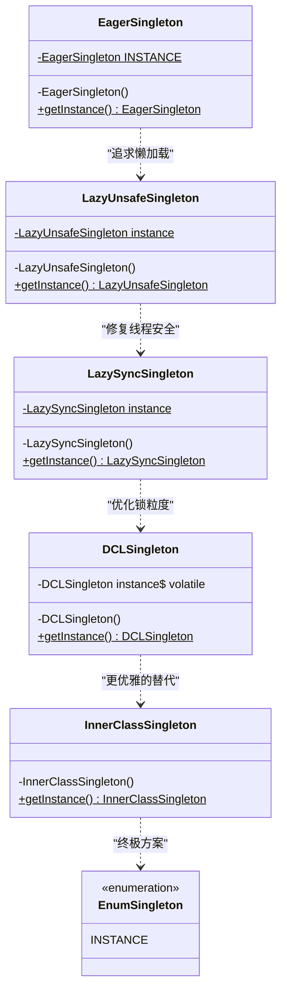

这张图清晰地展示了单例实现的 **演进路径**：从最简单的饿汉式出发，为了懒加载引入懒汉式，为了线程安全加上 `synchronized`，为了性能优化演化出 DCL，最终到更优雅的静态内部类和枚举方案。每一步演进都是为了解决上一步的不足，而 DCL + `volatile` 正处于这条链路的核心位置。

### 为什么单例是并发学习的"试金石"

在结束本节之前，值得思考一个问题：**为什么几乎所有 Java 并发的教程和面试都会谈到单例模式？**

原因在于，单例模式虽然代码量极少（核心逻辑不超过 10 行），却完美地覆盖了并发编程中最核心的几个概念：

| 并发概念 | 在单例中的体现 |
|----------|----------------|
| **竞态条件（Race Condition）** | 多线程同时判断 `instance == null` 导致创建多个实例 |
| **互斥（Mutual Exclusion）** | `synchronized` 保证只有一个线程能执行创建逻辑 |
| **可见性（Visibility）** | 线程 A 创建的实例，线程 B 能否立即看到？ |
| **指令重排序（Instruction Reordering）** | `new` 操作的三个步骤可能被 CPU / 编译器重排 |
| **volatile 语义** | 禁止重排序 + 保证可见性，解决 DCL 的根本问题 |
| **happens-before 规则** | volatile 写 happens-before 后续的 volatile 读 |

可以毫不夸张地说，**如果你能把单例模式的每一种写法讲清楚——包括为什么不安全、为什么安全、底层原理是什么——那么你对 Java 内存模型（JMM）的理解就已经相当扎实了**。

这正是我们接下来要做的事情。下一节，我们将深入双重检查锁定（DCL），逐行拆解它的代码，分析它在缺少 `volatile` 时的致命缺陷，并用内存模型的视角彻底解释为什么一个小小的 `volatile` 关键字能力挽狂澜。

---

**📝 练习题**

某团队在项目中使用了如下单例实现，在生产环境高并发场景下，偶尔出现"单例对象被创建了两次"的问题。请问根本原因是什么？

```java
public class Singleton {
    private static Singleton instance;
    private Singleton() {}
    public static Singleton getInstance() {
        if (instance == null) {
            instance = new Singleton();
        }
        return instance;
    }
}
```

A. 构造器 `private` 修饰无效，其他类仍然可以通过反射调用构造器创建实例

B. `getInstance()` 方法没有任何同步机制，多个线程可能同时通过 `null` 检查并各自执行 `new Singleton()`，导致创建多个实例

C. `instance` 字段没有用 `final` 修饰，导致 JVM 无法保证其不可变性

D. `instance` 字段没有用 `volatile` 修饰，导致指令重排序使得其他线程拿到未初始化的对象


**【答案】** B

**【解析】** 题目描述的问题是"单例对象被创建了两次"，这是典型的 **竞态条件（Race Condition）** 问题。在没有任何同步机制的情况下，线程 A 执行 `if (instance == null)` 判断为 `true` 后，还未执行 `instance = new Singleton()`，线程 B 也进入了 `if` 判断并同样得到 `true`，于是两个线程各自创建了一个实例。选项 A 虽然反射确实可以破坏单例，但与题目描述的"高并发场景"无关。选项 C 中 `final` 不能修饰非饿汉式的可变字段（初始为 `null`，后来才赋值）。选项 D 描述的是 DCL 场景下的"获取未初始化对象"问题，而非"创建两次"问题——这是下一节的主题。**本题的关键是区分"创建多个实例"（缺乏互斥）和"获取半初始化实例"（缺乏 volatile），两者是完全不同的并发缺陷。**

---

## 双重检查锁定（Double-Checked Locking）

### 从朴素同步到 DCL 的演进动机

在上一节中，我们回顾了单例模式的基本形态。无论是饿汉式还是最简单的懒汉式 `synchronized` 方法，都存在明显的取舍：饿汉式牺牲了延迟加载能力，而整方法加锁的懒汉式则在**每一次调用** `getInstance()` 时都要获取锁，即使实例早已创建完毕。在高并发场景下，锁竞争（lock contention）带来的性能损耗是不可接受的。

Double-Checked Locking（双重检查锁定，简称 DCL）正是为了解决这个矛盾而诞生的——它试图在**保证线程安全**的同时，将同步代码块的进入次数**压缩到最低限度**：仅在实例尚未创建时才真正走进 `synchronized` 块。

### 为什么"单重检查"不够

先看一个仅做一次 `null` 检查、然后直接进入同步块的写法：

```java
public class Singleton {

    // 持有唯一实例的静态引用，初始值为 null
    private static Singleton instance;

    // 私有构造器，禁止外部 new
    private Singleton() {}

    public static Singleton getInstance() {
        // ① 直接进入同步块 —— 每次调用都要竞争锁
        synchronized (Singleton.class) {
            // ② 在锁保护下检查是否已经创建
            if (instance == null) {
                // ③ 第一次调用时才真正创建
                instance = new Singleton();
            }
        }
        // ④ 返回实例
        return instance;
    }
}
```

这段代码是**线程安全**的，但问题在于步骤 ①：无论实例是否已经存在，所有线程都必须排队获取 `Singleton.class` 的监视器锁。当 `getInstance()` 被成千上万的线程频繁调用时，这把锁就成了性能瓶颈。

我们自然会想：能不能在进入 `synchronized` **之前**，先做一次快速的 `null` 检查？如果实例已经存在，直接返回，连锁都不用碰。这就是"双重检查"思路的核心。

### DCL 的经典结构

```java
public class Singleton {

    // 关键修饰符 volatile —— 后续章节会深入解释其必要性
    private static volatile Singleton instance;

    // 私有构造器
    private Singleton() {}

    public static Singleton getInstance() {

        // ===== 第一重检查（First Check）=====
        // 在同步块外部，无锁读取 instance
        // 目的：如果实例已经创建好了，直接返回，避免进入 synchronized
        if (instance == null) {                    // ① 快速路径判断

            // ===== 进入同步块 =====
            // 只有在 instance 为 null 时才走到这里
            synchronized (Singleton.class) {       // ② 获取类级别的锁

                // ===== 第二重检查（Second Check）=====
                // 为什么还要再检查一次？
                // 因为在 ① 和 ② 之间，可能有另一个线程已经抢先创建了实例
                if (instance == null) {             // ③ 二次确认
                    instance = new Singleton();     // ④ 真正创建实例
                }
            }
        }

        // 返回已初始化完毕的单例
        return instance;                           // ⑤ 返回
    }
}
```

这段代码的精髓可以用一张流程图来呈现：

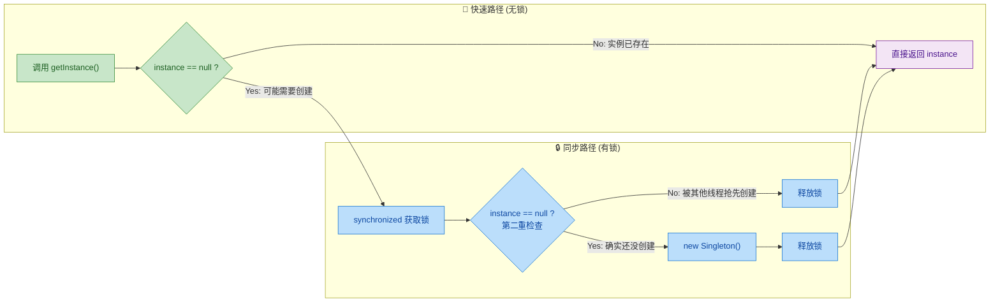

### 逐步拆解：两重检查各自解决什么问题

**第一重检查（无锁，步骤 ①）** 解决的是**性能问题**。

在单例创建完成之后的整个应用生命周期中，`instance` 都不再是 `null`。这意味着绝大多数调用会在步骤 ① 处就发现 `instance != null`，直接跳到步骤 ⑤ 返回。这条路径**完全没有同步开销**，称为 *fast path*（快速路径）。

**第二重检查（持锁，步骤 ③）** 解决的是**正确性问题**。

设想以下竞态时序（race condition）：

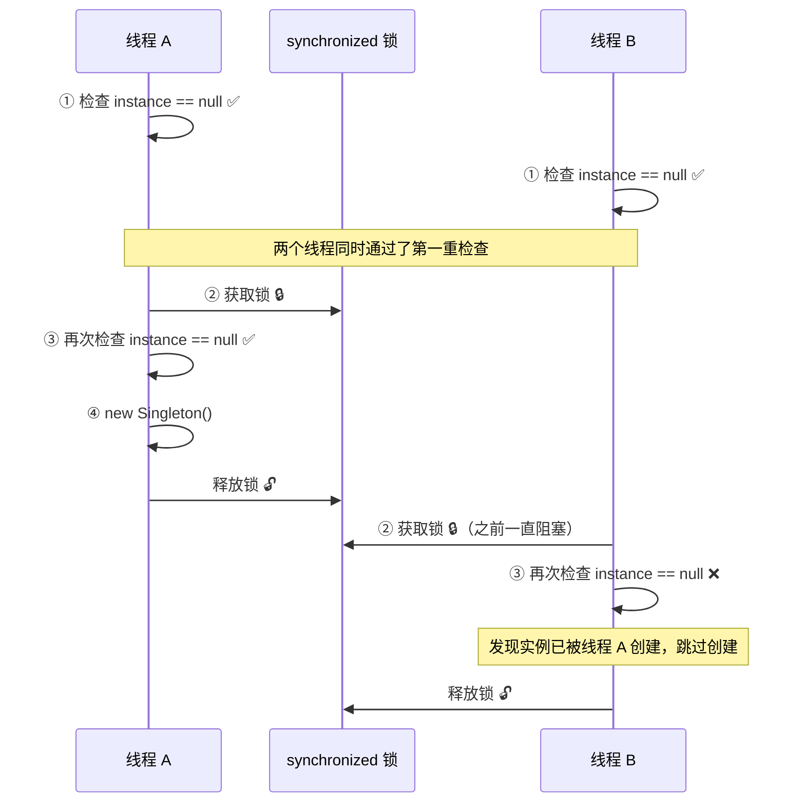

如果没有第二重检查，线程 B 在获取锁之后会**直接执行** `new Singleton()`，导致实例被创建两次——单例保证被打破。第二重检查就是那道最后的安全屏障。

### 用本地变量优化读取

在 Joshua Bloch 的《Effective Java》以及许多高性能框架源码中，你会看到一种微优化写法：

```java
public class Singleton {

    private static volatile Singleton instance;

    private Singleton() {}

    public static Singleton getInstance() {
        // 将 volatile 字段拷贝到局部变量
        // 局部变量存在线程栈上，读取无需每次穿越内存屏障
        Singleton localRef = instance;             // ① 只做一次 volatile 读

        if (localRef == null) {                    // ② 第一重检查（用局部变量）
            synchronized (Singleton.class) {       // ③ 加锁
                localRef = instance;               // ④ 再次 volatile 读
                if (localRef == null) {            // ⑤ 第二重检查
                    instance = localRef = new Singleton(); // ⑥ 创建 + 赋值
                }
            }
        }

        return localRef;                           // ⑦ 返回局部变量
    }
}
```

为什么要多此一举引入 `localRef`？

- **减少 volatile 读的次数**。每次读取 `volatile` 字段，JVM 都必须插入 **load 屏障**（load barrier），确保从主内存获取最新值而不是使用 CPU 缓存。在快速路径上，原始写法可能读取 `instance` 两次（一次判空、一次 return），而局部变量写法只读一次。
- 在已经创建实例的常规场景下，这个优化可带来约 **1.4 倍**的性能提升（引自 Joshua Bloch 在《Effective Java》中的数据）。

### DCL 的适用边界与常见误区

#### 误区一：省略 volatile

这是 DCL 最经典的坑，也是整个章节的重点。**没有 `volatile` 的 DCL 是有 Bug 的**，即使在某些 JVM 实现上碰巧能跑通。原因涉及指令重排序（instruction reordering），会在下一节"为什么需要 volatile"中深入剖析。

#### 误区二：认为 DCL 是最佳单例方案

DCL 虽然正确且高效，但它的代码复杂度相对较高，容易写错。在实际工程中，**静态内部类**（Holder Pattern）和**枚举单例**往往是更简洁、更不易出错的选择。DCL 的核心价值更多体现在**理解并发原理**上——它是学习 `volatile`、内存可见性、指令重排序的绝佳案例。

#### 误区三：对所有延迟初始化都套用 DCL

DCL 模式适用于**静态字段的单例延迟初始化**。如果你需要延迟初始化的是**实例字段**（instance field），正确的做法是使用单重检查（single-check idiom）或者直接使用 `synchronized`，因为实例字段没有"全局唯一"的语义，竞态条件的分析完全不同。

### DCL 在 JDK 源码中的身影

DCL 并非仅存在于教科书中，JDK 自身也大量使用了这种模式。以下是几个典型案例：

| 类 / 场景 | 关键字段 | 说明 |
|---|---|---|
| `java.lang.Runtime#getRuntime` | 饿汉式 | 不需要 DCL，但可作对比 |
| `java.lang.reflect.Proxy` 缓存 | `volatile` + DCL | 代理类缓存的懒初始化 |
| `java.util.concurrent.ConcurrentHashMap` | 多处内部初始化 | 变体 DCL 保护内部表扩容 |
| Spring `AbstractBeanFactory` | `volatile` 单例缓存 | Bean 的懒加载创建 |

### 小结：DCL 的核心思想


DCL 的精妙之处在于：它用**第一重检查**把 99.99% 的调用挡在锁外面，用**第二重检查**防止多线程同时通过第一重检查后重复创建，再用 **`volatile`** 确保对象的创建过程对所有线程都是完整可见的。三者缺一不可，共同构成了一个在正确性与性能之间取得极致平衡的并发模式。

---

**📝 练习题**

以下关于 DCL（Double-Checked Locking）单例模式的描述，哪一项是**正确**的？

A. 第一重 `if (instance == null)` 检查必须放在 `synchronized` 块内部，否则会有并发问题


B. 去掉第二重 `if (instance == null)` 检查，只要有 `synchronized` 就能保证单例的唯一性


C. 引入局部变量 `localRef` 是为了减少对 `volatile` 字段的读取次数，从而降低内存屏障的开销


D. DCL 模式中 `volatile` 的作用仅仅是保证可见性，与指令重排序无关


**【答案】** C

**【解析】**

- **A 错误**：第一重检查的意义恰恰在于它位于 `synchronized` **外部**，使得实例已创建后的调用无需获取锁，这是 DCL 的性能优势来源。将它放入同步块内部就退化成了普通的同步懒汉式。
- **B 错误**：如时序图所示，两个线程可以**同时**通过第一重检查。若没有第二重检查，后进入锁的线程会再次执行 `new Singleton()`，导致实例被创建两次。
- **C 正确**：每次读取 `volatile` 字段，JVM 都需要插入 load 屏障以保证从主内存读取最新值。将 `volatile` 字段缓存到栈上的局部变量后，后续使用局部变量即可，减少了屏障的插入次数，这是 Joshua Bloch 在《Effective Java》中推荐的优化手法。
- **D 错误**：`volatile` 在 DCL 中的核心作用是**禁止指令重排序**（通过 StoreStore 和 StoreLoad 屏障），确保 `new Singleton()` 的对象初始化在引用赋值之前完成。这一点将在下一节"为什么需要 volatile"中详细展开。

---

## 为什么需要 volatile ⭐⭐

在上一节中，我们已经看到了 DCL（Double-Checked Locking）的代码结构。表面上看，`synchronized` 已经保证了互斥，两次 `null` 检查也堵住了并发的漏洞，似乎万无一失。但事实上，如果 `instance` 字段没有被声明为 `volatile`，这段"看起来完美"的代码在 Java 内存模型（JMM, Java Memory Model）下 **仍然是有缺陷的**。要理解这个问题的根源，我们必须把目光深入到 JVM 层面——一个 `new` 操作到底做了什么。

---

### 对象创建过程（分配内存 → 初始化 → 赋值引用）

当 Java 代码执行一行看似简单的 `instance = new Singleton()` 时，我们在源码层面看到的只是一条语句。但是，在 JVM 的字节码和底层执行层面，这条语句至少会被拆解为 **三个独立的步骤**（three discrete steps）：

```java
// 源码: instance = new Singleton();
// 底层实际步骤（伪代码）:

// Step 1: 分配内存空间 (Allocate memory)
//         JVM 在堆（Heap）中为 Singleton 对象开辟一块内存区域，
//         此时所有成员变量都处于"零值"状态（int=0, Object=null, boolean=false）。
memory = allocate();

// Step 2: 初始化对象 (Initialize object)
//         调用 Singleton 的构造方法 <init>，
//         按照构造函数中的逻辑为成员变量赋予真正的初始值。
ctorInstance(memory);

// Step 3: 将引用指向分配的内存 (Assign reference)
//         把 instance 引用变量指向 Step 1 中分配好的那块堆内存地址，
//         从此刻起，instance != null。
instance = memory;
```

为了更直观地理解，我们用一个携带具体状态的示例来说明：

```java
public class Singleton {

    // 成员变量: 在构造中被初始化为 42
    private int value;

    // 成员变量: 在构造中被初始化为一个 HashMap
    private Map<String, String> config;

    private Singleton() {
        // 构造方法: 这就是 Step 2 中被执行的逻辑
        this.value = 42;                         // 赋值基本类型
        this.config = new HashMap<>();           // 创建容器
        this.config.put("env", "production");    // 写入配置
    }
}
```

在 **正常的执行顺序**（即上面 Step 1 → Step 2 → Step 3 的顺序）下，任何线程在通过 `instance` 引用访问对象时，对象一定已经完成了构造，`value` 为 `42`，`config` 里也已经有了 `"env"` 这个 key。这是我们作为开发者所期望的、合乎直觉的执行顺序。

下面是这个正常过程的完整时序图：

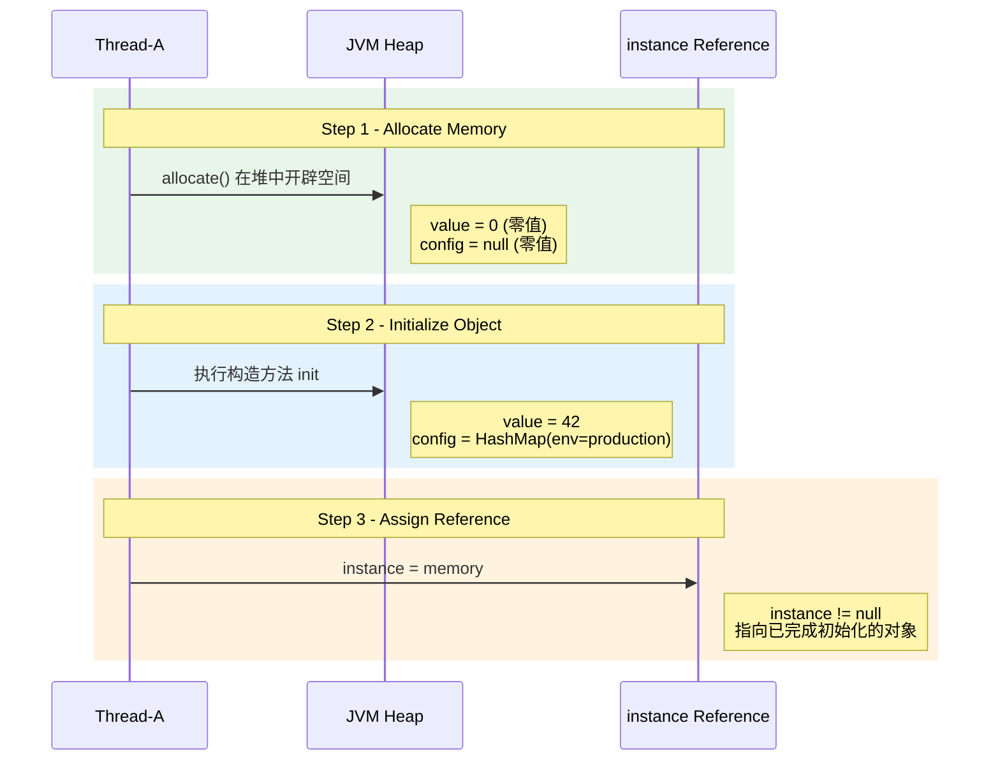

这个三步过程看似天经地义——先盖房子，再装修，最后把地址告诉别人。但 JVM 和 CPU 并不这样想。

---

### 指令重排序风险（分配内存 → 赋值引用 → 初始化）

现代 CPU 和 JIT 编译器为了追求极致的执行效率，会对指令进行 **重排序（Instruction Reordering）**。只要重排序后的结果在 **单线程视角** 下与原始顺序的执行结果一致（即遵守 **as-if-serial** 语义），JVM 就认为这种重排是合法的。

关键问题在于：**Step 2（初始化对象）和 Step 3（赋值引用）之间，不存在数据依赖关系**。

- Step 3 只是把一个地址赋给 `instance`，它依赖的是 Step 1 产出的内存地址。
- Step 2 是在那块内存上执行构造逻辑，它也依赖的是 Step 1 产出的内存地址。
- 但 Step 2 和 Step 3 之间？它们各自依赖 Step 1，彼此之间并不互相依赖。

因此，在 JVM 的编译器优化和 CPU 的乱序执行（Out-of-Order Execution）机制下，Step 2 和 Step 3 完全可能被交换顺序，变成：

```java
// 重排序后的实际执行顺序（危险！）:

// Step 1: 分配内存空间 (Allocate memory)
//         与正常顺序相同，在堆中开辟一块内存区域。
memory = allocate();

// Step 3: 将引用指向分配的内存（被提前执行了！）
//         instance 已经不为 null 了！
//         但此时对象的构造函数还没有运行！
instance = memory;

// Step 2: 初始化对象（被推迟执行了！）
//         构造函数此时才开始执行，
//         但其他线程可能已经在使用 instance 了...
ctorInstance(memory);
```

**对于执行 `new` 操作的线程自身而言**，这个重排序是完全无害的——无论先赋值引用再初始化，还是先初始化再赋值引用，最终这个线程自己看到的 `instance` 都是一个完全初始化好的对象。这就是 as-if-serial 保证的边界：**只保证单线程语义不变，不保证多线程语义**。

我们用依赖关系图来说明为什么 JVM/CPU 认为这个重排是"合法"的：

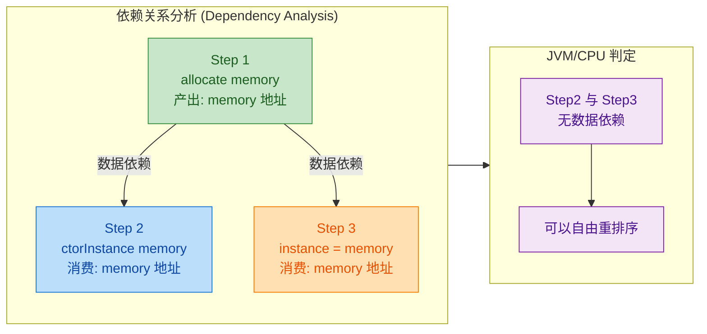

这张图清晰地表明：Step 2 和 Step 3 都只依赖 Step 1，它们之间没有箭头相连，因此从单线程数据流分析的角度，交换它们的执行顺序是完全"安全"的——当然，这种"安全"仅限于单线程视角。

---

### 其他线程可能获取未初始化对象

现在，真正的灾难场景来了。让我们把 DCL 代码和指令重排序放在一起，看看多线程并发时会发生什么。

回顾 DCL 的核心代码（**未加 `volatile`** 版本）：

```java
public class Singleton {

    // 注意: 此处故意没有使用 volatile —— 这是有缺陷的版本
    private static Singleton instance;

    public static Singleton getInstance() {
        // 第一次检查: 不加锁，快速路径
        if (instance == null) {                 // 线程 B 可能在此读到非 null
            synchronized (Singleton.class) {     // 线程 A 持有锁
                // 第二次检查: 加锁后再确认
                if (instance == null) {
                    instance = new Singleton();  // 可能被重排序!
                }
            }
        }
        return instance;                        // 可能返回未初始化的对象!
    }
}
```

假设有两个线程 Thread-A 和 Thread-B 同时调用 `getInstance()`，并且恰好发生了指令重排序，灾难性的时序如下：

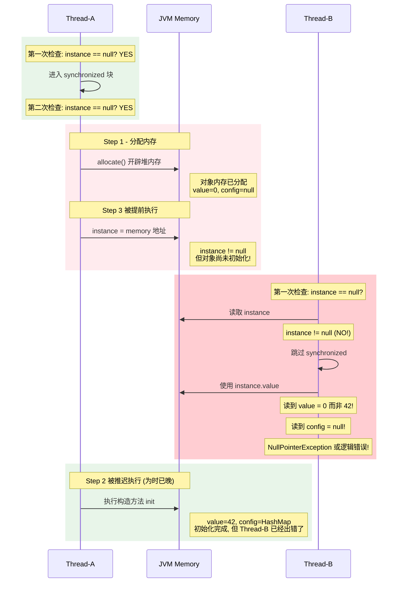

让我们逐步剖析这个灾难时序中每一刻的状态：

**时刻 T1 — Thread-A 执行 Step 1（分配内存）：**

```text
┌─────────────────────────────────────────┐
│           JVM Heap                      │
│  ┌─────────────────────────────────┐    │
│  │  Singleton 对象 @ 0x00AB        │    │
│  │  ┌───────────┬───────────────┐  │    │
│  │  │  value    │  0   (零值)   │  │    │
│  │  ├───────────┼───────────────┤  │    │
│  │  │  config   │  null (零值)  │  │    │
│  │  └───────────┴───────────────┘  │    │
│  └─────────────────────────────────┘    │
│                                         │
│  instance 引用 ──→ null                 │
└─────────────────────────────────────────┘
```

此刻，内存已经分配但全是零值，`instance` 仍然为 `null`，一切安全。

**时刻 T2 — Thread-A 执行 Step 3（赋值引用，被提前）：**

```text
┌─────────────────────────────────────────┐
│           JVM Heap                      │
│  ┌─────────────────────────────────┐    │
│  │  Singleton 对象 @ 0x00AB        │    │
│  │  ┌───────────┬───────────────┐  │    │
│  │  │  value    │  0   (零值!)  │  │    │
│  │  ├───────────┼───────────────┤  │    │
│  │  │  config   │  null (零值!) │  │    │
│  │  └───────────┴───────────────┘  │    │
│  └─────────────────────────────────┘    │
│              ↑                          │
│  instance ───┘  已指向 0x00AB           │
│  (instance != null, 但对象是空壳!)      │
└─────────────────────────────────────────┘
```

**这是最关键的瞬间！** `instance` 已经不为 `null` 了——它指向了一块合法的内存地址。但这块内存里的对象，构造函数还没有运行，`value` 还是 `0`，`config` 还是 `null`。这就是一个 **半初始化对象（partially constructed object）**。

**时刻 T3 — Thread-B 到来：**

Thread-B 调用 `getInstance()`，执行第一次 `null` 检查。由于 `instance` 在 T2 时刻已经被 Thread-A 赋值为非 `null`，Thread-B 的判断结果是 `instance != null`，于是 **直接跳过了整个 `synchronized` 块**，拿着这个"半成品"对象就返回了。

```java
// Thread-B 的执行路径:
public static Singleton getInstance() {
    if (instance == null) {    // false! instance 已经 != null
        // 整个 synchronized 块被完全跳过
        // ...
    }
    return instance;           // 返回了一个构造函数尚未执行的对象!
}

// Thread-B 随后的使用:
Singleton s = Singleton.getInstance();
int v = s.value;               // 期望 42, 实际得到 0
s.config.put("key", "val");   // config 是 null → NullPointerException!
```

这就是 DCL 问题的本质：**Thread-B 绕过了锁的保护（因为第一次检查在锁外面），读到了一个引用非 null 但内容未初始化的对象**。

我们可以用一张全景流程图来总结正常路径与异常路径的差异：

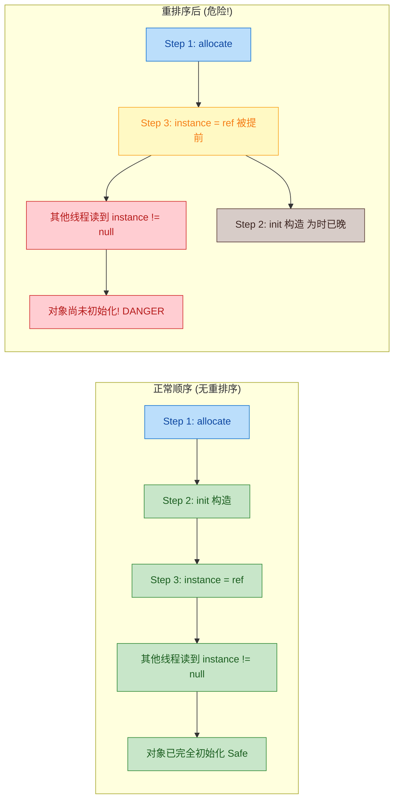

#### 为什么 synchronized 没能阻止这个问题？

很多人会疑惑：DCL 里明明有 `synchronized` 啊，`synchronized` 不是能保证可见性和有序性吗？

答案是：**`synchronized` 确实能保证这些，但只对"进入同一个锁"的线程有效**。

让我们精确分析 Thread-B 的行为：

| 行为 | Thread-B 是否进入了 synchronized 块？ | 是否受到 happens-before 保护？ |
|------|:------:|:------:|
| 第一次 `null` 检查 | ❌ 没有 | ❌ 没有 |
| 读取 `instance` 引用 | ❌ 没有 | ❌ 没有 |
| 使用 `instance` 的字段 | ❌ 没有 | ❌ 没有 |

Thread-B 在第一次 `null` 检查就发现 `instance != null`，于是 **根本没有进入 `synchronized` 块**。根据 JMM 的 happens-before 规则，一个 `unlock` 操作 happens-before 后续对同一个锁的 `lock` 操作。但 Thread-B 从未 `lock` 这个锁，所以 Thread-A 在 `synchronized` 块内对 `instance` 所做的一切（包括对象的构造），对 Thread-B **没有任何可见性保证**。

用更直白的话说：

> `synchronized` 保护的是 **进入临界区的线程之间** 的可见性。如果一个线程压根没进过这个临界区，`synchronized` 对它而言就像不存在一样。

#### 这个 Bug 有多难复现？

这个问题之所以臭名昭著，正是因为它 **极难复现**（extremely hard to reproduce）：

1. **窗口极窄**：Thread-A 的 Step 3 和 Step 2 之间的间隙可能只有几纳秒，Thread-B 必须恰好在这个缝隙读取 `instance`。
2. **平台依赖**：在 x86 架构上，由于其较强的内存模型（TSO, Total Store Order），Store-Store 重排序极少发生。但在 ARM、PowerPC 等弱内存模型架构上，这个问题出现的概率显著更高。
3. **JIT 依赖**：只有当 JIT 编译器决定对这段代码进行优化时，重排序才可能发生。在解释执行模式下可能完全正常。

这意味着：你可能在开发环境测试一万次都没问题，但部署到生产环境（不同的 CPU 架构、不同的 JVM 版本、更高的并发压力）后偶尔崩溃，而且崩溃现场几乎无法重现。这是最危险的并发 Bug 类型——**海森堡 Bug（Heisenbug）**，你观察它时它就消失，你不观察时它就出现。

#### 小结：问题的根因

用一句话总结 DCL 不加 `volatile` 的核心缺陷：

> **指令重排序使得"引用赋值"可能先于"对象构造"完成，而 DCL 的第一次 `null` 检查在锁外面执行，无法被 `synchronized` 的 happens-before 语义覆盖，导致其他线程可能通过一个非 `null` 的引用访问到一个尚未完成构造的"半初始化"对象。**

这就是为什么 `volatile` 在 DCL 中不可或缺——它通过 **禁止 Step 2 和 Step 3 之间的重排序**，从根本上消除了这个隐患。具体机制我们将在下一节详细展开。

---

**📝 练习题**

在不使用 `volatile` 的 DCL 单例中，Thread-A 正在执行 `instance = new Singleton()`，此时发生了指令重排序。Thread-B 调用 `getInstance()` 时可能遇到什么问题？

A. Thread-B 会被 `synchronized` 阻塞，等待 Thread-A 完成构造后才能继续执行，不会有任何问题


B. Thread-B 在第一次 `null` 检查时看到 `instance != null`，于是跳过同步块，获取到一个尚未执行构造函数的半初始化对象


C. Thread-B 会抛出 `ConcurrentModificationException`，因为两个线程同时修改了 `instance`


D. Thread-B 永远看到 `instance == null`，因为 Thread-A 的写入对 Thread-B 完全不可见


**【答案】** B

**【解析】** 当指令重排序将 "赋值引用"（Step 3）提前到 "执行构造函数"（Step 2）之前时，`instance` 引用已经指向了一块已分配但未初始化的内存。Thread-B 执行第一次 `null` 检查时，这次检查 **在 `synchronized` 块外部**，不受锁的 happens-before 保护。Thread-B 看到 `instance != null`，直接返回这个引用，而此刻构造函数可能还没执行完。因此 Thread-B 拿到的是一个字段值全为零值（`int` 为 0、对象引用为 `null`）的"空壳"对象。选项 A 错误，因为 Thread-B 根本没有进入 `synchronized` 块；选项 C 的异常类型与此场景无关；选项 D 也不正确，重排序并不意味着写入完全不可见，恰恰相反，问题在于引用的写入 **过早可见**，而对象内容的写入 **尚未可见**。

---

## volatile 禁止重排序

在上一节中，我们已经彻底剖析了 DCL 单例中**指令重排序**带来的致命风险——线程可能拿到一个**已分配内存、已赋值引用、但尚未完成构造函数初始化**的"半成品"对象。本节将从 JMM（Java Memory Model）层面深入解析 `volatile` 关键字是**如何**精确地消除这一风险的。核心机制只有一个：**内存屏障（Memory Barrier / Memory Fence）**。

### volatile 的语义：不仅仅是可见性

很多开发者对 `volatile` 的理解停留在"保证可见性"这一层面——即一个线程对 `volatile` 变量的写入，对其他线程立即可见。这当然是正确的，但**不完整**。根据 JSR-133（Java 内存模型规范，自 JDK 5 起生效），`volatile` 实际上提供了**两层语义保证**：

1. **可见性（Visibility）**：对 `volatile` 变量的写操作会立刻刷回主内存（Main Memory），读操作会直接从主内存读取，绕过工作内存（Working Memory / CPU Cache）的缓存副本。
2. **有序性（Ordering）**：对 `volatile` 变量的读写操作会**插入内存屏障**，禁止编译器和处理器对其前后的指令进行特定类型的重排序。

在 DCL 单例场景中，真正救命的是**第二层语义——有序性**。下面我们逐步拆解其工作原理。

### 内存屏障：volatile 有序性的底层武器

内存屏障是一种 CPU 指令级别的同步原语。JMM 为 `volatile` 变量定义了**四种屏障插入策略**，它们在 `volatile` 读/写操作的前后被自动插入：

| 屏障类型 | 插入位置 | 作用 |
|:---|:---|:---|
| **StoreStore** | `volatile` 写之前 | 确保 volatile 写之前的所有普通写操作都已刷出到内存 |
| **StoreLoad** | `volatile` 写之后 | 确保 volatile 写对所有处理器可见，再执行后续读操作 |
| **LoadLoad** | `volatile` 读之后 | 确保 volatile 读完成后，才执行后续的普通读操作 |
| **LoadStore** | `volatile` 读之后 | 确保 volatile 读完成后，才执行后续的普通写操作 |

> **关键认知**：这些屏障不是程序员手动插入的，而是 JVM 的 JIT 编译器在生成机器码时，根据 JMM 规范**自动**插入的。在 x86 架构上，`StoreLoad` 屏障通常对应一条 `lock addl $0x0, (%rsp)` 或 `mfence` 指令。

下面用一张完整的 Mermaid 图来可视化内存屏障在 `volatile` 写和读操作前后的插入位置：

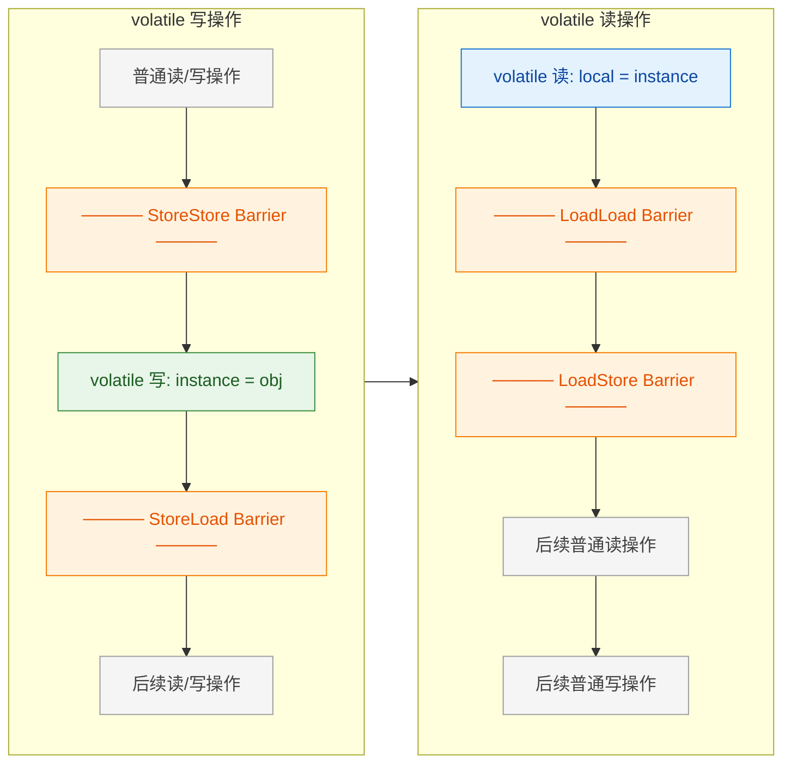

### 回到 DCL：屏障如何精确阻止重排序

让我们把 `instance = new Singleton()` 这行代码拆解成三条伪指令，然后观察**有 volatile 和没有 volatile** 时的行为差异。

对象创建的三步骤回顾：

```java
// 伪指令分解：instance = new Singleton()
memory = allocate();        // Step 1: 分配对象内存空间
constructInstance(memory);  // Step 2: 调用构造函数，初始化对象字段
instance = memory;          // Step 3: 将引用指向分配的内存地址（instance 变为非 null）
```

当 `instance` 声明为 `volatile` 时，Step 3（`instance = memory`）就是一个 **volatile 写操作**。根据上面的屏障规则：

- **StoreStore 屏障**被插入在 Step 3 之前。这意味着 Step 1（分配内存）和 Step 2（构造函数初始化）**必须**在 Step 3 执行之前全部完成，并且其结果必须对其他处理器可见。
- **StoreLoad 屏障**被插入在 Step 3 之后。这意味着 Step 3 的写入结果必须刷回主内存后，后续的任何读操作才能执行。

用 ASCII 图直观对比：

```java
// ==================== 无 volatile（允许重排序）====================
// 编译器/CPU 可能将执行顺序优化为：
//
//   Thread A                          Thread B
//   ────────                          ────────
//   1. memory = allocate()            
//   3. instance = memory  ←─重排序!    
//                                     if (instance != null)  ← true!
//                                        return instance;    ← 返回未初始化对象!💥
//   2. constructInstance(memory)       
//
// 灾难：Thread B 拿到了字段全为默认值（0/null/false）的对象

// ==================== 有 volatile（禁止重排序）====================
// StoreStore 屏障强制 Step 1, 2 在 Step 3 之前完成：
//
//   Thread A                          Thread B
//   ────────                          ────────
//   1. memory = allocate()            
//   2. constructInstance(memory)       
//   ═══ StoreStore Barrier ═══        
//   3. instance = memory              
//   ═══ StoreLoad Barrier ═══        
//                                     if (instance != null)  ← true
//                                        return instance;    ← 返回完整对象 ✅
```

### JMM 的 Happens-Before 规则：形式化保证

内存屏障是**底层实现手段**，而 JMM 通过一套叫做 **Happens-Before（先行发生）** 的规则，在**语言规范层面**为程序员提供形式化的正确性保证。与 `volatile` 相关的关键规则是：

> **Volatile Variable Rule**：对一个 `volatile` 变量的**写操作** happens-before 于后续（按程序顺序）对同一 `volatile` 变量的**读操作**。

结合另一条基础规则：

> **Program Order Rule**：同一线程内，前面的操作 happens-before 于后面的操作。

我们可以推导出一条完整的 **happens-before 传递链**：

```mermaid
graph LR
    subgraph ThreadA["Thread A - 创建对象"]
        direction TB
        A1["Step 1: allocate memory"]
        A2["Step 2: construct instance"]
        A3["Step 3: volatile write instance = obj"]
        A1 -->|"Program Order"| A2
        A2 -->|"Program Order + StoreStore"| A3
    end

    subgraph ThreadB["Thread B - 读取对象"]
        direction TB
        B1["volatile read: local = instance"]
        B2["使用 instance 的字段"]
        B1 -->|"Program Order + LoadLoad"| B2
    end

    A3 -->|"Volatile Variable Rule HB"| B1

    classDef threadA fill:#E8F5E9,stroke:#43A047,color:#1B5E20
    classDef threadB fill:#E3F2FD,stroke:#1E88E5,color:#0D47A1
    classDef hbEdge stroke:#FF6F00,stroke-width:2px

    class A1,A2,A3 threadA
    class B1,B2 threadB
```

**传递链推导过程**：

1. **Step 1 → Step 2 → Step 3**：由 Program Order Rule 保证（同一线程内按代码顺序）。加上 StoreStore 屏障，编译器/CPU 无法将 Step 3 重排序到 Step 1 或 Step 2 之前。
2. **Step 3 (volatile write) → B1 (volatile read)**：由 Volatile Variable Rule 保证。Thread A 写入 `instance`，Thread B 随后读取 `instance`，前者 happens-before 后者。
3. **由传递性（Transitivity）**：Step 1 happens-before Step 2 happens-before Step 3 happens-before B1 happens-before B2。

这意味着——当 Thread B 读取到 `instance != null` 时，**Step 1 和 Step 2 的所有副作用（即对象的完整初始化）都已经对 Thread B 可见**。Thread B 绝不可能看到一个"半成品"对象。

### 从字节码到机器码：volatile 写的实际汇编

为了进一步加深理解，我们来看一下 JVM 在 x86-64 平台上为 `volatile` 写操作实际生成的汇编指令。可以使用 `-XX:+PrintAssembly` 配合 hsdis 插件来查看：

```java
// Java 源码
private volatile static Singleton instance;  // 声明为 volatile

// 赋值操作
instance = new Singleton();

// ──────── x86-64 汇编（简化）────────
// Step 1 & 2: 分配内存 + 调用构造函数（省略细节）
// ...

// Step 3: volatile 写
mov    %rax, 0x70(%r13)     // 将对象引用写入 instance 字段的内存地址
lock   addl $0x0, (%rsp)    // StoreLoad Barrier! (lock 前缀指令)
                             // 这条指令的实际运算没有意义(加0)
                             // 其作用完全在于 lock 前缀带来的内存屏障效果:
                             //   1. 将 store buffer 中的数据刷入缓存/主存
                             //   2. 阻止后续 load 操作被重排序到此屏障之前
```

> **为什么是 `lock addl` 而不是 `mfence`？** 在现代 x86 处理器上，`lock` 前缀指令（如 `lock addl`）的开销通常比 `mfence` 更低，因此 HotSpot JVM 倾向于使用 `lock addl $0x0, (%rsp)` 来实现 StoreLoad 屏障。两者在语义上等价，都会：(1) 刷新 Store Buffer；(2) 使前序写操作在所有处理器上可见；(3) 阻止屏障两侧的指令交叉重排序。

### 一个值得注意的细节：x86 的强内存模型

x86/x86-64 处理器采用的是 **TSO（Total Store Order，全存储排序）** 内存模型，这是一种相对较强的内存一致性模型。在 TSO 下：

- **StoreStore** 不会重排序（天然保证）
- **LoadLoad** 不会重排序（天然保证）
- **LoadStore** 不会重排序（天然保证）
- **StoreLoad** —— **唯一可能重排序的组合**

这意味着在 x86 上，JVM 实际上只需要为 `volatile` 写操作之后插入 `StoreLoad` 屏障，其他三种屏障是"免费的"（no-op）。但这**绝不意味着你可以省略 `volatile`**！原因有二：

1. **编译器重排序**：即使 CPU 不重排序，JIT 编译器在生成代码时仍然可能重排序。`volatile` 同时约束了编译器和 CPU。
2. **跨平台可移植性**：ARM、RISC-V 等弱内存模型架构下，上述四种重排序都可能发生。Java 代码必须在所有 JVM 实现上正确运行，依赖特定硬件行为是极其危险的。

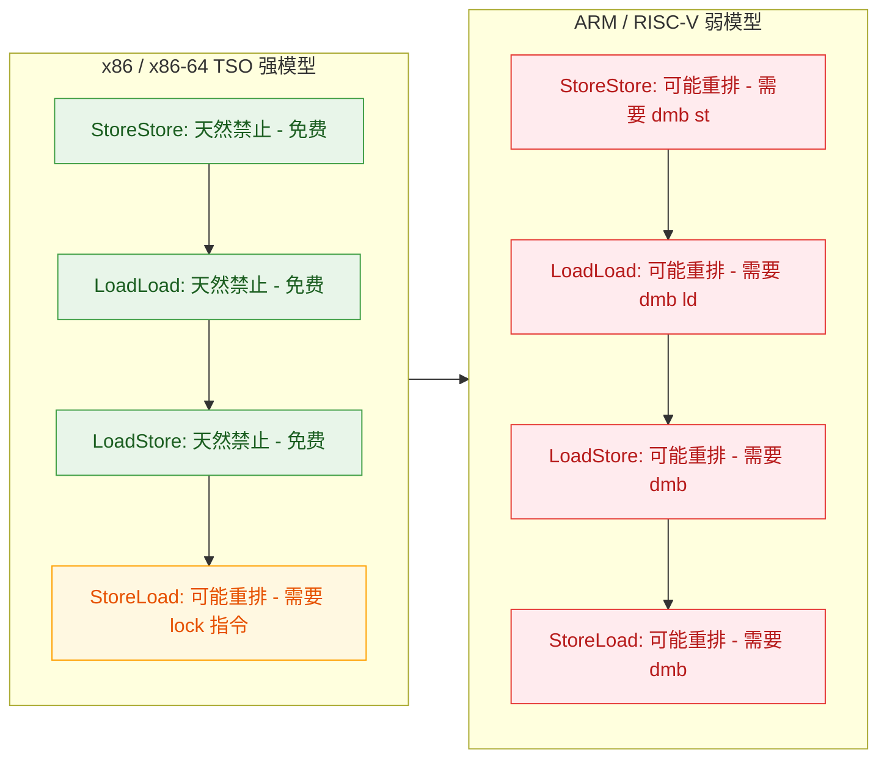

### 完整的 DCL 单例：加上 volatile 的最终正确版本

结合前面所有分析，给出完整的、工业级正确的 DCL 单例实现：

```java
public class Singleton {

    // 【关键】volatile 修饰，禁止 JVM 对 instance 赋值操作进行指令重排序
    // 语义保证：
    //   1. 可见性 —— 写入后立即对所有线程可见
    //   2. 有序性 —— 构造函数完成 happens-before 引用赋值
    private static volatile Singleton instance;

    // 私有构造函数，防止外部通过 new 创建实例
    private Singleton() {
        // 假设此处有复杂的初始化逻辑
        // 例如：建立数据库连接池、加载配置文件等
    }

    /**
     * 双重检查锁定（DCL）获取单例实例
     * 
     * @return 全局唯一的 Singleton 实例
     */
    public static Singleton getInstance() {
        // 【第一次检查】无锁快速路径（Fast Path）
        // 目的：实例已创建后，后续调用无需进入 synchronized 块
        // 性能意义：避免了 99.99% 场景下的锁竞争开销
        if (instance == null) {                     // volatile 读：触发 LoadLoad + LoadStore 屏障

            // 【加锁】只有 instance 为 null 时才竞争锁
            // 使用 Singleton.class 作为锁对象（类级别锁）
            synchronized (Singleton.class) {

                // 【第二次检查】持锁状态下的安全校验
                // 目的：防止多个线程同时通过第一次检查后重复创建实例
                // 场景：Thread A 和 Thread B 同时看到 instance == null，
                //       Thread A 先获取锁创建实例，Thread B 获取锁后必须再次检查
                if (instance == null) {

                    // 【对象创建】这一行会被拆解为三步：
                    //   1. 分配内存空间（allocate）
                    //   2. 调用构造函数初始化（init <constructor>）
                    //   ════ StoreStore Barrier ════
                    //   3. 将引用赋值给 instance（volatile write）
                    //   ════ StoreLoad Barrier ════
                    // volatile 保证步骤 3 不会被重排序到步骤 2 之前
                    instance = new Singleton();     // volatile 写：触发 StoreStore + StoreLoad 屏障
                }
            }
        }

        // 返回实例（此时 instance 要么是 null 要么是完全初始化的对象）
        return instance;                            // 这里是普通读，instance 的 volatile 读已在 if 中完成
    }
}
```

### volatile 在 DCL 中的性能开销分析

有些开发者担心 `volatile` 会带来显著的性能损失。让我们理性分析其实际开销：

**volatile 读的开销**：在 x86 上，`volatile` 读与普通读几乎没有区别——它只是一条普通的 `mov` 指令，没有额外的屏障指令。唯一的区别是 JIT 编译器不会对其进行某些优化（如寄存器缓存、公共子表达式消除）。在实际测量中，单次 `volatile` 读的开销通常在 **几纳秒到十几纳秒** 量级。

**volatile 写的开销**：`volatile` 写需要一条 `lock` 前缀指令来实现 StoreLoad 屏障，这会刷新 Store Buffer 并使相关缓存行失效。单次开销通常在 **几十纳秒** 量级，远高于普通写，但远低于一次 `synchronized` 加锁/解锁操作。

**DCL 场景下的实际影响**：在 DCL 模式中，`volatile` 写只发生**一次**（创建实例时），而 `volatile` 读发生在**每次调用** `getInstance()` 时。但由于 `volatile` 读在 x86 上几乎是零开销的，实际性能影响**微乎其微**。

```java
// 性能对比（大致量级，x86-64 平台）
//
// 操作类型                   单次耗时（约）
// ─────────────────────────────────────
// 普通变量读                  ~1 ns
// volatile 变量读             ~1-5 ns       ← 几乎无差异
// 普通变量写                  ~1 ns
// volatile 变量写             ~20-50 ns     ← 有开销，但只发生一次
// synchronized 加锁+解锁      ~50-200 ns    ← 每次调用都要执行（无 DCL 时）
// CAS 操作                    ~10-30 ns
// ─────────────────────────────────────
// 结论：DCL + volatile 是性能与安全性的最佳平衡点
```

### 一个常见误区的澄清：volatile 不等于原子性

最后必须强调一点：`volatile` **只保证可见性和有序性，不保证原子性**。例如 `volatile int count; count++;` 这行代码仍然不是线程安全的，因为 `count++` 实际上是 `read → increment → write` 三步操作，`volatile` 无法保证这三步的原子性。

但在 DCL 单例中，这不是问题。因为 `instance = new Singleton()` 这一赋值操作（引用写入）本身就是**原子的**（JLS §17.7 规定引用赋值是原子操作），我们需要 `volatile` 解决的不是原子性问题，而是**有序性**问题——确保对象完全构造好之后，引用才对其他线程可见。

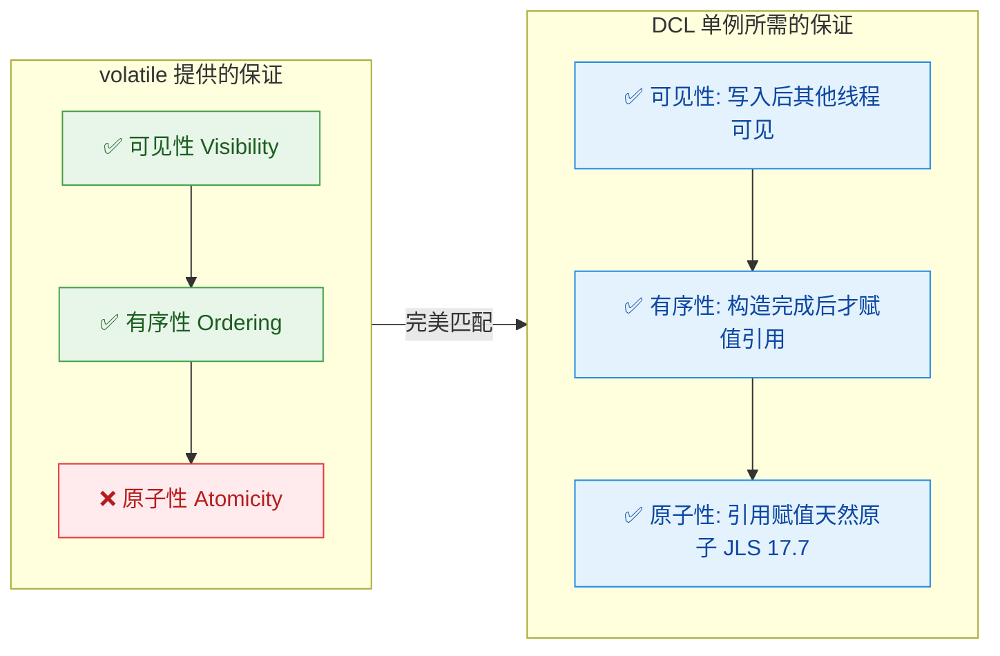

### 总结：volatile 在 DCL 中的三层防线

将 `volatile` 在 DCL 单例中发挥的作用归纳为三层防线：

| 防线层级 | 机制 | 作用 |
|:---|:---|:---|
| **第一层：编译器级别** | `volatile` 语义约束 JIT 编译器 | 禁止编译器将构造函数代码重排序到引用赋值之后 |
| **第二层：CPU 指令级别** | StoreStore + StoreLoad 内存屏障 | 禁止处理器在执行时将 store 操作乱序执行 |
| **第三层：缓存一致性级别** | MESI 协议 + Store Buffer 刷新 | 确保写入的值立即对其他 CPU 核心的缓存可见 |

这三层防线**层层递进、缺一不可**，共同保证了当任意线程通过 `getInstance()` 读取到非 null 的 `instance` 引用时，该引用所指向的对象一定是**完全初始化**的。这就是 `volatile` 关键字在 DCL 单例模式中不可或缺的根本原因。

---

**📝 练习题**

以下关于 `volatile` 在 DCL 单例中的作用，说法**正确**的是：

A. `volatile` 保证了 `instance = new Singleton()` 整体操作的原子性，所以其他线程不会看到中间状态


B. `volatile` 通过在引用赋值前插入 StoreStore 屏障，确保对象构造函数执行完毕后才将引用赋值给 `instance`，从而禁止了关键的指令重排序


C. 在 x86 架构上，由于 TSO 强内存模型天然禁止了所有重排序，因此即使不加 `volatile`，DCL 单例在 x86 上也是绝对安全的


D. `volatile` 的主要性能开销来自于每次 `volatile` 读操作都需要执行 `lock` 前缀指令来刷新缓存

**【答案】** B

**【解析】**

- **A 错误**：`volatile` 不提供原子性保证。`instance = new Singleton()` 这一整行代码包含分配内存、调用构造函数、赋值引用三个步骤，`volatile` 并没有使它们成为一个原子操作。DCL 能正确工作是因为：(1) `synchronized` 保证了互斥，避免多线程同时执行创建逻辑；(2) `volatile` 保证了有序性，确保引用赋值在构造函数之后发生；(3) 引用赋值本身的原子性由 JLS §17.7 天然保证。

- **B 正确**：这正是 `volatile` 在 DCL 中的核心作用。`volatile` 写操作之前插入的 StoreStore 屏障确保了内存分配（Step 1）和构造函数执行（Step 2）**不会被重排序**到引用赋值（Step 3，即 `volatile` 写）之后。这建立了一条从 "对象初始化完成" 到 "引用对其他线程可见" 的 happens-before 链。

- **C 错误**：虽然 x86 TSO 模型天然禁止了 StoreStore、LoadLoad、LoadStore 重排序，但**编译器级别的重排序**仍然可能发生。JIT 编译器在没有 `volatile` 语义约束时，完全有权将构造函数内的 store 操作重排序到引用赋值之后。此外，依赖特定硬件架构的行为违反了 Java "Write Once, Run Anywhere" 的设计原则。

- **D 错误**：`lock` 前缀指令只在 **`volatile` 写**操作时才需要（用于实现 StoreLoad 屏障）。`volatile` 读在 x86 上只是一条普通的 `mov` 指令，不需要任何额外的屏障指令，开销极小。在 DCL 场景中，`volatile` 写只发生一次，而高频的 `volatile` 读开销近乎为零，因此整体性能影响微乎其微。

---

## 其他单例实现（静态内部类、枚举）

在前面的章节中，我们深入剖析了 DCL（Double-Checked Locking）单例模式的原理与 `volatile` 的必要性。DCL 虽然经典，但其实现复杂度较高——需要同时协调 `synchronized`、`volatile`、双重 `null` 判断三个机制，任何一个遗漏都可能引入并发 Bug。自然地，Java 社区在长期实践中探索出了更优雅、更安全的单例实现方案。本节将重点介绍两种被广泛推荐的替代方案：**静态内部类（Holder Pattern）** 和 **枚举单例（Enum Singleton）**，并从线程安全性、懒加载、序列化防御、反射防御等多个维度进行全面对比。

---

### 静态内部类（Initialization-on-Demand Holder Idiom）

静态内部类单例，又称 **Holder 模式** 或 **Bill Pugh Singleton**（以其提出者 Bill Pugh 命名），是目前公认的最优雅的懒加载单例方案之一。它巧妙地利用了 **JVM 类加载机制本身的线程安全保证**，完全不需要显式的同步关键字。

#### 核心原理：JVM 类加载的天然保证

要理解 Holder 模式为什么是线程安全的，必须先理解 JVM 类加载规范中的两条关键规则：

1. **类的加载是懒惰的（Lazy Class Loading）**：JVM 不会在程序启动时加载所有类，而是在 **首次主动使用**（First Active Use）时才触发加载和初始化。仅仅持有某个类的引用、声明变量类型等，都不算"主动使用"。

2. **类初始化阶段是线程安全的（Thread-Safe Class Initialization）**：JVM 规范（JLS §12.4.2）明确要求，类的初始化过程（执行 `<clinit>()` 方法，即静态变量赋值和静态代码块）必须在多线程环境下被正确同步。JVM 内部会使用一个 **初始化锁（Initialization Lock）** 来保证同一个类只会被初始化一次，即使多个线程同时触发该类的初始化。

Holder 模式正是将单例实例的创建放在一个 **静态内部类的静态字段** 中，从而把线程安全的责任完全委托给 JVM 类加载器。

#### 完整实现

```java
public class Singleton {

    // 私有构造器，防止外部通过 new 创建实例
    private Singleton() {
        // 可选：防御反射攻击（后文详述）
        if (Holder.INSTANCE != null) {
            throw new IllegalStateException("Singleton instance already exists! Reflection attack blocked.");
        }
    }

    // 静态内部类 —— 关键所在
    // 只有当 Holder 类被"主动使用"时，JVM 才会加载并初始化它
    // 而 Holder 被主动使用的唯一途径就是调用 getInstance() 方法
    private static class Holder {
        // 在类初始化阶段创建单例实例
        // JVM 保证这一过程的线程安全性（通过内部的 initialization lock）
        private static final Singleton INSTANCE = new Singleton();
    }

    // 对外暴露的获取方法
    // 第一次调用时触发 Holder 类的加载和初始化 → 创建 INSTANCE
    // 后续调用直接返回已创建的 INSTANCE，无任何同步开销
    public static Singleton getInstance() {
        return Holder.INSTANCE;  // 触发 Holder 的类初始化（仅首次）
    }
}
```

#### 懒加载的精确时机

一个常见误解是"内部类会随着外部类一起加载"。事实并非如此。我们可以用下面的时序来精确描述：

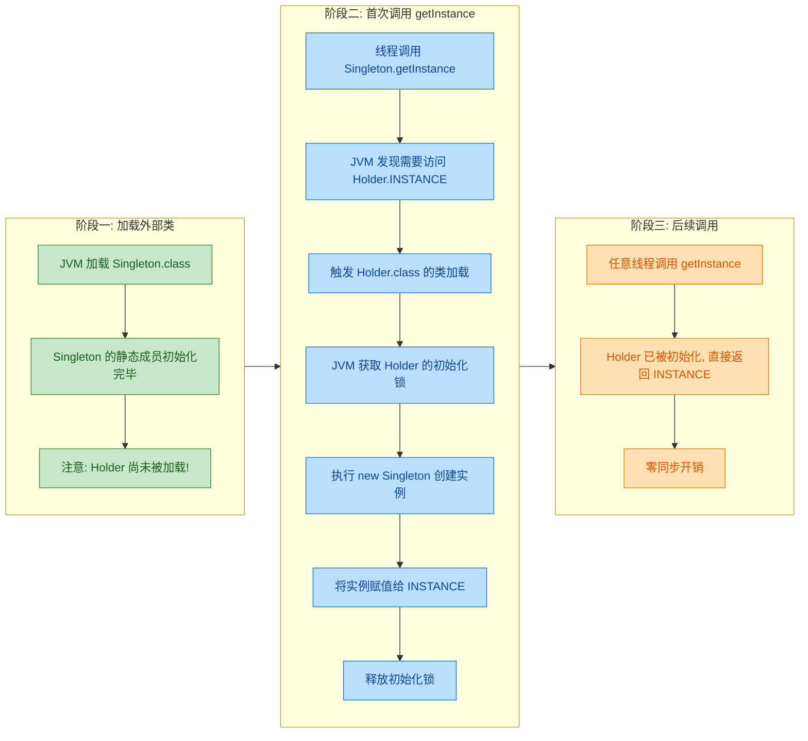

关键点在于：**`Holder` 类只有在 `getInstance()` 被调用时才会被 JVM 加载并初始化**。如果整个程序运行期间从未调用过 `getInstance()`，那么 `Holder` 类永远不会被加载，单例对象也永远不会被创建——这就是真正的 **Lazy Initialization**。

#### 与 DCL 的对比分析

| 维度 | DCL + volatile | 静态内部类 (Holder) |
|:---|:---|:---|
| **线程安全机制** | `synchronized` + `volatile` 显式同步 | JVM 类加载机制隐式保证 |
| **懒加载** | ✅ 首次调用时创建 | ✅ 首次调用时创建 |
| **性能开销** | 首次有锁开销，后续有 `volatile` 读开销（极小） | 首次有 JVM 内部初始化锁，后续零同步开销 |
| **代码复杂度** | 较高（容易写错） | 极低（简洁明了） |
| **可读性** | 需要理解 volatile 和指令重排 | 只需理解类加载机制 |

从性能角度看，`volatile` 读虽然开销很小（通常只是一个 **Load Barrier**），但毕竟不是零成本。而 Holder 模式在初始化完成后，后续的 `Holder.INSTANCE` 访问就是一个普通的静态字段读取，JIT 编译器可以对其进行各种优化，包括内联（Inlining）。

#### 局限性

尽管 Holder 模式非常优雅，但它并非无懈可击：

1. **反射攻击**：恶意代码可以通过 `Constructor.setAccessible(true)` 调用私有构造器创建新实例。虽然我们可以在构造器中加入防御代码（如上面示例），但这种防御在某些极端时序下仍可能被绕过。

2. **序列化攻击**：如果 `Singleton` 实现了 `Serializable` 接口，反序列化会创建一个新对象，破坏单例。需要额外添加 `readResolve()` 方法来防御。

3. **无法传递构造参数**：因为实例在 `Holder` 的静态初始化中创建，无法在运行时传入参数。

---

### 枚举单例（Enum Singleton）

枚举单例是 Joshua Bloch 在《Effective Java》（Item 3）中极力推荐的方式。他写道：

> "A single-element enum type is often the best way to implement a singleton."

这句话在 Java 社区引发了巨大反响，因为枚举单例确实从根本上解决了传统单例面临的几乎所有问题。

#### 基本实现

```java
// 最简形式 —— 整个单例实现只需要这几行代码
public enum Singleton {

    INSTANCE;  // 唯一的枚举常量，就是单例实例本身

    // 单例持有的状态（业务字段）
    private int counter = 0;

    // 单例的行为（业务方法）
    public synchronized void increment() {
        counter++;  // 注意：枚举单例本身不保证方法的线程安全，仍需按需同步
    }

    // 获取当前计数
    public int getCounter() {
        return counter;
    }
}
```

调用方式：

```java
// 获取单例 —— 直接引用枚举常量
Singleton instance = Singleton.INSTANCE;

// 调用业务方法
instance.increment();
System.out.println(instance.getCounter());  // 输出: 1

// 验证单例性
System.out.println(Singleton.INSTANCE == instance);  // 输出: true
```

#### 枚举单例为什么天然线程安全？

要理解这一点，需要知道 Java 编译器和 JVM 对枚举做了什么。当我们写下 `public enum Singleton { INSTANCE; }` 时，编译器实际上会将其转换为类似下面的结构：

```java
// 编译器自动生成的等价代码（概念性展示）
public final class Singleton extends Enum<Singleton> {

    // 枚举常量被编译为 public static final 字段
    public static final Singleton INSTANCE;

    // 静态初始化块 —— 在类加载的初始化阶段执行
    static {
        INSTANCE = new Singleton("INSTANCE", 0);  // 调用私有构造器
        $VALUES = new Singleton[]{ INSTANCE };
    }

    // 编译器生成的私有构造器
    private Singleton(String name, int ordinal) {
        super(name, ordinal);  // 调用 Enum 的构造器
    }

    // 编译器生成的 values() 和 valueOf() 方法
    public static Singleton[] values() {
        return $VALUES.clone();
    }

    public static Singleton valueOf(String name) {
        return Enum.valueOf(Singleton.class, name);
    }
}
```

可以看到，`INSTANCE` 本质上是一个 `public static final` 字段，在 `static {}` 块中被初始化。这与 Holder 模式的原理完全一致——**JVM 类加载机制保证了静态初始化的线程安全性**。

#### 枚举单例的全方位防御能力

枚举单例的真正杀手锏不仅仅是线程安全，而是它在 **序列化** 和 **反射** 两个维度上的天然免疫力。

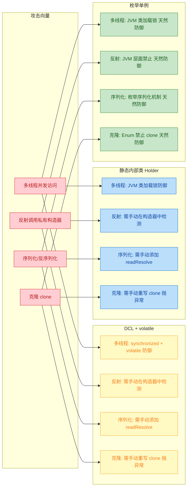

下面逐一解析每种防御：

**1. 反射防御（Reflection-Proof）**

JVM 在最底层就对枚举的构造进行了硬性限制。如果你尝试通过反射创建枚举实例：

```java
// 尝试通过反射攻击枚举单例
Constructor<Singleton> constructor = Singleton.class.getDeclaredConstructor(String.class, int.class);
constructor.setAccessible(true);  // 强制访问私有构造器
Singleton newInstance = constructor.newInstance("HACK", 1);  // 尝试创建新实例
```

JVM 会直接抛出异常。这是因为 `java.lang.reflect.Constructor.newInstance()` 的源码中包含如下硬编码检查：

```java
// java.lang.reflect.Constructor 源码节选
public T newInstance(Object... initargs) throws ... {
    // ...
    if ((clazz.getModifiers() & Modifier.ENUM) != 0)  // 检查目标类是否是枚举
        throw new IllegalArgumentException("Cannot reflectively create enum objects");
    // ...
}
```

这是 **JVM 层面的硬性禁止**，无法绕过——不管你怎么 `setAccessible(true)`，只要目标类带有 `ACC_ENUM` 标志，反射创建就直接失败。对比传统单例中手动在构造器里写 `if (instance != null) throw ...` 的防御方式，枚举的防御更加彻底、不可绕过。

**2. 序列化防御（Serialization-Proof）**

Java 的序列化机制对枚举进行了特殊处理。当一个枚举常量被序列化时，Java 不会像普通对象那样保存其全部字段状态，而是 **只保存枚举常量的名称（name）**。反序列化时，Java 通过 `Enum.valueOf(Class, String)` 方法查找对应的枚举常量，直接返回已存在的实例，而不是创建新对象。

```java
// 序列化/反序列化枚举单例的验证
Singleton original = Singleton.INSTANCE;

// 序列化
ByteArrayOutputStream bos = new ByteArrayOutputStream();
ObjectOutputStream oos = new ObjectOutputStream(bos);
oos.writeObject(original);        // 序列化：只写入 "INSTANCE" 这个名称
oos.close();

// 反序列化
ByteArrayInputStream bis = new ByteArrayInputStream(bos.toByteArray());
ObjectInputStream ois = new ObjectInputStream(bis);
Singleton deserialized = (Singleton) ois.readObject();  // 反序列化：通过名称找回原实例
ois.close();

// 验证：反序列化得到的是同一个对象
System.out.println(original == deserialized);  // 输出: true（同一个引用！）
```

这一机制写死在 `ObjectInputStream.readEnum()` 中，开发者无需做任何额外处理。而传统单例如果要防御序列化攻击，必须手动添加 `readResolve()` 方法：

```java
// 传统单例的序列化防御（需手动编写）
private Object readResolve() throws ObjectStreamException {
    return INSTANCE;  // 反序列化时返回已有实例，丢弃新创建的对象
}
```

**3. 克隆防御（Clone-Proof）**

`java.lang.Enum` 基类中，`clone()` 方法被声明为 `final` 并直接抛出异常：

```java
// java.lang.Enum 源码
protected final Object clone() throws CloneNotSupportedException {
    throw new CloneNotSupportedException();  // 枚举不允许被克隆
}
```

由于是 `final` 方法，子类（即我们定义的枚举类型）无法重写它。

#### 带有复杂行为的枚举单例

有些开发者认为枚举单例只适合简单场景。实际上，枚举可以持有复杂状态和行为，甚至实现接口：

```java
// 枚举单例实现接口，支持复杂业务逻辑
public enum DatabaseConnectionPool implements AutoCloseable {

    INSTANCE;  // 单例入口

    // 持有复杂的内部状态
    private HikariDataSource dataSource;

    // 枚举的构造器（天然私有，不需要写 private 关键字）
    DatabaseConnectionPool() {
        // 在构造时初始化连接池
        HikariConfig config = new HikariConfig();
        config.setJdbcUrl("jdbc:mysql://localhost:3306/mydb");  // 数据库地址
        config.setUsername("root");                               // 用户名
        config.setMaximumPoolSize(10);                            // 最大连接数
        this.dataSource = new HikariDataSource(config);           // 创建连接池
    }

    // 业务方法：获取数据库连接
    public Connection getConnection() throws SQLException {
        return dataSource.getConnection();  // 从池中借出连接
    }

    // 实现 AutoCloseable 接口
    @Override
    public void close() {
        if (dataSource != null && !dataSource.isClosed()) {
            dataSource.close();  // 关闭连接池，释放所有资源
        }
    }
}
```

#### 枚举单例的局限性

尽管枚举单例几乎是"完美"的，但它并非适用于所有场景：

1. **不支持懒加载控制**：枚举常量在枚举类首次被引用时就会被初始化。如果枚举类还定义了其他静态方法或常量，访问这些成员也会触发枚举实例的创建。这一点不如 Holder 模式精确。

2. **不支持继承**：枚举类隐式继承自 `java.lang.Enum`，Java 不支持多继承，因此枚举单例无法继承其他类。但可以实现任意数量的接口。

3. **可读性与团队认知**：许多开发者（尤其是从其他语言转来的）可能不习惯用枚举来实现单例模式，认为枚举的语义是"一组有限常量"而非"单例容器"。

4. **无法传递构造参数**：与 Holder 模式类似，枚举构造器在类加载时由 JVM 自动调用，无法在运行时传入参数。

---

### 各方案全面对比总览


### 实际选型建议

在真实项目中，如何选择单例实现方式？以下是一份简明的决策指南：

- **如果你只需要一个简洁、安全的单例**，且不需要继承某个基类 → **枚举单例**。这是最省心的方案，防御最完整。

- **如果你需要精确的懒加载**，或者需要继承某个父类 → **静态内部类 Holder**。优雅且高性能，但记得处理序列化和反射问题（如果有需要的话）。

- **如果你在面试或学习并发原理** → **DCL + volatile** 必须深刻理解。它虽然不是生产环境的首选，但它串联了 `synchronized`、`volatile`、指令重排序、happens-before 等核心并发知识点，是面试高频考点。

- **如果你使用 Spring 等 IoC 框架** → 单例的生命周期由容器管理（`@Scope("singleton")`），通常不需要自己手写单例模式。但理解底层原理仍然至关重要。

---

**📝 练习题**

以下关于 Java 单例模式的说法，哪一项是**正确**的？

A. 静态内部类 Holder 模式中，内部类 `Holder` 会在外部类 `Singleton` 被加载时一起加载并初始化，因此它本质上是饿汉式的


B. 枚举单例可以通过 `Constructor.setAccessible(true)` 配合反射来创建第二个实例，因此仍需要在构造器中手动防御


C. 枚举类型在反序列化时，JVM 会通过枚举常量的名称查找已有实例并返回，而不会创建新对象，因此天然防御序列化攻击


D. DCL 单例中，如果去掉 `volatile` 关键字，虽然可能有极小概率的并发问题，但在现代 JVM（Java 8+）上已经不会出现指令重排序了


**【答案】** C

**【解析】** 

- **A 错误**：JVM 的类加载是惰性的。静态内部类 `Holder` 只有在被"主动使用"时（即调用 `Singleton.getInstance()` 访问 `Holder.INSTANCE`）才会触发加载和初始化。外部类 `Singleton` 的加载不会连带触发内部类的加载，这正是 Holder 模式实现懒加载的核心机制。

- **B 错误**：JVM 在 `Constructor.newInstance()` 方法中硬编码了对枚举类型的检查——如果目标类带有 `ACC_ENUM` 修饰符，直接抛出 `IllegalArgumentException("Cannot reflectively create enum objects")`。`setAccessible(true)` 无法绕过这一检查。这是枚举单例相对于传统单例最突出的优势之一。

- **C 正确**：Java 序列化规范对枚举类型做了特殊处理。序列化时只写入枚举常量的 `name`，反序列化时通过 `Enum.valueOf()` 根据名称查找已有常量实例返回，整个过程不会调用构造器，也不会创建新对象。因此枚举单例天然免疫序列化攻击，无需手动编写 `readResolve()` 方法。

- **D 错误**：指令重排序是 CPU 和编译器优化的固有特性，与 JVM 版本无关。Java 内存模型（JMM, JSR-133）仅保证在正确使用同步原语（`volatile`、`synchronized`、`final` 等）的前提下禁止特定重排序。如果不使用 `volatile`，`new Singleton()` 的三步操作（分配内存→初始化→赋值引用）在任何 JVM 版本上都可能被重排序，导致其他线程获取到未完全初始化的对象。

---

## 本章小结

本章围绕一个经典而深刻的问题展开——**为什么 DCL 单例必须加 `volatile`？** 这个问题看似只是一个设计模式的细节，实则牵涉到 JVM 对象创建语义、CPU 指令重排序、Java Memory Model 的可见性与有序性保证等多层核心知识。下面我们对全章进行系统性回顾与提炼。

---

### 从单例模式的演进看并发陷阱

单例模式的演进路径，本质上是一部**线程安全意识的觉醒史**。我们从最原始的写法一步步走到了 DCL，每一步都有其要解决的痛点：

```java
// ======= 演进路线总览 =======

// 第一阶段：饿汉式 —— 类加载即创建，线程安全但不懒加载
private static final Singleton INSTANCE = new Singleton();

// 第二阶段：懒汉式 —— 懒加载，但线程不安全
if (instance == null) { instance = new Singleton(); } // 多线程下可能创建多个实例

// 第三阶段：synchronized 方法级加锁 —— 安全但性能差
public static synchronized Singleton getInstance() { ... } // 每次调用都要竞争锁

// 第四阶段：DCL 无 volatile —— 性能好，但存在指令重排序隐患
// 其他线程可能拿到一个"地址已分配但构造函数未执行完"的半初始化对象

// 第五阶段：DCL + volatile —— 正确且高效的最终形态
private static volatile Singleton instance; // volatile 禁止关键步骤的重排序
```

这条路径揭示了一个重要的工程哲学：**并发环境下，"看起来正确"与"真正正确"之间，往往隔着一道深不见底的鸿沟。**

---

### DCL 的核心结构再审视

双重检查锁定（Double-Checked Locking）之所以叫"双重检查"，是因为它在 `synchronized` 块的**外部和内部**各做了一次 `null` 判断，二者缺一不可：

| 检查位置 | 作用 | 如果去掉会怎样 |
|:---:|:---|:---|
| **第一次检查**（锁外） | 快速路径：实例已创建时直接返回，避免无意义的锁竞争 | 退化为 `synchronized` 方法级加锁，每次调用都走慢路径 |
| **第二次检查**（锁内） | 安全保障：防止多个线程同时通过第一次检查后重复创建实例 | 并发场景下可能创建多个实例，单例语义被破坏 |

这种"先乐观判断、再悲观加锁"的思路，在 Java 并发编程中非常常见，例如 `ConcurrentHashMap` 的 `putIfAbsent` 逻辑、`ReentrantLock` 的公平锁获取流程等，都能看到类似的影子。

---

### 对象创建的三步拆解：问题的根源

本章最关键的知识点，是理解 `new Singleton()` 这一行 Java 代码在 JVM 层面并非原子操作。它会被拆解为三个步骤：

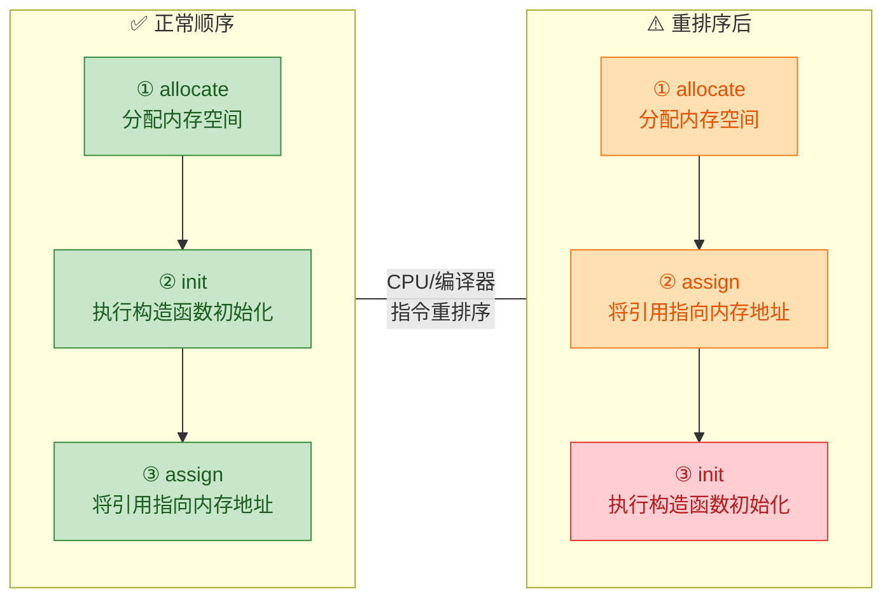

重排序后的步骤 ②（assign）和步骤 ③（init）发生了对调。这意味着：**引用已经非空了，但对象的字段还没被赋值**。此时如果另一个线程执行到第一次 `null` 检查，会发现 `instance != null`，直接返回一个**半初始化（half-initialized）的对象**，导致不可预知的错误。

这个问题的本质是：**单线程视角下步骤 ② 和 ③ 的顺序不影响最终结果（因为同一线程一定在 assign 之后才使用对象），所以 JIT 编译器和 CPU 认为重排序是合法的。** 但在多线程视角下，另一个线程可能在 assign 之后、init 之前就读取了这个引用。这正是 Java Memory Model 中 **"within-thread as-if-serial semantics"** 的边界——它只保证单线程内的语义不变，而不保证多线程之间的观察一致性。

---

### volatile 的精准打击

`volatile` 在这里的作用不是"保证可见性"（虽然它也做到了），而是**禁止特定方向的指令重排序**。具体来说，JMM 对 `volatile` 写操作施加了如下屏障规则：

> **在 `volatile` 写之前的所有操作，不允许被重排序到 `volatile` 写之后。**
> （即 volatile 写之前插入 StoreStore 屏障，之后插入 StoreLoad 屏障）

将这条规则映射到对象创建的三个步骤：

- `instance = new Singleton()` 中对 `instance` 的赋值是一次 **volatile 写**。
- 构造函数中的初始化操作（步骤 ②）发生在 volatile 写（步骤 ③）**之前**。
- 根据 volatile 写的屏障规则，步骤 ② **不允许被重排序到**步骤 ③ 之后。

这就从根本上消灭了"引用已发布但对象未初始化"的危险窗口。

```java
// === volatile 保障的 happens-before 链 ===

// 线程 A（写端）
synchronized (Singleton.class) {
    // 步骤①：分配内存 ——————————————————————————> ┐
    // 步骤②：执行构造函数（初始化所有字段）————————> ├ 这些操作 happens-before volatile 写
    instance = ref; // 步骤③：volatile 写 ———————> ┘
}

// 线程 B（读端）
if (instance != null) { // volatile 读
    // 根据 happens-before 传递性：
    // 线程 A 的步骤①②③ happens-before 线程 B 的 volatile 读
    // 因此线程 B 看到的一定是完全初始化好的对象
    instance.doSomething(); // 安全！
}
```

这条 **happens-before** 链是 DCL 正确性的数学证明。没有 `volatile`，这条链就断了。

---

### 四种单例方案的全景对比

本章介绍了多种单例实现方式。每种方案都有自己的适用场景和权衡，以下做一个最终的横向对比：

| 维度 | 饿汉式 | DCL + volatile | 静态内部类 | 枚举 |
|:---|:---:|:---:|:---:|:---:|
| **懒加载** | ❌ | ✅ | ✅ | ❌ |
| **线程安全** | ✅ (类加载保证) | ✅ (volatile + synchronized) | ✅ (类加载保证) | ✅ (JVM 保证) |
| **防反射攻击** | ❌ | ❌ | ❌ | ✅ |
| **防反序列化攻击** | 需额外处理 | 需额外处理 | 需额外处理 | ✅ |
| **实现复杂度** | ⭐ | ⭐⭐⭐ | ⭐⭐ | ⭐ |
| **适用场景** | 实例创建轻量 | 需精细控制初始化时机 | 大多数场景的首选 | 最严谨的单例需求 |

**工程选型建议**：

- **日常开发首选**：静态内部类。代码简洁、利用 JVM 类加载机制天然线程安全、无需理解底层内存模型。
- **需要绝对安全**：枚举。Joshua Bloch 在 *Effective Java* 中明确推荐，"a single-element enum type is the best way to implement a singleton"。
- **面试与底层理解**：DCL + volatile。它不是最优实践，但它是**理解 JMM、指令重排序、volatile 语义**的最佳切入点。

---

### 本章知识图谱

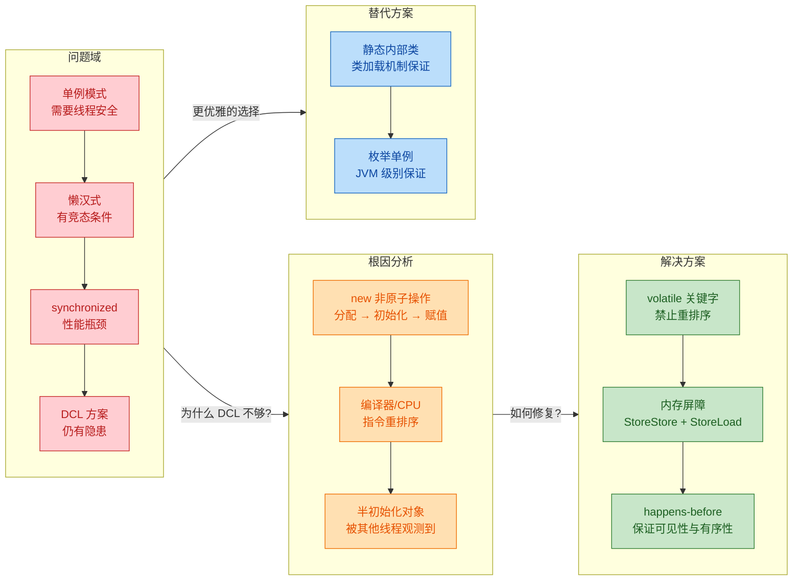

---

### 带走的核心认知

总结本章，有三条认知值得铭记：

**第一，`new` 不是原子操作。** 这是许多并发 Bug 的温床。任何时候你在多线程环境中共享一个对象引用，都要警惕"对象是否已经完全构造好了"这个问题。这不仅限于单例模式——在构造函数中将 `this` 引用泄漏（比如注册到一个全局监听器列表中）也会导致类似的半初始化问题，这被称为 **"this escape"**。

**第二，重排序是真实存在的。** 它不是理论上的可能性，而是现代 CPU 为了提高指令级并行度（Instruction-Level Parallelism, ILP）而主动进行的优化。x86 架构虽然是强内存模型（TSO, Total Store Order），但 store-load 重排序仍然可能发生；ARM 和 RISC-V 等弱内存模型架构上，重排序更加激进。Java 的 `volatile` 通过在字节码层面插入内存屏障指令，**跨平台地**消除了这种不确定性。

**第三，`volatile` 的核心价值在于"有序性"而非仅仅"可见性"。** 初学者常常把 `volatile` 简单理解为"让变量的最新值对所有线程可见"。这固然正确，但在 DCL 场景中，真正救命的是 volatile 的 **重排序禁止语义**（ordering guarantee）。它确保的是：当线程 B 通过 volatile 读看到 `instance != null` 时，线程 A 在 volatile 写之前所做的所有工作（包括构造函数中的全部初始化），对线程 B 而言都是可见且有序的。这就是 JMM happens-before 规则的力量。

---

**📝 练习题 1**

以下关于 DCL（Double-Checked Locking）单例模式的描述，哪一项是**正确**的？

A. DCL 中去掉 `volatile` 关键字，在 x86 架构上一定不会出问题，因为 x86 是强内存模型


B. DCL 中第一次 `null` 检查的作用是防止多个线程同时创建实例


C. DCL 中 `volatile` 的主要作用是禁止 `new Singleton()` 操作中的指令重排序，确保其他线程不会读到半初始化的对象


D. 只要在 `synchronized` 块内部赋值 `instance`，就不需要 `volatile`，因为 `synchronized` 已经保证了有序性


**【答案】** C

**【解析】**

- **A 错误**：x86 的 TSO 模型虽然较强，但并不能阻止编译器层面的重排序（JIT 编译器可能将 store 操作提前）。此外，Java 程序的正确性应该依赖 JMM 规范，而非特定硬件行为。"Write once, run anywhere" 要求我们不能依赖平台特性。
- **B 错误**：第一次 `null` 检查的作用是**性能优化**——当实例已创建时跳过加锁。防止重复创建是第二次检查（锁内检查）的职责。
- **C 正确**：`volatile` 通过内存屏障禁止了"赋值引用"与"执行构造函数"之间的重排序，使得任何通过 volatile 读看到非 null 引用的线程，都能看到一个完全初始化好的对象。
- **D 错误**：`synchronized` 的确保证了块内操作的原子性和可见性（unlock 时 happens-before 下一次 lock），但问题在于**读端的第一次检查在 `synchronized` 块之外**。线程 B 在未加锁的情况下读取 `instance`，此时没有任何 `synchronized` 的 happens-before 关系来保护它。只有 `volatile` 读能建立这个保护。

---

**📝 练习题 2**

在如下代码中，假设 `volatile` 被去掉，线程 A 正在执行 `getInstance()`，对象创建过程发生了指令重排序。此时线程 B 也调用 `getInstance()`。请问线程 B 最终可能得到什么结果？

```java
public class Singleton {
    private static Singleton instance; // 注意：没有 volatile
    private int value;

    private Singleton() {
        this.value = 42;
    }

    public static Singleton getInstance() {
        if (instance == null) {           // 第一次检查
            synchronized (Singleton.class) {
                if (instance == null) {   // 第二次检查
                    instance = new Singleton();
                }
            }
        }
        return instance;
    }
}
```

A. 线程 B 一定得到 `value == 42` 的完整对象


B. 线程 B 可能得到 `value == 0` 的半初始化对象


C. 线程 B 会抛出 `NullPointerException`


D. 线程 B 会阻塞在 `synchronized` 块上，直到线程 A 完成对象创建


**【答案】** B

**【解析】** 当线程 A 执行 `new Singleton()` 时，JVM 内部的三个步骤（分配内存、初始化字段、赋值引用）可能被重排序为（分配内存、赋值引用、初始化字段）。在赋值引用完成但初始化尚未完成的瞬间，线程 B 执行第一次 `null` 检查时会发现 `instance != null`（因为引用已经指向了一块内存地址），于是**直接跳过 `synchronized` 块**返回 `instance`。此时 `value` 字段尚未被构造函数赋值为 `42`，仍然是 `int` 类型的默认值 `0`。这就是经典的半初始化对象问题。选项 C 不会发生，因为 `instance` 引用本身已经非空；选项 D 也不会发生，因为线程 B 根本没有进入 `synchronized` 块。

---

