---

# Lock体系——ReentrantLock ⭐⭐⭐

---

## Lock 接口

在 Java 早期版本中，线程同步的唯一选择是 `synchronized` 关键字。它简单好用，但存在诸多局限：无法中断一个正在等待锁的线程、无法设置获取锁的超时时间、无法以非阻塞方式尝试获取锁。Java 5 引入了 `java.util.concurrent.locks.Lock` 接口，从根本上重新定义了"锁"的抽象——它不再是一个语言级别的隐式机制，而是一个显式的、可编程的 API。`Lock` 接口是整个 `java.util.concurrent.locks` 包的基石，`ReentrantLock`、`ReentrantReadWriteLock` 等高级锁实现都构建在它之上。

理解 `Lock` 接口的六个核心方法，是掌握整个 Lock 体系的第一步。我们先来看一下它的完整定义：

```java
// Lock 接口定义在 java.util.concurrent.locks 包下
// 它提供了比 synchronized 更灵活的锁操作
public interface Lock {
    void lock();                                    // 阻塞式获取锁
    void unlock();                                  // 释放锁
    boolean tryLock();                              // 非阻塞式尝试获取锁
    boolean tryLock(long time, TimeUnit unit)        // 带超时的尝试获取锁
            throws InterruptedException;
    void lockInterruptibly()                        // 可响应中断的获取锁
            throws InterruptedException;
    Condition newCondition();                       // 创建条件变量
}
```

下面这张图展示了六个方法的分类关系与各自特性：

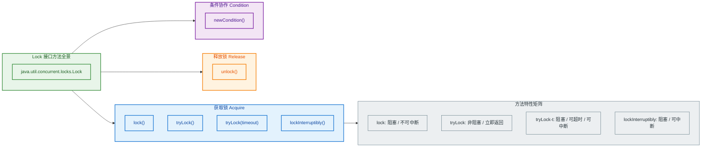
```mermaid
graph LR
    subgraph LOCK_API["Lock 接口方法全景"]
        direction TB
        TITLE["java.util.concurrent.locks.Lock"]
    end

    subgraph ACQUIRE["获取锁 Acquire"]
        direction TB
        A1["lock()"]
        A2["tryLock()"]
        A3["tryLock(timeout)"]
        A4["lockInterruptibly()"]
    end

    subgraph RELEASE["释放锁 Release"]
        direction TB
        R1["unlock()"]
    end

    subgraph COND["条件协作 Condition"]
        direction TB
        C1["newCondition()"]
    end

    subgraph PROPS["方法特性矩阵"]
        direction TB
        P1["lock: 阻塞 / 不可中断"]
        P2["tryLock: 非阻塞 / 立即返回"]
        P3["tryLock-t: 阻塞 / 可超时 / 可中断"]
        P4["lockInterruptibly: 阻塞 / 可中断"]
    end

    LOCK_API --> ACQUIRE
    LOCK_API --> RELEASE
    LOCK_API --> COND
    ACQUIRE --> PROPS

    classDef apiBox fill:#E8F5E9,stroke:#388E3C,color:#1B5E20,stroke-width:2px
    classDef acquireBox fill:#E3F2FD,stroke:#1976D2,color:#0D47A1,stroke-width:2px
    classDef releaseBox fill:#FFF3E0,stroke:#F57C00,color:#E65100,stroke-width:2px
    classDef condBox fill:#F3E5F5,stroke:#7B1FA2,color:#4A148C,stroke-width:2px
    classDef propsBox fill:#ECEFF1,stroke:#546E7A,color:#263238,stroke-width:1px

    class LOCK_API,TITLE apiBox
    class ACQUIRE,A1,A2,A3,A4 acquireBox
    class RELEASE,R1 releaseBox
    class COND,C1 condBox
    class PROPS,P1,P2,P3,P4 propsBox
```

---

### lock()（获取锁）

`lock()` 是最基础的获取锁方法。它的语义非常直接：**调用后，当前线程将一直阻塞，直到成功获取到锁为止**。如果锁当前被其他线程持有，调用线程会进入等待队列（在 AQS 的实现中，就是进入 CLH 同步队列），并被挂起（`LockSupport.park()`），直到锁被释放后被唤醒。

`lock()` 有两个非常重要的特性需要特别注意：

**第一，它不响应中断（Uninterruptible）。** 这意味着即使其他线程调用了 `thread.interrupt()`，正在 `lock()` 中等待的线程也不会抛出 `InterruptedException`。线程会在成功获取锁之后，再将自身的中断标志位设为 `true`（这是 `ReentrantLock` 的实现行为，称为 "interrupt on acquire after wait" 策略）。这一点与 `lockInterruptibly()` 形成鲜明对比。

**第二，它可能永远阻塞。** 如果持有锁的线程因为死锁或者忘记释放锁而永远不释放，那么 `lock()` 会让调用线程永远挂起，没有任何超时退出机制。这就是为什么在对可靠性要求较高的场景中，通常推荐使用 `tryLock(timeout)` 代替。

```java
// 演示 lock() 的基本使用模式
public class LockDemo {
    // 创建一个 ReentrantLock 实例（Lock 接口的最常用实现）
    private final Lock lock = new ReentrantLock();
    // 共享资源：一个简单的计数器
    private int count = 0;

    public void increment() {
        // 获取锁——如果锁不可用，当前线程将阻塞在此处
        lock.lock();
        try {
            // 临界区代码：只有持有锁的线程才能执行到这里
            count++;
            // 可以安全地读写共享变量，不用担心竞态条件
            System.out.println(Thread.currentThread().getName()
                    + " -> count = " + count);
        } finally {
            // 无论临界区代码是否抛出异常，都必须释放锁
            // 这是 Lock 与 synchronized 的关键区别之一
            lock.unlock();
        }
    }
}
```

这里的 `try-finally` 模式是使用 `Lock` 的**铁律**——我们在后面的小节中会反复强调。你可以把 `lock()` 理解为 `synchronized` 代码块进入时隐式获取 monitor 锁的显式版本，只不过它把这个操作从语言层面提升到了 API 层面，赋予了开发者更多的控制权。

---

### unlock()（释放锁）

`unlock()` 用于释放当前线程所持有的锁。在底层实现中，它会将 AQS 的 `state` 计数器减 1（因为 `ReentrantLock` 是可重入锁，`state` 可能大于 1），当 `state` 减为 0 时，锁真正被释放，AQS 会唤醒等待队列中的下一个线程。

**`unlock()` 的使用有三条硬性规则：**

**规则一：必须由持有锁的线程调用。** 如果一个没有持有锁的线程调用 `unlock()`，`ReentrantLock` 会抛出 `IllegalMonitorStateException`。这与 `synchronized` 中在非同步块内调用 `wait()` / `notify()` 抛出同样异常的逻辑一致。

**规则二：lock 与 unlock 必须配对。** 如果你调用了 N 次 `lock()`（重入了 N 层），就必须调用 N 次 `unlock()` 才能真正释放锁。少调用一次 `unlock()`，锁就不会被释放，其他等待线程将永远被阻塞。

**规则三：unlock 必须放在 finally 块中。** 这一点无论怎么强调都不过分。如果临界区中抛出了未捕获的异常，而 `unlock()` 不在 `finally` 中，锁就永远不会被释放——这是生产环境中最常见的并发 Bug 之一。

```java
// 演示 "重入" 与 "配对释放"
public class ReentrantUnlockDemo {
    private final Lock lock = new ReentrantLock();

    public void outerMethod() {
        lock.lock();           // state: 0 -> 1，第一次获取锁
        try {
            System.out.println("进入外层方法");
            innerMethod();     // 在持有锁的情况下调用另一个需要同一把锁的方法
        } finally {
            lock.unlock();     // state: 1 -> 0，释放第一层，锁真正被释放
        }
    }

    public void innerMethod() {
        lock.lock();           // state: 1 -> 2，同一线程再次获取（重入）
        try {
            System.out.println("进入内层方法");
            // 如果这里抛出异常，finally 保证内层的 unlock 一定会执行
        } finally {
            lock.unlock();     // state: 2 -> 1，释放第二层，但锁仍被持有
        }
    }
}
```

下面用 ASCII 图展示重入时 `state` 变化与线程的关系：

```text
Thread-A 调用链                      AQS state 变化
─────────────────────────────────────────────────────
outerMethod() → lock.lock()          state: 0 → 1   (Thread-A 持有锁)
  │
  ├─ innerMethod() → lock.lock()     state: 1 → 2   (重入, Thread-A 仍持有)
  │    │
  │    └─ lock.unlock()              state: 2 → 1   (退出内层, 锁未释放)
  │
  └─ lock.unlock()                   state: 1 → 0   (退出外层, 锁真正释放)
                                                      ↓
                                     唤醒等待队列中的下一个线程
```

---

### tryLock()（尝试获取）

`tryLock()` 是 `Lock` 接口提供的**非阻塞**获取锁方法。它尝试获取锁，**立即返回结果**：如果锁当前可用（没有被其他线程持有），则获取成功并返回 `true`；如果锁已被其他线程持有，则直接返回 `false`，不会让当前线程阻塞或等待。

这个方法的价值在于赋予了开发者"**尝试之后有备选方案**"的能力——在 `synchronized` 的世界里，一旦你走到同步块入口，要么拿到锁继续执行，要么无条件等待，没有第三个选择。而 `tryLock()` 打破了这种非此即彼的局面。

典型的使用场景包括：

- **避免死锁的锁排序策略（Lock Ordering with Fallback）**：当需要同时获取多把锁时，用 `tryLock()` 获取第二把锁，失败时释放第一把锁再重试，从而避免循环等待。
- **轮询式获取锁（Polled Lock Acquisition）**：在循环中不断尝试，配合退避策略（backoff），适合对延迟敏感的场景。
- **无法获取就跳过或降级（Graceful Degradation）**：例如缓存更新场景——拿不到锁就用旧数据，不阻塞当前请求。

```java
// 使用 tryLock() 避免死锁的经典模式
public class DeadlockAvoidanceDemo {
    private final Lock lockA = new ReentrantLock(); // 第一把锁
    private final Lock lockB = new ReentrantLock(); // 第二把锁

    public void transferSafely() {
        // 无限重试，直到同时获取两把锁
        while (true) {
            boolean gotA = false; // 记录是否获取到 lockA
            boolean gotB = false; // 记录是否获取到 lockB
            try {
                gotA = lockA.tryLock(); // 非阻塞地尝试获取 lockA
                gotB = lockB.tryLock(); // 非阻塞地尝试获取 lockB

                if (gotA && gotB) {
                    // 两把锁都拿到了，安全地执行临界区操作
                    System.out.println("成功获取两把锁，执行转账操作");
                    return; // 操作完成，退出循环
                }
                // 如果只拿到了一把，或者都没拿到，会走到 finally 释放已持有的锁
            } finally {
                // 释放已经获取到的锁，避免占着一把锁等另一把
                if (gotA) lockA.unlock();
                if (gotB) lockB.unlock();
            }
            // 短暂让出 CPU，避免活锁（两个线程同步地拿锁又放锁）
            // 实际项目中可以使用随机退避（Random Backoff）策略
            Thread.yield();
        }
    }
}
```

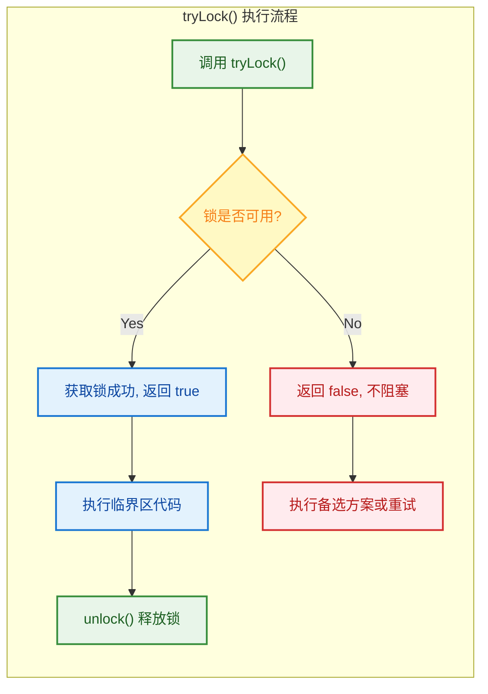
```mermaid
graph LR
    subgraph TRYLOCK["tryLock() 执行流程"]
        direction TB
        S["调用 tryLock()"]
        C{"锁是否可用?"}
        Y["获取锁成功, 返回 true"]
        N["返回 false, 不阻塞"]
        DO["执行临界区代码"]
        UNLOCK["unlock() 释放锁"]
        FALLBACK["执行备选方案或重试"]

        S --> C
        C -->|Yes| Y
        C -->|No| N
        Y --> DO
        DO --> UNLOCK
        N --> FALLBACK
    end

    classDef startEnd fill:#E8F5E9,stroke:#388E3C,color:#1B5E20,stroke-width:2px
    classDef decision fill:#FFF9C4,stroke:#F9A825,color:#F57F17,stroke-width:2px
    classDef success fill:#E3F2FD,stroke:#1976D2,color:#0D47A1,stroke-width:2px
    classDef fail fill:#FFEBEE,stroke:#D32F2F,color:#B71C1C,stroke-width:2px
    classDef action fill:#F3E5F5,stroke:#7B1FA2,color:#4A148C,stroke-width:1px

    class S,UNLOCK startEnd
    class C decision
    class Y,DO success
    class N,FALLBACK fail
```

有一个重要的细节值得注意：**`tryLock()` 的无参版本即使在公平锁模式下也会"闯入"（barging）**。也就是说，即便等待队列中有其他线程排在前面，`tryLock()` 仍然会尝试直接获取锁。如果你需要遵守公平策略，应该使用 `tryLock(0, TimeUnit.SECONDS)`，它会检查队列中是否有排在前面的等待者。

---

### tryLock(timeout)（超时获取）

`tryLock(long time, TimeUnit unit)` 是 `tryLock()` 的增强版。它在尝试获取锁时，允许等待一段指定的时间。如果在超时时间内成功获取到锁，返回 `true`；如果超时时间耗尽仍未获取到锁，返回 `false`。此外，它还能**响应中断**——在等待期间如果当前线程被中断，它会抛出 `InterruptedException`。

这个方法在实际生产环境中使用频率极高，因为它同时解决了两个问题：

1. **防止无限等待**：通过 timeout 设置一个"等待的忍耐上限"，避免线程因为死锁或锁争用而永久挂起。
2. **支持中断响应**：当系统需要优雅关闭（graceful shutdown）时，可以中断正在等待锁的线程，让它快速退出。

```java
// 演示带超时的锁获取——典型的资源池访问模式
public class TimeoutLockDemo {
    private final Lock lock = new ReentrantLock();

    /**
     * 尝试在指定时间内获取锁并执行操作
     * @return true 表示操作成功执行, false 表示因超时而放弃
     */
    public boolean performAction() throws InterruptedException {
        // 等待最多 3 秒来获取锁
        // 如果在 3 秒内获取到锁, 返回 true 并进入临界区
        // 如果 3 秒后仍未获取到, 返回 false, 线程不再等待
        if (lock.tryLock(3, TimeUnit.SECONDS)) {
            try {
                // 成功获取到锁, 执行临界区操作
                System.out.println("获取锁成功，正在执行操作...");
                Thread.sleep(1000); // 模拟耗时操作
                return true;        // 操作成功
            } finally {
                lock.unlock();      // 确保释放锁
            }
        } else {
            // 超时未获取到锁，执行降级/补偿逻辑
            System.out.println("获取锁超时，执行降级策略...");
            return false;           // 通知调用方操作未执行
        }
    }
}
```

超时获取在分布式系统和微服务架构中尤其重要。例如，一个请求需要在 200ms 内返回，那么你可以设置 `tryLock(150, TimeUnit.MILLISECONDS)`——留出 50ms 用于序列化响应和网络传输。如果 150ms 内拿不到锁，直接返回一个降级结果，而不是让请求超时。

下面的时序图展示了两种结果路径——成功获取和超时放弃：

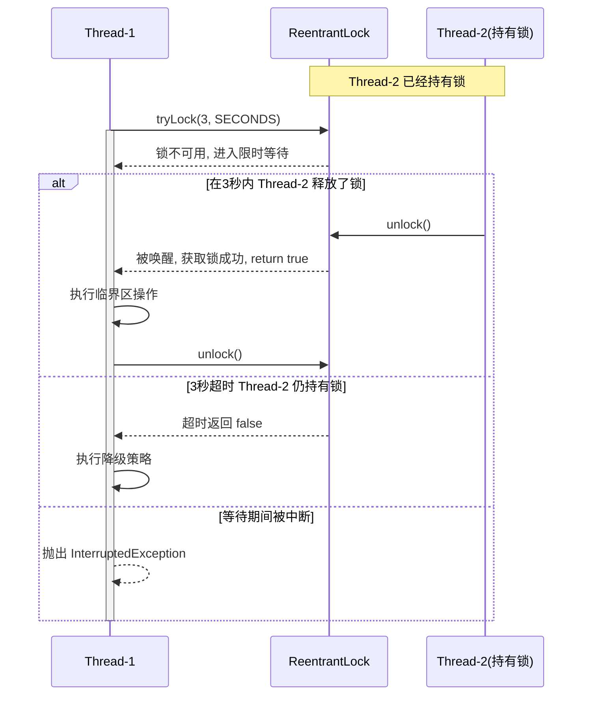
```mermaid
sequenceDiagram
    participant T1 as Thread-1
    participant LK as ReentrantLock
    participant T2 as Thread-2(持有锁)

    Note over T2,LK: Thread-2 已经持有锁

    T1->>LK: tryLock(3, SECONDS)
    activate T1
    LK-->>T1: 锁不可用, 进入限时等待

    alt 在3秒内 Thread-2 释放了锁
        T2->>LK: unlock()
        LK-->>T1: 被唤醒, 获取锁成功, return true
        T1->>T1: 执行临界区操作
        T1->>LK: unlock()
    else 3秒超时 Thread-2 仍持有锁
        LK-->>T1: 超时返回 false
        T1->>T1: 执行降级策略
    else 等待期间被中断
        T1-->>T1: 抛出 InterruptedException
    end
    deactivate T1
```

---

### lockInterruptibly()（可中断获取）

`lockInterruptibly()` 提供了一种**可以被中断的阻塞式锁获取**方式。它与 `lock()` 的区别只有一点，却是至关重要的一点：**如果线程在等待锁的过程中被其他线程中断了（调用了 `thread.interrupt()`），`lockInterruptibly()` 会立即抛出 `InterruptedException`，而不是继续等待。**

在什么场景下你需要这种能力？最典型的是**取消操作和优雅关闭**。例如：

- 用户在 UI 上点击了"取消"按钮，你需要中断正在等待锁的后台线程。
- 应用收到了 SIGTERM 信号，需要在关闭钩子（shutdown hook）中中断所有工作线程，让它们尽快退出。
- 在线程池中，当任务被 `Future.cancel(true)` 取消时，线程会被中断。如果任务内部使用了 `lockInterruptibly()`，它就能及时响应取消请求。

如果你用的是 `lock()` 而不是 `lockInterruptibly()`，上述这些中断信号都会被"吞掉"——线程照样等待，直到拿到锁或永远挂起。

```java
// 演示 lockInterruptibly() 响应中断的能力
public class InterruptibleLockDemo {
    private final Lock lock = new ReentrantLock();

    /**
     * 可中断地获取锁执行操作
     * 如果等待过程中线程被中断, 会抛出 InterruptedException
     */
    public void cancellableTask() throws InterruptedException {
        System.out.println(Thread.currentThread().getName()
                + ": 尝试以可中断方式获取锁...");

        // 与 lock() 不同，lockInterruptibly() 可以响应中断
        // 如果线程在等待锁时被中断，将抛出 InterruptedException
        lock.lockInterruptibly();
        try {
            // 进入临界区
            System.out.println(Thread.currentThread().getName()
                    + ": 获取锁成功，执行任务...");
            Thread.sleep(5000); // 模拟长耗时操作
        } finally {
            lock.unlock(); // 无论如何都要释放锁
            System.out.println(Thread.currentThread().getName()
                    + ": 已释放锁");
        }
    }

    public static void main(String[] args) throws InterruptedException {
        InterruptibleLockDemo demo = new InterruptibleLockDemo();

        // 主线程先获取锁，让子线程需要等待
        demo.lock.lock();

        // 启动子线程——它会在 lockInterruptibly() 处等待
        Thread worker = new Thread(() -> {
            try {
                demo.cancellableTask();
            } catch (InterruptedException e) {
                // 捕获中断异常，线程可以正常退出
                System.out.println(Thread.currentThread().getName()
                        + ": 等待锁时被中断，任务取消！");
            }
        }, "Worker");

        worker.start();              // 启动工作线程
        Thread.sleep(1000);          // 让工作线程进入等待状态
        worker.interrupt();          // 中断工作线程
        Thread.sleep(500);           // 等待中断处理完成
        demo.lock.unlock();          // 主线程释放锁
    }
}
```

运行上述代码，输出将是：

```text
Worker: 尝试以可中断方式获取锁...
Worker: 等待锁时被中断，任务取消！
```

Worker 线程没有一直等待下去，而是在被中断后立即响应并退出。下面这张对比图清晰展示了 `lock()`、`lockInterruptibly()`、`tryLock()` 和 `tryLock(timeout)` 在面对不同情况时的行为差异：

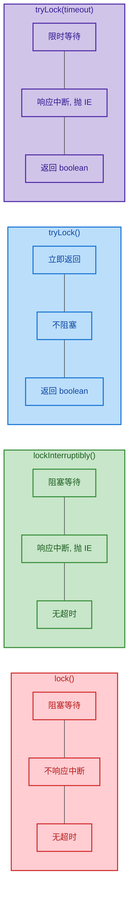
```mermaid
graph LR
    subgraph M1["lock()"]
        direction TB
        M1A["阻塞等待"]
        M1B["不响应中断"]
        M1C["无超时"]
        M1A --- M1B --- M1C
    end

    subgraph M2["lockInterruptibly()"]
        direction TB
        M2A["阻塞等待"]
        M2B["响应中断, 抛 IE"]
        M2C["无超时"]
        M2A --- M2B --- M2C
    end

    subgraph M3["tryLock()"]
        direction TB
        M3A["立即返回"]
        M3B["不阻塞"]
        M3C["返回 boolean"]
        M3A --- M3B --- M3C
    end

    subgraph M4["tryLock(timeout)"]
        direction TB
        M4A["限时等待"]
        M4B["响应中断, 抛 IE"]
        M4C["返回 boolean"]
        M4A --- M4B --- M4C
    end

    classDef block fill:#FFCDD2,stroke:#D32F2F,color:#B71C1C,stroke-width:2px
    classDef interruptible fill:#C8E6C9,stroke:#388E3C,color:#1B5E20,stroke-width:2px
    classDef nonblock fill:#BBDEFB,stroke:#1976D2,color:#0D47A1,stroke-width:2px
    classDef hybrid fill:#D1C4E9,stroke:#512DA8,color:#311B92,stroke-width:2px

    class M1,M1A,M1B,M1C block
    class M2,M2A,M2B,M2C interruptible
    class M3,M3A,M3B,M3C nonblock
    class M4,M4A,M4B,M4C hybrid
```

一条经验法则（rule of thumb）：**如果你的代码需要支持取消或超时，永远不要使用 `lock()`，改用 `lockInterruptibly()` 或 `tryLock(timeout)`。**

---

### newCondition()（条件变量）

`newCondition()` 返回一个与当前 `Lock` 实例绑定的 `Condition` 对象。`Condition` 是 `Object.wait()` / `Object.notify()` / `Object.notifyAll()` 的升级替代品——它们本质上做的是同一件事：让线程在某个条件不满足时等待，条件满足时被唤醒。但 `Condition` 提供了更强大、更精细的控制能力。

**`Condition` 相比 `Object.wait/notify` 的核心优势：**

1. **一把锁可以绑定多个 Condition**。`synchronized` 的每个对象监视器只有一个等待集合（wait set），`notify()` 唤醒的是哪个线程完全不可控。而 `Lock` 可以通过 `newCondition()` 创建多个独立的条件队列，实现精准唤醒。
2. **支持可中断等待、超时等待**。`Condition.await()` 可以响应中断，`Condition.await(long, TimeUnit)` 可以设置超时。
3. **API 语义更清晰**。`await/signal/signalAll` 与 `wait/notify/notifyAll` 完全对应，但命名上不容易与 `Object` 方法混淆。

经典的例子是**有界缓冲区（Bounded Buffer）**——生产者-消费者模型：

```java
// 使用 Lock + Condition 实现线程安全的有界缓冲区
public class BoundedBuffer<T> {
    private final Lock lock = new ReentrantLock();     // 唯一的一把锁
    private final Condition notFull = lock.newCondition();  // 条件1: 缓冲区未满
    private final Condition notEmpty = lock.newCondition(); // 条件2: 缓冲区非空

    private final Object[] items;   // 内部数组存储元素
    private int putIndex;           // 下一个写入位置
    private int takeIndex;          // 下一个读取位置
    private int count;              // 当前元素数量

    public BoundedBuffer(int capacity) {
        items = new Object[capacity]; // 初始化指定容量的缓冲区
    }

    /**
     * 生产者放入元素——如果缓冲区满了就等待
     */
    public void put(T item) throws InterruptedException {
        lock.lock();                 // 获取锁
        try {
            // 如果缓冲区已满, 在 notFull 条件上等待
            // 用 while 而不是 if, 防止虚假唤醒(spurious wakeup)
            while (count == items.length) {
                notFull.await();     // 释放锁并等待, 直到被 signal 唤醒
            }
            // 缓冲区未满, 放入元素
            items[putIndex] = item;
            // 环形数组: 写指针到末尾后回到起点
            if (++putIndex == items.length) putIndex = 0;
            count++;                 // 元素数量加 1
            notEmpty.signal();       // 精准唤醒: 只通知在 notEmpty 上等待的消费者
        } finally {
            lock.unlock();           // 释放锁
        }
    }

    /**
     * 消费者取出元素——如果缓冲区空了就等待
     */
    @SuppressWarnings("unchecked")
    public T take() throws InterruptedException {
        lock.lock();                 // 获取锁
        try {
            // 如果缓冲区为空, 在 notEmpty 条件上等待
            while (count == 0) {
                notEmpty.await();    // 释放锁并等待, 直到被 signal 唤醒
            }
            // 缓冲区非空, 取出元素
            T item = (T) items[takeIndex];
            items[takeIndex] = null; // 帮助 GC, 清除引用
            // 环形数组: 读指针到末尾后回到起点
            if (++takeIndex == items.length) takeIndex = 0;
            count--;                 // 元素数量减 1
            notFull.signal();        // 精准唤醒: 只通知在 notFull 上等待的生产者
            return item;             // 返回取出的元素
        } finally {
            lock.unlock();           // 释放锁
        }
    }
}
```

这个实现中有一个关键细节：`put()` 中只调用 `notEmpty.signal()`（唤醒消费者），`take()` 中只调用 `notFull.signal()`（唤醒生产者）。这就是**精准唤醒**的威力——如果用 `synchronized + notifyAll()`，你必须唤醒所有等待线程（既包括生产者也包括消费者），然后让它们竞争锁、检查条件、可能再次进入等待——这是巨大的性能浪费。

下面用时序图展示一次完整的生产-消费交互过程：

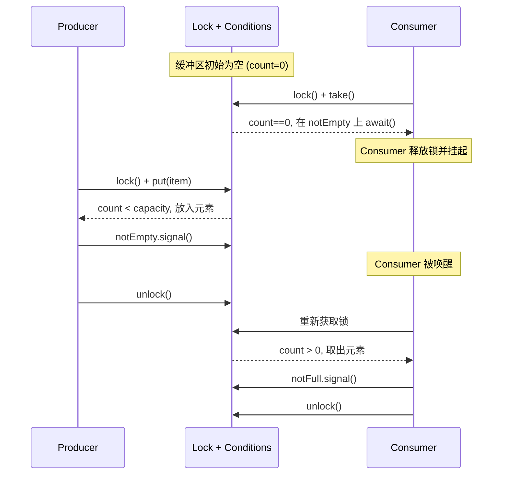
```mermaid
sequenceDiagram
    participant P as Producer
    participant LK as Lock + Conditions
    participant C as Consumer

    Note over LK: 缓冲区初始为空 (count=0)

    C->>LK: lock() + take()
    LK-->>C: count==0, 在 notEmpty 上 await()
    Note over C: Consumer 释放锁并挂起

    P->>LK: lock() + put(item)
    LK-->>P: count < capacity, 放入元素
    P->>LK: notEmpty.signal()
    Note over C: Consumer 被唤醒
    P->>LK: unlock()

    C->>LK: 重新获取锁
    LK-->>C: count > 0, 取出元素
    C->>LK: notFull.signal()
    C->>LK: unlock()
```

最后对 `Condition` 的核心 API 做一个速览：

| 方法 | 说明 |
|------|------|
| `await()` | 释放锁并等待，直到被 signal 或被中断 |
| `awaitUninterruptibly()` | 释放锁并等待，不响应中断 |
| `await(long, TimeUnit)` | 带超时的等待，返回剩余时间 |
| `awaitNanos(long)` | 以纳秒为单位的精确超时等待 |
| `awaitUntil(Date)` | 等待到指定的绝对时间点 |
| `signal()` | 唤醒一个在此 Condition 上等待的线程 |
| `signalAll()` | 唤醒所有在此 Condition 上等待的线程 |

**一个容易犯的错误**：调用 `Condition` 的方法之前必须先持有对应的 `Lock`。如果你在没有 `lock()` 的情况下调用 `condition.await()` 或 `condition.signal()`，会抛出 `IllegalMonitorStateException`。这与 `Object.wait()` 必须在 `synchronized` 块中调用的规则完全一致。

---

**📝 练习题**

以下关于 `Lock` 接口方法的描述，**错误** 的是：

A. `lock()` 方法在等待锁的过程中不会响应 `Thread.interrupt()`，线程会在成功获取锁之后发现自己的中断标志位被设置为 true


B. `tryLock()` 无参版本在公平锁模式下仍然可能会"插队"获取锁，不遵守公平策略


C. `lockInterruptibly()` 在线程已经持有锁的情况下被调用，如果此时线程被中断，会立即抛出 `InterruptedException` 并释放已持有的锁


D. 一个 `Lock` 实例可以通过多次调用 `newCondition()` 创建多个独立的 `Condition` 对象，每个 Condition 维护各自独立的等待队列


**【答案】** C

**【解析】** 选项 C 的描述有两处错误。首先，`lockInterruptibly()` 在线程**已经持有锁**的情况下调用（重入场景），由于锁立即可用（同一线程重入成功），根本不会进入等待状态，也就不存在"等待时被中断"的问题，它会直接成功返回。其次，即便在等待过程中被中断抛出了 `InterruptedException`，`lockInterruptibly()` 也**不会释放已持有的锁**——它只是放弃了"获取锁"的等待，并不是调用 `unlock()`。锁的释放永远是显式的，必须由开发者在 `finally` 中调用 `unlock()` 完成。选项 A 正确，这是 `ReentrantLock` 中 `lock()` 的实际行为（acquire 方法内部在成功获取后通过 `selfInterrupt()` 恢复中断标志）。选项 B 正确，这是 `tryLock()` 的 Javadoc 中明确说明的行为——"even when this lock has been set to use a fair ordering policy, a call to tryLock will immediately acquire the lock if it is available"。选项 D 正确，这正是 `Condition` 相对于 `Object.wait/notify` 的核心优势之一。

---

## ReentrantLock 基本使用

`ReentrantLock` 是 `java.util.concurrent.locks` 包下对 `Lock` 接口最核心、最常用的实现。它的名字直译就是 **"可重入锁"（Reentrant Lock）**，意味着同一个线程可以对同一把锁重复加锁而不会产生死锁。这一点与 `synchronized` 的内置行为一致，但 `ReentrantLock` 将锁的获取与释放完全交给了开发者——这既带来了灵活性，也带来了风险。

从使用模式上看，`ReentrantLock` 最本质的特点可以归结为一句话：**锁的生命周期由你亲手管理，编译器和 JVM 不会替你善后**。`synchronized` 由 JVM 在字节码层面通过 `monitorenter / monitorexit` 自动配对完成加锁与解锁，即使方法抛出异常也能保证隐式释放。而 `ReentrantLock` 没有这层"安全网"——你调用了 `lock()`，就**必须**在合适的地方调用 `unlock()`，否则锁将永远不会释放，其他等待线程将被永久阻塞。

这就引出了 `ReentrantLock` 使用中最重要的编程范式：**try-finally 模式**。

---

### try-finally 模式

#### 为什么需要 try-finally

考虑一段最朴素的加锁代码：

```java
// ===== 反例：危险的写法 =====
ReentrantLock lock = new ReentrantLock(); // 创建一把可重入锁

lock.lock();           // 获取锁
doSomething();         // 执行业务逻辑 —— 如果这里抛出异常...
lock.unlock();         // ...这一行永远不会执行！锁泄漏！
```

如果 `doSomething()` 内部抛出了 `RuntimeException`（比如空指针、数组越界、业务校验失败），程序控制流会直接跳出当前方法或被上层 `catch` 捕获，`lock.unlock()` 这一行根本不会被执行。此时这把锁就进入了一种极其危险的状态——**锁泄漏（Lock Leak）**。任何试图获取这把锁的线程都将无限期地阻塞下去，整个系统可能因此逐步瘫痪。

这与 `synchronized` 形成了鲜明对比。`synchronized` 块在任何退出路径（正常返回、异常抛出）下，JVM 都保证会自动释放 monitor。但 `ReentrantLock` 是纯 Java API 层面的锁，JVM 不认识它，自然也不会替你释放。

因此，Java 并发编程中有一条近乎铁律的最佳实践：

> **"Lock must be released in a `finally` block."**
> ——《Java Concurrency in Practice》 by Brian Goetz

#### 标准范式

下面是 `ReentrantLock` 的**标准使用模板**，也是实际工程中唯一推荐的写法：

```java
import java.util.concurrent.locks.ReentrantLock;

public class Counter {

    private int count = 0;                              // 共享可变状态
    private final ReentrantLock lock = new ReentrantLock(); // 守护该状态的锁（声明为 final 防止引用被篡改）

    public void increment() {
        lock.lock();             // 第一步：获取锁（阻塞直到成功）
        try {                    // 第二步：紧跟 try 块
            count++;             // 第三步：在 try 内执行所有临界区逻辑
        } finally {
            lock.unlock();       // 第四步：在 finally 中无条件释放锁
        }
    }

    public int getCount() {
        lock.lock();             // 读操作同样需要加锁以保证可见性
        try {
            return count;        // 读取共享状态
        } finally {
            lock.unlock();       // 读完即释放
        }
    }
}
```

整个模式可以用一张流程图来直观呈现：

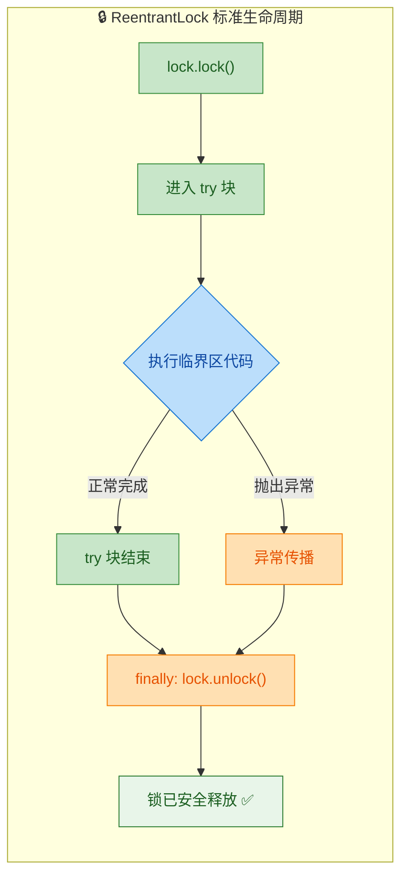
```mermaid
graph LR
    subgraph LockLifecycle["🔒 ReentrantLock 标准生命周期"]
        direction TB
        A["lock.lock()"] --> B["进入 try 块"]
        B --> C{"执行临界区代码"}
        C -->|正常完成| D["try 块结束"]
        C -->|抛出异常| E["异常传播"]
        D --> F["finally: lock.unlock()"]
        E --> F
        F --> G["锁已安全释放 ✅"]
    end

    classDef stepNode fill:#C8E6C9,stroke:#388E3C,color:#1B5E20
    classDef decisionNode fill:#BBDEFB,stroke:#1976D2,color:#0D47A1
    classDef finallyNode fill:#FFE0B2,stroke:#F57C00,color:#E65100
    classDef safeNode fill:#E8F5E9,stroke:#2E7D32,color:#1B5E20

    class A,B,D stepNode
    class C decisionNode
    class E,F finallyNode
    class G safeNode
```

请特别注意代码中 `lock.lock()` 的位置——它在 `try` 块的**外面**。这不是偶然的排版，而是刻意的设计。

#### lock() 应该放在 try 外面

很多初学者会写出这样的代码：

```java
// ===== 反例：lock() 放进了 try 块 =====
try {
    lock.lock();         // 如果 lock() 本身抛出异常（极罕见但理论存在）
    doSomething();
} finally {
    lock.unlock();       // 这里会对一把"没有成功加锁"的锁调用 unlock()
                         // 抛出 IllegalMonitorStateException！
}
```

如果 `lock.lock()` 因为某种原因失败了（虽然对于 `ReentrantLock` 这种情况极其罕见，但在自定义 `Lock` 实现中完全可能），`finally` 块仍然会执行 `unlock()`。此时当前线程并没有持有这把锁，`unlock()` 调用将抛出 `IllegalMonitorStateException`，不仅掩盖了原始异常，还可能导致其他持有锁的线程被错误释放。

正确的做法是：**先调用 `lock()`，成功后再进入 `try` 块**。这样只有在锁确实被获取之后，`finally` 中的 `unlock()` 才会执行。

```java
// ===== 正例：标准写法 =====
lock.lock();             // 在 try 外部获取锁
try {
    // 只有 lock() 成功返回后，执行流才会到达这里
    doSomething();       // 临界区代码
} finally {
    lock.unlock();       // 此时一定持有锁，unlock() 安全调用
}
```

#### 可重入性演示

`ReentrantLock` 名字中的 "Reentrant" 意味着**同一线程**可以多次获取同一把锁，每次成功 `lock()` 都会使内部持有计数器（hold count）加 1，对应地每次 `unlock()` 计数器减 1，直到减为 0 时锁才真正释放。

```java
public class ReentrantDemo {

    private final ReentrantLock lock = new ReentrantLock();

    public void outer() {
        lock.lock();                     // hold count = 1
        try {
            System.out.println("outer: hold count = " + lock.getHoldCount()); // 输出 1
            inner();                     // 调用另一个需要同一把锁的方法
        } finally {
            lock.unlock();               // hold count 减回 1 → 0，锁真正释放
        }
    }

    public void inner() {
        lock.lock();                     // hold count = 2（同一线程再次获取，不会阻塞）
        try {
            System.out.println("inner: hold count = " + lock.getHoldCount()); // 输出 2
        } finally {
            lock.unlock();               // hold count = 1（减 1，但锁尚未释放）
        }
    }

    public static void main(String[] args) {
        ReentrantDemo demo = new ReentrantDemo();
        demo.outer();
        // 输出:
        // outer: hold count = 1
        // inner: hold count = 2
    }
}
```

如果锁不支持可重入，`inner()` 中的 `lock.lock()` 会因为"锁已被自己持有"而永久阻塞，产生**自死锁（Self-Deadlock）**。可重入机制正是为了解决递归调用或方法间调用链中多次加锁的场景。

其内部状态变化过程如下：

```text
线程 T1 执行流程:

outer()                     inner()
  │                           │
  ├─ lock()                   │
  │  state: 0 → 1             │
  │  owner: null → T1         │
  │                           │
  │──────── 调用 inner() ──────►│
  │                           ├─ lock()
  │                           │  state: 1 → 2 (重入!)
  │                           │  owner: T1 (不变)
  │                           │
  │                           ├─ unlock()
  │                           │  state: 2 → 1
  │                           │  owner: T1 (仍持有)
  │◄─────── inner()返回 ───────│
  │
  ├─ unlock()
  │  state: 1 → 0
  │  owner: T1 → null  ← 锁真正释放！
  │
  ▼ 其他等待线程可以竞争了
```

要点：**`lock()` 和 `unlock()` 的调用次数必须严格匹配**。如果 `lock()` 了 N 次却只 `unlock()` 了 N-1 次，锁将永远不会释放。

---

### 必须手动释放

这是 `ReentrantLock` 与 `synchronized` 最大的使用差异，也是最容易出问题的地方。我们需要从多个维度来深刻理解"手动释放"这一约束。

#### synchronized 的自动释放 vs ReentrantLock 的手动释放

先回顾 `synchronized` 的行为：

```java
// synchronized：JVM 保证自动释放
public synchronized void doWork() {
    // 进入方法时自动获取 this 对象的 monitor
    riskyOperation();    // 即使这里抛出异常...
    // 退出方法时（无论正常 return 还是异常抛出）自动释放 monitor
}
```

编译器会在字节码中插入 `monitorenter` 和 `monitorexit` 指令，并且为异常路径额外生成一条 `monitorexit` 作为安全保障。这意味着程序员完全不需要操心锁的释放。

而 `ReentrantLock` 完全不同：

```java
// ReentrantLock：你的锁，你负责
public void doWork() {
    lock.lock();
    try {
        riskyOperation();    // 如果这里抛出异常
    } finally {
        lock.unlock();       // 必须由你显式调用 unlock()
    }
    // 如果忘了 finally 块中的 unlock()，锁就永远回不来了
}
```

用一张对比图可以更清晰地看出差异：

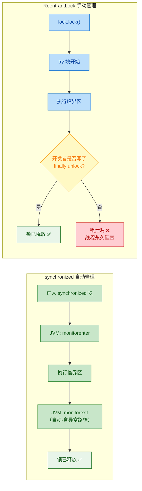
```mermaid
graph LR
    subgraph SYN["synchronized 自动管理"]
        direction TB
        S1["进入 synchronized 块"] --> S2["JVM: monitorenter"]
        S2 --> S3["执行临界区"]
        S3 --> S4["JVM: monitorexit<br/>（自动·含异常路径）"]
        S4 --> S5["锁已释放 ✅"]
    end

    subgraph RLK["ReentrantLock 手动管理"]
        direction TB
        R1["lock.lock()"] --> R2["try 块开始"]
        R2 --> R3["执行临界区"]
        R3 --> R4{"开发者是否写了<br/>finally unlock?"}
        R4 -->|是| R5["锁已释放 ✅"]
        R4 -->|否| R6["锁泄漏 ❌<br/>线程永久阻塞"]
    end

    classDef autoNode fill:#C8E6C9,stroke:#388E3C,color:#1B5E20
    classDef manualNode fill:#BBDEFB,stroke:#1976D2,color:#0D47A1
    classDef dangerNode fill:#FFCDD2,stroke:#D32F2F,color:#B71C1C
    classDef safeNode fill:#E8F5E9,stroke:#2E7D32,color:#1B5E20
    classDef decNode fill:#FFF9C4,stroke:#F9A825,color:#F57F17

    class S1,S2,S3,S4 autoNode
    class S5,R5 safeNode
    class R1,R2,R3 manualNode
    class R4 decNode
    class R6 dangerNode
```

#### 忘记释放锁的灾难场景

让我们看一个真实的"锁泄漏"灾难是如何发生的：

```java
public class LockLeakDisaster {

    private final ReentrantLock lock = new ReentrantLock();
    private List<String> dataList = new ArrayList<>();

    // ===== 反例：忘记 finally 释放锁 =====
    public void addData(String data) {
        lock.lock();                          // 获取锁
        
        // 假设某次调用时 data 为 null
        if (data.length() > 100) {            // NullPointerException！
            data = data.substring(0, 100);    // 不会执行
        }
        dataList.add(data);                   // 不会执行
        
        lock.unlock();                        // 不会执行 —— 锁泄漏！
    }

    // 此后所有线程调用 addData() 都会在 lock.lock() 处永久阻塞
    // 系统表现：线程池耗尽 → 请求堆积 → 服务不可用
}
```

这类 Bug 在生产环境中极难排查，因为：
- 没有明显的错误日志（线程只是在 `waiting` 状态）
- 通过 `jstack` 抓线程转储才能发现大量线程卡在 `ReentrantLock.lock()`
- 且这类问题往往是间歇性的（只在特定异常路径触发）

#### 多出口方法中的释放陷阱

即使记住了 `try-finally` 模式，在复杂的方法逻辑中仍然容易犯错：

```java
// ===== 反例：多个 return 路径中忘记释放 =====
public String getData(String key) {
    lock.lock();
    
    if (key == null) {
        return null;              // 提前返回 —— 锁没释放！
    }
    
    try {
        String value = map.get(key);
        return value;
    } finally {
        lock.unlock();
    }
}
```

上面代码中 `key == null` 的早期返回绕过了 `try-finally` 块，导致锁泄漏。**正确做法是让所有逻辑都在 `try` 块内部**：

```java
// ===== 正例：所有逻辑都在 try 块内 =====
public String getData(String key) {
    lock.lock();                   // 获取锁
    try {
        if (key == null) {
            return null;           // 这个 return 会先执行 finally 再返回
        }
        return map.get(key);       // 正常返回，同样先执行 finally
    } finally {
        lock.unlock();             // 无论哪条路径退出，锁都会被释放
    }
}
```

Java 的 `finally` 块保证在 `try` 中任何退出路径（`return`、异常、`break`）之前执行。因此把所有逻辑放进 `try` 块就是万全之策。

#### 工程实践：封装与防御

在大型项目中，经常会将 `ReentrantLock` 的使用封装起来，减少出错概率：

```java
public class SafeExecutor {

    private final ReentrantLock lock = new ReentrantLock();

    /**
     * 在锁保护下执行任意操作（利用函数式接口封装 try-finally）
     * @param action 需要在临界区内执行的操作
     */
    public void executeWithLock(Runnable action) {
        lock.lock();                  // 获取锁
        try {
            action.run();             // 执行传入的业务逻辑
        } finally {
            lock.unlock();            // 确保释放
        }
    }

    /**
     * 在锁保护下执行有返回值的操作
     * @param supplier 需要在临界区内执行的计算
     * @return 计算结果
     */
    public <T> T computeWithLock(Supplier<T> supplier) {
        lock.lock();                  // 获取锁
        try {
            return supplier.get();    // 执行传入的计算并返回结果
        } finally {
            lock.unlock();            // 确保释放
        }
    }
}

// 使用方式 —— 调用者完全不需要关心锁的获取与释放
SafeExecutor executor = new SafeExecutor();

executor.executeWithLock(() -> {
    // 临界区逻辑
    sharedList.add("item");
});

String result = executor.computeWithLock(() -> {
    // 临界区计算
    return sharedMap.get("key");
});
```

这种封装把 `try-finally` 的"仪式性代码"（boilerplate）集中在一处，业务代码只需传入 lambda 即可。这是实际工程中非常推荐的模式，尤其在微服务框架和中间件开发中广泛使用。

#### 关键原则总结

用一张表归纳"手动释放"的核心要点：

| 原则 | 说明 |
|------|------|
| **lock() 在 try 外** | 确保只有成功获取锁后才进入 try 块 |
| **unlock() 在 finally 中** | 确保无论正常退出还是异常退出都释放锁 |
| **所有逻辑在 try 内** | 避免 try 块外的提前 return 绕过 finally |
| **lock/unlock 次数配对** | 重入 N 次就必须释放 N 次，否则锁不会真正释放 |
| **锁声明为 final** | 防止锁引用被意外重新赋值，导致多线程操作不同锁对象 |
| **优先考虑封装** | 用模板方法/函数式接口封装 try-finally，减少人为疏忽 |

---

**📝 练习题**

以下代码存在并发安全隐患，请找出问题所在：

```java
public class BuggyService {
    private ReentrantLock lock = new ReentrantLock();
    private int balance = 1000;

    public void withdraw(int amount) {
        try {
            lock.lock();
            if (balance < amount) {
                throw new RuntimeException("余额不足");
            }
            balance -= amount;
        } finally {
            lock.unlock();
        }
    }
}
```

A. `lock.lock()` 放在了 `try` 块内部，如果 `lock()` 本身失败，`finally` 会对未持有的锁调用 `unlock()`


B. `lock` 字段没有声明为 `final`，可能被重新赋值导致不同线程持有不同锁对象


C. A 和 B 都是隐患


D. 代码没有任何问题，try-finally 已经保证了锁的正确释放


**【答案】** C

**【解析】** 这段代码同时存在两个问题。**问题一**：`lock.lock()` 写在了 `try` 块内部。虽然 `ReentrantLock.lock()` 在实践中几乎不会抛出异常，但这违反了标准范式——如果 `lock()` 因为某种原因（比如 Error 级别的异常、或使用自定义 Lock 实现）失败了，`finally` 块中的 `unlock()` 会在当前线程未持有锁的情况下被调用，抛出 `IllegalMonitorStateException`，掩盖原始异常。正确做法是将 `lock.lock()` 放在 `try` 块之前。**问题二**：`lock` 字段没有用 `final` 修饰。假设其他代码不小心执行了 `this.lock = new ReentrantLock()`，那么不同线程可能使用完全不同的锁对象进行同步，导致互斥失效。声明为 `private final ReentrantLock lock = new ReentrantLock()` 是最佳实践，从编译期就杜绝引用被篡改的可能。

---

## ReentrantLock vs synchronized ⭐⭐

`synchronized` 是 Java 语言层面的内置锁（intrinsic lock），从 JDK 1.0 就存在，使用简单、由 JVM 自动管理。而 `ReentrantLock` 是 JDK 5 由 Doug Lea 在 `java.util.concurrent.locks` 包中引入的显式锁（explicit lock），它实现了 `Lock` 接口，提供了远超 `synchronized` 的灵活控制能力。两者都是 **可重入的互斥锁**（reentrant mutual exclusion lock），但在功能边界、使用方式和适用场景上存在本质差异。理解二者的对比，是从"会用锁"走向"选对锁"的关键一步。

在深入每个维度之前，先用一张全景对比图建立整体认知：


```mermaid
graph LR
    subgraph SYN["synchronized"]
        direction TB
        S1["语言级关键字"]
        S2["JVM 自动加锁/释放"]
        S3["不可中断等待"]
        S4["不可超时等待"]
        S5["不可尝试获取"]
        S6["仅非公平"]
        S7["单条件变量 wait/notify"]
    end

    subgraph RTL["ReentrantLock"]
        direction TB
        R1["API 级显式锁"]
        R2["必须手动 unlock"]
        R3["lockInterruptibly 可中断"]
        R4["tryLock timeout 可超时"]
        R5["tryLock 可尝试"]
        R6["公平 / 非公平可选"]
        R7["多 Condition 条件变量"]
    end

    SYN -- "功能演进" --> RTL

    classDef syncStyle fill:#E3F2FD,stroke:#1565C0,color:#0D47A1
    classDef lockStyle fill:#E8F5E9,stroke:#2E7D32,color:#1B5E20

    class S1,S2,S3,S4,S5,S6,S7 syncStyle
    class R1,R2,R3,R4,R5,R6,R7 lockStyle
```

下面逐维度展开深入分析。

---

### 可中断

**`synchronized` 的致命缺陷之一是：线程在等待获取锁时无法被中断。** 一旦线程进入 `BLOCKED` 状态等待 `synchronized` 锁，即使你调用了 `thread.interrupt()`，该线程也不会响应中断，它只会傻傻地等下去，直到锁被释放并成功获取。这在某些场景下会造成严重问题——比如你想实现一个"取消"功能，或者想在检测到死锁后主动终止某个线程，`synchronized` 完全无能为力。

`ReentrantLock` 通过 `lockInterruptibly()` 方法完美解决了这个问题。线程在等待锁的过程中，如果收到中断信号，会立即抛出 `InterruptedException`，从而可以优雅地退出等待、释放资源、执行清理逻辑。

我们用一个对比实验来直观感受二者差异：

```java
/**
 * 演示 synchronized 无法响应中断 vs ReentrantLock 可中断获取
 */
public class InterruptibleComparison {

    // ==================== synchronized 版本 ====================
    private static final Object monitorLock = new Object(); // 内置锁对象

    /**
     * synchronized 版本：线程在等待锁时不会响应中断
     */
    static void synchronizedDemo() throws InterruptedException {
        // 先让主线程持有锁，模拟锁被长期占用
        synchronized (monitorLock) {
            Thread waitingThread = new Thread(() -> {
                System.out.println("[synchronized] 尝试获取锁...");
                // 这里会进入 BLOCKED 状态，且无法被中断唤醒
                synchronized (monitorLock) {
                    System.out.println("[synchronized] 成功获取锁"); // 永远不会执行到
                }
            }, "syn-waiting");

            waitingThread.start();              // 启动等待线程
            Thread.sleep(1000);                 // 等待子线程进入 BLOCKED 状态
            waitingThread.interrupt();          // 尝试中断——无效！
            System.out.println("[synchronized] 已调用 interrupt(), 但线程状态: "
                    + waitingThread.getState()); // 输出: BLOCKED，不是 INTERRUPTED
            // waitingThread 将一直阻塞在 synchronized 上，无法脱身
        }
    }

    // ==================== ReentrantLock 版本 ====================
    private static final ReentrantLock reentrantLock = new ReentrantLock(); // 显式锁

    /**
     * ReentrantLock 版本：线程在等待锁时能响应中断
     */
    static void reentrantLockDemo() throws InterruptedException {
        reentrantLock.lock();  // 主线程先持有锁
        try {
            Thread waitingThread = new Thread(() -> {
                System.out.println("[ReentrantLock] 尝试可中断获取锁...");
                try {
                    // lockInterruptibly() 在等待过程中可以响应中断
                    reentrantLock.lockInterruptibly();
                    // 如果成功获取锁才会执行到这里
                    try {
                        System.out.println("[ReentrantLock] 成功获取锁");
                    } finally {
                        reentrantLock.unlock(); // 安全释放
                    }
                } catch (InterruptedException e) {
                    // 中断被成功响应！线程可以优雅退出
                    System.out.println("[ReentrantLock] 等待被中断，优雅退出！");
                }
            }, "lock-waiting");

            waitingThread.start();              // 启动等待线程
            Thread.sleep(1000);                 // 等待子线程进入 WAITING 状态
            waitingThread.interrupt();          // 发送中断信号——有效！
            waitingThread.join();               // 等待子线程结束
            System.out.println("[ReentrantLock] 等待线程已正常终止");
        } finally {
            reentrantLock.unlock();             // 主线程释放锁
        }
    }
}
```

运行结果对比鲜明：`synchronized` 版本的子线程在收到中断后 **纹丝不动**，依然处于 `BLOCKED` 状态；而 `ReentrantLock` 版本的子线程 **立即感知中断**，抛出 `InterruptedException` 后正常退出。

这个能力在以下场景尤为关键：

- **死锁恢复**：检测到死锁后，可以中断其中一个线程使其释放资源，打破死锁环路。
- **任务取消**：用户点击"取消"按钮时，需要终止正在等待锁的后台线程。
- **超时控制的前置条件**：`lockInterruptibly()` 是很多高级并发组件（如 `BlockingQueue`）实现可取消阻塞操作的基础。

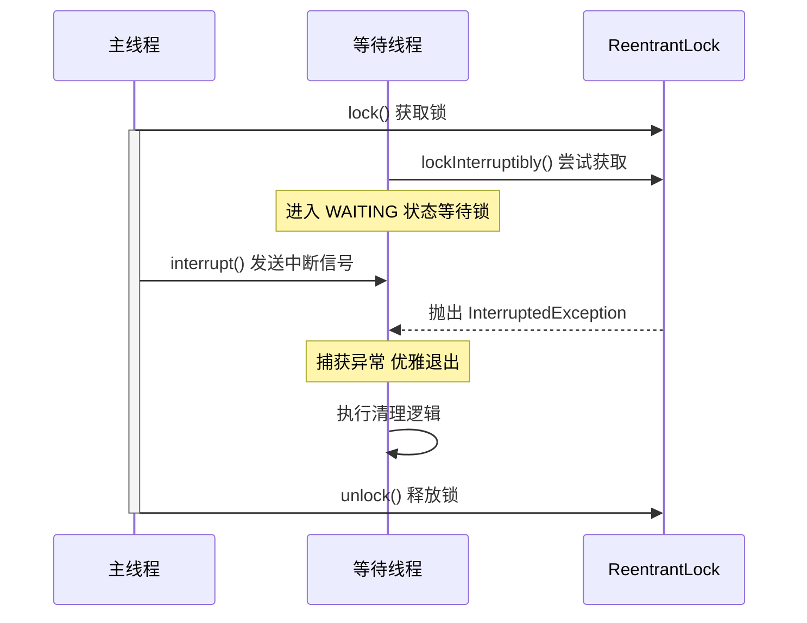
```mermaid
sequenceDiagram
    participant Main as 主线程
    participant T1 as 等待线程
    participant Lock as ReentrantLock

    Main->>Lock: lock() 获取锁
    activate Main
    T1->>Lock: lockInterruptibly() 尝试获取
    Note over T1: 进入 WAITING 状态等待锁
    Main->>T1: interrupt() 发送中断信号
    Lock-->>T1: 抛出 InterruptedException
    Note over T1: 捕获异常 优雅退出
    T1->>T1: 执行清理逻辑
    Main->>Lock: unlock() 释放锁
    deactivate Main
```

---

### 可超时

`synchronized` 的等待是 **无限期的（indefinite blocking）**，线程一旦开始等待锁，要么等到天荒地老拿到锁，要么就永远等下去（如果锁永远不释放，例如死锁）。没有任何机制可以指定"我最多等 3 秒，等不到就算了"。

`ReentrantLock` 的 `tryLock(long timeout, TimeUnit unit)` 提供了 **超时等待** 机制。线程可以设定一个等待的时间上限，如果在指定时间内没有获取到锁，方法返回 `false`，线程不会被永久阻塞，而是可以执行降级逻辑或重试策略。

```java
/**
 * 演示超时获取锁的实际应用场景：
 * 模拟转账操作，同时获取两个账户的锁，避免死锁
 */
public class TimeoutLockTransfer {

    static class Account {
        private final String name;                                  // 账户名
        private final ReentrantLock lock = new ReentrantLock();     // 每个账户一把锁
        private int balance;                                        // 余额

        Account(String name, int balance) {                         // 构造方法
            this.name = name;
            this.balance = balance;
        }
    }

    /**
     * 使用 tryLock(timeout) 安全地同时获取两把锁
     * 如果在超时时间内无法同时获取，则释放已持有的锁并重试
     */
    static boolean transfer(Account from, Account to, int amount)
            throws InterruptedException {

        // 设定总的超时时间为 5 秒
        long deadline = System.nanoTime() + TimeUnit.SECONDS.toNanos(5);

        while (true) {
            // 尝试获取第一把锁，最多等待剩余时间
            if (from.lock.tryLock(calculateRemaining(deadline), TimeUnit.NANOSECONDS)) {
                try {
                    // 尝试获取第二把锁，最多等待剩余时间
                    if (to.lock.tryLock(calculateRemaining(deadline), TimeUnit.NANOSECONDS)) {
                        try {
                            // 两把锁都成功获取，执行转账
                            if (from.balance < amount) {            // 余额不足检查
                                System.out.println("余额不足！");
                                return false;
                            }
                            from.balance -= amount;                 // 扣款
                            to.balance += amount;                   // 入账
                            System.out.printf("转账成功: %s -> %s, 金额: %d%n",
                                    from.name, to.name, amount);
                            return true;                            // 转账成功
                        } finally {
                            to.lock.unlock();                       // 释放第二把锁
                        }
                    }
                    // 没拿到第二把锁，释放第一把，进入下一轮重试
                } finally {
                    from.lock.unlock();                             // 释放第一把锁
                }
            }

            // 检查是否已超过总截止时间
            if (System.nanoTime() >= deadline) {
                System.out.println("转账超时，无法获取所有必要的锁");
                return false;                                       // 超时放弃
            }

            // 短暂随机退避，降低活锁概率
            Thread.sleep(ThreadLocalRandom.current().nextInt(10, 50));
        }
    }

    /**
     * 计算距离截止时间还剩多少纳秒
     */
    private static long calculateRemaining(long deadline) {
        return Math.max(deadline - System.nanoTime(), 0);           // 最小值为0
    }
}
```

上面的转账场景完美诠释了 `tryLock(timeout)` 的价值：两个线程同时执行 `transfer(A, B, 100)` 和 `transfer(B, A, 200)` 时，如果使用 `synchronized`，两个线程分别持有一把锁并等待对方，**就是经典的死锁**。而 `tryLock(timeout)` 使得线程在拿不到第二把锁时，会释放第一把锁后退出重试，**从根本上避免了死锁**。

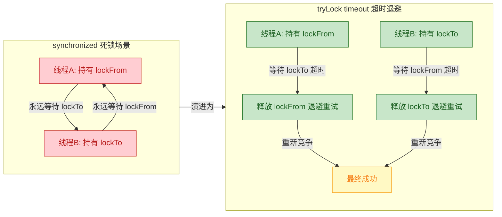
```mermaid
graph LR
    subgraph SYNC["synchronized 死锁场景"]
        direction TB
        SA["线程A: 持有 lockFrom"]
        SB["线程B: 持有 lockTo"]
        SA -- "永远等待 lockTo" --> SB
        SB -- "永远等待 lockFrom" --> SA
    end

    subgraph TRYLOCK["tryLock timeout 超时退避"]
        direction TB
        TA["线程A: 持有 lockFrom"]
        TB["线程B: 持有 lockTo"]
        TA -- "等待 lockTo 超时" --> TC["释放 lockFrom 退避重试"]
        TB -- "等待 lockFrom 超时" --> TD["释放 lockTo 退避重试"]
        TC -- "重新竞争" --> TE["最终成功"]
        TD -- "重新竞争" --> TE
    end

    SYNC -- "演进为" --> TRYLOCK

    classDef deadlock fill:#FFCDD2,stroke:#C62828,color:#B71C1C
    classDef timeout fill:#C8E6C9,stroke:#2E7D32,color:#1B5E20
    classDef success fill:#FFF9C4,stroke:#F9A825,color:#F57F17

    class SA,SB deadlock
    class TA,TB,TC,TD timeout
    class TE success
```

---

### 可尝试

`synchronized` 是一种 **全有或全无（all-or-nothing）** 的阻塞操作——要么拿到锁，要么一直阻塞。不存在"试一试，拿不到就走"的选项。

`ReentrantLock.tryLock()`（无参版本）提供了 **非阻塞的锁获取尝试**。调用后立即返回 `boolean` 结果：`true` 表示成功获取了锁，`false` 表示锁当前被其他线程持有。线程 **不会进入任何等待状态**，可以立刻执行替代逻辑。

这种 "try-and-fallback" 模式在高并发系统中非常实用：

```java
/**
 * 演示 tryLock 非阻塞获取的实际应用：
 * 缓存刷新场景——只需要一个线程去刷新，其他线程直接返回旧值
 */
public class CacheRefreshWithTryLock {

    private final ReentrantLock refreshLock = new ReentrantLock(); // 刷新专用锁
    private volatile Map<String, Object> cache = new HashMap<>();  // 缓存数据
    private volatile long lastRefreshTime = 0;                     // 上次刷新时间

    /**
     * 获取缓存数据，如果缓存过期则尝试刷新
     * 使用 tryLock 保证只有一个线程执行刷新，其余线程直接返回旧值
     */
    public Object get(String key) {
        Object value = cache.get(key);                              // 从缓存中获取

        // 检查缓存是否过期（超过 60 秒视为过期）
        if (System.currentTimeMillis() - lastRefreshTime > 60_000) {
            // tryLock()：非阻塞尝试获取锁
            if (refreshLock.tryLock()) {
                try {
                    // Double-check：防止多个线程同时检测到过期后重复刷新
                    if (System.currentTimeMillis() - lastRefreshTime > 60_000) {
                        System.out.println(Thread.currentThread().getName()
                                + " 正在刷新缓存...");
                        cache = loadFromDatabase();                 // 从数据库加载新数据
                        lastRefreshTime = System.currentTimeMillis(); // 更新刷新时间
                        value = cache.get(key);                     // 使用最新数据
                    }
                } finally {
                    refreshLock.unlock();                            // 释放刷新锁
                }
            } else {
                // 获取锁失败，说明其他线程正在刷新，直接返回旧缓存值
                System.out.println(Thread.currentThread().getName()
                        + " 缓存正在被其他线程刷新，返回旧值");
            }
        }

        return value;                                               // 返回缓存值
    }

    private Map<String, Object> loadFromDatabase() {                // 模拟数据库加载
        // ... 实际查询逻辑
        return new HashMap<>();
    }
}
```

对比 `tryLock()` 的三种形态，帮助理解何时用哪个：

| 方法签名 | 阻塞行为 | 返回值 | 典型场景 |
|---|---|---|---|
| `tryLock()` | **完全不阻塞**，立即返回 | `boolean` | 缓存刷新、资源竞争降级 |
| `tryLock(timeout, unit)` | **限时阻塞**，超时后返回 | `boolean` | 转账双锁、有截止时间的操作 |
| `lock()` | **无限阻塞**，直到获取 | `void` | 必须获取锁才能继续的关键操作 |
| `lockInterruptibly()` | **无限阻塞但可中断** | `void` | 需要支持取消的长等待操作 |

---

### 公平锁选项

`synchronized` **永远是非公平锁**，这一点无法更改。当锁被释放时，所有等待线程重新竞争，JVM 不保证任何先来后到的顺序。实际上，在 JVM 的实现中，刚刚被唤醒或者刚到达的线程反而可能因为已经在 CPU 缓存中"热着"，竞争成功的概率更大。

`ReentrantLock` 在构造时提供了公平性选择：

```java
// 非公平锁（默认）——新到达的线程可以插队
ReentrantLock unfairLock = new ReentrantLock();         // 等价于 new ReentrantLock(false)

// 公平锁——严格按照 FIFO 等待队列顺序获取锁
ReentrantLock fairLock = new ReentrantLock(true);       // fair = true
```

公平锁在底层维护了一个基于 AQS（AbstractQueuedSynchronizer）的 FIFO 等待队列（CLH 队列变体）。每当一个新线程试图获取锁时，公平锁会先检查队列中是否有等待更久的线程——如果有，即使当前锁恰好可用，新线程也必须排队等候，确保先到先得。

```java
/**
 * 演示公平锁 vs 非公平锁的行为差异
 */
public class FairnessComparison {

    /**
     * 启动多个线程反复获取同一把锁，观察获取顺序
     */
    static void testFairness(boolean fair) throws InterruptedException {
        ReentrantLock lock = new ReentrantLock(fair);    // 根据参数创建公平/非公平锁
        List<String> acquisitionOrder = new CopyOnWriteArrayList<>(); // 线程安全的记录列表

        // 创建 5 个线程，每个线程获取锁 3 次
        Runnable task = () -> {
            for (int i = 0; i < 3; i++) {
                lock.lock();                             // 获取锁
                try {
                    String record = Thread.currentThread().getName(); // 记录哪个线程获取到了
                    acquisitionOrder.add(record);
                    Thread.sleep(10);                    // 短暂持有锁，让其他线程排队
                } catch (InterruptedException e) {
                    Thread.currentThread().interrupt();
                } finally {
                    lock.unlock();                       // 释放锁
                }
            }
        };

        Thread[] threads = new Thread[5];
        for (int i = 0; i < 5; i++) {
            threads[i] = new Thread(task, "T" + i);      // 创建线程 T0-T4
        }
        for (Thread t : threads) t.start();               // 启动所有线程
        for (Thread t : threads) t.join();                // 等待所有线程结束

        System.out.printf("公平=%s, 获取顺序: %s%n", fair, acquisitionOrder);
    }

    public static void main(String[] args) throws InterruptedException {
        testFairness(true);    // 公平锁：输出接近 T0,T1,T2,T3,T4,T0,T1,T2,T3,T4,...
        testFairness(false);   // 非公平锁：输出可能是 T0,T0,T0,T1,T1,T1,...（同一线程连续获取）
    }
}
```

公平锁的获取顺序更加均匀，而非公平锁允许同一线程在释放锁后立即再次获取（因为它还在 CPU 上运行，不需要上下文切换），因此非公平锁的吞吐量更高。这一话题在"公平锁与非公平锁"章节将进一步展开。

---

### 多条件变量

`synchronized` 配合 `Object.wait()` / `notify()` / `notifyAll()` 实现线程间的等待-通知机制，但它只有 **一个隐式条件队列**。这意味着所有调用 `wait()` 的线程都在同一个队列里等待，当你调用 `notifyAll()` 唤醒时，所有等待线程都会被唤醒（包括那些条件并不满足的线程），造成无意义的竞争和上下文切换，这就是经典的 **惊群问题（thundering herd problem）**。

`ReentrantLock` 通过 `newCondition()` 方法可以创建 **多个独立的 Condition 对象**，每个 Condition 维护各自独立的等待队列。你可以精准地唤醒特定条件队列上的线程，避免不必要的唤醒。

以经典的有界阻塞队列为例，对比两种实现：

```java
/**
 * 使用 synchronized + wait/notify 的有界队列
 * 缺点：只有一个等待队列，notifyAll 会唤醒所有线程（包括不相关的）
 */
class BoundedQueueSync<E> {
    private final Object[] items;           // 存储元素的数组
    private int head, tail, count;          // 队首指针、队尾指针、元素计数

    BoundedQueueSync(int capacity) {
        items = new Object[capacity];       // 初始化固定容量数组
    }

    public synchronized void put(E item) throws InterruptedException {
        while (count == items.length) {     // 队列满了
            wait();                         // 生产者等待——但等在跟消费者同一个队列里！
        }
        items[tail] = item;                 // 放入元素
        tail = (tail + 1) % items.length;   // 环形队列指针前移
        count++;                            // 元素计数 +1
        notifyAll();                        // 必须用 notifyAll！因为要唤醒消费者
                                            // 但同时也唤醒了其他正在等待的生产者（浪费）
    }

    @SuppressWarnings("unchecked")
    public synchronized E take() throws InterruptedException {
        while (count == 0) {                // 队列空了
            wait();                         // 消费者等待——同一个队列
        }
        E item = (E) items[head];           // 取出元素
        items[head] = null;                 // 帮助 GC
        head = (head + 1) % items.length;   // 环形队列指针前移
        count--;                            // 元素计数 -1
        notifyAll();                        // 必须用 notifyAll！唤醒生产者
                                            // 但同时也唤醒了其他正在等待的消费者（浪费）
        return item;
    }
}
```

```java
/**
 * 使用 ReentrantLock + 多 Condition 的有界队列
 * 优点：生产者和消费者在不同的条件队列上等待，互不干扰
 */
class BoundedQueueLock<E> {
    private final Object[] items;                           // 存储元素的数组
    private int head, tail, count;                          // 队首、队尾、计数

    private final ReentrantLock lock = new ReentrantLock(); // 一把锁
    private final Condition notFull = lock.newCondition();  // 条件1：队列未满（生产者等待）
    private final Condition notEmpty = lock.newCondition(); // 条件2：队列非空（消费者等待）

    BoundedQueueLock(int capacity) {
        items = new Object[capacity];                       // 初始化
    }

    public void put(E item) throws InterruptedException {
        lock.lock();                                        // 显式加锁
        try {
            while (count == items.length) {                 // 队列满了
                notFull.await();                            // 生产者在 notFull 条件上等待
            }
            items[tail] = item;                             // 放入元素
            tail = (tail + 1) % items.length;               // 环形指针前移
            count++;                                        // 计数 +1
            notEmpty.signal();                              // 精准唤醒一个在 notEmpty 上等待的消费者
                                                            // 不会影响在 notFull 上等待的其他生产者！
        } finally {
            lock.unlock();                                  // 释放锁
        }
    }

    @SuppressWarnings("unchecked")
    public E take() throws InterruptedException {
        lock.lock();                                        // 显式加锁
        try {
            while (count == 0) {                            // 队列空了
                notEmpty.await();                           // 消费者在 notEmpty 条件上等待
            }
            E item = (E) items[head];                       // 取出元素
            items[head] = null;                             // 帮助 GC
            head = (head + 1) % items.length;               // 环形指针前移
            count--;                                        // 计数 -1
            notFull.signal();                               // 精准唤醒一个在 notFull 上等待的生产者
            return item;
        } finally {
            lock.unlock();                                  // 释放锁
        }
    }
}
```

两个条件队列的精准分离效果如下图所示：

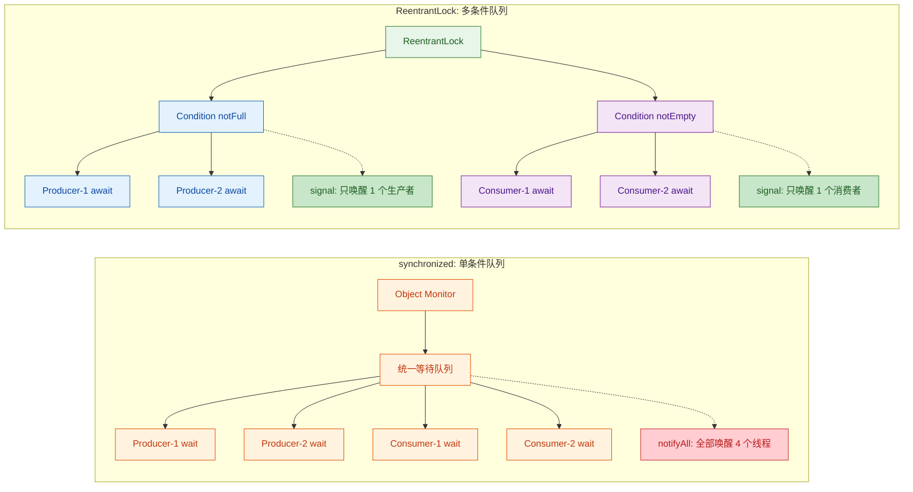
```mermaid
graph LR
    subgraph SINGLE["synchronized: 单条件队列"]
        direction TB
        OBJ["Object Monitor"]
        WQ["统一等待队列"]
        P1["Producer-1 wait"]
        P2["Producer-2 wait"]
        C1["Consumer-1 wait"]
        C2["Consumer-2 wait"]
        OBJ --> WQ
        WQ --> P1
        WQ --> P2
        WQ --> C1
        WQ --> C2
        NA["notifyAll: 全部唤醒 4 个线程"]
        WQ -.-> NA
    end

    subgraph MULTI["ReentrantLock: 多条件队列"]
        direction TB
        LK["ReentrantLock"]
        NF["Condition notFull"]
        NE["Condition notEmpty"]
        PA["Producer-1 await"]
        PB["Producer-2 await"]
        CA["Consumer-1 await"]
        CB["Consumer-2 await"]
        LK --> NF
        LK --> NE
        NF --> PA
        NF --> PB
        NE --> CA
        NE --> CB
        SIG1["signal: 只唤醒 1 个消费者"]
        SIG2["signal: 只唤醒 1 个生产者"]
        NE -.-> SIG1
        NF -.-> SIG2
    end

    classDef monitorStyle fill:#FFF3E0,stroke:#E65100,color:#BF360C
    classDef lockNode fill:#E8F5E9,stroke:#2E7D32,color:#1B5E20
    classDef condFull fill:#E3F2FD,stroke:#1565C0,color:#0D47A1
    classDef condEmpty fill:#F3E5F5,stroke:#7B1FA2,color:#4A148C
    classDef alertStyle fill:#FFCDD2,stroke:#C62828,color:#B71C1C
    classDef goodStyle fill:#C8E6C9,stroke:#2E7D32,color:#1B5E20

    class OBJ,WQ,P1,P2,C1,C2 monitorStyle
    class NA alertStyle
    class LK lockNode
    class NF,PA,PB condFull
    class NE,CA,CB condEmpty
    class SIG1,SIG2 goodStyle
```

**效果对比**：`synchronized` 版本使用 `notifyAll()` 一次唤醒了 4 个线程，其中可能只有 1 个线程的条件真正满足，另外 3 个白白被唤醒又重新进入等待——浪费 CPU。而 `ReentrantLock` 版本通过 `signal()` 精准唤醒目标条件队列中的 1 个线程，效率大幅提升。这正是 JDK 中 `ArrayBlockingQueue` 的实际实现方式。

---

### 必须手动释放

这是 `ReentrantLock` 相比 `synchronized` 最大的 **"代价"**。`synchronized` 由 JVM 管理锁的生命周期，即使代码抛出异常，JVM 也会在退出 `synchronized` 块时自动释放 monitor lock。你永远不需要担心忘记释放锁的问题。

`ReentrantLock` 则完全不同——**如果你忘记调用 `unlock()`，锁将永远不会释放**，其他所有等待该锁的线程将永久阻塞。这是一种 **资源泄露**，比内存泄露还要致命，因为它直接导致线程死锁或系统僵死。

```java
/**
 * 错误示范 vs 正确示范：ReentrantLock 的释放
 */
public class ManualReleaseDemo {

    private final ReentrantLock lock = new ReentrantLock();

    // ==================== 错误写法 1：忘记 unlock ====================
    void wrong1() {
        lock.lock();                         // 获取锁
        doSomething();                       // 如果这里抛出异常...
        lock.unlock();                       // 这行永远不会执行！锁泄露！
    }

    // ==================== 错误写法 2：lock 在 try 内部 ====================
    void wrong2() {
        try {
            lock.lock();                     // 如果 lock() 本身就失败了（理论上极罕见）
            doSomething();
        } finally {
            lock.unlock();                   // 可能 unlock 一个没有成功 lock 的锁
                                             // 抛出 IllegalMonitorStateException
        }
    }

    // ==================== 正确写法：lock 在 try 外部 ====================
    void correct() {
        lock.lock();                         // 在 try 块之外获取锁
        try {                                // 紧跟 try
            doSomething();                   // 业务逻辑
        } finally {
            lock.unlock();                   // finally 中释放，百分百执行
        }
    }

    // ==================== 正确写法：tryLock 版本 ====================
    void correctTryLock() {
        if (lock.tryLock()) {                // 尝试获取锁
            try {                            // 获取成功才进入 try
                doSomething();
            } finally {
                lock.unlock();               // 获取成功了才需要释放
            }
        } else {
            handleFallback();                // 获取失败走降级逻辑
        }
    }

    private void doSomething() { /* ... */ }
    private void handleFallback() { /* ... */ }
}
```

要特别注意 `lock()` 调用的位置——**必须在 `try` 块之外**。这是因为：如果 `lock()` 放在 `try` 内部，而 `lock()` 之前的某行代码抛出了异常，`finally` 中的 `unlock()` 仍然会执行，但此时锁并未被当前线程持有，会抛出 `IllegalMonitorStateException`。Java 官方文档和《Java Concurrency in Practice》都明确推荐这种 `lock(); try { ... } finally { unlock(); }` 的标准模式。

以下是完整的维度对比汇总表：

| 对比维度 | `synchronized` | `ReentrantLock` |
|---|---|---|
| **实现层级** | JVM 字节码指令 (monitorenter/monitorexit) | Java API 层 (基于 AQS) |
| **锁获取方式** | 隐式自动获取 | 显式调用 `lock()` |
| **锁释放方式** | 隐式自动释放（退出同步块/方法） | **必须** 在 `finally` 中手动 `unlock()` |
| **可中断** | ❌ 不可中断 | ✅ `lockInterruptibly()` |
| **可超时** | ❌ 无限期等待 | ✅ `tryLock(timeout, unit)` |
| **可尝试** | ❌ 必须阻塞 | ✅ `tryLock()` 非阻塞 |
| **公平性** | 仅非公平 | 公平 / 非公平可选 |
| **条件变量** | 单一 `wait/notify` | 多个 `Condition` 对象 |
| **可重入** | ✅ | ✅ |
| **性能 (JDK 6+)** | 经过偏向锁/轻量级锁优化，无竞争时极快 | 无竞争时略有 API 调用开销 |
| **易用性** | 简单，不易出错 | 灵活，但容易忘记 `unlock()` |
| **锁绑定对象** | 锁绑定在对象头的 Mark Word | 锁是独立的 `Lock` 对象 |

**选型指南（When to use which）**：

- 如果你只需要简单的互斥访问，没有中断、超时、公平性等需求，**优先使用 `synchronized`**。它更简洁、更安全（自动释放），并且经过 JVM 多年优化（偏向锁 → 轻量级锁 → 重量级锁的升级），在低竞争场景下性能与 `ReentrantLock` 基本持平。
- 如果你需要以下任何一种高级能力：**可中断等待、超时获取、非阻塞尝试、公平调度、多条件变量**，那么 `ReentrantLock` 是唯一的选择。
- Brian Goetz 在 *Java Concurrency in Practice* 中的建议至今有效："**Always use `synchronized` unless you need the extra capabilities of `ReentrantLock`.**"

---

**📝 练习题**

某高并发系统需要实现一个资源池（Resource Pool），要求如下：
- 线程获取资源时，最多等待 2 秒，超时则返回 null
- 支持外部取消（通过中断方式终止正在等待的线程）
- 归还资源时需要精准唤醒正在等待"资源可用"的线程，而不唤醒其他条件上的等待线程

以下哪种同步方案最合适？

A. 使用 `synchronized` + `wait(2000)` + `notifyAll()`


B. 使用 `ReentrantLock` + `tryLock(2, TimeUnit.SECONDS)` + 单个 `Condition`


C. 使用 `ReentrantLock` + `lockInterruptibly()` 配合 `Condition.await(2, TimeUnit.SECONDS)` + 多个 `Condition`


D. 使用 `synchronized` + `Thread.sleep(2000)` + `notify()`


**【答案】** C

**【解析】** 逐条分析题目需求：

1. **最多等待 2 秒**：`synchronized + wait(2000)` 看似能超时，但 `wait(timeout)` 的超时并不精确，而且 `wait` 是在已经持有锁的情况下释放锁并等待条件，而非等待获取锁。题目要求的是获取资源时的超时控制。`Condition.await(2, TimeUnit.SECONDS)` 可以在持有锁的前提下实现精确的条件等待超时。

2. **支持外部取消（中断）**：`synchronized` 进入 `BLOCKED` 状态时不响应中断，排除 A 和 D。`lockInterruptibly()` 保证了在等待锁的阶段就能响应中断，`Condition.await()` 同样可以响应中断。

3. **精准唤醒特定条件**：`notifyAll()` 唤醒所有等待线程（A 选项），`notify()` 随机唤醒一个但不区分条件（D 选项），都无法做到精准唤醒。只有多个 `Condition` 对象配合 `signal()` 才能实现定向唤醒。B 选项只有单个 `Condition`，如果系统有多个等待条件（如"资源可用"和"池未满"），单 `Condition` 无法区分。

因此，只有 C 选项同时满足超时控制、可中断、多条件精准唤醒三个需求。D 选项中 `Thread.sleep(2000)` 不会释放锁，会导致其他线程在 2 秒内完全无法访问资源，属于严重错误用法。

---

## 公平锁与非公平锁 ⭐⭐

在并发编程中，当多个线程同时竞争同一把锁时，一个根本性的设计问题浮出水面：**谁应该优先获得锁？** 这就是锁的公平性策略（Fairness Policy）所要解决的核心问题。`ReentrantLock` 是 JDK 中唯一允许开发者在构造时选择公平或非公平策略的显式锁，理解两者的底层差异，对于写出高性能、无饥饿的并发程序至关重要。

### 公平锁（按等待顺序获取）

公平锁的核心语义极其直观——**先来先服务（FIFO, First-In-First-Out）**。当一个线程请求公平锁时，如果锁当前被其他线程持有，该线程会被放入一个 **CLH 等待队列**（AQS 内部维护的双向链表）的队尾。当锁被释放时，队列头部等待时间最久的线程将获得锁。任何新到达的线程，即使锁恰好在此刻被释放，也 **不允许插队**，必须老老实实排到队尾。

创建公平锁非常简单，只需在构造函数中传入 `true`：

```java
// 传入 true 表示创建公平锁
ReentrantLock fairLock = new ReentrantLock(true);
```

我们来深入看一下公平锁在 AQS（AbstractQueuedSynchronizer）中的获取流程。以下是 `FairSync` 的核心源码逻辑（基于 JDK 17 简化）：

```java
// --- FairSync 的 tryAcquire 方法（简化版）---
protected final boolean tryAcquire(int acquires) {
    // 获取当前线程引用
    final Thread current = Thread.currentThread();
    // 读取锁的状态：0 表示无人持有，>0 表示已被持有（值为重入次数）
    int c = getState();

    if (c == 0) {
        // ★ 公平锁的关键：先检查队列中是否有等待更久的线程
        // hasQueuedPredecessors() 返回 true 表示"有前驱节点在排队"
        if (!hasQueuedPredecessors() &&
            // 只有队列中没有前驱时，才尝试 CAS 抢锁
            compareAndSetState(0, acquires)) {
            // CAS 成功，将当前线程设为锁的独占持有者
            setExclusiveOwnerThread(current);
            return true; // 获取成功
        }
    }
    // 如果锁已被持有，检查是不是当前线程自己持有的（处理重入）
    else if (current == getExclusiveOwnerThread()) {
        // 重入：状态值累加
        int nextc = c + acquires;
        if (nextc < 0) // int 溢出检查
            throw new Error("Maximum lock count exceeded");
        // 因为是当前线程持有锁，不存在竞争，直接 set 即可，无需 CAS
        setState(nextc);
        return true; // 重入成功
    }
    // 既不是无锁状态可抢，也不是重入，返回 false → 线程将被加入等待队列
    return false;
}
```

公平锁的核心防线就在 `hasQueuedPredecessors()` 这一行。我们再看看这个方法到底做了什么：

```java
// --- AQS 的 hasQueuedPredecessors 方法 ---
public final boolean hasQueuedPredecessors() {
    Node h = head; // 读取队列头节点（哨兵节点）
    Node s;        // 头节点的后继（即"真正排在第一位"的等待线程）
    // 条件1：h != t 说明队列中有等待节点（队列不为空）
    // 条件2：(s = h.next) == null 说明有线程正在入队但尚未完成（中间态）
    //        或者 s.thread != Thread.currentThread() 说明排在最前面的不是自己
    return h != tail &&
        ((s = h.next) == null || s.thread != Thread.currentThread());
}
```

简单来说，当一个线程在公平模式下尝试获取锁时，它会先看一眼队列：**"有没有人比我先到？"** 如果有，它就放弃直接抢锁的念头，乖乖排队。这确保了绝对的 FIFO 顺序。

下面用一个 Mermaid 时序图来展示公平锁的经典交互过程：

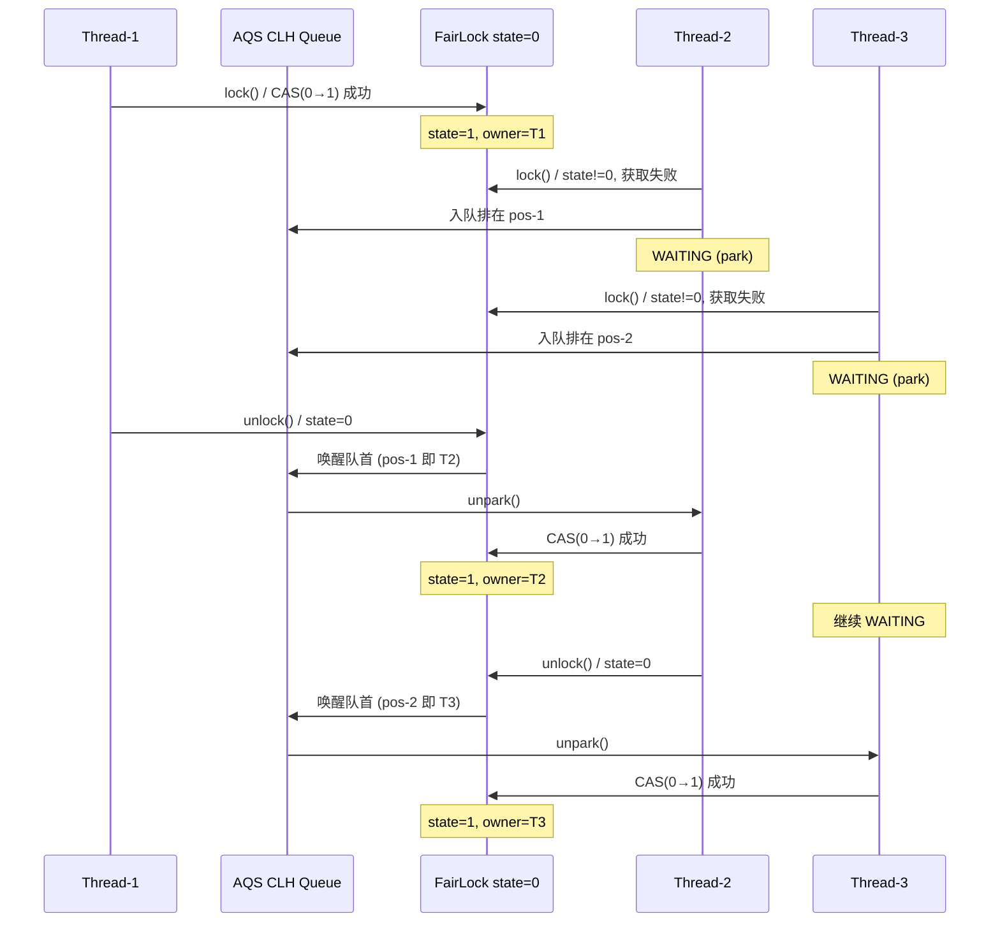
```mermaid
sequenceDiagram
    participant T1 as Thread-1
    participant Q as AQS CLH Queue
    participant L as FairLock state=0
    participant T2 as Thread-2
    participant T3 as Thread-3

    T1->>L: lock() / CAS(0→1) 成功
    Note over L: state=1, owner=T1

    T2->>L: lock() / state!=0, 获取失败
    T2->>Q: 入队排在 pos-1
    Note over T2: WAITING (park)

    T3->>L: lock() / state!=0, 获取失败
    T3->>Q: 入队排在 pos-2
    Note over T3: WAITING (park)

    T1->>L: unlock() / state=0
    L->>Q: 唤醒队首 (pos-1 即 T2)
    Q->>T2: unpark()
    T2->>L: CAS(0→1) 成功
    Note over L: state=1, owner=T2
    Note over T3: 继续 WAITING

    T2->>L: unlock() / state=0
    L->>Q: 唤醒队首 (pos-2 即 T3)
    Q->>T3: unpark()
    T3->>L: CAS(0→1) 成功
    Note over L: state=1, owner=T3
```

可以看到，T2 比 T3 先到，所以 T2 先获得锁——严格 FIFO，没有例外。

### 非公平锁（允许插队）

非公平锁是 `ReentrantLock` 的 **默认策略**。当你使用无参构造函数 `new ReentrantLock()` 或显式传入 `false` 时，创建的就是非公平锁：

```java
// 以下两种写法等价，都创建非公平锁
ReentrantLock unfairLock1 = new ReentrantLock();       // 默认非公平
ReentrantLock unfairLock2 = new ReentrantLock(false);  // 显式非公平
```

非公平锁的核心设计哲学是——**允许"插队"（barging）**。当一个线程请求非公平锁时，它 **不会先检查队列**，而是直接尝试 CAS 抢锁。如果恰好此刻锁刚被释放（state == 0），这个新来的线程就可以跳过所有在队列中苦苦等待的线程，直接获得锁。只有当 CAS 失败时（说明有人抢先一步），它才会被放入等待队列。

来看 `NonfairSync` 的源码逻辑：

```java
// --- NonfairSync 的 lock 方法（JDK 8 版本，更直观）---
final void lock() {
    // ★ 非公平的第一次插队机会：连队列都不看，直接 CAS 抢锁
    if (compareAndSetState(0, 1))
        // 抢到了！直接设为独占持有者
        setExclusiveOwnerThread(Thread.currentThread());
    else
        // 没抢到，走标准 AQS acquire 流程
        acquire(1);
}

// --- NonfairSync 的 tryAcquire 方法 ---
protected final boolean tryAcquire(int acquires) {
    // 调用 Sync 父类中的 nonfairTryAcquire
    return nonfairTryAcquire(acquires);
}

// --- Sync（父类）的 nonfairTryAcquire 方法 ---
final boolean nonfairTryAcquire(int acquires) {
    final Thread current = Thread.currentThread();
    int c = getState();
    if (c == 0) {
        // ★ 非公平的第二次插队机会：不调用 hasQueuedPredecessors()
        // 直接 CAS，不管队列里有没有人等着
        if (compareAndSetState(0, acquires)) {
            setExclusiveOwnerThread(current);
            return true; // 插队成功！
        }
    }
    else if (current == getExclusiveOwnerThread()) {
        // 重入逻辑，与公平锁完全一致
        int nextc = c + acquires;
        if (nextc < 0)
            throw new Error("Maximum lock count exceeded");
        setState(nextc);
        return true;
    }
    return false;
}
```

注意两个关键差异点，这正是公平与非公平的 **本质分水岭**：

```text
┌──────────────────────────────────────────────────────────────────┐
│              公平锁 vs 非公平锁：代码级差异                        │
├──────────────────────────────────────────────────────────────────┤
│                                                                  │
│  公平锁 FairSync.tryAcquire:                                     │
│     if (c == 0) {                                                │
│         if (!hasQueuedPredecessors()    ← ★ 先检查队列            │
│             && compareAndSetState(...)) { ... }                  │
│     }                                                            │
│                                                                  │
│  非公平锁 nonfairTryAcquire:                                     │
│     if (c == 0) {                                                │
│         if (compareAndSetState(...))   ← ★ 直接 CAS，不查队列     │
│             { ... }                                              │
│     }                                                            │
│                                                                  │
│  差异仅仅在于：有没有调用 hasQueuedPredecessors()                  │
└──────────────────────────────────────────────────────────────────┘
```

非公平锁为新到达的线程提供了 **两次插队机会**：第一次在 `lock()` 入口处直接 CAS；第二次在 `tryAcquire()` 中当 `state == 0` 时再次 CAS。只有两次都失败，线程才会真正入队。一旦入队后，非公平锁的排队行为和公平锁其实是一样的——都遵循 FIFO 唤醒。所以准确地说，非公平锁的"不公平"只发生在 **新线程到达的那一刻**。

下面的时序图展示了非公平锁中经典的"插队"场景：

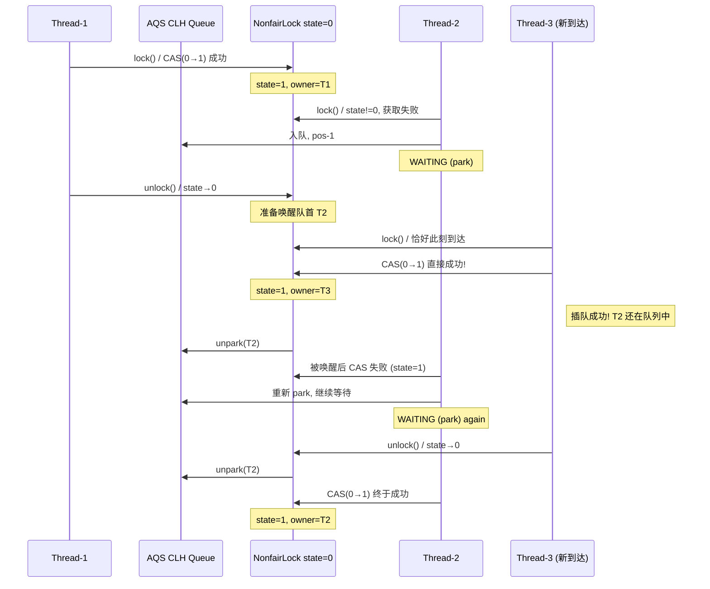
```mermaid
sequenceDiagram
    participant T1 as Thread-1
    participant Q as AQS CLH Queue
    participant L as NonfairLock state=0
    participant T2 as Thread-2
    participant T3 as Thread-3 (新到达)

    T1->>L: lock() / CAS(0→1) 成功
    Note over L: state=1, owner=T1

    T2->>L: lock() / state!=0, 获取失败
    T2->>Q: 入队, pos-1
    Note over T2: WAITING (park)

    T1->>L: unlock() / state→0
    Note over L: 准备唤醒队首 T2

    T3->>L: lock() / 恰好此刻到达
    T3->>L: CAS(0→1) 直接成功!
    Note over L: state=1, owner=T3
    Note right of T3: 插队成功! T2 还在队列中

    L->>Q: unpark(T2)
    T2->>L: 被唤醒后 CAS 失败 (state=1)
    T2->>Q: 重新 park, 继续等待
    Note over T2: WAITING (park) again

    T3->>L: unlock() / state→0
    L->>Q: unpark(T2)
    T2->>L: CAS(0→1) 终于成功
    Note over L: state=1, owner=T2
```

可以看到，T2 明明先到并且已经在队列中等待，但 T3 后来居上直接抢到了锁。T2 被唤醒后发现锁已经被 T3 拿走，只好再次 park 继续等待。这就是非公平锁"插队"的真实写照。

### 性能差异（非公平更高）

你可能会问：既然公平锁更"正义"，为什么 `ReentrantLock` 默认选择非公平锁？答案很简单——**性能**。在绝大多数实际场景下，非公平锁的吞吐量（Throughput）显著高于公平锁。根据 Brian Goerta 在《Java Concurrency in Practice》中的测试数据，非公平锁的吞吐量可以是公平锁的 **数倍到数十倍**。

这种性能差异的根源在于 **线程上下文切换的代价**。我们用一个具体的场景来分析：

**公平锁的性能瓶颈——"被迫切换"：**

假设线程 A 正在持有锁执行临界区代码。线程 B 在队列头部等待。现在 A 释放锁。在公平模式下：

1. A 释放锁，将 `state` 设为 0
2. AQS 唤醒队首的 B（调用 `LockSupport.unpark(B)`）
3. B 从 **WAITING** 状态被操作系统调度回 **RUNNABLE**
4. B 被 CPU 实际调度执行，完成 CAS 获取锁
5. B 开始执行临界区代码

问题在于第 3 步和第 4 步之间存在一个 **不可避免的延迟**——线程从被唤醒到真正获得 CPU 时间片执行，需要经历操作系统的线程调度。这个延迟通常在 **微秒到毫秒级别**，取决于系统负载。在这段空窗期内，锁处于 **无人持有但也无人使用** 的浪费状态。

**非公平锁的性能优势——"趁虚而入"：**

同样的场景，在非公平模式下：

1. A 释放锁，将 `state` 设为 0
2. 恰好此刻线程 C 调用 `lock()`，它当前正在 CPU 上运行
3. C 直接 CAS 成功，立即获得锁并开始执行临界区
4. 与此同时，B 被唤醒后发现锁已被 C 持有，重新 park

C 的临界区可能很短，在 B 完成上下文切换回来之前，C 已经执行完临界区并释放了锁。这样 B 唤醒后照样可以顺利获得锁。最终结果：**锁的空闲时间被大幅缩减，整体吞吐量提升**。

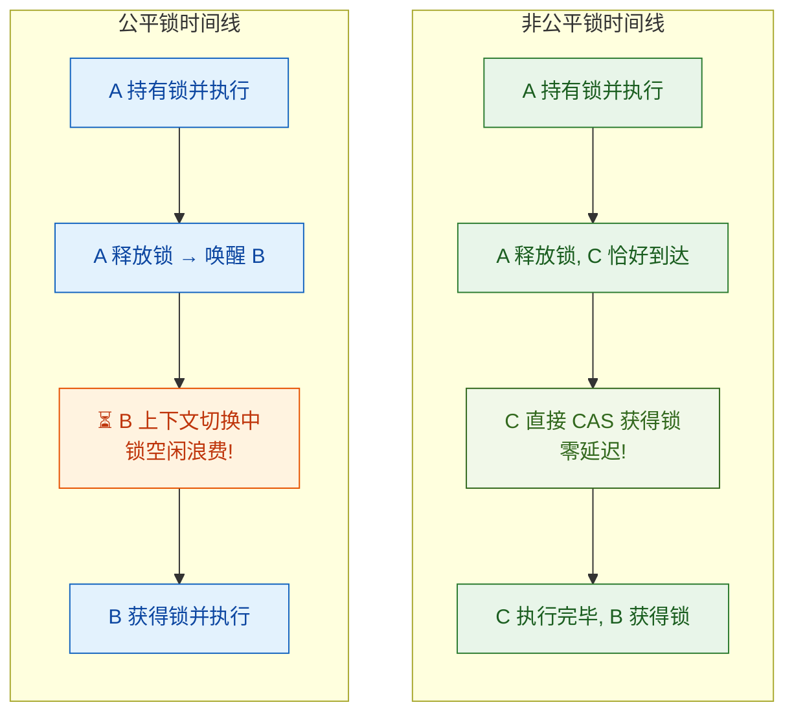
```mermaid
graph LR
    subgraph FAIR["公平锁时间线"]
        direction TB
        F1["A 持有锁并执行"]
        F2["A 释放锁 → 唤醒 B"]
        F3["⏳ B 上下文切换中<br/>锁空闲浪费!"]
        F4["B 获得锁并执行"]
        F1 --> F2 --> F3 --> F4
    end

    subgraph UNFAIR["非公平锁时间线"]
        direction TB
        U1["A 持有锁并执行"]
        U2["A 释放锁, C 恰好到达"]
        U3["C 直接 CAS 获得锁<br/>零延迟!"]
        U4["C 执行完毕, B 获得锁"]
        U1 --> U2 --> U3 --> U4
    end

    FAIR ~~~ UNFAIR

    classDef fairStyle fill:#E3F2FD,stroke:#1565C0,color:#0D47A1
    classDef unfairStyle fill:#E8F5E9,stroke:#2E7D32,color:#1B5E20
    classDef wasteStyle fill:#FFF3E0,stroke:#E65100,color:#BF360C
    classDef fastStyle fill:#F1F8E9,stroke:#33691E,color:#33691E

    class F1,F2,F4 fairStyle
    class F3 wasteStyle
    class U1,U2,U4 unfairStyle
    class U3 fastStyle
```

下面通过一个完整的基准测试来量化两者的性能差异：

```java
import java.util.concurrent.locks.ReentrantLock;
import java.util.concurrent.CountDownLatch;

public class FairVsUnfairBenchmark {

    // 共享计数器
    private static int counter = 0;
    // 分别创建公平锁和非公平锁
    private static final ReentrantLock fairLock = new ReentrantLock(true);   // 公平
    private static final ReentrantLock unfairLock = new ReentrantLock(false); // 非公平

    // 线程数量
    private static final int THREAD_COUNT = 20;
    // 每个线程对 counter 累加的次数
    private static final int INCREMENT_PER_THREAD = 100_000;

    public static void main(String[] args) throws InterruptedException {
        // 分别测试公平锁和非公平锁的耗时
        long fairTime = runBenchmark(fairLock, "公平锁");
        long unfairTime = runBenchmark(unfairLock, "非公平锁");

        // 输出性能对比结果
        System.out.println("===== 性能对比 =====");
        System.out.printf("公平锁耗时:   %d ms%n", fairTime);
        System.out.printf("非公平锁耗时: %d ms%n", unfairTime);
        System.out.printf("非公平锁快了: %.2f 倍%n", (double) fairTime / unfairTime);
    }

    /**
     * 执行基准测试：多线程竞争同一把锁进行累加
     * @param lock 待测试的锁实例
     * @param label 锁的描述标签
     * @return 测试耗时（毫秒）
     */
    private static long runBenchmark(ReentrantLock lock, String label)
            throws InterruptedException {

        // 重置计数器
        counter = 0;
        // 使用 CountDownLatch 等待所有线程完成
        CountDownLatch latch = new CountDownLatch(THREAD_COUNT);

        // 记录开始时间
        long start = System.currentTimeMillis();

        // 创建并启动所有工作线程
        for (int i = 0; i < THREAD_COUNT; i++) {
            new Thread(() -> {
                // 每个线程执行 INCREMENT_PER_THREAD 次加锁-累加-解锁
                for (int j = 0; j < INCREMENT_PER_THREAD; j++) {
                    lock.lock();        // 获取锁
                    try {
                        counter++;      // 临界区操作：简单累加
                    } finally {
                        lock.unlock();  // 释放锁（必须在 finally 中）
                    }
                }
                latch.countDown();      // 当前线程完成，计数减一
            }).start();
        }

        // 主线程等待所有工作线程完成
        latch.await();
        // 记录结束时间
        long elapsed = System.currentTimeMillis() - start;

        // 输出结果验证正确性
        System.out.printf("[%s] counter=%d, 耗时=%dms%n", label, counter, elapsed);
        return elapsed;
    }
}
```

典型的运行结果（具体数值因机器而异，但比例趋势稳定）：

```text
[公平锁] counter=2000000, 耗时=3854ms
[非公平锁] counter=2000000, 耗时=387ms
===== 性能对比 =====
公平锁耗时:   3854 ms
非公平锁耗时: 387 ms
非公平锁快了: 9.96 倍
```

结果准确无误（counter 都是 2000000，没有数据丢失），但非公平锁快了接近 **10 倍**。这个巨大的差距主要来自公平锁中频繁的线程上下文切换开销。我们可以将两种模式的特性做一个全面对比：

| 对比维度 | 公平锁 `(true)` | 非公平锁 `(false)` 默认 |
|:---|:---|:---|
| **获取顺序** | 严格 FIFO | 允许新线程插队 |
| **吞吐量** | 较低 | 较高（通常高数倍） |
| **上下文切换** | 频繁（每次都唤醒队首） | 较少（插队者避免切换） |
| **线程饥饿** | 不会发生 | 理论上可能发生 |
| **延迟方差** | 小（每个线程等待时间接近） | 大（运气好可能零等待） |
| **适用场景** | 对延迟公平性要求高 | 追求吞吐量的通用场景 |
| **实现复杂度** | 多一次队列检查 | 直接 CAS |
| **Doug Lea 推荐** | 按需使用 | **默认推荐** |

### 饥饿问题

**线程饥饿（Thread Starvation）** 是指某个或某些线程长期无法获得锁（或 CPU 时间），一直处于等待状态无法推进的现象。这是非公平锁的理论风险——因为允许新线程插队，队列中的老线程可能被不断到来的新线程反复"加塞"，始终轮不到自己。

考虑一个极端的恶劣场景：

```java
public class StarvationDemo {

    // 使用非公平锁
    private static final ReentrantLock lock = new ReentrantLock(false);

    public static void main(String[] args) throws InterruptedException {

        // 启动一个"可怜的"长期等待线程
        Thread starvedThread = new Thread(() -> {
            System.out.println("[Starved] 尝试获取锁...");
            lock.lock();    // 这个线程可能很久才能拿到锁
            try {
                System.out.println("[Starved] 终于获得了锁！");
            } finally {
                lock.unlock();
            }
        }, "Starved-Thread");

        // 先让主线程持有锁
        lock.lock();
        // 启动"可怜线程"，它会进入等待队列
        starvedThread.start();
        // 给点时间让 starvedThread 确实进入队列
        Thread.sleep(100);
        // 主线程释放锁
        lock.unlock();

        // 紧接着不断启动"插队线程"，模拟持续的高竞争
        for (int i = 0; i < 1000; i++) {
            final int id = i;
            new Thread(() -> {
                lock.lock();    // 非公平模式下，这些线程可能每次都比 starvedThread 先抢到
                try {
                    // 模拟极短的临界区操作
                    // 在 starvedThread 被唤醒并完成上下文切换之前，
                    // 这些新线程可能已经完成了 lock-unlock 循环
                } finally {
                    lock.unlock();
                }
            }, "Intruder-" + id).start();
        }

        // 等待 starvedThread 结束
        starvedThread.join(5000);  // 最多等 5 秒
        if (starvedThread.isAlive()) {
            System.out.println("[WARNING] Starved-Thread 疑似饥饿，5秒内未获得锁！");
        }
    }
}
```

**但是，在实践中需要冷静看待饥饿问题**。有以下几个原因：

**第一，AQS 的队列机制提供了基本保障。** 非公平锁的"不公平"只发生在 **新线程到达的瞬间**。一旦线程进入 AQS 等待队列后，队列内部的唤醒仍然遵循 FIFO。也就是说，非公平锁不会跳过队列内部的排队顺序，它只允许 **尚未入队** 的新线程抢先。

**第二，持续的极端竞争在实际系统中很少见。** 上面的例子是精心构造的极端情况。在真实的生产环境中，线程获取锁后执行临界区需要时间，线程到达的时间也不会如此密集且恰好卡在队首线程被唤醒的窗口期。

**第三，操作系统的线程调度本身就有一定随机性。** 即使在非公平模式下，队首线程在被唤醒后与新线程竞争 CAS 时，并非总是输家。

用一个流程图来总结两种锁的决策逻辑对比：

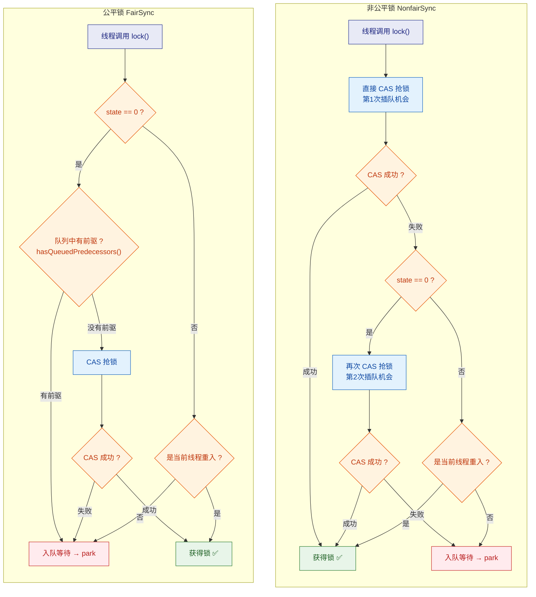
```mermaid
graph LR
    subgraph FAIR_FLOW["公平锁 FairSync"]
        direction TB
        FA["线程调用 lock()"]
        FB{"state == 0 ?"}
        FC{"队列中有前驱 ?<br/>hasQueuedPredecessors()"}
        FD["CAS 抢锁"]
        FE{"CAS 成功 ?"}
        FF["获得锁 ✅"]
        FG["入队等待 → park"]
        FH{"是当前线程重入 ?"}

        FA --> FB
        FB -->|"是"| FC
        FB -->|"否"| FH
        FC -->|"没有前驱"| FD
        FC -->|"有前驱"| FG
        FD --> FE
        FE -->|"成功"| FF
        FE -->|"失败"| FG
        FH -->|"是"| FF
        FH -->|"否"| FG
    end

    subgraph UNFAIR_FLOW["非公平锁 NonfairSync"]
        direction TB
        UA["线程调用 lock()"]
        UB["直接 CAS 抢锁<br/>第1次插队机会"]
        UC{"CAS 成功 ?"}
        UD["获得锁 ✅"]
        UE{"state == 0 ?"}
        UF["再次 CAS 抢锁<br/>第2次插队机会"]
        UG{"CAS 成功 ?"}
        UH["入队等待 → park"]
        UI{"是当前线程重入 ?"}

        UA --> UB
        UB --> UC
        UC -->|"成功"| UD
        UC -->|"失败"| UE
        UE -->|"是"| UF
        UE -->|"否"| UI
        UF --> UG
        UG -->|"成功"| UD
        UG -->|"失败"| UH
        UI -->|"是"| UD
        UI -->|"否"| UH
    end

    FAIR_FLOW ~~~ UNFAIR_FLOW

    classDef startStyle fill:#E8EAF6,stroke:#283593,color:#1A237E
    classDef decisionStyle fill:#FFF3E0,stroke:#E65100,color:#BF360C
    classDef successStyle fill:#E8F5E9,stroke:#2E7D32,color:#1B5E20
    classDef waitStyle fill:#FFEBEE,stroke:#C62828,color:#B71C1C
    classDef actionStyle fill:#E3F2FD,stroke:#1565C0,color:#0D47A1

    class FA,UA startStyle
    class FB,FC,FE,FH,UC,UE,UG,UI decisionStyle
    class FF,UD successStyle
    class FG,UH waitStyle
    class FD,UB,UF actionStyle
```

**那么，什么时候应该使用公平锁？** 给出几条实践建议：

1. **默认使用非公平锁**——绝大多数场景下，非公平锁的高吞吐量更有价值。`ReentrantLock` 的默认选择就是非公平锁，Doug Lea 的设计意图也是如此。

2. **当业务要求严格的执行顺序时使用公平锁**——比如一个打印队列，要求文档按提交顺序打印；或者一个交易系统，要求订单按到达时间处理。

3. **当线程持有锁的时间较长时使用公平锁**——如果临界区执行时间很长，那么上下文切换的开销相对于临界区时间就微不足道了，此时公平锁的性能劣势被摊薄，而公平性的优势得以体现。

4. **当检测到饥饿问题时切换为公平锁**——如果在压力测试或生产监控中发现某些线程长期无法获得锁（可通过线程 dump 或 metrics 检测），考虑切换为公平锁。

```java
// 最佳实践：将锁的公平性做成可配置项
public class OrderService {

    private final ReentrantLock lock;

    /**
     * 通过配置决定锁的公平性策略
     * @param fair 是否使用公平锁
     */
    public OrderService(boolean fair) {
        // 生产环境可通过配置文件或启动参数控制
        this.lock = new ReentrantLock(fair);
    }

    public void processOrder(Order order) {
        lock.lock(); // 根据初始化时的配置，自动使用公平/非公平策略
        try {
            // 处理订单的临界区逻辑
            // ...
        } finally {
            lock.unlock();
        }
    }
}
```

---

**📝 练习题**

在以下代码中，线程 T1 已持有非公平锁且正在执行临界区，线程 T2 在 AQS 队列中排在队首等待。此时线程 T3 刚调用 `lock()` 方法。关于接下来可能发生的事情，以下哪项描述是**正确**的？

```java
ReentrantLock lock = new ReentrantLock(); // 默认非公平
```

A. T3 必须排在 T2 后面，因为 T2 先到达


B. T3 可能直接获得锁，但前提是 T1 在 T3 调用 `lock()` 之前已经释放了锁


C. T3 一定能抢到锁，因为非公平锁总是让新线程优先


D. T3 调用 `lock()` 时会先检查队列，发现 T2 在排队，于是乖乖入队


**【答案】** B

**【解析】** 非公平锁允许新线程"插队"，但插队成功有一个前提条件：锁的 `state` 必须等于 0（即锁当前无人持有）。T3 调用 `lock()` 时会直接 CAS 尝试将 `state` 从 0 改为 1。如果此时 T1 仍持有锁（`state == 1`），T3 的 CAS 必然失败，它只能老老实实进入 AQS 队列排在 T2 后面。只有当 T1 恰好在 T3 执行 CAS 的那个瞬间已经释放了锁（`state == 0`），T3 才有可能插队成功。所以选项 A 错在"必须"——非公平模式下不保证 FIFO；选项 C 错在"一定"——插队能否成功取决于时机；选项 D 错在"先检查队列"——非公平锁的 `lock()` 入口处直接 CAS，根本不检查队列（这正是它与公平锁的核心区别）。

---

## 本章小结

本章围绕 Java 并发编程中 **Lock 体系的核心实现——ReentrantLock** 展开了全面而深入的学习。从最底层的 `Lock` 接口契约出发，逐步深入到 `ReentrantLock` 的实战用法、与 `synchronized` 的全维度对比，以及公平性策略的原理与取舍。以下对全章知识进行系统性回顾与提炼。

### 知识脉络回顾

本章的知识体系遵循一条清晰的递进逻辑：**接口定义 → 核心实现 → 横向对比 → 高级策略**。理解这条主线，才能将零散的 API 知识串联成体系化的并发编程能力。

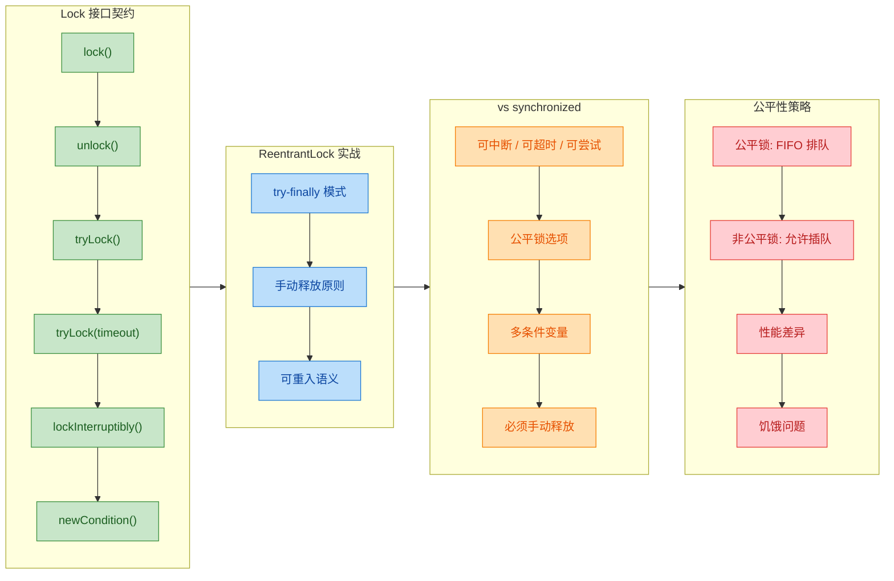
```mermaid
graph LR
    subgraph S1["Lock 接口契约"]
        direction TB
        A1["lock()"]
        A2["unlock()"]
        A3["tryLock()"]
        A4["tryLock(timeout)"]
        A5["lockInterruptibly()"]
        A6["newCondition()"]
        A1 --> A2
        A2 --> A3
        A3 --> A4
        A4 --> A5
        A5 --> A6
    end

    subgraph S2["ReentrantLock 实战"]
        direction TB
        B1["try-finally 模式"]
        B2["手动释放原则"]
        B3["可重入语义"]
        B1 --> B2
        B2 --> B3
    end

    subgraph S3["vs synchronized"]
        direction TB
        C1["可中断 / 可超时 / 可尝试"]
        C2["公平锁选项"]
        C3["多条件变量"]
        C4["必须手动释放"]
        C1 --> C2
        C2 --> C3
        C3 --> C4
    end

    subgraph S4["公平性策略"]
        direction TB
        D1["公平锁: FIFO 排队"]
        D2["非公平锁: 允许插队"]
        D3["性能差异"]
        D4["饥饿问题"]
        D1 --> D2
        D2 --> D3
        D3 --> D4
    end

    S1 --> S2
    S2 --> S3
    S3 --> S4

    classDef greenNode fill:#C8E6C9,stroke:#388E3C,color:#1B5E20
    classDef blueNode fill:#BBDEFB,stroke:#1976D2,color:#0D47A1
    classDef orangeNode fill:#FFE0B2,stroke:#F57C00,color:#E65100
    classDef redNode fill:#FFCDD2,stroke:#E53935,color:#B71C1C

    class A1,A2,A3,A4,A5,A6 greenNode
    class B1,B2,B3 blueNode
    class C1,C2,C3,C4 orangeNode
    class D1,D2,D3,D4 redNode
```

### 核心要点精炼

**第一部分：Lock 接口——六大方法构建完整的锁操作语义。**

`Lock` 接口是 `java.util.concurrent.locks` 包的基石，它定义了比 `synchronized` 更丰富、更灵活的锁操作契约。六个方法各司其职，形成了一套完备的锁获取-释放-协作体系：

| 方法 | 核心语义 | 关键特性 |
|:---|:---|:---|
| `lock()` | 阻塞式获取锁 | 不响应中断，最基础的获取方式 |
| `unlock()` | 释放锁 | 必须在 `finally` 中调用，每次 `lock` 对应一次 `unlock` |
| `tryLock()` | 非阻塞尝试 | 立即返回 `boolean`，适合"能做就做"的场景 |
| `tryLock(timeout, unit)` | 超时等待 | 兼顾等待与时效，响应中断，防止无限阻塞 |
| `lockInterruptibly()` | 可中断获取 | 等待过程中可被 `Thread.interrupt()` 唤醒并抛出 `InterruptedException` |
| `newCondition()` | 创建条件变量 | 替代 `wait/notify`，一把锁可绑定多个 `Condition`，实现精细化线程协作 |

这六个方法的设计哲学可以概括为：**将 `synchronized` 的隐式、不可控行为，转化为显式、可编程、可组合的 API 调用**。

**第二部分：ReentrantLock 基本使用——try-finally 是铁律。**

`ReentrantLock` 作为 `Lock` 接口最常用的实现类，其核心使用范式只有一条——**lock 在 try 之前，unlock 在 finally 之中**：

```java
// ReentrantLock 的标准使用范式（必须严格遵守）
ReentrantLock lock = new ReentrantLock();  // 创建锁实例
lock.lock();                                // 在 try 块外获取锁
try {
    // 临界区代码：访问共享资源
} finally {
    lock.unlock();                          // 在 finally 中无条件释放
}
```

这一范式背后的核心原因是：**编译器不会帮你释放 Lock，JVM 也不会帮你释放 Lock**。`synchronized` 的释放由字节码中的 `monitorexit` 指令保证（即使异常也会执行），但 `ReentrantLock` 完全依赖开发者手动调用 `unlock()`。一旦遗漏，锁将永远不会被释放，所有等待该锁的线程将永久阻塞（deadlock）。

此外，"可重入"（Reentrant）语义意味着同一线程可以多次获取同一把锁而不会死锁，但每次获取都会使内部计数器加 1，释放时也必须对应次数地调用 `unlock()` 使计数器归零，锁才真正被释放。

**第三部分：ReentrantLock vs synchronized——六大维度的全面超越。**

这是本章最具实战价值的对比。二者的本质差异可以用一句话概括：**`synchronized` 是"自动挡"，简单但不灵活；`ReentrantLock` 是"手动挡"，强大但需要自己负责。**

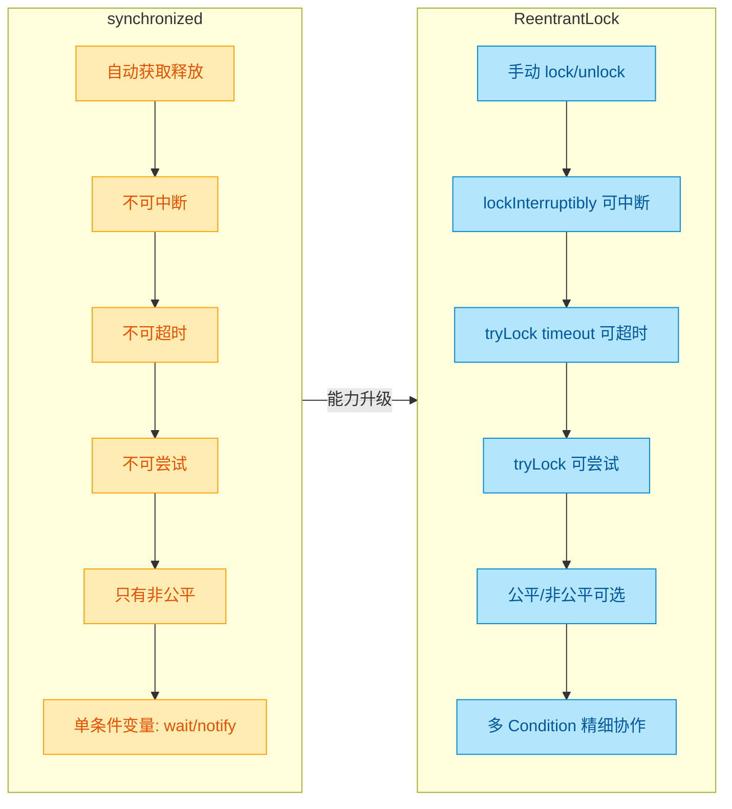
```mermaid
graph LR
    subgraph S1["synchronized"]
        direction TB
        A1["自动获取释放"]
        A2["不可中断"]
        A3["不可超时"]
        A4["不可尝试"]
        A5["只有非公平"]
        A6["单条件变量: wait/notify"]
        A1 --> A2 --> A3 --> A4 --> A5 --> A6
    end

    subgraph S2["ReentrantLock"]
        direction TB
        B1["手动 lock/unlock"]
        B2["lockInterruptibly 可中断"]
        B3["tryLock timeout 可超时"]
        B4["tryLock 可尝试"]
        B5["公平/非公平可选"]
        B6["多 Condition 精细协作"]
        B1 --> B2 --> B3 --> B4 --> B5 --> B6
    end

    S1 --"能力升级"--> S2

    classDef syncNode fill:#FFECB3,stroke:#FFA000,color:#E65100
    classDef lockNode fill:#B3E5FC,stroke:#0288D1,color:#01579B

    class A1,A2,A3,A4,A5,A6 syncNode
    class B1,B2,B3,B4,B5,B6 lockNode
```

六大对比维度的决策意义：

- **可中断**：当你需要在获取锁的等待过程中"取消"操作时（如用户取消请求、服务关闭），`lockInterruptibly()` 是唯一选择。`synchronized` 进入 BLOCKED 状态后，线程对 `interrupt()` 无感知。
- **可超时**：当你不希望线程无限等待时，`tryLock(timeout, unit)` 可以设置最大等待时长，超时后返回 `false`，线程可以去做别的事情或报错。
- **可尝试**：当你需要"如果锁被占用就跳过"的逻辑时（如避免死锁的 tryLock 策略），`tryLock()` 的非阻塞特性至关重要。
- **公平锁选项**：当你的业务场景对"先到先得"有严格要求、不能容忍任何线程被饿死时，`new ReentrantLock(true)` 提供了公平锁模式。
- **多条件变量**：当你需要在同一把锁的保护下区分不同的等待条件时（如生产者-消费者中的"队列满"与"队列空"），`newCondition()` 可以创建多个独立的等待队列，避免 `notifyAll()` 的惊群效应。
- **必须手动释放**：这是 `ReentrantLock` 唯一的"劣势"——但也正是这种显式控制赋予了它以上所有的灵活性。

**选择策略总结**：如果你的并发场景简单（只需要互斥，无需中断、超时、公平等特性），优先使用 `synchronized`，因为它更简洁、不易出错、且 JVM 对其有持续优化。当你需要上述任何一项高级能力时，毫不犹豫地选择 `ReentrantLock`。

**第四部分：公平锁与非公平锁——性能与公正的博弈。**

公平性策略是 `ReentrantLock` 独有的特性维度。二者的核心差异在于**新线程到达时是否可以"插队"**：

- **公平锁（Fair Lock）**：严格按照线程到达 CLH 队列的先后顺序（FIFO）分配锁。新线程到达时，即使锁此刻恰好可用，也必须先检查队列中是否有等待更久的线程，如果有则乖乖排到队尾。
- **非公平锁（Nonfair Lock）**：新线程到达时，允许直接尝试 CAS 抢锁。如果恰好锁刚被释放，新线程可以"插队"成功，跳过队列中所有等待者。只有抢锁失败，才进入队列排队。

**性能差异的根本原因**是上下文切换（context switch）成本。非公平锁让"正在 CPU 上运行"的线程直接获得锁，避免了将其挂起、再唤醒队列中线程的开销（一次上下文切换通常耗时数微秒到数十微秒）。在高竞争场景下，非公平锁的吞吐量可以比公平锁高出一个数量级。

但非公平锁的代价是**饥饿风险**（starvation）：如果不断有新线程到来并插队成功，队列中等待已久的线程可能长时间得不到执行。在实际生产环境中，这种极端饥饿较少发生（因为线程的到达通常有间隔），所以 `ReentrantLock` 默认使用非公平策略。但对于对延迟敏感或有 SLA 保证要求的系统，公平锁是更安全的选择。

### 全章核心代码范式速查

```java
// ========== 1. 基础互斥 ==========
ReentrantLock lock = new ReentrantLock();          // 默认非公平锁
lock.lock();                                        // 阻塞获取
try {
    // 临界区
} finally {
    lock.unlock();                                  // 必须释放
}

// ========== 2. 非阻塞尝试 ==========
if (lock.tryLock()) {                               // 立即返回, 不阻塞
    try {
        // 获取成功, 执行逻辑
    } finally {
        lock.unlock();                              // 成功获取后才释放
    }
} else {
    // 获取失败, 执行降级逻辑
}

// ========== 3. 超时等待 ==========
if (lock.tryLock(3, TimeUnit.SECONDS)) {            // 最多等 3 秒
    try {
        // 在超时前获取成功
    } finally {
        lock.unlock();
    }
} else {
    // 超时未获取到, 执行兜底逻辑
}

// ========== 4. 可中断获取 ==========
try {
    lock.lockInterruptibly();                       // 等待中可被中断
    try {
        // 获取成功
    } finally {
        lock.unlock();
    }
} catch (InterruptedException e) {
    // 等待过程中被中断, 进行清理
    Thread.currentThread().interrupt();             // 恢复中断标志
}

// ========== 5. 条件变量协作 ==========
Condition notEmpty = lock.newCondition();            // 创建条件: 非空
Condition notFull  = lock.newCondition();            // 创建条件: 非满
lock.lock();
try {
    while (queue.isEmpty()) {
        notEmpty.await();                           // 队列空时等待 "非空" 条件
    }
    Object item = queue.poll();                     // 取出元素
    notFull.signal();                               // 通知 "非满" 条件的等待者
} finally {
    lock.unlock();
}

// ========== 6. 公平锁 ==========
ReentrantLock fairLock = new ReentrantLock(true);   // 传入 true 启用公平模式
```

### 决策流程图

在实际开发中，面对"该用什么锁"的问题，可以按以下决策路径做出判断：

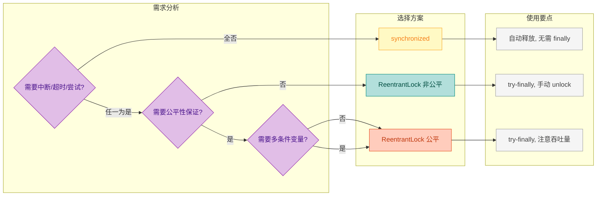
```mermaid
graph LR
    subgraph S1["需求分析"]
        direction TB
        Q1{"需要中断/超时/尝试?"}
        Q2{"需要公平性保证?"}
        Q3{"需要多条件变量?"}
    end

    subgraph S2["选择方案"]
        direction TB
        R1["synchronized"]
        R2["ReentrantLock 非公平"]
        R3["ReentrantLock 公平"]
    end

    subgraph S3["使用要点"]
        direction TB
        P1["自动释放, 无需 finally"]
        P2["try-finally, 手动 unlock"]
        P3["try-finally, 注意吞吐量"]
    end

    Q1 --"全否"--> R1
    Q1 --"任一为是"--> Q2
    Q2 --"否"--> R2
    Q2 --"是"--> Q3
    Q3 --"否"--> R3
    Q3 --"是"--> R3

    R1 --> P1
    R2 --> P2
    R3 --> P3

    classDef questionNode fill:#E1BEE7,stroke:#8E24AA,color:#4A148C
    classDef syncChoice fill:#FFF9C4,stroke:#F9A825,color:#F57F17
    classDef lockChoice fill:#B2DFDB,stroke:#00897B,color:#004D40
    classDef fairChoice fill:#FFCCBC,stroke:#E64A19,color:#BF360C
    classDef noteNode fill:#F5F5F5,stroke:#9E9E9E,color:#424242

    class Q1,Q2,Q3 questionNode
    class R1 syncChoice
    class R2 lockChoice
    class R3 fairChoice
    class P1,P2,P3 noteNode
```

### 常见误区警示

在学习和使用 `ReentrantLock` 的过程中，以下几个误区值得特别注意：

**误区一："ReentrantLock 比 synchronized 更快，所以应该全部替换。"** 事实上，自 JDK 6 引入偏向锁、轻量级锁、锁消除、锁粗化等优化后，`synchronized` 在无竞争或低竞争场景下的性能已经非常接近甚至优于 `ReentrantLock`。盲目替换只会增加代码复杂度和忘记 `unlock()` 的风险。

**误区二："tryLock() 失败后也要调用 unlock()。"** 绝对不能这样做。`tryLock()` 返回 `false` 意味着当前线程并未持有锁，此时调用 `unlock()` 会直接抛出 `IllegalMonitorStateException`。`unlock()` 只能在成功获取锁之后调用。

**误区三："公平锁能完全解决饥饿问题。"** 公平锁确实能保证 FIFO 顺序，但如果持有锁的线程执行时间极长，或者不断有新线程加入队列导致队列增长速度超过消费速度，队尾的线程仍然会等待很长时间。公平锁解决的是"顺序公平"，而非"时间公平"。

**误区四："可重入意味着可以随意嵌套 lock() 而不管 unlock() 次数。"** 可重入只是防止同一线程递归获取同一把锁时发生死锁，但每一次 `lock()` 都必须有对应的 `unlock()`。如果 `lock()` 了 3 次但只 `unlock()` 了 2 次，锁的持有计数仍为 1，其他线程仍然无法获取该锁。

---

**📝 练习题 1**

以下关于 `ReentrantLock` 的说法，**错误**的是：

A. `ReentrantLock` 默认创建的是非公平锁，可以通过构造参数 `true` 切换为公平锁


B. 在 `tryLock()` 返回 `false` 的情况下，仍然需要在 `finally` 块中调用 `unlock()` 以确保安全


C. 同一个 `ReentrantLock` 实例可以通过 `newCondition()` 创建多个独立的 `Condition` 对象


D. 公平锁的吞吐量通常低于非公平锁，因为公平锁强制线程排队，增加了上下文切换的开销


**【答案】** B

**【解析】** `tryLock()` 返回 `false` 表示当前线程**并未成功获取锁**，此时线程不持有该锁的所有权。如果在这种情况下调用 `unlock()`，`ReentrantLock` 会检测到当前线程不是锁的持有者，直接抛出 `IllegalMonitorStateException`。正确的做法是：只有在 `tryLock()` 返回 `true`（即获取成功）时，才在 `finally` 中调用 `unlock()`。选项 A 正确，`new ReentrantLock()` 等价于 `new ReentrantLock(false)`。选项 C 正确，这是 `ReentrantLock` 相比 `synchronized` 的重要优势之一。选项 D 正确，公平锁必须将新到达的线程排入队列并唤醒队首线程，而非公平锁允许当前活跃线程直接获取锁，减少了线程挂起与唤醒带来的上下文切换开销。

---

**📝 练习题 2**

在一个高并发的订单系统中，有以下需求：获取锁的等待时间不能超过 2 秒，超时后需要返回下单失败的提示；同时在等待锁的过程中，如果用户主动取消了订单，需要能够立即响应取消操作。以下哪种锁获取方式**最合适**？

A. `lock.lock()`


B. `lock.tryLock()`


C. `lock.tryLock(2, TimeUnit.SECONDS)`


D. `lock.lockInterruptibly()`


**【答案】** C

**【解析】** 题目有两个关键需求：**超时控制**（2 秒）和**可中断**（响应用户取消）。`tryLock(long timeout, TimeUnit unit)` 同时满足这两个需求——它在等待期间既受超时时间约束，又会响应中断（方法签名中声明了 `throws InterruptedException`）。选项 A `lock()` 会无限阻塞且不响应中断，完全不满足需求。选项 B `tryLock()` 是非阻塞的立即返回，不会等待 2 秒，如果锁恰好被占用就直接返回 `false`，不符合"愿意等一等但不超过 2 秒"的语义。选项 D `lockInterruptibly()` 支持中断但不支持超时，如果锁被长时间持有，线程可能等待远超 2 秒。只有选项 C 完美覆盖了"超时 + 可中断"的双重需求。

---

