---

# LongAdder ⭐⭐

---

## LongAdder 概述

在 Java 并发编程中，原子类（Atomic classes）是无锁编程的核心工具。我们已经非常熟悉 `AtomicLong`——它通过底层的 **CAS（Compare-And-Swap）** 操作，保证了对 `long` 值的原子性读写。然而，当并发线程数量急剧上升时，`AtomicLong` 会暴露出一个致命的性能瓶颈：**所有线程都在对同一个内存地址进行 CAS 自旋竞争**。成功的只有一个，其余线程全部失败重试，导致大量 CPU 时间浪费在无意义的自旋上。

JDK 8 引入的 `java.util.concurrent.atomic.LongAdder`，正是为了解决这一高并发写场景下的性能问题而设计的。它的核心哲学非常简洁——**"空间换时间，分散热点"（Trading space for time, spreading contention）**。

### LongAdder 解决了什么问题

让我们先用一段最简单的代码，直观感受 `AtomicLong` 在高并发下的困境：

```java
// 假设 128 个线程同时对同一个 AtomicLong 做累加
AtomicLong counter = new AtomicLong(0);

// 每个线程执行：
counter.incrementAndGet();
// 底层实际执行的是一个 CAS 循环：
// do {
//     oldVal = get();           // 读取当前值
//     newVal = oldVal + 1;      // 计算新值
// } while (!compareAndSet(oldVal, newVal));  // CAS 尝试写入，失败则重试
```

当 128 个线程同时执行 `incrementAndGet()` 时，它们争夺的是 **同一个 `value` 变量**。在某一时刻，只有一个线程的 CAS 能成功，其余 127 个线程全部失败并进入下一轮自旋。这种 **"一个人干活，其他人空转"** 的局面，在超高并发场景下会严重拖垮吞吐量。

`LongAdder` 的做法截然不同：与其让所有人抢一个位置，不如 **开辟多个位置，让大家分散到不同的格子里去累加**。最终需要总和时，再把所有格子的值加起来。这就是所谓的 **分段累加（Striped Accumulation）** 思想。

### LongAdder 的设计定位

`LongAdder` 继承自抽象类 `Striped64`，这个父类封装了分段累加的全部底层机制。`LongAdder` 本身的代码量其实非常少，它更像是 `Striped64` 的一个 **"特化视图（Specialized View）"**——专门用于 `long` 类型的求和场景。

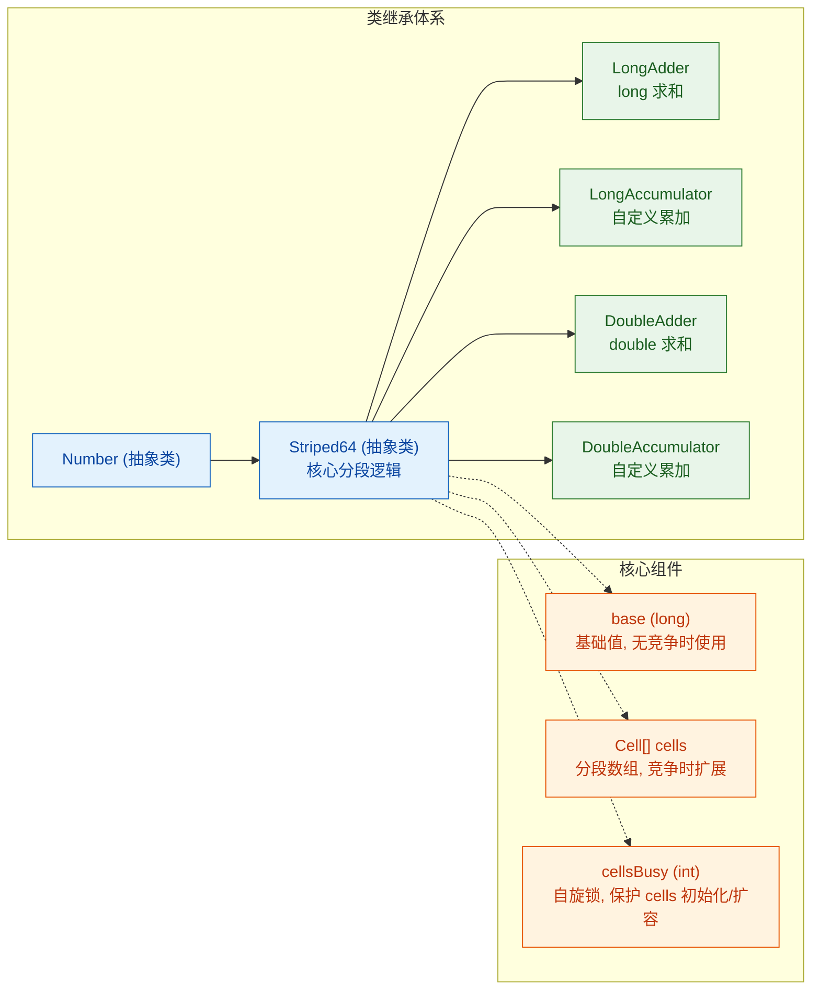
```mermaid
graph LR
    subgraph 类继承体系
        direction TB
        A["Number (抽象类)"]
        B["Striped64 (抽象类)<br/>核心分段逻辑"]
        C["LongAdder<br/>long 求和"]
        D["LongAccumulator<br/>自定义累加"]
        E["DoubleAdder<br/>double 求和"]
        F["DoubleAccumulator<br/>自定义累加"]
        A --> B
        B --> C
        B --> D
        B --> E
        B --> F
    end

    subgraph 核心组件
        direction TB
        G["base (long)<br/>基础值, 无竞争时使用"]
        H["Cell[] cells<br/>分段数组, 竞争时扩展"]
        I["cellsBusy (int)<br/>自旋锁, 保护 cells 初始化/扩容"]
    end

    B -.-> G
    B -.-> H
    B -.-> I

    classDef abstract fill:#E3F2FD,stroke:#1565C0,color:#0D47A1
    classDef concrete fill:#E8F5E9,stroke:#2E7D32,color:#1B5E20
    classDef component fill:#FFF3E0,stroke:#E65100,color:#BF360C

    class A,B abstract
    class C,D,E,F concrete
    class G,H,I component
```

从继承体系可以看到：

- **`Striped64`** 是真正的 "大脑"，持有 `base`、`Cell[]` 数组和 `cellsBusy` 自旋锁等核心字段，并实现了分段累加的核心方法 `longAccumulate()`。
- **`LongAdder`** 只是对外暴露了 `add()`、`increment()`、`sum()` 等语义清晰的 API，内部直接委托给 `Striped64` 的机制。

### LongAdder 的工作模型概览

在进入后续章节的细节之前，我们先建立一个全局的心智模型（mental model）：

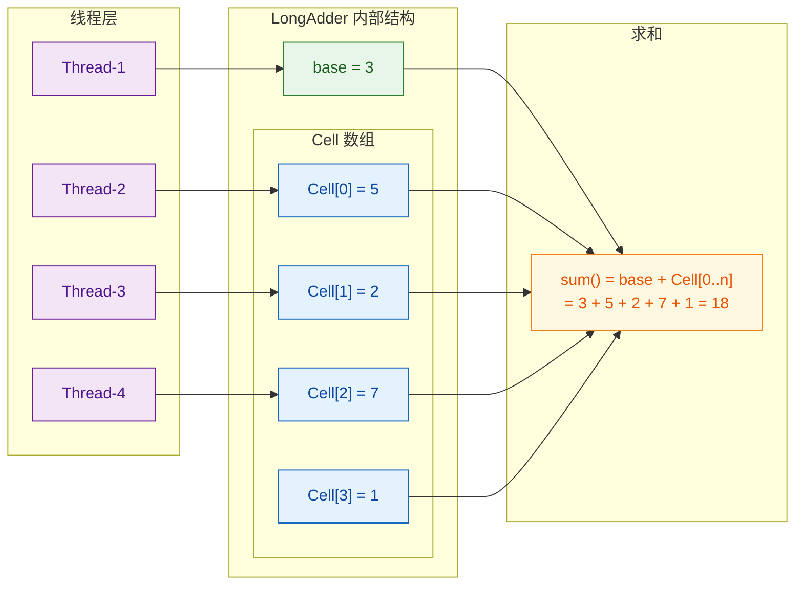
```mermaid
graph LR
    subgraph 线程层
        direction TB
        T1["Thread-1"]
        T2["Thread-2"]
        T3["Thread-3"]
        T4["Thread-4"]
    end

    subgraph LongAdder 内部结构
        direction TB
        BASE["base = 3"]
        subgraph Cell 数组
            direction TB
            C0["Cell[0] = 5"]
            C1["Cell[1] = 2"]
            C2["Cell[2] = 7"]
            C3["Cell[3] = 1"]
        end
    end

    subgraph 求和
        direction TB
        SUM["sum() = base + Cell[0..n]<br/>= 3 + 5 + 2 + 7 + 1 = 18"]
    end

    T1 --> BASE
    T2 --> C0
    T3 --> C1
    T4 --> C2

    BASE --> SUM
    C0 --> SUM
    C1 --> SUM
    C2 --> SUM
    C3 --> SUM

    classDef thread fill:#F3E5F5,stroke:#6A1B9A,color:#4A148C
    classDef base fill:#E8F5E9,stroke:#2E7D32,color:#1B5E20
    classDef cell fill:#E3F2FD,stroke:#1565C0,color:#0D47A1
    classDef sum fill:#FFF8E1,stroke:#F57F17,color:#E65100

    class T1,T2,T3,T4 thread
    class BASE base
    class C0,C1,C2,C3 cell
    class SUM sum
```

**工作流程可以用一句话概括**：

> **写入时分散（Distribute on write），读取时汇总（Aggregate on read）。**

具体来说：

1. **无竞争时（低并发）**：线程直接对 `base` 做 CAS 累加，行为与 `AtomicLong` 几乎一致，没有额外开销。
2. **发生竞争时（高并发）**：线程根据自身的 **线程探针哈希值（thread probe hash）** 被映射到 `Cell[]` 数组的某个槽位，只对该 `Cell` 的 `value` 做 CAS 累加。由于不同线程大概率落入不同的 `Cell`，竞争被 **物理分散** 到了多个独立的内存位置上。
3. **读取总和时**：调用 `sum()` 方法，遍历 `base + 所有 Cell[i].value` 求和。由于没有加全局锁，返回值是一个 **"近似快照"（approximate snapshot）**，不保证绝对精确。

### LongAdder 的 API 一览

`LongAdder` 的公开 API 极其简洁，符合 "做一件事，做到极致" 的设计理念：

```java
public class LongAdder extends Striped64 implements Serializable {

    // ========== 写操作 ==========
    public void add(long x);         // 累加指定值 x
    public void increment();          // 等价于 add(1L)
    public void decrement();          // 等价于 add(-1L)

    // ========== 读操作 ==========
    public long sum();                // 返回当前累计总和（非精确快照）
    public long longValue();          // 等价于 sum()，实现 Number 接口
    public int intValue();            // (int) sum()
    public float floatValue();        // (float) sum()
    public double doubleValue();      // (double) sum()

    // ========== 重置操作 ==========
    public void reset();              // 将 base 和所有 Cell 归零
    public long sumThenReset();       // 先求和再归零（非原子组合操作）

    // ========== 其他 ==========
    public String toString();         // 返回 sum() 的字符串形式
}
```

几个需要特别注意的点：

- **没有 `get()` 方法**。这是刻意为之——`LongAdder` 不是一个 "精确计数器"，它的语义是 "累加器"，读取用 `sum()` 明确表达了 "汇总" 的含义。
- **`sumThenReset()` 不是原子操作**。在并发环境下，它可能丢失正在进行中的累加。这个方法更适合在 **两次统计周期之间** 的安静期调用（例如定时采样指标后清零）。
- **没有 `compareAndSet()` 之类的方法**。`LongAdder` 从设计上就不支持条件性更新，因为它的值分散在多个位置，无法对 "整体值" 做原子的 CAS。

### 适用场景与不适用场景

| 场景 | 是否适用 | 推荐工具 | 原因 |
|------|---------|---------|------|
| 高并发统计计数（如 QPS 统计、请求量累加） | ✅ 非常适合 | `LongAdder` | 写多读少，分段累加大幅降低竞争 |
| 需要精确读取当前值（如账户余额） | ❌ 不适合 | `AtomicLong` | `sum()` 不保证精确，且无法做 CAS 条件更新 |
| 需要 CAS 语义（如状态标志位） | ❌ 不适合 | `AtomicLong` / `AtomicReference` | `LongAdder` 无 `compareAndSet` |
| 自定义累加逻辑（如求最大值） | ✅ 适合变体 | `LongAccumulator` | 可自定义二元函数 |
| 低并发、简单计数 | ⚠️ 可用但无优势 | `AtomicLong` | 低竞争下 `LongAdder` 有额外内存开销 |

### 一窥源码：LongAdder 构造函数

`LongAdder` 的构造函数 **什么都不做**：

```java
public class LongAdder extends Striped64 implements Serializable {

    /**
     * 创建一个初始值为 0 的 LongAdder。
     * 注意：此时 cells 数组为 null，base 为 0。
     * Cell 数组只有在第一次发生竞争时才会被懒初始化（lazy initialization）。
     */
    public LongAdder() {
        // 空构造函数，所有字段使用默认值
        // base = 0L (继承自 Striped64)
        // cells = null (继承自 Striped64)
        // cellsBusy = 0 (继承自 Striped64)
    }
}
```

这是一个非常典型的 **懒加载（Lazy Initialization）** 设计。在没有竞争的场景下，`LongAdder` 的内存占用和 `AtomicLong` 基本相当——只有一个 `base` 字段在工作。只有当 CAS 竞争真正发生时，`Cell[]` 数组才会被创建并逐步扩容。这种 **"按需分配"** 的策略，避免了在低并发场景下浪费内存。

### 小结

`LongAdder` 的设计可以归纳为三个关键词：

1. **分治（Divide）**：将单点热力值分散到多个 Cell 中。
2. **懒加载（Lazy）**：仅在竞争出现时才分配 Cell 数组。
3. **最终一致（Eventually Consistent）**：`sum()` 只提供近似值，不保证瞬时精确。

这种设计哲学在分布式系统中非常常见（例如分片计数器、HyperLogLog 等），`LongAdder` 将其巧妙地移植到了单机 JVM 的并发场景中，成为 JDK 中 **"Write-heavy, Read-infrequent"** 场景的首选计数器。

---

**📝 练习题**

以下关于 `LongAdder` 的描述，**错误** 的是？

A. `LongAdder` 继承自 `Striped64`，后者包含 `base` 字段和 `Cell[]` 数组等核心结构。

B. `LongAdder` 在构造时就会初始化 `Cell[]` 数组，以备后续并发写入使用。

C. `LongAdder` 的 `sum()` 方法返回值不保证是精确的瞬时快照，因为汇总过程中不加全局锁。

D. 在低并发、无竞争场景下，`LongAdder` 的写入操作直接对 `base` 字段做 CAS，行为类似 `AtomicLong`。


**【答案】** B

**【解析】** `LongAdder` 采用的是 **懒初始化（Lazy Initialization）** 策略。构造函数是一个空方法，`Cell[]` 数组初始为 `null`，只有当线程在对 `base` 做 CAS 时发生竞争失败，才会触发 `Cell[]` 数组的首次创建。这种设计确保了在低并发场景下不会浪费额外的内存空间。选项 A、C、D 的描述均与 `LongAdder` 的实际行为一致。

---

## 分段思想 ⭐⭐

在传统的 `AtomicLong` 中，所有线程对同一个 `long` 变量做 CAS（Compare-And-Swap）操作。当并发量较低时，CAS 成功的概率高，性能尚可；但一旦并发线程数急剧上升，大量线程会在同一个内存地址上不断自旋重试（spin-retry），形成严重的 **CAS 争用风暴（CAS contention storm）**。这就像超市只有一个收银台——人少时效率还行，人多时所有人都排在同一条队伍里，吞吐量急剧下降。

Doug Lea 在 JDK 8 中引入的 `LongAdder`，其核心设计哲学可以用一句话概括：**"化整为零，分而治之（split the single hot spot into multiple independent slots）"**。它将一个逻辑上的计数器拆解为 **一个 base 变量 + 若干个 Cell 对象**，让不同的线程分散到不同的槽位上进行 CAS，从根本上降低了竞争概率。最后需要读取总值时，再把 base 与所有 Cell 的值加在一起。

这种思想在分布式系统中随处可见——分库分表、一致性哈希、并发 HashMap 的分段锁（JDK 7 的 `ConcurrentHashMap` 的 `Segment`）——本质都是 **用空间换时间，用分散度换吞吐量**。

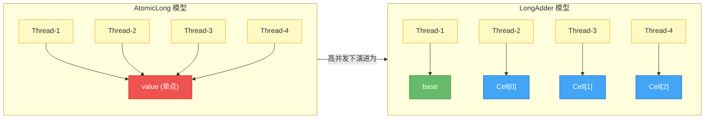
```mermaid
graph LR
    subgraph AL["AtomicLong 模型"]
        direction TB
        T1A["Thread-1"] --> V["value (单点)"]
        T2A["Thread-2"] --> V
        T3A["Thread-3"] --> V
        T4A["Thread-4"] --> V
    end

    subgraph LA["LongAdder 模型"]
        direction TB
        T1B["Thread-1"] --> BASE["base"]
        T2B["Thread-2"] --> C0["Cell[0]"]
        T3B["Thread-3"] --> C1["Cell[1]"]
        T4B["Thread-4"] --> C2["Cell[2]"]
    end

    AL -- "高并发下演进为" --> LA

    classDef hotspot fill:#EF5350,stroke:#C62828,color:#fff
    classDef base fill:#66BB6A,stroke:#2E7D32,color:#fff
    classDef cell fill:#42A5F5,stroke:#1565C0,color:#fff
    classDef thread fill:#FFF9C4,stroke:#F9A825,color:#333

    class V hotspot
    class BASE base
    class C0,C1,C2 cell
    class T1A,T2A,T3A,T4A,T1B,T2B,T3B,T4B thread
```

上图清晰展示了两种模型的对比：左侧 `AtomicLong` 所有线程争抢同一个 value；右侧 `LongAdder` 将写压力分散到 base 和多个 Cell 上。接下来我们逐一深入每个组成部分。

---

### base 基础值

`base` 是 `LongAdder` 内部的一个 `long` 型字段，定义在其父类 `Striped64` 中：

```java
// Striped64.java（LongAdder 的父类）
abstract class Striped64 extends Number {
    // base 值：在无竞争时直接累加到这里
    transient volatile long base;

    // Cell 数组：在出现竞争后才会被惰性初始化
    transient volatile Cell[] cells;

    // 自旋锁标志位：用于 cells 数组的初始化和扩容
    transient volatile int cellsBusy;
}
```

**`base` 的角色定位可以归纳为两点：**

**第一，无竞争时的快速通道（fast path under no contention）。** 当系统并发度不高、甚至只有单线程在执行累加时，`LongAdder` 不会去创建任何 Cell 对象，而是直接对 `base` 做 CAS 操作。这使得低竞争场景下 `LongAdder` 的性能与 `AtomicLong` 几乎持平——不会因为"分段"带来额外开销。下面的伪代码展示了这个逻辑：

```java
public void add(long x) {
    Cell[] cs;  // 局部变量引用 cells 数组
    long b;     // 局部变量保存 base 当前值

    // 第一层判断：如果 cells 为 null（还没初始化），尝试直接 CAS base
    if ((cs = cells) == null) {
        // casBase 底层是 Unsafe.compareAndSwapLong(this, BASE_OFFSET, b, b + x)
        if (casBase(b = base, b + x)) {
            // CAS 成功，直接返回，不需要触碰任何 Cell
            return;
        }
    }
    // CAS base 失败 或 cells 已存在 → 说明有竞争，走 Cell 路径
    // ...后续逻辑
}
```

从代码中可以看出，`base` 的 CAS 操作是 `add()` 方法的 **第一道防线**。只有当这一步失败（说明有其他线程在同一时刻也在做累加），才会"升级"到 Cell 数组的路径上。这种 **惰性升级（lazy escalation）** 的策略非常精巧——不为尚未发生的竞争提前付出代价。

**第二，参与最终求和（participate in the final sum）。** 当调用 `sum()` 方法读取总值时，base 的值会作为求和起点：

```java
public long sum() {
    Cell[] cs = cells; // 获取 cells 数组的快照引用
    long sum = base;   // ✅ 以 base 作为初始累加值
    if (cs != null) {
        for (Cell c : cs) {      // 遍历所有 Cell
            if (c != null) {
                sum += c.value;  // 累加每个 Cell 的值
            }
        }
    }
    return sum; // 返回 base + 所有 Cell.value 的总和
}
```

这里有一个重要的细节：在 `sum()` 执行期间，其他线程可能仍然在往 base 或某个 Cell 里写入新值，因此 **`sum()` 的返回值不保证是精确快照（not an atomic snapshot）**。这是 `LongAdder` 用精确性换吞吐量的一个已知 trade-off，后续章节会详述。

---

### Cell 数组

当 `base` 的 CAS 操作开始频繁失败时，说明多个线程在争抢同一个热点。此时 `LongAdder` 会 **惰性初始化（lazily initialize）** 一个 `Cell[]` 数组，将不同线程映射到不同的 Cell 槽位上，从而分散写竞争。

#### Cell 数组的初始化与扩容规则

Cell 数组有几个核心的 **不变式（invariants）**：

1. **长度始终是 2 的幂（power of 2）**：初始长度为 2，之后每次扩容翻倍，便于用位运算 `hash & (length - 1)` 快速定位槽位。
2. **上限是 CPU 核心数（NCPU）**：数组最大长度不超过 `Runtime.getRuntime().availableProcessors()` 返回的值。因为即使创建了比 CPU 核心更多的 Cell，也不可能有更多的线程真正并行执行，多余的 Cell 只是浪费内存。
3. **只扩容不缩容（grow-only）**：一旦数组扩大，不会因为竞争降低而缩小。这简化了并发控制的复杂度。

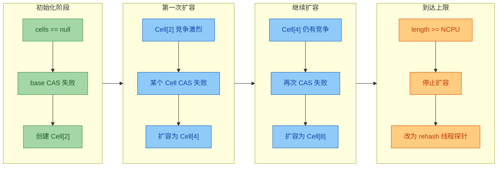
```mermaid
graph LR
    subgraph INIT["初始化阶段"]
        direction TB
        S1["cells == null"] --> S2["base CAS 失败"]
        S2 --> S3["创建 Cell[2]"]
    end

    subgraph GROW1["第一次扩容"]
        direction TB
        G1["Cell[2] 竞争激烈"] --> G2["某个 Cell CAS 失败"]
        G2 --> G3["扩容为 Cell[4]"]
    end

    subgraph GROW2["继续扩容"]
        direction TB
        H1["Cell[4] 仍有竞争"] --> H2["再次 CAS 失败"]
        H2 --> H3["扩容为 Cell[8]"]
    end

    subgraph LIMIT["到达上限"]
        direction TB
        L1["length >= NCPU"] --> L2["停止扩容"]
        L2 --> L3["改为 rehash 线程探针"]
    end

    INIT --> GROW1 --> GROW2 --> LIMIT

    classDef init fill:#A5D6A7,stroke:#388E3C,color:#1B5E20
    classDef grow fill:#90CAF9,stroke:#1565C0,color:#0D47A1
    classDef limit fill:#FFCC80,stroke:#E65100,color:#BF360C

    class S1,S2,S3 init
    class G1,G2,G3,H1,H2,H3 grow
    class L1,L2,L3 limit
```

#### 线程如何映射到 Cell 槽位

每个线程有一个 **探针哈希值（thread probe hash）**，存储在 `Thread` 对象的 `threadLocalRandomProbe` 字段中。当一个线程需要写入 Cell 时，通过以下方式定位槽位：

```java
// 获取当前线程的探针值
int h = getProbe();

// 用位与操作定位 Cell 索引（等价于 h % cells.length，但更快）
int index = h & (cells.length - 1);

// 尝试对 cells[index] 进行 CAS
Cell c = cells[index];
if (c != null && c.cas(c.value, c.value + x)) {
    // 成功，直接返回
    return;
}
```

如果当前槽位的 CAS 也失败了，`LongAdder` 不会立刻扩容，而是先尝试 **rehash——重新计算线程的探针值**，让这个线程换到另一个 Cell 上去尝试。只有当 rehash 之后仍然失败，且数组长度还没达到 NCPU 上限时，才触发扩容。

```java
// 伪代码：Cell CAS 失败后的处理策略
if (cellCasFailed) {
    if (cells.length < NCPU) {
        // 还有扩容余地 → 扩容
        expandCells();
    }
    // 无论是否扩容，都 rehash 探针值，换个槽位重试
    advanceProbe(h);
}
```

这种 **"先 rehash，后扩容"** 的策略避免了不必要的内存膨胀。想象一下：可能只是两个线程恰好哈希到了同一个槽位（碰撞），rehash 一下就能解决，完全不需要扩容。

#### 扩容的并发安全：cellsBusy 自旋锁

Cell 数组的初始化和扩容涉及对共享引用 `cells` 的修改，需要互斥保护。`Striped64` 使用了一个非常轻量的自旋锁——`cellsBusy` 字段：

```java
// cellsBusy 充当自旋锁：0 表示空闲，1 表示被某线程持有
transient volatile int cellsBusy;

// 尝试获取锁：CAS 将 cellsBusy 从 0 改为 1
final boolean casCellsBusy() {
    return CELLSBUSY.compareAndSet(this, 0, 1);
}

// 扩容或初始化的核心逻辑（简化版）
if (casCellsBusy()) {         // 尝试获取锁
    try {
        if (cells == cs) {    // 双重检查（double-check），防止其他线程已经扩容
            Cell[] rs = new Cell[cs.length << 1];   // 容量翻倍
            for (int i = 0; i < cs.length; i++) {
                rs[i] = cs[i];                      // 迁移旧 Cell 引用
            }
            cells = rs;       // 发布新数组（volatile 写，确保可见性）
        }
    } finally {
        cellsBusy = 0;        // 释放锁（普通写即可，因为 volatile 保证了顺序）
    }
}
```

注意这里没有使用 `ReentrantLock` 或 `synchronized`——在超高频的累加场景下，这些重量级锁的开销是不可接受的。`cellsBusy` 自旋锁足够轻量，且持有时间极短（只做数组拷贝和引用替换），非常适合这种场景。

---

### 分散竞争

"分散竞争（contention spreading / striping）"是整个分段思想的 **灵魂**。它解决的核心问题是：**如何让 N 个并发线程尽可能均匀地分布在 M 个 Cell 上，使得同一时刻在同一个 Cell 上做 CAS 的线程数最小化？**

#### 竞争分散的完整工作流

下面这张流程图展示了一个线程调用 `add(x)` 时，系统如何逐步"分散"它的写操作：

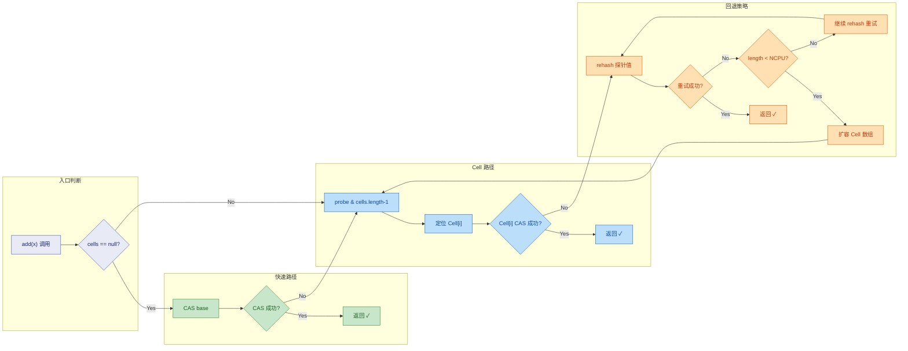
```mermaid
graph LR
    subgraph ENTRY["入口判断"]
        direction TB
        A["add(x) 调用"] --> B{"cells == null?"}
    end

    subgraph FAST["快速路径"]
        direction TB
        C["CAS base"] --> D{"CAS 成功?"}
        D -- "Yes" --> E["返回 ✓"]
    end

    subgraph CELL_PATH["Cell 路径"]
        direction TB
        F["probe & cells.length-1"] --> G["定位 Cell[i]"]
        G --> H{"Cell[i] CAS 成功?"}
        H -- "Yes" --> I["返回 ✓"]
    end

    subgraph FALLBACK["回退策略"]
        direction TB
        J["rehash 探针值"] --> K{"重试成功?"}
        K -- "Yes" --> L["返回 ✓"]
        K -- "No" --> M{"length < NCPU?"}
        M -- "Yes" --> N["扩容 Cell 数组"]
        M -- "No" --> O["继续 rehash 重试"]
    end

    B -- "Yes" --> C
    B -- "No" --> F
    D -- "No" --> F
    H -- "No" --> J
    N --> F
    O --> J

    classDef entry fill:#E8EAF6,stroke:#3F51B5,color:#1A237E
    classDef fast fill:#C8E6C9,stroke:#388E3C,color:#1B5E20
    classDef cellp fill:#BBDEFB,stroke:#1565C0,color:#0D47A1
    classDef fallback fill:#FFE0B2,stroke:#E65100,color:#BF360C

    class A,B entry
    class C,D,E fast
    class F,G,H,I cellp
    class J,K,L,M,N,O fallback
```

让我们用文字串联这张图的逻辑：

**Step 1 — 尝试 base（绿色快速路径）。** 如果 `cells` 尚未初始化，线程会先尝试 CAS base。成功则直接返回，整个操作只涉及一次原子操作，开销极小。

**Step 2 — 定位 Cell 槽位（蓝色 Cell 路径）。** 如果 base CAS 失败或 cells 已经存在，线程通过 `probe & (cells.length - 1)` 计算出自己应该去的 Cell 索引，然后对该 Cell 做 CAS。

**Step 3 — rehash 再分配（橙色回退策略）。** 如果 Cell CAS 也失败，说明当前槽位有竞争。此时系统会修改线程的探针值（`advanceProbe`），相当于让这个线程"换一个队伍排队"。

**Step 4 — 扩容兜底。** 如果 rehash 后仍然失败且数组还没达到 NCPU 上限，就把数组扩容一倍，提供更多的槽位来容纳更多线程。

#### 为什么 rehash 优先于扩容？

这是一个关键的设计决策。考虑以下场景：

```text
Cell 数组长度 = 4, CPU 核心数 = 8

Thread-A: probe = 0x3F → index = 3
Thread-B: probe = 0x7F → index = 3  (碰撞！)
Thread-C: probe = 0x42 → index = 2
Thread-D: probe = 0x10 → index = 0
```

Thread-A 和 Thread-B 碰撞在 Cell[3] 上。如果直接扩容到 Cell[8]，虽然能解决问题，但浪费了内存。更聪明的做法是把 Thread-B 的探针值 rehash 一下：

```text
Thread-B: advanceProbe(0x7F) → 新 probe = 0x5A → index = 2 或 index = 1
```

rehash 后 Thread-B 自然分散到另一个槽位，竞争消除，无需扩容。

#### 一个形象的类比

把 `LongAdder` 的分散竞争机制想象成一家大型超市的收银系统：

| 角色 | 对应关系 |
|:---|:---|
| **收银台** | Cell 槽位（Cell[0], Cell[1], ...） |
| **总服务台** | base 变量 |
| **顾客** | 并发线程 |
| **排队号牌** | 线程探针值（thread probe） |
| **开新收银台** | Cell 数组扩容 |
| **换队** | rehash 探针值 |
| **结账总额** | `sum()` 方法汇总 |

- 顾客少时，大家直接去总服务台（base）结账，最快。
- 人多了，超市开几个收银台（Cell 数组初始化），按号牌分流。
- 某个收银台排队太长（CAS 失败），先让顾客换到人少的队伍（rehash）。
- 所有队伍都满了，再开新收银台（扩容），但最多不超过收银台机器数（NCPU）。
- 经理查看总销售额时，把总服务台和所有收银台的金额加起来（`sum()`）。

#### 竞争分散的量化效果

为了直观理解分散竞争的效果，我们来对比两种策略在不同线程数下的理论 CAS 竞争概率：

```text
假设 N 个线程同时执行 add()，Cell 数组长度为 M

AtomicLong（M=1）：
  - 任意一次 CAS 的竞争概率 ≈ (N-1)/N
  - 16 线程时：竞争概率 ≈ 93.75%

LongAdder（M = min(N, NCPU)，理想均匀分布）：
  - 每个 Cell 上平均 N/M 个线程
  - 单个 Cell 的竞争概率 ≈ (N/M - 1) / (N/M)
  - 16 线程, 8 Cell：每 Cell 2 线程，竞争概率 ≈ 50%
  - 16 线程, 16 Cell：每 Cell 1 线程，竞争概率 ≈ 0%
```

可以看到，当 Cell 数量等于线程数时，理论上可以完全消除竞争，每个线程独占一个 Cell，CAS 百发百中。这就是 `LongAdder` 在高并发写场景下吞吐量远超 `AtomicLong` 的根本原因。

#### 源码层面的核心方法：longAccumulate

所有的分散竞争逻辑都集中在 `Striped64#longAccumulate` 这个方法中，这是 `LongAdder` 最复杂也最核心的方法。以下是其精简注释版：

```java
// Striped64.java
final void longAccumulate(long x, LongBinaryOperator fn, boolean wasUncontended) {
    int h;
    // 如果当前线程的探针值还没初始化（== 0），先初始化
    if ((h = getProbe()) == 0) {
        ThreadLocalRandom.current();   // 强制初始化探针值
        h = getProbe();                // 重新获取
        wasUncontended = true;         // 重置竞争标志
    }

    boolean collide = false;           // 标记：上一次是否发生了槽位碰撞

    for (;;) {                         // 无限重试循环（自旋）
        Cell[] cs; Cell c; int n; long v;

        // ▶ 分支一：cells 数组已存在
        if ((cs = cells) != null && (n = cs.length) > 0) {

            // 1) 目标槽位为空 → 尝试创建新 Cell 并放入
            if ((c = cs[(n - 1) & h]) == null) {
                if (cellsBusy == 0) {
                    Cell r = new Cell(x);           // 预先创建 Cell
                    if (cellsBusy == 0 && casCellsBusy()) {  // 获取自旋锁
                        try {
                            // 双重检查后安装 Cell
                            Cell[] rs; int m, j;
                            if ((rs = cells) != null &&
                                (m = rs.length) > 0 &&
                                rs[j = (m - 1) & h] == null) {
                                rs[j] = r;          // 安装成功
                                break;              // 退出自旋
                            }
                        } finally {
                            cellsBusy = 0;          // 释放锁
                        }
                    }
                }
                collide = false;                    // 安装失败，重置碰撞标志

            // 2) 上一次 CAS 失败且是已知的竞争 → 先标记，走到底部 rehash
            } else if (!wasUncontended) {
                wasUncontended = true;              // 标记已知，下轮重试

            // 3) 尝试 CAS 当前 Cell → 核心累加操作
            } else if (c.cas(v = c.value,
                             (fn == null) ? v + x : fn.applyAsLong(v, x))) {
                break;                              // CAS 成功，退出

            // 4) 数组长度已达 NCPU 上限 或 cells 已被其他线程替换 → 放弃扩容念头
            } else if (n >= NCPU || cells != cs) {
                collide = false;                    // 不扩容，只 rehash

            // 5) 首次碰撞 → 标记 collide，下轮再决定是否扩容
            } else if (!collide) {
                collide = true;

            // 6) 二次碰撞确认 → 执行扩容
            } else if (cellsBusy == 0 && casCellsBusy()) {
                try {
                    if (cells == cs) {
                        cells = Arrays.copyOf(cs, n << 1);  // 容量翻倍
                    }
                } finally {
                    cellsBusy = 0;
                }
                collide = false;
                continue;                           // 扩容后直接重试，不 rehash
            }
            h = advanceProbe(h);                    // 🔄 rehash 探针值

        // ▶ 分支二：cells 还不存在 → 初始化
        } else if (cellsBusy == 0 && cells == cs && casCellsBusy()) {
            try {
                if (cells == cs) {
                    Cell[] rs = new Cell[2];        // 初始容量为 2
                    rs[h & 1] = new Cell(x);        // 把当前值放入对应槽位
                    cells = rs;                     // 发布数组
                }
            } finally {
                cellsBusy = 0;
            }
            break;                                  // 初始化完成，退出

        // ▶ 分支三：初始化被其他线程抢了 → 退而求其次，再试一次 base CAS
        } else if (casBase(v = base,
                           (fn == null) ? v + x : fn.applyAsLong(v, x))) {
            break;                                  // base CAS 成功，退出
        }
    }
}
```

这个方法的精妙之处在于它的 **渐进式策略**：不会一上来就创建大量 Cell，而是在每一轮循环中只做"最小必要操作"——先尝试写现有 Cell，失败则 rehash，再失败则标记碰撞，碰撞确认后才扩容。整个过程 **没有任何阻塞（blocking-free）**，全靠 CAS + 自旋完成。

---

**📝 练习题**

关于 `LongAdder` 的分段思想，以下描述中 **错误的** 是哪一项？

A. `Cell` 数组长度始终是 2 的幂次方，最大不超过 `Runtime.getRuntime().availableProcessors()`


B. 当线程对某个 `Cell` 执行 CAS 失败后，会立即触发数组扩容以减少竞争


C. `base` 变量在无竞争时承担全部累加工作，`Cell` 数组是惰性初始化的


D. 线程通过 `threadLocalRandomProbe` 探针值与数组长度做位与运算来定位 Cell 槽位


**【答案】** B

**【解析】** `LongAdder` 在 Cell CAS 失败后并不会立即扩容。它遵循 **"先 rehash，后扩容"** 的渐进策略：首先通过 `advanceProbe()` 重新计算线程的探针哈希值，让线程尝试映射到另一个槽位。只有在 rehash 后仍然发生碰撞（`collide` 标志被设为 `true`），并且数组长度尚未达到 NCPU 上限时，才会触发真正的扩容。这种设计避免了因偶然碰撞导致的不必要内存膨胀。选项 A 描述了 Cell 数组的不变式，正确；选项 C 准确描述了 base 的快速通道角色和 Cell 的惰性初始化特性；选项 D 正确描述了线程到 Cell 的映射机制。

---

## Cell 结构

在上一节中我们了解到，`LongAdder` 的核心分段思想依赖于一个 `Cell[]` 数组来分散并发写入的竞争压力。那么数组中的每一个 `Cell` 到底长什么样？它内部做了哪些精妙的设计？这正是本节要深入剖析的重点。`Cell` 是 `java.util.concurrent.atomic.Striped64` 的一个静态内部类（static inner class），虽然代码量极少，但每一行都凝聚了 Doug Lea 对高性能并发的极致追求。

我们先直接看 JDK 源码中 `Cell` 的完整定义，然后逐层拆解：

```java
// Cell 是 Striped64 的静态内部类
// 使用 @jdk.internal.vm.annotation.Contended 注解修饰
@jdk.internal.vm.annotation.Contended  // 关键：避免伪共享（False Sharing）
static final class Cell {
    // volatile 保证可见性，存储该 Cell 槽位的当前累加值
    volatile long value;

    // 构造函数：初始化时传入一个初始值
    Cell(long x) {
        value = x;
    }

    // 通过 CAS 操作原子地更新 value
    // 参数 cmp 是期望值，val 是新值
    // 底层委托给 VarHandle 执行 compareAndSet
    final boolean cas(long cmp, long val) {
        // VALUE 是一个 VarHandle，指向 this.value 字段
        return VALUE.compareAndSet(this, cmp, val);
    }

    // 重置 value 为 identity（用于 Striped64 内部的表扩容等场景）
    final void reset(long identity) {
        // VALUE 是一个 VarHandle，此处使用 volatile 写语义
        VALUE.setVolatile(this, identity);
    }

    // 通过 VarHandle 获取对 value 字段的原子操作能力
    // 这是 JDK 9+ 取代 sun.misc.Unsafe 的现代写法
    private static final VarHandle VALUE;

    static {
        try {
            // 在类加载时，通过 MethodHandles.Lookup 查找 value 字段
            MethodHandles.Lookup l = MethodHandles.lookup();
            // 绑定 VarHandle 到 Cell 类的 value 字段
            VALUE = l.findVarHandle(Cell.class, "value", long.class);
        } catch (ReflectiveOperationException e) {
            // 如果反射查找失败，直接抛出错误（不应该发生）
            throw new ExceptionInInitializerError(e);
        }
    }
}
```

可以看到，整个 `Cell` 类的代码不到 30 行，但它承载了两个关键设计：**`@Contended` 注解消除伪共享** 和 **`volatile long value` 配合 CAS 实现无锁更新**。下面我们逐一深入。

---

### @Contended（避免伪共享）

#### 什么是伪共享（False Sharing）

要理解 `@Contended` 的价值，必须先理解一个底层硬件概念——**CPU 缓存行（Cache Line）**。

现代 CPU 并不会一个字节一个字节地从主存（Main Memory）读取数据。为了提高效率，CPU 以 **缓存行（Cache Line）** 为最小单位进行数据加载，通常一条缓存行的大小是 **64 字节（bytes）**。这意味着，当 CPU 核心需要读取某个变量时，它会把该变量 **所在的连续 64 字节** 一整块拉进 L1/L2 缓存中。

在多核 CPU 架构下，每个核心都拥有自己独立的 L1/L2 缓存。当两个不同的核心分别修改 **不同的变量**，但这两个变量恰好落在 **同一条缓存行** 中时，灾难就发生了：

> 核心 A 修改了变量 X → 整条缓存行被标记为"脏"（Dirty）→ 核心 B 的缓存中包含这条缓存行的副本被 **强制失效（Invalidate）** → 核心 B 下次访问变量 Y（Y 和 X 在同一行！）时必须重新从主存或 L3 加载 → 核心 B 修改了变量 Y → 反过来又让核心 A 的缓存行失效……

这就是 **伪共享（False Sharing）**——两个逻辑上毫无关联的变量，仅仅因为物理上相邻而被迫共享缓存行，导致多核之间不断触发缓存一致性协议（如 MESI 协议）的失效-重加载循环，性能严重下降。

用一张图来直观展示这个问题：

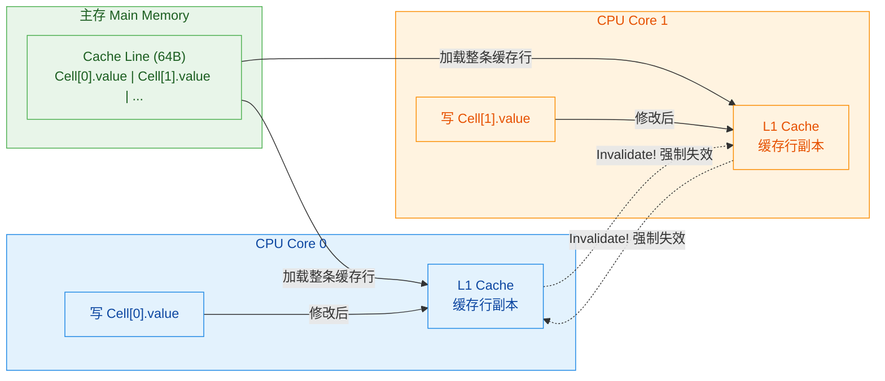
```mermaid
graph LR
    subgraph MainMemory["主存 Main Memory"]
        direction TB
        CL1["Cache Line (64B)<br/>Cell[0].value | Cell[1].value | ..."]
    end

    subgraph CPU_A["CPU Core 0"]
        direction TB
        L1A["L1 Cache<br/>缓存行副本"]
        OP_A["写 Cell[0].value"]
    end

    subgraph CPU_B["CPU Core 1"]
        direction TB
        L1B["L1 Cache<br/>缓存行副本"]
        OP_B["写 Cell[1].value"]
    end

    CL1 -->|"加载整条缓存行"| L1A
    CL1 -->|"加载整条缓存行"| L1B
    OP_A -->|"修改后"| L1A
    OP_B -->|"修改后"| L1B
    L1A -.->|"Invalidate! 强制失效"| L1B
    L1B -.->|"Invalidate! 强制失效"| L1A

    classDef memStyle fill:#E8F5E9,stroke:#4CAF50,color:#1B5E20
    classDef cpuAStyle fill:#E3F2FD,stroke:#1E88E5,color:#0D47A1
    classDef cpuBStyle fill:#FFF3E0,stroke:#FB8C00,color:#E65100

    class MainMemory,CL1 memStyle
    class CPU_A,L1A,OP_A cpuAStyle
    class CPU_B,L1B,OP_B cpuBStyle
```

如上图所示，`Cell[0].value` 和 `Cell[1].value` 如果紧挨着存放在内存中，它们就很可能落入同一条 64 字节的缓存行。这时核心 0 只想改 `Cell[0]`，核心 1 只想改 `Cell[1]`，但它们会 **互相拖累**，不断让对方的缓存失效。这在 `LongAdder` 这种高频写入场景下是毁灭性的——本来分段的目的就是让不同线程各写各的，结果底层硬件又把它们"绑"在了一起。

#### @Contended 的解决方案

`@jdk.internal.vm.annotation.Contended` 注解的作用非常直接：它告诉 JVM，**在这个对象（或字段）的前后各填充足够的空白字节（Padding）**，确保该对象 **独占一条或多条缓存行**，不与任何其他对象共享。

具体来说，HotSpot JVM 在看到 `@Contended` 注解后，默认会在对象的字段布局中 **前后各插入 128 字节** 的填充（padding），这个值可以通过 JVM 参数 `-XX:ContendedPaddingWidth` 调整。填充后的内存布局大致如下：

```java
// ========== 未加 @Contended 的内存布局（伪共享风险） ==========
// |  Cell[0].value (8B)  |  Cell[1].value (8B)  |  Cell[2].value (8B)  | ...
// |<------------- 同一条 64B Cache Line 内 ------------->|
// 多个 Cell 的 value 挤在同一条缓存行中，互相干扰！

// ========== 加了 @Contended 的内存布局（伪共享消除） ==========
// | padding 128B | Cell[0].value (8B) | padding 128B |
// | padding 128B | Cell[1].value (8B) | padding 128B |
// | padding 128B | Cell[2].value (8B) | padding 128B |
// 每个 Cell 独占缓存行，彼此隔离，再无互相失效问题！
```

这里有一个重要细节：**`@Contended` 是加在整个 `Cell` 类上的，而不是加在 `value` 字段上**。这意味着整个 `Cell` 对象实例会被填充隔离。因为 `Cell` 类中实际上只有一个有意义的字段 `value`，所以效果等同于隔离 `value`。

> **⚠️ 注意事项**：`@Contended` 注解默认只对 JDK 内部类生效。如果你在自己的应用代码中使用它，需要添加 JVM 启动参数 `-XX:-RestrictContended` 才能使其生效。在 JDK 9+ 的模块化系统中，这个注解位于 `jdk.internal.vm.annotation` 包下，属于非公开 API。

#### 伪共享 vs 填充的性能差异

伪共享的性能惩罚到底有多严重？Doug Lea 在论文和基准测试中展示过，在高争用场景下，伪共享可以让 throughput 下降 **数倍甚至数十倍**。简单来说：

| 场景 | 缓存行为 | 性能表现 |
|------|----------|----------|
| **有伪共享** | 核心间不断触发 MESI 协议的 Invalidate + Reload | 吞吐量极低，随核心数增加反而 **更差** |
| **@Contended 填充后** | 每个 Cell 独占缓存行，各核心独立操作 | 吞吐量随核心数增加 **近线性提升** |

这就是为什么 `@Contended` 虽然会浪费一些内存（每个 `Cell` 对象多占用约 256 字节的填充），但在 `LongAdder` 这种高并发场景下是 **绝对值得的权衡（trade-off）**。内存是廉价的，但缓存一致性流量（coherence traffic）造成的延迟是昂贵的。

---

### value

#### volatile long value 的语义

`Cell` 内部唯一的核心字段就是这个 `volatile long value`。它的每一个修饰符都有明确的意义：

- **`volatile`**：保证了 **可见性（Visibility）** 和 **有序性（Ordering）**。当一个线程修改了某个 Cell 的 value 之后，其他线程在 `sum()` 汇总时能读到最新值。`volatile` 在这里提供的是一个 **happens-before** 保证——对 volatile 变量的写 happens-before 后续对同一变量的读。
- **`long`**：8 字节，是累加值的载体。选择 `long` 而非 `int` 是因为 `LongAdder` 面向的是 long 范围的累加场景。
- **没有使用 `AtomicLong`**：这是一个重要的设计选择。`Cell` 没有包装一个 `AtomicLong` 对象，而是直接使用原始类型 `long` + VarHandle CAS。这避免了额外的对象头开销（Object Header，通常 12-16 字节），在数组中多个 Cell 的场景下，这种节省是有意义的。

#### CAS 更新机制

`Cell` 的 `cas()` 方法是线程更新 value 的唯一途径（除了初始化和 reset）。它的工作流程极其简洁：

```java
// Cell 的 CAS 更新方法
final boolean cas(long cmp, long val) {
    // cmp: 期望的当前值 (Compare value)
    // val: 要设置的新值 (New value)
    // 如果 this.value == cmp，则原子地将 this.value 设置为 val，返回 true
    // 如果 this.value != cmp（说明有其他线程已经修改过），返回 false
    return VALUE.compareAndSet(this, cmp, val);
}
```

这里的 `VALUE` 是一个 `VarHandle`（JDK 9+ 引入，取代了之前的 `sun.misc.Unsafe`）。`VarHandle` 是 Java 平台对底层硬件 CAS 指令的标准化抽象，最终会编译为 CPU 级别的原子指令（如 x86 上的 `LOCK CMPXCHG`）。

一个线程对某个 `Cell` 执行累加操作的典型流程是：

```java
// 伪代码：线程对 Cell 执行 +1 操作
Cell cell = cells[threadHash & (cells.length - 1)]; // 1. 通过哈希定位到某个 Cell
long currentValue = cell.value;                       // 2. 读取当前 volatile 值
boolean success = cell.cas(currentValue, currentValue + 1); // 3. CAS 尝试写入新值
// 如果 success == true，累加成功，直接返回
// 如果 success == false，说明有竞争，进入 Striped64.longAccumulate() 处理
```

#### VarHandle 静态初始化块

`Cell` 类底部的 `static` 初始化块负责在类加载阶段就绑定好 `VarHandle`：

```java
private static final VarHandle VALUE;  // 声明为 static final，全局唯一

static {
    try {
        // MethodHandles.lookup() 获取当前类的 Lookup 对象
        // 因为 Cell 是 Striped64 的内部类，有权限访问自己的 private 字段
        MethodHandles.Lookup l = MethodHandles.lookup();
        // findVarHandle 三个参数：
        //   1. Cell.class —— 目标类
        //   2. "value"    —— 目标字段名
        //   3. long.class —— 目标字段类型
        VALUE = l.findVarHandle(Cell.class, "value", long.class);
    } catch (ReflectiveOperationException e) {
        // 这个异常理论上永远不会发生（因为 value 字段确实存在）
        // 但如果发生了，说明 JVM 内部出现严重问题，直接抛出错误终止
        throw new ExceptionInInitializerError(e);
    }
}
```

在 JDK 8 及更早版本中，这里使用的是 `sun.misc.Unsafe` 的 `compareAndSwapLong` 方法。JDK 9 引入模块化系统后，`Unsafe` 被限制为内部 API，官方推荐使用 `VarHandle` 作为替代。两者在功能上完全等价，都最终映射到 CPU 的硬件原子指令。

#### Cell 结构的完整内存模型

综合 `@Contended` 填充和 `volatile value`，一个 `Cell` 对象在 JVM 堆内存中的实际布局如下：

```java
// ╔══════════════════════════════════════════════════════════╗
// ║              Cell 对象在堆内存中的实际布局                ║
// ╠══════════════════════════════════════════════════════════╣
// ║  [Object Header]           12 ~ 16 bytes                ║
// ║  ──────────────────────────────────────────              ║
// ║  [Contended Padding前]     128 bytes (全零填充)          ║
// ║  ──────────────────────────────────────────              ║
// ║  [volatile long value]     8 bytes   ← 唯一有效数据      ║
// ║  ──────────────────────────────────────────              ║
// ║  [Contended Padding后]     128 bytes (全零填充)          ║
// ╠══════════════════════════════════════════════════════════╣
// ║  总计约：~280 bytes / 每个 Cell 对象                     ║
// ║  其中有效数据仅 8 bytes，其余全是为消除伪共享的填充！      ║
// ╚══════════════════════════════════════════════════════════╝
```

是的，一个 `Cell` 对象为了存储 8 字节的 `long value`，实际占用了约 280 字节的内存。这看起来极度"浪费"，但正如前文分析的，这种以 **空间换时间** 的策略在高并发写入场景下能带来数量级的性能提升。这也是为什么 `Cell[]` 数组的大小被限制在 **CPU 核心数** 以内——如果无限制增长，内存开销会非常可观。

#### 为什么不用 synchronized 或 Lock

一个自然的疑问是：既然每个 `Cell` 只有一个 `value`，为什么不用 `synchronized` 或 `ReentrantLock` 来保护它？

答案在于 **性能层级的巨大差异**：

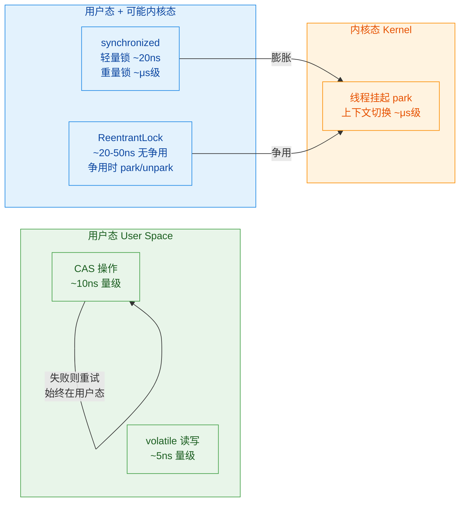
```mermaid
graph LR
    subgraph Layer1["用户态 User Space"]
        direction TB
        CAS["CAS 操作<br/>~10ns 量级"]
        VOLATILE["volatile 读写<br/>~5ns 量级"]
    end

    subgraph Layer2["用户态 + 可能内核态"]
        direction TB
        SYNC["synchronized<br/>轻量锁 ~20ns<br/>重量锁 ~μs级"]
        LOCK["ReentrantLock<br/>~20-50ns 无争用<br/>争用时 park/unpark"]
    end

    subgraph Layer3["内核态 Kernel"]
        direction TB
        PARK["线程挂起 park<br/>上下文切换 ~μs级"]
    end

    CAS -->|"失败则重试<br/>始终在用户态"| CAS
    SYNC -->|"膨胀"| PARK
    LOCK -->|"争用"| PARK

    classDef userFast fill:#E8F5E9,stroke:#43A047,color:#1B5E20
    classDef userMed fill:#E3F2FD,stroke:#1E88E5,color:#0D47A1
    classDef kernel fill:#FFF3E0,stroke:#FB8C00,color:#E65100

    class Layer1,CAS,VOLATILE userFast
    class Layer2,SYNC,LOCK userMed
    class Layer3,PARK kernel
```

CAS 操作是一条 CPU 指令，在用户态（User Space）即可完成，**永远不会导致线程阻塞或上下文切换**。即使 CAS 失败，线程也只是重新读取值再试一次（spin-retry），整个过程耗时在纳秒级别。而 `synchronized` 在竞争激烈时会膨胀为重量级锁，导致线程被 park（挂起），触发操作系统级别的上下文切换（context switch），代价高达微秒级别——比 CAS 慢了 **两到三个数量级**。

`Cell` 的设计哲学是：**让每个槽位的竞争尽可能低（通过分段），再用最轻量的 CAS 处理剩余的少量竞争**。这是 `LongAdder` 高性能的根本原因。

---

**📝 练习题**

在 JDK 的 `LongAdder` 实现中，`Cell` 类使用了 `@jdk.internal.vm.annotation.Contended` 注解。关于这个注解和 `Cell` 的设计，以下说法 **错误** 的是？

A. `@Contended` 的目的是通过在对象前后插入填充字节，使每个 `Cell` 对象独占缓存行，避免伪共享（False Sharing）


B. 伪共享的根本原因是现代 CPU 以缓存行（通常 64 字节）为最小单位加载数据，多个不相关变量可能落入同一缓存行


C. `Cell` 中的 `value` 字段被声明为 `volatile long`，其中 `volatile` 既保证了原子性，也保证了可见性，因此 CAS 操作是多余的


D. `Cell` 使用 `VarHandle`（JDK 9+）代替 `sun.misc.Unsafe` 来执行 CAS 操作，两者在功能上等价，都最终映射到 CPU 硬件原子指令


**【答案】** C

**【解析】** 选项 C 的说法存在两处关键错误。第一，`volatile` **不保证原子性**（Atomicity），它只保证 **可见性（Visibility）** 和 **有序性（Ordering）**。对于复合操作（如 `value = value + delta`，包含读-计算-写三个步骤），`volatile` 无法保证这三步作为一个不可分割的整体执行。第二，正因为 `volatile` 无法保证复合操作的原子性，CAS 绝非"多余"——它是实现 **无锁原子更新** 的核心手段。CAS 通过硬件级别的 compare-and-swap 指令，将"比较当前值"与"设置新值"合并为一个原子步骤，弥补了 `volatile` 在原子性方面的不足。`volatile` 在此处的作用是确保线程在执行 CAS 前读取到 `value` 的最新值（作为 CAS 的期望值 `cmp`），二者各司其职，缺一不可。

---

## add 流程

`LongAdder` 的 `add(long x)` 方法是整个类的核心入口，它的设计精髓在于**逐级降级的竞争策略**（cascading fallback strategy）。理解这个方法，就等于理解了 `LongAdder` 为什么能在高并发场景下碾压 `AtomicLong`。

### 源码全貌与逐行解析

我们先完整呈现 `add` 方法的源码（基于 JDK 17），然后逐层剖析其决策逻辑：

```java
// LongAdder.java — 核心累加方法
public void add(long x) {
    Cell[] cs;    // cs: 本地引用，指向 cells 数组
    long b, v;    // b: base 值; v: 某个 Cell 的当前值
    int m;        // m: cells 数组长度减 1，用于取模定位
    Cell c;       // c: 当前线程映射到的 Cell 对象

    // 【第一层判断】：尝试直接 CAS 更新 base
    // 如果 cells 数组尚未初始化（cs == null），就尝试对 base 做 CAS
    // 如果 CAS 成功，说明竞争不激烈，直接返回——这是最快路径 (fast path)
    if ((cs = cells) != null ||               // 条件 A：cells 已存在，说明曾发生过竞争
        !casBase(b = base, b + x)) {          // 条件 B：CAS base 失败，说明正在发生竞争

        // 走到这里，意味着两种情况之一：
        // 1. cells 数组已经存在（之前已发生过竞争）
        // 2. cells 不存在，但 CAS base 失败了（此刻正在竞争）

        boolean uncontended = true;  // 标记当前线程对 Cell 的 CAS 是否成功（无竞争）

        // 【第二层判断】：尝试定位到某个 Cell 并 CAS 更新
        if (cs == null ||                                 // 条件 1：cells 尚未初始化
            (m = cs.length - 1) < 0 ||                    // 条件 2：cells 长度为 0（理论防御）
            (c = cs[getProbe() & m]) == null ||           // 条件 3：当前线程哈希到的槽位为 null
            !(uncontended = c.cas(v = c.value, v + x)))   // 条件 4：对该 Cell CAS 失败
        {
            // 以上任一条件成立，都进入 longAccumulate——重量级处理逻辑
            longAccumulate(x, null, uncontended);
        }
    }
}
```

这段代码虽然只有短短十几行，但浓缩了三层递进式的竞争处理策略。下面我们逐层拆解。

### 第一层：无竞争快速路径（Fast Path on Base）

```java
// 当 cells 数组未初始化，且 CAS base 成功时，直接返回
if ((cs = cells) != null || !casBase(b = base, b + x)) {
    // ... 进入竞争处理
}
```

这是整个 `add` 方法最理想的执行路径。当系统处于低并发状态时，所有线程都直接对 `base` 变量做 CAS 操作。这与 `AtomicLong.getAndAdd()` 的行为完全一致——**单点 CAS，简单高效**。

关键细节在于**短路求值**（short-circuit evaluation）：

- 如果 `cells != null`，说明**历史上曾经发生过竞争**，系统已经扩展过。此时直接跳过 `casBase`，不再尝试往 `base` 上挤，而是直奔 Cell 数组。这个设计避免了"已经分散了竞争，却又回头制造热点"的问题。
- 只有当 `cells == null` 时，才会执行 `casBase`。如果成功，方法直接返回；如果失败，说明有竞争，进入下一层。

### 第二层：Cell 槽位定位与 CAS（Probe-based Cell CAS）

当第一层判断失败后（`cells` 已存在或 `casBase` 失败），代码进入第二层：

```java
// getProbe() 获取当前线程的哈希探针值
// 通过 & m（等价于 % length）定位到 cells 数组中的某个槽位
(c = cs[getProbe() & m]) == null ||
!(uncontended = c.cas(v = c.value, v + x))
```

`getProbe()` 返回的是当前线程的 **threadLocalRandomProbe** 值，这是一个线程私有的伪随机哈希值，存储在 `Thread` 对象中。它的作用是将不同线程**分散映射到不同的 Cell 槽位**，从而实现"分段竞争"。

这一层的逻辑是：

1. **定位槽位**：用 `getProbe() & m` 计算出当前线程应该去哪个 Cell
2. **检查槽位是否为空**：如果为 `null`，说明该槽位还没初始化，需要进入 `longAccumulate` 创建
3. **尝试 CAS**：如果槽位存在，直接对该 Cell 的 `value` 做 CAS。成功就返回，失败则标记 `uncontended = false`

这一层成功的概率很高，因为不同线程大概率会被映射到不同的 Cell 上，竞争被大幅分散。

### 第三层：longAccumulate 重量级逻辑

当前两层都无法完成累加时，最终进入 `Striped64.longAccumulate()` 方法。这是整个分段累加器的**核心引擎**，处理三种场景：

```java
// Striped64.java — 重量级累加逻辑（简化骨架）
final void longAccumulate(long x, LongBinaryOperator fn, boolean wasUncontended) {
    int h;  // h: 当前线程的探针哈希值
    // 如果探针值为 0，说明线程尚未初始化哈希，先强制初始化
    if ((h = getProbe()) == 0) {
        ThreadLocalRandom.current();   // 强制初始化 threadLocalRandomProbe
        h = getProbe();                // 重新获取探针值
        wasUncontended = true;         // 重新初始化后视为"无竞争"，给一次重试机会
    }

    boolean collide = false;  // 标记是否发生了槽位碰撞（用于决定是否扩容）

    // 自旋循环——直到成功为止
    for (;;) {
        Cell[] cs; Cell c; int n; long v;

        // ————— 分支一：cells 已初始化 —————
        if ((cs = cells) != null && (n = cs.length) > 0) {

            if ((c = cs[(n - 1) & h]) == null) {
                // 【场景 A】：目标槽位为空 → 创建新 Cell 并放入
                // 使用 cellsBusy 自旋锁保护数组写操作
                // 创建 Cell(x)，通过 CAS 将 cellsBusy 设为 1 获取锁
                // 成功后将新 Cell 放入数组，释放锁，跳出循环
                // ...（省略具体实现）
            }
            else if (!wasUncontended) {
                // 【场景 B】：上一次 CAS 失败（从 add 方法传入 uncontended=false）
                // 不立即重试同一个槽位，而是先 rehash，换个槽位再试
                wasUncontended = true;    // 重置标记
                // 继续往下执行 advanceProbe(h) 换槽位
            }
            else if (c.cas(v = c.value, (fn == null) ? v + x : fn.applyAsLong(v, x))) {
                // 【场景 C】：对当前 Cell CAS 成功 → 直接跳出循环
                break;
            }
            else if (n >= NCPU || cells != cs) {
                // 【场景 D】：数组长度已达 CPU 核心数上限，或数组引用已变化
                // 不再扩容，只做 rehash 换槽位
                collide = false;
            }
            else if (!collide) {
                // 【场景 E】：首次碰撞，标记 collide=true，下次循环如果还失败就扩容
                collide = true;
            }
            else if (cellsBusy == 0 && casCellsBusy()) {
                // 【场景 F】：连续碰撞 → 扩容！容量翻倍
                // 将 cells 数组长度扩大为原来的 2 倍
                // 扩容后释放锁
                collide = false;
                continue;       // 扩容后重新循环，不做 rehash
            }

            h = advanceProbe(h);  // rehash：更换当前线程的探针值，下次映射到不同槽位
        }

        // ————— 分支二：cells 尚未初始化 → 初始化数组 —————
        else if (cellsBusy == 0 && cells == cs && casCellsBusy()) {
            // 获取 cellsBusy 锁成功
            // 创建初始长度为 2 的 Cell 数组
            // 将当前值 x 放入对应槽位的新 Cell 中
            // 释放锁，跳出循环
            // ...（省略具体实现）
        }

        // ————— 分支三：初始化数组时锁竞争失败 → 退回尝试 CAS base —————
        else if (casBase(v = base, (fn == null) ? v + x : fn.applyAsLong(v, x))) {
            break;  // 退而求其次，CAS base 成功就返回
        }
    }
}
```

这个方法的设计哲学是**永不放弃，逐级升级**：先尝试最轻量的操作，失败后逐步加大力度，最终一定能成功。

### 完整决策流程图

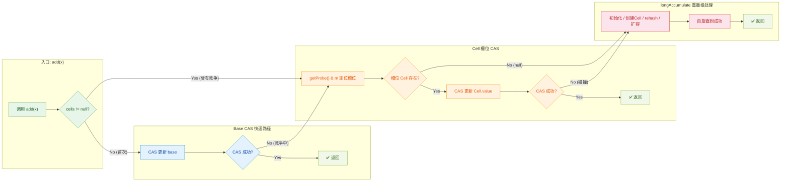
```mermaid
graph LR
    subgraph entry["入口: add(x)"]
        direction TB
        A["调用 add(x)"]
        B{"cells != null?"}
        A --> B
    end

    subgraph baseCAS["Base CAS 快速路径"]
        direction TB
        C["CAS 更新 base"]
        C1{"CAS 成功?"}
        C --> C1
        DONE1["✅ 返回"]
        C1 -->|Yes| DONE1
    end

    subgraph cellCAS["Cell 槽位 CAS"]
        direction TB
        D["getProbe() & m 定位槽位"]
        E{"槽位 Cell 存在?"}
        F["CAS 更新 Cell.value"]
        F1{"CAS 成功?"}
        D --> E
        E -->|Yes| F
        F --> F1
        DONE2["✅ 返回"]
        F1 -->|Yes| DONE2
    end

    subgraph heavy["longAccumulate 重量级处理"]
        direction TB
        G["初始化 / 创建Cell / rehash / 扩容"]
        H["自旋直到成功"]
        DONE3["✅ 返回"]
        G --> H
        H --> DONE3
    end

    B -->|"Yes (曾有竞争)"| D
    B -->|"No (首次)"| C
    C1 -->|"No (竞争中)"| D
    E -->|"No (null)"| G
    F1 -->|"No (碰撞)"| G

    classDef entryStyle fill:#E8F5E9,stroke:#43A047,color:#1B5E20
    classDef baseStyle fill:#E3F2FD,stroke:#1E88E5,color:#0D47A1
    classDef cellStyle fill:#FFF3E0,stroke:#FB8C00,color:#E65100
    classDef heavyStyle fill:#FCE4EC,stroke:#E53935,color:#B71C1C
    classDef doneStyle fill:#F1F8E9,stroke:#7CB342,color:#33691E

    class A,B entryStyle
    class C,C1 baseStyle
    class D,E,F,F1 cellStyle
    class G,H heavyStyle
    class DONE1,DONE2,DONE3 doneStyle
```

### 探针值 rehash 机制（advanceProbe）

当 Cell CAS 失败时，`longAccumulate` 不会让线程**死磕**同一个槽位，而是通过 `advanceProbe(h)` 重新计算探针值，将线程**重新映射到另一个 Cell 槽位**。这个机制是 `LongAdder` 高性能的关键之一。

```java
// Striped64.java — 探针值推进（xorshift 算法）
static final int advanceProbe(int probe) {
    probe ^= probe << 13;   // xorshift 第一步：左移异或
    probe ^= probe >>> 17;  // xorshift 第二步：无符号右移异或
    probe ^= probe << 5;    // xorshift 第三步：左移异或
    THREAD_PROBE.set(Thread.currentThread(), probe);  // 写回线程的探针字段
    return probe;            // 返回新的探针值
}
```

这是经典的 **xorshift** 伪随机数生成算法，计算极快（仅 3 次移位 + 3 次异或），且能保证良好的散列分布。rehash 之后，线程大概率会映射到另一个槽位，从而避免持续碰撞。

### 扩容策略的精妙之处

`longAccumulate` 中的扩容逻辑有三个关键约束：

**约束一：容量上限为 CPU 核心数**

```java
// 当 cells 长度 >= CPU 数量时，不再扩容
else if (n >= NCPU || cells != cs) {
    collide = false;  // 放弃扩容念头，只做 rehash
}
```

为什么上限是 `NCPU`？因为即使有再多的 Cell，**同一时刻最多只有 `NCPU` 个线程真正在并行执行**。超过 CPU 核心数的 Cell 纯属浪费内存，不会带来额外的并发度提升。这个设计体现了对硬件资源的精准匹配。

**约束二：两次碰撞才扩容**

```java
// 第一次碰撞：只标记 collide = true，不扩容
else if (!collide) {
    collide = true;
}
// 第二次碰撞：真正执行扩容
else if (cellsBusy == 0 && casCellsBusy()) {
    // 扩容为原来的 2 倍
}
```

一次 CAS 失败可能只是偶然的时序巧合，不一定代表真正的热点冲突。只有**连续两次**碰撞（中间还经过了 rehash），才能说明竞争确实激烈，需要更多的槽位来分散压力。这种"保守扩容"策略避免了不必要的内存开销。

**约束三：cellsBusy 自旋锁保护**

`cellsBusy` 是一个简单的 0/1 标志位，通过 CAS 实现自旋锁。它保护两种临界操作：

1. **初始化 cells 数组**
2. **扩容 cells 数组** 或 **创建新 Cell 对象放入空槽位**

```java
// cellsBusy 充当轻量级自旋锁
// 0 = 未锁定; 1 = 已锁定
volatile int cellsBusy;

final boolean casCellsBusy() {
    return CELLSBUSY.compareAndSet(this, 0, 1);  // CAS 将 0 设为 1
}
```

这比 `synchronized` 或 `ReentrantLock` 轻量得多，因为持锁时间极短（只是做一次数组创建或复制），冲突概率很低。

### add 流程的状态演进示例

为了更直观地理解，我们模拟 4 个线程同时调用 `add(1)` 的场景：

```
时刻 T0: 初始状态
┌──────────────────────┐
│  base = 0            │
│  cells = null        │
└──────────────────────┘

时刻 T1: Thread-A 调用 add(1)
  → cells == null, casBase(0, 1) 成功 ✅
┌──────────────────────┐
│  base = 1            │
│  cells = null        │
└──────────────────────┘

时刻 T2: Thread-A 和 Thread-B 同时调用 add(1)
  → Thread-A: casBase(1, 2) 成功 ✅
  → Thread-B: casBase(1, 2) 失败 ❌ → 进入 longAccumulate
    → cells 未初始化 → 获取 cellsBusy 锁 → 创建 Cell[2]
    → Thread-B 探针 & 1 = 0 → cells[0] = new Cell(1)
┌──────────────────────────────────────┐
│  base = 2                            │
│  cells[0] = Cell(1)  |  cells[1] = null │
└──────────────────────────────────────┘

时刻 T3: Thread-C 调用 add(1)
  → cells != null → 跳过 casBase
  → getProbe() & 1 = 1 → cells[1] == null
  → 进入 longAccumulate → 创建 cells[1] = new Cell(1)
┌──────────────────────────────────────┐
│  base = 2                            │
│  cells[0] = Cell(1)  |  cells[1] = Cell(1) │
└──────────────────────────────────────┘

时刻 T4: 多线程持续写入，cells[0] 频繁碰撞
  → 连续两次 CAS 失败 → 触发扩容 → Cell[2] → Cell[4]
┌─────────────────────────────────────────────────────┐
│  base = 2                                           │
│  cells[0]=Cell(5) | cells[1]=Cell(3) | cells[2]=Cell(2) | cells[3]=Cell(1) │
└─────────────────────────────────────────────────────┘

最终 sum() = 2 + 5 + 3 + 2 + 1 = 13
```

### add 方法的性能本质

总结 `add` 方法的性能优势根源：

| 设计要素 | 具体实现 | 性能收益 |
|---------|---------|---------|
| **快速路径** | 低竞争时直接 CAS base | 零额外开销，等同 AtomicLong |
| **分段策略** | 高竞争时分散到多个 Cell | 将 N 线程竞争拆为 N/M 竞争 |
| **探针 rehash** | CAS 失败后换槽位而非重试 | 避免活锁式的持续碰撞 |
| **渐进扩容** | 2 → 4 → 8 → ... → NCPU | 按需分配，不浪费内存 |
| **@Contended** | Cell 对象 padding 到独占缓存行 | 消除伪共享，CAS 不互相干扰 |
| **退路设计** | 初始化锁竞争失败时回退 CAS base | 任何情况下都不阻塞 |

`add` 方法的精妙之处在于：它是一个**无锁、无阻塞、自适应**的累加算法。在低并发下表现得像 `AtomicLong` 一样简洁，在高并发下自动展开成多路并行的分段累加器，在极端竞争下还能通过扩容和 rehash 自我调节——这就是 Doug Lea 所追求的 "adaptive precision"。

---

**📝 练习题**

以下关于 `LongAdder.add(long x)` 方法执行流程的描述，哪一项是**错误**的？

A. 当 `cells` 数组尚未初始化且 CAS `base` 成功时，方法直接返回，不会触及 Cell 相关逻辑

B. 当 `cells` 数组已存在时，`add` 方法仍然会优先尝试 CAS `base`，只有 `base` CAS 失败才去访问 Cell

C. 当线程对某个 Cell 的 CAS 失败后，`longAccumulate` 会通过 `advanceProbe` 重新哈希，尝试换一个槽位

D. `cells` 数组的最大长度不会超过当前机器的 CPU 核心数（`Runtime.getRuntime().availableProcessors()`）


**【答案】** B

**【解析】** 选项 B 的错误在于：当 `cells != null` 时，`add` 方法的 `if` 条件第一个分支 `(cs = cells) != null` 就已经为 `true`，由于 Java 的**短路求值**（short-circuit evaluation），后面的 `!casBase(b = base, b + x)` **根本不会执行**。也就是说，一旦 `cells` 数组存在，`add` 方法会直接跳过 `base` 的 CAS，直奔 Cell 数组进行操作。这是有意为之的设计——既然系统已经判定"竞争激烈需要分段"，就不应该再让线程回头去争抢 `base` 这个单一热点，否则分段的意义就被削弱了。选项 A、C、D 的描述均与源码实现一致。

---

## sum流程（不保证精确）

在前面的章节中，我们深入剖析了 `LongAdder` 的 `add()` 写入流程——它通过 `base` + `Cell[]` 的分段策略，将并发写压力分散到多个独立的计数槽中。然而，当我们需要**读取最终结果**时，就必须把这些分散的碎片重新"拼合"起来。这个拼合过程就是 `sum()` 方法。它的实现看似简单到令人意外——仅仅是一次朴素的遍历累加——但正是这种"刻意的简单"，隐藏着 `LongAdder` 最重要的设计哲学：**为写性能让步，容忍读的不精确**。

### sum() 源码逐行解析

`sum()` 方法位于 `java.util.concurrent.atomic.LongAdder` 中，其源码极其精炼。我们逐行拆解：

```java
// LongAdder.java —— JDK 源码
public long sum() {
    // 1. 获取 Cell 数组的引用（注意：这不是一个原子快照）
    Cell[] cs = cells;

    // 2. 以 base 值作为累加的起点
    //    base 承载了无竞争时的所有写入，以及竞争初期尚未分流的写入
    long sum = base;

    // 3. 如果 Cell 数组已经被初始化（说明曾经发生过竞争）
    if (cs != null) {
        // 4. 遍历 Cell 数组中的每一个槽位
        for (Cell c : cs) {
            // 5. 跳过尚未被使用的空槽位（Cell 是惰性初始化的）
            if (c != null) {
                // 6. 将该 Cell 的 value 累加到 sum 上
                //    注意：这里直接读取 c.value，没有任何加锁或 CAS
                sum += c.value;
            }
        }
    }

    // 7. 返回 base + 所有非空 Cell 的 value 之和
    return sum;
}
```

代码只有短短十几行，核心逻辑可以用一个公式概括：

```
sum = base + Σ cells[i].value   (for all non-null cells[i])
```

但这个看似无害的遍历，在并发环境下**无法保证精确**。要理解原因，我们需要从并发语义的角度深入分析。

### 为什么 sum() 不精确？

这是面试和实际开发中最常被问到的问题之一。答案的核心在于一个词：**非原子快照（Non-atomic Snapshot）**。

#### 没有全局锁，没有一致性屏障

`sum()` 在遍历期间**没有加任何锁**，也没有使用 CAS 操作来创建一致性快照。这意味着，当 `sum()` 正在逐个累加 `Cell` 值时，其他线程可以**同时修改** `base` 或任意 `Cell` 的 `value`。整个读取过程与写入过程是**完全并发、互不阻塞**的。

#### 时间窗口内的数据漂移

让我们通过一个具体的时序场景来理解这种不精确性。假设当前状态为 `base=0`，`cells` 有两个槽位 `cells[0].value=5`，`cells[1].value=3`，真实总和应该是 `8`：

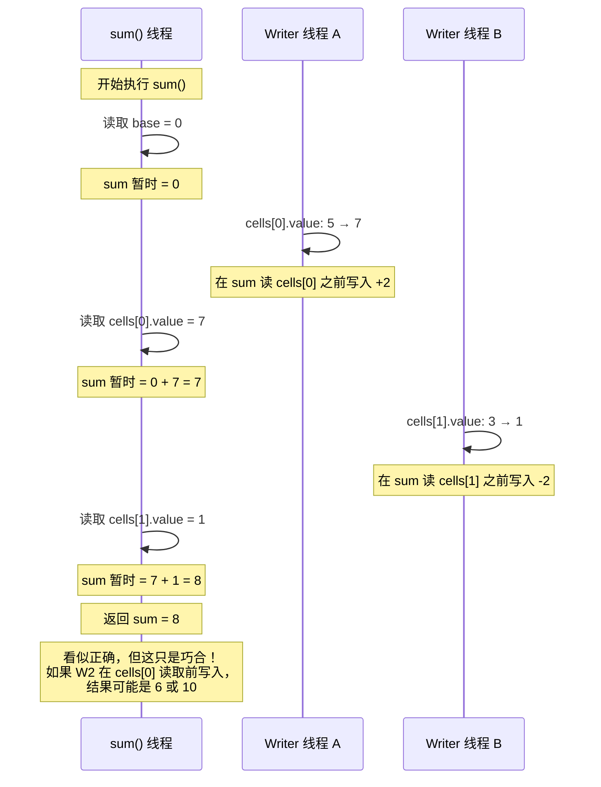
```mermaid
sequenceDiagram
    participant S as sum() 线程
    participant W1 as Writer 线程 A
    participant W2 as Writer 线程 B

    Note over S: 开始执行 sum()
    S->>S: 读取 base = 0
    Note over S: sum 暂时 = 0

    W1->>W1: cells[0].value: 5 → 7
    Note over W1: 在 sum 读 cells[0] 之前写入 +2

    S->>S: 读取 cells[0].value = 7
    Note over S: sum 暂时 = 0 + 7 = 7

    W2->>W2: cells[1].value: 3 → 1
    Note over W2: 在 sum 读 cells[1] 之前写入 -2

    S->>S: 读取 cells[1].value = 1
    Note over S: sum 暂时 = 7 + 1 = 8

    Note over S: 返回 sum = 8
    Note over S: 看似正确，但这只是巧合！<br/>如果 W2 在 cells[0] 读取前写入，<br/>结果可能是 6 或 10
```

关键问题在于：`sum()` 读取 `base` 的时刻、读取 `cells[0]` 的时刻、读取 `cells[1]` 的时刻，这三个时间点**各自独立**，它们看到的是不同时刻的值。这些值从未在同一个逻辑瞬间同时存在过，因此累加结果是一个**混合了多个时间切面的合成值**。

#### 三类导致不精确的并发场景

我们系统地归纳 `sum()` 执行期间可能遭遇的并发干扰：

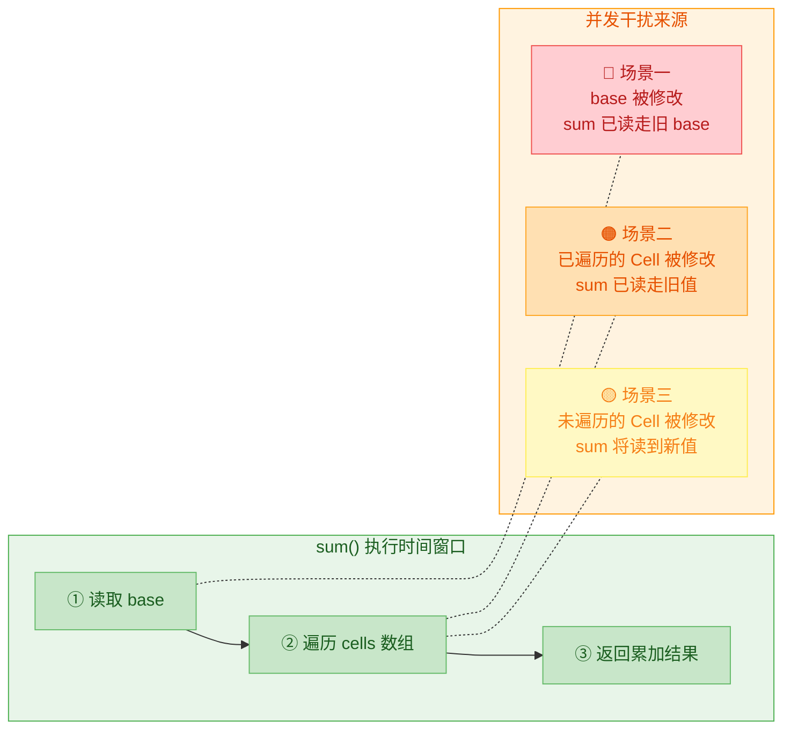
```mermaid
graph LR
    subgraph SUM["sum() 执行时间窗口"]
        direction TB
        R1["① 读取 base"]
        R2["② 遍历 cells 数组"]
        R3["③ 返回累加结果"]
        R1 --> R2 --> R3
    end

    subgraph INTERFERENCE["并发干扰来源"]
        direction TB
        I1["🔴 场景一<br/>base 被修改<br/>sum 已读走旧 base"]
        I2["🟠 场景二<br/>已遍历的 Cell 被修改<br/>sum 已读走旧值"]
        I3["🟡 场景三<br/>未遍历的 Cell 被修改<br/>sum 将读到新值"]
    end

    R1 -.- I1
    R2 -.- I2
    R2 -.- I3

    classDef sumBlock fill:#E8F5E9,stroke:#4CAF50,color:#1B5E20
    classDef interBlock fill:#FFF3E0,stroke:#FF9800,color:#E65100
    classDef stepNode fill:#C8E6C9,stroke:#66BB6A,color:#1B5E20
    classDef issueRed fill:#FFCDD2,stroke:#EF5350,color:#B71C1C
    classDef issueOrange fill:#FFE0B2,stroke:#FFA726,color:#E65100
    classDef issueYellow fill:#FFF9C4,stroke:#FFEE58,color:#F57F17

    class SUM sumBlock
    class INTERFERENCE interBlock
    class R1,R2,R3 stepNode
    class I1 issueRed
    class I2 issueOrange
    class I3 issueYellow
```

| 场景 | 描述 | 后果 |
|------|------|------|
| **场景一** | `sum()` 刚读完 `base`，另一个线程通过 CAS 修改了 `base` | sum 中的 `base` 分量是**过时的** |
| **场景二** | `sum()` 已遍历 `cells[0]` 后，另一个线程修改了 `cells[0].value` | `cells[0]` 的贡献是**过时的** |
| **场景三** | `sum()` 尚未遍历到 `cells[3]`，另一个线程修改了 `cells[3].value` | `cells[3]` 的贡献是**最新的但与其他分量不一致** |

这三种场景可以**同时发生**，使得最终的 `sum` 值偏离任何一个真实的"瞬时总和"。

### sum() 与 volatile 的关系

有人可能会问：`Cell.value` 和 `base` 都是 `volatile` 的，`volatile` 不是保证了可见性吗？为什么还会不精确？

这是一个非常好的问题，也是理解 Java 内存模型（JMM）的关键区分：

```java
// Striped64.java（LongAdder 的父类）
transient volatile long base;          // volatile，保证单次读的可见性

// Cell 内部
@jdk.internal.vm.annotation.Contended
static final class Cell {
    volatile long value;               // volatile，保证单次读的可见性
    // ...
}
```

**`volatile` 保证的是"单次读写的可见性和有序性"**，即当你读取 `cells[i].value` 时，你一定能看到**最近一次写入**的值，不会读到 CPU 缓存中的过期副本。但 `volatile` **不保证多次读取之间的原子性**。`sum()` 需要读取 `base` + N 个 `Cell`，这是 N+1 次独立的 volatile read，每次都能看到最新值，但这些"最新"各自对应**不同的时间点**。

用更精确的术语说：

> `volatile` 提供了 **单变量的 linearizability（线性一致性）**，但 `sum()` 需要的是 **多变量的 snapshot isolation（快照隔离）**。前者不蕴含后者。

### 如果需要精确值，该怎么办？

既然 `sum()` 本质上是一个最终一致性（eventually consistent）的读操作，那么在需要精确值的场景下，我们有以下几种选择：

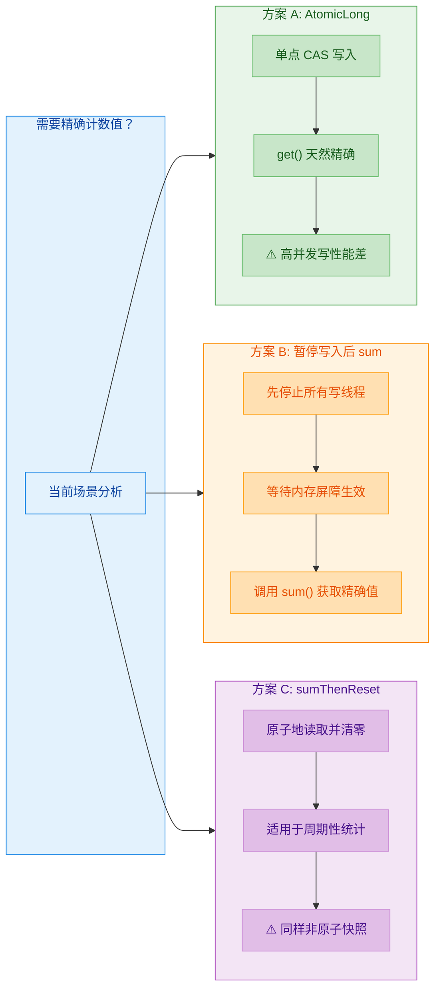
```mermaid
graph LR
    subgraph QUESTION["需要精确计数值？"]
        direction TB
        Q["当前场景分析"]
    end

    subgraph OPT_A["方案 A: AtomicLong"]
        direction TB
        A1["单点 CAS 写入"]
        A2["get() 天然精确"]
        A3["⚠️ 高并发写性能差"]
        A1 --> A2 --> A3
    end

    subgraph OPT_B["方案 B: 暂停写入后 sum"]
        direction TB
        B1["先停止所有写线程"]
        B2["等待内存屏障生效"]
        B3["调用 sum() 获取精确值"]
        B1 --> B2 --> B3
    end

    subgraph OPT_C["方案 C: sumThenReset"]
        direction TB
        C1["原子地读取并清零"]
        C2["适用于周期性统计"]
        C3["⚠️ 同样非原子快照"]
        C1 --> C2 --> C3
    end

    Q --> OPT_A
    Q --> OPT_B
    Q --> OPT_C

    classDef questionBlock fill:#E3F2FD,stroke:#1E88E5,color:#0D47A1
    classDef optABlock fill:#E8F5E9,stroke:#43A047,color:#1B5E20
    classDef optBBlock fill:#FFF3E0,stroke:#FB8C00,color:#E65100
    classDef optCBlock fill:#F3E5F5,stroke:#AB47BC,color:#4A148C
    classDef nodeA fill:#C8E6C9,stroke:#66BB6A,color:#1B5E20
    classDef nodeB fill:#FFE0B2,stroke:#FFA726,color:#E65100
    classDef nodeC fill:#E1BEE7,stroke:#CE93D8,color:#4A148C

    class QUESTION questionBlock
    class Q questionBlock
    class OPT_A optABlock
    class OPT_B optBBlock
    class OPT_C optCBlock
    class A1,A2,A3 nodeA
    class B1,B2,B3 nodeB
    class C1,C2,C3 nodeC
```

我们来逐一分析：

**方案 A：换用 `AtomicLong`**

这是最直接的选择。`AtomicLong` 只有一个 `volatile long value`，`get()` 是一次 volatile read，天然精确。代价是高并发写场景下 CAS 竞争激烈，性能远不如 `LongAdder`。

**方案 B：先暂停写入，再调用 `sum()`**

如果能控制写入线程（例如通过 `CountDownLatch` 或业务逻辑保证），在所有写入停止后调用 `sum()`，此时没有并发修改，`sum()` 的遍历结果自然是精确的。这在很多统计场景下是可行的——比如压测结束后统计总 QPS。

**方案 C：`sumThenReset()`**

`LongAdder` 还提供了 `sumThenReset()` 方法，它在遍历累加的同时将 `base` 和每个 `Cell` 重置为 0：

```java
// LongAdder.java
public long sumThenReset() {
    Cell[] cs = cells;
    // 读取并重置 base（注意：这也不是原子操作！）
    long sum = getAndSetBase(0);  // 原子地读取 base 并置零
    if (cs != null) {
        for (Cell c : cs) {
            if (c != null) {
                // 原子地读取 cell.value 并置零
                sum += c.getAndSet(0);
            }
        }
    }
    return sum;
}
```

`sumThenReset()` 适用于"周期性收割"的场景（如每秒统计一次计数器然后清零）。但要注意，**它同样不是全局原子的**——在遍历重置过程中，新的写入可能已经发生在已被重置的槽位上，导致这部分计数被归入"下一个周期"而非"当前周期"。在大多数监控场景下，这种微小的跨周期漂移是可以接受的。

### sum() 的设计哲学：CAP 思维的体现

`sum()` 的设计本质上是对分布式系统 CAP 定理思想的一种微观应用。我们可以这样类比：

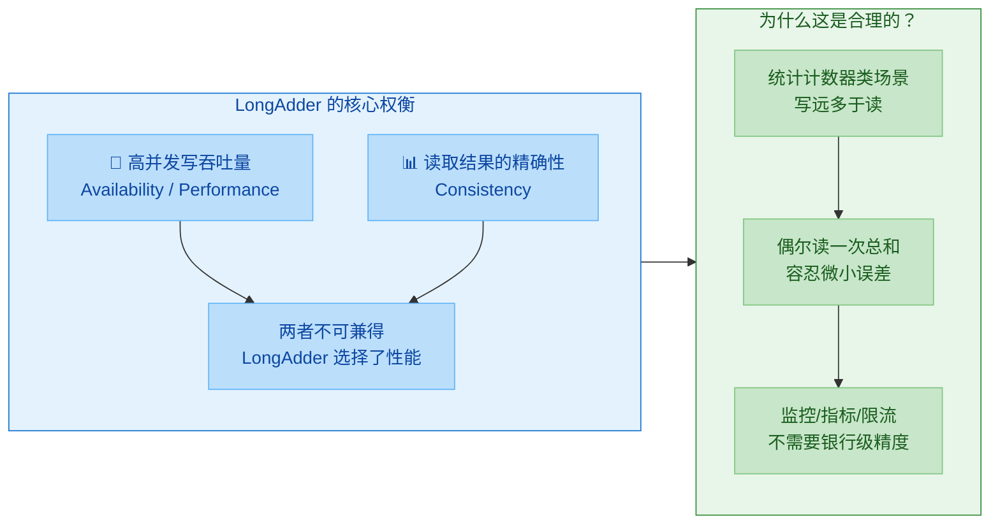
```mermaid
graph LR
    subgraph TRADEOFF["LongAdder 的核心权衡"]
        direction TB
        T1["🎯 高并发写吞吐量<br/>Availability / Performance"]
        T2["📊 读取结果的精确性<br/>Consistency"]
        T3["两者不可兼得<br/>LongAdder 选择了性能"]
        T1 --> T3
        T2 --> T3
    end

    subgraph WHY["为什么这是合理的？"]
        direction TB
        W1["统计计数器类场景<br/>写远多于读"]
        W2["偶尔读一次总和<br/>容忍微小误差"]
        W3["监控/指标/限流<br/>不需要银行级精度"]
        W1 --> W2 --> W3
    end

    TRADEOFF --> WHY

    classDef tradeBlock fill:#E3F2FD,stroke:#1976D2,color:#0D47A1
    classDef whyBlock fill:#E8F5E9,stroke:#388E3C,color:#1B5E20
    classDef tNode fill:#BBDEFB,stroke:#64B5F6,color:#0D47A1
    classDef wNode fill:#C8E6C9,stroke:#81C784,color:#1B5E20

    class TRADEOFF tradeBlock
    class WHY whyBlock
    class T1,T2,T3 tNode
    class W1,W2,W3 wNode
```

Doug Lea 在设计 `LongAdder` 时做了一个清醒的判断：**绝大多数需要高性能计数器的场景，读取频率远低于写入频率，且对精度的要求是"大致准确"而非"绝对准确"**。典型例子包括：

- **Metrics/监控指标**：Prometheus 每 15 秒抓取一次，微小的并发偏差完全可忽略
- **限流计数器**：每秒允许 10000 次请求，误差几次无关紧要
- **JVM 内部统计**：如 `ForkJoinPool` 的任务窃取计数

在这些场景下，如果为了 `sum()` 的精确性而加全局锁，就会**彻底摧毁 `add()` 的分段优势**——所有写线程在 `sum()` 期间都必须等待，高并发写吞吐量将退化到比 `AtomicLong` 还差的水平。这显然是得不偿失的。

### reset() 与 sumThenReset() 补充

除了 `sum()` 之外，`LongAdder` 还提供了两个与读取相关的方法，值得一并了解：

```java
// 将 base 和所有 Cell 重置为 0
// 注意：如果存在并发写入，重置后的值不保证为 0
public void reset() {
    Cell[] cs = cells;
    // 将 base 重置为 0
    base = 0L;
    if (cs != null) {
        // 遍历所有 Cell，逐个重置
        for (Cell c : cs) {
            if (c != null) {
                c.reset();  // 内部将 value 置为 0
            }
        }
    }
}
```

`reset()` 的问题与 `sum()` 类似：在重置 `base` 之后、重置 `cells[0]` 之前，另一个线程可能已经向 `base` 写入了新值，这个新值会被后续的 Cell 重置"吞掉"。因此 `reset()` 也只适用于"已知没有并发写入"的场景。

Javadoc 中对此有明确的说明：

> *"This method may be a useful alternative to creating a new adder, but is only effective if there are no concurrent updates. Because this method is intrinsically racy, it should only be used when it is known that no threads are concurrently updating."*

### 一句话总结 sum() 的本质

> **`sum()` 是一次"尽力而为"的非原子遍历读取（best-effort, non-atomic traversal read），它在无竞争时精确，在有并发写时提供一个近似值。这是 `LongAdder` 以写性能换读精度的核心设计取舍。**

---

**📝 练习题**

在一个高并发 Web 服务中，你使用 `LongAdder` 统计接口的总调用次数。每隔 10 秒，一个监控线程调用 `sum()` 获取当前计数并上报。以下哪种说法是**正确**的？

A. `sum()` 返回的值一定**小于等于**实际的调用总次数，因为它可能遗漏正在进行中的写入。

B. `sum()` 返回的值可能**大于**实际的调用总次数，也可能**小于**，取决于并发写入的时序。

C. 只要 `Cell.value` 是 `volatile` 的，`sum()` 就能保证返回精确值。

D. `sum()` 的不精确性可以通过增加 Cell 数组的长度来解决。


**【答案】** B

**【解析】** `sum()` 的不精确性源于**非原子快照**——它分多步读取 `base` 和各 `Cell`，每步之间可能有并发写入发生。这种干扰既可能导致**少算**（已读过的槽位在读后又被增加了），也可能导致**多算**（例如一个值在 `sum()` 遍历期间从一个 Cell 转移到另一个 Cell，被重复统计——虽然在 `LongAdder` 的 `add` 中不会主动迁移值，但在涉及 `sumThenReset()` 或极端重排序场景下，理论上偏差方向不可预测）。选项 A 的"一定小于等于"过于绝对，偏差方向取决于具体的线程交错顺序。选项 C 混淆了单变量可见性与多变量原子性的区别——`volatile` 保证每次读到最新值，但不保证多次读取构成一致快照。选项 D 完全不相关——Cell 数组长度影响的是写入时的竞争程度，与 `sum()` 的一致性语义无关。

---

## LongAdder vs AtomicLong ⭐

在 Java 并发工具箱中，`AtomicLong` 和 `LongAdder` 都能实现线程安全的长整型累加操作，但它们的内部架构和性能特征截然不同。理解二者的差异，是在实际工程中做出正确技术选型的关键。本节将从**架构对比、性能实测模型、语义差异**三个维度进行深度剖析。

### 架构本质对比

要理解二者的性能差距，必须先回到它们的核心设计哲学。

`AtomicLong` 的设计极为简洁——所有线程对**同一个 `volatile long value`** 进行 CAS 竞争。这意味着无论有多少线程参与累加，最终的写操作都汇聚到一个内存地址上。在低并发场景下，CAS 几乎总能一次成功，性能非常优秀。但随着线程数增长，CAS 的失败重试（**spin retry**）急剧增加，CPU 缓存行在各核心之间疯狂弹跳（**cache line bouncing**），性能断崖式下降。

`LongAdder` 的设计则引入了**空间换时间**的分段思想——它维护一个 `base` 值和一个 `Cell[]` 数组。多个线程被哈希分散到不同的 Cell 槽位上各自累加，最终求和时再将 `base + ΣCells` 汇总。竞争被分摊到多个独立的内存地址上，缓存行冲突大幅降低。

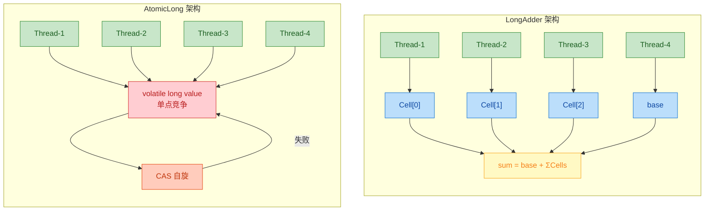
```mermaid
graph LR
    subgraph AtomicLong["AtomicLong 架构"]
        direction TB
        T1A["Thread-1"] --> V["volatile long value<br/>单点竞争"]
        T2A["Thread-2"] --> V
        T3A["Thread-3"] --> V
        T4A["Thread-4"] --> V
        V --> CAS["CAS 自旋"]
        CAS -->|失败| V
    end

    subgraph LongAdder["LongAdder 架构"]
        direction TB
        T1B["Thread-1"] --> C0["Cell[0]"]
        T2B["Thread-2"] --> C1["Cell[1]"]
        T3B["Thread-3"] --> C2["Cell[2]"]
        T4B["Thread-4"] --> BASE["base"]
        C0 --> SUM["sum = base + ΣCells"]
        C1 --> SUM
        C2 --> SUM
        BASE --> SUM
    end

    AtomicLong ~~~ LongAdder

    classDef threadStyle fill:#C8E6C9,stroke:#388E3C,color:#1B5E20
    classDef singlePoint fill:#FFCDD2,stroke:#D32F2F,color:#B71C1C
    classDef cellStyle fill:#BBDEFB,stroke:#1976D2,color:#0D47A1
    classDef sumStyle fill:#FFF9C4,stroke:#F9A825,color:#F57F17
    classDef casStyle fill:#FFCCBC,stroke:#E64A19,color:#BF360C

    class T1A,T2A,T3A,T4A,T1B,T2B,T3B,T4B threadStyle
    class V singlePoint
    class C0,C1,C2,BASE cellStyle
    class SUM sumStyle
    class CAS casStyle
```

从图中可以直观看出：`AtomicLong` 是典型的**单点热竞争模型**（single hotspot contention），而 `LongAdder` 是**分布式累加模型**（distributed accumulation）。这个架构差异直接决定了它们在不同并发级别下的表现。

### 高并发写场景 LongAdder 更优

这是 `LongAdder` 被设计出来的核心使命。Doug Lea 在 `LongAdder` 的 Javadoc 中写得非常明确：

> *This class is usually preferable to AtomicLong when multiple threads update a common sum that is used for purposes such as collecting statistics, not for fine-grained synchronization control.*

#### CAS 失败率的数学直觉

假设有 N 个线程同时对一个 `AtomicLong` 执行 `incrementAndGet()`。在理想均匀调度下，每次 CAS 操作只有 **1/N** 的概率成功（因为 N 个线程同时读到旧值，只有一个能写成功）。失败的 N-1 个线程必须重新读值、再次尝试，形成**活锁式的自旋风暴**。

而 `LongAdder` 将线程分散到 `Cell[]` 的不同槽位。假设 Cell 数组长度为 M（M 通常会扩容到接近 CPU 核心数），那么每个 Cell 上的平均竞争线程数降为 **N/M**。当 M ≈ N 时，大部分 CAS 操作一次即可成功。

```java
// === AtomicLong.incrementAndGet() 的内部实现 (简化) ===
public final long incrementAndGet() {
    // unsafe.getAndAddLong 底层是一个 CAS 循环
    // 所有线程竞争同一个 value 地址
    return U.getAndAddLong(this, VALUE, 1L) + 1L;
}

// === 等价的 CAS 循环展开 ===
public final long getAndAddLong(Object o, long offset, long delta) {
    long v;                                    // 用于存储当前读到的旧值
    do {
        v = getLongVolatile(o, offset);        // 每次循环都要重新读取最新值 (volatile read)
    } while (!weakCompareAndSetLong(           // CAS 尝试写入: 期望值 v, 新值 v+delta
            o, offset, v, v + delta));         // 失败则继续自旋, 高并发下这里会空转大量 CPU 周期
    return v;                                  // 返回旧值
}
```

上面这段代码在 16 线程、32 线程甚至 64 线程并发写入时，`while` 循环的迭代次数会显著增长。每一次失败的 CAS 都意味着：
1. 一次无效的 **volatile read**（穿透 CPU 缓存，从 L3 或主存读取）
2. 一次无效的 **CAS 指令**（`lock cmpxchg` 在 x86 上会锁总线或缓存行）
3. 其他核心的缓存行被 **invalidate**，触发 MESI 协议的 RFO（Request For Ownership）

#### 缓存行争用的硬件视角

这是性能差距的**根本物理原因**。现代 CPU 的缓存一致性协议（如 MESI / MOESI）以 **64 字节的缓存行（cache line）** 为单位工作。

- **AtomicLong**：所有核心争夺包含 `value` 字段的那一条缓存行。一个核心写入成功后，其他所有核心上该缓存行的状态都变为 **Invalid**，下次访问必须从 L3 甚至远端 NUMA 节点重新加载。这就是所谓的 **cache line bouncing**。

- **LongAdder**：不同线程写入不同 Cell 的 `value`，并且每个 Cell 都用 `@Contended` 注解填充到独立缓存行。不同核心写入的是**物理上不同的缓存行**，互不干扰，各自保持 **Modified** 状态，无需频繁的缓存同步。

```text
┌─────────────────────── Cache Line (64 bytes) ────────────────────────┐
│                                                                      │
│  AtomicLong: [ value(8B) | padding... ]                              │
│  所有核心竞争这一条 cache line  ──→  cache line bouncing             │
│                                                                      │
├──────────────────────────────────────────────────────────────────────┤
│                                                                      │
│  LongAdder Cell[0]: [ @Contended padding(128B) | value(8B) | pad ]  │
│  LongAdder Cell[1]: [ @Contended padding(128B) | value(8B) | pad ]  │
│  LongAdder Cell[2]: [ @Contended padding(128B) | value(8B) | pad ]  │
│  各核心各写各的 cache line  ──→  几乎零缓存争用                      │
│                                                                      │
└──────────────────────────────────────────────────────────────────────┘
```

#### 性能对比模型

下面用一个简明的基准测试来展示二者的差距趋势。注意：这不是严格的 JMH 基准测试，而是用于说明趋势的示意代码。

```java
import java.util.concurrent.atomic.AtomicLong;
import java.util.concurrent.atomic.LongAdder;
import java.util.concurrent.CountDownLatch;

public class AdderVsAtomicBenchmark {

    // 每个线程的累加次数
    private static final int OPS_PER_THREAD = 10_000_000;

    public static void main(String[] args) throws Exception {
        // 分别测试不同线程数下的耗时
        int[] threadCounts = {1, 2, 4, 8, 16, 32, 64};

        for (int nThreads : threadCounts) {
            long atomicTime = benchmarkAtomicLong(nThreads);     // 测试 AtomicLong
            long adderTime = benchmarkLongAdder(nThreads);       // 测试 LongAdder
            // 输出对比结果
            System.out.printf("Threads=%2d | AtomicLong=%5dms | LongAdder=%5dms | Speedup=%.2fx%n",
                    nThreads, atomicTime, adderTime,             // 打印耗时
                    (double) atomicTime / adderTime);            // 计算加速比
        }
    }

    // AtomicLong 基准测试
    static long benchmarkAtomicLong(int nThreads) throws Exception {
        AtomicLong counter = new AtomicLong(0);                  // 共享的原子计数器
        CountDownLatch latch = new CountDownLatch(nThreads);     // 等待所有线程完成的门闩

        long start = System.currentTimeMillis();                 // 记录开始时间
        for (int i = 0; i < nThreads; i++) {
            new Thread(() -> {
                for (int j = 0; j < OPS_PER_THREAD; j++) {
                    counter.incrementAndGet();                   // 所有线程竞争同一个 value
                }
                latch.countDown();                               // 当前线程完成, 门闩减一
            }).start();
        }
        latch.await();                                           // 等待所有线程结束
        return System.currentTimeMillis() - start;               // 返回总耗时
    }

    // LongAdder 基准测试
    static long benchmarkLongAdder(int nThreads) throws Exception {
        LongAdder adder = new LongAdder();                       // 共享的分段累加器
        CountDownLatch latch = new CountDownLatch(nThreads);     // 同步门闩

        long start = System.currentTimeMillis();                 // 记录开始时间
        for (int i = 0; i < nThreads; i++) {
            new Thread(() -> {
                for (int j = 0; j < OPS_PER_THREAD; j++) {
                    adder.increment();                           // 线程被分散到不同 Cell, 竞争大幅降低
                }
                latch.countDown();                               // 当前线程完成
            }).start();
        }
        latch.await();                                           // 等待所有线程结束
        return System.currentTimeMillis() - start;               // 返回总耗时
    }
}
```

在典型的多核服务器（如 8 核 16 线程的 x86 机器）上，预期结果趋势如下：

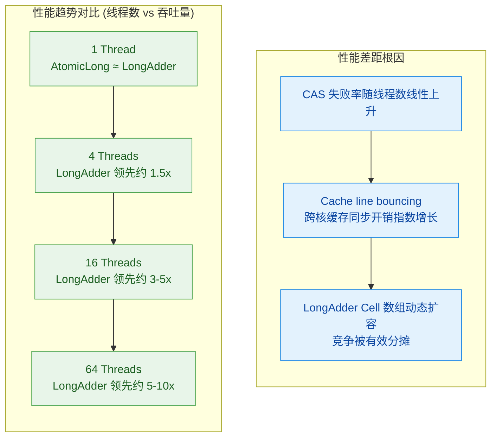
```mermaid
graph LR
    subgraph Trend["性能趋势对比 (线程数 vs 吞吐量)"]
        direction TB
        T1["1 Thread<br/>AtomicLong ≈ LongAdder"]
        T4["4 Threads<br/>LongAdder 领先约 1.5x"]
        T16["16 Threads<br/>LongAdder 领先约 3-5x"]
        T64["64 Threads<br/>LongAdder 领先约 5-10x"]
        T1 --> T4 --> T16 --> T64
    end

    subgraph Reason["性能差距根因"]
        direction TB
        R1["CAS 失败率随线程数线性上升"]
        R2["Cache line bouncing<br/>跨核缓存同步开销指数增长"]
        R3["LongAdder Cell 数组动态扩容<br/>竞争被有效分摊"]
        R1 --> R2 --> R3
    end

    Trend ~~~ Reason

    classDef trendStyle fill:#E8F5E9,stroke:#43A047,color:#1B5E20
    classDef reasonStyle fill:#E3F2FD,stroke:#1E88E5,color:#0D47A1

    class T1,T4,T16,T64 trendStyle
    class R1,R2,R3 reasonStyle
```

关键结论：**线程数越多，LongAdder 的优势越大**。在 1-2 个线程时二者几乎无差别（甚至 AtomicLong 略快，因为 LongAdder 有额外的哈希和数组访问开销），但当线程数超过 CPU 核心数时，差距可达一个数量级。

### 需要精确值时用 AtomicLong

LongAdder 的高性能并非没有代价。它的 `sum()` 方法存在一个关键的语义限制——**不保证返回精确的实时值**。

#### sum() 的非原子性问题

回顾 `sum()` 的实现逻辑：

```java
public long sum() {
    Cell[] cs = cells;                      // 读取 cells 数组引用 (非 volatile 语义下可能读到旧值)
    long sum = base;                        // 先累加 base
    if (cs != null) {                       // 如果存在 Cell 数组
        for (Cell c : cs) {                 // 遍历每一个 Cell
            if (c != null) {
                sum += c.value;             // 累加每个 Cell 的 value
            }
            // ⚠️ 关键问题: 在遍历过程中, 其他线程仍然在修改 base 和各 Cell 的 value
            // 已经遍历过的 Cell 可能在此刻又被其他线程增加了
            // 尚未遍历的 Cell 可能在被遍历之前又被修改
            // 因此 sum 只是一个 "近似快照", 而非精确的原子快照
        }
    }
    return sum;                             // 返回的是一个弱一致性的近似值
}
```

这段代码没有任何锁或 CAS 保护。在整个遍历过程中，其他线程的 `add()` 操作不会被阻塞，也不会被感知。这意味着：

1. **读到的是一个"模糊快照"（fuzzy snapshot）**，而非某个精确时刻的原子快照
2. 如果并发写入速率很高，`sum()` 的返回值可能与真实值存在偏差
3. 连续两次调用 `sum()` 即使中间没有写入，也可能因为内存可见性延迟返回不同的值

#### AtomicLong 的精确性保证

相比之下，`AtomicLong.get()` 是一个简单的 **volatile read**，保证读到的是最新写入的值。更重要的是，`AtomicLong` 提供了一系列**原子性的复合操作**：

```java
AtomicLong counter = new AtomicLong(0);

// 1. 原子性的 "读-改-写" —— 返回精确的新值
long precise = counter.incrementAndGet();       // 返回值一定是全局唯一的, 可用于生成序列号

// 2. 原子性的条件更新 —— CAS 语义
boolean success = counter.compareAndSet(        // 只有当前值等于 expected 时才更新
        100L,                                   // expected: 期望的当前值
        200L                                    // update: 要设置的新值
);

// 3. 原子性的获取并更新 —— 函数式 API (Java 8+)
long oldVal = counter.getAndUpdate(             // 传入一个函数, 原子地应用到当前值
        current -> current * 2                  // 将当前值翻倍, 返回旧值
);

// 4. 原子性的累加并获取
long newVal = counter.accumulateAndGet(         // 将当前值与参数通过函数合并
        5L,                                     // 参与运算的外部值
        Long::max                               // 取当前值和5的较大者
);
```

`LongAdder` 不提供这些能力。它没有 `get()` 方法（只有 `sum()`），也没有 `compareAndSet()`，更没有 `incrementAndGet()` 这样的精确返回值操作。因为分散在多个 Cell 中的值无法以原子方式聚合。

#### 适用场景决策矩阵

根据上述分析，可以总结出一个清晰的选型策略：

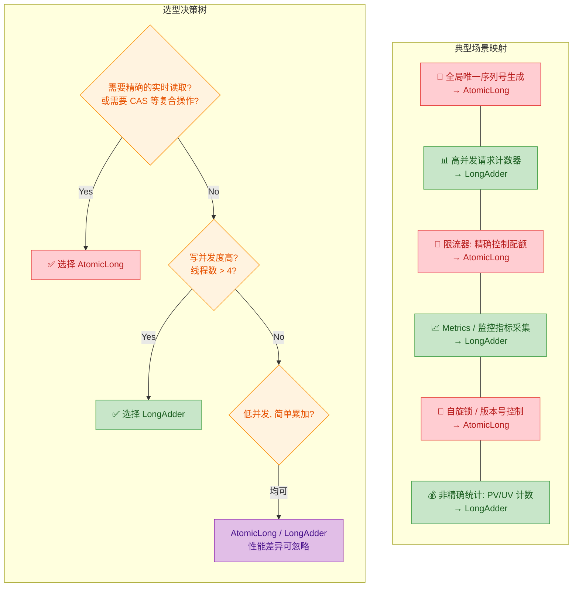
```mermaid
graph LR
    subgraph Decision["选型决策树"]
        direction TB
        Q1{"需要精确的实时读取?<br/>或需要 CAS 等复合操作?"}
        Q1 -->|"Yes"| AL["✅ 选择 AtomicLong"]
        Q1 -->|"No"| Q2{"写并发度高?<br/>线程数 > 4?"}
        Q2 -->|"Yes"| LA["✅ 选择 LongAdder"]
        Q2 -->|"No"| Q3{"低并发, 简单累加?"}
        Q3 -->|"均可"| BOTH["AtomicLong / LongAdder<br/>性能差异可忽略"]
    end

    subgraph Scenarios["典型场景映射"]
        direction TB
        S1["🔢 全局唯一序列号生成<br/>→ AtomicLong"]
        S2["📊 高并发请求计数器<br/>→ LongAdder"]
        S3["🎰 限流器: 精确控制配额<br/>→ AtomicLong"]
        S4["📈 Metrics / 监控指标采集<br/>→ LongAdder"]
        S5["🔄 自旋锁 / 版本号控制<br/>→ AtomicLong"]
        S6["💰 非精确统计: PV/UV 计数<br/>→ LongAdder"]
        S1 --- S2 --- S3 --- S4 --- S5 --- S6
    end

    Decision ~~~ Scenarios

    classDef questionStyle fill:#FFF3E0,stroke:#FB8C00,color:#E65100
    classDef atomicStyle fill:#FFCDD2,stroke:#E53935,color:#B71C1C
    classDef adderStyle fill:#C8E6C9,stroke:#43A047,color:#1B5E20
    classDef bothStyle fill:#E1BEE7,stroke:#8E24AA,color:#4A148C
    classDef sceneStyle fill:#E3F2FD,stroke:#1E88E5,color:#0D47A1

    class Q1,Q2,Q3 questionStyle
    class AL,S1,S3,S5 atomicStyle
    class LA,S2,S4,S6 adderStyle
    class BOTH bothStyle
```

将上述决策过程展开为具体的工程场景：

| 维度 | AtomicLong | LongAdder |
|------|-----------|-----------|
| **读精确性** | `get()` 返回精确最新值 | `sum()` 返回近似值 |
| **原子复合操作** | 支持 `CAS`、`getAndIncrement` 等 | 仅支持 `add()`、`increment()`、`reset()` |
| **写吞吐量（高并发）** | 随线程数增加急剧下降 | 近线性扩展（接近 CPU 核心数时趋于饱和） |
| **内存开销** | 固定 ~24 字节 | base + Cell[] + @Contended 填充，最大可达数 KB |
| **序列号生成** | ✅ 天然适合（返回值全局有序） | ❌ 无法实现 |
| **统计计数器** | ⚠️ 可用但性能受限 | ✅ 最佳选择 |
| **限流/配额控制** | ✅ 需要 CAS 精确控制 | ❌ 无法精确控制 |
| **JDK 内部使用** | `ThreadLocalRandom` 种子 | `ConcurrentHashMap.addCount()`、`ForkJoinPool` 任务计数 |

#### 一个真实的反面案例

理解"不该用 LongAdder"的场景同样重要。假设你用 LongAdder 做一个限流器：

```java
// ❌ 错误用法: 用 LongAdder 做限流
public class BrokenRateLimiter {
    private final LongAdder permits = new LongAdder();  // 已消耗的许可数
    private final long maxPermits = 1000;               // 最大许可数

    public boolean tryAcquire() {
        // 问题1: sum() 不精确, 可能同时有多个线程看到 "还有余额"
        if (permits.sum() < maxPermits) {
            // 问题2: increment() 和上面的 sum() 之间不是原子操作
            // 可能超发许可, 导致实际消耗 > maxPermits
            permits.increment();
            return true;
        }
        return false;
    }
}

// ✅ 正确用法: 用 AtomicLong 做限流
public class CorrectRateLimiter {
    private final AtomicLong permits = new AtomicLong(0); // 已消耗的许可数
    private final long maxPermits = 1000;                 // 最大许可数

    public boolean tryAcquire() {
        long current;                                     // 当前已消耗数
        do {
            current = permits.get();                      // 读取精确的当前值
            if (current >= maxPermits) {                  // 如果已经到达上限
                return false;                             // 直接拒绝, 无需 CAS
            }
        } while (!permits.compareAndSet(                  // CAS 原子地将 current 更新为 current+1
                current, current + 1));                   // 失败则重试, 保证不会超发
        return true;                                      // CAS 成功, 许可获取成功
    }
}
```

这个例子清楚地展示了：**当业务逻辑需要"先检查后行动"（check-then-act）的原子性时，LongAdder 完全不适用**，因为它的 `sum()` 和 `add()` 之间无法建立任何原子关系。

#### JDK 内部的选型实践

JDK 自身的源码也完美体现了这个选型原则：

- **`ConcurrentHashMap` 的 `size()` 计数**：使用与 LongAdder 相同的 `CounterCell[]` 分段机制。因为 `size()` 本身就是一个统计性质的操作——在高并发的 `put/remove` 面前，精确到某一瞬间的 size 几乎没有意义，近似值足够好。

- **`ThreadLocalRandom` 的种子生成**：使用 `AtomicLong`。因为每次 `nextSeed()` 必须返回一个**全局唯一的值**，用于初始化新线程的随机数种子，精确性不可妥协。

- **`ForkJoinPool` 的窃取计数（steal count）**：使用 LongAdder 风格的累加。任务窃取次数只用于监控统计，不影响调度逻辑，近似值完全够用。

---

**📝 练习题**

一个高并发 Web 服务需要统计总请求量（QPS 监控面板展示用），同时需要为每个请求分配一个全局唯一递增的 `requestId`。以下方案中最合理的是：

A. 请求量统计用 `AtomicLong`，requestId 生成用 `AtomicLong`


B. 请求量统计用 `LongAdder`，requestId 生成用 `LongAdder`


C. 请求量统计用 `LongAdder`，requestId 生成用 `AtomicLong`


D. 请求量统计用 `AtomicLong`，requestId 生成用 `LongAdder`


**【答案】** C

**【解析】** 这道题考查的是 LongAdder 和 AtomicLong 的核心语义差异与适用场景。

**请求量统计**的特征是：高并发写（每个请求都要 +1）、对读精确性要求低（监控面板展示的 QPS 差几个不影响判断）。这正是 `LongAdder` 的黄金场景——利用 Cell 分段累加大幅降低 CAS 竞争，`sum()` 返回的近似值完全满足监控需求。

**requestId 生成**的特征是：每次调用必须返回一个全局唯一且递增的值，不能出现两个请求拿到相同 ID 的情况。这要求 `incrementAndGet()` 的返回值具有原子性和精确性。`LongAdder` 根本不提供这样的 API——它的 `increment()` 返回 `void`，`sum()` 不保证精确——因此必须使用 `AtomicLong`。

A 选项虽然不会出错，但在高并发场景下请求量统计使用 AtomicLong 会成为性能瓶颈。B 和 D 选项中 requestId 使用 LongAdder 无法保证唯一性，存在功能性缺陷。

---

## LongAccumulator（自定义累加函数）

`LongAdder` 虽然强大，但它的功能被锁定在"累加"这一单一操作上——内部硬编码了加法逻辑。如果我们需要的不是求和，而是求最大值、最小值、乘积，甚至是某种自定义的聚合运算呢？这就是 `LongAccumulator` 的舞台。

`LongAccumulator` 是 `LongAdder` 的**泛化版本**（Generalized Version）。它与 `LongAdder` 共享完全相同的底层分段架构——`base` + `Cell[]`——但将"两个值如何合并"这一逻辑，通过 `LongBinaryOperator` 函数式接口开放给了调用者。换句话说，**`LongAdder` 是 `LongAccumulator` 的一个特例**，等价于 `new LongAccumulator(Long::sum, 0L)`。

### 构造函数与核心参数

```java
// LongAccumulator 的构造函数签名
public LongAccumulator(
    LongBinaryOperator accumulatorFunction, // 累加函数：定义两个 long 值如何合并
    long identity                            // 初始值（幺元）：满足 f(identity, x) == x
) {
    this.function = accumulatorFunction;     // 保存累加函数引用
    base = this.identity = identity;         // base 初始化为 identity
}
```

这里有两个关键参数需要深入理解：

**`accumulatorFunction`（累加函数）**：一个接受两个 `long` 参数、返回一个 `long` 结果的函数。它定义了"当一个新值到来时，如何与已有值合并"。这个函数必须满足两个数学性质才能保证并发环境下结果的正确性：

- **交换律（Commutativity）**：`f(a, b) == f(b, a)`。因为多线程环境下，值的到达顺序是不确定的。
- **结合律（Associativity）**：`f(a, f(b, c)) == f(f(a, b), c)`。因为分段机制会将值分散到不同的 Cell 中，最后通过 `get()` 方法将所有段的值逐一合并，合并顺序不固定。

**`identity`（幺元 / 单位元）**：这是一个"中性值"，它对累加函数不产生任何影响。数学上要求 `f(identity, x) == x` 对任意 `x` 成立。例如，加法的幺元是 `0`（因为 `0 + x == x`），乘法的幺元是 `1`（因为 `1 * x == x`），取最大值的幺元是 `Long.MIN_VALUE`（因为 `max(MIN_VALUE, x) == x`）。

> 为什么幺元如此重要？因为当某个 Cell 槽位尚未被任何线程写入时，它的值就是 `identity`。在 `get()` 合并阶段，这些"空槽"不应干扰最终结果。如果幺元选错了，即使没有任何数据写入，`get()` 也可能返回一个错误的初始值。

### accumulate 方法：数据写入

`accumulate(long x)` 是 `LongAccumulator` 的核心写入方法，对应 `LongAdder` 中的 `add(long x)`。其内部逻辑与 `LongAdder.add()` 几乎一模一样，唯一的区别在于：**所有原本写死的加法操作，都被替换为了 `function.applyAsLong()` 调用**。

```java
// accumulate 方法的核心逻辑（简化版，展示关键差异）
public void accumulate(long x) {
    Cell[] cs;                              // 本地引用 Cell 数组
    long b, v, r;                           // b=base值, v=Cell值, r=函数计算结果
    int m;                                  // Cell 数组长度掩码
    Cell c;                                 // 当前线程命中的 Cell

    // 第一步：尝试直接在 base 上进行累加（无竞争快路径）
    if ((cs = cells) != null ||             // 如果 Cell 数组已初始化（说明曾发生过竞争）
        ((r = function.applyAsLong(b = base, x)) != b  // 计算 f(base, x)
         && !casBase(b, r))) {              // 尝试 CAS 更新 base，失败说明有竞争
        // ——进入分段逻辑——
        boolean uncontended = true;         // 标记当前 Cell 是否无竞争
        if (cs == null ||                   // Cell 数组尚未初始化
            (m = cs.length - 1) < 0 ||      // Cell 数组为空
            (c = cs[getProbe() & m]) == null || // 当前线程哈希到的槽位为空
            !(uncontended =                 // 尝试 CAS 更新命中的 Cell
                (r = function.applyAsLong(v = c.value, x)) == v // 计算 f(cell.value, x)
                || c.cas(v, r))) {          // CAS 尝试写入
            longAccumulate(x, function, uncontended); // 进入 Striped64 的通用扩容/重试逻辑
        }
    }
}
```

注意一个微妙的细节：`(r = function.applyAsLong(b = base, x)) != b` 这个判断。对于 `LongAdder`（加法），`add(0)` 时 `base + 0 == base`，所以不会进入分段逻辑。但对于自定义函数，即使输入值不改变结果（如 `max(5, 3) == 5`），只要函数返回值等于原值，就不会触发 CAS——这是一个短路优化。

### get 方法：结果汇总

`get()` 方法（也叫 `longValue()`）将 `base` 和所有 `Cell` 中的值用 `function` 逐一合并，返回最终结果：

```java
public long get() {
    Cell[] cs = cells;                      // 获取 Cell 数组引用
    long result = base;                     // 从 base 值开始累积
    if (cs != null) {                       // 如果存在 Cell 数组
        for (Cell c : cs) {                 // 遍历每一个 Cell 槽位
            if (c != null) {                // 跳过尚未初始化的空槽
                result = function.applyAsLong(result, c.value); // 用函数合并
            }
        }
    }
    return result;                          // 返回最终合并结果
}
```

和 `LongAdder.sum()` 一样，`get()` **不保证精确的实时一致性**——在遍历过程中其他线程可能仍在写入。但在所有写入线程完成后调用，结果一定是正确的。

### 经典应用场景

`LongAccumulator` 的灵活性使它适用于多种聚合场景。以下是几个典型用法：

```java
// 场景一：并发求最大值
// 幺元为 Long.MIN_VALUE，因为 max(MIN_VALUE, x) == x
LongAccumulator maxAccumulator = new LongAccumulator(
    Long::max,               // (left, right) -> Math.max(left, right)
    Long.MIN_VALUE           // 任何值都比它大，不影响最终结果
);

// 场景二：并发求最小值
// 幺元为 Long.MAX_VALUE，因为 min(MAX_VALUE, x) == x
LongAccumulator minAccumulator = new LongAccumulator(
    Long::min,               // (left, right) -> Math.min(left, right)
    Long.MAX_VALUE           // 任何值都比它小，不影响最终结果
);

// 场景三：并发求累加（等价于 LongAdder）
// 幺元为 0，因为 0 + x == x
LongAccumulator sumAccumulator = new LongAccumulator(
    Long::sum,               // (left, right) -> left + right
    0L                       // 加法单位元
);

// 场景四：并发求按位或（收集所有标志位）
// 幺元为 0，因为 0 | x == x
LongAccumulator orAccumulator = new LongAccumulator(
    (left, right) -> left | right,  // 按位或合并
    0L                               // 按位或的单位元
);
```

下面是一个完整的并发求最大值示例：

```java
public class LongAccumulatorMaxDemo {
    public static void main(String[] args) throws InterruptedException {
        // 创建一个求最大值的累加器，初始值为 Long.MIN_VALUE
        LongAccumulator max = new LongAccumulator(Long::max, Long.MIN_VALUE);

        // 模拟 10 个线程，每个线程写入一批随机值
        int threadCount = 10;                           // 线程数量
        ExecutorService pool = Executors.newFixedThreadPool(threadCount); // 创建线程池

        ThreadLocalRandom random = ThreadLocalRandom.current(); // 线程安全的随机数生成器

        for (int i = 0; i < threadCount; i++) {         // 提交 10 个任务
            pool.submit(() -> {
                for (int j = 0; j < 100_000; j++) {     // 每个线程执行 10 万次写入
                    long value = ThreadLocalRandom.current().nextLong(1_000_000);
                    max.accumulate(value);               // 将随机值喂入累加器
                }
            });
        }

        pool.shutdown();                                 // 不再接受新任务
        pool.awaitTermination(10, TimeUnit.SECONDS);     // 等待所有任务完成

        // 所有线程完成后，get() 返回所有写入值中的最大值
        System.out.println("Max value: " + max.get());   // 输出最大值
    }
}
```

### LongAccumulator 与 LongAdder 的继承关系

从类层次结构来看，两者都继承自 `Striped64`，共享同一套分段竞争的底层基础设施：

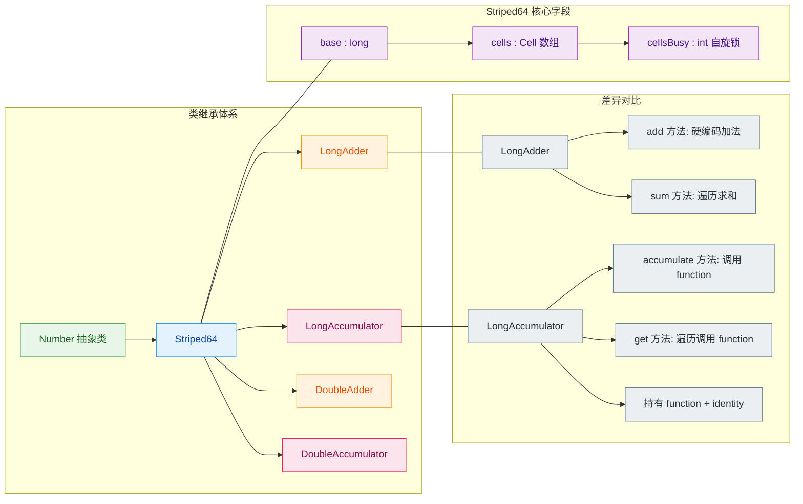
```mermaid
graph LR
    subgraph 类继承体系
        direction TB
        A[Number 抽象类] --> B[Striped64]
        B --> C[LongAdder]
        B --> D[LongAccumulator]
        B --> E[DoubleAdder]
        B --> F[DoubleAccumulator]
    end

    subgraph Striped64 核心字段
        direction TB
        G["base : long"] --> H["cells : Cell 数组"]
        H --> I["cellsBusy : int 自旋锁"]
    end

    subgraph 差异对比
        direction TB
        J["LongAdder"] --> K["add 方法: 硬编码加法"]
        J --> L["sum 方法: 遍历求和"]
        M["LongAccumulator"] --> N["accumulate 方法: 调用 function"]
        M --> O["get 方法: 遍历调用 function"]
        M --> P["持有 function + identity"]
    end

    B --- G
    C --- J
    D --- M

    classDef cls_number fill:#E8F5E9,stroke:#4CAF50,color:#1B5E20
    classDef cls_striped fill:#E3F2FD,stroke:#2196F3,color:#0D47A1
    classDef cls_adder fill:#FFF3E0,stroke:#FF9800,color:#E65100
    classDef cls_accumulator fill:#FCE4EC,stroke:#E91E63,color:#880E4F
    classDef cls_field fill:#F3E5F5,stroke:#9C27B0,color:#4A148C
    classDef cls_detail fill:#ECEFF1,stroke:#607D8B,color:#263238

    class A cls_number
    class B cls_striped
    class C,E cls_adder
    class D,F cls_accumulator
    class G,H,I cls_field
    class J,K,L cls_detail
    class M,N,O,P cls_detail
```

### 函数约束的深层原因

为什么 `LongAccumulator` 要求累加函数必须满足交换律和结合律？我们用一个反例来说明。假设我们错误地使用了减法：

```java
// 错误示范：减法不满足交换律和结合律！
LongAccumulator badAccumulator = new LongAccumulator(
    (left, right) -> left - right,   // 减法：不满足交换律 a-b != b-a
    0L                                // 看似合理的幺元
);
```

```text
假设 3 个线程分别写入值 10, 20, 30

可能的合并顺序 1: ((0 - 10) - 20) - 30 = -60
可能的合并顺序 2: ((0 - 30) - 10) - 20 = -60  ← 碰巧相同？
可能的合并顺序 3:
  Cell[0] 收到 10, Cell[1] 收到 20, base 收到 30
  get() 合并: f(f(base, Cell[0]), Cell[1])
            = f(f(30, 10), 20)
            = f(30 - 10, 20)
            = 20 - 20
            = 0                                  ← 结果完全错误！

根本原因：分段机制将值分散到不同位置，
合并时的顺序和写入时的顺序无关，
减法因不满足交换律和结合律，导致结果不确定。
```

这个例子清晰地说明了：**分段架构天然打破了操作的顺序性**，只有满足交换律和结合律的函数，才能在任意合并顺序下得到一致的结果。

### reset 与 getThenReset

`LongAccumulator` 还提供了重置方法，这在"统计窗口"场景中非常有用：

```java
LongAccumulator acc = new LongAccumulator(Long::max, Long.MIN_VALUE);

// ... 经过一段时间的并发写入 ...

// getThenReset()：原子地获取当前值并重置为 identity
long windowMax = acc.getThenReset();     // 返回当前最大值，同时将 base 和所有 Cell 重置为 MIN_VALUE
System.out.println("本窗口最大值: " + windowMax);

// reset()：仅重置，不返回值
acc.reset();                              // 将 base 和所有 Cell 重置为 identity
```

需要注意的是，`getThenReset()` 和 `reset()` 同样**不是原子操作**——它们在遍历重置各个 Cell 的过程中，其他线程可能正在写入。所以这些方法适用于"先停止所有写入线程，再调用"的场景，或者在允许少量误差的统计窗口场景中使用。

### DoubleAdder 与 DoubleAccumulator

JDK 同时提供了 `double` 类型的对应版本：`DoubleAdder` 和 `DoubleAccumulator`。它们的原理与 `long` 版本完全一致，只不过内部通过 `Double.doubleToRawLongBits()` 和 `Double.longBitsToDouble()` 将 `double` 编码为 `long` 来存储，因为 `Striped64` 的 Cell 只持有 `long` 类型的 `value` 字段。

```java
// DoubleAccumulator 示例：并发求浮点数的最大值
DoubleAccumulator doubleMax = new DoubleAccumulator(
    Double::max,                          // 双精度浮点取最大值
    Double.NEGATIVE_INFINITY              // 负无穷作为幺元
);

doubleMax.accumulate(3.14);               // 写入值
doubleMax.accumulate(2.718);              // 写入值
System.out.println(doubleMax.get());      // 输出 3.14
```

### 使用决策指南

面对实际项目中的并发聚合需求，选择合适的工具至关重要：

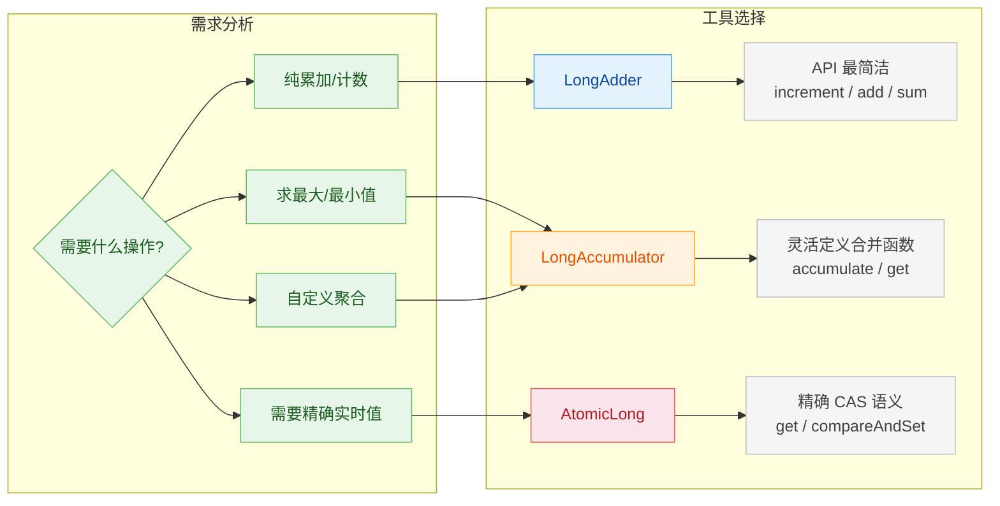
```mermaid
graph LR
    subgraph 需求分析
        direction TB
        A{需要什么操作?} --> B[纯累加/计数]
        A --> C[求最大/最小值]
        A --> D[自定义聚合]
        A --> E[需要精确实时值]
    end

    subgraph 工具选择
        direction TB
        F[LongAdder] --> G["API 最简洁<br/>increment / add / sum"]
        H[LongAccumulator] --> I["灵活定义合并函数<br/>accumulate / get"]
        J[AtomicLong] --> K["精确 CAS 语义<br/>get / compareAndSet"]
    end

    B --> F
    C --> H
    D --> H
    E --> J

    classDef cls_question fill:#E8F5E9,stroke:#66BB6A,color:#1B5E20
    classDef cls_adder fill:#E3F2FD,stroke:#42A5F5,color:#0D47A1
    classDef cls_accumulator fill:#FFF3E0,stroke:#FFA726,color:#E65100
    classDef cls_atomic fill:#FCE4EC,stroke:#EF5350,color:#B71C1C
    classDef cls_desc fill:#F5F5F5,stroke:#BDBDBD,color:#424242

    class A cls_question
    class B,C,D,E cls_question
    class F cls_adder
    class H cls_accumulator
    class J cls_atomic
    class G,I,K cls_desc
```

简单来说：**能用 `LongAdder` 就用 `LongAdder`**（API 最简洁），需要自定义聚合逻辑时用 `LongAccumulator`，需要精确实时读取或 `compareAndSet` 语义时用 `AtomicLong`。

---

**📝 练习题**

以下代码的输出结果是什么？

```java
LongAccumulator acc = new LongAccumulator((left, right) -> left * right, 1L);
acc.accumulate(3);
acc.accumulate(5);
acc.accumulate(2);
System.out.println(acc.get());
```

A. 0


B. 10


C. 30


D. 结果不确定，因为乘法不满足交换律


**【答案】** C

**【解析】** 乘法同时满足**交换律**（`a * b == b * a`）和**结合律**（`a * (b * c) == (a * b) * c`），因此乘法是一个合法的累加函数。幺元为 `1`（因为 `1 * x == x`）。无论 `3`、`5`、`2` 以何种顺序分配到 `base` 和 `Cell` 中，最终 `get()` 的合并结果都是 `1 * 3 * 5 * 2 = 30`。在这个单线程示例中，三次 `accumulate` 大概率都命中 `base`（无竞争），`base` 的值变化轨迹为 `1 → 3 → 15 → 30`，`get()` 返回 `30`。选项 D 是干扰项——乘法是满足交换律的，只有**不满足**交换律和结合律的操作（如减法、除法）才会导致结果不确定。

---

## 本章小结

本章围绕 `LongAdder` 这一高性能并发累加器，从设计哲学到源码实现进行了全面剖析。以下是对全章核心知识的系统回顾与提炼。

---

### 核心知识脉络回顾

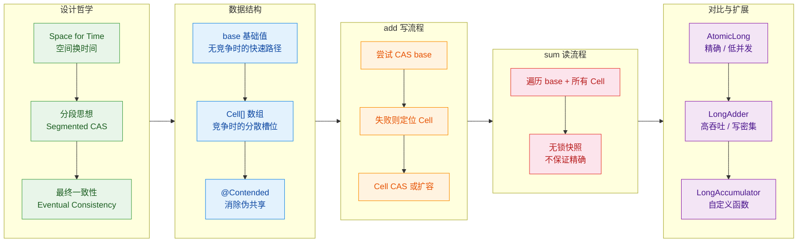
```mermaid
graph LR
    subgraph Philosophy["设计哲学"]
        direction TB
        P1["Space for Time\n空间换时间"]
        P2["分段思想\nSegmented CAS"]
        P3["最终一致性\nEventual Consistency"]
        P1 --> P2 --> P3
    end

    subgraph Structure["数据结构"]
        direction TB
        S1["base 基础值\n无竞争时的快速路径"]
        S2["Cell[] 数组\n竞争时的分散槽位"]
        S3["@Contended\n消除伪共享"]
        S1 --> S2 --> S3
    end

    subgraph WriteFlow["add 写流程"]
        direction TB
        W1["尝试 CAS base"]
        W2["失败则定位 Cell"]
        W3["Cell CAS 或扩容"]
        W1 --> W2 --> W3
    end

    subgraph ReadFlow["sum 读流程"]
        direction TB
        R1["遍历 base + 所有 Cell"]
        R2["无锁快照\n不保证精确"]
        R1 --> R2
    end

    subgraph Comparison["对比与扩展"]
        direction TB
        C1["AtomicLong\n精确 / 低并发"]
        C2["LongAdder\n高吞吐 / 写密集"]
        C3["LongAccumulator\n自定义函数"]
        C1 --> C2 --> C3
    end

    Philosophy --> Structure --> WriteFlow --> ReadFlow --> Comparison

    classDef philoStyle fill:#E8F5E9,stroke:#43A047,color:#1B5E20
    classDef structStyle fill:#E3F2FD,stroke:#1E88E5,color:#0D47A1
    classDef writeStyle fill:#FFF3E0,stroke:#FB8C00,color:#E65100
    classDef readStyle fill:#FCE4EC,stroke:#E53935,color:#B71C1C
    classDef compStyle fill:#F3E5F5,stroke:#8E24AA,color:#4A148C

    class P1,P2,P3 philoStyle
    class S1,S2,S3 structStyle
    class W1,W2,W3 writeStyle
    class R1,R2 readStyle
    class C1,C2,C3 compStyle
```

---

### 关键结论速查表

| 维度 | 要点 |
|------|------|
| **设计本质** | 将单一热点变量（single hot variable）拆散为多个独立槽位，用**空间换时间**消除 CAS 竞争 |
| **base 的角色** | 充当快速路径（fast path）。无竞争时所有线程直接 CAS base，性能与 `AtomicLong` 持平 |
| **Cell 数组** | 懒初始化，容量始终为 2 的幂次，最大不超过 `NCPU`（可用处理器数）。每个 Cell 持有独立的 `volatile long value` |
| **伪共享防护** | `@sun.misc.Contended` 在 Cell 对象前后各填充 128 字节，确保不同 Cell 落在不同缓存行（cache line，通常 64 字节） |
| **add 流程** | 三级递进策略：① CAS base → ② CAS 对应 Cell → ③ 扩容或 rehash 换槽重试 |
| **sum 流程** | `base + Σ cells[i].value`，遍历期间**无锁无屏障**，其他线程的并发写入可能导致结果不精确 |
| **vs AtomicLong** | 高并发写密集场景 `LongAdder` 吞吐量可达 `AtomicLong` 的 **5-10 倍**；但需要精确实时值时必须选 `AtomicLong` |
| **LongAccumulator** | `LongAdder` 的泛化版本，通过 `LongBinaryOperator` 支持任意可结合、可交换的累加函数 |

---

### 设计思想的本质提炼

整个 `LongAdder` 的设计可以浓缩为一句话：

> **"Don't fight over a single variable — spread the contention, then aggregate."**
> 不要让所有线程争抢同一个变量——分散竞争，最后再汇总。

这一思想并非 `LongAdder` 独创，它在分布式系统和并发编程中反复出现：

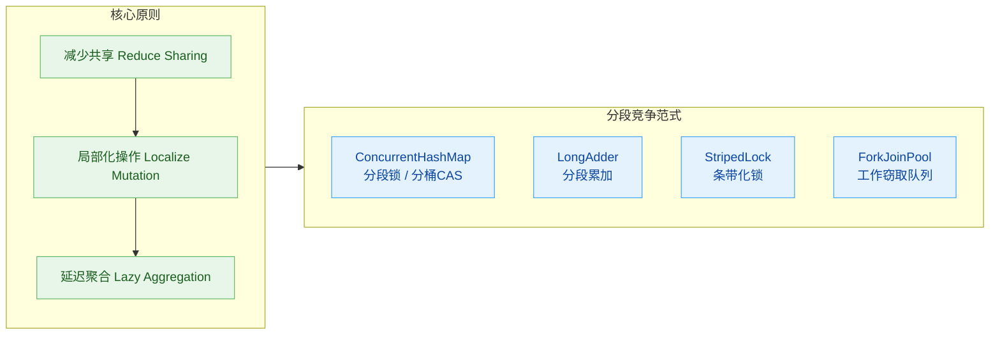
```mermaid
graph LR
    subgraph Paradigm["分段竞争范式"]
        direction TB
        A["ConcurrentHashMap\n分段锁 / 分桶CAS"]
        B["LongAdder\n分段累加"]
        C["StripedLock\n条带化锁"]
        D["ForkJoinPool\n工作窃取队列"]
    end

    subgraph Core["核心原则"]
        direction TB
        E["减少共享 Reduce Sharing"]
        F["局部化操作 Localize Mutation"]
        G["延迟聚合 Lazy Aggregation"]
        E --> F --> G
    end

    Core --> Paradigm

    classDef coreStyle fill:#E8F5E9,stroke:#66BB6A,color:#1B5E20
    classDef paraStyle fill:#E3F2FD,stroke:#42A5F5,color:#0D47A1

    class E,F,G coreStyle
    class A,B,C,D paraStyle
```

从 `ConcurrentHashMap` 的分段锁（JDK 7）/ 分桶 CAS（JDK 8），到 `LongAdder` 的 Cell 数组，再到 `ForkJoinPool` 的工作窃取（work-stealing），底层逻辑如出一辙——**将全局竞争降维为局部独立操作**，在最终需要全局视图时再做汇总。

---

### 使用场景决策树

当你面对一个"需要并发计数/累加"的需求时，可以按以下路径做出选择：

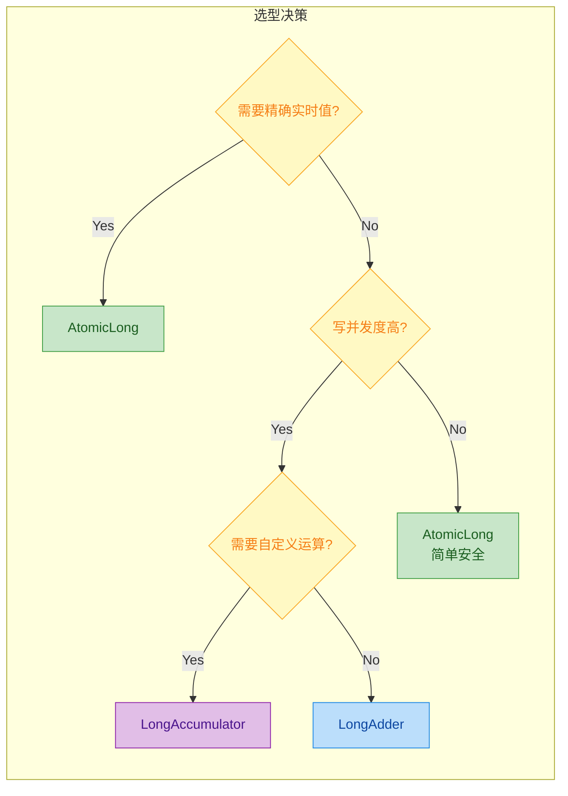
```mermaid
graph LR
    subgraph Decision["选型决策"]
        direction TB
        Q1{"需要精确实时值?"}
        Q2{"写并发度高?"}
        Q3{"需要自定义运算?"}

        A1["AtomicLong"]
        A2["LongAdder"]
        A3["LongAccumulator"]
        A4["AtomicLong\n简单安全"]

        Q1 -->|Yes| A1
        Q1 -->|No| Q2
        Q2 -->|Yes| Q3
        Q2 -->|No| A4
        Q3 -->|Yes| A3
        Q3 -->|No| A2
    end

    classDef questionStyle fill:#FFF9C4,stroke:#F9A825,color:#F57F17
    classDef answerGreen fill:#C8E6C9,stroke:#43A047,color:#1B5E20
    classDef answerBlue fill:#BBDEFB,stroke:#1E88E5,color:#0D47A1
    classDef answerPurple fill:#E1BEE7,stroke:#8E24AA,color:#4A148C

    class Q1,Q2,Q3 questionStyle
    class A1,A4 answerGreen
    class A2 answerBlue
    class A3 answerPurple
```

**典型适用场景举例**：

| 场景 | 推荐工具 | 理由 |
|------|----------|------|
| 全局请求计数器（监控面板） | `LongAdder` | 高并发写入，偶尔读取展示，允许微小误差 |
| 账户余额 | `AtomicLong` | 必须精确，且需要 `compareAndSet` 做条件更新 |
| 统计最大响应时间 | `LongAccumulator` | 自定义 `Math::max` 作为累加函数 |
| 分布式 ID 生成器的序号段 | `AtomicLong` | 需要精确递增，每个值必须唯一 |
| 限流器的滑动窗口计数 | `LongAdder` | 高频递增，定期 `sumThenReset` 读取并重置 |

---

### 易错点与面试陷阱

**陷阱 1：误以为 `sum()` 是精确的。**

`sum()` 遍历 `base` 和所有 `Cell` 的过程中不持有任何锁，也不使用内存屏障做快照。如果在遍历过程中有其他线程正在执行 `add()`，那么结果可能**既不反映调用前的状态，也不反映调用后的状态**。这不是 bug，这是 trade-off。

**陷阱 2：误以为 Cell 数组会无限扩容。**

Cell 数组的容量上限是 `NCPU`（Runtime 获取的可用处理器数）。因为同一时刻最多只有 `NCPU` 个线程真正并行执行，再多的槽位只会浪费内存而不会进一步降低竞争。

**陷阱 3：忽略 `@Contended` 的 JVM 参数要求。**

在用户自定义的类上使用 `@Contended` 注解时，必须添加 JVM 启动参数 `-XX:-RestrictContended`，否则该注解会被 JVM 忽略。但 JDK 内部类（如 `Cell`）不受此限制，因为它们由 Bootstrap ClassLoader 加载。

**陷阱 4：在低并发场景盲目使用 `LongAdder`。**

当并发度极低（例如只有 1-2 个线程）时，`LongAdder` 的 `add()` 走的是 `base` 快速路径，与 `AtomicLong` 几乎相同。但 `sum()` 仍需遍历整个 Cell 数组，读取开销反而更高。低并发场景下 `AtomicLong` 更简洁、更高效。

---

### 一句话总结

> `LongAdder` 是 Doug Lea 在 JDK 8 中为**写多读少的高并发计数场景**量身打造的利器。它通过 `base + Cell[]` 的分段 CAS 架构，将竞争从"多线程抢一个变量"降维为"每个线程操作自己的槽位"，在牺牲读取精确性的前提下，换取了数量级的写入吞吐量提升。理解它的核心，就是理解并发编程中**"减少共享、局部化操作、延迟聚合"**这一永恒的性能优化范式。

---

**📝 练习题 1**

以下关于 `LongAdder` 的描述，**错误**的是：

A. `LongAdder` 内部的 Cell 数组采用懒初始化策略，只有在第一次 CAS base 失败后才会创建

B. Cell 数组的最大长度不会超过当前 JVM 可用的处理器核心数（NCPU）

C. `sum()` 方法在遍历过程中会对 Cell 数组加锁，以保证返回值的精确性

D. `@Contended` 注解通过填充字节的方式避免不同 Cell 之间的伪共享问题


**【答案】** C

**【解析】** `sum()` 方法的实现非常简单——它只是将 `base` 和所有 `cells[i].value` 逐个读取并累加，整个过程**不持有任何锁**，也不使用 CAS 或内存屏障做一致性快照。这意味着在遍历期间，如果有其他线程并发调用 `add()`，`sum()` 可能读到部分更新后、部分更新前的中间状态，因此返回值**不保证精确**。这正是 `LongAdder` 用读取精度换写入吞吐的核心 trade-off。选项 A、B、D 描述均正确：Cell 数组确实是 lazily initialized；容量上限为 NCPU；`@Contended` 通过 padding 消除 false sharing。

---

**📝 练习题 2**

在一个 8 核服务器上，有 64 个线程同时对同一个 `LongAdder` 执行 `add(1)`。以下哪种情况**最可能**发生？

A. Cell 数组最终扩容到 64，每个线程独占一个 Cell

B. Cell 数组最终扩容到 8，多个线程共享同一个 Cell 并在其上 CAS 竞争

C. 所有线程始终只对 base 执行 CAS，Cell 数组不会被创建

D. Cell 数组扩容到 8 后，剩余 56 个线程阻塞等待空闲 Cell


**【答案】** B

**【解析】** `LongAdder` 的 Cell 数组容量上限为 `NCPU`，在 8 核机器上最多扩容到 8。64 个线程通过 `Thread.getProbe()` 的哈希值映射到 8 个槽位中（`probe & (n - 1)`），平均每个 Cell 承载约 8 个线程的 CAS 竞争。选项 A 错误，因为数组不会超过 NCPU；选项 C 错误，64 线程同时竞争 base 必然大量 CAS 失败，触发 Cell 数组初始化；选项 D 错误，`LongAdder` 全程无锁（lock-free），线程不会阻塞等待，而是通过 rehash 探测其他槽位或自旋重试。这道题考查的核心是：**Cell 数组的容量由 CPU 核心数决定，而非线程数**，因为同一时刻真正并行执行的线程最多等于核心数。

---

