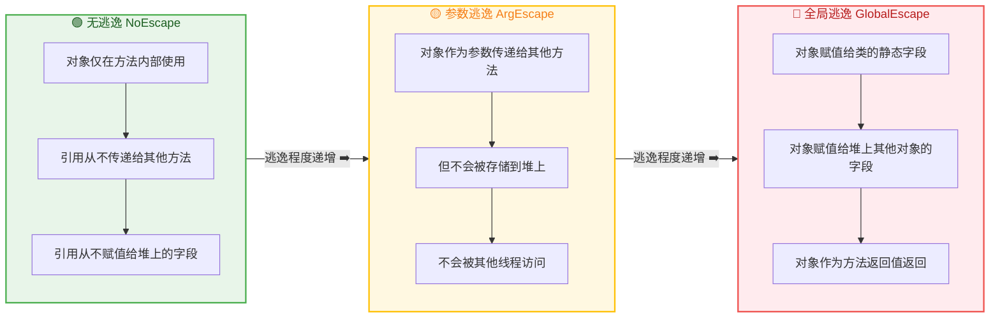
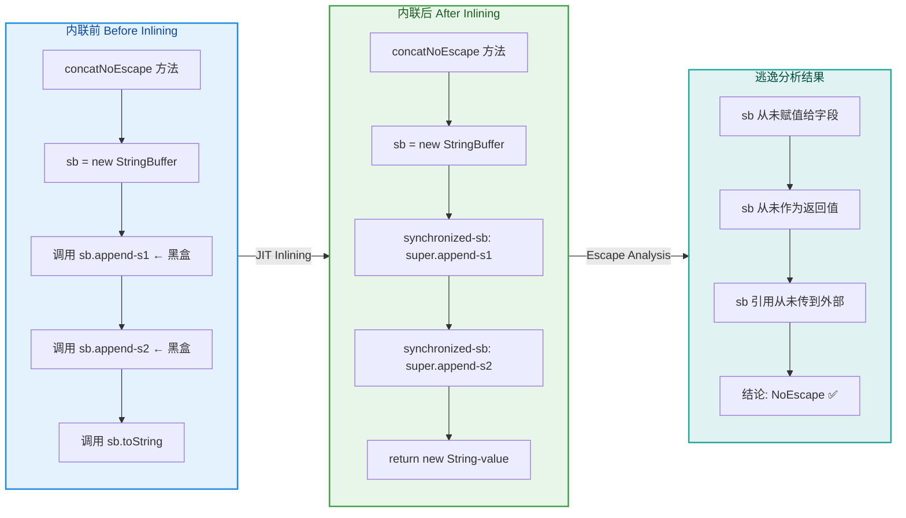
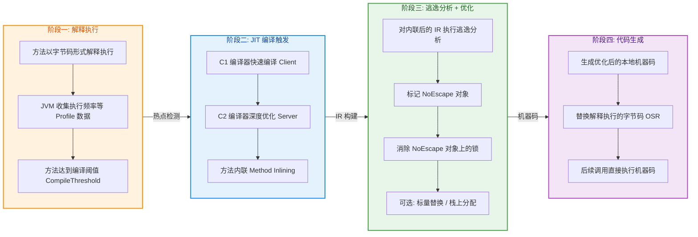
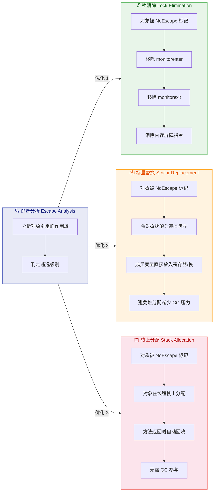
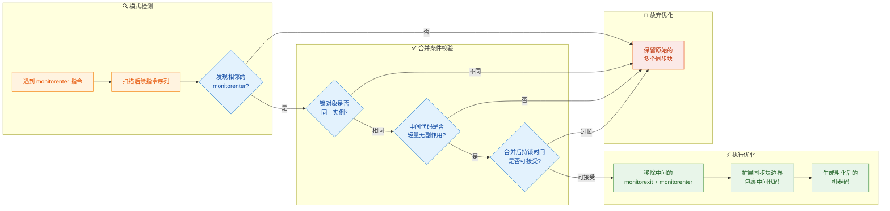
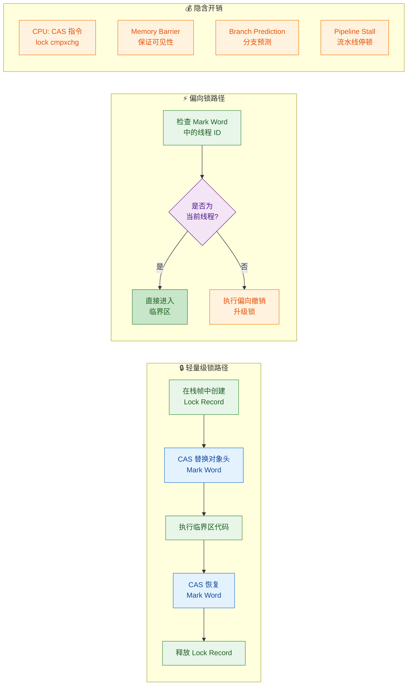
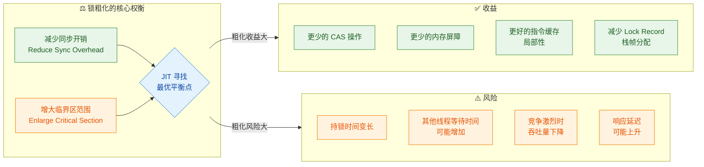
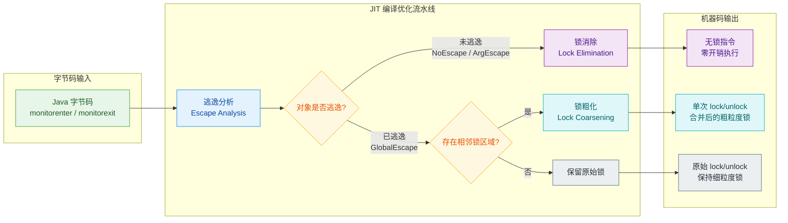
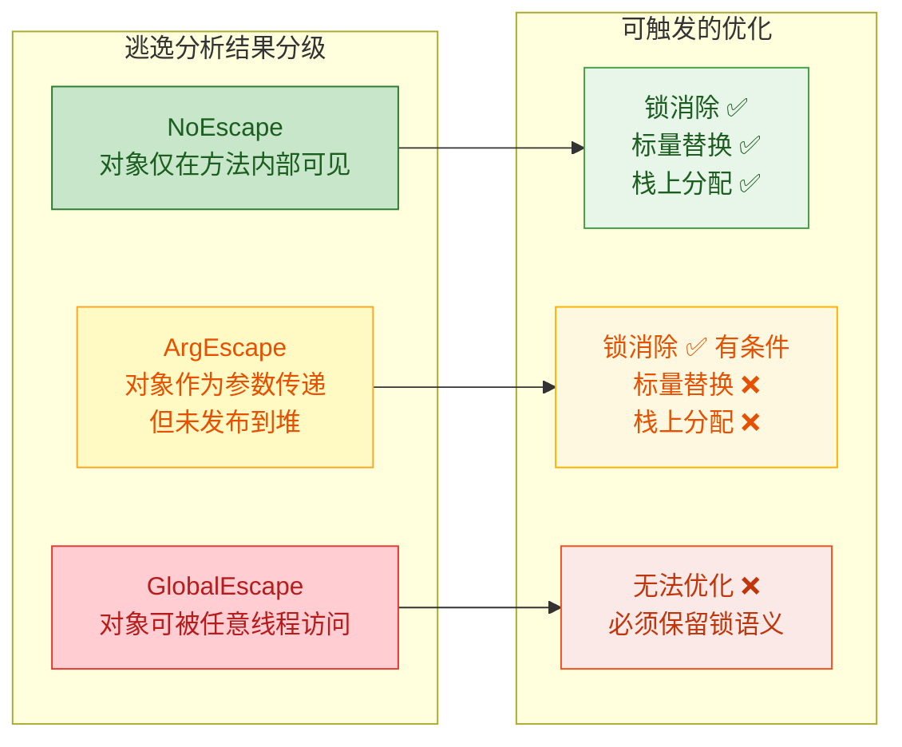

---

# synchronized优化

---

## 锁消除 ⭐（JIT 优化）

在 Java 并发编程的世界里，`synchronized` 关键字是最基础也最常用的同步手段。然而，并非所有使用 `synchronized` 的场景都真正存在多线程竞争。很多时候，开发者出于"防御性编程"的习惯，或者间接调用了 JDK 内部带锁的类（如早期的 `StringBuffer`、`Vector`），导致程序中充斥着大量 **根本不可能被多个线程同时访问** 的锁。如果 JVM 对这些"无用的锁"照单全收地执行加锁、解锁操作，无疑是巨大的性能浪费。

**锁消除（Lock Elimination / Lock Elision）** 正是 JVM 的 JIT（Just-In-Time）编译器针对这一场景所做的激进优化：它在编译阶段分析代码，如果发现某个锁对象 **不可能被其他线程访问到**，就直接将该锁的加锁和解锁操作 **完全移除**，就好像你从未写过 `synchronized` 一样。

这项优化的核心前提技术是 **逃逸分析（Escape Analysis）**。可以说，没有逃逸分析，就没有锁消除。

---

### 逃逸分析判断

#### 什么是逃逸分析

**逃逸分析（Escape Analysis）** 是 JIT 编译器在编译期间执行的一种全局数据流分析技术。它的核心问题只有一个：

> **一个对象的引用，是否会"逃逸"出它被创建的方法或线程的作用范围？**

所谓"逃逸"，就是指对象的引用被传播到了方法外部或线程外部，使得其他代码（尤其是其他线程）有可能访问到这个对象。逃逸分析将对象的逃逸程度划分为三个层次：



**只有当对象被判定为 NoEscape（无逃逸）时，JIT 才会对其上的锁执行锁消除优化。** 因为无逃逸意味着这个对象绝对是当前线程的"私有财产"，不可能存在竞争，加锁毫无意义。

#### 逃逸分析的判断过程

JIT 编译器在将热点方法（Hot Method）编译为本地机器码时，会对方法体内创建的每一个对象进行逃逸分析。判断逻辑可以用以下伪流程概括：

1. **追踪对象引用的所有使用点**：从 `new` 指令开始，沿着数据流追踪引用变量被赋值、传参、返回的每一条路径。
2. **检查是否存在"逃逸行为"**：
   - 引用是否被赋值给了某个实例字段或静态字段？（堆逃逸）
   - 引用是否作为方法的返回值？（方法逃逸）
   - 引用是否传递给了一个无法内联的外部方法？（不确定逃逸）
3. **综合判定逃逸级别**：如果以上检查全部为"否"，则对象被标记为 NoEscape。

我们来看一个非常典型的例子，理解逃逸分析是如何工作的：

```java
public class EscapeAnalysisDemo {

    // ========== 案例 1：无逃逸 (NoEscape) ==========
    public String concatNoEscape(String s1, String s2) {
        // sb 在方法内部创建
        StringBuffer sb = new StringBuffer();
        // sb.append() 虽然内部用了 synchronized，但 sb 不会逃逸
        sb.append(s1);    // synchronized(this) -> this 就是 sb
        sb.append(s2);    // synchronized(this) -> this 就是 sb
        // toString() 返回的是一个新的 String 对象，sb 本身没有被返回
        return sb.toString();
        // 方法结束后，sb 的生命周期终结，没有任何外部引用指向它
        // ✅ 逃逸分析结论：sb 是 NoEscape -> 锁可以被消除
    }

    // ========== 案例 2：全局逃逸 (GlobalEscape) ==========
    private StringBuffer sharedBuffer; // 实例字段，存储在堆上

    public void concatGlobalEscape(String s1, String s2) {
        // sb 在方法内部创建
        StringBuffer sb = new StringBuffer();
        sb.append(s1);
        sb.append(s2);
        // ❌ 关键：sb 的引用被赋值给了实例字段
        this.sharedBuffer = sb;
        // 其他线程可能通过 this.sharedBuffer 访问到 sb
        // ❌ 逃逸分析结论：sb 是 GlobalEscape -> 锁不能被消除
    }

    // ========== 案例 3：参数逃逸 (ArgEscape) ==========
    public void concatArgEscape(String s1, String s2) {
        StringBuffer sb = new StringBuffer();
        sb.append(s1);
        sb.append(s2);
        // sb 作为参数传递给 print 方法
        // 如果 JIT 能内联 print() 并确认其中不会逃逸，也可能优化
        // 但通常保守处理，不做锁消除
        print(sb); // ⚠️ ArgEscape
    }

    private void print(StringBuffer sb) {
        System.out.println(sb.toString());
    }
}
```

#### 逃逸分析与 JIT 内联的协同

逃逸分析的精度 **高度依赖方法内联（Method Inlining）**。方法内联是指 JIT 将被调用方法的代码直接"复制"到调用处，消除方法调用的开销。内联之后，原本跨方法的引用传递变成了同一方法体内的局部操作，逃逸分析就能"看到"更完整的数据流。

以案例 1 中的 `sb.append(s1)` 为例：

```java
// StringBuffer.append() 的简化版本（JDK 源码）
@Override
public synchronized StringBuffer append(String str) { // ← 注意 synchronized
    toStringCache = null;
    super.append(str);  // 调用 AbstractStringBuilder.append()
    return this;
}
```

在 JIT 内联前，编译器只知道调用了 `append()` 方法，无法确定 `sb` 在方法内部是否被存到了某个全局位置。但内联之后，`append()` 的代码被展开到 `concatNoEscape()` 内部，编译器可以清晰地看到：`sb` 自始至终只在栈上流转，从未逃逸。



#### 控制逃逸分析的 JVM 参数

逃逸分析在 JDK 8+ 的 HotSpot JVM 中**默认开启**，但你可以通过以下 JVM 参数进行控制和调试：

| 参数 | 说明 | 默认值 |
|------|------|--------|
| `-XX:+DoEscapeAnalysis` | 开启逃逸分析 | **默认开启**（JDK 8+） |
| `-XX:-DoEscapeAnalysis` | 关闭逃逸分析 | — |
| `-XX:+PrintEscapeAnalysis` | 打印逃逸分析结果（Debug JVM 版本） | 关闭 |
| `-XX:+EliminateLocks` | 开启锁消除（依赖逃逸分析） | **默认开启** |
| `-XX:-EliminateLocks` | 关闭锁消除 | — |

> **注意**：`-XX:+PrintEscapeAnalysis` 仅在 Debug 版本的 JVM 中可用。在生产环境中，可以通过 `-XX:+PrintCompilation` 和 `-XX:+UnlockDiagnosticVMOptions -XX:+PrintInlining` 间接观察 JIT 的编译决策。

---

### 消除不必要的锁

理解了逃逸分析的判断机制之后，我们来深入看锁消除的实际执行过程和典型场景。

#### 锁消除的工作原理

锁消除发生在 JIT 编译的 **优化阶段**。当 JIT 编译器准备将一个热点方法编译为本地机器码时，优化管线（Optimization Pipeline）中包含以下关键步骤：



其中 **Phase 3** 就是锁消除发生的阶段。JIT 在 C2 编译器的 Ideal Graph（理想图，一种中间表示形式）上识别出 `monitorenter` 和 `monitorexit` 节点，如果对应的锁对象被逃逸分析标记为 NoEscape，则直接将这两个节点从图中 **删除**，最终生成的机器码中就不会包含任何加锁指令。

#### 典型场景一：局部 StringBuffer / StringBuilder

这是教科书级别的锁消除案例。在 JDK 早期，`String` 拼接操作会被编译器转换为 `StringBuffer`（线程安全）或 `StringBuilder`（非线程安全）的操作。即使后来 javac 默认使用 `StringBuilder`，仍然有大量遗留代码或第三方库使用 `StringBuffer`：

```java
public class LockEliminationCase1 {

    /**
     * 这个方法在逻辑上不涉及多线程共享。
     * StringBuffer 的每次 append 都包含 synchronized，
     * 但 JIT 会通过逃逸分析 + 锁消除将其优化掉。
     */
    public String buildGreeting(String name, int age) {
        // sb 是方法局部变量，在栈帧上分配引用
        StringBuffer sb = new StringBuffer();      // new 对象，逃逸分析的目标

        sb.append("Hello, ");                      // synchronized(sb) -> 锁消除目标
        sb.append(name);                           // synchronized(sb) -> 锁消除目标
        sb.append("! You are ");                   // synchronized(sb) -> 锁消除目标
        sb.append(age);                            // synchronized(sb) -> 锁消除目标
        sb.append(" years old.");                  // synchronized(sb) -> 锁消除目标

        return sb.toString();                      // 返回新 String，sb 本身不逃逸
        // 方法结束，sb 无任何外部引用 -> NoEscape -> 5 次锁操作全部消除
    }
}
```

经过锁消除后，JIT 生成的代码在效果上等价于：

```java
// JIT 优化后的等效伪代码（实际是机器码层面）
public String buildGreeting(String name, int age) {
    // 锁已被完全移除，甚至 StringBuffer 可能被标量替换
    char[] value = new char[initialCapacity];
    int count = 0;
    // 直接操作底层数组，无任何 synchronized
    // ... append 逻辑内联展开 ...
    return new String(value, 0, count);
}
```

#### 典型场景二：局部的同步集合

在一些工具方法或算法实现中，开发者可能不小心使用了 `Vector`、`Hashtable` 等同步集合，但这些集合其实只在方法内部使用：

```java
public class LockEliminationCase2 {

    /**
     * 统计字符串中每个字符的出现次数。
     * 使用了 Hashtable（所有方法都是 synchronized），
     * 但由于 map 不逃逸，所有锁都会被消除。
     */
    public int countUniqueChars(String text) {
        // map 是局部变量，不会逃逸出此方法
        Hashtable<Character, Integer> map = new Hashtable<>();  // NoEscape 对象

        for (int i = 0; i < text.length(); i++) {             // 遍历字符串
            char c = text.charAt(i);                           // 取出当前字符
            // Hashtable.containsKey() 是 synchronized 方法 -> 锁消除
            // Hashtable.get() 是 synchronized 方法 -> 锁消除
            // Hashtable.put() 是 synchronized 方法 -> 锁消除
            Integer count = map.get(c);                        // synchronized -> 消除
            if (count == null) {                               // 首次出现
                map.put(c, 1);                                 // synchronized -> 消除
            } else {
                map.put(c, count + 1);                         // synchronized -> 消除
            }
        }

        return map.size();                                     // synchronized -> 消除
        // map 从未赋给字段、从未返回、从未传给其他线程
        // ✅ 逃逸分析: NoEscape -> 循环中所有锁操作全部消除
    }
}
```

#### 典型场景三：隐式的锁——自动装箱和内部实现

有时候锁藏得更深，开发者甚至不知道自己用了锁。在一些 JDK 内部实现中，特定的操作路径可能涉及同步块。虽然现代 JDK 已经大幅减少了这种情况，但在老版本或第三方库中仍可能遇到：

```java
public class LockEliminationCase3 {

    /**
     * 看似简单的方法，但如果使用了某些内部带锁的 API，
     * JIT 仍然可以通过锁消除来避免性能损失。
     */
    public String formatResult(double value) {
        // StringBuffer 在 JDK 早期版本中用于 String.format 内部实现
        // 即使开发者没有直接写 synchronized，间接调用链中也可能存在
        StringBuffer sb = new StringBuffer();               // 局部对象
        sb.append("Result: ");                              // synchronized -> 消除
        sb.append(String.valueOf(value));                   // synchronized -> 消除
        return sb.toString();                               // sb 不逃逸
    }
}
```

#### 锁消除的性能收益

锁消除带来的性能提升是非常显著的。每一次 `synchronized` 操作，即使在无竞争的情况下（偏向锁或轻量级锁），也需要执行 CAS 操作、修改对象头的 Mark Word、在栈帧中创建 Lock Record 等一系列动作。而锁消除则**彻底跳过了这些步骤**：

```java
// ========== 性能对比基准测试（JMH 风格伪代码）==========

// 测试 1：锁消除开启（默认）
// JVM 参数：-XX:+DoEscapeAnalysis -XX:+EliminateLocks
@Benchmark
public String withLockElimination() {
    StringBuffer sb = new StringBuffer();   // NoEscape -> 锁被消除
    sb.append("Hello");                     // 无 monitorenter/monitorexit
    sb.append(" World");                    // 无 monitorenter/monitorexit
    return sb.toString();
    // 典型结果：~15 ns/op
}

// 测试 2：锁消除关闭
// JVM 参数：-XX:+DoEscapeAnalysis -XX:-EliminateLocks
@Benchmark
public String withoutLockElimination() {
    StringBuffer sb = new StringBuffer();   // 仍然 NoEscape，但锁不消除
    sb.append("Hello");                     // 执行 monitorenter/monitorexit
    sb.append(" World");                    // 执行 monitorenter/monitorexit
    return sb.toString();
    // 典型结果：~50 ns/op（约 3 倍慢）
}
```

> **实测经验**：在紧密循环（tight loop）中，锁消除可以带来 **2~5 倍** 的性能提升。这个倍率取决于锁的密度、CPU 架构以及是否还触发了标量替换（Scalar Replacement）等其他优化。

#### 锁消除的边界与局限性

锁消除并非万能药，它有明确的适用边界：

| 条件 | 能否锁消除 | 原因 |
|------|-----------|------|
| 对象仅在方法内使用，不逃逸 | ✅ 可以 | NoEscape，无竞争可能 |
| 对象作为返回值返回 | ❌ 不能 | GlobalEscape，调用者可能共享 |
| 对象赋值给实例/静态字段 | ❌ 不能 | GlobalEscape，其他线程可能访问 |
| 对象传给无法内联的方法 | ❌ 不能 | 无法判断逃逸情况 |
| 方法未被 JIT 编译（冷代码） | ❌ 不能 | 逃逸分析仅在 JIT 编译时执行 |
| 方法体过大，无法内联 | ⚠️ 受限 | 内联失败导致分析不完整 |

特别值得注意的是最后两点。锁消除是 **JIT 编译时优化**，这意味着：

1. **解释执行阶段没有锁消除**。方法必须被调用足够多次（达到 CompileThreshold，默认 10000 次），触发 JIT 编译后才会生效。
2. **方法必须能被成功内联**。如果被调用方法体过大（默认超过 325 字节），或者调用层次过深，内联会失败，逃逸分析的精度就会下降，可能导致本应消除的锁未被消除。

#### 逃逸分析的三大优化成果

锁消除只是逃逸分析所带来的三大优化之一。为了给你一个完整的知识框架，我们将三者放在一起对比：



> **补充说明**：HotSpot JVM 目前实际上是通过 **标量替换** 间接实现了"栈上分配"的效果（将对象拆解后，字段直接存入栈上的局部变量），而非真正意义上的栈上分配。但从效果来看，达到了避免堆分配的目的。

#### 如何验证锁消除是否生效

在实际开发中，如果你想确认 JIT 是否对某段代码执行了锁消除，可以使用以下诊断手段：

```bash
# 1. 打印 JIT 编译日志，观察哪些方法被编译
java -XX:+UnlockDiagnosticVMOptions \
     -XX:+PrintCompilation \
     -XX:+PrintInlining \
     -XX:+TraceClassLoading \
     YourMainClass

# 2. 对比开启/关闭锁消除的性能差异
# 开启（默认）
java -XX:+DoEscapeAnalysis -XX:+EliminateLocks YourBenchmark

# 关闭锁消除
java -XX:+DoEscapeAnalysis -XX:-EliminateLocks YourBenchmark

# 关闭逃逸分析（锁消除也会随之失效）
java -XX:-DoEscapeAnalysis YourBenchmark

# 3. 使用 JITWatch 可视化工具分析 JIT 编译日志
# 需要先生成日志：
java -XX:+UnlockDiagnosticVMOptions \
     -XX:+LogCompilation \
     -XX:LogFile=jit.log \
     YourMainClass
# 然后用 JITWatch 打开 jit.log 进行图形化分析
```

> **最佳实践建议**：不要因为知道了锁消除的存在，就放心大胆地在不需要同步的地方使用 `StringBuffer` 或 `Vector`。虽然 JIT 可能会帮你消除锁，但这依赖于编译器的分析能力，且在解释执行阶段（JIT 编译前的 warmup 期）锁仍然存在。正确的做法仍然是：**在不需要线程安全的地方，优先使用无锁的替代品**，如 `StringBuilder` 替代 `StringBuffer`，`ArrayList` 替代 `Vector`，`HashMap` 替代 `Hashtable`。

---

**📝 练习题**

某开发者编写了如下方法，在高并发服务中被频繁调用。请问 JIT 编译器是否会对其中的 `synchronized` 执行锁消除优化？

```java
public class QuizService {
    private List<String> resultCache = new ArrayList<>();

    public void processRequest(String input) {
        Vector<String> tempList = new Vector<>();    // Vector 的 add 方法是 synchronized
        tempList.add(input);
        tempList.add(input.toUpperCase());
        tempList.add(input.toLowerCase());

        resultCache.addAll(tempList);   // 将 tempList 传递给 resultCache
    }
}
```

A. 会锁消除，因为 `tempList` 是方法局部变量，生命周期在方法内结束


B. 不会锁消除，因为 `tempList` 通过 `addAll()` 传递给了堆上的 `resultCache`，发生了逃逸


C. 会锁消除，因为 `addAll()` 内部会复制元素，`tempList` 本身不会被存储


D. 不确定，取决于 JIT 是否能成功内联 `addAll()` 方法


**【答案】** D

**【解析】** 这道题的关键在于理解逃逸分析对方法内联的依赖。`tempList` 作为参数传递给了 `resultCache.addAll(tempList)`，这至少构成了 **参数逃逸（ArgEscape）**。但 `addAll()` 的实际行为只是遍历 `tempList` 并复制其中的元素，并不会保留 `tempList` 本身的引用。

然而，逃逸分析能否"看穿"这一点，完全取决于 JIT 能否成功将 `ArrayList.addAll()` 内联到 `processRequest()` 中。如果内联成功，编译器可以确认 `tempList` 的引用在 `addAll()` 内部仅被用于迭代，并未逃逸，此时可以执行锁消除。如果内联失败（方法体过大、调用层次过深等原因），编译器只能保守地假设 `tempList` 可能逃逸，不执行锁消除。

因此选项 A 忽略了参数传递，选项 B 过于绝对（传参不一定导致逃逸），选项 C 的推理方向正确但结论过于自信。最准确的答案是 **D**：结果取决于 JIT 内联是否成功。这也提醒我们，在编写性能敏感代码时，不应依赖编译器的优化能力，而应直接使用 `ArrayList` 替代 `Vector`。

---

## 锁粗化（Lock Coarsening）

如果说**锁消除**是 JIT 编译器"删掉不需要的锁"，那么**锁粗化**（Lock Coarsening）就是 JIT 编译器"把多把小锁合并成一把大锁"。两者的出发点一致——**降低同步开销**，但优化策略截然不同。锁消除面对的是"完全没必要加锁"的场景，而锁粗化面对的则是"确实需要加锁，但加得太频繁、太碎片化"的场景。

在真实业务代码中，开发者出于"最小化同步范围"的教科书原则，往往会把 `synchronized` 块写得极小极精确。这个原则本身没有问题，但当**多个极小的同步块紧密相邻**、且锁的是**同一个对象**时，反而会带来反效果：每一次加锁/解锁都涉及 CAS 操作、内存屏障（Memory Barrier）、甚至可能的线程挂起与唤醒。如果这些同步块之间的非同步代码微乎其微，那么反复进出临界区（Critical Section）的开销，远比把它们合并成一个大同步块的开销要高得多。

JIT 编译器正是捕捉到了这种模式，在运行时自动将相邻的、锁同一对象的同步块**合并为一个更大的同步块**，这就是锁粗化。

---

### 合并相邻的锁

#### 什么算"相邻"

所谓"相邻"并非要求两个 `synchronized` 块在源码中严格紧贴。JIT 编译器在进行锁粗化优化时，会在**中间表示（IR, Intermediate Representation）**层面分析控制流。只要两个同步块之间的代码满足以下条件，就可以被视为"可合并"：

1. **锁的是同一个对象实例**（monitor 相同）。
2. **中间代码无副作用或副作用可控**——不会抛出异常导致控制流分岔，不会调用可能长时间阻塞的方法。
3. **中间代码的执行时间足够短**——如果中间夹杂了耗时操作，合并后会不合理地延长持锁时间，JIT 不会这样做。

让我们从一个最直观的例子入手：

```java
public class LockCoarseningBasic {

    private final Object lock = new Object(); // 同一把锁对象
    private int count = 0;                     // 共享计数器
    private String lastOp = "";                // 最后操作记录

    /**
     * 原始写法：三个紧密相邻的 synchronized 块
     * 每个块都锁同一个对象 lock
     */
    public void fragmentedSync() {
        // -------- 第一个同步块 --------
        synchronized (lock) {           // 第 1 次加锁（monitorenter）
            count++;                    // 临界区操作：计数器自增
        }                               // 第 1 次解锁（monitorexit）

        // 中间仅有一个简单的局部变量赋值，无副作用
        int temp = count;               // 非同步区域的轻量操作

        // -------- 第二个同步块 --------
        synchronized (lock) {           // 第 2 次加锁（monitorenter）
            count += temp;              // 临界区操作：累加
        }                               // 第 2 次解锁（monitorexit）

        // -------- 第三个同步块 --------
        synchronized (lock) {           // 第 3 次加锁（monitorenter）
            lastOp = "fragmentedSync";  // 临界区操作：记录操作名
        }                               // 第 3 次解锁（monitorexit）
    }

    /**
     * JIT 锁粗化后的等价代码（概念演示，非真实反编译）
     * 三个同步块被合并为一个
     */
    public void coarsenedSync() {
        synchronized (lock) {           // 仅 1 次加锁（monitorenter）
            count++;                    // 原第一个同步块的操作
            int temp = count;           // 原来夹在中间的局部变量赋值，被纳入同步块
            count += temp;              // 原第二个同步块的操作
            lastOp = "coarsenedSync";   // 原第三个同步块的操作
        }                               // 仅 1 次解锁（monitorexit）
    }
}
```

这段代码清晰地展示了锁粗化的核心思想：**3 次 monitorenter + 3 次 monitorexit** 被优化为 **1 次 monitorenter + 1 次 monitorexit**。中间那行 `int temp = count` 原本不在任何同步块内，但因为它只是一个简单的局部变量赋值，JIT 认为将其纳入同步块不会产生显著的副作用，因此直接"吞并"。

#### 循环中的锁粗化

一个更常见、也更有性能影响的场景是**循环体内的同步块**。当循环的每一次迭代都对同一对象加锁解锁时，JIT 编译器可能会将锁提升到循环外部：

```java
public class LoopLockCoarsening {

    private final StringBuilder sb = new StringBuilder(); // 共享可变对象

    /**
     * 原始写法：循环内每次迭代都加锁解锁
     * 假设此方法只被单线程或受控方式调用
     */
    public String buildReport(String[] items) {
        for (int i = 0; i < items.length; i++) {     // 遍历所有条目
            synchronized (sb) {                       // 每次迭代：加锁
                sb.append("[").append(i).append("] "); // 拼接序号
                sb.append(items[i]);                   // 拼接内容
                sb.append("\n");                        // 换行
            }                                          // 每次迭代：解锁
        }
        return sb.toString();                          // 返回最终结果
    }

    /**
     * JIT 锁粗化后的等价代码（概念演示）
     * 锁被提升到循环外部
     */
    public String buildReportCoarsened(String[] items) {
        synchronized (sb) {                            // 仅加锁 1 次
            for (int i = 0; i < items.length; i++) {   // 循环体完全在同步块内
                sb.append("[").append(i).append("] ");  // 拼接序号
                sb.append(items[i]);                    // 拼接内容
                sb.append("\n");                         // 换行
            }
        }                                              // 仅解锁 1 次
        return sb.toString();                           // 返回最终结果
    }
}
```

> **⚠️ 注意**：循环级别的锁粗化在实际 JVM 中是比较**保守**的。HotSpot 对循环内锁粗化有一些启发式规则，并非所有循环都会被粗化。如果循环迭代次数不可预估或循环体很重，JIT 通常不会将锁提到循环外面，因为这会大幅延长持锁时间，严重影响其他线程的并发性。

#### 粗化的判定流程

下面用一张流程图来完整梳理 JIT 编译器进行锁粗化决策的逻辑：



从这张图可以看出，锁粗化并不是无条件执行的。**三个校验条件缺一不可**：同一锁对象、中间代码轻量、合并后持锁时间可控。任何一个不满足，JIT 都会放弃优化，保留原始的多个同步块。

---

### 减少加锁解锁次数

锁粗化的终极目标非常明确：**减少 monitorenter / monitorexit 的执行次数**。为了理解这件事为什么如此重要，我们需要深入剖析一次加锁/解锁操作到底意味着什么样的底层开销。

#### 一次加锁/解锁的真实代价

即便在最理想的**无竞争**场景下（偏向锁或轻量级锁状态），一次 `monitorenter` + `monitorexit` 仍然涉及以下操作：



即使是偏向锁这种"几乎免费"的路径，也需要**读取 Mark Word → 比较线程 ID → 条件分支**这一系列操作。而轻量级锁则需要**两次 CAS**（加锁一次、解锁一次）。每一次 CAS 在 x86 架构上对应的是 `lock cmpxchg` 指令，这条指令会：

- **锁定缓存行**（Cache Line Lock）或总线锁（Bus Lock），阻止其他 CPU 核心同时修改。
- **隐式充当内存屏障**（Memory Fence），刷新 Store Buffer，保证写操作对其他核心可见。
- **导致流水线停顿**（Pipeline Stall），因为 CPU 必须等待 CAS 结果才能继续后续指令。

如果一段代码中有 **N 个相邻同步块**，在没有锁粗化的情况下，就需要执行 **N 次 monitorenter + N 次 monitorexit**，意味着在轻量级锁路径下有 **2N 次 CAS 操作**。锁粗化将其压缩为 **1 次 monitorenter + 1 次 monitorexit = 2 次 CAS**，性能提升是数量级的。

#### 量化对比：粗化前 vs 粗化后

我们通过一个具体案例来直观感受差异：

```java
public class CoarseningBenchmarkDemo {

    private final Object monitor = new Object();  // 锁对象
    private long value = 0;                         // 共享变量

    /**
     * 未粗化版本：5 个相邻同步块
     * 每个块只做一次简单运算
     */
    public void fineGrained() {
        synchronized (monitor) {  // 第 1 次 enter/exit
            value += 1;           // 简单加法
        }
        synchronized (monitor) {  // 第 2 次 enter/exit
            value += 2;           // 简单加法
        }
        synchronized (monitor) {  // 第 3 次 enter/exit
            value += 3;           // 简单加法
        }
        synchronized (monitor) {  // 第 4 次 enter/exit
            value += 4;           // 简单加法
        }
        synchronized (monitor) {  // 第 5 次 enter/exit
            value += 5;           // 简单加法
        }
    }

    /**
     * 粗化后等价版本：1 个同步块
     */
    public void coarsened() {
        synchronized (monitor) {  // 仅 1 次 enter/exit
            value += 1;           // 合并后的连续操作
            value += 2;
            value += 3;
            value += 4;
            value += 5;
        }
    }
}
```

下面是两个版本在底层操作上的量化对比：

```
┌─────────────────────┬──────────────────────┬──────────────────────┐
│       指标           │  fineGrained()       │  coarsened()         │
│                     │  (5 个同步块)         │  (1 个同步块)         │
├─────────────────────┼──────────────────────┼──────────────────────┤
│ monitorenter 次数   │         5            │         1            │
│ monitorexit  次数   │         5            │         1            │
│ CAS 操作次数(轻量锁)│        10            │         2            │
│ Memory Barrier 次数 │        10            │         2            │
│ Lock Record 创建    │         5            │         1            │
│ 栈帧操作开销        │        高            │        低            │
│ 分支预测压力        │        高            │        低            │
└─────────────────────┴──────────────────────┴──────────────────────┘
```

从表中可以清晰地看到，锁粗化将所有维度的开销都压缩到了原来的 **1/5**。在实际应用中，当 N 更大（例如循环中的锁操作），这个收益比会更加显著。

#### 锁粗化的边界与权衡

锁粗化并不是"越粗越好"。任何优化都有其适用边界，锁粗化也不例外。JIT 编译器在做粗化决策时，实际上是在两个相互矛盾的目标之间寻找平衡点：



**不适合粗化的典型场景**：

```java
public class BadCoarseningExample {

    private final Object lock = new Object();  // 锁对象
    private int counter = 0;                    // 共享计数器

    /**
     * 不应被粗化的场景：同步块之间有耗时操作
     */
    public void shouldNotCoarsen() throws Exception {
        synchronized (lock) {            // 同步块 1
            counter++;                   // 快速操作
        }

        // ⚠️ 中间有一个耗时的网络调用
        // 如果把这段代码也纳入同步块，其他线程将被长时间阻塞
        Thread.sleep(1000);              // 模拟耗时 I/O 操作（1 秒）

        synchronized (lock) {            // 同步块 2
            counter--;                   // 快速操作
        }
    }

    /**
     * 不应被粗化的场景：锁对象不同
     */
    private final Object lockA = new Object();  // 锁对象 A
    private final Object lockB = new Object();  // 锁对象 B

    public void differentLocks() {
        synchronized (lockA) {           // 锁对象是 lockA
            counter++;
        }
        synchronized (lockB) {           // 锁对象是 lockB —— 不同对象，无法合并
            counter--;
        }
    }
}
```

上面的代码展示了两种 JIT 编译器**不会进行锁粗化**的情况。第一种情况，两个同步块之间夹着 `Thread.sleep(1000)` 这样的耗时操作，如果将其纳入同步块，锁的持有时间会从微秒级暴增到秒级，严重破坏系统的并发性能。第二种情况更加直观——锁对象根本不同，`lockA` 和 `lockB` 是两个不同的 monitor，逻辑上就不可能合并。

#### JVM 参数控制

HotSpot JVM 默认开启锁粗化优化，相关的 JVM 参数如下：

```java
// 锁粗化默认开启，可通过以下参数关闭（一般不建议关闭）
// -XX:-EliminateLocks       关闭锁消除（同时会影响锁粗化的部分路径）
// -XX:-DoEscapeAnalysis     关闭逃逸分析（锁消除依赖此分析，锁粗化不强依赖）

// 查看 JIT 编译器的锁优化日志：
// -XX:+PrintEliminateLocks  打印锁消除和锁粗化的详细信息
// -XX:+UnlockDiagnosticVMOptions  解锁诊断参数（部分参数需要先开启此选项）

// 实际运行命令示例：
// java -XX:+UnlockDiagnosticVMOptions -XX:+PrintEliminateLocks MyApp
```

> **关键区别**：锁粗化与锁消除虽然都是 JIT 的锁优化手段，但**锁粗化不强依赖逃逸分析**。锁粗化关注的是"同一对象的相邻同步块"的合并模式，这是一种纯粹的控制流分析（Control Flow Analysis）。而锁消除则必须通过逃逸分析证明锁对象不逃逸，才能安全地移除锁。

#### 对开发者的启示

了解了锁粗化机制后，作为开发者，我们可以从中提炼出以下实践建议：

1. **信任 JIT，但不依赖 JIT**。不要因为 JIT 会做锁粗化就故意写出碎片化的同步代码。如果你在写代码时就能明确判断"这几个操作应该在一个原子步骤中完成"，那就直接写在一个 `synchronized` 块中，而不是寄希望于 JIT 优化。

2. **不要过度粗化**。手动将整个方法体都包在一个 `synchronized` 块里，虽然减少了加锁解锁次数，但会让锁的粒度过粗，降低并发度。**锁的粒度应该由业务语义决定，而非性能猜测**。

3. **热点路径才值得关注**。锁粗化是 JIT 在 C2 编译器层面的优化，只对**热点代码**（被频繁执行的代码路径）生效。冷门路径即使有碎片化的同步块，也不会被 JIT 优化，但同时对性能的影响也微乎其微。

4. **使用 `StringBuffer` 的场景**是锁粗化的经典受益者。`StringBuffer` 的每个方法（`append`、`insert`、`delete` 等）都是 `synchronized` 的，连续调用多个 `append` 时，JIT 会将它们粗化为一次加锁。如果你明确在单线程环境下使用，直接换成 `StringBuilder`（无锁版本）才是最佳选择。

```java
public class StringBufferCoarsening {

    /**
     * StringBuffer 的连续 append 是锁粗化的经典场景
     * 每个 append 方法都有 synchronized 修饰
     */
    public String classicExample(String name, int age) {
        StringBuffer sb = new StringBuffer();  // 创建 StringBuffer（线程安全）
        sb.append("Name: ");                   // synchronized append #1
        sb.append(name);                       // synchronized append #2
        sb.append(", Age: ");                  // synchronized append #3
        sb.append(age);                        // synchronized append #4
        return sb.toString();                  // 返回拼接结果
        // JIT 会将 4 次 synchronized append 粗化为 1 次 synchronized 块
        // 但更好的做法：如果确认单线程，直接使用 StringBuilder
    }
}
```

---

**📝 练习题**

以下代码中，JIT 编译器**最可能**对哪个方法执行锁粗化优化？

```java
public class Quiz {
    private final Object lock = new Object();
    private final Object lock2 = new Object();
    private int x = 0;

    public void methodA() {
        synchronized (lock)  { x++; }
        synchronized (lock2) { x--; }  // 注意：不同的锁对象
    }

    public void methodB() {
        synchronized (lock) { x++; }
        doHeavyIO();                    // 耗时 I/O 操作
        synchronized (lock) { x--; }
    }

    public void methodC() {
        synchronized (lock) { x = 1; }
        int temp = x * 2;              // 轻量局部计算
        synchronized (lock) { x = temp; }
    }

    public void methodD() {
        synchronized (lock) { x++; }
        synchronized (lock) { x--; }
        synchronized (lock) { x += 10; }
    }
}
```

A. `methodA` —— 两个同步块紧密相邻


B. `methodB` —— 中间有耗时 I/O，但锁对象相同


C. `methodC` —— 锁对象相同，中间代码轻量


D. `methodD` —— 三个同步块锁对象相同且完全紧密相邻


**【答案】** D

**【解析】** 锁粗化需要同时满足三个条件：**① 锁同一对象、② 中间代码轻量无副作用、③ 合并后持锁时间可控**。

- **`methodA`** 不满足条件 ①，两个同步块分别锁 `lock` 和 `lock2`，是不同对象，无法合并。
- **`methodB`** 不满足条件 ②③，中间夹着 `doHeavyIO()` 耗时操作，如果合并会导致锁持有时间暴增，JIT 不会粗化。
- **`methodC`** 满足所有条件，锁对象相同，中间只有 `int temp = x * 2` 这种轻量计算，JIT **可以**对其执行粗化。这是一个合理的候选项。
- **`methodD`** 是最完美的粗化场景——三个同步块锁同一对象且**完全紧密相邻**，中间没有任何代码，JIT 必然会将其合并为一个同步块。相比 `methodC`，`methodD` 的模式更典型、更确定会被优化。

C 和 D 都可能被粗化，但 D 是**最可能、最确定**被优化的选项，因为同步块之间没有任何间隔代码，是锁粗化的教科书级触发模式。

---

## 本章小结

本章围绕 JVM 对 `synchronized` 的两大编译期优化手段 —— **锁消除 (Lock Elimination)** 与 **锁粗化 (Lock Coarsening)** —— 进行了深入剖析。这两项优化均发生在 **JIT (Just-In-Time) 编译阶段**，是 HotSpot 虚拟机"自动帮程序员擦屁股"的经典案例。它们的核心哲学一致：**锁本身有开销，能少用就少用，能不用就不用**。下面我们从全局视角对本章知识做一次系统性的回顾与串联。

---

### 两大优化的定位与关系

锁消除和锁粗化虽然目标一致（减少锁开销），但它们的切入角度截然不同。锁消除关注的是"这把锁**该不该存在**"，而锁粗化关注的是"这些锁**能不能合并**"。二者在 JIT 编译流水线中协同工作，通常锁消除的判定优先级更高 —— 如果一把锁直接被消除了，自然也不存在粗化的问题。



从这张全景流程图可以清晰看出，JIT 编译器在遇到 `synchronized` 对应的 `monitorenter/monitorexit` 字节码时，并不会机械地翻译为重量级的锁指令，而是会经过一系列智能分析，尽可能地削减锁的开销。

---

### 核心知识点速查表

下面的表格将本章涉及的所有关键概念浓缩为一张对照表，方便快速复习：

| 维度 | 锁消除 (Lock Elimination) | 锁粗化 (Lock Coarsening) |
|:---|:---|:---|
| **核心思想** | 如果锁保护的对象不可能被其他线程访问，则直接移除锁 | 如果多个相邻锁操作保护同一对象，则合并为一个更大的锁区域 |
| **前置条件** | 逃逸分析证明对象 **未逃逸** (NoEscape / ArgEscape) | 存在 **连续或紧密相邻** 的同步块，锁对象相同 |
| **分析阶段** | JIT C2 编译器的逃逸分析阶段 | JIT 编译器的中间表示 (IR) 优化阶段 |
| **效果** | 完全去除 `monitorenter/monitorexit`，等价于无锁代码 | 将 N 次 lock/unlock 缩减为 1 次，减少 CAS 和内存屏障开销 |
| **典型场景** | 方法内部 `new` 的局部 `StringBuffer`/`Vector`；局部 `StringBuilder` 被编译器包装等 | 循环内反复对同一对象加锁；连续方法调用各自持有同一把锁 |
| **JVM 参数** | `-XX:+DoEscapeAnalysis` (开启逃逸分析) <br/>`-XX:+EliminateLocks` (开启锁消除) | 默认开启，无独立开关，属于 JIT 通用优化 Pass |
| **风险/局限** | 逃逸分析本身有开销，且存在分析不精确的情况；仅 C2 编译器支持 | 粗化过度可能延长锁持有时间，增加其他线程的等待；JIT 会做保守估计 |

---

### 逃逸分析：锁消除的基石

逃逸分析 (Escape Analysis) 不仅仅服务于锁消除，它还是 **标量替换 (Scalar Replacement)** 和 **栈上分配 (Stack Allocation)** 等优化的前提。理解逃逸分析的三级分类是本章最重要的理论基础：



一个关键的认知是：**逃逸分析在解释执行模式下不会运行**。只有当方法被 JIT 编译（通常是 C2 Compiler 触发的 Level 4 编译）时，逃逸分析才会介入。这意味着：

- 使用 `-Xint`（纯解释模式）时，所有锁都会被忠实执行，不存在消除或粗化。
- 方法需要达到一定的调用热度（由 `-XX:CompileThreshold` 控制，默认 C2 约 10000 次）才会触发 JIT 编译。
- 因此 **锁消除是一种运行时 (runtime) 优化，不是编译期 (compile-time) 优化**（这里的"编译期"指 `javac`）。

---

### 锁粗化的边界意识

锁粗化看似是一个"越粗越好"的优化，但实际上 JIT 编译器对粗化的范围有着严格的保守策略。以下几个边界场景值得特别记忆：

**会粗化的情况：**
```java
// 连续同步块，锁对象相同 —— JIT 会合并
synchronized (lock) { doA(); }  // 第一段
// 中间可能有少量无副作用的非同步代码
synchronized (lock) { doB(); }  // 第二段
// 合并后等价于：
// synchronized (lock) { doA(); /* gap code */ doB(); }
```

**不会粗化的情况：**
```java
// 循环体内的同步块 —— JIT 通常不会将锁提到循环外
for (int i = 0; i < 10000; i++) {
    synchronized (lock) {   // 不会粗化为循环外的单次锁
        list.add(i);        // 因为这会让锁持有时间从微秒级变成毫秒级
    }                       // 严重阻塞其他线程
}
```

这背后的设计哲学是：**锁的持有时间不应被优化大幅拉长**，否则会从"减少当前线程开销"变成"增加所有其他线程的等待时间"，违背并发编程的公平性原则。

---

### 与 synchronized 锁升级的关系

本章讨论的锁消除和锁粗化，与前面章节可能涉及的 **偏向锁 → 轻量级锁 → 重量级锁** 升级链是两个不同维度的优化：

| 维度 | 锁升级 (Lock Escalation) | 锁消除 / 锁粗化 |
|:---|:---|:---|
| **发生时机** | 运行时 (Runtime)，基于实际竞争情况动态调整 | JIT 编译时 (Compilation)，基于静态代码分析 |
| **作用层面** | 改变锁的**实现方式**（CAS vs. mutex） | 改变锁的**存在性或粒度** |
| **触发条件** | 线程竞争强度变化 | 逃逸分析结果 / 同步块分布模式 |
| **可逆性** | 偏向锁可撤销，但升级过程整体不可逆 | 编译结果固定，但去优化 (deoptimization) 时可回退到解释执行 |

二者是互补的。JIT 编译器先尝试消除和粗化，对于无法消除也无法粗化的锁，运行时再通过锁升级机制来适配实际的竞争压力。可以理解为：**编译期做减法（消除 / 合并），运行时做适配（升级）**。

---

### 实际开发中的启示

虽然 JVM 有如此强大的自动优化能力，但作为开发者，我们不应该"躺平"依赖 JIT：

1. **不要因为有锁消除就滥用 `synchronized`**。逃逸分析有其局限性，复杂的对象图关系可能导致分析失败 (bailout)，锁无法被消除。
2. **不要因为有锁粗化就不关注锁粒度**。手动控制锁的范围始终比依赖 JIT 猜测更可靠。在关键路径上，**能用 `ConcurrentHashMap` 就别用 `Collections.synchronizedMap`**。
3. **性能调优时善用 JVM 诊断参数**。通过 `-XX:+PrintEliminateLocks`、`-XX:+PrintEscapeAnalysis` 等参数（需 debug 版 JVM）可以确认优化是否真正生效。
4. **微基准测试要注意 JIT 干扰**。使用 JMH (Java Microbenchmark Harness) 时，如果想测量锁的真实开销，需通过 `Blackhole.consume()` 等手段防止对象被逃逸分析判定为不逃逸，否则你测到的可能是"无锁"的性能。

---

### 一句话总结全章

> **锁消除回答的是"要不要锁"，锁粗化回答的是"锁几次"—— JIT 编译器通过逃逸分析和 IR 优化，在不改变程序语义的前提下，自动将不必要的锁开销降到最低。**

---

**📝 练习题 1**

以下代码在经过 JIT 充分优化后，`synchronized` 块最可能的优化结果是什么？

```java
public String concat(String a, String b) {
    StringBuffer sb = new StringBuffer();  // StringBuffer 内部方法均为 synchronized
    sb.append(a);
    sb.append(b);
    return sb.toString();
}
```

A. 锁升级：偏向锁 → 轻量级锁 → 重量级锁

B. 锁粗化：三次 `append/toString` 的锁合并为一次

C. 锁消除：`StringBuffer` 未逃逸，所有锁直接被移除

D. 无优化：`StringBuffer` 是线程安全类，锁必须保留


**【答案】** C

**【解析】** `sb` 是在方法内部通过 `new` 创建的局部变量，且没有被传递到方法外部（未赋值给成员变量、未作为返回值的可变引用、未传给其他线程）。逃逸分析会将其判定为 **NoEscape**。此时 JIT 编译器直接执行 **锁消除**，将 `append()` 和 `toString()` 内部的 `synchronized` 全部移除。注意选项 B 虽然也是合理的优化，但锁消除的优先级高于锁粗化 —— 既然锁都不需要存在了，就更谈不上合并。选项 D 忽略了 JIT 优化的存在，`StringBuffer` 的"线程安全"是 Java 语言层面的语义，JVM 有权在证明安全的前提下移除锁。至于选项 A 的锁升级，那是运行时锁竞争驱动的，与本场景无关。

---

**📝 练习题 2**

关于 JVM 的锁粗化 (Lock Coarsening)，下列说法正确的是？

A. 锁粗化会将循环体内对同一锁对象的 `synchronized` 块提升到循环外部，从而只加锁一次

B. 锁粗化仅在解释执行模式下生效，JIT 编译后不再需要

C. 锁粗化可能导致锁的持有时间变长，因此 JIT 编译器会保守地限制粗化范围

D. 锁粗化要求相邻同步块的锁对象不同，这样才能合并为更大的同步区域


**【答案】** C

**【解析】** 选项 C 准确描述了锁粗化的核心权衡 (trade-off)。合并同步块确实会让锁的持有时间变长，这意味着其他线程的等待时间可能增加。因此 JIT 编译器在执行粗化时是保守的，只合并"紧密相邻"且"间隔代码开销极小"的同步块。选项 A 是典型的错误认知 —— JIT **不会**将循环体内的锁提到循环外，因为这会使锁持有时间从一次迭代的微秒级膨胀到整个循环的毫秒级，严重影响并发性能。选项 B 因果颠倒，锁粗化恰恰是 JIT 编译优化的一部分，解释执行模式下反而不会触发。选项 D 完全相反，锁粗化的前提是相邻同步块的**锁对象相同**，不同锁对象的同步块无法合并。

---

