---

# synchronized全面解析 ⭐⭐⭐

---

## synchronized 语法

在 Java 并发编程中，`synchronized` 是最基础、也是最重要的内置同步机制。它由 JVM 原生支持，能够保证同一时刻只有一个线程执行被保护的代码段，从而实现 **互斥访问（Mutual Exclusion）** 和 **内存可见性（Memory Visibility）**。

`synchronized` 的本质是给一个 **对象** 加锁。无论你把它写在方法上还是代码块里，最终都要回答一个核心问题：**锁的是哪个对象？** 理解这一点，是掌握 `synchronized` 全部用法的钥匙。

我们先用一张全景图来建立整体认知：

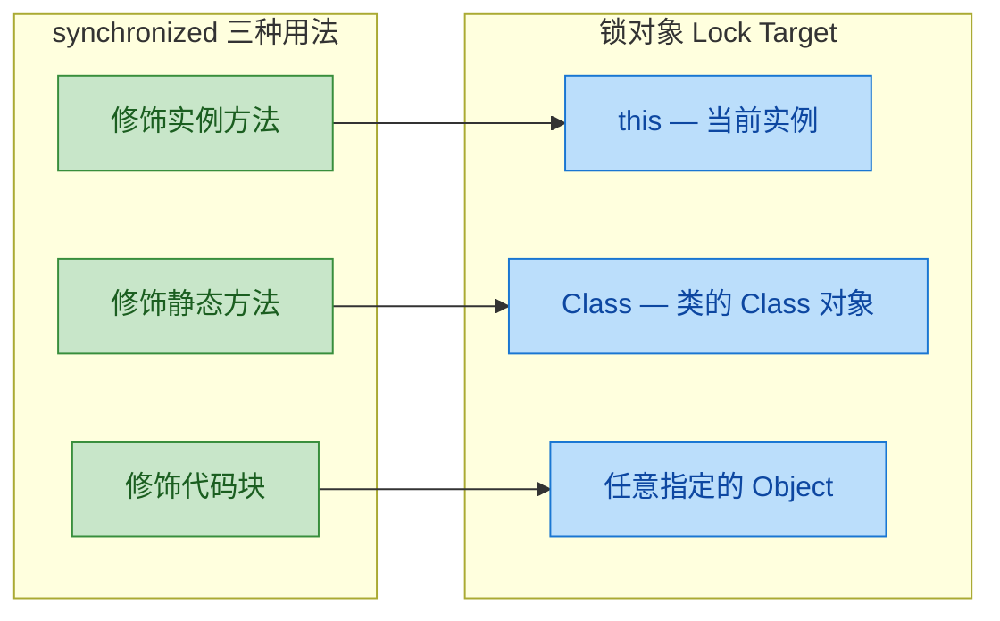

三种写法的本质区别只在于 **锁对象不同**，而加锁、释放锁的底层机制完全一致（都是 Monitor，后续章节会深入）。下面逐一展开。

---

### 修饰实例方法（锁 this）

当 `synchronized` 直接修饰一个非静态方法时，锁对象就是调用该方法的 **当前实例（this）**。这意味着：同一个对象的多个 synchronized 实例方法之间是互斥的，但不同对象之间互不影响。

```java
public class Counter {

    // 共享变量
    private int count = 0;

    // synchronized 修饰实例方法，锁对象 = this（即调用该方法的 Counter 实例）
    public synchronized void increment() {
        // 进入方法时，JVM 自动对 this 执行 monitorenter
        count++;  // 临界区：同一时刻只有持有 this 锁的线程能执行
        // 方法返回时，JVM 自动对 this 执行 monitorexit
    }

    // 同一个实例的另一个 synchronized 方法，锁对象也是 this
    // 因此与 increment() 互斥 —— 线程 A 在执行 increment() 时，线程 B 无法进入 getCount()
    public synchronized int getCount() {
        return count;  // 读操作同样被保护，保证可见性
    }
}
```

理解"锁 this"最关键的一点是：**锁的粒度绑定在实例上**。我们来看一个经典的对比场景：

```java
public class LockThisDemo {

    public static void main(String[] args) {
        // ========== 场景一：同一个对象 —— 互斥 ==========
        Counter sameCounter = new Counter();

        // 线程 A 和线程 B 操作的是同一个 sameCounter 实例
        // 它们竞争的是同一把锁（sameCounter 对象的 Monitor）
        Thread t1 = new Thread(() -> {
            for (int i = 0; i < 10000; i++) {
                sameCounter.increment();  // 锁对象 = sameCounter
            }
        });

        Thread t2 = new Thread(() -> {
            for (int i = 0; i < 10000; i++) {
                sameCounter.increment();  // 锁对象 = sameCounter（同一把锁，互斥）
            }
        });

        t1.start();
        t2.start();

        // 最终结果一定是 20000 —— 线程安全

        // ========== 场景二：不同对象 —— 不互斥 ==========
        Counter counterA = new Counter();  // 实例 A
        Counter counterB = new Counter();  // 实例 B

        // 线程 A 锁的是 counterA，线程 B 锁的是 counterB
        // 两把不同的锁，完全不互斥
        Thread t3 = new Thread(() -> counterA.increment());  // 锁对象 = counterA
        Thread t4 = new Thread(() -> counterB.increment());  // 锁对象 = counterB
        // t3 和 t4 可以同时执行，互不阻塞
    }
}
```

用一张内存视角的图来直观感受"同一把锁 vs 不同锁"：

```java
// 场景一：同一实例 —— 同一把锁
//
//  Thread-A ──┐
//             ├──▶ [ sameCounter 对象 ] ──▶ Monitor(锁)
//  Thread-B ──┘         ↑
//                    竞争同一把锁，互斥
//
//
// 场景二：不同实例 —— 不同锁
//
//  Thread-A ────▶ [ counterA 对象 ] ──▶ Monitor-A(锁)
//
//  Thread-B ────▶ [ counterB 对象 ] ──▶ Monitor-B(锁)
//                    各自有各自的锁，互不干扰
```

一个常见的面试陷阱就藏在这里：如果你在 Spring 中给一个 `@Service` Bean 的方法加了 `synchronized`，由于 Spring 默认是单例（Singleton），所以所有请求线程拿到的是同一个实例，`synchronized` 确实能起到互斥效果。但如果 Bean 的 scope 是 `prototype`（每次注入都创建新实例），那 `synchronized` 就形同虚设了——每个线程锁的是不同对象。

---

### 修饰静态方法（锁 Class）

当 `synchronized` 修饰一个 **静态方法（static method）** 时，由于静态方法不属于任何实例，而是属于类本身，所以锁对象变成了该类的 **Class 对象**。在整个 JVM 中，每个类的 Class 对象只有一份，因此这把锁是 **全局唯一** 的，与实例无关。

```java
public class GlobalCounter {

    // 静态共享变量
    private static int count = 0;

    // synchronized 修饰静态方法
    // 锁对象 = GlobalCounter.class（Class 对象，全局唯一）
    public static synchronized void increment() {
        // 无论通过哪个实例调用，还是直接 GlobalCounter.increment()
        // 竞争的都是同一把锁：GlobalCounter.class
        count++;
    }

    // 同样是静态 synchronized 方法，与 increment() 共享同一把 Class 锁
    public static synchronized int getCount() {
        return count;
    }
}
```

Class 锁的核心特征是：**无论创建多少个实例，锁始终只有一把**。

```java
public class LockClassDemo {

    public static void main(String[] args) {
        // 即使创建了两个不同的实例
        GlobalCounter obj1 = new GlobalCounter();
        GlobalCounter obj2 = new GlobalCounter();

        // 通过不同实例调用静态 synchronized 方法
        // 本质上锁的都是 GlobalCounter.class，所以依然互斥
        Thread t1 = new Thread(() -> obj1.increment());  // 锁 = GlobalCounter.class
        Thread t2 = new Thread(() -> obj2.increment());  // 锁 = GlobalCounter.class（同一把）

        // 直接通过类名调用也是同一把锁
        Thread t3 = new Thread(() -> GlobalCounter.increment());  // 锁 = GlobalCounter.class

        // t1, t2, t3 三者互斥，同一时刻只有一个能执行
    }
}
```

这里有一个非常重要的细节需要特别注意：**实例锁和 Class 锁是两把完全独立的锁，它们之间不互斥。**

```java
public class MixedLockDemo {

    private int instanceVar = 0;
    private static int staticVar = 0;

    // 实例方法 —— 锁 this
    public synchronized void instanceMethod() {
        instanceVar++;
        // 持有的是 this 对象的 Monitor
    }

    // 静态方法 —— 锁 Class
    public static synchronized void staticMethod() {
        staticVar++;
        // 持有的是 MixedLockDemo.class 的 Monitor
    }

    public static void main(String[] args) {
        MixedLockDemo obj = new MixedLockDemo();

        // 线程 A 调用实例方法，拿的是 obj 的锁
        Thread t1 = new Thread(() -> obj.instanceMethod());

        // 线程 B 调用静态方法，拿的是 MixedLockDemo.class 的锁
        Thread t2 = new Thread(() -> MixedLockDemo.staticMethod());

        // t1 和 t2 可以同时执行！因为它们锁的是不同对象
        // this 锁 ≠ Class 锁
        t1.start();
        t2.start();
    }
}
```

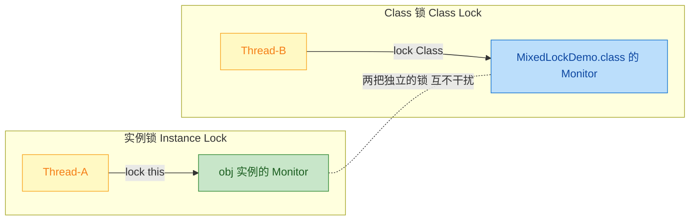

实际开发中，静态 synchronized 方法常用于保护 **静态共享资源**，比如单例模式中的 `getInstance()` 方法、全局计数器、全局缓存的写入操作等。但要注意，Class 锁的粒度非常粗——整个类只有一把锁，高并发场景下容易成为性能瓶颈。

---

### 修饰代码块（锁指定对象）

这是 `synchronized` 最灵活的用法。你可以自由指定锁对象，并且只对真正需要同步的代码加锁，从而实现 **更细粒度的并发控制**。

语法结构：

```java
synchronized (lockObject) {
    // 临界区代码
    // 只有获取到 lockObject 的 Monitor 的线程才能进入
}
```

`lockObject` 可以是任意非 null 的 Java 对象。常见的选择有三种：

```java
public class SyncBlockDemo {

    // 专用锁对象 —— 推荐做法
    // 使用 final 防止锁对象引用被修改（如果引用变了，线程锁的就不是同一个对象了）
    private final Object lock = new Object();

    private int count = 0;
    private String name = "";

    // ========== 用法一：锁 this ==========
    // 等价于 synchronized 修饰实例方法
    public void incrementV1() {
        synchronized (this) {
            // 锁对象 = this，与 synchronized 实例方法效果完全相同
            count++;
        }
    }

    // ========== 用法二：锁 Class 对象 ==========
    // 等价于 synchronized 修饰静态方法
    public void incrementV2() {
        synchronized (SyncBlockDemo.class) {
            // 锁对象 = SyncBlockDemo.class，全局唯一
            count++;
        }
    }

    // ========== 用法三：锁自定义对象（推荐）==========
    public void incrementV3() {
        synchronized (lock) {
            // 锁对象 = lock，一个专门用于同步的私有对象
            count++;
        }
    }
}
```

代码块方式最大的优势在于：**可以缩小同步范围，减少锁的持有时间**。这在实际工程中至关重要——锁持有时间越短，其他线程等待的时间就越短，吞吐量就越高。

来看一个对比：

```java
public class FineGrainedLockDemo {

    private final Object lock = new Object();
    private int count = 0;

    // ❌ 粗粒度：整个方法都被锁住
    // 假设 someHeavyComputation() 耗时 500ms 且不涉及共享变量
    // 其他线程必须白白等待这 500ms
    public synchronized void coarseGrained() {
        someHeavyComputation();  // 不需要同步的耗时操作
        count++;                 // 真正需要同步的只有这一行
        someHeavyComputation();  // 又一个不需要同步的耗时操作
    }

    // ✅ 细粒度：只锁必要的部分
    // 其他线程只需要等待 count++ 的极短时间
    public void fineGrained() {
        someHeavyComputation();  // 不加锁，多线程可以并行执行
        synchronized (lock) {
            count++;             // 只对临界区加锁
        }
        someHeavyComputation();  // 不加锁，多线程可以并行执行
    }

    private void someHeavyComputation() {
        // 模拟耗时操作（如网络IO、复杂计算等）
    }
}
```

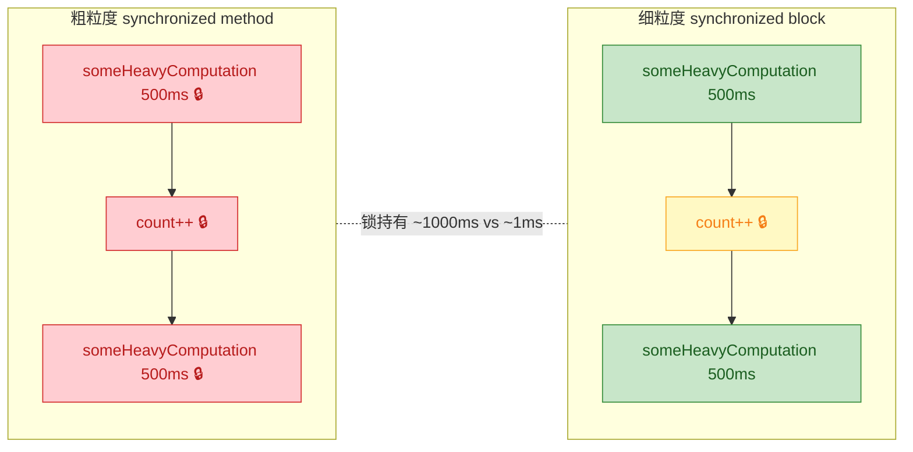

另一个代码块方式的经典应用场景是 **多把锁保护不同资源**，实现更高的并发度：

```java
public class MultiLockDemo {

    // 两个独立的锁对象，分别保护不同的共享资源
    private final Object balanceLock = new Object();  // 保护余额
    private final Object orderLock = new Object();    // 保护订单

    private double balance = 0.0;
    private int orderCount = 0;

    // 操作余额时，只锁 balanceLock
    public void updateBalance(double amount) {
        synchronized (balanceLock) {
            // 线程操作余额时，不影响其他线程操作订单
            balance += amount;
        }
    }

    // 操作订单时，只锁 orderLock
    public void addOrder() {
        synchronized (orderLock) {
            // 线程操作订单时，不影响其他线程操作余额
            orderCount++;
        }
    }

    // 如果用 synchronized 修饰方法（锁 this），两个操作就会互斥
    // 明明操作的是不同资源，却要排队等待 —— 不必要的性能损失
}
```

```java
// 多锁并发模型：
//
//  Thread-A ──▶ synchronized(balanceLock) ──▶ 操作 balance
//                                                              ← 互不干扰，可并行
//  Thread-B ──▶ synchronized(orderLock)   ──▶ 操作 orderCount
//
//
// 如果都用 synchronized 方法（锁 this）：
//
//  Thread-A ──▶ synchronized(this) ──▶ 操作 balance
//                    ↑ 同一把锁，必须排队
//  Thread-B ──▶ synchronized(this) ──▶ 操作 orderCount（被阻塞）
```

最后，关于锁对象的选择，有几条实践中总结出的最佳实践：

```java
public class LockObjectBestPractice {

    // ✅ 推荐：使用 private final 的专用锁对象
    // private：外部无法获取锁对象，避免外部代码意外地对同一个对象加锁导致死锁
    // final：防止锁对象引用被重新赋值（一旦引用变了，线程就不再竞争同一把锁）
    private final Object lock = new Object();

    // ❌ 不推荐：锁 this —— 因为 this 引用是公开的，外部可以 synchronized(yourObj)
    // 这会导致你无法控制谁在跟你竞争同一把锁

    // ❌ 危险：锁 String 常量
    private final String strLock = "LOCK";
    // 由于字符串常量池（String Pool），不同类中值相同的字符串字面量
    // 实际上是同一个对象，可能导致毫不相关的代码互相阻塞

    // ❌ 危险：锁 Integer 等包装类型
    private final Integer intLock = 127;
    // Integer 在 -128~127 范围内有缓存（IntegerCache）
    // 不同地方的 Integer.valueOf(127) 返回的是同一个对象

    // ❌ 危险：锁 Boolean
    private final Boolean boolLock = true;
    // Boolean 只有 TRUE 和 FALSE 两个缓存实例
    // 整个 JVM 中所有 Boolean.TRUE 都是同一个对象
}
```

---

**📝 练习题**

以下代码中，线程 t1 和 t2 能否同时执行？

```java
public class Quiz {
    public synchronized void methodA() {
        // 执行耗时操作...
    }

    public static synchronized void methodB() {
        // 执行耗时操作...
    }

    public static void main(String[] args) {
        Quiz obj = new Quiz();
        Thread t1 = new Thread(() -> obj.methodA());
        Thread t2 = new Thread(() -> Quiz.methodB());
        t1.start();
        t2.start();
    }
}
```

A. 不能同时执行，因为都是 synchronized 方法，会互斥


B. 能同时执行，因为 methodA 锁的是 obj 实例，methodB 锁的是 Quiz.class，是两把不同的锁


C. 不能同时执行，因为 obj 是 Quiz 类的实例，实例锁和类锁本质相同


D. 能否同时执行取决于 JVM 实现，行为未定义


**【答案】** B

**【解析】** `methodA()` 是实例方法，锁对象是 `this`（即 `obj`）；`methodB()` 是静态方法，锁对象是 `Quiz.class`。这是两个完全独立的 Monitor，彼此之间不存在竞争关系，因此 t1 和 t2 可以同时执行。这也是本节反复强调的核心要点：**实例锁和 Class 锁是两把不同的锁，互不干扰**。在实际开发中，如果你需要让实例方法和静态方法互斥，必须显式地让它们锁同一个对象，例如都使用 `synchronized(Quiz.class)` 代码块。

---

## synchronized 特性

`synchronized` 除了提供互斥访问（Mutual Exclusion）的基本能力外，还具备两个非常重要的运行时特性：**可重入性（Reentrancy）** 和 **不可中断性（Non-interruptible）**。理解这两个特性，是正确使用 `synchronized` 以及在面试中精准作答的关键。

---

### 可重入性

#### 什么是可重入（Reentrant）

可重入性的含义是：**同一个线程**在已经持有某把锁的情况下，可以**再次获取同一把锁**而不会被自己阻塞。这听起来像是一个理所当然的设计，但如果锁不支持可重入，后果将非常严重——线程会在尝试第二次获取自己已持有的锁时，陷入**死锁（Deadlock）**，永远等待一个只有自己才能释放的锁。

Java 语言规范（JLS §17.1）明确规定了 `synchronized` 是可重入的。JVM 内部通过一个**计数器（recursion counter）** 来实现这一机制：

- 线程第一次获取锁时，计数器从 0 变为 1，同时记录持有者线程（Owner）。
- 同一线程每重入一次，计数器 +1。
- 每退出一个 `synchronized` 块/方法，计数器 -1。
- 当计数器归零时，锁才真正释放，其他线程才有机会竞争。

用一张流程图来直观理解这个过程：

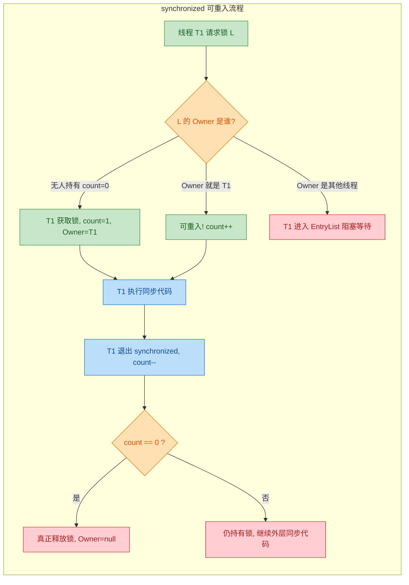

#### 可重入的典型场景

可重入性在日常开发中无处不在，最常见的场景有三种：

**场景一：同步方法调用另一个同步方法（同一个锁对象）**

这是最直观的场景。一个对象的 `synchronized` 方法内部调用了自身的另一个 `synchronized` 方法，两者锁的都是 `this`。如果不可重入，第二次调用将死锁。

```java
public class ReentrantDemo {

    // 第一个同步方法，锁对象是 this
    public synchronized void methodA() {
        System.out.println(Thread.currentThread().getName() + " 进入 methodA");
        // 在持有 this 锁的情况下，调用同样需要 this 锁的 methodB
        // 如果 synchronized 不可重入，这里将永远阻塞 —— 死锁！
        methodB();
    }

    // 第二个同步方法，锁对象同样是 this
    public synchronized void methodB() {
        System.out.println(Thread.currentThread().getName() + " 进入 methodB");
    }

    public static void main(String[] args) {
        ReentrantDemo demo = new ReentrantDemo();
        // 启动一个线程调用 methodA
        new Thread(demo::methodA, "Thread-1").start();
    }
}
```

```
Thread-1 进入 methodA
Thread-1 进入 methodB
```

执行过程中锁计数器的变化：

```java
// 时间线：
// T1 -> methodA()  : 获取 this 锁, count = 1
//   T1 -> methodB(): 重入 this 锁, count = 2
//   T1 <- methodB(): 退出, count = 1
// T1 <- methodA()  : 退出, count = 0, 锁真正释放
```

**场景二：子类同步方法调用父类同步方法**

可重入性跨越了继承层级。子类重写的 `synchronized` 方法中通过 `super` 调用父类的 `synchronized` 方法，锁对象仍然是同一个 `this`（因为子类实例和父类部分共享同一个对象引用），所以这也是一次重入。

```java
public class ParentClass {

    // 父类同步方法，锁对象是 this（即调用者实例）
    public synchronized void doSomething() {
        System.out.println("ParentClass.doSomething() - " 
            + Thread.currentThread().getName());
    }
}

public class ChildClass extends ParentClass {

    // 子类重写的同步方法，锁对象同样是 this
    @Override
    public synchronized void doSomething() {
        System.out.println("ChildClass.doSomething() - " 
            + Thread.currentThread().getName());
        // 调用父类的同步方法
        // this 是同一个对象，所以这是一次锁重入
        super.doSomething();
    }

    public static void main(String[] args) {
        ChildClass child = new ChildClass();
        // child 这个实例就是 this，贯穿子类和父类方法
        new Thread(child::doSomething, "Thread-1").start();
    }
}
```

```
ChildClass.doSomething() - Thread-1
ParentClass.doSomething() - Thread-1
```

如果 `synchronized` 不可重入，`super.doSomething()` 将尝试获取已被当前线程持有的 `this` 锁，直接死锁。这意味着在不可重入的假设下，**继承体系中几乎无法安全地使用 `synchronized`**，这对面向对象编程将是灾难性的。

**场景三：递归调用同步方法**

递归是可重入性的极端测试。每一层递归都会重入同一把锁，计数器不断累加，直到递归返回时逐层递减。

```java
public class RecursiveSync {

    private int count = 0; // 业务计数器

    // 递归同步方法，每次递归都重入 this 锁
    public synchronized void recursiveCall(int depth) {
        // 递归终止条件
        if (depth <= 0) {
            System.out.println("递归到底，count = " + count);
            return;
        }
        count++;                        // 修改共享状态
        System.out.println("depth=" + depth + ", count=" + count);
        recursiveCall(depth - 1);       // 递归调用，再次重入 this 锁
    }

    public static void main(String[] args) {
        RecursiveSync obj = new RecursiveSync();
        new Thread(() -> obj.recursiveCall(3), "T1").start();
    }
}
```

```
depth=3, count=1
depth=2, count=2
depth=1, count=3
递归到底，count = 3
```

此时锁计数器的峰值为 4（初始进入 1 + 三次递归重入 3），随后逐层返回递减至 0。

#### 可重入的底层实现原理

在 HotSpot JVM 中，每个对象都关联一个 Monitor（监视器），Monitor 内部维护了两个关键字段：

- `_owner`：记录当前持有锁的线程指针。
- `_recursions`：记录重入次数（即上文所说的计数器）。

```java
// HotSpot ObjectMonitor 简化伪代码 (C++)
// 源码位置: src/hotspot/share/runtime/objectMonitor.hpp

class ObjectMonitor {
    Thread* _owner;       // 当前持有锁的线程
    int     _recursions;  // 重入计数器
    // ... 省略 EntryList, WaitSet 等字段
}

// 加锁逻辑 (简化)
void ObjectMonitor::enter(Thread* current) {
    if (_owner == NULL) {
        // 锁空闲，直接获取
        _owner = current;       // 设置持有者
        _recursions = 1;        // 计数器置 1
    } else if (_owner == current) {
        // 同一线程再次进入 —— 可重入
        _recursions++;          // 计数器 +1，不阻塞
    } else {
        // 其他线程持有，当前线程进入 EntryList 阻塞
        enqueue_to_entry_list(current);
        block(current);
    }
}

// 解锁逻辑 (简化)
void ObjectMonitor::exit(Thread* current) {
    _recursions--;              // 计数器 -1
    if (_recursions == 0) {
        _owner = NULL;          // 计数器归零，真正释放锁
        wake_up_next_thread();  // 唤醒 EntryList 中等待的线程
    }
    // 如果 _recursions > 0，说明还在外层同步块中，不释放
}
```

这段伪代码清晰地展示了：可重入的本质就是 **"认主人"**——锁会检查请求者是否就是当前的 Owner，如果是，只增加计数器，不做任何阻塞操作。

#### 可重入 vs 不可重入：对比总结

| 维度 | 可重入锁 (Reentrant) | 不可重入锁 (Non-reentrant) |
|------|----------------------|---------------------------|
| 同线程再次获取 | 允许，计数器 +1 | 阻塞，导致死锁 |
| 继承体系 | 安全调用 `super` | 几乎无法使用 |
| 递归同步 | 天然支持 | 完全不可用 |
| Java 中的代表 | `synchronized`, `ReentrantLock` | 需自行实现（极少见） |
| 实现复杂度 | 需要 Owner 记录 + 计数器 | 仅需一个标志位 |

---

### 不可中断

#### 什么是不可中断（Non-interruptible）

`synchronized` 的第二个重要特性是**不可中断**：当一个线程正在**阻塞等待获取** `synchronized` 锁时，其他线程对它调用 `Thread.interrupt()` **不会**使其从等待中醒来，该线程会继续阻塞，直到成功获取锁为止。

这里需要非常精确地区分两个概念：

- **阻塞等待锁（BLOCKED 状态）**：线程试图进入 `synchronized` 块但锁被其他线程持有，线程进入 `BLOCKED` 状态。此状态下 `interrupt()` **无效**，线程不会抛出 `InterruptedException`，只是默默设置中断标志位。
- **调用 `wait()` 等待通知（WAITING 状态）**：线程已经持有锁，主动调用 `wait()` 释放锁并等待。此状态下 `interrupt()` **有效**，会抛出 `InterruptedException`。

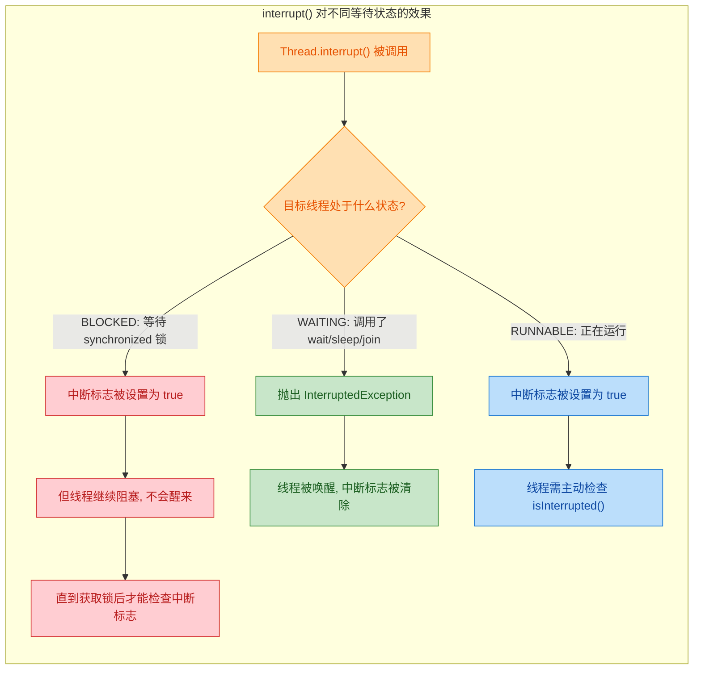

#### 代码验证：synchronized 等待锁时不响应中断

下面这个例子直观地证明了 `synchronized` 的不可中断特性：

```java
public class SynchronizedNonInterruptible {

    // 共享锁对象
    private static final Object lock = new Object();

    public static void main(String[] args) throws InterruptedException {

        // 线程 A：先获取锁，然后长时间持有不释放
        Thread threadA = new Thread(() -> {
            synchronized (lock) {
                System.out.println("线程 A 已获取锁，将持有 10 秒...");
                try {
                    Thread.sleep(10_000);  // 模拟长时间持有锁
                } catch (InterruptedException e) {
                    // sleep 可以响应中断，但这里中断的是 A 自己
                    e.printStackTrace();
                }
            }
        }, "Thread-A");

        // 线程 B：尝试获取同一把锁，会被阻塞
        Thread threadB = new Thread(() -> {
            System.out.println("线程 B 尝试获取锁...");

            // 关键点：线程 B 在这里进入 BLOCKED 状态
            // 即使被 interrupt()，也不会从这里醒来
            synchronized (lock) {
                // 只有成功获取锁后，才会执行到这里
                System.out.println("线程 B 终于获取到锁！");
                // 此时检查中断标志，发现已经被设置为 true
                System.out.println("线程 B 的中断标志: " 
                    + Thread.currentThread().isInterrupted());
            }
        }, "Thread-B");

        threadA.start();
        Thread.sleep(500);  // 确保 A 先拿到锁

        threadB.start();
        Thread.sleep(500);  // 确保 B 已经开始等待锁

        // 打印 B 的状态：应该是 BLOCKED
        System.out.println("线程 B 的状态: " + threadB.getState());

        // 尝试中断线程 B
        System.out.println("主线程对线程 B 调用 interrupt()...");
        threadB.interrupt();

        // 中断后再看 B 的状态：仍然是 BLOCKED！
        Thread.sleep(500);
        System.out.println("中断后，线程 B 的状态: " + threadB.getState());
        System.out.println("线程 B 仍在阻塞等待锁，interrupt() 没有任何效果！");
    }
}
```

```
线程 A 已获取锁，将持有 10 秒...
线程 B 尝试获取锁...
线程 B 的状态: BLOCKED
主线程对线程 B 调用 interrupt()...
中断后，线程 B 的状态: BLOCKED
线程 B 仍在阻塞等待锁，interrupt() 没有任何效果！
// ... 等待约 10 秒后 ...
线程 B 终于获取到锁！
线程 B 的中断标志: true
```

输出结果清楚地表明：`interrupt()` 被调用后，线程 B 的状态仍然是 `BLOCKED`，它没有被唤醒，没有抛出异常，只是中断标志被静默地设置为 `true`。直到线程 A 释放锁、线程 B 成功获取锁之后，才能通过 `isInterrupted()` 检查到这个标志。

#### 为什么这是一个问题

不可中断意味着：如果一个线程在等待一把永远不会被释放的锁（比如持有锁的线程发生了死循环或死锁），那么等待的线程将**永远无法被取消**，即使你调用了 `interrupt()`。这在需要超时控制、任务取消等场景下是一个严重的局限性。

典型的问题场景包括：

1. **死锁恢复**：两个线程互相等待对方的锁，形成死锁。你无法通过 `interrupt()` 打破僵局。
2. **超时控制**：你希望"尝试获取锁，如果 3 秒内拿不到就放弃"，`synchronized` 无法实现。
3. **优雅关闭**：应用关闭时需要取消所有等待中的线程，但 `BLOCKED` 状态的线程不响应中断。

#### ReentrantLock 的可中断替代方案

`java.util.concurrent.locks.ReentrantLock` 提供了 `lockInterruptibly()` 方法，专门解决这个问题。它允许线程在等待锁的过程中响应中断：

```java
import java.util.concurrent.locks.ReentrantLock;

public class InterruptibleLockDemo {

    // 使用 ReentrantLock 替代 synchronized
    private static final ReentrantLock lock = new ReentrantLock();

    public static void main(String[] args) throws InterruptedException {

        // 线程 A：获取锁并长时间持有
        Thread threadA = new Thread(() -> {
            lock.lock();  // 获取锁
            try {
                System.out.println("线程 A 已获取锁，将持有 10 秒...");
                Thread.sleep(10_000);
            } catch (InterruptedException e) {
                e.printStackTrace();
            } finally {
                lock.unlock();  // 必须在 finally 中释放锁
            }
        }, "Thread-A");

        // 线程 B：使用 lockInterruptibly() 可中断地等待锁
        Thread threadB = new Thread(() -> {
            System.out.println("线程 B 尝试可中断地获取锁...");
            try {
                // 关键区别：lockInterruptibly() 在等待时可以响应中断
                lock.lockInterruptibly();
                try {
                    System.out.println("线程 B 获取到锁");
                } finally {
                    lock.unlock();
                }
            } catch (InterruptedException e) {
                // 等待锁的过程中被中断，会抛出此异常
                System.out.println("线程 B 在等待锁时被中断，已放弃获取锁！");
            }
        }, "Thread-B");

        threadA.start();
        Thread.sleep(500);

        threadB.start();
        Thread.sleep(500);

        // 中断线程 B —— 这次会生效！
        System.out.println("主线程对线程 B 调用 interrupt()...");
        threadB.interrupt();
    }
}
```

```
线程 A 已获取锁，将持有 10 秒...
线程 B 尝试可中断地获取锁...
主线程对线程 B 调用 interrupt()...
线程 B 在等待锁时被中断，已放弃获取锁！
```

线程 B 在等待锁的过程中成功响应了中断，抛出了 `InterruptedException`，从而可以执行清理逻辑并退出。

#### synchronized vs ReentrantLock 中断行为对比

| 维度 | synchronized | ReentrantLock |
|------|-------------|---------------|
| 等待锁时响应中断 | 不响应，继续 BLOCKED | `lockInterruptibly()` 可响应 |
| 超时获取锁 | 不支持 | `tryLock(timeout, unit)` 支持 |
| 中断后的行为 | 仅设置中断标志位 | 抛出 `InterruptedException` |
| 死锁恢复能力 | 无 | 可通过中断打破 |
| 使用复杂度 | 低（JVM 自动管理） | 较高（需手动 lock/unlock） |

需要强调的是，`synchronized` 的不可中断并不是一个"缺陷"，而是一种**设计权衡（design trade-off）**。它换来的是更简单的使用方式和 JVM 层面的深度优化（如偏向锁、轻量级锁等）。在大多数业务场景中，`synchronized` 的简洁性和性能已经足够。只有在确实需要中断响应、超时控制等高级特性时，才需要切换到 `ReentrantLock`。

---

**📝 练习题**

以下代码中，线程 T2 在等待 `synchronized` 锁时被调用了 `interrupt()`，请问程序的运行结果是什么？

```java
Object lock = new Object();

Thread t1 = new Thread(() -> {
    synchronized (lock) {
        try { Thread.sleep(5000); } catch (InterruptedException e) {}
    }
});

Thread t2 = new Thread(() -> {
    synchronized (lock) {
        System.out.println("T2 中断标志: " + Thread.currentThread().isInterrupted());
    }
});

t1.start();
Thread.sleep(200);
t2.start();
Thread.sleep(200);
t2.interrupt();
```

A. 程序立即打印 `T2 中断标志: true`，T2 退出等待


B. 程序抛出 `InterruptedException`，T2 被唤醒


C. 约 5 秒后打印 `T2 中断标志: true`


D. 约 5 秒后打印 `T2 中断标志: false`

**【答案】** C

**【解析】** `synchronized` 的不可中断特性决定了 T2 在 `BLOCKED` 状态下不会响应 `interrupt()` 调用。`interrupt()` 只是将 T2 的中断标志设置为 `true`，T2 继续阻塞等待。约 5 秒后 T1 的 `sleep` 结束、释放锁，T2 才获取到锁并执行 `println`。此时检查 `isInterrupted()` 返回 `true`，因为中断标志在 `BLOCKED` 状态下被设置后不会被自动清除（只有 `sleep`/`wait`/`join` 抛出 `InterruptedException` 时才会清除）。选项 A 和 B 错误是因为 `synchronized` 等待锁时根本不响应中断；选项 D 错误是因为中断标志不会被自动清除。

---

## Monitor 机制 ⭐⭐

`synchronized` 之所以能实现互斥与同步，并非 Java 语言层面的"魔法"，而是因为它背后有一套严谨的底层支撑体系——**Monitor（监视器/管程）**。理解 Monitor，就等于理解了 `synchronized` 的灵魂。本节将从操作系统理论出发，一路深入到 HotSpot 虚拟机的 C++ 实现，彻底拆解这套机制。

---

### 管程概念

#### 从操作系统说起：为什么需要管程？

在并发编程的早期，人们使用**信号量（Semaphore）**来协调线程。信号量虽然强大，但它要求程序员手动配对 `P()`/`V()` 操作（即 `wait()`/`signal()`），一旦顺序写错、遗漏配对，就会导致死锁或数据竞争，且极难排查。

为了解决这个问题，1974 年，Tony Hoare 和 Per Brinch Hansen 几乎同时提出了 **Monitor（管程）** 的概念。管程的核心思想非常优雅：

> **将共享数据和对共享数据的操作封装在一起，由管程自身来保证同一时刻只有一个线程能进入管程执行操作。**

你可以把管程想象成一个**只有一把钥匙的房间**：房间里放着共享资源，任何人想操作资源都必须先拿到钥匙进入房间，操作完毕后归还钥匙。这样，互斥就从"程序员手动控制"变成了"语言/运行时自动保证"。

#### 管程的三大核心要素

管程在理论上由三部分组成：

1. **共享变量（Shared Variables）**：被保护的数据，比如一个计数器、一个队列。
2. **入口过程（Entry Procedures）**：操作共享变量的方法，同一时刻只允许一个线程执行。
3. **条件变量（Condition Variables）**：当线程发现条件不满足时（比如队列为空，无法消费），可以在条件变量上等待；当其他线程改变了条件（比如往队列里放了元素），可以通过条件变量唤醒等待的线程。

用伪代码来表达管程的结构：

```java
// 管程的伪代码模型
monitor BoundedBuffer {
    // ---- 共享变量 ----
    Object[] buffer = new Object[N];  // 有界缓冲区
    int count = 0;                     // 当前元素数量

    // ---- 条件变量 ----
    condition notFull;   // 缓冲区未满的条件
    condition notEmpty;  // 缓冲区非空的条件

    // ---- 入口过程（同一时刻只有一个线程能执行）----
    void put(Object item) {
        while (count == N)        // 如果缓冲区满了
            wait(notFull);        // 在 notFull 条件上等待
        buffer[count++] = item;   // 放入元素
        signal(notEmpty);         // 通知：缓冲区非空了
    }

    Object take() {
        while (count == 0)        // 如果缓冲区空了
            wait(notEmpty);       // 在 notEmpty 条件上等待
        Object item = buffer[--count]; // 取出元素
        signal(notFull);          // 通知：缓冲区未满了
        return item;
    }
}
```

#### Java 对管程的实现

Java 从语言层面直接内置了管程模型，这在当时是非常前卫的设计决策。Java 的实现方式是：

- **每一个 Java 对象都可以充当管程**——这就是为什么任何对象都能作为 `synchronized` 的锁。
- **`synchronized` 关键字**对应管程的"入口过程"，保证互斥。
- **`wait()` / `notify()` / `notifyAll()`** 对应管程的"条件变量"操作。

不过，Java 的管程模型做了一个简化：**每个对象只有一个隐式的条件变量**（即对象本身的 wait set）。这意味着所有调用 `wait()` 的线程都在同一个等待队列里，无法像理论管程那样区分不同的等待条件。这个限制后来被 `java.util.concurrent.locks.Condition` 弥补了——`ReentrantLock` 可以创建多个 `Condition` 对象，每个对应一个独立的等待队列。

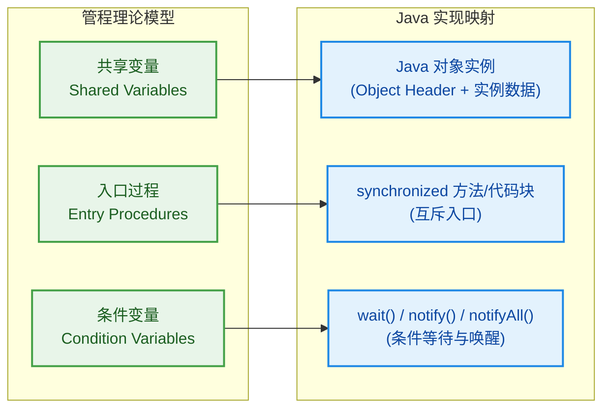

---

### ObjectMonitor 结构

理论讲完了，现在深入 HotSpot 虚拟机的实现。当一个线程试图进入 `synchronized` 块时，JVM 底层实际操作的是一个 C++ 对象——**ObjectMonitor**。

#### 从 Java 对象到 ObjectMonitor

每个 Java 对象的对象头（Object Header）中有一个 **Mark Word**，它在不同的锁状态下存储不同的信息。当锁膨胀到重量级锁时，Mark Word 中会存储一个指向 `ObjectMonitor` 对象的指针。

```java
// Mark Word 在 64 位 JVM 中的布局（重量级锁状态）
// |---------------------------------------------------------------|-------|
// |                 指向 ObjectMonitor 的指针 (62 bits)              | 10   |
// |---------------------------------------------------------------|-------|
//                                                            锁标志位 = 10 表示重量级锁
```

#### ObjectMonitor 的核心字段

在 HotSpot 源码（`objectMonitor.hpp`）中，`ObjectMonitor` 的关键字段如下：

```java
// ObjectMonitor 核心结构（简化自 HotSpot C++ 源码）
// 路径: src/hotspot/share/runtime/objectMonitor.hpp
ObjectMonitor {
    _header;       // Mark Word 的备份，锁释放时需要还原
    _object;       // 指向持有该 Monitor 的 Java 对象
    _owner;        // 当前持有锁的线程（Owner）
    _recursions;   // 重入计数器，同一线程每重入一次 +1
    _count;        // 记录曾经等待过的线程总数（统计用）
    _WaitSet;      // 调用了 wait() 的线程集合（双向链表）
    _EntryList;    // 等待获取锁的线程集合（双向链表）
    _cxq;          // 竞争队列（Contention Queue），新来的竞争者先到这里
    _succ;         // 假定继承者（Heir Presumptive），优化唤醒用
}
```

这些字段共同构成了一个完整的线程调度微系统。下面这张图展示了它们之间的关系：

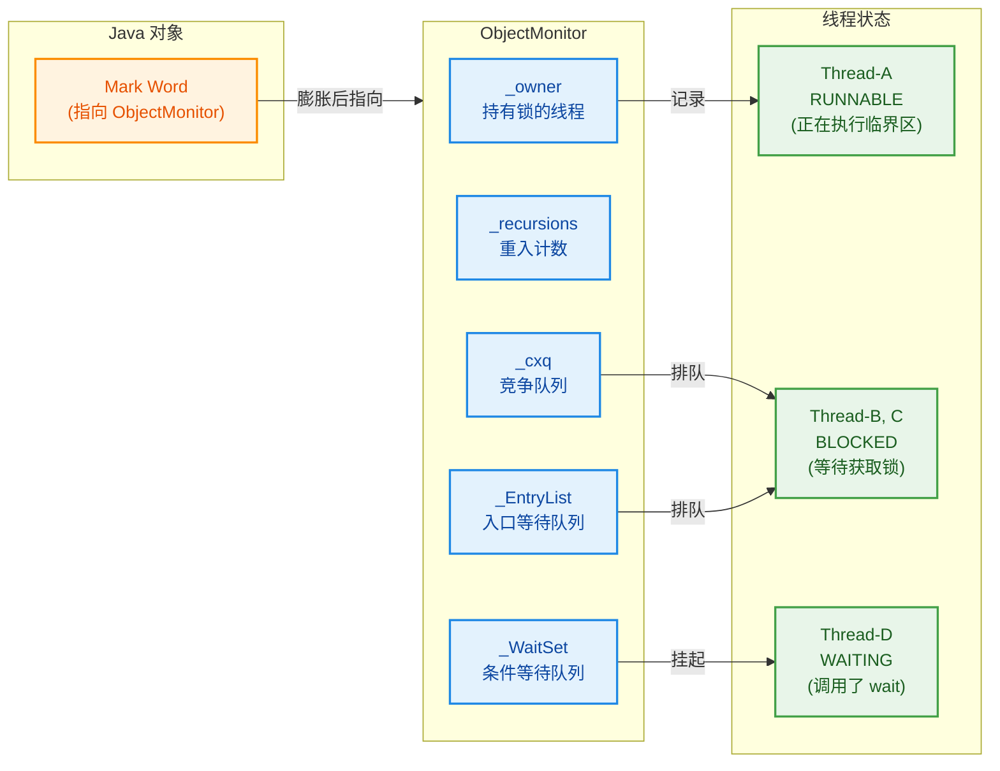

#### _cxq 与 _EntryList 的分工

你可能注意到有两个"等待锁"的队列：`_cxq` 和 `_EntryList`。为什么需要两个？这是 HotSpot 的一个精妙的性能优化：

- **`_cxq`（Contention Queue）**：当一个新线程尝试获取锁失败时，它首先被放入 `_cxq`。这个队列使用 **CAS（Compare-And-Swap）** 操作进行无锁入队，因此多个线程可以高效并发地加入，不需要额外的锁保护。`_cxq` 是一个 **LIFO（后进先出）** 的栈结构。

- **`_EntryList`**：当持有锁的线程释放锁时，它会将 `_cxq` 中的线程批量转移到 `_EntryList`，然后从 `_EntryList` 中选择一个线程唤醒。`_EntryList` 是一个更稳定的双向链表，便于选择和管理。

这种两级队列设计的好处是：**入队操作（高并发）和出队操作（锁释放时）被解耦了**，减少了竞争热点。

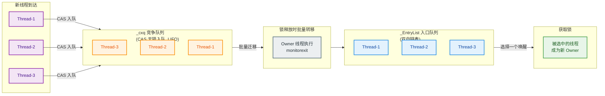

---

### EntryList（等待获取锁的线程）

`_EntryList` 是 ObjectMonitor 中存放**因竞争锁失败而被阻塞的线程**的核心队列。处于 `_EntryList` 中的线程，其 Java 线程状态为 `BLOCKED`。

#### 线程进入 EntryList 的完整流程

当一个线程执行到 `synchronized` 块，尝试获取锁时，会经历以下步骤：

```java
// 线程尝试获取 Monitor 的伪代码流程
void enter(ObjectMonitor monitor) {
    // 第一步：尝试通过 CAS 将 _owner 从 null 设为当前线程
    if (CAS(&monitor._owner, null, currentThread)) {
        // CAS 成功，直接获取锁，进入临界区
        return;
    }

    // 第二步：CAS 失败，说明锁已被占用
    // 先进行一轮自旋（Adaptive Spinning），尝试避免阻塞
    for (int i = 0; i < spinCount; i++) {
        if (CAS(&monitor._owner, null, currentThread)) {
            return;  // 自旋期间锁被释放了，幸运地获取到
        }
    }

    // 第三步：自旋失败，将当前线程封装为 ObjectWaiter 节点
    ObjectWaiter node = new ObjectWaiter(currentThread);

    // 第四步：通过 CAS 将节点插入 _cxq 队列头部
    do {
        node.next = monitor._cxq;
    } while (!CAS(&monitor._cxq, node.next, node));

    // 第五步：调用 park() 挂起当前线程（进入 BLOCKED 状态）
    // 线程在此处阻塞，直到被 unpark() 唤醒
    park(currentThread);

    // 被唤醒后，重新尝试获取锁...
}
```

#### EntryList 的唤醒策略

当 Owner 线程释放锁时，它需要决定唤醒哪个线程。HotSpot 提供了多种策略（通过 `Knob_QMode` 参数控制）：

| QMode 值 | 策略描述 | 特点 |
|-----------|----------|------|
| 0（默认） | 将 `_cxq` 整体转移到 `_EntryList` 尾部，从 `_EntryList` 头部取线程唤醒 | 平衡公平性与性能 |
| 1 | 将 `_cxq` 反转后放入 `_EntryList` 尾部 | 近似 FIFO，更公平 |
| 2 | 直接从 `_cxq` 头部取线程唤醒，不经过 `_EntryList` | 最快，但最不公平 |
| 3 | 将 `_cxq` 转移到 `_EntryList` 尾部 | 类似 0 |
| 4 | 将 `_cxq` 转移到 `_EntryList` 头部 | 优先唤醒新来的线程 |

需要特别注意的是：**被唤醒的线程并不是直接获得锁，而是获得了"竞争锁的资格"**。它醒来后仍然需要通过 CAS 去争抢 `_owner`，如果此时有新线程恰好也在尝试获取锁，被唤醒的线程可能再次失败。这就是 `synchronized` 被称为**非公平锁（Unfair Lock）**的原因——新来的线程可以"插队"。

```java
// 锁释放时的唤醒逻辑伪代码
void exit(ObjectMonitor monitor) {
    // 将 _owner 置为 null，释放锁
    monitor._owner = null;

    // 如果 _EntryList 不为空，从中取一个线程唤醒
    if (monitor._EntryList != null) {
        ObjectWaiter thread = monitor._EntryList.head;  // 取头部线程
        unpark(thread);  // 唤醒它，让它去竞争锁
        return;
    }

    // 如果 _EntryList 为空，检查 _cxq
    if (monitor._cxq != null) {
        // 将 _cxq 中的线程转移到 _EntryList
        moveToEntryList(monitor._cxq, monitor._EntryList);
        ObjectWaiter thread = monitor._EntryList.head;
        unpark(thread);  // 唤醒
    }
}
```

---

### WaitSet（调用 wait 的线程）

`_WaitSet` 是 ObjectMonitor 中一个独立于 `_EntryList` 的等待队列，专门存放**主动调用了 `Object.wait()` 方法的线程**。处于 `_WaitSet` 中的线程，其 Java 线程状态为 `WAITING` 或 `TIMED_WAITING`（如果调用的是 `wait(timeout)`）。

#### wait() 与 BLOCKED 的本质区别

这是一个非常容易混淆的知识点，必须彻底搞清楚：

| 对比维度 | EntryList 中的线程 | WaitSet 中的线程 |
|----------|-------------------|-----------------|
| 进入原因 | 竞争锁失败，被动阻塞 | 主动调用 `wait()`，自愿释放锁 |
| 线程状态 | `BLOCKED` | `WAITING` / `TIMED_WAITING` |
| 持有锁否 | 从未获得过锁（或刚被唤醒还没抢到） | 曾经持有锁，调用 `wait()` 时释放了 |
| 唤醒方式 | 锁释放时自动被考虑唤醒 | 必须由其他线程显式调用 `notify()`/`notifyAll()` |
| 唤醒后行为 | 直接竞争锁 | 先从 WaitSet 移到 EntryList，再竞争锁 |

#### wait() 的完整执行流程

```java
// Object.wait() 底层执行流程伪代码
void ObjectMonitor::wait(long timeout) {
    // 前置检查：当前线程必须是 Owner，否则抛出 IllegalMonitorStateException
    if (_owner != currentThread) {
        throw new IllegalMonitorStateException();
    }

    // 第一步：将当前线程封装为 ObjectWaiter 节点
    ObjectWaiter node = new ObjectWaiter(currentThread);

    // 第二步：将节点加入 _WaitSet（双向循环链表）
    addToWaitSet(node);

    // 第三步：释放锁（关键！）
    int savedRecursions = _recursions;  // 保存重入次数
    _recursions = 0;                    // 重入计数归零
    _owner = null;                      // 释放 Owner

    // 第四步：唤醒 _EntryList 中等待锁的线程
    // （因为锁已经释放了，应该让别人有机会获取）
    exit();

    // 第五步：挂起当前线程
    if (timeout == 0) {
        park(currentThread);            // 无限等待
    } else {
        parkWithTimeout(currentThread, timeout);  // 超时等待
    }

    // ---- 线程在此处阻塞，直到被 notify/notifyAll 唤醒 ----

    // 第六步：被唤醒后，重新竞争锁
    enter(this);  // 重新走获取锁的流程

    // 第七步：恢复重入计数
    _recursions = savedRecursions;

    // 此时线程重新成为 Owner，从 wait() 方法返回
}
```

这段流程揭示了一个重要事实：**`wait()` 会完全释放锁（包括所有重入层次），被唤醒后必须重新获取锁才能继续执行**。这就是为什么 `wait()` 必须在 `synchronized` 块内调用——因为它需要操作 Monitor 的内部状态。

#### notify() 与 notifyAll() 的区别

```java
// notify() 的底层逻辑
void ObjectMonitor::notify() {
    // 从 _WaitSet 中取出一个线程（通常是头部）
    ObjectWaiter node = dequeueFromWaitSet();
    if (node == null) return;  // WaitSet 为空，什么都不做

    // 将该线程移动到 _EntryList（或 _cxq）
    // 注意：不是直接唤醒！只是换了个队列
    addToEntryList(node);
}

// notifyAll() 的底层逻辑
void ObjectMonitor::notifyAll() {
    // 将 _WaitSet 中的所有线程逐个移动到 _EntryList
    while (_WaitSet != null) {
        ObjectWaiter node = dequeueFromWaitSet();
        addToEntryList(node);
    }
}
```

关键理解：`notify()` 并不会立即唤醒线程让它执行，而是将线程从 `_WaitSet` 转移到 `_EntryList`，让它有资格去竞争锁。真正的唤醒（`unpark`）发生在当前 Owner 线程退出 `synchronized` 块、释放锁的时候。

---

### Owner（持有锁的线程）

`_owner` 字段是 ObjectMonitor 的核心中的核心——它记录了**当前持有锁的线程**。整个 Monitor 机制的运转都围绕着 `_owner` 的状态变迁。

#### Owner 的状态转换全景图

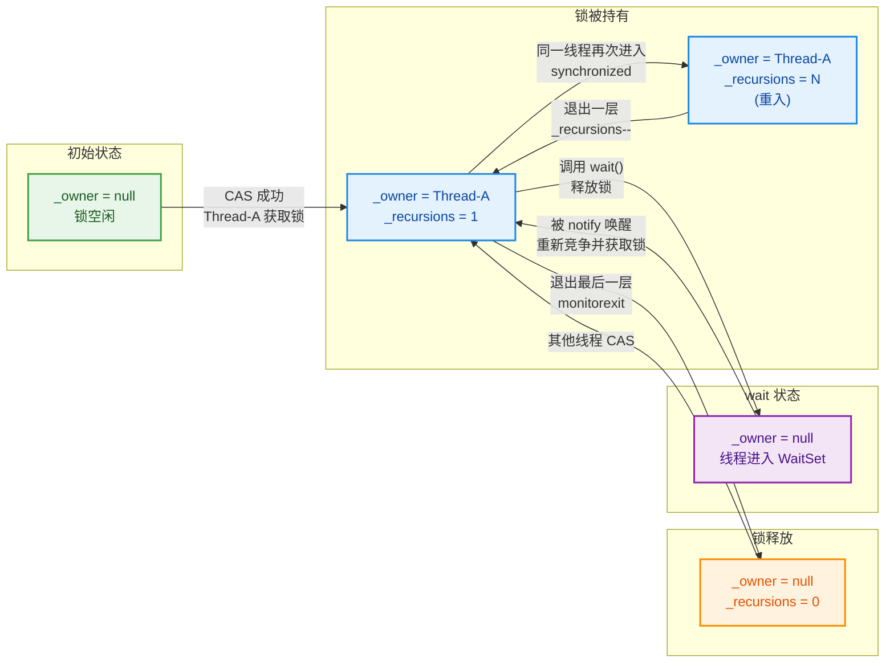

#### Owner 与可重入性的关系

`_owner` 和 `_recursions` 配合实现了 `synchronized` 的可重入性：

```java
// 获取锁时的重入判断
void enter(ObjectMonitor monitor) {
    Thread current = Thread.currentThread();

    // 情况一：锁空闲，直接获取
    if (CAS(&monitor._owner, null, current)) {
        monitor._recursions = 1;  // 首次获取，重入计数 = 1
        return;
    }

    // 情况二：当前线程就是 Owner（重入）
    if (monitor._owner == current) {
        monitor._recursions++;    // 重入计数 +1，无需 CAS
        return;
    }

    // 情况三：其他线程持有锁，进入阻塞流程
    // ... 进入 _cxq -> _EntryList -> park()
}

// 释放锁时的重入处理
void exit(ObjectMonitor monitor) {
    monitor._recursions--;        // 重入计数 -1

    if (monitor._recursions > 0) {
        return;  // 还有外层 synchronized 未退出，不真正释放锁
    }

    // _recursions == 0，真正释放锁
    monitor._owner = null;
    // 唤醒 _EntryList 中的等待线程...
}
```

#### 完整的线程生命周期在 Monitor 中的流转

下面这张时序图展示了三个线程在 Monitor 中的完整交互过程：

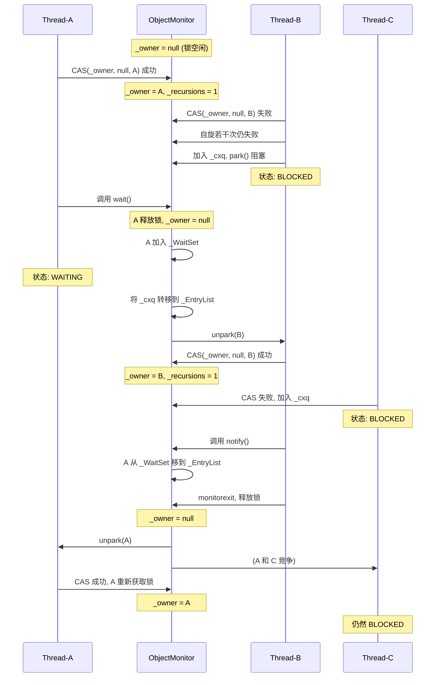

#### 一个完整的 Java 示例

将上述所有概念串联起来，看一个实际的 Java 代码示例：

```java
public class MonitorDemo {
    // 这个对象就是管程，它的 ObjectMonitor 管理所有同步状态
    private final Object lock = new Object();
    // 共享变量（管程保护的数据）
    private boolean dataReady = false;

    // 生产者线程
    public void producer() {
        synchronized (lock) {
            // 此时当前线程成为 _owner，_recursions = 1
            System.out.println(Thread.currentThread().getName() + " 获取锁，开始生产数据...");

            // 模拟耗时操作
            try { Thread.sleep(1000); } catch (InterruptedException e) { }

            // 修改共享变量
            dataReady = true;

            // 调用 notify()：将 _WaitSet 中的一个线程移到 _EntryList
            // 注意：此时并不会立即释放锁，被通知的线程还要等
            lock.notify();
            System.out.println(Thread.currentThread().getName() + " 已通知消费者，但锁还没释放");

            // 这里可以继续执行其他操作，锁仍然被当前线程持有
            System.out.println(Thread.currentThread().getName() + " 继续持有锁做其他事情...");
        }
        // 退出 synchronized 块 -> monitorexit -> _owner = null -> 唤醒 _EntryList 中的线程
        System.out.println(Thread.currentThread().getName() + " 释放了锁");
    }

    // 消费者线程
    public void consumer() {
        synchronized (lock) {
            // 获取锁成为 _owner
            System.out.println(Thread.currentThread().getName() + " 获取锁，检查数据是否就绪...");

            // 经典的 wait 范式：必须用 while 循环检查条件，防止虚假唤醒（spurious wakeup）
            while (!dataReady) {
                try {
                    System.out.println(Thread.currentThread().getName() + " 数据未就绪，调用 wait() 释放锁并等待");
                    // wait() 执行过程：
                    // 1. 保存 _recursions
                    // 2. _owner = null（释放锁）
                    // 3. 当前线程加入 _WaitSet
                    // 4. park() 挂起线程
                    lock.wait();
                    // 被唤醒后执行过程：
                    // 1. 从 _WaitSet 移到 _EntryList
                    // 2. 重新竞争锁（enter）
                    // 3. 获取锁后恢复 _recursions
                    // 4. 从 wait() 返回，继续执行
                    System.out.println(Thread.currentThread().getName() + " 被唤醒，重新获取到锁，再次检查条件");
                } catch (InterruptedException e) {
                    Thread.currentThread().interrupt();
                }
            }

            // 条件满足，处理数据
            System.out.println(Thread.currentThread().getName() + " 数据已就绪，开始消费！");
        }
    }

    public static void main(String[] args) {
        MonitorDemo demo = new MonitorDemo();

        // 先启动消费者，让它进入 wait 状态
        Thread consumerThread = new Thread(demo::consumer, "Consumer");
        consumerThread.start();

        // 稍等片刻确保消费者先获取锁并进入 wait
        try { Thread.sleep(200); } catch (InterruptedException e) { }

        // 再启动生产者
        Thread producerThread = new Thread(demo::producer, "Producer");
        producerThread.start();
    }
}
```

运行输出（顺序可能略有不同，但逻辑一致）：

```java
// 典型输出：
// Consumer 获取锁，检查数据是否就绪...
// Consumer 数据未就绪，调用 wait() 释放锁并等待
// Producer 获取锁，开始生产数据...
// Producer 已通知消费者，但锁还没释放
// Producer 继续持有锁做其他事情...
// Producer 释放了锁
// Consumer 被唤醒，重新获取到锁，再次检查条件
// Consumer 数据已就绪，开始消费！
```

这个输出完美印证了 Monitor 的工作流程：Consumer 调用 `wait()` 后释放锁进入 `_WaitSet`；Producer 获取锁、修改数据、调用 `notify()` 将 Consumer 从 `_WaitSet` 移到 `_EntryList`；Producer 退出 `synchronized` 释放锁后，Consumer 才真正被唤醒并重新获取锁。

#### 为什么 wait() 必须用 while 而不是 if？

上面代码中用了 `while (!dataReady)` 而不是 `if (!dataReady)`，这不是可选的最佳实践，而是**必须遵守的规则**。原因有两个：

1. **虚假唤醒（Spurious Wakeup）**：JVM 规范允许线程在没有收到 `notify()` 的情况下从 `wait()` 返回。这是底层操作系统线程实现的特性（POSIX 线程的 `pthread_cond_wait` 就有这个行为）。如果用 `if`，虚假唤醒后线程会跳过条件检查直接执行，导致逻辑错误。

2. **竞争窗口**：即使是被正常 `notify()` 唤醒，从 `_WaitSet` 移到 `_EntryList` 再到重新获取锁之间存在时间窗口。在这个窗口内，其他线程可能已经改变了条件（比如另一个消费者先消费了数据）。`while` 循环确保每次醒来都重新验证条件。

Java 官方文档（`Object.wait()` 的 Javadoc）明确写道：

> "As in the one argument version, interrupts and spurious wakeups are possible, and this method should always be used in a loop."

---

**📝 练习题**

以下代码中，当 Thread-A 执行到 `lock.wait()` 时，ObjectMonitor 内部发生了什么？请选择描述最准确的选项。

```java
synchronized (lock) {       // Thread-A 获取锁，_recursions = 1
    synchronized (lock) {   // Thread-A 重入，_recursions = 2
        lock.wait();        // 此处发生了什么？
    }
}
```

A. `_recursions` 减为 1，`_owner` 仍为 Thread-A，线程进入 `_WaitSet`

B. `_recursions` 置为 0，`_owner` 置为 null，线程进入 `_WaitSet`，被唤醒后 `_recursions` 恢复为 2

C. 抛出 `IllegalMonitorStateException`，因为重入状态下不允许调用 `wait()`

D. `_recursions` 置为 0，`_owner` 置为 null，线程进入 `_EntryList`


**【答案】** B

**【解析】** `wait()` 的语义是**完全释放锁**，无论当前重入了多少层。执行 `wait()` 时，Monitor 会先保存当前的 `_recursions` 值（此处为 2），然后将 `_recursions` 置为 0、`_owner` 置为 null（彻底释放锁），最后将线程放入 `_WaitSet`。当线程被 `notify()` 唤醒并重新获取锁后，`_recursions` 会被恢复为之前保存的值 2，这样线程可以从 `wait()` 调用点继续执行，正确地退出两层 `synchronized` 块。选项 A 错误，因为 `wait()` 不是只释放一层重入；选项 C 错误，重入状态下完全可以调用 `wait()`；选项 D 错误，线程进入的是 `_WaitSet` 而非 `_EntryList`——`_EntryList` 是给竞争锁失败的线程用的，`_WaitSet` 才是给主动调用 `wait()` 的线程用的。

---

## synchronized 字节码

要真正理解 `synchronized` 的工作原理，仅停留在 Java 语法层面是不够的。当 `.java` 文件被 `javac` 编译为 `.class` 字节码后，`synchronized` 关键字会被翻译成一组特定的 JVM 指令。这些指令直接操控上一节讲到的 Monitor 对象，是连接"Java 语法"与"底层 Monitor 机制"的桥梁。

我们需要区分两种场景：**同步代码块**（synchronized block）和**同步方法**（synchronized method），它们在字节码层面的实现方式截然不同。

先准备一个用于反编译的示例类：

```java
public class SyncBytecodeDemo {

    private final Object lock = new Object();
    private int count = 0;

    // 场景一：同步代码块
    public void blockSync() {
        synchronized (lock) {       // 进入同步块
            count++;                // 临界区操作
        }                           // 离开同步块
    }

    // 场景二：同步实例方法
    public synchronized void methodSync() {
        count++;                    // 整个方法体都是临界区
    }

    // 场景三：同步静态方法
    public static synchronized void staticMethodSync() {
        System.out.println("static sync");
    }
}
```

使用 `javap -c -v SyncBytecodeDemo.class` 即可查看字节码。下面我们逐一拆解。

---

### monitorenter

`monitorenter` 是 JVM 字节码指令集中专门用于**获取对象监视器锁**的指令。当线程执行到 `monitorenter` 时，JVM 会执行以下逻辑（这段逻辑与上一节 ObjectMonitor 的 `enter()` 过程完全对应）：

1. 从操作数栈（operand stack）顶部弹出一个 **objectref**（即你 `synchronized(xxx)` 括号里的那个对象引用）。
2. 尝试获取该对象关联的 Monitor：
   - 若 Monitor 的 `_owner` 为 `null`（锁空闲），当前线程成为 Owner，`_recursions` 计数器置为 1，获取成功。
   - 若 Monitor 的 `_owner` 就是当前线程（重入），`_recursions` 加 1，获取成功。
   - 若 Monitor 的 `_owner` 是其他线程（锁被占），当前线程进入 `_EntryList` 阻塞等待。

用流程图来表达这个判定过程：

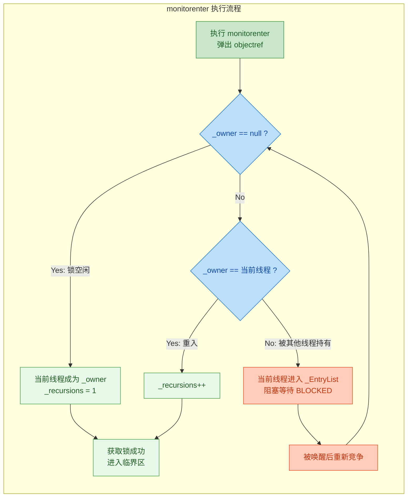

现在来看 `blockSync()` 方法的实际字节码输出（已加逐行注释）：

```java
// javap -c -v 输出（同步代码块部分）
public void blockSync();
    Code:
       0: aload_0                   // 将 this 压入操作数栈
       1: getfield #3               // 获取 this.lock 字段，将 lock 对象引用压栈
       4: dup                       // 复制栈顶的 lock 引用（一份给 monitorenter，一份留给 monitorexit）
       5: astore_1                  // 将复制的 lock 引用存入局部变量表 slot 1（后面 monitorexit 要用）
       6: monitorenter              // ★ 核心指令：弹出栈顶 lock 引用，获取其 Monitor 锁
       7: aload_0                   // 将 this 压栈（准备操作 count 字段）
       8: dup                       // 复制 this 引用
       9: getfield #4               // 获取 this.count 的值
      12: iconst_1                  // 将常量 1 压栈
      13: iadd                      // 栈顶两个 int 相加：count + 1
      14: putfield #4               // 将结果写回 this.count（完成 count++）
      17: aload_1                   // 从局部变量表 slot 1 取出之前保存的 lock 引用
      18: monitorexit               // ★ 核心指令：正常退出，释放 Monitor 锁
      19: goto 27                   // 跳转到方法正常返回处
      22: astore_2                  // ——异常路径开始—— 将异常对象存入 slot 2
      23: aload_1                   // 取出 lock 引用
      24: monitorexit               // ★ 异常退出时也必须释放 Monitor 锁！
      25: aload_2                   // 重新加载异常对象
      26: athrow                    // 重新抛出异常
      27: return                    // 方法正常返回
```

注意几个关键细节：

- 第 4 行的 `dup` 和第 5 行的 `astore_1`：编译器特意把锁对象引用保存了一份到局部变量表。这是因为后续无论正常退出还是异常退出，都需要用这个引用来执行 `monitorexit`。如果不保存，异常发生时栈帧可能已经被破坏，就找不到锁对象了。

- 第 6 行 `monitorenter` 只出现了 **1 次**，但 `monitorexit` 出现了 **2 次**（第 18 行和第 24 行）。这正是编译器为了保证锁一定会被释放而做的安排，下面会详细讲。

---

### monitorexit

`monitorexit` 是与 `monitorenter` 配对的**释放监视器锁**的指令。执行逻辑如下：

1. 从操作数栈弹出 objectref（必须与 `monitorenter` 时使用的是同一个对象）。
2. 将 Monitor 的 `_recursions` 计数器减 1。
3. 若 `_recursions` 减到 0，说明当前线程已完全退出所有重入层级，释放锁：将 `_owner` 置为 `null`，并唤醒 `_EntryList` 中等待的线程。
4. 若 `_recursions` 仍大于 0，说明还在重入的内层，锁不释放，继续执行。

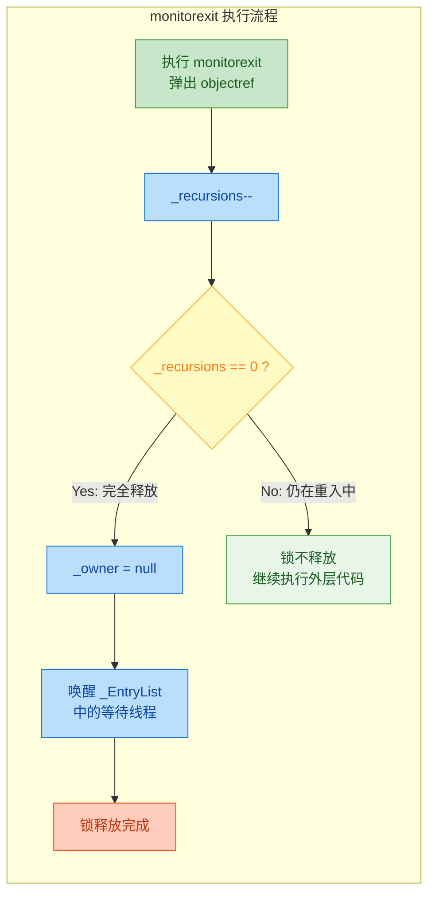

这里有一个非常重要的 JVM 规范约束（JVM Spec §6.5）：

> The objectref must be of type reference and must refer to the **same object** as the one used by the corresponding monitorenter.

也就是说，`monitorexit` 弹出的对象引用必须和 `monitorenter` 用的是同一个。如果不匹配，JVM 会抛出 `IllegalMonitorStateException`。这也解释了为什么编译器要在 `monitorenter` 之前用 `dup` + `astore` 把锁对象引用保存起来——就是为了确保 `monitorexit` 能拿到同一个引用。

对于**同步方法**，字节码层面并不使用 `monitorenter` / `monitorexit` 指令，而是在方法的 `access_flags` 中设置 `ACC_SYNCHRONIZED` 标志位：

```java
// javap -c -v 输出（同步实例方法部分）
public synchronized void methodSync();
    descriptor: ()V
    flags: ACC_PUBLIC, ACC_SYNCHRONIZED   // ★ 注意这里的 ACC_SYNCHRONIZED 标志
    Code:
       0: aload_0                   // 将 this 压栈
       1: dup                       // 复制 this
       2: getfield #4               // 获取 this.count
       5: iconst_1                  // 常量 1
       6: iadd                      // count + 1
       7: putfield #4               // 写回 count
      10: return                    // 直接返回，没有 monitorenter/monitorexit！
```

可以看到，方法体内没有任何 `monitorenter` 或 `monitorexit`。JVM 在方法调用时检查 `ACC_SYNCHRONIZED` 标志，如果存在，就在方法进入前隐式执行 `monitorenter`（锁对象为 `this` 或 `Class` 对象），方法返回或抛异常时隐式执行 `monitorexit`。

两种方式的对比：

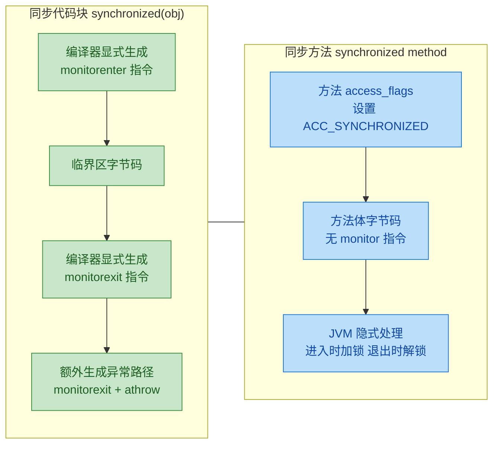

两者在功能上完全等价，底层都是操作 Monitor。区别仅在于：同步代码块的锁操作在字节码中**显式可见**，同步方法的锁操作由 JVM **隐式完成**。

---

### 异常表保证释放

这是 `synchronized` 字节码设计中最精妙的部分。思考一个问题：如果临界区代码抛出了未捕获的异常，锁还能被正确释放吗？

答案是：**一定能**。编译器通过**异常表**（Exception Table）机制来保证这一点。

回顾前面 `blockSync()` 的字节码，我们看到有两个 `monitorexit`：

- 第 18 行：正常执行路径的 `monitorexit`
- 第 24 行：异常执行路径的 `monitorexit`

与之配合的是字节码末尾的异常表：

```java
// Exception table（异常表）
//   from    to  target  type
//      7    19    22    any    // 范围 [7, 19) 内的任何异常，跳转到第 22 行处理
//     22    25    22    any    // 范围 [22, 25) 内的任何异常，跳转到第 22 行处理（防止 monitorexit 自身异常）
```

这张异常表的含义是：

- **第一条规则** `[7, 19) -> 22, any`：临界区代码（第 7 行到第 18 行，即 `monitorenter` 之后到正常 `monitorexit` 之间）如果抛出**任何类型**的异常（`any` 表示包括 Error 和 RuntimeException），都跳转到第 22 行。第 22 行开始的代码会先保存异常对象，然后执行 `monitorexit` 释放锁，最后用 `athrow` 重新抛出异常。

- **第二条规则** `[22, 25) -> 22, any`：这是一个"兜底"规则。万一异常处理路径中的 `monitorexit` 本身也抛出了异常（虽然极其罕见），它会再次跳回第 22 行重试。这确保了即使在最极端的情况下，锁释放逻辑也会被反复执行。

用一张完整的流程图来展示正常路径和异常路径：

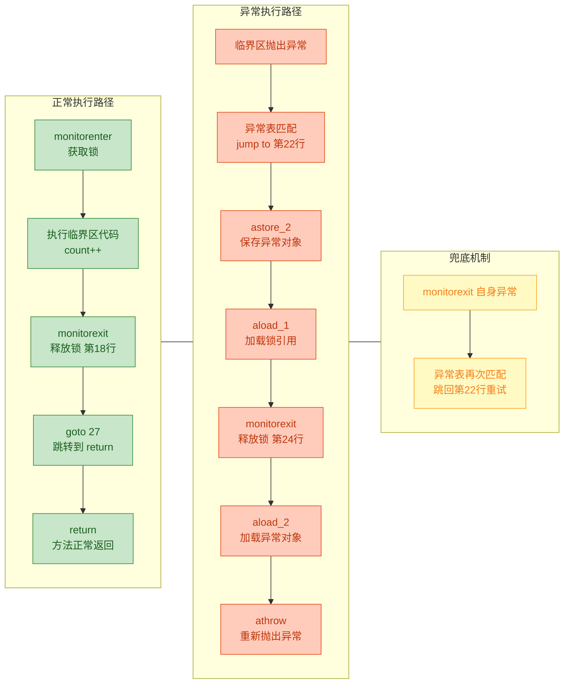

这个设计体现了一个核心原则：**编译器层面保证 `synchronized` 的锁一定会被释放，程序员无需手动处理**。这与 `ReentrantLock` 形成了鲜明对比——`ReentrantLock` 必须在 `finally` 块中手动调用 `unlock()`，如果忘了就会造成死锁。

我们可以用一段代码来验证异常时锁确实会被释放：

```java
public class ExceptionReleaseProof {

    private static final Object lock = new Object();  // 共享锁对象

    public static void main(String[] args) throws InterruptedException {

        // 线程 A：获取锁后抛出异常
        Thread threadA = new Thread(() -> {
            try {
                synchronized (lock) {                          // monitorenter
                    System.out.println("Thread A: 获取锁");
                    throw new RuntimeException("模拟异常");     // 临界区内抛异常
                }                                              // 编译器保证此处 monitorexit 一定执行
            } catch (RuntimeException e) {
                System.out.println("Thread A: 异常被捕获 - " + e.getMessage());
            }
        }, "Thread-A");

        // 线程 B：尝试获取同一把锁
        Thread threadB = new Thread(() -> {
            synchronized (lock) {                              // 如果锁没释放，这里会永远阻塞
                System.out.println("Thread B: 成功获取锁（证明锁已被释放）");
            }
        }, "Thread-B");

        threadA.start();       // 启动线程 A
        threadA.join();        // 等待线程 A 执行完毕（包括异常处理）
        threadB.start();       // 启动线程 B
        threadB.join();        // 等待线程 B 执行完毕
    }
}
// 输出：
// Thread A: 获取锁
// Thread A: 异常被捕获 - 模拟异常
// Thread B: 成功获取锁（证明锁已被释放）
```

线程 B 能成功获取锁，证明线程 A 即使因异常退出，`monitorexit` 也被正确执行了。

最后总结一下 `synchronized` 在字节码层面的完整图景：

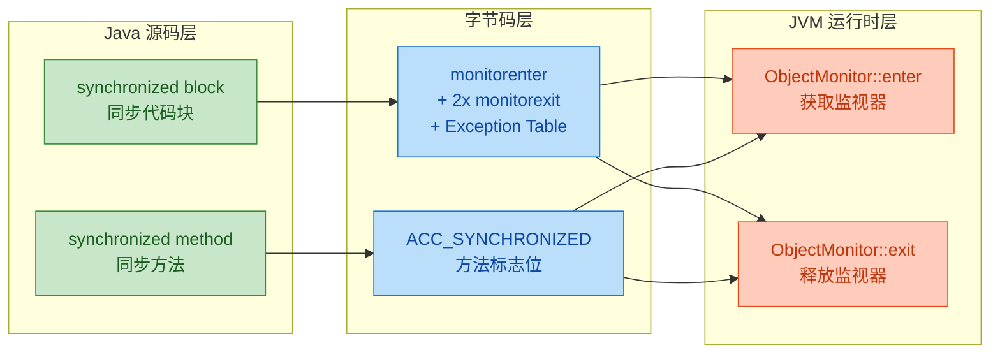

从 Java 源码到字节码再到 JVM 运行时，`synchronized` 的实现形成了一条清晰的链路：语法糖 → 编译器翻译为 `monitorenter`/`monitorexit` 指令（或 `ACC_SYNCHRONIZED` 标志）→ JVM 执行时操作 ObjectMonitor 的 `_owner`、`_recursions`、`_EntryList`、`_WaitSet` 等字段。异常表机制则从编译器层面兜底，确保锁在任何情况下都不会泄漏。

---

**📝 练习题**

以下 Java 代码编译后，`blockSync()` 方法的字节码中会包含几条 `monitorenter` 指令和几条 `monitorexit` 指令？

```java
public void blockSync() {
    synchronized (this) {
        doSomething();
    }
}
```

A. 1 条 monitorenter，1 条 monitorexit

B. 1 条 monitorenter，2 条 monitorexit

C. 2 条 monitorenter，2 条 monitorexit

D. 1 条 monitorenter，3 条 monitorexit


**【答案】** B

**【解析】** 编译器对每个 `synchronized` 代码块生成 1 条 `monitorenter` 和 2 条 `monitorexit`。第一条 `monitorexit` 位于正常执行路径的末尾，第二条 `monitorexit` 位于异常处理路径中（由异常表 Exception Table 引导跳转）。这种"一进二出"的设计确保无论临界区代码正常执行还是抛出异常，Monitor 锁都一定会被释放。选项 A 忽略了异常路径，选项 C 和 D 错误地增加了 `monitorenter` 或 `monitorexit` 的数量。

---

## 本章小结

`synchronized` 是 Java 并发编程的基石，也是理解 JVM 锁机制、内存模型乃至后续 `java.util.concurrent` 包的前提。本章从语法、特性、底层机制、字节码四个维度对其进行了全面拆解，下面用一张全景图将所有知识点串联起来。

### 知识全景回顾

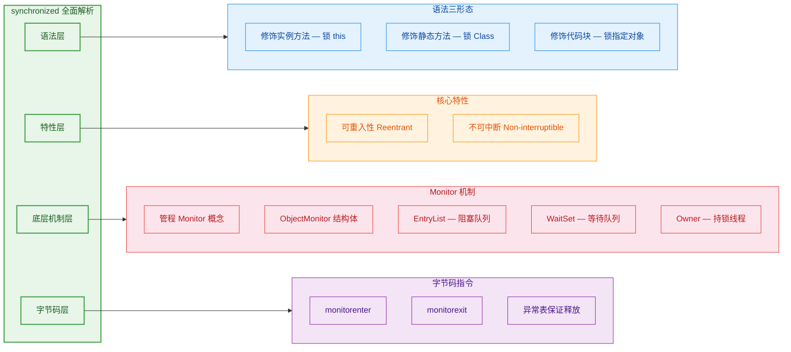

### 核心要点提炼

本章内容可以浓缩为以下几条关键认知，它们构成了理解 `synchronized` 的最小完备知识集：

**第一，语法的本质是"选锁对象"。** 无论是修饰实例方法、静态方法还是代码块，`synchronized` 做的事情只有一件——选定一个 Java 对象作为锁（Monitor Lock）。实例方法选 `this`，静态方法选 `Class` 对象，代码块则由开发者显式指定。理解这一点后，所有关于"两个线程能否同时进入"的问题都可以归结为一个判断：**它们竞争的是不是同一把锁？** 如果是同一个对象，互斥；如果不是，互不影响。

**第二，可重入性是 `synchronized` 的安全网。** JVM 为每把锁维护一个持有者（Owner）和一个重入计数器（recursion counter）。同一线程再次获取同一把锁时，计数器加一而非阻塞，退出时计数器减一，归零才真正释放。这个设计使得同步方法之间的相互调用、父子类同步方法的覆写调用都不会产生死锁。可以说，可重入性让 `synchronized` 在面向对象的继承体系中"活了下来"。

**第三，不可中断是一把双刃剑。** 线程一旦进入 `BLOCKED` 状态等待 `synchronized` 锁，就无法被 `Thread.interrupt()` 唤醒，只能等到锁被释放后才有机会获取。这保证了锁语义的简单性和确定性，但也意味着在高竞争场景下可能出现长时间阻塞且无法取消的问题。这正是 `ReentrantLock` 提供 `lockInterruptibly()` 的动机所在——当你需要"可中断的锁"时，就该考虑从 `synchronized` 迁移到显式锁。

**第四，Monitor 是连接 Java 语法与操作系统的桥梁。** 每个 Java 对象在逻辑上都关联一个 Monitor（管程），HotSpot 中的实现是 `ObjectMonitor` 结构体。它内部维护三个核心区域：`Owner` 记录当前持锁线程，`EntryList`（配合 `cxq` 栈）存放因竞争锁而阻塞的线程，`WaitSet` 存放主动调用 `wait()` 而挂起的线程。线程在这三个区域之间的流转，就是 `synchronized` 配合 `wait/notify` 实现线程协作的全部秘密。

**第五，字节码层面的保证是"锁一定会被释放"。** 编译器为 `synchronized` 代码块生成 `monitorenter` 和 `monitorexit` 指令对，并且通过异常表（Exception Table）确保即使发生异常，也会跳转到一条额外的 `monitorexit` 指令完成释放。这是一种编译器级别的 try-finally 保障，开发者无需手动释放锁，也不用担心异常导致的锁泄漏。相比之下，`ReentrantLock` 必须在 `finally` 块中显式调用 `unlock()`，稍有疏忽就可能造成死锁。

### 横向对比速查表

在实际开发中，`synchronized` 并非唯一选择。下面将它与 `ReentrantLock` 进行对比，帮助你在不同场景下做出合理决策：

| 维度 | synchronized | ReentrantLock |
|------|-------------|---------------|
| 加锁方式 | 隐式，JVM 自动管理 | 显式，手动 `lock()` / `unlock()` |
| 可重入 | ✅ 支持 | ✅ 支持 |
| 可中断 | ❌ 不支持 | ✅ `lockInterruptibly()` |
| 超时获取 | ❌ 不支持 | ✅ `tryLock(timeout)` |
| 公平锁 | ❌ 非公平 | ✅ 可选公平 / 非公平 |
| 条件变量 | 单一（`wait/notify`） | 多个 `Condition` 对象 |
| 锁释放保证 | 编译器 + 异常表自动保证 | 开发者必须在 `finally` 中释放 |
| 性能（JDK 6+） | 经过偏向锁 / 轻量级锁优化，大多数场景持平 | 高竞争下略优 |
| 适用场景 | 简单同步、低竞争、快速临界区 | 需要高级特性（中断、超时、多条件）的复杂场景 |

一个简单的选择原则：**如果 `synchronized` 能满足需求，就优先使用它**——语法简洁、不会忘记释放锁、JVM 持续优化。只有当你明确需要可中断、超时、公平性或多条件变量时，才切换到 `ReentrantLock`。

### 从本章到后续章节的知识衔接

`synchronized` 的学习为后续内容铺设了重要的认知基础：

- **锁优化（偏向锁 → 轻量级锁 → 重量级锁）**：本章讲的 `ObjectMonitor` 实际上是重量级锁的实现。JDK 6 引入的锁升级机制，就是为了在低竞争场景下避免直接进入这个"重量级"路径。理解了 Monitor 的完整结构，才能真正看懂锁升级在"优化什么"。

- **volatile 与 JMM（Java Memory Model）**：`synchronized` 不仅保证互斥，还保证可见性和有序性。这背后是 JMM 的 happens-before 规则在起作用。学完本章的锁机制后，下一步就是理解这些内存语义是如何被 JVM 和硬件共同实现的。

- **wait / notify / notifyAll**：本章提到了 `WaitSet`，但没有深入展开线程协作的完整模型。`wait/notify` 的正确使用模式（为什么必须在 `synchronized` 块内调用、为什么要用 `while` 而非 `if` 检查条件）是并发编程中最容易出错的地方之一。

- **AQS（AbstractQueuedSynchronizer）**：`ReentrantLock`、`Semaphore`、`CountDownLatch` 等并发工具的底层都是 AQS。AQS 的设计思想与 `ObjectMonitor` 有异曲同工之处——都是"一个持有者 + 一个等待队列"的模型，但 AQS 用 CAS + CLH 队列替代了操作系统级别的互斥量，实现了更灵活的锁语义。

---

**📝 练习题 1**

以下代码中，线程 A 调用 `obj.methodA()`，线程 B 同时调用 `obj.methodB()`，请问两个线程是否会产生互斥？

```java
public class Demo {
    // 同步实例方法，锁对象为 this
    public synchronized void methodA() {
        System.out.println("methodA running");
        try { Thread.sleep(2000); } catch (InterruptedException e) {}
    }

    // 同步静态方法，锁对象为 Demo.class
    public static synchronized void methodB() {
        System.out.println("methodB running");
        try { Thread.sleep(2000); } catch (InterruptedException e) {}
    }
}
```

A. 会互斥，因为两个方法都加了 `synchronized`


B. 会互斥，因为它们属于同一个类


C. 不会互斥，因为一个锁的是 `this` 实例对象，另一个锁的是 `Demo.class` 类对象，不是同一把锁


D. 不会互斥，因为 `methodB` 是静态方法，不受 `synchronized` 约束


**【答案】** C

**【解析】** `synchronized` 互斥的前提是竞争同一把锁。`methodA()` 是实例方法，锁对象为调用它的实例 `this`；`methodB()` 是静态方法，锁对象为 `Demo.class`。两者是完全不同的对象，因此不存在锁竞争，两个线程可以同时执行。选项 A 和 B 的错误在于忽略了锁对象的区别；选项 D 的错误在于静态方法同样可以被 `synchronized` 修饰，只是锁对象不同。

---

**📝 练习题 2**

关于 `synchronized` 的可重入性，以下说法正确的是：

```java
public class Parent {
    public synchronized void doSomething() {
        System.out.println("Parent.doSomething");
    }
}

public class Child extends Parent {
    @Override
    public synchronized void doSomething() {
        System.out.println("Child.doSomething");
        // 调用父类的同步方法
        super.doSomething();
    }
}
```

A. `super.doSomething()` 会导致死锁，因为子类方法已经持有锁，父类方法又要获取同一把锁


B. 正常执行，因为 `synchronized` 是可重入的，同一线程对同一对象重复加锁只会增加重入计数器


C. 编译错误，子类不能用 `synchronized` 覆写父类的 `synchronized` 方法


D. 运行时抛出 `IllegalMonitorStateException`


**【答案】** B

**【解析】** 这是可重入性最经典的应用场景。`Child` 实例调用 `doSomething()` 时，当前线程获取了 `this` 对象的锁（计数器变为 1）。接着 `super.doSomething()` 再次请求同一个 `this` 对象的锁，由于 JVM 检测到请求线程就是 Owner，直接将计数器加到 2 并放行，不会阻塞。方法依次返回时，计数器先减到 1，再减到 0，锁才真正释放。如果 `synchronized` 不支持可重入，这段代码确实会死锁（选项 A 描述的情况），但 Java 的设计从一开始就避免了这个问题。

---
