---

# volatile深度解析 ⭐⭐⭐

---

## volatile 语法

`volatile` 是 Java 语言中一个常被低估却极其重要的关键字。它是 JVM 提供的**最轻量级的同步机制**（the lightest synchronization mechanism），在并发编程中扮演着不可替代的角色。在深入探讨它的可见性、有序性和底层实现之前，我们首先要彻底搞清楚它的**语法形态**和**基本使用方式**。

### volatile 关键字的声明

`volatile` 是一个**变量修饰符**（variable modifier），它只能用来修饰**实例变量**（instance fields）和**类变量**（static fields），不能修饰方法参数、局部变量或方法本身。这一点与 `synchronized` 有本质区别——`synchronized` 修饰的是代码块或方法，而 `volatile` 修饰的是数据本身。

```java
public class VolatileSyntaxDemo {

    // ✅ 修饰实例变量 —— 最常见的用法
    private volatile boolean running = true;

    // ✅ 修饰静态变量 —— 同样合法
    private static volatile int globalCounter = 0;

    // ✅ 修饰引用类型 —— 注意：只保证引用本身的可见性，不保证对象内部字段的可见性
    private volatile List<String> dataList = new ArrayList<>();

    // ✅ 修饰数组引用 —— 同理：只保证数组引用可见，不保证数组元素可见
    private volatile int[] dataArray = new int[10];

    // ❌ 编译错误：volatile 不能修饰局部变量
    // public void method() {
    //     volatile int localVar = 0;  // 编译不通过
    // }

    // ❌ 编译错误：volatile 不能修饰方法
    // public volatile void doSomething() { }

    // ❌ 编译错误：volatile 不能修饰类
    // public volatile class MyClass { }
}
```

从语法角度来看，`volatile` 的使用极其简单——只需在字段声明前加上 `volatile` 关键字即可。但这一个关键字背后，JVM 会为你做大量的底层工作，包括插入内存屏障（Memory Barrier）、禁止指令重排序（Instruction Reordering）等。

### volatile 的修饰符位置与组合

`volatile` 可以和其他修饰符自由组合，但有一些规则和最佳实践需要注意：

```java
public class VolatileModifierCombination {

    // ✅ private + volatile：最常见的组合，封装 + 可见性
    private volatile boolean shutdownRequested = false;

    // ✅ protected + volatile：子类可访问的可见性字段
    protected volatile int state = 0;

    // ✅ public + volatile：公开的可见性字段（不推荐，破坏封装）
    public volatile long timestamp = 0L;

    // ✅ static + volatile：类级别的可见性字段
    private static volatile VolatileModifierCombination instance;

    // ✅ volatile + transient：可见性 + 序列化排除
    private volatile transient boolean connected = false;

    // ❌ volatile + final：编译错误！语义矛盾
    // final 表示不可变，volatile 修饰一个不可变的值毫无意义
    // private volatile final int MAX = 100;  // 编译不通过
}
```

`volatile` 与 `final` 不能同时使用，这并非纯粹的语法限制，而是**语义上的矛盾**：`final` 字段一旦初始化就不再改变，而 `volatile` 的存在意义就是保证多线程对**可变字段**的可见性。一个永远不变的字段不需要可见性保证，因为 JMM（Java Memory Model）已经对 `final` 字段的可见性做出了专门的保证。

### volatile 可修饰的数据类型全景

`volatile` 可以修饰 Java 中的所有字段类型，但其**语义保证的粒度**因类型而异，这是一个非常容易踩坑的地方：

```java
public class VolatileDataTypes {

    // ===== 基本类型（Primitive Types）=====
    // 对于基本类型，volatile 保证读写操作的可见性
    private volatile boolean flag;       // 1 bit 逻辑值
    private volatile byte b;             // 8 bits
    private volatile short s;            // 16 bits
    private volatile int i;              // 32 bits
    private volatile long l;             // 64 bits ⭐ 特别重要
    private volatile float f;            // 32 bits
    private volatile double d;           // 64 bits ⭐ 特别重要
    private volatile char c;             // 16 bits

    // ===== 引用类型（Reference Types）=====
    // volatile 只保证「引用地址」的可见性，不保证「引用对象内部状态」的可见性
    private volatile String name;                    // 不可变对象引用，安全
    private volatile Map<String, Object> configMap;  // 可变对象引用，需要小心
    private volatile int[] numbers;                  // 数组引用，元素不受保护
}
```

这里必须特别强调 `long` 和 `double` 的情况。在 JMM 规范中，对于 **64 位的 `long` 和 `double` 类型**，JVM 允许将其读写操作拆分为两个 32 位操作（non-atomic treatment of `double` and `long`）。这意味着在没有同步的情况下，一个线程可能读到"半个值"——高 32 位来自一次写入，低 32 位来自另一次写入。虽然现代 64 位 JVM 实现通常已经保证了 `long`/`double` 的原子性读写，但 **JMM 规范并不要求**，因此加上 `volatile` 是确保安全的唯一可移植方式。

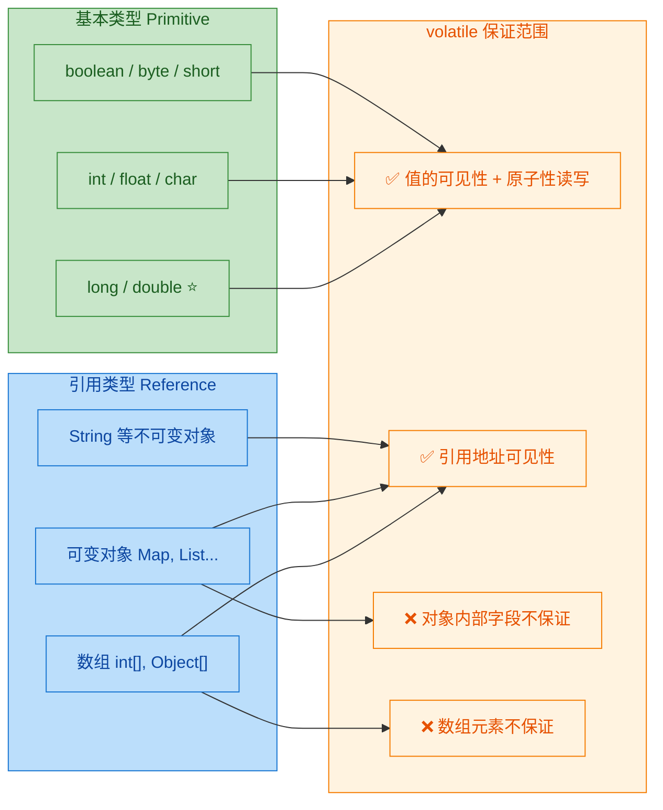

### volatile 修饰引用类型的陷阱

这是初学者最容易犯错的地方，必须用一个完整的例子来说明：

```java
public class VolatileReferenceTrap {

    // volatile 修饰的是 config 这个「引用」
    // 而不是 Config 对象内部的 url 和 timeout 字段
    private volatile Config config = new Config();

    static class Config {
        String url = "http://default";    // 非 volatile，不受保护
        int timeout = 3000;               // 非 volatile，不受保护
    }

    // ===== 线程 A：修改对象内部字段 =====
    public void writerThread() {
        // ❌ 危险操作！修改的是对象内部字段，不是引用本身
        // volatile 语义不会被触发，其他线程可能看不到这些修改
        config.url = "http://new-server";
        config.timeout = 5000;
    }

    // ===== 正确做法：替换整个引用 =====
    public void writerThreadCorrect() {
        // ✅ 创建新的 Config 对象
        Config newConfig = new Config();       // 在本地构建新对象
        newConfig.url = "http://new-server";   // 设置新值
        newConfig.timeout = 5000;              // 设置新值
        config = newConfig;                    // 替换引用 → 触发 volatile 写语义
        // 此时其他线程读取 config 引用时，
        // 能看到新的 Config 对象及其字段（happen-before 保证）
    }

    // ===== 线程 B：读取配置 =====
    public void readerThread() {
        Config snapshot = config;    // volatile 读 → 获取最新引用
        // 由于 happen-before 关系，通过新引用能安全读取其字段
        System.out.println(snapshot.url + ", timeout=" + snapshot.timeout);
    }
}
```

这个例子揭示了一个关键原则：**volatile 的写操作会建立一个 happens-before 关系（happens-before relationship），这个关系保证写操作之前的所有普通写入对读取 volatile 变量的线程也是可见的。** 因此，正确的模式是"构建新对象 → 设置字段 → 用 volatile 写发布引用"，而不是"通过已有引用修改内部字段"。

### volatile 修饰数组的注意事项

```java
public class VolatileArrayDemo {

    // volatile 只保护 data 这个引用，不保护 data[0], data[1] ...
    private volatile int[] data = new int[5];

    public void unsafeElementWrite() {
        // ❌ 修改数组元素不会触发 volatile 语义
        data[0] = 42;   // 其他线程可能看不到
    }

    public void safeArrayReplace() {
        // ✅ 替换整个数组引用会触发 volatile 语义
        int[] newData = new int[5];   // 创建新数组
        newData[0] = 42;              // 在本地修改
        data = newData;               // volatile 写，发布新数组
    }

    // 如果需要对数组元素做原子可见性操作，应使用：
    // java.util.concurrent.atomic.AtomicIntegerArray
    // java.util.concurrent.atomic.AtomicReferenceArray
}
```

### volatile 的语法本质：一种契约

从更高层次来看，`volatile` 关键字本质上是程序员与 JVM 之间的一份**契约**（contract）：

```text
程序员说："这个变量会被多个线程同时读写。"
JVM 回应："好的，我保证：
           1. 每次读取都从主内存获取最新值（可见性）
           2. 每次写入立即刷回主内存（可见性）
           3. 不对这个变量相关的操作做重排序（有序性）
           4. 对于 long/double，保证原子性读写
         但我不保证：
           ⚠️ 复合操作（如 i++）的原子性"
```

下面是一个最基本的、展示 volatile 语法使用的完整可运行示例：

```java
public class VolatileBasicExample {

    // 使用 volatile 修饰停止标志
    // 如果不加 volatile，子线程可能永远看不到 main 线程的修改
    private static volatile boolean stop = false;

    public static void main(String[] args) throws InterruptedException {

        // 启动一个工作线程，不断循环检测 stop 标志
        Thread worker = new Thread(() -> {
            int count = 0;                         // 本地计数器
            while (!stop) {                        // 每次循环都读取 volatile 变量
                count++;                           // 做一些工作
            }
            // stop 变为 true 时退出循环
            System.out.println("Worker stopped after " + count + " iterations.");
        }, "worker-thread");

        worker.start();                            // 启动工作线程

        Thread.sleep(100);                         // 主线程等待 100ms

        stop = true;                               // volatile 写：立即对 worker 线程可见
        System.out.println("Main thread set stop = true");

        worker.join();                             // 等待 worker 线程结束
        System.out.println("Program finished.");
    }
}
```

如果把上面代码中的 `volatile` 去掉，在 **Server 模式的 JVM**（`-server` flag，这是 64 位 JVM 的默认模式）中，JIT 编译器很可能会将 `while (!stop)` 优化为 `while (true)`，因为它判断 `stop` 在当前线程中没有被修改过。这就是典型的**可见性问题**（visibility problem），也是 `volatile` 最经典的应用场景——我们将在下一节深入讨论。

### volatile 与 Java 内存模型的关系速览

为了帮助你建立全局认知，下面用一张图快速展示 `volatile` 在 JMM 中的位置。后续章节会逐一展开每个部分：

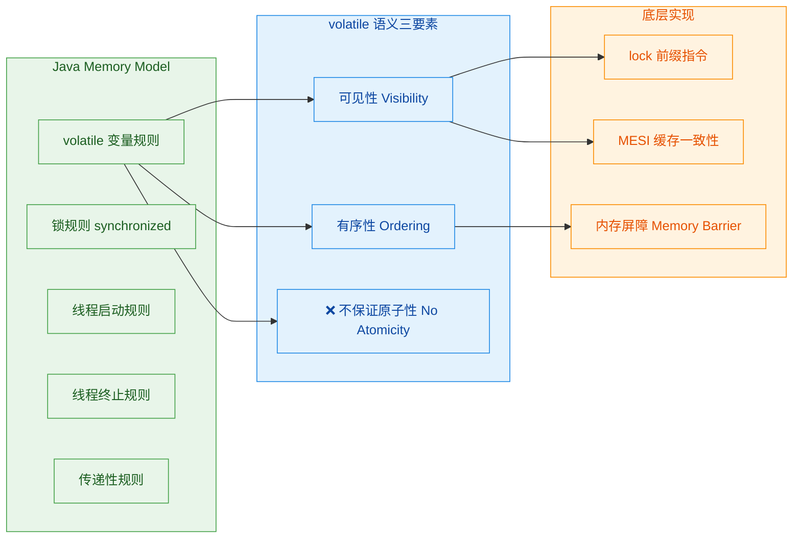

---

**📝 练习题**

以下关于 `volatile` 关键字语法的描述，哪一项是**正确的**？

A. `volatile` 可以修饰局部变量，用于保证方法内部的线程安全

B. `volatile` 和 `final` 可以同时修饰一个字段，表示该字段不可变且具备可见性

C. `volatile` 修饰一个 `Map<String, Object>` 类型的字段时，能保证 Map 内部所有 key-value 的可见性

D. `volatile` 修饰 `long` 类型字段时，能保证 64 位读写操作的原子性，避免"撕裂读"（word tearing）


**【答案】** D

**【解析】** 逐项分析：
- **A 错误**：`volatile` 只能修饰实例变量和类变量（成员字段），不能修饰局部变量。局部变量存在于线程栈帧中，天然线程私有，不存在可见性问题。
- **B 错误**：`volatile` 与 `final` 不能同时使用，二者语义矛盾。`final` 字段初始化后不再变化，JMM 已经为 `final` 字段提供了专门的可见性保证（`final` field semantics），无需 `volatile`。编译器会直接报错。
- **C 错误**：`volatile` 只保证**引用本身**（即指向 `Map` 对象的指针）的可见性，不保证 `Map` 内部数据结构（桶数组、链表节点等）的可见性。对 Map 执行 `put()`、`remove()` 等操作并不会触发 volatile 写语义。
- **D 正确**：根据 JLS §17.7，未加 `volatile` 的 `long` 和 `double` 的读写操作可以被 JVM 拆分为两个 32 位操作（non-atomic treatment），存在"撕裂读"风险。加上 `volatile` 后，JMM 保证其读写操作具有原子性。

---

## volatile 的可见性 ⭐⭐

在 Java 并发编程中，**可见性 (Visibility)** 是最容易被忽视却又最致命的问题之一。简单来说，可见性指的是：当一个线程修改了某个共享变量的值，其他线程能否**立即**感知到这个变化。在没有任何同步手段的情况下，答案往往是——**不能**。

这并非 JVM 的 bug，而是现代计算机体系结构中**多级缓存 (Multi-Level Cache)** 和 **JMM (Java Memory Model)** 共同作用的结果。每个线程在运行时，并不直接操作主内存中的变量，而是先将变量拷贝一份到自己的**工作内存 (Working Memory)** 中，所有的读写都发生在这个私有副本上。至于这个副本何时写回主内存、何时从主内存刷新，在没有同步约束时，是完全不确定的。

`volatile` 关键字正是 Java 语言层面为解决可见性问题提供的**最轻量级武器**。当一个变量被声明为 `volatile` 时，JMM 会对它施加一套特殊的访问规则，从根本上消除可见性隐患。

我们先通过一个经典的反面案例来直观感受可见性问题：

```java
/**
 * 可见性问题经典演示
 * 线程 reader 可能永远看不到 writer 对 flag 的修改
 */
public class VisibilityProblem {

    // 注意：这里故意没有加 volatile
    private static boolean flag = false;       // 共享的停止标志
    private static int number = 0;             // 共享的数值变量

    public static void main(String[] args) throws InterruptedException {

        // reader 线程：持续检查 flag 是否变为 true
        Thread reader = new Thread(() -> {
            while (!flag) {                    // 可能读取的是工作内存中的旧值 false
                // 空循环，等待 flag 变为 true
            }
            // 如果能走到这里，打印 number 的值
            System.out.println("number = " + number);
        });

        // writer 线程：修改共享变量
        Thread writer = new Thread(() -> {
            number = 42;                       // 先写 number
            flag = true;                       // 再写 flag，期望 reader 看到后退出循环
        });

        reader.start();                        // 先启动 reader
        Thread.sleep(100);                     // 让 reader 充分运行，进入循环
        writer.start();                        // 再启动 writer

        reader.join(3000);              // 最多等 3 秒
        writer.join(3000);

        // 在某些 JVM/CPU 组合下，reader 线程会卡死在 while 循环中
        System.out.println("Main thread finished.");
    }
}
```

上面的代码在 **Server 模式的 HotSpot JVM** 下运行时，`reader` 线程极有可能**永远不会退出** `while` 循环。因为 JIT 编译器会将 `flag` 的值缓存到寄存器中，之后每次循环都读的是寄存器里的 `false`，根本不会再去主内存查看。这就是可见性问题的真实体现。

下面这张图完整呈现了**没有 volatile 时**的数据流动路径与可见性断裂点：

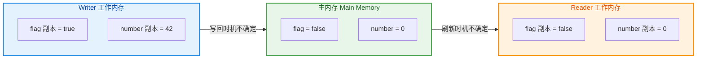

可以看到，Writer 已经将 `flag` 改为 `true`，但这个新值滞留在 Writer 的工作内存中，**何时同步到主内存，主内存何时通知 Reader 刷新**——这两步都是不确定的。这就是可见性的"**裂缝**"所在。

### 写操作立即刷新主内存

当变量被 `volatile` 修饰后，JMM 强制规定：**对该变量的每一次写操作 (store + write)，必须立即同步回主内存 (Main Memory)**，而不是留在线程的工作内存中等待某个不确定的时刻才被刷新。

这在 JMM 的操作层面对应的是一个严格的协议：

1. **use** 操作前，必须先执行 **load** + **read**（从主内存加载最新值）。
2. **assign** 操作后，必须紧接着执行 **store** + **write**（把新值写回主内存）。

也就是说，线程对 `volatile` 变量执行赋值的那一刻，这个新值就会穿透工作内存，直达主内存。不存在"稍后再写"的可能。

```java
/**
 * volatile 写操作的语义演示
 * writer 线程对 volatile 变量的赋值会立即刷入主内存
 */
public class VolatileWriteDemo {

    // 使用 volatile 修饰，写操作将强制刷新主内存
    private static volatile boolean flag = false;

    public static void main(String[] args) throws InterruptedException {

        Thread writer = new Thread(() -> {
            System.out.println("Writer: 准备将 flag 设为 true...");
            // 这条赋值语句在 JMM 层面会触发以下操作序列：
            // 1. assign: 将 true 赋给工作内存中的 flag 副本
            // 2. store:  将工作内存中的 flag 新值传送到主内存
            // 3. write:  将传送过来的值写入主内存的 flag 变量
            // 以上三步对 volatile 变量来说是「原子性地连续执行」的
            flag = true;
            System.out.println("Writer: flag 已写入主内存 = " + flag);
        });

        writer.start();
        writer.join();

        // 此时主内存中的 flag 已经确定是 true
        System.out.println("Main: 从主内存读取 flag = " + flag);
    }
}
```

从底层实现的角度看，`volatile` 写操作结束后，JVM 会在该写指令之后插入一个 **StoreLoad 屏障 (StoreLoad Barrier)**。这是四种内存屏障中开销最大、但也是语义最强的一种——它确保该写操作的结果对所有后续的读操作都可见。关于内存屏障的细节，我们将在后续 "volatile 底层实现" 章节深入展开。

这里需要强调一个关键区别：**普通变量的写操作并没有这种保证**。普通变量被 `assign` 之后，新值可能只停留在 CPU 的 **Store Buffer（写缓冲区）** 中，或者停留在 L1/L2 Cache 中，其他 CPU 核心上的线程完全感知不到。只有当 JVM 或 CPU "心情好了"（比如缓存行被替换、或者执行了某些同步指令），新值才会最终被冲刷到主内存。而 `volatile` 消除了这种不确定性，将"**最终会写回**"提升为"**立即写回**"。

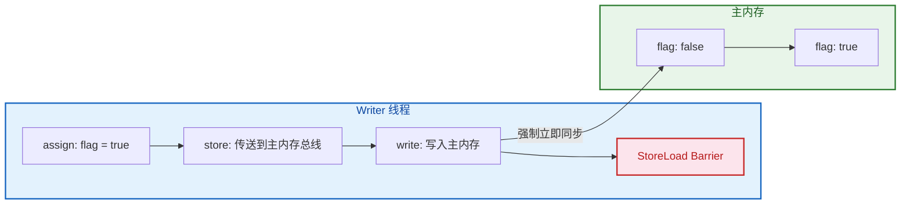

### 读操作从主内存读取

与写操作的"立即刷出"相对应，`volatile` 对读操作施加的约束是：**每次读取 volatile 变量时，必须从主内存重新加载最新值 (read + load)**，禁止直接使用工作内存中可能已过时的缓存副本。

换句话说，线程对 `volatile` 变量的每一次 `use`（使用），都必须先执行一次 `read`（从主内存读取）和 `load`（载入工作内存），然后才能 `use`。这就杜绝了线程"自说自话"——永远用自己缓存的旧值来做判断。

```java
/**
 * volatile 读操作的语义演示
 * reader 线程每次访问 volatile 变量都从主内存拉取最新值
 */
public class VolatileReadDemo {

    // volatile 修饰，确保每次读取都穿透到主内存
    private static volatile int sharedValue = 0;

    public static void main(String[] args) throws InterruptedException {

        // reader 线程：每隔一段时间读取 sharedValue
        Thread reader = new Thread(() -> {
            int localCopy;                          // 线程栈上的局部变量
            while (true) {
                // 对 volatile 变量的读取操作，JMM 保证：
                // 1. read:  从主内存中读取 sharedValue 的最新值
                // 2. load:  将读到的值载入工作内存
                // 3. use:   将工作内存中的值交给执行引擎使用
                localCopy = sharedValue;            // 每次都拿到最新值
                if (localCopy != 0) {               // 检测到变化
                    System.out.println("Reader 发现: sharedValue = " + localCopy);
                    break;                          // 退出循环
                }
            }
        });

        // writer 线程：延迟 1 秒后修改 sharedValue
        Thread writer = new Thread(() -> {
            try {
                Thread.sleep(1000);                 // 让 reader 先跑一会儿
            } catch (InterruptedException e) {
                Thread.currentThread().interrupt();
            }
            System.out.println("Writer: 将 sharedValue 设为 99");
            sharedValue = 99;                       // volatile 写，立即刷入主内存
        });

        reader.start();
        writer.start();
        reader.join();
        writer.join();
        // 输出: Reader 发现: sharedValue = 99
    }
}
```

让我们对比 volatile 读与普通变量读的差异，把两者的完整 JMM 操作链放在一起看：

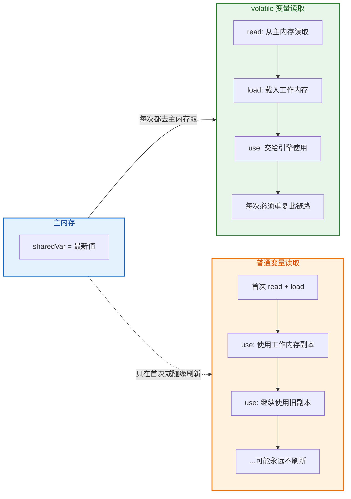

回到我们开头的 `VisibilityProblem` 例子，如果给 `flag` 加上 `volatile` 修饰，问题就迎刃而解了：

```java
/**
 * 使用 volatile 修复可见性问题
 */
public class VisibilityFixed {

    // 加上 volatile 修饰 —— 可见性得到保障
    private static volatile boolean flag = false;
    private static volatile int number = 0;        // 这里也加上，保证 number 的可见性

    public static void main(String[] args) throws InterruptedException {

        Thread reader = new Thread(() -> {
            // volatile 读：每次循环都从主内存拉取 flag 最新值
            while (!flag) {
                // 不会被 JIT 优化为 "读寄存器中的旧值"
                // 因为 volatile 禁止了这种提升优化 (hoisting)
            }
            // 当 flag 为 true 时，能保证看到 number = 42
            // 这是 volatile 的 happens-before 传递性在起作用
            System.out.println("number = " + number);  // 输出: number = 42
        });

        Thread writer = new Thread(() -> {
            number = 42;                               // volatile 写
            flag = true;                               // volatile 写，立即刷入主内存
        });

        reader.start();
        Thread.sleep(100);
        writer.start();

        reader.join(3000);
        writer.join(3000);
    }
}
```

这里有一个非常重要但容易被忽略的细节：`volatile` 读不仅保证了**该变量本身**的可见性，还通过 **happens-before** 规则产生了**传递性效果**。根据 JMM 规定：

> **对 volatile 变量的写操作 happens-before 于后续对同一 volatile 变量的读操作。**

这意味着，在 `flag = true`（volatile 写）之前的所有写操作（如 `number = 42`），对于在读到 `flag == true`（volatile 读）之后的线程来说，都是**确定可见的**。这就是为什么上面 `reader` 线程能安全地看到 `number = 42` 而不是 `0`。

### 禁用工作内存缓存

从本质上讲，`volatile` 的可见性语义可以用一句话概括：**禁止线程将 volatile 变量缓存在工作内存（CPU 寄存器、Store Buffer、L1/L2 Cache 的线程私有视图）中，强制每次操作都直接与主内存交互。**

这个 "禁用缓存" 效果体现在 JVM 和 CPU 两个层面：

**JVM 层面（JIT 编译器优化抑制）**

HotSpot JVM 的 JIT 编译器在追求极致性能时，会进行大量激进的优化。对于普通变量，JIT 可能会做以下操作：

- **寄存器提升 (Register Hoisting)**：将循环中反复读取的变量提升到寄存器中，避免每次都从内存加载。
- **循环不变量外提 (Loop Invariant Code Motion)**：如果变量在循环体内没有被当前线程修改，JIT 会认为它是 "不变的"，将读取操作提到循环外面只执行一次。
- **消除冗余读取 (Redundant Load Elimination)**：连续两次读取同一变量，第二次直接用第一次的结果。

当变量被声明为 `volatile` 后，JIT 编译器会**强制放弃以上所有优化**。每次对 volatile 变量的访问都会生成一条真正的内存读/写指令。这是一种以性能换正确性的权衡。

```java
/**
 * JIT 优化对比演示
 * 展示 volatile 如何阻止 JIT 编译器的寄存器提升优化
 */
public class JitOptimizationDemo {

    // 场景 1：普通变量 —— JIT 可能将 running 提升到寄存器
    private static boolean running = true;

    // 场景 2：volatile 变量 —— JIT 被强制禁止缓存优化
    // private static volatile boolean running = true;

    public static void main(String[] args) throws InterruptedException {

        Thread worker = new Thread(() -> {
            int count = 0;
            // JIT 编译后，这里的 running 可能被提升为寄存器值
            // 优化后的伪代码大致为：
            //   bool r = running;     // 只读取一次
            //   while (r) {           // 永远用寄存器中的值
            //       count++;
            //   }
            // 因此即使主线程修改了 running，worker 也看不到
            while (running) {
                count++;               // 不断累加
            }
            System.out.println("Worker 退出, count = " + count);
        });

        worker.start();
        Thread.sleep(2000);            // 让 worker 运行 2 秒，触发 JIT 编译
        System.out.println("Main: 设置 running = false");
        running = false;               // 普通写，不保证 worker 能看到
        worker.join(3000);             // 等待 worker，可能超时（worker 卡死）

        if (worker.isAlive()) {
            System.out.println("Worker 线程未能退出！可见性问题发生！");
            // 在 Server 模式 JVM (-server) 下大概率出现
        }
    }
}
```

**CPU 层面（缓存一致性强制介入）**

在真实的硬件上，"工作内存" 这个 JMM 抽象概念对应着一套复杂的缓存层次结构。当 `volatile` 写发生时，CPU 会执行以下硬件级动作：

```mermaid
graph LR
    subgraph CPU0["CPU Core 0 - Writer"]
        direction TB
        C0_REG["寄存器: flag = true"] --> C0_SB["Store Buffer 写缓冲区"]
        C0_SB --> C0_L1["L1 Cache"]
        C0_L1 --> C0_FLUSH["强制 Flush"]
    end

    subgraph BUS["系统总线 / 互连"]
        direction TB
        LOCK["lock 前缀指令触发"]
        INVAL["Invalidate 消息广播"]
    end

    subgraph CPU1["CPU Core 1 - Reader"]
        direction TB
        C1_L1["L1 Cache: flag 行失效"]
        C1_REFILL["Cache Miss, 重新填充"]
        C1_REG["寄存器: flag = true"]
        C1_L1 --> C1_REFILL
        C1_REFILL --> C1_REG
    end

    C0_FLUSH -- "写穿透到主内存/LLC" --> BUS
    BUS -- "使其他核心的缓存行无效" --> C1_L1

    classDef cpuWriter fill:#E3F2FD,stroke:#1565C0,stroke-width:2px,color:#0D47A1
    classDef busClass fill:#FCE4EC,stroke:#C62828,stroke-width:2px,color:#B71C1C
    classDef cpuReader fill:#FFF3E0,stroke:#EF6C00,stroke-width:2px,color:#E65100

    class CPU0 cpuWriter
    class BUS busClass
    class CPU1 cpuReader
```

整个流程可以分解为以下步骤：

1. **Writer 线程** 在 CPU Core 0 上执行 `flag = true`（volatile 写）。
2. 由于是 volatile，JVM 生成的机器码中包含 **`lock` 前缀指令**（如 `lock addl $0x0, (%rsp)`）。
3. `lock` 前缀会**锁定总线或使用缓存锁**，并将 Store Buffer 中的所有挂起写操作全部**冲刷 (flush)** 到缓存/主内存。
4. 同时，通过 **MESI 协议**，向其他所有 CPU Core 广播一个 **Invalidate（缓存失效）消息**。
5. **Reader 线程** 所在的 CPU Core 1 收到 Invalidate 消息后，将自己 L1 Cache 中 `flag` 所在的缓存行标记为 **Invalid（无效）**。
6. 当 Reader 下一次读取 `flag` 时，发现缓存行已失效（Cache Miss），于是**被迫从主内存或 LLC（最后一级缓存）重新加载** `flag` 的最新值。
7. Reader 读到 `true`，循环退出。

这就是 `volatile` "禁用工作内存缓存" 的硬件实质——它并不是真的禁用了 CPU 缓存（那样性能会崩溃），而是通过 **缓存一致性协议** 确保所有核心在任意时刻看到的都是同一个最新值。

**一个综合的全链路可见性模型**

让我们用一张完整的图来呈现 volatile 变量从写到读的全链路可见性保障：

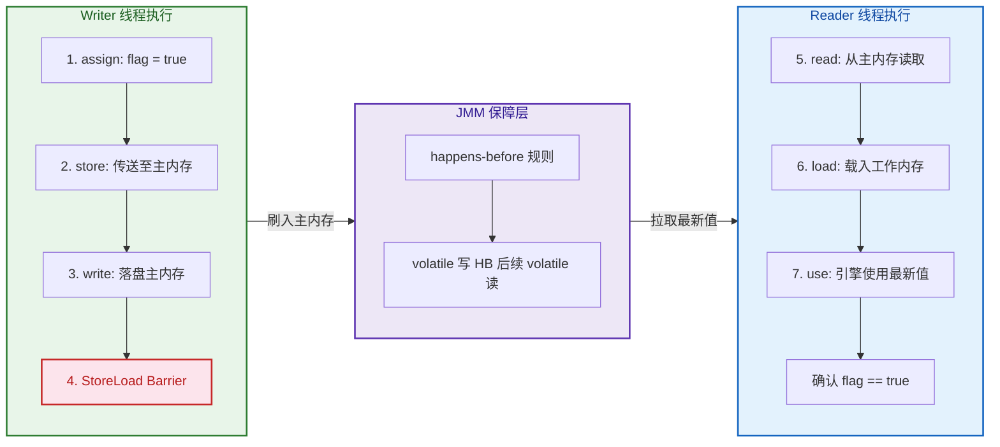

最后做一个小总结。volatile 可见性的三个维度可以这样理解：

| 维度 | 保障内容 | 实现手段 |
|------|---------|---------|
| **写操作立即刷新主内存** | assign 后立即 store + write | StoreStore + StoreLoad 屏障；`lock` 前缀指令冲刷 Store Buffer |
| **读操作从主内存读取** | use 前必须 read + load | LoadLoad + LoadStore 屏障；MESI 协议缓存行 Invalidate |
| **禁用工作内存缓存** | 杜绝 JIT 优化和 CPU 私有缓存造成的脏读 | JIT 编译器放弃寄存器提升等优化；CPU 缓存一致性协议实时同步 |

三者不是三个独立的机制，而是从**语言规范层（JMM）→ 编译器层（JIT）→ 硬件层（CPU Cache + Bus）** 的一套完整保障链。缺任何一层，volatile 的可见性承诺就无法兑现。正是这种贯穿全栈的协同设计，使得 `volatile` 成为 Java 并发可见性保障中最简洁高效的选择。

---

**📝 练习题**

以下代码中，线程 A 先执行 `writer()`，线程 B 随后执行 `reader()`。假设 `x` 是普通变量，`flag` 是 volatile 变量，那么线程 B 中 `result` 的值是多少？

```java
int x = 0;                  // 普通变量
volatile boolean flag = false;  // volatile 变量

// 线程 A 执行
void writer() {
    x = 42;                 // 语句 1
    flag = true;            // 语句 2 (volatile 写)
}

// 线程 B 执行
void reader() {
    if (flag) {             // 语句 3 (volatile 读)
        int result = x;     // 语句 4
        System.out.println(result);
    }
}
```

A. `result` 一定是 `0`，因为 `x` 不是 volatile 变量，没有可见性保障


B. `result` 一定是 `42`，因为 volatile 写的 happens-before 语义具有传递性，会把写之前的所有变量修改一同刷新


C. `result` 可能是 `0` 也可能是 `42`，取决于 CPU 缓存的刷新时机


D. 程序会抛出异常，因为 `x` 和 `flag` 的类型不同导致内存屏障失效


**【答案】** B

**【解析】** 根据 JMM 的 happens-before 规则，volatile 写操作 happens-before 于后续对同一 volatile 变量的读操作。而 happens-before 具有**传递性 (transitivity)**：语句 1（`x = 42`）happens-before 语句 2（`flag = true`，volatile 写），语句 2 happens-before 语句 3（`if (flag)`，volatile 读），语句 3 happens-before 语句 4（`int result = x`）。因此通过传递性，语句 1 happens-before 语句 4，即线程 B 读取 `x` 时一定能看到线程 A 写入的 `42`。这正是 volatile 可见性中 **"写操作立即刷新主内存"** 的核心体现——volatile 写不仅会把自身刷入主内存，还会将该写之前的所有普通变量的修改一起刷出去（这是 StoreStore 屏障的作用）。选项 A 的错误在于忽略了 happens-before 的传递性；选项 C 的错误在于当 volatile 的 happens-before 关系成立时，可见性是确定性保障而非概率性事件；选项 D 纯属干扰项。

---

## volatile 的有序性 ⭐⭐

在 Java 并发编程中，**有序性（Ordering）** 是一个极容易被忽视却又至关重要的问题。我们写出的 Java 源代码，在经历 **编译器优化**、**JIT 即时编译** 以及 **CPU 流水线乱序执行** 三重"洗礼"之后，最终的执行顺序可能与我们在源码中编写的顺序大相径庭。这种现象被称为 **指令重排序（Instruction Reordering）**。在单线程环境下，重排序对程序的最终结果不会产生任何影响——这是 Java 语言规范中 **"as-if-serial"** 语义的保证；然而一旦进入多线程场景，重排序就可能导致灾难性的并发 Bug。

`volatile` 关键字正是 Java 在语言层面提供的**轻量级有序性保障机制**。它通过在关键位置插入 **内存屏障（Memory Barrier / Memory Fence）** 指令，精准地禁止特定类型的指令重排序，从而确保多线程环境下的执行顺序符合程序员的预期。

### 禁止指令重排序

#### 什么是指令重排序

要深刻理解 volatile 的有序性保障，我们必须首先搞清楚"指令重排序"到底是怎么回事。指令重排序并非某个单一层面的行为，而是发生在从源码到实际执行的整个链路中。根据来源不同，可以分为三个层级：

**第一层：编译器优化重排序（Compiler Reordering）**。Java 编译器（`javac`）以及 JIT 编译器（如 HotSpot 的 C1/C2 编译器）在将源码或字节码翻译为机器指令时，会在不改变单线程语义的前提下对指令顺序进行调整，以提高指令级并行度（ILP）、优化寄存器分配或减少流水线停顿。

**第二层：处理器指令级重排序（Processor Reordering）**。现代 CPU 普遍采用 **乱序执行（Out-of-Order Execution, OoOE）** 技术。CPU 的调度单元会分析指令之间的数据依赖关系，将没有依赖的指令提前执行，充分利用执行单元的空闲周期。例如 Intel 的 x86 架构虽然内存模型相对较强（TSO, Total Store Order），但仍然允许 **Store-Load 重排序**（即写操作后面的读操作可能被提前执行）。

**第三层：内存系统重排序（Memory System Reordering）**。由于 CPU 和主内存之间存在多级缓存（L1/L2/L3 Cache）以及 **写缓冲区（Store Buffer）**，写操作可能暂时停留在 Store Buffer 中而尚未刷新到缓存/主内存，从而造成其他核心看到的写入顺序与实际执行顺序不一致。

```java
// ============================================================
// 指令重排序经典案例
// 两个线程分别执行 writer() 和 reader()
// ============================================================
public class ReorderingDemo {

    private int a = 0;          // 普通变量 a，初始值为 0
    private boolean flag = false; // 普通变量 flag，初始值为 false

    // 线程 A 执行的写方法
    public void writer() {
        a = 1;           // 操作 ①：先为 a 赋值
        flag = true;     // 操作 ②：再将 flag 设为 true，作为"数据就绪"信号
    }

    // 线程 B 执行的读方法
    public void reader() {
        if (flag) {          // 操作 ③：检查 flag 是否为 true
            int result = a;  // 操作 ④：如果 flag 为 true，读取 a 的值
            System.out.println(result); // 期望输出 1，但可能输出 0！
        }
    }
}
```

上面这段代码在直觉上看起来毫无问题：线程 A 先写 `a = 1`，再写 `flag = true`；线程 B 看到 `flag == true` 后读取 `a`，结果理应为 `1`。然而由于操作 ① 和操作 ② 之间 **不存在数据依赖关系**（`flag` 的赋值不依赖 `a` 的值），编译器或处理器完全有权将它们重排序为先执行操作 ②、再执行操作 ①。此时时序可能变成：

```
线程A: flag = true  →  (线程B 介入)  →  a = 1
线程B:                   flag == true → result = a → result 为 0！
```

线程 B 在 `flag` 已经为 `true` 的情况下读到了 `a` 的旧值 `0`，这就是指令重排序在多线程环境下造成的典型 Bug。

#### volatile 如何禁止重排序

当我们将 `flag` 声明为 `volatile` 后，JMM（Java Memory Model）会对涉及该变量的操作施加 **严格的重排序约束**。这些约束规则可以归纳为以下 **volatile 重排序规则表**：

```
┌──────────────────────────────────────────────────────────────────┐
│              volatile 重排序规则 (Reordering Rules)              │
├──────────────┬──────────────┬───────────────┬───────────────────┤
│  第一个操作   │  普通读/写   │ volatile 读   │  volatile 写     │
│  ＼ 第二个    │              │               │                  │
├──────────────┼──────────────┼───────────────┼───────────────────┤
│  普通读/写   │    允许       │    允许        │  ❌ 禁止重排序   │
├──────────────┼──────────────┼───────────────┼───────────────────┤
│ volatile 读  │  ❌ 禁止      │  ❌ 禁止       │  ❌ 禁止重排序   │
├──────────────┼──────────────┼───────────────┼───────────────────┤
│ volatile 写  │    允许       │  ❌ 禁止       │  ❌ 禁止重排序   │
└──────────────┴──────────────┴───────────────┴───────────────────┘
```

这张表的阅读方式是：**行表示第一个操作，列表示第二个操作**。标注 ❌ 的格子表示 JMM 禁止对这两个操作进行重排序。从中我们可以提炼出三条核心规则：

**规则一：volatile 写之前的操作不允许被重排序到 volatile 写之后。** 这意味着在执行 volatile 写之前，所有前面的普通读写操作必须已经完成。这条规则保证了"在 volatile 写发布信号之前，所有的数据准备工作都已经完成"——这正是我们上面 `writer()` 方法所需要的保证。

**规则二：volatile 读之后的操作不允许被重排序到 volatile 读之前。** 这意味着在执行 volatile 读之后，所有后续的普通读写操作都不会被提前执行。这条规则保证了"在看到 volatile 信号之后，后续读到的数据一定是最新的"。

**规则三：volatile 写不能与后续的 volatile 读重排序。** 这确保了 volatile 变量之间的操作顺序也是严格有序的。

用修正后的代码来演示：

```java
// ============================================================
// 使用 volatile 修复重排序问题
// ============================================================
public class VolatileOrderingFixed {

    private int a = 0;                    // 普通变量 a
    private volatile boolean flag = false; // volatile 变量 flag

    // 线程 A 执行的写方法
    public void writer() {
        a = 1;           // 操作 ①：普通写（在 volatile 写之前，不可被重排到 ② 之后）
        flag = true;     // 操作 ②：volatile 写（充当"内存屏障"，确保 ① 对其他线程可见）
    }

    // 线程 B 执行的读方法
    public void reader() {
        if (flag) {          // 操作 ③：volatile 读（一旦读到 true，之前的写都可见）
            int result = a;  // 操作 ④：普通读（在 volatile 读之后，不可被重排到 ③ 之前）
            System.out.println(result); // 现在保证输出 1 ✅
        }
    }
}
```

关键变化仅仅是给 `flag` 加了 `volatile` 关键字。根据规则一，操作 ① 不能被重排到操作 ② 之后；根据规则二，操作 ④ 不能被重排到操作 ③ 之前。这就彻底杜绝了前面的 Bug。

#### Happens-Before 与 volatile

Java Memory Model 使用 **Happens-Before** 关系来精确定义多线程之间的内存可见性与有序性。volatile 变量的 Happens-Before 规则是：

> **对一个 volatile 变量的写操作 happens-before 于后续对该 volatile 变量的读操作。**

这句话有两层含义。第一层是 **可见性**：volatile 写的值对后续的 volatile 读一定可见。第二层是 **传递性**：结合 Happens-Before 的传递性规则（如果 A happens-before B，B happens-before C，则 A happens-before C），volatile 写之前的所有操作也对 volatile 读之后的所有操作可见。

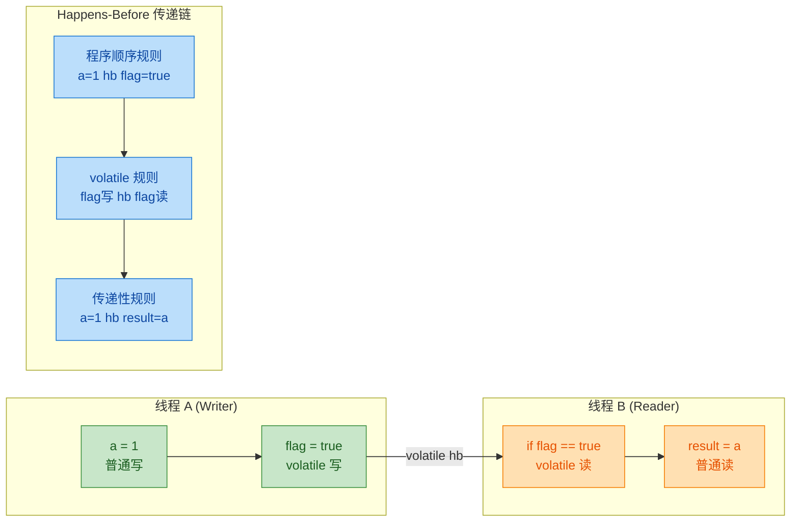

通过 Happens-Before 的传递链，我们可以严格证明：**只要线程 B 读到 `flag == true`，则线程 A 中 `a = 1` 这个写操作的结果一定对线程 B 可见。** 这正是 volatile 有序性保障在理论层面最精确的表述。

### 内存屏障插入

前面我们从 JMM 规范层面讨论了 volatile 的重排序禁止规则，那么这些规则在底层到底是如何实现的？答案就是 **内存屏障（Memory Barrier）**，也叫 **内存栅栏（Memory Fence）**。

#### 内存屏障的定义与分类

内存屏障是一种特殊的 CPU 指令（或由编译器插入的伪指令），其作用是**强制规定屏障两侧的内存操作不可跨越屏障进行重排序**，同时可能触发**缓存刷新或失效**操作以确保内存可见性。

JMM 将内存屏障抽象为四种类型：

| 屏障类型 | 指令示例 | 作用 |
|:--------|:---------|:-----|
| **LoadLoad** | `Load1; LoadLoad; Load2` | 确保 Load1 的数据装载先于 Load2 及后续所有装载指令 |
| **StoreStore** | `Store1; StoreStore; Store2` | 确保 Store1 的数据刷新到主内存先于 Store2 及后续所有存储指令 |
| **LoadStore** | `Load1; LoadStore; Store2` | 确保 Load1 的数据装载先于 Store2 及后续所有存储指令刷新到主内存 |
| **StoreLoad** | `Store1; StoreLoad; Load2` | 确保 Store1 的数据刷新到主内存先于 Load2 及后续所有装载指令。**这是开销最大的屏障**，相当于"全能屏障（Full Fence）" |

其中 **StoreLoad 屏障** 是最"昂贵"的，因为它需要将当前处理器的 **Store Buffer（写缓冲区）** 中所有的挂起写操作全部刷新到缓存/主内存，同时令其他处理器的相关缓存行失效。在 x86 架构上，这通常通过 `mfence` 指令或带有 `lock` 前缀的指令来实现。

#### volatile 写的屏障插入策略

当 JIT 编译器遇到一个 **volatile 写** 操作时，会在其前后各插入内存屏障：

```
┌─────────────────────────────────────────────────────────────┐
│                  volatile 写 屏障插入策略                     │
│                                                             │
│         ┌─────────────────────────────────┐                 │
│         │  前面的所有普通读/写操作          │                 │
│         └─────────────────────────────────┘                 │
│                        │                                    │
│              ══════════════════════                          │
│              ║   StoreStore 屏障  ║                          │
│              ══════════════════════                          │
│         ┌──────────────┤──────────────────┐                 │
│         │    volatile 写: flag = true      │                 │
│         └──────────────┤──────────────────┘                 │
│              ══════════════════════                          │
│              ║   StoreLoad 屏障   ║                          │
│              ══════════════════════                          │
│                        │                                    │
│         ┌─────────────────────────────────┐                 │
│         │  后面的所有 volatile 读/写操作    │                 │
│         └─────────────────────────────────┘                 │
└─────────────────────────────────────────────────────────────┘
```

**在 volatile 写之前插入 StoreStore 屏障**：这确保了 volatile 写之前的所有普通写操作都已经刷新到主内存。对应前面重排序规则表中"普通写不能重排到 volatile 写之后"的约束。回到我们的例子：`a = 1` 的写操作一定在 `flag = true` 之前完成并对外可见。

**在 volatile 写之后插入 StoreLoad 屏障**：这确保了 volatile 写的值刷新到主内存之后，后续的 volatile 读才能执行。这是代价最大的一道屏障，但也是确保"写-读"顺序正确性的关键。

#### volatile 读的屏障插入策略

当 JIT 编译器遇到一个 **volatile 读** 操作时，会在其后面插入内存屏障：

```
┌─────────────────────────────────────────────────────────────┐
│                  volatile 读 屏障插入策略                     │
│                                                             │
│         ┌─────────────────────────────────┐                 │
│         │  前面的所有操作（无特殊约束）      │                 │
│         └─────────────────────────────────┘                 │
│                        │                                    │
│         ┌──────────────┤──────────────────┐                 │
│         │  volatile 读: if (flag) { ... }  │                 │
│         └──────────────┤──────────────────┘                 │
│              ══════════════════════                          │
│              ║   LoadLoad 屏障    ║                          │
│              ══════════════════════                          │
│              ══════════════════════                          │
│              ║   LoadStore 屏障   ║                          │
│              ══════════════════════                          │
│                        │                                    │
│         ┌─────────────────────────────────┐                 │
│         │  后面的所有普通读/写操作          │                 │
│         └─────────────────────────────────┘                 │
└─────────────────────────────────────────────────────────────┘
```

**在 volatile 读之后插入 LoadLoad 屏障**：这确保了 volatile 读完成后，后续的所有普通读操作才能执行。对应规则表中"普通读不能重排到 volatile 读之前"的约束。

**在 volatile 读之后插入 LoadStore 屏障**：这确保了 volatile 读完成后，后续的所有普通写操作才能执行。这两道屏障共同保证了"volatile 读之后的所有操作都不会被提前"。

#### 完整屏障插入流程图

下面用一张完整的 Mermaid 流程图展示线程 A（writer）和线程 B（reader）在执行过程中内存屏障的插入位置：

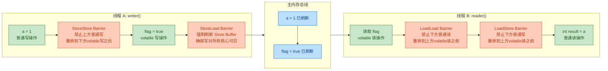

#### x86 平台的实际简化

值得注意的是，JMM 定义的四种屏障是 **抽象模型**，实际在具体硬件平台上会有不同程度的简化。以目前最主流的 **x86/x64 架构** 为例：

x86 采用 **TSO（Total Store Order）** 内存模型，这是一种相对强的内存模型。在 TSO 下：
- **LoadLoad 不会重排序** → LoadLoad 屏障可以省略（No-Op）
- **StoreStore 不会重排序** → StoreStore 屏障可以省略（No-Op）
- **LoadStore 不会重排序** → LoadStore 屏障可以省略（No-Op）
- **StoreLoad 可能重排序** → **StoreLoad 屏障是唯一必须实际插入的屏障！**

因此在 x86 上，**volatile 写** 最终只需要在写操作之后插入一条 `lock addl $0, (%rsp)` 指令（或 `mfence` 指令）作为 StoreLoad 屏障即可。**volatile 读** 则不需要插入任何额外指令——普通的 `mov` 指令就足够了。

我们可以通过 JIT 编译后的实际汇编指令来验证这一点：

```java
// ============================================================
// 查看 volatile 写生成的汇编指令
// 使用 JVM 参数: -XX:+UnlockDiagnosticVMOptions -XX:+PrintAssembly
// ============================================================
public class VolatileAssembly {

    private volatile boolean flag = false; // volatile 变量

    public void setFlag() {
        flag = true; // volatile 写
    }
}

// setFlag() 方法在 x86-64 上可能生成如下汇编（简化）:
//
//   mov    $0x1, 0x10(%rdi)       ; 将 true (0x1) 写入 flag 字段偏移位置
//   lock addl $0x0, (%rsp)        ; StoreLoad 屏障！lock 前缀触发缓存一致性
//                                 ; addl $0x0 本身是空操作，仅为了触发 lock 语义
//
// 对比普通变量的写操作:
//   mov    $0x1, 0x10(%rdi)       ; 仅此一条指令，无额外屏障
```

这段汇编清晰地展示了 volatile 写和普通写的差异：volatile 写多了一条 `lock addl` 指令作为 StoreLoad 屏障。这条指令的开销主要来自于**锁定总线或缓存行**并**刷新 Store Buffer**。

#### 不同架构的屏障对比

除了 x86 之外，不同 CPU 架构对内存屏障的需求差异很大：

| 重排序类型 | x86/x64 | ARM/AArch64 | RISC-V | PowerPC |
|:----------|:--------|:------------|:-------|:--------|
| LoadLoad   | ❌ 不发生 | ✅ 可能发生 | ✅ 可能发生 | ✅ 可能发生 |
| StoreStore | ❌ 不发生 | ✅ 可能发生 | ✅ 可能发生 | ✅ 可能发生 |
| LoadStore  | ❌ 不发生 | ✅ 可能发生 | ✅ 可能发生 | ✅ 可能发生 |
| StoreLoad  | ✅ 可能发生 | ✅ 可能发生 | ✅ 可能发生 | ✅ 可能发生 |

可以看到，ARM 和 PowerPC 等 **弱内存模型（Weak Memory Model）** 架构允许所有四种重排序，因此 JVM 在这些平台上必须为 volatile 操作插入更多的实际屏障指令。这也是为什么**在 ARM 设备（如 Android 手机）上，volatile 的性能开销比 x86 PC 上更大**的原因。

这恰恰体现了 JMM 的价值所在——它在所有硬件平台之上建立了一层统一的抽象，**程序员只需要按照 JMM 的规则编程**，而 JVM 负责在不同平台上生成正确的屏障指令。正如 Doug Lea 所说："*The JMM is designed to balance the need for portability across hardware with the need for optimization.*"

#### 一个综合示例：volatile 有序性在 DCL 中的应用

双重检查锁定（Double-Checked Locking, DCL）是 volatile 有序性最经典的应用场景。这里我们从有序性角度分析为什么 `instance` 必须声明为 `volatile`：

```java
// ============================================================
// 双重检查锁定单例 —— volatile 有序性的经典应用
// ============================================================
public class Singleton {

    // 必须声明为 volatile！关键在于禁止对象创建过程的指令重排序
    private static volatile Singleton instance;

    private int value; // 示例字段，在构造器中初始化

    private Singleton() {
        this.value = 42; // 构造器中为字段赋值
    }

    public static Singleton getInstance() {
        if (instance == null) {           // 第一次检查（无锁，快速路径）
            synchronized (Singleton.class) {
                if (instance == null) {   // 第二次检查（加锁后再次确认）
                    instance = new Singleton(); // 关键行！见下方分析
                }
            }
        }
        return instance;
    }
}
```

`instance = new Singleton()` 这一行代码在 JVM 内部实际上分为三步操作：

```java
// 伪代码展示 new Singleton() 的底层步骤:
// Step 1: memory = allocate();       // 分配对象的内存空间
// Step 2: init(memory);              // 调用构造器，初始化对象（value = 42）
// Step 3: instance = memory;         // 将引用指向分配的内存地址
```

如果没有 volatile，编译器或处理器可能将 Step 2 和 Step 3 重排序为：

```java
// 重排序后的执行顺序:
// Step 1: memory = allocate();       // 分配内存
// Step 3: instance = memory;         // 引用先指向内存（此时对象尚未初始化！）
// Step 2: init(memory);              // 构造器稍后才执行
```

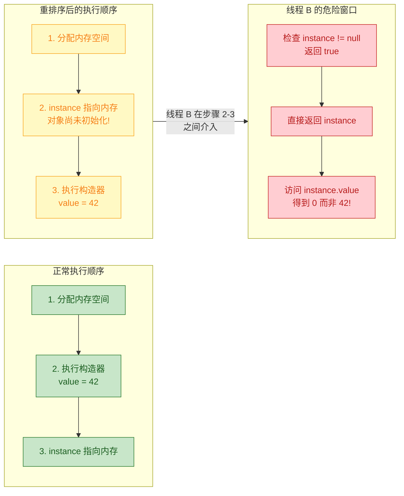

在这个危险的时间窗口内，线程 B 调用 `getInstance()` 时发现 `instance != null`（因为引用已经赋值了），于是跳过 `synchronized` 块直接返回 `instance`。但此时对象的构造器尚未执行完毕，线程 B 拿到的是一个 **半初始化的对象**，读取 `value` 字段得到的是默认值 `0` 而非 `42`！

声明 `volatile` 后，根据 volatile 写的屏障插入策略：在 `instance = memory` 这个 volatile 写之前会插入 **StoreStore 屏障**，确保构造器中的所有初始化写操作（`value = 42`）都在 `instance` 引用赋值之前完成。这就从根本上杜绝了 Step 2 和 Step 3 的重排序问题。

---

**📝 练习题**

以下代码在多线程环境下可能存在问题，请选择正确的分析：

```java
public class OrderingQuiz {
    private int x = 0;
    private int y = 0;
    private volatile boolean ready = false;

    // 线程 A
    public void prepare() {
        x = 1;          // S1
        y = 2;          // S2
        ready = true;   // S3 (volatile 写)
    }

    // 线程 B
    public void consume() {
        if (ready) {        // L1 (volatile 读)
            int r1 = x;     // L2
            int r2 = y;     // L3
            System.out.println(r1 + " " + r2);
        }
    }
}
```

当线程 B 执行到 `println` 语句时，`r1` 和 `r2` 的值分别是什么？

A. 可能是 `0 0`，因为 volatile 只保证 `ready` 自身的可见性，不影响 `x` 和 `y`


B. 可能是 `1 0` 或 `0 2`，因为 `x = 1` 和 `y = 2` 之间可能被重排序


C. 一定是 `1 2`，因为 volatile 写之前的所有普通写都不能重排到 volatile 写之后，且 volatile 读之后的所有普通读都不能重排到 volatile 读之前


D. 一定是 `1 2`，但原因是 synchronized 的锁保护了这些变量


**【答案】** C

**【解析】** 这道题考查的核心是 volatile 的有序性传递保障。根据 JMM 的 volatile 重排序规则：

1. **S1、S2 不能重排到 S3 之后**：S1（`x=1`）和 S2（`y=2`）都是普通写操作，S3（`ready=true`）是 volatile 写。规则规定"普通写不能重排到 volatile 写之后"，因此在 volatile 写执行时，`x=1` 和 `y=2` 已经完成。注意，S1 和 S2 之间可以互换顺序（它们都在 volatile 写之前），但这不影响最终结果。

2. **L2、L3 不能重排到 L1 之前**：L1（读 `ready`）是 volatile 读，L2（读 `x`）和 L3（读 `y`）是普通读。规则规定"volatile 读之后的操作不能重排到 volatile 读之前"，因此 L2 和 L3 一定在 volatile 读之后执行。

3. **Happens-Before 传递性**：S1 hb S3（程序顺序规则）→ S3 hb L1（volatile 规则）→ L1 hb L2（程序顺序规则），因此 S1 hb L2，即 `x=1` 的结果对 `r1=x` 可见。同理 `y=2` 对 `r2=y` 可见。

选项 A 错误，因为 volatile 的有序性保障具有"连带效应"（piggyback），不仅仅保证 volatile 变量自身的可见性。选项 B 错误，虽然 S1 和 S2 之间可以互换顺序，但它们都在 S3 之前完成，不影响结果。选项 D 错误，这里的保障来自 volatile 而非 synchronized。因此答案是 **C**。

---

## volatile 不保证原子性

在前面的章节中，我们已经了解到 `volatile` 能够保证 **可见性（Visibility）** 和 **有序性（Ordering）**，这让许多初学者产生一种误解：既然 `volatile` 变量的每次写入都会立即刷新到主内存，每次读取都从主内存获取最新值，那它是不是就是"线程安全"的？答案是**否定的**。`volatile` 的能力边界非常清晰——它 **不保证原子性（Atomicity）**。这一特性是面试中的高频考点，也是实际开发中极其容易踩坑的地方。

所谓原子性，是指一个操作（或一组操作）在执行过程中**不可被中断**，要么全部执行完毕，要么完全不执行，中间不会被其他线程"插队"。对于 `volatile` 变量来说，**单次读（load）** 和 **单次写（store）** 本身确实是原子的，但一旦涉及到 **复合操作（Compound Action）**——即需要"先读再改再写"的场景——`volatile` 就无法提供任何原子性保证了。这是理解 `volatile` 局限性的关键。

### i++ 问题（读-改-写非原子）

这是理解 `volatile` 非原子性最经典、最直观的案例。表面上看，`i++` 只是一条简单的 Java 语句，但在字节码和 CPU 指令层面，它实际上被分解为 **三个独立的步骤**：

```java
// 表面上的一行代码
i++;

// 实际上等价于以下三步操作：
// Step 1: READ  —— 从主内存读取 i 的当前值到工作内存（线程本地副本）
int temp = i;
// Step 2: MODIFY —— 在工作内存中对值进行 +1 计算
temp = temp + 1;
// Step 3: WRITE  —— 将计算结果写回主内存
i = temp;
```

即使 `i` 被声明为 `volatile`，这三步之间 **仍然可以被其他线程打断**。`volatile` 只能保证每次 READ 时拿到的是最新值，WRITE 后其他线程能立即看到，但它 **无法将 READ-MODIFY-WRITE 这三步绑定为一个不可分割的整体**。

下面用一个完整的实验来证明这个问题：

```java
public class VolatileAtomicityDemo {

    // 声明为 volatile，保证可见性，但不保证原子性
    private volatile int count = 0;

    // i++ 操作：看似简单，实则包含读-改-写三步
    public void increment() {
        count++; // 非原子操作！
    }

    public static void main(String[] args) throws InterruptedException {
        // 创建测试实例
        VolatileAtomicityDemo demo = new VolatileAtomicityDemo();

        // 创建 20 个线程，每个线程对 count 执行 1000 次自增
        Thread[] threads = new Thread[20];
        for (int i = 0; i < threads.length; i++) {
            threads[i] = new Thread(() -> {
                for (int j = 0; j < 1000; j++) {
                    demo.increment(); // 每个线程累加 1000 次
                }
            });
            threads[i].start(); // 启动线程
        }

        // 等待所有线程执行完毕
        for (Thread t : threads) {
            t.join(); // 主线程阻塞，直到目标线程结束
        }

        // 期望结果：20 × 1000 = 20000
        // 实际结果：几乎每次都小于 20000！
        System.out.println("Expected: 20000");
        System.out.println("Actual:   " + demo.count);
    }
}
```

多次运行这段代码，你会发现输出的实际值 **几乎永远小于 20000**，比如 19856、19923、18764 等。这就是 `volatile` 不保证原子性的铁证。

为什么会丢失更新？我们通过一个精确的时序推演来还原"丢失更新（Lost Update）"的完整过程：

```
┌─────────────────────────────────────────────────────────────────────────┐
│                假设 count 当前主内存值 = 10                              │
├─────────────────────────────────────────────────────────────────────────┤
│                                                                         │
│   时刻 T1:  Thread-A 执行 READ  → 从主内存读到 count = 10              │
│   时刻 T2:  Thread-A 执行 MODIFY → 在本地计算 10 + 1 = 11              │
│                                                                         │
│   ────────── Thread-A 被 CPU 调度暂停，Thread-B 获得时间片 ──────────   │
│                                                                         │
│   时刻 T3:  Thread-B 执行 READ  → 从主内存读到 count = 10（仍是10！）  │
│   时刻 T4:  Thread-B 执行 MODIFY → 在本地计算 10 + 1 = 11              │
│   时刻 T5:  Thread-B 执行 WRITE  → 将 11 写回主内存，count = 11        │
│                                                                         │
│   ────────── Thread-A 恢复执行 ──────────                               │
│                                                                         │
│   时刻 T6:  Thread-A 执行 WRITE  → 将 11 写回主内存，count = 11        │
│                                                                         │
│   最终结果: count = 11（期望 12，两次自增却只增加了 1！）               │
│                                                                         │
└─────────────────────────────────────────────────────────────────────────┘
```

关键点在于：Thread-A 在 T1 时刻读取了 `count = 10` 后，还没来得及写回，Thread-B 也读取了相同的值 10。两个线程各自独立计算出 11 并写回，导致 **两次自增操作只产生了一次有效增量**。`volatile` 保证了 Thread-B 在 T3 时刻读到的确实是最新值（此时主内存确实是 10），但问题在于 Thread-A 的"读-改-写"流程还没走完，新值还没写回去。`volatile` 对此无能为力。

我们通过 Mermaid 时序图更清晰地呈现这一竞态过程：

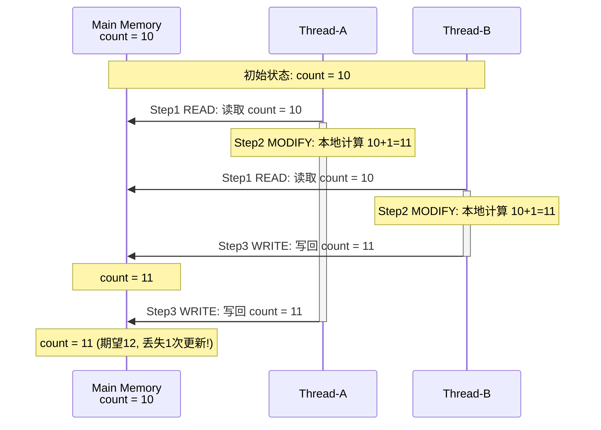

通过字节码层面的分析，可以更清楚地看到为什么 `i++` 不是原子操作。使用 `javap -c` 反编译 `increment()` 方法：

```java
// javap -c VolatileAtomicityDemo.class 的输出（简化版）
public void increment();
    Code:
       0: aload_0                // 将 this 引用压入操作数栈
       1: dup                    // 复制栈顶的 this 引用（后续 putfield 需要）
       2: getfield #2            // 从堆内存读取 this.count 的值压入栈顶 ← READ
       5: iconst_1               // 将常量 1 压入操作数栈
       6: iadd                   // 弹出栈顶两个 int 相加，结果压回栈顶  ← MODIFY
       7: putfield #2            // 将栈顶结果写回 this.count            ← WRITE
      10: return                 // 方法返回
```

从字节码可以清楚地看到，`count++` 被编译为 `getfield`（读）→ `iadd`（改）→ `putfield`（写）三条独立的字节码指令。在这三条指令之间的任何时刻，线程都可能被切换，其他线程都可能插入执行，从而导致竞态条件（Race Condition）。

除了 `i++` 之外，还有很多常见的复合操作同样不具备原子性，即使使用了 `volatile`：

```java
public class CompoundActionExamples {

    private volatile int value = 0;
    private volatile boolean flag = false;

    // ❌ 自减操作：同样是 读-改-写
    public void decrement() {
        value--; // getfield → iconst_1 → isub → putfield
    }

    // ❌ 复合赋值：value += 5 也是 读-改-写
    public void addFive() {
        value += 5; // getfield → iconst_5 → iadd → putfield
    }

    // ❌ check-then-act（检查后执行）模式
    // 在 check 和 act 之间，其他线程可能已经修改了 flag
    public void checkThenAct() {
        if (!flag) {          // Step 1: READ flag
            flag = true;      // Step 2: WRITE flag（两步之间可被打断！）
            // 多个线程可能同时通过 if 检查，都执行了 flag = true
        }
    }

    // ❌ 读取-比较-交换（Read-Compare-Swap）模式
    public void updateIfEquals(int expected, int newValue) {
        if (value == expected) {   // READ + COMPARE
            value = newValue;      // WRITE（比较和写入之间可被打断！）
        }
    }
}
```

用一张流程图来总结 `volatile` 原子性的边界：

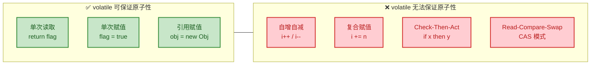

这里需要特别强调一个细节：对 **64 位类型**（`long` / `double`）的赋值操作，在 JVM 规范中并不保证原子性（JVM 允许将其拆分为两个 32 位的写操作）。但如果加上 `volatile`，则 JVM **必须保证** 其单次读写的原子性。这是 `volatile` 在原子性方面唯一能做的"额外贡献"。

### 需要原子类或锁

既然 `volatile` 无法保证复合操作的原子性，那在实际开发中该如何解决？答案有两条路线：**使用原子类（Atomic Classes）** 或 **使用锁（Lock / synchronized）**。

**方案一：java.util.concurrent.atomic 原子类**

JDK 从 1.5 开始，在 `java.util.concurrent.atomic` 包下提供了一系列原子操作类，底层基于 **CAS（Compare-And-Swap）** 机制实现，属于 **无锁（Lock-Free）** 并发方案，性能远优于加锁。

```java
import java.util.concurrent.atomic.AtomicInteger;

public class AtomicSolution {

    // 使用 AtomicInteger 替代 volatile int
    // AtomicInteger 内部持有一个 volatile int value
    // 并通过 CAS 操作保证自增的原子性
    private AtomicInteger count = new AtomicInteger(0);

    public void increment() {
        // incrementAndGet() 底层调用 Unsafe.compareAndSwapInt()
        // 实现原子的 读-改-写 操作
        // 等价于原子版的 ++count
        count.incrementAndGet();
    }

    public static void main(String[] args) throws InterruptedException {
        AtomicSolution demo = new AtomicSolution();

        // 与之前相同的测试：20 个线程各执行 1000 次自增
        Thread[] threads = new Thread[20];
        for (int i = 0; i < threads.length; i++) {
            threads[i] = new Thread(() -> {
                for (int j = 0; j < 1000; j++) {
                    demo.increment(); // 原子自增
                }
            });
            threads[i].start();
        }

        // 等待所有线程完成
        for (Thread t : threads) {
            t.join();
        }

        // 使用 AtomicInteger 后，结果永远正确：20000
        System.out.println("Expected: 20000");
        System.out.println("Actual:   " + demo.count.get()); // 100% 输出 20000
    }
}
```

`AtomicInteger.incrementAndGet()` 的核心原理是 CAS 自旋：

```java
// AtomicInteger 的 incrementAndGet 伪代码还原
// （实际实现在 Unsafe 类中，通过 JNI 调用 CPU 的 CAS 指令）
public final int incrementAndGet() {
    int oldValue;        // 存储读取到的旧值
    int newValue;        // 存储计算出的新值
    do {
        oldValue = get();           // Step 1: 读取当前值（volatile 读）
        newValue = oldValue + 1;    // Step 2: 计算新值
        // Step 3: CAS 尝试将 oldValue 更新为 newValue
        // 如果主内存中 value 仍然等于 oldValue，则更新成功，返回 true
        // 如果主内存中 value 已被其他线程修改（!= oldValue），则更新失败，返回 false
    } while (!compareAndSwap(oldValue, newValue));  // 失败则重试（自旋）
    return newValue;     // 返回更新后的值
}
```

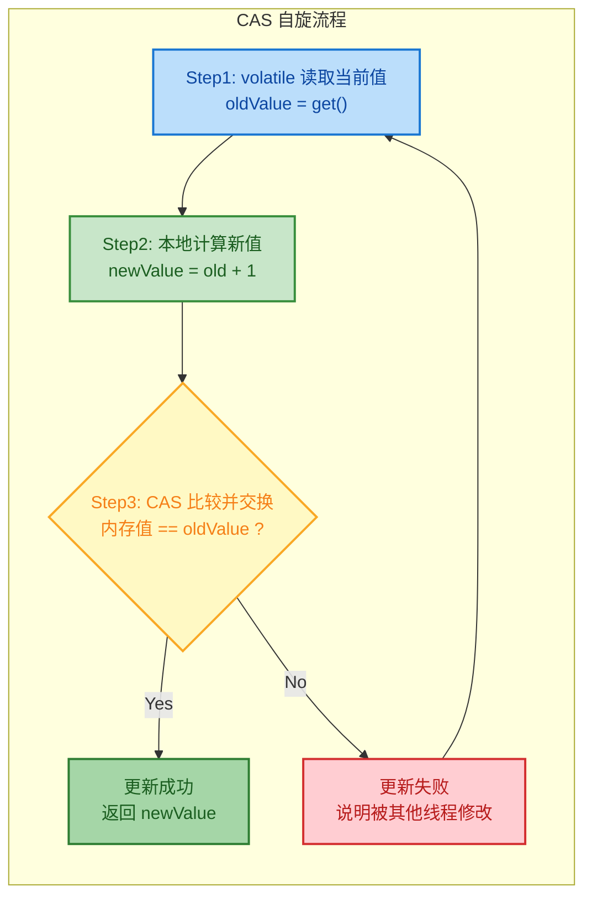

CAS 的关键在于：**比较和交换这两个动作是由 CPU 通过单条硬件指令（如 x86 的 `CMPXCHG`）完成的**，因此它天然就是原子的。如果在写回时发现值已经被别人改了，就放弃本次更新，重新读取最新值再来一遍，直到成功为止。

JDK 提供了丰富的原子类家族以覆盖不同的使用场景：

```java
// ===================== 常用原子类一览 =====================

// 1. 基本类型原子类
AtomicInteger atomicInt = new AtomicInteger(0);     // 原子 int
AtomicLong atomicLong = new AtomicLong(0L);          // 原子 long
AtomicBoolean atomicBool = new AtomicBoolean(false); // 原子 boolean

// 2. 引用类型原子类
AtomicReference<String> atomicRef                    // 原子引用
    = new AtomicReference<>("initial");
AtomicStampedReference<String> stampedRef             // 带版本号的原子引用（解决 ABA 问题）
    = new AtomicStampedReference<>("init", 0);
AtomicMarkableReference<String> markableRef           // 带标记的原子引用
    = new AtomicMarkableReference<>("init", false);

// 3. 数组原子类
AtomicIntegerArray atomicIntArr                      // int 数组中每个元素的原子操作
    = new AtomicIntegerArray(10);
AtomicLongArray atomicLongArr                        // long 数组中每个元素的原子操作
    = new AtomicLongArray(10);
AtomicReferenceArray<String> atomicRefArr            // 引用数组中每个元素的原子操作
    = new AtomicReferenceArray<>(10);

// 4. JDK 8 新增的高性能累加器（高并发场景推荐）
LongAdder longAdder = new LongAdder();               // 高性能 long 累加器
LongAccumulator longAcc                              // 通用 long 累积器
    = new LongAccumulator(Long::max, Long.MIN_VALUE);
DoubleAdder doubleAdder = new DoubleAdder();          // 高性能 double 累加器
```

值得一提的是，**JDK 8 引入的 `LongAdder`** 在高并发累加场景下比 `AtomicLong` 性能更优。`AtomicLong` 在高并发下所有线程争抢同一个变量做 CAS，失败率高导致大量自旋空转；而 `LongAdder` 采用 **分段（Cell）** 思想，将热点数据分散到多个 Cell 中，各线程分别累加不同的 Cell，最后汇总求和，极大减少了 CAS 冲突：

```java
import java.util.concurrent.atomic.AtomicLong;
import java.util.concurrent.atomic.LongAdder;

public class AdderVsAtomicBenchmark {

    // AtomicLong：所有线程 CAS 竞争同一个 value
    private static final AtomicLong atomicLong = new AtomicLong(0);

    // LongAdder：内部将竞争分散到多个 Cell，最终 sum() 汇总
    private static final LongAdder longAdder = new LongAdder();

    public static void main(String[] args) throws InterruptedException {
        int threadCount = 50;        // 50 个线程
        int loopCount = 1_000_000;   // 每线程累加 100 万次

        // ---------- 测试 AtomicLong ----------
        long start1 = System.currentTimeMillis();           // 记录开始时间
        Thread[] threads1 = new Thread[threadCount];
        for (int i = 0; i < threadCount; i++) {
            threads1[i] = new Thread(() -> {
                for (int j = 0; j < loopCount; j++) {
                    atomicLong.incrementAndGet();            // CAS 自增
                }
            });
            threads1[i].start();
        }
        for (Thread t : threads1) t.join();                 // 等待全部完成
        long end1 = System.currentTimeMillis();             // 记录结束时间
        System.out.println("AtomicLong result: " + atomicLong.get()
                + " | Time: " + (end1 - start1) + "ms");

        // ---------- 测试 LongAdder ----------
        long start2 = System.currentTimeMillis();           // 记录开始时间
        Thread[] threads2 = new Thread[threadCount];
        for (int i = 0; i < threadCount; i++) {
            threads2[i] = new Thread(() -> {
                for (int j = 0; j < loopCount; j++) {
                    longAdder.increment();                  // 分段累加
                }
            });
            threads2[i].start();
        }
        for (Thread t : threads2) t.join();                 // 等待全部完成
        long end2 = System.currentTimeMillis();             // 记录结束时间
        System.out.println("LongAdder  result: " + longAdder.sum()
                + " | Time: " + (end2 - start2) + "ms");

        // 典型输出（因机器而异）：
        // AtomicLong result: 50000000 | Time: 1523ms
        // LongAdder  result: 50000000 | Time: 238ms
        // LongAdder 在高竞争下快 5~10 倍
    }
}
```

**方案二：使用 synchronized 或 Lock**

如果业务逻辑更复杂，不仅仅是简单的数值累加，而是涉及多个变量的联合更新，那就需要依赖 **互斥锁** 来保证原子性：

```java
public class SynchronizedSolution {

    // 不需要 volatile，因为 synchronized 本身保证可见性 + 原子性
    private int count = 0;

    // 方案 A：synchronized 方法
    // 同一时刻只有一个线程能进入此方法
    public synchronized void increment() {
        count++; // 在锁的保护下，读-改-写 变为原子操作
    }

    // 方案 B：synchronized 代码块（锁粒度更细，性能更好）
    private final Object lock = new Object(); // 专用锁对象
    public void incrementWithBlock() {
        synchronized (lock) { // 仅锁住临界区
            count++;          // 受锁保护的原子操作
        }
    }

    // 方案 C：ReentrantLock（功能更丰富：可中断、可超时、公平锁）
    private final java.util.concurrent.locks.ReentrantLock reentrantLock
        = new java.util.concurrent.locks.ReentrantLock();

    public void incrementWithLock() {
        reentrantLock.lock();     // 获取锁
        try {
            count++;              // 受锁保护的原子操作
        } finally {
            reentrantLock.unlock(); // 无论是否异常，都必须在 finally 中释放锁
        }
    }
}
```

三种解决方案各有适用场景，下面通过一张对比图进行总结：


最后来看一个综合实战案例，帮助你在实际场景中做出正确的选择：

```java
public class PracticalChoiceDemo {

    // ========= 场景 1：停止标志 → 用 volatile =========
    // 只有简单的 boolean 赋值（true/false），无复合操作
    // volatile 就足够了，无需原子类或锁
    private volatile boolean running = true;

    public void stop() {
        running = false; // 单次写操作，volatile 保证可见性即可
    }

    public void run() {
        while (running) { // 单次读操作，能立即感知到 running 的变化
            // do work...
        }
    }

    // ========= 场景 2：并发计数器 → 用 AtomicInteger =========
    // 需要原子的 读-改-写，但不涉及多变量联动
    // AtomicInteger 比 synchronized 性能更好
    private final AtomicInteger requestCount = new AtomicInteger(0);

    public void onRequest() {
        requestCount.incrementAndGet(); // CAS 原子自增
    }

    public int getRequestCount() {
        return requestCount.get(); // volatile 读，保证获取最新值
    }

    // ========= 场景 3：银行转账 → 必须用锁 =========
    // 涉及两个变量（两个账户余额）的联合更新
    // 必须保证"扣款"和"加款"作为一个整体执行
    // 原子类无法覆盖此场景（只能保证单变量的原子性）
    private int balanceA = 1000; // 账户 A 余额
    private int balanceB = 1000; // 账户 B 余额
    private final Object transferLock = new Object(); // 转账锁

    public void transfer(int amount) {
        synchronized (transferLock) { // 锁住整个转账过程
            if (balanceA >= amount) {  // 检查余额是否充足
                balanceA -= amount;    // 从 A 扣款
                balanceB += amount;    // 向 B 加款
                // 两步操作在锁的保护下不可被打断
            }
        }
    }
}
```

总结一条核心决策原则：**能用 `volatile` 就不用原子类，能用原子类就不用锁**。但前提是你必须清楚知道 `volatile` 的能力边界——它只能保证 **单次读或单次写** 的可见性和有序性，一旦操作涉及"读了再改再写"或"先检查再执行"这类复合动作，就必须升级到原子类或锁。

---

**📝 练习题**

以下代码中，20 个线程分别对 `volatile int count` 执行 1000 次 `count++`，最终 `count` 的值是多少？

```java
private volatile int count = 0;
// 20 threads × 1000 increments each
```

A. 一定等于 20000，因为 `volatile` 保证了每次读取都是最新值


B. 一定等于 20000，因为 `volatile` 禁止了指令重排序


C. 可能小于 20000，因为 `count++` 是复合操作，`volatile` 不保证原子性


D. 一定等于 0，因为 `volatile` 变量不能执行自增操作


**【答案】** C

**【解析】** `count++` 在字节码层面被拆分为 `getfield`（读取 count 值）→ `iadd`（加 1）→ `putfield`（写回 count）三步操作。`volatile` 能保证每次 `getfield` 读到的都是主内存中的最新值，也能保证 `putfield` 后新值立刻对其他线程可见，但它 **无法将这三步绑定为一个不可分割的原子操作**。当两个线程几乎同时读取到相同的旧值、各自加 1 后写回，就会发生 **Lost Update（丢失更新）**，导致两次自增只产生一次有效增量。因此最终结果 **大概率小于** 20000。正确的做法是改用 `AtomicInteger.incrementAndGet()`（CAS 无锁方案）或使用 `synchronized` / `ReentrantLock` 加锁保护。A 和 B 选项错误在于混淆了可见性/有序性与原子性的概念；D 选项纯属错误，`volatile` 变量完全可以执行自增，只是结果不保证正确。

---

## volatile 底层实现 ⭐⭐

要真正理解 `volatile` 为何能保证可见性和有序性，我们必须从 Java 字节码一路深入到 CPU 指令层面。`volatile` 的语义并非凭空实现——它依赖于 JVM 层面的内存屏障指令（Memory Barrier），而这些屏障指令最终会被翻译成 CPU 特定的硬件指令。在 x86 架构上，这个关键的硬件指令就是带有 **`lock` 前缀** 的汇编指令。而 `lock` 前缀之所以能够生效，又依赖于多核 CPU 之间遵守的 **缓存一致性协议（如 MESI）**。这三者——lock 前缀指令、MESI 协议、内存屏障——构成了一条完整的从上层语义到底层硬件的实现链路。理解这条链路，是彻底掌握 `volatile` 的关键。

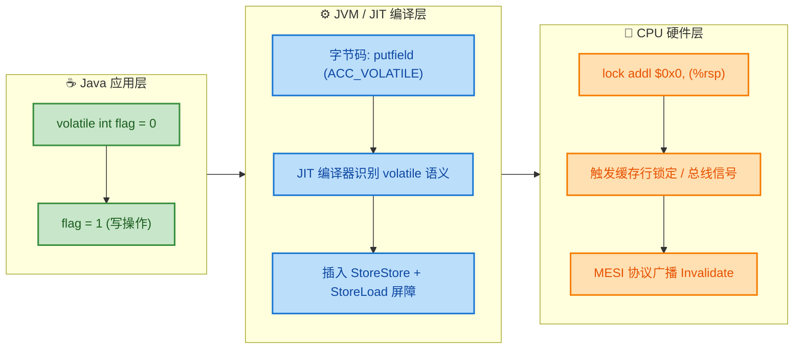

上面这幅图展示了 `volatile` 从 Java 源码到 CPU 硬件的完整实现链路。接下来我们逐层拆解。

---

### lock 前缀指令

当 JIT 编译器（HotSpot 的 C1/C2 编译器）将一个 `volatile` 写操作编译为本地机器码时，它并不会简单地生成一条普通的 `mov` 指令，而是会在写操作之后额外生成一条带有 **`lock` 前缀** 的指令。在 x86/x64 架构上，这条指令通常是：

```java
// ========== 汇编层面：volatile 写操作的实际输出（x86-64）==========

// 假设 Java 代码为: volatile int flag = 1;
// JIT 编译后的核心汇编指令如下：

mov    DWORD PTR [rdi+0x10], 0x1   // 将值 1 写入 flag 字段的内存地址
                                    // rdi+0x10 是对象头偏移后 flag 字段的地址

lock addl $0x0, (%rsp)             // lock 前缀指令：对栈顶加 0（实际值不变）
                                    // 这条指令的真正目的不是 "加 0"
                                    // 而是利用 lock 前缀触发以下硬件行为：
                                    // 1. 将当前 CPU 核心的 Store Buffer 全部刷出
                                    // 2. 通过缓存一致性协议通知其他核心
                                    //    使其持有的对应缓存行失效（Invalidate）
                                    // 3. 充当一个 Full Memory Barrier（全屏障）
```

你可以通过 JVM 参数 `-XX:+UnlockDiagnosticVMOptions -XX:+PrintAssembly` 配合 `hsdis` 反汇编插件来亲眼看到这条 `lock addl` 指令。这是验证理论最直接的方式。

**`lock` 前缀在硬件层面到底做了什么？** 在早期的 x86 处理器（如 Pentium 以前），`lock` 前缀会直接 **锁住系统总线（Bus Lock）**，即在这条指令执行期间，其他所有 CPU 核心都无法访问主内存。这种做法虽然简单粗暴地保证了正确性，但代价极大——整个系统在此期间几乎串行化执行。

从 Pentium 4 / Xeon 开始（大约 2000 年以后），Intel 引入了 **缓存锁定（Cache Lock）** 机制来优化这个过程。现代处理器的 `lock` 前缀行为如下：

1. **如果被操作的数据已经在当前 CPU 核心的 L1 Cache 中**，并且该缓存行处于 Exclusive 或 Modified 状态（即当前核心独占这个数据），那么处理器 **不会锁住总线**，而是直接锁定这个缓存行。修改完成后，通过缓存一致性协议（MESI）通知其他核心将自己持有的该缓存行副本标记为 Invalid。
2. **如果数据不在缓存中，或者数据跨越了两个缓存行（Cache Line Split）**，那么处理器退化为总线锁。

绝大多数情况下，由于 Java 对象字段通常不会跨缓存行，所以走的是第一条路径——**缓存锁定 + MESI 协议**，这也是 `volatile` 在现代硬件上性能尚可的根本原因。

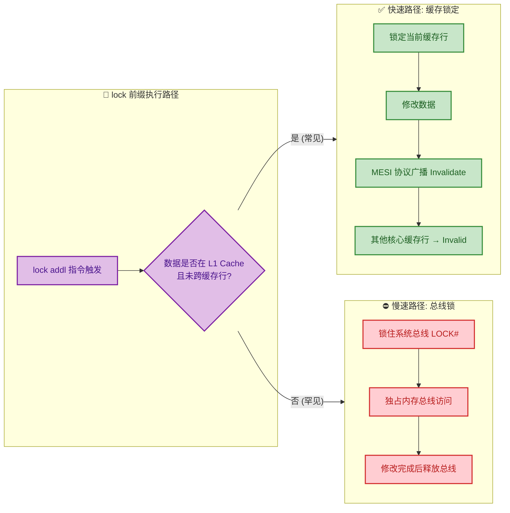

**一个容易混淆的点**：`lock addl $0x0, (%rsp)` 中的 `addl $0x0` 本身是一个 "空操作"（对栈顶加 0 不改变任何值）。这条指令唯一的作用就是充当 `lock` 前缀的载体。JVM 之所以选择 `addl` 而不是其他指令，是因为 Intel 手册规定 `lock` 前缀只能与特定的 read-modify-write 指令搭配（如 `ADD`, `SUB`, `XCHG`, `CMPXCHG` 等），而 `addl $0x0` 是其中开销最小的一种。在某些 JVM 版本或不同 JIT 编译策略下，你也可能看到 `lock xchg` 或 `mfence` 指令替代。

---

### 缓存一致性协议（MESI）

要理解 `lock` 前缀为什么能保证可见性，就必须理解多核 CPU 之间如何保持缓存数据的一致性。现代多核处理器中，每个核心都有自己的 L1/L2 Cache，它们会各自缓存主内存中的数据副本。当某个核心修改了缓存中的数据后，如果不采取任何措施，其他核心读到的仍然是旧值——这就是 **缓存不一致** 问题（Cache Coherence Problem）。

**MESI 协议** 是解决这一问题的经典方案，其名称来自四种缓存行状态的首字母：

| 状态 | 全称 | 含义 | 是否与主内存一致 |
|:---:|:---:|:---|:---:|
| **M** | Modified | 当前核心已修改该缓存行，且只有本核心持有最新值。主内存中的值是过期的（stale）。 | ❌ |
| **E** | Exclusive | 当前核心是唯一持有该缓存行副本的核心，且数据与主内存一致。可直接写入而无需通知其他核心。 | ✅ |
| **S** | Shared | 多个核心同时持有该缓存行的副本，且均与主内存一致。任何核心要写入，必须先使其他副本失效。 | ✅ |
| **I** | Invalid | 该缓存行无效。要么从未加载过，要么已被其他核心的写操作失效。读取时必须重新从主内存或其他核心获取。 | — |

下面是 MESI 协议的状态转换全景图：

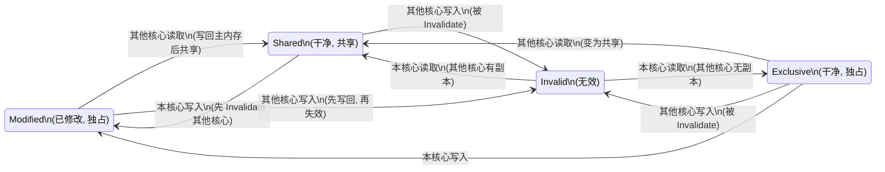

**让我们用一个完整的多核交互场景来理解 MESI 的工作过程。** 假设有一个 `volatile boolean running = true`，它存储在主内存的某个地址上。CPU 有两个核心：Core 0 负责读取 `running`，Core 1 负责将 `running` 设为 `false`。

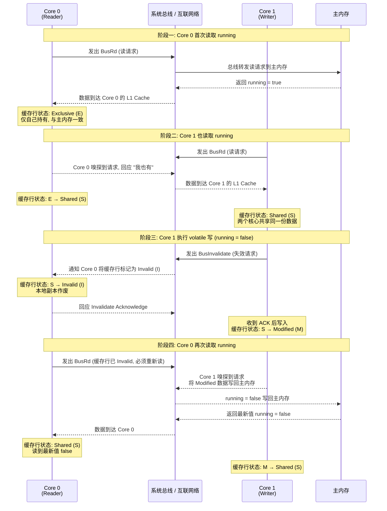

这个时序图完整展示了 MESI 协议如何通过 **总线嗅探（Bus Snooping）** 和 **失效广播（Invalidate）** 来保证多核之间的缓存一致性。

**但是，请注意一个至关重要的细节：MESI 协议本身并不能完全替代 `volatile` 的作用。** 原因在于，现代 CPU 为了提高性能，在缓存和核心之间还有两个关键的中间缓冲区：

1. **Store Buffer（写缓冲区）**：核心在写入数据时，不会立即写到 L1 Cache，而是先写入 Store Buffer，这样核心无需等待 MESI 协议的 Invalidate ACK 就能继续执行后续指令。
2. **Invalidate Queue（失效队列）**：当一个核心收到其他核心发来的 Invalidate 消息时，它可能不会立即处理（因为可能正忙于执行其他指令），而是先将消息放入 Invalidate Queue，稍后再处理。

```java
// ========== Store Buffer 与 Invalidate Queue 的存在导致的问题 ==========

// ---- 没有 volatile 时的可能执行场景 ----

// Core 1 执行:
running = false;     // 值写入 Store Buffer, 尚未刷到 L1 Cache
                     // MESI Invalidate 尚未发出, 或已发出但...

// Core 0 执行:
if (running) {       // Core 0 的 Invalidate Queue 中可能有待处理消息
                     // 但 CPU 选择先从自己的 L1 Cache 读取（仍为 true）
    doWork();        // 错误地继续执行！
}

// ---- 有 volatile 时的执行场景 ----

// Core 1 执行:
// volatile running = false;
// JIT 编译为:
//   mov [running_addr], 0       -- 写入值
//   lock addl $0x0, (%rsp)     -- lock 前缀强制：
//                                  1. 清空 Store Buffer (刷出所有挂起的写操作)
//                                  2. 等待所有 Invalidate ACK 返回

// Core 0 执行:
// volatile 读 running
// lock 前缀 / 内存屏障强制:
//   1. 处理 Invalidate Queue 中的所有待处理消息
//   2. 发现 running 的缓存行已被标记为 Invalid
//   3. 重新从主内存 (或持有最新值的核心) 读取
// 读到 false, 正确！
```

这就引出了一个关键认识：**MESI 协议保证了缓存一致性的"最终正确性"，而 `lock` 前缀 / 内存屏障保证了这种正确性的"及时性"**。没有 `volatile`，即使有 MESI 协议，CPU 也可能因为 Store Buffer 和 Invalidate Queue 的存在而让一个核心暂时看不到另一个核心的最新写入。`volatile` 通过内存屏障强制清空这些缓冲区，确保写入立即可见。

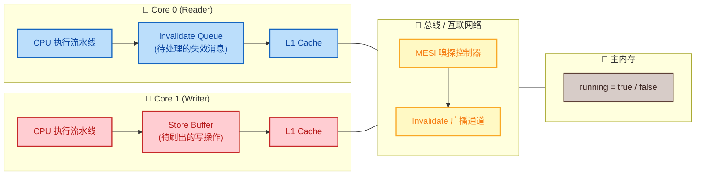

上图清晰展示了 Store Buffer 和 Invalidate Queue 的位置——它们夹在 CPU 执行核心和 L1 Cache 之间，是造成"可见性延迟"的根源。`volatile` 的 `lock` 前缀指令本质上就是强制绕过（或清空）这两个缓冲区。

---

### 内存屏障

**内存屏障（Memory Barrier / Memory Fence）** 是 `volatile` 语义在 JVM 规范层面的核心实现机制。它是一种更高层次的抽象——JVM 定义了四种逻辑屏障类型，然后由各平台的 JIT 编译器将其映射到具体的硬件指令（如 x86 上的 `lock addl`、ARM 上的 `dmb` 指令等）。

JVM 规范（JSR-133 内存模型）定义的四种屏障类型如下：

| 屏障类型 | 指令序列 | 语义说明 |
|:---:|:---:|:---|
| **LoadLoad** | Load1; `LoadLoad`; Load2 | 确保 Load1 的读操作在 Load2 之前完成。防止读操作之间的重排序。 |
| **StoreStore** | Store1; `StoreStore`; Store2 | 确保 Store1 的写操作对其他处理器可见（刷入缓存）后，再执行 Store2。防止写操作之间的重排序。 |
| **LoadStore** | Load1; `LoadStore`; Store2 | 确保 Load1 的读操作完成后，再执行 Store2 的写操作。防止读-写之间的重排序。 |
| **StoreLoad** | Store1; `StoreLoad`; Load2 | 确保 Store1 的写操作刷入缓存并对所有处理器可见后，再执行 Load2。**这是四种屏障中开销最大的一种**，通常需要清空 Store Buffer。 |

**`volatile` 的屏障插入策略** 是 JSR-133 规范中明确定义的。对于每一个 `volatile` 读和写操作，JVM 会按照以下规则插入屏障：

**volatile 写操作的屏障插入：**

```java
// ========== volatile 写操作的屏障插入模型 ==========

// --- 在 volatile 写之前 ---
StoreStore_Barrier();   // 屏障 1: 确保 volatile 写之前的所有普通写操作
                        //         已经刷入缓存, 对其他处理器可见
                        //         防止上面的普通写与下面的 volatile 写重排序

volatile_field = value; // volatile 写操作本体

// --- 在 volatile 写之后 ---
StoreLoad_Barrier();    // 屏障 2: 这是最关键也最昂贵的屏障
                        //         确保 volatile 写已完全刷入并可见后,
                        //         才能执行后续的任何读/写操作
                        //         防止 volatile 写与后面的 volatile 读重排序
```

**volatile 读操作的屏障插入：**

```java
// ========== volatile 读操作的屏障插入模型 ==========

value = volatile_field; // volatile 读操作本体

// --- 在 volatile 读之后 ---
LoadLoad_Barrier();     // 屏障 1: 确保 volatile 读完成后,
                        //         才能执行后续的普通读操作
                        //         防止 volatile 读与后面的普通读重排序

LoadStore_Barrier();    // 屏障 2: 确保 volatile 读完成后,
                        //         才能执行后续的普通写操作
                        //         防止 volatile 读与后面的普通写重排序
```

让我们将这些屏障策略应用到一个真实的代码场景中：

```java
// ========== 完整示例：内存屏障在真实代码中的插入位置 ==========
public class VolatileBarrierDemo {
    int a = 0;                      // 普通变量
    int b = 0;                      // 普通变量
    volatile boolean flag = false;  // volatile 变量

    // ---- Writer 线程 ----
    public void writer() {
        a = 1;                      // 1. 普通写
        b = 2;                      // 2. 普通写

        // <<<< StoreStore 屏障 >>>>
        // 确保 a=1, b=2 的写操作在 flag=true 之前刷入缓存
        // 这样其他线程一旦看到 flag==true, 就一定能看到 a==1, b==2

        flag = true;                // 3. volatile 写

        // <<<< StoreLoad 屏障 >>>>
        // 确保 flag=true 已完全可见后, 才能执行后续的任何读写
        // 在 x86 上, 这里会生成 lock addl $0x0, (%rsp)
    }

    // ---- Reader 线程 ----
    public void reader() {
        if (flag) {                 // 4. volatile 读

            // <<<< LoadLoad 屏障 >>>>
            // 确保 flag 的值已读取完毕后, 才能读 a 和 b
            // <<<< LoadStore 屏障 >>>>
            // 确保 flag 的值已读取完毕后, 才能进行后续写操作

            int r1 = a;             // 5. 普通读 —— 保证读到 a=1
            int r2 = b;             // 6. 普通读 —— 保证读到 b=2
            System.out.println(r1 + ", " + r2); // 输出: 1, 2
        }
    }
}
```

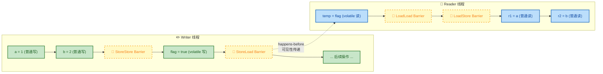

**关于 x86 架构的特殊优化**：x86/x64 架构拥有相对强的内存模型（TSO, Total Store Order），它本身已经保证了 LoadLoad、LoadStore、StoreStore 三种顺序不会被破坏。x86 唯一允许的重排序是 **Store-Load 重排序**（即一个写操作可能被重排到后续读操作之后）。因此，在 x86 上，JIT 编译器只需要为 `volatile` 写操作之后插入一个 **StoreLoad 屏障** 即可——其他三种屏障在 x86 上是空操作（no-op），不会生成任何指令。这就是为什么在 x86 上你只看到一条 `lock addl`，而不是四条屏障指令。

但在 ARM 或 PowerPC 等弱内存模型架构上，四种屏障都可能生成实际的硬件指令（如 ARM 的 `dmb ish`、`dsb` 等），因此 `volatile` 在这些架构上的性能开销明显高于 x86。

**各架构屏障指令的映射对比：**

| JVM 逻辑屏障 | x86/x64 | ARM v8 | POWER |
|:---:|:---:|:---:|:---:|
| LoadLoad | no-op | `dmb ishld` | `lwsync` |
| StoreStore | no-op | `dmb ishst` | `lwsync` |
| LoadStore | no-op | `dmb ish` | `lwsync` |
| StoreLoad | `lock addl` / `mfence` | `dmb ish` | `sync` |

**最后做一个关键总结，将三者的关系理清：**

- **内存屏障** 是 JVM 规范层面的抽象概念，定义了"不允许哪些重排序"。
- **`lock` 前缀指令** 是 x86 架构上实现 StoreLoad 屏障的具体硬件指令。它强制清空 Store Buffer 并等待 MESI 协议的 Invalidate ACK。
- **MESI 协议** 是 CPU 硬件层面的缓存一致性协议，确保一个核心的写入最终能被所有核心看到。`lock` 前缀通过 MESI 的 Invalidate 机制，使得这个"最终"变成"立即"。

三者的关系是自顶向下的层级依赖：**JVM 内存屏障 → lock 前缀指令 → MESI 协议**。

```mermaid
graph LR
    subgraph SPEC["📜 JVM 规范层"]
        direction TB
        S1["JSR-133 内存模型"]
        S2["volatile 语义定义"]
        S3["四种逻辑屏障\nLL / SS / LS / SL"]
        S1 --> S2 --> S3
    end

    subgraph IMPL["⚙️ JIT 编译层"]
        direction TB
        I1["C2 编译器"]
        I2["识别 ACC_VOLATILE 字段"]
        I3["生成平台特定屏障指令"]
        I1 --> I2 --> I3
    end

    subgraph HW["🔧 CPU 硬件层"]
        direction TB
        H1["x86: lock addl / mfence"]
        H2["清空 Store Buffer"]
        H3["MESI Invalidate 广播"]
        H4["缓存行状态转换"]
        H1 --> H2 --> H3 --> H4
    end

    SPEC --> IMPL --> HW

    classDef specStyle fill:#E8EAF6,stroke:#3949AB,color:#1A237E,stroke-width:2px
    classDef implStyle fill:#E0F2F1,stroke:#00897B,color:#004D40,stroke-width:2px
    classDef hwStyle fill:#FFF3E0,stroke:#EF6C00,color:#E65100,stroke-width:2px

    class S1,S2,S3 specStyle
    class I1,I2,I3 implStyle
    class H1,H2,H3,H4 hwStyle
```

---

**📝 练习题**

以下关于 `volatile` 底层实现的说法，哪一项是**错误**的？

A. 在 x86 架构上，`volatile` 写操作之后会生成 `lock addl $0x0, (%rsp)` 指令，其中 `addl $0x0` 本身是一个无实际效果的操作，仅作为 `lock` 前缀的载体。


B. MESI 协议中，当一个核心要对处于 Shared 状态的缓存行执行写操作时，必须先向总线发出 Invalidate 消息，等待所有其他持有该缓存行的核心回复 ACK 后，才能完成写入。


C. 在 x86 架构上，`volatile` 读操作会生成 LoadLoad 和 LoadStore 屏障对应的硬件指令，以防止后续读写操作被重排序到 `volatile` 读之前。


D. Store Buffer 的存在可能导致一个核心的写操作虽然已经执行，但尚未通过 MESI 协议使其他核心感知到，`lock` 前缀指令通过强制清空 Store Buffer 来解决这一问题。


**【答案】** C

**【解析】** x86/x64 架构拥有 **TSO（Total Store Order）** 内存模型，这是一种相对较强的内存模型。在 TSO 下，LoadLoad、LoadStore 和 StoreStore 三种顺序天然被硬件保证，不会发生重排序。x86 唯一允许的重排序是 **Store-Load 重排序**。因此，在 x86 上，JIT 编译器对 `volatile` 读操作后的 LoadLoad 和 LoadStore 屏障不会生成任何实际的硬件指令（它们是 no-op）。只有 `volatile` 写之后的 **StoreLoad 屏障** 会生成真正的 `lock addl` 或 `mfence` 指令。选项 C 错误地声称 x86 上会为 volatile 读生成屏障硬件指令。注意，这只是 x86 的特性——在 ARM 等弱内存模型架构上，volatile 读确实会生成对应的屏障指令（如 `dmb`）。选项 A、B、D 的描述均与实际实现一致。

---

## volatile vs synchronized

在 Java 并发编程中，`volatile` 和 `synchronized` 是两个最基础的同步机制。初学者常常将它们混为一谈，或者在应该用 `synchronized` 的场景下错误地使用了 `volatile`，导致线程安全漏洞。要做出正确的技术选型，必须从 **语义保证、实现代价、适用场景** 三个维度进行系统对比。

我们先用一张全景对比图建立直觉，再逐项深入分析。

```mermaid
graph LR
    subgraph VOL["volatile"]
        direction TB
        V1["✅ 可见性 Visibility"]
        V2["✅ 有序性 Ordering"]
        V3["❌ 原子性 Atomicity"]
        V4["❌ 不阻塞 Non-blocking"]
        V5["⚡ 极低开销 Ultra-low Cost"]
        V1 --> V2 --> V3 --> V4 --> V5
    end

    subgraph SYN["synchronized"]
        direction TB
        S1["✅ 可见性 Visibility"]
        S2["✅ 有序性 Ordering"]
        S3["✅ 原子性 Atomicity"]
        S4["⚠️ 会阻塞 Blocking"]
        S5["💰 较高开销 Higher Cost"]
        S1 --> S2 --> S3 --> S4 --> S5
    end

    VOL --- CMP{"如何选择?"}
    CMP --- SYN

    classDef volStyle fill:#E8F5E9,stroke:#43A047,stroke-width:2px,color:#1B5E20
    classDef synStyle fill:#E3F2FD,stroke:#1E88E5,stroke-width:2px,color:#0D47A1
    classDef cmpStyle fill:#FFF3E0,stroke:#FB8C00,stroke-width:2px,color:#E65100

    class VOL,V1,V2,V3,V4,V5 volStyle
    class SYN,S1,S2,S3,S4,S5 synStyle
    class CMP cmpStyle
```

### volatile 更轻量

这是选择 `volatile` 最主要的理由——**性能开销极低**。要理解"轻量"到底轻在哪里，我们需要深入到两者的底层实现差异。

**`synchronized` 的开销来源：**

`synchronized` 在 HotSpot JVM 中经历了多次优化（偏向锁 → 轻量级锁 → 重量级锁），但无论哪个阶段，它都需要做大量的额外工作：

1. **对象头操作**：每次加锁/解锁都需要 CAS 修改对象头（Mark Word）中的锁标志位。
2. **锁升级管理**：JVM 需要维护锁的状态机（biased → thin → fat），状态转换本身有开销。
3. **线程阻塞与唤醒**：当锁膨胀为重量级锁后，未获取锁的线程会被 `park()`（操作系统级别的线程挂起），这涉及**用户态到内核态的上下文切换**（context switch），代价极其昂贵——一次上下文切换大约需要 **5,000 ~ 20,000 个 CPU 时钟周期**。
4. **Monitor 结构**：重量级锁依赖操作系统的 Mutex Lock，JVM 需要维护 `ObjectMonitor` 数据结构（包含 EntryList、WaitSet 等队列）。

**`volatile` 的开销来源：**

`volatile` 的实现极其简洁——仅仅是在读写操作前后插入**内存屏障指令**（Memory Barrier）。在 x86 架构上：

1. **volatile 写**：生成一条 `lock addl $0x0, (%rsp)` 指令（或等价的 `mfence`），确保 Store Buffer 被刷新。
2. **volatile 读**：在 x86 的强内存模型下，普通的 `mov` 指令即可满足，几乎**零额外开销**。

我们用一个表格量化这个差距：

| 维度 | `volatile` | `synchronized` (无竞争) | `synchronized` (有竞争) |
|:---|:---|:---|:---|
| **写操作耗时** | ~几个 ns (内存屏障) | ~几十 ns (CAS + 屏障) | ~几 μs 甚至更高 (阻塞唤醒) |
| **是否涉及内核态** | ❌ 纯用户态 | ❌ 轻量级时纯用户态 | ✅ 重量级锁涉及内核态 |
| **是否需要 CAS** | ❌ | ✅ | ✅ |
| **是否涉及锁升级** | ❌ | ✅ | ✅ |
| **对 JIT 优化的影响** | 较小 (仅禁止特定重排序) | 较大 (整个同步块限制优化) | 较大 |

下面这段代码直观展示了两者在使用形式上的"重量"差异：

```java
public class WeightComparison {

    // ====== volatile 方案：轻量 ======
    // 仅一个修饰符，无需额外的锁对象，无需代码块
    private volatile boolean running = true;

    // 读操作：直接读取，JVM 自动插入 Load 屏障
    public boolean isRunning() {
        return running;  // volatile 读，开销约等于普通读（x86 下）
    }

    // 写操作：直接赋值，JVM 自动插入 Store 屏障
    public void stop() {
        running = false; // volatile 写，仅一条 lock 前缀指令
    }

    // ====== synchronized 方案：重量 ======
    // 需要一个专门的锁对象（或使用 this）
    private boolean flag = true;
    private final Object lock = new Object(); // 额外的锁对象

    // 读操作：必须获取锁 → 读取 → 释放锁
    public boolean getFlag() {
        synchronized (lock) {         // monitorenter：获取锁
            return flag;              // 读取共享变量
        }                             // monitorexit：释放锁
        // 即使只读一个 boolean，也要完成完整的加锁/解锁流程
    }

    // 写操作：同样必须走完整的锁流程
    public void clearFlag() {
        synchronized (lock) {         // monitorenter
            flag = false;             // 写入共享变量
        }                             // monitorexit
    }
}
```

**关键洞察**：`volatile` 是一种**编译器/处理器级别的轻量协议**，它不涉及任何锁的获取与释放，不涉及线程状态的切换，不涉及任何队列管理。它仅仅是告诉 CPU："这个变量的读写不要走本地缓存的捷径，要保证全局可见。" 这就是"轻量"的本质含义。

```mermaid
graph LR
    subgraph VOLATILE_PATH["volatile 执行路径"]
        direction TB
        VP1["Thread 写入变量"]
        VP2["插入 StoreStore 屏障"]
        VP3["执行 lock 前缀指令"]
        VP4["Store Buffer 刷回主存"]
        VP5["其他线程可见 ✅"]
        VP1 --> VP2 --> VP3 --> VP4 --> VP5
    end

    subgraph SYNC_PATH["synchronized 执行路径"]
        direction TB
        SP1["Thread 尝试获取锁"]
        SP2["CAS 修改 Mark Word"]
        SP3{"CAS 成功?"}
        SP4["进入临界区执行"]
        SP5["释放锁 + Store 屏障"]
        SP6["膨胀为重量级锁"]
        SP7["OS 线程挂起 park"]
        SP8["等待持锁线程释放"]
        SP9["OS 线程唤醒 unpark"]
        SP1 --> SP2 --> SP3
        SP3 -- "Yes" --> SP4 --> SP5
        SP3 -- "No: 竞争" --> SP6 --> SP7 --> SP8 --> SP9 --> SP4
    end

    VOLATILE_PATH ~~~ SYNC_PATH

    classDef volPath fill:#E8F5E9,stroke:#43A047,stroke-width:2px,color:#1B5E20
    classDef synPath fill:#E3F2FD,stroke:#1E88E5,stroke-width:2px,color:#0D47A1
    classDef decision fill:#FFF8E1,stroke:#FFB300,stroke-width:2px,color:#F57F17
    classDef danger fill:#FFEBEE,stroke:#E53935,stroke-width:2px,color:#B71C1C

    class VOLATILE_PATH,VP1,VP2,VP3,VP4,VP5 volPath
    class SYNC_PATH,SP1,SP2,SP4,SP5 synPath
    class SP3 decision
    class SP6,SP7,SP8,SP9 danger
```

从图中可以清晰看到，`volatile` 的执行路径是一条笔直的"快车道"，而 `synchronized` 在竞争场景下需要经历**锁膨胀 → 线程挂起 → 等待 → 唤醒**的漫长弯路。这也是为什么在高频读写的热点路径上，能用 `volatile` 就不用 `synchronized`。

---

### volatile 不保证原子性

这是 `volatile` 与 `synchronized` 之间**最根本的语义差异**，也是实际开发中最容易踩坑的地方。

**`synchronized` 提供的原子性保证：**

`synchronized` 块（或方法）构成了一个 **临界区（Critical Section）**。JVM 保证：在同一把锁上，**同一时刻只有一个线程能进入临界区**。这意味着临界区内的所有操作——无论是一条语句还是一百条语句——对外部观察者来说都是**不可分割的整体**。其他线程要么看到操作前的状态，要么看到操作后的状态，绝不会看到中间状态。

**`volatile` 不提供原子性：**

`volatile` 仅保证**单次读**或**单次写**的原子性（对于 long/double，普通变量在 32 位 JVM 上可能出现字撕裂 word tearing，而 volatile long/double 则保证原子性）。但对于**复合操作**（read-modify-write），`volatile` 完全无能为力。

让我们用经典的 `i++` 问题来深入分析：

```java
public class AtomicityComparison {

    // ====== volatile 方案：不安全！ ======
    private volatile int volatileCount = 0;

    // i++ 看似一行代码，实际上是三步操作
    public void unsafeIncrement() {
        volatileCount++;
        // 字节码层面分解为：
        // 1. getfield  volatileCount  → 从主内存读取当前值（volatile 读）
        // 2. iconst_1 + iadd           → 在线程本地栈上执行 +1
        // 3. putfield  volatileCount  → 将新值写回主内存（volatile 写）
        //
        // 问题：在步骤 1 和步骤 3 之间，其他线程可能已经修改了 volatileCount！
        // volatile 只保证每次读到的是最新值，但不保证 "读→改→写" 的整体原子性
    }

    // ====== synchronized 方案：安全 ======
    private int syncCount = 0;

    public synchronized void safeIncrement() {
        syncCount++;
        // 虽然同样是三步操作，但 synchronized 确保：
        // 在当前线程执行完 读→改→写 并释放锁之前，
        // 其他线程根本无法进入这个方法，所以不会出现竞态条件
    }
}
```

下面用时序图展示两个线程并发执行 `volatile` 变量 `i++` 时的竞态过程：

```mermaid
sequenceDiagram
    participant T1 as Thread-1
    participant MM as Main Memory<br/>volatileCount
    participant T2 as Thread-2

    Note over MM: 初始值 volatileCount = 0

    T1 ->> MM: ① volatile 读: 得到 0
    T2 ->> MM: ② volatile 读: 得到 0
    Note over T1: 本地计算: 0 + 1 = 1
    Note over T2: 本地计算: 0 + 1 = 1
    T1 ->> MM: ③ volatile 写: 写入 1
    Note over MM: volatileCount = 1
    T2 ->> MM: ④ volatile 写: 写入 1
    Note over MM: volatileCount = 1 ❌ 期望是 2!
```

两个线程各执行了一次 `i++`，期望结果为 2，但最终结果却是 1——**一次自增被"吞掉"了**。这就是经典的 **Lost Update（丢失更新）** 问题。`volatile` 的可见性保证让每次读都能看到最新值，但它**无法阻止两个线程同时读到相同的值、各自计算、然后互相覆盖**。

再看 `synchronized` 如何杜绝这个问题：

```mermaid
sequenceDiagram
    participant T1 as Thread-1
    participant LK as Monitor Lock
    participant MM as Main Memory<br/>syncCount
    participant T2 as Thread-2

    Note over MM: 初始值 syncCount = 0

    T1 ->> LK: ① 获取锁 ✅
    T2 ->> LK: ② 尝试获取锁 ❌ 被阻塞
    T1 ->> MM: ③ 读取: 得到 0
    Note over T1: 本地计算: 0 + 1 = 1
    T1 ->> MM: ④ 写入: syncCount = 1
    T1 ->> LK: ⑤ 释放锁
    Note over MM: syncCount = 1

    T2 ->> LK: ⑥ 获取锁 ✅（之前被阻塞，现在拿到）
    T2 ->> MM: ⑦ 读取: 得到 1（最新值）
    Note over T2: 本地计算: 1 + 1 = 2
    T2 ->> MM: ⑧ 写入: syncCount = 2
    T2 ->> LK: ⑨ 释放锁
    Note over MM: syncCount = 2 ✅ 正确!
```

`synchronized` 通过**互斥**（mutual exclusion）保证了 Thread-2 在 Thread-1 完成整个 read-modify-write 之后才能开始，从而读到的是已更新的值 1，最终得到正确结果 2。

**一句话总结这个差异**：`volatile` 解决的是 "我能看到最新值吗？" 的问题；`synchronized` 解决的是 "我能独占地修改这个值吗？" 的问题。当你的操作不仅仅是"看"，还需要"基于看到的值做修改"时，`volatile` 就力不从心了。

以下是三种正确解决 `i++` 原子性问题的方案对比：

```java
import java.util.concurrent.atomic.AtomicInteger;

public class ThreeSolutions {

    // 方案 1: synchronized —— 最重，但最通用
    private int count1 = 0;
    public synchronized void increment1() {
        count1++; // 互斥保证，绝对安全
    }

    // 方案 2: AtomicInteger —— 基于 CAS 的无锁方案
    // 比 synchronized 轻量，比 volatile 安全
    private AtomicInteger count2 = new AtomicInteger(0);
    public void increment2() {
        count2.incrementAndGet(); // 内部使用 CAS 循环，保证原子性
        // CAS = Compare And Swap，是 CPU 级别的原子指令
        // 若在 CAS 时发现值已被修改，会自动重试（自旋）
    }

    // 方案 3: LongAdder —— 高并发下性能最优
    // 分段计数，减少 CAS 竞争，适合统计场景
    private java.util.concurrent.atomic.LongAdder count3
            = new java.util.concurrent.atomic.LongAdder();
    public void increment3() {
        count3.increment(); // 内部将计数分散到多个 Cell 中
        // 最终通过 sum() 汇总所有 Cell 的值
    }
}
```

---

### volatile 不会阻塞

`synchronized` 是一种**阻塞式同步**（Blocking Synchronization）机制，而 `volatile` 是**非阻塞**的。这个差异直接影响了程序的**并发度、响应性和死锁风险**。

**`synchronized` 的阻塞本质：**

当线程 A 持有锁时，其他试图获取同一把锁的线程 B、C、D 会被放入该锁的 **Entry List（入口等待队列）**，线程状态从 `RUNNABLE` 变为 `BLOCKED`。处于 `BLOCKED` 状态的线程：

- **不消耗 CPU 时间片**（被操作系统从调度队列中移除）
- **无法响应中断**（`Thread.interrupt()` 不能打断 `BLOCKED` 状态，这点与 `WAITING` 不同，注意：`BLOCKED` 状态的线程调用 `interrupt()` 只会设置中断标志位，并不会抛出异常或立即退出阻塞）
- **可能导致死锁**（若锁获取顺序不一致）
- **可能导致优先级反转**（低优先级线程持锁，高优先级线程等待）

**`volatile` 的非阻塞本质：**

`volatile` 变量的读写操作**永远不会让任何线程阻塞**。每个线程都可以在任意时刻自由地读取和写入 `volatile` 变量，不需要排队、不需要竞争、不需要等待。

这个特性在某些场景下至关重要：

```java
public class NonBlockingExample {

    // ====== volatile：线程永不阻塞 ======
    private volatile boolean shutdownRequested = false;

    // 任何线程在任何时刻都可以调用，立即返回，绝不阻塞
    public void requestShutdown() {
        shutdownRequested = true; // volatile 写：纳秒级完成
    }

    // 工作线程在循环中检查标志，也绝不阻塞
    public void doWork() {
        while (!shutdownRequested) {   // volatile 读：纳秒级完成
            performTask();             // 执行具体业务
        }
        cleanup();                     // 检测到停止标志，优雅退出
    }

    // ====== synchronized：可能阻塞，在高频调用中成为瓶颈 ======
    private boolean syncShutdown = false;
    private final Object lock = new Object();

    public void syncRequestShutdown() {
        synchronized (lock) {          // 如果锁被其他线程持有 → 阻塞等待！
            syncShutdown = true;
        }
    }

    public void syncDoWork() {
        while (true) {
            synchronized (lock) {      // 每次循环都要竞争锁 → 性能噩梦！
                if (syncShutdown) break;
            }
            performTask();
        }
        cleanup();
    }

    private void performTask() { /* 业务逻辑 */ }
    private void cleanup() { /* 清理资源 */ }
}
```

在上面的例子中，如果工作线程的循环频率极高（比如每秒百万次迭代），`synchronized` 方案中每次循环都要竞争锁，不仅自身可能阻塞，还会**阻塞试图发送停止信号的控制线程**。而 `volatile` 方案则完全没有这个问题。

**阻塞带来的连锁风险——死锁：**

`synchronized` 的阻塞特性使得它天然面临死锁威胁。`volatile` 由于不涉及锁的获取和释放，**从根本上不可能产生死锁**。

```java
public class DeadlockRisk {

    private final Object lockA = new Object();
    private final Object lockB = new Object();

    // synchronized 的死锁场景：
    // Thread-1 执行 method1()，Thread-2 执行 method2() → 死锁！
    public void method1() {
        synchronized (lockA) {             // Thread-1 持有 lockA
            synchronized (lockB) {         // Thread-1 等待 lockB → 被 Thread-2 持有
                // 业务逻辑
            }
        }
    }

    public void method2() {
        synchronized (lockB) {             // Thread-2 持有 lockB
            synchronized (lockA) {         // Thread-2 等待 lockA → 被 Thread-1 持有
                // 业务逻辑              // 两个线程互相等待 → 永久阻塞！
            }
        }
    }

    // volatile 方案：永远不会死锁
    // 因为根本没有"持有-等待"的概念
    private volatile int stateA = 0;
    private volatile int stateB = 0;

    public void safeMethod1() {
        stateA = 1;        // 直接写，无需获取任何锁
        int b = stateB;    // 直接读，无需获取任何锁
        // 不存在 "持有 A 等待 B" 的情况
    }
}
```

最后我们用一张决策流程图来总结 `volatile` 与 `synchronized` 的选型策略：

```mermaid
graph LR
    subgraph DECISION["选型决策树"]
        direction TB
        Q1{"共享变量是否存在<br/>复合操作?<br/>如 i++ / check-then-act"}
        Q2{"是否需要保护<br/>多个变量的<br/>一致性?"}
        Q3{"是否存在<br/>高频读写的<br/>热点路径?"}
        USE_SYNC1["使用 synchronized<br/>或 Lock"]
        USE_SYNC2["使用 synchronized<br/>或 Lock"]
        USE_VOL["使用 volatile ✅<br/>轻量 + 非阻塞"]
        USE_ATOMIC["考虑 AtomicXxx<br/>CAS 无锁方案"]

        Q1 -- "是" --> USE_ATOMIC
        Q1 -- "否" --> Q2
        Q2 -- "是" --> USE_SYNC2
        Q2 -- "否" --> Q3
        Q3 -- "是" --> USE_VOL
        Q3 -- "否" --> USE_SYNC1
    end

    classDef question fill:#FFF3E0,stroke:#FB8C00,stroke-width:2px,color:#E65100
    classDef volChoice fill:#E8F5E9,stroke:#43A047,stroke-width:2px,color:#1B5E20
    classDef syncChoice fill:#E3F2FD,stroke:#1E88E5,stroke-width:2px,color:#0D47A1
    classDef atomicChoice fill:#F3E5F5,stroke:#8E24AA,stroke-width:2px,color:#4A148C

    class Q1,Q2,Q3 question
    class USE_VOL volChoice
    class USE_SYNC1,USE_SYNC2 syncChoice
    class USE_ATOMIC atomicChoice
```

将三大差异汇总为一张速查表：

| 对比维度 | `volatile` | `synchronized` |
|:---|:---|:---|
| **语义保证** | 可见性 + 有序性 | 可见性 + 有序性 + **原子性** |
| **实现机制** | 内存屏障（Memory Barrier） | Monitor 锁（对象头 + OS Mutex） |
| **线程阻塞** | ❌ 永不阻塞 | ✅ 竞争时阻塞 |
| **死锁风险** | ❌ 不可能 | ⚠️ 可能（锁嵌套） |
| **作用粒度** | 单个变量 | 代码块 / 方法 |
| **适用操作** | 简单读/写（一读一写） | 复合操作（read-modify-write） |
| **JIT 优化** | 影响较小 | 整个临界区受限 |
| **性能量级** | 纳秒级 | 无竞争: 十纳秒级；有竞争: 微秒级+ |
| **可重入** | 不涉及 | ✅ 支持可重入 |

**核心记忆口诀**：`volatile` 是"看得见"的保证，`synchronized` 是"摸不到"的保证。前者让你看到最新值，后者让别人碰不到你正在操作的变量。当你只需要"看"的时候用 `volatile`，当你需要"独占操作"的时候用 `synchronized`。

---

**📝 练习题**

某高并发服务中存在一个共享计数器，多个线程需要对其执行递增操作，同时有一个独立的监控线程需要读取计数器的当前值用于展示。以下哪种方案既能保证计数器递增的正确性，又能让监控线程以最低开销读取最新值？

A. 计数器声明为 `volatile int counter`，所有线程直接执行 `counter++`


B. 计数器声明为 `int counter`，所有读写操作都用 `synchronized` 保护


C. 计数器使用 `AtomicInteger`，递增线程调用 `incrementAndGet()`，监控线程调用 `get()`


D. 计数器声明为 `volatile int counter`，递增操作用 `synchronized` 保护，监控线程直接读取 `counter`


**【答案】** C

**【解析】**

- **A 错误**：`volatile` 不保证原子性，`counter++` 是复合操作（read-modify-write），多线程并发执行会导致丢失更新（Lost Update），在前文的时序图中已经详细分析过这个问题。

- **B 可行但非最优**：所有读写都加 `synchronized` 当然能保证正确性，但监控线程仅仅是读取一个 `int` 值，却需要走完整的获取锁 → 读取 → 释放锁的流程。在高并发场景下，监控线程可能被递增线程的锁竞争所阻塞，影响监控的实时性和系统的整体吞吐量。

- **C 最优**：`AtomicInteger` 基于 CAS（Compare-And-Swap）实现无锁原子递增，其内部的 `value` 字段本身就是 `volatile int`，因此 `get()` 方法直接返回 `volatile` 读的结果，开销极低且保证可见性。递增线程通过 CAS 保证原子性，监控线程通过 `volatile` 语义保证可见性，两类线程互不阻塞，完美契合题目需求。

- **D 可行但设计冗余**：将 `counter` 同时声明为 `volatile` 并用 `synchronized` 保护写操作，从正确性上没有问题。但 `synchronized` 块在释放锁时本身就会将修改刷新到主内存（happens-before 规则），`volatile` 的可见性保证与 `synchronized` 的解锁刷新产生了语义重叠。虽然不算错，但不如 `AtomicInteger` 简洁高效。而且监控线程虽然不用加锁，但递增线程之间仍然存在锁竞争，性能不如 CAS 方案。

---

## volatile 使用场景 ⭐⭐

理解了 volatile 的三大特性——**可见性、有序性、不保证原子性**——之后，一个自然的问题是：**到底什么场景该用 volatile，什么场景不该用？** 这是区分"理论理解"和"工程实践"的关键分水岭。volatile 是 Java 并发工具箱中最轻量的同步手段，但它的适用范围比 `synchronized` 和 `Lock` 窄得多。使用不当，轻则性能浪费，重则引发难以复现的并发 Bug。

概括而言，volatile 的**黄金使用法则**可以归纳为一句话：

> **当且仅当变量的新值不依赖于旧值（即没有 read-modify-write 复合操作），或者能确保只有单线程修改该变量时，才适合使用 volatile。**

下面我们逐一深入三个最经典、最高频的使用场景。

---

### 状态标志（停止标志）

这是 volatile **最教科书式、最无争议**的使用场景。其核心模式是：一个线程负责写入一个布尔标志，一个或多个线程负责读取该标志来决定是否继续执行。

#### 问题引出：没有 volatile 的停止标志

先看一段"看起来正确，但实际可能永远不停"的代码：

```java
public class BrokenStopFlag {
    // 没有 volatile 修饰，工作内存中的副本可能永远不会刷新
    private static boolean running = true;

    public static void main(String[] args) throws InterruptedException {
        // 启动工作线程，持续循环直到 running 变为 false
        Thread worker = new Thread(() -> {
            int count = 0;
            // 工作线程可能一直读取自己工作内存中的 running = true
            // 导致循环永远不会终止
            while (running) {
                count++;
            }
            System.out.println("Worker stopped, count = " + count);
        });
        worker.start(); // 启动工作线程

        // 主线程休眠 1 秒后，尝试通知工作线程停止
        Thread.sleep(1000);
        running = false; // 主线程修改 running 为 false
        System.out.println("Main thread set running = false");
    }
}
```

在 **Server 模式的 JVM**（`-server`，这是 64 位 JVM 的默认模式）下，JIT 编译器可能会将 `while (running)` 优化为：

```java
// JIT 可能的激进优化：将变量提升到循环外部（hoisting）
// 因为 running 没有 volatile 修饰，JIT 认为没有其他线程能"合法"修改它
if (running) {
    while (true) { // 变成了死循环！
        count++;
    }
}
```

这就是 JMM 中所谓的 **"提升优化"（Loop Hoisting）**。JIT 编译器发现循环体内没有对 `running` 做任何修改，也没有任何同步操作表明它可能被其他线程修改，于是合理地将其"提升"到循环外部只读一次。

#### 正确实现：volatile 状态标志

```java
public class VolatileStopFlag {
    // 使用 volatile 修饰，保证所有线程看到的都是最新值
    private static volatile boolean running = true;

    public static void main(String[] args) throws InterruptedException {
        // 启动工作线程
        Thread worker = new Thread(() -> {
            int count = 0;
            // 每次循环判断时，都会从主内存重新读取 running 的最新值
            // volatile 阻止了 JIT 的 hoisting 优化
            while (running) {
                count++;  // 业务逻辑
            }
            // 当主线程将 running 设为 false 后，工作线程能立即感知到
            System.out.println("Worker stopped, count = " + count);
        });
        worker.start(); // 启动工作线程

        // 主线程休眠 1 秒
        Thread.sleep(1000);

        // 主线程修改 volatile 变量
        // 写入操作会立即刷新到主内存
        // 同时使其他 CPU 缓存行中的 running 副本失效
        running = false;
        System.out.println("Main thread set running = false");
    }
}
```

#### 为什么 volatile 在这里是充分且必要的？

我们用"黄金法则"来校验：

```mermaid
graph LR
    subgraph Check["✅ volatile 适用性检验"]
        direction TB
        Q1["❶ 新值是否依赖旧值?"]
        A1["running = false<br/>直接赋值, 不依赖旧值 ✅"]
        Q2["❷ 是否只有单线程写入?"]
        A2["只有主线程修改 running ✅"]
        Q3["❸ 是否需要与其他变量构成不变式?"]
        A3["running 独立, 不与其他变量绑定 ✅"]
    end

    subgraph Result["结论"]
        direction TB
        R["volatile 完全满足需求<br/>无需使用 synchronized 或 Lock"]
    end

    Check --> Result

    classDef checkBox fill:#E8F5E9,stroke:#43A047,color:#1B5E20,stroke-width:1px
    classDef resultBox fill:#E3F2FD,stroke:#1E88E5,color:#0D47A1,stroke-width:1px
    class Check checkBox
    class Result resultBox
```

这个场景之所以堪称"教科书级"，是因为它**完美匹配** volatile 的能力边界：
- **只需要可见性**：一个线程写，其他线程读，不存在竞争写入。
- **不需要原子性**：`running = false` 是一个简单赋值，本身就是原子的（boolean 类型的写入在 JVM 规范中保证是原子的）。
- **不需要互斥**：不存在需要保护的临界区代码块。

#### 进阶变体：优雅停止线程的最佳实践

实际工程中，volatile 停止标志通常会与 `Thread.interrupt()` 机制配合使用，以应对线程可能阻塞在 I/O 或 `sleep()` 上的情况：

```java
public class GracefulShutdown implements Runnable {
    // volatile 停止标志：用于非阻塞状态下的快速检测
    private volatile boolean stopped = false;

    // 保存工作线程的引用，用于发送中断信号
    private Thread workerThread;

    // 启动方法：创建并启动工作线程
    public void start() {
        workerThread = new Thread(this, "Worker");  // 创建线程并命名
        workerThread.start();                        // 启动线程
    }

    // 停止方法：设置标志 + 发送中断
    public void stop() {
        stopped = true;               // 先设置 volatile 标志（处理非阻塞场景）
        workerThread.interrupt();      // 再发送中断信号（处理阻塞场景）
    }

    @Override
    public void run() {
        // 双重检查：volatile 标志 + 中断状态
        // 两者缺一不可：
        //   - volatile 标志：处理 CPU 密集型循环，响应更快
        //   - 中断状态：处理线程在 sleep/wait/join 中阻塞的情况
        while (!stopped && !Thread.currentThread().isInterrupted()) {
            try {
                // 模拟业务处理
                doWork();

                // 如果线程在 sleep 期间被 interrupt()，
                // 会抛出 InterruptedException 并清除中断标志
                Thread.sleep(1000);
            } catch (InterruptedException e) {
                // sleep 被中断，说明收到了停止信号
                // InterruptedException 会清除中断标志，需要重新设置
                Thread.currentThread().interrupt();  // 恢复中断状态
                break;                               // 退出循环
            }
        }
        // 执行清理工作
        cleanup();
    }

    private void doWork() {
        // 业务逻辑...
    }

    private void cleanup() {
        // 资源释放、状态持久化等收尾工作...
        System.out.println("Worker cleaned up and exited gracefully.");
    }
}
```

---

### 双重检查锁定（DCL）

**Double-Checked Locking**（双重检查锁定，简称 DCL）是 volatile 在实际工程中**最著名也最容易写错**的使用场景。它试图在"延迟初始化"和"线程安全"之间找到一个性能最优解。

#### 为什么需要 DCL？

先看两种朴素实现的问题：

**方案一：不加锁（线程不安全）**

```java
public class UnsafeSingleton {
    private static UnsafeSingleton instance;  // 单例引用，未加任何保护

    public static UnsafeSingleton getInstance() {
        if (instance == null) {         // 线程 A 判断为 null
            // 线程 A 被切换出去，线程 B 也进来判断为 null
            // 两个线程各创建了一个实例！单例被破坏！
            instance = new UnsafeSingleton();
        }
        return instance;
    }
}
```

**方案二：整个方法加锁（性能差）**

```java
public class SynchronizedSingleton {
    private static SynchronizedSingleton instance;

    // 每次调用 getInstance() 都要获取锁
    // 即使 instance 早已初始化完成，仍然需要同步
    // 在高并发场景下，所有线程串行排队，成为性能瓶颈
    public static synchronized SynchronizedSingleton getInstance() {
        if (instance == null) {
            instance = new SynchronizedSingleton();
        }
        return instance;
    }
}
```

**方案二的问题**：99.99% 的调用发生在 `instance` 已经初始化之后，这些调用根本不需要同步，但每次都要付出获取锁和释放锁的开销。这在高并发场景下是不可接受的。

DCL 的思路是：**只在真正需要的时候才加锁，大多数情况下通过一次无锁检查就快速返回。**

#### 经典错误的 DCL（没有 volatile）

```java
public class BrokenDCL {
    // 没有 volatile！这是 Bug 的根源！
    private static BrokenDCL instance;

    public static BrokenDCL getInstance() {
        if (instance == null) {              // 第一次检查（无锁）：快速路径
            synchronized (BrokenDCL.class) { // 加锁：只有首次初始化时才会进入
                if (instance == null) {      // 第二次检查（有锁）：防止重复创建
                    instance = new BrokenDCL(); // 问题出在这一行！
                }
            }
        }
        return instance; // 可能返回一个"半初始化"的对象！
    }
}
```

为什么 `instance = new BrokenDCL()` 有问题？因为对象创建在 JVM 层面**不是原子操作**，它可以被分解为三个步骤：

```java
// instance = new BrokenDCL() 的字节码拆解

// 步骤 ①：分配内存空间
memory = allocate();           // 在堆上分配对象所需的内存

// 步骤 ②：初始化对象
constructInstance(memory);     // 调用构造函数，初始化成员变量

// 步骤 ③：引用指向内存
instance = memory;             // 将 instance 引用指向分配的内存地址
```

在**没有 volatile** 的情况下，JVM 和 CPU 允许对步骤 ② 和步骤 ③ 进行**指令重排序**，变为：

```java
// 重排序后的执行顺序：①→③→②

memory = allocate();           // ① 分配内存
instance = memory;             // ③ 引用赋值（此时 instance ≠ null 了！）
                               //    但对象的构造函数还没执行！
constructInstance(memory);     // ② 初始化对象（此时才真正完成初始化）
```

当这种重排序发生时，**灾难性的时序**如下：

```mermaid
sequenceDiagram
    participant A as Thread A
    participant Mem as 主内存 instance
    participant B as Thread B

    Note over A: 进入 synchronized 块
    A->>Mem: ① allocate() 分配内存
    A->>Mem: ③ instance = memory<br/>(引用已赋值, 但未初始化!)
    Note over Mem: instance != null<br/>但内部字段全是默认值!

    Note over B: 第一次检查 instance == null?
    B->>Mem: 读取 instance
    Mem-->>B: 返回非 null 引用
    Note over B: 判断 instance != null<br/>跳过 synchronized 块<br/>直接 return instance

    Note over B: 使用半初始化对象!<br/>NPE / 数据错乱 💥

    A->>Mem: ② constructInstance()<br/>(这时才执行构造函数)
    Note over A: 退出 synchronized 块
```

线程 B 在第一次检查时看到 `instance != null`（因为引用已经指向了内存地址），于是**跳过了 synchronized 块**，直接返回了这个**尚未完成构造的对象**。线程 B 后续对这个对象的任何字段访问都可能读到默认值（0、null、false），导致 `NullPointerException` 或业务逻辑错误。

> 这个 Bug 极其危险，因为它具有**概率性**：只在特定的 CPU 指令调度序列下才会触发，在开发和测试环境中几乎不可能复现，但在高并发的生产环境中迟早会暴露。

#### 正确的 DCL（volatile 是关键）

```java
public class Singleton {
    // volatile 是 DCL 正确性的关键保障！
    // 它禁止了 instance 赋值操作与构造函数之间的指令重排序
    private static volatile Singleton instance;

    // 私有构造函数，防止外部直接 new
    private Singleton() {
        // 初始化成员变量...
    }

    public static Singleton getInstance() {
        // 第一次检查（无锁）：性能优化的关键
        // 当 instance 已初始化后，所有线程都在这里直接返回
        // 不需要获取锁，性能接近无同步的版本
        if (instance == null) {
            // 只有在 instance 尚未初始化时，才进入同步块
            synchronized (Singleton.class) {
                // 第二次检查（有锁）：防止多个线程同时通过第一次检查后重复创建
                // 线程 A 创建完成后，线程 B 进入同步块会发现 instance 已不为 null
                if (instance == null) {
                    // volatile 保证了这行代码的执行顺序：
                    // ① allocate → ② construct → ③ assign
                    // 步骤 ② 一定在步骤 ③ 之前完成
                    // 外部线程读到非 null 的 instance 时，对象一定已完全初始化
                    instance = new Singleton();
                }
            }
        }
        // 返回完全初始化的单例对象
        return instance;
    }
}
```

#### volatile 在 DCL 中到底做了什么？

volatile 在这里发挥的是**有序性**保障（而非单纯的可见性）：

```mermaid
graph LR
    subgraph Without["❌ 无 volatile: 可能重排序"]
        direction TB
        W1["① allocate 分配内存"]
        W2["③ instance = memory<br/>引用赋值"]
        W3["② construct 构造对象"]
        W1 --> W2
        W2 --> W3
    end

    subgraph With["✅ 有 volatile: 严格有序"]
        direction TB
        V1["① allocate 分配内存"]
        V2["② construct 构造对象"]
        V3["③ instance = memory<br/>引用赋值"]
        V1 --> V2
        V2 --> V3
    end

    subgraph Barrier["内存屏障机制"]
        direction TB
        B1["StoreStore 屏障<br/>确保构造完成后才写入引用"]
        B2["StoreLoad 屏障<br/>确保写入对所有线程可见"]
    end

    Without -.->|"volatile 修复"| With
    With --> Barrier

    classDef dangerBox fill:#FFEBEE,stroke:#E53935,color:#B71C1C,stroke-width:1px
    classDef safeBox fill:#E8F5E9,stroke:#43A047,color:#1B5E20,stroke-width:1px
    classDef barrierBox fill:#FFF3E0,stroke:#FB8C00,color:#E65100,stroke-width:1px
    class Without dangerBox
    class With safeBox
    class Barrier barrierBox
```

具体来说，当 JVM 检测到 `instance` 是 volatile 变量时，会在赋值操作前后插入**内存屏障**：

- **StoreStore 屏障**：插入在**构造函数完成**与 **`instance = ...` 赋值**之间，确保构造函数中对所有字段的写入（步骤 ②）在引用赋值（步骤 ③）之前对其他线程可见。
- **StoreLoad 屏障**：插入在 `instance` 赋值之后，确保后续任何线程对 `instance` 的读取都能看到完全初始化的对象。

#### DCL 的替代方案

值得一提的是，DCL 虽然经典，但在现代 Java 中**并非唯一选择**。以下是两种同样线程安全且更简洁的懒加载方案：

**方案一：静态内部类（Holder 模式，推荐）**

```java
public class Singleton {
    // 私有构造函数
    private Singleton() {}

    // 静态内部类：JVM 保证类加载过程是线程安全的
    // SingletonHolder 只有在首次被引用时才会加载
    // 即首次调用 getInstance() 时才触发 Singleton 的实例化
    private static class SingletonHolder {
        // 类加载阶段由 JVM 保证线程安全，无需手动同步
        static final Singleton INSTANCE = new Singleton();
    }

    public static Singleton getInstance() {
        // 触发 SingletonHolder 的类加载 → 触发 INSTANCE 的初始化
        return SingletonHolder.INSTANCE;
    }
}
```

**方案二：枚举单例（Effective Java 推荐）**

```java
public enum Singleton {
    INSTANCE;  // 枚举常量，JVM 保证全局唯一，天然防反射、防序列化

    // 枚举也可以定义成员变量和方法
    private final SomeService service = new SomeService();

    public SomeService getService() {
        return service;
    }
}
```

不过，理解 DCL 的价值在于：它是**理解 volatile 有序性语义**的最佳教学案例，面试中也是高频考点。

---

### 安全发布对象

**安全发布（Safe Publication）** 是并发编程中一个非常重要但经常被忽视的概念。它指的是：当一个线程创建了一个对象后，如何确保其他线程能看到这个对象的**完整、一致**的状态，而不是看到一个"半成品"。

#### 什么是"不安全的发布"？

```java
public class UnsafePublish {
    // 一个普通的（非 volatile）引用
    private static HeavyObject resource;

    // 初始化方法：由某个线程调用
    public static void initialize() {
        // HeavyObject 构造函数中会初始化多个字段
        resource = new HeavyObject();
    }

    // 使用方法：由其他线程调用
    public static void use() {
        if (resource != null) {
            // 危险！即使 resource 不为 null，
            // 也不能保证 HeavyObject 内部的字段已经全部初始化完成
            // 这与 DCL 中的问题本质相同：指令重排 + 缓存不一致
            resource.doSomething();
        }
    }
}
```

```java
public class HeavyObject {
    private int[] data;      // 内部数组
    private String name;     // 名称
    private boolean ready;   // 就绪标志

    public HeavyObject() {
        data = new int[1000];             // 分配并初始化数组
        Arrays.fill(data, 42);            // 填充数据
        name = "initialized";             // 设置名称
        ready = true;                     // 设置就绪标志
    }

    public void doSomething() {
        if (!ready) {
            // 理论上不应该走到这里，但没有 volatile 保护的话，
            // 其他线程可能看到 ready = false（默认值）
            throw new IllegalStateException("Object not ready!");
        }
        // 使用 data 和 name...
        System.out.println(name + ": " + data[0]);
    }
}
```

问题的根源与 DCL 一样：**对象引用的赋值可能被重排序到构造函数完成之前**。线程 B 看到 `resource != null`，但 `resource` 指向的对象内部字段 `data`、`name`、`ready` 可能还是默认值（`null`、`null`、`false`）。

#### volatile 实现安全发布

```java
public class SafePublish {
    // volatile 保证：当其他线程看到 resource 不为 null 时，
    // HeavyObject 的构造函数一定已经完全执行完毕
    // 所有内部字段一定已经初始化到正确的值
    private static volatile HeavyObject resource;

    // 初始化方法
    public static void initialize() {
        // volatile 写入之前的所有普通写入（构造函数中的字段赋值）
        // 都会通过 StoreStore 屏障被刷新到主内存
        // 然后才执行 volatile 写（引用赋值）
        resource = new HeavyObject();
    }

    // 使用方法
    public static void use() {
        // 将 volatile 引用读到本地变量，避免多次 volatile 读的性能开销
        HeavyObject local = resource;
        if (local != null) {
            // volatile 读之后的所有普通读（访问 local 的字段）
            // 都能看到 volatile 写之前的所有写入
            // 这就是 volatile 的 happens-before 传递性
            local.doSomething();  // 安全！对象一定是完全初始化的
        }
    }
}
```

#### happens-before 传递性详解

volatile 安全发布的正确性来源于 JMM 的 **happens-before** 规则的传递性。我们来精确地推导：

```mermaid
graph LR
    subgraph ThreadA["Thread A: 发布者"]
        direction TB
        A1["① data = new int 1000"]
        A2["② Arrays.fill data 42"]
        A3["③ name = initialized"]
        A4["④ ready = true"]
        A5["⑤ resource = this<br/>(volatile 写)"]
        A1 --> A2
        A2 --> A3
        A3 --> A4
        A4 --> A5
    end

    subgraph HB["Happens-Before 关系链"]
        direction TB
        H1["程序顺序规则:<br/>①②③④ hb ⑤"]
        H2["volatile 规则:<br/>⑤ hb ⑥"]
        H3["传递性规则:<br/>①②③④ hb ⑥⑦"]
    end

    subgraph ThreadB["Thread B: 消费者"]
        direction TB
        B1["⑥ local = resource<br/>(volatile 读)"]
        B2["⑦ local.doSomething()<br/>读取 data, name, ready"]
        B1 --> B2
    end

    ThreadA --> HB
    HB --> ThreadB

    classDef publishBox fill:#E8F5E9,stroke:#43A047,color:#1B5E20,stroke-width:1px
    classDef hbBox fill:#FFF3E0,stroke:#FB8C00,color:#E65100,stroke-width:1px
    classDef consumeBox fill:#E3F2FD,stroke:#1E88E5,color:#0D47A1,stroke-width:1px
    class ThreadA publishBox
    class HB hbBox
    class ThreadB consumeBox
```

推导链条：
1. **程序顺序规则（Program Order Rule）**：在 Thread A 中，构造函数中的所有字段写入 ①②③④ happens-before volatile 写 ⑤。
2. **volatile 变量规则（Volatile Variable Rule）**：Thread A 对 `resource` 的 volatile 写 ⑤ happens-before Thread B 对 `resource` 的 volatile 读 ⑥。
3. **传递性规则（Transitivity）**：由 (1) 和 (2) 可得，①②③④ happens-before ⑥。又由程序顺序规则，⑥ happens-before ⑦。因此，**①②③④ happens-before ⑦**。

结论：Thread B 在第 ⑦ 步读取 `data`、`name`、`ready` 时，**一定能看到** Thread A 在步骤 ①②③④ 中写入的值。对象的安全发布得到了保证。

#### 安全发布的完整模式清单

volatile 只是安全发布的手段之一。Java 提供了多种安全发布机制，它们的共同点是都建立了 happens-before 关系：

```mermaid
graph LR
    subgraph Methods["安全发布的四种方式"]
        direction TB
        M1["① volatile 字段<br/>写入 hb 后续读取"]
        M2["② synchronized 保护<br/>解锁 hb 后续加锁"]
        M3["③ final 字段<br/>构造函数结束时冻结<br/>JMM 特殊保证"]
        M4["④ 并发容器<br/>ConcurrentHashMap 等<br/>内部已处理同步"]
    end

    subgraph Scenarios["适用场景"]
        direction TB
        S1["状态标志, DCL<br/>运行时可变引用"]
        S2["临界区保护<br/>复合操作"]
        S3["不可变对象<br/>构造后不再修改"]
        S4["共享数据结构<br/>线程池, 缓存等"]
    end

    M1 --> S1
    M2 --> S2
    M3 --> S3
    M4 --> S4

    classDef methodBox fill:#EDE7F6,stroke:#5E35B1,color:#311B92,stroke-width:1px
    classDef sceneBox fill:#E0F2F1,stroke:#00897B,color:#004D40,stroke-width:1px
    class Methods methodBox
    class Scenarios sceneBox
```

#### 工程实践：volatile 安全发布的典型模板

```java
public class ConfigManager {
    // volatile 引用：保证配置对象的安全发布
    // 其他线程读取 config 时，一定能看到完全初始化的 Config 对象
    private volatile Config config;

    // 初始化或重新加载配置
    // 注意：新建一个全新的 Config 对象，而不是修改现有对象的字段
    // 这是"不可变对象 + volatile 引用"的经典模式
    public void reloadConfig() {
        // 在局部变量中完成所有初始化工作
        Config newConfig = new Config();           // 创建新对象
        newConfig.setTimeout(5000);                // 设置超时时间
        newConfig.setMaxRetries(3);                // 设置最大重试次数
        newConfig.setEndpoint("https://api.com");  // 设置端点地址
        // 所有初始化完成后，一次性通过 volatile 写发布
        // volatile 保证上面三行 setter 的写入在赋值之前全部可见
        config = newConfig;
    }

    // 使用配置
    public void handleRequest() {
        // 读取 volatile 引用到本地变量（性能优化 + 一致性快照）
        Config snapshot = config;
        if (snapshot != null) {
            // 使用 snapshot 而不是反复读 config
            // 保证在整个方法内使用的是同一个 Config 对象
            int timeout = snapshot.getTimeout();
            int retries = snapshot.getMaxRetries();
            // ... 业务逻辑
        }
    }
}
```

这里有一个重要的工程技巧：**将 volatile 引用读取到本地变量中再使用**。这样做有两个好处：
1. **性能**：volatile 读虽然比普通读开销大，但只读一次就够了，后续操作使用本地变量（普通读）。
2. **一致性**：如果在使用过程中另一个线程调用了 `reloadConfig()` 替换了 `config`，本地变量 `snapshot` 仍然指向旧的 Config 对象，不会出现"前半段用旧配置、后半段用新配置"的不一致状态。

---

**📝 练习题**

某团队实现了以下懒加载的配置管理器，试问在多线程环境下是否存在线程安全问题？

```java
public class AppConfig {
    private static volatile AppConfig INSTANCE;
    private Map<String, String> properties;

    private AppConfig() {
        properties = new HashMap<>();
        properties.put("timeout", "3000");
        properties.put("retries", "5");
    }

    public static AppConfig getInstance() {
        if (INSTANCE == null) {
            synchronized (AppConfig.class) {
                if (INSTANCE == null) {
                    INSTANCE = new AppConfig();
                }
            }
        }
        return INSTANCE;
    }

    public void setProperty(String key, String value) {
        properties.put(key, value);
    }

    public String getProperty(String key) {
        return properties.get(key);
    }
}
```

A. 完全线程安全，volatile + DCL 已经保证了所有操作的安全性

B. DCL 部分线程安全，但 `setProperty` 和 `getProperty` 对 HashMap 的并发读写不安全，可能导致数据丢失或死循环（JDK 7 及之前的 HashMap 扩容问题）

C. volatile 在这里没有意义，因为 synchronized 已经保证了可见性

D. 应该去掉 volatile，只保留 synchronized 就够了


**【答案】** B

**【解析】** 这道题考查的是**volatile 的能力边界**。DCL 配合 volatile 确实保证了 `INSTANCE` 的安全发布——任何线程通过 `getInstance()` 拿到的 `AppConfig` 对象一定是完全初始化的，`properties` Map 中已经包含了 `"timeout"` 和 `"retries"` 两个初始键值对。然而，volatile 的保护范围**仅限于 `INSTANCE` 引用本身的读写**，它无法保护 `INSTANCE` 所指向对象内部的 `HashMap` 在后续的并发操作中是线程安全的。`HashMap` 不是线程安全的容器，当多个线程同时调用 `setProperty()`（写）和 `getProperty()`（读）时，会产生竞态条件。正确的修复方式是将 `properties` 替换为 `ConcurrentHashMap`，或在 `setProperty` / `getProperty` 方法上加 `synchronized`。选项 C 和 D 的说法是错误的：如果去掉 volatile，虽然 `synchronized` 内部的线程能看到正确的值，但第一次检查 `INSTANCE == null` 发生在 **synchronized 外部**，此时没有任何同步保障，仍可能读到半初始化的对象。

---

## 本章小结

本章围绕 `volatile` 关键字进行了一次全面而深入的解构。作为 Java 并发编程中最轻量的同步机制，`volatile` 虽然只有一个简单的关键字，但其背后涉及的知识链条却贯穿了从 Java 语言语义到 JVM 内存模型、再到 CPU 硬件架构的整个技术栈。以下是对全章核心内容的系统性回顾与提炼。

### 语法与语义本质

`volatile` 的使用语法极其简单——在字段声明前加上 `volatile` 修饰符即可。但这个简单的关键字向 JVM 和底层硬件传达了两个核心语义契约：**可见性 (Visibility)** 和 **有序性 (Ordering)**。理解 `volatile` 的关键在于：它不是一个锁，不是一个原子操作工具，它是一个**内存语义声明**，告诉编译器和处理器"对这个变量的读写必须遵守特殊的内存访问规则"。

```java
// volatile 的全部语法就是这一个修饰符
// 但它在底层触发了一整套复杂的内存屏障和缓存同步机制
private volatile boolean running = true;
```

### 三大特性全景回顾

我们用一张图来完整呈现 `volatile` 的三大特性及其关系：

```mermaid
graph LR
    subgraph VOLATILE["volatile 三大特性"]
        direction TB
        V["✅ 可见性<br/>Visibility"]
        O["✅ 有序性<br/>Ordering"]
        A["❌ 原子性<br/>Atomicity"]
    end

    subgraph VISIBILITY["可见性机制"]
        direction TB
        V1["写操作立即刷新主内存"]
        V2["读操作绕过工作内存"]
        V3["禁用本地缓存优化"]
    end

    subgraph ORDERING["有序性机制"]
        direction TB
        O1["禁止指令重排序"]
        O2["四类内存屏障插入"]
        O3["happens-before 保证"]
    end

    subgraph ATOMICITY["原子性缺失"]
        direction TB
        A1["i++ 读-改-写非原子"]
        A2["需 AtomicXxx 或锁补偿"]
        A3["仅单次读/写原子"]
    end

    V --> VISIBILITY
    O --> ORDERING
    A --> ATOMICITY

    classDef mainBox fill:#E8F5E9,stroke:#2E7D32,stroke-width:2px,color:#1B5E20
    classDef greenBox fill:#C8E6C9,stroke:#388E3C,stroke-width:1px,color:#1B5E20
    classDef blueBox fill:#BBDEFB,stroke:#1976D2,stroke-width:1px,color:#0D47A1
    classDef redBox fill:#FFCDD2,stroke:#D32F2F,stroke-width:1px,color:#B71C1C

    class VOLATILE mainBox
    class V,V1,V2,V3 greenBox
    class O,O1,O2,O3 blueBox
    class A,A1,A2,A3 redBox
    class VISIBILITY greenBox
    class ORDERING blueBox
    class ATOMICITY redBox
```

**可见性** 是 `volatile` 最核心的保证。当一个线程对 `volatile` 变量执行写操作时，JMM (Java Memory Model) 会强制将该变量的新值从线程的工作内存 (Working Memory) 刷新回主内存 (Main Memory)；当另一个线程读取该 `volatile` 变量时，JMM 会强制使该线程工作内存中对应的变量缓存失效，从主内存中重新加载最新值。这种机制确保了任意时刻，任何线程读到的 `volatile` 变量值都是最新的。这背后的本质是：`volatile` 的写操作隐含一个 **StoreLoad 屏障**，它是四种屏障中代价最高但也是最关键的一种，确保写操作在后续所有读操作之前对所有处理器可见。

**有序性** 是 `volatile` 的第二大保证。现代处理器和编译器为了提升执行效率，会对指令进行重排序 (Reordering)。`volatile` 通过在读写操作的前后插入内存屏障 (Memory Barrier)，禁止了特定方向的重排序。具体规则是：
- `volatile` 写之前的所有操作不会被重排到写之后（StoreStore + StoreLoad）
- `volatile` 读之后的所有操作不会被重排到读之前（LoadLoad + LoadStore）

这四类屏障的精确插入位置，构成了 `volatile` 有序性保证的完整骨架。正是这个保证，使得 DCL（Double-Checked Locking）单例模式能够正确工作——防止对象引用在构造函数完成之前就被其他线程看到。

**原子性** 是 `volatile` 明确**不保证**的特性。这是本章反复强调的核心陷阱。`volatile` 只能保证单次读或单次写的原子性（对于 `long`/`double` 这种 64 位类型尤其重要），但对于复合操作如 `i++`（实际是 `read → increment → write` 三步操作），`volatile` 无能为力。多个线程并发执行 `volatile int count; count++` 仍然会丢失更新。解决方案是使用 `AtomicInteger` 等原子类（基于 CAS），或者退回到 `synchronized`/`Lock`。

### 底层实现机制纵览

`volatile` 的语义保证不是凭空实现的，而是有一条清晰的从 JVM 到硬件的实现链路：

```mermaid
graph LR
    subgraph JAVA["Java 语言层"]
        direction TB
        J1["volatile 关键字"]
        J2["JMM 语义规范"]
        J1 --> J2
    end

    subgraph JVM["JVM / 字节码层"]
        direction TB
        B1["ACC_VOLATILE 标志"]
        B2["JIT 编译器感知"]
        B1 --> B2
    end

    subgraph ASM["汇编指令层"]
        direction TB
        A1["lock 前缀指令"]
        A2["内存屏障指令<br/>mfence / lfence / sfence"]
        A1 --> A2
    end

    subgraph CPU["CPU 硬件层"]
        direction TB
        C1["MESI 缓存一致性协议"]
        C2["总线嗅探 Bus Snooping"]
        C3["Store Buffer Flush"]
        C1 --> C2 --> C3
    end

    JAVA --> JVM --> ASM --> CPU

    classDef javaStyle fill:#C8E6C9,stroke:#388E3C,stroke-width:2px,color:#1B5E20
    classDef jvmStyle fill:#BBDEFB,stroke:#1976D2,stroke-width:2px,color:#0D47A1
    classDef asmStyle fill:#FFE0B2,stroke:#F57C00,stroke-width:2px,color:#E65100
    classDef cpuStyle fill:#FFCDD2,stroke:#D32F2F,stroke-width:2px,color:#B71C1C

    class JAVA,J1,J2 javaStyle
    class JVM,B1,B2 jvmStyle
    class ASM,A1,A2 asmStyle
    class CPU,C1,C2,C3 cpuStyle
```

在 x86 架构上，`volatile` 写操作最终被编译为带有 `lock` 前缀的指令（如 `lock addl $0x0, (%rsp)`）。这条 `lock` 前缀指令做了两件关键的事：一是**锁定缓存行**（或早期架构中锁定总线），确保当前处理器独占该缓存行的修改权；二是触发 **MESI 协议** 的 `Invalid` 消息广播，通过总线嗅探 (Bus Snooping) 让其他处理器将自己缓存中对应的缓存行标记为失效 (Invalid)，下次访问时必须重新从主内存或持有最新值的缓存中获取。这就是可见性在硬件层面的真正实现。

MESI 协议将每个缓存行标记为四种状态之一：**Modified**（已修改，仅本核缓存拥有且是脏数据）、**Exclusive**（独占，仅本核缓存拥有且与主内存一致）、**Shared**（共享，多核缓存都有且与主内存一致）、**Invalid**（失效，需要重新加载）。`volatile` 写触发的状态转换是：写入方的缓存行变为 `Modified`，其他处理器的对应缓存行变为 `Invalid`。

### volatile vs synchronized 决策矩阵

本章详细对比了 `volatile` 和 `synchronized` 的差异。这里给出一个精炼的决策总结：

| 维度 | volatile | synchronized |
|:---:|:---:|:---:|
| **可见性** | ✅ 保证 | ✅ 保证 |
| **有序性** | ✅ 保证 | ✅ 保证 |
| **原子性** | ❌ 不保证 | ✅ 保证 |
| **阻塞** | 不会阻塞线程 | 可能阻塞线程 |
| **性能** | 纳秒级，极轻量 | 较重（涉及锁升级） |
| **适用场景** | 一写多读、状态标志 | 复合操作、临界区保护 |
| **底层实现** | 内存屏障 + MESI | Monitor + 锁升级 |

核心决策原则：**如果你的场景只需要可见性保证（一个线程写、多个线程读），且不涉及复合操作，优先选 `volatile`；如果涉及 check-then-act、read-modify-write 等复合操作，必须用 `synchronized`、`Lock` 或原子类。**

### 三大经典使用场景

本章归纳了 `volatile` 在实际工程中最常见的三大应用场景：

**场景一：状态标志（Stop Flag）**。这是 `volatile` 最经典、最安全的用法。一个线程负责修改标志位，其他线程通过轮询该标志位来决定是否继续执行。`volatile` 的可见性保证了标志位的修改能被其他线程及时感知，避免了线程因 JIT 优化（如将变量提升到寄存器）而"永远看不到"新值的问题。

**场景二：双重检查锁定（DCL）**。在懒加载单例模式中，`volatile` 修饰实例引用是**必不可少**的。没有 `volatile`，对象的构造过程（分配内存 → 初始化成员 → 赋值给引用）可能被指令重排序为（分配内存 → 赋值给引用 → 初始化成员），导致另一个线程拿到一个半初始化的对象。`volatile` 的有序性保证杜绝了这种重排序。

**场景三：安全发布对象**。当一个线程构造好一个不可变或有效初始化的对象后，通过 `volatile` 引用将其发布给其他线程，能确保其他线程看到的是一个完整构造好的对象，而非部分初始化的中间状态。这本质上也是利用了 `volatile` 写的 StoreStore 屏障——确保对象内部字段的赋值操作在 `volatile` 引用赋值之前全部完成。

### 关键认知模型

最后，将本章最重要的认知提炼为三句话：

1. **`volatile` 是可见性和有序性的轻量级方案，但绝不是原子性方案。** 任何需要原子性的场景，都不能仅靠 `volatile`。
2. **`volatile` 的底层是内存屏障，硬件层面是 `lock` 前缀 + MESI 协议。** 理解这条链路，就理解了 `volatile` 为什么有效、代价在哪里。
3. **`volatile` 最适合"一写多读"模式。** 状态标志、DCL 单例、安全发布——这三个场景覆盖了工程实践中 90% 以上的 `volatile` 用法。

掌握了 `volatile` 的这套完整知识体系——从语法到语义、从 JMM 到硬件、从原理到场景——你就拥有了在并发面试和实际开发中对 `volatile` 相关问题做出正确判断的全部基础。

---

**📝 练习题**

以下代码运行在多线程环境中，假设线程 A 先执行 `writer()`，线程 B 后执行 `reader()`，哪些变量在线程 B 中**一定能**读到线程 A 写入的最新值？

```java
public class VolatileHBDemo {
    int a = 0;               // 普通变量
    volatile boolean flag = false;  // volatile 变量
    int b = 0;               // 普通变量

    // 线程 A 执行
    public void writer() {
        a = 42;           // 操作 1
        flag = true;      // 操作 2 (volatile 写)
        b = 100;          // 操作 3
    }

    // 线程 B 执行
    public void reader() {
        if (flag) {       // 操作 4 (volatile 读)
            int r1 = a;   // 操作 5
            int r2 = b;   // 操作 6
        }
    }
}
```

A. 只有 `flag` 能保证读到最新值，`a` 和 `b` 均不能保证

B. `flag` 和 `a` 能保证读到最新值，`b` 不能保证

C. `flag`、`a`、`b` 三者都能保证读到最新值

D. `flag` 和 `b` 能保证读到最新值，`a` 不能保证


**【答案】** B

**【解析】**

这道题考查的是 `volatile` 的 **happens-before** 传递性规则和内存屏障的精确作用范围。

根据 JMM 规范，`volatile` 写之前的所有普通写操作，都不会被重排序到 `volatile` 写之后。这意味着**操作 1（`a = 42`）一定在操作 2（`flag = true`）之前完成**，并且操作 2 的 `volatile` 写会将之前所有的修改（包括 `a = 42`）一起刷新到主内存。

当线程 B 执行操作 4（`volatile` 读 `flag`）时，如果读到 `flag == true`，则根据 `volatile` 的 happens-before 规则：**操作 2 happens-before 操作 4**，加上程序顺序规则（操作 1 happens-before 操作 2）和传递性，得到**操作 1 happens-before 操作 5**，所以 `a` 一定能读到 `42`。

但是操作 3（`b = 100`）位于 `volatile` 写**之后**。`volatile` 写的 StoreStore 屏障只约束屏障之前的写操作不被重排到 `volatile` 写之后，但**不约束 `volatile` 写之后的操作**。操作 3 不在 `volatile` 写的 happens-before 保证范围内，因此线程 B 读 `b` 时，不能保证看到 `100`。所以答案是 **B**：`flag` 和 `a` 能保证读到最新值，`b` 不能保证。

---

