---

# 原子类与CAS ⭐⭐⭐

---

## CAS 原理 ⭐⭐⭐

在 Java 并发编程中，我们经常面临一个核心矛盾：**多个线程同时修改共享变量时，如何保证数据的一致性？** 最直觉的方案是加锁（如 `synchronized`），但锁会导致线程阻塞与上下文切换，在高并发场景下性能开销巨大。CAS（Compare And Swap）提供了一条截然不同的路径——它不需要加锁，也不会阻塞线程，而是通过一种 **"先比较再交换"** 的原子操作来实现线程安全。CAS 是整个 `java.util.concurrent` 包的 **基石**（cornerstone），理解它是掌握 Java 并发的关键一步。

### Compare And Swap：核心语义

CAS 的全称是 **Compare And Swap**（比较并交换），有时也称为 **Compare And Set**。它的语义可以用一句话概括：

> **"我认为变量当前的值是 A，如果确实如此，就把它更新为 B；否则什么都不做，并告诉我当前实际值是多少。"**

这是一个**原子操作**（atomic operation），意味着"比较"和"交换"这两个步骤在底层是**不可分割**的——不会出现"比较完了还没来得及交换，另一个线程就插进来修改了"这种情况。

用伪代码表达 CAS 的完整语义：

```java
/**
 * CAS 操作的伪代码实现（实际由 CPU 指令保证原子性）
 * 
 * @param memoryAddress 变量的内存地址
 * @param expectedValue 期望的当前值（我认为现在是什么）
 * @param newValue      想要更新成的新值
 * @return 操作是否成功
 */
boolean compareAndSwap(int memoryAddress, int expectedValue, int newValue) {
    // 第一步：读取内存地址中的当前值
    int currentValue = readFromMemory(memoryAddress);
    
    // 第二步：将当前值与期望值进行比较
    if (currentValue == expectedValue) {
        // 第三步：如果相等，说明没有其他线程修改过，将新值写入内存
        writeToMemory(memoryAddress, newValue);
        // 返回 true，表示 CAS 成功
        return true;
    }
    
    // 如果不相等，说明有其他线程已经修改了该值
    // 返回 false，表示 CAS 失败，本次不做任何修改
    return false;
}
```

请注意：这段伪代码中的"读取 → 比较 → 写入"在真实硬件中是**一条 CPU 指令**完成的，绝不是三个独立步骤。伪代码只是为了帮助理解语义。

我们来看一个具体的生活类比。假设你去银行 ATM 取钱：

1. 你记得卡里有 **1000 元**（期望值 A = 1000）
2. 你要取 **200 元**，所以余额应该变成 **800 元**（新值 B = 800）
3. ATM 在执行时会先检查：**余额真的是 1000 元吗？**
   - 如果是 → 扣款成功，余额变为 800
   - 如果不是（可能配偶刚转走了 500）→ 扣款失败，你需要重新查询余额后再试

这就是 CAS 的核心思想：**先验证假设，再执行操作**。

### 三个操作数：V、A、B

CAS 操作涉及**三个关键操作数**，这是理解 CAS 最基础也最重要的概念模型：

| 操作数 | 名称 | 英文 | 含义 |
|:---:|:---:|:---:|:---|
| **V** | 内存值 | Memory Value | 变量在主内存中的**当前实际值** |
| **A** | 期望值 | Expected Value | 线程**认为**变量当前应该是的值（上次读到的值） |
| **B** | 新值 | New Value | 线程希望将变量**更新成**的目标值 |

CAS 的执行逻辑：**当且仅当 V == A 时，才将 V 更新为 B；否则不做任何操作。** 无论操作是否成功，最终都会返回 V 的当前实际值（或返回一个 boolean 表示是否成功）。

下面通过一个多线程竞争的完整示例来深入理解这三个操作数的协作过程：

```java
import java.util.concurrent.atomic.AtomicInteger;

public class CasTripleOperandDemo {

    // 共享变量，初始值为 100，底层依赖 CAS 实现原子更新
    private static final AtomicInteger balance = new AtomicInteger(100);

    public static void main(String[] args) throws InterruptedException {

        // 线程 A：尝试将余额从 100 增加到 150
        Thread threadA = new Thread(() -> {
            // 读取当前值作为期望值 A
            int expected = balance.get();           // expected(A) = 100
            int newValue = expected + 50;           // newValue(B) = 150

            // 模拟线程 A 在 CAS 之前发生了短暂延迟
            try { Thread.sleep(50); } catch (InterruptedException e) { /* ignored */ }

            // 执行 CAS：compareAndSet(期望值A, 新值B)
            // 底层会读取内存值 V，比较 V == A ?
            boolean success = balance.compareAndSet(expected, newValue);

            // 打印 CAS 结果
            System.out.println("Thread-A: expected=" + expected
                    + ", newValue=" + newValue
                    + ", success=" + success
                    + ", currentBalance=" + balance.get());
        }, "Thread-A");

        // 线程 B：尝试将余额从 100 减少到 80
        Thread threadB = new Thread(() -> {
            // 读取当前值作为期望值 A
            int expected = balance.get();           // expected(A) = 100
            int newValue = expected - 20;           // newValue(B) = 80

            // 线程 B 没有延迟，会先于线程 A 完成 CAS
            boolean success = balance.compareAndSet(expected, newValue);

            // 打印 CAS 结果
            System.out.println("Thread-B: expected=" + expected
                    + ", newValue=" + newValue
                    + ", success=" + success
                    + ", currentBalance=" + balance.get());
        }, "Thread-B");

        // 启动两个线程
        threadA.start();
        threadB.start();

        // 等待两个线程执行完成
        threadA.join();
        threadB.join();

        // 输出最终余额
        System.out.println("Final balance: " + balance.get());
    }
}
```

这个示例大概率会产生如下输出（因为线程 A 有 50ms 的 sleep，线程 B 通常先执行）：

```
Thread-B: expected=100, newValue=80, success=true, currentBalance=80
Thread-A: expected=100, newValue=150, success=false, currentBalance=80
Final balance: 80
```

下面用时序图精确还原两个线程竞争 CAS 的全过程：

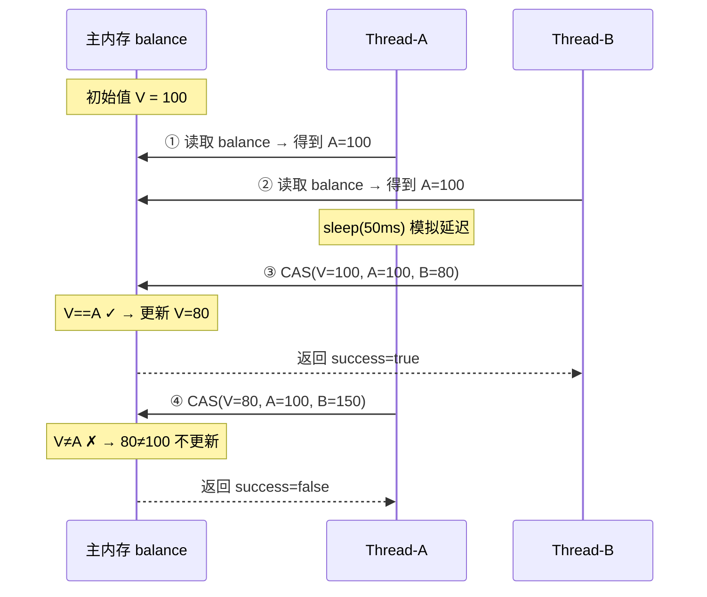

让我们逐步拆解这个过程：

**第 ①② 步：两个线程各自读取当前值。** 此时 `balance` 的内存值 V = 100，所以两个线程的期望值 A 都是 100。

**第 ③ 步：线程 B 率先执行 CAS。** 它带着三个操作数去访问主内存：V（内存中的 100）== A（期望的 100）？**相等！** 于是将 V 更新为 B = 80。CAS 成功。

**第 ④ 步：线程 A 随后执行 CAS。** 它也带着三个操作数去访问主内存：V（内存中已经是 80）== A（期望的 100）？**不相等！** 说明在线程 A 读取之后、CAS 之前，有其他线程修改了该值。CAS 失败，`balance` 保持 80 不变。

这个过程清晰地展现了 CAS 的**乐观并发控制**特性：线程不会互相阻塞，"失败"的线程不会被挂起，它只是收到一个 `false` 的反馈，可以立即决定下一步该做什么（放弃、重试或其他逻辑）。

### 乐观锁思想

在并发控制领域，锁策略可以按照"对冲突的态度"划分为两大流派：**悲观锁**（Pessimistic Locking）和**乐观锁**（Optimistic Locking）。CAS 是乐观锁思想的经典落地实现。

**悲观锁**认为："冲突是常态，我必须防患于未然。" 每次访问共享资源前，都先加锁，确保同一时刻只有一个线程能操作该资源。`synchronized` 和 `ReentrantLock` 就是典型的悲观锁。

**乐观锁**认为："冲突是偶然的，大部分情况下不会发生。" 它允许多个线程同时读取和计算，只在最终写入时才检查是否有冲突。如果没有冲突就直接更新成功；如果发现冲突就放弃本次更新并重试。CAS 就是这种思想的体现。

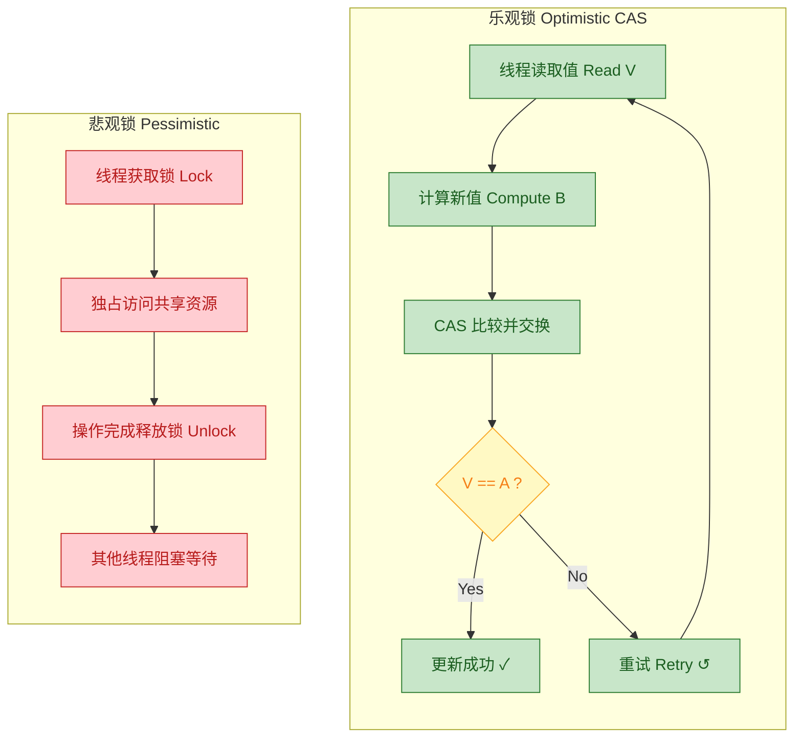

下表从多个维度对两种策略进行对比：

| 维度 | 悲观锁 (Pessimistic) | 乐观锁 / CAS (Optimistic) |
|:---|:---|:---|
| **冲突假设** | 总是假设会冲突 | 假设冲突很少发生 |
| **实现方式** | 加锁阻塞（`synchronized` / `Lock`） | CAS 无锁自旋 |
| **线程阻塞** | 获取不到锁的线程**挂起等待** | 失败线程**不阻塞**，立即重试 |
| **上下文切换** | 频繁（线程挂起/唤醒） | 极少（线程始终在 CPU 运行） |
| **适用场景** | **写多读少**、竞争激烈 | **读多写少**、竞争不激烈 |
| **典型代表** | `synchronized`、`ReentrantLock`、数据库行锁 | `AtomicInteger`、`StampedLock` 的乐观读、数据库版本号机制 |
| **ABA 问题** | 不存在 | 存在，需要版本号解决 |
| **开销来源** | 线程上下文切换、内核态/用户态切换 | CPU 自旋空转（竞争激烈时） |

为什么说 CAS 是"乐观"的？因为它总是**先乐观地假设不会有冲突**直接去执行更新操作，只在最后一刻通过比较来发现冲突。这和数据库中 **乐观并发控制**（Optimistic Concurrency Control, OCC）的思想完全一致——先做事后验证，而非先锁住再做事。

关于乐观锁的一个重要认知：**乐观锁并不是万能的灵药。** 当竞争非常激烈时（大量线程同时 CAS 同一个变量），绝大多数线程每次都失败，不断自旋重试，反而会浪费大量 CPU 资源。这时候悲观锁的"挂起等待"策略可能更节省资源。这就是为什么 Java 8 引入了 `LongAdder`——它在高竞争场景下将一个值分散到多个 Cell 中，避免所有线程 CAS 同一个变量。

### 无锁编程基础

CAS 是**无锁编程**（Lock-Free Programming）的核心原语。所谓无锁编程，是指在不使用互斥锁（mutex / `synchronized`）的情况下，通过原子操作实现线程安全的编程范式。

无锁编程有一个严格的学术定义（来自 Maurice Herlihy 的经典论文）：**如果一个并发算法能保证——在任意时刻，至少有一个线程能在有限步骤内完成操作，那么这个算法就是 Lock-Free 的。** 注意：这并不意味着每个线程都能快速完成，而是说系统整体不会"死锁"或"活锁"——总有线程在进步。

在 Java 中，基于 CAS 的无锁编程最核心的模式就是 **CAS 自旋**（CAS Spin / CAS Loop），也叫 **自旋重试**。它的模板如下：

```java
import java.util.concurrent.atomic.AtomicInteger;

public class CasSpinDemo {

    // 共享的原子变量
    private static final AtomicInteger counter = new AtomicInteger(0);

    /**
     * 基于 CAS 自旋实现的无锁自增操作
     * 这就是 AtomicInteger.incrementAndGet() 的简化版原理
     */
    public static int safeIncrement() {
        // 无限循环（自旋），直到 CAS 成功
        for (;;) {
            // 第一步：读取当前值，作为期望值 A
            int current = counter.get();

            // 第二步：计算新值 B
            int next = current + 1;

            // 第三步：执行 CAS —— 若内存值仍为 current，则更新为 next
            if (counter.compareAndSet(current, next)) {
                // CAS 成功，跳出循环，返回更新后的值
                return next;
            }
            // CAS 失败，说明有其他线程在此期间修改了 counter
            // 不做任何处理，直接进入下一轮循环重试
            // 这就是"自旋"——线程不会被阻塞，而是持续尝试
        }
    }

    public static void main(String[] args) throws InterruptedException {
        // 创建 10 个线程，每个线程对 counter 自增 10000 次
        Thread[] threads = new Thread[10];
        for (int i = 0; i < threads.length; i++) {
            threads[i] = new Thread(() -> {
                for (int j = 0; j < 10000; j++) {
                    safeIncrement();    // 调用无锁自增
                }
            });
            threads[i].start();         // 启动线程
        }

        // 等待所有线程执行完成
        for (Thread t : threads) {
            t.join();
        }

        // 最终结果一定是 100000（10 线程 × 10000 次）
        // 证明 CAS 自旋确实保证了线程安全
        System.out.println("Final counter: " + counter.get());
    }
}
```

输出结果：

```
Final counter: 100000
```

这段代码的精髓在于 `for (;;)` 无限循环。每次循环中：读取 → 计算 → CAS 尝试。如果 CAS 失败（有人抢先修改了），就立刻重新读取最新值再试。由于 CAS 操作本身是原子的，这个循环最终一定会成功（在 Lock-Free 的保证下）。实际上，`AtomicInteger.incrementAndGet()` 的源码就是这个模式。

让我们看看 `AtomicInteger.getAndAddInt()` 的真实源码（JDK 8+）：

```java
// Unsafe.java 中的方法（JDK 源码简化版）
public final int getAndAddInt(Object obj, long offset, int delta) {
    int expected;                                   // 期望值（上次读取的值）
    do {
        // 以 volatile 语义读取对象 obj 在偏移量 offset 处的 int 值
        expected = this.getIntVolatile(obj, offset);

    // compareAndSwapInt：原子地比较并交换
    // 如果 obj 在 offset 处的当前值 == expected，则设为 expected + delta
    // 返回 true 表示成功，false 表示失败（有其他线程修改了）
    } while (!this.compareAndSwapInt(obj, offset, expected, expected + delta));

    // 循环退出时，CAS 已成功，返回旧值 expected
    return expected;
}
```

这就是最经典的 **CAS 自旋循环** —— `do { read } while (!CAS)` 模式。整个 `java.util.concurrent.atomic` 包下所有的原子类都基于这个模式。

无锁编程在并发层次体系中的定位如下图所示：

```mermaid
graph LR
    subgraph level1["应用层 Application"]
        direction TB
        A1["AtomicInteger / AtomicLong"]
        A2["ConcurrentHashMap"]
        A3["LongAdder / LongAccumulator"]
    end

    subgraph level2["框架层 JDK Framework"]
        direction TB
        B1["Unsafe.compareAndSwapInt"]
        B2["VarHandle CAS API since JDK 9"]
        B3["CAS 自旋循环模式"]
    end

    subgraph level3["运行时 JVM Runtime"]
        direction TB
        C1["JIT 编译为本地 CAS 指令"]
        C2["内存屏障 Memory Barrier"]
    end

    subgraph level4["硬件层 CPU Hardware"]
        direction TB
        D1["x86: LOCK CMPXCHG 指令"]
        D2["ARM: LDXR / STXR 指令对"]
        D3["缓存一致性协议 MESI"]
    end

    level1 --> level2
    level2 --> level3
    level3 --> level4

    classDef appStyle fill:#C8E6C9,stroke:#2E7D32,color:#1B5E20
    classDef fwStyle fill:#BBDEFB,stroke:#1565C0,color:#0D47A1
    classDef rtStyle fill:#FFE0B2,stroke:#E65100,color:#BF360C
    classDef hwStyle fill:#FFCDD2,stroke:#C62828,color:#B71C1C

    class A1,A2,A3 appStyle
    class B1,B2,B3 fwStyle
    class C1,C2 rtStyle
    class D1,D2,D3 hwStyle
```

从上图可以清晰看到：我们在应用层使用 `AtomicInteger` 这样的友好 API，它在框架层调用 `Unsafe` 的 CAS 方法，JVM 将其编译为对应 CPU 架构的原子指令，最终由硬件的缓存一致性协议保证多核可见性。整条链路**没有使用任何操作系统层面的互斥锁**，这就是"无锁"的真正含义。

最后，将无锁编程（Lock-Free）与传统加锁方式做一个系统性总结：

| 特性 | 传统加锁 (`synchronized` / `Lock`) | 无锁 CAS 自旋 |
|:---|:---|:---|
| **线程状态** | 竞争失败 → **BLOCKED/WAITING**（挂起） | 竞争失败 → **RUNNABLE**（继续运行） |
| **死锁风险** | 有（多把锁交叉持有时） | **无**（不存在锁，自然不会死锁） |
| **上下文切换** | 频繁（用户态 ↔ 内核态） | 几乎没有 |
| **CPU 利用率** | 竞争激烈时线程睡眠，CPU 可以调度其他任务 | 竞争激烈时 CPU 空转自旋，浪费算力 |
| **编程复杂度** | 较低（lock/unlock 语义清晰） | 较高（需要处理重试逻辑、ABA 等问题） |
| **黄金适用区** | 临界区代码执行时间长、竞争激烈 | 临界区代码执行时间极短、竞争较少 |
| **JDK 典型应用** | `Collections.synchronizedXxx`、`ReentrantLock` | `AtomicXxx`、`ConcurrentLinkedQueue`、`StampedLock` 乐观读 |

一个重要的设计原则：**在低竞争、短操作的场景下优先选择 CAS 无锁方案；在高竞争、长操作的场景下选择加锁方案。** Java 的 `synchronized` 本身也做了自适应优化——偏向锁和轻量级锁阶段就是在尝试 CAS，只有竞争加剧时才膨胀为重量级锁。可以说，现代 Java 锁机制的底层处处都有 CAS 的影子。

---

**📝 练习题**

某共享变量 `AtomicInteger count` 当前值为 **10**。线程 A 先读取到值 10，然后线程 B 成功执行 `count.compareAndSet(10, 20)`，紧接着线程 A 执行 `count.compareAndSet(10, 15)`。请问最终 `count` 的值是多少？

A. 15，因为线程 A 的 CAS 会覆盖线程 B 的结果


B. 20，因为线程 A 的 CAS 会失败（期望值 10 ≠ 当前值 20）


C. 10，因为两次 CAS 互相抵消，值回到初始状态


D. 抛出 `ConcurrentModificationException` 异常


**【答案】** B

**【解析】** CAS 的核心语义是 **"当且仅当内存值 V 等于期望值 A 时，才更新为新值 B"**。线程 B 先执行 `compareAndSet(10, 20)`，此时内存值为 10，等于期望值 10，CAS 成功，`count` 变为 **20**。随后线程 A 执行 `compareAndSet(10, 15)`，此时内存值已经是 **20**，不等于期望值 **10**，CAS 失败，`count` 保持 **20** 不变。这正是 CAS 的乐观锁机制——线程 A 不会阻塞也不会抛异常，它只是收到一个 `false` 返回值，表示本次更新未生效。选项 D 的 `ConcurrentModificationException` 是集合迭代器的 fail-fast 机制抛出的异常，与 CAS 完全无关。

---

## CAS 底层实现

在上一节中，我们从概念层面理解了 CAS（Compare And Swap）的工作原理——它是一种"比较再交换"的原子操作，是无锁并发编程的基石。但一个关键问题随之浮现：**Java 是一门运行在 JVM 之上的高级语言，它如何穿透层层抽象，最终触达 CPU 硬件级别的原子指令？** 答案藏在一条清晰的调用链路中：从 Java 层的 `AtomicInteger`，到 JDK 内部的 `Unsafe` 类，再到 JVM 的 C++ native 实现，最终落地到 x86 处理器的 `LOCK CMPXCHG` 指令。本节将沿着这条链路，逐层拆解 CAS 的底层实现机制。

### Unsafe 类

`sun.misc.Unsafe` 是整个 CAS 机制在 Java 层面的 **入口与核心**。它的名字直译为"不安全"，这并非戏言——它能够执行直接内存操作、绕过 Java 访问控制、甚至直接操纵对象字段的内存偏移量，这些能力如果被滥用，轻则造成内存泄漏，重则导致 JVM 崩溃。因此，**Oracle/OpenJDK 官方从未将其纳入公共 API**，它一直存在于 `sun.misc` 这个内部包中（JDK 9+ 已迁移至 `jdk.internal.misc.Unsafe`，并通过模块系统进一步限制访问）。

#### 为什么需要 Unsafe？

Java 语言本身 **没有** 提供直接操作内存地址或调用 CPU 原子指令的语法。所有的内存管理都被 GC（垃圾回收器）接管，所有的字段访问都通过字节码指令 `getfield` / `putfield` 完成。但 CAS 操作要求的是：**在已知某个字段的内存地址的前提下，直接对该地址执行一次原子性的"比较并交换"**。这种底层操作超出了 Java 语言规范的能力范围，必须通过 **JNI（Java Native Interface）** 调用本地方法（native method）来完成。`Unsafe` 类正是封装了这一系列 native 方法的桥梁。

#### Unsafe 的获取方式

`Unsafe` 被设计为单例模式（Singleton），其构造方法是 `private` 的，唯一的实例存储在静态字段 `theUnsafe` 中。如果你直接调用 `Unsafe.getUnsafe()`，在普通应用代码中会抛出 `SecurityException`，因为它内部会检查调用者的 `ClassLoader` 是否为 Bootstrap ClassLoader（即只有 `rt.jar` 中的类才能直接获取）。

```java
// Unsafe 类的核心结构（简化版）
public final class sun.misc.Unsafe {

    // 私有构造方法，禁止外部实例化
    private Unsafe() {}

    // 全局唯一实例，由 JVM 启动时初始化
    private static final Unsafe theUnsafe = new Unsafe();

    // 公开获取方法——但会做 ClassLoader 安全检查
    @CallerSensitive
    public static Unsafe getUnsafe() {
        Class<?> caller = Reflection.getCallerClass();
        // 如果调用者不是由 Bootstrap ClassLoader 加载的，直接拒绝
        if (!VM.isSystemDomainLoader(caller.getClassLoader()))
            throw new SecurityException("Unsafe");
        return theUnsafe;
    }
}
```

JDK 内部的类（如 `AtomicInteger`）由 Bootstrap ClassLoader 加载，所以可以直接调用 `Unsafe.getUnsafe()` 获取实例。而在应用层代码中，如果确实需要使用（比如某些高性能框架如 Netty、Disruptor），通常通过 **反射** 获取 `theUnsafe` 字段：

```java
// 通过反射获取 Unsafe 实例（仅供学习理解，生产环境慎用）
Field f = Unsafe.class.getDeclaredField("theUnsafe"); // 获取私有静态字段
f.setAccessible(true);                                 // 绕过访问控制
Unsafe unsafe = (Unsafe) f.get(null);                  // 静态字段，传 null 即可
```

#### Unsafe 提供的关键能力

`Unsafe` 类远不止 CAS 一项功能，它是 JDK 底层基础设施的"瑞士军刀"。与 CAS 和并发相关的核心能力包括：

| 能力分类 | 代表方法 | 用途 |
|---------|---------|------|
| **CAS 操作** | `compareAndSwapInt`, `compareAndSwapLong`, `compareAndSwapObject` | 原子性地比较并交换字段值 |
| **内存偏移量** | `objectFieldOffset(Field)` | 获取某个字段在对象内存布局中的偏移量 |
| **volatile 语义读写** | `getIntVolatile`, `putIntVolatile` | 带内存屏障的字段读写 |
| **有序写入** | `putOrderedInt` (lazySet) | 只保证 StoreStore 屏障，不保证立即可见 |
| **线程调度** | `park`, `unpark` | `LockSupport` 的底层实现 |
| **直接内存** | `allocateMemory`, `freeMemory` | 堆外内存分配（DirectByteBuffer 的基础） |

其中，`objectFieldOffset` 与 CAS 方法总是成对出现。要对某个字段执行 CAS，你必须 **先知道它在对象中的内存偏移量（offset）**，因为 CAS 操作本质上是对 **内存地址** 的操作，而非对 Java 字段名的操作。

### compareAndSwapInt

现在让我们聚焦到最核心的方法——`compareAndSwapInt`，这是 `AtomicInteger` 一切原子操作的底层支撑。我们从 `AtomicInteger` 的源码开始，完整追踪一次 CAS 调用的全链路。

#### AtomicInteger 源码剖析

```java
public class AtomicInteger extends Number implements java.io.Serializable {

    // 1. 获取 Unsafe 实例
    //    AtomicInteger 属于 java.util.concurrent.atomic 包，
    //    由 Bootstrap ClassLoader 加载，所以可以直接获取
    private static final Unsafe unsafe = Unsafe.getUnsafe();

    // 2. value 字段在 AtomicInteger 对象内存中的偏移量
    //    这个偏移量在类加载时就计算好了，后续所有 CAS 操作都依赖它
    private static final long valueOffset;

    // 3. 静态初始化块：在类加载阶段计算 valueOffset
    static {
        try {
            // objectFieldOffset: 返回 "value" 字段相对于对象起始地址的字节偏移量
            // 例如：对象头占 12 字节（64位JVM + 压缩指针），那么 valueOffset 可能是 12
            valueOffset = unsafe.objectFieldOffset(
                AtomicInteger.class.getDeclaredField("value")
            );
        } catch (Exception ex) {
            throw new Error(ex);
        }
    }

    // 4. 实际存储的值，声明为 volatile 保证可见性
    //    volatile 确保任何线程读取 value 时，都能看到最新的写入
    private volatile int value;

    // 5. 经典的 CAS 方法：compareAndSet
    //    期望当前值为 expect，如果是，则更新为 update
    public final boolean compareAndSet(int expect, int update) {
        // this     -> 当前 AtomicInteger 对象实例
        // valueOffset -> value 字段的内存偏移量
        // expect   -> 期望值 A
        // update   -> 新值 B
        return unsafe.compareAndSwapInt(this, valueOffset, expect, update);
    }

    // 6. getAndIncrement（i++ 的原子版本）——自旋 CAS 的经典模式
    public final int getAndIncrement() {
        return unsafe.getAndAddInt(this, valueOffset, 1);
    }
}
```

#### Unsafe.getAndAddInt 的自旋逻辑

`getAndIncrement()` 内部调用的 `getAndAddInt` 是理解 CAS 自旋（spin）模式的最佳示例：

```java
// Unsafe 类中的 getAndAddInt 方法（JDK 8+ 源码）
public final int getAndAddInt(Object o, long offset, int delta) {
    int v;                                  // 用于存储每次读到的最新值
    do {
        v = getIntVolatile(o, offset);      // 第一步：以 volatile 语义读取当前内存值
                                            //   这里保证读到的是最新的值（跨越内存屏障）
    } while (!compareAndSwapInt(o, offset, v, v + delta));
                                            // 第二步：尝试 CAS
                                            //   期望值 = v（刚刚读到的值）
                                            //   新值 = v + delta（v + 1）
                                            //   如果此刻内存值仍然是 v，CAS 成功，退出循环
                                            //   如果被其他线程改过了，CAS 失败，返回 false
                                            //   while 条件为 true，继续下一轮自旋
    return v;                               // 返回修改前的旧值（符合 getAndXxx 语义）
}
```

这段代码揭示了一个重要事实：**CAS 本身只是一次尝试，不保证成功。要实现"一定成功"的原子操作，必须将 CAS 放在循环（自旋）中反复重试**。这就是所谓的 **CAS 自旋（spin-CAS / CAS loop）** 模式，也是无锁并发算法的基本范式。

#### compareAndSwapInt 的 Native 签名

`Unsafe.compareAndSwapInt` 本身是一个 `native` 方法，没有 Java 实现体：

```java
// Unsafe.java 中的声明
// 这是一个 native 方法，实现在 JVM 的 C/C++ 代码中
public final native boolean compareAndSwapInt(
    Object o,       // 目标对象
    long offset,    // 字段在对象中的内存偏移量
    int expected,   // 期望值（"我认为当前值应该是这个"）
    int x           // 新值（"如果猜对了，就改成这个"）
);
```

当 JVM 执行到这个 native 方法时，控制流从 Java 字节码解释器/JIT 编译代码跳转到 JVM 内部的 C++ 实现。

#### 从 Native 到 JVM 内部：Hotspot 源码

在 OpenJDK Hotspot 虚拟机中，`compareAndSwapInt` 的 native 实现位于 `unsafe.cpp` 文件中：

```java
// hotspot/src/share/vm/prims/unsafe.cpp（简化版）
// UNSAFE_ENTRY 是 Hotspot 内部的宏，用于定义 native 方法的入口
UNSAFE_ENTRY(jboolean, Unsafe_CompareAndSwapInt(
    JNIEnv *env,       // JNI 环境指针
    jobject unsafe,     // Unsafe 对象自身（Java 层的 this）
    jobject obj,        // 目标 Java 对象
    jlong offset,       // 字段偏移量
    jint e,             // expected 期望值
    jint x              // x 新值
)) {
    // 1. 将 Java 对象引用解析为 JVM 内部的 oop（Ordinary Object Pointer）
    oop p = JNIHandles::resolve(obj);

    // 2. 根据对象起始地址 + 偏移量，计算出 value 字段的真实内存地址
    jint* addr = (jint *)index_oop_plus_offset(p, offset);

    // 3. 调用 Atomic::cmpxchg 执行底层原子比较交换
    //    参数：新值 x，目标内存地址 addr，期望值 e
    //    返回值：内存地址中原来的值
    //    如果返回值 == e，说明 CAS 成功
    return (jint)(Atomic::cmpxchg(x, addr, e)) == e;
} UNSAFE_END
```

核心的 `Atomic::cmpxchg` 是一个平台相关的函数，在不同的 CPU 架构下有不同的实现。对于最主流的 **x86/x64** 平台，它最终映射到一条（或两条）汇编指令。

#### 完整调用链路总览

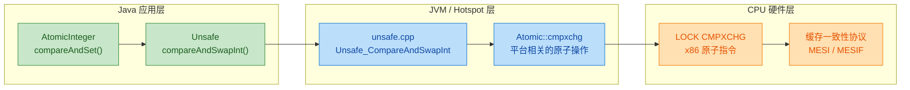

### CPU 指令（cmpxchg）

当调用链穿透 Java 层和 JVM 层之后，最终落地到 CPU 硬件层面。在 x86/x64 架构中，CAS 操作对应的是 **`CMPXCHG`（Compare and Exchange）** 指令。这条指令是现代 x86 处理器原生支持的原子原语，它直接在硬件层面实现了"比较并交换"的语义。

#### CMPXCHG 指令的工作机制

`CMPXCHG` 是 Intel 在 80486 处理器中引入的指令（1989年）。它的操作语义可以用如下伪代码精确描述：

```java
// CMPXCHG dest, src 的等价伪代码
// dest: 目标操作数（通常是内存地址）
// src:  源操作数（通常是寄存器，存放新值）
// EAX:  隐式操作数（存放期望值）

if (EAX == dest) {          // 比较：EAX 中的期望值 vs 目标内存中的当前值
    ZF = 1;                 // 设置零标志位 ZF=1，表示"相等"
    dest = src;             // 交换：将新值写入目标内存
} else {
    ZF = 0;                 // 清除零标志位 ZF=0，表示"不相等"
    EAX = dest;             // 将目标内存的实际值回写到 EAX
                            // 这样调用者可以知道"当前值到底是什么"
}
// 整个 if-else 在 CPU 微架构层面是一个不可分割的操作
```

这里有一个精妙的设计：**如果 CAS 失败，`CMPXCHG` 会顺便把内存中的实际值加载到 EAX 寄存器中**。这意味着下一轮自旋不需要再额外做一次读操作——CPU 已经"告诉"你当前值是多少了。Hotspot 的 `Atomic::cmpxchg` 返回的正是这个"内存中的实际旧值"，外层通过比较返回值是否等于期望值来判断 CAS 是否成功。

#### Hotspot 中 x86 平台的汇编实现

在 OpenJDK Hotspot 的 x86 平台相关代码中（`atomic_linux_x86.inline.hpp` 或 `atomic_windows_x86.inline.hpp`），`Atomic::cmpxchg` 的实现如下：

```java
// hotspot/src/os_cpu/linux_x86/vm/atomic_linux_x86.inline.hpp（简化）
inline jint Atomic::cmpxchg(jint exchange_value,    // 新值（想要写入的值）
                             volatile jint* dest,    // 目标内存地址
                             jint compare_value) {   // 期望值
    int mp = os::is_MP();  // 判断是否为多处理器（Multi-Processor）系统
    
    __asm__ volatile (
        // LOCK_IF_MP: 如果是多处理器系统，则加 LOCK 前缀
        // 单处理器不需要 LOCK 前缀，因为单核 CMPXCHG 天然是原子的
        LOCK_IF_MP(%4)
        
        // cmpxchgl: CMPXCHG 的 32 位版本（l = long, 在 AT&T 汇编中表示 32 位）
        // %1 是 exchange_value（新值），放在某个通用寄存器中
        // (%3) 是 dest 指向的内存地址
        // 隐含操作数 EAX 中存放 compare_value（期望值）
        "cmpxchgl %1, (%3)"
        
        : "=a" (exchange_value)  // 输出：EAX 的值（操作后的旧值）赋给 exchange_value
        : "r"  (exchange_value), // 输入：新值放入任意通用寄存器
          "a"  (compare_value),  // 输入：期望值放入 EAX 寄存器（"a" 约束）
          "r"  (dest),           // 输入：目标地址放入任意通用寄存器
          "r"  (mp)              // 输入：多处理器标志
        : "cc", "memory"         // 破坏描述：会修改条件码寄存器和内存
    );
    return exchange_value;       // 返回 EAX 中的值（即操作前内存中的实际旧值）
}
```

这段内联汇编（GCC inline assembly）就是 **CAS 在 Linux x86 平台上的终极实现**。其中最关键的是 `LOCK_IF_MP` 这个宏——它决定了是否给 `CMPXCHG` 指令添加 `LOCK` 前缀。

#### LOCK_IF_MP 宏

```java
// LOCK_IF_MP 宏的定义
#define LOCK_IF_MP(mp) "cmp $0, " #mp "; je 1f; lock; 1: "

// 展开后的等价逻辑：
// cmp $0, mp       ; 比较 mp（是否多处理器）和 0
// je 1f            ; 如果 mp==0（单处理器），跳过 lock 前缀
// lock             ; 如果 mp!=0（多处理器），添加 LOCK 前缀
// 1:               ; 标签，紧接着执行 cmpxchgl 指令
```

**为什么单处理器不需要 LOCK 前缀？** 因为在单核 CPU 上，同一时刻只有一个线程在执行指令。虽然存在线程切换（Context Switch），但 **CPU 指令是原子的切换单位**——不会在一条指令执行到一半时发生线程切换。因此，单核上的 `CMPXCHG` 天然不可被打断。

**但在多处理器系统中，情况完全不同**——多个 CPU 核心可能同时读写同一个内存地址，仅靠 `CMPXCHG` 指令本身无法保证跨核原子性。这就是 `LOCK` 前缀存在的意义，也引出了我们的下一个主题。

### 总线锁 / 缓存锁

当 `CMPXCHG` 指令前面加上 `LOCK` 前缀后（即 `LOCK CMPXCHG`），CPU 会采取特殊机制来确保这条指令的执行对所有处理器核心而言是原子的。这种机制在历史上经历了从"总线锁"到"缓存锁"的演进。

#### 总线锁（Bus Lock）—— 早期粗粒度方案

在早期的多处理器系统中（80486、早期 Pentium），`LOCK` 前缀的实现方式非常"粗暴"：**在指令执行期间，CPU 会在系统总线上发出一个 `LOCK#` 信号（将 LOCK# 引脚拉低），这个信号会锁住整条系统总线**。

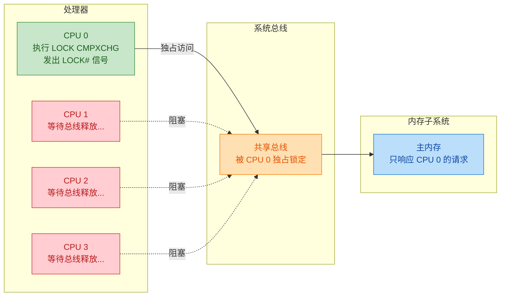

总线锁的问题一目了然：**它锁住的是整条总线，而不仅仅是目标内存地址**。这意味着在 `LOCK CMPXCHG` 执行期间，**其他所有 CPU 核心对内存的任何访问都会被阻塞**——无论它们要访问的是不是同一个地址。这相当于把多处理器系统退化成了"串行执行"，性能损失极为严重。

这就好比为了保护银行金库里的一个保险箱，把整条街都封了——虽然安全，但代价高到不可接受。

#### 缓存锁（Cache Lock）—— 现代细粒度方案

从 Pentium 4、Xeon 以及后续的 Intel/AMD 处理器开始，`LOCK` 前缀在大多数情况下 **不再锁总线**，而是使用一种更精细的机制——**缓存锁（Cache Lock）**。其核心思想是：**利用缓存一致性协议（Cache Coherence Protocol，如 MESI）来保证对单个缓存行（Cache Line）的排他性访问**。

要理解缓存锁，需要先回顾现代 CPU 的缓存架构：

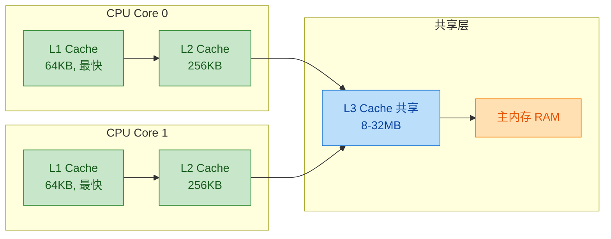

现代 CPU 的每个核心都有自己的 L1、L2 缓存，多个核心共享 L3 缓存。当 CPU 读取一个变量时，它首先会将包含该变量的整个 **缓存行（Cache Line，通常 64 字节）** 从主内存加载到本地缓存中。后续对该变量的读写都直接操作缓存，而非主内存。

#### MESI 协议与缓存锁的工作原理

**MESI** 是最广泛使用的缓存一致性协议，每个缓存行在任意时刻都处于以下四种状态之一：

| 状态 | 全称 | 含义 |
|------|------|------|
| **M** (Modified) | 已修改 | 当前核心独占，且已被修改（与主内存不一致）。其他核心没有此缓存行的有效副本。 |
| **E** (Exclusive) | 独占 | 当前核心独占，但尚未修改（与主内存一致）。其他核心没有此缓存行的有效副本。 |
| **S** (Shared) | 共享 | 多个核心都持有此缓存行的副本，且都与主内存一致。任何核心只能读不能写。 |
| **I** (Invalid) | 无效 | 此缓存行无效/不存在。需要从主内存或其他核心重新加载。 |

**缓存锁的执行流程**如下，以 CPU 0 执行 `LOCK CMPXCHG [addr]` 为例：

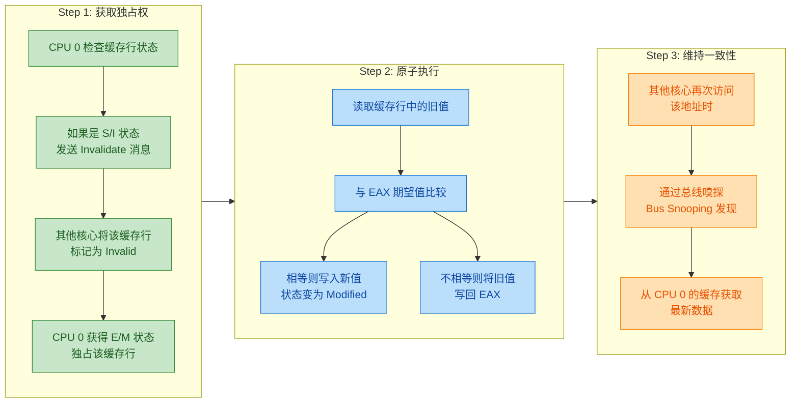

缓存锁的精妙之处在于：**它只"锁"了一个缓存行（64字节），而非整条总线**。其他 CPU 核心可以自由访问不在同一缓存行中的数据，系统的并行度得到了极大保留。这就好比你只锁了金库里的那个保险箱，整条街的其他商铺照常营业。

#### 总线锁仍然会被触发的场景

即便在现代处理器上，缓存锁也并非万能。在以下特殊场景中，CPU 仍然需要退化为总线锁：

1. **操作的数据跨越了两个缓存行（Cache Line Split）**：当一个变量恰好存储在两个相邻缓存行的边界上时（比如一个 8 字节的 `long` 值，前 4 字节在缓存行 A，后 4 字节在缓存行 B），缓存锁无法同时锁定两个缓存行，只能退化为总线锁。这也是为什么 JVM 和许多高性能框架非常关注 **内存对齐（Memory Alignment）** 的原因。

2. **操作的数据不在缓存中（Cache Miss）**：如果目标地址的数据根本不在任何核心的缓存中，无法通过缓存协议来保证排他性，可能需要总线锁。

3. **处理器不支持缓存锁的特殊内存类型**：例如对不可缓存（Uncacheable）的内存区域进行操作。

> **实践意义**：在 Java 并发编程中，JDK 内部已经通过 `@Contended` 注解（如 `Thread` 类中的 `threadLocalRandomSeed` 字段）和手动填充（padding）来避免 **伪共享（False Sharing）** 问题——即两个无关变量恰好位于同一缓存行中，导致一个核心对变量A的修改迫使另一个核心的变量B所在缓存行失效。Disruptor 框架中的 `RingBuffer` 就是通过大量 padding 来确保关键字段独占缓存行的经典案例。

#### LOCK 前缀的内存屏障副作用

`LOCK` 前缀除了保证原子性之外，还有一个极为重要的副作用：**它天然具有完整的内存屏障（Full Memory Barrier / Memory Fence）效果**。具体来说：

- **Store Buffer 被刷新**：LOCK 指令执行前，所有挂起的写操作（在 Store Buffer 中排队的）都会被刷新到缓存/内存。
- **Invalidate Queue 被清空**：LOCK 指令执行前，所有待处理的缓存失效请求都会被处理。
- **禁止指令重排序**：LOCK 指令前后的读写操作不会跨越它进行重排序。

这意味着 **CAS 操作天然保证了 happens-before 语义**——它不仅是原子的，还保证了可见性和有序性。这就是为什么 `AtomicInteger` 的 `compareAndSet` 在 Java Memory Model 中被定义为同时具有 `volatile` 读和 `volatile` 写的效果。

#### 从全局视角看 CAS 的分层保障

让我们用一张总览图来总结 CAS 从 Java 到硬件的完整保障链：

```java
// CAS 的保障层次模型

// ┌─────────────────────────────────────────────────────────┐
// │  Java 语义层                                             │
// │  AtomicInteger.compareAndSet(expect, update)             │
// │  保证：原子性 + volatile 读写语义 (happens-before)        │
// ├─────────────────────────────────────────────────────────┤
// │  JVM 实现层                                              │
// │  Unsafe.compareAndSwapInt → Atomic::cmpxchg              │
// │  保证：正确映射到平台相关的原子指令                        │
// ├─────────────────────────────────────────────────────────┤
// │  CPU 指令层                                              │
// │  LOCK CMPXCHG（多处理器）/ CMPXCHG（单处理器）           │
// │  保证：指令级原子执行 + 内存屏障                          │
// ├─────────────────────────────────────────────────────────┤
// │  硬件协议层                                              │
// │  MESI 缓存一致性协议 + 总线嗅探 / 缓存锁 / 总线锁       │
// │  保证：多核间数据一致性                                   │
// └─────────────────────────────────────────────────────────┘
```

从上到下，每一层都为上一层提供了保障：MESI 协议保证了多核数据一致性，`LOCK CMPXCHG` 利用缓存锁/总线锁实现了指令级原子性和内存屏障，JVM 的 `Atomic::cmpxchg` 将其封装为跨平台的 C++ 函数，`Unsafe` 将其暴露为 Java native 方法，最终 `AtomicInteger` 用友好的 Java API 包装起来供开发者使用。

**这就是 CAS 的完整底层实现——一条从 Java 高级语义到 CPU 微架构的纵贯线。理解了这条线，你就理解了 Java 无锁并发的硬件根基。**

---

**📝 练习题**

在多核处理器系统上，以下关于 `LOCK CMPXCHG` 指令的描述，哪一项是 **错误** 的？


A. 在现代处理器上，如果操作的数据完整地落在一个缓存行内，通常使用缓存锁（Cache Lock）而非总线锁来保证原子性


B. `LOCK` 前缀不仅保证了原子性，还隐含了完整的内存屏障（Full Memory Barrier）效果，能防止指令重排序


C. 在单处理器系统上，Hotspot 会省略 `LOCK` 前缀，因为单核的 `CMPXCHG` 本身就是原子的


D. 当操作的数据跨越两个缓存行时，处理器仍然优先使用缓存锁，只有在缓存锁失败后才降级为总线锁


**【答案】** D

**【解析】** 选项 D 的表述是错误的。当操作的数据跨越了两个缓存行的边界时（即 Cache Line Split），MESI 缓存一致性协议 **无法同时对两个缓存行进行原子锁定**——缓存锁的粒度是单个缓存行。在这种情况下，处理器会 **直接退化为总线锁（Bus Lock）**，通过在总线上发出 `LOCK#` 信号来独占系统总线，从而保证跨缓存行操作的原子性。不存在所谓"先尝试缓存锁再降级"的过程，因为跨缓存行的场景从原理上就不满足缓存锁的前提条件。选项 A、B、C 的描述均准确反映了 `LOCK CMPXCHG` 的实际行为。这也解释了为什么高性能并发编程中非常强调 **内存对齐（alignment）** 和 **缓存行填充（padding）**——避免关键数据跨越缓存行边界，以确保 CAS 操作始终走高效的缓存锁路径。

---

## CAS 问题 ⭐⭐

CAS（Compare And Swap）作为无锁编程的基石，以其轻量、高效的乐观锁策略在高并发场景中大放异彩。然而，任何技术方案都不可能是"银弹"——CAS 同样存在三个经典的缺陷：**ABA 问题**、**自旋开销** 以及 **只能保证单个变量的原子性**。深入理解这些问题的本质与边界，是正确使用原子类、甚至在面试中脱颖而出的关键。

---

### ABA 问题 ⭐⭐

ABA 问题是 CAS 机制中最著名、也最具迷惑性的缺陷。它的核心在于：**CAS 只比较"值"是否相等，却无法感知这个值是否曾经被修改过**。

#### 什么是 ABA（A→B→A）

假设共享变量的初始值为 `A`。线程 T1 读取到这个值 `A` 后，被操作系统挂起（preempted）。在 T1 挂起期间，线程 T2 将值从 `A` 改为 `B`，随后又将 `B` 改回 `A`。当 T1 恢复执行时，它用 CAS 检查——"当前值是 `A` 吗？是的！那就把它更新为我的新值吧。"——CAS 操作成功了。

问题在哪里？**T1 以为这个 `A` 是它当初读到的那个 `A`，但实际上这个 `A` 已经历了一轮完整的 `A→B→A` 变迁**。T1 对此完全无感知。在很多业务场景下，这种"偷梁换柱"是无关紧要的；但在某些场景下，它会导致灾难性的后果。

我们先通过一个简单的代码示例来直观展示 ABA 现象：

```java
import java.util.concurrent.atomic.AtomicInteger;

public class ABADemo {

    // 共享的原子变量，初始值为 100
    private static AtomicInteger atomicInt = new AtomicInteger(100);

    public static void main(String[] args) throws InterruptedException {

        // ========== 线程 T1：制造 ABA ==========
        Thread t1 = new Thread(() -> {
            // 第一步：将 100 改为 101（A → B）
            boolean firstSwap = atomicInt.compareAndSet(100, 101);
            // 输出：true，值变为 101
            System.out.println("T1 第一次 CAS(100→101): " + firstSwap);

            // 第二步：将 101 改回 100（B → A）
            boolean secondSwap = atomicInt.compareAndSet(101, 100);
            // 输出：true，值又变回 100
            System.out.println("T1 第二次 CAS(101→100): " + secondSwap);
        }, "T1");

        // ========== 线程 T2：被 ABA 欺骗 ==========
        Thread t2 = new Thread(() -> {
            try {
                // 先读取到值 100（期望值 A）
                // 然后故意睡眠 1 秒，给 T1 足够时间完成 A→B→A
                Thread.sleep(1000);
            } catch (InterruptedException e) {
                Thread.currentThread().interrupt();
            }
            // T2 醒来后执行 CAS：期望值 100，新值 200
            // 此时值确实是 100（但已经历了 100→101→100）
            boolean result = atomicInt.compareAndSet(100, 200);
            // 输出：true —— T2 完全不知道值曾被修改过！
            System.out.println("T2 CAS(100→200): " + result
                    + "  当前值: " + atomicInt.get());
        }, "T2");

        t1.start(); // 启动 T1
        t2.start(); // 启动 T2

        t1.join();   // 等待 T1 完成
        t2.join();   // 等待 T2 完成
    }
}
```

运行结果如下：

```
T1 第一次 CAS(100→101): true
T1 第二次 CAS(101→100): true
T2 CAS(100→200): true  当前值: 200
```

T2 的 CAS 成功了，但它**不知道**值在中间被动过。对于简单的数值计数器而言，这通常没有影响——毕竟最终值是对的。但在涉及**引用类型**、尤其是**指针操作**的场景下，后果可能是致命的。

#### 危害（链表操作）

ABA 问题最经典的危害场景来源于 **无锁栈（Lock-Free Stack）** 和 **无锁链表（Lock-Free Linked List）** 的操作。在这些数据结构中，CAS 操作的不是简单的数值，而是**节点的引用（指针）**。即使引用地址看起来相同，但引用所指向的对象的内部状态（或者它在链表中的上下文关系）可能已经完全不同了。

让我们用一个经典的**无锁栈 pop 操作**来展示 ABA 的破坏力：

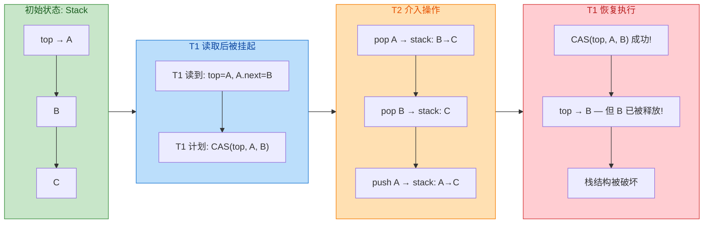

让我们逐步拆解这个过程，看看灾难是如何发生的：

**初始状态：** 栈中从 top 向下依次为 `A → B → C`。

```
  ┌─────────┐
  │   top    │──→ A ──→ B ──→ C ──→ null
  └─────────┘
```

**第一步：线程 T1 执行 pop 操作**

T1 读取 `top = A`，并读取 `A.next = B`。T1 准备执行 `CAS(top, A, B)` —— 即"如果 top 仍然是 A，就把 top 改为 B"。但就在执行 CAS 之前，T1 被操作系统调度挂起了。

**第二步：线程 T2 连续操作**

在 T1 挂起期间，T2 进行了以下操作：
1. **pop A**：栈变为 `B → C`，A 被取出。
2. **pop B**：栈变为 `C`，B 被取出（此时 B 节点可能已经被回收或重新使用）。
3. **push A**：将 A 重新压入栈中，A.next 指向 C，栈变为 `A → C`。

```
  ┌─────────┐
  │   top    │──→ A ──→ C ──→ null      （注意：B 已经不在栈中了！）
  └─────────┘
```

**第三步：线程 T1 恢复执行**

T1 醒来，执行 `CAS(top, A, B)`。它检查：top 还是 A 吗？是的！于是 CAS 成功，top 被设置为 B。

```
  ┌─────────┐
  │   top    │──→ B ──→ ???       （B 已经被释放/回收，这是一个悬空指针！）
  └─────────┘
```

**灾难发生了**：top 现在指向了一个已经不在栈中的节点 B。节点 C 丢失了（内存泄漏），而后续对栈的操作将通过悬空指针 B 访问到不可预测的内存区域，可能导致数据损坏甚至程序崩溃。

这就是为什么在 Java 的 `ConcurrentLinkedQueue`、`ConcurrentLinkedDeque` 等无锁数据结构的源码中，Doug Lea 必须非常谨慎地处理节点引用问题，而不能简单地依赖朴素的 CAS。

下面用代码模拟这一过程的核心逻辑（简化版无锁栈）：

```java
import java.util.concurrent.atomic.AtomicReference;

public class ABALinkedListHazard {

    // 栈节点定义
    static class Node {
        int value;        // 节点存储的值
        Node next;        // 指向下一个节点的引用

        Node(int value) {
            this.value = value;
        }

        @Override
        public String toString() {
            return "Node(" + value + ")";
        }
    }

    // 栈顶指针，使用 AtomicReference 实现无锁
    private AtomicReference<Node> top = new AtomicReference<>();

    // 入栈操作
    public void push(Node node) {
        Node oldTop;
        do {
            oldTop = top.get();           // 读取当前栈顶
            node.next = oldTop;           // 新节点的 next 指向当前栈顶
        } while (!top.compareAndSet(oldTop, node)); // CAS 尝试更新栈顶
    }

    // 出栈操作 —— 存在 ABA 风险！
    public Node pop() {
        Node oldTop;
        Node newTop;
        do {
            oldTop = top.get();           // 读取当前栈顶
            if (oldTop == null) {         // 栈为空
                return null;
            }
            newTop = oldTop.next;         // 读取栈顶的下一个节点
            // 关键：如果在此处线程被挂起，其他线程修改了栈结构
            // 再恢复时，oldTop 可能已经不是"原来那个上下文"中的节点了
        } while (!top.compareAndSet(oldTop, newTop)); // CAS 尝试更新栈顶
        return oldTop;
    }

    public static void main(String[] args) throws InterruptedException {
        ABALinkedListHazard stack = new ABALinkedListHazard();

        // 构建初始栈：A → B → C
        Node nodeC = new Node(3);  // C
        Node nodeB = new Node(2);  // B
        Node nodeA = new Node(1);  // A
        stack.push(nodeC);         // 先压入 C
        stack.push(nodeB);         // 再压入 B
        stack.push(nodeA);         // 最后压入 A，此时 top → A → B → C

        System.out.println("初始栈顶: " + stack.top.get());
        // 输出: Node(1)，即 A

        // 模拟 T1：读取 top=A, A.next=B 后被挂起
        // 模拟 T2：pop A, pop B, push A（A.next 现在指向 C）
        stack.pop();               // pop A，栈: B → C
        stack.pop();               // pop B，栈: C
        nodeA.next = nodeC;        // 重新设置 A.next 指向 C
        stack.push(nodeA);         // push A，栈: A → C

        System.out.println("T2 操作后栈顶: " + stack.top.get());
        // 输出: Node(1)，即 A —— 看起来和初始状态一样！

        // 如果此时 T1 恢复，它持有的旧 newTop 仍然是 B
        // CAS(top, A, B) 会成功，但 B 早已不在栈中
        // 这就是 ABA 的危害
    }
}
```

#### 解决方案（版本号）

既然 ABA 的根源在于"CAS 只看值，不看变化历史"，那么解决思路也很自然：**给每次修改打上一个单调递增的版本号（stamp）**。比较时不仅比较值，还比较版本号。即使值从 A 变回了 A，版本号也从 1 变成了 3，CAS 就能检测到"这不是原来的那个 A"。

这就是 Java 提供的 `AtomicStampedReference` 的核心思想。

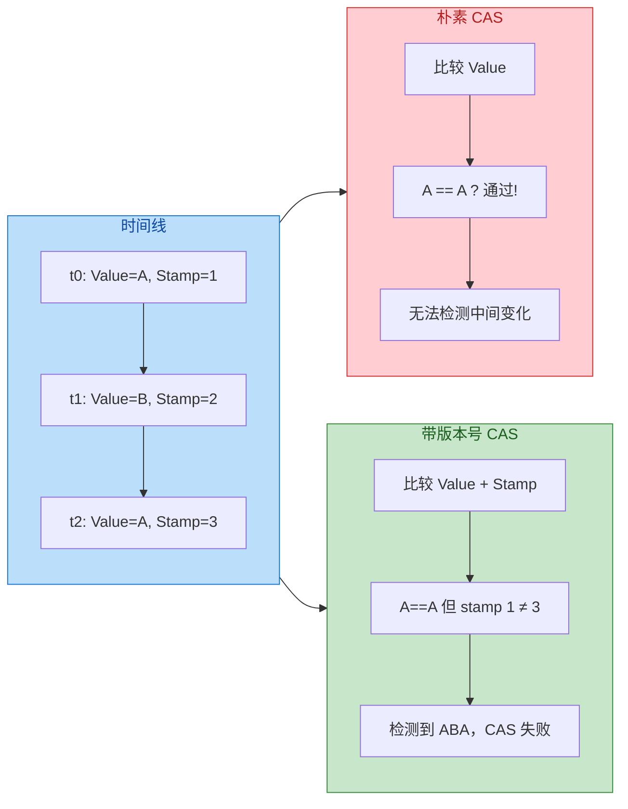

`AtomicStampedReference` 的使用非常直观：

```java
import java.util.concurrent.atomic.AtomicStampedReference;

public class ABAResolutionDemo {

    public static void main(String[] args) throws InterruptedException {

        // 初始值为 100，初始版本号（stamp）为 1
        AtomicStampedReference<Integer> stampedRef =
                new AtomicStampedReference<>(100, 1);

        // ========== 线程 T1：制造 ABA ==========
        Thread t1 = new Thread(() -> {
            // 获取当前版本号
            int stamp = stampedRef.getStamp();
            System.out.println("T1 初始 stamp: " + stamp);

            // A → B：将 100 改为 101，版本号从 1 改为 2
            stampedRef.compareAndSet(
                    100,        // 期望的引用值
                    101,        // 新的引用值
                    stamp,      // 期望的版本号
                    stamp + 1   // 新的版本号
            );
            System.out.println("T1 第一次修改后: value="
                    + stampedRef.getReference()
                    + ", stamp=" + stampedRef.getStamp());

            // B → A：将 101 改回 100，版本号从 2 改为 3
            stamp = stampedRef.getStamp(); // 重新获取版本号
            stampedRef.compareAndSet(
                    101,        // 期望的引用值
                    100,        // 新的引用值（改回原值！）
                    stamp,      // 期望的版本号
                    stamp + 1   // 新的版本号
            );
            System.out.println("T1 第二次修改后: value="
                    + stampedRef.getReference()
                    + ", stamp=" + stampedRef.getStamp());
        }, "T1");

        // ========== 线程 T2：尝试被 ABA 欺骗 ==========
        Thread t2 = new Thread(() -> {
            // T2 在最开始就记录下 value 和 stamp
            int stamp = stampedRef.getStamp();          // 记录版本号 = 1
            Integer value = stampedRef.getReference();   // 记录值 = 100
            System.out.println("T2 读取到: value=" + value + ", stamp=" + stamp);

            try {
                // 睡眠 2 秒，确保 T1 完成 ABA 操作
                Thread.sleep(2000);
            } catch (InterruptedException e) {
                Thread.currentThread().interrupt();
            }

            // T2 醒来后尝试 CAS
            // 值确实是 100，但版本号已经从 1 变成了 3
            boolean result = stampedRef.compareAndSet(
                    value,      // 期望的引用值: 100 ✅（值匹配）
                    200,        // 新的引用值
                    stamp,      // 期望的版本号: 1 ❌（实际已经是 3！）
                    stamp + 1   // 新的版本号
            );
            // CAS 失败！因为版本号不匹配
            System.out.println("T2 CAS 结果: " + result
                    + "  当前 value=" + stampedRef.getReference()
                    + ", stamp=" + stampedRef.getStamp());
        }, "T2");

        t1.start(); // 启动 T1
        t2.start(); // 启动 T2

        t1.join();   // 等待 T1 完成
        t2.join();   // 等待 T2 完成
    }
}
```

运行结果：

```
T2 读取到: value=100, stamp=1
T1 初始 stamp: 1
T1 第一次修改后: value=101, stamp=2
T1 第二次修改后: value=100, stamp=3
T2 CAS 结果: false  当前 value=100, stamp=3
```

**关键输出：`T2 CAS 结果: false`**。尽管值仍然是 100，但版本号已经从 1 变成了 3，CAS 检测到了 ABA，拒绝了这次操作。这正是我们想要的行为。

除了 `AtomicStampedReference`，Java 还提供了 `AtomicMarkableReference`，它使用一个 **boolean 标记** 而非 int 版本号。适用于只需要知道"是否被修改过"而不需要精确追踪修改次数的场景。其核心 API 为 `compareAndSet(V expectedRef, V newRef, boolean expectedMark, boolean newMark)`。

下面是对三种方案的对比总结：

| 方案 | 检测维度 | 精度 | 适用场景 |
|------|----------|------|----------|
| **朴素 CAS**（`AtomicReference`） | 仅比较值 | 无法检测 ABA | 值语义场景（计数器等） |
| **AtomicStampedReference** | 值 + int 版本号 | 精确追踪修改次数 | 链表/栈等指针操作 |
| **AtomicMarkableReference** | 值 + boolean 标记 | 仅知"是否被动过" | 简单的"脏标记"场景 |

> **面试要点**：面试官问"ABA 问题怎么解决"时，最佳回答是 `AtomicStampedReference` + 版本号机制。如果还能补充提到 `AtomicMarkableReference` 以及实际工程中 ABA 何时真正构成威胁（引用类型、链表操作），则更加完整。

---

### 自旋开销（竞争激烈时 CPU 空转）

CAS 操作失败后的标准处理方式是**自旋重试（Spin Retry）**：在一个循环中不断尝试，直到成功为止。这正是 `AtomicInteger.getAndIncrement()` 的底层实现方式。我们可以查看其源码：

```java
// AtomicInteger.getAndIncrement() 最终调用的是 Unsafe.getAndAddInt()
// 以下为 JDK 8+ 中 Unsafe.getAndAddInt 的实现逻辑
public final int getAndAddInt(Object obj, long offset, int delta) {
    int expected;                               // 期望值
    do {
        // 每次循环都从主内存重新读取最新值
        expected = this.getIntVolatile(obj, offset);
        // 尝试 CAS：如果当前值等于 expected，则更新为 expected + delta
        // 如果失败（说明其他线程已修改），继续循环
    } while (!this.compareAndSwapInt(obj, offset, expected, expected + delta));
    return expected;                            // 返回修改前的旧值
}
```

在**低竞争**环境下，这种自旋通常只需要 1～2 次循环就能成功，性能极高（远超 `synchronized` 的加锁/解锁开销）。但当**竞争激烈**——比如 64 个线程同时对一个 `AtomicInteger` 执行 `incrementAndGet()` ——情况就截然不同了：

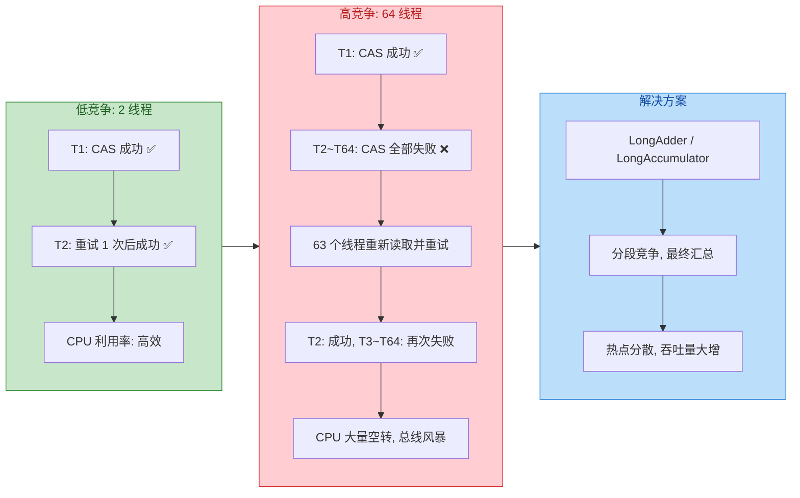

**问题的本质：** 当 N 个线程同时自旋竞争同一个变量时，每次只有 1 个线程 CAS 成功，其余 N-1 个线程全部失败并重试。这意味着：

1. **CPU 空转（Busy Waiting）**：失败的线程并不会释放 CPU 时间片，它们在循环中持续占用 CPU 核心，做的却是"无用功"。
2. **缓存行失效风暴（Cache Line Invalidation Storm）**：每次成功的 CAS 写入会导致其他所有 CPU 核心中对应的缓存行失效（根据 MESI 协议），所有核心需要重新从主内存或 L3 缓存加载最新值。当线程数很多时，这种缓存一致性流量会严重争抢内存总线带宽。
3. **"活锁"倾向**：虽然不是真正的死锁（deadlock），但在极端竞争下，所有线程都在忙碌地重试，却谁也推进不了多少进度，吞吐量反而下降。

我们可以通过基准测试来直观感受差距：

```java
import java.util.concurrent.atomic.AtomicLong;
import java.util.concurrent.atomic.LongAdder;

public class SpinOverheadBenchmark {

    // 共享的原子计数器
    private static final AtomicLong atomicLong = new AtomicLong(0);
    // JDK 8 引入的分段累加器
    private static final LongAdder longAdder = new LongAdder();

    // 每个线程的累加次数
    private static final int ITERATIONS = 10_000_000;
    // 并发线程数
    private static final int THREAD_COUNT = 64;

    public static void main(String[] args) throws InterruptedException {

        // ===== 测试 AtomicLong =====
        long start1 = System.currentTimeMillis();         // 记录开始时间
        Thread[] threads1 = new Thread[THREAD_COUNT];     // 线程数组
        for (int i = 0; i < THREAD_COUNT; i++) {
            threads1[i] = new Thread(() -> {
                for (int j = 0; j < ITERATIONS; j++) {
                    atomicLong.incrementAndGet();          // 自旋 CAS 累加
                }
            });
            threads1[i].start();                          // 启动线程
        }
        for (Thread t : threads1) t.join();               // 等待所有线程完成
        long elapsed1 = System.currentTimeMillis() - start1;
        System.out.println("AtomicLong   耗时: " + elapsed1 + "ms, 结果: "
                + atomicLong.get());

        // ===== 测试 LongAdder =====
        long start2 = System.currentTimeMillis();         // 记录开始时间
        Thread[] threads2 = new Thread[THREAD_COUNT];     // 线程数组
        for (int i = 0; i < THREAD_COUNT; i++) {
            threads2[i] = new Thread(() -> {
                for (int j = 0; j < ITERATIONS; j++) {
                    longAdder.increment();                // 分段累加，减少竞争
                }
            });
            threads2[i].start();                          // 启动线程
        }
        for (Thread t : threads2) t.join();               // 等待所有线程完成
        long elapsed2 = System.currentTimeMillis() - start2;
        System.out.println("LongAdder    耗时: " + elapsed2 + "ms, 结果: "
                + longAdder.sum());
    }
}
```

在 64 线程、每线程 1000 万次累加的典型测试中，结果通常如下（具体数值因硬件而异）：

```
AtomicLong   耗时: 12800ms, 结果: 640000000
LongAdder    耗时: 1200ms,  结果: 640000000
```

**`LongAdder` 快了将近 10 倍**。它的核心原理是**分散热点（Contention Spreading）**：不再让所有线程竞争同一个变量，而是在内部维护一个 `Cell[]` 数组，每个线程通过哈希映射到不同的 Cell 上进行累加，最终调用 `sum()` 时再汇总。这样大大减少了 CAS 的竞争概率和缓存行失效频率。

**自旋开销的解决策略总结：**

| 策略 | 思路 | 典型实现 |
|------|------|----------|
| **退避策略（Backoff）** | CAS 失败后不立即重试，先等待随机/指数递增的时间 | 手动实现 exponential backoff |
| **分段竞争（Striping）** | 将热点变量拆分为多个独立段，各线程分散竞争 | `LongAdder`, `ConcurrentHashMap` |
| **适应性自旋（Adaptive Spinning）** | 根据历史成功率动态调整自旋次数，超出阈值后挂起线程 | JVM 内部的 `synchronized` 锁优化 |
| **混合策略（Hybrid）** | 先自旋若干次，不成功则升级为阻塞锁 | `AbstractQueuedSynchronizer (AQS)` |

---

### 只能保证单个变量的原子性

CAS 操作的第三个本质限制是：**它天然只能对一个内存地址进行原子性的"比较-并-交换"操作**。如果你需要同时原子性地更新两个或多个独立变量，单靠 CAS 是无法实现的。

考虑一个经典场景：银行转账。需要**同时**将 A 账户余额减少 100，并将 B 账户余额增加 100。这两个操作必须作为一个**不可分割的整体**完成——要么都成功，要么都不发生。

```java
import java.util.concurrent.atomic.AtomicInteger;

public class SingleVariableLimitation {

    // 两个独立的原子变量：账户 A 和账户 B
    private static AtomicInteger accountA = new AtomicInteger(1000);
    private static AtomicInteger accountB = new AtomicInteger(1000);

    /**
     * 转账方法 —— 此实现是【有缺陷的】！
     * 两个 CAS 操作不是原子的整体
     */
    public static void transfer(int amount) {
        // 第一步：从 A 扣款
        int oldA;
        do {
            oldA = accountA.get();                          // 读取 A 的余额
            if (oldA < amount) {                            // 余额不足
                System.out.println("A 余额不足，转账失败");
                return;
            }
        } while (!accountA.compareAndSet(oldA, oldA - amount)); // CAS 扣款

        // ⚠️ 危险窗口：如果线程在此处被中断或抛异常
        //     A 已经扣了钱，但 B 还没收到钱！
        //     资金凭空消失了！

        // 第二步：向 B 加款
        int oldB;
        do {
            oldB = accountB.get();                          // 读取 B 的余额
        } while (!accountB.compareAndSet(oldB, oldB + amount)); // CAS 加款
    }

    public static void main(String[] args) {
        System.out.println("转账前 → A: " + accountA.get() + ", B: " + accountB.get());
        transfer(100);
        System.out.println("转账后 → A: " + accountA.get() + ", B: " + accountB.get());
        // 看起来正确，但在并发下两步之间的间隙是不安全的
    }
}
```

上面代码的问题在于：`accountA` 的 CAS 和 `accountB` 的 CAS 是两个独立的操作，它们之间存在一个**可观测的中间状态**——A 被扣款但 B 还未收款。在并发环境下，其他线程可能在这个时间窗口读到不一致的状态。

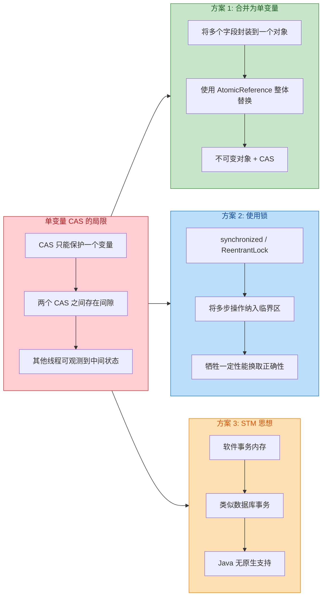

**方案 1：将多个变量合并为一个不可变对象，用 `AtomicReference` 进行整体 CAS。**

这是在保留无锁特性前提下最常用的技巧：

```java
import java.util.concurrent.atomic.AtomicReference;

public class MultiVarAtomicSolution {

    /**
     * 将两个账户的余额封装为一个不可变对象
     * 每次修改都创建新对象，通过 AtomicReference CAS 整体替换
     */
    static class BankState {
        final int balanceA; // 账户 A 余额（final 保证不可变）
        final int balanceB; // 账户 B 余额（final 保证不可变）

        BankState(int a, int b) {
            this.balanceA = a;
            this.balanceB = b;
        }

        @Override
        public String toString() {
            return "A=" + balanceA + ", B=" + balanceB;
        }
    }

    // 用 AtomicReference 包装整个状态
    private static AtomicReference<BankState> stateRef =
            new AtomicReference<>(new BankState(1000, 1000));

    /**
     * 无锁转账 —— 正确实现
     * 通过 CAS 整体替换 BankState 对象来保证原子性
     */
    public static boolean transfer(int amount) {
        BankState oldState;           // 旧状态
        BankState newState;           // 新状态
        do {
            oldState = stateRef.get();                      // 读取当前状态快照
            if (oldState.balanceA < amount) {               // 检查 A 余额是否充足
                return false;                               // 余额不足，转账失败
            }
            // 构造新的不可变状态对象（A 扣款，B 加款）
            newState = new BankState(
                    oldState.balanceA - amount,              // A 减少
                    oldState.balanceB + amount               // B 增加
            );
            // CAS 整体替换：如果期间没人修改过状态，则替换成功
        } while (!stateRef.compareAndSet(oldState, newState));
        return true;                                        // 转账成功
    }

    public static void main(String[] args) throws InterruptedException {
        System.out.println("转账前: " + stateRef.get());

        // 启动 10 个线程，每个转账 50 元
        Thread[] threads = new Thread[10];
        for (int i = 0; i < 10; i++) {
            threads[i] = new Thread(() -> {
                transfer(50);  // 每个线程从 A 向 B 转 50 元
            });
            threads[i].start();
        }
        for (Thread t : threads) t.join();

        System.out.println("转账后: " + stateRef.get());
        // A=500, B=1500 —— 总额始终为 2000，正确！

        // 验证资金总额守恒
        BankState finalState = stateRef.get();
        System.out.println("资金总额: " + (finalState.balanceA + finalState.balanceB));
        // 输出: 2000
    }
}
```

这个方案的精妙之处在于：**将"需要原子修改的多个变量"封装到一个不可变对象中，再用 `AtomicReference` 对这个对象进行 CAS。** 这样，虽然 CAS 操作的仍然是一个单一引用，但通过"不可变对象的整体替换"，逻辑上实现了多个变量的原子更新。

**方案 2：使用锁（synchronized / ReentrantLock）**

当状态过于复杂、难以封装为单一对象时，或涉及 I/O、数据库操作等无法回滚的副作用时，锁是更务实的选择。CAS 不是万能的——**在正确性面前，性能是次要的**。

**三个 CAS 问题的综合对比：**

| 问题 | 本质 | 危害程度 | 解决方案 |
|------|------|----------|----------|
| **ABA 问题** | CAS 无法感知值的变化历史 | 引用类型场景下高危 | `AtomicStampedReference`（版本号） |
| **自旋开销** | 高竞争下 CAS 失败率高，CPU 空转 | 线程数多时性能骤降 | `LongAdder` 分段竞争 / 退避策略 |
| **单变量限制** | CAS 只能原子操作一个内存地址 | 多变量一致性无法保证 | 不可变对象封装 / 加锁 |

---

**📝 练习题**

某系统使用无锁栈（Lock-Free Stack）存储任务，栈顶指针通过 `AtomicReference<Node>` 管理。线程 T1 在执行 pop 操作时读取了 `top = A` 和 `A.next = B` 后被挂起。此时线程 T2 依次执行了 pop A、pop B、push A。当 T1 恢复后执行 `CAS(top, A, B)` ——该操作会成功还是失败？以及最合适的修复方案是什么？

A. CAS 失败，因为 A 对象已被修改；无需修复


B. CAS 成功，栈结构被破坏；使用 `AtomicStampedReference` 添加版本号


C. CAS 成功，但无影响，因为 A 的值没变


D. CAS 失败，因为 JVM 会自动检测 ABA 问题

**【答案】** B

**【解析】** 这是典型的 ABA 问题在引用类型上的表现。`AtomicReference` 的 `compareAndSet` 比较的是**引用地址**（即对象的内存地址）。T2 pop 了 A 之后又 push 了同一个 A 对象，所以 top 指向的仍然是同一个 A 的引用地址。T1 恢复后执行 `CAS(top, A, B)` 时，发现 `top == A` 成立（引用地址未变），CAS 成功将 top 设置为 B。但此时 B 已经不在栈中（被 T2 pop 掉了），导致 top 指向了一个悬空节点，栈结构被彻底破坏。正确的修复方案是使用 `AtomicStampedReference`，每次修改时递增版本号。T1 恢复后虽然引用值仍为 A，但版本号已从 1 变为 3，CAS 会因版本号不匹配而失败，从而避免灾难。选项 A 和 D 错在 JVM 不会自动检测 ABA；选项 C 错在忽视了栈结构上下文已经变化这一关键事实。

---

## 原子类分类 ⭐

Java 在 `java.util.concurrent.atomic` 包下提供了一整套原子操作工具类，它们全部基于 CAS（Compare And Swap）实现，无需使用 `synchronized` 或 `Lock` 就能在多线程环境下保证变量操作的原子性。按照操作目标的不同，原子类可以划分为四大家族：**基本类型原子类、数组类型原子类、引用类型原子类、字段更新器原子类**。理解每一类的设计意图与适用场景，是灵活运用无锁编程的关键。

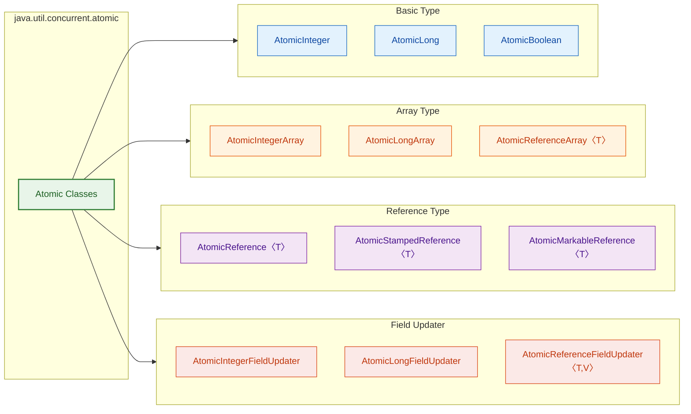

在深入每一类之前，需要先理解一个核心设计原则：**所有原子类内部都持有一个 `volatile` 修饰的变量**（或通过 `Unsafe` 直接操作内存偏移量），利用 `volatile` 的可见性保证加上 CAS 的原子性保证，共同实现了线程安全的无锁更新。这种 "volatile read + CAS write" 的组合拳，是整个 atomic 包的基石。

---

### 基本类型原子类

基本类型原子类是最常用、最直观的原子操作工具，适用于对单个基本类型变量进行线程安全的读写与运算。Java 提供了三个类：`AtomicInteger`、`AtomicLong` 和 `AtomicBoolean`。

#### AtomicInteger

`AtomicInteger` 是使用频率最高的原子类，它封装了一个 `int` 值，并提供了一系列原子操作方法。我们先看它的核心源码结构：

```java
public class AtomicInteger extends Number implements java.io.Serializable {
    // Unsafe 实例，用于直接操作内存
    private static final Unsafe unsafe = Unsafe.getUnsafe();
    // value 字段在 AtomicInteger 对象中的内存偏移量
    private static final long valueOffset;

    static {
        try {
            // 通过反射获取 value 字段的偏移量，CAS 操作需要它来定位内存地址
            valueOffset = unsafe.objectFieldOffset(
                AtomicInteger.class.getDeclaredField("value"));
        } catch (Exception ex) { throw new Error(ex); }
    }

    // 实际存储的 int 值，volatile 保证多线程可见性
    private volatile int value;

    // 构造方法：指定初始值
    public AtomicInteger(int initialValue) {
        value = initialValue;
    }

    // 无参构造：默认值为 0
    public AtomicInteger() {
    }
}
```

`AtomicInteger` 的常用 API 非常丰富，下面通过一个完整的示例来演示：

```java
import java.util.concurrent.atomic.AtomicInteger;

public class AtomicIntegerDemo {
    public static void main(String[] args) {
        // 创建一个初始值为 10 的 AtomicInteger
        AtomicInteger atomicInt = new AtomicInteger(10);

        // ========== 基本读写 ==========
        // get()：获取当前值
        int current = atomicInt.get();               // current = 10

        // set()：直接设置新值（volatile 写，保证可见性但非原子复合操作）
        atomicInt.set(20);                           // value = 20

        // lazySet()：最终会设置成功，但不保证立即对其他线程可见（性能优化，使用 StoreStore 屏障而非 StoreLoad）
        atomicInt.lazySet(30);                       // value 最终 = 30

        // ========== 原子更新 ==========
        // getAndSet()：原子地设置新值并返回旧值（类似 "交换"）
        int old = atomicInt.getAndSet(50);           // old = 30, value = 50

        // compareAndSet(expect, update)：CAS 核心方法
        // 仅当当前值等于 expect 时，才将值更新为 update，返回是否成功
        boolean success = atomicInt.compareAndSet(50, 60);  // success = true, value = 60
        boolean fail = atomicInt.compareAndSet(50, 70);     // fail = false, value 仍为 60

        // ========== 原子递增/递减 ==========
        // getAndIncrement()：先获取当前值，再 +1（等价于 i++）
        int beforeInc = atomicInt.getAndIncrement(); // beforeInc = 60, value = 61

        // incrementAndGet()：先 +1，再获取新值（等价于 ++i）
        int afterInc = atomicInt.incrementAndGet();  // afterInc = 62, value = 62

        // getAndDecrement()：先获取当前值，再 -1（等价于 i--）
        int beforeDec = atomicInt.getAndDecrement(); // beforeDec = 62, value = 61

        // decrementAndGet()：先 -1，再获取新值（等价于 --i）
        int afterDec = atomicInt.decrementAndGet();  // afterDec = 60, value = 60

        // ========== 原子加法 ==========
        // getAndAdd(delta)：先获取旧值，再加上 delta
        int beforeAdd = atomicInt.getAndAdd(5);      // beforeAdd = 60, value = 65

        // addAndGet(delta)：先加上 delta，再获取新值
        int afterAdd = atomicInt.addAndGet(5);       // afterAdd = 70, value = 70

        // ========== 函数式更新（Java 8+）==========
        // getAndUpdate(UnaryOperator)：先获取旧值，再用 lambda 计算新值
        int beforeUpdate = atomicInt.getAndUpdate(x -> x * 2);
        // beforeUpdate = 70, value = 140

        // updateAndGet(UnaryOperator)：先用 lambda 计算新值，再获取
        int afterUpdate = atomicInt.updateAndGet(x -> x / 2);
        // afterUpdate = 70, value = 70

        // getAndAccumulate(x, BinaryOperator)：先获取旧值，再用二元运算符计算
        int beforeAcc = atomicInt.getAndAccumulate(3, (prev, x) -> prev * x);
        // beforeAcc = 70, value = 210

        // accumulateAndGet(x, BinaryOperator)：先计算再获取
        int afterAcc = atomicInt.accumulateAndGet(2, (prev, x) -> prev + x);
        // afterAcc = 212, value = 212

        System.out.println("Final value: " + atomicInt.get()); // 212
    }
}
```

我们来重点看一下 `getAndIncrement()` 的底层实现，它是理解所有原子类工作方式的钥匙：

```java
// AtomicInteger.getAndIncrement() 源码
public final int getAndIncrement() {
    // 调用 Unsafe 的 getAndAddInt 方法
    // this：当前 AtomicInteger 对象
    // valueOffset：value 字段的内存偏移量
    // 1：增量值
    return unsafe.getAndAddInt(this, valueOffset, 1);
}

// Unsafe.getAndAddInt() 源码（JDK 8+）
public final int getAndAddInt(Object obj, long offset, int delta) {
    int expected;  // 期望值（即当前内存中的实际值）
    do {
        // 从内存中读取最新值（volatile 语义）
        expected = this.getIntVolatile(obj, offset);
        // CAS 尝试：如果内存值仍然是 expected，则更新为 expected + delta
        // 如果失败（说明其他线程已修改），则重新读取并再次尝试 → 自旋
    } while (!this.compareAndSwapInt(obj, offset, expected, expected + delta));
    // 循环结束说明 CAS 成功，返回旧值
    return expected;
}
```

这段代码清晰地展示了 CAS 自旋重试（spin-retry）的经典模式：**读取 → 计算 → CAS → 失败则重试**。`Java 8+` 引入的 `getAndUpdate` 和 `accumulateAndGet` 方法也遵循完全相同的模式，只不过把 "expected + delta" 替换成了 lambda 表达式的计算结果。

**经典应用场景——线程安全计数器**：

```java
import java.util.concurrent.atomic.AtomicInteger;
import java.util.concurrent.CountDownLatch;

public class SafeCounter {
    // 使用 AtomicInteger 替代普通 int，天然线程安全
    private final AtomicInteger count = new AtomicInteger(0);

    // 递增操作，无需 synchronized，无需 lock
    public void increment() {
        count.incrementAndGet();
    }

    // 获取当前计数
    public int getCount() {
        return count.get();
    }

    public static void main(String[] args) throws InterruptedException {
        SafeCounter counter = new SafeCounter();
        int threadCount = 100;           // 100 个线程
        int perThread = 10000;           // 每个线程递增 10000 次
        CountDownLatch latch = new CountDownLatch(threadCount);

        for (int i = 0; i < threadCount; i++) {
            new Thread(() -> {
                for (int j = 0; j < perThread; j++) {
                    counter.increment(); // 原子递增
                }
                latch.countDown();       // 当前线程完成
            }).start();
        }

        latch.await();                   // 等待所有线程结束
        // 结果一定是 1000000，不会出现丢失更新
        System.out.println("Final count: " + counter.getCount());
    }
}
```

#### AtomicLong

`AtomicLong` 与 `AtomicInteger` 的 API 几乎一模一样，唯一的区别是它封装的是 `long` 类型。这看似微不足道的差异，在 **32 位 JVM** 上有着重要意义。

JVM 规范指出，对于 64 位数据类型（`long` 和 `double`），在 32 位平台上可以拆分为两个 32 位的读/写操作（即 "non-atomic treatment of double and long"，JLS §17.7）。这意味着在 32 位 JVM 上，普通的 `long` 变量甚至连 **单次读写** 都不是原子的。`AtomicLong` 通过 `volatile long` + CAS 彻底消除了这一隐患。

```java
import java.util.concurrent.atomic.AtomicLong;

public class AtomicLongDemo {
    // 典型场景：全局唯一 ID 生成器
    private static final AtomicLong ID_GENERATOR = new AtomicLong(0);

    // 每次调用都会返回一个全局唯一的、递增的 long 值
    public static long nextId() {
        return ID_GENERATOR.incrementAndGet();
    }

    public static void main(String[] args) {
        // 并发环境下也绝不会产生重复 ID
        System.out.println(nextId()); // 1
        System.out.println(nextId()); // 2
        System.out.println(nextId()); // 3
    }
}
```

> **性能提示**：在高并发写场景下（大量线程同时做 `incrementAndGet()`），`AtomicLong` 会因为 CAS 竞争激烈导致大量自旋重试。Java 8 引入的 `LongAdder` 通过分段累加（cell-based striping）大幅降低了竞争，吞吐量可提升数倍。如果你只需要最终的累加值而不关心中间状态的精确读取，优先使用 `LongAdder`。

#### AtomicBoolean

`AtomicBoolean` 封装了一个 `boolean` 值，但其内部实现颇为有趣——它实际上将 `boolean` 映射为 `int`（`true → 1`, `false → 0`），然后复用 `Unsafe.compareAndSwapInt` 来实现 CAS。

```java
// AtomicBoolean 源码核心
public class AtomicBoolean implements java.io.Serializable {
    private static final Unsafe unsafe = Unsafe.getUnsafe();
    private static final long valueOffset;
    // 注意：底层存储的是 int 而非 boolean
    private volatile int value;

    // 构造方法：将 boolean 映射为 0 或 1
    public AtomicBoolean(boolean initialValue) {
        value = initialValue ? 1 : 0;
    }

    // get()：将 int 映射回 boolean
    public final boolean get() {
        return value != 0;
    }

    // compareAndSet：底层调用的是 compareAndSwapInt
    public final boolean compareAndSet(boolean expect, boolean update) {
        int e = expect ? 1 : 0;  // boolean → int
        int u = update ? 1 : 0;  // boolean → int
        return unsafe.compareAndSwapInt(this, valueOffset, e, u);
    }
}
```

为什么不直接对 `boolean` 做 CAS？因为 CPU 的 CAS 指令（如 x86 的 `CMPXCHG`）通常操作的最小粒度是 32 位（4 字节），无法直接对单个字节做原子比较交换。将 `boolean` 提升为 `int` 是最自然的适配方案。

`AtomicBoolean` 最经典的应用场景是实现 **一次性开关**（One-shot flag），确保某段代码在并发环境下只被执行一次：

```java
import java.util.concurrent.atomic.AtomicBoolean;

public class OneTimeInitializer {
    // 初始化标志，初始为 false
    private final AtomicBoolean initialized = new AtomicBoolean(false);

    public void initialize() {
        // compareAndSet 是原子操作：只有一个线程能将 false 改为 true 并返回 true
        // 其他线程看到的已经是 true，CAS 失败，直接跳过
        if (initialized.compareAndSet(false, true)) {
            // 只有第一个成功的线程会进入这里
            System.out.println(Thread.currentThread().getName() + " 执行了初始化！");
            doHeavyInit();
        } else {
            System.out.println(Thread.currentThread().getName() + " 跳过初始化，已由其他线程完成");
        }
    }

    private void doHeavyInit() {
        // 模拟耗时初始化操作
        try { Thread.sleep(1000); } catch (InterruptedException e) { }
        System.out.println("初始化完成！");
    }

    public static void main(String[] args) {
        OneTimeInitializer initializer = new OneTimeInitializer();
        // 10 个线程同时尝试初始化
        for (int i = 0; i < 10; i++) {
            new Thread(initializer::initialize, "Thread-" + i).start();
        }
    }
}
```

输出示例（只有一个线程成功执行初始化）：

```
Thread-0 执行了初始化！
Thread-3 跳过初始化，已由其他线程完成
Thread-1 跳过初始化，已由其他线程完成
...
初始化完成！
```

**三个基本类型原子类的对比总结**：

```
┌───────────────────┬──────────────┬──────────────┬───────────────┐
│     特性           │ AtomicInteger│ AtomicLong   │ AtomicBoolean │
├───────────────────┼──────────────┼──────────────┼───────────────┤
│ 封装类型           │ int          │ long         │ boolean→int   │
│ 底层 CAS 方法      │ cmpxchgInt   │ cmpxchgLong  │ cmpxchgInt    │
│ 算术运算支持        │ ✅ 完整      │ ✅ 完整      │ ❌ 无         │
│ 函数式更新(Java8+) │ ✅           │ ✅           │ ❌            │
│ 典型场景           │ 计数器/序号   │ ID生成器     │ 状态开关/标志  │
│ 高并发替代方案      │ LongAdder    │ LongAdder    │ 无需(竞争低)   │
└───────────────────┴──────────────┴──────────────┴───────────────┘
```

---

### 数组类型原子类

基本类型原子类只能保护**一个**变量的原子性。当需要保护**数组中某个索引位置的元素**时，就需要数组类型原子类。Java 提供了三个：`AtomicIntegerArray`、`AtomicLongArray` 和 `AtomicReferenceArray<E>`。

它们的核心思想是：**计算出数组中第 i 个元素的内存偏移量，然后对该偏移量执行 CAS 操作**。这意味着可以对数组的不同索引位置进行**独立的、无锁的**并发更新，不同索引之间互不干扰。

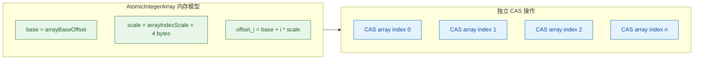

#### AtomicIntegerArray

```java
import java.util.concurrent.atomic.AtomicIntegerArray;

public class AtomicIntegerArrayDemo {
    public static void main(String[] args) throws InterruptedException {
        // 方式一：指定数组长度，所有元素默认为 0
        AtomicIntegerArray arr1 = new AtomicIntegerArray(5);

        // 方式二：传入已有数组（注意：会复制一份，修改原数组不影响 AtomicIntegerArray）
        int[] source = {10, 20, 30, 40, 50};
        AtomicIntegerArray arr2 = new AtomicIntegerArray(source);

        // get(index)：获取索引位置的值
        System.out.println(arr2.get(0));             // 10

        // set(index, newValue)：设置索引位置的值
        arr2.set(0, 100);                            // arr2[0] = 100

        // getAndIncrement(index)：原子递增指定索引的值
        int old = arr2.getAndIncrement(1);           // old = 20, arr2[1] = 21

        // compareAndSet(index, expect, update)：CAS 更新指定索引
        boolean ok = arr2.compareAndSet(2, 30, 300); // ok = true, arr2[2] = 300

        // getAndUpdate(index, UnaryOperator)：函数式更新
        arr2.getAndUpdate(3, x -> x * 10);           // arr2[3] = 400

        // 修改原数组不影响 AtomicIntegerArray（因为构造时做了深拷贝）
        source[4] = 999;
        System.out.println(arr2.get(4));              // 仍然是 50，不受影响

        // 打印数组当前状态
        System.out.println(arr2);  // [100, 21, 300, 400, 50]
    }
}
```

**深拷贝这一点非常重要**。来看源码中的构造方法：

```java
// AtomicIntegerArray 构造方法源码
public AtomicIntegerArray(int[] array) {
    // clone() 创建了一份独立的副本
    // 外部对原始 array 的修改不会影响这里
    this.array = array.clone();
}
```

这种设计保证了 `AtomicIntegerArray` 的**封装完整性**——它持有自己独立的数组拷贝，外部不可能绕过 CAS 直接修改底层数据。

底层如何计算偏移量呢？

```java
// AtomicIntegerArray 底层关键源码
private static final Unsafe unsafe = Unsafe.getUnsafe();
// 数组第一个元素的起始偏移量（对象头之后的位置）
private static final int base = unsafe.arrayBaseOffset(int[].class);
// 数组每个元素的字节大小（int 为 4 字节）
private static final int shift;

static {
    // scale = 4（int 占 4 字节）
    int scale = unsafe.arrayIndexScale(int[].class);
    // 计算 shift 值：4 = 2^2，所以 shift = 2
    // 通过位移代替乘法提升性能：offset = base + (i << shift)
    shift = 31 - Integer.numberOfLeadingZeros(scale);
}

// 计算第 i 个元素的偏移量
private long checkedByteOffset(int i) {
    // 边界检查
    if (i < 0 || i >= array.length)
        throw new IndexOutOfBoundsException("index " + i);
    return byteOffset(i);
}

private static long byteOffset(int i) {
    // base + i * 4  等价于  base + (i << 2)
    return ((long) i << shift) + base;
}
```

#### AtomicLongArray

`AtomicLongArray` 的 API 和 `AtomicIntegerArray` 完全对称，只是元素类型为 `long`，每个元素占 8 字节。在此不赘述 API，重点看一个实际应用——**多桶统计计数器**：

```java
import java.util.concurrent.atomic.AtomicLongArray;
import java.util.concurrent.CountDownLatch;

public class MultiBucketCounter {
    // 10 个统计桶，分别统计不同类别的计数
    private final AtomicLongArray buckets = new AtomicLongArray(10);

    // 对第 bucketIndex 个桶原子递增
    public void increment(int bucketIndex) {
        buckets.getAndIncrement(bucketIndex);
    }

    // 获取所有桶的总和
    public long totalCount() {
        long sum = 0;
        for (int i = 0; i < buckets.length(); i++) {
            sum += buckets.get(i);           // 逐桶累加
        }
        return sum;
    }

    // 打印每个桶的值
    public void printBuckets() {
        System.out.println(buckets);
    }

    public static void main(String[] args) throws InterruptedException {
        MultiBucketCounter counter = new MultiBucketCounter();
        int threadCount = 50;
        CountDownLatch latch = new CountDownLatch(threadCount);

        for (int t = 0; t < threadCount; t++) {
            new Thread(() -> {
                for (int j = 0; j < 10000; j++) {
                    // 随机选择一个桶进行递增
                    int bucket = (int) (Math.random() * 10);
                    counter.increment(bucket);
                }
                latch.countDown();
            }).start();
        }

        latch.await();
        counter.printBuckets();
        // 总计一定是 50 * 10000 = 500000
        System.out.println("Total: " + counter.totalCount());
    }
}
```

#### AtomicReferenceArray

`AtomicReferenceArray<E>` 将原子操作的能力扩展到了**引用类型数组**。它可以对数组中每个索引位置的对象引用进行原子替换。

```java
import java.util.concurrent.atomic.AtomicReferenceArray;

public class AtomicReferenceArrayDemo {
    public static void main(String[] args) {
        // 创建一个长度为 3 的引用类型原子数组
        AtomicReferenceArray<String> arr = new AtomicReferenceArray<>(3);

        // 设置初始值
        arr.set(0, "Alice");    // arr[0] = "Alice"
        arr.set(1, "Bob");      // arr[1] = "Bob"
        arr.set(2, "Charlie");  // arr[2] = "Charlie"

        // CAS 更新：只有当 arr[1] 还是 "Bob" 时，才替换为 "David"
        boolean success = arr.compareAndSet(1, "Bob", "David");
        System.out.println("CAS result: " + success); // true
        System.out.println("arr[1] = " + arr.get(1)); // David

        // getAndSet：原子交换
        String oldVal = arr.getAndSet(2, "Eve");
        System.out.println("Old: " + oldVal);          // Charlie
        System.out.println("New: " + arr.get(2));      // Eve

        // 函数式更新
        arr.updateAndGet(0, name -> name.toUpperCase());
        System.out.println("arr[0] = " + arr.get(0));  // ALICE
    }
}
```

> **注意**：`AtomicReferenceArray` 的 CAS 比较使用的是 **引用相等（`==`）**，而非 `equals()`。如果 `compareAndSet(idx, "Bob", "David")`，JVM 在比较时检查的是 arr[idx] 这个引用是否指向与 `"Bob"` 相同的对象（由于 String 常量池，字面量字符串通常满足 `==`），但对于 `new String("Bob")` 则不一定成立。

---

### 引用类型原子类

基本类型原子类只能保护 `int`、`long`、`boolean`；数组原子类保护的是数组元素。但如果需要**原子地更新一个自定义对象的引用**——比如替换一个不可变配置对象、更新一个链表节点——就需要引用类型原子类。

#### AtomicReference

`AtomicReference<V>` 是最基础的引用原子类，它封装了一个泛型引用，支持对该引用的原子读写和 CAS 操作。

```java
import java.util.concurrent.atomic.AtomicReference;

// 不可变配置对象
class AppConfig {
    final String dbUrl;      // 数据库连接地址
    final int maxConnections; // 最大连接数

    AppConfig(String dbUrl, int maxConnections) {
        this.dbUrl = dbUrl;
        this.maxConnections = maxConnections;
    }

    @Override
    public String toString() {
        return "AppConfig{dbUrl='" + dbUrl + "', maxConn=" + maxConnections + "}";
    }
}

public class AtomicReferenceDemo {
    // 全局配置引用，使用 AtomicReference 保证原子替换
    private static final AtomicReference<AppConfig> CONFIG =
            new AtomicReference<>(new AppConfig("jdbc:mysql://localhost:3306/db", 10));

    // 热更新配置：原子地替换整个配置对象
    public static void updateConfig(String newUrl, int newMaxConn) {
        AppConfig oldConfig;
        AppConfig newConfig;
        do {
            // 读取当前配置
            oldConfig = CONFIG.get();
            // 构建新配置（不可变对象，线程安全）
            newConfig = new AppConfig(newUrl, newMaxConn);
            // CAS：只有当前配置未被其他线程修改时才替换
        } while (!CONFIG.compareAndSet(oldConfig, newConfig));
        System.out.println("Config updated: " + newConfig);
    }

    // 读取配置：无需加锁，直接读取引用
    public static AppConfig getConfig() {
        return CONFIG.get();
    }

    public static void main(String[] args) {
        System.out.println("Before: " + getConfig());
        updateConfig("jdbc:mysql://prod-server:3306/db", 50);
        System.out.println("After: " + getConfig());
    }
}
```

这种"**不可变对象 + AtomicReference + CAS 替换**"的模式是无锁编程中极为常见的设计范式，通常称为 **Copy-On-Write** 的变种。每次更新都创建一个新对象来替换旧引用，读操作完全无锁，性能极好。

但 `AtomicReference` 有一个致命弱点——**无法感知 ABA 问题**。因为它仅比较引用本身是否相等，如果引用从 A → B → A，CAS 会认为"没有变化"而更新成功。在某些场景下（例如无锁栈、无锁队列的节点复用），这会导致严重的逻辑错误。

#### AtomicStampedReference ⭐（解决 ABA）

`AtomicStampedReference<V>` 是专门为解决 ABA 问题而设计的原子引用类。它在引用之外附加了一个 **int 类型的版本号（stamp）**，每次更新时不仅要比较引用本身，还要比较版本号。这样即使引用从 A→B→A，只要版本号发生了变化，CAS 就会正确地失败。

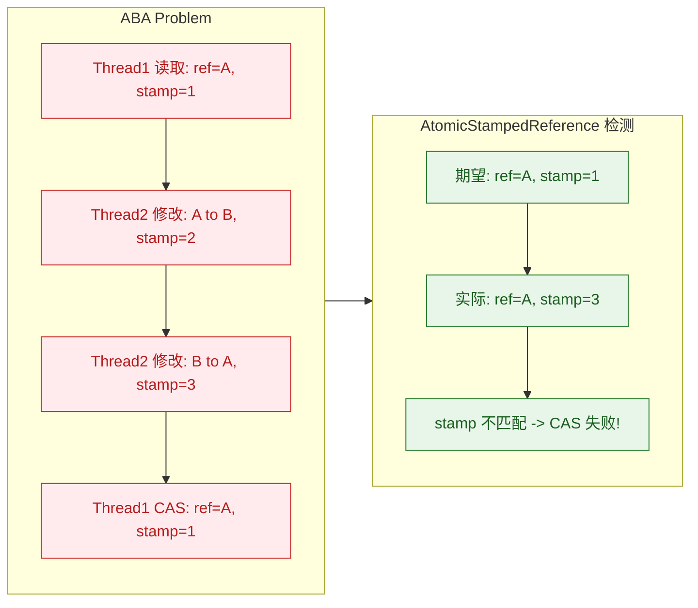

先看它的内部数据结构：

```java
// AtomicStampedReference 源码核心
public class AtomicStampedReference<V> {

    // 内部类：将引用和版本号打包成一个不可变的 Pair 对象
    private static class Pair<T> {
        final T reference;    // 实际引用
        final int stamp;      // 版本号
        private Pair(T reference, int stamp) {
            this.reference = reference;
            this.stamp = stamp;
        }
        static <T> Pair<T> of(T reference, int stamp) {
            return new Pair<T>(reference, stamp);
        }
    }

    // 持有一个 volatile 的 Pair 引用
    // CAS 操作的目标就是这个 pair 引用
    private volatile Pair<V> pair;

    // 构造方法：传入初始引用和初始版本号
    public AtomicStampedReference(V initialRef, int initialStamp) {
        pair = Pair.of(initialRef, initialStamp);
    }
}
```

**精妙之处**在于：它将 `(reference, stamp)` 封装成单个 `Pair` 对象，然后对这个 `Pair` 对象的引用做 CAS。这样就巧妙地将"同时比较两个值"的问题转化为了"比较单个引用"的问题。

核心方法 `compareAndSet` 的源码：

```java
public boolean compareAndSet(V expectedReference,   // 期望的引用
                             V newReference,         // 新的引用
                             int expectedStamp,      // 期望的版本号
                             int newStamp) {         // 新的版本号
    Pair<V> current = pair;                          // 获取当前 Pair
    return
        expectedReference == current.reference &&    // 引用必须匹配
        expectedStamp == current.stamp &&            // 版本号必须匹配
        ((newReference == current.reference &&       // 如果新值与当前值完全相同
          newStamp == current.stamp) ||              // 则无需 CAS（短路优化）
         casPair(current, Pair.of(newReference, newStamp))); // 否则 CAS 替换 Pair
}

// 底层 CAS：对 pair 引用进行原子替换
private boolean casPair(Pair<V> cmp, Pair<V> val) {
    return UNSAFE.compareAndSwapObject(this, pairOffset, cmp, val);
}
```

下面用一个完整的例子来演示 ABA 问题的发生与解决：

```java
import java.util.concurrent.atomic.AtomicStampedReference;
import java.util.concurrent.atomic.AtomicReference;
import java.util.concurrent.TimeUnit;

public class ABADemo {

    // ========== 场景1：AtomicReference 无法检测 ABA ==========
    static AtomicReference<String> atomicRef = new AtomicReference<>("A");

    // ========== 场景2：AtomicStampedReference 成功检测 ABA ==========
    // 初始引用 "A"，初始版本号 1
    static AtomicStampedReference<String> stampedRef =
            new AtomicStampedReference<>("A", 1);

    public static void main(String[] args) throws InterruptedException {
        System.out.println("===== AtomicReference（存在 ABA 问题）=====");
        testAtomicReference();

        Thread.sleep(2000);
        System.out.println("\n===== AtomicStampedReference（解决 ABA）=====");
        testStampedReference();
    }

    static void testAtomicReference() throws InterruptedException {
        // 干扰线程：执行 A → B → A 的修改
        Thread interferor = new Thread(() -> {
            // A → B
            atomicRef.compareAndSet("A", "B");
            System.out.println("干扰线程: A -> B");
            // B → A（又改回去了！）
            atomicRef.compareAndSet("B", "A");
            System.out.println("干扰线程: B -> A");
        }, "interferor");

        // 业务线程：读取 A，然后尝试改为 C
        Thread worker = new Thread(() -> {
            String snapshot = atomicRef.get();        // 读到 "A"
            System.out.println("业务线程: 读取到 " + snapshot);
            try { TimeUnit.SECONDS.sleep(1); } catch (InterruptedException e) {} // 等待干扰完成
            // CAS：期望 "A"，更新为 "C"
            boolean result = atomicRef.compareAndSet(snapshot, "C");
            // 结果为 true！ABA 问题发生了——虽然值回到了 A，但中间发生了变化
            System.out.println("业务线程: CAS result = " + result + ", value = " + atomicRef.get());
        }, "worker");

        interferor.start();
        Thread.sleep(100); // 确保干扰线程先执行
        worker.start();
        interferor.join();
        worker.join();
    }

    static void testStampedReference() throws InterruptedException {
        // 干扰线程：执行 A → B → A，每次修改都递增版本号
        Thread interferor = new Thread(() -> {
            int stamp = stampedRef.getStamp();         // stamp = 1
            // A → B, stamp 1 → 2
            stampedRef.compareAndSet("A", "B", stamp, stamp + 1);
            System.out.println("干扰线程: A -> B, stamp: " + stampedRef.getStamp());

            stamp = stampedRef.getStamp();             // stamp = 2
            // B → A, stamp 2 → 3
            stampedRef.compareAndSet("B", "A", stamp, stamp + 1);
            System.out.println("干扰线程: B -> A, stamp: " + stampedRef.getStamp());
        }, "interferor");

        // 业务线程：读取引用和版本号
        Thread worker = new Thread(() -> {
            String snapshot = stampedRef.getReference(); // "A"
            int stamp = stampedRef.getStamp();           // stamp = 1
            System.out.println("业务线程: 读取到 " + snapshot + ", stamp = " + stamp);
            try { TimeUnit.SECONDS.sleep(1); } catch (InterruptedException e) {}
            // CAS：期望引用 "A" + 版本号 1
            boolean result = stampedRef.compareAndSet(snapshot, "C", stamp, stamp + 1);
            // 结果为 false！因为版本号已经从 1 变成了 3
            System.out.println("业务线程: CAS result = " + result
                    + ", value = " + stampedRef.getReference()
                    + ", stamp = " + stampedRef.getStamp());
        }, "worker");

        interferor.start();
        Thread.sleep(100);
        worker.start();
        interferor.join();
        worker.join();
    }
}
```

输出：

```
===== AtomicReference（存在 ABA 问题）=====
干扰线程: A -> B
干扰线程: B -> A
业务线程: 读取到 A
业务线程: CAS result = true, value = C        ← ABA 未被检测，错误地更新成功

===== AtomicStampedReference（解决 ABA）=====
干扰线程: A -> B, stamp: 2
干扰线程: B -> A, stamp: 3
业务线程: 读取到 A, stamp = 1
业务线程: CAS result = false, value = A, stamp = 3  ← ABA 被检测到，更新正确地失败
```

`AtomicStampedReference` 还提供了 `attemptStamp` 方法和批量获取版本号的工具方法：

```java
// 获取引用和版本号（通过 int[] 输出参数）
int[] stampHolder = new int[1];
String ref = stampedRef.get(stampHolder);
// ref = 当前引用，stampHolder[0] = 当前版本号

// attemptStamp：如果当前引用等于 expectedRef，则仅更新版本号
// 用于"只打标记不改引用"的场景
boolean stamped = stampedRef.attemptStamp("A", 100);
```

#### AtomicMarkableReference

`AtomicMarkableReference<V>` 与 `AtomicStampedReference<V>` 非常相似，但它附加的不是 `int` 版本号，而是一个 **`boolean` 标记（mark）**。

两者的区别在于语义层面：
- `AtomicStampedReference`：用 int stamp 记录精确的修改次数（"这个值被改过几次了？"）
- `AtomicMarkableReference`：用 boolean mark 记录是否被修改过（"这个值被动过没有？"）

```java
// AtomicMarkableReference 内部结构
private static class Pair<T> {
    final T reference;    // 实际引用
    final boolean mark;   // 标记位（true/false）
    private Pair(T reference, boolean mark) {
        this.reference = reference;
        this.mark = mark;
    }
}
```

`AtomicMarkableReference` 常用于实现简化版的 ABA 检测，或者为节点打上"逻辑删除"标记：

```java
import java.util.concurrent.atomic.AtomicMarkableReference;

public class AtomicMarkableReferenceDemo {
    public static void main(String[] args) {
        // 初始引用 "NodeA"，初始标记 false（未删除）
        AtomicMarkableReference<String> markableRef =
                new AtomicMarkableReference<>("NodeA", false);

        // 获取当前引用
        System.out.println("Reference: " + markableRef.getReference()); // NodeA
        System.out.println("Marked: " + markableRef.isMarked());        // false

        // 批量获取引用和标记
        boolean[] markHolder = new boolean[1];
        String ref = markableRef.get(markHolder);
        System.out.println("ref=" + ref + ", mark=" + markHolder[0]);   // NodeA, false

        // CAS 更新：同时比较引用和标记，同时设置新引用和新标记
        // 场景：将 NodeA 标记为已删除（逻辑删除）
        boolean success = markableRef.compareAndSet(
            "NodeA",    // 期望引用
            "NodeA",    // 新引用（不变）
            false,      // 期望标记（未删除）
            true        // 新标记（已删除）
        );
        System.out.println("标记删除成功: " + success);          // true
        System.out.println("Marked: " + markableRef.isMarked()); // true

        // attemptMark：只更新标记，不改引用
        markableRef.attemptMark("NodeA", false); // 取消删除标记
        System.out.println("Marked: " + markableRef.isMarked()); // false
    }
}
```

**`AtomicStampedReference` vs `AtomicMarkableReference` 对比**：

```
┌─────────────────────┬─────────────────────────┬──────────────────────────┐
│ 特性                 │ AtomicStampedReference  │ AtomicMarkableReference  │
├─────────────────────┼─────────────────────────┼──────────────────────────┤
│ 附加信息             │ int stamp（版本号）      │ boolean mark（标记位）    │
│ ABA 检测粒度         │ 精确（知道改了几次）      │ 粗略（只知道改没改过）     │
│ 适用场景             │ 金融/账户/精确防ABA       │ 逻辑删除/状态标记          │
│ 内存开销             │ 略大（int 4字节）        │ 略小（boolean 1字节）     │
│ 实际使用频率          │ ⭐⭐⭐ 更常用           │ ⭐ 较少用                 │
└─────────────────────┴─────────────────────────┴──────────────────────────┘
```

---

### 字段更新器原子类

前面介绍的所有原子类都有一个共同特征：**它们是独立的包装器对象**。如果想让一个已有类的某个字段变成原子操作的，就必须把字段类型从 `int` 改为 `AtomicInteger`，这在某些场景下是无法接受的：

1. **无法修改第三方库的源码**。
2. **大量对象实例的内存开销**：每个 `AtomicInteger` 自身就是一个对象（对象头 12-16 字节 + `int value` 4 字节 + padding），如果有百万级实例，这个开销相当可观。
3. **序列化兼容性**：修改字段类型可能破坏已有的序列化协议。

**字段更新器（Field Updater）** 正是为解决这类问题而生的。它不改变原始类的字段类型，而是通过反射定位到字段的内存偏移量，直接在该偏移量上执行 CAS 操作。字段本身只需声明为 `volatile`（保证可见性），更新器就能赋予它原子操作的能力。

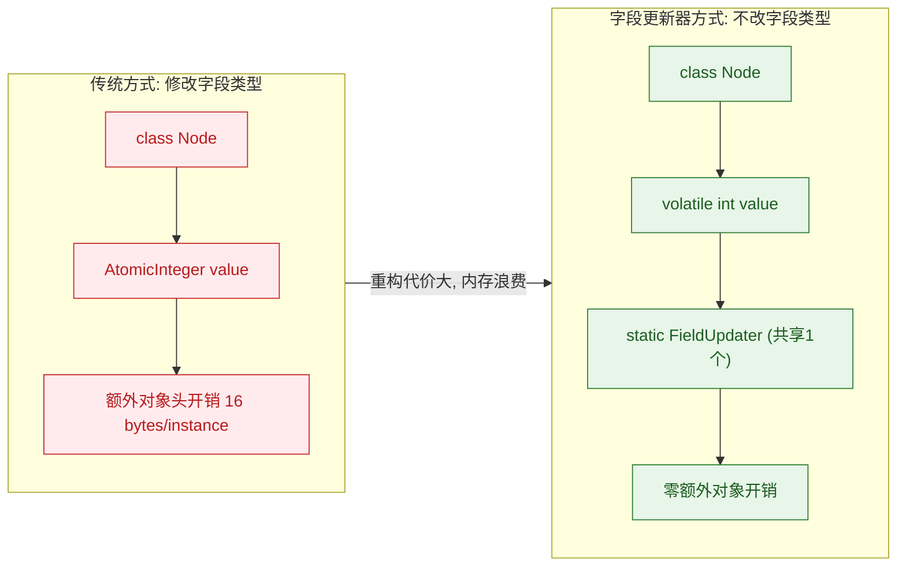

Java 提供了三个字段更新器：

- `AtomicIntegerFieldUpdater<T>` — 更新 `volatile int` 字段
- `AtomicLongFieldUpdater<T>` — 更新 `volatile long` 字段
- `AtomicReferenceFieldUpdater<T, V>` — 更新 `volatile` 引用字段

#### AtomicIntegerFieldUpdater

```java
import java.util.concurrent.atomic.AtomicIntegerFieldUpdater;
import java.util.concurrent.CountDownLatch;

class Account {
    // 字段必须是 volatile（保证可见性，CAS 的前提）
    // 字段必须是非 static 的实例字段
    // 字段不能是 private（更新器需要通过反射访问，除非在同一个类内部）
    volatile int balance;

    Account(int balance) {
        this.balance = balance;
    }
}

public class AtomicIntegerFieldUpdaterDemo {
    // 创建更新器：指定目标类和字段名（通过反射查找）
    // 注意：这是一个 static final 的共享实例，所有线程共用同一个更新器
    private static final AtomicIntegerFieldUpdater<Account> BALANCE_UPDATER =
            AtomicIntegerFieldUpdater.newUpdater(Account.class, "balance");

    public static void main(String[] args) throws InterruptedException {
        Account account = new Account(1000);

        // ========== 基本操作演示 ==========
        // get：读取字段值
        int current = BALANCE_UPDATER.get(account);
        System.out.println("Current: " + current);           // 1000

        // set：设置字段值
        BALANCE_UPDATER.set(account, 2000);

        // compareAndSet：CAS 更新
        boolean ok = BALANCE_UPDATER.compareAndSet(account, 2000, 3000);
        System.out.println("CAS result: " + ok);             // true

        // getAndIncrement：原子递增
        int old = BALANCE_UPDATER.getAndIncrement(account);
        System.out.println("Old: " + old);                   // 3000

        // addAndGet：原子加法
        int newVal = BALANCE_UPDATER.addAndGet(account, 100);
        System.out.println("After add: " + newVal);          // 3101

        // ========== 并发安全性验证 ==========
        Account concurrentAccount = new Account(0);
        int threadCount = 100;
        int perThread = 10000;
        CountDownLatch latch = new CountDownLatch(threadCount);

        for (int i = 0; i < threadCount; i++) {
            new Thread(() -> {
                for (int j = 0; j < perThread; j++) {
                    // 对 concurrentAccount.balance 做原子递增
                    BALANCE_UPDATER.incrementAndGet(concurrentAccount);
                }
                latch.countDown();
            }).start();
        }

        latch.await();
        // 结果一定正确：1000000
        System.out.println("Final balance: " + concurrentAccount.balance);
    }
}
```

**字段更新器的约束条件**（违反任何一条都会抛出异常）：

```
┌────┬──────────────────────────────────────────────────────────────┐
│ #  │ 约束条件                                                     │
├────┼──────────────────────────────────────────────────────────────┤
│  1 │ 字段必须声明为 volatile（否则抛出 IllegalArgumentException）   │
│  2 │ 字段必须是实例字段，不能是 static（static 用 Unsafe 直接操作） │
│  3 │ 字段类型必须匹配（int/long/引用），不能用包装类型              │
│  4 │ 调用者必须对字段有访问权限（通常不能是 private）               │
│  5 │ IntegerFieldUpdater 只支持 int，不支持 Integer 包装类型       │
└────┴──────────────────────────────────────────────────────────────┘
```

#### AtomicLongFieldUpdater

`AtomicLongFieldUpdater` 的使用方式与 `AtomicIntegerFieldUpdater` 几乎完全一致，只是操作的字段类型为 `volatile long`。

```java
import java.util.concurrent.atomic.AtomicLongFieldUpdater;

class Metrics {
    // volatile long 字段
    volatile long requestCount;
    volatile long totalResponseTime;

    Metrics() {
        this.requestCount = 0;
        this.totalResponseTime = 0;
    }
}

public class AtomicLongFieldUpdaterDemo {
    // 为不同字段分别创建更新器
    private static final AtomicLongFieldUpdater<Metrics> REQ_COUNT_UPDATER =
            AtomicLongFieldUpdater.newUpdater(Metrics.class, "requestCount");

    private static final AtomicLongFieldUpdater<Metrics> RESP_TIME_UPDATER =
            AtomicLongFieldUpdater.newUpdater(Metrics.class, "totalResponseTime");

    // 记录一次请求
    public static void recordRequest(Metrics metrics, long responseTimeMs) {
        // 原子递增请求计数
        REQ_COUNT_UPDATER.incrementAndGet(metrics);
        // 原子累加响应时间
        RESP_TIME_UPDATER.addAndGet(metrics, responseTimeMs);
    }

    // 获取平均响应时间
    public static double getAvgResponseTime(Metrics metrics) {
        long count = REQ_COUNT_UPDATER.get(metrics);
        long total = RESP_TIME_UPDATER.get(metrics);
        return count == 0 ? 0.0 : (double) total / count;
    }

    public static void main(String[] args) throws InterruptedException {
        Metrics metrics = new Metrics();

        // 模拟 1000 个并发请求
        Thread[] threads = new Thread[1000];
        for (int i = 0; i < 1000; i++) {
            threads[i] = new Thread(() -> {
                // 模拟响应时间 50~150ms
                long responseTime = 50 + (long) (Math.random() * 100);
                recordRequest(metrics, responseTime);
            });
            threads[i].start();
        }

        for (Thread t : threads) t.join();

        System.out.println("Total requests: " + metrics.requestCount);      // 一定是 1000
        System.out.println("Avg response time: " + getAvgResponseTime(metrics) + " ms");
    }
}
```

这个例子展示了字段更新器的一个核心优势：**`Metrics` 对象自身非常轻量**（只有两个 `long` 字段），不需要持有任何 `AtomicLong` 对象。如果系统中有百万级的 `Metrics` 实例（例如每个连接一个），这能节省大量内存。更新器是 `static final` 的，整个 JVM 只有一份，被所有实例共享。

#### AtomicReferenceFieldUpdater

`AtomicReferenceFieldUpdater<T, V>` 允许对对象中的 `volatile` 引用字段执行原子更新。它在创建时需要指定三个参数：持有该字段的类（tclass）、字段类型（vclass）和字段名。

一个典型的应用场景是**无锁链表节点的 next 指针更新**：

```java
import java.util.concurrent.atomic.AtomicReferenceFieldUpdater;

class Node<T> {
    final T data;                 // 不可变数据
    volatile Node<T> next;        // volatile 引用字段，指向下一个节点

    Node(T data) {
        this.data = data;
        this.next = null;
    }

    Node(T data, Node<T> next) {
        this.data = data;
        this.next = next;
    }
}

public class AtomicReferenceFieldUpdaterDemo {
    // 创建引用字段更新器
    // 参数：持有字段的类，字段类型，字段名
    @SuppressWarnings("unchecked")
    private static final AtomicReferenceFieldUpdater<Node, Node> NEXT_UPDATER =
            AtomicReferenceFieldUpdater.newUpdater(Node.class, Node.class, "next");

    // 原子地将 newNode 插入到 head 之后
    @SuppressWarnings("unchecked")
    public static <T> void insertAfter(Node<T> head, Node<T> newNode) {
        Node<T> oldNext;
        do {
            // 读取 head 当前的 next
            oldNext = head.next;
            // 将新节点的 next 指向原来的 next
            newNode.next = oldNext;
            // CAS：将 head.next 从 oldNext 替换为 newNode
            // 如果其他线程同时修改了 head.next，CAS 失败，重试
        } while (!NEXT_UPDATER.compareAndSet(head, oldNext, newNode));
    }

    public static void main(String[] args) {
        // 构建初始链表：A -> C
        Node<String> nodeC = new Node<>("C");
        Node<String> nodeA = new Node<>("A", nodeC);

        // 在 A 和 C 之间插入 B：A -> B -> C
        Node<String> nodeB = new Node<>("B");
        insertAfter(nodeA, nodeB);

        // 遍历验证
        Node<String> current = nodeA;
        while (current != null) {
            System.out.print(current.data + " -> ");
            current = current.next;
        }
        System.out.println("null");
        // 输出：A -> B -> C -> null
    }
}
```

**字段更新器在 JDK 源码中的实际应用**：

字段更新器并非仅仅是教学工具，它在 JDK 核心源码中被大量使用。例如：

- `java.util.concurrent.FutureTask` 中使用 `AtomicReferenceFieldUpdater` 更新 `runner` 和 `waiters` 字段
- `java.util.concurrent.ConcurrentLinkedQueue` 中使用字段更新器更新 `head`、`tail` 和节点的 `next` 指针
- `java.util.concurrent.SynchronousQueue` 的内部转移栈/队列节点也使用字段更新器

这些核心并发数据结构选择字段更新器而非 `AtomicReference` 的原因正是前文所述的——**减少对象开销，提升 GC 友好性**。

下面通过 ASCII 图展示字段更新器与原子包装类在内存布局上的差异：

```java
// ===== 方案A：使用 AtomicReference（每个节点多一个对象） =====
//
//  Node 对象          AtomicReference 对象         实际引用
// ┌──────────────┐   ┌──────────────────────┐
// │ Object Header│   │ Object Header (16B)  │
// │ (16 bytes)   │   │ volatile Object value─┼──> 下一个 Node
// │ data         │   └──────────────────────┘
// │ next ────────┼──> (AtomicReference 对象)
// └──────────────┘
// 每个 Node 额外多出一个 AtomicReference 对象 (约 32 bytes)
//
// ===== 方案B：使用 FieldUpdater（零额外开销） =====
//
//  Node 对象                        共享的 static FieldUpdater
// ┌──────────────┐                 ┌───────────────────────┐
// │ Object Header│                 │ (仅 1 个实例)          │
// │ (16 bytes)   │                 │ 持有 offset 等元数据   │
// │ data         │   CAS 直接操作  │ 所有 Node 共用         │
// │ volatile next┼── ←──────────── │                       │
// └──────────────┘                 └───────────────────────┘
// 每个 Node 零额外对象开销
```

**四大原子类家族完整对比**：

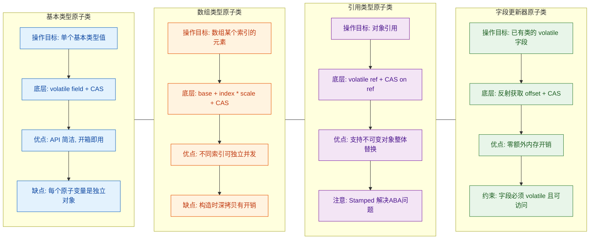

---

**📝 练习题**

某团队需要维护一个全局共享的 `Config` 配置对象，该对象是不可变的。多个线程会并发地读取当前配置，偶尔有管理线程会替换为新的配置对象。同时，团队发现在极端情况下可能出现 ABA 问题（配置被改为 B 又改回 A，但中间有一次生效了 B 配置的逻辑需要被感知到）。请问应该使用以下哪个原子类？

A. `AtomicReference<Config>`


B. `AtomicStampedReference<Config>`


C. `AtomicIntegerFieldUpdater`


D. `AtomicMarkableReference<Config>`

**【答案】** B

**【解析】** 题目有两个关键需求：（1）原子地替换不可变对象的引用；（2）能够感知 ABA 问题。`AtomicReference`（选项 A）可以满足需求 (1)，但无法检测 ABA。`AtomicStampedReference`（选项 B）在引用之外附加了 int 类型的版本号（stamp），每次更新时版本号递增，即使引用从 A→B→A，版本号也会从 1→2→3，CAS 时通过检查版本号不匹配来感知中间发生过变更，完美解决 ABA。`AtomicIntegerFieldUpdater`（选项 C）是字段更新器，用于更新 `volatile int` 字段，与本题场景不匹配。`AtomicMarkableReference`（选项 D）只附加了一个 boolean 标记，只能知道"是否修改过"，无法精确感知修改次数，且如果标记从 true→false→true 也可能"误判"。当需要精确感知变更历史时，`AtomicStampedReference` 是最佳选择。

---

**📝 练习题**

以下关于 `AtomicIntegerFieldUpdater` 的说法，哪一项是**错误**的？

A. 被更新的字段必须声明为 `volatile`


B. 被更新的字段不能是 `static` 修饰的


C. 被更新的字段类型可以是 `Integer`（包装类型）


D. 同一个 `AtomicIntegerFieldUpdater` 实例可以更新该类的所有对象的同名字段

**【答案】** C

**【解析】** `AtomicIntegerFieldUpdater` 要求被操作的字段类型严格为 **原始类型 `int`**，而不是包装类型 `Integer`。这是因为底层调用的是 `Unsafe.compareAndSwapInt()`，直接操作的是 4 字节原始值的内存偏移量。如果字段类型是 `Integer`，它在内存中存储的是一个对象引用而非 `int` 值，无法使用 `compareAndSwapInt` 操作，创建更新器时会直接抛出 `IllegalArgumentException`。选项 A 正确，`volatile` 是强制要求，保证内存可见性。选项 B 正确，字段更新器只能操作实例字段（`Unsafe.objectFieldOffset` 计算的就是实例字段偏移量）。选项 D 正确，更新器存储的是字段的偏移量，而同一个类的所有对象实例中同名字段的偏移量是相同的，因此一个更新器实例可以对任意数量的对象实例操作。

---

## 本章小结

本章围绕 **原子类与 CAS** 这一 Java 并发编程的核心基石，从原理到实践、从底层硬件指令到上层 API 封装，进行了系统而深入的梳理。以下是对全章知识脉络的凝练回顾。

### 核心知识脉络回顾

**CAS（Compare And Swap）** 是整章的灵魂。它以一种 "先比较、再交换" 的方式，实现了不加锁（lock-free）的原子更新——这是一种典型的 **乐观锁思想（Optimistic Locking）**。与 `synchronized` 或 `ReentrantLock` 等悲观锁策略不同，CAS 假设竞争不常发生，仅在真正写入时校验数据是否被篡改。它的三个操作数——**内存值 V、期望值 A、新值 B**——构成了一切无锁编程的逻辑基点：当且仅当 `V == A` 时，才将 V 原子地更新为 B，否则什么都不做并返回当前真实值。这一操作在硬件层面由 CPU 的 **`cmpxchg` 指令** 保证原子性，配合 **总线锁（Bus Lock）** 或更高效的 **缓存锁（Cache Lock / MESI 协议）** 确保多核环境下的可见性与互斥性。

在 JVM 层面，CAS 通过 `sun.misc.Unsafe`（JDK 9+ 为 `jdk.internal.misc.Unsafe`）类暴露给 Java 世界。`Unsafe` 提供了 `compareAndSwapInt`、`compareAndSwapLong`、`compareAndSwapObject` 等 native 方法，它们直接操作对象在内存中的偏移量（field offset），绕过了 Java 的访问控制和对象模型的抽象。JIT 编译器会将这些调用 **内联（intrinsic）** 为对应平台的 CAS 指令，实现近乎零开销的原子操作。这是整个 `java.util.concurrent.atomic` 包的底座。

**CAS 并非万能**，它有三个经典局限性：

- **ABA 问题**：一个值从 A 变成 B 再变回 A，CAS 会误以为"从未改变"。在链表等基于指针/引用的数据结构中，这可能导致严重的逻辑错误——例如栈顶节点被替换后又恢复原引用，但其 `next` 指向的链路已经完全不同。解决方案是引入 **版本号（stamp）** 或 **标记位（mark）**，让每次修改都不可能"回到过去"。
- **自旋开销**：在竞争激烈的场景下，大量线程反复执行 CAS 失败→重试的循环，会导致 CPU 空转（busy-waiting），白白消耗计算资源。这也是为什么 JDK 8 引入了 `LongAdder` / `LongAccumulator` 等 **分散热点（Cell 数组）** 的设计，将竞争分摊到多个槽位上。
- **单变量原子性**：CAS 天然只能保护一个变量。若需同时原子更新多个变量，要么将它们封装到一个不可变对象中配合 `AtomicReference` 使用，要么退回到锁方案。

基于 CAS，JDK 提供了 **四大类原子工具**：

| 类别 | 代表类 | 核心场景 |
|------|--------|---------|
| **基本类型** | `AtomicInteger`, `AtomicLong`, `AtomicBoolean` | 计数器、标志位、序列号生成 |
| **数组类型** | `AtomicIntegerArray`, `AtomicLongArray`, `AtomicReferenceArray` | 以原子方式更新数组中某个下标的元素 |
| **引用类型** | `AtomicReference`, `AtomicStampedReference`, `AtomicMarkableReference` | 原子更新对象引用、解决 ABA、标记逻辑删除 |
| **字段更新器** | `AtomicIntegerFieldUpdater`, `AtomicLongFieldUpdater`, `AtomicReferenceFieldUpdater` | 在不修改已有类结构的前提下，对某个 `volatile` 字段施加原子操作 |

其中 `AtomicStampedReference` 以 `int stamp` 作为版本号，是解决 ABA 问题的标准武器；`AtomicMarkableReference` 以 `boolean mark` 简化为"是否被标记"的二态判定，常见于并发数据结构的逻辑删除。字段更新器则是一种轻量级选择——当对象数量庞大时，用一个共享的 `static final` 更新器替代为每个对象都创建 `AtomicInteger` 字段，能显著减少内存开销（avoid per-object overhead）。

### 全章知识体系总览

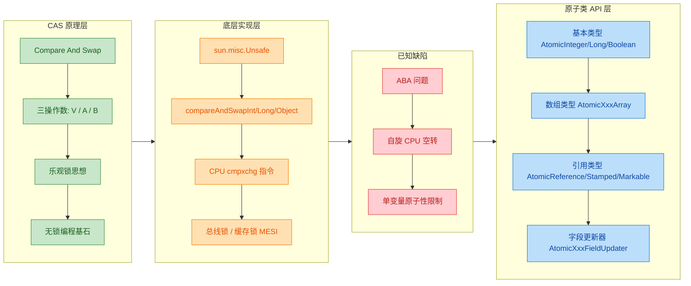

### 决策指南：何时用什么

在实际开发中，面对一个并发更新的需求，选择正确的工具至关重要。以下决策流程可以帮助快速定位：

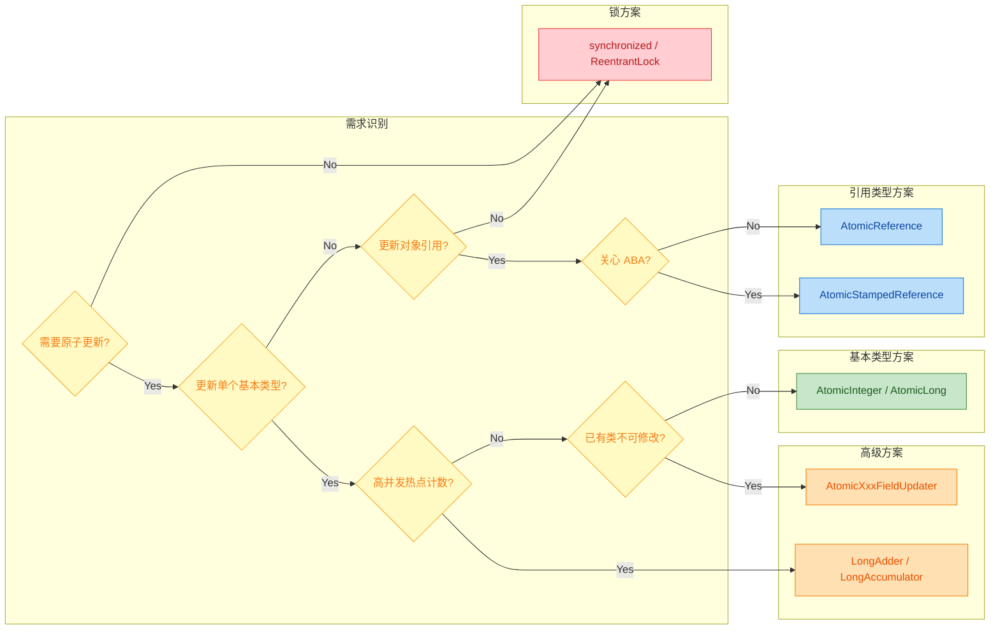

### 关键设计思想提炼

纵观全章，有几个贯穿始终的并发设计哲学值得铭记：

**第一，硬件与软件的协同设计。** CAS 不是纯软件层面的技巧，它依赖 CPU 提供的原子指令（`cmpxchg`）和缓存一致性协议（MESI）。理解这一点有助于认识到：所有上层的 `Atomic*` 类，最终都是对硬件能力的 Java 封装。JVM 的 `Unsafe` 类是这座桥梁的核心枢纽。

**第二，乐观优于悲观，分散优于集中。** CAS 的乐观策略在低竞争场景下远胜悲观锁，因为它省去了线程挂起与唤醒的上下文切换开销（context switch cost）。而当竞争加剧时，`LongAdder` 的 Cell 数组设计进一步将"单点竞争"打散为"多槽位竞争"，体现了 **分治（divide and conquer）** 在并发领域的经典应用。

**第三，没有银弹，只有取舍。** CAS 的三大缺陷——ABA、自旋开销、单变量限制——提醒我们，任何并发方案都有其适用边界。`AtomicStampedReference` 用额外的 `int stamp` 空间换取 ABA 安全；`LongAdder` 用额外的 `Cell[]` 内存换取更高的吞吐量；字段更新器用反射的复杂性换取内存的节约。**工程决策的本质就是 trade-off。**

**第四，不可变性是并发的终极武器。** `AtomicReference` 配合不可变对象（immutable object）使用时，天然规避了部分更新（partial update）的问题。将多个需要原子更新的字段封装成一个不可变的 POJO，然后 CAS 整个引用，是一种优雅且线程安全的设计模式。

### 高频面试考点速查

| 考点 | 一句话精华 |
|------|-----------|
| CAS 是什么 | 比较内存值与期望值，相等则原子替换为新值，是无锁并发的基础操作 |
| CAS 底层靠什么 | `Unsafe` 类 + CPU 的 `cmpxchg` 指令 + MESI 缓存一致性协议 |
| ABA 问题 | 值经历 A→B→A 变化后 CAS 误判未修改，用版本号/时间戳解决 |
| `AtomicStampedReference` vs `AtomicMarkableReference` | 前者用 `int stamp` 精确追踪版本号，后者用 `boolean mark` 判断是否被标记 |
| 字段更新器的约束 | 目标字段必须 `volatile`、非 `static`、非 `final`，且对更新器类可见 |
| CAS 自旋的优化 | 低竞争用 `AtomicXxx`；高竞争用 `LongAdder`（Cell 分散热点） |
| CAS 只保证单变量 | 多变量原子更新：封装为不可变对象 + `AtomicReference`，或退回锁方案 |

---

**📝 练习题 1**

以下关于 CAS 和原子类的说法，**错误** 的是：

A. `AtomicInteger` 的 `incrementAndGet()` 方法内部通过 `Unsafe.compareAndSwapInt` 配合自旋循环实现原子递增


B. `AtomicStampedReference` 通过引入 `int` 类型的版本号（stamp）来解决 ABA 问题，每次 CAS 必须同时匹配引用和版本号才能更新成功


C. `AtomicIntegerFieldUpdater` 可以对任意类的任意 `int` 类型字段执行原子更新，无需该字段声明为 `volatile`


D. 在高并发计数场景下，`LongAdder` 通常比 `AtomicLong` 拥有更高的吞吐量，因为它将竞争分散到多个 Cell 上

**【答案】** C

**【解析】** `AtomicIntegerFieldUpdater` 对目标字段有严格约束：**必须声明为 `volatile`**，不能是 `static`，不能是 `final`，且字段的访问权限必须对调用方可见。若目标字段不是 `volatile`，在运行时会抛出 `IllegalArgumentException`。这是因为字段更新器需要依赖 `volatile` 语义来保证可见性——CAS 操作本身只保证原子性，而可见性仍然需要 `volatile` 的 happens-before 保证来兜底。选项 A、B、D 的描述均正确。

---

**📝 练习题 2**

某团队维护一个并发栈（基于链表实现），在使用 `AtomicReference<Node>` 作为栈顶指针进行 CAS 弹栈时，测试中偶现数据丢失。经排查，确认是 ABA 问题导致。以下哪种修复方案 **最直接有效**？

A. 将 `AtomicReference<Node>` 替换为 `AtomicMarkableReference<Node>`，每次操作翻转 `mark` 标记


B. 将 `AtomicReference<Node>` 替换为 `AtomicStampedReference<Node>`，每次操作递增 `stamp` 版本号


C. 在栈操作前后加 `synchronized` 块，不再使用 CAS


D. 将 `Node` 设计为不可变对象，每次压栈创建新的 `Node` 实例以避免引用复用

**【答案】** B

**【解析】** 链表栈的 ABA 问题本质是：栈顶引用被其他线程先弹出再压回同一个节点（或新节点恰好分配到同一地址），导致 CAS 误判栈顶"未变"而跳过了中间的链路变化。**`AtomicStampedReference` 以单调递增的 `int stamp` 精确追踪每一次修改**，即使引用回到相同值，stamp 也不同，CAS 会正确失败，是解决 ABA 的标准方案。选项 A 的 `AtomicMarkableReference` 仅提供 `boolean` 标记，两次翻转后回到原值，在高频操作中仍可能出现"标记 ABA"，不够可靠。选项 C 虽然正确但放弃了无锁设计的性能优势，属于"过度修复"。选项 D 的思路有一定道理（消除引用复用），但在使用对象池或 JVM 地址复用的场景下不能完全保证，且改动侵入性大，不如版本号方案直接。

---
