---

# 读写锁与Condition ⭐⭐

---

## ReentrantReadWriteLock

在真实的并发场景中，绝大多数业务都呈现出一种 **"读多写少"** 的访问模式——例如缓存系统、配置中心、商品详情页等。如果我们对所有操作都使用 `synchronized` 或 `ReentrantLock` 这类独占锁，则意味着即使多个线程只是在"读取"数据、彼此之间根本不会产生数据竞争，它们也必须排着队一个个进入临界区。这种做法在高并发下会严重浪费吞吐量。

`ReentrantReadWriteLock`（以下简称 RRWL）正是为了解决这一问题而设计的。它将锁的语义拆分为 **读锁（Read Lock / Shared Lock）** 和 **写锁（Write Lock / Exclusive Lock）** 两部分，使得多个读线程可以并行访问共享资源，同时保证写操作的排他性和线程安全。RRWL 实现了 `java.util.concurrent.locks.ReadWriteLock` 接口，内部基于 AQS（AbstractQueuedSynchronizer）框架构建，是 JDK 并发包中非常经典且高频使用的锁工具。

---

### 读写锁概念

读写锁的核心思想可以用一句话概括：**读和读可以共享，但只要涉及写，就必须互斥。** 这条规则由三个子规则构成，它们构成了读写锁的 "访问矩阵"（Access Matrix）：

```
┌─────────────┬─────────────┬─────────────┐
│  当前持有 \  │   请求读锁   │   请求写锁   │
│  申请 ↓     │             │             │
├─────────────┼─────────────┼─────────────┤
│   无锁      │   ✅ 允许    │   ✅ 允许    │
├─────────────┼─────────────┼─────────────┤
│  持有读锁   │   ✅ 允许    │   ❌ 阻塞    │
├─────────────┼─────────────┼─────────────┤
│  持有写锁   │   ❌ 阻塞    │   ❌ 阻塞    │
└─────────────┴─────────────┴─────────────┘
```

下面逐条展开分析。

#### 读读共享（Read-Read Sharing）

当多个线程同时请求读锁时，它们之间不会发生任何阻塞——所有线程都可以并行地获取读锁并进入临界区。这是读写锁相对于独占锁最大的性能优势所在。

为什么读读不需要互斥？因为"读"操作本身不会修改共享数据，多个线程同时读同一份数据不会引发数据不一致的问题（no data race on pure reads）。举一个具象的类比：图书馆里的同一本参考书，可以同时被多个人翻阅，只要没有人在上面涂写，大家看到的内容就是一致的。

在高读低写的场景下，读读共享使得系统的 **并发吞吐量（throughput）** 得到了质的提升。如果有 100 个线程同时读取一份缓存数据，使用 `ReentrantLock` 需要串行执行 100 次，而使用 RRWL 的读锁则可以 100 个线程同时完成。

#### 读写互斥（Read-Write Mutual Exclusion）

读锁和写锁之间是互斥的：

- 如果某个线程正持有 **写锁**，其他任何线程的 **读锁请求** 都必须阻塞等待，直到写锁被释放。
- 如果一个或多个线程正持有 **读锁**，其他线程的 **写锁请求** 也必须阻塞等待，直到所有读锁都被释放。

这条规则保证了 **可见性（visibility）** 和 **一致性（consistency）**：当写线程正在修改数据时，不能有读线程看到"写了一半"的中间状态（partial write）；同理，当读线程正在读取数据时，也不能有写线程突然闯入修改数据导致读到的前后数据不一致（torn read）。

#### 写写互斥（Write-Write Mutual Exclusion）

任意时刻，最多只能有一个线程持有写锁。如果线程 A 正在写，线程 B 也想写，那么 B 必须阻塞排队。这与独占锁（`ReentrantLock`、`synchronized`）的行为完全一致。

写写互斥是保证数据安全的最基本要求——如果两个线程同时写同一份数据，在没有同步机制的情况下，最终结果将不可预测（race condition）。

我们可以用一张 Mermaid 图将这三条规则的判断流程直观地呈现出来：

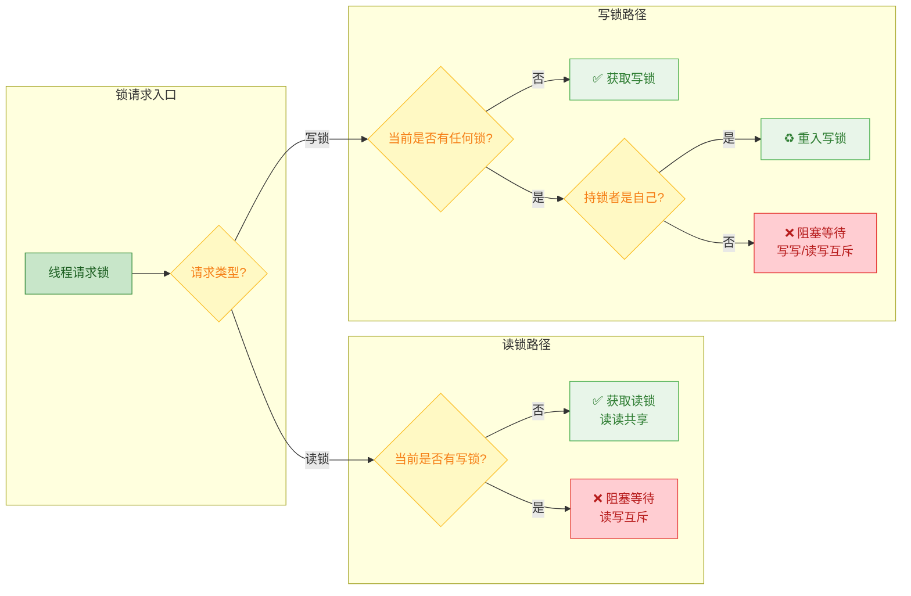

---

### 读锁（共享锁）

读锁，也称为 **共享锁（Shared Lock）**，允许多个线程同时持有。它通过 `readWriteLock.readLock()` 获取一个 `Lock` 实例，然后调用 `lock()` / `unlock()` 进行加锁和解锁。

读锁的关键特性包括：

1. **共享性（Shared）**：多个线程可以同时获取读锁，不会相互阻塞。AQS 内部使用 `tryAcquireShared()` 方法处理读锁的获取，返回值 ≥ 0 表示获取成功。
2. **可重入（Reentrant）**：同一个线程可以多次获取读锁而不会死锁，但每次获取都需要对应一次释放。RRWL 内部使用 `ThreadLocal` 维护每个线程的读锁重入计数。
3. **阻塞写锁**：只要有任何一个线程持有读锁，写锁请求就会被阻塞，这保证了读操作期间数据不会被修改。

下面是一个完整的读锁使用示例：

```java
import java.util.concurrent.locks.ReentrantReadWriteLock;

public class CacheExample {

    // 创建读写锁实例
    private final ReentrantReadWriteLock rwLock = new ReentrantReadWriteLock();

    // 分别获取读锁和写锁对象
    private final ReentrantReadWriteLock.ReadLock readLock = rwLock.readLock();
    private final ReentrantReadWriteLock.WriteLock writeLock = rwLock.writeLock();

    // 模拟共享数据：缓存值
    private volatile String cachedData = "initial";

    /**
     * 读操作：多个线程可同时进入
     */
    public String readData() {
        // 获取读锁——如果此时没有线程持有写锁，则立即成功
        readLock.lock();
        try {
            // 在读锁保护下安全地读取共享数据
            System.out.println(Thread.currentThread().getName()
                    + " 正在读取数据: " + cachedData);
            // 模拟读取耗时（例如遍历大集合、计算哈希等）
            Thread.sleep(100);
            // 返回读到的数据
            return cachedData;
        } catch (InterruptedException e) {
            // 恢复中断标记，遵循最佳实践
            Thread.currentThread().interrupt();
            return null;
        } finally {
            // 无论是否异常，必须在 finally 中释放读锁
            readLock.unlock();
        }
    }
}
```

**核心注意事项**：读锁虽然是"共享"的，但并不意味着可以无限制地获取。RRWL 内部使用 `state` 的高 16 位记录读锁持有数量，因此读锁的最大并发数为 **65535**（即 2^16 - 1）。在绝大多数实际场景下，这个上限不会成为瓶颈，但在极端高并发环境中需要注意。

---

### 写锁（独占锁）

写锁，也称为 **独占锁（Exclusive Lock）**，在任意时刻最多只能被一个线程持有。它通过 `readWriteLock.writeLock()` 获取一个 `Lock` 实例。

写锁的关键特性：

1. **独占性（Exclusive）**：获取写锁后，其他任何线程的读锁请求和写锁请求都会被阻塞。
2. **可重入（Reentrant）**：持有写锁的线程可以再次获取写锁（重入），内部通过 `state` 低 16 位计数。
3. **持有写锁时可获取读锁**：这是锁降级的基础，后文详述。

```java
/**
 * 写操作：同一时刻只能有一个线程进入
 */
public void writeData(String newData) {
    // 获取写锁——如果此时有任何线程持有读锁或写锁，则阻塞等待
    writeLock.lock();
    try {
        // 在写锁保护下安全地修改共享数据
        System.out.println(Thread.currentThread().getName()
                + " 正在写入数据: " + newData);
        // 模拟写入耗时（例如写数据库、刷磁盘等）
        Thread.sleep(200);
        // 执行实际的数据修改
        cachedData = newData;
        System.out.println(Thread.currentThread().getName()
                + " 写入完成");
    } catch (InterruptedException e) {
        // 恢复中断标记
        Thread.currentThread().interrupt();
    } finally {
        // 无论是否异常，必须在 finally 中释放写锁
        writeLock.unlock();
    }
}
```

下面用一个完整的多线程测试程序来直观展示读读共享 + 读写互斥的效果：

```java
import java.util.concurrent.locks.ReentrantReadWriteLock;

public class ReadWriteLockDemo {

    // 读写锁实例
    private static final ReentrantReadWriteLock rwLock = new ReentrantReadWriteLock();
    // 共享数据
    private static int sharedData = 0;

    public static void main(String[] args) {
        // 启动 3 个读线程——它们应该能并行执行
        for (int i = 1; i <= 3; i++) {
            final int id = i;
            new Thread(() -> {
                // 获取读锁
                rwLock.readLock().lock();
                try {
                    System.out.println("读线程-" + id + " 获得读锁, 时间="
                            + System.currentTimeMillis() % 10000);
                    // 模拟读操作耗时 1 秒
                    Thread.sleep(1000);
                    // 读取共享数据
                    System.out.println("读线程-" + id + " 读到: " + sharedData);
                } catch (InterruptedException e) {
                    Thread.currentThread().interrupt();
                } finally {
                    // 释放读锁
                    rwLock.readLock().unlock();
                    System.out.println("读线程-" + id + " 释放读锁");
                }
            }, "Reader-" + i).start();
        }

        // 启动 1 个写线程——它必须等所有读锁释放后才能获得写锁
        new Thread(() -> {
            // 获取写锁
            rwLock.writeLock().lock();
            try {
                System.out.println("写线程 获得写锁, 时间="
                        + System.currentTimeMillis() % 10000);
                // 修改共享数据
                sharedData = 42;
                // 模拟写操作耗时
                Thread.sleep(500);
                System.out.println("写线程 写入完成: " + sharedData);
            } catch (InterruptedException e) {
                Thread.currentThread().interrupt();
            } finally {
                // 释放写锁
                rwLock.writeLock().unlock();
                System.out.println("写线程 释放写锁");
            }
        }, "Writer").start();
    }
}
```

运行后你会观察到：三个读线程几乎 **同时获得读锁**（时间戳非常接近），而写线程必须等到所有读锁释放后才能获得写锁。这就是"读读共享、读写互斥"的直观体现。

---

### 锁降级 ⭐（写锁 → 读锁）

锁降级（Lock Downgrading）是 `ReentrantReadWriteLock` 支持的一种特殊操作，指的是 **在持有写锁的情况下，先获取读锁，然后释放写锁，最终只持有读锁** 的过程。注意，这三步的顺序不可打乱。

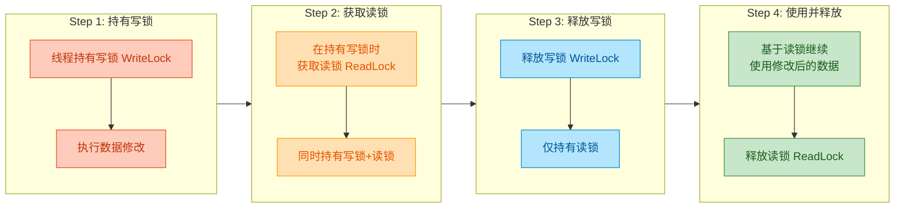

**为什么需要锁降级？** 核心原因是为了 **保证数据可见性的连续性**。考虑这样一个场景：

1. 线程 A 获取写锁，修改了共享数据。
2. 线程 A 释放写锁。
3. 在线程 A 获取读锁之前，线程 B 抢先获取了写锁，再次修改了数据。
4. 线程 A 获取读锁，读到的是线程 B 修改后的值，而不是自己刚写入的值。

这就导致了 **"自己写的数据自己都看不到"** 的奇怪问题。锁降级通过"先拿读锁再放写锁"的方式，确保在写锁释放后，当前线程仍然通过读锁维持着对数据的可见性保护，其他写线程无法在此期间插入。

下面是标准的锁降级代码模板：

```java
import java.util.concurrent.locks.ReentrantReadWriteLock;

public class LockDowngradeDemo {

    // 创建读写锁
    private final ReentrantReadWriteLock rwLock = new ReentrantReadWriteLock();
    private final ReentrantReadWriteLock.ReadLock readLock = rwLock.readLock();
    private final ReentrantReadWriteLock.WriteLock writeLock = rwLock.writeLock();

    // 共享数据
    private volatile boolean cacheValid = false;
    private int data = 0;

    public void processCachedData() {
        // ① 先尝试获取读锁检查缓存
        readLock.lock();
        // 检查缓存是否有效
        if (!cacheValid) {
            // 缓存无效，需要更新——必须获取写锁
            // ② 释放读锁（读锁不能直接升级为写锁，否则可能死锁）
            readLock.unlock();

            // ③ 获取写锁来更新数据
            writeLock.lock();
            try {
                // ④ 双重检查：可能其他线程已在此期间更新了缓存
                if (!cacheValid) {
                    // 执行实际的数据计算/加载
                    data = loadFromDatabase();
                    // 标记缓存为有效
                    cacheValid = true;
                    System.out.println("缓存已更新, data=" + data);
                }

                // ⑤ 【锁降级的核心】在持有写锁的同时获取读锁
                readLock.lock();
                // 此时当前线程同时持有：写锁 + 读锁

            } finally {
                // ⑥ 释放写锁，完成降级——现在只持有读锁
                writeLock.unlock();
            }
        }

        // ⑦ 此时一定持有读锁（无论走了哪个分支）
        try {
            // 安全地使用缓存数据
            System.out.println("使用缓存数据: " + data);
        } finally {
            // ⑧ 最终释放读锁
            readLock.unlock();
        }
    }

    /**
     * 模拟从数据库加载数据
     */
    private int loadFromDatabase() {
        return 42; // 模拟返回值
    }
}
```

这段代码中步骤 ⑤ 和 ⑥ 就是锁降级的关键：**先 `readLock.lock()` 再 `writeLock.unlock()`**。这两步的顺序绝不可颠倒。

JDK 源码中 `ReentrantReadWriteLock` 的 Javadoc 也给出了锁降级的经典示例，其设计意图与上述代码完全一致。Doug Lea 在注释中明确指出：

> *"Lock downgrading is useful to reduce the unnecessary duration of exclusive holding."*  
> 锁降级有助于减少不必要的独占持锁时间。

---

### 为什么不能锁升级

锁升级（Lock Upgrading）指的是 **在持有读锁的情况下，直接获取写锁**，即从共享锁升级为独占锁。`ReentrantReadWriteLock` **不支持** 这种操作，尝试这样做会导致 **永久死锁（deadlock）**。

原因分析如下：

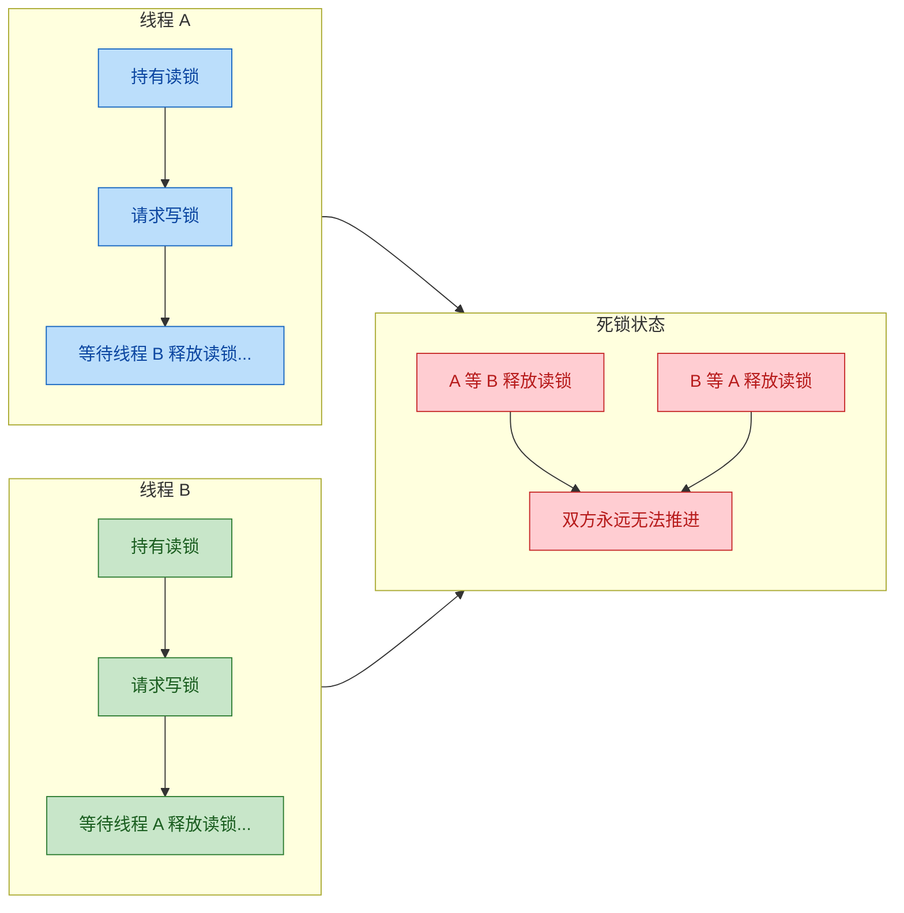

让我们推演详细的死锁过程：

1. **线程 A** 获取了读锁（此时 `readCount ≥ 1`）。
2. **线程 B** 也获取了读锁（此时 `readCount ≥ 2`），读读共享，没有问题。
3. **线程 A** 在不释放读锁的情况下请求写锁。写锁需要等待所有读锁释放，而线程 B 还持有读锁，所以 **A 被阻塞**。
4. **线程 B** 同样在不释放读锁的情况下请求写锁。写锁需要等待所有读锁释放，而线程 A 还持有读锁，所以 **B 也被阻塞**。
5. **A 等 B 释放读锁，B 等 A 释放读锁**——经典的循环等待，**死锁形成**。

即使只有一个线程，锁升级同样会死锁：

```java
// ❌ 错误示范：单线程锁升级也会死锁
ReentrantReadWriteLock rwLock = new ReentrantReadWriteLock();

// 获取读锁
rwLock.readLock().lock();

// 尝试获取写锁——此线程自身持有读锁
// 写锁要求 readCount == 0，但当前 readCount == 1（自己持有）
// 而自己又无法释放读锁（因为正在等写锁获取完成后才会执行后续代码）
// 结果：永远等待，线程挂起——死锁！
rwLock.writeLock().lock(); // ← 程序永远卡在这里
```

为什么 RRWL 不做特殊处理来支持锁升级呢？理论上，如果只有一个线程持有读锁，运行时可以检测到并直接升级。但这带来的问题是：多个线程同时尝试升级时仍然会死锁，况且检测"当前是否只有自己一个读者"的代价不低，且违背了锁设计的简单性原则。Doug Lea 在设计时选择了 **"不支持升级，支持降级"** 这一更安全、更明确的策略。

> 💡 **正确做法**：如果你持有读锁后发现需要写入，应该 **先释放读锁，再获取写锁**。就像我们在锁降级示例中的步骤 ② 那样。需要注意的是，释放读锁到获取写锁之间存在一个"空窗期"，在此期间数据可能被其他线程修改，因此获取写锁后通常需要做 **double-check**。

**锁降级 vs 锁升级的对比总结：**

| 特性 | 锁降级（Write → Read） | 锁升级（Read → Write） |
|------|------------------------|------------------------|
| 是否支持 | ✅ 支持 | ❌ 不支持 |
| 操作方式 | 持有写锁 → 获取读锁 → 释放写锁 | 持有读锁 → 获取写锁（死锁） |
| 安全性 | 安全，写锁是独占的，不存在竞争 | 不安全，多个读者同时升级会循环等待 |
| 设计意图 | 缩短写锁持有时间，提升并发度 | —（JDK 不支持） |

---

### 实现原理（state 高 16 位读、低 16 位写）

`ReentrantReadWriteLock` 的底层实现基于 AQS（AbstractQueuedSynchronizer），其核心技巧在于 **将 AQS 的单个 `int` 类型 `state` 字段一分为二**，同时记录读锁和写锁的状态：

```
┌─────────── state (32 bits) ───────────┐
│                                        │
│  高 16 位 (bit 16~31)     低 16 位 (bit 0~15)  │
│  ┌───────────────────┐  ┌───────────────────┐  │
│  │   读锁持有数量      │  │   写锁重入次数      │  │
│  │  (shared count)    │  │  (exclusive count) │  │
│  │  最大值: 65535      │  │  最大值: 65535      │  │
│  └───────────────────┘  └───────────────────┘  │
│                                        │
└────────────────────────────────────────┘
```

让我们深入到 JDK 源码层面来理解这一设计。首先是位运算相关的常量定义：

```java
// === 以下是 ReentrantReadWriteLock.Sync 内部类中的核心常量 ===

// SHARED_SHIFT = 16，表示读锁计数器从第 16 位开始
static final int SHARED_SHIFT   = 16;

// SHARED_UNIT = 1 << 16 = 65536 = 0x00010000
// 每获取一次读锁，state 增加 SHARED_UNIT（即高 16 位加 1）
static final int SHARED_UNIT    = (1 << SHARED_SHIFT);

// MAX_COUNT = (1 << 16) - 1 = 65535
// 读锁和写锁各自的最大持有数
static final int MAX_COUNT      = (1 << SHARED_SHIFT) - 1;

// EXCLUSIVE_MASK = 0x0000FFFF（低 16 位全为 1）
// 通过 state & EXCLUSIVE_MASK 可以提取出写锁的重入次数
static final int EXCLUSIVE_MASK = (1 << SHARED_SHIFT) - 1;
```

基于这些常量，提供了两个工具方法来分离读写计数：

```java
/**
 * 提取读锁数量：将 state 无符号右移 16 位
 * 例如 state = 0x00030002
 *   >>> 16 → 0x00000003 → 读锁数量 = 3
 */
static int sharedCount(int c) {
    return c >>> SHARED_SHIFT;
}

/**
 * 提取写锁重入次数：用掩码取低 16 位
 * 例如 state = 0x00030002
 *   & 0x0000FFFF → 0x00000002 → 写锁重入次数 = 2
 */
static int exclusiveCount(int c) {
    return c & EXCLUSIVE_MASK;
}
```

用一个具体的数值例子来说明 state 的变化过程：

```
初始状态: state = 0x00000000 (无锁)
  → sharedCount = 0, exclusiveCount = 0

线程 A 获取写锁: state = 0x00000001
  → sharedCount = 0, exclusiveCount = 1

线程 A 写锁重入: state = 0x00000002
  → sharedCount = 0, exclusiveCount = 2

线程 A 释放一次写锁: state = 0x00000001
  → sharedCount = 0, exclusiveCount = 1

线程 A 完全释放写锁: state = 0x00000000
  → sharedCount = 0, exclusiveCount = 0

线程 B 获取读锁: state = 0x00010000  (高16位 +1)
  → sharedCount = 1, exclusiveCount = 0

线程 C 也获取读锁: state = 0x00020000  (高16位 +1)
  → sharedCount = 2, exclusiveCount = 0

线程 B 释放读锁: state = 0x00010000  (高16位 -1)
  → sharedCount = 1, exclusiveCount = 0
```

下面我们看写锁获取（`tryAcquire`）和读锁获取（`tryAcquireShared`）的核心源码简化版：

```java
// ========== 写锁获取：tryAcquire ==========
protected final boolean tryAcquire(int acquires) {
    // 获取当前线程引用
    Thread current = Thread.currentThread();
    // 读取当前 state 值
    int c = getState();
    // 提取写锁重入次数
    int w = exclusiveCount(c);

    if (c != 0) {
        // state != 0 说明有锁被持有
        // 如果写锁计数为 0（说明只有读锁），或者持有写锁的不是当前线程
        // → 获取失败，返回 false（将进入 AQS 等待队列）
        if (w == 0 || current != getExclusiveOwnerThread()) {
            return false;
        }
        // 走到这里说明当前线程已持有写锁，检查重入是否溢出
        if (w + exclusiveCount(acquires) > MAX_COUNT) {
            throw new Error("Maximum lock count exceeded");
        }
        // 写锁重入：直接修改 state 低 16 位
        setState(c + acquires);
        return true;
    }

    // c == 0：当前无任何锁
    // writerShouldBlock()：公平模式下检查等待队列是否有前驱节点
    if (writerShouldBlock() || !compareAndSetState(c, c + acquires)) {
        // CAS 失败或需要排队 → 获取失败
        return false;
    }
    // CAS 成功，设置当前线程为写锁持有者
    setExclusiveOwnerThread(current);
    return true;
}

// ========== 读锁获取：tryAcquireShared（简化版）==========
protected final int tryAcquireShared(int unused) {
    Thread current = Thread.currentThread();
    // 读取当前 state
    int c = getState();

    // 如果写锁被持有 (exclusiveCount != 0)
    // 且持有者不是当前线程 → 获取失败（读写互斥）
    // 如果持有者就是当前线程 → 允许（支持锁降级）
    if (exclusiveCount(c) != 0 && getExclusiveOwnerThread() != current) {
        return -1; // 获取失败
    }

    // 提取当前读锁数量
    int r = sharedCount(c);

    // readerShouldBlock()：公平模式下检查是否需要让位给写锁
    if (!readerShouldBlock() && r < MAX_COUNT
            && compareAndSetState(c, c + SHARED_UNIT)) {
        // CAS 成功：高 16 位加 1
        // 此处省略了读锁重入计数的 ThreadLocal 更新逻辑
        // firstReader / firstReaderHoldCount 用于优化第一个读者的计数
        // cachedHoldCounter / readHolds(ThreadLocal) 用于其他读者
        return 1; // 获取成功
    }

    // CAS 失败或需要排队，进入完整版的获取逻辑（自旋重试）
    return fullTryAcquireShared(current);
}
```

关于 **读锁的重入计数**，值得展开说明。`state` 的高 16 位记录的是所有线程读锁持有的 **总数**，而非某个特定线程的重入次数。为了追踪每个线程各自的重入次数，RRWL 使用了如下结构：

```java
// 每个线程的读锁重入计数器
static final class HoldCounter {
    int count = 0;          // 重入次数
    final long tid = getThreadId(Thread.currentThread()); // 线程 ID
}

// 使用 ThreadLocal 为每个线程维护独立的 HoldCounter
static final class ThreadLocalHoldCounter
        extends ThreadLocal<HoldCounter> {
    public HoldCounter initialValue() {
        return new HoldCounter();
    }
}
```

为了提高性能，RRWL 还做了两层优化：

- **`firstReader` / `firstReaderHoldCount`**：对于第一个获取读锁的线程，直接用普通成员变量记录，避免了 ThreadLocal 的查找开销。
- **`cachedHoldCounter`**：缓存最后一个成功获取读锁的线程的计数器，因为往往是同一个线程连续操作，命中率很高。

用一张 Mermaid 类图来总结 RRWL 的内部架构：

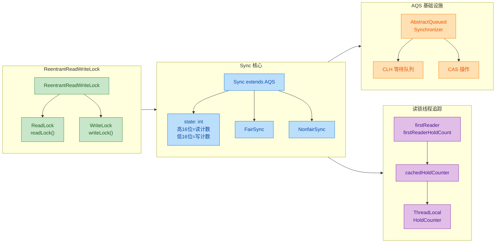

最后，关于公平性（Fairness）的补充说明：

- **非公平模式（默认）**：`new ReentrantReadWriteLock()` 或 `new ReentrantReadWriteLock(false)`。在非公平模式下，无论等待队列中是否有线程在排队，读锁和写锁都可以尝试"插队"（barging）。但有一个特殊规则：如果等待队列的队头是一个写锁请求，那么后续的读锁请求会被阻塞，以防止写线程被无限饿死（writer starvation）。
- **公平模式**：`new ReentrantReadWriteLock(true)`。严格按照 FIFO 顺序获取锁，吞吐量较低但不会出现饥饿问题。

---

**📝 练习题**

以下代码在多线程环境中运行，可能会发生什么？

```java
ReentrantReadWriteLock rwLock = new ReentrantReadWriteLock();

// 线程 A 执行：
rwLock.readLock().lock();
System.out.println("线程A: 持有读锁, 尝试获取写锁...");
rwLock.writeLock().lock();    // ← 关注此行
System.out.println("线程A: 获得写锁");
rwLock.writeLock().unlock();
rwLock.readLock().unlock();
```

A. 正常执行完毕，输出两行信息

B. 线程 A 在获取写锁时永久阻塞（死锁），因为 RRWL 不支持锁升级

C. 抛出 `IllegalMonitorStateException` 异常

D. 抛出 `UnsupportedOperationException` 异常


**【答案】** B

**【解析】** 这是一个典型的 **锁升级（Lock Upgrading）** 尝试。线程 A 已经持有了读锁，此时 `state` 的高 16 位 ≥ 1（读锁计数不为零）。当线程 A 尝试获取写锁时，`tryAcquire()` 方法会检查 `state` 是否为 0——由于自身持有的读锁使得 `state != 0`，并且写锁计数 `w == 0`（当前没有写锁），`tryAcquire` 直接返回 `false`。线程 A 随后进入 AQS 等待队列阻塞，等待所有读锁释放。但问题是，线程 A 自己就持有一个读锁，而它已经被阻塞无法执行 `readLock.unlock()`，于是形成了 **自死锁（self-deadlock）**——自己等自己释放锁，永远无法推进。RRWL 不会抛出任何异常，它只是静默地阻塞，这使得这类 bug 在生产环境中尤其隐蔽和危险。正确做法是先释放读锁，再获取写锁，获取后做 double-check。

---

## StampedLock

`StampedLock` 是 Java 8（`java.util.concurrent.locks` 包）引入的一种全新的读写锁实现，它的设计目标非常明确：**解决 `ReentrantReadWriteLock` 在读多写少场景下写线程可能被饿死（Writer Starvation）的问题，同时通过乐观读策略大幅提升读操作的吞吐量**。

与 `ReentrantReadWriteLock` 相比，`StampedLock` 有几个本质区别：

| 特性 | ReentrantReadWriteLock | StampedLock |
|------|----------------------|-------------|
| 可重入性 | ✅ 支持 | ❌ **不支持** |
| Condition 支持 | ✅ 支持 | ❌ **不支持** |
| 乐观读模式 | ❌ 无 | ✅ **核心特性** |
| 公平/非公平策略 | ✅ 可配置 | ❌ 仅非公平 |
| 读时是否阻塞写 | ✅ 阻塞 | 乐观读 **不阻塞** |
| 性能（读多写少） | 一般 | **显著更高** |

`StampedLock` 的核心概念是 **stamp（戳记/票据）**。每次获取锁时都会返回一个 `long` 类型的 stamp 值，后续释放锁或转换锁模式时必须携带这个 stamp。如果 stamp 无效（值为 0 或已过期），操作将失败。可以把它想象成一张"门票"——进场时拿到门票号，出场时必须交回同一张门票。

```java
// StampedLock 的三种模式一览
StampedLock lock = new StampedLock();

// 1. 写锁 (Writing Mode) —— 独占，类似 ReentrantReadWriteLock 的写锁
long stamp = lock.writeLock();       // 获取写锁，返回 stamp
try {
    // ... 写操作 ...
} finally {
    lock.unlockWrite(stamp);         // 释放写锁时必须传入同一个 stamp
}

// 2. 悲观读锁 (Reading Mode) —— 共享，类似 ReentrantReadWriteLock 的读锁
long stamp = lock.readLock();        // 获取悲观读锁，返回 stamp
try {
    // ... 读操作 ...
} finally {
    lock.unlockRead(stamp);          // 释放读锁时必须传入同一个 stamp
}

// 3. 乐观读 (Optimistic Reading) —— 无锁！这是 StampedLock 的灵魂
long stamp = lock.tryOptimisticRead(); // 不加锁，仅获取一个 stamp 快照
// ... 读取共享变量到局部变量 ...
if (!lock.validate(stamp)) {           // 验证期间是否有写操作发生
    // stamp 失效，说明数据可能已脏，需要回退到悲观读
}
```

下面这张图从全局视角展示 `StampedLock` 三种模式之间的关系和转换路径：

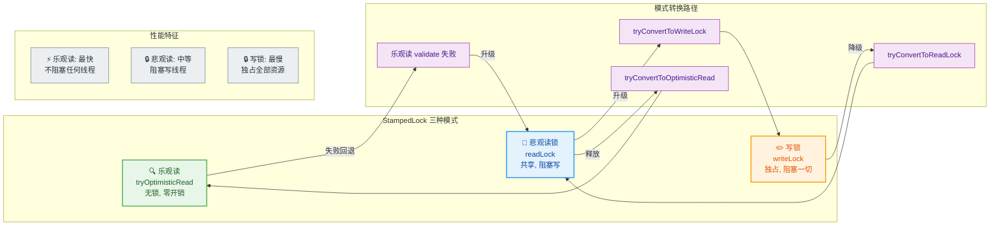

### 乐观读（tryOptimisticRead）

乐观读是 `StampedLock` 最具创新性的特性，也是它与 `ReentrantReadWriteLock` 拉开性能差距的核心武器。它的哲学借鉴自数据库领域的 **Optimistic Concurrency Control（乐观并发控制）**：**假设读操作期间不会发生写冲突，先不加锁地读取数据；读完后再验证假设是否成立；如果假设失败（有写入发生），才回退到加锁读取。**

这种"先乐观尝试、后悲观兜底"的策略，在读多写少的场景下，绝大多数乐观读都能验证成功，因此几乎消除了读操作的锁开销。

**核心 API：**

- `tryOptimisticRead()`：返回一个 stamp。如果当前处于写锁状态，返回 0（失败）；否则返回一个非零 stamp。**这个方法不会阻塞，不会获取任何锁。**
- `validate(stamp)`：检验从获取 stamp 到调用 validate 这段时间内，是否有写锁被获取过。如果没有，返回 `true`（数据安全）；如果有写操作介入，返回 `false`（数据可能脏了）。

来看一个经典的二维坐标点读取示例：

```java
public class Point {
    private double x, y;                             // 共享的可变状态
    private final StampedLock sl = new StampedLock(); // StampedLock 实例

    /**
     * 移动点的坐标（写操作）
     */
    public void move(double deltaX, double deltaY) {
        long stamp = sl.writeLock();                 // 获取写锁（独占）
        try {
            x += deltaX;                             // 修改 x 坐标
            y += deltaY;                             // 修改 y 坐标
        } finally {
            sl.unlockWrite(stamp);                   // 释放写锁，传入 stamp
        }
    }

    /**
     * 计算到原点的距离（读操作 —— 使用乐观读策略）
     */
    public double distanceFromOrigin() {
        // ① 尝试乐观读：不加锁，仅获取当前 stamp 快照
        long stamp = sl.tryOptimisticRead();

        // ② 将共享变量拷贝到线程栈上的局部变量
        //    这一步必须在 validate 之前完成
        double currentX = x;                         // 读取 x 到局部变量
        double currentY = y;                         // 读取 y 到局部变量

        // ③ 验证：在读取期间，是否有其他线程获取了写锁？
        if (!sl.validate(stamp)) {
            // ④ 验证失败！说明 x, y 可能已被修改，数据不一致
            //    回退策略：升级为悲观读锁，重新读取
            stamp = sl.readLock();                   // 获取悲观读锁（阻塞写线程）
            try {
                currentX = x;                        // 重新读取 x
                currentY = y;                        // 重新读取 y
            } finally {
                sl.unlockRead(stamp);                // 释放悲观读锁
            }
        }

        // ⑤ 此时 currentX 和 currentY 保证是一致的快照
        return Math.sqrt(currentX * currentX + currentY * currentY);
    }
}
```

**乐观读的执行流程可以概括为一个固定的编程模式（Idiom）：**

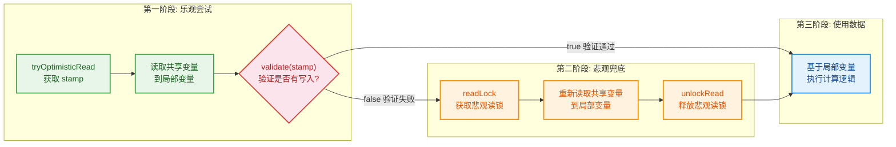

**为什么要先拷贝到局部变量再 validate？** 这一点非常关键。如果你在 validate 之后才读取共享变量，那 validate 就失去了意义——在 validate 返回 `true` 和实际读取之间，写线程仍然可能介入。正确的做法是：**先读取（可能脏），再验证（确认是否脏）**。如果验证通过，说明读到的局部变量值是一致的快照。

**乐观读的另一个重要注意点**：`tryOptimisticRead()` 返回的 stamp 可能为 0。当调用时恰好有写锁被持有，就会返回 0。而 `validate(0)` 永远返回 `false`。所以上面的代码模式天然能处理这种情况——返回 0 的 stamp 会在 validate 时失败，自动回退到悲观读。

**乐观读在底层做了什么？** 实际上 `tryOptimisticRead()` 内部几乎没有任何同步操作，它只是读取了 `StampedLock` 内部的 `state` 值，并检查写锁位是否为 0。`validate()` 则先执行一个 `VarHandle.loadFence()`（内存屏障/Memory Fence），确保之前的所有读操作不会被重排序到 validate 之后，然后比较当前 state 是否与 stamp 一致。正因为如此轻量，乐观读在无竞争时的开销接近于零。

### 悲观读

悲观读锁（Pessimistic Read Lock）是 `StampedLock` 的第二种模式，它的语义与 `ReentrantReadWriteLock` 的读锁基本一致：**多个线程可以同时持有悲观读锁（共享），但悲观读锁与写锁互斥**。

悲观读的使用场景通常有两个：

1. **作为乐观读失败后的兜底策略**（如上节示例中 validate 失败后升级）。
2. **读操作耗时较长或需要多次访问共享变量**，乐观读的 validate 很可能失败，反复重试得不偿失，此时直接使用悲观读更划算。

```java
public class InventoryService {
    private final StampedLock sl = new StampedLock();
    private Map<String, Integer> stock = new HashMap<>();  // 库存数据

    /**
     * 生成完整库存报表（读操作耗时较长，直接用悲观读）
     */
    public Map<String, Integer> generateReport() {
        long stamp = sl.readLock();                // 获取悲观读锁
        try {
            // 遍历整个库存 Map，耗时操作
            // 在此期间写线程会被阻塞，保证数据快照一致
            Map<String, Integer> snapshot = new HashMap<>();  // 创建快照容器
            for (Map.Entry<String, Integer> entry : stock.entrySet()) {
                snapshot.put(entry.getKey(), entry.getValue());  // 逐条复制
            }
            return snapshot;                       // 返回一致性快照
        } finally {
            sl.unlockRead(stamp);                  // 释放悲观读锁
        }
    }

    /**
     * 更新库存（写操作）
     */
    public void updateStock(String item, int quantity) {
        long stamp = sl.writeLock();               // 获取写锁
        try {
            stock.put(item, quantity);             // 更新库存
        } finally {
            sl.unlockWrite(stamp);                 // 释放写锁
        }
    }
}
```

**悲观读锁的核心 API 家族：**

| 方法 | 行为 | 返回值 |
|------|------|--------|
| `readLock()` | 阻塞等待直到获取读锁 | 非零 stamp |
| `tryReadLock()` | 非阻塞尝试，失败立即返回 | stamp 或 0（失败） |
| `tryReadLock(long time, TimeUnit unit)` | 带超时的阻塞尝试 | stamp 或 0（超时） |
| `readLockInterruptibly()` | 可中断的阻塞等待 | stamp（成功），或抛出 InterruptedException |
| `unlockRead(stamp)` | 释放读锁 | 无（stamp 无效则抛 IllegalMonitorStateException） |

**悲观读与乐观读的对比可以用一个生活比喻来理解：**

想象你在图书馆查阅一本参考书：

- **乐观读** = 站在书架旁快速翻阅几页记下关键数据，如果期间有管理员来换书（写操作），你发现信息可能不对，就重新找这本书。
- **悲观读** = 把书借到阅览桌上慢慢看，借阅期间管理员不能把书拿走更换，但其他读者可以和你共享同一本书（如果有多本副本的话）。

**一个重要的区别**：`ReentrantReadWriteLock` 的读锁是可重入的，同一个线程可以多次获取读锁而不死锁。但 `StampedLock` 的悲观读锁 **不可重入**。如果同一线程已持有悲观读锁，再次调用 `readLock()` **可能导致死锁**（尤其在写线程等待的情况下）。这是使用 `StampedLock` 时最容易踩的坑之一。

```java
// ❌ 危险！StampedLock 不可重入，以下代码可能死锁
long stamp1 = sl.readLock();       // 第一次获取读锁 → 成功
long stamp2 = sl.readLock();       // 第二次获取读锁 → 如果此时有写线程在排队，可能永远阻塞！
sl.unlockRead(stamp2);
sl.unlockRead(stamp1);
```

### 写锁

写锁（Write Lock）是 `StampedLock` 的第三种模式，也是最"强硬"的模式：**独占式（Exclusive）**。持有写锁期间，任何悲观读锁和其他写锁的获取都会被阻塞，乐观读的 `validate()` 也会返回 `false`。

```java
public class SharedConfig {
    private final StampedLock sl = new StampedLock();
    private volatile String configValue;               // 共享配置

    /**
     * 原子性地更新配置（需要先读后写的场景）
     */
    public String updateIfAbsent(String key, String newValue) {
        long stamp = sl.writeLock();                   // 获取独占写锁
        try {
            if (configValue == null) {                 // 先读取当前值
                configValue = newValue;                // 仅在为空时写入
                return newValue;                       // 返回新写入的值
            }
            return configValue;                        // 已有值，返回现有值
        } finally {
            sl.unlockWrite(stamp);                     // 释放写锁
        }
    }
}
```

**写锁的 API 家族与悲观读类似：**

| 方法 | 行为 |
|------|------|
| `writeLock()` | 阻塞直到获取写锁 |
| `tryWriteLock()` | 非阻塞尝试 |
| `tryWriteLock(long time, TimeUnit unit)` | 带超时 |
| `writeLockInterruptibly()` | 可中断 |
| `unlockWrite(stamp)` | 释放写锁 |

**写锁在 state 层面的实现**：`StampedLock` 内部维护一个 `long` 类型的 `state`。第 8 位（bit 7, 即 `WBIT = 1L << 7 = 128`）用来标记写锁是否被持有。当写锁被获取时，`state` 的这一位被置 1，同时 `state` 的高位部分作为版本号递增。每次写锁释放，版本号 +1，这就是为什么乐观读的 `validate()` 能检测到是否有写入发生——它只需比较 stamp（旧版本号）与当前 state（新版本号）是否一致。

```text
StampedLock state (64-bit long) 内部布局示意：

 63                             8  7  6         0
 ┌────────────────────────────────┬──┬───────────┐
 │     版本号 (每次写锁释放 +1)     │WB│  读锁计数  │
 │         (高 56 位)              │IT│  (低 7 位) │
 └────────────────────────────────┴──┴───────────┘
                                   │
                          写锁标志位 (第 8 位)
                          0 = 无写锁
                          1 = 写锁被持有
```

这个设计非常精巧：
- **低 7 位**（bit 0~6）：记录当前悲观读锁的持有数量（最多 126 个，超出后溢出到一个辅助的 `readerOverflow` 字段）。
- **第 8 位**（bit 7）：写锁标志。
- **高 56 位**（bit 8~63）：版本号/序列号。每次写锁释放，整个 state 会加上 `WBIT`（128），这实际上让高 56 位自然递增了 1。

**写锁的一个重要特性：不可重入。** 与悲观读锁一样，如果持有写锁的线程再次调用 `writeLock()`，会 **立即死锁**——自己等待自己释放，永远不可能完成。这与 `ReentrantReadWriteLock` 形成鲜明对比，后者支持同一线程多次获取写锁。

```java
// ❌ 绝对死锁！StampedLock 写锁不可重入
long stamp1 = sl.writeLock();     // 获取写锁 → 成功
long stamp2 = sl.writeLock();     // 再次获取写锁 → 永远阻塞！死锁！
```

### 锁转换

锁转换（Lock Conversion）是 `StampedLock` 的一项高级能力，它允许在不释放锁的情况下，**将一种锁模式原子性地转换为另一种锁模式**。这解决了传统读写锁中一个经典的痛点：先读数据判断条件，条件满足时升级为写来修改数据。在 `ReentrantReadWriteLock` 中，这必须"先释放读锁、再获取写锁"，中间存在竞态窗口。而 `StampedLock` 的锁转换可以原子性地完成这一过程（虽然也不保证成功，但避免了显式释放+重新获取的竞态）。

**核心 API：`tryConvertToXxx(stamp)`**

| 方法 | 说明 | 成功返回 | 失败返回 |
|------|------|----------|----------|
| `tryConvertToWriteLock(stamp)` | 尝试将当前持有的锁升级为写锁 | 新的写锁 stamp | 0 |
| `tryConvertToReadLock(stamp)` | 尝试将当前持有的锁降级为读锁 | 新的读锁 stamp | 0 |
| `tryConvertToOptimisticRead(stamp)` | 尝试将当前持有的锁释放为乐观读 | 新的乐观读 stamp | 0 |

**转换规则和成功条件：**

- **乐观读 → 写锁**：只有当前无读锁、无写锁时才可能成功。
- **悲观读 → 写锁**：只有当前仅有一个读锁（就是自己）且无写锁时才可能成功。如果有其他读线程同时持有读锁，转换失败。
- **写锁 → 悲观读**：总是能成功（锁降级）。
- **写锁 → 乐观读**：总是能成功（释放写锁）。
- **悲观读 → 乐观读**：总是能成功（释放读锁）。

来看一个最经典的使用场景——**"先读后写"模式（Read-then-Write Pattern）**：

```java
public class CachedData {
    private final StampedLock sl = new StampedLock();
    private Object data;                               // 缓存数据
    private boolean cacheValid;                        // 缓存是否有效

    /**
     * 获取数据：优先从缓存读取，缓存失效时重新加载
     * 这是 JDK 官方文档推荐的 StampedLock 经典使用模式
     */
    public Object getData() {
        // ① 先用乐观读尝试
        long stamp = sl.tryOptimisticRead();           // 无锁快照
        Object currentData = data;                     // 拷贝数据到局部变量
        boolean valid = cacheValid;                    // 拷贝缓存标志到局部变量

        // ② 验证乐观读
        if (!sl.validate(stamp)) {
            // ③ 乐观读失败 → 升级为悲观读
            stamp = sl.readLock();                     // 获取悲观读锁
            try {
                currentData = data;                    // 重新安全读取
                valid = cacheValid;                    // 重新安全读取
            } finally {
                // 注意：这里不直接释放！因为后面可能需要升级为写锁
                // 但如果缓存有效，就直接返回了，所以需要更精细的控制
            }
        }

        // 如果缓存有效，直接返回（如果持有读锁需要先释放）
        if (valid) {
            if (StampedLock.isReadLockStamp(stamp)) {  // Java 10+ 提供的工具方法
                sl.unlockRead(stamp);                  // 释放悲观读锁
            }
            return currentData;                        // 返回缓存数据
        }

        // ④ 缓存无效，需要写入新数据
        //    尝试将悲观读锁 → 写锁（锁升级）
        long ws = sl.tryConvertToWriteLock(stamp);     // 尝试原子升级
        if (ws == 0L) {
            // ⑤ 升级失败（可能有其他读线程），只能手动释放读锁再获取写锁
            sl.unlockRead(stamp);                      // 先释放读锁
            ws = sl.writeLock();                       // 再获取写锁（可能阻塞）
        }
        // 现在 ws 是有效的写锁 stamp
        stamp = ws;                                    // 更新 stamp 为写锁的

        try {
            data = loadFromDatabase();                 // 从数据库加载新数据
            cacheValid = true;                         // 标记缓存有效
            currentData = data;                        // 更新局部变量
        } finally {
            sl.unlockWrite(stamp);                     // 释放写锁
        }

        return currentData;                            // 返回新数据
    }

    private Object loadFromDatabase() {
        return new Object();                           // 模拟数据库加载
    }
}
```

下面这张时序图展示锁转换在并发场景下的交互过程：

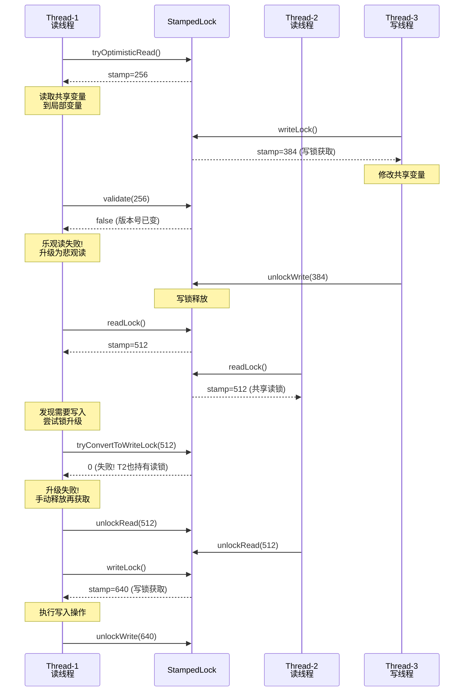

**锁降级（Write → Read）的典型场景**：持有写锁修改完数据后，仍然需要在一致性保护下继续读取数据，但又不想过长时间独占锁而阻塞其他读线程。此时可以将写锁降级为读锁——在保持锁保护的连续性的同时，允许其他读线程并发进入。

```java
/**
 * 写入数据后立即基于新数据执行读取计算
 * 使用锁降级避免释放写锁后数据被其他写线程覆盖
 */
public double writeAndCompute(double newX, double newY) {
    long stamp = sl.writeLock();                       // 获取写锁
    try {
        x = newX;                                      // 写入新的 x
        y = newY;                                      // 写入新的 y

        // 写入完成，但还需要基于新值做计算
        // 降级为读锁：允许其他读线程进入，但保证数据不会被其他写线程修改
        long readStamp = sl.tryConvertToReadLock(stamp);  // 写锁 → 读锁（必定成功）
        if (readStamp != 0L) {
            stamp = readStamp;                         // 更新 stamp 为读锁
        }
        // 此时持有读锁，可以安全读取
        return Math.sqrt(x * x + y * y);              // 基于一致的新值计算
    } finally {
        sl.unlock(stamp);                              // 通用释放方法，根据 stamp 类型自动判断
    }
}
```

**`StampedLock` 使用注意事项总结：**

1. **绝不可重入**：同一线程不能重复获取同类型锁，否则死锁。
2. **不支持 Condition**：如果需要条件等待/通知机制，必须用 `ReentrantLock` + `Condition`。
3. **stamp 必须配对**：`unlockRead/unlockWrite` 传入的 stamp 必须是对应 `readLock/writeLock` 返回的那个值。传错会抛 `IllegalMonitorStateException`。
4. **不要在 `try` 块开始前获取锁**——这其实是任何锁的通用建议，但对 `StampedLock` 尤为重要，因为 stamp 丢失意味着无法释放锁。
5. **中断处理**：`writeLock()` 和 `readLock()` 在等待过程中如果被中断，**不会**抛出 `InterruptedException`，而是会继续等待（内部自旋/park 后重试）。如果需要可中断的版本，必须使用 `writeLockInterruptibly()` / `readLockInterruptibly()`。
6. **不能用于 `synchronized` 块或 `try-with-resources`**：`StampedLock` 没有实现 `Lock` 接口（更确切地说，它不是 `AutoCloseable`），也不兼容 `synchronized`。

---

**📝 练习题**

以下代码使用 `StampedLock` 实现坐标读取，哪个选项正确描述了代码中的问题？

```java
StampedLock sl = new StampedLock();
double x = 0, y = 0;

// 线程 A：读取坐标
public double read() {
    long stamp = sl.tryOptimisticRead();
    if (!sl.validate(stamp)) {
        stamp = sl.readLock();
        try {
            double cx = x;
            double cy = y;
            return Math.sqrt(cx * cx + cy * cy);
        } finally {
            sl.unlockRead(stamp);
        }
    }
    return Math.sqrt(x * x + y * y);
}
```

A. 代码完全正确，乐观读模式使用规范


B. 乐观读分支中，应先将 x、y 拷贝到局部变量，再调用 validate 验证；当前代码在 validate 通过后直接读取共享变量 x、y 进行计算，存在 validate 与实际读取之间被写线程修改的风险


C. 悲观读分支中缺少对 stamp 的 validate 调用，应在 readLock 之后再次 validate


D. tryOptimisticRead 返回 0 时应直接抛出异常而不是进入 validate


**【答案】** B

**【解析】** 乐观读的标准使用模式（Idiom）要求严格遵守三个步骤的顺序：**① tryOptimisticRead → ② 读取共享变量到局部变量 → ③ validate**。上述代码的问题在于：validate 通过后的 `return Math.sqrt(x * x + y * y)` 直接使用了共享变量 `x` 和 `y`，而非局部变量。在 `validate` 返回 `true` 到实际执行 `x * x` 之间，写线程完全可能获取写锁并修改 `x` 或 `y`，导致读到不一致的数据（例如读到旧的 `x` 和新的 `y`）。正确写法是在 validate 之前先 `double cx = x; double cy = y;`，然后 validate 成功后用 `cx` 和 `cy` 计算。选项 C 错误，因为悲观读锁本身就保证了数据一致性，不需要 validate。选项 D 错误，tryOptimisticRead 返回 0 时 validate(0) 自然返回 false，会自动回退到悲观读分支。

---

## Condition ⭐⭐

在 Java 并发编程的早期阶段，线程间的"等待-通知"机制完全依赖于 `Object` 类的 `wait()`、`notify()` 和 `notifyAll()` 方法。这套机制虽然能工作，但存在一个根本性缺陷：**一个对象的监视器（Monitor）上只能有一个等待集合（Wait Set）**。这意味着当多种不同的等待条件混杂在同一个等待队列中时，`notify()` 无法精确唤醒"该被唤醒"的那个线程，往往不得不使用 `notifyAll()` 唤醒所有线程，再由各线程自行判断条件是否满足——这是巨大的性能浪费。

`java.util.concurrent.locks.Condition` 接口的出现，彻底解决了这个问题。它允许在**同一把锁**上创建**多个独立的等待队列**，每个队列对应一个特定的等待条件。配合 `ReentrantLock` 使用时，线程间的协作变得精确、高效且优雅。可以说，`Condition` 是 `Object.wait/notify` 的**全面升级版**（a full upgrade of the classic wait/notify mechanism）。

---

### Condition vs Object.wait/notify

要理解 `Condition` 的价值，必须先透彻理解传统的 `wait/notify` 有哪些不足，以及 `Condition` 是如何逐一解决这些问题的。

**传统 `Object.wait/notify` 的工作方式：**

每一个 Java 对象都天然地拥有一个"监视器锁"（Intrinsic Lock / Monitor Lock），当线程进入 `synchronized` 块后，就持有了这把锁。在 `synchronized` 块内部，线程可以调用该对象的 `wait()` 来释放锁并进入等待状态，也可以调用 `notify()` 或 `notifyAll()` 来唤醒在此对象上等待的线程。关键问题在于——**该对象上只有一个等待队列**。所有调用了 `wait()` 的线程，不管它们各自等待的是什么条件，全部混杂在同一个队列中。

**一个典型的痛点场景：**

想象一个有界缓冲区（Bounded Buffer）。生产者线程在缓冲区满时需要等待"非满"条件（not full），消费者线程在缓冲区空时需要等待"非空"条件（not empty）。使用 `synchronized + wait/notify` 时，这两类等待者被放在**同一个等待队列**中。当生产者放入一个元素后，它调用 `notify()` 想唤醒一个消费者，但 JVM 可能唤醒的是另一个生产者——因为它们在同一个队列里。为了保证正确性，通常只能使用 `notifyAll()` 唤醒所有人，让不满足条件的线程再次 `wait()`，造成大量无效的上下文切换（context switches）。

**`Condition` 的解决之道：**

`Condition` 允许从同一把 `ReentrantLock` 上派生出**多个条件变量**。每个条件变量维护一个**独立的等待队列**。在有界缓冲区的例子中，可以创建两个 `Condition`：一个叫 `notFull`，一个叫 `notEmpty`。生产者等待 `notFull`，消费者等待 `notEmpty`。生产者放入元素后，精确地调用 `notEmpty.signal()` 唤醒消费者队列中的一个线程。反之亦然。**再也不会出现"唤错人"的情况**。

下面是两种机制的全面对比：

```java
// ==================== 传统方式：synchronized + wait/notify ====================
public class OldStyleBuffer {
    private final Object lock = new Object();  // 监视器对象，充当锁
    private int count = 0;                     // 缓冲区当前元素数量

    public void produce() throws InterruptedException {
        synchronized (lock) {                  // 获取内置锁
            while (count >= 10) {              // 缓冲区满，需要等待
                lock.wait();                   // 释放锁，进入 lock 对象的【唯一】等待队列
            }
            count++;                           // 放入一个元素
            lock.notifyAll();                  // 只能 notifyAll，因为无法区分等待者类型
        }
    }

    public void consume() throws InterruptedException {
        synchronized (lock) {                  // 获取内置锁
            while (count <= 0) {               // 缓冲区空，需要等待
                lock.wait();                   // 释放锁，进入 lock 对象的【同一个】等待队列
            }
            count--;                           // 取出一个元素
            lock.notifyAll();                  // 只能 notifyAll，无法精确通知
        }
    }
}

// ==================== Condition 方式：Lock + Condition ====================
public class NewStyleBuffer {
    private final ReentrantLock lock = new ReentrantLock();     // 显式锁
    private final Condition notFull = lock.newCondition();      // 条件1：缓冲区不满
    private final Condition notEmpty = lock.newCondition();     // 条件2：缓冲区不空
    private int count = 0;                                      // 缓冲区当前元素数量

    public void produce() throws InterruptedException {
        lock.lock();                           // 获取显式锁
        try {
            while (count >= 10) {              // 缓冲区满，需要等待
                notFull.await();               // 释放锁，进入 notFull 的【独立】等待队列
            }
            count++;                           // 放入一个元素
            notEmpty.signal();                 // 精确唤醒 notEmpty 队列中的一个消费者
        } finally {
            lock.unlock();                     // 确保释放锁
        }
    }

    public void consume() throws InterruptedException {
        lock.lock();                           // 获取显式锁
        try {
            while (count <= 0) {               // 缓冲区空，需要等待
                notEmpty.await();              // 释放锁，进入 notEmpty 的【独立】等待队列
            }
            count--;                           // 取出一个元素
            notFull.signal();                  // 精确唤醒 notFull 队列中的一个生产者
        } finally {
            lock.unlock();                     // 确保释放锁
        }
    }
}
```

**两者的核心差异总结表：**

| 维度 | Object.wait/notify | Condition |
|:---|:---|:---|
| **绑定的锁** | `synchronized` 内置锁 | `ReentrantLock` 显式锁 |
| **等待队列数量** | 每个对象仅 **1个** 等待集合 | 同一把锁可创建 **多个** Condition，各自独立队列 |
| **唤醒精度** | `notify()` 随机唤醒，无法选择 | `signal()` 精确唤醒指定条件队列中的线程 |
| **等待方法** | `wait()` | `await()` |
| **限时等待** | `wait(long timeout)` 仅支持毫秒 | `await(long, TimeUnit)` 支持多种时间单位；`awaitNanos()` 纳秒级；`awaitUntil(Date)` 绝对时间 |
| **不可中断等待** | 不支持 | `awaitUninterruptibly()` |
| **使用前提** | 必须在 `synchronized` 块内 | 必须在 `lock()` / `unlock()` 之间 |
| **虚假唤醒防护** | 都需要 `while` 循环检查条件 | 同样需要 `while` 循环检查条件 |

一个经常被忽略的细节是：**无论使用哪种机制，都必须在 `while` 循环中检查等待条件**，而非 `if`。这是因为存在"虚假唤醒"（Spurious Wakeup）——操作系统或 JVM 可能在没有显式 `notify/signal` 的情况下唤醒等待线程。`while` 循环确保被唤醒的线程会重新检查条件是否真正满足，不满足就继续等待。

```java
// ❌ 错误写法：使用 if
if (条件不满足) {
    condition.await();   // 虚假唤醒后直接往下执行，可能出错
}

// ✅ 正确写法：使用 while
while (条件不满足) {
    condition.await();   // 虚假唤醒后重新检查条件
}
```

---

### await（释放锁、进入等待）

`await()` 是 `Condition` 接口中最核心的方法。它的语义可以用一句话概括：**原子地释放当前持有的锁，并将当前线程挂起到该 Condition 的等待队列中，直到被 signal/signalAll 唤醒或被中断**。

**`await()` 方法的完整执行流程：**

当线程调用 `condition.await()` 时，底层实现（`AbstractQueuedSynchronizer.ConditionObject`）会按以下步骤执行：

1. **创建等待节点（Node）**：将当前线程包装成一个 `Node` 节点，模式标记为 `Node.CONDITION`，并加入到该 Condition 对象内部维护的**条件等待队列**（Condition Queue）的尾部。

2. **完全释放锁**：调用 `fullyRelease(node)` 方法，**完全释放**当前线程持有的锁（包括所有重入次数）。这一步至关重要——如果线程重入了锁 3 次（state=3），`await()` 会将 state 一次性归零，确保其他线程能获取到锁。同时，释放前的 state 值会被保存下来，以便后续被唤醒时恢复。

3. **挂起线程**：线程进入阻塞状态（通过 `LockSupport.park()`），让出 CPU。此时线程不在 AQS 的同步队列（Sync Queue）中，而是在 Condition 的等待队列中。

4. **被唤醒后重新竞争锁**：当线程被 `signal()` 唤醒（或被中断）后，它的节点会从 Condition Queue 转移到 AQS 的 Sync Queue 中，然后像普通的 `lock()` 一样重新参与锁竞争。竞争成功后，恢复之前保存的重入次数，`await()` 方法才真正返回。

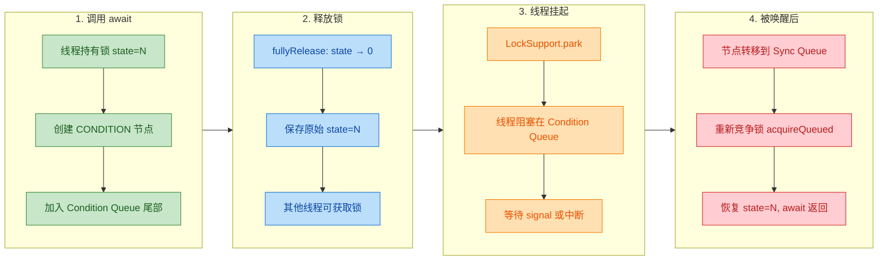

**`await()` 的各种变体：**

`Condition` 接口提供了多个 `await` 变体，以适应不同场景：

```java
public interface Condition {

    // 1. 基本等待：响应中断，被中断时抛出 InterruptedException
    void await() throws InterruptedException;

    // 2. 不可中断等待：即使被中断也不抛异常，唤醒后再设置中断标志
    void awaitUninterruptibly();

    // 3. 纳秒级限时等待：返回剩余纳秒数（<=0 表示超时）
    long awaitNanos(long nanosTimeout) throws InterruptedException;

    // 4. 带时间单位的限时等待：超时返回 false，被 signal 返回 true
    boolean await(long time, TimeUnit unit) throws InterruptedException;

    // 5. 绝对时间等待：等到指定日期时间，超时返回 false
    boolean awaitUntil(Date deadline) throws InterruptedException;
}
```

让我们逐一看看它们的用途：

**`awaitUninterruptibly()`** 在某些场景下非常有用——当你的业务逻辑要求线程 **必须** 等到条件满足才能继续，即使外部发来中断请求也不能提前退出。例如，在某些资源清理或事务提交的场景中，中途打断可能导致数据不一致：

```java
lock.lock();                                    // 获取锁
try {
    while (!资源准备就绪) {                       // 循环检查条件
        condition.awaitUninterruptibly();         // 不响应中断，坚持等待
        // 即使线程在等待期间被 interrupt()，也不会抛异常
        // 唤醒后，中断标志会被保留，可在后续自行检查
    }
    // 条件满足，执行关键操作
} finally {
    lock.unlock();                               // 释放锁
}
```

**`awaitNanos(long nanosTimeout)`** 返回值非常巧妙——它返回的是**剩余的等待时间**。如果返回值 > 0，说明是被 signal 唤醒的（还没等够时间就被叫醒了）；如果返回值 ≤ 0，说明超时了。这个设计在需要"总超时"的循环等待中特别好用：

```java
lock.lock();                                             // 获取锁
try {
    long remaining = TimeUnit.SECONDS.toNanos(5);        // 总计最多等待 5 秒
    while (!条件满足) {                                    // 循环检查
        if (remaining <= 0L) {                            // 检查是否已经超时
            throw new TimeoutException("等待超时");        // 超时，放弃
        }
        remaining = condition.awaitNanos(remaining);      // 等待剩余时间
        // 每次循环 remaining 都在递减，保证总等待时间不超过 5 秒
    }
} finally {
    lock.unlock();                                        // 释放锁
}
```

**关于 `await()` 的一个重要实现细节——`fullyRelease` 的必要性：**

为什么不是只释放"一层"锁，而是 **完全释放**？考虑以下场景：

```java
ReentrantLock lock = new ReentrantLock();       // 可重入锁
Condition condition = lock.newCondition();       // 条件变量

lock.lock();         // state = 1，第一次获取
lock.lock();         // state = 2，重入
lock.lock();         // state = 3，再次重入

condition.await();   // 此时 state 必须归零！
// 如果只释放一层（state 变为 2），其他线程永远获取不到锁
// 被唤醒后，state 恢复为 3（保持调用 await 之前的重入深度）
```

如果 `await()` 只把 state 从 3 减到 2，那锁仍然被当前线程"持有"（因为 state ≠ 0），其他线程永远无法获取锁，也就无法执行 `signal()` 来唤醒它——直接**死锁**了。所以 `fullyRelease` 是保证正确性的关键设计。

---

### signal（唤醒一个）

`signal()` 方法的语义是：**将该 Condition 等待队列中等待时间最长的那个线程（队首节点）从 Condition Queue 转移到 AQS 的 Sync Queue 中，使其有资格重新竞争锁**。

注意一个关键的认知：`signal()` 并不是直接"唤醒"线程让它立刻运行——它只是让目标线程从"等待条件"的状态转变为"等待获取锁"的状态。目标线程何时真正运行，取决于它何时竞争到锁。

**`signal()` 的执行流程：**

1. **前置检查**：验证调用 `signal()` 的线程是否持有锁。如果未持有锁就调用 `signal()`，会抛出 `IllegalMonitorStateException`——这与 `Object.notify()` 必须在 `synchronized` 块内调用是同一个道理。

2. **取出队首节点**：从 Condition Queue 的头部取出第一个节点（即等待时间最长的线程，FIFO 顺序）。

3. **转移节点**：将该节点的状态从 `CONDITION` 修改为 `0`，然后通过 `enq()` 方法将其加入到 AQS Sync Queue 的尾部。

4. **唤醒线程**（可能发生）：如果该节点在 Sync Queue 中的前驱节点已取消，或者无法将前驱节点的 waitStatus 设置为 `SIGNAL`，则立刻调用 `LockSupport.unpark()` 唤醒该线程。否则，线程会在 Sync Queue 中正常排队，由前驱节点在释放锁时唤醒它。

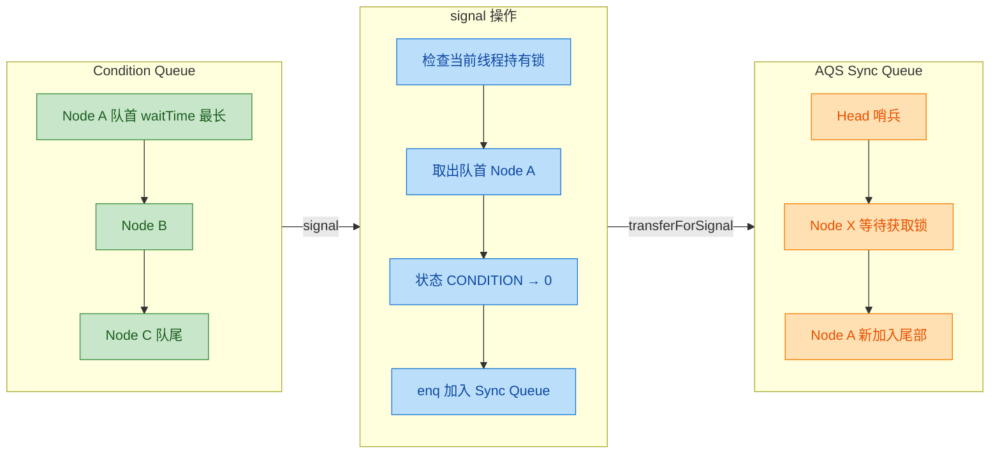

**一段更具体的演示代码：**

```java
public class SignalDemo {

    private static final ReentrantLock lock = new ReentrantLock();       // 显式锁
    private static final Condition condition = lock.newCondition();      // 条件变量
    private static boolean dataReady = false;                           // 共享条件标志

    public static void main(String[] args) throws InterruptedException {
        // 等待线程：等待数据就绪
        Thread waiter = new Thread(() -> {
            lock.lock();                                                // 获取锁
            try {
                System.out.println("[Waiter] 获取锁，检查条件...");
                while (!dataReady) {                                    // 循环检查条件
                    System.out.println("[Waiter] 数据未就绪，调用 await()");
                    condition.await();                                  // 释放锁，进入等待
                    System.out.println("[Waiter] 被唤醒，重新检查条件...");
                }
                System.out.println("[Waiter] 数据已就绪，继续执行业务逻辑");
            } catch (InterruptedException e) {
                Thread.currentThread().interrupt();                     // 恢复中断标志
            } finally {
                lock.unlock();                                          // 释放锁
            }
        }, "waiter-thread");

        // 通知线程：准备数据后通知
        Thread notifier = new Thread(() -> {
            lock.lock();                                                // 获取锁
            try {
                System.out.println("[Notifier] 获取锁，开始准备数据...");
                Thread.sleep(2000);                                     // 模拟数据准备耗时
                dataReady = true;                                       // 修改条件标志
                System.out.println("[Notifier] 数据准备完毕，调用 signal()");
                condition.signal();                                     // 唤醒等待队列中的一个线程
                System.out.println("[Notifier] signal() 调用完成，即将释放锁");
                // 注意：signal() 后不会立刻让出锁！
                // waiter 要等到 notifier 释放锁后才能真正从 await() 返回
            } catch (InterruptedException e) {
                Thread.currentThread().interrupt();                     // 恢复中断标志
            } finally {
                lock.unlock();                                          // 释放锁
                System.out.println("[Notifier] 锁已释放");
            }
        }, "notifier-thread");

        waiter.start();                                                 // 启动等待线程
        Thread.sleep(100);                                              // 确保 waiter 先运行
        notifier.start();                                               // 启动通知线程
    }
}
```

运行输出的时序大致如下：

```
[Waiter] 获取锁，检查条件...
[Waiter] 数据未就绪，调用 await()
[Notifier] 获取锁，开始准备数据...
[Notifier] 数据准备完毕，调用 signal()
[Notifier] signal() 调用完成，即将释放锁
[Notifier] 锁已释放
[Waiter] 被唤醒，重新检查条件...
[Waiter] 数据已就绪，继续执行业务逻辑
```

有一个非常重要的细节值得强调：**`signal()` 调用后，被唤醒的线程并不会立刻从 `await()` 返回**。被唤醒的线程只是被放入了 Sync Queue，它还需要等到调用 `signal()` 的线程释放锁之后，才能竞争到锁并从 `await()` 方法返回。在上面的例子中，Notifier 在调用 `signal()` 后还打印了一行日志并执行 `unlock()`，Waiter 是在 `unlock()` 之后才真正恢复执行的。

---

### signalAll（唤醒所有）

`signalAll()` 的行为是：**将 Condition Queue 中的所有节点逐一转移到 AQS 的 Sync Queue 中**。也就是说，该条件队列中所有正在等待的线程都将获得重新竞争锁的机会。

**`signalAll()` 与 `signal()` 的关键差异：**

- `signal()` 只转移队首的**一个**节点。
- `signalAll()` 遍历整个 Condition Queue，**逐个**转移所有节点到 Sync Queue。
- 转移完成后，Condition Queue 变为空队列。

**什么时候用 `signal()`，什么时候用 `signalAll()`？**

这是一个非常实际的设计选择问题。原则如下：

**优先用 `signal()` 的场景**——当等待条件是**统一的**，且每次状态变化只能满足**一个**等待者时。典型例子就是前面的生产者-消费者模式：生产者放入一个元素，最多只能满足一个消费者，所以 `signal()` 就够了。使用 `signal()` 的优势是开销更小，因为只有一个线程被唤醒并参与锁竞争。

**必须用 `signalAll()` 的场景**——当条件变化可能同时满足**多个**等待者，或者不同的等待者在检查**不同的条件**（但共用同一个 Condition）。例如：

```java
// 场景：多种不同条件混在一个 Condition 中（不推荐，但有时难以避免）
lock.lock();
try {
    // 线程A等待 x > 5
    while (x <= 5) condition.await();

    // 线程B等待 y > 10
    while (y <= 10) condition.await();

    // 当 x 和 y 都发生变化时，必须 signalAll()
    // 因为 signal() 可能只唤醒线程A，而线程B永远睡着
} finally {
    lock.unlock();
}
```

**一条实践建议**：当你不确定用哪个时，`signalAll()` 是更安全的选择——它可能浪费一些性能（多余的线程被唤醒后发现条件不满足又重新等待），但**不会导致正确性问题**。而错误地使用 `signal()` 可能导致某些线程永远无法被唤醒（missed signal / lost wakeup），这是一个隐蔽且致命的 bug。

```java
// signalAll 的典型用法
lock.lock();                              // 获取锁
try {
    // 执行某个导致状态变化的操作
    sharedState = newValue;               // 修改共享状态
    condition.signalAll();                // 唤醒所有等待该条件的线程
    // 所有被唤醒的线程会在 Sync Queue 中排队
    // 逐个获取锁后重新检查各自的条件
} finally {
    lock.unlock();                        // 释放锁
}
```

---

### 等待队列（与同步队列分离）

理解 `Condition` 的底层原理，最关键的一点就是搞清楚 **Condition Queue（条件等待队列）** 和 **Sync Queue（同步队列 / CLH 队列）** 这两个队列的关系和区别。这是 AQS 框架中最精巧的设计之一。

**两个队列的本质区别：**

| 特性 | Sync Queue (同步队列) | Condition Queue (条件等待队列) |
|:---|:---|:---|
| **归属** | 属于 AQS（锁本身） | 属于某个 Condition 对象 |
| **数量** | 每个 AQS 实例有且仅有 **1个** | 每个 Condition 对象有 **1个**，可创建多个 |
| **节点含义** | 等待**获取锁** | 等待**某个条件满足** |
| **数据结构** | 双向链表 (prev + next) | 单向链表 (nextWaiter) |
| **节点状态** | `0`, `SIGNAL(-1)`, `CANCELLED(1)`, `PROPAGATE(-3)` | `CONDITION(-2)` |
| **入队时机** | `lock()` 未获取到锁时；或 `signal()` 转移时 | `await()` 调用时 |
| **出队时机** | 获取到锁时 | 被 `signal/signalAll` 转移到 Sync Queue 时 |

**一个 Lock 对应多个 Condition Queue 的全景图：**

```java
// 内存模型概览
//
// ReentrantLock (内含一个 AQS Sync 实例)
//    │
//    ├── AQS Sync Queue (双向链表，唯一)
//    │     HEAD ⟷ Node(ThreadX) ⟷ Node(ThreadY) ⟷ TAIL
//    │
//    ├── Condition_1 (notFull)
//    │     firstWaiter → Node(ThreadA) → Node(ThreadB) → null
//    │
//    └── Condition_2 (notEmpty)
//          firstWaiter → Node(ThreadC) → Node(ThreadD) → Node(ThreadE) → null
```

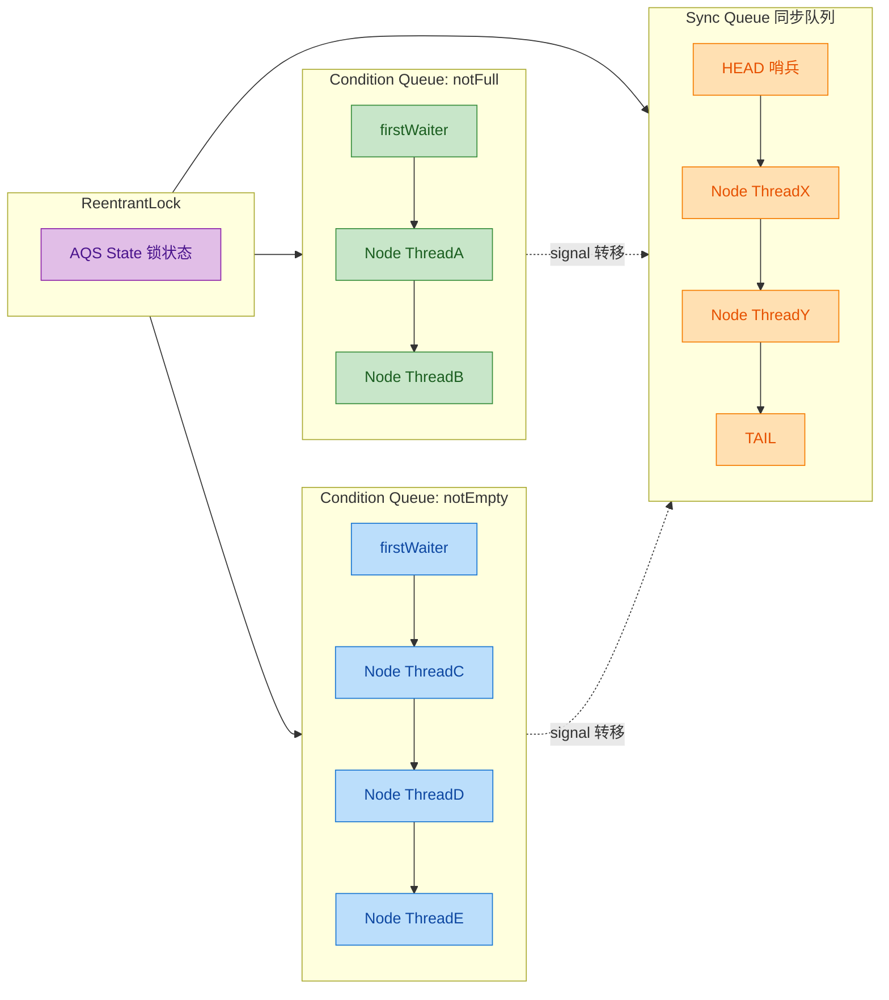

**`await()` 和 `signal()` 中节点在两个队列间的流转过程：**

让我们用一个完整的时序来追踪一个线程节点在两个队列之间的生命周期：

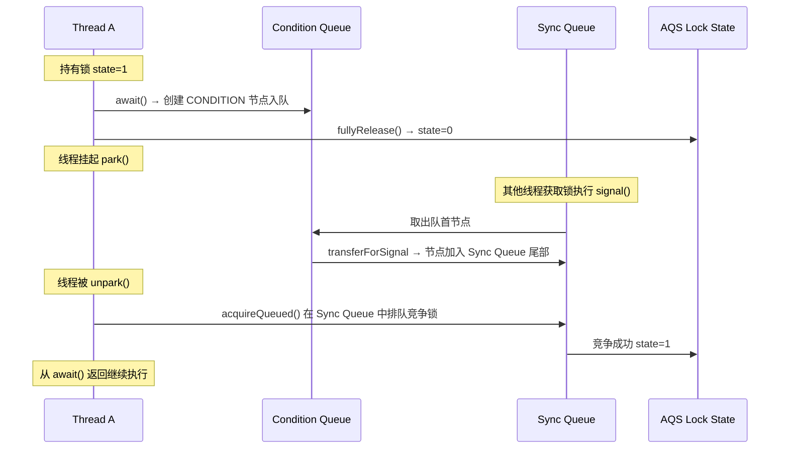

**Node 节点的双重身份：**

AQS 中的 `Node` 类非常巧妙——同一个 `Node` 既可以存在于 Sync Queue（此时使用 `prev` 和 `next` 指针构成双向链表），也可以存在于 Condition Queue（此时使用 `nextWaiter` 指针构成单向链表）。但**同一时刻，一个节点只会存在于其中一个队列**。在 Condition Queue 中时，节点的 `waitStatus` 为 `CONDITION(-2)`；被 `signal()` 转移后，`waitStatus` 被修改为 `0`，然后由 Sync Queue 的机制将其设为 `SIGNAL(-1)` 等状态。

```java
// AQS.Node 内部结构简化展示
// static final class Node {
//     volatile int waitStatus;     // 节点状态：CONDITION / SIGNAL / CANCELLED / PROPAGATE
//     volatile Node prev;          // Sync Queue 中的前驱指针
//     volatile Node next;          // Sync Queue 中的后继指针
//     Node nextWaiter;             // Condition Queue 中的下一个等待者
//     volatile Thread thread;      // 绑定的线程
// }
```

**为什么 Condition Queue 是单向链表而 Sync Queue 是双向链表？**

这跟各自的操作模式有关：

- **Sync Queue** 需要双向链表，是因为在 `cancelAcquire()` 时需要从当前节点向前遍历找到有效的前驱节点，以便正确地设置 `SIGNAL` 状态和进行节点脱链。此外，在 `shouldParkAfterFailedAcquire()` 中也需要 `prev` 指针来检查和更新前驱节点的状态。

- **Condition Queue** 只需要单向链表，因为它的操作非常简单：`await()` 在尾部添加节点，`signal()` 从头部取出节点。不需要从中间删除或反向遍历，因此单向链表就足够了，且更节省内存。

---

### 生产者消费者实现

生产者-消费者模式（Producer-Consumer Pattern）是并发编程中最经典的协作模式之一，也是展示 `Condition` 威力的最佳实战场景。下面我们实现一个**完整的、工业级的有界缓冲区**，并逐行详细注释。

```java
import java.util.concurrent.locks.Condition;
import java.util.concurrent.locks.ReentrantLock;

/**
 * 基于 ReentrantLock + Condition 的有界阻塞队列
 * 实现了经典的生产者-消费者模式
 * 
 * @param <E> 元素类型
 */
public class BoundedBlockingQueue<E> {

    private final Object[] items;         // 底层存储数组（环形缓冲区）
    private int putIndex;                 // 下一个生产元素的存放位置
    private int takeIndex;                // 下一个消费元素的取出位置
    private int count;                    // 当前缓冲区中的元素数量

    private final ReentrantLock lock;     // 主锁，保护所有对共享状态的访问
    private final Condition notFull;      // 条件变量：缓冲区不满（生产者在此等待）
    private final Condition notEmpty;     // 条件变量：缓冲区不空（消费者在此等待）

    /**
     * 构造函数：初始化指定容量的有界队列
     * @param capacity 队列容量，必须大于 0
     */
    public BoundedBlockingQueue(int capacity) {
        if (capacity <= 0) {                              // 参数校验
            throw new IllegalArgumentException("容量必须大于0");
        }
        this.items = new Object[capacity];                // 分配存储空间
        this.lock = new ReentrantLock();                  // 创建可重入锁
        this.notFull = lock.newCondition();               // 从锁派生"不满"条件
        this.notEmpty = lock.newCondition();              // 从锁派生"不空"条件
    }

    /**
     * 生产方法：向队列放入一个元素
     * 如果队列已满，当前线程将阻塞等待，直到有空间
     * 
     * @param element 要放入的元素
     * @throws InterruptedException 如果等待过程中被中断
     */
    public void put(E element) throws InterruptedException {
        if (element == null) {                            // 不允许 null 元素
            throw new NullPointerException("不允许放入 null");
        }
        lock.lock();                                      // 获取锁
        try {
            // 【关键】使用 while 循环检查条件，防止虚假唤醒
            while (count == items.length) {               // 如果缓冲区已满
                System.out.println(Thread.currentThread().getName()
                    + " 缓冲区已满，等待 notFull...");
                notFull.await();                           // 释放锁，进入 notFull 等待队列
                // 被唤醒后会重新获取锁，然后回到 while 继续检查
            }

            items[putIndex] = element;                    // 将元素放入环形缓冲区的当前位置
            putIndex++;                                   // 移动写指针
            if (putIndex == items.length) {               // 如果到达数组末尾
                putIndex = 0;                             // 回绕到数组起始位置（环形）
            }
            count++;                                      // 元素总数 +1

            System.out.println(Thread.currentThread().getName()
                + " 放入: " + element + ", 当前数量: " + count);

            notEmpty.signal();                            // 精确唤醒 notEmpty 队列中的一个消费者
            // 此时消费者被从 Condition Queue 转移到 Sync Queue
            // 它需要等到本方法释放锁后才能真正获取锁
        } finally {
            lock.unlock();                                // 释放锁（finally 保证一定释放）
        }
    }

    /**
     * 消费方法：从队列取出一个元素
     * 如果队列为空，当前线程将阻塞等待，直到有元素
     * 
     * @return 取出的元素
     * @throws InterruptedException 如果等待过程中被中断
     */
    @SuppressWarnings("unchecked")
    public E take() throws InterruptedException {
        lock.lock();                                      // 获取锁
        try {
            // 【关键】使用 while 循环检查条件，防止虚假唤醒
            while (count == 0) {                          // 如果缓冲区为空
                System.out.println(Thread.currentThread().getName()
                    + " 缓冲区为空，等待 notEmpty...");
                notEmpty.await();                          // 释放锁，进入 notEmpty 等待队列
                // 被唤醒后会重新获取锁，然后回到 while 继续检查
            }

            E element = (E) items[takeIndex];             // 从环形缓冲区取出元素
            items[takeIndex] = null;                      // 清除引用，帮助 GC
            takeIndex++;                                  // 移动读指针
            if (takeIndex == items.length) {              // 如果到达数组末尾
                takeIndex = 0;                            // 回绕到数组起始位置（环形）
            }
            count--;                                      // 元素总数 -1

            System.out.println(Thread.currentThread().getName()
                + " 取出: " + element + ", 当前数量: " + count);

            notFull.signal();                             // 精确唤醒 notFull 队列中的一个生产者
            // 此时生产者被从 Condition Queue 转移到 Sync Queue
            // 它需要等到本方法释放锁后才能真正获取锁

            return element;                               // 返回取出的元素
        } finally {
            lock.unlock();                                // 释放锁
        }
    }

    /**
     * 获取当前队列中的元素数量（线程安全）
     */
    public int size() {
        lock.lock();                                      // 获取锁
        try {
            return count;                                 // 返回当前元素数量
        } finally {
            lock.unlock();                                // 释放锁
        }
    }
}
```

下面是使用这个队列的完整测试程序：

```java
public class ProducerConsumerDemo {

    public static void main(String[] args) {
        // 创建容量为 3 的有界阻塞队列
        BoundedBlockingQueue<Integer> queue = new BoundedBlockingQueue<>(3);

        // 启动 2 个生产者线程
        for (int i = 1; i <= 2; i++) {
            final int producerId = i;                     // 生产者编号
            new Thread(() -> {
                try {
                    for (int j = 1; j <= 5; j++) {        // 每个生产者生产 5 个元素
                        int item = producerId * 100 + j;  // 生成唯一标识的元素
                        queue.put(item);                  // 放入队列（可能阻塞）
                        Thread.sleep(100);                // 模拟生产耗时
                    }
                } catch (InterruptedException e) {
                    Thread.currentThread().interrupt();    // 恢复中断标志
                }
            }, "Producer-" + i).start();
        }

        // 启动 3 个消费者线程
        for (int i = 1; i <= 3; i++) {
            new Thread(() -> {
                try {
                    while (true) {                        // 消费者不断消费
                        Integer item = queue.take();      // 从队列取出（可能阻塞）
                        Thread.sleep(300);                // 模拟消费耗时（消费较慢）
                    }
                } catch (InterruptedException e) {
                    Thread.currentThread().interrupt();    // 恢复中断标志
                }
            }, "Consumer-" + i).start();
        }
    }
}
```

**环形缓冲区的设计思路：**

上面的实现采用了经典的**环形数组（Circular Array / Ring Buffer）**结构，这也正是 JDK 中 `ArrayBlockingQueue` 的实现方式。两个指针 `putIndex` 和 `takeIndex` 分别追踪写入和读取位置，当达到数组末尾时回绕到起始位置。这种设计避免了频繁的数组搬移操作，出队和入队的时间复杂度都是 O(1)。

```java
// 环形缓冲区示意（容量 = 5）
//
// 初始状态:
//   items: [ null, null, null, null, null ]
//           ^putIndex=0
//           ^takeIndex=0
//   count = 0
//
// put(A), put(B), put(C):
//   items: [  A,    B,    C,   null, null ]
//                          ^putIndex=3
//           ^takeIndex=0
//   count = 3
//
// take() → A, take() → B:
//   items: [ null, null,  C,   null, null ]
//                          ^putIndex=3
//                          ^takeIndex=2
//   count = 1
//
// put(D), put(E), put(F):  ← putIndex 回绕！
//   items: [  F,   null,  C,    D,    E  ]
//               ^putIndex=1
//                          ^takeIndex=2
//   count = 4
```

**与 JDK `ArrayBlockingQueue` 的对比：**

我们的实现本质上是 `java.util.concurrent.ArrayBlockingQueue` 的简化版。JDK 的实现多了以下特性：

- 支持公平/非公平锁选择（构造函数传入 `fair` 参数）
- 提供非阻塞的 `offer()` 和 `poll()` 方法
- 提供带超时的 `offer(e, timeout, unit)` 和 `poll(timeout, unit)`
- 实现了 `Iterable` 接口，支持迭代器遍历
- 实现了 `Collection` 接口的各种批量操作

但核心的锁+双Condition思路是完全一致的。理解了我们的实现，也就理解了 `ArrayBlockingQueue` 的精髓。

**为什么这个模式如此重要？**

生产者-消费者模式是**解耦**的利器。生产者不需要知道消费者是谁、有几个、消费速率如何；消费者也不需要知道数据从哪里来。它们只通过一个**有界缓冲区**交互。这种解耦带来几个核心好处：

1. **流量削峰**：生产速率高峰时，元素在缓冲区中缓冲；消费者可以按自己的节奏处理
2. **支持异步**：生产者放入元素后立刻返回，不必等待消费者处理完
3. **并发度提升**：生产和消费可以并行进行，只在缓冲区满/空时才阻塞
4. **伸缩灵活**：可以动态调整生产者/消费者的数量来匹配吞吐需求

---

**📝 练习题**

**题目一：** 以下关于 `Condition` 的说法，哪项是**错误**的？

A. 一个 `ReentrantLock` 可以创建多个 `Condition` 对象，每个都维护独立的等待队列

B. 调用 `condition.await()` 时，线程会完全释放锁（包括所有重入次数），然后进入 Condition Queue

C. 调用 `condition.signal()` 后，被唤醒的线程会立刻从 `await()` 方法返回并继续执行

D. `Condition` 的等待队列（Condition Queue）是单向链表，而 AQS 的同步队列（Sync Queue）是双向链表


**【答案】** C

**【解析】** 选项 C 的描述是错误的。调用 `signal()` 后，被唤醒的线程**并不会立刻从 `await()` 返回**。`signal()` 的实际行为是将目标线程的节点从 Condition Queue 转移到 AQS 的 Sync Queue 中，使其有资格重新参与锁竞争。该线程需要在 Sync Queue 中排队，等到前面的线程释放锁后，竞争成功获取到锁，才能真正从 `await()` 返回。特别是，调用 `signal()` 的线程自己当前还持有锁，被唤醒的线程至少要等到 `signal()` 调用者执行 `unlock()` 之后才有机会获取锁。其余选项均正确：A 描述了 Condition 的核心优势——多等待队列；B 描述了 `fullyRelease` 的行为；D 描述了两种队列在数据结构上的差异。

---

**题目二：** 在以下生产者-消费者代码中，如果将 `while (count == 0)` 改为 `if (count == 0)`，可能会导致什么问题？

```java
public E take() throws InterruptedException {
    lock.lock();
    try {
        if (count == 0) {          // ← 此处改为 if
            notEmpty.await();
        }
        E e = (E) items[takeIndex];
        // ... 省略后续逻辑
    } finally {
        lock.unlock();
    }
}
```

A. 编译错误

B. 不会有任何问题，`if` 和 `while` 在这里效果相同

C. 可能因虚假唤醒（Spurious Wakeup）导致在缓冲区实际为空时取出 null，引发数据错误

D. 会导致死锁


**【答案】** C

**【解析】** 使用 `if` 替代 `while` 后，线程从 `await()` 被唤醒时只检查一次条件就继续执行。但唤醒可能并非因为条件真正满足——存在两种场景：（1）**虚假唤醒（Spurious Wakeup）**：操作系统或 JVM 内部机制可能在没有 `signal()` 调用的情况下唤醒线程；（2）**竞争失败**：多个消费者同时被 `signalAll()` 唤醒，但队列中只剩一个元素。第一个消费者取走了元素，第二个消费者从 `await()` 返回后如果用 `if` 就不会再检查 `count==0`，会直接执行取出操作，从空位置取出 `null`。使用 `while` 循环则确保每次被唤醒后都重新验证条件，不满足就继续等待，从根本上杜绝这类问题。这是并发编程中的铁律：**永远在循环中调用 `await()`**（Always call await in a loop）。

---

## 本章小结

本章围绕 Java 并发中**读写锁**与 **Condition 条件机制**两大核心主题展开，从 `ReentrantReadWriteLock` 的经典设计，到 `StampedLock` 的性能优化，再到 `Condition` 对线程协作的精细化控制，构建了一套完整的高级锁与线程通信知识体系。以下从全局视角对本章进行系统回顾。

---

### 全章知识脉络总览

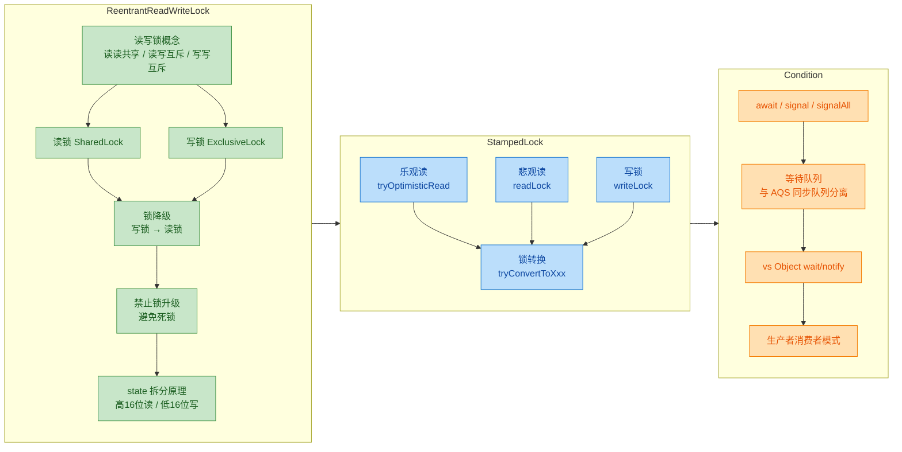

---

### ReentrantReadWriteLock 核心回顾

`ReentrantReadWriteLock` 是 Java 并发包中**最经典的读写分离锁**实现，其设计哲学可以浓缩为一句话：**读操作天然并发安全，只有写操作才需要独占资源**。这一思想直接映射到三条互斥规则：

| 操作组合 | 是否允许并发 | 原因 |
|:--------:|:-----------:|:----:|
| 读 + 读 | ✅ 共享 | 多个读线程不修改数据，彼此无冲突 |
| 读 + 写 | ❌ 互斥 | 写线程修改数据时读线程可能看到中间状态 |
| 写 + 写 | ❌ 互斥 | 两个写线程同时修改会导致数据竞争 |

在**实现原理**层面，`ReentrantReadWriteLock` 使用了一个极其精妙的设计——将 AQS 的 `int state`（32位）**拆分为高低各16位**：高16位记录读锁持有的线程数（shared count），低16位记录写锁的重入次数（exclusive count）。这使得一个原子变量即可同时表达读写两种锁的状态，并通过 CAS 操作保证无锁化的状态变更。

```java
// state 拆分示意（AQS 内部逻辑）
// ┌──────────────────┬──────────────────┐
// │   高16位 (读锁)    │   低16位 (写锁)    │
// │  shared count     │  exclusive count  │
// └──────────────────┴──────────────────┘
//
// 读锁数量 = state >>> 16           (无符号右移，取高16位)
// 写锁重入 = state & 0x0000FFFF     (掩码取低16位)
```

**锁降级**是本章的重要考点。它的完整流程是：**先获取写锁 → 修改数据 → 获取读锁 → 释放写锁 → 最终释放读锁**。锁降级的核心价值在于：当前线程在写操作完成后，能够**不释放保护就切换到读模式**，保证自己一定能看到刚才写入的最新值，避免了"先释放写锁再获取读锁"之间被其他写线程插入的窗口期。

而**锁升级（读锁 → 写锁）被严格禁止**，原因是会产生**必然的死锁**：假设线程 A 和线程 B 都持有读锁，然后都尝试升级为写锁——写锁需要等待所有读锁释放，但双方都在等待对方释放读锁，形成循环等待，永远无法推进。

---

### StampedLock 核心回顾

`StampedLock` 是 JDK 8 引入的**性能增强型读写锁**，它的最大创新点是引入了**乐观读模式（Optimistic Reading）**。与 `ReentrantReadWriteLock` 的关键区别如下：

| 特性 | ReentrantReadWriteLock | StampedLock |
|:----:|:---------------------:|:-----------:|
| 乐观读 | ❌ 不支持 | ✅ `tryOptimisticRead()` |
| 可重入 | ✅ 支持 | ❌ 不支持 |
| Condition | ✅ 支持 | ❌ 不支持 |
| 写线程饥饿 | ⚠️ 可能发生 | ✅ 更公平 |
| 锁转换 | ❌ 不支持 | ✅ `tryConvertToXxx()` |

乐观读的核心思想是：**读操作不获取任何锁，只记录一个 stamp（版本戳），读完后验证 stamp 是否仍然有效**。如果在读的过程中没有任何写操作发生，stamp 验证通过，读操作以**零锁开销**完成。如果验证失败（期间发生了写操作），则降级为悲观读锁重新获取数据。这种"先乐观尝试，失败再悲观兜底"的策略在**读多写少**的场景下可以大幅减少读锁的获取/释放开销。

**锁转换**是 `StampedLock` 的另一个独特能力。`tryConvertToWriteLock(stamp)`、`tryConvertToReadLock(stamp)`、`tryConvertToOptimisticRead(stamp)` 允许在**不释放当前锁的情况下直接转换锁模式**，避免了"释放旧锁 → 获取新锁"之间的竞态窗口。

需要特别注意的是，`StampedLock` **不可重入、不支持 Condition、且不应在 `try-with-resources` 中使用**（因为它没有实现 `Lock` 接口），使用时务必注意这些限制。

---

### Condition 核心回顾

`Condition` 是 `java.util.concurrent.locks` 包提供的**精细化线程等待/唤醒机制**，它从功能上完全替代了 `Object.wait()/notify()/notifyAll()`，并在以下方面实现了显著增强：

| 维度 | Object.wait/notify | Condition.await/signal |
|:----:|:------------------:|:---------------------:|
| 等待队列数量 | 每个对象只有 **1个** | 每把锁可创建 **多个** Condition |
| 唤醒精度 | `notify()` 随机唤醒 | `signal()` 唤醒**指定队列**的线程 |
| 超时/中断 | 功能有限 | `awaitNanos()`、`awaitUninterruptibly()` 等丰富 API |
| 使用前提 | `synchronized` 块内 | `lock.lock()` 后 |

**双队列模型**是理解 Condition 内部原理的关键。每个 `Condition` 对象维护一个**独立的等待队列（Condition Queue）**，而 AQS 本身维护一个**同步队列（Sync Queue / CLH Queue）**。当线程调用 `await()` 时，它从同步队列移入等待队列并释放锁；当被 `signal()` 唤醒时，它从等待队列移回同步队列，重新竞争锁的获取。

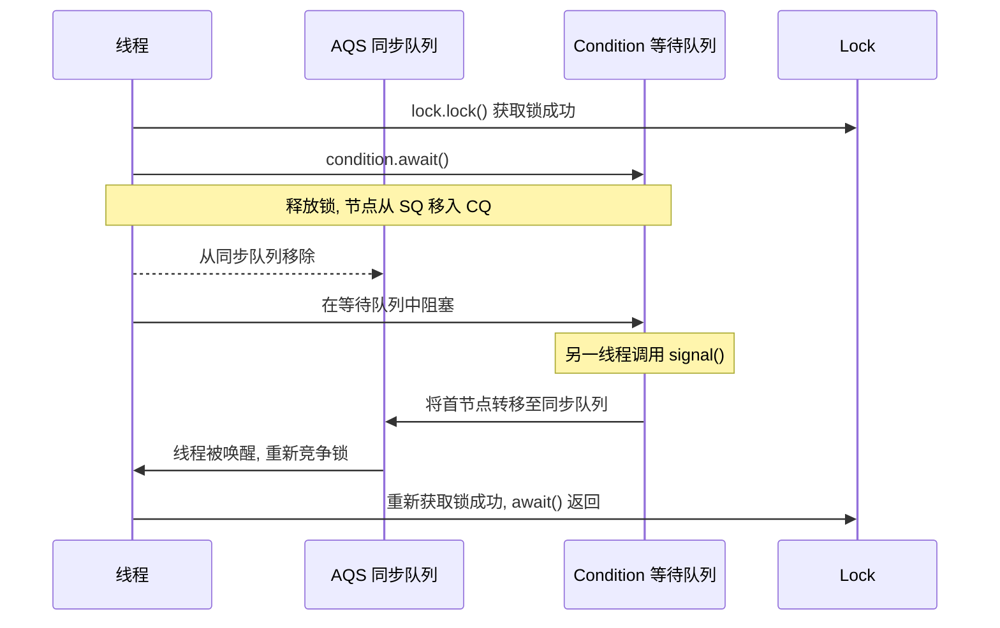

**生产者-消费者模式**是 Condition 最经典的应用场景。通过为"缓冲区不满"和"缓冲区不空"分别创建两个 Condition（如 `notFull` 和 `notEmpty`），生产者只唤醒等待数据的消费者，消费者只唤醒等待空间的生产者，实现了**精准唤醒**，彻底避免了 `notifyAll()` 的惊群效应（Thundering Herd Problem）。

---

### 三大组件选型决策指南

在实际工程中，如何在 `ReentrantReadWriteLock`、`StampedLock` 和 `Condition` 之间做出选择，是一个高频面试问题，也是架构设计中的常见决策点：

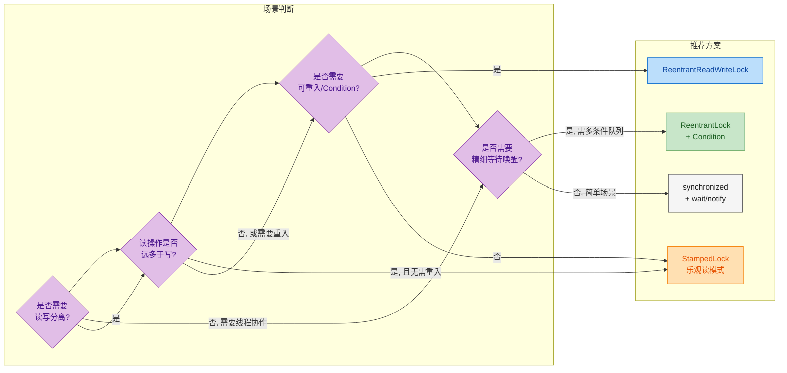

**简明选型口诀**：

- **读多写少、无需重入** → `StampedLock`（乐观读带来最高吞吐）
- **读写分离、需要重入或 Condition** → `ReentrantReadWriteLock`
- **不需要读写分离、需要精细线程协作** → `ReentrantLock` + `Condition`
- **简单同步、无复杂需求** → `synchronized` + `wait/notify`

---

### 高频面试考点速查表

| 考点 | 核心要点 |
|:----:|:-------:|
| 读写锁三条规则 | 读读共享、读写互斥、写写互斥 |
| state 拆分 | 高16位读锁计数、低16位写锁重入次数 |
| 锁降级流程 | 获写锁 → 获读锁 → 释写锁 → 释读锁 |
| 锁升级为何禁止 | 多线程持有读锁时互相等待对方释放，必然死锁 |
| 乐观读本质 | 无锁操作，仅通过 stamp 验证数据一致性 |
| StampedLock 限制 | 不可重入、不支持 Condition、不实现 Lock 接口 |
| await() 做了什么 | 释放锁 → 进入 Condition 等待队列 → 阻塞 |
| signal() 做了什么 | 将等待队列首节点转移至 AQS 同步队列 → 等待重新竞争锁 |
| Condition 双队列 | AQS 同步队列（竞争锁）+ Condition 等待队列（等待条件） |
| 精准唤醒优势 | 多个 Condition 分别管理不同等待条件，避免惊群效应 |

---

### 📝 练习题

**题目一：** 关于 `ReentrantReadWriteLock` 的锁降级，以下代码执行后会发生什么？

```java
ReentrantReadWriteLock rwl = new ReentrantReadWriteLock();
ReentrantReadWriteLock.ReadLock readLock = rwl.readLock();
ReentrantReadWriteLock.WriteLock writeLock = rwl.writeLock();

// 线程 A 执行以下代码
readLock.lock();       // 第1步：先获取读锁
try {
    writeLock.lock();  // 第2步：尝试获取写锁（锁升级）
    try {
        // 写操作...
    } finally {
        writeLock.unlock();
    }
} finally {
    readLock.unlock();
}
```

A. 正常执行，成功从读锁升级为写锁


B. 抛出 `IllegalMonitorStateException` 异常


C. 线程 A 永久阻塞（死锁），因为写锁在等待读锁释放，而读锁被自己持有


D. 抛出 `UnsupportedOperationException`，因为 JDK 明确禁止锁升级


**【答案】** C

**【解析】** 这是一个**单线程自死锁**的经典案例。当线程 A 持有读锁后尝试获取写锁时，写锁的获取条件是"当前没有任何线程持有读锁"。但读锁正被线程 A 自己持有，而线程 A 又在等待写锁——写锁需要读锁释放，读锁的释放代码在 `finally` 中但永远执行不到，因为线程已经阻塞在 `writeLock.lock()` 上。这就是 `ReentrantReadWriteLock` 不支持锁升级的根本原因：即使只有一个线程，也会造成自死锁。JDK 并不会抛出异常来阻止这个操作（不像某些语言会做检测），而是**静默地让线程永久挂起**，这使得这类 bug 在生产环境中极难排查。

---

**题目二：** 在使用 `StampedLock` 的乐观读模式时，以下代码存在什么问题？

```java
StampedLock sl = new StampedLock();

// 读取操作
long stamp = sl.tryOptimisticRead();
int currentX = this.x;
int currentY = this.y;
// 直接使用 currentX 和 currentY，未做 validate
return Math.sqrt(currentX * currentX + currentY * currentY);
```

A. 编译错误，`tryOptimisticRead()` 返回值不是 `long` 类型


B. 没有问题，乐观读本身就不需要验证


C. 可能读到不一致的数据（x 是旧值、y 是新值），因为缺少 `validate(stamp)` 校验和悲观读降级逻辑


D. 会抛出 `OptimisticLockException` 运行时异常


**【答案】** C

**【解析】** 乐观读的核心契约是"**先读后验证**"（read-then-validate）。`tryOptimisticRead()` 返回一个 stamp 但**不获取任何锁**，这意味着在读取 `x` 和 `y` 的过程中，写线程完全可以介入修改数据。如果在读取 `x` 之后、读取 `y` 之前有写线程修改了两个字段，就会出现 `x` 是旧值而 `y` 是新值的**数据撕裂**（torn read）问题。正确做法是在读取完所有字段后调用 `sl.validate(stamp)`，如果返回 `false` 说明期间发生了写操作，此时应降级为 `sl.readLock()` 悲观读并重新读取数据。乐观读从来不是"免费午餐"，**验证步骤是保证正确性的不可省略环节**。

---

