---

# 锁升级过程 ⭐⭐⭐

---

## 为什么需要锁升级（重量级锁开销大）

在 Java 并发编程的早期版本中（JDK 1.6 之前），`synchronized` 关键字的实现方式非常"简单粗暴"——每次进入同步块都直接向操作系统申请一把 **互斥锁（Mutex Lock）**。这种锁就是我们所说的 **重量级锁（Heavyweight Lock）**。它之所以"重"，是因为每一次加锁和解锁操作都必须从 **用户态（User Mode）** 切换到 **内核态（Kernel Mode）**，再切换回来。这种切换的代价是极其昂贵的。

### 用户态与内核态的切换开销

要理解锁升级存在的意义，我们必须先搞清楚一个核心前置问题：**为什么一次内核态切换的代价如此之高？**

现代操作系统将运行空间划分为两个层级：**用户态（User Space）** 和 **内核态（Kernel Space）**。普通应用程序（包括 JVM）运行在用户态。当应用程序需要操作系统提供的服务——比如线程调度、I/O 操作、或者申请互斥量——就必须通过 **系统调用（System Call）** 切换到内核态。

一次完整的用户态 → 内核态 → 用户态的切换，大致涉及以下步骤：

1. **保存用户态上下文（Save User Context）**：CPU 必须把当前线程在用户态下的所有寄存器值（程序计数器 PC、栈指针 SP、通用寄存器等）完整保存到内存中。
2. **切换到内核栈（Switch to Kernel Stack）**：每个线程在内核中有独立的栈空间，CPU 需要切换栈指针。
3. **执行内核代码（Execute Kernel Logic）**：操作系统内核执行实际的互斥量操作（如 `pthread_mutex_lock`），这涉及内核数据结构的查询与修改。
4. **恢复用户态上下文（Restore User Context）**：操作完成后，CPU 需要把之前保存的寄存器值恢复回来。
5. **TLB 与 Cache 污染（TLB & Cache Pollution）**：切换过程中，CPU 的 TLB（Translation Lookaside Buffer，地址转换缓存）和部分 CPU Cache 可能失效，导致切换回用户态后出现大量 Cache Miss，进一步拖慢性能。

根据经验数据，一次用户态/内核态切换的耗时大约在 **1~10 微秒（μs）** 量级。这个数字看起来很小，但对比一下：一次普通的内存访问大约只需要 **100 纳秒（ns）**，也就是说，**一次内核态切换的开销大约等价于 10~100 次内存访问**。如果你的同步块里只是做一个简单的 `count++` 操作，那么锁本身的开销可能远远超过了实际业务逻辑的开销——这就像你为了买一瓶 2 元的水，打了一趟 200 元的出租车。

```java
// 一个极端但常见的场景：同步块内逻辑极轻
public class Counter {
    private int count = 0; // 简单的计数器

    // 每次调用 increment，旧版 JVM 都会申请一次 OS 互斥锁
    // 锁的开销可能是 count++ 本身开销的 100 倍以上
    public synchronized void increment() {
        count++; // 这条指令在 CPU 层面可能只需要几个时钟周期
    }
}
```

### 真实场景中的锁竞争分析

HotSpot 虚拟机的工程师团队在对大量 Java 应用进行性能剖析（Profiling）后，发现了一个关键的统计规律：

> **在绝大多数实际运行的 Java 程序中，大部分 synchronized 代码块在其整个生命周期内，要么始终只被同一个线程访问，要么只有极少数线程交替访问，真正存在激烈多线程竞争的场景实际上是少数。**

这一发现至关重要。它意味着如果我们为所有 `synchronized` 操作都一视同仁地使用重量级锁，那就是在绝大多数没有竞争或竞争很轻的场景下，**白白支付了昂贵的内核态切换代价**。这显然是巨大的性能浪费。

我们可以将锁的使用场景大致分为三类，并对应不同的最优策略：

| 场景分类 | 真实表现 | 出现频率 | 最优策略 | 典型代价 |
|:---|:---|:---:|:---|:---|
| **无竞争 · 单线程重复获取** | 始终只有线程 A 反复进入同一把锁 | ★★★★★ 极高 | 几乎零开销的标记即可 | ~1 ns |
| **轻度竞争 · 线程交替执行** | 线程 A 释放后线程 B 才来获取，几乎无重叠 | ★★★☆☆ 中等 | 用户态 CAS 操作即可 | ~10 ns |
| **激烈竞争 · 多线程同时争抢** | 多个线程同一时刻都想获取同一把锁 | ★☆☆☆☆ 较低 | 不得不使用 OS 互斥量 | ~1-10 μs |

正是基于这一观察，HotSpot 工程师在 **JDK 1.6** 中引入了 **锁升级（Lock Escalation / Lock Inflation）** 机制，核心思想就是：**用最小的代价去匹配当前最真实的竞争程度**。

### 锁升级的核心设计哲学

锁升级的设计哲学可以用一句话概括：

> **Don't pay for what you don't use.（不要为你不需要的功能付费。）**

这是一种典型的 **渐进式悲观化策略（Progressive Pessimization）**：系统总是先做最乐观的假设——假设没有竞争，使用最轻量的锁机制。只有当真正检测到竞争发生时，才逐步升级到更重、但也更"安全"的锁形态。

整个升级路径如下：

```
无锁（Unlocked） → 偏向锁（Biased Locking） → 轻量级锁（Lightweight Lock） → 重量级锁（Heavyweight Lock）
```

这四种状态并非四种不同的锁实现，而是 **同一个对象头中 Mark Word 的四种不同编码状态**。JVM 通过动态检测当前的竞争强度，决定将 Mark Word 切换为哪种状态。这就像城市交通管理——平时一个路口可能只需要一个警示牌（偏向锁），车流稍多时安排交通灯（轻量级锁），只有在严重拥堵时才需要出动交警指挥（重量级锁）。

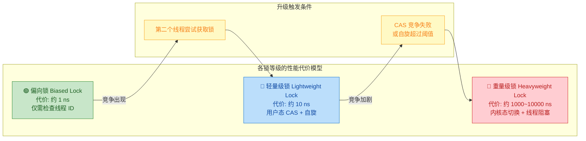

### 量化对比：有锁升级 vs 无锁升级

为了让你直观感受锁升级带来的性能差异，我们假设一个简单场景：**一个单线程环境下，对同一个同步方法调用 1,000,000 次**。

```java
public class LockBenchmark {
    private final Object lock = new Object(); // 锁对象
    private int sum = 0; // 累加结果

    // 这个方法在单线程下被调用 100 万次
    public void add() {
        synchronized (lock) { // 每次都需要获取锁
            sum++;            // 实际业务逻辑极简单
        }
    }
}
```

在没有锁升级的旧版 JVM（JDK 1.5 及更早版本）中：

- 每次调用 `add()` 都申请 OS Mutex → 1,000,000 次内核态切换
- 假设每次切换耗时 5 μs → **总耗时约 5 秒**
- 而 `sum++` 本身 1,000,000 次可能只需要约 **3 毫秒**

在有锁升级的 JDK 1.6+ JVM 中：

- JVM 检测到始终只有同一个线程在获取锁 → 使用偏向锁
- 偏向锁只需在首次获取时做一次 CAS，后续进入仅需对比线程 ID → 几乎零开销
- 总耗时约 **5~10 毫秒**

**性能差距高达 500~1000 倍。** 这就是锁升级机制存在的根本意义。

### 对象头 Mark Word——锁升级的物理载体

锁升级不是一个抽象概念，它有着明确的物理实现载体——每一个 Java 对象的 **对象头（Object Header）** 中的 **Mark Word**。Mark Word 是一段固定长度的位域（64 位 JVM 中为 64 bits），JVM 通过修改这段位域中的不同比特位来记录当前对象处于哪种锁状态。

以 **64 位 HotSpot JVM** 为例，Mark Word 在不同锁状态下的布局如下：

```
┌─────────────────────────────────────────────────────────────────┐
│                        64-bit Mark Word                         │
├──────────────────────────────────┬──────────┬───────┬───────────┤
│           Content (前 62 bits)    │ Biased   │ Lock  │  锁状态   │
│                                  │ (1 bit)  │(2 bit)│  说明     │
├──────────────────────────────────┼──────────┼───────┼───────────┤
│ identity_hashcode:31 | age:4     │    0     │  01   │  无锁     │
│ unused:25 | epoch:2              │          │       │           │
├──────────────────────────────────┼──────────┼───────┼───────────┤
│ thread_id:54 | epoch:2 | age:4   │    1     │  01   │  偏向锁   │
│ (偏向的线程 ID)                   │          │       │           │
├──────────────────────────────────┼──────────┼───────┼───────────┤
│ ptr_to_lock_record:62            │   无     │  00   │  轻量级锁  │
│ (指向栈帧中 Lock Record 的指针)    │          │       │           │
├──────────────────────────────────┼──────────┼───────┼───────────┤
│ ptr_to_heavyweight_monitor:62    │   无     │  10   │  重量级锁  │
│ (指向 Monitor 对象的指针)          │          │       │           │
├──────────────────────────────────┼──────────┼───────┼───────────┤
│ (空)                             │   无     │  11   │  GC 标记   │
│                                  │          │       │           │
└──────────────────────────────────┴──────────┴───────┴───────────┘
```

注意最后 2 位 **Lock Bits** 的编码规则：
- `01` = 无锁 或 偏向锁（通过第 3 位 Biased bit 区分：0 = 无锁，1 = 偏向）
- `00` = 轻量级锁
- `10` = 重量级锁
- `11` = GC 标记（用于垃圾回收阶段，与锁无关）

锁升级的本质，就是 JVM 在运行时动态地修改 Mark Word 中这些位域的值，从一种编码模式切换到另一种编码模式。整个过程对 Java 程序员完全透明——你写的代码还是同一个 `synchronized`，但底层的实现策略却在悄然变化。

### 为什么不直接用轻量级锁，还要引入偏向锁？

这是初学者常有的疑问。既然轻量级锁只需要用户态 CAS 操作就能完成，代价已经很低了（约 10 ns），为什么还要再引入一个偏向锁？

原因在于 **CAS 操作虽然不涉及内核态切换，但它也不是免费的**。CAS（Compare-And-Swap）在 x86 架构上对应 `LOCK CMPXCHG` 指令，这条指令需要：

1. **锁定 CPU 缓存行（Lock Cache Line）**：即便没有竞争，`LOCK` 前缀也会导致该缓存行被独占，阻止其他核心同时访问。
2. **内存屏障效应（Memory Barrier）**：CAS 自带 Full Memory Barrier 语义，会强制刷新 Store Buffer，这会打断 CPU 的乱序执行流水线。

在极端热点路径上（比如一个被频繁调用的 `synchronized getter` 方法），即便是每次 CAS 的 10 ns 开销也会积累成显著的性能瓶颈。而偏向锁在无竞争的理想情况下，第二次及以后进入同步块时 **只需要做一次简单的线程 ID 比较**——这是一个纯粹的寄存器级操作，耗时约 1 ns，比 CAS 还要再快一个数量级。

这就是 JVM 锁升级的精髓：**在性能优化的道路上，每一个数量级的节省都值得追求。**

---

**📝 练习题**

以下关于 Java 锁升级机制的描述，哪一项是 **错误的**？

A. 锁升级机制是在 JDK 1.6 中引入的，目的是减少 synchronized 的性能开销


B. 重量级锁的主要开销来自于用户态与内核态之间的切换，一次切换耗时大约在微秒级别


C. 在 64 位 HotSpot JVM 中，Mark Word 最后 2 位为 `00` 表示当前对象处于无锁状态


D. 偏向锁比轻量级锁更轻量，因为它在无竞争时避免了 CAS 操作，只需比较线程 ID


**【答案】** C

**【解析】** 在 64 位 HotSpot JVM 的 Mark Word 编码中，最后 2 位 Lock Bits 的含义为：`01` = 无锁或偏向锁（通过 Biased bit 区分）、`00` = **轻量级锁**、`10` = 重量级锁、`11` = GC 标记。因此 `00` 表示的是轻量级锁而非无锁状态，选项 C 的描述是错误的。选项 A 正确描述了锁升级的引入时间和目的；选项 B 正确描述了重量级锁的开销来源和量级；选项 D 正确解释了偏向锁比轻量级锁更轻量的原因——偏向锁在无竞争时仅做一次线程 ID 的等值比较（寄存器操作），而轻量级锁每次进入都需要执行 CAS 指令（`LOCK CMPXCHG`），后者涉及缓存行锁定和内存屏障，代价更高。

---

## 无锁状态

在深入理解 Java `synchronized` 的锁升级机制之前，我们必须从最原始的起点出发——**无锁状态（Unlocked / No Lock State）**。这是每一个 Java 对象在被创建之后、尚未被任何线程以 `synchronized` 方式访问时所处的默认状态。理解无锁状态的核心，就是理解 **对象头（Object Header）** 中 **Mark Word** 的内存布局，因为整个锁升级的本质，就是 Mark Word 中比特位的不断变迁。

### 对象在内存中的结构

当我们在 Java 中执行 `new Object()` 时，JVM 会在堆（Heap）中为这个对象分配一块连续的内存。这块内存并非只存储对象的字段数据，它还包含一个至关重要的元数据区域——**对象头（Object Header）**。对象头是 JVM 实现锁机制、垃圾回收、身份哈希等底层功能的基石。

在 HotSpot 虚拟机的实现中，一个普通 Java 对象（非数组）的内存布局由三部分组成：

```java
// ┌─────────────────────────────────────────────────────────┐
// │                  Java Object 内存布局                     │
// ├─────────────────────────────────────────────────────────┤
// │  1. 对象头 (Object Header)                               │
// │     ├── Mark Word        (8 bytes on 64-bit JVM)        │
// │     └── Klass Pointer    (4 bytes 压缩 / 8 bytes 未压缩) │
// ├─────────────────────────────────────────────────────────┤
// │  2. 实例数据 (Instance Data)                              │
// │     └── 对象的字段值 (int, long, 引用类型等)                │
// ├─────────────────────────────────────────────────────────┤
// │  3. 对齐填充 (Padding)                                    │
// │     └── 补齐为 8 字节的整数倍                               │
// └─────────────────────────────────────────────────────────┘
```

其中，**Mark Word** 是整个锁升级故事的主角。它在 64 位 JVM 上占 8 个字节（64 bits），这 64 个比特位会根据对象当前所处的锁状态被 **复用（multiplexed）** 为完全不同的含义。这种设计是一种经典的 **空间压缩策略（space-efficient encoding）**——用最末尾的 2~3 个比特位作为 **标志位（lock flag bits）**，来指示当前 Mark Word 中其余比特位应该被如何解读。

### Mark Word 在无锁状态下的比特布局

当一个对象刚被创建且没有任何线程对其执行 `synchronized` 操作时，它处于**无锁状态**。此时，Mark Word 的 64 位布局如下（以 64-bit HotSpot JVM 为准）：

```
┌──────────────────────────────────────────────────────────────────┐
│                    Mark Word (64 bits) — 无锁状态                 │
├─────────────┬──────────────┬──────────┬─────────┬───────────────┤
│  unused(25) │ hashcode(31) │ unused(1)│ age (4) │ biased(1)│tag(2)│
│  25 bits    │  31 bits     │  1 bit   │ 4 bits  │    0     │  01  │
└─────────────┴──────────────┴──────────┴─────────┴───────────────┘
```

我们来逐字段拆解这 64 个比特位：

**最后 2 位 — Lock Tag（锁标志位）**：值为 `01`。这两个比特是 JVM 区分锁状态的第一道判断依据。`01` 表示当前对象处于「无锁」或「偏向锁」状态——这两种状态共享同一个 tag 值。那么如何进一步区分？答案在倒数第 3 位。

**倒数第 3 位 — Biased Lock Flag（偏向锁标志）**：值为 `0`。当 tag = `01` 且 biased = `0` 时，明确表示 **无锁且不可偏向**。如果 biased = `1`，则表示该对象已经进入偏向锁模式（或准备进入）。

**age（4 bits）— 分代年龄**：这 4 个比特存储的是 GC 分代年龄（Generational Age），每经历一次 Minor GC 存活，age 加 1，最大值为 15（2⁴ - 1 = 15）。这就是为什么 `-XX:MaxTenuringThreshold` 的最大值只能设为 15 的根本原因——因为 Mark Word 中只有 4 个比特留给了 age。

**hashcode（31 bits）— 身份哈希码**：这是调用 `System.identityHashCode(obj)` 或者对象未覆写 `hashCode()` 方法时，由 JVM 计算并 **懒填充（lazily populated）** 的值。注意：这个字段在对象刚创建时是 **全零** 的，只有在首次调用 `hashCode()` 后才会被写入。这个细节对锁升级有着非常重要的影响——稍后我们会在偏向锁章节中看到，一旦 identity hashcode 被计算并写入 Mark Word，**偏向锁将永远无法被启用**，因为偏向锁需要用这些比特位来存储线程 ID。

**unused（25 + 1 bits）**：保留未使用位。

### 用 JOL 工具亲眼验证 Mark Word

理论再扎实，也不如亲手验证一次来得深刻。我们可以借助 OpenJDK 官方提供的 **JOL（Java Object Layout）** 工具来直接观察对象头中 Mark Word 的真实内容。

```java
// 引入 JOL 依赖 (Maven):
// <dependency>
//   <groupId>org.openjdk.jol</groupId>
//   <artifactId>jol-core</artifactId>
//   <version>0.17</version>
// </dependency>

import org.openjdk.jol.info.ClassLayout;

public class NoLockDemo {
    public static void main(String[] args) {
        // 创建一个普通的 Java 对象，此时没有任何线程对其加锁
        Object obj = new Object();

        // 使用 JOL 打印该对象的内存布局
        // toPrintable() 会以可读格式输出 Object Header 的每个字节
        System.out.println(ClassLayout.parseInstance(obj).toPrintable());

        // 现在我们主动调用 hashCode()，触发 identity hashcode 的计算
        // 调用后，Mark Word 中的 hashcode 字段将被填充
        int hash = obj.hashCode();
        System.out.println("Identity HashCode: 0x" + Integer.toHexString(hash));

        // 再次打印，观察 Mark Word 的变化
        System.out.println(ClassLayout.parseInstance(obj).toPrintable());
    }
}
```

在一个典型的 64-bit JVM（关闭偏向锁延迟或在 JDK 15+ 默认关闭偏向锁的环境下）中，你将观察到类似以下的输出：

```
# 第一次打印 — 刚创建，未调用 hashCode()
java.lang.Object object internals:
 OFFSET  SIZE   TYPE DESCRIPTION              VALUE
      0     4        (object header)           01 00 00 00   <-- Mark Word 低 32 位
      4     4        (object header)           00 00 00 00   <-- Mark Word 高 32 位
      8     4        (object header)           e5 01 00 f8   <-- Klass Pointer
     12     4        (loss due to alignment)                  <-- Padding
Instance size: 16 bytes

# 第二次打印 — 调用 hashCode() 后
java.lang.Object object internals:
 OFFSET  SIZE   TYPE DESCRIPTION              VALUE
      0     4        (object header)           01 a2 b7 3c   <-- hashcode 被写入
      4     4        (object header)           6a 00 00 00   <-- Mark Word 高位
      ...
```

关键观察点：第一次打印时，Mark Word 的低位字节为 `01 00 00 00`，最低字节 `0x01` 的二进制是 `00000001`，最后 3 位是 `001`——即 tag = `01`，biased = `0`，正是**无锁状态**。第二次打印时，hashcode 的值已经被填充进了 Mark Word 的中间位段。

### 无锁状态下各标志位的完整对照表

为了建立全局视野，我们将无锁状态放在所有锁状态的 Mark Word 布局对照中来看：

```
┌────────────────────────────────────────────────────────────────────────┐
│               64-bit HotSpot Mark Word 全状态对照表                      │
├──────────┬───────────────────────────────────────────┬────────┬───────┤
│ 锁状态    │         Mark Word 内容 (高位 → 低位)       │biased  │ tag   │
├──────────┼───────────────────────────────────────────┼────────┼───────┤
│ 无锁      │ unused:25 | hashcode:31 | unused:1 | age:4│   0    │  01   │
├──────────┼───────────────────────────────────────────┼────────┼───────┤
│ 偏向锁    │ thread:54 | epoch:2 | unused:1 | age:4   │   1    │  01   │
├──────────┼───────────────────────────────────────────┼────────┼───────┤
│ 轻量级锁  │ ptr_to_lock_record:62                     │  ---   │  00   │
├──────────┼───────────────────────────────────────────┼────────┼───────┤
│ 重量级锁  │ ptr_to_heavyweight_monitor:62             │  ---   │  10   │
├──────────┼───────────────────────────────────────────┼────────┼───────┤
│ GC标记    │ (空，用于GC)                               │  ---   │  11   │
└──────────┴───────────────────────────────────────────┴────────┴───────┘
```

从表中可以清晰地看出，**无锁和偏向锁共享 tag = `01`**，仅靠 biased 位区分；而轻量级锁（`00`）、重量级锁（`10`）和 GC 标记（`11`）各有独立的 tag 值。一旦锁状态升级到轻量级锁或更高级别，Mark Word 中原有的 hashcode 和 age 信息会被 **位移保存（displaced）** 到其他地方（如 Lock Record 或 Monitor 结构中），等解锁后再恢复。

### 无锁状态的流转图

下面这张 Mermaid 图展示了一个对象从创建（无锁）出发，可能经历的状态转换路径。当前章节聚焦于最左侧的「无锁状态」节点，后续章节将依次展开每条路径的细节。

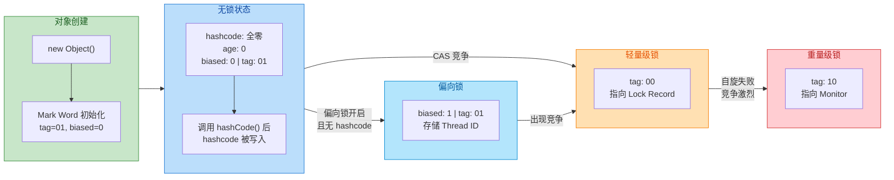

### Identity HashCode 与偏向锁的互斥关系

这是一个极其容易被忽略但又非常重要的知识点。让我们再仔细看一下无锁状态和偏向锁状态的 Mark Word 布局对比：

```java
// 无锁状态 Mark Word:
// [unused:25][hashcode:31][unused:1][age:4][biased:0][tag:01]
//            ^^^^^^^^^^^^
//            31 bits 给了 hashcode

// 偏向锁状态 Mark Word:
// [thread:54][epoch:2][unused:1][age:4][biased:1][tag:01]
//  ^^^^^^^^^^^^^^^^^^
//  54 + 2 = 56 bits 给了 thread ID + epoch
```

看到了吗？无锁状态中，**hashcode 占据了中间 31 个比特位**。而偏向锁需要用这些比特位来存储**线程 ID（54 bits）和 epoch（2 bits）**。这两者在空间上是 **互斥的（mutually exclusive）**。

这意味着：

1. **如果一个对象已经计算了 identity hashcode**（即 `System.identityHashCode()` 或未覆写的 `hashCode()` 已被调用），那么 hashcode 已经被写死在 Mark Word 中。此时如果该对象试图进入偏向锁状态，JVM 会发现 hashcode 的比特位已被占用，**直接跳过偏向锁，升级为轻量级锁**。

2. **如果一个对象正处于偏向锁状态**，此时有代码调用了它的 `identityHashCode()`，JVM 必须 **撤销偏向锁（revoke bias）**，将对象升级到至少轻量级锁状态——因为轻量级锁会将原始 Mark Word 保存到栈帧的 Lock Record 中，那里有足够的空间同时存储 hashcode。

这是 HotSpot 源码中一段非常精妙的设计决策，也是面试中经常被考查的高频点。

```java
// 验证 hashcode 阻止偏向锁的代码示例
public class HashCodeKillsBias {
    public static void main(String[] args) throws Exception {
        // 确保偏向锁延迟已过 (JDK < 15)
        // 可通过 -XX:BiasedLockingStartupDelay=0 来消除延迟
        Thread.sleep(5000);

        Object obj = new Object();

        // 此时如果偏向锁开启, obj 应处于「匿名偏向」状态 (biased=1, threadID=0)
        System.out.println("=== 加锁前 ===");
        System.out.println(ClassLayout.parseInstance(obj).toPrintable());

        // 在加锁之前先调用 hashCode(), 强制写入 identity hashcode
        obj.hashCode();

        // 再次观察: biased 位变为 0, 退回无锁状态
        System.out.println("=== 调用 hashCode() 后 ===");
        System.out.println(ClassLayout.parseInstance(obj).toPrintable());

        // 现在加锁: 由于 hashcode 已写入, 无法偏向, 直接进入轻量级锁
        synchronized (obj) {
            System.out.println("=== synchronized 内部 ===");
            // 此时 tag 应为 00 (轻量级锁), 而非 01 (偏向锁)
            System.out.println(ClassLayout.parseInstance(obj).toPrintable());
        }
    }
}
```

### 无锁状态的本质意义

从更高的视角来看，无锁状态的存在有两层意义：

**第一，它是"零成本"的默认态。** Java 中每一个对象都天然具备成为锁对象的潜力（这是 `synchronized` 可以作用于任意对象的底层原因），但如果一个对象从未被用作锁，JVM 不会为它付出任何同步开销。Mark Word 中的比特位被高效地利用来存储 GC 年龄和哈希码等通用信息，没有浪费一个比特在锁机制上。

**第二，它是锁升级的起点。** 整个锁升级链条是：

> **无锁 → 偏向锁 → 轻量级锁 → 重量级锁**

无锁状态决定了后续路径的走向——是否已经计算了 hashcode、当前 JVM 是否开启了偏向锁、偏向锁延迟是否已过——这些条件都会影响对象在第一次进入 `synchronized` 块时到底走哪条路。在 JDK 15+ 默认关闭偏向锁的环境中，对象从无锁状态出发，第一次加锁时会直接升级为轻量级锁，跳过偏向锁阶段。

### 无锁 ≠ 无同步

需要特别澄清一个容易混淆的概念：这里讨论的「无锁状态」是指**对象头 Mark Word 中 lock tag 的状态**，它描述的是一个特定对象此刻没有被任何 `synchronized` 保护。它 **不等于** 并发编程中常说的「无锁编程（Lock-Free Programming）」。

后者是一种并发算法设计范式，指的是通过 CAS（Compare-And-Swap）等原子操作来实现线程安全，避免使用传统的互斥锁。Java 中 `java.util.concurrent.atomic` 包下的原子类（如 `AtomicInteger`、`AtomicReference`）就是典型的 Lock-Free 实现。两者虽然都叫「无锁」，但语义层面完全不同。

---

**📝 练习题**

以下关于 Java 对象无锁状态下 Mark Word 的描述，**正确的是**：

A. 对象创建后，Mark Word 中的 identity hashcode 字段会立即被填充为一个非零值。


B. 无锁状态的 Mark Word 末尾 3 位为 `001`（即 biased=0, tag=01），如果对象已经调用过 `hashCode()` 方法，则该对象在后续进入 `synchronized` 时将无法使用偏向锁，会直接升级为轻量级锁。


C. Mark Word 中 age 字段占 8 bits，因此 `-XX:MaxTenuringThreshold` 最大可设为 255。


D. 无锁状态与偏向锁状态拥有不同的 lock tag 值，JVM 通过 tag 值来区分两者。


**【答案】** B

**【解析】** 选项 A 错误：identity hashcode 是 **惰性计算（lazily computed）** 的，对象刚创建时该字段全为零，只有在首次调用 `System.identityHashCode()` 或未覆写的 `hashCode()` 时才会被写入。选项 B 正确：无锁状态末尾 3 位确实是 `001`，且一旦 hashcode 被写入 Mark Word，偏向锁所需的 thread ID 比特位已被占用，JVM 会跳过偏向锁直接使用轻量级锁。选项 C 错误：age 字段只有 **4 bits**，最大值为 15，而非 255。选项 D 错误：无锁（biased=0, tag=01）和偏向锁（biased=1, tag=01）共享相同的 lock tag `01`，它们通过 biased flag 位来区分，而非 tag 位。

---

## 偏向锁（Biased Locking）⭐⭐

偏向锁是 JVM 在 JDK 6 中引入的一项重要锁优化技术，其核心设计哲学可以用一句话概括：**"如果一把锁始终只被同一个线程获取，那就别再做任何同步操作了"**。在实际的 Java 应用中，研究者（主要是 Sun/Oracle 的工程师）通过大量统计发现，绝大多数的 `synchronized` 锁在其整个生命周期内，实际上只会被同一个线程反复获取和释放，真正存在多线程竞争的场景反而是少数。偏向锁正是针对这一统计规律而设计的极致优化——当锁"偏向"某个线程后，该线程后续再次进入同步块时，**几乎不需要任何额外的同步开销**，甚至连一次 CAS 操作都不需要执行。

在前面章节中我们已经知道，对象头的 Mark Word 是锁状态的核心载体。偏向锁正是通过巧妙地利用 Mark Word 中的空闲比特位来记录"偏向线程"的身份信息，从而实现了这种近乎零开销的锁获取机制。接下来，我们将从适用场景、Mark Word 的变化细节、获取流程、撤销机制、批量操作以及 JVM 参数调优等多个维度，全面剖析偏向锁的工作原理。

---

### 适用场景（单线程重复获取）

偏向锁的最佳适用场景非常明确：**同一个锁对象始终只被一个线程访问**。这并不意味着系统中只有一个线程在运行，而是说某一把特定的锁，在其被使用的时间窗口内，恰好只有一个线程在反复地 lock/unlock。

这种场景在真实应用中比你想象的要普遍得多。以下是几个典型例子：

**1. 线程封闭的集合操作**

```java
// 虽然 StringBuffer 的每个方法都用了 synchronized
// 但如果它只在一个线程内使用，偏向锁就能大幅消除同步开销
public String buildReport() {
    // sb 是方法局部变量，天然线程封闭
    StringBuffer sb = new StringBuffer();        // 锁对象：sb
    sb.append("Header: ");                       // 第1次获取锁 → 偏向当前线程
    sb.append(getTitle());                       // 第2次获取锁 → 检查线程ID，直接进入
    sb.append("\nBody: ");                       // 第3次获取锁 → 同上，零额外开销
    sb.append(getContent());                     // 第4次获取锁 → 同上
    return sb.toString();                        // 每次都是同一个线程，偏向锁完美命中
}
```

**2. 单线程访问的缓存/容器**

```java
public class UserService {
    // 虽然 Hashtable 所有方法都是 synchronized
    // 但如果只在主线程中初始化和读取，偏向锁就能生效
    private final Hashtable<String, User> cache = new Hashtable<>();

    // 假设只在启动阶段由单线程调用
    public void warmUpCache() {
        for (String id : getAllUserIds()) {
            cache.put(id, loadUser(id));          // 同一线程反复获取同一把锁
        }
    }
}
```

**3. 被 JIT 编译器无法证明可以做锁消除的场景**

当逃逸分析（Escape Analysis）无法确定锁对象一定不会逃逸时，JIT 不敢直接消除锁。但偏向锁仍然可以在运行时动态地"几乎消除"这些锁的开销，作为锁消除的一种退而求其次的补充优化。

> **关键直觉**：偏向锁本质上是一种 **"乐观的延迟策略"**——先假设不会有竞争（这在统计上是对的），等真正出现竞争时再升级，为大多数无竞争场景省下宝贵的 CPU 周期。

---

### Mark Word 变化（存储线程 ID）

要理解偏向锁的工作机制，必须先清楚对象头 Mark Word 在偏向锁状态下的精确位布局。以 **64 位 HotSpot JVM** 为例：

```
┌─────────────────────────────────────────────────────────────────────┐
│                        64-bit Mark Word Layout                      │
├──────────────────────┬────────┬───────┬──────┬──────────┬──────────┤
│       Bit Range      │ 63..56 │ 55..2 │  ..  │   1..1   │   0..0   │
├──────────────────────┼────────┴───────┴──────┴──────────┴──────────┤
│                      │                                              │
│  Unlocked (无锁)     │ unused:25 | hashcode:31 | unused:1 | age:4  │
│   标志位: 0  01      │                                              │
│                      │                                              │
├──────────────────────┼──────────────────────────────────────────────┤
│                      │                                              │
│  Biased (偏向锁)     │ thread:54   | epoch:2    | unused:1 | age:4  │
│   标志位: 1  01      │                                              │
│                      │                                              │
├──────────────────────┼──────────────────────────────────────────────┤
│                      │                                              │
│  Lightweight (轻量级) │ ptr_to_lock_record:62                       │
│   标志位:    00      │                                              │
│                      │                                              │
├──────────────────────┼──────────────────────────────────────────────┤
│                      │                                              │
│  Heavyweight (重量级) │ ptr_to_heavyweight_monitor:62               │
│   标志位:    10      │                                              │
│                      │                                              │
└──────────────────────┴──────────────────────────────────────────────┘

  最低 3 位 = [biased_lock:1 bit][lock:2 bits]
  偏向锁: biased_lock=1, lock=01 → 末尾三位为 "1 01"
  无  锁: biased_lock=0, lock=01 → 末尾三位为 "0 01"
```

让我们逐字段拆解偏向锁状态下的 Mark Word：

| 字段 | 位数 | 说明 |
|------|------|------|
| **Thread ID** | 54 bits | 持有偏向锁的线程 ID（JavaThread 指针）。首次偏向时通过 CAS 写入 |
| **Epoch** | 2 bits | 偏向时间戳，用于批量重偏向机制（后文详述）。取值 0~3 |
| **unused** | 1 bit | 保留位 |
| **Age** | 4 bits | GC 分代年龄，与锁无关但需要保留 |
| **Biased Lock** | 1 bit | 偏向标志位。**1** 表示支持偏向 |
| **Lock** | 2 bits | 锁标志位。偏向锁时为 **01** |

**几个关键的观察点：**

**① 偏向锁与 Identity HashCode 互斥**

你会注意到，在"无锁"状态下 Mark Word 存储了 31 位的 `identity hashcode`，而在"偏向锁"状态下这个位置被 `thread ID` 占据了。这意味着一个极其重要的推论：**一旦对象调用过 `Object.hashCode()`（或 `System.identityHashCode()`），其 identity hashcode 已被计算并写入 Mark Word，那么该对象将永远无法进入偏向锁状态**。因为 Mark Word 中没有足够的空间同时存储 hashcode 和 thread ID。

```java
Object lock = new Object();

// 此时 lock 处于"可偏向"状态 (Biasable, 但 thread ID = 0)
// Mark Word: [0000...0000 | epoch | 0 | age | 1 | 01]

System.identityHashCode(lock);  // 生成 identity hashcode 并写入 Mark Word

// 此时 Mark Word 被改写为"无锁"状态，hashcode 已占据了 thread ID 的位置
// 该对象再也无法被偏向锁标记！进入 synchronized 会直接走轻量级锁
synchronized (lock) {
    // 这里直接是轻量级锁，不会尝试偏向
}
```

> 💡 **面试高频考点**：为什么调用 `hashCode()` 会导致偏向锁失效？正是因为 Mark Word 空间有限，hashcode 和 thread ID 无法共存。注意：如果对象重写了 `hashCode()` 方法（比如 `String`），则不受影响，因为重写后的 hashcode 不需要存储在 Mark Word 中。

**② Epoch 字段的作用**

Epoch 可以理解为偏向锁的"版本号"或"代"，它属于**类级别**的概念——每个 `Klass`（HotSpot 内部的类元数据结构）都维护了一个 `prototype_header`，其中包含当前类的 epoch 值。当发生批量重偏向时，类的 epoch 会自增，而旧对象头中的 epoch 就变成了"过期"状态，从而允许新线程直接重偏向，无需走撤销流程。这个机制在后文"批量重偏向"部分会详细展开。

**③ 用 JOL 亲眼观察 Mark Word**

我们可以借助 OpenJDK 的 JOL（Java Object Layout）工具来验证上述理论：

```java
// 引入 JOL 依赖: org.openjdk.jol:jol-core:0.16
import org.openjdk.jol.info.ClassLayout;

public class BiasedLockDemo {
    public static void main(String[] args) throws InterruptedException {
        // 等待偏向锁延迟结束（默认4秒）
        Thread.sleep(5000);

        Object lock = new Object();

        // ① 输出初始状态（可偏向,但尚未偏向任何线程, thread ID = 0）
        System.out.println("=== 初始状态 (Biasable, Anonymous Biased) ===");
        System.out.println(ClassLayout.parseInstance(lock).toPrintable());

        synchronized (lock) {
            // ② 首次进入同步块，CAS 写入当前线程 ID → 偏向锁生效
            System.out.println("=== 偏向锁已生效 (Biased to current thread) ===");
            System.out.println(ClassLayout.parseInstance(lock).toPrintable());
        }

        // ③ 退出同步块后，偏向状态不变（thread ID 仍在 Mark Word 中）
        System.out.println("=== 退出同步块后 (Still biased) ===");
        System.out.println(ClassLayout.parseInstance(lock).toPrintable());
    }
}
```

上面程序的输出中，你能清晰地看到 Mark Word 最后 3 位从 `101`（可偏向）变为写入了 thread ID 的 `101`（已偏向），退出同步块后依然保持偏向状态——**偏向锁退出时不会清除 thread ID**，这正是它高效的秘密所在。

---

### 偏向锁获取流程

偏向锁的获取过程是一个精心设计的多层判断链，每一步都在尽最大可能避免不必要的开销。让我们用一张完整的流程图来描绘这个过程，然后逐步详解。

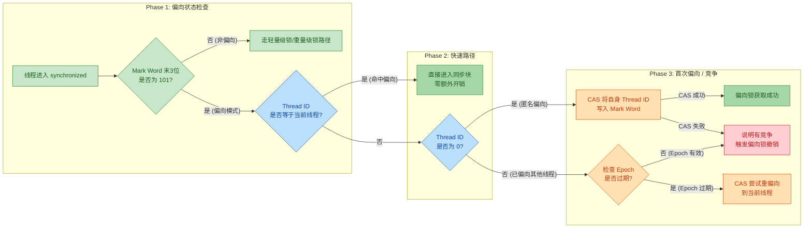

现在让我们逐步拆解每一个判断节点：

**Step 1：检查是否处于偏向模式**

线程进入 `synchronized` 代码块时，JVM 首先读取锁对象的 Mark Word，检查最后 3 位是否为 `101`（即 biased_lock=1, lock=01）。如果不是，说明对象不在偏向模式下（可能是无锁、轻量级锁或重量级锁），直接走其他锁路径。

**Step 2：检查 Thread ID 是否等于当前线程**

如果确认处于偏向模式，JVM 接着比较 Mark Word 中存储的 54 位 Thread ID 与当前线程的 ID。如果 **相等**，说明锁已经偏向了当前线程，此时什么都不需要做——**不需要 CAS，不需要修改任何内存**，直接进入同步代码块。这就是偏向锁的"快速路径"（fast path），它的代价仅仅是一次内存读取和一次比较操作，几乎可以忽略不计。

```java
// 伪代码：偏向锁快速路径
// 这就是为什么同一线程反复进入同步块时几乎零开销
if (markWord.threadId == currentThread.id) {
    // 直接进入同步块，不做任何同步操作！
    // 甚至不需要更新 Mark Word
    enterSynchronizedBlock();
}
```

**Step 3a：Thread ID 为 0（Anonymous Biased / 匿名偏向）**

如果 Thread ID 字段全为 0，说明这个对象是"可偏向的"但还没有偏向任何线程（anonymous biased state）。这通常是对象刚被创建时的状态。此时，当前线程通过 **一次 CAS 操作** 尝试将自己的 Thread ID 写入 Mark Word。如果 CAS 成功，偏向锁获取成功；如果 CAS 失败（说明有另一个线程同时在尝试偏向），则触发偏向锁撤销。

**Step 3b：Thread ID 不为 0 且不等于当前线程（已偏向其他线程）**

这是最复杂的情况。Mark Word 中记录了另一个线程的 ID，说明锁之前偏向了别的线程。此时 JVM 还会检查 Epoch 是否过期（与类级别的 epoch 对比），如果过期了，可以直接 CAS 尝试重偏向（rebias）到当前线程；如果 epoch 没有过期，则需要走偏向锁撤销流程。

**一个重要的细节：偏向锁的重入**

偏向锁同样支持重入（reentrant），但它的重入计数方式与轻量级锁不同。偏向锁不使用显式计数器，而是通过在当前线程栈中创建多个 **Lock Record** 来隐式记录重入深度。每进入一层 `synchronized`，就在栈中压入一个 Lock Record（其 `Displaced Mark Word` 字段设为 `null`，表示这是偏向锁的重入）；每退出一层，就弹出一个 Lock Record。

```java
// 偏向锁重入示意
synchronized (lock) {           // 第1次进入：检查 Thread ID 命中 → 压入 LR1 (DMW=null)
    synchronized (lock) {       // 第2次进入：检查 Thread ID 命中 → 压入 LR2 (DMW=null)  
        synchronized (lock) {   // 第3次进入：检查 Thread ID 命中 → 压入 LR3 (DMW=null)
            // 执行业务逻辑
        }                       // 退出：弹出 LR3
    }                           // 退出：弹出 LR2
}                               // 退出：弹出 LR1，栈中无更多 LR → 全部退出
// 注意：退出后 Mark Word 中的 Thread ID 仍然保留！
```

---

### 偏向锁撤销（有竞争时）

偏向锁撤销（Biased Lock Revocation）是偏向锁机制中最"昂贵"的部分，也是最需要深入理解的环节。当第二个线程尝试获取一个已经偏向了其他线程的锁时，偏向锁的美好假设被打破，JVM 必须将锁从偏向状态"撤销"出来，升级为轻量级锁或重量级锁。

**撤销的核心难题：安全点（Safepoint）**

偏向锁撤销不是一个可以随时随地执行的操作。由于撤销过程需要 **遍历偏向线程的栈帧** 来查找与锁对象关联的 Lock Record，而栈帧的结构在线程执行过程中随时可能变化，因此 JVM 必须等到原偏向线程到达一个 **安全点（safepoint）** 后才能执行撤销操作。在安全点上，线程的执行被暂停，栈帧结构稳定，JVM 才能安全地检查和修改相关数据。

> ⚠️ **这就是偏向锁撤销开销大的根本原因**：它需要触发一次 Stop-The-World（STW）式的安全点操作（虽然现代 JVM 可能只暂停特定线程而非全部），这在高竞争场景下会成为严重的性能瓶颈。

**撤销流程详解：**

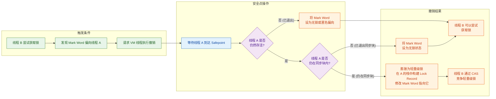

让我们用伪代码更精确地描述这个过程：

```java
// 伪代码：偏向锁撤销过程（由 VM Thread 在安全点执行）
void revokeBias(Object lockObj, Thread requestingThread) {
    
    // 1. 获取 Mark Word 中记录的偏向线程
    Thread biasedThread = lockObj.markWord.getThreadId();
    
    // 2. 检查偏向线程是否仍然存活
    if (!biasedThread.isAlive()) {
        // 线程已死，直接将对象设为"匿名偏向"或"无锁"
        lockObj.markWord.setAnonymousBiased();   // 重置 Thread ID 为 0
        return;
    }
    
    // 3. 线程存活，遍历其栈帧，查找关联的 Lock Record
    boolean stillInSyncBlock = false;
    for (StackFrame frame : biasedThread.getStackFrames()) {
        for (LockRecord lr : frame.getLockRecords()) {
            if (lr.getObject() == lockObj) {
                stillInSyncBlock = true;        // 线程 A 仍在同步块内
                break;
            }
        }
    }
    
    // 4. 根据线程 A 是否仍在同步块内，做出不同处理
    if (stillInSyncBlock) {
        // 线程 A 仍持有锁 → 膨胀为轻量级锁
        // 在线程 A 的栈帧中正式构建 Lock Record
        // 将 Mark Word 的原始值（Displaced Mark Word）保存到 Lock Record
        // 将 Mark Word 修改为指向 Lock Record 的指针，末尾标志位改为 00
        inflatToLightweightLock(lockObj, biasedThread);
    } else {
        // 线程 A 已退出同步块 → 恢复为无锁状态
        lockObj.markWord.setUnlocked();         // 标志位改为 0 01
    }
    
    // 5. 撤销完成，requestingThread 可以走正常的锁获取流程
}
```

**撤销后的两种结局：**

| 场景 | 原偏向线程状态 | 撤销结果 | 后续 |
|------|---------------|----------|------|
| 原线程已死亡 | 线程不存在 | Mark Word → 匿名偏向/无锁 | 新线程可直接 CAS 偏向或获取轻量级锁 |
| 原线程已退出同步块 | 活着但不在临界区 | Mark Word → 无锁 | 新线程获取轻量级锁 |
| 原线程仍在同步块中 | 活着且持有锁 | Mark Word → 轻量级锁 | 新线程 CAS 竞争轻量级锁（可能自旋或膨胀） |

---

### 批量重偏向 / 批量撤销

单次偏向锁撤销需要一次安全点操作，代价已经不低。但如果某个类的大量实例都在经历偏向锁撤销，逐一撤销的累积成本将非常惊人。为此，HotSpot JVM 引入了两种高级的批量优化机制：**批量重偏向（Bulk Rebias）** 和 **批量撤销（Bulk Revocation）**。

JVM 以**类（Klass）为粒度**维护了两个关键的撤销计数器：

```
┌──────────────────────────────────────────────────────────────┐
│                     Klass 元数据                              │
├──────────────────────────────────────────────────────────────┤
│  revocation_count :  该类实例的偏向锁撤销累计次数              │
│  prototype_header :  新对象的 Mark Word 模板 (含当前 epoch)    │
│  epoch            :  当前类的偏向纪元 (0, 1, 2, 3 循环)       │
└──────────────────────────────────────────────────────────────┘
```

**阈值机制：**

| 条件 | 阈值 | 触发操作 | JVM 参数 |
|------|------|---------|----------|
| 类的撤销次数达到 **20** | 默认 20 | **批量重偏向** | `-XX:BiasedLockingBulkRebiasThreshold=20` |
| 类的撤销次数达到 **40** | 默认 40 | **批量撤销** | `-XX:BiasedLockingBulkRevokeThreshold=40` |

**批量重偏向（Bulk Rebias）—— 当撤销次数达到 20 次时触发**

JVM 判断：这个类的锁对象虽然在发生竞争，但可能只是**偏向的目标线程发生了切换**（例如，线程池中一批任务先由线程 A 执行，后来由线程 B 接手）。此时，与其逐个撤销每个对象的偏向锁，不如做一次"批量重偏向"：

1. **类的 epoch 自增**：将类元数据中的 epoch 值加 1（从 e 变为 e+1）。
2. **更新 prototype_header**：新创建的对象将携带新的 epoch 值。
3. **扫描所有活跃线程的栈**：对于正在被线程持有的该类实例，将其 Mark Word 中的 epoch 更新为新值。
4. **旧对象自然"过期"**：那些不在任何线程栈中的旧对象，其 Mark Word 中的 epoch 仍然是旧值。当下次有线程尝试获取这些对象的锁时，发现 epoch 不匹配，就可以直接 CAS 重偏向，而不需要走昂贵的撤销流程。

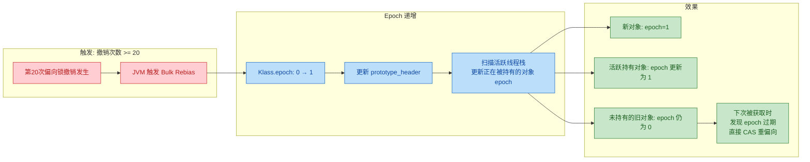

**用一个具体例子来说明 Epoch 的作用：**

```java
// 假设有一个对象池，池中对象经历"线程切换"场景
class ConnectionPool {
    // 50 个连接对象，每个都用 synchronized 保护
    private final Connection[] pool = new Connection[50];

    // 阶段1：线程 A 顺序使用所有连接 → 全部偏向线程 A (epoch=0)
    void phase1ByThreadA() {
        for (Connection conn : pool) {
            synchronized (conn) {                   // 每个 conn 偏向线程 A, epoch=0
                conn.execute("SELECT ...");
            }
        }
    }

    // 阶段2：线程 B 开始使用这些连接 → 触发偏向锁撤销
    void phase2ByThreadB() {
        for (int i = 0; i < pool.length; i++) {
            synchronized (pool[i]) {                // 每次都要撤销线程 A 的偏向
                pool[i].execute("INSERT ...");
                // 当第20个连接的偏向锁被撤销时 → 触发 Bulk Rebias
                // 此后：Klass(Connection).epoch 变为 1
                // 第21~50个连接的 epoch 仍为 0（过期了）
                // 线程 B 获取第21~50个连接时，发现 epoch 过期
                // 直接 CAS 重偏向到自己，不再走撤销！
            }
        }
    }
}
```

**批量撤销（Bulk Revocation）—— 当撤销次数达到 40 次时触发**

如果在批量重偏向之后，撤销仍然频繁发生（说明这个类的对象确实存在真正的多线程竞争），当累计撤销次数达到 40 次时，JVM 做出一个激进的决定：**彻底关闭该类的偏向锁功能**。

1. 将类的 `prototype_header` 中的偏向标志位设为 0，这意味着 **该类新创建的对象将不再支持偏向锁**。
2. 对于已存在的该类实例，虽然不会立刻全部撤销，但后续获取锁时会发现偏向标志与类元数据不匹配，自动走轻量级锁路径。

> 批量撤销是一个 **不可逆** 的操作（在当前 JVM 生命周期内）。一旦某个类被批量撤销，该类的所有对象从此永远走轻量级锁/重量级锁路径。

**两种机制的对比总结：**

| 维度 | 批量重偏向 (Bulk Rebias) | 批量撤销 (Bulk Revocation) |
|------|------------------------|---------------------------|
| 触发条件 | 类撤销计数 ≥ 20 | 类撤销计数 ≥ 40 |
| JVM 的判断 | "可能只是偏向目标变了" | "这个类确实有真竞争" |
| 操作 | Epoch +1，允许后续重偏向 | 关闭该类的偏向锁 |
| 可逆性 | 可逆（Epoch 循环使用） | 不可逆（永久关闭偏向） |
| 适用场景 | 生产者-消费者、线程池任务交接 | HashMap 等多线程共享的热点数据结构 |

---

### 偏向锁延迟（-XX:BiasedLockingStartupDelay）

HotSpot JVM 有一个容易被忽视但意义重大的行为：**偏向锁在 JVM 启动后并不会立即生效，而是会延迟一段时间才开启**。这个延迟时间由 JVM 参数 `-XX:BiasedLockingStartupDelay` 控制，**默认值为 4000 毫秒（即 4 秒）**。

**为什么需要延迟？**

JVM 启动阶段是一个非常特殊的时期。在这段时间内，JVM 自身的引导代码（bootstrap）会进行大量的类加载、JIT 编译准备、内部数据结构初始化等操作。这些操作涉及很多内部的同步锁，而且这些锁 **天然就会被多个内部线程竞争**（比如编译线程、GC 线程、主线程等）。

如果启动阶段就开启偏向锁，会发生什么？

1. 大量 JVM 内部对象被偏向到某个线程。
2. 紧接着就被其他线程竞争，触发大量偏向锁撤销。
3. 每次撤销都需要安全点操作。
4. **结果：不仅没有优化效果，反而因为撤销的开销拖慢了 JVM 启动速度。**

延迟 4 秒的策略让 JVM 在启动的"混乱期"直接使用轻量级锁，等到应用代码开始执行、系统趋于稳定后再开启偏向锁，从而避免了无谓的撤销开销。

**实践中的影响和调优：**

```bash
# 查看当前偏向锁延迟设置
java -XX:+PrintFlagsFinal -version | grep BiasedLockingStartupDelay

# 将延迟设为 0（立即开启偏向锁，常用于测试/验证）
java -XX:BiasedLockingStartupDelay=0 MyApp

# 完全关闭偏向锁（与 JDK 15+ 默认行为一致）
java -XX:-UseBiasedLocking MyApp

# 开启偏向锁相关的调试日志
java -XX:+TraceBiasedLocking MyApp
```

在编写测试代码验证偏向锁行为时，这个延迟是一个常见的"坑"：

```java
public class BiasedLockTest {
    public static void main(String[] args) throws InterruptedException {
        // ❌ 错误：不等待就创建对象，此时偏向锁可能还没开启
        // Object lock = new Object(); // 在 JVM 启动后 4 秒内创建的对象不可偏向！

        // ✅ 正确：等待偏向锁延迟结束
        Thread.sleep(5000);  // 等待 5 秒，确保偏向锁已开启

        Object lock = new Object();  // 现在创建的对象是可偏向的
        
        // 或者，通过 JVM 参数设置 -XX:BiasedLockingStartupDelay=0
        // 这样就不需要 sleep 了
    }
}
```

> 💡 **注意**：延迟只影响偏向锁的"开启时间点"。一旦过了延迟期，此后创建的所有对象（除非其类被批量撤销过）都是默认可偏向的。而在延迟期内创建的对象，其 Mark Word 不会设置偏向标志位，即便后来偏向锁全局开启了，这些已创建的对象也不会回头变成可偏向状态。

---

### JDK 15 后默认关闭

这是偏向锁历史上一个具有里程碑意义的转折点。

**2020 年 9 月，JDK 15 通过 [JEP 374: Disable and Deprecate Biased Locking](https://openjdk.org/jeps/374) 正式将偏向锁设为默认关闭，并标记为废弃（deprecated）**。这一决定的背景和原因值得深入分析。

**JEP 374 的核心论点：**

**1. 偏向锁的维护成本过高（Maintenance Burden）**

偏向锁的实现深深地嵌入了 HotSpot JVM 的多个核心子系统中，包括对象创建、安全点机制、栈帧遍历、锁膨胀、GC（尤其是与 GC 的交互非常复杂，因为 GC 在移动对象时可能需要撤销偏向锁）。JEP 374 中明确指出：

> *"The performance gains seen in the past are far less evident today."*（过去观察到的性能增益在今天已经远不那么明显了。）

**2. 现代应用的锁竞争模式已经变化**

JDK 6 时代，Java 应用大量使用 `Hashtable`、`Vector`、`StringBuffer` 等同步容器，且线程模型相对简单，偏向锁的"单线程反复获取"假设经常成立。但到了 2020 年代：

- 开发者更多使用 `ConcurrentHashMap`、`StringBuilder` 等无锁或非同步替代品。
- 微服务架构下，线程池普遍使用，锁对象更频繁地在不同线程间交接。
- 偏向锁的撤销开销在高并发场景下反而成了拖累。

**3. 安全点的代价与新特性冲突**

偏向锁撤销对安全点的依赖，与 JVM 团队追求"低延迟、少停顿"的目标产生了根本矛盾。特别是 ZGC、Shenandoah 等新一代低延迟 GC 的出现，它们极力减少 STW 停顿时间，而偏向锁的撤销机制却在引入额外的安全点停顿，这是不可接受的。

**版本线索与迁移指引：**

| JDK 版本 | 偏向锁状态 | 说明 |
|----------|-----------|------|
| JDK 6 ~ JDK 14 | **默认开启** | `-XX:+UseBiasedLocking` 默认生效 |
| JDK 15 | **默认关闭，标记废弃** | 可通过 `-XX:+UseBiasedLocking` 手动开启 |
| JDK 18+ | **代码移除进行中** | 部分 JDK 发行版已完全移除偏向锁代码 |

```bash
# JDK 15+ 中手动开启偏向锁（不推荐，仅用于兼容性测试）
java -XX:+UseBiasedLocking MyApp
# 会输出警告：
# Warning: Option UseBiasedLocking was deprecated in version 15.0

# JDK 15+ 的默认行为等价于：
java -XX:-UseBiasedLocking MyApp
```

**没有偏向锁后，锁升级路径变成了什么？**

在 JDK 15+ 的默认配置下，`synchronized` 的锁升级路径简化为：

```
无锁 (Unlocked) ──→ 轻量级锁 (Lightweight) ──→ 重量级锁 (Heavyweight)
```

跳过了偏向锁阶段。对象在创建时直接处于标准的无锁状态（Mark Word 存储 hashcode，末尾标志位 `0 01`），进入 `synchronized` 时直接尝试轻量级锁的 CAS 操作。

**对开发者的实际影响：**

对于绝大多数应用来说，关闭偏向锁带来的性能差异是 **微乎其微** 的，甚至可能因为避免了撤销开销而性能更好。但在以下极端场景中，你可能需要关注：

```java
// 这种模式在 JDK 15+ 中会有微小的额外开销
// 因为每次进入同步块都需要 CAS（轻量级锁），而非简单的 Thread ID 比较（偏向锁）
for (int i = 0; i < 10_000_000; i++) {
    synchronized (singleThreadedLock) {  // 确实只有一个线程
        // 极短的操作
    }
}
// 但在现代硬件上，CAS 操作通常只需要几纳秒
// 10,000,000 次额外 CAS ≈ 几十毫秒，几乎不会对业务产生影响
```

> **结论**：作为 Java 开发者，理解偏向锁的原理仍然重要（面试高频考点、理解 JVM 设计思想），但在新项目中无需为偏向锁做任何特殊配置。偏向锁正在成为 Java 并发历史中的一个精彩但已翻篇的章节。

---

**📝 练习题**

**题目 1：关于偏向锁的 Mark Word，以下说法正确的是？**

A. 偏向锁状态下，Mark Word 同时存储了 Thread ID 和 identity hashcode


B. 对象调用 `System.identityHashCode()` 后仍然可以进入偏向锁状态


C. 偏向锁的 Mark Word 中包含一个 2 位的 Epoch 字段，用于支持批量重偏向机制


D. 偏向锁退出同步块时，会将 Mark Word 中的 Thread ID 清零


**【答案】** C

**【解析】** 

- **A 错误**：偏向锁状态下，Thread ID 占据了原本存储 identity hashcode 的位置，两者无法共存。64 位 JVM 下，偏向锁的 Mark Word 布局为：`Thread ID (54 bits) | Epoch (2 bits) | unused (1 bit) | age (4 bits) | 1 | 01`，没有为 hashcode 留空间。
- **B 错误**：这是一个重要的规则——一旦 `identityHashCode()` 被调用，hashcode 写入 Mark Word，对象将永远无法进入偏向锁状态。因为 hashcode 和 Thread ID 在 Mark Word 中是互斥的。
- **C 正确**：Epoch 字段正是为批量重偏向而设计的。当类的 epoch 自增后，旧对象中的 epoch 值变成"过期"，新线程可以直接 CAS 重偏向，避免走昂贵的撤销流程。
- **D 错误**：偏向锁的一大特性就是退出同步块时 **不会** 清除 Thread ID。这使得同一线程下次再进入时，只需做一次简单的 Thread ID 比较即可，无需任何 CAS 操作。

---

**题目 2：JDK 15 通过 JEP 374 默认关闭了偏向锁，以下哪一项不是其主要原因？**

A. 偏向锁的撤销需要在安全点（Safepoint）执行，与低延迟 GC（如 ZGC）的目标冲突


B. 现代 Java 应用更多使用 `ConcurrentHashMap` 等并发容器，减少了偏向锁的收益场景


C. 偏向锁的实现代码侵入了 HotSpot 多个子系统，维护成本过高


D. 偏向锁在单线程反复获取锁的场景下性能不如轻量级锁


**【答案】** D

**【解析】**

- **A 是主要原因**：偏向锁撤销对 safepoint 的依赖会引入额外的 STW 停顿，这与 ZGC、Shenandoah 等追求亚毫秒级停顿的新 GC 在设计理念上存在冲突。
- **B 是主要原因**：开发实践的演变使得偏向锁的适用场景大幅减少。`StringBuilder` 替代 `StringBuffer`，`ConcurrentHashMap` 替代 `Hashtable`，`ArrayList` 替代 `Vector`——这些变化让偏向锁的收益越来越小。
- **C 是主要原因**：JEP 374 原文明确指出偏向锁代码与对象分配、GC、安全点、锁膨胀等多个关键路径深度耦合，给 HotSpot 的维护和演进带来了沉重负担。
- **D 是错误的说法**：在单线程反复获取锁的场景下，偏向锁的性能实际上 **优于** 轻量级锁。偏向锁只需一次 Thread ID 比较（无原子操作），而轻量级锁每次进入/退出同步块都需要 CAS 操作。偏向锁被关闭不是因为它在最佳场景下性能不好，而是因为其最佳场景在现代应用中越来越少，同时撤销和维护的代价太高。

---

## 轻量级锁 ⭐⭐

当偏向锁因竞争被撤销，或者偏向锁未开启（如 JDK 15+ 的默认配置），`synchronized` 便会进入**轻量级锁（Lightweight Locking）** 阶段。轻量级锁的核心设计哲学是：**用一次 CAS 操作替代操作系统级别的互斥量（Mutex）**，从而在"存在少量竞争但冲突窗口极短"的场景下，大幅避免线程陷入内核态阻塞的高昂代价。

从宏观视角来看，偏向锁解决的是"**完全无竞争**"的问题——只有一个线程反复进入同步块；而轻量级锁解决的是"**有竞争但极其轻微**"的问题——多个线程交替使用锁，它们的临界区执行时间不重叠。只有当 CAS 竞争真正失败、自旋也无法等到锁释放时，锁才会进一步膨胀为重量级锁。

---

### 适用场景（交替执行、无竞争）

轻量级锁最典型、最理想的运行场景可以用一个词来概括：**"交替执行（Alternating Execution）"**。具体来说，就是多个线程确实都会访问同一个同步块，但它们**在时间维度上几乎不重叠**——线程 A 执行完临界区退出后，线程 B 才来获取锁，二者像"轮流接力"一样工作。

```java
// 典型适用场景：两个线程交替访问同步块
public class AlternatingAccess {

    // 共享锁对象
    private static final Object lock = new Object();

    // 共享计数器
    private static int counter = 0;

    public static void main(String[] args) throws InterruptedException {
        // 线程 A：执行一批操作后 sleep，让出执行权
        Thread threadA = new Thread(() -> {
            for (int i = 0; i < 1000; i++) {
                synchronized (lock) {        // 获取轻量级锁
                    counter++;               // 临界区非常短
                }                            // 立即释放
                // 模拟其他非同步工作，给线程 B 足够的窗口
            }
        }, "Thread-A");

        // 线程 B：与线程 A 交替执行，很少真正"撞上"
        Thread threadB = new Thread(() -> {
            for (int i = 0; i < 1000; i++) {
                synchronized (lock) {        // 大多数时候锁已被 A 释放
                    counter++;               // 直接 CAS 成功，无需阻塞
                }
            }
        }, "Thread-B");

        threadA.start();
        threadB.start();
        threadA.join();
        threadB.join();

        System.out.println("Final counter: " + counter); // 2000
    }
}
```

我们可以将偏向锁、轻量级锁、重量级锁的"适用光谱"做一个直观对比：

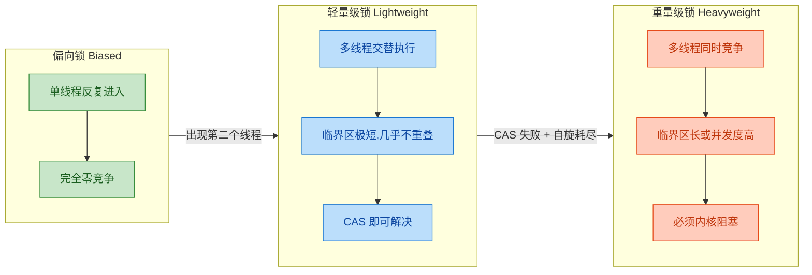

关键判断标准：**如果两个线程持有锁的时间窗口不重叠，轻量级锁就足够了。** 只要 CAS 能一次成功，就不会有任何额外的性能开销——不需要阻塞、不需要唤醒、不需要切换到内核态。这使得轻量级锁在"线程数不多、临界区短小"的典型 Java 应用中，成为实际最常命中的锁状态。

---

### Lock Record（栈帧中）

轻量级锁的整个机制围绕一个关键数据结构展开——**Lock Record（锁记录）**。它并不是一个独立的堆内存对象，而是**直接分配在当前线程的栈帧（Stack Frame）中**的一块空间。

当线程即将进入 `synchronized` 同步块时，JVM 会在**当前方法的栈帧里**创建一个 Lock Record，其内部包含两个核心字段：

| 字段 | 名称 | 作用 |
|------|------|------|
| `Displaced Mark Word` | 置换标记字 | 保存锁对象**原始的 Mark Word** 的拷贝（备份） |
| `owner` | 对象指针 | 指向当前被锁定的对象（即 `synchronized(obj)` 中的 `obj`） |

为什么要把 Mark Word 备份一份？因为轻量级加锁时，对象头的 Mark Word 会被**替换**为指向 Lock Record 的指针。如果不先备份原始内容（hashCode、GC 分代年龄等），这些信息就会丢失。解锁时，JVM 需要将这份备份**恢复**回对象头，让对象头回到无锁状态。

```text
  线程栈 (Thread Stack)                          Java 堆 (Heap)
  ┌─────────────────────────┐                    ┌─────────────────────────────┐
  │   当前栈帧 (Stack Frame) │                    │       锁对象 (Lock Object)   │
  │  ┌─────────────────────┐│                    │  ┌────────────────────────┐ │
  │  │    Lock Record       ││    ◄──────────────│──│ Mark Word (指针)       │ │
  │  │  ┌────────────────┐ ││                    │  │  [ptr | 00]            │ │
  │  │  │ Displaced MW   │ ││  ──备份原始MW──►   │  ├────────────────────────┤ │
  │  │  │ (原始Mark Word)│ ││                    │  │ Klass Pointer          │ │
  │  │  ├────────────────┤ ││                    │  ├────────────────────────┤ │
  │  │  │ owner ─────────┼─┼┼────────────────►   │  │ Instance Data          │ │
  │  │  └────────────────┘ ││                    │  └────────────────────────┘ │
  │  └─────────────────────┘│                    └─────────────────────────────┘
  │   ...其他局部变量...      │
  └─────────────────────────┘
```

这里有几个值得深入理解的细节：

**1. Lock Record 在栈上分配的优势**

栈内存是线程私有的，分配和回收几乎无成本（只需移动栈指针）。相比重量级锁需要在堆上创建/关联一个 `ObjectMonitor` 对象，轻量级锁的 Lock Record 开销极小。同时，由于线程私有，Lock Record 的创建本身也**不需要任何同步操作**。

**2. 锁重入时的处理**

如果同一个线程对同一个对象执行了嵌套的 `synchronized`（即锁重入），JVM 会在栈帧中**再压入一个 Lock Record**，但这次的 `Displaced Mark Word` 字段**设为 null**。JVM 通过栈中 Lock Record 的数量来记录重入次数，解锁时逐一弹出，直到遇到 `Displaced Mark Word` 非 null 的那个最初的 Lock Record，才真正执行 CAS 归还 Mark Word。

```java
// 锁重入示例：同一个线程多次进入同一个锁
public class LockReentrantDemo {

    private static final Object lock = new Object();

    public static void main(String[] args) {
        // 第一次获取锁 —— 创建 Lock Record #1，Displaced MW = 原始 Mark Word
        synchronized (lock) {
            System.out.println("第一层同步块");

            // 第二次获取同一把锁 —— 创建 Lock Record #2，Displaced MW = null
            synchronized (lock) {
                System.out.println("第二层同步块（重入）");

                // 第三次获取同一把锁 —— 创建 Lock Record #3，Displaced MW = null
                synchronized (lock) {
                    System.out.println("第三层同步块（再次重入）");
                }
                // 退出第三层：弹出 Lock Record #3（Displaced MW 为 null，无需 CAS）
            }
            // 退出第二层：弹出 Lock Record #2（Displaced MW 为 null，无需 CAS）
        }
        // 退出第一层：弹出 Lock Record #1（Displaced MW 非 null，执行 CAS 恢复 Mark Word）
    }
}
```

对应的栈帧内存变化如下：

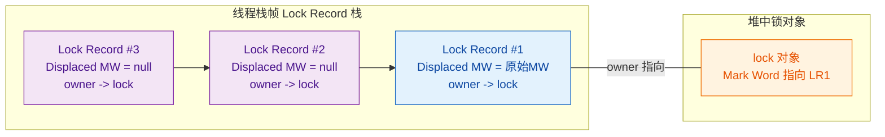

这种**用栈深度记录重入次数**的设计非常精巧——它不需要额外的计数器字段，完全利用了栈的天然 LIFO（后进先出）特性。

---

### Mark Word 变化（指向 Lock Record）

理解轻量级锁，**最核心**的就是理解 Mark Word 在加锁前后的变化。在 64 位 HotSpot JVM 中，对象头的 Mark Word 共 64 位，其末尾 2 位作为**锁标志位（Lock Flag）**，决定当前对象处于哪种锁状态：

| 锁状态 | 标志位 (低2位) | Mark Word 内容 |
|--------|:---:|----------------|
| 无锁 (Normal) | `01` | `hashCode(31) + age(4) + biased_lock:0(1) + 01` |
| 偏向锁 (Biased) | `01` | `threadID(54) + epoch(2) + age(4) + biased_lock:1(1) + 01` |
| **轻量级锁 (Lightweight)** | **`00`** | **`ptr_to_lock_record(62) + 00`** |
| 重量级锁 (Heavyweight) | `10` | `ptr_to_monitor(62) + 10` |
| GC 标记 | `11` | GC 相关信息 |

当轻量级加锁成功后，Mark Word 的**全部 64 位**（除了末尾 2 位标志位变为 `00`）都被替换为**指向线程栈中 Lock Record 的指针**。原来存储的 hashCode、GC 分代年龄等信息，已经被"转移"到了 Lock Record 的 `Displaced Mark Word` 字段中。

下图展示了从无锁到轻量级锁的 Mark Word 变迁全过程：

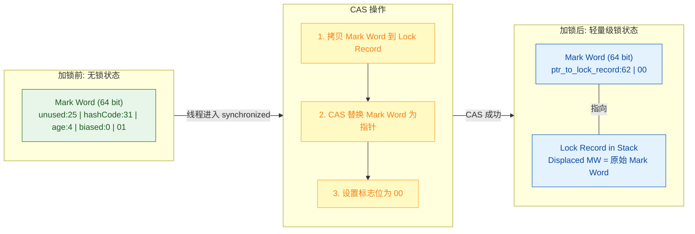

这里需要特别强调一个精妙的设计：**Mark Word 与 Lock Record 之间形成了双向关联**。Mark Word 中存储了指向 Lock Record 的指针（正向），而 Lock Record 的 `owner` 字段指向锁对象（反向），`Displaced Mark Word` 字段保存了原始的 Mark Word（用于恢复）。这种双向关联使得：

- **加锁验证**：JVM 可以通过对象的 Mark Word 快速判断"谁持有这把锁"——检查指针是否指向当前线程栈的范围即可。
- **解锁恢复**：JVM 通过 Lock Record 中备份的 Displaced Mark Word，将对象头恢复为无锁状态。

---

### CAS 获取锁

轻量级锁的获取过程，**本质上就是一次 CAS（Compare-And-Swap）操作**。整个流程可以用以下步骤精确描述：

**Step 1：分配 Lock Record**
当线程执行到 `monitorenter` 字节码指令时，JVM 在当前线程的栈帧中分配一块 Lock Record 空间。

**Step 2：拷贝 Mark Word**
将锁对象当前的 Mark Word 复制到 Lock Record 的 `Displaced Mark Word` 字段中。HotSpot 源码中将这份拷贝称为 **"Displaced Header"**。

**Step 3：CAS 替换**
使用 CAS 操作尝试将锁对象的 Mark Word 更新为指向 Lock Record 的指针。CAS 的三个操作数是：
- **内存地址**：锁对象的 Mark Word 所在地址
- **预期旧值（Expected）**：Lock Record 中备份的那个 Displaced Mark Word
- **新值（New）**：指向当前 Lock Record 的指针（末尾标志位为 `00`）

**Step 4：判断结果**
- **CAS 成功**：当前线程成功获取轻量级锁。对象 Mark Word 的锁标志位变为 `00`，指向当前 Lock Record。
- **CAS 失败**：说明有其他线程已经抢先获取了该锁（Mark Word 已被修改），进入**自旋等待**或**锁膨胀**流程。

下面用伪代码精确还原 HotSpot 中的轻量级加锁逻辑：

```java
// ========== 轻量级锁获取过程（伪代码，模拟 HotSpot 实现） ==========

void lightweight_lock_acquire(Object lockObj) {

    // Step 1: 在当前线程栈帧中分配 Lock Record
    LockRecord lockRecord = allocateLockRecordOnStack();   // 栈上分配，零额外开销

    // Step 2: 将锁对象当前的 Mark Word 拷贝到 Lock Record 中
    MarkWord currentMW = lockObj.markWord();               // 读取对象头
    lockRecord.displacedMarkWord = currentMW;              // 备份到 Displaced Header
    lockRecord.owner = lockObj;                            // 记录锁对象的引用

    // Step 3: 尝试 CAS 替换对象头的 Mark Word
    // 预期值 = 原始 Mark Word（无锁状态，标志位 01）
    // 新值   = 指向 lockRecord 的指针（标志位 00）
    boolean success = CAS(
        lockObj.markWordAddress(),                         // 内存地址
        currentMW,                                         // 预期旧值
        pointerTo(lockRecord) | LIGHTWEIGHT_LOCK_PATTERN   // 新值：指针 + 00标志
    );

    // Step 4: 判断 CAS 结果
    if (success) {
        // CAS 成功 —— 当前线程获取到轻量级锁
        // 对象头 Mark Word 已变为: [ptr_to_lockRecord | 00]
        return;                                            // 进入临界区执行同步代码
    }

    // CAS 失败 —— 检查是否是锁重入
    if (lockObj.markWord().pointsTo(currentThread.stackRange())) {
        // Mark Word 指向的是当前线程的栈空间 —— 锁重入
        lockRecord.displacedMarkWord = null;               // 重入标记：置为 null
        return;                                            // 重入成功
    }

    // 既不是首次获取成功，也不是重入 —— 存在真正的竞争
    // 进入自旋等待，或膨胀为重量级锁
    spinOrInflate(lockObj, lockRecord);
}
```

解锁过程是加锁的**精确逆操作**：

```java
// ========== 轻量级锁释放过程（伪代码） ==========

void lightweight_lock_release(Object lockObj) {

    // Step 1: 获取当前栈帧顶部的 Lock Record
    LockRecord lockRecord = currentFrame.topLockRecord();

    // Step 2: 检查 Displaced Mark Word 是否为 null
    if (lockRecord.displacedMarkWord == null) {
        // 这是一次锁重入的退出，不需要执行 CAS
        // 直接弹出 Lock Record 即可
        popLockRecord(lockRecord);                         // 重入计数 -1
        return;
    }

    // Step 3: 尝试 CAS 将 Mark Word 恢复为原始值
    // 预期值 = 指向当前 Lock Record 的指针（当前 Mark Word）
    // 新值   = Lock Record 中备份的 Displaced Mark Word（原始无锁状态）
    boolean success = CAS(
        lockObj.markWordAddress(),                         // 内存地址
        pointerTo(lockRecord) | LIGHTWEIGHT_LOCK_PATTERN,  // 预期旧值
        lockRecord.displacedMarkWord                       // 新值：恢复原始 MW
    );

    if (success) {
        // CAS 成功 —— 锁已释放，对象回到无锁状态
        // Mark Word 恢复为: [hashCode | age | 0 | 01]
        return;
    }

    // CAS 失败 —— 说明在持有轻量级锁期间，锁已经膨胀为重量级锁
    // Mark Word 现在指向 Monitor，需要走重量级锁的释放逻辑
    heavyweight_lock_release(lockObj, lockRecord);
}
```

注意解锁时 CAS 失败的情况——这意味着在当前线程持有轻量级锁的过程中，有其他线程来竞争导致了**锁膨胀（Inflation）**。此时 Mark Word 已经不再指向 Lock Record，而是指向了一个 `ObjectMonitor`，因此 CAS 的预期值匹配不上。这种情况下需要转入重量级锁的释放路径，同时唤醒被阻塞在 Monitor 等待队列中的线程。

---

### 自旋等待

当一个线程尝试通过 CAS 获取轻量级锁**失败**时，说明确实存在另一个线程正在持有这把锁。此时 JVM **不会立即**将锁膨胀为重量级锁，而是会让竞争线程执行**自旋（Spinning）**——在一个空循环中反复尝试 CAS，期望锁的持有者能在很短的时间内释放锁。

**为什么要自旋而不是直接阻塞？**

这是一个经典的性能权衡问题。线程阻塞（通过操作系统的 `pthread_mutex_lock` 等系统调用）涉及**用户态到内核态的切换（Context Switch to Kernel Mode）**，这个过程通常需要消耗 **数千到数万个 CPU 时钟周期**。如果临界区的执行时间极短（比如只有几十个时钟周期），那么"等一等"（自旋）的代价远远小于"睡过去再醒来"（阻塞+唤醒）的代价。

```java
// ========== 自旋等待的概念性实现 ==========

void spinWait(Object lockObj, LockRecord lockRecord) {

    // 自旋次数上限（JDK 6 之前的固定自旋）
    final int MAX_SPIN_COUNT = 10;                         // 默认自旋 10 次

    for (int i = 0; i < MAX_SPIN_COUNT; i++) {

        // 重新读取锁对象的 Mark Word
        MarkWord currentMW = lockObj.markWord();           // volatile 读

        // 检查锁是否已被释放（标志位变回 01 表示无锁）
        if (currentMW.isUnlocked()) {
            // 锁已释放！尝试 CAS 获取
            lockRecord.displacedMarkWord = currentMW;      // 更新备份
            boolean success = CAS(
                lockObj.markWordAddress(),
                currentMW,
                pointerTo(lockRecord) | LIGHTWEIGHT_LOCK_PATTERN
            );
            if (success) {
                return;                                    // 自旋成功，获取到锁
            }
            // CAS 仍然失败（被其他线程抢先），继续自旋
        }

        // 锁还没释放，执行一次空操作（消耗 CPU 时间）
        // 在 x86 上，JVM 会使用 PAUSE 指令来优化自旋循环
        spinPause();                                       // 相当于 CPU 的 PAUSE 指令
    }

    // 自旋次数耗尽，仍未获取到锁 —— 触发锁膨胀
    inflateToHeavyweight(lockObj, lockRecord);             // 升级为重量级锁
}
```

这里提到的 `PAUSE` 指令值得补充说明。在 x86/x64 架构上，Intel 提供了 `PAUSE` 指令，专门用于自旋循环的优化。它的作用包括：
- **降低 CPU 功耗**：提示处理器当前处于自旋等待状态，可以降低流水线的执行速率。
- **避免内存序冲突（Memory Order Violation）**：在自旋循环退出时，避免因投机执行导致的流水线清空惩罚。

自旋的**代价与收益**可以用下表对比：

| 维度 | 自旋等待 | 直接阻塞（重量级锁） |
|------|---------|---------------------|
| CPU 占用 | 持续占用 CPU 核心 | 不占用（线程睡眠） |
| 响应延迟 | 极低（纳秒级感知锁释放） | 较高（唤醒需微秒级） |
| 适合场景 | 临界区极短（< 自旋代价） | 临界区长或竞争激烈 |
| 最坏情况 | 白白浪费 CPU + 仍要膨胀 | 一次性付出阻塞代价 |

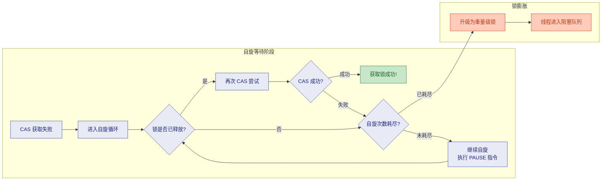

---

### 自适应自旋

在 JDK 6 之前，自旋的次数是一个**固定值**（默认 10 次，可通过 `-XX:PreBlockSpin` 参数调整）。这种"一刀切"的策略显然不够智能——有些锁的临界区非常短，可能自旋 3 次就能获取；而有些锁的持有时间很长，自旋 100 次也没用，纯粹浪费 CPU。

从 **JDK 6** 开始，HotSpot 引入了**自适应自旋（Adaptive Spinning）**。其核心思想是：**让 JVM 根据运行时的历史统计数据，动态调整自旋的次数或时长。**

自适应自旋的决策逻辑可以概括为以下规则：

**规则 1：上次自旋成功 → 增加自旋次数**
如果对同一把锁，上一次自旋等待后成功获取了锁，JVM 就认为"这把锁的持有时间确实很短，自旋是值得的"，因此会**增加**本次自旋的次数上限。极端情况下，如果自旋总是成功的，JVM 甚至可能允许自旋数百次。

**规则 2：上次自旋失败（导致膨胀）→ 减少自旋次数**
如果对同一把锁，上一次自旋耗尽后仍然没获取到锁（最终膨胀为重量级锁），JVM 就认为"这把锁的竞争比较激烈，自旋是浪费的"，因此会**减少**甚至直接**跳过**本次自旋。

**规则 3：锁的持有者正在运行 → 允许自旋**
如果 JVM 检测到锁的当前持有者仍在 CPU 上运行（而不是被挂起或阻塞），那自旋就更有意义——因为持有者很可能马上就会释放锁。

**规则 4：锁的持有者已被挂起 → 不自旋**
如果持有者已经不在 CPU 上运行了，那继续自旋只会浪费当前线程的时间片，此时应该直接膨胀。

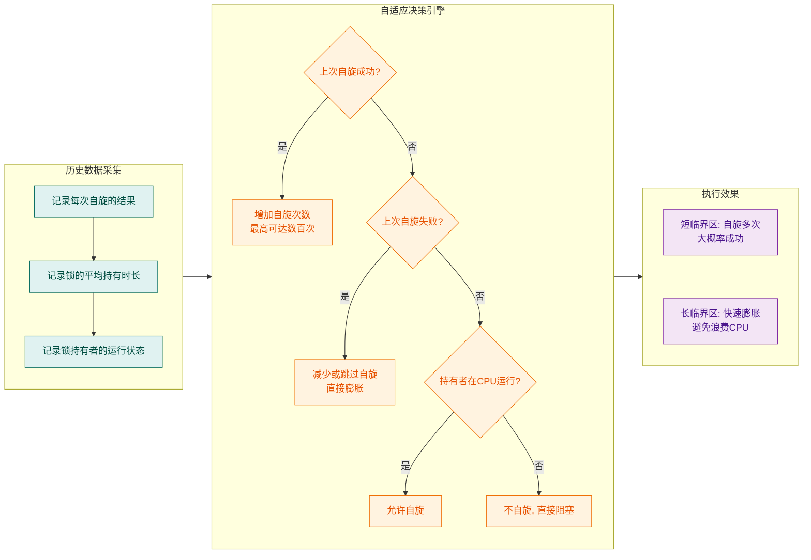

自适应自旋本质上是 JVM 对 **"自旋成本 vs. 阻塞成本"** 这一权衡问题的一种**运行时在线学习（Online Learning）**策略。它使得 JVM 能够根据程序的实际运行模式，自动找到最优的自旋策略——不需要开发者手动调参。

从 JDK 7 开始，`-XX:PreBlockSpin` 参数**不再生效**，自旋行为完全由 JVM 自适应控制，开发者无法手动干预。这体现了 HotSpot 团队的设计理念：**让 JVM 比开发者更懂运行时环境**。

值得一提的是，自适应自旋的统计数据是**以锁对象为粒度**进行维护的。也就是说，不同的锁对象可以有不同的自旋策略——一把"轻量"的锁可能自旋 200 次，而另一把"重量"的锁可能根本不自旋。这种细粒度的策略使得 JVM 在混合负载场景下也能表现出色。

让我们用一个表格总结自适应自旋在不同 JDK 版本中的演进：

| JDK 版本 | 自旋策略 | 配置方式 |
|----------|---------|---------|
| JDK 1.4.2 | 引入自旋锁（`-XX:+UseSpinning` 开启） | 手动开启，固定 10 次 |
| JDK 6 | 引入自适应自旋，默认开启 | `-XX:PreBlockSpin` 设置初始值 |
| JDK 7+ | 自适应自旋为唯一策略 | 不可手动调参，完全 JVM 控制 |

---

**📝 练习题**

某 Java 程序运行在 JDK 17（64 位 HotSpot）上，线程 T1 已经持有对象 `obj` 的轻量级锁，此时线程 T2 也尝试对 `obj` 执行 `synchronized` 加锁。以下关于此时行为的描述，哪一项是**正确**的？

A. T2 会立即创建 ObjectMonitor，将锁膨胀为重量级锁，然后阻塞自己


B. T2 会在栈帧中创建 Lock Record，然后执行 CAS 尝试替换 Mark Word；CAS 失败后进入自适应自旋，若自旋期间 T1 释放锁则 T2 可获取成功，否则触发锁膨胀


C. T2 会检测到 Mark Word 中存储的是 T1 的线程 ID，尝试通过偏向锁撤销流程来获取锁


D. T2 会直接复用 T1 的 Lock Record，通过修改 owner 字段来转移锁的所有权


**【答案】** B

**【解析】** 在 JDK 17 中偏向锁已默认关闭，因此不存在选项 C 描述的偏向锁撤销流程。当 T1 持有轻量级锁时，`obj` 的 Mark Word 末尾标志位为 `00`，存储着指向 T1 栈中 Lock Record 的指针。T2 到来后会在自己的栈帧中创建一个新的 Lock Record（不可能复用 T1 的，排除 D），将 `obj` 当前 Mark Word 拷贝到 Displaced Mark Word 字段，然后尝试 CAS 将 Mark Word 替换为指向自己 Lock Record 的指针。由于 Mark Word 已经被 T1 修改为轻量级锁模式（`00`），与 T2 备份的预期值不匹配，CAS 必然失败。此时 JVM 不会立即膨胀（排除 A），而是先进行**自适应自旋**，根据历史统计信息决定自旋次数。如果 T1 在自旋窗口内释放了锁（CAS 恢复 Mark Word 为无锁状态），T2 的下一次 CAS 就可能成功；如果自旋耗尽仍未获取成功，才会触发锁膨胀，升级为重量级锁。因此 B 的描述最为准确和完整。

---

## 重量级锁 ⭐⭐

当多个线程对同一把锁产生 **真实的、持续的竞争**（real contention）时，轻量级锁的自旋策略将不再经济——CPU 在空转中被白白浪费。此时 JVM 别无选择，必须将锁 **膨胀（inflate）** 为重量级锁，把线程的调度权彻底交给操作系统内核。重量级锁是 `synchronized` 的 **终极形态**，也是 JDK 6 之前该关键字唯一的实现方式。它之所以"重"，并不是因为它的语义复杂，而是因为它在获取与释放的全链路上都需要穿越 **用户态（User Mode）** 与 **内核态（Kernel Mode）** 之间的边界，这一过程涉及上下文切换、线程调度、缓存刷新等高昂操作，单次成本在现代 x86 处理器上大约在 **几微秒到数十微秒** 之间，相比之下，一次 CAS 操作仅需纳秒级别。

理解重量级锁的工作机制，是理解整个锁升级体系"为什么需要优化"的根本前提——因为偏向锁和轻量级锁的全部意义，就是在竞争不激烈时 **避免** 走到重量级锁这一步。

---

### 适用场景（激烈竞争）

重量级锁的启用并非由程序员手动选择，而是 JVM 在运行时根据竞争状况 **自动膨胀** 到达的状态。以下场景会触发锁膨胀：

**场景一：轻量级锁自旋失败。** 当一个线程持有轻量级锁，另一个线程尝试通过 CAS + 自旋获取锁但始终未能成功（自适应自旋达到阈值），JVM 判定当前竞争已经超出了轻量级锁的应对能力，于是执行膨胀操作。

**场景二：多个线程同时竞争同一把锁。** 如果不止两个线程在争抢锁，轻量级锁的"交替执行"模型彻底失效。多个线程同时自旋只会造成 CPU 资源的巨大浪费，此时膨胀为重量级锁，让等待的线程直接挂起（park），是更加合理的资源利用策略。

**场景三：调用了 `Object.wait()` 方法。** `wait/notify` 机制依赖于 ObjectMonitor 中的 WaitSet 队列，而 WaitSet 只存在于重量级锁的 Monitor 结构中。因此，即便当前没有任何竞争，一旦调用 `wait()`，锁也必须膨胀为重量级状态。

我们可以从一个典型的高并发场景来直观感受重量级锁的必要性：

```java
// 模拟激烈竞争场景：多线程并发累加
public class HeavyweightLockDemo {

    // 共享计数器
    private static int counter = 0;

    // 锁对象
    private static final Object lock = new Object();

    public static void main(String[] args) throws InterruptedException {
        // 创建 50 个线程同时对 counter 进行累加
        Thread[] threads = new Thread[50];

        for (int i = 0; i < threads.length; i++) {
            threads[i] = new Thread(() -> {
                for (int j = 0; j < 10000; j++) {
                    // 50 个线程激烈争抢同一把锁
                    // 此时锁必然膨胀为重量级锁
                    synchronized (lock) {
                        // 临界区内的操作非常简短
                        counter++;
                    }
                    // 锁释放后，大量线程立即再次争抢
                    // 持续的高频竞争使锁始终维持在重量级状态
                }
            });
        }

        // 启动所有线程
        for (Thread t : threads) {
            t.start();
        }

        // 等待所有线程执行完毕
        for (Thread t : threads) {
            t.join();
        }

        // 由于 synchronized 保证了互斥，结果一定正确
        System.out.println("Final counter: " + counter); // 500000
    }
}
```

在这个例子中，50 个线程持续争抢同一把锁，锁在极短时间内就会被膨胀为重量级锁并一直保持该状态，直到所有线程执行完毕。此时，未获取到锁的线程不会自旋（自旋只会浪费 CPU），而是被操作系统挂起并放入等待队列，直到持有锁的线程释放锁后由内核唤醒。

---

### Mark Word 变化（指向 Monitor）

当锁膨胀为重量级锁时，对象头的 Mark Word 会经历 **第三次也是最后一次结构性变化**。与偏向锁存储线程 ID、轻量级锁存储 Lock Record 指针不同，重量级锁的 Mark Word 存储的是一个指向 **ObjectMonitor 对象** 的指针。

在 64 位 HotSpot JVM 中，重量级锁状态的 Mark Word 布局如下：

```
┌─────────────────────────────────────────────────────────────────┐
│                        Mark Word (64 bits)                      │
├──────────────────────────────────────────────────┬───┬──────────┤
│         ptr_to_heavyweight_monitor (62 bits)     │ 0 │   10     │
│         指向 ObjectMonitor 对象的指针              │   │ 锁标志位 │
├──────────────────────────────────────────────────┴───┴──────────┤
│                                                                 │
│  [62 bits: Monitor 指针] [1 bit: 未使用] [2 bits: 10=重量级锁]   │
│                                                                 │
└─────────────────────────────────────────────────────────────────┘
```

我们对比三种锁状态下 Mark Word 的完整变化历程：

```
╔══════════════╦═══════════════════════════════════╦══════════════╗
║   锁状态      ║       Mark Word 主要内容           ║  锁标志位     ║
╠══════════════╬═══════════════════════════════════╬══════════════╣
║ 无锁         ║ identity_hashcode | age | 0       ║     01       ║
╠══════════════╬═══════════════════════════════════╬══════════════╣
║ 偏向锁       ║ thread_id | epoch | age | 1       ║     01       ║
╠══════════════╬═══════════════════════════════════╬══════════════╣
║ 轻量级锁     ║ ptr_to_lock_record                ║     00       ║
╠══════════════╬═══════════════════════════════════╬══════════════╣
║ 重量级锁     ║ ptr_to_heavyweight_monitor        ║     10       ║
╠══════════════╬═══════════════════════════════════╬══════════════╣
║ GC 标记      ║ (空)                              ║     11       ║
╚══════════════╩═══════════════════════════════════╩══════════════╝
```

**锁膨胀的具体过程如下：**

1. **分配 ObjectMonitor。** JVM 从内部的 Monitor 缓存池（`gFreeList`）中取出一个空闲的 `ObjectMonitor` 对象。如果缓存池为空，则调用 `new ObjectMonitor()` 创建。

2. **初始化 Monitor 字段。** 将当前持有锁的线程设置为 Monitor 的 `_owner`，将之前的 Mark Word 保存到 Monitor 的 `_header` 字段中（用于将来锁释放时恢复原始 Mark Word）。

3. **替换 Mark Word。** 将对象头的 Mark Word 替换为指向该 ObjectMonitor 的指针，并将最低两位设置为 `10`，标记锁状态为重量级。

4. **竞争失败的线程进入等待队列。** 触发膨胀的那个线程（自旋失败的线程）将自己封装为一个 `ObjectWaiter` 节点，插入 Monitor 的 `_cxq` 队列或 `_EntryList` 队列，随后调用 `park()` 将自己挂起。

这里有一个极其重要的细节：**原始的 Mark Word 信息（如 hashcode、GC 年龄）不会丢失**。它被安全地保存在 ObjectMonitor 的 `_header` 字段中。当锁被完全释放且不再有任何线程竞争时，JVM **有可能**（但不是必然的）将 Monitor 回收并把原始 Mark Word 恢复回对象头，这个过程称为 **锁降级/锁解除膨胀（deflation）**。不过在经典的理论描述中，我们通常简化地说"锁不能降级"，这在后续小节中会进一步讨论。

下面用一张 Mermaid 时序图来展示锁膨胀的全过程：

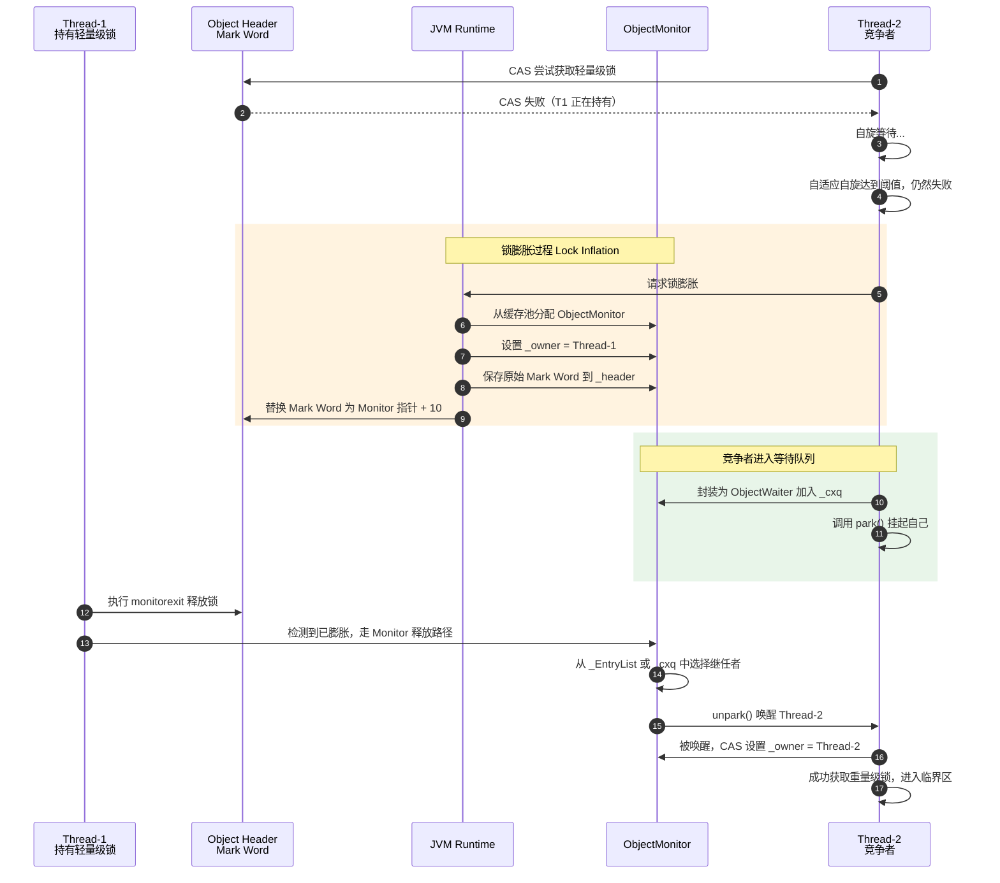

---

### 操作系统互斥量（Mutex）

重量级锁被称为"重量级"的核心原因就在于它最终依赖的是 **操作系统级别的同步原语——互斥量（Mutex）**。要深入理解这一点，我们需要从 JVM 内部的 `ObjectMonitor` 实现一路追踪到操作系统内核。

**ObjectMonitor 的核心结构**

在 HotSpot JVM 的 C++ 源码中（`objectMonitor.hpp`），ObjectMonitor 的关键字段如下：

```java
// ObjectMonitor 核心结构（伪代码表示 C++ 源码）
// 源码位置: src/hotspot/share/runtime/objectMonitor.hpp
class ObjectMonitor {
    // _header: 保存对象原始的 Mark Word，锁释放后用于恢复
    volatile markWord _header;

    // _object: 指向关联的 Java 对象（即被 synchronized 修饰的那个对象）
    WeakHandle _object;

    // _owner: 当前持有该 Monitor 的线程指针
    // 这是判断"谁拥有锁"的核心字段
    void* volatile _owner;

    // _previous_owner_tid: 上一个持有者的线程 ID（用于 profiling）
    volatile jlong _previous_owner_tid;

    // _recursions: 重入计数器
    // 同一线程多次 synchronized 进入时递增
    volatile intx _recursions;

    // _EntryList: 阻塞等待获取锁的线程队列
    // 这些线程因竞争失败而被挂起，等待被唤醒后重新竞争
    ObjectWaiter* volatile _EntryList;

    // _cxq (Contention Queue): 最近竞争失败的线程首先进入此队列
    // 它是一个 LIFO 栈结构，使用 CAS 进行无锁入队
    ObjectWaiter* volatile _cxq;

    // _WaitSet: 调用 wait() 后主动放弃锁的线程队列
    // notify() 会将线程从 _WaitSet 移到 _EntryList 或 _cxq
    ObjectWaiter* volatile _WaitSet;

    // _succ (Successor): 假定的继任者
    // 用于"责任传递 (Responsibility Handoff)"优化
    volatile JavaThread* _succ;

    // _SpinDuration / _SpinFreq: 自适应自旋相关的参数
    // JVM 在进入内核态阻塞前，可能先尝试一段自旋
    volatile int _SpinDuration;

    // _count: 等待线程的近似计数
    volatile int _count;
}
```

**从 ObjectMonitor 到操作系统 Mutex 的调用链**

当一个线程尝试获取已被其他线程持有的重量级锁时，调用链大致如下：

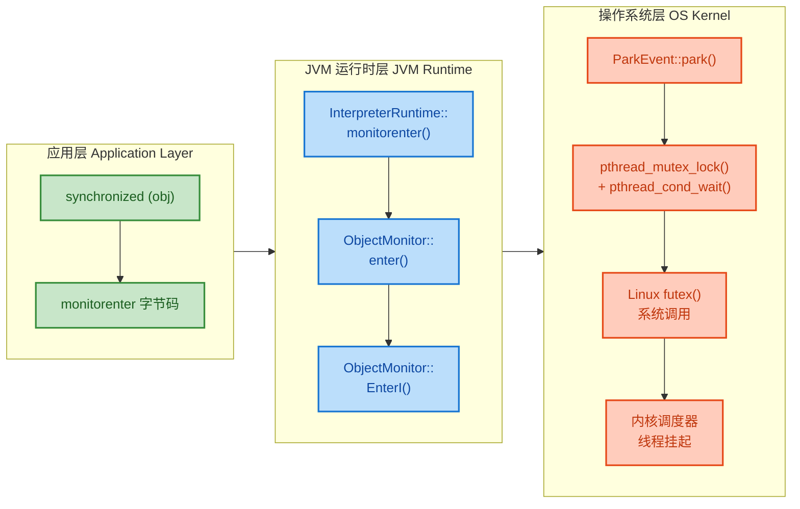

让我们逐层拆解这条关键路径：

**第一步：ObjectMonitor::enter()**

线程首先尝试通过 CAS 将 `_owner` 从 `null` 设为自身。如果成功，则直接获取锁，无需进入内核态——这是一次 **快速路径（fast path）** 优化。如果 `_owner` 已经是自身（重入），则直接递增 `_recursions`。只有当 CAS 失败时，才进入慢速路径 `EnterI()`。

**第二步：ObjectMonitor::EnterI()**

在真正阻塞之前，JVM 还会做最后一轮自旋尝试（spin-then-block 策略）。这是因为锁的持有者可能恰好在此刻释放锁，如果能在自旋中等到，就可以避免昂贵的内核态切换。自旋的次数由 `_SpinDuration` 控制，它受自适应算法动态调整。

**第三步：ParkEvent::park()**

如果最后的自旋仍然失败，线程将调用 `ParkEvent::park()`。在 Linux 平台上，`ParkEvent` 内部封装了 POSIX 线程库的 `pthread_mutex_t` 和 `pthread_cond_t`，最终映射到 Linux 内核的 `futex()`（Fast Userspace muTEX）系统调用。

**futex 的精妙之处：**

`futex` 是 Linux 2.6 引入的一种混合同步机制。它的核心思想是：**在无竞争时完全在用户态完成，只有在真正需要阻塞时才陷入内核态**。

```java
// futex 的工作原理（伪代码）
// futex_addr: 指向一个共享的 int 变量（对应 Monitor 的某个状态字段）
// expected_val: 期望值

// FUTEX_WAIT 操作:
if (*futex_addr == expected_val) {
    // 值未变化，说明锁确实被其他线程持有
    // 将当前线程加入该 futex_addr 的内核等待队列
    // 线程进入 TASK_INTERRUPTIBLE 状态，CPU 调度器不再调度它
    suspend_current_thread();
} else {
    // 值已改变，说明锁可能已释放，直接返回用户态重试
    return EAGAIN;
}

// FUTEX_WAKE 操作（由释放锁的线程调用）:
// 唤醒等待在 futex_addr 上的 N 个线程
wake_up_n_threads(futex_addr, n);
```

**Mutex 的开销量化分析**

为了直观感受重量级锁的代价，我们来做一个数量级的对比：

```
╔══════════════════════════════════╦══════════════════╦══════════════════╗
║           操作                   ║    大致耗时       ║   相对倍数        ║
╠══════════════════════════════════╬══════════════════╬══════════════════╣
║ CAS 操作（无竞争）               ║    ~5-10 ns      ║      1x          ║
╠══════════════════════════════════╬══════════════════╬══════════════════╣
║ 用户态自旋一次                   ║    ~1 ns         ║      0.1x        ║
╠══════════════════════════════════╬══════════════════╬══════════════════╣
║ 用户态 → 内核态切换（单向）       ║    ~1-2 μs       ║     100-200x     ║
╠══════════════════════════════════╬══════════════════╬══════════════════╣
║ 线程上下文切换（完整）            ║    ~3-10 μs      ║     300-1000x    ║
╠══════════════════════════════════╬══════════════════╬══════════════════╣
║ 线程阻塞 + 唤醒（一次完整流程）   ║    ~10-30 μs     ║    1000-3000x    ║
╚══════════════════════════════════╩══════════════════╩══════════════════╝
```

可以看到，一次完整的"阻塞 + 唤醒"流程比一次简单的 CAS 操作慢了 **三个数量级**。这就是为什么 JVM 不惜引入偏向锁和轻量级锁两个中间状态来极力避免走到重量级锁这一步。

---

### 线程阻塞与唤醒（内核态切换）

线程阻塞与唤醒是重量级锁中开销最大的部分，也是最值得深入理解的核心机制。当一个线程竞争重量级锁失败后，它不会再浪费 CPU 去自旋，而是通过操作系统提供的阻塞原语 **主动放弃 CPU 时间片**，直到被持有锁的线程唤醒。

**线程状态转换的完整生命周期**

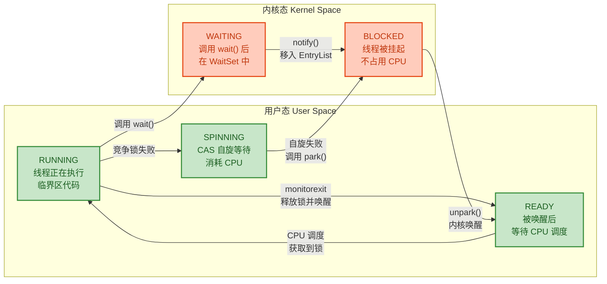

**阻塞过程的详细步骤**

当线程 T2 竞争锁失败并决定阻塞时，以下操作将依次发生：

1. **保存用户态上下文。** CPU 将 T2 的寄存器状态（程序计数器 PC、栈指针 SP、通用寄存器等）保存到线程的内核栈中。这一步是上下文切换的核心开销之一。

2. **切换到内核态。** 通过 `syscall` 指令（x86-64）或 `int 0x80`（x86-32）触发从用户态到内核态的切换。CPU 切换特权级别，从 Ring 3 进入 Ring 0。

3. **修改线程状态。** 内核将 T2 的任务状态从 `TASK_RUNNING` 修改为 `TASK_INTERRUPTIBLE`（可中断阻塞）。

4. **移出就绪队列。** 内核调度器将 T2 从 CPU 的运行队列（runqueue）中移除，放入 futex 关联的等待队列。从此刻起，T2 不再消耗任何 CPU 时间。

5. **调度其他线程。** 内核调度器（CFS，Completely Fair Scheduler）从运行队列中选择下一个线程来使用 CPU。

**唤醒过程的详细步骤**

当线程 T1 执行 `monitorexit` 释放锁时，唤醒过程如下：

1. **选择继任者（Successor Selection）。** T1 通过 ObjectMonitor 的出队策略，从 `_EntryList` 或 `_cxq` 中选择一个等待线程（比如 T2）。HotSpot 提供了多种出队策略（由 `Knob_QMode` 参数控制），默认策略是 **将 `_cxq` 中的线程转移到 `_EntryList` 的尾部**，然后从 `_EntryList` 的头部取出继任者。

2. **调用 unpark()。** 对 T2 调用 `unpark()`，最终映射到 `futex(FUTEX_WAKE, ...)` 系统调用。

3. **内核唤醒 T2。** 内核将 T2 的状态从 `TASK_INTERRUPTIBLE` 改回 `TASK_RUNNING`，并将 T2 放回 CPU 的运行队列。

4. **CPU 调度到 T2。** 这不是即时发生的——T2 只是被放回了就绪队列，它需要等待内核调度器将 CPU 分配给它。在高负载系统中，这可能引入额外的延迟。

5. **恢复用户态上下文。** 一旦 T2 被调度执行，CPU 从内核栈中恢复 T2 之前保存的寄存器状态，切换回用户态。

6. **重新竞争锁。** T2 被唤醒后并不意味着它一定能获取锁！它仍然需要通过 CAS 尝试将 `_owner` 设置为自身。如果此时另一个线程（比如 T3）恰好通过自旋抢先获取了锁，T2 将再次被阻塞。这就是所谓的 **非公平锁（unfair lock）** 行为——`synchronized` 默认就是非公平的。

**ObjectMonitor 内部的队列协作**

ObjectMonitor 内部有三个关键队列，它们的协作关系是理解 `synchronized` 与 `wait/notify` 语义的关键：

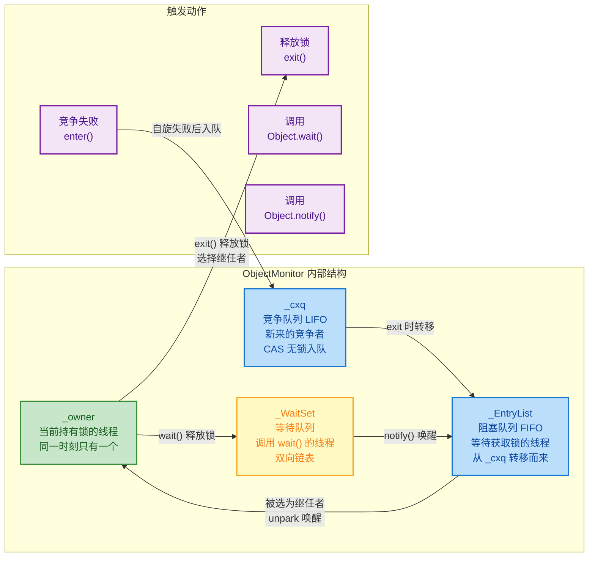

用一段代码来完整展示这三个队列的交互：

```java
public class MonitorQueuesDemo {

    // 共享锁对象
    private static final Object monitor = new Object();

    // 标志位：控制 wait/notify 流程
    private static volatile boolean dataReady = false;

    public static void main(String[] args) throws InterruptedException {

        // ========== 消费者线程：演示 _WaitSet ==========
        Thread consumer = new Thread(() -> {
            synchronized (monitor) {
                // consumer 获取到锁，成为 _owner
                System.out.println("[Consumer] 持有锁，检查数据...");

                while (!dataReady) {
                    try {
                        // 调用 wait()：
                        // 1. 释放锁（_owner 清空）
                        // 2. consumer 被放入 _WaitSet
                        // 3. consumer 线程挂起，不占用 CPU
                        System.out.println("[Consumer] 数据未就绪，调用 wait() 进入 WaitSet");
                        monitor.wait();
                        // 被 notify() 唤醒后：
                        // 1. 从 _WaitSet 移到 _EntryList
                        // 2. 重新竞争锁
                        // 3. 竞争成功后从此处继续执行
                        System.out.println("[Consumer] 被唤醒，重新获取到锁");
                    } catch (InterruptedException e) {
                        Thread.currentThread().interrupt();
                    }
                }

                System.out.println("[Consumer] 数据已就绪，处理完毕");
            }
            // monitorexit：consumer 释放锁
        }, "Consumer");

        // ========== 生产者线程：演示 notify() 唤醒 ==========
        Thread producer = new Thread(() -> {
            synchronized (monitor) {
                // producer 获取到锁，成为 _owner
                System.out.println("[Producer] 持有锁，生产数据...");

                // 模拟数据生产
                dataReady = true;

                // 调用 notify()：
                // 将 _WaitSet 中的一个线程（consumer）移到 _EntryList
                // 注意：consumer 不会立即执行，它需要等 producer 释放锁后才能竞争
                System.out.println("[Producer] 数据就绪，调用 notify()");
                monitor.notify();

                System.out.println("[Producer] notify() 完成，但仍持有锁");
            }
            // monitorexit 释放锁后，consumer 才有机会从 _EntryList 被调度
            System.out.println("[Producer] 锁已释放");
        }, "Producer");

        // ========== 竞争者线程：演示 _cxq ==========
        Thread competitor = new Thread(() -> {
            // 当 producer 持有锁时，competitor 尝试获取锁会失败
            // competitor 将被放入 _cxq 队列并阻塞
            System.out.println("[Competitor] 尝试获取锁...");
            synchronized (monitor) {
                // 最终获取到锁
                System.out.println("[Competitor] 成功获取锁！");
            }
        }, "Competitor");

        // 启动顺序很重要：先让 consumer 获取锁并进入 wait
        consumer.start();
        Thread.sleep(100); // 确保 consumer 先获取锁

        producer.start();
        Thread.sleep(50);  // 确保 producer 先于 competitor 竞争锁

        competitor.start();

        // 等待所有线程完成
        consumer.join();
        producer.join();
        competitor.join();
    }
}
```

**输出顺序（大致）：**

```
[Consumer] 持有锁，检查数据...
[Consumer] 数据未就绪，调用 wait() 进入 WaitSet
[Producer] 持有锁，生产数据...
[Producer] 数据就绪，调用 notify()
[Producer] notify() 完成，但仍持有锁
[Competitor] 尝试获取锁...
[Producer] 锁已释放
[Consumer] 被唤醒，重新获取到锁
[Consumer] 数据已就绪，处理完毕
[Competitor] 成功获取锁！
```

**上下文切换的隐性代价**

除了直接的系统调用开销之外，线程阻塞与唤醒还会带来一些 **间接的性能损失**，这些往往更加隐蔽但影响同样显著：

1. **TLB 刷新（TLB Flush）。** 每次上下文切换，CPU 可能需要刷新部分 TLB（Translation Lookaside Buffer，页表缓存），导致切换后的前几次内存访问变慢。

2. **CPU 缓存污染（Cache Pollution）。** 线程被唤醒后，它之前的工作集很可能已经被其他线程的数据挤出了 L1/L2 缓存。重新加载这些缓存行（cache line）需要额外的时间，这被称为 **缓存预热（cache warming）**。

3. **内核调度延迟（Scheduling Latency）。** 即使 `unpark()` 被调用，线程也不一定立刻获得 CPU。在高负载系统中，线程可能需要在就绪队列中等待一段时间才能被调度执行。

4. **竞争唤醒（Thundering Herd）问题。** 当使用 `notifyAll()` 时，所有等待线程被同时唤醒，但只有一个能获取锁，其余线程被唤醒后又立即被阻塞，造成大量无效的上下文切换。

```
╔════════════════════════════════════════════════════════════════════════╗
║                   一次完整的 阻塞→唤醒 开销拆解                        ║
╠════════════════════════════════════════════════════════════════════════╣
║                                                                      ║
║  [1] park() 系统调用陷入      ─────────────  ~0.5-1 μs               ║
║  [2] 保存线程上下文            ─────────────  ~0.3-0.5 μs             ║
║  [3] 内核调度器选择新线程      ─────────────  ~0.5-1 μs               ║
║  [4] 恢复新线程上下文          ─────────────  ~0.3-0.5 μs             ║
║  [5] unpark() 系统调用         ─────────────  ~0.5-1 μs               ║
║  [6] 内核唤醒 + 调度延迟       ─────────────  ~1-5 μs                 ║
║  [7] 恢复被唤醒线程上下文      ─────────────  ~0.3-0.5 μs             ║
║  [8] CPU 缓存预热              ─────────────  ~2-10 μs (高度可变)     ║
║  ─────────────────────────────────────────────────────────            ║
║  总计                          ─────────────  ~5-20 μs               ║
║                                                                      ║
║  ✦ 对比: CAS 操作              ─────────────  ~5-10 ns               ║
║  ✦ 差距: 约 1000x ~ 4000x                                            ║
║                                                                      ║
╚════════════════════════════════════════════════════════════════════════╝
```

正是这个三个数量级的差距，驱动了 JVM 团队在 JDK 6 中引入偏向锁与轻量级锁的优化方案。在绝大多数 Java 应用中，锁竞争并不激烈——据统计，大部分 `synchronized` 块 **始终只被一个线程访问**（偏向锁的优化目标），或者 **仅有少数线程交替执行**（轻量级锁的优化目标）。只有在真正的高并发热点处，锁才会升级到重量级状态，此时线程阻塞反而是最合理的资源利用策略——与其让 50 个线程在 CPU 上空转，不如让 49 个线程安静地睡眠，把宝贵的 CPU 时间留给真正在做有用工作的那个线程。

---

**📝 练习题**

在 HotSpot JVM 中，以下哪种操作 **不会** 导致锁直接膨胀为重量级锁？

A. 线程 A 持有轻量级锁，线程 B 自旋等待超过自适应阈值后仍未获取到锁

B. 线程 A 持有偏向锁，在安全点被撤销偏向后，线程 B 通过 CAS 成功获取了轻量级锁

C. 线程 A 持有轻量级锁，在 synchronized 块内调用了锁对象的 `wait()` 方法

D. 多个线程同时竞争同一把轻量级锁，导致 CAS 操作大量失败


**【答案】** B

**【解析】** 选项 B 描述的是偏向锁撤销后升级为轻量级锁的过程，而非直接膨胀到重量级锁。当偏向锁被撤销时，如果原持有线程已经不在同步块中，锁状态会回到无锁状态，接着竞争线程通过 CAS 获取轻量级锁即可，不需要膨胀。选项 A 是经典的自旋失败导致膨胀的场景；选项 C 中 `wait()` 依赖于 ObjectMonitor 的 WaitSet，必须膨胀到重量级状态才能支持；选项 D 描述的是多线程激烈竞争，轻量级锁的 CAS 机制无法应对，必然膨胀为重量级锁。因此只有 B 停留在轻量级锁阶段，不会直接膨胀到重量级锁。

---

**📝 练习题**

关于 ObjectMonitor 的 `_cxq`、`_EntryList` 和 `_WaitSet` 三个队列，以下说法正确的是？

A. 线程调用 `notify()` 后，被唤醒的线程直接成为 `_owner` 并进入临界区执行

B. `_cxq` 是 FIFO 队列，保证先到的竞争线程先获取锁

C. 线程调用 `wait()` 后释放锁并进入 `_WaitSet`，被 `notify()` 唤醒后移入 `_EntryList` 或 `_cxq`，仍需重新竞争锁

D. `_EntryList` 中的线程仍在消耗 CPU 进行自旋等待


**【答案】** C

**【解析】** 选项 C 准确描述了 `wait/notify` 的语义：调用 `wait()` 的线程释放锁并进入 `_WaitSet`，被 `notify()` 唤醒后并不会立即获得锁，而是被移到 `_EntryList`（或 `_cxq`），与其他竞争者一起等待被选为继任者。选项 A 错误，`notify()` 只是将线程从 `_WaitSet` 移到 `_EntryList`，被唤醒的线程仍需等待当前持有者释放锁后才能竞争。选项 B 错误，`_cxq` 是一个 LIFO 栈结构（使用 CAS 头插法），不是 FIFO 队列。选项 D 错误，`_EntryList` 中的线程已经被 `park()` 挂起，处于阻塞状态，不消耗 CPU。

---

## 锁升级流程图

在前面几节中，我们已经分别深入剖析了偏向锁、轻量级锁和重量级锁的工作原理。每一级锁都有自己的适用场景、Mark Word 变化和获取逻辑。然而在真实的 JVM 运行过程中，这三级锁并不是孤立存在的——它们通过一条**单向升级链路**（Upgrade-only Chain）紧密串联，构成了 `synchronized` 关键字在 HotSpot 虚拟机中的完整锁实现。本节的核心目标，就是将这些散落的知识碎片拼合成一幅完整的、端到端的锁获取决策流程图，帮你在脑中建立一条清晰的 "从字节码到内核态" 的全链路视图。

理解锁升级流程图的实战价值不仅在于面试，更在于它是你进行并发性能调优的基础地图。当你能够准确判断 "此刻锁处于哪个阶段"、"下一步会发生什么升级"、"瓶颈卡在哪个环节"，你才能做出真正有效的优化决策，比如减少竞争热点、调整自旋策略、甚至决定是否迁移到 `ReentrantLock`。

---

### 全局视角：四态跃迁总览

在进入复杂的决策分支之前，我们先用一张高度抽象的状态机图，鸟瞰 `synchronized` 锁的四种状态以及它们之间的跃迁关系。这张图回答的是最宏观的问题：**锁有哪几个阶段？什么条件触发跃迁？跃迁方向是什么？**

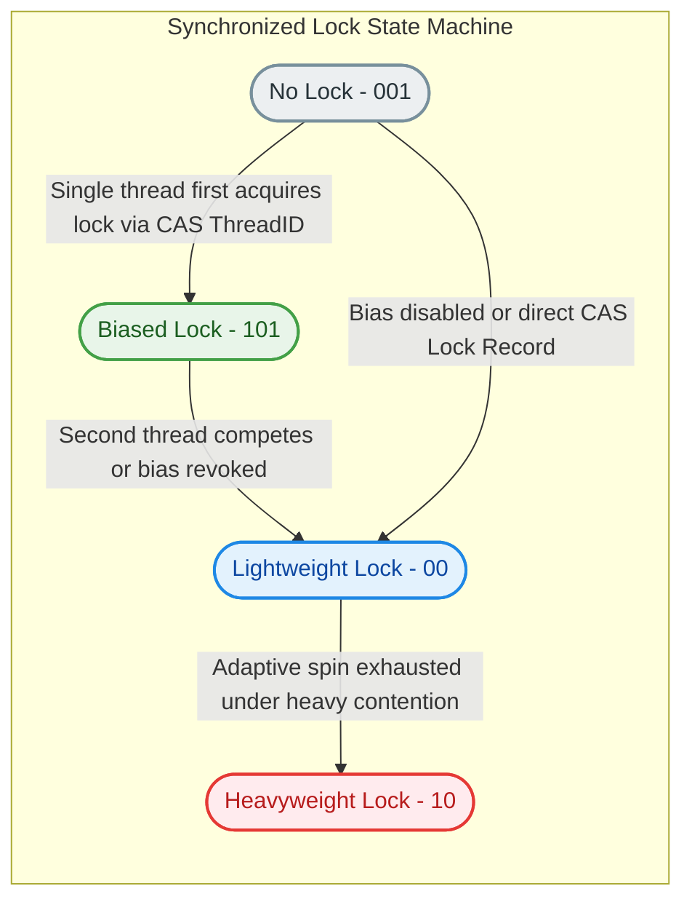

从这张状态机图中，可以提炼出几条核心规则：

**规则一：主干路径是 No Lock → Biased → Lightweight → Heavyweight**。这是最常见的升级轨迹，对应着竞争程度从"无"到"单线程"到"少量交替"到"激烈"的渐进过程。

**规则二：偏向锁可以被跳过**。当 JVM 启动参数 `-XX:-UseBiasedLocking` 禁用偏向锁（JDK 15+ 默认如此），或者对象在偏向延迟期（`BiasedLockingStartupDelay`，默认 4 秒）内被使用，锁将直接从 No Lock 跃迁到 Lightweight Lock，绕过 Biased Lock 阶段。

**规则三：跃迁是单向的、不可逆的**。一旦锁被升级（inflate），就不会降级回低级状态。这个设计选择是出于简化实现和避免 ABA 风险的考量，我们在后面的小节中会详细讨论。

**规则四：GC 标记状态（11）不属于锁状态**。当 GC 需要标记对象时，Mark Word 会被临时替换为 `11` 标志，这与锁升级无关，GC 完成后会恢复。

---

### 完整锁获取决策流程图

这是整个锁升级机制中最核心的一张图。它详细展示了当一个线程执行 `monitorenter` 指令（进入 `synchronized` 块）时，JVM 内部所经历的完整决策路径。每一个菱形节点代表一次判断，每一个矩形节点代表一次操作，每一个圆角矩形代表一个终态。

```mermaid
graph LR
    subgraph P1["Phase 1: Read Object Header"]
        direction TB
        S([Thread hits monitorenter]) --> R[Read Mark Word from object header]
        R --> F{Inspect lock flag bits}
    end

    subgraph P2["Phase 2: Biased Lock Path"]
        direction TB
        T{ThreadID == current thread?}
        T -->|Yes - reentrant| BOK([Biased Lock Acquired])
        T -->|No - check further| Z{ThreadID field is zero?}
        Z -->|Yes - anonymous bias| CB[CAS write current ThreadID]
        CB -->|CAS success| BOK
        Z -->|No - biased to another| SP[Wait for VM SafePoint]
        CB -->|CAS lost to competitor| SP
        SP --> AV{Bias owner still in sync block?}
        AV -->|Owner exited| RB[Rebias to current thread or revoke to no-lock]
        RB --> BOK
        AV -->|Owner active - real contention| RK[Revoke bias and upgrade owner to LR]
    end

    subgraph P3["Phase 3: Lightweight Lock Path"]
        direction TB
        AL[Allocate Lock Record in stack frame] --> CP[Copy Mark Word to Displaced Header field]
        CP --> CL[CAS: replace Mark Word with LR pointer]
        CL -->|CAS success| LOK([Lightweight Lock Acquired])
        CL -->|CAS fail - contention| AS[Enter adaptive spinning loop]
        AS --> SQ{Spin count or duration exceeded?}
        SQ -->|No - keep trying| CL
        SQ -->|Yes - too much contention| IF[Inflate: allocate ObjectMonitor]
    end

    subgraph P4["Phase 4: Heavyweight Lock Path"]
        direction TB
        OM[Associate ObjectMonitor with object] --> EL[Enqueue thread into cxq or EntryList]
        EL --> PK[park thread via OS mutex - enter kernel mode]
        PK -->|Owner calls monitorexit and signals| HOK([Heavyweight Lock Acquired])
    end

    F -->|101 biased lock state| T
    F -->|001 no-lock state| AL
    F -->|00 light-locked by other| AS
    F -->|10 already heavyweight| EL
    RK --> AL
    IF --> OM

    classDef phEntry fill:#ECEFF1,stroke:#546E7A,stroke-width:2px,color:#263238
    classDef phBias fill:#E8F5E9,stroke:#388E3C,stroke-width:2px,color:#1B5E20
    classDef phLight fill:#E3F2FD,stroke:#1565C0,stroke-width:2px,color:#0D47A1
    classDef phHeavy fill:#FBE9E7,stroke:#D32F2F,stroke-width:2px,color:#B71C1C
    classDef phOK fill:#E0F2F1,stroke:#00796B,stroke-width:2px,color:#004D40

    class S,R,F phEntry
    class T,Z,CB,SP,AV,RB,RK phBias
    class AL,CP,CL,AS,SQ,IF phLight
    class OM,EL,PK phHeavy
    class BOK,LOK,HOK phOK
```

下面我们逐阶段拆解这张流程图中的每一条路径。

#### Phase 1：对象头读取与状态判定

一切从 `monitorenter` 字节码开始。JVM 解释器或 JIT 编译后的 native code 首先做的事情非常简单——**读取目标对象的 Mark Word**。这是一个 64 位的值（在 64 位 JVM 上），包含了锁状态、GC 分代年龄、hashCode、线程 ID 等信息。

读取 Mark Word 后，JVM 检查最低 2～3 位的 lock flag bits，这些位编码了锁的当前状态：

| Flag Bits | 含义 | 下一步动作 |
|:---------:|:----:|:----------:|
| `101` | 偏向锁状态（biased_lock=1, lock=01） | 进入 Phase 2 偏向锁路径 |
| `001` | 无锁状态（biased_lock=0, lock=01） | 进入 Phase 3 轻量级锁路径 |
| `00` | 轻量级锁已被其他线程持有 | 跳入 Phase 3 的自旋阶段 |
| `10` | 重量级锁状态 | 直接进入 Phase 4 |
| `11` | GC 标记中 | 非锁状态，此处不涉及 |

这个入口判定极其高效——仅需一次内存读取和几个位运算，耗时在纳秒级。

#### Phase 2：偏向锁路径

当 flag bits 为 `101`，说明对象当前处于偏向锁状态。此时 Mark Word 的高 54 位存储了一个 Thread ID。JVM 需要回答三个递进式的问题：

**问题一：这个 Thread ID 是不是"我自己"？** 如果 Mark Word 中的 Thread ID 恰好等于当前线程的 ID，这意味着"我"之前已经偏向过这把锁，现在又回来了。这是偏向锁最快乐的场景——**零开销重入**（Zero-overhead Reentrant Access）。JVM 甚至不需要执行任何 CAS 操作，直接进入临界区。这就是偏向锁存在的全部意义：让单线程反复获取同一把锁的代价趋近于零。

**问题二：Thread ID 字段是不是空的（等于 0）？** 如果为 0，说明这个对象虽然已经被标记为 "可偏向"（Biasable），但还没有实际偏向任何线程。这种状态被称为 **匿名偏向**（Anonymous Bias），通常出现在对象刚创建不久（且偏向延迟已过）的阶段。此时 JVM 执行一次 CAS 操作，尝试将当前线程的 ID 写入 Mark Word 的 Thread ID 字段。CAS 成功则偏向锁获取完成；CAS 失败意味着有另一个线程同时在竞争这个匿名偏向，进入撤销流程。

**问题三（最复杂的情况）：Thread ID 属于另一个线程？** 到了这一步，意味着竞争已经出现——对象偏向了线程 A，但现在线程 B 想获取锁。JVM 不能直接修改 Mark Word（那会破坏线程 A 的一致性视图），必须等待一个 **全局安全点**（Global SafePoint，所有 Java 线程都暂停的时刻）。在安全点处，JVM 检查偏向锁的原持有者线程：

- **原持有者已经退出同步块**：说明虽然 Mark Word 还偏向它，但它事实上已经不需要锁了。此时 JVM 可以选择将锁**重偏向**（Rebias）给当前线程（如果满足批量重偏向阈值），或者直接**撤销偏向**至无锁状态，让当前线程走轻量级锁路径。
- **原持有者仍在同步块内**：这是真正的竞争。JVM 撤销偏向锁，为原持有者在其栈帧中构建 Lock Record 并安装轻量级锁，然后让当前线程也进入 Phase 3 竞争轻量级锁。

安全点的等待是偏向锁撤销的最大开销来源，这也是 JDK 15 以后默认关闭偏向锁的主要原因之一。

#### Phase 3：轻量级锁路径

线程进入轻量级锁路径有三种入口：

1. **从 Phase 1 直接进入**（flag bits = `001`，无锁状态）——最常规的入口。
2. **从 Phase 2 升级而来**（偏向锁撤销后）——说明出现了竞争但还不激烈。
3. **从 Phase 1 发现 flag bits = `00`**（轻量级锁已被其他线程持有）——直接跳入自旋阶段。

对于前两种入口（对象当前未被锁定），轻量级锁的获取分为三步：

**Step 1：在当前线程的栈帧中分配 Lock Record**。Lock Record 是 JVM 在栈上开辟的一小块内存区域，包含两个关键字段：`Displaced Header`（存放 Mark Word 的备份）和 `Owner`（指向锁对象的指针）。Lock Record 的分配是栈操作，极其高速，无需堆分配。

**Step 2：拷贝 Mark Word 到 Displaced Header 字段**。这一步非常关键——它为后续的 CAS 操作和锁释放提供了 "原始 Mark Word" 的快照。锁释放时，JVM 需要用这个快照通过 CAS 恢复对象的 Mark Word。

**Step 3：CAS 替换 Mark Word**。JVM 执行一条 `cmpxchg` 指令，尝试将对象的 Mark Word 从 "原始值" 替换为 "指向当前线程 Lock Record 的指针"。如果 CAS 成功，Mark Word 的最低两位变为 `00`，标志轻量级锁已被当前线程持有。

如果 CAS 失败，说明另一个线程已经抢先持有了轻量级锁。此时当前线程不会立即阻塞，而是进入**自适应自旋**（Adaptive Spinning）——在一个循环中反复尝试 CAS。自旋的次数或持续时间由 JVM 根据历史成功率动态调整：如果这把锁上一次自旋很快就成功了，JVM 会给更多自旋机会；如果上次自旋失败了，JVM 会减少自旋甚至直接跳过。

当自旋次数耗尽仍未获取到锁，JVM 做出最后的决定：**膨胀**（Inflate）。锁从轻量级升级为重量级。

#### Phase 4：重量级锁路径

锁膨胀的核心操作是**分配或复用一个 ObjectMonitor 对象**，并将其与目标 Java 对象关联。ObjectMonitor 是 C++ 层面的数据结构，内部包含 `_owner`（当前持锁线程）、`_EntryList`（阻塞等待队列）、`_WaitSet`（`wait()` 等待队列）、`_cxq`（竞争队列）等字段。

对象的 Mark Word 被替换为指向这个 ObjectMonitor 的指针，最低两位变为 `10`。此后所有尝试获取该锁的线程都将通过 Monitor 协议进行：

1. **入队**：竞争失败的线程被放入 `_cxq`（Contention Queue）或 `_EntryList`。
2. **阻塞**：线程调用 `os::PlatformEvent::park()`，底层通过操作系统的 `pthread_mutex_lock` + `pthread_cond_wait`（Linux）或 `WaitForSingleObject`（Windows）实现真正的线程挂起。这意味着一次 **用户态到内核态的上下文切换**（User-Kernel Context Switch），代价通常在数微秒级别。
3. **唤醒**：当持锁线程执行 `monitorexit` 释放锁时，它会从等待队列中选择一个线程进行 `unpark()`，被唤醒的线程重新竞争 Monitor 所有权。

这就是为什么重量级锁代价高昂——每次阻塞和唤醒都伴随着内核态切换、线程调度和 CPU 缓存失效。

---

### Mark Word 位布局全景对照

为了让四种状态下 Mark Word 的变化一目了然，下面用 ASCII 图表展示 64 位 HotSpot JVM 中 Mark Word 在每个锁阶段的精确布局：

```text
====================================================================
              64-bit Mark Word Layout at Each Lock State
====================================================================

[1] No Lock (Normal Object)
+---------------------------------------------------+--------+----+
| unused:25 | identity_hashcode:31 | unused:1 | age:4| bias:0 | 01 |
+---------------------------------------------------+--------+----+
  <-- 25 -->  <------ 31 -------->   <-1->  <-4->    <-1->   <2>

[2] Biased Lock (Biased to a specific thread)
+---------------------------------------------------+--------+----+
|          thread_id:54          | epoch:2 | unused:1| age:4| bias:1 | 01 |
+---------------------------------------------------+--------+----+
  <---------- 54 ------------->   <-2->     <-1->  <-4->   <-1->  <2>

[3] Lightweight Lock (Locked by a thread via Lock Record)
+--------------------------------------------------------------+----+
|          ptr_to_lock_record:62                                | 00 |
+--------------------------------------------------------------+----+
  <--------------------- 62 ---------------------------------->  <2>

[4] Heavyweight Lock (Inflated to ObjectMonitor)
+--------------------------------------------------------------+----+
|          ptr_to_heavyweight_monitor:62                        | 10 |
+--------------------------------------------------------------+----+
  <--------------------- 62 ---------------------------------->  <2>

[5] GC Marking (Temporary state during GC)
+--------------------------------------------------------------+----+
|          forwarding_address / empty                           | 11 |
+--------------------------------------------------------------+----+
  <--------------------- 62 ---------------------------------->  <2>

====================================================================
```

几个关键观察：

- **No Lock vs Biased Lock 的区别仅在 bias 位**：两者的 lock bits 都是 `01`，但 bias 位分别是 `0` 和 `1`。这意味着 JVM 只需检查 3 个位（bits 0-2）就能区分这两种状态。
- **Lightweight 和 Heavyweight 状态下，原始 Mark Word 信息"消失"了**：hashCode、age 等信息被指针覆盖。对于轻量级锁，这些信息保存在栈上的 Lock Record 的 `Displaced Header` 中；对于重量级锁，保存在 ObjectMonitor 的 `_header` 字段中。锁释放时需要恢复。
- **一旦调用过 `hashCode()` 就无法偏向**：因为 No Lock 状态下 Mark Word 需要存储 31 位的 identity hashcode，而 Biased Lock 状态下同样的位置被 Thread ID 占据了。两者无法共存，因此如果对象已经计算了 identity hashcode，就永远无法进入偏向锁状态。

---

### 实战推演：双线程竞争升级全过程

理论讲完了，让我们用一个具体场景来走一遍完整的锁升级过程。假设有两个线程 Thread A 和 Thread B 依次竞争同一个对象的锁：

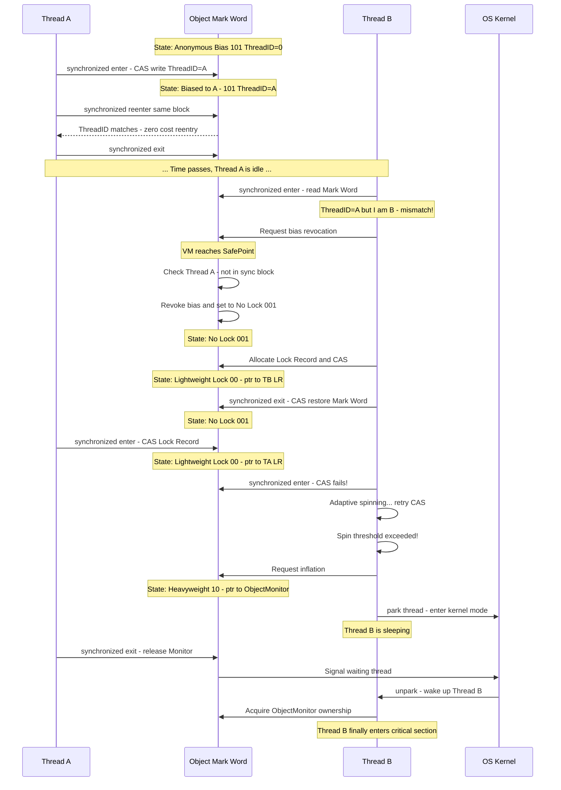

让我们逐帧解读这个场景：

**帧 1-3：偏向锁的幸福时光**。Thread A 是第一个访问该对象锁的线程。Mark Word 处于匿名偏向状态，Thread A 通过一次 CAS 将自己的 Thread ID 写入 Mark Word，偏向锁建立。之后 Thread A 再次进入同一个 `synchronized` 块时，发现 ThreadID 匹配，直接零开销重入——这正是偏向锁的设计初衷。

**帧 4-7：偏向锁的撤销**。Thread B 来了。它读取 Mark Word 发现 ThreadID 是 A，不是自己。JVM 请求进入安全点，检查 Thread A 的状态——发现 A 已经不在同步块中。于是 JVM 撤销偏向，将 Mark Word 恢复为无锁状态（`001`）。注意：如果 Thread A 此时仍在同步块中，JVM 会直接将 A 升级为轻量级锁持有者，并让 B 去竞争轻量级锁。

**帧 8-10：轻量级锁的交替执行**。Thread B 走轻量级锁路径，CAS 成功获取锁，然后释放。Thread A 回来又 CAS 获取。两个线程交替执行（Alternating Execution），轻量级锁完美适配这种 "低竞争、交替持有" 的场景。

**帧 11-14：真正的竞争导致膨胀**。某一时刻，Thread A 持有轻量级锁的同时，Thread B 也尝试获取。CAS 失败，Thread B 开始自旋。自旋达到阈值后仍未成功（Thread A 的临界区执行时间较长），JVM 决定膨胀为重量级锁。

**帧 15-17：重量级锁的内核代价**。Thread B 被 `park()`，切换到内核态沉睡。当 Thread A 释放锁并 `unpark()` Thread B 后，Thread B 被唤醒并获取 Monitor 所有权。整个过程涉及至少两次内核态切换。

---

### 各级锁的代价阶梯

下表定量对比了四种锁状态的核心性能指标，帮助你直观理解为什么 JVM 要设计这种渐进式升级策略：

| 维度 | 无锁 | 偏向锁 | 轻量级锁 | 重量级锁 |
|:----:|:----:|:------:|:--------:|:--------:|
| **获取代价** | — | 一次 ID 比较（约 1 ns） | 一次 CAS（约 5-20 ns） | 内核态切换（约 5-15 μs） |
| **释放代价** | — | 无操作 | 一次 CAS | 内核态信号 |
| **竞争能力** | — | 仅单线程 | 少量线程交替 | 任意数量线程 |
| **空间开销** | Mark Word 64bit | Mark Word 64bit | Mark Word + 栈 Lock Record | Mark Word + 堆 ObjectMonitor |
| **是否阻塞** | — | 不阻塞 | 自旋（不让出 CPU） | 真正阻塞（让出 CPU） |
| **内核参与** | 否 | 否 | 否 | 是 |

核心结论：重量级锁的获取代价比偏向锁高出 **三个数量级**（从纳秒到微秒）。这就是 JVM 不惜引入复杂的多级锁机制的根本原因——**用设计复杂度换取运行时性能**。在大多数 Java 应用中，锁竞争并不总是激烈的，大量的 `synchronized` 块实际上在单线程或低竞争环境下运行，偏向锁和轻量级锁可以覆盖绝大部分场景。

---

### 关键实现细节补充

#### 为什么轻量级锁必须拷贝 Mark Word？

轻量级锁在 CAS 替换 Mark Word 之前，先将原始 Mark Word 拷贝到栈上 Lock Record 的 `Displaced Header` 字段中。这一步不是可选的，而是必需的，原因有二：

1. **CAS 的比较基准**：`cmpxchg` 指令需要一个 "期望的旧值" 来进行比较。Displaced Header 就是这个旧值的存放点。锁释放时，JVM 用 `cmpxchg` 将对象的 Mark Word 从 "Lock Record 指针" 恢复为 Displaced Header 中保存的原始值。如果 CAS 失败（说明在持锁期间锁已经被膨胀为重量级），则走重量级锁释放逻辑。

2. **保存元数据**：原始 Mark Word 中包含 hashCode、GC 分代年龄等重要元数据。如果不保存这些信息，在锁释放后这些数据就丢失了。

#### 锁膨胀的原子性保证

从轻量级锁膨胀到重量级锁（`ObjectSynchronizer::inflate()`）是一个多步操作：分配 ObjectMonitor、设置 Monitor 的 `_header` 字段、CAS 替换 Mark Word。HotSpot 通过一个中间状态来保证原子性：在膨胀过程中，Mark Word 会被临时设置为一个特殊的 **INFLATING** 标记值。其他线程看到这个标记后会自旋等待膨胀完成，而不是操作一个半初始化的 Monitor。

```java
// HotSpot 源码中的膨胀逻辑简化示意（伪代码）
ObjectMonitor inflate(Object obj) {
    for (;;) {                                    // 自旋重试循环
        markWord mark = obj.markWord();           // 读取当前 Mark Word
        
        if (mark == INFLATING) {                  // 其他线程正在膨胀
            Thread.yield();                       // 让出 CPU 等待
            continue;                             // 重新检查
        }
        
        if (mark.isHeavyweight()) {               // 已经膨胀完成
            return mark.monitor();                // 直接返回已有 Monitor
        }
        
        // 尝试将 Mark Word 设置为 INFLATING 标记
        if (CAS(obj.markWord, mark, INFLATING)) { // CAS 抢占膨胀权
            ObjectMonitor mon = allocateMonitor(); // 分配 Monitor 对象
            mon.setHeader(mark);                   // 保存原始 Mark Word
            mon.setOwner(mark.lockRecordOwner());  // 设置当前持锁线程
            obj.setMarkWord(markWord(mon, HEAVY)); // 设置最终的 Monitor 指针
            return mon;                            // 膨胀完成
        }
    }                                              // CAS 失败则重试
}
```

#### Monitor 的复用与缓存

ObjectMonitor 是堆分配的 C++ 对象，频繁分配和释放会带来性能问题。HotSpot 维护了一个全局的 **空闲 Monitor 列表**（`gFreeList`）和每线程的本地缓存（`omFreeList`）。当锁膨胀需要 Monitor 时，优先从线程本地缓存取；当锁释放（deflate）时，Monitor 被归还到空闲列表而非销毁。JVM 在安全点时会周期性地执行 **deflation**，回收长期不用的 Monitor，减少内存占用。

---

### 锁释放的逆向流程

锁的释放流程与获取流程对称，但简单得多：

```java
// 伪代码展示 monitorexit 的分级释放逻辑
void monitorExit(Object obj) {
    markWord mark = obj.markWord();          // 读取对象头
    
    if (mark.isBiased()) {                   // 偏向锁释放
        // 什么都不做！Mark Word 保持不变
        // ThreadID 继续留在 Mark Word 中
        // 这就是偏向锁释放零开销的秘密
        return;
    }
    
    if (mark.isLightweight()) {              // 轻量级锁释放
        LockRecord lr = currentThread.topLockRecord();  // 获取栈顶 Lock Record
        markWord displaced = lr.displacedHeader();      // 取出备份的原始 Mark Word
        
        if (CAS(obj.markWord, markOf(lr), displaced)) { // CAS 恢复 Mark Word
            return;                          // 成功释放
        } else {
            // CAS 失败说明持锁期间锁已膨胀
            // 转入重量级锁释放流程
            heavyweightExit(obj);
        }
    }
    
    if (mark.isHeavyweight()) {              // 重量级锁释放
        ObjectMonitor mon = mark.monitor();  // 获取 Monitor 对象
        mon.setOwner(null);                  // 清除持有者
        Thread next = mon.dequeueWaiter();   // 从 EntryList/cxq 取一个等待者
        if (next != null) {
            OS.unpark(next);                 // 唤醒等待线程
        }
    }
}
```

注意偏向锁释放时 **完全不修改 Mark Word**。Thread ID 继续保留在对象头中，这样下次同一个线程再获取锁时，只需比较 Thread ID 即可，无需任何 CAS。这是偏向锁性能优势的根源——获取几乎免费，释放完全免费。

---

### 为什么调用 hashCode() 会破坏偏向锁？

这是一个常被忽略但在流程图中隐含的重要边界条件。观察 Mark Word 的位布局：

- **偏向锁状态**：54 位 Thread ID + 2 位 Epoch + ... + `101`
- **无锁状态**：31 位 identity hashCode + ... + `001`

两者使用了 **同一段位空间** 来存储不同的信息。一旦对象调用过 `System.identityHashCode(obj)` 或 `obj.hashCode()`（且 hashCode 未被重写），JVM 必须在 Mark Word 中记录 31 位的 hashCode。此后，这个对象就**永远无法进入偏向锁状态**，因为 hashCode 和 Thread ID 物理上无法共存。

- 如果对象已经偏向某个线程，调用 `hashCode()` 会 **立即撤销偏向锁**，并将对象转为无锁或轻量级锁状态。
- 如果对象尚未被偏向，调用 `hashCode()` 后，该对象的 bias 位会被设为 `0`，后续获取锁直接走轻量级路径。

这也解释了为什么某些高并发框架（如 Netty）会避免对频繁加锁的对象调用 `hashCode()`。

---

**📝 练习题 1**

在 JDK 8（偏向锁默认开启）中，对象 X 当前处于偏向锁状态，偏向线程 T1。此时线程 T2 尝试获取对象 X 的锁，且 T1 仍在同步代码块中执行。以下描述正确的是：

A. T2 直接获取偏向锁，Mark Word 中的 ThreadID 变为 T2


B. JVM 在安全点撤销偏向锁，T1 升级为轻量级锁持有者，T2 通过 CAS 竞争轻量级锁


C. 偏向锁直接膨胀为重量级锁，T2 通过 ObjectMonitor 排队等待


D. T2 等待 T1 退出同步块后，偏向锁自动重偏向给 T2


**【答案】** B

**【解析】** 当存在真实竞争（bias owner 仍在同步块内）时，JVM 必须在全局安全点（SafePoint）撤销偏向锁。由于 T1 仍在使用锁，JVM 不是简单地撤销到无锁态，而是为 T1 在其栈帧中构建 Lock Record，将锁直接升级为轻量级锁状态并让 T1 成为持有者。随后 T2 按照轻量级锁路径通过 CAS 竞争。选项 A 错误是因为偏向锁不能在有竞争时直接转移；选项 C 跳过了轻量级锁阶段，只有自旋失败后才会膨胀；选项 D 忽略了安全点撤销这一必需步骤，偏向锁不会自动等待并重偏向。

---

**📝 练习题 2**

以下关于 `synchronized` 锁升级过程的说法，哪一项是**错误**的？

A. 偏向锁的撤销必须等待 JVM 全局安全点（SafePoint），所有 Java 线程暂停后才能执行


B. 轻量级锁获取失败后，线程会先自适应自旋（Adaptive Spinning），再考虑膨胀为重量级锁


C. 对象一旦调用过 `System.identityHashCode()` 获取了 identity hashCode，就无法再进入偏向锁状态


D. 重量级锁在竞争完全消失后，JVM 会在运行时自动将其降级为轻量级锁以提高后续性能


**【答案】** D

**【解析】** HotSpot JVM 中 `synchronized` 的锁升级是**单向不可逆的**（One-way Upgrade）。一旦锁从轻量级膨胀为重量级，即使后续竞争完全消失，这个对象上的锁也不会降级回轻量级或偏向锁。JVM 所做的"回收"操作是在安全点执行 **Monitor Deflation**——将不再使用的 ObjectMonitor 回收到空闲列表中，但对象的锁级别本身不会回退。选项 A、B、C 的描述均是正确的：偏向撤销确实需要安全点；自旋是膨胀前的缓冲策略；identity hashCode 与偏向锁的 Thread ID 在 Mark Word 中互斥，两者无法共存。

---

## 锁只能升级不能降级

在 Java `synchronized` 锁优化体系中，有一条被广泛引用的核心设计原则：**锁的状态只能沿着「无锁 → 偏向锁 → 轻量级锁 → 重量级锁」的方向单向升级（Lock Escalation），而不能反向降级（Lock Downgrade）**。这条规则看似简单，但深入理解它的设计动因、底层约束、边界情况以及与其他锁策略的对比，才能真正掌握 JVM 锁实现的精髓。

### 为什么设计为不可降级

要理解这一设计决策，我们需要从工程实现的角度，逐一分析"如果允许降级"会带来哪些问题。

**第一，降级操作本身需要同步，而同步的代价可能比不降级更大。** 假设一把重量级锁在竞争消退后试图降级为轻量级锁，JVM 需要完成以下步骤：检测当前是否还有线程在 Monitor 的 EntryList 或 WaitSet 中等待；确认没有竞争后修改 Mark Word，将其从指向 Monitor 的指针改回 Lock Record 指针或线程 ID；同时还要安全地回收或重置 Monitor 对象。这一系列操作本身就需要原子性保证——而为了保证原子性，又需要额外的同步机制。这就陷入了一个 **"为了降低同步开销而引入更多同步开销"的悖论（paradox）**。

**第二，降级判断的时机极其模糊。** 竞争消退是一个渐进的、模糊的过程，不存在一个确定性的时间点可以安全地说"此刻起竞争不会再发生了"。如果刚刚降级到轻量级锁，紧接着又有多线程竞争涌入，就会立即触发重新升级。这种 **"降级-再升级"的反复震荡（thrashing）** 会带来比始终保持重量级锁更大的性能损耗。每一次状态切换都涉及 Mark Word 的 CAS 操作、可能的 safepoint 同步、以及 Monitor 对象的创建和销毁。

**第三，JVM 的全局一致性维护成本过高。** 锁降级不仅影响当前持有锁的线程，还牵涉所有可能访问该对象头的线程。JVM 必须确保所有线程看到一致的锁状态。在偏向锁撤销时，JVM 已经需要在 **安全点（safepoint）** 处暂停所有线程来完成状态变更。如果锁可以任意降级，safepoint 的触发频率会大幅上升，导致整体应用的 **Stop-The-World 停顿（STW pause）** 时间增加。

我们可以用一个成本对比模型来直观理解这个权衡：

```java
// ========================== 锁降级的理论成本模型 ==========================

// 假设存在锁降级机制，以下是每个阶段的开销估算

// ── 保持重量级锁不降级 ──
// 持续开销 = 每次 lock/unlock 的 Monitor 操作 ≈ 几微秒/次
// 这个开销是稳定的、可预测的

// ── 尝试降级的开销 ──
// 1. 竞争检测：需要遍历 Monitor 的 EntryList + WaitSet    → O(n) 遍历
// 2. 安全点同步：暂停所有应用线程                           → 数十微秒级 STW
// 3. Mark Word CAS 修改：原子性修改对象头                   → 可能失败并重试
// 4. Monitor 资源回收：ObjectMonitor 归还到全局空闲链表      → 需要加锁保护
// 5. 若降级后再次升级：重新经历膨胀(inflate)过程            → 再来一次全部开销

// 结论：降级尝试的一次性开销 >> 维持重量级锁的持续开销
// 只有在"竞争永久消失"的理想场景下，降级才可能带来净收益
// 而 JVM 无法预测未来的竞争模式，因此选择不降级是更安全的工程决策
```

### 从 Mark Word 的位结构理解不可降级

锁状态转换的核心载体是对象头的 Mark Word。每种锁状态对应不同的 bit 布局，它们之间的转换并非简单的位翻转，而是涉及整个语义的重新解释。

```java
// ====================== 64位 HotSpot JVM Mark Word 布局 ======================
//
// ┌─────────────────────────────────────────────────────────┬────────┬───────┐
// │                       高位区域 (bits)                    │  标志   │ 状态  │
// ├─────────────────────────────────────────────────────────┼────────┼───────┤
// │ unused:25 | hashcode:31 | unused:1 | age:4 | biased:0  │   01   │ 无锁  │
// ├─────────────────────────────────────────────────────────┼────────┼───────┤
// │ thread:54       | epoch:2       | unused:1 | age:4 |1  │   01   │ 偏向锁│
// ├─────────────────────────────────────────────────────────┼────────┼───────┤
// │ ptr_to_lock_record:62                                  │   00   │ 轻量级│
// ├─────────────────────────────────────────────────────────┼────────┼───────┤
// │ ptr_to_heavyweight_monitor:62                          │   10   │ 重量级│
// ├─────────────────────────────────────────────────────────┼────────┼───────┤
// │ (empty - used during GC)                               │   11   │ GC标记│
// └─────────────────────────────────────────────────────────┴────────┴───────┘
//
// 关键观察:
// 1. 无锁 → 偏向锁: 需要将 hashcode 区域替换为 thread ID + epoch
//    一旦偏向，原始 hashcode 信息被覆盖（存入线程栈或重新计算）
//
// 2. 偏向/无锁 → 轻量级锁: 整个 Mark Word 被替换为 Lock Record 指针
//    原始 Mark Word 被备份到栈帧的 Lock Record 中（称为 Displaced Mark Word）
//
// 3. 轻量级 → 重量级: Lock Record 指针被替换为 Monitor 指针
//    此时 Displaced Mark Word 被转移到 ObjectMonitor 对象的 _header 字段中
//
// 升级时，原始信息总有地方保存（Lock Record 或 Monitor）
// 但降级时，要把信息"还原回去"需要访问散落在各处的备份——这在多线程下极难安全完成
```

从信息流的角度看，升级过程是一个 **信息转移和封装（encapsulation）** 的过程：原始 Mark Word 的信息被安全地保存在更高级的数据结构中。而降级则需要执行 **信息回填（backfill）**——把分散在 Monitor 或 Lock Record 中的原始数据恢复到对象头。在没有全局锁保护的情况下，这种回填操作无法保证原子性和一致性。

### 单向升级的状态机模型

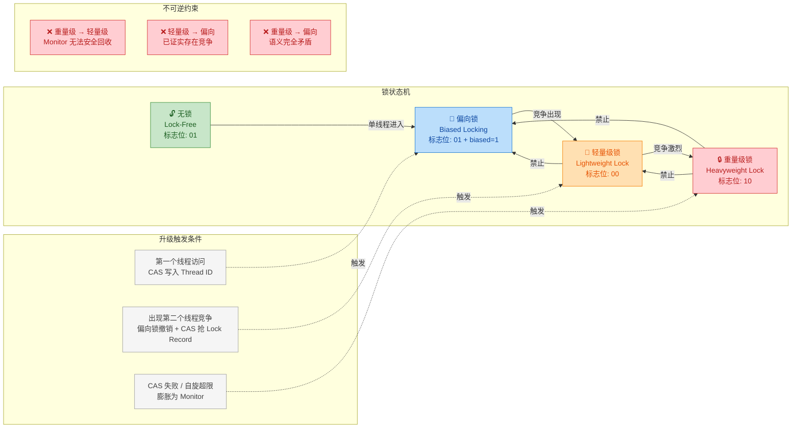

### 逻辑上的不可逆性：竞争历史不可擦除

锁升级的不可逆性，本质上反映的是 **竞争历史信息的不可擦除性**。一旦某个锁对象经历过多线程竞争，JVM 就认为它在未来大概率还会被竞争。这是一种基于 **局部性原理（Principle of Locality）** 的启发式判断——如果一个锁曾经是热点，那它大概率还会是热点。

我们可以用一个类比来理解：

> 锁升级好比一条公路从双车道扩建为四车道，再扩建为八车道。一旦扩建完成，你不会因为今天车流量少就把路拆回双车道——因为拆路的成本（施工、封路、协调）远比维持宽路的成本高，而且你无法保证明天车流量不会再次暴增。

从偏向锁到轻量级锁的升级尤其能说明这一点。偏向锁的核心假设是"只有一个线程会访问这个锁"。一旦第二个线程出现，这个假设就被**永久性地打破**了。即使第二个线程只出现了一次就再也不来了，JVM 也不会再将锁退回偏向状态，因为：

```java
// ====================== 偏向锁 → 轻量级锁：不可逆的原因 ======================

// 场景：线程A持有偏向锁，线程B短暂尝试获取后就不再竞争
//
// 如果允许降级回偏向锁，以下问题会出现：
//
// 问题1: 偏向给谁？
//   - 偏向回线程A？但线程A可能已经不再使用该锁
//   - 偏向给线程B？但线程B也可能不再使用
//   - 进入"匿名偏向"状态等待下一个线程？这本质上就是无锁状态，不是真正的降级
//
// 问题2: 降级时机的判定
//   - 多久没有竞争算"竞争消退"？ 100ms？1s？10s？
//   - 任何阈值的选择都是武断的（arbitrary）
//   - 设置过短 → 频繁降级升级震荡
//   - 设置过长 → 降级收益趋近于零
//
// 问题3: 降级的触发需要额外的监控机制
//   - JVM 需要持续追踪每个锁对象的竞争状态 → 额外的内存和CPU开销
//   - 这种监控开销可能超过降级本身带来的收益
//
// 结论: JVM 采取"一次竞争，永不信任"的保守策略，工程上更可靠
```

### 特殊情况：锁释放后的 Mark Word 还原

有一个容易混淆的问题需要澄清：**锁释放（unlock）和锁降级（downgrade）是完全不同的概念。**

当线程释放一把轻量级锁时，会通过 CAS 操作将备份在 Lock Record 中的 Displaced Mark Word **还原**到对象头。这意味着对象回到了无锁状态（如果之前是从无锁升级而来）。但这 **不是降级**，而是正常的 **解锁后状态恢复**。下次有线程来获取时，它仍然可以从无锁状态重新开始经历整个升级流程。

```java
// ====================== 锁释放 vs 锁降级：概念辨析 ======================

// ── 轻量级锁释放（这是正常的 unlock，不是降级）──
//
// 持锁时:   Object Mark Word = [ptr_to_lock_record | 00]
//                                        │
//                                        ▼
//           Lock Record (栈帧中) = { _displaced_header: 原始 Mark Word }
//
// 释放时:   CAS(object->mark_word,               // 目标地址：对象头
//               ptr_to_lock_record,                // 期望值：指向当前 Lock Record
//               displaced_header)                  // 新值：还原为原始 Mark Word
//
// CAS 成功 → 对象头恢复为无锁状态的 Mark Word [hashcode | age | 01]
//            这不是"降级"，而是锁被正常释放后的状态还原
//
// CAS 失败 → 说明在持锁期间，锁已经被膨胀为重量级锁（别的线程在等）
//            此时需要走重量级锁的释放流程（唤醒等待线程）
//            注意：即使锁被释放，Monitor 对象通常不会立即销毁
//            它会被缓存在 JVM 的空闲链表中以备复用

// ── 真正的"锁降级"（JVM 不实现这个）──
//
// 假设场景：一个对象当前挂着重量级 Monitor，竞争消退后
// "降级" = 在 Monitor 仍关联的情况下，把对象的锁状态改回轻量级/偏向
// 这要求: 1) 确认无线程等待 2) 安全清除 Monitor 引用 3) 原子性修改 Mark Word
// 这一系列操作在并发环境下无法无锁完成 → 所以 JVM 选择不实现
```

重量级锁的情况更为特殊。当重量级锁被释放后，对象的 Mark Word 仍然保持指向 Monitor 的指针（标志位仍然是 `10`）。Monitor 对象不会被立即回收，而是保留在那里。下次有线程来获取锁时，直接使用现有的 Monitor，而不需要重新膨胀。这进一步印证了"不降级"的设计——**一旦膨胀为重量级，对象就永远与 Monitor 关联**（直到 GC 回收整个对象或 JVM 在某些极端条件下做清理）。

### 关于"锁降级"的争议与澄清

在 Java 并发领域，有一些文章声称 JVM 实现了"锁降级"。这种说法需要严格区分语境：

**1. `synchronized` 锁不存在真正的运行时降级。** HotSpot JVM 的官方实现中，`synchronized` 锁一旦升级到更高级别，在对象的整个存活周期内不会主动降回低级别。这是 OpenJDK 源码（`synchronizer.cpp`、`biasedLocking.cpp`）明确体现的行为。

**2. `ReentrantReadWriteLock` 支持"锁降级"，但这是完全不同的概念。** `ReentrantReadWriteLock` 中的"降级"是指：一个线程在持有写锁的同时获取读锁，然后释放写锁，从而将持有的锁从写锁"降级"为读锁。这是 **API 层面的语义**，与 JVM 内部 `synchronized` 的锁状态升级/降级完全不是一回事。

```java
// ====================== ReentrantReadWriteLock 的"锁降级"示例 ======================
// 注意：这里的"降级"是 API 级别的概念，不是 JVM Mark Word 的降级

import java.util.concurrent.locks.ReentrantReadWriteLock;

public class LockDowngradeExample {

    // 创建一个读写锁实例
    private final ReentrantReadWriteLock rwLock = new ReentrantReadWriteLock();
    // 分别获取读锁和写锁的引用
    private final ReentrantReadWriteLock.ReadLock readLock = rwLock.readLock();
    private final ReentrantReadWriteLock.WriteLock writeLock = rwLock.writeLock();

    // 共享数据
    private volatile boolean cacheValid = false;
    private Object cachedData;

    public Object processCachedData() {
        // 第一步：先获取读锁，检查缓存是否有效
        readLock.lock();                              // 获取读锁
        try {
            if (!cacheValid) {                        // 缓存无效，需要更新
                readLock.unlock();                    // 必须先释放读锁（读锁不能直接升级为写锁）
                writeLock.lock();                     // 获取写锁以更新数据
                try {
                    if (!cacheValid) {                // Double-check：防止其他线程已经更新
                        cachedData = loadFromDB();    // 执行实际的数据加载
                        cacheValid = true;            // 标记缓存有效
                    }
                    // ★ 关键步骤：在释放写锁之前，先获取读锁 ★
                    // 这就是所谓的"锁降级"——从写锁降级为读锁
                    readLock.lock();                   // 在持有写锁的同时获取读锁（允许的）
                } finally {
                    writeLock.unlock();                // 释放写锁，此时仍持有读锁
                    // 从这一刻起，当前线程只持有读锁——完成了"降级"
                    // 其他线程现在可以获取读锁并发读取
                    // 但在当前线程释放读锁之前，没人能获取写锁
                }
            }
            // 此时持有读锁，安全地使用缓存数据
            return cachedData;                        // 返回缓存的数据
        } finally {
            readLock.unlock();                        // 最终释放读锁
        }
    }

    private Object loadFromDB() {
        return "data from database";                  // 模拟数据库加载
    }
}
```

**3. JEP 374（JDK 15）禁用偏向锁并非"降级"。** JDK 15 通过 JEP 374 默认关闭了偏向锁（Deprecate and Disable Biased Locking），这意味着锁的起始状态直接从无锁跳到轻量级锁，跳过了偏向锁阶段。这是 **编译期/启动期的策略调整**，而非运行时的动态降级。

### 不可降级设计的性能影响与权衡

不可降级的设计在大多数场景下是性能最优的选择，但它确实存在一些潜在的负面影响：


虽然锁不能降级，但 JVM 通过一系列 **补偿机制（compensating mechanisms）** 来缓解不可降级带来的副作用。例如，偏向锁的 **批量重偏向（Bulk Rebias）** 允许在不完全撤销偏向的情况下，将一个类的所有实例的偏向从旧线程切换到新线程——这在某种意义上是一种"受控的软降级"，但它的粒度是类级别的，而非单个对象级别的，且仅适用于偏向锁阶段。

### 与其他并发框架的对比

`synchronized` 的不可降级设计并非所有锁实现的唯一选择。对比来看：

| 特性 | synchronized | ReentrantLock | StampedLock |
|------|-------------|---------------|-------------|
| 锁升级 | JVM 自动（无锁→偏向→轻量→重量） | 无内部升级概念 | 支持乐观读→悲观读升级 |
| 锁降级 | ❌ 不支持 | 无内部降级概念 | ✅ 写锁→读锁降级 |
| 降级语义 | N/A | N/A | API 层面，非 JVM 层面 |
| 适用场景 | 通用同步 | 需要高级特性（tryLock, 公平锁） | 读多写少的高性能场景 |

`StampedLock` 的设计提供了更灵活的锁模式转换能力，但其复杂性也显著更高，且不具备 `synchronized` 的可重入性和与 `wait/notify` 的配合能力。这说明 **锁的灵活性和实现复杂度之间存在根本性的权衡（trade-off）**，`synchronized` 选择了用灵活性换取实现的简洁和运行时的确定性。

### 面试中如何精确回答这个问题

在技术面试中，关于"锁能否降级"的问题通常有两个陷阱：

**陷阱一：将锁释放混淆为锁降级。** 轻量级锁释放后对象确实回到无锁状态，但这不是降级。降级的含义是：在锁仍然被使用的生命周期内，主动将其状态从高级别回退到低级别。

**陷阱二：将 `ReentrantReadWriteLock` 的锁降级与 `synchronized` 的锁升级机制混为一谈。** 二者处于完全不同的抽象层次——前者是 Java API 层面的语义设计，后者是 JVM 运行时的内部优化机制。

精确的回答模板如下：

> `synchronized` 的锁升级是 **单向不可逆** 的。一旦从偏向锁升级为轻量级锁，或从轻量级锁膨胀为重量级锁，就不会在运行时降回低级别状态。这是因为：（1）降级操作本身需要全局同步，代价过高；（2）竞争消退的判定缺乏可靠标准；（3）升级过程中 Mark Word 的信息转移难以安全逆向。JVM 通过批量重偏向、自适应自旋、锁消除等补偿机制来缓解不可降级的潜在性能影响。需要注意的是，`ReentrantReadWriteLock` 的"锁降级"是 API 层面的概念，与 JVM 内部的锁状态升级是完全不同的两件事。

---

**📝 练习题**

某 Java 应用使用 `synchronized` 对一个共享对象加锁。应用启动阶段有 8 个线程并发初始化，导致该对象的锁膨胀为重量级锁。初始化完成后，整个运行期间只有一个线程周期性地访问该对象。关于这个场景，以下说法正确的是：

A. 运行期间由于只有单线程访问，JVM 会自动将锁降级为偏向锁以优化性能

B. 运行期间该对象的锁始终保持重量级状态，每次 `synchronized` 进入都需要经过 Monitor 的获取流程

C. 可以通过 JVM 参数 `-XX:+UseLockDowngrading` 开启锁降级功能

D. 锁虽然不会降级，但每次释放后对象会回到无锁状态，下次获取时从偏向锁重新开始


**【答案】** B

**【解析】** 

**A 错误**：`synchronized` 的锁升级是单向不可逆的。一旦膨胀为重量级锁，JVM 不会在运行时自动将其降回偏向锁或轻量级锁，即使竞争已经完全消失。

**B 正确**：一旦对象关联了重量级 Monitor，后续的 `synchronized` 操作都会通过 Monitor 机制完成（获取 `_owner` 字段、检查重入计数等）。虽然在无竞争情况下这个过程非常快（不会发生阻塞和内核态切换），但确实需要经过 Monitor 的获取路径，而非轻量级锁的 CAS 路径或偏向锁的 Thread ID 检查路径。

**C 错误**：HotSpot JVM 中不存在 `-XX:+UseLockDowngrading` 这样的参数。锁不可降级是 JVM 的固有设计决策，不通过参数控制。

**D 错误**：重量级锁释放后，对象的 Mark Word **不会** 恢复为无锁状态。它仍然保持指向 Monitor 对象的指针（标志位 `10`），Monitor 对象被保留以供后续使用。这与轻量级锁不同——轻量级锁释放时确实会通过 CAS 将 Displaced Mark Word 还原到对象头。但即便是轻量级锁的这种还原，也不意味着下次会从偏向锁开始——因为偏向锁一旦被撤销，该对象的偏向标记（biased bit）已经被清除，后续只能走轻量级锁或更高级别的路径。

---

## 本章小结

锁升级（Lock Escalation）是 HotSpot JVM 对 `synchronized` 关键字最核心的性能优化策略。它的设计哲学可以浓缩为一句话：**用最小的代价满足当前的并发需求**（Pay only for what you need）。本章系统地梳理了从无锁到重量级锁的完整演进链路，下面我们从多个维度进行全面回顾与升华。

---

### 核心脉络回顾

整个锁升级过程围绕一个 64 位（或 32 位）的 **Mark Word** 展开。Mark Word 是对象头中最具动态性的部分，它在不同锁状态下存储完全不同的信息，通过末尾的 **锁标志位（Lock Flag Bits）** 来区分当前所处的阶段。

```
┌─────────────────────────────────────────────────────────────────────┐
│                     Mark Word 状态全景速查                          │
├──────────┬──────────────────────────────┬────────┬──────────────────┤
│ 锁状态    │ Mark Word 核心存储内容        │ 标志位  │ 本质开销          │
├──────────┼──────────────────────────────┼────────┼──────────────────┤
│ 无锁      │ identity hashcode + GC age   │  0 01  │ 零同步开销        │
│ 偏向锁    │ 偏向线程 ID + epoch           │  1 01  │ 一次 CAS          │
│ 轻量级锁  │ 指向栈帧 Lock Record 的指针   │  0 00  │ 自旋 CAS          │
│ 重量级锁  │ 指向 ObjectMonitor 的指针     │    10  │ 内核态互斥量       │
│ GC 标记   │ (GC 专用)                    │    11  │ —                 │
└──────────┴──────────────────────────────┴────────┴──────────────────┘
```

每一次升级，都是 JVM 在 **运行时感知到竞争加剧** 后做出的不可逆响应。这种设计避免了"一刀切"地使用重量级锁带来的性能浪费，也避免了在高竞争场景下轻量手段的无效自旋。

---

### 四种状态的本质对比

我们用一张综合的 Mermaid 图来回顾整个升级链路中各状态的核心特征与转换条件：


---

### 关键知识点凝练

**一、为什么需要锁升级？**

重量级锁依赖操作系统的 **Mutex Lock**，每次加锁/解锁都涉及用户态（User Mode）到内核态（Kernel Mode）的切换，一次切换大约消耗 **数万个 CPU 时钟周期**。然而，绝大多数 `synchronized` 代码块在运行时并不存在真正的多线程竞争。JVM 统计数据显示：

- **绝大部分锁，自始至终只被一个线程持有**（偏向锁的价值所在）。
- **存在多线程访问，但临界区执行极短，线程几乎不会同时到达**（轻量级锁的价值所在）。
- **只有少数热点锁在高并发下产生真正的争抢**（才需要重量级锁）。

锁升级的核心就是 **按需付费（Pay-as-you-go）**：从几乎零成本的偏向锁开始，只在竞争确实发生时才逐步升级到更重的锁机制。

**二、偏向锁——为"无竞争的单线程世界"而生**

- **获取**：首次进入同步块时，通过一次 CAS 将 Thread ID 写入 Mark Word。此后同一线程再次进入，只需简单比对 Thread ID，**无需任何原子操作**。
- **撤销**：当第二个线程尝试获取该锁时，偏向锁必须在安全点（Safepoint）被撤销，这是一个相对昂贵的 Stop-The-World 操作。
- **批量重偏向 / 批量撤销**：JVM 通过 per-class 的 epoch 机制和撤销计数器，在类级别智能决策——是批量重新偏向到新线程，还是彻底禁用该类的偏向锁。
- **JDK 15+ 默认关闭**：由于现代应用中无竞争场景比例下降，加之偏向锁撤销的复杂性和维护成本，JEP 374 决定默认禁用并计划移除偏向锁。

**三、轻量级锁——为"交替执行、短暂持有"而生**

- **Lock Record**：JVM 在当前线程的栈帧中分配一个 Lock Record 结构，其中 Displaced Mark Word 字段保存对象原始 Mark Word 的副本。
- **CAS 竞争**：线程通过 CAS 尝试将对象 Mark Word 替换为指向 Lock Record 的指针。成功即获取锁；失败说明有竞争。
- **自适应自旋（Adaptive Spinning）**：CAS 失败的线程不会立即阻塞，而是进入自旋等待。JVM 根据历史经验动态调整自旋次数——如果上一次在这个锁上自旋成功过，JVM 会乐观地给予更长的自旋时间；反之则缩短甚至跳过自旋，直接膨胀。

**四、重量级锁——最终的安全网**

- **ObjectMonitor**：当轻量级锁的自旋无法在合理时间内获取锁时，JVM 分配（或复用）一个 C++ 层面的 `ObjectMonitor` 对象，Mark Word 指向它。
- **线程阻塞**：竞争失败的线程被放入 `_EntryList` 或 `_cxq` 队列，通过操作系统的 `pthread_mutex_lock` / `park()` 真正阻塞，释放 CPU 资源。
- **线程唤醒**：持有锁的线程退出同步块时，执行 `notify` / `unpark` 唤醒等待队列中的线程，这再次涉及内核态切换。
- 虽然开销最大，但在高竞争场景下，阻塞等待比无限自旋消耗 CPU 更加合理。

**五、锁只能升级，不能降级**

这是一个需要精确理解的结论。在 **常规应用代码的视角下**，锁的状态转换是单向的：

> 无锁 → 偏向锁 → 轻量级锁 → 重量级锁

一旦一个对象的锁被膨胀到重量级，即使后续不再有竞争，它也不会自动回退到轻量级或偏向锁。这是出于 **实现简洁性和正确性** 的权衡——降级需要在全局范围内验证"确实不再有竞争"，这本身就是一个高代价操作。

> **注意**：HotSpot 源码中存在一种极为特殊的、仅在安全点期间由 GC 触发的"降级"路径（deflation），它作用于那些当前无任何线程持有的 Monitor。但这属于 JVM 内部的资源回收行为，**不是**应用语义上的锁降级，不应在面试中将其与"锁可以降级"混为一谈。

---

### 实践启示与调优建议

| 维度 | 建议 | 原理 |
|------|------|------|
| **减小同步块** | `synchronized` 只包裹真正需要互斥的最少代码 | 缩短锁持有时间，让轻量级锁的自旋更容易成功，减少膨胀概率 |
| **避免锁对象的 hashCode 调用** | 对用作锁的对象，避免在同步前调用 `System.identityHashCode()` 或无覆写的 `hashCode()` | 一旦计算了 identity hashcode，Mark Word 无法再存储 Thread ID，偏向锁直接失效 |
| **JDK 版本感知** | JDK 15+ 默认无偏向锁，`-XX:+UseBiasedLocking` 可手动开启（但不推荐） | 了解当前 JDK 的默认行为，避免基于过时假设做优化 |
| **选择合适的并发工具** | 高竞争场景考虑 `ReentrantLock`、`StampedLock` 或无锁数据结构 | `synchronized` 的锁升级是通用优化，特定场景下专用工具有更优的性能特征 |
| **JVM 参数观测** | `-XX:+PrintSafepointStatistics`、`-XX:+TraceBiasedLocking` 用于诊断偏向锁撤销热点 | 大量偏向锁撤销会频繁触发 Safepoint，影响应用吞吐 |

---

### 一句话总结

> **锁升级是 JVM 在"同步正确性"与"执行效率"之间的精妙平衡术：用 Mark Word 的 2~3 个 bit 驱动了一套从零开销到内核互斥的四级自适应体系，让 99% 的无竞争场景不为 1% 的激烈竞争买单。**

理解锁升级，不仅是掌握 `synchronized` 性能表现的钥匙，更是理解 JVM 底层 **"乐观假设、惰性升级、不可逆膨胀"** 设计哲学的绝佳切入点。这种思想在 JVM 的其他子系统（如逃逸分析、JIT 编译分层）中同样有广泛体现。

---

**📝 练习题**

某服务在 JDK 17 环境下运行，开发者发现某个 `synchronized` 代码块在低并发时性能良好，但在压测（高并发）时 CPU 使用率飙升，且通过 JFR（Java Flight Recorder）观察到大量 `ThreadPark` 事件。以下关于该现象的分析，**正确的是**：

A. 低并发时锁处于偏向锁状态，高并发时升级为重量级锁，线程被操作系统阻塞导致大量 `ThreadPark` 事件


B. JDK 17 默认关闭偏向锁，因此低并发时锁直接处于轻量级锁状态；高并发时自旋失败后膨胀为重量级锁，竞争失败的线程被 `park` 阻塞


C. 高并发时锁仍处于轻量级锁状态，大量线程自旋等待导致 CPU 飙升和 `ThreadPark` 事件


D. `ThreadPark` 事件说明锁处于轻量级锁的自旋阶段，与重量级锁无关


**【答案】** B

**【解析】**

本题考查对 **JDK 版本差异** 和 **锁升级全链路** 的综合理解。

- **选项 A 错误**：JDK 17（>= JDK 15）默认关闭了偏向锁（JEP 374），因此低并发时对象不会进入偏向锁状态，而是直接使用轻量级锁。A 的前半段"处于偏向锁状态"不成立。

- **选项 B 正确**：JDK 17 默认无偏向锁，低并发时线程交替执行，轻量级锁的 CAS 即可满足需求，性能良好。当压测引入大量并发线程时，CAS 竞争激烈 → 自旋超限 → 锁膨胀为重量级锁 → 竞争失败的线程通过 `Unsafe.park()`（底层调用 `pthread_cond_wait` / `futex`）进入阻塞状态 → JFR 记录为 `ThreadPark` 事件。逻辑链条完整且符合题目描述。

- **选项 C 错误**：轻量级锁阶段是用户态自旋，不会产生 `ThreadPark` 事件。而且如果大量线程持续自旋，JVM 的自适应自旋机制会迅速判定"不值得继续自旋"，果断膨胀为重量级锁，而非一直停留在轻量级锁状态空转。

- **选项 D 错误**：`ThreadPark` 是线程被操作系统挂起的标志，这恰恰是重量级锁（`ObjectMonitor` 的 `park/unpark` 机制）的特征，与轻量级锁的用户态自旋无关。

---

