---

# 创建型模式 ⭐⭐⭐

---

## 单例模式 (Singleton Pattern) ⭐⭐⭐

单例模式是所有设计模式中**最常见、最基础**的一种创建型模式。其核心思想极其简洁：**确保一个类在整个应用生命周期中只有一个实例 (exactly one instance)，并提供一个全局访问点 (global point of access)**。

在 Android 开发中，单例无处不在——从 `Application` 对象到各种系统 `Manager`，从网络请求客户端到数据库 Helper，理解单例模式的各种实现方式及其背后的**线程安全**、**内存模型**原理，是每位 Android 工程师的必修课。

### 为什么需要单例？

在深入各种写法之前，我们先理解单例模式要解决的根本问题：

1. **资源控制 (Resource Control)**：某些对象创建成本高昂（如数据库连接池、线程池、`OkHttpClient`），如果每次使用都 `new` 一个，会造成严重的内存浪费和性能损耗。
2. **状态一致性 (State Consistency)**：多个实例意味着多份状态，会引发数据不同步的 Bug。例如，应用配置管理器如果存在多个实例，修改了 A 实例的配置，B 实例却毫不知情。
3. **全局协调 (Global Coordination)**：Android 中的 `WindowManager`、`ActivityManager` 等系统服务天然是"全局唯一"的，它们管理着整个系统层面的资源，不可能也不应该存在多份。

单例模式的类图非常简洁：

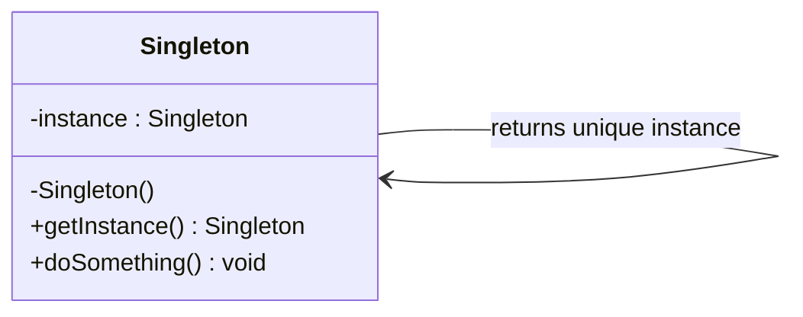

三个关键要素：
- **私有静态变量 (private static instance)**：持有唯一实例的引用。
- **私有构造函数 (private constructor)**：阻止外部通过 `new` 创建实例。
- **公有静态方法 (public static getInstance())**：全局访问点，返回唯一实例。

---

### 饿汉式 (Eager Initialization)

饿汉式是最简单、最直观的单例实现方式。正如其名——"饿汉"迫不及待，**在类被加载 (class loading) 到 JVM 时就立刻创建实例**，不管你后续是否真的需要用到它。

#### Java 实现

```java
public class HungrySingleton {

    // 1. 类加载时就完成实例化（JVM 保证类加载过程是线程安全的）
    private static final HungrySingleton INSTANCE = new HungrySingleton();

    // 2. 私有构造函数：禁止外部 new
    private HungrySingleton() {
        // 可以在这里做初始化工作
    }

    // 3. 全局访问点：直接返回已经创建好的实例
    public static HungrySingleton getInstance() {
        return INSTANCE; // 无需任何同步机制，直接返回
    }

    // 业务方法
    public void doSomething() {
        System.out.println("HungrySingleton is working...");
    }
}
```

#### Kotlin 实现

在 Kotlin 中，`object` 关键字天然就是饿汉式单例的语法糖：

```kotlin
// Kotlin 的 object 声明本质上就是一个饿汉式单例
// 编译器会自动生成 private 构造函数 + static INSTANCE 字段
object HungrySingleton {

    // 直接在 object 中定义属性和方法
    fun doSomething() {
        println("HungrySingleton is working...")
    }
}

// 使用方式：无需 getInstance()，直接通过类名访问
// HungrySingleton.doSomething()
```

> Kotlin 的 `object` 声明在字节码层面会生成一个包含 `static {}` 初始化块的类，其中创建 `INSTANCE` 对象。这与 Java 饿汉式完全等价。

#### 底层原理：为什么线程安全？

饿汉式的线程安全性由 **JVM 的类加载机制 (ClassLoader mechanism)** 保证。JVM 规范规定：类的初始化阶段（即执行 `<clinit>()` 方法）会被加锁，同一时刻只有一个线程可以执行，其他线程会阻塞等待。因此 `INSTANCE` 的赋值操作天然是原子性的，无需任何额外同步手段。

```java
// 反编译后的简化伪代码，展示 JVM 内部的加锁逻辑
static {
    synchronized (HungrySingleton.class) {   // JVM 内部的隐式锁
        INSTANCE = new HungrySingleton();     // 只会执行一次
    }
}
```

#### 优缺点分析

| 维度 | 评价 |
|------|------|
| **线程安全** | ✅ 由 JVM 类加载机制保证，绝对安全 |
| **实现简洁** | ✅ 代码最少，不易出错 |
| **延迟加载** | ❌ 不支持——即使不调用 `getInstance()`，只要类被加载就会创建实例 |
| **内存效率** | ⚠️ 如果实例占用内存大且长时间不使用，会浪费资源 |

**适用场景**：实例占用内存小、应用启动后必然会使用到的对象（如全局配置）。

---

### 懒汉式 (Lazy Initialization)

与饿汉式相反，懒汉式采用"按需创建"的策略——**只有当第一次调用 `getInstance()` 时才创建实例**。这在对象创建成本高或可能根本不会被使用的场景中非常有价值。

#### 最朴素的懒汉式（线程不安全版）

```java
public class LazyUnsafeSingleton {

    // 1. 初始为 null，不在类加载时创建
    private static LazyUnsafeSingleton instance = null;

    // 2. 私有构造函数
    private LazyUnsafeSingleton() {}

    // 3. 首次调用时创建实例 —— ⚠️ 线程不安全！
    public static LazyUnsafeSingleton getInstance() {
        if (instance == null) {          // 线程 A 判断为 null
            // 线程 A 还没来得及赋值，线程 B 也进来了，也判断为 null
            instance = new LazyUnsafeSingleton(); // 可能创建多个实例！
        }
        return instance;
    }
}
```

这段代码在单线程下运行完美，但在 Android 这种天然多线程环境中是**致命的**——主线程、IO 线程、Worker 线程可能同时调用 `getInstance()`，导致创建多个实例。

下面用时序图展示竞态条件 (Race Condition)：

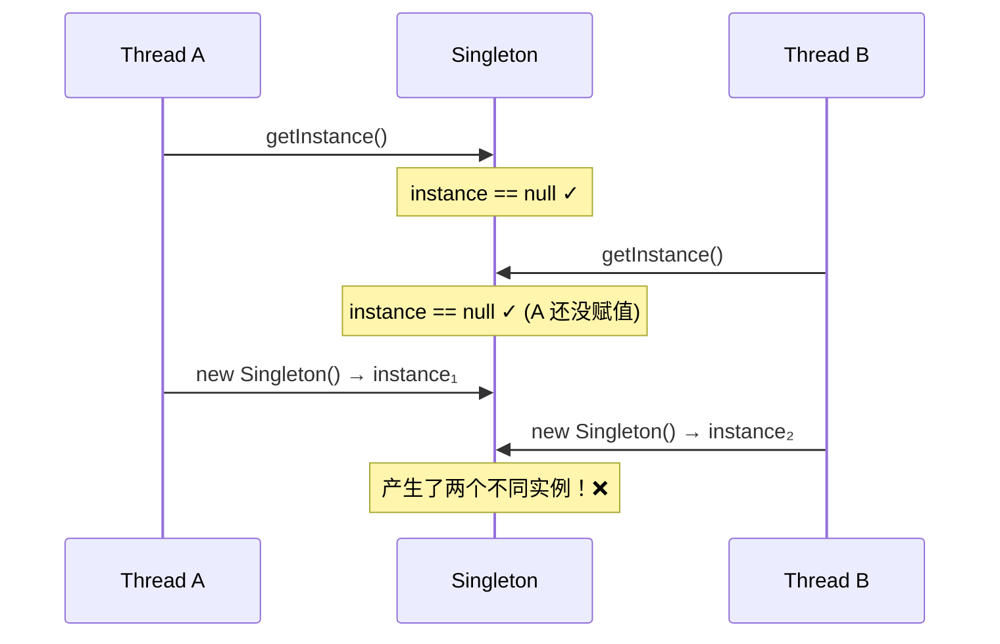

#### 加锁的懒汉式（线程安全但性能差）

最直接的修复方式——给整个方法加 `synchronized`：

```java
public class LazySafeSingleton {

    private static LazySafeSingleton instance = null;

    private LazySafeSingleton() {}

    // synchronized 保证同一时刻只有一个线程可以进入此方法
    public static synchronized LazySafeSingleton getInstance() {
        if (instance == null) {
            instance = new LazySafeSingleton();
        }
        return instance;
    }
}
```

这确实解决了线程安全问题，但代价是**每次调用 `getInstance()` 都要竞争锁**，即便实例早已创建完毕。在高并发场景下，这种粗粒度锁会严重影响性能——这就催生了下面的 DCL 方案。

---

### 双重检查锁 (Double-Checked Locking, DCL) ⭐⭐

DCL 是面试中出现频率最高的单例写法，也是真正理解 Java 内存模型 (JMM) 的试金石。它的目标是：**既保证线程安全，又将锁的粒度降到最低**。

#### 完整 Java 实现

```java
public class DCLSingleton {

    // 1. volatile 关键字：禁止指令重排序，保证可见性
    //    这是 DCL 正确性的关键！
    private static volatile DCLSingleton instance = null;

    // 2. 私有构造函数
    private DCLSingleton() {}

    // 3. 双重检查锁定
    public static DCLSingleton getInstance() {
        if (instance == null) {                    // 第一次检查（无锁，快速路径）
            synchronized (DCLSingleton.class) {    // 只有 instance 为 null 时才加锁
                if (instance == null) {            // 第二次检查（持锁状态下再确认）
                    instance = new DCLSingleton(); // 创建实例
                }
            }
        }
        return instance;                           // 已创建过的实例直接返回，无需加锁
    }
}
```

#### Kotlin 实现

```kotlin
class DCLSingleton private constructor() {

    companion object {
        // @Volatile 等价于 Java 的 volatile
        @Volatile
        private var instance: DCLSingleton? = null

        // 双重检查锁
        fun getInstance(): DCLSingleton {
            if (instance == null) {                          // 第一次检查
                synchronized(DCLSingleton::class.java) {    // 加锁
                    if (instance == null) {                  // 第二次检查
                        instance = DCLSingleton()            // 创建实例
                    }
                }
            }
            return instance!!                               // 非空断言，此时必不为 null
        }
    }
}
```

> Kotlin 标准库其实提供了更优雅的方案—— `lazy` 委托 with `LazyThreadSafetyMode.SYNCHRONIZED`，其底层实现就是 DCL。后面会提及。

#### 为什么需要两次检查？

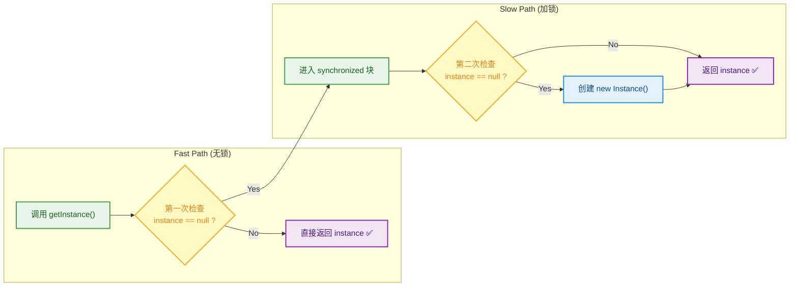

**第一次检查 (First Check)**：如果 `instance` 已经被创建（绝大多数情况），直接返回，**完全不需要进入 synchronized 块**。这条 "快速路径 (fast path)" 消除了加锁的性能开销。

**第二次检查 (Second Check)**：考虑这个场景——线程 A 和线程 B 同时通过了第一次 `null` 检查，线程 A 先获得锁并创建了实例，释放锁后线程 B 获得锁进入 synchronized 块。如果没有第二次检查，线程 B 会**再次创建实例**，单例就被破坏了。

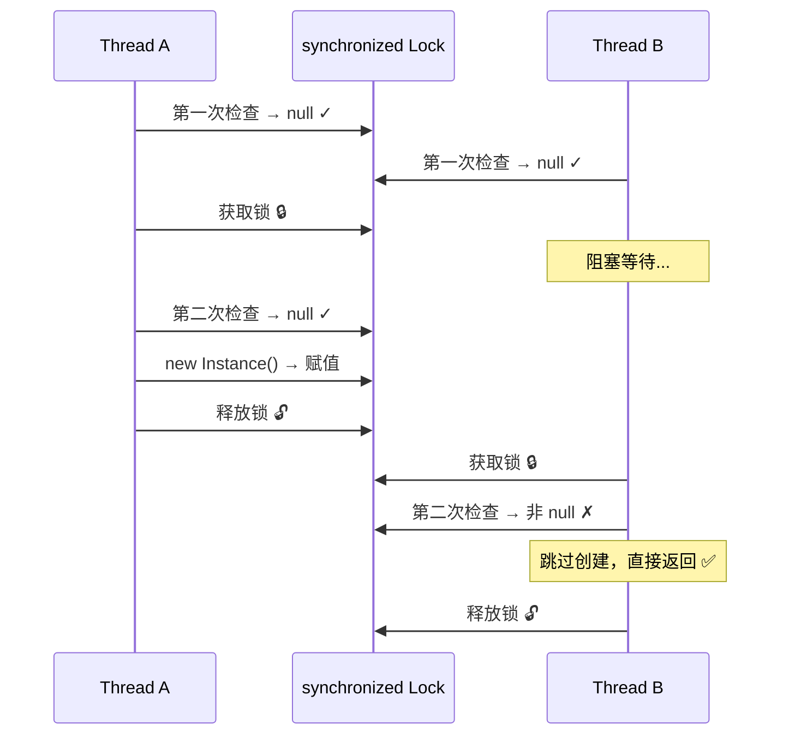

#### volatile 防止指令重排序

这是 DCL 中最精妙也最容易被忽视的部分。`instance = new DCLSingleton()` 这行代码在 JVM 层面并非原子操作，它实际上分为三步：

```java
// instance = new DCLSingleton(); 的字节码分解

// Step 1: 在堆上分配对象的内存空间
memory = allocate();

// Step 2: 调用构造函数，初始化对象的成员变量
ctorInstance(memory);

// Step 3: 将 instance 引用指向分配好的内存地址
//         （此时 instance != null）
instance = memory;
```

在没有 `volatile` 的情况下，JVM 的 JIT 编译器和 CPU 为了优化性能，可能对上述步骤进行**指令重排序 (Instruction Reordering)**，将执行顺序变为 `1 → 3 → 2`：

```c++
// 重排序后的执行顺序（危险！）
memory  = allocate();   // Step 1: 分配内存
instance = memory;      // Step 3: instance 已经非 null 了！
                        //         但对象还没初始化！
ctorInstance(memory);   // Step 2: 初始化（还没执行到这里）
```

此时如果线程 B 执行第一次检查，发现 `instance != null`，会直接返回——但这个 `instance` 指向的是一个**尚未初始化完毕的"半成品"对象**！访问它的成员变量将得到默认值（`0`、`null`、`false`），引发不可预知的 Bug。

**`volatile` 的作用**：在 Java 5+ 的内存模型 (JSR-133) 中，`volatile` 变量的写操作会插入一个 **StoreStore Barrier + StoreLoad Barrier**，确保：
- 写 volatile 变量之前的所有操作都不会被重排到写操作之后。
- 所有线程都能看到 volatile 变量最新的值（可见性）。

这意味着 `instance = memory` 一定发生在构造函数完成之后，彻底杜绝了"半初始化"问题。

```c++
// 加了 volatile 后的内存屏障（简化示意）
memory  = allocate();       // Step 1
ctorInstance(memory);       // Step 2
// ──── StoreStore Barrier ──── (禁止上面的操作和下面的重排)
instance = memory;          // Step 3 (volatile write)
// ──── StoreLoad Barrier ──── (对其他线程立即可见)
```

> **面试关键点**：如果面试官问"DCL 不加 volatile 会怎样"，答案是：可能读到未初始化完的对象，导致 NPE 或字段值异常。这是 Java 内存模型中经典的 happens-before 问题。

---

### 静态内部类 (Static Inner Class / Holder Pattern) ⭐

静态内部类方式被许多资深工程师认为是**最优雅的单例实现**——它同时具备延迟加载和线程安全两大优势，而且代码简洁，不需要 `volatile` 和 `synchronized`。

#### Java 实现

```java
public class HolderSingleton {

    // 1. 私有构造函数
    private HolderSingleton() {}

    // 2. 静态内部类：只有在被"主动引用"时才会被 JVM 加载
    //    这个类的加载时机 = getInstance() 第一次被调用时
    private static class Holder {
        // 类加载时创建实例（JVM 保证线程安全）
        private static final HolderSingleton INSTANCE = new HolderSingleton();
    }

    // 3. 全局访问点：触发 Holder 类的加载 → 创建实例
    public static HolderSingleton getInstance() {
        return Holder.INSTANCE; // 首次调用时才加载 Holder 类
    }
}
```

#### Kotlin 实现

```kotlin
class HolderSingleton private constructor() {

    companion object {
        // Kotlin 的 lazy 委托默认就是 synchronized 模式
        // 其内部实现原理与静态内部类异曲同工
        val instance: HolderSingleton by lazy {
            HolderSingleton()
        }
    }
}

// 或者更显式地模拟 Java 的 Holder 模式
class HolderSingleton2 private constructor() {

    // 私有的 Holder object（编译为静态内部类）
    private object Holder {
        val INSTANCE = HolderSingleton2()
    }

    companion object {
        fun getInstance(): HolderSingleton2 = Holder.INSTANCE
    }
}
```

#### 延迟加载原理

为什么静态内部类能实现延迟加载 (Lazy Loading)？这要从 JVM 的**类加载时机**说起。根据 JVM 规范，一个类只有在以下情况下才会被初始化（即执行 `<clinit>()`）：

1. 创建类的实例（`new`）
2. 访问类的静态变量（非 `final`，或 `final` 但非编译期常量）
3. 调用类的静态方法
4. 反射调用（`Class.forName()`）
5. 初始化子类时，父类先初始化
6. `main()` 方法所在的类

**关键洞察**：当外部类 `HolderSingleton` 被加载时，其静态内部类 `Holder` **不会被主动加载**。只有当代码执行到 `Holder.INSTANCE`（即访问了 `Holder` 的静态字段）时，JVM 才会去初始化 `Holder` 类，此时才创建单例实例。

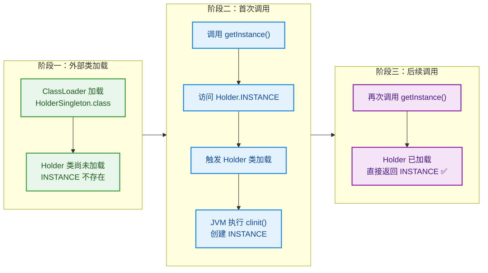

#### 线程安全原理

线程安全性同样由 **JVM 类加载的互斥锁**保证——`<clinit>()` 方法在多线程环境下会被隐式加锁，即使多个线程同时触发 `Holder` 类的初始化，也只有一个线程能执行 `<clinit>()`，其他线程会等待。而且 JVM 保证 `<clinit>()` 只会被执行一次。

**与 DCL 的对比**：

| 维度 | DCL | 静态内部类 |
|------|-----|-----------|
| **延迟加载** | ✅ | ✅ |
| **线程安全** | ✅（需要 volatile） | ✅（JVM 类加载机制保证） |
| **代码复杂度** | 较高（volatile + synchronized + 两次 if） | 极低（一个内部类即可） |
| **性能** | 首次之后无锁，但 volatile 读有微小开销 | 首次之后无锁，无 volatile 读开销 |
| **防反射攻击** | ❌ | ❌ |
| **防序列化破坏** | ❌（需额外处理） | ❌（需额外处理） |

> **最佳实践**：如果不需要防反射/序列化攻击，静态内部类是 Java 中推荐的单例写法。在 Kotlin 中，直接使用 `object` 或 `by lazy` 即可。

---

### 枚举单例 (Enum Singleton)

枚举单例被 《Effective Java》 作者 Joshua Bloch 称为 **"实现单例的最佳方式 (the best way to implement a singleton)"**。它不仅天然线程安全、延迟加载，还能**防御反射攻击和序列化破坏**——这是其他所有方式都无法做到的。

#### Java 实现

```java
public enum EnumSingleton {

    INSTANCE;  // 唯一的枚举常量，就是单例实例本身

    // 可以持有成员变量
    private int counter = 0;

    // 可以定义业务方法
    public void doSomething() {
        counter++;
        System.out.println("EnumSingleton working, counter = " + counter);
    }
}

// 使用方式
// EnumSingleton.INSTANCE.doSomething();
```

#### Kotlin 实现

```kotlin
// Kotlin 中可以直接用 enum class
enum class EnumSingleton {
    INSTANCE;  // 枚举常量

    private var counter = 0

    fun doSomething() {
        counter++
        println("EnumSingleton working, counter = $counter")
    }
}

// 不过在 Kotlin 中，object 声明已经足够优雅
// 枚举单例更多用在需要防反射/序列化的 Java 项目中
```

#### 防止反射攻击 (Reflection Attack Prevention)

对于普通的单例实现，攻击者可以通过 Java 反射 (Reflection) 强制调用私有构造函数来创建新实例：

```java
// 反射攻击：绕过私有构造函数创建第二个实例
Constructor<DCLSingleton> constructor =
        DCLSingleton.class.getDeclaredConstructor();   // 获取私有构造函数
constructor.setAccessible(true);                        // 暴力破解访问权限
DCLSingleton anotherInstance = constructor.newInstance(); // 创建了第二个实例！

// anotherInstance != DCLSingleton.getInstance() → 单例被破坏！
```

但是对枚举类型，**JVM 从底层就禁止了通过反射创建枚举实例**。在 `java.lang.reflect.Constructor#newInstance()` 的源码中有如下检查：

```java
// java.lang.reflect.Constructor 源码节选
public T newInstance(Object ... initargs) throws ... {
    // ...
    if ((clazz.getModifiers() & Modifier.ENUM) != 0)   // 如果是枚举类型
        throw new IllegalArgumentException(              // 直接抛出异常！
            "Cannot reflectively create enum objects");
    // ...
}
```

这意味着任何试图通过反射创建枚举实例的行为都会直接抛出 `IllegalArgumentException`，从根本上杜绝了反射攻击。

#### 防止序列化破坏 (Serialization Attack Prevention)

普通单例在序列化/反序列化 (Serialize/Deserialize) 过程中可能产生新实例：

```java
// 序列化攻击演示
DCLSingleton s1 = DCLSingleton.getInstance();

// 序列化：将对象写入字节流
ObjectOutputStream oos = new ObjectOutputStream(new FileOutputStream("singleton.ser"));
oos.writeObject(s1);
oos.close();

// 反序列化：从字节流还原对象 —— 会调用默认构造函数创建新对象！
ObjectInputStream ois = new ObjectInputStream(new FileInputStream("singleton.ser"));
DCLSingleton s2 = (DCLSingleton) ois.readObject();
ois.close();

System.out.println(s1 == s2); // false！单例被破坏！
```

**普通类的防御方式**——需要手动添加 `readResolve()` 方法：

```java
// 在普通单例类中添加此方法以防止序列化破坏
private Object readResolve() {
    return getInstance(); // 反序列化时返回已有实例而非新建
}
```

但枚举类型**完全不需要**这种额外处理。Java 的序列化机制对枚举做了特殊处理——序列化时只写入枚举常量名 (name)，反序列化时通过 `Enum.valueOf()` 查找已有常量，绝对不会创建新实例。

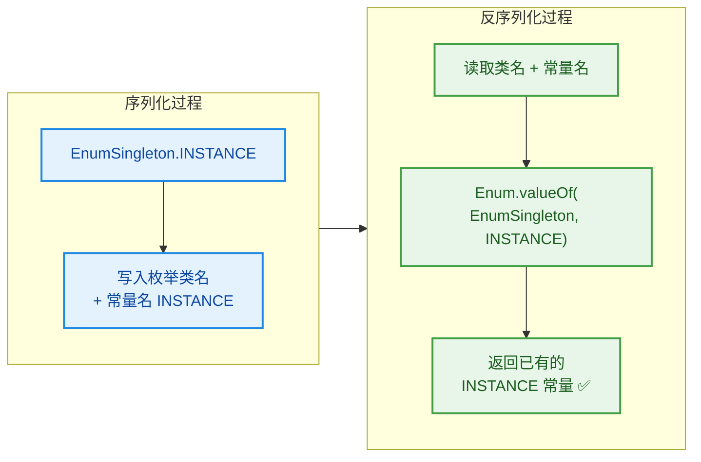

#### 各方式安全性对比

| 单例实现方式 | 线程安全 | 延迟加载 | 防反射 | 防序列化 | 代码复杂度 |
|:---:|:---:|:---:|:---:|:---:|:---:|
| 饿汉式 | ✅ | ❌ | ❌ | ❌ | ⭐ |
| 懒汉式(同步) | ✅ | ✅ | ❌ | ❌ | ⭐⭐ |
| DCL | ✅ | ✅ | ❌ | ❌ | ⭐⭐⭐ |
| 静态内部类 | ✅ | ✅ | ❌ | ❌ | ⭐⭐ |
| **枚举** | ✅ | ✅ | ✅ | ✅ | ⭐ |

> **为什么枚举单例在 Android 中不常见？**  早期 Android 官方文档曾建议避免使用枚举，因为枚举实例比普通常量占用更多内存（Dalvik 时代每个枚举常量约多消耗 ~13 倍内存）。但在 ART 运行时和现代设备上，这个差异已经可以忽略不计。不过由于历史惯性和 Kotlin `object` 的便利性，Android 开发中仍然很少使用枚举单例。

---

### Android 应用场景 (Application & Managers)

单例模式在 Android 系统和应用中的使用极其广泛。理解这些实际案例，能帮助你深刻体会单例模式的设计动机。

#### Application 类 —— 全局单例的基石

`Application` 是 Android 中最核心的单例对象之一。它在整个应用进程中**只有一个实例**，由系统在进程启动时创建，生命周期与进程一致。

```java
// Android Framework 中 Application 的获取方式
// 系统在 ActivityThread.handleBindApplication() 中创建 Application 实例
// 整个进程生命周期只创建一次

// 在 Activity/Service 中获取
Application app = getApplication();          // Activity/Service 内
Context appContext = getApplicationContext(); // 任意 Context 内

// 自定义 Application
public class MyApp extends Application {

    // 注意：这里不需要自己实现单例！
    // 系统保证只创建一个 MyApp 实例

    @Override
    public void onCreate() {
        super.onCreate();
        // 全局初始化工作
    }
}
```

**为什么不建议在自定义 `Application` 中再搞一个 `static INSTANCE`？**

虽然很多教程中会写 `MyApp.instance`，但这其实是多余的——`Application` 天然就是单例。更好的做法是通过 `Context.getApplicationContext()` 获取。如果一定要写，也要注意避免内存泄漏：

```kotlin
class MyApp : Application() {

    companion object {
        // 使用 lateinit 而非直接赋值，确保在 onCreate 后才可用
        lateinit var instance: MyApp
            private set  // 外部只读
    }

    override fun onCreate() {
        super.onCreate()
        instance = this  // Application.onCreate() 由系统保证只调用一次
    }
}
```

#### 系统服务 Manager —— Framework 层的单例群

Android 系统服务通过 `Context.getSystemService()` 获取，它们本质上都是单例（或进程级单例）：

```kotlin
// 常见的系统 Manager（全部是单例）
val windowManager = getSystemService(Context.WINDOW_SERVICE) as WindowManager
val layoutInflater = getSystemService(Context.LAYOUT_INFLATER_SERVICE) as LayoutInflater
val notificationManager = getSystemService(Context.NOTIFICATION_SERVICE) as NotificationManager
val connectivityManager = getSystemService(Context.CONNECTIVITY_SERVICE) as ConnectivityManager
val audioManager = getSystemService(Context.AUDIO_SERVICE) as AudioManager
val inputMethodManager = getSystemService(Context.INPUT_METHOD_SERVICE) as InputMethodManager
```

在 Framework 层，这些 Manager 的获取路径如下：

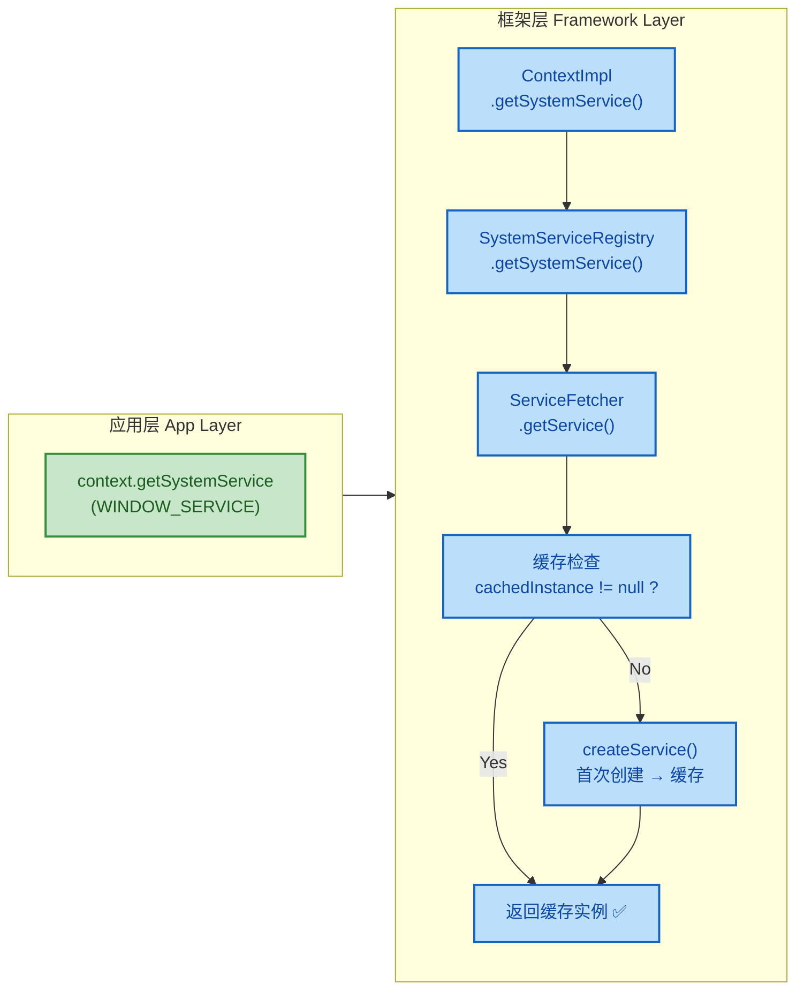

深入 `SystemServiceRegistry` 的源码可以发现，它内部使用了一个 `HashMap<String, ServiceFetcher<?>>` 来存储各服务的创建工厂，并通过 `CachedServiceFetcher` 实现了缓存机制——本质就是**懒汉式单例 + 缓存**：

```java
// Android Framework 源码简化 —— SystemServiceRegistry.java
// 注册系统服务的方式（静态代码块中执行）
static {
    // 每个服务注册一个 CachedServiceFetcher
    registerService(Context.WINDOW_SERVICE, WindowManager.class,
        new CachedServiceFetcher<WindowManager>() {          // 工厂 + 缓存
            @Override
            public WindowManager createService(ContextImpl ctx) {
                // 首次调用时创建，之后从缓存返回
                return new WindowManagerImpl(ctx);
            }
        });
    // ... 其他几十个服务类似注册 ...
}
```

#### 应用层常见单例实践

在实际 Android 项目中，以下场景通常采用单例模式：

```kotlin
// 1. 网络客户端 —— OkHttpClient 推荐全局单例
//    （内部维护连接池、线程池，多实例会浪费资源）
object NetworkClient {
    val okHttpClient: OkHttpClient by lazy {     // lazy 委托实现延迟初始化
        OkHttpClient.Builder()
            .connectTimeout(30, TimeUnit.SECONDS) // 连接超时 30s
            .readTimeout(30, TimeUnit.SECONDS)    // 读取超时 30s
            .addInterceptor(loggingInterceptor)   // 日志拦截器
            .build()                              // 构建实例
    }

    val retrofit: Retrofit by lazy {              // Retrofit 也应单例
        Retrofit.Builder()
            .baseUrl("https://api.example.com/")  // 基础 URL
            .client(okHttpClient)                 // 复用同一个 OkHttpClient
            .addConverterFactory(GsonConverterFactory.create()) // JSON 转换
            .build()
    }
}

// 2. 数据库 —— Room Database 推荐单例
//    （多实例会导致数据库锁冲突）
@Database(entities = [UserEntity::class], version = 1)
abstract class AppDatabase : RoomDatabase() {
    abstract fun userDao(): UserDao               // 抽象 DAO 方法

    companion object {
        @Volatile
        private var INSTANCE: AppDatabase? = null // volatile 修饰

        fun getInstance(context: Context): AppDatabase {
            return INSTANCE ?: synchronized(this) {              // DCL
                INSTANCE ?: Room.databaseBuilder(
                    context.applicationContext,                   // 使用 applicationContext 防止内存泄漏
                    AppDatabase::class.java,
                    "app_database"                               // 数据库文件名
                ).build().also { INSTANCE = it }                 // 赋值并返回
            }
        }
    }
}

// 3. SharedPreferences 管理器
object PrefsManager {
    private lateinit var prefs: SharedPreferences   // 延迟初始化

    fun init(context: Context) {                    // 在 Application.onCreate() 中调用
        prefs = context.applicationContext           // 使用 applicationContext
            .getSharedPreferences("app_prefs", Context.MODE_PRIVATE)
    }

    var userName: String                            // 属性委托简化读写
        get() = prefs.getString("user_name", "") ?: ""
        set(value) = prefs.edit().putString("user_name", value).apply()
}
```

#### 单例与内存泄漏 —— Android 中的致命陷阱

单例模式在 Android 中最大的坑就是**内存泄漏 (Memory Leak)**。因为单例的生命周期 = 进程的生命周期，如果单例持有了 `Activity` 或 `Fragment` 的引用，当这些组件被销毁时，GC 无法回收它们——引用链仍然存在。

```java
// ❌ 错误示范：单例持有 Activity 的 Context
public class BadManager {
    private static BadManager instance;
    private Context context;   // 如果这是 Activity 的 Context → 内存泄漏！

    private BadManager(Context context) {
        this.context = context; // 保存了 Activity 引用
    }

    public static BadManager getInstance(Context context) {
        if (instance == null) {
            instance = new BadManager(context); // Activity 被永久持有！
        }
        return instance;
    }
}

// ✅ 正确做法：始终使用 ApplicationContext
public class GoodManager {
    private static GoodManager instance;
    private Context appContext;  // Application 级别的 Context

    private GoodManager(Context context) {
        this.appContext = context.getApplicationContext(); // 安全！
    }

    public static GoodManager getInstance(Context context) {
        if (instance == null) {
            instance = new GoodManager(context);
        }
        return instance;
    }
}
```

内存泄漏的引用链如下：

```c++
// 内存泄漏引用链示意
GC Root (Static Field)
  └── BadManager.instance (static, 永远存活)
        └── BadManager.context
              └── MainActivity (已经 onDestroy，但无法被 GC 回收！)
                    └── View Hierarchy (整个视图树全部泄漏)
                          └── Bitmap, Drawable... (大量内存无法释放)
```

**黄金法则**：单例中需要 `Context` 时，**永远使用 `context.getApplicationContext()`**。Application Context 的生命周期与进程一致，不会造成泄漏。

---

### 单例模式总结与选型指南

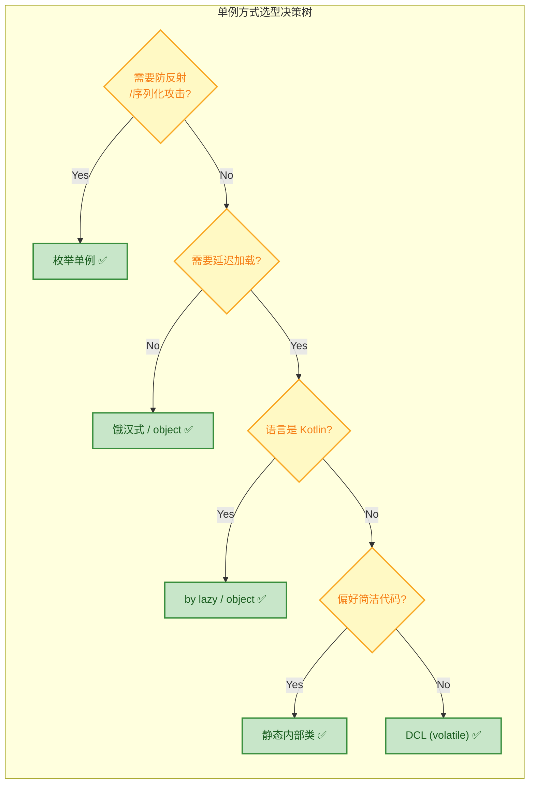

---

**📝 练习题**

**题目一**：在 Android 项目中，下列哪种 DCL 单例实现是正确且线程安全的？

A.
```java
public class Singleton {
    private static Singleton instance;
    public static Singleton getInstance() {
        if (instance == null) {
            synchronized (Singleton.class) {
                instance = new Singleton();
            }
        }
        return instance;
    }
}
```


B.
```java
public class Singleton {
    private static volatile Singleton instance;
    public static Singleton getInstance() {
        if (instance == null) {
            synchronized (Singleton.class) {
                if (instance == null) {
                    instance = new Singleton();
                }
            }
        }
        return instance;
    }
}
```


C.
```java
public class Singleton {
    private static Singleton instance;
    public static Singleton getInstance() {
        if (instance == null) {
            synchronized (Singleton.class) {
                if (instance == null) {
                    instance = new Singleton();
                }
            }
        }
        return instance;
    }
}
```


D.
```java
public class Singleton {
    private static volatile Singleton instance;
    public static synchronized Singleton getInstance() {
        if (instance == null) {
            instance = new Singleton();
        }
        return instance;
    }
}
```

**【答案】** B

**【解析】** 正确的 DCL 单例必须满足两个条件：① **`volatile`** 修饰 `instance`，防止 `new Singleton()` 的指令重排序导致其他线程读到未初始化完成的对象；② **两次 `null` 检查**，第一次是"快速路径"避免不必要的加锁，第二次是持锁状态下的确认。

- **A 错误**：缺少 `volatile`，且 synchronized 块内只有一次检查（没有第二次 `if`），两个线程可能先后进入 synchronized 块各创建一次实例。
- **C 错误**：虽然有两次检查，但缺少 `volatile`，在 JMM 下可能因指令重排导致其他线程读到"半初始化"对象。
- **D 错误**：虽然功能上是安全的（`synchronized` 整个方法 + `volatile`），但这不是 DCL——它是"同步懒汉式"。每次调用都需要竞争锁，失去了 DCL 的性能优势。

---

**📝 练习题**

**题目二**：在 Android 开发中，以下代码可能导致什么问题？

```kotlin
object ImageLoader {
    private lateinit var context: Context
    
    fun init(activity: Activity) {
        this.context = activity  // 传入 Activity
    }
    
    fun loadImage(url: String) {
        // 使用 context 加载图片...
    }
}
```

A. 编译错误，`object` 中不能使用 `lateinit`


B. 运行时崩溃，因为 `object` 不是线程安全的


C. 内存泄漏，`object` 单例永久持有 `Activity` 引用，导致 Activity 无法被 GC 回收


D. 无任何问题，`object` 会在 Activity 销毁时自动释放 `context` 引用

**【答案】** C

**【解析】** Kotlin 的 `object` 声明是进程级别的单例，其生命周期与应用进程一致。当 `init(activity)` 传入一个 `Activity` 实例并赋值给 `context` 后，单例便永久持有了该 Activity 的强引用。即使 Activity 执行了 `onDestroy()`，由于 GC Root → `ImageLoader.context` → `Activity` 的引用链仍然存在，Activity 及其整个 View 树都无法被垃圾回收，造成严重的内存泄漏。正确做法是 `this.context = activity.applicationContext`，使用 Application 级别的 Context，其生命周期与单例一致，不会泄漏。

- **A 错误**：`object` 中完全可以使用 `lateinit`，这是合法语法。
- **B 错误**：Kotlin `object` 由 JVM 类加载保证线程安全，不会有并发创建问题。
- **D 错误**：`object` 不具备任何自动释放引用的机制，Android 系统也不会帮你做这件事。

---

## 工厂模式 ⭐⭐

工厂模式（Factory Pattern）是创建型设计模式中最为常用的一类，其核心思想可以概括为一句话：**将对象的创建逻辑从使用方剥离出来，交由专门的"工厂"负责**。这样做的好处是显而易见的——调用方不再需要知道具体产品类的类名，也不需要了解构造过程的细节，只需要告诉工厂"我要什么"，工厂就返回一个可用的实例。

在 Android 开发中，工厂模式几乎无处不在。从 Framework 层的 `BitmapFactory`、`LayoutInflater`，到应用层各种第三方库中的对象构建，都深刻贯彻了工厂模式的设计哲学。根据抽象程度与职责划分的不同，工厂模式通常分为三个递进层次：

| 层次 | 模式名称 | 核心特征 | 开闭原则 |
|:---:|:---:|:---|:---:|
| L1 | 简单工厂 | 一个工厂类 + `if/switch` 分支 | ❌ 违反 |
| L2 | 工厂方法 | 每个产品对应一个工厂子类 | ✅ 符合 |
| L3 | 抽象工厂 | 一个工厂生产一族相关产品 | ✅ 符合 |

理解这三者的递进关系，是掌握工厂模式的关键。下面我们逐一展开。

---

### 简单工厂（Simple Factory）

简单工厂严格来说并不是 GoF 23 种经典设计模式之一，它更像是一种 **编程习惯（Programming Idiom）**，但由于其使用频率极高、概念入门友好，几乎所有设计模式教材都会首先介绍它。

#### 核心思想：一个工厂创建所有产品

简单工厂的结构非常直白——定义一个工厂类，在其中通过 `if-else` 或 `when`（Kotlin）分支判断参数类型，然后 `new` 出对应的产品实例返回给调用方。调用方只依赖产品的抽象接口，而不依赖具体实现类。

我们以 Android 中常见的"消息推送通知"为例。假设 App 需要根据不同渠道（站内信、短信、邮件）创建不同的通知对象：

```kotlin
// ==================== 产品抽象层 ====================

/**
 * 通知接口 —— 所有通知类型的统一抽象
 * 调用方只面向此接口编程，不关心具体实现
 */
interface Notification {
    fun send(message: String)   // 发送通知的统一方法
}

// ==================== 具体产品层 ====================

/** 站内信通知 */
class InAppNotification : Notification {
    override fun send(message: String) {
        // 实际场景中会调用 NotificationManager 构建系统通知
        println("📱 站内信通知: $message")
    }
}

/** 短信通知 */
class SmsNotification : Notification {
    override fun send(message: String) {
        // 实际场景中会调用 SmsManager 发送短信
        println("💬 短信通知: $message")
    }
}

/** 邮件通知 */
class EmailNotification : Notification {
    override fun send(message: String) {
        // 实际场景中会调用 JavaMail API 或后端接口
        println("📧 邮件通知: $message")
    }
}
```

接下来定义工厂类，在一个集中的位置管理所有产品的创建：

```kotlin
// ==================== 简单工厂 ====================

/**
 * 通知工厂 —— 根据类型参数创建对应的 Notification 实例
 * 这就是"简单工厂"的核心：一个工厂类包揽所有产品创建
 */
object NotificationFactory {

    /**
     * 枚举定义通知渠道类型，比字符串更安全
     */
    enum class Channel {
        IN_APP,   // 站内信
        SMS,      // 短信
        EMAIL     // 邮件
    }

    /**
     * 工厂方法 —— 根据 channel 参数返回对应的 Notification 实例
     * @param channel 通知渠道类型
     * @return Notification 的具体实现
     * @throws IllegalArgumentException 未知类型时抛出异常
     */
    fun create(channel: Channel): Notification {
        // 使用 Kotlin when 表达式进行分支匹配
        return when (channel) {
            Channel.IN_APP -> InAppNotification()   // 站内信
            Channel.SMS    -> SmsNotification()      // 短信
            Channel.EMAIL  -> EmailNotification()    // 邮件
            // 如果新增类型，必须在这里添加分支 ← 违反开闭原则的根源
        }
    }
}
```

调用方代码变得极为简洁：

```kotlin
// ==================== 客户端调用 ====================
fun main() {
    // 调用方完全不知道 InAppNotification / SmsNotification 的存在
    // 它只认识 Notification 接口和 NotificationFactory
    val notification = NotificationFactory.create(NotificationFactory.Channel.SMS)
    notification.send("您的验证码是 886425")  // 💬 短信通知: 您的验证码是 886425
}
```

下面用类图来直观展示简单工厂的结构关系：

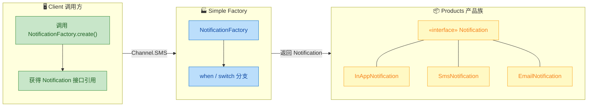

#### 违反开闭原则（Open-Closed Principle）

简单工厂最大的痛点在于：**每当新增一种产品类型时，必须修改工厂类的分支代码**。例如，需求方说"再加一个微信推送通知"，你不得不打开 `NotificationFactory`，在 `when` 里加一行：

```kotlin
// 新增微信推送 → 必须修改工厂类源码
Channel.WECHAT -> WeChatNotification()
```

这直接违反了面向对象设计的 **开闭原则**（Open for extension, Closed for modification）。在产品类型频繁变动的场景下，工厂类会不断膨胀，变成一个巨大的 `switch-case` 或 `when` 语句块，维护成本急剧上升。

> **何时选择简单工厂？** 当产品种类 **固定且数量有限**（如 3-5 种），且在项目生命周期内 **几乎不会新增类型** 时，简单工厂的直白性反而是优势——不过度设计，足够清晰。Android Framework 中的 `BitmapFactory` 在某种程度上就是这种思路。

#### Java 版本对照

在 Java 中实现几乎一致，只是语法略有不同：

```java
// ==================== Java 简单工厂 ====================
public class NotificationFactory {

    /**
     * 根据类型字符串创建 Notification 实例
     * Java 中常用 String 或 enum 作为类型标识
     */
    public static Notification create(String channel) {
        // switch 分支判断
        switch (channel) {
            case "IN_APP":
                return new InAppNotification();   // 站内信
            case "SMS":
                return new SmsNotification();      // 短信
            case "EMAIL":
                return new EmailNotification();    // 邮件
            default:
                // 未知类型抛出异常，防止静默失败
                throw new IllegalArgumentException("Unknown channel: " + channel);
        }
    }
}
```

---

### 工厂方法（Factory Method）⭐

工厂方法模式是对简单工厂的一次 **本质升级**。它的核心策略是：**不再让一个工厂类承担所有产品的创建，而是为每种产品定义一个对应的工厂子类**。新增产品时，只需新增一个工厂子类，完全不需要修改已有代码——完美符合开闭原则。

GoF 对工厂方法的原始定义是：

> "Define an interface for creating an object, but let subclasses decide which class to instantiate."（定义一个创建对象的接口，但让子类决定实例化哪个类。）

#### 结构拆解：每个产品对应一个工厂

继续沿用通知的例子，我们用工厂方法来重构：

```kotlin
// ==================== 产品抽象层（与之前相同）====================

interface Notification {
    fun send(message: String)
}

class InAppNotification : Notification {
    override fun send(message: String) = println("📱 站内信: $message")
}

class SmsNotification : Notification {
    override fun send(message: String) = println("💬 短信: $message")
}

class EmailNotification : Notification {
    override fun send(message: String) = println("📧 邮件: $message")
}

// ==================== 工厂抽象层 ====================

/**
 * 抽象工厂接口 —— 定义"创建通知"的契约
 * 每个具体工厂子类负责创建一种具体产品
 */
interface NotificationFactory {
    fun create(): Notification   // 工厂方法：由子类决定创建哪个产品
}

// ==================== 具体工厂层 ====================

/** 站内信工厂 —— 专门生产 InAppNotification */
class InAppNotificationFactory : NotificationFactory {
    override fun create(): Notification {
        // 可以在此添加初始化逻辑、日志、缓存等
        return InAppNotification()
    }
}

/** 短信工厂 —— 专门生产 SmsNotification */
class SmsNotificationFactory : NotificationFactory {
    override fun create(): Notification {
        return SmsNotification()
    }
}

/** 邮件工厂 —— 专门生产 EmailNotification */
class EmailNotificationFactory : NotificationFactory {
    override fun create(): Notification {
        return EmailNotification()
    }
}
```

调用方的使用方式：

```kotlin
// ==================== 客户端调用 ====================

/**
 * NotificationService 依赖抽象的 NotificationFactory
 * 通过构造器注入工厂实例，实现松耦合
 */
class NotificationService(
    private val factory: NotificationFactory   // 依赖注入：注入的是哪个工厂，就生产哪种产品
) {
    fun notify(message: String) {
        val notification = factory.create()    // 调用工厂方法获取产品
        notification.send(message)             // 使用产品
    }
}

fun main() {
    // 运行时决定使用哪个工厂 —— 策略可从配置文件或 DI 框架注入
    val service = NotificationService(SmsNotificationFactory())
    service.notify("您的快递已签收")   // 💬 短信: 您的快递已签收
}
```

#### 符合开闭原则（OCP）

现在假设需求方提出新增"微信推送"，你只需要：

```kotlin
// ==================== 新增产品 + 新增工厂，不修改任何已有代码 ====================

/** 新增产品：微信推送通知 */
class WeChatNotification : Notification {
    override fun send(message: String) = println("💚 微信推送: $message")
}

/** 新增工厂：微信推送工厂 */
class WeChatNotificationFactory : NotificationFactory {
    override fun create(): Notification = WeChatNotification()
}
```

整个扩展过程 **零修改、纯新增**。原有的 `InAppNotificationFactory`、`SmsNotificationFactory` 等代码一行不动，这正是开闭原则的完美体现。

#### 简单工厂 vs 工厂方法：核心差异

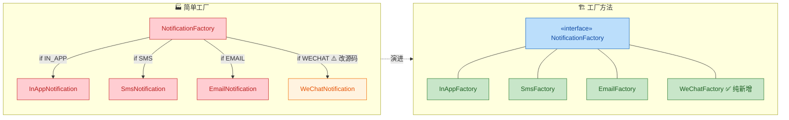

| 维度 | 简单工厂 | 工厂方法 |
|:---|:---|:---|
| 工厂数量 | **1个**，所有分支堆在一起 | **N个**，每种产品一个工厂 |
| 新增产品 | 修改工厂类 ❌ | 新增工厂子类 ✅ |
| 开闭原则 | 违反 | 符合 |
| 代码量 | 少，适合简单场景 | 多，适合复杂演化场景 |
| 复杂度 | 低 | 中等 |

#### 工厂方法在 Android Framework 中的影子

Android Framework 中有一个经典的工厂方法案例——`ViewGroup` 中的 `onCreateView()` 与 `LayoutInflater` 的协作机制。`Activity`、`Fragment`、`AppCompatDelegateImpl` 通过覆写相关方法来决定最终创建哪种 View 对象，这本质上就是工厂方法：**父类定义创建接口，子类决定产品实例**。

---

### 抽象工厂（Abstract Factory）

抽象工厂是工厂模式的最高抽象层次。如果说工厂方法处理的是"**一个维度**"的产品变化（如不同类型的通知），那么抽象工厂处理的是"**多个维度**"的产品变化——它负责创建一组 **相关的、成体系的产品族（Product Family）**。

#### 何为产品族？

以 Android UI 主题为例：一套"Light 浅色主题"包含浅色按钮、浅色文本框、浅色背景卡片；一套"Dark 深色主题"包含深色按钮、深色文本框、深色背景卡片。这里每套主题就是一个**产品族**，而按钮、文本框、卡片分别属于不同的**产品等级**。

```text
                  产品等级 →
                  Button          EditText        Card
产品族 ↓
Light主题    LightButton     LightEditText   LightCard
Dark主题     DarkButton      DarkEditText    DarkCard
```

抽象工厂的任务是：**一个工厂负责生产同一族（同一行）的所有产品，确保它们风格一致**。

#### 完整代码实现

```kotlin
// ================================================================
// 产品抽象层：定义每个产品等级的接口
// ================================================================

/** 按钮抽象 */
interface Button {
    fun render(): String    // 渲染按钮，返回描述文字
}

/** 输入框抽象 */
interface EditText {
    fun render(): String    // 渲染输入框
}

/** 卡片抽象 */
interface Card {
    fun render(): String    // 渲染卡片
}

// ================================================================
// 具体产品层：Light 主题族
// ================================================================

class LightButton : Button {
    override fun render() = "🔲 Light Button (白底黑字)"
}

class LightEditText : EditText {
    override fun render() = "📝 Light EditText (白底灰边框)"
}

class LightCard : Card {
    override fun render() = "🃏 Light Card (白色卡片 + 浅灰阴影)"
}

// ================================================================
// 具体产品层：Dark 主题族
// ================================================================

class DarkButton : Button {
    override fun render() = "🔳 Dark Button (深灰底白字)"
}

class DarkEditText : EditText {
    override fun render() = "📝 Dark EditText (深灰底亮边框)"
}

class DarkCard : Card {
    override fun render() = "🃏 Dark Card (深灰卡片 + 黑色阴影)"
}

// ================================================================
// 抽象工厂接口：定义创建一族产品的契约
// ================================================================

/**
 * UIComponentFactory —— 抽象工厂
 * 每个方法对应一个产品等级（Button / EditText / Card）
 * 每个具体工厂实现负责生产同一主题族的全套组件
 */
interface UIComponentFactory {
    fun createButton(): Button       // 创建按钮
    fun createEditText(): EditText   // 创建输入框
    fun createCard(): Card           // 创建卡片
}

// ================================================================
// 具体工厂：Light 主题工厂 —— 生产 Light 族全部产品
// ================================================================

class LightThemeFactory : UIComponentFactory {
    override fun createButton(): Button = LightButton()         // Light 按钮
    override fun createEditText(): EditText = LightEditText()   // Light 输入框
    override fun createCard(): Card = LightCard()               // Light 卡片
}

// ================================================================
// 具体工厂：Dark 主题工厂 —— 生产 Dark 族全部产品
// ================================================================

class DarkThemeFactory : UIComponentFactory {
    override fun createButton(): Button = DarkButton()          // Dark 按钮
    override fun createEditText(): EditText = DarkEditText()    // Dark 输入框
    override fun createCard(): Card = DarkCard()                // Dark 卡片
}
```

客户端使用抽象工厂：

```kotlin
// ================================================================
// 客户端：面向抽象工厂编程，运行时切换整套主题
// ================================================================

/**
 * ThemeRenderer 负责使用工厂创建 UI 并渲染
 * 它完全不知道 LightButton / DarkButton 的存在
 * 只依赖 UIComponentFactory + Button / EditText / Card 这些抽象
 */
class ThemeRenderer(private val factory: UIComponentFactory) {

    fun renderScreen() {
        // 通过工厂获取同一族的全套产品
        val button = factory.createButton()        // 获取按钮
        val editText = factory.createEditText()    // 获取输入框
        val card = factory.createCard()            // 获取卡片

        // 渲染到界面
        println("=== Screen Render ===")
        println(button.render())                   // 渲染按钮
        println(editText.render())                 // 渲染输入框
        println(card.render())                     // 渲染卡片
    }
}

fun main() {
    // 运行时根据用户设置选择主题工厂
    val isDarkMode = true  // 假设用户开启了深色模式

    // 根据条件注入不同的工厂
    val factory: UIComponentFactory = if (isDarkMode) {
        DarkThemeFactory()     // 深色主题工厂
    } else {
        LightThemeFactory()    // 浅色主题工厂
    }

    // ThemeRenderer 不关心具体是哪个工厂，它只面向接口
    val renderer = ThemeRenderer(factory)
    renderer.renderScreen()
}
```

输出结果（深色模式）：

```text
=== Screen Render ===
🔳 Dark Button (深灰底白字)
📝 Dark EditText (深灰底亮边框)
🃏 Dark Card (深灰卡片 + 黑色阴影)
```

#### 抽象工厂类图

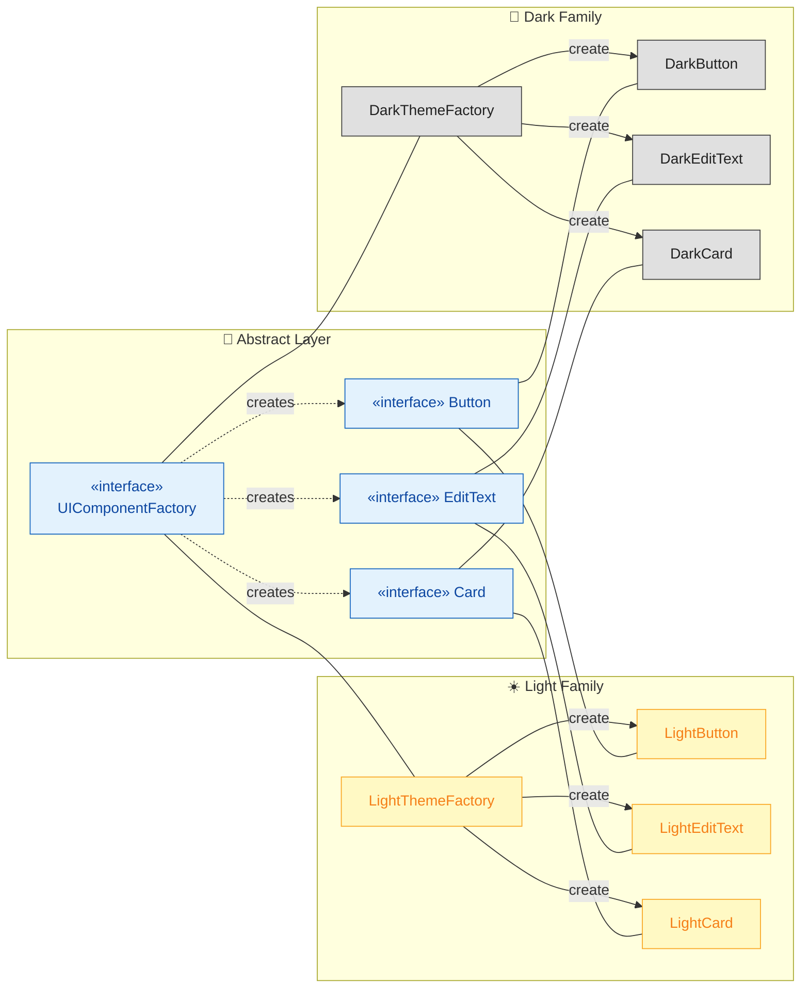

#### 创建产品族 vs 创建单一产品

抽象工厂和工厂方法的本质差异在于 **维度数量**：

| 维度 | 工厂方法 | 抽象工厂 |
|:---|:---|:---|
| 工厂接口方法数 | **1 个** `create()` | **多个** `createX()` / `createY()` |
| 解决问题 | 一种产品的多种变体 | 多种产品组成的产品族 |
| 扩展方向 | 新增产品变体（纵向） | 新增产品族（横向） |
| 典型场景 | 日志工厂、通知工厂 | UI 主题、跨平台适配 |

值得注意的是，抽象工厂在新增 **产品族**（如新增"Material You 主题"）时符合开闭原则；但在新增 **产品等级**（如在主题中新增 `Toolbar` 组件）时，需要修改抽象工厂接口——这是它固有的局限性。

#### 多个相关产品的一致性保证

抽象工厂最大的价值在于 **强制保证同一族产品之间的一致性**。如果你用 `DarkThemeFactory`，那么得到的 Button、EditText、Card 一定全部是 Dark 风格的。你不可能出现"深色按钮配浅色卡片"这种混搭 Bug。这种约束在 Android 主题系统、多品牌 UI 适配、多平台 SDK 封装中尤其有价值。

---

### Android 应用（BitmapFactory、LayoutInflater）

在 Android Framework 源码中，工厂模式的应用比比皆是。这里深入分析两个最具代表性的案例。

#### BitmapFactory —— 简单工厂的经典范本

`android.graphics.BitmapFactory` 是 Android 中最常用的图片解码工具类。它提供了一系列 **静态方法**，根据不同的数据源创建 `Bitmap` 对象：

```java
// ==================== BitmapFactory 核心 API（Framework 源码简化）====================

public class BitmapFactory {

    /**
     * 从资源文件解码 Bitmap
     * @param res   Resources 对象
     * @param id    资源 ID（如 R.drawable.photo）
     * @return      解码后的 Bitmap 对象
     */
    public static Bitmap decodeResource(Resources res, int id) {
        // 内部调用 native 层解码逻辑
        // ...
        return bitmap;
    }

    /**
     * 从文件路径解码 Bitmap
     * @param pathName 文件绝对路径
     * @return         解码后的 Bitmap 对象
     */
    public static Bitmap decodeFile(String pathName) {
        // 打开 FileInputStream → 调用 decodeStream
        // ...
        return bitmap;
    }

    /**
     * 从字节数组解码 Bitmap
     * @param data   字节数据
     * @param offset 偏移量
     * @param length 长度
     * @return       解码后的 Bitmap 对象
     */
    public static Bitmap decodeByteArray(byte[] data, int offset, int length) {
        // 调用 native 解码
        // ...
        return bitmap;
    }

    /**
     * 从输入流解码 Bitmap —— 最底层的通用方法
     * @param is  InputStream 输入流
     * @return    解码后的 Bitmap 对象
     */
    public static Bitmap decodeStream(InputStream is) {
        // 所有方法最终都会汇聚到这里或 native 层
        // ...
        return bitmap;
    }
}
```

客户端调用示例：

```kotlin
// ==================== Android 应用层使用 BitmapFactory ====================

// 从 drawable 资源解码
val bitmap1: Bitmap = BitmapFactory.decodeResource(
    resources,           // Context.getResources()
    R.drawable.avatar    // 资源 ID
)

// 从文件路径解码
val bitmap2: Bitmap? = BitmapFactory.decodeFile(
    "/sdcard/DCIM/photo.jpg"   // 文件绝对路径
)

// 从网络下载的字节数组解码
val bitmap3: Bitmap? = BitmapFactory.decodeByteArray(
    byteArray,   // 网络下载的字节数据
    0,           // 起始偏移
    byteArray.size   // 数据长度
)
```

**BitmapFactory 的工厂模式分析**：

- **工厂角色**：`BitmapFactory` 类本身（静态方法集合）
- **产品角色**：`Bitmap` 对象
- **模式归类**：典型的 **简单工厂**——调用方不需要知道 Bitmap 内部如何分配内存、如何解码 PNG/JPEG/WebP，只需选择合适的 `decodeXxx()` 方法
- **"分支"体现**：不同 `decodeXxx()` 方法对应不同数据源，本质上与 `switch-case` 等价，只是用方法重载替代了条件分支

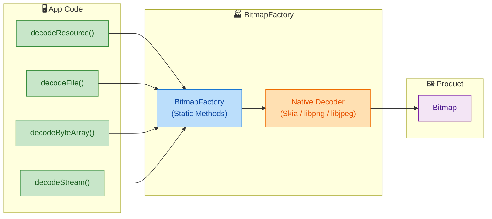

> **补充**：`BitmapFactory.Options` 的设计则带有 **建造者模式** 的影子——通过设置各种选项字段（`inSampleSize`、`inPreferredConfig` 等）来配置解码行为，虽然它没有使用链式 `Builder`，但核心思想相通。

#### LayoutInflater —— 工厂方法的深度应用

`LayoutInflater` 是 Android UI 系统的核心引擎，负责将 XML 布局文件解析为 View 对象树。它内部的 View 创建机制就是工厂方法模式的精彩实践。

**核心流程**：当 `LayoutInflater.inflate(R.layout.xxx, parent)` 被调用时，解析器会逐个读取 XML 标签，然后对每个标签调用"创建 View"的逻辑。这个创建过程涉及一个关键接口：

```java
// ==================== LayoutInflater 中的工厂接口 ====================

public abstract class LayoutInflater {

    /**
     * Factory2 接口 —— 工厂方法模式的核心抽象
     * 任何想参与 View 创建过程的类都可以实现此接口
     */
    public interface Factory2 {
        /**
         * 工厂方法：根据 XML 标签名创建对应的 View 实例
         * @param parent  父 View
         * @param name    XML 标签名（如 "TextView", "LinearLayout"）
         * @param context 上下文
         * @param attrs   XML 属性集
         * @return        创建的 View 对象，返回 null 则交给下一个工厂处理
         */
        View onCreateView(View parent, String name, Context context, AttributeSet attrs);
    }
}
```

在实际的 View 创建链路中，有多个"工厂"参与，按优先级依次尝试：

```java
// ==================== LayoutInflater.createViewFromTag() 简化逻辑 ====================

View createViewFromTag(View parent, String name, Context context, AttributeSet attrs) {
    View view;

    // 第一优先级：尝试使用 mFactory2（通常是 AppCompatDelegateImpl）
    if (mFactory2 != null) {
        view = mFactory2.onCreateView(parent, name, context, attrs);  // 工厂方法调用
        if (view != null) return view;  // 如果工厂成功创建，直接返回
    }

    // 第二优先级：尝试使用 mFactory（兼容旧版）
    if (mFactory != null) {
        view = mFactory.onCreateView(name, context, attrs);
        if (view != null) return view;
    }

    // 第三优先级：使用 mPrivateFactory（系统内部使用，如 Fragment）
    if (mPrivateFactory != null) {
        view = mPrivateFactory.onCreateView(parent, name, context, attrs);
        if (view != null) return view;
    }

    // 兜底：通过反射创建 View（最终的默认逻辑）
    // 如果标签名包含 "."（如 "com.example.CustomView"），说明是全限定名
    // 否则补上 "android.widget." 前缀再反射
    view = onCreateView(context, parent, name, attrs);  // 反射兜底
    return view;
}
```

**AppCompatActivity 与 Factory2 的工厂方法协作**：

这是 AndroidX 中最重要的工厂方法案例。`AppCompatDelegateImpl` 实现了 `Factory2` 接口，将 XML 中的 `<TextView>` 替换为 `AppCompatTextView`，`<ImageView>` 替换为 `AppCompatImageView`，从而实现对旧版 Android 的 Material Design 向下兼容。

```kotlin
// ==================== AppCompatDelegateImpl（简化）====================

/**
 * AppCompatDelegateImpl 实现 Factory2 接口
 * 它就是 "具体工厂子类"，决定创建哪种 View
 */
class AppCompatDelegateImpl : LayoutInflater.Factory2 {

    override fun onCreateView(
        parent: View?,
        name: String,       // XML 标签名，如 "TextView"
        context: Context,
        attrs: AttributeSet
    ): View? {
        // 根据标签名决定创建哪个 AppCompat 版本的 View
        return when (name) {
            "TextView"    -> AppCompatTextView(context, attrs)     // TextView → AppCompatTextView
            "ImageView"   -> AppCompatImageView(context, attrs)    // ImageView → AppCompatImageView
            "Button"      -> AppCompatButton(context, attrs)       // Button → AppCompatButton
            "EditText"    -> AppCompatEditText(context, attrs)     // EditText → AppCompatEditText
            "CheckBox"    -> AppCompatCheckBox(context, attrs)     // CheckBox → AppCompatCheckBox
            "RadioButton" -> AppCompatRadioButton(context, attrs)  // RadioButton → AppCompatRadioButton
            // ... 更多替换规则
            else          -> null  // 返回 null 表示本工厂不处理，交给下一级
        }
    }
}
```

**完整的 View 创建链路时序图**：

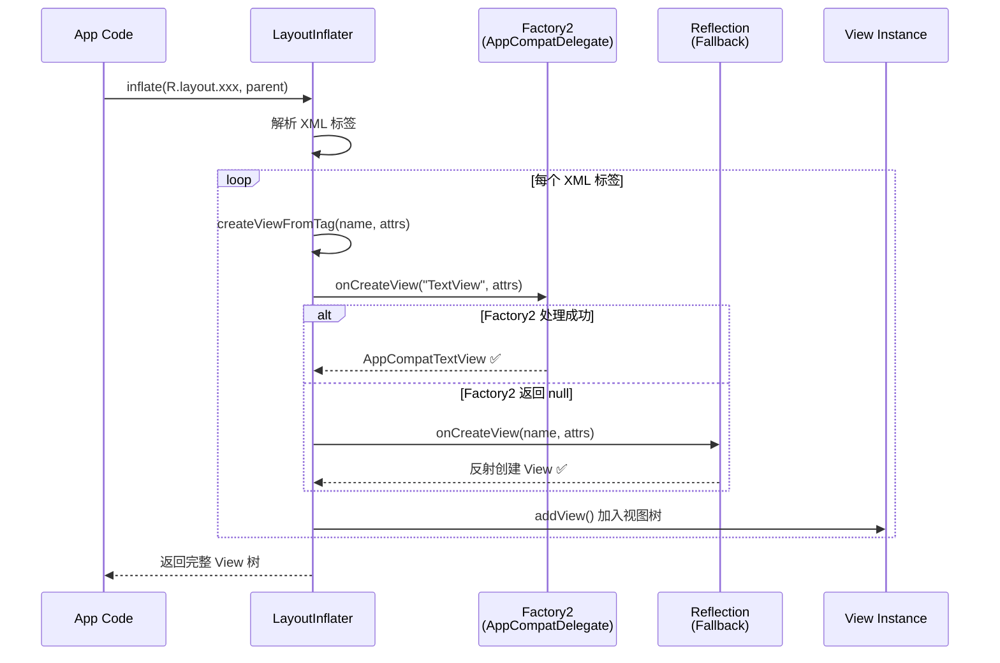

**LayoutInflater 的工厂模式分析**：

- **抽象工厂角色**：`LayoutInflater.Factory2` 接口
- **具体工厂角色**：`AppCompatDelegateImpl`、自定义 `Factory2` 实现
- **产品角色**：各种 `View` 子类（`AppCompatTextView` 等）
- **模式归类**：**工厂方法模式**——`Factory2` 定义创建接口，具体实现类决定实例化哪个 View
- **扩展性**：开发者可以通过 `LayoutInflaterCompat.setFactory2()` 注入自定义工厂，实现全局 View 替换（如全局字体、全局换肤）

#### 实战：利用 Factory2 实现全局字体替换

```kotlin
// ==================== 全局字体替换示例 ====================

class FontActivity : AppCompatActivity() {

    override fun onCreate(savedInstanceState: Bundle?) {
        // 必须在 super.onCreate() 之前设置 Factory2
        // 因为 AppCompatDelegateImpl 也要在 super 中注册自己的 Factory2
        val delegate = delegate  // 获取 AppCompatDelegate

        // 用 LayoutInflaterCompat 设置自定义 Factory2
        LayoutInflaterCompat.setFactory2(layoutInflater, object : LayoutInflater.Factory2 {
            override fun onCreateView(
                parent: View?, name: String, context: Context, attrs: AttributeSet
            ): View? {
                // 先让 AppCompat 默认处理（保留 AppCompat 兼容逻辑）
                val view = delegate.createView(parent, name, context, attrs)

                // 如果创建出来的是 TextView 或其子类，统一设置自定义字体
                if (view is TextView) {
                    val customFont = ResourcesCompat.getFont(context, R.font.custom_font)
                    view.typeface = customFont   // 全局替换字体
                }

                return view  // 返回处理后的 View
            }

            // Factory（旧版接口）的方法，委托给上面的方法
            override fun onCreateView(name: String, context: Context, attrs: AttributeSet): View? {
                return onCreateView(null, name, context, attrs)
            }
        })

        super.onCreate(savedInstanceState)   // 此后的 setContentView 就会走自定义 Factory2
        setContentView(R.layout.activity_font)
    }
}
```

#### 三种工厂模式在 Android 中的全景对照

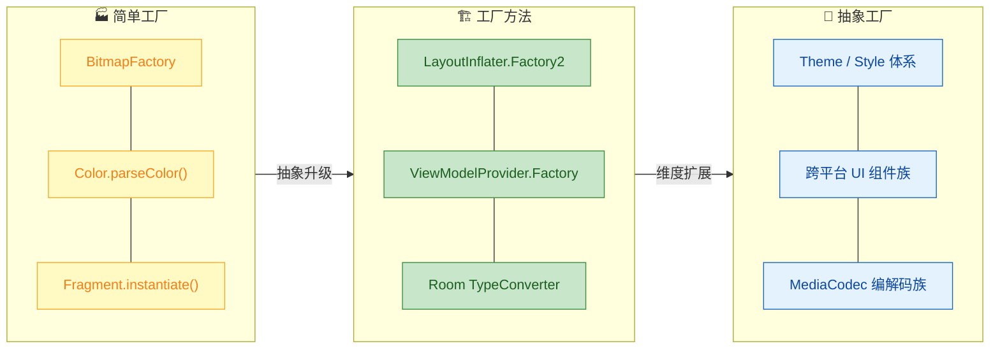

补充一些前面未涉及但在 Android 开发中常见的工厂模式应用：

| 类/接口 | 模式类型 | 说明 |
|:---|:---:|:---|
| `BitmapFactory` | 简单工厂 | 多个静态 `decodeXxx()` 方法，根据数据源创建 Bitmap |
| `LayoutInflater.Factory2` | 工厂方法 | 子类决定创建哪种 View |
| `ViewModelProvider.Factory` | 工厂方法 | 自定义 ViewModel 创建逻辑，注入依赖 |
| `Retrofit.create()` | 工厂方法 + 动态代理 | 根据接口定义动态生成 API 实现类 |
| `MediaCodec.createEncoderByType()` | 简单工厂 | 根据 MIME 类型创建编码器/解码器 |
| Android Theme / Style | 抽象工厂思想 | 一套 Theme 定义一整族 UI 属性 |

---

**📝 练习题 1**

某 Android App 需要支持多种支付方式（支付宝、微信、银联），且后续可能频繁新增新的支付方式。以下哪种模式最合适？

A. 简单工厂模式，在一个 `PaymentFactory` 中用 `when/switch` 分支创建所有支付实例

B. 工厂方法模式，为每种支付方式定义独立的工厂类，新增支付方式只需新增工厂子类

C. 抽象工厂模式，每个工厂负责创建一族支付相关对象（支付、退款、查询）

D. 直接在调用处 `new` 具体支付类，无需工厂模式


**【答案】** B

**【解析】** 题干的关键在于"后续可能 **频繁新增**"支付方式。选项 A 的简单工厂每次新增都需要修改工厂类的分支代码，违反开闭原则，在频繁变化场景下维护成本高。选项 B 的工厂方法模式为每种支付方式定义独立的工厂子类（如 `AlipayFactory`、`WeChatPayFactory`），新增银行卡支付只需新增 `BankCardPayFactory`，完全不改动已有代码，完美符合 OCP（Open-Closed Principle）。选项 C 的抽象工厂适用于 **一族相关产品**（支付 + 退款 + 查询），但题目只提到"支付方式"这一个产品等级，用抽象工厂属于过度设计。选项 D 直接 `new` 导致客户端与具体实现紧耦合，不利于扩展。


**📝 练习题 2**

在 Android 中，`AppCompatActivity` 能将 XML 中的 `<TextView>` 自动替换为 `AppCompatTextView`，以下关于其实现原理的描述，正确的是？

A. `AppCompatActivity` 通过重写 `setContentView()` 方法，手动将所有 `TextView` 替换为 `AppCompatTextView`

B. `AppCompatDelegateImpl` 实现了 `LayoutInflater.Factory2` 接口，在 `onCreateView()` 中根据标签名返回对应的 AppCompat 版本 View

C. Android 系统在编译时通过 APT（Annotation Processing Tool）自动生成替换代码

D. `AppCompatTextView` 继承自 `TextView`，系统运行时通过反射自动优先选择子类


**【答案】** B

**【解析】** `AppCompatActivity` 的 View 替换机制是工厂方法模式的经典应用。其内部的 `AppCompatDelegateImpl` 实现了 `LayoutInflater.Factory2` 接口，并在 `onCreateView()` 回调中，根据 XML 标签名（如 `"TextView"`）返回对应的 AppCompat 版本（如 `AppCompatTextView`）。`LayoutInflater` 在解析 XML 创建 View 时会优先调用已注册的 `Factory2` 的 `onCreateView()` 方法，如果返回非 null，就直接使用该 View 而不走默认的反射创建路径。选项 A 错在 `setContentView()` 并非替换的核心机制，它只是触发了 `inflate()` 流程。选项 C 完全不相关，APT 用于注解处理而非 View 替换。选项 D 虽然 `AppCompatTextView` 确实继承 `TextView`，但系统不会"自动优先选择子类"，必须通过 Factory2 机制显式拦截和替换。

---

## 建造者模式 (Builder Pattern) ⭐⭐

建造者模式（Builder Pattern）是创建型设计模式中极其实用的一种，其核心思想可以用一句话概括：**将一个复杂对象的构建过程与其最终表示分离，使得同样的构建过程可以创建不同的表示**（Separate the construction of a complex object from its representation）。

为什么需要建造者模式？设想一个场景：你正在创建一个 `NetworkConfig` 对象，它包含 `url`、`timeout`、`retryCount`、`headers`、`cachePolicy`、`interceptors` 等十几个参数。如果使用构造函数，你将面临臭名昭著的 **"Telescoping Constructor"（伸缩式构造函数）** 问题 —— 参数数量爆炸，调用时完全搞不清哪个参数对应哪个含义。建造者模式正是为解决这类问题而生的。

### 分步构建复杂对象

建造者模式的精髓在于 **"分步"（Step-by-step）**。它不要求你一次性提供所有参数，而是允许你按需、按顺序地设置每一个部分，最终在调用 `build()` 时才真正组装出目标对象。

我们先通过一张类图来理解经典建造者模式的结构：

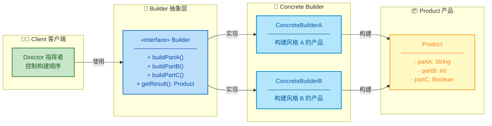

经典的 GOF 建造者模式包含四个角色：

| 角色 | 职责 | Android 中的映射 |
|------|------|-----------------|
| **Product（产品）** | 最终要创建的复杂对象 | `AlertDialog`、`OkHttpClient` |
| **Builder（抽象建造者）** | 定义创建产品各部分的抽象接口 | 通常省略，直接使用具体 Builder |
| **ConcreteBuilder（具体建造者）** | 实现 Builder 接口，组装各部件 | `AlertDialog.Builder`、`Retrofit.Builder` |
| **Director（指挥者）** | 控制构建的顺序和流程 | 在 Android 中通常由客户端直接充当 |

> 💡 在现代 Android/Java/Kotlin 开发中，经典四角色往往简化为 **Product + ConcreteBuilder 两角色**，Director 被客户端代码吸收，抽象 Builder 接口也常省略。这种简化版才是我们日常最常用的形态。

下面用一个完整的 Java 示例来演示经典建造者模式的实现：

```java
/**
 * Product（产品）—— 一个复杂的网络请求配置对象
 * 拥有多个可选字段，不适合用构造函数直接创建
 */
public class NetworkConfig {

    // ====== 所有字段均为 final，保证对象不可变（Immutable） ======
    private final String baseUrl;          // 基础 URL（必选）
    private final int connectTimeout;      // 连接超时时间，单位毫秒
    private final int readTimeout;         // 读取超时时间，单位毫秒
    private final int retryCount;          // 重试次数
    private final boolean enableCache;     // 是否启用缓存
    private final boolean enableLog;       // 是否启用日志

    /**
     * 私有构造函数 —— 外部无法直接 new，必须通过 Builder 创建
     * 这是建造者模式的核心约束之一
     */
    private NetworkConfig(Builder builder) {
        // 从 Builder 中逐一取出各字段，赋值给 Product
        this.baseUrl = builder.baseUrl;
        this.connectTimeout = builder.connectTimeout;
        this.readTimeout = builder.readTimeout;
        this.retryCount = builder.retryCount;
        this.enableCache = builder.enableCache;
        this.enableLog = builder.enableLog;
    }

    // ====== 只提供 getter，不提供 setter，保持不可变性 ======
    public String getBaseUrl() { return baseUrl; }
    public int getConnectTimeout() { return connectTimeout; }
    public int getReadTimeout() { return readTimeout; }
    public int getRetryCount() { return retryCount; }
    public boolean isEnableCache() { return enableCache; }
    public boolean isEnableLog() { return enableLog; }

    /**
     * Builder（具体建造者）—— 以静态内部类的形式存在
     * 负责分步收集参数，最终构建出 NetworkConfig 实例
     */
    public static class Builder {

        // ====== 必选参数：在 Builder 构造函数中强制传入 ======
        private final String baseUrl;

        // ====== 可选参数：提供合理默认值 ======
        private int connectTimeout = 10_000;  // 默认 10 秒
        private int readTimeout = 10_000;     // 默认 10 秒
        private int retryCount = 3;           // 默认重试 3 次
        private boolean enableCache = true;   // 默认启用缓存
        private boolean enableLog = false;    // 默认关闭日志

        /**
         * Builder 构造函数 —— 接收必选参数
         * @param baseUrl 必须提供的基础 URL
         */
        public Builder(String baseUrl) {
            // 对必选参数做校验
            if (baseUrl == null || baseUrl.isEmpty()) {
                throw new IllegalArgumentException("baseUrl cannot be null or empty");
            }
            this.baseUrl = baseUrl;  // 保存必选参数
        }

        /**
         * 设置连接超时 —— 返回 this 以支持链式调用
         */
        public Builder connectTimeout(int timeout) {
            this.connectTimeout = timeout;  // 保存用户设定的超时值
            return this;                     // 返回自身，允许继续链式调用
        }

        /**
         * 设置读取超时
         */
        public Builder readTimeout(int timeout) {
            this.readTimeout = timeout;
            return this;
        }

        /**
         * 设置重试次数
         */
        public Builder retryCount(int count) {
            this.retryCount = count;
            return this;
        }

        /**
         * 设置是否启用缓存
         */
        public Builder enableCache(boolean enable) {
            this.enableCache = enable;
            return this;
        }

        /**
         * 设置是否启用日志
         */
        public Builder enableLog(boolean enable) {
            this.enableLog = enable;
            return this;
        }

        /**
         * build() —— 建造者模式的终结方法
         * 在这里可以做最终的参数校验，然后创建 Product 实例
         */
        public NetworkConfig build() {
            // 可以在此处做复杂的参数合法性校验
            if (connectTimeout < 0) {
                throw new IllegalStateException("connectTimeout must be >= 0");
            }
            // 调用 Product 的私有构造函数，将自身传入
            return new NetworkConfig(this);
        }
    }
}
```

使用方式非常直观：

```java
// 分步构建 —— 每一步只关注一个属性，语义清晰
NetworkConfig config = new NetworkConfig.Builder("https://api.example.com")  // 必选参数
        .connectTimeout(15_000)  // 可选：连接超时 15 秒
        .readTimeout(20_000)     // 可选：读取超时 20 秒
        .retryCount(5)           // 可选：重试 5 次
        .enableCache(true)       // 可选：启用缓存
        .enableLog(true)         // 可选：启用日志
        .build();                // 终结操作：构建出最终产品
```

我们用一张流程图来直观展示这个分步构建的过程：

```mermaid
graph LR
    subgraph 初始化["🚀 Step 1: 初始化"]
        direction TB
        S1["new Builder&#40;baseUrl&#41;<br/>传入必选参数"]
    end

    subgraph 配置["⚙️ Step 2: 链式配置"]
        direction TB
        S2A[".connectTimeout&#40;&#41;"]
        S2B[".readTimeout&#40;&#41;"]
        S2C[".retryCount&#40;&#41;"]
        S2D[".enableCache&#40;&#41;"]
        S2E[".enableLog&#40;&#41;"]
        S2A --> S2B --> S2C --> S2D --> S2E
    end

    subgraph 校验["✅ Step 3: 校验"]
        direction TB
        S3["参数合法性检查<br/>Validation"]
    end

    subgraph 产出["📦 Step 4: 产出"]
        direction TB
        S4["new Product&#40;builder&#41;<br/>不可变对象诞生"]
    end

    S1 -->|"return this"| S2A
    S2E -->|".build&#40;&#41;"| S3
    S3 -->|"通过"| S4

    classDef initStyle fill:#C8E6C9,stroke:#388E3C,color:#1B5E20,stroke-width:2px
    classDef configStyle fill:#BBDEFB,stroke:#1976D2,color:#0D47A1,stroke-width:2px
    classDef validateStyle fill:#FFE0B2,stroke:#F57C00,color:#E65100,stroke-width:2px
    classDef outputStyle fill:#F3E5F5,stroke:#7B1FA2,color:#4A148C,stroke-width:2px

    class S1 initStyle
    class S2A,S2B,S2C,S2D,S2E configStyle
    class S3 validateStyle
    class S4 outputStyle
```

**与 Telescoping Constructor 对比**：

```java
// ❌ Telescoping Constructor —— 参数含义不明，容易出错
// 请问 10000, 20000, 3, true, false 分别是什么？完全看不懂！
NetworkConfig config = new NetworkConfig(
    "https://api.example.com", 10000, 20000, 3, true, false
);

// ✅ Builder Pattern —— 每个参数都有名字，自文档化（Self-documenting）
NetworkConfig config = new NetworkConfig.Builder("https://api.example.com")
    .connectTimeout(10_000)   // 一目了然
    .readTimeout(20_000)      // 一目了然
    .retryCount(3)            // 一目了然
    .enableCache(true)        // 一目了然
    .enableLog(false)         // 一目了然
    .build();
```

**建造者模式的核心优势总结**：

| 优势 | 说明 |
|------|------|
| **参数语义化** | 每个参数都通过命名方法设置，避免位置混淆 |
| **灵活组合** | 可选参数可以任意组合，不需要为每种组合写一个构造函数 |
| **不可变对象** | Product 的字段声明为 `final`，构造后无法修改，天然线程安全 |
| **校验集中化** | 所有参数校验可以集中在 `build()` 方法中执行 |
| **可读性极佳** | 链式调用的代码几乎是"自文档化"的 |

### 链式调用 (Fluent API / Method Chaining)

链式调用是建造者模式最具辨识度的外在特征。其实现原理极其简洁 —— **每个 setter 方法都返回 `this`（Builder 自身的引用）**，从而允许调用者在一条语句中连续调用多个方法。

这种编程风格在业界有一个专业名称叫做 **Fluent API（流式接口）**，由 Martin Fowler 和 Eric Evans 在 2005 年首次提出。它的设计目标是让 API 的调用读起来像自然语言一样流畅。

**链式调用的核心实现原理**：

```kotlin
class DialogConfig private constructor(       // 私有构造函数，禁止外部直接 new
    val title: String,                         // 对话框标题
    val message: String,                       // 对话框消息
    val positiveText: String,                  // 确认按钮文字
    val negativeText: String,                  // 取消按钮文字
    val isCancelable: Boolean                  // 是否可取消
) {
    /**
     * Builder 类 —— Kotlin 风格的建造者
     * 注意：Kotlin 提供了命名参数和默认值，有时可以替代 Builder
     * 但对于需要对外暴露的 SDK API，Builder 仍然是更好的选择
     */
    class Builder {
        // ====== 可变属性，收集构建参数 ======
        private var title: String = ""                // 默认空标题
        private var message: String = ""              // 默认空消息
        private var positiveText: String = "OK"       // 默认确认文字
        private var negativeText: String = "Cancel"   // 默认取消文字
        private var isCancelable: Boolean = true      // 默认可取消

        /**
         * 每个方法都返回 Builder 自身 —— 这就是链式调用的秘密
         * apply {} 是 Kotlin 的作用域函数，在 block 内部 this 指向 Builder
         */
        fun title(title: String) = apply {     // apply 返回 this
            this.title = title                  // 设置标题
        }

        fun message(message: String) = apply {
            this.message = message              // 设置消息
        }

        fun positiveText(text: String) = apply {
            this.positiveText = text            // 设置确认按钮文字
        }

        fun negativeText(text: String) = apply {
            this.negativeText = text            // 设置取消按钮文字
        }

        fun cancelable(cancelable: Boolean) = apply {
            this.isCancelable = cancelable      // 设置是否可取消
        }

        /**
         * build() —— 终结方法，返回的是 Product（DialogConfig）而非 Builder
         * 链条在这里断开，产出最终产品
         */
        fun build(): DialogConfig {
            // 参数校验
            require(title.isNotEmpty()) {       // require 是 Kotlin 内置的前置条件检查
                "Title must not be empty"       // 不满足条件则抛出 IllegalArgumentException
            }
            // 构建并返回不可变的 Product
            return DialogConfig(
                title = title,                  // 从 Builder 中取出收集到的参数
                message = message,
                positiveText = positiveText,
                negativeText = negativeText,
                isCancelable = isCancelable
            )
        }
    }
}
```

**链式调用的执行流程深入解析**：

为了真正理解链式调用的运作机制，我们来看它在内存层面的引用关系：

```kotlin
// 以下四行代码本质上等价于一条链式调用
val builder = DialogConfig.Builder()      // 步骤 1: 创建 Builder 实例
val ref1 = builder.title("Warning")       // 步骤 2: ref1 === builder (同一个对象)
val ref2 = ref1.message("Are you sure?")  // 步骤 3: ref2 === ref1 === builder
val ref3 = ref2.cancelable(false)         // 步骤 4: ref3 === ref2 === ref1 === builder
val config = ref3.build()                 // 步骤 5: config 是新的 DialogConfig 实例
```

```text
 ┌─────────────── Heap (堆内存) ───────────────────┐
 │                                                  │
 │   ┌──────────────────────────┐                   │
 │   │   Builder Instance       │◀── builder        │
 │   │   ──────────────────     │◀── ref1 (同一对象)│
 │   │   title = "Warning"      │◀── ref2 (同一对象)│
 │   │   message = "Are you.."  │◀── ref3 (同一对象)│
 │   │   cancelable = false     │                   │
 │   └──────────────────────────┘                   │
 │                     │                            │
 │                     │ .build()                   │
 │                     ▼                            │
 │   ┌──────────────────────────┐                   │
 │   │   DialogConfig (Product) │◀── config         │
 │   │   ──────────────────     │    (新对象)        │
 │   │   title = "Warning"      │                   │
 │   │   message = "Are you.."  │                   │
 │   │   cancelable = false     │                   │
 │   │   (所有字段为 val/final) │                   │
 │   └──────────────────────────┘                   │
 └──────────────────────────────────────────────────┘
```

关键洞察：从 `builder` 到 `ref3`，始终操作的是堆中**同一个 Builder 对象**。每次方法调用只是修改该对象的内部字段，然后把自身引用返回。这种设计的内存开销极低 —— 整个链式调用过程中只创建了 **1 个 Builder + 1 个 Product = 2 个对象**。

**Kotlin 的 `apply` 函数与建造者模式**：

Kotlin 的 `apply` 作用域函数是实现链式调用的利器。它的签名如下：

```kotlin
// apply 的源码定义（Kotlin 标准库）
public inline fun <T> T.apply(block: T.() -> Unit): T {
    block()       // 在 T 的上下文中执行 block
    return this   // 永远返回调用者自身 —— 这就是链式调用的本质
}
```

`apply` 天然返回 `this`，因此在 Builder 的每个配置方法中，只需 `= apply { ... }` 即可同时完成"赋值 + 返回 this"两件事，代码极其精简。

**Kotlin Named Arguments vs Builder Pattern** —— 取舍之道：

Kotlin 因为拥有命名参数（Named Arguments）和默认值（Default Values），有时可以不借助 Builder 模式就能达到类似效果：

```kotlin
// Kotlin 方式 —— 利用 data class + 命名参数 + 默认值
data class NetworkConfig(
    val baseUrl: String,                      // 必选参数（无默认值）
    val connectTimeout: Int = 10_000,         // 可选，默认 10 秒
    val readTimeout: Int = 10_000,            // 可选，默认 10 秒
    val retryCount: Int = 3,                  // 可选，默认 3 次
    val enableCache: Boolean = true,          // 可选，默认启用
    val enableLog: Boolean = false            // 可选，默认关闭
)

// 调用时使用命名参数 —— 同样语义清晰
val config = NetworkConfig(
    baseUrl = "https://api.example.com",      // 必须提供
    connectTimeout = 15_000,                  // 可选覆盖
    enableLog = true                          // 可选覆盖，其余使用默认值
)
```

那什么时候该用 Builder，什么时候用命名参数？

| 场景 | 推荐方式 | 原因 |
|------|---------|------|
| **纯 Kotlin 内部项目** | 命名参数 + 默认值 | 更简洁，无需额外 Builder 类 |
| **对外暴露的 SDK / Library** | Builder 模式 | Java 调用者无法使用 Kotlin 命名参数 |
| **需要复杂校验逻辑** | Builder 模式 | 校验集中在 `build()` 中，职责更清晰 |
| **需要构建不可变对象** | 两者皆可 | Builder 可以做到字段全 `final`；`data class` 用 `val` 也可 |
| **参数之间有依赖关系** | Builder 模式 | 可以在 `build()` 中做交叉校验 |

### Android 应用 (AlertDialog.Builder、Retrofit.Builder、OkHttpClient.Builder)

建造者模式在 Android 生态中无处不在。可以说，如果你曾经写过一行 Android 代码，你就已经在使用建造者模式了。让我们逐一深入分析三个经典案例。

---

#### AlertDialog.Builder —— Android 框架层的经典建造者

`AlertDialog.Builder` 是 Android SDK 中最经典的建造者模式实现，几乎每一个 Android 开发者接触到的第一个 Builder。

```mermaid
graph LR
    subgraph 客户端["🧑‍💻 Activity / Fragment"]
        direction TB
        A1["创建 Builder"]
        A2["链式配置"]
        A3["调用 create&#40;&#41; 或 show&#40;&#41;"]
        A1 --> A2 --> A3
    end

    subgraph Builder层["🔧 AlertDialog.Builder"]
        direction TB
        B1["title: CharSequence"]
        B2["message: CharSequence"]
        B3["positiveButton: OnClickListener"]
        B4["negativeButton: OnClickListener"]
        B5["items: CharSequence[]"]
        B6["view: View"]
        B7["P: AlertParams 内部参数包"]
        B1 --- B7
        B2 --- B7
        B3 --- B7
        B4 --- B7
        B5 --- B7
        B6 --- B7
    end

    subgraph 产品["📦 AlertDialog"]
        direction TB
        P1["AlertDialog"]
        P2["extends Dialog"]
        P3["implements DialogInterface"]
        P1 --- P2 --- P3
    end

    A3 -->|"build"| B7
    B7 -->|"apply&#40;dialog&#41;"| P1

    classDef clientStyle fill:#C8E6C9,stroke:#388E3C,color:#1B5E20,stroke-width:2px
    classDef builderStyle fill:#BBDEFB,stroke:#1976D2,color:#0D47A1,stroke-width:2px
    classDef productStyle fill:#FFF9C4,stroke:#F9A825,color:#F57F17,stroke-width:2px

    class A1,A2,A3 clientStyle
    class B1,B2,B3,B4,B5,B6,B7 builderStyle
    class P1,P2,P3 productStyle
```

**实际使用**（Java + Kotlin 双版本）：

```java
// ====== Java 版本 ======
AlertDialog dialog = new AlertDialog.Builder(this)        // 传入 Context（必选）
        .setTitle("删除确认")                               // 设置标题
        .setMessage("确定要删除这条记录吗？")                 // 设置消息体
        .setIcon(R.drawable.ic_warning)                     // 设置图标
        .setCancelable(false)                               // 禁止按返回键取消
        .setPositiveButton("删除", (dialog1, which) -> {    // 确认按钮 + 回调
            deleteRecord();                                 // 执行删除操作
        })
        .setNegativeButton("取消", (dialog1, which) -> {    // 取消按钮 + 回调
            dialog1.dismiss();                              // 关闭对话框
        })
        .setNeutralButton("了解更多", (dialog1, which) -> { // 中性按钮
            showHelpPage();                                 // 跳转帮助页
        })
        .create();                                          // 构建 AlertDialog 实例（不显示）

dialog.show();                                              // 显示对话框
```

```kotlin
// ====== Kotlin 版本（更简洁） ======
AlertDialog.Builder(this)                      // 传入 Context
    .setTitle("删除确认")                        // 设置标题
    .setMessage("确定要删除这条记录吗？")          // 设置消息体
    .setIcon(R.drawable.ic_warning)              // 设置图标
    .setCancelable(false)                        // 不可取消
    .setPositiveButton("删除") { _, _ ->         // Kotlin lambda 简写
        deleteRecord()                           // 执行删除
    }
    .setNegativeButton("取消") { dialog, _ ->
        dialog.dismiss()                         // 关闭对话框
    }
    .show()                                      // create() + show() 的快捷方式
```

**AlertDialog.Builder 的源码机制深度解析**：

在 Android 框架源码中，`AlertDialog.Builder` 内部实际维护着一个 `AlertController.AlertParams` 对象（简称 `P`），它就是一个巨大的参数包（Parameter Object）。每次调用 `setTitle()`、`setMessage()` 等方法时，实际上是在往 `P` 里填充数据：

```java
// AlertDialog.Builder 源码核心逻辑简化版
public class AlertDialog extends Dialog {

    // AlertController 是真正管理 Dialog 内部 View 的控制器
    private final AlertController mAlert;  

    /**
     * Builder 静态内部类
     */
    public static class Builder {
        
        // P 是一个参数包，收集所有配置项
        private final AlertController.AlertParams P;  

        public Builder(Context context) {
            // 创建参数包，传入 Context 和默认主题
            P = new AlertController.AlertParams(
                new ContextThemeWrapper(context, resolveDialogTheme(context, 0))
            );
        }

        /**
         * setTitle —— 将 title 存入参数包 P
         * 返回 this 以支持链式调用
         */
        public Builder setTitle(CharSequence title) {
            P.mTitle = title;      // 存入参数包
            return this;           // 返回 Builder 自身
        }

        /**
         * setMessage —— 将 message 存入参数包 P
         */
        public Builder setMessage(CharSequence message) {
            P.mMessage = message;  // 存入参数包
            return this;           // 返回 Builder 自身
        }

        /**
         * create() —— 终结方法，从参数包 P 构建出 AlertDialog
         */
        public AlertDialog create() {
            // 1. 创建 AlertDialog 实例
            final AlertDialog dialog = new AlertDialog(P.mContext);

            // 2. 将参数包 P 中的所有配置，应用到 dialog 的 AlertController 上
            //    这一步是 "参数包 → 产品" 的关键转换
            P.apply(dialog.mAlert);

            // 3. 设置可取消属性
            dialog.setCancelable(P.mCancelable);

            if (P.mCancelable) {
                // 如果可取消，设置 cancel 监听器
                dialog.setCanceledOnTouchOutside(true);
            }

            // 4. 设置各种监听器
            dialog.setOnCancelListener(P.mOnCancelListener);
            dialog.setOnDismissListener(P.mOnDismissListener);

            if (P.mOnKeyListener != null) {
                dialog.setOnKeyListener(P.mOnKeyListener);
            }

            // 5. 返回构建好的 AlertDialog 产品
            return dialog;
        }
    }
}
```

可以看到 `P.apply(dialog.mAlert)` 这一行是整个构建过程的精华 —— 它将分散在 Builder 中的所有配置，一次性灌入到产品对象的内部控制器中。

---

#### Retrofit.Builder —— 第三方库的经典建造者

Retrofit 是 Android 开发中最流行的网络请求库，由 Square 公司开发。它的 `Retrofit.Builder` 是建造者模式的教科书级实现。

```kotlin
// 构建 Retrofit 实例 —— 链式调用，语义极其清晰
val retrofit = Retrofit.Builder()
    .baseUrl("https://api.github.com/")           // 设置 API 基础 URL
    .client(okHttpClient)                          // 注入 OkHttpClient 实例
    .addConverterFactory(GsonConverterFactory.create())    // 添加 JSON 转换器
    .addCallAdapterFactory(RxJava3CallAdapterFactory.create()) // 添加 RxJava 适配器
    .validateEagerly(true)                         // 启用提前校验（开发阶段推荐）
    .build()                                       // 构建 Retrofit 实例
```

**Retrofit.Builder 的设计要点**：


Retrofit.Builder 的 `build()` 方法内部做了大量智能的默认值填充和平台适配工作，我们来看其核心逻辑：

```java
// Retrofit.Builder.build() 源码核心逻辑简化
public Retrofit build() {
    // 1. 必选参数校验 —— baseUrl 必须提供
    if (baseUrl == null) {
        throw new IllegalStateException("Base URL required.");
    }

    // 2. 如果用户没有提供 OkHttpClient，使用默认的
    okhttp3.Call.Factory callFactory = this.callFactory;
    if (callFactory == null) {
        callFactory = new OkHttpClient();   // 默认创建一个 OkHttpClient
    }

    // 3. 平台适配 —— 根据运行平台设置回调执行器
    Executor callbackExecutor = this.callbackExecutor;
    if (callbackExecutor == null) {
        // 在 Android 平台上，默认使用 MainThreadExecutor
        // 确保回调在主线程执行（更新 UI 安全）
        callbackExecutor = platform.defaultCallbackExecutor();
    }

    // 4. 组装 CallAdapter 工厂列表
    List<CallAdapter.Factory> callAdapterFactories = new ArrayList<>(this.callAdapterFactories);
    // 添加平台默认的 CallAdapter（如 Android 的 DefaultCallAdapterFactory）
    callAdapterFactories.addAll(platform.defaultCallAdapterFactories(callbackExecutor));

    // 5. 组装 Converter 工厂列表
    List<Converter.Factory> converterFactories = new ArrayList<>();
    converterFactories.add(new BuiltInConverters());  // 内置转换器（始终添加）
    converterFactories.addAll(this.converterFactories); // 用户自定义转换器
    converterFactories.addAll(platform.defaultConverterFactories()); // 平台默认

    // 6. 构建不可变的 Retrofit 实例
    return new Retrofit(
        callFactory,
        baseUrl,
        Collections.unmodifiableList(converterFactories),     // 不可变 List
        Collections.unmodifiableList(callAdapterFactories),   // 不可变 List
        callbackExecutor,
        validateEagerly
    );
}
```

这个 `build()` 方法展示了建造者模式一个非常强大的特性：**智能默认值与平台适配**。用户只需要提供最少的配置（一个 `baseUrl`），Builder 就能根据运行时平台自动填充所有其他合理的默认值。这就是 **"Convention over Configuration"（约定优于配置）** 原则的典型体现。

---

#### OkHttpClient.Builder —— 网络层的复杂建造者

`OkHttpClient` 的配置项多达 20+ 个，是建造者模式大显身手的绝佳场景。

```kotlin
val client = OkHttpClient.Builder()
    // ====== 超时配置 ======
    .connectTimeout(15, TimeUnit.SECONDS)        // 连接超时 15 秒
    .readTimeout(20, TimeUnit.SECONDS)           // 读取超时 20 秒
    .writeTimeout(20, TimeUnit.SECONDS)          // 写入超时 20 秒
    .pingInterval(30, TimeUnit.SECONDS)          // WebSocket ping 间隔

    // ====== 拦截器（Interceptor）配置 ======
    .addInterceptor(HttpLoggingInterceptor().apply {  // 应用层拦截器：日志
        level = HttpLoggingInterceptor.Level.BODY     // 记录完整的请求/响应体
    })
    .addInterceptor(AuthInterceptor(tokenProvider))   // 应用层拦截器：鉴权
    .addNetworkInterceptor(CacheInterceptor())        // 网络层拦截器：缓存

    // ====== 连接池与缓存 ======
    .connectionPool(ConnectionPool(                   // 自定义连接池
        maxIdleConnections = 10,                       // 最大空闲连接数
        keepAliveDuration = 5,                         // 连接保活时间
        timeUnit = TimeUnit.MINUTES                    // 时间单位
    ))
    .cache(Cache(                                      // HTTP 缓存
        directory = cacheDir,                          // 缓存目录
        maxSize = 50L * 1024L * 1024L                  // 缓存大小 50MB
    ))

    // ====== SSL/TLS 配置 ======
    .hostnameVerifier(myHostnameVerifier)              // 自定义主机名验证
    .certificatePinner(certificatePinner)              // 证书钉扎（Certificate Pinning）

    // ====== 其他配置 ======
    .followRedirects(true)                             // 允许 HTTP 重定向
    .followSslRedirects(true)                          // 允许 HTTPS → HTTP 重定向
    .retryOnConnectionFailure(true)                    // 连接失败时自动重试

    .build()                                           // 构建不可变的 OkHttpClient
```

**OkHttpClient 的 Builder 使用了一个有趣的设计 —— 基于现有实例创建新 Builder**：

```kotlin
// 基于已有的 client 创建新的 Builder —— 继承所有配置
// 这是建造者模式的进阶用法：Copy-on-Write Builder
val newClient = existingClient.newBuilder()      // 从现有实例反向创建 Builder
    .readTimeout(30, TimeUnit.SECONDS)           // 只修改需要变更的部分
    .addInterceptor(newInterceptor)              // 添加新的拦截器
    .build()                                     // 其余配置保持不变
```

这种 `newBuilder()` 模式在 OkHttp 源码中的实现如下：

```java
// OkHttpClient 源码
public Builder newBuilder() {
    // 将当前 OkHttpClient 的所有配置，复制到新的 Builder 中
    return new Builder(this);  // 传入自身，Builder 会从中拷贝所有字段
}

// Builder 接受 OkHttpClient 参数的构造函数
Builder(OkHttpClient okHttpClient) {
    this.dispatcher = okHttpClient.dispatcher;                   // 复制调度器
    this.connectionPool = okHttpClient.connectionPool;           // 复制连接池
    this.interceptors.addAll(okHttpClient.interceptors);         // 复制拦截器列表
    this.networkInterceptors.addAll(okHttpClient.networkInterceptors);
    this.connectTimeout = okHttpClient.connectTimeout;           // 复制超时配置
    this.readTimeout = okHttpClient.readTimeout;
    this.writeTimeout = okHttpClient.writeTimeout;
    // ... 复制其余所有配置项
}
```

这种 **"Product → Builder → New Product"** 的能力让你可以基于一个全局配置好的 `OkHttpClient`，按需微调出多个变体，而无需从头开始配置。这在实际项目中极其常用 —— 例如，你可以有一个全局 client，然后为上传接口单独创建一个加大了超时时间的 client。

---

#### 三大 Builder 的综合对比

```mermaid
graph LR
    subgraph Android框架["🤖 Android Framework"]
        direction TB
        AD["AlertDialog.Builder<br/>───────────────<br/>UI 对话框构建<br/>参数包: AlertParams<br/>终结方法: create&#40;&#41;/show&#40;&#41;"]
    end

    subgraph 网络框架["🌐 Square Network Stack"]
        direction TB
        RF["Retrofit.Builder<br/>───────────────<br/>REST API 客户端构建<br/>智能平台适配<br/>终结方法: build&#40;&#41;"]
        OK["OkHttpClient.Builder<br/>───────────────<br/>HTTP 客户端构建<br/>支持 newBuilder&#40;&#41; 变体<br/>终结方法: build&#40;&#41;"]
        RF ---|"注入"| OK
    end

    subgraph 共同特征["✨ Builder Pattern 共同点"]
        direction TB
        F1["✅ 链式调用"]
        F2["✅ 静态内部类 Builder"]
        F3["✅ 不可变 Product"]
        F4["✅ 合理默认值"]
        F5["✅ build&#40;&#41; 中集中校验"]
        F1 --- F2 --- F3 --- F4 --- F5
    end

    AD ---|"共性"| F1
    RF ---|"共性"| F1
    OK ---|"共性"| F1

    classDef frameworkStyle fill:#C8E6C9,stroke:#388E3C,color:#1B5E20,stroke-width:2px
    classDef networkStyle fill:#BBDEFB,stroke:#1976D2,color:#0D47A1,stroke-width:2px
    classDef featureStyle fill:#F3E5F5,stroke:#7B1FA2,color:#4A148C,stroke-width:2px

    class AD frameworkStyle
    class RF,OK networkStyle
    class F1,F2,F3,F4,F5 featureStyle
```

| 特性 | AlertDialog.Builder | Retrofit.Builder | OkHttpClient.Builder |
|------|-------------------|-----------------|---------------------|
| **所属层** | Android Framework | 第三方库 (Square) | 第三方库 (Square) |
| **必选参数** | `Context` | `baseUrl` | 无（全有默认值） |
| **参数数量** | ~15 个 | ~6 个 | ~25 个 |
| **终结方法** | `create()` / `show()` | `build()` | `build()` |
| **Product 不可变** | 部分可变 | 完全不可变 | 完全不可变 |
| **支持 newBuilder()** | ❌ | ❌ | ✅ |
| **平台适配** | 通过 Theme 适配 | 自动检测 Android/JVM | 无特殊平台逻辑 |

**建造者模式在 Android 中的其他常见应用**：

| 类名 | 所属领域 | 典型用法 |
|------|---------|---------|
| `Notification.Builder` | 系统通知 | 构建复杂的通知对象 |
| `NotificationChannel.Builder` | 通知渠道 (API 26+) | 配置通知渠道属性 |
| `Uri.Builder` | URI 构造 | 分段拼接 URI |
| `AnimatorSet.Builder` | 动画 | 组合多个动画的执行顺序 |
| `Glide.RequestBuilder` | 图片加载 | 链式配置图片加载参数 |
| `Room.databaseBuilder()` | 数据库 | 构建 Room 数据库实例 |
| `WorkRequest.Builder` | WorkManager | 构建后台任务请求 |
| `Constraints.Builder` | WorkManager | 配置任务执行约束 |

---

**📝 练习题**

**题目 1**：关于建造者模式，以下说法 **错误** 的是？

A. Builder 模式通过将构建过程与表示分离，解决了 Telescoping Constructor（伸缩式构造函数）问题


B. `OkHttpClient` 支持通过 `newBuilder()` 从已有实例创建新的 Builder，实现配置的部分修改


C. 在 Kotlin 中，由于命名参数和默认值的存在，任何场景下都不再需要 Builder 模式


D. `AlertDialog.Builder` 内部通过 `AlertParams` 参数包收集所有配置，在 `create()` 时一次性应用到 Dialog

**【答案】** C

**【解析】** 选项 C 的说法过于绝对。虽然 Kotlin 的命名参数和默认值确实能在很多场景下替代 Builder 模式（例如纯 Kotlin 的内部项目），但以下场景仍然需要 Builder 模式：① 对外暴露的 SDK 或 Library，因为 Java 调用者无法使用 Kotlin 命名参数；② 构建过程涉及复杂的交叉校验（cross-validation）逻辑，需要在 `build()` 方法中集中处理；③ 需要实现类似 `newBuilder()` 的 "从现有产品创建变体" 功能。选项 A 准确描述了 Builder 模式的核心价值；选项 B 是 OkHttp 的重要特性，我们在源码中已验证；选项 D 正确描述了 AlertDialog.Builder 的内部机制。

---

**题目 2**：下列代码输出什么？

```kotlin
class Config private constructor(val a: Int, val b: Int) {
    class Builder {
        private var a = 0
        private var b = 0
        fun setA(a: Int) = apply { this.a = a }
        fun setB(b: Int) = apply { this.b = b }
        fun build() = Config(a, b)
    }
}

fun main() {
    val builder = Config.Builder()
    val b1 = builder.setA(1)
    val b2 = builder.setB(2)
    val config = b1.build()
    println("a=${config.a}, b=${config.b}")
}
```

A. `a=1, b=0`


B. `a=1, b=2`


C. `a=0, b=2`


D. 编译错误

**【答案】** B

**【解析】** 这道题考查链式调用的核心原理 —— **`apply` 返回的是 `this`，即 Builder 对象自身**。`val b1 = builder.setA(1)` 执行后，`b1` 和 `builder` 指向堆中的**同一个 Builder 实例**；接着 `val b2 = builder.setB(2)` 同样操作的还是那同一个实例，此时该实例的 `a=1, b=2`。最后 `b1.build()` 调用的也是同一个实例（因为 `b1 === builder === b2`），所以构建出的 `Config` 的 `a=1, b=2`。这正是我们在内存引用图中分析的：整个链式调用过程中，从头到尾只有**一个 Builder 对象**在被反复修改和返回。

---

## 原型模式（Prototype Pattern）

原型模式是创建型设计模式中相对"低调"但在实际开发中极其常用的一种。它的核心思想简洁明了：**以一个已有对象为"原型"（Prototype），通过复制（Clone）它来创建新对象，而非通过 `new` 关键字从零构造。** 这就好比你去打印店复印一份填好的表格——你不需要重新手写一份，只需要把原件放进复印机即可得到一份内容相同的副本。

为什么需要原型模式？考虑以下场景：

- **创建成本高昂**：对象的初始化需要大量计算、网络请求、数据库查询或 IO 操作，每次都 `new` 并重新初始化代价太大。
- **对象状态复杂**：一个对象经过了一系列运行时操作后，内部状态非常复杂，你希望基于当前状态"快照"一个副本出来。
- **需要与具体类解耦**：你只持有一个接口或父类引用，并不知道对象的具体类型，但仍然希望复制它。
- **保护性拷贝（Defensive Copy）**：把内部对象的副本暴露给外部调用方，防止外部修改影响内部状态。

在 Android 开发中，`Intent` 的 `clone()`、`Bundle` 的拷贝、`ArrayList` 的 `clone()`、自定义 ViewState 的快照等，背后都渗透着原型模式的影子。

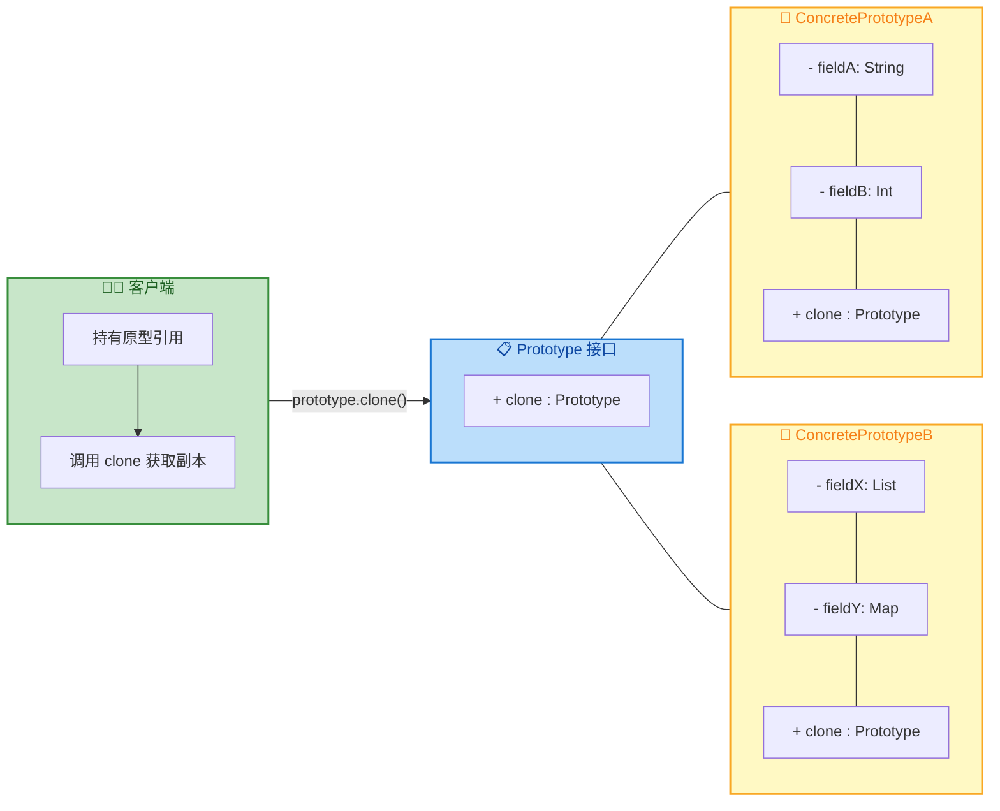

整个模式的结构非常轻量：一个声明了 `clone()` 的接口/抽象类，以及实现了拷贝逻辑的具体原型类。客户端只需要调用 `clone()`，就能得到一个全新的、独立的对象副本。

---

### 克隆对象（Cloning Objects）

"克隆"的本质是 **绕过构造函数，直接在内存层面复制对象的字段值**。在 Java/Kotlin 中，实现克隆有多种途径，它们各自有不同的语义和注意事项。

#### Java 中的 `Object.clone()` 机制

Java 的所有类都继承自 `Object`，而 `Object` 上定义了一个 `protected native clone()` 方法。这个方法的执行逻辑是在 JVM 的 native 层完成的——它会在堆上分配一块与原对象相同大小的内存空间，然后 **按位（bit-by-bit）** 将原对象的字段值拷贝到新对象中。

```java
// Object.java（JDK 源码简化）
public class Object {
    // native 方法，由 JVM 在 C/C++ 层实现
    // 它会创建一个与当前对象相同类型、相同字段值的新对象
    protected native Object clone() throws CloneNotSupportedException;
}
```

这里有一个极其重要的约束：如果一个类没有实现 `Cloneable` 接口，调用 `clone()` 将抛出 `CloneNotSupportedException`。`Cloneable` 本身是一个 **标记接口（Marker Interface）**，没有任何方法声明，它仅仅是一个 "许可证"，告诉 JVM："这个类的作者允许对它进行克隆操作"。

来看一个最基础的克隆示例：

```java
// 简单的配置类，实现 Cloneable 以支持克隆
public class AppConfig implements Cloneable {
    // 应用名称（String 是不可变对象，拷贝引用即安全）
    private String appName;
    // 版本号（基本类型，值拷贝）
    private int versionCode;
    // 是否开启调试模式（基本类型，值拷贝）
    private boolean debugMode;

    // 构造函数：初始化需要读取配置文件、解析 XML 等耗时操作
    public AppConfig(String configPath) {
        // 假设此处需要从磁盘读取并解析配置，耗时 200ms
        this.appName = parseAppName(configPath);      // IO 操作
        this.versionCode = parseVersionCode(configPath); // IO 操作
        this.debugMode = parseDebugMode(configPath);     // IO 操作
    }

    // 重写 clone()，将访问权限从 protected 提升为 public
    @Override
    public Object clone() {
        try {
            // 调用 Object.clone()，JVM 会在 native 层按位复制所有字段
            // 这比重新走构造函数（再次解析配置文件）快得多
            return super.clone();
        } catch (CloneNotSupportedException e) {
            // 已实现 Cloneable，理论上不会到达这里
            throw new AssertionError("Clone not supported", e);
        }
    }

    // ... getter/setter 省略
}
```

使用时：

```java
// 首次构建：走完整的配置解析流程（耗时）
AppConfig original = new AppConfig("/sdcard/config.xml");

// 克隆：跳过构造函数，直接内存拷贝（极快）
AppConfig cloned = (AppConfig) original.clone();

// 两个完全独立的对象
System.out.println(original == cloned);           // false（不同引用）
System.out.println(original.getClass() == cloned.getClass()); // true（相同类型）
System.out.println(original.getAppName().equals(cloned.getAppName())); // true（相同内容）
```

#### Kotlin 中的 `data class copy()` 机制

Kotlin 走了一条更现代、更安全的路线。`data class` 编译器会自动生成 `copy()` 方法，它的实现本质上是 **调用主构造函数并传入当前对象的字段值**：

```kotlin
// Kotlin data class 定义
data class UserProfile(
    val userId: String,      // 用户 ID
    val nickname: String,    // 昵称
    val avatar: String,      // 头像 URL
    val level: Int           // 用户等级
)

// 编译器会自动生成类似如下的 copy() 方法：
// fun copy(
//     userId: String = this.userId,
//     nickname: String = this.nickname,
//     avatar: String = this.avatar,
//     level: Int = this.level
// ) = UserProfile(userId, nickname, avatar, level)
```

使用时可以选择性地覆盖某些字段：

```kotlin
// 原始用户资料
val original = UserProfile(
    userId = "u_001",
    nickname = "Android 开发者",
    avatar = "https://example.com/avatar.png",
    level = 5
)

// 基于原型复制，仅修改昵称和等级
val upgraded = original.copy(
    nickname = "高级 Android 开发者",  // 覆盖昵称
    level = 6                         // 覆盖等级
)
// upgraded.userId == "u_001"（继承原值）
// upgraded.avatar == "https://example.com/avatar.png"（继承原值）
```

`copy()` 相比 Java 的 `clone()` 有几个显著优势：

| 特性 | Java `clone()` | Kotlin `copy()` |
|------|----------------|-----------------|
| 需要实现接口 | 必须实现 `Cloneable` | 无需额外接口 |
| 类型安全 | 返回 `Object`，需强转 | 返回精确类型 |
| 构造函数绕过 | ✅ 绕过构造函数 | ❌ 走主构造函数 |
| 字段覆盖 | 不支持 | 支持命名参数覆盖 |
| 深拷贝 | 需手动处理 | 同样需手动处理 |

> ⚠️ **关键区别**：`clone()` 绕过构造函数直接在内存层面复制，因此构造函数中的校验逻辑、副作用（如注册监听器）不会被执行。`copy()` 则会走主构造函数，校验逻辑依然生效。选择哪种方式取决于你的实际需求。

---

### Cloneable 接口

#### 标记接口的设计哲学

`Cloneable` 是 Java 最早期的标记接口之一（另一个著名的标记接口是 `Serializable`）。它没有定义任何方法：

```java
// java.lang.Cloneable —— JDK 源码
// 这是一个完全空的接口，仅作为"标记"存在
public interface Cloneable {
    // 什么都没有
}
```

这种设计在今天看来并不优雅。Josh Blerta 在 *Effective Java* 中就明确批评过这种设计：`Cloneable` 改变了 `Object.clone()` 的行为（实现了接口则正常返回副本，未实现则抛异常），这种 "接口改变超类方法行为" 的模式是一种反模式。

让我们深入看看 JVM 层面（HotSpot 实现）`clone()` 是如何工作的：

```mermaid
sequenceDiagram
    participant App as 应用代码
    participant JVM as JVM Runtime
    participant Heap as Java Heap

    App->>JVM: obj.clone()
    JVM->>JVM: 检查 obj instanceof Cloneable
    
    alt 未实现 Cloneable
        JVM-->>App: throw CloneNotSupportedException
    else 已实现 Cloneable
        JVM->>Heap: 分配与 obj 相同大小的内存块
        Heap-->>JVM: 返回新内存地址 newAddr
        JVM->>JVM: memcpy(newAddr, objAddr, objectSize)
        JVM->>JVM: 为新对象生成新的 identity hash
        JVM-->>App: 返回新对象引用
    end
```

#### 正确实现 Cloneable 的姿势

在 Java 中正确实现 `Cloneable` 需要遵循一些 "不成文的契约"：

```java
// 示例：一个需要正确实现克隆的 Android 消息实体类
public class ChatMessage implements Cloneable {
    // 消息 ID（基本类型包装类，不可变）
    private Long messageId;
    // 发送者名称（String 不可变，浅拷贝安全）
    private String senderName;
    // 消息内容（String 不可变，浅拷贝安全）
    private String content;
    // 时间戳（基本类型，值拷贝）
    private long timestamp;
    // 附件列表（可变引用类型！浅拷贝不安全！）
    private ArrayList<Attachment> attachments;
    // 扩展属性（可变引用类型！浅拷贝不安全！）
    private HashMap<String, String> extras;

    public ChatMessage(Long messageId, String senderName, String content) {
        this.messageId = messageId;
        this.senderName = senderName;
        this.content = content;
        this.timestamp = System.currentTimeMillis(); // 记录创建时间
        this.attachments = new ArrayList<>();         // 初始化空列表
        this.extras = new HashMap<>();                // 初始化空 Map
    }

    @Override
    public ChatMessage clone() {
        try {
            // 第一步：调用 super.clone() 获得浅拷贝
            ChatMessage cloned = (ChatMessage) super.clone();

            // 第二步：对可变引用类型字段进行深拷贝
            // ArrayList.clone() 只做浅拷贝（列表本身是新的，但元素引用相同）
            // 如果 Attachment 也是可变的，还需要逐个 clone 内部元素
            cloned.attachments = new ArrayList<>(this.attachments.size());
            for (Attachment att : this.attachments) {
                cloned.attachments.add(att.clone()); // Attachment 也需要实现 clone
            }

            // HashMap 同理：创建新的 Map，此处 value 是 String（不可变），浅拷贝即可
            cloned.extras = new HashMap<>(this.extras);

            // 第三步：返回深拷贝完成的新对象
            return cloned;
        } catch (CloneNotSupportedException e) {
            // 已实现 Cloneable，不应到达此处
            throw new RuntimeException("Clone failed", e);
        }
    }
}
```

#### Android Framework 中 Cloneable 的实际应用

在 Android Framework 源码中，大量核心类实现了 `Cloneable`：

```mermaid
graph LR
    subgraph Android_SDK["📱 Android SDK 中的 Cloneable 实现"]
        direction TB
        I1["Intent"]
        I2["Bundle"]
        I3["Rect / RectF"]
        I4["SpannableStringBuilder"]
        I5["Animation"]
        I1 --- I2 --- I3 --- I4 --- I5
    end

    subgraph Java_SDK["☕ Java 标准库中的 Cloneable 实现"]
        direction TB
        J1["ArrayList"]
        J2["HashMap / HashSet"]
        J3["LinkedList"]
        J4["Date / Calendar"]
        J5["Arrays"]
        J1 --- J2 --- J3 --- J4 --- J5
    end

    subgraph Usage["🎯 典型使用场景"]
        direction TB
        U1["Intent 转发前复制"]
        U2["Bundle 保护性拷贝"]
        U3["Rect 坐标计算中间态"]
        U4["集合防御性拷贝"]
        U1 --- U2 --- U3 --- U4
    end

    Android_SDK -->|"clone()"| Usage
    Java_SDK -->|"clone()"| Usage

    classDef androidDef fill:#C8E6C9,stroke:#388E3C,color:#1B5E20,stroke-width:2px
    classDef javaDef fill:#BBDEFB,stroke:#1976D2,color:#0D47A1,stroke-width:2px
    classDef usageDef fill:#F3E5F5,stroke:#7B1FA2,color:#4A148C,stroke-width:2px

    class Android_SDK androidDef
    class Java_SDK javaDef
    class Usage usageDef
```

以 `Intent` 为例，它的 `clone()` 实现：

```java
// android.content.Intent 源码（简化）
public class Intent implements Parcelable, Cloneable {
    // Action 字符串（不可变，浅拷贝安全）
    private String mAction;
    // 数据 URI（Uri 是不可变对象，浅拷贝安全）
    private Uri mData;
    // 附加数据（Bundle 是可变的，需要特殊处理）
    private Bundle mExtras;
    // Category 集合（可变集合）
    private ArraySet<String> mCategories;

    // Intent 的 clone 通过拷贝构造函数实现
    @Override
    public Object clone() {
        // 注意：并非调用 super.clone()，而是通过 new Intent(this) 拷贝构造
        return new Intent(this);
    }

    // 拷贝构造函数：逐字段复制
    public Intent(Intent o) {
        this.mAction = o.mAction;           // String 不可变，引用拷贝
        this.mData = o.mData;               // Uri 不可变，引用拷贝
        // Bundle 可变，进行深拷贝
        if (o.mExtras != null) {
            this.mExtras = new Bundle(o.mExtras); // Bundle 的拷贝构造
        }
        // ArraySet 可变，创建新集合
        if (o.mCategories != null) {
            this.mCategories = new ArraySet<>(o.mCategories);
        }
        // ... 其他字段类似
    }
}
```

注意 Android 的 `Intent.clone()` 并没有使用 `Object.clone()` 的 native 机制，而是用了 **拷贝构造函数（Copy Constructor）** 这种更可控的方式。这也是业界推荐的做法——相比 `Object.clone()` 的隐式行为，拷贝构造函数更加显式、安全、可读。

---

### 深拷贝 vs 浅拷贝（Deep Copy vs Shallow Copy）

这是原型模式中最关键也最容易出错的知识点。理解深浅拷贝的差异，直接决定了你的克隆实现是否存在潜在的 Bug。

#### 什么是浅拷贝（Shallow Copy）

`Object.clone()` 的默认行为就是浅拷贝：

- **基本类型**（`int`, `long`, `boolean` 等）：直接值拷贝，原对象和副本完全独立。
- **引用类型**（对象、数组、集合等）：只拷贝引用地址，**不拷贝引用指向的对象本身**。原对象和副本共享同一个引用对象。

用一张内存布局图来说明：

```text
┌─────────────────────────────────────────────────────────────────────┐
│                          Java Heap                                  │
│                                                                     │
│   ┌──────────────────────┐       ┌──────────────────────┐          │
│   │  original (0x1000)   │       │   cloned (0x2000)    │          │
│   │──────────────────────│       │──────────────────────│          │
│   │ versionCode = 3      │       │ versionCode = 3      │ ← 值拷贝 │
│   │ debugMode = true     │       │ debugMode = true     │ ← 值拷贝 │
│   │ appName ──────────┐  │       │ appName ──────────┐  │          │
│   │ tags ───────────┐ │  │       │ tags ───────────┐ │  │          │
│   └─────────────────┼─┼──┘       └─────────────────┼─┼──┘          │
│                     │ │                             │ │              │
│                     │ │    ┌──────────────────┐     │ │              │
│                     │ └───>│ String "MyApp"   │<────┘ │  ← 共享引用 │
│                     │      │    (0x3000)      │       │  (String    │
│                     │      │   [不可变，安全]  │       │   不可变)   │
│                     │      └──────────────────┘       │              │
│                     │                                 │              │
│                     │      ┌──────────────────┐       │              │
│                     └─────>│ ArrayList (0x4000)│<──────┘  ← 共享引用 │
│                            │ [0] "release"    │          (可变！危险)│
│                            │ [1] "stable"     │                     │
│                            └──────────────────┘                     │
│                                                                     │
│    ⚠️ 如果 cloned 修改 ArrayList，original 也会被影响！             │
└─────────────────────────────────────────────────────────────────────┘
```

用代码来验证这个问题：

```java
public class AppConfig implements Cloneable {
    private String appName;          // 不可变引用类型
    private int versionCode;         // 基本类型
    private ArrayList<String> tags;  // 可变引用类型

    public AppConfig(String appName, int versionCode) {
        this.appName = appName;
        this.versionCode = versionCode;
        this.tags = new ArrayList<>();
    }

    // ⚠️ 仅做浅拷贝 —— tags 字段只拷贝了引用
    @Override
    public AppConfig clone() {
        try {
            return (AppConfig) super.clone(); // native 按位拷贝
        } catch (CloneNotSupportedException e) {
            throw new RuntimeException(e);
        }
    }

    // getter / setter / addTag 省略
}

// -------- 测试代码 --------
AppConfig original = new AppConfig("MyApp", 3);
original.addTag("release");      // 原始对象添加标签

AppConfig cloned = original.clone(); // 浅拷贝

// 通过克隆对象修改 tags
cloned.addTag("beta");

// 💥 原始对象的 tags 也被修改了！
System.out.println(original.getTags()); // [release, beta] ← 被污染了！
System.out.println(cloned.getTags());   // [release, beta]

// 两个对象的 tags 指向同一个 ArrayList 实例
System.out.println(original.getTags() == cloned.getTags()); // true
```

#### 什么是深拷贝（Deep Copy）

深拷贝意味着：**不仅拷贝对象本身，还递归拷贝对象引用的所有可变子对象**，确保原对象和副本完全独立，互不影响。

```text
┌─────────────────────────────────────────────────────────────────────┐
│                          Java Heap                                  │
│                                                                     │
│   ┌──────────────────────┐       ┌──────────────────────┐          │
│   │  original (0x1000)   │       │   cloned (0x2000)    │          │
│   │──────────────────────│       │──────────────────────│          │
│   │ versionCode = 3      │       │ versionCode = 3      │ ← 值拷贝 │
│   │ debugMode = true     │       │ debugMode = true     │ ← 值拷贝 │
│   │ appName ──────────┐  │       │ appName ──────────┐  │          │
│   │ tags ──────────┐  │  │       │ tags ──────────┐  │  │          │
│   └────────────────┼──┼──┘       └────────────────┼──┼──┘          │
│                    │  │                            │  │              │
│                    │  │   ┌──────────────────┐     │  │              │
│                    │  └──>│ String "MyApp"   │<────┘  │  ← 共享引用 │
│                    │      │    (0x3000)      │        │  (不可变，  │
│                    │      │   [不可变，安全]  │        │   可以共享) │
│                    │      └──────────────────┘        │              │
│                    │                                  │              │
│  ┌─────────────────┼────┐     ┌───────────────────────┼───┐        │
│  │ ArrayList (0x4000)   │     │ ArrayList (0x5000)        │        │
│  │ [0] "release"        │     │ [0] "release"             │        │
│  │ [1] "stable"         │     │ [1] "stable"              │        │
│  └──────────────────────┘     └───────────────────────────┘        │
│       ↑ original 独有               ↑ cloned 独有                  │
│                                                                     │
│    ✅ 两个 ArrayList 完全独立，互不干扰                             │
└─────────────────────────────────────────────────────────────────────┘
```

#### 实现深拷贝的四种方式

在 Android/Java/Kotlin 开发中，有多种实现深拷贝的方式，各有优劣：

```mermaid
graph LR
    subgraph M1["1️⃣ 手动递归克隆"]
        direction TB
        M1A["重写 clone()"]
        M1B["逐字段深拷贝"]
        M1C["性能最佳"]
        M1D["代码量大"]
        M1A --- M1B --- M1C --- M1D
    end

    subgraph M2["2️⃣ 拷贝构造函数"]
        direction TB
        M2A["new Obj(original)"]
        M2B["显式且可控"]
        M2C["不依赖 Cloneable"]
        M2D["推荐做法"]
        M2A --- M2B --- M2C --- M2D
    end

    subgraph M3["3️⃣ 序列化反序列化"]
        direction TB
        M3A["Serializable"]
        M3B["Parcelable"]
        M3C["JSON 序列化"]
        M3D["性能较差"]
        M3A --- M3B --- M3C --- M3D
    end

    subgraph M4["4️⃣ Kotlin copy + 手动"]
        direction TB
        M4A["data class copy()"]
        M4B["仅浅拷贝"]
        M4C["需手动处理可变字段"]
        M4D["语法简洁"]
        M4A --- M4B --- M4C --- M4D
    end

    M1 --- M2 --- M3 --- M4

    classDef method1 fill:#C8E6C9,stroke:#388E3C,color:#1B5E20,stroke-width:2px
    classDef method2 fill:#BBDEFB,stroke:#1976D2,color:#0D47A1,stroke-width:2px
    classDef method3 fill:#FFE0B2,stroke:#F57C00,color:#E65100,stroke-width:2px
    classDef method4 fill:#E1BEE7,stroke:#7B1FA2,color:#4A148C,stroke-width:2px

    class M1 method1
    class M2 method2
    class M3 method3
    class M4 method4
```

**方式一：手动递归克隆（Override clone）**

```java
public class ChatMessage implements Cloneable {
    private String content;                  // 不可变，浅拷贝安全
    private long timestamp;                  // 基本类型，值拷贝
    private ArrayList<Attachment> attachments; // 可变！需要深拷贝
    private UserInfo sender;                 // 可变！需要深拷贝

    @Override
    public ChatMessage clone() {
        try {
            // 先调用 super.clone() 获得浅拷贝基础
            ChatMessage cloned = (ChatMessage) super.clone();

            // 深拷贝 attachments：创建新列表，逐个克隆元素
            if (this.attachments != null) {
                cloned.attachments = new ArrayList<>(this.attachments.size());
                for (Attachment att : this.attachments) {
                    cloned.attachments.add(att.clone()); // Attachment 也需要实现 clone
                }
            }

            // 深拷贝 sender：克隆用户信息对象
            if (this.sender != null) {
                cloned.sender = this.sender.clone(); // UserInfo 也需要实现 clone
            }

            return cloned;
        } catch (CloneNotSupportedException e) {
            throw new RuntimeException(e);
        }
    }
}
```

**方式二：拷贝构造函数（Copy Constructor）—— 推荐**

```kotlin
// Kotlin 拷贝构造函数方式 —— 显式、安全、可读性强
class ChatMessage(
    val content: String,                        // 不可变
    val timestamp: Long,                        // 基本类型
    val attachments: MutableList<Attachment>,    // 可变列表
    val sender: UserInfo                        // 可变对象
) {
    // 拷贝构造函数：接收另一个 ChatMessage，逐字段深拷贝
    constructor(other: ChatMessage) : this(
        content = other.content,                              // String 不可变，直接引用
        timestamp = other.timestamp,                          // 基本类型，值拷贝
        attachments = other.attachments.map {                 // 创建新列表
            Attachment(it)                                    // 每个 Attachment 也通过拷贝构造深拷贝
        }.toMutableList(),
        sender = UserInfo(other.sender)                       // UserInfo 通过拷贝构造深拷贝
    )
}

// 使用方式非常清晰
val original = ChatMessage("Hello", System.currentTimeMillis(), mutableListOf(), userInfo)
val deepCopy = ChatMessage(original) // 完全独立的深拷贝
```

**方式三：通过 Parcelable 序列化/反序列化实现深拷贝**

这是 Android 特有的技巧，利用 `Parcel` 的写入和读取过程，天然实现了深拷贝：

```kotlin
// 利用 Parcelable 的序列化-反序列化实现深拷贝的扩展函数
// 适用于任何已实现 Parcelable 的类（Android 中非常普遍）
inline fun <reified T : Parcelable> T.deepCopy(): T {
    // 创建一个 Parcel 对象（内存中的序列化缓冲区）
    val parcel = Parcel.obtain()
    return try {
        // 第一步：将原对象序列化写入 Parcel
        this.writeToParcel(parcel, 0)
        // 第二步：重置读取位置到开头
        parcel.setDataPosition(0)
        // 第三步：从 Parcel 中反序列化出一个全新的对象
        // 这个新对象的所有字段都是全新创建的 —— 天然深拷贝
        val creator = T::class.java.getField("CREATOR").get(null) as Parcelable.Creator<T>
        creator.createFromParcel(parcel)
    } finally {
        // 第四步：回收 Parcel 对象，避免内存泄漏
        parcel.recycle()
    }
}

// 使用示例
val originalIntent = Intent(context, MainActivity::class.java).apply {
    putExtra("key", "value")
}
// 通过 Parcelable 序列化得到完全独立的深拷贝
val deepCopiedIntent = originalIntent.deepCopy()
```

**方式四：Kotlin data class copy() + 手动深拷贝可变字段**

```kotlin
// data class 的 copy() 是浅拷贝，需要对可变字段手动处理
data class ViewState(
    val title: String,                              // 不可变，copy() 安全
    val isLoading: Boolean,                         // 基本类型，copy() 安全
    val items: List<Item>,                          // 虽然声明为 List，但运行时可能是 MutableList
    val errorInfo: ErrorInfo?                       // 可变对象
) {
    // 提供一个显式的深拷贝方法
    fun deepCopy(): ViewState = copy(
        // title 和 isLoading 由 copy() 自动处理（浅拷贝即安全）
        items = items.map { it.copy() },            // 对列表中每个 Item 单独 copy
        errorInfo = errorInfo?.copy()               // ErrorInfo 如果也是 data class，copy 即可
    )
}
```

#### 深拷贝 vs 浅拷贝：判断决策树

在实际开发中，并非所有场景都需要深拷贝。以下决策树帮助你做出判断：

```mermaid
graph LR
    subgraph Decision["🤔 是否需要深拷贝?"]
        direction TB
        Q1["字段是基本类型?"]
        Q2["字段是不可变对象?<br/>String, Uri, Int 等"]
        Q3["副本会修改该字段?"]
        Q4["原对象关心被修改?"]
        A1["✅ 浅拷贝安全"]
        A2["✅ 浅拷贝安全"]
        A3["✅ 浅拷贝安全"]
        A4["⚠️ 必须深拷贝"]

        Q1 -->|"是"| A1
        Q1 -->|"否"| Q2
        Q2 -->|"是"| A2
        Q2 -->|"否"| Q3
        Q3 -->|"否"| A3
        Q3 -->|"是"| Q4
        Q4 -->|"否"| A3
        Q4 -->|"是"| A4
    end

    classDef questionDef fill:#E3F2FD,stroke:#1565C0,color:#0D47A1,stroke-width:2px
    classDef safeDef fill:#C8E6C9,stroke:#2E7D32,color:#1B5E20,stroke-width:2px
    classDef dangerDef fill:#FFCDD2,stroke:#C62828,color:#B71C1C,stroke-width:2px

    class Q1,Q2,Q3,Q4 questionDef
    class A1,A2,A3 safeDef
    class A4 dangerDef
```

#### Android 实战中的原型模式应用

**场景一：RecyclerView DiffUtil 中的状态快照**

```kotlin
// 在 ViewModel 中管理列表状态时，必须确保提交给 DiffUtil 的是独立快照
class MessageListViewModel : ViewModel() {

    // 内部可变列表
    private val _messages = mutableListOf<ChatMessage>()

    // 暴露给 UI 层的不可变快照
    // 每次更新时，创建一个深拷贝的新列表提交给 Adapter
    val messages: List<ChatMessage>
        get() = _messages.map { it.deepCopy() } // 深拷贝，防止 DiffUtil 比较时数据被修改

    fun addMessage(msg: ChatMessage) {
        _messages.add(msg)
        // 提交新的列表快照给 ListAdapter
        // 如果不深拷贝，旧列表和新列表中的元素指向同一对象
        // DiffUtil.areContentsTheSame() 永远返回 true，UI 不会更新
        adapter.submitList(messages)
    }
}
```

**场景二：Intent 的保护性拷贝**

```kotlin
class IntentRouter {
    // 基础 Intent 模板
    private val baseIntent = Intent().apply {
        addFlags(Intent.FLAG_ACTIVITY_NEW_TASK)  // 设置通用 Flag
        putExtra("source", "router")             // 设置通用参数
    }

    // 每次路由时，克隆基础模板，避免多次调用互相污染
    fun routeTo(context: Context, targetClass: Class<*>, extras: Bundle? = null): Intent {
        // clone() 创建独立副本，在副本上设置目标 Activity
        val intent = baseIntent.clone() as Intent
        intent.setClass(context, targetClass)     // 设置目标
        extras?.let { intent.putExtras(it) }      // 添加额外参数
        return intent
        // 原始 baseIntent 不受任何影响，可安全复用
    }
}
```

**场景三：自定义 View 中的 Paint 克隆**

```kotlin
class CustomChartView @JvmOverloads constructor(
    context: Context, attrs: AttributeSet? = null
) : View(context, attrs) {

    // 基础画笔模板
    private val basePaint = Paint(Paint.ANTI_ALIAS_FLAG).apply {
        style = Paint.Style.STROKE    // 描边模式
        strokeWidth = 4f              // 线宽
        strokeCap = Paint.Cap.ROUND   // 圆角端点
    }

    // 通过克隆基础画笔，快速创建不同颜色的画笔
    // 避免每次 onDraw 都 new Paint() 造成 GC 压力
    private val redPaint = Paint(basePaint).apply { color = Color.RED }     // Paint 的拷贝构造
    private val bluePaint = Paint(basePaint).apply { color = Color.BLUE }   // Paint 的拷贝构造
    private val greenPaint = Paint(basePaint).apply { color = Color.GREEN } // Paint 的拷贝构造

    override fun onDraw(canvas: Canvas) {
        super.onDraw(canvas)
        // 直接使用预克隆的画笔，性能优异
        canvas.drawLine(0f, 0f, 100f, 100f, redPaint)
        canvas.drawLine(0f, 50f, 100f, 150f, bluePaint)
        canvas.drawCircle(200f, 200f, 50f, greenPaint)
    }
}
```

#### 总结对比表

| 维度 | 浅拷贝 | 深拷贝 |
|------|--------|--------|
| **拷贝范围** | 仅第一层字段 | 递归所有层级 |
| **基本类型** | 值拷贝 ✅ | 值拷贝 ✅ |
| **不可变引用** | 共享引用 ✅ | 共享引用 ✅（无需额外处理） |
| **可变引用** | 共享引用 ⚠️ | 独立副本 ✅ |
| **性能** | O(1) 近乎常量时间 | O(n) 取决于对象图深度 |
| **实现复杂度** | 极低（`super.clone()`） | 较高（需逐层处理） |
| **适用场景** | 只读快照、不可变对象 | 独立修改、状态隔离 |
| **Android 典型** | `Rect.clone()` | `Intent(Intent o)` |

---

**📝 练习题**

在 Android 开发中，以下关于原型模式和对象拷贝的描述，哪一个是 **错误的**？

A. `Object.clone()` 是一个 `native` 方法，它通过在 JVM 层按位复制对象的内存来创建副本，会绕过类的构造函数。


B. Kotlin `data class` 的 `copy()` 方法对所有字段都执行深拷贝，因此当字段包含 `MutableList` 时，修改副本中的列表不会影响原对象。


C. `Intent` 类的 `clone()` 方法内部是通过拷贝构造函数 `new Intent(this)` 实现的，而非调用 `Object.clone()` 的 native 机制。


D. 利用 `Parcelable` 的序列化-反序列化流程可以实现深拷贝，因为反序列化过程会重新创建所有对象实例。


**【答案】** B

**【解析】** 选项 B 的说法是错误的。Kotlin `data class` 的 `copy()` 方法实质上是 **调用主构造函数并将当前对象的字段值作为默认参数传入**。对于引用类型字段（如 `MutableList`），`copy()` 仅拷贝了引用地址，并不会递归创建列表的新副本。因此 `copy()` 本质上是 **浅拷贝**。如果副本修改了 `MutableList` 的内容，原对象的列表也会受到影响。要实现深拷贝，必须在 `copy()` 的基础上手动对可变字段进行独立拷贝。

选项 A 正确：`Object.clone()` 确实是 `protected native` 方法，由 JVM 在 C/C++ 层实现内存级别的按位拷贝，整个过程不经过任何构造函数。

选项 C 正确：查看 AOSP 源码可知，`Intent.clone()` 内部实现为 `return new Intent(this)`，使用了拷贝构造函数而非 `super.clone()`。

选项 D 正确：`Parcelable` 的序列化会将对象的所有字段值写入 `Parcel` 字节缓冲区，反序列化时通过 `CREATOR.createFromParcel()` 重新 `new` 出所有对象，因此天然实现了完全独立的深拷贝。

---

## 本章小结

创建型模式（Creational Patterns）的核心使命只有一个：**将对象的"创建逻辑"与"使用逻辑"解耦**。本章我们系统地学习了四大创建型模式——单例、工厂、建造者、原型，它们各自从不同维度解决了"如何优雅地 new 一个对象"这一根本问题。下面我们从 **全局视角** 进行横向对比、纵向串联，并映射到 Android 实战场景中，帮助你形成体系化认知。

---

### 四大创建型模式横向对比

```mermaid
graph LR
    subgraph SG1["🎯 核心问题域"]
        direction TB
        Q1["控制实例数量"]
        Q2["屏蔽创建细节"]
        Q3["构建复杂对象"]
        Q4["复制已有对象"]
    end

    subgraph SG2["🧩 创建型模式"]
        direction TB
        P1["Singleton 单例模式"]
        P2["Factory 工厂模式"]
        P3["Builder 建造者模式"]
        P4["Prototype 原型模式"]
    end

    subgraph SG3["📱 Android 典型应用"]
        direction TB
        A1["Application\nXxxManager"]
        A2["BitmapFactory\nLayoutInflater"]
        A3["AlertDialog.Builder\nRetrofit.Builder"]
        A4["Intent.clone\nBundle.clone"]
    end

    Q1 --> P1
    Q2 --> P2
    Q3 --> P3
    Q4 --> P4

    P1 --> A1
    P2 --> A2
    P3 --> A3
    P4 --> A4

    classDef question fill:#E8F5E9,stroke:#43A047,color:#1B5E20,stroke-width:1px
    classDef pattern fill:#E3F2FD,stroke:#1E88E5,color:#0D47A1,stroke-width:1px
    classDef android fill:#FFF3E0,stroke:#FB8C00,color:#E65100,stroke-width:1px

    class Q1,Q2,Q3,Q4 question
    class P1,P2,P3,P4 pattern
    class A1,A2,A3,A4 android
```

| 维度 | 单例模式 | 工厂模式 | 建造者模式 | 原型模式 |
|:---:|:---:|:---:|:---:|:---:|
| **核心意图** | 全局唯一实例 | 屏蔽 `new` 的具体类型 | 分步装配复杂对象 | 以拷贝代替 `new` |
| **解决的问题** | 实例数量控制 | 类型选择与解耦 | 参数爆炸与构建顺序 | 创建成本高或需隔离状态 |
| **产出对象数** | 始终 **1** 个 | 每次调用 **1** 个新对象 | 每次 `build()` **1** 个新对象 | 每次 `clone()` **1** 个副本 |
| **客户端感知** | 拿到的永远是同一个引用 | 不关心具体子类 | 只关心最终产物 | 不关心原始构造过程 |
| **Android 重要程度** | ⭐⭐⭐ 极高 | ⭐⭐ 高 | ⭐⭐ 高 | ⭐ 中等 |

---

### 模式选型决策流程

在实际开发中，面对"创建对象"这一需求，你应该基于场景特征快速做出判断。以下决策树可以帮助你建立直觉：

```mermaid
graph LR
    Start(["需要创建对象"]) --> C1{"全局只需\n一个实例?"}

    C1 -- "是" --> Singleton["✅ 单例模式"]

    C1 -- "否" --> C2{"需要根据类型/条件\n创建不同子类?"}

    C2 -- "是" --> C3{"产品族?\n多个相关产品?"}
    C3 -- "是" --> AbstractFactory["✅ 抽象工厂"]
    C3 -- "否" --> C4{"需要扩展性?\n新类型不改旧代码?"}
    C4 -- "是" --> FactoryMethod["✅ 工厂方法"]
    C4 -- "否" --> SimpleFactory["✅ 简单工厂"]

    C2 -- "否" --> C5{"构造参数多?\n构建步骤复杂?"}

    C5 -- "是" --> Builder["✅ 建造者模式"]

    C5 -- "否" --> C6{"已有相似对象?\n从已有对象复制更快?"}

    C6 -- "是" --> Prototype["✅ 原型模式"]
    C6 -- "否" --> Direct["直接 new"]

    classDef startNode fill:#F3E5F5,stroke:#8E24AA,color:#4A148C,stroke-width:2px
    classDef decision fill:#E3F2FD,stroke:#1E88E5,color:#0D47A1,stroke-width:1px
    classDef result fill:#E8F5E9,stroke:#43A047,color:#1B5E20,stroke-width:2px
    classDef fallback fill:#ECEFF1,stroke:#78909C,color:#37474F,stroke-width:1px

    class Start startNode
    class C1,C2,C3,C4,C5,C6 decision
    class Singleton,AbstractFactory,FactoryMethod,SimpleFactory,Builder,Prototype result
    class Direct fallback
```

**关键决策路径解读**：

1. **先判断数量**：如果系统中某个对象天然只需要一份（数据库、线程池、全局配置），毫不犹豫选 **单例**。
2. **再判断多态**：如果需要根据运行时条件返回不同子类实例，进入 **工厂** 家族。产品族用抽象工厂，单一产品线看是否需要开闭原则来决定简单工厂还是工厂方法。
3. **接着判断复杂度**：如果对象本身的构建步骤多、可选参数多，选 **建造者**。
4. **最后判断来源**：如果已有一个配置好的"模板对象"，基于它克隆比从零创建高效，选 **原型**。

---

### Android Framework 中的创建型模式全景图

Android 系统从 Application 启动到 View 绘制，几乎每个环节都渗透着创建型模式。下面这张全景图展示了这些模式在 Android 分层架构中的分布：

```mermaid
graph LR
    subgraph APP["📱 应用层 App Layer"]
        direction TB
        A1["Retrofit.Builder\n— 建造者模式"]
        A2["OkHttpClient.Builder\n— 建造者模式"]
        A3["Room.databaseBuilder\n— 建造者模式"]
        A4["ViewModelProvider.Factory\n— 工厂方法"]
    end

    subgraph FWK["⚙️ 框架层 Framework Layer"]
        direction TB
        F1["Application 单例\nActivityManager 单例\nWindowManager 单例"]
        F2["LayoutInflater\n— 工厂模式反射创建 View"]
        F3["BitmapFactory\n— 简单工厂解码图片"]
        F4["AlertDialog.Builder\nNotification.Builder\n— 建造者模式"]
        F5["Intent.clone / Bundle.clone\n— 原型模式"]
    end

    subgraph NATIVE["🔧 Native/Runtime 层"]
        direction TB
        N1["Singleton in ServiceManager\n— C++ 单例"]
        N2["Parcel 对象池\n— 享元 + 原型思想"]
    end

    APP --> FWK
    FWK --> NATIVE

    classDef appStyle fill:#E8F5E9,stroke:#43A047,color:#1B5E20,stroke-width:1px
    classDef fwkStyle fill:#E3F2FD,stroke:#1E88E5,color:#0D47A1,stroke-width:1px
    classDef nativeStyle fill:#FFF3E0,stroke:#FB8C00,color:#E65100,stroke-width:1px

    class A1,A2,A3,A4 appStyle
    class F1,F2,F3,F4,F5 fwkStyle
    class N1,N2 nativeStyle
```

从这张图中可以提炼出几个重要观察：

**① 建造者模式是 Android 中最"高频"的创建型模式。** 无论是系统组件（`AlertDialog.Builder`、`Notification.Builder`）还是第三方库（`Retrofit.Builder`、`OkHttpClient.Builder`、`Glide.RequestOptions`），大量 API 都采用 Builder 链式调用。其原因在于 Android UI 和网络组件天然参数众多、可选配置复杂，Builder 模式完美匹配了这一特征。

**② 单例模式贯穿 Android 的"Manager"体系。** `ActivityManager`、`WindowManager`、`PackageManager`、`InputMethodManager` 等各种系统服务都是单例实例，通过 `Context.getSystemService()` 获取。这本质上是 **单例 + 服务定位器（Service Locator）** 的组合模式，保证了系统资源的全局统一管理。

**③ 工厂模式隐藏在"反射创建"背后。** `LayoutInflater` 解析 XML 时，根据标签名通过反射创建对应的 `View` 实例，这是典型的工厂方法运用。开发者通过 `LayoutInflater.Factory2` 接口可以拦截这一过程，实现自定义 View 替换（如 AppCompat 将 `TextView` 替换为 `AppCompatTextView`）。

**④ 原型模式在 Android 中相对低调但不可忽视。** `Intent`、`Bundle` 的 `clone()` 方法在跨组件通信中经常被隐式使用，尤其是系统在进程间传递数据时的 `Parcel` 序列化/反序列化，本质上也是一种"深拷贝"思想的体现。

---

### 单例模式实现方案速查表

由于单例模式在 Android 面试中出现频率极高，这里特别给出一张实现方案的快速对比表：

| 实现方式 | 线程安全 | 懒加载 | 防反射 | 防序列化 | 性能 | 推荐度 |
|:---:|:---:|:---:|:---:|:---:|:---:|:---:|
| 饿汉式 | ✅ | ❌ | ❌ | ❌ | ⭐⭐⭐ 最优 | 简单场景可用 |
| 懒汉式 (synchronized) | ✅ | ✅ | ❌ | ❌ | ⭐ 较差 | 不推荐 |
| DCL 双重检查锁 | ✅ | ✅ | ❌ | ❌ | ⭐⭐⭐ 优秀 | **Java 推荐** |
| 静态内部类 | ✅ | ✅ | ❌ | ❌ | ⭐⭐⭐ 优秀 | **Java 推荐** |
| 枚举单例 | ✅ | ❌ | ✅ | ✅ | ⭐⭐⭐ 优秀 | **最安全** |
| Kotlin `object` | ✅ | ❌ (类加载时) | — | — | ⭐⭐⭐ 优秀 | **Kotlin 首选** |

> **面试要点提醒**：被问到"最推荐哪种单例"时，Kotlin 项目直接回答 `object` 关键字；Java 项目回答**静态内部类**（兼顾懒加载和线程安全）或**枚举**（兼顾防反射防序列化）；需要传参的场景用 **DCL**。

---

### 工厂模式家族演进关系

三种工厂模式并非孤立存在，它们是一条 **从简单到灵活** 的演进路线：

```mermaid
graph LR
    subgraph EVOLVE["🔄 工厂模式演进"]
        direction TB
        SF["简单工厂\nSimple Factory"]
        FM["工厂方法\nFactory Method"]
        AF["抽象工厂\nAbstract Factory"]
        SF -->|"消除 if-else\n每产品一个工厂"| FM
        FM -->|"产品线扩展为\n产品族"| AF
    end

    subgraph TRADEOFF["⚖️ 权衡"]
        direction TB
        T1["代码简洁 ◀━━━━━▶ 扩展性强"]
        T2["类数量少 ◀━━━━━▶ 类数量多"]
        T3["违反 OCP ◀━━━━━▶ 遵循 OCP"]
    end

    EVOLVE --> TRADEOFF

    classDef evolveStyle fill:#E8EAF6,stroke:#3F51B5,color:#1A237E,stroke-width:1px
    classDef tradeStyle fill:#FCE4EC,stroke:#E91E63,color:#880E4F,stroke-width:1px

    class SF,FM,AF evolveStyle
    class T1,T2,T3 tradeStyle
```

**核心权衡点**：
- **简单工厂** 写起来快、类少，但每加一个产品就要改工厂代码，违反开闭原则（Open-Closed Principle）。适合产品类型固定、数量少的场景。
- **工厂方法** 通过多态将创建逻辑下放到子类，新产品只需新增一个工厂类，符合开闭原则，但类的数量会膨胀。
- **抽象工厂** 在工厂方法的基础上，让一个工厂同时创建一组相关产品（产品族），适合"换主题""换数据源"等整体替换的场景。

---

### 设计原则与创建型模式的映射

创建型模式的存在并非为了"炫技"，而是对 SOLID 设计原则的具体落地：

| 设计原则 | 英文 | 创建型模式的体现 |
|:---:|:---:|:---|
| **单一职责** | SRP | Builder 将构建逻辑从业务类中抽离；工厂将创建逻辑从调用方中抽离 |
| **开闭原则** | OCP | 工厂方法 / 抽象工厂新增产品无需修改已有代码 |
| **依赖倒置** | DIP | 工厂方法让客户端依赖抽象产品接口，而非具体类 |
| **里氏替换** | LSP | 工厂返回的子类可以安全替换父类引用 |
| **接口隔离** | ISP | 抽象工厂中每个工厂方法只负责一种产品的创建 |

可以看到，**工厂模式家族** 与设计原则的契合度最高，这也是为什么它在大型项目和框架设计中被广泛使用。

---

### 创建型模式组合使用

在真实项目中，创建型模式很少单独使用，它们经常以 **组合** 的形式出现：

**① 单例 + 建造者**：这是 Android 中最常见的组合。例如 `Retrofit` 本身是单例使用（通常在 `Application` 中只创建一个），而它的构建过程通过 `Retrofit.Builder` 完成。

```kotlin
// 单例 + 建造者组合
// Retrofit 实例全局唯一（单例语义），通过 Builder 构建
object NetworkModule {
    // 使用 lazy 保证线程安全的懒加载
    val retrofit: Retrofit by lazy {
        Retrofit.Builder()                           // 建造者模式启动
            .baseUrl("https://api.example.com/")     // 设置基础 URL
            .addConverterFactory(GsonConverterFactory.create()) // 设置转换器
            .client(okHttpClient)                    // 设置 OkHttp 客户端
            .build()                                 // 构建最终产物
    }

    // OkHttpClient 同样是单例 + 建造者
    private val okHttpClient: OkHttpClient by lazy {
        OkHttpClient.Builder()                       // 建造者模式启动
            .connectTimeout(30, TimeUnit.SECONDS)    // 连接超时
            .readTimeout(30, TimeUnit.SECONDS)       // 读取超时
            .addInterceptor(loggingInterceptor)      // 添加拦截器
            .build()                                 // 构建最终产物
    }
}
```

**② 工厂 + 单例**：`Context.getSystemService()` 内部维护了一个单例注册表（`SystemServiceRegistry`），通过工厂方法按 service name 返回对应的 Manager 单例。

**③ 工厂 + 原型**：某些场景下工厂并不 `new` 对象，而是从已有原型 `clone` 一份。比如需要创建大量相似配置的 `Intent` 时，可以先构建一个"模板 Intent"，再 `clone` 后做微调。

```kotlin
// 工厂 + 原型组合
// 创建一个模板 Intent（原型）
val templateIntent = Intent(context, TargetActivity::class.java).apply {
    // 预设通用参数
    putExtra("source", "notification")   // 来源标记
    addFlags(Intent.FLAG_ACTIVITY_NEW_TASK) // 通用 Flag
}

// 使用时克隆模板并微调
fun createIntentForUser(userId: String): Intent {
    return templateIntent.clone() as Intent  // 原型模式：从模板克隆
        .apply {
            putExtra("user_id", userId)      // 只修改差异部分
        }
}
```

---

### 面试高频考点速记

最后，将本章的面试高频考点浓缩为以下清单，方便快速复习：

1. **单例 DCL 为什么需要 `volatile`？** —— 防止 `new` 操作的指令重排序，避免其他线程拿到未初始化完成的对象引用。
2. **Kotlin `object` 底层是什么实现？** —— 编译后等价于 Java 的饿汉式（静态字段 + `<clinit>` 类加载初始化）。
3. **枚举单例为什么能防反射？** —— JVM 规范禁止通过反射调用枚举的构造方法，`Constructor.newInstance()` 会抛出 `IllegalArgumentException`。
4. **简单工厂 vs 工厂方法的核心区别？** —— 简单工厂用 `if-else` / `when` 在一个方法中决定创建哪个产品，工厂方法用多态将创建逻辑推迟到子类。
5. **Builder 模式和构造方法重载的区别？** —— Builder 解决参数组合爆炸问题，支持可选参数、参数校验，且产出不可变对象时更安全。
6. **深拷贝和浅拷贝区别？** —— 浅拷贝只复制引用，深拷贝递归复制整个对象图。`Cloneable` 默认是浅拷贝，需手动实现深拷贝逻辑。
7. **LayoutInflater 使用了什么模式？** —— 工厂模式。通过 `Factory2` 接口回调让调用方决定如何创建 View，AppCompat 正是利用此机制实现向后兼容。

---

### 一句话回顾

| 模式 | 一句话总结 |
|:---:|:---|
| **单例** | "我保证全世界只有我一个，你在任何地方拿到的都是同一个我。" |
| **简单工厂** | "告诉我你要什么类型，我帮你 new 出来，但每次加新品我都得改。" |
| **工厂方法** | "我定义创建接口，具体 new 谁由子类说了算，新品加新工厂就行。" |
| **抽象工厂** | "我一次给你一整套配套产品，换一个工厂就换一整套风格。" |
| **建造者** | "对象太复杂？我一步步攒零件，最后一次性交付成品。" |
| **原型** | "别从零开始了，照着我复制一个改改就行。" |

---

**📝 练习题 1**

在 Android 项目中，你需要创建一个全局唯一的网络请求管理器 `NetworkManager`，它需要在首次使用时根据传入的 `Context` 初始化。以下哪种单例实现方式最适合这一场景？

A. 饿汉式（直接在伴生对象的属性中初始化）


B. 枚举单例（`enum class NetworkManager`）


C. 双重检查锁 DCL（`@Volatile` + `synchronized`）


D. Kotlin `object` 关键字


**【答案】** C

**【解析】** 题目的关键约束是 **"需要传入 Context 参数进行初始化"**。我们逐一排除：

- **A. 饿汉式**：类加载时就创建实例，但此时无法传入 `Context`（类加载发生在 `Application.onCreate()` 之前），无法满足需求。
- **B. 枚举单例**：枚举的构造方法由 JVM 调用，开发者无法传入运行时参数（如 `Context`），不适用。
- **D. Kotlin `object`**：底层等价于饿汉式，`init` 块在类加载时执行，同样无法接收外部参数。
- **C. DCL 双重检查锁**：通过 `getInstance(context)` 方法在首次调用时传入 `Context` 并创建实例，后续调用直接返回已有实例。`@Volatile` 防止指令重排序，`synchronized` 保证线程安全，既满足懒加载又满足参数传入的需求。

典型实现：

```kotlin
class NetworkManager private constructor(context: Context) {
    // 使用 applicationContext 防止内存泄漏
    private val appContext = context.applicationContext

    companion object {
        // @Volatile 保证可见性，防止指令重排序
        @Volatile
        private var instance: NetworkManager? = null

        // 双重检查锁：首次传入 Context，后续直接返回
        fun getInstance(context: Context): NetworkManager {
            return instance ?: synchronized(this) {  // 第一次检查（无锁）
                instance ?: NetworkManager(context)   // 第二次检查（有锁）
                    .also { instance = it }           // 赋值给 instance
            }
        }
    }
}
```

---

**📝 练习题 2**

以下关于创建型模式在 Android 中的应用，说法 **错误** 的是：

A. `LayoutInflater` 利用工厂模式，通过反射根据 XML 标签名创建对应的 `View` 实例


B. `Notification.Builder` 采用建造者模式，因为通知对象有大量可选参数（标题、内容、图标、Action 等）


C. `BitmapFactory.decodeResource()` 是抽象工厂模式的典型应用，它创建了一个产品族


D. `Intent` 实现了 `Cloneable` 接口，支持通过 `clone()` 方法复制一个意图对象


**【答案】** C

**【解析】** 逐项分析：

- **A. 正确**。`LayoutInflater` 在解析 XML 布局时，根据标签名（如 `"TextView"`、`"LinearLayout"`）通过 `Class.forName()` 反射创建对应的 View 对象，本质是工厂模式。开发者还可以通过设置 `LayoutInflater.Factory2` 拦截并替换默认创建逻辑。
- **B. 正确**。`Notification` 对象拥有标题（`setContentTitle`）、内容（`setContentText`）、小图标（`setSmallIcon`）、大图标（`setLargeIcon`）、Action 按钮（`addAction`）、Channel 等大量可选参数，使用 Builder 模式可以灵活组合这些配置。
- **C. 错误**。`BitmapFactory` 是 **简单工厂** 模式，它提供一系列静态方法（`decodeResource`、`decodeFile`、`decodeStream`、`decodeByteArray`）从不同数据源解码出 **同一种产品**——`Bitmap` 对象。它并不创建"产品族"（多个不同类型的相关产品），因此不是抽象工厂。
- **D. 正确**。`Intent` 类实现了 `Cloneable` 接口，调用 `intent.clone()` 会创建该 Intent 的一个浅拷贝副本，这是原型模式的直接应用。

---